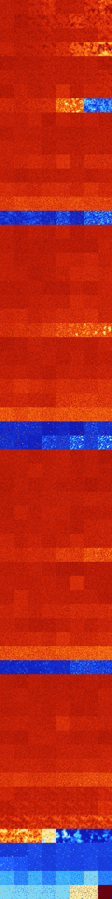

# B01458 (157184-157695)

<details>
    <summary>Initial Grid</summary>
    
</details>


<details>
    <summary>Initial Grid RLE</summary>

```
#C Exported from GoGoL (https://github.com/marrow16/gogol)
#C Wrap mode: Toroidal
#C Boundary mode: Dead
#C Step: 0
x = 100, y = 100, rule = B01458/S
16bo9bo2bo11bo7bo$12bo4bo5b2o27bo23bo3bo14bo$14bo7bo47b2o$36bo2bo11bo
23bo10bo8bo$15bo5bo2bo5bo42bo$2bo46bo10bo$o2bo43b2o10bo27bo11bo$2bo8bo
26bo14bo3bo2bo2bo8bo$44bo4bo32bo12bo$11bo17bo43bo$17bo8bo15bo35bo$bo13b
o4bo18bo29bo$22bo7bo5bo44bo6bo$17bo20b2o$11bo9bo74bo$13bo2bobo17bo13bo
39bo$16bo43bo17bo3bo$9bo21bo5bo2bo13bo3bo14bo15b2o3bobo$11bo17bo25bo22b
o$100b$2bo20bo38bo19bo$13bo22bo7bo6bo2bo5bo36bo$53bo2bo4bo2bo7bo16bo$bo
42bo4b2obo15bo12bo16bo$15bo37bo3bo$7bo38bo19bo12bo$23bo4bo7bo8bo15bo10b
o21bo$8bo60bobo3bo11bo$5bo9bo53bo28bo$34bo46bo$39bobo10bo7bo5bo4bo2bo$
2bo14bo14bo8bo6bo5bo20bo18bo$21b2o$27bo36bo4bobo$13bo48bo5bo8bo$3b2o10b
o40bo10bo24bo$7bo61bo13bo4bo$32bo9bo10bo11bo4bo5bo18bo$4bo21bo12bo19bo
4bo3bo5bo3b3o11bo$9bo35bo9bo$22bo6bo21bo9bobo29bo4bo$13bo5bo6bo9bo2bo
22b2o8bo10bo6bo5bo$18bo17bo7bo7bo22bo4bo2bo7bo$11bo55bo21bo$96bobo$27b
3o14bob2o17bo3bobo$26bo11bo32bo4bo4bo2bo$9bo2bo52bo3bo23bo$21bo4bo6bobo
38bo2bo8bo5bobo$bo20bo2bo58bo$13bo10bo11bo24bo4b2o7bo$11bo10bo6bo3bo13b
o23bo14bo$6bobo53bo$3bo2bo7bo3bo23bo4bobo14bo4bo17bo5b2obo$39bo26bo25bo
bo4bo$11b3o5bo17bo17b2o9bo28bo$13bo15bo8bo53bobo$10bo9bo2bo18bo8bo7bo
34bo$4bobo26bobo7bo11bo22bo17bo$82bo13bo$8bo16bo16bo5bo4bo30bo$6bo70bo
10bo$5bo5bo64bo6bo$15bo17bo27bo10bo2bo9b2o$3bobo7bo30b2o14bo4bo12bo$14b
o43bo$3bo16bo14bo14bo18bo7bo$2bo43bo4bo9bo4bo3bo$9bo7bo19bo14bo$20bo41b
obo$o5bo65bo$17b2o2bo7bo12bo7bo40bo$o15bo34b2o7bo$36bo3bo17b2o21bo6bo2b
o$14bo82bo$13bo36bo25bo18bo$9bo23bo5bobo22bo8bo$84bo$4bo3bo11bo3bo7bo
47bo14bo$28bo13bo8bo29bo2bobo$27bo35bo$11bo16bobo4bo13bo25bo20bo$2bo3bo
3b2o4bo17bo7bo3bo7bobo$34bo12b2o10bo25bo$9bo21bo18bo2bo2bo16bo20bo3bo$
7bo12bo17bo20bo25bo3bo$48bo40bo5bo$17bo42bo22bo$2bo2bo23bo27bo19bo12bo$
7bo26bo6bo11bo9bo$o32bo15bob2o22b2o8bo$14bo3bo5bo26bo32bo$11bo44bo23bo
5b2o$2bo20bo25bo10b2o8bo6bo5bo10bobo$42bo25bo15bo4bo2bobo$53bobo21bo20b
o$9bo14bo22bo12bo26bo3bo$17bo47bo4bo9bo4bo3bo$14bo27bo29bo$17bo9b2o5bo
3bo9bo2bo2bo5bo26bo2bo8bo!
```
</details>
<details>
    <summary>Thumbnail</summary>

</details>
<table>
<tr>
    <td><a href="./157184%20S%20Heat%20Map%20Activity.png"></a><br>S (157184)<br>G>1000</td>    <td><a href="./157185%20S0%20Heat%20Map%20Activity.png"></a><br>S0 (157185)<br>G>1000</td>    <td><a href="./157186%20S1%20Heat%20Map%20Activity.png"></a><br>S1 (157186)<br>G>1000</td>    <td><a href="./157187%20S01%20Heat%20Map%20Activity.png"></a><br>S01 (157187)<br>G>1000</td>    <td><a href="./157188%20S2%20Heat%20Map%20Activity.png"></a><br>S2 (157188)<br>G>1000</td>    <td><a href="./157189%20S02%20Heat%20Map%20Activity.png"></a><br>S02 (157189)<br>G>1000</td>    <td><a href="./157190%20S12%20Heat%20Map%20Activity.png"></a><br>S12 (157190)<br>G>1000</td>    <td><a href="./157191%20S012%20Heat%20Map%20Activity.png"></a><br>S012 (157191)<br>G>1000</td></tr>
<tr>
    <td><a href="./157192%20S3%20Heat%20Map%20Activity.png"></a><br>S3 (157192)<br>G>1000</td>    <td><a href="./157193%20S03%20Heat%20Map%20Activity.png"></a><br>S03 (157193)<br>G>1000</td>    <td><a href="./157194%20S13%20Heat%20Map%20Activity.png"></a><br>S13 (157194)<br>G>1000</td>    <td><a href="./157195%20S013%20Heat%20Map%20Activity.png"></a><br>S013 (157195)<br>G>1000</td>    <td><a href="./157196%20S23%20Heat%20Map%20Activity.png"></a><br>S23 (157196)<br>G>1000</td>    <td><a href="./157197%20S023%20Heat%20Map%20Activity.png"></a><br>S023 (157197)<br>G>1000</td>    <td><a href="./157198%20S123%20Heat%20Map%20Activity.png"></a><br>S123 (157198)<br>G>1000</td>    <td><a href="./157199%20S0123%20Heat%20Map%20Activity.png"></a><br>S0123 (157199)<br>G>1000</td></tr>
<tr>
    <td><a href="./157200%20S4%20Heat%20Map%20Activity.png"></a><br>S4 (157200)<br>G>1000</td>    <td><a href="./157201%20S04%20Heat%20Map%20Activity.png"></a><br>S04 (157201)<br>G>1000</td>    <td><a href="./157202%20S14%20Heat%20Map%20Activity.png"></a><br>S14 (157202)<br>G>1000</td>    <td><a href="./157203%20S014%20Heat%20Map%20Activity.png"></a><br>S014 (157203)<br>G>1000</td>    <td><a href="./157204%20S24%20Heat%20Map%20Activity.png"></a><br>S24 (157204)<br>G>1000</td>    <td><a href="./157205%20S024%20Heat%20Map%20Activity.png"></a><br>S024 (157205)<br>G>1000</td>    <td><a href="./157206%20S124%20Heat%20Map%20Activity.png"></a><br>S124 (157206)<br>G>1000</td>    <td><a href="./157207%20S0124%20Heat%20Map%20Activity.png"></a><br>S0124 (157207)<br>G>1000</td></tr>
<tr>
    <td><a href="./157208%20S34%20Heat%20Map%20Activity.png"></a><br>S34 (157208)<br>G>1000</td>    <td><a href="./157209%20S034%20Heat%20Map%20Activity.png"></a><br>S034 (157209)<br>G>1000</td>    <td><a href="./157210%20S134%20Heat%20Map%20Activity.png"></a><br>S134 (157210)<br>G>1000</td>    <td><a href="./157211%20S0134%20Heat%20Map%20Activity.png"></a><br>S0134 (157211)<br>G>1000</td>    <td><a href="./157212%20S234%20Heat%20Map%20Activity.png"></a><br>S234 (157212)<br>G>1000</td>    <td><a href="./157213%20S0234%20Heat%20Map%20Activity.png"></a><br>S0234 (157213)<br>G>1000</td>    <td><a href="./157214%20S1234%20Heat%20Map%20Activity.png"></a><br>S1234 (157214)<br>G>1000</td>    <td><a href="./157215%20S01234%20Heat%20Map%20Activity.png"></a><br>S01234 (157215)<br>G>1000</td></tr>
<tr>
    <td><a href="./157216%20S5%20Heat%20Map%20Activity.png"></a><br>S5 (157216)<br>G>1000</td>    <td><a href="./157217%20S05%20Heat%20Map%20Activity.png"></a><br>S05 (157217)<br>G>1000</td>    <td><a href="./157218%20S15%20Heat%20Map%20Activity.png"></a><br>S15 (157218)<br>G>1000</td>    <td><a href="./157219%20S015%20Heat%20Map%20Activity.png"></a><br>S015 (157219)<br>G>1000</td>    <td><a href="./157220%20S25%20Heat%20Map%20Activity.png"></a><br>S25 (157220)<br>G>1000</td>    <td><a href="./157221%20S025%20Heat%20Map%20Activity.png"></a><br>S025 (157221)<br>G>1000</td>    <td><a href="./157222%20S125%20Heat%20Map%20Activity.png"></a><br>S125 (157222)<br>G>1000</td>    <td><a href="./157223%20S0125%20Heat%20Map%20Activity.png"></a><br>S0125 (157223)<br>G>1000</td></tr>
<tr>
    <td><a href="./157224%20S35%20Heat%20Map%20Activity.png"></a><br>S35 (157224)<br>G>1000</td>    <td><a href="./157225%20S035%20Heat%20Map%20Activity.png"></a><br>S035 (157225)<br>G>1000</td>    <td><a href="./157226%20S135%20Heat%20Map%20Activity.png"></a><br>S135 (157226)<br>G>1000</td>    <td><a href="./157227%20S0135%20Heat%20Map%20Activity.png"></a><br>S0135 (157227)<br>G>1000</td>    <td><a href="./157228%20S235%20Heat%20Map%20Activity.png"></a><br>S235 (157228)<br>G>1000</td>    <td><a href="./157229%20S0235%20Heat%20Map%20Activity.png"></a><br>S0235 (157229)<br>G>1000</td>    <td><a href="./157230%20S1235%20Heat%20Map%20Activity.png"></a><br>S1235 (157230)<br>G>1000</td>    <td><a href="./157231%20S01235%20Heat%20Map%20Activity.png"></a><br>S01235 (157231)<br>G>1000</td></tr>
<tr>
    <td><a href="./157232%20S45%20Heat%20Map%20Activity.png"></a><br>S45 (157232)<br>G>1000</td>    <td><a href="./157233%20S045%20Heat%20Map%20Activity.png"></a><br>S045 (157233)<br>G>1000</td>    <td><a href="./157234%20S145%20Heat%20Map%20Activity.png"></a><br>S145 (157234)<br>G>1000</td>    <td><a href="./157235%20S0145%20Heat%20Map%20Activity.png"></a><br>S0145 (157235)<br>G>1000</td>    <td><a href="./157236%20S245%20Heat%20Map%20Activity.png"></a><br>S245 (157236)<br>G>1000</td>    <td><a href="./157237%20S0245%20Heat%20Map%20Activity.png"></a><br>S0245 (157237)<br>G>1000</td>    <td><a href="./157238%20S1245%20Heat%20Map%20Activity.png"></a><br>S1245 (157238)<br>G>1000</td>    <td><a href="./157239%20S01245%20Heat%20Map%20Activity.png"></a><br>S01245 (157239)<br>G>1000</td></tr>
<tr>
    <td><a href="./157240%20S345%20Heat%20Map%20Activity.png"></a><br>S345 (157240)<br>G>1000</td>    <td><a href="./157241%20S0345%20Heat%20Map%20Activity.png"></a><br>S0345 (157241)<br>G>1000</td>    <td><a href="./157242%20S1345%20Heat%20Map%20Activity.png"></a><br>S1345 (157242)<br>G>1000</td>    <td><a href="./157243%20S01345%20Heat%20Map%20Activity.png"></a><br>S01345 (157243)<br>G>1000</td>    <td><a href="./157244%20S2345%20Heat%20Map%20Activity.png"></a><br>S2345 (157244)<br>G>1000</td>    <td><a href="./157245%20S02345%20Heat%20Map%20Activity.png"></a><br>S02345 (157245)<br>G>1000</td>    <td><a href="./157246%20S12345%20Heat%20Map%20Activity.png"></a><br>S12345 (157246)<br>G>1000</td>    <td><a href="./157247%20S012345%20Heat%20Map%20Activity.png"></a><br>S012345 (157247)<br>G>1000</td></tr>
<tr>
    <td><a href="./157248%20S6%20Heat%20Map%20Activity.png"></a><br>S6 (157248)<br>G>1000</td>    <td><a href="./157249%20S06%20Heat%20Map%20Activity.png"></a><br>S06 (157249)<br>G>1000</td>    <td><a href="./157250%20S16%20Heat%20Map%20Activity.png"></a><br>S16 (157250)<br>G>1000</td>    <td><a href="./157251%20S016%20Heat%20Map%20Activity.png"></a><br>S016 (157251)<br>G>1000</td>    <td><a href="./157252%20S26%20Heat%20Map%20Activity.png"></a><br>S26 (157252)<br>G>1000</td>    <td><a href="./157253%20S026%20Heat%20Map%20Activity.png"></a><br>S026 (157253)<br>G>1000</td>    <td><a href="./157254%20S126%20Heat%20Map%20Activity.png"></a><br>S126 (157254)<br>G>1000</td>    <td><a href="./157255%20S0126%20Heat%20Map%20Activity.png"></a><br>S0126 (157255)<br>G>1000</td></tr>
<tr>
    <td><a href="./157256%20S36%20Heat%20Map%20Activity.png"></a><br>S36 (157256)<br>G>1000</td>    <td><a href="./157257%20S036%20Heat%20Map%20Activity.png"></a><br>S036 (157257)<br>G>1000</td>    <td><a href="./157258%20S136%20Heat%20Map%20Activity.png"></a><br>S136 (157258)<br>G>1000</td>    <td><a href="./157259%20S0136%20Heat%20Map%20Activity.png"></a><br>S0136 (157259)<br>G>1000</td>    <td><a href="./157260%20S236%20Heat%20Map%20Activity.png"></a><br>S236 (157260)<br>G>1000</td>    <td><a href="./157261%20S0236%20Heat%20Map%20Activity.png"></a><br>S0236 (157261)<br>G>1000</td>    <td><a href="./157262%20S1236%20Heat%20Map%20Activity.png"></a><br>S1236 (157262)<br>G>1000</td>    <td><a href="./157263%20S01236%20Heat%20Map%20Activity.png"></a><br>S01236 (157263)<br>G>1000</td></tr>
<tr>
    <td><a href="./157264%20S46%20Heat%20Map%20Activity.png"></a><br>S46 (157264)<br>G>1000</td>    <td><a href="./157265%20S046%20Heat%20Map%20Activity.png"></a><br>S046 (157265)<br>G>1000</td>    <td><a href="./157266%20S146%20Heat%20Map%20Activity.png"></a><br>S146 (157266)<br>G>1000</td>    <td><a href="./157267%20S0146%20Heat%20Map%20Activity.png"></a><br>S0146 (157267)<br>G>1000</td>    <td><a href="./157268%20S246%20Heat%20Map%20Activity.png"></a><br>S246 (157268)<br>G>1000</td>    <td><a href="./157269%20S0246%20Heat%20Map%20Activity.png"></a><br>S0246 (157269)<br>G>1000</td>    <td><a href="./157270%20S1246%20Heat%20Map%20Activity.png"></a><br>S1246 (157270)<br>G>1000</td>    <td><a href="./157271%20S01246%20Heat%20Map%20Activity.png"></a><br>S01246 (157271)<br>G>1000</td></tr>
<tr>
    <td><a href="./157272%20S346%20Heat%20Map%20Activity.png"></a><br>S346 (157272)<br>G>1000</td>    <td><a href="./157273%20S0346%20Heat%20Map%20Activity.png"></a><br>S0346 (157273)<br>G>1000</td>    <td><a href="./157274%20S1346%20Heat%20Map%20Activity.png"></a><br>S1346 (157274)<br>G>1000</td>    <td><a href="./157275%20S01346%20Heat%20Map%20Activity.png"></a><br>S01346 (157275)<br>G>1000</td>    <td><a href="./157276%20S2346%20Heat%20Map%20Activity.png"></a><br>S2346 (157276)<br>G>1000</td>    <td><a href="./157277%20S02346%20Heat%20Map%20Activity.png"></a><br>S02346 (157277)<br>G>1000</td>    <td><a href="./157278%20S12346%20Heat%20Map%20Activity.png"></a><br>S12346 (157278)<br>G>1000</td>    <td><a href="./157279%20S012346%20Heat%20Map%20Activity.png"></a><br>S012346 (157279)<br>G>1000</td></tr>
<tr>
    <td><a href="./157280%20S56%20Heat%20Map%20Activity.png"></a><br>S56 (157280)<br>G>1000</td>    <td><a href="./157281%20S056%20Heat%20Map%20Activity.png"></a><br>S056 (157281)<br>G>1000</td>    <td><a href="./157282%20S156%20Heat%20Map%20Activity.png"></a><br>S156 (157282)<br>G>1000</td>    <td><a href="./157283%20S0156%20Heat%20Map%20Activity.png"></a><br>S0156 (157283)<br>G>1000</td>    <td><a href="./157284%20S256%20Heat%20Map%20Activity.png"></a><br>S256 (157284)<br>G>1000</td>    <td><a href="./157285%20S0256%20Heat%20Map%20Activity.png"></a><br>S0256 (157285)<br>G>1000</td>    <td><a href="./157286%20S1256%20Heat%20Map%20Activity.png"></a><br>S1256 (157286)<br>G>1000</td>    <td><a href="./157287%20S01256%20Heat%20Map%20Activity.png"></a><br>S01256 (157287)<br>G>1000</td></tr>
<tr>
    <td><a href="./157288%20S356%20Heat%20Map%20Activity.png"></a><br>S356 (157288)<br>G>1000</td>    <td><a href="./157289%20S0356%20Heat%20Map%20Activity.png"></a><br>S0356 (157289)<br>G>1000</td>    <td><a href="./157290%20S1356%20Heat%20Map%20Activity.png"></a><br>S1356 (157290)<br>G>1000</td>    <td><a href="./157291%20S01356%20Heat%20Map%20Activity.png"></a><br>S01356 (157291)<br>G>1000</td>    <td><a href="./157292%20S2356%20Heat%20Map%20Activity.png"></a><br>S2356 (157292)<br>G>1000</td>    <td><a href="./157293%20S02356%20Heat%20Map%20Activity.png"></a><br>S02356 (157293)<br>G>1000</td>    <td><a href="./157294%20S12356%20Heat%20Map%20Activity.png"></a><br>S12356 (157294)<br>G>1000</td>    <td><a href="./157295%20S012356%20Heat%20Map%20Activity.png"></a><br>S012356 (157295)<br>G>1000</td></tr>
<tr>
    <td><a href="./157296%20S456%20Heat%20Map%20Activity.png"></a><br>S456 (157296)<br>G>1000</td>    <td><a href="./157297%20S0456%20Heat%20Map%20Activity.png"></a><br>S0456 (157297)<br>G>1000</td>    <td><a href="./157298%20S1456%20Heat%20Map%20Activity.png"></a><br>S1456 (157298)<br>G>1000</td>    <td><a href="./157299%20S01456%20Heat%20Map%20Activity.png"></a><br>S01456 (157299)<br>G>1000</td>    <td><a href="./157300%20S2456%20Heat%20Map%20Activity.png"></a><br>S2456 (157300)<br>G>1000</td>    <td><a href="./157301%20S02456%20Heat%20Map%20Activity.png"></a><br>S02456 (157301)<br>G>1000</td>    <td><a href="./157302%20S12456%20Heat%20Map%20Activity.png"></a><br>S12456 (157302)<br>G>1000</td>    <td><a href="./157303%20S012456%20Heat%20Map%20Activity.png"></a><br>S012456 (157303)<br>G>1000</td></tr>
<tr>
    <td><a href="./157304%20S3456%20Heat%20Map%20Activity.png"></a><br>S3456 (157304)<br>R@689,p60</td>    <td><a href="./157305%20S03456%20Heat%20Map%20Activity.png"></a><br>S03456 (157305)<br>R@915,p60</td>    <td><a href="./157306%20S13456%20Heat%20Map%20Activity.png"></a><br>S13456 (157306)<br>R@437,p60</td>    <td><a href="./157307%20S013456%20Heat%20Map%20Activity.png"></a><br>S013456 (157307)<br>R@941,p420</td>    <td><a href="./157308%20S23456%20Heat%20Map%20Activity.png"></a><br>S23456 (157308)<br>R@62,p24</td>    <td><a href="./157309%20S023456%20Heat%20Map%20Activity.png"></a><br>S023456 (157309)<br>R@177,p120</td>    <td><a href="./157310%20S123456%20Heat%20Map%20Activity.png"></a><br>S123456 (157310)<br>R@47,p12</td>    <td><a href="./157311%20S0123456%20Heat%20Map%20Activity.png"></a><br>S0123456 (157311)<br>R@44,p12</td></tr>
<tr>
    <td><a href="./157312%20S7%20Heat%20Map%20Activity.png"></a><br>S7 (157312)<br>G>1000</td>    <td><a href="./157313%20S07%20Heat%20Map%20Activity.png"></a><br>S07 (157313)<br>G>1000</td>    <td><a href="./157314%20S17%20Heat%20Map%20Activity.png"></a><br>S17 (157314)<br>G>1000</td>    <td><a href="./157315%20S017%20Heat%20Map%20Activity.png"></a><br>S017 (157315)<br>G>1000</td>    <td><a href="./157316%20S27%20Heat%20Map%20Activity.png"></a><br>S27 (157316)<br>G>1000</td>    <td><a href="./157317%20S027%20Heat%20Map%20Activity.png"></a><br>S027 (157317)<br>G>1000</td>    <td><a href="./157318%20S127%20Heat%20Map%20Activity.png"></a><br>S127 (157318)<br>G>1000</td>    <td><a href="./157319%20S0127%20Heat%20Map%20Activity.png"></a><br>S0127 (157319)<br>G>1000</td></tr>
<tr>
    <td><a href="./157320%20S37%20Heat%20Map%20Activity.png"></a><br>S37 (157320)<br>G>1000</td>    <td><a href="./157321%20S037%20Heat%20Map%20Activity.png"></a><br>S037 (157321)<br>G>1000</td>    <td><a href="./157322%20S137%20Heat%20Map%20Activity.png"></a><br>S137 (157322)<br>G>1000</td>    <td><a href="./157323%20S0137%20Heat%20Map%20Activity.png"></a><br>S0137 (157323)<br>G>1000</td>    <td><a href="./157324%20S237%20Heat%20Map%20Activity.png"></a><br>S237 (157324)<br>G>1000</td>    <td><a href="./157325%20S0237%20Heat%20Map%20Activity.png"></a><br>S0237 (157325)<br>G>1000</td>    <td><a href="./157326%20S1237%20Heat%20Map%20Activity.png"></a><br>S1237 (157326)<br>G>1000</td>    <td><a href="./157327%20S01237%20Heat%20Map%20Activity.png"></a><br>S01237 (157327)<br>G>1000</td></tr>
<tr>
    <td><a href="./157328%20S47%20Heat%20Map%20Activity.png"></a><br>S47 (157328)<br>G>1000</td>    <td><a href="./157329%20S047%20Heat%20Map%20Activity.png"></a><br>S047 (157329)<br>G>1000</td>    <td><a href="./157330%20S147%20Heat%20Map%20Activity.png"></a><br>S147 (157330)<br>G>1000</td>    <td><a href="./157331%20S0147%20Heat%20Map%20Activity.png"></a><br>S0147 (157331)<br>G>1000</td>    <td><a href="./157332%20S247%20Heat%20Map%20Activity.png"></a><br>S247 (157332)<br>G>1000</td>    <td><a href="./157333%20S0247%20Heat%20Map%20Activity.png"></a><br>S0247 (157333)<br>G>1000</td>    <td><a href="./157334%20S1247%20Heat%20Map%20Activity.png"></a><br>S1247 (157334)<br>G>1000</td>    <td><a href="./157335%20S01247%20Heat%20Map%20Activity.png"></a><br>S01247 (157335)<br>G>1000</td></tr>
<tr>
    <td><a href="./157336%20S347%20Heat%20Map%20Activity.png"></a><br>S347 (157336)<br>G>1000</td>    <td><a href="./157337%20S0347%20Heat%20Map%20Activity.png"></a><br>S0347 (157337)<br>G>1000</td>    <td><a href="./157338%20S1347%20Heat%20Map%20Activity.png"></a><br>S1347 (157338)<br>G>1000</td>    <td><a href="./157339%20S01347%20Heat%20Map%20Activity.png"></a><br>S01347 (157339)<br>G>1000</td>    <td><a href="./157340%20S2347%20Heat%20Map%20Activity.png"></a><br>S2347 (157340)<br>G>1000</td>    <td><a href="./157341%20S02347%20Heat%20Map%20Activity.png"></a><br>S02347 (157341)<br>G>1000</td>    <td><a href="./157342%20S12347%20Heat%20Map%20Activity.png"></a><br>S12347 (157342)<br>G>1000</td>    <td><a href="./157343%20S012347%20Heat%20Map%20Activity.png"></a><br>S012347 (157343)<br>G>1000</td></tr>
<tr>
    <td><a href="./157344%20S57%20Heat%20Map%20Activity.png"></a><br>S57 (157344)<br>G>1000</td>    <td><a href="./157345%20S057%20Heat%20Map%20Activity.png"></a><br>S057 (157345)<br>G>1000</td>    <td><a href="./157346%20S157%20Heat%20Map%20Activity.png"></a><br>S157 (157346)<br>G>1000</td>    <td><a href="./157347%20S0157%20Heat%20Map%20Activity.png"></a><br>S0157 (157347)<br>G>1000</td>    <td><a href="./157348%20S257%20Heat%20Map%20Activity.png"></a><br>S257 (157348)<br>G>1000</td>    <td><a href="./157349%20S0257%20Heat%20Map%20Activity.png"></a><br>S0257 (157349)<br>G>1000</td>    <td><a href="./157350%20S1257%20Heat%20Map%20Activity.png"></a><br>S1257 (157350)<br>G>1000</td>    <td><a href="./157351%20S01257%20Heat%20Map%20Activity.png"></a><br>S01257 (157351)<br>G>1000</td></tr>
<tr>
    <td><a href="./157352%20S357%20Heat%20Map%20Activity.png"></a><br>S357 (157352)<br>G>1000</td>    <td><a href="./157353%20S0357%20Heat%20Map%20Activity.png"></a><br>S0357 (157353)<br>G>1000</td>    <td><a href="./157354%20S1357%20Heat%20Map%20Activity.png"></a><br>S1357 (157354)<br>G>1000</td>    <td><a href="./157355%20S01357%20Heat%20Map%20Activity.png"></a><br>S01357 (157355)<br>G>1000</td>    <td><a href="./157356%20S2357%20Heat%20Map%20Activity.png"></a><br>S2357 (157356)<br>G>1000</td>    <td><a href="./157357%20S02357%20Heat%20Map%20Activity.png"></a><br>S02357 (157357)<br>G>1000</td>    <td><a href="./157358%20S12357%20Heat%20Map%20Activity.png"></a><br>S12357 (157358)<br>G>1000</td>    <td><a href="./157359%20S012357%20Heat%20Map%20Activity.png"></a><br>S012357 (157359)<br>G>1000</td></tr>
<tr>
    <td><a href="./157360%20S457%20Heat%20Map%20Activity.png"></a><br>S457 (157360)<br>G>1000</td>    <td><a href="./157361%20S0457%20Heat%20Map%20Activity.png"></a><br>S0457 (157361)<br>G>1000</td>    <td><a href="./157362%20S1457%20Heat%20Map%20Activity.png"></a><br>S1457 (157362)<br>G>1000</td>    <td><a href="./157363%20S01457%20Heat%20Map%20Activity.png"></a><br>S01457 (157363)<br>G>1000</td>    <td><a href="./157364%20S2457%20Heat%20Map%20Activity.png"></a><br>S2457 (157364)<br>G>1000</td>    <td><a href="./157365%20S02457%20Heat%20Map%20Activity.png"></a><br>S02457 (157365)<br>G>1000</td>    <td><a href="./157366%20S12457%20Heat%20Map%20Activity.png"></a><br>S12457 (157366)<br>G>1000</td>    <td><a href="./157367%20S012457%20Heat%20Map%20Activity.png"></a><br>S012457 (157367)<br>G>1000</td></tr>
<tr>
    <td><a href="./157368%20S3457%20Heat%20Map%20Activity.png"></a><br>S3457 (157368)<br>G>1000</td>    <td><a href="./157369%20S03457%20Heat%20Map%20Activity.png"></a><br>S03457 (157369)<br>G>1000</td>    <td><a href="./157370%20S13457%20Heat%20Map%20Activity.png"></a><br>S13457 (157370)<br>G>1000</td>    <td><a href="./157371%20S013457%20Heat%20Map%20Activity.png"></a><br>S013457 (157371)<br>G>1000</td>    <td><a href="./157372%20S23457%20Heat%20Map%20Activity.png"></a><br>S23457 (157372)<br>G>1000</td>    <td><a href="./157373%20S023457%20Heat%20Map%20Activity.png"></a><br>S023457 (157373)<br>G>1000</td>    <td><a href="./157374%20S123457%20Heat%20Map%20Activity.png"></a><br>S123457 (157374)<br>G>1000</td>    <td><a href="./157375%20S0123457%20Heat%20Map%20Activity.png"></a><br>S0123457 (157375)<br>G>1000</td></tr>
<tr>
    <td><a href="./157376%20S67%20Heat%20Map%20Activity.png"></a><br>S67 (157376)<br>G>1000</td>    <td><a href="./157377%20S067%20Heat%20Map%20Activity.png"></a><br>S067 (157377)<br>G>1000</td>    <td><a href="./157378%20S167%20Heat%20Map%20Activity.png"></a><br>S167 (157378)<br>G>1000</td>    <td><a href="./157379%20S0167%20Heat%20Map%20Activity.png"></a><br>S0167 (157379)<br>G>1000</td>    <td><a href="./157380%20S267%20Heat%20Map%20Activity.png"></a><br>S267 (157380)<br>G>1000</td>    <td><a href="./157381%20S0267%20Heat%20Map%20Activity.png"></a><br>S0267 (157381)<br>G>1000</td>    <td><a href="./157382%20S1267%20Heat%20Map%20Activity.png"></a><br>S1267 (157382)<br>G>1000</td>    <td><a href="./157383%20S01267%20Heat%20Map%20Activity.png"></a><br>S01267 (157383)<br>G>1000</td></tr>
<tr>
    <td><a href="./157384%20S367%20Heat%20Map%20Activity.png"></a><br>S367 (157384)<br>G>1000</td>    <td><a href="./157385%20S0367%20Heat%20Map%20Activity.png"></a><br>S0367 (157385)<br>G>1000</td>    <td><a href="./157386%20S1367%20Heat%20Map%20Activity.png"></a><br>S1367 (157386)<br>G>1000</td>    <td><a href="./157387%20S01367%20Heat%20Map%20Activity.png"></a><br>S01367 (157387)<br>G>1000</td>    <td><a href="./157388%20S2367%20Heat%20Map%20Activity.png"></a><br>S2367 (157388)<br>G>1000</td>    <td><a href="./157389%20S02367%20Heat%20Map%20Activity.png"></a><br>S02367 (157389)<br>G>1000</td>    <td><a href="./157390%20S12367%20Heat%20Map%20Activity.png"></a><br>S12367 (157390)<br>G>1000</td>    <td><a href="./157391%20S012367%20Heat%20Map%20Activity.png"></a><br>S012367 (157391)<br>G>1000</td></tr>
<tr>
    <td><a href="./157392%20S467%20Heat%20Map%20Activity.png"></a><br>S467 (157392)<br>G>1000</td>    <td><a href="./157393%20S0467%20Heat%20Map%20Activity.png"></a><br>S0467 (157393)<br>G>1000</td>    <td><a href="./157394%20S1467%20Heat%20Map%20Activity.png"></a><br>S1467 (157394)<br>G>1000</td>    <td><a href="./157395%20S01467%20Heat%20Map%20Activity.png"></a><br>S01467 (157395)<br>G>1000</td>    <td><a href="./157396%20S2467%20Heat%20Map%20Activity.png"></a><br>S2467 (157396)<br>G>1000</td>    <td><a href="./157397%20S02467%20Heat%20Map%20Activity.png"></a><br>S02467 (157397)<br>G>1000</td>    <td><a href="./157398%20S12467%20Heat%20Map%20Activity.png"></a><br>S12467 (157398)<br>G>1000</td>    <td><a href="./157399%20S012467%20Heat%20Map%20Activity.png"></a><br>S012467 (157399)<br>G>1000</td></tr>
<tr>
    <td><a href="./157400%20S3467%20Heat%20Map%20Activity.png"></a><br>S3467 (157400)<br>G>1000</td>    <td><a href="./157401%20S03467%20Heat%20Map%20Activity.png"></a><br>S03467 (157401)<br>G>1000</td>    <td><a href="./157402%20S13467%20Heat%20Map%20Activity.png"></a><br>S13467 (157402)<br>G>1000</td>    <td><a href="./157403%20S013467%20Heat%20Map%20Activity.png"></a><br>S013467 (157403)<br>G>1000</td>    <td><a href="./157404%20S23467%20Heat%20Map%20Activity.png"></a><br>S23467 (157404)<br>G>1000</td>    <td><a href="./157405%20S023467%20Heat%20Map%20Activity.png"></a><br>S023467 (157405)<br>G>1000</td>    <td><a href="./157406%20S123467%20Heat%20Map%20Activity.png"></a><br>S123467 (157406)<br>G>1000</td>    <td><a href="./157407%20S0123467%20Heat%20Map%20Activity.png"></a><br>S0123467 (157407)<br>G>1000</td></tr>
<tr>
    <td><a href="./157408%20S567%20Heat%20Map%20Activity.png"></a><br>S567 (157408)<br>G>1000</td>    <td><a href="./157409%20S0567%20Heat%20Map%20Activity.png"></a><br>S0567 (157409)<br>G>1000</td>    <td><a href="./157410%20S1567%20Heat%20Map%20Activity.png"></a><br>S1567 (157410)<br>G>1000</td>    <td><a href="./157411%20S01567%20Heat%20Map%20Activity.png"></a><br>S01567 (157411)<br>G>1000</td>    <td><a href="./157412%20S2567%20Heat%20Map%20Activity.png"></a><br>S2567 (157412)<br>G>1000</td>    <td><a href="./157413%20S02567%20Heat%20Map%20Activity.png"></a><br>S02567 (157413)<br>G>1000</td>    <td><a href="./157414%20S12567%20Heat%20Map%20Activity.png"></a><br>S12567 (157414)<br>G>1000</td>    <td><a href="./157415%20S012567%20Heat%20Map%20Activity.png"></a><br>S012567 (157415)<br>G>1000</td></tr>
<tr>
    <td><a href="./157416%20S3567%20Heat%20Map%20Activity.png"></a><br>S3567 (157416)<br>G>1000</td>    <td><a href="./157417%20S03567%20Heat%20Map%20Activity.png"></a><br>S03567 (157417)<br>G>1000</td>    <td><a href="./157418%20S13567%20Heat%20Map%20Activity.png"></a><br>S13567 (157418)<br>G>1000</td>    <td><a href="./157419%20S013567%20Heat%20Map%20Activity.png"></a><br>S013567 (157419)<br>G>1000</td>    <td><a href="./157420%20S23567%20Heat%20Map%20Activity.png"></a><br>S23567 (157420)<br>G>1000</td>    <td><a href="./157421%20S023567%20Heat%20Map%20Activity.png"></a><br>S023567 (157421)<br>G>1000</td>    <td><a href="./157422%20S123567%20Heat%20Map%20Activity.png"></a><br>S123567 (157422)<br>G>1000</td>    <td><a href="./157423%20S0123567%20Heat%20Map%20Activity.png"></a><br>S0123567 (157423)<br>G>1000</td></tr>
<tr>
    <td><a href="./157424%20S4567%20Heat%20Map%20Activity.png"></a><br>S4567 (157424)<br>R@118,p60</td>    <td><a href="./157425%20S04567%20Heat%20Map%20Activity.png"></a><br>S04567 (157425)<br>R@115,p60</td>    <td><a href="./157426%20S14567%20Heat%20Map%20Activity.png"></a><br>S14567 (157426)<br>R@109,p60</td>    <td><a href="./157427%20S014567%20Heat%20Map%20Activity.png"></a><br>S014567 (157427)<br>R@469,p420</td>    <td><a href="./157428%20S24567%20Heat%20Map%20Activity.png"></a><br>S24567 (157428)<br>R@164,p120</td>    <td><a href="./157429%20S024567%20Heat%20Map%20Activity.png"></a><br>S024567 (157429)<br>R@496,p420</td>    <td><a href="./157430%20S124567%20Heat%20Map%20Activity.png"></a><br>S124567 (157430)<br>R@58,p12</td>    <td><a href="./157431%20S0124567%20Heat%20Map%20Activity.png"></a><br>S0124567 (157431)<br>R@104,p60</td></tr>
<tr>
    <td><a href="./157432%20S34567%20Heat%20Map%20Activity.png"></a><br>S34567 (157432)<br>R@52,p24</td>    <td><a href="./157433%20S034567%20Heat%20Map%20Activity.png"></a><br>S034567 (157433)<br>R@108,p84</td>    <td><a href="./157434%20S134567%20Heat%20Map%20Activity.png"></a><br>S134567 (157434)<br>R@117,p84</td>    <td><a href="./157435%20S0134567%20Heat%20Map%20Activity.png"></a><br>S0134567 (157435)<br>R@41,p12</td>    <td><a href="./157436%20S234567%20Heat%20Map%20Activity.png"></a><br>S234567 (157436)<br>R@32,p12</td>    <td><a href="./157437%20S0234567%20Heat%20Map%20Activity.png"></a><br>S0234567 (157437)<br>R@21,p6</td>    <td><a href="./157438%20S1234567%20Heat%20Map%20Activity.png"></a><br>S1234567 (157438)<br>R@28,p12</td>    <td><a href="./157439%20S01234567%20Heat%20Map%20Activity.png"></a><br>S01234567 (157439)<br>R@19,p6</td></tr>
<tr>
    <td><a href="./157440%20S8%20Heat%20Map%20Activity.png"></a><br>S8 (157440)<br>G>1000</td>    <td><a href="./157441%20S08%20Heat%20Map%20Activity.png"></a><br>S08 (157441)<br>G>1000</td>    <td><a href="./157442%20S18%20Heat%20Map%20Activity.png"></a><br>S18 (157442)<br>G>1000</td>    <td><a href="./157443%20S018%20Heat%20Map%20Activity.png"></a><br>S018 (157443)<br>G>1000</td>    <td><a href="./157444%20S28%20Heat%20Map%20Activity.png"></a><br>S28 (157444)<br>G>1000</td>    <td><a href="./157445%20S028%20Heat%20Map%20Activity.png"></a><br>S028 (157445)<br>G>1000</td>    <td><a href="./157446%20S128%20Heat%20Map%20Activity.png"></a><br>S128 (157446)<br>G>1000</td>    <td><a href="./157447%20S0128%20Heat%20Map%20Activity.png"></a><br>S0128 (157447)<br>G>1000</td></tr>
<tr>
    <td><a href="./157448%20S38%20Heat%20Map%20Activity.png"></a><br>S38 (157448)<br>G>1000</td>    <td><a href="./157449%20S038%20Heat%20Map%20Activity.png"></a><br>S038 (157449)<br>G>1000</td>    <td><a href="./157450%20S138%20Heat%20Map%20Activity.png"></a><br>S138 (157450)<br>G>1000</td>    <td><a href="./157451%20S0138%20Heat%20Map%20Activity.png"></a><br>S0138 (157451)<br>G>1000</td>    <td><a href="./157452%20S238%20Heat%20Map%20Activity.png"></a><br>S238 (157452)<br>G>1000</td>    <td><a href="./157453%20S0238%20Heat%20Map%20Activity.png"></a><br>S0238 (157453)<br>G>1000</td>    <td><a href="./157454%20S1238%20Heat%20Map%20Activity.png"></a><br>S1238 (157454)<br>G>1000</td>    <td><a href="./157455%20S01238%20Heat%20Map%20Activity.png"></a><br>S01238 (157455)<br>G>1000</td></tr>
<tr>
    <td><a href="./157456%20S48%20Heat%20Map%20Activity.png"></a><br>S48 (157456)<br>G>1000</td>    <td><a href="./157457%20S048%20Heat%20Map%20Activity.png"></a><br>S048 (157457)<br>G>1000</td>    <td><a href="./157458%20S148%20Heat%20Map%20Activity.png"></a><br>S148 (157458)<br>G>1000</td>    <td><a href="./157459%20S0148%20Heat%20Map%20Activity.png"></a><br>S0148 (157459)<br>G>1000</td>    <td><a href="./157460%20S248%20Heat%20Map%20Activity.png"></a><br>S248 (157460)<br>G>1000</td>    <td><a href="./157461%20S0248%20Heat%20Map%20Activity.png"></a><br>S0248 (157461)<br>G>1000</td>    <td><a href="./157462%20S1248%20Heat%20Map%20Activity.png"></a><br>S1248 (157462)<br>G>1000</td>    <td><a href="./157463%20S01248%20Heat%20Map%20Activity.png"></a><br>S01248 (157463)<br>G>1000</td></tr>
<tr>
    <td><a href="./157464%20S348%20Heat%20Map%20Activity.png"></a><br>S348 (157464)<br>G>1000</td>    <td><a href="./157465%20S0348%20Heat%20Map%20Activity.png"></a><br>S0348 (157465)<br>G>1000</td>    <td><a href="./157466%20S1348%20Heat%20Map%20Activity.png"></a><br>S1348 (157466)<br>G>1000</td>    <td><a href="./157467%20S01348%20Heat%20Map%20Activity.png"></a><br>S01348 (157467)<br>G>1000</td>    <td><a href="./157468%20S2348%20Heat%20Map%20Activity.png"></a><br>S2348 (157468)<br>G>1000</td>    <td><a href="./157469%20S02348%20Heat%20Map%20Activity.png"></a><br>S02348 (157469)<br>G>1000</td>    <td><a href="./157470%20S12348%20Heat%20Map%20Activity.png"></a><br>S12348 (157470)<br>G>1000</td>    <td><a href="./157471%20S012348%20Heat%20Map%20Activity.png"></a><br>S012348 (157471)<br>G>1000</td></tr>
<tr>
    <td><a href="./157472%20S58%20Heat%20Map%20Activity.png"></a><br>S58 (157472)<br>G>1000</td>    <td><a href="./157473%20S058%20Heat%20Map%20Activity.png"></a><br>S058 (157473)<br>G>1000</td>    <td><a href="./157474%20S158%20Heat%20Map%20Activity.png"></a><br>S158 (157474)<br>G>1000</td>    <td><a href="./157475%20S0158%20Heat%20Map%20Activity.png"></a><br>S0158 (157475)<br>G>1000</td>    <td><a href="./157476%20S258%20Heat%20Map%20Activity.png"></a><br>S258 (157476)<br>G>1000</td>    <td><a href="./157477%20S0258%20Heat%20Map%20Activity.png"></a><br>S0258 (157477)<br>G>1000</td>    <td><a href="./157478%20S1258%20Heat%20Map%20Activity.png"></a><br>S1258 (157478)<br>G>1000</td>    <td><a href="./157479%20S01258%20Heat%20Map%20Activity.png"></a><br>S01258 (157479)<br>G>1000</td></tr>
<tr>
    <td><a href="./157480%20S358%20Heat%20Map%20Activity.png"></a><br>S358 (157480)<br>G>1000</td>    <td><a href="./157481%20S0358%20Heat%20Map%20Activity.png"></a><br>S0358 (157481)<br>G>1000</td>    <td><a href="./157482%20S1358%20Heat%20Map%20Activity.png"></a><br>S1358 (157482)<br>G>1000</td>    <td><a href="./157483%20S01358%20Heat%20Map%20Activity.png"></a><br>S01358 (157483)<br>G>1000</td>    <td><a href="./157484%20S2358%20Heat%20Map%20Activity.png"></a><br>S2358 (157484)<br>G>1000</td>    <td><a href="./157485%20S02358%20Heat%20Map%20Activity.png"></a><br>S02358 (157485)<br>G>1000</td>    <td><a href="./157486%20S12358%20Heat%20Map%20Activity.png"></a><br>S12358 (157486)<br>G>1000</td>    <td><a href="./157487%20S012358%20Heat%20Map%20Activity.png"></a><br>S012358 (157487)<br>G>1000</td></tr>
<tr>
    <td><a href="./157488%20S458%20Heat%20Map%20Activity.png"></a><br>S458 (157488)<br>G>1000</td>    <td><a href="./157489%20S0458%20Heat%20Map%20Activity.png"></a><br>S0458 (157489)<br>G>1000</td>    <td><a href="./157490%20S1458%20Heat%20Map%20Activity.png"></a><br>S1458 (157490)<br>G>1000</td>    <td><a href="./157491%20S01458%20Heat%20Map%20Activity.png"></a><br>S01458 (157491)<br>G>1000</td>    <td><a href="./157492%20S2458%20Heat%20Map%20Activity.png"></a><br>S2458 (157492)<br>G>1000</td>    <td><a href="./157493%20S02458%20Heat%20Map%20Activity.png"></a><br>S02458 (157493)<br>G>1000</td>    <td><a href="./157494%20S12458%20Heat%20Map%20Activity.png"></a><br>S12458 (157494)<br>G>1000</td>    <td><a href="./157495%20S012458%20Heat%20Map%20Activity.png"></a><br>S012458 (157495)<br>G>1000</td></tr>
<tr>
    <td><a href="./157496%20S3458%20Heat%20Map%20Activity.png"></a><br>S3458 (157496)<br>G>1000</td>    <td><a href="./157497%20S03458%20Heat%20Map%20Activity.png"></a><br>S03458 (157497)<br>G>1000</td>    <td><a href="./157498%20S13458%20Heat%20Map%20Activity.png"></a><br>S13458 (157498)<br>G>1000</td>    <td><a href="./157499%20S013458%20Heat%20Map%20Activity.png"></a><br>S013458 (157499)<br>G>1000</td>    <td><a href="./157500%20S23458%20Heat%20Map%20Activity.png"></a><br>S23458 (157500)<br>G>1000</td>    <td><a href="./157501%20S023458%20Heat%20Map%20Activity.png"></a><br>S023458 (157501)<br>G>1000</td>    <td><a href="./157502%20S123458%20Heat%20Map%20Activity.png"></a><br>S123458 (157502)<br>G>1000</td>    <td><a href="./157503%20S0123458%20Heat%20Map%20Activity.png"></a><br>S0123458 (157503)<br>G>1000</td></tr>
<tr>
    <td><a href="./157504%20S68%20Heat%20Map%20Activity.png"></a><br>S68 (157504)<br>G>1000</td>    <td><a href="./157505%20S068%20Heat%20Map%20Activity.png"></a><br>S068 (157505)<br>G>1000</td>    <td><a href="./157506%20S168%20Heat%20Map%20Activity.png"></a><br>S168 (157506)<br>G>1000</td>    <td><a href="./157507%20S0168%20Heat%20Map%20Activity.png"></a><br>S0168 (157507)<br>G>1000</td>    <td><a href="./157508%20S268%20Heat%20Map%20Activity.png"></a><br>S268 (157508)<br>G>1000</td>    <td><a href="./157509%20S0268%20Heat%20Map%20Activity.png"></a><br>S0268 (157509)<br>G>1000</td>    <td><a href="./157510%20S1268%20Heat%20Map%20Activity.png"></a><br>S1268 (157510)<br>G>1000</td>    <td><a href="./157511%20S01268%20Heat%20Map%20Activity.png"></a><br>S01268 (157511)<br>G>1000</td></tr>
<tr>
    <td><a href="./157512%20S368%20Heat%20Map%20Activity.png"></a><br>S368 (157512)<br>G>1000</td>    <td><a href="./157513%20S0368%20Heat%20Map%20Activity.png"></a><br>S0368 (157513)<br>G>1000</td>    <td><a href="./157514%20S1368%20Heat%20Map%20Activity.png"></a><br>S1368 (157514)<br>G>1000</td>    <td><a href="./157515%20S01368%20Heat%20Map%20Activity.png"></a><br>S01368 (157515)<br>G>1000</td>    <td><a href="./157516%20S2368%20Heat%20Map%20Activity.png"></a><br>S2368 (157516)<br>G>1000</td>    <td><a href="./157517%20S02368%20Heat%20Map%20Activity.png"></a><br>S02368 (157517)<br>G>1000</td>    <td><a href="./157518%20S12368%20Heat%20Map%20Activity.png"></a><br>S12368 (157518)<br>G>1000</td>    <td><a href="./157519%20S012368%20Heat%20Map%20Activity.png"></a><br>S012368 (157519)<br>G>1000</td></tr>
<tr>
    <td><a href="./157520%20S468%20Heat%20Map%20Activity.png"></a><br>S468 (157520)<br>G>1000</td>    <td><a href="./157521%20S0468%20Heat%20Map%20Activity.png"></a><br>S0468 (157521)<br>G>1000</td>    <td><a href="./157522%20S1468%20Heat%20Map%20Activity.png"></a><br>S1468 (157522)<br>G>1000</td>    <td><a href="./157523%20S01468%20Heat%20Map%20Activity.png"></a><br>S01468 (157523)<br>G>1000</td>    <td><a href="./157524%20S2468%20Heat%20Map%20Activity.png"></a><br>S2468 (157524)<br>G>1000</td>    <td><a href="./157525%20S02468%20Heat%20Map%20Activity.png"></a><br>S02468 (157525)<br>G>1000</td>    <td><a href="./157526%20S12468%20Heat%20Map%20Activity.png"></a><br>S12468 (157526)<br>G>1000</td>    <td><a href="./157527%20S012468%20Heat%20Map%20Activity.png"></a><br>S012468 (157527)<br>G>1000</td></tr>
<tr>
    <td><a href="./157528%20S3468%20Heat%20Map%20Activity.png"></a><br>S3468 (157528)<br>G>1000</td>    <td><a href="./157529%20S03468%20Heat%20Map%20Activity.png"></a><br>S03468 (157529)<br>G>1000</td>    <td><a href="./157530%20S13468%20Heat%20Map%20Activity.png"></a><br>S13468 (157530)<br>G>1000</td>    <td><a href="./157531%20S013468%20Heat%20Map%20Activity.png"></a><br>S013468 (157531)<br>G>1000</td>    <td><a href="./157532%20S23468%20Heat%20Map%20Activity.png"></a><br>S23468 (157532)<br>G>1000</td>    <td><a href="./157533%20S023468%20Heat%20Map%20Activity.png"></a><br>S023468 (157533)<br>G>1000</td>    <td><a href="./157534%20S123468%20Heat%20Map%20Activity.png"></a><br>S123468 (157534)<br>G>1000</td>    <td><a href="./157535%20S0123468%20Heat%20Map%20Activity.png"></a><br>S0123468 (157535)<br>G>1000</td></tr>
<tr>
    <td><a href="./157536%20S568%20Heat%20Map%20Activity.png"></a><br>S568 (157536)<br>G>1000</td>    <td><a href="./157537%20S0568%20Heat%20Map%20Activity.png"></a><br>S0568 (157537)<br>G>1000</td>    <td><a href="./157538%20S1568%20Heat%20Map%20Activity.png"></a><br>S1568 (157538)<br>G>1000</td>    <td><a href="./157539%20S01568%20Heat%20Map%20Activity.png"></a><br>S01568 (157539)<br>G>1000</td>    <td><a href="./157540%20S2568%20Heat%20Map%20Activity.png"></a><br>S2568 (157540)<br>G>1000</td>    <td><a href="./157541%20S02568%20Heat%20Map%20Activity.png"></a><br>S02568 (157541)<br>G>1000</td>    <td><a href="./157542%20S12568%20Heat%20Map%20Activity.png"></a><br>S12568 (157542)<br>G>1000</td>    <td><a href="./157543%20S012568%20Heat%20Map%20Activity.png"></a><br>S012568 (157543)<br>G>1000</td></tr>
<tr>
    <td><a href="./157544%20S3568%20Heat%20Map%20Activity.png"></a><br>S3568 (157544)<br>G>1000</td>    <td><a href="./157545%20S03568%20Heat%20Map%20Activity.png"></a><br>S03568 (157545)<br>G>1000</td>    <td><a href="./157546%20S13568%20Heat%20Map%20Activity.png"></a><br>S13568 (157546)<br>G>1000</td>    <td><a href="./157547%20S013568%20Heat%20Map%20Activity.png"></a><br>S013568 (157547)<br>G>1000</td>    <td><a href="./157548%20S23568%20Heat%20Map%20Activity.png"></a><br>S23568 (157548)<br>G>1000</td>    <td><a href="./157549%20S023568%20Heat%20Map%20Activity.png"></a><br>S023568 (157549)<br>G>1000</td>    <td><a href="./157550%20S123568%20Heat%20Map%20Activity.png"></a><br>S123568 (157550)<br>G>1000</td>    <td><a href="./157551%20S0123568%20Heat%20Map%20Activity.png"></a><br>S0123568 (157551)<br>G>1000</td></tr>
<tr>
    <td><a href="./157552%20S4568%20Heat%20Map%20Activity.png"></a><br>S4568 (157552)<br>G>1000</td>    <td><a href="./157553%20S04568%20Heat%20Map%20Activity.png"></a><br>S04568 (157553)<br>G>1000</td>    <td><a href="./157554%20S14568%20Heat%20Map%20Activity.png"></a><br>S14568 (157554)<br>G>1000</td>    <td><a href="./157555%20S014568%20Heat%20Map%20Activity.png"></a><br>S014568 (157555)<br>G>1000</td>    <td><a href="./157556%20S24568%20Heat%20Map%20Activity.png"></a><br>S24568 (157556)<br>G>1000</td>    <td><a href="./157557%20S024568%20Heat%20Map%20Activity.png"></a><br>S024568 (157557)<br>G>1000</td>    <td><a href="./157558%20S124568%20Heat%20Map%20Activity.png"></a><br>S124568 (157558)<br>G>1000</td>    <td><a href="./157559%20S0124568%20Heat%20Map%20Activity.png"></a><br>S0124568 (157559)<br>G>1000</td></tr>
<tr>
    <td><a href="./157560%20S34568%20Heat%20Map%20Activity.png"></a><br>S34568 (157560)<br>R@281,p120</td>    <td><a href="./157561%20S034568%20Heat%20Map%20Activity.png"></a><br>S034568 (157561)<br>R@233,p60</td>    <td><a href="./157562%20S134568%20Heat%20Map%20Activity.png"></a><br>S134568 (157562)<br>R@268,p120</td>    <td><a href="./157563%20S0134568%20Heat%20Map%20Activity.png"></a><br>S0134568 (157563)<br>R@207,p12</td>    <td><a href="./157564%20S234568%20Heat%20Map%20Activity.png"></a><br>S234568 (157564)<br>R@98,p60</td>    <td><a href="./157565%20S0234568%20Heat%20Map%20Activity.png"></a><br>S0234568 (157565)<br>R@47,p12</td>    <td><a href="./157566%20S1234568%20Heat%20Map%20Activity.png"></a><br>S1234568 (157566)<br>R@44,p12</td>    <td><a href="./157567%20S01234568%20Heat%20Map%20Activity.png"></a><br>S01234568 (157567)<br>R@52,p12</td></tr>
<tr>
    <td><a href="./157568%20S78%20Heat%20Map%20Activity.png"></a><br>S78 (157568)<br>G>1000</td>    <td><a href="./157569%20S078%20Heat%20Map%20Activity.png"></a><br>S078 (157569)<br>G>1000</td>    <td><a href="./157570%20S178%20Heat%20Map%20Activity.png"></a><br>S178 (157570)<br>G>1000</td>    <td><a href="./157571%20S0178%20Heat%20Map%20Activity.png"></a><br>S0178 (157571)<br>G>1000</td>    <td><a href="./157572%20S278%20Heat%20Map%20Activity.png"></a><br>S278 (157572)<br>G>1000</td>    <td><a href="./157573%20S0278%20Heat%20Map%20Activity.png"></a><br>S0278 (157573)<br>G>1000</td>    <td><a href="./157574%20S1278%20Heat%20Map%20Activity.png"></a><br>S1278 (157574)<br>G>1000</td>    <td><a href="./157575%20S01278%20Heat%20Map%20Activity.png"></a><br>S01278 (157575)<br>G>1000</td></tr>
<tr>
    <td><a href="./157576%20S378%20Heat%20Map%20Activity.png"></a><br>S378 (157576)<br>G>1000</td>    <td><a href="./157577%20S0378%20Heat%20Map%20Activity.png"></a><br>S0378 (157577)<br>G>1000</td>    <td><a href="./157578%20S1378%20Heat%20Map%20Activity.png"></a><br>S1378 (157578)<br>G>1000</td>    <td><a href="./157579%20S01378%20Heat%20Map%20Activity.png"></a><br>S01378 (157579)<br>G>1000</td>    <td><a href="./157580%20S2378%20Heat%20Map%20Activity.png"></a><br>S2378 (157580)<br>G>1000</td>    <td><a href="./157581%20S02378%20Heat%20Map%20Activity.png"></a><br>S02378 (157581)<br>G>1000</td>    <td><a href="./157582%20S12378%20Heat%20Map%20Activity.png"></a><br>S12378 (157582)<br>G>1000</td>    <td><a href="./157583%20S012378%20Heat%20Map%20Activity.png"></a><br>S012378 (157583)<br>G>1000</td></tr>
<tr>
    <td><a href="./157584%20S478%20Heat%20Map%20Activity.png"></a><br>S478 (157584)<br>G>1000</td>    <td><a href="./157585%20S0478%20Heat%20Map%20Activity.png"></a><br>S0478 (157585)<br>G>1000</td>    <td><a href="./157586%20S1478%20Heat%20Map%20Activity.png"></a><br>S1478 (157586)<br>G>1000</td>    <td><a href="./157587%20S01478%20Heat%20Map%20Activity.png"></a><br>S01478 (157587)<br>G>1000</td>    <td><a href="./157588%20S2478%20Heat%20Map%20Activity.png"></a><br>S2478 (157588)<br>G>1000</td>    <td><a href="./157589%20S02478%20Heat%20Map%20Activity.png"></a><br>S02478 (157589)<br>G>1000</td>    <td><a href="./157590%20S12478%20Heat%20Map%20Activity.png"></a><br>S12478 (157590)<br>G>1000</td>    <td><a href="./157591%20S012478%20Heat%20Map%20Activity.png"></a><br>S012478 (157591)<br>G>1000</td></tr>
<tr>
    <td><a href="./157592%20S3478%20Heat%20Map%20Activity.png"></a><br>S3478 (157592)<br>G>1000</td>    <td><a href="./157593%20S03478%20Heat%20Map%20Activity.png"></a><br>S03478 (157593)<br>G>1000</td>    <td><a href="./157594%20S13478%20Heat%20Map%20Activity.png"></a><br>S13478 (157594)<br>G>1000</td>    <td><a href="./157595%20S013478%20Heat%20Map%20Activity.png"></a><br>S013478 (157595)<br>G>1000</td>    <td><a href="./157596%20S23478%20Heat%20Map%20Activity.png"></a><br>S23478 (157596)<br>G>1000</td>    <td><a href="./157597%20S023478%20Heat%20Map%20Activity.png"></a><br>S023478 (157597)<br>G>1000</td>    <td><a href="./157598%20S123478%20Heat%20Map%20Activity.png"></a><br>S123478 (157598)<br>G>1000</td>    <td><a href="./157599%20S0123478%20Heat%20Map%20Activity.png"></a><br>S0123478 (157599)<br>G>1000</td></tr>
<tr>
    <td><a href="./157600%20S578%20Heat%20Map%20Activity.png"></a><br>S578 (157600)<br>G>1000</td>    <td><a href="./157601%20S0578%20Heat%20Map%20Activity.png"></a><br>S0578 (157601)<br>G>1000</td>    <td><a href="./157602%20S1578%20Heat%20Map%20Activity.png"></a><br>S1578 (157602)<br>G>1000</td>    <td><a href="./157603%20S01578%20Heat%20Map%20Activity.png"></a><br>S01578 (157603)<br>G>1000</td>    <td><a href="./157604%20S2578%20Heat%20Map%20Activity.png"></a><br>S2578 (157604)<br>G>1000</td>    <td><a href="./157605%20S02578%20Heat%20Map%20Activity.png"></a><br>S02578 (157605)<br>G>1000</td>    <td><a href="./157606%20S12578%20Heat%20Map%20Activity.png"></a><br>S12578 (157606)<br>G>1000</td>    <td><a href="./157607%20S012578%20Heat%20Map%20Activity.png"></a><br>S012578 (157607)<br>G>1000</td></tr>
<tr>
    <td><a href="./157608%20S3578%20Heat%20Map%20Activity.png"></a><br>S3578 (157608)<br>G>1000</td>    <td><a href="./157609%20S03578%20Heat%20Map%20Activity.png"></a><br>S03578 (157609)<br>G>1000</td>    <td><a href="./157610%20S13578%20Heat%20Map%20Activity.png"></a><br>S13578 (157610)<br>G>1000</td>    <td><a href="./157611%20S013578%20Heat%20Map%20Activity.png"></a><br>S013578 (157611)<br>G>1000</td>    <td><a href="./157612%20S23578%20Heat%20Map%20Activity.png"></a><br>S23578 (157612)<br>G>1000</td>    <td><a href="./157613%20S023578%20Heat%20Map%20Activity.png"></a><br>S023578 (157613)<br>G>1000</td>    <td><a href="./157614%20S123578%20Heat%20Map%20Activity.png"></a><br>S123578 (157614)<br>G>1000</td>    <td><a href="./157615%20S0123578%20Heat%20Map%20Activity.png"></a><br>S0123578 (157615)<br>G>1000</td></tr>
<tr>
    <td><a href="./157616%20S4578%20Heat%20Map%20Activity.png"></a><br>S4578 (157616)<br>G>1000</td>    <td><a href="./157617%20S04578%20Heat%20Map%20Activity.png"></a><br>S04578 (157617)<br>G>1000</td>    <td><a href="./157618%20S14578%20Heat%20Map%20Activity.png"></a><br>S14578 (157618)<br>G>1000</td>    <td><a href="./157619%20S014578%20Heat%20Map%20Activity.png"></a><br>S014578 (157619)<br>G>1000</td>    <td><a href="./157620%20S24578%20Heat%20Map%20Activity.png"></a><br>S24578 (157620)<br>G>1000</td>    <td><a href="./157621%20S024578%20Heat%20Map%20Activity.png"></a><br>S024578 (157621)<br>G>1000</td>    <td><a href="./157622%20S124578%20Heat%20Map%20Activity.png"></a><br>S124578 (157622)<br>G>1000</td>    <td><a href="./157623%20S0124578%20Heat%20Map%20Activity.png"></a><br>S0124578 (157623)<br>G>1000</td></tr>
<tr>
    <td><a href="./157624%20S34578%20Heat%20Map%20Activity.png"></a><br>S34578 (157624)<br>G>1000</td>    <td><a href="./157625%20S034578%20Heat%20Map%20Activity.png"></a><br>S034578 (157625)<br>G>1000</td>    <td><a href="./157626%20S134578%20Heat%20Map%20Activity.png"></a><br>S134578 (157626)<br>G>1000</td>    <td><a href="./157627%20S0134578%20Heat%20Map%20Activity.png"></a><br>S0134578 (157627)<br>G>1000</td>    <td><a href="./157628%20S234578%20Heat%20Map%20Activity.png"></a><br>S234578 (157628)<br>G>1000</td>    <td><a href="./157629%20S0234578%20Heat%20Map%20Activity.png"></a><br>S0234578 (157629)<br>G>1000</td>    <td><a href="./157630%20S1234578%20Heat%20Map%20Activity.png"></a><br>S1234578 (157630)<br>G>1000</td>    <td><a href="./157631%20S01234578%20Heat%20Map%20Activity.png"></a><br>S01234578 (157631)<br>G>1000</td></tr>
<tr>
    <td><a href="./157632%20S678%20Heat%20Map%20Activity.png"></a><br>S678 (157632)<br>G>1000</td>    <td><a href="./157633%20S0678%20Heat%20Map%20Activity.png"></a><br>S0678 (157633)<br>G>1000</td>    <td><a href="./157634%20S1678%20Heat%20Map%20Activity.png"></a><br>S1678 (157634)<br>G>1000</td>    <td><a href="./157635%20S01678%20Heat%20Map%20Activity.png"></a><br>S01678 (157635)<br>G>1000</td>    <td><a href="./157636%20S2678%20Heat%20Map%20Activity.png"></a><br>S2678 (157636)<br>G>1000</td>    <td><a href="./157637%20S02678%20Heat%20Map%20Activity.png"></a><br>S02678 (157637)<br>G>1000</td>    <td><a href="./157638%20S12678%20Heat%20Map%20Activity.png"></a><br>S12678 (157638)<br>G>1000</td>    <td><a href="./157639%20S012678%20Heat%20Map%20Activity.png"></a><br>S012678 (157639)<br>G>1000</td></tr>
<tr>
    <td><a href="./157640%20S3678%20Heat%20Map%20Activity.png"></a><br>S3678 (157640)<br>G>1000</td>    <td><a href="./157641%20S03678%20Heat%20Map%20Activity.png"></a><br>S03678 (157641)<br>G>1000</td>    <td><a href="./157642%20S13678%20Heat%20Map%20Activity.png"></a><br>S13678 (157642)<br>G>1000</td>    <td><a href="./157643%20S013678%20Heat%20Map%20Activity.png"></a><br>S013678 (157643)<br>G>1000</td>    <td><a href="./157644%20S23678%20Heat%20Map%20Activity.png"></a><br>S23678 (157644)<br>G>1000</td>    <td><a href="./157645%20S023678%20Heat%20Map%20Activity.png"></a><br>S023678 (157645)<br>G>1000</td>    <td><a href="./157646%20S123678%20Heat%20Map%20Activity.png"></a><br>S123678 (157646)<br>G>1000</td>    <td><a href="./157647%20S0123678%20Heat%20Map%20Activity.png"></a><br>S0123678 (157647)<br>G>1000</td></tr>
<tr>
    <td><a href="./157648%20S4678%20Heat%20Map%20Activity.png"></a><br>S4678 (157648)<br>G>1000</td>    <td><a href="./157649%20S04678%20Heat%20Map%20Activity.png"></a><br>S04678 (157649)<br>G>1000</td>    <td><a href="./157650%20S14678%20Heat%20Map%20Activity.png"></a><br>S14678 (157650)<br>G>1000</td>    <td><a href="./157651%20S014678%20Heat%20Map%20Activity.png"></a><br>S014678 (157651)<br>G>1000</td>    <td><a href="./157652%20S24678%20Heat%20Map%20Activity.png"></a><br>S24678 (157652)<br>G>1000</td>    <td><a href="./157653%20S024678%20Heat%20Map%20Activity.png"></a><br>S024678 (157653)<br>G>1000</td>    <td><a href="./157654%20S124678%20Heat%20Map%20Activity.png"></a><br>S124678 (157654)<br>G>1000</td>    <td><a href="./157655%20S0124678%20Heat%20Map%20Activity.png"></a><br>S0124678 (157655)<br>G>1000</td></tr>
<tr>
    <td><a href="./157656%20S34678%20Heat%20Map%20Activity.png"></a><br>S34678 (157656)<br>G>1000</td>    <td><a href="./157657%20S034678%20Heat%20Map%20Activity.png"></a><br>S034678 (157657)<br>G>1000</td>    <td><a href="./157658%20S134678%20Heat%20Map%20Activity.png"></a><br>S134678 (157658)<br>G>1000</td>    <td><a href="./157659%20S0134678%20Heat%20Map%20Activity.png"></a><br>S0134678 (157659)<br>G>1000</td>    <td><a href="./157660%20S234678%20Heat%20Map%20Activity.png"></a><br>S234678 (157660)<br>G>1000</td>    <td><a href="./157661%20S0234678%20Heat%20Map%20Activity.png"></a><br>S0234678 (157661)<br>G>1000</td>    <td><a href="./157662%20S1234678%20Heat%20Map%20Activity.png"></a><br>S1234678 (157662)<br>R@475,p2</td>    <td><a href="./157663%20S01234678%20Heat%20Map%20Activity.png"></a><br>S01234678 (157663)<br>G>1000</td></tr>
<tr>
    <td><a href="./157664%20S5678%20Heat%20Map%20Activity.png"></a><br>S5678 (157664)<br>R@18,p2</td>    <td><a href="./157665%20S05678%20Heat%20Map%20Activity.png"></a><br>S05678 (157665)<br>R@16,p2</td>    <td><a href="./157666%20S15678%20Heat%20Map%20Activity.png"></a><br>S15678 (157666)<br>R@11,p2</td>    <td><a href="./157667%20S015678%20Heat%20Map%20Activity.png"></a><br>S015678 (157667)<br>R@14,p2</td>    <td><a href="./157668%20S25678%20Heat%20Map%20Activity.png"></a><br>S25678 (157668)<br>R@13,p2</td>    <td><a href="./157669%20S025678%20Heat%20Map%20Activity.png"></a><br>S025678 (157669)<br>R@13,p2</td>    <td><a href="./157670%20S125678%20Heat%20Map%20Activity.png"></a><br>S125678 (157670)<br>R@13,p2</td>    <td><a href="./157671%20S0125678%20Heat%20Map%20Activity.png"></a><br>S0125678 (157671)<br>R@12,p2</td></tr>
<tr>
    <td><a href="./157672%20S35678%20Heat%20Map%20Activity.png"></a><br>S35678 (157672)<br>S@11</td>    <td><a href="./157673%20S035678%20Heat%20Map%20Activity.png"></a><br>S035678 (157673)<br>R@10,p2</td>    <td><a href="./157674%20S135678%20Heat%20Map%20Activity.png"></a><br>S135678 (157674)<br>R@13,p2</td>    <td><a href="./157675%20S0135678%20Heat%20Map%20Activity.png"></a><br>S0135678 (157675)<br>R@13,p2</td>    <td><a href="./157676%20S235678%20Heat%20Map%20Activity.png"></a><br>S235678 (157676)<br>R@14,p2</td>    <td><a href="./157677%20S0235678%20Heat%20Map%20Activity.png"></a><br>S0235678 (157677)<br>R@12,p2</td>    <td><a href="./157678%20S1235678%20Heat%20Map%20Activity.png"></a><br>S1235678 (157678)<br>R@12,p2</td>    <td><a href="./157679%20S01235678%20Heat%20Map%20Activity.png"></a><br>S01235678 (157679)<br>R@13,p2</td></tr>
<tr>
    <td><a href="./157680%20S45678%20Heat%20Map%20Activity.png"></a><br>S45678 (157680)<br>S@6</td>    <td><a href="./157681%20S045678%20Heat%20Map%20Activity.png"></a><br>S045678 (157681)<br>S@6</td>    <td><a href="./157682%20S145678%20Heat%20Map%20Activity.png"></a><br>S145678 (157682)<br>S@5</td>    <td><a href="./157683%20S0145678%20Heat%20Map%20Activity.png"></a><br>S0145678 (157683)<br>S@6</td>    <td><a href="./157684%20S245678%20Heat%20Map%20Activity.png"></a><br>S245678 (157684)<br>S@5</td>    <td><a href="./157685%20S0245678%20Heat%20Map%20Activity.png"></a><br>S0245678 (157685)<br>S@5</td>    <td><a href="./157686%20S1245678%20Heat%20Map%20Activity.png"></a><br>S1245678 (157686)<br>S@6</td>    <td><a href="./157687%20S01245678%20Heat%20Map%20Activity.png"></a><br>S01245678 (157687)<br>S@6</td></tr>
<tr>
    <td><a href="./157688%20S345678%20Heat%20Map%20Activity.png"></a><br>S345678 (157688)<br>S@5</td>    <td><a href="./157689%20S0345678%20Heat%20Map%20Activity.png"></a><br>S0345678 (157689)<br>S@5</td>    <td><a href="./157690%20S1345678%20Heat%20Map%20Activity.png"></a><br>S1345678 (157690)<br>S@5</td>    <td><a href="./157691%20S01345678%20Heat%20Map%20Activity.png"></a><br>S01345678 (157691)<br>S@5</td>    <td><a href="./157692%20S2345678%20Heat%20Map%20Activity.png"></a><br>S2345678 (157692)<br>S@5</td>    <td><a href="./157693%20S02345678%20Heat%20Map%20Activity.png"></a><br>S02345678 (157693)<br>S@4</td>    <td><a href="./157694%20S12345678%20Heat%20Map%20Activity.png"></a><br>S12345678 (157694)<br>S@4</td>    <td><a href="./157695%20S012345678%20Heat%20Map%20Activity.png"></a><br>S012345678 (157695)<br>S@4</td></tr>
</table>
