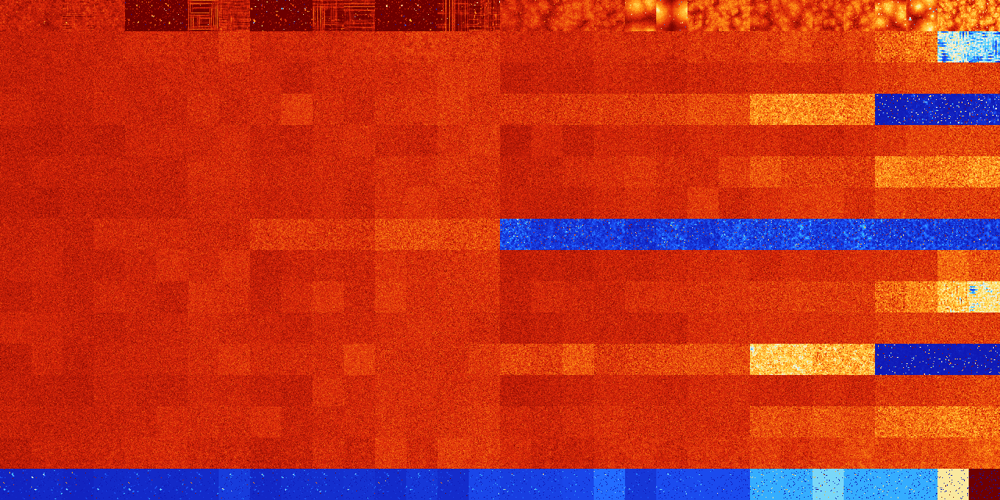

# B0147 (75264-75775)

<details>
    <summary>Initial Grid</summary>
    
</details>


<details>
    <summary>Initial Grid RLE</summary>

```
#C Exported from GoGoL (https://github.com/marrow16/gogol)
#C Wrap mode: Toroidal
#C Boundary mode: Dead
#C Step: 0
x = 100, y = 100, rule = B0147/S
13bo12b2o11bo24bo21bo10bo$25bo15bo17bo4bo$13bo24bo8bo37bo7bo$5bo4bo34bo
37bo$53bobo24bo17bo$37bo12bo26bo9bo4bo$39bo29bo4b2o5bo$54bobo7bo3bo13bo
$2o32bo13bo24bo3bo13bo$bo10bo57bo$6bo20bo7bo$5bo6bo16bo15bo14bo36bo$31b
o9bo18bo29bo$o9bo22bo8bo29bobo2bo$19bo17bo15b2o14bo17bo$18bo3bo14bobo
10bo9bo25bo$29bo9bo6bo8bo17bo12bo$o15bo8bo10bo32bo6bo8bo$36b2o$18bo21bo
17bo25bo3bo10bo$4bo11bo12bo9bo38bo3bo$11bo23bo3bo3bo2bo3bo15bo7bo2bo14b
o$17bo25bo2bo9bo5bo23bo$12bo7bo59bo$24bo20bo35bo$21bo12bo35bo8bo$2o6bo
8bo22bo17bo5bo8bo19bo$2bo2bo20bo11bo16bo19bo5bo8bo5bo$5b2o5bo2b2o2bo4bo
2bo8bo2bo5bo15bo37bo$24bo48bobo19bo$45bo40bo$40bobo13bo39bo$20bo54bo2bo
$19bo11bo23bo15bo6bo4bo$12bo22bo46bo3bo12bo$bo29bo36bo10bo7bo$23bo23bo
7bo$14bo30bo7b2o30bo$20bo44bo7bo12bo$o30bobobo6bo$7bo6bobo50bo9bo15bo$
38bo11bo15bo10bo9bo$4bo15bo24bo23bo$10bo26bo3bo$13bo5bo15bo10bo39bo$2bo
8bo10bo13bo15bo4bo7bo4bo14bo3b2o$14bo79b2o$20bo4bo3bo40bo13bo$10bo32bo
30bo4bo$4bo53bo25bo$bo41bo42bo4bo$18bo22bo3bo31b2o5bo$30bobo17bo2bo31bo
4bobo6bo$26bo3bo28bo$15bo3bo18b2o14bo$19bo4bo51bo$bo10bo7bo5bo23bo15bo
30bo$bo29bo22bo32bo$20bo9bo4bo26bo12bo18bo$99bo$o8bo3bo2bo$20bo18bo4bo
5bo3bobo13b2o4bo14bo6b2o$7bo4bo82b2o$12bo55bo$bo13bo11bo19bo8bo17bo9bo$
o38bo17bo6bo5bo7bo$o10b2obo2b2o13bo20bo10bo$14bo29bo2bo14bo19bo$61bo$
15bo13bo12bo23b2o$41bo42bo3bo$11bo14b2o31bo9bo6bo2bo$4bo24bo9bo3bo13bo
8bo17bo9bo$12bo9b2o17bo12bo27bo4bo6bo$bo8bo14bo43bo7bobo3bo8b2o$37b2o9b
o11bo9bo$50bo17bo18bo$4bo2bo4bo2bo10bo39bo$12bo42bo10b2o28b2obo$26bo21b
o28bo18bo$8bo65bo10bo2bo7bo$7bo31bo4bo$24bo36bo6bo24bo2bo$38bo18bo$40bo
49bo$27bo23bo35bo5bo3bo$27bo30bo20bo16bo$80bo12bo$15bo6bo36bo22bo3bo$bo
9bo13bo2bo24bo$16bo61bo13bo$13bo3bo30bo2bo21bo10bo$8bo32bo$24bo6bo38bo
2bo13bo$7bobo64bo3b2o$3bo18bo16bo12bo23bo$5bo12bo39bo33bo5bo$23bo2bo49b
o$100b$39b2o42bo11bo!
```
</details>
<details>
    <summary>Thumbnail</summary>

</details>
<table>
<tr>
    <td><a href="./75264%20S%20Heat%20Map%20Activity.png"></a><br>S (75264)<br>G>1000</td>    <td><a href="./75265%20S0%20Heat%20Map%20Activity.png"></a><br>S0 (75265)<br>G>1000</td>    <td><a href="./75266%20S1%20Heat%20Map%20Activity.png"></a><br>S1 (75266)<br>G>1000</td>    <td><a href="./75267%20S01%20Heat%20Map%20Activity.png"></a><br>S01 (75267)<br>G>1000</td>    <td><a href="./75268%20S2%20Heat%20Map%20Activity.png"></a><br>S2 (75268)<br>R@22,p2</td>    <td><a href="./75269%20S02%20Heat%20Map%20Activity.png"></a><br>S02 (75269)<br>R@22,p4</td>    <td><a href="./75270%20S12%20Heat%20Map%20Activity.png"></a><br>S12 (75270)<br>G>1000</td>    <td><a href="./75271%20S012%20Heat%20Map%20Activity.png"></a><br>S012 (75271)<br>G>1000</td>    <td><a href="./75272%20S3%20Heat%20Map%20Activity.png"></a><br>S3 (75272)<br>R@34,p8</td>    <td><a href="./75273%20S03%20Heat%20Map%20Activity.png"></a><br>S03 (75273)<br>R@33,p8</td>    <td><a href="./75274%20S13%20Heat%20Map%20Activity.png"></a><br>S13 (75274)<br>G>1000</td>    <td><a href="./75275%20S013%20Heat%20Map%20Activity.png"></a><br>S013 (75275)<br>G>1000</td>    <td><a href="./75276%20S23%20Heat%20Map%20Activity.png"></a><br>S23 (75276)<br>R@32,p2</td>    <td><a href="./75277%20S023%20Heat%20Map%20Activity.png"></a><br>S023 (75277)<br>R@29,p4</td>    <td><a href="./75278%20S123%20Heat%20Map%20Activity.png"></a><br>S123 (75278)<br>G>1000</td>    <td><a href="./75279%20S0123%20Heat%20Map%20Activity.png"></a><br>S0123 (75279)<br>G>1000</td>    <td><a href="./75280%20S4%20Heat%20Map%20Activity.png"></a><br>S4 (75280)<br>G>1000</td>    <td><a href="./75281%20S04%20Heat%20Map%20Activity.png"></a><br>S04 (75281)<br>G>1000</td>    <td><a href="./75282%20S14%20Heat%20Map%20Activity.png"></a><br>S14 (75282)<br>G>1000</td>    <td><a href="./75283%20S014%20Heat%20Map%20Activity.png"></a><br>S014 (75283)<br>G>1000</td>    <td><a href="./75284%20S24%20Heat%20Map%20Activity.png"></a><br>S24 (75284)<br>G>1000</td>    <td><a href="./75285%20S024%20Heat%20Map%20Activity.png"></a><br>S024 (75285)<br>G>1000</td>    <td><a href="./75286%20S124%20Heat%20Map%20Activity.png"></a><br>S124 (75286)<br>G>1000</td>    <td><a href="./75287%20S0124%20Heat%20Map%20Activity.png"></a><br>S0124 (75287)<br>G>1000</td>    <td><a href="./75288%20S34%20Heat%20Map%20Activity.png"></a><br>S34 (75288)<br>G>1000</td>    <td><a href="./75289%20S034%20Heat%20Map%20Activity.png"></a><br>S034 (75289)<br>G>1000</td>    <td><a href="./75290%20S134%20Heat%20Map%20Activity.png"></a><br>S134 (75290)<br>G>1000</td>    <td><a href="./75291%20S0134%20Heat%20Map%20Activity.png"></a><br>S0134 (75291)<br>G>1000</td>    <td><a href="./75292%20S234%20Heat%20Map%20Activity.png"></a><br>S234 (75292)<br>G>1000</td>    <td><a href="./75293%20S0234%20Heat%20Map%20Activity.png"></a><br>S0234 (75293)<br>G>1000</td>    <td><a href="./75294%20S1234%20Heat%20Map%20Activity.png"></a><br>S1234 (75294)<br>G>1000</td>    <td><a href="./75295%20S01234%20Heat%20Map%20Activity.png"></a><br>S01234 (75295)<br>G>1000</td></tr>
<tr>
    <td><a href="./75296%20S5%20Heat%20Map%20Activity.png"></a><br>S5 (75296)<br>G>1000</td>    <td><a href="./75297%20S05%20Heat%20Map%20Activity.png"></a><br>S05 (75297)<br>G>1000</td>    <td><a href="./75298%20S15%20Heat%20Map%20Activity.png"></a><br>S15 (75298)<br>G>1000</td>    <td><a href="./75299%20S015%20Heat%20Map%20Activity.png"></a><br>S015 (75299)<br>G>1000</td>    <td><a href="./75300%20S25%20Heat%20Map%20Activity.png"></a><br>S25 (75300)<br>G>1000</td>    <td><a href="./75301%20S025%20Heat%20Map%20Activity.png"></a><br>S025 (75301)<br>G>1000</td>    <td><a href="./75302%20S125%20Heat%20Map%20Activity.png"></a><br>S125 (75302)<br>G>1000</td>    <td><a href="./75303%20S0125%20Heat%20Map%20Activity.png"></a><br>S0125 (75303)<br>G>1000</td>    <td><a href="./75304%20S35%20Heat%20Map%20Activity.png"></a><br>S35 (75304)<br>G>1000</td>    <td><a href="./75305%20S035%20Heat%20Map%20Activity.png"></a><br>S035 (75305)<br>G>1000</td>    <td><a href="./75306%20S135%20Heat%20Map%20Activity.png"></a><br>S135 (75306)<br>G>1000</td>    <td><a href="./75307%20S0135%20Heat%20Map%20Activity.png"></a><br>S0135 (75307)<br>G>1000</td>    <td><a href="./75308%20S235%20Heat%20Map%20Activity.png"></a><br>S235 (75308)<br>G>1000</td>    <td><a href="./75309%20S0235%20Heat%20Map%20Activity.png"></a><br>S0235 (75309)<br>G>1000</td>    <td><a href="./75310%20S1235%20Heat%20Map%20Activity.png"></a><br>S1235 (75310)<br>G>1000</td>    <td><a href="./75311%20S01235%20Heat%20Map%20Activity.png"></a><br>S01235 (75311)<br>G>1000</td>    <td><a href="./75312%20S45%20Heat%20Map%20Activity.png"></a><br>S45 (75312)<br>G>1000</td>    <td><a href="./75313%20S045%20Heat%20Map%20Activity.png"></a><br>S045 (75313)<br>G>1000</td>    <td><a href="./75314%20S145%20Heat%20Map%20Activity.png"></a><br>S145 (75314)<br>G>1000</td>    <td><a href="./75315%20S0145%20Heat%20Map%20Activity.png"></a><br>S0145 (75315)<br>G>1000</td>    <td><a href="./75316%20S245%20Heat%20Map%20Activity.png"></a><br>S245 (75316)<br>G>1000</td>    <td><a href="./75317%20S0245%20Heat%20Map%20Activity.png"></a><br>S0245 (75317)<br>G>1000</td>    <td><a href="./75318%20S1245%20Heat%20Map%20Activity.png"></a><br>S1245 (75318)<br>G>1000</td>    <td><a href="./75319%20S01245%20Heat%20Map%20Activity.png"></a><br>S01245 (75319)<br>G>1000</td>    <td><a href="./75320%20S345%20Heat%20Map%20Activity.png"></a><br>S345 (75320)<br>G>1000</td>    <td><a href="./75321%20S0345%20Heat%20Map%20Activity.png"></a><br>S0345 (75321)<br>G>1000</td>    <td><a href="./75322%20S1345%20Heat%20Map%20Activity.png"></a><br>S1345 (75322)<br>G>1000</td>    <td><a href="./75323%20S01345%20Heat%20Map%20Activity.png"></a><br>S01345 (75323)<br>G>1000</td>    <td><a href="./75324%20S2345%20Heat%20Map%20Activity.png"></a><br>S2345 (75324)<br>G>1000</td>    <td><a href="./75325%20S02345%20Heat%20Map%20Activity.png"></a><br>S02345 (75325)<br>G>1000</td>    <td><a href="./75326%20S12345%20Heat%20Map%20Activity.png"></a><br>S12345 (75326)<br>G>1000</td>    <td><a href="./75327%20S012345%20Heat%20Map%20Activity.png"></a><br>S012345 (75327)<br>G>1000</td></tr>
<tr>
    <td><a href="./75328%20S6%20Heat%20Map%20Activity.png"></a><br>S6 (75328)<br>G>1000</td>    <td><a href="./75329%20S06%20Heat%20Map%20Activity.png"></a><br>S06 (75329)<br>G>1000</td>    <td><a href="./75330%20S16%20Heat%20Map%20Activity.png"></a><br>S16 (75330)<br>G>1000</td>    <td><a href="./75331%20S016%20Heat%20Map%20Activity.png"></a><br>S016 (75331)<br>G>1000</td>    <td><a href="./75332%20S26%20Heat%20Map%20Activity.png"></a><br>S26 (75332)<br>G>1000</td>    <td><a href="./75333%20S026%20Heat%20Map%20Activity.png"></a><br>S026 (75333)<br>G>1000</td>    <td><a href="./75334%20S126%20Heat%20Map%20Activity.png"></a><br>S126 (75334)<br>G>1000</td>    <td><a href="./75335%20S0126%20Heat%20Map%20Activity.png"></a><br>S0126 (75335)<br>G>1000</td>    <td><a href="./75336%20S36%20Heat%20Map%20Activity.png"></a><br>S36 (75336)<br>G>1000</td>    <td><a href="./75337%20S036%20Heat%20Map%20Activity.png"></a><br>S036 (75337)<br>G>1000</td>    <td><a href="./75338%20S136%20Heat%20Map%20Activity.png"></a><br>S136 (75338)<br>G>1000</td>    <td><a href="./75339%20S0136%20Heat%20Map%20Activity.png"></a><br>S0136 (75339)<br>G>1000</td>    <td><a href="./75340%20S236%20Heat%20Map%20Activity.png"></a><br>S236 (75340)<br>G>1000</td>    <td><a href="./75341%20S0236%20Heat%20Map%20Activity.png"></a><br>S0236 (75341)<br>G>1000</td>    <td><a href="./75342%20S1236%20Heat%20Map%20Activity.png"></a><br>S1236 (75342)<br>G>1000</td>    <td><a href="./75343%20S01236%20Heat%20Map%20Activity.png"></a><br>S01236 (75343)<br>G>1000</td>    <td><a href="./75344%20S46%20Heat%20Map%20Activity.png"></a><br>S46 (75344)<br>G>1000</td>    <td><a href="./75345%20S046%20Heat%20Map%20Activity.png"></a><br>S046 (75345)<br>G>1000</td>    <td><a href="./75346%20S146%20Heat%20Map%20Activity.png"></a><br>S146 (75346)<br>G>1000</td>    <td><a href="./75347%20S0146%20Heat%20Map%20Activity.png"></a><br>S0146 (75347)<br>G>1000</td>    <td><a href="./75348%20S246%20Heat%20Map%20Activity.png"></a><br>S246 (75348)<br>G>1000</td>    <td><a href="./75349%20S0246%20Heat%20Map%20Activity.png"></a><br>S0246 (75349)<br>G>1000</td>    <td><a href="./75350%20S1246%20Heat%20Map%20Activity.png"></a><br>S1246 (75350)<br>G>1000</td>    <td><a href="./75351%20S01246%20Heat%20Map%20Activity.png"></a><br>S01246 (75351)<br>G>1000</td>    <td><a href="./75352%20S346%20Heat%20Map%20Activity.png"></a><br>S346 (75352)<br>G>1000</td>    <td><a href="./75353%20S0346%20Heat%20Map%20Activity.png"></a><br>S0346 (75353)<br>G>1000</td>    <td><a href="./75354%20S1346%20Heat%20Map%20Activity.png"></a><br>S1346 (75354)<br>G>1000</td>    <td><a href="./75355%20S01346%20Heat%20Map%20Activity.png"></a><br>S01346 (75355)<br>G>1000</td>    <td><a href="./75356%20S2346%20Heat%20Map%20Activity.png"></a><br>S2346 (75356)<br>G>1000</td>    <td><a href="./75357%20S02346%20Heat%20Map%20Activity.png"></a><br>S02346 (75357)<br>G>1000</td>    <td><a href="./75358%20S12346%20Heat%20Map%20Activity.png"></a><br>S12346 (75358)<br>G>1000</td>    <td><a href="./75359%20S012346%20Heat%20Map%20Activity.png"></a><br>S012346 (75359)<br>G>1000</td></tr>
<tr>
    <td><a href="./75360%20S56%20Heat%20Map%20Activity.png"></a><br>S56 (75360)<br>G>1000</td>    <td><a href="./75361%20S056%20Heat%20Map%20Activity.png"></a><br>S056 (75361)<br>G>1000</td>    <td><a href="./75362%20S156%20Heat%20Map%20Activity.png"></a><br>S156 (75362)<br>G>1000</td>    <td><a href="./75363%20S0156%20Heat%20Map%20Activity.png"></a><br>S0156 (75363)<br>G>1000</td>    <td><a href="./75364%20S256%20Heat%20Map%20Activity.png"></a><br>S256 (75364)<br>G>1000</td>    <td><a href="./75365%20S0256%20Heat%20Map%20Activity.png"></a><br>S0256 (75365)<br>G>1000</td>    <td><a href="./75366%20S1256%20Heat%20Map%20Activity.png"></a><br>S1256 (75366)<br>G>1000</td>    <td><a href="./75367%20S01256%20Heat%20Map%20Activity.png"></a><br>S01256 (75367)<br>G>1000</td>    <td><a href="./75368%20S356%20Heat%20Map%20Activity.png"></a><br>S356 (75368)<br>G>1000</td>    <td><a href="./75369%20S0356%20Heat%20Map%20Activity.png"></a><br>S0356 (75369)<br>G>1000</td>    <td><a href="./75370%20S1356%20Heat%20Map%20Activity.png"></a><br>S1356 (75370)<br>G>1000</td>    <td><a href="./75371%20S01356%20Heat%20Map%20Activity.png"></a><br>S01356 (75371)<br>G>1000</td>    <td><a href="./75372%20S2356%20Heat%20Map%20Activity.png"></a><br>S2356 (75372)<br>G>1000</td>    <td><a href="./75373%20S02356%20Heat%20Map%20Activity.png"></a><br>S02356 (75373)<br>G>1000</td>    <td><a href="./75374%20S12356%20Heat%20Map%20Activity.png"></a><br>S12356 (75374)<br>G>1000</td>    <td><a href="./75375%20S012356%20Heat%20Map%20Activity.png"></a><br>S012356 (75375)<br>G>1000</td>    <td><a href="./75376%20S456%20Heat%20Map%20Activity.png"></a><br>S456 (75376)<br>G>1000</td>    <td><a href="./75377%20S0456%20Heat%20Map%20Activity.png"></a><br>S0456 (75377)<br>G>1000</td>    <td><a href="./75378%20S1456%20Heat%20Map%20Activity.png"></a><br>S1456 (75378)<br>G>1000</td>    <td><a href="./75379%20S01456%20Heat%20Map%20Activity.png"></a><br>S01456 (75379)<br>G>1000</td>    <td><a href="./75380%20S2456%20Heat%20Map%20Activity.png"></a><br>S2456 (75380)<br>G>1000</td>    <td><a href="./75381%20S02456%20Heat%20Map%20Activity.png"></a><br>S02456 (75381)<br>G>1000</td>    <td><a href="./75382%20S12456%20Heat%20Map%20Activity.png"></a><br>S12456 (75382)<br>G>1000</td>    <td><a href="./75383%20S012456%20Heat%20Map%20Activity.png"></a><br>S012456 (75383)<br>G>1000</td>    <td><a href="./75384%20S3456%20Heat%20Map%20Activity.png"></a><br>S3456 (75384)<br>G>1000</td>    <td><a href="./75385%20S03456%20Heat%20Map%20Activity.png"></a><br>S03456 (75385)<br>G>1000</td>    <td><a href="./75386%20S13456%20Heat%20Map%20Activity.png"></a><br>S13456 (75386)<br>G>1000</td>    <td><a href="./75387%20S013456%20Heat%20Map%20Activity.png"></a><br>S013456 (75387)<br>G>1000</td>    <td><a href="./75388%20S23456%20Heat%20Map%20Activity.png"></a><br>S23456 (75388)<br>R@833,p720</td>    <td><a href="./75389%20S023456%20Heat%20Map%20Activity.png"></a><br>S023456 (75389)<br>R@362,p180</td>    <td><a href="./75390%20S123456%20Heat%20Map%20Activity.png"></a><br>S123456 (75390)<br>R@544,p420</td>    <td><a href="./75391%20S0123456%20Heat%20Map%20Activity.png"></a><br>S0123456 (75391)<br>R@245,p120</td></tr>
<tr>
    <td><a href="./75392%20S7%20Heat%20Map%20Activity.png"></a><br>S7 (75392)<br>G>1000</td>    <td><a href="./75393%20S07%20Heat%20Map%20Activity.png"></a><br>S07 (75393)<br>G>1000</td>    <td><a href="./75394%20S17%20Heat%20Map%20Activity.png"></a><br>S17 (75394)<br>G>1000</td>    <td><a href="./75395%20S017%20Heat%20Map%20Activity.png"></a><br>S017 (75395)<br>G>1000</td>    <td><a href="./75396%20S27%20Heat%20Map%20Activity.png"></a><br>S27 (75396)<br>G>1000</td>    <td><a href="./75397%20S027%20Heat%20Map%20Activity.png"></a><br>S027 (75397)<br>G>1000</td>    <td><a href="./75398%20S127%20Heat%20Map%20Activity.png"></a><br>S127 (75398)<br>G>1000</td>    <td><a href="./75399%20S0127%20Heat%20Map%20Activity.png"></a><br>S0127 (75399)<br>G>1000</td>    <td><a href="./75400%20S37%20Heat%20Map%20Activity.png"></a><br>S37 (75400)<br>G>1000</td>    <td><a href="./75401%20S037%20Heat%20Map%20Activity.png"></a><br>S037 (75401)<br>G>1000</td>    <td><a href="./75402%20S137%20Heat%20Map%20Activity.png"></a><br>S137 (75402)<br>G>1000</td>    <td><a href="./75403%20S0137%20Heat%20Map%20Activity.png"></a><br>S0137 (75403)<br>G>1000</td>    <td><a href="./75404%20S237%20Heat%20Map%20Activity.png"></a><br>S237 (75404)<br>G>1000</td>    <td><a href="./75405%20S0237%20Heat%20Map%20Activity.png"></a><br>S0237 (75405)<br>G>1000</td>    <td><a href="./75406%20S1237%20Heat%20Map%20Activity.png"></a><br>S1237 (75406)<br>G>1000</td>    <td><a href="./75407%20S01237%20Heat%20Map%20Activity.png"></a><br>S01237 (75407)<br>G>1000</td>    <td><a href="./75408%20S47%20Heat%20Map%20Activity.png"></a><br>S47 (75408)<br>G>1000</td>    <td><a href="./75409%20S047%20Heat%20Map%20Activity.png"></a><br>S047 (75409)<br>G>1000</td>    <td><a href="./75410%20S147%20Heat%20Map%20Activity.png"></a><br>S147 (75410)<br>G>1000</td>    <td><a href="./75411%20S0147%20Heat%20Map%20Activity.png"></a><br>S0147 (75411)<br>G>1000</td>    <td><a href="./75412%20S247%20Heat%20Map%20Activity.png"></a><br>S247 (75412)<br>G>1000</td>    <td><a href="./75413%20S0247%20Heat%20Map%20Activity.png"></a><br>S0247 (75413)<br>G>1000</td>    <td><a href="./75414%20S1247%20Heat%20Map%20Activity.png"></a><br>S1247 (75414)<br>G>1000</td>    <td><a href="./75415%20S01247%20Heat%20Map%20Activity.png"></a><br>S01247 (75415)<br>G>1000</td>    <td><a href="./75416%20S347%20Heat%20Map%20Activity.png"></a><br>S347 (75416)<br>G>1000</td>    <td><a href="./75417%20S0347%20Heat%20Map%20Activity.png"></a><br>S0347 (75417)<br>G>1000</td>    <td><a href="./75418%20S1347%20Heat%20Map%20Activity.png"></a><br>S1347 (75418)<br>G>1000</td>    <td><a href="./75419%20S01347%20Heat%20Map%20Activity.png"></a><br>S01347 (75419)<br>G>1000</td>    <td><a href="./75420%20S2347%20Heat%20Map%20Activity.png"></a><br>S2347 (75420)<br>G>1000</td>    <td><a href="./75421%20S02347%20Heat%20Map%20Activity.png"></a><br>S02347 (75421)<br>G>1000</td>    <td><a href="./75422%20S12347%20Heat%20Map%20Activity.png"></a><br>S12347 (75422)<br>G>1000</td>    <td><a href="./75423%20S012347%20Heat%20Map%20Activity.png"></a><br>S012347 (75423)<br>G>1000</td></tr>
<tr>
    <td><a href="./75424%20S57%20Heat%20Map%20Activity.png"></a><br>S57 (75424)<br>G>1000</td>    <td><a href="./75425%20S057%20Heat%20Map%20Activity.png"></a><br>S057 (75425)<br>G>1000</td>    <td><a href="./75426%20S157%20Heat%20Map%20Activity.png"></a><br>S157 (75426)<br>G>1000</td>    <td><a href="./75427%20S0157%20Heat%20Map%20Activity.png"></a><br>S0157 (75427)<br>G>1000</td>    <td><a href="./75428%20S257%20Heat%20Map%20Activity.png"></a><br>S257 (75428)<br>G>1000</td>    <td><a href="./75429%20S0257%20Heat%20Map%20Activity.png"></a><br>S0257 (75429)<br>G>1000</td>    <td><a href="./75430%20S1257%20Heat%20Map%20Activity.png"></a><br>S1257 (75430)<br>G>1000</td>    <td><a href="./75431%20S01257%20Heat%20Map%20Activity.png"></a><br>S01257 (75431)<br>G>1000</td>    <td><a href="./75432%20S357%20Heat%20Map%20Activity.png"></a><br>S357 (75432)<br>G>1000</td>    <td><a href="./75433%20S0357%20Heat%20Map%20Activity.png"></a><br>S0357 (75433)<br>G>1000</td>    <td><a href="./75434%20S1357%20Heat%20Map%20Activity.png"></a><br>S1357 (75434)<br>G>1000</td>    <td><a href="./75435%20S01357%20Heat%20Map%20Activity.png"></a><br>S01357 (75435)<br>G>1000</td>    <td><a href="./75436%20S2357%20Heat%20Map%20Activity.png"></a><br>S2357 (75436)<br>G>1000</td>    <td><a href="./75437%20S02357%20Heat%20Map%20Activity.png"></a><br>S02357 (75437)<br>G>1000</td>    <td><a href="./75438%20S12357%20Heat%20Map%20Activity.png"></a><br>S12357 (75438)<br>G>1000</td>    <td><a href="./75439%20S012357%20Heat%20Map%20Activity.png"></a><br>S012357 (75439)<br>G>1000</td>    <td><a href="./75440%20S457%20Heat%20Map%20Activity.png"></a><br>S457 (75440)<br>G>1000</td>    <td><a href="./75441%20S0457%20Heat%20Map%20Activity.png"></a><br>S0457 (75441)<br>G>1000</td>    <td><a href="./75442%20S1457%20Heat%20Map%20Activity.png"></a><br>S1457 (75442)<br>G>1000</td>    <td><a href="./75443%20S01457%20Heat%20Map%20Activity.png"></a><br>S01457 (75443)<br>G>1000</td>    <td><a href="./75444%20S2457%20Heat%20Map%20Activity.png"></a><br>S2457 (75444)<br>G>1000</td>    <td><a href="./75445%20S02457%20Heat%20Map%20Activity.png"></a><br>S02457 (75445)<br>G>1000</td>    <td><a href="./75446%20S12457%20Heat%20Map%20Activity.png"></a><br>S12457 (75446)<br>G>1000</td>    <td><a href="./75447%20S012457%20Heat%20Map%20Activity.png"></a><br>S012457 (75447)<br>G>1000</td>    <td><a href="./75448%20S3457%20Heat%20Map%20Activity.png"></a><br>S3457 (75448)<br>G>1000</td>    <td><a href="./75449%20S03457%20Heat%20Map%20Activity.png"></a><br>S03457 (75449)<br>G>1000</td>    <td><a href="./75450%20S13457%20Heat%20Map%20Activity.png"></a><br>S13457 (75450)<br>G>1000</td>    <td><a href="./75451%20S013457%20Heat%20Map%20Activity.png"></a><br>S013457 (75451)<br>G>1000</td>    <td><a href="./75452%20S23457%20Heat%20Map%20Activity.png"></a><br>S23457 (75452)<br>G>1000</td>    <td><a href="./75453%20S023457%20Heat%20Map%20Activity.png"></a><br>S023457 (75453)<br>G>1000</td>    <td><a href="./75454%20S123457%20Heat%20Map%20Activity.png"></a><br>S123457 (75454)<br>G>1000</td>    <td><a href="./75455%20S0123457%20Heat%20Map%20Activity.png"></a><br>S0123457 (75455)<br>G>1000</td></tr>
<tr>
    <td><a href="./75456%20S67%20Heat%20Map%20Activity.png"></a><br>S67 (75456)<br>G>1000</td>    <td><a href="./75457%20S067%20Heat%20Map%20Activity.png"></a><br>S067 (75457)<br>G>1000</td>    <td><a href="./75458%20S167%20Heat%20Map%20Activity.png"></a><br>S167 (75458)<br>G>1000</td>    <td><a href="./75459%20S0167%20Heat%20Map%20Activity.png"></a><br>S0167 (75459)<br>G>1000</td>    <td><a href="./75460%20S267%20Heat%20Map%20Activity.png"></a><br>S267 (75460)<br>G>1000</td>    <td><a href="./75461%20S0267%20Heat%20Map%20Activity.png"></a><br>S0267 (75461)<br>G>1000</td>    <td><a href="./75462%20S1267%20Heat%20Map%20Activity.png"></a><br>S1267 (75462)<br>G>1000</td>    <td><a href="./75463%20S01267%20Heat%20Map%20Activity.png"></a><br>S01267 (75463)<br>G>1000</td>    <td><a href="./75464%20S367%20Heat%20Map%20Activity.png"></a><br>S367 (75464)<br>G>1000</td>    <td><a href="./75465%20S0367%20Heat%20Map%20Activity.png"></a><br>S0367 (75465)<br>G>1000</td>    <td><a href="./75466%20S1367%20Heat%20Map%20Activity.png"></a><br>S1367 (75466)<br>G>1000</td>    <td><a href="./75467%20S01367%20Heat%20Map%20Activity.png"></a><br>S01367 (75467)<br>G>1000</td>    <td><a href="./75468%20S2367%20Heat%20Map%20Activity.png"></a><br>S2367 (75468)<br>G>1000</td>    <td><a href="./75469%20S02367%20Heat%20Map%20Activity.png"></a><br>S02367 (75469)<br>G>1000</td>    <td><a href="./75470%20S12367%20Heat%20Map%20Activity.png"></a><br>S12367 (75470)<br>G>1000</td>    <td><a href="./75471%20S012367%20Heat%20Map%20Activity.png"></a><br>S012367 (75471)<br>G>1000</td>    <td><a href="./75472%20S467%20Heat%20Map%20Activity.png"></a><br>S467 (75472)<br>G>1000</td>    <td><a href="./75473%20S0467%20Heat%20Map%20Activity.png"></a><br>S0467 (75473)<br>G>1000</td>    <td><a href="./75474%20S1467%20Heat%20Map%20Activity.png"></a><br>S1467 (75474)<br>G>1000</td>    <td><a href="./75475%20S01467%20Heat%20Map%20Activity.png"></a><br>S01467 (75475)<br>G>1000</td>    <td><a href="./75476%20S2467%20Heat%20Map%20Activity.png"></a><br>S2467 (75476)<br>G>1000</td>    <td><a href="./75477%20S02467%20Heat%20Map%20Activity.png"></a><br>S02467 (75477)<br>G>1000</td>    <td><a href="./75478%20S12467%20Heat%20Map%20Activity.png"></a><br>S12467 (75478)<br>G>1000</td>    <td><a href="./75479%20S012467%20Heat%20Map%20Activity.png"></a><br>S012467 (75479)<br>G>1000</td>    <td><a href="./75480%20S3467%20Heat%20Map%20Activity.png"></a><br>S3467 (75480)<br>G>1000</td>    <td><a href="./75481%20S03467%20Heat%20Map%20Activity.png"></a><br>S03467 (75481)<br>G>1000</td>    <td><a href="./75482%20S13467%20Heat%20Map%20Activity.png"></a><br>S13467 (75482)<br>G>1000</td>    <td><a href="./75483%20S013467%20Heat%20Map%20Activity.png"></a><br>S013467 (75483)<br>G>1000</td>    <td><a href="./75484%20S23467%20Heat%20Map%20Activity.png"></a><br>S23467 (75484)<br>G>1000</td>    <td><a href="./75485%20S023467%20Heat%20Map%20Activity.png"></a><br>S023467 (75485)<br>G>1000</td>    <td><a href="./75486%20S123467%20Heat%20Map%20Activity.png"></a><br>S123467 (75486)<br>G>1000</td>    <td><a href="./75487%20S0123467%20Heat%20Map%20Activity.png"></a><br>S0123467 (75487)<br>G>1000</td></tr>
<tr>
    <td><a href="./75488%20S567%20Heat%20Map%20Activity.png"></a><br>S567 (75488)<br>G>1000</td>    <td><a href="./75489%20S0567%20Heat%20Map%20Activity.png"></a><br>S0567 (75489)<br>G>1000</td>    <td><a href="./75490%20S1567%20Heat%20Map%20Activity.png"></a><br>S1567 (75490)<br>G>1000</td>    <td><a href="./75491%20S01567%20Heat%20Map%20Activity.png"></a><br>S01567 (75491)<br>G>1000</td>    <td><a href="./75492%20S2567%20Heat%20Map%20Activity.png"></a><br>S2567 (75492)<br>G>1000</td>    <td><a href="./75493%20S02567%20Heat%20Map%20Activity.png"></a><br>S02567 (75493)<br>G>1000</td>    <td><a href="./75494%20S12567%20Heat%20Map%20Activity.png"></a><br>S12567 (75494)<br>G>1000</td>    <td><a href="./75495%20S012567%20Heat%20Map%20Activity.png"></a><br>S012567 (75495)<br>G>1000</td>    <td><a href="./75496%20S3567%20Heat%20Map%20Activity.png"></a><br>S3567 (75496)<br>G>1000</td>    <td><a href="./75497%20S03567%20Heat%20Map%20Activity.png"></a><br>S03567 (75497)<br>G>1000</td>    <td><a href="./75498%20S13567%20Heat%20Map%20Activity.png"></a><br>S13567 (75498)<br>G>1000</td>    <td><a href="./75499%20S013567%20Heat%20Map%20Activity.png"></a><br>S013567 (75499)<br>G>1000</td>    <td><a href="./75500%20S23567%20Heat%20Map%20Activity.png"></a><br>S23567 (75500)<br>G>1000</td>    <td><a href="./75501%20S023567%20Heat%20Map%20Activity.png"></a><br>S023567 (75501)<br>G>1000</td>    <td><a href="./75502%20S123567%20Heat%20Map%20Activity.png"></a><br>S123567 (75502)<br>G>1000</td>    <td><a href="./75503%20S0123567%20Heat%20Map%20Activity.png"></a><br>S0123567 (75503)<br>G>1000</td>    <td><a href="./75504%20S4567%20Heat%20Map%20Activity.png"></a><br>S4567 (75504)<br>R@58,p4</td>    <td><a href="./75505%20S04567%20Heat%20Map%20Activity.png"></a><br>S04567 (75505)<br>R@109,p6</td>    <td><a href="./75506%20S14567%20Heat%20Map%20Activity.png"></a><br>S14567 (75506)<br>R@74,p6</td>    <td><a href="./75507%20S014567%20Heat%20Map%20Activity.png"></a><br>S014567 (75507)<br>R@84,p12</td>    <td><a href="./75508%20S24567%20Heat%20Map%20Activity.png"></a><br>S24567 (75508)<br>R@85,p12</td>    <td><a href="./75509%20S024567%20Heat%20Map%20Activity.png"></a><br>S024567 (75509)<br>R@67,p12</td>    <td><a href="./75510%20S124567%20Heat%20Map%20Activity.png"></a><br>S124567 (75510)<br>R@70,p6</td>    <td><a href="./75511%20S0124567%20Heat%20Map%20Activity.png"></a><br>S0124567 (75511)<br>R@57,p6</td>    <td><a href="./75512%20S34567%20Heat%20Map%20Activity.png"></a><br>S34567 (75512)<br>R@37,p12</td>    <td><a href="./75513%20S034567%20Heat%20Map%20Activity.png"></a><br>S034567 (75513)<br>R@40,p12</td>    <td><a href="./75514%20S134567%20Heat%20Map%20Activity.png"></a><br>S134567 (75514)<br>R@39,p12</td>    <td><a href="./75515%20S0134567%20Heat%20Map%20Activity.png"></a><br>S0134567 (75515)<br>R@40,p12</td>    <td><a href="./75516%20S234567%20Heat%20Map%20Activity.png"></a><br>S234567 (75516)<br>R@35,p12</td>    <td><a href="./75517%20S0234567%20Heat%20Map%20Activity.png"></a><br>S0234567 (75517)<br>R@47,p12</td>    <td><a href="./75518%20S1234567%20Heat%20Map%20Activity.png"></a><br>S1234567 (75518)<br>R@36,p12</td>    <td><a href="./75519%20S01234567%20Heat%20Map%20Activity.png"></a><br>S01234567 (75519)<br>R@52,p12</td></tr>
<tr>
    <td><a href="./75520%20S8%20Heat%20Map%20Activity.png"></a><br>S8 (75520)<br>G>1000</td>    <td><a href="./75521%20S08%20Heat%20Map%20Activity.png"></a><br>S08 (75521)<br>G>1000</td>    <td><a href="./75522%20S18%20Heat%20Map%20Activity.png"></a><br>S18 (75522)<br>G>1000</td>    <td><a href="./75523%20S018%20Heat%20Map%20Activity.png"></a><br>S018 (75523)<br>G>1000</td>    <td><a href="./75524%20S28%20Heat%20Map%20Activity.png"></a><br>S28 (75524)<br>G>1000</td>    <td><a href="./75525%20S028%20Heat%20Map%20Activity.png"></a><br>S028 (75525)<br>G>1000</td>    <td><a href="./75526%20S128%20Heat%20Map%20Activity.png"></a><br>S128 (75526)<br>G>1000</td>    <td><a href="./75527%20S0128%20Heat%20Map%20Activity.png"></a><br>S0128 (75527)<br>G>1000</td>    <td><a href="./75528%20S38%20Heat%20Map%20Activity.png"></a><br>S38 (75528)<br>G>1000</td>    <td><a href="./75529%20S038%20Heat%20Map%20Activity.png"></a><br>S038 (75529)<br>G>1000</td>    <td><a href="./75530%20S138%20Heat%20Map%20Activity.png"></a><br>S138 (75530)<br>G>1000</td>    <td><a href="./75531%20S0138%20Heat%20Map%20Activity.png"></a><br>S0138 (75531)<br>G>1000</td>    <td><a href="./75532%20S238%20Heat%20Map%20Activity.png"></a><br>S238 (75532)<br>G>1000</td>    <td><a href="./75533%20S0238%20Heat%20Map%20Activity.png"></a><br>S0238 (75533)<br>G>1000</td>    <td><a href="./75534%20S1238%20Heat%20Map%20Activity.png"></a><br>S1238 (75534)<br>G>1000</td>    <td><a href="./75535%20S01238%20Heat%20Map%20Activity.png"></a><br>S01238 (75535)<br>G>1000</td>    <td><a href="./75536%20S48%20Heat%20Map%20Activity.png"></a><br>S48 (75536)<br>G>1000</td>    <td><a href="./75537%20S048%20Heat%20Map%20Activity.png"></a><br>S048 (75537)<br>G>1000</td>    <td><a href="./75538%20S148%20Heat%20Map%20Activity.png"></a><br>S148 (75538)<br>G>1000</td>    <td><a href="./75539%20S0148%20Heat%20Map%20Activity.png"></a><br>S0148 (75539)<br>G>1000</td>    <td><a href="./75540%20S248%20Heat%20Map%20Activity.png"></a><br>S248 (75540)<br>G>1000</td>    <td><a href="./75541%20S0248%20Heat%20Map%20Activity.png"></a><br>S0248 (75541)<br>G>1000</td>    <td><a href="./75542%20S1248%20Heat%20Map%20Activity.png"></a><br>S1248 (75542)<br>G>1000</td>    <td><a href="./75543%20S01248%20Heat%20Map%20Activity.png"></a><br>S01248 (75543)<br>G>1000</td>    <td><a href="./75544%20S348%20Heat%20Map%20Activity.png"></a><br>S348 (75544)<br>G>1000</td>    <td><a href="./75545%20S0348%20Heat%20Map%20Activity.png"></a><br>S0348 (75545)<br>G>1000</td>    <td><a href="./75546%20S1348%20Heat%20Map%20Activity.png"></a><br>S1348 (75546)<br>G>1000</td>    <td><a href="./75547%20S01348%20Heat%20Map%20Activity.png"></a><br>S01348 (75547)<br>G>1000</td>    <td><a href="./75548%20S2348%20Heat%20Map%20Activity.png"></a><br>S2348 (75548)<br>G>1000</td>    <td><a href="./75549%20S02348%20Heat%20Map%20Activity.png"></a><br>S02348 (75549)<br>G>1000</td>    <td><a href="./75550%20S12348%20Heat%20Map%20Activity.png"></a><br>S12348 (75550)<br>G>1000</td>    <td><a href="./75551%20S012348%20Heat%20Map%20Activity.png"></a><br>S012348 (75551)<br>G>1000</td></tr>
<tr>
    <td><a href="./75552%20S58%20Heat%20Map%20Activity.png"></a><br>S58 (75552)<br>G>1000</td>    <td><a href="./75553%20S058%20Heat%20Map%20Activity.png"></a><br>S058 (75553)<br>G>1000</td>    <td><a href="./75554%20S158%20Heat%20Map%20Activity.png"></a><br>S158 (75554)<br>G>1000</td>    <td><a href="./75555%20S0158%20Heat%20Map%20Activity.png"></a><br>S0158 (75555)<br>G>1000</td>    <td><a href="./75556%20S258%20Heat%20Map%20Activity.png"></a><br>S258 (75556)<br>G>1000</td>    <td><a href="./75557%20S0258%20Heat%20Map%20Activity.png"></a><br>S0258 (75557)<br>G>1000</td>    <td><a href="./75558%20S1258%20Heat%20Map%20Activity.png"></a><br>S1258 (75558)<br>G>1000</td>    <td><a href="./75559%20S01258%20Heat%20Map%20Activity.png"></a><br>S01258 (75559)<br>G>1000</td>    <td><a href="./75560%20S358%20Heat%20Map%20Activity.png"></a><br>S358 (75560)<br>G>1000</td>    <td><a href="./75561%20S0358%20Heat%20Map%20Activity.png"></a><br>S0358 (75561)<br>G>1000</td>    <td><a href="./75562%20S1358%20Heat%20Map%20Activity.png"></a><br>S1358 (75562)<br>G>1000</td>    <td><a href="./75563%20S01358%20Heat%20Map%20Activity.png"></a><br>S01358 (75563)<br>G>1000</td>    <td><a href="./75564%20S2358%20Heat%20Map%20Activity.png"></a><br>S2358 (75564)<br>G>1000</td>    <td><a href="./75565%20S02358%20Heat%20Map%20Activity.png"></a><br>S02358 (75565)<br>G>1000</td>    <td><a href="./75566%20S12358%20Heat%20Map%20Activity.png"></a><br>S12358 (75566)<br>G>1000</td>    <td><a href="./75567%20S012358%20Heat%20Map%20Activity.png"></a><br>S012358 (75567)<br>G>1000</td>    <td><a href="./75568%20S458%20Heat%20Map%20Activity.png"></a><br>S458 (75568)<br>G>1000</td>    <td><a href="./75569%20S0458%20Heat%20Map%20Activity.png"></a><br>S0458 (75569)<br>G>1000</td>    <td><a href="./75570%20S1458%20Heat%20Map%20Activity.png"></a><br>S1458 (75570)<br>G>1000</td>    <td><a href="./75571%20S01458%20Heat%20Map%20Activity.png"></a><br>S01458 (75571)<br>G>1000</td>    <td><a href="./75572%20S2458%20Heat%20Map%20Activity.png"></a><br>S2458 (75572)<br>G>1000</td>    <td><a href="./75573%20S02458%20Heat%20Map%20Activity.png"></a><br>S02458 (75573)<br>G>1000</td>    <td><a href="./75574%20S12458%20Heat%20Map%20Activity.png"></a><br>S12458 (75574)<br>G>1000</td>    <td><a href="./75575%20S012458%20Heat%20Map%20Activity.png"></a><br>S012458 (75575)<br>G>1000</td>    <td><a href="./75576%20S3458%20Heat%20Map%20Activity.png"></a><br>S3458 (75576)<br>G>1000</td>    <td><a href="./75577%20S03458%20Heat%20Map%20Activity.png"></a><br>S03458 (75577)<br>G>1000</td>    <td><a href="./75578%20S13458%20Heat%20Map%20Activity.png"></a><br>S13458 (75578)<br>G>1000</td>    <td><a href="./75579%20S013458%20Heat%20Map%20Activity.png"></a><br>S013458 (75579)<br>G>1000</td>    <td><a href="./75580%20S23458%20Heat%20Map%20Activity.png"></a><br>S23458 (75580)<br>G>1000</td>    <td><a href="./75581%20S023458%20Heat%20Map%20Activity.png"></a><br>S023458 (75581)<br>G>1000</td>    <td><a href="./75582%20S123458%20Heat%20Map%20Activity.png"></a><br>S123458 (75582)<br>G>1000</td>    <td><a href="./75583%20S0123458%20Heat%20Map%20Activity.png"></a><br>S0123458 (75583)<br>G>1000</td></tr>
<tr>
    <td><a href="./75584%20S68%20Heat%20Map%20Activity.png"></a><br>S68 (75584)<br>G>1000</td>    <td><a href="./75585%20S068%20Heat%20Map%20Activity.png"></a><br>S068 (75585)<br>G>1000</td>    <td><a href="./75586%20S168%20Heat%20Map%20Activity.png"></a><br>S168 (75586)<br>G>1000</td>    <td><a href="./75587%20S0168%20Heat%20Map%20Activity.png"></a><br>S0168 (75587)<br>G>1000</td>    <td><a href="./75588%20S268%20Heat%20Map%20Activity.png"></a><br>S268 (75588)<br>G>1000</td>    <td><a href="./75589%20S0268%20Heat%20Map%20Activity.png"></a><br>S0268 (75589)<br>G>1000</td>    <td><a href="./75590%20S1268%20Heat%20Map%20Activity.png"></a><br>S1268 (75590)<br>G>1000</td>    <td><a href="./75591%20S01268%20Heat%20Map%20Activity.png"></a><br>S01268 (75591)<br>G>1000</td>    <td><a href="./75592%20S368%20Heat%20Map%20Activity.png"></a><br>S368 (75592)<br>G>1000</td>    <td><a href="./75593%20S0368%20Heat%20Map%20Activity.png"></a><br>S0368 (75593)<br>G>1000</td>    <td><a href="./75594%20S1368%20Heat%20Map%20Activity.png"></a><br>S1368 (75594)<br>G>1000</td>    <td><a href="./75595%20S01368%20Heat%20Map%20Activity.png"></a><br>S01368 (75595)<br>G>1000</td>    <td><a href="./75596%20S2368%20Heat%20Map%20Activity.png"></a><br>S2368 (75596)<br>G>1000</td>    <td><a href="./75597%20S02368%20Heat%20Map%20Activity.png"></a><br>S02368 (75597)<br>G>1000</td>    <td><a href="./75598%20S12368%20Heat%20Map%20Activity.png"></a><br>S12368 (75598)<br>G>1000</td>    <td><a href="./75599%20S012368%20Heat%20Map%20Activity.png"></a><br>S012368 (75599)<br>G>1000</td>    <td><a href="./75600%20S468%20Heat%20Map%20Activity.png"></a><br>S468 (75600)<br>G>1000</td>    <td><a href="./75601%20S0468%20Heat%20Map%20Activity.png"></a><br>S0468 (75601)<br>G>1000</td>    <td><a href="./75602%20S1468%20Heat%20Map%20Activity.png"></a><br>S1468 (75602)<br>G>1000</td>    <td><a href="./75603%20S01468%20Heat%20Map%20Activity.png"></a><br>S01468 (75603)<br>G>1000</td>    <td><a href="./75604%20S2468%20Heat%20Map%20Activity.png"></a><br>S2468 (75604)<br>G>1000</td>    <td><a href="./75605%20S02468%20Heat%20Map%20Activity.png"></a><br>S02468 (75605)<br>G>1000</td>    <td><a href="./75606%20S12468%20Heat%20Map%20Activity.png"></a><br>S12468 (75606)<br>G>1000</td>    <td><a href="./75607%20S012468%20Heat%20Map%20Activity.png"></a><br>S012468 (75607)<br>G>1000</td>    <td><a href="./75608%20S3468%20Heat%20Map%20Activity.png"></a><br>S3468 (75608)<br>G>1000</td>    <td><a href="./75609%20S03468%20Heat%20Map%20Activity.png"></a><br>S03468 (75609)<br>G>1000</td>    <td><a href="./75610%20S13468%20Heat%20Map%20Activity.png"></a><br>S13468 (75610)<br>G>1000</td>    <td><a href="./75611%20S013468%20Heat%20Map%20Activity.png"></a><br>S013468 (75611)<br>G>1000</td>    <td><a href="./75612%20S23468%20Heat%20Map%20Activity.png"></a><br>S23468 (75612)<br>G>1000</td>    <td><a href="./75613%20S023468%20Heat%20Map%20Activity.png"></a><br>S023468 (75613)<br>G>1000</td>    <td><a href="./75614%20S123468%20Heat%20Map%20Activity.png"></a><br>S123468 (75614)<br>G>1000</td>    <td><a href="./75615%20S0123468%20Heat%20Map%20Activity.png"></a><br>S0123468 (75615)<br>G>1000</td></tr>
<tr>
    <td><a href="./75616%20S568%20Heat%20Map%20Activity.png"></a><br>S568 (75616)<br>G>1000</td>    <td><a href="./75617%20S0568%20Heat%20Map%20Activity.png"></a><br>S0568 (75617)<br>G>1000</td>    <td><a href="./75618%20S1568%20Heat%20Map%20Activity.png"></a><br>S1568 (75618)<br>G>1000</td>    <td><a href="./75619%20S01568%20Heat%20Map%20Activity.png"></a><br>S01568 (75619)<br>G>1000</td>    <td><a href="./75620%20S2568%20Heat%20Map%20Activity.png"></a><br>S2568 (75620)<br>G>1000</td>    <td><a href="./75621%20S02568%20Heat%20Map%20Activity.png"></a><br>S02568 (75621)<br>G>1000</td>    <td><a href="./75622%20S12568%20Heat%20Map%20Activity.png"></a><br>S12568 (75622)<br>G>1000</td>    <td><a href="./75623%20S012568%20Heat%20Map%20Activity.png"></a><br>S012568 (75623)<br>G>1000</td>    <td><a href="./75624%20S3568%20Heat%20Map%20Activity.png"></a><br>S3568 (75624)<br>G>1000</td>    <td><a href="./75625%20S03568%20Heat%20Map%20Activity.png"></a><br>S03568 (75625)<br>G>1000</td>    <td><a href="./75626%20S13568%20Heat%20Map%20Activity.png"></a><br>S13568 (75626)<br>G>1000</td>    <td><a href="./75627%20S013568%20Heat%20Map%20Activity.png"></a><br>S013568 (75627)<br>G>1000</td>    <td><a href="./75628%20S23568%20Heat%20Map%20Activity.png"></a><br>S23568 (75628)<br>G>1000</td>    <td><a href="./75629%20S023568%20Heat%20Map%20Activity.png"></a><br>S023568 (75629)<br>G>1000</td>    <td><a href="./75630%20S123568%20Heat%20Map%20Activity.png"></a><br>S123568 (75630)<br>G>1000</td>    <td><a href="./75631%20S0123568%20Heat%20Map%20Activity.png"></a><br>S0123568 (75631)<br>G>1000</td>    <td><a href="./75632%20S4568%20Heat%20Map%20Activity.png"></a><br>S4568 (75632)<br>G>1000</td>    <td><a href="./75633%20S04568%20Heat%20Map%20Activity.png"></a><br>S04568 (75633)<br>G>1000</td>    <td><a href="./75634%20S14568%20Heat%20Map%20Activity.png"></a><br>S14568 (75634)<br>G>1000</td>    <td><a href="./75635%20S014568%20Heat%20Map%20Activity.png"></a><br>S014568 (75635)<br>G>1000</td>    <td><a href="./75636%20S24568%20Heat%20Map%20Activity.png"></a><br>S24568 (75636)<br>G>1000</td>    <td><a href="./75637%20S024568%20Heat%20Map%20Activity.png"></a><br>S024568 (75637)<br>G>1000</td>    <td><a href="./75638%20S124568%20Heat%20Map%20Activity.png"></a><br>S124568 (75638)<br>G>1000</td>    <td><a href="./75639%20S0124568%20Heat%20Map%20Activity.png"></a><br>S0124568 (75639)<br>G>1000</td>    <td><a href="./75640%20S34568%20Heat%20Map%20Activity.png"></a><br>S34568 (75640)<br>G>1000</td>    <td><a href="./75641%20S034568%20Heat%20Map%20Activity.png"></a><br>S034568 (75641)<br>G>1000</td>    <td><a href="./75642%20S134568%20Heat%20Map%20Activity.png"></a><br>S134568 (75642)<br>G>1000</td>    <td><a href="./75643%20S0134568%20Heat%20Map%20Activity.png"></a><br>S0134568 (75643)<br>G>1000</td>    <td><a href="./75644%20S234568%20Heat%20Map%20Activity.png"></a><br>S234568 (75644)<br>G>1000</td>    <td><a href="./75645%20S0234568%20Heat%20Map%20Activity.png"></a><br>S0234568 (75645)<br>G>1000</td>    <td><a href="./75646%20S1234568%20Heat%20Map%20Activity.png"></a><br>S1234568 (75646)<br>G>1000</td>    <td><a href="./75647%20S01234568%20Heat%20Map%20Activity.png"></a><br>S01234568 (75647)<br>G>1000</td></tr>
<tr>
    <td><a href="./75648%20S78%20Heat%20Map%20Activity.png"></a><br>S78 (75648)<br>G>1000</td>    <td><a href="./75649%20S078%20Heat%20Map%20Activity.png"></a><br>S078 (75649)<br>G>1000</td>    <td><a href="./75650%20S178%20Heat%20Map%20Activity.png"></a><br>S178 (75650)<br>G>1000</td>    <td><a href="./75651%20S0178%20Heat%20Map%20Activity.png"></a><br>S0178 (75651)<br>G>1000</td>    <td><a href="./75652%20S278%20Heat%20Map%20Activity.png"></a><br>S278 (75652)<br>G>1000</td>    <td><a href="./75653%20S0278%20Heat%20Map%20Activity.png"></a><br>S0278 (75653)<br>G>1000</td>    <td><a href="./75654%20S1278%20Heat%20Map%20Activity.png"></a><br>S1278 (75654)<br>G>1000</td>    <td><a href="./75655%20S01278%20Heat%20Map%20Activity.png"></a><br>S01278 (75655)<br>G>1000</td>    <td><a href="./75656%20S378%20Heat%20Map%20Activity.png"></a><br>S378 (75656)<br>G>1000</td>    <td><a href="./75657%20S0378%20Heat%20Map%20Activity.png"></a><br>S0378 (75657)<br>G>1000</td>    <td><a href="./75658%20S1378%20Heat%20Map%20Activity.png"></a><br>S1378 (75658)<br>G>1000</td>    <td><a href="./75659%20S01378%20Heat%20Map%20Activity.png"></a><br>S01378 (75659)<br>G>1000</td>    <td><a href="./75660%20S2378%20Heat%20Map%20Activity.png"></a><br>S2378 (75660)<br>G>1000</td>    <td><a href="./75661%20S02378%20Heat%20Map%20Activity.png"></a><br>S02378 (75661)<br>G>1000</td>    <td><a href="./75662%20S12378%20Heat%20Map%20Activity.png"></a><br>S12378 (75662)<br>G>1000</td>    <td><a href="./75663%20S012378%20Heat%20Map%20Activity.png"></a><br>S012378 (75663)<br>G>1000</td>    <td><a href="./75664%20S478%20Heat%20Map%20Activity.png"></a><br>S478 (75664)<br>G>1000</td>    <td><a href="./75665%20S0478%20Heat%20Map%20Activity.png"></a><br>S0478 (75665)<br>G>1000</td>    <td><a href="./75666%20S1478%20Heat%20Map%20Activity.png"></a><br>S1478 (75666)<br>G>1000</td>    <td><a href="./75667%20S01478%20Heat%20Map%20Activity.png"></a><br>S01478 (75667)<br>G>1000</td>    <td><a href="./75668%20S2478%20Heat%20Map%20Activity.png"></a><br>S2478 (75668)<br>G>1000</td>    <td><a href="./75669%20S02478%20Heat%20Map%20Activity.png"></a><br>S02478 (75669)<br>G>1000</td>    <td><a href="./75670%20S12478%20Heat%20Map%20Activity.png"></a><br>S12478 (75670)<br>G>1000</td>    <td><a href="./75671%20S012478%20Heat%20Map%20Activity.png"></a><br>S012478 (75671)<br>G>1000</td>    <td><a href="./75672%20S3478%20Heat%20Map%20Activity.png"></a><br>S3478 (75672)<br>G>1000</td>    <td><a href="./75673%20S03478%20Heat%20Map%20Activity.png"></a><br>S03478 (75673)<br>G>1000</td>    <td><a href="./75674%20S13478%20Heat%20Map%20Activity.png"></a><br>S13478 (75674)<br>G>1000</td>    <td><a href="./75675%20S013478%20Heat%20Map%20Activity.png"></a><br>S013478 (75675)<br>G>1000</td>    <td><a href="./75676%20S23478%20Heat%20Map%20Activity.png"></a><br>S23478 (75676)<br>G>1000</td>    <td><a href="./75677%20S023478%20Heat%20Map%20Activity.png"></a><br>S023478 (75677)<br>G>1000</td>    <td><a href="./75678%20S123478%20Heat%20Map%20Activity.png"></a><br>S123478 (75678)<br>G>1000</td>    <td><a href="./75679%20S0123478%20Heat%20Map%20Activity.png"></a><br>S0123478 (75679)<br>G>1000</td></tr>
<tr>
    <td><a href="./75680%20S578%20Heat%20Map%20Activity.png"></a><br>S578 (75680)<br>G>1000</td>    <td><a href="./75681%20S0578%20Heat%20Map%20Activity.png"></a><br>S0578 (75681)<br>G>1000</td>    <td><a href="./75682%20S1578%20Heat%20Map%20Activity.png"></a><br>S1578 (75682)<br>G>1000</td>    <td><a href="./75683%20S01578%20Heat%20Map%20Activity.png"></a><br>S01578 (75683)<br>G>1000</td>    <td><a href="./75684%20S2578%20Heat%20Map%20Activity.png"></a><br>S2578 (75684)<br>G>1000</td>    <td><a href="./75685%20S02578%20Heat%20Map%20Activity.png"></a><br>S02578 (75685)<br>G>1000</td>    <td><a href="./75686%20S12578%20Heat%20Map%20Activity.png"></a><br>S12578 (75686)<br>G>1000</td>    <td><a href="./75687%20S012578%20Heat%20Map%20Activity.png"></a><br>S012578 (75687)<br>G>1000</td>    <td><a href="./75688%20S3578%20Heat%20Map%20Activity.png"></a><br>S3578 (75688)<br>G>1000</td>    <td><a href="./75689%20S03578%20Heat%20Map%20Activity.png"></a><br>S03578 (75689)<br>G>1000</td>    <td><a href="./75690%20S13578%20Heat%20Map%20Activity.png"></a><br>S13578 (75690)<br>G>1000</td>    <td><a href="./75691%20S013578%20Heat%20Map%20Activity.png"></a><br>S013578 (75691)<br>G>1000</td>    <td><a href="./75692%20S23578%20Heat%20Map%20Activity.png"></a><br>S23578 (75692)<br>G>1000</td>    <td><a href="./75693%20S023578%20Heat%20Map%20Activity.png"></a><br>S023578 (75693)<br>G>1000</td>    <td><a href="./75694%20S123578%20Heat%20Map%20Activity.png"></a><br>S123578 (75694)<br>G>1000</td>    <td><a href="./75695%20S0123578%20Heat%20Map%20Activity.png"></a><br>S0123578 (75695)<br>G>1000</td>    <td><a href="./75696%20S4578%20Heat%20Map%20Activity.png"></a><br>S4578 (75696)<br>G>1000</td>    <td><a href="./75697%20S04578%20Heat%20Map%20Activity.png"></a><br>S04578 (75697)<br>G>1000</td>    <td><a href="./75698%20S14578%20Heat%20Map%20Activity.png"></a><br>S14578 (75698)<br>G>1000</td>    <td><a href="./75699%20S014578%20Heat%20Map%20Activity.png"></a><br>S014578 (75699)<br>G>1000</td>    <td><a href="./75700%20S24578%20Heat%20Map%20Activity.png"></a><br>S24578 (75700)<br>G>1000</td>    <td><a href="./75701%20S024578%20Heat%20Map%20Activity.png"></a><br>S024578 (75701)<br>G>1000</td>    <td><a href="./75702%20S124578%20Heat%20Map%20Activity.png"></a><br>S124578 (75702)<br>G>1000</td>    <td><a href="./75703%20S0124578%20Heat%20Map%20Activity.png"></a><br>S0124578 (75703)<br>G>1000</td>    <td><a href="./75704%20S34578%20Heat%20Map%20Activity.png"></a><br>S34578 (75704)<br>G>1000</td>    <td><a href="./75705%20S034578%20Heat%20Map%20Activity.png"></a><br>S034578 (75705)<br>G>1000</td>    <td><a href="./75706%20S134578%20Heat%20Map%20Activity.png"></a><br>S134578 (75706)<br>G>1000</td>    <td><a href="./75707%20S0134578%20Heat%20Map%20Activity.png"></a><br>S0134578 (75707)<br>G>1000</td>    <td><a href="./75708%20S234578%20Heat%20Map%20Activity.png"></a><br>S234578 (75708)<br>G>1000</td>    <td><a href="./75709%20S0234578%20Heat%20Map%20Activity.png"></a><br>S0234578 (75709)<br>G>1000</td>    <td><a href="./75710%20S1234578%20Heat%20Map%20Activity.png"></a><br>S1234578 (75710)<br>G>1000</td>    <td><a href="./75711%20S01234578%20Heat%20Map%20Activity.png"></a><br>S01234578 (75711)<br>G>1000</td></tr>
<tr>
    <td><a href="./75712%20S678%20Heat%20Map%20Activity.png"></a><br>S678 (75712)<br>G>1000</td>    <td><a href="./75713%20S0678%20Heat%20Map%20Activity.png"></a><br>S0678 (75713)<br>G>1000</td>    <td><a href="./75714%20S1678%20Heat%20Map%20Activity.png"></a><br>S1678 (75714)<br>G>1000</td>    <td><a href="./75715%20S01678%20Heat%20Map%20Activity.png"></a><br>S01678 (75715)<br>G>1000</td>    <td><a href="./75716%20S2678%20Heat%20Map%20Activity.png"></a><br>S2678 (75716)<br>G>1000</td>    <td><a href="./75717%20S02678%20Heat%20Map%20Activity.png"></a><br>S02678 (75717)<br>G>1000</td>    <td><a href="./75718%20S12678%20Heat%20Map%20Activity.png"></a><br>S12678 (75718)<br>G>1000</td>    <td><a href="./75719%20S012678%20Heat%20Map%20Activity.png"></a><br>S012678 (75719)<br>G>1000</td>    <td><a href="./75720%20S3678%20Heat%20Map%20Activity.png"></a><br>S3678 (75720)<br>G>1000</td>    <td><a href="./75721%20S03678%20Heat%20Map%20Activity.png"></a><br>S03678 (75721)<br>G>1000</td>    <td><a href="./75722%20S13678%20Heat%20Map%20Activity.png"></a><br>S13678 (75722)<br>G>1000</td>    <td><a href="./75723%20S013678%20Heat%20Map%20Activity.png"></a><br>S013678 (75723)<br>G>1000</td>    <td><a href="./75724%20S23678%20Heat%20Map%20Activity.png"></a><br>S23678 (75724)<br>G>1000</td>    <td><a href="./75725%20S023678%20Heat%20Map%20Activity.png"></a><br>S023678 (75725)<br>G>1000</td>    <td><a href="./75726%20S123678%20Heat%20Map%20Activity.png"></a><br>S123678 (75726)<br>G>1000</td>    <td><a href="./75727%20S0123678%20Heat%20Map%20Activity.png"></a><br>S0123678 (75727)<br>G>1000</td>    <td><a href="./75728%20S4678%20Heat%20Map%20Activity.png"></a><br>S4678 (75728)<br>G>1000</td>    <td><a href="./75729%20S04678%20Heat%20Map%20Activity.png"></a><br>S04678 (75729)<br>G>1000</td>    <td><a href="./75730%20S14678%20Heat%20Map%20Activity.png"></a><br>S14678 (75730)<br>G>1000</td>    <td><a href="./75731%20S014678%20Heat%20Map%20Activity.png"></a><br>S014678 (75731)<br>G>1000</td>    <td><a href="./75732%20S24678%20Heat%20Map%20Activity.png"></a><br>S24678 (75732)<br>G>1000</td>    <td><a href="./75733%20S024678%20Heat%20Map%20Activity.png"></a><br>S024678 (75733)<br>G>1000</td>    <td><a href="./75734%20S124678%20Heat%20Map%20Activity.png"></a><br>S124678 (75734)<br>G>1000</td>    <td><a href="./75735%20S0124678%20Heat%20Map%20Activity.png"></a><br>S0124678 (75735)<br>G>1000</td>    <td><a href="./75736%20S34678%20Heat%20Map%20Activity.png"></a><br>S34678 (75736)<br>G>1000</td>    <td><a href="./75737%20S034678%20Heat%20Map%20Activity.png"></a><br>S034678 (75737)<br>G>1000</td>    <td><a href="./75738%20S134678%20Heat%20Map%20Activity.png"></a><br>S134678 (75738)<br>G>1000</td>    <td><a href="./75739%20S0134678%20Heat%20Map%20Activity.png"></a><br>S0134678 (75739)<br>G>1000</td>    <td><a href="./75740%20S234678%20Heat%20Map%20Activity.png"></a><br>S234678 (75740)<br>G>1000</td>    <td><a href="./75741%20S0234678%20Heat%20Map%20Activity.png"></a><br>S0234678 (75741)<br>G>1000</td>    <td><a href="./75742%20S1234678%20Heat%20Map%20Activity.png"></a><br>S1234678 (75742)<br>G>1000</td>    <td><a href="./75743%20S01234678%20Heat%20Map%20Activity.png"></a><br>S01234678 (75743)<br>G>1000</td></tr>
<tr>
    <td><a href="./75744%20S5678%20Heat%20Map%20Activity.png"></a><br>S5678 (75744)<br>R@40,p6</td>    <td><a href="./75745%20S05678%20Heat%20Map%20Activity.png"></a><br>S05678 (75745)<br>R@29,p2</td>    <td><a href="./75746%20S15678%20Heat%20Map%20Activity.png"></a><br>S15678 (75746)<br>R@41,p6</td>    <td><a href="./75747%20S015678%20Heat%20Map%20Activity.png"></a><br>S015678 (75747)<br>R@28,p6</td>    <td><a href="./75748%20S25678%20Heat%20Map%20Activity.png"></a><br>S25678 (75748)<br>R@26,p6</td>    <td><a href="./75749%20S025678%20Heat%20Map%20Activity.png"></a><br>S025678 (75749)<br>R@27,p2</td>    <td><a href="./75750%20S125678%20Heat%20Map%20Activity.png"></a><br>S125678 (75750)<br>R@25,p6</td>    <td><a href="./75751%20S0125678%20Heat%20Map%20Activity.png"></a><br>S0125678 (75751)<br>R@15,p2</td>    <td><a href="./75752%20S35678%20Heat%20Map%20Activity.png"></a><br>S35678 (75752)<br>R@31,p6</td>    <td><a href="./75753%20S035678%20Heat%20Map%20Activity.png"></a><br>S035678 (75753)<br>R@21,p2</td>    <td><a href="./75754%20S135678%20Heat%20Map%20Activity.png"></a><br>S135678 (75754)<br>R@22,p6</td>    <td><a href="./75755%20S0135678%20Heat%20Map%20Activity.png"></a><br>S0135678 (75755)<br>R@19,p2</td>    <td><a href="./75756%20S235678%20Heat%20Map%20Activity.png"></a><br>S235678 (75756)<br>R@26,p12</td>    <td><a href="./75757%20S0235678%20Heat%20Map%20Activity.png"></a><br>S0235678 (75757)<br>R@16,p2</td>    <td><a href="./75758%20S1235678%20Heat%20Map%20Activity.png"></a><br>S1235678 (75758)<br>R@25,p12</td>    <td><a href="./75759%20S01235678%20Heat%20Map%20Activity.png"></a><br>S01235678 (75759)<br>R@13,p2</td>    <td><a href="./75760%20S45678%20Heat%20Map%20Activity.png"></a><br>S45678 (75760)<br>R@13,p4</td>    <td><a href="./75761%20S045678%20Heat%20Map%20Activity.png"></a><br>S045678 (75761)<br>R@13,p2</td>    <td><a href="./75762%20S145678%20Heat%20Map%20Activity.png"></a><br>S145678 (75762)<br>R@11,p2</td>    <td><a href="./75763%20S0145678%20Heat%20Map%20Activity.png"></a><br>S0145678 (75763)<br>R@8,p2</td>    <td><a href="./75764%20S245678%20Heat%20Map%20Activity.png"></a><br>S245678 (75764)<br>R@16,p2</td>    <td><a href="./75765%20S0245678%20Heat%20Map%20Activity.png"></a><br>S0245678 (75765)<br>R@11,p2</td>    <td><a href="./75766%20S1245678%20Heat%20Map%20Activity.png"></a><br>S1245678 (75766)<br>R@10,p2</td>    <td><a href="./75767%20S01245678%20Heat%20Map%20Activity.png"></a><br>S01245678 (75767)<br>R@11,p2</td>    <td><a href="./75768%20S345678%20Heat%20Map%20Activity.png"></a><br>S345678 (75768)<br>S@7</td>    <td><a href="./75769%20S0345678%20Heat%20Map%20Activity.png"></a><br>S0345678 (75769)<br>S@10</td>    <td><a href="./75770%20S1345678%20Heat%20Map%20Activity.png"></a><br>S1345678 (75770)<br>S@6</td>    <td><a href="./75771%20S01345678%20Heat%20Map%20Activity.png"></a><br>S01345678 (75771)<br>S@7</td>    <td><a href="./75772%20S2345678%20Heat%20Map%20Activity.png"></a><br>S2345678 (75772)<br>S@9</td>    <td><a href="./75773%20S02345678%20Heat%20Map%20Activity.png"></a><br>S02345678 (75773)<br>S@9</td>    <td><a href="./75774%20S12345678%20Heat%20Map%20Activity.png"></a><br>S12345678 (75774)<br>S@5</td>    <td><a href="./75775%20S012345678%20Heat%20Map%20Activity.png"></a><br>S012345678 (75775)<br>S@7</td></tr>
</table>
