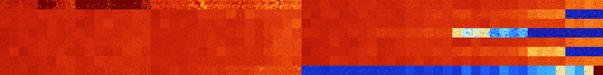

# B01478 (206336-206847)

<details>
    <summary>Initial Grid</summary>
    
</details>


<details>
    <summary>Initial Grid RLE</summary>

```
#C Exported from GoGoL (https://github.com/marrow16/gogol)
#C Wrap mode: Toroidal
#C Boundary mode: Dead
#C Step: 0
x = 100, y = 100, rule = B01478/S
21bo7bo23bo3bo10bo14bo$8bo12bo47bo2bo6bo13bo$4bo74bo2bo13bo$3bo10bo8b2o
12bo53b2o$20bo3bo16bo5b2o20b2o20bo$5bo15bo5bo7bo44bo$o19bo21bo3bo17bo
10bobo15bo2bo$bo29bo3bo30bo24bo6bo$bo4bo38bo11bo34bo6bo$26bo2bo11bo3bo
19bo$14bo22bo34bo2bo7bo$5bo10bo55bo3bo18bo$o26bo4bo48bo$63bo7bo14bo$10b
o44bo$57bo10b2o19bo$24bo9bo4bo4bo5bo48bo$o13bo9bo8bo18bo28bo7bo$66bo20b
o$18bo7bo26b2o19bo23bo$bo12bo6bo22bo37bo$4bo25bo10bo6b2o22bo15bo$17bo
31bobo$52bo7bo6bo25bo$12bo3bo7bo9bobo36bo17bo$42bo$14bo37bo16bo$14bo11b
o3bo7bo19bo14bo24bo$12bo8bo14bo25bobo28bo$12bo21b2o6bo17bo7bo3bo14bo$5b
o15bo11bo41bo7bo5bobo$25bo69bo$15bo33bo7bo18b2o18bo$5bo56bo22bo$8bo55bo
34bo$19bo68bo$15bo25bo2bo6b2o27bo$24bo12bo21bo21bo$23bo53bo$11bo4bo20bo
$4bo4b2o24bo57bobo$43bo28bo6bo$o34bo9bo42bo$20bo18bobo11bo9bo6bo6bo5bo
2bo$25bo20bo17bo$5bo7bo33bo49bo$47bobo26bo$46bo12bo11bo15bo$4bo22bo9bo
12bo$bo3bo13bo21bo13bobo27bo10bo$3bo4bo20bo10bo5bo14bo3bo2b2o16bo$9bo
23bo2bo26bo21bo5bo$7b2o3bo23bo13bo31bo9bo$8bo14bo26bo3bo10bo6bo19bo$9bo
45bo21bo$bo2bo5bo6bo11bo27bo28bo10b2o$8bo3bo13bobo6bo36bo$o7bobo6bo4bo
6bo25bo32bo2bobo$25bo5bo7bo8bo17bo32bo$5bobo16bo9bo6bo50bo$26bo12bo18bo
3bo6bo2bo13bo8bo$16bobo77bo$15bo19bobo8bo28bo20bo$8bo2bo13bo6b2o15bo9bo
10bo16bobo4bo$24bo7bo35b2o7bo13bo$24bo21bo13bo3bo6bo7bobo16bo$34bo4bo
11bo4bo11bo8bo$13bo35bo6bo9bo$o5bobo25bo48bo4bo$24bo24bo6b2o14bo8bo$3b
2o3bo3bo2bobo72b2obo5bo$14b3o3bo24bo8bo28bo5bo$21bo23bo23bo10bo9bo7bo$
10bo19bo20bo30bo$o31bo9bo4bo7bo$21bo6bobo11b2o22bo3bo11bo7bo5bo$33bo3bo
23bo10bo7bo$10bo9bo9bo22bo29bo9bo$25bo14bo2bo28bo$28bo39bo5bobo$5bo17bo
28bo4bo7bo12bobo$9bo11bo19bo49bo$44bo10b2o2bo$14bo3bo4bo2bo29bo13bo5bo
11bo9bo$bo20bo50b2o$o11b2o10bobo23bo2bo22bo$3bo15bo14bo9bo24bo$44bo$18b
o14bo13bo11bo5bo30bo$10bo3bo22bo4bo35bo$55bo3bo3bo$16bo79bo$2b2o30bo12b
2o13bo5bo2bo$37bo6bo11bo23bo$2bo23bo7b2o41bo$5bo2bo17bo18bo26bo12bo5bo$
34bo54bo2bo$3bo45bo$6bo15bo5bo10bo52bo$13bobo24bo35bo2b2o!
```
</details>
<details>
    <summary>Thumbnail</summary>

</details>
<table>
<tr>
    <td><a href="./206336%20S%20Heat%20Map%20Activity.png"></a><br>S (206336)<br>G>1000</td>    <td><a href="./206337%20S0%20Heat%20Map%20Activity.png"></a><br>S0 (206337)<br>G>1000</td>    <td><a href="./206338%20S1%20Heat%20Map%20Activity.png"></a><br>S1 (206338)<br>G>1000</td>    <td><a href="./206339%20S01%20Heat%20Map%20Activity.png"></a><br>S01 (206339)<br>G>1000</td>    <td><a href="./206340%20S2%20Heat%20Map%20Activity.png"></a><br>S2 (206340)<br>R@56,p2</td>    <td><a href="./206341%20S02%20Heat%20Map%20Activity.png"></a><br>S02 (206341)<br>G>1000</td>    <td><a href="./206342%20S12%20Heat%20Map%20Activity.png"></a><br>S12 (206342)<br>G>1000</td>    <td><a href="./206343%20S012%20Heat%20Map%20Activity.png"></a><br>S012 (206343)<br>G>1000</td>    <td><a href="./206344%20S3%20Heat%20Map%20Activity.png"></a><br>S3 (206344)<br>R@50,p4</td>    <td><a href="./206345%20S03%20Heat%20Map%20Activity.png"></a><br>S03 (206345)<br>R@34,p4</td>    <td><a href="./206346%20S13%20Heat%20Map%20Activity.png"></a><br>S13 (206346)<br>R@162,p56</td>    <td><a href="./206347%20S013%20Heat%20Map%20Activity.png"></a><br>S013 (206347)<br>R@543,p180</td>    <td><a href="./206348%20S23%20Heat%20Map%20Activity.png"></a><br>S23 (206348)<br>R@54,p2</td>    <td><a href="./206349%20S023%20Heat%20Map%20Activity.png"></a><br>S023 (206349)<br>R@83,p4</td>    <td><a href="./206350%20S123%20Heat%20Map%20Activity.png"></a><br>S123 (206350)<br>R@294,p12</td>    <td><a href="./206351%20S0123%20Heat%20Map%20Activity.png"></a><br>S0123 (206351)<br>G>1000</td>    <td><a href="./206352%20S4%20Heat%20Map%20Activity.png"></a><br>S4 (206352)<br>G>1000</td>    <td><a href="./206353%20S04%20Heat%20Map%20Activity.png"></a><br>S04 (206353)<br>G>1000</td>    <td><a href="./206354%20S14%20Heat%20Map%20Activity.png"></a><br>S14 (206354)<br>G>1000</td>    <td><a href="./206355%20S014%20Heat%20Map%20Activity.png"></a><br>S014 (206355)<br>G>1000</td>    <td><a href="./206356%20S24%20Heat%20Map%20Activity.png"></a><br>S24 (206356)<br>G>1000</td>    <td><a href="./206357%20S024%20Heat%20Map%20Activity.png"></a><br>S024 (206357)<br>G>1000</td>    <td><a href="./206358%20S124%20Heat%20Map%20Activity.png"></a><br>S124 (206358)<br>G>1000</td>    <td><a href="./206359%20S0124%20Heat%20Map%20Activity.png"></a><br>S0124 (206359)<br>G>1000</td>    <td><a href="./206360%20S34%20Heat%20Map%20Activity.png"></a><br>S34 (206360)<br>G>1000</td>    <td><a href="./206361%20S034%20Heat%20Map%20Activity.png"></a><br>S034 (206361)<br>G>1000</td>    <td><a href="./206362%20S134%20Heat%20Map%20Activity.png"></a><br>S134 (206362)<br>G>1000</td>    <td><a href="./206363%20S0134%20Heat%20Map%20Activity.png"></a><br>S0134 (206363)<br>G>1000</td>    <td><a href="./206364%20S234%20Heat%20Map%20Activity.png"></a><br>S234 (206364)<br>G>1000</td>    <td><a href="./206365%20S0234%20Heat%20Map%20Activity.png"></a><br>S0234 (206365)<br>G>1000</td>    <td><a href="./206366%20S1234%20Heat%20Map%20Activity.png"></a><br>S1234 (206366)<br>G>1000</td>    <td><a href="./206367%20S01234%20Heat%20Map%20Activity.png"></a><br>S01234 (206367)<br>G>1000</td>    <td><a href="./206368%20S5%20Heat%20Map%20Activity.png"></a><br>S5 (206368)<br>G>1000</td>    <td><a href="./206369%20S05%20Heat%20Map%20Activity.png"></a><br>S05 (206369)<br>G>1000</td>    <td><a href="./206370%20S15%20Heat%20Map%20Activity.png"></a><br>S15 (206370)<br>G>1000</td>    <td><a href="./206371%20S015%20Heat%20Map%20Activity.png"></a><br>S015 (206371)<br>G>1000</td>    <td><a href="./206372%20S25%20Heat%20Map%20Activity.png"></a><br>S25 (206372)<br>G>1000</td>    <td><a href="./206373%20S025%20Heat%20Map%20Activity.png"></a><br>S025 (206373)<br>G>1000</td>    <td><a href="./206374%20S125%20Heat%20Map%20Activity.png"></a><br>S125 (206374)<br>G>1000</td>    <td><a href="./206375%20S0125%20Heat%20Map%20Activity.png"></a><br>S0125 (206375)<br>G>1000</td>    <td><a href="./206376%20S35%20Heat%20Map%20Activity.png"></a><br>S35 (206376)<br>G>1000</td>    <td><a href="./206377%20S035%20Heat%20Map%20Activity.png"></a><br>S035 (206377)<br>G>1000</td>    <td><a href="./206378%20S135%20Heat%20Map%20Activity.png"></a><br>S135 (206378)<br>G>1000</td>    <td><a href="./206379%20S0135%20Heat%20Map%20Activity.png"></a><br>S0135 (206379)<br>G>1000</td>    <td><a href="./206380%20S235%20Heat%20Map%20Activity.png"></a><br>S235 (206380)<br>G>1000</td>    <td><a href="./206381%20S0235%20Heat%20Map%20Activity.png"></a><br>S0235 (206381)<br>G>1000</td>    <td><a href="./206382%20S1235%20Heat%20Map%20Activity.png"></a><br>S1235 (206382)<br>G>1000</td>    <td><a href="./206383%20S01235%20Heat%20Map%20Activity.png"></a><br>S01235 (206383)<br>G>1000</td>    <td><a href="./206384%20S45%20Heat%20Map%20Activity.png"></a><br>S45 (206384)<br>G>1000</td>    <td><a href="./206385%20S045%20Heat%20Map%20Activity.png"></a><br>S045 (206385)<br>G>1000</td>    <td><a href="./206386%20S145%20Heat%20Map%20Activity.png"></a><br>S145 (206386)<br>G>1000</td>    <td><a href="./206387%20S0145%20Heat%20Map%20Activity.png"></a><br>S0145 (206387)<br>G>1000</td>    <td><a href="./206388%20S245%20Heat%20Map%20Activity.png"></a><br>S245 (206388)<br>G>1000</td>    <td><a href="./206389%20S0245%20Heat%20Map%20Activity.png"></a><br>S0245 (206389)<br>G>1000</td>    <td><a href="./206390%20S1245%20Heat%20Map%20Activity.png"></a><br>S1245 (206390)<br>G>1000</td>    <td><a href="./206391%20S01245%20Heat%20Map%20Activity.png"></a><br>S01245 (206391)<br>G>1000</td>    <td><a href="./206392%20S345%20Heat%20Map%20Activity.png"></a><br>S345 (206392)<br>G>1000</td>    <td><a href="./206393%20S0345%20Heat%20Map%20Activity.png"></a><br>S0345 (206393)<br>G>1000</td>    <td><a href="./206394%20S1345%20Heat%20Map%20Activity.png"></a><br>S1345 (206394)<br>G>1000</td>    <td><a href="./206395%20S01345%20Heat%20Map%20Activity.png"></a><br>S01345 (206395)<br>G>1000</td>    <td><a href="./206396%20S2345%20Heat%20Map%20Activity.png"></a><br>S2345 (206396)<br>G>1000</td>    <td><a href="./206397%20S02345%20Heat%20Map%20Activity.png"></a><br>S02345 (206397)<br>G>1000</td>    <td><a href="./206398%20S12345%20Heat%20Map%20Activity.png"></a><br>S12345 (206398)<br>G>1000</td>    <td><a href="./206399%20S012345%20Heat%20Map%20Activity.png"></a><br>S012345 (206399)<br>G>1000</td></tr>
<tr>
    <td><a href="./206400%20S6%20Heat%20Map%20Activity.png"></a><br>S6 (206400)<br>G>1000</td>    <td><a href="./206401%20S06%20Heat%20Map%20Activity.png"></a><br>S06 (206401)<br>G>1000</td>    <td><a href="./206402%20S16%20Heat%20Map%20Activity.png"></a><br>S16 (206402)<br>G>1000</td>    <td><a href="./206403%20S016%20Heat%20Map%20Activity.png"></a><br>S016 (206403)<br>G>1000</td>    <td><a href="./206404%20S26%20Heat%20Map%20Activity.png"></a><br>S26 (206404)<br>G>1000</td>    <td><a href="./206405%20S026%20Heat%20Map%20Activity.png"></a><br>S026 (206405)<br>G>1000</td>    <td><a href="./206406%20S126%20Heat%20Map%20Activity.png"></a><br>S126 (206406)<br>G>1000</td>    <td><a href="./206407%20S0126%20Heat%20Map%20Activity.png"></a><br>S0126 (206407)<br>G>1000</td>    <td><a href="./206408%20S36%20Heat%20Map%20Activity.png"></a><br>S36 (206408)<br>G>1000</td>    <td><a href="./206409%20S036%20Heat%20Map%20Activity.png"></a><br>S036 (206409)<br>G>1000</td>    <td><a href="./206410%20S136%20Heat%20Map%20Activity.png"></a><br>S136 (206410)<br>G>1000</td>    <td><a href="./206411%20S0136%20Heat%20Map%20Activity.png"></a><br>S0136 (206411)<br>G>1000</td>    <td><a href="./206412%20S236%20Heat%20Map%20Activity.png"></a><br>S236 (206412)<br>G>1000</td>    <td><a href="./206413%20S0236%20Heat%20Map%20Activity.png"></a><br>S0236 (206413)<br>G>1000</td>    <td><a href="./206414%20S1236%20Heat%20Map%20Activity.png"></a><br>S1236 (206414)<br>G>1000</td>    <td><a href="./206415%20S01236%20Heat%20Map%20Activity.png"></a><br>S01236 (206415)<br>G>1000</td>    <td><a href="./206416%20S46%20Heat%20Map%20Activity.png"></a><br>S46 (206416)<br>G>1000</td>    <td><a href="./206417%20S046%20Heat%20Map%20Activity.png"></a><br>S046 (206417)<br>G>1000</td>    <td><a href="./206418%20S146%20Heat%20Map%20Activity.png"></a><br>S146 (206418)<br>G>1000</td>    <td><a href="./206419%20S0146%20Heat%20Map%20Activity.png"></a><br>S0146 (206419)<br>G>1000</td>    <td><a href="./206420%20S246%20Heat%20Map%20Activity.png"></a><br>S246 (206420)<br>G>1000</td>    <td><a href="./206421%20S0246%20Heat%20Map%20Activity.png"></a><br>S0246 (206421)<br>G>1000</td>    <td><a href="./206422%20S1246%20Heat%20Map%20Activity.png"></a><br>S1246 (206422)<br>G>1000</td>    <td><a href="./206423%20S01246%20Heat%20Map%20Activity.png"></a><br>S01246 (206423)<br>G>1000</td>    <td><a href="./206424%20S346%20Heat%20Map%20Activity.png"></a><br>S346 (206424)<br>G>1000</td>    <td><a href="./206425%20S0346%20Heat%20Map%20Activity.png"></a><br>S0346 (206425)<br>G>1000</td>    <td><a href="./206426%20S1346%20Heat%20Map%20Activity.png"></a><br>S1346 (206426)<br>G>1000</td>    <td><a href="./206427%20S01346%20Heat%20Map%20Activity.png"></a><br>S01346 (206427)<br>G>1000</td>    <td><a href="./206428%20S2346%20Heat%20Map%20Activity.png"></a><br>S2346 (206428)<br>G>1000</td>    <td><a href="./206429%20S02346%20Heat%20Map%20Activity.png"></a><br>S02346 (206429)<br>G>1000</td>    <td><a href="./206430%20S12346%20Heat%20Map%20Activity.png"></a><br>S12346 (206430)<br>G>1000</td>    <td><a href="./206431%20S012346%20Heat%20Map%20Activity.png"></a><br>S012346 (206431)<br>G>1000</td>    <td><a href="./206432%20S56%20Heat%20Map%20Activity.png"></a><br>S56 (206432)<br>G>1000</td>    <td><a href="./206433%20S056%20Heat%20Map%20Activity.png"></a><br>S056 (206433)<br>G>1000</td>    <td><a href="./206434%20S156%20Heat%20Map%20Activity.png"></a><br>S156 (206434)<br>G>1000</td>    <td><a href="./206435%20S0156%20Heat%20Map%20Activity.png"></a><br>S0156 (206435)<br>G>1000</td>    <td><a href="./206436%20S256%20Heat%20Map%20Activity.png"></a><br>S256 (206436)<br>G>1000</td>    <td><a href="./206437%20S0256%20Heat%20Map%20Activity.png"></a><br>S0256 (206437)<br>G>1000</td>    <td><a href="./206438%20S1256%20Heat%20Map%20Activity.png"></a><br>S1256 (206438)<br>G>1000</td>    <td><a href="./206439%20S01256%20Heat%20Map%20Activity.png"></a><br>S01256 (206439)<br>G>1000</td>    <td><a href="./206440%20S356%20Heat%20Map%20Activity.png"></a><br>S356 (206440)<br>G>1000</td>    <td><a href="./206441%20S0356%20Heat%20Map%20Activity.png"></a><br>S0356 (206441)<br>G>1000</td>    <td><a href="./206442%20S1356%20Heat%20Map%20Activity.png"></a><br>S1356 (206442)<br>G>1000</td>    <td><a href="./206443%20S01356%20Heat%20Map%20Activity.png"></a><br>S01356 (206443)<br>G>1000</td>    <td><a href="./206444%20S2356%20Heat%20Map%20Activity.png"></a><br>S2356 (206444)<br>G>1000</td>    <td><a href="./206445%20S02356%20Heat%20Map%20Activity.png"></a><br>S02356 (206445)<br>G>1000</td>    <td><a href="./206446%20S12356%20Heat%20Map%20Activity.png"></a><br>S12356 (206446)<br>G>1000</td>    <td><a href="./206447%20S012356%20Heat%20Map%20Activity.png"></a><br>S012356 (206447)<br>G>1000</td>    <td><a href="./206448%20S456%20Heat%20Map%20Activity.png"></a><br>S456 (206448)<br>G>1000</td>    <td><a href="./206449%20S0456%20Heat%20Map%20Activity.png"></a><br>S0456 (206449)<br>G>1000</td>    <td><a href="./206450%20S1456%20Heat%20Map%20Activity.png"></a><br>S1456 (206450)<br>G>1000</td>    <td><a href="./206451%20S01456%20Heat%20Map%20Activity.png"></a><br>S01456 (206451)<br>G>1000</td>    <td><a href="./206452%20S2456%20Heat%20Map%20Activity.png"></a><br>S2456 (206452)<br>G>1000</td>    <td><a href="./206453%20S02456%20Heat%20Map%20Activity.png"></a><br>S02456 (206453)<br>G>1000</td>    <td><a href="./206454%20S12456%20Heat%20Map%20Activity.png"></a><br>S12456 (206454)<br>G>1000</td>    <td><a href="./206455%20S012456%20Heat%20Map%20Activity.png"></a><br>S012456 (206455)<br>G>1000</td>    <td><a href="./206456%20S3456%20Heat%20Map%20Activity.png"></a><br>S3456 (206456)<br>G>1000</td>    <td><a href="./206457%20S03456%20Heat%20Map%20Activity.png"></a><br>S03456 (206457)<br>G>1000</td>    <td><a href="./206458%20S13456%20Heat%20Map%20Activity.png"></a><br>S13456 (206458)<br>G>1000</td>    <td><a href="./206459%20S013456%20Heat%20Map%20Activity.png"></a><br>S013456 (206459)<br>G>1000</td>    <td><a href="./206460%20S23456%20Heat%20Map%20Activity.png"></a><br>S23456 (206460)<br>G>1000</td>    <td><a href="./206461%20S023456%20Heat%20Map%20Activity.png"></a><br>S023456 (206461)<br>G>1000</td>    <td><a href="./206462%20S123456%20Heat%20Map%20Activity.png"></a><br>S123456 (206462)<br>G>1000</td>    <td><a href="./206463%20S0123456%20Heat%20Map%20Activity.png"></a><br>S0123456 (206463)<br>G>1000</td></tr>
<tr>
    <td><a href="./206464%20S7%20Heat%20Map%20Activity.png"></a><br>S7 (206464)<br>G>1000</td>    <td><a href="./206465%20S07%20Heat%20Map%20Activity.png"></a><br>S07 (206465)<br>G>1000</td>    <td><a href="./206466%20S17%20Heat%20Map%20Activity.png"></a><br>S17 (206466)<br>G>1000</td>    <td><a href="./206467%20S017%20Heat%20Map%20Activity.png"></a><br>S017 (206467)<br>G>1000</td>    <td><a href="./206468%20S27%20Heat%20Map%20Activity.png"></a><br>S27 (206468)<br>G>1000</td>    <td><a href="./206469%20S027%20Heat%20Map%20Activity.png"></a><br>S027 (206469)<br>G>1000</td>    <td><a href="./206470%20S127%20Heat%20Map%20Activity.png"></a><br>S127 (206470)<br>G>1000</td>    <td><a href="./206471%20S0127%20Heat%20Map%20Activity.png"></a><br>S0127 (206471)<br>G>1000</td>    <td><a href="./206472%20S37%20Heat%20Map%20Activity.png"></a><br>S37 (206472)<br>G>1000</td>    <td><a href="./206473%20S037%20Heat%20Map%20Activity.png"></a><br>S037 (206473)<br>G>1000</td>    <td><a href="./206474%20S137%20Heat%20Map%20Activity.png"></a><br>S137 (206474)<br>G>1000</td>    <td><a href="./206475%20S0137%20Heat%20Map%20Activity.png"></a><br>S0137 (206475)<br>G>1000</td>    <td><a href="./206476%20S237%20Heat%20Map%20Activity.png"></a><br>S237 (206476)<br>G>1000</td>    <td><a href="./206477%20S0237%20Heat%20Map%20Activity.png"></a><br>S0237 (206477)<br>G>1000</td>    <td><a href="./206478%20S1237%20Heat%20Map%20Activity.png"></a><br>S1237 (206478)<br>G>1000</td>    <td><a href="./206479%20S01237%20Heat%20Map%20Activity.png"></a><br>S01237 (206479)<br>G>1000</td>    <td><a href="./206480%20S47%20Heat%20Map%20Activity.png"></a><br>S47 (206480)<br>G>1000</td>    <td><a href="./206481%20S047%20Heat%20Map%20Activity.png"></a><br>S047 (206481)<br>G>1000</td>    <td><a href="./206482%20S147%20Heat%20Map%20Activity.png"></a><br>S147 (206482)<br>G>1000</td>    <td><a href="./206483%20S0147%20Heat%20Map%20Activity.png"></a><br>S0147 (206483)<br>G>1000</td>    <td><a href="./206484%20S247%20Heat%20Map%20Activity.png"></a><br>S247 (206484)<br>G>1000</td>    <td><a href="./206485%20S0247%20Heat%20Map%20Activity.png"></a><br>S0247 (206485)<br>G>1000</td>    <td><a href="./206486%20S1247%20Heat%20Map%20Activity.png"></a><br>S1247 (206486)<br>G>1000</td>    <td><a href="./206487%20S01247%20Heat%20Map%20Activity.png"></a><br>S01247 (206487)<br>G>1000</td>    <td><a href="./206488%20S347%20Heat%20Map%20Activity.png"></a><br>S347 (206488)<br>G>1000</td>    <td><a href="./206489%20S0347%20Heat%20Map%20Activity.png"></a><br>S0347 (206489)<br>G>1000</td>    <td><a href="./206490%20S1347%20Heat%20Map%20Activity.png"></a><br>S1347 (206490)<br>G>1000</td>    <td><a href="./206491%20S01347%20Heat%20Map%20Activity.png"></a><br>S01347 (206491)<br>G>1000</td>    <td><a href="./206492%20S2347%20Heat%20Map%20Activity.png"></a><br>S2347 (206492)<br>G>1000</td>    <td><a href="./206493%20S02347%20Heat%20Map%20Activity.png"></a><br>S02347 (206493)<br>G>1000</td>    <td><a href="./206494%20S12347%20Heat%20Map%20Activity.png"></a><br>S12347 (206494)<br>G>1000</td>    <td><a href="./206495%20S012347%20Heat%20Map%20Activity.png"></a><br>S012347 (206495)<br>G>1000</td>    <td><a href="./206496%20S57%20Heat%20Map%20Activity.png"></a><br>S57 (206496)<br>G>1000</td>    <td><a href="./206497%20S057%20Heat%20Map%20Activity.png"></a><br>S057 (206497)<br>G>1000</td>    <td><a href="./206498%20S157%20Heat%20Map%20Activity.png"></a><br>S157 (206498)<br>G>1000</td>    <td><a href="./206499%20S0157%20Heat%20Map%20Activity.png"></a><br>S0157 (206499)<br>G>1000</td>    <td><a href="./206500%20S257%20Heat%20Map%20Activity.png"></a><br>S257 (206500)<br>G>1000</td>    <td><a href="./206501%20S0257%20Heat%20Map%20Activity.png"></a><br>S0257 (206501)<br>G>1000</td>    <td><a href="./206502%20S1257%20Heat%20Map%20Activity.png"></a><br>S1257 (206502)<br>G>1000</td>    <td><a href="./206503%20S01257%20Heat%20Map%20Activity.png"></a><br>S01257 (206503)<br>G>1000</td>    <td><a href="./206504%20S357%20Heat%20Map%20Activity.png"></a><br>S357 (206504)<br>G>1000</td>    <td><a href="./206505%20S0357%20Heat%20Map%20Activity.png"></a><br>S0357 (206505)<br>G>1000</td>    <td><a href="./206506%20S1357%20Heat%20Map%20Activity.png"></a><br>S1357 (206506)<br>G>1000</td>    <td><a href="./206507%20S01357%20Heat%20Map%20Activity.png"></a><br>S01357 (206507)<br>G>1000</td>    <td><a href="./206508%20S2357%20Heat%20Map%20Activity.png"></a><br>S2357 (206508)<br>G>1000</td>    <td><a href="./206509%20S02357%20Heat%20Map%20Activity.png"></a><br>S02357 (206509)<br>G>1000</td>    <td><a href="./206510%20S12357%20Heat%20Map%20Activity.png"></a><br>S12357 (206510)<br>G>1000</td>    <td><a href="./206511%20S012357%20Heat%20Map%20Activity.png"></a><br>S012357 (206511)<br>G>1000</td>    <td><a href="./206512%20S457%20Heat%20Map%20Activity.png"></a><br>S457 (206512)<br>G>1000</td>    <td><a href="./206513%20S0457%20Heat%20Map%20Activity.png"></a><br>S0457 (206513)<br>G>1000</td>    <td><a href="./206514%20S1457%20Heat%20Map%20Activity.png"></a><br>S1457 (206514)<br>G>1000</td>    <td><a href="./206515%20S01457%20Heat%20Map%20Activity.png"></a><br>S01457 (206515)<br>G>1000</td>    <td><a href="./206516%20S2457%20Heat%20Map%20Activity.png"></a><br>S2457 (206516)<br>G>1000</td>    <td><a href="./206517%20S02457%20Heat%20Map%20Activity.png"></a><br>S02457 (206517)<br>G>1000</td>    <td><a href="./206518%20S12457%20Heat%20Map%20Activity.png"></a><br>S12457 (206518)<br>G>1000</td>    <td><a href="./206519%20S012457%20Heat%20Map%20Activity.png"></a><br>S012457 (206519)<br>G>1000</td>    <td><a href="./206520%20S3457%20Heat%20Map%20Activity.png"></a><br>S3457 (206520)<br>G>1000</td>    <td><a href="./206521%20S03457%20Heat%20Map%20Activity.png"></a><br>S03457 (206521)<br>G>1000</td>    <td><a href="./206522%20S13457%20Heat%20Map%20Activity.png"></a><br>S13457 (206522)<br>G>1000</td>    <td><a href="./206523%20S013457%20Heat%20Map%20Activity.png"></a><br>S013457 (206523)<br>G>1000</td>    <td><a href="./206524%20S23457%20Heat%20Map%20Activity.png"></a><br>S23457 (206524)<br>G>1000</td>    <td><a href="./206525%20S023457%20Heat%20Map%20Activity.png"></a><br>S023457 (206525)<br>G>1000</td>    <td><a href="./206526%20S123457%20Heat%20Map%20Activity.png"></a><br>S123457 (206526)<br>G>1000</td>    <td><a href="./206527%20S0123457%20Heat%20Map%20Activity.png"></a><br>S0123457 (206527)<br>G>1000</td></tr>
<tr>
    <td><a href="./206528%20S67%20Heat%20Map%20Activity.png"></a><br>S67 (206528)<br>G>1000</td>    <td><a href="./206529%20S067%20Heat%20Map%20Activity.png"></a><br>S067 (206529)<br>G>1000</td>    <td><a href="./206530%20S167%20Heat%20Map%20Activity.png"></a><br>S167 (206530)<br>G>1000</td>    <td><a href="./206531%20S0167%20Heat%20Map%20Activity.png"></a><br>S0167 (206531)<br>G>1000</td>    <td><a href="./206532%20S267%20Heat%20Map%20Activity.png"></a><br>S267 (206532)<br>G>1000</td>    <td><a href="./206533%20S0267%20Heat%20Map%20Activity.png"></a><br>S0267 (206533)<br>G>1000</td>    <td><a href="./206534%20S1267%20Heat%20Map%20Activity.png"></a><br>S1267 (206534)<br>G>1000</td>    <td><a href="./206535%20S01267%20Heat%20Map%20Activity.png"></a><br>S01267 (206535)<br>G>1000</td>    <td><a href="./206536%20S367%20Heat%20Map%20Activity.png"></a><br>S367 (206536)<br>G>1000</td>    <td><a href="./206537%20S0367%20Heat%20Map%20Activity.png"></a><br>S0367 (206537)<br>G>1000</td>    <td><a href="./206538%20S1367%20Heat%20Map%20Activity.png"></a><br>S1367 (206538)<br>G>1000</td>    <td><a href="./206539%20S01367%20Heat%20Map%20Activity.png"></a><br>S01367 (206539)<br>G>1000</td>    <td><a href="./206540%20S2367%20Heat%20Map%20Activity.png"></a><br>S2367 (206540)<br>G>1000</td>    <td><a href="./206541%20S02367%20Heat%20Map%20Activity.png"></a><br>S02367 (206541)<br>G>1000</td>    <td><a href="./206542%20S12367%20Heat%20Map%20Activity.png"></a><br>S12367 (206542)<br>G>1000</td>    <td><a href="./206543%20S012367%20Heat%20Map%20Activity.png"></a><br>S012367 (206543)<br>G>1000</td>    <td><a href="./206544%20S467%20Heat%20Map%20Activity.png"></a><br>S467 (206544)<br>G>1000</td>    <td><a href="./206545%20S0467%20Heat%20Map%20Activity.png"></a><br>S0467 (206545)<br>G>1000</td>    <td><a href="./206546%20S1467%20Heat%20Map%20Activity.png"></a><br>S1467 (206546)<br>G>1000</td>    <td><a href="./206547%20S01467%20Heat%20Map%20Activity.png"></a><br>S01467 (206547)<br>G>1000</td>    <td><a href="./206548%20S2467%20Heat%20Map%20Activity.png"></a><br>S2467 (206548)<br>G>1000</td>    <td><a href="./206549%20S02467%20Heat%20Map%20Activity.png"></a><br>S02467 (206549)<br>G>1000</td>    <td><a href="./206550%20S12467%20Heat%20Map%20Activity.png"></a><br>S12467 (206550)<br>G>1000</td>    <td><a href="./206551%20S012467%20Heat%20Map%20Activity.png"></a><br>S012467 (206551)<br>G>1000</td>    <td><a href="./206552%20S3467%20Heat%20Map%20Activity.png"></a><br>S3467 (206552)<br>G>1000</td>    <td><a href="./206553%20S03467%20Heat%20Map%20Activity.png"></a><br>S03467 (206553)<br>G>1000</td>    <td><a href="./206554%20S13467%20Heat%20Map%20Activity.png"></a><br>S13467 (206554)<br>G>1000</td>    <td><a href="./206555%20S013467%20Heat%20Map%20Activity.png"></a><br>S013467 (206555)<br>G>1000</td>    <td><a href="./206556%20S23467%20Heat%20Map%20Activity.png"></a><br>S23467 (206556)<br>G>1000</td>    <td><a href="./206557%20S023467%20Heat%20Map%20Activity.png"></a><br>S023467 (206557)<br>G>1000</td>    <td><a href="./206558%20S123467%20Heat%20Map%20Activity.png"></a><br>S123467 (206558)<br>G>1000</td>    <td><a href="./206559%20S0123467%20Heat%20Map%20Activity.png"></a><br>S0123467 (206559)<br>G>1000</td>    <td><a href="./206560%20S567%20Heat%20Map%20Activity.png"></a><br>S567 (206560)<br>G>1000</td>    <td><a href="./206561%20S0567%20Heat%20Map%20Activity.png"></a><br>S0567 (206561)<br>G>1000</td>    <td><a href="./206562%20S1567%20Heat%20Map%20Activity.png"></a><br>S1567 (206562)<br>G>1000</td>    <td><a href="./206563%20S01567%20Heat%20Map%20Activity.png"></a><br>S01567 (206563)<br>G>1000</td>    <td><a href="./206564%20S2567%20Heat%20Map%20Activity.png"></a><br>S2567 (206564)<br>G>1000</td>    <td><a href="./206565%20S02567%20Heat%20Map%20Activity.png"></a><br>S02567 (206565)<br>G>1000</td>    <td><a href="./206566%20S12567%20Heat%20Map%20Activity.png"></a><br>S12567 (206566)<br>G>1000</td>    <td><a href="./206567%20S012567%20Heat%20Map%20Activity.png"></a><br>S012567 (206567)<br>G>1000</td>    <td><a href="./206568%20S3567%20Heat%20Map%20Activity.png"></a><br>S3567 (206568)<br>G>1000</td>    <td><a href="./206569%20S03567%20Heat%20Map%20Activity.png"></a><br>S03567 (206569)<br>G>1000</td>    <td><a href="./206570%20S13567%20Heat%20Map%20Activity.png"></a><br>S13567 (206570)<br>G>1000</td>    <td><a href="./206571%20S013567%20Heat%20Map%20Activity.png"></a><br>S013567 (206571)<br>G>1000</td>    <td><a href="./206572%20S23567%20Heat%20Map%20Activity.png"></a><br>S23567 (206572)<br>G>1000</td>    <td><a href="./206573%20S023567%20Heat%20Map%20Activity.png"></a><br>S023567 (206573)<br>G>1000</td>    <td><a href="./206574%20S123567%20Heat%20Map%20Activity.png"></a><br>S123567 (206574)<br>G>1000</td>    <td><a href="./206575%20S0123567%20Heat%20Map%20Activity.png"></a><br>S0123567 (206575)<br>G>1000</td>    <td><a href="./206576%20S4567%20Heat%20Map%20Activity.png"></a><br>S4567 (206576)<br>G>1000</td>    <td><a href="./206577%20S04567%20Heat%20Map%20Activity.png"></a><br>S04567 (206577)<br>G>1000</td>    <td><a href="./206578%20S14567%20Heat%20Map%20Activity.png"></a><br>S14567 (206578)<br>G>1000</td>    <td><a href="./206579%20S014567%20Heat%20Map%20Activity.png"></a><br>S014567 (206579)<br>G>1000</td>    <td><a href="./206580%20S24567%20Heat%20Map%20Activity.png"></a><br>S24567 (206580)<br>G>1000</td>    <td><a href="./206581%20S024567%20Heat%20Map%20Activity.png"></a><br>S024567 (206581)<br>G>1000</td>    <td><a href="./206582%20S124567%20Heat%20Map%20Activity.png"></a><br>S124567 (206582)<br>G>1000</td>    <td><a href="./206583%20S0124567%20Heat%20Map%20Activity.png"></a><br>S0124567 (206583)<br>G>1000</td>    <td><a href="./206584%20S34567%20Heat%20Map%20Activity.png"></a><br>S34567 (206584)<br>R@897,p840</td>    <td><a href="./206585%20S034567%20Heat%20Map%20Activity.png"></a><br>S034567 (206585)<br>G>1000</td>    <td><a href="./206586%20S134567%20Heat%20Map%20Activity.png"></a><br>S134567 (206586)<br>G>1000</td>    <td><a href="./206587%20S0134567%20Heat%20Map%20Activity.png"></a><br>S0134567 (206587)<br>G>1000</td>    <td><a href="./206588%20S234567%20Heat%20Map%20Activity.png"></a><br>S234567 (206588)<br>G>1000</td>    <td><a href="./206589%20S0234567%20Heat%20Map%20Activity.png"></a><br>S0234567 (206589)<br>G>1000</td>    <td><a href="./206590%20S1234567%20Heat%20Map%20Activity.png"></a><br>S1234567 (206590)<br>R@480,p420</td>    <td><a href="./206591%20S01234567%20Heat%20Map%20Activity.png"></a><br>S01234567 (206591)<br>G>1000</td></tr>
<tr>
    <td><a href="./206592%20S8%20Heat%20Map%20Activity.png"></a><br>S8 (206592)<br>G>1000</td>    <td><a href="./206593%20S08%20Heat%20Map%20Activity.png"></a><br>S08 (206593)<br>G>1000</td>    <td><a href="./206594%20S18%20Heat%20Map%20Activity.png"></a><br>S18 (206594)<br>G>1000</td>    <td><a href="./206595%20S018%20Heat%20Map%20Activity.png"></a><br>S018 (206595)<br>G>1000</td>    <td><a href="./206596%20S28%20Heat%20Map%20Activity.png"></a><br>S28 (206596)<br>G>1000</td>    <td><a href="./206597%20S028%20Heat%20Map%20Activity.png"></a><br>S028 (206597)<br>G>1000</td>    <td><a href="./206598%20S128%20Heat%20Map%20Activity.png"></a><br>S128 (206598)<br>G>1000</td>    <td><a href="./206599%20S0128%20Heat%20Map%20Activity.png"></a><br>S0128 (206599)<br>G>1000</td>    <td><a href="./206600%20S38%20Heat%20Map%20Activity.png"></a><br>S38 (206600)<br>G>1000</td>    <td><a href="./206601%20S038%20Heat%20Map%20Activity.png"></a><br>S038 (206601)<br>G>1000</td>    <td><a href="./206602%20S138%20Heat%20Map%20Activity.png"></a><br>S138 (206602)<br>G>1000</td>    <td><a href="./206603%20S0138%20Heat%20Map%20Activity.png"></a><br>S0138 (206603)<br>G>1000</td>    <td><a href="./206604%20S238%20Heat%20Map%20Activity.png"></a><br>S238 (206604)<br>G>1000</td>    <td><a href="./206605%20S0238%20Heat%20Map%20Activity.png"></a><br>S0238 (206605)<br>G>1000</td>    <td><a href="./206606%20S1238%20Heat%20Map%20Activity.png"></a><br>S1238 (206606)<br>G>1000</td>    <td><a href="./206607%20S01238%20Heat%20Map%20Activity.png"></a><br>S01238 (206607)<br>G>1000</td>    <td><a href="./206608%20S48%20Heat%20Map%20Activity.png"></a><br>S48 (206608)<br>G>1000</td>    <td><a href="./206609%20S048%20Heat%20Map%20Activity.png"></a><br>S048 (206609)<br>G>1000</td>    <td><a href="./206610%20S148%20Heat%20Map%20Activity.png"></a><br>S148 (206610)<br>G>1000</td>    <td><a href="./206611%20S0148%20Heat%20Map%20Activity.png"></a><br>S0148 (206611)<br>G>1000</td>    <td><a href="./206612%20S248%20Heat%20Map%20Activity.png"></a><br>S248 (206612)<br>G>1000</td>    <td><a href="./206613%20S0248%20Heat%20Map%20Activity.png"></a><br>S0248 (206613)<br>G>1000</td>    <td><a href="./206614%20S1248%20Heat%20Map%20Activity.png"></a><br>S1248 (206614)<br>G>1000</td>    <td><a href="./206615%20S01248%20Heat%20Map%20Activity.png"></a><br>S01248 (206615)<br>G>1000</td>    <td><a href="./206616%20S348%20Heat%20Map%20Activity.png"></a><br>S348 (206616)<br>G>1000</td>    <td><a href="./206617%20S0348%20Heat%20Map%20Activity.png"></a><br>S0348 (206617)<br>G>1000</td>    <td><a href="./206618%20S1348%20Heat%20Map%20Activity.png"></a><br>S1348 (206618)<br>G>1000</td>    <td><a href="./206619%20S01348%20Heat%20Map%20Activity.png"></a><br>S01348 (206619)<br>G>1000</td>    <td><a href="./206620%20S2348%20Heat%20Map%20Activity.png"></a><br>S2348 (206620)<br>G>1000</td>    <td><a href="./206621%20S02348%20Heat%20Map%20Activity.png"></a><br>S02348 (206621)<br>G>1000</td>    <td><a href="./206622%20S12348%20Heat%20Map%20Activity.png"></a><br>S12348 (206622)<br>G>1000</td>    <td><a href="./206623%20S012348%20Heat%20Map%20Activity.png"></a><br>S012348 (206623)<br>G>1000</td>    <td><a href="./206624%20S58%20Heat%20Map%20Activity.png"></a><br>S58 (206624)<br>G>1000</td>    <td><a href="./206625%20S058%20Heat%20Map%20Activity.png"></a><br>S058 (206625)<br>G>1000</td>    <td><a href="./206626%20S158%20Heat%20Map%20Activity.png"></a><br>S158 (206626)<br>G>1000</td>    <td><a href="./206627%20S0158%20Heat%20Map%20Activity.png"></a><br>S0158 (206627)<br>G>1000</td>    <td><a href="./206628%20S258%20Heat%20Map%20Activity.png"></a><br>S258 (206628)<br>G>1000</td>    <td><a href="./206629%20S0258%20Heat%20Map%20Activity.png"></a><br>S0258 (206629)<br>G>1000</td>    <td><a href="./206630%20S1258%20Heat%20Map%20Activity.png"></a><br>S1258 (206630)<br>G>1000</td>    <td><a href="./206631%20S01258%20Heat%20Map%20Activity.png"></a><br>S01258 (206631)<br>G>1000</td>    <td><a href="./206632%20S358%20Heat%20Map%20Activity.png"></a><br>S358 (206632)<br>G>1000</td>    <td><a href="./206633%20S0358%20Heat%20Map%20Activity.png"></a><br>S0358 (206633)<br>G>1000</td>    <td><a href="./206634%20S1358%20Heat%20Map%20Activity.png"></a><br>S1358 (206634)<br>G>1000</td>    <td><a href="./206635%20S01358%20Heat%20Map%20Activity.png"></a><br>S01358 (206635)<br>G>1000</td>    <td><a href="./206636%20S2358%20Heat%20Map%20Activity.png"></a><br>S2358 (206636)<br>G>1000</td>    <td><a href="./206637%20S02358%20Heat%20Map%20Activity.png"></a><br>S02358 (206637)<br>G>1000</td>    <td><a href="./206638%20S12358%20Heat%20Map%20Activity.png"></a><br>S12358 (206638)<br>G>1000</td>    <td><a href="./206639%20S012358%20Heat%20Map%20Activity.png"></a><br>S012358 (206639)<br>G>1000</td>    <td><a href="./206640%20S458%20Heat%20Map%20Activity.png"></a><br>S458 (206640)<br>G>1000</td>    <td><a href="./206641%20S0458%20Heat%20Map%20Activity.png"></a><br>S0458 (206641)<br>G>1000</td>    <td><a href="./206642%20S1458%20Heat%20Map%20Activity.png"></a><br>S1458 (206642)<br>G>1000</td>    <td><a href="./206643%20S01458%20Heat%20Map%20Activity.png"></a><br>S01458 (206643)<br>G>1000</td>    <td><a href="./206644%20S2458%20Heat%20Map%20Activity.png"></a><br>S2458 (206644)<br>G>1000</td>    <td><a href="./206645%20S02458%20Heat%20Map%20Activity.png"></a><br>S02458 (206645)<br>G>1000</td>    <td><a href="./206646%20S12458%20Heat%20Map%20Activity.png"></a><br>S12458 (206646)<br>G>1000</td>    <td><a href="./206647%20S012458%20Heat%20Map%20Activity.png"></a><br>S012458 (206647)<br>G>1000</td>    <td><a href="./206648%20S3458%20Heat%20Map%20Activity.png"></a><br>S3458 (206648)<br>G>1000</td>    <td><a href="./206649%20S03458%20Heat%20Map%20Activity.png"></a><br>S03458 (206649)<br>G>1000</td>    <td><a href="./206650%20S13458%20Heat%20Map%20Activity.png"></a><br>S13458 (206650)<br>G>1000</td>    <td><a href="./206651%20S013458%20Heat%20Map%20Activity.png"></a><br>S013458 (206651)<br>G>1000</td>    <td><a href="./206652%20S23458%20Heat%20Map%20Activity.png"></a><br>S23458 (206652)<br>G>1000</td>    <td><a href="./206653%20S023458%20Heat%20Map%20Activity.png"></a><br>S023458 (206653)<br>G>1000</td>    <td><a href="./206654%20S123458%20Heat%20Map%20Activity.png"></a><br>S123458 (206654)<br>G>1000</td>    <td><a href="./206655%20S0123458%20Heat%20Map%20Activity.png"></a><br>S0123458 (206655)<br>G>1000</td></tr>
<tr>
    <td><a href="./206656%20S68%20Heat%20Map%20Activity.png"></a><br>S68 (206656)<br>G>1000</td>    <td><a href="./206657%20S068%20Heat%20Map%20Activity.png"></a><br>S068 (206657)<br>G>1000</td>    <td><a href="./206658%20S168%20Heat%20Map%20Activity.png"></a><br>S168 (206658)<br>G>1000</td>    <td><a href="./206659%20S0168%20Heat%20Map%20Activity.png"></a><br>S0168 (206659)<br>G>1000</td>    <td><a href="./206660%20S268%20Heat%20Map%20Activity.png"></a><br>S268 (206660)<br>G>1000</td>    <td><a href="./206661%20S0268%20Heat%20Map%20Activity.png"></a><br>S0268 (206661)<br>G>1000</td>    <td><a href="./206662%20S1268%20Heat%20Map%20Activity.png"></a><br>S1268 (206662)<br>G>1000</td>    <td><a href="./206663%20S01268%20Heat%20Map%20Activity.png"></a><br>S01268 (206663)<br>G>1000</td>    <td><a href="./206664%20S368%20Heat%20Map%20Activity.png"></a><br>S368 (206664)<br>G>1000</td>    <td><a href="./206665%20S0368%20Heat%20Map%20Activity.png"></a><br>S0368 (206665)<br>G>1000</td>    <td><a href="./206666%20S1368%20Heat%20Map%20Activity.png"></a><br>S1368 (206666)<br>G>1000</td>    <td><a href="./206667%20S01368%20Heat%20Map%20Activity.png"></a><br>S01368 (206667)<br>G>1000</td>    <td><a href="./206668%20S2368%20Heat%20Map%20Activity.png"></a><br>S2368 (206668)<br>G>1000</td>    <td><a href="./206669%20S02368%20Heat%20Map%20Activity.png"></a><br>S02368 (206669)<br>G>1000</td>    <td><a href="./206670%20S12368%20Heat%20Map%20Activity.png"></a><br>S12368 (206670)<br>G>1000</td>    <td><a href="./206671%20S012368%20Heat%20Map%20Activity.png"></a><br>S012368 (206671)<br>G>1000</td>    <td><a href="./206672%20S468%20Heat%20Map%20Activity.png"></a><br>S468 (206672)<br>G>1000</td>    <td><a href="./206673%20S0468%20Heat%20Map%20Activity.png"></a><br>S0468 (206673)<br>G>1000</td>    <td><a href="./206674%20S1468%20Heat%20Map%20Activity.png"></a><br>S1468 (206674)<br>G>1000</td>    <td><a href="./206675%20S01468%20Heat%20Map%20Activity.png"></a><br>S01468 (206675)<br>G>1000</td>    <td><a href="./206676%20S2468%20Heat%20Map%20Activity.png"></a><br>S2468 (206676)<br>G>1000</td>    <td><a href="./206677%20S02468%20Heat%20Map%20Activity.png"></a><br>S02468 (206677)<br>G>1000</td>    <td><a href="./206678%20S12468%20Heat%20Map%20Activity.png"></a><br>S12468 (206678)<br>G>1000</td>    <td><a href="./206679%20S012468%20Heat%20Map%20Activity.png"></a><br>S012468 (206679)<br>G>1000</td>    <td><a href="./206680%20S3468%20Heat%20Map%20Activity.png"></a><br>S3468 (206680)<br>G>1000</td>    <td><a href="./206681%20S03468%20Heat%20Map%20Activity.png"></a><br>S03468 (206681)<br>G>1000</td>    <td><a href="./206682%20S13468%20Heat%20Map%20Activity.png"></a><br>S13468 (206682)<br>G>1000</td>    <td><a href="./206683%20S013468%20Heat%20Map%20Activity.png"></a><br>S013468 (206683)<br>G>1000</td>    <td><a href="./206684%20S23468%20Heat%20Map%20Activity.png"></a><br>S23468 (206684)<br>G>1000</td>    <td><a href="./206685%20S023468%20Heat%20Map%20Activity.png"></a><br>S023468 (206685)<br>G>1000</td>    <td><a href="./206686%20S123468%20Heat%20Map%20Activity.png"></a><br>S123468 (206686)<br>G>1000</td>    <td><a href="./206687%20S0123468%20Heat%20Map%20Activity.png"></a><br>S0123468 (206687)<br>G>1000</td>    <td><a href="./206688%20S568%20Heat%20Map%20Activity.png"></a><br>S568 (206688)<br>G>1000</td>    <td><a href="./206689%20S0568%20Heat%20Map%20Activity.png"></a><br>S0568 (206689)<br>G>1000</td>    <td><a href="./206690%20S1568%20Heat%20Map%20Activity.png"></a><br>S1568 (206690)<br>G>1000</td>    <td><a href="./206691%20S01568%20Heat%20Map%20Activity.png"></a><br>S01568 (206691)<br>G>1000</td>    <td><a href="./206692%20S2568%20Heat%20Map%20Activity.png"></a><br>S2568 (206692)<br>G>1000</td>    <td><a href="./206693%20S02568%20Heat%20Map%20Activity.png"></a><br>S02568 (206693)<br>G>1000</td>    <td><a href="./206694%20S12568%20Heat%20Map%20Activity.png"></a><br>S12568 (206694)<br>G>1000</td>    <td><a href="./206695%20S012568%20Heat%20Map%20Activity.png"></a><br>S012568 (206695)<br>G>1000</td>    <td><a href="./206696%20S3568%20Heat%20Map%20Activity.png"></a><br>S3568 (206696)<br>G>1000</td>    <td><a href="./206697%20S03568%20Heat%20Map%20Activity.png"></a><br>S03568 (206697)<br>G>1000</td>    <td><a href="./206698%20S13568%20Heat%20Map%20Activity.png"></a><br>S13568 (206698)<br>G>1000</td>    <td><a href="./206699%20S013568%20Heat%20Map%20Activity.png"></a><br>S013568 (206699)<br>G>1000</td>    <td><a href="./206700%20S23568%20Heat%20Map%20Activity.png"></a><br>S23568 (206700)<br>G>1000</td>    <td><a href="./206701%20S023568%20Heat%20Map%20Activity.png"></a><br>S023568 (206701)<br>G>1000</td>    <td><a href="./206702%20S123568%20Heat%20Map%20Activity.png"></a><br>S123568 (206702)<br>G>1000</td>    <td><a href="./206703%20S0123568%20Heat%20Map%20Activity.png"></a><br>S0123568 (206703)<br>G>1000</td>    <td><a href="./206704%20S4568%20Heat%20Map%20Activity.png"></a><br>S4568 (206704)<br>G>1000</td>    <td><a href="./206705%20S04568%20Heat%20Map%20Activity.png"></a><br>S04568 (206705)<br>G>1000</td>    <td><a href="./206706%20S14568%20Heat%20Map%20Activity.png"></a><br>S14568 (206706)<br>G>1000</td>    <td><a href="./206707%20S014568%20Heat%20Map%20Activity.png"></a><br>S014568 (206707)<br>G>1000</td>    <td><a href="./206708%20S24568%20Heat%20Map%20Activity.png"></a><br>S24568 (206708)<br>G>1000</td>    <td><a href="./206709%20S024568%20Heat%20Map%20Activity.png"></a><br>S024568 (206709)<br>G>1000</td>    <td><a href="./206710%20S124568%20Heat%20Map%20Activity.png"></a><br>S124568 (206710)<br>G>1000</td>    <td><a href="./206711%20S0124568%20Heat%20Map%20Activity.png"></a><br>S0124568 (206711)<br>G>1000</td>    <td><a href="./206712%20S34568%20Heat%20Map%20Activity.png"></a><br>S34568 (206712)<br>G>1000</td>    <td><a href="./206713%20S034568%20Heat%20Map%20Activity.png"></a><br>S034568 (206713)<br>G>1000</td>    <td><a href="./206714%20S134568%20Heat%20Map%20Activity.png"></a><br>S134568 (206714)<br>G>1000</td>    <td><a href="./206715%20S0134568%20Heat%20Map%20Activity.png"></a><br>S0134568 (206715)<br>G>1000</td>    <td><a href="./206716%20S234568%20Heat%20Map%20Activity.png"></a><br>S234568 (206716)<br>R@589,p360</td>    <td><a href="./206717%20S0234568%20Heat%20Map%20Activity.png"></a><br>S0234568 (206717)<br>G>1000</td>    <td><a href="./206718%20S1234568%20Heat%20Map%20Activity.png"></a><br>S1234568 (206718)<br>G>1000</td>    <td><a href="./206719%20S01234568%20Heat%20Map%20Activity.png"></a><br>S01234568 (206719)<br>G>1000</td></tr>
<tr>
    <td><a href="./206720%20S78%20Heat%20Map%20Activity.png"></a><br>S78 (206720)<br>G>1000</td>    <td><a href="./206721%20S078%20Heat%20Map%20Activity.png"></a><br>S078 (206721)<br>G>1000</td>    <td><a href="./206722%20S178%20Heat%20Map%20Activity.png"></a><br>S178 (206722)<br>G>1000</td>    <td><a href="./206723%20S0178%20Heat%20Map%20Activity.png"></a><br>S0178 (206723)<br>G>1000</td>    <td><a href="./206724%20S278%20Heat%20Map%20Activity.png"></a><br>S278 (206724)<br>G>1000</td>    <td><a href="./206725%20S0278%20Heat%20Map%20Activity.png"></a><br>S0278 (206725)<br>G>1000</td>    <td><a href="./206726%20S1278%20Heat%20Map%20Activity.png"></a><br>S1278 (206726)<br>G>1000</td>    <td><a href="./206727%20S01278%20Heat%20Map%20Activity.png"></a><br>S01278 (206727)<br>G>1000</td>    <td><a href="./206728%20S378%20Heat%20Map%20Activity.png"></a><br>S378 (206728)<br>G>1000</td>    <td><a href="./206729%20S0378%20Heat%20Map%20Activity.png"></a><br>S0378 (206729)<br>G>1000</td>    <td><a href="./206730%20S1378%20Heat%20Map%20Activity.png"></a><br>S1378 (206730)<br>G>1000</td>    <td><a href="./206731%20S01378%20Heat%20Map%20Activity.png"></a><br>S01378 (206731)<br>G>1000</td>    <td><a href="./206732%20S2378%20Heat%20Map%20Activity.png"></a><br>S2378 (206732)<br>G>1000</td>    <td><a href="./206733%20S02378%20Heat%20Map%20Activity.png"></a><br>S02378 (206733)<br>G>1000</td>    <td><a href="./206734%20S12378%20Heat%20Map%20Activity.png"></a><br>S12378 (206734)<br>G>1000</td>    <td><a href="./206735%20S012378%20Heat%20Map%20Activity.png"></a><br>S012378 (206735)<br>G>1000</td>    <td><a href="./206736%20S478%20Heat%20Map%20Activity.png"></a><br>S478 (206736)<br>G>1000</td>    <td><a href="./206737%20S0478%20Heat%20Map%20Activity.png"></a><br>S0478 (206737)<br>G>1000</td>    <td><a href="./206738%20S1478%20Heat%20Map%20Activity.png"></a><br>S1478 (206738)<br>G>1000</td>    <td><a href="./206739%20S01478%20Heat%20Map%20Activity.png"></a><br>S01478 (206739)<br>G>1000</td>    <td><a href="./206740%20S2478%20Heat%20Map%20Activity.png"></a><br>S2478 (206740)<br>G>1000</td>    <td><a href="./206741%20S02478%20Heat%20Map%20Activity.png"></a><br>S02478 (206741)<br>G>1000</td>    <td><a href="./206742%20S12478%20Heat%20Map%20Activity.png"></a><br>S12478 (206742)<br>G>1000</td>    <td><a href="./206743%20S012478%20Heat%20Map%20Activity.png"></a><br>S012478 (206743)<br>G>1000</td>    <td><a href="./206744%20S3478%20Heat%20Map%20Activity.png"></a><br>S3478 (206744)<br>G>1000</td>    <td><a href="./206745%20S03478%20Heat%20Map%20Activity.png"></a><br>S03478 (206745)<br>G>1000</td>    <td><a href="./206746%20S13478%20Heat%20Map%20Activity.png"></a><br>S13478 (206746)<br>G>1000</td>    <td><a href="./206747%20S013478%20Heat%20Map%20Activity.png"></a><br>S013478 (206747)<br>G>1000</td>    <td><a href="./206748%20S23478%20Heat%20Map%20Activity.png"></a><br>S23478 (206748)<br>G>1000</td>    <td><a href="./206749%20S023478%20Heat%20Map%20Activity.png"></a><br>S023478 (206749)<br>G>1000</td>    <td><a href="./206750%20S123478%20Heat%20Map%20Activity.png"></a><br>S123478 (206750)<br>G>1000</td>    <td><a href="./206751%20S0123478%20Heat%20Map%20Activity.png"></a><br>S0123478 (206751)<br>G>1000</td>    <td><a href="./206752%20S578%20Heat%20Map%20Activity.png"></a><br>S578 (206752)<br>G>1000</td>    <td><a href="./206753%20S0578%20Heat%20Map%20Activity.png"></a><br>S0578 (206753)<br>G>1000</td>    <td><a href="./206754%20S1578%20Heat%20Map%20Activity.png"></a><br>S1578 (206754)<br>G>1000</td>    <td><a href="./206755%20S01578%20Heat%20Map%20Activity.png"></a><br>S01578 (206755)<br>G>1000</td>    <td><a href="./206756%20S2578%20Heat%20Map%20Activity.png"></a><br>S2578 (206756)<br>G>1000</td>    <td><a href="./206757%20S02578%20Heat%20Map%20Activity.png"></a><br>S02578 (206757)<br>G>1000</td>    <td><a href="./206758%20S12578%20Heat%20Map%20Activity.png"></a><br>S12578 (206758)<br>G>1000</td>    <td><a href="./206759%20S012578%20Heat%20Map%20Activity.png"></a><br>S012578 (206759)<br>G>1000</td>    <td><a href="./206760%20S3578%20Heat%20Map%20Activity.png"></a><br>S3578 (206760)<br>G>1000</td>    <td><a href="./206761%20S03578%20Heat%20Map%20Activity.png"></a><br>S03578 (206761)<br>G>1000</td>    <td><a href="./206762%20S13578%20Heat%20Map%20Activity.png"></a><br>S13578 (206762)<br>G>1000</td>    <td><a href="./206763%20S013578%20Heat%20Map%20Activity.png"></a><br>S013578 (206763)<br>G>1000</td>    <td><a href="./206764%20S23578%20Heat%20Map%20Activity.png"></a><br>S23578 (206764)<br>G>1000</td>    <td><a href="./206765%20S023578%20Heat%20Map%20Activity.png"></a><br>S023578 (206765)<br>G>1000</td>    <td><a href="./206766%20S123578%20Heat%20Map%20Activity.png"></a><br>S123578 (206766)<br>G>1000</td>    <td><a href="./206767%20S0123578%20Heat%20Map%20Activity.png"></a><br>S0123578 (206767)<br>G>1000</td>    <td><a href="./206768%20S4578%20Heat%20Map%20Activity.png"></a><br>S4578 (206768)<br>G>1000</td>    <td><a href="./206769%20S04578%20Heat%20Map%20Activity.png"></a><br>S04578 (206769)<br>G>1000</td>    <td><a href="./206770%20S14578%20Heat%20Map%20Activity.png"></a><br>S14578 (206770)<br>G>1000</td>    <td><a href="./206771%20S014578%20Heat%20Map%20Activity.png"></a><br>S014578 (206771)<br>G>1000</td>    <td><a href="./206772%20S24578%20Heat%20Map%20Activity.png"></a><br>S24578 (206772)<br>G>1000</td>    <td><a href="./206773%20S024578%20Heat%20Map%20Activity.png"></a><br>S024578 (206773)<br>G>1000</td>    <td><a href="./206774%20S124578%20Heat%20Map%20Activity.png"></a><br>S124578 (206774)<br>G>1000</td>    <td><a href="./206775%20S0124578%20Heat%20Map%20Activity.png"></a><br>S0124578 (206775)<br>G>1000</td>    <td><a href="./206776%20S34578%20Heat%20Map%20Activity.png"></a><br>S34578 (206776)<br>G>1000</td>    <td><a href="./206777%20S034578%20Heat%20Map%20Activity.png"></a><br>S034578 (206777)<br>G>1000</td>    <td><a href="./206778%20S134578%20Heat%20Map%20Activity.png"></a><br>S134578 (206778)<br>G>1000</td>    <td><a href="./206779%20S0134578%20Heat%20Map%20Activity.png"></a><br>S0134578 (206779)<br>G>1000</td>    <td><a href="./206780%20S234578%20Heat%20Map%20Activity.png"></a><br>S234578 (206780)<br>G>1000</td>    <td><a href="./206781%20S0234578%20Heat%20Map%20Activity.png"></a><br>S0234578 (206781)<br>G>1000</td>    <td><a href="./206782%20S1234578%20Heat%20Map%20Activity.png"></a><br>S1234578 (206782)<br>G>1000</td>    <td><a href="./206783%20S01234578%20Heat%20Map%20Activity.png"></a><br>S01234578 (206783)<br>G>1000</td></tr>
<tr>
    <td><a href="./206784%20S678%20Heat%20Map%20Activity.png"></a><br>S678 (206784)<br>G>1000</td>    <td><a href="./206785%20S0678%20Heat%20Map%20Activity.png"></a><br>S0678 (206785)<br>G>1000</td>    <td><a href="./206786%20S1678%20Heat%20Map%20Activity.png"></a><br>S1678 (206786)<br>G>1000</td>    <td><a href="./206787%20S01678%20Heat%20Map%20Activity.png"></a><br>S01678 (206787)<br>G>1000</td>    <td><a href="./206788%20S2678%20Heat%20Map%20Activity.png"></a><br>S2678 (206788)<br>G>1000</td>    <td><a href="./206789%20S02678%20Heat%20Map%20Activity.png"></a><br>S02678 (206789)<br>G>1000</td>    <td><a href="./206790%20S12678%20Heat%20Map%20Activity.png"></a><br>S12678 (206790)<br>G>1000</td>    <td><a href="./206791%20S012678%20Heat%20Map%20Activity.png"></a><br>S012678 (206791)<br>G>1000</td>    <td><a href="./206792%20S3678%20Heat%20Map%20Activity.png"></a><br>S3678 (206792)<br>G>1000</td>    <td><a href="./206793%20S03678%20Heat%20Map%20Activity.png"></a><br>S03678 (206793)<br>G>1000</td>    <td><a href="./206794%20S13678%20Heat%20Map%20Activity.png"></a><br>S13678 (206794)<br>G>1000</td>    <td><a href="./206795%20S013678%20Heat%20Map%20Activity.png"></a><br>S013678 (206795)<br>G>1000</td>    <td><a href="./206796%20S23678%20Heat%20Map%20Activity.png"></a><br>S23678 (206796)<br>G>1000</td>    <td><a href="./206797%20S023678%20Heat%20Map%20Activity.png"></a><br>S023678 (206797)<br>G>1000</td>    <td><a href="./206798%20S123678%20Heat%20Map%20Activity.png"></a><br>S123678 (206798)<br>G>1000</td>    <td><a href="./206799%20S0123678%20Heat%20Map%20Activity.png"></a><br>S0123678 (206799)<br>G>1000</td>    <td><a href="./206800%20S4678%20Heat%20Map%20Activity.png"></a><br>S4678 (206800)<br>G>1000</td>    <td><a href="./206801%20S04678%20Heat%20Map%20Activity.png"></a><br>S04678 (206801)<br>G>1000</td>    <td><a href="./206802%20S14678%20Heat%20Map%20Activity.png"></a><br>S14678 (206802)<br>G>1000</td>    <td><a href="./206803%20S014678%20Heat%20Map%20Activity.png"></a><br>S014678 (206803)<br>G>1000</td>    <td><a href="./206804%20S24678%20Heat%20Map%20Activity.png"></a><br>S24678 (206804)<br>G>1000</td>    <td><a href="./206805%20S024678%20Heat%20Map%20Activity.png"></a><br>S024678 (206805)<br>G>1000</td>    <td><a href="./206806%20S124678%20Heat%20Map%20Activity.png"></a><br>S124678 (206806)<br>G>1000</td>    <td><a href="./206807%20S0124678%20Heat%20Map%20Activity.png"></a><br>S0124678 (206807)<br>G>1000</td>    <td><a href="./206808%20S34678%20Heat%20Map%20Activity.png"></a><br>S34678 (206808)<br>G>1000</td>    <td><a href="./206809%20S034678%20Heat%20Map%20Activity.png"></a><br>S034678 (206809)<br>G>1000</td>    <td><a href="./206810%20S134678%20Heat%20Map%20Activity.png"></a><br>S134678 (206810)<br>G>1000</td>    <td><a href="./206811%20S0134678%20Heat%20Map%20Activity.png"></a><br>S0134678 (206811)<br>G>1000</td>    <td><a href="./206812%20S234678%20Heat%20Map%20Activity.png"></a><br>S234678 (206812)<br>G>1000</td>    <td><a href="./206813%20S0234678%20Heat%20Map%20Activity.png"></a><br>S0234678 (206813)<br>G>1000</td>    <td><a href="./206814%20S1234678%20Heat%20Map%20Activity.png"></a><br>S1234678 (206814)<br>G>1000</td>    <td><a href="./206815%20S01234678%20Heat%20Map%20Activity.png"></a><br>S01234678 (206815)<br>G>1000</td>    <td><a href="./206816%20S5678%20Heat%20Map%20Activity.png"></a><br>S5678 (206816)<br>R@22,p2</td>    <td><a href="./206817%20S05678%20Heat%20Map%20Activity.png"></a><br>S05678 (206817)<br>R@18,p2</td>    <td><a href="./206818%20S15678%20Heat%20Map%20Activity.png"></a><br>S15678 (206818)<br>R@30,p2</td>    <td><a href="./206819%20S015678%20Heat%20Map%20Activity.png"></a><br>S015678 (206819)<br>R@21,p2</td>    <td><a href="./206820%20S25678%20Heat%20Map%20Activity.png"></a><br>S25678 (206820)<br>R@22,p2</td>    <td><a href="./206821%20S025678%20Heat%20Map%20Activity.png"></a><br>S025678 (206821)<br>R@23,p2</td>    <td><a href="./206822%20S125678%20Heat%20Map%20Activity.png"></a><br>S125678 (206822)<br>R@22,p2</td>    <td><a href="./206823%20S0125678%20Heat%20Map%20Activity.png"></a><br>S0125678 (206823)<br>R@22,p2</td>    <td><a href="./206824%20S35678%20Heat%20Map%20Activity.png"></a><br>S35678 (206824)<br>R@21,p2</td>    <td><a href="./206825%20S035678%20Heat%20Map%20Activity.png"></a><br>S035678 (206825)<br>R@25,p2</td>    <td><a href="./206826%20S135678%20Heat%20Map%20Activity.png"></a><br>S135678 (206826)<br>R@20,p2</td>    <td><a href="./206827%20S0135678%20Heat%20Map%20Activity.png"></a><br>S0135678 (206827)<br>R@14,p2</td>    <td><a href="./206828%20S235678%20Heat%20Map%20Activity.png"></a><br>S235678 (206828)<br>R@19,p2</td>    <td><a href="./206829%20S0235678%20Heat%20Map%20Activity.png"></a><br>S0235678 (206829)<br>R@17,p2</td>    <td><a href="./206830%20S1235678%20Heat%20Map%20Activity.png"></a><br>S1235678 (206830)<br>R@19,p2</td>    <td><a href="./206831%20S01235678%20Heat%20Map%20Activity.png"></a><br>S01235678 (206831)<br>R@13,p2</td>    <td><a href="./206832%20S45678%20Heat%20Map%20Activity.png"></a><br>S45678 (206832)<br>R@17,p2</td>    <td><a href="./206833%20S045678%20Heat%20Map%20Activity.png"></a><br>S045678 (206833)<br>S@10</td>    <td><a href="./206834%20S145678%20Heat%20Map%20Activity.png"></a><br>S145678 (206834)<br>S@15</td>    <td><a href="./206835%20S0145678%20Heat%20Map%20Activity.png"></a><br>S0145678 (206835)<br>R@9,p2</td>    <td><a href="./206836%20S245678%20Heat%20Map%20Activity.png"></a><br>S245678 (206836)<br>R@13,p2</td>    <td><a href="./206837%20S0245678%20Heat%20Map%20Activity.png"></a><br>S0245678 (206837)<br>S@8</td>    <td><a href="./206838%20S1245678%20Heat%20Map%20Activity.png"></a><br>S1245678 (206838)<br>S@9</td>    <td><a href="./206839%20S01245678%20Heat%20Map%20Activity.png"></a><br>S01245678 (206839)<br>R@10,p2</td>    <td><a href="./206840%20S345678%20Heat%20Map%20Activity.png"></a><br>S345678 (206840)<br>S@7</td>    <td><a href="./206841%20S0345678%20Heat%20Map%20Activity.png"></a><br>S0345678 (206841)<br>S@7</td>    <td><a href="./206842%20S1345678%20Heat%20Map%20Activity.png"></a><br>S1345678 (206842)<br>S@7</td>    <td><a href="./206843%20S01345678%20Heat%20Map%20Activity.png"></a><br>S01345678 (206843)<br>S@8</td>    <td><a href="./206844%20S2345678%20Heat%20Map%20Activity.png"></a><br>S2345678 (206844)<br>S@7</td>    <td><a href="./206845%20S02345678%20Heat%20Map%20Activity.png"></a><br>S02345678 (206845)<br>S@7</td>    <td><a href="./206846%20S12345678%20Heat%20Map%20Activity.png"></a><br>S12345678 (206846)<br>S@6</td>    <td><a href="./206847%20S012345678%20Heat%20Map%20Activity.png"></a><br>S012345678 (206847)<br>S@7</td></tr>
</table>
