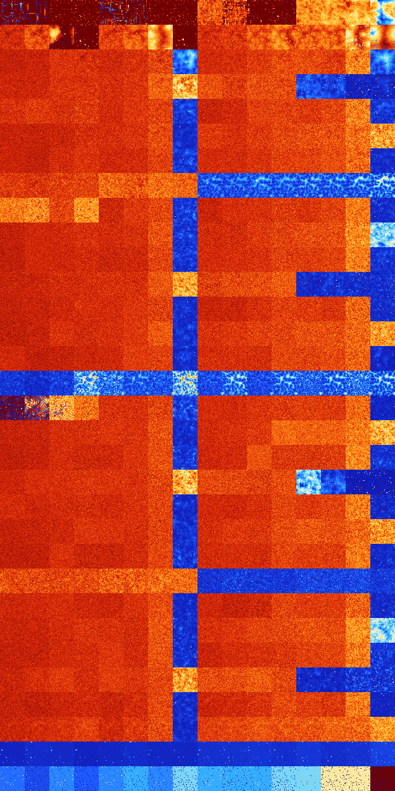

# B015 (17920-18431)

<details>
    <summary>Initial Grid</summary>
    
</details>


<details>
    <summary>Initial Grid RLE</summary>

```
#C Exported from GoGoL (https://github.com/marrow16/gogol)
#C Wrap mode: Toroidal
#C Boundary mode: Dead
#C Step: 0
x = 100, y = 100, rule = B015/S
15bo16b2o13bo15bo26bo$13bo15bo29bo29bo2bo$25bo7bo12bo14bo19bo$13bo12bo
2bo4bo38bo10bo3bo$9bo10bobo3bo17b2o43bo$18bo30bo17bo3bo7bo$43bo35bo15bo
$26bo31bo3bo18bo$32bo7bo21bo12bo$20bo26b2o14bo19bobo$43bo8bo46bo$6bo22b
o19bo10bo35bobo$43bo32bobo$5bo25bo3bo48bo2bo$35bo33bo12b2o7bo2bo$14bo
24b2o13bo24bo$7bobo16bo28bo20bo$43bo33bo$22bo10bo8bo51bo$20bo37bo22bo$
7bo14bo48bo19bo4bo$27bo8bo17bo$bo5bo4bo16bobo15bo26bo$6bo15bo65bo$6bo4b
o$14bo3bo11bo6bo16bo5bo$34bo15bo2bo$97bo$44bo2bo16bo5bo$8bo4bo63bo$bo
37bo58bo$42bo7bo9bo11bo19bo$13bobo19bo15bo34bo$3bo3b2obo4bo13bo44bo$5bo
3bobo8bo37bo$4bo50b2o6bobo3bo18bo4bo$20bo49bo4bo11bo3bo$4bo5bo49bo21bo$
29bobo30bo12bo5bo5bo4b2o$9bo26bo33bo$21bo31bo6bo11bo2bo7bo$o8bo$6bo10bo
29bo19bo17bo$18bo3bo38bo16bo14bo$7bo33bo55bo$23bo5bo16b2o35bo4bo$5bo17b
o6bo$9bo2bo23bo20bo10bo21bo8bo$13bo28bo29bo13bo12bo$2bo6bo33b2o33bo10bo
3bo$4bo6bo16bo56bo6bo5bo$3bo29bo41bo6bo10bo$2bo21bo34bo$o19bo17bo16bo
10bo2bo23bo$27bo20bo6bo$79bo9bo$36bo24bobo8bo$21bo3bo15bo18bo22bo$9bo
43bo14bo30bo$41b2o36bo6bo8bo$3bo18bobo9bo7bo17bo10bo5bo16bo$5bo3bo26bo
25bo17bo$20bo5bo15bobo44bo$10bo13bo18bo25bo6bo2bo$9bo8bo6bo5bo$4bo12bo
45b2o$4bo5bo15bo4bobo5bo9bobo7bo15bo22bo$7bo14bo3bo14bo32b2o12bo$bo13bo
9bo43bo27bo$57bo21bo3bo13bo$18bo24bo$5bo36b2obo52bo$10bobo16bo20bo5bo
13bo$3bo34bo4bo9bobo14bo10bo$66bo12bo7bo$11bo10bo8bo27bo$27bobo7bo51bo$
15bo11bo6bo17bo9bo10bo7bo9b2o4bo$5bo3bo11bo24b2o$10bo18bo14bo48bo$14bo
4bo10bo12bo9bo20bo22b2o$bo54bo11bo25bo$15b2o28bo30bo21bo$3bo7bo12b2o14b
o7bo8bo11bo8bo3bo6bo$14bo7bo15bo36bo15bo$14bo4bo2bo8bo26bo$6bo6bo31bo
36bo$13bo45bo24b2o$59bo12bo$18bo33b2o15bo17bo$15bobo40bo4bo$14bo7bo2b2o
63bo$9bo27bo6bo29b2o$18bo11bo2bo20bo3bo$12bo23bo13bo4bo21bo3bo$52bo14b
2o18bo$11bo40bo$16bo67bo2bo$22b2o10bo2bo24bo16bo$bo3bobo11bo5b2o6bo11bo
6bo7bo23bo5bobo2bo!
```
</details>
<details>
    <summary>Thumbnail</summary>

</details>
<table>
<tr>
    <td><a href="./17920%20S%20Heat%20Map%20Activity.png"></a><br>S (17920)<br>R@125,p4</td>    <td><a href="./17921%20S0%20Heat%20Map%20Activity.png"></a><br>S0 (17921)<br>G>1000</td>    <td><a href="./17922%20S1%20Heat%20Map%20Activity.png"></a><br>S1 (17922)<br>R@32,p12</td>    <td><a href="./17923%20S01%20Heat%20Map%20Activity.png"></a><br>S01 (17923)<br>R@13,p2</td>    <td><a href="./17924%20S2%20Heat%20Map%20Activity.png"></a><br>S2 (17924)<br>R@189,p8</td>    <td><a href="./17925%20S02%20Heat%20Map%20Activity.png"></a><br>S02 (17925)<br>R@530,p224</td>    <td><a href="./17926%20S12%20Heat%20Map%20Activity.png"></a><br>S12 (17926)<br>R@24,p4</td>    <td><a href="./17927%20S012%20Heat%20Map%20Activity.png"></a><br>S012 (17927)<br>R@15,p2</td>    <td><a href="./17928%20S3%20Heat%20Map%20Activity.png"></a><br>S3 (17928)<br>G>1000</td>    <td><a href="./17929%20S03%20Heat%20Map%20Activity.png"></a><br>S03 (17929)<br>G>1000</td>    <td><a href="./17930%20S13%20Heat%20Map%20Activity.png"></a><br>S13 (17930)<br>R@62,p2</td>    <td><a href="./17931%20S013%20Heat%20Map%20Activity.png"></a><br>S013 (17931)<br>R@22,p2</td>    <td><a href="./17932%20S23%20Heat%20Map%20Activity.png"></a><br>S23 (17932)<br>G>1000</td>    <td><a href="./17933%20S023%20Heat%20Map%20Activity.png"></a><br>S023 (17933)<br>G>1000</td>    <td><a href="./17934%20S123%20Heat%20Map%20Activity.png"></a><br>S123 (17934)<br>G>1000</td>    <td><a href="./17935%20S0123%20Heat%20Map%20Activity.png"></a><br>S0123 (17935)<br>R@418,p60</td></tr>
<tr>
    <td><a href="./17936%20S4%20Heat%20Map%20Activity.png"></a><br>S4 (17936)<br>G>1000</td>    <td><a href="./17937%20S04%20Heat%20Map%20Activity.png"></a><br>S04 (17937)<br>G>1000</td>    <td><a href="./17938%20S14%20Heat%20Map%20Activity.png"></a><br>S14 (17938)<br>G>1000</td>    <td><a href="./17939%20S014%20Heat%20Map%20Activity.png"></a><br>S014 (17939)<br>R@26,p2</td>    <td><a href="./17940%20S24%20Heat%20Map%20Activity.png"></a><br>S24 (17940)<br>G>1000</td>    <td><a href="./17941%20S024%20Heat%20Map%20Activity.png"></a><br>S024 (17941)<br>G>1000</td>    <td><a href="./17942%20S124%20Heat%20Map%20Activity.png"></a><br>S124 (17942)<br>G>1000</td>    <td><a href="./17943%20S0124%20Heat%20Map%20Activity.png"></a><br>S0124 (17943)<br>R@44,p8</td>    <td><a href="./17944%20S34%20Heat%20Map%20Activity.png"></a><br>S34 (17944)<br>G>1000</td>    <td><a href="./17945%20S034%20Heat%20Map%20Activity.png"></a><br>S034 (17945)<br>G>1000</td>    <td><a href="./17946%20S134%20Heat%20Map%20Activity.png"></a><br>S134 (17946)<br>G>1000</td>    <td><a href="./17947%20S0134%20Heat%20Map%20Activity.png"></a><br>S0134 (17947)<br>G>1000</td>    <td><a href="./17948%20S234%20Heat%20Map%20Activity.png"></a><br>S234 (17948)<br>G>1000</td>    <td><a href="./17949%20S0234%20Heat%20Map%20Activity.png"></a><br>S0234 (17949)<br>G>1000</td>    <td><a href="./17950%20S1234%20Heat%20Map%20Activity.png"></a><br>S1234 (17950)<br>G>1000</td>    <td><a href="./17951%20S01234%20Heat%20Map%20Activity.png"></a><br>S01234 (17951)<br>G>1000</td></tr>
<tr>
    <td><a href="./17952%20S5%20Heat%20Map%20Activity.png"></a><br>S5 (17952)<br>G>1000</td>    <td><a href="./17953%20S05%20Heat%20Map%20Activity.png"></a><br>S05 (17953)<br>G>1000</td>    <td><a href="./17954%20S15%20Heat%20Map%20Activity.png"></a><br>S15 (17954)<br>G>1000</td>    <td><a href="./17955%20S015%20Heat%20Map%20Activity.png"></a><br>S015 (17955)<br>G>1000</td>    <td><a href="./17956%20S25%20Heat%20Map%20Activity.png"></a><br>S25 (17956)<br>G>1000</td>    <td><a href="./17957%20S025%20Heat%20Map%20Activity.png"></a><br>S025 (17957)<br>G>1000</td>    <td><a href="./17958%20S125%20Heat%20Map%20Activity.png"></a><br>S125 (17958)<br>G>1000</td>    <td><a href="./17959%20S0125%20Heat%20Map%20Activity.png"></a><br>S0125 (17959)<br>R@278,p4</td>    <td><a href="./17960%20S35%20Heat%20Map%20Activity.png"></a><br>S35 (17960)<br>G>1000</td>    <td><a href="./17961%20S035%20Heat%20Map%20Activity.png"></a><br>S035 (17961)<br>G>1000</td>    <td><a href="./17962%20S135%20Heat%20Map%20Activity.png"></a><br>S135 (17962)<br>G>1000</td>    <td><a href="./17963%20S0135%20Heat%20Map%20Activity.png"></a><br>S0135 (17963)<br>G>1000</td>    <td><a href="./17964%20S235%20Heat%20Map%20Activity.png"></a><br>S235 (17964)<br>G>1000</td>    <td><a href="./17965%20S0235%20Heat%20Map%20Activity.png"></a><br>S0235 (17965)<br>G>1000</td>    <td><a href="./17966%20S1235%20Heat%20Map%20Activity.png"></a><br>S1235 (17966)<br>G>1000</td>    <td><a href="./17967%20S01235%20Heat%20Map%20Activity.png"></a><br>S01235 (17967)<br>R@218,p28</td></tr>
<tr>
    <td><a href="./17968%20S45%20Heat%20Map%20Activity.png"></a><br>S45 (17968)<br>G>1000</td>    <td><a href="./17969%20S045%20Heat%20Map%20Activity.png"></a><br>S045 (17969)<br>G>1000</td>    <td><a href="./17970%20S145%20Heat%20Map%20Activity.png"></a><br>S145 (17970)<br>G>1000</td>    <td><a href="./17971%20S0145%20Heat%20Map%20Activity.png"></a><br>S0145 (17971)<br>G>1000</td>    <td><a href="./17972%20S245%20Heat%20Map%20Activity.png"></a><br>S245 (17972)<br>G>1000</td>    <td><a href="./17973%20S0245%20Heat%20Map%20Activity.png"></a><br>S0245 (17973)<br>G>1000</td>    <td><a href="./17974%20S1245%20Heat%20Map%20Activity.png"></a><br>S1245 (17974)<br>G>1000</td>    <td><a href="./17975%20S01245%20Heat%20Map%20Activity.png"></a><br>S01245 (17975)<br>G>1000</td>    <td><a href="./17976%20S345%20Heat%20Map%20Activity.png"></a><br>S345 (17976)<br>G>1000</td>    <td><a href="./17977%20S0345%20Heat%20Map%20Activity.png"></a><br>S0345 (17977)<br>G>1000</td>    <td><a href="./17978%20S1345%20Heat%20Map%20Activity.png"></a><br>S1345 (17978)<br>G>1000</td>    <td><a href="./17979%20S01345%20Heat%20Map%20Activity.png"></a><br>S01345 (17979)<br>G>1000</td>    <td><a href="./17980%20S2345%20Heat%20Map%20Activity.png"></a><br>S2345 (17980)<br>G>1000</td>    <td><a href="./17981%20S02345%20Heat%20Map%20Activity.png"></a><br>S02345 (17981)<br>G>1000</td>    <td><a href="./17982%20S12345%20Heat%20Map%20Activity.png"></a><br>S12345 (17982)<br>R@609,p420</td>    <td><a href="./17983%20S012345%20Heat%20Map%20Activity.png"></a><br>S012345 (17983)<br>R@650,p420</td></tr>
<tr>
    <td><a href="./17984%20S6%20Heat%20Map%20Activity.png"></a><br>S6 (17984)<br>G>1000</td>    <td><a href="./17985%20S06%20Heat%20Map%20Activity.png"></a><br>S06 (17985)<br>G>1000</td>    <td><a href="./17986%20S16%20Heat%20Map%20Activity.png"></a><br>S16 (17986)<br>G>1000</td>    <td><a href="./17987%20S016%20Heat%20Map%20Activity.png"></a><br>S016 (17987)<br>G>1000</td>    <td><a href="./17988%20S26%20Heat%20Map%20Activity.png"></a><br>S26 (17988)<br>G>1000</td>    <td><a href="./17989%20S026%20Heat%20Map%20Activity.png"></a><br>S026 (17989)<br>G>1000</td>    <td><a href="./17990%20S126%20Heat%20Map%20Activity.png"></a><br>S126 (17990)<br>G>1000</td>    <td><a href="./17991%20S0126%20Heat%20Map%20Activity.png"></a><br>S0126 (17991)<br>R@252,p6</td>    <td><a href="./17992%20S36%20Heat%20Map%20Activity.png"></a><br>S36 (17992)<br>G>1000</td>    <td><a href="./17993%20S036%20Heat%20Map%20Activity.png"></a><br>S036 (17993)<br>G>1000</td>    <td><a href="./17994%20S136%20Heat%20Map%20Activity.png"></a><br>S136 (17994)<br>G>1000</td>    <td><a href="./17995%20S0136%20Heat%20Map%20Activity.png"></a><br>S0136 (17995)<br>G>1000</td>    <td><a href="./17996%20S236%20Heat%20Map%20Activity.png"></a><br>S236 (17996)<br>G>1000</td>    <td><a href="./17997%20S0236%20Heat%20Map%20Activity.png"></a><br>S0236 (17997)<br>G>1000</td>    <td><a href="./17998%20S1236%20Heat%20Map%20Activity.png"></a><br>S1236 (17998)<br>G>1000</td>    <td><a href="./17999%20S01236%20Heat%20Map%20Activity.png"></a><br>S01236 (17999)<br>R@170,p12</td></tr>
<tr>
    <td><a href="./18000%20S46%20Heat%20Map%20Activity.png"></a><br>S46 (18000)<br>G>1000</td>    <td><a href="./18001%20S046%20Heat%20Map%20Activity.png"></a><br>S046 (18001)<br>G>1000</td>    <td><a href="./18002%20S146%20Heat%20Map%20Activity.png"></a><br>S146 (18002)<br>G>1000</td>    <td><a href="./18003%20S0146%20Heat%20Map%20Activity.png"></a><br>S0146 (18003)<br>G>1000</td>    <td><a href="./18004%20S246%20Heat%20Map%20Activity.png"></a><br>S246 (18004)<br>G>1000</td>    <td><a href="./18005%20S0246%20Heat%20Map%20Activity.png"></a><br>S0246 (18005)<br>G>1000</td>    <td><a href="./18006%20S1246%20Heat%20Map%20Activity.png"></a><br>S1246 (18006)<br>G>1000</td>    <td><a href="./18007%20S01246%20Heat%20Map%20Activity.png"></a><br>S01246 (18007)<br>R@454,p4</td>    <td><a href="./18008%20S346%20Heat%20Map%20Activity.png"></a><br>S346 (18008)<br>G>1000</td>    <td><a href="./18009%20S0346%20Heat%20Map%20Activity.png"></a><br>S0346 (18009)<br>G>1000</td>    <td><a href="./18010%20S1346%20Heat%20Map%20Activity.png"></a><br>S1346 (18010)<br>G>1000</td>    <td><a href="./18011%20S01346%20Heat%20Map%20Activity.png"></a><br>S01346 (18011)<br>G>1000</td>    <td><a href="./18012%20S2346%20Heat%20Map%20Activity.png"></a><br>S2346 (18012)<br>G>1000</td>    <td><a href="./18013%20S02346%20Heat%20Map%20Activity.png"></a><br>S02346 (18013)<br>G>1000</td>    <td><a href="./18014%20S12346%20Heat%20Map%20Activity.png"></a><br>S12346 (18014)<br>G>1000</td>    <td><a href="./18015%20S012346%20Heat%20Map%20Activity.png"></a><br>S012346 (18015)<br>G>1000</td></tr>
<tr>
    <td><a href="./18016%20S56%20Heat%20Map%20Activity.png"></a><br>S56 (18016)<br>G>1000</td>    <td><a href="./18017%20S056%20Heat%20Map%20Activity.png"></a><br>S056 (18017)<br>G>1000</td>    <td><a href="./18018%20S156%20Heat%20Map%20Activity.png"></a><br>S156 (18018)<br>G>1000</td>    <td><a href="./18019%20S0156%20Heat%20Map%20Activity.png"></a><br>S0156 (18019)<br>G>1000</td>    <td><a href="./18020%20S256%20Heat%20Map%20Activity.png"></a><br>S256 (18020)<br>G>1000</td>    <td><a href="./18021%20S0256%20Heat%20Map%20Activity.png"></a><br>S0256 (18021)<br>G>1000</td>    <td><a href="./18022%20S1256%20Heat%20Map%20Activity.png"></a><br>S1256 (18022)<br>G>1000</td>    <td><a href="./18023%20S01256%20Heat%20Map%20Activity.png"></a><br>S01256 (18023)<br>R@265,p12</td>    <td><a href="./18024%20S356%20Heat%20Map%20Activity.png"></a><br>S356 (18024)<br>G>1000</td>    <td><a href="./18025%20S0356%20Heat%20Map%20Activity.png"></a><br>S0356 (18025)<br>G>1000</td>    <td><a href="./18026%20S1356%20Heat%20Map%20Activity.png"></a><br>S1356 (18026)<br>G>1000</td>    <td><a href="./18027%20S01356%20Heat%20Map%20Activity.png"></a><br>S01356 (18027)<br>G>1000</td>    <td><a href="./18028%20S2356%20Heat%20Map%20Activity.png"></a><br>S2356 (18028)<br>G>1000</td>    <td><a href="./18029%20S02356%20Heat%20Map%20Activity.png"></a><br>S02356 (18029)<br>G>1000</td>    <td><a href="./18030%20S12356%20Heat%20Map%20Activity.png"></a><br>S12356 (18030)<br>G>1000</td>    <td><a href="./18031%20S012356%20Heat%20Map%20Activity.png"></a><br>S012356 (18031)<br>R@330,p60</td></tr>
<tr>
    <td><a href="./18032%20S456%20Heat%20Map%20Activity.png"></a><br>S456 (18032)<br>G>1000</td>    <td><a href="./18033%20S0456%20Heat%20Map%20Activity.png"></a><br>S0456 (18033)<br>G>1000</td>    <td><a href="./18034%20S1456%20Heat%20Map%20Activity.png"></a><br>S1456 (18034)<br>G>1000</td>    <td><a href="./18035%20S01456%20Heat%20Map%20Activity.png"></a><br>S01456 (18035)<br>G>1000</td>    <td><a href="./18036%20S2456%20Heat%20Map%20Activity.png"></a><br>S2456 (18036)<br>G>1000</td>    <td><a href="./18037%20S02456%20Heat%20Map%20Activity.png"></a><br>S02456 (18037)<br>G>1000</td>    <td><a href="./18038%20S12456%20Heat%20Map%20Activity.png"></a><br>S12456 (18038)<br>G>1000</td>    <td><a href="./18039%20S012456%20Heat%20Map%20Activity.png"></a><br>S012456 (18039)<br>G>1000</td>    <td><a href="./18040%20S3456%20Heat%20Map%20Activity.png"></a><br>S3456 (18040)<br>R@60,p12</td>    <td><a href="./18041%20S03456%20Heat%20Map%20Activity.png"></a><br>S03456 (18041)<br>R@54,p12</td>    <td><a href="./18042%20S13456%20Heat%20Map%20Activity.png"></a><br>S13456 (18042)<br>R@47,p12</td>    <td><a href="./18043%20S013456%20Heat%20Map%20Activity.png"></a><br>S013456 (18043)<br>R@56,p12</td>    <td><a href="./18044%20S23456%20Heat%20Map%20Activity.png"></a><br>S23456 (18044)<br>R@34,p12</td>    <td><a href="./18045%20S023456%20Heat%20Map%20Activity.png"></a><br>S023456 (18045)<br>R@37,p12</td>    <td><a href="./18046%20S123456%20Heat%20Map%20Activity.png"></a><br>S123456 (18046)<br>R@38,p12</td>    <td><a href="./18047%20S0123456%20Heat%20Map%20Activity.png"></a><br>S0123456 (18047)<br>R@32,p12</td></tr>
<tr>
    <td><a href="./18048%20S7%20Heat%20Map%20Activity.png"></a><br>S7 (18048)<br>G>1000</td>    <td><a href="./18049%20S07%20Heat%20Map%20Activity.png"></a><br>S07 (18049)<br>G>1000</td>    <td><a href="./18050%20S17%20Heat%20Map%20Activity.png"></a><br>S17 (18050)<br>G>1000</td>    <td><a href="./18051%20S017%20Heat%20Map%20Activity.png"></a><br>S017 (18051)<br>G>1000</td>    <td><a href="./18052%20S27%20Heat%20Map%20Activity.png"></a><br>S27 (18052)<br>G>1000</td>    <td><a href="./18053%20S027%20Heat%20Map%20Activity.png"></a><br>S027 (18053)<br>G>1000</td>    <td><a href="./18054%20S127%20Heat%20Map%20Activity.png"></a><br>S127 (18054)<br>G>1000</td>    <td><a href="./18055%20S0127%20Heat%20Map%20Activity.png"></a><br>S0127 (18055)<br>R@237,p30</td>    <td><a href="./18056%20S37%20Heat%20Map%20Activity.png"></a><br>S37 (18056)<br>G>1000</td>    <td><a href="./18057%20S037%20Heat%20Map%20Activity.png"></a><br>S037 (18057)<br>G>1000</td>    <td><a href="./18058%20S137%20Heat%20Map%20Activity.png"></a><br>S137 (18058)<br>G>1000</td>    <td><a href="./18059%20S0137%20Heat%20Map%20Activity.png"></a><br>S0137 (18059)<br>G>1000</td>    <td><a href="./18060%20S237%20Heat%20Map%20Activity.png"></a><br>S237 (18060)<br>G>1000</td>    <td><a href="./18061%20S0237%20Heat%20Map%20Activity.png"></a><br>S0237 (18061)<br>G>1000</td>    <td><a href="./18062%20S1237%20Heat%20Map%20Activity.png"></a><br>S1237 (18062)<br>G>1000</td>    <td><a href="./18063%20S01237%20Heat%20Map%20Activity.png"></a><br>S01237 (18063)<br>R@251,p60</td></tr>
<tr>
    <td><a href="./18064%20S47%20Heat%20Map%20Activity.png"></a><br>S47 (18064)<br>G>1000</td>    <td><a href="./18065%20S047%20Heat%20Map%20Activity.png"></a><br>S047 (18065)<br>G>1000</td>    <td><a href="./18066%20S147%20Heat%20Map%20Activity.png"></a><br>S147 (18066)<br>G>1000</td>    <td><a href="./18067%20S0147%20Heat%20Map%20Activity.png"></a><br>S0147 (18067)<br>G>1000</td>    <td><a href="./18068%20S247%20Heat%20Map%20Activity.png"></a><br>S247 (18068)<br>G>1000</td>    <td><a href="./18069%20S0247%20Heat%20Map%20Activity.png"></a><br>S0247 (18069)<br>G>1000</td>    <td><a href="./18070%20S1247%20Heat%20Map%20Activity.png"></a><br>S1247 (18070)<br>G>1000</td>    <td><a href="./18071%20S01247%20Heat%20Map%20Activity.png"></a><br>S01247 (18071)<br>R@232,p4</td>    <td><a href="./18072%20S347%20Heat%20Map%20Activity.png"></a><br>S347 (18072)<br>G>1000</td>    <td><a href="./18073%20S0347%20Heat%20Map%20Activity.png"></a><br>S0347 (18073)<br>G>1000</td>    <td><a href="./18074%20S1347%20Heat%20Map%20Activity.png"></a><br>S1347 (18074)<br>G>1000</td>    <td><a href="./18075%20S01347%20Heat%20Map%20Activity.png"></a><br>S01347 (18075)<br>G>1000</td>    <td><a href="./18076%20S2347%20Heat%20Map%20Activity.png"></a><br>S2347 (18076)<br>G>1000</td>    <td><a href="./18077%20S02347%20Heat%20Map%20Activity.png"></a><br>S02347 (18077)<br>G>1000</td>    <td><a href="./18078%20S12347%20Heat%20Map%20Activity.png"></a><br>S12347 (18078)<br>G>1000</td>    <td><a href="./18079%20S012347%20Heat%20Map%20Activity.png"></a><br>S012347 (18079)<br>G>1000</td></tr>
<tr>
    <td><a href="./18080%20S57%20Heat%20Map%20Activity.png"></a><br>S57 (18080)<br>G>1000</td>    <td><a href="./18081%20S057%20Heat%20Map%20Activity.png"></a><br>S057 (18081)<br>G>1000</td>    <td><a href="./18082%20S157%20Heat%20Map%20Activity.png"></a><br>S157 (18082)<br>G>1000</td>    <td><a href="./18083%20S0157%20Heat%20Map%20Activity.png"></a><br>S0157 (18083)<br>G>1000</td>    <td><a href="./18084%20S257%20Heat%20Map%20Activity.png"></a><br>S257 (18084)<br>G>1000</td>    <td><a href="./18085%20S0257%20Heat%20Map%20Activity.png"></a><br>S0257 (18085)<br>G>1000</td>    <td><a href="./18086%20S1257%20Heat%20Map%20Activity.png"></a><br>S1257 (18086)<br>G>1000</td>    <td><a href="./18087%20S01257%20Heat%20Map%20Activity.png"></a><br>S01257 (18087)<br>R@198,p28</td>    <td><a href="./18088%20S357%20Heat%20Map%20Activity.png"></a><br>S357 (18088)<br>G>1000</td>    <td><a href="./18089%20S0357%20Heat%20Map%20Activity.png"></a><br>S0357 (18089)<br>G>1000</td>    <td><a href="./18090%20S1357%20Heat%20Map%20Activity.png"></a><br>S1357 (18090)<br>G>1000</td>    <td><a href="./18091%20S01357%20Heat%20Map%20Activity.png"></a><br>S01357 (18091)<br>G>1000</td>    <td><a href="./18092%20S2357%20Heat%20Map%20Activity.png"></a><br>S2357 (18092)<br>G>1000</td>    <td><a href="./18093%20S02357%20Heat%20Map%20Activity.png"></a><br>S02357 (18093)<br>G>1000</td>    <td><a href="./18094%20S12357%20Heat%20Map%20Activity.png"></a><br>S12357 (18094)<br>G>1000</td>    <td><a href="./18095%20S012357%20Heat%20Map%20Activity.png"></a><br>S012357 (18095)<br>R@157,p12</td></tr>
<tr>
    <td><a href="./18096%20S457%20Heat%20Map%20Activity.png"></a><br>S457 (18096)<br>G>1000</td>    <td><a href="./18097%20S0457%20Heat%20Map%20Activity.png"></a><br>S0457 (18097)<br>G>1000</td>    <td><a href="./18098%20S1457%20Heat%20Map%20Activity.png"></a><br>S1457 (18098)<br>G>1000</td>    <td><a href="./18099%20S01457%20Heat%20Map%20Activity.png"></a><br>S01457 (18099)<br>G>1000</td>    <td><a href="./18100%20S2457%20Heat%20Map%20Activity.png"></a><br>S2457 (18100)<br>G>1000</td>    <td><a href="./18101%20S02457%20Heat%20Map%20Activity.png"></a><br>S02457 (18101)<br>G>1000</td>    <td><a href="./18102%20S12457%20Heat%20Map%20Activity.png"></a><br>S12457 (18102)<br>G>1000</td>    <td><a href="./18103%20S012457%20Heat%20Map%20Activity.png"></a><br>S012457 (18103)<br>G>1000</td>    <td><a href="./18104%20S3457%20Heat%20Map%20Activity.png"></a><br>S3457 (18104)<br>G>1000</td>    <td><a href="./18105%20S03457%20Heat%20Map%20Activity.png"></a><br>S03457 (18105)<br>G>1000</td>    <td><a href="./18106%20S13457%20Heat%20Map%20Activity.png"></a><br>S13457 (18106)<br>G>1000</td>    <td><a href="./18107%20S013457%20Heat%20Map%20Activity.png"></a><br>S013457 (18107)<br>G>1000</td>    <td><a href="./18108%20S23457%20Heat%20Map%20Activity.png"></a><br>S23457 (18108)<br>R@559,p60</td>    <td><a href="./18109%20S023457%20Heat%20Map%20Activity.png"></a><br>S023457 (18109)<br>R@479,p44</td>    <td><a href="./18110%20S123457%20Heat%20Map%20Activity.png"></a><br>S123457 (18110)<br>R@255,p60</td>    <td><a href="./18111%20S0123457%20Heat%20Map%20Activity.png"></a><br>S0123457 (18111)<br>R@261,p20</td></tr>
<tr>
    <td><a href="./18112%20S67%20Heat%20Map%20Activity.png"></a><br>S67 (18112)<br>G>1000</td>    <td><a href="./18113%20S067%20Heat%20Map%20Activity.png"></a><br>S067 (18113)<br>G>1000</td>    <td><a href="./18114%20S167%20Heat%20Map%20Activity.png"></a><br>S167 (18114)<br>G>1000</td>    <td><a href="./18115%20S0167%20Heat%20Map%20Activity.png"></a><br>S0167 (18115)<br>G>1000</td>    <td><a href="./18116%20S267%20Heat%20Map%20Activity.png"></a><br>S267 (18116)<br>G>1000</td>    <td><a href="./18117%20S0267%20Heat%20Map%20Activity.png"></a><br>S0267 (18117)<br>G>1000</td>    <td><a href="./18118%20S1267%20Heat%20Map%20Activity.png"></a><br>S1267 (18118)<br>G>1000</td>    <td><a href="./18119%20S01267%20Heat%20Map%20Activity.png"></a><br>S01267 (18119)<br>R@305,p120</td>    <td><a href="./18120%20S367%20Heat%20Map%20Activity.png"></a><br>S367 (18120)<br>G>1000</td>    <td><a href="./18121%20S0367%20Heat%20Map%20Activity.png"></a><br>S0367 (18121)<br>G>1000</td>    <td><a href="./18122%20S1367%20Heat%20Map%20Activity.png"></a><br>S1367 (18122)<br>G>1000</td>    <td><a href="./18123%20S01367%20Heat%20Map%20Activity.png"></a><br>S01367 (18123)<br>G>1000</td>    <td><a href="./18124%20S2367%20Heat%20Map%20Activity.png"></a><br>S2367 (18124)<br>G>1000</td>    <td><a href="./18125%20S02367%20Heat%20Map%20Activity.png"></a><br>S02367 (18125)<br>G>1000</td>    <td><a href="./18126%20S12367%20Heat%20Map%20Activity.png"></a><br>S12367 (18126)<br>G>1000</td>    <td><a href="./18127%20S012367%20Heat%20Map%20Activity.png"></a><br>S012367 (18127)<br>R@174,p60</td></tr>
<tr>
    <td><a href="./18128%20S467%20Heat%20Map%20Activity.png"></a><br>S467 (18128)<br>G>1000</td>    <td><a href="./18129%20S0467%20Heat%20Map%20Activity.png"></a><br>S0467 (18129)<br>G>1000</td>    <td><a href="./18130%20S1467%20Heat%20Map%20Activity.png"></a><br>S1467 (18130)<br>G>1000</td>    <td><a href="./18131%20S01467%20Heat%20Map%20Activity.png"></a><br>S01467 (18131)<br>G>1000</td>    <td><a href="./18132%20S2467%20Heat%20Map%20Activity.png"></a><br>S2467 (18132)<br>G>1000</td>    <td><a href="./18133%20S02467%20Heat%20Map%20Activity.png"></a><br>S02467 (18133)<br>G>1000</td>    <td><a href="./18134%20S12467%20Heat%20Map%20Activity.png"></a><br>S12467 (18134)<br>G>1000</td>    <td><a href="./18135%20S012467%20Heat%20Map%20Activity.png"></a><br>S012467 (18135)<br>R@332,p6</td>    <td><a href="./18136%20S3467%20Heat%20Map%20Activity.png"></a><br>S3467 (18136)<br>G>1000</td>    <td><a href="./18137%20S03467%20Heat%20Map%20Activity.png"></a><br>S03467 (18137)<br>G>1000</td>    <td><a href="./18138%20S13467%20Heat%20Map%20Activity.png"></a><br>S13467 (18138)<br>G>1000</td>    <td><a href="./18139%20S013467%20Heat%20Map%20Activity.png"></a><br>S013467 (18139)<br>G>1000</td>    <td><a href="./18140%20S23467%20Heat%20Map%20Activity.png"></a><br>S23467 (18140)<br>G>1000</td>    <td><a href="./18141%20S023467%20Heat%20Map%20Activity.png"></a><br>S023467 (18141)<br>G>1000</td>    <td><a href="./18142%20S123467%20Heat%20Map%20Activity.png"></a><br>S123467 (18142)<br>G>1000</td>    <td><a href="./18143%20S0123467%20Heat%20Map%20Activity.png"></a><br>S0123467 (18143)<br>G>1000</td></tr>
<tr>
    <td><a href="./18144%20S567%20Heat%20Map%20Activity.png"></a><br>S567 (18144)<br>G>1000</td>    <td><a href="./18145%20S0567%20Heat%20Map%20Activity.png"></a><br>S0567 (18145)<br>G>1000</td>    <td><a href="./18146%20S1567%20Heat%20Map%20Activity.png"></a><br>S1567 (18146)<br>G>1000</td>    <td><a href="./18147%20S01567%20Heat%20Map%20Activity.png"></a><br>S01567 (18147)<br>G>1000</td>    <td><a href="./18148%20S2567%20Heat%20Map%20Activity.png"></a><br>S2567 (18148)<br>G>1000</td>    <td><a href="./18149%20S02567%20Heat%20Map%20Activity.png"></a><br>S02567 (18149)<br>G>1000</td>    <td><a href="./18150%20S12567%20Heat%20Map%20Activity.png"></a><br>S12567 (18150)<br>G>1000</td>    <td><a href="./18151%20S012567%20Heat%20Map%20Activity.png"></a><br>S012567 (18151)<br>R@548,p12</td>    <td><a href="./18152%20S3567%20Heat%20Map%20Activity.png"></a><br>S3567 (18152)<br>G>1000</td>    <td><a href="./18153%20S03567%20Heat%20Map%20Activity.png"></a><br>S03567 (18153)<br>G>1000</td>    <td><a href="./18154%20S13567%20Heat%20Map%20Activity.png"></a><br>S13567 (18154)<br>G>1000</td>    <td><a href="./18155%20S013567%20Heat%20Map%20Activity.png"></a><br>S013567 (18155)<br>G>1000</td>    <td><a href="./18156%20S23567%20Heat%20Map%20Activity.png"></a><br>S23567 (18156)<br>G>1000</td>    <td><a href="./18157%20S023567%20Heat%20Map%20Activity.png"></a><br>S023567 (18157)<br>G>1000</td>    <td><a href="./18158%20S123567%20Heat%20Map%20Activity.png"></a><br>S123567 (18158)<br>G>1000</td>    <td><a href="./18159%20S0123567%20Heat%20Map%20Activity.png"></a><br>S0123567 (18159)<br>R@883,p30</td></tr>
<tr>
    <td><a href="./18160%20S4567%20Heat%20Map%20Activity.png"></a><br>S4567 (18160)<br>R@65,p30</td>    <td><a href="./18161%20S04567%20Heat%20Map%20Activity.png"></a><br>S04567 (18161)<br>R@133,p90</td>    <td><a href="./18162%20S14567%20Heat%20Map%20Activity.png"></a><br>S14567 (18162)<br>R@54,p2</td>    <td><a href="./18163%20S014567%20Heat%20Map%20Activity.png"></a><br>S014567 (18163)<br>S@47</td>    <td><a href="./18164%20S24567%20Heat%20Map%20Activity.png"></a><br>S24567 (18164)<br>R@33,p2</td>    <td><a href="./18165%20S024567%20Heat%20Map%20Activity.png"></a><br>S024567 (18165)<br>R@46,p2</td>    <td><a href="./18166%20S124567%20Heat%20Map%20Activity.png"></a><br>S124567 (18166)<br>R@31,p2</td>    <td><a href="./18167%20S0124567%20Heat%20Map%20Activity.png"></a><br>S0124567 (18167)<br>S@34</td>    <td><a href="./18168%20S34567%20Heat%20Map%20Activity.png"></a><br>S34567 (18168)<br>R@27,p6</td>    <td><a href="./18169%20S034567%20Heat%20Map%20Activity.png"></a><br>S034567 (18169)<br>R@20,p2</td>    <td><a href="./18170%20S134567%20Heat%20Map%20Activity.png"></a><br>S134567 (18170)<br>R@27,p6</td>    <td><a href="./18171%20S0134567%20Heat%20Map%20Activity.png"></a><br>S0134567 (18171)<br>R@24,p2</td>    <td><a href="./18172%20S234567%20Heat%20Map%20Activity.png"></a><br>S234567 (18172)<br>R@16,p2</td>    <td><a href="./18173%20S0234567%20Heat%20Map%20Activity.png"></a><br>S0234567 (18173)<br>R@22,p6</td>    <td><a href="./18174%20S1234567%20Heat%20Map%20Activity.png"></a><br>S1234567 (18174)<br>R@15,p2</td>    <td><a href="./18175%20S01234567%20Heat%20Map%20Activity.png"></a><br>S01234567 (18175)<br>R@21,p6</td></tr>
<tr>
    <td><a href="./18176%20S8%20Heat%20Map%20Activity.png"></a><br>S8 (18176)<br>R@984,p840</td>    <td><a href="./18177%20S08%20Heat%20Map%20Activity.png"></a><br>S08 (18177)<br>R@313,p4</td>    <td><a href="./18178%20S18%20Heat%20Map%20Activity.png"></a><br>S18 (18178)<br>G>1000</td>    <td><a href="./18179%20S018%20Heat%20Map%20Activity.png"></a><br>S018 (18179)<br>G>1000</td>    <td><a href="./18180%20S28%20Heat%20Map%20Activity.png"></a><br>S28 (18180)<br>G>1000</td>    <td><a href="./18181%20S028%20Heat%20Map%20Activity.png"></a><br>S028 (18181)<br>G>1000</td>    <td><a href="./18182%20S128%20Heat%20Map%20Activity.png"></a><br>S128 (18182)<br>G>1000</td>    <td><a href="./18183%20S0128%20Heat%20Map%20Activity.png"></a><br>S0128 (18183)<br>R@423,p40</td>    <td><a href="./18184%20S38%20Heat%20Map%20Activity.png"></a><br>S38 (18184)<br>G>1000</td>    <td><a href="./18185%20S038%20Heat%20Map%20Activity.png"></a><br>S038 (18185)<br>G>1000</td>    <td><a href="./18186%20S138%20Heat%20Map%20Activity.png"></a><br>S138 (18186)<br>G>1000</td>    <td><a href="./18187%20S0138%20Heat%20Map%20Activity.png"></a><br>S0138 (18187)<br>G>1000</td>    <td><a href="./18188%20S238%20Heat%20Map%20Activity.png"></a><br>S238 (18188)<br>G>1000</td>    <td><a href="./18189%20S0238%20Heat%20Map%20Activity.png"></a><br>S0238 (18189)<br>G>1000</td>    <td><a href="./18190%20S1238%20Heat%20Map%20Activity.png"></a><br>S1238 (18190)<br>G>1000</td>    <td><a href="./18191%20S01238%20Heat%20Map%20Activity.png"></a><br>S01238 (18191)<br>R@387,p180</td></tr>
<tr>
    <td><a href="./18192%20S48%20Heat%20Map%20Activity.png"></a><br>S48 (18192)<br>G>1000</td>    <td><a href="./18193%20S048%20Heat%20Map%20Activity.png"></a><br>S048 (18193)<br>G>1000</td>    <td><a href="./18194%20S148%20Heat%20Map%20Activity.png"></a><br>S148 (18194)<br>G>1000</td>    <td><a href="./18195%20S0148%20Heat%20Map%20Activity.png"></a><br>S0148 (18195)<br>G>1000</td>    <td><a href="./18196%20S248%20Heat%20Map%20Activity.png"></a><br>S248 (18196)<br>G>1000</td>    <td><a href="./18197%20S0248%20Heat%20Map%20Activity.png"></a><br>S0248 (18197)<br>G>1000</td>    <td><a href="./18198%20S1248%20Heat%20Map%20Activity.png"></a><br>S1248 (18198)<br>G>1000</td>    <td><a href="./18199%20S01248%20Heat%20Map%20Activity.png"></a><br>S01248 (18199)<br>R@291,p6</td>    <td><a href="./18200%20S348%20Heat%20Map%20Activity.png"></a><br>S348 (18200)<br>G>1000</td>    <td><a href="./18201%20S0348%20Heat%20Map%20Activity.png"></a><br>S0348 (18201)<br>G>1000</td>    <td><a href="./18202%20S1348%20Heat%20Map%20Activity.png"></a><br>S1348 (18202)<br>G>1000</td>    <td><a href="./18203%20S01348%20Heat%20Map%20Activity.png"></a><br>S01348 (18203)<br>G>1000</td>    <td><a href="./18204%20S2348%20Heat%20Map%20Activity.png"></a><br>S2348 (18204)<br>G>1000</td>    <td><a href="./18205%20S02348%20Heat%20Map%20Activity.png"></a><br>S02348 (18205)<br>G>1000</td>    <td><a href="./18206%20S12348%20Heat%20Map%20Activity.png"></a><br>S12348 (18206)<br>G>1000</td>    <td><a href="./18207%20S012348%20Heat%20Map%20Activity.png"></a><br>S012348 (18207)<br>G>1000</td></tr>
<tr>
    <td><a href="./18208%20S58%20Heat%20Map%20Activity.png"></a><br>S58 (18208)<br>G>1000</td>    <td><a href="./18209%20S058%20Heat%20Map%20Activity.png"></a><br>S058 (18209)<br>G>1000</td>    <td><a href="./18210%20S158%20Heat%20Map%20Activity.png"></a><br>S158 (18210)<br>G>1000</td>    <td><a href="./18211%20S0158%20Heat%20Map%20Activity.png"></a><br>S0158 (18211)<br>G>1000</td>    <td><a href="./18212%20S258%20Heat%20Map%20Activity.png"></a><br>S258 (18212)<br>G>1000</td>    <td><a href="./18213%20S0258%20Heat%20Map%20Activity.png"></a><br>S0258 (18213)<br>G>1000</td>    <td><a href="./18214%20S1258%20Heat%20Map%20Activity.png"></a><br>S1258 (18214)<br>G>1000</td>    <td><a href="./18215%20S01258%20Heat%20Map%20Activity.png"></a><br>S01258 (18215)<br>R@192,p12</td>    <td><a href="./18216%20S358%20Heat%20Map%20Activity.png"></a><br>S358 (18216)<br>G>1000</td>    <td><a href="./18217%20S0358%20Heat%20Map%20Activity.png"></a><br>S0358 (18217)<br>G>1000</td>    <td><a href="./18218%20S1358%20Heat%20Map%20Activity.png"></a><br>S1358 (18218)<br>G>1000</td>    <td><a href="./18219%20S01358%20Heat%20Map%20Activity.png"></a><br>S01358 (18219)<br>G>1000</td>    <td><a href="./18220%20S2358%20Heat%20Map%20Activity.png"></a><br>S2358 (18220)<br>G>1000</td>    <td><a href="./18221%20S02358%20Heat%20Map%20Activity.png"></a><br>S02358 (18221)<br>G>1000</td>    <td><a href="./18222%20S12358%20Heat%20Map%20Activity.png"></a><br>S12358 (18222)<br>G>1000</td>    <td><a href="./18223%20S012358%20Heat%20Map%20Activity.png"></a><br>S012358 (18223)<br>R@128,p12</td></tr>
<tr>
    <td><a href="./18224%20S458%20Heat%20Map%20Activity.png"></a><br>S458 (18224)<br>G>1000</td>    <td><a href="./18225%20S0458%20Heat%20Map%20Activity.png"></a><br>S0458 (18225)<br>G>1000</td>    <td><a href="./18226%20S1458%20Heat%20Map%20Activity.png"></a><br>S1458 (18226)<br>G>1000</td>    <td><a href="./18227%20S01458%20Heat%20Map%20Activity.png"></a><br>S01458 (18227)<br>G>1000</td>    <td><a href="./18228%20S2458%20Heat%20Map%20Activity.png"></a><br>S2458 (18228)<br>G>1000</td>    <td><a href="./18229%20S02458%20Heat%20Map%20Activity.png"></a><br>S02458 (18229)<br>G>1000</td>    <td><a href="./18230%20S12458%20Heat%20Map%20Activity.png"></a><br>S12458 (18230)<br>G>1000</td>    <td><a href="./18231%20S012458%20Heat%20Map%20Activity.png"></a><br>S012458 (18231)<br>G>1000</td>    <td><a href="./18232%20S3458%20Heat%20Map%20Activity.png"></a><br>S3458 (18232)<br>G>1000</td>    <td><a href="./18233%20S03458%20Heat%20Map%20Activity.png"></a><br>S03458 (18233)<br>G>1000</td>    <td><a href="./18234%20S13458%20Heat%20Map%20Activity.png"></a><br>S13458 (18234)<br>G>1000</td>    <td><a href="./18235%20S013458%20Heat%20Map%20Activity.png"></a><br>S013458 (18235)<br>G>1000</td>    <td><a href="./18236%20S23458%20Heat%20Map%20Activity.png"></a><br>S23458 (18236)<br>G>1000</td>    <td><a href="./18237%20S023458%20Heat%20Map%20Activity.png"></a><br>S023458 (18237)<br>G>1000</td>    <td><a href="./18238%20S123458%20Heat%20Map%20Activity.png"></a><br>S123458 (18238)<br>G>1000</td>    <td><a href="./18239%20S0123458%20Heat%20Map%20Activity.png"></a><br>S0123458 (18239)<br>G>1000</td></tr>
<tr>
    <td><a href="./18240%20S68%20Heat%20Map%20Activity.png"></a><br>S68 (18240)<br>G>1000</td>    <td><a href="./18241%20S068%20Heat%20Map%20Activity.png"></a><br>S068 (18241)<br>G>1000</td>    <td><a href="./18242%20S168%20Heat%20Map%20Activity.png"></a><br>S168 (18242)<br>G>1000</td>    <td><a href="./18243%20S0168%20Heat%20Map%20Activity.png"></a><br>S0168 (18243)<br>G>1000</td>    <td><a href="./18244%20S268%20Heat%20Map%20Activity.png"></a><br>S268 (18244)<br>G>1000</td>    <td><a href="./18245%20S0268%20Heat%20Map%20Activity.png"></a><br>S0268 (18245)<br>G>1000</td>    <td><a href="./18246%20S1268%20Heat%20Map%20Activity.png"></a><br>S1268 (18246)<br>G>1000</td>    <td><a href="./18247%20S01268%20Heat%20Map%20Activity.png"></a><br>S01268 (18247)<br>R@292,p70</td>    <td><a href="./18248%20S368%20Heat%20Map%20Activity.png"></a><br>S368 (18248)<br>G>1000</td>    <td><a href="./18249%20S0368%20Heat%20Map%20Activity.png"></a><br>S0368 (18249)<br>G>1000</td>    <td><a href="./18250%20S1368%20Heat%20Map%20Activity.png"></a><br>S1368 (18250)<br>G>1000</td>    <td><a href="./18251%20S01368%20Heat%20Map%20Activity.png"></a><br>S01368 (18251)<br>G>1000</td>    <td><a href="./18252%20S2368%20Heat%20Map%20Activity.png"></a><br>S2368 (18252)<br>G>1000</td>    <td><a href="./18253%20S02368%20Heat%20Map%20Activity.png"></a><br>S02368 (18253)<br>G>1000</td>    <td><a href="./18254%20S12368%20Heat%20Map%20Activity.png"></a><br>S12368 (18254)<br>G>1000</td>    <td><a href="./18255%20S012368%20Heat%20Map%20Activity.png"></a><br>S012368 (18255)<br>R@156,p60</td></tr>
<tr>
    <td><a href="./18256%20S468%20Heat%20Map%20Activity.png"></a><br>S468 (18256)<br>G>1000</td>    <td><a href="./18257%20S0468%20Heat%20Map%20Activity.png"></a><br>S0468 (18257)<br>G>1000</td>    <td><a href="./18258%20S1468%20Heat%20Map%20Activity.png"></a><br>S1468 (18258)<br>G>1000</td>    <td><a href="./18259%20S01468%20Heat%20Map%20Activity.png"></a><br>S01468 (18259)<br>G>1000</td>    <td><a href="./18260%20S2468%20Heat%20Map%20Activity.png"></a><br>S2468 (18260)<br>G>1000</td>    <td><a href="./18261%20S02468%20Heat%20Map%20Activity.png"></a><br>S02468 (18261)<br>G>1000</td>    <td><a href="./18262%20S12468%20Heat%20Map%20Activity.png"></a><br>S12468 (18262)<br>G>1000</td>    <td><a href="./18263%20S012468%20Heat%20Map%20Activity.png"></a><br>S012468 (18263)<br>R@337,p6</td>    <td><a href="./18264%20S3468%20Heat%20Map%20Activity.png"></a><br>S3468 (18264)<br>G>1000</td>    <td><a href="./18265%20S03468%20Heat%20Map%20Activity.png"></a><br>S03468 (18265)<br>G>1000</td>    <td><a href="./18266%20S13468%20Heat%20Map%20Activity.png"></a><br>S13468 (18266)<br>G>1000</td>    <td><a href="./18267%20S013468%20Heat%20Map%20Activity.png"></a><br>S013468 (18267)<br>G>1000</td>    <td><a href="./18268%20S23468%20Heat%20Map%20Activity.png"></a><br>S23468 (18268)<br>G>1000</td>    <td><a href="./18269%20S023468%20Heat%20Map%20Activity.png"></a><br>S023468 (18269)<br>G>1000</td>    <td><a href="./18270%20S123468%20Heat%20Map%20Activity.png"></a><br>S123468 (18270)<br>G>1000</td>    <td><a href="./18271%20S0123468%20Heat%20Map%20Activity.png"></a><br>S0123468 (18271)<br>G>1000</td></tr>
<tr>
    <td><a href="./18272%20S568%20Heat%20Map%20Activity.png"></a><br>S568 (18272)<br>G>1000</td>    <td><a href="./18273%20S0568%20Heat%20Map%20Activity.png"></a><br>S0568 (18273)<br>G>1000</td>    <td><a href="./18274%20S1568%20Heat%20Map%20Activity.png"></a><br>S1568 (18274)<br>G>1000</td>    <td><a href="./18275%20S01568%20Heat%20Map%20Activity.png"></a><br>S01568 (18275)<br>G>1000</td>    <td><a href="./18276%20S2568%20Heat%20Map%20Activity.png"></a><br>S2568 (18276)<br>G>1000</td>    <td><a href="./18277%20S02568%20Heat%20Map%20Activity.png"></a><br>S02568 (18277)<br>G>1000</td>    <td><a href="./18278%20S12568%20Heat%20Map%20Activity.png"></a><br>S12568 (18278)<br>G>1000</td>    <td><a href="./18279%20S012568%20Heat%20Map%20Activity.png"></a><br>S012568 (18279)<br>R@302,p12</td>    <td><a href="./18280%20S3568%20Heat%20Map%20Activity.png"></a><br>S3568 (18280)<br>G>1000</td>    <td><a href="./18281%20S03568%20Heat%20Map%20Activity.png"></a><br>S03568 (18281)<br>G>1000</td>    <td><a href="./18282%20S13568%20Heat%20Map%20Activity.png"></a><br>S13568 (18282)<br>G>1000</td>    <td><a href="./18283%20S013568%20Heat%20Map%20Activity.png"></a><br>S013568 (18283)<br>G>1000</td>    <td><a href="./18284%20S23568%20Heat%20Map%20Activity.png"></a><br>S23568 (18284)<br>G>1000</td>    <td><a href="./18285%20S023568%20Heat%20Map%20Activity.png"></a><br>S023568 (18285)<br>G>1000</td>    <td><a href="./18286%20S123568%20Heat%20Map%20Activity.png"></a><br>S123568 (18286)<br>G>1000</td>    <td><a href="./18287%20S0123568%20Heat%20Map%20Activity.png"></a><br>S0123568 (18287)<br>R@230,p24</td></tr>
<tr>
    <td><a href="./18288%20S4568%20Heat%20Map%20Activity.png"></a><br>S4568 (18288)<br>G>1000</td>    <td><a href="./18289%20S04568%20Heat%20Map%20Activity.png"></a><br>S04568 (18289)<br>G>1000</td>    <td><a href="./18290%20S14568%20Heat%20Map%20Activity.png"></a><br>S14568 (18290)<br>G>1000</td>    <td><a href="./18291%20S014568%20Heat%20Map%20Activity.png"></a><br>S014568 (18291)<br>G>1000</td>    <td><a href="./18292%20S24568%20Heat%20Map%20Activity.png"></a><br>S24568 (18292)<br>G>1000</td>    <td><a href="./18293%20S024568%20Heat%20Map%20Activity.png"></a><br>S024568 (18293)<br>G>1000</td>    <td><a href="./18294%20S124568%20Heat%20Map%20Activity.png"></a><br>S124568 (18294)<br>G>1000</td>    <td><a href="./18295%20S0124568%20Heat%20Map%20Activity.png"></a><br>S0124568 (18295)<br>G>1000</td>    <td><a href="./18296%20S34568%20Heat%20Map%20Activity.png"></a><br>S34568 (18296)<br>R@52,p6</td>    <td><a href="./18297%20S034568%20Heat%20Map%20Activity.png"></a><br>S034568 (18297)<br>R@43,p6</td>    <td><a href="./18298%20S134568%20Heat%20Map%20Activity.png"></a><br>S134568 (18298)<br>R@40,p6</td>    <td><a href="./18299%20S0134568%20Heat%20Map%20Activity.png"></a><br>S0134568 (18299)<br>R@41,p6</td>    <td><a href="./18300%20S234568%20Heat%20Map%20Activity.png"></a><br>S234568 (18300)<br>R@28,p6</td>    <td><a href="./18301%20S0234568%20Heat%20Map%20Activity.png"></a><br>S0234568 (18301)<br>R@28,p6</td>    <td><a href="./18302%20S1234568%20Heat%20Map%20Activity.png"></a><br>S1234568 (18302)<br>R@27,p6</td>    <td><a href="./18303%20S01234568%20Heat%20Map%20Activity.png"></a><br>S01234568 (18303)<br>R@33,p12</td></tr>
<tr>
    <td><a href="./18304%20S78%20Heat%20Map%20Activity.png"></a><br>S78 (18304)<br>G>1000</td>    <td><a href="./18305%20S078%20Heat%20Map%20Activity.png"></a><br>S078 (18305)<br>G>1000</td>    <td><a href="./18306%20S178%20Heat%20Map%20Activity.png"></a><br>S178 (18306)<br>G>1000</td>    <td><a href="./18307%20S0178%20Heat%20Map%20Activity.png"></a><br>S0178 (18307)<br>G>1000</td>    <td><a href="./18308%20S278%20Heat%20Map%20Activity.png"></a><br>S278 (18308)<br>G>1000</td>    <td><a href="./18309%20S0278%20Heat%20Map%20Activity.png"></a><br>S0278 (18309)<br>G>1000</td>    <td><a href="./18310%20S1278%20Heat%20Map%20Activity.png"></a><br>S1278 (18310)<br>G>1000</td>    <td><a href="./18311%20S01278%20Heat%20Map%20Activity.png"></a><br>S01278 (18311)<br>R@399,p60</td>    <td><a href="./18312%20S378%20Heat%20Map%20Activity.png"></a><br>S378 (18312)<br>G>1000</td>    <td><a href="./18313%20S0378%20Heat%20Map%20Activity.png"></a><br>S0378 (18313)<br>G>1000</td>    <td><a href="./18314%20S1378%20Heat%20Map%20Activity.png"></a><br>S1378 (18314)<br>G>1000</td>    <td><a href="./18315%20S01378%20Heat%20Map%20Activity.png"></a><br>S01378 (18315)<br>G>1000</td>    <td><a href="./18316%20S2378%20Heat%20Map%20Activity.png"></a><br>S2378 (18316)<br>G>1000</td>    <td><a href="./18317%20S02378%20Heat%20Map%20Activity.png"></a><br>S02378 (18317)<br>G>1000</td>    <td><a href="./18318%20S12378%20Heat%20Map%20Activity.png"></a><br>S12378 (18318)<br>G>1000</td>    <td><a href="./18319%20S012378%20Heat%20Map%20Activity.png"></a><br>S012378 (18319)<br>R@214,p12</td></tr>
<tr>
    <td><a href="./18320%20S478%20Heat%20Map%20Activity.png"></a><br>S478 (18320)<br>G>1000</td>    <td><a href="./18321%20S0478%20Heat%20Map%20Activity.png"></a><br>S0478 (18321)<br>G>1000</td>    <td><a href="./18322%20S1478%20Heat%20Map%20Activity.png"></a><br>S1478 (18322)<br>G>1000</td>    <td><a href="./18323%20S01478%20Heat%20Map%20Activity.png"></a><br>S01478 (18323)<br>G>1000</td>    <td><a href="./18324%20S2478%20Heat%20Map%20Activity.png"></a><br>S2478 (18324)<br>G>1000</td>    <td><a href="./18325%20S02478%20Heat%20Map%20Activity.png"></a><br>S02478 (18325)<br>G>1000</td>    <td><a href="./18326%20S12478%20Heat%20Map%20Activity.png"></a><br>S12478 (18326)<br>G>1000</td>    <td><a href="./18327%20S012478%20Heat%20Map%20Activity.png"></a><br>S012478 (18327)<br>R@291,p12</td>    <td><a href="./18328%20S3478%20Heat%20Map%20Activity.png"></a><br>S3478 (18328)<br>G>1000</td>    <td><a href="./18329%20S03478%20Heat%20Map%20Activity.png"></a><br>S03478 (18329)<br>G>1000</td>    <td><a href="./18330%20S13478%20Heat%20Map%20Activity.png"></a><br>S13478 (18330)<br>G>1000</td>    <td><a href="./18331%20S013478%20Heat%20Map%20Activity.png"></a><br>S013478 (18331)<br>G>1000</td>    <td><a href="./18332%20S23478%20Heat%20Map%20Activity.png"></a><br>S23478 (18332)<br>G>1000</td>    <td><a href="./18333%20S023478%20Heat%20Map%20Activity.png"></a><br>S023478 (18333)<br>G>1000</td>    <td><a href="./18334%20S123478%20Heat%20Map%20Activity.png"></a><br>S123478 (18334)<br>G>1000</td>    <td><a href="./18335%20S0123478%20Heat%20Map%20Activity.png"></a><br>S0123478 (18335)<br>G>1000</td></tr>
<tr>
    <td><a href="./18336%20S578%20Heat%20Map%20Activity.png"></a><br>S578 (18336)<br>G>1000</td>    <td><a href="./18337%20S0578%20Heat%20Map%20Activity.png"></a><br>S0578 (18337)<br>G>1000</td>    <td><a href="./18338%20S1578%20Heat%20Map%20Activity.png"></a><br>S1578 (18338)<br>G>1000</td>    <td><a href="./18339%20S01578%20Heat%20Map%20Activity.png"></a><br>S01578 (18339)<br>G>1000</td>    <td><a href="./18340%20S2578%20Heat%20Map%20Activity.png"></a><br>S2578 (18340)<br>G>1000</td>    <td><a href="./18341%20S02578%20Heat%20Map%20Activity.png"></a><br>S02578 (18341)<br>G>1000</td>    <td><a href="./18342%20S12578%20Heat%20Map%20Activity.png"></a><br>S12578 (18342)<br>G>1000</td>    <td><a href="./18343%20S012578%20Heat%20Map%20Activity.png"></a><br>S012578 (18343)<br>R@248,p60</td>    <td><a href="./18344%20S3578%20Heat%20Map%20Activity.png"></a><br>S3578 (18344)<br>G>1000</td>    <td><a href="./18345%20S03578%20Heat%20Map%20Activity.png"></a><br>S03578 (18345)<br>G>1000</td>    <td><a href="./18346%20S13578%20Heat%20Map%20Activity.png"></a><br>S13578 (18346)<br>G>1000</td>    <td><a href="./18347%20S013578%20Heat%20Map%20Activity.png"></a><br>S013578 (18347)<br>G>1000</td>    <td><a href="./18348%20S23578%20Heat%20Map%20Activity.png"></a><br>S23578 (18348)<br>G>1000</td>    <td><a href="./18349%20S023578%20Heat%20Map%20Activity.png"></a><br>S023578 (18349)<br>G>1000</td>    <td><a href="./18350%20S123578%20Heat%20Map%20Activity.png"></a><br>S123578 (18350)<br>G>1000</td>    <td><a href="./18351%20S0123578%20Heat%20Map%20Activity.png"></a><br>S0123578 (18351)<br>R@122,p12</td></tr>
<tr>
    <td><a href="./18352%20S4578%20Heat%20Map%20Activity.png"></a><br>S4578 (18352)<br>G>1000</td>    <td><a href="./18353%20S04578%20Heat%20Map%20Activity.png"></a><br>S04578 (18353)<br>G>1000</td>    <td><a href="./18354%20S14578%20Heat%20Map%20Activity.png"></a><br>S14578 (18354)<br>G>1000</td>    <td><a href="./18355%20S014578%20Heat%20Map%20Activity.png"></a><br>S014578 (18355)<br>G>1000</td>    <td><a href="./18356%20S24578%20Heat%20Map%20Activity.png"></a><br>S24578 (18356)<br>G>1000</td>    <td><a href="./18357%20S024578%20Heat%20Map%20Activity.png"></a><br>S024578 (18357)<br>G>1000</td>    <td><a href="./18358%20S124578%20Heat%20Map%20Activity.png"></a><br>S124578 (18358)<br>G>1000</td>    <td><a href="./18359%20S0124578%20Heat%20Map%20Activity.png"></a><br>S0124578 (18359)<br>G>1000</td>    <td><a href="./18360%20S34578%20Heat%20Map%20Activity.png"></a><br>S34578 (18360)<br>G>1000</td>    <td><a href="./18361%20S034578%20Heat%20Map%20Activity.png"></a><br>S034578 (18361)<br>G>1000</td>    <td><a href="./18362%20S134578%20Heat%20Map%20Activity.png"></a><br>S134578 (18362)<br>G>1000</td>    <td><a href="./18363%20S0134578%20Heat%20Map%20Activity.png"></a><br>S0134578 (18363)<br>G>1000</td>    <td><a href="./18364%20S234578%20Heat%20Map%20Activity.png"></a><br>S234578 (18364)<br>G>1000</td>    <td><a href="./18365%20S0234578%20Heat%20Map%20Activity.png"></a><br>S0234578 (18365)<br>G>1000</td>    <td><a href="./18366%20S1234578%20Heat%20Map%20Activity.png"></a><br>S1234578 (18366)<br>R@217,p4</td>    <td><a href="./18367%20S01234578%20Heat%20Map%20Activity.png"></a><br>S01234578 (18367)<br>R@220,p8</td></tr>
<tr>
    <td><a href="./18368%20S678%20Heat%20Map%20Activity.png"></a><br>S678 (18368)<br>G>1000</td>    <td><a href="./18369%20S0678%20Heat%20Map%20Activity.png"></a><br>S0678 (18369)<br>G>1000</td>    <td><a href="./18370%20S1678%20Heat%20Map%20Activity.png"></a><br>S1678 (18370)<br>G>1000</td>    <td><a href="./18371%20S01678%20Heat%20Map%20Activity.png"></a><br>S01678 (18371)<br>G>1000</td>    <td><a href="./18372%20S2678%20Heat%20Map%20Activity.png"></a><br>S2678 (18372)<br>G>1000</td>    <td><a href="./18373%20S02678%20Heat%20Map%20Activity.png"></a><br>S02678 (18373)<br>G>1000</td>    <td><a href="./18374%20S12678%20Heat%20Map%20Activity.png"></a><br>S12678 (18374)<br>G>1000</td>    <td><a href="./18375%20S012678%20Heat%20Map%20Activity.png"></a><br>S012678 (18375)<br>R@375,p10</td>    <td><a href="./18376%20S3678%20Heat%20Map%20Activity.png"></a><br>S3678 (18376)<br>G>1000</td>    <td><a href="./18377%20S03678%20Heat%20Map%20Activity.png"></a><br>S03678 (18377)<br>G>1000</td>    <td><a href="./18378%20S13678%20Heat%20Map%20Activity.png"></a><br>S13678 (18378)<br>G>1000</td>    <td><a href="./18379%20S013678%20Heat%20Map%20Activity.png"></a><br>S013678 (18379)<br>G>1000</td>    <td><a href="./18380%20S23678%20Heat%20Map%20Activity.png"></a><br>S23678 (18380)<br>G>1000</td>    <td><a href="./18381%20S023678%20Heat%20Map%20Activity.png"></a><br>S023678 (18381)<br>G>1000</td>    <td><a href="./18382%20S123678%20Heat%20Map%20Activity.png"></a><br>S123678 (18382)<br>G>1000</td>    <td><a href="./18383%20S0123678%20Heat%20Map%20Activity.png"></a><br>S0123678 (18383)<br>R@288,p168</td></tr>
<tr>
    <td><a href="./18384%20S4678%20Heat%20Map%20Activity.png"></a><br>S4678 (18384)<br>G>1000</td>    <td><a href="./18385%20S04678%20Heat%20Map%20Activity.png"></a><br>S04678 (18385)<br>G>1000</td>    <td><a href="./18386%20S14678%20Heat%20Map%20Activity.png"></a><br>S14678 (18386)<br>G>1000</td>    <td><a href="./18387%20S014678%20Heat%20Map%20Activity.png"></a><br>S014678 (18387)<br>G>1000</td>    <td><a href="./18388%20S24678%20Heat%20Map%20Activity.png"></a><br>S24678 (18388)<br>G>1000</td>    <td><a href="./18389%20S024678%20Heat%20Map%20Activity.png"></a><br>S024678 (18389)<br>G>1000</td>    <td><a href="./18390%20S124678%20Heat%20Map%20Activity.png"></a><br>S124678 (18390)<br>G>1000</td>    <td><a href="./18391%20S0124678%20Heat%20Map%20Activity.png"></a><br>S0124678 (18391)<br>R@651,p6</td>    <td><a href="./18392%20S34678%20Heat%20Map%20Activity.png"></a><br>S34678 (18392)<br>G>1000</td>    <td><a href="./18393%20S034678%20Heat%20Map%20Activity.png"></a><br>S034678 (18393)<br>G>1000</td>    <td><a href="./18394%20S134678%20Heat%20Map%20Activity.png"></a><br>S134678 (18394)<br>G>1000</td>    <td><a href="./18395%20S0134678%20Heat%20Map%20Activity.png"></a><br>S0134678 (18395)<br>G>1000</td>    <td><a href="./18396%20S234678%20Heat%20Map%20Activity.png"></a><br>S234678 (18396)<br>G>1000</td>    <td><a href="./18397%20S0234678%20Heat%20Map%20Activity.png"></a><br>S0234678 (18397)<br>G>1000</td>    <td><a href="./18398%20S1234678%20Heat%20Map%20Activity.png"></a><br>S1234678 (18398)<br>G>1000</td>    <td><a href="./18399%20S01234678%20Heat%20Map%20Activity.png"></a><br>S01234678 (18399)<br>G>1000</td></tr>
<tr>
    <td><a href="./18400%20S5678%20Heat%20Map%20Activity.png"></a><br>S5678 (18400)<br>R@42,p12</td>    <td><a href="./18401%20S05678%20Heat%20Map%20Activity.png"></a><br>S05678 (18401)<br>R@26,p2</td>    <td><a href="./18402%20S15678%20Heat%20Map%20Activity.png"></a><br>S15678 (18402)<br>R@30,p2</td>    <td><a href="./18403%20S015678%20Heat%20Map%20Activity.png"></a><br>S015678 (18403)<br>R@45,p6</td>    <td><a href="./18404%20S25678%20Heat%20Map%20Activity.png"></a><br>S25678 (18404)<br>R@34,p6</td>    <td><a href="./18405%20S025678%20Heat%20Map%20Activity.png"></a><br>S025678 (18405)<br>R@26,p2</td>    <td><a href="./18406%20S125678%20Heat%20Map%20Activity.png"></a><br>S125678 (18406)<br>R@35,p12</td>    <td><a href="./18407%20S0125678%20Heat%20Map%20Activity.png"></a><br>S0125678 (18407)<br>R@35,p4</td>    <td><a href="./18408%20S35678%20Heat%20Map%20Activity.png"></a><br>S35678 (18408)<br>R@21,p2</td>    <td><a href="./18409%20S035678%20Heat%20Map%20Activity.png"></a><br>S035678 (18409)<br>R@20,p4</td>    <td><a href="./18410%20S135678%20Heat%20Map%20Activity.png"></a><br>S135678 (18410)<br>R@18,p4</td>    <td><a href="./18411%20S0135678%20Heat%20Map%20Activity.png"></a><br>S0135678 (18411)<br>R@22,p6</td>    <td><a href="./18412%20S235678%20Heat%20Map%20Activity.png"></a><br>S235678 (18412)<br>R@17,p2</td>    <td><a href="./18413%20S0235678%20Heat%20Map%20Activity.png"></a><br>S0235678 (18413)<br>R@23,p2</td>    <td><a href="./18414%20S1235678%20Heat%20Map%20Activity.png"></a><br>S1235678 (18414)<br>R@19,p4</td>    <td><a href="./18415%20S01235678%20Heat%20Map%20Activity.png"></a><br>S01235678 (18415)<br>R@13,p2</td></tr>
<tr>
    <td><a href="./18416%20S45678%20Heat%20Map%20Activity.png"></a><br>S45678 (18416)<br>S@11</td>    <td><a href="./18417%20S045678%20Heat%20Map%20Activity.png"></a><br>S045678 (18417)<br>R@11,p2</td>    <td><a href="./18418%20S145678%20Heat%20Map%20Activity.png"></a><br>S145678 (18418)<br>S@9</td>    <td><a href="./18419%20S0145678%20Heat%20Map%20Activity.png"></a><br>S0145678 (18419)<br>R@9,p2</td>    <td><a href="./18420%20S245678%20Heat%20Map%20Activity.png"></a><br>S245678 (18420)<br>S@7</td>    <td><a href="./18421%20S0245678%20Heat%20Map%20Activity.png"></a><br>S0245678 (18421)<br>S@11</td>    <td><a href="./18422%20S1245678%20Heat%20Map%20Activity.png"></a><br>S1245678 (18422)<br>S@7</td>    <td><a href="./18423%20S01245678%20Heat%20Map%20Activity.png"></a><br>S01245678 (18423)<br>S@7</td>    <td><a href="./18424%20S345678%20Heat%20Map%20Activity.png"></a><br>S345678 (18424)<br>S@10</td>    <td><a href="./18425%20S0345678%20Heat%20Map%20Activity.png"></a><br>S0345678 (18425)<br>S@6</td>    <td><a href="./18426%20S1345678%20Heat%20Map%20Activity.png"></a><br>S1345678 (18426)<br>S@8</td>    <td><a href="./18427%20S01345678%20Heat%20Map%20Activity.png"></a><br>S01345678 (18427)<br>S@7</td>    <td><a href="./18428%20S2345678%20Heat%20Map%20Activity.png"></a><br>S2345678 (18428)<br>S@9</td>    <td><a href="./18429%20S02345678%20Heat%20Map%20Activity.png"></a><br>S02345678 (18429)<br>S@8</td>    <td><a href="./18430%20S12345678%20Heat%20Map%20Activity.png"></a><br>S12345678 (18430)<br>S@4</td>    <td><a href="./18431%20S012345678%20Heat%20Map%20Activity.png"></a><br>S012345678 (18431)<br>S@3</td></tr>
</table>
