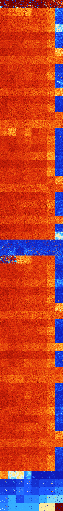

# B0157 (83456-83967)

<details>
    <summary>Initial Grid</summary>
    
</details>


<details>
    <summary>Initial Grid RLE</summary>

```
#C Exported from GoGoL (https://github.com/marrow16/gogol)
#C Wrap mode: Toroidal
#C Boundary mode: Dead
#C Step: 0
x = 100, y = 100, rule = B0157/S
21bo6bo28bo3bobo$22bo12b2o9bo24bo23bo$33bo28bo9bo21bo$14bo3bo29bo8bobo
6b2o3bo24bo$35bo18bobo3bo$25bo34bob2o$bo8bo32bo40bo$9bo4bo16bo18bobo31b
o12bo$25bo9bo19b2o$14bo5bo27bo30bo$13bo15bobo7bo6bo11bo22bo$38bo7bo11b
2o8bo19bo$25bo4bo21bo3bo14b2o2bo$43bo5bo36bo$53bo$39bo2bo10bo43bo$7bo
45bo6bo14bo$26bo8bo24bo35bo$57bo26bo$4bo57bo9bobo8bo$o30bo22bo13bo$9bo
9bo44bo12bo19b2o$4bo19bo4bo5bo14bo34bo$6bo14bo51bo7bo$4bo3b3o20bo16bo7b
o$3bo15bo7b2o50bo$29bo17bo8bo33bo7bo$35bo11bo7bobo17b2o7bo12bo$12bo6bo
17bo8bo13bo8bo6bo9bo$7bo13bo47bo2bo2bo8bo$11bo16b2o18bo40bo$2b2o40bo25b
o$bobo14bo11bo24bo7bo3bo2b2o$bo19bo7bo35bo7bobo19bo$5bo19bo29bo34bo5bo$
16bo47bo$31bo$7bo31bo23bo9bo21bo$7bo23bo3bo7bobo45bo$9bo39bo8bo16bo4bo
3bo$24bo13bo2bo21bo34bo$100b$12bo7bo10bo18bo3bo17bo8bobo6bo$7bobo66bo4b
o16bo$o34bo12bo8bo8bo12bo$15bo4bo35bo15bo9bo11bo$31bo2bo17bo9bo13bo5bo
5bo$9bo10bo17bo12bo42bo$17b2o61bo9bo$58bo34bo$2o18bo32bo14bo16bo3bo$5bo
bo8bo10bo7bo8bo26bo11bo11bo$3bo54bobo22bo9bo$23bo25bo15bo$75b2o$50bo22b
o2bo12b2o$28bo16bo9bo11bo6bo$38bo3bo5bo2bobo10bo32bo$13b2o33bo4b3o10bo
21bo4bo$5bobo13bo15bo4bo6bo14bo24bo$13bo3bo5bo18bo50bo$56bo15bo3bo15bo
5bo$22bo24bo21bo13bo$8bo36b2o45bo$16bo7bo5bo4b2o5bo3bobo36bo3bo$49bo49b
o$8b2o23bo3bo21bo6bo26bo$2bo49bo17bo8bo8bo$31bo12bo10bo14bobo14bo4bo5bo
$22bo5bo47bo15bo$10bo29bo13bo20bo10bo5bo$5bo11bo3bo16bo$23bo7bo22bobo
38bo$54bo12bo12bo4bo4bo$14bo20bo15bo23bo22bo$52bo2bo9bo11bo$17bo13bo10b
o21b2o10bo21bo$24bobo33bo22bo13bo$9bo20bo6bo32bo23bo$24bo15bo40bo15bo$
26bo2bo9bo29bo$6bo17bo31bo35bobo$o54bo23b2o$5bo35bo23bo5bo23bo$3bo5bo3b
o19bo34bo6bo22bo$33bo2bo4bo17bo22bo$12bo2bo8bo2bob2o30bo13bo6bo7bob2o$
6bo31bo3b2o8bo16bo28bo$6bo51bo3bo12bo$4bo20bo3bo8bo9bo6bo32bo$16bo$30bo
bo11bo16bo18bo5bo7bo$29bo19bo2bo3bo8bo2bo7bo$75bo$42bo23bo6bo18bo3bo$
24bo32bo2bo11bo6bo12bo$16bo21bob2o38bobo2bo3bo9bo$19bo35bo25bo8bo$17bo
7bo50bo$5bo50bo39bo!
```
</details>
<details>
    <summary>Thumbnail</summary>

</details>
<table>
<tr>
    <td><a href="./83456%20S%20Heat%20Map%20Activity.png"></a><br>S (83456)<br>R@91,p4</td>    <td><a href="./83457%20S0%20Heat%20Map%20Activity.png"></a><br>S0 (83457)<br>R@181,p48</td>    <td><a href="./83458%20S1%20Heat%20Map%20Activity.png"></a><br>S1 (83458)<br>R@150,p40</td>    <td><a href="./83459%20S01%20Heat%20Map%20Activity.png"></a><br>S01 (83459)<br>R@169,p4</td>    <td><a href="./83460%20S2%20Heat%20Map%20Activity.png"></a><br>S2 (83460)<br>R@244,p8</td>    <td><a href="./83461%20S02%20Heat%20Map%20Activity.png"></a><br>S02 (83461)<br>R@287,p16</td>    <td><a href="./83462%20S12%20Heat%20Map%20Activity.png"></a><br>S12 (83462)<br>R@899,p4</td>    <td><a href="./83463%20S012%20Heat%20Map%20Activity.png"></a><br>S012 (83463)<br>G>1000</td></tr>
<tr>
    <td><a href="./83464%20S3%20Heat%20Map%20Activity.png"></a><br>S3 (83464)<br>G>1000</td>    <td><a href="./83465%20S03%20Heat%20Map%20Activity.png"></a><br>S03 (83465)<br>G>1000</td>    <td><a href="./83466%20S13%20Heat%20Map%20Activity.png"></a><br>S13 (83466)<br>G>1000</td>    <td><a href="./83467%20S013%20Heat%20Map%20Activity.png"></a><br>S013 (83467)<br>G>1000</td>    <td><a href="./83468%20S23%20Heat%20Map%20Activity.png"></a><br>S23 (83468)<br>G>1000</td>    <td><a href="./83469%20S023%20Heat%20Map%20Activity.png"></a><br>S023 (83469)<br>G>1000</td>    <td><a href="./83470%20S123%20Heat%20Map%20Activity.png"></a><br>S123 (83470)<br>G>1000</td>    <td><a href="./83471%20S0123%20Heat%20Map%20Activity.png"></a><br>S0123 (83471)<br>R@274,p60</td></tr>
<tr>
    <td><a href="./83472%20S4%20Heat%20Map%20Activity.png"></a><br>S4 (83472)<br>G>1000</td>    <td><a href="./83473%20S04%20Heat%20Map%20Activity.png"></a><br>S04 (83473)<br>G>1000</td>    <td><a href="./83474%20S14%20Heat%20Map%20Activity.png"></a><br>S14 (83474)<br>G>1000</td>    <td><a href="./83475%20S014%20Heat%20Map%20Activity.png"></a><br>S014 (83475)<br>G>1000</td>    <td><a href="./83476%20S24%20Heat%20Map%20Activity.png"></a><br>S24 (83476)<br>G>1000</td>    <td><a href="./83477%20S024%20Heat%20Map%20Activity.png"></a><br>S024 (83477)<br>G>1000</td>    <td><a href="./83478%20S124%20Heat%20Map%20Activity.png"></a><br>S124 (83478)<br>G>1000</td>    <td><a href="./83479%20S0124%20Heat%20Map%20Activity.png"></a><br>S0124 (83479)<br>R@562,p42</td></tr>
<tr>
    <td><a href="./83480%20S34%20Heat%20Map%20Activity.png"></a><br>S34 (83480)<br>G>1000</td>    <td><a href="./83481%20S034%20Heat%20Map%20Activity.png"></a><br>S034 (83481)<br>G>1000</td>    <td><a href="./83482%20S134%20Heat%20Map%20Activity.png"></a><br>S134 (83482)<br>G>1000</td>    <td><a href="./83483%20S0134%20Heat%20Map%20Activity.png"></a><br>S0134 (83483)<br>G>1000</td>    <td><a href="./83484%20S234%20Heat%20Map%20Activity.png"></a><br>S234 (83484)<br>G>1000</td>    <td><a href="./83485%20S0234%20Heat%20Map%20Activity.png"></a><br>S0234 (83485)<br>G>1000</td>    <td><a href="./83486%20S1234%20Heat%20Map%20Activity.png"></a><br>S1234 (83486)<br>G>1000</td>    <td><a href="./83487%20S01234%20Heat%20Map%20Activity.png"></a><br>S01234 (83487)<br>G>1000</td></tr>
<tr>
    <td><a href="./83488%20S5%20Heat%20Map%20Activity.png"></a><br>S5 (83488)<br>G>1000</td>    <td><a href="./83489%20S05%20Heat%20Map%20Activity.png"></a><br>S05 (83489)<br>G>1000</td>    <td><a href="./83490%20S15%20Heat%20Map%20Activity.png"></a><br>S15 (83490)<br>G>1000</td>    <td><a href="./83491%20S015%20Heat%20Map%20Activity.png"></a><br>S015 (83491)<br>G>1000</td>    <td><a href="./83492%20S25%20Heat%20Map%20Activity.png"></a><br>S25 (83492)<br>G>1000</td>    <td><a href="./83493%20S025%20Heat%20Map%20Activity.png"></a><br>S025 (83493)<br>G>1000</td>    <td><a href="./83494%20S125%20Heat%20Map%20Activity.png"></a><br>S125 (83494)<br>G>1000</td>    <td><a href="./83495%20S0125%20Heat%20Map%20Activity.png"></a><br>S0125 (83495)<br>R@198,p12</td></tr>
<tr>
    <td><a href="./83496%20S35%20Heat%20Map%20Activity.png"></a><br>S35 (83496)<br>G>1000</td>    <td><a href="./83497%20S035%20Heat%20Map%20Activity.png"></a><br>S035 (83497)<br>G>1000</td>    <td><a href="./83498%20S135%20Heat%20Map%20Activity.png"></a><br>S135 (83498)<br>G>1000</td>    <td><a href="./83499%20S0135%20Heat%20Map%20Activity.png"></a><br>S0135 (83499)<br>G>1000</td>    <td><a href="./83500%20S235%20Heat%20Map%20Activity.png"></a><br>S235 (83500)<br>G>1000</td>    <td><a href="./83501%20S0235%20Heat%20Map%20Activity.png"></a><br>S0235 (83501)<br>G>1000</td>    <td><a href="./83502%20S1235%20Heat%20Map%20Activity.png"></a><br>S1235 (83502)<br>G>1000</td>    <td><a href="./83503%20S01235%20Heat%20Map%20Activity.png"></a><br>S01235 (83503)<br>R@153,p2</td></tr>
<tr>
    <td><a href="./83504%20S45%20Heat%20Map%20Activity.png"></a><br>S45 (83504)<br>G>1000</td>    <td><a href="./83505%20S045%20Heat%20Map%20Activity.png"></a><br>S045 (83505)<br>G>1000</td>    <td><a href="./83506%20S145%20Heat%20Map%20Activity.png"></a><br>S145 (83506)<br>G>1000</td>    <td><a href="./83507%20S0145%20Heat%20Map%20Activity.png"></a><br>S0145 (83507)<br>G>1000</td>    <td><a href="./83508%20S245%20Heat%20Map%20Activity.png"></a><br>S245 (83508)<br>G>1000</td>    <td><a href="./83509%20S0245%20Heat%20Map%20Activity.png"></a><br>S0245 (83509)<br>G>1000</td>    <td><a href="./83510%20S1245%20Heat%20Map%20Activity.png"></a><br>S1245 (83510)<br>G>1000</td>    <td><a href="./83511%20S01245%20Heat%20Map%20Activity.png"></a><br>S01245 (83511)<br>G>1000</td></tr>
<tr>
    <td><a href="./83512%20S345%20Heat%20Map%20Activity.png"></a><br>S345 (83512)<br>G>1000</td>    <td><a href="./83513%20S0345%20Heat%20Map%20Activity.png"></a><br>S0345 (83513)<br>G>1000</td>    <td><a href="./83514%20S1345%20Heat%20Map%20Activity.png"></a><br>S1345 (83514)<br>G>1000</td>    <td><a href="./83515%20S01345%20Heat%20Map%20Activity.png"></a><br>S01345 (83515)<br>G>1000</td>    <td><a href="./83516%20S2345%20Heat%20Map%20Activity.png"></a><br>S2345 (83516)<br>G>1000</td>    <td><a href="./83517%20S02345%20Heat%20Map%20Activity.png"></a><br>S02345 (83517)<br>G>1000</td>    <td><a href="./83518%20S12345%20Heat%20Map%20Activity.png"></a><br>S12345 (83518)<br>G>1000</td>    <td><a href="./83519%20S012345%20Heat%20Map%20Activity.png"></a><br>S012345 (83519)<br>G>1000</td></tr>
<tr>
    <td><a href="./83520%20S6%20Heat%20Map%20Activity.png"></a><br>S6 (83520)<br>G>1000</td>    <td><a href="./83521%20S06%20Heat%20Map%20Activity.png"></a><br>S06 (83521)<br>G>1000</td>    <td><a href="./83522%20S16%20Heat%20Map%20Activity.png"></a><br>S16 (83522)<br>G>1000</td>    <td><a href="./83523%20S016%20Heat%20Map%20Activity.png"></a><br>S016 (83523)<br>G>1000</td>    <td><a href="./83524%20S26%20Heat%20Map%20Activity.png"></a><br>S26 (83524)<br>G>1000</td>    <td><a href="./83525%20S026%20Heat%20Map%20Activity.png"></a><br>S026 (83525)<br>G>1000</td>    <td><a href="./83526%20S126%20Heat%20Map%20Activity.png"></a><br>S126 (83526)<br>G>1000</td>    <td><a href="./83527%20S0126%20Heat%20Map%20Activity.png"></a><br>S0126 (83527)<br>R@253,p120</td></tr>
<tr>
    <td><a href="./83528%20S36%20Heat%20Map%20Activity.png"></a><br>S36 (83528)<br>G>1000</td>    <td><a href="./83529%20S036%20Heat%20Map%20Activity.png"></a><br>S036 (83529)<br>G>1000</td>    <td><a href="./83530%20S136%20Heat%20Map%20Activity.png"></a><br>S136 (83530)<br>G>1000</td>    <td><a href="./83531%20S0136%20Heat%20Map%20Activity.png"></a><br>S0136 (83531)<br>G>1000</td>    <td><a href="./83532%20S236%20Heat%20Map%20Activity.png"></a><br>S236 (83532)<br>G>1000</td>    <td><a href="./83533%20S0236%20Heat%20Map%20Activity.png"></a><br>S0236 (83533)<br>G>1000</td>    <td><a href="./83534%20S1236%20Heat%20Map%20Activity.png"></a><br>S1236 (83534)<br>G>1000</td>    <td><a href="./83535%20S01236%20Heat%20Map%20Activity.png"></a><br>S01236 (83535)<br>R@103,p12</td></tr>
<tr>
    <td><a href="./83536%20S46%20Heat%20Map%20Activity.png"></a><br>S46 (83536)<br>G>1000</td>    <td><a href="./83537%20S046%20Heat%20Map%20Activity.png"></a><br>S046 (83537)<br>G>1000</td>    <td><a href="./83538%20S146%20Heat%20Map%20Activity.png"></a><br>S146 (83538)<br>G>1000</td>    <td><a href="./83539%20S0146%20Heat%20Map%20Activity.png"></a><br>S0146 (83539)<br>G>1000</td>    <td><a href="./83540%20S246%20Heat%20Map%20Activity.png"></a><br>S246 (83540)<br>G>1000</td>    <td><a href="./83541%20S0246%20Heat%20Map%20Activity.png"></a><br>S0246 (83541)<br>G>1000</td>    <td><a href="./83542%20S1246%20Heat%20Map%20Activity.png"></a><br>S1246 (83542)<br>G>1000</td>    <td><a href="./83543%20S01246%20Heat%20Map%20Activity.png"></a><br>S01246 (83543)<br>R@766,p4</td></tr>
<tr>
    <td><a href="./83544%20S346%20Heat%20Map%20Activity.png"></a><br>S346 (83544)<br>G>1000</td>    <td><a href="./83545%20S0346%20Heat%20Map%20Activity.png"></a><br>S0346 (83545)<br>G>1000</td>    <td><a href="./83546%20S1346%20Heat%20Map%20Activity.png"></a><br>S1346 (83546)<br>G>1000</td>    <td><a href="./83547%20S01346%20Heat%20Map%20Activity.png"></a><br>S01346 (83547)<br>G>1000</td>    <td><a href="./83548%20S2346%20Heat%20Map%20Activity.png"></a><br>S2346 (83548)<br>G>1000</td>    <td><a href="./83549%20S02346%20Heat%20Map%20Activity.png"></a><br>S02346 (83549)<br>G>1000</td>    <td><a href="./83550%20S12346%20Heat%20Map%20Activity.png"></a><br>S12346 (83550)<br>G>1000</td>    <td><a href="./83551%20S012346%20Heat%20Map%20Activity.png"></a><br>S012346 (83551)<br>G>1000</td></tr>
<tr>
    <td><a href="./83552%20S56%20Heat%20Map%20Activity.png"></a><br>S56 (83552)<br>G>1000</td>    <td><a href="./83553%20S056%20Heat%20Map%20Activity.png"></a><br>S056 (83553)<br>G>1000</td>    <td><a href="./83554%20S156%20Heat%20Map%20Activity.png"></a><br>S156 (83554)<br>G>1000</td>    <td><a href="./83555%20S0156%20Heat%20Map%20Activity.png"></a><br>S0156 (83555)<br>G>1000</td>    <td><a href="./83556%20S256%20Heat%20Map%20Activity.png"></a><br>S256 (83556)<br>G>1000</td>    <td><a href="./83557%20S0256%20Heat%20Map%20Activity.png"></a><br>S0256 (83557)<br>G>1000</td>    <td><a href="./83558%20S1256%20Heat%20Map%20Activity.png"></a><br>S1256 (83558)<br>G>1000</td>    <td><a href="./83559%20S01256%20Heat%20Map%20Activity.png"></a><br>S01256 (83559)<br>R@305,p12</td></tr>
<tr>
    <td><a href="./83560%20S356%20Heat%20Map%20Activity.png"></a><br>S356 (83560)<br>G>1000</td>    <td><a href="./83561%20S0356%20Heat%20Map%20Activity.png"></a><br>S0356 (83561)<br>G>1000</td>    <td><a href="./83562%20S1356%20Heat%20Map%20Activity.png"></a><br>S1356 (83562)<br>G>1000</td>    <td><a href="./83563%20S01356%20Heat%20Map%20Activity.png"></a><br>S01356 (83563)<br>G>1000</td>    <td><a href="./83564%20S2356%20Heat%20Map%20Activity.png"></a><br>S2356 (83564)<br>G>1000</td>    <td><a href="./83565%20S02356%20Heat%20Map%20Activity.png"></a><br>S02356 (83565)<br>G>1000</td>    <td><a href="./83566%20S12356%20Heat%20Map%20Activity.png"></a><br>S12356 (83566)<br>G>1000</td>    <td><a href="./83567%20S012356%20Heat%20Map%20Activity.png"></a><br>S012356 (83567)<br>R@319,p4</td></tr>
<tr>
    <td><a href="./83568%20S456%20Heat%20Map%20Activity.png"></a><br>S456 (83568)<br>G>1000</td>    <td><a href="./83569%20S0456%20Heat%20Map%20Activity.png"></a><br>S0456 (83569)<br>G>1000</td>    <td><a href="./83570%20S1456%20Heat%20Map%20Activity.png"></a><br>S1456 (83570)<br>G>1000</td>    <td><a href="./83571%20S01456%20Heat%20Map%20Activity.png"></a><br>S01456 (83571)<br>G>1000</td>    <td><a href="./83572%20S2456%20Heat%20Map%20Activity.png"></a><br>S2456 (83572)<br>G>1000</td>    <td><a href="./83573%20S02456%20Heat%20Map%20Activity.png"></a><br>S02456 (83573)<br>G>1000</td>    <td><a href="./83574%20S12456%20Heat%20Map%20Activity.png"></a><br>S12456 (83574)<br>G>1000</td>    <td><a href="./83575%20S012456%20Heat%20Map%20Activity.png"></a><br>S012456 (83575)<br>G>1000</td></tr>
<tr>
    <td><a href="./83576%20S3456%20Heat%20Map%20Activity.png"></a><br>S3456 (83576)<br>G>1000</td>    <td><a href="./83577%20S03456%20Heat%20Map%20Activity.png"></a><br>S03456 (83577)<br>G>1000</td>    <td><a href="./83578%20S13456%20Heat%20Map%20Activity.png"></a><br>S13456 (83578)<br>G>1000</td>    <td><a href="./83579%20S013456%20Heat%20Map%20Activity.png"></a><br>S013456 (83579)<br>G>1000</td>    <td><a href="./83580%20S23456%20Heat%20Map%20Activity.png"></a><br>S23456 (83580)<br>G>1000</td>    <td><a href="./83581%20S023456%20Heat%20Map%20Activity.png"></a><br>S023456 (83581)<br>G>1000</td>    <td><a href="./83582%20S123456%20Heat%20Map%20Activity.png"></a><br>S123456 (83582)<br>G>1000</td>    <td><a href="./83583%20S0123456%20Heat%20Map%20Activity.png"></a><br>S0123456 (83583)<br>G>1000</td></tr>
<tr>
    <td><a href="./83584%20S7%20Heat%20Map%20Activity.png"></a><br>S7 (83584)<br>G>1000</td>    <td><a href="./83585%20S07%20Heat%20Map%20Activity.png"></a><br>S07 (83585)<br>G>1000</td>    <td><a href="./83586%20S17%20Heat%20Map%20Activity.png"></a><br>S17 (83586)<br>G>1000</td>    <td><a href="./83587%20S017%20Heat%20Map%20Activity.png"></a><br>S017 (83587)<br>G>1000</td>    <td><a href="./83588%20S27%20Heat%20Map%20Activity.png"></a><br>S27 (83588)<br>G>1000</td>    <td><a href="./83589%20S027%20Heat%20Map%20Activity.png"></a><br>S027 (83589)<br>G>1000</td>    <td><a href="./83590%20S127%20Heat%20Map%20Activity.png"></a><br>S127 (83590)<br>G>1000</td>    <td><a href="./83591%20S0127%20Heat%20Map%20Activity.png"></a><br>S0127 (83591)<br>R@253,p2</td></tr>
<tr>
    <td><a href="./83592%20S37%20Heat%20Map%20Activity.png"></a><br>S37 (83592)<br>G>1000</td>    <td><a href="./83593%20S037%20Heat%20Map%20Activity.png"></a><br>S037 (83593)<br>G>1000</td>    <td><a href="./83594%20S137%20Heat%20Map%20Activity.png"></a><br>S137 (83594)<br>G>1000</td>    <td><a href="./83595%20S0137%20Heat%20Map%20Activity.png"></a><br>S0137 (83595)<br>G>1000</td>    <td><a href="./83596%20S237%20Heat%20Map%20Activity.png"></a><br>S237 (83596)<br>G>1000</td>    <td><a href="./83597%20S0237%20Heat%20Map%20Activity.png"></a><br>S0237 (83597)<br>G>1000</td>    <td><a href="./83598%20S1237%20Heat%20Map%20Activity.png"></a><br>S1237 (83598)<br>G>1000</td>    <td><a href="./83599%20S01237%20Heat%20Map%20Activity.png"></a><br>S01237 (83599)<br>R@170,p12</td></tr>
<tr>
    <td><a href="./83600%20S47%20Heat%20Map%20Activity.png"></a><br>S47 (83600)<br>G>1000</td>    <td><a href="./83601%20S047%20Heat%20Map%20Activity.png"></a><br>S047 (83601)<br>G>1000</td>    <td><a href="./83602%20S147%20Heat%20Map%20Activity.png"></a><br>S147 (83602)<br>G>1000</td>    <td><a href="./83603%20S0147%20Heat%20Map%20Activity.png"></a><br>S0147 (83603)<br>G>1000</td>    <td><a href="./83604%20S247%20Heat%20Map%20Activity.png"></a><br>S247 (83604)<br>G>1000</td>    <td><a href="./83605%20S0247%20Heat%20Map%20Activity.png"></a><br>S0247 (83605)<br>G>1000</td>    <td><a href="./83606%20S1247%20Heat%20Map%20Activity.png"></a><br>S1247 (83606)<br>G>1000</td>    <td><a href="./83607%20S01247%20Heat%20Map%20Activity.png"></a><br>S01247 (83607)<br>R@282,p6</td></tr>
<tr>
    <td><a href="./83608%20S347%20Heat%20Map%20Activity.png"></a><br>S347 (83608)<br>G>1000</td>    <td><a href="./83609%20S0347%20Heat%20Map%20Activity.png"></a><br>S0347 (83609)<br>G>1000</td>    <td><a href="./83610%20S1347%20Heat%20Map%20Activity.png"></a><br>S1347 (83610)<br>G>1000</td>    <td><a href="./83611%20S01347%20Heat%20Map%20Activity.png"></a><br>S01347 (83611)<br>G>1000</td>    <td><a href="./83612%20S2347%20Heat%20Map%20Activity.png"></a><br>S2347 (83612)<br>G>1000</td>    <td><a href="./83613%20S02347%20Heat%20Map%20Activity.png"></a><br>S02347 (83613)<br>G>1000</td>    <td><a href="./83614%20S12347%20Heat%20Map%20Activity.png"></a><br>S12347 (83614)<br>G>1000</td>    <td><a href="./83615%20S012347%20Heat%20Map%20Activity.png"></a><br>S012347 (83615)<br>G>1000</td></tr>
<tr>
    <td><a href="./83616%20S57%20Heat%20Map%20Activity.png"></a><br>S57 (83616)<br>G>1000</td>    <td><a href="./83617%20S057%20Heat%20Map%20Activity.png"></a><br>S057 (83617)<br>G>1000</td>    <td><a href="./83618%20S157%20Heat%20Map%20Activity.png"></a><br>S157 (83618)<br>G>1000</td>    <td><a href="./83619%20S0157%20Heat%20Map%20Activity.png"></a><br>S0157 (83619)<br>G>1000</td>    <td><a href="./83620%20S257%20Heat%20Map%20Activity.png"></a><br>S257 (83620)<br>G>1000</td>    <td><a href="./83621%20S0257%20Heat%20Map%20Activity.png"></a><br>S0257 (83621)<br>G>1000</td>    <td><a href="./83622%20S1257%20Heat%20Map%20Activity.png"></a><br>S1257 (83622)<br>G>1000</td>    <td><a href="./83623%20S01257%20Heat%20Map%20Activity.png"></a><br>S01257 (83623)<br>R@318,p12</td></tr>
<tr>
    <td><a href="./83624%20S357%20Heat%20Map%20Activity.png"></a><br>S357 (83624)<br>G>1000</td>    <td><a href="./83625%20S0357%20Heat%20Map%20Activity.png"></a><br>S0357 (83625)<br>G>1000</td>    <td><a href="./83626%20S1357%20Heat%20Map%20Activity.png"></a><br>S1357 (83626)<br>G>1000</td>    <td><a href="./83627%20S01357%20Heat%20Map%20Activity.png"></a><br>S01357 (83627)<br>G>1000</td>    <td><a href="./83628%20S2357%20Heat%20Map%20Activity.png"></a><br>S2357 (83628)<br>G>1000</td>    <td><a href="./83629%20S02357%20Heat%20Map%20Activity.png"></a><br>S02357 (83629)<br>G>1000</td>    <td><a href="./83630%20S12357%20Heat%20Map%20Activity.png"></a><br>S12357 (83630)<br>G>1000</td>    <td><a href="./83631%20S012357%20Heat%20Map%20Activity.png"></a><br>S012357 (83631)<br>R@157,p36</td></tr>
<tr>
    <td><a href="./83632%20S457%20Heat%20Map%20Activity.png"></a><br>S457 (83632)<br>G>1000</td>    <td><a href="./83633%20S0457%20Heat%20Map%20Activity.png"></a><br>S0457 (83633)<br>G>1000</td>    <td><a href="./83634%20S1457%20Heat%20Map%20Activity.png"></a><br>S1457 (83634)<br>G>1000</td>    <td><a href="./83635%20S01457%20Heat%20Map%20Activity.png"></a><br>S01457 (83635)<br>G>1000</td>    <td><a href="./83636%20S2457%20Heat%20Map%20Activity.png"></a><br>S2457 (83636)<br>G>1000</td>    <td><a href="./83637%20S02457%20Heat%20Map%20Activity.png"></a><br>S02457 (83637)<br>G>1000</td>    <td><a href="./83638%20S12457%20Heat%20Map%20Activity.png"></a><br>S12457 (83638)<br>G>1000</td>    <td><a href="./83639%20S012457%20Heat%20Map%20Activity.png"></a><br>S012457 (83639)<br>G>1000</td></tr>
<tr>
    <td><a href="./83640%20S3457%20Heat%20Map%20Activity.png"></a><br>S3457 (83640)<br>G>1000</td>    <td><a href="./83641%20S03457%20Heat%20Map%20Activity.png"></a><br>S03457 (83641)<br>G>1000</td>    <td><a href="./83642%20S13457%20Heat%20Map%20Activity.png"></a><br>S13457 (83642)<br>G>1000</td>    <td><a href="./83643%20S013457%20Heat%20Map%20Activity.png"></a><br>S013457 (83643)<br>G>1000</td>    <td><a href="./83644%20S23457%20Heat%20Map%20Activity.png"></a><br>S23457 (83644)<br>G>1000</td>    <td><a href="./83645%20S023457%20Heat%20Map%20Activity.png"></a><br>S023457 (83645)<br>G>1000</td>    <td><a href="./83646%20S123457%20Heat%20Map%20Activity.png"></a><br>S123457 (83646)<br>G>1000</td>    <td><a href="./83647%20S0123457%20Heat%20Map%20Activity.png"></a><br>S0123457 (83647)<br>G>1000</td></tr>
<tr>
    <td><a href="./83648%20S67%20Heat%20Map%20Activity.png"></a><br>S67 (83648)<br>G>1000</td>    <td><a href="./83649%20S067%20Heat%20Map%20Activity.png"></a><br>S067 (83649)<br>G>1000</td>    <td><a href="./83650%20S167%20Heat%20Map%20Activity.png"></a><br>S167 (83650)<br>G>1000</td>    <td><a href="./83651%20S0167%20Heat%20Map%20Activity.png"></a><br>S0167 (83651)<br>G>1000</td>    <td><a href="./83652%20S267%20Heat%20Map%20Activity.png"></a><br>S267 (83652)<br>G>1000</td>    <td><a href="./83653%20S0267%20Heat%20Map%20Activity.png"></a><br>S0267 (83653)<br>G>1000</td>    <td><a href="./83654%20S1267%20Heat%20Map%20Activity.png"></a><br>S1267 (83654)<br>G>1000</td>    <td><a href="./83655%20S01267%20Heat%20Map%20Activity.png"></a><br>S01267 (83655)<br>R@237,p10</td></tr>
<tr>
    <td><a href="./83656%20S367%20Heat%20Map%20Activity.png"></a><br>S367 (83656)<br>G>1000</td>    <td><a href="./83657%20S0367%20Heat%20Map%20Activity.png"></a><br>S0367 (83657)<br>G>1000</td>    <td><a href="./83658%20S1367%20Heat%20Map%20Activity.png"></a><br>S1367 (83658)<br>G>1000</td>    <td><a href="./83659%20S01367%20Heat%20Map%20Activity.png"></a><br>S01367 (83659)<br>G>1000</td>    <td><a href="./83660%20S2367%20Heat%20Map%20Activity.png"></a><br>S2367 (83660)<br>G>1000</td>    <td><a href="./83661%20S02367%20Heat%20Map%20Activity.png"></a><br>S02367 (83661)<br>G>1000</td>    <td><a href="./83662%20S12367%20Heat%20Map%20Activity.png"></a><br>S12367 (83662)<br>G>1000</td>    <td><a href="./83663%20S012367%20Heat%20Map%20Activity.png"></a><br>S012367 (83663)<br>R@102,p12</td></tr>
<tr>
    <td><a href="./83664%20S467%20Heat%20Map%20Activity.png"></a><br>S467 (83664)<br>G>1000</td>    <td><a href="./83665%20S0467%20Heat%20Map%20Activity.png"></a><br>S0467 (83665)<br>G>1000</td>    <td><a href="./83666%20S1467%20Heat%20Map%20Activity.png"></a><br>S1467 (83666)<br>G>1000</td>    <td><a href="./83667%20S01467%20Heat%20Map%20Activity.png"></a><br>S01467 (83667)<br>G>1000</td>    <td><a href="./83668%20S2467%20Heat%20Map%20Activity.png"></a><br>S2467 (83668)<br>G>1000</td>    <td><a href="./83669%20S02467%20Heat%20Map%20Activity.png"></a><br>S02467 (83669)<br>G>1000</td>    <td><a href="./83670%20S12467%20Heat%20Map%20Activity.png"></a><br>S12467 (83670)<br>G>1000</td>    <td><a href="./83671%20S012467%20Heat%20Map%20Activity.png"></a><br>S012467 (83671)<br>R@480,p6</td></tr>
<tr>
    <td><a href="./83672%20S3467%20Heat%20Map%20Activity.png"></a><br>S3467 (83672)<br>G>1000</td>    <td><a href="./83673%20S03467%20Heat%20Map%20Activity.png"></a><br>S03467 (83673)<br>G>1000</td>    <td><a href="./83674%20S13467%20Heat%20Map%20Activity.png"></a><br>S13467 (83674)<br>G>1000</td>    <td><a href="./83675%20S013467%20Heat%20Map%20Activity.png"></a><br>S013467 (83675)<br>G>1000</td>    <td><a href="./83676%20S23467%20Heat%20Map%20Activity.png"></a><br>S23467 (83676)<br>G>1000</td>    <td><a href="./83677%20S023467%20Heat%20Map%20Activity.png"></a><br>S023467 (83677)<br>G>1000</td>    <td><a href="./83678%20S123467%20Heat%20Map%20Activity.png"></a><br>S123467 (83678)<br>G>1000</td>    <td><a href="./83679%20S0123467%20Heat%20Map%20Activity.png"></a><br>S0123467 (83679)<br>G>1000</td></tr>
<tr>
    <td><a href="./83680%20S567%20Heat%20Map%20Activity.png"></a><br>S567 (83680)<br>G>1000</td>    <td><a href="./83681%20S0567%20Heat%20Map%20Activity.png"></a><br>S0567 (83681)<br>G>1000</td>    <td><a href="./83682%20S1567%20Heat%20Map%20Activity.png"></a><br>S1567 (83682)<br>G>1000</td>    <td><a href="./83683%20S01567%20Heat%20Map%20Activity.png"></a><br>S01567 (83683)<br>G>1000</td>    <td><a href="./83684%20S2567%20Heat%20Map%20Activity.png"></a><br>S2567 (83684)<br>G>1000</td>    <td><a href="./83685%20S02567%20Heat%20Map%20Activity.png"></a><br>S02567 (83685)<br>G>1000</td>    <td><a href="./83686%20S12567%20Heat%20Map%20Activity.png"></a><br>S12567 (83686)<br>G>1000</td>    <td><a href="./83687%20S012567%20Heat%20Map%20Activity.png"></a><br>S012567 (83687)<br>R@487,p6</td></tr>
<tr>
    <td><a href="./83688%20S3567%20Heat%20Map%20Activity.png"></a><br>S3567 (83688)<br>G>1000</td>    <td><a href="./83689%20S03567%20Heat%20Map%20Activity.png"></a><br>S03567 (83689)<br>G>1000</td>    <td><a href="./83690%20S13567%20Heat%20Map%20Activity.png"></a><br>S13567 (83690)<br>G>1000</td>    <td><a href="./83691%20S013567%20Heat%20Map%20Activity.png"></a><br>S013567 (83691)<br>G>1000</td>    <td><a href="./83692%20S23567%20Heat%20Map%20Activity.png"></a><br>S23567 (83692)<br>G>1000</td>    <td><a href="./83693%20S023567%20Heat%20Map%20Activity.png"></a><br>S023567 (83693)<br>G>1000</td>    <td><a href="./83694%20S123567%20Heat%20Map%20Activity.png"></a><br>S123567 (83694)<br>G>1000</td>    <td><a href="./83695%20S0123567%20Heat%20Map%20Activity.png"></a><br>S0123567 (83695)<br>G>1000</td></tr>
<tr>
    <td><a href="./83696%20S4567%20Heat%20Map%20Activity.png"></a><br>S4567 (83696)<br>R@138,p36</td>    <td><a href="./83697%20S04567%20Heat%20Map%20Activity.png"></a><br>S04567 (83697)<br>R@176,p60</td>    <td><a href="./83698%20S14567%20Heat%20Map%20Activity.png"></a><br>S14567 (83698)<br>R@127,p12</td>    <td><a href="./83699%20S014567%20Heat%20Map%20Activity.png"></a><br>S014567 (83699)<br>R@185,p36</td>    <td><a href="./83700%20S24567%20Heat%20Map%20Activity.png"></a><br>S24567 (83700)<br>R@132,p12</td>    <td><a href="./83701%20S024567%20Heat%20Map%20Activity.png"></a><br>S024567 (83701)<br>R@144,p12</td>    <td><a href="./83702%20S124567%20Heat%20Map%20Activity.png"></a><br>S124567 (83702)<br>R@105,p12</td>    <td><a href="./83703%20S0124567%20Heat%20Map%20Activity.png"></a><br>S0124567 (83703)<br>R@119,p12</td></tr>
<tr>
    <td><a href="./83704%20S34567%20Heat%20Map%20Activity.png"></a><br>S34567 (83704)<br>R@49,p12</td>    <td><a href="./83705%20S034567%20Heat%20Map%20Activity.png"></a><br>S034567 (83705)<br>R@39,p6</td>    <td><a href="./83706%20S134567%20Heat%20Map%20Activity.png"></a><br>S134567 (83706)<br>R@95,p60</td>    <td><a href="./83707%20S0134567%20Heat%20Map%20Activity.png"></a><br>S0134567 (83707)<br>R@40,p6</td>    <td><a href="./83708%20S234567%20Heat%20Map%20Activity.png"></a><br>S234567 (83708)<br>R@34,p6</td>    <td><a href="./83709%20S0234567%20Heat%20Map%20Activity.png"></a><br>S0234567 (83709)<br>R@58,p6</td>    <td><a href="./83710%20S1234567%20Heat%20Map%20Activity.png"></a><br>S1234567 (83710)<br>R@51,p6</td>    <td><a href="./83711%20S01234567%20Heat%20Map%20Activity.png"></a><br>S01234567 (83711)<br>R@49,p6</td></tr>
<tr>
    <td><a href="./83712%20S8%20Heat%20Map%20Activity.png"></a><br>S8 (83712)<br>R@244,p56</td>    <td><a href="./83713%20S08%20Heat%20Map%20Activity.png"></a><br>S08 (83713)<br>R@169,p8</td>    <td><a href="./83714%20S18%20Heat%20Map%20Activity.png"></a><br>S18 (83714)<br>G>1000</td>    <td><a href="./83715%20S018%20Heat%20Map%20Activity.png"></a><br>S018 (83715)<br>G>1000</td>    <td><a href="./83716%20S28%20Heat%20Map%20Activity.png"></a><br>S28 (83716)<br>G>1000</td>    <td><a href="./83717%20S028%20Heat%20Map%20Activity.png"></a><br>S028 (83717)<br>G>1000</td>    <td><a href="./83718%20S128%20Heat%20Map%20Activity.png"></a><br>S128 (83718)<br>G>1000</td>    <td><a href="./83719%20S0128%20Heat%20Map%20Activity.png"></a><br>S0128 (83719)<br>R@273,p10</td></tr>
<tr>
    <td><a href="./83720%20S38%20Heat%20Map%20Activity.png"></a><br>S38 (83720)<br>G>1000</td>    <td><a href="./83721%20S038%20Heat%20Map%20Activity.png"></a><br>S038 (83721)<br>G>1000</td>    <td><a href="./83722%20S138%20Heat%20Map%20Activity.png"></a><br>S138 (83722)<br>G>1000</td>    <td><a href="./83723%20S0138%20Heat%20Map%20Activity.png"></a><br>S0138 (83723)<br>G>1000</td>    <td><a href="./83724%20S238%20Heat%20Map%20Activity.png"></a><br>S238 (83724)<br>G>1000</td>    <td><a href="./83725%20S0238%20Heat%20Map%20Activity.png"></a><br>S0238 (83725)<br>G>1000</td>    <td><a href="./83726%20S1238%20Heat%20Map%20Activity.png"></a><br>S1238 (83726)<br>G>1000</td>    <td><a href="./83727%20S01238%20Heat%20Map%20Activity.png"></a><br>S01238 (83727)<br>R@262,p60</td></tr>
<tr>
    <td><a href="./83728%20S48%20Heat%20Map%20Activity.png"></a><br>S48 (83728)<br>G>1000</td>    <td><a href="./83729%20S048%20Heat%20Map%20Activity.png"></a><br>S048 (83729)<br>G>1000</td>    <td><a href="./83730%20S148%20Heat%20Map%20Activity.png"></a><br>S148 (83730)<br>G>1000</td>    <td><a href="./83731%20S0148%20Heat%20Map%20Activity.png"></a><br>S0148 (83731)<br>G>1000</td>    <td><a href="./83732%20S248%20Heat%20Map%20Activity.png"></a><br>S248 (83732)<br>G>1000</td>    <td><a href="./83733%20S0248%20Heat%20Map%20Activity.png"></a><br>S0248 (83733)<br>G>1000</td>    <td><a href="./83734%20S1248%20Heat%20Map%20Activity.png"></a><br>S1248 (83734)<br>G>1000</td>    <td><a href="./83735%20S01248%20Heat%20Map%20Activity.png"></a><br>S01248 (83735)<br>R@339,p6</td></tr>
<tr>
    <td><a href="./83736%20S348%20Heat%20Map%20Activity.png"></a><br>S348 (83736)<br>G>1000</td>    <td><a href="./83737%20S0348%20Heat%20Map%20Activity.png"></a><br>S0348 (83737)<br>G>1000</td>    <td><a href="./83738%20S1348%20Heat%20Map%20Activity.png"></a><br>S1348 (83738)<br>G>1000</td>    <td><a href="./83739%20S01348%20Heat%20Map%20Activity.png"></a><br>S01348 (83739)<br>G>1000</td>    <td><a href="./83740%20S2348%20Heat%20Map%20Activity.png"></a><br>S2348 (83740)<br>G>1000</td>    <td><a href="./83741%20S02348%20Heat%20Map%20Activity.png"></a><br>S02348 (83741)<br>G>1000</td>    <td><a href="./83742%20S12348%20Heat%20Map%20Activity.png"></a><br>S12348 (83742)<br>G>1000</td>    <td><a href="./83743%20S012348%20Heat%20Map%20Activity.png"></a><br>S012348 (83743)<br>G>1000</td></tr>
<tr>
    <td><a href="./83744%20S58%20Heat%20Map%20Activity.png"></a><br>S58 (83744)<br>G>1000</td>    <td><a href="./83745%20S058%20Heat%20Map%20Activity.png"></a><br>S058 (83745)<br>G>1000</td>    <td><a href="./83746%20S158%20Heat%20Map%20Activity.png"></a><br>S158 (83746)<br>G>1000</td>    <td><a href="./83747%20S0158%20Heat%20Map%20Activity.png"></a><br>S0158 (83747)<br>G>1000</td>    <td><a href="./83748%20S258%20Heat%20Map%20Activity.png"></a><br>S258 (83748)<br>G>1000</td>    <td><a href="./83749%20S0258%20Heat%20Map%20Activity.png"></a><br>S0258 (83749)<br>G>1000</td>    <td><a href="./83750%20S1258%20Heat%20Map%20Activity.png"></a><br>S1258 (83750)<br>G>1000</td>    <td><a href="./83751%20S01258%20Heat%20Map%20Activity.png"></a><br>S01258 (83751)<br>R@313,p12</td></tr>
<tr>
    <td><a href="./83752%20S358%20Heat%20Map%20Activity.png"></a><br>S358 (83752)<br>G>1000</td>    <td><a href="./83753%20S0358%20Heat%20Map%20Activity.png"></a><br>S0358 (83753)<br>G>1000</td>    <td><a href="./83754%20S1358%20Heat%20Map%20Activity.png"></a><br>S1358 (83754)<br>G>1000</td>    <td><a href="./83755%20S01358%20Heat%20Map%20Activity.png"></a><br>S01358 (83755)<br>G>1000</td>    <td><a href="./83756%20S2358%20Heat%20Map%20Activity.png"></a><br>S2358 (83756)<br>G>1000</td>    <td><a href="./83757%20S02358%20Heat%20Map%20Activity.png"></a><br>S02358 (83757)<br>G>1000</td>    <td><a href="./83758%20S12358%20Heat%20Map%20Activity.png"></a><br>S12358 (83758)<br>G>1000</td>    <td><a href="./83759%20S012358%20Heat%20Map%20Activity.png"></a><br>S012358 (83759)<br>R@210,p6</td></tr>
<tr>
    <td><a href="./83760%20S458%20Heat%20Map%20Activity.png"></a><br>S458 (83760)<br>G>1000</td>    <td><a href="./83761%20S0458%20Heat%20Map%20Activity.png"></a><br>S0458 (83761)<br>G>1000</td>    <td><a href="./83762%20S1458%20Heat%20Map%20Activity.png"></a><br>S1458 (83762)<br>G>1000</td>    <td><a href="./83763%20S01458%20Heat%20Map%20Activity.png"></a><br>S01458 (83763)<br>G>1000</td>    <td><a href="./83764%20S2458%20Heat%20Map%20Activity.png"></a><br>S2458 (83764)<br>G>1000</td>    <td><a href="./83765%20S02458%20Heat%20Map%20Activity.png"></a><br>S02458 (83765)<br>G>1000</td>    <td><a href="./83766%20S12458%20Heat%20Map%20Activity.png"></a><br>S12458 (83766)<br>G>1000</td>    <td><a href="./83767%20S012458%20Heat%20Map%20Activity.png"></a><br>S012458 (83767)<br>G>1000</td></tr>
<tr>
    <td><a href="./83768%20S3458%20Heat%20Map%20Activity.png"></a><br>S3458 (83768)<br>G>1000</td>    <td><a href="./83769%20S03458%20Heat%20Map%20Activity.png"></a><br>S03458 (83769)<br>G>1000</td>    <td><a href="./83770%20S13458%20Heat%20Map%20Activity.png"></a><br>S13458 (83770)<br>G>1000</td>    <td><a href="./83771%20S013458%20Heat%20Map%20Activity.png"></a><br>S013458 (83771)<br>G>1000</td>    <td><a href="./83772%20S23458%20Heat%20Map%20Activity.png"></a><br>S23458 (83772)<br>G>1000</td>    <td><a href="./83773%20S023458%20Heat%20Map%20Activity.png"></a><br>S023458 (83773)<br>G>1000</td>    <td><a href="./83774%20S123458%20Heat%20Map%20Activity.png"></a><br>S123458 (83774)<br>G>1000</td>    <td><a href="./83775%20S0123458%20Heat%20Map%20Activity.png"></a><br>S0123458 (83775)<br>G>1000</td></tr>
<tr>
    <td><a href="./83776%20S68%20Heat%20Map%20Activity.png"></a><br>S68 (83776)<br>G>1000</td>    <td><a href="./83777%20S068%20Heat%20Map%20Activity.png"></a><br>S068 (83777)<br>G>1000</td>    <td><a href="./83778%20S168%20Heat%20Map%20Activity.png"></a><br>S168 (83778)<br>G>1000</td>    <td><a href="./83779%20S0168%20Heat%20Map%20Activity.png"></a><br>S0168 (83779)<br>G>1000</td>    <td><a href="./83780%20S268%20Heat%20Map%20Activity.png"></a><br>S268 (83780)<br>G>1000</td>    <td><a href="./83781%20S0268%20Heat%20Map%20Activity.png"></a><br>S0268 (83781)<br>G>1000</td>    <td><a href="./83782%20S1268%20Heat%20Map%20Activity.png"></a><br>S1268 (83782)<br>G>1000</td>    <td><a href="./83783%20S01268%20Heat%20Map%20Activity.png"></a><br>S01268 (83783)<br>R@155,p2</td></tr>
<tr>
    <td><a href="./83784%20S368%20Heat%20Map%20Activity.png"></a><br>S368 (83784)<br>G>1000</td>    <td><a href="./83785%20S0368%20Heat%20Map%20Activity.png"></a><br>S0368 (83785)<br>G>1000</td>    <td><a href="./83786%20S1368%20Heat%20Map%20Activity.png"></a><br>S1368 (83786)<br>G>1000</td>    <td><a href="./83787%20S01368%20Heat%20Map%20Activity.png"></a><br>S01368 (83787)<br>G>1000</td>    <td><a href="./83788%20S2368%20Heat%20Map%20Activity.png"></a><br>S2368 (83788)<br>G>1000</td>    <td><a href="./83789%20S02368%20Heat%20Map%20Activity.png"></a><br>S02368 (83789)<br>G>1000</td>    <td><a href="./83790%20S12368%20Heat%20Map%20Activity.png"></a><br>S12368 (83790)<br>G>1000</td>    <td><a href="./83791%20S012368%20Heat%20Map%20Activity.png"></a><br>S012368 (83791)<br>R@225,p84</td></tr>
<tr>
    <td><a href="./83792%20S468%20Heat%20Map%20Activity.png"></a><br>S468 (83792)<br>G>1000</td>    <td><a href="./83793%20S0468%20Heat%20Map%20Activity.png"></a><br>S0468 (83793)<br>G>1000</td>    <td><a href="./83794%20S1468%20Heat%20Map%20Activity.png"></a><br>S1468 (83794)<br>G>1000</td>    <td><a href="./83795%20S01468%20Heat%20Map%20Activity.png"></a><br>S01468 (83795)<br>G>1000</td>    <td><a href="./83796%20S2468%20Heat%20Map%20Activity.png"></a><br>S2468 (83796)<br>G>1000</td>    <td><a href="./83797%20S02468%20Heat%20Map%20Activity.png"></a><br>S02468 (83797)<br>G>1000</td>    <td><a href="./83798%20S12468%20Heat%20Map%20Activity.png"></a><br>S12468 (83798)<br>G>1000</td>    <td><a href="./83799%20S012468%20Heat%20Map%20Activity.png"></a><br>S012468 (83799)<br>R@590,p2</td></tr>
<tr>
    <td><a href="./83800%20S3468%20Heat%20Map%20Activity.png"></a><br>S3468 (83800)<br>G>1000</td>    <td><a href="./83801%20S03468%20Heat%20Map%20Activity.png"></a><br>S03468 (83801)<br>G>1000</td>    <td><a href="./83802%20S13468%20Heat%20Map%20Activity.png"></a><br>S13468 (83802)<br>G>1000</td>    <td><a href="./83803%20S013468%20Heat%20Map%20Activity.png"></a><br>S013468 (83803)<br>G>1000</td>    <td><a href="./83804%20S23468%20Heat%20Map%20Activity.png"></a><br>S23468 (83804)<br>G>1000</td>    <td><a href="./83805%20S023468%20Heat%20Map%20Activity.png"></a><br>S023468 (83805)<br>G>1000</td>    <td><a href="./83806%20S123468%20Heat%20Map%20Activity.png"></a><br>S123468 (83806)<br>G>1000</td>    <td><a href="./83807%20S0123468%20Heat%20Map%20Activity.png"></a><br>S0123468 (83807)<br>G>1000</td></tr>
<tr>
    <td><a href="./83808%20S568%20Heat%20Map%20Activity.png"></a><br>S568 (83808)<br>G>1000</td>    <td><a href="./83809%20S0568%20Heat%20Map%20Activity.png"></a><br>S0568 (83809)<br>G>1000</td>    <td><a href="./83810%20S1568%20Heat%20Map%20Activity.png"></a><br>S1568 (83810)<br>G>1000</td>    <td><a href="./83811%20S01568%20Heat%20Map%20Activity.png"></a><br>S01568 (83811)<br>G>1000</td>    <td><a href="./83812%20S2568%20Heat%20Map%20Activity.png"></a><br>S2568 (83812)<br>G>1000</td>    <td><a href="./83813%20S02568%20Heat%20Map%20Activity.png"></a><br>S02568 (83813)<br>G>1000</td>    <td><a href="./83814%20S12568%20Heat%20Map%20Activity.png"></a><br>S12568 (83814)<br>G>1000</td>    <td><a href="./83815%20S012568%20Heat%20Map%20Activity.png"></a><br>S012568 (83815)<br>R@331,p12</td></tr>
<tr>
    <td><a href="./83816%20S3568%20Heat%20Map%20Activity.png"></a><br>S3568 (83816)<br>G>1000</td>    <td><a href="./83817%20S03568%20Heat%20Map%20Activity.png"></a><br>S03568 (83817)<br>G>1000</td>    <td><a href="./83818%20S13568%20Heat%20Map%20Activity.png"></a><br>S13568 (83818)<br>G>1000</td>    <td><a href="./83819%20S013568%20Heat%20Map%20Activity.png"></a><br>S013568 (83819)<br>G>1000</td>    <td><a href="./83820%20S23568%20Heat%20Map%20Activity.png"></a><br>S23568 (83820)<br>G>1000</td>    <td><a href="./83821%20S023568%20Heat%20Map%20Activity.png"></a><br>S023568 (83821)<br>G>1000</td>    <td><a href="./83822%20S123568%20Heat%20Map%20Activity.png"></a><br>S123568 (83822)<br>G>1000</td>    <td><a href="./83823%20S0123568%20Heat%20Map%20Activity.png"></a><br>S0123568 (83823)<br>R@220,p12</td></tr>
<tr>
    <td><a href="./83824%20S4568%20Heat%20Map%20Activity.png"></a><br>S4568 (83824)<br>G>1000</td>    <td><a href="./83825%20S04568%20Heat%20Map%20Activity.png"></a><br>S04568 (83825)<br>G>1000</td>    <td><a href="./83826%20S14568%20Heat%20Map%20Activity.png"></a><br>S14568 (83826)<br>G>1000</td>    <td><a href="./83827%20S014568%20Heat%20Map%20Activity.png"></a><br>S014568 (83827)<br>G>1000</td>    <td><a href="./83828%20S24568%20Heat%20Map%20Activity.png"></a><br>S24568 (83828)<br>G>1000</td>    <td><a href="./83829%20S024568%20Heat%20Map%20Activity.png"></a><br>S024568 (83829)<br>G>1000</td>    <td><a href="./83830%20S124568%20Heat%20Map%20Activity.png"></a><br>S124568 (83830)<br>G>1000</td>    <td><a href="./83831%20S0124568%20Heat%20Map%20Activity.png"></a><br>S0124568 (83831)<br>G>1000</td></tr>
<tr>
    <td><a href="./83832%20S34568%20Heat%20Map%20Activity.png"></a><br>S34568 (83832)<br>G>1000</td>    <td><a href="./83833%20S034568%20Heat%20Map%20Activity.png"></a><br>S034568 (83833)<br>G>1000</td>    <td><a href="./83834%20S134568%20Heat%20Map%20Activity.png"></a><br>S134568 (83834)<br>G>1000</td>    <td><a href="./83835%20S0134568%20Heat%20Map%20Activity.png"></a><br>S0134568 (83835)<br>G>1000</td>    <td><a href="./83836%20S234568%20Heat%20Map%20Activity.png"></a><br>S234568 (83836)<br>G>1000</td>    <td><a href="./83837%20S0234568%20Heat%20Map%20Activity.png"></a><br>S0234568 (83837)<br>G>1000</td>    <td><a href="./83838%20S1234568%20Heat%20Map%20Activity.png"></a><br>S1234568 (83838)<br>G>1000</td>    <td><a href="./83839%20S01234568%20Heat%20Map%20Activity.png"></a><br>S01234568 (83839)<br>G>1000</td></tr>
<tr>
    <td><a href="./83840%20S78%20Heat%20Map%20Activity.png"></a><br>S78 (83840)<br>G>1000</td>    <td><a href="./83841%20S078%20Heat%20Map%20Activity.png"></a><br>S078 (83841)<br>G>1000</td>    <td><a href="./83842%20S178%20Heat%20Map%20Activity.png"></a><br>S178 (83842)<br>G>1000</td>    <td><a href="./83843%20S0178%20Heat%20Map%20Activity.png"></a><br>S0178 (83843)<br>G>1000</td>    <td><a href="./83844%20S278%20Heat%20Map%20Activity.png"></a><br>S278 (83844)<br>G>1000</td>    <td><a href="./83845%20S0278%20Heat%20Map%20Activity.png"></a><br>S0278 (83845)<br>G>1000</td>    <td><a href="./83846%20S1278%20Heat%20Map%20Activity.png"></a><br>S1278 (83846)<br>G>1000</td>    <td><a href="./83847%20S01278%20Heat%20Map%20Activity.png"></a><br>S01278 (83847)<br>R@240,p2</td></tr>
<tr>
    <td><a href="./83848%20S378%20Heat%20Map%20Activity.png"></a><br>S378 (83848)<br>G>1000</td>    <td><a href="./83849%20S0378%20Heat%20Map%20Activity.png"></a><br>S0378 (83849)<br>G>1000</td>    <td><a href="./83850%20S1378%20Heat%20Map%20Activity.png"></a><br>S1378 (83850)<br>G>1000</td>    <td><a href="./83851%20S01378%20Heat%20Map%20Activity.png"></a><br>S01378 (83851)<br>G>1000</td>    <td><a href="./83852%20S2378%20Heat%20Map%20Activity.png"></a><br>S2378 (83852)<br>G>1000</td>    <td><a href="./83853%20S02378%20Heat%20Map%20Activity.png"></a><br>S02378 (83853)<br>G>1000</td>    <td><a href="./83854%20S12378%20Heat%20Map%20Activity.png"></a><br>S12378 (83854)<br>G>1000</td>    <td><a href="./83855%20S012378%20Heat%20Map%20Activity.png"></a><br>S012378 (83855)<br>R@235,p12</td></tr>
<tr>
    <td><a href="./83856%20S478%20Heat%20Map%20Activity.png"></a><br>S478 (83856)<br>G>1000</td>    <td><a href="./83857%20S0478%20Heat%20Map%20Activity.png"></a><br>S0478 (83857)<br>G>1000</td>    <td><a href="./83858%20S1478%20Heat%20Map%20Activity.png"></a><br>S1478 (83858)<br>G>1000</td>    <td><a href="./83859%20S01478%20Heat%20Map%20Activity.png"></a><br>S01478 (83859)<br>G>1000</td>    <td><a href="./83860%20S2478%20Heat%20Map%20Activity.png"></a><br>S2478 (83860)<br>G>1000</td>    <td><a href="./83861%20S02478%20Heat%20Map%20Activity.png"></a><br>S02478 (83861)<br>G>1000</td>    <td><a href="./83862%20S12478%20Heat%20Map%20Activity.png"></a><br>S12478 (83862)<br>G>1000</td>    <td><a href="./83863%20S012478%20Heat%20Map%20Activity.png"></a><br>S012478 (83863)<br>R@289,p12</td></tr>
<tr>
    <td><a href="./83864%20S3478%20Heat%20Map%20Activity.png"></a><br>S3478 (83864)<br>G>1000</td>    <td><a href="./83865%20S03478%20Heat%20Map%20Activity.png"></a><br>S03478 (83865)<br>G>1000</td>    <td><a href="./83866%20S13478%20Heat%20Map%20Activity.png"></a><br>S13478 (83866)<br>G>1000</td>    <td><a href="./83867%20S013478%20Heat%20Map%20Activity.png"></a><br>S013478 (83867)<br>G>1000</td>    <td><a href="./83868%20S23478%20Heat%20Map%20Activity.png"></a><br>S23478 (83868)<br>G>1000</td>    <td><a href="./83869%20S023478%20Heat%20Map%20Activity.png"></a><br>S023478 (83869)<br>G>1000</td>    <td><a href="./83870%20S123478%20Heat%20Map%20Activity.png"></a><br>S123478 (83870)<br>G>1000</td>    <td><a href="./83871%20S0123478%20Heat%20Map%20Activity.png"></a><br>S0123478 (83871)<br>G>1000</td></tr>
<tr>
    <td><a href="./83872%20S578%20Heat%20Map%20Activity.png"></a><br>S578 (83872)<br>G>1000</td>    <td><a href="./83873%20S0578%20Heat%20Map%20Activity.png"></a><br>S0578 (83873)<br>G>1000</td>    <td><a href="./83874%20S1578%20Heat%20Map%20Activity.png"></a><br>S1578 (83874)<br>G>1000</td>    <td><a href="./83875%20S01578%20Heat%20Map%20Activity.png"></a><br>S01578 (83875)<br>G>1000</td>    <td><a href="./83876%20S2578%20Heat%20Map%20Activity.png"></a><br>S2578 (83876)<br>G>1000</td>    <td><a href="./83877%20S02578%20Heat%20Map%20Activity.png"></a><br>S02578 (83877)<br>G>1000</td>    <td><a href="./83878%20S12578%20Heat%20Map%20Activity.png"></a><br>S12578 (83878)<br>G>1000</td>    <td><a href="./83879%20S012578%20Heat%20Map%20Activity.png"></a><br>S012578 (83879)<br>R@196,p12</td></tr>
<tr>
    <td><a href="./83880%20S3578%20Heat%20Map%20Activity.png"></a><br>S3578 (83880)<br>G>1000</td>    <td><a href="./83881%20S03578%20Heat%20Map%20Activity.png"></a><br>S03578 (83881)<br>G>1000</td>    <td><a href="./83882%20S13578%20Heat%20Map%20Activity.png"></a><br>S13578 (83882)<br>G>1000</td>    <td><a href="./83883%20S013578%20Heat%20Map%20Activity.png"></a><br>S013578 (83883)<br>G>1000</td>    <td><a href="./83884%20S23578%20Heat%20Map%20Activity.png"></a><br>S23578 (83884)<br>G>1000</td>    <td><a href="./83885%20S023578%20Heat%20Map%20Activity.png"></a><br>S023578 (83885)<br>G>1000</td>    <td><a href="./83886%20S123578%20Heat%20Map%20Activity.png"></a><br>S123578 (83886)<br>G>1000</td>    <td><a href="./83887%20S0123578%20Heat%20Map%20Activity.png"></a><br>S0123578 (83887)<br>R@173,p4</td></tr>
<tr>
    <td><a href="./83888%20S4578%20Heat%20Map%20Activity.png"></a><br>S4578 (83888)<br>G>1000</td>    <td><a href="./83889%20S04578%20Heat%20Map%20Activity.png"></a><br>S04578 (83889)<br>G>1000</td>    <td><a href="./83890%20S14578%20Heat%20Map%20Activity.png"></a><br>S14578 (83890)<br>G>1000</td>    <td><a href="./83891%20S014578%20Heat%20Map%20Activity.png"></a><br>S014578 (83891)<br>G>1000</td>    <td><a href="./83892%20S24578%20Heat%20Map%20Activity.png"></a><br>S24578 (83892)<br>G>1000</td>    <td><a href="./83893%20S024578%20Heat%20Map%20Activity.png"></a><br>S024578 (83893)<br>G>1000</td>    <td><a href="./83894%20S124578%20Heat%20Map%20Activity.png"></a><br>S124578 (83894)<br>G>1000</td>    <td><a href="./83895%20S0124578%20Heat%20Map%20Activity.png"></a><br>S0124578 (83895)<br>G>1000</td></tr>
<tr>
    <td><a href="./83896%20S34578%20Heat%20Map%20Activity.png"></a><br>S34578 (83896)<br>G>1000</td>    <td><a href="./83897%20S034578%20Heat%20Map%20Activity.png"></a><br>S034578 (83897)<br>G>1000</td>    <td><a href="./83898%20S134578%20Heat%20Map%20Activity.png"></a><br>S134578 (83898)<br>G>1000</td>    <td><a href="./83899%20S0134578%20Heat%20Map%20Activity.png"></a><br>S0134578 (83899)<br>G>1000</td>    <td><a href="./83900%20S234578%20Heat%20Map%20Activity.png"></a><br>S234578 (83900)<br>G>1000</td>    <td><a href="./83901%20S0234578%20Heat%20Map%20Activity.png"></a><br>S0234578 (83901)<br>G>1000</td>    <td><a href="./83902%20S1234578%20Heat%20Map%20Activity.png"></a><br>S1234578 (83902)<br>G>1000</td>    <td><a href="./83903%20S01234578%20Heat%20Map%20Activity.png"></a><br>S01234578 (83903)<br>G>1000</td></tr>
<tr>
    <td><a href="./83904%20S678%20Heat%20Map%20Activity.png"></a><br>S678 (83904)<br>G>1000</td>    <td><a href="./83905%20S0678%20Heat%20Map%20Activity.png"></a><br>S0678 (83905)<br>G>1000</td>    <td><a href="./83906%20S1678%20Heat%20Map%20Activity.png"></a><br>S1678 (83906)<br>G>1000</td>    <td><a href="./83907%20S01678%20Heat%20Map%20Activity.png"></a><br>S01678 (83907)<br>G>1000</td>    <td><a href="./83908%20S2678%20Heat%20Map%20Activity.png"></a><br>S2678 (83908)<br>G>1000</td>    <td><a href="./83909%20S02678%20Heat%20Map%20Activity.png"></a><br>S02678 (83909)<br>G>1000</td>    <td><a href="./83910%20S12678%20Heat%20Map%20Activity.png"></a><br>S12678 (83910)<br>G>1000</td>    <td><a href="./83911%20S012678%20Heat%20Map%20Activity.png"></a><br>S012678 (83911)<br>R@180,p2</td></tr>
<tr>
    <td><a href="./83912%20S3678%20Heat%20Map%20Activity.png"></a><br>S3678 (83912)<br>G>1000</td>    <td><a href="./83913%20S03678%20Heat%20Map%20Activity.png"></a><br>S03678 (83913)<br>G>1000</td>    <td><a href="./83914%20S13678%20Heat%20Map%20Activity.png"></a><br>S13678 (83914)<br>G>1000</td>    <td><a href="./83915%20S013678%20Heat%20Map%20Activity.png"></a><br>S013678 (83915)<br>G>1000</td>    <td><a href="./83916%20S23678%20Heat%20Map%20Activity.png"></a><br>S23678 (83916)<br>G>1000</td>    <td><a href="./83917%20S023678%20Heat%20Map%20Activity.png"></a><br>S023678 (83917)<br>G>1000</td>    <td><a href="./83918%20S123678%20Heat%20Map%20Activity.png"></a><br>S123678 (83918)<br>G>1000</td>    <td><a href="./83919%20S0123678%20Heat%20Map%20Activity.png"></a><br>S0123678 (83919)<br>R@188,p42</td></tr>
<tr>
    <td><a href="./83920%20S4678%20Heat%20Map%20Activity.png"></a><br>S4678 (83920)<br>G>1000</td>    <td><a href="./83921%20S04678%20Heat%20Map%20Activity.png"></a><br>S04678 (83921)<br>G>1000</td>    <td><a href="./83922%20S14678%20Heat%20Map%20Activity.png"></a><br>S14678 (83922)<br>G>1000</td>    <td><a href="./83923%20S014678%20Heat%20Map%20Activity.png"></a><br>S014678 (83923)<br>G>1000</td>    <td><a href="./83924%20S24678%20Heat%20Map%20Activity.png"></a><br>S24678 (83924)<br>G>1000</td>    <td><a href="./83925%20S024678%20Heat%20Map%20Activity.png"></a><br>S024678 (83925)<br>G>1000</td>    <td><a href="./83926%20S124678%20Heat%20Map%20Activity.png"></a><br>S124678 (83926)<br>G>1000</td>    <td><a href="./83927%20S0124678%20Heat%20Map%20Activity.png"></a><br>S0124678 (83927)<br>R@737,p6</td></tr>
<tr>
    <td><a href="./83928%20S34678%20Heat%20Map%20Activity.png"></a><br>S34678 (83928)<br>G>1000</td>    <td><a href="./83929%20S034678%20Heat%20Map%20Activity.png"></a><br>S034678 (83929)<br>G>1000</td>    <td><a href="./83930%20S134678%20Heat%20Map%20Activity.png"></a><br>S134678 (83930)<br>G>1000</td>    <td><a href="./83931%20S0134678%20Heat%20Map%20Activity.png"></a><br>S0134678 (83931)<br>G>1000</td>    <td><a href="./83932%20S234678%20Heat%20Map%20Activity.png"></a><br>S234678 (83932)<br>R@929,p2</td>    <td><a href="./83933%20S0234678%20Heat%20Map%20Activity.png"></a><br>S0234678 (83933)<br>R@314,p4</td>    <td><a href="./83934%20S1234678%20Heat%20Map%20Activity.png"></a><br>S1234678 (83934)<br>R@95,p4</td>    <td><a href="./83935%20S01234678%20Heat%20Map%20Activity.png"></a><br>S01234678 (83935)<br>R@168,p4</td></tr>
<tr>
    <td><a href="./83936%20S5678%20Heat%20Map%20Activity.png"></a><br>S5678 (83936)<br>R@30,p2</td>    <td><a href="./83937%20S05678%20Heat%20Map%20Activity.png"></a><br>S05678 (83937)<br>R@24,p2</td>    <td><a href="./83938%20S15678%20Heat%20Map%20Activity.png"></a><br>S15678 (83938)<br>S@26</td>    <td><a href="./83939%20S015678%20Heat%20Map%20Activity.png"></a><br>S015678 (83939)<br>S@13</td>    <td><a href="./83940%20S25678%20Heat%20Map%20Activity.png"></a><br>S25678 (83940)<br>R@23,p2</td>    <td><a href="./83941%20S025678%20Heat%20Map%20Activity.png"></a><br>S025678 (83941)<br>S@17</td>    <td><a href="./83942%20S125678%20Heat%20Map%20Activity.png"></a><br>S125678 (83942)<br>S@20</td>    <td><a href="./83943%20S0125678%20Heat%20Map%20Activity.png"></a><br>S0125678 (83943)<br>S@12</td></tr>
<tr>
    <td><a href="./83944%20S35678%20Heat%20Map%20Activity.png"></a><br>S35678 (83944)<br>R@16,p2</td>    <td><a href="./83945%20S035678%20Heat%20Map%20Activity.png"></a><br>S035678 (83945)<br>R@16,p2</td>    <td><a href="./83946%20S135678%20Heat%20Map%20Activity.png"></a><br>S135678 (83946)<br>S@12</td>    <td><a href="./83947%20S0135678%20Heat%20Map%20Activity.png"></a><br>S0135678 (83947)<br>S@12</td>    <td><a href="./83948%20S235678%20Heat%20Map%20Activity.png"></a><br>S235678 (83948)<br>R@14,p2</td>    <td><a href="./83949%20S0235678%20Heat%20Map%20Activity.png"></a><br>S0235678 (83949)<br>S@11</td>    <td><a href="./83950%20S1235678%20Heat%20Map%20Activity.png"></a><br>S1235678 (83950)<br>S@13</td>    <td><a href="./83951%20S01235678%20Heat%20Map%20Activity.png"></a><br>S01235678 (83951)<br>S@6</td></tr>
<tr>
    <td><a href="./83952%20S45678%20Heat%20Map%20Activity.png"></a><br>S45678 (83952)<br>S@13</td>    <td><a href="./83953%20S045678%20Heat%20Map%20Activity.png"></a><br>S045678 (83953)<br>S@11</td>    <td><a href="./83954%20S145678%20Heat%20Map%20Activity.png"></a><br>S145678 (83954)<br>S@16</td>    <td><a href="./83955%20S0145678%20Heat%20Map%20Activity.png"></a><br>S0145678 (83955)<br>S@9</td>    <td><a href="./83956%20S245678%20Heat%20Map%20Activity.png"></a><br>S245678 (83956)<br>S@10</td>    <td><a href="./83957%20S0245678%20Heat%20Map%20Activity.png"></a><br>S0245678 (83957)<br>S@7</td>    <td><a href="./83958%20S1245678%20Heat%20Map%20Activity.png"></a><br>S1245678 (83958)<br>S@11</td>    <td><a href="./83959%20S01245678%20Heat%20Map%20Activity.png"></a><br>S01245678 (83959)<br>S@5</td></tr>
<tr>
    <td><a href="./83960%20S345678%20Heat%20Map%20Activity.png"></a><br>S345678 (83960)<br>S@7</td>    <td><a href="./83961%20S0345678%20Heat%20Map%20Activity.png"></a><br>S0345678 (83961)<br>S@7</td>    <td><a href="./83962%20S1345678%20Heat%20Map%20Activity.png"></a><br>S1345678 (83962)<br>S@9</td>    <td><a href="./83963%20S01345678%20Heat%20Map%20Activity.png"></a><br>S01345678 (83963)<br>S@6</td>    <td><a href="./83964%20S2345678%20Heat%20Map%20Activity.png"></a><br>S2345678 (83964)<br>S@8</td>    <td><a href="./83965%20S02345678%20Heat%20Map%20Activity.png"></a><br>S02345678 (83965)<br>S@6</td>    <td><a href="./83966%20S12345678%20Heat%20Map%20Activity.png"></a><br>S12345678 (83966)<br>S@5</td>    <td><a href="./83967%20S012345678%20Heat%20Map%20Activity.png"></a><br>S012345678 (83967)<br>S@5</td></tr>
</table>
