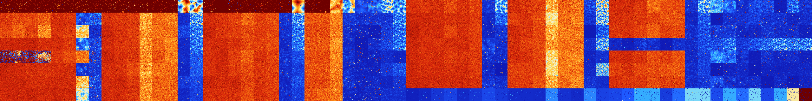

# B016 (34304-34815)

<details>
    <summary>Initial Grid</summary>
    
</details>


<details>
    <summary>Initial Grid RLE</summary>

```
#C Exported from GoGoL (https://github.com/marrow16/gogol)
#C Wrap mode: Toroidal
#C Boundary mode: Dead
#C Step: 0
x = 100, y = 100, rule = B016/S
18bobo33bo18bob2o5bo$8bo5bo12bo23bo17bo4bo16bobo$10bo2bobo3bo12bo25bo8b
o31bo$24bo6bo8bo13bo23bo6bo5bo$9bo30bo31bo23bo$10bo5bo21bo59bo$2bo25bob
o24bo14bo4bo14bo$40bo55bo$46b2o32bo$5bo$26bo2bo45bo4bo$26bo7bo4bo8bo18b
o8bo4bo7bo$16bo2bo4bo20bo5bo30bo$8bo6bo27bo16bobo$52bo2bo$8bo30bo17bo
13bo25bo$7bo8bo17bo40bo$15bo72bo$o8bobo14bo15bo12bo$3bo15bo39bo32bo5bo$
9b2o2bo$11bobo31bo28bo10bo$50bo18b2o8bo2bo$18bo6bo4bo29bobo9bo$8bo23bo
2bo20bo$8bo28bo13bo2bo$o34bo4bo18bobo5bo8bo15b2o$31bo4bo62bo$2bo15bo13b
o9bo20bo7bo$45bo9bo15bo14bo3bo$7bo22bo17b2o8bo7bo20bo$3bo14bo9bo9bo5bo
7bo6bo25bo5bo$o32bobo3bo9b2o3bo5b2o31bo$5bo2bo5bo39bo3bo18b2o2bo$20bo7b
o44bo2bo$9bo28b2o22bo16bo12bo$44bo$21bo51b2o18b2o$4bo7bo9bo35bo$17bo4bo
22bo47bo$69bo14bo4bo$17bo35bo10bo$17bo7bo6bo25bo9bo27bo$8bo34bo15b2o17b
o17bo$2bo7bo12bo16bo28bo$2bo8bo23bo$53bo$36bo27bo27bo$21bobo19bo5bo26bo
2bo12bo$9bo14bo9bo8bo47bo$9bo16bo4bobo18bo18bo22bo$2bo7bo3bo5bo$28bo7bo
16bo$6bo11b2o32bo20bo$21b2o15bo2bo2bo29bo20bo$17bo18bo3bo15bo$22bo9bo3b
o12b2o21bo12bo$11bo44bo$3bobo6bo52bo23b2o$16bo23bo4bo27bo$3bo6bo85bo$
21bo7bo48bo8bo$34b2o15bo$10bo16bo54bo10bo$6bo13bo2bo4bo4bo9bo$63bo7b2o
9bo8bo5bo$7bo16bo3bo8bo17bo12bo14bo$o51bo$62bo2bo3bo$bo14bo10bo4bo17bo
2bobo4bo16bo15bobobobo$39bo19bo2bo8bo21bo4bo$24bo13bo6bo22bo2bo5bo$10bo
47bo13bo$2bo5bobo28bobo38bo$26bo29bo4bo$7bo57bo9bo$bo17bo62bo$47bo13bo
3bo14bo12bo$7bo52bo3bobo$2bo31bo6bo11bo8bo17bo2bo3bo11bo$25bo7bo42bo8bo
8bo$17bo19bo12bo$14bo20bo44bo9bo$24bo27bo42bo$13bo4bo2bo51bo25bo$29bo2b
obo13bo$23bob2o5bo7bo7bo9bo$2bo19bo45bo18bo2bo$7bo13bo$15bobo14bo13bo
10bo$36bo15bo12bo7bo2bo12bo$14bo30bo13b2o2bo$45bo19bobo6bo5bo3bo$9b2o
26bobo27bo7bo18bo$42bo25bo$2bo2bo5bo46bo9bo12bo6bo$6bo20b2o4bo$5b2o38bo
17bo$2bo20bo24bo17bo25bo$41bo29bo5bo2bo!
```
</details>
<details>
    <summary>Thumbnail</summary>

</details>
<table>
<tr>
    <td><a href="./34304%20S%20Heat%20Map%20Activity.png"></a><br>S (34304)<br>R@8,p2</td>    <td><a href="./34305%20S0%20Heat%20Map%20Activity.png"></a><br>S0 (34305)<br>R@10,p2</td>    <td><a href="./34306%20S1%20Heat%20Map%20Activity.png"></a><br>S1 (34306)<br>R@12,p2</td>    <td><a href="./34307%20S01%20Heat%20Map%20Activity.png"></a><br>S01 (34307)<br>R@15,p4</td>    <td><a href="./34308%20S2%20Heat%20Map%20Activity.png"></a><br>S2 (34308)<br>R@8,p2</td>    <td><a href="./34309%20S02%20Heat%20Map%20Activity.png"></a><br>S02 (34309)<br>R@11,p2</td>    <td><a href="./34310%20S12%20Heat%20Map%20Activity.png"></a><br>S12 (34310)<br>R@10,p2</td>    <td><a href="./34311%20S012%20Heat%20Map%20Activity.png"></a><br>S012 (34311)<br>R@15,p4</td>    <td><a href="./34312%20S3%20Heat%20Map%20Activity.png"></a><br>S3 (34312)<br>R@10,p2</td>    <td><a href="./34313%20S03%20Heat%20Map%20Activity.png"></a><br>S03 (34313)<br>R@10,p2</td>    <td><a href="./34314%20S13%20Heat%20Map%20Activity.png"></a><br>S13 (34314)<br>R@34,p2</td>    <td><a href="./34315%20S013%20Heat%20Map%20Activity.png"></a><br>S013 (34315)<br>R@68,p6</td>    <td><a href="./34316%20S23%20Heat%20Map%20Activity.png"></a><br>S23 (34316)<br>R@14,p2</td>    <td><a href="./34317%20S023%20Heat%20Map%20Activity.png"></a><br>S023 (34317)<br>R@22,p2</td>    <td><a href="./34318%20S123%20Heat%20Map%20Activity.png"></a><br>S123 (34318)<br>G>1000</td>    <td><a href="./34319%20S0123%20Heat%20Map%20Activity.png"></a><br>S0123 (34319)<br>R@525,p12</td>    <td><a href="./34320%20S4%20Heat%20Map%20Activity.png"></a><br>S4 (34320)<br>R@14,p2</td>    <td><a href="./34321%20S04%20Heat%20Map%20Activity.png"></a><br>S04 (34321)<br>R@412,p400</td>    <td><a href="./34322%20S14%20Heat%20Map%20Activity.png"></a><br>S14 (34322)<br>R@18,p4</td>    <td><a href="./34323%20S014%20Heat%20Map%20Activity.png"></a><br>S014 (34323)<br>R@23,p2</td>    <td><a href="./34324%20S24%20Heat%20Map%20Activity.png"></a><br>S24 (34324)<br>R@16,p2</td>    <td><a href="./34325%20S024%20Heat%20Map%20Activity.png"></a><br>S024 (34325)<br>R@28,p4</td>    <td><a href="./34326%20S124%20Heat%20Map%20Activity.png"></a><br>S124 (34326)<br>R@68,p4</td>    <td><a href="./34327%20S0124%20Heat%20Map%20Activity.png"></a><br>S0124 (34327)<br>R@913,p3</td>    <td><a href="./34328%20S34%20Heat%20Map%20Activity.png"></a><br>S34 (34328)<br>R@18,p4</td>    <td><a href="./34329%20S034%20Heat%20Map%20Activity.png"></a><br>S034 (34329)<br>R@118,p2</td>    <td><a href="./34330%20S134%20Heat%20Map%20Activity.png"></a><br>S134 (34330)<br>G>1000</td>    <td><a href="./34331%20S0134%20Heat%20Map%20Activity.png"></a><br>S0134 (34331)<br>R@513,p12</td>    <td><a href="./34332%20S234%20Heat%20Map%20Activity.png"></a><br>S234 (34332)<br>R@923,p120</td>    <td><a href="./34333%20S0234%20Heat%20Map%20Activity.png"></a><br>S0234 (34333)<br>R@358,p120</td>    <td><a href="./34334%20S1234%20Heat%20Map%20Activity.png"></a><br>S1234 (34334)<br>R@92,p24</td>    <td><a href="./34335%20S01234%20Heat%20Map%20Activity.png"></a><br>S01234 (34335)<br>R@130,p60</td>    <td><a href="./34336%20S5%20Heat%20Map%20Activity.png"></a><br>S5 (34336)<br>G>1000</td>    <td><a href="./34337%20S05%20Heat%20Map%20Activity.png"></a><br>S05 (34337)<br>G>1000</td>    <td><a href="./34338%20S15%20Heat%20Map%20Activity.png"></a><br>S15 (34338)<br>G>1000</td>    <td><a href="./34339%20S015%20Heat%20Map%20Activity.png"></a><br>S015 (34339)<br>G>1000</td>    <td><a href="./34340%20S25%20Heat%20Map%20Activity.png"></a><br>S25 (34340)<br>G>1000</td>    <td><a href="./34341%20S025%20Heat%20Map%20Activity.png"></a><br>S025 (34341)<br>G>1000</td>    <td><a href="./34342%20S125%20Heat%20Map%20Activity.png"></a><br>S125 (34342)<br>R@497,p132</td>    <td><a href="./34343%20S0125%20Heat%20Map%20Activity.png"></a><br>S0125 (34343)<br>R@98,p30</td>    <td><a href="./34344%20S35%20Heat%20Map%20Activity.png"></a><br>S35 (34344)<br>G>1000</td>    <td><a href="./34345%20S035%20Heat%20Map%20Activity.png"></a><br>S035 (34345)<br>G>1000</td>    <td><a href="./34346%20S135%20Heat%20Map%20Activity.png"></a><br>S135 (34346)<br>G>1000</td>    <td><a href="./34347%20S0135%20Heat%20Map%20Activity.png"></a><br>S0135 (34347)<br>G>1000</td>    <td><a href="./34348%20S235%20Heat%20Map%20Activity.png"></a><br>S235 (34348)<br>G>1000</td>    <td><a href="./34349%20S0235%20Heat%20Map%20Activity.png"></a><br>S0235 (34349)<br>G>1000</td>    <td><a href="./34350%20S1235%20Heat%20Map%20Activity.png"></a><br>S1235 (34350)<br>R@118,p60</td>    <td><a href="./34351%20S01235%20Heat%20Map%20Activity.png"></a><br>S01235 (34351)<br>R@49,p6</td>    <td><a href="./34352%20S45%20Heat%20Map%20Activity.png"></a><br>S45 (34352)<br>G>1000</td>    <td><a href="./34353%20S045%20Heat%20Map%20Activity.png"></a><br>S045 (34353)<br>G>1000</td>    <td><a href="./34354%20S145%20Heat%20Map%20Activity.png"></a><br>S145 (34354)<br>G>1000</td>    <td><a href="./34355%20S0145%20Heat%20Map%20Activity.png"></a><br>S0145 (34355)<br>G>1000</td>    <td><a href="./34356%20S245%20Heat%20Map%20Activity.png"></a><br>S245 (34356)<br>G>1000</td>    <td><a href="./34357%20S0245%20Heat%20Map%20Activity.png"></a><br>S0245 (34357)<br>G>1000</td>    <td><a href="./34358%20S1245%20Heat%20Map%20Activity.png"></a><br>S1245 (34358)<br>R@283,p36</td>    <td><a href="./34359%20S01245%20Heat%20Map%20Activity.png"></a><br>S01245 (34359)<br>R@56,p12</td>    <td><a href="./34360%20S345%20Heat%20Map%20Activity.png"></a><br>S345 (34360)<br>G>1000</td>    <td><a href="./34361%20S0345%20Heat%20Map%20Activity.png"></a><br>S0345 (34361)<br>G>1000</td>    <td><a href="./34362%20S1345%20Heat%20Map%20Activity.png"></a><br>S1345 (34362)<br>G>1000</td>    <td><a href="./34363%20S01345%20Heat%20Map%20Activity.png"></a><br>S01345 (34363)<br>R@202,p12</td>    <td><a href="./34364%20S2345%20Heat%20Map%20Activity.png"></a><br>S2345 (34364)<br>R@111,p36</td>    <td><a href="./34365%20S02345%20Heat%20Map%20Activity.png"></a><br>S02345 (34365)<br>G>1000</td>    <td><a href="./34366%20S12345%20Heat%20Map%20Activity.png"></a><br>S12345 (34366)<br>R@66,p12</td>    <td><a href="./34367%20S012345%20Heat%20Map%20Activity.png"></a><br>S012345 (34367)<br>R@221,p168</td></tr>
<tr>
    <td><a href="./34368%20S6%20Heat%20Map%20Activity.png"></a><br>S6 (34368)<br>G>1000</td>    <td><a href="./34369%20S06%20Heat%20Map%20Activity.png"></a><br>S06 (34369)<br>G>1000</td>    <td><a href="./34370%20S16%20Heat%20Map%20Activity.png"></a><br>S16 (34370)<br>G>1000</td>    <td><a href="./34371%20S016%20Heat%20Map%20Activity.png"></a><br>S016 (34371)<br>G>1000</td>    <td><a href="./34372%20S26%20Heat%20Map%20Activity.png"></a><br>S26 (34372)<br>G>1000</td>    <td><a href="./34373%20S026%20Heat%20Map%20Activity.png"></a><br>S026 (34373)<br>G>1000</td>    <td><a href="./34374%20S126%20Heat%20Map%20Activity.png"></a><br>S126 (34374)<br>G>1000</td>    <td><a href="./34375%20S0126%20Heat%20Map%20Activity.png"></a><br>S0126 (34375)<br>R@67,p24</td>    <td><a href="./34376%20S36%20Heat%20Map%20Activity.png"></a><br>S36 (34376)<br>G>1000</td>    <td><a href="./34377%20S036%20Heat%20Map%20Activity.png"></a><br>S036 (34377)<br>G>1000</td>    <td><a href="./34378%20S136%20Heat%20Map%20Activity.png"></a><br>S136 (34378)<br>G>1000</td>    <td><a href="./34379%20S0136%20Heat%20Map%20Activity.png"></a><br>S0136 (34379)<br>G>1000</td>    <td><a href="./34380%20S236%20Heat%20Map%20Activity.png"></a><br>S236 (34380)<br>G>1000</td>    <td><a href="./34381%20S0236%20Heat%20Map%20Activity.png"></a><br>S0236 (34381)<br>G>1000</td>    <td><a href="./34382%20S1236%20Heat%20Map%20Activity.png"></a><br>S1236 (34382)<br>R@178,p132</td>    <td><a href="./34383%20S01236%20Heat%20Map%20Activity.png"></a><br>S01236 (34383)<br>R@30,p4</td>    <td><a href="./34384%20S46%20Heat%20Map%20Activity.png"></a><br>S46 (34384)<br>G>1000</td>    <td><a href="./34385%20S046%20Heat%20Map%20Activity.png"></a><br>S046 (34385)<br>G>1000</td>    <td><a href="./34386%20S146%20Heat%20Map%20Activity.png"></a><br>S146 (34386)<br>G>1000</td>    <td><a href="./34387%20S0146%20Heat%20Map%20Activity.png"></a><br>S0146 (34387)<br>G>1000</td>    <td><a href="./34388%20S246%20Heat%20Map%20Activity.png"></a><br>S246 (34388)<br>G>1000</td>    <td><a href="./34389%20S0246%20Heat%20Map%20Activity.png"></a><br>S0246 (34389)<br>G>1000</td>    <td><a href="./34390%20S1246%20Heat%20Map%20Activity.png"></a><br>S1246 (34390)<br>R@258,p12</td>    <td><a href="./34391%20S01246%20Heat%20Map%20Activity.png"></a><br>S01246 (34391)<br>R@37,p6</td>    <td><a href="./34392%20S346%20Heat%20Map%20Activity.png"></a><br>S346 (34392)<br>G>1000</td>    <td><a href="./34393%20S0346%20Heat%20Map%20Activity.png"></a><br>S0346 (34393)<br>G>1000</td>    <td><a href="./34394%20S1346%20Heat%20Map%20Activity.png"></a><br>S1346 (34394)<br>G>1000</td>    <td><a href="./34395%20S01346%20Heat%20Map%20Activity.png"></a><br>S01346 (34395)<br>R@366,p60</td>    <td><a href="./34396%20S2346%20Heat%20Map%20Activity.png"></a><br>S2346 (34396)<br>R@197,p12</td>    <td><a href="./34397%20S02346%20Heat%20Map%20Activity.png"></a><br>S02346 (34397)<br>R@157,p12</td>    <td><a href="./34398%20S12346%20Heat%20Map%20Activity.png"></a><br>S12346 (34398)<br>R@111,p84</td>    <td><a href="./34399%20S012346%20Heat%20Map%20Activity.png"></a><br>S012346 (34399)<br>R@37,p12</td>    <td><a href="./34400%20S56%20Heat%20Map%20Activity.png"></a><br>S56 (34400)<br>G>1000</td>    <td><a href="./34401%20S056%20Heat%20Map%20Activity.png"></a><br>S056 (34401)<br>G>1000</td>    <td><a href="./34402%20S156%20Heat%20Map%20Activity.png"></a><br>S156 (34402)<br>G>1000</td>    <td><a href="./34403%20S0156%20Heat%20Map%20Activity.png"></a><br>S0156 (34403)<br>G>1000</td>    <td><a href="./34404%20S256%20Heat%20Map%20Activity.png"></a><br>S256 (34404)<br>G>1000</td>    <td><a href="./34405%20S0256%20Heat%20Map%20Activity.png"></a><br>S0256 (34405)<br>G>1000</td>    <td><a href="./34406%20S1256%20Heat%20Map%20Activity.png"></a><br>S1256 (34406)<br>G>1000</td>    <td><a href="./34407%20S01256%20Heat%20Map%20Activity.png"></a><br>S01256 (34407)<br>R@48,p12</td>    <td><a href="./34408%20S356%20Heat%20Map%20Activity.png"></a><br>S356 (34408)<br>G>1000</td>    <td><a href="./34409%20S0356%20Heat%20Map%20Activity.png"></a><br>S0356 (34409)<br>G>1000</td>    <td><a href="./34410%20S1356%20Heat%20Map%20Activity.png"></a><br>S1356 (34410)<br>G>1000</td>    <td><a href="./34411%20S01356%20Heat%20Map%20Activity.png"></a><br>S01356 (34411)<br>G>1000</td>    <td><a href="./34412%20S2356%20Heat%20Map%20Activity.png"></a><br>S2356 (34412)<br>G>1000</td>    <td><a href="./34413%20S02356%20Heat%20Map%20Activity.png"></a><br>S02356 (34413)<br>G>1000</td>    <td><a href="./34414%20S12356%20Heat%20Map%20Activity.png"></a><br>S12356 (34414)<br>R@104,p60</td>    <td><a href="./34415%20S012356%20Heat%20Map%20Activity.png"></a><br>S012356 (34415)<br>S@23</td>    <td><a href="./34416%20S456%20Heat%20Map%20Activity.png"></a><br>S456 (34416)<br>G>1000</td>    <td><a href="./34417%20S0456%20Heat%20Map%20Activity.png"></a><br>S0456 (34417)<br>G>1000</td>    <td><a href="./34418%20S1456%20Heat%20Map%20Activity.png"></a><br>S1456 (34418)<br>G>1000</td>    <td><a href="./34419%20S01456%20Heat%20Map%20Activity.png"></a><br>S01456 (34419)<br>G>1000</td>    <td><a href="./34420%20S2456%20Heat%20Map%20Activity.png"></a><br>S2456 (34420)<br>G>1000</td>    <td><a href="./34421%20S02456%20Heat%20Map%20Activity.png"></a><br>S02456 (34421)<br>G>1000</td>    <td><a href="./34422%20S12456%20Heat%20Map%20Activity.png"></a><br>S12456 (34422)<br>R@519,p84</td>    <td><a href="./34423%20S012456%20Heat%20Map%20Activity.png"></a><br>S012456 (34423)<br>R@53,p12</td>    <td><a href="./34424%20S3456%20Heat%20Map%20Activity.png"></a><br>S3456 (34424)<br>G>1000</td>    <td><a href="./34425%20S03456%20Heat%20Map%20Activity.png"></a><br>S03456 (34425)<br>R@158,p60</td>    <td><a href="./34426%20S13456%20Heat%20Map%20Activity.png"></a><br>S13456 (34426)<br>R@140,p60</td>    <td><a href="./34427%20S013456%20Heat%20Map%20Activity.png"></a><br>S013456 (34427)<br>R@87,p2</td>    <td><a href="./34428%20S23456%20Heat%20Map%20Activity.png"></a><br>S23456 (34428)<br>R@102,p60</td>    <td><a href="./34429%20S023456%20Heat%20Map%20Activity.png"></a><br>S023456 (34429)<br>R@102,p60</td>    <td><a href="./34430%20S123456%20Heat%20Map%20Activity.png"></a><br>S123456 (34430)<br>R@217,p180</td>    <td><a href="./34431%20S0123456%20Heat%20Map%20Activity.png"></a><br>S0123456 (34431)<br>R@162,p120</td></tr>
<tr>
    <td><a href="./34432%20S7%20Heat%20Map%20Activity.png"></a><br>S7 (34432)<br>G>1000</td>    <td><a href="./34433%20S07%20Heat%20Map%20Activity.png"></a><br>S07 (34433)<br>G>1000</td>    <td><a href="./34434%20S17%20Heat%20Map%20Activity.png"></a><br>S17 (34434)<br>G>1000</td>    <td><a href="./34435%20S017%20Heat%20Map%20Activity.png"></a><br>S017 (34435)<br>G>1000</td>    <td><a href="./34436%20S27%20Heat%20Map%20Activity.png"></a><br>S27 (34436)<br>G>1000</td>    <td><a href="./34437%20S027%20Heat%20Map%20Activity.png"></a><br>S027 (34437)<br>G>1000</td>    <td><a href="./34438%20S127%20Heat%20Map%20Activity.png"></a><br>S127 (34438)<br>G>1000</td>    <td><a href="./34439%20S0127%20Heat%20Map%20Activity.png"></a><br>S0127 (34439)<br>R@166,p120</td>    <td><a href="./34440%20S37%20Heat%20Map%20Activity.png"></a><br>S37 (34440)<br>G>1000</td>    <td><a href="./34441%20S037%20Heat%20Map%20Activity.png"></a><br>S037 (34441)<br>G>1000</td>    <td><a href="./34442%20S137%20Heat%20Map%20Activity.png"></a><br>S137 (34442)<br>G>1000</td>    <td><a href="./34443%20S0137%20Heat%20Map%20Activity.png"></a><br>S0137 (34443)<br>G>1000</td>    <td><a href="./34444%20S237%20Heat%20Map%20Activity.png"></a><br>S237 (34444)<br>G>1000</td>    <td><a href="./34445%20S0237%20Heat%20Map%20Activity.png"></a><br>S0237 (34445)<br>G>1000</td>    <td><a href="./34446%20S1237%20Heat%20Map%20Activity.png"></a><br>S1237 (34446)<br>R@48,p12</td>    <td><a href="./34447%20S01237%20Heat%20Map%20Activity.png"></a><br>S01237 (34447)<br>R@29,p6</td>    <td><a href="./34448%20S47%20Heat%20Map%20Activity.png"></a><br>S47 (34448)<br>G>1000</td>    <td><a href="./34449%20S047%20Heat%20Map%20Activity.png"></a><br>S047 (34449)<br>G>1000</td>    <td><a href="./34450%20S147%20Heat%20Map%20Activity.png"></a><br>S147 (34450)<br>G>1000</td>    <td><a href="./34451%20S0147%20Heat%20Map%20Activity.png"></a><br>S0147 (34451)<br>G>1000</td>    <td><a href="./34452%20S247%20Heat%20Map%20Activity.png"></a><br>S247 (34452)<br>G>1000</td>    <td><a href="./34453%20S0247%20Heat%20Map%20Activity.png"></a><br>S0247 (34453)<br>G>1000</td>    <td><a href="./34454%20S1247%20Heat%20Map%20Activity.png"></a><br>S1247 (34454)<br>R@205,p6</td>    <td><a href="./34455%20S01247%20Heat%20Map%20Activity.png"></a><br>S01247 (34455)<br>R@32,p6</td>    <td><a href="./34456%20S347%20Heat%20Map%20Activity.png"></a><br>S347 (34456)<br>G>1000</td>    <td><a href="./34457%20S0347%20Heat%20Map%20Activity.png"></a><br>S0347 (34457)<br>G>1000</td>    <td><a href="./34458%20S1347%20Heat%20Map%20Activity.png"></a><br>S1347 (34458)<br>G>1000</td>    <td><a href="./34459%20S01347%20Heat%20Map%20Activity.png"></a><br>S01347 (34459)<br>R@559,p12</td>    <td><a href="./34460%20S2347%20Heat%20Map%20Activity.png"></a><br>S2347 (34460)<br>R@434,p120</td>    <td><a href="./34461%20S02347%20Heat%20Map%20Activity.png"></a><br>S02347 (34461)<br>G>1000</td>    <td><a href="./34462%20S12347%20Heat%20Map%20Activity.png"></a><br>S12347 (34462)<br>R@40,p12</td>    <td><a href="./34463%20S012347%20Heat%20Map%20Activity.png"></a><br>S012347 (34463)<br>R@31,p12</td>    <td><a href="./34464%20S57%20Heat%20Map%20Activity.png"></a><br>S57 (34464)<br>G>1000</td>    <td><a href="./34465%20S057%20Heat%20Map%20Activity.png"></a><br>S057 (34465)<br>G>1000</td>    <td><a href="./34466%20S157%20Heat%20Map%20Activity.png"></a><br>S157 (34466)<br>G>1000</td>    <td><a href="./34467%20S0157%20Heat%20Map%20Activity.png"></a><br>S0157 (34467)<br>G>1000</td>    <td><a href="./34468%20S257%20Heat%20Map%20Activity.png"></a><br>S257 (34468)<br>G>1000</td>    <td><a href="./34469%20S0257%20Heat%20Map%20Activity.png"></a><br>S0257 (34469)<br>G>1000</td>    <td><a href="./34470%20S1257%20Heat%20Map%20Activity.png"></a><br>S1257 (34470)<br>G>1000</td>    <td><a href="./34471%20S01257%20Heat%20Map%20Activity.png"></a><br>S01257 (34471)<br>R@96,p60</td>    <td><a href="./34472%20S357%20Heat%20Map%20Activity.png"></a><br>S357 (34472)<br>G>1000</td>    <td><a href="./34473%20S0357%20Heat%20Map%20Activity.png"></a><br>S0357 (34473)<br>G>1000</td>    <td><a href="./34474%20S1357%20Heat%20Map%20Activity.png"></a><br>S1357 (34474)<br>G>1000</td>    <td><a href="./34475%20S01357%20Heat%20Map%20Activity.png"></a><br>S01357 (34475)<br>G>1000</td>    <td><a href="./34476%20S2357%20Heat%20Map%20Activity.png"></a><br>S2357 (34476)<br>G>1000</td>    <td><a href="./34477%20S02357%20Heat%20Map%20Activity.png"></a><br>S02357 (34477)<br>G>1000</td>    <td><a href="./34478%20S12357%20Heat%20Map%20Activity.png"></a><br>S12357 (34478)<br>R@708,p660</td>    <td><a href="./34479%20S012357%20Heat%20Map%20Activity.png"></a><br>S012357 (34479)<br>R@37,p12</td>    <td><a href="./34480%20S457%20Heat%20Map%20Activity.png"></a><br>S457 (34480)<br>G>1000</td>    <td><a href="./34481%20S0457%20Heat%20Map%20Activity.png"></a><br>S0457 (34481)<br>G>1000</td>    <td><a href="./34482%20S1457%20Heat%20Map%20Activity.png"></a><br>S1457 (34482)<br>G>1000</td>    <td><a href="./34483%20S01457%20Heat%20Map%20Activity.png"></a><br>S01457 (34483)<br>G>1000</td>    <td><a href="./34484%20S2457%20Heat%20Map%20Activity.png"></a><br>S2457 (34484)<br>G>1000</td>    <td><a href="./34485%20S02457%20Heat%20Map%20Activity.png"></a><br>S02457 (34485)<br>G>1000</td>    <td><a href="./34486%20S12457%20Heat%20Map%20Activity.png"></a><br>S12457 (34486)<br>R@244,p24</td>    <td><a href="./34487%20S012457%20Heat%20Map%20Activity.png"></a><br>S012457 (34487)<br>R@49,p12</td>    <td><a href="./34488%20S3457%20Heat%20Map%20Activity.png"></a><br>S3457 (34488)<br>G>1000</td>    <td><a href="./34489%20S03457%20Heat%20Map%20Activity.png"></a><br>S03457 (34489)<br>G>1000</td>    <td><a href="./34490%20S13457%20Heat%20Map%20Activity.png"></a><br>S13457 (34490)<br>G>1000</td>    <td><a href="./34491%20S013457%20Heat%20Map%20Activity.png"></a><br>S013457 (34491)<br>R@331,p180</td>    <td><a href="./34492%20S23457%20Heat%20Map%20Activity.png"></a><br>S23457 (34492)<br>R@74,p12</td>    <td><a href="./34493%20S023457%20Heat%20Map%20Activity.png"></a><br>S023457 (34493)<br>R@134,p60</td>    <td><a href="./34494%20S123457%20Heat%20Map%20Activity.png"></a><br>S123457 (34494)<br>R@66,p24</td>    <td><a href="./34495%20S0123457%20Heat%20Map%20Activity.png"></a><br>S0123457 (34495)<br>R@289,p252</td></tr>
<tr>
    <td><a href="./34496%20S67%20Heat%20Map%20Activity.png"></a><br>S67 (34496)<br>G>1000</td>    <td><a href="./34497%20S067%20Heat%20Map%20Activity.png"></a><br>S067 (34497)<br>G>1000</td>    <td><a href="./34498%20S167%20Heat%20Map%20Activity.png"></a><br>S167 (34498)<br>G>1000</td>    <td><a href="./34499%20S0167%20Heat%20Map%20Activity.png"></a><br>S0167 (34499)<br>G>1000</td>    <td><a href="./34500%20S267%20Heat%20Map%20Activity.png"></a><br>S267 (34500)<br>G>1000</td>    <td><a href="./34501%20S0267%20Heat%20Map%20Activity.png"></a><br>S0267 (34501)<br>G>1000</td>    <td><a href="./34502%20S1267%20Heat%20Map%20Activity.png"></a><br>S1267 (34502)<br>G>1000</td>    <td><a href="./34503%20S01267%20Heat%20Map%20Activity.png"></a><br>S01267 (34503)<br>R@73,p24</td>    <td><a href="./34504%20S367%20Heat%20Map%20Activity.png"></a><br>S367 (34504)<br>G>1000</td>    <td><a href="./34505%20S0367%20Heat%20Map%20Activity.png"></a><br>S0367 (34505)<br>G>1000</td>    <td><a href="./34506%20S1367%20Heat%20Map%20Activity.png"></a><br>S1367 (34506)<br>G>1000</td>    <td><a href="./34507%20S01367%20Heat%20Map%20Activity.png"></a><br>S01367 (34507)<br>G>1000</td>    <td><a href="./34508%20S2367%20Heat%20Map%20Activity.png"></a><br>S2367 (34508)<br>G>1000</td>    <td><a href="./34509%20S02367%20Heat%20Map%20Activity.png"></a><br>S02367 (34509)<br>G>1000</td>    <td><a href="./34510%20S12367%20Heat%20Map%20Activity.png"></a><br>S12367 (34510)<br>R@102,p60</td>    <td><a href="./34511%20S012367%20Heat%20Map%20Activity.png"></a><br>S012367 (34511)<br>R@26,p4</td>    <td><a href="./34512%20S467%20Heat%20Map%20Activity.png"></a><br>S467 (34512)<br>G>1000</td>    <td><a href="./34513%20S0467%20Heat%20Map%20Activity.png"></a><br>S0467 (34513)<br>G>1000</td>    <td><a href="./34514%20S1467%20Heat%20Map%20Activity.png"></a><br>S1467 (34514)<br>G>1000</td>    <td><a href="./34515%20S01467%20Heat%20Map%20Activity.png"></a><br>S01467 (34515)<br>G>1000</td>    <td><a href="./34516%20S2467%20Heat%20Map%20Activity.png"></a><br>S2467 (34516)<br>G>1000</td>    <td><a href="./34517%20S02467%20Heat%20Map%20Activity.png"></a><br>S02467 (34517)<br>G>1000</td>    <td><a href="./34518%20S12467%20Heat%20Map%20Activity.png"></a><br>S12467 (34518)<br>R@353,p12</td>    <td><a href="./34519%20S012467%20Heat%20Map%20Activity.png"></a><br>S012467 (34519)<br>R@35,p6</td>    <td><a href="./34520%20S3467%20Heat%20Map%20Activity.png"></a><br>S3467 (34520)<br>G>1000</td>    <td><a href="./34521%20S03467%20Heat%20Map%20Activity.png"></a><br>S03467 (34521)<br>G>1000</td>    <td><a href="./34522%20S13467%20Heat%20Map%20Activity.png"></a><br>S13467 (34522)<br>G>1000</td>    <td><a href="./34523%20S013467%20Heat%20Map%20Activity.png"></a><br>S013467 (34523)<br>R@547,p12</td>    <td><a href="./34524%20S23467%20Heat%20Map%20Activity.png"></a><br>S23467 (34524)<br>G>1000</td>    <td><a href="./34525%20S023467%20Heat%20Map%20Activity.png"></a><br>S023467 (34525)<br>R@159,p12</td>    <td><a href="./34526%20S123467%20Heat%20Map%20Activity.png"></a><br>S123467 (34526)<br>R@32,p2</td>    <td><a href="./34527%20S0123467%20Heat%20Map%20Activity.png"></a><br>S0123467 (34527)<br>R@25,p4</td>    <td><a href="./34528%20S567%20Heat%20Map%20Activity.png"></a><br>S567 (34528)<br>G>1000</td>    <td><a href="./34529%20S0567%20Heat%20Map%20Activity.png"></a><br>S0567 (34529)<br>G>1000</td>    <td><a href="./34530%20S1567%20Heat%20Map%20Activity.png"></a><br>S1567 (34530)<br>G>1000</td>    <td><a href="./34531%20S01567%20Heat%20Map%20Activity.png"></a><br>S01567 (34531)<br>G>1000</td>    <td><a href="./34532%20S2567%20Heat%20Map%20Activity.png"></a><br>S2567 (34532)<br>G>1000</td>    <td><a href="./34533%20S02567%20Heat%20Map%20Activity.png"></a><br>S02567 (34533)<br>G>1000</td>    <td><a href="./34534%20S12567%20Heat%20Map%20Activity.png"></a><br>S12567 (34534)<br>G>1000</td>    <td><a href="./34535%20S012567%20Heat%20Map%20Activity.png"></a><br>S012567 (34535)<br>R@129,p84</td>    <td><a href="./34536%20S3567%20Heat%20Map%20Activity.png"></a><br>S3567 (34536)<br>G>1000</td>    <td><a href="./34537%20S03567%20Heat%20Map%20Activity.png"></a><br>S03567 (34537)<br>G>1000</td>    <td><a href="./34538%20S13567%20Heat%20Map%20Activity.png"></a><br>S13567 (34538)<br>G>1000</td>    <td><a href="./34539%20S013567%20Heat%20Map%20Activity.png"></a><br>S013567 (34539)<br>G>1000</td>    <td><a href="./34540%20S23567%20Heat%20Map%20Activity.png"></a><br>S23567 (34540)<br>G>1000</td>    <td><a href="./34541%20S023567%20Heat%20Map%20Activity.png"></a><br>S023567 (34541)<br>G>1000</td>    <td><a href="./34542%20S123567%20Heat%20Map%20Activity.png"></a><br>S123567 (34542)<br>R@78,p30</td>    <td><a href="./34543%20S0123567%20Heat%20Map%20Activity.png"></a><br>S0123567 (34543)<br>R@34,p7</td>    <td><a href="./34544%20S4567%20Heat%20Map%20Activity.png"></a><br>S4567 (34544)<br>R@327,p120</td>    <td><a href="./34545%20S04567%20Heat%20Map%20Activity.png"></a><br>S04567 (34545)<br>G>1000</td>    <td><a href="./34546%20S14567%20Heat%20Map%20Activity.png"></a><br>S14567 (34546)<br>R@220,p12</td>    <td><a href="./34547%20S014567%20Heat%20Map%20Activity.png"></a><br>S014567 (34547)<br>R@444,p180</td>    <td><a href="./34548%20S24567%20Heat%20Map%20Activity.png"></a><br>S24567 (34548)<br>G>1000</td>    <td><a href="./34549%20S024567%20Heat%20Map%20Activity.png"></a><br>S024567 (34549)<br>R@228,p48</td>    <td><a href="./34550%20S124567%20Heat%20Map%20Activity.png"></a><br>S124567 (34550)<br>R@111,p12</td>    <td><a href="./34551%20S0124567%20Heat%20Map%20Activity.png"></a><br>S0124567 (34551)<br>R@55,p6</td>    <td><a href="./34552%20S34567%20Heat%20Map%20Activity.png"></a><br>S34567 (34552)<br>R@28,p2</td>    <td><a href="./34553%20S034567%20Heat%20Map%20Activity.png"></a><br>S034567 (34553)<br>R@27,p4</td>    <td><a href="./34554%20S134567%20Heat%20Map%20Activity.png"></a><br>S134567 (34554)<br>R@41,p12</td>    <td><a href="./34555%20S0134567%20Heat%20Map%20Activity.png"></a><br>S0134567 (34555)<br>R@38,p12</td>    <td><a href="./34556%20S234567%20Heat%20Map%20Activity.png"></a><br>S234567 (34556)<br>R@17,p2</td>    <td><a href="./34557%20S0234567%20Heat%20Map%20Activity.png"></a><br>S0234567 (34557)<br>R@21,p4</td>    <td><a href="./34558%20S1234567%20Heat%20Map%20Activity.png"></a><br>S1234567 (34558)<br>R@17,p2</td>    <td><a href="./34559%20S01234567%20Heat%20Map%20Activity.png"></a><br>S01234567 (34559)<br>R@24,p4</td></tr>
<tr>
    <td><a href="./34560%20S8%20Heat%20Map%20Activity.png"></a><br>S8 (34560)<br>R@696,p420</td>    <td><a href="./34561%20S08%20Heat%20Map%20Activity.png"></a><br>S08 (34561)<br>R@661,p168</td>    <td><a href="./34562%20S18%20Heat%20Map%20Activity.png"></a><br>S18 (34562)<br>R@859,p420</td>    <td><a href="./34563%20S018%20Heat%20Map%20Activity.png"></a><br>S018 (34563)<br>R@685,p24</td>    <td><a href="./34564%20S28%20Heat%20Map%20Activity.png"></a><br>S28 (34564)<br>G>1000</td>    <td><a href="./34565%20S028%20Heat%20Map%20Activity.png"></a><br>S028 (34565)<br>G>1000</td>    <td><a href="./34566%20S128%20Heat%20Map%20Activity.png"></a><br>S128 (34566)<br>G>1000</td>    <td><a href="./34567%20S0128%20Heat%20Map%20Activity.png"></a><br>S0128 (34567)<br>R@173,p72</td>    <td><a href="./34568%20S38%20Heat%20Map%20Activity.png"></a><br>S38 (34568)<br>G>1000</td>    <td><a href="./34569%20S038%20Heat%20Map%20Activity.png"></a><br>S038 (34569)<br>G>1000</td>    <td><a href="./34570%20S138%20Heat%20Map%20Activity.png"></a><br>S138 (34570)<br>G>1000</td>    <td><a href="./34571%20S0138%20Heat%20Map%20Activity.png"></a><br>S0138 (34571)<br>G>1000</td>    <td><a href="./34572%20S238%20Heat%20Map%20Activity.png"></a><br>S238 (34572)<br>G>1000</td>    <td><a href="./34573%20S0238%20Heat%20Map%20Activity.png"></a><br>S0238 (34573)<br>G>1000</td>    <td><a href="./34574%20S1238%20Heat%20Map%20Activity.png"></a><br>S1238 (34574)<br>R@105,p60</td>    <td><a href="./34575%20S01238%20Heat%20Map%20Activity.png"></a><br>S01238 (34575)<br>R@29,p6</td>    <td><a href="./34576%20S48%20Heat%20Map%20Activity.png"></a><br>S48 (34576)<br>G>1000</td>    <td><a href="./34577%20S048%20Heat%20Map%20Activity.png"></a><br>S048 (34577)<br>G>1000</td>    <td><a href="./34578%20S148%20Heat%20Map%20Activity.png"></a><br>S148 (34578)<br>G>1000</td>    <td><a href="./34579%20S0148%20Heat%20Map%20Activity.png"></a><br>S0148 (34579)<br>G>1000</td>    <td><a href="./34580%20S248%20Heat%20Map%20Activity.png"></a><br>S248 (34580)<br>G>1000</td>    <td><a href="./34581%20S0248%20Heat%20Map%20Activity.png"></a><br>S0248 (34581)<br>G>1000</td>    <td><a href="./34582%20S1248%20Heat%20Map%20Activity.png"></a><br>S1248 (34582)<br>R@189,p12</td>    <td><a href="./34583%20S01248%20Heat%20Map%20Activity.png"></a><br>S01248 (34583)<br>R@40,p12</td>    <td><a href="./34584%20S348%20Heat%20Map%20Activity.png"></a><br>S348 (34584)<br>G>1000</td>    <td><a href="./34585%20S0348%20Heat%20Map%20Activity.png"></a><br>S0348 (34585)<br>G>1000</td>    <td><a href="./34586%20S1348%20Heat%20Map%20Activity.png"></a><br>S1348 (34586)<br>G>1000</td>    <td><a href="./34587%20S01348%20Heat%20Map%20Activity.png"></a><br>S01348 (34587)<br>R@463,p12</td>    <td><a href="./34588%20S2348%20Heat%20Map%20Activity.png"></a><br>S2348 (34588)<br>R@931,p420</td>    <td><a href="./34589%20S02348%20Heat%20Map%20Activity.png"></a><br>S02348 (34589)<br>R@419,p120</td>    <td><a href="./34590%20S12348%20Heat%20Map%20Activity.png"></a><br>S12348 (34590)<br>R@61,p12</td>    <td><a href="./34591%20S012348%20Heat%20Map%20Activity.png"></a><br>S012348 (34591)<br>R@102,p84</td>    <td><a href="./34592%20S58%20Heat%20Map%20Activity.png"></a><br>S58 (34592)<br>G>1000</td>    <td><a href="./34593%20S058%20Heat%20Map%20Activity.png"></a><br>S058 (34593)<br>G>1000</td>    <td><a href="./34594%20S158%20Heat%20Map%20Activity.png"></a><br>S158 (34594)<br>G>1000</td>    <td><a href="./34595%20S0158%20Heat%20Map%20Activity.png"></a><br>S0158 (34595)<br>G>1000</td>    <td><a href="./34596%20S258%20Heat%20Map%20Activity.png"></a><br>S258 (34596)<br>G>1000</td>    <td><a href="./34597%20S0258%20Heat%20Map%20Activity.png"></a><br>S0258 (34597)<br>G>1000</td>    <td><a href="./34598%20S1258%20Heat%20Map%20Activity.png"></a><br>S1258 (34598)<br>R@368,p60</td>    <td><a href="./34599%20S01258%20Heat%20Map%20Activity.png"></a><br>S01258 (34599)<br>R@97,p60</td>    <td><a href="./34600%20S358%20Heat%20Map%20Activity.png"></a><br>S358 (34600)<br>G>1000</td>    <td><a href="./34601%20S0358%20Heat%20Map%20Activity.png"></a><br>S0358 (34601)<br>G>1000</td>    <td><a href="./34602%20S1358%20Heat%20Map%20Activity.png"></a><br>S1358 (34602)<br>G>1000</td>    <td><a href="./34603%20S01358%20Heat%20Map%20Activity.png"></a><br>S01358 (34603)<br>G>1000</td>    <td><a href="./34604%20S2358%20Heat%20Map%20Activity.png"></a><br>S2358 (34604)<br>G>1000</td>    <td><a href="./34605%20S02358%20Heat%20Map%20Activity.png"></a><br>S02358 (34605)<br>G>1000</td>    <td><a href="./34606%20S12358%20Heat%20Map%20Activity.png"></a><br>S12358 (34606)<br>R@109,p60</td>    <td><a href="./34607%20S012358%20Heat%20Map%20Activity.png"></a><br>S012358 (34607)<br>R@48,p30</td>    <td><a href="./34608%20S458%20Heat%20Map%20Activity.png"></a><br>S458 (34608)<br>G>1000</td>    <td><a href="./34609%20S0458%20Heat%20Map%20Activity.png"></a><br>S0458 (34609)<br>G>1000</td>    <td><a href="./34610%20S1458%20Heat%20Map%20Activity.png"></a><br>S1458 (34610)<br>G>1000</td>    <td><a href="./34611%20S01458%20Heat%20Map%20Activity.png"></a><br>S01458 (34611)<br>G>1000</td>    <td><a href="./34612%20S2458%20Heat%20Map%20Activity.png"></a><br>S2458 (34612)<br>G>1000</td>    <td><a href="./34613%20S02458%20Heat%20Map%20Activity.png"></a><br>S02458 (34613)<br>G>1000</td>    <td><a href="./34614%20S12458%20Heat%20Map%20Activity.png"></a><br>S12458 (34614)<br>R@267,p84</td>    <td><a href="./34615%20S012458%20Heat%20Map%20Activity.png"></a><br>S012458 (34615)<br>R@39,p12</td>    <td><a href="./34616%20S3458%20Heat%20Map%20Activity.png"></a><br>S3458 (34616)<br>G>1000</td>    <td><a href="./34617%20S03458%20Heat%20Map%20Activity.png"></a><br>S03458 (34617)<br>G>1000</td>    <td><a href="./34618%20S13458%20Heat%20Map%20Activity.png"></a><br>S13458 (34618)<br>G>1000</td>    <td><a href="./34619%20S013458%20Heat%20Map%20Activity.png"></a><br>S013458 (34619)<br>R@672,p420</td>    <td><a href="./34620%20S23458%20Heat%20Map%20Activity.png"></a><br>S23458 (34620)<br>R@72,p12</td>    <td><a href="./34621%20S023458%20Heat%20Map%20Activity.png"></a><br>S023458 (34621)<br>R@112,p60</td>    <td><a href="./34622%20S123458%20Heat%20Map%20Activity.png"></a><br>S123458 (34622)<br>R@51,p12</td>    <td><a href="./34623%20S0123458%20Heat%20Map%20Activity.png"></a><br>S0123458 (34623)<br>R@107,p60</td></tr>
<tr>
    <td><a href="./34624%20S68%20Heat%20Map%20Activity.png"></a><br>S68 (34624)<br>G>1000</td>    <td><a href="./34625%20S068%20Heat%20Map%20Activity.png"></a><br>S068 (34625)<br>G>1000</td>    <td><a href="./34626%20S168%20Heat%20Map%20Activity.png"></a><br>S168 (34626)<br>G>1000</td>    <td><a href="./34627%20S0168%20Heat%20Map%20Activity.png"></a><br>S0168 (34627)<br>G>1000</td>    <td><a href="./34628%20S268%20Heat%20Map%20Activity.png"></a><br>S268 (34628)<br>G>1000</td>    <td><a href="./34629%20S0268%20Heat%20Map%20Activity.png"></a><br>S0268 (34629)<br>G>1000</td>    <td><a href="./34630%20S1268%20Heat%20Map%20Activity.png"></a><br>S1268 (34630)<br>G>1000</td>    <td><a href="./34631%20S01268%20Heat%20Map%20Activity.png"></a><br>S01268 (34631)<br>R@70,p24</td>    <td><a href="./34632%20S368%20Heat%20Map%20Activity.png"></a><br>S368 (34632)<br>G>1000</td>    <td><a href="./34633%20S0368%20Heat%20Map%20Activity.png"></a><br>S0368 (34633)<br>G>1000</td>    <td><a href="./34634%20S1368%20Heat%20Map%20Activity.png"></a><br>S1368 (34634)<br>G>1000</td>    <td><a href="./34635%20S01368%20Heat%20Map%20Activity.png"></a><br>S01368 (34635)<br>G>1000</td>    <td><a href="./34636%20S2368%20Heat%20Map%20Activity.png"></a><br>S2368 (34636)<br>G>1000</td>    <td><a href="./34637%20S02368%20Heat%20Map%20Activity.png"></a><br>S02368 (34637)<br>G>1000</td>    <td><a href="./34638%20S12368%20Heat%20Map%20Activity.png"></a><br>S12368 (34638)<br>R@100,p60</td>    <td><a href="./34639%20S012368%20Heat%20Map%20Activity.png"></a><br>S012368 (34639)<br>R@22,p6</td>    <td><a href="./34640%20S468%20Heat%20Map%20Activity.png"></a><br>S468 (34640)<br>G>1000</td>    <td><a href="./34641%20S0468%20Heat%20Map%20Activity.png"></a><br>S0468 (34641)<br>G>1000</td>    <td><a href="./34642%20S1468%20Heat%20Map%20Activity.png"></a><br>S1468 (34642)<br>G>1000</td>    <td><a href="./34643%20S01468%20Heat%20Map%20Activity.png"></a><br>S01468 (34643)<br>G>1000</td>    <td><a href="./34644%20S2468%20Heat%20Map%20Activity.png"></a><br>S2468 (34644)<br>G>1000</td>    <td><a href="./34645%20S02468%20Heat%20Map%20Activity.png"></a><br>S02468 (34645)<br>G>1000</td>    <td><a href="./34646%20S12468%20Heat%20Map%20Activity.png"></a><br>S12468 (34646)<br>R@242,p12</td>    <td><a href="./34647%20S012468%20Heat%20Map%20Activity.png"></a><br>S012468 (34647)<br>R@44,p12</td>    <td><a href="./34648%20S3468%20Heat%20Map%20Activity.png"></a><br>S3468 (34648)<br>G>1000</td>    <td><a href="./34649%20S03468%20Heat%20Map%20Activity.png"></a><br>S03468 (34649)<br>G>1000</td>    <td><a href="./34650%20S13468%20Heat%20Map%20Activity.png"></a><br>S13468 (34650)<br>G>1000</td>    <td><a href="./34651%20S013468%20Heat%20Map%20Activity.png"></a><br>S013468 (34651)<br>R@528,p12</td>    <td><a href="./34652%20S23468%20Heat%20Map%20Activity.png"></a><br>S23468 (34652)<br>R@232,p60</td>    <td><a href="./34653%20S023468%20Heat%20Map%20Activity.png"></a><br>S023468 (34653)<br>R@258,p120</td>    <td><a href="./34654%20S123468%20Heat%20Map%20Activity.png"></a><br>S123468 (34654)<br>R@33,p12</td>    <td><a href="./34655%20S0123468%20Heat%20Map%20Activity.png"></a><br>S0123468 (34655)<br>R@23,p4</td>    <td><a href="./34656%20S568%20Heat%20Map%20Activity.png"></a><br>S568 (34656)<br>G>1000</td>    <td><a href="./34657%20S0568%20Heat%20Map%20Activity.png"></a><br>S0568 (34657)<br>G>1000</td>    <td><a href="./34658%20S1568%20Heat%20Map%20Activity.png"></a><br>S1568 (34658)<br>G>1000</td>    <td><a href="./34659%20S01568%20Heat%20Map%20Activity.png"></a><br>S01568 (34659)<br>G>1000</td>    <td><a href="./34660%20S2568%20Heat%20Map%20Activity.png"></a><br>S2568 (34660)<br>G>1000</td>    <td><a href="./34661%20S02568%20Heat%20Map%20Activity.png"></a><br>S02568 (34661)<br>G>1000</td>    <td><a href="./34662%20S12568%20Heat%20Map%20Activity.png"></a><br>S12568 (34662)<br>G>1000</td>    <td><a href="./34663%20S012568%20Heat%20Map%20Activity.png"></a><br>S012568 (34663)<br>G>1000</td>    <td><a href="./34664%20S3568%20Heat%20Map%20Activity.png"></a><br>S3568 (34664)<br>G>1000</td>    <td><a href="./34665%20S03568%20Heat%20Map%20Activity.png"></a><br>S03568 (34665)<br>G>1000</td>    <td><a href="./34666%20S13568%20Heat%20Map%20Activity.png"></a><br>S13568 (34666)<br>G>1000</td>    <td><a href="./34667%20S013568%20Heat%20Map%20Activity.png"></a><br>S013568 (34667)<br>G>1000</td>    <td><a href="./34668%20S23568%20Heat%20Map%20Activity.png"></a><br>S23568 (34668)<br>G>1000</td>    <td><a href="./34669%20S023568%20Heat%20Map%20Activity.png"></a><br>S023568 (34669)<br>G>1000</td>    <td><a href="./34670%20S123568%20Heat%20Map%20Activity.png"></a><br>S123568 (34670)<br>R@75,p30</td>    <td><a href="./34671%20S0123568%20Heat%20Map%20Activity.png"></a><br>S0123568 (34671)<br>S@19</td>    <td><a href="./34672%20S4568%20Heat%20Map%20Activity.png"></a><br>S4568 (34672)<br>G>1000</td>    <td><a href="./34673%20S04568%20Heat%20Map%20Activity.png"></a><br>S04568 (34673)<br>G>1000</td>    <td><a href="./34674%20S14568%20Heat%20Map%20Activity.png"></a><br>S14568 (34674)<br>G>1000</td>    <td><a href="./34675%20S014568%20Heat%20Map%20Activity.png"></a><br>S014568 (34675)<br>G>1000</td>    <td><a href="./34676%20S24568%20Heat%20Map%20Activity.png"></a><br>S24568 (34676)<br>G>1000</td>    <td><a href="./34677%20S024568%20Heat%20Map%20Activity.png"></a><br>S024568 (34677)<br>G>1000</td>    <td><a href="./34678%20S124568%20Heat%20Map%20Activity.png"></a><br>S124568 (34678)<br>R@328,p48</td>    <td><a href="./34679%20S0124568%20Heat%20Map%20Activity.png"></a><br>S0124568 (34679)<br>R@54,p6</td>    <td><a href="./34680%20S34568%20Heat%20Map%20Activity.png"></a><br>S34568 (34680)<br>R@492,p420</td>    <td><a href="./34681%20S034568%20Heat%20Map%20Activity.png"></a><br>S034568 (34681)<br>R@115,p60</td>    <td><a href="./34682%20S134568%20Heat%20Map%20Activity.png"></a><br>S134568 (34682)<br>R@83,p12</td>    <td><a href="./34683%20S0134568%20Heat%20Map%20Activity.png"></a><br>S0134568 (34683)<br>R@467,p420</td>    <td><a href="./34684%20S234568%20Heat%20Map%20Activity.png"></a><br>S234568 (34684)<br>R@92,p60</td>    <td><a href="./34685%20S0234568%20Heat%20Map%20Activity.png"></a><br>S0234568 (34685)<br>R@95,p60</td>    <td><a href="./34686%20S1234568%20Heat%20Map%20Activity.png"></a><br>S1234568 (34686)<br>R@106,p60</td>    <td><a href="./34687%20S01234568%20Heat%20Map%20Activity.png"></a><br>S01234568 (34687)<br>R@77,p20</td></tr>
<tr>
    <td><a href="./34688%20S78%20Heat%20Map%20Activity.png"></a><br>S78 (34688)<br>G>1000</td>    <td><a href="./34689%20S078%20Heat%20Map%20Activity.png"></a><br>S078 (34689)<br>G>1000</td>    <td><a href="./34690%20S178%20Heat%20Map%20Activity.png"></a><br>S178 (34690)<br>G>1000</td>    <td><a href="./34691%20S0178%20Heat%20Map%20Activity.png"></a><br>S0178 (34691)<br>G>1000</td>    <td><a href="./34692%20S278%20Heat%20Map%20Activity.png"></a><br>S278 (34692)<br>G>1000</td>    <td><a href="./34693%20S0278%20Heat%20Map%20Activity.png"></a><br>S0278 (34693)<br>G>1000</td>    <td><a href="./34694%20S1278%20Heat%20Map%20Activity.png"></a><br>S1278 (34694)<br>G>1000</td>    <td><a href="./34695%20S01278%20Heat%20Map%20Activity.png"></a><br>S01278 (34695)<br>R@85,p24</td>    <td><a href="./34696%20S378%20Heat%20Map%20Activity.png"></a><br>S378 (34696)<br>G>1000</td>    <td><a href="./34697%20S0378%20Heat%20Map%20Activity.png"></a><br>S0378 (34697)<br>G>1000</td>    <td><a href="./34698%20S1378%20Heat%20Map%20Activity.png"></a><br>S1378 (34698)<br>G>1000</td>    <td><a href="./34699%20S01378%20Heat%20Map%20Activity.png"></a><br>S01378 (34699)<br>G>1000</td>    <td><a href="./34700%20S2378%20Heat%20Map%20Activity.png"></a><br>S2378 (34700)<br>G>1000</td>    <td><a href="./34701%20S02378%20Heat%20Map%20Activity.png"></a><br>S02378 (34701)<br>G>1000</td>    <td><a href="./34702%20S12378%20Heat%20Map%20Activity.png"></a><br>S12378 (34702)<br>R@52,p12</td>    <td><a href="./34703%20S012378%20Heat%20Map%20Activity.png"></a><br>S012378 (34703)<br>R@37,p12</td>    <td><a href="./34704%20S478%20Heat%20Map%20Activity.png"></a><br>S478 (34704)<br>G>1000</td>    <td><a href="./34705%20S0478%20Heat%20Map%20Activity.png"></a><br>S0478 (34705)<br>G>1000</td>    <td><a href="./34706%20S1478%20Heat%20Map%20Activity.png"></a><br>S1478 (34706)<br>G>1000</td>    <td><a href="./34707%20S01478%20Heat%20Map%20Activity.png"></a><br>S01478 (34707)<br>G>1000</td>    <td><a href="./34708%20S2478%20Heat%20Map%20Activity.png"></a><br>S2478 (34708)<br>G>1000</td>    <td><a href="./34709%20S02478%20Heat%20Map%20Activity.png"></a><br>S02478 (34709)<br>G>1000</td>    <td><a href="./34710%20S12478%20Heat%20Map%20Activity.png"></a><br>S12478 (34710)<br>R@276,p12</td>    <td><a href="./34711%20S012478%20Heat%20Map%20Activity.png"></a><br>S012478 (34711)<br>R@36,p6</td>    <td><a href="./34712%20S3478%20Heat%20Map%20Activity.png"></a><br>S3478 (34712)<br>G>1000</td>    <td><a href="./34713%20S03478%20Heat%20Map%20Activity.png"></a><br>S03478 (34713)<br>G>1000</td>    <td><a href="./34714%20S13478%20Heat%20Map%20Activity.png"></a><br>S13478 (34714)<br>G>1000</td>    <td><a href="./34715%20S013478%20Heat%20Map%20Activity.png"></a><br>S013478 (34715)<br>R@529,p60</td>    <td><a href="./34716%20S23478%20Heat%20Map%20Activity.png"></a><br>S23478 (34716)<br>R@392,p120</td>    <td><a href="./34717%20S023478%20Heat%20Map%20Activity.png"></a><br>S023478 (34717)<br>R@219,p60</td>    <td><a href="./34718%20S123478%20Heat%20Map%20Activity.png"></a><br>S123478 (34718)<br>R@89,p60</td>    <td><a href="./34719%20S0123478%20Heat%20Map%20Activity.png"></a><br>S0123478 (34719)<br>R@43,p12</td>    <td><a href="./34720%20S578%20Heat%20Map%20Activity.png"></a><br>S578 (34720)<br>G>1000</td>    <td><a href="./34721%20S0578%20Heat%20Map%20Activity.png"></a><br>S0578 (34721)<br>G>1000</td>    <td><a href="./34722%20S1578%20Heat%20Map%20Activity.png"></a><br>S1578 (34722)<br>G>1000</td>    <td><a href="./34723%20S01578%20Heat%20Map%20Activity.png"></a><br>S01578 (34723)<br>G>1000</td>    <td><a href="./34724%20S2578%20Heat%20Map%20Activity.png"></a><br>S2578 (34724)<br>G>1000</td>    <td><a href="./34725%20S02578%20Heat%20Map%20Activity.png"></a><br>S02578 (34725)<br>G>1000</td>    <td><a href="./34726%20S12578%20Heat%20Map%20Activity.png"></a><br>S12578 (34726)<br>R@556,p60</td>    <td><a href="./34727%20S012578%20Heat%20Map%20Activity.png"></a><br>S012578 (34727)<br>R@96,p60</td>    <td><a href="./34728%20S3578%20Heat%20Map%20Activity.png"></a><br>S3578 (34728)<br>G>1000</td>    <td><a href="./34729%20S03578%20Heat%20Map%20Activity.png"></a><br>S03578 (34729)<br>G>1000</td>    <td><a href="./34730%20S13578%20Heat%20Map%20Activity.png"></a><br>S13578 (34730)<br>G>1000</td>    <td><a href="./34731%20S013578%20Heat%20Map%20Activity.png"></a><br>S013578 (34731)<br>G>1000</td>    <td><a href="./34732%20S23578%20Heat%20Map%20Activity.png"></a><br>S23578 (34732)<br>G>1000</td>    <td><a href="./34733%20S023578%20Heat%20Map%20Activity.png"></a><br>S023578 (34733)<br>G>1000</td>    <td><a href="./34734%20S123578%20Heat%20Map%20Activity.png"></a><br>S123578 (34734)<br>R@53,p12</td>    <td><a href="./34735%20S0123578%20Heat%20Map%20Activity.png"></a><br>S0123578 (34735)<br>R@56,p30</td>    <td><a href="./34736%20S4578%20Heat%20Map%20Activity.png"></a><br>S4578 (34736)<br>G>1000</td>    <td><a href="./34737%20S04578%20Heat%20Map%20Activity.png"></a><br>S04578 (34737)<br>G>1000</td>    <td><a href="./34738%20S14578%20Heat%20Map%20Activity.png"></a><br>S14578 (34738)<br>G>1000</td>    <td><a href="./34739%20S014578%20Heat%20Map%20Activity.png"></a><br>S014578 (34739)<br>G>1000</td>    <td><a href="./34740%20S24578%20Heat%20Map%20Activity.png"></a><br>S24578 (34740)<br>G>1000</td>    <td><a href="./34741%20S024578%20Heat%20Map%20Activity.png"></a><br>S024578 (34741)<br>G>1000</td>    <td><a href="./34742%20S124578%20Heat%20Map%20Activity.png"></a><br>S124578 (34742)<br>R@262,p12</td>    <td><a href="./34743%20S0124578%20Heat%20Map%20Activity.png"></a><br>S0124578 (34743)<br>R@52,p12</td>    <td><a href="./34744%20S34578%20Heat%20Map%20Activity.png"></a><br>S34578 (34744)<br>G>1000</td>    <td><a href="./34745%20S034578%20Heat%20Map%20Activity.png"></a><br>S034578 (34745)<br>G>1000</td>    <td><a href="./34746%20S134578%20Heat%20Map%20Activity.png"></a><br>S134578 (34746)<br>R@732,p60</td>    <td><a href="./34747%20S0134578%20Heat%20Map%20Activity.png"></a><br>S0134578 (34747)<br>R@198,p12</td>    <td><a href="./34748%20S234578%20Heat%20Map%20Activity.png"></a><br>S234578 (34748)<br>R@477,p420</td>    <td><a href="./34749%20S0234578%20Heat%20Map%20Activity.png"></a><br>S0234578 (34749)<br>R@104,p24</td>    <td><a href="./34750%20S1234578%20Heat%20Map%20Activity.png"></a><br>S1234578 (34750)<br>R@464,p420</td>    <td><a href="./34751%20S01234578%20Heat%20Map%20Activity.png"></a><br>S01234578 (34751)<br>R@93,p60</td></tr>
<tr>
    <td><a href="./34752%20S678%20Heat%20Map%20Activity.png"></a><br>S678 (34752)<br>G>1000</td>    <td><a href="./34753%20S0678%20Heat%20Map%20Activity.png"></a><br>S0678 (34753)<br>G>1000</td>    <td><a href="./34754%20S1678%20Heat%20Map%20Activity.png"></a><br>S1678 (34754)<br>G>1000</td>    <td><a href="./34755%20S01678%20Heat%20Map%20Activity.png"></a><br>S01678 (34755)<br>G>1000</td>    <td><a href="./34756%20S2678%20Heat%20Map%20Activity.png"></a><br>S2678 (34756)<br>G>1000</td>    <td><a href="./34757%20S02678%20Heat%20Map%20Activity.png"></a><br>S02678 (34757)<br>G>1000</td>    <td><a href="./34758%20S12678%20Heat%20Map%20Activity.png"></a><br>S12678 (34758)<br>G>1000</td>    <td><a href="./34759%20S012678%20Heat%20Map%20Activity.png"></a><br>S012678 (34759)<br>R@85,p24</td>    <td><a href="./34760%20S3678%20Heat%20Map%20Activity.png"></a><br>S3678 (34760)<br>G>1000</td>    <td><a href="./34761%20S03678%20Heat%20Map%20Activity.png"></a><br>S03678 (34761)<br>G>1000</td>    <td><a href="./34762%20S13678%20Heat%20Map%20Activity.png"></a><br>S13678 (34762)<br>G>1000</td>    <td><a href="./34763%20S013678%20Heat%20Map%20Activity.png"></a><br>S013678 (34763)<br>G>1000</td>    <td><a href="./34764%20S23678%20Heat%20Map%20Activity.png"></a><br>S23678 (34764)<br>G>1000</td>    <td><a href="./34765%20S023678%20Heat%20Map%20Activity.png"></a><br>S023678 (34765)<br>G>1000</td>    <td><a href="./34766%20S123678%20Heat%20Map%20Activity.png"></a><br>S123678 (34766)<br>R@109,p60</td>    <td><a href="./34767%20S0123678%20Heat%20Map%20Activity.png"></a><br>S0123678 (34767)<br>R@46,p12</td>    <td><a href="./34768%20S4678%20Heat%20Map%20Activity.png"></a><br>S4678 (34768)<br>G>1000</td>    <td><a href="./34769%20S04678%20Heat%20Map%20Activity.png"></a><br>S04678 (34769)<br>G>1000</td>    <td><a href="./34770%20S14678%20Heat%20Map%20Activity.png"></a><br>S14678 (34770)<br>G>1000</td>    <td><a href="./34771%20S014678%20Heat%20Map%20Activity.png"></a><br>S014678 (34771)<br>G>1000</td>    <td><a href="./34772%20S24678%20Heat%20Map%20Activity.png"></a><br>S24678 (34772)<br>G>1000</td>    <td><a href="./34773%20S024678%20Heat%20Map%20Activity.png"></a><br>S024678 (34773)<br>G>1000</td>    <td><a href="./34774%20S124678%20Heat%20Map%20Activity.png"></a><br>S124678 (34774)<br>R@273,p12</td>    <td><a href="./34775%20S0124678%20Heat%20Map%20Activity.png"></a><br>S0124678 (34775)<br>R@60,p3</td>    <td><a href="./34776%20S34678%20Heat%20Map%20Activity.png"></a><br>S34678 (34776)<br>G>1000</td>    <td><a href="./34777%20S034678%20Heat%20Map%20Activity.png"></a><br>S034678 (34777)<br>G>1000</td>    <td><a href="./34778%20S134678%20Heat%20Map%20Activity.png"></a><br>S134678 (34778)<br>G>1000</td>    <td><a href="./34779%20S0134678%20Heat%20Map%20Activity.png"></a><br>S0134678 (34779)<br>R@688,p220</td>    <td><a href="./34780%20S234678%20Heat%20Map%20Activity.png"></a><br>S234678 (34780)<br>R@331,p120</td>    <td><a href="./34781%20S0234678%20Heat%20Map%20Activity.png"></a><br>S0234678 (34781)<br>R@248,p60</td>    <td><a href="./34782%20S1234678%20Heat%20Map%20Activity.png"></a><br>S1234678 (34782)<br>R@62,p4</td>    <td><a href="./34783%20S01234678%20Heat%20Map%20Activity.png"></a><br>S01234678 (34783)<br>R@73,p2</td>    <td><a href="./34784%20S5678%20Heat%20Map%20Activity.png"></a><br>S5678 (34784)<br>R@62,p20</td>    <td><a href="./34785%20S05678%20Heat%20Map%20Activity.png"></a><br>S05678 (34785)<br>R@36,p12</td>    <td><a href="./34786%20S15678%20Heat%20Map%20Activity.png"></a><br>S15678 (34786)<br>S@30</td>    <td><a href="./34787%20S015678%20Heat%20Map%20Activity.png"></a><br>S015678 (34787)<br>S@18</td>    <td><a href="./34788%20S25678%20Heat%20Map%20Activity.png"></a><br>S25678 (34788)<br>R@29,p10</td>    <td><a href="./34789%20S025678%20Heat%20Map%20Activity.png"></a><br>S025678 (34789)<br>R@20,p4</td>    <td><a href="./34790%20S125678%20Heat%20Map%20Activity.png"></a><br>S125678 (34790)<br>S@22</td>    <td><a href="./34791%20S0125678%20Heat%20Map%20Activity.png"></a><br>S0125678 (34791)<br>R@15,p2</td>    <td><a href="./34792%20S35678%20Heat%20Map%20Activity.png"></a><br>S35678 (34792)<br>R@26,p2</td>    <td><a href="./34793%20S035678%20Heat%20Map%20Activity.png"></a><br>S035678 (34793)<br>R@28,p10</td>    <td><a href="./34794%20S135678%20Heat%20Map%20Activity.png"></a><br>S135678 (34794)<br>R@28,p10</td>    <td><a href="./34795%20S0135678%20Heat%20Map%20Activity.png"></a><br>S0135678 (34795)<br>S@13</td>    <td><a href="./34796%20S235678%20Heat%20Map%20Activity.png"></a><br>S235678 (34796)<br>R@24,p2</td>    <td><a href="./34797%20S0235678%20Heat%20Map%20Activity.png"></a><br>S0235678 (34797)<br>R@30,p2</td>    <td><a href="./34798%20S1235678%20Heat%20Map%20Activity.png"></a><br>S1235678 (34798)<br>S@14</td>    <td><a href="./34799%20S01235678%20Heat%20Map%20Activity.png"></a><br>S01235678 (34799)<br>R@12,p2</td>    <td><a href="./34800%20S45678%20Heat%20Map%20Activity.png"></a><br>S45678 (34800)<br>R@12,p2</td>    <td><a href="./34801%20S045678%20Heat%20Map%20Activity.png"></a><br>S045678 (34801)<br>R@10,p2</td>    <td><a href="./34802%20S145678%20Heat%20Map%20Activity.png"></a><br>S145678 (34802)<br>S@6</td>    <td><a href="./34803%20S0145678%20Heat%20Map%20Activity.png"></a><br>S0145678 (34803)<br>S@8</td>    <td><a href="./34804%20S245678%20Heat%20Map%20Activity.png"></a><br>S245678 (34804)<br>R@15,p4</td>    <td><a href="./34805%20S0245678%20Heat%20Map%20Activity.png"></a><br>S0245678 (34805)<br>S@8</td>    <td><a href="./34806%20S1245678%20Heat%20Map%20Activity.png"></a><br>S1245678 (34806)<br>S@11</td>    <td><a href="./34807%20S01245678%20Heat%20Map%20Activity.png"></a><br>S01245678 (34807)<br>S@5</td>    <td><a href="./34808%20S345678%20Heat%20Map%20Activity.png"></a><br>S345678 (34808)<br>R@10,p2</td>    <td><a href="./34809%20S0345678%20Heat%20Map%20Activity.png"></a><br>S0345678 (34809)<br>S@6</td>    <td><a href="./34810%20S1345678%20Heat%20Map%20Activity.png"></a><br>S1345678 (34810)<br>S@8</td>    <td><a href="./34811%20S01345678%20Heat%20Map%20Activity.png"></a><br>S01345678 (34811)<br>S@7</td>    <td><a href="./34812%20S2345678%20Heat%20Map%20Activity.png"></a><br>S2345678 (34812)<br>R@12,p2</td>    <td><a href="./34813%20S02345678%20Heat%20Map%20Activity.png"></a><br>S02345678 (34813)<br>S@10</td>    <td><a href="./34814%20S12345678%20Heat%20Map%20Activity.png"></a><br>S12345678 (34814)<br>S@9</td>    <td><a href="./34815%20S012345678%20Heat%20Map%20Activity.png"></a><br>S012345678 (34815)<br>S@5</td></tr>
</table>
