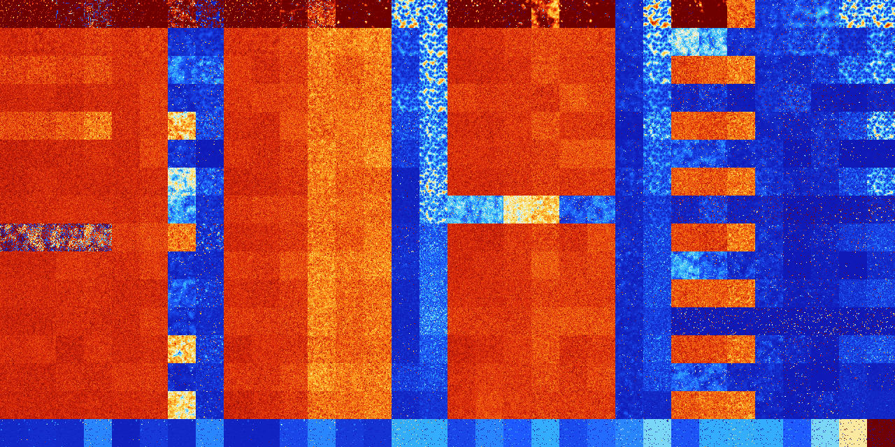

# B01678 (230912-231423)

<details>
    <summary>Initial Grid</summary>
    
</details>


<details>
    <summary>Initial Grid RLE</summary>

```
#C Exported from GoGoL (https://github.com/marrow16/gogol)
#C Wrap mode: Toroidal
#C Boundary mode: Dead
#C Step: 0
x = 100, y = 100, rule = B01678/S
20bo26bo29bo8bo$5b2o15bo26bo4bo2bo13bo16bo$61bo3bo24bo$47bo9bo17bo10bo$
9b2o11bo23bobo19bo10bo8bo3bo$15bo21bo19bo$7bo33bo38bo2bo2bo$6bo10bo6bo
19bo18bo10bo12bo$61bo5bo20bo$5bo6bo59bo12bo$9bo19bo18bo29bo6bo8bo2bo$3b
o13bo4bo6bo2bo39bo$6bo25bo10bo23bo27bo3bo$o16bo16bo8bo10bo40bo3bo$62bo
13bo$14bo14bo3bo36bo$o4bo10bo2bo32bo16bo9bo$7bo50bo6bo$5bobo29bo4bo4bo
9bo9bo3bo12bo5bo$2bo8bo10bo45bo6bo6bo7bo3bobo$4bo4bo30bo26bo6bo13bo7bo$
7bo11bo45bobo23bo$13bo20bo59bo$25bo11bo47bo9bo$7bo21bo19bo20bo27bo$4bo
5bo24bo$13bo6bo32bo5bo$23bo17bo27bo8bo2bobo$78bo$21bo9bo6bo18bo$26bo4bo
16bo38bo2bo$14bo59bo7bo$32bo17bo4bo18bo4bobobo$26bo65bo$12bo5bo11bo11bo
13bo14bo$5bo28bo5bo30bo18bo6bo$5bo15bo3bo2bo64bo$2bo4bo3bo45bo13bobo3bo
$6bo11bo4bo28bo3bo$2bo6bo55bo20bo$3bo38b2o7b2o12bo5bo17bo$5bo5bo7bo2bo
7bo24bo29bo8bo$63bobo9bo$11bo65bo21bo$39bo9bo33bo$5bo18bo37bo9bo$10bo
14bo8bo8bo4bo23bo8bo$bo25bo35bo13bo4bo$70bo$17bo26bo12bo38bo$13bo5bobo
6bo53bo$100b$13bo3bo16bo8bo3bo18bo5bo$100b$54bo16bo$42bo7bo39bo2bo$11bo
6bo20bo17bo12bo5bo11bo$19bo14b2o4bo$23bo7bo32bo15bo$10bo51bo12bo11bo$
26bo35bo4bo14b2o9bo$50bo11bo29bo2bo$2b2o9bo23b2o8b2o22bo23bo$22bo24bo
26bo19bo$7bo5bo30bo9bo7bo$28bo2bo$7bo49bo2bo$11bo36bo4bo11bo21bo5bo$o2b
o11bo2bo2bo19bo29bo$9bo29bo$32bo4bo7bo4bo24bo13bo$8bo68bo7bo2bo9bo$11bo
3bo3bo18bo3bo55bo$26bo16bo5bo17bo4bo3bo$12bo9bo13bo37bo7bo16bo$4bo4bo
47bo4bo3bo30bo$9b2o7b2o29bo4bo11bo15bo8bo5bo$28bo23bo36bo$64bo34bo$2bo
33bo22bo18bo$45bo23bo2bo$15bo14bo29bo27bo$5bo5bo49bobo$100b$8bo34bo32bo
$23bo47bo12bo$23bo14bo11bo23bo15bo5bo$58bo28bo$o5bo5bo40bo8bo$o22bo2bo
36bo$10bo10bo23bo48bo$31bo14bo24bo25bo$84bo$52bo$3bobo5b2o5bo42bo3bo31b
o$22bo5bobobo20bo$25bo28bo40bo$8bo12bo29bo36bo$2bo18bo9bo43bo8bo$4bo28b
o61bo!
```
</details>
<details>
    <summary>Thumbnail</summary>

</details>
<table>
<tr>
    <td><a href="./230912%20S%20Heat%20Map%20Activity.png"></a><br>S (230912)<br>R@10,p2</td>    <td><a href="./230913%20S0%20Heat%20Map%20Activity.png"></a><br>S0 (230913)<br>R@14,p4</td>    <td><a href="./230914%20S1%20Heat%20Map%20Activity.png"></a><br>S1 (230914)<br>R@128,p12</td>    <td><a href="./230915%20S01%20Heat%20Map%20Activity.png"></a><br>S01 (230915)<br>R@120,p12</td>    <td><a href="./230916%20S2%20Heat%20Map%20Activity.png"></a><br>S2 (230916)<br>R@14,p4</td>    <td><a href="./230917%20S02%20Heat%20Map%20Activity.png"></a><br>S02 (230917)<br>R@33,p2</td>    <td><a href="./230918%20S12%20Heat%20Map%20Activity.png"></a><br>S12 (230918)<br>R@189,p12</td>    <td><a href="./230919%20S012%20Heat%20Map%20Activity.png"></a><br>S012 (230919)<br>G>1000</td>    <td><a href="./230920%20S3%20Heat%20Map%20Activity.png"></a><br>S3 (230920)<br>R@10,p2</td>    <td><a href="./230921%20S03%20Heat%20Map%20Activity.png"></a><br>S03 (230921)<br>R@16,p4</td>    <td><a href="./230922%20S13%20Heat%20Map%20Activity.png"></a><br>S13 (230922)<br>R@282,p4</td>    <td><a href="./230923%20S013%20Heat%20Map%20Activity.png"></a><br>S013 (230923)<br>G>1000</td>    <td><a href="./230924%20S23%20Heat%20Map%20Activity.png"></a><br>S23 (230924)<br>R@54,p4</td>    <td><a href="./230925%20S023%20Heat%20Map%20Activity.png"></a><br>S023 (230925)<br>R@67,p6</td>    <td><a href="./230926%20S123%20Heat%20Map%20Activity.png"></a><br>S123 (230926)<br>R@88,p12</td>    <td><a href="./230927%20S0123%20Heat%20Map%20Activity.png"></a><br>S0123 (230927)<br>R@81,p12</td>    <td><a href="./230928%20S4%20Heat%20Map%20Activity.png"></a><br>S4 (230928)<br>R@18,p2</td>    <td><a href="./230929%20S04%20Heat%20Map%20Activity.png"></a><br>S04 (230929)<br>R@19,p2</td>    <td><a href="./230930%20S14%20Heat%20Map%20Activity.png"></a><br>S14 (230930)<br>R@170,p12</td>    <td><a href="./230931%20S014%20Heat%20Map%20Activity.png"></a><br>S014 (230931)<br>G>1000</td>    <td><a href="./230932%20S24%20Heat%20Map%20Activity.png"></a><br>S24 (230932)<br>R@42,p4</td>    <td><a href="./230933%20S024%20Heat%20Map%20Activity.png"></a><br>S024 (230933)<br>R@155,p4</td>    <td><a href="./230934%20S124%20Heat%20Map%20Activity.png"></a><br>S124 (230934)<br>R@938,p420</td>    <td><a href="./230935%20S0124%20Heat%20Map%20Activity.png"></a><br>S0124 (230935)<br>R@91,p6</td>    <td><a href="./230936%20S34%20Heat%20Map%20Activity.png"></a><br>S34 (230936)<br>R@48,p2</td>    <td><a href="./230937%20S034%20Heat%20Map%20Activity.png"></a><br>S034 (230937)<br>R@178,p2</td>    <td><a href="./230938%20S134%20Heat%20Map%20Activity.png"></a><br>S134 (230938)<br>G>1000</td>    <td><a href="./230939%20S0134%20Heat%20Map%20Activity.png"></a><br>S0134 (230939)<br>R@650,p12</td>    <td><a href="./230940%20S234%20Heat%20Map%20Activity.png"></a><br>S234 (230940)<br>R@440,p120</td>    <td><a href="./230941%20S0234%20Heat%20Map%20Activity.png"></a><br>S0234 (230941)<br>R@250,p60</td>    <td><a href="./230942%20S1234%20Heat%20Map%20Activity.png"></a><br>S1234 (230942)<br>R@52,p4</td>    <td><a href="./230943%20S01234%20Heat%20Map%20Activity.png"></a><br>S01234 (230943)<br>R@49,p4</td></tr>
<tr>
    <td><a href="./230944%20S5%20Heat%20Map%20Activity.png"></a><br>S5 (230944)<br>G>1000</td>    <td><a href="./230945%20S05%20Heat%20Map%20Activity.png"></a><br>S05 (230945)<br>G>1000</td>    <td><a href="./230946%20S15%20Heat%20Map%20Activity.png"></a><br>S15 (230946)<br>G>1000</td>    <td><a href="./230947%20S015%20Heat%20Map%20Activity.png"></a><br>S015 (230947)<br>G>1000</td>    <td><a href="./230948%20S25%20Heat%20Map%20Activity.png"></a><br>S25 (230948)<br>G>1000</td>    <td><a href="./230949%20S025%20Heat%20Map%20Activity.png"></a><br>S025 (230949)<br>G>1000</td>    <td><a href="./230950%20S125%20Heat%20Map%20Activity.png"></a><br>S125 (230950)<br>R@536,p12</td>    <td><a href="./230951%20S0125%20Heat%20Map%20Activity.png"></a><br>S0125 (230951)<br>R@256,p210</td>    <td><a href="./230952%20S35%20Heat%20Map%20Activity.png"></a><br>S35 (230952)<br>G>1000</td>    <td><a href="./230953%20S035%20Heat%20Map%20Activity.png"></a><br>S035 (230953)<br>G>1000</td>    <td><a href="./230954%20S135%20Heat%20Map%20Activity.png"></a><br>S135 (230954)<br>G>1000</td>    <td><a href="./230955%20S0135%20Heat%20Map%20Activity.png"></a><br>S0135 (230955)<br>G>1000</td>    <td><a href="./230956%20S235%20Heat%20Map%20Activity.png"></a><br>S235 (230956)<br>G>1000</td>    <td><a href="./230957%20S0235%20Heat%20Map%20Activity.png"></a><br>S0235 (230957)<br>G>1000</td>    <td><a href="./230958%20S1235%20Heat%20Map%20Activity.png"></a><br>S1235 (230958)<br>R@84,p12</td>    <td><a href="./230959%20S01235%20Heat%20Map%20Activity.png"></a><br>S01235 (230959)<br>R@42,p12</td>    <td><a href="./230960%20S45%20Heat%20Map%20Activity.png"></a><br>S45 (230960)<br>G>1000</td>    <td><a href="./230961%20S045%20Heat%20Map%20Activity.png"></a><br>S045 (230961)<br>G>1000</td>    <td><a href="./230962%20S145%20Heat%20Map%20Activity.png"></a><br>S145 (230962)<br>G>1000</td>    <td><a href="./230963%20S0145%20Heat%20Map%20Activity.png"></a><br>S0145 (230963)<br>G>1000</td>    <td><a href="./230964%20S245%20Heat%20Map%20Activity.png"></a><br>S245 (230964)<br>G>1000</td>    <td><a href="./230965%20S0245%20Heat%20Map%20Activity.png"></a><br>S0245 (230965)<br>G>1000</td>    <td><a href="./230966%20S1245%20Heat%20Map%20Activity.png"></a><br>S1245 (230966)<br>R@319,p6</td>    <td><a href="./230967%20S01245%20Heat%20Map%20Activity.png"></a><br>S01245 (230967)<br>R@50,p6</td>    <td><a href="./230968%20S345%20Heat%20Map%20Activity.png"></a><br>S345 (230968)<br>G>1000</td>    <td><a href="./230969%20S0345%20Heat%20Map%20Activity.png"></a><br>S0345 (230969)<br>G>1000</td>    <td><a href="./230970%20S1345%20Heat%20Map%20Activity.png"></a><br>S1345 (230970)<br>G>1000</td>    <td><a href="./230971%20S01345%20Heat%20Map%20Activity.png"></a><br>S01345 (230971)<br>R@233,p60</td>    <td><a href="./230972%20S2345%20Heat%20Map%20Activity.png"></a><br>S2345 (230972)<br>R@114,p24</td>    <td><a href="./230973%20S02345%20Heat%20Map%20Activity.png"></a><br>S02345 (230973)<br>R@132,p48</td>    <td><a href="./230974%20S12345%20Heat%20Map%20Activity.png"></a><br>S12345 (230974)<br>R@162,p120</td>    <td><a href="./230975%20S012345%20Heat%20Map%20Activity.png"></a><br>S012345 (230975)<br>R@70,p24</td></tr>
<tr>
    <td><a href="./230976%20S6%20Heat%20Map%20Activity.png"></a><br>S6 (230976)<br>G>1000</td>    <td><a href="./230977%20S06%20Heat%20Map%20Activity.png"></a><br>S06 (230977)<br>G>1000</td>    <td><a href="./230978%20S16%20Heat%20Map%20Activity.png"></a><br>S16 (230978)<br>G>1000</td>    <td><a href="./230979%20S016%20Heat%20Map%20Activity.png"></a><br>S016 (230979)<br>G>1000</td>    <td><a href="./230980%20S26%20Heat%20Map%20Activity.png"></a><br>S26 (230980)<br>G>1000</td>    <td><a href="./230981%20S026%20Heat%20Map%20Activity.png"></a><br>S026 (230981)<br>G>1000</td>    <td><a href="./230982%20S126%20Heat%20Map%20Activity.png"></a><br>S126 (230982)<br>G>1000</td>    <td><a href="./230983%20S0126%20Heat%20Map%20Activity.png"></a><br>S0126 (230983)<br>R@68,p24</td>    <td><a href="./230984%20S36%20Heat%20Map%20Activity.png"></a><br>S36 (230984)<br>G>1000</td>    <td><a href="./230985%20S036%20Heat%20Map%20Activity.png"></a><br>S036 (230985)<br>G>1000</td>    <td><a href="./230986%20S136%20Heat%20Map%20Activity.png"></a><br>S136 (230986)<br>G>1000</td>    <td><a href="./230987%20S0136%20Heat%20Map%20Activity.png"></a><br>S0136 (230987)<br>G>1000</td>    <td><a href="./230988%20S236%20Heat%20Map%20Activity.png"></a><br>S236 (230988)<br>G>1000</td>    <td><a href="./230989%20S0236%20Heat%20Map%20Activity.png"></a><br>S0236 (230989)<br>G>1000</td>    <td><a href="./230990%20S1236%20Heat%20Map%20Activity.png"></a><br>S1236 (230990)<br>R@93,p60</td>    <td><a href="./230991%20S01236%20Heat%20Map%20Activity.png"></a><br>S01236 (230991)<br>R@26,p2</td>    <td><a href="./230992%20S46%20Heat%20Map%20Activity.png"></a><br>S46 (230992)<br>G>1000</td>    <td><a href="./230993%20S046%20Heat%20Map%20Activity.png"></a><br>S046 (230993)<br>G>1000</td>    <td><a href="./230994%20S146%20Heat%20Map%20Activity.png"></a><br>S146 (230994)<br>G>1000</td>    <td><a href="./230995%20S0146%20Heat%20Map%20Activity.png"></a><br>S0146 (230995)<br>G>1000</td>    <td><a href="./230996%20S246%20Heat%20Map%20Activity.png"></a><br>S246 (230996)<br>G>1000</td>    <td><a href="./230997%20S0246%20Heat%20Map%20Activity.png"></a><br>S0246 (230997)<br>G>1000</td>    <td><a href="./230998%20S1246%20Heat%20Map%20Activity.png"></a><br>S1246 (230998)<br>R@413,p6</td>    <td><a href="./230999%20S01246%20Heat%20Map%20Activity.png"></a><br>S01246 (230999)<br>R@40,p6</td>    <td><a href="./231000%20S346%20Heat%20Map%20Activity.png"></a><br>S346 (231000)<br>G>1000</td>    <td><a href="./231001%20S0346%20Heat%20Map%20Activity.png"></a><br>S0346 (231001)<br>G>1000</td>    <td><a href="./231002%20S1346%20Heat%20Map%20Activity.png"></a><br>S1346 (231002)<br>G>1000</td>    <td><a href="./231003%20S01346%20Heat%20Map%20Activity.png"></a><br>S01346 (231003)<br>R@697,p60</td>    <td><a href="./231004%20S2346%20Heat%20Map%20Activity.png"></a><br>S2346 (231004)<br>R@310,p120</td>    <td><a href="./231005%20S02346%20Heat%20Map%20Activity.png"></a><br>S02346 (231005)<br>R@132,p12</td>    <td><a href="./231006%20S12346%20Heat%20Map%20Activity.png"></a><br>S12346 (231006)<br>R@39,p12</td>    <td><a href="./231007%20S012346%20Heat%20Map%20Activity.png"></a><br>S012346 (231007)<br>R@35,p12</td></tr>
<tr>
    <td><a href="./231008%20S56%20Heat%20Map%20Activity.png"></a><br>S56 (231008)<br>G>1000</td>    <td><a href="./231009%20S056%20Heat%20Map%20Activity.png"></a><br>S056 (231009)<br>G>1000</td>    <td><a href="./231010%20S156%20Heat%20Map%20Activity.png"></a><br>S156 (231010)<br>G>1000</td>    <td><a href="./231011%20S0156%20Heat%20Map%20Activity.png"></a><br>S0156 (231011)<br>G>1000</td>    <td><a href="./231012%20S256%20Heat%20Map%20Activity.png"></a><br>S256 (231012)<br>G>1000</td>    <td><a href="./231013%20S0256%20Heat%20Map%20Activity.png"></a><br>S0256 (231013)<br>G>1000</td>    <td><a href="./231014%20S1256%20Heat%20Map%20Activity.png"></a><br>S1256 (231014)<br>R@788,p180</td>    <td><a href="./231015%20S01256%20Heat%20Map%20Activity.png"></a><br>S01256 (231015)<br>R@99,p60</td>    <td><a href="./231016%20S356%20Heat%20Map%20Activity.png"></a><br>S356 (231016)<br>G>1000</td>    <td><a href="./231017%20S0356%20Heat%20Map%20Activity.png"></a><br>S0356 (231017)<br>G>1000</td>    <td><a href="./231018%20S1356%20Heat%20Map%20Activity.png"></a><br>S1356 (231018)<br>G>1000</td>    <td><a href="./231019%20S01356%20Heat%20Map%20Activity.png"></a><br>S01356 (231019)<br>G>1000</td>    <td><a href="./231020%20S2356%20Heat%20Map%20Activity.png"></a><br>S2356 (231020)<br>G>1000</td>    <td><a href="./231021%20S02356%20Heat%20Map%20Activity.png"></a><br>S02356 (231021)<br>G>1000</td>    <td><a href="./231022%20S12356%20Heat%20Map%20Activity.png"></a><br>S12356 (231022)<br>R@38,p2</td>    <td><a href="./231023%20S012356%20Heat%20Map%20Activity.png"></a><br>S012356 (231023)<br>R@23,p2</td>    <td><a href="./231024%20S456%20Heat%20Map%20Activity.png"></a><br>S456 (231024)<br>G>1000</td>    <td><a href="./231025%20S0456%20Heat%20Map%20Activity.png"></a><br>S0456 (231025)<br>G>1000</td>    <td><a href="./231026%20S1456%20Heat%20Map%20Activity.png"></a><br>S1456 (231026)<br>G>1000</td>    <td><a href="./231027%20S01456%20Heat%20Map%20Activity.png"></a><br>S01456 (231027)<br>G>1000</td>    <td><a href="./231028%20S2456%20Heat%20Map%20Activity.png"></a><br>S2456 (231028)<br>G>1000</td>    <td><a href="./231029%20S02456%20Heat%20Map%20Activity.png"></a><br>S02456 (231029)<br>G>1000</td>    <td><a href="./231030%20S12456%20Heat%20Map%20Activity.png"></a><br>S12456 (231030)<br>R@301,p12</td>    <td><a href="./231031%20S012456%20Heat%20Map%20Activity.png"></a><br>S012456 (231031)<br>R@57,p12</td>    <td><a href="./231032%20S3456%20Heat%20Map%20Activity.png"></a><br>S3456 (231032)<br>R@424,p12</td>    <td><a href="./231033%20S03456%20Heat%20Map%20Activity.png"></a><br>S03456 (231033)<br>R@256,p24</td>    <td><a href="./231034%20S13456%20Heat%20Map%20Activity.png"></a><br>S13456 (231034)<br>R@978,p840</td>    <td><a href="./231035%20S013456%20Heat%20Map%20Activity.png"></a><br>S013456 (231035)<br>R@152,p60</td>    <td><a href="./231036%20S23456%20Heat%20Map%20Activity.png"></a><br>S23456 (231036)<br>R@71,p24</td>    <td><a href="./231037%20S023456%20Heat%20Map%20Activity.png"></a><br>S023456 (231037)<br>R@460,p420</td>    <td><a href="./231038%20S123456%20Heat%20Map%20Activity.png"></a><br>S123456 (231038)<br>R@878,p840</td>    <td><a href="./231039%20S0123456%20Heat%20Map%20Activity.png"></a><br>S0123456 (231039)<br>R@247,p168</td></tr>
<tr>
    <td><a href="./231040%20S7%20Heat%20Map%20Activity.png"></a><br>S7 (231040)<br>G>1000</td>    <td><a href="./231041%20S07%20Heat%20Map%20Activity.png"></a><br>S07 (231041)<br>G>1000</td>    <td><a href="./231042%20S17%20Heat%20Map%20Activity.png"></a><br>S17 (231042)<br>G>1000</td>    <td><a href="./231043%20S017%20Heat%20Map%20Activity.png"></a><br>S017 (231043)<br>G>1000</td>    <td><a href="./231044%20S27%20Heat%20Map%20Activity.png"></a><br>S27 (231044)<br>G>1000</td>    <td><a href="./231045%20S027%20Heat%20Map%20Activity.png"></a><br>S027 (231045)<br>G>1000</td>    <td><a href="./231046%20S127%20Heat%20Map%20Activity.png"></a><br>S127 (231046)<br>G>1000</td>    <td><a href="./231047%20S0127%20Heat%20Map%20Activity.png"></a><br>S0127 (231047)<br>R@95,p24</td>    <td><a href="./231048%20S37%20Heat%20Map%20Activity.png"></a><br>S37 (231048)<br>G>1000</td>    <td><a href="./231049%20S037%20Heat%20Map%20Activity.png"></a><br>S037 (231049)<br>G>1000</td>    <td><a href="./231050%20S137%20Heat%20Map%20Activity.png"></a><br>S137 (231050)<br>G>1000</td>    <td><a href="./231051%20S0137%20Heat%20Map%20Activity.png"></a><br>S0137 (231051)<br>G>1000</td>    <td><a href="./231052%20S237%20Heat%20Map%20Activity.png"></a><br>S237 (231052)<br>G>1000</td>    <td><a href="./231053%20S0237%20Heat%20Map%20Activity.png"></a><br>S0237 (231053)<br>G>1000</td>    <td><a href="./231054%20S1237%20Heat%20Map%20Activity.png"></a><br>S1237 (231054)<br>R@43,p12</td>    <td><a href="./231055%20S01237%20Heat%20Map%20Activity.png"></a><br>S01237 (231055)<br>R@26,p6</td>    <td><a href="./231056%20S47%20Heat%20Map%20Activity.png"></a><br>S47 (231056)<br>G>1000</td>    <td><a href="./231057%20S047%20Heat%20Map%20Activity.png"></a><br>S047 (231057)<br>G>1000</td>    <td><a href="./231058%20S147%20Heat%20Map%20Activity.png"></a><br>S147 (231058)<br>G>1000</td>    <td><a href="./231059%20S0147%20Heat%20Map%20Activity.png"></a><br>S0147 (231059)<br>G>1000</td>    <td><a href="./231060%20S247%20Heat%20Map%20Activity.png"></a><br>S247 (231060)<br>G>1000</td>    <td><a href="./231061%20S0247%20Heat%20Map%20Activity.png"></a><br>S0247 (231061)<br>G>1000</td>    <td><a href="./231062%20S1247%20Heat%20Map%20Activity.png"></a><br>S1247 (231062)<br>G>1000</td>    <td><a href="./231063%20S01247%20Heat%20Map%20Activity.png"></a><br>S01247 (231063)<br>R@36,p6</td>    <td><a href="./231064%20S347%20Heat%20Map%20Activity.png"></a><br>S347 (231064)<br>G>1000</td>    <td><a href="./231065%20S0347%20Heat%20Map%20Activity.png"></a><br>S0347 (231065)<br>G>1000</td>    <td><a href="./231066%20S1347%20Heat%20Map%20Activity.png"></a><br>S1347 (231066)<br>G>1000</td>    <td><a href="./231067%20S01347%20Heat%20Map%20Activity.png"></a><br>S01347 (231067)<br>G>1000</td>    <td><a href="./231068%20S2347%20Heat%20Map%20Activity.png"></a><br>S2347 (231068)<br>R@383,p60</td>    <td><a href="./231069%20S02347%20Heat%20Map%20Activity.png"></a><br>S02347 (231069)<br>R@249,p60</td>    <td><a href="./231070%20S12347%20Heat%20Map%20Activity.png"></a><br>S12347 (231070)<br>R@35,p12</td>    <td><a href="./231071%20S012347%20Heat%20Map%20Activity.png"></a><br>S012347 (231071)<br>R@23,p4</td></tr>
<tr>
    <td><a href="./231072%20S57%20Heat%20Map%20Activity.png"></a><br>S57 (231072)<br>G>1000</td>    <td><a href="./231073%20S057%20Heat%20Map%20Activity.png"></a><br>S057 (231073)<br>G>1000</td>    <td><a href="./231074%20S157%20Heat%20Map%20Activity.png"></a><br>S157 (231074)<br>G>1000</td>    <td><a href="./231075%20S0157%20Heat%20Map%20Activity.png"></a><br>S0157 (231075)<br>G>1000</td>    <td><a href="./231076%20S257%20Heat%20Map%20Activity.png"></a><br>S257 (231076)<br>G>1000</td>    <td><a href="./231077%20S0257%20Heat%20Map%20Activity.png"></a><br>S0257 (231077)<br>G>1000</td>    <td><a href="./231078%20S1257%20Heat%20Map%20Activity.png"></a><br>S1257 (231078)<br>R@669,p12</td>    <td><a href="./231079%20S01257%20Heat%20Map%20Activity.png"></a><br>S01257 (231079)<br>R@664,p630</td>    <td><a href="./231080%20S357%20Heat%20Map%20Activity.png"></a><br>S357 (231080)<br>G>1000</td>    <td><a href="./231081%20S0357%20Heat%20Map%20Activity.png"></a><br>S0357 (231081)<br>G>1000</td>    <td><a href="./231082%20S1357%20Heat%20Map%20Activity.png"></a><br>S1357 (231082)<br>G>1000</td>    <td><a href="./231083%20S01357%20Heat%20Map%20Activity.png"></a><br>S01357 (231083)<br>G>1000</td>    <td><a href="./231084%20S2357%20Heat%20Map%20Activity.png"></a><br>S2357 (231084)<br>G>1000</td>    <td><a href="./231085%20S02357%20Heat%20Map%20Activity.png"></a><br>S02357 (231085)<br>G>1000</td>    <td><a href="./231086%20S12357%20Heat%20Map%20Activity.png"></a><br>S12357 (231086)<br>R@52,p12</td>    <td><a href="./231087%20S012357%20Heat%20Map%20Activity.png"></a><br>S012357 (231087)<br>R@26,p6</td>    <td><a href="./231088%20S457%20Heat%20Map%20Activity.png"></a><br>S457 (231088)<br>G>1000</td>    <td><a href="./231089%20S0457%20Heat%20Map%20Activity.png"></a><br>S0457 (231089)<br>G>1000</td>    <td><a href="./231090%20S1457%20Heat%20Map%20Activity.png"></a><br>S1457 (231090)<br>G>1000</td>    <td><a href="./231091%20S01457%20Heat%20Map%20Activity.png"></a><br>S01457 (231091)<br>G>1000</td>    <td><a href="./231092%20S2457%20Heat%20Map%20Activity.png"></a><br>S2457 (231092)<br>G>1000</td>    <td><a href="./231093%20S02457%20Heat%20Map%20Activity.png"></a><br>S02457 (231093)<br>G>1000</td>    <td><a href="./231094%20S12457%20Heat%20Map%20Activity.png"></a><br>S12457 (231094)<br>R@431,p12</td>    <td><a href="./231095%20S012457%20Heat%20Map%20Activity.png"></a><br>S012457 (231095)<br>R@46,p12</td>    <td><a href="./231096%20S3457%20Heat%20Map%20Activity.png"></a><br>S3457 (231096)<br>G>1000</td>    <td><a href="./231097%20S03457%20Heat%20Map%20Activity.png"></a><br>S03457 (231097)<br>G>1000</td>    <td><a href="./231098%20S13457%20Heat%20Map%20Activity.png"></a><br>S13457 (231098)<br>G>1000</td>    <td><a href="./231099%20S013457%20Heat%20Map%20Activity.png"></a><br>S013457 (231099)<br>R@210,p60</td>    <td><a href="./231100%20S23457%20Heat%20Map%20Activity.png"></a><br>S23457 (231100)<br>G>1000</td>    <td><a href="./231101%20S023457%20Heat%20Map%20Activity.png"></a><br>S023457 (231101)<br>R@153,p60</td>    <td><a href="./231102%20S123457%20Heat%20Map%20Activity.png"></a><br>S123457 (231102)<br>G>1000</td>    <td><a href="./231103%20S0123457%20Heat%20Map%20Activity.png"></a><br>S0123457 (231103)<br>G>1000</td></tr>
<tr>
    <td><a href="./231104%20S67%20Heat%20Map%20Activity.png"></a><br>S67 (231104)<br>G>1000</td>    <td><a href="./231105%20S067%20Heat%20Map%20Activity.png"></a><br>S067 (231105)<br>G>1000</td>    <td><a href="./231106%20S167%20Heat%20Map%20Activity.png"></a><br>S167 (231106)<br>G>1000</td>    <td><a href="./231107%20S0167%20Heat%20Map%20Activity.png"></a><br>S0167 (231107)<br>G>1000</td>    <td><a href="./231108%20S267%20Heat%20Map%20Activity.png"></a><br>S267 (231108)<br>G>1000</td>    <td><a href="./231109%20S0267%20Heat%20Map%20Activity.png"></a><br>S0267 (231109)<br>G>1000</td>    <td><a href="./231110%20S1267%20Heat%20Map%20Activity.png"></a><br>S1267 (231110)<br>G>1000</td>    <td><a href="./231111%20S01267%20Heat%20Map%20Activity.png"></a><br>S01267 (231111)<br>R@77,p24</td>    <td><a href="./231112%20S367%20Heat%20Map%20Activity.png"></a><br>S367 (231112)<br>G>1000</td>    <td><a href="./231113%20S0367%20Heat%20Map%20Activity.png"></a><br>S0367 (231113)<br>G>1000</td>    <td><a href="./231114%20S1367%20Heat%20Map%20Activity.png"></a><br>S1367 (231114)<br>G>1000</td>    <td><a href="./231115%20S01367%20Heat%20Map%20Activity.png"></a><br>S01367 (231115)<br>G>1000</td>    <td><a href="./231116%20S2367%20Heat%20Map%20Activity.png"></a><br>S2367 (231116)<br>G>1000</td>    <td><a href="./231117%20S02367%20Heat%20Map%20Activity.png"></a><br>S02367 (231117)<br>G>1000</td>    <td><a href="./231118%20S12367%20Heat%20Map%20Activity.png"></a><br>S12367 (231118)<br>R@156,p120</td>    <td><a href="./231119%20S012367%20Heat%20Map%20Activity.png"></a><br>S012367 (231119)<br>R@20,p2</td>    <td><a href="./231120%20S467%20Heat%20Map%20Activity.png"></a><br>S467 (231120)<br>G>1000</td>    <td><a href="./231121%20S0467%20Heat%20Map%20Activity.png"></a><br>S0467 (231121)<br>G>1000</td>    <td><a href="./231122%20S1467%20Heat%20Map%20Activity.png"></a><br>S1467 (231122)<br>G>1000</td>    <td><a href="./231123%20S01467%20Heat%20Map%20Activity.png"></a><br>S01467 (231123)<br>G>1000</td>    <td><a href="./231124%20S2467%20Heat%20Map%20Activity.png"></a><br>S2467 (231124)<br>G>1000</td>    <td><a href="./231125%20S02467%20Heat%20Map%20Activity.png"></a><br>S02467 (231125)<br>G>1000</td>    <td><a href="./231126%20S12467%20Heat%20Map%20Activity.png"></a><br>S12467 (231126)<br>R@265,p12</td>    <td><a href="./231127%20S012467%20Heat%20Map%20Activity.png"></a><br>S012467 (231127)<br>R@41,p6</td>    <td><a href="./231128%20S3467%20Heat%20Map%20Activity.png"></a><br>S3467 (231128)<br>G>1000</td>    <td><a href="./231129%20S03467%20Heat%20Map%20Activity.png"></a><br>S03467 (231129)<br>G>1000</td>    <td><a href="./231130%20S13467%20Heat%20Map%20Activity.png"></a><br>S13467 (231130)<br>G>1000</td>    <td><a href="./231131%20S013467%20Heat%20Map%20Activity.png"></a><br>S013467 (231131)<br>R@417,p60</td>    <td><a href="./231132%20S23467%20Heat%20Map%20Activity.png"></a><br>S23467 (231132)<br>R@257,p84</td>    <td><a href="./231133%20S023467%20Heat%20Map%20Activity.png"></a><br>S023467 (231133)<br>R@221,p60</td>    <td><a href="./231134%20S123467%20Heat%20Map%20Activity.png"></a><br>S123467 (231134)<br>R@31,p6</td>    <td><a href="./231135%20S0123467%20Heat%20Map%20Activity.png"></a><br>S0123467 (231135)<br>R@24,p4</td></tr>
<tr>
    <td><a href="./231136%20S567%20Heat%20Map%20Activity.png"></a><br>S567 (231136)<br>G>1000</td>    <td><a href="./231137%20S0567%20Heat%20Map%20Activity.png"></a><br>S0567 (231137)<br>G>1000</td>    <td><a href="./231138%20S1567%20Heat%20Map%20Activity.png"></a><br>S1567 (231138)<br>G>1000</td>    <td><a href="./231139%20S01567%20Heat%20Map%20Activity.png"></a><br>S01567 (231139)<br>G>1000</td>    <td><a href="./231140%20S2567%20Heat%20Map%20Activity.png"></a><br>S2567 (231140)<br>G>1000</td>    <td><a href="./231141%20S02567%20Heat%20Map%20Activity.png"></a><br>S02567 (231141)<br>G>1000</td>    <td><a href="./231142%20S12567%20Heat%20Map%20Activity.png"></a><br>S12567 (231142)<br>G>1000</td>    <td><a href="./231143%20S012567%20Heat%20Map%20Activity.png"></a><br>S012567 (231143)<br>R@132,p84</td>    <td><a href="./231144%20S3567%20Heat%20Map%20Activity.png"></a><br>S3567 (231144)<br>G>1000</td>    <td><a href="./231145%20S03567%20Heat%20Map%20Activity.png"></a><br>S03567 (231145)<br>G>1000</td>    <td><a href="./231146%20S13567%20Heat%20Map%20Activity.png"></a><br>S13567 (231146)<br>G>1000</td>    <td><a href="./231147%20S013567%20Heat%20Map%20Activity.png"></a><br>S013567 (231147)<br>G>1000</td>    <td><a href="./231148%20S23567%20Heat%20Map%20Activity.png"></a><br>S23567 (231148)<br>G>1000</td>    <td><a href="./231149%20S023567%20Heat%20Map%20Activity.png"></a><br>S023567 (231149)<br>G>1000</td>    <td><a href="./231150%20S123567%20Heat%20Map%20Activity.png"></a><br>S123567 (231150)<br>R@165,p120</td>    <td><a href="./231151%20S0123567%20Heat%20Map%20Activity.png"></a><br>S0123567 (231151)<br>R@26,p2</td>    <td><a href="./231152%20S4567%20Heat%20Map%20Activity.png"></a><br>S4567 (231152)<br>G>1000</td>    <td><a href="./231153%20S04567%20Heat%20Map%20Activity.png"></a><br>S04567 (231153)<br>G>1000</td>    <td><a href="./231154%20S14567%20Heat%20Map%20Activity.png"></a><br>S14567 (231154)<br>G>1000</td>    <td><a href="./231155%20S014567%20Heat%20Map%20Activity.png"></a><br>S014567 (231155)<br>G>1000</td>    <td><a href="./231156%20S24567%20Heat%20Map%20Activity.png"></a><br>S24567 (231156)<br>G>1000</td>    <td><a href="./231157%20S024567%20Heat%20Map%20Activity.png"></a><br>S024567 (231157)<br>G>1000</td>    <td><a href="./231158%20S124567%20Heat%20Map%20Activity.png"></a><br>S124567 (231158)<br>R@194,p42</td>    <td><a href="./231159%20S0124567%20Heat%20Map%20Activity.png"></a><br>S0124567 (231159)<br>R@68,p12</td>    <td><a href="./231160%20S34567%20Heat%20Map%20Activity.png"></a><br>S34567 (231160)<br>R@119,p84</td>    <td><a href="./231161%20S034567%20Heat%20Map%20Activity.png"></a><br>S034567 (231161)<br>R@64,p24</td>    <td><a href="./231162%20S134567%20Heat%20Map%20Activity.png"></a><br>S134567 (231162)<br>R@160,p120</td>    <td><a href="./231163%20S0134567%20Heat%20Map%20Activity.png"></a><br>S0134567 (231163)<br>R@167,p120</td>    <td><a href="./231164%20S234567%20Heat%20Map%20Activity.png"></a><br>S234567 (231164)<br>G>1000</td>    <td><a href="./231165%20S0234567%20Heat%20Map%20Activity.png"></a><br>S0234567 (231165)<br>G>1000</td>    <td><a href="./231166%20S1234567%20Heat%20Map%20Activity.png"></a><br>S1234567 (231166)<br>R@458,p420</td>    <td><a href="./231167%20S01234567%20Heat%20Map%20Activity.png"></a><br>S01234567 (231167)<br>R@225,p168</td></tr>
<tr>
    <td><a href="./231168%20S8%20Heat%20Map%20Activity.png"></a><br>S8 (231168)<br>R@257,p4</td>    <td><a href="./231169%20S08%20Heat%20Map%20Activity.png"></a><br>S08 (231169)<br>G>1000</td>    <td><a href="./231170%20S18%20Heat%20Map%20Activity.png"></a><br>S18 (231170)<br>R@430,p72</td>    <td><a href="./231171%20S018%20Heat%20Map%20Activity.png"></a><br>S018 (231171)<br>R@640,p60</td>    <td><a href="./231172%20S28%20Heat%20Map%20Activity.png"></a><br>S28 (231172)<br>G>1000</td>    <td><a href="./231173%20S028%20Heat%20Map%20Activity.png"></a><br>S028 (231173)<br>G>1000</td>    <td><a href="./231174%20S128%20Heat%20Map%20Activity.png"></a><br>S128 (231174)<br>G>1000</td>    <td><a href="./231175%20S0128%20Heat%20Map%20Activity.png"></a><br>S0128 (231175)<br>R@115,p24</td>    <td><a href="./231176%20S38%20Heat%20Map%20Activity.png"></a><br>S38 (231176)<br>G>1000</td>    <td><a href="./231177%20S038%20Heat%20Map%20Activity.png"></a><br>S038 (231177)<br>G>1000</td>    <td><a href="./231178%20S138%20Heat%20Map%20Activity.png"></a><br>S138 (231178)<br>G>1000</td>    <td><a href="./231179%20S0138%20Heat%20Map%20Activity.png"></a><br>S0138 (231179)<br>G>1000</td>    <td><a href="./231180%20S238%20Heat%20Map%20Activity.png"></a><br>S238 (231180)<br>G>1000</td>    <td><a href="./231181%20S0238%20Heat%20Map%20Activity.png"></a><br>S0238 (231181)<br>G>1000</td>    <td><a href="./231182%20S1238%20Heat%20Map%20Activity.png"></a><br>S1238 (231182)<br>R@90,p60</td>    <td><a href="./231183%20S01238%20Heat%20Map%20Activity.png"></a><br>S01238 (231183)<br>R@22,p2</td>    <td><a href="./231184%20S48%20Heat%20Map%20Activity.png"></a><br>S48 (231184)<br>G>1000</td>    <td><a href="./231185%20S048%20Heat%20Map%20Activity.png"></a><br>S048 (231185)<br>G>1000</td>    <td><a href="./231186%20S148%20Heat%20Map%20Activity.png"></a><br>S148 (231186)<br>G>1000</td>    <td><a href="./231187%20S0148%20Heat%20Map%20Activity.png"></a><br>S0148 (231187)<br>G>1000</td>    <td><a href="./231188%20S248%20Heat%20Map%20Activity.png"></a><br>S248 (231188)<br>G>1000</td>    <td><a href="./231189%20S0248%20Heat%20Map%20Activity.png"></a><br>S0248 (231189)<br>G>1000</td>    <td><a href="./231190%20S1248%20Heat%20Map%20Activity.png"></a><br>S1248 (231190)<br>R@232,p60</td>    <td><a href="./231191%20S01248%20Heat%20Map%20Activity.png"></a><br>S01248 (231191)<br>R@37,p6</td>    <td><a href="./231192%20S348%20Heat%20Map%20Activity.png"></a><br>S348 (231192)<br>G>1000</td>    <td><a href="./231193%20S0348%20Heat%20Map%20Activity.png"></a><br>S0348 (231193)<br>G>1000</td>    <td><a href="./231194%20S1348%20Heat%20Map%20Activity.png"></a><br>S1348 (231194)<br>G>1000</td>    <td><a href="./231195%20S01348%20Heat%20Map%20Activity.png"></a><br>S01348 (231195)<br>R@605,p12</td>    <td><a href="./231196%20S2348%20Heat%20Map%20Activity.png"></a><br>S2348 (231196)<br>G>1000</td>    <td><a href="./231197%20S02348%20Heat%20Map%20Activity.png"></a><br>S02348 (231197)<br>R@312,p24</td>    <td><a href="./231198%20S12348%20Heat%20Map%20Activity.png"></a><br>S12348 (231198)<br>R@40,p12</td>    <td><a href="./231199%20S012348%20Heat%20Map%20Activity.png"></a><br>S012348 (231199)<br>R@25,p4</td></tr>
<tr>
    <td><a href="./231200%20S58%20Heat%20Map%20Activity.png"></a><br>S58 (231200)<br>G>1000</td>    <td><a href="./231201%20S058%20Heat%20Map%20Activity.png"></a><br>S058 (231201)<br>G>1000</td>    <td><a href="./231202%20S158%20Heat%20Map%20Activity.png"></a><br>S158 (231202)<br>G>1000</td>    <td><a href="./231203%20S0158%20Heat%20Map%20Activity.png"></a><br>S0158 (231203)<br>G>1000</td>    <td><a href="./231204%20S258%20Heat%20Map%20Activity.png"></a><br>S258 (231204)<br>G>1000</td>    <td><a href="./231205%20S0258%20Heat%20Map%20Activity.png"></a><br>S0258 (231205)<br>G>1000</td>    <td><a href="./231206%20S1258%20Heat%20Map%20Activity.png"></a><br>S1258 (231206)<br>R@450,p168</td>    <td><a href="./231207%20S01258%20Heat%20Map%20Activity.png"></a><br>S01258 (231207)<br>R@95,p60</td>    <td><a href="./231208%20S358%20Heat%20Map%20Activity.png"></a><br>S358 (231208)<br>G>1000</td>    <td><a href="./231209%20S0358%20Heat%20Map%20Activity.png"></a><br>S0358 (231209)<br>G>1000</td>    <td><a href="./231210%20S1358%20Heat%20Map%20Activity.png"></a><br>S1358 (231210)<br>G>1000</td>    <td><a href="./231211%20S01358%20Heat%20Map%20Activity.png"></a><br>S01358 (231211)<br>G>1000</td>    <td><a href="./231212%20S2358%20Heat%20Map%20Activity.png"></a><br>S2358 (231212)<br>G>1000</td>    <td><a href="./231213%20S02358%20Heat%20Map%20Activity.png"></a><br>S02358 (231213)<br>G>1000</td>    <td><a href="./231214%20S12358%20Heat%20Map%20Activity.png"></a><br>S12358 (231214)<br>R@53,p12</td>    <td><a href="./231215%20S012358%20Heat%20Map%20Activity.png"></a><br>S012358 (231215)<br>R@22,p6</td>    <td><a href="./231216%20S458%20Heat%20Map%20Activity.png"></a><br>S458 (231216)<br>G>1000</td>    <td><a href="./231217%20S0458%20Heat%20Map%20Activity.png"></a><br>S0458 (231217)<br>G>1000</td>    <td><a href="./231218%20S1458%20Heat%20Map%20Activity.png"></a><br>S1458 (231218)<br>G>1000</td>    <td><a href="./231219%20S01458%20Heat%20Map%20Activity.png"></a><br>S01458 (231219)<br>G>1000</td>    <td><a href="./231220%20S2458%20Heat%20Map%20Activity.png"></a><br>S2458 (231220)<br>G>1000</td>    <td><a href="./231221%20S02458%20Heat%20Map%20Activity.png"></a><br>S02458 (231221)<br>G>1000</td>    <td><a href="./231222%20S12458%20Heat%20Map%20Activity.png"></a><br>S12458 (231222)<br>R@230,p12</td>    <td><a href="./231223%20S012458%20Heat%20Map%20Activity.png"></a><br>S012458 (231223)<br>R@42,p6</td>    <td><a href="./231224%20S3458%20Heat%20Map%20Activity.png"></a><br>S3458 (231224)<br>G>1000</td>    <td><a href="./231225%20S03458%20Heat%20Map%20Activity.png"></a><br>S03458 (231225)<br>G>1000</td>    <td><a href="./231226%20S13458%20Heat%20Map%20Activity.png"></a><br>S13458 (231226)<br>G>1000</td>    <td><a href="./231227%20S013458%20Heat%20Map%20Activity.png"></a><br>S013458 (231227)<br>R@183,p12</td>    <td><a href="./231228%20S23458%20Heat%20Map%20Activity.png"></a><br>S23458 (231228)<br>R@726,p660</td>    <td><a href="./231229%20S023458%20Heat%20Map%20Activity.png"></a><br>S023458 (231229)<br>R@168,p120</td>    <td><a href="./231230%20S123458%20Heat%20Map%20Activity.png"></a><br>S123458 (231230)<br>R@686,p660</td>    <td><a href="./231231%20S0123458%20Heat%20Map%20Activity.png"></a><br>S0123458 (231231)<br>R@55,p24</td></tr>
<tr>
    <td><a href="./231232%20S68%20Heat%20Map%20Activity.png"></a><br>S68 (231232)<br>G>1000</td>    <td><a href="./231233%20S068%20Heat%20Map%20Activity.png"></a><br>S068 (231233)<br>G>1000</td>    <td><a href="./231234%20S168%20Heat%20Map%20Activity.png"></a><br>S168 (231234)<br>G>1000</td>    <td><a href="./231235%20S0168%20Heat%20Map%20Activity.png"></a><br>S0168 (231235)<br>G>1000</td>    <td><a href="./231236%20S268%20Heat%20Map%20Activity.png"></a><br>S268 (231236)<br>G>1000</td>    <td><a href="./231237%20S0268%20Heat%20Map%20Activity.png"></a><br>S0268 (231237)<br>G>1000</td>    <td><a href="./231238%20S1268%20Heat%20Map%20Activity.png"></a><br>S1268 (231238)<br>G>1000</td>    <td><a href="./231239%20S01268%20Heat%20Map%20Activity.png"></a><br>S01268 (231239)<br>R@75,p24</td>    <td><a href="./231240%20S368%20Heat%20Map%20Activity.png"></a><br>S368 (231240)<br>G>1000</td>    <td><a href="./231241%20S0368%20Heat%20Map%20Activity.png"></a><br>S0368 (231241)<br>G>1000</td>    <td><a href="./231242%20S1368%20Heat%20Map%20Activity.png"></a><br>S1368 (231242)<br>G>1000</td>    <td><a href="./231243%20S01368%20Heat%20Map%20Activity.png"></a><br>S01368 (231243)<br>G>1000</td>    <td><a href="./231244%20S2368%20Heat%20Map%20Activity.png"></a><br>S2368 (231244)<br>G>1000</td>    <td><a href="./231245%20S02368%20Heat%20Map%20Activity.png"></a><br>S02368 (231245)<br>G>1000</td>    <td><a href="./231246%20S12368%20Heat%20Map%20Activity.png"></a><br>S12368 (231246)<br>R@96,p60</td>    <td><a href="./231247%20S012368%20Heat%20Map%20Activity.png"></a><br>S012368 (231247)<br>R@20,p2</td>    <td><a href="./231248%20S468%20Heat%20Map%20Activity.png"></a><br>S468 (231248)<br>G>1000</td>    <td><a href="./231249%20S0468%20Heat%20Map%20Activity.png"></a><br>S0468 (231249)<br>G>1000</td>    <td><a href="./231250%20S1468%20Heat%20Map%20Activity.png"></a><br>S1468 (231250)<br>G>1000</td>    <td><a href="./231251%20S01468%20Heat%20Map%20Activity.png"></a><br>S01468 (231251)<br>G>1000</td>    <td><a href="./231252%20S2468%20Heat%20Map%20Activity.png"></a><br>S2468 (231252)<br>G>1000</td>    <td><a href="./231253%20S02468%20Heat%20Map%20Activity.png"></a><br>S02468 (231253)<br>G>1000</td>    <td><a href="./231254%20S12468%20Heat%20Map%20Activity.png"></a><br>S12468 (231254)<br>R@250,p24</td>    <td><a href="./231255%20S012468%20Heat%20Map%20Activity.png"></a><br>S012468 (231255)<br>R@36,p6</td>    <td><a href="./231256%20S3468%20Heat%20Map%20Activity.png"></a><br>S3468 (231256)<br>G>1000</td>    <td><a href="./231257%20S03468%20Heat%20Map%20Activity.png"></a><br>S03468 (231257)<br>G>1000</td>    <td><a href="./231258%20S13468%20Heat%20Map%20Activity.png"></a><br>S13468 (231258)<br>G>1000</td>    <td><a href="./231259%20S013468%20Heat%20Map%20Activity.png"></a><br>S013468 (231259)<br>R@467,p60</td>    <td><a href="./231260%20S23468%20Heat%20Map%20Activity.png"></a><br>S23468 (231260)<br>R@399,p120</td>    <td><a href="./231261%20S023468%20Heat%20Map%20Activity.png"></a><br>S023468 (231261)<br>R@271,p120</td>    <td><a href="./231262%20S123468%20Heat%20Map%20Activity.png"></a><br>S123468 (231262)<br>R@40,p12</td>    <td><a href="./231263%20S0123468%20Heat%20Map%20Activity.png"></a><br>S0123468 (231263)<br>R@31,p6</td></tr>
<tr>
    <td><a href="./231264%20S568%20Heat%20Map%20Activity.png"></a><br>S568 (231264)<br>G>1000</td>    <td><a href="./231265%20S0568%20Heat%20Map%20Activity.png"></a><br>S0568 (231265)<br>G>1000</td>    <td><a href="./231266%20S1568%20Heat%20Map%20Activity.png"></a><br>S1568 (231266)<br>G>1000</td>    <td><a href="./231267%20S01568%20Heat%20Map%20Activity.png"></a><br>S01568 (231267)<br>G>1000</td>    <td><a href="./231268%20S2568%20Heat%20Map%20Activity.png"></a><br>S2568 (231268)<br>G>1000</td>    <td><a href="./231269%20S02568%20Heat%20Map%20Activity.png"></a><br>S02568 (231269)<br>G>1000</td>    <td><a href="./231270%20S12568%20Heat%20Map%20Activity.png"></a><br>S12568 (231270)<br>R@976,p60</td>    <td><a href="./231271%20S012568%20Heat%20Map%20Activity.png"></a><br>S012568 (231271)<br>R@127,p84</td>    <td><a href="./231272%20S3568%20Heat%20Map%20Activity.png"></a><br>S3568 (231272)<br>G>1000</td>    <td><a href="./231273%20S03568%20Heat%20Map%20Activity.png"></a><br>S03568 (231273)<br>G>1000</td>    <td><a href="./231274%20S13568%20Heat%20Map%20Activity.png"></a><br>S13568 (231274)<br>G>1000</td>    <td><a href="./231275%20S013568%20Heat%20Map%20Activity.png"></a><br>S013568 (231275)<br>G>1000</td>    <td><a href="./231276%20S23568%20Heat%20Map%20Activity.png"></a><br>S23568 (231276)<br>G>1000</td>    <td><a href="./231277%20S023568%20Heat%20Map%20Activity.png"></a><br>S023568 (231277)<br>G>1000</td>    <td><a href="./231278%20S123568%20Heat%20Map%20Activity.png"></a><br>S123568 (231278)<br>R@110,p60</td>    <td><a href="./231279%20S0123568%20Heat%20Map%20Activity.png"></a><br>S0123568 (231279)<br>R@25,p2</td>    <td><a href="./231280%20S4568%20Heat%20Map%20Activity.png"></a><br>S4568 (231280)<br>G>1000</td>    <td><a href="./231281%20S04568%20Heat%20Map%20Activity.png"></a><br>S04568 (231281)<br>G>1000</td>    <td><a href="./231282%20S14568%20Heat%20Map%20Activity.png"></a><br>S14568 (231282)<br>G>1000</td>    <td><a href="./231283%20S014568%20Heat%20Map%20Activity.png"></a><br>S014568 (231283)<br>G>1000</td>    <td><a href="./231284%20S24568%20Heat%20Map%20Activity.png"></a><br>S24568 (231284)<br>G>1000</td>    <td><a href="./231285%20S024568%20Heat%20Map%20Activity.png"></a><br>S024568 (231285)<br>G>1000</td>    <td><a href="./231286%20S124568%20Heat%20Map%20Activity.png"></a><br>S124568 (231286)<br>R@425,p36</td>    <td><a href="./231287%20S0124568%20Heat%20Map%20Activity.png"></a><br>S0124568 (231287)<br>R@82,p30</td>    <td><a href="./231288%20S34568%20Heat%20Map%20Activity.png"></a><br>S34568 (231288)<br>G>1000</td>    <td><a href="./231289%20S034568%20Heat%20Map%20Activity.png"></a><br>S034568 (231289)<br>G>1000</td>    <td><a href="./231290%20S134568%20Heat%20Map%20Activity.png"></a><br>S134568 (231290)<br>G>1000</td>    <td><a href="./231291%20S0134568%20Heat%20Map%20Activity.png"></a><br>S0134568 (231291)<br>G>1000</td>    <td><a href="./231292%20S234568%20Heat%20Map%20Activity.png"></a><br>S234568 (231292)<br>G>1000</td>    <td><a href="./231293%20S0234568%20Heat%20Map%20Activity.png"></a><br>S0234568 (231293)<br>G>1000</td>    <td><a href="./231294%20S1234568%20Heat%20Map%20Activity.png"></a><br>S1234568 (231294)<br>G>1000</td>    <td><a href="./231295%20S01234568%20Heat%20Map%20Activity.png"></a><br>S01234568 (231295)<br>G>1000</td></tr>
<tr>
    <td><a href="./231296%20S78%20Heat%20Map%20Activity.png"></a><br>S78 (231296)<br>G>1000</td>    <td><a href="./231297%20S078%20Heat%20Map%20Activity.png"></a><br>S078 (231297)<br>G>1000</td>    <td><a href="./231298%20S178%20Heat%20Map%20Activity.png"></a><br>S178 (231298)<br>G>1000</td>    <td><a href="./231299%20S0178%20Heat%20Map%20Activity.png"></a><br>S0178 (231299)<br>G>1000</td>    <td><a href="./231300%20S278%20Heat%20Map%20Activity.png"></a><br>S278 (231300)<br>G>1000</td>    <td><a href="./231301%20S0278%20Heat%20Map%20Activity.png"></a><br>S0278 (231301)<br>G>1000</td>    <td><a href="./231302%20S1278%20Heat%20Map%20Activity.png"></a><br>S1278 (231302)<br>G>1000</td>    <td><a href="./231303%20S01278%20Heat%20Map%20Activity.png"></a><br>S01278 (231303)<br>R@98,p24</td>    <td><a href="./231304%20S378%20Heat%20Map%20Activity.png"></a><br>S378 (231304)<br>G>1000</td>    <td><a href="./231305%20S0378%20Heat%20Map%20Activity.png"></a><br>S0378 (231305)<br>G>1000</td>    <td><a href="./231306%20S1378%20Heat%20Map%20Activity.png"></a><br>S1378 (231306)<br>G>1000</td>    <td><a href="./231307%20S01378%20Heat%20Map%20Activity.png"></a><br>S01378 (231307)<br>G>1000</td>    <td><a href="./231308%20S2378%20Heat%20Map%20Activity.png"></a><br>S2378 (231308)<br>G>1000</td>    <td><a href="./231309%20S02378%20Heat%20Map%20Activity.png"></a><br>S02378 (231309)<br>G>1000</td>    <td><a href="./231310%20S12378%20Heat%20Map%20Activity.png"></a><br>S12378 (231310)<br>R@105,p60</td>    <td><a href="./231311%20S012378%20Heat%20Map%20Activity.png"></a><br>S012378 (231311)<br>R@31,p6</td>    <td><a href="./231312%20S478%20Heat%20Map%20Activity.png"></a><br>S478 (231312)<br>G>1000</td>    <td><a href="./231313%20S0478%20Heat%20Map%20Activity.png"></a><br>S0478 (231313)<br>G>1000</td>    <td><a href="./231314%20S1478%20Heat%20Map%20Activity.png"></a><br>S1478 (231314)<br>G>1000</td>    <td><a href="./231315%20S01478%20Heat%20Map%20Activity.png"></a><br>S01478 (231315)<br>G>1000</td>    <td><a href="./231316%20S2478%20Heat%20Map%20Activity.png"></a><br>S2478 (231316)<br>G>1000</td>    <td><a href="./231317%20S02478%20Heat%20Map%20Activity.png"></a><br>S02478 (231317)<br>G>1000</td>    <td><a href="./231318%20S12478%20Heat%20Map%20Activity.png"></a><br>S12478 (231318)<br>R@263,p60</td>    <td><a href="./231319%20S012478%20Heat%20Map%20Activity.png"></a><br>S012478 (231319)<br>R@42,p6</td>    <td><a href="./231320%20S3478%20Heat%20Map%20Activity.png"></a><br>S3478 (231320)<br>G>1000</td>    <td><a href="./231321%20S03478%20Heat%20Map%20Activity.png"></a><br>S03478 (231321)<br>G>1000</td>    <td><a href="./231322%20S13478%20Heat%20Map%20Activity.png"></a><br>S13478 (231322)<br>G>1000</td>    <td><a href="./231323%20S013478%20Heat%20Map%20Activity.png"></a><br>S013478 (231323)<br>R@448,p60</td>    <td><a href="./231324%20S23478%20Heat%20Map%20Activity.png"></a><br>S23478 (231324)<br>R@241,p60</td>    <td><a href="./231325%20S023478%20Heat%20Map%20Activity.png"></a><br>S023478 (231325)<br>R@655,p420</td>    <td><a href="./231326%20S123478%20Heat%20Map%20Activity.png"></a><br>S123478 (231326)<br>R@36,p8</td>    <td><a href="./231327%20S0123478%20Heat%20Map%20Activity.png"></a><br>S0123478 (231327)<br>R@30,p2</td></tr>
<tr>
    <td><a href="./231328%20S578%20Heat%20Map%20Activity.png"></a><br>S578 (231328)<br>G>1000</td>    <td><a href="./231329%20S0578%20Heat%20Map%20Activity.png"></a><br>S0578 (231329)<br>G>1000</td>    <td><a href="./231330%20S1578%20Heat%20Map%20Activity.png"></a><br>S1578 (231330)<br>G>1000</td>    <td><a href="./231331%20S01578%20Heat%20Map%20Activity.png"></a><br>S01578 (231331)<br>G>1000</td>    <td><a href="./231332%20S2578%20Heat%20Map%20Activity.png"></a><br>S2578 (231332)<br>G>1000</td>    <td><a href="./231333%20S02578%20Heat%20Map%20Activity.png"></a><br>S02578 (231333)<br>G>1000</td>    <td><a href="./231334%20S12578%20Heat%20Map%20Activity.png"></a><br>S12578 (231334)<br>G>1000</td>    <td><a href="./231335%20S012578%20Heat%20Map%20Activity.png"></a><br>S012578 (231335)<br>R@101,p60</td>    <td><a href="./231336%20S3578%20Heat%20Map%20Activity.png"></a><br>S3578 (231336)<br>G>1000</td>    <td><a href="./231337%20S03578%20Heat%20Map%20Activity.png"></a><br>S03578 (231337)<br>G>1000</td>    <td><a href="./231338%20S13578%20Heat%20Map%20Activity.png"></a><br>S13578 (231338)<br>G>1000</td>    <td><a href="./231339%20S013578%20Heat%20Map%20Activity.png"></a><br>S013578 (231339)<br>G>1000</td>    <td><a href="./231340%20S23578%20Heat%20Map%20Activity.png"></a><br>S23578 (231340)<br>G>1000</td>    <td><a href="./231341%20S023578%20Heat%20Map%20Activity.png"></a><br>S023578 (231341)<br>G>1000</td>    <td><a href="./231342%20S123578%20Heat%20Map%20Activity.png"></a><br>S123578 (231342)<br>R@55,p12</td>    <td><a href="./231343%20S0123578%20Heat%20Map%20Activity.png"></a><br>S0123578 (231343)<br>R@42,p2</td>    <td><a href="./231344%20S4578%20Heat%20Map%20Activity.png"></a><br>S4578 (231344)<br>G>1000</td>    <td><a href="./231345%20S04578%20Heat%20Map%20Activity.png"></a><br>S04578 (231345)<br>G>1000</td>    <td><a href="./231346%20S14578%20Heat%20Map%20Activity.png"></a><br>S14578 (231346)<br>G>1000</td>    <td><a href="./231347%20S014578%20Heat%20Map%20Activity.png"></a><br>S014578 (231347)<br>G>1000</td>    <td><a href="./231348%20S24578%20Heat%20Map%20Activity.png"></a><br>S24578 (231348)<br>G>1000</td>    <td><a href="./231349%20S024578%20Heat%20Map%20Activity.png"></a><br>S024578 (231349)<br>G>1000</td>    <td><a href="./231350%20S124578%20Heat%20Map%20Activity.png"></a><br>S124578 (231350)<br>R@326,p12</td>    <td><a href="./231351%20S0124578%20Heat%20Map%20Activity.png"></a><br>S0124578 (231351)<br>R@65,p6</td>    <td><a href="./231352%20S34578%20Heat%20Map%20Activity.png"></a><br>S34578 (231352)<br>G>1000</td>    <td><a href="./231353%20S034578%20Heat%20Map%20Activity.png"></a><br>S034578 (231353)<br>G>1000</td>    <td><a href="./231354%20S134578%20Heat%20Map%20Activity.png"></a><br>S134578 (231354)<br>R@943,p420</td>    <td><a href="./231355%20S0134578%20Heat%20Map%20Activity.png"></a><br>S0134578 (231355)<br>R@234,p60</td>    <td><a href="./231356%20S234578%20Heat%20Map%20Activity.png"></a><br>S234578 (231356)<br>R@503,p420</td>    <td><a href="./231357%20S0234578%20Heat%20Map%20Activity.png"></a><br>S0234578 (231357)<br>R@911,p840</td>    <td><a href="./231358%20S1234578%20Heat%20Map%20Activity.png"></a><br>S1234578 (231358)<br>R@120,p60</td>    <td><a href="./231359%20S01234578%20Heat%20Map%20Activity.png"></a><br>S01234578 (231359)<br>R@229,p168</td></tr>
<tr>
    <td><a href="./231360%20S678%20Heat%20Map%20Activity.png"></a><br>S678 (231360)<br>G>1000</td>    <td><a href="./231361%20S0678%20Heat%20Map%20Activity.png"></a><br>S0678 (231361)<br>G>1000</td>    <td><a href="./231362%20S1678%20Heat%20Map%20Activity.png"></a><br>S1678 (231362)<br>G>1000</td>    <td><a href="./231363%20S01678%20Heat%20Map%20Activity.png"></a><br>S01678 (231363)<br>G>1000</td>    <td><a href="./231364%20S2678%20Heat%20Map%20Activity.png"></a><br>S2678 (231364)<br>G>1000</td>    <td><a href="./231365%20S02678%20Heat%20Map%20Activity.png"></a><br>S02678 (231365)<br>G>1000</td>    <td><a href="./231366%20S12678%20Heat%20Map%20Activity.png"></a><br>S12678 (231366)<br>G>1000</td>    <td><a href="./231367%20S012678%20Heat%20Map%20Activity.png"></a><br>S012678 (231367)<br>R@170,p72</td>    <td><a href="./231368%20S3678%20Heat%20Map%20Activity.png"></a><br>S3678 (231368)<br>G>1000</td>    <td><a href="./231369%20S03678%20Heat%20Map%20Activity.png"></a><br>S03678 (231369)<br>G>1000</td>    <td><a href="./231370%20S13678%20Heat%20Map%20Activity.png"></a><br>S13678 (231370)<br>G>1000</td>    <td><a href="./231371%20S013678%20Heat%20Map%20Activity.png"></a><br>S013678 (231371)<br>G>1000</td>    <td><a href="./231372%20S23678%20Heat%20Map%20Activity.png"></a><br>S23678 (231372)<br>G>1000</td>    <td><a href="./231373%20S023678%20Heat%20Map%20Activity.png"></a><br>S023678 (231373)<br>G>1000</td>    <td><a href="./231374%20S123678%20Heat%20Map%20Activity.png"></a><br>S123678 (231374)<br>R@119,p60</td>    <td><a href="./231375%20S0123678%20Heat%20Map%20Activity.png"></a><br>S0123678 (231375)<br>R@91,p10</td>    <td><a href="./231376%20S4678%20Heat%20Map%20Activity.png"></a><br>S4678 (231376)<br>G>1000</td>    <td><a href="./231377%20S04678%20Heat%20Map%20Activity.png"></a><br>S04678 (231377)<br>G>1000</td>    <td><a href="./231378%20S14678%20Heat%20Map%20Activity.png"></a><br>S14678 (231378)<br>G>1000</td>    <td><a href="./231379%20S014678%20Heat%20Map%20Activity.png"></a><br>S014678 (231379)<br>G>1000</td>    <td><a href="./231380%20S24678%20Heat%20Map%20Activity.png"></a><br>S24678 (231380)<br>G>1000</td>    <td><a href="./231381%20S024678%20Heat%20Map%20Activity.png"></a><br>S024678 (231381)<br>G>1000</td>    <td><a href="./231382%20S124678%20Heat%20Map%20Activity.png"></a><br>S124678 (231382)<br>R@384,p12</td>    <td><a href="./231383%20S0124678%20Heat%20Map%20Activity.png"></a><br>S0124678 (231383)<br>R@118,p6</td>    <td><a href="./231384%20S34678%20Heat%20Map%20Activity.png"></a><br>S34678 (231384)<br>G>1000</td>    <td><a href="./231385%20S034678%20Heat%20Map%20Activity.png"></a><br>S034678 (231385)<br>G>1000</td>    <td><a href="./231386%20S134678%20Heat%20Map%20Activity.png"></a><br>S134678 (231386)<br>G>1000</td>    <td><a href="./231387%20S0134678%20Heat%20Map%20Activity.png"></a><br>S0134678 (231387)<br>G>1000</td>    <td><a href="./231388%20S234678%20Heat%20Map%20Activity.png"></a><br>S234678 (231388)<br>R@615,p420</td>    <td><a href="./231389%20S0234678%20Heat%20Map%20Activity.png"></a><br>S0234678 (231389)<br>R@220,p12</td>    <td><a href="./231390%20S1234678%20Heat%20Map%20Activity.png"></a><br>S1234678 (231390)<br>R@98,p4</td>    <td><a href="./231391%20S01234678%20Heat%20Map%20Activity.png"></a><br>S01234678 (231391)<br>R@160,p2</td></tr>
<tr>
    <td><a href="./231392%20S5678%20Heat%20Map%20Activity.png"></a><br>S5678 (231392)<br>R@29,p12</td>    <td><a href="./231393%20S05678%20Heat%20Map%20Activity.png"></a><br>S05678 (231393)<br>R@23,p4</td>    <td><a href="./231394%20S15678%20Heat%20Map%20Activity.png"></a><br>S15678 (231394)<br>R@28,p10</td>    <td><a href="./231395%20S015678%20Heat%20Map%20Activity.png"></a><br>S015678 (231395)<br>S@10</td>    <td><a href="./231396%20S25678%20Heat%20Map%20Activity.png"></a><br>S25678 (231396)<br>R@52,p24</td>    <td><a href="./231397%20S025678%20Heat%20Map%20Activity.png"></a><br>S025678 (231397)<br>R@17,p2</td>    <td><a href="./231398%20S125678%20Heat%20Map%20Activity.png"></a><br>S125678 (231398)<br>R@30,p2</td>    <td><a href="./231399%20S0125678%20Heat%20Map%20Activity.png"></a><br>S0125678 (231399)<br>S@8</td>    <td><a href="./231400%20S35678%20Heat%20Map%20Activity.png"></a><br>S35678 (231400)<br>R@44,p20</td>    <td><a href="./231401%20S035678%20Heat%20Map%20Activity.png"></a><br>S035678 (231401)<br>R@46,p30</td>    <td><a href="./231402%20S135678%20Heat%20Map%20Activity.png"></a><br>S135678 (231402)<br>S@28</td>    <td><a href="./231403%20S0135678%20Heat%20Map%20Activity.png"></a><br>S0135678 (231403)<br>S@10</td>    <td><a href="./231404%20S235678%20Heat%20Map%20Activity.png"></a><br>S235678 (231404)<br>R@15,p2</td>    <td><a href="./231405%20S0235678%20Heat%20Map%20Activity.png"></a><br>S0235678 (231405)<br>R@20,p2</td>    <td><a href="./231406%20S1235678%20Heat%20Map%20Activity.png"></a><br>S1235678 (231406)<br>S@12</td>    <td><a href="./231407%20S01235678%20Heat%20Map%20Activity.png"></a><br>S01235678 (231407)<br>S@7</td>    <td><a href="./231408%20S45678%20Heat%20Map%20Activity.png"></a><br>S45678 (231408)<br>R@11,p2</td>    <td><a href="./231409%20S045678%20Heat%20Map%20Activity.png"></a><br>S045678 (231409)<br>R@9,p2</td>    <td><a href="./231410%20S145678%20Heat%20Map%20Activity.png"></a><br>S145678 (231410)<br>R@8,p2</td>    <td><a href="./231411%20S0145678%20Heat%20Map%20Activity.png"></a><br>S0145678 (231411)<br>S@6</td>    <td><a href="./231412%20S245678%20Heat%20Map%20Activity.png"></a><br>S245678 (231412)<br>R@11,p2</td>    <td><a href="./231413%20S0245678%20Heat%20Map%20Activity.png"></a><br>S0245678 (231413)<br>R@11,p2</td>    <td><a href="./231414%20S1245678%20Heat%20Map%20Activity.png"></a><br>S1245678 (231414)<br>R@7,p2</td>    <td><a href="./231415%20S01245678%20Heat%20Map%20Activity.png"></a><br>S01245678 (231415)<br>S@5</td>    <td><a href="./231416%20S345678%20Heat%20Map%20Activity.png"></a><br>S345678 (231416)<br>R@9,p2</td>    <td><a href="./231417%20S0345678%20Heat%20Map%20Activity.png"></a><br>S0345678 (231417)<br>S@6</td>    <td><a href="./231418%20S1345678%20Heat%20Map%20Activity.png"></a><br>S1345678 (231418)<br>S@7</td>    <td><a href="./231419%20S01345678%20Heat%20Map%20Activity.png"></a><br>S01345678 (231419)<br>S@6</td>    <td><a href="./231420%20S2345678%20Heat%20Map%20Activity.png"></a><br>S2345678 (231420)<br>S@8</td>    <td><a href="./231421%20S02345678%20Heat%20Map%20Activity.png"></a><br>S02345678 (231421)<br>S@6</td>    <td><a href="./231422%20S12345678%20Heat%20Map%20Activity.png"></a><br>S12345678 (231422)<br>S@7</td>    <td><a href="./231423%20S012345678%20Heat%20Map%20Activity.png"></a><br>S012345678 (231423)<br>S@4</td></tr>
</table>
