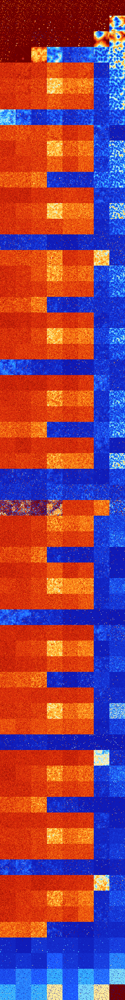

# B0168 (165376-165887)

<details>
    <summary>Initial Grid</summary>
    
</details>


<details>
    <summary>Initial Grid RLE</summary>

```
#C Exported from GoGoL (https://github.com/marrow16/gogol)
#C Wrap mode: Toroidal
#C Boundary mode: Dead
#C Step: 0
x = 100, y = 100, rule = B0168/S
21bo25bo20bo14bo13bo$5bo8bo15bo6bo15b2o35bo6bo$36bo$60bo$32b2o23bo4bo
12bo$2bo19bo3bo15bo8bo4bo$17bo58bo16bo$22bo5bo25bo9bo15bo6bo6bo$o7bo4bo
8bo14bo7bo38bo5bo2bobo$13bo4bo22bo5bo3bo4bo6bo$2bo61bo10bo16bo$o2bo3bo
7bo18bo3bo26bo$18bo6bobo17b2o15bo9bo8bo$14bo10bo17bo6bo34bo$7bo75bo$13b
o2bo14b2o4bo16bo$15bo12bo2bo47bo14bo$72bo$39bo8bo22bo13bo$6bo13bo4bo13b
o10bo2b2o7bo3bo$6bo25bo32bo5bo10b2o6bo2bo$17bo16bo5bobobo47bo$44bo22bo$
47bobo36bo$19bo20bo7bo32bo7bo$31bo2bo4bo28bo11b2o12bo4bo$3bo26bo11bo41b
o3bo$66bo7bo12bo$61bo7bo6bo2bo$6bo4bo19bo32bo12bo$14b2o67bo7bo$11bo14bo
14bo11bobo3bo14bo14bo2bo3bo$2bo10bo4b2o18bo4bo13bo11bo10bo$24bo49bo$25b
o33bo$8bo4bo58bo7bo6bo$23bo35bo19bo5bo11bo$6bo9bo12bo5bo5bo9bo37bo$13bo
45bo12bo24bobo$4bobo8bo27bo28bo4bo$10bo4bo11bo33bo14bo12bo$22b2o3bo8bo
16bo21bo$21bo14bo5bo43bo$31bo19bo5bo23bo4bo9bo$11bo19bobo16bo9bobo$o16b
o6bo19bo17bo11bo18bo5bo$34bo35bo16bo$41bo12bo$8bo9bo15b2o9bo29bo4bo$44b
2o20bo22bo$9b2o8bo11bo4bo27bobo3bo26bo$4bo2bobo12bo47bo28bo$16b2o28bo3b
o3bo32bo$11bo8bo2bo5bo22bo2bo8bo6bo6bo$6bo19bo2bo10bobo$4bo43bo31bo$7bo
9bo28bo2b2o4bo3bo21bo$16bo18bo55bo$bo2bo10bo22bo12bo6bo4bo18bo$17bo13bo
22bo17bo12bo$2bo13bo7bo34bo2bo$o15bo10bo10bo24bo24bo$6bo6bo41bo9bo11bo
3bo$50bo12bo4bo$21bo14bo5bo26bo17bo5bo5bo$4b2o12bo17bo48bo$13bo8bo17bo
18bo$14bo3bo13bo2bo10bo24bo$42bo9bo46bo$8bo13bo5bo47bo$5bo43bo8bo$14bo
55b3o8bo8bo$8bo63bo10bo9bo5bo$11bobo4bo3bo11bobo$20bo12bo2bo3bo49bo6bo$
48bo2b2o12bo17bo$12bo22bo$3bobo27bo9bo5bo28bo$7bo5bo11bo27bo6bo16bo2bo
7bo$8bo2bo39bo5bo23bo14bo$9bo79bo6bo$bo32b2o12bo11bo9b2o8bo$31bo12bo4bo
24bo$8bo27bo10bo8bo6bo6bo$4bo7bo12bo9bo14bo23bo14bo4bo$12bo54bo2bo24bo
2bo$4bo86bo$36bo2bo6bo$5bo14bo2bo9bo42bo$9bo2bo2bo41bo9bo22bo$4bo11bo
26bo6bobo3bo34bo$20bo11bo3bo15bo31bo$5bo10bobo8bo3bo13bo19bo27bo2bo$3bo
2bo24bo46bo$bo25bo6bo49bo2bo$bo54bo10bo13bo$6bo15bo17bo14b2o23bo$65bo
21bo$26bo5bo23bo$17bo23bo6bobo!
```
</details>
<details>
    <summary>Thumbnail</summary>

</details>
<table>
<tr>
    <td><a href="./165376%20S%20Heat%20Map%20Activity.png"></a><br>S (165376)<br>R@8,p2</td>    <td><a href="./165377%20S0%20Heat%20Map%20Activity.png"></a><br>S0 (165377)<br>R@8,p2</td>    <td><a href="./165378%20S1%20Heat%20Map%20Activity.png"></a><br>S1 (165378)<br>R@10,p2</td>    <td><a href="./165379%20S01%20Heat%20Map%20Activity.png"></a><br>S01 (165379)<br>R@11,p2</td>    <td><a href="./165380%20S2%20Heat%20Map%20Activity.png"></a><br>S2 (165380)<br>R@10,p2</td>    <td><a href="./165381%20S02%20Heat%20Map%20Activity.png"></a><br>S02 (165381)<br>R@11,p2</td>    <td><a href="./165382%20S12%20Heat%20Map%20Activity.png"></a><br>S12 (165382)<br>R@10,p2</td>    <td><a href="./165383%20S012%20Heat%20Map%20Activity.png"></a><br>S012 (165383)<br>R@17,p4</td></tr>
<tr>
    <td><a href="./165384%20S3%20Heat%20Map%20Activity.png"></a><br>S3 (165384)<br>R@10,p2</td>    <td><a href="./165385%20S03%20Heat%20Map%20Activity.png"></a><br>S03 (165385)<br>R@10,p2</td>    <td><a href="./165386%20S13%20Heat%20Map%20Activity.png"></a><br>S13 (165386)<br>R@48,p2</td>    <td><a href="./165387%20S013%20Heat%20Map%20Activity.png"></a><br>S013 (165387)<br>R@28,p6</td>    <td><a href="./165388%20S23%20Heat%20Map%20Activity.png"></a><br>S23 (165388)<br>R@22,p2</td>    <td><a href="./165389%20S023%20Heat%20Map%20Activity.png"></a><br>S023 (165389)<br>R@13,p2</td>    <td><a href="./165390%20S123%20Heat%20Map%20Activity.png"></a><br>S123 (165390)<br>R@44,p4</td>    <td><a href="./165391%20S0123%20Heat%20Map%20Activity.png"></a><br>S0123 (165391)<br>R@449,p12</td></tr>
<tr>
    <td><a href="./165392%20S4%20Heat%20Map%20Activity.png"></a><br>S4 (165392)<br>R@18,p2</td>    <td><a href="./165393%20S04%20Heat%20Map%20Activity.png"></a><br>S04 (165393)<br>R@20,p2</td>    <td><a href="./165394%20S14%20Heat%20Map%20Activity.png"></a><br>S14 (165394)<br>R@30,p4</td>    <td><a href="./165395%20S014%20Heat%20Map%20Activity.png"></a><br>S014 (165395)<br>R@21,p2</td>    <td><a href="./165396%20S24%20Heat%20Map%20Activity.png"></a><br>S24 (165396)<br>R@36,p2</td>    <td><a href="./165397%20S024%20Heat%20Map%20Activity.png"></a><br>S024 (165397)<br>R@19,p2</td>    <td><a href="./165398%20S124%20Heat%20Map%20Activity.png"></a><br>S124 (165398)<br>G>1000</td>    <td><a href="./165399%20S0124%20Heat%20Map%20Activity.png"></a><br>S0124 (165399)<br>R@556,p6</td></tr>
<tr>
    <td><a href="./165400%20S34%20Heat%20Map%20Activity.png"></a><br>S34 (165400)<br>R@28,p4</td>    <td><a href="./165401%20S034%20Heat%20Map%20Activity.png"></a><br>S034 (165401)<br>R@542,p400</td>    <td><a href="./165402%20S134%20Heat%20Map%20Activity.png"></a><br>S134 (165402)<br>G>1000</td>    <td><a href="./165403%20S0134%20Heat%20Map%20Activity.png"></a><br>S0134 (165403)<br>R@640,p60</td>    <td><a href="./165404%20S234%20Heat%20Map%20Activity.png"></a><br>S234 (165404)<br>G>1000</td>    <td><a href="./165405%20S0234%20Heat%20Map%20Activity.png"></a><br>S0234 (165405)<br>R@401,p120</td>    <td><a href="./165406%20S1234%20Heat%20Map%20Activity.png"></a><br>S1234 (165406)<br>R@118,p60</td>    <td><a href="./165407%20S01234%20Heat%20Map%20Activity.png"></a><br>S01234 (165407)<br>R@76,p12</td></tr>
<tr>
    <td><a href="./165408%20S5%20Heat%20Map%20Activity.png"></a><br>S5 (165408)<br>G>1000</td>    <td><a href="./165409%20S05%20Heat%20Map%20Activity.png"></a><br>S05 (165409)<br>G>1000</td>    <td><a href="./165410%20S15%20Heat%20Map%20Activity.png"></a><br>S15 (165410)<br>G>1000</td>    <td><a href="./165411%20S015%20Heat%20Map%20Activity.png"></a><br>S015 (165411)<br>G>1000</td>    <td><a href="./165412%20S25%20Heat%20Map%20Activity.png"></a><br>S25 (165412)<br>G>1000</td>    <td><a href="./165413%20S025%20Heat%20Map%20Activity.png"></a><br>S025 (165413)<br>G>1000</td>    <td><a href="./165414%20S125%20Heat%20Map%20Activity.png"></a><br>S125 (165414)<br>G>1000</td>    <td><a href="./165415%20S0125%20Heat%20Map%20Activity.png"></a><br>S0125 (165415)<br>R@104,p30</td></tr>
<tr>
    <td><a href="./165416%20S35%20Heat%20Map%20Activity.png"></a><br>S35 (165416)<br>G>1000</td>    <td><a href="./165417%20S035%20Heat%20Map%20Activity.png"></a><br>S035 (165417)<br>G>1000</td>    <td><a href="./165418%20S135%20Heat%20Map%20Activity.png"></a><br>S135 (165418)<br>G>1000</td>    <td><a href="./165419%20S0135%20Heat%20Map%20Activity.png"></a><br>S0135 (165419)<br>G>1000</td>    <td><a href="./165420%20S235%20Heat%20Map%20Activity.png"></a><br>S235 (165420)<br>G>1000</td>    <td><a href="./165421%20S0235%20Heat%20Map%20Activity.png"></a><br>S0235 (165421)<br>G>1000</td>    <td><a href="./165422%20S1235%20Heat%20Map%20Activity.png"></a><br>S1235 (165422)<br>R@111,p60</td>    <td><a href="./165423%20S01235%20Heat%20Map%20Activity.png"></a><br>S01235 (165423)<br>R@73,p30</td></tr>
<tr>
    <td><a href="./165424%20S45%20Heat%20Map%20Activity.png"></a><br>S45 (165424)<br>G>1000</td>    <td><a href="./165425%20S045%20Heat%20Map%20Activity.png"></a><br>S045 (165425)<br>G>1000</td>    <td><a href="./165426%20S145%20Heat%20Map%20Activity.png"></a><br>S145 (165426)<br>G>1000</td>    <td><a href="./165427%20S0145%20Heat%20Map%20Activity.png"></a><br>S0145 (165427)<br>G>1000</td>    <td><a href="./165428%20S245%20Heat%20Map%20Activity.png"></a><br>S245 (165428)<br>G>1000</td>    <td><a href="./165429%20S0245%20Heat%20Map%20Activity.png"></a><br>S0245 (165429)<br>G>1000</td>    <td><a href="./165430%20S1245%20Heat%20Map%20Activity.png"></a><br>S1245 (165430)<br>R@292,p60</td>    <td><a href="./165431%20S01245%20Heat%20Map%20Activity.png"></a><br>S01245 (165431)<br>R@61,p12</td></tr>
<tr>
    <td><a href="./165432%20S345%20Heat%20Map%20Activity.png"></a><br>S345 (165432)<br>G>1000</td>    <td><a href="./165433%20S0345%20Heat%20Map%20Activity.png"></a><br>S0345 (165433)<br>G>1000</td>    <td><a href="./165434%20S1345%20Heat%20Map%20Activity.png"></a><br>S1345 (165434)<br>R@951,p264</td>    <td><a href="./165435%20S01345%20Heat%20Map%20Activity.png"></a><br>S01345 (165435)<br>R@147,p12</td>    <td><a href="./165436%20S2345%20Heat%20Map%20Activity.png"></a><br>S2345 (165436)<br>R@196,p120</td>    <td><a href="./165437%20S02345%20Heat%20Map%20Activity.png"></a><br>S02345 (165437)<br>R@144,p72</td>    <td><a href="./165438%20S12345%20Heat%20Map%20Activity.png"></a><br>S12345 (165438)<br>R@161,p120</td>    <td><a href="./165439%20S012345%20Heat%20Map%20Activity.png"></a><br>S012345 (165439)<br>R@106,p60</td></tr>
<tr>
    <td><a href="./165440%20S6%20Heat%20Map%20Activity.png"></a><br>S6 (165440)<br>G>1000</td>    <td><a href="./165441%20S06%20Heat%20Map%20Activity.png"></a><br>S06 (165441)<br>G>1000</td>    <td><a href="./165442%20S16%20Heat%20Map%20Activity.png"></a><br>S16 (165442)<br>G>1000</td>    <td><a href="./165443%20S016%20Heat%20Map%20Activity.png"></a><br>S016 (165443)<br>G>1000</td>    <td><a href="./165444%20S26%20Heat%20Map%20Activity.png"></a><br>S26 (165444)<br>G>1000</td>    <td><a href="./165445%20S026%20Heat%20Map%20Activity.png"></a><br>S026 (165445)<br>G>1000</td>    <td><a href="./165446%20S126%20Heat%20Map%20Activity.png"></a><br>S126 (165446)<br>G>1000</td>    <td><a href="./165447%20S0126%20Heat%20Map%20Activity.png"></a><br>S0126 (165447)<br>R@900,p840</td></tr>
<tr>
    <td><a href="./165448%20S36%20Heat%20Map%20Activity.png"></a><br>S36 (165448)<br>G>1000</td>    <td><a href="./165449%20S036%20Heat%20Map%20Activity.png"></a><br>S036 (165449)<br>G>1000</td>    <td><a href="./165450%20S136%20Heat%20Map%20Activity.png"></a><br>S136 (165450)<br>G>1000</td>    <td><a href="./165451%20S0136%20Heat%20Map%20Activity.png"></a><br>S0136 (165451)<br>G>1000</td>    <td><a href="./165452%20S236%20Heat%20Map%20Activity.png"></a><br>S236 (165452)<br>G>1000</td>    <td><a href="./165453%20S0236%20Heat%20Map%20Activity.png"></a><br>S0236 (165453)<br>G>1000</td>    <td><a href="./165454%20S1236%20Heat%20Map%20Activity.png"></a><br>S1236 (165454)<br>R@62,p20</td>    <td><a href="./165455%20S01236%20Heat%20Map%20Activity.png"></a><br>S01236 (165455)<br>R@29,p2</td></tr>
<tr>
    <td><a href="./165456%20S46%20Heat%20Map%20Activity.png"></a><br>S46 (165456)<br>G>1000</td>    <td><a href="./165457%20S046%20Heat%20Map%20Activity.png"></a><br>S046 (165457)<br>G>1000</td>    <td><a href="./165458%20S146%20Heat%20Map%20Activity.png"></a><br>S146 (165458)<br>G>1000</td>    <td><a href="./165459%20S0146%20Heat%20Map%20Activity.png"></a><br>S0146 (165459)<br>G>1000</td>    <td><a href="./165460%20S246%20Heat%20Map%20Activity.png"></a><br>S246 (165460)<br>G>1000</td>    <td><a href="./165461%20S0246%20Heat%20Map%20Activity.png"></a><br>S0246 (165461)<br>G>1000</td>    <td><a href="./165462%20S1246%20Heat%20Map%20Activity.png"></a><br>S1246 (165462)<br>R@197,p6</td>    <td><a href="./165463%20S01246%20Heat%20Map%20Activity.png"></a><br>S01246 (165463)<br>R@38,p6</td></tr>
<tr>
    <td><a href="./165464%20S346%20Heat%20Map%20Activity.png"></a><br>S346 (165464)<br>G>1000</td>    <td><a href="./165465%20S0346%20Heat%20Map%20Activity.png"></a><br>S0346 (165465)<br>G>1000</td>    <td><a href="./165466%20S1346%20Heat%20Map%20Activity.png"></a><br>S1346 (165466)<br>G>1000</td>    <td><a href="./165467%20S01346%20Heat%20Map%20Activity.png"></a><br>S01346 (165467)<br>R@388,p12</td>    <td><a href="./165468%20S2346%20Heat%20Map%20Activity.png"></a><br>S2346 (165468)<br>R@265,p60</td>    <td><a href="./165469%20S02346%20Heat%20Map%20Activity.png"></a><br>S02346 (165469)<br>R@224,p60</td>    <td><a href="./165470%20S12346%20Heat%20Map%20Activity.png"></a><br>S12346 (165470)<br>R@41,p12</td>    <td><a href="./165471%20S012346%20Heat%20Map%20Activity.png"></a><br>S012346 (165471)<br>R@38,p12</td></tr>
<tr>
    <td><a href="./165472%20S56%20Heat%20Map%20Activity.png"></a><br>S56 (165472)<br>G>1000</td>    <td><a href="./165473%20S056%20Heat%20Map%20Activity.png"></a><br>S056 (165473)<br>G>1000</td>    <td><a href="./165474%20S156%20Heat%20Map%20Activity.png"></a><br>S156 (165474)<br>G>1000</td>    <td><a href="./165475%20S0156%20Heat%20Map%20Activity.png"></a><br>S0156 (165475)<br>G>1000</td>    <td><a href="./165476%20S256%20Heat%20Map%20Activity.png"></a><br>S256 (165476)<br>G>1000</td>    <td><a href="./165477%20S0256%20Heat%20Map%20Activity.png"></a><br>S0256 (165477)<br>G>1000</td>    <td><a href="./165478%20S1256%20Heat%20Map%20Activity.png"></a><br>S1256 (165478)<br>R@582,p120</td>    <td><a href="./165479%20S01256%20Heat%20Map%20Activity.png"></a><br>S01256 (165479)<br>R@91,p60</td></tr>
<tr>
    <td><a href="./165480%20S356%20Heat%20Map%20Activity.png"></a><br>S356 (165480)<br>G>1000</td>    <td><a href="./165481%20S0356%20Heat%20Map%20Activity.png"></a><br>S0356 (165481)<br>G>1000</td>    <td><a href="./165482%20S1356%20Heat%20Map%20Activity.png"></a><br>S1356 (165482)<br>G>1000</td>    <td><a href="./165483%20S01356%20Heat%20Map%20Activity.png"></a><br>S01356 (165483)<br>G>1000</td>    <td><a href="./165484%20S2356%20Heat%20Map%20Activity.png"></a><br>S2356 (165484)<br>G>1000</td>    <td><a href="./165485%20S02356%20Heat%20Map%20Activity.png"></a><br>S02356 (165485)<br>G>1000</td>    <td><a href="./165486%20S12356%20Heat%20Map%20Activity.png"></a><br>S12356 (165486)<br>R@113,p60</td>    <td><a href="./165487%20S012356%20Heat%20Map%20Activity.png"></a><br>S012356 (165487)<br>R@25,p3</td></tr>
<tr>
    <td><a href="./165488%20S456%20Heat%20Map%20Activity.png"></a><br>S456 (165488)<br>G>1000</td>    <td><a href="./165489%20S0456%20Heat%20Map%20Activity.png"></a><br>S0456 (165489)<br>G>1000</td>    <td><a href="./165490%20S1456%20Heat%20Map%20Activity.png"></a><br>S1456 (165490)<br>G>1000</td>    <td><a href="./165491%20S01456%20Heat%20Map%20Activity.png"></a><br>S01456 (165491)<br>G>1000</td>    <td><a href="./165492%20S2456%20Heat%20Map%20Activity.png"></a><br>S2456 (165492)<br>G>1000</td>    <td><a href="./165493%20S02456%20Heat%20Map%20Activity.png"></a><br>S02456 (165493)<br>G>1000</td>    <td><a href="./165494%20S12456%20Heat%20Map%20Activity.png"></a><br>S12456 (165494)<br>R@464,p60</td>    <td><a href="./165495%20S012456%20Heat%20Map%20Activity.png"></a><br>S012456 (165495)<br>R@65,p12</td></tr>
<tr>
    <td><a href="./165496%20S3456%20Heat%20Map%20Activity.png"></a><br>S3456 (165496)<br>R@269,p84</td>    <td><a href="./165497%20S03456%20Heat%20Map%20Activity.png"></a><br>S03456 (165497)<br>R@207,p12</td>    <td><a href="./165498%20S13456%20Heat%20Map%20Activity.png"></a><br>S13456 (165498)<br>R@141,p12</td>    <td><a href="./165499%20S013456%20Heat%20Map%20Activity.png"></a><br>S013456 (165499)<br>R@530,p420</td>    <td><a href="./165500%20S23456%20Heat%20Map%20Activity.png"></a><br>S23456 (165500)<br>G>1000</td>    <td><a href="./165501%20S023456%20Heat%20Map%20Activity.png"></a><br>S023456 (165501)<br>R@176,p120</td>    <td><a href="./165502%20S123456%20Heat%20Map%20Activity.png"></a><br>S123456 (165502)<br>R@193,p120</td>    <td><a href="./165503%20S0123456%20Heat%20Map%20Activity.png"></a><br>S0123456 (165503)<br>R@182,p120</td></tr>
<tr>
    <td><a href="./165504%20S7%20Heat%20Map%20Activity.png"></a><br>S7 (165504)<br>G>1000</td>    <td><a href="./165505%20S07%20Heat%20Map%20Activity.png"></a><br>S07 (165505)<br>G>1000</td>    <td><a href="./165506%20S17%20Heat%20Map%20Activity.png"></a><br>S17 (165506)<br>G>1000</td>    <td><a href="./165507%20S017%20Heat%20Map%20Activity.png"></a><br>S017 (165507)<br>G>1000</td>    <td><a href="./165508%20S27%20Heat%20Map%20Activity.png"></a><br>S27 (165508)<br>G>1000</td>    <td><a href="./165509%20S027%20Heat%20Map%20Activity.png"></a><br>S027 (165509)<br>G>1000</td>    <td><a href="./165510%20S127%20Heat%20Map%20Activity.png"></a><br>S127 (165510)<br>G>1000</td>    <td><a href="./165511%20S0127%20Heat%20Map%20Activity.png"></a><br>S0127 (165511)<br>R@175,p120</td></tr>
<tr>
    <td><a href="./165512%20S37%20Heat%20Map%20Activity.png"></a><br>S37 (165512)<br>G>1000</td>    <td><a href="./165513%20S037%20Heat%20Map%20Activity.png"></a><br>S037 (165513)<br>G>1000</td>    <td><a href="./165514%20S137%20Heat%20Map%20Activity.png"></a><br>S137 (165514)<br>G>1000</td>    <td><a href="./165515%20S0137%20Heat%20Map%20Activity.png"></a><br>S0137 (165515)<br>G>1000</td>    <td><a href="./165516%20S237%20Heat%20Map%20Activity.png"></a><br>S237 (165516)<br>G>1000</td>    <td><a href="./165517%20S0237%20Heat%20Map%20Activity.png"></a><br>S0237 (165517)<br>G>1000</td>    <td><a href="./165518%20S1237%20Heat%20Map%20Activity.png"></a><br>S1237 (165518)<br>R@44,p12</td>    <td><a href="./165519%20S01237%20Heat%20Map%20Activity.png"></a><br>S01237 (165519)<br>R@29,p6</td></tr>
<tr>
    <td><a href="./165520%20S47%20Heat%20Map%20Activity.png"></a><br>S47 (165520)<br>G>1000</td>    <td><a href="./165521%20S047%20Heat%20Map%20Activity.png"></a><br>S047 (165521)<br>G>1000</td>    <td><a href="./165522%20S147%20Heat%20Map%20Activity.png"></a><br>S147 (165522)<br>G>1000</td>    <td><a href="./165523%20S0147%20Heat%20Map%20Activity.png"></a><br>S0147 (165523)<br>G>1000</td>    <td><a href="./165524%20S247%20Heat%20Map%20Activity.png"></a><br>S247 (165524)<br>G>1000</td>    <td><a href="./165525%20S0247%20Heat%20Map%20Activity.png"></a><br>S0247 (165525)<br>G>1000</td>    <td><a href="./165526%20S1247%20Heat%20Map%20Activity.png"></a><br>S1247 (165526)<br>R@206,p12</td>    <td><a href="./165527%20S01247%20Heat%20Map%20Activity.png"></a><br>S01247 (165527)<br>R@35,p6</td></tr>
<tr>
    <td><a href="./165528%20S347%20Heat%20Map%20Activity.png"></a><br>S347 (165528)<br>G>1000</td>    <td><a href="./165529%20S0347%20Heat%20Map%20Activity.png"></a><br>S0347 (165529)<br>G>1000</td>    <td><a href="./165530%20S1347%20Heat%20Map%20Activity.png"></a><br>S1347 (165530)<br>G>1000</td>    <td><a href="./165531%20S01347%20Heat%20Map%20Activity.png"></a><br>S01347 (165531)<br>R@542,p60</td>    <td><a href="./165532%20S2347%20Heat%20Map%20Activity.png"></a><br>S2347 (165532)<br>R@462,p12</td>    <td><a href="./165533%20S02347%20Heat%20Map%20Activity.png"></a><br>S02347 (165533)<br>R@199,p60</td>    <td><a href="./165534%20S12347%20Heat%20Map%20Activity.png"></a><br>S12347 (165534)<br>R@65,p36</td>    <td><a href="./165535%20S012347%20Heat%20Map%20Activity.png"></a><br>S012347 (165535)<br>R@77,p60</td></tr>
<tr>
    <td><a href="./165536%20S57%20Heat%20Map%20Activity.png"></a><br>S57 (165536)<br>G>1000</td>    <td><a href="./165537%20S057%20Heat%20Map%20Activity.png"></a><br>S057 (165537)<br>G>1000</td>    <td><a href="./165538%20S157%20Heat%20Map%20Activity.png"></a><br>S157 (165538)<br>G>1000</td>    <td><a href="./165539%20S0157%20Heat%20Map%20Activity.png"></a><br>S0157 (165539)<br>G>1000</td>    <td><a href="./165540%20S257%20Heat%20Map%20Activity.png"></a><br>S257 (165540)<br>G>1000</td>    <td><a href="./165541%20S0257%20Heat%20Map%20Activity.png"></a><br>S0257 (165541)<br>G>1000</td>    <td><a href="./165542%20S1257%20Heat%20Map%20Activity.png"></a><br>S1257 (165542)<br>R@776,p60</td>    <td><a href="./165543%20S01257%20Heat%20Map%20Activity.png"></a><br>S01257 (165543)<br>R@94,p60</td></tr>
<tr>
    <td><a href="./165544%20S357%20Heat%20Map%20Activity.png"></a><br>S357 (165544)<br>G>1000</td>    <td><a href="./165545%20S0357%20Heat%20Map%20Activity.png"></a><br>S0357 (165545)<br>G>1000</td>    <td><a href="./165546%20S1357%20Heat%20Map%20Activity.png"></a><br>S1357 (165546)<br>G>1000</td>    <td><a href="./165547%20S01357%20Heat%20Map%20Activity.png"></a><br>S01357 (165547)<br>G>1000</td>    <td><a href="./165548%20S2357%20Heat%20Map%20Activity.png"></a><br>S2357 (165548)<br>G>1000</td>    <td><a href="./165549%20S02357%20Heat%20Map%20Activity.png"></a><br>S02357 (165549)<br>G>1000</td>    <td><a href="./165550%20S12357%20Heat%20Map%20Activity.png"></a><br>S12357 (165550)<br>R@43,p12</td>    <td><a href="./165551%20S012357%20Heat%20Map%20Activity.png"></a><br>S012357 (165551)<br>R@26,p6</td></tr>
<tr>
    <td><a href="./165552%20S457%20Heat%20Map%20Activity.png"></a><br>S457 (165552)<br>G>1000</td>    <td><a href="./165553%20S0457%20Heat%20Map%20Activity.png"></a><br>S0457 (165553)<br>G>1000</td>    <td><a href="./165554%20S1457%20Heat%20Map%20Activity.png"></a><br>S1457 (165554)<br>G>1000</td>    <td><a href="./165555%20S01457%20Heat%20Map%20Activity.png"></a><br>S01457 (165555)<br>G>1000</td>    <td><a href="./165556%20S2457%20Heat%20Map%20Activity.png"></a><br>S2457 (165556)<br>G>1000</td>    <td><a href="./165557%20S02457%20Heat%20Map%20Activity.png"></a><br>S02457 (165557)<br>G>1000</td>    <td><a href="./165558%20S12457%20Heat%20Map%20Activity.png"></a><br>S12457 (165558)<br>R@280,p60</td>    <td><a href="./165559%20S012457%20Heat%20Map%20Activity.png"></a><br>S012457 (165559)<br>R@44,p12</td></tr>
<tr>
    <td><a href="./165560%20S3457%20Heat%20Map%20Activity.png"></a><br>S3457 (165560)<br>G>1000</td>    <td><a href="./165561%20S03457%20Heat%20Map%20Activity.png"></a><br>S03457 (165561)<br>G>1000</td>    <td><a href="./165562%20S13457%20Heat%20Map%20Activity.png"></a><br>S13457 (165562)<br>G>1000</td>    <td><a href="./165563%20S013457%20Heat%20Map%20Activity.png"></a><br>S013457 (165563)<br>R@236,p60</td>    <td><a href="./165564%20S23457%20Heat%20Map%20Activity.png"></a><br>S23457 (165564)<br>G>1000</td>    <td><a href="./165565%20S023457%20Heat%20Map%20Activity.png"></a><br>S023457 (165565)<br>R@432,p360</td>    <td><a href="./165566%20S123457%20Heat%20Map%20Activity.png"></a><br>S123457 (165566)<br>R@51,p12</td>    <td><a href="./165567%20S0123457%20Heat%20Map%20Activity.png"></a><br>S0123457 (165567)<br>R@120,p84</td></tr>
<tr>
    <td><a href="./165568%20S67%20Heat%20Map%20Activity.png"></a><br>S67 (165568)<br>G>1000</td>    <td><a href="./165569%20S067%20Heat%20Map%20Activity.png"></a><br>S067 (165569)<br>G>1000</td>    <td><a href="./165570%20S167%20Heat%20Map%20Activity.png"></a><br>S167 (165570)<br>G>1000</td>    <td><a href="./165571%20S0167%20Heat%20Map%20Activity.png"></a><br>S0167 (165571)<br>G>1000</td>    <td><a href="./165572%20S267%20Heat%20Map%20Activity.png"></a><br>S267 (165572)<br>G>1000</td>    <td><a href="./165573%20S0267%20Heat%20Map%20Activity.png"></a><br>S0267 (165573)<br>G>1000</td>    <td><a href="./165574%20S1267%20Heat%20Map%20Activity.png"></a><br>S1267 (165574)<br>R@958,p60</td>    <td><a href="./165575%20S01267%20Heat%20Map%20Activity.png"></a><br>S01267 (165575)<br>R@169,p120</td></tr>
<tr>
    <td><a href="./165576%20S367%20Heat%20Map%20Activity.png"></a><br>S367 (165576)<br>G>1000</td>    <td><a href="./165577%20S0367%20Heat%20Map%20Activity.png"></a><br>S0367 (165577)<br>G>1000</td>    <td><a href="./165578%20S1367%20Heat%20Map%20Activity.png"></a><br>S1367 (165578)<br>G>1000</td>    <td><a href="./165579%20S01367%20Heat%20Map%20Activity.png"></a><br>S01367 (165579)<br>G>1000</td>    <td><a href="./165580%20S2367%20Heat%20Map%20Activity.png"></a><br>S2367 (165580)<br>G>1000</td>    <td><a href="./165581%20S02367%20Heat%20Map%20Activity.png"></a><br>S02367 (165581)<br>G>1000</td>    <td><a href="./165582%20S12367%20Heat%20Map%20Activity.png"></a><br>S12367 (165582)<br>R@73,p30</td>    <td><a href="./165583%20S012367%20Heat%20Map%20Activity.png"></a><br>S012367 (165583)<br>R@25,p4</td></tr>
<tr>
    <td><a href="./165584%20S467%20Heat%20Map%20Activity.png"></a><br>S467 (165584)<br>G>1000</td>    <td><a href="./165585%20S0467%20Heat%20Map%20Activity.png"></a><br>S0467 (165585)<br>G>1000</td>    <td><a href="./165586%20S1467%20Heat%20Map%20Activity.png"></a><br>S1467 (165586)<br>G>1000</td>    <td><a href="./165587%20S01467%20Heat%20Map%20Activity.png"></a><br>S01467 (165587)<br>G>1000</td>    <td><a href="./165588%20S2467%20Heat%20Map%20Activity.png"></a><br>S2467 (165588)<br>G>1000</td>    <td><a href="./165589%20S02467%20Heat%20Map%20Activity.png"></a><br>S02467 (165589)<br>G>1000</td>    <td><a href="./165590%20S12467%20Heat%20Map%20Activity.png"></a><br>S12467 (165590)<br>R@252,p12</td>    <td><a href="./165591%20S012467%20Heat%20Map%20Activity.png"></a><br>S012467 (165591)<br>R@40,p12</td></tr>
<tr>
    <td><a href="./165592%20S3467%20Heat%20Map%20Activity.png"></a><br>S3467 (165592)<br>G>1000</td>    <td><a href="./165593%20S03467%20Heat%20Map%20Activity.png"></a><br>S03467 (165593)<br>G>1000</td>    <td><a href="./165594%20S13467%20Heat%20Map%20Activity.png"></a><br>S13467 (165594)<br>G>1000</td>    <td><a href="./165595%20S013467%20Heat%20Map%20Activity.png"></a><br>S013467 (165595)<br>R@463,p60</td>    <td><a href="./165596%20S23467%20Heat%20Map%20Activity.png"></a><br>S23467 (165596)<br>R@213,p60</td>    <td><a href="./165597%20S023467%20Heat%20Map%20Activity.png"></a><br>S023467 (165597)<br>R@221,p60</td>    <td><a href="./165598%20S123467%20Heat%20Map%20Activity.png"></a><br>S123467 (165598)<br>R@29,p2</td>    <td><a href="./165599%20S0123467%20Heat%20Map%20Activity.png"></a><br>S0123467 (165599)<br>R@22,p4</td></tr>
<tr>
    <td><a href="./165600%20S567%20Heat%20Map%20Activity.png"></a><br>S567 (165600)<br>G>1000</td>    <td><a href="./165601%20S0567%20Heat%20Map%20Activity.png"></a><br>S0567 (165601)<br>G>1000</td>    <td><a href="./165602%20S1567%20Heat%20Map%20Activity.png"></a><br>S1567 (165602)<br>G>1000</td>    <td><a href="./165603%20S01567%20Heat%20Map%20Activity.png"></a><br>S01567 (165603)<br>G>1000</td>    <td><a href="./165604%20S2567%20Heat%20Map%20Activity.png"></a><br>S2567 (165604)<br>G>1000</td>    <td><a href="./165605%20S02567%20Heat%20Map%20Activity.png"></a><br>S02567 (165605)<br>G>1000</td>    <td><a href="./165606%20S12567%20Heat%20Map%20Activity.png"></a><br>S12567 (165606)<br>G>1000</td>    <td><a href="./165607%20S012567%20Heat%20Map%20Activity.png"></a><br>S012567 (165607)<br>R@469,p420</td></tr>
<tr>
    <td><a href="./165608%20S3567%20Heat%20Map%20Activity.png"></a><br>S3567 (165608)<br>G>1000</td>    <td><a href="./165609%20S03567%20Heat%20Map%20Activity.png"></a><br>S03567 (165609)<br>G>1000</td>    <td><a href="./165610%20S13567%20Heat%20Map%20Activity.png"></a><br>S13567 (165610)<br>G>1000</td>    <td><a href="./165611%20S013567%20Heat%20Map%20Activity.png"></a><br>S013567 (165611)<br>G>1000</td>    <td><a href="./165612%20S23567%20Heat%20Map%20Activity.png"></a><br>S23567 (165612)<br>G>1000</td>    <td><a href="./165613%20S023567%20Heat%20Map%20Activity.png"></a><br>S023567 (165613)<br>G>1000</td>    <td><a href="./165614%20S123567%20Heat%20Map%20Activity.png"></a><br>S123567 (165614)<br>R@106,p60</td>    <td><a href="./165615%20S0123567%20Heat%20Map%20Activity.png"></a><br>S0123567 (165615)<br>S@31</td></tr>
<tr>
    <td><a href="./165616%20S4567%20Heat%20Map%20Activity.png"></a><br>S4567 (165616)<br>R@836,p360</td>    <td><a href="./165617%20S04567%20Heat%20Map%20Activity.png"></a><br>S04567 (165617)<br>R@732,p420</td>    <td><a href="./165618%20S14567%20Heat%20Map%20Activity.png"></a><br>S14567 (165618)<br>G>1000</td>    <td><a href="./165619%20S014567%20Heat%20Map%20Activity.png"></a><br>S014567 (165619)<br>R@975,p12</td>    <td><a href="./165620%20S24567%20Heat%20Map%20Activity.png"></a><br>S24567 (165620)<br>R@921,p660</td>    <td><a href="./165621%20S024567%20Heat%20Map%20Activity.png"></a><br>S024567 (165621)<br>R@949,p660</td>    <td><a href="./165622%20S124567%20Heat%20Map%20Activity.png"></a><br>S124567 (165622)<br>R@614,p420</td>    <td><a href="./165623%20S0124567%20Heat%20Map%20Activity.png"></a><br>S0124567 (165623)<br>R@60,p6</td></tr>
<tr>
    <td><a href="./165624%20S34567%20Heat%20Map%20Activity.png"></a><br>S34567 (165624)<br>R@65,p30</td>    <td><a href="./165625%20S034567%20Heat%20Map%20Activity.png"></a><br>S034567 (165625)<br>R@88,p60</td>    <td><a href="./165626%20S134567%20Heat%20Map%20Activity.png"></a><br>S134567 (165626)<br>R@94,p60</td>    <td><a href="./165627%20S0134567%20Heat%20Map%20Activity.png"></a><br>S0134567 (165627)<br>R@47,p12</td>    <td><a href="./165628%20S234567%20Heat%20Map%20Activity.png"></a><br>S234567 (165628)<br>R@46,p12</td>    <td><a href="./165629%20S0234567%20Heat%20Map%20Activity.png"></a><br>S0234567 (165629)<br>R@51,p6</td>    <td><a href="./165630%20S1234567%20Heat%20Map%20Activity.png"></a><br>S1234567 (165630)<br>R@44,p12</td>    <td><a href="./165631%20S01234567%20Heat%20Map%20Activity.png"></a><br>S01234567 (165631)<br>R@88,p60</td></tr>
<tr>
    <td><a href="./165632%20S8%20Heat%20Map%20Activity.png"></a><br>S8 (165632)<br>R@321,p48</td>    <td><a href="./165633%20S08%20Heat%20Map%20Activity.png"></a><br>S08 (165633)<br>G>1000</td>    <td><a href="./165634%20S18%20Heat%20Map%20Activity.png"></a><br>S18 (165634)<br>G>1000</td>    <td><a href="./165635%20S018%20Heat%20Map%20Activity.png"></a><br>S018 (165635)<br>R@585,p24</td>    <td><a href="./165636%20S28%20Heat%20Map%20Activity.png"></a><br>S28 (165636)<br>G>1000</td>    <td><a href="./165637%20S028%20Heat%20Map%20Activity.png"></a><br>S028 (165637)<br>G>1000</td>    <td><a href="./165638%20S128%20Heat%20Map%20Activity.png"></a><br>S128 (165638)<br>G>1000</td>    <td><a href="./165639%20S0128%20Heat%20Map%20Activity.png"></a><br>S0128 (165639)<br>R@127,p24</td></tr>
<tr>
    <td><a href="./165640%20S38%20Heat%20Map%20Activity.png"></a><br>S38 (165640)<br>G>1000</td>    <td><a href="./165641%20S038%20Heat%20Map%20Activity.png"></a><br>S038 (165641)<br>G>1000</td>    <td><a href="./165642%20S138%20Heat%20Map%20Activity.png"></a><br>S138 (165642)<br>G>1000</td>    <td><a href="./165643%20S0138%20Heat%20Map%20Activity.png"></a><br>S0138 (165643)<br>G>1000</td>    <td><a href="./165644%20S238%20Heat%20Map%20Activity.png"></a><br>S238 (165644)<br>G>1000</td>    <td><a href="./165645%20S0238%20Heat%20Map%20Activity.png"></a><br>S0238 (165645)<br>G>1000</td>    <td><a href="./165646%20S1238%20Heat%20Map%20Activity.png"></a><br>S1238 (165646)<br>R@57,p12</td>    <td><a href="./165647%20S01238%20Heat%20Map%20Activity.png"></a><br>S01238 (165647)<br>R@35,p6</td></tr>
<tr>
    <td><a href="./165648%20S48%20Heat%20Map%20Activity.png"></a><br>S48 (165648)<br>G>1000</td>    <td><a href="./165649%20S048%20Heat%20Map%20Activity.png"></a><br>S048 (165649)<br>G>1000</td>    <td><a href="./165650%20S148%20Heat%20Map%20Activity.png"></a><br>S148 (165650)<br>G>1000</td>    <td><a href="./165651%20S0148%20Heat%20Map%20Activity.png"></a><br>S0148 (165651)<br>G>1000</td>    <td><a href="./165652%20S248%20Heat%20Map%20Activity.png"></a><br>S248 (165652)<br>G>1000</td>    <td><a href="./165653%20S0248%20Heat%20Map%20Activity.png"></a><br>S0248 (165653)<br>G>1000</td>    <td><a href="./165654%20S1248%20Heat%20Map%20Activity.png"></a><br>S1248 (165654)<br>R@143,p12</td>    <td><a href="./165655%20S01248%20Heat%20Map%20Activity.png"></a><br>S01248 (165655)<br>R@30,p6</td></tr>
<tr>
    <td><a href="./165656%20S348%20Heat%20Map%20Activity.png"></a><br>S348 (165656)<br>G>1000</td>    <td><a href="./165657%20S0348%20Heat%20Map%20Activity.png"></a><br>S0348 (165657)<br>G>1000</td>    <td><a href="./165658%20S1348%20Heat%20Map%20Activity.png"></a><br>S1348 (165658)<br>G>1000</td>    <td><a href="./165659%20S01348%20Heat%20Map%20Activity.png"></a><br>S01348 (165659)<br>R@730,p60</td>    <td><a href="./165660%20S2348%20Heat%20Map%20Activity.png"></a><br>S2348 (165660)<br>G>1000</td>    <td><a href="./165661%20S02348%20Heat%20Map%20Activity.png"></a><br>S02348 (165661)<br>G>1000</td>    <td><a href="./165662%20S12348%20Heat%20Map%20Activity.png"></a><br>S12348 (165662)<br>R@40,p12</td>    <td><a href="./165663%20S012348%20Heat%20Map%20Activity.png"></a><br>S012348 (165663)<br>R@438,p420</td></tr>
<tr>
    <td><a href="./165664%20S58%20Heat%20Map%20Activity.png"></a><br>S58 (165664)<br>G>1000</td>    <td><a href="./165665%20S058%20Heat%20Map%20Activity.png"></a><br>S058 (165665)<br>G>1000</td>    <td><a href="./165666%20S158%20Heat%20Map%20Activity.png"></a><br>S158 (165666)<br>G>1000</td>    <td><a href="./165667%20S0158%20Heat%20Map%20Activity.png"></a><br>S0158 (165667)<br>G>1000</td>    <td><a href="./165668%20S258%20Heat%20Map%20Activity.png"></a><br>S258 (165668)<br>G>1000</td>    <td><a href="./165669%20S0258%20Heat%20Map%20Activity.png"></a><br>S0258 (165669)<br>G>1000</td>    <td><a href="./165670%20S1258%20Heat%20Map%20Activity.png"></a><br>S1258 (165670)<br>R@367,p132</td>    <td><a href="./165671%20S01258%20Heat%20Map%20Activity.png"></a><br>S01258 (165671)<br>R@452,p420</td></tr>
<tr>
    <td><a href="./165672%20S358%20Heat%20Map%20Activity.png"></a><br>S358 (165672)<br>G>1000</td>    <td><a href="./165673%20S0358%20Heat%20Map%20Activity.png"></a><br>S0358 (165673)<br>G>1000</td>    <td><a href="./165674%20S1358%20Heat%20Map%20Activity.png"></a><br>S1358 (165674)<br>G>1000</td>    <td><a href="./165675%20S01358%20Heat%20Map%20Activity.png"></a><br>S01358 (165675)<br>G>1000</td>    <td><a href="./165676%20S2358%20Heat%20Map%20Activity.png"></a><br>S2358 (165676)<br>G>1000</td>    <td><a href="./165677%20S02358%20Heat%20Map%20Activity.png"></a><br>S02358 (165677)<br>G>1000</td>    <td><a href="./165678%20S12358%20Heat%20Map%20Activity.png"></a><br>S12358 (165678)<br>R@92,p60</td>    <td><a href="./165679%20S012358%20Heat%20Map%20Activity.png"></a><br>S012358 (165679)<br>R@25,p6</td></tr>
<tr>
    <td><a href="./165680%20S458%20Heat%20Map%20Activity.png"></a><br>S458 (165680)<br>G>1000</td>    <td><a href="./165681%20S0458%20Heat%20Map%20Activity.png"></a><br>S0458 (165681)<br>G>1000</td>    <td><a href="./165682%20S1458%20Heat%20Map%20Activity.png"></a><br>S1458 (165682)<br>G>1000</td>    <td><a href="./165683%20S01458%20Heat%20Map%20Activity.png"></a><br>S01458 (165683)<br>G>1000</td>    <td><a href="./165684%20S2458%20Heat%20Map%20Activity.png"></a><br>S2458 (165684)<br>G>1000</td>    <td><a href="./165685%20S02458%20Heat%20Map%20Activity.png"></a><br>S02458 (165685)<br>G>1000</td>    <td><a href="./165686%20S12458%20Heat%20Map%20Activity.png"></a><br>S12458 (165686)<br>R@247,p12</td>    <td><a href="./165687%20S012458%20Heat%20Map%20Activity.png"></a><br>S012458 (165687)<br>R@45,p12</td></tr>
<tr>
    <td><a href="./165688%20S3458%20Heat%20Map%20Activity.png"></a><br>S3458 (165688)<br>G>1000</td>    <td><a href="./165689%20S03458%20Heat%20Map%20Activity.png"></a><br>S03458 (165689)<br>G>1000</td>    <td><a href="./165690%20S13458%20Heat%20Map%20Activity.png"></a><br>S13458 (165690)<br>R@815,p120</td>    <td><a href="./165691%20S013458%20Heat%20Map%20Activity.png"></a><br>S013458 (165691)<br>R@211,p60</td>    <td><a href="./165692%20S23458%20Heat%20Map%20Activity.png"></a><br>S23458 (165692)<br>R@430,p360</td>    <td><a href="./165693%20S023458%20Heat%20Map%20Activity.png"></a><br>S023458 (165693)<br>R@429,p360</td>    <td><a href="./165694%20S123458%20Heat%20Map%20Activity.png"></a><br>S123458 (165694)<br>R@394,p360</td>    <td><a href="./165695%20S0123458%20Heat%20Map%20Activity.png"></a><br>S0123458 (165695)<br>G>1000</td></tr>
<tr>
    <td><a href="./165696%20S68%20Heat%20Map%20Activity.png"></a><br>S68 (165696)<br>G>1000</td>    <td><a href="./165697%20S068%20Heat%20Map%20Activity.png"></a><br>S068 (165697)<br>G>1000</td>    <td><a href="./165698%20S168%20Heat%20Map%20Activity.png"></a><br>S168 (165698)<br>G>1000</td>    <td><a href="./165699%20S0168%20Heat%20Map%20Activity.png"></a><br>S0168 (165699)<br>G>1000</td>    <td><a href="./165700%20S268%20Heat%20Map%20Activity.png"></a><br>S268 (165700)<br>G>1000</td>    <td><a href="./165701%20S0268%20Heat%20Map%20Activity.png"></a><br>S0268 (165701)<br>G>1000</td>    <td><a href="./165702%20S1268%20Heat%20Map%20Activity.png"></a><br>S1268 (165702)<br>G>1000</td>    <td><a href="./165703%20S01268%20Heat%20Map%20Activity.png"></a><br>S01268 (165703)<br>R@70,p24</td></tr>
<tr>
    <td><a href="./165704%20S368%20Heat%20Map%20Activity.png"></a><br>S368 (165704)<br>G>1000</td>    <td><a href="./165705%20S0368%20Heat%20Map%20Activity.png"></a><br>S0368 (165705)<br>G>1000</td>    <td><a href="./165706%20S1368%20Heat%20Map%20Activity.png"></a><br>S1368 (165706)<br>G>1000</td>    <td><a href="./165707%20S01368%20Heat%20Map%20Activity.png"></a><br>S01368 (165707)<br>G>1000</td>    <td><a href="./165708%20S2368%20Heat%20Map%20Activity.png"></a><br>S2368 (165708)<br>G>1000</td>    <td><a href="./165709%20S02368%20Heat%20Map%20Activity.png"></a><br>S02368 (165709)<br>G>1000</td>    <td><a href="./165710%20S12368%20Heat%20Map%20Activity.png"></a><br>S12368 (165710)<br>R@222,p180</td>    <td><a href="./165711%20S012368%20Heat%20Map%20Activity.png"></a><br>S012368 (165711)<br>R@42,p24</td></tr>
<tr>
    <td><a href="./165712%20S468%20Heat%20Map%20Activity.png"></a><br>S468 (165712)<br>G>1000</td>    <td><a href="./165713%20S0468%20Heat%20Map%20Activity.png"></a><br>S0468 (165713)<br>G>1000</td>    <td><a href="./165714%20S1468%20Heat%20Map%20Activity.png"></a><br>S1468 (165714)<br>G>1000</td>    <td><a href="./165715%20S01468%20Heat%20Map%20Activity.png"></a><br>S01468 (165715)<br>G>1000</td>    <td><a href="./165716%20S2468%20Heat%20Map%20Activity.png"></a><br>S2468 (165716)<br>G>1000</td>    <td><a href="./165717%20S02468%20Heat%20Map%20Activity.png"></a><br>S02468 (165717)<br>G>1000</td>    <td><a href="./165718%20S12468%20Heat%20Map%20Activity.png"></a><br>S12468 (165718)<br>R@193,p12</td>    <td><a href="./165719%20S012468%20Heat%20Map%20Activity.png"></a><br>S012468 (165719)<br>R@35,p6</td></tr>
<tr>
    <td><a href="./165720%20S3468%20Heat%20Map%20Activity.png"></a><br>S3468 (165720)<br>G>1000</td>    <td><a href="./165721%20S03468%20Heat%20Map%20Activity.png"></a><br>S03468 (165721)<br>G>1000</td>    <td><a href="./165722%20S13468%20Heat%20Map%20Activity.png"></a><br>S13468 (165722)<br>G>1000</td>    <td><a href="./165723%20S013468%20Heat%20Map%20Activity.png"></a><br>S013468 (165723)<br>R@502,p60</td>    <td><a href="./165724%20S23468%20Heat%20Map%20Activity.png"></a><br>S23468 (165724)<br>G>1000</td>    <td><a href="./165725%20S023468%20Heat%20Map%20Activity.png"></a><br>S023468 (165725)<br>R@188,p12</td>    <td><a href="./165726%20S123468%20Heat%20Map%20Activity.png"></a><br>S123468 (165726)<br>R@36,p12</td>    <td><a href="./165727%20S0123468%20Heat%20Map%20Activity.png"></a><br>S0123468 (165727)<br>R@105,p84</td></tr>
<tr>
    <td><a href="./165728%20S568%20Heat%20Map%20Activity.png"></a><br>S568 (165728)<br>G>1000</td>    <td><a href="./165729%20S0568%20Heat%20Map%20Activity.png"></a><br>S0568 (165729)<br>G>1000</td>    <td><a href="./165730%20S1568%20Heat%20Map%20Activity.png"></a><br>S1568 (165730)<br>G>1000</td>    <td><a href="./165731%20S01568%20Heat%20Map%20Activity.png"></a><br>S01568 (165731)<br>G>1000</td>    <td><a href="./165732%20S2568%20Heat%20Map%20Activity.png"></a><br>S2568 (165732)<br>G>1000</td>    <td><a href="./165733%20S02568%20Heat%20Map%20Activity.png"></a><br>S02568 (165733)<br>G>1000</td>    <td><a href="./165734%20S12568%20Heat%20Map%20Activity.png"></a><br>S12568 (165734)<br>G>1000</td>    <td><a href="./165735%20S012568%20Heat%20Map%20Activity.png"></a><br>S012568 (165735)<br>R@102,p60</td></tr>
<tr>
    <td><a href="./165736%20S3568%20Heat%20Map%20Activity.png"></a><br>S3568 (165736)<br>G>1000</td>    <td><a href="./165737%20S03568%20Heat%20Map%20Activity.png"></a><br>S03568 (165737)<br>G>1000</td>    <td><a href="./165738%20S13568%20Heat%20Map%20Activity.png"></a><br>S13568 (165738)<br>G>1000</td>    <td><a href="./165739%20S013568%20Heat%20Map%20Activity.png"></a><br>S013568 (165739)<br>G>1000</td>    <td><a href="./165740%20S23568%20Heat%20Map%20Activity.png"></a><br>S23568 (165740)<br>G>1000</td>    <td><a href="./165741%20S023568%20Heat%20Map%20Activity.png"></a><br>S023568 (165741)<br>G>1000</td>    <td><a href="./165742%20S123568%20Heat%20Map%20Activity.png"></a><br>S123568 (165742)<br>R@103,p60</td>    <td><a href="./165743%20S0123568%20Heat%20Map%20Activity.png"></a><br>S0123568 (165743)<br>S@28</td></tr>
<tr>
    <td><a href="./165744%20S4568%20Heat%20Map%20Activity.png"></a><br>S4568 (165744)<br>G>1000</td>    <td><a href="./165745%20S04568%20Heat%20Map%20Activity.png"></a><br>S04568 (165745)<br>G>1000</td>    <td><a href="./165746%20S14568%20Heat%20Map%20Activity.png"></a><br>S14568 (165746)<br>G>1000</td>    <td><a href="./165747%20S014568%20Heat%20Map%20Activity.png"></a><br>S014568 (165747)<br>G>1000</td>    <td><a href="./165748%20S24568%20Heat%20Map%20Activity.png"></a><br>S24568 (165748)<br>G>1000</td>    <td><a href="./165749%20S024568%20Heat%20Map%20Activity.png"></a><br>S024568 (165749)<br>G>1000</td>    <td><a href="./165750%20S124568%20Heat%20Map%20Activity.png"></a><br>S124568 (165750)<br>R@736,p420</td>    <td><a href="./165751%20S0124568%20Heat%20Map%20Activity.png"></a><br>S0124568 (165751)<br>R@57,p6</td></tr>
<tr>
    <td><a href="./165752%20S34568%20Heat%20Map%20Activity.png"></a><br>S34568 (165752)<br>R@537,p420</td>    <td><a href="./165753%20S034568%20Heat%20Map%20Activity.png"></a><br>S034568 (165753)<br>R@251,p120</td>    <td><a href="./165754%20S134568%20Heat%20Map%20Activity.png"></a><br>S134568 (165754)<br>R@167,p60</td>    <td><a href="./165755%20S0134568%20Heat%20Map%20Activity.png"></a><br>S0134568 (165755)<br>R@911,p840</td>    <td><a href="./165756%20S234568%20Heat%20Map%20Activity.png"></a><br>S234568 (165756)<br>G>1000</td>    <td><a href="./165757%20S0234568%20Heat%20Map%20Activity.png"></a><br>S0234568 (165757)<br>G>1000</td>    <td><a href="./165758%20S1234568%20Heat%20Map%20Activity.png"></a><br>S1234568 (165758)<br>G>1000</td>    <td><a href="./165759%20S01234568%20Heat%20Map%20Activity.png"></a><br>S01234568 (165759)<br>G>1000</td></tr>
<tr>
    <td><a href="./165760%20S78%20Heat%20Map%20Activity.png"></a><br>S78 (165760)<br>G>1000</td>    <td><a href="./165761%20S078%20Heat%20Map%20Activity.png"></a><br>S078 (165761)<br>G>1000</td>    <td><a href="./165762%20S178%20Heat%20Map%20Activity.png"></a><br>S178 (165762)<br>G>1000</td>    <td><a href="./165763%20S0178%20Heat%20Map%20Activity.png"></a><br>S0178 (165763)<br>G>1000</td>    <td><a href="./165764%20S278%20Heat%20Map%20Activity.png"></a><br>S278 (165764)<br>G>1000</td>    <td><a href="./165765%20S0278%20Heat%20Map%20Activity.png"></a><br>S0278 (165765)<br>G>1000</td>    <td><a href="./165766%20S1278%20Heat%20Map%20Activity.png"></a><br>S1278 (165766)<br>G>1000</td>    <td><a href="./165767%20S01278%20Heat%20Map%20Activity.png"></a><br>S01278 (165767)<br>R@213,p120</td></tr>
<tr>
    <td><a href="./165768%20S378%20Heat%20Map%20Activity.png"></a><br>S378 (165768)<br>G>1000</td>    <td><a href="./165769%20S0378%20Heat%20Map%20Activity.png"></a><br>S0378 (165769)<br>G>1000</td>    <td><a href="./165770%20S1378%20Heat%20Map%20Activity.png"></a><br>S1378 (165770)<br>G>1000</td>    <td><a href="./165771%20S01378%20Heat%20Map%20Activity.png"></a><br>S01378 (165771)<br>G>1000</td>    <td><a href="./165772%20S2378%20Heat%20Map%20Activity.png"></a><br>S2378 (165772)<br>G>1000</td>    <td><a href="./165773%20S02378%20Heat%20Map%20Activity.png"></a><br>S02378 (165773)<br>G>1000</td>    <td><a href="./165774%20S12378%20Heat%20Map%20Activity.png"></a><br>S12378 (165774)<br>R@56,p12</td>    <td><a href="./165775%20S012378%20Heat%20Map%20Activity.png"></a><br>S012378 (165775)<br>R@26,p6</td></tr>
<tr>
    <td><a href="./165776%20S478%20Heat%20Map%20Activity.png"></a><br>S478 (165776)<br>G>1000</td>    <td><a href="./165777%20S0478%20Heat%20Map%20Activity.png"></a><br>S0478 (165777)<br>G>1000</td>    <td><a href="./165778%20S1478%20Heat%20Map%20Activity.png"></a><br>S1478 (165778)<br>G>1000</td>    <td><a href="./165779%20S01478%20Heat%20Map%20Activity.png"></a><br>S01478 (165779)<br>G>1000</td>    <td><a href="./165780%20S2478%20Heat%20Map%20Activity.png"></a><br>S2478 (165780)<br>G>1000</td>    <td><a href="./165781%20S02478%20Heat%20Map%20Activity.png"></a><br>S02478 (165781)<br>G>1000</td>    <td><a href="./165782%20S12478%20Heat%20Map%20Activity.png"></a><br>S12478 (165782)<br>R@256,p60</td>    <td><a href="./165783%20S012478%20Heat%20Map%20Activity.png"></a><br>S012478 (165783)<br>R@39,p6</td></tr>
<tr>
    <td><a href="./165784%20S3478%20Heat%20Map%20Activity.png"></a><br>S3478 (165784)<br>G>1000</td>    <td><a href="./165785%20S03478%20Heat%20Map%20Activity.png"></a><br>S03478 (165785)<br>G>1000</td>    <td><a href="./165786%20S13478%20Heat%20Map%20Activity.png"></a><br>S13478 (165786)<br>G>1000</td>    <td><a href="./165787%20S013478%20Heat%20Map%20Activity.png"></a><br>S013478 (165787)<br>R@602,p12</td>    <td><a href="./165788%20S23478%20Heat%20Map%20Activity.png"></a><br>S23478 (165788)<br>R@269,p120</td>    <td><a href="./165789%20S023478%20Heat%20Map%20Activity.png"></a><br>S023478 (165789)<br>G>1000</td>    <td><a href="./165790%20S123478%20Heat%20Map%20Activity.png"></a><br>S123478 (165790)<br>R@388,p360</td>    <td><a href="./165791%20S0123478%20Heat%20Map%20Activity.png"></a><br>S0123478 (165791)<br>R@441,p420</td></tr>
<tr>
    <td><a href="./165792%20S578%20Heat%20Map%20Activity.png"></a><br>S578 (165792)<br>G>1000</td>    <td><a href="./165793%20S0578%20Heat%20Map%20Activity.png"></a><br>S0578 (165793)<br>G>1000</td>    <td><a href="./165794%20S1578%20Heat%20Map%20Activity.png"></a><br>S1578 (165794)<br>G>1000</td>    <td><a href="./165795%20S01578%20Heat%20Map%20Activity.png"></a><br>S01578 (165795)<br>G>1000</td>    <td><a href="./165796%20S2578%20Heat%20Map%20Activity.png"></a><br>S2578 (165796)<br>G>1000</td>    <td><a href="./165797%20S02578%20Heat%20Map%20Activity.png"></a><br>S02578 (165797)<br>G>1000</td>    <td><a href="./165798%20S12578%20Heat%20Map%20Activity.png"></a><br>S12578 (165798)<br>R@598,p60</td>    <td><a href="./165799%20S012578%20Heat%20Map%20Activity.png"></a><br>S012578 (165799)<br>R@466,p420</td></tr>
<tr>
    <td><a href="./165800%20S3578%20Heat%20Map%20Activity.png"></a><br>S3578 (165800)<br>G>1000</td>    <td><a href="./165801%20S03578%20Heat%20Map%20Activity.png"></a><br>S03578 (165801)<br>G>1000</td>    <td><a href="./165802%20S13578%20Heat%20Map%20Activity.png"></a><br>S13578 (165802)<br>G>1000</td>    <td><a href="./165803%20S013578%20Heat%20Map%20Activity.png"></a><br>S013578 (165803)<br>G>1000</td>    <td><a href="./165804%20S23578%20Heat%20Map%20Activity.png"></a><br>S23578 (165804)<br>G>1000</td>    <td><a href="./165805%20S023578%20Heat%20Map%20Activity.png"></a><br>S023578 (165805)<br>G>1000</td>    <td><a href="./165806%20S123578%20Heat%20Map%20Activity.png"></a><br>S123578 (165806)<br>R@110,p60</td>    <td><a href="./165807%20S0123578%20Heat%20Map%20Activity.png"></a><br>S0123578 (165807)<br>R@56,p30</td></tr>
<tr>
    <td><a href="./165808%20S4578%20Heat%20Map%20Activity.png"></a><br>S4578 (165808)<br>G>1000</td>    <td><a href="./165809%20S04578%20Heat%20Map%20Activity.png"></a><br>S04578 (165809)<br>G>1000</td>    <td><a href="./165810%20S14578%20Heat%20Map%20Activity.png"></a><br>S14578 (165810)<br>G>1000</td>    <td><a href="./165811%20S014578%20Heat%20Map%20Activity.png"></a><br>S014578 (165811)<br>G>1000</td>    <td><a href="./165812%20S24578%20Heat%20Map%20Activity.png"></a><br>S24578 (165812)<br>G>1000</td>    <td><a href="./165813%20S024578%20Heat%20Map%20Activity.png"></a><br>S024578 (165813)<br>G>1000</td>    <td><a href="./165814%20S124578%20Heat%20Map%20Activity.png"></a><br>S124578 (165814)<br>R@299,p24</td>    <td><a href="./165815%20S0124578%20Heat%20Map%20Activity.png"></a><br>S0124578 (165815)<br>R@56,p12</td></tr>
<tr>
    <td><a href="./165816%20S34578%20Heat%20Map%20Activity.png"></a><br>S34578 (165816)<br>G>1000</td>    <td><a href="./165817%20S034578%20Heat%20Map%20Activity.png"></a><br>S034578 (165817)<br>G>1000</td>    <td><a href="./165818%20S134578%20Heat%20Map%20Activity.png"></a><br>S134578 (165818)<br>R@852,p60</td>    <td><a href="./165819%20S0134578%20Heat%20Map%20Activity.png"></a><br>S0134578 (165819)<br>R@179,p20</td>    <td><a href="./165820%20S234578%20Heat%20Map%20Activity.png"></a><br>S234578 (165820)<br>R@180,p120</td>    <td><a href="./165821%20S0234578%20Heat%20Map%20Activity.png"></a><br>S0234578 (165821)<br>R@131,p60</td>    <td><a href="./165822%20S1234578%20Heat%20Map%20Activity.png"></a><br>S1234578 (165822)<br>R@552,p504</td>    <td><a href="./165823%20S01234578%20Heat%20Map%20Activity.png"></a><br>S01234578 (165823)<br>R@127,p84</td></tr>
<tr>
    <td><a href="./165824%20S678%20Heat%20Map%20Activity.png"></a><br>S678 (165824)<br>G>1000</td>    <td><a href="./165825%20S0678%20Heat%20Map%20Activity.png"></a><br>S0678 (165825)<br>G>1000</td>    <td><a href="./165826%20S1678%20Heat%20Map%20Activity.png"></a><br>S1678 (165826)<br>G>1000</td>    <td><a href="./165827%20S01678%20Heat%20Map%20Activity.png"></a><br>S01678 (165827)<br>G>1000</td>    <td><a href="./165828%20S2678%20Heat%20Map%20Activity.png"></a><br>S2678 (165828)<br>G>1000</td>    <td><a href="./165829%20S02678%20Heat%20Map%20Activity.png"></a><br>S02678 (165829)<br>G>1000</td>    <td><a href="./165830%20S12678%20Heat%20Map%20Activity.png"></a><br>S12678 (165830)<br>G>1000</td>    <td><a href="./165831%20S012678%20Heat%20Map%20Activity.png"></a><br>S012678 (165831)<br>R@89,p24</td></tr>
<tr>
    <td><a href="./165832%20S3678%20Heat%20Map%20Activity.png"></a><br>S3678 (165832)<br>G>1000</td>    <td><a href="./165833%20S03678%20Heat%20Map%20Activity.png"></a><br>S03678 (165833)<br>G>1000</td>    <td><a href="./165834%20S13678%20Heat%20Map%20Activity.png"></a><br>S13678 (165834)<br>G>1000</td>    <td><a href="./165835%20S013678%20Heat%20Map%20Activity.png"></a><br>S013678 (165835)<br>G>1000</td>    <td><a href="./165836%20S23678%20Heat%20Map%20Activity.png"></a><br>S23678 (165836)<br>G>1000</td>    <td><a href="./165837%20S023678%20Heat%20Map%20Activity.png"></a><br>S023678 (165837)<br>G>1000</td>    <td><a href="./165838%20S123678%20Heat%20Map%20Activity.png"></a><br>S123678 (165838)<br>R@119,p60</td>    <td><a href="./165839%20S0123678%20Heat%20Map%20Activity.png"></a><br>S0123678 (165839)<br>R@42,p4</td></tr>
<tr>
    <td><a href="./165840%20S4678%20Heat%20Map%20Activity.png"></a><br>S4678 (165840)<br>G>1000</td>    <td><a href="./165841%20S04678%20Heat%20Map%20Activity.png"></a><br>S04678 (165841)<br>G>1000</td>    <td><a href="./165842%20S14678%20Heat%20Map%20Activity.png"></a><br>S14678 (165842)<br>G>1000</td>    <td><a href="./165843%20S014678%20Heat%20Map%20Activity.png"></a><br>S014678 (165843)<br>G>1000</td>    <td><a href="./165844%20S24678%20Heat%20Map%20Activity.png"></a><br>S24678 (165844)<br>G>1000</td>    <td><a href="./165845%20S024678%20Heat%20Map%20Activity.png"></a><br>S024678 (165845)<br>G>1000</td>    <td><a href="./165846%20S124678%20Heat%20Map%20Activity.png"></a><br>S124678 (165846)<br>R@277,p24</td>    <td><a href="./165847%20S0124678%20Heat%20Map%20Activity.png"></a><br>S0124678 (165847)<br>R@63,p6</td></tr>
<tr>
    <td><a href="./165848%20S34678%20Heat%20Map%20Activity.png"></a><br>S34678 (165848)<br>G>1000</td>    <td><a href="./165849%20S034678%20Heat%20Map%20Activity.png"></a><br>S034678 (165849)<br>G>1000</td>    <td><a href="./165850%20S134678%20Heat%20Map%20Activity.png"></a><br>S134678 (165850)<br>G>1000</td>    <td><a href="./165851%20S0134678%20Heat%20Map%20Activity.png"></a><br>S0134678 (165851)<br>R@745,p120</td>    <td><a href="./165852%20S234678%20Heat%20Map%20Activity.png"></a><br>S234678 (165852)<br>R@642,p420</td>    <td><a href="./165853%20S0234678%20Heat%20Map%20Activity.png"></a><br>S0234678 (165853)<br>R@966,p840</td>    <td><a href="./165854%20S1234678%20Heat%20Map%20Activity.png"></a><br>S1234678 (165854)<br>R@102,p28</td>    <td><a href="./165855%20S01234678%20Heat%20Map%20Activity.png"></a><br>S01234678 (165855)<br>R@111,p2</td></tr>
<tr>
    <td><a href="./165856%20S5678%20Heat%20Map%20Activity.png"></a><br>S5678 (165856)<br>R@40,p12</td>    <td><a href="./165857%20S05678%20Heat%20Map%20Activity.png"></a><br>S05678 (165857)<br>R@109,p84</td>    <td><a href="./165858%20S15678%20Heat%20Map%20Activity.png"></a><br>S15678 (165858)<br>R@27,p3</td>    <td><a href="./165859%20S015678%20Heat%20Map%20Activity.png"></a><br>S015678 (165859)<br>R@28,p4</td>    <td><a href="./165860%20S25678%20Heat%20Map%20Activity.png"></a><br>S25678 (165860)<br>R@25,p2</td>    <td><a href="./165861%20S025678%20Heat%20Map%20Activity.png"></a><br>S025678 (165861)<br>R@49,p4</td>    <td><a href="./165862%20S125678%20Heat%20Map%20Activity.png"></a><br>S125678 (165862)<br>R@25,p2</td>    <td><a href="./165863%20S0125678%20Heat%20Map%20Activity.png"></a><br>S0125678 (165863)<br>R@21,p3</td></tr>
<tr>
    <td><a href="./165864%20S35678%20Heat%20Map%20Activity.png"></a><br>S35678 (165864)<br>R@29,p4</td>    <td><a href="./165865%20S035678%20Heat%20Map%20Activity.png"></a><br>S035678 (165865)<br>R@22,p2</td>    <td><a href="./165866%20S135678%20Heat%20Map%20Activity.png"></a><br>S135678 (165866)<br>S@48</td>    <td><a href="./165867%20S0135678%20Heat%20Map%20Activity.png"></a><br>S0135678 (165867)<br>S@17</td>    <td><a href="./165868%20S235678%20Heat%20Map%20Activity.png"></a><br>S235678 (165868)<br>R@17,p2</td>    <td><a href="./165869%20S0235678%20Heat%20Map%20Activity.png"></a><br>S0235678 (165869)<br>R@29,p2</td>    <td><a href="./165870%20S1235678%20Heat%20Map%20Activity.png"></a><br>S1235678 (165870)<br>R@22,p2</td>    <td><a href="./165871%20S01235678%20Heat%20Map%20Activity.png"></a><br>S01235678 (165871)<br>S@11</td></tr>
<tr>
    <td><a href="./165872%20S45678%20Heat%20Map%20Activity.png"></a><br>S45678 (165872)<br>R@10,p2</td>    <td><a href="./165873%20S045678%20Heat%20Map%20Activity.png"></a><br>S045678 (165873)<br>S@9</td>    <td><a href="./165874%20S145678%20Heat%20Map%20Activity.png"></a><br>S145678 (165874)<br>R@9,p2</td>    <td><a href="./165875%20S0145678%20Heat%20Map%20Activity.png"></a><br>S0145678 (165875)<br>S@7</td>    <td><a href="./165876%20S245678%20Heat%20Map%20Activity.png"></a><br>S245678 (165876)<br>R@10,p2</td>    <td><a href="./165877%20S0245678%20Heat%20Map%20Activity.png"></a><br>S0245678 (165877)<br>S@9</td>    <td><a href="./165878%20S1245678%20Heat%20Map%20Activity.png"></a><br>S1245678 (165878)<br>R@8,p2</td>    <td><a href="./165879%20S01245678%20Heat%20Map%20Activity.png"></a><br>S01245678 (165879)<br>S@5</td></tr>
<tr>
    <td><a href="./165880%20S345678%20Heat%20Map%20Activity.png"></a><br>S345678 (165880)<br>S@7</td>    <td><a href="./165881%20S0345678%20Heat%20Map%20Activity.png"></a><br>S0345678 (165881)<br>R@7,p2</td>    <td><a href="./165882%20S1345678%20Heat%20Map%20Activity.png"></a><br>S1345678 (165882)<br>S@7</td>    <td><a href="./165883%20S01345678%20Heat%20Map%20Activity.png"></a><br>S01345678 (165883)<br>S@5</td>    <td><a href="./165884%20S2345678%20Heat%20Map%20Activity.png"></a><br>S2345678 (165884)<br>R@9,p2</td>    <td><a href="./165885%20S02345678%20Heat%20Map%20Activity.png"></a><br>S02345678 (165885)<br>S@6</td>    <td><a href="./165886%20S12345678%20Heat%20Map%20Activity.png"></a><br>S12345678 (165886)<br>S@10</td>    <td><a href="./165887%20S012345678%20Heat%20Map%20Activity.png"></a><br>S012345678 (165887)<br>S@6</td></tr>
</table>
