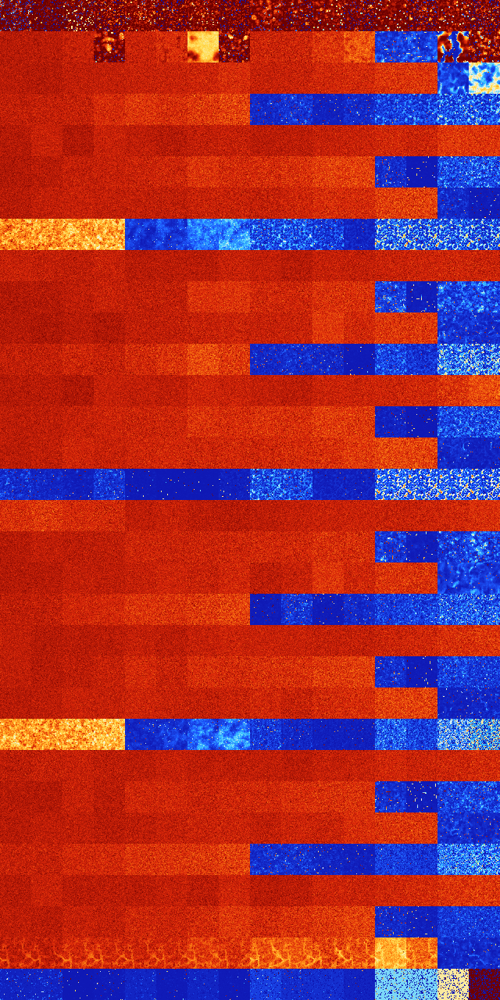

# B023 (6656-7167)

<details>
    <summary>Initial Grid</summary>
    
</details>


<details>
    <summary>Initial Grid RLE</summary>

```
#C Exported from GoGoL (https://github.com/marrow16/gogol)
#C Wrap mode: Toroidal
#C Boundary mode: Dead
#C Step: 0
x = 100, y = 100, rule = B023/S
3bo3bo25bo7bo35bo$7bo33bo19bo8bo24bo$4bo12bo19bo18bo11bo16bo$37bobo$18b
o20b2o12bo5bo24bo9bo4bo$3bo25bo42bo$32bo27bo2bo8bo20bo5bo$22bo13bo30bo$
2bo11bo5bo6bo21bo7bo28bo$11bo81bo$6b2o20bo4bo14bo32bo$7bo46bo$74bo15bo$
3b2o9bo8bo11bo25bo7b2o20bo$3bo4bo13bo2bo12bo10bo6bo$19bo10bo20bo12bo6bo
12bo$11bo13bo70bo$23bo68bo$o34bo26bo16bo5bo$4bo40bo32bo9bo5bo$19bo16bo
5bo8bo32bo14bo$50bobo35bo6bo$18bo22bo7bo2bo2bo40bo$56bobo34bo$39bo14bo
4bo22bo6bo$4bo23bo9bo16bo2bo4bo21bo$5bo25b2o36bo16bo$52bo3b3o16bo2bo$3b
o22bo8bo3bo21bo13bo3bo$22bo45bo$27b2o2bo7bo$15bo7bo37bo29bobo$7bo39bo4b
o4bo7bo17b2o$bo5bo18bo17bo2bo7bo13bo$21bobo16bo39bo5bo7bo$3bo8b2o9bo26b
o$3bo47bo12bo12bo$2bo11bobo6bo20bo22bo22bo$35bo14bo37bo$41bo51bo$32bo7b
2o$30bo23bo9bo31bo$bobo15bo$57bo$14bo11bo3bo12bo2bo4bo28bo$bo23bo10bo
31bobo6bo14bo$2bo36bo4bo7bo10bo18bo6bo$11bo23b2o29bo3bo$4bo9bo38bo$14bo
19bo7bo37bo$4bo15bo28bo35bo$6bo61bo$8b2o10bo6bo2bo13bo11bo42bo$14bo10bo
4bo9bo11bo3bo$10bo27bobo3bo4bo5bo31bo$16bo8bo12bo23bo5bo$46bo12bo15bo$
3bo21bo34bo$bo14bo47b2o$10bo71bo$o12bo6bo39bo14bo$4bo12bo16bo10bo5bo27b
o$30bobo3bo28b2o9bo$6bo4bo61bo$67bo25bo$25bo40bobo3bo$36bo9bo6bo16bo14b
o$13b2o31bo28bo19bo$19bo21bo13bo3bobo$52bo18bo24bo$41bo5bo23bo25bo$bo
30bo19bo8bo4bo15bo6bo$50bo$2bo21bo12bo18bo10bo31bo$31bo3bo9bo3bo6bo24bo
15bo$20bo19bo3bo4bo14bo28b2o$84bo$40bo11bo3bo15bo7bo$6bo12bo75bo$34bo
12bo39bo6b2o$18bo73bo$6bo5bo21bo43bo$12bo4bo48bo$57bo24b2o$13bo16bo28bo
$81bo$7bo15bo55bo10bo$18bo25bo9bo4bo11bo17bo$5bo15bo32bo3bo10bo$6b2o31b
o28bo$13bo16bo4bo17bo$41bo3bo9bo$21bo13bo2bo47bo7bobo$15bo18bo19bo3bo
16bo8bo9bo$14bo4bo66bo11bo$2bo6bo69bo13bo2bo2bo$7bo30bo8bo20bo11bo$o43b
o18bo29bo$bo34bo49bo5bo5bo$48bobo40bobo!
```
</details>
<details>
    <summary>Thumbnail</summary>

</details>
<table>
<tr>
    <td><a href="./6656%20S%20Heat%20Map%20Activity.png"></a><br>S (6656)<br>R@96,p24</td>    <td><a href="./6657%20S0%20Heat%20Map%20Activity.png"></a><br>S0 (6657)<br>R@62,p24</td>    <td><a href="./6658%20S1%20Heat%20Map%20Activity.png"></a><br>S1 (6658)<br>R@67,p24</td>    <td><a href="./6659%20S01%20Heat%20Map%20Activity.png"></a><br>S01 (6659)<br>R@18,p4</td>    <td><a href="./6660%20S2%20Heat%20Map%20Activity.png"></a><br>S2 (6660)<br>R@48,p4</td>    <td><a href="./6661%20S02%20Heat%20Map%20Activity.png"></a><br>S02 (6661)<br>R@28,p4</td>    <td><a href="./6662%20S12%20Heat%20Map%20Activity.png"></a><br>S12 (6662)<br>R@46,p4</td>    <td><a href="./6663%20S012%20Heat%20Map%20Activity.png"></a><br>S012 (6663)<br>R@28,p4</td>    <td><a href="./6664%20S3%20Heat%20Map%20Activity.png"></a><br>S3 (6664)<br>R@168,p2</td>    <td><a href="./6665%20S03%20Heat%20Map%20Activity.png"></a><br>S03 (6665)<br>R@72,p16</td>    <td><a href="./6666%20S13%20Heat%20Map%20Activity.png"></a><br>S13 (6666)<br>R@90,p8</td>    <td><a href="./6667%20S013%20Heat%20Map%20Activity.png"></a><br>S013 (6667)<br>R@40,p8</td>    <td><a href="./6668%20S23%20Heat%20Map%20Activity.png"></a><br>S23 (6668)<br>R@180,p68</td>    <td><a href="./6669%20S023%20Heat%20Map%20Activity.png"></a><br>S023 (6669)<br>R@42,p4</td>    <td><a href="./6670%20S123%20Heat%20Map%20Activity.png"></a><br>S123 (6670)<br>R@67,p4</td>    <td><a href="./6671%20S0123%20Heat%20Map%20Activity.png"></a><br>S0123 (6671)<br>R@26,p4</td></tr>
<tr>
    <td><a href="./6672%20S4%20Heat%20Map%20Activity.png"></a><br>S4 (6672)<br>G>1000</td>    <td><a href="./6673%20S04%20Heat%20Map%20Activity.png"></a><br>S04 (6673)<br>G>1000</td>    <td><a href="./6674%20S14%20Heat%20Map%20Activity.png"></a><br>S14 (6674)<br>G>1000</td>    <td><a href="./6675%20S014%20Heat%20Map%20Activity.png"></a><br>S014 (6675)<br>R@144,p8</td>    <td><a href="./6676%20S24%20Heat%20Map%20Activity.png"></a><br>S24 (6676)<br>G>1000</td>    <td><a href="./6677%20S024%20Heat%20Map%20Activity.png"></a><br>S024 (6677)<br>G>1000</td>    <td><a href="./6678%20S124%20Heat%20Map%20Activity.png"></a><br>S124 (6678)<br>G>1000</td>    <td><a href="./6679%20S0124%20Heat%20Map%20Activity.png"></a><br>S0124 (6679)<br>R@78,p4</td>    <td><a href="./6680%20S34%20Heat%20Map%20Activity.png"></a><br>S34 (6680)<br>G>1000</td>    <td><a href="./6681%20S034%20Heat%20Map%20Activity.png"></a><br>S034 (6681)<br>G>1000</td>    <td><a href="./6682%20S134%20Heat%20Map%20Activity.png"></a><br>S134 (6682)<br>G>1000</td>    <td><a href="./6683%20S0134%20Heat%20Map%20Activity.png"></a><br>S0134 (6683)<br>G>1000</td>    <td><a href="./6684%20S234%20Heat%20Map%20Activity.png"></a><br>S234 (6684)<br>R@290,p24</td>    <td><a href="./6685%20S0234%20Heat%20Map%20Activity.png"></a><br>S0234 (6685)<br>R@390,p168</td>    <td><a href="./6686%20S1234%20Heat%20Map%20Activity.png"></a><br><strong><sup>"Mazes & Lakes"</sup></strong><br>S1234 (6686)<br>G>1000</td>    <td><a href="./6687%20S01234%20Heat%20Map%20Activity.png"></a><br><strong><sup>"Lakes & Mazes"</sup></strong><br>S01234 (6687)<br>R@110,p4</td></tr>
<tr>
    <td><a href="./6688%20S5%20Heat%20Map%20Activity.png"></a><br>S5 (6688)<br>G>1000</td>    <td><a href="./6689%20S05%20Heat%20Map%20Activity.png"></a><br>S05 (6689)<br>G>1000</td>    <td><a href="./6690%20S15%20Heat%20Map%20Activity.png"></a><br>S15 (6690)<br>G>1000</td>    <td><a href="./6691%20S015%20Heat%20Map%20Activity.png"></a><br>S015 (6691)<br>G>1000</td>    <td><a href="./6692%20S25%20Heat%20Map%20Activity.png"></a><br>S25 (6692)<br>G>1000</td>    <td><a href="./6693%20S025%20Heat%20Map%20Activity.png"></a><br>S025 (6693)<br>G>1000</td>    <td><a href="./6694%20S125%20Heat%20Map%20Activity.png"></a><br>S125 (6694)<br>G>1000</td>    <td><a href="./6695%20S0125%20Heat%20Map%20Activity.png"></a><br>S0125 (6695)<br>G>1000</td>    <td><a href="./6696%20S35%20Heat%20Map%20Activity.png"></a><br>S35 (6696)<br>G>1000</td>    <td><a href="./6697%20S035%20Heat%20Map%20Activity.png"></a><br>S035 (6697)<br>G>1000</td>    <td><a href="./6698%20S135%20Heat%20Map%20Activity.png"></a><br>S135 (6698)<br>G>1000</td>    <td><a href="./6699%20S0135%20Heat%20Map%20Activity.png"></a><br>S0135 (6699)<br>G>1000</td>    <td><a href="./6700%20S235%20Heat%20Map%20Activity.png"></a><br>S235 (6700)<br>G>1000</td>    <td><a href="./6701%20S0235%20Heat%20Map%20Activity.png"></a><br>S0235 (6701)<br>G>1000</td>    <td><a href="./6702%20S1235%20Heat%20Map%20Activity.png"></a><br>S1235 (6702)<br>G>1000</td>    <td><a href="./6703%20S01235%20Heat%20Map%20Activity.png"></a><br>S01235 (6703)<br>G>1000</td></tr>
<tr>
    <td><a href="./6704%20S45%20Heat%20Map%20Activity.png"></a><br>S45 (6704)<br>G>1000</td>    <td><a href="./6705%20S045%20Heat%20Map%20Activity.png"></a><br>S045 (6705)<br>G>1000</td>    <td><a href="./6706%20S145%20Heat%20Map%20Activity.png"></a><br>S145 (6706)<br>G>1000</td>    <td><a href="./6707%20S0145%20Heat%20Map%20Activity.png"></a><br>S0145 (6707)<br>G>1000</td>    <td><a href="./6708%20S245%20Heat%20Map%20Activity.png"></a><br>S245 (6708)<br>G>1000</td>    <td><a href="./6709%20S0245%20Heat%20Map%20Activity.png"></a><br>S0245 (6709)<br>G>1000</td>    <td><a href="./6710%20S1245%20Heat%20Map%20Activity.png"></a><br>S1245 (6710)<br>G>1000</td>    <td><a href="./6711%20S01245%20Heat%20Map%20Activity.png"></a><br>S01245 (6711)<br>G>1000</td>    <td><a href="./6712%20S345%20Heat%20Map%20Activity.png"></a><br>S345 (6712)<br>R@158,p60</td>    <td><a href="./6713%20S0345%20Heat%20Map%20Activity.png"></a><br>S0345 (6713)<br>R@93,p12</td>    <td><a href="./6714%20S1345%20Heat%20Map%20Activity.png"></a><br>S1345 (6714)<br>R@285,p180</td>    <td><a href="./6715%20S01345%20Heat%20Map%20Activity.png"></a><br>S01345 (6715)<br>R@136,p60</td>    <td><a href="./6716%20S2345%20Heat%20Map%20Activity.png"></a><br>S2345 (6716)<br>R@31,p12</td>    <td><a href="./6717%20S02345%20Heat%20Map%20Activity.png"></a><br>S02345 (6717)<br>R@30,p12</td>    <td><a href="./6718%20S12345%20Heat%20Map%20Activity.png"></a><br>S12345 (6718)<br>R@21,p6</td>    <td><a href="./6719%20S012345%20Heat%20Map%20Activity.png"></a><br>S012345 (6719)<br>R@22,p2</td></tr>
<tr>
    <td><a href="./6720%20S6%20Heat%20Map%20Activity.png"></a><br>S6 (6720)<br>G>1000</td>    <td><a href="./6721%20S06%20Heat%20Map%20Activity.png"></a><br>S06 (6721)<br>G>1000</td>    <td><a href="./6722%20S16%20Heat%20Map%20Activity.png"></a><br>S16 (6722)<br>G>1000</td>    <td><a href="./6723%20S016%20Heat%20Map%20Activity.png"></a><br>S016 (6723)<br>G>1000</td>    <td><a href="./6724%20S26%20Heat%20Map%20Activity.png"></a><br>S26 (6724)<br>G>1000</td>    <td><a href="./6725%20S026%20Heat%20Map%20Activity.png"></a><br>S026 (6725)<br>G>1000</td>    <td><a href="./6726%20S126%20Heat%20Map%20Activity.png"></a><br>S126 (6726)<br>G>1000</td>    <td><a href="./6727%20S0126%20Heat%20Map%20Activity.png"></a><br>S0126 (6727)<br>G>1000</td>    <td><a href="./6728%20S36%20Heat%20Map%20Activity.png"></a><br>S36 (6728)<br>G>1000</td>    <td><a href="./6729%20S036%20Heat%20Map%20Activity.png"></a><br>S036 (6729)<br>G>1000</td>    <td><a href="./6730%20S136%20Heat%20Map%20Activity.png"></a><br>S136 (6730)<br>G>1000</td>    <td><a href="./6731%20S0136%20Heat%20Map%20Activity.png"></a><br>S0136 (6731)<br>G>1000</td>    <td><a href="./6732%20S236%20Heat%20Map%20Activity.png"></a><br>S236 (6732)<br>G>1000</td>    <td><a href="./6733%20S0236%20Heat%20Map%20Activity.png"></a><br>S0236 (6733)<br>G>1000</td>    <td><a href="./6734%20S1236%20Heat%20Map%20Activity.png"></a><br>S1236 (6734)<br>G>1000</td>    <td><a href="./6735%20S01236%20Heat%20Map%20Activity.png"></a><br>S01236 (6735)<br>G>1000</td></tr>
<tr>
    <td><a href="./6736%20S46%20Heat%20Map%20Activity.png"></a><br>S46 (6736)<br>G>1000</td>    <td><a href="./6737%20S046%20Heat%20Map%20Activity.png"></a><br>S046 (6737)<br>G>1000</td>    <td><a href="./6738%20S146%20Heat%20Map%20Activity.png"></a><br>S146 (6738)<br>G>1000</td>    <td><a href="./6739%20S0146%20Heat%20Map%20Activity.png"></a><br>S0146 (6739)<br>G>1000</td>    <td><a href="./6740%20S246%20Heat%20Map%20Activity.png"></a><br>S246 (6740)<br>G>1000</td>    <td><a href="./6741%20S0246%20Heat%20Map%20Activity.png"></a><br>S0246 (6741)<br>G>1000</td>    <td><a href="./6742%20S1246%20Heat%20Map%20Activity.png"></a><br>S1246 (6742)<br>G>1000</td>    <td><a href="./6743%20S01246%20Heat%20Map%20Activity.png"></a><br>S01246 (6743)<br>G>1000</td>    <td><a href="./6744%20S346%20Heat%20Map%20Activity.png"></a><br>S346 (6744)<br>G>1000</td>    <td><a href="./6745%20S0346%20Heat%20Map%20Activity.png"></a><br>S0346 (6745)<br>G>1000</td>    <td><a href="./6746%20S1346%20Heat%20Map%20Activity.png"></a><br>S1346 (6746)<br>G>1000</td>    <td><a href="./6747%20S01346%20Heat%20Map%20Activity.png"></a><br>S01346 (6747)<br>G>1000</td>    <td><a href="./6748%20S2346%20Heat%20Map%20Activity.png"></a><br>S2346 (6748)<br>R@94,p40</td>    <td><a href="./6749%20S02346%20Heat%20Map%20Activity.png"></a><br>S02346 (6749)<br>G>1000</td>    <td><a href="./6750%20S12346%20Heat%20Map%20Activity.png"></a><br>S12346 (6750)<br>R@31,p6</td>    <td><a href="./6751%20S012346%20Heat%20Map%20Activity.png"></a><br>S012346 (6751)<br>R@31,p2</td></tr>
<tr>
    <td><a href="./6752%20S56%20Heat%20Map%20Activity.png"></a><br>S56 (6752)<br>G>1000</td>    <td><a href="./6753%20S056%20Heat%20Map%20Activity.png"></a><br>S056 (6753)<br>G>1000</td>    <td><a href="./6754%20S156%20Heat%20Map%20Activity.png"></a><br>S156 (6754)<br>G>1000</td>    <td><a href="./6755%20S0156%20Heat%20Map%20Activity.png"></a><br>S0156 (6755)<br>G>1000</td>    <td><a href="./6756%20S256%20Heat%20Map%20Activity.png"></a><br>S256 (6756)<br>G>1000</td>    <td><a href="./6757%20S0256%20Heat%20Map%20Activity.png"></a><br>S0256 (6757)<br>G>1000</td>    <td><a href="./6758%20S1256%20Heat%20Map%20Activity.png"></a><br>S1256 (6758)<br>G>1000</td>    <td><a href="./6759%20S01256%20Heat%20Map%20Activity.png"></a><br>S01256 (6759)<br>G>1000</td>    <td><a href="./6760%20S356%20Heat%20Map%20Activity.png"></a><br>S356 (6760)<br>G>1000</td>    <td><a href="./6761%20S0356%20Heat%20Map%20Activity.png"></a><br>S0356 (6761)<br>G>1000</td>    <td><a href="./6762%20S1356%20Heat%20Map%20Activity.png"></a><br>S1356 (6762)<br>G>1000</td>    <td><a href="./6763%20S01356%20Heat%20Map%20Activity.png"></a><br>S01356 (6763)<br>G>1000</td>    <td><a href="./6764%20S2356%20Heat%20Map%20Activity.png"></a><br>S2356 (6764)<br>G>1000</td>    <td><a href="./6765%20S02356%20Heat%20Map%20Activity.png"></a><br>S02356 (6765)<br>G>1000</td>    <td><a href="./6766%20S12356%20Heat%20Map%20Activity.png"></a><br>S12356 (6766)<br>R@240,p12</td>    <td><a href="./6767%20S012356%20Heat%20Map%20Activity.png"></a><br>S012356 (6767)<br>R@981,p840</td></tr>
<tr>
    <td><a href="./6768%20S456%20Heat%20Map%20Activity.png"></a><br>S456 (6768)<br>G>1000</td>    <td><a href="./6769%20S0456%20Heat%20Map%20Activity.png"></a><br>S0456 (6769)<br>G>1000</td>    <td><a href="./6770%20S1456%20Heat%20Map%20Activity.png"></a><br>S1456 (6770)<br>G>1000</td>    <td><a href="./6771%20S01456%20Heat%20Map%20Activity.png"></a><br>S01456 (6771)<br>G>1000</td>    <td><a href="./6772%20S2456%20Heat%20Map%20Activity.png"></a><br>S2456 (6772)<br>G>1000</td>    <td><a href="./6773%20S02456%20Heat%20Map%20Activity.png"></a><br>S02456 (6773)<br>G>1000</td>    <td><a href="./6774%20S12456%20Heat%20Map%20Activity.png"></a><br>S12456 (6774)<br>G>1000</td>    <td><a href="./6775%20S012456%20Heat%20Map%20Activity.png"></a><br>S012456 (6775)<br>G>1000</td>    <td><a href="./6776%20S3456%20Heat%20Map%20Activity.png"></a><br>S3456 (6776)<br>R@20,p4</td>    <td><a href="./6777%20S03456%20Heat%20Map%20Activity.png"></a><br>S03456 (6777)<br>R@18,p4</td>    <td><a href="./6778%20S13456%20Heat%20Map%20Activity.png"></a><br>S13456 (6778)<br>R@27,p12</td>    <td><a href="./6779%20S013456%20Heat%20Map%20Activity.png"></a><br>S013456 (6779)<br>R@74,p60</td>    <td><a href="./6780%20S23456%20Heat%20Map%20Activity.png"></a><br>S23456 (6780)<br>R@12,p2</td>    <td><a href="./6781%20S023456%20Heat%20Map%20Activity.png"></a><br>S023456 (6781)<br>R@12,p2</td>    <td><a href="./6782%20S123456%20Heat%20Map%20Activity.png"></a><br>S123456 (6782)<br>S@11</td>    <td><a href="./6783%20S0123456%20Heat%20Map%20Activity.png"></a><br>S0123456 (6783)<br>S@11</td></tr>
<tr>
    <td><a href="./6784%20S7%20Heat%20Map%20Activity.png"></a><br>S7 (6784)<br>G>1000</td>    <td><a href="./6785%20S07%20Heat%20Map%20Activity.png"></a><br>S07 (6785)<br>G>1000</td>    <td><a href="./6786%20S17%20Heat%20Map%20Activity.png"></a><br>S17 (6786)<br>G>1000</td>    <td><a href="./6787%20S017%20Heat%20Map%20Activity.png"></a><br>S017 (6787)<br>G>1000</td>    <td><a href="./6788%20S27%20Heat%20Map%20Activity.png"></a><br>S27 (6788)<br>G>1000</td>    <td><a href="./6789%20S027%20Heat%20Map%20Activity.png"></a><br>S027 (6789)<br>G>1000</td>    <td><a href="./6790%20S127%20Heat%20Map%20Activity.png"></a><br>S127 (6790)<br>G>1000</td>    <td><a href="./6791%20S0127%20Heat%20Map%20Activity.png"></a><br>S0127 (6791)<br>G>1000</td>    <td><a href="./6792%20S37%20Heat%20Map%20Activity.png"></a><br>S37 (6792)<br>G>1000</td>    <td><a href="./6793%20S037%20Heat%20Map%20Activity.png"></a><br>S037 (6793)<br>G>1000</td>    <td><a href="./6794%20S137%20Heat%20Map%20Activity.png"></a><br>S137 (6794)<br>G>1000</td>    <td><a href="./6795%20S0137%20Heat%20Map%20Activity.png"></a><br>S0137 (6795)<br>G>1000</td>    <td><a href="./6796%20S237%20Heat%20Map%20Activity.png"></a><br>S237 (6796)<br>G>1000</td>    <td><a href="./6797%20S0237%20Heat%20Map%20Activity.png"></a><br>S0237 (6797)<br>G>1000</td>    <td><a href="./6798%20S1237%20Heat%20Map%20Activity.png"></a><br>S1237 (6798)<br>G>1000</td>    <td><a href="./6799%20S01237%20Heat%20Map%20Activity.png"></a><br>S01237 (6799)<br>G>1000</td></tr>
<tr>
    <td><a href="./6800%20S47%20Heat%20Map%20Activity.png"></a><br>S47 (6800)<br>G>1000</td>    <td><a href="./6801%20S047%20Heat%20Map%20Activity.png"></a><br>S047 (6801)<br>G>1000</td>    <td><a href="./6802%20S147%20Heat%20Map%20Activity.png"></a><br>S147 (6802)<br>G>1000</td>    <td><a href="./6803%20S0147%20Heat%20Map%20Activity.png"></a><br>S0147 (6803)<br>G>1000</td>    <td><a href="./6804%20S247%20Heat%20Map%20Activity.png"></a><br>S247 (6804)<br>G>1000</td>    <td><a href="./6805%20S0247%20Heat%20Map%20Activity.png"></a><br>S0247 (6805)<br>G>1000</td>    <td><a href="./6806%20S1247%20Heat%20Map%20Activity.png"></a><br>S1247 (6806)<br>G>1000</td>    <td><a href="./6807%20S01247%20Heat%20Map%20Activity.png"></a><br>S01247 (6807)<br>G>1000</td>    <td><a href="./6808%20S347%20Heat%20Map%20Activity.png"></a><br>S347 (6808)<br>G>1000</td>    <td><a href="./6809%20S0347%20Heat%20Map%20Activity.png"></a><br>S0347 (6809)<br>G>1000</td>    <td><a href="./6810%20S1347%20Heat%20Map%20Activity.png"></a><br>S1347 (6810)<br>G>1000</td>    <td><a href="./6811%20S01347%20Heat%20Map%20Activity.png"></a><br>S01347 (6811)<br>G>1000</td>    <td><a href="./6812%20S2347%20Heat%20Map%20Activity.png"></a><br>S2347 (6812)<br>R@113,p12</td>    <td><a href="./6813%20S02347%20Heat%20Map%20Activity.png"></a><br>S02347 (6813)<br>G>1000</td>    <td><a href="./6814%20S12347%20Heat%20Map%20Activity.png"></a><br>S12347 (6814)<br>R@93,p12</td>    <td><a href="./6815%20S012347%20Heat%20Map%20Activity.png"></a><br>S012347 (6815)<br>R@98,p12</td></tr>
<tr>
    <td><a href="./6816%20S57%20Heat%20Map%20Activity.png"></a><br>S57 (6816)<br>G>1000</td>    <td><a href="./6817%20S057%20Heat%20Map%20Activity.png"></a><br>S057 (6817)<br>G>1000</td>    <td><a href="./6818%20S157%20Heat%20Map%20Activity.png"></a><br>S157 (6818)<br>G>1000</td>    <td><a href="./6819%20S0157%20Heat%20Map%20Activity.png"></a><br>S0157 (6819)<br>G>1000</td>    <td><a href="./6820%20S257%20Heat%20Map%20Activity.png"></a><br>S257 (6820)<br>G>1000</td>    <td><a href="./6821%20S0257%20Heat%20Map%20Activity.png"></a><br>S0257 (6821)<br>G>1000</td>    <td><a href="./6822%20S1257%20Heat%20Map%20Activity.png"></a><br>S1257 (6822)<br>G>1000</td>    <td><a href="./6823%20S01257%20Heat%20Map%20Activity.png"></a><br>S01257 (6823)<br>G>1000</td>    <td><a href="./6824%20S357%20Heat%20Map%20Activity.png"></a><br>S357 (6824)<br>G>1000</td>    <td><a href="./6825%20S0357%20Heat%20Map%20Activity.png"></a><br>S0357 (6825)<br>G>1000</td>    <td><a href="./6826%20S1357%20Heat%20Map%20Activity.png"></a><br>S1357 (6826)<br>G>1000</td>    <td><a href="./6827%20S01357%20Heat%20Map%20Activity.png"></a><br>S01357 (6827)<br>G>1000</td>    <td><a href="./6828%20S2357%20Heat%20Map%20Activity.png"></a><br>S2357 (6828)<br>G>1000</td>    <td><a href="./6829%20S02357%20Heat%20Map%20Activity.png"></a><br>S02357 (6829)<br>G>1000</td>    <td><a href="./6830%20S12357%20Heat%20Map%20Activity.png"></a><br>S12357 (6830)<br>R@332,p60</td>    <td><a href="./6831%20S012357%20Heat%20Map%20Activity.png"></a><br>S012357 (6831)<br>R@449,p120</td></tr>
<tr>
    <td><a href="./6832%20S457%20Heat%20Map%20Activity.png"></a><br>S457 (6832)<br>G>1000</td>    <td><a href="./6833%20S0457%20Heat%20Map%20Activity.png"></a><br>S0457 (6833)<br>G>1000</td>    <td><a href="./6834%20S1457%20Heat%20Map%20Activity.png"></a><br>S1457 (6834)<br>G>1000</td>    <td><a href="./6835%20S01457%20Heat%20Map%20Activity.png"></a><br>S01457 (6835)<br>G>1000</td>    <td><a href="./6836%20S2457%20Heat%20Map%20Activity.png"></a><br>S2457 (6836)<br>G>1000</td>    <td><a href="./6837%20S02457%20Heat%20Map%20Activity.png"></a><br>S02457 (6837)<br>G>1000</td>    <td><a href="./6838%20S12457%20Heat%20Map%20Activity.png"></a><br>S12457 (6838)<br>G>1000</td>    <td><a href="./6839%20S012457%20Heat%20Map%20Activity.png"></a><br>S012457 (6839)<br>G>1000</td>    <td><a href="./6840%20S3457%20Heat%20Map%20Activity.png"></a><br>S3457 (6840)<br>R@117,p60</td>    <td><a href="./6841%20S03457%20Heat%20Map%20Activity.png"></a><br>S03457 (6841)<br>R@91,p12</td>    <td><a href="./6842%20S13457%20Heat%20Map%20Activity.png"></a><br>S13457 (6842)<br>R@114,p60</td>    <td><a href="./6843%20S013457%20Heat%20Map%20Activity.png"></a><br>S013457 (6843)<br>R@907,p840</td>    <td><a href="./6844%20S23457%20Heat%20Map%20Activity.png"></a><br>S23457 (6844)<br>R@23,p12</td>    <td><a href="./6845%20S023457%20Heat%20Map%20Activity.png"></a><br>S023457 (6845)<br>R@40,p28</td>    <td><a href="./6846%20S123457%20Heat%20Map%20Activity.png"></a><br>S123457 (6846)<br>R@12,p2</td>    <td><a href="./6847%20S0123457%20Heat%20Map%20Activity.png"></a><br>S0123457 (6847)<br>S@13</td></tr>
<tr>
    <td><a href="./6848%20S67%20Heat%20Map%20Activity.png"></a><br>S67 (6848)<br>G>1000</td>    <td><a href="./6849%20S067%20Heat%20Map%20Activity.png"></a><br>S067 (6849)<br>G>1000</td>    <td><a href="./6850%20S167%20Heat%20Map%20Activity.png"></a><br>S167 (6850)<br>G>1000</td>    <td><a href="./6851%20S0167%20Heat%20Map%20Activity.png"></a><br>S0167 (6851)<br>G>1000</td>    <td><a href="./6852%20S267%20Heat%20Map%20Activity.png"></a><br>S267 (6852)<br>G>1000</td>    <td><a href="./6853%20S0267%20Heat%20Map%20Activity.png"></a><br>S0267 (6853)<br>G>1000</td>    <td><a href="./6854%20S1267%20Heat%20Map%20Activity.png"></a><br>S1267 (6854)<br>G>1000</td>    <td><a href="./6855%20S01267%20Heat%20Map%20Activity.png"></a><br>S01267 (6855)<br>G>1000</td>    <td><a href="./6856%20S367%20Heat%20Map%20Activity.png"></a><br>S367 (6856)<br>G>1000</td>    <td><a href="./6857%20S0367%20Heat%20Map%20Activity.png"></a><br>S0367 (6857)<br>G>1000</td>    <td><a href="./6858%20S1367%20Heat%20Map%20Activity.png"></a><br>S1367 (6858)<br>G>1000</td>    <td><a href="./6859%20S01367%20Heat%20Map%20Activity.png"></a><br>S01367 (6859)<br>G>1000</td>    <td><a href="./6860%20S2367%20Heat%20Map%20Activity.png"></a><br>S2367 (6860)<br>G>1000</td>    <td><a href="./6861%20S02367%20Heat%20Map%20Activity.png"></a><br>S02367 (6861)<br>G>1000</td>    <td><a href="./6862%20S12367%20Heat%20Map%20Activity.png"></a><br>S12367 (6862)<br>G>1000</td>    <td><a href="./6863%20S012367%20Heat%20Map%20Activity.png"></a><br>S012367 (6863)<br>G>1000</td></tr>
<tr>
    <td><a href="./6864%20S467%20Heat%20Map%20Activity.png"></a><br>S467 (6864)<br>G>1000</td>    <td><a href="./6865%20S0467%20Heat%20Map%20Activity.png"></a><br>S0467 (6865)<br>G>1000</td>    <td><a href="./6866%20S1467%20Heat%20Map%20Activity.png"></a><br>S1467 (6866)<br>G>1000</td>    <td><a href="./6867%20S01467%20Heat%20Map%20Activity.png"></a><br>S01467 (6867)<br>G>1000</td>    <td><a href="./6868%20S2467%20Heat%20Map%20Activity.png"></a><br>S2467 (6868)<br>G>1000</td>    <td><a href="./6869%20S02467%20Heat%20Map%20Activity.png"></a><br>S02467 (6869)<br>G>1000</td>    <td><a href="./6870%20S12467%20Heat%20Map%20Activity.png"></a><br>S12467 (6870)<br>G>1000</td>    <td><a href="./6871%20S012467%20Heat%20Map%20Activity.png"></a><br>S012467 (6871)<br>G>1000</td>    <td><a href="./6872%20S3467%20Heat%20Map%20Activity.png"></a><br>S3467 (6872)<br>G>1000</td>    <td><a href="./6873%20S03467%20Heat%20Map%20Activity.png"></a><br>S03467 (6873)<br>G>1000</td>    <td><a href="./6874%20S13467%20Heat%20Map%20Activity.png"></a><br>S13467 (6874)<br>G>1000</td>    <td><a href="./6875%20S013467%20Heat%20Map%20Activity.png"></a><br>S013467 (6875)<br>G>1000</td>    <td><a href="./6876%20S23467%20Heat%20Map%20Activity.png"></a><br>S23467 (6876)<br>R@176,p120</td>    <td><a href="./6877%20S023467%20Heat%20Map%20Activity.png"></a><br>S023467 (6877)<br>G>1000</td>    <td><a href="./6878%20S123467%20Heat%20Map%20Activity.png"></a><br>S123467 (6878)<br>R@28,p6</td>    <td><a href="./6879%20S0123467%20Heat%20Map%20Activity.png"></a><br>S0123467 (6879)<br>R@26,p6</td></tr>
<tr>
    <td><a href="./6880%20S567%20Heat%20Map%20Activity.png"></a><br>S567 (6880)<br>G>1000</td>    <td><a href="./6881%20S0567%20Heat%20Map%20Activity.png"></a><br>S0567 (6881)<br>G>1000</td>    <td><a href="./6882%20S1567%20Heat%20Map%20Activity.png"></a><br>S1567 (6882)<br>G>1000</td>    <td><a href="./6883%20S01567%20Heat%20Map%20Activity.png"></a><br>S01567 (6883)<br>G>1000</td>    <td><a href="./6884%20S2567%20Heat%20Map%20Activity.png"></a><br>S2567 (6884)<br>G>1000</td>    <td><a href="./6885%20S02567%20Heat%20Map%20Activity.png"></a><br>S02567 (6885)<br>G>1000</td>    <td><a href="./6886%20S12567%20Heat%20Map%20Activity.png"></a><br>S12567 (6886)<br>G>1000</td>    <td><a href="./6887%20S012567%20Heat%20Map%20Activity.png"></a><br>S012567 (6887)<br>G>1000</td>    <td><a href="./6888%20S3567%20Heat%20Map%20Activity.png"></a><br>S3567 (6888)<br>G>1000</td>    <td><a href="./6889%20S03567%20Heat%20Map%20Activity.png"></a><br>S03567 (6889)<br>G>1000</td>    <td><a href="./6890%20S13567%20Heat%20Map%20Activity.png"></a><br>S13567 (6890)<br>G>1000</td>    <td><a href="./6891%20S013567%20Heat%20Map%20Activity.png"></a><br>S013567 (6891)<br>G>1000</td>    <td><a href="./6892%20S23567%20Heat%20Map%20Activity.png"></a><br>S23567 (6892)<br>G>1000</td>    <td><a href="./6893%20S023567%20Heat%20Map%20Activity.png"></a><br>S023567 (6893)<br>G>1000</td>    <td><a href="./6894%20S123567%20Heat%20Map%20Activity.png"></a><br>S123567 (6894)<br>R@571,p60</td>    <td><a href="./6895%20S0123567%20Heat%20Map%20Activity.png"></a><br>S0123567 (6895)<br>R@689,p12</td></tr>
<tr>
    <td><a href="./6896%20S4567%20Heat%20Map%20Activity.png"></a><br>S4567 (6896)<br>R@66,p24</td>    <td><a href="./6897%20S04567%20Heat%20Map%20Activity.png"></a><br>S04567 (6897)<br>R@118,p56</td>    <td><a href="./6898%20S14567%20Heat%20Map%20Activity.png"></a><br>S14567 (6898)<br>R@178,p120</td>    <td><a href="./6899%20S014567%20Heat%20Map%20Activity.png"></a><br>S014567 (6899)<br>R@58,p8</td>    <td><a href="./6900%20S24567%20Heat%20Map%20Activity.png"></a><br>S24567 (6900)<br>R@396,p360</td>    <td><a href="./6901%20S024567%20Heat%20Map%20Activity.png"></a><br>S024567 (6901)<br>G>1000</td>    <td><a href="./6902%20S124567%20Heat%20Map%20Activity.png"></a><br>S124567 (6902)<br>R@871,p840</td>    <td><a href="./6903%20S0124567%20Heat%20Map%20Activity.png"></a><br>S0124567 (6903)<br>R@166,p120</td>    <td><a href="./6904%20S34567%20Heat%20Map%20Activity.png"></a><br>S34567 (6904)<br>R@14,p4</td>    <td><a href="./6905%20S034567%20Heat%20Map%20Activity.png"></a><br>S034567 (6905)<br>R@17,p4</td>    <td><a href="./6906%20S134567%20Heat%20Map%20Activity.png"></a><br>S134567 (6906)<br>R@68,p60</td>    <td><a href="./6907%20S0134567%20Heat%20Map%20Activity.png"></a><br>S0134567 (6907)<br>R@70,p60</td>    <td><a href="./6908%20S234567%20Heat%20Map%20Activity.png"></a><br>S234567 (6908)<br>S@7</td>    <td><a href="./6909%20S0234567%20Heat%20Map%20Activity.png"></a><br>S0234567 (6909)<br>S@7</td>    <td><a href="./6910%20S1234567%20Heat%20Map%20Activity.png"></a><br>S1234567 (6910)<br>S@7</td>    <td><a href="./6911%20S01234567%20Heat%20Map%20Activity.png"></a><br>S01234567 (6911)<br>S@7</td></tr>
<tr>
    <td><a href="./6912%20S8%20Heat%20Map%20Activity.png"></a><br>S8 (6912)<br>G>1000</td>    <td><a href="./6913%20S08%20Heat%20Map%20Activity.png"></a><br>S08 (6913)<br>G>1000</td>    <td><a href="./6914%20S18%20Heat%20Map%20Activity.png"></a><br>S18 (6914)<br>G>1000</td>    <td><a href="./6915%20S018%20Heat%20Map%20Activity.png"></a><br>S018 (6915)<br>G>1000</td>    <td><a href="./6916%20S28%20Heat%20Map%20Activity.png"></a><br>S28 (6916)<br>G>1000</td>    <td><a href="./6917%20S028%20Heat%20Map%20Activity.png"></a><br>S028 (6917)<br>G>1000</td>    <td><a href="./6918%20S128%20Heat%20Map%20Activity.png"></a><br>S128 (6918)<br>G>1000</td>    <td><a href="./6919%20S0128%20Heat%20Map%20Activity.png"></a><br>S0128 (6919)<br>G>1000</td>    <td><a href="./6920%20S38%20Heat%20Map%20Activity.png"></a><br>S38 (6920)<br>G>1000</td>    <td><a href="./6921%20S038%20Heat%20Map%20Activity.png"></a><br>S038 (6921)<br>G>1000</td>    <td><a href="./6922%20S138%20Heat%20Map%20Activity.png"></a><br>S138 (6922)<br>G>1000</td>    <td><a href="./6923%20S0138%20Heat%20Map%20Activity.png"></a><br>S0138 (6923)<br>G>1000</td>    <td><a href="./6924%20S238%20Heat%20Map%20Activity.png"></a><br>S238 (6924)<br>G>1000</td>    <td><a href="./6925%20S0238%20Heat%20Map%20Activity.png"></a><br>S0238 (6925)<br>G>1000</td>    <td><a href="./6926%20S1238%20Heat%20Map%20Activity.png"></a><br>S1238 (6926)<br>G>1000</td>    <td><a href="./6927%20S01238%20Heat%20Map%20Activity.png"></a><br>S01238 (6927)<br>G>1000</td></tr>
<tr>
    <td><a href="./6928%20S48%20Heat%20Map%20Activity.png"></a><br>S48 (6928)<br>G>1000</td>    <td><a href="./6929%20S048%20Heat%20Map%20Activity.png"></a><br>S048 (6929)<br>G>1000</td>    <td><a href="./6930%20S148%20Heat%20Map%20Activity.png"></a><br>S148 (6930)<br>G>1000</td>    <td><a href="./6931%20S0148%20Heat%20Map%20Activity.png"></a><br>S0148 (6931)<br>G>1000</td>    <td><a href="./6932%20S248%20Heat%20Map%20Activity.png"></a><br>S248 (6932)<br>G>1000</td>    <td><a href="./6933%20S0248%20Heat%20Map%20Activity.png"></a><br>S0248 (6933)<br>G>1000</td>    <td><a href="./6934%20S1248%20Heat%20Map%20Activity.png"></a><br>S1248 (6934)<br>G>1000</td>    <td><a href="./6935%20S01248%20Heat%20Map%20Activity.png"></a><br>S01248 (6935)<br>G>1000</td>    <td><a href="./6936%20S348%20Heat%20Map%20Activity.png"></a><br>S348 (6936)<br>G>1000</td>    <td><a href="./6937%20S0348%20Heat%20Map%20Activity.png"></a><br>S0348 (6937)<br>G>1000</td>    <td><a href="./6938%20S1348%20Heat%20Map%20Activity.png"></a><br>S1348 (6938)<br>G>1000</td>    <td><a href="./6939%20S01348%20Heat%20Map%20Activity.png"></a><br>S01348 (6939)<br>G>1000</td>    <td><a href="./6940%20S2348%20Heat%20Map%20Activity.png"></a><br>S2348 (6940)<br>R@178,p40</td>    <td><a href="./6941%20S02348%20Heat%20Map%20Activity.png"></a><br>S02348 (6941)<br>G>1000</td>    <td><a href="./6942%20S12348%20Heat%20Map%20Activity.png"></a><br>S12348 (6942)<br>R@112,p20</td>    <td><a href="./6943%20S012348%20Heat%20Map%20Activity.png"></a><br>S012348 (6943)<br>R@113,p12</td></tr>
<tr>
    <td><a href="./6944%20S58%20Heat%20Map%20Activity.png"></a><br>S58 (6944)<br>G>1000</td>    <td><a href="./6945%20S058%20Heat%20Map%20Activity.png"></a><br>S058 (6945)<br>G>1000</td>    <td><a href="./6946%20S158%20Heat%20Map%20Activity.png"></a><br>S158 (6946)<br>G>1000</td>    <td><a href="./6947%20S0158%20Heat%20Map%20Activity.png"></a><br>S0158 (6947)<br>G>1000</td>    <td><a href="./6948%20S258%20Heat%20Map%20Activity.png"></a><br>S258 (6948)<br>G>1000</td>    <td><a href="./6949%20S0258%20Heat%20Map%20Activity.png"></a><br>S0258 (6949)<br>G>1000</td>    <td><a href="./6950%20S1258%20Heat%20Map%20Activity.png"></a><br>S1258 (6950)<br>G>1000</td>    <td><a href="./6951%20S01258%20Heat%20Map%20Activity.png"></a><br>S01258 (6951)<br>G>1000</td>    <td><a href="./6952%20S358%20Heat%20Map%20Activity.png"></a><br>S358 (6952)<br>G>1000</td>    <td><a href="./6953%20S0358%20Heat%20Map%20Activity.png"></a><br>S0358 (6953)<br>G>1000</td>    <td><a href="./6954%20S1358%20Heat%20Map%20Activity.png"></a><br>S1358 (6954)<br>G>1000</td>    <td><a href="./6955%20S01358%20Heat%20Map%20Activity.png"></a><br>S01358 (6955)<br>G>1000</td>    <td><a href="./6956%20S2358%20Heat%20Map%20Activity.png"></a><br>S2358 (6956)<br>G>1000</td>    <td><a href="./6957%20S02358%20Heat%20Map%20Activity.png"></a><br>S02358 (6957)<br>G>1000</td>    <td><a href="./6958%20S12358%20Heat%20Map%20Activity.png"></a><br>S12358 (6958)<br>G>1000</td>    <td><a href="./6959%20S012358%20Heat%20Map%20Activity.png"></a><br>S012358 (6959)<br>G>1000</td></tr>
<tr>
    <td><a href="./6960%20S458%20Heat%20Map%20Activity.png"></a><br>S458 (6960)<br>G>1000</td>    <td><a href="./6961%20S0458%20Heat%20Map%20Activity.png"></a><br>S0458 (6961)<br>G>1000</td>    <td><a href="./6962%20S1458%20Heat%20Map%20Activity.png"></a><br>S1458 (6962)<br>G>1000</td>    <td><a href="./6963%20S01458%20Heat%20Map%20Activity.png"></a><br>S01458 (6963)<br>G>1000</td>    <td><a href="./6964%20S2458%20Heat%20Map%20Activity.png"></a><br>S2458 (6964)<br>G>1000</td>    <td><a href="./6965%20S02458%20Heat%20Map%20Activity.png"></a><br>S02458 (6965)<br>G>1000</td>    <td><a href="./6966%20S12458%20Heat%20Map%20Activity.png"></a><br>S12458 (6966)<br>G>1000</td>    <td><a href="./6967%20S012458%20Heat%20Map%20Activity.png"></a><br>S012458 (6967)<br>G>1000</td>    <td><a href="./6968%20S3458%20Heat%20Map%20Activity.png"></a><br>S3458 (6968)<br>R@504,p420</td>    <td><a href="./6969%20S03458%20Heat%20Map%20Activity.png"></a><br>S03458 (6969)<br>R@76,p12</td>    <td><a href="./6970%20S13458%20Heat%20Map%20Activity.png"></a><br>S13458 (6970)<br>R@521,p420</td>    <td><a href="./6971%20S013458%20Heat%20Map%20Activity.png"></a><br>S013458 (6971)<br>R@133,p60</td>    <td><a href="./6972%20S23458%20Heat%20Map%20Activity.png"></a><br>S23458 (6972)<br>R@28,p12</td>    <td><a href="./6973%20S023458%20Heat%20Map%20Activity.png"></a><br>S023458 (6973)<br>R@26,p12</td>    <td><a href="./6974%20S123458%20Heat%20Map%20Activity.png"></a><br>S123458 (6974)<br>R@17,p2</td>    <td><a href="./6975%20S0123458%20Heat%20Map%20Activity.png"></a><br>S0123458 (6975)<br>R@17,p2</td></tr>
<tr>
    <td><a href="./6976%20S68%20Heat%20Map%20Activity.png"></a><br>S68 (6976)<br>G>1000</td>    <td><a href="./6977%20S068%20Heat%20Map%20Activity.png"></a><br>S068 (6977)<br>G>1000</td>    <td><a href="./6978%20S168%20Heat%20Map%20Activity.png"></a><br>S168 (6978)<br>G>1000</td>    <td><a href="./6979%20S0168%20Heat%20Map%20Activity.png"></a><br>S0168 (6979)<br>G>1000</td>    <td><a href="./6980%20S268%20Heat%20Map%20Activity.png"></a><br>S268 (6980)<br>G>1000</td>    <td><a href="./6981%20S0268%20Heat%20Map%20Activity.png"></a><br>S0268 (6981)<br>G>1000</td>    <td><a href="./6982%20S1268%20Heat%20Map%20Activity.png"></a><br>S1268 (6982)<br>G>1000</td>    <td><a href="./6983%20S01268%20Heat%20Map%20Activity.png"></a><br>S01268 (6983)<br>G>1000</td>    <td><a href="./6984%20S368%20Heat%20Map%20Activity.png"></a><br>S368 (6984)<br>G>1000</td>    <td><a href="./6985%20S0368%20Heat%20Map%20Activity.png"></a><br>S0368 (6985)<br>G>1000</td>    <td><a href="./6986%20S1368%20Heat%20Map%20Activity.png"></a><br>S1368 (6986)<br>G>1000</td>    <td><a href="./6987%20S01368%20Heat%20Map%20Activity.png"></a><br>S01368 (6987)<br>G>1000</td>    <td><a href="./6988%20S2368%20Heat%20Map%20Activity.png"></a><br>S2368 (6988)<br>G>1000</td>    <td><a href="./6989%20S02368%20Heat%20Map%20Activity.png"></a><br>S02368 (6989)<br>G>1000</td>    <td><a href="./6990%20S12368%20Heat%20Map%20Activity.png"></a><br>S12368 (6990)<br>G>1000</td>    <td><a href="./6991%20S012368%20Heat%20Map%20Activity.png"></a><br>S012368 (6991)<br>G>1000</td></tr>
<tr>
    <td><a href="./6992%20S468%20Heat%20Map%20Activity.png"></a><br>S468 (6992)<br>G>1000</td>    <td><a href="./6993%20S0468%20Heat%20Map%20Activity.png"></a><br>S0468 (6993)<br>G>1000</td>    <td><a href="./6994%20S1468%20Heat%20Map%20Activity.png"></a><br>S1468 (6994)<br>G>1000</td>    <td><a href="./6995%20S01468%20Heat%20Map%20Activity.png"></a><br>S01468 (6995)<br>G>1000</td>    <td><a href="./6996%20S2468%20Heat%20Map%20Activity.png"></a><br>S2468 (6996)<br>G>1000</td>    <td><a href="./6997%20S02468%20Heat%20Map%20Activity.png"></a><br>S02468 (6997)<br>G>1000</td>    <td><a href="./6998%20S12468%20Heat%20Map%20Activity.png"></a><br>S12468 (6998)<br>G>1000</td>    <td><a href="./6999%20S012468%20Heat%20Map%20Activity.png"></a><br>S012468 (6999)<br>G>1000</td>    <td><a href="./7000%20S3468%20Heat%20Map%20Activity.png"></a><br>S3468 (7000)<br>G>1000</td>    <td><a href="./7001%20S03468%20Heat%20Map%20Activity.png"></a><br>S03468 (7001)<br>G>1000</td>    <td><a href="./7002%20S13468%20Heat%20Map%20Activity.png"></a><br>S13468 (7002)<br>G>1000</td>    <td><a href="./7003%20S013468%20Heat%20Map%20Activity.png"></a><br>S013468 (7003)<br>G>1000</td>    <td><a href="./7004%20S23468%20Heat%20Map%20Activity.png"></a><br>S23468 (7004)<br>R@89,p20</td>    <td><a href="./7005%20S023468%20Heat%20Map%20Activity.png"></a><br>S023468 (7005)<br>R@502,p420</td>    <td><a href="./7006%20S123468%20Heat%20Map%20Activity.png"></a><br>S123468 (7006)<br>R@36,p12</td>    <td><a href="./7007%20S0123468%20Heat%20Map%20Activity.png"></a><br>S0123468 (7007)<br>R@34,p6</td></tr>
<tr>
    <td><a href="./7008%20S568%20Heat%20Map%20Activity.png"></a><br>S568 (7008)<br>G>1000</td>    <td><a href="./7009%20S0568%20Heat%20Map%20Activity.png"></a><br>S0568 (7009)<br>G>1000</td>    <td><a href="./7010%20S1568%20Heat%20Map%20Activity.png"></a><br>S1568 (7010)<br>G>1000</td>    <td><a href="./7011%20S01568%20Heat%20Map%20Activity.png"></a><br>S01568 (7011)<br>G>1000</td>    <td><a href="./7012%20S2568%20Heat%20Map%20Activity.png"></a><br>S2568 (7012)<br>G>1000</td>    <td><a href="./7013%20S02568%20Heat%20Map%20Activity.png"></a><br>S02568 (7013)<br>G>1000</td>    <td><a href="./7014%20S12568%20Heat%20Map%20Activity.png"></a><br>S12568 (7014)<br>G>1000</td>    <td><a href="./7015%20S012568%20Heat%20Map%20Activity.png"></a><br>S012568 (7015)<br>G>1000</td>    <td><a href="./7016%20S3568%20Heat%20Map%20Activity.png"></a><br>S3568 (7016)<br>G>1000</td>    <td><a href="./7017%20S03568%20Heat%20Map%20Activity.png"></a><br>S03568 (7017)<br>G>1000</td>    <td><a href="./7018%20S13568%20Heat%20Map%20Activity.png"></a><br>S13568 (7018)<br>G>1000</td>    <td><a href="./7019%20S013568%20Heat%20Map%20Activity.png"></a><br>S013568 (7019)<br>G>1000</td>    <td><a href="./7020%20S23568%20Heat%20Map%20Activity.png"></a><br>S23568 (7020)<br>G>1000</td>    <td><a href="./7021%20S023568%20Heat%20Map%20Activity.png"></a><br>S023568 (7021)<br>G>1000</td>    <td><a href="./7022%20S123568%20Heat%20Map%20Activity.png"></a><br>S123568 (7022)<br>R@550,p180</td>    <td><a href="./7023%20S0123568%20Heat%20Map%20Activity.png"></a><br>S0123568 (7023)<br>R@294,p60</td></tr>
<tr>
    <td><a href="./7024%20S4568%20Heat%20Map%20Activity.png"></a><br>S4568 (7024)<br>G>1000</td>    <td><a href="./7025%20S04568%20Heat%20Map%20Activity.png"></a><br>S04568 (7025)<br>G>1000</td>    <td><a href="./7026%20S14568%20Heat%20Map%20Activity.png"></a><br>S14568 (7026)<br>G>1000</td>    <td><a href="./7027%20S014568%20Heat%20Map%20Activity.png"></a><br>S014568 (7027)<br>G>1000</td>    <td><a href="./7028%20S24568%20Heat%20Map%20Activity.png"></a><br>S24568 (7028)<br>R@858,p420</td>    <td><a href="./7029%20S024568%20Heat%20Map%20Activity.png"></a><br>S024568 (7029)<br>G>1000</td>    <td><a href="./7030%20S124568%20Heat%20Map%20Activity.png"></a><br>S124568 (7030)<br>G>1000</td>    <td><a href="./7031%20S0124568%20Heat%20Map%20Activity.png"></a><br>S0124568 (7031)<br>G>1000</td>    <td><a href="./7032%20S34568%20Heat%20Map%20Activity.png"></a><br>S34568 (7032)<br>R@22,p4</td>    <td><a href="./7033%20S034568%20Heat%20Map%20Activity.png"></a><br>S034568 (7033)<br>R@44,p24</td>    <td><a href="./7034%20S134568%20Heat%20Map%20Activity.png"></a><br>S134568 (7034)<br>R@77,p60</td>    <td><a href="./7035%20S0134568%20Heat%20Map%20Activity.png"></a><br>S0134568 (7035)<br>R@77,p60</td>    <td><a href="./7036%20S234568%20Heat%20Map%20Activity.png"></a><br>S234568 (7036)<br>R@11,p2</td>    <td><a href="./7037%20S0234568%20Heat%20Map%20Activity.png"></a><br>S0234568 (7037)<br>R@15,p2</td>    <td><a href="./7038%20S1234568%20Heat%20Map%20Activity.png"></a><br>S1234568 (7038)<br>S@8</td>    <td><a href="./7039%20S01234568%20Heat%20Map%20Activity.png"></a><br>S01234568 (7039)<br>S@8</td></tr>
<tr>
    <td><a href="./7040%20S78%20Heat%20Map%20Activity.png"></a><br>S78 (7040)<br>G>1000</td>    <td><a href="./7041%20S078%20Heat%20Map%20Activity.png"></a><br>S078 (7041)<br>G>1000</td>    <td><a href="./7042%20S178%20Heat%20Map%20Activity.png"></a><br>S178 (7042)<br>G>1000</td>    <td><a href="./7043%20S0178%20Heat%20Map%20Activity.png"></a><br>S0178 (7043)<br>G>1000</td>    <td><a href="./7044%20S278%20Heat%20Map%20Activity.png"></a><br>S278 (7044)<br>G>1000</td>    <td><a href="./7045%20S0278%20Heat%20Map%20Activity.png"></a><br>S0278 (7045)<br>G>1000</td>    <td><a href="./7046%20S1278%20Heat%20Map%20Activity.png"></a><br>S1278 (7046)<br>G>1000</td>    <td><a href="./7047%20S01278%20Heat%20Map%20Activity.png"></a><br>S01278 (7047)<br>G>1000</td>    <td><a href="./7048%20S378%20Heat%20Map%20Activity.png"></a><br>S378 (7048)<br>G>1000</td>    <td><a href="./7049%20S0378%20Heat%20Map%20Activity.png"></a><br>S0378 (7049)<br>G>1000</td>    <td><a href="./7050%20S1378%20Heat%20Map%20Activity.png"></a><br>S1378 (7050)<br>G>1000</td>    <td><a href="./7051%20S01378%20Heat%20Map%20Activity.png"></a><br>S01378 (7051)<br>G>1000</td>    <td><a href="./7052%20S2378%20Heat%20Map%20Activity.png"></a><br>S2378 (7052)<br>G>1000</td>    <td><a href="./7053%20S02378%20Heat%20Map%20Activity.png"></a><br>S02378 (7053)<br>G>1000</td>    <td><a href="./7054%20S12378%20Heat%20Map%20Activity.png"></a><br>S12378 (7054)<br>G>1000</td>    <td><a href="./7055%20S012378%20Heat%20Map%20Activity.png"></a><br>S012378 (7055)<br>G>1000</td></tr>
<tr>
    <td><a href="./7056%20S478%20Heat%20Map%20Activity.png"></a><br>S478 (7056)<br>G>1000</td>    <td><a href="./7057%20S0478%20Heat%20Map%20Activity.png"></a><br>S0478 (7057)<br>G>1000</td>    <td><a href="./7058%20S1478%20Heat%20Map%20Activity.png"></a><br>S1478 (7058)<br>G>1000</td>    <td><a href="./7059%20S01478%20Heat%20Map%20Activity.png"></a><br>S01478 (7059)<br>G>1000</td>    <td><a href="./7060%20S2478%20Heat%20Map%20Activity.png"></a><br>S2478 (7060)<br>G>1000</td>    <td><a href="./7061%20S02478%20Heat%20Map%20Activity.png"></a><br>S02478 (7061)<br>G>1000</td>    <td><a href="./7062%20S12478%20Heat%20Map%20Activity.png"></a><br>S12478 (7062)<br>G>1000</td>    <td><a href="./7063%20S012478%20Heat%20Map%20Activity.png"></a><br>S012478 (7063)<br>G>1000</td>    <td><a href="./7064%20S3478%20Heat%20Map%20Activity.png"></a><br>S3478 (7064)<br>G>1000</td>    <td><a href="./7065%20S03478%20Heat%20Map%20Activity.png"></a><br>S03478 (7065)<br>G>1000</td>    <td><a href="./7066%20S13478%20Heat%20Map%20Activity.png"></a><br>S13478 (7066)<br>G>1000</td>    <td><a href="./7067%20S013478%20Heat%20Map%20Activity.png"></a><br>S013478 (7067)<br>G>1000</td>    <td><a href="./7068%20S23478%20Heat%20Map%20Activity.png"></a><br>S23478 (7068)<br>R@232,p60</td>    <td><a href="./7069%20S023478%20Heat%20Map%20Activity.png"></a><br>S023478 (7069)<br>G>1000</td>    <td><a href="./7070%20S123478%20Heat%20Map%20Activity.png"></a><br>S123478 (7070)<br>R@77,p12</td>    <td><a href="./7071%20S0123478%20Heat%20Map%20Activity.png"></a><br>S0123478 (7071)<br>R@67,p12</td></tr>
<tr>
    <td><a href="./7072%20S578%20Heat%20Map%20Activity.png"></a><br>S578 (7072)<br>G>1000</td>    <td><a href="./7073%20S0578%20Heat%20Map%20Activity.png"></a><br>S0578 (7073)<br>G>1000</td>    <td><a href="./7074%20S1578%20Heat%20Map%20Activity.png"></a><br>S1578 (7074)<br>G>1000</td>    <td><a href="./7075%20S01578%20Heat%20Map%20Activity.png"></a><br>S01578 (7075)<br>G>1000</td>    <td><a href="./7076%20S2578%20Heat%20Map%20Activity.png"></a><br>S2578 (7076)<br>G>1000</td>    <td><a href="./7077%20S02578%20Heat%20Map%20Activity.png"></a><br>S02578 (7077)<br>G>1000</td>    <td><a href="./7078%20S12578%20Heat%20Map%20Activity.png"></a><br>S12578 (7078)<br>G>1000</td>    <td><a href="./7079%20S012578%20Heat%20Map%20Activity.png"></a><br>S012578 (7079)<br>G>1000</td>    <td><a href="./7080%20S3578%20Heat%20Map%20Activity.png"></a><br>S3578 (7080)<br>G>1000</td>    <td><a href="./7081%20S03578%20Heat%20Map%20Activity.png"></a><br>S03578 (7081)<br>G>1000</td>    <td><a href="./7082%20S13578%20Heat%20Map%20Activity.png"></a><br>S13578 (7082)<br>G>1000</td>    <td><a href="./7083%20S013578%20Heat%20Map%20Activity.png"></a><br>S013578 (7083)<br>G>1000</td>    <td><a href="./7084%20S23578%20Heat%20Map%20Activity.png"></a><br>S23578 (7084)<br>G>1000</td>    <td><a href="./7085%20S023578%20Heat%20Map%20Activity.png"></a><br>S023578 (7085)<br>G>1000</td>    <td><a href="./7086%20S123578%20Heat%20Map%20Activity.png"></a><br>S123578 (7086)<br>R@373,p12</td>    <td><a href="./7087%20S0123578%20Heat%20Map%20Activity.png"></a><br>S0123578 (7087)<br>R@517,p120</td></tr>
<tr>
    <td><a href="./7088%20S4578%20Heat%20Map%20Activity.png"></a><br>S4578 (7088)<br>G>1000</td>    <td><a href="./7089%20S04578%20Heat%20Map%20Activity.png"></a><br>S04578 (7089)<br>G>1000</td>    <td><a href="./7090%20S14578%20Heat%20Map%20Activity.png"></a><br>S14578 (7090)<br>G>1000</td>    <td><a href="./7091%20S014578%20Heat%20Map%20Activity.png"></a><br>S014578 (7091)<br>G>1000</td>    <td><a href="./7092%20S24578%20Heat%20Map%20Activity.png"></a><br>S24578 (7092)<br>G>1000</td>    <td><a href="./7093%20S024578%20Heat%20Map%20Activity.png"></a><br>S024578 (7093)<br>G>1000</td>    <td><a href="./7094%20S124578%20Heat%20Map%20Activity.png"></a><br>S124578 (7094)<br>G>1000</td>    <td><a href="./7095%20S0124578%20Heat%20Map%20Activity.png"></a><br>S0124578 (7095)<br>G>1000</td>    <td><a href="./7096%20S34578%20Heat%20Map%20Activity.png"></a><br>S34578 (7096)<br>R@76,p8</td>    <td><a href="./7097%20S034578%20Heat%20Map%20Activity.png"></a><br>S034578 (7097)<br>R@69,p12</td>    <td><a href="./7098%20S134578%20Heat%20Map%20Activity.png"></a><br>S134578 (7098)<br>R@133,p60</td>    <td><a href="./7099%20S0134578%20Heat%20Map%20Activity.png"></a><br>S0134578 (7099)<br>R@209,p120</td>    <td><a href="./7100%20S234578%20Heat%20Map%20Activity.png"></a><br>S234578 (7100)<br>R@22,p4</td>    <td><a href="./7101%20S0234578%20Heat%20Map%20Activity.png"></a><br>S0234578 (7101)<br>R@27,p12</td>    <td><a href="./7102%20S1234578%20Heat%20Map%20Activity.png"></a><br>S1234578 (7102)<br>S@13</td>    <td><a href="./7103%20S01234578%20Heat%20Map%20Activity.png"></a><br>S01234578 (7103)<br>S@13</td></tr>
<tr>
    <td><a href="./7104%20S678%20Heat%20Map%20Activity.png"></a><br>S678 (7104)<br>G>1000</td>    <td><a href="./7105%20S0678%20Heat%20Map%20Activity.png"></a><br>S0678 (7105)<br>G>1000</td>    <td><a href="./7106%20S1678%20Heat%20Map%20Activity.png"></a><br>S1678 (7106)<br>G>1000</td>    <td><a href="./7107%20S01678%20Heat%20Map%20Activity.png"></a><br>S01678 (7107)<br>G>1000</td>    <td><a href="./7108%20S2678%20Heat%20Map%20Activity.png"></a><br>S2678 (7108)<br>G>1000</td>    <td><a href="./7109%20S02678%20Heat%20Map%20Activity.png"></a><br>S02678 (7109)<br>G>1000</td>    <td><a href="./7110%20S12678%20Heat%20Map%20Activity.png"></a><br>S12678 (7110)<br>G>1000</td>    <td><a href="./7111%20S012678%20Heat%20Map%20Activity.png"></a><br>S012678 (7111)<br>G>1000</td>    <td><a href="./7112%20S3678%20Heat%20Map%20Activity.png"></a><br>S3678 (7112)<br>G>1000</td>    <td><a href="./7113%20S03678%20Heat%20Map%20Activity.png"></a><br>S03678 (7113)<br>G>1000</td>    <td><a href="./7114%20S13678%20Heat%20Map%20Activity.png"></a><br>S13678 (7114)<br>G>1000</td>    <td><a href="./7115%20S013678%20Heat%20Map%20Activity.png"></a><br>S013678 (7115)<br>G>1000</td>    <td><a href="./7116%20S23678%20Heat%20Map%20Activity.png"></a><br>S23678 (7116)<br>G>1000</td>    <td><a href="./7117%20S023678%20Heat%20Map%20Activity.png"></a><br>S023678 (7117)<br>G>1000</td>    <td><a href="./7118%20S123678%20Heat%20Map%20Activity.png"></a><br>S123678 (7118)<br>G>1000</td>    <td><a href="./7119%20S0123678%20Heat%20Map%20Activity.png"></a><br>S0123678 (7119)<br>G>1000</td></tr>
<tr>
    <td><a href="./7120%20S4678%20Heat%20Map%20Activity.png"></a><br>S4678 (7120)<br>G>1000</td>    <td><a href="./7121%20S04678%20Heat%20Map%20Activity.png"></a><br>S04678 (7121)<br>G>1000</td>    <td><a href="./7122%20S14678%20Heat%20Map%20Activity.png"></a><br>S14678 (7122)<br>G>1000</td>    <td><a href="./7123%20S014678%20Heat%20Map%20Activity.png"></a><br>S014678 (7123)<br>G>1000</td>    <td><a href="./7124%20S24678%20Heat%20Map%20Activity.png"></a><br>S24678 (7124)<br>G>1000</td>    <td><a href="./7125%20S024678%20Heat%20Map%20Activity.png"></a><br>S024678 (7125)<br>G>1000</td>    <td><a href="./7126%20S124678%20Heat%20Map%20Activity.png"></a><br>S124678 (7126)<br>G>1000</td>    <td><a href="./7127%20S0124678%20Heat%20Map%20Activity.png"></a><br>S0124678 (7127)<br>G>1000</td>    <td><a href="./7128%20S34678%20Heat%20Map%20Activity.png"></a><br>S34678 (7128)<br>G>1000</td>    <td><a href="./7129%20S034678%20Heat%20Map%20Activity.png"></a><br>S034678 (7129)<br>G>1000</td>    <td><a href="./7130%20S134678%20Heat%20Map%20Activity.png"></a><br>S134678 (7130)<br>G>1000</td>    <td><a href="./7131%20S0134678%20Heat%20Map%20Activity.png"></a><br>S0134678 (7131)<br>G>1000</td>    <td><a href="./7132%20S234678%20Heat%20Map%20Activity.png"></a><br>S234678 (7132)<br>R@105,p40</td>    <td><a href="./7133%20S0234678%20Heat%20Map%20Activity.png"></a><br>S0234678 (7133)<br>R@223,p168</td>    <td><a href="./7134%20S1234678%20Heat%20Map%20Activity.png"></a><br>S1234678 (7134)<br>R@43,p12</td>    <td><a href="./7135%20S01234678%20Heat%20Map%20Activity.png"></a><br>S01234678 (7135)<br>R@42,p12</td></tr>
<tr>
    <td><a href="./7136%20S5678%20Heat%20Map%20Activity.png"></a><br>S5678 (7136)<br>G>1000</td>    <td><a href="./7137%20S05678%20Heat%20Map%20Activity.png"></a><br>S05678 (7137)<br>G>1000</td>    <td><a href="./7138%20S15678%20Heat%20Map%20Activity.png"></a><br>S15678 (7138)<br>G>1000</td>    <td><a href="./7139%20S015678%20Heat%20Map%20Activity.png"></a><br>S015678 (7139)<br>G>1000</td>    <td><a href="./7140%20S25678%20Heat%20Map%20Activity.png"></a><br>S25678 (7140)<br>G>1000</td>    <td><a href="./7141%20S025678%20Heat%20Map%20Activity.png"></a><br>S025678 (7141)<br>G>1000</td>    <td><a href="./7142%20S125678%20Heat%20Map%20Activity.png"></a><br>S125678 (7142)<br>G>1000</td>    <td><a href="./7143%20S0125678%20Heat%20Map%20Activity.png"></a><br>S0125678 (7143)<br>G>1000</td>    <td><a href="./7144%20S35678%20Heat%20Map%20Activity.png"></a><br>S35678 (7144)<br>G>1000</td>    <td><a href="./7145%20S035678%20Heat%20Map%20Activity.png"></a><br>S035678 (7145)<br>G>1000</td>    <td><a href="./7146%20S135678%20Heat%20Map%20Activity.png"></a><br>S135678 (7146)<br>G>1000</td>    <td><a href="./7147%20S0135678%20Heat%20Map%20Activity.png"></a><br>S0135678 (7147)<br>G>1000</td>    <td><a href="./7148%20S235678%20Heat%20Map%20Activity.png"></a><br>S235678 (7148)<br>G>1000</td>    <td><a href="./7149%20S0235678%20Heat%20Map%20Activity.png"></a><br>S0235678 (7149)<br>G>1000</td>    <td><a href="./7150%20S1235678%20Heat%20Map%20Activity.png"></a><br>S1235678 (7150)<br>R@868,p120</td>    <td><a href="./7151%20S01235678%20Heat%20Map%20Activity.png"></a><br>S01235678 (7151)<br>R@760,p120</td></tr>
<tr>
    <td><a href="./7152%20S45678%20Heat%20Map%20Activity.png"></a><br>S45678 (7152)<br>R@49,p4</td>    <td><a href="./7153%20S045678%20Heat%20Map%20Activity.png"></a><br>S045678 (7153)<br>R@43,p4</td>    <td><a href="./7154%20S145678%20Heat%20Map%20Activity.png"></a><br>S145678 (7154)<br>R@454,p420</td>    <td><a href="./7155%20S0145678%20Heat%20Map%20Activity.png"></a><br>S0145678 (7155)<br>R@144,p120</td>    <td><a href="./7156%20S245678%20Heat%20Map%20Activity.png"></a><br>S245678 (7156)<br>R@37,p12</td>    <td><a href="./7157%20S0245678%20Heat%20Map%20Activity.png"></a><br>S0245678 (7157)<br>R@140,p120</td>    <td><a href="./7158%20S1245678%20Heat%20Map%20Activity.png"></a><br>S1245678 (7158)<br>R@37,p4</td>    <td><a href="./7159%20S01245678%20Heat%20Map%20Activity.png"></a><br>S01245678 (7159)<br>R@145,p120</td>    <td><a href="./7160%20S345678%20Heat%20Map%20Activity.png"></a><br>S345678 (7160)<br>R@13,p4</td>    <td><a href="./7161%20S0345678%20Heat%20Map%20Activity.png"></a><br>S0345678 (7161)<br>R@22,p12</td>    <td><a href="./7162%20S1345678%20Heat%20Map%20Activity.png"></a><br>S1345678 (7162)<br>R@21,p12</td>    <td><a href="./7163%20S01345678%20Heat%20Map%20Activity.png"></a><br>S01345678 (7163)<br>R@41,p30</td>    <td><a href="./7164%20S2345678%20Heat%20Map%20Activity.png"></a><br>S2345678 (7164)<br>S@3</td>    <td><a href="./7165%20S02345678%20Heat%20Map%20Activity.png"></a><br>S02345678 (7165)<br>S@6</td>    <td><a href="./7166%20S12345678%20Heat%20Map%20Activity.png"></a><br>S12345678 (7166)<br>S@3</td>    <td><a href="./7167%20S012345678%20Heat%20Map%20Activity.png"></a><br>S012345678 (7167)<br>S@4</td></tr>
</table>
