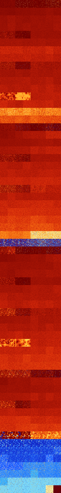

# B0234567 (129536-130047)

<details>
    <summary>Initial Grid</summary>
    
</details>


<details>
    <summary>Initial Grid RLE</summary>

```
#C Exported from GoGoL (https://github.com/marrow16/gogol)
#C Wrap mode: Toroidal
#C Boundary mode: Dead
#C Step: 0
x = 100, y = 100, rule = B0234567/S
bo4bo8bo15bo41bo6bo$7bo10bo50bo$47bo2bo10bo12bo7b2o4bo$17bo14bo9bo$51bo
14bo20bo7bo$24bo35bo32bo3bo$17bo41bo9bo23bo$76b2o7bo7bo$12bo7bo2bo29bo
9bo15bo9bo$23bo8bo8bo17bo20bo$30bo9bo26bo12bo7bo$9bo29bo2bo5bo2bo5bo9bo
bo8bo12bo$4bo6bo28bobo29bo6bo10bo7bo$15bo8bo13bo45bo$30bo10bo31bo6b2o$
10bo21bo55bo5bo$31bo36bobo5bo$5bo9bobo59bo14bo$o19bo2bo9bo23b2o4bo19bo$
11bo12bo4b2obo15bo7bo9bo$24bo55bo$13b2o40bo25bo3bo3bo$8bo39bo33bo$22bo
15bo3b2o12bo$41bo9bo17bo6bo$12bo3bo42bo12bo16bo$2bo16bo12bo20bo8bo$17bo
10bo48bo15bo$4bo47bo28b2o3bo$8b2o12bo21b2o17bobo9bo3bo$3bo7bo10bo51bo7b
o$26bo23bo$4bo32bo22bo17bo14bo$6bo23bo16bo10bo8bo21bo$13bo18bo41bo$21bo
9bo9bo13bo6bo20bo14bo$41bo38bo$79bo4bo$8bo19bo8bo16bo$2bo43bo24bo$10bo
8bo22bo30bo5bobo15bo$31bo40b2o13bo$100b$7bo28bo11bo16bo7bo$9bo70bo3bo
13bo$38bo17bo25bo$32bo30bo32bo2bo$3bobo14bobo18bo19bo23bo2bo3bobobo$18b
o20bo$5bo30bo5bobo21bobo21bo$6bo7bo32bo26bo8bo4bo2bo3bo$23bo33bo15bo$8b
o55b2o11bo$bobo27bo13b2o23bo$3bo2bo44bo7bo14bo$18bo21bo16bo$3bo2bo47bo
35bobo$61bo33bo$8bo39bobo13bo32bo$4bo46bo8bo19bobo$48bo2bo28bo$11bo21bo
13bo10bo$12bo35bo22bo12bo$7bo24bo20bo11bo$22bo8bo32bo15bo12bo$100b$bo
22bo13bo16bo20bo$36bo2bo8bo25bo7bo$9bo13bo10bo22bo$16bo3bo15bo3bo5bobo$
8bo55bo15bo$34bo23bobo3bo5bo15bo5bo$3bo28b2o20bobobo4bo22bo9bo$24bo7bo
2bo2b2o49bo$22bo26bo6bo38bo$15bo10b2o10bo10b2o10bo6bo25bo$50bo9bo25bo$
15bo28bo7bo11bo21bo12bo$o39bob2o47bobo4bo$6bo15bo4bo8b2o11bo16bo$2o12bo
7bo27bo2bo26b2o3bobo$o42bo38bo$5bo15bo11bo11bo3bo23bo$57bo14bo9bo12bo$
15bo14bo33bo6bo7bo14bo2bo$9bo4bo18bobo2bo7bo3bo7bo32bo2bo$11bo4bo21bo
29b2o$15bo27bo21bo19bo7bo$8bo4b2o26b2o35bobo8bo3bo$56bo2bo36bo$27bo2b2o
46bo7bo$23bo46bo4b3o7bo$25bo3bo15bo27bo$21bo12bo5bobo2bo5bo23bo$2bo5bo
11bo2bo16bo26bo19bo4bo$7bo13bo30bo10bo4bo13bo$28b2o5bo37bo4bo9bo3bo$11b
o72bo$36bo16bo15bo3bo$14bobo29bo10bo11bo3b2o22bo!
```
</details>
<details>
    <summary>Thumbnail</summary>

</details>
<table>
<tr>
    <td><a href="./129536%20S%20Heat%20Map%20Activity.png"></a><br>S (129536)<br>R@21,p2</td>    <td><a href="./129537%20S0%20Heat%20Map%20Activity.png"></a><br>S0 (129537)<br>R@21,p2</td>    <td><a href="./129538%20S1%20Heat%20Map%20Activity.png"></a><br>S1 (129538)<br>R@150,p120</td>    <td><a href="./129539%20S01%20Heat%20Map%20Activity.png"></a><br>S01 (129539)<br>R@150,p120</td>    <td><a href="./129540%20S2%20Heat%20Map%20Activity.png"></a><br>S2 (129540)<br>R@489,p168</td>    <td><a href="./129541%20S02%20Heat%20Map%20Activity.png"></a><br>S02 (129541)<br>R@603,p360</td>    <td><a href="./129542%20S12%20Heat%20Map%20Activity.png"></a><br>S12 (129542)<br>G>1000</td>    <td><a href="./129543%20S012%20Heat%20Map%20Activity.png"></a><br>S012 (129543)<br>G>1000</td></tr>
<tr>
    <td><a href="./129544%20S3%20Heat%20Map%20Activity.png"></a><br>S3 (129544)<br>G>1000</td>    <td><a href="./129545%20S03%20Heat%20Map%20Activity.png"></a><br>S03 (129545)<br>G>1000</td>    <td><a href="./129546%20S13%20Heat%20Map%20Activity.png"></a><br>S13 (129546)<br>G>1000</td>    <td><a href="./129547%20S013%20Heat%20Map%20Activity.png"></a><br>S013 (129547)<br>G>1000</td>    <td><a href="./129548%20S23%20Heat%20Map%20Activity.png"></a><br>S23 (129548)<br>G>1000</td>    <td><a href="./129549%20S023%20Heat%20Map%20Activity.png"></a><br>S023 (129549)<br>G>1000</td>    <td><a href="./129550%20S123%20Heat%20Map%20Activity.png"></a><br>S123 (129550)<br>G>1000</td>    <td><a href="./129551%20S0123%20Heat%20Map%20Activity.png"></a><br>S0123 (129551)<br>G>1000</td></tr>
<tr>
    <td><a href="./129552%20S4%20Heat%20Map%20Activity.png"></a><br>S4 (129552)<br>G>1000</td>    <td><a href="./129553%20S04%20Heat%20Map%20Activity.png"></a><br>S04 (129553)<br>G>1000</td>    <td><a href="./129554%20S14%20Heat%20Map%20Activity.png"></a><br>S14 (129554)<br>G>1000</td>    <td><a href="./129555%20S014%20Heat%20Map%20Activity.png"></a><br>S014 (129555)<br>G>1000</td>    <td><a href="./129556%20S24%20Heat%20Map%20Activity.png"></a><br>S24 (129556)<br>G>1000</td>    <td><a href="./129557%20S024%20Heat%20Map%20Activity.png"></a><br>S024 (129557)<br>G>1000</td>    <td><a href="./129558%20S124%20Heat%20Map%20Activity.png"></a><br>S124 (129558)<br>G>1000</td>    <td><a href="./129559%20S0124%20Heat%20Map%20Activity.png"></a><br>S0124 (129559)<br>G>1000</td></tr>
<tr>
    <td><a href="./129560%20S34%20Heat%20Map%20Activity.png"></a><br>S34 (129560)<br>G>1000</td>    <td><a href="./129561%20S034%20Heat%20Map%20Activity.png"></a><br>S034 (129561)<br>G>1000</td>    <td><a href="./129562%20S134%20Heat%20Map%20Activity.png"></a><br>S134 (129562)<br>G>1000</td>    <td><a href="./129563%20S0134%20Heat%20Map%20Activity.png"></a><br>S0134 (129563)<br>G>1000</td>    <td><a href="./129564%20S234%20Heat%20Map%20Activity.png"></a><br>S234 (129564)<br>G>1000</td>    <td><a href="./129565%20S0234%20Heat%20Map%20Activity.png"></a><br>S0234 (129565)<br>G>1000</td>    <td><a href="./129566%20S1234%20Heat%20Map%20Activity.png"></a><br>S1234 (129566)<br>G>1000</td>    <td><a href="./129567%20S01234%20Heat%20Map%20Activity.png"></a><br>S01234 (129567)<br>G>1000</td></tr>
<tr>
    <td><a href="./129568%20S5%20Heat%20Map%20Activity.png"></a><br>S5 (129568)<br>R@39,p2</td>    <td><a href="./129569%20S05%20Heat%20Map%20Activity.png"></a><br>S05 (129569)<br>R@41,p6</td>    <td><a href="./129570%20S15%20Heat%20Map%20Activity.png"></a><br>S15 (129570)<br>R@435,p168</td>    <td><a href="./129571%20S015%20Heat%20Map%20Activity.png"></a><br>S015 (129571)<br>G>1000</td>    <td><a href="./129572%20S25%20Heat%20Map%20Activity.png"></a><br>S25 (129572)<br>G>1000</td>    <td><a href="./129573%20S025%20Heat%20Map%20Activity.png"></a><br>S025 (129573)<br>G>1000</td>    <td><a href="./129574%20S125%20Heat%20Map%20Activity.png"></a><br>S125 (129574)<br>G>1000</td>    <td><a href="./129575%20S0125%20Heat%20Map%20Activity.png"></a><br>S0125 (129575)<br>G>1000</td></tr>
<tr>
    <td><a href="./129576%20S35%20Heat%20Map%20Activity.png"></a><br>S35 (129576)<br>G>1000</td>    <td><a href="./129577%20S035%20Heat%20Map%20Activity.png"></a><br>S035 (129577)<br>G>1000</td>    <td><a href="./129578%20S135%20Heat%20Map%20Activity.png"></a><br>S135 (129578)<br>G>1000</td>    <td><a href="./129579%20S0135%20Heat%20Map%20Activity.png"></a><br>S0135 (129579)<br>G>1000</td>    <td><a href="./129580%20S235%20Heat%20Map%20Activity.png"></a><br>S235 (129580)<br>G>1000</td>    <td><a href="./129581%20S0235%20Heat%20Map%20Activity.png"></a><br>S0235 (129581)<br>G>1000</td>    <td><a href="./129582%20S1235%20Heat%20Map%20Activity.png"></a><br>S1235 (129582)<br>G>1000</td>    <td><a href="./129583%20S01235%20Heat%20Map%20Activity.png"></a><br>S01235 (129583)<br>G>1000</td></tr>
<tr>
    <td><a href="./129584%20S45%20Heat%20Map%20Activity.png"></a><br>S45 (129584)<br>G>1000</td>    <td><a href="./129585%20S045%20Heat%20Map%20Activity.png"></a><br>S045 (129585)<br>G>1000</td>    <td><a href="./129586%20S145%20Heat%20Map%20Activity.png"></a><br>S145 (129586)<br>G>1000</td>    <td><a href="./129587%20S0145%20Heat%20Map%20Activity.png"></a><br>S0145 (129587)<br>G>1000</td>    <td><a href="./129588%20S245%20Heat%20Map%20Activity.png"></a><br>S245 (129588)<br>G>1000</td>    <td><a href="./129589%20S0245%20Heat%20Map%20Activity.png"></a><br>S0245 (129589)<br>G>1000</td>    <td><a href="./129590%20S1245%20Heat%20Map%20Activity.png"></a><br>S1245 (129590)<br>G>1000</td>    <td><a href="./129591%20S01245%20Heat%20Map%20Activity.png"></a><br>S01245 (129591)<br>G>1000</td></tr>
<tr>
    <td><a href="./129592%20S345%20Heat%20Map%20Activity.png"></a><br>S345 (129592)<br>G>1000</td>    <td><a href="./129593%20S0345%20Heat%20Map%20Activity.png"></a><br>S0345 (129593)<br>G>1000</td>    <td><a href="./129594%20S1345%20Heat%20Map%20Activity.png"></a><br>S1345 (129594)<br>G>1000</td>    <td><a href="./129595%20S01345%20Heat%20Map%20Activity.png"></a><br>S01345 (129595)<br>G>1000</td>    <td><a href="./129596%20S2345%20Heat%20Map%20Activity.png"></a><br>S2345 (129596)<br>G>1000</td>    <td><a href="./129597%20S02345%20Heat%20Map%20Activity.png"></a><br>S02345 (129597)<br>G>1000</td>    <td><a href="./129598%20S12345%20Heat%20Map%20Activity.png"></a><br>S12345 (129598)<br>G>1000</td>    <td><a href="./129599%20S012345%20Heat%20Map%20Activity.png"></a><br>S012345 (129599)<br>G>1000</td></tr>
<tr>
    <td><a href="./129600%20S6%20Heat%20Map%20Activity.png"></a><br>S6 (129600)<br>R@11,p2</td>    <td><a href="./129601%20S06%20Heat%20Map%20Activity.png"></a><br>S06 (129601)<br>R@11,p2</td>    <td><a href="./129602%20S16%20Heat%20Map%20Activity.png"></a><br>S16 (129602)<br>R@46,p24</td>    <td><a href="./129603%20S016%20Heat%20Map%20Activity.png"></a><br>S016 (129603)<br>R@47,p24</td>    <td><a href="./129604%20S26%20Heat%20Map%20Activity.png"></a><br>S26 (129604)<br>G>1000</td>    <td><a href="./129605%20S026%20Heat%20Map%20Activity.png"></a><br>S026 (129605)<br>G>1000</td>    <td><a href="./129606%20S126%20Heat%20Map%20Activity.png"></a><br>S126 (129606)<br>G>1000</td>    <td><a href="./129607%20S0126%20Heat%20Map%20Activity.png"></a><br>S0126 (129607)<br>G>1000</td></tr>
<tr>
    <td><a href="./129608%20S36%20Heat%20Map%20Activity.png"></a><br>S36 (129608)<br>G>1000</td>    <td><a href="./129609%20S036%20Heat%20Map%20Activity.png"></a><br>S036 (129609)<br>G>1000</td>    <td><a href="./129610%20S136%20Heat%20Map%20Activity.png"></a><br>S136 (129610)<br>G>1000</td>    <td><a href="./129611%20S0136%20Heat%20Map%20Activity.png"></a><br>S0136 (129611)<br>G>1000</td>    <td><a href="./129612%20S236%20Heat%20Map%20Activity.png"></a><br>S236 (129612)<br>G>1000</td>    <td><a href="./129613%20S0236%20Heat%20Map%20Activity.png"></a><br>S0236 (129613)<br>G>1000</td>    <td><a href="./129614%20S1236%20Heat%20Map%20Activity.png"></a><br>S1236 (129614)<br>G>1000</td>    <td><a href="./129615%20S01236%20Heat%20Map%20Activity.png"></a><br>S01236 (129615)<br>G>1000</td></tr>
<tr>
    <td><a href="./129616%20S46%20Heat%20Map%20Activity.png"></a><br>S46 (129616)<br>G>1000</td>    <td><a href="./129617%20S046%20Heat%20Map%20Activity.png"></a><br>S046 (129617)<br>G>1000</td>    <td><a href="./129618%20S146%20Heat%20Map%20Activity.png"></a><br>S146 (129618)<br>G>1000</td>    <td><a href="./129619%20S0146%20Heat%20Map%20Activity.png"></a><br>S0146 (129619)<br>G>1000</td>    <td><a href="./129620%20S246%20Heat%20Map%20Activity.png"></a><br>S246 (129620)<br>G>1000</td>    <td><a href="./129621%20S0246%20Heat%20Map%20Activity.png"></a><br>S0246 (129621)<br>G>1000</td>    <td><a href="./129622%20S1246%20Heat%20Map%20Activity.png"></a><br>S1246 (129622)<br>G>1000</td>    <td><a href="./129623%20S01246%20Heat%20Map%20Activity.png"></a><br>S01246 (129623)<br>G>1000</td></tr>
<tr>
    <td><a href="./129624%20S346%20Heat%20Map%20Activity.png"></a><br>S346 (129624)<br>G>1000</td>    <td><a href="./129625%20S0346%20Heat%20Map%20Activity.png"></a><br>S0346 (129625)<br>G>1000</td>    <td><a href="./129626%20S1346%20Heat%20Map%20Activity.png"></a><br>S1346 (129626)<br>G>1000</td>    <td><a href="./129627%20S01346%20Heat%20Map%20Activity.png"></a><br>S01346 (129627)<br>G>1000</td>    <td><a href="./129628%20S2346%20Heat%20Map%20Activity.png"></a><br>S2346 (129628)<br>G>1000</td>    <td><a href="./129629%20S02346%20Heat%20Map%20Activity.png"></a><br>S02346 (129629)<br>G>1000</td>    <td><a href="./129630%20S12346%20Heat%20Map%20Activity.png"></a><br>S12346 (129630)<br>G>1000</td>    <td><a href="./129631%20S012346%20Heat%20Map%20Activity.png"></a><br>S012346 (129631)<br>G>1000</td></tr>
<tr>
    <td><a href="./129632%20S56%20Heat%20Map%20Activity.png"></a><br>S56 (129632)<br>R@467,p60</td>    <td><a href="./129633%20S056%20Heat%20Map%20Activity.png"></a><br>S056 (129633)<br>R@469,p4</td>    <td><a href="./129634%20S156%20Heat%20Map%20Activity.png"></a><br>S156 (129634)<br>G>1000</td>    <td><a href="./129635%20S0156%20Heat%20Map%20Activity.png"></a><br>S0156 (129635)<br>G>1000</td>    <td><a href="./129636%20S256%20Heat%20Map%20Activity.png"></a><br>S256 (129636)<br>G>1000</td>    <td><a href="./129637%20S0256%20Heat%20Map%20Activity.png"></a><br>S0256 (129637)<br>G>1000</td>    <td><a href="./129638%20S1256%20Heat%20Map%20Activity.png"></a><br>S1256 (129638)<br>G>1000</td>    <td><a href="./129639%20S01256%20Heat%20Map%20Activity.png"></a><br>S01256 (129639)<br>G>1000</td></tr>
<tr>
    <td><a href="./129640%20S356%20Heat%20Map%20Activity.png"></a><br>S356 (129640)<br>G>1000</td>    <td><a href="./129641%20S0356%20Heat%20Map%20Activity.png"></a><br>S0356 (129641)<br>G>1000</td>    <td><a href="./129642%20S1356%20Heat%20Map%20Activity.png"></a><br>S1356 (129642)<br>G>1000</td>    <td><a href="./129643%20S01356%20Heat%20Map%20Activity.png"></a><br>S01356 (129643)<br>G>1000</td>    <td><a href="./129644%20S2356%20Heat%20Map%20Activity.png"></a><br>S2356 (129644)<br>G>1000</td>    <td><a href="./129645%20S02356%20Heat%20Map%20Activity.png"></a><br>S02356 (129645)<br>G>1000</td>    <td><a href="./129646%20S12356%20Heat%20Map%20Activity.png"></a><br>S12356 (129646)<br>G>1000</td>    <td><a href="./129647%20S012356%20Heat%20Map%20Activity.png"></a><br>S012356 (129647)<br>G>1000</td></tr>
<tr>
    <td><a href="./129648%20S456%20Heat%20Map%20Activity.png"></a><br>S456 (129648)<br>G>1000</td>    <td><a href="./129649%20S0456%20Heat%20Map%20Activity.png"></a><br>S0456 (129649)<br>G>1000</td>    <td><a href="./129650%20S1456%20Heat%20Map%20Activity.png"></a><br>S1456 (129650)<br>G>1000</td>    <td><a href="./129651%20S01456%20Heat%20Map%20Activity.png"></a><br>S01456 (129651)<br>G>1000</td>    <td><a href="./129652%20S2456%20Heat%20Map%20Activity.png"></a><br>S2456 (129652)<br>G>1000</td>    <td><a href="./129653%20S02456%20Heat%20Map%20Activity.png"></a><br>S02456 (129653)<br>G>1000</td>    <td><a href="./129654%20S12456%20Heat%20Map%20Activity.png"></a><br>S12456 (129654)<br>G>1000</td>    <td><a href="./129655%20S012456%20Heat%20Map%20Activity.png"></a><br>S012456 (129655)<br>G>1000</td></tr>
<tr>
    <td><a href="./129656%20S3456%20Heat%20Map%20Activity.png"></a><br>S3456 (129656)<br>G>1000</td>    <td><a href="./129657%20S03456%20Heat%20Map%20Activity.png"></a><br>S03456 (129657)<br>G>1000</td>    <td><a href="./129658%20S13456%20Heat%20Map%20Activity.png"></a><br>S13456 (129658)<br>G>1000</td>    <td><a href="./129659%20S013456%20Heat%20Map%20Activity.png"></a><br>S013456 (129659)<br>G>1000</td>    <td><a href="./129660%20S23456%20Heat%20Map%20Activity.png"></a><br>S23456 (129660)<br>G>1000</td>    <td><a href="./129661%20S023456%20Heat%20Map%20Activity.png"></a><br>S023456 (129661)<br>G>1000</td>    <td><a href="./129662%20S123456%20Heat%20Map%20Activity.png"></a><br>S123456 (129662)<br>G>1000</td>    <td><a href="./129663%20S0123456%20Heat%20Map%20Activity.png"></a><br>S0123456 (129663)<br>G>1000</td></tr>
<tr>
    <td><a href="./129664%20S7%20Heat%20Map%20Activity.png"></a><br>S7 (129664)<br>R@12,p2</td>    <td><a href="./129665%20S07%20Heat%20Map%20Activity.png"></a><br>S07 (129665)<br>R@12,p2</td>    <td><a href="./129666%20S17%20Heat%20Map%20Activity.png"></a><br>S17 (129666)<br>R@20,p4</td>    <td><a href="./129667%20S017%20Heat%20Map%20Activity.png"></a><br>S017 (129667)<br>R@33,p12</td>    <td><a href="./129668%20S27%20Heat%20Map%20Activity.png"></a><br>S27 (129668)<br>G>1000</td>    <td><a href="./129669%20S027%20Heat%20Map%20Activity.png"></a><br>S027 (129669)<br>R@212,p120</td>    <td><a href="./129670%20S127%20Heat%20Map%20Activity.png"></a><br>S127 (129670)<br>R@100,p24</td>    <td><a href="./129671%20S0127%20Heat%20Map%20Activity.png"></a><br>S0127 (129671)<br>R@319,p240</td></tr>
<tr>
    <td><a href="./129672%20S37%20Heat%20Map%20Activity.png"></a><br>S37 (129672)<br>G>1000</td>    <td><a href="./129673%20S037%20Heat%20Map%20Activity.png"></a><br>S037 (129673)<br>G>1000</td>    <td><a href="./129674%20S137%20Heat%20Map%20Activity.png"></a><br>S137 (129674)<br>G>1000</td>    <td><a href="./129675%20S0137%20Heat%20Map%20Activity.png"></a><br>S0137 (129675)<br>G>1000</td>    <td><a href="./129676%20S237%20Heat%20Map%20Activity.png"></a><br>S237 (129676)<br>G>1000</td>    <td><a href="./129677%20S0237%20Heat%20Map%20Activity.png"></a><br>S0237 (129677)<br>G>1000</td>    <td><a href="./129678%20S1237%20Heat%20Map%20Activity.png"></a><br>S1237 (129678)<br>G>1000</td>    <td><a href="./129679%20S01237%20Heat%20Map%20Activity.png"></a><br>S01237 (129679)<br>G>1000</td></tr>
<tr>
    <td><a href="./129680%20S47%20Heat%20Map%20Activity.png"></a><br>S47 (129680)<br>G>1000</td>    <td><a href="./129681%20S047%20Heat%20Map%20Activity.png"></a><br>S047 (129681)<br>G>1000</td>    <td><a href="./129682%20S147%20Heat%20Map%20Activity.png"></a><br>S147 (129682)<br>G>1000</td>    <td><a href="./129683%20S0147%20Heat%20Map%20Activity.png"></a><br>S0147 (129683)<br>G>1000</td>    <td><a href="./129684%20S247%20Heat%20Map%20Activity.png"></a><br>S247 (129684)<br>G>1000</td>    <td><a href="./129685%20S0247%20Heat%20Map%20Activity.png"></a><br>S0247 (129685)<br>G>1000</td>    <td><a href="./129686%20S1247%20Heat%20Map%20Activity.png"></a><br>S1247 (129686)<br>G>1000</td>    <td><a href="./129687%20S01247%20Heat%20Map%20Activity.png"></a><br>S01247 (129687)<br>G>1000</td></tr>
<tr>
    <td><a href="./129688%20S347%20Heat%20Map%20Activity.png"></a><br>S347 (129688)<br>G>1000</td>    <td><a href="./129689%20S0347%20Heat%20Map%20Activity.png"></a><br>S0347 (129689)<br>G>1000</td>    <td><a href="./129690%20S1347%20Heat%20Map%20Activity.png"></a><br>S1347 (129690)<br>G>1000</td>    <td><a href="./129691%20S01347%20Heat%20Map%20Activity.png"></a><br>S01347 (129691)<br>G>1000</td>    <td><a href="./129692%20S2347%20Heat%20Map%20Activity.png"></a><br>S2347 (129692)<br>G>1000</td>    <td><a href="./129693%20S02347%20Heat%20Map%20Activity.png"></a><br>S02347 (129693)<br>G>1000</td>    <td><a href="./129694%20S12347%20Heat%20Map%20Activity.png"></a><br>S12347 (129694)<br>G>1000</td>    <td><a href="./129695%20S012347%20Heat%20Map%20Activity.png"></a><br>S012347 (129695)<br>G>1000</td></tr>
<tr>
    <td><a href="./129696%20S57%20Heat%20Map%20Activity.png"></a><br>S57 (129696)<br>R@29,p2</td>    <td><a href="./129697%20S057%20Heat%20Map%20Activity.png"></a><br>S057 (129697)<br>R@28,p2</td>    <td><a href="./129698%20S157%20Heat%20Map%20Activity.png"></a><br>S157 (129698)<br>R@87,p4</td>    <td><a href="./129699%20S0157%20Heat%20Map%20Activity.png"></a><br>S0157 (129699)<br>R@136,p4</td>    <td><a href="./129700%20S257%20Heat%20Map%20Activity.png"></a><br>S257 (129700)<br>G>1000</td>    <td><a href="./129701%20S0257%20Heat%20Map%20Activity.png"></a><br>S0257 (129701)<br>G>1000</td>    <td><a href="./129702%20S1257%20Heat%20Map%20Activity.png"></a><br>S1257 (129702)<br>G>1000</td>    <td><a href="./129703%20S01257%20Heat%20Map%20Activity.png"></a><br>S01257 (129703)<br>G>1000</td></tr>
<tr>
    <td><a href="./129704%20S357%20Heat%20Map%20Activity.png"></a><br>S357 (129704)<br>G>1000</td>    <td><a href="./129705%20S0357%20Heat%20Map%20Activity.png"></a><br>S0357 (129705)<br>G>1000</td>    <td><a href="./129706%20S1357%20Heat%20Map%20Activity.png"></a><br>S1357 (129706)<br>G>1000</td>    <td><a href="./129707%20S01357%20Heat%20Map%20Activity.png"></a><br>S01357 (129707)<br>G>1000</td>    <td><a href="./129708%20S2357%20Heat%20Map%20Activity.png"></a><br>S2357 (129708)<br>G>1000</td>    <td><a href="./129709%20S02357%20Heat%20Map%20Activity.png"></a><br>S02357 (129709)<br>G>1000</td>    <td><a href="./129710%20S12357%20Heat%20Map%20Activity.png"></a><br>S12357 (129710)<br>G>1000</td>    <td><a href="./129711%20S012357%20Heat%20Map%20Activity.png"></a><br>S012357 (129711)<br>G>1000</td></tr>
<tr>
    <td><a href="./129712%20S457%20Heat%20Map%20Activity.png"></a><br>S457 (129712)<br>G>1000</td>    <td><a href="./129713%20S0457%20Heat%20Map%20Activity.png"></a><br>S0457 (129713)<br>G>1000</td>    <td><a href="./129714%20S1457%20Heat%20Map%20Activity.png"></a><br>S1457 (129714)<br>G>1000</td>    <td><a href="./129715%20S01457%20Heat%20Map%20Activity.png"></a><br>S01457 (129715)<br>G>1000</td>    <td><a href="./129716%20S2457%20Heat%20Map%20Activity.png"></a><br>S2457 (129716)<br>G>1000</td>    <td><a href="./129717%20S02457%20Heat%20Map%20Activity.png"></a><br>S02457 (129717)<br>G>1000</td>    <td><a href="./129718%20S12457%20Heat%20Map%20Activity.png"></a><br>S12457 (129718)<br>G>1000</td>    <td><a href="./129719%20S012457%20Heat%20Map%20Activity.png"></a><br>S012457 (129719)<br>G>1000</td></tr>
<tr>
    <td><a href="./129720%20S3457%20Heat%20Map%20Activity.png"></a><br>S3457 (129720)<br>G>1000</td>    <td><a href="./129721%20S03457%20Heat%20Map%20Activity.png"></a><br>S03457 (129721)<br>G>1000</td>    <td><a href="./129722%20S13457%20Heat%20Map%20Activity.png"></a><br>S13457 (129722)<br>G>1000</td>    <td><a href="./129723%20S013457%20Heat%20Map%20Activity.png"></a><br>S013457 (129723)<br>G>1000</td>    <td><a href="./129724%20S23457%20Heat%20Map%20Activity.png"></a><br>S23457 (129724)<br>G>1000</td>    <td><a href="./129725%20S023457%20Heat%20Map%20Activity.png"></a><br>S023457 (129725)<br>G>1000</td>    <td><a href="./129726%20S123457%20Heat%20Map%20Activity.png"></a><br>S123457 (129726)<br>G>1000</td>    <td><a href="./129727%20S0123457%20Heat%20Map%20Activity.png"></a><br>S0123457 (129727)<br>G>1000</td></tr>
<tr>
    <td><a href="./129728%20S67%20Heat%20Map%20Activity.png"></a><br>S67 (129728)<br>R@11,p2</td>    <td><a href="./129729%20S067%20Heat%20Map%20Activity.png"></a><br>S067 (129729)<br>R@11,p2</td>    <td><a href="./129730%20S167%20Heat%20Map%20Activity.png"></a><br>S167 (129730)<br>R@17,p2</td>    <td><a href="./129731%20S0167%20Heat%20Map%20Activity.png"></a><br>S0167 (129731)<br>R@23,p4</td>    <td><a href="./129732%20S267%20Heat%20Map%20Activity.png"></a><br>S267 (129732)<br>G>1000</td>    <td><a href="./129733%20S0267%20Heat%20Map%20Activity.png"></a><br>S0267 (129733)<br>G>1000</td>    <td><a href="./129734%20S1267%20Heat%20Map%20Activity.png"></a><br>S1267 (129734)<br>G>1000</td>    <td><a href="./129735%20S01267%20Heat%20Map%20Activity.png"></a><br>S01267 (129735)<br>G>1000</td></tr>
<tr>
    <td><a href="./129736%20S367%20Heat%20Map%20Activity.png"></a><br>S367 (129736)<br>G>1000</td>    <td><a href="./129737%20S0367%20Heat%20Map%20Activity.png"></a><br>S0367 (129737)<br>G>1000</td>    <td><a href="./129738%20S1367%20Heat%20Map%20Activity.png"></a><br>S1367 (129738)<br>G>1000</td>    <td><a href="./129739%20S01367%20Heat%20Map%20Activity.png"></a><br>S01367 (129739)<br>G>1000</td>    <td><a href="./129740%20S2367%20Heat%20Map%20Activity.png"></a><br>S2367 (129740)<br>G>1000</td>    <td><a href="./129741%20S02367%20Heat%20Map%20Activity.png"></a><br>S02367 (129741)<br>G>1000</td>    <td><a href="./129742%20S12367%20Heat%20Map%20Activity.png"></a><br>S12367 (129742)<br>G>1000</td>    <td><a href="./129743%20S012367%20Heat%20Map%20Activity.png"></a><br>S012367 (129743)<br>G>1000</td></tr>
<tr>
    <td><a href="./129744%20S467%20Heat%20Map%20Activity.png"></a><br>S467 (129744)<br>G>1000</td>    <td><a href="./129745%20S0467%20Heat%20Map%20Activity.png"></a><br>S0467 (129745)<br>G>1000</td>    <td><a href="./129746%20S1467%20Heat%20Map%20Activity.png"></a><br>S1467 (129746)<br>G>1000</td>    <td><a href="./129747%20S01467%20Heat%20Map%20Activity.png"></a><br>S01467 (129747)<br>G>1000</td>    <td><a href="./129748%20S2467%20Heat%20Map%20Activity.png"></a><br>S2467 (129748)<br>G>1000</td>    <td><a href="./129749%20S02467%20Heat%20Map%20Activity.png"></a><br>S02467 (129749)<br>G>1000</td>    <td><a href="./129750%20S12467%20Heat%20Map%20Activity.png"></a><br>S12467 (129750)<br>G>1000</td>    <td><a href="./129751%20S012467%20Heat%20Map%20Activity.png"></a><br>S012467 (129751)<br>G>1000</td></tr>
<tr>
    <td><a href="./129752%20S3467%20Heat%20Map%20Activity.png"></a><br>S3467 (129752)<br>G>1000</td>    <td><a href="./129753%20S03467%20Heat%20Map%20Activity.png"></a><br>S03467 (129753)<br>G>1000</td>    <td><a href="./129754%20S13467%20Heat%20Map%20Activity.png"></a><br>S13467 (129754)<br>G>1000</td>    <td><a href="./129755%20S013467%20Heat%20Map%20Activity.png"></a><br>S013467 (129755)<br>G>1000</td>    <td><a href="./129756%20S23467%20Heat%20Map%20Activity.png"></a><br>S23467 (129756)<br>G>1000</td>    <td><a href="./129757%20S023467%20Heat%20Map%20Activity.png"></a><br>S023467 (129757)<br>G>1000</td>    <td><a href="./129758%20S123467%20Heat%20Map%20Activity.png"></a><br>S123467 (129758)<br>G>1000</td>    <td><a href="./129759%20S0123467%20Heat%20Map%20Activity.png"></a><br>S0123467 (129759)<br>G>1000</td></tr>
<tr>
    <td><a href="./129760%20S567%20Heat%20Map%20Activity.png"></a><br>S567 (129760)<br>G>1000</td>    <td><a href="./129761%20S0567%20Heat%20Map%20Activity.png"></a><br>S0567 (129761)<br>G>1000</td>    <td><a href="./129762%20S1567%20Heat%20Map%20Activity.png"></a><br>S1567 (129762)<br>G>1000</td>    <td><a href="./129763%20S01567%20Heat%20Map%20Activity.png"></a><br>S01567 (129763)<br>G>1000</td>    <td><a href="./129764%20S2567%20Heat%20Map%20Activity.png"></a><br>S2567 (129764)<br>G>1000</td>    <td><a href="./129765%20S02567%20Heat%20Map%20Activity.png"></a><br>S02567 (129765)<br>G>1000</td>    <td><a href="./129766%20S12567%20Heat%20Map%20Activity.png"></a><br>S12567 (129766)<br>G>1000</td>    <td><a href="./129767%20S012567%20Heat%20Map%20Activity.png"></a><br>S012567 (129767)<br>G>1000</td></tr>
<tr>
    <td><a href="./129768%20S3567%20Heat%20Map%20Activity.png"></a><br>S3567 (129768)<br>G>1000</td>    <td><a href="./129769%20S03567%20Heat%20Map%20Activity.png"></a><br>S03567 (129769)<br>G>1000</td>    <td><a href="./129770%20S13567%20Heat%20Map%20Activity.png"></a><br>S13567 (129770)<br>G>1000</td>    <td><a href="./129771%20S013567%20Heat%20Map%20Activity.png"></a><br>S013567 (129771)<br>G>1000</td>    <td><a href="./129772%20S23567%20Heat%20Map%20Activity.png"></a><br>S23567 (129772)<br>G>1000</td>    <td><a href="./129773%20S023567%20Heat%20Map%20Activity.png"></a><br>S023567 (129773)<br>G>1000</td>    <td><a href="./129774%20S123567%20Heat%20Map%20Activity.png"></a><br>S123567 (129774)<br>G>1000</td>    <td><a href="./129775%20S0123567%20Heat%20Map%20Activity.png"></a><br>S0123567 (129775)<br>G>1000</td></tr>
<tr>
    <td><a href="./129776%20S4567%20Heat%20Map%20Activity.png"></a><br>S4567 (129776)<br>G>1000</td>    <td><a href="./129777%20S04567%20Heat%20Map%20Activity.png"></a><br>S04567 (129777)<br>G>1000</td>    <td><a href="./129778%20S14567%20Heat%20Map%20Activity.png"></a><br>S14567 (129778)<br>G>1000</td>    <td><a href="./129779%20S014567%20Heat%20Map%20Activity.png"></a><br>S014567 (129779)<br>G>1000</td>    <td><a href="./129780%20S24567%20Heat%20Map%20Activity.png"></a><br>S24567 (129780)<br>G>1000</td>    <td><a href="./129781%20S024567%20Heat%20Map%20Activity.png"></a><br>S024567 (129781)<br>G>1000</td>    <td><a href="./129782%20S124567%20Heat%20Map%20Activity.png"></a><br>S124567 (129782)<br>G>1000</td>    <td><a href="./129783%20S0124567%20Heat%20Map%20Activity.png"></a><br>S0124567 (129783)<br>G>1000</td></tr>
<tr>
    <td><a href="./129784%20S34567%20Heat%20Map%20Activity.png"></a><br>S34567 (129784)<br>R@42,p2</td>    <td><a href="./129785%20S034567%20Heat%20Map%20Activity.png"></a><br>S034567 (129785)<br>R@50,p6</td>    <td><a href="./129786%20S134567%20Heat%20Map%20Activity.png"></a><br>S134567 (129786)<br>R@42,p2</td>    <td><a href="./129787%20S0134567%20Heat%20Map%20Activity.png"></a><br>S0134567 (129787)<br>R@34,p6</td>    <td><a href="./129788%20S234567%20Heat%20Map%20Activity.png"></a><br>S234567 (129788)<br>R@16,p2</td>    <td><a href="./129789%20S0234567%20Heat%20Map%20Activity.png"></a><br>S0234567 (129789)<br>R@13,p2</td>    <td><a href="./129790%20S1234567%20Heat%20Map%20Activity.png"></a><br>S1234567 (129790)<br>R@16,p2</td>    <td><a href="./129791%20S01234567%20Heat%20Map%20Activity.png"></a><br>S01234567 (129791)<br>R@18,p2</td></tr>
<tr>
    <td><a href="./129792%20S8%20Heat%20Map%20Activity.png"></a><br>S8 (129792)<br>R@13,p4</td>    <td><a href="./129793%20S08%20Heat%20Map%20Activity.png"></a><br>S08 (129793)<br>R@8,p2</td>    <td><a href="./129794%20S18%20Heat%20Map%20Activity.png"></a><br>S18 (129794)<br>R@141,p120</td>    <td><a href="./129795%20S018%20Heat%20Map%20Activity.png"></a><br>S018 (129795)<br>R@867,p840</td>    <td><a href="./129796%20S28%20Heat%20Map%20Activity.png"></a><br>S28 (129796)<br>G>1000</td>    <td><a href="./129797%20S028%20Heat%20Map%20Activity.png"></a><br>S028 (129797)<br>R@354,p120</td>    <td><a href="./129798%20S128%20Heat%20Map%20Activity.png"></a><br>S128 (129798)<br>R@979,p840</td>    <td><a href="./129799%20S0128%20Heat%20Map%20Activity.png"></a><br>S0128 (129799)<br>R@984,p840</td></tr>
<tr>
    <td><a href="./129800%20S38%20Heat%20Map%20Activity.png"></a><br>S38 (129800)<br>G>1000</td>    <td><a href="./129801%20S038%20Heat%20Map%20Activity.png"></a><br>S038 (129801)<br>G>1000</td>    <td><a href="./129802%20S138%20Heat%20Map%20Activity.png"></a><br>S138 (129802)<br>G>1000</td>    <td><a href="./129803%20S0138%20Heat%20Map%20Activity.png"></a><br>S0138 (129803)<br>G>1000</td>    <td><a href="./129804%20S238%20Heat%20Map%20Activity.png"></a><br>S238 (129804)<br>G>1000</td>    <td><a href="./129805%20S0238%20Heat%20Map%20Activity.png"></a><br>S0238 (129805)<br>G>1000</td>    <td><a href="./129806%20S1238%20Heat%20Map%20Activity.png"></a><br>S1238 (129806)<br>G>1000</td>    <td><a href="./129807%20S01238%20Heat%20Map%20Activity.png"></a><br>S01238 (129807)<br>G>1000</td></tr>
<tr>
    <td><a href="./129808%20S48%20Heat%20Map%20Activity.png"></a><br>S48 (129808)<br>G>1000</td>    <td><a href="./129809%20S048%20Heat%20Map%20Activity.png"></a><br>S048 (129809)<br>G>1000</td>    <td><a href="./129810%20S148%20Heat%20Map%20Activity.png"></a><br>S148 (129810)<br>G>1000</td>    <td><a href="./129811%20S0148%20Heat%20Map%20Activity.png"></a><br>S0148 (129811)<br>G>1000</td>    <td><a href="./129812%20S248%20Heat%20Map%20Activity.png"></a><br>S248 (129812)<br>G>1000</td>    <td><a href="./129813%20S0248%20Heat%20Map%20Activity.png"></a><br>S0248 (129813)<br>G>1000</td>    <td><a href="./129814%20S1248%20Heat%20Map%20Activity.png"></a><br>S1248 (129814)<br>G>1000</td>    <td><a href="./129815%20S01248%20Heat%20Map%20Activity.png"></a><br>S01248 (129815)<br>G>1000</td></tr>
<tr>
    <td><a href="./129816%20S348%20Heat%20Map%20Activity.png"></a><br>S348 (129816)<br>G>1000</td>    <td><a href="./129817%20S0348%20Heat%20Map%20Activity.png"></a><br>S0348 (129817)<br>G>1000</td>    <td><a href="./129818%20S1348%20Heat%20Map%20Activity.png"></a><br>S1348 (129818)<br>G>1000</td>    <td><a href="./129819%20S01348%20Heat%20Map%20Activity.png"></a><br>S01348 (129819)<br>G>1000</td>    <td><a href="./129820%20S2348%20Heat%20Map%20Activity.png"></a><br>S2348 (129820)<br>G>1000</td>    <td><a href="./129821%20S02348%20Heat%20Map%20Activity.png"></a><br>S02348 (129821)<br>G>1000</td>    <td><a href="./129822%20S12348%20Heat%20Map%20Activity.png"></a><br>S12348 (129822)<br>G>1000</td>    <td><a href="./129823%20S012348%20Heat%20Map%20Activity.png"></a><br>S012348 (129823)<br>G>1000</td></tr>
<tr>
    <td><a href="./129824%20S58%20Heat%20Map%20Activity.png"></a><br>S58 (129824)<br>R@38,p4</td>    <td><a href="./129825%20S058%20Heat%20Map%20Activity.png"></a><br>S058 (129825)<br>R@40,p2</td>    <td><a href="./129826%20S158%20Heat%20Map%20Activity.png"></a><br>S158 (129826)<br>G>1000</td>    <td><a href="./129827%20S0158%20Heat%20Map%20Activity.png"></a><br>S0158 (129827)<br>R@990,p720</td>    <td><a href="./129828%20S258%20Heat%20Map%20Activity.png"></a><br>S258 (129828)<br>G>1000</td>    <td><a href="./129829%20S0258%20Heat%20Map%20Activity.png"></a><br>S0258 (129829)<br>G>1000</td>    <td><a href="./129830%20S1258%20Heat%20Map%20Activity.png"></a><br>S1258 (129830)<br>G>1000</td>    <td><a href="./129831%20S01258%20Heat%20Map%20Activity.png"></a><br>S01258 (129831)<br>G>1000</td></tr>
<tr>
    <td><a href="./129832%20S358%20Heat%20Map%20Activity.png"></a><br>S358 (129832)<br>G>1000</td>    <td><a href="./129833%20S0358%20Heat%20Map%20Activity.png"></a><br>S0358 (129833)<br>G>1000</td>    <td><a href="./129834%20S1358%20Heat%20Map%20Activity.png"></a><br>S1358 (129834)<br>G>1000</td>    <td><a href="./129835%20S01358%20Heat%20Map%20Activity.png"></a><br>S01358 (129835)<br>G>1000</td>    <td><a href="./129836%20S2358%20Heat%20Map%20Activity.png"></a><br>S2358 (129836)<br>G>1000</td>    <td><a href="./129837%20S02358%20Heat%20Map%20Activity.png"></a><br>S02358 (129837)<br>G>1000</td>    <td><a href="./129838%20S12358%20Heat%20Map%20Activity.png"></a><br>S12358 (129838)<br>G>1000</td>    <td><a href="./129839%20S012358%20Heat%20Map%20Activity.png"></a><br>S012358 (129839)<br>G>1000</td></tr>
<tr>
    <td><a href="./129840%20S458%20Heat%20Map%20Activity.png"></a><br>S458 (129840)<br>G>1000</td>    <td><a href="./129841%20S0458%20Heat%20Map%20Activity.png"></a><br>S0458 (129841)<br>G>1000</td>    <td><a href="./129842%20S1458%20Heat%20Map%20Activity.png"></a><br>S1458 (129842)<br>G>1000</td>    <td><a href="./129843%20S01458%20Heat%20Map%20Activity.png"></a><br>S01458 (129843)<br>G>1000</td>    <td><a href="./129844%20S2458%20Heat%20Map%20Activity.png"></a><br>S2458 (129844)<br>G>1000</td>    <td><a href="./129845%20S02458%20Heat%20Map%20Activity.png"></a><br>S02458 (129845)<br>G>1000</td>    <td><a href="./129846%20S12458%20Heat%20Map%20Activity.png"></a><br>S12458 (129846)<br>G>1000</td>    <td><a href="./129847%20S012458%20Heat%20Map%20Activity.png"></a><br>S012458 (129847)<br>G>1000</td></tr>
<tr>
    <td><a href="./129848%20S3458%20Heat%20Map%20Activity.png"></a><br>S3458 (129848)<br>G>1000</td>    <td><a href="./129849%20S03458%20Heat%20Map%20Activity.png"></a><br>S03458 (129849)<br>G>1000</td>    <td><a href="./129850%20S13458%20Heat%20Map%20Activity.png"></a><br>S13458 (129850)<br>G>1000</td>    <td><a href="./129851%20S013458%20Heat%20Map%20Activity.png"></a><br>S013458 (129851)<br>G>1000</td>    <td><a href="./129852%20S23458%20Heat%20Map%20Activity.png"></a><br>S23458 (129852)<br>G>1000</td>    <td><a href="./129853%20S023458%20Heat%20Map%20Activity.png"></a><br>S023458 (129853)<br>G>1000</td>    <td><a href="./129854%20S123458%20Heat%20Map%20Activity.png"></a><br>S123458 (129854)<br>G>1000</td>    <td><a href="./129855%20S0123458%20Heat%20Map%20Activity.png"></a><br>S0123458 (129855)<br>G>1000</td></tr>
<tr>
    <td><a href="./129856%20S68%20Heat%20Map%20Activity.png"></a><br>S68 (129856)<br>R@12,p2</td>    <td><a href="./129857%20S068%20Heat%20Map%20Activity.png"></a><br>S068 (129857)<br>R@11,p2</td>    <td><a href="./129858%20S168%20Heat%20Map%20Activity.png"></a><br>S168 (129858)<br>R@31,p4</td>    <td><a href="./129859%20S0168%20Heat%20Map%20Activity.png"></a><br>S0168 (129859)<br>R@38,p12</td>    <td><a href="./129860%20S268%20Heat%20Map%20Activity.png"></a><br>S268 (129860)<br>G>1000</td>    <td><a href="./129861%20S0268%20Heat%20Map%20Activity.png"></a><br>S0268 (129861)<br>G>1000</td>    <td><a href="./129862%20S1268%20Heat%20Map%20Activity.png"></a><br>S1268 (129862)<br>G>1000</td>    <td><a href="./129863%20S01268%20Heat%20Map%20Activity.png"></a><br>S01268 (129863)<br>G>1000</td></tr>
<tr>
    <td><a href="./129864%20S368%20Heat%20Map%20Activity.png"></a><br>S368 (129864)<br>G>1000</td>    <td><a href="./129865%20S0368%20Heat%20Map%20Activity.png"></a><br>S0368 (129865)<br>G>1000</td>    <td><a href="./129866%20S1368%20Heat%20Map%20Activity.png"></a><br>S1368 (129866)<br>G>1000</td>    <td><a href="./129867%20S01368%20Heat%20Map%20Activity.png"></a><br>S01368 (129867)<br>G>1000</td>    <td><a href="./129868%20S2368%20Heat%20Map%20Activity.png"></a><br>S2368 (129868)<br>G>1000</td>    <td><a href="./129869%20S02368%20Heat%20Map%20Activity.png"></a><br>S02368 (129869)<br>G>1000</td>    <td><a href="./129870%20S12368%20Heat%20Map%20Activity.png"></a><br>S12368 (129870)<br>G>1000</td>    <td><a href="./129871%20S012368%20Heat%20Map%20Activity.png"></a><br>S012368 (129871)<br>G>1000</td></tr>
<tr>
    <td><a href="./129872%20S468%20Heat%20Map%20Activity.png"></a><br>S468 (129872)<br>G>1000</td>    <td><a href="./129873%20S0468%20Heat%20Map%20Activity.png"></a><br>S0468 (129873)<br>G>1000</td>    <td><a href="./129874%20S1468%20Heat%20Map%20Activity.png"></a><br>S1468 (129874)<br>G>1000</td>    <td><a href="./129875%20S01468%20Heat%20Map%20Activity.png"></a><br>S01468 (129875)<br>G>1000</td>    <td><a href="./129876%20S2468%20Heat%20Map%20Activity.png"></a><br>S2468 (129876)<br>G>1000</td>    <td><a href="./129877%20S02468%20Heat%20Map%20Activity.png"></a><br>S02468 (129877)<br>G>1000</td>    <td><a href="./129878%20S12468%20Heat%20Map%20Activity.png"></a><br>S12468 (129878)<br>G>1000</td>    <td><a href="./129879%20S012468%20Heat%20Map%20Activity.png"></a><br>S012468 (129879)<br>G>1000</td></tr>
<tr>
    <td><a href="./129880%20S3468%20Heat%20Map%20Activity.png"></a><br>S3468 (129880)<br>G>1000</td>    <td><a href="./129881%20S03468%20Heat%20Map%20Activity.png"></a><br>S03468 (129881)<br>G>1000</td>    <td><a href="./129882%20S13468%20Heat%20Map%20Activity.png"></a><br>S13468 (129882)<br>G>1000</td>    <td><a href="./129883%20S013468%20Heat%20Map%20Activity.png"></a><br>S013468 (129883)<br>G>1000</td>    <td><a href="./129884%20S23468%20Heat%20Map%20Activity.png"></a><br>S23468 (129884)<br>G>1000</td>    <td><a href="./129885%20S023468%20Heat%20Map%20Activity.png"></a><br>S023468 (129885)<br>G>1000</td>    <td><a href="./129886%20S123468%20Heat%20Map%20Activity.png"></a><br>S123468 (129886)<br>G>1000</td>    <td><a href="./129887%20S0123468%20Heat%20Map%20Activity.png"></a><br>S0123468 (129887)<br>G>1000</td></tr>
<tr>
    <td><a href="./129888%20S568%20Heat%20Map%20Activity.png"></a><br>S568 (129888)<br>R@332,p12</td>    <td><a href="./129889%20S0568%20Heat%20Map%20Activity.png"></a><br>S0568 (129889)<br>R@352,p12</td>    <td><a href="./129890%20S1568%20Heat%20Map%20Activity.png"></a><br>S1568 (129890)<br>G>1000</td>    <td><a href="./129891%20S01568%20Heat%20Map%20Activity.png"></a><br>S01568 (129891)<br>G>1000</td>    <td><a href="./129892%20S2568%20Heat%20Map%20Activity.png"></a><br>S2568 (129892)<br>G>1000</td>    <td><a href="./129893%20S02568%20Heat%20Map%20Activity.png"></a><br>S02568 (129893)<br>G>1000</td>    <td><a href="./129894%20S12568%20Heat%20Map%20Activity.png"></a><br>S12568 (129894)<br>G>1000</td>    <td><a href="./129895%20S012568%20Heat%20Map%20Activity.png"></a><br>S012568 (129895)<br>G>1000</td></tr>
<tr>
    <td><a href="./129896%20S3568%20Heat%20Map%20Activity.png"></a><br>S3568 (129896)<br>G>1000</td>    <td><a href="./129897%20S03568%20Heat%20Map%20Activity.png"></a><br>S03568 (129897)<br>G>1000</td>    <td><a href="./129898%20S13568%20Heat%20Map%20Activity.png"></a><br>S13568 (129898)<br>G>1000</td>    <td><a href="./129899%20S013568%20Heat%20Map%20Activity.png"></a><br>S013568 (129899)<br>G>1000</td>    <td><a href="./129900%20S23568%20Heat%20Map%20Activity.png"></a><br>S23568 (129900)<br>G>1000</td>    <td><a href="./129901%20S023568%20Heat%20Map%20Activity.png"></a><br>S023568 (129901)<br>G>1000</td>    <td><a href="./129902%20S123568%20Heat%20Map%20Activity.png"></a><br>S123568 (129902)<br>G>1000</td>    <td><a href="./129903%20S0123568%20Heat%20Map%20Activity.png"></a><br>S0123568 (129903)<br>G>1000</td></tr>
<tr>
    <td><a href="./129904%20S4568%20Heat%20Map%20Activity.png"></a><br>S4568 (129904)<br>G>1000</td>    <td><a href="./129905%20S04568%20Heat%20Map%20Activity.png"></a><br>S04568 (129905)<br>G>1000</td>    <td><a href="./129906%20S14568%20Heat%20Map%20Activity.png"></a><br>S14568 (129906)<br>G>1000</td>    <td><a href="./129907%20S014568%20Heat%20Map%20Activity.png"></a><br>S014568 (129907)<br>G>1000</td>    <td><a href="./129908%20S24568%20Heat%20Map%20Activity.png"></a><br>S24568 (129908)<br>G>1000</td>    <td><a href="./129909%20S024568%20Heat%20Map%20Activity.png"></a><br>S024568 (129909)<br>G>1000</td>    <td><a href="./129910%20S124568%20Heat%20Map%20Activity.png"></a><br>S124568 (129910)<br>G>1000</td>    <td><a href="./129911%20S0124568%20Heat%20Map%20Activity.png"></a><br>S0124568 (129911)<br>G>1000</td></tr>
<tr>
    <td><a href="./129912%20S34568%20Heat%20Map%20Activity.png"></a><br>S34568 (129912)<br>G>1000</td>    <td><a href="./129913%20S034568%20Heat%20Map%20Activity.png"></a><br>S034568 (129913)<br>G>1000</td>    <td><a href="./129914%20S134568%20Heat%20Map%20Activity.png"></a><br>S134568 (129914)<br>G>1000</td>    <td><a href="./129915%20S0134568%20Heat%20Map%20Activity.png"></a><br>S0134568 (129915)<br>G>1000</td>    <td><a href="./129916%20S234568%20Heat%20Map%20Activity.png"></a><br>S234568 (129916)<br>G>1000</td>    <td><a href="./129917%20S0234568%20Heat%20Map%20Activity.png"></a><br>S0234568 (129917)<br>G>1000</td>    <td><a href="./129918%20S1234568%20Heat%20Map%20Activity.png"></a><br>S1234568 (129918)<br>G>1000</td>    <td><a href="./129919%20S01234568%20Heat%20Map%20Activity.png"></a><br>S01234568 (129919)<br>G>1000</td></tr>
<tr>
    <td><a href="./129920%20S78%20Heat%20Map%20Activity.png"></a><br>S78 (129920)<br>R@11,p4</td>    <td><a href="./129921%20S078%20Heat%20Map%20Activity.png"></a><br>S078 (129921)<br>R@9,p2</td>    <td><a href="./129922%20S178%20Heat%20Map%20Activity.png"></a><br>S178 (129922)<br>R@12,p4</td>    <td><a href="./129923%20S0178%20Heat%20Map%20Activity.png"></a><br>S0178 (129923)<br>R@10,p2</td>    <td><a href="./129924%20S278%20Heat%20Map%20Activity.png"></a><br>S278 (129924)<br>R@175,p24</td>    <td><a href="./129925%20S0278%20Heat%20Map%20Activity.png"></a><br>S0278 (129925)<br>R@173,p24</td>    <td><a href="./129926%20S1278%20Heat%20Map%20Activity.png"></a><br>S1278 (129926)<br>R@197,p24</td>    <td><a href="./129927%20S01278%20Heat%20Map%20Activity.png"></a><br>S01278 (129927)<br>G>1000</td></tr>
<tr>
    <td><a href="./129928%20S378%20Heat%20Map%20Activity.png"></a><br>S378 (129928)<br>G>1000</td>    <td><a href="./129929%20S0378%20Heat%20Map%20Activity.png"></a><br>S0378 (129929)<br>G>1000</td>    <td><a href="./129930%20S1378%20Heat%20Map%20Activity.png"></a><br>S1378 (129930)<br>G>1000</td>    <td><a href="./129931%20S01378%20Heat%20Map%20Activity.png"></a><br>S01378 (129931)<br>G>1000</td>    <td><a href="./129932%20S2378%20Heat%20Map%20Activity.png"></a><br>S2378 (129932)<br>G>1000</td>    <td><a href="./129933%20S02378%20Heat%20Map%20Activity.png"></a><br>S02378 (129933)<br>G>1000</td>    <td><a href="./129934%20S12378%20Heat%20Map%20Activity.png"></a><br>S12378 (129934)<br>G>1000</td>    <td><a href="./129935%20S012378%20Heat%20Map%20Activity.png"></a><br>S012378 (129935)<br>G>1000</td></tr>
<tr>
    <td><a href="./129936%20S478%20Heat%20Map%20Activity.png"></a><br>S478 (129936)<br>G>1000</td>    <td><a href="./129937%20S0478%20Heat%20Map%20Activity.png"></a><br>S0478 (129937)<br>G>1000</td>    <td><a href="./129938%20S1478%20Heat%20Map%20Activity.png"></a><br>S1478 (129938)<br>G>1000</td>    <td><a href="./129939%20S01478%20Heat%20Map%20Activity.png"></a><br>S01478 (129939)<br>G>1000</td>    <td><a href="./129940%20S2478%20Heat%20Map%20Activity.png"></a><br>S2478 (129940)<br>G>1000</td>    <td><a href="./129941%20S02478%20Heat%20Map%20Activity.png"></a><br>S02478 (129941)<br>G>1000</td>    <td><a href="./129942%20S12478%20Heat%20Map%20Activity.png"></a><br>S12478 (129942)<br>G>1000</td>    <td><a href="./129943%20S012478%20Heat%20Map%20Activity.png"></a><br>S012478 (129943)<br>G>1000</td></tr>
<tr>
    <td><a href="./129944%20S3478%20Heat%20Map%20Activity.png"></a><br>S3478 (129944)<br>G>1000</td>    <td><a href="./129945%20S03478%20Heat%20Map%20Activity.png"></a><br>S03478 (129945)<br>G>1000</td>    <td><a href="./129946%20S13478%20Heat%20Map%20Activity.png"></a><br>S13478 (129946)<br>G>1000</td>    <td><a href="./129947%20S013478%20Heat%20Map%20Activity.png"></a><br>S013478 (129947)<br>G>1000</td>    <td><a href="./129948%20S23478%20Heat%20Map%20Activity.png"></a><br>S23478 (129948)<br>G>1000</td>    <td><a href="./129949%20S023478%20Heat%20Map%20Activity.png"></a><br>S023478 (129949)<br>G>1000</td>    <td><a href="./129950%20S123478%20Heat%20Map%20Activity.png"></a><br>S123478 (129950)<br>G>1000</td>    <td><a href="./129951%20S0123478%20Heat%20Map%20Activity.png"></a><br>S0123478 (129951)<br>G>1000</td></tr>
<tr>
    <td><a href="./129952%20S578%20Heat%20Map%20Activity.png"></a><br>S578 (129952)<br>R@31,p4</td>    <td><a href="./129953%20S0578%20Heat%20Map%20Activity.png"></a><br>S0578 (129953)<br>R@32,p2</td>    <td><a href="./129954%20S1578%20Heat%20Map%20Activity.png"></a><br>S1578 (129954)<br>R@292,p160</td>    <td><a href="./129955%20S01578%20Heat%20Map%20Activity.png"></a><br>S01578 (129955)<br>R@132,p12</td>    <td><a href="./129956%20S2578%20Heat%20Map%20Activity.png"></a><br>S2578 (129956)<br>G>1000</td>    <td><a href="./129957%20S02578%20Heat%20Map%20Activity.png"></a><br>S02578 (129957)<br>G>1000</td>    <td><a href="./129958%20S12578%20Heat%20Map%20Activity.png"></a><br>S12578 (129958)<br>G>1000</td>    <td><a href="./129959%20S012578%20Heat%20Map%20Activity.png"></a><br>S012578 (129959)<br>G>1000</td></tr>
<tr>
    <td><a href="./129960%20S3578%20Heat%20Map%20Activity.png"></a><br>S3578 (129960)<br>G>1000</td>    <td><a href="./129961%20S03578%20Heat%20Map%20Activity.png"></a><br>S03578 (129961)<br>G>1000</td>    <td><a href="./129962%20S13578%20Heat%20Map%20Activity.png"></a><br>S13578 (129962)<br>G>1000</td>    <td><a href="./129963%20S013578%20Heat%20Map%20Activity.png"></a><br>S013578 (129963)<br>G>1000</td>    <td><a href="./129964%20S23578%20Heat%20Map%20Activity.png"></a><br>S23578 (129964)<br>G>1000</td>    <td><a href="./129965%20S023578%20Heat%20Map%20Activity.png"></a><br>S023578 (129965)<br>G>1000</td>    <td><a href="./129966%20S123578%20Heat%20Map%20Activity.png"></a><br>S123578 (129966)<br>G>1000</td>    <td><a href="./129967%20S0123578%20Heat%20Map%20Activity.png"></a><br>S0123578 (129967)<br>G>1000</td></tr>
<tr>
    <td><a href="./129968%20S4578%20Heat%20Map%20Activity.png"></a><br>S4578 (129968)<br>G>1000</td>    <td><a href="./129969%20S04578%20Heat%20Map%20Activity.png"></a><br>S04578 (129969)<br>G>1000</td>    <td><a href="./129970%20S14578%20Heat%20Map%20Activity.png"></a><br>S14578 (129970)<br>G>1000</td>    <td><a href="./129971%20S014578%20Heat%20Map%20Activity.png"></a><br>S014578 (129971)<br>G>1000</td>    <td><a href="./129972%20S24578%20Heat%20Map%20Activity.png"></a><br>S24578 (129972)<br>G>1000</td>    <td><a href="./129973%20S024578%20Heat%20Map%20Activity.png"></a><br>S024578 (129973)<br>G>1000</td>    <td><a href="./129974%20S124578%20Heat%20Map%20Activity.png"></a><br>S124578 (129974)<br>G>1000</td>    <td><a href="./129975%20S0124578%20Heat%20Map%20Activity.png"></a><br>S0124578 (129975)<br>G>1000</td></tr>
<tr>
    <td><a href="./129976%20S34578%20Heat%20Map%20Activity.png"></a><br>S34578 (129976)<br>G>1000</td>    <td><a href="./129977%20S034578%20Heat%20Map%20Activity.png"></a><br>S034578 (129977)<br>G>1000</td>    <td><a href="./129978%20S134578%20Heat%20Map%20Activity.png"></a><br>S134578 (129978)<br>G>1000</td>    <td><a href="./129979%20S0134578%20Heat%20Map%20Activity.png"></a><br>S0134578 (129979)<br>G>1000</td>    <td><a href="./129980%20S234578%20Heat%20Map%20Activity.png"></a><br>S234578 (129980)<br>G>1000</td>    <td><a href="./129981%20S0234578%20Heat%20Map%20Activity.png"></a><br>S0234578 (129981)<br>G>1000</td>    <td><a href="./129982%20S1234578%20Heat%20Map%20Activity.png"></a><br>S1234578 (129982)<br>G>1000</td>    <td><a href="./129983%20S01234578%20Heat%20Map%20Activity.png"></a><br>S01234578 (129983)<br>G>1000</td></tr>
<tr>
    <td><a href="./129984%20S678%20Heat%20Map%20Activity.png"></a><br>S678 (129984)<br>R@126,p4</td>    <td><a href="./129985%20S0678%20Heat%20Map%20Activity.png"></a><br>S0678 (129985)<br>R@123,p4</td>    <td><a href="./129986%20S1678%20Heat%20Map%20Activity.png"></a><br>S1678 (129986)<br>R@154,p12</td>    <td><a href="./129987%20S01678%20Heat%20Map%20Activity.png"></a><br>S01678 (129987)<br>R@154,p12</td>    <td><a href="./129988%20S2678%20Heat%20Map%20Activity.png"></a><br>S2678 (129988)<br>G>1000</td>    <td><a href="./129989%20S02678%20Heat%20Map%20Activity.png"></a><br>S02678 (129989)<br>G>1000</td>    <td><a href="./129990%20S12678%20Heat%20Map%20Activity.png"></a><br>S12678 (129990)<br>G>1000</td>    <td><a href="./129991%20S012678%20Heat%20Map%20Activity.png"></a><br>S012678 (129991)<br>G>1000</td></tr>
<tr>
    <td><a href="./129992%20S3678%20Heat%20Map%20Activity.png"></a><br>S3678 (129992)<br>R@41,p4</td>    <td><a href="./129993%20S03678%20Heat%20Map%20Activity.png"></a><br>S03678 (129993)<br>R@53,p12</td>    <td><a href="./129994%20S13678%20Heat%20Map%20Activity.png"></a><br>S13678 (129994)<br>R@52,p4</td>    <td><a href="./129995%20S013678%20Heat%20Map%20Activity.png"></a><br>S013678 (129995)<br>R@39,p4</td>    <td><a href="./129996%20S23678%20Heat%20Map%20Activity.png"></a><br>S23678 (129996)<br>R@38,p4</td>    <td><a href="./129997%20S023678%20Heat%20Map%20Activity.png"></a><br>S023678 (129997)<br>R@30,p4</td>    <td><a href="./129998%20S123678%20Heat%20Map%20Activity.png"></a><br>S123678 (129998)<br>R@26,p4</td>    <td><a href="./129999%20S0123678%20Heat%20Map%20Activity.png"></a><br>S0123678 (129999)<br>R@28,p4</td></tr>
<tr>
    <td><a href="./130000%20S4678%20Heat%20Map%20Activity.png"></a><br>S4678 (130000)<br>R@20,p4</td>    <td><a href="./130001%20S04678%20Heat%20Map%20Activity.png"></a><br>S04678 (130001)<br>R@21,p4</td>    <td><a href="./130002%20S14678%20Heat%20Map%20Activity.png"></a><br>S14678 (130002)<br>R@19,p4</td>    <td><a href="./130003%20S014678%20Heat%20Map%20Activity.png"></a><br>S014678 (130003)<br>R@18,p4</td>    <td><a href="./130004%20S24678%20Heat%20Map%20Activity.png"></a><br>S24678 (130004)<br>R@16,p4</td>    <td><a href="./130005%20S024678%20Heat%20Map%20Activity.png"></a><br>S024678 (130005)<br>R@16,p4</td>    <td><a href="./130006%20S124678%20Heat%20Map%20Activity.png"></a><br>S124678 (130006)<br>R@17,p4</td>    <td><a href="./130007%20S0124678%20Heat%20Map%20Activity.png"></a><br>S0124678 (130007)<br>S@11</td></tr>
<tr>
    <td><a href="./130008%20S34678%20Heat%20Map%20Activity.png"></a><br>S34678 (130008)<br>S@10</td>    <td><a href="./130009%20S034678%20Heat%20Map%20Activity.png"></a><br>S034678 (130009)<br>R@14,p4</td>    <td><a href="./130010%20S134678%20Heat%20Map%20Activity.png"></a><br>S134678 (130010)<br>R@15,p4</td>    <td><a href="./130011%20S0134678%20Heat%20Map%20Activity.png"></a><br>S0134678 (130011)<br>R@14,p4</td>    <td><a href="./130012%20S234678%20Heat%20Map%20Activity.png"></a><br>S234678 (130012)<br>R@13,p4</td>    <td><a href="./130013%20S0234678%20Heat%20Map%20Activity.png"></a><br>S0234678 (130013)<br>R@15,p4</td>    <td><a href="./130014%20S1234678%20Heat%20Map%20Activity.png"></a><br>S1234678 (130014)<br>S@9</td>    <td><a href="./130015%20S01234678%20Heat%20Map%20Activity.png"></a><br>S01234678 (130015)<br>R@16,p4</td></tr>
<tr>
    <td><a href="./130016%20S5678%20Heat%20Map%20Activity.png"></a><br>S5678 (130016)<br>S@8</td>    <td><a href="./130017%20S05678%20Heat%20Map%20Activity.png"></a><br>S05678 (130017)<br>S@7</td>    <td><a href="./130018%20S15678%20Heat%20Map%20Activity.png"></a><br>S15678 (130018)<br>S@8</td>    <td><a href="./130019%20S015678%20Heat%20Map%20Activity.png"></a><br>S015678 (130019)<br>S@6</td>    <td><a href="./130020%20S25678%20Heat%20Map%20Activity.png"></a><br>S25678 (130020)<br>S@6</td>    <td><a href="./130021%20S025678%20Heat%20Map%20Activity.png"></a><br>S025678 (130021)<br>S@6</td>    <td><a href="./130022%20S125678%20Heat%20Map%20Activity.png"></a><br>S125678 (130022)<br>S@6</td>    <td><a href="./130023%20S0125678%20Heat%20Map%20Activity.png"></a><br>S0125678 (130023)<br>S@5</td></tr>
<tr>
    <td><a href="./130024%20S35678%20Heat%20Map%20Activity.png"></a><br>S35678 (130024)<br>S@5</td>    <td><a href="./130025%20S035678%20Heat%20Map%20Activity.png"></a><br>S035678 (130025)<br>S@5</td>    <td><a href="./130026%20S135678%20Heat%20Map%20Activity.png"></a><br>S135678 (130026)<br>S@5</td>    <td><a href="./130027%20S0135678%20Heat%20Map%20Activity.png"></a><br>S0135678 (130027)<br>S@5</td>    <td><a href="./130028%20S235678%20Heat%20Map%20Activity.png"></a><br>S235678 (130028)<br>S@5</td>    <td><a href="./130029%20S0235678%20Heat%20Map%20Activity.png"></a><br>S0235678 (130029)<br>S@5</td>    <td><a href="./130030%20S1235678%20Heat%20Map%20Activity.png"></a><br>S1235678 (130030)<br>S@5</td>    <td><a href="./130031%20S01235678%20Heat%20Map%20Activity.png"></a><br>S01235678 (130031)<br>S@5</td></tr>
<tr>
    <td><a href="./130032%20S45678%20Heat%20Map%20Activity.png"></a><br>S45678 (130032)<br>S@4</td>    <td><a href="./130033%20S045678%20Heat%20Map%20Activity.png"></a><br>S045678 (130033)<br>S@4</td>    <td><a href="./130034%20S145678%20Heat%20Map%20Activity.png"></a><br>S145678 (130034)<br>S@4</td>    <td><a href="./130035%20S0145678%20Heat%20Map%20Activity.png"></a><br>S0145678 (130035)<br>S@3</td>    <td><a href="./130036%20S245678%20Heat%20Map%20Activity.png"></a><br>S245678 (130036)<br>S@3</td>    <td><a href="./130037%20S0245678%20Heat%20Map%20Activity.png"></a><br>S0245678 (130037)<br>S@4</td>    <td><a href="./130038%20S1245678%20Heat%20Map%20Activity.png"></a><br>S1245678 (130038)<br>S@3</td>    <td><a href="./130039%20S01245678%20Heat%20Map%20Activity.png"></a><br>S01245678 (130039)<br>S@3</td></tr>
<tr>
    <td><a href="./130040%20S345678%20Heat%20Map%20Activity.png"></a><br>S345678 (130040)<br>S@3</td>    <td><a href="./130041%20S0345678%20Heat%20Map%20Activity.png"></a><br>S0345678 (130041)<br>S@3</td>    <td><a href="./130042%20S1345678%20Heat%20Map%20Activity.png"></a><br>S1345678 (130042)<br>S@3</td>    <td><a href="./130043%20S01345678%20Heat%20Map%20Activity.png"></a><br>S01345678 (130043)<br>S@3</td>    <td><a href="./130044%20S2345678%20Heat%20Map%20Activity.png"></a><br>S2345678 (130044)<br>S@3</td>    <td><a href="./130045%20S02345678%20Heat%20Map%20Activity.png"></a><br>S02345678 (130045)<br>S@3</td>    <td><a href="./130046%20S12345678%20Heat%20Map%20Activity.png"></a><br>S12345678 (130046)<br>S@3</td>    <td><a href="./130047%20S012345678%20Heat%20Map%20Activity.png"></a><br>S012345678 (130047)<br>S@3</td></tr>
</table>
