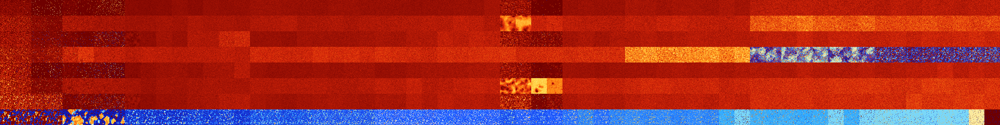

# B02345678 (260608-261119)

<details>
    <summary>Initial Grid</summary>
    
</details>


<details>
    <summary>Initial Grid RLE</summary>

```
#C Exported from GoGoL (https://github.com/marrow16/gogol)
#C Wrap mode: Toroidal
#C Boundary mode: Dead
#C Step: 0
x = 100, y = 100, rule = B02345678/S
14bo28bo2bo15b2o12bo15bo$15bo38bo$24bo9bo10bo14bo6bo7bo17bo5bo$5bo10bo
21bo30bobo5bo$18bo14bo29bo7bo20bo2bo$o14bo4bo52bo3b2o3bo$12bo7bo29bo17b
o27bo$bo9bo8bo9bobobo38bo6bobo$26b2o12bo35bo$11bo20b2o17bobobo8bo19bo$b
o6bo17bo48bo10bo$41bo19bo14bobo13b2o$20bo5bo5bo5bo11bo$36bo20bo$6bo35bo
5bobo$23bo27bo10bo35bo$45bo4bo4bo4bo19bo17bo$8bo8bo33b2o4bo2bo5bo$17bo
13bo29bo11bobo3b2o6bo$31bo28bo10bo7bo$49bo46bobo$22bo49bo3bo12bo$24bo
10bo32bo16bo$61bo23bo$20bo11bo18bo29bo9bo$6bo17bo11bo8bo25bo2bo$9bo24b
2o7bo11bo$51b2o19bo3bo12bo$3bo41bo26bo21bo$b2o16bo4bo45bo15bo$43bo14bo
10bo$12bo18bo5bobo40bo12bo4bo$12b2o9bo12bo9bo33bo$20bo26bo4bo6bo7bo4bo
2bo$10bobobo23bo31bo$9bo15bo13bo33bo8bo$6b2o11bo15bobo38bo$63bo$25bobo
18bo17bo30bo$12bo28b2o18bo3bo$73bo14b2o$26bo37bo14bo13b2o$15bo7bo46bo
10bo17bo$4bo6bo26bo44bo11bo$8bo6bobo10bo6bo6bo3bo10bo23bo$9bo2bo14bo5bo
8bo30bo11bo$bo61bobo4bo11bo9bo$13bo6bo47bo4bo12bo$48bo2bo7bo4bo9bo13bo$
17bo14bo29bo13bo3bo8bo5bo$11bo25bo44bo3bo7bo$20bo5bo2bo2bo16b2o2bo36b2o
$54bo19bo4bo3bo10bo$8bo36bo38bo2bo$ob2o25bo66bo$17bo64bo2bobo8bo$6bo6bo
25bo7bo10bo2b2o9bobo$100b$15bo49bo$22bo20bo10bo2bo7bo3bo6bo6bo4bo$o21bo
21bo$bo9bo48bo13bo$100b$29bobo24b2o9bo10bo5bo$4bo10bo5bo8bo67bo$15bo45b
o25bo$34b2obo13b2o5bo$37bo31bo4bo11bo2bo$19bo22bo17bo3bo$12bo23bo6bo26b
o12bo$3b2o2bo20bo2bo31bo20bo$b2o10bo13bo25bo30bo$11bo28bobo2bo8bo13bo$b
o66bo11bo3bo$12bo16bo4bo34bo7bo12bobobo$bo18bo62b2o11bobo$30bo28b2o7bo
15bo6bo4b3o$10bo10bo10bo25bo20bo16bo$11bo22bo16bo24bo$31bo56bo$23bo23bo
3bo7bo24bo2b2o$31bo9bo29bo4bo2bo10bo$12bo15bo6bo26bo8bo2bo$3bo26bo25bo
20bobo13bo$5bo2bo8bo8bobo9bo8bo9bo3bo23bo6bo$32bo20bo24bo3bo11bo$2bo7bo
2bo7bo16bo10bo10bo2bo2bo17bo$23b2o2bo51bobo2bo$4bo7bo44bo20bo9bo3bo$46b
o25bo8bo4bo2bo8bo$2bo46bo7bo13bobo14bo$5bo20bo6bo43bo$12bo5bo27bo23bo4b
o$15bo41bo17bo14b2o$5bo31bo20bo12bo9bo$13bo17bo30bo$o12bo28bo11b2o30bo
11bo$37bo42bo$14bo5bo19bo10bo34bo5bo$5bo!
```
</details>
<details>
    <summary>Thumbnail</summary>

</details>
<table>
<tr>
    <td><a href="./260608%20S%20Heat%20Map%20Activity.png"></a><br>S (260608)<br>R@15,p2</td>    <td><a href="./260609%20S0%20Heat%20Map%20Activity.png"></a><br>S0 (260609)<br>R@17,p4</td>    <td><a href="./260610%20S1%20Heat%20Map%20Activity.png"></a><br>S1 (260610)<br>R@873,p840</td>    <td><a href="./260611%20S01%20Heat%20Map%20Activity.png"></a><br>S01 (260611)<br>R@885,p840</td>    <td><a href="./260612%20S2%20Heat%20Map%20Activity.png"></a><br>S2 (260612)<br>R@132,p24</td>    <td><a href="./260613%20S02%20Heat%20Map%20Activity.png"></a><br>S02 (260613)<br>G>1000</td>    <td><a href="./260614%20S12%20Heat%20Map%20Activity.png"></a><br>S12 (260614)<br>G>1000</td>    <td><a href="./260615%20S012%20Heat%20Map%20Activity.png"></a><br>S012 (260615)<br>G>1000</td>    <td><a href="./260616%20S3%20Heat%20Map%20Activity.png"></a><br>S3 (260616)<br>G>1000</td>    <td><a href="./260617%20S03%20Heat%20Map%20Activity.png"></a><br>S03 (260617)<br>G>1000</td>    <td><a href="./260618%20S13%20Heat%20Map%20Activity.png"></a><br>S13 (260618)<br>G>1000</td>    <td><a href="./260619%20S013%20Heat%20Map%20Activity.png"></a><br>S013 (260619)<br>G>1000</td>    <td><a href="./260620%20S23%20Heat%20Map%20Activity.png"></a><br>S23 (260620)<br>G>1000</td>    <td><a href="./260621%20S023%20Heat%20Map%20Activity.png"></a><br>S023 (260621)<br>G>1000</td>    <td><a href="./260622%20S123%20Heat%20Map%20Activity.png"></a><br>S123 (260622)<br>G>1000</td>    <td><a href="./260623%20S0123%20Heat%20Map%20Activity.png"></a><br>S0123 (260623)<br>G>1000</td>    <td><a href="./260624%20S4%20Heat%20Map%20Activity.png"></a><br>S4 (260624)<br>G>1000</td>    <td><a href="./260625%20S04%20Heat%20Map%20Activity.png"></a><br>S04 (260625)<br>G>1000</td>    <td><a href="./260626%20S14%20Heat%20Map%20Activity.png"></a><br>S14 (260626)<br>G>1000</td>    <td><a href="./260627%20S014%20Heat%20Map%20Activity.png"></a><br>S014 (260627)<br>G>1000</td>    <td><a href="./260628%20S24%20Heat%20Map%20Activity.png"></a><br>S24 (260628)<br>G>1000</td>    <td><a href="./260629%20S024%20Heat%20Map%20Activity.png"></a><br>S024 (260629)<br>G>1000</td>    <td><a href="./260630%20S124%20Heat%20Map%20Activity.png"></a><br>S124 (260630)<br>G>1000</td>    <td><a href="./260631%20S0124%20Heat%20Map%20Activity.png"></a><br>S0124 (260631)<br>G>1000</td>    <td><a href="./260632%20S34%20Heat%20Map%20Activity.png"></a><br>S34 (260632)<br>G>1000</td>    <td><a href="./260633%20S034%20Heat%20Map%20Activity.png"></a><br>S034 (260633)<br>G>1000</td>    <td><a href="./260634%20S134%20Heat%20Map%20Activity.png"></a><br>S134 (260634)<br>G>1000</td>    <td><a href="./260635%20S0134%20Heat%20Map%20Activity.png"></a><br>S0134 (260635)<br>G>1000</td>    <td><a href="./260636%20S234%20Heat%20Map%20Activity.png"></a><br>S234 (260636)<br>G>1000</td>    <td><a href="./260637%20S0234%20Heat%20Map%20Activity.png"></a><br>S0234 (260637)<br>G>1000</td>    <td><a href="./260638%20S1234%20Heat%20Map%20Activity.png"></a><br>S1234 (260638)<br>G>1000</td>    <td><a href="./260639%20S01234%20Heat%20Map%20Activity.png"></a><br>S01234 (260639)<br>G>1000</td>    <td><a href="./260640%20S5%20Heat%20Map%20Activity.png"></a><br>S5 (260640)<br>R@33,p2</td>    <td><a href="./260641%20S05%20Heat%20Map%20Activity.png"></a><br>S05 (260641)<br>R@34,p2</td>    <td><a href="./260642%20S15%20Heat%20Map%20Activity.png"></a><br>S15 (260642)<br>R@873,p120</td>    <td><a href="./260643%20S015%20Heat%20Map%20Activity.png"></a><br>S015 (260643)<br>G>1000</td>    <td><a href="./260644%20S25%20Heat%20Map%20Activity.png"></a><br>S25 (260644)<br>G>1000</td>    <td><a href="./260645%20S025%20Heat%20Map%20Activity.png"></a><br>S025 (260645)<br>G>1000</td>    <td><a href="./260646%20S125%20Heat%20Map%20Activity.png"></a><br>S125 (260646)<br>G>1000</td>    <td><a href="./260647%20S0125%20Heat%20Map%20Activity.png"></a><br>S0125 (260647)<br>G>1000</td>    <td><a href="./260648%20S35%20Heat%20Map%20Activity.png"></a><br>S35 (260648)<br>G>1000</td>    <td><a href="./260649%20S035%20Heat%20Map%20Activity.png"></a><br>S035 (260649)<br>G>1000</td>    <td><a href="./260650%20S135%20Heat%20Map%20Activity.png"></a><br>S135 (260650)<br>G>1000</td>    <td><a href="./260651%20S0135%20Heat%20Map%20Activity.png"></a><br>S0135 (260651)<br>G>1000</td>    <td><a href="./260652%20S235%20Heat%20Map%20Activity.png"></a><br>S235 (260652)<br>G>1000</td>    <td><a href="./260653%20S0235%20Heat%20Map%20Activity.png"></a><br>S0235 (260653)<br>G>1000</td>    <td><a href="./260654%20S1235%20Heat%20Map%20Activity.png"></a><br>S1235 (260654)<br>G>1000</td>    <td><a href="./260655%20S01235%20Heat%20Map%20Activity.png"></a><br>S01235 (260655)<br>G>1000</td>    <td><a href="./260656%20S45%20Heat%20Map%20Activity.png"></a><br>S45 (260656)<br>G>1000</td>    <td><a href="./260657%20S045%20Heat%20Map%20Activity.png"></a><br>S045 (260657)<br>G>1000</td>    <td><a href="./260658%20S145%20Heat%20Map%20Activity.png"></a><br>S145 (260658)<br>G>1000</td>    <td><a href="./260659%20S0145%20Heat%20Map%20Activity.png"></a><br>S0145 (260659)<br>G>1000</td>    <td><a href="./260660%20S245%20Heat%20Map%20Activity.png"></a><br>S245 (260660)<br>G>1000</td>    <td><a href="./260661%20S0245%20Heat%20Map%20Activity.png"></a><br>S0245 (260661)<br>G>1000</td>    <td><a href="./260662%20S1245%20Heat%20Map%20Activity.png"></a><br>S1245 (260662)<br>G>1000</td>    <td><a href="./260663%20S01245%20Heat%20Map%20Activity.png"></a><br>S01245 (260663)<br>G>1000</td>    <td><a href="./260664%20S345%20Heat%20Map%20Activity.png"></a><br>S345 (260664)<br>G>1000</td>    <td><a href="./260665%20S0345%20Heat%20Map%20Activity.png"></a><br>S0345 (260665)<br>G>1000</td>    <td><a href="./260666%20S1345%20Heat%20Map%20Activity.png"></a><br>S1345 (260666)<br>G>1000</td>    <td><a href="./260667%20S01345%20Heat%20Map%20Activity.png"></a><br>S01345 (260667)<br>G>1000</td>    <td><a href="./260668%20S2345%20Heat%20Map%20Activity.png"></a><br>S2345 (260668)<br>G>1000</td>    <td><a href="./260669%20S02345%20Heat%20Map%20Activity.png"></a><br>S02345 (260669)<br>G>1000</td>    <td><a href="./260670%20S12345%20Heat%20Map%20Activity.png"></a><br>S12345 (260670)<br>G>1000</td>    <td><a href="./260671%20S012345%20Heat%20Map%20Activity.png"></a><br>S012345 (260671)<br>G>1000</td></tr>
<tr>
    <td><a href="./260672%20S6%20Heat%20Map%20Activity.png"></a><br>S6 (260672)<br>R@10,p2</td>    <td><a href="./260673%20S06%20Heat%20Map%20Activity.png"></a><br>S06 (260673)<br>R@11,p2</td>    <td><a href="./260674%20S16%20Heat%20Map%20Activity.png"></a><br>S16 (260674)<br>R@23,p4</td>    <td><a href="./260675%20S016%20Heat%20Map%20Activity.png"></a><br>S016 (260675)<br>R@34,p12</td>    <td><a href="./260676%20S26%20Heat%20Map%20Activity.png"></a><br>S26 (260676)<br>G>1000</td>    <td><a href="./260677%20S026%20Heat%20Map%20Activity.png"></a><br>S026 (260677)<br>G>1000</td>    <td><a href="./260678%20S126%20Heat%20Map%20Activity.png"></a><br>S126 (260678)<br>G>1000</td>    <td><a href="./260679%20S0126%20Heat%20Map%20Activity.png"></a><br>S0126 (260679)<br>G>1000</td>    <td><a href="./260680%20S36%20Heat%20Map%20Activity.png"></a><br>S36 (260680)<br>G>1000</td>    <td><a href="./260681%20S036%20Heat%20Map%20Activity.png"></a><br>S036 (260681)<br>G>1000</td>    <td><a href="./260682%20S136%20Heat%20Map%20Activity.png"></a><br>S136 (260682)<br>G>1000</td>    <td><a href="./260683%20S0136%20Heat%20Map%20Activity.png"></a><br>S0136 (260683)<br>G>1000</td>    <td><a href="./260684%20S236%20Heat%20Map%20Activity.png"></a><br>S236 (260684)<br>G>1000</td>    <td><a href="./260685%20S0236%20Heat%20Map%20Activity.png"></a><br>S0236 (260685)<br>G>1000</td>    <td><a href="./260686%20S1236%20Heat%20Map%20Activity.png"></a><br>S1236 (260686)<br>G>1000</td>    <td><a href="./260687%20S01236%20Heat%20Map%20Activity.png"></a><br>S01236 (260687)<br>G>1000</td>    <td><a href="./260688%20S46%20Heat%20Map%20Activity.png"></a><br>S46 (260688)<br>G>1000</td>    <td><a href="./260689%20S046%20Heat%20Map%20Activity.png"></a><br>S046 (260689)<br>G>1000</td>    <td><a href="./260690%20S146%20Heat%20Map%20Activity.png"></a><br>S146 (260690)<br>G>1000</td>    <td><a href="./260691%20S0146%20Heat%20Map%20Activity.png"></a><br>S0146 (260691)<br>G>1000</td>    <td><a href="./260692%20S246%20Heat%20Map%20Activity.png"></a><br>S246 (260692)<br>G>1000</td>    <td><a href="./260693%20S0246%20Heat%20Map%20Activity.png"></a><br>S0246 (260693)<br>G>1000</td>    <td><a href="./260694%20S1246%20Heat%20Map%20Activity.png"></a><br>S1246 (260694)<br>G>1000</td>    <td><a href="./260695%20S01246%20Heat%20Map%20Activity.png"></a><br>S01246 (260695)<br>G>1000</td>    <td><a href="./260696%20S346%20Heat%20Map%20Activity.png"></a><br>S346 (260696)<br>G>1000</td>    <td><a href="./260697%20S0346%20Heat%20Map%20Activity.png"></a><br>S0346 (260697)<br>G>1000</td>    <td><a href="./260698%20S1346%20Heat%20Map%20Activity.png"></a><br>S1346 (260698)<br>G>1000</td>    <td><a href="./260699%20S01346%20Heat%20Map%20Activity.png"></a><br>S01346 (260699)<br>G>1000</td>    <td><a href="./260700%20S2346%20Heat%20Map%20Activity.png"></a><br>S2346 (260700)<br>G>1000</td>    <td><a href="./260701%20S02346%20Heat%20Map%20Activity.png"></a><br>S02346 (260701)<br>G>1000</td>    <td><a href="./260702%20S12346%20Heat%20Map%20Activity.png"></a><br>S12346 (260702)<br>G>1000</td>    <td><a href="./260703%20S012346%20Heat%20Map%20Activity.png"></a><br>S012346 (260703)<br>G>1000</td>    <td><a href="./260704%20S56%20Heat%20Map%20Activity.png"></a><br>S56 (260704)<br>G>1000</td>    <td><a href="./260705%20S056%20Heat%20Map%20Activity.png"></a><br>S056 (260705)<br>G>1000</td>    <td><a href="./260706%20S156%20Heat%20Map%20Activity.png"></a><br>S156 (260706)<br>G>1000</td>    <td><a href="./260707%20S0156%20Heat%20Map%20Activity.png"></a><br>S0156 (260707)<br>G>1000</td>    <td><a href="./260708%20S256%20Heat%20Map%20Activity.png"></a><br>S256 (260708)<br>G>1000</td>    <td><a href="./260709%20S0256%20Heat%20Map%20Activity.png"></a><br>S0256 (260709)<br>G>1000</td>    <td><a href="./260710%20S1256%20Heat%20Map%20Activity.png"></a><br>S1256 (260710)<br>G>1000</td>    <td><a href="./260711%20S01256%20Heat%20Map%20Activity.png"></a><br>S01256 (260711)<br>G>1000</td>    <td><a href="./260712%20S356%20Heat%20Map%20Activity.png"></a><br>S356 (260712)<br>G>1000</td>    <td><a href="./260713%20S0356%20Heat%20Map%20Activity.png"></a><br>S0356 (260713)<br>G>1000</td>    <td><a href="./260714%20S1356%20Heat%20Map%20Activity.png"></a><br>S1356 (260714)<br>G>1000</td>    <td><a href="./260715%20S01356%20Heat%20Map%20Activity.png"></a><br>S01356 (260715)<br>G>1000</td>    <td><a href="./260716%20S2356%20Heat%20Map%20Activity.png"></a><br>S2356 (260716)<br>G>1000</td>    <td><a href="./260717%20S02356%20Heat%20Map%20Activity.png"></a><br>S02356 (260717)<br>G>1000</td>    <td><a href="./260718%20S12356%20Heat%20Map%20Activity.png"></a><br>S12356 (260718)<br>G>1000</td>    <td><a href="./260719%20S012356%20Heat%20Map%20Activity.png"></a><br>S012356 (260719)<br>G>1000</td>    <td><a href="./260720%20S456%20Heat%20Map%20Activity.png"></a><br>S456 (260720)<br>G>1000</td>    <td><a href="./260721%20S0456%20Heat%20Map%20Activity.png"></a><br>S0456 (260721)<br>G>1000</td>    <td><a href="./260722%20S1456%20Heat%20Map%20Activity.png"></a><br>S1456 (260722)<br>G>1000</td>    <td><a href="./260723%20S01456%20Heat%20Map%20Activity.png"></a><br>S01456 (260723)<br>G>1000</td>    <td><a href="./260724%20S2456%20Heat%20Map%20Activity.png"></a><br>S2456 (260724)<br>G>1000</td>    <td><a href="./260725%20S02456%20Heat%20Map%20Activity.png"></a><br>S02456 (260725)<br>G>1000</td>    <td><a href="./260726%20S12456%20Heat%20Map%20Activity.png"></a><br>S12456 (260726)<br>G>1000</td>    <td><a href="./260727%20S012456%20Heat%20Map%20Activity.png"></a><br>S012456 (260727)<br>G>1000</td>    <td><a href="./260728%20S3456%20Heat%20Map%20Activity.png"></a><br>S3456 (260728)<br>G>1000</td>    <td><a href="./260729%20S03456%20Heat%20Map%20Activity.png"></a><br>S03456 (260729)<br>G>1000</td>    <td><a href="./260730%20S13456%20Heat%20Map%20Activity.png"></a><br>S13456 (260730)<br>G>1000</td>    <td><a href="./260731%20S013456%20Heat%20Map%20Activity.png"></a><br>S013456 (260731)<br>G>1000</td>    <td><a href="./260732%20S23456%20Heat%20Map%20Activity.png"></a><br>S23456 (260732)<br>G>1000</td>    <td><a href="./260733%20S023456%20Heat%20Map%20Activity.png"></a><br>S023456 (260733)<br>G>1000</td>    <td><a href="./260734%20S123456%20Heat%20Map%20Activity.png"></a><br>S123456 (260734)<br>G>1000</td>    <td><a href="./260735%20S0123456%20Heat%20Map%20Activity.png"></a><br>S0123456 (260735)<br>G>1000</td></tr>
<tr>
    <td><a href="./260736%20S7%20Heat%20Map%20Activity.png"></a><br>S7 (260736)<br>R@9,p2</td>    <td><a href="./260737%20S07%20Heat%20Map%20Activity.png"></a><br>S07 (260737)<br>R@9,p2</td>    <td><a href="./260738%20S17%20Heat%20Map%20Activity.png"></a><br>S17 (260738)<br>R@24,p12</td>    <td><a href="./260739%20S017%20Heat%20Map%20Activity.png"></a><br>S017 (260739)<br>R@24,p12</td>    <td><a href="./260740%20S27%20Heat%20Map%20Activity.png"></a><br>S27 (260740)<br>R@82,p12</td>    <td><a href="./260741%20S027%20Heat%20Map%20Activity.png"></a><br>S027 (260741)<br>R@193,p120</td>    <td><a href="./260742%20S127%20Heat%20Map%20Activity.png"></a><br>S127 (260742)<br>R@89,p12</td>    <td><a href="./260743%20S0127%20Heat%20Map%20Activity.png"></a><br>S0127 (260743)<br>R@130,p60</td>    <td><a href="./260744%20S37%20Heat%20Map%20Activity.png"></a><br>S37 (260744)<br>G>1000</td>    <td><a href="./260745%20S037%20Heat%20Map%20Activity.png"></a><br>S037 (260745)<br>G>1000</td>    <td><a href="./260746%20S137%20Heat%20Map%20Activity.png"></a><br>S137 (260746)<br>G>1000</td>    <td><a href="./260747%20S0137%20Heat%20Map%20Activity.png"></a><br>S0137 (260747)<br>G>1000</td>    <td><a href="./260748%20S237%20Heat%20Map%20Activity.png"></a><br>S237 (260748)<br>G>1000</td>    <td><a href="./260749%20S0237%20Heat%20Map%20Activity.png"></a><br>S0237 (260749)<br>G>1000</td>    <td><a href="./260750%20S1237%20Heat%20Map%20Activity.png"></a><br>S1237 (260750)<br>G>1000</td>    <td><a href="./260751%20S01237%20Heat%20Map%20Activity.png"></a><br>S01237 (260751)<br>G>1000</td>    <td><a href="./260752%20S47%20Heat%20Map%20Activity.png"></a><br>S47 (260752)<br>G>1000</td>    <td><a href="./260753%20S047%20Heat%20Map%20Activity.png"></a><br>S047 (260753)<br>G>1000</td>    <td><a href="./260754%20S147%20Heat%20Map%20Activity.png"></a><br>S147 (260754)<br>G>1000</td>    <td><a href="./260755%20S0147%20Heat%20Map%20Activity.png"></a><br>S0147 (260755)<br>G>1000</td>    <td><a href="./260756%20S247%20Heat%20Map%20Activity.png"></a><br>S247 (260756)<br>G>1000</td>    <td><a href="./260757%20S0247%20Heat%20Map%20Activity.png"></a><br>S0247 (260757)<br>G>1000</td>    <td><a href="./260758%20S1247%20Heat%20Map%20Activity.png"></a><br>S1247 (260758)<br>G>1000</td>    <td><a href="./260759%20S01247%20Heat%20Map%20Activity.png"></a><br>S01247 (260759)<br>G>1000</td>    <td><a href="./260760%20S347%20Heat%20Map%20Activity.png"></a><br>S347 (260760)<br>G>1000</td>    <td><a href="./260761%20S0347%20Heat%20Map%20Activity.png"></a><br>S0347 (260761)<br>G>1000</td>    <td><a href="./260762%20S1347%20Heat%20Map%20Activity.png"></a><br>S1347 (260762)<br>G>1000</td>    <td><a href="./260763%20S01347%20Heat%20Map%20Activity.png"></a><br>S01347 (260763)<br>G>1000</td>    <td><a href="./260764%20S2347%20Heat%20Map%20Activity.png"></a><br>S2347 (260764)<br>G>1000</td>    <td><a href="./260765%20S02347%20Heat%20Map%20Activity.png"></a><br>S02347 (260765)<br>G>1000</td>    <td><a href="./260766%20S12347%20Heat%20Map%20Activity.png"></a><br>S12347 (260766)<br>G>1000</td>    <td><a href="./260767%20S012347%20Heat%20Map%20Activity.png"></a><br>S012347 (260767)<br>G>1000</td>    <td><a href="./260768%20S57%20Heat%20Map%20Activity.png"></a><br>S57 (260768)<br>R@27,p2</td>    <td><a href="./260769%20S057%20Heat%20Map%20Activity.png"></a><br>S057 (260769)<br>R@32,p2</td>    <td><a href="./260770%20S157%20Heat%20Map%20Activity.png"></a><br>S157 (260770)<br>R@108,p28</td>    <td><a href="./260771%20S0157%20Heat%20Map%20Activity.png"></a><br>S0157 (260771)<br>R@100,p8</td>    <td><a href="./260772%20S257%20Heat%20Map%20Activity.png"></a><br>S257 (260772)<br>G>1000</td>    <td><a href="./260773%20S0257%20Heat%20Map%20Activity.png"></a><br>S0257 (260773)<br>G>1000</td>    <td><a href="./260774%20S1257%20Heat%20Map%20Activity.png"></a><br>S1257 (260774)<br>G>1000</td>    <td><a href="./260775%20S01257%20Heat%20Map%20Activity.png"></a><br>S01257 (260775)<br>G>1000</td>    <td><a href="./260776%20S357%20Heat%20Map%20Activity.png"></a><br>S357 (260776)<br>G>1000</td>    <td><a href="./260777%20S0357%20Heat%20Map%20Activity.png"></a><br>S0357 (260777)<br>G>1000</td>    <td><a href="./260778%20S1357%20Heat%20Map%20Activity.png"></a><br>S1357 (260778)<br>G>1000</td>    <td><a href="./260779%20S01357%20Heat%20Map%20Activity.png"></a><br>S01357 (260779)<br>G>1000</td>    <td><a href="./260780%20S2357%20Heat%20Map%20Activity.png"></a><br>S2357 (260780)<br>G>1000</td>    <td><a href="./260781%20S02357%20Heat%20Map%20Activity.png"></a><br>S02357 (260781)<br>G>1000</td>    <td><a href="./260782%20S12357%20Heat%20Map%20Activity.png"></a><br>S12357 (260782)<br>G>1000</td>    <td><a href="./260783%20S012357%20Heat%20Map%20Activity.png"></a><br>S012357 (260783)<br>G>1000</td>    <td><a href="./260784%20S457%20Heat%20Map%20Activity.png"></a><br>S457 (260784)<br>G>1000</td>    <td><a href="./260785%20S0457%20Heat%20Map%20Activity.png"></a><br>S0457 (260785)<br>G>1000</td>    <td><a href="./260786%20S1457%20Heat%20Map%20Activity.png"></a><br>S1457 (260786)<br>G>1000</td>    <td><a href="./260787%20S01457%20Heat%20Map%20Activity.png"></a><br>S01457 (260787)<br>G>1000</td>    <td><a href="./260788%20S2457%20Heat%20Map%20Activity.png"></a><br>S2457 (260788)<br>G>1000</td>    <td><a href="./260789%20S02457%20Heat%20Map%20Activity.png"></a><br>S02457 (260789)<br>G>1000</td>    <td><a href="./260790%20S12457%20Heat%20Map%20Activity.png"></a><br>S12457 (260790)<br>G>1000</td>    <td><a href="./260791%20S012457%20Heat%20Map%20Activity.png"></a><br>S012457 (260791)<br>G>1000</td>    <td><a href="./260792%20S3457%20Heat%20Map%20Activity.png"></a><br>S3457 (260792)<br>G>1000</td>    <td><a href="./260793%20S03457%20Heat%20Map%20Activity.png"></a><br>S03457 (260793)<br>G>1000</td>    <td><a href="./260794%20S13457%20Heat%20Map%20Activity.png"></a><br>S13457 (260794)<br>G>1000</td>    <td><a href="./260795%20S013457%20Heat%20Map%20Activity.png"></a><br>S013457 (260795)<br>G>1000</td>    <td><a href="./260796%20S23457%20Heat%20Map%20Activity.png"></a><br>S23457 (260796)<br>G>1000</td>    <td><a href="./260797%20S023457%20Heat%20Map%20Activity.png"></a><br>S023457 (260797)<br>G>1000</td>    <td><a href="./260798%20S123457%20Heat%20Map%20Activity.png"></a><br>S123457 (260798)<br>G>1000</td>    <td><a href="./260799%20S0123457%20Heat%20Map%20Activity.png"></a><br>S0123457 (260799)<br>G>1000</td></tr>
<tr>
    <td><a href="./260800%20S67%20Heat%20Map%20Activity.png"></a><br>S67 (260800)<br>R@11,p2</td>    <td><a href="./260801%20S067%20Heat%20Map%20Activity.png"></a><br>S067 (260801)<br>R@13,p2</td>    <td><a href="./260802%20S167%20Heat%20Map%20Activity.png"></a><br>S167 (260802)<br>R@22,p6</td>    <td><a href="./260803%20S0167%20Heat%20Map%20Activity.png"></a><br>S0167 (260803)<br>R@18,p2</td>    <td><a href="./260804%20S267%20Heat%20Map%20Activity.png"></a><br>S267 (260804)<br>G>1000</td>    <td><a href="./260805%20S0267%20Heat%20Map%20Activity.png"></a><br>S0267 (260805)<br>G>1000</td>    <td><a href="./260806%20S1267%20Heat%20Map%20Activity.png"></a><br>S1267 (260806)<br>G>1000</td>    <td><a href="./260807%20S01267%20Heat%20Map%20Activity.png"></a><br>S01267 (260807)<br>G>1000</td>    <td><a href="./260808%20S367%20Heat%20Map%20Activity.png"></a><br>S367 (260808)<br>G>1000</td>    <td><a href="./260809%20S0367%20Heat%20Map%20Activity.png"></a><br>S0367 (260809)<br>G>1000</td>    <td><a href="./260810%20S1367%20Heat%20Map%20Activity.png"></a><br>S1367 (260810)<br>G>1000</td>    <td><a href="./260811%20S01367%20Heat%20Map%20Activity.png"></a><br>S01367 (260811)<br>G>1000</td>    <td><a href="./260812%20S2367%20Heat%20Map%20Activity.png"></a><br>S2367 (260812)<br>G>1000</td>    <td><a href="./260813%20S02367%20Heat%20Map%20Activity.png"></a><br>S02367 (260813)<br>G>1000</td>    <td><a href="./260814%20S12367%20Heat%20Map%20Activity.png"></a><br>S12367 (260814)<br>G>1000</td>    <td><a href="./260815%20S012367%20Heat%20Map%20Activity.png"></a><br>S012367 (260815)<br>G>1000</td>    <td><a href="./260816%20S467%20Heat%20Map%20Activity.png"></a><br>S467 (260816)<br>G>1000</td>    <td><a href="./260817%20S0467%20Heat%20Map%20Activity.png"></a><br>S0467 (260817)<br>G>1000</td>    <td><a href="./260818%20S1467%20Heat%20Map%20Activity.png"></a><br>S1467 (260818)<br>G>1000</td>    <td><a href="./260819%20S01467%20Heat%20Map%20Activity.png"></a><br>S01467 (260819)<br>G>1000</td>    <td><a href="./260820%20S2467%20Heat%20Map%20Activity.png"></a><br>S2467 (260820)<br>G>1000</td>    <td><a href="./260821%20S02467%20Heat%20Map%20Activity.png"></a><br>S02467 (260821)<br>G>1000</td>    <td><a href="./260822%20S12467%20Heat%20Map%20Activity.png"></a><br>S12467 (260822)<br>G>1000</td>    <td><a href="./260823%20S012467%20Heat%20Map%20Activity.png"></a><br>S012467 (260823)<br>G>1000</td>    <td><a href="./260824%20S3467%20Heat%20Map%20Activity.png"></a><br>S3467 (260824)<br>G>1000</td>    <td><a href="./260825%20S03467%20Heat%20Map%20Activity.png"></a><br>S03467 (260825)<br>G>1000</td>    <td><a href="./260826%20S13467%20Heat%20Map%20Activity.png"></a><br>S13467 (260826)<br>G>1000</td>    <td><a href="./260827%20S013467%20Heat%20Map%20Activity.png"></a><br>S013467 (260827)<br>G>1000</td>    <td><a href="./260828%20S23467%20Heat%20Map%20Activity.png"></a><br>S23467 (260828)<br>G>1000</td>    <td><a href="./260829%20S023467%20Heat%20Map%20Activity.png"></a><br>S023467 (260829)<br>G>1000</td>    <td><a href="./260830%20S123467%20Heat%20Map%20Activity.png"></a><br>S123467 (260830)<br>G>1000</td>    <td><a href="./260831%20S0123467%20Heat%20Map%20Activity.png"></a><br>S0123467 (260831)<br>G>1000</td>    <td><a href="./260832%20S567%20Heat%20Map%20Activity.png"></a><br>S567 (260832)<br>G>1000</td>    <td><a href="./260833%20S0567%20Heat%20Map%20Activity.png"></a><br>S0567 (260833)<br>G>1000</td>    <td><a href="./260834%20S1567%20Heat%20Map%20Activity.png"></a><br>S1567 (260834)<br>G>1000</td>    <td><a href="./260835%20S01567%20Heat%20Map%20Activity.png"></a><br>S01567 (260835)<br>G>1000</td>    <td><a href="./260836%20S2567%20Heat%20Map%20Activity.png"></a><br>S2567 (260836)<br>G>1000</td>    <td><a href="./260837%20S02567%20Heat%20Map%20Activity.png"></a><br>S02567 (260837)<br>G>1000</td>    <td><a href="./260838%20S12567%20Heat%20Map%20Activity.png"></a><br>S12567 (260838)<br>G>1000</td>    <td><a href="./260839%20S012567%20Heat%20Map%20Activity.png"></a><br>S012567 (260839)<br>G>1000</td>    <td><a href="./260840%20S3567%20Heat%20Map%20Activity.png"></a><br>S3567 (260840)<br>G>1000</td>    <td><a href="./260841%20S03567%20Heat%20Map%20Activity.png"></a><br>S03567 (260841)<br>G>1000</td>    <td><a href="./260842%20S13567%20Heat%20Map%20Activity.png"></a><br>S13567 (260842)<br>G>1000</td>    <td><a href="./260843%20S013567%20Heat%20Map%20Activity.png"></a><br>S013567 (260843)<br>G>1000</td>    <td><a href="./260844%20S23567%20Heat%20Map%20Activity.png"></a><br>S23567 (260844)<br>G>1000</td>    <td><a href="./260845%20S023567%20Heat%20Map%20Activity.png"></a><br>S023567 (260845)<br>G>1000</td>    <td><a href="./260846%20S123567%20Heat%20Map%20Activity.png"></a><br>S123567 (260846)<br>G>1000</td>    <td><a href="./260847%20S0123567%20Heat%20Map%20Activity.png"></a><br>S0123567 (260847)<br>G>1000</td>    <td><a href="./260848%20S4567%20Heat%20Map%20Activity.png"></a><br>S4567 (260848)<br>G>1000</td>    <td><a href="./260849%20S04567%20Heat%20Map%20Activity.png"></a><br>S04567 (260849)<br>G>1000</td>    <td><a href="./260850%20S14567%20Heat%20Map%20Activity.png"></a><br>S14567 (260850)<br>R@949,p24</td>    <td><a href="./260851%20S014567%20Heat%20Map%20Activity.png"></a><br>S014567 (260851)<br>G>1000</td>    <td><a href="./260852%20S24567%20Heat%20Map%20Activity.png"></a><br>S24567 (260852)<br>G>1000</td>    <td><a href="./260853%20S024567%20Heat%20Map%20Activity.png"></a><br>S024567 (260853)<br>G>1000</td>    <td><a href="./260854%20S124567%20Heat%20Map%20Activity.png"></a><br>S124567 (260854)<br>R@574,p6</td>    <td><a href="./260855%20S0124567%20Heat%20Map%20Activity.png"></a><br>S0124567 (260855)<br>G>1000</td>    <td><a href="./260856%20S34567%20Heat%20Map%20Activity.png"></a><br>S34567 (260856)<br>R@20,p2</td>    <td><a href="./260857%20S034567%20Heat%20Map%20Activity.png"></a><br>S034567 (260857)<br>R@22,p6</td>    <td><a href="./260858%20S134567%20Heat%20Map%20Activity.png"></a><br>S134567 (260858)<br>R@30,p2</td>    <td><a href="./260859%20S0134567%20Heat%20Map%20Activity.png"></a><br>S0134567 (260859)<br>R@26,p6</td>    <td><a href="./260860%20S234567%20Heat%20Map%20Activity.png"></a><br>S234567 (260860)<br>R@25,p6</td>    <td><a href="./260861%20S0234567%20Heat%20Map%20Activity.png"></a><br>S0234567 (260861)<br>R@23,p6</td>    <td><a href="./260862%20S1234567%20Heat%20Map%20Activity.png"></a><br>S1234567 (260862)<br>R@21,p2</td>    <td><a href="./260863%20S01234567%20Heat%20Map%20Activity.png"></a><br>S01234567 (260863)<br>R@18,p2</td></tr>
<tr>
    <td><a href="./260864%20S8%20Heat%20Map%20Activity.png"></a><br>S8 (260864)<br>R@8,p2</td>    <td><a href="./260865%20S08%20Heat%20Map%20Activity.png"></a><br>S08 (260865)<br>R@10,p4</td>    <td><a href="./260866%20S18%20Heat%20Map%20Activity.png"></a><br>S18 (260866)<br>R@295,p240</td>    <td><a href="./260867%20S018%20Heat%20Map%20Activity.png"></a><br>S018 (260867)<br>R@157,p120</td>    <td><a href="./260868%20S28%20Heat%20Map%20Activity.png"></a><br>S28 (260868)<br>R@82,p8</td>    <td><a href="./260869%20S028%20Heat%20Map%20Activity.png"></a><br>S028 (260869)<br>R@223,p120</td>    <td><a href="./260870%20S128%20Heat%20Map%20Activity.png"></a><br>S128 (260870)<br>R@227,p120</td>    <td><a href="./260871%20S0128%20Heat%20Map%20Activity.png"></a><br>S0128 (260871)<br>R@928,p840</td>    <td><a href="./260872%20S38%20Heat%20Map%20Activity.png"></a><br>S38 (260872)<br>G>1000</td>    <td><a href="./260873%20S038%20Heat%20Map%20Activity.png"></a><br>S038 (260873)<br>G>1000</td>    <td><a href="./260874%20S138%20Heat%20Map%20Activity.png"></a><br>S138 (260874)<br>G>1000</td>    <td><a href="./260875%20S0138%20Heat%20Map%20Activity.png"></a><br>S0138 (260875)<br>G>1000</td>    <td><a href="./260876%20S238%20Heat%20Map%20Activity.png"></a><br>S238 (260876)<br>G>1000</td>    <td><a href="./260877%20S0238%20Heat%20Map%20Activity.png"></a><br>S0238 (260877)<br>G>1000</td>    <td><a href="./260878%20S1238%20Heat%20Map%20Activity.png"></a><br>S1238 (260878)<br>G>1000</td>    <td><a href="./260879%20S01238%20Heat%20Map%20Activity.png"></a><br>S01238 (260879)<br>G>1000</td>    <td><a href="./260880%20S48%20Heat%20Map%20Activity.png"></a><br>S48 (260880)<br>G>1000</td>    <td><a href="./260881%20S048%20Heat%20Map%20Activity.png"></a><br>S048 (260881)<br>G>1000</td>    <td><a href="./260882%20S148%20Heat%20Map%20Activity.png"></a><br>S148 (260882)<br>G>1000</td>    <td><a href="./260883%20S0148%20Heat%20Map%20Activity.png"></a><br>S0148 (260883)<br>G>1000</td>    <td><a href="./260884%20S248%20Heat%20Map%20Activity.png"></a><br>S248 (260884)<br>G>1000</td>    <td><a href="./260885%20S0248%20Heat%20Map%20Activity.png"></a><br>S0248 (260885)<br>G>1000</td>    <td><a href="./260886%20S1248%20Heat%20Map%20Activity.png"></a><br>S1248 (260886)<br>G>1000</td>    <td><a href="./260887%20S01248%20Heat%20Map%20Activity.png"></a><br>S01248 (260887)<br>G>1000</td>    <td><a href="./260888%20S348%20Heat%20Map%20Activity.png"></a><br>S348 (260888)<br>G>1000</td>    <td><a href="./260889%20S0348%20Heat%20Map%20Activity.png"></a><br>S0348 (260889)<br>G>1000</td>    <td><a href="./260890%20S1348%20Heat%20Map%20Activity.png"></a><br>S1348 (260890)<br>G>1000</td>    <td><a href="./260891%20S01348%20Heat%20Map%20Activity.png"></a><br>S01348 (260891)<br>G>1000</td>    <td><a href="./260892%20S2348%20Heat%20Map%20Activity.png"></a><br>S2348 (260892)<br>G>1000</td>    <td><a href="./260893%20S02348%20Heat%20Map%20Activity.png"></a><br>S02348 (260893)<br>G>1000</td>    <td><a href="./260894%20S12348%20Heat%20Map%20Activity.png"></a><br>S12348 (260894)<br>G>1000</td>    <td><a href="./260895%20S012348%20Heat%20Map%20Activity.png"></a><br>S012348 (260895)<br>G>1000</td>    <td><a href="./260896%20S58%20Heat%20Map%20Activity.png"></a><br>S58 (260896)<br>R@31,p2</td>    <td><a href="./260897%20S058%20Heat%20Map%20Activity.png"></a><br>S058 (260897)<br>R@41,p10</td>    <td><a href="./260898%20S158%20Heat%20Map%20Activity.png"></a><br>S158 (260898)<br>R@467,p24</td>    <td><a href="./260899%20S0158%20Heat%20Map%20Activity.png"></a><br>S0158 (260899)<br>R@269,p24</td>    <td><a href="./260900%20S258%20Heat%20Map%20Activity.png"></a><br>S258 (260900)<br>G>1000</td>    <td><a href="./260901%20S0258%20Heat%20Map%20Activity.png"></a><br>S0258 (260901)<br>G>1000</td>    <td><a href="./260902%20S1258%20Heat%20Map%20Activity.png"></a><br>S1258 (260902)<br>G>1000</td>    <td><a href="./260903%20S01258%20Heat%20Map%20Activity.png"></a><br>S01258 (260903)<br>G>1000</td>    <td><a href="./260904%20S358%20Heat%20Map%20Activity.png"></a><br>S358 (260904)<br>G>1000</td>    <td><a href="./260905%20S0358%20Heat%20Map%20Activity.png"></a><br>S0358 (260905)<br>G>1000</td>    <td><a href="./260906%20S1358%20Heat%20Map%20Activity.png"></a><br>S1358 (260906)<br>G>1000</td>    <td><a href="./260907%20S01358%20Heat%20Map%20Activity.png"></a><br>S01358 (260907)<br>G>1000</td>    <td><a href="./260908%20S2358%20Heat%20Map%20Activity.png"></a><br>S2358 (260908)<br>G>1000</td>    <td><a href="./260909%20S02358%20Heat%20Map%20Activity.png"></a><br>S02358 (260909)<br>G>1000</td>    <td><a href="./260910%20S12358%20Heat%20Map%20Activity.png"></a><br>S12358 (260910)<br>G>1000</td>    <td><a href="./260911%20S012358%20Heat%20Map%20Activity.png"></a><br>S012358 (260911)<br>G>1000</td>    <td><a href="./260912%20S458%20Heat%20Map%20Activity.png"></a><br>S458 (260912)<br>G>1000</td>    <td><a href="./260913%20S0458%20Heat%20Map%20Activity.png"></a><br>S0458 (260913)<br>G>1000</td>    <td><a href="./260914%20S1458%20Heat%20Map%20Activity.png"></a><br>S1458 (260914)<br>G>1000</td>    <td><a href="./260915%20S01458%20Heat%20Map%20Activity.png"></a><br>S01458 (260915)<br>G>1000</td>    <td><a href="./260916%20S2458%20Heat%20Map%20Activity.png"></a><br>S2458 (260916)<br>G>1000</td>    <td><a href="./260917%20S02458%20Heat%20Map%20Activity.png"></a><br>S02458 (260917)<br>G>1000</td>    <td><a href="./260918%20S12458%20Heat%20Map%20Activity.png"></a><br>S12458 (260918)<br>G>1000</td>    <td><a href="./260919%20S012458%20Heat%20Map%20Activity.png"></a><br>S012458 (260919)<br>G>1000</td>    <td><a href="./260920%20S3458%20Heat%20Map%20Activity.png"></a><br>S3458 (260920)<br>G>1000</td>    <td><a href="./260921%20S03458%20Heat%20Map%20Activity.png"></a><br>S03458 (260921)<br>G>1000</td>    <td><a href="./260922%20S13458%20Heat%20Map%20Activity.png"></a><br>S13458 (260922)<br>G>1000</td>    <td><a href="./260923%20S013458%20Heat%20Map%20Activity.png"></a><br>S013458 (260923)<br>G>1000</td>    <td><a href="./260924%20S23458%20Heat%20Map%20Activity.png"></a><br>S23458 (260924)<br>G>1000</td>    <td><a href="./260925%20S023458%20Heat%20Map%20Activity.png"></a><br>S023458 (260925)<br>G>1000</td>    <td><a href="./260926%20S123458%20Heat%20Map%20Activity.png"></a><br>S123458 (260926)<br>G>1000</td>    <td><a href="./260927%20S0123458%20Heat%20Map%20Activity.png"></a><br>S0123458 (260927)<br>G>1000</td></tr>
<tr>
    <td><a href="./260928%20S68%20Heat%20Map%20Activity.png"></a><br>S68 (260928)<br>R@10,p2</td>    <td><a href="./260929%20S068%20Heat%20Map%20Activity.png"></a><br>S068 (260929)<br>R@14,p2</td>    <td><a href="./260930%20S168%20Heat%20Map%20Activity.png"></a><br>S168 (260930)<br>R@43,p12</td>    <td><a href="./260931%20S0168%20Heat%20Map%20Activity.png"></a><br>S0168 (260931)<br>R@44,p12</td>    <td><a href="./260932%20S268%20Heat%20Map%20Activity.png"></a><br>S268 (260932)<br>G>1000</td>    <td><a href="./260933%20S0268%20Heat%20Map%20Activity.png"></a><br>S0268 (260933)<br>G>1000</td>    <td><a href="./260934%20S1268%20Heat%20Map%20Activity.png"></a><br>S1268 (260934)<br>G>1000</td>    <td><a href="./260935%20S01268%20Heat%20Map%20Activity.png"></a><br>S01268 (260935)<br>G>1000</td>    <td><a href="./260936%20S368%20Heat%20Map%20Activity.png"></a><br>S368 (260936)<br>G>1000</td>    <td><a href="./260937%20S0368%20Heat%20Map%20Activity.png"></a><br>S0368 (260937)<br>G>1000</td>    <td><a href="./260938%20S1368%20Heat%20Map%20Activity.png"></a><br>S1368 (260938)<br>G>1000</td>    <td><a href="./260939%20S01368%20Heat%20Map%20Activity.png"></a><br>S01368 (260939)<br>G>1000</td>    <td><a href="./260940%20S2368%20Heat%20Map%20Activity.png"></a><br>S2368 (260940)<br>G>1000</td>    <td><a href="./260941%20S02368%20Heat%20Map%20Activity.png"></a><br>S02368 (260941)<br>G>1000</td>    <td><a href="./260942%20S12368%20Heat%20Map%20Activity.png"></a><br>S12368 (260942)<br>G>1000</td>    <td><a href="./260943%20S012368%20Heat%20Map%20Activity.png"></a><br>S012368 (260943)<br>G>1000</td>    <td><a href="./260944%20S468%20Heat%20Map%20Activity.png"></a><br>S468 (260944)<br>G>1000</td>    <td><a href="./260945%20S0468%20Heat%20Map%20Activity.png"></a><br>S0468 (260945)<br>G>1000</td>    <td><a href="./260946%20S1468%20Heat%20Map%20Activity.png"></a><br>S1468 (260946)<br>G>1000</td>    <td><a href="./260947%20S01468%20Heat%20Map%20Activity.png"></a><br>S01468 (260947)<br>G>1000</td>    <td><a href="./260948%20S2468%20Heat%20Map%20Activity.png"></a><br>S2468 (260948)<br>G>1000</td>    <td><a href="./260949%20S02468%20Heat%20Map%20Activity.png"></a><br>S02468 (260949)<br>G>1000</td>    <td><a href="./260950%20S12468%20Heat%20Map%20Activity.png"></a><br>S12468 (260950)<br>G>1000</td>    <td><a href="./260951%20S012468%20Heat%20Map%20Activity.png"></a><br>S012468 (260951)<br>G>1000</td>    <td><a href="./260952%20S3468%20Heat%20Map%20Activity.png"></a><br>S3468 (260952)<br>G>1000</td>    <td><a href="./260953%20S03468%20Heat%20Map%20Activity.png"></a><br>S03468 (260953)<br>G>1000</td>    <td><a href="./260954%20S13468%20Heat%20Map%20Activity.png"></a><br>S13468 (260954)<br>G>1000</td>    <td><a href="./260955%20S013468%20Heat%20Map%20Activity.png"></a><br>S013468 (260955)<br>G>1000</td>    <td><a href="./260956%20S23468%20Heat%20Map%20Activity.png"></a><br>S23468 (260956)<br>G>1000</td>    <td><a href="./260957%20S023468%20Heat%20Map%20Activity.png"></a><br>S023468 (260957)<br>G>1000</td>    <td><a href="./260958%20S123468%20Heat%20Map%20Activity.png"></a><br>S123468 (260958)<br>G>1000</td>    <td><a href="./260959%20S0123468%20Heat%20Map%20Activity.png"></a><br>S0123468 (260959)<br>G>1000</td>    <td><a href="./260960%20S568%20Heat%20Map%20Activity.png"></a><br>S568 (260960)<br>R@487,p4</td>    <td><a href="./260961%20S0568%20Heat%20Map%20Activity.png"></a><br>S0568 (260961)<br>R@573,p4</td>    <td><a href="./260962%20S1568%20Heat%20Map%20Activity.png"></a><br>S1568 (260962)<br>G>1000</td>    <td><a href="./260963%20S01568%20Heat%20Map%20Activity.png"></a><br>S01568 (260963)<br>G>1000</td>    <td><a href="./260964%20S2568%20Heat%20Map%20Activity.png"></a><br>S2568 (260964)<br>G>1000</td>    <td><a href="./260965%20S02568%20Heat%20Map%20Activity.png"></a><br>S02568 (260965)<br>G>1000</td>    <td><a href="./260966%20S12568%20Heat%20Map%20Activity.png"></a><br>S12568 (260966)<br>G>1000</td>    <td><a href="./260967%20S012568%20Heat%20Map%20Activity.png"></a><br>S012568 (260967)<br>G>1000</td>    <td><a href="./260968%20S3568%20Heat%20Map%20Activity.png"></a><br>S3568 (260968)<br>G>1000</td>    <td><a href="./260969%20S03568%20Heat%20Map%20Activity.png"></a><br>S03568 (260969)<br>G>1000</td>    <td><a href="./260970%20S13568%20Heat%20Map%20Activity.png"></a><br>S13568 (260970)<br>G>1000</td>    <td><a href="./260971%20S013568%20Heat%20Map%20Activity.png"></a><br>S013568 (260971)<br>G>1000</td>    <td><a href="./260972%20S23568%20Heat%20Map%20Activity.png"></a><br>S23568 (260972)<br>G>1000</td>    <td><a href="./260973%20S023568%20Heat%20Map%20Activity.png"></a><br>S023568 (260973)<br>G>1000</td>    <td><a href="./260974%20S123568%20Heat%20Map%20Activity.png"></a><br>S123568 (260974)<br>G>1000</td>    <td><a href="./260975%20S0123568%20Heat%20Map%20Activity.png"></a><br>S0123568 (260975)<br>G>1000</td>    <td><a href="./260976%20S4568%20Heat%20Map%20Activity.png"></a><br>S4568 (260976)<br>G>1000</td>    <td><a href="./260977%20S04568%20Heat%20Map%20Activity.png"></a><br>S04568 (260977)<br>G>1000</td>    <td><a href="./260978%20S14568%20Heat%20Map%20Activity.png"></a><br>S14568 (260978)<br>G>1000</td>    <td><a href="./260979%20S014568%20Heat%20Map%20Activity.png"></a><br>S014568 (260979)<br>G>1000</td>    <td><a href="./260980%20S24568%20Heat%20Map%20Activity.png"></a><br>S24568 (260980)<br>G>1000</td>    <td><a href="./260981%20S024568%20Heat%20Map%20Activity.png"></a><br>S024568 (260981)<br>G>1000</td>    <td><a href="./260982%20S124568%20Heat%20Map%20Activity.png"></a><br>S124568 (260982)<br>G>1000</td>    <td><a href="./260983%20S0124568%20Heat%20Map%20Activity.png"></a><br>S0124568 (260983)<br>G>1000</td>    <td><a href="./260984%20S34568%20Heat%20Map%20Activity.png"></a><br>S34568 (260984)<br>G>1000</td>    <td><a href="./260985%20S034568%20Heat%20Map%20Activity.png"></a><br>S034568 (260985)<br>G>1000</td>    <td><a href="./260986%20S134568%20Heat%20Map%20Activity.png"></a><br>S134568 (260986)<br>G>1000</td>    <td><a href="./260987%20S0134568%20Heat%20Map%20Activity.png"></a><br>S0134568 (260987)<br>G>1000</td>    <td><a href="./260988%20S234568%20Heat%20Map%20Activity.png"></a><br>S234568 (260988)<br>G>1000</td>    <td><a href="./260989%20S0234568%20Heat%20Map%20Activity.png"></a><br>S0234568 (260989)<br>G>1000</td>    <td><a href="./260990%20S1234568%20Heat%20Map%20Activity.png"></a><br>S1234568 (260990)<br>G>1000</td>    <td><a href="./260991%20S01234568%20Heat%20Map%20Activity.png"></a><br>S01234568 (260991)<br>G>1000</td></tr>
<tr>
    <td><a href="./260992%20S78%20Heat%20Map%20Activity.png"></a><br>S78 (260992)<br>R@8,p2</td>    <td><a href="./260993%20S078%20Heat%20Map%20Activity.png"></a><br>S078 (260993)<br>R@8,p2</td>    <td><a href="./260994%20S178%20Heat%20Map%20Activity.png"></a><br>S178 (260994)<br>R@10,p2</td>    <td><a href="./260995%20S0178%20Heat%20Map%20Activity.png"></a><br>S0178 (260995)<br>R@10,p2</td>    <td><a href="./260996%20S278%20Heat%20Map%20Activity.png"></a><br>S278 (260996)<br>R@132,p12</td>    <td><a href="./260997%20S0278%20Heat%20Map%20Activity.png"></a><br>S0278 (260997)<br>R@136,p24</td>    <td><a href="./260998%20S1278%20Heat%20Map%20Activity.png"></a><br>S1278 (260998)<br>R@193,p60</td>    <td><a href="./260999%20S01278%20Heat%20Map%20Activity.png"></a><br>S01278 (260999)<br>R@182,p24</td>    <td><a href="./261000%20S378%20Heat%20Map%20Activity.png"></a><br>S378 (261000)<br>G>1000</td>    <td><a href="./261001%20S0378%20Heat%20Map%20Activity.png"></a><br>S0378 (261001)<br>G>1000</td>    <td><a href="./261002%20S1378%20Heat%20Map%20Activity.png"></a><br>S1378 (261002)<br>G>1000</td>    <td><a href="./261003%20S01378%20Heat%20Map%20Activity.png"></a><br>S01378 (261003)<br>G>1000</td>    <td><a href="./261004%20S2378%20Heat%20Map%20Activity.png"></a><br>S2378 (261004)<br>G>1000</td>    <td><a href="./261005%20S02378%20Heat%20Map%20Activity.png"></a><br>S02378 (261005)<br>G>1000</td>    <td><a href="./261006%20S12378%20Heat%20Map%20Activity.png"></a><br>S12378 (261006)<br>G>1000</td>    <td><a href="./261007%20S012378%20Heat%20Map%20Activity.png"></a><br>S012378 (261007)<br>G>1000</td>    <td><a href="./261008%20S478%20Heat%20Map%20Activity.png"></a><br>S478 (261008)<br>G>1000</td>    <td><a href="./261009%20S0478%20Heat%20Map%20Activity.png"></a><br>S0478 (261009)<br>G>1000</td>    <td><a href="./261010%20S1478%20Heat%20Map%20Activity.png"></a><br>S1478 (261010)<br>G>1000</td>    <td><a href="./261011%20S01478%20Heat%20Map%20Activity.png"></a><br>S01478 (261011)<br>G>1000</td>    <td><a href="./261012%20S2478%20Heat%20Map%20Activity.png"></a><br>S2478 (261012)<br>G>1000</td>    <td><a href="./261013%20S02478%20Heat%20Map%20Activity.png"></a><br>S02478 (261013)<br>G>1000</td>    <td><a href="./261014%20S12478%20Heat%20Map%20Activity.png"></a><br>S12478 (261014)<br>G>1000</td>    <td><a href="./261015%20S012478%20Heat%20Map%20Activity.png"></a><br>S012478 (261015)<br>G>1000</td>    <td><a href="./261016%20S3478%20Heat%20Map%20Activity.png"></a><br>S3478 (261016)<br>G>1000</td>    <td><a href="./261017%20S03478%20Heat%20Map%20Activity.png"></a><br>S03478 (261017)<br>G>1000</td>    <td><a href="./261018%20S13478%20Heat%20Map%20Activity.png"></a><br>S13478 (261018)<br>G>1000</td>    <td><a href="./261019%20S013478%20Heat%20Map%20Activity.png"></a><br>S013478 (261019)<br>G>1000</td>    <td><a href="./261020%20S23478%20Heat%20Map%20Activity.png"></a><br>S23478 (261020)<br>G>1000</td>    <td><a href="./261021%20S023478%20Heat%20Map%20Activity.png"></a><br>S023478 (261021)<br>G>1000</td>    <td><a href="./261022%20S123478%20Heat%20Map%20Activity.png"></a><br>S123478 (261022)<br>G>1000</td>    <td><a href="./261023%20S0123478%20Heat%20Map%20Activity.png"></a><br>S0123478 (261023)<br>G>1000</td>    <td><a href="./261024%20S578%20Heat%20Map%20Activity.png"></a><br>S578 (261024)<br>R@28,p2</td>    <td><a href="./261025%20S0578%20Heat%20Map%20Activity.png"></a><br>S0578 (261025)<br>R@25,p2</td>    <td><a href="./261026%20S1578%20Heat%20Map%20Activity.png"></a><br>S1578 (261026)<br>R@223,p112</td>    <td><a href="./261027%20S01578%20Heat%20Map%20Activity.png"></a><br>S01578 (261027)<br>R@114,p8</td>    <td><a href="./261028%20S2578%20Heat%20Map%20Activity.png"></a><br>S2578 (261028)<br>G>1000</td>    <td><a href="./261029%20S02578%20Heat%20Map%20Activity.png"></a><br>S02578 (261029)<br>G>1000</td>    <td><a href="./261030%20S12578%20Heat%20Map%20Activity.png"></a><br>S12578 (261030)<br>G>1000</td>    <td><a href="./261031%20S012578%20Heat%20Map%20Activity.png"></a><br>S012578 (261031)<br>G>1000</td>    <td><a href="./261032%20S3578%20Heat%20Map%20Activity.png"></a><br>S3578 (261032)<br>G>1000</td>    <td><a href="./261033%20S03578%20Heat%20Map%20Activity.png"></a><br>S03578 (261033)<br>G>1000</td>    <td><a href="./261034%20S13578%20Heat%20Map%20Activity.png"></a><br>S13578 (261034)<br>G>1000</td>    <td><a href="./261035%20S013578%20Heat%20Map%20Activity.png"></a><br>S013578 (261035)<br>G>1000</td>    <td><a href="./261036%20S23578%20Heat%20Map%20Activity.png"></a><br>S23578 (261036)<br>G>1000</td>    <td><a href="./261037%20S023578%20Heat%20Map%20Activity.png"></a><br>S023578 (261037)<br>G>1000</td>    <td><a href="./261038%20S123578%20Heat%20Map%20Activity.png"></a><br>S123578 (261038)<br>G>1000</td>    <td><a href="./261039%20S0123578%20Heat%20Map%20Activity.png"></a><br>S0123578 (261039)<br>G>1000</td>    <td><a href="./261040%20S4578%20Heat%20Map%20Activity.png"></a><br>S4578 (261040)<br>G>1000</td>    <td><a href="./261041%20S04578%20Heat%20Map%20Activity.png"></a><br>S04578 (261041)<br>G>1000</td>    <td><a href="./261042%20S14578%20Heat%20Map%20Activity.png"></a><br>S14578 (261042)<br>G>1000</td>    <td><a href="./261043%20S014578%20Heat%20Map%20Activity.png"></a><br>S014578 (261043)<br>G>1000</td>    <td><a href="./261044%20S24578%20Heat%20Map%20Activity.png"></a><br>S24578 (261044)<br>G>1000</td>    <td><a href="./261045%20S024578%20Heat%20Map%20Activity.png"></a><br>S024578 (261045)<br>G>1000</td>    <td><a href="./261046%20S124578%20Heat%20Map%20Activity.png"></a><br>S124578 (261046)<br>G>1000</td>    <td><a href="./261047%20S0124578%20Heat%20Map%20Activity.png"></a><br>S0124578 (261047)<br>G>1000</td>    <td><a href="./261048%20S34578%20Heat%20Map%20Activity.png"></a><br>S34578 (261048)<br>G>1000</td>    <td><a href="./261049%20S034578%20Heat%20Map%20Activity.png"></a><br>S034578 (261049)<br>G>1000</td>    <td><a href="./261050%20S134578%20Heat%20Map%20Activity.png"></a><br>S134578 (261050)<br>G>1000</td>    <td><a href="./261051%20S0134578%20Heat%20Map%20Activity.png"></a><br>S0134578 (261051)<br>G>1000</td>    <td><a href="./261052%20S234578%20Heat%20Map%20Activity.png"></a><br>S234578 (261052)<br>G>1000</td>    <td><a href="./261053%20S0234578%20Heat%20Map%20Activity.png"></a><br>S0234578 (261053)<br>G>1000</td>    <td><a href="./261054%20S1234578%20Heat%20Map%20Activity.png"></a><br>S1234578 (261054)<br>G>1000</td>    <td><a href="./261055%20S01234578%20Heat%20Map%20Activity.png"></a><br>S01234578 (261055)<br>G>1000</td></tr>
<tr>
    <td><a href="./261056%20S678%20Heat%20Map%20Activity.png"></a><br>S678 (261056)<br>R@82,p2</td>    <td><a href="./261057%20S0678%20Heat%20Map%20Activity.png"></a><br>S0678 (261057)<br>R@42,p2</td>    <td><a href="./261058%20S1678%20Heat%20Map%20Activity.png"></a><br>S1678 (261058)<br>R@79,p2</td>    <td><a href="./261059%20S01678%20Heat%20Map%20Activity.png"></a><br>S01678 (261059)<br>R@52,p4</td>    <td><a href="./261060%20S2678%20Heat%20Map%20Activity.png"></a><br>S2678 (261060)<br>G>1000</td>    <td><a href="./261061%20S02678%20Heat%20Map%20Activity.png"></a><br>S02678 (261061)<br>G>1000</td>    <td><a href="./261062%20S12678%20Heat%20Map%20Activity.png"></a><br>S12678 (261062)<br>G>1000</td>    <td><a href="./261063%20S012678%20Heat%20Map%20Activity.png"></a><br>S012678 (261063)<br>G>1000</td>    <td><a href="./261064%20S3678%20Heat%20Map%20Activity.png"></a><br>S3678 (261064)<br>R@29,p2</td>    <td><a href="./261065%20S03678%20Heat%20Map%20Activity.png"></a><br>S03678 (261065)<br>R@28,p2</td>    <td><a href="./261066%20S13678%20Heat%20Map%20Activity.png"></a><br>S13678 (261066)<br>R@31,p2</td>    <td><a href="./261067%20S013678%20Heat%20Map%20Activity.png"></a><br>S013678 (261067)<br>R@27,p2</td>    <td><a href="./261068%20S23678%20Heat%20Map%20Activity.png"></a><br>S23678 (261068)<br>R@18,p2</td>    <td><a href="./261069%20S023678%20Heat%20Map%20Activity.png"></a><br>S023678 (261069)<br>R@22,p2</td>    <td><a href="./261070%20S123678%20Heat%20Map%20Activity.png"></a><br>S123678 (261070)<br>R@16,p2</td>    <td><a href="./261071%20S0123678%20Heat%20Map%20Activity.png"></a><br>S0123678 (261071)<br>R@23,p2</td>    <td><a href="./261072%20S4678%20Heat%20Map%20Activity.png"></a><br>S4678 (261072)<br>R@13,p2</td>    <td><a href="./261073%20S04678%20Heat%20Map%20Activity.png"></a><br>S04678 (261073)<br>S@12</td>    <td><a href="./261074%20S14678%20Heat%20Map%20Activity.png"></a><br>S14678 (261074)<br>S@14</td>    <td><a href="./261075%20S014678%20Heat%20Map%20Activity.png"></a><br>S014678 (261075)<br>S@12</td>    <td><a href="./261076%20S24678%20Heat%20Map%20Activity.png"></a><br>S24678 (261076)<br>S@9</td>    <td><a href="./261077%20S024678%20Heat%20Map%20Activity.png"></a><br>S024678 (261077)<br>S@9</td>    <td><a href="./261078%20S124678%20Heat%20Map%20Activity.png"></a><br>S124678 (261078)<br>S@11</td>    <td><a href="./261079%20S0124678%20Heat%20Map%20Activity.png"></a><br>S0124678 (261079)<br>S@9</td>    <td><a href="./261080%20S34678%20Heat%20Map%20Activity.png"></a><br>S34678 (261080)<br>S@8</td>    <td><a href="./261081%20S034678%20Heat%20Map%20Activity.png"></a><br>S034678 (261081)<br>S@9</td>    <td><a href="./261082%20S134678%20Heat%20Map%20Activity.png"></a><br>S134678 (261082)<br>S@7</td>    <td><a href="./261083%20S0134678%20Heat%20Map%20Activity.png"></a><br>S0134678 (261083)<br>S@8</td>    <td><a href="./261084%20S234678%20Heat%20Map%20Activity.png"></a><br>S234678 (261084)<br>S@7</td>    <td><a href="./261085%20S0234678%20Heat%20Map%20Activity.png"></a><br>S0234678 (261085)<br>S@7</td>    <td><a href="./261086%20S1234678%20Heat%20Map%20Activity.png"></a><br>S1234678 (261086)<br>S@8</td>    <td><a href="./261087%20S01234678%20Heat%20Map%20Activity.png"></a><br>S01234678 (261087)<br>S@9</td>    <td><a href="./261088%20S5678%20Heat%20Map%20Activity.png"></a><br>S5678 (261088)<br>S@9</td>    <td><a href="./261089%20S05678%20Heat%20Map%20Activity.png"></a><br>S05678 (261089)<br>S@8</td>    <td><a href="./261090%20S15678%20Heat%20Map%20Activity.png"></a><br>S15678 (261090)<br>S@8</td>    <td><a href="./261091%20S015678%20Heat%20Map%20Activity.png"></a><br>S015678 (261091)<br>S@8</td>    <td><a href="./261092%20S25678%20Heat%20Map%20Activity.png"></a><br>S25678 (261092)<br>S@6</td>    <td><a href="./261093%20S025678%20Heat%20Map%20Activity.png"></a><br>S025678 (261093)<br>S@6</td>    <td><a href="./261094%20S125678%20Heat%20Map%20Activity.png"></a><br>S125678 (261094)<br>S@6</td>    <td><a href="./261095%20S0125678%20Heat%20Map%20Activity.png"></a><br>S0125678 (261095)<br>S@5</td>    <td><a href="./261096%20S35678%20Heat%20Map%20Activity.png"></a><br>S35678 (261096)<br>S@5</td>    <td><a href="./261097%20S035678%20Heat%20Map%20Activity.png"></a><br>S035678 (261097)<br>S@5</td>    <td><a href="./261098%20S135678%20Heat%20Map%20Activity.png"></a><br>S135678 (261098)<br>S@5</td>    <td><a href="./261099%20S0135678%20Heat%20Map%20Activity.png"></a><br>S0135678 (261099)<br>S@5</td>    <td><a href="./261100%20S235678%20Heat%20Map%20Activity.png"></a><br>S235678 (261100)<br>S@5</td>    <td><a href="./261101%20S0235678%20Heat%20Map%20Activity.png"></a><br>S0235678 (261101)<br>S@5</td>    <td><a href="./261102%20S1235678%20Heat%20Map%20Activity.png"></a><br>S1235678 (261102)<br>S@4</td>    <td><a href="./261103%20S01235678%20Heat%20Map%20Activity.png"></a><br>S01235678 (261103)<br>S@4</td>    <td><a href="./261104%20S45678%20Heat%20Map%20Activity.png"></a><br>S45678 (261104)<br>S@4</td>    <td><a href="./261105%20S045678%20Heat%20Map%20Activity.png"></a><br>S045678 (261105)<br>S@4</td>    <td><a href="./261106%20S145678%20Heat%20Map%20Activity.png"></a><br>S145678 (261106)<br>S@4</td>    <td><a href="./261107%20S0145678%20Heat%20Map%20Activity.png"></a><br>S0145678 (261107)<br>S@4</td>    <td><a href="./261108%20S245678%20Heat%20Map%20Activity.png"></a><br>S245678 (261108)<br>S@4</td>    <td><a href="./261109%20S0245678%20Heat%20Map%20Activity.png"></a><br>S0245678 (261109)<br>S@4</td>    <td><a href="./261110%20S1245678%20Heat%20Map%20Activity.png"></a><br>S1245678 (261110)<br>S@4</td>    <td><a href="./261111%20S01245678%20Heat%20Map%20Activity.png"></a><br>S01245678 (261111)<br>S@4</td>    <td><a href="./261112%20S345678%20Heat%20Map%20Activity.png"></a><br>S345678 (261112)<br>S@4</td>    <td><a href="./261113%20S0345678%20Heat%20Map%20Activity.png"></a><br>S0345678 (261113)<br>S@4</td>    <td><a href="./261114%20S1345678%20Heat%20Map%20Activity.png"></a><br>S1345678 (261114)<br>S@4</td>    <td><a href="./261115%20S01345678%20Heat%20Map%20Activity.png"></a><br>S01345678 (261115)<br>S@3</td>    <td><a href="./261116%20S2345678%20Heat%20Map%20Activity.png"></a><br>S2345678 (261116)<br>S@3</td>    <td><a href="./261117%20S02345678%20Heat%20Map%20Activity.png"></a><br>S02345678 (261117)<br>S@3</td>    <td><a href="./261118%20S12345678%20Heat%20Map%20Activity.png"></a><br>S12345678 (261118)<br>S@3</td>    <td><a href="./261119%20S012345678%20Heat%20Map%20Activity.png"></a><br>S012345678 (261119)<br>S@3</td></tr>
</table>
