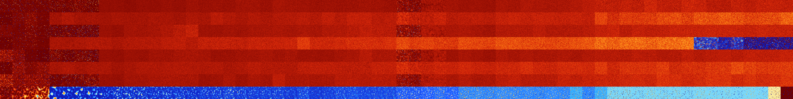

# B0234568 (195072-195583)

<details>
    <summary>Initial Grid</summary>
    
</details>


<details>
    <summary>Initial Grid RLE</summary>

```
#C Exported from GoGoL (https://github.com/marrow16/gogol)
#C Wrap mode: Toroidal
#C Boundary mode: Dead
#C Step: 0
x = 100, y = 100, rule = B0234568/S
13bo3bo17bo9bobo27bo$30bo19bo28b2o7bo$13bo7b2o15bo$34bo22bo3bo17bo7bo5b
o$21bo9bo14bo22bo$o2b3o21bo33bo9bo10bo$14bo12bo13bo2bo$11bobo7bo6b2o11b
o33bo16bo$bo19bo39bo4bo22bo6b2o$45bo4bo15bo2b2o$30bo12bo46bo$11bo44bo$
15bo10bo18bo2bo21bo18bo9bo$47bo16bo4bo$76bobo9bo$39b2o13bo29bo$o4bo20bo
10b2o14bo6bo8bo6bo8bo13bo$53bo$2bo2bo9bo53bo12bo$12bo32bo16bo16bo4bo8bo
$15bo12bo20bo5bo2bo5bo28bo$4bo20bo40bo$3bo39bo5bo10bo$bo29bo30bo$18bo
25bo20bo13bo$52bo4bo35bo$13bo36bo16bo14bo$35bo5bo$o42bo5bo12bo$bo3bo47b
o24bo$6bo19bo8bo23bo6bo6bo20bo$30bo25bo25bo4bo$17bo26bo16bo7bo10bo$4bo
2bobo41bo39bo$14bo29bo41bo$20bo12bobo23bo3bo3bo7bo4bo16bo$19bo37bo30bob
o$13bo70bo$30b2o24bobo16bo4bo$19bo8bo6bo37bobo$17bo32bo29bo$26bo5bo35bo
11bo2bo$27bo5bo$31b2o55bo$bo14bo32bo10bo$4bo9bo62bobo$48bo14bo$10bo4bo
6bo20bo28bo9bo6bo$17bo13bo17bo23bo3b3o$39bobo5bo35bo$24bo7bo61bo$42bo6b
o10bobo$3bo11bo7bo25bo27bo2bo18bo$25bo3bo14bo4bo8bo22bo$9b2o8bo26bo42bo
4bo4bo$5bobo24bo16bo31bo$18bo8bo17bo14bo5bo$6bo6b2o8bo36bo11bo$2b2o21b
2o3bo6bo3bo24b2o15bo13bo$40b2o21bo$5bo36b2o$14bo8bob2o17b2o10bo9bo12bo
10bo$22bo14bo15bobo6bo7bo$5bo13bobo4bo34bo10bo8bo14bo$43bo33bo$23bo49bo
$15bo7bo15bo7bo13bo2bo27bo$5bo30bo15bo20bo$12bo2bo3bo36bo23bo$12bo19bo
5bo2bo5bob2o22bo$16bo21bo5bo11bo$24bo66bo$14bo8bo22bobo$6bo7bo30bo3bo
33bo9bo5bo$26bo22bo24b2o11bo11bo$9bo33bo20bo6bo$bo30bo36bo$60bo27bo$72b
o5bo6bo2bo$3bo9bo18bo2bobo13bo14bo9bo$23bo6bo4bo16bo$12bo11bo11bo29bo$
23bo7bo21bo3bo$17bo41bo8bo5bo$17bo27bo$13bo2bobo13bo17bo11bo30bo$19bo
23bo19bo17bo$37bo14b2o3bo23bo$33bo15bo29bo6bo$7bo40bo15bo$27bo17bo11bo
11bo8b2o6bo$2bo27bobobo55bo2bo$9bo63bo18bo$53b2o40bo$15bo9bo18bo38bo$
17bo3bo21bo13bo21bo7b2o$11bo7bobo26bo14bo25bo$61bo14bo9bo12bo$4b2o5bo
26bo48bo11bo$77bo6bo4bo!
```
</details>
<details>
    <summary>Thumbnail</summary>

</details>
<table>
<tr>
    <td><a href="./195072%20S%20Heat%20Map%20Activity.png"></a><br>S (195072)<br>R@45,p2</td>    <td><a href="./195073%20S0%20Heat%20Map%20Activity.png"></a><br>S0 (195073)<br>R@41,p4</td>    <td><a href="./195074%20S1%20Heat%20Map%20Activity.png"></a><br>S1 (195074)<br>R@47,p4</td>    <td><a href="./195075%20S01%20Heat%20Map%20Activity.png"></a><br>S01 (195075)<br>R@60,p24</td>    <td><a href="./195076%20S2%20Heat%20Map%20Activity.png"></a><br>S2 (195076)<br>R@457,p120</td>    <td><a href="./195077%20S02%20Heat%20Map%20Activity.png"></a><br>S02 (195077)<br>R@677,p360</td>    <td><a href="./195078%20S12%20Heat%20Map%20Activity.png"></a><br>S12 (195078)<br>R@237,p72</td>    <td><a href="./195079%20S012%20Heat%20Map%20Activity.png"></a><br>S012 (195079)<br>G>1000</td>    <td><a href="./195080%20S3%20Heat%20Map%20Activity.png"></a><br>S3 (195080)<br>G>1000</td>    <td><a href="./195081%20S03%20Heat%20Map%20Activity.png"></a><br>S03 (195081)<br>G>1000</td>    <td><a href="./195082%20S13%20Heat%20Map%20Activity.png"></a><br>S13 (195082)<br>G>1000</td>    <td><a href="./195083%20S013%20Heat%20Map%20Activity.png"></a><br>S013 (195083)<br>G>1000</td>    <td><a href="./195084%20S23%20Heat%20Map%20Activity.png"></a><br>S23 (195084)<br>G>1000</td>    <td><a href="./195085%20S023%20Heat%20Map%20Activity.png"></a><br>S023 (195085)<br>G>1000</td>    <td><a href="./195086%20S123%20Heat%20Map%20Activity.png"></a><br>S123 (195086)<br>G>1000</td>    <td><a href="./195087%20S0123%20Heat%20Map%20Activity.png"></a><br>S0123 (195087)<br>G>1000</td>    <td><a href="./195088%20S4%20Heat%20Map%20Activity.png"></a><br>S4 (195088)<br>G>1000</td>    <td><a href="./195089%20S04%20Heat%20Map%20Activity.png"></a><br>S04 (195089)<br>G>1000</td>    <td><a href="./195090%20S14%20Heat%20Map%20Activity.png"></a><br>S14 (195090)<br>G>1000</td>    <td><a href="./195091%20S014%20Heat%20Map%20Activity.png"></a><br>S014 (195091)<br>G>1000</td>    <td><a href="./195092%20S24%20Heat%20Map%20Activity.png"></a><br>S24 (195092)<br>G>1000</td>    <td><a href="./195093%20S024%20Heat%20Map%20Activity.png"></a><br>S024 (195093)<br>G>1000</td>    <td><a href="./195094%20S124%20Heat%20Map%20Activity.png"></a><br>S124 (195094)<br>G>1000</td>    <td><a href="./195095%20S0124%20Heat%20Map%20Activity.png"></a><br>S0124 (195095)<br>G>1000</td>    <td><a href="./195096%20S34%20Heat%20Map%20Activity.png"></a><br>S34 (195096)<br>G>1000</td>    <td><a href="./195097%20S034%20Heat%20Map%20Activity.png"></a><br>S034 (195097)<br>G>1000</td>    <td><a href="./195098%20S134%20Heat%20Map%20Activity.png"></a><br>S134 (195098)<br>G>1000</td>    <td><a href="./195099%20S0134%20Heat%20Map%20Activity.png"></a><br>S0134 (195099)<br>G>1000</td>    <td><a href="./195100%20S234%20Heat%20Map%20Activity.png"></a><br>S234 (195100)<br>G>1000</td>    <td><a href="./195101%20S0234%20Heat%20Map%20Activity.png"></a><br>S0234 (195101)<br>G>1000</td>    <td><a href="./195102%20S1234%20Heat%20Map%20Activity.png"></a><br>S1234 (195102)<br>G>1000</td>    <td><a href="./195103%20S01234%20Heat%20Map%20Activity.png"></a><br>S01234 (195103)<br>G>1000</td>    <td><a href="./195104%20S5%20Heat%20Map%20Activity.png"></a><br>S5 (195104)<br>R@82,p4</td>    <td><a href="./195105%20S05%20Heat%20Map%20Activity.png"></a><br>S05 (195105)<br>R@111,p6</td>    <td><a href="./195106%20S15%20Heat%20Map%20Activity.png"></a><br>S15 (195106)<br>G>1000</td>    <td><a href="./195107%20S015%20Heat%20Map%20Activity.png"></a><br>S015 (195107)<br>G>1000</td>    <td><a href="./195108%20S25%20Heat%20Map%20Activity.png"></a><br>S25 (195108)<br>G>1000</td>    <td><a href="./195109%20S025%20Heat%20Map%20Activity.png"></a><br>S025 (195109)<br>G>1000</td>    <td><a href="./195110%20S125%20Heat%20Map%20Activity.png"></a><br>S125 (195110)<br>G>1000</td>    <td><a href="./195111%20S0125%20Heat%20Map%20Activity.png"></a><br>S0125 (195111)<br>G>1000</td>    <td><a href="./195112%20S35%20Heat%20Map%20Activity.png"></a><br>S35 (195112)<br>G>1000</td>    <td><a href="./195113%20S035%20Heat%20Map%20Activity.png"></a><br>S035 (195113)<br>G>1000</td>    <td><a href="./195114%20S135%20Heat%20Map%20Activity.png"></a><br>S135 (195114)<br>G>1000</td>    <td><a href="./195115%20S0135%20Heat%20Map%20Activity.png"></a><br>S0135 (195115)<br>G>1000</td>    <td><a href="./195116%20S235%20Heat%20Map%20Activity.png"></a><br>S235 (195116)<br>G>1000</td>    <td><a href="./195117%20S0235%20Heat%20Map%20Activity.png"></a><br>S0235 (195117)<br>G>1000</td>    <td><a href="./195118%20S1235%20Heat%20Map%20Activity.png"></a><br>S1235 (195118)<br>G>1000</td>    <td><a href="./195119%20S01235%20Heat%20Map%20Activity.png"></a><br>S01235 (195119)<br>G>1000</td>    <td><a href="./195120%20S45%20Heat%20Map%20Activity.png"></a><br>S45 (195120)<br>G>1000</td>    <td><a href="./195121%20S045%20Heat%20Map%20Activity.png"></a><br>S045 (195121)<br>G>1000</td>    <td><a href="./195122%20S145%20Heat%20Map%20Activity.png"></a><br>S145 (195122)<br>G>1000</td>    <td><a href="./195123%20S0145%20Heat%20Map%20Activity.png"></a><br>S0145 (195123)<br>G>1000</td>    <td><a href="./195124%20S245%20Heat%20Map%20Activity.png"></a><br>S245 (195124)<br>G>1000</td>    <td><a href="./195125%20S0245%20Heat%20Map%20Activity.png"></a><br>S0245 (195125)<br>G>1000</td>    <td><a href="./195126%20S1245%20Heat%20Map%20Activity.png"></a><br>S1245 (195126)<br>G>1000</td>    <td><a href="./195127%20S01245%20Heat%20Map%20Activity.png"></a><br>S01245 (195127)<br>G>1000</td>    <td><a href="./195128%20S345%20Heat%20Map%20Activity.png"></a><br>S345 (195128)<br>G>1000</td>    <td><a href="./195129%20S0345%20Heat%20Map%20Activity.png"></a><br>S0345 (195129)<br>G>1000</td>    <td><a href="./195130%20S1345%20Heat%20Map%20Activity.png"></a><br>S1345 (195130)<br>G>1000</td>    <td><a href="./195131%20S01345%20Heat%20Map%20Activity.png"></a><br>S01345 (195131)<br>G>1000</td>    <td><a href="./195132%20S2345%20Heat%20Map%20Activity.png"></a><br>S2345 (195132)<br>G>1000</td>    <td><a href="./195133%20S02345%20Heat%20Map%20Activity.png"></a><br>S02345 (195133)<br>G>1000</td>    <td><a href="./195134%20S12345%20Heat%20Map%20Activity.png"></a><br>S12345 (195134)<br>G>1000</td>    <td><a href="./195135%20S012345%20Heat%20Map%20Activity.png"></a><br>S012345 (195135)<br>G>1000</td></tr>
<tr>
    <td><a href="./195136%20S6%20Heat%20Map%20Activity.png"></a><br>S6 (195136)<br>R@187,p168</td>    <td><a href="./195137%20S06%20Heat%20Map%20Activity.png"></a><br>S06 (195137)<br>R@41,p24</td>    <td><a href="./195138%20S16%20Heat%20Map%20Activity.png"></a><br>S16 (195138)<br>R@33,p4</td>    <td><a href="./195139%20S016%20Heat%20Map%20Activity.png"></a><br>S016 (195139)<br>R@81,p36</td>    <td><a href="./195140%20S26%20Heat%20Map%20Activity.png"></a><br>S26 (195140)<br>G>1000</td>    <td><a href="./195141%20S026%20Heat%20Map%20Activity.png"></a><br>S026 (195141)<br>G>1000</td>    <td><a href="./195142%20S126%20Heat%20Map%20Activity.png"></a><br>S126 (195142)<br>G>1000</td>    <td><a href="./195143%20S0126%20Heat%20Map%20Activity.png"></a><br>S0126 (195143)<br>G>1000</td>    <td><a href="./195144%20S36%20Heat%20Map%20Activity.png"></a><br>S36 (195144)<br>G>1000</td>    <td><a href="./195145%20S036%20Heat%20Map%20Activity.png"></a><br>S036 (195145)<br>G>1000</td>    <td><a href="./195146%20S136%20Heat%20Map%20Activity.png"></a><br>S136 (195146)<br>G>1000</td>    <td><a href="./195147%20S0136%20Heat%20Map%20Activity.png"></a><br>S0136 (195147)<br>G>1000</td>    <td><a href="./195148%20S236%20Heat%20Map%20Activity.png"></a><br>S236 (195148)<br>G>1000</td>    <td><a href="./195149%20S0236%20Heat%20Map%20Activity.png"></a><br>S0236 (195149)<br>G>1000</td>    <td><a href="./195150%20S1236%20Heat%20Map%20Activity.png"></a><br>S1236 (195150)<br>G>1000</td>    <td><a href="./195151%20S01236%20Heat%20Map%20Activity.png"></a><br>S01236 (195151)<br>G>1000</td>    <td><a href="./195152%20S46%20Heat%20Map%20Activity.png"></a><br>S46 (195152)<br>G>1000</td>    <td><a href="./195153%20S046%20Heat%20Map%20Activity.png"></a><br>S046 (195153)<br>G>1000</td>    <td><a href="./195154%20S146%20Heat%20Map%20Activity.png"></a><br>S146 (195154)<br>G>1000</td>    <td><a href="./195155%20S0146%20Heat%20Map%20Activity.png"></a><br>S0146 (195155)<br>G>1000</td>    <td><a href="./195156%20S246%20Heat%20Map%20Activity.png"></a><br>S246 (195156)<br>G>1000</td>    <td><a href="./195157%20S0246%20Heat%20Map%20Activity.png"></a><br>S0246 (195157)<br>G>1000</td>    <td><a href="./195158%20S1246%20Heat%20Map%20Activity.png"></a><br>S1246 (195158)<br>G>1000</td>    <td><a href="./195159%20S01246%20Heat%20Map%20Activity.png"></a><br>S01246 (195159)<br>G>1000</td>    <td><a href="./195160%20S346%20Heat%20Map%20Activity.png"></a><br>S346 (195160)<br>G>1000</td>    <td><a href="./195161%20S0346%20Heat%20Map%20Activity.png"></a><br>S0346 (195161)<br>G>1000</td>    <td><a href="./195162%20S1346%20Heat%20Map%20Activity.png"></a><br>S1346 (195162)<br>G>1000</td>    <td><a href="./195163%20S01346%20Heat%20Map%20Activity.png"></a><br>S01346 (195163)<br>G>1000</td>    <td><a href="./195164%20S2346%20Heat%20Map%20Activity.png"></a><br>S2346 (195164)<br>G>1000</td>    <td><a href="./195165%20S02346%20Heat%20Map%20Activity.png"></a><br>S02346 (195165)<br>G>1000</td>    <td><a href="./195166%20S12346%20Heat%20Map%20Activity.png"></a><br>S12346 (195166)<br>G>1000</td>    <td><a href="./195167%20S012346%20Heat%20Map%20Activity.png"></a><br>S012346 (195167)<br>G>1000</td>    <td><a href="./195168%20S56%20Heat%20Map%20Activity.png"></a><br>S56 (195168)<br>G>1000</td>    <td><a href="./195169%20S056%20Heat%20Map%20Activity.png"></a><br>S056 (195169)<br>G>1000</td>    <td><a href="./195170%20S156%20Heat%20Map%20Activity.png"></a><br>S156 (195170)<br>G>1000</td>    <td><a href="./195171%20S0156%20Heat%20Map%20Activity.png"></a><br>S0156 (195171)<br>G>1000</td>    <td><a href="./195172%20S256%20Heat%20Map%20Activity.png"></a><br>S256 (195172)<br>G>1000</td>    <td><a href="./195173%20S0256%20Heat%20Map%20Activity.png"></a><br>S0256 (195173)<br>G>1000</td>    <td><a href="./195174%20S1256%20Heat%20Map%20Activity.png"></a><br>S1256 (195174)<br>G>1000</td>    <td><a href="./195175%20S01256%20Heat%20Map%20Activity.png"></a><br>S01256 (195175)<br>G>1000</td>    <td><a href="./195176%20S356%20Heat%20Map%20Activity.png"></a><br>S356 (195176)<br>G>1000</td>    <td><a href="./195177%20S0356%20Heat%20Map%20Activity.png"></a><br>S0356 (195177)<br>G>1000</td>    <td><a href="./195178%20S1356%20Heat%20Map%20Activity.png"></a><br>S1356 (195178)<br>G>1000</td>    <td><a href="./195179%20S01356%20Heat%20Map%20Activity.png"></a><br>S01356 (195179)<br>G>1000</td>    <td><a href="./195180%20S2356%20Heat%20Map%20Activity.png"></a><br>S2356 (195180)<br>G>1000</td>    <td><a href="./195181%20S02356%20Heat%20Map%20Activity.png"></a><br>S02356 (195181)<br>G>1000</td>    <td><a href="./195182%20S12356%20Heat%20Map%20Activity.png"></a><br>S12356 (195182)<br>G>1000</td>    <td><a href="./195183%20S012356%20Heat%20Map%20Activity.png"></a><br>S012356 (195183)<br>G>1000</td>    <td><a href="./195184%20S456%20Heat%20Map%20Activity.png"></a><br>S456 (195184)<br>G>1000</td>    <td><a href="./195185%20S0456%20Heat%20Map%20Activity.png"></a><br>S0456 (195185)<br>G>1000</td>    <td><a href="./195186%20S1456%20Heat%20Map%20Activity.png"></a><br>S1456 (195186)<br>G>1000</td>    <td><a href="./195187%20S01456%20Heat%20Map%20Activity.png"></a><br>S01456 (195187)<br>G>1000</td>    <td><a href="./195188%20S2456%20Heat%20Map%20Activity.png"></a><br>S2456 (195188)<br>G>1000</td>    <td><a href="./195189%20S02456%20Heat%20Map%20Activity.png"></a><br>S02456 (195189)<br>G>1000</td>    <td><a href="./195190%20S12456%20Heat%20Map%20Activity.png"></a><br>S12456 (195190)<br>G>1000</td>    <td><a href="./195191%20S012456%20Heat%20Map%20Activity.png"></a><br>S012456 (195191)<br>G>1000</td>    <td><a href="./195192%20S3456%20Heat%20Map%20Activity.png"></a><br>S3456 (195192)<br>G>1000</td>    <td><a href="./195193%20S03456%20Heat%20Map%20Activity.png"></a><br>S03456 (195193)<br>G>1000</td>    <td><a href="./195194%20S13456%20Heat%20Map%20Activity.png"></a><br>S13456 (195194)<br>G>1000</td>    <td><a href="./195195%20S013456%20Heat%20Map%20Activity.png"></a><br>S013456 (195195)<br>G>1000</td>    <td><a href="./195196%20S23456%20Heat%20Map%20Activity.png"></a><br>S23456 (195196)<br>G>1000</td>    <td><a href="./195197%20S023456%20Heat%20Map%20Activity.png"></a><br>S023456 (195197)<br>G>1000</td>    <td><a href="./195198%20S123456%20Heat%20Map%20Activity.png"></a><br>S123456 (195198)<br>G>1000</td>    <td><a href="./195199%20S0123456%20Heat%20Map%20Activity.png"></a><br>S0123456 (195199)<br>G>1000</td></tr>
<tr>
    <td><a href="./195200%20S7%20Heat%20Map%20Activity.png"></a><br>S7 (195200)<br>R@24,p12</td>    <td><a href="./195201%20S07%20Heat%20Map%20Activity.png"></a><br>S07 (195201)<br>R@40,p20</td>    <td><a href="./195202%20S17%20Heat%20Map%20Activity.png"></a><br>S17 (195202)<br>R@34,p12</td>    <td><a href="./195203%20S017%20Heat%20Map%20Activity.png"></a><br>S017 (195203)<br>R@84,p48</td>    <td><a href="./195204%20S27%20Heat%20Map%20Activity.png"></a><br>S27 (195204)<br>R@362,p240</td>    <td><a href="./195205%20S027%20Heat%20Map%20Activity.png"></a><br>S027 (195205)<br>R@266,p120</td>    <td><a href="./195206%20S127%20Heat%20Map%20Activity.png"></a><br>S127 (195206)<br>R@215,p120</td>    <td><a href="./195207%20S0127%20Heat%20Map%20Activity.png"></a><br>S0127 (195207)<br>R@213,p120</td>    <td><a href="./195208%20S37%20Heat%20Map%20Activity.png"></a><br>S37 (195208)<br>G>1000</td>    <td><a href="./195209%20S037%20Heat%20Map%20Activity.png"></a><br>S037 (195209)<br>G>1000</td>    <td><a href="./195210%20S137%20Heat%20Map%20Activity.png"></a><br>S137 (195210)<br>G>1000</td>    <td><a href="./195211%20S0137%20Heat%20Map%20Activity.png"></a><br>S0137 (195211)<br>G>1000</td>    <td><a href="./195212%20S237%20Heat%20Map%20Activity.png"></a><br>S237 (195212)<br>G>1000</td>    <td><a href="./195213%20S0237%20Heat%20Map%20Activity.png"></a><br>S0237 (195213)<br>G>1000</td>    <td><a href="./195214%20S1237%20Heat%20Map%20Activity.png"></a><br>S1237 (195214)<br>G>1000</td>    <td><a href="./195215%20S01237%20Heat%20Map%20Activity.png"></a><br>S01237 (195215)<br>G>1000</td>    <td><a href="./195216%20S47%20Heat%20Map%20Activity.png"></a><br>S47 (195216)<br>G>1000</td>    <td><a href="./195217%20S047%20Heat%20Map%20Activity.png"></a><br>S047 (195217)<br>G>1000</td>    <td><a href="./195218%20S147%20Heat%20Map%20Activity.png"></a><br>S147 (195218)<br>G>1000</td>    <td><a href="./195219%20S0147%20Heat%20Map%20Activity.png"></a><br>S0147 (195219)<br>G>1000</td>    <td><a href="./195220%20S247%20Heat%20Map%20Activity.png"></a><br>S247 (195220)<br>G>1000</td>    <td><a href="./195221%20S0247%20Heat%20Map%20Activity.png"></a><br>S0247 (195221)<br>G>1000</td>    <td><a href="./195222%20S1247%20Heat%20Map%20Activity.png"></a><br>S1247 (195222)<br>G>1000</td>    <td><a href="./195223%20S01247%20Heat%20Map%20Activity.png"></a><br>S01247 (195223)<br>G>1000</td>    <td><a href="./195224%20S347%20Heat%20Map%20Activity.png"></a><br>S347 (195224)<br>G>1000</td>    <td><a href="./195225%20S0347%20Heat%20Map%20Activity.png"></a><br>S0347 (195225)<br>G>1000</td>    <td><a href="./195226%20S1347%20Heat%20Map%20Activity.png"></a><br>S1347 (195226)<br>G>1000</td>    <td><a href="./195227%20S01347%20Heat%20Map%20Activity.png"></a><br>S01347 (195227)<br>G>1000</td>    <td><a href="./195228%20S2347%20Heat%20Map%20Activity.png"></a><br>S2347 (195228)<br>G>1000</td>    <td><a href="./195229%20S02347%20Heat%20Map%20Activity.png"></a><br>S02347 (195229)<br>G>1000</td>    <td><a href="./195230%20S12347%20Heat%20Map%20Activity.png"></a><br>S12347 (195230)<br>G>1000</td>    <td><a href="./195231%20S012347%20Heat%20Map%20Activity.png"></a><br>S012347 (195231)<br>G>1000</td>    <td><a href="./195232%20S57%20Heat%20Map%20Activity.png"></a><br>S57 (195232)<br>R@72,p2</td>    <td><a href="./195233%20S057%20Heat%20Map%20Activity.png"></a><br>S057 (195233)<br>R@86,p4</td>    <td><a href="./195234%20S157%20Heat%20Map%20Activity.png"></a><br>S157 (195234)<br>G>1000</td>    <td><a href="./195235%20S0157%20Heat%20Map%20Activity.png"></a><br>S0157 (195235)<br>G>1000</td>    <td><a href="./195236%20S257%20Heat%20Map%20Activity.png"></a><br>S257 (195236)<br>G>1000</td>    <td><a href="./195237%20S0257%20Heat%20Map%20Activity.png"></a><br>S0257 (195237)<br>G>1000</td>    <td><a href="./195238%20S1257%20Heat%20Map%20Activity.png"></a><br>S1257 (195238)<br>G>1000</td>    <td><a href="./195239%20S01257%20Heat%20Map%20Activity.png"></a><br>S01257 (195239)<br>G>1000</td>    <td><a href="./195240%20S357%20Heat%20Map%20Activity.png"></a><br>S357 (195240)<br>G>1000</td>    <td><a href="./195241%20S0357%20Heat%20Map%20Activity.png"></a><br>S0357 (195241)<br>G>1000</td>    <td><a href="./195242%20S1357%20Heat%20Map%20Activity.png"></a><br>S1357 (195242)<br>G>1000</td>    <td><a href="./195243%20S01357%20Heat%20Map%20Activity.png"></a><br>S01357 (195243)<br>G>1000</td>    <td><a href="./195244%20S2357%20Heat%20Map%20Activity.png"></a><br>S2357 (195244)<br>G>1000</td>    <td><a href="./195245%20S02357%20Heat%20Map%20Activity.png"></a><br>S02357 (195245)<br>G>1000</td>    <td><a href="./195246%20S12357%20Heat%20Map%20Activity.png"></a><br>S12357 (195246)<br>G>1000</td>    <td><a href="./195247%20S012357%20Heat%20Map%20Activity.png"></a><br>S012357 (195247)<br>G>1000</td>    <td><a href="./195248%20S457%20Heat%20Map%20Activity.png"></a><br>S457 (195248)<br>G>1000</td>    <td><a href="./195249%20S0457%20Heat%20Map%20Activity.png"></a><br>S0457 (195249)<br>G>1000</td>    <td><a href="./195250%20S1457%20Heat%20Map%20Activity.png"></a><br>S1457 (195250)<br>G>1000</td>    <td><a href="./195251%20S01457%20Heat%20Map%20Activity.png"></a><br>S01457 (195251)<br>G>1000</td>    <td><a href="./195252%20S2457%20Heat%20Map%20Activity.png"></a><br>S2457 (195252)<br>G>1000</td>    <td><a href="./195253%20S02457%20Heat%20Map%20Activity.png"></a><br>S02457 (195253)<br>G>1000</td>    <td><a href="./195254%20S12457%20Heat%20Map%20Activity.png"></a><br>S12457 (195254)<br>G>1000</td>    <td><a href="./195255%20S012457%20Heat%20Map%20Activity.png"></a><br>S012457 (195255)<br>G>1000</td>    <td><a href="./195256%20S3457%20Heat%20Map%20Activity.png"></a><br>S3457 (195256)<br>G>1000</td>    <td><a href="./195257%20S03457%20Heat%20Map%20Activity.png"></a><br>S03457 (195257)<br>G>1000</td>    <td><a href="./195258%20S13457%20Heat%20Map%20Activity.png"></a><br>S13457 (195258)<br>G>1000</td>    <td><a href="./195259%20S013457%20Heat%20Map%20Activity.png"></a><br>S013457 (195259)<br>G>1000</td>    <td><a href="./195260%20S23457%20Heat%20Map%20Activity.png"></a><br>S23457 (195260)<br>G>1000</td>    <td><a href="./195261%20S023457%20Heat%20Map%20Activity.png"></a><br>S023457 (195261)<br>G>1000</td>    <td><a href="./195262%20S123457%20Heat%20Map%20Activity.png"></a><br>S123457 (195262)<br>G>1000</td>    <td><a href="./195263%20S0123457%20Heat%20Map%20Activity.png"></a><br>S0123457 (195263)<br>G>1000</td></tr>
<tr>
    <td><a href="./195264%20S67%20Heat%20Map%20Activity.png"></a><br>S67 (195264)<br>R@194,p168</td>    <td><a href="./195265%20S067%20Heat%20Map%20Activity.png"></a><br>S067 (195265)<br>R@60,p40</td>    <td><a href="./195266%20S167%20Heat%20Map%20Activity.png"></a><br>S167 (195266)<br>R@66,p12</td>    <td><a href="./195267%20S0167%20Heat%20Map%20Activity.png"></a><br>S0167 (195267)<br>R@113,p84</td>    <td><a href="./195268%20S267%20Heat%20Map%20Activity.png"></a><br>S267 (195268)<br>G>1000</td>    <td><a href="./195269%20S0267%20Heat%20Map%20Activity.png"></a><br>S0267 (195269)<br>G>1000</td>    <td><a href="./195270%20S1267%20Heat%20Map%20Activity.png"></a><br>S1267 (195270)<br>G>1000</td>    <td><a href="./195271%20S01267%20Heat%20Map%20Activity.png"></a><br>S01267 (195271)<br>G>1000</td>    <td><a href="./195272%20S367%20Heat%20Map%20Activity.png"></a><br>S367 (195272)<br>G>1000</td>    <td><a href="./195273%20S0367%20Heat%20Map%20Activity.png"></a><br>S0367 (195273)<br>G>1000</td>    <td><a href="./195274%20S1367%20Heat%20Map%20Activity.png"></a><br>S1367 (195274)<br>G>1000</td>    <td><a href="./195275%20S01367%20Heat%20Map%20Activity.png"></a><br>S01367 (195275)<br>G>1000</td>    <td><a href="./195276%20S2367%20Heat%20Map%20Activity.png"></a><br>S2367 (195276)<br>G>1000</td>    <td><a href="./195277%20S02367%20Heat%20Map%20Activity.png"></a><br>S02367 (195277)<br>G>1000</td>    <td><a href="./195278%20S12367%20Heat%20Map%20Activity.png"></a><br>S12367 (195278)<br>G>1000</td>    <td><a href="./195279%20S012367%20Heat%20Map%20Activity.png"></a><br>S012367 (195279)<br>G>1000</td>    <td><a href="./195280%20S467%20Heat%20Map%20Activity.png"></a><br>S467 (195280)<br>G>1000</td>    <td><a href="./195281%20S0467%20Heat%20Map%20Activity.png"></a><br>S0467 (195281)<br>G>1000</td>    <td><a href="./195282%20S1467%20Heat%20Map%20Activity.png"></a><br>S1467 (195282)<br>G>1000</td>    <td><a href="./195283%20S01467%20Heat%20Map%20Activity.png"></a><br>S01467 (195283)<br>G>1000</td>    <td><a href="./195284%20S2467%20Heat%20Map%20Activity.png"></a><br>S2467 (195284)<br>G>1000</td>    <td><a href="./195285%20S02467%20Heat%20Map%20Activity.png"></a><br>S02467 (195285)<br>G>1000</td>    <td><a href="./195286%20S12467%20Heat%20Map%20Activity.png"></a><br>S12467 (195286)<br>G>1000</td>    <td><a href="./195287%20S012467%20Heat%20Map%20Activity.png"></a><br>S012467 (195287)<br>G>1000</td>    <td><a href="./195288%20S3467%20Heat%20Map%20Activity.png"></a><br>S3467 (195288)<br>G>1000</td>    <td><a href="./195289%20S03467%20Heat%20Map%20Activity.png"></a><br>S03467 (195289)<br>G>1000</td>    <td><a href="./195290%20S13467%20Heat%20Map%20Activity.png"></a><br>S13467 (195290)<br>G>1000</td>    <td><a href="./195291%20S013467%20Heat%20Map%20Activity.png"></a><br>S013467 (195291)<br>G>1000</td>    <td><a href="./195292%20S23467%20Heat%20Map%20Activity.png"></a><br>S23467 (195292)<br>G>1000</td>    <td><a href="./195293%20S023467%20Heat%20Map%20Activity.png"></a><br>S023467 (195293)<br>G>1000</td>    <td><a href="./195294%20S123467%20Heat%20Map%20Activity.png"></a><br>S123467 (195294)<br>G>1000</td>    <td><a href="./195295%20S0123467%20Heat%20Map%20Activity.png"></a><br>S0123467 (195295)<br>G>1000</td>    <td><a href="./195296%20S567%20Heat%20Map%20Activity.png"></a><br>S567 (195296)<br>G>1000</td>    <td><a href="./195297%20S0567%20Heat%20Map%20Activity.png"></a><br>S0567 (195297)<br>G>1000</td>    <td><a href="./195298%20S1567%20Heat%20Map%20Activity.png"></a><br>S1567 (195298)<br>G>1000</td>    <td><a href="./195299%20S01567%20Heat%20Map%20Activity.png"></a><br>S01567 (195299)<br>G>1000</td>    <td><a href="./195300%20S2567%20Heat%20Map%20Activity.png"></a><br>S2567 (195300)<br>G>1000</td>    <td><a href="./195301%20S02567%20Heat%20Map%20Activity.png"></a><br>S02567 (195301)<br>G>1000</td>    <td><a href="./195302%20S12567%20Heat%20Map%20Activity.png"></a><br>S12567 (195302)<br>G>1000</td>    <td><a href="./195303%20S012567%20Heat%20Map%20Activity.png"></a><br>S012567 (195303)<br>G>1000</td>    <td><a href="./195304%20S3567%20Heat%20Map%20Activity.png"></a><br>S3567 (195304)<br>G>1000</td>    <td><a href="./195305%20S03567%20Heat%20Map%20Activity.png"></a><br>S03567 (195305)<br>G>1000</td>    <td><a href="./195306%20S13567%20Heat%20Map%20Activity.png"></a><br>S13567 (195306)<br>G>1000</td>    <td><a href="./195307%20S013567%20Heat%20Map%20Activity.png"></a><br>S013567 (195307)<br>G>1000</td>    <td><a href="./195308%20S23567%20Heat%20Map%20Activity.png"></a><br>S23567 (195308)<br>G>1000</td>    <td><a href="./195309%20S023567%20Heat%20Map%20Activity.png"></a><br>S023567 (195309)<br>G>1000</td>    <td><a href="./195310%20S123567%20Heat%20Map%20Activity.png"></a><br>S123567 (195310)<br>G>1000</td>    <td><a href="./195311%20S0123567%20Heat%20Map%20Activity.png"></a><br>S0123567 (195311)<br>G>1000</td>    <td><a href="./195312%20S4567%20Heat%20Map%20Activity.png"></a><br>S4567 (195312)<br>G>1000</td>    <td><a href="./195313%20S04567%20Heat%20Map%20Activity.png"></a><br>S04567 (195313)<br>G>1000</td>    <td><a href="./195314%20S14567%20Heat%20Map%20Activity.png"></a><br>S14567 (195314)<br>G>1000</td>    <td><a href="./195315%20S014567%20Heat%20Map%20Activity.png"></a><br>S014567 (195315)<br>G>1000</td>    <td><a href="./195316%20S24567%20Heat%20Map%20Activity.png"></a><br>S24567 (195316)<br>G>1000</td>    <td><a href="./195317%20S024567%20Heat%20Map%20Activity.png"></a><br>S024567 (195317)<br>G>1000</td>    <td><a href="./195318%20S124567%20Heat%20Map%20Activity.png"></a><br>S124567 (195318)<br>G>1000</td>    <td><a href="./195319%20S0124567%20Heat%20Map%20Activity.png"></a><br>S0124567 (195319)<br>G>1000</td>    <td><a href="./195320%20S34567%20Heat%20Map%20Activity.png"></a><br>S34567 (195320)<br>R@313,p72</td>    <td><a href="./195321%20S034567%20Heat%20Map%20Activity.png"></a><br>S034567 (195321)<br>R@371,p120</td>    <td><a href="./195322%20S134567%20Heat%20Map%20Activity.png"></a><br>S134567 (195322)<br>G>1000</td>    <td><a href="./195323%20S0134567%20Heat%20Map%20Activity.png"></a><br>S0134567 (195323)<br>R@347,p120</td>    <td><a href="./195324%20S234567%20Heat%20Map%20Activity.png"></a><br>S234567 (195324)<br>G>1000</td>    <td><a href="./195325%20S0234567%20Heat%20Map%20Activity.png"></a><br>S0234567 (195325)<br>G>1000</td>    <td><a href="./195326%20S1234567%20Heat%20Map%20Activity.png"></a><br>S1234567 (195326)<br>G>1000</td>    <td><a href="./195327%20S01234567%20Heat%20Map%20Activity.png"></a><br>S01234567 (195327)<br>R@920,p840</td></tr>
<tr>
    <td><a href="./195328%20S8%20Heat%20Map%20Activity.png"></a><br>S8 (195328)<br>R@13,p4</td>    <td><a href="./195329%20S08%20Heat%20Map%20Activity.png"></a><br>S08 (195329)<br>R@22,p12</td>    <td><a href="./195330%20S18%20Heat%20Map%20Activity.png"></a><br>S18 (195330)<br>R@98,p84</td>    <td><a href="./195331%20S018%20Heat%20Map%20Activity.png"></a><br>S018 (195331)<br>R@876,p840</td>    <td><a href="./195332%20S28%20Heat%20Map%20Activity.png"></a><br>S28 (195332)<br>R@304,p60</td>    <td><a href="./195333%20S028%20Heat%20Map%20Activity.png"></a><br>S028 (195333)<br>G>1000</td>    <td><a href="./195334%20S128%20Heat%20Map%20Activity.png"></a><br>S128 (195334)<br>R@239,p24</td>    <td><a href="./195335%20S0128%20Heat%20Map%20Activity.png"></a><br>S0128 (195335)<br>R@249,p120</td>    <td><a href="./195336%20S38%20Heat%20Map%20Activity.png"></a><br>S38 (195336)<br>G>1000</td>    <td><a href="./195337%20S038%20Heat%20Map%20Activity.png"></a><br>S038 (195337)<br>G>1000</td>    <td><a href="./195338%20S138%20Heat%20Map%20Activity.png"></a><br>S138 (195338)<br>G>1000</td>    <td><a href="./195339%20S0138%20Heat%20Map%20Activity.png"></a><br>S0138 (195339)<br>G>1000</td>    <td><a href="./195340%20S238%20Heat%20Map%20Activity.png"></a><br>S238 (195340)<br>G>1000</td>    <td><a href="./195341%20S0238%20Heat%20Map%20Activity.png"></a><br>S0238 (195341)<br>G>1000</td>    <td><a href="./195342%20S1238%20Heat%20Map%20Activity.png"></a><br>S1238 (195342)<br>G>1000</td>    <td><a href="./195343%20S01238%20Heat%20Map%20Activity.png"></a><br>S01238 (195343)<br>G>1000</td>    <td><a href="./195344%20S48%20Heat%20Map%20Activity.png"></a><br>S48 (195344)<br>G>1000</td>    <td><a href="./195345%20S048%20Heat%20Map%20Activity.png"></a><br>S048 (195345)<br>G>1000</td>    <td><a href="./195346%20S148%20Heat%20Map%20Activity.png"></a><br>S148 (195346)<br>G>1000</td>    <td><a href="./195347%20S0148%20Heat%20Map%20Activity.png"></a><br>S0148 (195347)<br>G>1000</td>    <td><a href="./195348%20S248%20Heat%20Map%20Activity.png"></a><br>S248 (195348)<br>G>1000</td>    <td><a href="./195349%20S0248%20Heat%20Map%20Activity.png"></a><br>S0248 (195349)<br>G>1000</td>    <td><a href="./195350%20S1248%20Heat%20Map%20Activity.png"></a><br>S1248 (195350)<br>G>1000</td>    <td><a href="./195351%20S01248%20Heat%20Map%20Activity.png"></a><br>S01248 (195351)<br>G>1000</td>    <td><a href="./195352%20S348%20Heat%20Map%20Activity.png"></a><br>S348 (195352)<br>G>1000</td>    <td><a href="./195353%20S0348%20Heat%20Map%20Activity.png"></a><br>S0348 (195353)<br>G>1000</td>    <td><a href="./195354%20S1348%20Heat%20Map%20Activity.png"></a><br>S1348 (195354)<br>G>1000</td>    <td><a href="./195355%20S01348%20Heat%20Map%20Activity.png"></a><br>S01348 (195355)<br>G>1000</td>    <td><a href="./195356%20S2348%20Heat%20Map%20Activity.png"></a><br>S2348 (195356)<br>G>1000</td>    <td><a href="./195357%20S02348%20Heat%20Map%20Activity.png"></a><br>S02348 (195357)<br>G>1000</td>    <td><a href="./195358%20S12348%20Heat%20Map%20Activity.png"></a><br>S12348 (195358)<br>G>1000</td>    <td><a href="./195359%20S012348%20Heat%20Map%20Activity.png"></a><br>S012348 (195359)<br>G>1000</td>    <td><a href="./195360%20S58%20Heat%20Map%20Activity.png"></a><br>S58 (195360)<br>R@66,p2</td>    <td><a href="./195361%20S058%20Heat%20Map%20Activity.png"></a><br>S058 (195361)<br>R@95,p4</td>    <td><a href="./195362%20S158%20Heat%20Map%20Activity.png"></a><br>S158 (195362)<br>G>1000</td>    <td><a href="./195363%20S0158%20Heat%20Map%20Activity.png"></a><br>S0158 (195363)<br>G>1000</td>    <td><a href="./195364%20S258%20Heat%20Map%20Activity.png"></a><br>S258 (195364)<br>G>1000</td>    <td><a href="./195365%20S0258%20Heat%20Map%20Activity.png"></a><br>S0258 (195365)<br>G>1000</td>    <td><a href="./195366%20S1258%20Heat%20Map%20Activity.png"></a><br>S1258 (195366)<br>G>1000</td>    <td><a href="./195367%20S01258%20Heat%20Map%20Activity.png"></a><br>S01258 (195367)<br>G>1000</td>    <td><a href="./195368%20S358%20Heat%20Map%20Activity.png"></a><br>S358 (195368)<br>G>1000</td>    <td><a href="./195369%20S0358%20Heat%20Map%20Activity.png"></a><br>S0358 (195369)<br>G>1000</td>    <td><a href="./195370%20S1358%20Heat%20Map%20Activity.png"></a><br>S1358 (195370)<br>G>1000</td>    <td><a href="./195371%20S01358%20Heat%20Map%20Activity.png"></a><br>S01358 (195371)<br>G>1000</td>    <td><a href="./195372%20S2358%20Heat%20Map%20Activity.png"></a><br>S2358 (195372)<br>G>1000</td>    <td><a href="./195373%20S02358%20Heat%20Map%20Activity.png"></a><br>S02358 (195373)<br>G>1000</td>    <td><a href="./195374%20S12358%20Heat%20Map%20Activity.png"></a><br>S12358 (195374)<br>G>1000</td>    <td><a href="./195375%20S012358%20Heat%20Map%20Activity.png"></a><br>S012358 (195375)<br>G>1000</td>    <td><a href="./195376%20S458%20Heat%20Map%20Activity.png"></a><br>S458 (195376)<br>G>1000</td>    <td><a href="./195377%20S0458%20Heat%20Map%20Activity.png"></a><br>S0458 (195377)<br>G>1000</td>    <td><a href="./195378%20S1458%20Heat%20Map%20Activity.png"></a><br>S1458 (195378)<br>G>1000</td>    <td><a href="./195379%20S01458%20Heat%20Map%20Activity.png"></a><br>S01458 (195379)<br>G>1000</td>    <td><a href="./195380%20S2458%20Heat%20Map%20Activity.png"></a><br>S2458 (195380)<br>G>1000</td>    <td><a href="./195381%20S02458%20Heat%20Map%20Activity.png"></a><br>S02458 (195381)<br>G>1000</td>    <td><a href="./195382%20S12458%20Heat%20Map%20Activity.png"></a><br>S12458 (195382)<br>G>1000</td>    <td><a href="./195383%20S012458%20Heat%20Map%20Activity.png"></a><br>S012458 (195383)<br>G>1000</td>    <td><a href="./195384%20S3458%20Heat%20Map%20Activity.png"></a><br>S3458 (195384)<br>G>1000</td>    <td><a href="./195385%20S03458%20Heat%20Map%20Activity.png"></a><br>S03458 (195385)<br>G>1000</td>    <td><a href="./195386%20S13458%20Heat%20Map%20Activity.png"></a><br>S13458 (195386)<br>G>1000</td>    <td><a href="./195387%20S013458%20Heat%20Map%20Activity.png"></a><br>S013458 (195387)<br>G>1000</td>    <td><a href="./195388%20S23458%20Heat%20Map%20Activity.png"></a><br>S23458 (195388)<br>G>1000</td>    <td><a href="./195389%20S023458%20Heat%20Map%20Activity.png"></a><br>S023458 (195389)<br>G>1000</td>    <td><a href="./195390%20S123458%20Heat%20Map%20Activity.png"></a><br>S123458 (195390)<br>G>1000</td>    <td><a href="./195391%20S0123458%20Heat%20Map%20Activity.png"></a><br>S0123458 (195391)<br>G>1000</td></tr>
<tr>
    <td><a href="./195392%20S68%20Heat%20Map%20Activity.png"></a><br>S68 (195392)<br>R@228,p168</td>    <td><a href="./195393%20S068%20Heat%20Map%20Activity.png"></a><br>S068 (195393)<br>R@31,p8</td>    <td><a href="./195394%20S168%20Heat%20Map%20Activity.png"></a><br>S168 (195394)<br>R@59,p24</td>    <td><a href="./195395%20S0168%20Heat%20Map%20Activity.png"></a><br>S0168 (195395)<br>R@39,p4</td>    <td><a href="./195396%20S268%20Heat%20Map%20Activity.png"></a><br>S268 (195396)<br>G>1000</td>    <td><a href="./195397%20S0268%20Heat%20Map%20Activity.png"></a><br>S0268 (195397)<br>G>1000</td>    <td><a href="./195398%20S1268%20Heat%20Map%20Activity.png"></a><br>S1268 (195398)<br>G>1000</td>    <td><a href="./195399%20S01268%20Heat%20Map%20Activity.png"></a><br>S01268 (195399)<br>G>1000</td>    <td><a href="./195400%20S368%20Heat%20Map%20Activity.png"></a><br>S368 (195400)<br>G>1000</td>    <td><a href="./195401%20S0368%20Heat%20Map%20Activity.png"></a><br>S0368 (195401)<br>G>1000</td>    <td><a href="./195402%20S1368%20Heat%20Map%20Activity.png"></a><br>S1368 (195402)<br>G>1000</td>    <td><a href="./195403%20S01368%20Heat%20Map%20Activity.png"></a><br>S01368 (195403)<br>G>1000</td>    <td><a href="./195404%20S2368%20Heat%20Map%20Activity.png"></a><br>S2368 (195404)<br>G>1000</td>    <td><a href="./195405%20S02368%20Heat%20Map%20Activity.png"></a><br>S02368 (195405)<br>G>1000</td>    <td><a href="./195406%20S12368%20Heat%20Map%20Activity.png"></a><br>S12368 (195406)<br>G>1000</td>    <td><a href="./195407%20S012368%20Heat%20Map%20Activity.png"></a><br>S012368 (195407)<br>G>1000</td>    <td><a href="./195408%20S468%20Heat%20Map%20Activity.png"></a><br>S468 (195408)<br>G>1000</td>    <td><a href="./195409%20S0468%20Heat%20Map%20Activity.png"></a><br>S0468 (195409)<br>G>1000</td>    <td><a href="./195410%20S1468%20Heat%20Map%20Activity.png"></a><br>S1468 (195410)<br>G>1000</td>    <td><a href="./195411%20S01468%20Heat%20Map%20Activity.png"></a><br>S01468 (195411)<br>G>1000</td>    <td><a href="./195412%20S2468%20Heat%20Map%20Activity.png"></a><br>S2468 (195412)<br>G>1000</td>    <td><a href="./195413%20S02468%20Heat%20Map%20Activity.png"></a><br>S02468 (195413)<br>G>1000</td>    <td><a href="./195414%20S12468%20Heat%20Map%20Activity.png"></a><br>S12468 (195414)<br>G>1000</td>    <td><a href="./195415%20S012468%20Heat%20Map%20Activity.png"></a><br>S012468 (195415)<br>G>1000</td>    <td><a href="./195416%20S3468%20Heat%20Map%20Activity.png"></a><br>S3468 (195416)<br>G>1000</td>    <td><a href="./195417%20S03468%20Heat%20Map%20Activity.png"></a><br>S03468 (195417)<br>G>1000</td>    <td><a href="./195418%20S13468%20Heat%20Map%20Activity.png"></a><br>S13468 (195418)<br>G>1000</td>    <td><a href="./195419%20S013468%20Heat%20Map%20Activity.png"></a><br>S013468 (195419)<br>G>1000</td>    <td><a href="./195420%20S23468%20Heat%20Map%20Activity.png"></a><br>S23468 (195420)<br>G>1000</td>    <td><a href="./195421%20S023468%20Heat%20Map%20Activity.png"></a><br>S023468 (195421)<br>G>1000</td>    <td><a href="./195422%20S123468%20Heat%20Map%20Activity.png"></a><br>S123468 (195422)<br>G>1000</td>    <td><a href="./195423%20S0123468%20Heat%20Map%20Activity.png"></a><br>S0123468 (195423)<br>G>1000</td>    <td><a href="./195424%20S568%20Heat%20Map%20Activity.png"></a><br>S568 (195424)<br>G>1000</td>    <td><a href="./195425%20S0568%20Heat%20Map%20Activity.png"></a><br>S0568 (195425)<br>G>1000</td>    <td><a href="./195426%20S1568%20Heat%20Map%20Activity.png"></a><br>S1568 (195426)<br>G>1000</td>    <td><a href="./195427%20S01568%20Heat%20Map%20Activity.png"></a><br>S01568 (195427)<br>G>1000</td>    <td><a href="./195428%20S2568%20Heat%20Map%20Activity.png"></a><br>S2568 (195428)<br>G>1000</td>    <td><a href="./195429%20S02568%20Heat%20Map%20Activity.png"></a><br>S02568 (195429)<br>G>1000</td>    <td><a href="./195430%20S12568%20Heat%20Map%20Activity.png"></a><br>S12568 (195430)<br>G>1000</td>    <td><a href="./195431%20S012568%20Heat%20Map%20Activity.png"></a><br>S012568 (195431)<br>G>1000</td>    <td><a href="./195432%20S3568%20Heat%20Map%20Activity.png"></a><br>S3568 (195432)<br>G>1000</td>    <td><a href="./195433%20S03568%20Heat%20Map%20Activity.png"></a><br>S03568 (195433)<br>G>1000</td>    <td><a href="./195434%20S13568%20Heat%20Map%20Activity.png"></a><br>S13568 (195434)<br>G>1000</td>    <td><a href="./195435%20S013568%20Heat%20Map%20Activity.png"></a><br>S013568 (195435)<br>G>1000</td>    <td><a href="./195436%20S23568%20Heat%20Map%20Activity.png"></a><br>S23568 (195436)<br>G>1000</td>    <td><a href="./195437%20S023568%20Heat%20Map%20Activity.png"></a><br>S023568 (195437)<br>G>1000</td>    <td><a href="./195438%20S123568%20Heat%20Map%20Activity.png"></a><br>S123568 (195438)<br>G>1000</td>    <td><a href="./195439%20S0123568%20Heat%20Map%20Activity.png"></a><br>S0123568 (195439)<br>G>1000</td>    <td><a href="./195440%20S4568%20Heat%20Map%20Activity.png"></a><br>S4568 (195440)<br>G>1000</td>    <td><a href="./195441%20S04568%20Heat%20Map%20Activity.png"></a><br>S04568 (195441)<br>G>1000</td>    <td><a href="./195442%20S14568%20Heat%20Map%20Activity.png"></a><br>S14568 (195442)<br>G>1000</td>    <td><a href="./195443%20S014568%20Heat%20Map%20Activity.png"></a><br>S014568 (195443)<br>G>1000</td>    <td><a href="./195444%20S24568%20Heat%20Map%20Activity.png"></a><br>S24568 (195444)<br>G>1000</td>    <td><a href="./195445%20S024568%20Heat%20Map%20Activity.png"></a><br>S024568 (195445)<br>G>1000</td>    <td><a href="./195446%20S124568%20Heat%20Map%20Activity.png"></a><br>S124568 (195446)<br>G>1000</td>    <td><a href="./195447%20S0124568%20Heat%20Map%20Activity.png"></a><br>S0124568 (195447)<br>G>1000</td>    <td><a href="./195448%20S34568%20Heat%20Map%20Activity.png"></a><br>S34568 (195448)<br>G>1000</td>    <td><a href="./195449%20S034568%20Heat%20Map%20Activity.png"></a><br>S034568 (195449)<br>G>1000</td>    <td><a href="./195450%20S134568%20Heat%20Map%20Activity.png"></a><br>S134568 (195450)<br>G>1000</td>    <td><a href="./195451%20S0134568%20Heat%20Map%20Activity.png"></a><br>S0134568 (195451)<br>G>1000</td>    <td><a href="./195452%20S234568%20Heat%20Map%20Activity.png"></a><br>S234568 (195452)<br>G>1000</td>    <td><a href="./195453%20S0234568%20Heat%20Map%20Activity.png"></a><br>S0234568 (195453)<br>G>1000</td>    <td><a href="./195454%20S1234568%20Heat%20Map%20Activity.png"></a><br>S1234568 (195454)<br>G>1000</td>    <td><a href="./195455%20S01234568%20Heat%20Map%20Activity.png"></a><br>S01234568 (195455)<br>G>1000</td></tr>
<tr>
    <td><a href="./195456%20S78%20Heat%20Map%20Activity.png"></a><br>S78 (195456)<br>R@13,p4</td>    <td><a href="./195457%20S078%20Heat%20Map%20Activity.png"></a><br>S078 (195457)<br>R@24,p12</td>    <td><a href="./195458%20S178%20Heat%20Map%20Activity.png"></a><br>S178 (195458)<br>R@21,p12</td>    <td><a href="./195459%20S0178%20Heat%20Map%20Activity.png"></a><br>S0178 (195459)<br>R@23,p12</td>    <td><a href="./195460%20S278%20Heat%20Map%20Activity.png"></a><br>S278 (195460)<br>R@605,p360</td>    <td><a href="./195461%20S0278%20Heat%20Map%20Activity.png"></a><br>S0278 (195461)<br>R@320,p120</td>    <td><a href="./195462%20S1278%20Heat%20Map%20Activity.png"></a><br>S1278 (195462)<br>R@246,p24</td>    <td><a href="./195463%20S01278%20Heat%20Map%20Activity.png"></a><br>S01278 (195463)<br>R@166,p24</td>    <td><a href="./195464%20S378%20Heat%20Map%20Activity.png"></a><br>S378 (195464)<br>G>1000</td>    <td><a href="./195465%20S0378%20Heat%20Map%20Activity.png"></a><br>S0378 (195465)<br>G>1000</td>    <td><a href="./195466%20S1378%20Heat%20Map%20Activity.png"></a><br>S1378 (195466)<br>G>1000</td>    <td><a href="./195467%20S01378%20Heat%20Map%20Activity.png"></a><br>S01378 (195467)<br>G>1000</td>    <td><a href="./195468%20S2378%20Heat%20Map%20Activity.png"></a><br>S2378 (195468)<br>G>1000</td>    <td><a href="./195469%20S02378%20Heat%20Map%20Activity.png"></a><br>S02378 (195469)<br>G>1000</td>    <td><a href="./195470%20S12378%20Heat%20Map%20Activity.png"></a><br>S12378 (195470)<br>G>1000</td>    <td><a href="./195471%20S012378%20Heat%20Map%20Activity.png"></a><br>S012378 (195471)<br>G>1000</td>    <td><a href="./195472%20S478%20Heat%20Map%20Activity.png"></a><br>S478 (195472)<br>G>1000</td>    <td><a href="./195473%20S0478%20Heat%20Map%20Activity.png"></a><br>S0478 (195473)<br>G>1000</td>    <td><a href="./195474%20S1478%20Heat%20Map%20Activity.png"></a><br>S1478 (195474)<br>G>1000</td>    <td><a href="./195475%20S01478%20Heat%20Map%20Activity.png"></a><br>S01478 (195475)<br>G>1000</td>    <td><a href="./195476%20S2478%20Heat%20Map%20Activity.png"></a><br>S2478 (195476)<br>G>1000</td>    <td><a href="./195477%20S02478%20Heat%20Map%20Activity.png"></a><br>S02478 (195477)<br>G>1000</td>    <td><a href="./195478%20S12478%20Heat%20Map%20Activity.png"></a><br>S12478 (195478)<br>G>1000</td>    <td><a href="./195479%20S012478%20Heat%20Map%20Activity.png"></a><br>S012478 (195479)<br>G>1000</td>    <td><a href="./195480%20S3478%20Heat%20Map%20Activity.png"></a><br>S3478 (195480)<br>G>1000</td>    <td><a href="./195481%20S03478%20Heat%20Map%20Activity.png"></a><br>S03478 (195481)<br>G>1000</td>    <td><a href="./195482%20S13478%20Heat%20Map%20Activity.png"></a><br>S13478 (195482)<br>G>1000</td>    <td><a href="./195483%20S013478%20Heat%20Map%20Activity.png"></a><br>S013478 (195483)<br>G>1000</td>    <td><a href="./195484%20S23478%20Heat%20Map%20Activity.png"></a><br>S23478 (195484)<br>G>1000</td>    <td><a href="./195485%20S023478%20Heat%20Map%20Activity.png"></a><br>S023478 (195485)<br>G>1000</td>    <td><a href="./195486%20S123478%20Heat%20Map%20Activity.png"></a><br>S123478 (195486)<br>G>1000</td>    <td><a href="./195487%20S0123478%20Heat%20Map%20Activity.png"></a><br>S0123478 (195487)<br>G>1000</td>    <td><a href="./195488%20S578%20Heat%20Map%20Activity.png"></a><br>S578 (195488)<br>R@83,p2</td>    <td><a href="./195489%20S0578%20Heat%20Map%20Activity.png"></a><br>S0578 (195489)<br>R@117,p12</td>    <td><a href="./195490%20S1578%20Heat%20Map%20Activity.png"></a><br>S1578 (195490)<br>G>1000</td>    <td><a href="./195491%20S01578%20Heat%20Map%20Activity.png"></a><br>S01578 (195491)<br>G>1000</td>    <td><a href="./195492%20S2578%20Heat%20Map%20Activity.png"></a><br>S2578 (195492)<br>G>1000</td>    <td><a href="./195493%20S02578%20Heat%20Map%20Activity.png"></a><br>S02578 (195493)<br>G>1000</td>    <td><a href="./195494%20S12578%20Heat%20Map%20Activity.png"></a><br>S12578 (195494)<br>G>1000</td>    <td><a href="./195495%20S012578%20Heat%20Map%20Activity.png"></a><br>S012578 (195495)<br>G>1000</td>    <td><a href="./195496%20S3578%20Heat%20Map%20Activity.png"></a><br>S3578 (195496)<br>G>1000</td>    <td><a href="./195497%20S03578%20Heat%20Map%20Activity.png"></a><br>S03578 (195497)<br>G>1000</td>    <td><a href="./195498%20S13578%20Heat%20Map%20Activity.png"></a><br>S13578 (195498)<br>G>1000</td>    <td><a href="./195499%20S013578%20Heat%20Map%20Activity.png"></a><br>S013578 (195499)<br>G>1000</td>    <td><a href="./195500%20S23578%20Heat%20Map%20Activity.png"></a><br>S23578 (195500)<br>G>1000</td>    <td><a href="./195501%20S023578%20Heat%20Map%20Activity.png"></a><br>S023578 (195501)<br>G>1000</td>    <td><a href="./195502%20S123578%20Heat%20Map%20Activity.png"></a><br>S123578 (195502)<br>G>1000</td>    <td><a href="./195503%20S0123578%20Heat%20Map%20Activity.png"></a><br>S0123578 (195503)<br>G>1000</td>    <td><a href="./195504%20S4578%20Heat%20Map%20Activity.png"></a><br>S4578 (195504)<br>G>1000</td>    <td><a href="./195505%20S04578%20Heat%20Map%20Activity.png"></a><br>S04578 (195505)<br>G>1000</td>    <td><a href="./195506%20S14578%20Heat%20Map%20Activity.png"></a><br>S14578 (195506)<br>G>1000</td>    <td><a href="./195507%20S014578%20Heat%20Map%20Activity.png"></a><br>S014578 (195507)<br>G>1000</td>    <td><a href="./195508%20S24578%20Heat%20Map%20Activity.png"></a><br>S24578 (195508)<br>G>1000</td>    <td><a href="./195509%20S024578%20Heat%20Map%20Activity.png"></a><br>S024578 (195509)<br>G>1000</td>    <td><a href="./195510%20S124578%20Heat%20Map%20Activity.png"></a><br>S124578 (195510)<br>G>1000</td>    <td><a href="./195511%20S0124578%20Heat%20Map%20Activity.png"></a><br>S0124578 (195511)<br>G>1000</td>    <td><a href="./195512%20S34578%20Heat%20Map%20Activity.png"></a><br>S34578 (195512)<br>G>1000</td>    <td><a href="./195513%20S034578%20Heat%20Map%20Activity.png"></a><br>S034578 (195513)<br>G>1000</td>    <td><a href="./195514%20S134578%20Heat%20Map%20Activity.png"></a><br>S134578 (195514)<br>G>1000</td>    <td><a href="./195515%20S0134578%20Heat%20Map%20Activity.png"></a><br>S0134578 (195515)<br>G>1000</td>    <td><a href="./195516%20S234578%20Heat%20Map%20Activity.png"></a><br>S234578 (195516)<br>G>1000</td>    <td><a href="./195517%20S0234578%20Heat%20Map%20Activity.png"></a><br>S0234578 (195517)<br>G>1000</td>    <td><a href="./195518%20S1234578%20Heat%20Map%20Activity.png"></a><br>S1234578 (195518)<br>G>1000</td>    <td><a href="./195519%20S01234578%20Heat%20Map%20Activity.png"></a><br>S01234578 (195519)<br>G>1000</td></tr>
<tr>
    <td><a href="./195520%20S678%20Heat%20Map%20Activity.png"></a><br>S678 (195520)<br>R@592,p504</td>    <td><a href="./195521%20S0678%20Heat%20Map%20Activity.png"></a><br>S0678 (195521)<br>R@271,p168</td>    <td><a href="./195522%20S1678%20Heat%20Map%20Activity.png"></a><br>S1678 (195522)<br>R@225,p84</td>    <td><a href="./195523%20S01678%20Heat%20Map%20Activity.png"></a><br>S01678 (195523)<br>R@146,p12</td>    <td><a href="./195524%20S2678%20Heat%20Map%20Activity.png"></a><br>S2678 (195524)<br>R@453,p2</td>    <td><a href="./195525%20S02678%20Heat%20Map%20Activity.png"></a><br>S02678 (195525)<br>R@252,p4</td>    <td><a href="./195526%20S12678%20Heat%20Map%20Activity.png"></a><br>S12678 (195526)<br>R@176,p2</td>    <td><a href="./195527%20S012678%20Heat%20Map%20Activity.png"></a><br>S012678 (195527)<br>R@169,p2</td>    <td><a href="./195528%20S3678%20Heat%20Map%20Activity.png"></a><br>S3678 (195528)<br>R@78,p2</td>    <td><a href="./195529%20S03678%20Heat%20Map%20Activity.png"></a><br>S03678 (195529)<br>R@46,p2</td>    <td><a href="./195530%20S13678%20Heat%20Map%20Activity.png"></a><br>S13678 (195530)<br>R@43,p2</td>    <td><a href="./195531%20S013678%20Heat%20Map%20Activity.png"></a><br>S013678 (195531)<br>R@43,p2</td>    <td><a href="./195532%20S23678%20Heat%20Map%20Activity.png"></a><br>S23678 (195532)<br>R@33,p2</td>    <td><a href="./195533%20S023678%20Heat%20Map%20Activity.png"></a><br>S023678 (195533)<br>R@30,p2</td>    <td><a href="./195534%20S123678%20Heat%20Map%20Activity.png"></a><br>S123678 (195534)<br>R@27,p2</td>    <td><a href="./195535%20S0123678%20Heat%20Map%20Activity.png"></a><br>S0123678 (195535)<br>R@32,p2</td>    <td><a href="./195536%20S4678%20Heat%20Map%20Activity.png"></a><br>S4678 (195536)<br>R@22,p2</td>    <td><a href="./195537%20S04678%20Heat%20Map%20Activity.png"></a><br>S04678 (195537)<br>R@22,p2</td>    <td><a href="./195538%20S14678%20Heat%20Map%20Activity.png"></a><br>S14678 (195538)<br>R@19,p2</td>    <td><a href="./195539%20S014678%20Heat%20Map%20Activity.png"></a><br>S014678 (195539)<br>R@23,p2</td>    <td><a href="./195540%20S24678%20Heat%20Map%20Activity.png"></a><br>S24678 (195540)<br>R@19,p2</td>    <td><a href="./195541%20S024678%20Heat%20Map%20Activity.png"></a><br>S024678 (195541)<br>R@18,p2</td>    <td><a href="./195542%20S124678%20Heat%20Map%20Activity.png"></a><br>S124678 (195542)<br>R@18,p2</td>    <td><a href="./195543%20S0124678%20Heat%20Map%20Activity.png"></a><br>S0124678 (195543)<br>R@21,p2</td>    <td><a href="./195544%20S34678%20Heat%20Map%20Activity.png"></a><br>S34678 (195544)<br>R@14,p2</td>    <td><a href="./195545%20S034678%20Heat%20Map%20Activity.png"></a><br>S034678 (195545)<br>R@19,p4</td>    <td><a href="./195546%20S134678%20Heat%20Map%20Activity.png"></a><br>S134678 (195546)<br>R@17,p2</td>    <td><a href="./195547%20S0134678%20Heat%20Map%20Activity.png"></a><br>S0134678 (195547)<br>R@13,p2</td>    <td><a href="./195548%20S234678%20Heat%20Map%20Activity.png"></a><br>S234678 (195548)<br>R@12,p2</td>    <td><a href="./195549%20S0234678%20Heat%20Map%20Activity.png"></a><br>S0234678 (195549)<br>R@13,p2</td>    <td><a href="./195550%20S1234678%20Heat%20Map%20Activity.png"></a><br>S1234678 (195550)<br>R@13,p2</td>    <td><a href="./195551%20S01234678%20Heat%20Map%20Activity.png"></a><br>S01234678 (195551)<br>R@12,p2</td>    <td><a href="./195552%20S5678%20Heat%20Map%20Activity.png"></a><br>S5678 (195552)<br>S@10</td>    <td><a href="./195553%20S05678%20Heat%20Map%20Activity.png"></a><br>S05678 (195553)<br>S@9</td>    <td><a href="./195554%20S15678%20Heat%20Map%20Activity.png"></a><br>S15678 (195554)<br>S@9</td>    <td><a href="./195555%20S015678%20Heat%20Map%20Activity.png"></a><br>S015678 (195555)<br>S@8</td>    <td><a href="./195556%20S25678%20Heat%20Map%20Activity.png"></a><br>S25678 (195556)<br>S@7</td>    <td><a href="./195557%20S025678%20Heat%20Map%20Activity.png"></a><br>S025678 (195557)<br>S@7</td>    <td><a href="./195558%20S125678%20Heat%20Map%20Activity.png"></a><br>S125678 (195558)<br>S@7</td>    <td><a href="./195559%20S0125678%20Heat%20Map%20Activity.png"></a><br>S0125678 (195559)<br>S@7</td>    <td><a href="./195560%20S35678%20Heat%20Map%20Activity.png"></a><br>S35678 (195560)<br>S@7</td>    <td><a href="./195561%20S035678%20Heat%20Map%20Activity.png"></a><br>S035678 (195561)<br>S@7</td>    <td><a href="./195562%20S135678%20Heat%20Map%20Activity.png"></a><br>S135678 (195562)<br>S@7</td>    <td><a href="./195563%20S0135678%20Heat%20Map%20Activity.png"></a><br>S0135678 (195563)<br>S@7</td>    <td><a href="./195564%20S235678%20Heat%20Map%20Activity.png"></a><br>S235678 (195564)<br>S@7</td>    <td><a href="./195565%20S0235678%20Heat%20Map%20Activity.png"></a><br>S0235678 (195565)<br>S@6</td>    <td><a href="./195566%20S1235678%20Heat%20Map%20Activity.png"></a><br>S1235678 (195566)<br>S@6</td>    <td><a href="./195567%20S01235678%20Heat%20Map%20Activity.png"></a><br>S01235678 (195567)<br>S@6</td>    <td><a href="./195568%20S45678%20Heat%20Map%20Activity.png"></a><br>S45678 (195568)<br>S@5</td>    <td><a href="./195569%20S045678%20Heat%20Map%20Activity.png"></a><br>S045678 (195569)<br>S@5</td>    <td><a href="./195570%20S145678%20Heat%20Map%20Activity.png"></a><br>S145678 (195570)<br>S@5</td>    <td><a href="./195571%20S0145678%20Heat%20Map%20Activity.png"></a><br>S0145678 (195571)<br>S@5</td>    <td><a href="./195572%20S245678%20Heat%20Map%20Activity.png"></a><br>S245678 (195572)<br>S@5</td>    <td><a href="./195573%20S0245678%20Heat%20Map%20Activity.png"></a><br>S0245678 (195573)<br>S@5</td>    <td><a href="./195574%20S1245678%20Heat%20Map%20Activity.png"></a><br>S1245678 (195574)<br>S@5</td>    <td><a href="./195575%20S01245678%20Heat%20Map%20Activity.png"></a><br>S01245678 (195575)<br>S@4</td>    <td><a href="./195576%20S345678%20Heat%20Map%20Activity.png"></a><br>S345678 (195576)<br>S@4</td>    <td><a href="./195577%20S0345678%20Heat%20Map%20Activity.png"></a><br>S0345678 (195577)<br>S@4</td>    <td><a href="./195578%20S1345678%20Heat%20Map%20Activity.png"></a><br>S1345678 (195578)<br>S@4</td>    <td><a href="./195579%20S01345678%20Heat%20Map%20Activity.png"></a><br>S01345678 (195579)<br>S@4</td>    <td><a href="./195580%20S2345678%20Heat%20Map%20Activity.png"></a><br>S2345678 (195580)<br>S@4</td>    <td><a href="./195581%20S02345678%20Heat%20Map%20Activity.png"></a><br>S02345678 (195581)<br>S@4</td>    <td><a href="./195582%20S12345678%20Heat%20Map%20Activity.png"></a><br>S12345678 (195582)<br>S@4</td>    <td><a href="./195583%20S012345678%20Heat%20Map%20Activity.png"></a><br>S012345678 (195583)<br>S@4</td></tr>
</table>
