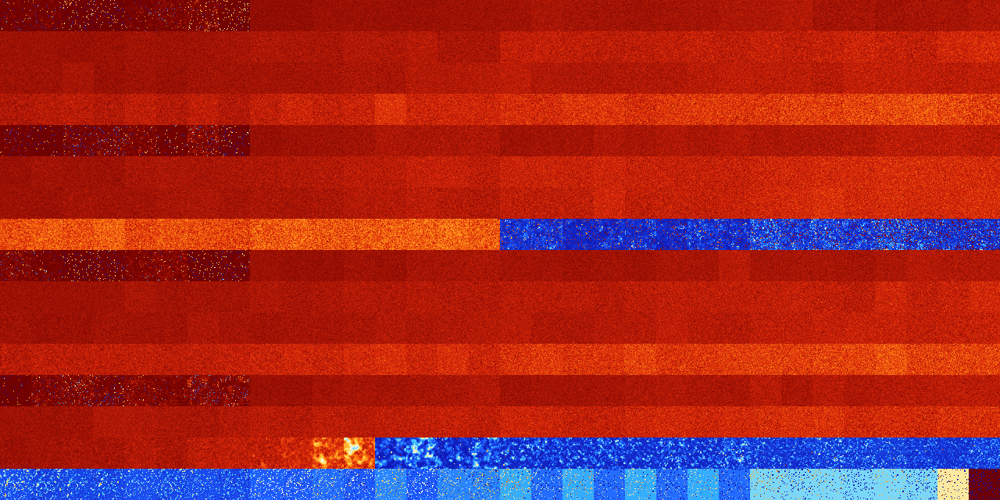

# B023457 (96768-97279)

<details>
    <summary>Initial Grid</summary>
    
</details>


<details>
    <summary>Initial Grid RLE</summary>

```
#C Exported from GoGoL (https://github.com/marrow16/gogol)
#C Wrap mode: Toroidal
#C Boundary mode: Dead
#C Step: 0
x = 100, y = 100, rule = B023457/S
24bo37bo$21bo6bo11bo7bo11bo17bo17bo$14bobo23bobo5bo5bo5bo6bo15bobo5bo$
34bo22b2o4bo10b2o4bo5bo$o14bo7bo17bo7bo28bo7bo2bo3bo$14bo6bo4bobo17bobo
$11bo5bo68bo$13bo57bo2bo12bo$11bo3bo38bo10bo16bo3bobobo$32bobo57bo$16bo
26bo25bobo5bo14bo$15bo7bo2bo$8bo22bo2bobo10bo8b2o11bo$85bo$8bo59bo7bobo
16bo$o14bo2bo15bo15bo32b2o5bo$44bo46bo3bo$4bo37bo10bo34bo$3b2o8bo12bo3b
o7bo$o16bo11bo5bo8bo4bo5bo16bo3bo13bo$15bo22bo33bo9bo16bo$bo11bo6bo21bo
8bo2bo11bo30bo$14bobobo28bo8bo33bo$2o9bo29bo24bo12bo12bo$31b2o4bo19bo9b
o3bo11b2o$6bo5bo11bo6bo25bo$3bo4bo6bo4bo18bo35bo8bo3bo$2bobo26bo16bo14b
o$4bo23bo63bo$3bo25bo33b2o15bo7bo$23bo10bo7bo14bobo13bo11bo$3bo10bo9bo
19bo27bo$15bo70bo$29bo33bo2bo28bo2bo$25bo14bo23bobo26bo$23bo7bo23bo19bo
17bo5bo$63bo33bo$15bo7bobobo15bo20bo21bo$36bo9bo30bobo$2bo10bo10bo4bo5b
o34bo3bo$13bo5bo2b2o48bobo4bo$6bo22bo6bobo2bo15bo9bo22bo$20bobo9bo3bo
14bo7bo9bo2b2o$14bo16bo21bo16bo2b2o2bo15bo$bo8bo15b3o5bo17bo2bo2bo19bob
o$o21bo4bo5bo8bo4bo12bo6bo4bo5bo$17bo24bo9bo3bo18bo11bo3bo$7bo2bo12bo
56bo6bo$o6bo10bo$3bo16bo24bo41bo5bo5bo$8bo17bo31bobo3bobo3bo$7bo16bo15b
o6bo14bo6bo$6bo9bo3bo11bo15bo3bo32bo$9bo5bo29bo39bo$19bo2bo15bo10bo13bo
$7bo61bo11bo$17bo30bo$5bo15bo25bo12bo3bo7bo10b2o12bo$16bo18bo11bo32bo
16bo$17bo21b2o12bo24bo10bo$3bo29bo35bo$30bo11bobo28bo19bo$46bo18bo23bo$
4bo9bo18bo18bo22bo5bo6bo$37bo10bo4bo6bo12bobo17b3o$o16bo10bo3bo8bo30bo
24bo$53bo11bo2b2o2bo21bo$bo14b2o42bobo11b2o4bo$10bo31bo2bo13bo30bo3bo$
20bo17bo12bo3bo9bo31bo$4bo16bo2bo35bo15bo4bo$4bo28bo36bo$10bo15bo38bo2b
o6bo13b2o$49bo$5bo13bo15bo4bo8bo$bo3bo22bo22bo14bo6bo10bo13bo$25bo4bo
11bo35bo12bo$7bo37bo38bo5bo$47bo14bo19bo15bo$10bo3bo3bo80bo$2bo17bo5bo
3bo$26bo2bo5bo23bo10bo$34bo$8bo7bo4bo10bo46bo15bo$14bo3bo7bo8bo24bo15bo
5bo16bo$10b2o56bo$13bo11bo$17bo15bo22bo24bo$20bo8b2o12bo28bo4bo12bo$4bo
3bo4bo19bo10bo22bo3bo17bo$14bo3bo47bo20bo3bo$64bo10bo4bo16bo$5bo7bo16bo
14bo29bo23bo$45bo7bo9bo16bo$21bo25bo4bo11bo14bo$19bo2bo12bobo47bo7bo$
46bo12bo11bo$48bo9bo5bo10bo13bobo$26bo33bo21bo$7bo2bo10bo76bo!
```
</details>
<details>
    <summary>Thumbnail</summary>

</details>
<table>
<tr>
    <td><a href="./96768%20S%20Heat%20Map%20Activity.png"></a><br>S (96768)<br>R@197,p120</td>    <td><a href="./96769%20S0%20Heat%20Map%20Activity.png"></a><br>S0 (96769)<br>R@219,p120</td>    <td><a href="./96770%20S1%20Heat%20Map%20Activity.png"></a><br>S1 (96770)<br>G>1000</td>    <td><a href="./96771%20S01%20Heat%20Map%20Activity.png"></a><br>S01 (96771)<br>R@964,p840</td>    <td><a href="./96772%20S2%20Heat%20Map%20Activity.png"></a><br>S2 (96772)<br>R@233,p120</td>    <td><a href="./96773%20S02%20Heat%20Map%20Activity.png"></a><br>S02 (96773)<br>R@205,p84</td>    <td><a href="./96774%20S12%20Heat%20Map%20Activity.png"></a><br>S12 (96774)<br>R@244,p120</td>    <td><a href="./96775%20S012%20Heat%20Map%20Activity.png"></a><br>S012 (96775)<br>G>1000</td>    <td><a href="./96776%20S3%20Heat%20Map%20Activity.png"></a><br>S3 (96776)<br>G>1000</td>    <td><a href="./96777%20S03%20Heat%20Map%20Activity.png"></a><br>S03 (96777)<br>G>1000</td>    <td><a href="./96778%20S13%20Heat%20Map%20Activity.png"></a><br>S13 (96778)<br>G>1000</td>    <td><a href="./96779%20S013%20Heat%20Map%20Activity.png"></a><br>S013 (96779)<br>G>1000</td>    <td><a href="./96780%20S23%20Heat%20Map%20Activity.png"></a><br>S23 (96780)<br>G>1000</td>    <td><a href="./96781%20S023%20Heat%20Map%20Activity.png"></a><br>S023 (96781)<br>G>1000</td>    <td><a href="./96782%20S123%20Heat%20Map%20Activity.png"></a><br>S123 (96782)<br>G>1000</td>    <td><a href="./96783%20S0123%20Heat%20Map%20Activity.png"></a><br>S0123 (96783)<br>G>1000</td>    <td><a href="./96784%20S4%20Heat%20Map%20Activity.png"></a><br>S4 (96784)<br>G>1000</td>    <td><a href="./96785%20S04%20Heat%20Map%20Activity.png"></a><br>S04 (96785)<br>G>1000</td>    <td><a href="./96786%20S14%20Heat%20Map%20Activity.png"></a><br>S14 (96786)<br>G>1000</td>    <td><a href="./96787%20S014%20Heat%20Map%20Activity.png"></a><br>S014 (96787)<br>G>1000</td>    <td><a href="./96788%20S24%20Heat%20Map%20Activity.png"></a><br>S24 (96788)<br>G>1000</td>    <td><a href="./96789%20S024%20Heat%20Map%20Activity.png"></a><br>S024 (96789)<br>G>1000</td>    <td><a href="./96790%20S124%20Heat%20Map%20Activity.png"></a><br>S124 (96790)<br>G>1000</td>    <td><a href="./96791%20S0124%20Heat%20Map%20Activity.png"></a><br>S0124 (96791)<br>G>1000</td>    <td><a href="./96792%20S34%20Heat%20Map%20Activity.png"></a><br>S34 (96792)<br>G>1000</td>    <td><a href="./96793%20S034%20Heat%20Map%20Activity.png"></a><br>S034 (96793)<br>G>1000</td>    <td><a href="./96794%20S134%20Heat%20Map%20Activity.png"></a><br>S134 (96794)<br>G>1000</td>    <td><a href="./96795%20S0134%20Heat%20Map%20Activity.png"></a><br>S0134 (96795)<br>G>1000</td>    <td><a href="./96796%20S234%20Heat%20Map%20Activity.png"></a><br>S234 (96796)<br>G>1000</td>    <td><a href="./96797%20S0234%20Heat%20Map%20Activity.png"></a><br>S0234 (96797)<br>G>1000</td>    <td><a href="./96798%20S1234%20Heat%20Map%20Activity.png"></a><br>S1234 (96798)<br>G>1000</td>    <td><a href="./96799%20S01234%20Heat%20Map%20Activity.png"></a><br>S01234 (96799)<br>G>1000</td></tr>
<tr>
    <td><a href="./96800%20S5%20Heat%20Map%20Activity.png"></a><br>S5 (96800)<br>G>1000</td>    <td><a href="./96801%20S05%20Heat%20Map%20Activity.png"></a><br>S05 (96801)<br>G>1000</td>    <td><a href="./96802%20S15%20Heat%20Map%20Activity.png"></a><br>S15 (96802)<br>G>1000</td>    <td><a href="./96803%20S015%20Heat%20Map%20Activity.png"></a><br>S015 (96803)<br>G>1000</td>    <td><a href="./96804%20S25%20Heat%20Map%20Activity.png"></a><br>S25 (96804)<br>G>1000</td>    <td><a href="./96805%20S025%20Heat%20Map%20Activity.png"></a><br>S025 (96805)<br>G>1000</td>    <td><a href="./96806%20S125%20Heat%20Map%20Activity.png"></a><br>S125 (96806)<br>G>1000</td>    <td><a href="./96807%20S0125%20Heat%20Map%20Activity.png"></a><br>S0125 (96807)<br>G>1000</td>    <td><a href="./96808%20S35%20Heat%20Map%20Activity.png"></a><br>S35 (96808)<br>G>1000</td>    <td><a href="./96809%20S035%20Heat%20Map%20Activity.png"></a><br>S035 (96809)<br>G>1000</td>    <td><a href="./96810%20S135%20Heat%20Map%20Activity.png"></a><br>S135 (96810)<br>G>1000</td>    <td><a href="./96811%20S0135%20Heat%20Map%20Activity.png"></a><br>S0135 (96811)<br>G>1000</td>    <td><a href="./96812%20S235%20Heat%20Map%20Activity.png"></a><br>S235 (96812)<br>G>1000</td>    <td><a href="./96813%20S0235%20Heat%20Map%20Activity.png"></a><br>S0235 (96813)<br>G>1000</td>    <td><a href="./96814%20S1235%20Heat%20Map%20Activity.png"></a><br>S1235 (96814)<br>G>1000</td>    <td><a href="./96815%20S01235%20Heat%20Map%20Activity.png"></a><br>S01235 (96815)<br>G>1000</td>    <td><a href="./96816%20S45%20Heat%20Map%20Activity.png"></a><br>S45 (96816)<br>G>1000</td>    <td><a href="./96817%20S045%20Heat%20Map%20Activity.png"></a><br>S045 (96817)<br>G>1000</td>    <td><a href="./96818%20S145%20Heat%20Map%20Activity.png"></a><br>S145 (96818)<br>G>1000</td>    <td><a href="./96819%20S0145%20Heat%20Map%20Activity.png"></a><br>S0145 (96819)<br>G>1000</td>    <td><a href="./96820%20S245%20Heat%20Map%20Activity.png"></a><br>S245 (96820)<br>G>1000</td>    <td><a href="./96821%20S0245%20Heat%20Map%20Activity.png"></a><br>S0245 (96821)<br>G>1000</td>    <td><a href="./96822%20S1245%20Heat%20Map%20Activity.png"></a><br>S1245 (96822)<br>G>1000</td>    <td><a href="./96823%20S01245%20Heat%20Map%20Activity.png"></a><br>S01245 (96823)<br>G>1000</td>    <td><a href="./96824%20S345%20Heat%20Map%20Activity.png"></a><br>S345 (96824)<br>G>1000</td>    <td><a href="./96825%20S0345%20Heat%20Map%20Activity.png"></a><br>S0345 (96825)<br>G>1000</td>    <td><a href="./96826%20S1345%20Heat%20Map%20Activity.png"></a><br>S1345 (96826)<br>G>1000</td>    <td><a href="./96827%20S01345%20Heat%20Map%20Activity.png"></a><br>S01345 (96827)<br>G>1000</td>    <td><a href="./96828%20S2345%20Heat%20Map%20Activity.png"></a><br>S2345 (96828)<br>G>1000</td>    <td><a href="./96829%20S02345%20Heat%20Map%20Activity.png"></a><br>S02345 (96829)<br>G>1000</td>    <td><a href="./96830%20S12345%20Heat%20Map%20Activity.png"></a><br>S12345 (96830)<br>G>1000</td>    <td><a href="./96831%20S012345%20Heat%20Map%20Activity.png"></a><br>S012345 (96831)<br>G>1000</td></tr>
<tr>
    <td><a href="./96832%20S6%20Heat%20Map%20Activity.png"></a><br>S6 (96832)<br>G>1000</td>    <td><a href="./96833%20S06%20Heat%20Map%20Activity.png"></a><br>S06 (96833)<br>G>1000</td>    <td><a href="./96834%20S16%20Heat%20Map%20Activity.png"></a><br>S16 (96834)<br>G>1000</td>    <td><a href="./96835%20S016%20Heat%20Map%20Activity.png"></a><br>S016 (96835)<br>G>1000</td>    <td><a href="./96836%20S26%20Heat%20Map%20Activity.png"></a><br>S26 (96836)<br>G>1000</td>    <td><a href="./96837%20S026%20Heat%20Map%20Activity.png"></a><br>S026 (96837)<br>G>1000</td>    <td><a href="./96838%20S126%20Heat%20Map%20Activity.png"></a><br>S126 (96838)<br>G>1000</td>    <td><a href="./96839%20S0126%20Heat%20Map%20Activity.png"></a><br>S0126 (96839)<br>G>1000</td>    <td><a href="./96840%20S36%20Heat%20Map%20Activity.png"></a><br>S36 (96840)<br>G>1000</td>    <td><a href="./96841%20S036%20Heat%20Map%20Activity.png"></a><br>S036 (96841)<br>G>1000</td>    <td><a href="./96842%20S136%20Heat%20Map%20Activity.png"></a><br>S136 (96842)<br>G>1000</td>    <td><a href="./96843%20S0136%20Heat%20Map%20Activity.png"></a><br>S0136 (96843)<br>G>1000</td>    <td><a href="./96844%20S236%20Heat%20Map%20Activity.png"></a><br>S236 (96844)<br>G>1000</td>    <td><a href="./96845%20S0236%20Heat%20Map%20Activity.png"></a><br>S0236 (96845)<br>G>1000</td>    <td><a href="./96846%20S1236%20Heat%20Map%20Activity.png"></a><br>S1236 (96846)<br>G>1000</td>    <td><a href="./96847%20S01236%20Heat%20Map%20Activity.png"></a><br>S01236 (96847)<br>G>1000</td>    <td><a href="./96848%20S46%20Heat%20Map%20Activity.png"></a><br>S46 (96848)<br>G>1000</td>    <td><a href="./96849%20S046%20Heat%20Map%20Activity.png"></a><br>S046 (96849)<br>G>1000</td>    <td><a href="./96850%20S146%20Heat%20Map%20Activity.png"></a><br>S146 (96850)<br>G>1000</td>    <td><a href="./96851%20S0146%20Heat%20Map%20Activity.png"></a><br>S0146 (96851)<br>G>1000</td>    <td><a href="./96852%20S246%20Heat%20Map%20Activity.png"></a><br>S246 (96852)<br>G>1000</td>    <td><a href="./96853%20S0246%20Heat%20Map%20Activity.png"></a><br>S0246 (96853)<br>G>1000</td>    <td><a href="./96854%20S1246%20Heat%20Map%20Activity.png"></a><br>S1246 (96854)<br>G>1000</td>    <td><a href="./96855%20S01246%20Heat%20Map%20Activity.png"></a><br>S01246 (96855)<br>G>1000</td>    <td><a href="./96856%20S346%20Heat%20Map%20Activity.png"></a><br>S346 (96856)<br>G>1000</td>    <td><a href="./96857%20S0346%20Heat%20Map%20Activity.png"></a><br>S0346 (96857)<br>G>1000</td>    <td><a href="./96858%20S1346%20Heat%20Map%20Activity.png"></a><br>S1346 (96858)<br>G>1000</td>    <td><a href="./96859%20S01346%20Heat%20Map%20Activity.png"></a><br>S01346 (96859)<br>G>1000</td>    <td><a href="./96860%20S2346%20Heat%20Map%20Activity.png"></a><br>S2346 (96860)<br>G>1000</td>    <td><a href="./96861%20S02346%20Heat%20Map%20Activity.png"></a><br>S02346 (96861)<br>G>1000</td>    <td><a href="./96862%20S12346%20Heat%20Map%20Activity.png"></a><br>S12346 (96862)<br>G>1000</td>    <td><a href="./96863%20S012346%20Heat%20Map%20Activity.png"></a><br>S012346 (96863)<br>G>1000</td></tr>
<tr>
    <td><a href="./96864%20S56%20Heat%20Map%20Activity.png"></a><br>S56 (96864)<br>G>1000</td>    <td><a href="./96865%20S056%20Heat%20Map%20Activity.png"></a><br>S056 (96865)<br>G>1000</td>    <td><a href="./96866%20S156%20Heat%20Map%20Activity.png"></a><br>S156 (96866)<br>G>1000</td>    <td><a href="./96867%20S0156%20Heat%20Map%20Activity.png"></a><br>S0156 (96867)<br>G>1000</td>    <td><a href="./96868%20S256%20Heat%20Map%20Activity.png"></a><br>S256 (96868)<br>G>1000</td>    <td><a href="./96869%20S0256%20Heat%20Map%20Activity.png"></a><br>S0256 (96869)<br>G>1000</td>    <td><a href="./96870%20S1256%20Heat%20Map%20Activity.png"></a><br>S1256 (96870)<br>G>1000</td>    <td><a href="./96871%20S01256%20Heat%20Map%20Activity.png"></a><br>S01256 (96871)<br>G>1000</td>    <td><a href="./96872%20S356%20Heat%20Map%20Activity.png"></a><br>S356 (96872)<br>G>1000</td>    <td><a href="./96873%20S0356%20Heat%20Map%20Activity.png"></a><br>S0356 (96873)<br>G>1000</td>    <td><a href="./96874%20S1356%20Heat%20Map%20Activity.png"></a><br>S1356 (96874)<br>G>1000</td>    <td><a href="./96875%20S01356%20Heat%20Map%20Activity.png"></a><br>S01356 (96875)<br>G>1000</td>    <td><a href="./96876%20S2356%20Heat%20Map%20Activity.png"></a><br>S2356 (96876)<br>G>1000</td>    <td><a href="./96877%20S02356%20Heat%20Map%20Activity.png"></a><br>S02356 (96877)<br>G>1000</td>    <td><a href="./96878%20S12356%20Heat%20Map%20Activity.png"></a><br>S12356 (96878)<br>G>1000</td>    <td><a href="./96879%20S012356%20Heat%20Map%20Activity.png"></a><br>S012356 (96879)<br>G>1000</td>    <td><a href="./96880%20S456%20Heat%20Map%20Activity.png"></a><br>S456 (96880)<br>G>1000</td>    <td><a href="./96881%20S0456%20Heat%20Map%20Activity.png"></a><br>S0456 (96881)<br>G>1000</td>    <td><a href="./96882%20S1456%20Heat%20Map%20Activity.png"></a><br>S1456 (96882)<br>G>1000</td>    <td><a href="./96883%20S01456%20Heat%20Map%20Activity.png"></a><br>S01456 (96883)<br>G>1000</td>    <td><a href="./96884%20S2456%20Heat%20Map%20Activity.png"></a><br>S2456 (96884)<br>G>1000</td>    <td><a href="./96885%20S02456%20Heat%20Map%20Activity.png"></a><br>S02456 (96885)<br>G>1000</td>    <td><a href="./96886%20S12456%20Heat%20Map%20Activity.png"></a><br>S12456 (96886)<br>G>1000</td>    <td><a href="./96887%20S012456%20Heat%20Map%20Activity.png"></a><br>S012456 (96887)<br>G>1000</td>    <td><a href="./96888%20S3456%20Heat%20Map%20Activity.png"></a><br>S3456 (96888)<br>G>1000</td>    <td><a href="./96889%20S03456%20Heat%20Map%20Activity.png"></a><br>S03456 (96889)<br>G>1000</td>    <td><a href="./96890%20S13456%20Heat%20Map%20Activity.png"></a><br>S13456 (96890)<br>G>1000</td>    <td><a href="./96891%20S013456%20Heat%20Map%20Activity.png"></a><br>S013456 (96891)<br>G>1000</td>    <td><a href="./96892%20S23456%20Heat%20Map%20Activity.png"></a><br>S23456 (96892)<br>G>1000</td>    <td><a href="./96893%20S023456%20Heat%20Map%20Activity.png"></a><br>S023456 (96893)<br>G>1000</td>    <td><a href="./96894%20S123456%20Heat%20Map%20Activity.png"></a><br>S123456 (96894)<br>G>1000</td>    <td><a href="./96895%20S0123456%20Heat%20Map%20Activity.png"></a><br>S0123456 (96895)<br>G>1000</td></tr>
<tr>
    <td><a href="./96896%20S7%20Heat%20Map%20Activity.png"></a><br>S7 (96896)<br>R@261,p168</td>    <td><a href="./96897%20S07%20Heat%20Map%20Activity.png"></a><br>S07 (96897)<br>R@960,p840</td>    <td><a href="./96898%20S17%20Heat%20Map%20Activity.png"></a><br>S17 (96898)<br>R@247,p120</td>    <td><a href="./96899%20S017%20Heat%20Map%20Activity.png"></a><br>S017 (96899)<br>R@267,p120</td>    <td><a href="./96900%20S27%20Heat%20Map%20Activity.png"></a><br>S27 (96900)<br>R@136,p60</td>    <td><a href="./96901%20S027%20Heat%20Map%20Activity.png"></a><br>S027 (96901)<br>R@514,p420</td>    <td><a href="./96902%20S127%20Heat%20Map%20Activity.png"></a><br>S127 (96902)<br>R@170,p48</td>    <td><a href="./96903%20S0127%20Heat%20Map%20Activity.png"></a><br>S0127 (96903)<br>R@956,p840</td>    <td><a href="./96904%20S37%20Heat%20Map%20Activity.png"></a><br>S37 (96904)<br>G>1000</td>    <td><a href="./96905%20S037%20Heat%20Map%20Activity.png"></a><br>S037 (96905)<br>G>1000</td>    <td><a href="./96906%20S137%20Heat%20Map%20Activity.png"></a><br>S137 (96906)<br>G>1000</td>    <td><a href="./96907%20S0137%20Heat%20Map%20Activity.png"></a><br>S0137 (96907)<br>G>1000</td>    <td><a href="./96908%20S237%20Heat%20Map%20Activity.png"></a><br>S237 (96908)<br>G>1000</td>    <td><a href="./96909%20S0237%20Heat%20Map%20Activity.png"></a><br>S0237 (96909)<br>G>1000</td>    <td><a href="./96910%20S1237%20Heat%20Map%20Activity.png"></a><br>S1237 (96910)<br>G>1000</td>    <td><a href="./96911%20S01237%20Heat%20Map%20Activity.png"></a><br>S01237 (96911)<br>G>1000</td>    <td><a href="./96912%20S47%20Heat%20Map%20Activity.png"></a><br>S47 (96912)<br>G>1000</td>    <td><a href="./96913%20S047%20Heat%20Map%20Activity.png"></a><br>S047 (96913)<br>G>1000</td>    <td><a href="./96914%20S147%20Heat%20Map%20Activity.png"></a><br>S147 (96914)<br>G>1000</td>    <td><a href="./96915%20S0147%20Heat%20Map%20Activity.png"></a><br>S0147 (96915)<br>G>1000</td>    <td><a href="./96916%20S247%20Heat%20Map%20Activity.png"></a><br>S247 (96916)<br>G>1000</td>    <td><a href="./96917%20S0247%20Heat%20Map%20Activity.png"></a><br>S0247 (96917)<br>G>1000</td>    <td><a href="./96918%20S1247%20Heat%20Map%20Activity.png"></a><br>S1247 (96918)<br>G>1000</td>    <td><a href="./96919%20S01247%20Heat%20Map%20Activity.png"></a><br>S01247 (96919)<br>G>1000</td>    <td><a href="./96920%20S347%20Heat%20Map%20Activity.png"></a><br>S347 (96920)<br>G>1000</td>    <td><a href="./96921%20S0347%20Heat%20Map%20Activity.png"></a><br>S0347 (96921)<br>G>1000</td>    <td><a href="./96922%20S1347%20Heat%20Map%20Activity.png"></a><br>S1347 (96922)<br>G>1000</td>    <td><a href="./96923%20S01347%20Heat%20Map%20Activity.png"></a><br>S01347 (96923)<br>G>1000</td>    <td><a href="./96924%20S2347%20Heat%20Map%20Activity.png"></a><br>S2347 (96924)<br>G>1000</td>    <td><a href="./96925%20S02347%20Heat%20Map%20Activity.png"></a><br>S02347 (96925)<br>G>1000</td>    <td><a href="./96926%20S12347%20Heat%20Map%20Activity.png"></a><br>S12347 (96926)<br>G>1000</td>    <td><a href="./96927%20S012347%20Heat%20Map%20Activity.png"></a><br>S012347 (96927)<br>G>1000</td></tr>
<tr>
    <td><a href="./96928%20S57%20Heat%20Map%20Activity.png"></a><br>S57 (96928)<br>G>1000</td>    <td><a href="./96929%20S057%20Heat%20Map%20Activity.png"></a><br>S057 (96929)<br>G>1000</td>    <td><a href="./96930%20S157%20Heat%20Map%20Activity.png"></a><br>S157 (96930)<br>G>1000</td>    <td><a href="./96931%20S0157%20Heat%20Map%20Activity.png"></a><br>S0157 (96931)<br>G>1000</td>    <td><a href="./96932%20S257%20Heat%20Map%20Activity.png"></a><br>S257 (96932)<br>G>1000</td>    <td><a href="./96933%20S0257%20Heat%20Map%20Activity.png"></a><br>S0257 (96933)<br>G>1000</td>    <td><a href="./96934%20S1257%20Heat%20Map%20Activity.png"></a><br>S1257 (96934)<br>G>1000</td>    <td><a href="./96935%20S01257%20Heat%20Map%20Activity.png"></a><br>S01257 (96935)<br>G>1000</td>    <td><a href="./96936%20S357%20Heat%20Map%20Activity.png"></a><br>S357 (96936)<br>G>1000</td>    <td><a href="./96937%20S0357%20Heat%20Map%20Activity.png"></a><br>S0357 (96937)<br>G>1000</td>    <td><a href="./96938%20S1357%20Heat%20Map%20Activity.png"></a><br>S1357 (96938)<br>G>1000</td>    <td><a href="./96939%20S01357%20Heat%20Map%20Activity.png"></a><br>S01357 (96939)<br>G>1000</td>    <td><a href="./96940%20S2357%20Heat%20Map%20Activity.png"></a><br>S2357 (96940)<br>G>1000</td>    <td><a href="./96941%20S02357%20Heat%20Map%20Activity.png"></a><br>S02357 (96941)<br>G>1000</td>    <td><a href="./96942%20S12357%20Heat%20Map%20Activity.png"></a><br>S12357 (96942)<br>G>1000</td>    <td><a href="./96943%20S012357%20Heat%20Map%20Activity.png"></a><br>S012357 (96943)<br>G>1000</td>    <td><a href="./96944%20S457%20Heat%20Map%20Activity.png"></a><br>S457 (96944)<br>G>1000</td>    <td><a href="./96945%20S0457%20Heat%20Map%20Activity.png"></a><br>S0457 (96945)<br>G>1000</td>    <td><a href="./96946%20S1457%20Heat%20Map%20Activity.png"></a><br>S1457 (96946)<br>G>1000</td>    <td><a href="./96947%20S01457%20Heat%20Map%20Activity.png"></a><br>S01457 (96947)<br>G>1000</td>    <td><a href="./96948%20S2457%20Heat%20Map%20Activity.png"></a><br>S2457 (96948)<br>G>1000</td>    <td><a href="./96949%20S02457%20Heat%20Map%20Activity.png"></a><br>S02457 (96949)<br>G>1000</td>    <td><a href="./96950%20S12457%20Heat%20Map%20Activity.png"></a><br>S12457 (96950)<br>G>1000</td>    <td><a href="./96951%20S012457%20Heat%20Map%20Activity.png"></a><br>S012457 (96951)<br>G>1000</td>    <td><a href="./96952%20S3457%20Heat%20Map%20Activity.png"></a><br>S3457 (96952)<br>G>1000</td>    <td><a href="./96953%20S03457%20Heat%20Map%20Activity.png"></a><br>S03457 (96953)<br>G>1000</td>    <td><a href="./96954%20S13457%20Heat%20Map%20Activity.png"></a><br>S13457 (96954)<br>G>1000</td>    <td><a href="./96955%20S013457%20Heat%20Map%20Activity.png"></a><br>S013457 (96955)<br>G>1000</td>    <td><a href="./96956%20S23457%20Heat%20Map%20Activity.png"></a><br>S23457 (96956)<br>G>1000</td>    <td><a href="./96957%20S023457%20Heat%20Map%20Activity.png"></a><br>S023457 (96957)<br>G>1000</td>    <td><a href="./96958%20S123457%20Heat%20Map%20Activity.png"></a><br>S123457 (96958)<br>G>1000</td>    <td><a href="./96959%20S0123457%20Heat%20Map%20Activity.png"></a><br>S0123457 (96959)<br>G>1000</td></tr>
<tr>
    <td><a href="./96960%20S67%20Heat%20Map%20Activity.png"></a><br>S67 (96960)<br>G>1000</td>    <td><a href="./96961%20S067%20Heat%20Map%20Activity.png"></a><br>S067 (96961)<br>G>1000</td>    <td><a href="./96962%20S167%20Heat%20Map%20Activity.png"></a><br>S167 (96962)<br>G>1000</td>    <td><a href="./96963%20S0167%20Heat%20Map%20Activity.png"></a><br>S0167 (96963)<br>G>1000</td>    <td><a href="./96964%20S267%20Heat%20Map%20Activity.png"></a><br>S267 (96964)<br>G>1000</td>    <td><a href="./96965%20S0267%20Heat%20Map%20Activity.png"></a><br>S0267 (96965)<br>G>1000</td>    <td><a href="./96966%20S1267%20Heat%20Map%20Activity.png"></a><br>S1267 (96966)<br>G>1000</td>    <td><a href="./96967%20S01267%20Heat%20Map%20Activity.png"></a><br>S01267 (96967)<br>G>1000</td>    <td><a href="./96968%20S367%20Heat%20Map%20Activity.png"></a><br>S367 (96968)<br>G>1000</td>    <td><a href="./96969%20S0367%20Heat%20Map%20Activity.png"></a><br>S0367 (96969)<br>G>1000</td>    <td><a href="./96970%20S1367%20Heat%20Map%20Activity.png"></a><br>S1367 (96970)<br>G>1000</td>    <td><a href="./96971%20S01367%20Heat%20Map%20Activity.png"></a><br>S01367 (96971)<br>G>1000</td>    <td><a href="./96972%20S2367%20Heat%20Map%20Activity.png"></a><br>S2367 (96972)<br>G>1000</td>    <td><a href="./96973%20S02367%20Heat%20Map%20Activity.png"></a><br>S02367 (96973)<br>G>1000</td>    <td><a href="./96974%20S12367%20Heat%20Map%20Activity.png"></a><br>S12367 (96974)<br>G>1000</td>    <td><a href="./96975%20S012367%20Heat%20Map%20Activity.png"></a><br>S012367 (96975)<br>G>1000</td>    <td><a href="./96976%20S467%20Heat%20Map%20Activity.png"></a><br>S467 (96976)<br>G>1000</td>    <td><a href="./96977%20S0467%20Heat%20Map%20Activity.png"></a><br>S0467 (96977)<br>G>1000</td>    <td><a href="./96978%20S1467%20Heat%20Map%20Activity.png"></a><br>S1467 (96978)<br>G>1000</td>    <td><a href="./96979%20S01467%20Heat%20Map%20Activity.png"></a><br>S01467 (96979)<br>G>1000</td>    <td><a href="./96980%20S2467%20Heat%20Map%20Activity.png"></a><br>S2467 (96980)<br>G>1000</td>    <td><a href="./96981%20S02467%20Heat%20Map%20Activity.png"></a><br>S02467 (96981)<br>G>1000</td>    <td><a href="./96982%20S12467%20Heat%20Map%20Activity.png"></a><br>S12467 (96982)<br>G>1000</td>    <td><a href="./96983%20S012467%20Heat%20Map%20Activity.png"></a><br>S012467 (96983)<br>G>1000</td>    <td><a href="./96984%20S3467%20Heat%20Map%20Activity.png"></a><br>S3467 (96984)<br>G>1000</td>    <td><a href="./96985%20S03467%20Heat%20Map%20Activity.png"></a><br>S03467 (96985)<br>G>1000</td>    <td><a href="./96986%20S13467%20Heat%20Map%20Activity.png"></a><br>S13467 (96986)<br>G>1000</td>    <td><a href="./96987%20S013467%20Heat%20Map%20Activity.png"></a><br>S013467 (96987)<br>G>1000</td>    <td><a href="./96988%20S23467%20Heat%20Map%20Activity.png"></a><br>S23467 (96988)<br>G>1000</td>    <td><a href="./96989%20S023467%20Heat%20Map%20Activity.png"></a><br>S023467 (96989)<br>G>1000</td>    <td><a href="./96990%20S123467%20Heat%20Map%20Activity.png"></a><br>S123467 (96990)<br>G>1000</td>    <td><a href="./96991%20S0123467%20Heat%20Map%20Activity.png"></a><br>S0123467 (96991)<br>G>1000</td></tr>
<tr>
    <td><a href="./96992%20S567%20Heat%20Map%20Activity.png"></a><br>S567 (96992)<br>G>1000</td>    <td><a href="./96993%20S0567%20Heat%20Map%20Activity.png"></a><br>S0567 (96993)<br>G>1000</td>    <td><a href="./96994%20S1567%20Heat%20Map%20Activity.png"></a><br>S1567 (96994)<br>G>1000</td>    <td><a href="./96995%20S01567%20Heat%20Map%20Activity.png"></a><br>S01567 (96995)<br>G>1000</td>    <td><a href="./96996%20S2567%20Heat%20Map%20Activity.png"></a><br>S2567 (96996)<br>G>1000</td>    <td><a href="./96997%20S02567%20Heat%20Map%20Activity.png"></a><br>S02567 (96997)<br>G>1000</td>    <td><a href="./96998%20S12567%20Heat%20Map%20Activity.png"></a><br>S12567 (96998)<br>G>1000</td>    <td><a href="./96999%20S012567%20Heat%20Map%20Activity.png"></a><br>S012567 (96999)<br>G>1000</td>    <td><a href="./97000%20S3567%20Heat%20Map%20Activity.png"></a><br>S3567 (97000)<br>G>1000</td>    <td><a href="./97001%20S03567%20Heat%20Map%20Activity.png"></a><br>S03567 (97001)<br>G>1000</td>    <td><a href="./97002%20S13567%20Heat%20Map%20Activity.png"></a><br>S13567 (97002)<br>G>1000</td>    <td><a href="./97003%20S013567%20Heat%20Map%20Activity.png"></a><br>S013567 (97003)<br>G>1000</td>    <td><a href="./97004%20S23567%20Heat%20Map%20Activity.png"></a><br>S23567 (97004)<br>G>1000</td>    <td><a href="./97005%20S023567%20Heat%20Map%20Activity.png"></a><br>S023567 (97005)<br>G>1000</td>    <td><a href="./97006%20S123567%20Heat%20Map%20Activity.png"></a><br>S123567 (97006)<br>G>1000</td>    <td><a href="./97007%20S0123567%20Heat%20Map%20Activity.png"></a><br>S0123567 (97007)<br>G>1000</td>    <td><a href="./97008%20S4567%20Heat%20Map%20Activity.png"></a><br>S4567 (97008)<br>R@142,p6</td>    <td><a href="./97009%20S04567%20Heat%20Map%20Activity.png"></a><br>S04567 (97009)<br>R@127,p6</td>    <td><a href="./97010%20S14567%20Heat%20Map%20Activity.png"></a><br>S14567 (97010)<br>R@279,p120</td>    <td><a href="./97011%20S014567%20Heat%20Map%20Activity.png"></a><br>S014567 (97011)<br>R@168,p6</td>    <td><a href="./97012%20S24567%20Heat%20Map%20Activity.png"></a><br>S24567 (97012)<br>R@129,p12</td>    <td><a href="./97013%20S024567%20Heat%20Map%20Activity.png"></a><br>S024567 (97013)<br>R@169,p24</td>    <td><a href="./97014%20S124567%20Heat%20Map%20Activity.png"></a><br>S124567 (97014)<br>R@100,p12</td>    <td><a href="./97015%20S0124567%20Heat%20Map%20Activity.png"></a><br>S0124567 (97015)<br>R@125,p6</td>    <td><a href="./97016%20S34567%20Heat%20Map%20Activity.png"></a><br>S34567 (97016)<br>R@34,p6</td>    <td><a href="./97017%20S034567%20Heat%20Map%20Activity.png"></a><br>S034567 (97017)<br>R@36,p6</td>    <td><a href="./97018%20S134567%20Heat%20Map%20Activity.png"></a><br>S134567 (97018)<br>R@37,p6</td>    <td><a href="./97019%20S0134567%20Heat%20Map%20Activity.png"></a><br>S0134567 (97019)<br>R@36,p6</td>    <td><a href="./97020%20S234567%20Heat%20Map%20Activity.png"></a><br>S234567 (97020)<br>R@27,p6</td>    <td><a href="./97021%20S0234567%20Heat%20Map%20Activity.png"></a><br>S0234567 (97021)<br>R@24,p6</td>    <td><a href="./97022%20S1234567%20Heat%20Map%20Activity.png"></a><br>S1234567 (97022)<br>R@45,p24</td>    <td><a href="./97023%20S01234567%20Heat%20Map%20Activity.png"></a><br>S01234567 (97023)<br>R@26,p6</td></tr>
<tr>
    <td><a href="./97024%20S8%20Heat%20Map%20Activity.png"></a><br>S8 (97024)<br>R@97,p24</td>    <td><a href="./97025%20S08%20Heat%20Map%20Activity.png"></a><br>S08 (97025)<br>R@196,p120</td>    <td><a href="./97026%20S18%20Heat%20Map%20Activity.png"></a><br>S18 (97026)<br>R@838,p720</td>    <td><a href="./97027%20S018%20Heat%20Map%20Activity.png"></a><br>S018 (97027)<br>R@347,p240</td>    <td><a href="./97028%20S28%20Heat%20Map%20Activity.png"></a><br>S28 (97028)<br>R@141,p60</td>    <td><a href="./97029%20S028%20Heat%20Map%20Activity.png"></a><br>S028 (97029)<br>R@103,p12</td>    <td><a href="./97030%20S128%20Heat%20Map%20Activity.png"></a><br>S128 (97030)<br>G>1000</td>    <td><a href="./97031%20S0128%20Heat%20Map%20Activity.png"></a><br>S0128 (97031)<br>R@338,p240</td>    <td><a href="./97032%20S38%20Heat%20Map%20Activity.png"></a><br>S38 (97032)<br>G>1000</td>    <td><a href="./97033%20S038%20Heat%20Map%20Activity.png"></a><br>S038 (97033)<br>G>1000</td>    <td><a href="./97034%20S138%20Heat%20Map%20Activity.png"></a><br>S138 (97034)<br>G>1000</td>    <td><a href="./97035%20S0138%20Heat%20Map%20Activity.png"></a><br>S0138 (97035)<br>G>1000</td>    <td><a href="./97036%20S238%20Heat%20Map%20Activity.png"></a><br>S238 (97036)<br>G>1000</td>    <td><a href="./97037%20S0238%20Heat%20Map%20Activity.png"></a><br>S0238 (97037)<br>G>1000</td>    <td><a href="./97038%20S1238%20Heat%20Map%20Activity.png"></a><br>S1238 (97038)<br>G>1000</td>    <td><a href="./97039%20S01238%20Heat%20Map%20Activity.png"></a><br>S01238 (97039)<br>G>1000</td>    <td><a href="./97040%20S48%20Heat%20Map%20Activity.png"></a><br>S48 (97040)<br>G>1000</td>    <td><a href="./97041%20S048%20Heat%20Map%20Activity.png"></a><br>S048 (97041)<br>G>1000</td>    <td><a href="./97042%20S148%20Heat%20Map%20Activity.png"></a><br>S148 (97042)<br>G>1000</td>    <td><a href="./97043%20S0148%20Heat%20Map%20Activity.png"></a><br>S0148 (97043)<br>G>1000</td>    <td><a href="./97044%20S248%20Heat%20Map%20Activity.png"></a><br>S248 (97044)<br>G>1000</td>    <td><a href="./97045%20S0248%20Heat%20Map%20Activity.png"></a><br>S0248 (97045)<br>G>1000</td>    <td><a href="./97046%20S1248%20Heat%20Map%20Activity.png"></a><br>S1248 (97046)<br>G>1000</td>    <td><a href="./97047%20S01248%20Heat%20Map%20Activity.png"></a><br>S01248 (97047)<br>G>1000</td>    <td><a href="./97048%20S348%20Heat%20Map%20Activity.png"></a><br>S348 (97048)<br>G>1000</td>    <td><a href="./97049%20S0348%20Heat%20Map%20Activity.png"></a><br>S0348 (97049)<br>G>1000</td>    <td><a href="./97050%20S1348%20Heat%20Map%20Activity.png"></a><br>S1348 (97050)<br>G>1000</td>    <td><a href="./97051%20S01348%20Heat%20Map%20Activity.png"></a><br>S01348 (97051)<br>G>1000</td>    <td><a href="./97052%20S2348%20Heat%20Map%20Activity.png"></a><br>S2348 (97052)<br>G>1000</td>    <td><a href="./97053%20S02348%20Heat%20Map%20Activity.png"></a><br>S02348 (97053)<br>G>1000</td>    <td><a href="./97054%20S12348%20Heat%20Map%20Activity.png"></a><br>S12348 (97054)<br>G>1000</td>    <td><a href="./97055%20S012348%20Heat%20Map%20Activity.png"></a><br>S012348 (97055)<br>G>1000</td></tr>
<tr>
    <td><a href="./97056%20S58%20Heat%20Map%20Activity.png"></a><br>S58 (97056)<br>G>1000</td>    <td><a href="./97057%20S058%20Heat%20Map%20Activity.png"></a><br>S058 (97057)<br>G>1000</td>    <td><a href="./97058%20S158%20Heat%20Map%20Activity.png"></a><br>S158 (97058)<br>G>1000</td>    <td><a href="./97059%20S0158%20Heat%20Map%20Activity.png"></a><br>S0158 (97059)<br>G>1000</td>    <td><a href="./97060%20S258%20Heat%20Map%20Activity.png"></a><br>S258 (97060)<br>G>1000</td>    <td><a href="./97061%20S0258%20Heat%20Map%20Activity.png"></a><br>S0258 (97061)<br>G>1000</td>    <td><a href="./97062%20S1258%20Heat%20Map%20Activity.png"></a><br>S1258 (97062)<br>G>1000</td>    <td><a href="./97063%20S01258%20Heat%20Map%20Activity.png"></a><br>S01258 (97063)<br>G>1000</td>    <td><a href="./97064%20S358%20Heat%20Map%20Activity.png"></a><br>S358 (97064)<br>G>1000</td>    <td><a href="./97065%20S0358%20Heat%20Map%20Activity.png"></a><br>S0358 (97065)<br>G>1000</td>    <td><a href="./97066%20S1358%20Heat%20Map%20Activity.png"></a><br>S1358 (97066)<br>G>1000</td>    <td><a href="./97067%20S01358%20Heat%20Map%20Activity.png"></a><br>S01358 (97067)<br>G>1000</td>    <td><a href="./97068%20S2358%20Heat%20Map%20Activity.png"></a><br>S2358 (97068)<br>G>1000</td>    <td><a href="./97069%20S02358%20Heat%20Map%20Activity.png"></a><br>S02358 (97069)<br>G>1000</td>    <td><a href="./97070%20S12358%20Heat%20Map%20Activity.png"></a><br>S12358 (97070)<br>G>1000</td>    <td><a href="./97071%20S012358%20Heat%20Map%20Activity.png"></a><br>S012358 (97071)<br>G>1000</td>    <td><a href="./97072%20S458%20Heat%20Map%20Activity.png"></a><br>S458 (97072)<br>G>1000</td>    <td><a href="./97073%20S0458%20Heat%20Map%20Activity.png"></a><br>S0458 (97073)<br>G>1000</td>    <td><a href="./97074%20S1458%20Heat%20Map%20Activity.png"></a><br>S1458 (97074)<br>G>1000</td>    <td><a href="./97075%20S01458%20Heat%20Map%20Activity.png"></a><br>S01458 (97075)<br>G>1000</td>    <td><a href="./97076%20S2458%20Heat%20Map%20Activity.png"></a><br>S2458 (97076)<br>G>1000</td>    <td><a href="./97077%20S02458%20Heat%20Map%20Activity.png"></a><br>S02458 (97077)<br>G>1000</td>    <td><a href="./97078%20S12458%20Heat%20Map%20Activity.png"></a><br>S12458 (97078)<br>G>1000</td>    <td><a href="./97079%20S012458%20Heat%20Map%20Activity.png"></a><br>S012458 (97079)<br>G>1000</td>    <td><a href="./97080%20S3458%20Heat%20Map%20Activity.png"></a><br>S3458 (97080)<br>G>1000</td>    <td><a href="./97081%20S03458%20Heat%20Map%20Activity.png"></a><br>S03458 (97081)<br>G>1000</td>    <td><a href="./97082%20S13458%20Heat%20Map%20Activity.png"></a><br>S13458 (97082)<br>G>1000</td>    <td><a href="./97083%20S013458%20Heat%20Map%20Activity.png"></a><br>S013458 (97083)<br>G>1000</td>    <td><a href="./97084%20S23458%20Heat%20Map%20Activity.png"></a><br>S23458 (97084)<br>G>1000</td>    <td><a href="./97085%20S023458%20Heat%20Map%20Activity.png"></a><br>S023458 (97085)<br>G>1000</td>    <td><a href="./97086%20S123458%20Heat%20Map%20Activity.png"></a><br>S123458 (97086)<br>G>1000</td>    <td><a href="./97087%20S0123458%20Heat%20Map%20Activity.png"></a><br>S0123458 (97087)<br>G>1000</td></tr>
<tr>
    <td><a href="./97088%20S68%20Heat%20Map%20Activity.png"></a><br>S68 (97088)<br>G>1000</td>    <td><a href="./97089%20S068%20Heat%20Map%20Activity.png"></a><br>S068 (97089)<br>G>1000</td>    <td><a href="./97090%20S168%20Heat%20Map%20Activity.png"></a><br>S168 (97090)<br>G>1000</td>    <td><a href="./97091%20S0168%20Heat%20Map%20Activity.png"></a><br>S0168 (97091)<br>G>1000</td>    <td><a href="./97092%20S268%20Heat%20Map%20Activity.png"></a><br>S268 (97092)<br>G>1000</td>    <td><a href="./97093%20S0268%20Heat%20Map%20Activity.png"></a><br>S0268 (97093)<br>G>1000</td>    <td><a href="./97094%20S1268%20Heat%20Map%20Activity.png"></a><br>S1268 (97094)<br>G>1000</td>    <td><a href="./97095%20S01268%20Heat%20Map%20Activity.png"></a><br>S01268 (97095)<br>G>1000</td>    <td><a href="./97096%20S368%20Heat%20Map%20Activity.png"></a><br>S368 (97096)<br>G>1000</td>    <td><a href="./97097%20S0368%20Heat%20Map%20Activity.png"></a><br>S0368 (97097)<br>G>1000</td>    <td><a href="./97098%20S1368%20Heat%20Map%20Activity.png"></a><br>S1368 (97098)<br>G>1000</td>    <td><a href="./97099%20S01368%20Heat%20Map%20Activity.png"></a><br>S01368 (97099)<br>G>1000</td>    <td><a href="./97100%20S2368%20Heat%20Map%20Activity.png"></a><br>S2368 (97100)<br>G>1000</td>    <td><a href="./97101%20S02368%20Heat%20Map%20Activity.png"></a><br>S02368 (97101)<br>G>1000</td>    <td><a href="./97102%20S12368%20Heat%20Map%20Activity.png"></a><br>S12368 (97102)<br>G>1000</td>    <td><a href="./97103%20S012368%20Heat%20Map%20Activity.png"></a><br>S012368 (97103)<br>G>1000</td>    <td><a href="./97104%20S468%20Heat%20Map%20Activity.png"></a><br>S468 (97104)<br>G>1000</td>    <td><a href="./97105%20S0468%20Heat%20Map%20Activity.png"></a><br>S0468 (97105)<br>G>1000</td>    <td><a href="./97106%20S1468%20Heat%20Map%20Activity.png"></a><br>S1468 (97106)<br>G>1000</td>    <td><a href="./97107%20S01468%20Heat%20Map%20Activity.png"></a><br>S01468 (97107)<br>G>1000</td>    <td><a href="./97108%20S2468%20Heat%20Map%20Activity.png"></a><br>S2468 (97108)<br>G>1000</td>    <td><a href="./97109%20S02468%20Heat%20Map%20Activity.png"></a><br>S02468 (97109)<br>G>1000</td>    <td><a href="./97110%20S12468%20Heat%20Map%20Activity.png"></a><br>S12468 (97110)<br>G>1000</td>    <td><a href="./97111%20S012468%20Heat%20Map%20Activity.png"></a><br>S012468 (97111)<br>G>1000</td>    <td><a href="./97112%20S3468%20Heat%20Map%20Activity.png"></a><br>S3468 (97112)<br>G>1000</td>    <td><a href="./97113%20S03468%20Heat%20Map%20Activity.png"></a><br>S03468 (97113)<br>G>1000</td>    <td><a href="./97114%20S13468%20Heat%20Map%20Activity.png"></a><br>S13468 (97114)<br>G>1000</td>    <td><a href="./97115%20S013468%20Heat%20Map%20Activity.png"></a><br>S013468 (97115)<br>G>1000</td>    <td><a href="./97116%20S23468%20Heat%20Map%20Activity.png"></a><br>S23468 (97116)<br>G>1000</td>    <td><a href="./97117%20S023468%20Heat%20Map%20Activity.png"></a><br>S023468 (97117)<br>G>1000</td>    <td><a href="./97118%20S123468%20Heat%20Map%20Activity.png"></a><br>S123468 (97118)<br>G>1000</td>    <td><a href="./97119%20S0123468%20Heat%20Map%20Activity.png"></a><br>S0123468 (97119)<br>G>1000</td></tr>
<tr>
    <td><a href="./97120%20S568%20Heat%20Map%20Activity.png"></a><br>S568 (97120)<br>G>1000</td>    <td><a href="./97121%20S0568%20Heat%20Map%20Activity.png"></a><br>S0568 (97121)<br>G>1000</td>    <td><a href="./97122%20S1568%20Heat%20Map%20Activity.png"></a><br>S1568 (97122)<br>G>1000</td>    <td><a href="./97123%20S01568%20Heat%20Map%20Activity.png"></a><br>S01568 (97123)<br>G>1000</td>    <td><a href="./97124%20S2568%20Heat%20Map%20Activity.png"></a><br>S2568 (97124)<br>G>1000</td>    <td><a href="./97125%20S02568%20Heat%20Map%20Activity.png"></a><br>S02568 (97125)<br>G>1000</td>    <td><a href="./97126%20S12568%20Heat%20Map%20Activity.png"></a><br>S12568 (97126)<br>G>1000</td>    <td><a href="./97127%20S012568%20Heat%20Map%20Activity.png"></a><br>S012568 (97127)<br>G>1000</td>    <td><a href="./97128%20S3568%20Heat%20Map%20Activity.png"></a><br>S3568 (97128)<br>G>1000</td>    <td><a href="./97129%20S03568%20Heat%20Map%20Activity.png"></a><br>S03568 (97129)<br>G>1000</td>    <td><a href="./97130%20S13568%20Heat%20Map%20Activity.png"></a><br>S13568 (97130)<br>G>1000</td>    <td><a href="./97131%20S013568%20Heat%20Map%20Activity.png"></a><br>S013568 (97131)<br>G>1000</td>    <td><a href="./97132%20S23568%20Heat%20Map%20Activity.png"></a><br>S23568 (97132)<br>G>1000</td>    <td><a href="./97133%20S023568%20Heat%20Map%20Activity.png"></a><br>S023568 (97133)<br>G>1000</td>    <td><a href="./97134%20S123568%20Heat%20Map%20Activity.png"></a><br>S123568 (97134)<br>G>1000</td>    <td><a href="./97135%20S0123568%20Heat%20Map%20Activity.png"></a><br>S0123568 (97135)<br>G>1000</td>    <td><a href="./97136%20S4568%20Heat%20Map%20Activity.png"></a><br>S4568 (97136)<br>G>1000</td>    <td><a href="./97137%20S04568%20Heat%20Map%20Activity.png"></a><br>S04568 (97137)<br>G>1000</td>    <td><a href="./97138%20S14568%20Heat%20Map%20Activity.png"></a><br>S14568 (97138)<br>G>1000</td>    <td><a href="./97139%20S014568%20Heat%20Map%20Activity.png"></a><br>S014568 (97139)<br>G>1000</td>    <td><a href="./97140%20S24568%20Heat%20Map%20Activity.png"></a><br>S24568 (97140)<br>G>1000</td>    <td><a href="./97141%20S024568%20Heat%20Map%20Activity.png"></a><br>S024568 (97141)<br>G>1000</td>    <td><a href="./97142%20S124568%20Heat%20Map%20Activity.png"></a><br>S124568 (97142)<br>G>1000</td>    <td><a href="./97143%20S0124568%20Heat%20Map%20Activity.png"></a><br>S0124568 (97143)<br>G>1000</td>    <td><a href="./97144%20S34568%20Heat%20Map%20Activity.png"></a><br>S34568 (97144)<br>G>1000</td>    <td><a href="./97145%20S034568%20Heat%20Map%20Activity.png"></a><br>S034568 (97145)<br>G>1000</td>    <td><a href="./97146%20S134568%20Heat%20Map%20Activity.png"></a><br>S134568 (97146)<br>G>1000</td>    <td><a href="./97147%20S0134568%20Heat%20Map%20Activity.png"></a><br>S0134568 (97147)<br>G>1000</td>    <td><a href="./97148%20S234568%20Heat%20Map%20Activity.png"></a><br>S234568 (97148)<br>G>1000</td>    <td><a href="./97149%20S0234568%20Heat%20Map%20Activity.png"></a><br>S0234568 (97149)<br>G>1000</td>    <td><a href="./97150%20S1234568%20Heat%20Map%20Activity.png"></a><br>S1234568 (97150)<br>G>1000</td>    <td><a href="./97151%20S01234568%20Heat%20Map%20Activity.png"></a><br>S01234568 (97151)<br>G>1000</td></tr>
<tr>
    <td><a href="./97152%20S78%20Heat%20Map%20Activity.png"></a><br>S78 (97152)<br>R@909,p840</td>    <td><a href="./97153%20S078%20Heat%20Map%20Activity.png"></a><br>S078 (97153)<br>R@120,p12</td>    <td><a href="./97154%20S178%20Heat%20Map%20Activity.png"></a><br>S178 (97154)<br>R@154,p12</td>    <td><a href="./97155%20S0178%20Heat%20Map%20Activity.png"></a><br>S0178 (97155)<br>R@298,p84</td>    <td><a href="./97156%20S278%20Heat%20Map%20Activity.png"></a><br>S278 (97156)<br>R@117,p12</td>    <td><a href="./97157%20S0278%20Heat%20Map%20Activity.png"></a><br>S0278 (97157)<br>R@183,p84</td>    <td><a href="./97158%20S1278%20Heat%20Map%20Activity.png"></a><br>S1278 (97158)<br>R@297,p40</td>    <td><a href="./97159%20S01278%20Heat%20Map%20Activity.png"></a><br>S01278 (97159)<br>R@390,p60</td>    <td><a href="./97160%20S378%20Heat%20Map%20Activity.png"></a><br>S378 (97160)<br>G>1000</td>    <td><a href="./97161%20S0378%20Heat%20Map%20Activity.png"></a><br>S0378 (97161)<br>G>1000</td>    <td><a href="./97162%20S1378%20Heat%20Map%20Activity.png"></a><br>S1378 (97162)<br>G>1000</td>    <td><a href="./97163%20S01378%20Heat%20Map%20Activity.png"></a><br>S01378 (97163)<br>G>1000</td>    <td><a href="./97164%20S2378%20Heat%20Map%20Activity.png"></a><br>S2378 (97164)<br>G>1000</td>    <td><a href="./97165%20S02378%20Heat%20Map%20Activity.png"></a><br>S02378 (97165)<br>G>1000</td>    <td><a href="./97166%20S12378%20Heat%20Map%20Activity.png"></a><br>S12378 (97166)<br>G>1000</td>    <td><a href="./97167%20S012378%20Heat%20Map%20Activity.png"></a><br>S012378 (97167)<br>G>1000</td>    <td><a href="./97168%20S478%20Heat%20Map%20Activity.png"></a><br>S478 (97168)<br>G>1000</td>    <td><a href="./97169%20S0478%20Heat%20Map%20Activity.png"></a><br>S0478 (97169)<br>G>1000</td>    <td><a href="./97170%20S1478%20Heat%20Map%20Activity.png"></a><br>S1478 (97170)<br>G>1000</td>    <td><a href="./97171%20S01478%20Heat%20Map%20Activity.png"></a><br>S01478 (97171)<br>G>1000</td>    <td><a href="./97172%20S2478%20Heat%20Map%20Activity.png"></a><br>S2478 (97172)<br>G>1000</td>    <td><a href="./97173%20S02478%20Heat%20Map%20Activity.png"></a><br>S02478 (97173)<br>G>1000</td>    <td><a href="./97174%20S12478%20Heat%20Map%20Activity.png"></a><br>S12478 (97174)<br>G>1000</td>    <td><a href="./97175%20S012478%20Heat%20Map%20Activity.png"></a><br>S012478 (97175)<br>G>1000</td>    <td><a href="./97176%20S3478%20Heat%20Map%20Activity.png"></a><br>S3478 (97176)<br>G>1000</td>    <td><a href="./97177%20S03478%20Heat%20Map%20Activity.png"></a><br>S03478 (97177)<br>G>1000</td>    <td><a href="./97178%20S13478%20Heat%20Map%20Activity.png"></a><br>S13478 (97178)<br>G>1000</td>    <td><a href="./97179%20S013478%20Heat%20Map%20Activity.png"></a><br>S013478 (97179)<br>G>1000</td>    <td><a href="./97180%20S23478%20Heat%20Map%20Activity.png"></a><br>S23478 (97180)<br>G>1000</td>    <td><a href="./97181%20S023478%20Heat%20Map%20Activity.png"></a><br>S023478 (97181)<br>G>1000</td>    <td><a href="./97182%20S123478%20Heat%20Map%20Activity.png"></a><br>S123478 (97182)<br>G>1000</td>    <td><a href="./97183%20S0123478%20Heat%20Map%20Activity.png"></a><br>S0123478 (97183)<br>G>1000</td></tr>
<tr>
    <td><a href="./97184%20S578%20Heat%20Map%20Activity.png"></a><br>S578 (97184)<br>G>1000</td>    <td><a href="./97185%20S0578%20Heat%20Map%20Activity.png"></a><br>S0578 (97185)<br>G>1000</td>    <td><a href="./97186%20S1578%20Heat%20Map%20Activity.png"></a><br>S1578 (97186)<br>G>1000</td>    <td><a href="./97187%20S01578%20Heat%20Map%20Activity.png"></a><br>S01578 (97187)<br>G>1000</td>    <td><a href="./97188%20S2578%20Heat%20Map%20Activity.png"></a><br>S2578 (97188)<br>G>1000</td>    <td><a href="./97189%20S02578%20Heat%20Map%20Activity.png"></a><br>S02578 (97189)<br>G>1000</td>    <td><a href="./97190%20S12578%20Heat%20Map%20Activity.png"></a><br>S12578 (97190)<br>G>1000</td>    <td><a href="./97191%20S012578%20Heat%20Map%20Activity.png"></a><br>S012578 (97191)<br>G>1000</td>    <td><a href="./97192%20S3578%20Heat%20Map%20Activity.png"></a><br>S3578 (97192)<br>G>1000</td>    <td><a href="./97193%20S03578%20Heat%20Map%20Activity.png"></a><br>S03578 (97193)<br>G>1000</td>    <td><a href="./97194%20S13578%20Heat%20Map%20Activity.png"></a><br>S13578 (97194)<br>G>1000</td>    <td><a href="./97195%20S013578%20Heat%20Map%20Activity.png"></a><br>S013578 (97195)<br>G>1000</td>    <td><a href="./97196%20S23578%20Heat%20Map%20Activity.png"></a><br>S23578 (97196)<br>G>1000</td>    <td><a href="./97197%20S023578%20Heat%20Map%20Activity.png"></a><br>S023578 (97197)<br>G>1000</td>    <td><a href="./97198%20S123578%20Heat%20Map%20Activity.png"></a><br>S123578 (97198)<br>G>1000</td>    <td><a href="./97199%20S0123578%20Heat%20Map%20Activity.png"></a><br>S0123578 (97199)<br>G>1000</td>    <td><a href="./97200%20S4578%20Heat%20Map%20Activity.png"></a><br>S4578 (97200)<br>G>1000</td>    <td><a href="./97201%20S04578%20Heat%20Map%20Activity.png"></a><br>S04578 (97201)<br>G>1000</td>    <td><a href="./97202%20S14578%20Heat%20Map%20Activity.png"></a><br>S14578 (97202)<br>G>1000</td>    <td><a href="./97203%20S014578%20Heat%20Map%20Activity.png"></a><br>S014578 (97203)<br>G>1000</td>    <td><a href="./97204%20S24578%20Heat%20Map%20Activity.png"></a><br>S24578 (97204)<br>G>1000</td>    <td><a href="./97205%20S024578%20Heat%20Map%20Activity.png"></a><br>S024578 (97205)<br>G>1000</td>    <td><a href="./97206%20S124578%20Heat%20Map%20Activity.png"></a><br>S124578 (97206)<br>G>1000</td>    <td><a href="./97207%20S0124578%20Heat%20Map%20Activity.png"></a><br>S0124578 (97207)<br>G>1000</td>    <td><a href="./97208%20S34578%20Heat%20Map%20Activity.png"></a><br>S34578 (97208)<br>G>1000</td>    <td><a href="./97209%20S034578%20Heat%20Map%20Activity.png"></a><br>S034578 (97209)<br>G>1000</td>    <td><a href="./97210%20S134578%20Heat%20Map%20Activity.png"></a><br>S134578 (97210)<br>G>1000</td>    <td><a href="./97211%20S0134578%20Heat%20Map%20Activity.png"></a><br>S0134578 (97211)<br>G>1000</td>    <td><a href="./97212%20S234578%20Heat%20Map%20Activity.png"></a><br>S234578 (97212)<br>G>1000</td>    <td><a href="./97213%20S0234578%20Heat%20Map%20Activity.png"></a><br>S0234578 (97213)<br>G>1000</td>    <td><a href="./97214%20S1234578%20Heat%20Map%20Activity.png"></a><br>S1234578 (97214)<br>G>1000</td>    <td><a href="./97215%20S01234578%20Heat%20Map%20Activity.png"></a><br>S01234578 (97215)<br>G>1000</td></tr>
<tr>
    <td><a href="./97216%20S678%20Heat%20Map%20Activity.png"></a><br>S678 (97216)<br>G>1000</td>    <td><a href="./97217%20S0678%20Heat%20Map%20Activity.png"></a><br>S0678 (97217)<br>G>1000</td>    <td><a href="./97218%20S1678%20Heat%20Map%20Activity.png"></a><br>S1678 (97218)<br>G>1000</td>    <td><a href="./97219%20S01678%20Heat%20Map%20Activity.png"></a><br>S01678 (97219)<br>G>1000</td>    <td><a href="./97220%20S2678%20Heat%20Map%20Activity.png"></a><br>S2678 (97220)<br>G>1000</td>    <td><a href="./97221%20S02678%20Heat%20Map%20Activity.png"></a><br>S02678 (97221)<br>G>1000</td>    <td><a href="./97222%20S12678%20Heat%20Map%20Activity.png"></a><br>S12678 (97222)<br>G>1000</td>    <td><a href="./97223%20S012678%20Heat%20Map%20Activity.png"></a><br>S012678 (97223)<br>G>1000</td>    <td><a href="./97224%20S3678%20Heat%20Map%20Activity.png"></a><br>S3678 (97224)<br>G>1000</td>    <td><a href="./97225%20S03678%20Heat%20Map%20Activity.png"></a><br>S03678 (97225)<br>G>1000</td>    <td><a href="./97226%20S13678%20Heat%20Map%20Activity.png"></a><br>S13678 (97226)<br>G>1000</td>    <td><a href="./97227%20S013678%20Heat%20Map%20Activity.png"></a><br>S013678 (97227)<br>G>1000</td>    <td><a href="./97228%20S23678%20Heat%20Map%20Activity.png"></a><br>S23678 (97228)<br>R@218,p4</td>    <td><a href="./97229%20S023678%20Heat%20Map%20Activity.png"></a><br>S023678 (97229)<br>R@163,p4</td>    <td><a href="./97230%20S123678%20Heat%20Map%20Activity.png"></a><br>S123678 (97230)<br>R@181,p20</td>    <td><a href="./97231%20S0123678%20Heat%20Map%20Activity.png"></a><br>S0123678 (97231)<br>R@134,p12</td>    <td><a href="./97232%20S4678%20Heat%20Map%20Activity.png"></a><br>S4678 (97232)<br>R@43,p4</td>    <td><a href="./97233%20S04678%20Heat%20Map%20Activity.png"></a><br>S04678 (97233)<br>R@64,p4</td>    <td><a href="./97234%20S14678%20Heat%20Map%20Activity.png"></a><br>S14678 (97234)<br>R@43,p4</td>    <td><a href="./97235%20S014678%20Heat%20Map%20Activity.png"></a><br>S014678 (97235)<br>R@49,p4</td>    <td><a href="./97236%20S24678%20Heat%20Map%20Activity.png"></a><br>S24678 (97236)<br>R@34,p4</td>    <td><a href="./97237%20S024678%20Heat%20Map%20Activity.png"></a><br>S024678 (97237)<br>R@35,p4</td>    <td><a href="./97238%20S124678%20Heat%20Map%20Activity.png"></a><br>S124678 (97238)<br>R@36,p4</td>    <td><a href="./97239%20S0124678%20Heat%20Map%20Activity.png"></a><br>S0124678 (97239)<br>R@31,p4</td>    <td><a href="./97240%20S34678%20Heat%20Map%20Activity.png"></a><br>S34678 (97240)<br>R@21,p2</td>    <td><a href="./97241%20S034678%20Heat%20Map%20Activity.png"></a><br>S034678 (97241)<br>R@29,p2</td>    <td><a href="./97242%20S134678%20Heat%20Map%20Activity.png"></a><br>S134678 (97242)<br>R@22,p2</td>    <td><a href="./97243%20S0134678%20Heat%20Map%20Activity.png"></a><br>S0134678 (97243)<br>R@26,p2</td>    <td><a href="./97244%20S234678%20Heat%20Map%20Activity.png"></a><br>S234678 (97244)<br>R@18,p2</td>    <td><a href="./97245%20S0234678%20Heat%20Map%20Activity.png"></a><br>S0234678 (97245)<br>R@25,p2</td>    <td><a href="./97246%20S1234678%20Heat%20Map%20Activity.png"></a><br>S1234678 (97246)<br>R@25,p2</td>    <td><a href="./97247%20S01234678%20Heat%20Map%20Activity.png"></a><br>S01234678 (97247)<br>R@22,p2</td></tr>
<tr>
    <td><a href="./97248%20S5678%20Heat%20Map%20Activity.png"></a><br>S5678 (97248)<br>S@11</td>    <td><a href="./97249%20S05678%20Heat%20Map%20Activity.png"></a><br>S05678 (97249)<br>R@15,p2</td>    <td><a href="./97250%20S15678%20Heat%20Map%20Activity.png"></a><br>S15678 (97250)<br>R@12,p2</td>    <td><a href="./97251%20S015678%20Heat%20Map%20Activity.png"></a><br>S015678 (97251)<br>R@13,p2</td>    <td><a href="./97252%20S25678%20Heat%20Map%20Activity.png"></a><br>S25678 (97252)<br>S@9</td>    <td><a href="./97253%20S025678%20Heat%20Map%20Activity.png"></a><br>S025678 (97253)<br>R@12,p2</td>    <td><a href="./97254%20S125678%20Heat%20Map%20Activity.png"></a><br>S125678 (97254)<br>R@10,p2</td>    <td><a href="./97255%20S0125678%20Heat%20Map%20Activity.png"></a><br>S0125678 (97255)<br>R@12,p2</td>    <td><a href="./97256%20S35678%20Heat%20Map%20Activity.png"></a><br>S35678 (97256)<br>S@8</td>    <td><a href="./97257%20S035678%20Heat%20Map%20Activity.png"></a><br>S035678 (97257)<br>R@10,p2</td>    <td><a href="./97258%20S135678%20Heat%20Map%20Activity.png"></a><br>S135678 (97258)<br>S@7</td>    <td><a href="./97259%20S0135678%20Heat%20Map%20Activity.png"></a><br>S0135678 (97259)<br>S@8</td>    <td><a href="./97260%20S235678%20Heat%20Map%20Activity.png"></a><br>S235678 (97260)<br>S@6</td>    <td><a href="./97261%20S0235678%20Heat%20Map%20Activity.png"></a><br>S0235678 (97261)<br>S@9</td>    <td><a href="./97262%20S1235678%20Heat%20Map%20Activity.png"></a><br>S1235678 (97262)<br>S@7</td>    <td><a href="./97263%20S01235678%20Heat%20Map%20Activity.png"></a><br>S01235678 (97263)<br>S@7</td>    <td><a href="./97264%20S45678%20Heat%20Map%20Activity.png"></a><br>S45678 (97264)<br>S@8</td>    <td><a href="./97265%20S045678%20Heat%20Map%20Activity.png"></a><br>S045678 (97265)<br>R@8,p2</td>    <td><a href="./97266%20S145678%20Heat%20Map%20Activity.png"></a><br>S145678 (97266)<br>S@6</td>    <td><a href="./97267%20S0145678%20Heat%20Map%20Activity.png"></a><br>S0145678 (97267)<br>R@8,p2</td>    <td><a href="./97268%20S245678%20Heat%20Map%20Activity.png"></a><br>S245678 (97268)<br>S@6</td>    <td><a href="./97269%20S0245678%20Heat%20Map%20Activity.png"></a><br>S0245678 (97269)<br>R@8,p2</td>    <td><a href="./97270%20S1245678%20Heat%20Map%20Activity.png"></a><br>S1245678 (97270)<br>S@5</td>    <td><a href="./97271%20S01245678%20Heat%20Map%20Activity.png"></a><br>S01245678 (97271)<br>R@8,p2</td>    <td><a href="./97272%20S345678%20Heat%20Map%20Activity.png"></a><br>S345678 (97272)<br>S@5</td>    <td><a href="./97273%20S0345678%20Heat%20Map%20Activity.png"></a><br>S0345678 (97273)<br>S@5</td>    <td><a href="./97274%20S1345678%20Heat%20Map%20Activity.png"></a><br>S1345678 (97274)<br>S@5</td>    <td><a href="./97275%20S01345678%20Heat%20Map%20Activity.png"></a><br>S01345678 (97275)<br>S@5</td>    <td><a href="./97276%20S2345678%20Heat%20Map%20Activity.png"></a><br>S2345678 (97276)<br>S@4</td>    <td><a href="./97277%20S02345678%20Heat%20Map%20Activity.png"></a><br>S02345678 (97277)<br>S@4</td>    <td><a href="./97278%20S12345678%20Heat%20Map%20Activity.png"></a><br>S12345678 (97278)<br>S@4</td>    <td><a href="./97279%20S012345678%20Heat%20Map%20Activity.png"></a><br>S012345678 (97279)<br>S@4</td></tr>
</table>
