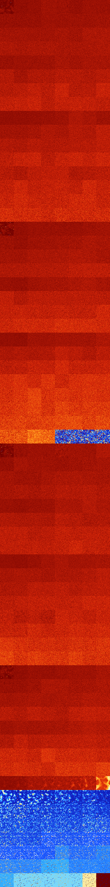

# B0234678 (244224-244735)

<details>
    <summary>Initial Grid</summary>
    
</details>


<details>
    <summary>Initial Grid RLE</summary>

```
#C Exported from GoGoL (https://github.com/marrow16/gogol)
#C Wrap mode: Toroidal
#C Boundary mode: Dead
#C Step: 0
x = 100, y = 100, rule = B0234678/S
13bo19bo27bobo$6bo3bo4bo14bo14b2o6bo3bo17bo8bo14bo$13bo8b2o9bo21bo6bo$
58bo2bo35bo$3bo7bo14bo16bo3bo4bo4b2o15bo23bo$23bo5bo21bo7bo26bo$2bo8bo
10bo22bo39bo$30bobo13bo7bo$23bo17bo20bo11bo$2bo60bo11bo7bobo$7bo13bo16b
o3bob2o26b2o$18bo47bo5bo3bo$42bo23bo19bo$100b$obo71bo3bo$bo44bo$19b2o
15bobo26bo31bo$24bobob2o44b2o$6bo32bo47bo$56bo42bo$bo66bo$10bo2bo16bo3b
o31bo18bo12bo$20bo33bo27bo8bo$44bo24bo2bo$30bo49bo$38bo6bo8bo6bo24bo6bo
$37bo9bo$14bobo18bo16bo19bo$7bo13b2o8b2o13bo9bo30bo$12bo19bo8bo2bo3bo
13bo10bo23bo$8bo13bo4bo20bo22bo8bo18bo$22b2o24bo$3bo2bo7bo23b2o26bo6bo
2bo17bo$38bo15bo18bo10bo$4bo15bo40bo10bo3bo3bo4bo2b2o$6bo13bo2bo8bo5b2o
15bo16bo11bo4bo6bo$bo8bo13bo25bo$o45bo12bo28bo$37bo5bobo2bo28bo5bo$3bo
5bo9bo$3bo$bo9bo28bo29bo10bo$14bo52bo16bo$100b$7bo9b2o6bo29bo30bo5bo3bo
$5bo2bo18bo34bo10bo23bo$9bo56bo9bo$39bo32bo23bo$14bo34bo48bo$bo43bo2bob
o47bo$bo4bo12b2obo6bo10b2o18b2o13bo$19bo43bo12bo$11bo14bo23bob3o35bo$
37b2o4bo3bo21bo7bo2bo$4bo5bo59bo19bo$21bo30bo4bo$28bo21bo11bo33bo$4bo
10bo34bo$5bo2bo34bo6bo40bo$7bo8bo3bo31bo$11bo8bo11bo5b2o22bo34bo$12bo
11bo36bo8bob2o$12bo7bo42bo11bo$9bo11bo33bo4bo37bo$8bo29bo4bo$67bo28bo$
7bo80bo6bo$8bo41bo16bo14bo$2bo44bo5bo2bo12bo7bo9bo7bo$2bo5bo5bo11b2o19b
o8bo8bo27bo$7bo6b2obo47bo11bo9bo$26b2o15bo6bo4bo3bo15bo20bo$64bo7bo$2bo
11bo64bo$50bo3bo7bo8bo2bo12bo$3bo11bo41bo21bo$19bo12bo35bo2bobo7bo$2b2o
64bo19bo2bobo$17bo7bo8bobo9bo20bo4bo$8bo54bo13bo16bo$bo5bo5bo34bo12bo$
23bo18bo2bo$37bo5bo4bo5bo21bo$31bo3bo13bo$o3bo3bo11bo2bo33bo11bo25bo$o
18bo10bo23bo14bo11b2o$29bo$13bo22bo53bo$22bo3bobo5bo38bo3bo3bo$bo9bo10b
o37bo15bo8bo5bo$30bo4bo13bo12bo24bo$27bo17bo20bo$29bo16bo27bo$50bo16bo$
15bo10bo9bo4bo$24bo3b2o28bo$28bo22bo6bo3bo3bo$29bo14bobo15bo5bo$4bo9bo
7bo19bo4bo6bo32bobo$18bo31b2o33bo4bo8bo!
```
</details>
<details>
    <summary>Thumbnail</summary>

</details>
<table>
<tr>
    <td><a href="./244224%20S%20Heat%20Map%20Activity.png"></a><br>S (244224)<br>G>1000</td>    <td><a href="./244225%20S0%20Heat%20Map%20Activity.png"></a><br>S0 (244225)<br>G>1000</td>    <td><a href="./244226%20S1%20Heat%20Map%20Activity.png"></a><br>S1 (244226)<br>G>1000</td>    <td><a href="./244227%20S01%20Heat%20Map%20Activity.png"></a><br>S01 (244227)<br>G>1000</td>    <td><a href="./244228%20S2%20Heat%20Map%20Activity.png"></a><br>S2 (244228)<br>G>1000</td>    <td><a href="./244229%20S02%20Heat%20Map%20Activity.png"></a><br>S02 (244229)<br>G>1000</td>    <td><a href="./244230%20S12%20Heat%20Map%20Activity.png"></a><br>S12 (244230)<br>G>1000</td>    <td><a href="./244231%20S012%20Heat%20Map%20Activity.png"></a><br>S012 (244231)<br>G>1000</td></tr>
<tr>
    <td><a href="./244232%20S3%20Heat%20Map%20Activity.png"></a><br>S3 (244232)<br>G>1000</td>    <td><a href="./244233%20S03%20Heat%20Map%20Activity.png"></a><br>S03 (244233)<br>G>1000</td>    <td><a href="./244234%20S13%20Heat%20Map%20Activity.png"></a><br>S13 (244234)<br>G>1000</td>    <td><a href="./244235%20S013%20Heat%20Map%20Activity.png"></a><br>S013 (244235)<br>G>1000</td>    <td><a href="./244236%20S23%20Heat%20Map%20Activity.png"></a><br>S23 (244236)<br>G>1000</td>    <td><a href="./244237%20S023%20Heat%20Map%20Activity.png"></a><br>S023 (244237)<br>G>1000</td>    <td><a href="./244238%20S123%20Heat%20Map%20Activity.png"></a><br>S123 (244238)<br>G>1000</td>    <td><a href="./244239%20S0123%20Heat%20Map%20Activity.png"></a><br>S0123 (244239)<br>G>1000</td></tr>
<tr>
    <td><a href="./244240%20S4%20Heat%20Map%20Activity.png"></a><br>S4 (244240)<br>G>1000</td>    <td><a href="./244241%20S04%20Heat%20Map%20Activity.png"></a><br>S04 (244241)<br>G>1000</td>    <td><a href="./244242%20S14%20Heat%20Map%20Activity.png"></a><br>S14 (244242)<br>G>1000</td>    <td><a href="./244243%20S014%20Heat%20Map%20Activity.png"></a><br>S014 (244243)<br>G>1000</td>    <td><a href="./244244%20S24%20Heat%20Map%20Activity.png"></a><br>S24 (244244)<br>G>1000</td>    <td><a href="./244245%20S024%20Heat%20Map%20Activity.png"></a><br>S024 (244245)<br>G>1000</td>    <td><a href="./244246%20S124%20Heat%20Map%20Activity.png"></a><br>S124 (244246)<br>G>1000</td>    <td><a href="./244247%20S0124%20Heat%20Map%20Activity.png"></a><br>S0124 (244247)<br>G>1000</td></tr>
<tr>
    <td><a href="./244248%20S34%20Heat%20Map%20Activity.png"></a><br>S34 (244248)<br>G>1000</td>    <td><a href="./244249%20S034%20Heat%20Map%20Activity.png"></a><br>S034 (244249)<br>G>1000</td>    <td><a href="./244250%20S134%20Heat%20Map%20Activity.png"></a><br>S134 (244250)<br>G>1000</td>    <td><a href="./244251%20S0134%20Heat%20Map%20Activity.png"></a><br>S0134 (244251)<br>G>1000</td>    <td><a href="./244252%20S234%20Heat%20Map%20Activity.png"></a><br>S234 (244252)<br>G>1000</td>    <td><a href="./244253%20S0234%20Heat%20Map%20Activity.png"></a><br>S0234 (244253)<br>G>1000</td>    <td><a href="./244254%20S1234%20Heat%20Map%20Activity.png"></a><br>S1234 (244254)<br>G>1000</td>    <td><a href="./244255%20S01234%20Heat%20Map%20Activity.png"></a><br>S01234 (244255)<br>G>1000</td></tr>
<tr>
    <td><a href="./244256%20S5%20Heat%20Map%20Activity.png"></a><br>S5 (244256)<br>G>1000</td>    <td><a href="./244257%20S05%20Heat%20Map%20Activity.png"></a><br>S05 (244257)<br>G>1000</td>    <td><a href="./244258%20S15%20Heat%20Map%20Activity.png"></a><br>S15 (244258)<br>G>1000</td>    <td><a href="./244259%20S015%20Heat%20Map%20Activity.png"></a><br>S015 (244259)<br>G>1000</td>    <td><a href="./244260%20S25%20Heat%20Map%20Activity.png"></a><br>S25 (244260)<br>G>1000</td>    <td><a href="./244261%20S025%20Heat%20Map%20Activity.png"></a><br>S025 (244261)<br>G>1000</td>    <td><a href="./244262%20S125%20Heat%20Map%20Activity.png"></a><br>S125 (244262)<br>G>1000</td>    <td><a href="./244263%20S0125%20Heat%20Map%20Activity.png"></a><br>S0125 (244263)<br>G>1000</td></tr>
<tr>
    <td><a href="./244264%20S35%20Heat%20Map%20Activity.png"></a><br>S35 (244264)<br>G>1000</td>    <td><a href="./244265%20S035%20Heat%20Map%20Activity.png"></a><br>S035 (244265)<br>G>1000</td>    <td><a href="./244266%20S135%20Heat%20Map%20Activity.png"></a><br>S135 (244266)<br>G>1000</td>    <td><a href="./244267%20S0135%20Heat%20Map%20Activity.png"></a><br>S0135 (244267)<br>G>1000</td>    <td><a href="./244268%20S235%20Heat%20Map%20Activity.png"></a><br>S235 (244268)<br>G>1000</td>    <td><a href="./244269%20S0235%20Heat%20Map%20Activity.png"></a><br>S0235 (244269)<br>G>1000</td>    <td><a href="./244270%20S1235%20Heat%20Map%20Activity.png"></a><br>S1235 (244270)<br>G>1000</td>    <td><a href="./244271%20S01235%20Heat%20Map%20Activity.png"></a><br>S01235 (244271)<br>G>1000</td></tr>
<tr>
    <td><a href="./244272%20S45%20Heat%20Map%20Activity.png"></a><br>S45 (244272)<br>G>1000</td>    <td><a href="./244273%20S045%20Heat%20Map%20Activity.png"></a><br>S045 (244273)<br>G>1000</td>    <td><a href="./244274%20S145%20Heat%20Map%20Activity.png"></a><br>S145 (244274)<br>G>1000</td>    <td><a href="./244275%20S0145%20Heat%20Map%20Activity.png"></a><br>S0145 (244275)<br>G>1000</td>    <td><a href="./244276%20S245%20Heat%20Map%20Activity.png"></a><br>S245 (244276)<br>G>1000</td>    <td><a href="./244277%20S0245%20Heat%20Map%20Activity.png"></a><br>S0245 (244277)<br>G>1000</td>    <td><a href="./244278%20S1245%20Heat%20Map%20Activity.png"></a><br>S1245 (244278)<br>G>1000</td>    <td><a href="./244279%20S01245%20Heat%20Map%20Activity.png"></a><br>S01245 (244279)<br>G>1000</td></tr>
<tr>
    <td><a href="./244280%20S345%20Heat%20Map%20Activity.png"></a><br>S345 (244280)<br>G>1000</td>    <td><a href="./244281%20S0345%20Heat%20Map%20Activity.png"></a><br>S0345 (244281)<br>G>1000</td>    <td><a href="./244282%20S1345%20Heat%20Map%20Activity.png"></a><br>S1345 (244282)<br>G>1000</td>    <td><a href="./244283%20S01345%20Heat%20Map%20Activity.png"></a><br>S01345 (244283)<br>G>1000</td>    <td><a href="./244284%20S2345%20Heat%20Map%20Activity.png"></a><br>S2345 (244284)<br>G>1000</td>    <td><a href="./244285%20S02345%20Heat%20Map%20Activity.png"></a><br>S02345 (244285)<br>G>1000</td>    <td><a href="./244286%20S12345%20Heat%20Map%20Activity.png"></a><br>S12345 (244286)<br>G>1000</td>    <td><a href="./244287%20S012345%20Heat%20Map%20Activity.png"></a><br>S012345 (244287)<br>G>1000</td></tr>
<tr>
    <td><a href="./244288%20S6%20Heat%20Map%20Activity.png"></a><br>S6 (244288)<br>G>1000</td>    <td><a href="./244289%20S06%20Heat%20Map%20Activity.png"></a><br>S06 (244289)<br>G>1000</td>    <td><a href="./244290%20S16%20Heat%20Map%20Activity.png"></a><br>S16 (244290)<br>G>1000</td>    <td><a href="./244291%20S016%20Heat%20Map%20Activity.png"></a><br>S016 (244291)<br>G>1000</td>    <td><a href="./244292%20S26%20Heat%20Map%20Activity.png"></a><br>S26 (244292)<br>G>1000</td>    <td><a href="./244293%20S026%20Heat%20Map%20Activity.png"></a><br>S026 (244293)<br>G>1000</td>    <td><a href="./244294%20S126%20Heat%20Map%20Activity.png"></a><br>S126 (244294)<br>G>1000</td>    <td><a href="./244295%20S0126%20Heat%20Map%20Activity.png"></a><br>S0126 (244295)<br>G>1000</td></tr>
<tr>
    <td><a href="./244296%20S36%20Heat%20Map%20Activity.png"></a><br>S36 (244296)<br>G>1000</td>    <td><a href="./244297%20S036%20Heat%20Map%20Activity.png"></a><br>S036 (244297)<br>G>1000</td>    <td><a href="./244298%20S136%20Heat%20Map%20Activity.png"></a><br>S136 (244298)<br>G>1000</td>    <td><a href="./244299%20S0136%20Heat%20Map%20Activity.png"></a><br>S0136 (244299)<br>G>1000</td>    <td><a href="./244300%20S236%20Heat%20Map%20Activity.png"></a><br>S236 (244300)<br>G>1000</td>    <td><a href="./244301%20S0236%20Heat%20Map%20Activity.png"></a><br>S0236 (244301)<br>G>1000</td>    <td><a href="./244302%20S1236%20Heat%20Map%20Activity.png"></a><br>S1236 (244302)<br>G>1000</td>    <td><a href="./244303%20S01236%20Heat%20Map%20Activity.png"></a><br>S01236 (244303)<br>G>1000</td></tr>
<tr>
    <td><a href="./244304%20S46%20Heat%20Map%20Activity.png"></a><br>S46 (244304)<br>G>1000</td>    <td><a href="./244305%20S046%20Heat%20Map%20Activity.png"></a><br>S046 (244305)<br>G>1000</td>    <td><a href="./244306%20S146%20Heat%20Map%20Activity.png"></a><br>S146 (244306)<br>G>1000</td>    <td><a href="./244307%20S0146%20Heat%20Map%20Activity.png"></a><br>S0146 (244307)<br>G>1000</td>    <td><a href="./244308%20S246%20Heat%20Map%20Activity.png"></a><br>S246 (244308)<br>G>1000</td>    <td><a href="./244309%20S0246%20Heat%20Map%20Activity.png"></a><br>S0246 (244309)<br>G>1000</td>    <td><a href="./244310%20S1246%20Heat%20Map%20Activity.png"></a><br>S1246 (244310)<br>G>1000</td>    <td><a href="./244311%20S01246%20Heat%20Map%20Activity.png"></a><br>S01246 (244311)<br>G>1000</td></tr>
<tr>
    <td><a href="./244312%20S346%20Heat%20Map%20Activity.png"></a><br>S346 (244312)<br>G>1000</td>    <td><a href="./244313%20S0346%20Heat%20Map%20Activity.png"></a><br>S0346 (244313)<br>G>1000</td>    <td><a href="./244314%20S1346%20Heat%20Map%20Activity.png"></a><br>S1346 (244314)<br>G>1000</td>    <td><a href="./244315%20S01346%20Heat%20Map%20Activity.png"></a><br>S01346 (244315)<br>G>1000</td>    <td><a href="./244316%20S2346%20Heat%20Map%20Activity.png"></a><br>S2346 (244316)<br>G>1000</td>    <td><a href="./244317%20S02346%20Heat%20Map%20Activity.png"></a><br>S02346 (244317)<br>G>1000</td>    <td><a href="./244318%20S12346%20Heat%20Map%20Activity.png"></a><br>S12346 (244318)<br>G>1000</td>    <td><a href="./244319%20S012346%20Heat%20Map%20Activity.png"></a><br>S012346 (244319)<br>G>1000</td></tr>
<tr>
    <td><a href="./244320%20S56%20Heat%20Map%20Activity.png"></a><br>S56 (244320)<br>G>1000</td>    <td><a href="./244321%20S056%20Heat%20Map%20Activity.png"></a><br>S056 (244321)<br>G>1000</td>    <td><a href="./244322%20S156%20Heat%20Map%20Activity.png"></a><br>S156 (244322)<br>G>1000</td>    <td><a href="./244323%20S0156%20Heat%20Map%20Activity.png"></a><br>S0156 (244323)<br>G>1000</td>    <td><a href="./244324%20S256%20Heat%20Map%20Activity.png"></a><br>S256 (244324)<br>G>1000</td>    <td><a href="./244325%20S0256%20Heat%20Map%20Activity.png"></a><br>S0256 (244325)<br>G>1000</td>    <td><a href="./244326%20S1256%20Heat%20Map%20Activity.png"></a><br>S1256 (244326)<br>G>1000</td>    <td><a href="./244327%20S01256%20Heat%20Map%20Activity.png"></a><br>S01256 (244327)<br>G>1000</td></tr>
<tr>
    <td><a href="./244328%20S356%20Heat%20Map%20Activity.png"></a><br>S356 (244328)<br>G>1000</td>    <td><a href="./244329%20S0356%20Heat%20Map%20Activity.png"></a><br>S0356 (244329)<br>G>1000</td>    <td><a href="./244330%20S1356%20Heat%20Map%20Activity.png"></a><br>S1356 (244330)<br>G>1000</td>    <td><a href="./244331%20S01356%20Heat%20Map%20Activity.png"></a><br>S01356 (244331)<br>G>1000</td>    <td><a href="./244332%20S2356%20Heat%20Map%20Activity.png"></a><br>S2356 (244332)<br>G>1000</td>    <td><a href="./244333%20S02356%20Heat%20Map%20Activity.png"></a><br>S02356 (244333)<br>G>1000</td>    <td><a href="./244334%20S12356%20Heat%20Map%20Activity.png"></a><br>S12356 (244334)<br>G>1000</td>    <td><a href="./244335%20S012356%20Heat%20Map%20Activity.png"></a><br>S012356 (244335)<br>G>1000</td></tr>
<tr>
    <td><a href="./244336%20S456%20Heat%20Map%20Activity.png"></a><br>S456 (244336)<br>G>1000</td>    <td><a href="./244337%20S0456%20Heat%20Map%20Activity.png"></a><br>S0456 (244337)<br>G>1000</td>    <td><a href="./244338%20S1456%20Heat%20Map%20Activity.png"></a><br>S1456 (244338)<br>G>1000</td>    <td><a href="./244339%20S01456%20Heat%20Map%20Activity.png"></a><br>S01456 (244339)<br>G>1000</td>    <td><a href="./244340%20S2456%20Heat%20Map%20Activity.png"></a><br>S2456 (244340)<br>G>1000</td>    <td><a href="./244341%20S02456%20Heat%20Map%20Activity.png"></a><br>S02456 (244341)<br>G>1000</td>    <td><a href="./244342%20S12456%20Heat%20Map%20Activity.png"></a><br>S12456 (244342)<br>G>1000</td>    <td><a href="./244343%20S012456%20Heat%20Map%20Activity.png"></a><br>S012456 (244343)<br>G>1000</td></tr>
<tr>
    <td><a href="./244344%20S3456%20Heat%20Map%20Activity.png"></a><br>S3456 (244344)<br>G>1000</td>    <td><a href="./244345%20S03456%20Heat%20Map%20Activity.png"></a><br>S03456 (244345)<br>G>1000</td>    <td><a href="./244346%20S13456%20Heat%20Map%20Activity.png"></a><br>S13456 (244346)<br>G>1000</td>    <td><a href="./244347%20S013456%20Heat%20Map%20Activity.png"></a><br>S013456 (244347)<br>G>1000</td>    <td><a href="./244348%20S23456%20Heat%20Map%20Activity.png"></a><br>S23456 (244348)<br>G>1000</td>    <td><a href="./244349%20S023456%20Heat%20Map%20Activity.png"></a><br>S023456 (244349)<br>G>1000</td>    <td><a href="./244350%20S123456%20Heat%20Map%20Activity.png"></a><br>S123456 (244350)<br>G>1000</td>    <td><a href="./244351%20S0123456%20Heat%20Map%20Activity.png"></a><br>S0123456 (244351)<br>G>1000</td></tr>
<tr>
    <td><a href="./244352%20S7%20Heat%20Map%20Activity.png"></a><br>S7 (244352)<br>G>1000</td>    <td><a href="./244353%20S07%20Heat%20Map%20Activity.png"></a><br>S07 (244353)<br>G>1000</td>    <td><a href="./244354%20S17%20Heat%20Map%20Activity.png"></a><br>S17 (244354)<br>G>1000</td>    <td><a href="./244355%20S017%20Heat%20Map%20Activity.png"></a><br>S017 (244355)<br>G>1000</td>    <td><a href="./244356%20S27%20Heat%20Map%20Activity.png"></a><br>S27 (244356)<br>G>1000</td>    <td><a href="./244357%20S027%20Heat%20Map%20Activity.png"></a><br>S027 (244357)<br>G>1000</td>    <td><a href="./244358%20S127%20Heat%20Map%20Activity.png"></a><br>S127 (244358)<br>G>1000</td>    <td><a href="./244359%20S0127%20Heat%20Map%20Activity.png"></a><br>S0127 (244359)<br>G>1000</td></tr>
<tr>
    <td><a href="./244360%20S37%20Heat%20Map%20Activity.png"></a><br>S37 (244360)<br>G>1000</td>    <td><a href="./244361%20S037%20Heat%20Map%20Activity.png"></a><br>S037 (244361)<br>G>1000</td>    <td><a href="./244362%20S137%20Heat%20Map%20Activity.png"></a><br>S137 (244362)<br>G>1000</td>    <td><a href="./244363%20S0137%20Heat%20Map%20Activity.png"></a><br>S0137 (244363)<br>G>1000</td>    <td><a href="./244364%20S237%20Heat%20Map%20Activity.png"></a><br>S237 (244364)<br>G>1000</td>    <td><a href="./244365%20S0237%20Heat%20Map%20Activity.png"></a><br>S0237 (244365)<br>G>1000</td>    <td><a href="./244366%20S1237%20Heat%20Map%20Activity.png"></a><br>S1237 (244366)<br>G>1000</td>    <td><a href="./244367%20S01237%20Heat%20Map%20Activity.png"></a><br>S01237 (244367)<br>G>1000</td></tr>
<tr>
    <td><a href="./244368%20S47%20Heat%20Map%20Activity.png"></a><br>S47 (244368)<br>G>1000</td>    <td><a href="./244369%20S047%20Heat%20Map%20Activity.png"></a><br>S047 (244369)<br>G>1000</td>    <td><a href="./244370%20S147%20Heat%20Map%20Activity.png"></a><br>S147 (244370)<br>G>1000</td>    <td><a href="./244371%20S0147%20Heat%20Map%20Activity.png"></a><br>S0147 (244371)<br>G>1000</td>    <td><a href="./244372%20S247%20Heat%20Map%20Activity.png"></a><br>S247 (244372)<br>G>1000</td>    <td><a href="./244373%20S0247%20Heat%20Map%20Activity.png"></a><br>S0247 (244373)<br>G>1000</td>    <td><a href="./244374%20S1247%20Heat%20Map%20Activity.png"></a><br>S1247 (244374)<br>G>1000</td>    <td><a href="./244375%20S01247%20Heat%20Map%20Activity.png"></a><br>S01247 (244375)<br>G>1000</td></tr>
<tr>
    <td><a href="./244376%20S347%20Heat%20Map%20Activity.png"></a><br>S347 (244376)<br>G>1000</td>    <td><a href="./244377%20S0347%20Heat%20Map%20Activity.png"></a><br>S0347 (244377)<br>G>1000</td>    <td><a href="./244378%20S1347%20Heat%20Map%20Activity.png"></a><br>S1347 (244378)<br>G>1000</td>    <td><a href="./244379%20S01347%20Heat%20Map%20Activity.png"></a><br>S01347 (244379)<br>G>1000</td>    <td><a href="./244380%20S2347%20Heat%20Map%20Activity.png"></a><br>S2347 (244380)<br>G>1000</td>    <td><a href="./244381%20S02347%20Heat%20Map%20Activity.png"></a><br>S02347 (244381)<br>G>1000</td>    <td><a href="./244382%20S12347%20Heat%20Map%20Activity.png"></a><br>S12347 (244382)<br>G>1000</td>    <td><a href="./244383%20S012347%20Heat%20Map%20Activity.png"></a><br>S012347 (244383)<br>G>1000</td></tr>
<tr>
    <td><a href="./244384%20S57%20Heat%20Map%20Activity.png"></a><br>S57 (244384)<br>G>1000</td>    <td><a href="./244385%20S057%20Heat%20Map%20Activity.png"></a><br>S057 (244385)<br>G>1000</td>    <td><a href="./244386%20S157%20Heat%20Map%20Activity.png"></a><br>S157 (244386)<br>G>1000</td>    <td><a href="./244387%20S0157%20Heat%20Map%20Activity.png"></a><br>S0157 (244387)<br>G>1000</td>    <td><a href="./244388%20S257%20Heat%20Map%20Activity.png"></a><br>S257 (244388)<br>G>1000</td>    <td><a href="./244389%20S0257%20Heat%20Map%20Activity.png"></a><br>S0257 (244389)<br>G>1000</td>    <td><a href="./244390%20S1257%20Heat%20Map%20Activity.png"></a><br>S1257 (244390)<br>G>1000</td>    <td><a href="./244391%20S01257%20Heat%20Map%20Activity.png"></a><br>S01257 (244391)<br>G>1000</td></tr>
<tr>
    <td><a href="./244392%20S357%20Heat%20Map%20Activity.png"></a><br>S357 (244392)<br>G>1000</td>    <td><a href="./244393%20S0357%20Heat%20Map%20Activity.png"></a><br>S0357 (244393)<br>G>1000</td>    <td><a href="./244394%20S1357%20Heat%20Map%20Activity.png"></a><br>S1357 (244394)<br>G>1000</td>    <td><a href="./244395%20S01357%20Heat%20Map%20Activity.png"></a><br>S01357 (244395)<br>G>1000</td>    <td><a href="./244396%20S2357%20Heat%20Map%20Activity.png"></a><br>S2357 (244396)<br>G>1000</td>    <td><a href="./244397%20S02357%20Heat%20Map%20Activity.png"></a><br>S02357 (244397)<br>G>1000</td>    <td><a href="./244398%20S12357%20Heat%20Map%20Activity.png"></a><br>S12357 (244398)<br>G>1000</td>    <td><a href="./244399%20S012357%20Heat%20Map%20Activity.png"></a><br>S012357 (244399)<br>G>1000</td></tr>
<tr>
    <td><a href="./244400%20S457%20Heat%20Map%20Activity.png"></a><br>S457 (244400)<br>G>1000</td>    <td><a href="./244401%20S0457%20Heat%20Map%20Activity.png"></a><br>S0457 (244401)<br>G>1000</td>    <td><a href="./244402%20S1457%20Heat%20Map%20Activity.png"></a><br>S1457 (244402)<br>G>1000</td>    <td><a href="./244403%20S01457%20Heat%20Map%20Activity.png"></a><br>S01457 (244403)<br>G>1000</td>    <td><a href="./244404%20S2457%20Heat%20Map%20Activity.png"></a><br>S2457 (244404)<br>G>1000</td>    <td><a href="./244405%20S02457%20Heat%20Map%20Activity.png"></a><br>S02457 (244405)<br>G>1000</td>    <td><a href="./244406%20S12457%20Heat%20Map%20Activity.png"></a><br>S12457 (244406)<br>G>1000</td>    <td><a href="./244407%20S012457%20Heat%20Map%20Activity.png"></a><br>S012457 (244407)<br>G>1000</td></tr>
<tr>
    <td><a href="./244408%20S3457%20Heat%20Map%20Activity.png"></a><br>S3457 (244408)<br>G>1000</td>    <td><a href="./244409%20S03457%20Heat%20Map%20Activity.png"></a><br>S03457 (244409)<br>G>1000</td>    <td><a href="./244410%20S13457%20Heat%20Map%20Activity.png"></a><br>S13457 (244410)<br>G>1000</td>    <td><a href="./244411%20S013457%20Heat%20Map%20Activity.png"></a><br>S013457 (244411)<br>G>1000</td>    <td><a href="./244412%20S23457%20Heat%20Map%20Activity.png"></a><br>S23457 (244412)<br>G>1000</td>    <td><a href="./244413%20S023457%20Heat%20Map%20Activity.png"></a><br>S023457 (244413)<br>G>1000</td>    <td><a href="./244414%20S123457%20Heat%20Map%20Activity.png"></a><br>S123457 (244414)<br>G>1000</td>    <td><a href="./244415%20S0123457%20Heat%20Map%20Activity.png"></a><br>S0123457 (244415)<br>G>1000</td></tr>
<tr>
    <td><a href="./244416%20S67%20Heat%20Map%20Activity.png"></a><br>S67 (244416)<br>G>1000</td>    <td><a href="./244417%20S067%20Heat%20Map%20Activity.png"></a><br>S067 (244417)<br>G>1000</td>    <td><a href="./244418%20S167%20Heat%20Map%20Activity.png"></a><br>S167 (244418)<br>G>1000</td>    <td><a href="./244419%20S0167%20Heat%20Map%20Activity.png"></a><br>S0167 (244419)<br>G>1000</td>    <td><a href="./244420%20S267%20Heat%20Map%20Activity.png"></a><br>S267 (244420)<br>G>1000</td>    <td><a href="./244421%20S0267%20Heat%20Map%20Activity.png"></a><br>S0267 (244421)<br>G>1000</td>    <td><a href="./244422%20S1267%20Heat%20Map%20Activity.png"></a><br>S1267 (244422)<br>G>1000</td>    <td><a href="./244423%20S01267%20Heat%20Map%20Activity.png"></a><br>S01267 (244423)<br>G>1000</td></tr>
<tr>
    <td><a href="./244424%20S367%20Heat%20Map%20Activity.png"></a><br>S367 (244424)<br>G>1000</td>    <td><a href="./244425%20S0367%20Heat%20Map%20Activity.png"></a><br>S0367 (244425)<br>G>1000</td>    <td><a href="./244426%20S1367%20Heat%20Map%20Activity.png"></a><br>S1367 (244426)<br>G>1000</td>    <td><a href="./244427%20S01367%20Heat%20Map%20Activity.png"></a><br>S01367 (244427)<br>G>1000</td>    <td><a href="./244428%20S2367%20Heat%20Map%20Activity.png"></a><br>S2367 (244428)<br>G>1000</td>    <td><a href="./244429%20S02367%20Heat%20Map%20Activity.png"></a><br>S02367 (244429)<br>G>1000</td>    <td><a href="./244430%20S12367%20Heat%20Map%20Activity.png"></a><br>S12367 (244430)<br>G>1000</td>    <td><a href="./244431%20S012367%20Heat%20Map%20Activity.png"></a><br>S012367 (244431)<br>G>1000</td></tr>
<tr>
    <td><a href="./244432%20S467%20Heat%20Map%20Activity.png"></a><br>S467 (244432)<br>G>1000</td>    <td><a href="./244433%20S0467%20Heat%20Map%20Activity.png"></a><br>S0467 (244433)<br>G>1000</td>    <td><a href="./244434%20S1467%20Heat%20Map%20Activity.png"></a><br>S1467 (244434)<br>G>1000</td>    <td><a href="./244435%20S01467%20Heat%20Map%20Activity.png"></a><br>S01467 (244435)<br>G>1000</td>    <td><a href="./244436%20S2467%20Heat%20Map%20Activity.png"></a><br>S2467 (244436)<br>G>1000</td>    <td><a href="./244437%20S02467%20Heat%20Map%20Activity.png"></a><br>S02467 (244437)<br>G>1000</td>    <td><a href="./244438%20S12467%20Heat%20Map%20Activity.png"></a><br>S12467 (244438)<br>G>1000</td>    <td><a href="./244439%20S012467%20Heat%20Map%20Activity.png"></a><br>S012467 (244439)<br>G>1000</td></tr>
<tr>
    <td><a href="./244440%20S3467%20Heat%20Map%20Activity.png"></a><br>S3467 (244440)<br>G>1000</td>    <td><a href="./244441%20S03467%20Heat%20Map%20Activity.png"></a><br>S03467 (244441)<br>G>1000</td>    <td><a href="./244442%20S13467%20Heat%20Map%20Activity.png"></a><br>S13467 (244442)<br>G>1000</td>    <td><a href="./244443%20S013467%20Heat%20Map%20Activity.png"></a><br>S013467 (244443)<br>G>1000</td>    <td><a href="./244444%20S23467%20Heat%20Map%20Activity.png"></a><br>S23467 (244444)<br>G>1000</td>    <td><a href="./244445%20S023467%20Heat%20Map%20Activity.png"></a><br>S023467 (244445)<br>G>1000</td>    <td><a href="./244446%20S123467%20Heat%20Map%20Activity.png"></a><br>S123467 (244446)<br>G>1000</td>    <td><a href="./244447%20S0123467%20Heat%20Map%20Activity.png"></a><br>S0123467 (244447)<br>G>1000</td></tr>
<tr>
    <td><a href="./244448%20S567%20Heat%20Map%20Activity.png"></a><br>S567 (244448)<br>G>1000</td>    <td><a href="./244449%20S0567%20Heat%20Map%20Activity.png"></a><br>S0567 (244449)<br>G>1000</td>    <td><a href="./244450%20S1567%20Heat%20Map%20Activity.png"></a><br>S1567 (244450)<br>G>1000</td>    <td><a href="./244451%20S01567%20Heat%20Map%20Activity.png"></a><br>S01567 (244451)<br>G>1000</td>    <td><a href="./244452%20S2567%20Heat%20Map%20Activity.png"></a><br>S2567 (244452)<br>G>1000</td>    <td><a href="./244453%20S02567%20Heat%20Map%20Activity.png"></a><br>S02567 (244453)<br>G>1000</td>    <td><a href="./244454%20S12567%20Heat%20Map%20Activity.png"></a><br>S12567 (244454)<br>G>1000</td>    <td><a href="./244455%20S012567%20Heat%20Map%20Activity.png"></a><br>S012567 (244455)<br>G>1000</td></tr>
<tr>
    <td><a href="./244456%20S3567%20Heat%20Map%20Activity.png"></a><br>S3567 (244456)<br>G>1000</td>    <td><a href="./244457%20S03567%20Heat%20Map%20Activity.png"></a><br>S03567 (244457)<br>G>1000</td>    <td><a href="./244458%20S13567%20Heat%20Map%20Activity.png"></a><br>S13567 (244458)<br>G>1000</td>    <td><a href="./244459%20S013567%20Heat%20Map%20Activity.png"></a><br>S013567 (244459)<br>G>1000</td>    <td><a href="./244460%20S23567%20Heat%20Map%20Activity.png"></a><br>S23567 (244460)<br>G>1000</td>    <td><a href="./244461%20S023567%20Heat%20Map%20Activity.png"></a><br>S023567 (244461)<br>G>1000</td>    <td><a href="./244462%20S123567%20Heat%20Map%20Activity.png"></a><br>S123567 (244462)<br>G>1000</td>    <td><a href="./244463%20S0123567%20Heat%20Map%20Activity.png"></a><br>S0123567 (244463)<br>G>1000</td></tr>
<tr>
    <td><a href="./244464%20S4567%20Heat%20Map%20Activity.png"></a><br>S4567 (244464)<br>G>1000</td>    <td><a href="./244465%20S04567%20Heat%20Map%20Activity.png"></a><br>S04567 (244465)<br>G>1000</td>    <td><a href="./244466%20S14567%20Heat%20Map%20Activity.png"></a><br>S14567 (244466)<br>G>1000</td>    <td><a href="./244467%20S014567%20Heat%20Map%20Activity.png"></a><br>S014567 (244467)<br>G>1000</td>    <td><a href="./244468%20S24567%20Heat%20Map%20Activity.png"></a><br>S24567 (244468)<br>G>1000</td>    <td><a href="./244469%20S024567%20Heat%20Map%20Activity.png"></a><br>S024567 (244469)<br>G>1000</td>    <td><a href="./244470%20S124567%20Heat%20Map%20Activity.png"></a><br>S124567 (244470)<br>G>1000</td>    <td><a href="./244471%20S0124567%20Heat%20Map%20Activity.png"></a><br>S0124567 (244471)<br>G>1000</td></tr>
<tr>
    <td><a href="./244472%20S34567%20Heat%20Map%20Activity.png"></a><br>S34567 (244472)<br>G>1000</td>    <td><a href="./244473%20S034567%20Heat%20Map%20Activity.png"></a><br>S034567 (244473)<br>G>1000</td>    <td><a href="./244474%20S134567%20Heat%20Map%20Activity.png"></a><br>S134567 (244474)<br>G>1000</td>    <td><a href="./244475%20S0134567%20Heat%20Map%20Activity.png"></a><br>S0134567 (244475)<br>G>1000</td>    <td><a href="./244476%20S234567%20Heat%20Map%20Activity.png"></a><br>S234567 (244476)<br>G>1000</td>    <td><a href="./244477%20S0234567%20Heat%20Map%20Activity.png"></a><br>S0234567 (244477)<br>G>1000</td>    <td><a href="./244478%20S1234567%20Heat%20Map%20Activity.png"></a><br>S1234567 (244478)<br>G>1000</td>    <td><a href="./244479%20S01234567%20Heat%20Map%20Activity.png"></a><br>S01234567 (244479)<br>G>1000</td></tr>
<tr>
    <td><a href="./244480%20S8%20Heat%20Map%20Activity.png"></a><br>S8 (244480)<br>G>1000</td>    <td><a href="./244481%20S08%20Heat%20Map%20Activity.png"></a><br>S08 (244481)<br>G>1000</td>    <td><a href="./244482%20S18%20Heat%20Map%20Activity.png"></a><br>S18 (244482)<br>G>1000</td>    <td><a href="./244483%20S018%20Heat%20Map%20Activity.png"></a><br>S018 (244483)<br>G>1000</td>    <td><a href="./244484%20S28%20Heat%20Map%20Activity.png"></a><br>S28 (244484)<br>G>1000</td>    <td><a href="./244485%20S028%20Heat%20Map%20Activity.png"></a><br>S028 (244485)<br>G>1000</td>    <td><a href="./244486%20S128%20Heat%20Map%20Activity.png"></a><br>S128 (244486)<br>G>1000</td>    <td><a href="./244487%20S0128%20Heat%20Map%20Activity.png"></a><br>S0128 (244487)<br>G>1000</td></tr>
<tr>
    <td><a href="./244488%20S38%20Heat%20Map%20Activity.png"></a><br>S38 (244488)<br>G>1000</td>    <td><a href="./244489%20S038%20Heat%20Map%20Activity.png"></a><br>S038 (244489)<br>G>1000</td>    <td><a href="./244490%20S138%20Heat%20Map%20Activity.png"></a><br>S138 (244490)<br>G>1000</td>    <td><a href="./244491%20S0138%20Heat%20Map%20Activity.png"></a><br>S0138 (244491)<br>G>1000</td>    <td><a href="./244492%20S238%20Heat%20Map%20Activity.png"></a><br>S238 (244492)<br>G>1000</td>    <td><a href="./244493%20S0238%20Heat%20Map%20Activity.png"></a><br>S0238 (244493)<br>G>1000</td>    <td><a href="./244494%20S1238%20Heat%20Map%20Activity.png"></a><br>S1238 (244494)<br>G>1000</td>    <td><a href="./244495%20S01238%20Heat%20Map%20Activity.png"></a><br>S01238 (244495)<br>G>1000</td></tr>
<tr>
    <td><a href="./244496%20S48%20Heat%20Map%20Activity.png"></a><br>S48 (244496)<br>G>1000</td>    <td><a href="./244497%20S048%20Heat%20Map%20Activity.png"></a><br>S048 (244497)<br>G>1000</td>    <td><a href="./244498%20S148%20Heat%20Map%20Activity.png"></a><br>S148 (244498)<br>G>1000</td>    <td><a href="./244499%20S0148%20Heat%20Map%20Activity.png"></a><br>S0148 (244499)<br>G>1000</td>    <td><a href="./244500%20S248%20Heat%20Map%20Activity.png"></a><br>S248 (244500)<br>G>1000</td>    <td><a href="./244501%20S0248%20Heat%20Map%20Activity.png"></a><br>S0248 (244501)<br>G>1000</td>    <td><a href="./244502%20S1248%20Heat%20Map%20Activity.png"></a><br>S1248 (244502)<br>G>1000</td>    <td><a href="./244503%20S01248%20Heat%20Map%20Activity.png"></a><br>S01248 (244503)<br>G>1000</td></tr>
<tr>
    <td><a href="./244504%20S348%20Heat%20Map%20Activity.png"></a><br>S348 (244504)<br>G>1000</td>    <td><a href="./244505%20S0348%20Heat%20Map%20Activity.png"></a><br>S0348 (244505)<br>G>1000</td>    <td><a href="./244506%20S1348%20Heat%20Map%20Activity.png"></a><br>S1348 (244506)<br>G>1000</td>    <td><a href="./244507%20S01348%20Heat%20Map%20Activity.png"></a><br>S01348 (244507)<br>G>1000</td>    <td><a href="./244508%20S2348%20Heat%20Map%20Activity.png"></a><br>S2348 (244508)<br>G>1000</td>    <td><a href="./244509%20S02348%20Heat%20Map%20Activity.png"></a><br>S02348 (244509)<br>G>1000</td>    <td><a href="./244510%20S12348%20Heat%20Map%20Activity.png"></a><br>S12348 (244510)<br>G>1000</td>    <td><a href="./244511%20S012348%20Heat%20Map%20Activity.png"></a><br>S012348 (244511)<br>G>1000</td></tr>
<tr>
    <td><a href="./244512%20S58%20Heat%20Map%20Activity.png"></a><br>S58 (244512)<br>G>1000</td>    <td><a href="./244513%20S058%20Heat%20Map%20Activity.png"></a><br>S058 (244513)<br>G>1000</td>    <td><a href="./244514%20S158%20Heat%20Map%20Activity.png"></a><br>S158 (244514)<br>G>1000</td>    <td><a href="./244515%20S0158%20Heat%20Map%20Activity.png"></a><br>S0158 (244515)<br>G>1000</td>    <td><a href="./244516%20S258%20Heat%20Map%20Activity.png"></a><br>S258 (244516)<br>G>1000</td>    <td><a href="./244517%20S0258%20Heat%20Map%20Activity.png"></a><br>S0258 (244517)<br>G>1000</td>    <td><a href="./244518%20S1258%20Heat%20Map%20Activity.png"></a><br>S1258 (244518)<br>G>1000</td>    <td><a href="./244519%20S01258%20Heat%20Map%20Activity.png"></a><br>S01258 (244519)<br>G>1000</td></tr>
<tr>
    <td><a href="./244520%20S358%20Heat%20Map%20Activity.png"></a><br>S358 (244520)<br>G>1000</td>    <td><a href="./244521%20S0358%20Heat%20Map%20Activity.png"></a><br>S0358 (244521)<br>G>1000</td>    <td><a href="./244522%20S1358%20Heat%20Map%20Activity.png"></a><br>S1358 (244522)<br>G>1000</td>    <td><a href="./244523%20S01358%20Heat%20Map%20Activity.png"></a><br>S01358 (244523)<br>G>1000</td>    <td><a href="./244524%20S2358%20Heat%20Map%20Activity.png"></a><br>S2358 (244524)<br>G>1000</td>    <td><a href="./244525%20S02358%20Heat%20Map%20Activity.png"></a><br>S02358 (244525)<br>G>1000</td>    <td><a href="./244526%20S12358%20Heat%20Map%20Activity.png"></a><br>S12358 (244526)<br>G>1000</td>    <td><a href="./244527%20S012358%20Heat%20Map%20Activity.png"></a><br>S012358 (244527)<br>G>1000</td></tr>
<tr>
    <td><a href="./244528%20S458%20Heat%20Map%20Activity.png"></a><br>S458 (244528)<br>G>1000</td>    <td><a href="./244529%20S0458%20Heat%20Map%20Activity.png"></a><br>S0458 (244529)<br>G>1000</td>    <td><a href="./244530%20S1458%20Heat%20Map%20Activity.png"></a><br>S1458 (244530)<br>G>1000</td>    <td><a href="./244531%20S01458%20Heat%20Map%20Activity.png"></a><br>S01458 (244531)<br>G>1000</td>    <td><a href="./244532%20S2458%20Heat%20Map%20Activity.png"></a><br>S2458 (244532)<br>G>1000</td>    <td><a href="./244533%20S02458%20Heat%20Map%20Activity.png"></a><br>S02458 (244533)<br>G>1000</td>    <td><a href="./244534%20S12458%20Heat%20Map%20Activity.png"></a><br>S12458 (244534)<br>G>1000</td>    <td><a href="./244535%20S012458%20Heat%20Map%20Activity.png"></a><br>S012458 (244535)<br>G>1000</td></tr>
<tr>
    <td><a href="./244536%20S3458%20Heat%20Map%20Activity.png"></a><br>S3458 (244536)<br>G>1000</td>    <td><a href="./244537%20S03458%20Heat%20Map%20Activity.png"></a><br>S03458 (244537)<br>G>1000</td>    <td><a href="./244538%20S13458%20Heat%20Map%20Activity.png"></a><br>S13458 (244538)<br>G>1000</td>    <td><a href="./244539%20S013458%20Heat%20Map%20Activity.png"></a><br>S013458 (244539)<br>G>1000</td>    <td><a href="./244540%20S23458%20Heat%20Map%20Activity.png"></a><br>S23458 (244540)<br>G>1000</td>    <td><a href="./244541%20S023458%20Heat%20Map%20Activity.png"></a><br>S023458 (244541)<br>G>1000</td>    <td><a href="./244542%20S123458%20Heat%20Map%20Activity.png"></a><br>S123458 (244542)<br>G>1000</td>    <td><a href="./244543%20S0123458%20Heat%20Map%20Activity.png"></a><br>S0123458 (244543)<br>G>1000</td></tr>
<tr>
    <td><a href="./244544%20S68%20Heat%20Map%20Activity.png"></a><br>S68 (244544)<br>G>1000</td>    <td><a href="./244545%20S068%20Heat%20Map%20Activity.png"></a><br>S068 (244545)<br>G>1000</td>    <td><a href="./244546%20S168%20Heat%20Map%20Activity.png"></a><br>S168 (244546)<br>G>1000</td>    <td><a href="./244547%20S0168%20Heat%20Map%20Activity.png"></a><br>S0168 (244547)<br>G>1000</td>    <td><a href="./244548%20S268%20Heat%20Map%20Activity.png"></a><br>S268 (244548)<br>G>1000</td>    <td><a href="./244549%20S0268%20Heat%20Map%20Activity.png"></a><br>S0268 (244549)<br>G>1000</td>    <td><a href="./244550%20S1268%20Heat%20Map%20Activity.png"></a><br>S1268 (244550)<br>G>1000</td>    <td><a href="./244551%20S01268%20Heat%20Map%20Activity.png"></a><br>S01268 (244551)<br>G>1000</td></tr>
<tr>
    <td><a href="./244552%20S368%20Heat%20Map%20Activity.png"></a><br>S368 (244552)<br>G>1000</td>    <td><a href="./244553%20S0368%20Heat%20Map%20Activity.png"></a><br>S0368 (244553)<br>G>1000</td>    <td><a href="./244554%20S1368%20Heat%20Map%20Activity.png"></a><br>S1368 (244554)<br>G>1000</td>    <td><a href="./244555%20S01368%20Heat%20Map%20Activity.png"></a><br>S01368 (244555)<br>G>1000</td>    <td><a href="./244556%20S2368%20Heat%20Map%20Activity.png"></a><br>S2368 (244556)<br>G>1000</td>    <td><a href="./244557%20S02368%20Heat%20Map%20Activity.png"></a><br>S02368 (244557)<br>G>1000</td>    <td><a href="./244558%20S12368%20Heat%20Map%20Activity.png"></a><br>S12368 (244558)<br>G>1000</td>    <td><a href="./244559%20S012368%20Heat%20Map%20Activity.png"></a><br>S012368 (244559)<br>G>1000</td></tr>
<tr>
    <td><a href="./244560%20S468%20Heat%20Map%20Activity.png"></a><br>S468 (244560)<br>G>1000</td>    <td><a href="./244561%20S0468%20Heat%20Map%20Activity.png"></a><br>S0468 (244561)<br>G>1000</td>    <td><a href="./244562%20S1468%20Heat%20Map%20Activity.png"></a><br>S1468 (244562)<br>G>1000</td>    <td><a href="./244563%20S01468%20Heat%20Map%20Activity.png"></a><br>S01468 (244563)<br>G>1000</td>    <td><a href="./244564%20S2468%20Heat%20Map%20Activity.png"></a><br>S2468 (244564)<br>G>1000</td>    <td><a href="./244565%20S02468%20Heat%20Map%20Activity.png"></a><br>S02468 (244565)<br>G>1000</td>    <td><a href="./244566%20S12468%20Heat%20Map%20Activity.png"></a><br>S12468 (244566)<br>G>1000</td>    <td><a href="./244567%20S012468%20Heat%20Map%20Activity.png"></a><br>S012468 (244567)<br>G>1000</td></tr>
<tr>
    <td><a href="./244568%20S3468%20Heat%20Map%20Activity.png"></a><br>S3468 (244568)<br>G>1000</td>    <td><a href="./244569%20S03468%20Heat%20Map%20Activity.png"></a><br>S03468 (244569)<br>G>1000</td>    <td><a href="./244570%20S13468%20Heat%20Map%20Activity.png"></a><br>S13468 (244570)<br>G>1000</td>    <td><a href="./244571%20S013468%20Heat%20Map%20Activity.png"></a><br>S013468 (244571)<br>G>1000</td>    <td><a href="./244572%20S23468%20Heat%20Map%20Activity.png"></a><br>S23468 (244572)<br>G>1000</td>    <td><a href="./244573%20S023468%20Heat%20Map%20Activity.png"></a><br>S023468 (244573)<br>G>1000</td>    <td><a href="./244574%20S123468%20Heat%20Map%20Activity.png"></a><br>S123468 (244574)<br>G>1000</td>    <td><a href="./244575%20S0123468%20Heat%20Map%20Activity.png"></a><br>S0123468 (244575)<br>G>1000</td></tr>
<tr>
    <td><a href="./244576%20S568%20Heat%20Map%20Activity.png"></a><br>S568 (244576)<br>G>1000</td>    <td><a href="./244577%20S0568%20Heat%20Map%20Activity.png"></a><br>S0568 (244577)<br>G>1000</td>    <td><a href="./244578%20S1568%20Heat%20Map%20Activity.png"></a><br>S1568 (244578)<br>G>1000</td>    <td><a href="./244579%20S01568%20Heat%20Map%20Activity.png"></a><br>S01568 (244579)<br>G>1000</td>    <td><a href="./244580%20S2568%20Heat%20Map%20Activity.png"></a><br>S2568 (244580)<br>G>1000</td>    <td><a href="./244581%20S02568%20Heat%20Map%20Activity.png"></a><br>S02568 (244581)<br>G>1000</td>    <td><a href="./244582%20S12568%20Heat%20Map%20Activity.png"></a><br>S12568 (244582)<br>G>1000</td>    <td><a href="./244583%20S012568%20Heat%20Map%20Activity.png"></a><br>S012568 (244583)<br>G>1000</td></tr>
<tr>
    <td><a href="./244584%20S3568%20Heat%20Map%20Activity.png"></a><br>S3568 (244584)<br>G>1000</td>    <td><a href="./244585%20S03568%20Heat%20Map%20Activity.png"></a><br>S03568 (244585)<br>G>1000</td>    <td><a href="./244586%20S13568%20Heat%20Map%20Activity.png"></a><br>S13568 (244586)<br>G>1000</td>    <td><a href="./244587%20S013568%20Heat%20Map%20Activity.png"></a><br>S013568 (244587)<br>G>1000</td>    <td><a href="./244588%20S23568%20Heat%20Map%20Activity.png"></a><br>S23568 (244588)<br>G>1000</td>    <td><a href="./244589%20S023568%20Heat%20Map%20Activity.png"></a><br>S023568 (244589)<br>G>1000</td>    <td><a href="./244590%20S123568%20Heat%20Map%20Activity.png"></a><br>S123568 (244590)<br>G>1000</td>    <td><a href="./244591%20S0123568%20Heat%20Map%20Activity.png"></a><br>S0123568 (244591)<br>G>1000</td></tr>
<tr>
    <td><a href="./244592%20S4568%20Heat%20Map%20Activity.png"></a><br>S4568 (244592)<br>G>1000</td>    <td><a href="./244593%20S04568%20Heat%20Map%20Activity.png"></a><br>S04568 (244593)<br>G>1000</td>    <td><a href="./244594%20S14568%20Heat%20Map%20Activity.png"></a><br>S14568 (244594)<br>G>1000</td>    <td><a href="./244595%20S014568%20Heat%20Map%20Activity.png"></a><br>S014568 (244595)<br>G>1000</td>    <td><a href="./244596%20S24568%20Heat%20Map%20Activity.png"></a><br>S24568 (244596)<br>G>1000</td>    <td><a href="./244597%20S024568%20Heat%20Map%20Activity.png"></a><br>S024568 (244597)<br>G>1000</td>    <td><a href="./244598%20S124568%20Heat%20Map%20Activity.png"></a><br>S124568 (244598)<br>G>1000</td>    <td><a href="./244599%20S0124568%20Heat%20Map%20Activity.png"></a><br>S0124568 (244599)<br>G>1000</td></tr>
<tr>
    <td><a href="./244600%20S34568%20Heat%20Map%20Activity.png"></a><br>S34568 (244600)<br>G>1000</td>    <td><a href="./244601%20S034568%20Heat%20Map%20Activity.png"></a><br>S034568 (244601)<br>G>1000</td>    <td><a href="./244602%20S134568%20Heat%20Map%20Activity.png"></a><br>S134568 (244602)<br>G>1000</td>    <td><a href="./244603%20S0134568%20Heat%20Map%20Activity.png"></a><br>S0134568 (244603)<br>G>1000</td>    <td><a href="./244604%20S234568%20Heat%20Map%20Activity.png"></a><br>S234568 (244604)<br>G>1000</td>    <td><a href="./244605%20S0234568%20Heat%20Map%20Activity.png"></a><br>S0234568 (244605)<br>G>1000</td>    <td><a href="./244606%20S1234568%20Heat%20Map%20Activity.png"></a><br>S1234568 (244606)<br>G>1000</td>    <td><a href="./244607%20S01234568%20Heat%20Map%20Activity.png"></a><br>S01234568 (244607)<br>G>1000</td></tr>
<tr>
    <td><a href="./244608%20S78%20Heat%20Map%20Activity.png"></a><br>S78 (244608)<br>G>1000</td>    <td><a href="./244609%20S078%20Heat%20Map%20Activity.png"></a><br>S078 (244609)<br>G>1000</td>    <td><a href="./244610%20S178%20Heat%20Map%20Activity.png"></a><br>S178 (244610)<br>G>1000</td>    <td><a href="./244611%20S0178%20Heat%20Map%20Activity.png"></a><br>S0178 (244611)<br>G>1000</td>    <td><a href="./244612%20S278%20Heat%20Map%20Activity.png"></a><br>S278 (244612)<br>G>1000</td>    <td><a href="./244613%20S0278%20Heat%20Map%20Activity.png"></a><br>S0278 (244613)<br>G>1000</td>    <td><a href="./244614%20S1278%20Heat%20Map%20Activity.png"></a><br>S1278 (244614)<br>G>1000</td>    <td><a href="./244615%20S01278%20Heat%20Map%20Activity.png"></a><br>S01278 (244615)<br>G>1000</td></tr>
<tr>
    <td><a href="./244616%20S378%20Heat%20Map%20Activity.png"></a><br>S378 (244616)<br>G>1000</td>    <td><a href="./244617%20S0378%20Heat%20Map%20Activity.png"></a><br>S0378 (244617)<br>G>1000</td>    <td><a href="./244618%20S1378%20Heat%20Map%20Activity.png"></a><br>S1378 (244618)<br>G>1000</td>    <td><a href="./244619%20S01378%20Heat%20Map%20Activity.png"></a><br>S01378 (244619)<br>G>1000</td>    <td><a href="./244620%20S2378%20Heat%20Map%20Activity.png"></a><br>S2378 (244620)<br>G>1000</td>    <td><a href="./244621%20S02378%20Heat%20Map%20Activity.png"></a><br>S02378 (244621)<br>G>1000</td>    <td><a href="./244622%20S12378%20Heat%20Map%20Activity.png"></a><br>S12378 (244622)<br>G>1000</td>    <td><a href="./244623%20S012378%20Heat%20Map%20Activity.png"></a><br>S012378 (244623)<br>G>1000</td></tr>
<tr>
    <td><a href="./244624%20S478%20Heat%20Map%20Activity.png"></a><br>S478 (244624)<br>G>1000</td>    <td><a href="./244625%20S0478%20Heat%20Map%20Activity.png"></a><br>S0478 (244625)<br>G>1000</td>    <td><a href="./244626%20S1478%20Heat%20Map%20Activity.png"></a><br>S1478 (244626)<br>G>1000</td>    <td><a href="./244627%20S01478%20Heat%20Map%20Activity.png"></a><br>S01478 (244627)<br>G>1000</td>    <td><a href="./244628%20S2478%20Heat%20Map%20Activity.png"></a><br>S2478 (244628)<br>G>1000</td>    <td><a href="./244629%20S02478%20Heat%20Map%20Activity.png"></a><br>S02478 (244629)<br>G>1000</td>    <td><a href="./244630%20S12478%20Heat%20Map%20Activity.png"></a><br>S12478 (244630)<br>G>1000</td>    <td><a href="./244631%20S012478%20Heat%20Map%20Activity.png"></a><br>S012478 (244631)<br>G>1000</td></tr>
<tr>
    <td><a href="./244632%20S3478%20Heat%20Map%20Activity.png"></a><br>S3478 (244632)<br>G>1000</td>    <td><a href="./244633%20S03478%20Heat%20Map%20Activity.png"></a><br>S03478 (244633)<br>G>1000</td>    <td><a href="./244634%20S13478%20Heat%20Map%20Activity.png"></a><br>S13478 (244634)<br>G>1000</td>    <td><a href="./244635%20S013478%20Heat%20Map%20Activity.png"></a><br>S013478 (244635)<br>G>1000</td>    <td><a href="./244636%20S23478%20Heat%20Map%20Activity.png"></a><br>S23478 (244636)<br>G>1000</td>    <td><a href="./244637%20S023478%20Heat%20Map%20Activity.png"></a><br>S023478 (244637)<br>G>1000</td>    <td><a href="./244638%20S123478%20Heat%20Map%20Activity.png"></a><br>S123478 (244638)<br>G>1000</td>    <td><a href="./244639%20S0123478%20Heat%20Map%20Activity.png"></a><br>S0123478 (244639)<br>G>1000</td></tr>
<tr>
    <td><a href="./244640%20S578%20Heat%20Map%20Activity.png"></a><br>S578 (244640)<br>G>1000</td>    <td><a href="./244641%20S0578%20Heat%20Map%20Activity.png"></a><br>S0578 (244641)<br>G>1000</td>    <td><a href="./244642%20S1578%20Heat%20Map%20Activity.png"></a><br>S1578 (244642)<br>G>1000</td>    <td><a href="./244643%20S01578%20Heat%20Map%20Activity.png"></a><br>S01578 (244643)<br>G>1000</td>    <td><a href="./244644%20S2578%20Heat%20Map%20Activity.png"></a><br>S2578 (244644)<br>G>1000</td>    <td><a href="./244645%20S02578%20Heat%20Map%20Activity.png"></a><br>S02578 (244645)<br>G>1000</td>    <td><a href="./244646%20S12578%20Heat%20Map%20Activity.png"></a><br>S12578 (244646)<br>G>1000</td>    <td><a href="./244647%20S012578%20Heat%20Map%20Activity.png"></a><br>S012578 (244647)<br>G>1000</td></tr>
<tr>
    <td><a href="./244648%20S3578%20Heat%20Map%20Activity.png"></a><br>S3578 (244648)<br>G>1000</td>    <td><a href="./244649%20S03578%20Heat%20Map%20Activity.png"></a><br>S03578 (244649)<br>G>1000</td>    <td><a href="./244650%20S13578%20Heat%20Map%20Activity.png"></a><br>S13578 (244650)<br>G>1000</td>    <td><a href="./244651%20S013578%20Heat%20Map%20Activity.png"></a><br>S013578 (244651)<br>G>1000</td>    <td><a href="./244652%20S23578%20Heat%20Map%20Activity.png"></a><br>S23578 (244652)<br>G>1000</td>    <td><a href="./244653%20S023578%20Heat%20Map%20Activity.png"></a><br>S023578 (244653)<br>G>1000</td>    <td><a href="./244654%20S123578%20Heat%20Map%20Activity.png"></a><br>S123578 (244654)<br>G>1000</td>    <td><a href="./244655%20S0123578%20Heat%20Map%20Activity.png"></a><br>S0123578 (244655)<br>G>1000</td></tr>
<tr>
    <td><a href="./244656%20S4578%20Heat%20Map%20Activity.png"></a><br>S4578 (244656)<br>G>1000</td>    <td><a href="./244657%20S04578%20Heat%20Map%20Activity.png"></a><br>S04578 (244657)<br>G>1000</td>    <td><a href="./244658%20S14578%20Heat%20Map%20Activity.png"></a><br>S14578 (244658)<br>G>1000</td>    <td><a href="./244659%20S014578%20Heat%20Map%20Activity.png"></a><br>S014578 (244659)<br>G>1000</td>    <td><a href="./244660%20S24578%20Heat%20Map%20Activity.png"></a><br>S24578 (244660)<br>G>1000</td>    <td><a href="./244661%20S024578%20Heat%20Map%20Activity.png"></a><br>S024578 (244661)<br>G>1000</td>    <td><a href="./244662%20S124578%20Heat%20Map%20Activity.png"></a><br>S124578 (244662)<br>G>1000</td>    <td><a href="./244663%20S0124578%20Heat%20Map%20Activity.png"></a><br>S0124578 (244663)<br>G>1000</td></tr>
<tr>
    <td><a href="./244664%20S34578%20Heat%20Map%20Activity.png"></a><br>S34578 (244664)<br>G>1000</td>    <td><a href="./244665%20S034578%20Heat%20Map%20Activity.png"></a><br>S034578 (244665)<br>G>1000</td>    <td><a href="./244666%20S134578%20Heat%20Map%20Activity.png"></a><br>S134578 (244666)<br>G>1000</td>    <td><a href="./244667%20S0134578%20Heat%20Map%20Activity.png"></a><br>S0134578 (244667)<br>G>1000</td>    <td><a href="./244668%20S234578%20Heat%20Map%20Activity.png"></a><br>S234578 (244668)<br>G>1000</td>    <td><a href="./244669%20S0234578%20Heat%20Map%20Activity.png"></a><br>S0234578 (244669)<br>G>1000</td>    <td><a href="./244670%20S1234578%20Heat%20Map%20Activity.png"></a><br>S1234578 (244670)<br>G>1000</td>    <td><a href="./244671%20S01234578%20Heat%20Map%20Activity.png"></a><br>S01234578 (244671)<br>G>1000</td></tr>
<tr>
    <td><a href="./244672%20S678%20Heat%20Map%20Activity.png"></a><br>S678 (244672)<br>G>1000</td>    <td><a href="./244673%20S0678%20Heat%20Map%20Activity.png"></a><br>S0678 (244673)<br>G>1000</td>    <td><a href="./244674%20S1678%20Heat%20Map%20Activity.png"></a><br>S1678 (244674)<br>G>1000</td>    <td><a href="./244675%20S01678%20Heat%20Map%20Activity.png"></a><br>S01678 (244675)<br>G>1000</td>    <td><a href="./244676%20S2678%20Heat%20Map%20Activity.png"></a><br>S2678 (244676)<br>G>1000</td>    <td><a href="./244677%20S02678%20Heat%20Map%20Activity.png"></a><br>S02678 (244677)<br>G>1000</td>    <td><a href="./244678%20S12678%20Heat%20Map%20Activity.png"></a><br>S12678 (244678)<br>G>1000</td>    <td><a href="./244679%20S012678%20Heat%20Map%20Activity.png"></a><br>S012678 (244679)<br>G>1000</td></tr>
<tr>
    <td><a href="./244680%20S3678%20Heat%20Map%20Activity.png"></a><br>S3678 (244680)<br>R@145,p12</td>    <td><a href="./244681%20S03678%20Heat%20Map%20Activity.png"></a><br>S03678 (244681)<br>R@89,p12</td>    <td><a href="./244682%20S13678%20Heat%20Map%20Activity.png"></a><br>S13678 (244682)<br>R@77,p6</td>    <td><a href="./244683%20S013678%20Heat%20Map%20Activity.png"></a><br>S013678 (244683)<br>R@66,p6</td>    <td><a href="./244684%20S23678%20Heat%20Map%20Activity.png"></a><br>S23678 (244684)<br>R@59,p6</td>    <td><a href="./244685%20S023678%20Heat%20Map%20Activity.png"></a><br>S023678 (244685)<br>R@70,p6</td>    <td><a href="./244686%20S123678%20Heat%20Map%20Activity.png"></a><br>S123678 (244686)<br>R@50,p6</td>    <td><a href="./244687%20S0123678%20Heat%20Map%20Activity.png"></a><br>S0123678 (244687)<br>R@68,p30</td></tr>
<tr>
    <td><a href="./244688%20S4678%20Heat%20Map%20Activity.png"></a><br>S4678 (244688)<br>R@23,p2</td>    <td><a href="./244689%20S04678%20Heat%20Map%20Activity.png"></a><br>S04678 (244689)<br>S@20</td>    <td><a href="./244690%20S14678%20Heat%20Map%20Activity.png"></a><br>S14678 (244690)<br>R@24,p2</td>    <td><a href="./244691%20S014678%20Heat%20Map%20Activity.png"></a><br>S014678 (244691)<br>R@19,p2</td>    <td><a href="./244692%20S24678%20Heat%20Map%20Activity.png"></a><br>S24678 (244692)<br>R@23,p2</td>    <td><a href="./244693%20S024678%20Heat%20Map%20Activity.png"></a><br>S024678 (244693)<br>R@21,p2</td>    <td><a href="./244694%20S124678%20Heat%20Map%20Activity.png"></a><br>S124678 (244694)<br>R@20,p2</td>    <td><a href="./244695%20S0124678%20Heat%20Map%20Activity.png"></a><br>S0124678 (244695)<br>R@21,p2</td></tr>
<tr>
    <td><a href="./244696%20S34678%20Heat%20Map%20Activity.png"></a><br>S34678 (244696)<br>R@17,p2</td>    <td><a href="./244697%20S034678%20Heat%20Map%20Activity.png"></a><br>S034678 (244697)<br>R@16,p2</td>    <td><a href="./244698%20S134678%20Heat%20Map%20Activity.png"></a><br>S134678 (244698)<br>R@18,p2</td>    <td><a href="./244699%20S0134678%20Heat%20Map%20Activity.png"></a><br>S0134678 (244699)<br>R@14,p2</td>    <td><a href="./244700%20S234678%20Heat%20Map%20Activity.png"></a><br>S234678 (244700)<br>R@15,p2</td>    <td><a href="./244701%20S0234678%20Heat%20Map%20Activity.png"></a><br>S0234678 (244701)<br>R@14,p2</td>    <td><a href="./244702%20S1234678%20Heat%20Map%20Activity.png"></a><br>S1234678 (244702)<br>R@15,p2</td>    <td><a href="./244703%20S01234678%20Heat%20Map%20Activity.png"></a><br>S01234678 (244703)<br>S@12</td></tr>
<tr>
    <td><a href="./244704%20S5678%20Heat%20Map%20Activity.png"></a><br>S5678 (244704)<br>S@11</td>    <td><a href="./244705%20S05678%20Heat%20Map%20Activity.png"></a><br>S05678 (244705)<br>S@11</td>    <td><a href="./244706%20S15678%20Heat%20Map%20Activity.png"></a><br>S15678 (244706)<br>S@11</td>    <td><a href="./244707%20S015678%20Heat%20Map%20Activity.png"></a><br>S015678 (244707)<br>S@8</td>    <td><a href="./244708%20S25678%20Heat%20Map%20Activity.png"></a><br>S25678 (244708)<br>S@8</td>    <td><a href="./244709%20S025678%20Heat%20Map%20Activity.png"></a><br>S025678 (244709)<br>S@8</td>    <td><a href="./244710%20S125678%20Heat%20Map%20Activity.png"></a><br>S125678 (244710)<br>S@8</td>    <td><a href="./244711%20S0125678%20Heat%20Map%20Activity.png"></a><br>S0125678 (244711)<br>S@8</td></tr>
<tr>
    <td><a href="./244712%20S35678%20Heat%20Map%20Activity.png"></a><br>S35678 (244712)<br>S@8</td>    <td><a href="./244713%20S035678%20Heat%20Map%20Activity.png"></a><br>S035678 (244713)<br>S@8</td>    <td><a href="./244714%20S135678%20Heat%20Map%20Activity.png"></a><br>S135678 (244714)<br>S@7</td>    <td><a href="./244715%20S0135678%20Heat%20Map%20Activity.png"></a><br>S0135678 (244715)<br>S@7</td>    <td><a href="./244716%20S235678%20Heat%20Map%20Activity.png"></a><br>S235678 (244716)<br>S@7</td>    <td><a href="./244717%20S0235678%20Heat%20Map%20Activity.png"></a><br>S0235678 (244717)<br>S@7</td>    <td><a href="./244718%20S1235678%20Heat%20Map%20Activity.png"></a><br>S1235678 (244718)<br>S@6</td>    <td><a href="./244719%20S01235678%20Heat%20Map%20Activity.png"></a><br>S01235678 (244719)<br>S@8</td></tr>
<tr>
    <td><a href="./244720%20S45678%20Heat%20Map%20Activity.png"></a><br>S45678 (244720)<br>S@6</td>    <td><a href="./244721%20S045678%20Heat%20Map%20Activity.png"></a><br>S045678 (244721)<br>S@6</td>    <td><a href="./244722%20S145678%20Heat%20Map%20Activity.png"></a><br>S145678 (244722)<br>S@6</td>    <td><a href="./244723%20S0145678%20Heat%20Map%20Activity.png"></a><br>S0145678 (244723)<br>S@6</td>    <td><a href="./244724%20S245678%20Heat%20Map%20Activity.png"></a><br>S245678 (244724)<br>S@5</td>    <td><a href="./244725%20S0245678%20Heat%20Map%20Activity.png"></a><br>S0245678 (244725)<br>S@5</td>    <td><a href="./244726%20S1245678%20Heat%20Map%20Activity.png"></a><br>S1245678 (244726)<br>S@6</td>    <td><a href="./244727%20S01245678%20Heat%20Map%20Activity.png"></a><br>S01245678 (244727)<br>S@5</td></tr>
<tr>
    <td><a href="./244728%20S345678%20Heat%20Map%20Activity.png"></a><br>S345678 (244728)<br>S@5</td>    <td><a href="./244729%20S0345678%20Heat%20Map%20Activity.png"></a><br>S0345678 (244729)<br>S@5</td>    <td><a href="./244730%20S1345678%20Heat%20Map%20Activity.png"></a><br>S1345678 (244730)<br>S@4</td>    <td><a href="./244731%20S01345678%20Heat%20Map%20Activity.png"></a><br>S01345678 (244731)<br>S@5</td>    <td><a href="./244732%20S2345678%20Heat%20Map%20Activity.png"></a><br>S2345678 (244732)<br>S@4</td>    <td><a href="./244733%20S02345678%20Heat%20Map%20Activity.png"></a><br>S02345678 (244733)<br>S@4</td>    <td><a href="./244734%20S12345678%20Heat%20Map%20Activity.png"></a><br>S12345678 (244734)<br>S@4</td>    <td><a href="./244735%20S012345678%20Heat%20Map%20Activity.png"></a><br>S012345678 (244735)<br>S@4</td></tr>
</table>
