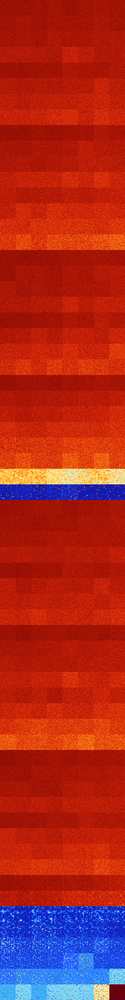

# B023468 (178688-179199)

<details>
    <summary>Initial Grid</summary>
    
</details>


<details>
    <summary>Initial Grid RLE</summary>

```
#C Exported from GoGoL (https://github.com/marrow16/gogol)
#C Wrap mode: Toroidal
#C Boundary mode: Dead
#C Step: 0
x = 100, y = 100, rule = B023468/S
20bo15bo11bo12bo21bo$7bo38b2o8bo11b2o$2bo23b2o23bo20bo18bobo$bobo27b2o
41bo$20bo10bo20bo$12bo16bo30bo24b2o$20bobo5b2o5bo15bo31bo$54bo9bo6bo11b
o2bo2bobo$18bo9bo41bo10bo$10bo8bo9bo35bo4bo6bo$8b2o18bo30bo5bo$19bo19bo
7b2o26bo2bo$44bo30bo$18bo2bo37bobo28bo$35bo$4bo16bo21bo6bo15bo22bo6bo$
73bo3bo4bo$21bo65bo$47bo41bo$15bobo$12bo12bo19bo17bo3bo5bo$10bo$5bobo
14bo4bo6bo24bo15bo$6bo40bo8bo36bo$28bo33bo11bo$13bo13b2o29bo30bo$6bo12b
o14bo3bo10bo22bo18bo$bo4bo2bo29bo5bo18bo11bo11bo$30bo4bo21bobo22bo7bo$
15bo21bo21bo32bobo$40bo5bo3bo3bo10bo$11bo12bo20bo4bo3bo7bo34bo$4bo9bo6b
o8bo8bo11bo8bo$o12bo$11bo4b2o16b2o11bo14bo22b2o$4bo31bo6bobo19bo25bo2bo
$19bo38b2o36bo$5bo5bo8bo6b2o21bo43bo$13bo6bo9bo51bo4bo6bo$11bo9bo2bo2bo
2bo19bo$10bo6bo6bo21bo10bo18b2o8bo$4bo2bo8b2o3bo47bo$17bo40bo12bobo19bo
$16bo14bo6bo5bo2bo15bo14b2o$10bo11bo7bo49bo3bo2bo$19bo12bo21bo16bo2bo$
13bo14bo6bo19bo3bo18bo8bo$23bo47bo2bo$36bo24bo6bo$7bo8bo14bo8bo$15bo20b
o13bo40bo$2bo30bo36bo$15bo69bo$94bo$50bo38bo2bo$22b2o17bo8bo5bo16bo24bo
$7bo6bo10bo6bo$2b2o9bo3bo2bo4bo8bo8bo29bo$12bo38bo38bo$43bo24bo2bo17bo$
9bo18bo4bo2bo33bo14bo$6bo11bo12bo21bo6bo24bo4bo6bo$13bo2bo39bo2bo12bo$
19bo57bo3bo4bo$22bo32bo5bo3bo$10bo2bo$6bo33bo$20bo10bobo18bo30bo$bo18bo
23bo4bo4bo26bo$10bo2bo22bo16bo32bo3b2o$6bo72bob2o7bo$29b2o14bo12bo12bo
7bo11bo$33bo2b2o23bobo$8bo28b3o3bo3bo$o8bo6bo39bo9bo16bo$12bo8b2o33bo
10bobo15bo$68bo18bo6bo$23bo$16bo16bo10bo13bo36bo$27bobo14bobo2b2o6bo31b
o3bo$11bo20bo5bo35bo$22bo5bo44bo10bo$48bo12bo$3bo15bo32bo23bo5bo$32bo9b
o$o24bo30bo14bo8bo3bo$13bo13bobo13b2o6bo9bo18b2o9bo$36bo37bo2bo17bo$6bo
3bo17bo29bobo14bo21bo$22bo9bo58bo2bo$40b2o22bo$7bo21bo14bo7b2o3bo41bo$
15bo11bo9bo39bo$o18bo11bo6bo10bo7bo8bo31bo$2bo5bo44bo$8bo3bo13bo27bo7b
2o26bo$6b2o16bo6bo51bo12bo$24bo21bobo21bo3bo13bo$18bo12b2o28bo$23bo27bo
7bo25bo!
```
</details>
<details>
    <summary>Thumbnail</summary>

</details>
<table>
<tr>
    <td><a href="./178688%20S%20Heat%20Map%20Activity.png"></a><br>S (178688)<br>G>1000</td>    <td><a href="./178689%20S0%20Heat%20Map%20Activity.png"></a><br>S0 (178689)<br>G>1000</td>    <td><a href="./178690%20S1%20Heat%20Map%20Activity.png"></a><br>S1 (178690)<br>G>1000</td>    <td><a href="./178691%20S01%20Heat%20Map%20Activity.png"></a><br>S01 (178691)<br>G>1000</td>    <td><a href="./178692%20S2%20Heat%20Map%20Activity.png"></a><br>S2 (178692)<br>G>1000</td>    <td><a href="./178693%20S02%20Heat%20Map%20Activity.png"></a><br>S02 (178693)<br>G>1000</td>    <td><a href="./178694%20S12%20Heat%20Map%20Activity.png"></a><br>S12 (178694)<br>G>1000</td>    <td><a href="./178695%20S012%20Heat%20Map%20Activity.png"></a><br>S012 (178695)<br>G>1000</td></tr>
<tr>
    <td><a href="./178696%20S3%20Heat%20Map%20Activity.png"></a><br>S3 (178696)<br>G>1000</td>    <td><a href="./178697%20S03%20Heat%20Map%20Activity.png"></a><br>S03 (178697)<br>G>1000</td>    <td><a href="./178698%20S13%20Heat%20Map%20Activity.png"></a><br>S13 (178698)<br>G>1000</td>    <td><a href="./178699%20S013%20Heat%20Map%20Activity.png"></a><br>S013 (178699)<br>G>1000</td>    <td><a href="./178700%20S23%20Heat%20Map%20Activity.png"></a><br>S23 (178700)<br>G>1000</td>    <td><a href="./178701%20S023%20Heat%20Map%20Activity.png"></a><br>S023 (178701)<br>G>1000</td>    <td><a href="./178702%20S123%20Heat%20Map%20Activity.png"></a><br>S123 (178702)<br>G>1000</td>    <td><a href="./178703%20S0123%20Heat%20Map%20Activity.png"></a><br>S0123 (178703)<br>G>1000</td></tr>
<tr>
    <td><a href="./178704%20S4%20Heat%20Map%20Activity.png"></a><br>S4 (178704)<br>G>1000</td>    <td><a href="./178705%20S04%20Heat%20Map%20Activity.png"></a><br>S04 (178705)<br>G>1000</td>    <td><a href="./178706%20S14%20Heat%20Map%20Activity.png"></a><br>S14 (178706)<br>G>1000</td>    <td><a href="./178707%20S014%20Heat%20Map%20Activity.png"></a><br>S014 (178707)<br>G>1000</td>    <td><a href="./178708%20S24%20Heat%20Map%20Activity.png"></a><br>S24 (178708)<br>G>1000</td>    <td><a href="./178709%20S024%20Heat%20Map%20Activity.png"></a><br>S024 (178709)<br>G>1000</td>    <td><a href="./178710%20S124%20Heat%20Map%20Activity.png"></a><br>S124 (178710)<br>G>1000</td>    <td><a href="./178711%20S0124%20Heat%20Map%20Activity.png"></a><br>S0124 (178711)<br>G>1000</td></tr>
<tr>
    <td><a href="./178712%20S34%20Heat%20Map%20Activity.png"></a><br>S34 (178712)<br>G>1000</td>    <td><a href="./178713%20S034%20Heat%20Map%20Activity.png"></a><br>S034 (178713)<br>G>1000</td>    <td><a href="./178714%20S134%20Heat%20Map%20Activity.png"></a><br>S134 (178714)<br>G>1000</td>    <td><a href="./178715%20S0134%20Heat%20Map%20Activity.png"></a><br>S0134 (178715)<br>G>1000</td>    <td><a href="./178716%20S234%20Heat%20Map%20Activity.png"></a><br>S234 (178716)<br>G>1000</td>    <td><a href="./178717%20S0234%20Heat%20Map%20Activity.png"></a><br>S0234 (178717)<br>G>1000</td>    <td><a href="./178718%20S1234%20Heat%20Map%20Activity.png"></a><br>S1234 (178718)<br>G>1000</td>    <td><a href="./178719%20S01234%20Heat%20Map%20Activity.png"></a><br>S01234 (178719)<br>G>1000</td></tr>
<tr>
    <td><a href="./178720%20S5%20Heat%20Map%20Activity.png"></a><br>S5 (178720)<br>G>1000</td>    <td><a href="./178721%20S05%20Heat%20Map%20Activity.png"></a><br>S05 (178721)<br>G>1000</td>    <td><a href="./178722%20S15%20Heat%20Map%20Activity.png"></a><br>S15 (178722)<br>G>1000</td>    <td><a href="./178723%20S015%20Heat%20Map%20Activity.png"></a><br>S015 (178723)<br>G>1000</td>    <td><a href="./178724%20S25%20Heat%20Map%20Activity.png"></a><br>S25 (178724)<br>G>1000</td>    <td><a href="./178725%20S025%20Heat%20Map%20Activity.png"></a><br>S025 (178725)<br>G>1000</td>    <td><a href="./178726%20S125%20Heat%20Map%20Activity.png"></a><br>S125 (178726)<br>G>1000</td>    <td><a href="./178727%20S0125%20Heat%20Map%20Activity.png"></a><br>S0125 (178727)<br>G>1000</td></tr>
<tr>
    <td><a href="./178728%20S35%20Heat%20Map%20Activity.png"></a><br>S35 (178728)<br>G>1000</td>    <td><a href="./178729%20S035%20Heat%20Map%20Activity.png"></a><br>S035 (178729)<br>G>1000</td>    <td><a href="./178730%20S135%20Heat%20Map%20Activity.png"></a><br>S135 (178730)<br>G>1000</td>    <td><a href="./178731%20S0135%20Heat%20Map%20Activity.png"></a><br>S0135 (178731)<br>G>1000</td>    <td><a href="./178732%20S235%20Heat%20Map%20Activity.png"></a><br>S235 (178732)<br>G>1000</td>    <td><a href="./178733%20S0235%20Heat%20Map%20Activity.png"></a><br>S0235 (178733)<br>G>1000</td>    <td><a href="./178734%20S1235%20Heat%20Map%20Activity.png"></a><br>S1235 (178734)<br>G>1000</td>    <td><a href="./178735%20S01235%20Heat%20Map%20Activity.png"></a><br>S01235 (178735)<br>G>1000</td></tr>
<tr>
    <td><a href="./178736%20S45%20Heat%20Map%20Activity.png"></a><br>S45 (178736)<br>G>1000</td>    <td><a href="./178737%20S045%20Heat%20Map%20Activity.png"></a><br>S045 (178737)<br>G>1000</td>    <td><a href="./178738%20S145%20Heat%20Map%20Activity.png"></a><br>S145 (178738)<br>G>1000</td>    <td><a href="./178739%20S0145%20Heat%20Map%20Activity.png"></a><br>S0145 (178739)<br>G>1000</td>    <td><a href="./178740%20S245%20Heat%20Map%20Activity.png"></a><br>S245 (178740)<br>G>1000</td>    <td><a href="./178741%20S0245%20Heat%20Map%20Activity.png"></a><br>S0245 (178741)<br>G>1000</td>    <td><a href="./178742%20S1245%20Heat%20Map%20Activity.png"></a><br>S1245 (178742)<br>G>1000</td>    <td><a href="./178743%20S01245%20Heat%20Map%20Activity.png"></a><br>S01245 (178743)<br>G>1000</td></tr>
<tr>
    <td><a href="./178744%20S345%20Heat%20Map%20Activity.png"></a><br>S345 (178744)<br>G>1000</td>    <td><a href="./178745%20S0345%20Heat%20Map%20Activity.png"></a><br>S0345 (178745)<br>G>1000</td>    <td><a href="./178746%20S1345%20Heat%20Map%20Activity.png"></a><br>S1345 (178746)<br>G>1000</td>    <td><a href="./178747%20S01345%20Heat%20Map%20Activity.png"></a><br>S01345 (178747)<br>G>1000</td>    <td><a href="./178748%20S2345%20Heat%20Map%20Activity.png"></a><br>S2345 (178748)<br>G>1000</td>    <td><a href="./178749%20S02345%20Heat%20Map%20Activity.png"></a><br>S02345 (178749)<br>G>1000</td>    <td><a href="./178750%20S12345%20Heat%20Map%20Activity.png"></a><br>S12345 (178750)<br>G>1000</td>    <td><a href="./178751%20S012345%20Heat%20Map%20Activity.png"></a><br>S012345 (178751)<br>G>1000</td></tr>
<tr>
    <td><a href="./178752%20S6%20Heat%20Map%20Activity.png"></a><br>S6 (178752)<br>G>1000</td>    <td><a href="./178753%20S06%20Heat%20Map%20Activity.png"></a><br>S06 (178753)<br>G>1000</td>    <td><a href="./178754%20S16%20Heat%20Map%20Activity.png"></a><br>S16 (178754)<br>G>1000</td>    <td><a href="./178755%20S016%20Heat%20Map%20Activity.png"></a><br>S016 (178755)<br>G>1000</td>    <td><a href="./178756%20S26%20Heat%20Map%20Activity.png"></a><br>S26 (178756)<br>G>1000</td>    <td><a href="./178757%20S026%20Heat%20Map%20Activity.png"></a><br>S026 (178757)<br>G>1000</td>    <td><a href="./178758%20S126%20Heat%20Map%20Activity.png"></a><br>S126 (178758)<br>G>1000</td>    <td><a href="./178759%20S0126%20Heat%20Map%20Activity.png"></a><br>S0126 (178759)<br>G>1000</td></tr>
<tr>
    <td><a href="./178760%20S36%20Heat%20Map%20Activity.png"></a><br>S36 (178760)<br>G>1000</td>    <td><a href="./178761%20S036%20Heat%20Map%20Activity.png"></a><br>S036 (178761)<br>G>1000</td>    <td><a href="./178762%20S136%20Heat%20Map%20Activity.png"></a><br>S136 (178762)<br>G>1000</td>    <td><a href="./178763%20S0136%20Heat%20Map%20Activity.png"></a><br>S0136 (178763)<br>G>1000</td>    <td><a href="./178764%20S236%20Heat%20Map%20Activity.png"></a><br>S236 (178764)<br>G>1000</td>    <td><a href="./178765%20S0236%20Heat%20Map%20Activity.png"></a><br>S0236 (178765)<br>G>1000</td>    <td><a href="./178766%20S1236%20Heat%20Map%20Activity.png"></a><br>S1236 (178766)<br>G>1000</td>    <td><a href="./178767%20S01236%20Heat%20Map%20Activity.png"></a><br>S01236 (178767)<br>G>1000</td></tr>
<tr>
    <td><a href="./178768%20S46%20Heat%20Map%20Activity.png"></a><br>S46 (178768)<br>G>1000</td>    <td><a href="./178769%20S046%20Heat%20Map%20Activity.png"></a><br>S046 (178769)<br>G>1000</td>    <td><a href="./178770%20S146%20Heat%20Map%20Activity.png"></a><br>S146 (178770)<br>G>1000</td>    <td><a href="./178771%20S0146%20Heat%20Map%20Activity.png"></a><br>S0146 (178771)<br>G>1000</td>    <td><a href="./178772%20S246%20Heat%20Map%20Activity.png"></a><br>S246 (178772)<br>G>1000</td>    <td><a href="./178773%20S0246%20Heat%20Map%20Activity.png"></a><br>S0246 (178773)<br>G>1000</td>    <td><a href="./178774%20S1246%20Heat%20Map%20Activity.png"></a><br>S1246 (178774)<br>G>1000</td>    <td><a href="./178775%20S01246%20Heat%20Map%20Activity.png"></a><br>S01246 (178775)<br>G>1000</td></tr>
<tr>
    <td><a href="./178776%20S346%20Heat%20Map%20Activity.png"></a><br>S346 (178776)<br>G>1000</td>    <td><a href="./178777%20S0346%20Heat%20Map%20Activity.png"></a><br>S0346 (178777)<br>G>1000</td>    <td><a href="./178778%20S1346%20Heat%20Map%20Activity.png"></a><br>S1346 (178778)<br>G>1000</td>    <td><a href="./178779%20S01346%20Heat%20Map%20Activity.png"></a><br>S01346 (178779)<br>G>1000</td>    <td><a href="./178780%20S2346%20Heat%20Map%20Activity.png"></a><br>S2346 (178780)<br>G>1000</td>    <td><a href="./178781%20S02346%20Heat%20Map%20Activity.png"></a><br>S02346 (178781)<br>G>1000</td>    <td><a href="./178782%20S12346%20Heat%20Map%20Activity.png"></a><br>S12346 (178782)<br>G>1000</td>    <td><a href="./178783%20S012346%20Heat%20Map%20Activity.png"></a><br>S012346 (178783)<br>G>1000</td></tr>
<tr>
    <td><a href="./178784%20S56%20Heat%20Map%20Activity.png"></a><br>S56 (178784)<br>G>1000</td>    <td><a href="./178785%20S056%20Heat%20Map%20Activity.png"></a><br>S056 (178785)<br>G>1000</td>    <td><a href="./178786%20S156%20Heat%20Map%20Activity.png"></a><br>S156 (178786)<br>G>1000</td>    <td><a href="./178787%20S0156%20Heat%20Map%20Activity.png"></a><br>S0156 (178787)<br>G>1000</td>    <td><a href="./178788%20S256%20Heat%20Map%20Activity.png"></a><br>S256 (178788)<br>G>1000</td>    <td><a href="./178789%20S0256%20Heat%20Map%20Activity.png"></a><br>S0256 (178789)<br>G>1000</td>    <td><a href="./178790%20S1256%20Heat%20Map%20Activity.png"></a><br>S1256 (178790)<br>G>1000</td>    <td><a href="./178791%20S01256%20Heat%20Map%20Activity.png"></a><br>S01256 (178791)<br>G>1000</td></tr>
<tr>
    <td><a href="./178792%20S356%20Heat%20Map%20Activity.png"></a><br>S356 (178792)<br>G>1000</td>    <td><a href="./178793%20S0356%20Heat%20Map%20Activity.png"></a><br>S0356 (178793)<br>G>1000</td>    <td><a href="./178794%20S1356%20Heat%20Map%20Activity.png"></a><br>S1356 (178794)<br>G>1000</td>    <td><a href="./178795%20S01356%20Heat%20Map%20Activity.png"></a><br>S01356 (178795)<br>G>1000</td>    <td><a href="./178796%20S2356%20Heat%20Map%20Activity.png"></a><br>S2356 (178796)<br>G>1000</td>    <td><a href="./178797%20S02356%20Heat%20Map%20Activity.png"></a><br>S02356 (178797)<br>G>1000</td>    <td><a href="./178798%20S12356%20Heat%20Map%20Activity.png"></a><br>S12356 (178798)<br>G>1000</td>    <td><a href="./178799%20S012356%20Heat%20Map%20Activity.png"></a><br>S012356 (178799)<br>G>1000</td></tr>
<tr>
    <td><a href="./178800%20S456%20Heat%20Map%20Activity.png"></a><br>S456 (178800)<br>G>1000</td>    <td><a href="./178801%20S0456%20Heat%20Map%20Activity.png"></a><br>S0456 (178801)<br>G>1000</td>    <td><a href="./178802%20S1456%20Heat%20Map%20Activity.png"></a><br>S1456 (178802)<br>G>1000</td>    <td><a href="./178803%20S01456%20Heat%20Map%20Activity.png"></a><br>S01456 (178803)<br>G>1000</td>    <td><a href="./178804%20S2456%20Heat%20Map%20Activity.png"></a><br>S2456 (178804)<br>G>1000</td>    <td><a href="./178805%20S02456%20Heat%20Map%20Activity.png"></a><br>S02456 (178805)<br>G>1000</td>    <td><a href="./178806%20S12456%20Heat%20Map%20Activity.png"></a><br>S12456 (178806)<br>G>1000</td>    <td><a href="./178807%20S012456%20Heat%20Map%20Activity.png"></a><br>S012456 (178807)<br>G>1000</td></tr>
<tr>
    <td><a href="./178808%20S3456%20Heat%20Map%20Activity.png"></a><br>S3456 (178808)<br>G>1000</td>    <td><a href="./178809%20S03456%20Heat%20Map%20Activity.png"></a><br>S03456 (178809)<br>G>1000</td>    <td><a href="./178810%20S13456%20Heat%20Map%20Activity.png"></a><br>S13456 (178810)<br>G>1000</td>    <td><a href="./178811%20S013456%20Heat%20Map%20Activity.png"></a><br>S013456 (178811)<br>G>1000</td>    <td><a href="./178812%20S23456%20Heat%20Map%20Activity.png"></a><br>S23456 (178812)<br>G>1000</td>    <td><a href="./178813%20S023456%20Heat%20Map%20Activity.png"></a><br>S023456 (178813)<br>G>1000</td>    <td><a href="./178814%20S123456%20Heat%20Map%20Activity.png"></a><br>S123456 (178814)<br>G>1000</td>    <td><a href="./178815%20S0123456%20Heat%20Map%20Activity.png"></a><br>S0123456 (178815)<br>G>1000</td></tr>
<tr>
    <td><a href="./178816%20S7%20Heat%20Map%20Activity.png"></a><br>S7 (178816)<br>G>1000</td>    <td><a href="./178817%20S07%20Heat%20Map%20Activity.png"></a><br>S07 (178817)<br>G>1000</td>    <td><a href="./178818%20S17%20Heat%20Map%20Activity.png"></a><br>S17 (178818)<br>G>1000</td>    <td><a href="./178819%20S017%20Heat%20Map%20Activity.png"></a><br>S017 (178819)<br>G>1000</td>    <td><a href="./178820%20S27%20Heat%20Map%20Activity.png"></a><br>S27 (178820)<br>G>1000</td>    <td><a href="./178821%20S027%20Heat%20Map%20Activity.png"></a><br>S027 (178821)<br>G>1000</td>    <td><a href="./178822%20S127%20Heat%20Map%20Activity.png"></a><br>S127 (178822)<br>G>1000</td>    <td><a href="./178823%20S0127%20Heat%20Map%20Activity.png"></a><br>S0127 (178823)<br>G>1000</td></tr>
<tr>
    <td><a href="./178824%20S37%20Heat%20Map%20Activity.png"></a><br>S37 (178824)<br>G>1000</td>    <td><a href="./178825%20S037%20Heat%20Map%20Activity.png"></a><br>S037 (178825)<br>G>1000</td>    <td><a href="./178826%20S137%20Heat%20Map%20Activity.png"></a><br>S137 (178826)<br>G>1000</td>    <td><a href="./178827%20S0137%20Heat%20Map%20Activity.png"></a><br>S0137 (178827)<br>G>1000</td>    <td><a href="./178828%20S237%20Heat%20Map%20Activity.png"></a><br>S237 (178828)<br>G>1000</td>    <td><a href="./178829%20S0237%20Heat%20Map%20Activity.png"></a><br>S0237 (178829)<br>G>1000</td>    <td><a href="./178830%20S1237%20Heat%20Map%20Activity.png"></a><br>S1237 (178830)<br>G>1000</td>    <td><a href="./178831%20S01237%20Heat%20Map%20Activity.png"></a><br>S01237 (178831)<br>G>1000</td></tr>
<tr>
    <td><a href="./178832%20S47%20Heat%20Map%20Activity.png"></a><br>S47 (178832)<br>G>1000</td>    <td><a href="./178833%20S047%20Heat%20Map%20Activity.png"></a><br>S047 (178833)<br>G>1000</td>    <td><a href="./178834%20S147%20Heat%20Map%20Activity.png"></a><br>S147 (178834)<br>G>1000</td>    <td><a href="./178835%20S0147%20Heat%20Map%20Activity.png"></a><br>S0147 (178835)<br>G>1000</td>    <td><a href="./178836%20S247%20Heat%20Map%20Activity.png"></a><br>S247 (178836)<br>G>1000</td>    <td><a href="./178837%20S0247%20Heat%20Map%20Activity.png"></a><br>S0247 (178837)<br>G>1000</td>    <td><a href="./178838%20S1247%20Heat%20Map%20Activity.png"></a><br>S1247 (178838)<br>G>1000</td>    <td><a href="./178839%20S01247%20Heat%20Map%20Activity.png"></a><br>S01247 (178839)<br>G>1000</td></tr>
<tr>
    <td><a href="./178840%20S347%20Heat%20Map%20Activity.png"></a><br>S347 (178840)<br>G>1000</td>    <td><a href="./178841%20S0347%20Heat%20Map%20Activity.png"></a><br>S0347 (178841)<br>G>1000</td>    <td><a href="./178842%20S1347%20Heat%20Map%20Activity.png"></a><br>S1347 (178842)<br>G>1000</td>    <td><a href="./178843%20S01347%20Heat%20Map%20Activity.png"></a><br>S01347 (178843)<br>G>1000</td>    <td><a href="./178844%20S2347%20Heat%20Map%20Activity.png"></a><br>S2347 (178844)<br>G>1000</td>    <td><a href="./178845%20S02347%20Heat%20Map%20Activity.png"></a><br>S02347 (178845)<br>G>1000</td>    <td><a href="./178846%20S12347%20Heat%20Map%20Activity.png"></a><br>S12347 (178846)<br>G>1000</td>    <td><a href="./178847%20S012347%20Heat%20Map%20Activity.png"></a><br>S012347 (178847)<br>G>1000</td></tr>
<tr>
    <td><a href="./178848%20S57%20Heat%20Map%20Activity.png"></a><br>S57 (178848)<br>G>1000</td>    <td><a href="./178849%20S057%20Heat%20Map%20Activity.png"></a><br>S057 (178849)<br>G>1000</td>    <td><a href="./178850%20S157%20Heat%20Map%20Activity.png"></a><br>S157 (178850)<br>G>1000</td>    <td><a href="./178851%20S0157%20Heat%20Map%20Activity.png"></a><br>S0157 (178851)<br>G>1000</td>    <td><a href="./178852%20S257%20Heat%20Map%20Activity.png"></a><br>S257 (178852)<br>G>1000</td>    <td><a href="./178853%20S0257%20Heat%20Map%20Activity.png"></a><br>S0257 (178853)<br>G>1000</td>    <td><a href="./178854%20S1257%20Heat%20Map%20Activity.png"></a><br>S1257 (178854)<br>G>1000</td>    <td><a href="./178855%20S01257%20Heat%20Map%20Activity.png"></a><br>S01257 (178855)<br>G>1000</td></tr>
<tr>
    <td><a href="./178856%20S357%20Heat%20Map%20Activity.png"></a><br>S357 (178856)<br>G>1000</td>    <td><a href="./178857%20S0357%20Heat%20Map%20Activity.png"></a><br>S0357 (178857)<br>G>1000</td>    <td><a href="./178858%20S1357%20Heat%20Map%20Activity.png"></a><br>S1357 (178858)<br>G>1000</td>    <td><a href="./178859%20S01357%20Heat%20Map%20Activity.png"></a><br>S01357 (178859)<br>G>1000</td>    <td><a href="./178860%20S2357%20Heat%20Map%20Activity.png"></a><br>S2357 (178860)<br>G>1000</td>    <td><a href="./178861%20S02357%20Heat%20Map%20Activity.png"></a><br>S02357 (178861)<br>G>1000</td>    <td><a href="./178862%20S12357%20Heat%20Map%20Activity.png"></a><br>S12357 (178862)<br>G>1000</td>    <td><a href="./178863%20S012357%20Heat%20Map%20Activity.png"></a><br>S012357 (178863)<br>G>1000</td></tr>
<tr>
    <td><a href="./178864%20S457%20Heat%20Map%20Activity.png"></a><br>S457 (178864)<br>G>1000</td>    <td><a href="./178865%20S0457%20Heat%20Map%20Activity.png"></a><br>S0457 (178865)<br>G>1000</td>    <td><a href="./178866%20S1457%20Heat%20Map%20Activity.png"></a><br>S1457 (178866)<br>G>1000</td>    <td><a href="./178867%20S01457%20Heat%20Map%20Activity.png"></a><br>S01457 (178867)<br>G>1000</td>    <td><a href="./178868%20S2457%20Heat%20Map%20Activity.png"></a><br>S2457 (178868)<br>G>1000</td>    <td><a href="./178869%20S02457%20Heat%20Map%20Activity.png"></a><br>S02457 (178869)<br>G>1000</td>    <td><a href="./178870%20S12457%20Heat%20Map%20Activity.png"></a><br>S12457 (178870)<br>G>1000</td>    <td><a href="./178871%20S012457%20Heat%20Map%20Activity.png"></a><br>S012457 (178871)<br>G>1000</td></tr>
<tr>
    <td><a href="./178872%20S3457%20Heat%20Map%20Activity.png"></a><br>S3457 (178872)<br>G>1000</td>    <td><a href="./178873%20S03457%20Heat%20Map%20Activity.png"></a><br>S03457 (178873)<br>G>1000</td>    <td><a href="./178874%20S13457%20Heat%20Map%20Activity.png"></a><br>S13457 (178874)<br>G>1000</td>    <td><a href="./178875%20S013457%20Heat%20Map%20Activity.png"></a><br>S013457 (178875)<br>G>1000</td>    <td><a href="./178876%20S23457%20Heat%20Map%20Activity.png"></a><br>S23457 (178876)<br>G>1000</td>    <td><a href="./178877%20S023457%20Heat%20Map%20Activity.png"></a><br>S023457 (178877)<br>G>1000</td>    <td><a href="./178878%20S123457%20Heat%20Map%20Activity.png"></a><br>S123457 (178878)<br>G>1000</td>    <td><a href="./178879%20S0123457%20Heat%20Map%20Activity.png"></a><br>S0123457 (178879)<br>G>1000</td></tr>
<tr>
    <td><a href="./178880%20S67%20Heat%20Map%20Activity.png"></a><br>S67 (178880)<br>G>1000</td>    <td><a href="./178881%20S067%20Heat%20Map%20Activity.png"></a><br>S067 (178881)<br>G>1000</td>    <td><a href="./178882%20S167%20Heat%20Map%20Activity.png"></a><br>S167 (178882)<br>G>1000</td>    <td><a href="./178883%20S0167%20Heat%20Map%20Activity.png"></a><br>S0167 (178883)<br>G>1000</td>    <td><a href="./178884%20S267%20Heat%20Map%20Activity.png"></a><br>S267 (178884)<br>G>1000</td>    <td><a href="./178885%20S0267%20Heat%20Map%20Activity.png"></a><br>S0267 (178885)<br>G>1000</td>    <td><a href="./178886%20S1267%20Heat%20Map%20Activity.png"></a><br>S1267 (178886)<br>G>1000</td>    <td><a href="./178887%20S01267%20Heat%20Map%20Activity.png"></a><br>S01267 (178887)<br>G>1000</td></tr>
<tr>
    <td><a href="./178888%20S367%20Heat%20Map%20Activity.png"></a><br>S367 (178888)<br>G>1000</td>    <td><a href="./178889%20S0367%20Heat%20Map%20Activity.png"></a><br>S0367 (178889)<br>G>1000</td>    <td><a href="./178890%20S1367%20Heat%20Map%20Activity.png"></a><br>S1367 (178890)<br>G>1000</td>    <td><a href="./178891%20S01367%20Heat%20Map%20Activity.png"></a><br>S01367 (178891)<br>G>1000</td>    <td><a href="./178892%20S2367%20Heat%20Map%20Activity.png"></a><br>S2367 (178892)<br>G>1000</td>    <td><a href="./178893%20S02367%20Heat%20Map%20Activity.png"></a><br>S02367 (178893)<br>G>1000</td>    <td><a href="./178894%20S12367%20Heat%20Map%20Activity.png"></a><br>S12367 (178894)<br>G>1000</td>    <td><a href="./178895%20S012367%20Heat%20Map%20Activity.png"></a><br>S012367 (178895)<br>G>1000</td></tr>
<tr>
    <td><a href="./178896%20S467%20Heat%20Map%20Activity.png"></a><br>S467 (178896)<br>G>1000</td>    <td><a href="./178897%20S0467%20Heat%20Map%20Activity.png"></a><br>S0467 (178897)<br>G>1000</td>    <td><a href="./178898%20S1467%20Heat%20Map%20Activity.png"></a><br>S1467 (178898)<br>G>1000</td>    <td><a href="./178899%20S01467%20Heat%20Map%20Activity.png"></a><br>S01467 (178899)<br>G>1000</td>    <td><a href="./178900%20S2467%20Heat%20Map%20Activity.png"></a><br>S2467 (178900)<br>G>1000</td>    <td><a href="./178901%20S02467%20Heat%20Map%20Activity.png"></a><br>S02467 (178901)<br>G>1000</td>    <td><a href="./178902%20S12467%20Heat%20Map%20Activity.png"></a><br>S12467 (178902)<br>G>1000</td>    <td><a href="./178903%20S012467%20Heat%20Map%20Activity.png"></a><br>S012467 (178903)<br>G>1000</td></tr>
<tr>
    <td><a href="./178904%20S3467%20Heat%20Map%20Activity.png"></a><br>S3467 (178904)<br>G>1000</td>    <td><a href="./178905%20S03467%20Heat%20Map%20Activity.png"></a><br>S03467 (178905)<br>G>1000</td>    <td><a href="./178906%20S13467%20Heat%20Map%20Activity.png"></a><br>S13467 (178906)<br>G>1000</td>    <td><a href="./178907%20S013467%20Heat%20Map%20Activity.png"></a><br>S013467 (178907)<br>G>1000</td>    <td><a href="./178908%20S23467%20Heat%20Map%20Activity.png"></a><br>S23467 (178908)<br>G>1000</td>    <td><a href="./178909%20S023467%20Heat%20Map%20Activity.png"></a><br>S023467 (178909)<br>G>1000</td>    <td><a href="./178910%20S123467%20Heat%20Map%20Activity.png"></a><br>S123467 (178910)<br>G>1000</td>    <td><a href="./178911%20S0123467%20Heat%20Map%20Activity.png"></a><br>S0123467 (178911)<br>G>1000</td></tr>
<tr>
    <td><a href="./178912%20S567%20Heat%20Map%20Activity.png"></a><br>S567 (178912)<br>G>1000</td>    <td><a href="./178913%20S0567%20Heat%20Map%20Activity.png"></a><br>S0567 (178913)<br>G>1000</td>    <td><a href="./178914%20S1567%20Heat%20Map%20Activity.png"></a><br>S1567 (178914)<br>G>1000</td>    <td><a href="./178915%20S01567%20Heat%20Map%20Activity.png"></a><br>S01567 (178915)<br>G>1000</td>    <td><a href="./178916%20S2567%20Heat%20Map%20Activity.png"></a><br>S2567 (178916)<br>G>1000</td>    <td><a href="./178917%20S02567%20Heat%20Map%20Activity.png"></a><br>S02567 (178917)<br>G>1000</td>    <td><a href="./178918%20S12567%20Heat%20Map%20Activity.png"></a><br>S12567 (178918)<br>G>1000</td>    <td><a href="./178919%20S012567%20Heat%20Map%20Activity.png"></a><br>S012567 (178919)<br>G>1000</td></tr>
<tr>
    <td><a href="./178920%20S3567%20Heat%20Map%20Activity.png"></a><br>S3567 (178920)<br>G>1000</td>    <td><a href="./178921%20S03567%20Heat%20Map%20Activity.png"></a><br>S03567 (178921)<br>G>1000</td>    <td><a href="./178922%20S13567%20Heat%20Map%20Activity.png"></a><br>S13567 (178922)<br>G>1000</td>    <td><a href="./178923%20S013567%20Heat%20Map%20Activity.png"></a><br>S013567 (178923)<br>G>1000</td>    <td><a href="./178924%20S23567%20Heat%20Map%20Activity.png"></a><br>S23567 (178924)<br>G>1000</td>    <td><a href="./178925%20S023567%20Heat%20Map%20Activity.png"></a><br>S023567 (178925)<br>G>1000</td>    <td><a href="./178926%20S123567%20Heat%20Map%20Activity.png"></a><br>S123567 (178926)<br>G>1000</td>    <td><a href="./178927%20S0123567%20Heat%20Map%20Activity.png"></a><br>S0123567 (178927)<br>G>1000</td></tr>
<tr>
    <td><a href="./178928%20S4567%20Heat%20Map%20Activity.png"></a><br>S4567 (178928)<br>G>1000</td>    <td><a href="./178929%20S04567%20Heat%20Map%20Activity.png"></a><br>S04567 (178929)<br>G>1000</td>    <td><a href="./178930%20S14567%20Heat%20Map%20Activity.png"></a><br>S14567 (178930)<br>G>1000</td>    <td><a href="./178931%20S014567%20Heat%20Map%20Activity.png"></a><br>S014567 (178931)<br>G>1000</td>    <td><a href="./178932%20S24567%20Heat%20Map%20Activity.png"></a><br>S24567 (178932)<br>G>1000</td>    <td><a href="./178933%20S024567%20Heat%20Map%20Activity.png"></a><br>S024567 (178933)<br>G>1000</td>    <td><a href="./178934%20S124567%20Heat%20Map%20Activity.png"></a><br>S124567 (178934)<br>G>1000</td>    <td><a href="./178935%20S0124567%20Heat%20Map%20Activity.png"></a><br>S0124567 (178935)<br>G>1000</td></tr>
<tr>
    <td><a href="./178936%20S34567%20Heat%20Map%20Activity.png"></a><br>S34567 (178936)<br>R@891,p840</td>    <td><a href="./178937%20S034567%20Heat%20Map%20Activity.png"></a><br>S034567 (178937)<br>R@282,p180</td>    <td><a href="./178938%20S134567%20Heat%20Map%20Activity.png"></a><br>S134567 (178938)<br>G>1000</td>    <td><a href="./178939%20S0134567%20Heat%20Map%20Activity.png"></a><br>S0134567 (178939)<br>R@244,p180</td>    <td><a href="./178940%20S234567%20Heat%20Map%20Activity.png"></a><br>S234567 (178940)<br>R@100,p60</td>    <td><a href="./178941%20S0234567%20Heat%20Map%20Activity.png"></a><br>S0234567 (178941)<br>G>1000</td>    <td><a href="./178942%20S1234567%20Heat%20Map%20Activity.png"></a><br>S1234567 (178942)<br>R@690,p630</td>    <td><a href="./178943%20S01234567%20Heat%20Map%20Activity.png"></a><br>S01234567 (178943)<br>G>1000</td></tr>
<tr>
    <td><a href="./178944%20S8%20Heat%20Map%20Activity.png"></a><br>S8 (178944)<br>G>1000</td>    <td><a href="./178945%20S08%20Heat%20Map%20Activity.png"></a><br>S08 (178945)<br>G>1000</td>    <td><a href="./178946%20S18%20Heat%20Map%20Activity.png"></a><br>S18 (178946)<br>G>1000</td>    <td><a href="./178947%20S018%20Heat%20Map%20Activity.png"></a><br>S018 (178947)<br>G>1000</td>    <td><a href="./178948%20S28%20Heat%20Map%20Activity.png"></a><br>S28 (178948)<br>G>1000</td>    <td><a href="./178949%20S028%20Heat%20Map%20Activity.png"></a><br>S028 (178949)<br>G>1000</td>    <td><a href="./178950%20S128%20Heat%20Map%20Activity.png"></a><br>S128 (178950)<br>G>1000</td>    <td><a href="./178951%20S0128%20Heat%20Map%20Activity.png"></a><br>S0128 (178951)<br>G>1000</td></tr>
<tr>
    <td><a href="./178952%20S38%20Heat%20Map%20Activity.png"></a><br>S38 (178952)<br>G>1000</td>    <td><a href="./178953%20S038%20Heat%20Map%20Activity.png"></a><br>S038 (178953)<br>G>1000</td>    <td><a href="./178954%20S138%20Heat%20Map%20Activity.png"></a><br>S138 (178954)<br>G>1000</td>    <td><a href="./178955%20S0138%20Heat%20Map%20Activity.png"></a><br>S0138 (178955)<br>G>1000</td>    <td><a href="./178956%20S238%20Heat%20Map%20Activity.png"></a><br>S238 (178956)<br>G>1000</td>    <td><a href="./178957%20S0238%20Heat%20Map%20Activity.png"></a><br>S0238 (178957)<br>G>1000</td>    <td><a href="./178958%20S1238%20Heat%20Map%20Activity.png"></a><br>S1238 (178958)<br>G>1000</td>    <td><a href="./178959%20S01238%20Heat%20Map%20Activity.png"></a><br>S01238 (178959)<br>G>1000</td></tr>
<tr>
    <td><a href="./178960%20S48%20Heat%20Map%20Activity.png"></a><br>S48 (178960)<br>G>1000</td>    <td><a href="./178961%20S048%20Heat%20Map%20Activity.png"></a><br>S048 (178961)<br>G>1000</td>    <td><a href="./178962%20S148%20Heat%20Map%20Activity.png"></a><br>S148 (178962)<br>G>1000</td>    <td><a href="./178963%20S0148%20Heat%20Map%20Activity.png"></a><br>S0148 (178963)<br>G>1000</td>    <td><a href="./178964%20S248%20Heat%20Map%20Activity.png"></a><br>S248 (178964)<br>G>1000</td>    <td><a href="./178965%20S0248%20Heat%20Map%20Activity.png"></a><br>S0248 (178965)<br>G>1000</td>    <td><a href="./178966%20S1248%20Heat%20Map%20Activity.png"></a><br>S1248 (178966)<br>G>1000</td>    <td><a href="./178967%20S01248%20Heat%20Map%20Activity.png"></a><br>S01248 (178967)<br>G>1000</td></tr>
<tr>
    <td><a href="./178968%20S348%20Heat%20Map%20Activity.png"></a><br>S348 (178968)<br>G>1000</td>    <td><a href="./178969%20S0348%20Heat%20Map%20Activity.png"></a><br>S0348 (178969)<br>G>1000</td>    <td><a href="./178970%20S1348%20Heat%20Map%20Activity.png"></a><br>S1348 (178970)<br>G>1000</td>    <td><a href="./178971%20S01348%20Heat%20Map%20Activity.png"></a><br>S01348 (178971)<br>G>1000</td>    <td><a href="./178972%20S2348%20Heat%20Map%20Activity.png"></a><br>S2348 (178972)<br>G>1000</td>    <td><a href="./178973%20S02348%20Heat%20Map%20Activity.png"></a><br>S02348 (178973)<br>G>1000</td>    <td><a href="./178974%20S12348%20Heat%20Map%20Activity.png"></a><br>S12348 (178974)<br>G>1000</td>    <td><a href="./178975%20S012348%20Heat%20Map%20Activity.png"></a><br>S012348 (178975)<br>G>1000</td></tr>
<tr>
    <td><a href="./178976%20S58%20Heat%20Map%20Activity.png"></a><br>S58 (178976)<br>G>1000</td>    <td><a href="./178977%20S058%20Heat%20Map%20Activity.png"></a><br>S058 (178977)<br>G>1000</td>    <td><a href="./178978%20S158%20Heat%20Map%20Activity.png"></a><br>S158 (178978)<br>G>1000</td>    <td><a href="./178979%20S0158%20Heat%20Map%20Activity.png"></a><br>S0158 (178979)<br>G>1000</td>    <td><a href="./178980%20S258%20Heat%20Map%20Activity.png"></a><br>S258 (178980)<br>G>1000</td>    <td><a href="./178981%20S0258%20Heat%20Map%20Activity.png"></a><br>S0258 (178981)<br>G>1000</td>    <td><a href="./178982%20S1258%20Heat%20Map%20Activity.png"></a><br>S1258 (178982)<br>G>1000</td>    <td><a href="./178983%20S01258%20Heat%20Map%20Activity.png"></a><br>S01258 (178983)<br>G>1000</td></tr>
<tr>
    <td><a href="./178984%20S358%20Heat%20Map%20Activity.png"></a><br>S358 (178984)<br>G>1000</td>    <td><a href="./178985%20S0358%20Heat%20Map%20Activity.png"></a><br>S0358 (178985)<br>G>1000</td>    <td><a href="./178986%20S1358%20Heat%20Map%20Activity.png"></a><br>S1358 (178986)<br>G>1000</td>    <td><a href="./178987%20S01358%20Heat%20Map%20Activity.png"></a><br>S01358 (178987)<br>G>1000</td>    <td><a href="./178988%20S2358%20Heat%20Map%20Activity.png"></a><br>S2358 (178988)<br>G>1000</td>    <td><a href="./178989%20S02358%20Heat%20Map%20Activity.png"></a><br>S02358 (178989)<br>G>1000</td>    <td><a href="./178990%20S12358%20Heat%20Map%20Activity.png"></a><br>S12358 (178990)<br>G>1000</td>    <td><a href="./178991%20S012358%20Heat%20Map%20Activity.png"></a><br>S012358 (178991)<br>G>1000</td></tr>
<tr>
    <td><a href="./178992%20S458%20Heat%20Map%20Activity.png"></a><br>S458 (178992)<br>G>1000</td>    <td><a href="./178993%20S0458%20Heat%20Map%20Activity.png"></a><br>S0458 (178993)<br>G>1000</td>    <td><a href="./178994%20S1458%20Heat%20Map%20Activity.png"></a><br>S1458 (178994)<br>G>1000</td>    <td><a href="./178995%20S01458%20Heat%20Map%20Activity.png"></a><br>S01458 (178995)<br>G>1000</td>    <td><a href="./178996%20S2458%20Heat%20Map%20Activity.png"></a><br>S2458 (178996)<br>G>1000</td>    <td><a href="./178997%20S02458%20Heat%20Map%20Activity.png"></a><br>S02458 (178997)<br>G>1000</td>    <td><a href="./178998%20S12458%20Heat%20Map%20Activity.png"></a><br>S12458 (178998)<br>G>1000</td>    <td><a href="./178999%20S012458%20Heat%20Map%20Activity.png"></a><br>S012458 (178999)<br>G>1000</td></tr>
<tr>
    <td><a href="./179000%20S3458%20Heat%20Map%20Activity.png"></a><br>S3458 (179000)<br>G>1000</td>    <td><a href="./179001%20S03458%20Heat%20Map%20Activity.png"></a><br>S03458 (179001)<br>G>1000</td>    <td><a href="./179002%20S13458%20Heat%20Map%20Activity.png"></a><br>S13458 (179002)<br>G>1000</td>    <td><a href="./179003%20S013458%20Heat%20Map%20Activity.png"></a><br>S013458 (179003)<br>G>1000</td>    <td><a href="./179004%20S23458%20Heat%20Map%20Activity.png"></a><br>S23458 (179004)<br>G>1000</td>    <td><a href="./179005%20S023458%20Heat%20Map%20Activity.png"></a><br>S023458 (179005)<br>G>1000</td>    <td><a href="./179006%20S123458%20Heat%20Map%20Activity.png"></a><br>S123458 (179006)<br>G>1000</td>    <td><a href="./179007%20S0123458%20Heat%20Map%20Activity.png"></a><br>S0123458 (179007)<br>G>1000</td></tr>
<tr>
    <td><a href="./179008%20S68%20Heat%20Map%20Activity.png"></a><br>S68 (179008)<br>G>1000</td>    <td><a href="./179009%20S068%20Heat%20Map%20Activity.png"></a><br>S068 (179009)<br>G>1000</td>    <td><a href="./179010%20S168%20Heat%20Map%20Activity.png"></a><br>S168 (179010)<br>G>1000</td>    <td><a href="./179011%20S0168%20Heat%20Map%20Activity.png"></a><br>S0168 (179011)<br>G>1000</td>    <td><a href="./179012%20S268%20Heat%20Map%20Activity.png"></a><br>S268 (179012)<br>G>1000</td>    <td><a href="./179013%20S0268%20Heat%20Map%20Activity.png"></a><br>S0268 (179013)<br>G>1000</td>    <td><a href="./179014%20S1268%20Heat%20Map%20Activity.png"></a><br>S1268 (179014)<br>G>1000</td>    <td><a href="./179015%20S01268%20Heat%20Map%20Activity.png"></a><br>S01268 (179015)<br>G>1000</td></tr>
<tr>
    <td><a href="./179016%20S368%20Heat%20Map%20Activity.png"></a><br>S368 (179016)<br>G>1000</td>    <td><a href="./179017%20S0368%20Heat%20Map%20Activity.png"></a><br>S0368 (179017)<br>G>1000</td>    <td><a href="./179018%20S1368%20Heat%20Map%20Activity.png"></a><br>S1368 (179018)<br>G>1000</td>    <td><a href="./179019%20S01368%20Heat%20Map%20Activity.png"></a><br>S01368 (179019)<br>G>1000</td>    <td><a href="./179020%20S2368%20Heat%20Map%20Activity.png"></a><br>S2368 (179020)<br>G>1000</td>    <td><a href="./179021%20S02368%20Heat%20Map%20Activity.png"></a><br>S02368 (179021)<br>G>1000</td>    <td><a href="./179022%20S12368%20Heat%20Map%20Activity.png"></a><br>S12368 (179022)<br>G>1000</td>    <td><a href="./179023%20S012368%20Heat%20Map%20Activity.png"></a><br>S012368 (179023)<br>G>1000</td></tr>
<tr>
    <td><a href="./179024%20S468%20Heat%20Map%20Activity.png"></a><br>S468 (179024)<br>G>1000</td>    <td><a href="./179025%20S0468%20Heat%20Map%20Activity.png"></a><br>S0468 (179025)<br>G>1000</td>    <td><a href="./179026%20S1468%20Heat%20Map%20Activity.png"></a><br>S1468 (179026)<br>G>1000</td>    <td><a href="./179027%20S01468%20Heat%20Map%20Activity.png"></a><br>S01468 (179027)<br>G>1000</td>    <td><a href="./179028%20S2468%20Heat%20Map%20Activity.png"></a><br>S2468 (179028)<br>G>1000</td>    <td><a href="./179029%20S02468%20Heat%20Map%20Activity.png"></a><br>S02468 (179029)<br>G>1000</td>    <td><a href="./179030%20S12468%20Heat%20Map%20Activity.png"></a><br>S12468 (179030)<br>G>1000</td>    <td><a href="./179031%20S012468%20Heat%20Map%20Activity.png"></a><br>S012468 (179031)<br>G>1000</td></tr>
<tr>
    <td><a href="./179032%20S3468%20Heat%20Map%20Activity.png"></a><br>S3468 (179032)<br>G>1000</td>    <td><a href="./179033%20S03468%20Heat%20Map%20Activity.png"></a><br>S03468 (179033)<br>G>1000</td>    <td><a href="./179034%20S13468%20Heat%20Map%20Activity.png"></a><br>S13468 (179034)<br>G>1000</td>    <td><a href="./179035%20S013468%20Heat%20Map%20Activity.png"></a><br>S013468 (179035)<br>G>1000</td>    <td><a href="./179036%20S23468%20Heat%20Map%20Activity.png"></a><br>S23468 (179036)<br>G>1000</td>    <td><a href="./179037%20S023468%20Heat%20Map%20Activity.png"></a><br>S023468 (179037)<br>G>1000</td>    <td><a href="./179038%20S123468%20Heat%20Map%20Activity.png"></a><br>S123468 (179038)<br>G>1000</td>    <td><a href="./179039%20S0123468%20Heat%20Map%20Activity.png"></a><br>S0123468 (179039)<br>G>1000</td></tr>
<tr>
    <td><a href="./179040%20S568%20Heat%20Map%20Activity.png"></a><br>S568 (179040)<br>G>1000</td>    <td><a href="./179041%20S0568%20Heat%20Map%20Activity.png"></a><br>S0568 (179041)<br>G>1000</td>    <td><a href="./179042%20S1568%20Heat%20Map%20Activity.png"></a><br>S1568 (179042)<br>G>1000</td>    <td><a href="./179043%20S01568%20Heat%20Map%20Activity.png"></a><br>S01568 (179043)<br>G>1000</td>    <td><a href="./179044%20S2568%20Heat%20Map%20Activity.png"></a><br>S2568 (179044)<br>G>1000</td>    <td><a href="./179045%20S02568%20Heat%20Map%20Activity.png"></a><br>S02568 (179045)<br>G>1000</td>    <td><a href="./179046%20S12568%20Heat%20Map%20Activity.png"></a><br>S12568 (179046)<br>G>1000</td>    <td><a href="./179047%20S012568%20Heat%20Map%20Activity.png"></a><br>S012568 (179047)<br>G>1000</td></tr>
<tr>
    <td><a href="./179048%20S3568%20Heat%20Map%20Activity.png"></a><br>S3568 (179048)<br>G>1000</td>    <td><a href="./179049%20S03568%20Heat%20Map%20Activity.png"></a><br>S03568 (179049)<br>G>1000</td>    <td><a href="./179050%20S13568%20Heat%20Map%20Activity.png"></a><br>S13568 (179050)<br>G>1000</td>    <td><a href="./179051%20S013568%20Heat%20Map%20Activity.png"></a><br>S013568 (179051)<br>G>1000</td>    <td><a href="./179052%20S23568%20Heat%20Map%20Activity.png"></a><br>S23568 (179052)<br>G>1000</td>    <td><a href="./179053%20S023568%20Heat%20Map%20Activity.png"></a><br>S023568 (179053)<br>G>1000</td>    <td><a href="./179054%20S123568%20Heat%20Map%20Activity.png"></a><br>S123568 (179054)<br>G>1000</td>    <td><a href="./179055%20S0123568%20Heat%20Map%20Activity.png"></a><br>S0123568 (179055)<br>G>1000</td></tr>
<tr>
    <td><a href="./179056%20S4568%20Heat%20Map%20Activity.png"></a><br>S4568 (179056)<br>G>1000</td>    <td><a href="./179057%20S04568%20Heat%20Map%20Activity.png"></a><br>S04568 (179057)<br>G>1000</td>    <td><a href="./179058%20S14568%20Heat%20Map%20Activity.png"></a><br>S14568 (179058)<br>G>1000</td>    <td><a href="./179059%20S014568%20Heat%20Map%20Activity.png"></a><br>S014568 (179059)<br>G>1000</td>    <td><a href="./179060%20S24568%20Heat%20Map%20Activity.png"></a><br>S24568 (179060)<br>G>1000</td>    <td><a href="./179061%20S024568%20Heat%20Map%20Activity.png"></a><br>S024568 (179061)<br>G>1000</td>    <td><a href="./179062%20S124568%20Heat%20Map%20Activity.png"></a><br>S124568 (179062)<br>G>1000</td>    <td><a href="./179063%20S0124568%20Heat%20Map%20Activity.png"></a><br>S0124568 (179063)<br>G>1000</td></tr>
<tr>
    <td><a href="./179064%20S34568%20Heat%20Map%20Activity.png"></a><br>S34568 (179064)<br>G>1000</td>    <td><a href="./179065%20S034568%20Heat%20Map%20Activity.png"></a><br>S034568 (179065)<br>G>1000</td>    <td><a href="./179066%20S134568%20Heat%20Map%20Activity.png"></a><br>S134568 (179066)<br>G>1000</td>    <td><a href="./179067%20S0134568%20Heat%20Map%20Activity.png"></a><br>S0134568 (179067)<br>G>1000</td>    <td><a href="./179068%20S234568%20Heat%20Map%20Activity.png"></a><br>S234568 (179068)<br>G>1000</td>    <td><a href="./179069%20S0234568%20Heat%20Map%20Activity.png"></a><br>S0234568 (179069)<br>G>1000</td>    <td><a href="./179070%20S1234568%20Heat%20Map%20Activity.png"></a><br>S1234568 (179070)<br>G>1000</td>    <td><a href="./179071%20S01234568%20Heat%20Map%20Activity.png"></a><br>S01234568 (179071)<br>G>1000</td></tr>
<tr>
    <td><a href="./179072%20S78%20Heat%20Map%20Activity.png"></a><br>S78 (179072)<br>G>1000</td>    <td><a href="./179073%20S078%20Heat%20Map%20Activity.png"></a><br>S078 (179073)<br>G>1000</td>    <td><a href="./179074%20S178%20Heat%20Map%20Activity.png"></a><br>S178 (179074)<br>G>1000</td>    <td><a href="./179075%20S0178%20Heat%20Map%20Activity.png"></a><br>S0178 (179075)<br>G>1000</td>    <td><a href="./179076%20S278%20Heat%20Map%20Activity.png"></a><br>S278 (179076)<br>G>1000</td>    <td><a href="./179077%20S0278%20Heat%20Map%20Activity.png"></a><br>S0278 (179077)<br>G>1000</td>    <td><a href="./179078%20S1278%20Heat%20Map%20Activity.png"></a><br>S1278 (179078)<br>G>1000</td>    <td><a href="./179079%20S01278%20Heat%20Map%20Activity.png"></a><br>S01278 (179079)<br>G>1000</td></tr>
<tr>
    <td><a href="./179080%20S378%20Heat%20Map%20Activity.png"></a><br>S378 (179080)<br>G>1000</td>    <td><a href="./179081%20S0378%20Heat%20Map%20Activity.png"></a><br>S0378 (179081)<br>G>1000</td>    <td><a href="./179082%20S1378%20Heat%20Map%20Activity.png"></a><br>S1378 (179082)<br>G>1000</td>    <td><a href="./179083%20S01378%20Heat%20Map%20Activity.png"></a><br>S01378 (179083)<br>G>1000</td>    <td><a href="./179084%20S2378%20Heat%20Map%20Activity.png"></a><br>S2378 (179084)<br>G>1000</td>    <td><a href="./179085%20S02378%20Heat%20Map%20Activity.png"></a><br>S02378 (179085)<br>G>1000</td>    <td><a href="./179086%20S12378%20Heat%20Map%20Activity.png"></a><br>S12378 (179086)<br>G>1000</td>    <td><a href="./179087%20S012378%20Heat%20Map%20Activity.png"></a><br>S012378 (179087)<br>G>1000</td></tr>
<tr>
    <td><a href="./179088%20S478%20Heat%20Map%20Activity.png"></a><br>S478 (179088)<br>G>1000</td>    <td><a href="./179089%20S0478%20Heat%20Map%20Activity.png"></a><br>S0478 (179089)<br>G>1000</td>    <td><a href="./179090%20S1478%20Heat%20Map%20Activity.png"></a><br>S1478 (179090)<br>G>1000</td>    <td><a href="./179091%20S01478%20Heat%20Map%20Activity.png"></a><br>S01478 (179091)<br>G>1000</td>    <td><a href="./179092%20S2478%20Heat%20Map%20Activity.png"></a><br>S2478 (179092)<br>G>1000</td>    <td><a href="./179093%20S02478%20Heat%20Map%20Activity.png"></a><br>S02478 (179093)<br>G>1000</td>    <td><a href="./179094%20S12478%20Heat%20Map%20Activity.png"></a><br>S12478 (179094)<br>G>1000</td>    <td><a href="./179095%20S012478%20Heat%20Map%20Activity.png"></a><br>S012478 (179095)<br>G>1000</td></tr>
<tr>
    <td><a href="./179096%20S3478%20Heat%20Map%20Activity.png"></a><br>S3478 (179096)<br>G>1000</td>    <td><a href="./179097%20S03478%20Heat%20Map%20Activity.png"></a><br>S03478 (179097)<br>G>1000</td>    <td><a href="./179098%20S13478%20Heat%20Map%20Activity.png"></a><br>S13478 (179098)<br>G>1000</td>    <td><a href="./179099%20S013478%20Heat%20Map%20Activity.png"></a><br>S013478 (179099)<br>G>1000</td>    <td><a href="./179100%20S23478%20Heat%20Map%20Activity.png"></a><br>S23478 (179100)<br>G>1000</td>    <td><a href="./179101%20S023478%20Heat%20Map%20Activity.png"></a><br>S023478 (179101)<br>G>1000</td>    <td><a href="./179102%20S123478%20Heat%20Map%20Activity.png"></a><br>S123478 (179102)<br>G>1000</td>    <td><a href="./179103%20S0123478%20Heat%20Map%20Activity.png"></a><br>S0123478 (179103)<br>G>1000</td></tr>
<tr>
    <td><a href="./179104%20S578%20Heat%20Map%20Activity.png"></a><br>S578 (179104)<br>G>1000</td>    <td><a href="./179105%20S0578%20Heat%20Map%20Activity.png"></a><br>S0578 (179105)<br>G>1000</td>    <td><a href="./179106%20S1578%20Heat%20Map%20Activity.png"></a><br>S1578 (179106)<br>G>1000</td>    <td><a href="./179107%20S01578%20Heat%20Map%20Activity.png"></a><br>S01578 (179107)<br>G>1000</td>    <td><a href="./179108%20S2578%20Heat%20Map%20Activity.png"></a><br>S2578 (179108)<br>G>1000</td>    <td><a href="./179109%20S02578%20Heat%20Map%20Activity.png"></a><br>S02578 (179109)<br>G>1000</td>    <td><a href="./179110%20S12578%20Heat%20Map%20Activity.png"></a><br>S12578 (179110)<br>G>1000</td>    <td><a href="./179111%20S012578%20Heat%20Map%20Activity.png"></a><br>S012578 (179111)<br>G>1000</td></tr>
<tr>
    <td><a href="./179112%20S3578%20Heat%20Map%20Activity.png"></a><br>S3578 (179112)<br>G>1000</td>    <td><a href="./179113%20S03578%20Heat%20Map%20Activity.png"></a><br>S03578 (179113)<br>G>1000</td>    <td><a href="./179114%20S13578%20Heat%20Map%20Activity.png"></a><br>S13578 (179114)<br>G>1000</td>    <td><a href="./179115%20S013578%20Heat%20Map%20Activity.png"></a><br>S013578 (179115)<br>G>1000</td>    <td><a href="./179116%20S23578%20Heat%20Map%20Activity.png"></a><br>S23578 (179116)<br>G>1000</td>    <td><a href="./179117%20S023578%20Heat%20Map%20Activity.png"></a><br>S023578 (179117)<br>G>1000</td>    <td><a href="./179118%20S123578%20Heat%20Map%20Activity.png"></a><br>S123578 (179118)<br>G>1000</td>    <td><a href="./179119%20S0123578%20Heat%20Map%20Activity.png"></a><br>S0123578 (179119)<br>G>1000</td></tr>
<tr>
    <td><a href="./179120%20S4578%20Heat%20Map%20Activity.png"></a><br>S4578 (179120)<br>G>1000</td>    <td><a href="./179121%20S04578%20Heat%20Map%20Activity.png"></a><br>S04578 (179121)<br>G>1000</td>    <td><a href="./179122%20S14578%20Heat%20Map%20Activity.png"></a><br>S14578 (179122)<br>G>1000</td>    <td><a href="./179123%20S014578%20Heat%20Map%20Activity.png"></a><br>S014578 (179123)<br>G>1000</td>    <td><a href="./179124%20S24578%20Heat%20Map%20Activity.png"></a><br>S24578 (179124)<br>G>1000</td>    <td><a href="./179125%20S024578%20Heat%20Map%20Activity.png"></a><br>S024578 (179125)<br>G>1000</td>    <td><a href="./179126%20S124578%20Heat%20Map%20Activity.png"></a><br>S124578 (179126)<br>G>1000</td>    <td><a href="./179127%20S0124578%20Heat%20Map%20Activity.png"></a><br>S0124578 (179127)<br>G>1000</td></tr>
<tr>
    <td><a href="./179128%20S34578%20Heat%20Map%20Activity.png"></a><br>S34578 (179128)<br>G>1000</td>    <td><a href="./179129%20S034578%20Heat%20Map%20Activity.png"></a><br>S034578 (179129)<br>G>1000</td>    <td><a href="./179130%20S134578%20Heat%20Map%20Activity.png"></a><br>S134578 (179130)<br>G>1000</td>    <td><a href="./179131%20S0134578%20Heat%20Map%20Activity.png"></a><br>S0134578 (179131)<br>G>1000</td>    <td><a href="./179132%20S234578%20Heat%20Map%20Activity.png"></a><br>S234578 (179132)<br>G>1000</td>    <td><a href="./179133%20S0234578%20Heat%20Map%20Activity.png"></a><br>S0234578 (179133)<br>G>1000</td>    <td><a href="./179134%20S1234578%20Heat%20Map%20Activity.png"></a><br>S1234578 (179134)<br>G>1000</td>    <td><a href="./179135%20S01234578%20Heat%20Map%20Activity.png"></a><br>S01234578 (179135)<br>G>1000</td></tr>
<tr>
    <td><a href="./179136%20S678%20Heat%20Map%20Activity.png"></a><br>S678 (179136)<br>G>1000</td>    <td><a href="./179137%20S0678%20Heat%20Map%20Activity.png"></a><br>S0678 (179137)<br>G>1000</td>    <td><a href="./179138%20S1678%20Heat%20Map%20Activity.png"></a><br>S1678 (179138)<br>G>1000</td>    <td><a href="./179139%20S01678%20Heat%20Map%20Activity.png"></a><br>S01678 (179139)<br>G>1000</td>    <td><a href="./179140%20S2678%20Heat%20Map%20Activity.png"></a><br>S2678 (179140)<br>G>1000</td>    <td><a href="./179141%20S02678%20Heat%20Map%20Activity.png"></a><br>S02678 (179141)<br>G>1000</td>    <td><a href="./179142%20S12678%20Heat%20Map%20Activity.png"></a><br>S12678 (179142)<br>G>1000</td>    <td><a href="./179143%20S012678%20Heat%20Map%20Activity.png"></a><br>S012678 (179143)<br>G>1000</td></tr>
<tr>
    <td><a href="./179144%20S3678%20Heat%20Map%20Activity.png"></a><br>S3678 (179144)<br>G>1000</td>    <td><a href="./179145%20S03678%20Heat%20Map%20Activity.png"></a><br>S03678 (179145)<br>G>1000</td>    <td><a href="./179146%20S13678%20Heat%20Map%20Activity.png"></a><br>S13678 (179146)<br>G>1000</td>    <td><a href="./179147%20S013678%20Heat%20Map%20Activity.png"></a><br>S013678 (179147)<br>G>1000</td>    <td><a href="./179148%20S23678%20Heat%20Map%20Activity.png"></a><br>S23678 (179148)<br>G>1000</td>    <td><a href="./179149%20S023678%20Heat%20Map%20Activity.png"></a><br>S023678 (179149)<br>G>1000</td>    <td><a href="./179150%20S123678%20Heat%20Map%20Activity.png"></a><br>S123678 (179150)<br>G>1000</td>    <td><a href="./179151%20S0123678%20Heat%20Map%20Activity.png"></a><br>S0123678 (179151)<br>G>1000</td></tr>
<tr>
    <td><a href="./179152%20S4678%20Heat%20Map%20Activity.png"></a><br>S4678 (179152)<br>R@163,p2</td>    <td><a href="./179153%20S04678%20Heat%20Map%20Activity.png"></a><br>S04678 (179153)<br>R@160,p4</td>    <td><a href="./179154%20S14678%20Heat%20Map%20Activity.png"></a><br>S14678 (179154)<br>R@116,p2</td>    <td><a href="./179155%20S014678%20Heat%20Map%20Activity.png"></a><br>S014678 (179155)<br>R@86,p2</td>    <td><a href="./179156%20S24678%20Heat%20Map%20Activity.png"></a><br>S24678 (179156)<br>R@94,p8</td>    <td><a href="./179157%20S024678%20Heat%20Map%20Activity.png"></a><br>S024678 (179157)<br>R@57,p6</td>    <td><a href="./179158%20S124678%20Heat%20Map%20Activity.png"></a><br>S124678 (179158)<br>R@68,p2</td>    <td><a href="./179159%20S0124678%20Heat%20Map%20Activity.png"></a><br>S0124678 (179159)<br>R@54,p2</td></tr>
<tr>
    <td><a href="./179160%20S34678%20Heat%20Map%20Activity.png"></a><br>S34678 (179160)<br>R@51,p4</td>    <td><a href="./179161%20S034678%20Heat%20Map%20Activity.png"></a><br>S034678 (179161)<br>R@47,p4</td>    <td><a href="./179162%20S134678%20Heat%20Map%20Activity.png"></a><br>S134678 (179162)<br>R@42,p4</td>    <td><a href="./179163%20S0134678%20Heat%20Map%20Activity.png"></a><br>S0134678 (179163)<br>R@34,p2</td>    <td><a href="./179164%20S234678%20Heat%20Map%20Activity.png"></a><br>S234678 (179164)<br>R@53,p20</td>    <td><a href="./179165%20S0234678%20Heat%20Map%20Activity.png"></a><br>S0234678 (179165)<br>R@32,p2</td>    <td><a href="./179166%20S1234678%20Heat%20Map%20Activity.png"></a><br>S1234678 (179166)<br>R@49,p4</td>    <td><a href="./179167%20S01234678%20Heat%20Map%20Activity.png"></a><br>S01234678 (179167)<br>R@55,p20</td></tr>
<tr>
    <td><a href="./179168%20S5678%20Heat%20Map%20Activity.png"></a><br>S5678 (179168)<br>S@14</td>    <td><a href="./179169%20S05678%20Heat%20Map%20Activity.png"></a><br>S05678 (179169)<br>R@16,p2</td>    <td><a href="./179170%20S15678%20Heat%20Map%20Activity.png"></a><br>S15678 (179170)<br>R@15,p2</td>    <td><a href="./179171%20S015678%20Heat%20Map%20Activity.png"></a><br>S015678 (179171)<br>R@15,p2</td>    <td><a href="./179172%20S25678%20Heat%20Map%20Activity.png"></a><br>S25678 (179172)<br>R@14,p2</td>    <td><a href="./179173%20S025678%20Heat%20Map%20Activity.png"></a><br>S025678 (179173)<br>R@14,p2</td>    <td><a href="./179174%20S125678%20Heat%20Map%20Activity.png"></a><br>S125678 (179174)<br>S@11</td>    <td><a href="./179175%20S0125678%20Heat%20Map%20Activity.png"></a><br>S0125678 (179175)<br>R@15,p2</td></tr>
<tr>
    <td><a href="./179176%20S35678%20Heat%20Map%20Activity.png"></a><br>S35678 (179176)<br>R@13,p2</td>    <td><a href="./179177%20S035678%20Heat%20Map%20Activity.png"></a><br>S035678 (179177)<br>R@12,p2</td>    <td><a href="./179178%20S135678%20Heat%20Map%20Activity.png"></a><br>S135678 (179178)<br>R@15,p2</td>    <td><a href="./179179%20S0135678%20Heat%20Map%20Activity.png"></a><br>S0135678 (179179)<br>R@11,p2</td>    <td><a href="./179180%20S235678%20Heat%20Map%20Activity.png"></a><br>S235678 (179180)<br>R@11,p2</td>    <td><a href="./179181%20S0235678%20Heat%20Map%20Activity.png"></a><br>S0235678 (179181)<br>S@10</td>    <td><a href="./179182%20S1235678%20Heat%20Map%20Activity.png"></a><br>S1235678 (179182)<br>R@12,p2</td>    <td><a href="./179183%20S01235678%20Heat%20Map%20Activity.png"></a><br>S01235678 (179183)<br>R@12,p2</td></tr>
<tr>
    <td><a href="./179184%20S45678%20Heat%20Map%20Activity.png"></a><br>S45678 (179184)<br>S@7</td>    <td><a href="./179185%20S045678%20Heat%20Map%20Activity.png"></a><br>S045678 (179185)<br>S@7</td>    <td><a href="./179186%20S145678%20Heat%20Map%20Activity.png"></a><br>S145678 (179186)<br>S@7</td>    <td><a href="./179187%20S0145678%20Heat%20Map%20Activity.png"></a><br>S0145678 (179187)<br>S@6</td>    <td><a href="./179188%20S245678%20Heat%20Map%20Activity.png"></a><br>S245678 (179188)<br>S@7</td>    <td><a href="./179189%20S0245678%20Heat%20Map%20Activity.png"></a><br>S0245678 (179189)<br>S@7</td>    <td><a href="./179190%20S1245678%20Heat%20Map%20Activity.png"></a><br>S1245678 (179190)<br>S@6</td>    <td><a href="./179191%20S01245678%20Heat%20Map%20Activity.png"></a><br>S01245678 (179191)<br>S@7</td></tr>
<tr>
    <td><a href="./179192%20S345678%20Heat%20Map%20Activity.png"></a><br>S345678 (179192)<br>S@6</td>    <td><a href="./179193%20S0345678%20Heat%20Map%20Activity.png"></a><br>S0345678 (179193)<br>S@5</td>    <td><a href="./179194%20S1345678%20Heat%20Map%20Activity.png"></a><br>S1345678 (179194)<br>S@6</td>    <td><a href="./179195%20S01345678%20Heat%20Map%20Activity.png"></a><br>S01345678 (179195)<br>S@5</td>    <td><a href="./179196%20S2345678%20Heat%20Map%20Activity.png"></a><br>S2345678 (179196)<br>S@5</td>    <td><a href="./179197%20S02345678%20Heat%20Map%20Activity.png"></a><br>S02345678 (179197)<br>S@5</td>    <td><a href="./179198%20S12345678%20Heat%20Map%20Activity.png"></a><br>S12345678 (179198)<br>S@5</td>    <td><a href="./179199%20S012345678%20Heat%20Map%20Activity.png"></a><br>S012345678 (179199)<br>S@5</td></tr>
</table>
