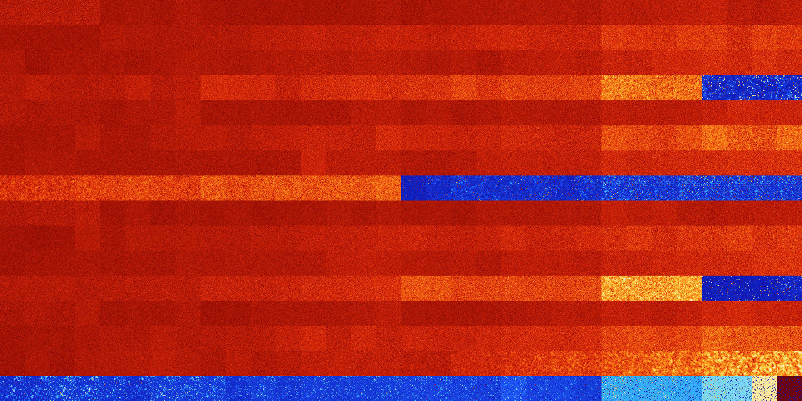

# B02347 (80384-80895)

<details>
    <summary>Initial Grid</summary>
    
</details>


<details>
    <summary>Initial Grid RLE</summary>

```
#C Exported from GoGoL (https://github.com/marrow16/gogol)
#C Wrap mode: Toroidal
#C Boundary mode: Dead
#C Step: 0
x = 100, y = 100, rule = B02347/S
5bo5bo4bo2bo46bo9bo10bo$10bo4bo11bo34bo13bo5bo$b2o6bo55b2o13bo8bobo$73b
o25bo$56bo8b2o19bobo$2bo7bo9bo4bo9bo20bo12bo21bo$20bo2bo46bo11bo7bo$bo
14b2o23bob2obo19bo17bo7bo$17bo38bo39bo$29b2o7bo15bo7bo12bo18bo$48bo7bo
3bo3bo2bo5bo7bo12bo$7bo17bo19bo35bo$45bo9bo4bo4bo4bo11b2o3bo6bobo$22bo
33bo24bo4bo$6bo26bo3bo33bo9bo9bo$31bo37bo7b2o$74bo16bo6bo$bo15bo37bobo
2bo7bo$38bo16bo26bobo9bo$2bo23bobo7bo18bo17b2o18bobo$5bo5bobo7bo55bo$
16bo39bo31bo4bo$4bo19bo4bo13bo31bo$17bo27bo40bo$11bo31bo3bo44bo5bo$100b
$3bo10bo13bo51bo18bo$7bo6bo48b2o4bo15bo$88bo6bo$6bo40bo4bo42bo$6bobo72b
o9b2o$54bo27bo13bo$5bo10bo61bo15bo$5bo10bo4bo8bo5bobo$bo66bo23bo$43bo
32bo6bo3bo$21bo24bo5bo9bo23bo7bo$26bo8bo7bo10bo5bo$13bo6bo53bo19bo$40bo
12bo6bo19bo$20bo18bo7bo46bo$bo47bo18bo12bo5bo9bobo$21bo21bo23bo$24bo11b
o2bobo23bo13bo$4bobo4bo23bo36bo4bo$8bo24bo4bo3bo3bo8bo3bo5bo$15bo64bo
11bo$4bo19bo11bo20bo6bo21bo2bo8bo$2b2o34bo6bobo8bo4bo2bo23bo$84bo$30bo
13bo15bo$2bo5bo16bo25bo9bo5bo9bo3b2o4bo$22bo6bo19bo8bo28bo6bo2bo$24bo
30bo31bo9bo$12bo8bo10bo4bo21bo14bo8bo11bo$39bo18bo7bo12bo$4bo27bo17bo2b
o16bo3bo22bo$50bo46bo$7bo5bo23bo13bo12bo28bo$28bo4bo22bo2bo25bo6bo$bo
48bo7bo$7bo22bo23bo23bo10bo$49bo9bo8bo3bo9bo$33bo2bo60b2o$o41bo31bobo$b
o70bo23bo$26bo21bo8bo33bo$7bo43bo34bo$12bo6bo4bo15bo7bo23bo$3bo7bo64bo
8bo2bo$23bo6bo13bo$8bo40b2o19bo4bo20b2o$23bo24bo28bo$45bo37bo3bo$32bo
13bo4bo9bo8bo$26bo4bo9bobo12bo30bo5bo$4bo2bo26bo2bo17bo11bo12bo14bo$7b
2o31bo7bo$12bo20bo18bo3bo5bo5bo$10bo17bo31bo18bo19bo$3bo7bo12bo6bo26bo
20bo10bo$23bo15bo8bo2bo13bo4bo4bo$27bo40bo11bo13bo$7bo11bo12bo8bo47bo$
25bo13bo35bo4bo$10bo14bo3bo9bo19bo2bo$8bo26bo17bo2bo9bo22bo$27bobo2bo
17bo23bo5b3o7bo$2bobo8bo64bo8bo9bo$24bo4bo52bo$14bo50bo$47bo7bo23bo$18b
o27bo7bo12bo29bo$14bo42bo2bo$75bo15bo$o36bo4bo10bo34bo9bo$13bo38bo20bo
3bo19bobo$15bo30bo7bo4bo14bo13bo$2bo9bo45bo14bo$bo16bo14bo39bo!
```
</details>
<details>
    <summary>Thumbnail</summary>

</details>
<table>
<tr>
    <td><a href="./80384%20S%20Heat%20Map%20Activity.png"></a><br>S (80384)<br>G>1000</td>    <td><a href="./80385%20S0%20Heat%20Map%20Activity.png"></a><br>S0 (80385)<br>G>1000</td>    <td><a href="./80386%20S1%20Heat%20Map%20Activity.png"></a><br>S1 (80386)<br>G>1000</td>    <td><a href="./80387%20S01%20Heat%20Map%20Activity.png"></a><br>S01 (80387)<br>G>1000</td>    <td><a href="./80388%20S2%20Heat%20Map%20Activity.png"></a><br>S2 (80388)<br>G>1000</td>    <td><a href="./80389%20S02%20Heat%20Map%20Activity.png"></a><br>S02 (80389)<br>G>1000</td>    <td><a href="./80390%20S12%20Heat%20Map%20Activity.png"></a><br>S12 (80390)<br>G>1000</td>    <td><a href="./80391%20S012%20Heat%20Map%20Activity.png"></a><br>S012 (80391)<br>G>1000</td>    <td><a href="./80392%20S3%20Heat%20Map%20Activity.png"></a><br>S3 (80392)<br>G>1000</td>    <td><a href="./80393%20S03%20Heat%20Map%20Activity.png"></a><br>S03 (80393)<br>G>1000</td>    <td><a href="./80394%20S13%20Heat%20Map%20Activity.png"></a><br>S13 (80394)<br>G>1000</td>    <td><a href="./80395%20S013%20Heat%20Map%20Activity.png"></a><br>S013 (80395)<br>G>1000</td>    <td><a href="./80396%20S23%20Heat%20Map%20Activity.png"></a><br>S23 (80396)<br>G>1000</td>    <td><a href="./80397%20S023%20Heat%20Map%20Activity.png"></a><br>S023 (80397)<br>G>1000</td>    <td><a href="./80398%20S123%20Heat%20Map%20Activity.png"></a><br>S123 (80398)<br>G>1000</td>    <td><a href="./80399%20S0123%20Heat%20Map%20Activity.png"></a><br>S0123 (80399)<br>G>1000</td>    <td><a href="./80400%20S4%20Heat%20Map%20Activity.png"></a><br>S4 (80400)<br>G>1000</td>    <td><a href="./80401%20S04%20Heat%20Map%20Activity.png"></a><br>S04 (80401)<br>G>1000</td>    <td><a href="./80402%20S14%20Heat%20Map%20Activity.png"></a><br>S14 (80402)<br>G>1000</td>    <td><a href="./80403%20S014%20Heat%20Map%20Activity.png"></a><br>S014 (80403)<br>G>1000</td>    <td><a href="./80404%20S24%20Heat%20Map%20Activity.png"></a><br>S24 (80404)<br>G>1000</td>    <td><a href="./80405%20S024%20Heat%20Map%20Activity.png"></a><br>S024 (80405)<br>G>1000</td>    <td><a href="./80406%20S124%20Heat%20Map%20Activity.png"></a><br>S124 (80406)<br>G>1000</td>    <td><a href="./80407%20S0124%20Heat%20Map%20Activity.png"></a><br>S0124 (80407)<br>G>1000</td>    <td><a href="./80408%20S34%20Heat%20Map%20Activity.png"></a><br>S34 (80408)<br>G>1000</td>    <td><a href="./80409%20S034%20Heat%20Map%20Activity.png"></a><br>S034 (80409)<br>G>1000</td>    <td><a href="./80410%20S134%20Heat%20Map%20Activity.png"></a><br>S134 (80410)<br>G>1000</td>    <td><a href="./80411%20S0134%20Heat%20Map%20Activity.png"></a><br>S0134 (80411)<br>G>1000</td>    <td><a href="./80412%20S234%20Heat%20Map%20Activity.png"></a><br>S234 (80412)<br>G>1000</td>    <td><a href="./80413%20S0234%20Heat%20Map%20Activity.png"></a><br>S0234 (80413)<br>G>1000</td>    <td><a href="./80414%20S1234%20Heat%20Map%20Activity.png"></a><br>S1234 (80414)<br>G>1000</td>    <td><a href="./80415%20S01234%20Heat%20Map%20Activity.png"></a><br>S01234 (80415)<br>G>1000</td></tr>
<tr>
    <td><a href="./80416%20S5%20Heat%20Map%20Activity.png"></a><br>S5 (80416)<br>G>1000</td>    <td><a href="./80417%20S05%20Heat%20Map%20Activity.png"></a><br>S05 (80417)<br>G>1000</td>    <td><a href="./80418%20S15%20Heat%20Map%20Activity.png"></a><br>S15 (80418)<br>G>1000</td>    <td><a href="./80419%20S015%20Heat%20Map%20Activity.png"></a><br>S015 (80419)<br>G>1000</td>    <td><a href="./80420%20S25%20Heat%20Map%20Activity.png"></a><br>S25 (80420)<br>G>1000</td>    <td><a href="./80421%20S025%20Heat%20Map%20Activity.png"></a><br>S025 (80421)<br>G>1000</td>    <td><a href="./80422%20S125%20Heat%20Map%20Activity.png"></a><br>S125 (80422)<br>G>1000</td>    <td><a href="./80423%20S0125%20Heat%20Map%20Activity.png"></a><br>S0125 (80423)<br>G>1000</td>    <td><a href="./80424%20S35%20Heat%20Map%20Activity.png"></a><br>S35 (80424)<br>G>1000</td>    <td><a href="./80425%20S035%20Heat%20Map%20Activity.png"></a><br>S035 (80425)<br>G>1000</td>    <td><a href="./80426%20S135%20Heat%20Map%20Activity.png"></a><br>S135 (80426)<br>G>1000</td>    <td><a href="./80427%20S0135%20Heat%20Map%20Activity.png"></a><br>S0135 (80427)<br>G>1000</td>    <td><a href="./80428%20S235%20Heat%20Map%20Activity.png"></a><br>S235 (80428)<br>G>1000</td>    <td><a href="./80429%20S0235%20Heat%20Map%20Activity.png"></a><br>S0235 (80429)<br>G>1000</td>    <td><a href="./80430%20S1235%20Heat%20Map%20Activity.png"></a><br>S1235 (80430)<br>G>1000</td>    <td><a href="./80431%20S01235%20Heat%20Map%20Activity.png"></a><br>S01235 (80431)<br>G>1000</td>    <td><a href="./80432%20S45%20Heat%20Map%20Activity.png"></a><br>S45 (80432)<br>G>1000</td>    <td><a href="./80433%20S045%20Heat%20Map%20Activity.png"></a><br>S045 (80433)<br>G>1000</td>    <td><a href="./80434%20S145%20Heat%20Map%20Activity.png"></a><br>S145 (80434)<br>G>1000</td>    <td><a href="./80435%20S0145%20Heat%20Map%20Activity.png"></a><br>S0145 (80435)<br>G>1000</td>    <td><a href="./80436%20S245%20Heat%20Map%20Activity.png"></a><br>S245 (80436)<br>G>1000</td>    <td><a href="./80437%20S0245%20Heat%20Map%20Activity.png"></a><br>S0245 (80437)<br>G>1000</td>    <td><a href="./80438%20S1245%20Heat%20Map%20Activity.png"></a><br>S1245 (80438)<br>G>1000</td>    <td><a href="./80439%20S01245%20Heat%20Map%20Activity.png"></a><br>S01245 (80439)<br>G>1000</td>    <td><a href="./80440%20S345%20Heat%20Map%20Activity.png"></a><br>S345 (80440)<br>G>1000</td>    <td><a href="./80441%20S0345%20Heat%20Map%20Activity.png"></a><br>S0345 (80441)<br>G>1000</td>    <td><a href="./80442%20S1345%20Heat%20Map%20Activity.png"></a><br>S1345 (80442)<br>G>1000</td>    <td><a href="./80443%20S01345%20Heat%20Map%20Activity.png"></a><br>S01345 (80443)<br>G>1000</td>    <td><a href="./80444%20S2345%20Heat%20Map%20Activity.png"></a><br>S2345 (80444)<br>G>1000</td>    <td><a href="./80445%20S02345%20Heat%20Map%20Activity.png"></a><br>S02345 (80445)<br>G>1000</td>    <td><a href="./80446%20S12345%20Heat%20Map%20Activity.png"></a><br>S12345 (80446)<br>G>1000</td>    <td><a href="./80447%20S012345%20Heat%20Map%20Activity.png"></a><br>S012345 (80447)<br>G>1000</td></tr>
<tr>
    <td><a href="./80448%20S6%20Heat%20Map%20Activity.png"></a><br>S6 (80448)<br>G>1000</td>    <td><a href="./80449%20S06%20Heat%20Map%20Activity.png"></a><br>S06 (80449)<br>G>1000</td>    <td><a href="./80450%20S16%20Heat%20Map%20Activity.png"></a><br>S16 (80450)<br>G>1000</td>    <td><a href="./80451%20S016%20Heat%20Map%20Activity.png"></a><br>S016 (80451)<br>G>1000</td>    <td><a href="./80452%20S26%20Heat%20Map%20Activity.png"></a><br>S26 (80452)<br>G>1000</td>    <td><a href="./80453%20S026%20Heat%20Map%20Activity.png"></a><br>S026 (80453)<br>G>1000</td>    <td><a href="./80454%20S126%20Heat%20Map%20Activity.png"></a><br>S126 (80454)<br>G>1000</td>    <td><a href="./80455%20S0126%20Heat%20Map%20Activity.png"></a><br>S0126 (80455)<br>G>1000</td>    <td><a href="./80456%20S36%20Heat%20Map%20Activity.png"></a><br>S36 (80456)<br>G>1000</td>    <td><a href="./80457%20S036%20Heat%20Map%20Activity.png"></a><br>S036 (80457)<br>G>1000</td>    <td><a href="./80458%20S136%20Heat%20Map%20Activity.png"></a><br>S136 (80458)<br>G>1000</td>    <td><a href="./80459%20S0136%20Heat%20Map%20Activity.png"></a><br>S0136 (80459)<br>G>1000</td>    <td><a href="./80460%20S236%20Heat%20Map%20Activity.png"></a><br>S236 (80460)<br>G>1000</td>    <td><a href="./80461%20S0236%20Heat%20Map%20Activity.png"></a><br>S0236 (80461)<br>G>1000</td>    <td><a href="./80462%20S1236%20Heat%20Map%20Activity.png"></a><br>S1236 (80462)<br>G>1000</td>    <td><a href="./80463%20S01236%20Heat%20Map%20Activity.png"></a><br>S01236 (80463)<br>G>1000</td>    <td><a href="./80464%20S46%20Heat%20Map%20Activity.png"></a><br>S46 (80464)<br>G>1000</td>    <td><a href="./80465%20S046%20Heat%20Map%20Activity.png"></a><br>S046 (80465)<br>G>1000</td>    <td><a href="./80466%20S146%20Heat%20Map%20Activity.png"></a><br>S146 (80466)<br>G>1000</td>    <td><a href="./80467%20S0146%20Heat%20Map%20Activity.png"></a><br>S0146 (80467)<br>G>1000</td>    <td><a href="./80468%20S246%20Heat%20Map%20Activity.png"></a><br>S246 (80468)<br>G>1000</td>    <td><a href="./80469%20S0246%20Heat%20Map%20Activity.png"></a><br>S0246 (80469)<br>G>1000</td>    <td><a href="./80470%20S1246%20Heat%20Map%20Activity.png"></a><br>S1246 (80470)<br>G>1000</td>    <td><a href="./80471%20S01246%20Heat%20Map%20Activity.png"></a><br>S01246 (80471)<br>G>1000</td>    <td><a href="./80472%20S346%20Heat%20Map%20Activity.png"></a><br>S346 (80472)<br>G>1000</td>    <td><a href="./80473%20S0346%20Heat%20Map%20Activity.png"></a><br>S0346 (80473)<br>G>1000</td>    <td><a href="./80474%20S1346%20Heat%20Map%20Activity.png"></a><br>S1346 (80474)<br>G>1000</td>    <td><a href="./80475%20S01346%20Heat%20Map%20Activity.png"></a><br>S01346 (80475)<br>G>1000</td>    <td><a href="./80476%20S2346%20Heat%20Map%20Activity.png"></a><br>S2346 (80476)<br>G>1000</td>    <td><a href="./80477%20S02346%20Heat%20Map%20Activity.png"></a><br>S02346 (80477)<br>G>1000</td>    <td><a href="./80478%20S12346%20Heat%20Map%20Activity.png"></a><br>S12346 (80478)<br>G>1000</td>    <td><a href="./80479%20S012346%20Heat%20Map%20Activity.png"></a><br>S012346 (80479)<br>G>1000</td></tr>
<tr>
    <td><a href="./80480%20S56%20Heat%20Map%20Activity.png"></a><br>S56 (80480)<br>G>1000</td>    <td><a href="./80481%20S056%20Heat%20Map%20Activity.png"></a><br>S056 (80481)<br>G>1000</td>    <td><a href="./80482%20S156%20Heat%20Map%20Activity.png"></a><br>S156 (80482)<br>G>1000</td>    <td><a href="./80483%20S0156%20Heat%20Map%20Activity.png"></a><br>S0156 (80483)<br>G>1000</td>    <td><a href="./80484%20S256%20Heat%20Map%20Activity.png"></a><br>S256 (80484)<br>G>1000</td>    <td><a href="./80485%20S0256%20Heat%20Map%20Activity.png"></a><br>S0256 (80485)<br>G>1000</td>    <td><a href="./80486%20S1256%20Heat%20Map%20Activity.png"></a><br>S1256 (80486)<br>G>1000</td>    <td><a href="./80487%20S01256%20Heat%20Map%20Activity.png"></a><br>S01256 (80487)<br>G>1000</td>    <td><a href="./80488%20S356%20Heat%20Map%20Activity.png"></a><br>S356 (80488)<br>G>1000</td>    <td><a href="./80489%20S0356%20Heat%20Map%20Activity.png"></a><br>S0356 (80489)<br>G>1000</td>    <td><a href="./80490%20S1356%20Heat%20Map%20Activity.png"></a><br>S1356 (80490)<br>G>1000</td>    <td><a href="./80491%20S01356%20Heat%20Map%20Activity.png"></a><br>S01356 (80491)<br>G>1000</td>    <td><a href="./80492%20S2356%20Heat%20Map%20Activity.png"></a><br>S2356 (80492)<br>G>1000</td>    <td><a href="./80493%20S02356%20Heat%20Map%20Activity.png"></a><br>S02356 (80493)<br>G>1000</td>    <td><a href="./80494%20S12356%20Heat%20Map%20Activity.png"></a><br>S12356 (80494)<br>G>1000</td>    <td><a href="./80495%20S012356%20Heat%20Map%20Activity.png"></a><br>S012356 (80495)<br>G>1000</td>    <td><a href="./80496%20S456%20Heat%20Map%20Activity.png"></a><br>S456 (80496)<br>G>1000</td>    <td><a href="./80497%20S0456%20Heat%20Map%20Activity.png"></a><br>S0456 (80497)<br>G>1000</td>    <td><a href="./80498%20S1456%20Heat%20Map%20Activity.png"></a><br>S1456 (80498)<br>G>1000</td>    <td><a href="./80499%20S01456%20Heat%20Map%20Activity.png"></a><br>S01456 (80499)<br>G>1000</td>    <td><a href="./80500%20S2456%20Heat%20Map%20Activity.png"></a><br>S2456 (80500)<br>G>1000</td>    <td><a href="./80501%20S02456%20Heat%20Map%20Activity.png"></a><br>S02456 (80501)<br>G>1000</td>    <td><a href="./80502%20S12456%20Heat%20Map%20Activity.png"></a><br>S12456 (80502)<br>G>1000</td>    <td><a href="./80503%20S012456%20Heat%20Map%20Activity.png"></a><br>S012456 (80503)<br>G>1000</td>    <td><a href="./80504%20S3456%20Heat%20Map%20Activity.png"></a><br>S3456 (80504)<br>G>1000</td>    <td><a href="./80505%20S03456%20Heat%20Map%20Activity.png"></a><br>S03456 (80505)<br>G>1000</td>    <td><a href="./80506%20S13456%20Heat%20Map%20Activity.png"></a><br>S13456 (80506)<br>G>1000</td>    <td><a href="./80507%20S013456%20Heat%20Map%20Activity.png"></a><br>S013456 (80507)<br>G>1000</td>    <td><a href="./80508%20S23456%20Heat%20Map%20Activity.png"></a><br>S23456 (80508)<br>G>1000</td>    <td><a href="./80509%20S023456%20Heat%20Map%20Activity.png"></a><br>S023456 (80509)<br>G>1000</td>    <td><a href="./80510%20S123456%20Heat%20Map%20Activity.png"></a><br>S123456 (80510)<br>G>1000</td>    <td><a href="./80511%20S0123456%20Heat%20Map%20Activity.png"></a><br>S0123456 (80511)<br>R@669,p120</td></tr>
<tr>
    <td><a href="./80512%20S7%20Heat%20Map%20Activity.png"></a><br>S7 (80512)<br>G>1000</td>    <td><a href="./80513%20S07%20Heat%20Map%20Activity.png"></a><br>S07 (80513)<br>G>1000</td>    <td><a href="./80514%20S17%20Heat%20Map%20Activity.png"></a><br>S17 (80514)<br>G>1000</td>    <td><a href="./80515%20S017%20Heat%20Map%20Activity.png"></a><br>S017 (80515)<br>G>1000</td>    <td><a href="./80516%20S27%20Heat%20Map%20Activity.png"></a><br>S27 (80516)<br>G>1000</td>    <td><a href="./80517%20S027%20Heat%20Map%20Activity.png"></a><br>S027 (80517)<br>G>1000</td>    <td><a href="./80518%20S127%20Heat%20Map%20Activity.png"></a><br>S127 (80518)<br>G>1000</td>    <td><a href="./80519%20S0127%20Heat%20Map%20Activity.png"></a><br>S0127 (80519)<br>G>1000</td>    <td><a href="./80520%20S37%20Heat%20Map%20Activity.png"></a><br>S37 (80520)<br>G>1000</td>    <td><a href="./80521%20S037%20Heat%20Map%20Activity.png"></a><br>S037 (80521)<br>G>1000</td>    <td><a href="./80522%20S137%20Heat%20Map%20Activity.png"></a><br>S137 (80522)<br>G>1000</td>    <td><a href="./80523%20S0137%20Heat%20Map%20Activity.png"></a><br>S0137 (80523)<br>G>1000</td>    <td><a href="./80524%20S237%20Heat%20Map%20Activity.png"></a><br>S237 (80524)<br>G>1000</td>    <td><a href="./80525%20S0237%20Heat%20Map%20Activity.png"></a><br>S0237 (80525)<br>G>1000</td>    <td><a href="./80526%20S1237%20Heat%20Map%20Activity.png"></a><br>S1237 (80526)<br>G>1000</td>    <td><a href="./80527%20S01237%20Heat%20Map%20Activity.png"></a><br>S01237 (80527)<br>G>1000</td>    <td><a href="./80528%20S47%20Heat%20Map%20Activity.png"></a><br>S47 (80528)<br>G>1000</td>    <td><a href="./80529%20S047%20Heat%20Map%20Activity.png"></a><br>S047 (80529)<br>G>1000</td>    <td><a href="./80530%20S147%20Heat%20Map%20Activity.png"></a><br>S147 (80530)<br>G>1000</td>    <td><a href="./80531%20S0147%20Heat%20Map%20Activity.png"></a><br>S0147 (80531)<br>G>1000</td>    <td><a href="./80532%20S247%20Heat%20Map%20Activity.png"></a><br>S247 (80532)<br>G>1000</td>    <td><a href="./80533%20S0247%20Heat%20Map%20Activity.png"></a><br>S0247 (80533)<br>G>1000</td>    <td><a href="./80534%20S1247%20Heat%20Map%20Activity.png"></a><br>S1247 (80534)<br>G>1000</td>    <td><a href="./80535%20S01247%20Heat%20Map%20Activity.png"></a><br>S01247 (80535)<br>G>1000</td>    <td><a href="./80536%20S347%20Heat%20Map%20Activity.png"></a><br>S347 (80536)<br>G>1000</td>    <td><a href="./80537%20S0347%20Heat%20Map%20Activity.png"></a><br>S0347 (80537)<br>G>1000</td>    <td><a href="./80538%20S1347%20Heat%20Map%20Activity.png"></a><br>S1347 (80538)<br>G>1000</td>    <td><a href="./80539%20S01347%20Heat%20Map%20Activity.png"></a><br>S01347 (80539)<br>G>1000</td>    <td><a href="./80540%20S2347%20Heat%20Map%20Activity.png"></a><br>S2347 (80540)<br>G>1000</td>    <td><a href="./80541%20S02347%20Heat%20Map%20Activity.png"></a><br>S02347 (80541)<br>G>1000</td>    <td><a href="./80542%20S12347%20Heat%20Map%20Activity.png"></a><br>S12347 (80542)<br>G>1000</td>    <td><a href="./80543%20S012347%20Heat%20Map%20Activity.png"></a><br>S012347 (80543)<br>G>1000</td></tr>
<tr>
    <td><a href="./80544%20S57%20Heat%20Map%20Activity.png"></a><br>S57 (80544)<br>G>1000</td>    <td><a href="./80545%20S057%20Heat%20Map%20Activity.png"></a><br>S057 (80545)<br>G>1000</td>    <td><a href="./80546%20S157%20Heat%20Map%20Activity.png"></a><br>S157 (80546)<br>G>1000</td>    <td><a href="./80547%20S0157%20Heat%20Map%20Activity.png"></a><br>S0157 (80547)<br>G>1000</td>    <td><a href="./80548%20S257%20Heat%20Map%20Activity.png"></a><br>S257 (80548)<br>G>1000</td>    <td><a href="./80549%20S0257%20Heat%20Map%20Activity.png"></a><br>S0257 (80549)<br>G>1000</td>    <td><a href="./80550%20S1257%20Heat%20Map%20Activity.png"></a><br>S1257 (80550)<br>G>1000</td>    <td><a href="./80551%20S01257%20Heat%20Map%20Activity.png"></a><br>S01257 (80551)<br>G>1000</td>    <td><a href="./80552%20S357%20Heat%20Map%20Activity.png"></a><br>S357 (80552)<br>G>1000</td>    <td><a href="./80553%20S0357%20Heat%20Map%20Activity.png"></a><br>S0357 (80553)<br>G>1000</td>    <td><a href="./80554%20S1357%20Heat%20Map%20Activity.png"></a><br>S1357 (80554)<br>G>1000</td>    <td><a href="./80555%20S01357%20Heat%20Map%20Activity.png"></a><br>S01357 (80555)<br>G>1000</td>    <td><a href="./80556%20S2357%20Heat%20Map%20Activity.png"></a><br>S2357 (80556)<br>G>1000</td>    <td><a href="./80557%20S02357%20Heat%20Map%20Activity.png"></a><br>S02357 (80557)<br>G>1000</td>    <td><a href="./80558%20S12357%20Heat%20Map%20Activity.png"></a><br>S12357 (80558)<br>G>1000</td>    <td><a href="./80559%20S012357%20Heat%20Map%20Activity.png"></a><br>S012357 (80559)<br>G>1000</td>    <td><a href="./80560%20S457%20Heat%20Map%20Activity.png"></a><br>S457 (80560)<br>G>1000</td>    <td><a href="./80561%20S0457%20Heat%20Map%20Activity.png"></a><br>S0457 (80561)<br>G>1000</td>    <td><a href="./80562%20S1457%20Heat%20Map%20Activity.png"></a><br>S1457 (80562)<br>G>1000</td>    <td><a href="./80563%20S01457%20Heat%20Map%20Activity.png"></a><br>S01457 (80563)<br>G>1000</td>    <td><a href="./80564%20S2457%20Heat%20Map%20Activity.png"></a><br>S2457 (80564)<br>G>1000</td>    <td><a href="./80565%20S02457%20Heat%20Map%20Activity.png"></a><br>S02457 (80565)<br>G>1000</td>    <td><a href="./80566%20S12457%20Heat%20Map%20Activity.png"></a><br>S12457 (80566)<br>G>1000</td>    <td><a href="./80567%20S012457%20Heat%20Map%20Activity.png"></a><br>S012457 (80567)<br>G>1000</td>    <td><a href="./80568%20S3457%20Heat%20Map%20Activity.png"></a><br>S3457 (80568)<br>G>1000</td>    <td><a href="./80569%20S03457%20Heat%20Map%20Activity.png"></a><br>S03457 (80569)<br>G>1000</td>    <td><a href="./80570%20S13457%20Heat%20Map%20Activity.png"></a><br>S13457 (80570)<br>G>1000</td>    <td><a href="./80571%20S013457%20Heat%20Map%20Activity.png"></a><br>S013457 (80571)<br>G>1000</td>    <td><a href="./80572%20S23457%20Heat%20Map%20Activity.png"></a><br>S23457 (80572)<br>G>1000</td>    <td><a href="./80573%20S023457%20Heat%20Map%20Activity.png"></a><br>S023457 (80573)<br>G>1000</td>    <td><a href="./80574%20S123457%20Heat%20Map%20Activity.png"></a><br>S123457 (80574)<br>G>1000</td>    <td><a href="./80575%20S0123457%20Heat%20Map%20Activity.png"></a><br>S0123457 (80575)<br>G>1000</td></tr>
<tr>
    <td><a href="./80576%20S67%20Heat%20Map%20Activity.png"></a><br>S67 (80576)<br>G>1000</td>    <td><a href="./80577%20S067%20Heat%20Map%20Activity.png"></a><br>S067 (80577)<br>G>1000</td>    <td><a href="./80578%20S167%20Heat%20Map%20Activity.png"></a><br>S167 (80578)<br>G>1000</td>    <td><a href="./80579%20S0167%20Heat%20Map%20Activity.png"></a><br>S0167 (80579)<br>G>1000</td>    <td><a href="./80580%20S267%20Heat%20Map%20Activity.png"></a><br>S267 (80580)<br>G>1000</td>    <td><a href="./80581%20S0267%20Heat%20Map%20Activity.png"></a><br>S0267 (80581)<br>G>1000</td>    <td><a href="./80582%20S1267%20Heat%20Map%20Activity.png"></a><br>S1267 (80582)<br>G>1000</td>    <td><a href="./80583%20S01267%20Heat%20Map%20Activity.png"></a><br>S01267 (80583)<br>G>1000</td>    <td><a href="./80584%20S367%20Heat%20Map%20Activity.png"></a><br>S367 (80584)<br>G>1000</td>    <td><a href="./80585%20S0367%20Heat%20Map%20Activity.png"></a><br>S0367 (80585)<br>G>1000</td>    <td><a href="./80586%20S1367%20Heat%20Map%20Activity.png"></a><br>S1367 (80586)<br>G>1000</td>    <td><a href="./80587%20S01367%20Heat%20Map%20Activity.png"></a><br>S01367 (80587)<br>G>1000</td>    <td><a href="./80588%20S2367%20Heat%20Map%20Activity.png"></a><br>S2367 (80588)<br>G>1000</td>    <td><a href="./80589%20S02367%20Heat%20Map%20Activity.png"></a><br>S02367 (80589)<br>G>1000</td>    <td><a href="./80590%20S12367%20Heat%20Map%20Activity.png"></a><br>S12367 (80590)<br>G>1000</td>    <td><a href="./80591%20S012367%20Heat%20Map%20Activity.png"></a><br>S012367 (80591)<br>G>1000</td>    <td><a href="./80592%20S467%20Heat%20Map%20Activity.png"></a><br>S467 (80592)<br>G>1000</td>    <td><a href="./80593%20S0467%20Heat%20Map%20Activity.png"></a><br>S0467 (80593)<br>G>1000</td>    <td><a href="./80594%20S1467%20Heat%20Map%20Activity.png"></a><br>S1467 (80594)<br>G>1000</td>    <td><a href="./80595%20S01467%20Heat%20Map%20Activity.png"></a><br>S01467 (80595)<br>G>1000</td>    <td><a href="./80596%20S2467%20Heat%20Map%20Activity.png"></a><br>S2467 (80596)<br>G>1000</td>    <td><a href="./80597%20S02467%20Heat%20Map%20Activity.png"></a><br>S02467 (80597)<br>G>1000</td>    <td><a href="./80598%20S12467%20Heat%20Map%20Activity.png"></a><br>S12467 (80598)<br>G>1000</td>    <td><a href="./80599%20S012467%20Heat%20Map%20Activity.png"></a><br>S012467 (80599)<br>G>1000</td>    <td><a href="./80600%20S3467%20Heat%20Map%20Activity.png"></a><br>S3467 (80600)<br>G>1000</td>    <td><a href="./80601%20S03467%20Heat%20Map%20Activity.png"></a><br>S03467 (80601)<br>G>1000</td>    <td><a href="./80602%20S13467%20Heat%20Map%20Activity.png"></a><br>S13467 (80602)<br>G>1000</td>    <td><a href="./80603%20S013467%20Heat%20Map%20Activity.png"></a><br>S013467 (80603)<br>G>1000</td>    <td><a href="./80604%20S23467%20Heat%20Map%20Activity.png"></a><br>S23467 (80604)<br>G>1000</td>    <td><a href="./80605%20S023467%20Heat%20Map%20Activity.png"></a><br>S023467 (80605)<br>G>1000</td>    <td><a href="./80606%20S123467%20Heat%20Map%20Activity.png"></a><br>S123467 (80606)<br>G>1000</td>    <td><a href="./80607%20S0123467%20Heat%20Map%20Activity.png"></a><br>S0123467 (80607)<br>G>1000</td></tr>
<tr>
    <td><a href="./80608%20S567%20Heat%20Map%20Activity.png"></a><br>S567 (80608)<br>G>1000</td>    <td><a href="./80609%20S0567%20Heat%20Map%20Activity.png"></a><br>S0567 (80609)<br>G>1000</td>    <td><a href="./80610%20S1567%20Heat%20Map%20Activity.png"></a><br>S1567 (80610)<br>G>1000</td>    <td><a href="./80611%20S01567%20Heat%20Map%20Activity.png"></a><br>S01567 (80611)<br>G>1000</td>    <td><a href="./80612%20S2567%20Heat%20Map%20Activity.png"></a><br>S2567 (80612)<br>G>1000</td>    <td><a href="./80613%20S02567%20Heat%20Map%20Activity.png"></a><br>S02567 (80613)<br>G>1000</td>    <td><a href="./80614%20S12567%20Heat%20Map%20Activity.png"></a><br>S12567 (80614)<br>G>1000</td>    <td><a href="./80615%20S012567%20Heat%20Map%20Activity.png"></a><br>S012567 (80615)<br>G>1000</td>    <td><a href="./80616%20S3567%20Heat%20Map%20Activity.png"></a><br>S3567 (80616)<br>G>1000</td>    <td><a href="./80617%20S03567%20Heat%20Map%20Activity.png"></a><br>S03567 (80617)<br>G>1000</td>    <td><a href="./80618%20S13567%20Heat%20Map%20Activity.png"></a><br>S13567 (80618)<br>G>1000</td>    <td><a href="./80619%20S013567%20Heat%20Map%20Activity.png"></a><br>S013567 (80619)<br>G>1000</td>    <td><a href="./80620%20S23567%20Heat%20Map%20Activity.png"></a><br>S23567 (80620)<br>G>1000</td>    <td><a href="./80621%20S023567%20Heat%20Map%20Activity.png"></a><br>S023567 (80621)<br>G>1000</td>    <td><a href="./80622%20S123567%20Heat%20Map%20Activity.png"></a><br>S123567 (80622)<br>G>1000</td>    <td><a href="./80623%20S0123567%20Heat%20Map%20Activity.png"></a><br>S0123567 (80623)<br>G>1000</td>    <td><a href="./80624%20S4567%20Heat%20Map%20Activity.png"></a><br>S4567 (80624)<br>R@217,p156</td>    <td><a href="./80625%20S04567%20Heat%20Map%20Activity.png"></a><br>S04567 (80625)<br>R@94,p6</td>    <td><a href="./80626%20S14567%20Heat%20Map%20Activity.png"></a><br>S14567 (80626)<br>R@69,p6</td>    <td><a href="./80627%20S014567%20Heat%20Map%20Activity.png"></a><br>S014567 (80627)<br>R@64,p12</td>    <td><a href="./80628%20S24567%20Heat%20Map%20Activity.png"></a><br>S24567 (80628)<br>R@69,p12</td>    <td><a href="./80629%20S024567%20Heat%20Map%20Activity.png"></a><br>S024567 (80629)<br>R@59,p6</td>    <td><a href="./80630%20S124567%20Heat%20Map%20Activity.png"></a><br>S124567 (80630)<br>R@88,p12</td>    <td><a href="./80631%20S0124567%20Heat%20Map%20Activity.png"></a><br>S0124567 (80631)<br>R@60,p12</td>    <td><a href="./80632%20S34567%20Heat%20Map%20Activity.png"></a><br>S34567 (80632)<br>R@26,p6</td>    <td><a href="./80633%20S034567%20Heat%20Map%20Activity.png"></a><br>S034567 (80633)<br>R@29,p6</td>    <td><a href="./80634%20S134567%20Heat%20Map%20Activity.png"></a><br>S134567 (80634)<br>R@31,p6</td>    <td><a href="./80635%20S0134567%20Heat%20Map%20Activity.png"></a><br>S0134567 (80635)<br>R@26,p6</td>    <td><a href="./80636%20S234567%20Heat%20Map%20Activity.png"></a><br>S234567 (80636)<br>R@25,p6</td>    <td><a href="./80637%20S0234567%20Heat%20Map%20Activity.png"></a><br>S0234567 (80637)<br>R@24,p6</td>    <td><a href="./80638%20S1234567%20Heat%20Map%20Activity.png"></a><br>S1234567 (80638)<br>R@25,p6</td>    <td><a href="./80639%20S01234567%20Heat%20Map%20Activity.png"></a><br>S01234567 (80639)<br>R@25,p6</td></tr>
<tr>
    <td><a href="./80640%20S8%20Heat%20Map%20Activity.png"></a><br>S8 (80640)<br>G>1000</td>    <td><a href="./80641%20S08%20Heat%20Map%20Activity.png"></a><br>S08 (80641)<br>G>1000</td>    <td><a href="./80642%20S18%20Heat%20Map%20Activity.png"></a><br>S18 (80642)<br>G>1000</td>    <td><a href="./80643%20S018%20Heat%20Map%20Activity.png"></a><br>S018 (80643)<br>G>1000</td>    <td><a href="./80644%20S28%20Heat%20Map%20Activity.png"></a><br>S28 (80644)<br>G>1000</td>    <td><a href="./80645%20S028%20Heat%20Map%20Activity.png"></a><br>S028 (80645)<br>G>1000</td>    <td><a href="./80646%20S128%20Heat%20Map%20Activity.png"></a><br>S128 (80646)<br>G>1000</td>    <td><a href="./80647%20S0128%20Heat%20Map%20Activity.png"></a><br>S0128 (80647)<br>G>1000</td>    <td><a href="./80648%20S38%20Heat%20Map%20Activity.png"></a><br>S38 (80648)<br>G>1000</td>    <td><a href="./80649%20S038%20Heat%20Map%20Activity.png"></a><br>S038 (80649)<br>G>1000</td>    <td><a href="./80650%20S138%20Heat%20Map%20Activity.png"></a><br>S138 (80650)<br>G>1000</td>    <td><a href="./80651%20S0138%20Heat%20Map%20Activity.png"></a><br>S0138 (80651)<br>G>1000</td>    <td><a href="./80652%20S238%20Heat%20Map%20Activity.png"></a><br>S238 (80652)<br>G>1000</td>    <td><a href="./80653%20S0238%20Heat%20Map%20Activity.png"></a><br>S0238 (80653)<br>G>1000</td>    <td><a href="./80654%20S1238%20Heat%20Map%20Activity.png"></a><br>S1238 (80654)<br>G>1000</td>    <td><a href="./80655%20S01238%20Heat%20Map%20Activity.png"></a><br>S01238 (80655)<br>G>1000</td>    <td><a href="./80656%20S48%20Heat%20Map%20Activity.png"></a><br>S48 (80656)<br>G>1000</td>    <td><a href="./80657%20S048%20Heat%20Map%20Activity.png"></a><br>S048 (80657)<br>G>1000</td>    <td><a href="./80658%20S148%20Heat%20Map%20Activity.png"></a><br>S148 (80658)<br>G>1000</td>    <td><a href="./80659%20S0148%20Heat%20Map%20Activity.png"></a><br>S0148 (80659)<br>G>1000</td>    <td><a href="./80660%20S248%20Heat%20Map%20Activity.png"></a><br>S248 (80660)<br>G>1000</td>    <td><a href="./80661%20S0248%20Heat%20Map%20Activity.png"></a><br>S0248 (80661)<br>G>1000</td>    <td><a href="./80662%20S1248%20Heat%20Map%20Activity.png"></a><br>S1248 (80662)<br>G>1000</td>    <td><a href="./80663%20S01248%20Heat%20Map%20Activity.png"></a><br>S01248 (80663)<br>G>1000</td>    <td><a href="./80664%20S348%20Heat%20Map%20Activity.png"></a><br>S348 (80664)<br>G>1000</td>    <td><a href="./80665%20S0348%20Heat%20Map%20Activity.png"></a><br>S0348 (80665)<br>G>1000</td>    <td><a href="./80666%20S1348%20Heat%20Map%20Activity.png"></a><br>S1348 (80666)<br>G>1000</td>    <td><a href="./80667%20S01348%20Heat%20Map%20Activity.png"></a><br>S01348 (80667)<br>G>1000</td>    <td><a href="./80668%20S2348%20Heat%20Map%20Activity.png"></a><br>S2348 (80668)<br>G>1000</td>    <td><a href="./80669%20S02348%20Heat%20Map%20Activity.png"></a><br>S02348 (80669)<br>G>1000</td>    <td><a href="./80670%20S12348%20Heat%20Map%20Activity.png"></a><br>S12348 (80670)<br>G>1000</td>    <td><a href="./80671%20S012348%20Heat%20Map%20Activity.png"></a><br>S012348 (80671)<br>G>1000</td></tr>
<tr>
    <td><a href="./80672%20S58%20Heat%20Map%20Activity.png"></a><br>S58 (80672)<br>G>1000</td>    <td><a href="./80673%20S058%20Heat%20Map%20Activity.png"></a><br>S058 (80673)<br>G>1000</td>    <td><a href="./80674%20S158%20Heat%20Map%20Activity.png"></a><br>S158 (80674)<br>G>1000</td>    <td><a href="./80675%20S0158%20Heat%20Map%20Activity.png"></a><br>S0158 (80675)<br>G>1000</td>    <td><a href="./80676%20S258%20Heat%20Map%20Activity.png"></a><br>S258 (80676)<br>G>1000</td>    <td><a href="./80677%20S0258%20Heat%20Map%20Activity.png"></a><br>S0258 (80677)<br>G>1000</td>    <td><a href="./80678%20S1258%20Heat%20Map%20Activity.png"></a><br>S1258 (80678)<br>G>1000</td>    <td><a href="./80679%20S01258%20Heat%20Map%20Activity.png"></a><br>S01258 (80679)<br>G>1000</td>    <td><a href="./80680%20S358%20Heat%20Map%20Activity.png"></a><br>S358 (80680)<br>G>1000</td>    <td><a href="./80681%20S0358%20Heat%20Map%20Activity.png"></a><br>S0358 (80681)<br>G>1000</td>    <td><a href="./80682%20S1358%20Heat%20Map%20Activity.png"></a><br>S1358 (80682)<br>G>1000</td>    <td><a href="./80683%20S01358%20Heat%20Map%20Activity.png"></a><br>S01358 (80683)<br>G>1000</td>    <td><a href="./80684%20S2358%20Heat%20Map%20Activity.png"></a><br>S2358 (80684)<br>G>1000</td>    <td><a href="./80685%20S02358%20Heat%20Map%20Activity.png"></a><br>S02358 (80685)<br>G>1000</td>    <td><a href="./80686%20S12358%20Heat%20Map%20Activity.png"></a><br>S12358 (80686)<br>G>1000</td>    <td><a href="./80687%20S012358%20Heat%20Map%20Activity.png"></a><br>S012358 (80687)<br>G>1000</td>    <td><a href="./80688%20S458%20Heat%20Map%20Activity.png"></a><br>S458 (80688)<br>G>1000</td>    <td><a href="./80689%20S0458%20Heat%20Map%20Activity.png"></a><br>S0458 (80689)<br>G>1000</td>    <td><a href="./80690%20S1458%20Heat%20Map%20Activity.png"></a><br>S1458 (80690)<br>G>1000</td>    <td><a href="./80691%20S01458%20Heat%20Map%20Activity.png"></a><br>S01458 (80691)<br>G>1000</td>    <td><a href="./80692%20S2458%20Heat%20Map%20Activity.png"></a><br>S2458 (80692)<br>G>1000</td>    <td><a href="./80693%20S02458%20Heat%20Map%20Activity.png"></a><br>S02458 (80693)<br>G>1000</td>    <td><a href="./80694%20S12458%20Heat%20Map%20Activity.png"></a><br>S12458 (80694)<br>G>1000</td>    <td><a href="./80695%20S012458%20Heat%20Map%20Activity.png"></a><br>S012458 (80695)<br>G>1000</td>    <td><a href="./80696%20S3458%20Heat%20Map%20Activity.png"></a><br>S3458 (80696)<br>G>1000</td>    <td><a href="./80697%20S03458%20Heat%20Map%20Activity.png"></a><br>S03458 (80697)<br>G>1000</td>    <td><a href="./80698%20S13458%20Heat%20Map%20Activity.png"></a><br>S13458 (80698)<br>G>1000</td>    <td><a href="./80699%20S013458%20Heat%20Map%20Activity.png"></a><br>S013458 (80699)<br>G>1000</td>    <td><a href="./80700%20S23458%20Heat%20Map%20Activity.png"></a><br>S23458 (80700)<br>G>1000</td>    <td><a href="./80701%20S023458%20Heat%20Map%20Activity.png"></a><br>S023458 (80701)<br>G>1000</td>    <td><a href="./80702%20S123458%20Heat%20Map%20Activity.png"></a><br>S123458 (80702)<br>G>1000</td>    <td><a href="./80703%20S0123458%20Heat%20Map%20Activity.png"></a><br>S0123458 (80703)<br>G>1000</td></tr>
<tr>
    <td><a href="./80704%20S68%20Heat%20Map%20Activity.png"></a><br>S68 (80704)<br>G>1000</td>    <td><a href="./80705%20S068%20Heat%20Map%20Activity.png"></a><br>S068 (80705)<br>G>1000</td>    <td><a href="./80706%20S168%20Heat%20Map%20Activity.png"></a><br>S168 (80706)<br>G>1000</td>    <td><a href="./80707%20S0168%20Heat%20Map%20Activity.png"></a><br>S0168 (80707)<br>G>1000</td>    <td><a href="./80708%20S268%20Heat%20Map%20Activity.png"></a><br>S268 (80708)<br>G>1000</td>    <td><a href="./80709%20S0268%20Heat%20Map%20Activity.png"></a><br>S0268 (80709)<br>G>1000</td>    <td><a href="./80710%20S1268%20Heat%20Map%20Activity.png"></a><br>S1268 (80710)<br>G>1000</td>    <td><a href="./80711%20S01268%20Heat%20Map%20Activity.png"></a><br>S01268 (80711)<br>G>1000</td>    <td><a href="./80712%20S368%20Heat%20Map%20Activity.png"></a><br>S368 (80712)<br>G>1000</td>    <td><a href="./80713%20S0368%20Heat%20Map%20Activity.png"></a><br>S0368 (80713)<br>G>1000</td>    <td><a href="./80714%20S1368%20Heat%20Map%20Activity.png"></a><br>S1368 (80714)<br>G>1000</td>    <td><a href="./80715%20S01368%20Heat%20Map%20Activity.png"></a><br>S01368 (80715)<br>G>1000</td>    <td><a href="./80716%20S2368%20Heat%20Map%20Activity.png"></a><br>S2368 (80716)<br>G>1000</td>    <td><a href="./80717%20S02368%20Heat%20Map%20Activity.png"></a><br>S02368 (80717)<br>G>1000</td>    <td><a href="./80718%20S12368%20Heat%20Map%20Activity.png"></a><br>S12368 (80718)<br>G>1000</td>    <td><a href="./80719%20S012368%20Heat%20Map%20Activity.png"></a><br>S012368 (80719)<br>G>1000</td>    <td><a href="./80720%20S468%20Heat%20Map%20Activity.png"></a><br>S468 (80720)<br>G>1000</td>    <td><a href="./80721%20S0468%20Heat%20Map%20Activity.png"></a><br>S0468 (80721)<br>G>1000</td>    <td><a href="./80722%20S1468%20Heat%20Map%20Activity.png"></a><br>S1468 (80722)<br>G>1000</td>    <td><a href="./80723%20S01468%20Heat%20Map%20Activity.png"></a><br>S01468 (80723)<br>G>1000</td>    <td><a href="./80724%20S2468%20Heat%20Map%20Activity.png"></a><br>S2468 (80724)<br>G>1000</td>    <td><a href="./80725%20S02468%20Heat%20Map%20Activity.png"></a><br>S02468 (80725)<br>G>1000</td>    <td><a href="./80726%20S12468%20Heat%20Map%20Activity.png"></a><br>S12468 (80726)<br>G>1000</td>    <td><a href="./80727%20S012468%20Heat%20Map%20Activity.png"></a><br>S012468 (80727)<br>G>1000</td>    <td><a href="./80728%20S3468%20Heat%20Map%20Activity.png"></a><br>S3468 (80728)<br>G>1000</td>    <td><a href="./80729%20S03468%20Heat%20Map%20Activity.png"></a><br>S03468 (80729)<br>G>1000</td>    <td><a href="./80730%20S13468%20Heat%20Map%20Activity.png"></a><br>S13468 (80730)<br>G>1000</td>    <td><a href="./80731%20S013468%20Heat%20Map%20Activity.png"></a><br>S013468 (80731)<br>G>1000</td>    <td><a href="./80732%20S23468%20Heat%20Map%20Activity.png"></a><br>S23468 (80732)<br>G>1000</td>    <td><a href="./80733%20S023468%20Heat%20Map%20Activity.png"></a><br>S023468 (80733)<br>G>1000</td>    <td><a href="./80734%20S123468%20Heat%20Map%20Activity.png"></a><br>S123468 (80734)<br>G>1000</td>    <td><a href="./80735%20S0123468%20Heat%20Map%20Activity.png"></a><br>S0123468 (80735)<br>G>1000</td></tr>
<tr>
    <td><a href="./80736%20S568%20Heat%20Map%20Activity.png"></a><br>S568 (80736)<br>G>1000</td>    <td><a href="./80737%20S0568%20Heat%20Map%20Activity.png"></a><br>S0568 (80737)<br>G>1000</td>    <td><a href="./80738%20S1568%20Heat%20Map%20Activity.png"></a><br>S1568 (80738)<br>G>1000</td>    <td><a href="./80739%20S01568%20Heat%20Map%20Activity.png"></a><br>S01568 (80739)<br>G>1000</td>    <td><a href="./80740%20S2568%20Heat%20Map%20Activity.png"></a><br>S2568 (80740)<br>G>1000</td>    <td><a href="./80741%20S02568%20Heat%20Map%20Activity.png"></a><br>S02568 (80741)<br>G>1000</td>    <td><a href="./80742%20S12568%20Heat%20Map%20Activity.png"></a><br>S12568 (80742)<br>G>1000</td>    <td><a href="./80743%20S012568%20Heat%20Map%20Activity.png"></a><br>S012568 (80743)<br>G>1000</td>    <td><a href="./80744%20S3568%20Heat%20Map%20Activity.png"></a><br>S3568 (80744)<br>G>1000</td>    <td><a href="./80745%20S03568%20Heat%20Map%20Activity.png"></a><br>S03568 (80745)<br>G>1000</td>    <td><a href="./80746%20S13568%20Heat%20Map%20Activity.png"></a><br>S13568 (80746)<br>G>1000</td>    <td><a href="./80747%20S013568%20Heat%20Map%20Activity.png"></a><br>S013568 (80747)<br>G>1000</td>    <td><a href="./80748%20S23568%20Heat%20Map%20Activity.png"></a><br>S23568 (80748)<br>G>1000</td>    <td><a href="./80749%20S023568%20Heat%20Map%20Activity.png"></a><br>S023568 (80749)<br>G>1000</td>    <td><a href="./80750%20S123568%20Heat%20Map%20Activity.png"></a><br>S123568 (80750)<br>G>1000</td>    <td><a href="./80751%20S0123568%20Heat%20Map%20Activity.png"></a><br>S0123568 (80751)<br>G>1000</td>    <td><a href="./80752%20S4568%20Heat%20Map%20Activity.png"></a><br>S4568 (80752)<br>G>1000</td>    <td><a href="./80753%20S04568%20Heat%20Map%20Activity.png"></a><br>S04568 (80753)<br>G>1000</td>    <td><a href="./80754%20S14568%20Heat%20Map%20Activity.png"></a><br>S14568 (80754)<br>G>1000</td>    <td><a href="./80755%20S014568%20Heat%20Map%20Activity.png"></a><br>S014568 (80755)<br>G>1000</td>    <td><a href="./80756%20S24568%20Heat%20Map%20Activity.png"></a><br>S24568 (80756)<br>G>1000</td>    <td><a href="./80757%20S024568%20Heat%20Map%20Activity.png"></a><br>S024568 (80757)<br>G>1000</td>    <td><a href="./80758%20S124568%20Heat%20Map%20Activity.png"></a><br>S124568 (80758)<br>G>1000</td>    <td><a href="./80759%20S0124568%20Heat%20Map%20Activity.png"></a><br>S0124568 (80759)<br>G>1000</td>    <td><a href="./80760%20S34568%20Heat%20Map%20Activity.png"></a><br>S34568 (80760)<br>G>1000</td>    <td><a href="./80761%20S034568%20Heat%20Map%20Activity.png"></a><br>S034568 (80761)<br>G>1000</td>    <td><a href="./80762%20S134568%20Heat%20Map%20Activity.png"></a><br>S134568 (80762)<br>G>1000</td>    <td><a href="./80763%20S0134568%20Heat%20Map%20Activity.png"></a><br>S0134568 (80763)<br>G>1000</td>    <td><a href="./80764%20S234568%20Heat%20Map%20Activity.png"></a><br>S234568 (80764)<br>G>1000</td>    <td><a href="./80765%20S0234568%20Heat%20Map%20Activity.png"></a><br>S0234568 (80765)<br>G>1000</td>    <td><a href="./80766%20S1234568%20Heat%20Map%20Activity.png"></a><br>S1234568 (80766)<br>G>1000</td>    <td><a href="./80767%20S01234568%20Heat%20Map%20Activity.png"></a><br>S01234568 (80767)<br>R@482,p168</td></tr>
<tr>
    <td><a href="./80768%20S78%20Heat%20Map%20Activity.png"></a><br>S78 (80768)<br>G>1000</td>    <td><a href="./80769%20S078%20Heat%20Map%20Activity.png"></a><br>S078 (80769)<br>G>1000</td>    <td><a href="./80770%20S178%20Heat%20Map%20Activity.png"></a><br>S178 (80770)<br>G>1000</td>    <td><a href="./80771%20S0178%20Heat%20Map%20Activity.png"></a><br>S0178 (80771)<br>G>1000</td>    <td><a href="./80772%20S278%20Heat%20Map%20Activity.png"></a><br>S278 (80772)<br>G>1000</td>    <td><a href="./80773%20S0278%20Heat%20Map%20Activity.png"></a><br>S0278 (80773)<br>G>1000</td>    <td><a href="./80774%20S1278%20Heat%20Map%20Activity.png"></a><br>S1278 (80774)<br>G>1000</td>    <td><a href="./80775%20S01278%20Heat%20Map%20Activity.png"></a><br>S01278 (80775)<br>G>1000</td>    <td><a href="./80776%20S378%20Heat%20Map%20Activity.png"></a><br>S378 (80776)<br>G>1000</td>    <td><a href="./80777%20S0378%20Heat%20Map%20Activity.png"></a><br>S0378 (80777)<br>G>1000</td>    <td><a href="./80778%20S1378%20Heat%20Map%20Activity.png"></a><br>S1378 (80778)<br>G>1000</td>    <td><a href="./80779%20S01378%20Heat%20Map%20Activity.png"></a><br>S01378 (80779)<br>G>1000</td>    <td><a href="./80780%20S2378%20Heat%20Map%20Activity.png"></a><br>S2378 (80780)<br>G>1000</td>    <td><a href="./80781%20S02378%20Heat%20Map%20Activity.png"></a><br>S02378 (80781)<br>G>1000</td>    <td><a href="./80782%20S12378%20Heat%20Map%20Activity.png"></a><br>S12378 (80782)<br>G>1000</td>    <td><a href="./80783%20S012378%20Heat%20Map%20Activity.png"></a><br>S012378 (80783)<br>G>1000</td>    <td><a href="./80784%20S478%20Heat%20Map%20Activity.png"></a><br>S478 (80784)<br>G>1000</td>    <td><a href="./80785%20S0478%20Heat%20Map%20Activity.png"></a><br>S0478 (80785)<br>G>1000</td>    <td><a href="./80786%20S1478%20Heat%20Map%20Activity.png"></a><br>S1478 (80786)<br>G>1000</td>    <td><a href="./80787%20S01478%20Heat%20Map%20Activity.png"></a><br>S01478 (80787)<br>G>1000</td>    <td><a href="./80788%20S2478%20Heat%20Map%20Activity.png"></a><br>S2478 (80788)<br>G>1000</td>    <td><a href="./80789%20S02478%20Heat%20Map%20Activity.png"></a><br>S02478 (80789)<br>G>1000</td>    <td><a href="./80790%20S12478%20Heat%20Map%20Activity.png"></a><br>S12478 (80790)<br>G>1000</td>    <td><a href="./80791%20S012478%20Heat%20Map%20Activity.png"></a><br>S012478 (80791)<br>G>1000</td>    <td><a href="./80792%20S3478%20Heat%20Map%20Activity.png"></a><br>S3478 (80792)<br>G>1000</td>    <td><a href="./80793%20S03478%20Heat%20Map%20Activity.png"></a><br>S03478 (80793)<br>G>1000</td>    <td><a href="./80794%20S13478%20Heat%20Map%20Activity.png"></a><br>S13478 (80794)<br>G>1000</td>    <td><a href="./80795%20S013478%20Heat%20Map%20Activity.png"></a><br>S013478 (80795)<br>G>1000</td>    <td><a href="./80796%20S23478%20Heat%20Map%20Activity.png"></a><br>S23478 (80796)<br>G>1000</td>    <td><a href="./80797%20S023478%20Heat%20Map%20Activity.png"></a><br>S023478 (80797)<br>G>1000</td>    <td><a href="./80798%20S123478%20Heat%20Map%20Activity.png"></a><br>S123478 (80798)<br>G>1000</td>    <td><a href="./80799%20S0123478%20Heat%20Map%20Activity.png"></a><br>S0123478 (80799)<br>G>1000</td></tr>
<tr>
    <td><a href="./80800%20S578%20Heat%20Map%20Activity.png"></a><br>S578 (80800)<br>G>1000</td>    <td><a href="./80801%20S0578%20Heat%20Map%20Activity.png"></a><br>S0578 (80801)<br>G>1000</td>    <td><a href="./80802%20S1578%20Heat%20Map%20Activity.png"></a><br>S1578 (80802)<br>G>1000</td>    <td><a href="./80803%20S01578%20Heat%20Map%20Activity.png"></a><br>S01578 (80803)<br>G>1000</td>    <td><a href="./80804%20S2578%20Heat%20Map%20Activity.png"></a><br>S2578 (80804)<br>G>1000</td>    <td><a href="./80805%20S02578%20Heat%20Map%20Activity.png"></a><br>S02578 (80805)<br>G>1000</td>    <td><a href="./80806%20S12578%20Heat%20Map%20Activity.png"></a><br>S12578 (80806)<br>G>1000</td>    <td><a href="./80807%20S012578%20Heat%20Map%20Activity.png"></a><br>S012578 (80807)<br>G>1000</td>    <td><a href="./80808%20S3578%20Heat%20Map%20Activity.png"></a><br>S3578 (80808)<br>G>1000</td>    <td><a href="./80809%20S03578%20Heat%20Map%20Activity.png"></a><br>S03578 (80809)<br>G>1000</td>    <td><a href="./80810%20S13578%20Heat%20Map%20Activity.png"></a><br>S13578 (80810)<br>G>1000</td>    <td><a href="./80811%20S013578%20Heat%20Map%20Activity.png"></a><br>S013578 (80811)<br>G>1000</td>    <td><a href="./80812%20S23578%20Heat%20Map%20Activity.png"></a><br>S23578 (80812)<br>G>1000</td>    <td><a href="./80813%20S023578%20Heat%20Map%20Activity.png"></a><br>S023578 (80813)<br>G>1000</td>    <td><a href="./80814%20S123578%20Heat%20Map%20Activity.png"></a><br>S123578 (80814)<br>G>1000</td>    <td><a href="./80815%20S0123578%20Heat%20Map%20Activity.png"></a><br>S0123578 (80815)<br>G>1000</td>    <td><a href="./80816%20S4578%20Heat%20Map%20Activity.png"></a><br>S4578 (80816)<br>G>1000</td>    <td><a href="./80817%20S04578%20Heat%20Map%20Activity.png"></a><br>S04578 (80817)<br>G>1000</td>    <td><a href="./80818%20S14578%20Heat%20Map%20Activity.png"></a><br>S14578 (80818)<br>G>1000</td>    <td><a href="./80819%20S014578%20Heat%20Map%20Activity.png"></a><br>S014578 (80819)<br>G>1000</td>    <td><a href="./80820%20S24578%20Heat%20Map%20Activity.png"></a><br>S24578 (80820)<br>G>1000</td>    <td><a href="./80821%20S024578%20Heat%20Map%20Activity.png"></a><br>S024578 (80821)<br>G>1000</td>    <td><a href="./80822%20S124578%20Heat%20Map%20Activity.png"></a><br>S124578 (80822)<br>G>1000</td>    <td><a href="./80823%20S0124578%20Heat%20Map%20Activity.png"></a><br>S0124578 (80823)<br>G>1000</td>    <td><a href="./80824%20S34578%20Heat%20Map%20Activity.png"></a><br>S34578 (80824)<br>G>1000</td>    <td><a href="./80825%20S034578%20Heat%20Map%20Activity.png"></a><br>S034578 (80825)<br>G>1000</td>    <td><a href="./80826%20S134578%20Heat%20Map%20Activity.png"></a><br>S134578 (80826)<br>G>1000</td>    <td><a href="./80827%20S0134578%20Heat%20Map%20Activity.png"></a><br>S0134578 (80827)<br>G>1000</td>    <td><a href="./80828%20S234578%20Heat%20Map%20Activity.png"></a><br>S234578 (80828)<br>G>1000</td>    <td><a href="./80829%20S0234578%20Heat%20Map%20Activity.png"></a><br>S0234578 (80829)<br>G>1000</td>    <td><a href="./80830%20S1234578%20Heat%20Map%20Activity.png"></a><br>S1234578 (80830)<br>G>1000</td>    <td><a href="./80831%20S01234578%20Heat%20Map%20Activity.png"></a><br>S01234578 (80831)<br>G>1000</td></tr>
<tr>
    <td><a href="./80832%20S678%20Heat%20Map%20Activity.png"></a><br>S678 (80832)<br>G>1000</td>    <td><a href="./80833%20S0678%20Heat%20Map%20Activity.png"></a><br>S0678 (80833)<br>G>1000</td>    <td><a href="./80834%20S1678%20Heat%20Map%20Activity.png"></a><br>S1678 (80834)<br>G>1000</td>    <td><a href="./80835%20S01678%20Heat%20Map%20Activity.png"></a><br>S01678 (80835)<br>G>1000</td>    <td><a href="./80836%20S2678%20Heat%20Map%20Activity.png"></a><br>S2678 (80836)<br>G>1000</td>    <td><a href="./80837%20S02678%20Heat%20Map%20Activity.png"></a><br>S02678 (80837)<br>G>1000</td>    <td><a href="./80838%20S12678%20Heat%20Map%20Activity.png"></a><br>S12678 (80838)<br>G>1000</td>    <td><a href="./80839%20S012678%20Heat%20Map%20Activity.png"></a><br>S012678 (80839)<br>G>1000</td>    <td><a href="./80840%20S3678%20Heat%20Map%20Activity.png"></a><br>S3678 (80840)<br>G>1000</td>    <td><a href="./80841%20S03678%20Heat%20Map%20Activity.png"></a><br>S03678 (80841)<br>G>1000</td>    <td><a href="./80842%20S13678%20Heat%20Map%20Activity.png"></a><br>S13678 (80842)<br>G>1000</td>    <td><a href="./80843%20S013678%20Heat%20Map%20Activity.png"></a><br>S013678 (80843)<br>G>1000</td>    <td><a href="./80844%20S23678%20Heat%20Map%20Activity.png"></a><br>S23678 (80844)<br>G>1000</td>    <td><a href="./80845%20S023678%20Heat%20Map%20Activity.png"></a><br>S023678 (80845)<br>G>1000</td>    <td><a href="./80846%20S123678%20Heat%20Map%20Activity.png"></a><br>S123678 (80846)<br>G>1000</td>    <td><a href="./80847%20S0123678%20Heat%20Map%20Activity.png"></a><br>S0123678 (80847)<br>G>1000</td>    <td><a href="./80848%20S4678%20Heat%20Map%20Activity.png"></a><br>S4678 (80848)<br>G>1000</td>    <td><a href="./80849%20S04678%20Heat%20Map%20Activity.png"></a><br>S04678 (80849)<br>G>1000</td>    <td><a href="./80850%20S14678%20Heat%20Map%20Activity.png"></a><br>S14678 (80850)<br>G>1000</td>    <td><a href="./80851%20S014678%20Heat%20Map%20Activity.png"></a><br>S014678 (80851)<br>G>1000</td>    <td><a href="./80852%20S24678%20Heat%20Map%20Activity.png"></a><br>S24678 (80852)<br>G>1000</td>    <td><a href="./80853%20S024678%20Heat%20Map%20Activity.png"></a><br>S024678 (80853)<br>G>1000</td>    <td><a href="./80854%20S124678%20Heat%20Map%20Activity.png"></a><br>S124678 (80854)<br>G>1000</td>    <td><a href="./80855%20S0124678%20Heat%20Map%20Activity.png"></a><br>S0124678 (80855)<br>G>1000</td>    <td><a href="./80856%20S34678%20Heat%20Map%20Activity.png"></a><br>S34678 (80856)<br>G>1000</td>    <td><a href="./80857%20S034678%20Heat%20Map%20Activity.png"></a><br>S034678 (80857)<br>G>1000</td>    <td><a href="./80858%20S134678%20Heat%20Map%20Activity.png"></a><br>S134678 (80858)<br>G>1000</td>    <td><a href="./80859%20S0134678%20Heat%20Map%20Activity.png"></a><br>S0134678 (80859)<br>G>1000</td>    <td><a href="./80860%20S234678%20Heat%20Map%20Activity.png"></a><br>S234678 (80860)<br>G>1000</td>    <td><a href="./80861%20S0234678%20Heat%20Map%20Activity.png"></a><br>S0234678 (80861)<br>G>1000</td>    <td><a href="./80862%20S1234678%20Heat%20Map%20Activity.png"></a><br>S1234678 (80862)<br>G>1000</td>    <td><a href="./80863%20S01234678%20Heat%20Map%20Activity.png"></a><br>S01234678 (80863)<br>G>1000</td></tr>
<tr>
    <td><a href="./80864%20S5678%20Heat%20Map%20Activity.png"></a><br>S5678 (80864)<br>R@30,p6</td>    <td><a href="./80865%20S05678%20Heat%20Map%20Activity.png"></a><br>S05678 (80865)<br>R@27,p6</td>    <td><a href="./80866%20S15678%20Heat%20Map%20Activity.png"></a><br>S15678 (80866)<br>R@18,p2</td>    <td><a href="./80867%20S015678%20Heat%20Map%20Activity.png"></a><br>S015678 (80867)<br>R@20,p2</td>    <td><a href="./80868%20S25678%20Heat%20Map%20Activity.png"></a><br>S25678 (80868)<br>R@21,p6</td>    <td><a href="./80869%20S025678%20Heat%20Map%20Activity.png"></a><br>S025678 (80869)<br>R@27,p6</td>    <td><a href="./80870%20S125678%20Heat%20Map%20Activity.png"></a><br>S125678 (80870)<br>R@17,p2</td>    <td><a href="./80871%20S0125678%20Heat%20Map%20Activity.png"></a><br>S0125678 (80871)<br>R@17,p2</td>    <td><a href="./80872%20S35678%20Heat%20Map%20Activity.png"></a><br>S35678 (80872)<br>R@15,p2</td>    <td><a href="./80873%20S035678%20Heat%20Map%20Activity.png"></a><br>S035678 (80873)<br>R@23,p2</td>    <td><a href="./80874%20S135678%20Heat%20Map%20Activity.png"></a><br>S135678 (80874)<br>R@16,p2</td>    <td><a href="./80875%20S0135678%20Heat%20Map%20Activity.png"></a><br>S0135678 (80875)<br>R@20,p2</td>    <td><a href="./80876%20S235678%20Heat%20Map%20Activity.png"></a><br>S235678 (80876)<br>R@16,p2</td>    <td><a href="./80877%20S0235678%20Heat%20Map%20Activity.png"></a><br>S0235678 (80877)<br>R@18,p2</td>    <td><a href="./80878%20S1235678%20Heat%20Map%20Activity.png"></a><br>S1235678 (80878)<br>R@17,p2</td>    <td><a href="./80879%20S01235678%20Heat%20Map%20Activity.png"></a><br>S01235678 (80879)<br>R@16,p2</td>    <td><a href="./80880%20S45678%20Heat%20Map%20Activity.png"></a><br>S45678 (80880)<br>R@13,p2</td>    <td><a href="./80881%20S045678%20Heat%20Map%20Activity.png"></a><br>S045678 (80881)<br>R@12,p2</td>    <td><a href="./80882%20S145678%20Heat%20Map%20Activity.png"></a><br>S145678 (80882)<br>R@13,p2</td>    <td><a href="./80883%20S0145678%20Heat%20Map%20Activity.png"></a><br>S0145678 (80883)<br>R@14,p2</td>    <td><a href="./80884%20S245678%20Heat%20Map%20Activity.png"></a><br>S245678 (80884)<br>R@11,p2</td>    <td><a href="./80885%20S0245678%20Heat%20Map%20Activity.png"></a><br>S0245678 (80885)<br>R@12,p2</td>    <td><a href="./80886%20S1245678%20Heat%20Map%20Activity.png"></a><br>S1245678 (80886)<br>R@13,p2</td>    <td><a href="./80887%20S01245678%20Heat%20Map%20Activity.png"></a><br>S01245678 (80887)<br>R@15,p2</td>    <td><a href="./80888%20S345678%20Heat%20Map%20Activity.png"></a><br>S345678 (80888)<br>S@8</td>    <td><a href="./80889%20S0345678%20Heat%20Map%20Activity.png"></a><br>S0345678 (80889)<br>S@10</td>    <td><a href="./80890%20S1345678%20Heat%20Map%20Activity.png"></a><br>S1345678 (80890)<br>S@10</td>    <td><a href="./80891%20S01345678%20Heat%20Map%20Activity.png"></a><br>S01345678 (80891)<br>S@12</td>    <td><a href="./80892%20S2345678%20Heat%20Map%20Activity.png"></a><br>S2345678 (80892)<br>S@8</td>    <td><a href="./80893%20S02345678%20Heat%20Map%20Activity.png"></a><br>S02345678 (80893)<br>S@9</td>    <td><a href="./80894%20S12345678%20Heat%20Map%20Activity.png"></a><br>S12345678 (80894)<br>S@11</td>    <td><a href="./80895%20S012345678%20Heat%20Map%20Activity.png"></a><br>S012345678 (80895)<br>S@11</td></tr>
</table>
