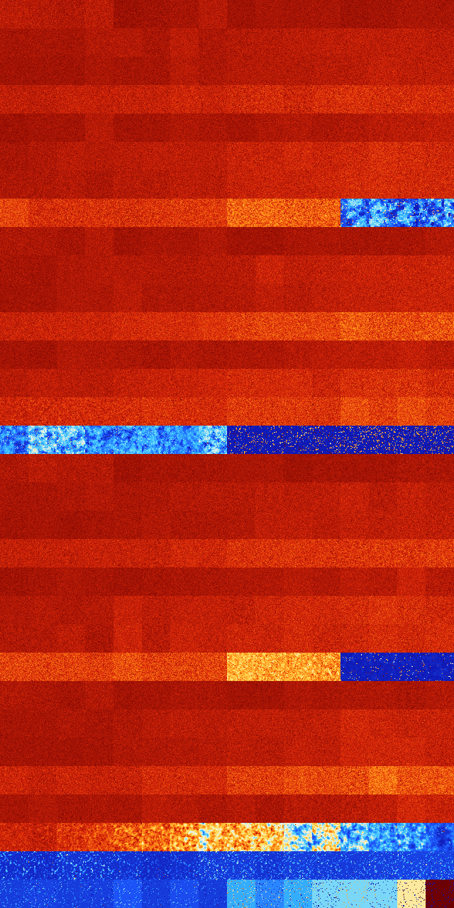

# B023478 (211456-211967)

<details>
    <summary>Initial Grid</summary>
    
</details>


<details>
    <summary>Initial Grid RLE</summary>

```
#C Exported from GoGoL (https://github.com/marrow16/gogol)
#C Wrap mode: Toroidal
#C Boundary mode: Dead
#C Step: 0
x = 100, y = 100, rule = B023478/S
22bobo20bo3bo35bo$19bo17bo2bo8bo8bo16bo$obo41bo18bo11bo11bo$20bo8bo34bo
18bo$9bo17bo21bo9bo34bo$15bo2bo$25bo40bo$15bo26bo25bo8b2o$11bo39bo7bo$
13bo$6bo29bo7bo36bo3bobo6bo$bo13bo15b2o58bo6bo$27bo12bo5bo$5bo8bo13b2o
3bo3bo21bo25bo$7bo8bo12bo15bo45bo$7bo13bo17bo$8bo8bobo$3bo4bo13bo26bo
27bo21bo$5bo14bo40bo15bo20bo$bo5bo3bobo67bo$21bo12bo40bo$38bo20bo27bo$
36bo41bo$18bo35bo33bo$19bobo2bobo50bo2bo6bo3bo6bo$15bo3bo9bo23bo$15bo$
73bo8bo6bo$3bo10bo10bo38bo5bo15bo$18b2o56bo18bo$8bo31bo15bo42bo$15bo20b
o15bo41bo3b2o$11bo13bo4bo16bo2bo6bo$29bo36bo2b2o12bo$7bo3bo13bo12bo19bo
12bo15bo7bo$7bo27bobo$2bo5bo9bo4bobo4bo4bo10bo47bo$18bo18bo13bo30bo$bo
19bo38bo32bobo$37bo3bo7bo24bo4bo7bo$33bo17bo$21bo12bo12bo6bo20bo10bo$
50bo4bo38bo$35bo2bobo40bo$19bo11bo3b2obo11bo8bo$b2o14bo7bo17bo7bobo14bo
3bo$34bo2bo18bo34bo$o2bo10bo49bo19bo2bo$64bo8bo15b2o$o49bo16bo$33bo23bo
$23bo35bo5bo26bo$66bo4bo7bo$21bo17bo44bo$8bo3bo13bobo33bo20bo9bo$15bo
28bo16bo5bo25bo2bo$7bo44bo$14bo8bo8bo4bo2bo54bo$5bo14bo2bo57bo$50b2o$
39b2o20bo20b3o$10bo13bo27bo11bo14bo17bo$3bo14bo30bo15bo22bo$23bo8bo42b
2obo2bo3bo$bo56bobobo$18bobo18bo2bo18bo$27bo7bo52bo$22bo13bo27bo15bo13b
o$26bo35bo4bo6bo9bo8bo5bo$bo46bo8bobo6bo24b2o3bo$23bo$19bo3bo35bo10bob
2o22bo$3bo23bo57bo$12bo12bo9bo10bo4bo3bo37bo$19bo26bo8b2o7bo10bo$56bo
38bo$14bo15bo4bo32bo11bo3bo5bo4bo$29bo9bo7bo23bo3bo9bo5bo$11bo16bo18bo
27bo7bobo11bo$5bo13bo47bo2bo21bo$3bo5bo28bo38bo$13bo14bo50bo$3bo52bo13b
o14bo$5bo19bo53bo2bo$21bo18bo14bo2bo20bo18bo$41bo10bo13bo6bo8bo7bobo$6b
o26bo20bo22bo2bo$39b2o37bo3bo$19bo37bo$38bo7bo9bo5bo3bo$14bo47bo18bo$
10bo55bo15bo4bo$11bo4bo5bo34bo8bo$9bo5bo5bo5bo13bo18bo$12bo25bo9bo6bo
18bo$14bo20bo5bo3bo19bo3bo19bo5bo2bo$35bo32bo2bobo$6bo24b2o10bo18bo28bo
$10bo7bo34bo6bo$8bo19bo34bo!
```
</details>
<details>
    <summary>Thumbnail</summary>

</details>
<table>
<tr>
    <td><a href="./211456%20S%20Heat%20Map%20Activity.png"></a><br>S (211456)<br>G>1000</td>    <td><a href="./211457%20S0%20Heat%20Map%20Activity.png"></a><br>S0 (211457)<br>G>1000</td>    <td><a href="./211458%20S1%20Heat%20Map%20Activity.png"></a><br>S1 (211458)<br>G>1000</td>    <td><a href="./211459%20S01%20Heat%20Map%20Activity.png"></a><br>S01 (211459)<br>G>1000</td>    <td><a href="./211460%20S2%20Heat%20Map%20Activity.png"></a><br>S2 (211460)<br>G>1000</td>    <td><a href="./211461%20S02%20Heat%20Map%20Activity.png"></a><br>S02 (211461)<br>G>1000</td>    <td><a href="./211462%20S12%20Heat%20Map%20Activity.png"></a><br>S12 (211462)<br>G>1000</td>    <td><a href="./211463%20S012%20Heat%20Map%20Activity.png"></a><br>S012 (211463)<br>G>1000</td>    <td><a href="./211464%20S3%20Heat%20Map%20Activity.png"></a><br>S3 (211464)<br>G>1000</td>    <td><a href="./211465%20S03%20Heat%20Map%20Activity.png"></a><br>S03 (211465)<br>G>1000</td>    <td><a href="./211466%20S13%20Heat%20Map%20Activity.png"></a><br>S13 (211466)<br>G>1000</td>    <td><a href="./211467%20S013%20Heat%20Map%20Activity.png"></a><br>S013 (211467)<br>G>1000</td>    <td><a href="./211468%20S23%20Heat%20Map%20Activity.png"></a><br>S23 (211468)<br>G>1000</td>    <td><a href="./211469%20S023%20Heat%20Map%20Activity.png"></a><br>S023 (211469)<br>G>1000</td>    <td><a href="./211470%20S123%20Heat%20Map%20Activity.png"></a><br>S123 (211470)<br>G>1000</td>    <td><a href="./211471%20S0123%20Heat%20Map%20Activity.png"></a><br>S0123 (211471)<br>G>1000</td></tr>
<tr>
    <td><a href="./211472%20S4%20Heat%20Map%20Activity.png"></a><br>S4 (211472)<br>G>1000</td>    <td><a href="./211473%20S04%20Heat%20Map%20Activity.png"></a><br>S04 (211473)<br>G>1000</td>    <td><a href="./211474%20S14%20Heat%20Map%20Activity.png"></a><br>S14 (211474)<br>G>1000</td>    <td><a href="./211475%20S014%20Heat%20Map%20Activity.png"></a><br>S014 (211475)<br>G>1000</td>    <td><a href="./211476%20S24%20Heat%20Map%20Activity.png"></a><br>S24 (211476)<br>G>1000</td>    <td><a href="./211477%20S024%20Heat%20Map%20Activity.png"></a><br>S024 (211477)<br>G>1000</td>    <td><a href="./211478%20S124%20Heat%20Map%20Activity.png"></a><br>S124 (211478)<br>G>1000</td>    <td><a href="./211479%20S0124%20Heat%20Map%20Activity.png"></a><br>S0124 (211479)<br>G>1000</td>    <td><a href="./211480%20S34%20Heat%20Map%20Activity.png"></a><br>S34 (211480)<br>G>1000</td>    <td><a href="./211481%20S034%20Heat%20Map%20Activity.png"></a><br>S034 (211481)<br>G>1000</td>    <td><a href="./211482%20S134%20Heat%20Map%20Activity.png"></a><br>S134 (211482)<br>G>1000</td>    <td><a href="./211483%20S0134%20Heat%20Map%20Activity.png"></a><br>S0134 (211483)<br>G>1000</td>    <td><a href="./211484%20S234%20Heat%20Map%20Activity.png"></a><br>S234 (211484)<br>G>1000</td>    <td><a href="./211485%20S0234%20Heat%20Map%20Activity.png"></a><br>S0234 (211485)<br>G>1000</td>    <td><a href="./211486%20S1234%20Heat%20Map%20Activity.png"></a><br>S1234 (211486)<br>G>1000</td>    <td><a href="./211487%20S01234%20Heat%20Map%20Activity.png"></a><br>S01234 (211487)<br>G>1000</td></tr>
<tr>
    <td><a href="./211488%20S5%20Heat%20Map%20Activity.png"></a><br>S5 (211488)<br>G>1000</td>    <td><a href="./211489%20S05%20Heat%20Map%20Activity.png"></a><br>S05 (211489)<br>G>1000</td>    <td><a href="./211490%20S15%20Heat%20Map%20Activity.png"></a><br>S15 (211490)<br>G>1000</td>    <td><a href="./211491%20S015%20Heat%20Map%20Activity.png"></a><br>S015 (211491)<br>G>1000</td>    <td><a href="./211492%20S25%20Heat%20Map%20Activity.png"></a><br>S25 (211492)<br>G>1000</td>    <td><a href="./211493%20S025%20Heat%20Map%20Activity.png"></a><br>S025 (211493)<br>G>1000</td>    <td><a href="./211494%20S125%20Heat%20Map%20Activity.png"></a><br>S125 (211494)<br>G>1000</td>    <td><a href="./211495%20S0125%20Heat%20Map%20Activity.png"></a><br>S0125 (211495)<br>G>1000</td>    <td><a href="./211496%20S35%20Heat%20Map%20Activity.png"></a><br>S35 (211496)<br>G>1000</td>    <td><a href="./211497%20S035%20Heat%20Map%20Activity.png"></a><br>S035 (211497)<br>G>1000</td>    <td><a href="./211498%20S135%20Heat%20Map%20Activity.png"></a><br>S135 (211498)<br>G>1000</td>    <td><a href="./211499%20S0135%20Heat%20Map%20Activity.png"></a><br>S0135 (211499)<br>G>1000</td>    <td><a href="./211500%20S235%20Heat%20Map%20Activity.png"></a><br>S235 (211500)<br>G>1000</td>    <td><a href="./211501%20S0235%20Heat%20Map%20Activity.png"></a><br>S0235 (211501)<br>G>1000</td>    <td><a href="./211502%20S1235%20Heat%20Map%20Activity.png"></a><br>S1235 (211502)<br>G>1000</td>    <td><a href="./211503%20S01235%20Heat%20Map%20Activity.png"></a><br>S01235 (211503)<br>G>1000</td></tr>
<tr>
    <td><a href="./211504%20S45%20Heat%20Map%20Activity.png"></a><br>S45 (211504)<br>G>1000</td>    <td><a href="./211505%20S045%20Heat%20Map%20Activity.png"></a><br>S045 (211505)<br>G>1000</td>    <td><a href="./211506%20S145%20Heat%20Map%20Activity.png"></a><br>S145 (211506)<br>G>1000</td>    <td><a href="./211507%20S0145%20Heat%20Map%20Activity.png"></a><br>S0145 (211507)<br>G>1000</td>    <td><a href="./211508%20S245%20Heat%20Map%20Activity.png"></a><br>S245 (211508)<br>G>1000</td>    <td><a href="./211509%20S0245%20Heat%20Map%20Activity.png"></a><br>S0245 (211509)<br>G>1000</td>    <td><a href="./211510%20S1245%20Heat%20Map%20Activity.png"></a><br>S1245 (211510)<br>G>1000</td>    <td><a href="./211511%20S01245%20Heat%20Map%20Activity.png"></a><br>S01245 (211511)<br>G>1000</td>    <td><a href="./211512%20S345%20Heat%20Map%20Activity.png"></a><br>S345 (211512)<br>G>1000</td>    <td><a href="./211513%20S0345%20Heat%20Map%20Activity.png"></a><br>S0345 (211513)<br>G>1000</td>    <td><a href="./211514%20S1345%20Heat%20Map%20Activity.png"></a><br>S1345 (211514)<br>G>1000</td>    <td><a href="./211515%20S01345%20Heat%20Map%20Activity.png"></a><br>S01345 (211515)<br>G>1000</td>    <td><a href="./211516%20S2345%20Heat%20Map%20Activity.png"></a><br>S2345 (211516)<br>G>1000</td>    <td><a href="./211517%20S02345%20Heat%20Map%20Activity.png"></a><br>S02345 (211517)<br>G>1000</td>    <td><a href="./211518%20S12345%20Heat%20Map%20Activity.png"></a><br>S12345 (211518)<br>G>1000</td>    <td><a href="./211519%20S012345%20Heat%20Map%20Activity.png"></a><br>S012345 (211519)<br>G>1000</td></tr>
<tr>
    <td><a href="./211520%20S6%20Heat%20Map%20Activity.png"></a><br>S6 (211520)<br>G>1000</td>    <td><a href="./211521%20S06%20Heat%20Map%20Activity.png"></a><br>S06 (211521)<br>G>1000</td>    <td><a href="./211522%20S16%20Heat%20Map%20Activity.png"></a><br>S16 (211522)<br>G>1000</td>    <td><a href="./211523%20S016%20Heat%20Map%20Activity.png"></a><br>S016 (211523)<br>G>1000</td>    <td><a href="./211524%20S26%20Heat%20Map%20Activity.png"></a><br>S26 (211524)<br>G>1000</td>    <td><a href="./211525%20S026%20Heat%20Map%20Activity.png"></a><br>S026 (211525)<br>G>1000</td>    <td><a href="./211526%20S126%20Heat%20Map%20Activity.png"></a><br>S126 (211526)<br>G>1000</td>    <td><a href="./211527%20S0126%20Heat%20Map%20Activity.png"></a><br>S0126 (211527)<br>G>1000</td>    <td><a href="./211528%20S36%20Heat%20Map%20Activity.png"></a><br>S36 (211528)<br>G>1000</td>    <td><a href="./211529%20S036%20Heat%20Map%20Activity.png"></a><br>S036 (211529)<br>G>1000</td>    <td><a href="./211530%20S136%20Heat%20Map%20Activity.png"></a><br>S136 (211530)<br>G>1000</td>    <td><a href="./211531%20S0136%20Heat%20Map%20Activity.png"></a><br>S0136 (211531)<br>G>1000</td>    <td><a href="./211532%20S236%20Heat%20Map%20Activity.png"></a><br>S236 (211532)<br>G>1000</td>    <td><a href="./211533%20S0236%20Heat%20Map%20Activity.png"></a><br>S0236 (211533)<br>G>1000</td>    <td><a href="./211534%20S1236%20Heat%20Map%20Activity.png"></a><br>S1236 (211534)<br>G>1000</td>    <td><a href="./211535%20S01236%20Heat%20Map%20Activity.png"></a><br>S01236 (211535)<br>G>1000</td></tr>
<tr>
    <td><a href="./211536%20S46%20Heat%20Map%20Activity.png"></a><br>S46 (211536)<br>G>1000</td>    <td><a href="./211537%20S046%20Heat%20Map%20Activity.png"></a><br>S046 (211537)<br>G>1000</td>    <td><a href="./211538%20S146%20Heat%20Map%20Activity.png"></a><br>S146 (211538)<br>G>1000</td>    <td><a href="./211539%20S0146%20Heat%20Map%20Activity.png"></a><br>S0146 (211539)<br>G>1000</td>    <td><a href="./211540%20S246%20Heat%20Map%20Activity.png"></a><br>S246 (211540)<br>G>1000</td>    <td><a href="./211541%20S0246%20Heat%20Map%20Activity.png"></a><br>S0246 (211541)<br>G>1000</td>    <td><a href="./211542%20S1246%20Heat%20Map%20Activity.png"></a><br>S1246 (211542)<br>G>1000</td>    <td><a href="./211543%20S01246%20Heat%20Map%20Activity.png"></a><br>S01246 (211543)<br>G>1000</td>    <td><a href="./211544%20S346%20Heat%20Map%20Activity.png"></a><br>S346 (211544)<br>G>1000</td>    <td><a href="./211545%20S0346%20Heat%20Map%20Activity.png"></a><br>S0346 (211545)<br>G>1000</td>    <td><a href="./211546%20S1346%20Heat%20Map%20Activity.png"></a><br>S1346 (211546)<br>G>1000</td>    <td><a href="./211547%20S01346%20Heat%20Map%20Activity.png"></a><br>S01346 (211547)<br>G>1000</td>    <td><a href="./211548%20S2346%20Heat%20Map%20Activity.png"></a><br>S2346 (211548)<br>G>1000</td>    <td><a href="./211549%20S02346%20Heat%20Map%20Activity.png"></a><br>S02346 (211549)<br>G>1000</td>    <td><a href="./211550%20S12346%20Heat%20Map%20Activity.png"></a><br>S12346 (211550)<br>G>1000</td>    <td><a href="./211551%20S012346%20Heat%20Map%20Activity.png"></a><br>S012346 (211551)<br>G>1000</td></tr>
<tr>
    <td><a href="./211552%20S56%20Heat%20Map%20Activity.png"></a><br>S56 (211552)<br>G>1000</td>    <td><a href="./211553%20S056%20Heat%20Map%20Activity.png"></a><br>S056 (211553)<br>G>1000</td>    <td><a href="./211554%20S156%20Heat%20Map%20Activity.png"></a><br>S156 (211554)<br>G>1000</td>    <td><a href="./211555%20S0156%20Heat%20Map%20Activity.png"></a><br>S0156 (211555)<br>G>1000</td>    <td><a href="./211556%20S256%20Heat%20Map%20Activity.png"></a><br>S256 (211556)<br>G>1000</td>    <td><a href="./211557%20S0256%20Heat%20Map%20Activity.png"></a><br>S0256 (211557)<br>G>1000</td>    <td><a href="./211558%20S1256%20Heat%20Map%20Activity.png"></a><br>S1256 (211558)<br>G>1000</td>    <td><a href="./211559%20S01256%20Heat%20Map%20Activity.png"></a><br>S01256 (211559)<br>G>1000</td>    <td><a href="./211560%20S356%20Heat%20Map%20Activity.png"></a><br>S356 (211560)<br>G>1000</td>    <td><a href="./211561%20S0356%20Heat%20Map%20Activity.png"></a><br>S0356 (211561)<br>G>1000</td>    <td><a href="./211562%20S1356%20Heat%20Map%20Activity.png"></a><br>S1356 (211562)<br>G>1000</td>    <td><a href="./211563%20S01356%20Heat%20Map%20Activity.png"></a><br>S01356 (211563)<br>G>1000</td>    <td><a href="./211564%20S2356%20Heat%20Map%20Activity.png"></a><br>S2356 (211564)<br>G>1000</td>    <td><a href="./211565%20S02356%20Heat%20Map%20Activity.png"></a><br>S02356 (211565)<br>G>1000</td>    <td><a href="./211566%20S12356%20Heat%20Map%20Activity.png"></a><br>S12356 (211566)<br>G>1000</td>    <td><a href="./211567%20S012356%20Heat%20Map%20Activity.png"></a><br>S012356 (211567)<br>G>1000</td></tr>
<tr>
    <td><a href="./211568%20S456%20Heat%20Map%20Activity.png"></a><br>S456 (211568)<br>G>1000</td>    <td><a href="./211569%20S0456%20Heat%20Map%20Activity.png"></a><br>S0456 (211569)<br>G>1000</td>    <td><a href="./211570%20S1456%20Heat%20Map%20Activity.png"></a><br>S1456 (211570)<br>G>1000</td>    <td><a href="./211571%20S01456%20Heat%20Map%20Activity.png"></a><br>S01456 (211571)<br>G>1000</td>    <td><a href="./211572%20S2456%20Heat%20Map%20Activity.png"></a><br>S2456 (211572)<br>G>1000</td>    <td><a href="./211573%20S02456%20Heat%20Map%20Activity.png"></a><br>S02456 (211573)<br>G>1000</td>    <td><a href="./211574%20S12456%20Heat%20Map%20Activity.png"></a><br>S12456 (211574)<br>G>1000</td>    <td><a href="./211575%20S012456%20Heat%20Map%20Activity.png"></a><br>S012456 (211575)<br>G>1000</td>    <td><a href="./211576%20S3456%20Heat%20Map%20Activity.png"></a><br>S3456 (211576)<br>G>1000</td>    <td><a href="./211577%20S03456%20Heat%20Map%20Activity.png"></a><br>S03456 (211577)<br>G>1000</td>    <td><a href="./211578%20S13456%20Heat%20Map%20Activity.png"></a><br>S13456 (211578)<br>G>1000</td>    <td><a href="./211579%20S013456%20Heat%20Map%20Activity.png"></a><br>S013456 (211579)<br>G>1000</td>    <td><a href="./211580%20S23456%20Heat%20Map%20Activity.png"></a><br>S23456 (211580)<br>G>1000</td>    <td><a href="./211581%20S023456%20Heat%20Map%20Activity.png"></a><br>S023456 (211581)<br>G>1000</td>    <td><a href="./211582%20S123456%20Heat%20Map%20Activity.png"></a><br>S123456 (211582)<br>G>1000</td>    <td><a href="./211583%20S0123456%20Heat%20Map%20Activity.png"></a><br>S0123456 (211583)<br>G>1000</td></tr>
<tr>
    <td><a href="./211584%20S7%20Heat%20Map%20Activity.png"></a><br>S7 (211584)<br>G>1000</td>    <td><a href="./211585%20S07%20Heat%20Map%20Activity.png"></a><br>S07 (211585)<br>G>1000</td>    <td><a href="./211586%20S17%20Heat%20Map%20Activity.png"></a><br>S17 (211586)<br>G>1000</td>    <td><a href="./211587%20S017%20Heat%20Map%20Activity.png"></a><br>S017 (211587)<br>G>1000</td>    <td><a href="./211588%20S27%20Heat%20Map%20Activity.png"></a><br>S27 (211588)<br>G>1000</td>    <td><a href="./211589%20S027%20Heat%20Map%20Activity.png"></a><br>S027 (211589)<br>G>1000</td>    <td><a href="./211590%20S127%20Heat%20Map%20Activity.png"></a><br>S127 (211590)<br>G>1000</td>    <td><a href="./211591%20S0127%20Heat%20Map%20Activity.png"></a><br>S0127 (211591)<br>G>1000</td>    <td><a href="./211592%20S37%20Heat%20Map%20Activity.png"></a><br>S37 (211592)<br>G>1000</td>    <td><a href="./211593%20S037%20Heat%20Map%20Activity.png"></a><br>S037 (211593)<br>G>1000</td>    <td><a href="./211594%20S137%20Heat%20Map%20Activity.png"></a><br>S137 (211594)<br>G>1000</td>    <td><a href="./211595%20S0137%20Heat%20Map%20Activity.png"></a><br>S0137 (211595)<br>G>1000</td>    <td><a href="./211596%20S237%20Heat%20Map%20Activity.png"></a><br>S237 (211596)<br>G>1000</td>    <td><a href="./211597%20S0237%20Heat%20Map%20Activity.png"></a><br>S0237 (211597)<br>G>1000</td>    <td><a href="./211598%20S1237%20Heat%20Map%20Activity.png"></a><br>S1237 (211598)<br>G>1000</td>    <td><a href="./211599%20S01237%20Heat%20Map%20Activity.png"></a><br>S01237 (211599)<br>G>1000</td></tr>
<tr>
    <td><a href="./211600%20S47%20Heat%20Map%20Activity.png"></a><br>S47 (211600)<br>G>1000</td>    <td><a href="./211601%20S047%20Heat%20Map%20Activity.png"></a><br>S047 (211601)<br>G>1000</td>    <td><a href="./211602%20S147%20Heat%20Map%20Activity.png"></a><br>S147 (211602)<br>G>1000</td>    <td><a href="./211603%20S0147%20Heat%20Map%20Activity.png"></a><br>S0147 (211603)<br>G>1000</td>    <td><a href="./211604%20S247%20Heat%20Map%20Activity.png"></a><br>S247 (211604)<br>G>1000</td>    <td><a href="./211605%20S0247%20Heat%20Map%20Activity.png"></a><br>S0247 (211605)<br>G>1000</td>    <td><a href="./211606%20S1247%20Heat%20Map%20Activity.png"></a><br>S1247 (211606)<br>G>1000</td>    <td><a href="./211607%20S01247%20Heat%20Map%20Activity.png"></a><br>S01247 (211607)<br>G>1000</td>    <td><a href="./211608%20S347%20Heat%20Map%20Activity.png"></a><br>S347 (211608)<br>G>1000</td>    <td><a href="./211609%20S0347%20Heat%20Map%20Activity.png"></a><br>S0347 (211609)<br>G>1000</td>    <td><a href="./211610%20S1347%20Heat%20Map%20Activity.png"></a><br>S1347 (211610)<br>G>1000</td>    <td><a href="./211611%20S01347%20Heat%20Map%20Activity.png"></a><br>S01347 (211611)<br>G>1000</td>    <td><a href="./211612%20S2347%20Heat%20Map%20Activity.png"></a><br>S2347 (211612)<br>G>1000</td>    <td><a href="./211613%20S02347%20Heat%20Map%20Activity.png"></a><br>S02347 (211613)<br>G>1000</td>    <td><a href="./211614%20S12347%20Heat%20Map%20Activity.png"></a><br>S12347 (211614)<br>G>1000</td>    <td><a href="./211615%20S012347%20Heat%20Map%20Activity.png"></a><br>S012347 (211615)<br>G>1000</td></tr>
<tr>
    <td><a href="./211616%20S57%20Heat%20Map%20Activity.png"></a><br>S57 (211616)<br>G>1000</td>    <td><a href="./211617%20S057%20Heat%20Map%20Activity.png"></a><br>S057 (211617)<br>G>1000</td>    <td><a href="./211618%20S157%20Heat%20Map%20Activity.png"></a><br>S157 (211618)<br>G>1000</td>    <td><a href="./211619%20S0157%20Heat%20Map%20Activity.png"></a><br>S0157 (211619)<br>G>1000</td>    <td><a href="./211620%20S257%20Heat%20Map%20Activity.png"></a><br>S257 (211620)<br>G>1000</td>    <td><a href="./211621%20S0257%20Heat%20Map%20Activity.png"></a><br>S0257 (211621)<br>G>1000</td>    <td><a href="./211622%20S1257%20Heat%20Map%20Activity.png"></a><br>S1257 (211622)<br>G>1000</td>    <td><a href="./211623%20S01257%20Heat%20Map%20Activity.png"></a><br>S01257 (211623)<br>G>1000</td>    <td><a href="./211624%20S357%20Heat%20Map%20Activity.png"></a><br>S357 (211624)<br>G>1000</td>    <td><a href="./211625%20S0357%20Heat%20Map%20Activity.png"></a><br>S0357 (211625)<br>G>1000</td>    <td><a href="./211626%20S1357%20Heat%20Map%20Activity.png"></a><br>S1357 (211626)<br>G>1000</td>    <td><a href="./211627%20S01357%20Heat%20Map%20Activity.png"></a><br>S01357 (211627)<br>G>1000</td>    <td><a href="./211628%20S2357%20Heat%20Map%20Activity.png"></a><br>S2357 (211628)<br>G>1000</td>    <td><a href="./211629%20S02357%20Heat%20Map%20Activity.png"></a><br>S02357 (211629)<br>G>1000</td>    <td><a href="./211630%20S12357%20Heat%20Map%20Activity.png"></a><br>S12357 (211630)<br>G>1000</td>    <td><a href="./211631%20S012357%20Heat%20Map%20Activity.png"></a><br>S012357 (211631)<br>G>1000</td></tr>
<tr>
    <td><a href="./211632%20S457%20Heat%20Map%20Activity.png"></a><br>S457 (211632)<br>G>1000</td>    <td><a href="./211633%20S0457%20Heat%20Map%20Activity.png"></a><br>S0457 (211633)<br>G>1000</td>    <td><a href="./211634%20S1457%20Heat%20Map%20Activity.png"></a><br>S1457 (211634)<br>G>1000</td>    <td><a href="./211635%20S01457%20Heat%20Map%20Activity.png"></a><br>S01457 (211635)<br>G>1000</td>    <td><a href="./211636%20S2457%20Heat%20Map%20Activity.png"></a><br>S2457 (211636)<br>G>1000</td>    <td><a href="./211637%20S02457%20Heat%20Map%20Activity.png"></a><br>S02457 (211637)<br>G>1000</td>    <td><a href="./211638%20S12457%20Heat%20Map%20Activity.png"></a><br>S12457 (211638)<br>G>1000</td>    <td><a href="./211639%20S012457%20Heat%20Map%20Activity.png"></a><br>S012457 (211639)<br>G>1000</td>    <td><a href="./211640%20S3457%20Heat%20Map%20Activity.png"></a><br>S3457 (211640)<br>G>1000</td>    <td><a href="./211641%20S03457%20Heat%20Map%20Activity.png"></a><br>S03457 (211641)<br>G>1000</td>    <td><a href="./211642%20S13457%20Heat%20Map%20Activity.png"></a><br>S13457 (211642)<br>G>1000</td>    <td><a href="./211643%20S013457%20Heat%20Map%20Activity.png"></a><br>S013457 (211643)<br>G>1000</td>    <td><a href="./211644%20S23457%20Heat%20Map%20Activity.png"></a><br>S23457 (211644)<br>G>1000</td>    <td><a href="./211645%20S023457%20Heat%20Map%20Activity.png"></a><br>S023457 (211645)<br>G>1000</td>    <td><a href="./211646%20S123457%20Heat%20Map%20Activity.png"></a><br>S123457 (211646)<br>G>1000</td>    <td><a href="./211647%20S0123457%20Heat%20Map%20Activity.png"></a><br>S0123457 (211647)<br>G>1000</td></tr>
<tr>
    <td><a href="./211648%20S67%20Heat%20Map%20Activity.png"></a><br>S67 (211648)<br>G>1000</td>    <td><a href="./211649%20S067%20Heat%20Map%20Activity.png"></a><br>S067 (211649)<br>G>1000</td>    <td><a href="./211650%20S167%20Heat%20Map%20Activity.png"></a><br>S167 (211650)<br>G>1000</td>    <td><a href="./211651%20S0167%20Heat%20Map%20Activity.png"></a><br>S0167 (211651)<br>G>1000</td>    <td><a href="./211652%20S267%20Heat%20Map%20Activity.png"></a><br>S267 (211652)<br>G>1000</td>    <td><a href="./211653%20S0267%20Heat%20Map%20Activity.png"></a><br>S0267 (211653)<br>G>1000</td>    <td><a href="./211654%20S1267%20Heat%20Map%20Activity.png"></a><br>S1267 (211654)<br>G>1000</td>    <td><a href="./211655%20S01267%20Heat%20Map%20Activity.png"></a><br>S01267 (211655)<br>G>1000</td>    <td><a href="./211656%20S367%20Heat%20Map%20Activity.png"></a><br>S367 (211656)<br>G>1000</td>    <td><a href="./211657%20S0367%20Heat%20Map%20Activity.png"></a><br>S0367 (211657)<br>G>1000</td>    <td><a href="./211658%20S1367%20Heat%20Map%20Activity.png"></a><br>S1367 (211658)<br>G>1000</td>    <td><a href="./211659%20S01367%20Heat%20Map%20Activity.png"></a><br>S01367 (211659)<br>G>1000</td>    <td><a href="./211660%20S2367%20Heat%20Map%20Activity.png"></a><br>S2367 (211660)<br>G>1000</td>    <td><a href="./211661%20S02367%20Heat%20Map%20Activity.png"></a><br>S02367 (211661)<br>G>1000</td>    <td><a href="./211662%20S12367%20Heat%20Map%20Activity.png"></a><br>S12367 (211662)<br>G>1000</td>    <td><a href="./211663%20S012367%20Heat%20Map%20Activity.png"></a><br>S012367 (211663)<br>G>1000</td></tr>
<tr>
    <td><a href="./211664%20S467%20Heat%20Map%20Activity.png"></a><br>S467 (211664)<br>G>1000</td>    <td><a href="./211665%20S0467%20Heat%20Map%20Activity.png"></a><br>S0467 (211665)<br>G>1000</td>    <td><a href="./211666%20S1467%20Heat%20Map%20Activity.png"></a><br>S1467 (211666)<br>G>1000</td>    <td><a href="./211667%20S01467%20Heat%20Map%20Activity.png"></a><br>S01467 (211667)<br>G>1000</td>    <td><a href="./211668%20S2467%20Heat%20Map%20Activity.png"></a><br>S2467 (211668)<br>G>1000</td>    <td><a href="./211669%20S02467%20Heat%20Map%20Activity.png"></a><br>S02467 (211669)<br>G>1000</td>    <td><a href="./211670%20S12467%20Heat%20Map%20Activity.png"></a><br>S12467 (211670)<br>G>1000</td>    <td><a href="./211671%20S012467%20Heat%20Map%20Activity.png"></a><br>S012467 (211671)<br>G>1000</td>    <td><a href="./211672%20S3467%20Heat%20Map%20Activity.png"></a><br>S3467 (211672)<br>G>1000</td>    <td><a href="./211673%20S03467%20Heat%20Map%20Activity.png"></a><br>S03467 (211673)<br>G>1000</td>    <td><a href="./211674%20S13467%20Heat%20Map%20Activity.png"></a><br>S13467 (211674)<br>G>1000</td>    <td><a href="./211675%20S013467%20Heat%20Map%20Activity.png"></a><br>S013467 (211675)<br>G>1000</td>    <td><a href="./211676%20S23467%20Heat%20Map%20Activity.png"></a><br>S23467 (211676)<br>G>1000</td>    <td><a href="./211677%20S023467%20Heat%20Map%20Activity.png"></a><br>S023467 (211677)<br>G>1000</td>    <td><a href="./211678%20S123467%20Heat%20Map%20Activity.png"></a><br>S123467 (211678)<br>G>1000</td>    <td><a href="./211679%20S0123467%20Heat%20Map%20Activity.png"></a><br>S0123467 (211679)<br>G>1000</td></tr>
<tr>
    <td><a href="./211680%20S567%20Heat%20Map%20Activity.png"></a><br>S567 (211680)<br>G>1000</td>    <td><a href="./211681%20S0567%20Heat%20Map%20Activity.png"></a><br>S0567 (211681)<br>G>1000</td>    <td><a href="./211682%20S1567%20Heat%20Map%20Activity.png"></a><br>S1567 (211682)<br>G>1000</td>    <td><a href="./211683%20S01567%20Heat%20Map%20Activity.png"></a><br>S01567 (211683)<br>G>1000</td>    <td><a href="./211684%20S2567%20Heat%20Map%20Activity.png"></a><br>S2567 (211684)<br>G>1000</td>    <td><a href="./211685%20S02567%20Heat%20Map%20Activity.png"></a><br>S02567 (211685)<br>G>1000</td>    <td><a href="./211686%20S12567%20Heat%20Map%20Activity.png"></a><br>S12567 (211686)<br>G>1000</td>    <td><a href="./211687%20S012567%20Heat%20Map%20Activity.png"></a><br>S012567 (211687)<br>G>1000</td>    <td><a href="./211688%20S3567%20Heat%20Map%20Activity.png"></a><br>S3567 (211688)<br>G>1000</td>    <td><a href="./211689%20S03567%20Heat%20Map%20Activity.png"></a><br>S03567 (211689)<br>G>1000</td>    <td><a href="./211690%20S13567%20Heat%20Map%20Activity.png"></a><br>S13567 (211690)<br>G>1000</td>    <td><a href="./211691%20S013567%20Heat%20Map%20Activity.png"></a><br>S013567 (211691)<br>G>1000</td>    <td><a href="./211692%20S23567%20Heat%20Map%20Activity.png"></a><br>S23567 (211692)<br>G>1000</td>    <td><a href="./211693%20S023567%20Heat%20Map%20Activity.png"></a><br>S023567 (211693)<br>G>1000</td>    <td><a href="./211694%20S123567%20Heat%20Map%20Activity.png"></a><br>S123567 (211694)<br>G>1000</td>    <td><a href="./211695%20S0123567%20Heat%20Map%20Activity.png"></a><br>S0123567 (211695)<br>G>1000</td></tr>
<tr>
    <td><a href="./211696%20S4567%20Heat%20Map%20Activity.png"></a><br>S4567 (211696)<br>G>1000</td>    <td><a href="./211697%20S04567%20Heat%20Map%20Activity.png"></a><br>S04567 (211697)<br>G>1000</td>    <td><a href="./211698%20S14567%20Heat%20Map%20Activity.png"></a><br>S14567 (211698)<br>G>1000</td>    <td><a href="./211699%20S014567%20Heat%20Map%20Activity.png"></a><br>S014567 (211699)<br>G>1000</td>    <td><a href="./211700%20S24567%20Heat%20Map%20Activity.png"></a><br>S24567 (211700)<br>G>1000</td>    <td><a href="./211701%20S024567%20Heat%20Map%20Activity.png"></a><br>S024567 (211701)<br>G>1000</td>    <td><a href="./211702%20S124567%20Heat%20Map%20Activity.png"></a><br>S124567 (211702)<br>G>1000</td>    <td><a href="./211703%20S0124567%20Heat%20Map%20Activity.png"></a><br>S0124567 (211703)<br>G>1000</td>    <td><a href="./211704%20S34567%20Heat%20Map%20Activity.png"></a><br>S34567 (211704)<br>G>1000</td>    <td><a href="./211705%20S034567%20Heat%20Map%20Activity.png"></a><br>S034567 (211705)<br>G>1000</td>    <td><a href="./211706%20S134567%20Heat%20Map%20Activity.png"></a><br>S134567 (211706)<br>G>1000</td>    <td><a href="./211707%20S0134567%20Heat%20Map%20Activity.png"></a><br>S0134567 (211707)<br>G>1000</td>    <td><a href="./211708%20S234567%20Heat%20Map%20Activity.png"></a><br>S234567 (211708)<br>G>1000</td>    <td><a href="./211709%20S0234567%20Heat%20Map%20Activity.png"></a><br>S0234567 (211709)<br>G>1000</td>    <td><a href="./211710%20S1234567%20Heat%20Map%20Activity.png"></a><br>S1234567 (211710)<br>G>1000</td>    <td><a href="./211711%20S01234567%20Heat%20Map%20Activity.png"></a><br>S01234567 (211711)<br>G>1000</td></tr>
<tr>
    <td><a href="./211712%20S8%20Heat%20Map%20Activity.png"></a><br>S8 (211712)<br>G>1000</td>    <td><a href="./211713%20S08%20Heat%20Map%20Activity.png"></a><br>S08 (211713)<br>G>1000</td>    <td><a href="./211714%20S18%20Heat%20Map%20Activity.png"></a><br>S18 (211714)<br>G>1000</td>    <td><a href="./211715%20S018%20Heat%20Map%20Activity.png"></a><br>S018 (211715)<br>G>1000</td>    <td><a href="./211716%20S28%20Heat%20Map%20Activity.png"></a><br>S28 (211716)<br>G>1000</td>    <td><a href="./211717%20S028%20Heat%20Map%20Activity.png"></a><br>S028 (211717)<br>G>1000</td>    <td><a href="./211718%20S128%20Heat%20Map%20Activity.png"></a><br>S128 (211718)<br>G>1000</td>    <td><a href="./211719%20S0128%20Heat%20Map%20Activity.png"></a><br>S0128 (211719)<br>G>1000</td>    <td><a href="./211720%20S38%20Heat%20Map%20Activity.png"></a><br>S38 (211720)<br>G>1000</td>    <td><a href="./211721%20S038%20Heat%20Map%20Activity.png"></a><br>S038 (211721)<br>G>1000</td>    <td><a href="./211722%20S138%20Heat%20Map%20Activity.png"></a><br>S138 (211722)<br>G>1000</td>    <td><a href="./211723%20S0138%20Heat%20Map%20Activity.png"></a><br>S0138 (211723)<br>G>1000</td>    <td><a href="./211724%20S238%20Heat%20Map%20Activity.png"></a><br>S238 (211724)<br>G>1000</td>    <td><a href="./211725%20S0238%20Heat%20Map%20Activity.png"></a><br>S0238 (211725)<br>G>1000</td>    <td><a href="./211726%20S1238%20Heat%20Map%20Activity.png"></a><br>S1238 (211726)<br>G>1000</td>    <td><a href="./211727%20S01238%20Heat%20Map%20Activity.png"></a><br>S01238 (211727)<br>G>1000</td></tr>
<tr>
    <td><a href="./211728%20S48%20Heat%20Map%20Activity.png"></a><br>S48 (211728)<br>G>1000</td>    <td><a href="./211729%20S048%20Heat%20Map%20Activity.png"></a><br>S048 (211729)<br>G>1000</td>    <td><a href="./211730%20S148%20Heat%20Map%20Activity.png"></a><br>S148 (211730)<br>G>1000</td>    <td><a href="./211731%20S0148%20Heat%20Map%20Activity.png"></a><br>S0148 (211731)<br>G>1000</td>    <td><a href="./211732%20S248%20Heat%20Map%20Activity.png"></a><br>S248 (211732)<br>G>1000</td>    <td><a href="./211733%20S0248%20Heat%20Map%20Activity.png"></a><br>S0248 (211733)<br>G>1000</td>    <td><a href="./211734%20S1248%20Heat%20Map%20Activity.png"></a><br>S1248 (211734)<br>G>1000</td>    <td><a href="./211735%20S01248%20Heat%20Map%20Activity.png"></a><br>S01248 (211735)<br>G>1000</td>    <td><a href="./211736%20S348%20Heat%20Map%20Activity.png"></a><br>S348 (211736)<br>G>1000</td>    <td><a href="./211737%20S0348%20Heat%20Map%20Activity.png"></a><br>S0348 (211737)<br>G>1000</td>    <td><a href="./211738%20S1348%20Heat%20Map%20Activity.png"></a><br>S1348 (211738)<br>G>1000</td>    <td><a href="./211739%20S01348%20Heat%20Map%20Activity.png"></a><br>S01348 (211739)<br>G>1000</td>    <td><a href="./211740%20S2348%20Heat%20Map%20Activity.png"></a><br>S2348 (211740)<br>G>1000</td>    <td><a href="./211741%20S02348%20Heat%20Map%20Activity.png"></a><br>S02348 (211741)<br>G>1000</td>    <td><a href="./211742%20S12348%20Heat%20Map%20Activity.png"></a><br>S12348 (211742)<br>G>1000</td>    <td><a href="./211743%20S012348%20Heat%20Map%20Activity.png"></a><br>S012348 (211743)<br>G>1000</td></tr>
<tr>
    <td><a href="./211744%20S58%20Heat%20Map%20Activity.png"></a><br>S58 (211744)<br>G>1000</td>    <td><a href="./211745%20S058%20Heat%20Map%20Activity.png"></a><br>S058 (211745)<br>G>1000</td>    <td><a href="./211746%20S158%20Heat%20Map%20Activity.png"></a><br>S158 (211746)<br>G>1000</td>    <td><a href="./211747%20S0158%20Heat%20Map%20Activity.png"></a><br>S0158 (211747)<br>G>1000</td>    <td><a href="./211748%20S258%20Heat%20Map%20Activity.png"></a><br>S258 (211748)<br>G>1000</td>    <td><a href="./211749%20S0258%20Heat%20Map%20Activity.png"></a><br>S0258 (211749)<br>G>1000</td>    <td><a href="./211750%20S1258%20Heat%20Map%20Activity.png"></a><br>S1258 (211750)<br>G>1000</td>    <td><a href="./211751%20S01258%20Heat%20Map%20Activity.png"></a><br>S01258 (211751)<br>G>1000</td>    <td><a href="./211752%20S358%20Heat%20Map%20Activity.png"></a><br>S358 (211752)<br>G>1000</td>    <td><a href="./211753%20S0358%20Heat%20Map%20Activity.png"></a><br>S0358 (211753)<br>G>1000</td>    <td><a href="./211754%20S1358%20Heat%20Map%20Activity.png"></a><br>S1358 (211754)<br>G>1000</td>    <td><a href="./211755%20S01358%20Heat%20Map%20Activity.png"></a><br>S01358 (211755)<br>G>1000</td>    <td><a href="./211756%20S2358%20Heat%20Map%20Activity.png"></a><br>S2358 (211756)<br>G>1000</td>    <td><a href="./211757%20S02358%20Heat%20Map%20Activity.png"></a><br>S02358 (211757)<br>G>1000</td>    <td><a href="./211758%20S12358%20Heat%20Map%20Activity.png"></a><br>S12358 (211758)<br>G>1000</td>    <td><a href="./211759%20S012358%20Heat%20Map%20Activity.png"></a><br>S012358 (211759)<br>G>1000</td></tr>
<tr>
    <td><a href="./211760%20S458%20Heat%20Map%20Activity.png"></a><br>S458 (211760)<br>G>1000</td>    <td><a href="./211761%20S0458%20Heat%20Map%20Activity.png"></a><br>S0458 (211761)<br>G>1000</td>    <td><a href="./211762%20S1458%20Heat%20Map%20Activity.png"></a><br>S1458 (211762)<br>G>1000</td>    <td><a href="./211763%20S01458%20Heat%20Map%20Activity.png"></a><br>S01458 (211763)<br>G>1000</td>    <td><a href="./211764%20S2458%20Heat%20Map%20Activity.png"></a><br>S2458 (211764)<br>G>1000</td>    <td><a href="./211765%20S02458%20Heat%20Map%20Activity.png"></a><br>S02458 (211765)<br>G>1000</td>    <td><a href="./211766%20S12458%20Heat%20Map%20Activity.png"></a><br>S12458 (211766)<br>G>1000</td>    <td><a href="./211767%20S012458%20Heat%20Map%20Activity.png"></a><br>S012458 (211767)<br>G>1000</td>    <td><a href="./211768%20S3458%20Heat%20Map%20Activity.png"></a><br>S3458 (211768)<br>G>1000</td>    <td><a href="./211769%20S03458%20Heat%20Map%20Activity.png"></a><br>S03458 (211769)<br>G>1000</td>    <td><a href="./211770%20S13458%20Heat%20Map%20Activity.png"></a><br>S13458 (211770)<br>G>1000</td>    <td><a href="./211771%20S013458%20Heat%20Map%20Activity.png"></a><br>S013458 (211771)<br>G>1000</td>    <td><a href="./211772%20S23458%20Heat%20Map%20Activity.png"></a><br>S23458 (211772)<br>G>1000</td>    <td><a href="./211773%20S023458%20Heat%20Map%20Activity.png"></a><br>S023458 (211773)<br>G>1000</td>    <td><a href="./211774%20S123458%20Heat%20Map%20Activity.png"></a><br>S123458 (211774)<br>G>1000</td>    <td><a href="./211775%20S0123458%20Heat%20Map%20Activity.png"></a><br>S0123458 (211775)<br>G>1000</td></tr>
<tr>
    <td><a href="./211776%20S68%20Heat%20Map%20Activity.png"></a><br>S68 (211776)<br>G>1000</td>    <td><a href="./211777%20S068%20Heat%20Map%20Activity.png"></a><br>S068 (211777)<br>G>1000</td>    <td><a href="./211778%20S168%20Heat%20Map%20Activity.png"></a><br>S168 (211778)<br>G>1000</td>    <td><a href="./211779%20S0168%20Heat%20Map%20Activity.png"></a><br>S0168 (211779)<br>G>1000</td>    <td><a href="./211780%20S268%20Heat%20Map%20Activity.png"></a><br>S268 (211780)<br>G>1000</td>    <td><a href="./211781%20S0268%20Heat%20Map%20Activity.png"></a><br>S0268 (211781)<br>G>1000</td>    <td><a href="./211782%20S1268%20Heat%20Map%20Activity.png"></a><br>S1268 (211782)<br>G>1000</td>    <td><a href="./211783%20S01268%20Heat%20Map%20Activity.png"></a><br>S01268 (211783)<br>G>1000</td>    <td><a href="./211784%20S368%20Heat%20Map%20Activity.png"></a><br>S368 (211784)<br>G>1000</td>    <td><a href="./211785%20S0368%20Heat%20Map%20Activity.png"></a><br>S0368 (211785)<br>G>1000</td>    <td><a href="./211786%20S1368%20Heat%20Map%20Activity.png"></a><br>S1368 (211786)<br>G>1000</td>    <td><a href="./211787%20S01368%20Heat%20Map%20Activity.png"></a><br>S01368 (211787)<br>G>1000</td>    <td><a href="./211788%20S2368%20Heat%20Map%20Activity.png"></a><br>S2368 (211788)<br>G>1000</td>    <td><a href="./211789%20S02368%20Heat%20Map%20Activity.png"></a><br>S02368 (211789)<br>G>1000</td>    <td><a href="./211790%20S12368%20Heat%20Map%20Activity.png"></a><br>S12368 (211790)<br>G>1000</td>    <td><a href="./211791%20S012368%20Heat%20Map%20Activity.png"></a><br>S012368 (211791)<br>G>1000</td></tr>
<tr>
    <td><a href="./211792%20S468%20Heat%20Map%20Activity.png"></a><br>S468 (211792)<br>G>1000</td>    <td><a href="./211793%20S0468%20Heat%20Map%20Activity.png"></a><br>S0468 (211793)<br>G>1000</td>    <td><a href="./211794%20S1468%20Heat%20Map%20Activity.png"></a><br>S1468 (211794)<br>G>1000</td>    <td><a href="./211795%20S01468%20Heat%20Map%20Activity.png"></a><br>S01468 (211795)<br>G>1000</td>    <td><a href="./211796%20S2468%20Heat%20Map%20Activity.png"></a><br>S2468 (211796)<br>G>1000</td>    <td><a href="./211797%20S02468%20Heat%20Map%20Activity.png"></a><br>S02468 (211797)<br>G>1000</td>    <td><a href="./211798%20S12468%20Heat%20Map%20Activity.png"></a><br>S12468 (211798)<br>G>1000</td>    <td><a href="./211799%20S012468%20Heat%20Map%20Activity.png"></a><br>S012468 (211799)<br>G>1000</td>    <td><a href="./211800%20S3468%20Heat%20Map%20Activity.png"></a><br>S3468 (211800)<br>G>1000</td>    <td><a href="./211801%20S03468%20Heat%20Map%20Activity.png"></a><br>S03468 (211801)<br>G>1000</td>    <td><a href="./211802%20S13468%20Heat%20Map%20Activity.png"></a><br>S13468 (211802)<br>G>1000</td>    <td><a href="./211803%20S013468%20Heat%20Map%20Activity.png"></a><br>S013468 (211803)<br>G>1000</td>    <td><a href="./211804%20S23468%20Heat%20Map%20Activity.png"></a><br>S23468 (211804)<br>G>1000</td>    <td><a href="./211805%20S023468%20Heat%20Map%20Activity.png"></a><br>S023468 (211805)<br>G>1000</td>    <td><a href="./211806%20S123468%20Heat%20Map%20Activity.png"></a><br>S123468 (211806)<br>G>1000</td>    <td><a href="./211807%20S0123468%20Heat%20Map%20Activity.png"></a><br>S0123468 (211807)<br>G>1000</td></tr>
<tr>
    <td><a href="./211808%20S568%20Heat%20Map%20Activity.png"></a><br>S568 (211808)<br>G>1000</td>    <td><a href="./211809%20S0568%20Heat%20Map%20Activity.png"></a><br>S0568 (211809)<br>G>1000</td>    <td><a href="./211810%20S1568%20Heat%20Map%20Activity.png"></a><br>S1568 (211810)<br>G>1000</td>    <td><a href="./211811%20S01568%20Heat%20Map%20Activity.png"></a><br>S01568 (211811)<br>G>1000</td>    <td><a href="./211812%20S2568%20Heat%20Map%20Activity.png"></a><br>S2568 (211812)<br>G>1000</td>    <td><a href="./211813%20S02568%20Heat%20Map%20Activity.png"></a><br>S02568 (211813)<br>G>1000</td>    <td><a href="./211814%20S12568%20Heat%20Map%20Activity.png"></a><br>S12568 (211814)<br>G>1000</td>    <td><a href="./211815%20S012568%20Heat%20Map%20Activity.png"></a><br>S012568 (211815)<br>G>1000</td>    <td><a href="./211816%20S3568%20Heat%20Map%20Activity.png"></a><br>S3568 (211816)<br>G>1000</td>    <td><a href="./211817%20S03568%20Heat%20Map%20Activity.png"></a><br>S03568 (211817)<br>G>1000</td>    <td><a href="./211818%20S13568%20Heat%20Map%20Activity.png"></a><br>S13568 (211818)<br>G>1000</td>    <td><a href="./211819%20S013568%20Heat%20Map%20Activity.png"></a><br>S013568 (211819)<br>G>1000</td>    <td><a href="./211820%20S23568%20Heat%20Map%20Activity.png"></a><br>S23568 (211820)<br>G>1000</td>    <td><a href="./211821%20S023568%20Heat%20Map%20Activity.png"></a><br>S023568 (211821)<br>G>1000</td>    <td><a href="./211822%20S123568%20Heat%20Map%20Activity.png"></a><br>S123568 (211822)<br>G>1000</td>    <td><a href="./211823%20S0123568%20Heat%20Map%20Activity.png"></a><br>S0123568 (211823)<br>G>1000</td></tr>
<tr>
    <td><a href="./211824%20S4568%20Heat%20Map%20Activity.png"></a><br>S4568 (211824)<br>G>1000</td>    <td><a href="./211825%20S04568%20Heat%20Map%20Activity.png"></a><br>S04568 (211825)<br>G>1000</td>    <td><a href="./211826%20S14568%20Heat%20Map%20Activity.png"></a><br>S14568 (211826)<br>G>1000</td>    <td><a href="./211827%20S014568%20Heat%20Map%20Activity.png"></a><br>S014568 (211827)<br>G>1000</td>    <td><a href="./211828%20S24568%20Heat%20Map%20Activity.png"></a><br>S24568 (211828)<br>G>1000</td>    <td><a href="./211829%20S024568%20Heat%20Map%20Activity.png"></a><br>S024568 (211829)<br>G>1000</td>    <td><a href="./211830%20S124568%20Heat%20Map%20Activity.png"></a><br>S124568 (211830)<br>G>1000</td>    <td><a href="./211831%20S0124568%20Heat%20Map%20Activity.png"></a><br>S0124568 (211831)<br>G>1000</td>    <td><a href="./211832%20S34568%20Heat%20Map%20Activity.png"></a><br>S34568 (211832)<br>G>1000</td>    <td><a href="./211833%20S034568%20Heat%20Map%20Activity.png"></a><br>S034568 (211833)<br>G>1000</td>    <td><a href="./211834%20S134568%20Heat%20Map%20Activity.png"></a><br>S134568 (211834)<br>G>1000</td>    <td><a href="./211835%20S0134568%20Heat%20Map%20Activity.png"></a><br>S0134568 (211835)<br>G>1000</td>    <td><a href="./211836%20S234568%20Heat%20Map%20Activity.png"></a><br>S234568 (211836)<br>G>1000</td>    <td><a href="./211837%20S0234568%20Heat%20Map%20Activity.png"></a><br>S0234568 (211837)<br>G>1000</td>    <td><a href="./211838%20S1234568%20Heat%20Map%20Activity.png"></a><br>S1234568 (211838)<br>G>1000</td>    <td><a href="./211839%20S01234568%20Heat%20Map%20Activity.png"></a><br>S01234568 (211839)<br>G>1000</td></tr>
<tr>
    <td><a href="./211840%20S78%20Heat%20Map%20Activity.png"></a><br>S78 (211840)<br>G>1000</td>    <td><a href="./211841%20S078%20Heat%20Map%20Activity.png"></a><br>S078 (211841)<br>G>1000</td>    <td><a href="./211842%20S178%20Heat%20Map%20Activity.png"></a><br>S178 (211842)<br>G>1000</td>    <td><a href="./211843%20S0178%20Heat%20Map%20Activity.png"></a><br>S0178 (211843)<br>G>1000</td>    <td><a href="./211844%20S278%20Heat%20Map%20Activity.png"></a><br>S278 (211844)<br>G>1000</td>    <td><a href="./211845%20S0278%20Heat%20Map%20Activity.png"></a><br>S0278 (211845)<br>G>1000</td>    <td><a href="./211846%20S1278%20Heat%20Map%20Activity.png"></a><br>S1278 (211846)<br>G>1000</td>    <td><a href="./211847%20S01278%20Heat%20Map%20Activity.png"></a><br>S01278 (211847)<br>G>1000</td>    <td><a href="./211848%20S378%20Heat%20Map%20Activity.png"></a><br>S378 (211848)<br>G>1000</td>    <td><a href="./211849%20S0378%20Heat%20Map%20Activity.png"></a><br>S0378 (211849)<br>G>1000</td>    <td><a href="./211850%20S1378%20Heat%20Map%20Activity.png"></a><br>S1378 (211850)<br>G>1000</td>    <td><a href="./211851%20S01378%20Heat%20Map%20Activity.png"></a><br>S01378 (211851)<br>G>1000</td>    <td><a href="./211852%20S2378%20Heat%20Map%20Activity.png"></a><br>S2378 (211852)<br>G>1000</td>    <td><a href="./211853%20S02378%20Heat%20Map%20Activity.png"></a><br>S02378 (211853)<br>G>1000</td>    <td><a href="./211854%20S12378%20Heat%20Map%20Activity.png"></a><br>S12378 (211854)<br>G>1000</td>    <td><a href="./211855%20S012378%20Heat%20Map%20Activity.png"></a><br>S012378 (211855)<br>G>1000</td></tr>
<tr>
    <td><a href="./211856%20S478%20Heat%20Map%20Activity.png"></a><br>S478 (211856)<br>G>1000</td>    <td><a href="./211857%20S0478%20Heat%20Map%20Activity.png"></a><br>S0478 (211857)<br>G>1000</td>    <td><a href="./211858%20S1478%20Heat%20Map%20Activity.png"></a><br>S1478 (211858)<br>G>1000</td>    <td><a href="./211859%20S01478%20Heat%20Map%20Activity.png"></a><br>S01478 (211859)<br>G>1000</td>    <td><a href="./211860%20S2478%20Heat%20Map%20Activity.png"></a><br>S2478 (211860)<br>G>1000</td>    <td><a href="./211861%20S02478%20Heat%20Map%20Activity.png"></a><br>S02478 (211861)<br>G>1000</td>    <td><a href="./211862%20S12478%20Heat%20Map%20Activity.png"></a><br>S12478 (211862)<br>G>1000</td>    <td><a href="./211863%20S012478%20Heat%20Map%20Activity.png"></a><br>S012478 (211863)<br>G>1000</td>    <td><a href="./211864%20S3478%20Heat%20Map%20Activity.png"></a><br>S3478 (211864)<br>G>1000</td>    <td><a href="./211865%20S03478%20Heat%20Map%20Activity.png"></a><br>S03478 (211865)<br>G>1000</td>    <td><a href="./211866%20S13478%20Heat%20Map%20Activity.png"></a><br>S13478 (211866)<br>G>1000</td>    <td><a href="./211867%20S013478%20Heat%20Map%20Activity.png"></a><br>S013478 (211867)<br>G>1000</td>    <td><a href="./211868%20S23478%20Heat%20Map%20Activity.png"></a><br>S23478 (211868)<br>G>1000</td>    <td><a href="./211869%20S023478%20Heat%20Map%20Activity.png"></a><br>S023478 (211869)<br>G>1000</td>    <td><a href="./211870%20S123478%20Heat%20Map%20Activity.png"></a><br>S123478 (211870)<br>G>1000</td>    <td><a href="./211871%20S0123478%20Heat%20Map%20Activity.png"></a><br>S0123478 (211871)<br>G>1000</td></tr>
<tr>
    <td><a href="./211872%20S578%20Heat%20Map%20Activity.png"></a><br>S578 (211872)<br>G>1000</td>    <td><a href="./211873%20S0578%20Heat%20Map%20Activity.png"></a><br>S0578 (211873)<br>G>1000</td>    <td><a href="./211874%20S1578%20Heat%20Map%20Activity.png"></a><br>S1578 (211874)<br>G>1000</td>    <td><a href="./211875%20S01578%20Heat%20Map%20Activity.png"></a><br>S01578 (211875)<br>G>1000</td>    <td><a href="./211876%20S2578%20Heat%20Map%20Activity.png"></a><br>S2578 (211876)<br>G>1000</td>    <td><a href="./211877%20S02578%20Heat%20Map%20Activity.png"></a><br>S02578 (211877)<br>G>1000</td>    <td><a href="./211878%20S12578%20Heat%20Map%20Activity.png"></a><br>S12578 (211878)<br>G>1000</td>    <td><a href="./211879%20S012578%20Heat%20Map%20Activity.png"></a><br>S012578 (211879)<br>G>1000</td>    <td><a href="./211880%20S3578%20Heat%20Map%20Activity.png"></a><br>S3578 (211880)<br>G>1000</td>    <td><a href="./211881%20S03578%20Heat%20Map%20Activity.png"></a><br>S03578 (211881)<br>G>1000</td>    <td><a href="./211882%20S13578%20Heat%20Map%20Activity.png"></a><br>S13578 (211882)<br>G>1000</td>    <td><a href="./211883%20S013578%20Heat%20Map%20Activity.png"></a><br>S013578 (211883)<br>G>1000</td>    <td><a href="./211884%20S23578%20Heat%20Map%20Activity.png"></a><br>S23578 (211884)<br>G>1000</td>    <td><a href="./211885%20S023578%20Heat%20Map%20Activity.png"></a><br>S023578 (211885)<br>G>1000</td>    <td><a href="./211886%20S123578%20Heat%20Map%20Activity.png"></a><br>S123578 (211886)<br>G>1000</td>    <td><a href="./211887%20S0123578%20Heat%20Map%20Activity.png"></a><br>S0123578 (211887)<br>G>1000</td></tr>
<tr>
    <td><a href="./211888%20S4578%20Heat%20Map%20Activity.png"></a><br>S4578 (211888)<br>G>1000</td>    <td><a href="./211889%20S04578%20Heat%20Map%20Activity.png"></a><br>S04578 (211889)<br>G>1000</td>    <td><a href="./211890%20S14578%20Heat%20Map%20Activity.png"></a><br>S14578 (211890)<br>G>1000</td>    <td><a href="./211891%20S014578%20Heat%20Map%20Activity.png"></a><br>S014578 (211891)<br>G>1000</td>    <td><a href="./211892%20S24578%20Heat%20Map%20Activity.png"></a><br>S24578 (211892)<br>G>1000</td>    <td><a href="./211893%20S024578%20Heat%20Map%20Activity.png"></a><br>S024578 (211893)<br>G>1000</td>    <td><a href="./211894%20S124578%20Heat%20Map%20Activity.png"></a><br>S124578 (211894)<br>G>1000</td>    <td><a href="./211895%20S0124578%20Heat%20Map%20Activity.png"></a><br>S0124578 (211895)<br>G>1000</td>    <td><a href="./211896%20S34578%20Heat%20Map%20Activity.png"></a><br>S34578 (211896)<br>G>1000</td>    <td><a href="./211897%20S034578%20Heat%20Map%20Activity.png"></a><br>S034578 (211897)<br>G>1000</td>    <td><a href="./211898%20S134578%20Heat%20Map%20Activity.png"></a><br>S134578 (211898)<br>G>1000</td>    <td><a href="./211899%20S0134578%20Heat%20Map%20Activity.png"></a><br>S0134578 (211899)<br>G>1000</td>    <td><a href="./211900%20S234578%20Heat%20Map%20Activity.png"></a><br>S234578 (211900)<br>G>1000</td>    <td><a href="./211901%20S0234578%20Heat%20Map%20Activity.png"></a><br>S0234578 (211901)<br>G>1000</td>    <td><a href="./211902%20S1234578%20Heat%20Map%20Activity.png"></a><br>S1234578 (211902)<br>G>1000</td>    <td><a href="./211903%20S01234578%20Heat%20Map%20Activity.png"></a><br>S01234578 (211903)<br>G>1000</td></tr>
<tr>
    <td><a href="./211904%20S678%20Heat%20Map%20Activity.png"></a><br>S678 (211904)<br>G>1000</td>    <td><a href="./211905%20S0678%20Heat%20Map%20Activity.png"></a><br>S0678 (211905)<br>G>1000</td>    <td><a href="./211906%20S1678%20Heat%20Map%20Activity.png"></a><br>S1678 (211906)<br>G>1000</td>    <td><a href="./211907%20S01678%20Heat%20Map%20Activity.png"></a><br>S01678 (211907)<br>G>1000</td>    <td><a href="./211908%20S2678%20Heat%20Map%20Activity.png"></a><br>S2678 (211908)<br>G>1000</td>    <td><a href="./211909%20S02678%20Heat%20Map%20Activity.png"></a><br>S02678 (211909)<br>G>1000</td>    <td><a href="./211910%20S12678%20Heat%20Map%20Activity.png"></a><br>S12678 (211910)<br>G>1000</td>    <td><a href="./211911%20S012678%20Heat%20Map%20Activity.png"></a><br>S012678 (211911)<br>G>1000</td>    <td><a href="./211912%20S3678%20Heat%20Map%20Activity.png"></a><br>S3678 (211912)<br>G>1000</td>    <td><a href="./211913%20S03678%20Heat%20Map%20Activity.png"></a><br>S03678 (211913)<br>G>1000</td>    <td><a href="./211914%20S13678%20Heat%20Map%20Activity.png"></a><br>S13678 (211914)<br>G>1000</td>    <td><a href="./211915%20S013678%20Heat%20Map%20Activity.png"></a><br>S013678 (211915)<br>G>1000</td>    <td><a href="./211916%20S23678%20Heat%20Map%20Activity.png"></a><br>S23678 (211916)<br>G>1000</td>    <td><a href="./211917%20S023678%20Heat%20Map%20Activity.png"></a><br>S023678 (211917)<br>G>1000</td>    <td><a href="./211918%20S123678%20Heat%20Map%20Activity.png"></a><br>S123678 (211918)<br>G>1000</td>    <td><a href="./211919%20S0123678%20Heat%20Map%20Activity.png"></a><br>S0123678 (211919)<br>G>1000</td></tr>
<tr>
    <td><a href="./211920%20S4678%20Heat%20Map%20Activity.png"></a><br>S4678 (211920)<br>G>1000</td>    <td><a href="./211921%20S04678%20Heat%20Map%20Activity.png"></a><br>S04678 (211921)<br>G>1000</td>    <td><a href="./211922%20S14678%20Heat%20Map%20Activity.png"></a><br>S14678 (211922)<br>G>1000</td>    <td><a href="./211923%20S014678%20Heat%20Map%20Activity.png"></a><br>S014678 (211923)<br>G>1000</td>    <td><a href="./211924%20S24678%20Heat%20Map%20Activity.png"></a><br>S24678 (211924)<br>G>1000</td>    <td><a href="./211925%20S024678%20Heat%20Map%20Activity.png"></a><br>S024678 (211925)<br>G>1000</td>    <td><a href="./211926%20S124678%20Heat%20Map%20Activity.png"></a><br>S124678 (211926)<br>G>1000</td>    <td><a href="./211927%20S0124678%20Heat%20Map%20Activity.png"></a><br>S0124678 (211927)<br>G>1000</td>    <td><a href="./211928%20S34678%20Heat%20Map%20Activity.png"></a><br>S34678 (211928)<br>G>1000</td>    <td><a href="./211929%20S034678%20Heat%20Map%20Activity.png"></a><br>S034678 (211929)<br>G>1000</td>    <td><a href="./211930%20S134678%20Heat%20Map%20Activity.png"></a><br>S134678 (211930)<br>G>1000</td>    <td><a href="./211931%20S0134678%20Heat%20Map%20Activity.png"></a><br>S0134678 (211931)<br>G>1000</td>    <td><a href="./211932%20S234678%20Heat%20Map%20Activity.png"></a><br>S234678 (211932)<br>G>1000</td>    <td><a href="./211933%20S0234678%20Heat%20Map%20Activity.png"></a><br>S0234678 (211933)<br>G>1000</td>    <td><a href="./211934%20S1234678%20Heat%20Map%20Activity.png"></a><br>S1234678 (211934)<br>G>1000</td>    <td><a href="./211935%20S01234678%20Heat%20Map%20Activity.png"></a><br>S01234678 (211935)<br>G>1000</td></tr>
<tr>
    <td><a href="./211936%20S5678%20Heat%20Map%20Activity.png"></a><br>S5678 (211936)<br>R@25,p6</td>    <td><a href="./211937%20S05678%20Heat%20Map%20Activity.png"></a><br>S05678 (211937)<br>R@30,p12</td>    <td><a href="./211938%20S15678%20Heat%20Map%20Activity.png"></a><br>S15678 (211938)<br>R@20,p2</td>    <td><a href="./211939%20S015678%20Heat%20Map%20Activity.png"></a><br>S015678 (211939)<br>R@21,p2</td>    <td><a href="./211940%20S25678%20Heat%20Map%20Activity.png"></a><br>S25678 (211940)<br>R@21,p6</td>    <td><a href="./211941%20S025678%20Heat%20Map%20Activity.png"></a><br>S025678 (211941)<br>R@30,p12</td>    <td><a href="./211942%20S125678%20Heat%20Map%20Activity.png"></a><br>S125678 (211942)<br>R@22,p6</td>    <td><a href="./211943%20S0125678%20Heat%20Map%20Activity.png"></a><br>S0125678 (211943)<br>R@16,p2</td>    <td><a href="./211944%20S35678%20Heat%20Map%20Activity.png"></a><br>S35678 (211944)<br>R@15,p2</td>    <td><a href="./211945%20S035678%20Heat%20Map%20Activity.png"></a><br>S035678 (211945)<br>R@19,p2</td>    <td><a href="./211946%20S135678%20Heat%20Map%20Activity.png"></a><br>S135678 (211946)<br>R@14,p2</td>    <td><a href="./211947%20S0135678%20Heat%20Map%20Activity.png"></a><br>S0135678 (211947)<br>R@17,p2</td>    <td><a href="./211948%20S235678%20Heat%20Map%20Activity.png"></a><br>S235678 (211948)<br>R@16,p2</td>    <td><a href="./211949%20S0235678%20Heat%20Map%20Activity.png"></a><br>S0235678 (211949)<br>R@15,p2</td>    <td><a href="./211950%20S1235678%20Heat%20Map%20Activity.png"></a><br>S1235678 (211950)<br>R@13,p2</td>    <td><a href="./211951%20S01235678%20Heat%20Map%20Activity.png"></a><br>S01235678 (211951)<br>R@14,p2</td></tr>
<tr>
    <td><a href="./211952%20S45678%20Heat%20Map%20Activity.png"></a><br>S45678 (211952)<br>R@14,p2</td>    <td><a href="./211953%20S045678%20Heat%20Map%20Activity.png"></a><br>S045678 (211953)<br>R@12,p2</td>    <td><a href="./211954%20S145678%20Heat%20Map%20Activity.png"></a><br>S145678 (211954)<br>R@14,p2</td>    <td><a href="./211955%20S0145678%20Heat%20Map%20Activity.png"></a><br>S0145678 (211955)<br>R@13,p2</td>    <td><a href="./211956%20S245678%20Heat%20Map%20Activity.png"></a><br>S245678 (211956)<br>R@10,p2</td>    <td><a href="./211957%20S0245678%20Heat%20Map%20Activity.png"></a><br>S0245678 (211957)<br>R@15,p2</td>    <td><a href="./211958%20S1245678%20Heat%20Map%20Activity.png"></a><br>S1245678 (211958)<br>R@11,p2</td>    <td><a href="./211959%20S01245678%20Heat%20Map%20Activity.png"></a><br>S01245678 (211959)<br>R@15,p2</td>    <td><a href="./211960%20S345678%20Heat%20Map%20Activity.png"></a><br>S345678 (211960)<br>S@7</td>    <td><a href="./211961%20S0345678%20Heat%20Map%20Activity.png"></a><br>S0345678 (211961)<br>S@9</td>    <td><a href="./211962%20S1345678%20Heat%20Map%20Activity.png"></a><br>S1345678 (211962)<br>S@8</td>    <td><a href="./211963%20S01345678%20Heat%20Map%20Activity.png"></a><br>S01345678 (211963)<br>S@9</td>    <td><a href="./211964%20S2345678%20Heat%20Map%20Activity.png"></a><br>S2345678 (211964)<br>S@6</td>    <td><a href="./211965%20S02345678%20Heat%20Map%20Activity.png"></a><br>S02345678 (211965)<br>S@8</td>    <td><a href="./211966%20S12345678%20Heat%20Map%20Activity.png"></a><br>S12345678 (211966)<br>S@7</td>    <td><a href="./211967%20S012345678%20Heat%20Map%20Activity.png"></a><br>S012345678 (211967)<br>S@8</td></tr>
</table>
