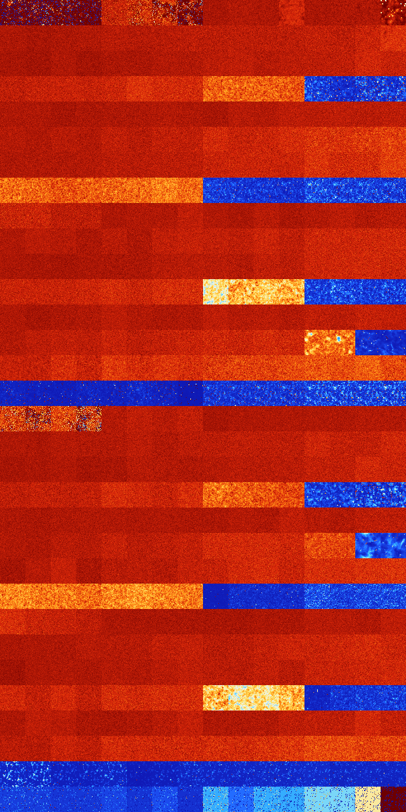

# B02348 (145920-146431)

<details>
    <summary>Initial Grid</summary>
    
</details>


<details>
    <summary>Initial Grid RLE</summary>

```
#C Exported from GoGoL (https://github.com/marrow16/gogol)
#C Wrap mode: Toroidal
#C Boundary mode: Dead
#C Step: 0
x = 100, y = 100, rule = B02348/S
49bo22bo23bo$26bobo36bobo7bo7b2o$27bo23bo5bo3bo28bo$7bo18bo8bobo17bo7bo
21bo$8bo6bo3bo25bo49bo$5bo15bo18b2o4bo22bo$11bo3bo7bo10bo38bo$24bo13bob
o10bo13bo11bo16bo$34bo2bo$21bo3bo41bo26bo$8bo19bobo16bo15bo25bo$bo12bob
o29bo2bo35bo$30bo10bobo4bo13bo3bo22bo$24bo7bo14bo7bo9bo4bo3bo4bo$bo8bo
26bo4bo17b2o16bo7bo$23bo5bo7bo28bo$o9bo17bo17bo2bo42bo$2bo45bo4bo11bo
24bo$48bo28bo17bo$11bo4b2obo26bo13bo31bo$28bo52bo$48bo20bo5bo23bo$8bo
52bo16bo$3bo33bo60bo$29bo16bo21bo25bo$35bo17bo20bo$4bo41bo44bo$28bo56bo
$42bo33bo10bo$45bo17bo$11bo49bo5bo$29bo3bo31bo15bo8bo5bo$30bo54bobo3bo$
3bo6bo30bo22bo32bo$77bobobo7bo$bo8bo8bo4bo11bo6bo6b2o22bo$25bo5bo12bobo
13bo8bo7bo8bo$13bo17bo53bo9bobo$2bo2bo34bo21bo2bo2bo17bo$21b2o20bo12bo
2bo2bo18bo11bo$15bo2bo17bo$bo7bo5bo2bobobobo9bo$37b2o30bo3bo16b2o$37bob
obo18bobo11bo8bo11bo$7bo36bo3bo4bo3bo7bo10bo$36bo26bo10bo3bo$63bo$4bo8b
o75bo$30bobo39bo4b2o13bo$14bo6bo5bo10bo52bo$15bo7bo11bo20bo32bo$16bo16b
o21bo16bo26bo$21bo17bo20bo29bo$79bo18bo$15bo3bobo8bo43bo$10bo6bo14bo4bo
8bo2bo11bo12bo23bo$9bo3bo4bo2bo11bo7bo6bo$22bo73bo$47bo26bo$22bo8bo12bo
15bo15bo15bo$o14bo4bo2bo4bobo4bo10bo14bo$35bo9bobobo8bo12bo10bo6bo8bo$
15bo12bo15bo21bo25bo$14bo2bo4bo$53bo$25bo4bo9bo2bo28bo3bo6bo$30bo4bo2bo
58b2o$6bo19b2ob2o24bo10bo4bo11bo$bo3bo19b2o9bo8bo12bo$33bo8bo31bo$34bo
3bo32b2o$5bo3bo4bo17b2o24bo2bo22bo4bobo6bo$36bobo13bo14bo13bo5bo3bo$5bo
34bo6bo22bo5bo7bo13bo$38bo8bo11bo19bobo$3bo35bo11bo18bo3bo7bo$28bo4bo
16bo9bo6bo$4bo62bo17bo$15bo2bo75bo2bo$35bo31bo17bo$o29bo22bo18bo4bobobo
4bo$6bo41bo22bo2bo$bobo12bo$28bo16bo43bo5b2o$90b2o3bo$23bobo30bo5bo$15b
o2bo40bo14bo$19bo13bo32bo19bo$5bo6bo4bo16bo38bo13bo$20bo7bo7bo11bo36bo
12bo$65bo9bo22bo$26bo38bo11bobo$11b2o16bo27bo25bo5bo2bo$31bo36bo6bo21bo
$39b2o4bo20b2o$6bo30bo11bo10bo2bo27bo$bo10bo18bo4bo22bobo$21bo31bo20bo$
9bo8bo4bo27bo13bo3bo14bo7bo$8bo7bo28bo6b2o8bo5bo21bo!
```
</details>
<details>
    <summary>Thumbnail</summary>

</details>
<table>
<tr>
    <td><a href="./145920%20S%20Heat%20Map%20Activity.png"></a><br>S (145920)<br>R@418,p120</td>    <td><a href="./145921%20S0%20Heat%20Map%20Activity.png"></a><br>S0 (145921)<br>R@229,p120</td>    <td><a href="./145922%20S1%20Heat%20Map%20Activity.png"></a><br>S1 (145922)<br>R@62,p12</td>    <td><a href="./145923%20S01%20Heat%20Map%20Activity.png"></a><br>S01 (145923)<br>R@128,p72</td>    <td><a href="./145924%20S2%20Heat%20Map%20Activity.png"></a><br>S2 (145924)<br>G>1000</td>    <td><a href="./145925%20S02%20Heat%20Map%20Activity.png"></a><br>S02 (145925)<br>G>1000</td>    <td><a href="./145926%20S12%20Heat%20Map%20Activity.png"></a><br>S12 (145926)<br>G>1000</td>    <td><a href="./145927%20S012%20Heat%20Map%20Activity.png"></a><br>S012 (145927)<br>R@380,p84</td>    <td><a href="./145928%20S3%20Heat%20Map%20Activity.png"></a><br>S3 (145928)<br>G>1000</td>    <td><a href="./145929%20S03%20Heat%20Map%20Activity.png"></a><br>S03 (145929)<br>G>1000</td>    <td><a href="./145930%20S13%20Heat%20Map%20Activity.png"></a><br>S13 (145930)<br>G>1000</td>    <td><a href="./145931%20S013%20Heat%20Map%20Activity.png"></a><br>S013 (145931)<br>G>1000</td>    <td><a href="./145932%20S23%20Heat%20Map%20Activity.png"></a><br>S23 (145932)<br>G>1000</td>    <td><a href="./145933%20S023%20Heat%20Map%20Activity.png"></a><br>S023 (145933)<br>G>1000</td>    <td><a href="./145934%20S123%20Heat%20Map%20Activity.png"></a><br>S123 (145934)<br>G>1000</td>    <td><a href="./145935%20S0123%20Heat%20Map%20Activity.png"></a><br>S0123 (145935)<br>R@238,p6</td></tr>
<tr>
    <td><a href="./145936%20S4%20Heat%20Map%20Activity.png"></a><br>S4 (145936)<br>G>1000</td>    <td><a href="./145937%20S04%20Heat%20Map%20Activity.png"></a><br>S04 (145937)<br>G>1000</td>    <td><a href="./145938%20S14%20Heat%20Map%20Activity.png"></a><br>S14 (145938)<br>G>1000</td>    <td><a href="./145939%20S014%20Heat%20Map%20Activity.png"></a><br>S014 (145939)<br>G>1000</td>    <td><a href="./145940%20S24%20Heat%20Map%20Activity.png"></a><br>S24 (145940)<br>G>1000</td>    <td><a href="./145941%20S024%20Heat%20Map%20Activity.png"></a><br>S024 (145941)<br>G>1000</td>    <td><a href="./145942%20S124%20Heat%20Map%20Activity.png"></a><br>S124 (145942)<br>G>1000</td>    <td><a href="./145943%20S0124%20Heat%20Map%20Activity.png"></a><br>S0124 (145943)<br>G>1000</td>    <td><a href="./145944%20S34%20Heat%20Map%20Activity.png"></a><br>S34 (145944)<br>G>1000</td>    <td><a href="./145945%20S034%20Heat%20Map%20Activity.png"></a><br>S034 (145945)<br>G>1000</td>    <td><a href="./145946%20S134%20Heat%20Map%20Activity.png"></a><br>S134 (145946)<br>G>1000</td>    <td><a href="./145947%20S0134%20Heat%20Map%20Activity.png"></a><br>S0134 (145947)<br>G>1000</td>    <td><a href="./145948%20S234%20Heat%20Map%20Activity.png"></a><br>S234 (145948)<br>G>1000</td>    <td><a href="./145949%20S0234%20Heat%20Map%20Activity.png"></a><br>S0234 (145949)<br>G>1000</td>    <td><a href="./145950%20S1234%20Heat%20Map%20Activity.png"></a><br>S1234 (145950)<br>G>1000</td>    <td><a href="./145951%20S01234%20Heat%20Map%20Activity.png"></a><br>S01234 (145951)<br>G>1000</td></tr>
<tr>
    <td><a href="./145952%20S5%20Heat%20Map%20Activity.png"></a><br>S5 (145952)<br>G>1000</td>    <td><a href="./145953%20S05%20Heat%20Map%20Activity.png"></a><br>S05 (145953)<br>G>1000</td>    <td><a href="./145954%20S15%20Heat%20Map%20Activity.png"></a><br>S15 (145954)<br>G>1000</td>    <td><a href="./145955%20S015%20Heat%20Map%20Activity.png"></a><br>S015 (145955)<br>G>1000</td>    <td><a href="./145956%20S25%20Heat%20Map%20Activity.png"></a><br>S25 (145956)<br>G>1000</td>    <td><a href="./145957%20S025%20Heat%20Map%20Activity.png"></a><br>S025 (145957)<br>G>1000</td>    <td><a href="./145958%20S125%20Heat%20Map%20Activity.png"></a><br>S125 (145958)<br>G>1000</td>    <td><a href="./145959%20S0125%20Heat%20Map%20Activity.png"></a><br>S0125 (145959)<br>G>1000</td>    <td><a href="./145960%20S35%20Heat%20Map%20Activity.png"></a><br>S35 (145960)<br>G>1000</td>    <td><a href="./145961%20S035%20Heat%20Map%20Activity.png"></a><br>S035 (145961)<br>G>1000</td>    <td><a href="./145962%20S135%20Heat%20Map%20Activity.png"></a><br>S135 (145962)<br>G>1000</td>    <td><a href="./145963%20S0135%20Heat%20Map%20Activity.png"></a><br>S0135 (145963)<br>G>1000</td>    <td><a href="./145964%20S235%20Heat%20Map%20Activity.png"></a><br>S235 (145964)<br>G>1000</td>    <td><a href="./145965%20S0235%20Heat%20Map%20Activity.png"></a><br>S0235 (145965)<br>G>1000</td>    <td><a href="./145966%20S1235%20Heat%20Map%20Activity.png"></a><br>S1235 (145966)<br>G>1000</td>    <td><a href="./145967%20S01235%20Heat%20Map%20Activity.png"></a><br>S01235 (145967)<br>G>1000</td></tr>
<tr>
    <td><a href="./145968%20S45%20Heat%20Map%20Activity.png"></a><br>S45 (145968)<br>G>1000</td>    <td><a href="./145969%20S045%20Heat%20Map%20Activity.png"></a><br>S045 (145969)<br>G>1000</td>    <td><a href="./145970%20S145%20Heat%20Map%20Activity.png"></a><br>S145 (145970)<br>G>1000</td>    <td><a href="./145971%20S0145%20Heat%20Map%20Activity.png"></a><br>S0145 (145971)<br>G>1000</td>    <td><a href="./145972%20S245%20Heat%20Map%20Activity.png"></a><br>S245 (145972)<br>G>1000</td>    <td><a href="./145973%20S0245%20Heat%20Map%20Activity.png"></a><br>S0245 (145973)<br>G>1000</td>    <td><a href="./145974%20S1245%20Heat%20Map%20Activity.png"></a><br>S1245 (145974)<br>G>1000</td>    <td><a href="./145975%20S01245%20Heat%20Map%20Activity.png"></a><br>S01245 (145975)<br>G>1000</td>    <td><a href="./145976%20S345%20Heat%20Map%20Activity.png"></a><br>S345 (145976)<br>G>1000</td>    <td><a href="./145977%20S0345%20Heat%20Map%20Activity.png"></a><br>S0345 (145977)<br>G>1000</td>    <td><a href="./145978%20S1345%20Heat%20Map%20Activity.png"></a><br>S1345 (145978)<br>G>1000</td>    <td><a href="./145979%20S01345%20Heat%20Map%20Activity.png"></a><br>S01345 (145979)<br>G>1000</td>    <td><a href="./145980%20S2345%20Heat%20Map%20Activity.png"></a><br>S2345 (145980)<br>R@104,p24</td>    <td><a href="./145981%20S02345%20Heat%20Map%20Activity.png"></a><br>S02345 (145981)<br>R@198,p120</td>    <td><a href="./145982%20S12345%20Heat%20Map%20Activity.png"></a><br>S12345 (145982)<br>R@115,p12</td>    <td><a href="./145983%20S012345%20Heat%20Map%20Activity.png"></a><br>S012345 (145983)<br>R@143,p40</td></tr>
<tr>
    <td><a href="./145984%20S6%20Heat%20Map%20Activity.png"></a><br>S6 (145984)<br>G>1000</td>    <td><a href="./145985%20S06%20Heat%20Map%20Activity.png"></a><br>S06 (145985)<br>G>1000</td>    <td><a href="./145986%20S16%20Heat%20Map%20Activity.png"></a><br>S16 (145986)<br>G>1000</td>    <td><a href="./145987%20S016%20Heat%20Map%20Activity.png"></a><br>S016 (145987)<br>G>1000</td>    <td><a href="./145988%20S26%20Heat%20Map%20Activity.png"></a><br>S26 (145988)<br>G>1000</td>    <td><a href="./145989%20S026%20Heat%20Map%20Activity.png"></a><br>S026 (145989)<br>G>1000</td>    <td><a href="./145990%20S126%20Heat%20Map%20Activity.png"></a><br>S126 (145990)<br>G>1000</td>    <td><a href="./145991%20S0126%20Heat%20Map%20Activity.png"></a><br>S0126 (145991)<br>G>1000</td>    <td><a href="./145992%20S36%20Heat%20Map%20Activity.png"></a><br>S36 (145992)<br>G>1000</td>    <td><a href="./145993%20S036%20Heat%20Map%20Activity.png"></a><br>S036 (145993)<br>G>1000</td>    <td><a href="./145994%20S136%20Heat%20Map%20Activity.png"></a><br>S136 (145994)<br>G>1000</td>    <td><a href="./145995%20S0136%20Heat%20Map%20Activity.png"></a><br>S0136 (145995)<br>G>1000</td>    <td><a href="./145996%20S236%20Heat%20Map%20Activity.png"></a><br>S236 (145996)<br>G>1000</td>    <td><a href="./145997%20S0236%20Heat%20Map%20Activity.png"></a><br>S0236 (145997)<br>G>1000</td>    <td><a href="./145998%20S1236%20Heat%20Map%20Activity.png"></a><br>S1236 (145998)<br>G>1000</td>    <td><a href="./145999%20S01236%20Heat%20Map%20Activity.png"></a><br>S01236 (145999)<br>G>1000</td></tr>
<tr>
    <td><a href="./146000%20S46%20Heat%20Map%20Activity.png"></a><br>S46 (146000)<br>G>1000</td>    <td><a href="./146001%20S046%20Heat%20Map%20Activity.png"></a><br>S046 (146001)<br>G>1000</td>    <td><a href="./146002%20S146%20Heat%20Map%20Activity.png"></a><br>S146 (146002)<br>G>1000</td>    <td><a href="./146003%20S0146%20Heat%20Map%20Activity.png"></a><br>S0146 (146003)<br>G>1000</td>    <td><a href="./146004%20S246%20Heat%20Map%20Activity.png"></a><br>S246 (146004)<br>G>1000</td>    <td><a href="./146005%20S0246%20Heat%20Map%20Activity.png"></a><br>S0246 (146005)<br>G>1000</td>    <td><a href="./146006%20S1246%20Heat%20Map%20Activity.png"></a><br>S1246 (146006)<br>G>1000</td>    <td><a href="./146007%20S01246%20Heat%20Map%20Activity.png"></a><br>S01246 (146007)<br>G>1000</td>    <td><a href="./146008%20S346%20Heat%20Map%20Activity.png"></a><br>S346 (146008)<br>G>1000</td>    <td><a href="./146009%20S0346%20Heat%20Map%20Activity.png"></a><br>S0346 (146009)<br>G>1000</td>    <td><a href="./146010%20S1346%20Heat%20Map%20Activity.png"></a><br>S1346 (146010)<br>G>1000</td>    <td><a href="./146011%20S01346%20Heat%20Map%20Activity.png"></a><br>S01346 (146011)<br>G>1000</td>    <td><a href="./146012%20S2346%20Heat%20Map%20Activity.png"></a><br>S2346 (146012)<br>G>1000</td>    <td><a href="./146013%20S02346%20Heat%20Map%20Activity.png"></a><br>S02346 (146013)<br>G>1000</td>    <td><a href="./146014%20S12346%20Heat%20Map%20Activity.png"></a><br>S12346 (146014)<br>G>1000</td>    <td><a href="./146015%20S012346%20Heat%20Map%20Activity.png"></a><br>S012346 (146015)<br>G>1000</td></tr>
<tr>
    <td><a href="./146016%20S56%20Heat%20Map%20Activity.png"></a><br>S56 (146016)<br>G>1000</td>    <td><a href="./146017%20S056%20Heat%20Map%20Activity.png"></a><br>S056 (146017)<br>G>1000</td>    <td><a href="./146018%20S156%20Heat%20Map%20Activity.png"></a><br>S156 (146018)<br>G>1000</td>    <td><a href="./146019%20S0156%20Heat%20Map%20Activity.png"></a><br>S0156 (146019)<br>G>1000</td>    <td><a href="./146020%20S256%20Heat%20Map%20Activity.png"></a><br>S256 (146020)<br>G>1000</td>    <td><a href="./146021%20S0256%20Heat%20Map%20Activity.png"></a><br>S0256 (146021)<br>G>1000</td>    <td><a href="./146022%20S1256%20Heat%20Map%20Activity.png"></a><br>S1256 (146022)<br>G>1000</td>    <td><a href="./146023%20S01256%20Heat%20Map%20Activity.png"></a><br>S01256 (146023)<br>G>1000</td>    <td><a href="./146024%20S356%20Heat%20Map%20Activity.png"></a><br>S356 (146024)<br>G>1000</td>    <td><a href="./146025%20S0356%20Heat%20Map%20Activity.png"></a><br>S0356 (146025)<br>G>1000</td>    <td><a href="./146026%20S1356%20Heat%20Map%20Activity.png"></a><br>S1356 (146026)<br>G>1000</td>    <td><a href="./146027%20S01356%20Heat%20Map%20Activity.png"></a><br>S01356 (146027)<br>G>1000</td>    <td><a href="./146028%20S2356%20Heat%20Map%20Activity.png"></a><br>S2356 (146028)<br>G>1000</td>    <td><a href="./146029%20S02356%20Heat%20Map%20Activity.png"></a><br>S02356 (146029)<br>G>1000</td>    <td><a href="./146030%20S12356%20Heat%20Map%20Activity.png"></a><br>S12356 (146030)<br>G>1000</td>    <td><a href="./146031%20S012356%20Heat%20Map%20Activity.png"></a><br>S012356 (146031)<br>G>1000</td></tr>
<tr>
    <td><a href="./146032%20S456%20Heat%20Map%20Activity.png"></a><br>S456 (146032)<br>G>1000</td>    <td><a href="./146033%20S0456%20Heat%20Map%20Activity.png"></a><br>S0456 (146033)<br>G>1000</td>    <td><a href="./146034%20S1456%20Heat%20Map%20Activity.png"></a><br>S1456 (146034)<br>G>1000</td>    <td><a href="./146035%20S01456%20Heat%20Map%20Activity.png"></a><br>S01456 (146035)<br>G>1000</td>    <td><a href="./146036%20S2456%20Heat%20Map%20Activity.png"></a><br>S2456 (146036)<br>G>1000</td>    <td><a href="./146037%20S02456%20Heat%20Map%20Activity.png"></a><br>S02456 (146037)<br>G>1000</td>    <td><a href="./146038%20S12456%20Heat%20Map%20Activity.png"></a><br>S12456 (146038)<br>G>1000</td>    <td><a href="./146039%20S012456%20Heat%20Map%20Activity.png"></a><br>S012456 (146039)<br>G>1000</td>    <td><a href="./146040%20S3456%20Heat%20Map%20Activity.png"></a><br>S3456 (146040)<br>R@42,p12</td>    <td><a href="./146041%20S03456%20Heat%20Map%20Activity.png"></a><br>S03456 (146041)<br>R@47,p12</td>    <td><a href="./146042%20S13456%20Heat%20Map%20Activity.png"></a><br>S13456 (146042)<br>R@51,p12</td>    <td><a href="./146043%20S013456%20Heat%20Map%20Activity.png"></a><br>S013456 (146043)<br>R@56,p12</td>    <td><a href="./146044%20S23456%20Heat%20Map%20Activity.png"></a><br>S23456 (146044)<br>R@27,p12</td>    <td><a href="./146045%20S023456%20Heat%20Map%20Activity.png"></a><br>S023456 (146045)<br>R@30,p12</td>    <td><a href="./146046%20S123456%20Heat%20Map%20Activity.png"></a><br>S123456 (146046)<br>R@30,p12</td>    <td><a href="./146047%20S0123456%20Heat%20Map%20Activity.png"></a><br>S0123456 (146047)<br>R@30,p12</td></tr>
<tr>
    <td><a href="./146048%20S7%20Heat%20Map%20Activity.png"></a><br>S7 (146048)<br>G>1000</td>    <td><a href="./146049%20S07%20Heat%20Map%20Activity.png"></a><br>S07 (146049)<br>G>1000</td>    <td><a href="./146050%20S17%20Heat%20Map%20Activity.png"></a><br>S17 (146050)<br>G>1000</td>    <td><a href="./146051%20S017%20Heat%20Map%20Activity.png"></a><br>S017 (146051)<br>G>1000</td>    <td><a href="./146052%20S27%20Heat%20Map%20Activity.png"></a><br>S27 (146052)<br>G>1000</td>    <td><a href="./146053%20S027%20Heat%20Map%20Activity.png"></a><br>S027 (146053)<br>G>1000</td>    <td><a href="./146054%20S127%20Heat%20Map%20Activity.png"></a><br>S127 (146054)<br>G>1000</td>    <td><a href="./146055%20S0127%20Heat%20Map%20Activity.png"></a><br>S0127 (146055)<br>G>1000</td>    <td><a href="./146056%20S37%20Heat%20Map%20Activity.png"></a><br>S37 (146056)<br>G>1000</td>    <td><a href="./146057%20S037%20Heat%20Map%20Activity.png"></a><br>S037 (146057)<br>G>1000</td>    <td><a href="./146058%20S137%20Heat%20Map%20Activity.png"></a><br>S137 (146058)<br>G>1000</td>    <td><a href="./146059%20S0137%20Heat%20Map%20Activity.png"></a><br>S0137 (146059)<br>G>1000</td>    <td><a href="./146060%20S237%20Heat%20Map%20Activity.png"></a><br>S237 (146060)<br>G>1000</td>    <td><a href="./146061%20S0237%20Heat%20Map%20Activity.png"></a><br>S0237 (146061)<br>G>1000</td>    <td><a href="./146062%20S1237%20Heat%20Map%20Activity.png"></a><br>S1237 (146062)<br>G>1000</td>    <td><a href="./146063%20S01237%20Heat%20Map%20Activity.png"></a><br>S01237 (146063)<br>G>1000</td></tr>
<tr>
    <td><a href="./146064%20S47%20Heat%20Map%20Activity.png"></a><br>S47 (146064)<br>G>1000</td>    <td><a href="./146065%20S047%20Heat%20Map%20Activity.png"></a><br>S047 (146065)<br>G>1000</td>    <td><a href="./146066%20S147%20Heat%20Map%20Activity.png"></a><br>S147 (146066)<br>G>1000</td>    <td><a href="./146067%20S0147%20Heat%20Map%20Activity.png"></a><br>S0147 (146067)<br>G>1000</td>    <td><a href="./146068%20S247%20Heat%20Map%20Activity.png"></a><br>S247 (146068)<br>G>1000</td>    <td><a href="./146069%20S0247%20Heat%20Map%20Activity.png"></a><br>S0247 (146069)<br>G>1000</td>    <td><a href="./146070%20S1247%20Heat%20Map%20Activity.png"></a><br>S1247 (146070)<br>G>1000</td>    <td><a href="./146071%20S01247%20Heat%20Map%20Activity.png"></a><br>S01247 (146071)<br>G>1000</td>    <td><a href="./146072%20S347%20Heat%20Map%20Activity.png"></a><br>S347 (146072)<br>G>1000</td>    <td><a href="./146073%20S0347%20Heat%20Map%20Activity.png"></a><br>S0347 (146073)<br>G>1000</td>    <td><a href="./146074%20S1347%20Heat%20Map%20Activity.png"></a><br>S1347 (146074)<br>G>1000</td>    <td><a href="./146075%20S01347%20Heat%20Map%20Activity.png"></a><br>S01347 (146075)<br>G>1000</td>    <td><a href="./146076%20S2347%20Heat%20Map%20Activity.png"></a><br>S2347 (146076)<br>G>1000</td>    <td><a href="./146077%20S02347%20Heat%20Map%20Activity.png"></a><br>S02347 (146077)<br>G>1000</td>    <td><a href="./146078%20S12347%20Heat%20Map%20Activity.png"></a><br>S12347 (146078)<br>G>1000</td>    <td><a href="./146079%20S012347%20Heat%20Map%20Activity.png"></a><br>S012347 (146079)<br>G>1000</td></tr>
<tr>
    <td><a href="./146080%20S57%20Heat%20Map%20Activity.png"></a><br>S57 (146080)<br>G>1000</td>    <td><a href="./146081%20S057%20Heat%20Map%20Activity.png"></a><br>S057 (146081)<br>G>1000</td>    <td><a href="./146082%20S157%20Heat%20Map%20Activity.png"></a><br>S157 (146082)<br>G>1000</td>    <td><a href="./146083%20S0157%20Heat%20Map%20Activity.png"></a><br>S0157 (146083)<br>G>1000</td>    <td><a href="./146084%20S257%20Heat%20Map%20Activity.png"></a><br>S257 (146084)<br>G>1000</td>    <td><a href="./146085%20S0257%20Heat%20Map%20Activity.png"></a><br>S0257 (146085)<br>G>1000</td>    <td><a href="./146086%20S1257%20Heat%20Map%20Activity.png"></a><br>S1257 (146086)<br>G>1000</td>    <td><a href="./146087%20S01257%20Heat%20Map%20Activity.png"></a><br>S01257 (146087)<br>G>1000</td>    <td><a href="./146088%20S357%20Heat%20Map%20Activity.png"></a><br>S357 (146088)<br>G>1000</td>    <td><a href="./146089%20S0357%20Heat%20Map%20Activity.png"></a><br>S0357 (146089)<br>G>1000</td>    <td><a href="./146090%20S1357%20Heat%20Map%20Activity.png"></a><br>S1357 (146090)<br>G>1000</td>    <td><a href="./146091%20S01357%20Heat%20Map%20Activity.png"></a><br>S01357 (146091)<br>G>1000</td>    <td><a href="./146092%20S2357%20Heat%20Map%20Activity.png"></a><br>S2357 (146092)<br>G>1000</td>    <td><a href="./146093%20S02357%20Heat%20Map%20Activity.png"></a><br>S02357 (146093)<br>G>1000</td>    <td><a href="./146094%20S12357%20Heat%20Map%20Activity.png"></a><br>S12357 (146094)<br>G>1000</td>    <td><a href="./146095%20S012357%20Heat%20Map%20Activity.png"></a><br>S012357 (146095)<br>G>1000</td></tr>
<tr>
    <td><a href="./146096%20S457%20Heat%20Map%20Activity.png"></a><br>S457 (146096)<br>G>1000</td>    <td><a href="./146097%20S0457%20Heat%20Map%20Activity.png"></a><br>S0457 (146097)<br>G>1000</td>    <td><a href="./146098%20S1457%20Heat%20Map%20Activity.png"></a><br>S1457 (146098)<br>G>1000</td>    <td><a href="./146099%20S01457%20Heat%20Map%20Activity.png"></a><br>S01457 (146099)<br>G>1000</td>    <td><a href="./146100%20S2457%20Heat%20Map%20Activity.png"></a><br>S2457 (146100)<br>G>1000</td>    <td><a href="./146101%20S02457%20Heat%20Map%20Activity.png"></a><br>S02457 (146101)<br>G>1000</td>    <td><a href="./146102%20S12457%20Heat%20Map%20Activity.png"></a><br>S12457 (146102)<br>G>1000</td>    <td><a href="./146103%20S012457%20Heat%20Map%20Activity.png"></a><br>S012457 (146103)<br>G>1000</td>    <td><a href="./146104%20S3457%20Heat%20Map%20Activity.png"></a><br>S3457 (146104)<br>G>1000</td>    <td><a href="./146105%20S03457%20Heat%20Map%20Activity.png"></a><br>S03457 (146105)<br>G>1000</td>    <td><a href="./146106%20S13457%20Heat%20Map%20Activity.png"></a><br>S13457 (146106)<br>G>1000</td>    <td><a href="./146107%20S013457%20Heat%20Map%20Activity.png"></a><br>S013457 (146107)<br>G>1000</td>    <td><a href="./146108%20S23457%20Heat%20Map%20Activity.png"></a><br>S23457 (146108)<br>R@52,p12</td>    <td><a href="./146109%20S023457%20Heat%20Map%20Activity.png"></a><br>S023457 (146109)<br>R@42,p2</td>    <td><a href="./146110%20S123457%20Heat%20Map%20Activity.png"></a><br>S123457 (146110)<br>R@52,p12</td>    <td><a href="./146111%20S0123457%20Heat%20Map%20Activity.png"></a><br>S0123457 (146111)<br>R@45,p12</td></tr>
<tr>
    <td><a href="./146112%20S67%20Heat%20Map%20Activity.png"></a><br>S67 (146112)<br>G>1000</td>    <td><a href="./146113%20S067%20Heat%20Map%20Activity.png"></a><br>S067 (146113)<br>G>1000</td>    <td><a href="./146114%20S167%20Heat%20Map%20Activity.png"></a><br>S167 (146114)<br>G>1000</td>    <td><a href="./146115%20S0167%20Heat%20Map%20Activity.png"></a><br>S0167 (146115)<br>G>1000</td>    <td><a href="./146116%20S267%20Heat%20Map%20Activity.png"></a><br>S267 (146116)<br>G>1000</td>    <td><a href="./146117%20S0267%20Heat%20Map%20Activity.png"></a><br>S0267 (146117)<br>G>1000</td>    <td><a href="./146118%20S1267%20Heat%20Map%20Activity.png"></a><br>S1267 (146118)<br>G>1000</td>    <td><a href="./146119%20S01267%20Heat%20Map%20Activity.png"></a><br>S01267 (146119)<br>G>1000</td>    <td><a href="./146120%20S367%20Heat%20Map%20Activity.png"></a><br>S367 (146120)<br>G>1000</td>    <td><a href="./146121%20S0367%20Heat%20Map%20Activity.png"></a><br>S0367 (146121)<br>G>1000</td>    <td><a href="./146122%20S1367%20Heat%20Map%20Activity.png"></a><br>S1367 (146122)<br>G>1000</td>    <td><a href="./146123%20S01367%20Heat%20Map%20Activity.png"></a><br>S01367 (146123)<br>G>1000</td>    <td><a href="./146124%20S2367%20Heat%20Map%20Activity.png"></a><br>S2367 (146124)<br>G>1000</td>    <td><a href="./146125%20S02367%20Heat%20Map%20Activity.png"></a><br>S02367 (146125)<br>G>1000</td>    <td><a href="./146126%20S12367%20Heat%20Map%20Activity.png"></a><br>S12367 (146126)<br>G>1000</td>    <td><a href="./146127%20S012367%20Heat%20Map%20Activity.png"></a><br>S012367 (146127)<br>G>1000</td></tr>
<tr>
    <td><a href="./146128%20S467%20Heat%20Map%20Activity.png"></a><br>S467 (146128)<br>G>1000</td>    <td><a href="./146129%20S0467%20Heat%20Map%20Activity.png"></a><br>S0467 (146129)<br>G>1000</td>    <td><a href="./146130%20S1467%20Heat%20Map%20Activity.png"></a><br>S1467 (146130)<br>G>1000</td>    <td><a href="./146131%20S01467%20Heat%20Map%20Activity.png"></a><br>S01467 (146131)<br>G>1000</td>    <td><a href="./146132%20S2467%20Heat%20Map%20Activity.png"></a><br>S2467 (146132)<br>G>1000</td>    <td><a href="./146133%20S02467%20Heat%20Map%20Activity.png"></a><br>S02467 (146133)<br>G>1000</td>    <td><a href="./146134%20S12467%20Heat%20Map%20Activity.png"></a><br>S12467 (146134)<br>G>1000</td>    <td><a href="./146135%20S012467%20Heat%20Map%20Activity.png"></a><br>S012467 (146135)<br>G>1000</td>    <td><a href="./146136%20S3467%20Heat%20Map%20Activity.png"></a><br>S3467 (146136)<br>G>1000</td>    <td><a href="./146137%20S03467%20Heat%20Map%20Activity.png"></a><br>S03467 (146137)<br>G>1000</td>    <td><a href="./146138%20S13467%20Heat%20Map%20Activity.png"></a><br>S13467 (146138)<br>G>1000</td>    <td><a href="./146139%20S013467%20Heat%20Map%20Activity.png"></a><br>S013467 (146139)<br>G>1000</td>    <td><a href="./146140%20S23467%20Heat%20Map%20Activity.png"></a><br>S23467 (146140)<br>G>1000</td>    <td><a href="./146141%20S023467%20Heat%20Map%20Activity.png"></a><br>S023467 (146141)<br>G>1000</td>    <td><a href="./146142%20S123467%20Heat%20Map%20Activity.png"></a><br>S123467 (146142)<br>G>1000</td>    <td><a href="./146143%20S0123467%20Heat%20Map%20Activity.png"></a><br>S0123467 (146143)<br>G>1000</td></tr>
<tr>
    <td><a href="./146144%20S567%20Heat%20Map%20Activity.png"></a><br>S567 (146144)<br>G>1000</td>    <td><a href="./146145%20S0567%20Heat%20Map%20Activity.png"></a><br>S0567 (146145)<br>G>1000</td>    <td><a href="./146146%20S1567%20Heat%20Map%20Activity.png"></a><br>S1567 (146146)<br>G>1000</td>    <td><a href="./146147%20S01567%20Heat%20Map%20Activity.png"></a><br>S01567 (146147)<br>G>1000</td>    <td><a href="./146148%20S2567%20Heat%20Map%20Activity.png"></a><br>S2567 (146148)<br>G>1000</td>    <td><a href="./146149%20S02567%20Heat%20Map%20Activity.png"></a><br>S02567 (146149)<br>G>1000</td>    <td><a href="./146150%20S12567%20Heat%20Map%20Activity.png"></a><br>S12567 (146150)<br>G>1000</td>    <td><a href="./146151%20S012567%20Heat%20Map%20Activity.png"></a><br>S012567 (146151)<br>G>1000</td>    <td><a href="./146152%20S3567%20Heat%20Map%20Activity.png"></a><br>S3567 (146152)<br>G>1000</td>    <td><a href="./146153%20S03567%20Heat%20Map%20Activity.png"></a><br>S03567 (146153)<br>G>1000</td>    <td><a href="./146154%20S13567%20Heat%20Map%20Activity.png"></a><br>S13567 (146154)<br>G>1000</td>    <td><a href="./146155%20S013567%20Heat%20Map%20Activity.png"></a><br>S013567 (146155)<br>G>1000</td>    <td><a href="./146156%20S23567%20Heat%20Map%20Activity.png"></a><br>S23567 (146156)<br>G>1000</td>    <td><a href="./146157%20S023567%20Heat%20Map%20Activity.png"></a><br>S023567 (146157)<br>G>1000</td>    <td><a href="./146158%20S123567%20Heat%20Map%20Activity.png"></a><br>S123567 (146158)<br>G>1000</td>    <td><a href="./146159%20S0123567%20Heat%20Map%20Activity.png"></a><br>S0123567 (146159)<br>G>1000</td></tr>
<tr>
    <td><a href="./146160%20S4567%20Heat%20Map%20Activity.png"></a><br>S4567 (146160)<br>R@102,p60</td>    <td><a href="./146161%20S04567%20Heat%20Map%20Activity.png"></a><br>S04567 (146161)<br>R@154,p120</td>    <td><a href="./146162%20S14567%20Heat%20Map%20Activity.png"></a><br>S14567 (146162)<br>R@175,p120</td>    <td><a href="./146163%20S014567%20Heat%20Map%20Activity.png"></a><br>S014567 (146163)<br>R@97,p60</td>    <td><a href="./146164%20S24567%20Heat%20Map%20Activity.png"></a><br>S24567 (146164)<br>R@130,p84</td>    <td><a href="./146165%20S024567%20Heat%20Map%20Activity.png"></a><br>S024567 (146165)<br>R@76,p12</td>    <td><a href="./146166%20S124567%20Heat%20Map%20Activity.png"></a><br>S124567 (146166)<br>R@124,p60</td>    <td><a href="./146167%20S0124567%20Heat%20Map%20Activity.png"></a><br>S0124567 (146167)<br>R@886,p840</td>    <td><a href="./146168%20S34567%20Heat%20Map%20Activity.png"></a><br>S34567 (146168)<br>R@31,p12</td>    <td><a href="./146169%20S034567%20Heat%20Map%20Activity.png"></a><br>S034567 (146169)<br>R@31,p12</td>    <td><a href="./146170%20S134567%20Heat%20Map%20Activity.png"></a><br>S134567 (146170)<br>R@28,p12</td>    <td><a href="./146171%20S0134567%20Heat%20Map%20Activity.png"></a><br>S0134567 (146171)<br>R@28,p12</td>    <td><a href="./146172%20S234567%20Heat%20Map%20Activity.png"></a><br>S234567 (146172)<br>R@22,p6</td>    <td><a href="./146173%20S0234567%20Heat%20Map%20Activity.png"></a><br>S0234567 (146173)<br>R@21,p6</td>    <td><a href="./146174%20S1234567%20Heat%20Map%20Activity.png"></a><br>S1234567 (146174)<br>R@22,p6</td>    <td><a href="./146175%20S01234567%20Heat%20Map%20Activity.png"></a><br>S01234567 (146175)<br>R@20,p6</td></tr>
<tr>
    <td><a href="./146176%20S8%20Heat%20Map%20Activity.png"></a><br>S8 (146176)<br>G>1000</td>    <td><a href="./146177%20S08%20Heat%20Map%20Activity.png"></a><br>S08 (146177)<br>G>1000</td>    <td><a href="./146178%20S18%20Heat%20Map%20Activity.png"></a><br>S18 (146178)<br>G>1000</td>    <td><a href="./146179%20S018%20Heat%20Map%20Activity.png"></a><br>S018 (146179)<br>G>1000</td>    <td><a href="./146180%20S28%20Heat%20Map%20Activity.png"></a><br>S28 (146180)<br>G>1000</td>    <td><a href="./146181%20S028%20Heat%20Map%20Activity.png"></a><br>S028 (146181)<br>G>1000</td>    <td><a href="./146182%20S128%20Heat%20Map%20Activity.png"></a><br>S128 (146182)<br>G>1000</td>    <td><a href="./146183%20S0128%20Heat%20Map%20Activity.png"></a><br>S0128 (146183)<br>G>1000</td>    <td><a href="./146184%20S38%20Heat%20Map%20Activity.png"></a><br>S38 (146184)<br>G>1000</td>    <td><a href="./146185%20S038%20Heat%20Map%20Activity.png"></a><br>S038 (146185)<br>G>1000</td>    <td><a href="./146186%20S138%20Heat%20Map%20Activity.png"></a><br>S138 (146186)<br>G>1000</td>    <td><a href="./146187%20S0138%20Heat%20Map%20Activity.png"></a><br>S0138 (146187)<br>G>1000</td>    <td><a href="./146188%20S238%20Heat%20Map%20Activity.png"></a><br>S238 (146188)<br>G>1000</td>    <td><a href="./146189%20S0238%20Heat%20Map%20Activity.png"></a><br>S0238 (146189)<br>G>1000</td>    <td><a href="./146190%20S1238%20Heat%20Map%20Activity.png"></a><br>S1238 (146190)<br>G>1000</td>    <td><a href="./146191%20S01238%20Heat%20Map%20Activity.png"></a><br>S01238 (146191)<br>G>1000</td></tr>
<tr>
    <td><a href="./146192%20S48%20Heat%20Map%20Activity.png"></a><br>S48 (146192)<br>G>1000</td>    <td><a href="./146193%20S048%20Heat%20Map%20Activity.png"></a><br>S048 (146193)<br>G>1000</td>    <td><a href="./146194%20S148%20Heat%20Map%20Activity.png"></a><br>S148 (146194)<br>G>1000</td>    <td><a href="./146195%20S0148%20Heat%20Map%20Activity.png"></a><br>S0148 (146195)<br>G>1000</td>    <td><a href="./146196%20S248%20Heat%20Map%20Activity.png"></a><br>S248 (146196)<br>G>1000</td>    <td><a href="./146197%20S0248%20Heat%20Map%20Activity.png"></a><br>S0248 (146197)<br>G>1000</td>    <td><a href="./146198%20S1248%20Heat%20Map%20Activity.png"></a><br>S1248 (146198)<br>G>1000</td>    <td><a href="./146199%20S01248%20Heat%20Map%20Activity.png"></a><br>S01248 (146199)<br>G>1000</td>    <td><a href="./146200%20S348%20Heat%20Map%20Activity.png"></a><br>S348 (146200)<br>G>1000</td>    <td><a href="./146201%20S0348%20Heat%20Map%20Activity.png"></a><br>S0348 (146201)<br>G>1000</td>    <td><a href="./146202%20S1348%20Heat%20Map%20Activity.png"></a><br>S1348 (146202)<br>G>1000</td>    <td><a href="./146203%20S01348%20Heat%20Map%20Activity.png"></a><br>S01348 (146203)<br>G>1000</td>    <td><a href="./146204%20S2348%20Heat%20Map%20Activity.png"></a><br>S2348 (146204)<br>G>1000</td>    <td><a href="./146205%20S02348%20Heat%20Map%20Activity.png"></a><br>S02348 (146205)<br>G>1000</td>    <td><a href="./146206%20S12348%20Heat%20Map%20Activity.png"></a><br>S12348 (146206)<br>G>1000</td>    <td><a href="./146207%20S012348%20Heat%20Map%20Activity.png"></a><br>S012348 (146207)<br>G>1000</td></tr>
<tr>
    <td><a href="./146208%20S58%20Heat%20Map%20Activity.png"></a><br>S58 (146208)<br>G>1000</td>    <td><a href="./146209%20S058%20Heat%20Map%20Activity.png"></a><br>S058 (146209)<br>G>1000</td>    <td><a href="./146210%20S158%20Heat%20Map%20Activity.png"></a><br>S158 (146210)<br>G>1000</td>    <td><a href="./146211%20S0158%20Heat%20Map%20Activity.png"></a><br>S0158 (146211)<br>G>1000</td>    <td><a href="./146212%20S258%20Heat%20Map%20Activity.png"></a><br>S258 (146212)<br>G>1000</td>    <td><a href="./146213%20S0258%20Heat%20Map%20Activity.png"></a><br>S0258 (146213)<br>G>1000</td>    <td><a href="./146214%20S1258%20Heat%20Map%20Activity.png"></a><br>S1258 (146214)<br>G>1000</td>    <td><a href="./146215%20S01258%20Heat%20Map%20Activity.png"></a><br>S01258 (146215)<br>G>1000</td>    <td><a href="./146216%20S358%20Heat%20Map%20Activity.png"></a><br>S358 (146216)<br>G>1000</td>    <td><a href="./146217%20S0358%20Heat%20Map%20Activity.png"></a><br>S0358 (146217)<br>G>1000</td>    <td><a href="./146218%20S1358%20Heat%20Map%20Activity.png"></a><br>S1358 (146218)<br>G>1000</td>    <td><a href="./146219%20S01358%20Heat%20Map%20Activity.png"></a><br>S01358 (146219)<br>G>1000</td>    <td><a href="./146220%20S2358%20Heat%20Map%20Activity.png"></a><br>S2358 (146220)<br>G>1000</td>    <td><a href="./146221%20S02358%20Heat%20Map%20Activity.png"></a><br>S02358 (146221)<br>G>1000</td>    <td><a href="./146222%20S12358%20Heat%20Map%20Activity.png"></a><br>S12358 (146222)<br>G>1000</td>    <td><a href="./146223%20S012358%20Heat%20Map%20Activity.png"></a><br>S012358 (146223)<br>G>1000</td></tr>
<tr>
    <td><a href="./146224%20S458%20Heat%20Map%20Activity.png"></a><br>S458 (146224)<br>G>1000</td>    <td><a href="./146225%20S0458%20Heat%20Map%20Activity.png"></a><br>S0458 (146225)<br>G>1000</td>    <td><a href="./146226%20S1458%20Heat%20Map%20Activity.png"></a><br>S1458 (146226)<br>G>1000</td>    <td><a href="./146227%20S01458%20Heat%20Map%20Activity.png"></a><br>S01458 (146227)<br>G>1000</td>    <td><a href="./146228%20S2458%20Heat%20Map%20Activity.png"></a><br>S2458 (146228)<br>G>1000</td>    <td><a href="./146229%20S02458%20Heat%20Map%20Activity.png"></a><br>S02458 (146229)<br>G>1000</td>    <td><a href="./146230%20S12458%20Heat%20Map%20Activity.png"></a><br>S12458 (146230)<br>G>1000</td>    <td><a href="./146231%20S012458%20Heat%20Map%20Activity.png"></a><br>S012458 (146231)<br>G>1000</td>    <td><a href="./146232%20S3458%20Heat%20Map%20Activity.png"></a><br>S3458 (146232)<br>G>1000</td>    <td><a href="./146233%20S03458%20Heat%20Map%20Activity.png"></a><br>S03458 (146233)<br>G>1000</td>    <td><a href="./146234%20S13458%20Heat%20Map%20Activity.png"></a><br>S13458 (146234)<br>G>1000</td>    <td><a href="./146235%20S013458%20Heat%20Map%20Activity.png"></a><br>S013458 (146235)<br>G>1000</td>    <td><a href="./146236%20S23458%20Heat%20Map%20Activity.png"></a><br>S23458 (146236)<br>R@123,p24</td>    <td><a href="./146237%20S023458%20Heat%20Map%20Activity.png"></a><br>S023458 (146237)<br>R@174,p24</td>    <td><a href="./146238%20S123458%20Heat%20Map%20Activity.png"></a><br>S123458 (146238)<br>R@151,p12</td>    <td><a href="./146239%20S0123458%20Heat%20Map%20Activity.png"></a><br>S0123458 (146239)<br>R@146,p12</td></tr>
<tr>
    <td><a href="./146240%20S68%20Heat%20Map%20Activity.png"></a><br>S68 (146240)<br>G>1000</td>    <td><a href="./146241%20S068%20Heat%20Map%20Activity.png"></a><br>S068 (146241)<br>G>1000</td>    <td><a href="./146242%20S168%20Heat%20Map%20Activity.png"></a><br>S168 (146242)<br>G>1000</td>    <td><a href="./146243%20S0168%20Heat%20Map%20Activity.png"></a><br>S0168 (146243)<br>G>1000</td>    <td><a href="./146244%20S268%20Heat%20Map%20Activity.png"></a><br>S268 (146244)<br>G>1000</td>    <td><a href="./146245%20S0268%20Heat%20Map%20Activity.png"></a><br>S0268 (146245)<br>G>1000</td>    <td><a href="./146246%20S1268%20Heat%20Map%20Activity.png"></a><br>S1268 (146246)<br>G>1000</td>    <td><a href="./146247%20S01268%20Heat%20Map%20Activity.png"></a><br>S01268 (146247)<br>G>1000</td>    <td><a href="./146248%20S368%20Heat%20Map%20Activity.png"></a><br>S368 (146248)<br>G>1000</td>    <td><a href="./146249%20S0368%20Heat%20Map%20Activity.png"></a><br>S0368 (146249)<br>G>1000</td>    <td><a href="./146250%20S1368%20Heat%20Map%20Activity.png"></a><br>S1368 (146250)<br>G>1000</td>    <td><a href="./146251%20S01368%20Heat%20Map%20Activity.png"></a><br>S01368 (146251)<br>G>1000</td>    <td><a href="./146252%20S2368%20Heat%20Map%20Activity.png"></a><br>S2368 (146252)<br>G>1000</td>    <td><a href="./146253%20S02368%20Heat%20Map%20Activity.png"></a><br>S02368 (146253)<br>G>1000</td>    <td><a href="./146254%20S12368%20Heat%20Map%20Activity.png"></a><br>S12368 (146254)<br>G>1000</td>    <td><a href="./146255%20S012368%20Heat%20Map%20Activity.png"></a><br>S012368 (146255)<br>G>1000</td></tr>
<tr>
    <td><a href="./146256%20S468%20Heat%20Map%20Activity.png"></a><br>S468 (146256)<br>G>1000</td>    <td><a href="./146257%20S0468%20Heat%20Map%20Activity.png"></a><br>S0468 (146257)<br>G>1000</td>    <td><a href="./146258%20S1468%20Heat%20Map%20Activity.png"></a><br>S1468 (146258)<br>G>1000</td>    <td><a href="./146259%20S01468%20Heat%20Map%20Activity.png"></a><br>S01468 (146259)<br>G>1000</td>    <td><a href="./146260%20S2468%20Heat%20Map%20Activity.png"></a><br>S2468 (146260)<br>G>1000</td>    <td><a href="./146261%20S02468%20Heat%20Map%20Activity.png"></a><br>S02468 (146261)<br>G>1000</td>    <td><a href="./146262%20S12468%20Heat%20Map%20Activity.png"></a><br>S12468 (146262)<br>G>1000</td>    <td><a href="./146263%20S012468%20Heat%20Map%20Activity.png"></a><br>S012468 (146263)<br>G>1000</td>    <td><a href="./146264%20S3468%20Heat%20Map%20Activity.png"></a><br>S3468 (146264)<br>G>1000</td>    <td><a href="./146265%20S03468%20Heat%20Map%20Activity.png"></a><br>S03468 (146265)<br>G>1000</td>    <td><a href="./146266%20S13468%20Heat%20Map%20Activity.png"></a><br>S13468 (146266)<br>G>1000</td>    <td><a href="./146267%20S013468%20Heat%20Map%20Activity.png"></a><br>S013468 (146267)<br>G>1000</td>    <td><a href="./146268%20S23468%20Heat%20Map%20Activity.png"></a><br>S23468 (146268)<br>G>1000</td>    <td><a href="./146269%20S023468%20Heat%20Map%20Activity.png"></a><br>S023468 (146269)<br>G>1000</td>    <td><a href="./146270%20S123468%20Heat%20Map%20Activity.png"></a><br>S123468 (146270)<br>G>1000</td>    <td><a href="./146271%20S0123468%20Heat%20Map%20Activity.png"></a><br>S0123468 (146271)<br>G>1000</td></tr>
<tr>
    <td><a href="./146272%20S568%20Heat%20Map%20Activity.png"></a><br>S568 (146272)<br>G>1000</td>    <td><a href="./146273%20S0568%20Heat%20Map%20Activity.png"></a><br>S0568 (146273)<br>G>1000</td>    <td><a href="./146274%20S1568%20Heat%20Map%20Activity.png"></a><br>S1568 (146274)<br>G>1000</td>    <td><a href="./146275%20S01568%20Heat%20Map%20Activity.png"></a><br>S01568 (146275)<br>G>1000</td>    <td><a href="./146276%20S2568%20Heat%20Map%20Activity.png"></a><br>S2568 (146276)<br>G>1000</td>    <td><a href="./146277%20S02568%20Heat%20Map%20Activity.png"></a><br>S02568 (146277)<br>G>1000</td>    <td><a href="./146278%20S12568%20Heat%20Map%20Activity.png"></a><br>S12568 (146278)<br>G>1000</td>    <td><a href="./146279%20S012568%20Heat%20Map%20Activity.png"></a><br>S012568 (146279)<br>G>1000</td>    <td><a href="./146280%20S3568%20Heat%20Map%20Activity.png"></a><br>S3568 (146280)<br>G>1000</td>    <td><a href="./146281%20S03568%20Heat%20Map%20Activity.png"></a><br>S03568 (146281)<br>G>1000</td>    <td><a href="./146282%20S13568%20Heat%20Map%20Activity.png"></a><br>S13568 (146282)<br>G>1000</td>    <td><a href="./146283%20S013568%20Heat%20Map%20Activity.png"></a><br>S013568 (146283)<br>G>1000</td>    <td><a href="./146284%20S23568%20Heat%20Map%20Activity.png"></a><br>S23568 (146284)<br>G>1000</td>    <td><a href="./146285%20S023568%20Heat%20Map%20Activity.png"></a><br>S023568 (146285)<br>G>1000</td>    <td><a href="./146286%20S123568%20Heat%20Map%20Activity.png"></a><br>S123568 (146286)<br>G>1000</td>    <td><a href="./146287%20S0123568%20Heat%20Map%20Activity.png"></a><br>S0123568 (146287)<br>G>1000</td></tr>
<tr>
    <td><a href="./146288%20S4568%20Heat%20Map%20Activity.png"></a><br>S4568 (146288)<br>G>1000</td>    <td><a href="./146289%20S04568%20Heat%20Map%20Activity.png"></a><br>S04568 (146289)<br>G>1000</td>    <td><a href="./146290%20S14568%20Heat%20Map%20Activity.png"></a><br>S14568 (146290)<br>G>1000</td>    <td><a href="./146291%20S014568%20Heat%20Map%20Activity.png"></a><br>S014568 (146291)<br>G>1000</td>    <td><a href="./146292%20S24568%20Heat%20Map%20Activity.png"></a><br>S24568 (146292)<br>G>1000</td>    <td><a href="./146293%20S024568%20Heat%20Map%20Activity.png"></a><br>S024568 (146293)<br>G>1000</td>    <td><a href="./146294%20S124568%20Heat%20Map%20Activity.png"></a><br>S124568 (146294)<br>G>1000</td>    <td><a href="./146295%20S0124568%20Heat%20Map%20Activity.png"></a><br>S0124568 (146295)<br>G>1000</td>    <td><a href="./146296%20S34568%20Heat%20Map%20Activity.png"></a><br>S34568 (146296)<br>R@175,p144</td>    <td><a href="./146297%20S034568%20Heat%20Map%20Activity.png"></a><br>S034568 (146297)<br>R@46,p6</td>    <td><a href="./146298%20S134568%20Heat%20Map%20Activity.png"></a><br>S134568 (146298)<br>R@46,p12</td>    <td><a href="./146299%20S0134568%20Heat%20Map%20Activity.png"></a><br>S0134568 (146299)<br>R@44,p12</td>    <td><a href="./146300%20S234568%20Heat%20Map%20Activity.png"></a><br>S234568 (146300)<br>R@17,p4</td>    <td><a href="./146301%20S0234568%20Heat%20Map%20Activity.png"></a><br>S0234568 (146301)<br>R@21,p6</td>    <td><a href="./146302%20S1234568%20Heat%20Map%20Activity.png"></a><br>S1234568 (146302)<br>R@18,p4</td>    <td><a href="./146303%20S01234568%20Heat%20Map%20Activity.png"></a><br>S01234568 (146303)<br>R@17,p2</td></tr>
<tr>
    <td><a href="./146304%20S78%20Heat%20Map%20Activity.png"></a><br>S78 (146304)<br>G>1000</td>    <td><a href="./146305%20S078%20Heat%20Map%20Activity.png"></a><br>S078 (146305)<br>G>1000</td>    <td><a href="./146306%20S178%20Heat%20Map%20Activity.png"></a><br>S178 (146306)<br>G>1000</td>    <td><a href="./146307%20S0178%20Heat%20Map%20Activity.png"></a><br>S0178 (146307)<br>G>1000</td>    <td><a href="./146308%20S278%20Heat%20Map%20Activity.png"></a><br>S278 (146308)<br>G>1000</td>    <td><a href="./146309%20S0278%20Heat%20Map%20Activity.png"></a><br>S0278 (146309)<br>G>1000</td>    <td><a href="./146310%20S1278%20Heat%20Map%20Activity.png"></a><br>S1278 (146310)<br>G>1000</td>    <td><a href="./146311%20S01278%20Heat%20Map%20Activity.png"></a><br>S01278 (146311)<br>G>1000</td>    <td><a href="./146312%20S378%20Heat%20Map%20Activity.png"></a><br>S378 (146312)<br>G>1000</td>    <td><a href="./146313%20S0378%20Heat%20Map%20Activity.png"></a><br>S0378 (146313)<br>G>1000</td>    <td><a href="./146314%20S1378%20Heat%20Map%20Activity.png"></a><br>S1378 (146314)<br>G>1000</td>    <td><a href="./146315%20S01378%20Heat%20Map%20Activity.png"></a><br>S01378 (146315)<br>G>1000</td>    <td><a href="./146316%20S2378%20Heat%20Map%20Activity.png"></a><br>S2378 (146316)<br>G>1000</td>    <td><a href="./146317%20S02378%20Heat%20Map%20Activity.png"></a><br>S02378 (146317)<br>G>1000</td>    <td><a href="./146318%20S12378%20Heat%20Map%20Activity.png"></a><br>S12378 (146318)<br>G>1000</td>    <td><a href="./146319%20S012378%20Heat%20Map%20Activity.png"></a><br>S012378 (146319)<br>G>1000</td></tr>
<tr>
    <td><a href="./146320%20S478%20Heat%20Map%20Activity.png"></a><br>S478 (146320)<br>G>1000</td>    <td><a href="./146321%20S0478%20Heat%20Map%20Activity.png"></a><br>S0478 (146321)<br>G>1000</td>    <td><a href="./146322%20S1478%20Heat%20Map%20Activity.png"></a><br>S1478 (146322)<br>G>1000</td>    <td><a href="./146323%20S01478%20Heat%20Map%20Activity.png"></a><br>S01478 (146323)<br>G>1000</td>    <td><a href="./146324%20S2478%20Heat%20Map%20Activity.png"></a><br>S2478 (146324)<br>G>1000</td>    <td><a href="./146325%20S02478%20Heat%20Map%20Activity.png"></a><br>S02478 (146325)<br>G>1000</td>    <td><a href="./146326%20S12478%20Heat%20Map%20Activity.png"></a><br>S12478 (146326)<br>G>1000</td>    <td><a href="./146327%20S012478%20Heat%20Map%20Activity.png"></a><br>S012478 (146327)<br>G>1000</td>    <td><a href="./146328%20S3478%20Heat%20Map%20Activity.png"></a><br>S3478 (146328)<br>G>1000</td>    <td><a href="./146329%20S03478%20Heat%20Map%20Activity.png"></a><br>S03478 (146329)<br>G>1000</td>    <td><a href="./146330%20S13478%20Heat%20Map%20Activity.png"></a><br>S13478 (146330)<br>G>1000</td>    <td><a href="./146331%20S013478%20Heat%20Map%20Activity.png"></a><br>S013478 (146331)<br>G>1000</td>    <td><a href="./146332%20S23478%20Heat%20Map%20Activity.png"></a><br>S23478 (146332)<br>G>1000</td>    <td><a href="./146333%20S023478%20Heat%20Map%20Activity.png"></a><br>S023478 (146333)<br>G>1000</td>    <td><a href="./146334%20S123478%20Heat%20Map%20Activity.png"></a><br>S123478 (146334)<br>G>1000</td>    <td><a href="./146335%20S0123478%20Heat%20Map%20Activity.png"></a><br>S0123478 (146335)<br>G>1000</td></tr>
<tr>
    <td><a href="./146336%20S578%20Heat%20Map%20Activity.png"></a><br>S578 (146336)<br>G>1000</td>    <td><a href="./146337%20S0578%20Heat%20Map%20Activity.png"></a><br>S0578 (146337)<br>G>1000</td>    <td><a href="./146338%20S1578%20Heat%20Map%20Activity.png"></a><br>S1578 (146338)<br>G>1000</td>    <td><a href="./146339%20S01578%20Heat%20Map%20Activity.png"></a><br>S01578 (146339)<br>G>1000</td>    <td><a href="./146340%20S2578%20Heat%20Map%20Activity.png"></a><br>S2578 (146340)<br>G>1000</td>    <td><a href="./146341%20S02578%20Heat%20Map%20Activity.png"></a><br>S02578 (146341)<br>G>1000</td>    <td><a href="./146342%20S12578%20Heat%20Map%20Activity.png"></a><br>S12578 (146342)<br>G>1000</td>    <td><a href="./146343%20S012578%20Heat%20Map%20Activity.png"></a><br>S012578 (146343)<br>G>1000</td>    <td><a href="./146344%20S3578%20Heat%20Map%20Activity.png"></a><br>S3578 (146344)<br>G>1000</td>    <td><a href="./146345%20S03578%20Heat%20Map%20Activity.png"></a><br>S03578 (146345)<br>G>1000</td>    <td><a href="./146346%20S13578%20Heat%20Map%20Activity.png"></a><br>S13578 (146346)<br>G>1000</td>    <td><a href="./146347%20S013578%20Heat%20Map%20Activity.png"></a><br>S013578 (146347)<br>G>1000</td>    <td><a href="./146348%20S23578%20Heat%20Map%20Activity.png"></a><br>S23578 (146348)<br>G>1000</td>    <td><a href="./146349%20S023578%20Heat%20Map%20Activity.png"></a><br>S023578 (146349)<br>G>1000</td>    <td><a href="./146350%20S123578%20Heat%20Map%20Activity.png"></a><br>S123578 (146350)<br>G>1000</td>    <td><a href="./146351%20S0123578%20Heat%20Map%20Activity.png"></a><br>S0123578 (146351)<br>G>1000</td></tr>
<tr>
    <td><a href="./146352%20S4578%20Heat%20Map%20Activity.png"></a><br>S4578 (146352)<br>G>1000</td>    <td><a href="./146353%20S04578%20Heat%20Map%20Activity.png"></a><br>S04578 (146353)<br>G>1000</td>    <td><a href="./146354%20S14578%20Heat%20Map%20Activity.png"></a><br>S14578 (146354)<br>G>1000</td>    <td><a href="./146355%20S014578%20Heat%20Map%20Activity.png"></a><br>S014578 (146355)<br>G>1000</td>    <td><a href="./146356%20S24578%20Heat%20Map%20Activity.png"></a><br>S24578 (146356)<br>G>1000</td>    <td><a href="./146357%20S024578%20Heat%20Map%20Activity.png"></a><br>S024578 (146357)<br>G>1000</td>    <td><a href="./146358%20S124578%20Heat%20Map%20Activity.png"></a><br>S124578 (146358)<br>G>1000</td>    <td><a href="./146359%20S0124578%20Heat%20Map%20Activity.png"></a><br>S0124578 (146359)<br>G>1000</td>    <td><a href="./146360%20S34578%20Heat%20Map%20Activity.png"></a><br>S34578 (146360)<br>G>1000</td>    <td><a href="./146361%20S034578%20Heat%20Map%20Activity.png"></a><br>S034578 (146361)<br>G>1000</td>    <td><a href="./146362%20S134578%20Heat%20Map%20Activity.png"></a><br>S134578 (146362)<br>G>1000</td>    <td><a href="./146363%20S0134578%20Heat%20Map%20Activity.png"></a><br>S0134578 (146363)<br>G>1000</td>    <td><a href="./146364%20S234578%20Heat%20Map%20Activity.png"></a><br>S234578 (146364)<br>R@109,p72</td>    <td><a href="./146365%20S0234578%20Heat%20Map%20Activity.png"></a><br>S0234578 (146365)<br>R@52,p24</td>    <td><a href="./146366%20S1234578%20Heat%20Map%20Activity.png"></a><br>S1234578 (146366)<br>R@41,p6</td>    <td><a href="./146367%20S01234578%20Heat%20Map%20Activity.png"></a><br>S01234578 (146367)<br>R@37,p6</td></tr>
<tr>
    <td><a href="./146368%20S678%20Heat%20Map%20Activity.png"></a><br>S678 (146368)<br>G>1000</td>    <td><a href="./146369%20S0678%20Heat%20Map%20Activity.png"></a><br>S0678 (146369)<br>G>1000</td>    <td><a href="./146370%20S1678%20Heat%20Map%20Activity.png"></a><br>S1678 (146370)<br>G>1000</td>    <td><a href="./146371%20S01678%20Heat%20Map%20Activity.png"></a><br>S01678 (146371)<br>G>1000</td>    <td><a href="./146372%20S2678%20Heat%20Map%20Activity.png"></a><br>S2678 (146372)<br>G>1000</td>    <td><a href="./146373%20S02678%20Heat%20Map%20Activity.png"></a><br>S02678 (146373)<br>G>1000</td>    <td><a href="./146374%20S12678%20Heat%20Map%20Activity.png"></a><br>S12678 (146374)<br>G>1000</td>    <td><a href="./146375%20S012678%20Heat%20Map%20Activity.png"></a><br>S012678 (146375)<br>G>1000</td>    <td><a href="./146376%20S3678%20Heat%20Map%20Activity.png"></a><br>S3678 (146376)<br>G>1000</td>    <td><a href="./146377%20S03678%20Heat%20Map%20Activity.png"></a><br>S03678 (146377)<br>G>1000</td>    <td><a href="./146378%20S13678%20Heat%20Map%20Activity.png"></a><br>S13678 (146378)<br>G>1000</td>    <td><a href="./146379%20S013678%20Heat%20Map%20Activity.png"></a><br>S013678 (146379)<br>G>1000</td>    <td><a href="./146380%20S23678%20Heat%20Map%20Activity.png"></a><br>S23678 (146380)<br>G>1000</td>    <td><a href="./146381%20S023678%20Heat%20Map%20Activity.png"></a><br>S023678 (146381)<br>G>1000</td>    <td><a href="./146382%20S123678%20Heat%20Map%20Activity.png"></a><br>S123678 (146382)<br>G>1000</td>    <td><a href="./146383%20S0123678%20Heat%20Map%20Activity.png"></a><br>S0123678 (146383)<br>G>1000</td></tr>
<tr>
    <td><a href="./146384%20S4678%20Heat%20Map%20Activity.png"></a><br>S4678 (146384)<br>G>1000</td>    <td><a href="./146385%20S04678%20Heat%20Map%20Activity.png"></a><br>S04678 (146385)<br>G>1000</td>    <td><a href="./146386%20S14678%20Heat%20Map%20Activity.png"></a><br>S14678 (146386)<br>G>1000</td>    <td><a href="./146387%20S014678%20Heat%20Map%20Activity.png"></a><br>S014678 (146387)<br>G>1000</td>    <td><a href="./146388%20S24678%20Heat%20Map%20Activity.png"></a><br>S24678 (146388)<br>G>1000</td>    <td><a href="./146389%20S024678%20Heat%20Map%20Activity.png"></a><br>S024678 (146389)<br>G>1000</td>    <td><a href="./146390%20S124678%20Heat%20Map%20Activity.png"></a><br>S124678 (146390)<br>G>1000</td>    <td><a href="./146391%20S0124678%20Heat%20Map%20Activity.png"></a><br>S0124678 (146391)<br>G>1000</td>    <td><a href="./146392%20S34678%20Heat%20Map%20Activity.png"></a><br>S34678 (146392)<br>G>1000</td>    <td><a href="./146393%20S034678%20Heat%20Map%20Activity.png"></a><br>S034678 (146393)<br>G>1000</td>    <td><a href="./146394%20S134678%20Heat%20Map%20Activity.png"></a><br>S134678 (146394)<br>G>1000</td>    <td><a href="./146395%20S0134678%20Heat%20Map%20Activity.png"></a><br>S0134678 (146395)<br>G>1000</td>    <td><a href="./146396%20S234678%20Heat%20Map%20Activity.png"></a><br>S234678 (146396)<br>G>1000</td>    <td><a href="./146397%20S0234678%20Heat%20Map%20Activity.png"></a><br>S0234678 (146397)<br>G>1000</td>    <td><a href="./146398%20S1234678%20Heat%20Map%20Activity.png"></a><br>S1234678 (146398)<br>G>1000</td>    <td><a href="./146399%20S01234678%20Heat%20Map%20Activity.png"></a><br>S01234678 (146399)<br>G>1000</td></tr>
<tr>
    <td><a href="./146400%20S5678%20Heat%20Map%20Activity.png"></a><br>S5678 (146400)<br>R@45,p4</td>    <td><a href="./146401%20S05678%20Heat%20Map%20Activity.png"></a><br>S05678 (146401)<br>R@52,p4</td>    <td><a href="./146402%20S15678%20Heat%20Map%20Activity.png"></a><br>S15678 (146402)<br>R@84,p40</td>    <td><a href="./146403%20S015678%20Heat%20Map%20Activity.png"></a><br>S015678 (146403)<br>R@76,p20</td>    <td><a href="./146404%20S25678%20Heat%20Map%20Activity.png"></a><br>S25678 (146404)<br>R@50,p12</td>    <td><a href="./146405%20S025678%20Heat%20Map%20Activity.png"></a><br>S025678 (146405)<br>R@213,p168</td>    <td><a href="./146406%20S125678%20Heat%20Map%20Activity.png"></a><br>S125678 (146406)<br>R@86,p6</td>    <td><a href="./146407%20S0125678%20Heat%20Map%20Activity.png"></a><br>S0125678 (146407)<br>R@46,p12</td>    <td><a href="./146408%20S35678%20Heat%20Map%20Activity.png"></a><br>S35678 (146408)<br>R@43,p6</td>    <td><a href="./146409%20S035678%20Heat%20Map%20Activity.png"></a><br>S035678 (146409)<br>R@42,p6</td>    <td><a href="./146410%20S135678%20Heat%20Map%20Activity.png"></a><br>S135678 (146410)<br>R@35,p6</td>    <td><a href="./146411%20S0135678%20Heat%20Map%20Activity.png"></a><br>S0135678 (146411)<br>R@34,p6</td>    <td><a href="./146412%20S235678%20Heat%20Map%20Activity.png"></a><br>S235678 (146412)<br>R@29,p4</td>    <td><a href="./146413%20S0235678%20Heat%20Map%20Activity.png"></a><br>S0235678 (146413)<br>R@44,p12</td>    <td><a href="./146414%20S1235678%20Heat%20Map%20Activity.png"></a><br>S1235678 (146414)<br>R@38,p12</td>    <td><a href="./146415%20S01235678%20Heat%20Map%20Activity.png"></a><br>S01235678 (146415)<br>R@45,p12</td></tr>
<tr>
    <td><a href="./146416%20S45678%20Heat%20Map%20Activity.png"></a><br>S45678 (146416)<br>R@14,p2</td>    <td><a href="./146417%20S045678%20Heat%20Map%20Activity.png"></a><br>S045678 (146417)<br>R@14,p4</td>    <td><a href="./146418%20S145678%20Heat%20Map%20Activity.png"></a><br>S145678 (146418)<br>R@17,p6</td>    <td><a href="./146419%20S0145678%20Heat%20Map%20Activity.png"></a><br>S0145678 (146419)<br>R@16,p6</td>    <td><a href="./146420%20S245678%20Heat%20Map%20Activity.png"></a><br>S245678 (146420)<br>R@12,p2</td>    <td><a href="./146421%20S0245678%20Heat%20Map%20Activity.png"></a><br>S0245678 (146421)<br>R@18,p6</td>    <td><a href="./146422%20S1245678%20Heat%20Map%20Activity.png"></a><br>S1245678 (146422)<br>R@10,p2</td>    <td><a href="./146423%20S01245678%20Heat%20Map%20Activity.png"></a><br>S01245678 (146423)<br>R@21,p6</td>    <td><a href="./146424%20S345678%20Heat%20Map%20Activity.png"></a><br>S345678 (146424)<br>S@5</td>    <td><a href="./146425%20S0345678%20Heat%20Map%20Activity.png"></a><br>S0345678 (146425)<br>R@8,p2</td>    <td><a href="./146426%20S1345678%20Heat%20Map%20Activity.png"></a><br>S1345678 (146426)<br>R@6,p2</td>    <td><a href="./146427%20S01345678%20Heat%20Map%20Activity.png"></a><br>S01345678 (146427)<br>S@5</td>    <td><a href="./146428%20S2345678%20Heat%20Map%20Activity.png"></a><br>S2345678 (146428)<br>S@4</td>    <td><a href="./146429%20S02345678%20Heat%20Map%20Activity.png"></a><br>S02345678 (146429)<br>S@4</td>    <td><a href="./146430%20S12345678%20Heat%20Map%20Activity.png"></a><br>S12345678 (146430)<br>S@3</td>    <td><a href="./146431%20S012345678%20Heat%20Map%20Activity.png"></a><br>S012345678 (146431)<br>S@3</td></tr>
</table>
