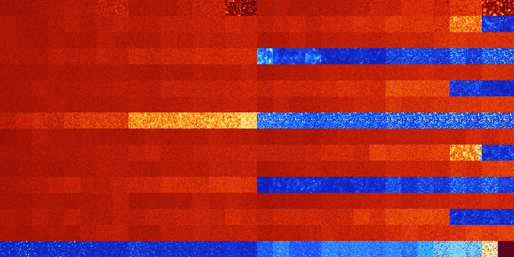

# B0235 (23040-23551)

<details>
    <summary>Initial Grid</summary>
    
</details>


<details>
    <summary>Initial Grid RLE</summary>

```
#C Exported from GoGoL (https://github.com/marrow16/gogol)
#C Wrap mode: Toroidal
#C Boundary mode: Dead
#C Step: 0
x = 100, y = 100, rule = B0235/S
61bo2b2o5bo9bo$59bo19bo12bo$21bo12bo4bo6bo15bo5bo4bo$17bo25bo18bob2o20b
o6bo$24bo41bo27bo$25bo38bo31bo$27bo12bo4bo7bo4bo26bo6bo$31bobo3bo8bo2bo
$2bobo37bo3bo4bo13bo6bo$17b2o42bo$3bo5bo25bo18bo6bo28bo$17bo13bo36bo15b
o5bo$27bo4bobo18bo16bo13bo$43bo3bo9bo$10bo3bo32bo24bo26bo$20bo45bo28bo$
16bo77bo2bo$o8bo20bo55bo$bo8bo7bo38bobo$2bo9bo76bo5bo$13bo18bo$4bo15bo
3bo12bo11bo14bo9b2obobo18bo$12bobo24bo$15bo34bo$47bo5bo27bo6bo$o47bo4bo
15bo20bo$bo19bo52bo8bo11bo$15bo41b2o3bo5bo19bo$49bo9bo$2bo65bo2bo22bo$
24bo9bo32bo2bo$2bo28bo44bo16bo$3bo22bo4bo15bo45bo$7bo9bo7bo15bo24bo6bo
16bo4bo$3b3o9bo5bo44bo$54bo15bo$bo26b2o2b2o14bo15bo12bo$26bo38bo$18bo
27bo10bo4bo24bo4bo$29b2o21bobo2bo37bo$6bo3bo64bo7bo$68bo25bo$4bo2bo68bo
20bo$100b$82bo8bo$24bo7bo39bo9bo4b2o4bo$2bo3bo15bo3bo7bo12bo$16bo31bo
14bo25bo$26bo46bo3bo$21bo44bo20bo$16bo9bo24bo2bo18b2obobobo$6bobo4bo15b
o11bo17bo12bo11bo$obo3bo8bo23bo2bo13bo9bo4bo4bo4bo$5bo3bo2bo20bo4bo59bo
$21bo$21bo4b2o29bo$36bo20bo14b2o$7bo19bo17bo30bo16bo$20bo4bo7bo23bo33bo
4bo$3bo$47bo4bo3bo4bo5bo$16bo25bo2bo9bo8bo$21bo41bo10bo$2bo6bo31bo6bo2b
o21bo16bo$25bo23bo3bo$19bo8bo4bo18bo14bo16bo$33bo5bo12bo$16b2o40bo2bo
17bo19bo$9bo40bo18bo$7bo58bo20bo$5bo53bo$15bo21bo30bo$20bo19b2o4bo9bo3b
o13bo11bo$o3bo10bo8bo20bo28bo17bo$13bo21b2o17bo6bobo10bo23bo$10bo69bo9b
o3bo$13bo35bo36bo10bo$19bo2bo2bo17b2o$16bo33bo5bo$3bobo6bo8bo35bo9bo17b
o11bo$2bo7bo4bo65bo12bo$22bo22bo12bo13bo13bo$5bo53bo3bo25bo$16bo12bo4bo
53bo$41bo10bo12bo12bo10bo$17bo33bo7bo7bo6bo7bo$8bo23bo44b2o9bo$10bo19bo
19bo24bo22bo$5bo20bo9bo10bo16bo28bo$67bo31bo$57bo6bo11bo$22bo3bo8bo$22b
o2bo66bo$18bo13bo4bo60bo$o4bo6bo37bo6b2o17bo$54bo24bo10bo3bo$2bo8b2o34b
o23bo21bo$10bo14bo40bo$12bo3bo25bo38bo$32bo11bobo5bo19bo4bo9bo!
```
</details>
<details>
    <summary>Thumbnail</summary>

</details>
<table>
<tr>
    <td><a href="./23040%20S%20Heat%20Map%20Activity.png"></a><br>S (23040)<br>G>1000</td>    <td><a href="./23041%20S0%20Heat%20Map%20Activity.png"></a><br>S0 (23041)<br>G>1000</td>    <td><a href="./23042%20S1%20Heat%20Map%20Activity.png"></a><br>S1 (23042)<br>G>1000</td>    <td><a href="./23043%20S01%20Heat%20Map%20Activity.png"></a><br>S01 (23043)<br>G>1000</td>    <td><a href="./23044%20S2%20Heat%20Map%20Activity.png"></a><br>S2 (23044)<br>G>1000</td>    <td><a href="./23045%20S02%20Heat%20Map%20Activity.png"></a><br>S02 (23045)<br>G>1000</td>    <td><a href="./23046%20S12%20Heat%20Map%20Activity.png"></a><br>S12 (23046)<br>G>1000</td>    <td><a href="./23047%20S012%20Heat%20Map%20Activity.png"></a><br>S012 (23047)<br>G>1000</td>    <td><a href="./23048%20S3%20Heat%20Map%20Activity.png"></a><br>S3 (23048)<br>G>1000</td>    <td><a href="./23049%20S03%20Heat%20Map%20Activity.png"></a><br>S03 (23049)<br>G>1000</td>    <td><a href="./23050%20S13%20Heat%20Map%20Activity.png"></a><br>S13 (23050)<br>G>1000</td>    <td><a href="./23051%20S013%20Heat%20Map%20Activity.png"></a><br>S013 (23051)<br>G>1000</td>    <td><a href="./23052%20S23%20Heat%20Map%20Activity.png"></a><br>S23 (23052)<br>G>1000</td>    <td><a href="./23053%20S023%20Heat%20Map%20Activity.png"></a><br>S023 (23053)<br>G>1000</td>    <td><a href="./23054%20S123%20Heat%20Map%20Activity.png"></a><br>S123 (23054)<br>R@122,p12</td>    <td><a href="./23055%20S0123%20Heat%20Map%20Activity.png"></a><br>S0123 (23055)<br>R@62,p4</td>    <td><a href="./23056%20S4%20Heat%20Map%20Activity.png"></a><br>S4 (23056)<br>G>1000</td>    <td><a href="./23057%20S04%20Heat%20Map%20Activity.png"></a><br>S04 (23057)<br>G>1000</td>    <td><a href="./23058%20S14%20Heat%20Map%20Activity.png"></a><br>S14 (23058)<br>G>1000</td>    <td><a href="./23059%20S014%20Heat%20Map%20Activity.png"></a><br>S014 (23059)<br>G>1000</td>    <td><a href="./23060%20S24%20Heat%20Map%20Activity.png"></a><br>S24 (23060)<br>G>1000</td>    <td><a href="./23061%20S024%20Heat%20Map%20Activity.png"></a><br>S024 (23061)<br>G>1000</td>    <td><a href="./23062%20S124%20Heat%20Map%20Activity.png"></a><br>S124 (23062)<br>G>1000</td>    <td><a href="./23063%20S0124%20Heat%20Map%20Activity.png"></a><br>S0124 (23063)<br>G>1000</td>    <td><a href="./23064%20S34%20Heat%20Map%20Activity.png"></a><br>S34 (23064)<br>G>1000</td>    <td><a href="./23065%20S034%20Heat%20Map%20Activity.png"></a><br>S034 (23065)<br>G>1000</td>    <td><a href="./23066%20S134%20Heat%20Map%20Activity.png"></a><br>S134 (23066)<br>G>1000</td>    <td><a href="./23067%20S0134%20Heat%20Map%20Activity.png"></a><br>S0134 (23067)<br>G>1000</td>    <td><a href="./23068%20S234%20Heat%20Map%20Activity.png"></a><br>S234 (23068)<br>G>1000</td>    <td><a href="./23069%20S0234%20Heat%20Map%20Activity.png"></a><br>S0234 (23069)<br>G>1000</td>    <td><a href="./23070%20S1234%20Heat%20Map%20Activity.png"></a><br>S1234 (23070)<br>R@198,p4</td>    <td><a href="./23071%20S01234%20Heat%20Map%20Activity.png"></a><br>S01234 (23071)<br>R@78,p4</td></tr>
<tr>
    <td><a href="./23072%20S5%20Heat%20Map%20Activity.png"></a><br>S5 (23072)<br>G>1000</td>    <td><a href="./23073%20S05%20Heat%20Map%20Activity.png"></a><br>S05 (23073)<br>G>1000</td>    <td><a href="./23074%20S15%20Heat%20Map%20Activity.png"></a><br>S15 (23074)<br>G>1000</td>    <td><a href="./23075%20S015%20Heat%20Map%20Activity.png"></a><br>S015 (23075)<br>G>1000</td>    <td><a href="./23076%20S25%20Heat%20Map%20Activity.png"></a><br>S25 (23076)<br>G>1000</td>    <td><a href="./23077%20S025%20Heat%20Map%20Activity.png"></a><br>S025 (23077)<br>G>1000</td>    <td><a href="./23078%20S125%20Heat%20Map%20Activity.png"></a><br>S125 (23078)<br>G>1000</td>    <td><a href="./23079%20S0125%20Heat%20Map%20Activity.png"></a><br>S0125 (23079)<br>G>1000</td>    <td><a href="./23080%20S35%20Heat%20Map%20Activity.png"></a><br>S35 (23080)<br>G>1000</td>    <td><a href="./23081%20S035%20Heat%20Map%20Activity.png"></a><br>S035 (23081)<br>G>1000</td>    <td><a href="./23082%20S135%20Heat%20Map%20Activity.png"></a><br>S135 (23082)<br>G>1000</td>    <td><a href="./23083%20S0135%20Heat%20Map%20Activity.png"></a><br>S0135 (23083)<br>G>1000</td>    <td><a href="./23084%20S235%20Heat%20Map%20Activity.png"></a><br>S235 (23084)<br>G>1000</td>    <td><a href="./23085%20S0235%20Heat%20Map%20Activity.png"></a><br>S0235 (23085)<br>G>1000</td>    <td><a href="./23086%20S1235%20Heat%20Map%20Activity.png"></a><br>S1235 (23086)<br>G>1000</td>    <td><a href="./23087%20S01235%20Heat%20Map%20Activity.png"></a><br>S01235 (23087)<br>G>1000</td>    <td><a href="./23088%20S45%20Heat%20Map%20Activity.png"></a><br>S45 (23088)<br>G>1000</td>    <td><a href="./23089%20S045%20Heat%20Map%20Activity.png"></a><br>S045 (23089)<br>G>1000</td>    <td><a href="./23090%20S145%20Heat%20Map%20Activity.png"></a><br>S145 (23090)<br>G>1000</td>    <td><a href="./23091%20S0145%20Heat%20Map%20Activity.png"></a><br>S0145 (23091)<br>G>1000</td>    <td><a href="./23092%20S245%20Heat%20Map%20Activity.png"></a><br>S245 (23092)<br>G>1000</td>    <td><a href="./23093%20S0245%20Heat%20Map%20Activity.png"></a><br>S0245 (23093)<br>G>1000</td>    <td><a href="./23094%20S1245%20Heat%20Map%20Activity.png"></a><br>S1245 (23094)<br>G>1000</td>    <td><a href="./23095%20S01245%20Heat%20Map%20Activity.png"></a><br>S01245 (23095)<br>G>1000</td>    <td><a href="./23096%20S345%20Heat%20Map%20Activity.png"></a><br>S345 (23096)<br>G>1000</td>    <td><a href="./23097%20S0345%20Heat%20Map%20Activity.png"></a><br>S0345 (23097)<br>G>1000</td>    <td><a href="./23098%20S1345%20Heat%20Map%20Activity.png"></a><br>S1345 (23098)<br>G>1000</td>    <td><a href="./23099%20S01345%20Heat%20Map%20Activity.png"></a><br>S01345 (23099)<br>G>1000</td>    <td><a href="./23100%20S2345%20Heat%20Map%20Activity.png"></a><br>S2345 (23100)<br>G>1000</td>    <td><a href="./23101%20S02345%20Heat%20Map%20Activity.png"></a><br>S02345 (23101)<br>G>1000</td>    <td><a href="./23102%20S12345%20Heat%20Map%20Activity.png"></a><br>S12345 (23102)<br>R@742,p24</td>    <td><a href="./23103%20S012345%20Heat%20Map%20Activity.png"></a><br>S012345 (23103)<br>R@844,p60</td></tr>
<tr>
    <td><a href="./23104%20S6%20Heat%20Map%20Activity.png"></a><br>S6 (23104)<br>G>1000</td>    <td><a href="./23105%20S06%20Heat%20Map%20Activity.png"></a><br>S06 (23105)<br>G>1000</td>    <td><a href="./23106%20S16%20Heat%20Map%20Activity.png"></a><br>S16 (23106)<br>G>1000</td>    <td><a href="./23107%20S016%20Heat%20Map%20Activity.png"></a><br>S016 (23107)<br>G>1000</td>    <td><a href="./23108%20S26%20Heat%20Map%20Activity.png"></a><br>S26 (23108)<br>G>1000</td>    <td><a href="./23109%20S026%20Heat%20Map%20Activity.png"></a><br>S026 (23109)<br>G>1000</td>    <td><a href="./23110%20S126%20Heat%20Map%20Activity.png"></a><br>S126 (23110)<br>G>1000</td>    <td><a href="./23111%20S0126%20Heat%20Map%20Activity.png"></a><br>S0126 (23111)<br>G>1000</td>    <td><a href="./23112%20S36%20Heat%20Map%20Activity.png"></a><br>S36 (23112)<br>G>1000</td>    <td><a href="./23113%20S036%20Heat%20Map%20Activity.png"></a><br>S036 (23113)<br>G>1000</td>    <td><a href="./23114%20S136%20Heat%20Map%20Activity.png"></a><br>S136 (23114)<br>G>1000</td>    <td><a href="./23115%20S0136%20Heat%20Map%20Activity.png"></a><br>S0136 (23115)<br>G>1000</td>    <td><a href="./23116%20S236%20Heat%20Map%20Activity.png"></a><br>S236 (23116)<br>G>1000</td>    <td><a href="./23117%20S0236%20Heat%20Map%20Activity.png"></a><br>S0236 (23117)<br>G>1000</td>    <td><a href="./23118%20S1236%20Heat%20Map%20Activity.png"></a><br>S1236 (23118)<br>G>1000</td>    <td><a href="./23119%20S01236%20Heat%20Map%20Activity.png"></a><br>S01236 (23119)<br>G>1000</td>    <td><a href="./23120%20S46%20Heat%20Map%20Activity.png"></a><br>S46 (23120)<br>G>1000</td>    <td><a href="./23121%20S046%20Heat%20Map%20Activity.png"></a><br>S046 (23121)<br>G>1000</td>    <td><a href="./23122%20S146%20Heat%20Map%20Activity.png"></a><br>S146 (23122)<br>G>1000</td>    <td><a href="./23123%20S0146%20Heat%20Map%20Activity.png"></a><br>S0146 (23123)<br>G>1000</td>    <td><a href="./23124%20S246%20Heat%20Map%20Activity.png"></a><br>S246 (23124)<br>G>1000</td>    <td><a href="./23125%20S0246%20Heat%20Map%20Activity.png"></a><br>S0246 (23125)<br>G>1000</td>    <td><a href="./23126%20S1246%20Heat%20Map%20Activity.png"></a><br>S1246 (23126)<br>G>1000</td>    <td><a href="./23127%20S01246%20Heat%20Map%20Activity.png"></a><br>S01246 (23127)<br>G>1000</td>    <td><a href="./23128%20S346%20Heat%20Map%20Activity.png"></a><br>S346 (23128)<br>G>1000</td>    <td><a href="./23129%20S0346%20Heat%20Map%20Activity.png"></a><br>S0346 (23129)<br>G>1000</td>    <td><a href="./23130%20S1346%20Heat%20Map%20Activity.png"></a><br>S1346 (23130)<br>G>1000</td>    <td><a href="./23131%20S01346%20Heat%20Map%20Activity.png"></a><br>S01346 (23131)<br>G>1000</td>    <td><a href="./23132%20S2346%20Heat%20Map%20Activity.png"></a><br>S2346 (23132)<br>G>1000</td>    <td><a href="./23133%20S02346%20Heat%20Map%20Activity.png"></a><br>S02346 (23133)<br>G>1000</td>    <td><a href="./23134%20S12346%20Heat%20Map%20Activity.png"></a><br>S12346 (23134)<br>G>1000</td>    <td><a href="./23135%20S012346%20Heat%20Map%20Activity.png"></a><br>S012346 (23135)<br>G>1000</td></tr>
<tr>
    <td><a href="./23136%20S56%20Heat%20Map%20Activity.png"></a><br>S56 (23136)<br>G>1000</td>    <td><a href="./23137%20S056%20Heat%20Map%20Activity.png"></a><br>S056 (23137)<br>G>1000</td>    <td><a href="./23138%20S156%20Heat%20Map%20Activity.png"></a><br>S156 (23138)<br>G>1000</td>    <td><a href="./23139%20S0156%20Heat%20Map%20Activity.png"></a><br>S0156 (23139)<br>G>1000</td>    <td><a href="./23140%20S256%20Heat%20Map%20Activity.png"></a><br>S256 (23140)<br>G>1000</td>    <td><a href="./23141%20S0256%20Heat%20Map%20Activity.png"></a><br>S0256 (23141)<br>G>1000</td>    <td><a href="./23142%20S1256%20Heat%20Map%20Activity.png"></a><br>S1256 (23142)<br>G>1000</td>    <td><a href="./23143%20S01256%20Heat%20Map%20Activity.png"></a><br>S01256 (23143)<br>G>1000</td>    <td><a href="./23144%20S356%20Heat%20Map%20Activity.png"></a><br>S356 (23144)<br>G>1000</td>    <td><a href="./23145%20S0356%20Heat%20Map%20Activity.png"></a><br>S0356 (23145)<br>G>1000</td>    <td><a href="./23146%20S1356%20Heat%20Map%20Activity.png"></a><br>S1356 (23146)<br>G>1000</td>    <td><a href="./23147%20S01356%20Heat%20Map%20Activity.png"></a><br>S01356 (23147)<br>G>1000</td>    <td><a href="./23148%20S2356%20Heat%20Map%20Activity.png"></a><br>S2356 (23148)<br>G>1000</td>    <td><a href="./23149%20S02356%20Heat%20Map%20Activity.png"></a><br>S02356 (23149)<br>G>1000</td>    <td><a href="./23150%20S12356%20Heat%20Map%20Activity.png"></a><br>S12356 (23150)<br>G>1000</td>    <td><a href="./23151%20S012356%20Heat%20Map%20Activity.png"></a><br>S012356 (23151)<br>G>1000</td>    <td><a href="./23152%20S456%20Heat%20Map%20Activity.png"></a><br>S456 (23152)<br>G>1000</td>    <td><a href="./23153%20S0456%20Heat%20Map%20Activity.png"></a><br>S0456 (23153)<br>G>1000</td>    <td><a href="./23154%20S1456%20Heat%20Map%20Activity.png"></a><br>S1456 (23154)<br>R@793,p3</td>    <td><a href="./23155%20S01456%20Heat%20Map%20Activity.png"></a><br>S01456 (23155)<br>G>1000</td>    <td><a href="./23156%20S2456%20Heat%20Map%20Activity.png"></a><br>S2456 (23156)<br>R@331,p2</td>    <td><a href="./23157%20S02456%20Heat%20Map%20Activity.png"></a><br>S02456 (23157)<br>R@313,p4</td>    <td><a href="./23158%20S12456%20Heat%20Map%20Activity.png"></a><br>S12456 (23158)<br>R@227,p6</td>    <td><a href="./23159%20S012456%20Heat%20Map%20Activity.png"></a><br>S012456 (23159)<br>R@379,p6</td>    <td><a href="./23160%20S3456%20Heat%20Map%20Activity.png"></a><br>S3456 (23160)<br>R@43,p6</td>    <td><a href="./23161%20S03456%20Heat%20Map%20Activity.png"></a><br>S03456 (23161)<br>R@29,p6</td>    <td><a href="./23162%20S13456%20Heat%20Map%20Activity.png"></a><br>S13456 (23162)<br>R@36,p12</td>    <td><a href="./23163%20S013456%20Heat%20Map%20Activity.png"></a><br>S013456 (23163)<br>R@37,p12</td>    <td><a href="./23164%20S23456%20Heat%20Map%20Activity.png"></a><br>S23456 (23164)<br>R@23,p6</td>    <td><a href="./23165%20S023456%20Heat%20Map%20Activity.png"></a><br>S023456 (23165)<br>R@33,p12</td>    <td><a href="./23166%20S123456%20Heat%20Map%20Activity.png"></a><br>S123456 (23166)<br>R@21,p6</td>    <td><a href="./23167%20S0123456%20Heat%20Map%20Activity.png"></a><br>S0123456 (23167)<br>R@18,p2</td></tr>
<tr>
    <td><a href="./23168%20S7%20Heat%20Map%20Activity.png"></a><br>S7 (23168)<br>G>1000</td>    <td><a href="./23169%20S07%20Heat%20Map%20Activity.png"></a><br>S07 (23169)<br>G>1000</td>    <td><a href="./23170%20S17%20Heat%20Map%20Activity.png"></a><br>S17 (23170)<br>G>1000</td>    <td><a href="./23171%20S017%20Heat%20Map%20Activity.png"></a><br>S017 (23171)<br>G>1000</td>    <td><a href="./23172%20S27%20Heat%20Map%20Activity.png"></a><br>S27 (23172)<br>G>1000</td>    <td><a href="./23173%20S027%20Heat%20Map%20Activity.png"></a><br>S027 (23173)<br>G>1000</td>    <td><a href="./23174%20S127%20Heat%20Map%20Activity.png"></a><br>S127 (23174)<br>G>1000</td>    <td><a href="./23175%20S0127%20Heat%20Map%20Activity.png"></a><br>S0127 (23175)<br>G>1000</td>    <td><a href="./23176%20S37%20Heat%20Map%20Activity.png"></a><br>S37 (23176)<br>G>1000</td>    <td><a href="./23177%20S037%20Heat%20Map%20Activity.png"></a><br>S037 (23177)<br>G>1000</td>    <td><a href="./23178%20S137%20Heat%20Map%20Activity.png"></a><br>S137 (23178)<br>G>1000</td>    <td><a href="./23179%20S0137%20Heat%20Map%20Activity.png"></a><br>S0137 (23179)<br>G>1000</td>    <td><a href="./23180%20S237%20Heat%20Map%20Activity.png"></a><br>S237 (23180)<br>G>1000</td>    <td><a href="./23181%20S0237%20Heat%20Map%20Activity.png"></a><br>S0237 (23181)<br>G>1000</td>    <td><a href="./23182%20S1237%20Heat%20Map%20Activity.png"></a><br>S1237 (23182)<br>G>1000</td>    <td><a href="./23183%20S01237%20Heat%20Map%20Activity.png"></a><br>S01237 (23183)<br>G>1000</td>    <td><a href="./23184%20S47%20Heat%20Map%20Activity.png"></a><br>S47 (23184)<br>G>1000</td>    <td><a href="./23185%20S047%20Heat%20Map%20Activity.png"></a><br>S047 (23185)<br>G>1000</td>    <td><a href="./23186%20S147%20Heat%20Map%20Activity.png"></a><br>S147 (23186)<br>G>1000</td>    <td><a href="./23187%20S0147%20Heat%20Map%20Activity.png"></a><br>S0147 (23187)<br>G>1000</td>    <td><a href="./23188%20S247%20Heat%20Map%20Activity.png"></a><br>S247 (23188)<br>G>1000</td>    <td><a href="./23189%20S0247%20Heat%20Map%20Activity.png"></a><br>S0247 (23189)<br>G>1000</td>    <td><a href="./23190%20S1247%20Heat%20Map%20Activity.png"></a><br>S1247 (23190)<br>G>1000</td>    <td><a href="./23191%20S01247%20Heat%20Map%20Activity.png"></a><br>S01247 (23191)<br>G>1000</td>    <td><a href="./23192%20S347%20Heat%20Map%20Activity.png"></a><br>S347 (23192)<br>G>1000</td>    <td><a href="./23193%20S0347%20Heat%20Map%20Activity.png"></a><br>S0347 (23193)<br>G>1000</td>    <td><a href="./23194%20S1347%20Heat%20Map%20Activity.png"></a><br>S1347 (23194)<br>G>1000</td>    <td><a href="./23195%20S01347%20Heat%20Map%20Activity.png"></a><br>S01347 (23195)<br>G>1000</td>    <td><a href="./23196%20S2347%20Heat%20Map%20Activity.png"></a><br>S2347 (23196)<br>G>1000</td>    <td><a href="./23197%20S02347%20Heat%20Map%20Activity.png"></a><br>S02347 (23197)<br>G>1000</td>    <td><a href="./23198%20S12347%20Heat%20Map%20Activity.png"></a><br>S12347 (23198)<br>G>1000</td>    <td><a href="./23199%20S012347%20Heat%20Map%20Activity.png"></a><br>S012347 (23199)<br>G>1000</td></tr>
<tr>
    <td><a href="./23200%20S57%20Heat%20Map%20Activity.png"></a><br>S57 (23200)<br>G>1000</td>    <td><a href="./23201%20S057%20Heat%20Map%20Activity.png"></a><br>S057 (23201)<br>G>1000</td>    <td><a href="./23202%20S157%20Heat%20Map%20Activity.png"></a><br>S157 (23202)<br>G>1000</td>    <td><a href="./23203%20S0157%20Heat%20Map%20Activity.png"></a><br>S0157 (23203)<br>G>1000</td>    <td><a href="./23204%20S257%20Heat%20Map%20Activity.png"></a><br>S257 (23204)<br>G>1000</td>    <td><a href="./23205%20S0257%20Heat%20Map%20Activity.png"></a><br>S0257 (23205)<br>G>1000</td>    <td><a href="./23206%20S1257%20Heat%20Map%20Activity.png"></a><br>S1257 (23206)<br>G>1000</td>    <td><a href="./23207%20S01257%20Heat%20Map%20Activity.png"></a><br>S01257 (23207)<br>G>1000</td>    <td><a href="./23208%20S357%20Heat%20Map%20Activity.png"></a><br>S357 (23208)<br>G>1000</td>    <td><a href="./23209%20S0357%20Heat%20Map%20Activity.png"></a><br>S0357 (23209)<br>G>1000</td>    <td><a href="./23210%20S1357%20Heat%20Map%20Activity.png"></a><br>S1357 (23210)<br>G>1000</td>    <td><a href="./23211%20S01357%20Heat%20Map%20Activity.png"></a><br>S01357 (23211)<br>G>1000</td>    <td><a href="./23212%20S2357%20Heat%20Map%20Activity.png"></a><br>S2357 (23212)<br>G>1000</td>    <td><a href="./23213%20S02357%20Heat%20Map%20Activity.png"></a><br>S02357 (23213)<br>G>1000</td>    <td><a href="./23214%20S12357%20Heat%20Map%20Activity.png"></a><br>S12357 (23214)<br>G>1000</td>    <td><a href="./23215%20S012357%20Heat%20Map%20Activity.png"></a><br>S012357 (23215)<br>G>1000</td>    <td><a href="./23216%20S457%20Heat%20Map%20Activity.png"></a><br>S457 (23216)<br>G>1000</td>    <td><a href="./23217%20S0457%20Heat%20Map%20Activity.png"></a><br>S0457 (23217)<br>G>1000</td>    <td><a href="./23218%20S1457%20Heat%20Map%20Activity.png"></a><br>S1457 (23218)<br>G>1000</td>    <td><a href="./23219%20S01457%20Heat%20Map%20Activity.png"></a><br>S01457 (23219)<br>G>1000</td>    <td><a href="./23220%20S2457%20Heat%20Map%20Activity.png"></a><br>S2457 (23220)<br>G>1000</td>    <td><a href="./23221%20S02457%20Heat%20Map%20Activity.png"></a><br>S02457 (23221)<br>G>1000</td>    <td><a href="./23222%20S12457%20Heat%20Map%20Activity.png"></a><br>S12457 (23222)<br>G>1000</td>    <td><a href="./23223%20S012457%20Heat%20Map%20Activity.png"></a><br>S012457 (23223)<br>G>1000</td>    <td><a href="./23224%20S3457%20Heat%20Map%20Activity.png"></a><br>S3457 (23224)<br>G>1000</td>    <td><a href="./23225%20S03457%20Heat%20Map%20Activity.png"></a><br>S03457 (23225)<br>G>1000</td>    <td><a href="./23226%20S13457%20Heat%20Map%20Activity.png"></a><br>S13457 (23226)<br>G>1000</td>    <td><a href="./23227%20S013457%20Heat%20Map%20Activity.png"></a><br>S013457 (23227)<br>G>1000</td>    <td><a href="./23228%20S23457%20Heat%20Map%20Activity.png"></a><br>S23457 (23228)<br>R@249,p12</td>    <td><a href="./23229%20S023457%20Heat%20Map%20Activity.png"></a><br>S023457 (23229)<br>R@231,p24</td>    <td><a href="./23230%20S123457%20Heat%20Map%20Activity.png"></a><br>S123457 (23230)<br>R@273,p72</td>    <td><a href="./23231%20S0123457%20Heat%20Map%20Activity.png"></a><br>S0123457 (23231)<br>R@324,p180</td></tr>
<tr>
    <td><a href="./23232%20S67%20Heat%20Map%20Activity.png"></a><br>S67 (23232)<br>G>1000</td>    <td><a href="./23233%20S067%20Heat%20Map%20Activity.png"></a><br>S067 (23233)<br>G>1000</td>    <td><a href="./23234%20S167%20Heat%20Map%20Activity.png"></a><br>S167 (23234)<br>G>1000</td>    <td><a href="./23235%20S0167%20Heat%20Map%20Activity.png"></a><br>S0167 (23235)<br>G>1000</td>    <td><a href="./23236%20S267%20Heat%20Map%20Activity.png"></a><br>S267 (23236)<br>G>1000</td>    <td><a href="./23237%20S0267%20Heat%20Map%20Activity.png"></a><br>S0267 (23237)<br>G>1000</td>    <td><a href="./23238%20S1267%20Heat%20Map%20Activity.png"></a><br>S1267 (23238)<br>G>1000</td>    <td><a href="./23239%20S01267%20Heat%20Map%20Activity.png"></a><br>S01267 (23239)<br>G>1000</td>    <td><a href="./23240%20S367%20Heat%20Map%20Activity.png"></a><br>S367 (23240)<br>G>1000</td>    <td><a href="./23241%20S0367%20Heat%20Map%20Activity.png"></a><br>S0367 (23241)<br>G>1000</td>    <td><a href="./23242%20S1367%20Heat%20Map%20Activity.png"></a><br>S1367 (23242)<br>G>1000</td>    <td><a href="./23243%20S01367%20Heat%20Map%20Activity.png"></a><br>S01367 (23243)<br>G>1000</td>    <td><a href="./23244%20S2367%20Heat%20Map%20Activity.png"></a><br>S2367 (23244)<br>G>1000</td>    <td><a href="./23245%20S02367%20Heat%20Map%20Activity.png"></a><br>S02367 (23245)<br>G>1000</td>    <td><a href="./23246%20S12367%20Heat%20Map%20Activity.png"></a><br>S12367 (23246)<br>G>1000</td>    <td><a href="./23247%20S012367%20Heat%20Map%20Activity.png"></a><br>S012367 (23247)<br>G>1000</td>    <td><a href="./23248%20S467%20Heat%20Map%20Activity.png"></a><br>S467 (23248)<br>G>1000</td>    <td><a href="./23249%20S0467%20Heat%20Map%20Activity.png"></a><br>S0467 (23249)<br>G>1000</td>    <td><a href="./23250%20S1467%20Heat%20Map%20Activity.png"></a><br>S1467 (23250)<br>G>1000</td>    <td><a href="./23251%20S01467%20Heat%20Map%20Activity.png"></a><br>S01467 (23251)<br>G>1000</td>    <td><a href="./23252%20S2467%20Heat%20Map%20Activity.png"></a><br>S2467 (23252)<br>G>1000</td>    <td><a href="./23253%20S02467%20Heat%20Map%20Activity.png"></a><br>S02467 (23253)<br>G>1000</td>    <td><a href="./23254%20S12467%20Heat%20Map%20Activity.png"></a><br>S12467 (23254)<br>G>1000</td>    <td><a href="./23255%20S012467%20Heat%20Map%20Activity.png"></a><br>S012467 (23255)<br>G>1000</td>    <td><a href="./23256%20S3467%20Heat%20Map%20Activity.png"></a><br>S3467 (23256)<br>G>1000</td>    <td><a href="./23257%20S03467%20Heat%20Map%20Activity.png"></a><br>S03467 (23257)<br>G>1000</td>    <td><a href="./23258%20S13467%20Heat%20Map%20Activity.png"></a><br>S13467 (23258)<br>G>1000</td>    <td><a href="./23259%20S013467%20Heat%20Map%20Activity.png"></a><br>S013467 (23259)<br>G>1000</td>    <td><a href="./23260%20S23467%20Heat%20Map%20Activity.png"></a><br>S23467 (23260)<br>G>1000</td>    <td><a href="./23261%20S023467%20Heat%20Map%20Activity.png"></a><br>S023467 (23261)<br>G>1000</td>    <td><a href="./23262%20S123467%20Heat%20Map%20Activity.png"></a><br>S123467 (23262)<br>G>1000</td>    <td><a href="./23263%20S0123467%20Heat%20Map%20Activity.png"></a><br>S0123467 (23263)<br>G>1000</td></tr>
<tr>
    <td><a href="./23264%20S567%20Heat%20Map%20Activity.png"></a><br>S567 (23264)<br>G>1000</td>    <td><a href="./23265%20S0567%20Heat%20Map%20Activity.png"></a><br>S0567 (23265)<br>G>1000</td>    <td><a href="./23266%20S1567%20Heat%20Map%20Activity.png"></a><br>S1567 (23266)<br>G>1000</td>    <td><a href="./23267%20S01567%20Heat%20Map%20Activity.png"></a><br>S01567 (23267)<br>G>1000</td>    <td><a href="./23268%20S2567%20Heat%20Map%20Activity.png"></a><br>S2567 (23268)<br>G>1000</td>    <td><a href="./23269%20S02567%20Heat%20Map%20Activity.png"></a><br>S02567 (23269)<br>G>1000</td>    <td><a href="./23270%20S12567%20Heat%20Map%20Activity.png"></a><br>S12567 (23270)<br>G>1000</td>    <td><a href="./23271%20S012567%20Heat%20Map%20Activity.png"></a><br>S012567 (23271)<br>G>1000</td>    <td><a href="./23272%20S3567%20Heat%20Map%20Activity.png"></a><br>S3567 (23272)<br>G>1000</td>    <td><a href="./23273%20S03567%20Heat%20Map%20Activity.png"></a><br>S03567 (23273)<br>G>1000</td>    <td><a href="./23274%20S13567%20Heat%20Map%20Activity.png"></a><br>S13567 (23274)<br>G>1000</td>    <td><a href="./23275%20S013567%20Heat%20Map%20Activity.png"></a><br>S013567 (23275)<br>G>1000</td>    <td><a href="./23276%20S23567%20Heat%20Map%20Activity.png"></a><br>S23567 (23276)<br>G>1000</td>    <td><a href="./23277%20S023567%20Heat%20Map%20Activity.png"></a><br>S023567 (23277)<br>G>1000</td>    <td><a href="./23278%20S123567%20Heat%20Map%20Activity.png"></a><br>S123567 (23278)<br>G>1000</td>    <td><a href="./23279%20S0123567%20Heat%20Map%20Activity.png"></a><br>S0123567 (23279)<br>G>1000</td>    <td><a href="./23280%20S4567%20Heat%20Map%20Activity.png"></a><br>S4567 (23280)<br>R@13,p2</td>    <td><a href="./23281%20S04567%20Heat%20Map%20Activity.png"></a><br>S04567 (23281)<br>R@15,p2</td>    <td><a href="./23282%20S14567%20Heat%20Map%20Activity.png"></a><br>S14567 (23282)<br>R@15,p2</td>    <td><a href="./23283%20S014567%20Heat%20Map%20Activity.png"></a><br>S014567 (23283)<br>R@19,p2</td>    <td><a href="./23284%20S24567%20Heat%20Map%20Activity.png"></a><br>S24567 (23284)<br>R@16,p2</td>    <td><a href="./23285%20S024567%20Heat%20Map%20Activity.png"></a><br>S024567 (23285)<br>R@14,p2</td>    <td><a href="./23286%20S124567%20Heat%20Map%20Activity.png"></a><br>S124567 (23286)<br>R@16,p2</td>    <td><a href="./23287%20S0124567%20Heat%20Map%20Activity.png"></a><br>S0124567 (23287)<br>R@16,p2</td>    <td><a href="./23288%20S34567%20Heat%20Map%20Activity.png"></a><br>S34567 (23288)<br>R@13,p2</td>    <td><a href="./23289%20S034567%20Heat%20Map%20Activity.png"></a><br>S034567 (23289)<br>R@13,p2</td>    <td><a href="./23290%20S134567%20Heat%20Map%20Activity.png"></a><br>S134567 (23290)<br>R@13,p2</td>    <td><a href="./23291%20S0134567%20Heat%20Map%20Activity.png"></a><br>S0134567 (23291)<br>R@11,p2</td>    <td><a href="./23292%20S234567%20Heat%20Map%20Activity.png"></a><br>S234567 (23292)<br>R@12,p2</td>    <td><a href="./23293%20S0234567%20Heat%20Map%20Activity.png"></a><br>S0234567 (23293)<br>R@12,p2</td>    <td><a href="./23294%20S1234567%20Heat%20Map%20Activity.png"></a><br>S1234567 (23294)<br>R@12,p2</td>    <td><a href="./23295%20S01234567%20Heat%20Map%20Activity.png"></a><br>S01234567 (23295)<br>R@10,p2</td></tr>
<tr>
    <td><a href="./23296%20S8%20Heat%20Map%20Activity.png"></a><br>S8 (23296)<br>G>1000</td>    <td><a href="./23297%20S08%20Heat%20Map%20Activity.png"></a><br>S08 (23297)<br>G>1000</td>    <td><a href="./23298%20S18%20Heat%20Map%20Activity.png"></a><br>S18 (23298)<br>G>1000</td>    <td><a href="./23299%20S018%20Heat%20Map%20Activity.png"></a><br>S018 (23299)<br>G>1000</td>    <td><a href="./23300%20S28%20Heat%20Map%20Activity.png"></a><br>S28 (23300)<br>G>1000</td>    <td><a href="./23301%20S028%20Heat%20Map%20Activity.png"></a><br>S028 (23301)<br>G>1000</td>    <td><a href="./23302%20S128%20Heat%20Map%20Activity.png"></a><br>S128 (23302)<br>G>1000</td>    <td><a href="./23303%20S0128%20Heat%20Map%20Activity.png"></a><br>S0128 (23303)<br>G>1000</td>    <td><a href="./23304%20S38%20Heat%20Map%20Activity.png"></a><br>S38 (23304)<br>G>1000</td>    <td><a href="./23305%20S038%20Heat%20Map%20Activity.png"></a><br>S038 (23305)<br>G>1000</td>    <td><a href="./23306%20S138%20Heat%20Map%20Activity.png"></a><br>S138 (23306)<br>G>1000</td>    <td><a href="./23307%20S0138%20Heat%20Map%20Activity.png"></a><br>S0138 (23307)<br>G>1000</td>    <td><a href="./23308%20S238%20Heat%20Map%20Activity.png"></a><br>S238 (23308)<br>G>1000</td>    <td><a href="./23309%20S0238%20Heat%20Map%20Activity.png"></a><br>S0238 (23309)<br>G>1000</td>    <td><a href="./23310%20S1238%20Heat%20Map%20Activity.png"></a><br>S1238 (23310)<br>G>1000</td>    <td><a href="./23311%20S01238%20Heat%20Map%20Activity.png"></a><br>S01238 (23311)<br>G>1000</td>    <td><a href="./23312%20S48%20Heat%20Map%20Activity.png"></a><br>S48 (23312)<br>G>1000</td>    <td><a href="./23313%20S048%20Heat%20Map%20Activity.png"></a><br>S048 (23313)<br>G>1000</td>    <td><a href="./23314%20S148%20Heat%20Map%20Activity.png"></a><br>S148 (23314)<br>G>1000</td>    <td><a href="./23315%20S0148%20Heat%20Map%20Activity.png"></a><br>S0148 (23315)<br>G>1000</td>    <td><a href="./23316%20S248%20Heat%20Map%20Activity.png"></a><br>S248 (23316)<br>G>1000</td>    <td><a href="./23317%20S0248%20Heat%20Map%20Activity.png"></a><br>S0248 (23317)<br>G>1000</td>    <td><a href="./23318%20S1248%20Heat%20Map%20Activity.png"></a><br>S1248 (23318)<br>G>1000</td>    <td><a href="./23319%20S01248%20Heat%20Map%20Activity.png"></a><br>S01248 (23319)<br>G>1000</td>    <td><a href="./23320%20S348%20Heat%20Map%20Activity.png"></a><br>S348 (23320)<br>G>1000</td>    <td><a href="./23321%20S0348%20Heat%20Map%20Activity.png"></a><br>S0348 (23321)<br>G>1000</td>    <td><a href="./23322%20S1348%20Heat%20Map%20Activity.png"></a><br>S1348 (23322)<br>G>1000</td>    <td><a href="./23323%20S01348%20Heat%20Map%20Activity.png"></a><br>S01348 (23323)<br>G>1000</td>    <td><a href="./23324%20S2348%20Heat%20Map%20Activity.png"></a><br>S2348 (23324)<br>G>1000</td>    <td><a href="./23325%20S02348%20Heat%20Map%20Activity.png"></a><br>S02348 (23325)<br>G>1000</td>    <td><a href="./23326%20S12348%20Heat%20Map%20Activity.png"></a><br>S12348 (23326)<br>G>1000</td>    <td><a href="./23327%20S012348%20Heat%20Map%20Activity.png"></a><br>S012348 (23327)<br>G>1000</td></tr>
<tr>
    <td><a href="./23328%20S58%20Heat%20Map%20Activity.png"></a><br>S58 (23328)<br>G>1000</td>    <td><a href="./23329%20S058%20Heat%20Map%20Activity.png"></a><br>S058 (23329)<br>G>1000</td>    <td><a href="./23330%20S158%20Heat%20Map%20Activity.png"></a><br>S158 (23330)<br>G>1000</td>    <td><a href="./23331%20S0158%20Heat%20Map%20Activity.png"></a><br>S0158 (23331)<br>G>1000</td>    <td><a href="./23332%20S258%20Heat%20Map%20Activity.png"></a><br>S258 (23332)<br>G>1000</td>    <td><a href="./23333%20S0258%20Heat%20Map%20Activity.png"></a><br>S0258 (23333)<br>G>1000</td>    <td><a href="./23334%20S1258%20Heat%20Map%20Activity.png"></a><br>S1258 (23334)<br>G>1000</td>    <td><a href="./23335%20S01258%20Heat%20Map%20Activity.png"></a><br>S01258 (23335)<br>G>1000</td>    <td><a href="./23336%20S358%20Heat%20Map%20Activity.png"></a><br>S358 (23336)<br>G>1000</td>    <td><a href="./23337%20S0358%20Heat%20Map%20Activity.png"></a><br>S0358 (23337)<br>G>1000</td>    <td><a href="./23338%20S1358%20Heat%20Map%20Activity.png"></a><br>S1358 (23338)<br>G>1000</td>    <td><a href="./23339%20S01358%20Heat%20Map%20Activity.png"></a><br>S01358 (23339)<br>G>1000</td>    <td><a href="./23340%20S2358%20Heat%20Map%20Activity.png"></a><br>S2358 (23340)<br>G>1000</td>    <td><a href="./23341%20S02358%20Heat%20Map%20Activity.png"></a><br>S02358 (23341)<br>G>1000</td>    <td><a href="./23342%20S12358%20Heat%20Map%20Activity.png"></a><br>S12358 (23342)<br>G>1000</td>    <td><a href="./23343%20S012358%20Heat%20Map%20Activity.png"></a><br>S012358 (23343)<br>G>1000</td>    <td><a href="./23344%20S458%20Heat%20Map%20Activity.png"></a><br>S458 (23344)<br>G>1000</td>    <td><a href="./23345%20S0458%20Heat%20Map%20Activity.png"></a><br>S0458 (23345)<br>G>1000</td>    <td><a href="./23346%20S1458%20Heat%20Map%20Activity.png"></a><br>S1458 (23346)<br>G>1000</td>    <td><a href="./23347%20S01458%20Heat%20Map%20Activity.png"></a><br>S01458 (23347)<br>G>1000</td>    <td><a href="./23348%20S2458%20Heat%20Map%20Activity.png"></a><br>S2458 (23348)<br>G>1000</td>    <td><a href="./23349%20S02458%20Heat%20Map%20Activity.png"></a><br>S02458 (23349)<br>G>1000</td>    <td><a href="./23350%20S12458%20Heat%20Map%20Activity.png"></a><br>S12458 (23350)<br>G>1000</td>    <td><a href="./23351%20S012458%20Heat%20Map%20Activity.png"></a><br>S012458 (23351)<br>G>1000</td>    <td><a href="./23352%20S3458%20Heat%20Map%20Activity.png"></a><br>S3458 (23352)<br>G>1000</td>    <td><a href="./23353%20S03458%20Heat%20Map%20Activity.png"></a><br>S03458 (23353)<br>G>1000</td>    <td><a href="./23354%20S13458%20Heat%20Map%20Activity.png"></a><br>S13458 (23354)<br>G>1000</td>    <td><a href="./23355%20S013458%20Heat%20Map%20Activity.png"></a><br>S013458 (23355)<br>G>1000</td>    <td><a href="./23356%20S23458%20Heat%20Map%20Activity.png"></a><br>S23458 (23356)<br>G>1000</td>    <td><a href="./23357%20S023458%20Heat%20Map%20Activity.png"></a><br>S023458 (23357)<br>G>1000</td>    <td><a href="./23358%20S123458%20Heat%20Map%20Activity.png"></a><br>S123458 (23358)<br>R@932,p8</td>    <td><a href="./23359%20S0123458%20Heat%20Map%20Activity.png"></a><br>S0123458 (23359)<br>R@640,p60</td></tr>
<tr>
    <td><a href="./23360%20S68%20Heat%20Map%20Activity.png"></a><br>S68 (23360)<br>G>1000</td>    <td><a href="./23361%20S068%20Heat%20Map%20Activity.png"></a><br>S068 (23361)<br>G>1000</td>    <td><a href="./23362%20S168%20Heat%20Map%20Activity.png"></a><br>S168 (23362)<br>G>1000</td>    <td><a href="./23363%20S0168%20Heat%20Map%20Activity.png"></a><br>S0168 (23363)<br>G>1000</td>    <td><a href="./23364%20S268%20Heat%20Map%20Activity.png"></a><br>S268 (23364)<br>G>1000</td>    <td><a href="./23365%20S0268%20Heat%20Map%20Activity.png"></a><br>S0268 (23365)<br>G>1000</td>    <td><a href="./23366%20S1268%20Heat%20Map%20Activity.png"></a><br>S1268 (23366)<br>G>1000</td>    <td><a href="./23367%20S01268%20Heat%20Map%20Activity.png"></a><br>S01268 (23367)<br>G>1000</td>    <td><a href="./23368%20S368%20Heat%20Map%20Activity.png"></a><br>S368 (23368)<br>G>1000</td>    <td><a href="./23369%20S0368%20Heat%20Map%20Activity.png"></a><br>S0368 (23369)<br>G>1000</td>    <td><a href="./23370%20S1368%20Heat%20Map%20Activity.png"></a><br>S1368 (23370)<br>G>1000</td>    <td><a href="./23371%20S01368%20Heat%20Map%20Activity.png"></a><br>S01368 (23371)<br>G>1000</td>    <td><a href="./23372%20S2368%20Heat%20Map%20Activity.png"></a><br>S2368 (23372)<br>G>1000</td>    <td><a href="./23373%20S02368%20Heat%20Map%20Activity.png"></a><br>S02368 (23373)<br>G>1000</td>    <td><a href="./23374%20S12368%20Heat%20Map%20Activity.png"></a><br>S12368 (23374)<br>G>1000</td>    <td><a href="./23375%20S012368%20Heat%20Map%20Activity.png"></a><br>S012368 (23375)<br>G>1000</td>    <td><a href="./23376%20S468%20Heat%20Map%20Activity.png"></a><br>S468 (23376)<br>G>1000</td>    <td><a href="./23377%20S0468%20Heat%20Map%20Activity.png"></a><br>S0468 (23377)<br>G>1000</td>    <td><a href="./23378%20S1468%20Heat%20Map%20Activity.png"></a><br>S1468 (23378)<br>G>1000</td>    <td><a href="./23379%20S01468%20Heat%20Map%20Activity.png"></a><br>S01468 (23379)<br>G>1000</td>    <td><a href="./23380%20S2468%20Heat%20Map%20Activity.png"></a><br>S2468 (23380)<br>G>1000</td>    <td><a href="./23381%20S02468%20Heat%20Map%20Activity.png"></a><br>S02468 (23381)<br>G>1000</td>    <td><a href="./23382%20S12468%20Heat%20Map%20Activity.png"></a><br>S12468 (23382)<br>G>1000</td>    <td><a href="./23383%20S012468%20Heat%20Map%20Activity.png"></a><br>S012468 (23383)<br>G>1000</td>    <td><a href="./23384%20S3468%20Heat%20Map%20Activity.png"></a><br>S3468 (23384)<br>G>1000</td>    <td><a href="./23385%20S03468%20Heat%20Map%20Activity.png"></a><br>S03468 (23385)<br>G>1000</td>    <td><a href="./23386%20S13468%20Heat%20Map%20Activity.png"></a><br>S13468 (23386)<br>G>1000</td>    <td><a href="./23387%20S013468%20Heat%20Map%20Activity.png"></a><br>S013468 (23387)<br>G>1000</td>    <td><a href="./23388%20S23468%20Heat%20Map%20Activity.png"></a><br>S23468 (23388)<br>G>1000</td>    <td><a href="./23389%20S023468%20Heat%20Map%20Activity.png"></a><br>S023468 (23389)<br>G>1000</td>    <td><a href="./23390%20S123468%20Heat%20Map%20Activity.png"></a><br>S123468 (23390)<br>G>1000</td>    <td><a href="./23391%20S0123468%20Heat%20Map%20Activity.png"></a><br>S0123468 (23391)<br>G>1000</td></tr>
<tr>
    <td><a href="./23392%20S568%20Heat%20Map%20Activity.png"></a><br>S568 (23392)<br>G>1000</td>    <td><a href="./23393%20S0568%20Heat%20Map%20Activity.png"></a><br>S0568 (23393)<br>G>1000</td>    <td><a href="./23394%20S1568%20Heat%20Map%20Activity.png"></a><br>S1568 (23394)<br>G>1000</td>    <td><a href="./23395%20S01568%20Heat%20Map%20Activity.png"></a><br>S01568 (23395)<br>G>1000</td>    <td><a href="./23396%20S2568%20Heat%20Map%20Activity.png"></a><br>S2568 (23396)<br>G>1000</td>    <td><a href="./23397%20S02568%20Heat%20Map%20Activity.png"></a><br>S02568 (23397)<br>G>1000</td>    <td><a href="./23398%20S12568%20Heat%20Map%20Activity.png"></a><br>S12568 (23398)<br>G>1000</td>    <td><a href="./23399%20S012568%20Heat%20Map%20Activity.png"></a><br>S012568 (23399)<br>G>1000</td>    <td><a href="./23400%20S3568%20Heat%20Map%20Activity.png"></a><br>S3568 (23400)<br>G>1000</td>    <td><a href="./23401%20S03568%20Heat%20Map%20Activity.png"></a><br>S03568 (23401)<br>G>1000</td>    <td><a href="./23402%20S13568%20Heat%20Map%20Activity.png"></a><br>S13568 (23402)<br>G>1000</td>    <td><a href="./23403%20S013568%20Heat%20Map%20Activity.png"></a><br>S013568 (23403)<br>G>1000</td>    <td><a href="./23404%20S23568%20Heat%20Map%20Activity.png"></a><br>S23568 (23404)<br>G>1000</td>    <td><a href="./23405%20S023568%20Heat%20Map%20Activity.png"></a><br>S023568 (23405)<br>G>1000</td>    <td><a href="./23406%20S123568%20Heat%20Map%20Activity.png"></a><br>S123568 (23406)<br>G>1000</td>    <td><a href="./23407%20S0123568%20Heat%20Map%20Activity.png"></a><br>S0123568 (23407)<br>G>1000</td>    <td><a href="./23408%20S4568%20Heat%20Map%20Activity.png"></a><br>S4568 (23408)<br>R@673,p12</td>    <td><a href="./23409%20S04568%20Heat%20Map%20Activity.png"></a><br>S04568 (23409)<br>R@464,p12</td>    <td><a href="./23410%20S14568%20Heat%20Map%20Activity.png"></a><br>S14568 (23410)<br>R@427,p12</td>    <td><a href="./23411%20S014568%20Heat%20Map%20Activity.png"></a><br>S014568 (23411)<br>R@251,p12</td>    <td><a href="./23412%20S24568%20Heat%20Map%20Activity.png"></a><br>S24568 (23412)<br>R@289,p24</td>    <td><a href="./23413%20S024568%20Heat%20Map%20Activity.png"></a><br>S024568 (23413)<br>R@282,p6</td>    <td><a href="./23414%20S124568%20Heat%20Map%20Activity.png"></a><br>S124568 (23414)<br>R@184,p12</td>    <td><a href="./23415%20S0124568%20Heat%20Map%20Activity.png"></a><br>S0124568 (23415)<br>R@172,p12</td>    <td><a href="./23416%20S34568%20Heat%20Map%20Activity.png"></a><br>S34568 (23416)<br>R@26,p6</td>    <td><a href="./23417%20S034568%20Heat%20Map%20Activity.png"></a><br>S034568 (23417)<br>R@32,p12</td>    <td><a href="./23418%20S134568%20Heat%20Map%20Activity.png"></a><br>S134568 (23418)<br>R@28,p6</td>    <td><a href="./23419%20S0134568%20Heat%20Map%20Activity.png"></a><br>S0134568 (23419)<br>R@27,p6</td>    <td><a href="./23420%20S234568%20Heat%20Map%20Activity.png"></a><br>S234568 (23420)<br>R@20,p4</td>    <td><a href="./23421%20S0234568%20Heat%20Map%20Activity.png"></a><br>S0234568 (23421)<br>R@18,p2</td>    <td><a href="./23422%20S1234568%20Heat%20Map%20Activity.png"></a><br>S1234568 (23422)<br>R@19,p2</td>    <td><a href="./23423%20S01234568%20Heat%20Map%20Activity.png"></a><br>S01234568 (23423)<br>R@20,p2</td></tr>
<tr>
    <td><a href="./23424%20S78%20Heat%20Map%20Activity.png"></a><br>S78 (23424)<br>G>1000</td>    <td><a href="./23425%20S078%20Heat%20Map%20Activity.png"></a><br>S078 (23425)<br>G>1000</td>    <td><a href="./23426%20S178%20Heat%20Map%20Activity.png"></a><br>S178 (23426)<br>G>1000</td>    <td><a href="./23427%20S0178%20Heat%20Map%20Activity.png"></a><br>S0178 (23427)<br>G>1000</td>    <td><a href="./23428%20S278%20Heat%20Map%20Activity.png"></a><br>S278 (23428)<br>G>1000</td>    <td><a href="./23429%20S0278%20Heat%20Map%20Activity.png"></a><br>S0278 (23429)<br>G>1000</td>    <td><a href="./23430%20S1278%20Heat%20Map%20Activity.png"></a><br>S1278 (23430)<br>G>1000</td>    <td><a href="./23431%20S01278%20Heat%20Map%20Activity.png"></a><br>S01278 (23431)<br>G>1000</td>    <td><a href="./23432%20S378%20Heat%20Map%20Activity.png"></a><br>S378 (23432)<br>G>1000</td>    <td><a href="./23433%20S0378%20Heat%20Map%20Activity.png"></a><br>S0378 (23433)<br>G>1000</td>    <td><a href="./23434%20S1378%20Heat%20Map%20Activity.png"></a><br>S1378 (23434)<br>G>1000</td>    <td><a href="./23435%20S01378%20Heat%20Map%20Activity.png"></a><br>S01378 (23435)<br>G>1000</td>    <td><a href="./23436%20S2378%20Heat%20Map%20Activity.png"></a><br>S2378 (23436)<br>G>1000</td>    <td><a href="./23437%20S02378%20Heat%20Map%20Activity.png"></a><br>S02378 (23437)<br>G>1000</td>    <td><a href="./23438%20S12378%20Heat%20Map%20Activity.png"></a><br>S12378 (23438)<br>G>1000</td>    <td><a href="./23439%20S012378%20Heat%20Map%20Activity.png"></a><br>S012378 (23439)<br>G>1000</td>    <td><a href="./23440%20S478%20Heat%20Map%20Activity.png"></a><br>S478 (23440)<br>G>1000</td>    <td><a href="./23441%20S0478%20Heat%20Map%20Activity.png"></a><br>S0478 (23441)<br>G>1000</td>    <td><a href="./23442%20S1478%20Heat%20Map%20Activity.png"></a><br>S1478 (23442)<br>G>1000</td>    <td><a href="./23443%20S01478%20Heat%20Map%20Activity.png"></a><br>S01478 (23443)<br>G>1000</td>    <td><a href="./23444%20S2478%20Heat%20Map%20Activity.png"></a><br>S2478 (23444)<br>G>1000</td>    <td><a href="./23445%20S02478%20Heat%20Map%20Activity.png"></a><br>S02478 (23445)<br>G>1000</td>    <td><a href="./23446%20S12478%20Heat%20Map%20Activity.png"></a><br>S12478 (23446)<br>G>1000</td>    <td><a href="./23447%20S012478%20Heat%20Map%20Activity.png"></a><br>S012478 (23447)<br>G>1000</td>    <td><a href="./23448%20S3478%20Heat%20Map%20Activity.png"></a><br>S3478 (23448)<br>G>1000</td>    <td><a href="./23449%20S03478%20Heat%20Map%20Activity.png"></a><br>S03478 (23449)<br>G>1000</td>    <td><a href="./23450%20S13478%20Heat%20Map%20Activity.png"></a><br>S13478 (23450)<br>G>1000</td>    <td><a href="./23451%20S013478%20Heat%20Map%20Activity.png"></a><br>S013478 (23451)<br>G>1000</td>    <td><a href="./23452%20S23478%20Heat%20Map%20Activity.png"></a><br>S23478 (23452)<br>G>1000</td>    <td><a href="./23453%20S023478%20Heat%20Map%20Activity.png"></a><br>S023478 (23453)<br>G>1000</td>    <td><a href="./23454%20S123478%20Heat%20Map%20Activity.png"></a><br>S123478 (23454)<br>G>1000</td>    <td><a href="./23455%20S0123478%20Heat%20Map%20Activity.png"></a><br>S0123478 (23455)<br>G>1000</td></tr>
<tr>
    <td><a href="./23456%20S578%20Heat%20Map%20Activity.png"></a><br>S578 (23456)<br>G>1000</td>    <td><a href="./23457%20S0578%20Heat%20Map%20Activity.png"></a><br>S0578 (23457)<br>G>1000</td>    <td><a href="./23458%20S1578%20Heat%20Map%20Activity.png"></a><br>S1578 (23458)<br>G>1000</td>    <td><a href="./23459%20S01578%20Heat%20Map%20Activity.png"></a><br>S01578 (23459)<br>G>1000</td>    <td><a href="./23460%20S2578%20Heat%20Map%20Activity.png"></a><br>S2578 (23460)<br>G>1000</td>    <td><a href="./23461%20S02578%20Heat%20Map%20Activity.png"></a><br>S02578 (23461)<br>G>1000</td>    <td><a href="./23462%20S12578%20Heat%20Map%20Activity.png"></a><br>S12578 (23462)<br>G>1000</td>    <td><a href="./23463%20S012578%20Heat%20Map%20Activity.png"></a><br>S012578 (23463)<br>G>1000</td>    <td><a href="./23464%20S3578%20Heat%20Map%20Activity.png"></a><br>S3578 (23464)<br>G>1000</td>    <td><a href="./23465%20S03578%20Heat%20Map%20Activity.png"></a><br>S03578 (23465)<br>G>1000</td>    <td><a href="./23466%20S13578%20Heat%20Map%20Activity.png"></a><br>S13578 (23466)<br>G>1000</td>    <td><a href="./23467%20S013578%20Heat%20Map%20Activity.png"></a><br>S013578 (23467)<br>G>1000</td>    <td><a href="./23468%20S23578%20Heat%20Map%20Activity.png"></a><br>S23578 (23468)<br>G>1000</td>    <td><a href="./23469%20S023578%20Heat%20Map%20Activity.png"></a><br>S023578 (23469)<br>G>1000</td>    <td><a href="./23470%20S123578%20Heat%20Map%20Activity.png"></a><br>S123578 (23470)<br>G>1000</td>    <td><a href="./23471%20S0123578%20Heat%20Map%20Activity.png"></a><br>S0123578 (23471)<br>G>1000</td>    <td><a href="./23472%20S4578%20Heat%20Map%20Activity.png"></a><br>S4578 (23472)<br>G>1000</td>    <td><a href="./23473%20S04578%20Heat%20Map%20Activity.png"></a><br>S04578 (23473)<br>G>1000</td>    <td><a href="./23474%20S14578%20Heat%20Map%20Activity.png"></a><br>S14578 (23474)<br>G>1000</td>    <td><a href="./23475%20S014578%20Heat%20Map%20Activity.png"></a><br>S014578 (23475)<br>G>1000</td>    <td><a href="./23476%20S24578%20Heat%20Map%20Activity.png"></a><br>S24578 (23476)<br>G>1000</td>    <td><a href="./23477%20S024578%20Heat%20Map%20Activity.png"></a><br>S024578 (23477)<br>G>1000</td>    <td><a href="./23478%20S124578%20Heat%20Map%20Activity.png"></a><br>S124578 (23478)<br>G>1000</td>    <td><a href="./23479%20S0124578%20Heat%20Map%20Activity.png"></a><br>S0124578 (23479)<br>G>1000</td>    <td><a href="./23480%20S34578%20Heat%20Map%20Activity.png"></a><br>S34578 (23480)<br>G>1000</td>    <td><a href="./23481%20S034578%20Heat%20Map%20Activity.png"></a><br>S034578 (23481)<br>G>1000</td>    <td><a href="./23482%20S134578%20Heat%20Map%20Activity.png"></a><br>S134578 (23482)<br>G>1000</td>    <td><a href="./23483%20S0134578%20Heat%20Map%20Activity.png"></a><br>S0134578 (23483)<br>G>1000</td>    <td><a href="./23484%20S234578%20Heat%20Map%20Activity.png"></a><br>S234578 (23484)<br>R@399,p12</td>    <td><a href="./23485%20S0234578%20Heat%20Map%20Activity.png"></a><br>S0234578 (23485)<br>R@517,p24</td>    <td><a href="./23486%20S1234578%20Heat%20Map%20Activity.png"></a><br>S1234578 (23486)<br>R@262,p12</td>    <td><a href="./23487%20S01234578%20Heat%20Map%20Activity.png"></a><br>S01234578 (23487)<br>R@277,p40</td></tr>
<tr>
    <td><a href="./23488%20S678%20Heat%20Map%20Activity.png"></a><br>S678 (23488)<br>G>1000</td>    <td><a href="./23489%20S0678%20Heat%20Map%20Activity.png"></a><br>S0678 (23489)<br>G>1000</td>    <td><a href="./23490%20S1678%20Heat%20Map%20Activity.png"></a><br>S1678 (23490)<br>G>1000</td>    <td><a href="./23491%20S01678%20Heat%20Map%20Activity.png"></a><br>S01678 (23491)<br>G>1000</td>    <td><a href="./23492%20S2678%20Heat%20Map%20Activity.png"></a><br>S2678 (23492)<br>G>1000</td>    <td><a href="./23493%20S02678%20Heat%20Map%20Activity.png"></a><br>S02678 (23493)<br>G>1000</td>    <td><a href="./23494%20S12678%20Heat%20Map%20Activity.png"></a><br>S12678 (23494)<br>G>1000</td>    <td><a href="./23495%20S012678%20Heat%20Map%20Activity.png"></a><br>S012678 (23495)<br>G>1000</td>    <td><a href="./23496%20S3678%20Heat%20Map%20Activity.png"></a><br>S3678 (23496)<br>G>1000</td>    <td><a href="./23497%20S03678%20Heat%20Map%20Activity.png"></a><br>S03678 (23497)<br>G>1000</td>    <td><a href="./23498%20S13678%20Heat%20Map%20Activity.png"></a><br>S13678 (23498)<br>G>1000</td>    <td><a href="./23499%20S013678%20Heat%20Map%20Activity.png"></a><br>S013678 (23499)<br>G>1000</td>    <td><a href="./23500%20S23678%20Heat%20Map%20Activity.png"></a><br>S23678 (23500)<br>G>1000</td>    <td><a href="./23501%20S023678%20Heat%20Map%20Activity.png"></a><br>S023678 (23501)<br>G>1000</td>    <td><a href="./23502%20S123678%20Heat%20Map%20Activity.png"></a><br>S123678 (23502)<br>G>1000</td>    <td><a href="./23503%20S0123678%20Heat%20Map%20Activity.png"></a><br>S0123678 (23503)<br>G>1000</td>    <td><a href="./23504%20S4678%20Heat%20Map%20Activity.png"></a><br>S4678 (23504)<br>G>1000</td>    <td><a href="./23505%20S04678%20Heat%20Map%20Activity.png"></a><br>S04678 (23505)<br>G>1000</td>    <td><a href="./23506%20S14678%20Heat%20Map%20Activity.png"></a><br>S14678 (23506)<br>G>1000</td>    <td><a href="./23507%20S014678%20Heat%20Map%20Activity.png"></a><br>S014678 (23507)<br>G>1000</td>    <td><a href="./23508%20S24678%20Heat%20Map%20Activity.png"></a><br>S24678 (23508)<br>G>1000</td>    <td><a href="./23509%20S024678%20Heat%20Map%20Activity.png"></a><br>S024678 (23509)<br>G>1000</td>    <td><a href="./23510%20S124678%20Heat%20Map%20Activity.png"></a><br>S124678 (23510)<br>G>1000</td>    <td><a href="./23511%20S0124678%20Heat%20Map%20Activity.png"></a><br>S0124678 (23511)<br>G>1000</td>    <td><a href="./23512%20S34678%20Heat%20Map%20Activity.png"></a><br>S34678 (23512)<br>G>1000</td>    <td><a href="./23513%20S034678%20Heat%20Map%20Activity.png"></a><br>S034678 (23513)<br>G>1000</td>    <td><a href="./23514%20S134678%20Heat%20Map%20Activity.png"></a><br>S134678 (23514)<br>G>1000</td>    <td><a href="./23515%20S0134678%20Heat%20Map%20Activity.png"></a><br>S0134678 (23515)<br>G>1000</td>    <td><a href="./23516%20S234678%20Heat%20Map%20Activity.png"></a><br>S234678 (23516)<br>G>1000</td>    <td><a href="./23517%20S0234678%20Heat%20Map%20Activity.png"></a><br>S0234678 (23517)<br>G>1000</td>    <td><a href="./23518%20S1234678%20Heat%20Map%20Activity.png"></a><br>S1234678 (23518)<br>G>1000</td>    <td><a href="./23519%20S01234678%20Heat%20Map%20Activity.png"></a><br>S01234678 (23519)<br>G>1000</td></tr>
<tr>
    <td><a href="./23520%20S5678%20Heat%20Map%20Activity.png"></a><br>S5678 (23520)<br>R@57,p12</td>    <td><a href="./23521%20S05678%20Heat%20Map%20Activity.png"></a><br>S05678 (23521)<br>R@55,p4</td>    <td><a href="./23522%20S15678%20Heat%20Map%20Activity.png"></a><br>S15678 (23522)<br>R@47,p4</td>    <td><a href="./23523%20S015678%20Heat%20Map%20Activity.png"></a><br>S015678 (23523)<br>R@52,p4</td>    <td><a href="./23524%20S25678%20Heat%20Map%20Activity.png"></a><br>S25678 (23524)<br>R@37,p4</td>    <td><a href="./23525%20S025678%20Heat%20Map%20Activity.png"></a><br>S025678 (23525)<br>R@55,p12</td>    <td><a href="./23526%20S125678%20Heat%20Map%20Activity.png"></a><br>S125678 (23526)<br>R@44,p12</td>    <td><a href="./23527%20S0125678%20Heat%20Map%20Activity.png"></a><br>S0125678 (23527)<br>R@52,p12</td>    <td><a href="./23528%20S35678%20Heat%20Map%20Activity.png"></a><br>S35678 (23528)<br>R@21,p2</td>    <td><a href="./23529%20S035678%20Heat%20Map%20Activity.png"></a><br>S035678 (23529)<br>R@33,p4</td>    <td><a href="./23530%20S135678%20Heat%20Map%20Activity.png"></a><br>S135678 (23530)<br>R@27,p4</td>    <td><a href="./23531%20S0135678%20Heat%20Map%20Activity.png"></a><br>S0135678 (23531)<br>R@33,p4</td>    <td><a href="./23532%20S235678%20Heat%20Map%20Activity.png"></a><br>S235678 (23532)<br>R@28,p4</td>    <td><a href="./23533%20S0235678%20Heat%20Map%20Activity.png"></a><br>S0235678 (23533)<br>R@33,p4</td>    <td><a href="./23534%20S1235678%20Heat%20Map%20Activity.png"></a><br>S1235678 (23534)<br>R@23,p4</td>    <td><a href="./23535%20S01235678%20Heat%20Map%20Activity.png"></a><br>S01235678 (23535)<br>R@36,p4</td>    <td><a href="./23536%20S45678%20Heat%20Map%20Activity.png"></a><br>S45678 (23536)<br>S@9</td>    <td><a href="./23537%20S045678%20Heat%20Map%20Activity.png"></a><br>S045678 (23537)<br>S@8</td>    <td><a href="./23538%20S145678%20Heat%20Map%20Activity.png"></a><br>S145678 (23538)<br>S@8</td>    <td><a href="./23539%20S0145678%20Heat%20Map%20Activity.png"></a><br>S0145678 (23539)<br>S@9</td>    <td><a href="./23540%20S245678%20Heat%20Map%20Activity.png"></a><br>S245678 (23540)<br>S@6</td>    <td><a href="./23541%20S0245678%20Heat%20Map%20Activity.png"></a><br>S0245678 (23541)<br>S@8</td>    <td><a href="./23542%20S1245678%20Heat%20Map%20Activity.png"></a><br>S1245678 (23542)<br>S@6</td>    <td><a href="./23543%20S01245678%20Heat%20Map%20Activity.png"></a><br>S01245678 (23543)<br>S@9</td>    <td><a href="./23544%20S345678%20Heat%20Map%20Activity.png"></a><br>S345678 (23544)<br>S@5</td>    <td><a href="./23545%20S0345678%20Heat%20Map%20Activity.png"></a><br>S0345678 (23545)<br>S@6</td>    <td><a href="./23546%20S1345678%20Heat%20Map%20Activity.png"></a><br>S1345678 (23546)<br>S@5</td>    <td><a href="./23547%20S01345678%20Heat%20Map%20Activity.png"></a><br>S01345678 (23547)<br>S@7</td>    <td><a href="./23548%20S2345678%20Heat%20Map%20Activity.png"></a><br>S2345678 (23548)<br>S@4</td>    <td><a href="./23549%20S02345678%20Heat%20Map%20Activity.png"></a><br>S02345678 (23549)<br>S@6</td>    <td><a href="./23550%20S12345678%20Heat%20Map%20Activity.png"></a><br>S12345678 (23550)<br>S@4</td>    <td><a href="./23551%20S012345678%20Heat%20Map%20Activity.png"></a><br>S012345678 (23551)<br>S@7</td></tr>
</table>
