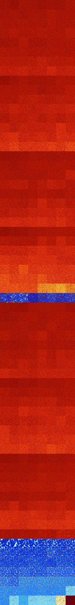

# B023567 (121344-121855)

<details>
    <summary>Initial Grid</summary>
    
</details>


<details>
    <summary>Initial Grid RLE</summary>

```
#C Exported from GoGoL (https://github.com/marrow16/gogol)
#C Wrap mode: Toroidal
#C Boundary mode: Dead
#C Step: 0
x = 100, y = 100, rule = B023567/S
4bo3bo12bo20bo2bo25bo3bo8bo$2bo7bo15bo3bo11bo23bobo30bo$17bo37bo$bo37bo
8bo3bo14bo12bo11bo$15bo37bo14bo5bo$o19bo2bo5bo40bo3bo7bo$46bobo3bo8bo$
5bo3bo60bo$16bo2bo15bo3bo19bo32bo$6bo8bo2bo5bo9b2o9bo17bo$52bo38bo2bo$
4bo17bo8bo3bo29bo24bo$14bo52bobo3bo14bo3bo$5bo10bo19bo9bo32bo15bo$48bo$
4bo43bo34bo9bo$6bo27bo6bo17bo5bo33bo$15bobo3bo46bo$6bo9bo28bo26bo$5bo
19bo52b2o13bo$7bo30bo28bo12bo16bo$o2bo16bo24bo5bo11bo2bo10bo$15bo35bo
14bo27bo$13bobo75bo4bo$60bo6bo5bo18bo$5bo20bo27bo9bo5bo$14bo61bo19bo$
23bo4b2o3bo12bo6bo14bo23bo3bo$47bo36bo2bo$3bo22bo43bo9b2obo$45bo6bo29bo
$35bo12bo4bo18bo4bo15bo$10bo18bo39bo9b2o9bo4b2o$17bo14bo30bo7bo26bo$6bo
3bo48bo8bo12bo$3bo46bo19bo2bo$5bo30bo12bo9bo16bo$100b$2bo45bo3bo3bo23b
2o3bo$15bo3bo8bo68bo$12bo52bo8bo$14bo2bo20bo18bo$2bo33bo17bo15bo$5bo3b
2o14bo14bo7bo10bo$8bo17bo33bo12bo3bo15bo$5bo42bo37bo11bo$9bo25bo34bo15b
o$21bo32bo21bo17b2o$5bo24bo4bo5bo2bo33bo9bo$4bo12bo28bo15bo$13bo31bo$
28bo5bobo6bo11bobo7bo8bo5bo$31bo11bo10bo15bo3bo12bo$3bo2bo32bo27bo3bo4b
o5bo$81bo$14bo22bo45bo14bo$7bo4bo5bo34bo24bo$18bo12bo24bo9bo13bo12bo$
17bo3bo4bobo44b2o6b2obo4bo$10bo4bo2bo4bo6bo49bo$44bo13bo8bo20bo$3bo3b2o
2bo12bo16bo3bo6bobo2bo21bo$9bo42bo39bo$39bo22bo15bo$4bo5bo20bo10bo13bo
38bo$3bo21bo45bo16bo$o3bo4bo$3bo13bo40bo$o9bo33bo7bo5bobo22bo$13bo50bo
11bo15bo$41bo27bo6bo$33bo26bo2bo$2bobo4bo23bo17bo10bo$30bo21bo$48bo8bo
12bo12bo13bo$bo54bo7bo2bo14bo8bo$bo3bo54bo5bo$10bo7bo7bo15bo20bo5bo7bo
14bo$37bo2bo28bo25bo$14bo6bo31bo6bo12bo7bo$27bo30bo8bo12bo5bo$23bo3bo
11bo7bo46bo$13b2o23bo5b2o15bo17bo$3bo5bo8bo27bob3obo16bo7bo5bo8bo$8bo
22bo13bo5bo25bo$8bo8bo22bo6bo47bo$8bo26bo40bo$3bo53bo2bo$29b2o14bo53bo$
9bo59bo10bo14bobo$17bo26bo3bo27bo12bo$9bo5bo11bo18bo4bo$18bo23bo40bo$
70bo23bo$54bo12b2o11b2o9bo$21bo2bo19bo4bo20bo$14bo22bo11bo42bo$37bo27bo
13bo5bo$3bo2bo26bo5bo56bo$5bo30bo3bo12bo!
```
</details>
<details>
    <summary>Thumbnail</summary>

</details>
<table>
<tr>
    <td><a href="./121344%20S%20Heat%20Map%20Activity.png"></a><br>S (121344)<br>G>1000</td>    <td><a href="./121345%20S0%20Heat%20Map%20Activity.png"></a><br>S0 (121345)<br>G>1000</td>    <td><a href="./121346%20S1%20Heat%20Map%20Activity.png"></a><br>S1 (121346)<br>G>1000</td>    <td><a href="./121347%20S01%20Heat%20Map%20Activity.png"></a><br>S01 (121347)<br>G>1000</td>    <td><a href="./121348%20S2%20Heat%20Map%20Activity.png"></a><br>S2 (121348)<br>G>1000</td>    <td><a href="./121349%20S02%20Heat%20Map%20Activity.png"></a><br>S02 (121349)<br>G>1000</td>    <td><a href="./121350%20S12%20Heat%20Map%20Activity.png"></a><br>S12 (121350)<br>G>1000</td>    <td><a href="./121351%20S012%20Heat%20Map%20Activity.png"></a><br>S012 (121351)<br>G>1000</td></tr>
<tr>
    <td><a href="./121352%20S3%20Heat%20Map%20Activity.png"></a><br>S3 (121352)<br>G>1000</td>    <td><a href="./121353%20S03%20Heat%20Map%20Activity.png"></a><br>S03 (121353)<br>G>1000</td>    <td><a href="./121354%20S13%20Heat%20Map%20Activity.png"></a><br>S13 (121354)<br>G>1000</td>    <td><a href="./121355%20S013%20Heat%20Map%20Activity.png"></a><br>S013 (121355)<br>G>1000</td>    <td><a href="./121356%20S23%20Heat%20Map%20Activity.png"></a><br>S23 (121356)<br>G>1000</td>    <td><a href="./121357%20S023%20Heat%20Map%20Activity.png"></a><br>S023 (121357)<br>G>1000</td>    <td><a href="./121358%20S123%20Heat%20Map%20Activity.png"></a><br>S123 (121358)<br>G>1000</td>    <td><a href="./121359%20S0123%20Heat%20Map%20Activity.png"></a><br>S0123 (121359)<br>G>1000</td></tr>
<tr>
    <td><a href="./121360%20S4%20Heat%20Map%20Activity.png"></a><br>S4 (121360)<br>G>1000</td>    <td><a href="./121361%20S04%20Heat%20Map%20Activity.png"></a><br>S04 (121361)<br>G>1000</td>    <td><a href="./121362%20S14%20Heat%20Map%20Activity.png"></a><br>S14 (121362)<br>G>1000</td>    <td><a href="./121363%20S014%20Heat%20Map%20Activity.png"></a><br>S014 (121363)<br>G>1000</td>    <td><a href="./121364%20S24%20Heat%20Map%20Activity.png"></a><br>S24 (121364)<br>G>1000</td>    <td><a href="./121365%20S024%20Heat%20Map%20Activity.png"></a><br>S024 (121365)<br>G>1000</td>    <td><a href="./121366%20S124%20Heat%20Map%20Activity.png"></a><br>S124 (121366)<br>G>1000</td>    <td><a href="./121367%20S0124%20Heat%20Map%20Activity.png"></a><br>S0124 (121367)<br>G>1000</td></tr>
<tr>
    <td><a href="./121368%20S34%20Heat%20Map%20Activity.png"></a><br>S34 (121368)<br>G>1000</td>    <td><a href="./121369%20S034%20Heat%20Map%20Activity.png"></a><br>S034 (121369)<br>G>1000</td>    <td><a href="./121370%20S134%20Heat%20Map%20Activity.png"></a><br>S134 (121370)<br>G>1000</td>    <td><a href="./121371%20S0134%20Heat%20Map%20Activity.png"></a><br>S0134 (121371)<br>G>1000</td>    <td><a href="./121372%20S234%20Heat%20Map%20Activity.png"></a><br>S234 (121372)<br>G>1000</td>    <td><a href="./121373%20S0234%20Heat%20Map%20Activity.png"></a><br>S0234 (121373)<br>G>1000</td>    <td><a href="./121374%20S1234%20Heat%20Map%20Activity.png"></a><br>S1234 (121374)<br>G>1000</td>    <td><a href="./121375%20S01234%20Heat%20Map%20Activity.png"></a><br>S01234 (121375)<br>G>1000</td></tr>
<tr>
    <td><a href="./121376%20S5%20Heat%20Map%20Activity.png"></a><br>S5 (121376)<br>G>1000</td>    <td><a href="./121377%20S05%20Heat%20Map%20Activity.png"></a><br>S05 (121377)<br>G>1000</td>    <td><a href="./121378%20S15%20Heat%20Map%20Activity.png"></a><br>S15 (121378)<br>G>1000</td>    <td><a href="./121379%20S015%20Heat%20Map%20Activity.png"></a><br>S015 (121379)<br>G>1000</td>    <td><a href="./121380%20S25%20Heat%20Map%20Activity.png"></a><br>S25 (121380)<br>G>1000</td>    <td><a href="./121381%20S025%20Heat%20Map%20Activity.png"></a><br>S025 (121381)<br>G>1000</td>    <td><a href="./121382%20S125%20Heat%20Map%20Activity.png"></a><br>S125 (121382)<br>G>1000</td>    <td><a href="./121383%20S0125%20Heat%20Map%20Activity.png"></a><br>S0125 (121383)<br>G>1000</td></tr>
<tr>
    <td><a href="./121384%20S35%20Heat%20Map%20Activity.png"></a><br>S35 (121384)<br>G>1000</td>    <td><a href="./121385%20S035%20Heat%20Map%20Activity.png"></a><br>S035 (121385)<br>G>1000</td>    <td><a href="./121386%20S135%20Heat%20Map%20Activity.png"></a><br>S135 (121386)<br>G>1000</td>    <td><a href="./121387%20S0135%20Heat%20Map%20Activity.png"></a><br>S0135 (121387)<br>G>1000</td>    <td><a href="./121388%20S235%20Heat%20Map%20Activity.png"></a><br>S235 (121388)<br>G>1000</td>    <td><a href="./121389%20S0235%20Heat%20Map%20Activity.png"></a><br>S0235 (121389)<br>G>1000</td>    <td><a href="./121390%20S1235%20Heat%20Map%20Activity.png"></a><br>S1235 (121390)<br>G>1000</td>    <td><a href="./121391%20S01235%20Heat%20Map%20Activity.png"></a><br>S01235 (121391)<br>G>1000</td></tr>
<tr>
    <td><a href="./121392%20S45%20Heat%20Map%20Activity.png"></a><br>S45 (121392)<br>G>1000</td>    <td><a href="./121393%20S045%20Heat%20Map%20Activity.png"></a><br>S045 (121393)<br>G>1000</td>    <td><a href="./121394%20S145%20Heat%20Map%20Activity.png"></a><br>S145 (121394)<br>G>1000</td>    <td><a href="./121395%20S0145%20Heat%20Map%20Activity.png"></a><br>S0145 (121395)<br>G>1000</td>    <td><a href="./121396%20S245%20Heat%20Map%20Activity.png"></a><br>S245 (121396)<br>G>1000</td>    <td><a href="./121397%20S0245%20Heat%20Map%20Activity.png"></a><br>S0245 (121397)<br>G>1000</td>    <td><a href="./121398%20S1245%20Heat%20Map%20Activity.png"></a><br>S1245 (121398)<br>G>1000</td>    <td><a href="./121399%20S01245%20Heat%20Map%20Activity.png"></a><br>S01245 (121399)<br>G>1000</td></tr>
<tr>
    <td><a href="./121400%20S345%20Heat%20Map%20Activity.png"></a><br>S345 (121400)<br>G>1000</td>    <td><a href="./121401%20S0345%20Heat%20Map%20Activity.png"></a><br>S0345 (121401)<br>G>1000</td>    <td><a href="./121402%20S1345%20Heat%20Map%20Activity.png"></a><br>S1345 (121402)<br>G>1000</td>    <td><a href="./121403%20S01345%20Heat%20Map%20Activity.png"></a><br>S01345 (121403)<br>G>1000</td>    <td><a href="./121404%20S2345%20Heat%20Map%20Activity.png"></a><br>S2345 (121404)<br>G>1000</td>    <td><a href="./121405%20S02345%20Heat%20Map%20Activity.png"></a><br>S02345 (121405)<br>G>1000</td>    <td><a href="./121406%20S12345%20Heat%20Map%20Activity.png"></a><br>S12345 (121406)<br>G>1000</td>    <td><a href="./121407%20S012345%20Heat%20Map%20Activity.png"></a><br>S012345 (121407)<br>G>1000</td></tr>
<tr>
    <td><a href="./121408%20S6%20Heat%20Map%20Activity.png"></a><br>S6 (121408)<br>G>1000</td>    <td><a href="./121409%20S06%20Heat%20Map%20Activity.png"></a><br>S06 (121409)<br>G>1000</td>    <td><a href="./121410%20S16%20Heat%20Map%20Activity.png"></a><br>S16 (121410)<br>G>1000</td>    <td><a href="./121411%20S016%20Heat%20Map%20Activity.png"></a><br>S016 (121411)<br>G>1000</td>    <td><a href="./121412%20S26%20Heat%20Map%20Activity.png"></a><br>S26 (121412)<br>G>1000</td>    <td><a href="./121413%20S026%20Heat%20Map%20Activity.png"></a><br>S026 (121413)<br>G>1000</td>    <td><a href="./121414%20S126%20Heat%20Map%20Activity.png"></a><br>S126 (121414)<br>G>1000</td>    <td><a href="./121415%20S0126%20Heat%20Map%20Activity.png"></a><br>S0126 (121415)<br>G>1000</td></tr>
<tr>
    <td><a href="./121416%20S36%20Heat%20Map%20Activity.png"></a><br>S36 (121416)<br>G>1000</td>    <td><a href="./121417%20S036%20Heat%20Map%20Activity.png"></a><br>S036 (121417)<br>G>1000</td>    <td><a href="./121418%20S136%20Heat%20Map%20Activity.png"></a><br>S136 (121418)<br>G>1000</td>    <td><a href="./121419%20S0136%20Heat%20Map%20Activity.png"></a><br>S0136 (121419)<br>G>1000</td>    <td><a href="./121420%20S236%20Heat%20Map%20Activity.png"></a><br>S236 (121420)<br>G>1000</td>    <td><a href="./121421%20S0236%20Heat%20Map%20Activity.png"></a><br>S0236 (121421)<br>G>1000</td>    <td><a href="./121422%20S1236%20Heat%20Map%20Activity.png"></a><br>S1236 (121422)<br>G>1000</td>    <td><a href="./121423%20S01236%20Heat%20Map%20Activity.png"></a><br>S01236 (121423)<br>G>1000</td></tr>
<tr>
    <td><a href="./121424%20S46%20Heat%20Map%20Activity.png"></a><br>S46 (121424)<br>G>1000</td>    <td><a href="./121425%20S046%20Heat%20Map%20Activity.png"></a><br>S046 (121425)<br>G>1000</td>    <td><a href="./121426%20S146%20Heat%20Map%20Activity.png"></a><br>S146 (121426)<br>G>1000</td>    <td><a href="./121427%20S0146%20Heat%20Map%20Activity.png"></a><br>S0146 (121427)<br>G>1000</td>    <td><a href="./121428%20S246%20Heat%20Map%20Activity.png"></a><br>S246 (121428)<br>G>1000</td>    <td><a href="./121429%20S0246%20Heat%20Map%20Activity.png"></a><br>S0246 (121429)<br>G>1000</td>    <td><a href="./121430%20S1246%20Heat%20Map%20Activity.png"></a><br>S1246 (121430)<br>G>1000</td>    <td><a href="./121431%20S01246%20Heat%20Map%20Activity.png"></a><br>S01246 (121431)<br>G>1000</td></tr>
<tr>
    <td><a href="./121432%20S346%20Heat%20Map%20Activity.png"></a><br>S346 (121432)<br>G>1000</td>    <td><a href="./121433%20S0346%20Heat%20Map%20Activity.png"></a><br>S0346 (121433)<br>G>1000</td>    <td><a href="./121434%20S1346%20Heat%20Map%20Activity.png"></a><br>S1346 (121434)<br>G>1000</td>    <td><a href="./121435%20S01346%20Heat%20Map%20Activity.png"></a><br>S01346 (121435)<br>G>1000</td>    <td><a href="./121436%20S2346%20Heat%20Map%20Activity.png"></a><br>S2346 (121436)<br>G>1000</td>    <td><a href="./121437%20S02346%20Heat%20Map%20Activity.png"></a><br>S02346 (121437)<br>G>1000</td>    <td><a href="./121438%20S12346%20Heat%20Map%20Activity.png"></a><br>S12346 (121438)<br>G>1000</td>    <td><a href="./121439%20S012346%20Heat%20Map%20Activity.png"></a><br>S012346 (121439)<br>G>1000</td></tr>
<tr>
    <td><a href="./121440%20S56%20Heat%20Map%20Activity.png"></a><br>S56 (121440)<br>G>1000</td>    <td><a href="./121441%20S056%20Heat%20Map%20Activity.png"></a><br>S056 (121441)<br>G>1000</td>    <td><a href="./121442%20S156%20Heat%20Map%20Activity.png"></a><br>S156 (121442)<br>G>1000</td>    <td><a href="./121443%20S0156%20Heat%20Map%20Activity.png"></a><br>S0156 (121443)<br>G>1000</td>    <td><a href="./121444%20S256%20Heat%20Map%20Activity.png"></a><br>S256 (121444)<br>G>1000</td>    <td><a href="./121445%20S0256%20Heat%20Map%20Activity.png"></a><br>S0256 (121445)<br>G>1000</td>    <td><a href="./121446%20S1256%20Heat%20Map%20Activity.png"></a><br>S1256 (121446)<br>G>1000</td>    <td><a href="./121447%20S01256%20Heat%20Map%20Activity.png"></a><br>S01256 (121447)<br>G>1000</td></tr>
<tr>
    <td><a href="./121448%20S356%20Heat%20Map%20Activity.png"></a><br>S356 (121448)<br>G>1000</td>    <td><a href="./121449%20S0356%20Heat%20Map%20Activity.png"></a><br>S0356 (121449)<br>G>1000</td>    <td><a href="./121450%20S1356%20Heat%20Map%20Activity.png"></a><br>S1356 (121450)<br>G>1000</td>    <td><a href="./121451%20S01356%20Heat%20Map%20Activity.png"></a><br>S01356 (121451)<br>G>1000</td>    <td><a href="./121452%20S2356%20Heat%20Map%20Activity.png"></a><br>S2356 (121452)<br>G>1000</td>    <td><a href="./121453%20S02356%20Heat%20Map%20Activity.png"></a><br>S02356 (121453)<br>G>1000</td>    <td><a href="./121454%20S12356%20Heat%20Map%20Activity.png"></a><br>S12356 (121454)<br>G>1000</td>    <td><a href="./121455%20S012356%20Heat%20Map%20Activity.png"></a><br>S012356 (121455)<br>G>1000</td></tr>
<tr>
    <td><a href="./121456%20S456%20Heat%20Map%20Activity.png"></a><br>S456 (121456)<br>G>1000</td>    <td><a href="./121457%20S0456%20Heat%20Map%20Activity.png"></a><br>S0456 (121457)<br>G>1000</td>    <td><a href="./121458%20S1456%20Heat%20Map%20Activity.png"></a><br>S1456 (121458)<br>G>1000</td>    <td><a href="./121459%20S01456%20Heat%20Map%20Activity.png"></a><br>S01456 (121459)<br>G>1000</td>    <td><a href="./121460%20S2456%20Heat%20Map%20Activity.png"></a><br>S2456 (121460)<br>G>1000</td>    <td><a href="./121461%20S02456%20Heat%20Map%20Activity.png"></a><br>S02456 (121461)<br>G>1000</td>    <td><a href="./121462%20S12456%20Heat%20Map%20Activity.png"></a><br>S12456 (121462)<br>G>1000</td>    <td><a href="./121463%20S012456%20Heat%20Map%20Activity.png"></a><br>S012456 (121463)<br>G>1000</td></tr>
<tr>
    <td><a href="./121464%20S3456%20Heat%20Map%20Activity.png"></a><br>S3456 (121464)<br>G>1000</td>    <td><a href="./121465%20S03456%20Heat%20Map%20Activity.png"></a><br>S03456 (121465)<br>G>1000</td>    <td><a href="./121466%20S13456%20Heat%20Map%20Activity.png"></a><br>S13456 (121466)<br>G>1000</td>    <td><a href="./121467%20S013456%20Heat%20Map%20Activity.png"></a><br>S013456 (121467)<br>G>1000</td>    <td><a href="./121468%20S23456%20Heat%20Map%20Activity.png"></a><br>S23456 (121468)<br>G>1000</td>    <td><a href="./121469%20S023456%20Heat%20Map%20Activity.png"></a><br>S023456 (121469)<br>G>1000</td>    <td><a href="./121470%20S123456%20Heat%20Map%20Activity.png"></a><br>S123456 (121470)<br>G>1000</td>    <td><a href="./121471%20S0123456%20Heat%20Map%20Activity.png"></a><br>S0123456 (121471)<br>G>1000</td></tr>
<tr>
    <td><a href="./121472%20S7%20Heat%20Map%20Activity.png"></a><br>S7 (121472)<br>G>1000</td>    <td><a href="./121473%20S07%20Heat%20Map%20Activity.png"></a><br>S07 (121473)<br>G>1000</td>    <td><a href="./121474%20S17%20Heat%20Map%20Activity.png"></a><br>S17 (121474)<br>G>1000</td>    <td><a href="./121475%20S017%20Heat%20Map%20Activity.png"></a><br>S017 (121475)<br>G>1000</td>    <td><a href="./121476%20S27%20Heat%20Map%20Activity.png"></a><br>S27 (121476)<br>G>1000</td>    <td><a href="./121477%20S027%20Heat%20Map%20Activity.png"></a><br>S027 (121477)<br>G>1000</td>    <td><a href="./121478%20S127%20Heat%20Map%20Activity.png"></a><br>S127 (121478)<br>G>1000</td>    <td><a href="./121479%20S0127%20Heat%20Map%20Activity.png"></a><br>S0127 (121479)<br>G>1000</td></tr>
<tr>
    <td><a href="./121480%20S37%20Heat%20Map%20Activity.png"></a><br>S37 (121480)<br>G>1000</td>    <td><a href="./121481%20S037%20Heat%20Map%20Activity.png"></a><br>S037 (121481)<br>G>1000</td>    <td><a href="./121482%20S137%20Heat%20Map%20Activity.png"></a><br>S137 (121482)<br>G>1000</td>    <td><a href="./121483%20S0137%20Heat%20Map%20Activity.png"></a><br>S0137 (121483)<br>G>1000</td>    <td><a href="./121484%20S237%20Heat%20Map%20Activity.png"></a><br>S237 (121484)<br>G>1000</td>    <td><a href="./121485%20S0237%20Heat%20Map%20Activity.png"></a><br>S0237 (121485)<br>G>1000</td>    <td><a href="./121486%20S1237%20Heat%20Map%20Activity.png"></a><br>S1237 (121486)<br>G>1000</td>    <td><a href="./121487%20S01237%20Heat%20Map%20Activity.png"></a><br>S01237 (121487)<br>G>1000</td></tr>
<tr>
    <td><a href="./121488%20S47%20Heat%20Map%20Activity.png"></a><br>S47 (121488)<br>G>1000</td>    <td><a href="./121489%20S047%20Heat%20Map%20Activity.png"></a><br>S047 (121489)<br>G>1000</td>    <td><a href="./121490%20S147%20Heat%20Map%20Activity.png"></a><br>S147 (121490)<br>G>1000</td>    <td><a href="./121491%20S0147%20Heat%20Map%20Activity.png"></a><br>S0147 (121491)<br>G>1000</td>    <td><a href="./121492%20S247%20Heat%20Map%20Activity.png"></a><br>S247 (121492)<br>G>1000</td>    <td><a href="./121493%20S0247%20Heat%20Map%20Activity.png"></a><br>S0247 (121493)<br>G>1000</td>    <td><a href="./121494%20S1247%20Heat%20Map%20Activity.png"></a><br>S1247 (121494)<br>G>1000</td>    <td><a href="./121495%20S01247%20Heat%20Map%20Activity.png"></a><br>S01247 (121495)<br>G>1000</td></tr>
<tr>
    <td><a href="./121496%20S347%20Heat%20Map%20Activity.png"></a><br>S347 (121496)<br>G>1000</td>    <td><a href="./121497%20S0347%20Heat%20Map%20Activity.png"></a><br>S0347 (121497)<br>G>1000</td>    <td><a href="./121498%20S1347%20Heat%20Map%20Activity.png"></a><br>S1347 (121498)<br>G>1000</td>    <td><a href="./121499%20S01347%20Heat%20Map%20Activity.png"></a><br>S01347 (121499)<br>G>1000</td>    <td><a href="./121500%20S2347%20Heat%20Map%20Activity.png"></a><br>S2347 (121500)<br>G>1000</td>    <td><a href="./121501%20S02347%20Heat%20Map%20Activity.png"></a><br>S02347 (121501)<br>G>1000</td>    <td><a href="./121502%20S12347%20Heat%20Map%20Activity.png"></a><br>S12347 (121502)<br>G>1000</td>    <td><a href="./121503%20S012347%20Heat%20Map%20Activity.png"></a><br>S012347 (121503)<br>G>1000</td></tr>
<tr>
    <td><a href="./121504%20S57%20Heat%20Map%20Activity.png"></a><br>S57 (121504)<br>G>1000</td>    <td><a href="./121505%20S057%20Heat%20Map%20Activity.png"></a><br>S057 (121505)<br>G>1000</td>    <td><a href="./121506%20S157%20Heat%20Map%20Activity.png"></a><br>S157 (121506)<br>G>1000</td>    <td><a href="./121507%20S0157%20Heat%20Map%20Activity.png"></a><br>S0157 (121507)<br>G>1000</td>    <td><a href="./121508%20S257%20Heat%20Map%20Activity.png"></a><br>S257 (121508)<br>G>1000</td>    <td><a href="./121509%20S0257%20Heat%20Map%20Activity.png"></a><br>S0257 (121509)<br>G>1000</td>    <td><a href="./121510%20S1257%20Heat%20Map%20Activity.png"></a><br>S1257 (121510)<br>G>1000</td>    <td><a href="./121511%20S01257%20Heat%20Map%20Activity.png"></a><br>S01257 (121511)<br>G>1000</td></tr>
<tr>
    <td><a href="./121512%20S357%20Heat%20Map%20Activity.png"></a><br>S357 (121512)<br>G>1000</td>    <td><a href="./121513%20S0357%20Heat%20Map%20Activity.png"></a><br>S0357 (121513)<br>G>1000</td>    <td><a href="./121514%20S1357%20Heat%20Map%20Activity.png"></a><br>S1357 (121514)<br>G>1000</td>    <td><a href="./121515%20S01357%20Heat%20Map%20Activity.png"></a><br>S01357 (121515)<br>G>1000</td>    <td><a href="./121516%20S2357%20Heat%20Map%20Activity.png"></a><br>S2357 (121516)<br>G>1000</td>    <td><a href="./121517%20S02357%20Heat%20Map%20Activity.png"></a><br>S02357 (121517)<br>G>1000</td>    <td><a href="./121518%20S12357%20Heat%20Map%20Activity.png"></a><br>S12357 (121518)<br>G>1000</td>    <td><a href="./121519%20S012357%20Heat%20Map%20Activity.png"></a><br>S012357 (121519)<br>G>1000</td></tr>
<tr>
    <td><a href="./121520%20S457%20Heat%20Map%20Activity.png"></a><br>S457 (121520)<br>G>1000</td>    <td><a href="./121521%20S0457%20Heat%20Map%20Activity.png"></a><br>S0457 (121521)<br>G>1000</td>    <td><a href="./121522%20S1457%20Heat%20Map%20Activity.png"></a><br>S1457 (121522)<br>G>1000</td>    <td><a href="./121523%20S01457%20Heat%20Map%20Activity.png"></a><br>S01457 (121523)<br>G>1000</td>    <td><a href="./121524%20S2457%20Heat%20Map%20Activity.png"></a><br>S2457 (121524)<br>G>1000</td>    <td><a href="./121525%20S02457%20Heat%20Map%20Activity.png"></a><br>S02457 (121525)<br>G>1000</td>    <td><a href="./121526%20S12457%20Heat%20Map%20Activity.png"></a><br>S12457 (121526)<br>G>1000</td>    <td><a href="./121527%20S012457%20Heat%20Map%20Activity.png"></a><br>S012457 (121527)<br>G>1000</td></tr>
<tr>
    <td><a href="./121528%20S3457%20Heat%20Map%20Activity.png"></a><br>S3457 (121528)<br>G>1000</td>    <td><a href="./121529%20S03457%20Heat%20Map%20Activity.png"></a><br>S03457 (121529)<br>G>1000</td>    <td><a href="./121530%20S13457%20Heat%20Map%20Activity.png"></a><br>S13457 (121530)<br>G>1000</td>    <td><a href="./121531%20S013457%20Heat%20Map%20Activity.png"></a><br>S013457 (121531)<br>G>1000</td>    <td><a href="./121532%20S23457%20Heat%20Map%20Activity.png"></a><br>S23457 (121532)<br>G>1000</td>    <td><a href="./121533%20S023457%20Heat%20Map%20Activity.png"></a><br>S023457 (121533)<br>G>1000</td>    <td><a href="./121534%20S123457%20Heat%20Map%20Activity.png"></a><br>S123457 (121534)<br>G>1000</td>    <td><a href="./121535%20S0123457%20Heat%20Map%20Activity.png"></a><br>S0123457 (121535)<br>G>1000</td></tr>
<tr>
    <td><a href="./121536%20S67%20Heat%20Map%20Activity.png"></a><br>S67 (121536)<br>G>1000</td>    <td><a href="./121537%20S067%20Heat%20Map%20Activity.png"></a><br>S067 (121537)<br>G>1000</td>    <td><a href="./121538%20S167%20Heat%20Map%20Activity.png"></a><br>S167 (121538)<br>G>1000</td>    <td><a href="./121539%20S0167%20Heat%20Map%20Activity.png"></a><br>S0167 (121539)<br>G>1000</td>    <td><a href="./121540%20S267%20Heat%20Map%20Activity.png"></a><br>S267 (121540)<br>G>1000</td>    <td><a href="./121541%20S0267%20Heat%20Map%20Activity.png"></a><br>S0267 (121541)<br>G>1000</td>    <td><a href="./121542%20S1267%20Heat%20Map%20Activity.png"></a><br>S1267 (121542)<br>G>1000</td>    <td><a href="./121543%20S01267%20Heat%20Map%20Activity.png"></a><br>S01267 (121543)<br>G>1000</td></tr>
<tr>
    <td><a href="./121544%20S367%20Heat%20Map%20Activity.png"></a><br>S367 (121544)<br>G>1000</td>    <td><a href="./121545%20S0367%20Heat%20Map%20Activity.png"></a><br>S0367 (121545)<br>G>1000</td>    <td><a href="./121546%20S1367%20Heat%20Map%20Activity.png"></a><br>S1367 (121546)<br>G>1000</td>    <td><a href="./121547%20S01367%20Heat%20Map%20Activity.png"></a><br>S01367 (121547)<br>G>1000</td>    <td><a href="./121548%20S2367%20Heat%20Map%20Activity.png"></a><br>S2367 (121548)<br>G>1000</td>    <td><a href="./121549%20S02367%20Heat%20Map%20Activity.png"></a><br>S02367 (121549)<br>G>1000</td>    <td><a href="./121550%20S12367%20Heat%20Map%20Activity.png"></a><br>S12367 (121550)<br>G>1000</td>    <td><a href="./121551%20S012367%20Heat%20Map%20Activity.png"></a><br>S012367 (121551)<br>G>1000</td></tr>
<tr>
    <td><a href="./121552%20S467%20Heat%20Map%20Activity.png"></a><br>S467 (121552)<br>G>1000</td>    <td><a href="./121553%20S0467%20Heat%20Map%20Activity.png"></a><br>S0467 (121553)<br>G>1000</td>    <td><a href="./121554%20S1467%20Heat%20Map%20Activity.png"></a><br>S1467 (121554)<br>G>1000</td>    <td><a href="./121555%20S01467%20Heat%20Map%20Activity.png"></a><br>S01467 (121555)<br>G>1000</td>    <td><a href="./121556%20S2467%20Heat%20Map%20Activity.png"></a><br>S2467 (121556)<br>G>1000</td>    <td><a href="./121557%20S02467%20Heat%20Map%20Activity.png"></a><br>S02467 (121557)<br>G>1000</td>    <td><a href="./121558%20S12467%20Heat%20Map%20Activity.png"></a><br>S12467 (121558)<br>G>1000</td>    <td><a href="./121559%20S012467%20Heat%20Map%20Activity.png"></a><br>S012467 (121559)<br>G>1000</td></tr>
<tr>
    <td><a href="./121560%20S3467%20Heat%20Map%20Activity.png"></a><br>S3467 (121560)<br>G>1000</td>    <td><a href="./121561%20S03467%20Heat%20Map%20Activity.png"></a><br>S03467 (121561)<br>G>1000</td>    <td><a href="./121562%20S13467%20Heat%20Map%20Activity.png"></a><br>S13467 (121562)<br>G>1000</td>    <td><a href="./121563%20S013467%20Heat%20Map%20Activity.png"></a><br>S013467 (121563)<br>G>1000</td>    <td><a href="./121564%20S23467%20Heat%20Map%20Activity.png"></a><br>S23467 (121564)<br>G>1000</td>    <td><a href="./121565%20S023467%20Heat%20Map%20Activity.png"></a><br>S023467 (121565)<br>G>1000</td>    <td><a href="./121566%20S123467%20Heat%20Map%20Activity.png"></a><br>S123467 (121566)<br>G>1000</td>    <td><a href="./121567%20S0123467%20Heat%20Map%20Activity.png"></a><br>S0123467 (121567)<br>G>1000</td></tr>
<tr>
    <td><a href="./121568%20S567%20Heat%20Map%20Activity.png"></a><br>S567 (121568)<br>G>1000</td>    <td><a href="./121569%20S0567%20Heat%20Map%20Activity.png"></a><br>S0567 (121569)<br>G>1000</td>    <td><a href="./121570%20S1567%20Heat%20Map%20Activity.png"></a><br>S1567 (121570)<br>G>1000</td>    <td><a href="./121571%20S01567%20Heat%20Map%20Activity.png"></a><br>S01567 (121571)<br>G>1000</td>    <td><a href="./121572%20S2567%20Heat%20Map%20Activity.png"></a><br>S2567 (121572)<br>G>1000</td>    <td><a href="./121573%20S02567%20Heat%20Map%20Activity.png"></a><br>S02567 (121573)<br>G>1000</td>    <td><a href="./121574%20S12567%20Heat%20Map%20Activity.png"></a><br>S12567 (121574)<br>G>1000</td>    <td><a href="./121575%20S012567%20Heat%20Map%20Activity.png"></a><br>S012567 (121575)<br>G>1000</td></tr>
<tr>
    <td><a href="./121576%20S3567%20Heat%20Map%20Activity.png"></a><br>S3567 (121576)<br>G>1000</td>    <td><a href="./121577%20S03567%20Heat%20Map%20Activity.png"></a><br>S03567 (121577)<br>G>1000</td>    <td><a href="./121578%20S13567%20Heat%20Map%20Activity.png"></a><br>S13567 (121578)<br>G>1000</td>    <td><a href="./121579%20S013567%20Heat%20Map%20Activity.png"></a><br>S013567 (121579)<br>G>1000</td>    <td><a href="./121580%20S23567%20Heat%20Map%20Activity.png"></a><br>S23567 (121580)<br>G>1000</td>    <td><a href="./121581%20S023567%20Heat%20Map%20Activity.png"></a><br>S023567 (121581)<br>G>1000</td>    <td><a href="./121582%20S123567%20Heat%20Map%20Activity.png"></a><br>S123567 (121582)<br>G>1000</td>    <td><a href="./121583%20S0123567%20Heat%20Map%20Activity.png"></a><br>S0123567 (121583)<br>G>1000</td></tr>
<tr>
    <td><a href="./121584%20S4567%20Heat%20Map%20Activity.png"></a><br>S4567 (121584)<br>G>1000</td>    <td><a href="./121585%20S04567%20Heat%20Map%20Activity.png"></a><br>S04567 (121585)<br>G>1000</td>    <td><a href="./121586%20S14567%20Heat%20Map%20Activity.png"></a><br>S14567 (121586)<br>G>1000</td>    <td><a href="./121587%20S014567%20Heat%20Map%20Activity.png"></a><br>S014567 (121587)<br>G>1000</td>    <td><a href="./121588%20S24567%20Heat%20Map%20Activity.png"></a><br>S24567 (121588)<br>G>1000</td>    <td><a href="./121589%20S024567%20Heat%20Map%20Activity.png"></a><br>S024567 (121589)<br>G>1000</td>    <td><a href="./121590%20S124567%20Heat%20Map%20Activity.png"></a><br>S124567 (121590)<br>G>1000</td>    <td><a href="./121591%20S0124567%20Heat%20Map%20Activity.png"></a><br>S0124567 (121591)<br>G>1000</td></tr>
<tr>
    <td><a href="./121592%20S34567%20Heat%20Map%20Activity.png"></a><br>S34567 (121592)<br>R@219,p30</td>    <td><a href="./121593%20S034567%20Heat%20Map%20Activity.png"></a><br>S034567 (121593)<br>R@171,p30</td>    <td><a href="./121594%20S134567%20Heat%20Map%20Activity.png"></a><br>S134567 (121594)<br>R@140,p12</td>    <td><a href="./121595%20S0134567%20Heat%20Map%20Activity.png"></a><br>S0134567 (121595)<br>R@544,p420</td>    <td><a href="./121596%20S234567%20Heat%20Map%20Activity.png"></a><br>S234567 (121596)<br>R@64,p30</td>    <td><a href="./121597%20S0234567%20Heat%20Map%20Activity.png"></a><br>S0234567 (121597)<br>R@43,p12</td>    <td><a href="./121598%20S1234567%20Heat%20Map%20Activity.png"></a><br>S1234567 (121598)<br>R@62,p30</td>    <td><a href="./121599%20S01234567%20Heat%20Map%20Activity.png"></a><br>S01234567 (121599)<br>R@46,p12</td></tr>
<tr>
    <td><a href="./121600%20S8%20Heat%20Map%20Activity.png"></a><br>S8 (121600)<br>G>1000</td>    <td><a href="./121601%20S08%20Heat%20Map%20Activity.png"></a><br>S08 (121601)<br>G>1000</td>    <td><a href="./121602%20S18%20Heat%20Map%20Activity.png"></a><br>S18 (121602)<br>G>1000</td>    <td><a href="./121603%20S018%20Heat%20Map%20Activity.png"></a><br>S018 (121603)<br>G>1000</td>    <td><a href="./121604%20S28%20Heat%20Map%20Activity.png"></a><br>S28 (121604)<br>G>1000</td>    <td><a href="./121605%20S028%20Heat%20Map%20Activity.png"></a><br>S028 (121605)<br>G>1000</td>    <td><a href="./121606%20S128%20Heat%20Map%20Activity.png"></a><br>S128 (121606)<br>G>1000</td>    <td><a href="./121607%20S0128%20Heat%20Map%20Activity.png"></a><br>S0128 (121607)<br>G>1000</td></tr>
<tr>
    <td><a href="./121608%20S38%20Heat%20Map%20Activity.png"></a><br>S38 (121608)<br>G>1000</td>    <td><a href="./121609%20S038%20Heat%20Map%20Activity.png"></a><br>S038 (121609)<br>G>1000</td>    <td><a href="./121610%20S138%20Heat%20Map%20Activity.png"></a><br>S138 (121610)<br>G>1000</td>    <td><a href="./121611%20S0138%20Heat%20Map%20Activity.png"></a><br>S0138 (121611)<br>G>1000</td>    <td><a href="./121612%20S238%20Heat%20Map%20Activity.png"></a><br>S238 (121612)<br>G>1000</td>    <td><a href="./121613%20S0238%20Heat%20Map%20Activity.png"></a><br>S0238 (121613)<br>G>1000</td>    <td><a href="./121614%20S1238%20Heat%20Map%20Activity.png"></a><br>S1238 (121614)<br>G>1000</td>    <td><a href="./121615%20S01238%20Heat%20Map%20Activity.png"></a><br>S01238 (121615)<br>G>1000</td></tr>
<tr>
    <td><a href="./121616%20S48%20Heat%20Map%20Activity.png"></a><br>S48 (121616)<br>G>1000</td>    <td><a href="./121617%20S048%20Heat%20Map%20Activity.png"></a><br>S048 (121617)<br>G>1000</td>    <td><a href="./121618%20S148%20Heat%20Map%20Activity.png"></a><br>S148 (121618)<br>G>1000</td>    <td><a href="./121619%20S0148%20Heat%20Map%20Activity.png"></a><br>S0148 (121619)<br>G>1000</td>    <td><a href="./121620%20S248%20Heat%20Map%20Activity.png"></a><br>S248 (121620)<br>G>1000</td>    <td><a href="./121621%20S0248%20Heat%20Map%20Activity.png"></a><br>S0248 (121621)<br>G>1000</td>    <td><a href="./121622%20S1248%20Heat%20Map%20Activity.png"></a><br>S1248 (121622)<br>G>1000</td>    <td><a href="./121623%20S01248%20Heat%20Map%20Activity.png"></a><br>S01248 (121623)<br>G>1000</td></tr>
<tr>
    <td><a href="./121624%20S348%20Heat%20Map%20Activity.png"></a><br>S348 (121624)<br>G>1000</td>    <td><a href="./121625%20S0348%20Heat%20Map%20Activity.png"></a><br>S0348 (121625)<br>G>1000</td>    <td><a href="./121626%20S1348%20Heat%20Map%20Activity.png"></a><br>S1348 (121626)<br>G>1000</td>    <td><a href="./121627%20S01348%20Heat%20Map%20Activity.png"></a><br>S01348 (121627)<br>G>1000</td>    <td><a href="./121628%20S2348%20Heat%20Map%20Activity.png"></a><br>S2348 (121628)<br>G>1000</td>    <td><a href="./121629%20S02348%20Heat%20Map%20Activity.png"></a><br>S02348 (121629)<br>G>1000</td>    <td><a href="./121630%20S12348%20Heat%20Map%20Activity.png"></a><br>S12348 (121630)<br>G>1000</td>    <td><a href="./121631%20S012348%20Heat%20Map%20Activity.png"></a><br>S012348 (121631)<br>G>1000</td></tr>
<tr>
    <td><a href="./121632%20S58%20Heat%20Map%20Activity.png"></a><br>S58 (121632)<br>G>1000</td>    <td><a href="./121633%20S058%20Heat%20Map%20Activity.png"></a><br>S058 (121633)<br>G>1000</td>    <td><a href="./121634%20S158%20Heat%20Map%20Activity.png"></a><br>S158 (121634)<br>G>1000</td>    <td><a href="./121635%20S0158%20Heat%20Map%20Activity.png"></a><br>S0158 (121635)<br>G>1000</td>    <td><a href="./121636%20S258%20Heat%20Map%20Activity.png"></a><br>S258 (121636)<br>G>1000</td>    <td><a href="./121637%20S0258%20Heat%20Map%20Activity.png"></a><br>S0258 (121637)<br>G>1000</td>    <td><a href="./121638%20S1258%20Heat%20Map%20Activity.png"></a><br>S1258 (121638)<br>G>1000</td>    <td><a href="./121639%20S01258%20Heat%20Map%20Activity.png"></a><br>S01258 (121639)<br>G>1000</td></tr>
<tr>
    <td><a href="./121640%20S358%20Heat%20Map%20Activity.png"></a><br>S358 (121640)<br>G>1000</td>    <td><a href="./121641%20S0358%20Heat%20Map%20Activity.png"></a><br>S0358 (121641)<br>G>1000</td>    <td><a href="./121642%20S1358%20Heat%20Map%20Activity.png"></a><br>S1358 (121642)<br>G>1000</td>    <td><a href="./121643%20S01358%20Heat%20Map%20Activity.png"></a><br>S01358 (121643)<br>G>1000</td>    <td><a href="./121644%20S2358%20Heat%20Map%20Activity.png"></a><br>S2358 (121644)<br>G>1000</td>    <td><a href="./121645%20S02358%20Heat%20Map%20Activity.png"></a><br>S02358 (121645)<br>G>1000</td>    <td><a href="./121646%20S12358%20Heat%20Map%20Activity.png"></a><br>S12358 (121646)<br>G>1000</td>    <td><a href="./121647%20S012358%20Heat%20Map%20Activity.png"></a><br>S012358 (121647)<br>G>1000</td></tr>
<tr>
    <td><a href="./121648%20S458%20Heat%20Map%20Activity.png"></a><br>S458 (121648)<br>G>1000</td>    <td><a href="./121649%20S0458%20Heat%20Map%20Activity.png"></a><br>S0458 (121649)<br>G>1000</td>    <td><a href="./121650%20S1458%20Heat%20Map%20Activity.png"></a><br>S1458 (121650)<br>G>1000</td>    <td><a href="./121651%20S01458%20Heat%20Map%20Activity.png"></a><br>S01458 (121651)<br>G>1000</td>    <td><a href="./121652%20S2458%20Heat%20Map%20Activity.png"></a><br>S2458 (121652)<br>G>1000</td>    <td><a href="./121653%20S02458%20Heat%20Map%20Activity.png"></a><br>S02458 (121653)<br>G>1000</td>    <td><a href="./121654%20S12458%20Heat%20Map%20Activity.png"></a><br>S12458 (121654)<br>G>1000</td>    <td><a href="./121655%20S012458%20Heat%20Map%20Activity.png"></a><br>S012458 (121655)<br>G>1000</td></tr>
<tr>
    <td><a href="./121656%20S3458%20Heat%20Map%20Activity.png"></a><br>S3458 (121656)<br>G>1000</td>    <td><a href="./121657%20S03458%20Heat%20Map%20Activity.png"></a><br>S03458 (121657)<br>G>1000</td>    <td><a href="./121658%20S13458%20Heat%20Map%20Activity.png"></a><br>S13458 (121658)<br>G>1000</td>    <td><a href="./121659%20S013458%20Heat%20Map%20Activity.png"></a><br>S013458 (121659)<br>G>1000</td>    <td><a href="./121660%20S23458%20Heat%20Map%20Activity.png"></a><br>S23458 (121660)<br>G>1000</td>    <td><a href="./121661%20S023458%20Heat%20Map%20Activity.png"></a><br>S023458 (121661)<br>G>1000</td>    <td><a href="./121662%20S123458%20Heat%20Map%20Activity.png"></a><br>S123458 (121662)<br>G>1000</td>    <td><a href="./121663%20S0123458%20Heat%20Map%20Activity.png"></a><br>S0123458 (121663)<br>G>1000</td></tr>
<tr>
    <td><a href="./121664%20S68%20Heat%20Map%20Activity.png"></a><br>S68 (121664)<br>G>1000</td>    <td><a href="./121665%20S068%20Heat%20Map%20Activity.png"></a><br>S068 (121665)<br>G>1000</td>    <td><a href="./121666%20S168%20Heat%20Map%20Activity.png"></a><br>S168 (121666)<br>G>1000</td>    <td><a href="./121667%20S0168%20Heat%20Map%20Activity.png"></a><br>S0168 (121667)<br>G>1000</td>    <td><a href="./121668%20S268%20Heat%20Map%20Activity.png"></a><br>S268 (121668)<br>G>1000</td>    <td><a href="./121669%20S0268%20Heat%20Map%20Activity.png"></a><br>S0268 (121669)<br>G>1000</td>    <td><a href="./121670%20S1268%20Heat%20Map%20Activity.png"></a><br>S1268 (121670)<br>G>1000</td>    <td><a href="./121671%20S01268%20Heat%20Map%20Activity.png"></a><br>S01268 (121671)<br>G>1000</td></tr>
<tr>
    <td><a href="./121672%20S368%20Heat%20Map%20Activity.png"></a><br>S368 (121672)<br>G>1000</td>    <td><a href="./121673%20S0368%20Heat%20Map%20Activity.png"></a><br>S0368 (121673)<br>G>1000</td>    <td><a href="./121674%20S1368%20Heat%20Map%20Activity.png"></a><br>S1368 (121674)<br>G>1000</td>    <td><a href="./121675%20S01368%20Heat%20Map%20Activity.png"></a><br>S01368 (121675)<br>G>1000</td>    <td><a href="./121676%20S2368%20Heat%20Map%20Activity.png"></a><br>S2368 (121676)<br>G>1000</td>    <td><a href="./121677%20S02368%20Heat%20Map%20Activity.png"></a><br>S02368 (121677)<br>G>1000</td>    <td><a href="./121678%20S12368%20Heat%20Map%20Activity.png"></a><br>S12368 (121678)<br>G>1000</td>    <td><a href="./121679%20S012368%20Heat%20Map%20Activity.png"></a><br>S012368 (121679)<br>G>1000</td></tr>
<tr>
    <td><a href="./121680%20S468%20Heat%20Map%20Activity.png"></a><br>S468 (121680)<br>G>1000</td>    <td><a href="./121681%20S0468%20Heat%20Map%20Activity.png"></a><br>S0468 (121681)<br>G>1000</td>    <td><a href="./121682%20S1468%20Heat%20Map%20Activity.png"></a><br>S1468 (121682)<br>G>1000</td>    <td><a href="./121683%20S01468%20Heat%20Map%20Activity.png"></a><br>S01468 (121683)<br>G>1000</td>    <td><a href="./121684%20S2468%20Heat%20Map%20Activity.png"></a><br>S2468 (121684)<br>G>1000</td>    <td><a href="./121685%20S02468%20Heat%20Map%20Activity.png"></a><br>S02468 (121685)<br>G>1000</td>    <td><a href="./121686%20S12468%20Heat%20Map%20Activity.png"></a><br>S12468 (121686)<br>G>1000</td>    <td><a href="./121687%20S012468%20Heat%20Map%20Activity.png"></a><br>S012468 (121687)<br>G>1000</td></tr>
<tr>
    <td><a href="./121688%20S3468%20Heat%20Map%20Activity.png"></a><br>S3468 (121688)<br>G>1000</td>    <td><a href="./121689%20S03468%20Heat%20Map%20Activity.png"></a><br>S03468 (121689)<br>G>1000</td>    <td><a href="./121690%20S13468%20Heat%20Map%20Activity.png"></a><br>S13468 (121690)<br>G>1000</td>    <td><a href="./121691%20S013468%20Heat%20Map%20Activity.png"></a><br>S013468 (121691)<br>G>1000</td>    <td><a href="./121692%20S23468%20Heat%20Map%20Activity.png"></a><br>S23468 (121692)<br>G>1000</td>    <td><a href="./121693%20S023468%20Heat%20Map%20Activity.png"></a><br>S023468 (121693)<br>G>1000</td>    <td><a href="./121694%20S123468%20Heat%20Map%20Activity.png"></a><br>S123468 (121694)<br>G>1000</td>    <td><a href="./121695%20S0123468%20Heat%20Map%20Activity.png"></a><br>S0123468 (121695)<br>G>1000</td></tr>
<tr>
    <td><a href="./121696%20S568%20Heat%20Map%20Activity.png"></a><br>S568 (121696)<br>G>1000</td>    <td><a href="./121697%20S0568%20Heat%20Map%20Activity.png"></a><br>S0568 (121697)<br>G>1000</td>    <td><a href="./121698%20S1568%20Heat%20Map%20Activity.png"></a><br>S1568 (121698)<br>G>1000</td>    <td><a href="./121699%20S01568%20Heat%20Map%20Activity.png"></a><br>S01568 (121699)<br>G>1000</td>    <td><a href="./121700%20S2568%20Heat%20Map%20Activity.png"></a><br>S2568 (121700)<br>G>1000</td>    <td><a href="./121701%20S02568%20Heat%20Map%20Activity.png"></a><br>S02568 (121701)<br>G>1000</td>    <td><a href="./121702%20S12568%20Heat%20Map%20Activity.png"></a><br>S12568 (121702)<br>G>1000</td>    <td><a href="./121703%20S012568%20Heat%20Map%20Activity.png"></a><br>S012568 (121703)<br>G>1000</td></tr>
<tr>
    <td><a href="./121704%20S3568%20Heat%20Map%20Activity.png"></a><br>S3568 (121704)<br>G>1000</td>    <td><a href="./121705%20S03568%20Heat%20Map%20Activity.png"></a><br>S03568 (121705)<br>G>1000</td>    <td><a href="./121706%20S13568%20Heat%20Map%20Activity.png"></a><br>S13568 (121706)<br>G>1000</td>    <td><a href="./121707%20S013568%20Heat%20Map%20Activity.png"></a><br>S013568 (121707)<br>G>1000</td>    <td><a href="./121708%20S23568%20Heat%20Map%20Activity.png"></a><br>S23568 (121708)<br>G>1000</td>    <td><a href="./121709%20S023568%20Heat%20Map%20Activity.png"></a><br>S023568 (121709)<br>G>1000</td>    <td><a href="./121710%20S123568%20Heat%20Map%20Activity.png"></a><br>S123568 (121710)<br>G>1000</td>    <td><a href="./121711%20S0123568%20Heat%20Map%20Activity.png"></a><br>S0123568 (121711)<br>G>1000</td></tr>
<tr>
    <td><a href="./121712%20S4568%20Heat%20Map%20Activity.png"></a><br>S4568 (121712)<br>G>1000</td>    <td><a href="./121713%20S04568%20Heat%20Map%20Activity.png"></a><br>S04568 (121713)<br>G>1000</td>    <td><a href="./121714%20S14568%20Heat%20Map%20Activity.png"></a><br>S14568 (121714)<br>G>1000</td>    <td><a href="./121715%20S014568%20Heat%20Map%20Activity.png"></a><br>S014568 (121715)<br>G>1000</td>    <td><a href="./121716%20S24568%20Heat%20Map%20Activity.png"></a><br>S24568 (121716)<br>G>1000</td>    <td><a href="./121717%20S024568%20Heat%20Map%20Activity.png"></a><br>S024568 (121717)<br>G>1000</td>    <td><a href="./121718%20S124568%20Heat%20Map%20Activity.png"></a><br>S124568 (121718)<br>G>1000</td>    <td><a href="./121719%20S0124568%20Heat%20Map%20Activity.png"></a><br>S0124568 (121719)<br>G>1000</td></tr>
<tr>
    <td><a href="./121720%20S34568%20Heat%20Map%20Activity.png"></a><br>S34568 (121720)<br>G>1000</td>    <td><a href="./121721%20S034568%20Heat%20Map%20Activity.png"></a><br>S034568 (121721)<br>G>1000</td>    <td><a href="./121722%20S134568%20Heat%20Map%20Activity.png"></a><br>S134568 (121722)<br>G>1000</td>    <td><a href="./121723%20S0134568%20Heat%20Map%20Activity.png"></a><br>S0134568 (121723)<br>G>1000</td>    <td><a href="./121724%20S234568%20Heat%20Map%20Activity.png"></a><br>S234568 (121724)<br>G>1000</td>    <td><a href="./121725%20S0234568%20Heat%20Map%20Activity.png"></a><br>S0234568 (121725)<br>G>1000</td>    <td><a href="./121726%20S1234568%20Heat%20Map%20Activity.png"></a><br>S1234568 (121726)<br>G>1000</td>    <td><a href="./121727%20S01234568%20Heat%20Map%20Activity.png"></a><br>S01234568 (121727)<br>G>1000</td></tr>
<tr>
    <td><a href="./121728%20S78%20Heat%20Map%20Activity.png"></a><br>S78 (121728)<br>G>1000</td>    <td><a href="./121729%20S078%20Heat%20Map%20Activity.png"></a><br>S078 (121729)<br>G>1000</td>    <td><a href="./121730%20S178%20Heat%20Map%20Activity.png"></a><br>S178 (121730)<br>G>1000</td>    <td><a href="./121731%20S0178%20Heat%20Map%20Activity.png"></a><br>S0178 (121731)<br>G>1000</td>    <td><a href="./121732%20S278%20Heat%20Map%20Activity.png"></a><br>S278 (121732)<br>G>1000</td>    <td><a href="./121733%20S0278%20Heat%20Map%20Activity.png"></a><br>S0278 (121733)<br>G>1000</td>    <td><a href="./121734%20S1278%20Heat%20Map%20Activity.png"></a><br>S1278 (121734)<br>G>1000</td>    <td><a href="./121735%20S01278%20Heat%20Map%20Activity.png"></a><br>S01278 (121735)<br>G>1000</td></tr>
<tr>
    <td><a href="./121736%20S378%20Heat%20Map%20Activity.png"></a><br>S378 (121736)<br>G>1000</td>    <td><a href="./121737%20S0378%20Heat%20Map%20Activity.png"></a><br>S0378 (121737)<br>G>1000</td>    <td><a href="./121738%20S1378%20Heat%20Map%20Activity.png"></a><br>S1378 (121738)<br>G>1000</td>    <td><a href="./121739%20S01378%20Heat%20Map%20Activity.png"></a><br>S01378 (121739)<br>G>1000</td>    <td><a href="./121740%20S2378%20Heat%20Map%20Activity.png"></a><br>S2378 (121740)<br>G>1000</td>    <td><a href="./121741%20S02378%20Heat%20Map%20Activity.png"></a><br>S02378 (121741)<br>G>1000</td>    <td><a href="./121742%20S12378%20Heat%20Map%20Activity.png"></a><br>S12378 (121742)<br>G>1000</td>    <td><a href="./121743%20S012378%20Heat%20Map%20Activity.png"></a><br>S012378 (121743)<br>G>1000</td></tr>
<tr>
    <td><a href="./121744%20S478%20Heat%20Map%20Activity.png"></a><br>S478 (121744)<br>G>1000</td>    <td><a href="./121745%20S0478%20Heat%20Map%20Activity.png"></a><br>S0478 (121745)<br>G>1000</td>    <td><a href="./121746%20S1478%20Heat%20Map%20Activity.png"></a><br>S1478 (121746)<br>G>1000</td>    <td><a href="./121747%20S01478%20Heat%20Map%20Activity.png"></a><br>S01478 (121747)<br>G>1000</td>    <td><a href="./121748%20S2478%20Heat%20Map%20Activity.png"></a><br>S2478 (121748)<br>G>1000</td>    <td><a href="./121749%20S02478%20Heat%20Map%20Activity.png"></a><br>S02478 (121749)<br>G>1000</td>    <td><a href="./121750%20S12478%20Heat%20Map%20Activity.png"></a><br>S12478 (121750)<br>G>1000</td>    <td><a href="./121751%20S012478%20Heat%20Map%20Activity.png"></a><br>S012478 (121751)<br>G>1000</td></tr>
<tr>
    <td><a href="./121752%20S3478%20Heat%20Map%20Activity.png"></a><br>S3478 (121752)<br>G>1000</td>    <td><a href="./121753%20S03478%20Heat%20Map%20Activity.png"></a><br>S03478 (121753)<br>G>1000</td>    <td><a href="./121754%20S13478%20Heat%20Map%20Activity.png"></a><br>S13478 (121754)<br>G>1000</td>    <td><a href="./121755%20S013478%20Heat%20Map%20Activity.png"></a><br>S013478 (121755)<br>G>1000</td>    <td><a href="./121756%20S23478%20Heat%20Map%20Activity.png"></a><br>S23478 (121756)<br>G>1000</td>    <td><a href="./121757%20S023478%20Heat%20Map%20Activity.png"></a><br>S023478 (121757)<br>G>1000</td>    <td><a href="./121758%20S123478%20Heat%20Map%20Activity.png"></a><br>S123478 (121758)<br>G>1000</td>    <td><a href="./121759%20S0123478%20Heat%20Map%20Activity.png"></a><br>S0123478 (121759)<br>G>1000</td></tr>
<tr>
    <td><a href="./121760%20S578%20Heat%20Map%20Activity.png"></a><br>S578 (121760)<br>G>1000</td>    <td><a href="./121761%20S0578%20Heat%20Map%20Activity.png"></a><br>S0578 (121761)<br>G>1000</td>    <td><a href="./121762%20S1578%20Heat%20Map%20Activity.png"></a><br>S1578 (121762)<br>G>1000</td>    <td><a href="./121763%20S01578%20Heat%20Map%20Activity.png"></a><br>S01578 (121763)<br>G>1000</td>    <td><a href="./121764%20S2578%20Heat%20Map%20Activity.png"></a><br>S2578 (121764)<br>G>1000</td>    <td><a href="./121765%20S02578%20Heat%20Map%20Activity.png"></a><br>S02578 (121765)<br>G>1000</td>    <td><a href="./121766%20S12578%20Heat%20Map%20Activity.png"></a><br>S12578 (121766)<br>G>1000</td>    <td><a href="./121767%20S012578%20Heat%20Map%20Activity.png"></a><br>S012578 (121767)<br>G>1000</td></tr>
<tr>
    <td><a href="./121768%20S3578%20Heat%20Map%20Activity.png"></a><br>S3578 (121768)<br>G>1000</td>    <td><a href="./121769%20S03578%20Heat%20Map%20Activity.png"></a><br>S03578 (121769)<br>G>1000</td>    <td><a href="./121770%20S13578%20Heat%20Map%20Activity.png"></a><br>S13578 (121770)<br>G>1000</td>    <td><a href="./121771%20S013578%20Heat%20Map%20Activity.png"></a><br>S013578 (121771)<br>G>1000</td>    <td><a href="./121772%20S23578%20Heat%20Map%20Activity.png"></a><br>S23578 (121772)<br>G>1000</td>    <td><a href="./121773%20S023578%20Heat%20Map%20Activity.png"></a><br>S023578 (121773)<br>G>1000</td>    <td><a href="./121774%20S123578%20Heat%20Map%20Activity.png"></a><br>S123578 (121774)<br>G>1000</td>    <td><a href="./121775%20S0123578%20Heat%20Map%20Activity.png"></a><br>S0123578 (121775)<br>G>1000</td></tr>
<tr>
    <td><a href="./121776%20S4578%20Heat%20Map%20Activity.png"></a><br>S4578 (121776)<br>G>1000</td>    <td><a href="./121777%20S04578%20Heat%20Map%20Activity.png"></a><br>S04578 (121777)<br>G>1000</td>    <td><a href="./121778%20S14578%20Heat%20Map%20Activity.png"></a><br>S14578 (121778)<br>G>1000</td>    <td><a href="./121779%20S014578%20Heat%20Map%20Activity.png"></a><br>S014578 (121779)<br>G>1000</td>    <td><a href="./121780%20S24578%20Heat%20Map%20Activity.png"></a><br>S24578 (121780)<br>G>1000</td>    <td><a href="./121781%20S024578%20Heat%20Map%20Activity.png"></a><br>S024578 (121781)<br>G>1000</td>    <td><a href="./121782%20S124578%20Heat%20Map%20Activity.png"></a><br>S124578 (121782)<br>G>1000</td>    <td><a href="./121783%20S0124578%20Heat%20Map%20Activity.png"></a><br>S0124578 (121783)<br>G>1000</td></tr>
<tr>
    <td><a href="./121784%20S34578%20Heat%20Map%20Activity.png"></a><br>S34578 (121784)<br>G>1000</td>    <td><a href="./121785%20S034578%20Heat%20Map%20Activity.png"></a><br>S034578 (121785)<br>G>1000</td>    <td><a href="./121786%20S134578%20Heat%20Map%20Activity.png"></a><br>S134578 (121786)<br>G>1000</td>    <td><a href="./121787%20S0134578%20Heat%20Map%20Activity.png"></a><br>S0134578 (121787)<br>G>1000</td>    <td><a href="./121788%20S234578%20Heat%20Map%20Activity.png"></a><br>S234578 (121788)<br>G>1000</td>    <td><a href="./121789%20S0234578%20Heat%20Map%20Activity.png"></a><br>S0234578 (121789)<br>G>1000</td>    <td><a href="./121790%20S1234578%20Heat%20Map%20Activity.png"></a><br>S1234578 (121790)<br>G>1000</td>    <td><a href="./121791%20S01234578%20Heat%20Map%20Activity.png"></a><br>S01234578 (121791)<br>G>1000</td></tr>
<tr>
    <td><a href="./121792%20S678%20Heat%20Map%20Activity.png"></a><br>S678 (121792)<br>G>1000</td>    <td><a href="./121793%20S0678%20Heat%20Map%20Activity.png"></a><br>S0678 (121793)<br>G>1000</td>    <td><a href="./121794%20S1678%20Heat%20Map%20Activity.png"></a><br>S1678 (121794)<br>G>1000</td>    <td><a href="./121795%20S01678%20Heat%20Map%20Activity.png"></a><br>S01678 (121795)<br>G>1000</td>    <td><a href="./121796%20S2678%20Heat%20Map%20Activity.png"></a><br>S2678 (121796)<br>G>1000</td>    <td><a href="./121797%20S02678%20Heat%20Map%20Activity.png"></a><br>S02678 (121797)<br>G>1000</td>    <td><a href="./121798%20S12678%20Heat%20Map%20Activity.png"></a><br>S12678 (121798)<br>G>1000</td>    <td><a href="./121799%20S012678%20Heat%20Map%20Activity.png"></a><br>S012678 (121799)<br>G>1000</td></tr>
<tr>
    <td><a href="./121800%20S3678%20Heat%20Map%20Activity.png"></a><br>S3678 (121800)<br>R@176,p12</td>    <td><a href="./121801%20S03678%20Heat%20Map%20Activity.png"></a><br>S03678 (121801)<br>R@268,p4</td>    <td><a href="./121802%20S13678%20Heat%20Map%20Activity.png"></a><br>S13678 (121802)<br>R@111,p4</td>    <td><a href="./121803%20S013678%20Heat%20Map%20Activity.png"></a><br>S013678 (121803)<br>R@142,p12</td>    <td><a href="./121804%20S23678%20Heat%20Map%20Activity.png"></a><br>S23678 (121804)<br>R@65,p4</td>    <td><a href="./121805%20S023678%20Heat%20Map%20Activity.png"></a><br>S023678 (121805)<br>R@66,p4</td>    <td><a href="./121806%20S123678%20Heat%20Map%20Activity.png"></a><br>S123678 (121806)<br>R@56,p4</td>    <td><a href="./121807%20S0123678%20Heat%20Map%20Activity.png"></a><br>S0123678 (121807)<br>R@63,p4</td></tr>
<tr>
    <td><a href="./121808%20S4678%20Heat%20Map%20Activity.png"></a><br>S4678 (121808)<br>R@23,p4</td>    <td><a href="./121809%20S04678%20Heat%20Map%20Activity.png"></a><br>S04678 (121809)<br>R@25,p4</td>    <td><a href="./121810%20S14678%20Heat%20Map%20Activity.png"></a><br>S14678 (121810)<br>R@25,p4</td>    <td><a href="./121811%20S014678%20Heat%20Map%20Activity.png"></a><br>S014678 (121811)<br>R@24,p4</td>    <td><a href="./121812%20S24678%20Heat%20Map%20Activity.png"></a><br>S24678 (121812)<br>R@22,p4</td>    <td><a href="./121813%20S024678%20Heat%20Map%20Activity.png"></a><br>S024678 (121813)<br>S@19</td>    <td><a href="./121814%20S124678%20Heat%20Map%20Activity.png"></a><br>S124678 (121814)<br>R@19,p4</td>    <td><a href="./121815%20S0124678%20Heat%20Map%20Activity.png"></a><br>S0124678 (121815)<br>R@20,p4</td></tr>
<tr>
    <td><a href="./121816%20S34678%20Heat%20Map%20Activity.png"></a><br>S34678 (121816)<br>R@17,p4</td>    <td><a href="./121817%20S034678%20Heat%20Map%20Activity.png"></a><br>S034678 (121817)<br>R@19,p4</td>    <td><a href="./121818%20S134678%20Heat%20Map%20Activity.png"></a><br>S134678 (121818)<br>R@17,p4</td>    <td><a href="./121819%20S0134678%20Heat%20Map%20Activity.png"></a><br>S0134678 (121819)<br>R@15,p4</td>    <td><a href="./121820%20S234678%20Heat%20Map%20Activity.png"></a><br>S234678 (121820)<br>R@16,p4</td>    <td><a href="./121821%20S0234678%20Heat%20Map%20Activity.png"></a><br>S0234678 (121821)<br>R@19,p4</td>    <td><a href="./121822%20S1234678%20Heat%20Map%20Activity.png"></a><br>S1234678 (121822)<br>R@13,p4</td>    <td><a href="./121823%20S01234678%20Heat%20Map%20Activity.png"></a><br>S01234678 (121823)<br>R@15,p4</td></tr>
<tr>
    <td><a href="./121824%20S5678%20Heat%20Map%20Activity.png"></a><br>S5678 (121824)<br>S@10</td>    <td><a href="./121825%20S05678%20Heat%20Map%20Activity.png"></a><br>S05678 (121825)<br>S@11</td>    <td><a href="./121826%20S15678%20Heat%20Map%20Activity.png"></a><br>S15678 (121826)<br>S@8</td>    <td><a href="./121827%20S015678%20Heat%20Map%20Activity.png"></a><br>S015678 (121827)<br>S@10</td>    <td><a href="./121828%20S25678%20Heat%20Map%20Activity.png"></a><br>S25678 (121828)<br>S@10</td>    <td><a href="./121829%20S025678%20Heat%20Map%20Activity.png"></a><br>S025678 (121829)<br>S@8</td>    <td><a href="./121830%20S125678%20Heat%20Map%20Activity.png"></a><br>S125678 (121830)<br>S@9</td>    <td><a href="./121831%20S0125678%20Heat%20Map%20Activity.png"></a><br>S0125678 (121831)<br>S@8</td></tr>
<tr>
    <td><a href="./121832%20S35678%20Heat%20Map%20Activity.png"></a><br>S35678 (121832)<br>S@7</td>    <td><a href="./121833%20S035678%20Heat%20Map%20Activity.png"></a><br>S035678 (121833)<br>S@7</td>    <td><a href="./121834%20S135678%20Heat%20Map%20Activity.png"></a><br>S135678 (121834)<br>S@6</td>    <td><a href="./121835%20S0135678%20Heat%20Map%20Activity.png"></a><br>S0135678 (121835)<br>S@7</td>    <td><a href="./121836%20S235678%20Heat%20Map%20Activity.png"></a><br>S235678 (121836)<br>S@6</td>    <td><a href="./121837%20S0235678%20Heat%20Map%20Activity.png"></a><br>S0235678 (121837)<br>S@6</td>    <td><a href="./121838%20S1235678%20Heat%20Map%20Activity.png"></a><br>S1235678 (121838)<br>S@5</td>    <td><a href="./121839%20S01235678%20Heat%20Map%20Activity.png"></a><br>S01235678 (121839)<br>S@6</td></tr>
<tr>
    <td><a href="./121840%20S45678%20Heat%20Map%20Activity.png"></a><br>S45678 (121840)<br>S@5</td>    <td><a href="./121841%20S045678%20Heat%20Map%20Activity.png"></a><br>S045678 (121841)<br>S@6</td>    <td><a href="./121842%20S145678%20Heat%20Map%20Activity.png"></a><br>S145678 (121842)<br>S@5</td>    <td><a href="./121843%20S0145678%20Heat%20Map%20Activity.png"></a><br>S0145678 (121843)<br>S@6</td>    <td><a href="./121844%20S245678%20Heat%20Map%20Activity.png"></a><br>S245678 (121844)<br>S@5</td>    <td><a href="./121845%20S0245678%20Heat%20Map%20Activity.png"></a><br>S0245678 (121845)<br>S@5</td>    <td><a href="./121846%20S1245678%20Heat%20Map%20Activity.png"></a><br>S1245678 (121846)<br>S@6</td>    <td><a href="./121847%20S01245678%20Heat%20Map%20Activity.png"></a><br>S01245678 (121847)<br>S@4</td></tr>
<tr>
    <td><a href="./121848%20S345678%20Heat%20Map%20Activity.png"></a><br>S345678 (121848)<br>S@6</td>    <td><a href="./121849%20S0345678%20Heat%20Map%20Activity.png"></a><br>S0345678 (121849)<br>S@5</td>    <td><a href="./121850%20S1345678%20Heat%20Map%20Activity.png"></a><br>S1345678 (121850)<br>S@4</td>    <td><a href="./121851%20S01345678%20Heat%20Map%20Activity.png"></a><br>S01345678 (121851)<br>S@5</td>    <td><a href="./121852%20S2345678%20Heat%20Map%20Activity.png"></a><br>S2345678 (121852)<br>S@5</td>    <td><a href="./121853%20S02345678%20Heat%20Map%20Activity.png"></a><br>S02345678 (121853)<br>S@4</td>    <td><a href="./121854%20S12345678%20Heat%20Map%20Activity.png"></a><br>S12345678 (121854)<br>S@4</td>    <td><a href="./121855%20S012345678%20Heat%20Map%20Activity.png"></a><br>S012345678 (121855)<br>S@4</td></tr>
</table>
