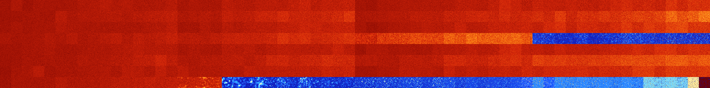

# B02357 (88576-89087)

<details>
    <summary>Initial Grid</summary>
    
</details>


<details>
    <summary>Initial Grid RLE</summary>

```
#C Exported from GoGoL (https://github.com/marrow16/gogol)
#C Wrap mode: Toroidal
#C Boundary mode: Dead
#C Step: 0
x = 100, y = 100, rule = B02357/S
o90bo$16bo28bo14bo29b2o6bo$o36bo10bo16bo21bo10bo$8bo65bo22bo$30bo$57bob
o8bo5bo7bo$22bo29bobo21bo$6bo4bo6bo15bo37bo16bo$12bo15bo17bo3bo4bo$38bo
17bo3bo6bo17bo2b2o$7bo4bo9bo2bo56bo3bo$48b2o3bo33b2obo$14b2o7bo5bo25bo
18bo$38bo$19bo25bo26bo4bo4bo$6bo6bobo40bo7bo6bo9bobo$4bobobo25bo25bo2bo
24bo10bo$15bo48bo24bo$24bo13bo3bo4bo28bo6bo13b2o$6bo26bo5bo5bo41bo$9bo
4bo5bo6bo15bo$24bo22bo35bo$8bo3bo9bo45bo6bo7bo3bo9bo$25bo27bo2bo$2bo38b
o24bo3b2obo9bo7b2o$4bo17bo3bo27bo38bo$47bo12bo36bo$o4bo3bo17bo16bo6bo
12bo6bo$66bo$10bo11bo7bo18bo15bo6b2o13bo$15bo28bo$3bo4bo35bo23bo16bo8bo
$16bo11bo25bo12bo$3bo28bo5bo13bo26bo6bo6bo$22bo11bo$61bobo2bo$15bo40bo$
6bo17bo4bo2bo4bo10bo8bo4bo8bo$37b2obo26bo27bo2bo$38bo23bo3bo31bo$8bo13b
o42bo7bo4bo$16bo4bo7bo13bo14bo7bo5bo$21bo36bo4bobo9bo$5bobo14bo12bo9bo
15bo30bo5bo$7bo6bo4bo26bo15bo5bo15bo$6bo32bo12bo2bo4bo9bo9bo18bo$2bobo
2bo5bo6bo15bo10bo18bobo10b2o2bo$7bo5b3o10bo8bo47bo$31bo4bo6bo35bo15bobo
$b2o20bo19bo15bo25bo7bo5bo$26bobo6bo14bo13bo31bo$10bo17bo21bo6bo6bo32bo
$4bo8bo32bo40bo8bo$49bo18bo11bo10b2o$31bo2b2o4bo$18bo15bo17b2o10bo5bo2b
o$27bo10bo19bo28bo7bo$24b3o34bo18bo6bo10bo$10bo3bo2bo23bo44bo5bo$25b2o
13bo19bo5bo13bo2bo8bo$44bo13bo$61bo19bo12bo$14bo16bo52bo$39bo15bo10bo
28bo$3b2obo9bo7bo55bo13bo$26bo11bo13bo5bo33bo$31bo11bo$8bo77bo11bo$7bo
58bo5bo18bo6bo$45bo6bo32bo12bo$41bo19bo7bo4bo16bo$32bo12bo22bo26bo$2bo
6bo7bo7bo$5bo2bo13bo7bo18bo13bo11bo15bo$5bo34bo8bo29bo2bo$13bo18bo7bo
10bo12bo$26bo10bo22bo17bo18bo$31bo6bo15bo30bo9bo$8bo2bobo62bo16bo5bo$
14bo31bo8bo42bo$100b$5bo32bo2b3o16bo$3b2o3bo6bo37bo11bo$8bo24bobobo38bo
21bo$5bo27bo3bo45bo4bo6bo$21bo3bo26bo21bo2bo6bo7bo$17bob3o17bo35bo$12bo
4bo21bo7bo14bo13bo$5bo34bobo6bo44bobo$5bo21bo9bo13bo35bo5bobo$15bo12bo
11bo7bo3bo30bo10bobo$46bo34bo8bo6bo$26bo36bo31bo$2bo12bo12bo37bobo16bo
3bo$65bo18bo$44bo27bo$16bo13bo22bo3bo3bo12bo$32b2o4bo4bo30bo13bo$bo4bo
63bo12bo$26bo34bo2b2o!
```
</details>
<details>
    <summary>Thumbnail</summary>

</details>
<table>
<tr>
    <td><a href="./88576%20S%20Heat%20Map%20Activity.png"></a><br>S (88576)<br>G>1000</td>    <td><a href="./88577%20S0%20Heat%20Map%20Activity.png"></a><br>S0 (88577)<br>G>1000</td>    <td><a href="./88578%20S1%20Heat%20Map%20Activity.png"></a><br>S1 (88578)<br>G>1000</td>    <td><a href="./88579%20S01%20Heat%20Map%20Activity.png"></a><br>S01 (88579)<br>G>1000</td>    <td><a href="./88580%20S2%20Heat%20Map%20Activity.png"></a><br>S2 (88580)<br>G>1000</td>    <td><a href="./88581%20S02%20Heat%20Map%20Activity.png"></a><br>S02 (88581)<br>G>1000</td>    <td><a href="./88582%20S12%20Heat%20Map%20Activity.png"></a><br>S12 (88582)<br>G>1000</td>    <td><a href="./88583%20S012%20Heat%20Map%20Activity.png"></a><br>S012 (88583)<br>G>1000</td>    <td><a href="./88584%20S3%20Heat%20Map%20Activity.png"></a><br>S3 (88584)<br>G>1000</td>    <td><a href="./88585%20S03%20Heat%20Map%20Activity.png"></a><br>S03 (88585)<br>G>1000</td>    <td><a href="./88586%20S13%20Heat%20Map%20Activity.png"></a><br>S13 (88586)<br>G>1000</td>    <td><a href="./88587%20S013%20Heat%20Map%20Activity.png"></a><br>S013 (88587)<br>G>1000</td>    <td><a href="./88588%20S23%20Heat%20Map%20Activity.png"></a><br>S23 (88588)<br>G>1000</td>    <td><a href="./88589%20S023%20Heat%20Map%20Activity.png"></a><br>S023 (88589)<br>G>1000</td>    <td><a href="./88590%20S123%20Heat%20Map%20Activity.png"></a><br>S123 (88590)<br>G>1000</td>    <td><a href="./88591%20S0123%20Heat%20Map%20Activity.png"></a><br>S0123 (88591)<br>G>1000</td>    <td><a href="./88592%20S4%20Heat%20Map%20Activity.png"></a><br>S4 (88592)<br>G>1000</td>    <td><a href="./88593%20S04%20Heat%20Map%20Activity.png"></a><br>S04 (88593)<br>G>1000</td>    <td><a href="./88594%20S14%20Heat%20Map%20Activity.png"></a><br>S14 (88594)<br>G>1000</td>    <td><a href="./88595%20S014%20Heat%20Map%20Activity.png"></a><br>S014 (88595)<br>G>1000</td>    <td><a href="./88596%20S24%20Heat%20Map%20Activity.png"></a><br>S24 (88596)<br>G>1000</td>    <td><a href="./88597%20S024%20Heat%20Map%20Activity.png"></a><br>S024 (88597)<br>G>1000</td>    <td><a href="./88598%20S124%20Heat%20Map%20Activity.png"></a><br>S124 (88598)<br>G>1000</td>    <td><a href="./88599%20S0124%20Heat%20Map%20Activity.png"></a><br>S0124 (88599)<br>G>1000</td>    <td><a href="./88600%20S34%20Heat%20Map%20Activity.png"></a><br>S34 (88600)<br>G>1000</td>    <td><a href="./88601%20S034%20Heat%20Map%20Activity.png"></a><br>S034 (88601)<br>G>1000</td>    <td><a href="./88602%20S134%20Heat%20Map%20Activity.png"></a><br>S134 (88602)<br>G>1000</td>    <td><a href="./88603%20S0134%20Heat%20Map%20Activity.png"></a><br>S0134 (88603)<br>G>1000</td>    <td><a href="./88604%20S234%20Heat%20Map%20Activity.png"></a><br>S234 (88604)<br>G>1000</td>    <td><a href="./88605%20S0234%20Heat%20Map%20Activity.png"></a><br>S0234 (88605)<br>G>1000</td>    <td><a href="./88606%20S1234%20Heat%20Map%20Activity.png"></a><br>S1234 (88606)<br>G>1000</td>    <td><a href="./88607%20S01234%20Heat%20Map%20Activity.png"></a><br>S01234 (88607)<br>G>1000</td>    <td><a href="./88608%20S5%20Heat%20Map%20Activity.png"></a><br>S5 (88608)<br>G>1000</td>    <td><a href="./88609%20S05%20Heat%20Map%20Activity.png"></a><br>S05 (88609)<br>G>1000</td>    <td><a href="./88610%20S15%20Heat%20Map%20Activity.png"></a><br>S15 (88610)<br>G>1000</td>    <td><a href="./88611%20S015%20Heat%20Map%20Activity.png"></a><br>S015 (88611)<br>G>1000</td>    <td><a href="./88612%20S25%20Heat%20Map%20Activity.png"></a><br>S25 (88612)<br>G>1000</td>    <td><a href="./88613%20S025%20Heat%20Map%20Activity.png"></a><br>S025 (88613)<br>G>1000</td>    <td><a href="./88614%20S125%20Heat%20Map%20Activity.png"></a><br>S125 (88614)<br>G>1000</td>    <td><a href="./88615%20S0125%20Heat%20Map%20Activity.png"></a><br>S0125 (88615)<br>G>1000</td>    <td><a href="./88616%20S35%20Heat%20Map%20Activity.png"></a><br>S35 (88616)<br>G>1000</td>    <td><a href="./88617%20S035%20Heat%20Map%20Activity.png"></a><br>S035 (88617)<br>G>1000</td>    <td><a href="./88618%20S135%20Heat%20Map%20Activity.png"></a><br>S135 (88618)<br>G>1000</td>    <td><a href="./88619%20S0135%20Heat%20Map%20Activity.png"></a><br>S0135 (88619)<br>G>1000</td>    <td><a href="./88620%20S235%20Heat%20Map%20Activity.png"></a><br>S235 (88620)<br>G>1000</td>    <td><a href="./88621%20S0235%20Heat%20Map%20Activity.png"></a><br>S0235 (88621)<br>G>1000</td>    <td><a href="./88622%20S1235%20Heat%20Map%20Activity.png"></a><br>S1235 (88622)<br>G>1000</td>    <td><a href="./88623%20S01235%20Heat%20Map%20Activity.png"></a><br>S01235 (88623)<br>G>1000</td>    <td><a href="./88624%20S45%20Heat%20Map%20Activity.png"></a><br>S45 (88624)<br>G>1000</td>    <td><a href="./88625%20S045%20Heat%20Map%20Activity.png"></a><br>S045 (88625)<br>G>1000</td>    <td><a href="./88626%20S145%20Heat%20Map%20Activity.png"></a><br>S145 (88626)<br>G>1000</td>    <td><a href="./88627%20S0145%20Heat%20Map%20Activity.png"></a><br>S0145 (88627)<br>G>1000</td>    <td><a href="./88628%20S245%20Heat%20Map%20Activity.png"></a><br>S245 (88628)<br>G>1000</td>    <td><a href="./88629%20S0245%20Heat%20Map%20Activity.png"></a><br>S0245 (88629)<br>G>1000</td>    <td><a href="./88630%20S1245%20Heat%20Map%20Activity.png"></a><br>S1245 (88630)<br>G>1000</td>    <td><a href="./88631%20S01245%20Heat%20Map%20Activity.png"></a><br>S01245 (88631)<br>G>1000</td>    <td><a href="./88632%20S345%20Heat%20Map%20Activity.png"></a><br>S345 (88632)<br>G>1000</td>    <td><a href="./88633%20S0345%20Heat%20Map%20Activity.png"></a><br>S0345 (88633)<br>G>1000</td>    <td><a href="./88634%20S1345%20Heat%20Map%20Activity.png"></a><br>S1345 (88634)<br>G>1000</td>    <td><a href="./88635%20S01345%20Heat%20Map%20Activity.png"></a><br>S01345 (88635)<br>G>1000</td>    <td><a href="./88636%20S2345%20Heat%20Map%20Activity.png"></a><br>S2345 (88636)<br>G>1000</td>    <td><a href="./88637%20S02345%20Heat%20Map%20Activity.png"></a><br>S02345 (88637)<br>G>1000</td>    <td><a href="./88638%20S12345%20Heat%20Map%20Activity.png"></a><br>S12345 (88638)<br>G>1000</td>    <td><a href="./88639%20S012345%20Heat%20Map%20Activity.png"></a><br>S012345 (88639)<br>G>1000</td></tr>
<tr>
    <td><a href="./88640%20S6%20Heat%20Map%20Activity.png"></a><br>S6 (88640)<br>G>1000</td>    <td><a href="./88641%20S06%20Heat%20Map%20Activity.png"></a><br>S06 (88641)<br>G>1000</td>    <td><a href="./88642%20S16%20Heat%20Map%20Activity.png"></a><br>S16 (88642)<br>G>1000</td>    <td><a href="./88643%20S016%20Heat%20Map%20Activity.png"></a><br>S016 (88643)<br>G>1000</td>    <td><a href="./88644%20S26%20Heat%20Map%20Activity.png"></a><br>S26 (88644)<br>G>1000</td>    <td><a href="./88645%20S026%20Heat%20Map%20Activity.png"></a><br>S026 (88645)<br>G>1000</td>    <td><a href="./88646%20S126%20Heat%20Map%20Activity.png"></a><br>S126 (88646)<br>G>1000</td>    <td><a href="./88647%20S0126%20Heat%20Map%20Activity.png"></a><br>S0126 (88647)<br>G>1000</td>    <td><a href="./88648%20S36%20Heat%20Map%20Activity.png"></a><br>S36 (88648)<br>G>1000</td>    <td><a href="./88649%20S036%20Heat%20Map%20Activity.png"></a><br>S036 (88649)<br>G>1000</td>    <td><a href="./88650%20S136%20Heat%20Map%20Activity.png"></a><br>S136 (88650)<br>G>1000</td>    <td><a href="./88651%20S0136%20Heat%20Map%20Activity.png"></a><br>S0136 (88651)<br>G>1000</td>    <td><a href="./88652%20S236%20Heat%20Map%20Activity.png"></a><br>S236 (88652)<br>G>1000</td>    <td><a href="./88653%20S0236%20Heat%20Map%20Activity.png"></a><br>S0236 (88653)<br>G>1000</td>    <td><a href="./88654%20S1236%20Heat%20Map%20Activity.png"></a><br>S1236 (88654)<br>G>1000</td>    <td><a href="./88655%20S01236%20Heat%20Map%20Activity.png"></a><br>S01236 (88655)<br>G>1000</td>    <td><a href="./88656%20S46%20Heat%20Map%20Activity.png"></a><br>S46 (88656)<br>G>1000</td>    <td><a href="./88657%20S046%20Heat%20Map%20Activity.png"></a><br>S046 (88657)<br>G>1000</td>    <td><a href="./88658%20S146%20Heat%20Map%20Activity.png"></a><br>S146 (88658)<br>G>1000</td>    <td><a href="./88659%20S0146%20Heat%20Map%20Activity.png"></a><br>S0146 (88659)<br>G>1000</td>    <td><a href="./88660%20S246%20Heat%20Map%20Activity.png"></a><br>S246 (88660)<br>G>1000</td>    <td><a href="./88661%20S0246%20Heat%20Map%20Activity.png"></a><br>S0246 (88661)<br>G>1000</td>    <td><a href="./88662%20S1246%20Heat%20Map%20Activity.png"></a><br>S1246 (88662)<br>G>1000</td>    <td><a href="./88663%20S01246%20Heat%20Map%20Activity.png"></a><br>S01246 (88663)<br>G>1000</td>    <td><a href="./88664%20S346%20Heat%20Map%20Activity.png"></a><br>S346 (88664)<br>G>1000</td>    <td><a href="./88665%20S0346%20Heat%20Map%20Activity.png"></a><br>S0346 (88665)<br>G>1000</td>    <td><a href="./88666%20S1346%20Heat%20Map%20Activity.png"></a><br>S1346 (88666)<br>G>1000</td>    <td><a href="./88667%20S01346%20Heat%20Map%20Activity.png"></a><br>S01346 (88667)<br>G>1000</td>    <td><a href="./88668%20S2346%20Heat%20Map%20Activity.png"></a><br>S2346 (88668)<br>G>1000</td>    <td><a href="./88669%20S02346%20Heat%20Map%20Activity.png"></a><br>S02346 (88669)<br>G>1000</td>    <td><a href="./88670%20S12346%20Heat%20Map%20Activity.png"></a><br>S12346 (88670)<br>G>1000</td>    <td><a href="./88671%20S012346%20Heat%20Map%20Activity.png"></a><br>S012346 (88671)<br>G>1000</td>    <td><a href="./88672%20S56%20Heat%20Map%20Activity.png"></a><br>S56 (88672)<br>G>1000</td>    <td><a href="./88673%20S056%20Heat%20Map%20Activity.png"></a><br>S056 (88673)<br>G>1000</td>    <td><a href="./88674%20S156%20Heat%20Map%20Activity.png"></a><br>S156 (88674)<br>G>1000</td>    <td><a href="./88675%20S0156%20Heat%20Map%20Activity.png"></a><br>S0156 (88675)<br>G>1000</td>    <td><a href="./88676%20S256%20Heat%20Map%20Activity.png"></a><br>S256 (88676)<br>G>1000</td>    <td><a href="./88677%20S0256%20Heat%20Map%20Activity.png"></a><br>S0256 (88677)<br>G>1000</td>    <td><a href="./88678%20S1256%20Heat%20Map%20Activity.png"></a><br>S1256 (88678)<br>G>1000</td>    <td><a href="./88679%20S01256%20Heat%20Map%20Activity.png"></a><br>S01256 (88679)<br>G>1000</td>    <td><a href="./88680%20S356%20Heat%20Map%20Activity.png"></a><br>S356 (88680)<br>G>1000</td>    <td><a href="./88681%20S0356%20Heat%20Map%20Activity.png"></a><br>S0356 (88681)<br>G>1000</td>    <td><a href="./88682%20S1356%20Heat%20Map%20Activity.png"></a><br>S1356 (88682)<br>G>1000</td>    <td><a href="./88683%20S01356%20Heat%20Map%20Activity.png"></a><br>S01356 (88683)<br>G>1000</td>    <td><a href="./88684%20S2356%20Heat%20Map%20Activity.png"></a><br>S2356 (88684)<br>G>1000</td>    <td><a href="./88685%20S02356%20Heat%20Map%20Activity.png"></a><br>S02356 (88685)<br>G>1000</td>    <td><a href="./88686%20S12356%20Heat%20Map%20Activity.png"></a><br>S12356 (88686)<br>G>1000</td>    <td><a href="./88687%20S012356%20Heat%20Map%20Activity.png"></a><br>S012356 (88687)<br>G>1000</td>    <td><a href="./88688%20S456%20Heat%20Map%20Activity.png"></a><br>S456 (88688)<br>G>1000</td>    <td><a href="./88689%20S0456%20Heat%20Map%20Activity.png"></a><br>S0456 (88689)<br>G>1000</td>    <td><a href="./88690%20S1456%20Heat%20Map%20Activity.png"></a><br>S1456 (88690)<br>G>1000</td>    <td><a href="./88691%20S01456%20Heat%20Map%20Activity.png"></a><br>S01456 (88691)<br>G>1000</td>    <td><a href="./88692%20S2456%20Heat%20Map%20Activity.png"></a><br>S2456 (88692)<br>G>1000</td>    <td><a href="./88693%20S02456%20Heat%20Map%20Activity.png"></a><br>S02456 (88693)<br>G>1000</td>    <td><a href="./88694%20S12456%20Heat%20Map%20Activity.png"></a><br>S12456 (88694)<br>G>1000</td>    <td><a href="./88695%20S012456%20Heat%20Map%20Activity.png"></a><br>S012456 (88695)<br>G>1000</td>    <td><a href="./88696%20S3456%20Heat%20Map%20Activity.png"></a><br>S3456 (88696)<br>G>1000</td>    <td><a href="./88697%20S03456%20Heat%20Map%20Activity.png"></a><br>S03456 (88697)<br>G>1000</td>    <td><a href="./88698%20S13456%20Heat%20Map%20Activity.png"></a><br>S13456 (88698)<br>G>1000</td>    <td><a href="./88699%20S013456%20Heat%20Map%20Activity.png"></a><br>S013456 (88699)<br>G>1000</td>    <td><a href="./88700%20S23456%20Heat%20Map%20Activity.png"></a><br>S23456 (88700)<br>G>1000</td>    <td><a href="./88701%20S023456%20Heat%20Map%20Activity.png"></a><br>S023456 (88701)<br>G>1000</td>    <td><a href="./88702%20S123456%20Heat%20Map%20Activity.png"></a><br>S123456 (88702)<br>G>1000</td>    <td><a href="./88703%20S0123456%20Heat%20Map%20Activity.png"></a><br>S0123456 (88703)<br>G>1000</td></tr>
<tr>
    <td><a href="./88704%20S7%20Heat%20Map%20Activity.png"></a><br>S7 (88704)<br>G>1000</td>    <td><a href="./88705%20S07%20Heat%20Map%20Activity.png"></a><br>S07 (88705)<br>G>1000</td>    <td><a href="./88706%20S17%20Heat%20Map%20Activity.png"></a><br>S17 (88706)<br>G>1000</td>    <td><a href="./88707%20S017%20Heat%20Map%20Activity.png"></a><br>S017 (88707)<br>G>1000</td>    <td><a href="./88708%20S27%20Heat%20Map%20Activity.png"></a><br>S27 (88708)<br>G>1000</td>    <td><a href="./88709%20S027%20Heat%20Map%20Activity.png"></a><br>S027 (88709)<br>G>1000</td>    <td><a href="./88710%20S127%20Heat%20Map%20Activity.png"></a><br>S127 (88710)<br>G>1000</td>    <td><a href="./88711%20S0127%20Heat%20Map%20Activity.png"></a><br>S0127 (88711)<br>G>1000</td>    <td><a href="./88712%20S37%20Heat%20Map%20Activity.png"></a><br>S37 (88712)<br>G>1000</td>    <td><a href="./88713%20S037%20Heat%20Map%20Activity.png"></a><br>S037 (88713)<br>G>1000</td>    <td><a href="./88714%20S137%20Heat%20Map%20Activity.png"></a><br>S137 (88714)<br>G>1000</td>    <td><a href="./88715%20S0137%20Heat%20Map%20Activity.png"></a><br>S0137 (88715)<br>G>1000</td>    <td><a href="./88716%20S237%20Heat%20Map%20Activity.png"></a><br>S237 (88716)<br>G>1000</td>    <td><a href="./88717%20S0237%20Heat%20Map%20Activity.png"></a><br>S0237 (88717)<br>G>1000</td>    <td><a href="./88718%20S1237%20Heat%20Map%20Activity.png"></a><br>S1237 (88718)<br>G>1000</td>    <td><a href="./88719%20S01237%20Heat%20Map%20Activity.png"></a><br>S01237 (88719)<br>G>1000</td>    <td><a href="./88720%20S47%20Heat%20Map%20Activity.png"></a><br>S47 (88720)<br>G>1000</td>    <td><a href="./88721%20S047%20Heat%20Map%20Activity.png"></a><br>S047 (88721)<br>G>1000</td>    <td><a href="./88722%20S147%20Heat%20Map%20Activity.png"></a><br>S147 (88722)<br>G>1000</td>    <td><a href="./88723%20S0147%20Heat%20Map%20Activity.png"></a><br>S0147 (88723)<br>G>1000</td>    <td><a href="./88724%20S247%20Heat%20Map%20Activity.png"></a><br>S247 (88724)<br>G>1000</td>    <td><a href="./88725%20S0247%20Heat%20Map%20Activity.png"></a><br>S0247 (88725)<br>G>1000</td>    <td><a href="./88726%20S1247%20Heat%20Map%20Activity.png"></a><br>S1247 (88726)<br>G>1000</td>    <td><a href="./88727%20S01247%20Heat%20Map%20Activity.png"></a><br>S01247 (88727)<br>G>1000</td>    <td><a href="./88728%20S347%20Heat%20Map%20Activity.png"></a><br>S347 (88728)<br>G>1000</td>    <td><a href="./88729%20S0347%20Heat%20Map%20Activity.png"></a><br>S0347 (88729)<br>G>1000</td>    <td><a href="./88730%20S1347%20Heat%20Map%20Activity.png"></a><br>S1347 (88730)<br>G>1000</td>    <td><a href="./88731%20S01347%20Heat%20Map%20Activity.png"></a><br>S01347 (88731)<br>G>1000</td>    <td><a href="./88732%20S2347%20Heat%20Map%20Activity.png"></a><br>S2347 (88732)<br>G>1000</td>    <td><a href="./88733%20S02347%20Heat%20Map%20Activity.png"></a><br>S02347 (88733)<br>G>1000</td>    <td><a href="./88734%20S12347%20Heat%20Map%20Activity.png"></a><br>S12347 (88734)<br>G>1000</td>    <td><a href="./88735%20S012347%20Heat%20Map%20Activity.png"></a><br>S012347 (88735)<br>G>1000</td>    <td><a href="./88736%20S57%20Heat%20Map%20Activity.png"></a><br>S57 (88736)<br>G>1000</td>    <td><a href="./88737%20S057%20Heat%20Map%20Activity.png"></a><br>S057 (88737)<br>G>1000</td>    <td><a href="./88738%20S157%20Heat%20Map%20Activity.png"></a><br>S157 (88738)<br>G>1000</td>    <td><a href="./88739%20S0157%20Heat%20Map%20Activity.png"></a><br>S0157 (88739)<br>G>1000</td>    <td><a href="./88740%20S257%20Heat%20Map%20Activity.png"></a><br>S257 (88740)<br>G>1000</td>    <td><a href="./88741%20S0257%20Heat%20Map%20Activity.png"></a><br>S0257 (88741)<br>G>1000</td>    <td><a href="./88742%20S1257%20Heat%20Map%20Activity.png"></a><br>S1257 (88742)<br>G>1000</td>    <td><a href="./88743%20S01257%20Heat%20Map%20Activity.png"></a><br>S01257 (88743)<br>G>1000</td>    <td><a href="./88744%20S357%20Heat%20Map%20Activity.png"></a><br>S357 (88744)<br>G>1000</td>    <td><a href="./88745%20S0357%20Heat%20Map%20Activity.png"></a><br>S0357 (88745)<br>G>1000</td>    <td><a href="./88746%20S1357%20Heat%20Map%20Activity.png"></a><br>S1357 (88746)<br>G>1000</td>    <td><a href="./88747%20S01357%20Heat%20Map%20Activity.png"></a><br>S01357 (88747)<br>G>1000</td>    <td><a href="./88748%20S2357%20Heat%20Map%20Activity.png"></a><br>S2357 (88748)<br>G>1000</td>    <td><a href="./88749%20S02357%20Heat%20Map%20Activity.png"></a><br>S02357 (88749)<br>G>1000</td>    <td><a href="./88750%20S12357%20Heat%20Map%20Activity.png"></a><br>S12357 (88750)<br>G>1000</td>    <td><a href="./88751%20S012357%20Heat%20Map%20Activity.png"></a><br>S012357 (88751)<br>G>1000</td>    <td><a href="./88752%20S457%20Heat%20Map%20Activity.png"></a><br>S457 (88752)<br>G>1000</td>    <td><a href="./88753%20S0457%20Heat%20Map%20Activity.png"></a><br>S0457 (88753)<br>G>1000</td>    <td><a href="./88754%20S1457%20Heat%20Map%20Activity.png"></a><br>S1457 (88754)<br>G>1000</td>    <td><a href="./88755%20S01457%20Heat%20Map%20Activity.png"></a><br>S01457 (88755)<br>G>1000</td>    <td><a href="./88756%20S2457%20Heat%20Map%20Activity.png"></a><br>S2457 (88756)<br>G>1000</td>    <td><a href="./88757%20S02457%20Heat%20Map%20Activity.png"></a><br>S02457 (88757)<br>G>1000</td>    <td><a href="./88758%20S12457%20Heat%20Map%20Activity.png"></a><br>S12457 (88758)<br>G>1000</td>    <td><a href="./88759%20S012457%20Heat%20Map%20Activity.png"></a><br>S012457 (88759)<br>G>1000</td>    <td><a href="./88760%20S3457%20Heat%20Map%20Activity.png"></a><br>S3457 (88760)<br>G>1000</td>    <td><a href="./88761%20S03457%20Heat%20Map%20Activity.png"></a><br>S03457 (88761)<br>G>1000</td>    <td><a href="./88762%20S13457%20Heat%20Map%20Activity.png"></a><br>S13457 (88762)<br>G>1000</td>    <td><a href="./88763%20S013457%20Heat%20Map%20Activity.png"></a><br>S013457 (88763)<br>G>1000</td>    <td><a href="./88764%20S23457%20Heat%20Map%20Activity.png"></a><br>S23457 (88764)<br>G>1000</td>    <td><a href="./88765%20S023457%20Heat%20Map%20Activity.png"></a><br>S023457 (88765)<br>G>1000</td>    <td><a href="./88766%20S123457%20Heat%20Map%20Activity.png"></a><br>S123457 (88766)<br>G>1000</td>    <td><a href="./88767%20S0123457%20Heat%20Map%20Activity.png"></a><br>S0123457 (88767)<br>G>1000</td></tr>
<tr>
    <td><a href="./88768%20S67%20Heat%20Map%20Activity.png"></a><br>S67 (88768)<br>G>1000</td>    <td><a href="./88769%20S067%20Heat%20Map%20Activity.png"></a><br>S067 (88769)<br>G>1000</td>    <td><a href="./88770%20S167%20Heat%20Map%20Activity.png"></a><br>S167 (88770)<br>G>1000</td>    <td><a href="./88771%20S0167%20Heat%20Map%20Activity.png"></a><br>S0167 (88771)<br>G>1000</td>    <td><a href="./88772%20S267%20Heat%20Map%20Activity.png"></a><br>S267 (88772)<br>G>1000</td>    <td><a href="./88773%20S0267%20Heat%20Map%20Activity.png"></a><br>S0267 (88773)<br>G>1000</td>    <td><a href="./88774%20S1267%20Heat%20Map%20Activity.png"></a><br>S1267 (88774)<br>G>1000</td>    <td><a href="./88775%20S01267%20Heat%20Map%20Activity.png"></a><br>S01267 (88775)<br>G>1000</td>    <td><a href="./88776%20S367%20Heat%20Map%20Activity.png"></a><br>S367 (88776)<br>G>1000</td>    <td><a href="./88777%20S0367%20Heat%20Map%20Activity.png"></a><br>S0367 (88777)<br>G>1000</td>    <td><a href="./88778%20S1367%20Heat%20Map%20Activity.png"></a><br>S1367 (88778)<br>G>1000</td>    <td><a href="./88779%20S01367%20Heat%20Map%20Activity.png"></a><br>S01367 (88779)<br>G>1000</td>    <td><a href="./88780%20S2367%20Heat%20Map%20Activity.png"></a><br>S2367 (88780)<br>G>1000</td>    <td><a href="./88781%20S02367%20Heat%20Map%20Activity.png"></a><br>S02367 (88781)<br>G>1000</td>    <td><a href="./88782%20S12367%20Heat%20Map%20Activity.png"></a><br>S12367 (88782)<br>G>1000</td>    <td><a href="./88783%20S012367%20Heat%20Map%20Activity.png"></a><br>S012367 (88783)<br>G>1000</td>    <td><a href="./88784%20S467%20Heat%20Map%20Activity.png"></a><br>S467 (88784)<br>G>1000</td>    <td><a href="./88785%20S0467%20Heat%20Map%20Activity.png"></a><br>S0467 (88785)<br>G>1000</td>    <td><a href="./88786%20S1467%20Heat%20Map%20Activity.png"></a><br>S1467 (88786)<br>G>1000</td>    <td><a href="./88787%20S01467%20Heat%20Map%20Activity.png"></a><br>S01467 (88787)<br>G>1000</td>    <td><a href="./88788%20S2467%20Heat%20Map%20Activity.png"></a><br>S2467 (88788)<br>G>1000</td>    <td><a href="./88789%20S02467%20Heat%20Map%20Activity.png"></a><br>S02467 (88789)<br>G>1000</td>    <td><a href="./88790%20S12467%20Heat%20Map%20Activity.png"></a><br>S12467 (88790)<br>G>1000</td>    <td><a href="./88791%20S012467%20Heat%20Map%20Activity.png"></a><br>S012467 (88791)<br>G>1000</td>    <td><a href="./88792%20S3467%20Heat%20Map%20Activity.png"></a><br>S3467 (88792)<br>G>1000</td>    <td><a href="./88793%20S03467%20Heat%20Map%20Activity.png"></a><br>S03467 (88793)<br>G>1000</td>    <td><a href="./88794%20S13467%20Heat%20Map%20Activity.png"></a><br>S13467 (88794)<br>G>1000</td>    <td><a href="./88795%20S013467%20Heat%20Map%20Activity.png"></a><br>S013467 (88795)<br>G>1000</td>    <td><a href="./88796%20S23467%20Heat%20Map%20Activity.png"></a><br>S23467 (88796)<br>G>1000</td>    <td><a href="./88797%20S023467%20Heat%20Map%20Activity.png"></a><br>S023467 (88797)<br>G>1000</td>    <td><a href="./88798%20S123467%20Heat%20Map%20Activity.png"></a><br>S123467 (88798)<br>G>1000</td>    <td><a href="./88799%20S0123467%20Heat%20Map%20Activity.png"></a><br>S0123467 (88799)<br>G>1000</td>    <td><a href="./88800%20S567%20Heat%20Map%20Activity.png"></a><br>S567 (88800)<br>G>1000</td>    <td><a href="./88801%20S0567%20Heat%20Map%20Activity.png"></a><br>S0567 (88801)<br>G>1000</td>    <td><a href="./88802%20S1567%20Heat%20Map%20Activity.png"></a><br>S1567 (88802)<br>G>1000</td>    <td><a href="./88803%20S01567%20Heat%20Map%20Activity.png"></a><br>S01567 (88803)<br>G>1000</td>    <td><a href="./88804%20S2567%20Heat%20Map%20Activity.png"></a><br>S2567 (88804)<br>G>1000</td>    <td><a href="./88805%20S02567%20Heat%20Map%20Activity.png"></a><br>S02567 (88805)<br>G>1000</td>    <td><a href="./88806%20S12567%20Heat%20Map%20Activity.png"></a><br>S12567 (88806)<br>G>1000</td>    <td><a href="./88807%20S012567%20Heat%20Map%20Activity.png"></a><br>S012567 (88807)<br>G>1000</td>    <td><a href="./88808%20S3567%20Heat%20Map%20Activity.png"></a><br>S3567 (88808)<br>G>1000</td>    <td><a href="./88809%20S03567%20Heat%20Map%20Activity.png"></a><br>S03567 (88809)<br>G>1000</td>    <td><a href="./88810%20S13567%20Heat%20Map%20Activity.png"></a><br>S13567 (88810)<br>G>1000</td>    <td><a href="./88811%20S013567%20Heat%20Map%20Activity.png"></a><br>S013567 (88811)<br>G>1000</td>    <td><a href="./88812%20S23567%20Heat%20Map%20Activity.png"></a><br>S23567 (88812)<br>G>1000</td>    <td><a href="./88813%20S023567%20Heat%20Map%20Activity.png"></a><br>S023567 (88813)<br>G>1000</td>    <td><a href="./88814%20S123567%20Heat%20Map%20Activity.png"></a><br>S123567 (88814)<br>G>1000</td>    <td><a href="./88815%20S0123567%20Heat%20Map%20Activity.png"></a><br>S0123567 (88815)<br>G>1000</td>    <td><a href="./88816%20S4567%20Heat%20Map%20Activity.png"></a><br>S4567 (88816)<br>R@87,p12</td>    <td><a href="./88817%20S04567%20Heat%20Map%20Activity.png"></a><br>S04567 (88817)<br>R@98,p12</td>    <td><a href="./88818%20S14567%20Heat%20Map%20Activity.png"></a><br>S14567 (88818)<br>R@140,p12</td>    <td><a href="./88819%20S014567%20Heat%20Map%20Activity.png"></a><br>S014567 (88819)<br>R@147,p60</td>    <td><a href="./88820%20S24567%20Heat%20Map%20Activity.png"></a><br>S24567 (88820)<br>R@65,p6</td>    <td><a href="./88821%20S024567%20Heat%20Map%20Activity.png"></a><br>S024567 (88821)<br>R@138,p60</td>    <td><a href="./88822%20S124567%20Heat%20Map%20Activity.png"></a><br>S124567 (88822)<br>R@104,p12</td>    <td><a href="./88823%20S0124567%20Heat%20Map%20Activity.png"></a><br>S0124567 (88823)<br>R@74,p12</td>    <td><a href="./88824%20S34567%20Heat%20Map%20Activity.png"></a><br>S34567 (88824)<br>R@35,p6</td>    <td><a href="./88825%20S034567%20Heat%20Map%20Activity.png"></a><br>S034567 (88825)<br>R@33,p6</td>    <td><a href="./88826%20S134567%20Heat%20Map%20Activity.png"></a><br>S134567 (88826)<br>R@46,p12</td>    <td><a href="./88827%20S0134567%20Heat%20Map%20Activity.png"></a><br>S0134567 (88827)<br>R@44,p12</td>    <td><a href="./88828%20S234567%20Heat%20Map%20Activity.png"></a><br>S234567 (88828)<br>R@34,p12</td>    <td><a href="./88829%20S0234567%20Heat%20Map%20Activity.png"></a><br>S0234567 (88829)<br>R@32,p12</td>    <td><a href="./88830%20S1234567%20Heat%20Map%20Activity.png"></a><br>S1234567 (88830)<br>R@38,p12</td>    <td><a href="./88831%20S01234567%20Heat%20Map%20Activity.png"></a><br>S01234567 (88831)<br>R@30,p6</td></tr>
<tr>
    <td><a href="./88832%20S8%20Heat%20Map%20Activity.png"></a><br>S8 (88832)<br>G>1000</td>    <td><a href="./88833%20S08%20Heat%20Map%20Activity.png"></a><br>S08 (88833)<br>G>1000</td>    <td><a href="./88834%20S18%20Heat%20Map%20Activity.png"></a><br>S18 (88834)<br>G>1000</td>    <td><a href="./88835%20S018%20Heat%20Map%20Activity.png"></a><br>S018 (88835)<br>G>1000</td>    <td><a href="./88836%20S28%20Heat%20Map%20Activity.png"></a><br>S28 (88836)<br>G>1000</td>    <td><a href="./88837%20S028%20Heat%20Map%20Activity.png"></a><br>S028 (88837)<br>G>1000</td>    <td><a href="./88838%20S128%20Heat%20Map%20Activity.png"></a><br>S128 (88838)<br>G>1000</td>    <td><a href="./88839%20S0128%20Heat%20Map%20Activity.png"></a><br>S0128 (88839)<br>G>1000</td>    <td><a href="./88840%20S38%20Heat%20Map%20Activity.png"></a><br>S38 (88840)<br>G>1000</td>    <td><a href="./88841%20S038%20Heat%20Map%20Activity.png"></a><br>S038 (88841)<br>G>1000</td>    <td><a href="./88842%20S138%20Heat%20Map%20Activity.png"></a><br>S138 (88842)<br>G>1000</td>    <td><a href="./88843%20S0138%20Heat%20Map%20Activity.png"></a><br>S0138 (88843)<br>G>1000</td>    <td><a href="./88844%20S238%20Heat%20Map%20Activity.png"></a><br>S238 (88844)<br>G>1000</td>    <td><a href="./88845%20S0238%20Heat%20Map%20Activity.png"></a><br>S0238 (88845)<br>G>1000</td>    <td><a href="./88846%20S1238%20Heat%20Map%20Activity.png"></a><br>S1238 (88846)<br>G>1000</td>    <td><a href="./88847%20S01238%20Heat%20Map%20Activity.png"></a><br>S01238 (88847)<br>G>1000</td>    <td><a href="./88848%20S48%20Heat%20Map%20Activity.png"></a><br>S48 (88848)<br>G>1000</td>    <td><a href="./88849%20S048%20Heat%20Map%20Activity.png"></a><br>S048 (88849)<br>G>1000</td>    <td><a href="./88850%20S148%20Heat%20Map%20Activity.png"></a><br>S148 (88850)<br>G>1000</td>    <td><a href="./88851%20S0148%20Heat%20Map%20Activity.png"></a><br>S0148 (88851)<br>G>1000</td>    <td><a href="./88852%20S248%20Heat%20Map%20Activity.png"></a><br>S248 (88852)<br>G>1000</td>    <td><a href="./88853%20S0248%20Heat%20Map%20Activity.png"></a><br>S0248 (88853)<br>G>1000</td>    <td><a href="./88854%20S1248%20Heat%20Map%20Activity.png"></a><br>S1248 (88854)<br>G>1000</td>    <td><a href="./88855%20S01248%20Heat%20Map%20Activity.png"></a><br>S01248 (88855)<br>G>1000</td>    <td><a href="./88856%20S348%20Heat%20Map%20Activity.png"></a><br>S348 (88856)<br>G>1000</td>    <td><a href="./88857%20S0348%20Heat%20Map%20Activity.png"></a><br>S0348 (88857)<br>G>1000</td>    <td><a href="./88858%20S1348%20Heat%20Map%20Activity.png"></a><br>S1348 (88858)<br>G>1000</td>    <td><a href="./88859%20S01348%20Heat%20Map%20Activity.png"></a><br>S01348 (88859)<br>G>1000</td>    <td><a href="./88860%20S2348%20Heat%20Map%20Activity.png"></a><br>S2348 (88860)<br>G>1000</td>    <td><a href="./88861%20S02348%20Heat%20Map%20Activity.png"></a><br>S02348 (88861)<br>G>1000</td>    <td><a href="./88862%20S12348%20Heat%20Map%20Activity.png"></a><br>S12348 (88862)<br>G>1000</td>    <td><a href="./88863%20S012348%20Heat%20Map%20Activity.png"></a><br>S012348 (88863)<br>G>1000</td>    <td><a href="./88864%20S58%20Heat%20Map%20Activity.png"></a><br>S58 (88864)<br>G>1000</td>    <td><a href="./88865%20S058%20Heat%20Map%20Activity.png"></a><br>S058 (88865)<br>G>1000</td>    <td><a href="./88866%20S158%20Heat%20Map%20Activity.png"></a><br>S158 (88866)<br>G>1000</td>    <td><a href="./88867%20S0158%20Heat%20Map%20Activity.png"></a><br>S0158 (88867)<br>G>1000</td>    <td><a href="./88868%20S258%20Heat%20Map%20Activity.png"></a><br>S258 (88868)<br>G>1000</td>    <td><a href="./88869%20S0258%20Heat%20Map%20Activity.png"></a><br>S0258 (88869)<br>G>1000</td>    <td><a href="./88870%20S1258%20Heat%20Map%20Activity.png"></a><br>S1258 (88870)<br>G>1000</td>    <td><a href="./88871%20S01258%20Heat%20Map%20Activity.png"></a><br>S01258 (88871)<br>G>1000</td>    <td><a href="./88872%20S358%20Heat%20Map%20Activity.png"></a><br>S358 (88872)<br>G>1000</td>    <td><a href="./88873%20S0358%20Heat%20Map%20Activity.png"></a><br>S0358 (88873)<br>G>1000</td>    <td><a href="./88874%20S1358%20Heat%20Map%20Activity.png"></a><br>S1358 (88874)<br>G>1000</td>    <td><a href="./88875%20S01358%20Heat%20Map%20Activity.png"></a><br>S01358 (88875)<br>G>1000</td>    <td><a href="./88876%20S2358%20Heat%20Map%20Activity.png"></a><br>S2358 (88876)<br>G>1000</td>    <td><a href="./88877%20S02358%20Heat%20Map%20Activity.png"></a><br>S02358 (88877)<br>G>1000</td>    <td><a href="./88878%20S12358%20Heat%20Map%20Activity.png"></a><br>S12358 (88878)<br>G>1000</td>    <td><a href="./88879%20S012358%20Heat%20Map%20Activity.png"></a><br>S012358 (88879)<br>G>1000</td>    <td><a href="./88880%20S458%20Heat%20Map%20Activity.png"></a><br>S458 (88880)<br>G>1000</td>    <td><a href="./88881%20S0458%20Heat%20Map%20Activity.png"></a><br>S0458 (88881)<br>G>1000</td>    <td><a href="./88882%20S1458%20Heat%20Map%20Activity.png"></a><br>S1458 (88882)<br>G>1000</td>    <td><a href="./88883%20S01458%20Heat%20Map%20Activity.png"></a><br>S01458 (88883)<br>G>1000</td>    <td><a href="./88884%20S2458%20Heat%20Map%20Activity.png"></a><br>S2458 (88884)<br>G>1000</td>    <td><a href="./88885%20S02458%20Heat%20Map%20Activity.png"></a><br>S02458 (88885)<br>G>1000</td>    <td><a href="./88886%20S12458%20Heat%20Map%20Activity.png"></a><br>S12458 (88886)<br>G>1000</td>    <td><a href="./88887%20S012458%20Heat%20Map%20Activity.png"></a><br>S012458 (88887)<br>G>1000</td>    <td><a href="./88888%20S3458%20Heat%20Map%20Activity.png"></a><br>S3458 (88888)<br>G>1000</td>    <td><a href="./88889%20S03458%20Heat%20Map%20Activity.png"></a><br>S03458 (88889)<br>G>1000</td>    <td><a href="./88890%20S13458%20Heat%20Map%20Activity.png"></a><br>S13458 (88890)<br>G>1000</td>    <td><a href="./88891%20S013458%20Heat%20Map%20Activity.png"></a><br>S013458 (88891)<br>G>1000</td>    <td><a href="./88892%20S23458%20Heat%20Map%20Activity.png"></a><br>S23458 (88892)<br>G>1000</td>    <td><a href="./88893%20S023458%20Heat%20Map%20Activity.png"></a><br>S023458 (88893)<br>G>1000</td>    <td><a href="./88894%20S123458%20Heat%20Map%20Activity.png"></a><br>S123458 (88894)<br>G>1000</td>    <td><a href="./88895%20S0123458%20Heat%20Map%20Activity.png"></a><br>S0123458 (88895)<br>G>1000</td></tr>
<tr>
    <td><a href="./88896%20S68%20Heat%20Map%20Activity.png"></a><br>S68 (88896)<br>G>1000</td>    <td><a href="./88897%20S068%20Heat%20Map%20Activity.png"></a><br>S068 (88897)<br>G>1000</td>    <td><a href="./88898%20S168%20Heat%20Map%20Activity.png"></a><br>S168 (88898)<br>G>1000</td>    <td><a href="./88899%20S0168%20Heat%20Map%20Activity.png"></a><br>S0168 (88899)<br>G>1000</td>    <td><a href="./88900%20S268%20Heat%20Map%20Activity.png"></a><br>S268 (88900)<br>G>1000</td>    <td><a href="./88901%20S0268%20Heat%20Map%20Activity.png"></a><br>S0268 (88901)<br>G>1000</td>    <td><a href="./88902%20S1268%20Heat%20Map%20Activity.png"></a><br>S1268 (88902)<br>G>1000</td>    <td><a href="./88903%20S01268%20Heat%20Map%20Activity.png"></a><br>S01268 (88903)<br>G>1000</td>    <td><a href="./88904%20S368%20Heat%20Map%20Activity.png"></a><br>S368 (88904)<br>G>1000</td>    <td><a href="./88905%20S0368%20Heat%20Map%20Activity.png"></a><br>S0368 (88905)<br>G>1000</td>    <td><a href="./88906%20S1368%20Heat%20Map%20Activity.png"></a><br>S1368 (88906)<br>G>1000</td>    <td><a href="./88907%20S01368%20Heat%20Map%20Activity.png"></a><br>S01368 (88907)<br>G>1000</td>    <td><a href="./88908%20S2368%20Heat%20Map%20Activity.png"></a><br>S2368 (88908)<br>G>1000</td>    <td><a href="./88909%20S02368%20Heat%20Map%20Activity.png"></a><br>S02368 (88909)<br>G>1000</td>    <td><a href="./88910%20S12368%20Heat%20Map%20Activity.png"></a><br>S12368 (88910)<br>G>1000</td>    <td><a href="./88911%20S012368%20Heat%20Map%20Activity.png"></a><br>S012368 (88911)<br>G>1000</td>    <td><a href="./88912%20S468%20Heat%20Map%20Activity.png"></a><br>S468 (88912)<br>G>1000</td>    <td><a href="./88913%20S0468%20Heat%20Map%20Activity.png"></a><br>S0468 (88913)<br>G>1000</td>    <td><a href="./88914%20S1468%20Heat%20Map%20Activity.png"></a><br>S1468 (88914)<br>G>1000</td>    <td><a href="./88915%20S01468%20Heat%20Map%20Activity.png"></a><br>S01468 (88915)<br>G>1000</td>    <td><a href="./88916%20S2468%20Heat%20Map%20Activity.png"></a><br>S2468 (88916)<br>G>1000</td>    <td><a href="./88917%20S02468%20Heat%20Map%20Activity.png"></a><br>S02468 (88917)<br>G>1000</td>    <td><a href="./88918%20S12468%20Heat%20Map%20Activity.png"></a><br>S12468 (88918)<br>G>1000</td>    <td><a href="./88919%20S012468%20Heat%20Map%20Activity.png"></a><br>S012468 (88919)<br>G>1000</td>    <td><a href="./88920%20S3468%20Heat%20Map%20Activity.png"></a><br>S3468 (88920)<br>G>1000</td>    <td><a href="./88921%20S03468%20Heat%20Map%20Activity.png"></a><br>S03468 (88921)<br>G>1000</td>    <td><a href="./88922%20S13468%20Heat%20Map%20Activity.png"></a><br>S13468 (88922)<br>G>1000</td>    <td><a href="./88923%20S013468%20Heat%20Map%20Activity.png"></a><br>S013468 (88923)<br>G>1000</td>    <td><a href="./88924%20S23468%20Heat%20Map%20Activity.png"></a><br>S23468 (88924)<br>G>1000</td>    <td><a href="./88925%20S023468%20Heat%20Map%20Activity.png"></a><br>S023468 (88925)<br>G>1000</td>    <td><a href="./88926%20S123468%20Heat%20Map%20Activity.png"></a><br>S123468 (88926)<br>G>1000</td>    <td><a href="./88927%20S0123468%20Heat%20Map%20Activity.png"></a><br>S0123468 (88927)<br>G>1000</td>    <td><a href="./88928%20S568%20Heat%20Map%20Activity.png"></a><br>S568 (88928)<br>G>1000</td>    <td><a href="./88929%20S0568%20Heat%20Map%20Activity.png"></a><br>S0568 (88929)<br>G>1000</td>    <td><a href="./88930%20S1568%20Heat%20Map%20Activity.png"></a><br>S1568 (88930)<br>G>1000</td>    <td><a href="./88931%20S01568%20Heat%20Map%20Activity.png"></a><br>S01568 (88931)<br>G>1000</td>    <td><a href="./88932%20S2568%20Heat%20Map%20Activity.png"></a><br>S2568 (88932)<br>G>1000</td>    <td><a href="./88933%20S02568%20Heat%20Map%20Activity.png"></a><br>S02568 (88933)<br>G>1000</td>    <td><a href="./88934%20S12568%20Heat%20Map%20Activity.png"></a><br>S12568 (88934)<br>G>1000</td>    <td><a href="./88935%20S012568%20Heat%20Map%20Activity.png"></a><br>S012568 (88935)<br>G>1000</td>    <td><a href="./88936%20S3568%20Heat%20Map%20Activity.png"></a><br>S3568 (88936)<br>G>1000</td>    <td><a href="./88937%20S03568%20Heat%20Map%20Activity.png"></a><br>S03568 (88937)<br>G>1000</td>    <td><a href="./88938%20S13568%20Heat%20Map%20Activity.png"></a><br>S13568 (88938)<br>G>1000</td>    <td><a href="./88939%20S013568%20Heat%20Map%20Activity.png"></a><br>S013568 (88939)<br>G>1000</td>    <td><a href="./88940%20S23568%20Heat%20Map%20Activity.png"></a><br>S23568 (88940)<br>G>1000</td>    <td><a href="./88941%20S023568%20Heat%20Map%20Activity.png"></a><br>S023568 (88941)<br>G>1000</td>    <td><a href="./88942%20S123568%20Heat%20Map%20Activity.png"></a><br>S123568 (88942)<br>G>1000</td>    <td><a href="./88943%20S0123568%20Heat%20Map%20Activity.png"></a><br>S0123568 (88943)<br>G>1000</td>    <td><a href="./88944%20S4568%20Heat%20Map%20Activity.png"></a><br>S4568 (88944)<br>G>1000</td>    <td><a href="./88945%20S04568%20Heat%20Map%20Activity.png"></a><br>S04568 (88945)<br>G>1000</td>    <td><a href="./88946%20S14568%20Heat%20Map%20Activity.png"></a><br>S14568 (88946)<br>G>1000</td>    <td><a href="./88947%20S014568%20Heat%20Map%20Activity.png"></a><br>S014568 (88947)<br>G>1000</td>    <td><a href="./88948%20S24568%20Heat%20Map%20Activity.png"></a><br>S24568 (88948)<br>G>1000</td>    <td><a href="./88949%20S024568%20Heat%20Map%20Activity.png"></a><br>S024568 (88949)<br>G>1000</td>    <td><a href="./88950%20S124568%20Heat%20Map%20Activity.png"></a><br>S124568 (88950)<br>G>1000</td>    <td><a href="./88951%20S0124568%20Heat%20Map%20Activity.png"></a><br>S0124568 (88951)<br>G>1000</td>    <td><a href="./88952%20S34568%20Heat%20Map%20Activity.png"></a><br>S34568 (88952)<br>G>1000</td>    <td><a href="./88953%20S034568%20Heat%20Map%20Activity.png"></a><br>S034568 (88953)<br>G>1000</td>    <td><a href="./88954%20S134568%20Heat%20Map%20Activity.png"></a><br>S134568 (88954)<br>G>1000</td>    <td><a href="./88955%20S0134568%20Heat%20Map%20Activity.png"></a><br>S0134568 (88955)<br>G>1000</td>    <td><a href="./88956%20S234568%20Heat%20Map%20Activity.png"></a><br>S234568 (88956)<br>G>1000</td>    <td><a href="./88957%20S0234568%20Heat%20Map%20Activity.png"></a><br>S0234568 (88957)<br>G>1000</td>    <td><a href="./88958%20S1234568%20Heat%20Map%20Activity.png"></a><br>S1234568 (88958)<br>G>1000</td>    <td><a href="./88959%20S01234568%20Heat%20Map%20Activity.png"></a><br>S01234568 (88959)<br>G>1000</td></tr>
<tr>
    <td><a href="./88960%20S78%20Heat%20Map%20Activity.png"></a><br>S78 (88960)<br>G>1000</td>    <td><a href="./88961%20S078%20Heat%20Map%20Activity.png"></a><br>S078 (88961)<br>G>1000</td>    <td><a href="./88962%20S178%20Heat%20Map%20Activity.png"></a><br>S178 (88962)<br>G>1000</td>    <td><a href="./88963%20S0178%20Heat%20Map%20Activity.png"></a><br>S0178 (88963)<br>G>1000</td>    <td><a href="./88964%20S278%20Heat%20Map%20Activity.png"></a><br>S278 (88964)<br>G>1000</td>    <td><a href="./88965%20S0278%20Heat%20Map%20Activity.png"></a><br>S0278 (88965)<br>G>1000</td>    <td><a href="./88966%20S1278%20Heat%20Map%20Activity.png"></a><br>S1278 (88966)<br>G>1000</td>    <td><a href="./88967%20S01278%20Heat%20Map%20Activity.png"></a><br>S01278 (88967)<br>G>1000</td>    <td><a href="./88968%20S378%20Heat%20Map%20Activity.png"></a><br>S378 (88968)<br>G>1000</td>    <td><a href="./88969%20S0378%20Heat%20Map%20Activity.png"></a><br>S0378 (88969)<br>G>1000</td>    <td><a href="./88970%20S1378%20Heat%20Map%20Activity.png"></a><br>S1378 (88970)<br>G>1000</td>    <td><a href="./88971%20S01378%20Heat%20Map%20Activity.png"></a><br>S01378 (88971)<br>G>1000</td>    <td><a href="./88972%20S2378%20Heat%20Map%20Activity.png"></a><br>S2378 (88972)<br>G>1000</td>    <td><a href="./88973%20S02378%20Heat%20Map%20Activity.png"></a><br>S02378 (88973)<br>G>1000</td>    <td><a href="./88974%20S12378%20Heat%20Map%20Activity.png"></a><br>S12378 (88974)<br>G>1000</td>    <td><a href="./88975%20S012378%20Heat%20Map%20Activity.png"></a><br>S012378 (88975)<br>G>1000</td>    <td><a href="./88976%20S478%20Heat%20Map%20Activity.png"></a><br>S478 (88976)<br>G>1000</td>    <td><a href="./88977%20S0478%20Heat%20Map%20Activity.png"></a><br>S0478 (88977)<br>G>1000</td>    <td><a href="./88978%20S1478%20Heat%20Map%20Activity.png"></a><br>S1478 (88978)<br>G>1000</td>    <td><a href="./88979%20S01478%20Heat%20Map%20Activity.png"></a><br>S01478 (88979)<br>G>1000</td>    <td><a href="./88980%20S2478%20Heat%20Map%20Activity.png"></a><br>S2478 (88980)<br>G>1000</td>    <td><a href="./88981%20S02478%20Heat%20Map%20Activity.png"></a><br>S02478 (88981)<br>G>1000</td>    <td><a href="./88982%20S12478%20Heat%20Map%20Activity.png"></a><br>S12478 (88982)<br>G>1000</td>    <td><a href="./88983%20S012478%20Heat%20Map%20Activity.png"></a><br>S012478 (88983)<br>G>1000</td>    <td><a href="./88984%20S3478%20Heat%20Map%20Activity.png"></a><br>S3478 (88984)<br>G>1000</td>    <td><a href="./88985%20S03478%20Heat%20Map%20Activity.png"></a><br>S03478 (88985)<br>G>1000</td>    <td><a href="./88986%20S13478%20Heat%20Map%20Activity.png"></a><br>S13478 (88986)<br>G>1000</td>    <td><a href="./88987%20S013478%20Heat%20Map%20Activity.png"></a><br>S013478 (88987)<br>G>1000</td>    <td><a href="./88988%20S23478%20Heat%20Map%20Activity.png"></a><br>S23478 (88988)<br>G>1000</td>    <td><a href="./88989%20S023478%20Heat%20Map%20Activity.png"></a><br>S023478 (88989)<br>G>1000</td>    <td><a href="./88990%20S123478%20Heat%20Map%20Activity.png"></a><br>S123478 (88990)<br>G>1000</td>    <td><a href="./88991%20S0123478%20Heat%20Map%20Activity.png"></a><br>S0123478 (88991)<br>G>1000</td>    <td><a href="./88992%20S578%20Heat%20Map%20Activity.png"></a><br>S578 (88992)<br>G>1000</td>    <td><a href="./88993%20S0578%20Heat%20Map%20Activity.png"></a><br>S0578 (88993)<br>G>1000</td>    <td><a href="./88994%20S1578%20Heat%20Map%20Activity.png"></a><br>S1578 (88994)<br>G>1000</td>    <td><a href="./88995%20S01578%20Heat%20Map%20Activity.png"></a><br>S01578 (88995)<br>G>1000</td>    <td><a href="./88996%20S2578%20Heat%20Map%20Activity.png"></a><br>S2578 (88996)<br>G>1000</td>    <td><a href="./88997%20S02578%20Heat%20Map%20Activity.png"></a><br>S02578 (88997)<br>G>1000</td>    <td><a href="./88998%20S12578%20Heat%20Map%20Activity.png"></a><br>S12578 (88998)<br>G>1000</td>    <td><a href="./88999%20S012578%20Heat%20Map%20Activity.png"></a><br>S012578 (88999)<br>G>1000</td>    <td><a href="./89000%20S3578%20Heat%20Map%20Activity.png"></a><br>S3578 (89000)<br>G>1000</td>    <td><a href="./89001%20S03578%20Heat%20Map%20Activity.png"></a><br>S03578 (89001)<br>G>1000</td>    <td><a href="./89002%20S13578%20Heat%20Map%20Activity.png"></a><br>S13578 (89002)<br>G>1000</td>    <td><a href="./89003%20S013578%20Heat%20Map%20Activity.png"></a><br>S013578 (89003)<br>G>1000</td>    <td><a href="./89004%20S23578%20Heat%20Map%20Activity.png"></a><br>S23578 (89004)<br>G>1000</td>    <td><a href="./89005%20S023578%20Heat%20Map%20Activity.png"></a><br>S023578 (89005)<br>G>1000</td>    <td><a href="./89006%20S123578%20Heat%20Map%20Activity.png"></a><br>S123578 (89006)<br>G>1000</td>    <td><a href="./89007%20S0123578%20Heat%20Map%20Activity.png"></a><br>S0123578 (89007)<br>G>1000</td>    <td><a href="./89008%20S4578%20Heat%20Map%20Activity.png"></a><br>S4578 (89008)<br>G>1000</td>    <td><a href="./89009%20S04578%20Heat%20Map%20Activity.png"></a><br>S04578 (89009)<br>G>1000</td>    <td><a href="./89010%20S14578%20Heat%20Map%20Activity.png"></a><br>S14578 (89010)<br>G>1000</td>    <td><a href="./89011%20S014578%20Heat%20Map%20Activity.png"></a><br>S014578 (89011)<br>G>1000</td>    <td><a href="./89012%20S24578%20Heat%20Map%20Activity.png"></a><br>S24578 (89012)<br>G>1000</td>    <td><a href="./89013%20S024578%20Heat%20Map%20Activity.png"></a><br>S024578 (89013)<br>G>1000</td>    <td><a href="./89014%20S124578%20Heat%20Map%20Activity.png"></a><br>S124578 (89014)<br>G>1000</td>    <td><a href="./89015%20S0124578%20Heat%20Map%20Activity.png"></a><br>S0124578 (89015)<br>G>1000</td>    <td><a href="./89016%20S34578%20Heat%20Map%20Activity.png"></a><br>S34578 (89016)<br>G>1000</td>    <td><a href="./89017%20S034578%20Heat%20Map%20Activity.png"></a><br>S034578 (89017)<br>G>1000</td>    <td><a href="./89018%20S134578%20Heat%20Map%20Activity.png"></a><br>S134578 (89018)<br>G>1000</td>    <td><a href="./89019%20S0134578%20Heat%20Map%20Activity.png"></a><br>S0134578 (89019)<br>G>1000</td>    <td><a href="./89020%20S234578%20Heat%20Map%20Activity.png"></a><br>S234578 (89020)<br>G>1000</td>    <td><a href="./89021%20S0234578%20Heat%20Map%20Activity.png"></a><br>S0234578 (89021)<br>G>1000</td>    <td><a href="./89022%20S1234578%20Heat%20Map%20Activity.png"></a><br>S1234578 (89022)<br>G>1000</td>    <td><a href="./89023%20S01234578%20Heat%20Map%20Activity.png"></a><br>S01234578 (89023)<br>G>1000</td></tr>
<tr>
    <td><a href="./89024%20S678%20Heat%20Map%20Activity.png"></a><br>S678 (89024)<br>G>1000</td>    <td><a href="./89025%20S0678%20Heat%20Map%20Activity.png"></a><br>S0678 (89025)<br>G>1000</td>    <td><a href="./89026%20S1678%20Heat%20Map%20Activity.png"></a><br>S1678 (89026)<br>G>1000</td>    <td><a href="./89027%20S01678%20Heat%20Map%20Activity.png"></a><br>S01678 (89027)<br>G>1000</td>    <td><a href="./89028%20S2678%20Heat%20Map%20Activity.png"></a><br>S2678 (89028)<br>G>1000</td>    <td><a href="./89029%20S02678%20Heat%20Map%20Activity.png"></a><br>S02678 (89029)<br>G>1000</td>    <td><a href="./89030%20S12678%20Heat%20Map%20Activity.png"></a><br>S12678 (89030)<br>G>1000</td>    <td><a href="./89031%20S012678%20Heat%20Map%20Activity.png"></a><br>S012678 (89031)<br>G>1000</td>    <td><a href="./89032%20S3678%20Heat%20Map%20Activity.png"></a><br>S3678 (89032)<br>G>1000</td>    <td><a href="./89033%20S03678%20Heat%20Map%20Activity.png"></a><br>S03678 (89033)<br>G>1000</td>    <td><a href="./89034%20S13678%20Heat%20Map%20Activity.png"></a><br>S13678 (89034)<br>G>1000</td>    <td><a href="./89035%20S013678%20Heat%20Map%20Activity.png"></a><br>S013678 (89035)<br>G>1000</td>    <td><a href="./89036%20S23678%20Heat%20Map%20Activity.png"></a><br>S23678 (89036)<br>G>1000</td>    <td><a href="./89037%20S023678%20Heat%20Map%20Activity.png"></a><br>S023678 (89037)<br>G>1000</td>    <td><a href="./89038%20S123678%20Heat%20Map%20Activity.png"></a><br>S123678 (89038)<br>G>1000</td>    <td><a href="./89039%20S0123678%20Heat%20Map%20Activity.png"></a><br>S0123678 (89039)<br>G>1000</td>    <td><a href="./89040%20S4678%20Heat%20Map%20Activity.png"></a><br>S4678 (89040)<br>G>1000</td>    <td><a href="./89041%20S04678%20Heat%20Map%20Activity.png"></a><br>S04678 (89041)<br>G>1000</td>    <td><a href="./89042%20S14678%20Heat%20Map%20Activity.png"></a><br>S14678 (89042)<br>G>1000</td>    <td><a href="./89043%20S014678%20Heat%20Map%20Activity.png"></a><br>S014678 (89043)<br>G>1000</td>    <td><a href="./89044%20S24678%20Heat%20Map%20Activity.png"></a><br>S24678 (89044)<br>R@304,p12</td>    <td><a href="./89045%20S024678%20Heat%20Map%20Activity.png"></a><br>S024678 (89045)<br>R@505,p4</td>    <td><a href="./89046%20S124678%20Heat%20Map%20Activity.png"></a><br>S124678 (89046)<br>R@355,p4</td>    <td><a href="./89047%20S0124678%20Heat%20Map%20Activity.png"></a><br>S0124678 (89047)<br>R@287,p4</td>    <td><a href="./89048%20S34678%20Heat%20Map%20Activity.png"></a><br>S34678 (89048)<br>R@78,p4</td>    <td><a href="./89049%20S034678%20Heat%20Map%20Activity.png"></a><br>S034678 (89049)<br>R@84,p4</td>    <td><a href="./89050%20S134678%20Heat%20Map%20Activity.png"></a><br>S134678 (89050)<br>R@75,p4</td>    <td><a href="./89051%20S0134678%20Heat%20Map%20Activity.png"></a><br>S0134678 (89051)<br>R@85,p4</td>    <td><a href="./89052%20S234678%20Heat%20Map%20Activity.png"></a><br>S234678 (89052)<br>R@60,p4</td>    <td><a href="./89053%20S0234678%20Heat%20Map%20Activity.png"></a><br>S0234678 (89053)<br>R@83,p4</td>    <td><a href="./89054%20S1234678%20Heat%20Map%20Activity.png"></a><br>S1234678 (89054)<br>R@59,p12</td>    <td><a href="./89055%20S01234678%20Heat%20Map%20Activity.png"></a><br>S01234678 (89055)<br>R@84,p4</td>    <td><a href="./89056%20S5678%20Heat%20Map%20Activity.png"></a><br>S5678 (89056)<br>R@22,p2</td>    <td><a href="./89057%20S05678%20Heat%20Map%20Activity.png"></a><br>S05678 (89057)<br>R@25,p2</td>    <td><a href="./89058%20S15678%20Heat%20Map%20Activity.png"></a><br>S15678 (89058)<br>R@17,p2</td>    <td><a href="./89059%20S015678%20Heat%20Map%20Activity.png"></a><br>S015678 (89059)<br>R@19,p2</td>    <td><a href="./89060%20S25678%20Heat%20Map%20Activity.png"></a><br>S25678 (89060)<br>R@15,p2</td>    <td><a href="./89061%20S025678%20Heat%20Map%20Activity.png"></a><br>S025678 (89061)<br>R@18,p2</td>    <td><a href="./89062%20S125678%20Heat%20Map%20Activity.png"></a><br>S125678 (89062)<br>R@17,p2</td>    <td><a href="./89063%20S0125678%20Heat%20Map%20Activity.png"></a><br>S0125678 (89063)<br>R@15,p2</td>    <td><a href="./89064%20S35678%20Heat%20Map%20Activity.png"></a><br>S35678 (89064)<br>R@12,p2</td>    <td><a href="./89065%20S035678%20Heat%20Map%20Activity.png"></a><br>S035678 (89065)<br>R@16,p2</td>    <td><a href="./89066%20S135678%20Heat%20Map%20Activity.png"></a><br>S135678 (89066)<br>R@13,p2</td>    <td><a href="./89067%20S0135678%20Heat%20Map%20Activity.png"></a><br>S0135678 (89067)<br>R@14,p2</td>    <td><a href="./89068%20S235678%20Heat%20Map%20Activity.png"></a><br>S235678 (89068)<br>R@12,p2</td>    <td><a href="./89069%20S0235678%20Heat%20Map%20Activity.png"></a><br>S0235678 (89069)<br>R@14,p2</td>    <td><a href="./89070%20S1235678%20Heat%20Map%20Activity.png"></a><br>S1235678 (89070)<br>R@11,p2</td>    <td><a href="./89071%20S01235678%20Heat%20Map%20Activity.png"></a><br>S01235678 (89071)<br>S@11</td>    <td><a href="./89072%20S45678%20Heat%20Map%20Activity.png"></a><br>S45678 (89072)<br>S@7</td>    <td><a href="./89073%20S045678%20Heat%20Map%20Activity.png"></a><br>S045678 (89073)<br>S@8</td>    <td><a href="./89074%20S145678%20Heat%20Map%20Activity.png"></a><br>S145678 (89074)<br>S@7</td>    <td><a href="./89075%20S0145678%20Heat%20Map%20Activity.png"></a><br>S0145678 (89075)<br>S@9</td>    <td><a href="./89076%20S245678%20Heat%20Map%20Activity.png"></a><br>S245678 (89076)<br>S@8</td>    <td><a href="./89077%20S0245678%20Heat%20Map%20Activity.png"></a><br>S0245678 (89077)<br>S@10</td>    <td><a href="./89078%20S1245678%20Heat%20Map%20Activity.png"></a><br>S1245678 (89078)<br>S@8</td>    <td><a href="./89079%20S01245678%20Heat%20Map%20Activity.png"></a><br>S01245678 (89079)<br>S@10</td>    <td><a href="./89080%20S345678%20Heat%20Map%20Activity.png"></a><br>S345678 (89080)<br>S@6</td>    <td><a href="./89081%20S0345678%20Heat%20Map%20Activity.png"></a><br>S0345678 (89081)<br>S@8</td>    <td><a href="./89082%20S1345678%20Heat%20Map%20Activity.png"></a><br>S1345678 (89082)<br>S@7</td>    <td><a href="./89083%20S01345678%20Heat%20Map%20Activity.png"></a><br>S01345678 (89083)<br>S@7</td>    <td><a href="./89084%20S2345678%20Heat%20Map%20Activity.png"></a><br>S2345678 (89084)<br>S@5</td>    <td><a href="./89085%20S02345678%20Heat%20Map%20Activity.png"></a><br>S02345678 (89085)<br>S@8</td>    <td><a href="./89086%20S12345678%20Heat%20Map%20Activity.png"></a><br>S12345678 (89086)<br>S@7</td>    <td><a href="./89087%20S012345678%20Heat%20Map%20Activity.png"></a><br>S012345678 (89087)<br>S@8</td></tr>
</table>
