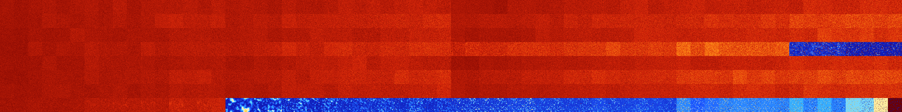

# B023578 (219648-220159)

<details>
    <summary>Initial Grid</summary>
    
</details>


<details>
    <summary>Initial Grid RLE</summary>

```
#C Exported from GoGoL (https://github.com/marrow16/gogol)
#C Wrap mode: Toroidal
#C Boundary mode: Dead
#C Step: 0
x = 100, y = 100, rule = B023578/S
9bo20bo35bo20bo4bo$31bo33bo$54bo14bo$36bo24bo$8bo51bo18bo$13bo7bo3bo5bo
8bo17b2o$4bo5bo6bo4bo2bobo7bo25bo5bo3bo13bo$4bo40bo5bo11bo20bo10bo$8bo
14bo2bo9bo6bo4bo3bo3bo8bo29bo$22bobo9bo7bo11bo18bo5bobo7bo2bo4b2o$24bo
3bo27bo$38bo19bo14bo$3bo14bo25bo12bo4bo$5bo7bo43b2o16bo$12bo18b2o7bo6b
2o4bo5bo10bo7bo8bo$46bo4bo34bo$52bo19bo12bo13bo$13bo11bo17bo14bo3bo24bo
8bo$11bo29bo13bo$11bo8bob2o9bo2bo11bo24bo5bo12bo5bo$10bo24bo8bo15bo12bo
20b3o$5bo82bo$32bo34bo$11bo34bo3bo2bo27bo$37bo7b2o2bo6bo34bo$56bo3bo32b
o$26bo39bo3bo4bo7bo$30bo34bo$27bo24bo10bo$10bo8bo53bo12bo10bo$6bo2bo4bo
11bo46bo8bo$40bobo17bo5bo$37bo3bo14bo$42b2o2bo13bo$63bo10bo16bo4bo$19bo
11bo16b2o7bo$23bo2bo$38bo21bo24bo2bo$o14bo29bo35bo3bo6bo2bo$6bo50b2o3bo
16bo3bo6bo$31bo8bo38bo$21bo37bo3bo28bo$9bo13bo13bo8bo8bo20b2o12bo5bo$
30bo5bo26bo$12bo86bo$3bo63bo16b2o$32bo5bo$21bobobo33bo$bo11bo5bo7bobo6b
obo23b2o10bo$2bo3bo28bo$46bo32bo$17bo28bo42bo5bo$9bo7bo28bo38bo$29bo4bo
45bo$3bo15bo6bo$7b2o24bo22bo24bo$10bo31bo$20bo15bo$4bo9bo31bo27bo$16bo
33bo5bo23bo9bo$43bo31bo7bo$11bo2bo16bo18b2o3bo16bo15bo6bo$15bo4bo13bo6b
o14bo7bo34bo$25bobo25bo28bo$100b$19bo7bo5bo6bo31bo24bo$19bo47bo3bobo9bo
7bo6bo$32bo2bo29bo11bo$o85bo3bo$33bo24bo$32bo9bo11bo8bo20bo$16bo10bo33b
o5bo29bo$5bo33bo42bo$3bo8bo5bo5bo11bo21bo14bo$15bo23bo52bo$13bo51bo24bo
4bo$2bo7bo22bo14bo17bo10bo18bo$3bo20bo3bo32b2o9bob2o4bo2bo15bo$5bo31bo
28bo17bo6bo7bo$bo10bo16bo36bo27bo4bo$32bo44bo2bo9b2o$41bo6bo3bobo16bo
26bo$obo9bo35bo17bo8bo$15bo27bo39bo2bo$4bo2bo5bo20b2o2bo7bo2bo30bo4bobo
$47bo29bo$38bo8bo12bo9bo$9bo85bo$o30bo54bo7b2o$6bo24bo15bo5bo3bo3bo37bo
$17bo2bo14bo18bo10bo6bo$13bo13bo10bo$9bo35bo22bo25bo$39bo9bo6bo31bo4bo$
8bo3bo18bo10bo13bo31bo3bo$90bo$o20bo3bo11bo8bo19bo19bo$15bobo23bo5bo5bo
8bobo$8bo26bo4bo40bo$4bo11bo28bo2bo2bo13bo10bo5bo!
```
</details>
<details>
    <summary>Thumbnail</summary>

</details>
<table>
<tr>
    <td><a href="./219648%20S%20Heat%20Map%20Activity.png"></a><br>S (219648)<br>G>1000</td>    <td><a href="./219649%20S0%20Heat%20Map%20Activity.png"></a><br>S0 (219649)<br>G>1000</td>    <td><a href="./219650%20S1%20Heat%20Map%20Activity.png"></a><br>S1 (219650)<br>G>1000</td>    <td><a href="./219651%20S01%20Heat%20Map%20Activity.png"></a><br>S01 (219651)<br>G>1000</td>    <td><a href="./219652%20S2%20Heat%20Map%20Activity.png"></a><br>S2 (219652)<br>G>1000</td>    <td><a href="./219653%20S02%20Heat%20Map%20Activity.png"></a><br>S02 (219653)<br>G>1000</td>    <td><a href="./219654%20S12%20Heat%20Map%20Activity.png"></a><br>S12 (219654)<br>G>1000</td>    <td><a href="./219655%20S012%20Heat%20Map%20Activity.png"></a><br>S012 (219655)<br>G>1000</td>    <td><a href="./219656%20S3%20Heat%20Map%20Activity.png"></a><br>S3 (219656)<br>G>1000</td>    <td><a href="./219657%20S03%20Heat%20Map%20Activity.png"></a><br>S03 (219657)<br>G>1000</td>    <td><a href="./219658%20S13%20Heat%20Map%20Activity.png"></a><br>S13 (219658)<br>G>1000</td>    <td><a href="./219659%20S013%20Heat%20Map%20Activity.png"></a><br>S013 (219659)<br>G>1000</td>    <td><a href="./219660%20S23%20Heat%20Map%20Activity.png"></a><br>S23 (219660)<br>G>1000</td>    <td><a href="./219661%20S023%20Heat%20Map%20Activity.png"></a><br>S023 (219661)<br>G>1000</td>    <td><a href="./219662%20S123%20Heat%20Map%20Activity.png"></a><br>S123 (219662)<br>G>1000</td>    <td><a href="./219663%20S0123%20Heat%20Map%20Activity.png"></a><br>S0123 (219663)<br>G>1000</td>    <td><a href="./219664%20S4%20Heat%20Map%20Activity.png"></a><br>S4 (219664)<br>G>1000</td>    <td><a href="./219665%20S04%20Heat%20Map%20Activity.png"></a><br>S04 (219665)<br>G>1000</td>    <td><a href="./219666%20S14%20Heat%20Map%20Activity.png"></a><br>S14 (219666)<br>G>1000</td>    <td><a href="./219667%20S014%20Heat%20Map%20Activity.png"></a><br>S014 (219667)<br>G>1000</td>    <td><a href="./219668%20S24%20Heat%20Map%20Activity.png"></a><br>S24 (219668)<br>G>1000</td>    <td><a href="./219669%20S024%20Heat%20Map%20Activity.png"></a><br>S024 (219669)<br>G>1000</td>    <td><a href="./219670%20S124%20Heat%20Map%20Activity.png"></a><br>S124 (219670)<br>G>1000</td>    <td><a href="./219671%20S0124%20Heat%20Map%20Activity.png"></a><br>S0124 (219671)<br>G>1000</td>    <td><a href="./219672%20S34%20Heat%20Map%20Activity.png"></a><br>S34 (219672)<br>G>1000</td>    <td><a href="./219673%20S034%20Heat%20Map%20Activity.png"></a><br>S034 (219673)<br>G>1000</td>    <td><a href="./219674%20S134%20Heat%20Map%20Activity.png"></a><br>S134 (219674)<br>G>1000</td>    <td><a href="./219675%20S0134%20Heat%20Map%20Activity.png"></a><br>S0134 (219675)<br>G>1000</td>    <td><a href="./219676%20S234%20Heat%20Map%20Activity.png"></a><br>S234 (219676)<br>G>1000</td>    <td><a href="./219677%20S0234%20Heat%20Map%20Activity.png"></a><br>S0234 (219677)<br>G>1000</td>    <td><a href="./219678%20S1234%20Heat%20Map%20Activity.png"></a><br>S1234 (219678)<br>G>1000</td>    <td><a href="./219679%20S01234%20Heat%20Map%20Activity.png"></a><br>S01234 (219679)<br>G>1000</td>    <td><a href="./219680%20S5%20Heat%20Map%20Activity.png"></a><br>S5 (219680)<br>G>1000</td>    <td><a href="./219681%20S05%20Heat%20Map%20Activity.png"></a><br>S05 (219681)<br>G>1000</td>    <td><a href="./219682%20S15%20Heat%20Map%20Activity.png"></a><br>S15 (219682)<br>G>1000</td>    <td><a href="./219683%20S015%20Heat%20Map%20Activity.png"></a><br>S015 (219683)<br>G>1000</td>    <td><a href="./219684%20S25%20Heat%20Map%20Activity.png"></a><br>S25 (219684)<br>G>1000</td>    <td><a href="./219685%20S025%20Heat%20Map%20Activity.png"></a><br>S025 (219685)<br>G>1000</td>    <td><a href="./219686%20S125%20Heat%20Map%20Activity.png"></a><br>S125 (219686)<br>G>1000</td>    <td><a href="./219687%20S0125%20Heat%20Map%20Activity.png"></a><br>S0125 (219687)<br>G>1000</td>    <td><a href="./219688%20S35%20Heat%20Map%20Activity.png"></a><br>S35 (219688)<br>G>1000</td>    <td><a href="./219689%20S035%20Heat%20Map%20Activity.png"></a><br>S035 (219689)<br>G>1000</td>    <td><a href="./219690%20S135%20Heat%20Map%20Activity.png"></a><br>S135 (219690)<br>G>1000</td>    <td><a href="./219691%20S0135%20Heat%20Map%20Activity.png"></a><br>S0135 (219691)<br>G>1000</td>    <td><a href="./219692%20S235%20Heat%20Map%20Activity.png"></a><br>S235 (219692)<br>G>1000</td>    <td><a href="./219693%20S0235%20Heat%20Map%20Activity.png"></a><br>S0235 (219693)<br>G>1000</td>    <td><a href="./219694%20S1235%20Heat%20Map%20Activity.png"></a><br>S1235 (219694)<br>G>1000</td>    <td><a href="./219695%20S01235%20Heat%20Map%20Activity.png"></a><br>S01235 (219695)<br>G>1000</td>    <td><a href="./219696%20S45%20Heat%20Map%20Activity.png"></a><br>S45 (219696)<br>G>1000</td>    <td><a href="./219697%20S045%20Heat%20Map%20Activity.png"></a><br>S045 (219697)<br>G>1000</td>    <td><a href="./219698%20S145%20Heat%20Map%20Activity.png"></a><br>S145 (219698)<br>G>1000</td>    <td><a href="./219699%20S0145%20Heat%20Map%20Activity.png"></a><br>S0145 (219699)<br>G>1000</td>    <td><a href="./219700%20S245%20Heat%20Map%20Activity.png"></a><br>S245 (219700)<br>G>1000</td>    <td><a href="./219701%20S0245%20Heat%20Map%20Activity.png"></a><br>S0245 (219701)<br>G>1000</td>    <td><a href="./219702%20S1245%20Heat%20Map%20Activity.png"></a><br>S1245 (219702)<br>G>1000</td>    <td><a href="./219703%20S01245%20Heat%20Map%20Activity.png"></a><br>S01245 (219703)<br>G>1000</td>    <td><a href="./219704%20S345%20Heat%20Map%20Activity.png"></a><br>S345 (219704)<br>G>1000</td>    <td><a href="./219705%20S0345%20Heat%20Map%20Activity.png"></a><br>S0345 (219705)<br>G>1000</td>    <td><a href="./219706%20S1345%20Heat%20Map%20Activity.png"></a><br>S1345 (219706)<br>G>1000</td>    <td><a href="./219707%20S01345%20Heat%20Map%20Activity.png"></a><br>S01345 (219707)<br>G>1000</td>    <td><a href="./219708%20S2345%20Heat%20Map%20Activity.png"></a><br>S2345 (219708)<br>G>1000</td>    <td><a href="./219709%20S02345%20Heat%20Map%20Activity.png"></a><br>S02345 (219709)<br>G>1000</td>    <td><a href="./219710%20S12345%20Heat%20Map%20Activity.png"></a><br>S12345 (219710)<br>G>1000</td>    <td><a href="./219711%20S012345%20Heat%20Map%20Activity.png"></a><br>S012345 (219711)<br>G>1000</td></tr>
<tr>
    <td><a href="./219712%20S6%20Heat%20Map%20Activity.png"></a><br>S6 (219712)<br>G>1000</td>    <td><a href="./219713%20S06%20Heat%20Map%20Activity.png"></a><br>S06 (219713)<br>G>1000</td>    <td><a href="./219714%20S16%20Heat%20Map%20Activity.png"></a><br>S16 (219714)<br>G>1000</td>    <td><a href="./219715%20S016%20Heat%20Map%20Activity.png"></a><br>S016 (219715)<br>G>1000</td>    <td><a href="./219716%20S26%20Heat%20Map%20Activity.png"></a><br>S26 (219716)<br>G>1000</td>    <td><a href="./219717%20S026%20Heat%20Map%20Activity.png"></a><br>S026 (219717)<br>G>1000</td>    <td><a href="./219718%20S126%20Heat%20Map%20Activity.png"></a><br>S126 (219718)<br>G>1000</td>    <td><a href="./219719%20S0126%20Heat%20Map%20Activity.png"></a><br>S0126 (219719)<br>G>1000</td>    <td><a href="./219720%20S36%20Heat%20Map%20Activity.png"></a><br>S36 (219720)<br>G>1000</td>    <td><a href="./219721%20S036%20Heat%20Map%20Activity.png"></a><br>S036 (219721)<br>G>1000</td>    <td><a href="./219722%20S136%20Heat%20Map%20Activity.png"></a><br>S136 (219722)<br>G>1000</td>    <td><a href="./219723%20S0136%20Heat%20Map%20Activity.png"></a><br>S0136 (219723)<br>G>1000</td>    <td><a href="./219724%20S236%20Heat%20Map%20Activity.png"></a><br>S236 (219724)<br>G>1000</td>    <td><a href="./219725%20S0236%20Heat%20Map%20Activity.png"></a><br>S0236 (219725)<br>G>1000</td>    <td><a href="./219726%20S1236%20Heat%20Map%20Activity.png"></a><br>S1236 (219726)<br>G>1000</td>    <td><a href="./219727%20S01236%20Heat%20Map%20Activity.png"></a><br>S01236 (219727)<br>G>1000</td>    <td><a href="./219728%20S46%20Heat%20Map%20Activity.png"></a><br>S46 (219728)<br>G>1000</td>    <td><a href="./219729%20S046%20Heat%20Map%20Activity.png"></a><br>S046 (219729)<br>G>1000</td>    <td><a href="./219730%20S146%20Heat%20Map%20Activity.png"></a><br>S146 (219730)<br>G>1000</td>    <td><a href="./219731%20S0146%20Heat%20Map%20Activity.png"></a><br>S0146 (219731)<br>G>1000</td>    <td><a href="./219732%20S246%20Heat%20Map%20Activity.png"></a><br>S246 (219732)<br>G>1000</td>    <td><a href="./219733%20S0246%20Heat%20Map%20Activity.png"></a><br>S0246 (219733)<br>G>1000</td>    <td><a href="./219734%20S1246%20Heat%20Map%20Activity.png"></a><br>S1246 (219734)<br>G>1000</td>    <td><a href="./219735%20S01246%20Heat%20Map%20Activity.png"></a><br>S01246 (219735)<br>G>1000</td>    <td><a href="./219736%20S346%20Heat%20Map%20Activity.png"></a><br>S346 (219736)<br>G>1000</td>    <td><a href="./219737%20S0346%20Heat%20Map%20Activity.png"></a><br>S0346 (219737)<br>G>1000</td>    <td><a href="./219738%20S1346%20Heat%20Map%20Activity.png"></a><br>S1346 (219738)<br>G>1000</td>    <td><a href="./219739%20S01346%20Heat%20Map%20Activity.png"></a><br>S01346 (219739)<br>G>1000</td>    <td><a href="./219740%20S2346%20Heat%20Map%20Activity.png"></a><br>S2346 (219740)<br>G>1000</td>    <td><a href="./219741%20S02346%20Heat%20Map%20Activity.png"></a><br>S02346 (219741)<br>G>1000</td>    <td><a href="./219742%20S12346%20Heat%20Map%20Activity.png"></a><br>S12346 (219742)<br>G>1000</td>    <td><a href="./219743%20S012346%20Heat%20Map%20Activity.png"></a><br>S012346 (219743)<br>G>1000</td>    <td><a href="./219744%20S56%20Heat%20Map%20Activity.png"></a><br>S56 (219744)<br>G>1000</td>    <td><a href="./219745%20S056%20Heat%20Map%20Activity.png"></a><br>S056 (219745)<br>G>1000</td>    <td><a href="./219746%20S156%20Heat%20Map%20Activity.png"></a><br>S156 (219746)<br>G>1000</td>    <td><a href="./219747%20S0156%20Heat%20Map%20Activity.png"></a><br>S0156 (219747)<br>G>1000</td>    <td><a href="./219748%20S256%20Heat%20Map%20Activity.png"></a><br>S256 (219748)<br>G>1000</td>    <td><a href="./219749%20S0256%20Heat%20Map%20Activity.png"></a><br>S0256 (219749)<br>G>1000</td>    <td><a href="./219750%20S1256%20Heat%20Map%20Activity.png"></a><br>S1256 (219750)<br>G>1000</td>    <td><a href="./219751%20S01256%20Heat%20Map%20Activity.png"></a><br>S01256 (219751)<br>G>1000</td>    <td><a href="./219752%20S356%20Heat%20Map%20Activity.png"></a><br>S356 (219752)<br>G>1000</td>    <td><a href="./219753%20S0356%20Heat%20Map%20Activity.png"></a><br>S0356 (219753)<br>G>1000</td>    <td><a href="./219754%20S1356%20Heat%20Map%20Activity.png"></a><br>S1356 (219754)<br>G>1000</td>    <td><a href="./219755%20S01356%20Heat%20Map%20Activity.png"></a><br>S01356 (219755)<br>G>1000</td>    <td><a href="./219756%20S2356%20Heat%20Map%20Activity.png"></a><br>S2356 (219756)<br>G>1000</td>    <td><a href="./219757%20S02356%20Heat%20Map%20Activity.png"></a><br>S02356 (219757)<br>G>1000</td>    <td><a href="./219758%20S12356%20Heat%20Map%20Activity.png"></a><br>S12356 (219758)<br>G>1000</td>    <td><a href="./219759%20S012356%20Heat%20Map%20Activity.png"></a><br>S012356 (219759)<br>G>1000</td>    <td><a href="./219760%20S456%20Heat%20Map%20Activity.png"></a><br>S456 (219760)<br>G>1000</td>    <td><a href="./219761%20S0456%20Heat%20Map%20Activity.png"></a><br>S0456 (219761)<br>G>1000</td>    <td><a href="./219762%20S1456%20Heat%20Map%20Activity.png"></a><br>S1456 (219762)<br>G>1000</td>    <td><a href="./219763%20S01456%20Heat%20Map%20Activity.png"></a><br>S01456 (219763)<br>G>1000</td>    <td><a href="./219764%20S2456%20Heat%20Map%20Activity.png"></a><br>S2456 (219764)<br>G>1000</td>    <td><a href="./219765%20S02456%20Heat%20Map%20Activity.png"></a><br>S02456 (219765)<br>G>1000</td>    <td><a href="./219766%20S12456%20Heat%20Map%20Activity.png"></a><br>S12456 (219766)<br>G>1000</td>    <td><a href="./219767%20S012456%20Heat%20Map%20Activity.png"></a><br>S012456 (219767)<br>G>1000</td>    <td><a href="./219768%20S3456%20Heat%20Map%20Activity.png"></a><br>S3456 (219768)<br>G>1000</td>    <td><a href="./219769%20S03456%20Heat%20Map%20Activity.png"></a><br>S03456 (219769)<br>G>1000</td>    <td><a href="./219770%20S13456%20Heat%20Map%20Activity.png"></a><br>S13456 (219770)<br>G>1000</td>    <td><a href="./219771%20S013456%20Heat%20Map%20Activity.png"></a><br>S013456 (219771)<br>G>1000</td>    <td><a href="./219772%20S23456%20Heat%20Map%20Activity.png"></a><br>S23456 (219772)<br>G>1000</td>    <td><a href="./219773%20S023456%20Heat%20Map%20Activity.png"></a><br>S023456 (219773)<br>G>1000</td>    <td><a href="./219774%20S123456%20Heat%20Map%20Activity.png"></a><br>S123456 (219774)<br>G>1000</td>    <td><a href="./219775%20S0123456%20Heat%20Map%20Activity.png"></a><br>S0123456 (219775)<br>G>1000</td></tr>
<tr>
    <td><a href="./219776%20S7%20Heat%20Map%20Activity.png"></a><br>S7 (219776)<br>G>1000</td>    <td><a href="./219777%20S07%20Heat%20Map%20Activity.png"></a><br>S07 (219777)<br>G>1000</td>    <td><a href="./219778%20S17%20Heat%20Map%20Activity.png"></a><br>S17 (219778)<br>G>1000</td>    <td><a href="./219779%20S017%20Heat%20Map%20Activity.png"></a><br>S017 (219779)<br>G>1000</td>    <td><a href="./219780%20S27%20Heat%20Map%20Activity.png"></a><br>S27 (219780)<br>G>1000</td>    <td><a href="./219781%20S027%20Heat%20Map%20Activity.png"></a><br>S027 (219781)<br>G>1000</td>    <td><a href="./219782%20S127%20Heat%20Map%20Activity.png"></a><br>S127 (219782)<br>G>1000</td>    <td><a href="./219783%20S0127%20Heat%20Map%20Activity.png"></a><br>S0127 (219783)<br>G>1000</td>    <td><a href="./219784%20S37%20Heat%20Map%20Activity.png"></a><br>S37 (219784)<br>G>1000</td>    <td><a href="./219785%20S037%20Heat%20Map%20Activity.png"></a><br>S037 (219785)<br>G>1000</td>    <td><a href="./219786%20S137%20Heat%20Map%20Activity.png"></a><br>S137 (219786)<br>G>1000</td>    <td><a href="./219787%20S0137%20Heat%20Map%20Activity.png"></a><br>S0137 (219787)<br>G>1000</td>    <td><a href="./219788%20S237%20Heat%20Map%20Activity.png"></a><br>S237 (219788)<br>G>1000</td>    <td><a href="./219789%20S0237%20Heat%20Map%20Activity.png"></a><br>S0237 (219789)<br>G>1000</td>    <td><a href="./219790%20S1237%20Heat%20Map%20Activity.png"></a><br>S1237 (219790)<br>G>1000</td>    <td><a href="./219791%20S01237%20Heat%20Map%20Activity.png"></a><br>S01237 (219791)<br>G>1000</td>    <td><a href="./219792%20S47%20Heat%20Map%20Activity.png"></a><br>S47 (219792)<br>G>1000</td>    <td><a href="./219793%20S047%20Heat%20Map%20Activity.png"></a><br>S047 (219793)<br>G>1000</td>    <td><a href="./219794%20S147%20Heat%20Map%20Activity.png"></a><br>S147 (219794)<br>G>1000</td>    <td><a href="./219795%20S0147%20Heat%20Map%20Activity.png"></a><br>S0147 (219795)<br>G>1000</td>    <td><a href="./219796%20S247%20Heat%20Map%20Activity.png"></a><br>S247 (219796)<br>G>1000</td>    <td><a href="./219797%20S0247%20Heat%20Map%20Activity.png"></a><br>S0247 (219797)<br>G>1000</td>    <td><a href="./219798%20S1247%20Heat%20Map%20Activity.png"></a><br>S1247 (219798)<br>G>1000</td>    <td><a href="./219799%20S01247%20Heat%20Map%20Activity.png"></a><br>S01247 (219799)<br>G>1000</td>    <td><a href="./219800%20S347%20Heat%20Map%20Activity.png"></a><br>S347 (219800)<br>G>1000</td>    <td><a href="./219801%20S0347%20Heat%20Map%20Activity.png"></a><br>S0347 (219801)<br>G>1000</td>    <td><a href="./219802%20S1347%20Heat%20Map%20Activity.png"></a><br>S1347 (219802)<br>G>1000</td>    <td><a href="./219803%20S01347%20Heat%20Map%20Activity.png"></a><br>S01347 (219803)<br>G>1000</td>    <td><a href="./219804%20S2347%20Heat%20Map%20Activity.png"></a><br>S2347 (219804)<br>G>1000</td>    <td><a href="./219805%20S02347%20Heat%20Map%20Activity.png"></a><br>S02347 (219805)<br>G>1000</td>    <td><a href="./219806%20S12347%20Heat%20Map%20Activity.png"></a><br>S12347 (219806)<br>G>1000</td>    <td><a href="./219807%20S012347%20Heat%20Map%20Activity.png"></a><br>S012347 (219807)<br>G>1000</td>    <td><a href="./219808%20S57%20Heat%20Map%20Activity.png"></a><br>S57 (219808)<br>G>1000</td>    <td><a href="./219809%20S057%20Heat%20Map%20Activity.png"></a><br>S057 (219809)<br>G>1000</td>    <td><a href="./219810%20S157%20Heat%20Map%20Activity.png"></a><br>S157 (219810)<br>G>1000</td>    <td><a href="./219811%20S0157%20Heat%20Map%20Activity.png"></a><br>S0157 (219811)<br>G>1000</td>    <td><a href="./219812%20S257%20Heat%20Map%20Activity.png"></a><br>S257 (219812)<br>G>1000</td>    <td><a href="./219813%20S0257%20Heat%20Map%20Activity.png"></a><br>S0257 (219813)<br>G>1000</td>    <td><a href="./219814%20S1257%20Heat%20Map%20Activity.png"></a><br>S1257 (219814)<br>G>1000</td>    <td><a href="./219815%20S01257%20Heat%20Map%20Activity.png"></a><br>S01257 (219815)<br>G>1000</td>    <td><a href="./219816%20S357%20Heat%20Map%20Activity.png"></a><br>S357 (219816)<br>G>1000</td>    <td><a href="./219817%20S0357%20Heat%20Map%20Activity.png"></a><br>S0357 (219817)<br>G>1000</td>    <td><a href="./219818%20S1357%20Heat%20Map%20Activity.png"></a><br>S1357 (219818)<br>G>1000</td>    <td><a href="./219819%20S01357%20Heat%20Map%20Activity.png"></a><br>S01357 (219819)<br>G>1000</td>    <td><a href="./219820%20S2357%20Heat%20Map%20Activity.png"></a><br>S2357 (219820)<br>G>1000</td>    <td><a href="./219821%20S02357%20Heat%20Map%20Activity.png"></a><br>S02357 (219821)<br>G>1000</td>    <td><a href="./219822%20S12357%20Heat%20Map%20Activity.png"></a><br>S12357 (219822)<br>G>1000</td>    <td><a href="./219823%20S012357%20Heat%20Map%20Activity.png"></a><br>S012357 (219823)<br>G>1000</td>    <td><a href="./219824%20S457%20Heat%20Map%20Activity.png"></a><br>S457 (219824)<br>G>1000</td>    <td><a href="./219825%20S0457%20Heat%20Map%20Activity.png"></a><br>S0457 (219825)<br>G>1000</td>    <td><a href="./219826%20S1457%20Heat%20Map%20Activity.png"></a><br>S1457 (219826)<br>G>1000</td>    <td><a href="./219827%20S01457%20Heat%20Map%20Activity.png"></a><br>S01457 (219827)<br>G>1000</td>    <td><a href="./219828%20S2457%20Heat%20Map%20Activity.png"></a><br>S2457 (219828)<br>G>1000</td>    <td><a href="./219829%20S02457%20Heat%20Map%20Activity.png"></a><br>S02457 (219829)<br>G>1000</td>    <td><a href="./219830%20S12457%20Heat%20Map%20Activity.png"></a><br>S12457 (219830)<br>G>1000</td>    <td><a href="./219831%20S012457%20Heat%20Map%20Activity.png"></a><br>S012457 (219831)<br>G>1000</td>    <td><a href="./219832%20S3457%20Heat%20Map%20Activity.png"></a><br>S3457 (219832)<br>G>1000</td>    <td><a href="./219833%20S03457%20Heat%20Map%20Activity.png"></a><br>S03457 (219833)<br>G>1000</td>    <td><a href="./219834%20S13457%20Heat%20Map%20Activity.png"></a><br>S13457 (219834)<br>G>1000</td>    <td><a href="./219835%20S013457%20Heat%20Map%20Activity.png"></a><br>S013457 (219835)<br>G>1000</td>    <td><a href="./219836%20S23457%20Heat%20Map%20Activity.png"></a><br>S23457 (219836)<br>G>1000</td>    <td><a href="./219837%20S023457%20Heat%20Map%20Activity.png"></a><br>S023457 (219837)<br>G>1000</td>    <td><a href="./219838%20S123457%20Heat%20Map%20Activity.png"></a><br>S123457 (219838)<br>G>1000</td>    <td><a href="./219839%20S0123457%20Heat%20Map%20Activity.png"></a><br>S0123457 (219839)<br>G>1000</td></tr>
<tr>
    <td><a href="./219840%20S67%20Heat%20Map%20Activity.png"></a><br>S67 (219840)<br>G>1000</td>    <td><a href="./219841%20S067%20Heat%20Map%20Activity.png"></a><br>S067 (219841)<br>G>1000</td>    <td><a href="./219842%20S167%20Heat%20Map%20Activity.png"></a><br>S167 (219842)<br>G>1000</td>    <td><a href="./219843%20S0167%20Heat%20Map%20Activity.png"></a><br>S0167 (219843)<br>G>1000</td>    <td><a href="./219844%20S267%20Heat%20Map%20Activity.png"></a><br>S267 (219844)<br>G>1000</td>    <td><a href="./219845%20S0267%20Heat%20Map%20Activity.png"></a><br>S0267 (219845)<br>G>1000</td>    <td><a href="./219846%20S1267%20Heat%20Map%20Activity.png"></a><br>S1267 (219846)<br>G>1000</td>    <td><a href="./219847%20S01267%20Heat%20Map%20Activity.png"></a><br>S01267 (219847)<br>G>1000</td>    <td><a href="./219848%20S367%20Heat%20Map%20Activity.png"></a><br>S367 (219848)<br>G>1000</td>    <td><a href="./219849%20S0367%20Heat%20Map%20Activity.png"></a><br>S0367 (219849)<br>G>1000</td>    <td><a href="./219850%20S1367%20Heat%20Map%20Activity.png"></a><br>S1367 (219850)<br>G>1000</td>    <td><a href="./219851%20S01367%20Heat%20Map%20Activity.png"></a><br>S01367 (219851)<br>G>1000</td>    <td><a href="./219852%20S2367%20Heat%20Map%20Activity.png"></a><br>S2367 (219852)<br>G>1000</td>    <td><a href="./219853%20S02367%20Heat%20Map%20Activity.png"></a><br>S02367 (219853)<br>G>1000</td>    <td><a href="./219854%20S12367%20Heat%20Map%20Activity.png"></a><br>S12367 (219854)<br>G>1000</td>    <td><a href="./219855%20S012367%20Heat%20Map%20Activity.png"></a><br>S012367 (219855)<br>G>1000</td>    <td><a href="./219856%20S467%20Heat%20Map%20Activity.png"></a><br>S467 (219856)<br>G>1000</td>    <td><a href="./219857%20S0467%20Heat%20Map%20Activity.png"></a><br>S0467 (219857)<br>G>1000</td>    <td><a href="./219858%20S1467%20Heat%20Map%20Activity.png"></a><br>S1467 (219858)<br>G>1000</td>    <td><a href="./219859%20S01467%20Heat%20Map%20Activity.png"></a><br>S01467 (219859)<br>G>1000</td>    <td><a href="./219860%20S2467%20Heat%20Map%20Activity.png"></a><br>S2467 (219860)<br>G>1000</td>    <td><a href="./219861%20S02467%20Heat%20Map%20Activity.png"></a><br>S02467 (219861)<br>G>1000</td>    <td><a href="./219862%20S12467%20Heat%20Map%20Activity.png"></a><br>S12467 (219862)<br>G>1000</td>    <td><a href="./219863%20S012467%20Heat%20Map%20Activity.png"></a><br>S012467 (219863)<br>G>1000</td>    <td><a href="./219864%20S3467%20Heat%20Map%20Activity.png"></a><br>S3467 (219864)<br>G>1000</td>    <td><a href="./219865%20S03467%20Heat%20Map%20Activity.png"></a><br>S03467 (219865)<br>G>1000</td>    <td><a href="./219866%20S13467%20Heat%20Map%20Activity.png"></a><br>S13467 (219866)<br>G>1000</td>    <td><a href="./219867%20S013467%20Heat%20Map%20Activity.png"></a><br>S013467 (219867)<br>G>1000</td>    <td><a href="./219868%20S23467%20Heat%20Map%20Activity.png"></a><br>S23467 (219868)<br>G>1000</td>    <td><a href="./219869%20S023467%20Heat%20Map%20Activity.png"></a><br>S023467 (219869)<br>G>1000</td>    <td><a href="./219870%20S123467%20Heat%20Map%20Activity.png"></a><br>S123467 (219870)<br>G>1000</td>    <td><a href="./219871%20S0123467%20Heat%20Map%20Activity.png"></a><br>S0123467 (219871)<br>G>1000</td>    <td><a href="./219872%20S567%20Heat%20Map%20Activity.png"></a><br>S567 (219872)<br>G>1000</td>    <td><a href="./219873%20S0567%20Heat%20Map%20Activity.png"></a><br>S0567 (219873)<br>G>1000</td>    <td><a href="./219874%20S1567%20Heat%20Map%20Activity.png"></a><br>S1567 (219874)<br>G>1000</td>    <td><a href="./219875%20S01567%20Heat%20Map%20Activity.png"></a><br>S01567 (219875)<br>G>1000</td>    <td><a href="./219876%20S2567%20Heat%20Map%20Activity.png"></a><br>S2567 (219876)<br>G>1000</td>    <td><a href="./219877%20S02567%20Heat%20Map%20Activity.png"></a><br>S02567 (219877)<br>G>1000</td>    <td><a href="./219878%20S12567%20Heat%20Map%20Activity.png"></a><br>S12567 (219878)<br>G>1000</td>    <td><a href="./219879%20S012567%20Heat%20Map%20Activity.png"></a><br>S012567 (219879)<br>G>1000</td>    <td><a href="./219880%20S3567%20Heat%20Map%20Activity.png"></a><br>S3567 (219880)<br>G>1000</td>    <td><a href="./219881%20S03567%20Heat%20Map%20Activity.png"></a><br>S03567 (219881)<br>G>1000</td>    <td><a href="./219882%20S13567%20Heat%20Map%20Activity.png"></a><br>S13567 (219882)<br>G>1000</td>    <td><a href="./219883%20S013567%20Heat%20Map%20Activity.png"></a><br>S013567 (219883)<br>G>1000</td>    <td><a href="./219884%20S23567%20Heat%20Map%20Activity.png"></a><br>S23567 (219884)<br>G>1000</td>    <td><a href="./219885%20S023567%20Heat%20Map%20Activity.png"></a><br>S023567 (219885)<br>G>1000</td>    <td><a href="./219886%20S123567%20Heat%20Map%20Activity.png"></a><br>S123567 (219886)<br>G>1000</td>    <td><a href="./219887%20S0123567%20Heat%20Map%20Activity.png"></a><br>S0123567 (219887)<br>G>1000</td>    <td><a href="./219888%20S4567%20Heat%20Map%20Activity.png"></a><br>S4567 (219888)<br>G>1000</td>    <td><a href="./219889%20S04567%20Heat%20Map%20Activity.png"></a><br>S04567 (219889)<br>G>1000</td>    <td><a href="./219890%20S14567%20Heat%20Map%20Activity.png"></a><br>S14567 (219890)<br>G>1000</td>    <td><a href="./219891%20S014567%20Heat%20Map%20Activity.png"></a><br>S014567 (219891)<br>G>1000</td>    <td><a href="./219892%20S24567%20Heat%20Map%20Activity.png"></a><br>S24567 (219892)<br>G>1000</td>    <td><a href="./219893%20S024567%20Heat%20Map%20Activity.png"></a><br>S024567 (219893)<br>G>1000</td>    <td><a href="./219894%20S124567%20Heat%20Map%20Activity.png"></a><br>S124567 (219894)<br>G>1000</td>    <td><a href="./219895%20S0124567%20Heat%20Map%20Activity.png"></a><br>S0124567 (219895)<br>G>1000</td>    <td><a href="./219896%20S34567%20Heat%20Map%20Activity.png"></a><br>S34567 (219896)<br>G>1000</td>    <td><a href="./219897%20S034567%20Heat%20Map%20Activity.png"></a><br>S034567 (219897)<br>G>1000</td>    <td><a href="./219898%20S134567%20Heat%20Map%20Activity.png"></a><br>S134567 (219898)<br>G>1000</td>    <td><a href="./219899%20S0134567%20Heat%20Map%20Activity.png"></a><br>S0134567 (219899)<br>G>1000</td>    <td><a href="./219900%20S234567%20Heat%20Map%20Activity.png"></a><br>S234567 (219900)<br>G>1000</td>    <td><a href="./219901%20S0234567%20Heat%20Map%20Activity.png"></a><br>S0234567 (219901)<br>G>1000</td>    <td><a href="./219902%20S1234567%20Heat%20Map%20Activity.png"></a><br>S1234567 (219902)<br>G>1000</td>    <td><a href="./219903%20S01234567%20Heat%20Map%20Activity.png"></a><br>S01234567 (219903)<br>G>1000</td></tr>
<tr>
    <td><a href="./219904%20S8%20Heat%20Map%20Activity.png"></a><br>S8 (219904)<br>G>1000</td>    <td><a href="./219905%20S08%20Heat%20Map%20Activity.png"></a><br>S08 (219905)<br>G>1000</td>    <td><a href="./219906%20S18%20Heat%20Map%20Activity.png"></a><br>S18 (219906)<br>G>1000</td>    <td><a href="./219907%20S018%20Heat%20Map%20Activity.png"></a><br>S018 (219907)<br>G>1000</td>    <td><a href="./219908%20S28%20Heat%20Map%20Activity.png"></a><br>S28 (219908)<br>G>1000</td>    <td><a href="./219909%20S028%20Heat%20Map%20Activity.png"></a><br>S028 (219909)<br>G>1000</td>    <td><a href="./219910%20S128%20Heat%20Map%20Activity.png"></a><br>S128 (219910)<br>G>1000</td>    <td><a href="./219911%20S0128%20Heat%20Map%20Activity.png"></a><br>S0128 (219911)<br>G>1000</td>    <td><a href="./219912%20S38%20Heat%20Map%20Activity.png"></a><br>S38 (219912)<br>G>1000</td>    <td><a href="./219913%20S038%20Heat%20Map%20Activity.png"></a><br>S038 (219913)<br>G>1000</td>    <td><a href="./219914%20S138%20Heat%20Map%20Activity.png"></a><br>S138 (219914)<br>G>1000</td>    <td><a href="./219915%20S0138%20Heat%20Map%20Activity.png"></a><br>S0138 (219915)<br>G>1000</td>    <td><a href="./219916%20S238%20Heat%20Map%20Activity.png"></a><br>S238 (219916)<br>G>1000</td>    <td><a href="./219917%20S0238%20Heat%20Map%20Activity.png"></a><br>S0238 (219917)<br>G>1000</td>    <td><a href="./219918%20S1238%20Heat%20Map%20Activity.png"></a><br>S1238 (219918)<br>G>1000</td>    <td><a href="./219919%20S01238%20Heat%20Map%20Activity.png"></a><br>S01238 (219919)<br>G>1000</td>    <td><a href="./219920%20S48%20Heat%20Map%20Activity.png"></a><br>S48 (219920)<br>G>1000</td>    <td><a href="./219921%20S048%20Heat%20Map%20Activity.png"></a><br>S048 (219921)<br>G>1000</td>    <td><a href="./219922%20S148%20Heat%20Map%20Activity.png"></a><br>S148 (219922)<br>G>1000</td>    <td><a href="./219923%20S0148%20Heat%20Map%20Activity.png"></a><br>S0148 (219923)<br>G>1000</td>    <td><a href="./219924%20S248%20Heat%20Map%20Activity.png"></a><br>S248 (219924)<br>G>1000</td>    <td><a href="./219925%20S0248%20Heat%20Map%20Activity.png"></a><br>S0248 (219925)<br>G>1000</td>    <td><a href="./219926%20S1248%20Heat%20Map%20Activity.png"></a><br>S1248 (219926)<br>G>1000</td>    <td><a href="./219927%20S01248%20Heat%20Map%20Activity.png"></a><br>S01248 (219927)<br>G>1000</td>    <td><a href="./219928%20S348%20Heat%20Map%20Activity.png"></a><br>S348 (219928)<br>G>1000</td>    <td><a href="./219929%20S0348%20Heat%20Map%20Activity.png"></a><br>S0348 (219929)<br>G>1000</td>    <td><a href="./219930%20S1348%20Heat%20Map%20Activity.png"></a><br>S1348 (219930)<br>G>1000</td>    <td><a href="./219931%20S01348%20Heat%20Map%20Activity.png"></a><br>S01348 (219931)<br>G>1000</td>    <td><a href="./219932%20S2348%20Heat%20Map%20Activity.png"></a><br>S2348 (219932)<br>G>1000</td>    <td><a href="./219933%20S02348%20Heat%20Map%20Activity.png"></a><br>S02348 (219933)<br>G>1000</td>    <td><a href="./219934%20S12348%20Heat%20Map%20Activity.png"></a><br>S12348 (219934)<br>G>1000</td>    <td><a href="./219935%20S012348%20Heat%20Map%20Activity.png"></a><br>S012348 (219935)<br>G>1000</td>    <td><a href="./219936%20S58%20Heat%20Map%20Activity.png"></a><br>S58 (219936)<br>G>1000</td>    <td><a href="./219937%20S058%20Heat%20Map%20Activity.png"></a><br>S058 (219937)<br>G>1000</td>    <td><a href="./219938%20S158%20Heat%20Map%20Activity.png"></a><br>S158 (219938)<br>G>1000</td>    <td><a href="./219939%20S0158%20Heat%20Map%20Activity.png"></a><br>S0158 (219939)<br>G>1000</td>    <td><a href="./219940%20S258%20Heat%20Map%20Activity.png"></a><br>S258 (219940)<br>G>1000</td>    <td><a href="./219941%20S0258%20Heat%20Map%20Activity.png"></a><br>S0258 (219941)<br>G>1000</td>    <td><a href="./219942%20S1258%20Heat%20Map%20Activity.png"></a><br>S1258 (219942)<br>G>1000</td>    <td><a href="./219943%20S01258%20Heat%20Map%20Activity.png"></a><br>S01258 (219943)<br>G>1000</td>    <td><a href="./219944%20S358%20Heat%20Map%20Activity.png"></a><br>S358 (219944)<br>G>1000</td>    <td><a href="./219945%20S0358%20Heat%20Map%20Activity.png"></a><br>S0358 (219945)<br>G>1000</td>    <td><a href="./219946%20S1358%20Heat%20Map%20Activity.png"></a><br>S1358 (219946)<br>G>1000</td>    <td><a href="./219947%20S01358%20Heat%20Map%20Activity.png"></a><br>S01358 (219947)<br>G>1000</td>    <td><a href="./219948%20S2358%20Heat%20Map%20Activity.png"></a><br>S2358 (219948)<br>G>1000</td>    <td><a href="./219949%20S02358%20Heat%20Map%20Activity.png"></a><br>S02358 (219949)<br>G>1000</td>    <td><a href="./219950%20S12358%20Heat%20Map%20Activity.png"></a><br>S12358 (219950)<br>G>1000</td>    <td><a href="./219951%20S012358%20Heat%20Map%20Activity.png"></a><br>S012358 (219951)<br>G>1000</td>    <td><a href="./219952%20S458%20Heat%20Map%20Activity.png"></a><br>S458 (219952)<br>G>1000</td>    <td><a href="./219953%20S0458%20Heat%20Map%20Activity.png"></a><br>S0458 (219953)<br>G>1000</td>    <td><a href="./219954%20S1458%20Heat%20Map%20Activity.png"></a><br>S1458 (219954)<br>G>1000</td>    <td><a href="./219955%20S01458%20Heat%20Map%20Activity.png"></a><br>S01458 (219955)<br>G>1000</td>    <td><a href="./219956%20S2458%20Heat%20Map%20Activity.png"></a><br>S2458 (219956)<br>G>1000</td>    <td><a href="./219957%20S02458%20Heat%20Map%20Activity.png"></a><br>S02458 (219957)<br>G>1000</td>    <td><a href="./219958%20S12458%20Heat%20Map%20Activity.png"></a><br>S12458 (219958)<br>G>1000</td>    <td><a href="./219959%20S012458%20Heat%20Map%20Activity.png"></a><br>S012458 (219959)<br>G>1000</td>    <td><a href="./219960%20S3458%20Heat%20Map%20Activity.png"></a><br>S3458 (219960)<br>G>1000</td>    <td><a href="./219961%20S03458%20Heat%20Map%20Activity.png"></a><br>S03458 (219961)<br>G>1000</td>    <td><a href="./219962%20S13458%20Heat%20Map%20Activity.png"></a><br>S13458 (219962)<br>G>1000</td>    <td><a href="./219963%20S013458%20Heat%20Map%20Activity.png"></a><br>S013458 (219963)<br>G>1000</td>    <td><a href="./219964%20S23458%20Heat%20Map%20Activity.png"></a><br>S23458 (219964)<br>G>1000</td>    <td><a href="./219965%20S023458%20Heat%20Map%20Activity.png"></a><br>S023458 (219965)<br>G>1000</td>    <td><a href="./219966%20S123458%20Heat%20Map%20Activity.png"></a><br>S123458 (219966)<br>G>1000</td>    <td><a href="./219967%20S0123458%20Heat%20Map%20Activity.png"></a><br>S0123458 (219967)<br>G>1000</td></tr>
<tr>
    <td><a href="./219968%20S68%20Heat%20Map%20Activity.png"></a><br>S68 (219968)<br>G>1000</td>    <td><a href="./219969%20S068%20Heat%20Map%20Activity.png"></a><br>S068 (219969)<br>G>1000</td>    <td><a href="./219970%20S168%20Heat%20Map%20Activity.png"></a><br>S168 (219970)<br>G>1000</td>    <td><a href="./219971%20S0168%20Heat%20Map%20Activity.png"></a><br>S0168 (219971)<br>G>1000</td>    <td><a href="./219972%20S268%20Heat%20Map%20Activity.png"></a><br>S268 (219972)<br>G>1000</td>    <td><a href="./219973%20S0268%20Heat%20Map%20Activity.png"></a><br>S0268 (219973)<br>G>1000</td>    <td><a href="./219974%20S1268%20Heat%20Map%20Activity.png"></a><br>S1268 (219974)<br>G>1000</td>    <td><a href="./219975%20S01268%20Heat%20Map%20Activity.png"></a><br>S01268 (219975)<br>G>1000</td>    <td><a href="./219976%20S368%20Heat%20Map%20Activity.png"></a><br>S368 (219976)<br>G>1000</td>    <td><a href="./219977%20S0368%20Heat%20Map%20Activity.png"></a><br>S0368 (219977)<br>G>1000</td>    <td><a href="./219978%20S1368%20Heat%20Map%20Activity.png"></a><br>S1368 (219978)<br>G>1000</td>    <td><a href="./219979%20S01368%20Heat%20Map%20Activity.png"></a><br>S01368 (219979)<br>G>1000</td>    <td><a href="./219980%20S2368%20Heat%20Map%20Activity.png"></a><br>S2368 (219980)<br>G>1000</td>    <td><a href="./219981%20S02368%20Heat%20Map%20Activity.png"></a><br>S02368 (219981)<br>G>1000</td>    <td><a href="./219982%20S12368%20Heat%20Map%20Activity.png"></a><br>S12368 (219982)<br>G>1000</td>    <td><a href="./219983%20S012368%20Heat%20Map%20Activity.png"></a><br>S012368 (219983)<br>G>1000</td>    <td><a href="./219984%20S468%20Heat%20Map%20Activity.png"></a><br>S468 (219984)<br>G>1000</td>    <td><a href="./219985%20S0468%20Heat%20Map%20Activity.png"></a><br>S0468 (219985)<br>G>1000</td>    <td><a href="./219986%20S1468%20Heat%20Map%20Activity.png"></a><br>S1468 (219986)<br>G>1000</td>    <td><a href="./219987%20S01468%20Heat%20Map%20Activity.png"></a><br>S01468 (219987)<br>G>1000</td>    <td><a href="./219988%20S2468%20Heat%20Map%20Activity.png"></a><br>S2468 (219988)<br>G>1000</td>    <td><a href="./219989%20S02468%20Heat%20Map%20Activity.png"></a><br>S02468 (219989)<br>G>1000</td>    <td><a href="./219990%20S12468%20Heat%20Map%20Activity.png"></a><br>S12468 (219990)<br>G>1000</td>    <td><a href="./219991%20S012468%20Heat%20Map%20Activity.png"></a><br>S012468 (219991)<br>G>1000</td>    <td><a href="./219992%20S3468%20Heat%20Map%20Activity.png"></a><br>S3468 (219992)<br>G>1000</td>    <td><a href="./219993%20S03468%20Heat%20Map%20Activity.png"></a><br>S03468 (219993)<br>G>1000</td>    <td><a href="./219994%20S13468%20Heat%20Map%20Activity.png"></a><br>S13468 (219994)<br>G>1000</td>    <td><a href="./219995%20S013468%20Heat%20Map%20Activity.png"></a><br>S013468 (219995)<br>G>1000</td>    <td><a href="./219996%20S23468%20Heat%20Map%20Activity.png"></a><br>S23468 (219996)<br>G>1000</td>    <td><a href="./219997%20S023468%20Heat%20Map%20Activity.png"></a><br>S023468 (219997)<br>G>1000</td>    <td><a href="./219998%20S123468%20Heat%20Map%20Activity.png"></a><br>S123468 (219998)<br>G>1000</td>    <td><a href="./219999%20S0123468%20Heat%20Map%20Activity.png"></a><br>S0123468 (219999)<br>G>1000</td>    <td><a href="./220000%20S568%20Heat%20Map%20Activity.png"></a><br>S568 (220000)<br>G>1000</td>    <td><a href="./220001%20S0568%20Heat%20Map%20Activity.png"></a><br>S0568 (220001)<br>G>1000</td>    <td><a href="./220002%20S1568%20Heat%20Map%20Activity.png"></a><br>S1568 (220002)<br>G>1000</td>    <td><a href="./220003%20S01568%20Heat%20Map%20Activity.png"></a><br>S01568 (220003)<br>G>1000</td>    <td><a href="./220004%20S2568%20Heat%20Map%20Activity.png"></a><br>S2568 (220004)<br>G>1000</td>    <td><a href="./220005%20S02568%20Heat%20Map%20Activity.png"></a><br>S02568 (220005)<br>G>1000</td>    <td><a href="./220006%20S12568%20Heat%20Map%20Activity.png"></a><br>S12568 (220006)<br>G>1000</td>    <td><a href="./220007%20S012568%20Heat%20Map%20Activity.png"></a><br>S012568 (220007)<br>G>1000</td>    <td><a href="./220008%20S3568%20Heat%20Map%20Activity.png"></a><br>S3568 (220008)<br>G>1000</td>    <td><a href="./220009%20S03568%20Heat%20Map%20Activity.png"></a><br>S03568 (220009)<br>G>1000</td>    <td><a href="./220010%20S13568%20Heat%20Map%20Activity.png"></a><br>S13568 (220010)<br>G>1000</td>    <td><a href="./220011%20S013568%20Heat%20Map%20Activity.png"></a><br>S013568 (220011)<br>G>1000</td>    <td><a href="./220012%20S23568%20Heat%20Map%20Activity.png"></a><br>S23568 (220012)<br>G>1000</td>    <td><a href="./220013%20S023568%20Heat%20Map%20Activity.png"></a><br>S023568 (220013)<br>G>1000</td>    <td><a href="./220014%20S123568%20Heat%20Map%20Activity.png"></a><br>S123568 (220014)<br>G>1000</td>    <td><a href="./220015%20S0123568%20Heat%20Map%20Activity.png"></a><br>S0123568 (220015)<br>G>1000</td>    <td><a href="./220016%20S4568%20Heat%20Map%20Activity.png"></a><br>S4568 (220016)<br>G>1000</td>    <td><a href="./220017%20S04568%20Heat%20Map%20Activity.png"></a><br>S04568 (220017)<br>G>1000</td>    <td><a href="./220018%20S14568%20Heat%20Map%20Activity.png"></a><br>S14568 (220018)<br>G>1000</td>    <td><a href="./220019%20S014568%20Heat%20Map%20Activity.png"></a><br>S014568 (220019)<br>G>1000</td>    <td><a href="./220020%20S24568%20Heat%20Map%20Activity.png"></a><br>S24568 (220020)<br>G>1000</td>    <td><a href="./220021%20S024568%20Heat%20Map%20Activity.png"></a><br>S024568 (220021)<br>G>1000</td>    <td><a href="./220022%20S124568%20Heat%20Map%20Activity.png"></a><br>S124568 (220022)<br>G>1000</td>    <td><a href="./220023%20S0124568%20Heat%20Map%20Activity.png"></a><br>S0124568 (220023)<br>G>1000</td>    <td><a href="./220024%20S34568%20Heat%20Map%20Activity.png"></a><br>S34568 (220024)<br>G>1000</td>    <td><a href="./220025%20S034568%20Heat%20Map%20Activity.png"></a><br>S034568 (220025)<br>G>1000</td>    <td><a href="./220026%20S134568%20Heat%20Map%20Activity.png"></a><br>S134568 (220026)<br>G>1000</td>    <td><a href="./220027%20S0134568%20Heat%20Map%20Activity.png"></a><br>S0134568 (220027)<br>G>1000</td>    <td><a href="./220028%20S234568%20Heat%20Map%20Activity.png"></a><br>S234568 (220028)<br>G>1000</td>    <td><a href="./220029%20S0234568%20Heat%20Map%20Activity.png"></a><br>S0234568 (220029)<br>G>1000</td>    <td><a href="./220030%20S1234568%20Heat%20Map%20Activity.png"></a><br>S1234568 (220030)<br>G>1000</td>    <td><a href="./220031%20S01234568%20Heat%20Map%20Activity.png"></a><br>S01234568 (220031)<br>G>1000</td></tr>
<tr>
    <td><a href="./220032%20S78%20Heat%20Map%20Activity.png"></a><br>S78 (220032)<br>G>1000</td>    <td><a href="./220033%20S078%20Heat%20Map%20Activity.png"></a><br>S078 (220033)<br>G>1000</td>    <td><a href="./220034%20S178%20Heat%20Map%20Activity.png"></a><br>S178 (220034)<br>G>1000</td>    <td><a href="./220035%20S0178%20Heat%20Map%20Activity.png"></a><br>S0178 (220035)<br>G>1000</td>    <td><a href="./220036%20S278%20Heat%20Map%20Activity.png"></a><br>S278 (220036)<br>G>1000</td>    <td><a href="./220037%20S0278%20Heat%20Map%20Activity.png"></a><br>S0278 (220037)<br>G>1000</td>    <td><a href="./220038%20S1278%20Heat%20Map%20Activity.png"></a><br>S1278 (220038)<br>G>1000</td>    <td><a href="./220039%20S01278%20Heat%20Map%20Activity.png"></a><br>S01278 (220039)<br>G>1000</td>    <td><a href="./220040%20S378%20Heat%20Map%20Activity.png"></a><br>S378 (220040)<br>G>1000</td>    <td><a href="./220041%20S0378%20Heat%20Map%20Activity.png"></a><br>S0378 (220041)<br>G>1000</td>    <td><a href="./220042%20S1378%20Heat%20Map%20Activity.png"></a><br>S1378 (220042)<br>G>1000</td>    <td><a href="./220043%20S01378%20Heat%20Map%20Activity.png"></a><br>S01378 (220043)<br>G>1000</td>    <td><a href="./220044%20S2378%20Heat%20Map%20Activity.png"></a><br>S2378 (220044)<br>G>1000</td>    <td><a href="./220045%20S02378%20Heat%20Map%20Activity.png"></a><br>S02378 (220045)<br>G>1000</td>    <td><a href="./220046%20S12378%20Heat%20Map%20Activity.png"></a><br>S12378 (220046)<br>G>1000</td>    <td><a href="./220047%20S012378%20Heat%20Map%20Activity.png"></a><br>S012378 (220047)<br>G>1000</td>    <td><a href="./220048%20S478%20Heat%20Map%20Activity.png"></a><br>S478 (220048)<br>G>1000</td>    <td><a href="./220049%20S0478%20Heat%20Map%20Activity.png"></a><br>S0478 (220049)<br>G>1000</td>    <td><a href="./220050%20S1478%20Heat%20Map%20Activity.png"></a><br>S1478 (220050)<br>G>1000</td>    <td><a href="./220051%20S01478%20Heat%20Map%20Activity.png"></a><br>S01478 (220051)<br>G>1000</td>    <td><a href="./220052%20S2478%20Heat%20Map%20Activity.png"></a><br>S2478 (220052)<br>G>1000</td>    <td><a href="./220053%20S02478%20Heat%20Map%20Activity.png"></a><br>S02478 (220053)<br>G>1000</td>    <td><a href="./220054%20S12478%20Heat%20Map%20Activity.png"></a><br>S12478 (220054)<br>G>1000</td>    <td><a href="./220055%20S012478%20Heat%20Map%20Activity.png"></a><br>S012478 (220055)<br>G>1000</td>    <td><a href="./220056%20S3478%20Heat%20Map%20Activity.png"></a><br>S3478 (220056)<br>G>1000</td>    <td><a href="./220057%20S03478%20Heat%20Map%20Activity.png"></a><br>S03478 (220057)<br>G>1000</td>    <td><a href="./220058%20S13478%20Heat%20Map%20Activity.png"></a><br>S13478 (220058)<br>G>1000</td>    <td><a href="./220059%20S013478%20Heat%20Map%20Activity.png"></a><br>S013478 (220059)<br>G>1000</td>    <td><a href="./220060%20S23478%20Heat%20Map%20Activity.png"></a><br>S23478 (220060)<br>G>1000</td>    <td><a href="./220061%20S023478%20Heat%20Map%20Activity.png"></a><br>S023478 (220061)<br>G>1000</td>    <td><a href="./220062%20S123478%20Heat%20Map%20Activity.png"></a><br>S123478 (220062)<br>G>1000</td>    <td><a href="./220063%20S0123478%20Heat%20Map%20Activity.png"></a><br>S0123478 (220063)<br>G>1000</td>    <td><a href="./220064%20S578%20Heat%20Map%20Activity.png"></a><br>S578 (220064)<br>G>1000</td>    <td><a href="./220065%20S0578%20Heat%20Map%20Activity.png"></a><br>S0578 (220065)<br>G>1000</td>    <td><a href="./220066%20S1578%20Heat%20Map%20Activity.png"></a><br>S1578 (220066)<br>G>1000</td>    <td><a href="./220067%20S01578%20Heat%20Map%20Activity.png"></a><br>S01578 (220067)<br>G>1000</td>    <td><a href="./220068%20S2578%20Heat%20Map%20Activity.png"></a><br>S2578 (220068)<br>G>1000</td>    <td><a href="./220069%20S02578%20Heat%20Map%20Activity.png"></a><br>S02578 (220069)<br>G>1000</td>    <td><a href="./220070%20S12578%20Heat%20Map%20Activity.png"></a><br>S12578 (220070)<br>G>1000</td>    <td><a href="./220071%20S012578%20Heat%20Map%20Activity.png"></a><br>S012578 (220071)<br>G>1000</td>    <td><a href="./220072%20S3578%20Heat%20Map%20Activity.png"></a><br>S3578 (220072)<br>G>1000</td>    <td><a href="./220073%20S03578%20Heat%20Map%20Activity.png"></a><br>S03578 (220073)<br>G>1000</td>    <td><a href="./220074%20S13578%20Heat%20Map%20Activity.png"></a><br>S13578 (220074)<br>G>1000</td>    <td><a href="./220075%20S013578%20Heat%20Map%20Activity.png"></a><br>S013578 (220075)<br>G>1000</td>    <td><a href="./220076%20S23578%20Heat%20Map%20Activity.png"></a><br>S23578 (220076)<br>G>1000</td>    <td><a href="./220077%20S023578%20Heat%20Map%20Activity.png"></a><br>S023578 (220077)<br>G>1000</td>    <td><a href="./220078%20S123578%20Heat%20Map%20Activity.png"></a><br>S123578 (220078)<br>G>1000</td>    <td><a href="./220079%20S0123578%20Heat%20Map%20Activity.png"></a><br>S0123578 (220079)<br>G>1000</td>    <td><a href="./220080%20S4578%20Heat%20Map%20Activity.png"></a><br>S4578 (220080)<br>G>1000</td>    <td><a href="./220081%20S04578%20Heat%20Map%20Activity.png"></a><br>S04578 (220081)<br>G>1000</td>    <td><a href="./220082%20S14578%20Heat%20Map%20Activity.png"></a><br>S14578 (220082)<br>G>1000</td>    <td><a href="./220083%20S014578%20Heat%20Map%20Activity.png"></a><br>S014578 (220083)<br>G>1000</td>    <td><a href="./220084%20S24578%20Heat%20Map%20Activity.png"></a><br>S24578 (220084)<br>G>1000</td>    <td><a href="./220085%20S024578%20Heat%20Map%20Activity.png"></a><br>S024578 (220085)<br>G>1000</td>    <td><a href="./220086%20S124578%20Heat%20Map%20Activity.png"></a><br>S124578 (220086)<br>G>1000</td>    <td><a href="./220087%20S0124578%20Heat%20Map%20Activity.png"></a><br>S0124578 (220087)<br>G>1000</td>    <td><a href="./220088%20S34578%20Heat%20Map%20Activity.png"></a><br>S34578 (220088)<br>G>1000</td>    <td><a href="./220089%20S034578%20Heat%20Map%20Activity.png"></a><br>S034578 (220089)<br>G>1000</td>    <td><a href="./220090%20S134578%20Heat%20Map%20Activity.png"></a><br>S134578 (220090)<br>G>1000</td>    <td><a href="./220091%20S0134578%20Heat%20Map%20Activity.png"></a><br>S0134578 (220091)<br>G>1000</td>    <td><a href="./220092%20S234578%20Heat%20Map%20Activity.png"></a><br>S234578 (220092)<br>G>1000</td>    <td><a href="./220093%20S0234578%20Heat%20Map%20Activity.png"></a><br>S0234578 (220093)<br>G>1000</td>    <td><a href="./220094%20S1234578%20Heat%20Map%20Activity.png"></a><br>S1234578 (220094)<br>G>1000</td>    <td><a href="./220095%20S01234578%20Heat%20Map%20Activity.png"></a><br>S01234578 (220095)<br>G>1000</td></tr>
<tr>
    <td><a href="./220096%20S678%20Heat%20Map%20Activity.png"></a><br>S678 (220096)<br>G>1000</td>    <td><a href="./220097%20S0678%20Heat%20Map%20Activity.png"></a><br>S0678 (220097)<br>G>1000</td>    <td><a href="./220098%20S1678%20Heat%20Map%20Activity.png"></a><br>S1678 (220098)<br>G>1000</td>    <td><a href="./220099%20S01678%20Heat%20Map%20Activity.png"></a><br>S01678 (220099)<br>G>1000</td>    <td><a href="./220100%20S2678%20Heat%20Map%20Activity.png"></a><br>S2678 (220100)<br>G>1000</td>    <td><a href="./220101%20S02678%20Heat%20Map%20Activity.png"></a><br>S02678 (220101)<br>G>1000</td>    <td><a href="./220102%20S12678%20Heat%20Map%20Activity.png"></a><br>S12678 (220102)<br>G>1000</td>    <td><a href="./220103%20S012678%20Heat%20Map%20Activity.png"></a><br>S012678 (220103)<br>G>1000</td>    <td><a href="./220104%20S3678%20Heat%20Map%20Activity.png"></a><br>S3678 (220104)<br>G>1000</td>    <td><a href="./220105%20S03678%20Heat%20Map%20Activity.png"></a><br>S03678 (220105)<br>G>1000</td>    <td><a href="./220106%20S13678%20Heat%20Map%20Activity.png"></a><br>S13678 (220106)<br>G>1000</td>    <td><a href="./220107%20S013678%20Heat%20Map%20Activity.png"></a><br>S013678 (220107)<br>G>1000</td>    <td><a href="./220108%20S23678%20Heat%20Map%20Activity.png"></a><br>S23678 (220108)<br>G>1000</td>    <td><a href="./220109%20S023678%20Heat%20Map%20Activity.png"></a><br>S023678 (220109)<br>G>1000</td>    <td><a href="./220110%20S123678%20Heat%20Map%20Activity.png"></a><br>S123678 (220110)<br>G>1000</td>    <td><a href="./220111%20S0123678%20Heat%20Map%20Activity.png"></a><br>S0123678 (220111)<br>G>1000</td>    <td><a href="./220112%20S4678%20Heat%20Map%20Activity.png"></a><br>S4678 (220112)<br>R@334,p4</td>    <td><a href="./220113%20S04678%20Heat%20Map%20Activity.png"></a><br>S04678 (220113)<br>R@677,p4</td>    <td><a href="./220114%20S14678%20Heat%20Map%20Activity.png"></a><br>S14678 (220114)<br>R@160,p4</td>    <td><a href="./220115%20S014678%20Heat%20Map%20Activity.png"></a><br>S014678 (220115)<br>R@226,p4</td>    <td><a href="./220116%20S24678%20Heat%20Map%20Activity.png"></a><br>S24678 (220116)<br>R@65,p4</td>    <td><a href="./220117%20S024678%20Heat%20Map%20Activity.png"></a><br>S024678 (220117)<br>R@109,p4</td>    <td><a href="./220118%20S124678%20Heat%20Map%20Activity.png"></a><br>S124678 (220118)<br>R@79,p4</td>    <td><a href="./220119%20S0124678%20Heat%20Map%20Activity.png"></a><br>S0124678 (220119)<br>R@88,p4</td>    <td><a href="./220120%20S34678%20Heat%20Map%20Activity.png"></a><br>S34678 (220120)<br>R@41,p4</td>    <td><a href="./220121%20S034678%20Heat%20Map%20Activity.png"></a><br>S034678 (220121)<br>R@56,p4</td>    <td><a href="./220122%20S134678%20Heat%20Map%20Activity.png"></a><br>S134678 (220122)<br>R@32,p4</td>    <td><a href="./220123%20S0134678%20Heat%20Map%20Activity.png"></a><br>S0134678 (220123)<br>R@45,p4</td>    <td><a href="./220124%20S234678%20Heat%20Map%20Activity.png"></a><br>S234678 (220124)<br>R@35,p4</td>    <td><a href="./220125%20S0234678%20Heat%20Map%20Activity.png"></a><br>S0234678 (220125)<br>R@34,p4</td>    <td><a href="./220126%20S1234678%20Heat%20Map%20Activity.png"></a><br>S1234678 (220126)<br>R@33,p4</td>    <td><a href="./220127%20S01234678%20Heat%20Map%20Activity.png"></a><br>S01234678 (220127)<br>R@41,p4</td>    <td><a href="./220128%20S5678%20Heat%20Map%20Activity.png"></a><br>S5678 (220128)<br>R@20,p2</td>    <td><a href="./220129%20S05678%20Heat%20Map%20Activity.png"></a><br>S05678 (220129)<br>R@21,p2</td>    <td><a href="./220130%20S15678%20Heat%20Map%20Activity.png"></a><br>S15678 (220130)<br>R@17,p2</td>    <td><a href="./220131%20S015678%20Heat%20Map%20Activity.png"></a><br>S015678 (220131)<br>R@19,p2</td>    <td><a href="./220132%20S25678%20Heat%20Map%20Activity.png"></a><br>S25678 (220132)<br>R@14,p2</td>    <td><a href="./220133%20S025678%20Heat%20Map%20Activity.png"></a><br>S025678 (220133)<br>R@16,p2</td>    <td><a href="./220134%20S125678%20Heat%20Map%20Activity.png"></a><br>S125678 (220134)<br>R@15,p2</td>    <td><a href="./220135%20S0125678%20Heat%20Map%20Activity.png"></a><br>S0125678 (220135)<br>R@17,p2</td>    <td><a href="./220136%20S35678%20Heat%20Map%20Activity.png"></a><br>S35678 (220136)<br>R@15,p2</td>    <td><a href="./220137%20S035678%20Heat%20Map%20Activity.png"></a><br>S035678 (220137)<br>R@15,p2</td>    <td><a href="./220138%20S135678%20Heat%20Map%20Activity.png"></a><br>S135678 (220138)<br>R@12,p2</td>    <td><a href="./220139%20S0135678%20Heat%20Map%20Activity.png"></a><br>S0135678 (220139)<br>R@15,p2</td>    <td><a href="./220140%20S235678%20Heat%20Map%20Activity.png"></a><br>S235678 (220140)<br>R@14,p2</td>    <td><a href="./220141%20S0235678%20Heat%20Map%20Activity.png"></a><br>S0235678 (220141)<br>R@12,p2</td>    <td><a href="./220142%20S1235678%20Heat%20Map%20Activity.png"></a><br>S1235678 (220142)<br>R@13,p2</td>    <td><a href="./220143%20S01235678%20Heat%20Map%20Activity.png"></a><br>S01235678 (220143)<br>R@15,p2</td>    <td><a href="./220144%20S45678%20Heat%20Map%20Activity.png"></a><br>S45678 (220144)<br>S@8</td>    <td><a href="./220145%20S045678%20Heat%20Map%20Activity.png"></a><br>S045678 (220145)<br>S@9</td>    <td><a href="./220146%20S145678%20Heat%20Map%20Activity.png"></a><br>S145678 (220146)<br>S@8</td>    <td><a href="./220147%20S0145678%20Heat%20Map%20Activity.png"></a><br>S0145678 (220147)<br>S@9</td>    <td><a href="./220148%20S245678%20Heat%20Map%20Activity.png"></a><br>S245678 (220148)<br>S@9</td>    <td><a href="./220149%20S0245678%20Heat%20Map%20Activity.png"></a><br>S0245678 (220149)<br>S@8</td>    <td><a href="./220150%20S1245678%20Heat%20Map%20Activity.png"></a><br>S1245678 (220150)<br>S@8</td>    <td><a href="./220151%20S01245678%20Heat%20Map%20Activity.png"></a><br>S01245678 (220151)<br>S@8</td>    <td><a href="./220152%20S345678%20Heat%20Map%20Activity.png"></a><br>S345678 (220152)<br>S@8</td>    <td><a href="./220153%20S0345678%20Heat%20Map%20Activity.png"></a><br>S0345678 (220153)<br>S@7</td>    <td><a href="./220154%20S1345678%20Heat%20Map%20Activity.png"></a><br>S1345678 (220154)<br>S@7</td>    <td><a href="./220155%20S01345678%20Heat%20Map%20Activity.png"></a><br>S01345678 (220155)<br>S@7</td>    <td><a href="./220156%20S2345678%20Heat%20Map%20Activity.png"></a><br>S2345678 (220156)<br>S@6</td>    <td><a href="./220157%20S02345678%20Heat%20Map%20Activity.png"></a><br>S02345678 (220157)<br>S@7</td>    <td><a href="./220158%20S12345678%20Heat%20Map%20Activity.png"></a><br>S12345678 (220158)<br>S@6</td>    <td><a href="./220159%20S012345678%20Heat%20Map%20Activity.png"></a><br>S012345678 (220159)<br>S@8</td></tr>
</table>
