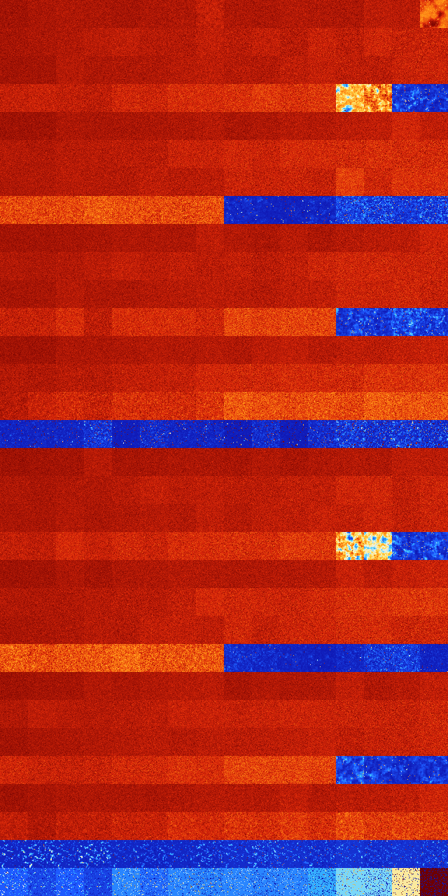

# B02358 (154112-154623)

<details>
    <summary>Initial Grid</summary>
    
</details>


<details>
    <summary>Initial Grid RLE</summary>

```
#C Exported from GoGoL (https://github.com/marrow16/gogol)
#C Wrap mode: Toroidal
#C Boundary mode: Dead
#C Step: 0
x = 100, y = 100, rule = B02358/S
11bo18bo34bo6bo24bo$14bo9bo7bo6bo12bo8bo29bo3bo$3b2o49bo24bo11bo2bo$10b
o12b2o16bo34bo6bo6b2o$16b2o48bo$100b$13bo10bo23bo17b2o$39bo43bo$17bo7bo
13bo15bo4bo2bo19bo2bo6bo4bo$4bo40bo22bo11bo12bo$32bo2bo11bobo22bo$17bo
15bo20bo8bo14b2o8bo$61bo13bo$25bo17bo11bo$27bobo68bo$15bo$24bo38bo35bo$
9bo2bo3bo4bo2bo3bo2bo16b2o6bo$22bo34bo10bo20bo$29bo34bo15bo6bo6bo$35bo
41b2o6bo$18bo3bo18bo31bo13bo3bo$o12bo7bo68bo$o2bo7bo14bo27bo3b2o2bo29bo
$o41b2o4bo23bo$12bo37bo41bo3bo$7bo2bo28bo22bo$2bo9bo26bo21bo10bo4bo$14b
o16bo29bo$2bo6b2o49bo4bo11bo$7bo8bo6bobo45bo2bo13bo$16bo5bo14bo11bo$5bo
34bo37bo$18bo40bo9bo$48bo11bobo16bo2bo$o23bo36bo16bo$9bo31bo33bo5bob2o$
29bo7bo14bo27bo6bo$16bo9bo5bo53bo8bo$30bo13bo2bo11bo4bo16bo3bo8bo$36bo
34bo5b2obo8bo$25bo12bo2bo3b2o$70bo24bo$8bo10bo22bobo24bo13bo$30bobo49bo
2bobo$54bo$o8bo7b2o4bo14bo50bo$3bo4bo8bo39bo11bo28bo$13bo21bo25bo11bo5b
o$90bo$7bo3bo6bo28bo20bo27bo$12bo13bo7bo10bo4bo2bo28bo$9bo5bo2bo37bo9bo
$4bo12bo39bo4bo26bo$51bo26bobo$16bo32bo14bo4b2o15bo$bo27bo8bo12bo3bo11b
o12bo10bo$5bo58bo18bo5bo$23bo20bo3bo12b2o3bo24bo2bo$bo8bo11bo4bobo9bo
25bo21bo3bo$11bo9bo12bo11bo48bo$23bo44bo10bo$56bo10bo15bo$29bo5bo7bo25b
o23bo3bo$12bo16bo2bo2bo24bo21bo7bo$20bo8bo3bobo6bo43bo$30bo8bo3bobo2bo
8bo27bo$7bo13bo58bo$25bo18bo9bo6bo29bo$20bo5bo56bo$51bo30bobo$15bo37bo
10bo$35b2o15bobo10bo$17bo2bo5bo5bo48bo$8bo5bo48bo27bo$42bo4bo20bo7bo$
20b2o7bo14bo10bo$24bo21bo2bo45bo$67bo2b2o17b2o$4bo24bo47bo18bo$2bo58bo
14bo8bo$10bo23bo21bo26bobo7bo5bo$o51bo18bo14bo2bo$7bo6bo23bo28bo23bo5bo
$12bo28bo$16bo7bo74bo$15bo59b2o22bo$38bo7bo$6bo5bo2bo17bo13bo9bo26bo14b
o$9bo64b2o17bo$22bo$44bo7b2o13bobo26bobo$5bo3bo20bo$4bo8bo22bo15bo11bo
4bo$8b2o15bo45bo$7bo11bo59bo$20bo55bo$5bo39bo10bo7bo5bo15bo$39bo13bo29b
o5bo$8bo8bo10bo23b2o42bo!
```
</details>
<details>
    <summary>Thumbnail</summary>

</details>
<table>
<tr>
    <td><a href="./154112%20S%20Heat%20Map%20Activity.png"></a><br>S (154112)<br>G>1000</td>    <td><a href="./154113%20S0%20Heat%20Map%20Activity.png"></a><br>S0 (154113)<br>G>1000</td>    <td><a href="./154114%20S1%20Heat%20Map%20Activity.png"></a><br>S1 (154114)<br>G>1000</td>    <td><a href="./154115%20S01%20Heat%20Map%20Activity.png"></a><br>S01 (154115)<br>G>1000</td>    <td><a href="./154116%20S2%20Heat%20Map%20Activity.png"></a><br>S2 (154116)<br>G>1000</td>    <td><a href="./154117%20S02%20Heat%20Map%20Activity.png"></a><br>S02 (154117)<br>G>1000</td>    <td><a href="./154118%20S12%20Heat%20Map%20Activity.png"></a><br>S12 (154118)<br>G>1000</td>    <td><a href="./154119%20S012%20Heat%20Map%20Activity.png"></a><br>S012 (154119)<br>G>1000</td>    <td><a href="./154120%20S3%20Heat%20Map%20Activity.png"></a><br>S3 (154120)<br>G>1000</td>    <td><a href="./154121%20S03%20Heat%20Map%20Activity.png"></a><br>S03 (154121)<br>G>1000</td>    <td><a href="./154122%20S13%20Heat%20Map%20Activity.png"></a><br>S13 (154122)<br>G>1000</td>    <td><a href="./154123%20S013%20Heat%20Map%20Activity.png"></a><br>S013 (154123)<br>G>1000</td>    <td><a href="./154124%20S23%20Heat%20Map%20Activity.png"></a><br>S23 (154124)<br>G>1000</td>    <td><a href="./154125%20S023%20Heat%20Map%20Activity.png"></a><br>S023 (154125)<br>G>1000</td>    <td><a href="./154126%20S123%20Heat%20Map%20Activity.png"></a><br>S123 (154126)<br>G>1000</td>    <td><a href="./154127%20S0123%20Heat%20Map%20Activity.png"></a><br>S0123 (154127)<br>G>1000</td></tr>
<tr>
    <td><a href="./154128%20S4%20Heat%20Map%20Activity.png"></a><br>S4 (154128)<br>G>1000</td>    <td><a href="./154129%20S04%20Heat%20Map%20Activity.png"></a><br>S04 (154129)<br>G>1000</td>    <td><a href="./154130%20S14%20Heat%20Map%20Activity.png"></a><br>S14 (154130)<br>G>1000</td>    <td><a href="./154131%20S014%20Heat%20Map%20Activity.png"></a><br>S014 (154131)<br>G>1000</td>    <td><a href="./154132%20S24%20Heat%20Map%20Activity.png"></a><br>S24 (154132)<br>G>1000</td>    <td><a href="./154133%20S024%20Heat%20Map%20Activity.png"></a><br>S024 (154133)<br>G>1000</td>    <td><a href="./154134%20S124%20Heat%20Map%20Activity.png"></a><br>S124 (154134)<br>G>1000</td>    <td><a href="./154135%20S0124%20Heat%20Map%20Activity.png"></a><br>S0124 (154135)<br>G>1000</td>    <td><a href="./154136%20S34%20Heat%20Map%20Activity.png"></a><br>S34 (154136)<br>G>1000</td>    <td><a href="./154137%20S034%20Heat%20Map%20Activity.png"></a><br>S034 (154137)<br>G>1000</td>    <td><a href="./154138%20S134%20Heat%20Map%20Activity.png"></a><br>S134 (154138)<br>G>1000</td>    <td><a href="./154139%20S0134%20Heat%20Map%20Activity.png"></a><br>S0134 (154139)<br>G>1000</td>    <td><a href="./154140%20S234%20Heat%20Map%20Activity.png"></a><br>S234 (154140)<br>G>1000</td>    <td><a href="./154141%20S0234%20Heat%20Map%20Activity.png"></a><br>S0234 (154141)<br>G>1000</td>    <td><a href="./154142%20S1234%20Heat%20Map%20Activity.png"></a><br>S1234 (154142)<br>G>1000</td>    <td><a href="./154143%20S01234%20Heat%20Map%20Activity.png"></a><br>S01234 (154143)<br>G>1000</td></tr>
<tr>
    <td><a href="./154144%20S5%20Heat%20Map%20Activity.png"></a><br>S5 (154144)<br>G>1000</td>    <td><a href="./154145%20S05%20Heat%20Map%20Activity.png"></a><br>S05 (154145)<br>G>1000</td>    <td><a href="./154146%20S15%20Heat%20Map%20Activity.png"></a><br>S15 (154146)<br>G>1000</td>    <td><a href="./154147%20S015%20Heat%20Map%20Activity.png"></a><br>S015 (154147)<br>G>1000</td>    <td><a href="./154148%20S25%20Heat%20Map%20Activity.png"></a><br>S25 (154148)<br>G>1000</td>    <td><a href="./154149%20S025%20Heat%20Map%20Activity.png"></a><br>S025 (154149)<br>G>1000</td>    <td><a href="./154150%20S125%20Heat%20Map%20Activity.png"></a><br>S125 (154150)<br>G>1000</td>    <td><a href="./154151%20S0125%20Heat%20Map%20Activity.png"></a><br>S0125 (154151)<br>G>1000</td>    <td><a href="./154152%20S35%20Heat%20Map%20Activity.png"></a><br>S35 (154152)<br>G>1000</td>    <td><a href="./154153%20S035%20Heat%20Map%20Activity.png"></a><br>S035 (154153)<br>G>1000</td>    <td><a href="./154154%20S135%20Heat%20Map%20Activity.png"></a><br>S135 (154154)<br>G>1000</td>    <td><a href="./154155%20S0135%20Heat%20Map%20Activity.png"></a><br>S0135 (154155)<br>G>1000</td>    <td><a href="./154156%20S235%20Heat%20Map%20Activity.png"></a><br>S235 (154156)<br>G>1000</td>    <td><a href="./154157%20S0235%20Heat%20Map%20Activity.png"></a><br>S0235 (154157)<br>G>1000</td>    <td><a href="./154158%20S1235%20Heat%20Map%20Activity.png"></a><br>S1235 (154158)<br>G>1000</td>    <td><a href="./154159%20S01235%20Heat%20Map%20Activity.png"></a><br>S01235 (154159)<br>G>1000</td></tr>
<tr>
    <td><a href="./154160%20S45%20Heat%20Map%20Activity.png"></a><br>S45 (154160)<br>G>1000</td>    <td><a href="./154161%20S045%20Heat%20Map%20Activity.png"></a><br>S045 (154161)<br>G>1000</td>    <td><a href="./154162%20S145%20Heat%20Map%20Activity.png"></a><br>S145 (154162)<br>G>1000</td>    <td><a href="./154163%20S0145%20Heat%20Map%20Activity.png"></a><br>S0145 (154163)<br>G>1000</td>    <td><a href="./154164%20S245%20Heat%20Map%20Activity.png"></a><br>S245 (154164)<br>G>1000</td>    <td><a href="./154165%20S0245%20Heat%20Map%20Activity.png"></a><br>S0245 (154165)<br>G>1000</td>    <td><a href="./154166%20S1245%20Heat%20Map%20Activity.png"></a><br>S1245 (154166)<br>G>1000</td>    <td><a href="./154167%20S01245%20Heat%20Map%20Activity.png"></a><br>S01245 (154167)<br>G>1000</td>    <td><a href="./154168%20S345%20Heat%20Map%20Activity.png"></a><br>S345 (154168)<br>G>1000</td>    <td><a href="./154169%20S0345%20Heat%20Map%20Activity.png"></a><br>S0345 (154169)<br>G>1000</td>    <td><a href="./154170%20S1345%20Heat%20Map%20Activity.png"></a><br>S1345 (154170)<br>G>1000</td>    <td><a href="./154171%20S01345%20Heat%20Map%20Activity.png"></a><br>S01345 (154171)<br>G>1000</td>    <td><a href="./154172%20S2345%20Heat%20Map%20Activity.png"></a><br>S2345 (154172)<br>G>1000</td>    <td><a href="./154173%20S02345%20Heat%20Map%20Activity.png"></a><br>S02345 (154173)<br>G>1000</td>    <td><a href="./154174%20S12345%20Heat%20Map%20Activity.png"></a><br>S12345 (154174)<br>R@783,p12</td>    <td><a href="./154175%20S012345%20Heat%20Map%20Activity.png"></a><br>S012345 (154175)<br>R@997,p12</td></tr>
<tr>
    <td><a href="./154176%20S6%20Heat%20Map%20Activity.png"></a><br>S6 (154176)<br>G>1000</td>    <td><a href="./154177%20S06%20Heat%20Map%20Activity.png"></a><br>S06 (154177)<br>G>1000</td>    <td><a href="./154178%20S16%20Heat%20Map%20Activity.png"></a><br>S16 (154178)<br>G>1000</td>    <td><a href="./154179%20S016%20Heat%20Map%20Activity.png"></a><br>S016 (154179)<br>G>1000</td>    <td><a href="./154180%20S26%20Heat%20Map%20Activity.png"></a><br>S26 (154180)<br>G>1000</td>    <td><a href="./154181%20S026%20Heat%20Map%20Activity.png"></a><br>S026 (154181)<br>G>1000</td>    <td><a href="./154182%20S126%20Heat%20Map%20Activity.png"></a><br>S126 (154182)<br>G>1000</td>    <td><a href="./154183%20S0126%20Heat%20Map%20Activity.png"></a><br>S0126 (154183)<br>G>1000</td>    <td><a href="./154184%20S36%20Heat%20Map%20Activity.png"></a><br>S36 (154184)<br>G>1000</td>    <td><a href="./154185%20S036%20Heat%20Map%20Activity.png"></a><br>S036 (154185)<br>G>1000</td>    <td><a href="./154186%20S136%20Heat%20Map%20Activity.png"></a><br>S136 (154186)<br>G>1000</td>    <td><a href="./154187%20S0136%20Heat%20Map%20Activity.png"></a><br>S0136 (154187)<br>G>1000</td>    <td><a href="./154188%20S236%20Heat%20Map%20Activity.png"></a><br>S236 (154188)<br>G>1000</td>    <td><a href="./154189%20S0236%20Heat%20Map%20Activity.png"></a><br>S0236 (154189)<br>G>1000</td>    <td><a href="./154190%20S1236%20Heat%20Map%20Activity.png"></a><br>S1236 (154190)<br>G>1000</td>    <td><a href="./154191%20S01236%20Heat%20Map%20Activity.png"></a><br>S01236 (154191)<br>G>1000</td></tr>
<tr>
    <td><a href="./154192%20S46%20Heat%20Map%20Activity.png"></a><br>S46 (154192)<br>G>1000</td>    <td><a href="./154193%20S046%20Heat%20Map%20Activity.png"></a><br>S046 (154193)<br>G>1000</td>    <td><a href="./154194%20S146%20Heat%20Map%20Activity.png"></a><br>S146 (154194)<br>G>1000</td>    <td><a href="./154195%20S0146%20Heat%20Map%20Activity.png"></a><br>S0146 (154195)<br>G>1000</td>    <td><a href="./154196%20S246%20Heat%20Map%20Activity.png"></a><br>S246 (154196)<br>G>1000</td>    <td><a href="./154197%20S0246%20Heat%20Map%20Activity.png"></a><br>S0246 (154197)<br>G>1000</td>    <td><a href="./154198%20S1246%20Heat%20Map%20Activity.png"></a><br>S1246 (154198)<br>G>1000</td>    <td><a href="./154199%20S01246%20Heat%20Map%20Activity.png"></a><br>S01246 (154199)<br>G>1000</td>    <td><a href="./154200%20S346%20Heat%20Map%20Activity.png"></a><br>S346 (154200)<br>G>1000</td>    <td><a href="./154201%20S0346%20Heat%20Map%20Activity.png"></a><br>S0346 (154201)<br>G>1000</td>    <td><a href="./154202%20S1346%20Heat%20Map%20Activity.png"></a><br>S1346 (154202)<br>G>1000</td>    <td><a href="./154203%20S01346%20Heat%20Map%20Activity.png"></a><br>S01346 (154203)<br>G>1000</td>    <td><a href="./154204%20S2346%20Heat%20Map%20Activity.png"></a><br>S2346 (154204)<br>G>1000</td>    <td><a href="./154205%20S02346%20Heat%20Map%20Activity.png"></a><br>S02346 (154205)<br>G>1000</td>    <td><a href="./154206%20S12346%20Heat%20Map%20Activity.png"></a><br>S12346 (154206)<br>G>1000</td>    <td><a href="./154207%20S012346%20Heat%20Map%20Activity.png"></a><br>S012346 (154207)<br>G>1000</td></tr>
<tr>
    <td><a href="./154208%20S56%20Heat%20Map%20Activity.png"></a><br>S56 (154208)<br>G>1000</td>    <td><a href="./154209%20S056%20Heat%20Map%20Activity.png"></a><br>S056 (154209)<br>G>1000</td>    <td><a href="./154210%20S156%20Heat%20Map%20Activity.png"></a><br>S156 (154210)<br>G>1000</td>    <td><a href="./154211%20S0156%20Heat%20Map%20Activity.png"></a><br>S0156 (154211)<br>G>1000</td>    <td><a href="./154212%20S256%20Heat%20Map%20Activity.png"></a><br>S256 (154212)<br>G>1000</td>    <td><a href="./154213%20S0256%20Heat%20Map%20Activity.png"></a><br>S0256 (154213)<br>G>1000</td>    <td><a href="./154214%20S1256%20Heat%20Map%20Activity.png"></a><br>S1256 (154214)<br>G>1000</td>    <td><a href="./154215%20S01256%20Heat%20Map%20Activity.png"></a><br>S01256 (154215)<br>G>1000</td>    <td><a href="./154216%20S356%20Heat%20Map%20Activity.png"></a><br>S356 (154216)<br>G>1000</td>    <td><a href="./154217%20S0356%20Heat%20Map%20Activity.png"></a><br>S0356 (154217)<br>G>1000</td>    <td><a href="./154218%20S1356%20Heat%20Map%20Activity.png"></a><br>S1356 (154218)<br>G>1000</td>    <td><a href="./154219%20S01356%20Heat%20Map%20Activity.png"></a><br>S01356 (154219)<br>G>1000</td>    <td><a href="./154220%20S2356%20Heat%20Map%20Activity.png"></a><br>S2356 (154220)<br>G>1000</td>    <td><a href="./154221%20S02356%20Heat%20Map%20Activity.png"></a><br>S02356 (154221)<br>G>1000</td>    <td><a href="./154222%20S12356%20Heat%20Map%20Activity.png"></a><br>S12356 (154222)<br>G>1000</td>    <td><a href="./154223%20S012356%20Heat%20Map%20Activity.png"></a><br>S012356 (154223)<br>G>1000</td></tr>
<tr>
    <td><a href="./154224%20S456%20Heat%20Map%20Activity.png"></a><br>S456 (154224)<br>G>1000</td>    <td><a href="./154225%20S0456%20Heat%20Map%20Activity.png"></a><br>S0456 (154225)<br>G>1000</td>    <td><a href="./154226%20S1456%20Heat%20Map%20Activity.png"></a><br>S1456 (154226)<br>G>1000</td>    <td><a href="./154227%20S01456%20Heat%20Map%20Activity.png"></a><br>S01456 (154227)<br>G>1000</td>    <td><a href="./154228%20S2456%20Heat%20Map%20Activity.png"></a><br>S2456 (154228)<br>G>1000</td>    <td><a href="./154229%20S02456%20Heat%20Map%20Activity.png"></a><br>S02456 (154229)<br>G>1000</td>    <td><a href="./154230%20S12456%20Heat%20Map%20Activity.png"></a><br>S12456 (154230)<br>G>1000</td>    <td><a href="./154231%20S012456%20Heat%20Map%20Activity.png"></a><br>S012456 (154231)<br>G>1000</td>    <td><a href="./154232%20S3456%20Heat%20Map%20Activity.png"></a><br>S3456 (154232)<br>R@329,p12</td>    <td><a href="./154233%20S03456%20Heat%20Map%20Activity.png"></a><br>S03456 (154233)<br>R@353,p60</td>    <td><a href="./154234%20S13456%20Heat%20Map%20Activity.png"></a><br>S13456 (154234)<br>R@402,p180</td>    <td><a href="./154235%20S013456%20Heat%20Map%20Activity.png"></a><br>S013456 (154235)<br>R@315,p60</td>    <td><a href="./154236%20S23456%20Heat%20Map%20Activity.png"></a><br>S23456 (154236)<br>R@43,p12</td>    <td><a href="./154237%20S023456%20Heat%20Map%20Activity.png"></a><br>S023456 (154237)<br>R@37,p12</td>    <td><a href="./154238%20S123456%20Heat%20Map%20Activity.png"></a><br>S123456 (154238)<br>R@55,p24</td>    <td><a href="./154239%20S0123456%20Heat%20Map%20Activity.png"></a><br>S0123456 (154239)<br>R@36,p12</td></tr>
<tr>
    <td><a href="./154240%20S7%20Heat%20Map%20Activity.png"></a><br>S7 (154240)<br>G>1000</td>    <td><a href="./154241%20S07%20Heat%20Map%20Activity.png"></a><br>S07 (154241)<br>G>1000</td>    <td><a href="./154242%20S17%20Heat%20Map%20Activity.png"></a><br>S17 (154242)<br>G>1000</td>    <td><a href="./154243%20S017%20Heat%20Map%20Activity.png"></a><br>S017 (154243)<br>G>1000</td>    <td><a href="./154244%20S27%20Heat%20Map%20Activity.png"></a><br>S27 (154244)<br>G>1000</td>    <td><a href="./154245%20S027%20Heat%20Map%20Activity.png"></a><br>S027 (154245)<br>G>1000</td>    <td><a href="./154246%20S127%20Heat%20Map%20Activity.png"></a><br>S127 (154246)<br>G>1000</td>    <td><a href="./154247%20S0127%20Heat%20Map%20Activity.png"></a><br>S0127 (154247)<br>G>1000</td>    <td><a href="./154248%20S37%20Heat%20Map%20Activity.png"></a><br>S37 (154248)<br>G>1000</td>    <td><a href="./154249%20S037%20Heat%20Map%20Activity.png"></a><br>S037 (154249)<br>G>1000</td>    <td><a href="./154250%20S137%20Heat%20Map%20Activity.png"></a><br>S137 (154250)<br>G>1000</td>    <td><a href="./154251%20S0137%20Heat%20Map%20Activity.png"></a><br>S0137 (154251)<br>G>1000</td>    <td><a href="./154252%20S237%20Heat%20Map%20Activity.png"></a><br>S237 (154252)<br>G>1000</td>    <td><a href="./154253%20S0237%20Heat%20Map%20Activity.png"></a><br>S0237 (154253)<br>G>1000</td>    <td><a href="./154254%20S1237%20Heat%20Map%20Activity.png"></a><br>S1237 (154254)<br>G>1000</td>    <td><a href="./154255%20S01237%20Heat%20Map%20Activity.png"></a><br>S01237 (154255)<br>G>1000</td></tr>
<tr>
    <td><a href="./154256%20S47%20Heat%20Map%20Activity.png"></a><br>S47 (154256)<br>G>1000</td>    <td><a href="./154257%20S047%20Heat%20Map%20Activity.png"></a><br>S047 (154257)<br>G>1000</td>    <td><a href="./154258%20S147%20Heat%20Map%20Activity.png"></a><br>S147 (154258)<br>G>1000</td>    <td><a href="./154259%20S0147%20Heat%20Map%20Activity.png"></a><br>S0147 (154259)<br>G>1000</td>    <td><a href="./154260%20S247%20Heat%20Map%20Activity.png"></a><br>S247 (154260)<br>G>1000</td>    <td><a href="./154261%20S0247%20Heat%20Map%20Activity.png"></a><br>S0247 (154261)<br>G>1000</td>    <td><a href="./154262%20S1247%20Heat%20Map%20Activity.png"></a><br>S1247 (154262)<br>G>1000</td>    <td><a href="./154263%20S01247%20Heat%20Map%20Activity.png"></a><br>S01247 (154263)<br>G>1000</td>    <td><a href="./154264%20S347%20Heat%20Map%20Activity.png"></a><br>S347 (154264)<br>G>1000</td>    <td><a href="./154265%20S0347%20Heat%20Map%20Activity.png"></a><br>S0347 (154265)<br>G>1000</td>    <td><a href="./154266%20S1347%20Heat%20Map%20Activity.png"></a><br>S1347 (154266)<br>G>1000</td>    <td><a href="./154267%20S01347%20Heat%20Map%20Activity.png"></a><br>S01347 (154267)<br>G>1000</td>    <td><a href="./154268%20S2347%20Heat%20Map%20Activity.png"></a><br>S2347 (154268)<br>G>1000</td>    <td><a href="./154269%20S02347%20Heat%20Map%20Activity.png"></a><br>S02347 (154269)<br>G>1000</td>    <td><a href="./154270%20S12347%20Heat%20Map%20Activity.png"></a><br>S12347 (154270)<br>G>1000</td>    <td><a href="./154271%20S012347%20Heat%20Map%20Activity.png"></a><br>S012347 (154271)<br>G>1000</td></tr>
<tr>
    <td><a href="./154272%20S57%20Heat%20Map%20Activity.png"></a><br>S57 (154272)<br>G>1000</td>    <td><a href="./154273%20S057%20Heat%20Map%20Activity.png"></a><br>S057 (154273)<br>G>1000</td>    <td><a href="./154274%20S157%20Heat%20Map%20Activity.png"></a><br>S157 (154274)<br>G>1000</td>    <td><a href="./154275%20S0157%20Heat%20Map%20Activity.png"></a><br>S0157 (154275)<br>G>1000</td>    <td><a href="./154276%20S257%20Heat%20Map%20Activity.png"></a><br>S257 (154276)<br>G>1000</td>    <td><a href="./154277%20S0257%20Heat%20Map%20Activity.png"></a><br>S0257 (154277)<br>G>1000</td>    <td><a href="./154278%20S1257%20Heat%20Map%20Activity.png"></a><br>S1257 (154278)<br>G>1000</td>    <td><a href="./154279%20S01257%20Heat%20Map%20Activity.png"></a><br>S01257 (154279)<br>G>1000</td>    <td><a href="./154280%20S357%20Heat%20Map%20Activity.png"></a><br>S357 (154280)<br>G>1000</td>    <td><a href="./154281%20S0357%20Heat%20Map%20Activity.png"></a><br>S0357 (154281)<br>G>1000</td>    <td><a href="./154282%20S1357%20Heat%20Map%20Activity.png"></a><br>S1357 (154282)<br>G>1000</td>    <td><a href="./154283%20S01357%20Heat%20Map%20Activity.png"></a><br>S01357 (154283)<br>G>1000</td>    <td><a href="./154284%20S2357%20Heat%20Map%20Activity.png"></a><br>S2357 (154284)<br>G>1000</td>    <td><a href="./154285%20S02357%20Heat%20Map%20Activity.png"></a><br>S02357 (154285)<br>G>1000</td>    <td><a href="./154286%20S12357%20Heat%20Map%20Activity.png"></a><br>S12357 (154286)<br>G>1000</td>    <td><a href="./154287%20S012357%20Heat%20Map%20Activity.png"></a><br>S012357 (154287)<br>G>1000</td></tr>
<tr>
    <td><a href="./154288%20S457%20Heat%20Map%20Activity.png"></a><br>S457 (154288)<br>G>1000</td>    <td><a href="./154289%20S0457%20Heat%20Map%20Activity.png"></a><br>S0457 (154289)<br>G>1000</td>    <td><a href="./154290%20S1457%20Heat%20Map%20Activity.png"></a><br>S1457 (154290)<br>G>1000</td>    <td><a href="./154291%20S01457%20Heat%20Map%20Activity.png"></a><br>S01457 (154291)<br>G>1000</td>    <td><a href="./154292%20S2457%20Heat%20Map%20Activity.png"></a><br>S2457 (154292)<br>G>1000</td>    <td><a href="./154293%20S02457%20Heat%20Map%20Activity.png"></a><br>S02457 (154293)<br>G>1000</td>    <td><a href="./154294%20S12457%20Heat%20Map%20Activity.png"></a><br>S12457 (154294)<br>G>1000</td>    <td><a href="./154295%20S012457%20Heat%20Map%20Activity.png"></a><br>S012457 (154295)<br>G>1000</td>    <td><a href="./154296%20S3457%20Heat%20Map%20Activity.png"></a><br>S3457 (154296)<br>G>1000</td>    <td><a href="./154297%20S03457%20Heat%20Map%20Activity.png"></a><br>S03457 (154297)<br>G>1000</td>    <td><a href="./154298%20S13457%20Heat%20Map%20Activity.png"></a><br>S13457 (154298)<br>G>1000</td>    <td><a href="./154299%20S013457%20Heat%20Map%20Activity.png"></a><br>S013457 (154299)<br>G>1000</td>    <td><a href="./154300%20S23457%20Heat%20Map%20Activity.png"></a><br>S23457 (154300)<br>R@561,p12</td>    <td><a href="./154301%20S023457%20Heat%20Map%20Activity.png"></a><br>S023457 (154301)<br>R@408,p12</td>    <td><a href="./154302%20S123457%20Heat%20Map%20Activity.png"></a><br>S123457 (154302)<br>R@264,p6</td>    <td><a href="./154303%20S0123457%20Heat%20Map%20Activity.png"></a><br>S0123457 (154303)<br>R@259,p6</td></tr>
<tr>
    <td><a href="./154304%20S67%20Heat%20Map%20Activity.png"></a><br>S67 (154304)<br>G>1000</td>    <td><a href="./154305%20S067%20Heat%20Map%20Activity.png"></a><br>S067 (154305)<br>G>1000</td>    <td><a href="./154306%20S167%20Heat%20Map%20Activity.png"></a><br>S167 (154306)<br>G>1000</td>    <td><a href="./154307%20S0167%20Heat%20Map%20Activity.png"></a><br>S0167 (154307)<br>G>1000</td>    <td><a href="./154308%20S267%20Heat%20Map%20Activity.png"></a><br>S267 (154308)<br>G>1000</td>    <td><a href="./154309%20S0267%20Heat%20Map%20Activity.png"></a><br>S0267 (154309)<br>G>1000</td>    <td><a href="./154310%20S1267%20Heat%20Map%20Activity.png"></a><br>S1267 (154310)<br>G>1000</td>    <td><a href="./154311%20S01267%20Heat%20Map%20Activity.png"></a><br>S01267 (154311)<br>G>1000</td>    <td><a href="./154312%20S367%20Heat%20Map%20Activity.png"></a><br>S367 (154312)<br>G>1000</td>    <td><a href="./154313%20S0367%20Heat%20Map%20Activity.png"></a><br>S0367 (154313)<br>G>1000</td>    <td><a href="./154314%20S1367%20Heat%20Map%20Activity.png"></a><br>S1367 (154314)<br>G>1000</td>    <td><a href="./154315%20S01367%20Heat%20Map%20Activity.png"></a><br>S01367 (154315)<br>G>1000</td>    <td><a href="./154316%20S2367%20Heat%20Map%20Activity.png"></a><br>S2367 (154316)<br>G>1000</td>    <td><a href="./154317%20S02367%20Heat%20Map%20Activity.png"></a><br>S02367 (154317)<br>G>1000</td>    <td><a href="./154318%20S12367%20Heat%20Map%20Activity.png"></a><br>S12367 (154318)<br>G>1000</td>    <td><a href="./154319%20S012367%20Heat%20Map%20Activity.png"></a><br>S012367 (154319)<br>G>1000</td></tr>
<tr>
    <td><a href="./154320%20S467%20Heat%20Map%20Activity.png"></a><br>S467 (154320)<br>G>1000</td>    <td><a href="./154321%20S0467%20Heat%20Map%20Activity.png"></a><br>S0467 (154321)<br>G>1000</td>    <td><a href="./154322%20S1467%20Heat%20Map%20Activity.png"></a><br>S1467 (154322)<br>G>1000</td>    <td><a href="./154323%20S01467%20Heat%20Map%20Activity.png"></a><br>S01467 (154323)<br>G>1000</td>    <td><a href="./154324%20S2467%20Heat%20Map%20Activity.png"></a><br>S2467 (154324)<br>G>1000</td>    <td><a href="./154325%20S02467%20Heat%20Map%20Activity.png"></a><br>S02467 (154325)<br>G>1000</td>    <td><a href="./154326%20S12467%20Heat%20Map%20Activity.png"></a><br>S12467 (154326)<br>G>1000</td>    <td><a href="./154327%20S012467%20Heat%20Map%20Activity.png"></a><br>S012467 (154327)<br>G>1000</td>    <td><a href="./154328%20S3467%20Heat%20Map%20Activity.png"></a><br>S3467 (154328)<br>G>1000</td>    <td><a href="./154329%20S03467%20Heat%20Map%20Activity.png"></a><br>S03467 (154329)<br>G>1000</td>    <td><a href="./154330%20S13467%20Heat%20Map%20Activity.png"></a><br>S13467 (154330)<br>G>1000</td>    <td><a href="./154331%20S013467%20Heat%20Map%20Activity.png"></a><br>S013467 (154331)<br>G>1000</td>    <td><a href="./154332%20S23467%20Heat%20Map%20Activity.png"></a><br>S23467 (154332)<br>G>1000</td>    <td><a href="./154333%20S023467%20Heat%20Map%20Activity.png"></a><br>S023467 (154333)<br>G>1000</td>    <td><a href="./154334%20S123467%20Heat%20Map%20Activity.png"></a><br>S123467 (154334)<br>G>1000</td>    <td><a href="./154335%20S0123467%20Heat%20Map%20Activity.png"></a><br>S0123467 (154335)<br>G>1000</td></tr>
<tr>
    <td><a href="./154336%20S567%20Heat%20Map%20Activity.png"></a><br>S567 (154336)<br>G>1000</td>    <td><a href="./154337%20S0567%20Heat%20Map%20Activity.png"></a><br>S0567 (154337)<br>G>1000</td>    <td><a href="./154338%20S1567%20Heat%20Map%20Activity.png"></a><br>S1567 (154338)<br>G>1000</td>    <td><a href="./154339%20S01567%20Heat%20Map%20Activity.png"></a><br>S01567 (154339)<br>G>1000</td>    <td><a href="./154340%20S2567%20Heat%20Map%20Activity.png"></a><br>S2567 (154340)<br>G>1000</td>    <td><a href="./154341%20S02567%20Heat%20Map%20Activity.png"></a><br>S02567 (154341)<br>G>1000</td>    <td><a href="./154342%20S12567%20Heat%20Map%20Activity.png"></a><br>S12567 (154342)<br>G>1000</td>    <td><a href="./154343%20S012567%20Heat%20Map%20Activity.png"></a><br>S012567 (154343)<br>G>1000</td>    <td><a href="./154344%20S3567%20Heat%20Map%20Activity.png"></a><br>S3567 (154344)<br>G>1000</td>    <td><a href="./154345%20S03567%20Heat%20Map%20Activity.png"></a><br>S03567 (154345)<br>G>1000</td>    <td><a href="./154346%20S13567%20Heat%20Map%20Activity.png"></a><br>S13567 (154346)<br>G>1000</td>    <td><a href="./154347%20S013567%20Heat%20Map%20Activity.png"></a><br>S013567 (154347)<br>G>1000</td>    <td><a href="./154348%20S23567%20Heat%20Map%20Activity.png"></a><br>S23567 (154348)<br>G>1000</td>    <td><a href="./154349%20S023567%20Heat%20Map%20Activity.png"></a><br>S023567 (154349)<br>G>1000</td>    <td><a href="./154350%20S123567%20Heat%20Map%20Activity.png"></a><br>S123567 (154350)<br>G>1000</td>    <td><a href="./154351%20S0123567%20Heat%20Map%20Activity.png"></a><br>S0123567 (154351)<br>G>1000</td></tr>
<tr>
    <td><a href="./154352%20S4567%20Heat%20Map%20Activity.png"></a><br>S4567 (154352)<br>R@112,p60</td>    <td><a href="./154353%20S04567%20Heat%20Map%20Activity.png"></a><br>S04567 (154353)<br>R@119,p60</td>    <td><a href="./154354%20S14567%20Heat%20Map%20Activity.png"></a><br>S14567 (154354)<br>R@100,p60</td>    <td><a href="./154355%20S014567%20Heat%20Map%20Activity.png"></a><br>S014567 (154355)<br>R@51,p2</td>    <td><a href="./154356%20S24567%20Heat%20Map%20Activity.png"></a><br>S24567 (154356)<br>R@191,p120</td>    <td><a href="./154357%20S024567%20Heat%20Map%20Activity.png"></a><br>S024567 (154357)<br>R@74,p30</td>    <td><a href="./154358%20S124567%20Heat%20Map%20Activity.png"></a><br>S124567 (154358)<br>R@108,p60</td>    <td><a href="./154359%20S0124567%20Heat%20Map%20Activity.png"></a><br>S0124567 (154359)<br>R@103,p60</td>    <td><a href="./154360%20S34567%20Heat%20Map%20Activity.png"></a><br>S34567 (154360)<br>R@189,p168</td>    <td><a href="./154361%20S034567%20Heat%20Map%20Activity.png"></a><br>S034567 (154361)<br>R@44,p24</td>    <td><a href="./154362%20S134567%20Heat%20Map%20Activity.png"></a><br>S134567 (154362)<br>R@190,p168</td>    <td><a href="./154363%20S0134567%20Heat%20Map%20Activity.png"></a><br>S0134567 (154363)<br>R@43,p24</td>    <td><a href="./154364%20S234567%20Heat%20Map%20Activity.png"></a><br>S234567 (154364)<br>R@31,p12</td>    <td><a href="./154365%20S0234567%20Heat%20Map%20Activity.png"></a><br>S0234567 (154365)<br>R@30,p12</td>    <td><a href="./154366%20S1234567%20Heat%20Map%20Activity.png"></a><br>S1234567 (154366)<br>R@31,p12</td>    <td><a href="./154367%20S01234567%20Heat%20Map%20Activity.png"></a><br>S01234567 (154367)<br>R@27,p6</td></tr>
<tr>
    <td><a href="./154368%20S8%20Heat%20Map%20Activity.png"></a><br>S8 (154368)<br>G>1000</td>    <td><a href="./154369%20S08%20Heat%20Map%20Activity.png"></a><br>S08 (154369)<br>G>1000</td>    <td><a href="./154370%20S18%20Heat%20Map%20Activity.png"></a><br>S18 (154370)<br>G>1000</td>    <td><a href="./154371%20S018%20Heat%20Map%20Activity.png"></a><br>S018 (154371)<br>G>1000</td>    <td><a href="./154372%20S28%20Heat%20Map%20Activity.png"></a><br>S28 (154372)<br>G>1000</td>    <td><a href="./154373%20S028%20Heat%20Map%20Activity.png"></a><br>S028 (154373)<br>G>1000</td>    <td><a href="./154374%20S128%20Heat%20Map%20Activity.png"></a><br>S128 (154374)<br>G>1000</td>    <td><a href="./154375%20S0128%20Heat%20Map%20Activity.png"></a><br>S0128 (154375)<br>G>1000</td>    <td><a href="./154376%20S38%20Heat%20Map%20Activity.png"></a><br>S38 (154376)<br>G>1000</td>    <td><a href="./154377%20S038%20Heat%20Map%20Activity.png"></a><br>S038 (154377)<br>G>1000</td>    <td><a href="./154378%20S138%20Heat%20Map%20Activity.png"></a><br>S138 (154378)<br>G>1000</td>    <td><a href="./154379%20S0138%20Heat%20Map%20Activity.png"></a><br>S0138 (154379)<br>G>1000</td>    <td><a href="./154380%20S238%20Heat%20Map%20Activity.png"></a><br>S238 (154380)<br>G>1000</td>    <td><a href="./154381%20S0238%20Heat%20Map%20Activity.png"></a><br>S0238 (154381)<br>G>1000</td>    <td><a href="./154382%20S1238%20Heat%20Map%20Activity.png"></a><br>S1238 (154382)<br>G>1000</td>    <td><a href="./154383%20S01238%20Heat%20Map%20Activity.png"></a><br>S01238 (154383)<br>G>1000</td></tr>
<tr>
    <td><a href="./154384%20S48%20Heat%20Map%20Activity.png"></a><br>S48 (154384)<br>G>1000</td>    <td><a href="./154385%20S048%20Heat%20Map%20Activity.png"></a><br>S048 (154385)<br>G>1000</td>    <td><a href="./154386%20S148%20Heat%20Map%20Activity.png"></a><br>S148 (154386)<br>G>1000</td>    <td><a href="./154387%20S0148%20Heat%20Map%20Activity.png"></a><br>S0148 (154387)<br>G>1000</td>    <td><a href="./154388%20S248%20Heat%20Map%20Activity.png"></a><br>S248 (154388)<br>G>1000</td>    <td><a href="./154389%20S0248%20Heat%20Map%20Activity.png"></a><br>S0248 (154389)<br>G>1000</td>    <td><a href="./154390%20S1248%20Heat%20Map%20Activity.png"></a><br>S1248 (154390)<br>G>1000</td>    <td><a href="./154391%20S01248%20Heat%20Map%20Activity.png"></a><br>S01248 (154391)<br>G>1000</td>    <td><a href="./154392%20S348%20Heat%20Map%20Activity.png"></a><br>S348 (154392)<br>G>1000</td>    <td><a href="./154393%20S0348%20Heat%20Map%20Activity.png"></a><br>S0348 (154393)<br>G>1000</td>    <td><a href="./154394%20S1348%20Heat%20Map%20Activity.png"></a><br>S1348 (154394)<br>G>1000</td>    <td><a href="./154395%20S01348%20Heat%20Map%20Activity.png"></a><br>S01348 (154395)<br>G>1000</td>    <td><a href="./154396%20S2348%20Heat%20Map%20Activity.png"></a><br>S2348 (154396)<br>G>1000</td>    <td><a href="./154397%20S02348%20Heat%20Map%20Activity.png"></a><br>S02348 (154397)<br>G>1000</td>    <td><a href="./154398%20S12348%20Heat%20Map%20Activity.png"></a><br>S12348 (154398)<br>G>1000</td>    <td><a href="./154399%20S012348%20Heat%20Map%20Activity.png"></a><br>S012348 (154399)<br>G>1000</td></tr>
<tr>
    <td><a href="./154400%20S58%20Heat%20Map%20Activity.png"></a><br>S58 (154400)<br>G>1000</td>    <td><a href="./154401%20S058%20Heat%20Map%20Activity.png"></a><br>S058 (154401)<br>G>1000</td>    <td><a href="./154402%20S158%20Heat%20Map%20Activity.png"></a><br>S158 (154402)<br>G>1000</td>    <td><a href="./154403%20S0158%20Heat%20Map%20Activity.png"></a><br>S0158 (154403)<br>G>1000</td>    <td><a href="./154404%20S258%20Heat%20Map%20Activity.png"></a><br>S258 (154404)<br>G>1000</td>    <td><a href="./154405%20S0258%20Heat%20Map%20Activity.png"></a><br>S0258 (154405)<br>G>1000</td>    <td><a href="./154406%20S1258%20Heat%20Map%20Activity.png"></a><br>S1258 (154406)<br>G>1000</td>    <td><a href="./154407%20S01258%20Heat%20Map%20Activity.png"></a><br>S01258 (154407)<br>G>1000</td>    <td><a href="./154408%20S358%20Heat%20Map%20Activity.png"></a><br>S358 (154408)<br>G>1000</td>    <td><a href="./154409%20S0358%20Heat%20Map%20Activity.png"></a><br>S0358 (154409)<br>G>1000</td>    <td><a href="./154410%20S1358%20Heat%20Map%20Activity.png"></a><br>S1358 (154410)<br>G>1000</td>    <td><a href="./154411%20S01358%20Heat%20Map%20Activity.png"></a><br>S01358 (154411)<br>G>1000</td>    <td><a href="./154412%20S2358%20Heat%20Map%20Activity.png"></a><br>S2358 (154412)<br>G>1000</td>    <td><a href="./154413%20S02358%20Heat%20Map%20Activity.png"></a><br>S02358 (154413)<br>G>1000</td>    <td><a href="./154414%20S12358%20Heat%20Map%20Activity.png"></a><br>S12358 (154414)<br>G>1000</td>    <td><a href="./154415%20S012358%20Heat%20Map%20Activity.png"></a><br>S012358 (154415)<br>G>1000</td></tr>
<tr>
    <td><a href="./154416%20S458%20Heat%20Map%20Activity.png"></a><br>S458 (154416)<br>G>1000</td>    <td><a href="./154417%20S0458%20Heat%20Map%20Activity.png"></a><br>S0458 (154417)<br>G>1000</td>    <td><a href="./154418%20S1458%20Heat%20Map%20Activity.png"></a><br>S1458 (154418)<br>G>1000</td>    <td><a href="./154419%20S01458%20Heat%20Map%20Activity.png"></a><br>S01458 (154419)<br>G>1000</td>    <td><a href="./154420%20S2458%20Heat%20Map%20Activity.png"></a><br>S2458 (154420)<br>G>1000</td>    <td><a href="./154421%20S02458%20Heat%20Map%20Activity.png"></a><br>S02458 (154421)<br>G>1000</td>    <td><a href="./154422%20S12458%20Heat%20Map%20Activity.png"></a><br>S12458 (154422)<br>G>1000</td>    <td><a href="./154423%20S012458%20Heat%20Map%20Activity.png"></a><br>S012458 (154423)<br>G>1000</td>    <td><a href="./154424%20S3458%20Heat%20Map%20Activity.png"></a><br>S3458 (154424)<br>G>1000</td>    <td><a href="./154425%20S03458%20Heat%20Map%20Activity.png"></a><br>S03458 (154425)<br>G>1000</td>    <td><a href="./154426%20S13458%20Heat%20Map%20Activity.png"></a><br>S13458 (154426)<br>G>1000</td>    <td><a href="./154427%20S013458%20Heat%20Map%20Activity.png"></a><br>S013458 (154427)<br>G>1000</td>    <td><a href="./154428%20S23458%20Heat%20Map%20Activity.png"></a><br>S23458 (154428)<br>G>1000</td>    <td><a href="./154429%20S023458%20Heat%20Map%20Activity.png"></a><br>S023458 (154429)<br>G>1000</td>    <td><a href="./154430%20S123458%20Heat%20Map%20Activity.png"></a><br>S123458 (154430)<br>G>1000</td>    <td><a href="./154431%20S0123458%20Heat%20Map%20Activity.png"></a><br>S0123458 (154431)<br>G>1000</td></tr>
<tr>
    <td><a href="./154432%20S68%20Heat%20Map%20Activity.png"></a><br>S68 (154432)<br>G>1000</td>    <td><a href="./154433%20S068%20Heat%20Map%20Activity.png"></a><br>S068 (154433)<br>G>1000</td>    <td><a href="./154434%20S168%20Heat%20Map%20Activity.png"></a><br>S168 (154434)<br>G>1000</td>    <td><a href="./154435%20S0168%20Heat%20Map%20Activity.png"></a><br>S0168 (154435)<br>G>1000</td>    <td><a href="./154436%20S268%20Heat%20Map%20Activity.png"></a><br>S268 (154436)<br>G>1000</td>    <td><a href="./154437%20S0268%20Heat%20Map%20Activity.png"></a><br>S0268 (154437)<br>G>1000</td>    <td><a href="./154438%20S1268%20Heat%20Map%20Activity.png"></a><br>S1268 (154438)<br>G>1000</td>    <td><a href="./154439%20S01268%20Heat%20Map%20Activity.png"></a><br>S01268 (154439)<br>G>1000</td>    <td><a href="./154440%20S368%20Heat%20Map%20Activity.png"></a><br>S368 (154440)<br>G>1000</td>    <td><a href="./154441%20S0368%20Heat%20Map%20Activity.png"></a><br>S0368 (154441)<br>G>1000</td>    <td><a href="./154442%20S1368%20Heat%20Map%20Activity.png"></a><br>S1368 (154442)<br>G>1000</td>    <td><a href="./154443%20S01368%20Heat%20Map%20Activity.png"></a><br>S01368 (154443)<br>G>1000</td>    <td><a href="./154444%20S2368%20Heat%20Map%20Activity.png"></a><br>S2368 (154444)<br>G>1000</td>    <td><a href="./154445%20S02368%20Heat%20Map%20Activity.png"></a><br>S02368 (154445)<br>G>1000</td>    <td><a href="./154446%20S12368%20Heat%20Map%20Activity.png"></a><br>S12368 (154446)<br>G>1000</td>    <td><a href="./154447%20S012368%20Heat%20Map%20Activity.png"></a><br>S012368 (154447)<br>G>1000</td></tr>
<tr>
    <td><a href="./154448%20S468%20Heat%20Map%20Activity.png"></a><br>S468 (154448)<br>G>1000</td>    <td><a href="./154449%20S0468%20Heat%20Map%20Activity.png"></a><br>S0468 (154449)<br>G>1000</td>    <td><a href="./154450%20S1468%20Heat%20Map%20Activity.png"></a><br>S1468 (154450)<br>G>1000</td>    <td><a href="./154451%20S01468%20Heat%20Map%20Activity.png"></a><br>S01468 (154451)<br>G>1000</td>    <td><a href="./154452%20S2468%20Heat%20Map%20Activity.png"></a><br>S2468 (154452)<br>G>1000</td>    <td><a href="./154453%20S02468%20Heat%20Map%20Activity.png"></a><br>S02468 (154453)<br>G>1000</td>    <td><a href="./154454%20S12468%20Heat%20Map%20Activity.png"></a><br>S12468 (154454)<br>G>1000</td>    <td><a href="./154455%20S012468%20Heat%20Map%20Activity.png"></a><br>S012468 (154455)<br>G>1000</td>    <td><a href="./154456%20S3468%20Heat%20Map%20Activity.png"></a><br>S3468 (154456)<br>G>1000</td>    <td><a href="./154457%20S03468%20Heat%20Map%20Activity.png"></a><br>S03468 (154457)<br>G>1000</td>    <td><a href="./154458%20S13468%20Heat%20Map%20Activity.png"></a><br>S13468 (154458)<br>G>1000</td>    <td><a href="./154459%20S013468%20Heat%20Map%20Activity.png"></a><br>S013468 (154459)<br>G>1000</td>    <td><a href="./154460%20S23468%20Heat%20Map%20Activity.png"></a><br>S23468 (154460)<br>G>1000</td>    <td><a href="./154461%20S023468%20Heat%20Map%20Activity.png"></a><br>S023468 (154461)<br>G>1000</td>    <td><a href="./154462%20S123468%20Heat%20Map%20Activity.png"></a><br>S123468 (154462)<br>G>1000</td>    <td><a href="./154463%20S0123468%20Heat%20Map%20Activity.png"></a><br>S0123468 (154463)<br>G>1000</td></tr>
<tr>
    <td><a href="./154464%20S568%20Heat%20Map%20Activity.png"></a><br>S568 (154464)<br>G>1000</td>    <td><a href="./154465%20S0568%20Heat%20Map%20Activity.png"></a><br>S0568 (154465)<br>G>1000</td>    <td><a href="./154466%20S1568%20Heat%20Map%20Activity.png"></a><br>S1568 (154466)<br>G>1000</td>    <td><a href="./154467%20S01568%20Heat%20Map%20Activity.png"></a><br>S01568 (154467)<br>G>1000</td>    <td><a href="./154468%20S2568%20Heat%20Map%20Activity.png"></a><br>S2568 (154468)<br>G>1000</td>    <td><a href="./154469%20S02568%20Heat%20Map%20Activity.png"></a><br>S02568 (154469)<br>G>1000</td>    <td><a href="./154470%20S12568%20Heat%20Map%20Activity.png"></a><br>S12568 (154470)<br>G>1000</td>    <td><a href="./154471%20S012568%20Heat%20Map%20Activity.png"></a><br>S012568 (154471)<br>G>1000</td>    <td><a href="./154472%20S3568%20Heat%20Map%20Activity.png"></a><br>S3568 (154472)<br>G>1000</td>    <td><a href="./154473%20S03568%20Heat%20Map%20Activity.png"></a><br>S03568 (154473)<br>G>1000</td>    <td><a href="./154474%20S13568%20Heat%20Map%20Activity.png"></a><br>S13568 (154474)<br>G>1000</td>    <td><a href="./154475%20S013568%20Heat%20Map%20Activity.png"></a><br>S013568 (154475)<br>G>1000</td>    <td><a href="./154476%20S23568%20Heat%20Map%20Activity.png"></a><br>S23568 (154476)<br>G>1000</td>    <td><a href="./154477%20S023568%20Heat%20Map%20Activity.png"></a><br>S023568 (154477)<br>G>1000</td>    <td><a href="./154478%20S123568%20Heat%20Map%20Activity.png"></a><br>S123568 (154478)<br>G>1000</td>    <td><a href="./154479%20S0123568%20Heat%20Map%20Activity.png"></a><br>S0123568 (154479)<br>G>1000</td></tr>
<tr>
    <td><a href="./154480%20S4568%20Heat%20Map%20Activity.png"></a><br>S4568 (154480)<br>G>1000</td>    <td><a href="./154481%20S04568%20Heat%20Map%20Activity.png"></a><br>S04568 (154481)<br>G>1000</td>    <td><a href="./154482%20S14568%20Heat%20Map%20Activity.png"></a><br>S14568 (154482)<br>G>1000</td>    <td><a href="./154483%20S014568%20Heat%20Map%20Activity.png"></a><br>S014568 (154483)<br>G>1000</td>    <td><a href="./154484%20S24568%20Heat%20Map%20Activity.png"></a><br>S24568 (154484)<br>G>1000</td>    <td><a href="./154485%20S024568%20Heat%20Map%20Activity.png"></a><br>S024568 (154485)<br>G>1000</td>    <td><a href="./154486%20S124568%20Heat%20Map%20Activity.png"></a><br>S124568 (154486)<br>G>1000</td>    <td><a href="./154487%20S0124568%20Heat%20Map%20Activity.png"></a><br>S0124568 (154487)<br>G>1000</td>    <td><a href="./154488%20S34568%20Heat%20Map%20Activity.png"></a><br>S34568 (154488)<br>R@105,p12</td>    <td><a href="./154489%20S034568%20Heat%20Map%20Activity.png"></a><br>S034568 (154489)<br>R@98,p6</td>    <td><a href="./154490%20S134568%20Heat%20Map%20Activity.png"></a><br>S134568 (154490)<br>R@170,p30</td>    <td><a href="./154491%20S0134568%20Heat%20Map%20Activity.png"></a><br>S0134568 (154491)<br>R@222,p20</td>    <td><a href="./154492%20S234568%20Heat%20Map%20Activity.png"></a><br>S234568 (154492)<br>R@93,p60</td>    <td><a href="./154493%20S0234568%20Heat%20Map%20Activity.png"></a><br>S0234568 (154493)<br>R@35,p4</td>    <td><a href="./154494%20S1234568%20Heat%20Map%20Activity.png"></a><br>S1234568 (154494)<br>R@36,p4</td>    <td><a href="./154495%20S01234568%20Heat%20Map%20Activity.png"></a><br>S01234568 (154495)<br>R@87,p60</td></tr>
<tr>
    <td><a href="./154496%20S78%20Heat%20Map%20Activity.png"></a><br>S78 (154496)<br>G>1000</td>    <td><a href="./154497%20S078%20Heat%20Map%20Activity.png"></a><br>S078 (154497)<br>G>1000</td>    <td><a href="./154498%20S178%20Heat%20Map%20Activity.png"></a><br>S178 (154498)<br>G>1000</td>    <td><a href="./154499%20S0178%20Heat%20Map%20Activity.png"></a><br>S0178 (154499)<br>G>1000</td>    <td><a href="./154500%20S278%20Heat%20Map%20Activity.png"></a><br>S278 (154500)<br>G>1000</td>    <td><a href="./154501%20S0278%20Heat%20Map%20Activity.png"></a><br>S0278 (154501)<br>G>1000</td>    <td><a href="./154502%20S1278%20Heat%20Map%20Activity.png"></a><br>S1278 (154502)<br>G>1000</td>    <td><a href="./154503%20S01278%20Heat%20Map%20Activity.png"></a><br>S01278 (154503)<br>G>1000</td>    <td><a href="./154504%20S378%20Heat%20Map%20Activity.png"></a><br>S378 (154504)<br>G>1000</td>    <td><a href="./154505%20S0378%20Heat%20Map%20Activity.png"></a><br>S0378 (154505)<br>G>1000</td>    <td><a href="./154506%20S1378%20Heat%20Map%20Activity.png"></a><br>S1378 (154506)<br>G>1000</td>    <td><a href="./154507%20S01378%20Heat%20Map%20Activity.png"></a><br>S01378 (154507)<br>G>1000</td>    <td><a href="./154508%20S2378%20Heat%20Map%20Activity.png"></a><br>S2378 (154508)<br>G>1000</td>    <td><a href="./154509%20S02378%20Heat%20Map%20Activity.png"></a><br>S02378 (154509)<br>G>1000</td>    <td><a href="./154510%20S12378%20Heat%20Map%20Activity.png"></a><br>S12378 (154510)<br>G>1000</td>    <td><a href="./154511%20S012378%20Heat%20Map%20Activity.png"></a><br>S012378 (154511)<br>G>1000</td></tr>
<tr>
    <td><a href="./154512%20S478%20Heat%20Map%20Activity.png"></a><br>S478 (154512)<br>G>1000</td>    <td><a href="./154513%20S0478%20Heat%20Map%20Activity.png"></a><br>S0478 (154513)<br>G>1000</td>    <td><a href="./154514%20S1478%20Heat%20Map%20Activity.png"></a><br>S1478 (154514)<br>G>1000</td>    <td><a href="./154515%20S01478%20Heat%20Map%20Activity.png"></a><br>S01478 (154515)<br>G>1000</td>    <td><a href="./154516%20S2478%20Heat%20Map%20Activity.png"></a><br>S2478 (154516)<br>G>1000</td>    <td><a href="./154517%20S02478%20Heat%20Map%20Activity.png"></a><br>S02478 (154517)<br>G>1000</td>    <td><a href="./154518%20S12478%20Heat%20Map%20Activity.png"></a><br>S12478 (154518)<br>G>1000</td>    <td><a href="./154519%20S012478%20Heat%20Map%20Activity.png"></a><br>S012478 (154519)<br>G>1000</td>    <td><a href="./154520%20S3478%20Heat%20Map%20Activity.png"></a><br>S3478 (154520)<br>G>1000</td>    <td><a href="./154521%20S03478%20Heat%20Map%20Activity.png"></a><br>S03478 (154521)<br>G>1000</td>    <td><a href="./154522%20S13478%20Heat%20Map%20Activity.png"></a><br>S13478 (154522)<br>G>1000</td>    <td><a href="./154523%20S013478%20Heat%20Map%20Activity.png"></a><br>S013478 (154523)<br>G>1000</td>    <td><a href="./154524%20S23478%20Heat%20Map%20Activity.png"></a><br>S23478 (154524)<br>G>1000</td>    <td><a href="./154525%20S023478%20Heat%20Map%20Activity.png"></a><br>S023478 (154525)<br>G>1000</td>    <td><a href="./154526%20S123478%20Heat%20Map%20Activity.png"></a><br>S123478 (154526)<br>G>1000</td>    <td><a href="./154527%20S0123478%20Heat%20Map%20Activity.png"></a><br>S0123478 (154527)<br>G>1000</td></tr>
<tr>
    <td><a href="./154528%20S578%20Heat%20Map%20Activity.png"></a><br>S578 (154528)<br>G>1000</td>    <td><a href="./154529%20S0578%20Heat%20Map%20Activity.png"></a><br>S0578 (154529)<br>G>1000</td>    <td><a href="./154530%20S1578%20Heat%20Map%20Activity.png"></a><br>S1578 (154530)<br>G>1000</td>    <td><a href="./154531%20S01578%20Heat%20Map%20Activity.png"></a><br>S01578 (154531)<br>G>1000</td>    <td><a href="./154532%20S2578%20Heat%20Map%20Activity.png"></a><br>S2578 (154532)<br>G>1000</td>    <td><a href="./154533%20S02578%20Heat%20Map%20Activity.png"></a><br>S02578 (154533)<br>G>1000</td>    <td><a href="./154534%20S12578%20Heat%20Map%20Activity.png"></a><br>S12578 (154534)<br>G>1000</td>    <td><a href="./154535%20S012578%20Heat%20Map%20Activity.png"></a><br>S012578 (154535)<br>G>1000</td>    <td><a href="./154536%20S3578%20Heat%20Map%20Activity.png"></a><br>S3578 (154536)<br>G>1000</td>    <td><a href="./154537%20S03578%20Heat%20Map%20Activity.png"></a><br>S03578 (154537)<br>G>1000</td>    <td><a href="./154538%20S13578%20Heat%20Map%20Activity.png"></a><br>S13578 (154538)<br>G>1000</td>    <td><a href="./154539%20S013578%20Heat%20Map%20Activity.png"></a><br>S013578 (154539)<br>G>1000</td>    <td><a href="./154540%20S23578%20Heat%20Map%20Activity.png"></a><br>S23578 (154540)<br>G>1000</td>    <td><a href="./154541%20S023578%20Heat%20Map%20Activity.png"></a><br>S023578 (154541)<br>G>1000</td>    <td><a href="./154542%20S123578%20Heat%20Map%20Activity.png"></a><br>S123578 (154542)<br>G>1000</td>    <td><a href="./154543%20S0123578%20Heat%20Map%20Activity.png"></a><br>S0123578 (154543)<br>G>1000</td></tr>
<tr>
    <td><a href="./154544%20S4578%20Heat%20Map%20Activity.png"></a><br>S4578 (154544)<br>G>1000</td>    <td><a href="./154545%20S04578%20Heat%20Map%20Activity.png"></a><br>S04578 (154545)<br>G>1000</td>    <td><a href="./154546%20S14578%20Heat%20Map%20Activity.png"></a><br>S14578 (154546)<br>G>1000</td>    <td><a href="./154547%20S014578%20Heat%20Map%20Activity.png"></a><br>S014578 (154547)<br>G>1000</td>    <td><a href="./154548%20S24578%20Heat%20Map%20Activity.png"></a><br>S24578 (154548)<br>G>1000</td>    <td><a href="./154549%20S024578%20Heat%20Map%20Activity.png"></a><br>S024578 (154549)<br>G>1000</td>    <td><a href="./154550%20S124578%20Heat%20Map%20Activity.png"></a><br>S124578 (154550)<br>G>1000</td>    <td><a href="./154551%20S0124578%20Heat%20Map%20Activity.png"></a><br>S0124578 (154551)<br>G>1000</td>    <td><a href="./154552%20S34578%20Heat%20Map%20Activity.png"></a><br>S34578 (154552)<br>G>1000</td>    <td><a href="./154553%20S034578%20Heat%20Map%20Activity.png"></a><br>S034578 (154553)<br>G>1000</td>    <td><a href="./154554%20S134578%20Heat%20Map%20Activity.png"></a><br>S134578 (154554)<br>G>1000</td>    <td><a href="./154555%20S0134578%20Heat%20Map%20Activity.png"></a><br>S0134578 (154555)<br>G>1000</td>    <td><a href="./154556%20S234578%20Heat%20Map%20Activity.png"></a><br>S234578 (154556)<br>R@691,p84</td>    <td><a href="./154557%20S0234578%20Heat%20Map%20Activity.png"></a><br>S0234578 (154557)<br>R@897,p12</td>    <td><a href="./154558%20S1234578%20Heat%20Map%20Activity.png"></a><br>S1234578 (154558)<br>R@814,p6</td>    <td><a href="./154559%20S01234578%20Heat%20Map%20Activity.png"></a><br>S01234578 (154559)<br>R@701,p60</td></tr>
<tr>
    <td><a href="./154560%20S678%20Heat%20Map%20Activity.png"></a><br>S678 (154560)<br>G>1000</td>    <td><a href="./154561%20S0678%20Heat%20Map%20Activity.png"></a><br>S0678 (154561)<br>G>1000</td>    <td><a href="./154562%20S1678%20Heat%20Map%20Activity.png"></a><br>S1678 (154562)<br>G>1000</td>    <td><a href="./154563%20S01678%20Heat%20Map%20Activity.png"></a><br>S01678 (154563)<br>G>1000</td>    <td><a href="./154564%20S2678%20Heat%20Map%20Activity.png"></a><br>S2678 (154564)<br>G>1000</td>    <td><a href="./154565%20S02678%20Heat%20Map%20Activity.png"></a><br>S02678 (154565)<br>G>1000</td>    <td><a href="./154566%20S12678%20Heat%20Map%20Activity.png"></a><br>S12678 (154566)<br>G>1000</td>    <td><a href="./154567%20S012678%20Heat%20Map%20Activity.png"></a><br>S012678 (154567)<br>G>1000</td>    <td><a href="./154568%20S3678%20Heat%20Map%20Activity.png"></a><br>S3678 (154568)<br>G>1000</td>    <td><a href="./154569%20S03678%20Heat%20Map%20Activity.png"></a><br>S03678 (154569)<br>G>1000</td>    <td><a href="./154570%20S13678%20Heat%20Map%20Activity.png"></a><br>S13678 (154570)<br>G>1000</td>    <td><a href="./154571%20S013678%20Heat%20Map%20Activity.png"></a><br>S013678 (154571)<br>G>1000</td>    <td><a href="./154572%20S23678%20Heat%20Map%20Activity.png"></a><br>S23678 (154572)<br>G>1000</td>    <td><a href="./154573%20S023678%20Heat%20Map%20Activity.png"></a><br>S023678 (154573)<br>G>1000</td>    <td><a href="./154574%20S123678%20Heat%20Map%20Activity.png"></a><br>S123678 (154574)<br>G>1000</td>    <td><a href="./154575%20S0123678%20Heat%20Map%20Activity.png"></a><br>S0123678 (154575)<br>G>1000</td></tr>
<tr>
    <td><a href="./154576%20S4678%20Heat%20Map%20Activity.png"></a><br>S4678 (154576)<br>G>1000</td>    <td><a href="./154577%20S04678%20Heat%20Map%20Activity.png"></a><br>S04678 (154577)<br>G>1000</td>    <td><a href="./154578%20S14678%20Heat%20Map%20Activity.png"></a><br>S14678 (154578)<br>G>1000</td>    <td><a href="./154579%20S014678%20Heat%20Map%20Activity.png"></a><br>S014678 (154579)<br>G>1000</td>    <td><a href="./154580%20S24678%20Heat%20Map%20Activity.png"></a><br>S24678 (154580)<br>G>1000</td>    <td><a href="./154581%20S024678%20Heat%20Map%20Activity.png"></a><br>S024678 (154581)<br>G>1000</td>    <td><a href="./154582%20S124678%20Heat%20Map%20Activity.png"></a><br>S124678 (154582)<br>G>1000</td>    <td><a href="./154583%20S0124678%20Heat%20Map%20Activity.png"></a><br>S0124678 (154583)<br>G>1000</td>    <td><a href="./154584%20S34678%20Heat%20Map%20Activity.png"></a><br>S34678 (154584)<br>G>1000</td>    <td><a href="./154585%20S034678%20Heat%20Map%20Activity.png"></a><br>S034678 (154585)<br>G>1000</td>    <td><a href="./154586%20S134678%20Heat%20Map%20Activity.png"></a><br>S134678 (154586)<br>G>1000</td>    <td><a href="./154587%20S0134678%20Heat%20Map%20Activity.png"></a><br>S0134678 (154587)<br>G>1000</td>    <td><a href="./154588%20S234678%20Heat%20Map%20Activity.png"></a><br>S234678 (154588)<br>G>1000</td>    <td><a href="./154589%20S0234678%20Heat%20Map%20Activity.png"></a><br>S0234678 (154589)<br>G>1000</td>    <td><a href="./154590%20S1234678%20Heat%20Map%20Activity.png"></a><br>S1234678 (154590)<br>G>1000</td>    <td><a href="./154591%20S01234678%20Heat%20Map%20Activity.png"></a><br>S01234678 (154591)<br>G>1000</td></tr>
<tr>
    <td><a href="./154592%20S5678%20Heat%20Map%20Activity.png"></a><br>S5678 (154592)<br>R@39,p2</td>    <td><a href="./154593%20S05678%20Heat%20Map%20Activity.png"></a><br>S05678 (154593)<br>R@41,p4</td>    <td><a href="./154594%20S15678%20Heat%20Map%20Activity.png"></a><br>S15678 (154594)<br>R@33,p2</td>    <td><a href="./154595%20S015678%20Heat%20Map%20Activity.png"></a><br>S015678 (154595)<br>R@35,p4</td>    <td><a href="./154596%20S25678%20Heat%20Map%20Activity.png"></a><br>S25678 (154596)<br>R@34,p4</td>    <td><a href="./154597%20S025678%20Heat%20Map%20Activity.png"></a><br>S025678 (154597)<br>R@45,p12</td>    <td><a href="./154598%20S125678%20Heat%20Map%20Activity.png"></a><br>S125678 (154598)<br>R@33,p12</td>    <td><a href="./154599%20S0125678%20Heat%20Map%20Activity.png"></a><br>S0125678 (154599)<br>R@35,p4</td>    <td><a href="./154600%20S35678%20Heat%20Map%20Activity.png"></a><br>S35678 (154600)<br>R@24,p2</td>    <td><a href="./154601%20S035678%20Heat%20Map%20Activity.png"></a><br>S035678 (154601)<br>R@22,p4</td>    <td><a href="./154602%20S135678%20Heat%20Map%20Activity.png"></a><br>S135678 (154602)<br>R@22,p4</td>    <td><a href="./154603%20S0135678%20Heat%20Map%20Activity.png"></a><br>S0135678 (154603)<br>R@26,p2</td>    <td><a href="./154604%20S235678%20Heat%20Map%20Activity.png"></a><br>S235678 (154604)<br>R@19,p2</td>    <td><a href="./154605%20S0235678%20Heat%20Map%20Activity.png"></a><br>S0235678 (154605)<br>R@25,p4</td>    <td><a href="./154606%20S1235678%20Heat%20Map%20Activity.png"></a><br>S1235678 (154606)<br>R@20,p4</td>    <td><a href="./154607%20S01235678%20Heat%20Map%20Activity.png"></a><br>S01235678 (154607)<br>R@23,p2</td></tr>
<tr>
    <td><a href="./154608%20S45678%20Heat%20Map%20Activity.png"></a><br>S45678 (154608)<br>S@9</td>    <td><a href="./154609%20S045678%20Heat%20Map%20Activity.png"></a><br>S045678 (154609)<br>R@13,p4</td>    <td><a href="./154610%20S145678%20Heat%20Map%20Activity.png"></a><br>S145678 (154610)<br>S@9</td>    <td><a href="./154611%20S0145678%20Heat%20Map%20Activity.png"></a><br>S0145678 (154611)<br>R@14,p4</td>    <td><a href="./154612%20S245678%20Heat%20Map%20Activity.png"></a><br>S245678 (154612)<br>S@9</td>    <td><a href="./154613%20S0245678%20Heat%20Map%20Activity.png"></a><br>S0245678 (154613)<br>S@10</td>    <td><a href="./154614%20S1245678%20Heat%20Map%20Activity.png"></a><br>S1245678 (154614)<br>S@8</td>    <td><a href="./154615%20S01245678%20Heat%20Map%20Activity.png"></a><br>S01245678 (154615)<br>S@9</td>    <td><a href="./154616%20S345678%20Heat%20Map%20Activity.png"></a><br>S345678 (154616)<br>S@7</td>    <td><a href="./154617%20S0345678%20Heat%20Map%20Activity.png"></a><br>S0345678 (154617)<br>S@7</td>    <td><a href="./154618%20S1345678%20Heat%20Map%20Activity.png"></a><br>S1345678 (154618)<br>S@6</td>    <td><a href="./154619%20S01345678%20Heat%20Map%20Activity.png"></a><br>S01345678 (154619)<br>S@8</td>    <td><a href="./154620%20S2345678%20Heat%20Map%20Activity.png"></a><br>S2345678 (154620)<br>S@5</td>    <td><a href="./154621%20S02345678%20Heat%20Map%20Activity.png"></a><br>S02345678 (154621)<br>S@8</td>    <td><a href="./154622%20S12345678%20Heat%20Map%20Activity.png"></a><br>S12345678 (154622)<br>S@5</td>    <td><a href="./154623%20S012345678%20Heat%20Map%20Activity.png"></a><br>S012345678 (154623)<br>S@8</td></tr>
</table>
