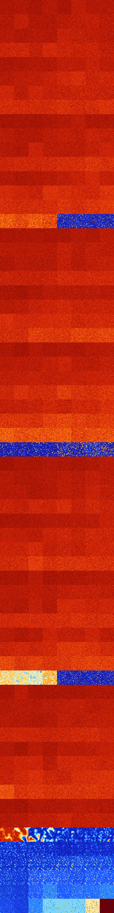

# B023678 (236032-236543)

<details>
    <summary>Initial Grid</summary>
    
</details>


<details>
    <summary>Initial Grid RLE</summary>

```
#C Exported from GoGoL (https://github.com/marrow16/gogol)
#C Wrap mode: Toroidal
#C Boundary mode: Dead
#C Step: 0
x = 100, y = 100, rule = B023678/S
51bo$8bo3bo24b2o15bo37b2o$2bo2bo33b2o10bo18bo12bo6bo3bo$26b2o17bo$9bo
51bo12bo$10bo37bo24bo$20bo54bo$9bo2bo10bo6bo7bo$37bo23bo$32bo14bo13bo
31bo$33bo50bo6bo$44bo4bo35bo11bo$45bo45bo$3bo11bo8bo28bo10bo2bo$24bo5bo
3bo10bo25bo4bo$38bo17bo$30bo10bo$52bo13bo6bo4bo15bo$53bo18bo$6b2o38bo
49bo$6bo23bo57bo$19bo36b2o18bo$7bo33bo3bo18bo10bo$10bo13bo28bo20bo19bo$
100b$6bo22bo15bo10bo3bo16bo$8bo3bo46bo18bo9bo3bobo$15bo6bo33bobo22bo$2b
o27bo28bobo5b2o$18bo5bo15bo3bo8bo5bo10bo8bo$9bo6bo3bo15bo14bo25bo21bo$
12bo36bo$5bo10bo61bo14bo$22bo13bo4bo18bo14b2o7bo12bo$33bo33bo14b2obo13b
o$o17bobo21bo14bo8b2o16bo$37bo14bo$4bobo3bo41bo11bo15bo$o7bo18bo41bo15b
o$20bo6bo52bobo$26bo15bo20bo$8bo41bo27bo7bo$19bo10bo5bo6bo4bo2bo9bo8bo
21bo$9bo33bo2bo19bo11bo$3bo2b2o69bo$34bo7bo18bo$4bo78bo5bo$26bo24bo16bo
11bo$11bo3bo52bo8bo6bo$14bobo24bo$9bo27bo36bo18bobo$42bo11bo2bo4bo13bo$
49bobo5bo$12bo28bo9bo7bo15b2o$18bo$bo74bo12bo$11bo13bo2bo67b2o$2bo4bo
26bo21bo8bo5bo13bo9bo$26bo16bobo16bo2bo13bo3bo$32bo15bo11bo4bo12bo$bo8b
o11bo3bo32bobo11bo$5bo14bo9bo3bo16b2o$11bo$6bo6bo6bo37bobo5bo26bobo$45b
o39bo$2bo12bo7bo17bo4bo3bo13bo4bo6bo10bo10bo$18bo9bo12bo9bo15bo25bo$19b
2o52bo$8b2o18bo22bo24bo$2b2o43bo51bo$8bobo40bo24bo7bo12bo$4bo20bo$2b2o
16bo69bo$7bo$5bo11bo24bo2bo$35bo14bo14bo$11bo16bo44bo$3bo2bo3bo61bo17bo
$68bo17bo$34bo$23bobo17bo9bo17bobo$100b$10bo15bo33bo8bo$13bo4bo14bo62bo
$13bo6bo16bo6bo16bo19bo4bobo2bobo$5bo61bo27bo$2bo20bo2bo10bo27bo28bo$9b
o17bo12bo4bo3bo12b2o7bo23b2o$bobo24bo34bo25bo$39bo7b2o23bo22bo$31bo7b2o
20bobo4bo4bo25bo$90bo$33bo5bo12bo42bo$2bo5bo46bo4bo30bo$bo6bo15bo18b2o
24bo8bo16bo$18bobo10bo9b3o27b2o25bo$6bo28bo17bo$2bo24bo14bo12bo3bo4bo7b
o25bo$12bo12bo25bo10bo6b2o11bo5bo$bo2bo23bo2bo57b2o!
```
</details>
<details>
    <summary>Thumbnail</summary>

</details>
<table>
<tr>
    <td><a href="./236032%20S%20Heat%20Map%20Activity.png"></a><br>S (236032)<br>G>1000</td>    <td><a href="./236033%20S0%20Heat%20Map%20Activity.png"></a><br>S0 (236033)<br>G>1000</td>    <td><a href="./236034%20S1%20Heat%20Map%20Activity.png"></a><br>S1 (236034)<br>G>1000</td>    <td><a href="./236035%20S01%20Heat%20Map%20Activity.png"></a><br>S01 (236035)<br>G>1000</td>    <td><a href="./236036%20S2%20Heat%20Map%20Activity.png"></a><br>S2 (236036)<br>G>1000</td>    <td><a href="./236037%20S02%20Heat%20Map%20Activity.png"></a><br>S02 (236037)<br>G>1000</td>    <td><a href="./236038%20S12%20Heat%20Map%20Activity.png"></a><br>S12 (236038)<br>G>1000</td>    <td><a href="./236039%20S012%20Heat%20Map%20Activity.png"></a><br>S012 (236039)<br>G>1000</td></tr>
<tr>
    <td><a href="./236040%20S3%20Heat%20Map%20Activity.png"></a><br>S3 (236040)<br>G>1000</td>    <td><a href="./236041%20S03%20Heat%20Map%20Activity.png"></a><br>S03 (236041)<br>G>1000</td>    <td><a href="./236042%20S13%20Heat%20Map%20Activity.png"></a><br>S13 (236042)<br>G>1000</td>    <td><a href="./236043%20S013%20Heat%20Map%20Activity.png"></a><br>S013 (236043)<br>G>1000</td>    <td><a href="./236044%20S23%20Heat%20Map%20Activity.png"></a><br>S23 (236044)<br>G>1000</td>    <td><a href="./236045%20S023%20Heat%20Map%20Activity.png"></a><br>S023 (236045)<br>G>1000</td>    <td><a href="./236046%20S123%20Heat%20Map%20Activity.png"></a><br>S123 (236046)<br>G>1000</td>    <td><a href="./236047%20S0123%20Heat%20Map%20Activity.png"></a><br>S0123 (236047)<br>G>1000</td></tr>
<tr>
    <td><a href="./236048%20S4%20Heat%20Map%20Activity.png"></a><br>S4 (236048)<br>G>1000</td>    <td><a href="./236049%20S04%20Heat%20Map%20Activity.png"></a><br>S04 (236049)<br>G>1000</td>    <td><a href="./236050%20S14%20Heat%20Map%20Activity.png"></a><br>S14 (236050)<br>G>1000</td>    <td><a href="./236051%20S014%20Heat%20Map%20Activity.png"></a><br>S014 (236051)<br>G>1000</td>    <td><a href="./236052%20S24%20Heat%20Map%20Activity.png"></a><br>S24 (236052)<br>G>1000</td>    <td><a href="./236053%20S024%20Heat%20Map%20Activity.png"></a><br>S024 (236053)<br>G>1000</td>    <td><a href="./236054%20S124%20Heat%20Map%20Activity.png"></a><br>S124 (236054)<br>G>1000</td>    <td><a href="./236055%20S0124%20Heat%20Map%20Activity.png"></a><br>S0124 (236055)<br>G>1000</td></tr>
<tr>
    <td><a href="./236056%20S34%20Heat%20Map%20Activity.png"></a><br>S34 (236056)<br>G>1000</td>    <td><a href="./236057%20S034%20Heat%20Map%20Activity.png"></a><br>S034 (236057)<br>G>1000</td>    <td><a href="./236058%20S134%20Heat%20Map%20Activity.png"></a><br>S134 (236058)<br>G>1000</td>    <td><a href="./236059%20S0134%20Heat%20Map%20Activity.png"></a><br>S0134 (236059)<br>G>1000</td>    <td><a href="./236060%20S234%20Heat%20Map%20Activity.png"></a><br>S234 (236060)<br>G>1000</td>    <td><a href="./236061%20S0234%20Heat%20Map%20Activity.png"></a><br>S0234 (236061)<br>G>1000</td>    <td><a href="./236062%20S1234%20Heat%20Map%20Activity.png"></a><br>S1234 (236062)<br>G>1000</td>    <td><a href="./236063%20S01234%20Heat%20Map%20Activity.png"></a><br>S01234 (236063)<br>G>1000</td></tr>
<tr>
    <td><a href="./236064%20S5%20Heat%20Map%20Activity.png"></a><br>S5 (236064)<br>G>1000</td>    <td><a href="./236065%20S05%20Heat%20Map%20Activity.png"></a><br>S05 (236065)<br>G>1000</td>    <td><a href="./236066%20S15%20Heat%20Map%20Activity.png"></a><br>S15 (236066)<br>G>1000</td>    <td><a href="./236067%20S015%20Heat%20Map%20Activity.png"></a><br>S015 (236067)<br>G>1000</td>    <td><a href="./236068%20S25%20Heat%20Map%20Activity.png"></a><br>S25 (236068)<br>G>1000</td>    <td><a href="./236069%20S025%20Heat%20Map%20Activity.png"></a><br>S025 (236069)<br>G>1000</td>    <td><a href="./236070%20S125%20Heat%20Map%20Activity.png"></a><br>S125 (236070)<br>G>1000</td>    <td><a href="./236071%20S0125%20Heat%20Map%20Activity.png"></a><br>S0125 (236071)<br>G>1000</td></tr>
<tr>
    <td><a href="./236072%20S35%20Heat%20Map%20Activity.png"></a><br>S35 (236072)<br>G>1000</td>    <td><a href="./236073%20S035%20Heat%20Map%20Activity.png"></a><br>S035 (236073)<br>G>1000</td>    <td><a href="./236074%20S135%20Heat%20Map%20Activity.png"></a><br>S135 (236074)<br>G>1000</td>    <td><a href="./236075%20S0135%20Heat%20Map%20Activity.png"></a><br>S0135 (236075)<br>G>1000</td>    <td><a href="./236076%20S235%20Heat%20Map%20Activity.png"></a><br>S235 (236076)<br>G>1000</td>    <td><a href="./236077%20S0235%20Heat%20Map%20Activity.png"></a><br>S0235 (236077)<br>G>1000</td>    <td><a href="./236078%20S1235%20Heat%20Map%20Activity.png"></a><br>S1235 (236078)<br>G>1000</td>    <td><a href="./236079%20S01235%20Heat%20Map%20Activity.png"></a><br>S01235 (236079)<br>G>1000</td></tr>
<tr>
    <td><a href="./236080%20S45%20Heat%20Map%20Activity.png"></a><br>S45 (236080)<br>G>1000</td>    <td><a href="./236081%20S045%20Heat%20Map%20Activity.png"></a><br>S045 (236081)<br>G>1000</td>    <td><a href="./236082%20S145%20Heat%20Map%20Activity.png"></a><br>S145 (236082)<br>G>1000</td>    <td><a href="./236083%20S0145%20Heat%20Map%20Activity.png"></a><br>S0145 (236083)<br>G>1000</td>    <td><a href="./236084%20S245%20Heat%20Map%20Activity.png"></a><br>S245 (236084)<br>G>1000</td>    <td><a href="./236085%20S0245%20Heat%20Map%20Activity.png"></a><br>S0245 (236085)<br>G>1000</td>    <td><a href="./236086%20S1245%20Heat%20Map%20Activity.png"></a><br>S1245 (236086)<br>G>1000</td>    <td><a href="./236087%20S01245%20Heat%20Map%20Activity.png"></a><br>S01245 (236087)<br>G>1000</td></tr>
<tr>
    <td><a href="./236088%20S345%20Heat%20Map%20Activity.png"></a><br>S345 (236088)<br>G>1000</td>    <td><a href="./236089%20S0345%20Heat%20Map%20Activity.png"></a><br>S0345 (236089)<br>G>1000</td>    <td><a href="./236090%20S1345%20Heat%20Map%20Activity.png"></a><br>S1345 (236090)<br>G>1000</td>    <td><a href="./236091%20S01345%20Heat%20Map%20Activity.png"></a><br>S01345 (236091)<br>G>1000</td>    <td><a href="./236092%20S2345%20Heat%20Map%20Activity.png"></a><br>S2345 (236092)<br>G>1000</td>    <td><a href="./236093%20S02345%20Heat%20Map%20Activity.png"></a><br>S02345 (236093)<br>G>1000</td>    <td><a href="./236094%20S12345%20Heat%20Map%20Activity.png"></a><br>S12345 (236094)<br>G>1000</td>    <td><a href="./236095%20S012345%20Heat%20Map%20Activity.png"></a><br>S012345 (236095)<br>G>1000</td></tr>
<tr>
    <td><a href="./236096%20S6%20Heat%20Map%20Activity.png"></a><br>S6 (236096)<br>G>1000</td>    <td><a href="./236097%20S06%20Heat%20Map%20Activity.png"></a><br>S06 (236097)<br>G>1000</td>    <td><a href="./236098%20S16%20Heat%20Map%20Activity.png"></a><br>S16 (236098)<br>G>1000</td>    <td><a href="./236099%20S016%20Heat%20Map%20Activity.png"></a><br>S016 (236099)<br>G>1000</td>    <td><a href="./236100%20S26%20Heat%20Map%20Activity.png"></a><br>S26 (236100)<br>G>1000</td>    <td><a href="./236101%20S026%20Heat%20Map%20Activity.png"></a><br>S026 (236101)<br>G>1000</td>    <td><a href="./236102%20S126%20Heat%20Map%20Activity.png"></a><br>S126 (236102)<br>G>1000</td>    <td><a href="./236103%20S0126%20Heat%20Map%20Activity.png"></a><br>S0126 (236103)<br>G>1000</td></tr>
<tr>
    <td><a href="./236104%20S36%20Heat%20Map%20Activity.png"></a><br>S36 (236104)<br>G>1000</td>    <td><a href="./236105%20S036%20Heat%20Map%20Activity.png"></a><br>S036 (236105)<br>G>1000</td>    <td><a href="./236106%20S136%20Heat%20Map%20Activity.png"></a><br>S136 (236106)<br>G>1000</td>    <td><a href="./236107%20S0136%20Heat%20Map%20Activity.png"></a><br>S0136 (236107)<br>G>1000</td>    <td><a href="./236108%20S236%20Heat%20Map%20Activity.png"></a><br>S236 (236108)<br>G>1000</td>    <td><a href="./236109%20S0236%20Heat%20Map%20Activity.png"></a><br>S0236 (236109)<br>G>1000</td>    <td><a href="./236110%20S1236%20Heat%20Map%20Activity.png"></a><br>S1236 (236110)<br>G>1000</td>    <td><a href="./236111%20S01236%20Heat%20Map%20Activity.png"></a><br>S01236 (236111)<br>G>1000</td></tr>
<tr>
    <td><a href="./236112%20S46%20Heat%20Map%20Activity.png"></a><br>S46 (236112)<br>G>1000</td>    <td><a href="./236113%20S046%20Heat%20Map%20Activity.png"></a><br>S046 (236113)<br>G>1000</td>    <td><a href="./236114%20S146%20Heat%20Map%20Activity.png"></a><br>S146 (236114)<br>G>1000</td>    <td><a href="./236115%20S0146%20Heat%20Map%20Activity.png"></a><br>S0146 (236115)<br>G>1000</td>    <td><a href="./236116%20S246%20Heat%20Map%20Activity.png"></a><br>S246 (236116)<br>G>1000</td>    <td><a href="./236117%20S0246%20Heat%20Map%20Activity.png"></a><br>S0246 (236117)<br>G>1000</td>    <td><a href="./236118%20S1246%20Heat%20Map%20Activity.png"></a><br>S1246 (236118)<br>G>1000</td>    <td><a href="./236119%20S01246%20Heat%20Map%20Activity.png"></a><br>S01246 (236119)<br>G>1000</td></tr>
<tr>
    <td><a href="./236120%20S346%20Heat%20Map%20Activity.png"></a><br>S346 (236120)<br>G>1000</td>    <td><a href="./236121%20S0346%20Heat%20Map%20Activity.png"></a><br>S0346 (236121)<br>G>1000</td>    <td><a href="./236122%20S1346%20Heat%20Map%20Activity.png"></a><br>S1346 (236122)<br>G>1000</td>    <td><a href="./236123%20S01346%20Heat%20Map%20Activity.png"></a><br>S01346 (236123)<br>G>1000</td>    <td><a href="./236124%20S2346%20Heat%20Map%20Activity.png"></a><br>S2346 (236124)<br>G>1000</td>    <td><a href="./236125%20S02346%20Heat%20Map%20Activity.png"></a><br>S02346 (236125)<br>G>1000</td>    <td><a href="./236126%20S12346%20Heat%20Map%20Activity.png"></a><br>S12346 (236126)<br>G>1000</td>    <td><a href="./236127%20S012346%20Heat%20Map%20Activity.png"></a><br>S012346 (236127)<br>G>1000</td></tr>
<tr>
    <td><a href="./236128%20S56%20Heat%20Map%20Activity.png"></a><br>S56 (236128)<br>G>1000</td>    <td><a href="./236129%20S056%20Heat%20Map%20Activity.png"></a><br>S056 (236129)<br>G>1000</td>    <td><a href="./236130%20S156%20Heat%20Map%20Activity.png"></a><br>S156 (236130)<br>G>1000</td>    <td><a href="./236131%20S0156%20Heat%20Map%20Activity.png"></a><br>S0156 (236131)<br>G>1000</td>    <td><a href="./236132%20S256%20Heat%20Map%20Activity.png"></a><br>S256 (236132)<br>G>1000</td>    <td><a href="./236133%20S0256%20Heat%20Map%20Activity.png"></a><br>S0256 (236133)<br>G>1000</td>    <td><a href="./236134%20S1256%20Heat%20Map%20Activity.png"></a><br>S1256 (236134)<br>G>1000</td>    <td><a href="./236135%20S01256%20Heat%20Map%20Activity.png"></a><br>S01256 (236135)<br>G>1000</td></tr>
<tr>
    <td><a href="./236136%20S356%20Heat%20Map%20Activity.png"></a><br>S356 (236136)<br>G>1000</td>    <td><a href="./236137%20S0356%20Heat%20Map%20Activity.png"></a><br>S0356 (236137)<br>G>1000</td>    <td><a href="./236138%20S1356%20Heat%20Map%20Activity.png"></a><br>S1356 (236138)<br>G>1000</td>    <td><a href="./236139%20S01356%20Heat%20Map%20Activity.png"></a><br>S01356 (236139)<br>G>1000</td>    <td><a href="./236140%20S2356%20Heat%20Map%20Activity.png"></a><br>S2356 (236140)<br>G>1000</td>    <td><a href="./236141%20S02356%20Heat%20Map%20Activity.png"></a><br>S02356 (236141)<br>G>1000</td>    <td><a href="./236142%20S12356%20Heat%20Map%20Activity.png"></a><br>S12356 (236142)<br>G>1000</td>    <td><a href="./236143%20S012356%20Heat%20Map%20Activity.png"></a><br>S012356 (236143)<br>G>1000</td></tr>
<tr>
    <td><a href="./236144%20S456%20Heat%20Map%20Activity.png"></a><br>S456 (236144)<br>G>1000</td>    <td><a href="./236145%20S0456%20Heat%20Map%20Activity.png"></a><br>S0456 (236145)<br>G>1000</td>    <td><a href="./236146%20S1456%20Heat%20Map%20Activity.png"></a><br>S1456 (236146)<br>G>1000</td>    <td><a href="./236147%20S01456%20Heat%20Map%20Activity.png"></a><br>S01456 (236147)<br>G>1000</td>    <td><a href="./236148%20S2456%20Heat%20Map%20Activity.png"></a><br>S2456 (236148)<br>G>1000</td>    <td><a href="./236149%20S02456%20Heat%20Map%20Activity.png"></a><br>S02456 (236149)<br>G>1000</td>    <td><a href="./236150%20S12456%20Heat%20Map%20Activity.png"></a><br>S12456 (236150)<br>G>1000</td>    <td><a href="./236151%20S012456%20Heat%20Map%20Activity.png"></a><br>S012456 (236151)<br>G>1000</td></tr>
<tr>
    <td><a href="./236152%20S3456%20Heat%20Map%20Activity.png"></a><br>S3456 (236152)<br>G>1000</td>    <td><a href="./236153%20S03456%20Heat%20Map%20Activity.png"></a><br>S03456 (236153)<br>G>1000</td>    <td><a href="./236154%20S13456%20Heat%20Map%20Activity.png"></a><br>S13456 (236154)<br>G>1000</td>    <td><a href="./236155%20S013456%20Heat%20Map%20Activity.png"></a><br>S013456 (236155)<br>G>1000</td>    <td><a href="./236156%20S23456%20Heat%20Map%20Activity.png"></a><br>S23456 (236156)<br>G>1000</td>    <td><a href="./236157%20S023456%20Heat%20Map%20Activity.png"></a><br>S023456 (236157)<br>G>1000</td>    <td><a href="./236158%20S123456%20Heat%20Map%20Activity.png"></a><br>S123456 (236158)<br>G>1000</td>    <td><a href="./236159%20S0123456%20Heat%20Map%20Activity.png"></a><br>S0123456 (236159)<br>G>1000</td></tr>
<tr>
    <td><a href="./236160%20S7%20Heat%20Map%20Activity.png"></a><br>S7 (236160)<br>G>1000</td>    <td><a href="./236161%20S07%20Heat%20Map%20Activity.png"></a><br>S07 (236161)<br>G>1000</td>    <td><a href="./236162%20S17%20Heat%20Map%20Activity.png"></a><br>S17 (236162)<br>G>1000</td>    <td><a href="./236163%20S017%20Heat%20Map%20Activity.png"></a><br>S017 (236163)<br>G>1000</td>    <td><a href="./236164%20S27%20Heat%20Map%20Activity.png"></a><br>S27 (236164)<br>G>1000</td>    <td><a href="./236165%20S027%20Heat%20Map%20Activity.png"></a><br>S027 (236165)<br>G>1000</td>    <td><a href="./236166%20S127%20Heat%20Map%20Activity.png"></a><br>S127 (236166)<br>G>1000</td>    <td><a href="./236167%20S0127%20Heat%20Map%20Activity.png"></a><br>S0127 (236167)<br>G>1000</td></tr>
<tr>
    <td><a href="./236168%20S37%20Heat%20Map%20Activity.png"></a><br>S37 (236168)<br>G>1000</td>    <td><a href="./236169%20S037%20Heat%20Map%20Activity.png"></a><br>S037 (236169)<br>G>1000</td>    <td><a href="./236170%20S137%20Heat%20Map%20Activity.png"></a><br>S137 (236170)<br>G>1000</td>    <td><a href="./236171%20S0137%20Heat%20Map%20Activity.png"></a><br>S0137 (236171)<br>G>1000</td>    <td><a href="./236172%20S237%20Heat%20Map%20Activity.png"></a><br>S237 (236172)<br>G>1000</td>    <td><a href="./236173%20S0237%20Heat%20Map%20Activity.png"></a><br>S0237 (236173)<br>G>1000</td>    <td><a href="./236174%20S1237%20Heat%20Map%20Activity.png"></a><br>S1237 (236174)<br>G>1000</td>    <td><a href="./236175%20S01237%20Heat%20Map%20Activity.png"></a><br>S01237 (236175)<br>G>1000</td></tr>
<tr>
    <td><a href="./236176%20S47%20Heat%20Map%20Activity.png"></a><br>S47 (236176)<br>G>1000</td>    <td><a href="./236177%20S047%20Heat%20Map%20Activity.png"></a><br>S047 (236177)<br>G>1000</td>    <td><a href="./236178%20S147%20Heat%20Map%20Activity.png"></a><br>S147 (236178)<br>G>1000</td>    <td><a href="./236179%20S0147%20Heat%20Map%20Activity.png"></a><br>S0147 (236179)<br>G>1000</td>    <td><a href="./236180%20S247%20Heat%20Map%20Activity.png"></a><br>S247 (236180)<br>G>1000</td>    <td><a href="./236181%20S0247%20Heat%20Map%20Activity.png"></a><br>S0247 (236181)<br>G>1000</td>    <td><a href="./236182%20S1247%20Heat%20Map%20Activity.png"></a><br>S1247 (236182)<br>G>1000</td>    <td><a href="./236183%20S01247%20Heat%20Map%20Activity.png"></a><br>S01247 (236183)<br>G>1000</td></tr>
<tr>
    <td><a href="./236184%20S347%20Heat%20Map%20Activity.png"></a><br>S347 (236184)<br>G>1000</td>    <td><a href="./236185%20S0347%20Heat%20Map%20Activity.png"></a><br>S0347 (236185)<br>G>1000</td>    <td><a href="./236186%20S1347%20Heat%20Map%20Activity.png"></a><br>S1347 (236186)<br>G>1000</td>    <td><a href="./236187%20S01347%20Heat%20Map%20Activity.png"></a><br>S01347 (236187)<br>G>1000</td>    <td><a href="./236188%20S2347%20Heat%20Map%20Activity.png"></a><br>S2347 (236188)<br>G>1000</td>    <td><a href="./236189%20S02347%20Heat%20Map%20Activity.png"></a><br>S02347 (236189)<br>G>1000</td>    <td><a href="./236190%20S12347%20Heat%20Map%20Activity.png"></a><br>S12347 (236190)<br>G>1000</td>    <td><a href="./236191%20S012347%20Heat%20Map%20Activity.png"></a><br>S012347 (236191)<br>G>1000</td></tr>
<tr>
    <td><a href="./236192%20S57%20Heat%20Map%20Activity.png"></a><br>S57 (236192)<br>G>1000</td>    <td><a href="./236193%20S057%20Heat%20Map%20Activity.png"></a><br>S057 (236193)<br>G>1000</td>    <td><a href="./236194%20S157%20Heat%20Map%20Activity.png"></a><br>S157 (236194)<br>G>1000</td>    <td><a href="./236195%20S0157%20Heat%20Map%20Activity.png"></a><br>S0157 (236195)<br>G>1000</td>    <td><a href="./236196%20S257%20Heat%20Map%20Activity.png"></a><br>S257 (236196)<br>G>1000</td>    <td><a href="./236197%20S0257%20Heat%20Map%20Activity.png"></a><br>S0257 (236197)<br>G>1000</td>    <td><a href="./236198%20S1257%20Heat%20Map%20Activity.png"></a><br>S1257 (236198)<br>G>1000</td>    <td><a href="./236199%20S01257%20Heat%20Map%20Activity.png"></a><br>S01257 (236199)<br>G>1000</td></tr>
<tr>
    <td><a href="./236200%20S357%20Heat%20Map%20Activity.png"></a><br>S357 (236200)<br>G>1000</td>    <td><a href="./236201%20S0357%20Heat%20Map%20Activity.png"></a><br>S0357 (236201)<br>G>1000</td>    <td><a href="./236202%20S1357%20Heat%20Map%20Activity.png"></a><br>S1357 (236202)<br>G>1000</td>    <td><a href="./236203%20S01357%20Heat%20Map%20Activity.png"></a><br>S01357 (236203)<br>G>1000</td>    <td><a href="./236204%20S2357%20Heat%20Map%20Activity.png"></a><br>S2357 (236204)<br>G>1000</td>    <td><a href="./236205%20S02357%20Heat%20Map%20Activity.png"></a><br>S02357 (236205)<br>G>1000</td>    <td><a href="./236206%20S12357%20Heat%20Map%20Activity.png"></a><br>S12357 (236206)<br>G>1000</td>    <td><a href="./236207%20S012357%20Heat%20Map%20Activity.png"></a><br>S012357 (236207)<br>G>1000</td></tr>
<tr>
    <td><a href="./236208%20S457%20Heat%20Map%20Activity.png"></a><br>S457 (236208)<br>G>1000</td>    <td><a href="./236209%20S0457%20Heat%20Map%20Activity.png"></a><br>S0457 (236209)<br>G>1000</td>    <td><a href="./236210%20S1457%20Heat%20Map%20Activity.png"></a><br>S1457 (236210)<br>G>1000</td>    <td><a href="./236211%20S01457%20Heat%20Map%20Activity.png"></a><br>S01457 (236211)<br>G>1000</td>    <td><a href="./236212%20S2457%20Heat%20Map%20Activity.png"></a><br>S2457 (236212)<br>G>1000</td>    <td><a href="./236213%20S02457%20Heat%20Map%20Activity.png"></a><br>S02457 (236213)<br>G>1000</td>    <td><a href="./236214%20S12457%20Heat%20Map%20Activity.png"></a><br>S12457 (236214)<br>G>1000</td>    <td><a href="./236215%20S012457%20Heat%20Map%20Activity.png"></a><br>S012457 (236215)<br>G>1000</td></tr>
<tr>
    <td><a href="./236216%20S3457%20Heat%20Map%20Activity.png"></a><br>S3457 (236216)<br>G>1000</td>    <td><a href="./236217%20S03457%20Heat%20Map%20Activity.png"></a><br>S03457 (236217)<br>G>1000</td>    <td><a href="./236218%20S13457%20Heat%20Map%20Activity.png"></a><br>S13457 (236218)<br>G>1000</td>    <td><a href="./236219%20S013457%20Heat%20Map%20Activity.png"></a><br>S013457 (236219)<br>G>1000</td>    <td><a href="./236220%20S23457%20Heat%20Map%20Activity.png"></a><br>S23457 (236220)<br>G>1000</td>    <td><a href="./236221%20S023457%20Heat%20Map%20Activity.png"></a><br>S023457 (236221)<br>G>1000</td>    <td><a href="./236222%20S123457%20Heat%20Map%20Activity.png"></a><br>S123457 (236222)<br>G>1000</td>    <td><a href="./236223%20S0123457%20Heat%20Map%20Activity.png"></a><br>S0123457 (236223)<br>G>1000</td></tr>
<tr>
    <td><a href="./236224%20S67%20Heat%20Map%20Activity.png"></a><br>S67 (236224)<br>G>1000</td>    <td><a href="./236225%20S067%20Heat%20Map%20Activity.png"></a><br>S067 (236225)<br>G>1000</td>    <td><a href="./236226%20S167%20Heat%20Map%20Activity.png"></a><br>S167 (236226)<br>G>1000</td>    <td><a href="./236227%20S0167%20Heat%20Map%20Activity.png"></a><br>S0167 (236227)<br>G>1000</td>    <td><a href="./236228%20S267%20Heat%20Map%20Activity.png"></a><br>S267 (236228)<br>G>1000</td>    <td><a href="./236229%20S0267%20Heat%20Map%20Activity.png"></a><br>S0267 (236229)<br>G>1000</td>    <td><a href="./236230%20S1267%20Heat%20Map%20Activity.png"></a><br>S1267 (236230)<br>G>1000</td>    <td><a href="./236231%20S01267%20Heat%20Map%20Activity.png"></a><br>S01267 (236231)<br>G>1000</td></tr>
<tr>
    <td><a href="./236232%20S367%20Heat%20Map%20Activity.png"></a><br>S367 (236232)<br>G>1000</td>    <td><a href="./236233%20S0367%20Heat%20Map%20Activity.png"></a><br>S0367 (236233)<br>G>1000</td>    <td><a href="./236234%20S1367%20Heat%20Map%20Activity.png"></a><br>S1367 (236234)<br>G>1000</td>    <td><a href="./236235%20S01367%20Heat%20Map%20Activity.png"></a><br>S01367 (236235)<br>G>1000</td>    <td><a href="./236236%20S2367%20Heat%20Map%20Activity.png"></a><br>S2367 (236236)<br>G>1000</td>    <td><a href="./236237%20S02367%20Heat%20Map%20Activity.png"></a><br>S02367 (236237)<br>G>1000</td>    <td><a href="./236238%20S12367%20Heat%20Map%20Activity.png"></a><br>S12367 (236238)<br>G>1000</td>    <td><a href="./236239%20S012367%20Heat%20Map%20Activity.png"></a><br>S012367 (236239)<br>G>1000</td></tr>
<tr>
    <td><a href="./236240%20S467%20Heat%20Map%20Activity.png"></a><br>S467 (236240)<br>G>1000</td>    <td><a href="./236241%20S0467%20Heat%20Map%20Activity.png"></a><br>S0467 (236241)<br>G>1000</td>    <td><a href="./236242%20S1467%20Heat%20Map%20Activity.png"></a><br>S1467 (236242)<br>G>1000</td>    <td><a href="./236243%20S01467%20Heat%20Map%20Activity.png"></a><br>S01467 (236243)<br>G>1000</td>    <td><a href="./236244%20S2467%20Heat%20Map%20Activity.png"></a><br>S2467 (236244)<br>G>1000</td>    <td><a href="./236245%20S02467%20Heat%20Map%20Activity.png"></a><br>S02467 (236245)<br>G>1000</td>    <td><a href="./236246%20S12467%20Heat%20Map%20Activity.png"></a><br>S12467 (236246)<br>G>1000</td>    <td><a href="./236247%20S012467%20Heat%20Map%20Activity.png"></a><br>S012467 (236247)<br>G>1000</td></tr>
<tr>
    <td><a href="./236248%20S3467%20Heat%20Map%20Activity.png"></a><br>S3467 (236248)<br>G>1000</td>    <td><a href="./236249%20S03467%20Heat%20Map%20Activity.png"></a><br>S03467 (236249)<br>G>1000</td>    <td><a href="./236250%20S13467%20Heat%20Map%20Activity.png"></a><br>S13467 (236250)<br>G>1000</td>    <td><a href="./236251%20S013467%20Heat%20Map%20Activity.png"></a><br>S013467 (236251)<br>G>1000</td>    <td><a href="./236252%20S23467%20Heat%20Map%20Activity.png"></a><br>S23467 (236252)<br>G>1000</td>    <td><a href="./236253%20S023467%20Heat%20Map%20Activity.png"></a><br>S023467 (236253)<br>G>1000</td>    <td><a href="./236254%20S123467%20Heat%20Map%20Activity.png"></a><br>S123467 (236254)<br>G>1000</td>    <td><a href="./236255%20S0123467%20Heat%20Map%20Activity.png"></a><br>S0123467 (236255)<br>G>1000</td></tr>
<tr>
    <td><a href="./236256%20S567%20Heat%20Map%20Activity.png"></a><br>S567 (236256)<br>G>1000</td>    <td><a href="./236257%20S0567%20Heat%20Map%20Activity.png"></a><br>S0567 (236257)<br>G>1000</td>    <td><a href="./236258%20S1567%20Heat%20Map%20Activity.png"></a><br>S1567 (236258)<br>G>1000</td>    <td><a href="./236259%20S01567%20Heat%20Map%20Activity.png"></a><br>S01567 (236259)<br>G>1000</td>    <td><a href="./236260%20S2567%20Heat%20Map%20Activity.png"></a><br>S2567 (236260)<br>G>1000</td>    <td><a href="./236261%20S02567%20Heat%20Map%20Activity.png"></a><br>S02567 (236261)<br>G>1000</td>    <td><a href="./236262%20S12567%20Heat%20Map%20Activity.png"></a><br>S12567 (236262)<br>G>1000</td>    <td><a href="./236263%20S012567%20Heat%20Map%20Activity.png"></a><br>S012567 (236263)<br>G>1000</td></tr>
<tr>
    <td><a href="./236264%20S3567%20Heat%20Map%20Activity.png"></a><br>S3567 (236264)<br>G>1000</td>    <td><a href="./236265%20S03567%20Heat%20Map%20Activity.png"></a><br>S03567 (236265)<br>G>1000</td>    <td><a href="./236266%20S13567%20Heat%20Map%20Activity.png"></a><br>S13567 (236266)<br>G>1000</td>    <td><a href="./236267%20S013567%20Heat%20Map%20Activity.png"></a><br>S013567 (236267)<br>G>1000</td>    <td><a href="./236268%20S23567%20Heat%20Map%20Activity.png"></a><br>S23567 (236268)<br>G>1000</td>    <td><a href="./236269%20S023567%20Heat%20Map%20Activity.png"></a><br>S023567 (236269)<br>G>1000</td>    <td><a href="./236270%20S123567%20Heat%20Map%20Activity.png"></a><br>S123567 (236270)<br>G>1000</td>    <td><a href="./236271%20S0123567%20Heat%20Map%20Activity.png"></a><br>S0123567 (236271)<br>G>1000</td></tr>
<tr>
    <td><a href="./236272%20S4567%20Heat%20Map%20Activity.png"></a><br>S4567 (236272)<br>G>1000</td>    <td><a href="./236273%20S04567%20Heat%20Map%20Activity.png"></a><br>S04567 (236273)<br>G>1000</td>    <td><a href="./236274%20S14567%20Heat%20Map%20Activity.png"></a><br>S14567 (236274)<br>G>1000</td>    <td><a href="./236275%20S014567%20Heat%20Map%20Activity.png"></a><br>S014567 (236275)<br>G>1000</td>    <td><a href="./236276%20S24567%20Heat%20Map%20Activity.png"></a><br>S24567 (236276)<br>G>1000</td>    <td><a href="./236277%20S024567%20Heat%20Map%20Activity.png"></a><br>S024567 (236277)<br>G>1000</td>    <td><a href="./236278%20S124567%20Heat%20Map%20Activity.png"></a><br>S124567 (236278)<br>G>1000</td>    <td><a href="./236279%20S0124567%20Heat%20Map%20Activity.png"></a><br>S0124567 (236279)<br>G>1000</td></tr>
<tr>
    <td><a href="./236280%20S34567%20Heat%20Map%20Activity.png"></a><br>S34567 (236280)<br>G>1000</td>    <td><a href="./236281%20S034567%20Heat%20Map%20Activity.png"></a><br>S034567 (236281)<br>G>1000</td>    <td><a href="./236282%20S134567%20Heat%20Map%20Activity.png"></a><br>S134567 (236282)<br>G>1000</td>    <td><a href="./236283%20S0134567%20Heat%20Map%20Activity.png"></a><br>S0134567 (236283)<br>G>1000</td>    <td><a href="./236284%20S234567%20Heat%20Map%20Activity.png"></a><br>S234567 (236284)<br>R@697,p504</td>    <td><a href="./236285%20S0234567%20Heat%20Map%20Activity.png"></a><br>S0234567 (236285)<br>G>1000</td>    <td><a href="./236286%20S1234567%20Heat%20Map%20Activity.png"></a><br>S1234567 (236286)<br>R@371,p180</td>    <td><a href="./236287%20S01234567%20Heat%20Map%20Activity.png"></a><br>S01234567 (236287)<br>G>1000</td></tr>
<tr>
    <td><a href="./236288%20S8%20Heat%20Map%20Activity.png"></a><br>S8 (236288)<br>G>1000</td>    <td><a href="./236289%20S08%20Heat%20Map%20Activity.png"></a><br>S08 (236289)<br>G>1000</td>    <td><a href="./236290%20S18%20Heat%20Map%20Activity.png"></a><br>S18 (236290)<br>G>1000</td>    <td><a href="./236291%20S018%20Heat%20Map%20Activity.png"></a><br>S018 (236291)<br>G>1000</td>    <td><a href="./236292%20S28%20Heat%20Map%20Activity.png"></a><br>S28 (236292)<br>G>1000</td>    <td><a href="./236293%20S028%20Heat%20Map%20Activity.png"></a><br>S028 (236293)<br>G>1000</td>    <td><a href="./236294%20S128%20Heat%20Map%20Activity.png"></a><br>S128 (236294)<br>G>1000</td>    <td><a href="./236295%20S0128%20Heat%20Map%20Activity.png"></a><br>S0128 (236295)<br>G>1000</td></tr>
<tr>
    <td><a href="./236296%20S38%20Heat%20Map%20Activity.png"></a><br>S38 (236296)<br>G>1000</td>    <td><a href="./236297%20S038%20Heat%20Map%20Activity.png"></a><br>S038 (236297)<br>G>1000</td>    <td><a href="./236298%20S138%20Heat%20Map%20Activity.png"></a><br>S138 (236298)<br>G>1000</td>    <td><a href="./236299%20S0138%20Heat%20Map%20Activity.png"></a><br>S0138 (236299)<br>G>1000</td>    <td><a href="./236300%20S238%20Heat%20Map%20Activity.png"></a><br>S238 (236300)<br>G>1000</td>    <td><a href="./236301%20S0238%20Heat%20Map%20Activity.png"></a><br>S0238 (236301)<br>G>1000</td>    <td><a href="./236302%20S1238%20Heat%20Map%20Activity.png"></a><br>S1238 (236302)<br>G>1000</td>    <td><a href="./236303%20S01238%20Heat%20Map%20Activity.png"></a><br>S01238 (236303)<br>G>1000</td></tr>
<tr>
    <td><a href="./236304%20S48%20Heat%20Map%20Activity.png"></a><br>S48 (236304)<br>G>1000</td>    <td><a href="./236305%20S048%20Heat%20Map%20Activity.png"></a><br>S048 (236305)<br>G>1000</td>    <td><a href="./236306%20S148%20Heat%20Map%20Activity.png"></a><br>S148 (236306)<br>G>1000</td>    <td><a href="./236307%20S0148%20Heat%20Map%20Activity.png"></a><br>S0148 (236307)<br>G>1000</td>    <td><a href="./236308%20S248%20Heat%20Map%20Activity.png"></a><br>S248 (236308)<br>G>1000</td>    <td><a href="./236309%20S0248%20Heat%20Map%20Activity.png"></a><br>S0248 (236309)<br>G>1000</td>    <td><a href="./236310%20S1248%20Heat%20Map%20Activity.png"></a><br>S1248 (236310)<br>G>1000</td>    <td><a href="./236311%20S01248%20Heat%20Map%20Activity.png"></a><br>S01248 (236311)<br>G>1000</td></tr>
<tr>
    <td><a href="./236312%20S348%20Heat%20Map%20Activity.png"></a><br>S348 (236312)<br>G>1000</td>    <td><a href="./236313%20S0348%20Heat%20Map%20Activity.png"></a><br>S0348 (236313)<br>G>1000</td>    <td><a href="./236314%20S1348%20Heat%20Map%20Activity.png"></a><br>S1348 (236314)<br>G>1000</td>    <td><a href="./236315%20S01348%20Heat%20Map%20Activity.png"></a><br>S01348 (236315)<br>G>1000</td>    <td><a href="./236316%20S2348%20Heat%20Map%20Activity.png"></a><br>S2348 (236316)<br>G>1000</td>    <td><a href="./236317%20S02348%20Heat%20Map%20Activity.png"></a><br>S02348 (236317)<br>G>1000</td>    <td><a href="./236318%20S12348%20Heat%20Map%20Activity.png"></a><br>S12348 (236318)<br>G>1000</td>    <td><a href="./236319%20S012348%20Heat%20Map%20Activity.png"></a><br>S012348 (236319)<br>G>1000</td></tr>
<tr>
    <td><a href="./236320%20S58%20Heat%20Map%20Activity.png"></a><br>S58 (236320)<br>G>1000</td>    <td><a href="./236321%20S058%20Heat%20Map%20Activity.png"></a><br>S058 (236321)<br>G>1000</td>    <td><a href="./236322%20S158%20Heat%20Map%20Activity.png"></a><br>S158 (236322)<br>G>1000</td>    <td><a href="./236323%20S0158%20Heat%20Map%20Activity.png"></a><br>S0158 (236323)<br>G>1000</td>    <td><a href="./236324%20S258%20Heat%20Map%20Activity.png"></a><br>S258 (236324)<br>G>1000</td>    <td><a href="./236325%20S0258%20Heat%20Map%20Activity.png"></a><br>S0258 (236325)<br>G>1000</td>    <td><a href="./236326%20S1258%20Heat%20Map%20Activity.png"></a><br>S1258 (236326)<br>G>1000</td>    <td><a href="./236327%20S01258%20Heat%20Map%20Activity.png"></a><br>S01258 (236327)<br>G>1000</td></tr>
<tr>
    <td><a href="./236328%20S358%20Heat%20Map%20Activity.png"></a><br>S358 (236328)<br>G>1000</td>    <td><a href="./236329%20S0358%20Heat%20Map%20Activity.png"></a><br>S0358 (236329)<br>G>1000</td>    <td><a href="./236330%20S1358%20Heat%20Map%20Activity.png"></a><br>S1358 (236330)<br>G>1000</td>    <td><a href="./236331%20S01358%20Heat%20Map%20Activity.png"></a><br>S01358 (236331)<br>G>1000</td>    <td><a href="./236332%20S2358%20Heat%20Map%20Activity.png"></a><br>S2358 (236332)<br>G>1000</td>    <td><a href="./236333%20S02358%20Heat%20Map%20Activity.png"></a><br>S02358 (236333)<br>G>1000</td>    <td><a href="./236334%20S12358%20Heat%20Map%20Activity.png"></a><br>S12358 (236334)<br>G>1000</td>    <td><a href="./236335%20S012358%20Heat%20Map%20Activity.png"></a><br>S012358 (236335)<br>G>1000</td></tr>
<tr>
    <td><a href="./236336%20S458%20Heat%20Map%20Activity.png"></a><br>S458 (236336)<br>G>1000</td>    <td><a href="./236337%20S0458%20Heat%20Map%20Activity.png"></a><br>S0458 (236337)<br>G>1000</td>    <td><a href="./236338%20S1458%20Heat%20Map%20Activity.png"></a><br>S1458 (236338)<br>G>1000</td>    <td><a href="./236339%20S01458%20Heat%20Map%20Activity.png"></a><br>S01458 (236339)<br>G>1000</td>    <td><a href="./236340%20S2458%20Heat%20Map%20Activity.png"></a><br>S2458 (236340)<br>G>1000</td>    <td><a href="./236341%20S02458%20Heat%20Map%20Activity.png"></a><br>S02458 (236341)<br>G>1000</td>    <td><a href="./236342%20S12458%20Heat%20Map%20Activity.png"></a><br>S12458 (236342)<br>G>1000</td>    <td><a href="./236343%20S012458%20Heat%20Map%20Activity.png"></a><br>S012458 (236343)<br>G>1000</td></tr>
<tr>
    <td><a href="./236344%20S3458%20Heat%20Map%20Activity.png"></a><br>S3458 (236344)<br>G>1000</td>    <td><a href="./236345%20S03458%20Heat%20Map%20Activity.png"></a><br>S03458 (236345)<br>G>1000</td>    <td><a href="./236346%20S13458%20Heat%20Map%20Activity.png"></a><br>S13458 (236346)<br>G>1000</td>    <td><a href="./236347%20S013458%20Heat%20Map%20Activity.png"></a><br>S013458 (236347)<br>G>1000</td>    <td><a href="./236348%20S23458%20Heat%20Map%20Activity.png"></a><br>S23458 (236348)<br>G>1000</td>    <td><a href="./236349%20S023458%20Heat%20Map%20Activity.png"></a><br>S023458 (236349)<br>G>1000</td>    <td><a href="./236350%20S123458%20Heat%20Map%20Activity.png"></a><br>S123458 (236350)<br>G>1000</td>    <td><a href="./236351%20S0123458%20Heat%20Map%20Activity.png"></a><br>S0123458 (236351)<br>G>1000</td></tr>
<tr>
    <td><a href="./236352%20S68%20Heat%20Map%20Activity.png"></a><br>S68 (236352)<br>G>1000</td>    <td><a href="./236353%20S068%20Heat%20Map%20Activity.png"></a><br>S068 (236353)<br>G>1000</td>    <td><a href="./236354%20S168%20Heat%20Map%20Activity.png"></a><br>S168 (236354)<br>G>1000</td>    <td><a href="./236355%20S0168%20Heat%20Map%20Activity.png"></a><br>S0168 (236355)<br>G>1000</td>    <td><a href="./236356%20S268%20Heat%20Map%20Activity.png"></a><br>S268 (236356)<br>G>1000</td>    <td><a href="./236357%20S0268%20Heat%20Map%20Activity.png"></a><br>S0268 (236357)<br>G>1000</td>    <td><a href="./236358%20S1268%20Heat%20Map%20Activity.png"></a><br>S1268 (236358)<br>G>1000</td>    <td><a href="./236359%20S01268%20Heat%20Map%20Activity.png"></a><br>S01268 (236359)<br>G>1000</td></tr>
<tr>
    <td><a href="./236360%20S368%20Heat%20Map%20Activity.png"></a><br>S368 (236360)<br>G>1000</td>    <td><a href="./236361%20S0368%20Heat%20Map%20Activity.png"></a><br>S0368 (236361)<br>G>1000</td>    <td><a href="./236362%20S1368%20Heat%20Map%20Activity.png"></a><br>S1368 (236362)<br>G>1000</td>    <td><a href="./236363%20S01368%20Heat%20Map%20Activity.png"></a><br>S01368 (236363)<br>G>1000</td>    <td><a href="./236364%20S2368%20Heat%20Map%20Activity.png"></a><br>S2368 (236364)<br>G>1000</td>    <td><a href="./236365%20S02368%20Heat%20Map%20Activity.png"></a><br>S02368 (236365)<br>G>1000</td>    <td><a href="./236366%20S12368%20Heat%20Map%20Activity.png"></a><br>S12368 (236366)<br>G>1000</td>    <td><a href="./236367%20S012368%20Heat%20Map%20Activity.png"></a><br>S012368 (236367)<br>G>1000</td></tr>
<tr>
    <td><a href="./236368%20S468%20Heat%20Map%20Activity.png"></a><br>S468 (236368)<br>G>1000</td>    <td><a href="./236369%20S0468%20Heat%20Map%20Activity.png"></a><br>S0468 (236369)<br>G>1000</td>    <td><a href="./236370%20S1468%20Heat%20Map%20Activity.png"></a><br>S1468 (236370)<br>G>1000</td>    <td><a href="./236371%20S01468%20Heat%20Map%20Activity.png"></a><br>S01468 (236371)<br>G>1000</td>    <td><a href="./236372%20S2468%20Heat%20Map%20Activity.png"></a><br>S2468 (236372)<br>G>1000</td>    <td><a href="./236373%20S02468%20Heat%20Map%20Activity.png"></a><br>S02468 (236373)<br>G>1000</td>    <td><a href="./236374%20S12468%20Heat%20Map%20Activity.png"></a><br>S12468 (236374)<br>G>1000</td>    <td><a href="./236375%20S012468%20Heat%20Map%20Activity.png"></a><br>S012468 (236375)<br>G>1000</td></tr>
<tr>
    <td><a href="./236376%20S3468%20Heat%20Map%20Activity.png"></a><br>S3468 (236376)<br>G>1000</td>    <td><a href="./236377%20S03468%20Heat%20Map%20Activity.png"></a><br>S03468 (236377)<br>G>1000</td>    <td><a href="./236378%20S13468%20Heat%20Map%20Activity.png"></a><br>S13468 (236378)<br>G>1000</td>    <td><a href="./236379%20S013468%20Heat%20Map%20Activity.png"></a><br>S013468 (236379)<br>G>1000</td>    <td><a href="./236380%20S23468%20Heat%20Map%20Activity.png"></a><br>S23468 (236380)<br>G>1000</td>    <td><a href="./236381%20S023468%20Heat%20Map%20Activity.png"></a><br>S023468 (236381)<br>G>1000</td>    <td><a href="./236382%20S123468%20Heat%20Map%20Activity.png"></a><br>S123468 (236382)<br>G>1000</td>    <td><a href="./236383%20S0123468%20Heat%20Map%20Activity.png"></a><br>S0123468 (236383)<br>G>1000</td></tr>
<tr>
    <td><a href="./236384%20S568%20Heat%20Map%20Activity.png"></a><br>S568 (236384)<br>G>1000</td>    <td><a href="./236385%20S0568%20Heat%20Map%20Activity.png"></a><br>S0568 (236385)<br>G>1000</td>    <td><a href="./236386%20S1568%20Heat%20Map%20Activity.png"></a><br>S1568 (236386)<br>G>1000</td>    <td><a href="./236387%20S01568%20Heat%20Map%20Activity.png"></a><br>S01568 (236387)<br>G>1000</td>    <td><a href="./236388%20S2568%20Heat%20Map%20Activity.png"></a><br>S2568 (236388)<br>G>1000</td>    <td><a href="./236389%20S02568%20Heat%20Map%20Activity.png"></a><br>S02568 (236389)<br>G>1000</td>    <td><a href="./236390%20S12568%20Heat%20Map%20Activity.png"></a><br>S12568 (236390)<br>G>1000</td>    <td><a href="./236391%20S012568%20Heat%20Map%20Activity.png"></a><br>S012568 (236391)<br>G>1000</td></tr>
<tr>
    <td><a href="./236392%20S3568%20Heat%20Map%20Activity.png"></a><br>S3568 (236392)<br>G>1000</td>    <td><a href="./236393%20S03568%20Heat%20Map%20Activity.png"></a><br>S03568 (236393)<br>G>1000</td>    <td><a href="./236394%20S13568%20Heat%20Map%20Activity.png"></a><br>S13568 (236394)<br>G>1000</td>    <td><a href="./236395%20S013568%20Heat%20Map%20Activity.png"></a><br>S013568 (236395)<br>G>1000</td>    <td><a href="./236396%20S23568%20Heat%20Map%20Activity.png"></a><br>S23568 (236396)<br>G>1000</td>    <td><a href="./236397%20S023568%20Heat%20Map%20Activity.png"></a><br>S023568 (236397)<br>G>1000</td>    <td><a href="./236398%20S123568%20Heat%20Map%20Activity.png"></a><br>S123568 (236398)<br>G>1000</td>    <td><a href="./236399%20S0123568%20Heat%20Map%20Activity.png"></a><br>S0123568 (236399)<br>G>1000</td></tr>
<tr>
    <td><a href="./236400%20S4568%20Heat%20Map%20Activity.png"></a><br>S4568 (236400)<br>G>1000</td>    <td><a href="./236401%20S04568%20Heat%20Map%20Activity.png"></a><br>S04568 (236401)<br>G>1000</td>    <td><a href="./236402%20S14568%20Heat%20Map%20Activity.png"></a><br>S14568 (236402)<br>G>1000</td>    <td><a href="./236403%20S014568%20Heat%20Map%20Activity.png"></a><br>S014568 (236403)<br>G>1000</td>    <td><a href="./236404%20S24568%20Heat%20Map%20Activity.png"></a><br>S24568 (236404)<br>G>1000</td>    <td><a href="./236405%20S024568%20Heat%20Map%20Activity.png"></a><br>S024568 (236405)<br>G>1000</td>    <td><a href="./236406%20S124568%20Heat%20Map%20Activity.png"></a><br>S124568 (236406)<br>G>1000</td>    <td><a href="./236407%20S0124568%20Heat%20Map%20Activity.png"></a><br>S0124568 (236407)<br>G>1000</td></tr>
<tr>
    <td><a href="./236408%20S34568%20Heat%20Map%20Activity.png"></a><br>S34568 (236408)<br>G>1000</td>    <td><a href="./236409%20S034568%20Heat%20Map%20Activity.png"></a><br>S034568 (236409)<br>G>1000</td>    <td><a href="./236410%20S134568%20Heat%20Map%20Activity.png"></a><br>S134568 (236410)<br>G>1000</td>    <td><a href="./236411%20S0134568%20Heat%20Map%20Activity.png"></a><br>S0134568 (236411)<br>G>1000</td>    <td><a href="./236412%20S234568%20Heat%20Map%20Activity.png"></a><br>S234568 (236412)<br>G>1000</td>    <td><a href="./236413%20S0234568%20Heat%20Map%20Activity.png"></a><br>S0234568 (236413)<br>G>1000</td>    <td><a href="./236414%20S1234568%20Heat%20Map%20Activity.png"></a><br>S1234568 (236414)<br>G>1000</td>    <td><a href="./236415%20S01234568%20Heat%20Map%20Activity.png"></a><br>S01234568 (236415)<br>G>1000</td></tr>
<tr>
    <td><a href="./236416%20S78%20Heat%20Map%20Activity.png"></a><br>S78 (236416)<br>G>1000</td>    <td><a href="./236417%20S078%20Heat%20Map%20Activity.png"></a><br>S078 (236417)<br>G>1000</td>    <td><a href="./236418%20S178%20Heat%20Map%20Activity.png"></a><br>S178 (236418)<br>G>1000</td>    <td><a href="./236419%20S0178%20Heat%20Map%20Activity.png"></a><br>S0178 (236419)<br>G>1000</td>    <td><a href="./236420%20S278%20Heat%20Map%20Activity.png"></a><br>S278 (236420)<br>G>1000</td>    <td><a href="./236421%20S0278%20Heat%20Map%20Activity.png"></a><br>S0278 (236421)<br>G>1000</td>    <td><a href="./236422%20S1278%20Heat%20Map%20Activity.png"></a><br>S1278 (236422)<br>G>1000</td>    <td><a href="./236423%20S01278%20Heat%20Map%20Activity.png"></a><br>S01278 (236423)<br>G>1000</td></tr>
<tr>
    <td><a href="./236424%20S378%20Heat%20Map%20Activity.png"></a><br>S378 (236424)<br>G>1000</td>    <td><a href="./236425%20S0378%20Heat%20Map%20Activity.png"></a><br>S0378 (236425)<br>G>1000</td>    <td><a href="./236426%20S1378%20Heat%20Map%20Activity.png"></a><br>S1378 (236426)<br>G>1000</td>    <td><a href="./236427%20S01378%20Heat%20Map%20Activity.png"></a><br>S01378 (236427)<br>G>1000</td>    <td><a href="./236428%20S2378%20Heat%20Map%20Activity.png"></a><br>S2378 (236428)<br>G>1000</td>    <td><a href="./236429%20S02378%20Heat%20Map%20Activity.png"></a><br>S02378 (236429)<br>G>1000</td>    <td><a href="./236430%20S12378%20Heat%20Map%20Activity.png"></a><br>S12378 (236430)<br>G>1000</td>    <td><a href="./236431%20S012378%20Heat%20Map%20Activity.png"></a><br>S012378 (236431)<br>G>1000</td></tr>
<tr>
    <td><a href="./236432%20S478%20Heat%20Map%20Activity.png"></a><br>S478 (236432)<br>G>1000</td>    <td><a href="./236433%20S0478%20Heat%20Map%20Activity.png"></a><br>S0478 (236433)<br>G>1000</td>    <td><a href="./236434%20S1478%20Heat%20Map%20Activity.png"></a><br>S1478 (236434)<br>G>1000</td>    <td><a href="./236435%20S01478%20Heat%20Map%20Activity.png"></a><br>S01478 (236435)<br>G>1000</td>    <td><a href="./236436%20S2478%20Heat%20Map%20Activity.png"></a><br>S2478 (236436)<br>G>1000</td>    <td><a href="./236437%20S02478%20Heat%20Map%20Activity.png"></a><br>S02478 (236437)<br>G>1000</td>    <td><a href="./236438%20S12478%20Heat%20Map%20Activity.png"></a><br>S12478 (236438)<br>G>1000</td>    <td><a href="./236439%20S012478%20Heat%20Map%20Activity.png"></a><br>S012478 (236439)<br>G>1000</td></tr>
<tr>
    <td><a href="./236440%20S3478%20Heat%20Map%20Activity.png"></a><br>S3478 (236440)<br>G>1000</td>    <td><a href="./236441%20S03478%20Heat%20Map%20Activity.png"></a><br>S03478 (236441)<br>G>1000</td>    <td><a href="./236442%20S13478%20Heat%20Map%20Activity.png"></a><br>S13478 (236442)<br>G>1000</td>    <td><a href="./236443%20S013478%20Heat%20Map%20Activity.png"></a><br>S013478 (236443)<br>G>1000</td>    <td><a href="./236444%20S23478%20Heat%20Map%20Activity.png"></a><br>S23478 (236444)<br>G>1000</td>    <td><a href="./236445%20S023478%20Heat%20Map%20Activity.png"></a><br>S023478 (236445)<br>G>1000</td>    <td><a href="./236446%20S123478%20Heat%20Map%20Activity.png"></a><br>S123478 (236446)<br>G>1000</td>    <td><a href="./236447%20S0123478%20Heat%20Map%20Activity.png"></a><br>S0123478 (236447)<br>G>1000</td></tr>
<tr>
    <td><a href="./236448%20S578%20Heat%20Map%20Activity.png"></a><br>S578 (236448)<br>G>1000</td>    <td><a href="./236449%20S0578%20Heat%20Map%20Activity.png"></a><br>S0578 (236449)<br>G>1000</td>    <td><a href="./236450%20S1578%20Heat%20Map%20Activity.png"></a><br>S1578 (236450)<br>G>1000</td>    <td><a href="./236451%20S01578%20Heat%20Map%20Activity.png"></a><br>S01578 (236451)<br>G>1000</td>    <td><a href="./236452%20S2578%20Heat%20Map%20Activity.png"></a><br>S2578 (236452)<br>G>1000</td>    <td><a href="./236453%20S02578%20Heat%20Map%20Activity.png"></a><br>S02578 (236453)<br>G>1000</td>    <td><a href="./236454%20S12578%20Heat%20Map%20Activity.png"></a><br>S12578 (236454)<br>G>1000</td>    <td><a href="./236455%20S012578%20Heat%20Map%20Activity.png"></a><br>S012578 (236455)<br>G>1000</td></tr>
<tr>
    <td><a href="./236456%20S3578%20Heat%20Map%20Activity.png"></a><br>S3578 (236456)<br>G>1000</td>    <td><a href="./236457%20S03578%20Heat%20Map%20Activity.png"></a><br>S03578 (236457)<br>G>1000</td>    <td><a href="./236458%20S13578%20Heat%20Map%20Activity.png"></a><br>S13578 (236458)<br>G>1000</td>    <td><a href="./236459%20S013578%20Heat%20Map%20Activity.png"></a><br>S013578 (236459)<br>G>1000</td>    <td><a href="./236460%20S23578%20Heat%20Map%20Activity.png"></a><br>S23578 (236460)<br>G>1000</td>    <td><a href="./236461%20S023578%20Heat%20Map%20Activity.png"></a><br>S023578 (236461)<br>G>1000</td>    <td><a href="./236462%20S123578%20Heat%20Map%20Activity.png"></a><br>S123578 (236462)<br>G>1000</td>    <td><a href="./236463%20S0123578%20Heat%20Map%20Activity.png"></a><br>S0123578 (236463)<br>G>1000</td></tr>
<tr>
    <td><a href="./236464%20S4578%20Heat%20Map%20Activity.png"></a><br>S4578 (236464)<br>G>1000</td>    <td><a href="./236465%20S04578%20Heat%20Map%20Activity.png"></a><br>S04578 (236465)<br>G>1000</td>    <td><a href="./236466%20S14578%20Heat%20Map%20Activity.png"></a><br>S14578 (236466)<br>G>1000</td>    <td><a href="./236467%20S014578%20Heat%20Map%20Activity.png"></a><br>S014578 (236467)<br>G>1000</td>    <td><a href="./236468%20S24578%20Heat%20Map%20Activity.png"></a><br>S24578 (236468)<br>G>1000</td>    <td><a href="./236469%20S024578%20Heat%20Map%20Activity.png"></a><br>S024578 (236469)<br>G>1000</td>    <td><a href="./236470%20S124578%20Heat%20Map%20Activity.png"></a><br>S124578 (236470)<br>G>1000</td>    <td><a href="./236471%20S0124578%20Heat%20Map%20Activity.png"></a><br>S0124578 (236471)<br>G>1000</td></tr>
<tr>
    <td><a href="./236472%20S34578%20Heat%20Map%20Activity.png"></a><br>S34578 (236472)<br>G>1000</td>    <td><a href="./236473%20S034578%20Heat%20Map%20Activity.png"></a><br>S034578 (236473)<br>G>1000</td>    <td><a href="./236474%20S134578%20Heat%20Map%20Activity.png"></a><br>S134578 (236474)<br>G>1000</td>    <td><a href="./236475%20S0134578%20Heat%20Map%20Activity.png"></a><br>S0134578 (236475)<br>G>1000</td>    <td><a href="./236476%20S234578%20Heat%20Map%20Activity.png"></a><br>S234578 (236476)<br>G>1000</td>    <td><a href="./236477%20S0234578%20Heat%20Map%20Activity.png"></a><br>S0234578 (236477)<br>G>1000</td>    <td><a href="./236478%20S1234578%20Heat%20Map%20Activity.png"></a><br>S1234578 (236478)<br>G>1000</td>    <td><a href="./236479%20S01234578%20Heat%20Map%20Activity.png"></a><br>S01234578 (236479)<br>G>1000</td></tr>
<tr>
    <td><a href="./236480%20S678%20Heat%20Map%20Activity.png"></a><br>S678 (236480)<br>G>1000</td>    <td><a href="./236481%20S0678%20Heat%20Map%20Activity.png"></a><br>S0678 (236481)<br>G>1000</td>    <td><a href="./236482%20S1678%20Heat%20Map%20Activity.png"></a><br>S1678 (236482)<br>G>1000</td>    <td><a href="./236483%20S01678%20Heat%20Map%20Activity.png"></a><br>S01678 (236483)<br>G>1000</td>    <td><a href="./236484%20S2678%20Heat%20Map%20Activity.png"></a><br>S2678 (236484)<br>G>1000</td>    <td><a href="./236485%20S02678%20Heat%20Map%20Activity.png"></a><br>S02678 (236485)<br>G>1000</td>    <td><a href="./236486%20S12678%20Heat%20Map%20Activity.png"></a><br>S12678 (236486)<br>G>1000</td>    <td><a href="./236487%20S012678%20Heat%20Map%20Activity.png"></a><br>S012678 (236487)<br>G>1000</td></tr>
<tr>
    <td><a href="./236488%20S3678%20Heat%20Map%20Activity.png"></a><br>S3678 (236488)<br>G>1000</td>    <td><a href="./236489%20S03678%20Heat%20Map%20Activity.png"></a><br>S03678 (236489)<br>G>1000</td>    <td><a href="./236490%20S13678%20Heat%20Map%20Activity.png"></a><br>S13678 (236490)<br>G>1000</td>    <td><a href="./236491%20S013678%20Heat%20Map%20Activity.png"></a><br>S013678 (236491)<br>G>1000</td>    <td><a href="./236492%20S23678%20Heat%20Map%20Activity.png"></a><br>S23678 (236492)<br>G>1000</td>    <td><a href="./236493%20S023678%20Heat%20Map%20Activity.png"></a><br>S023678 (236493)<br>G>1000</td>    <td><a href="./236494%20S123678%20Heat%20Map%20Activity.png"></a><br>S123678 (236494)<br>G>1000</td>    <td><a href="./236495%20S0123678%20Heat%20Map%20Activity.png"></a><br>S0123678 (236495)<br>G>1000</td></tr>
<tr>
    <td><a href="./236496%20S4678%20Heat%20Map%20Activity.png"></a><br>S4678 (236496)<br>G>1000</td>    <td><a href="./236497%20S04678%20Heat%20Map%20Activity.png"></a><br>S04678 (236497)<br>G>1000</td>    <td><a href="./236498%20S14678%20Heat%20Map%20Activity.png"></a><br>S14678 (236498)<br>R@859,p16</td>    <td><a href="./236499%20S014678%20Heat%20Map%20Activity.png"></a><br>S014678 (236499)<br>R@326,p16</td>    <td><a href="./236500%20S24678%20Heat%20Map%20Activity.png"></a><br>S24678 (236500)<br>R@149,p16</td>    <td><a href="./236501%20S024678%20Heat%20Map%20Activity.png"></a><br>S024678 (236501)<br>R@155,p16</td>    <td><a href="./236502%20S124678%20Heat%20Map%20Activity.png"></a><br>S124678 (236502)<br>R@123,p16</td>    <td><a href="./236503%20S0124678%20Heat%20Map%20Activity.png"></a><br>S0124678 (236503)<br>R@138,p16</td></tr>
<tr>
    <td><a href="./236504%20S34678%20Heat%20Map%20Activity.png"></a><br>S34678 (236504)<br>R@53,p16</td>    <td><a href="./236505%20S034678%20Heat%20Map%20Activity.png"></a><br>S034678 (236505)<br>R@50,p16</td>    <td><a href="./236506%20S134678%20Heat%20Map%20Activity.png"></a><br>S134678 (236506)<br>R@53,p16</td>    <td><a href="./236507%20S0134678%20Heat%20Map%20Activity.png"></a><br>S0134678 (236507)<br>R@52,p16</td>    <td><a href="./236508%20S234678%20Heat%20Map%20Activity.png"></a><br>S234678 (236508)<br>R@105,p48</td>    <td><a href="./236509%20S0234678%20Heat%20Map%20Activity.png"></a><br>S0234678 (236509)<br>R@60,p16</td>    <td><a href="./236510%20S1234678%20Heat%20Map%20Activity.png"></a><br>S1234678 (236510)<br>R@48,p16</td>    <td><a href="./236511%20S01234678%20Heat%20Map%20Activity.png"></a><br>S01234678 (236511)<br>R@56,p16</td></tr>
<tr>
    <td><a href="./236512%20S5678%20Heat%20Map%20Activity.png"></a><br>S5678 (236512)<br>R@30,p6</td>    <td><a href="./236513%20S05678%20Heat%20Map%20Activity.png"></a><br>S05678 (236513)<br>R@26,p2</td>    <td><a href="./236514%20S15678%20Heat%20Map%20Activity.png"></a><br>S15678 (236514)<br>S@19</td>    <td><a href="./236515%20S015678%20Heat%20Map%20Activity.png"></a><br>S015678 (236515)<br>S@17</td>    <td><a href="./236516%20S25678%20Heat%20Map%20Activity.png"></a><br>S25678 (236516)<br>S@16</td>    <td><a href="./236517%20S025678%20Heat%20Map%20Activity.png"></a><br>S025678 (236517)<br>S@14</td>    <td><a href="./236518%20S125678%20Heat%20Map%20Activity.png"></a><br>S125678 (236518)<br>S@17</td>    <td><a href="./236519%20S0125678%20Heat%20Map%20Activity.png"></a><br>S0125678 (236519)<br>S@13</td></tr>
<tr>
    <td><a href="./236520%20S35678%20Heat%20Map%20Activity.png"></a><br>S35678 (236520)<br>R@16,p2</td>    <td><a href="./236521%20S035678%20Heat%20Map%20Activity.png"></a><br>S035678 (236521)<br>R@17,p2</td>    <td><a href="./236522%20S135678%20Heat%20Map%20Activity.png"></a><br>S135678 (236522)<br>S@13</td>    <td><a href="./236523%20S0135678%20Heat%20Map%20Activity.png"></a><br>S0135678 (236523)<br>S@13</td>    <td><a href="./236524%20S235678%20Heat%20Map%20Activity.png"></a><br>S235678 (236524)<br>S@12</td>    <td><a href="./236525%20S0235678%20Heat%20Map%20Activity.png"></a><br>S0235678 (236525)<br>S@13</td>    <td><a href="./236526%20S1235678%20Heat%20Map%20Activity.png"></a><br>S1235678 (236526)<br>S@11</td>    <td><a href="./236527%20S01235678%20Heat%20Map%20Activity.png"></a><br>S01235678 (236527)<br>S@12</td></tr>
<tr>
    <td><a href="./236528%20S45678%20Heat%20Map%20Activity.png"></a><br>S45678 (236528)<br>R@14,p2</td>    <td><a href="./236529%20S045678%20Heat%20Map%20Activity.png"></a><br>S045678 (236529)<br>R@16,p2</td>    <td><a href="./236530%20S145678%20Heat%20Map%20Activity.png"></a><br>S145678 (236530)<br>S@8</td>    <td><a href="./236531%20S0145678%20Heat%20Map%20Activity.png"></a><br>S0145678 (236531)<br>S@9</td>    <td><a href="./236532%20S245678%20Heat%20Map%20Activity.png"></a><br>S245678 (236532)<br>S@9</td>    <td><a href="./236533%20S0245678%20Heat%20Map%20Activity.png"></a><br>S0245678 (236533)<br>S@10</td>    <td><a href="./236534%20S1245678%20Heat%20Map%20Activity.png"></a><br>S1245678 (236534)<br>S@7</td>    <td><a href="./236535%20S01245678%20Heat%20Map%20Activity.png"></a><br>S01245678 (236535)<br>S@10</td></tr>
<tr>
    <td><a href="./236536%20S345678%20Heat%20Map%20Activity.png"></a><br>S345678 (236536)<br>R@11,p2</td>    <td><a href="./236537%20S0345678%20Heat%20Map%20Activity.png"></a><br>S0345678 (236537)<br>R@13,p2</td>    <td><a href="./236538%20S1345678%20Heat%20Map%20Activity.png"></a><br>S1345678 (236538)<br>S@7</td>    <td><a href="./236539%20S01345678%20Heat%20Map%20Activity.png"></a><br>S01345678 (236539)<br>S@7</td>    <td><a href="./236540%20S2345678%20Heat%20Map%20Activity.png"></a><br>S2345678 (236540)<br>S@6</td>    <td><a href="./236541%20S02345678%20Heat%20Map%20Activity.png"></a><br>S02345678 (236541)<br>S@13</td>    <td><a href="./236542%20S12345678%20Heat%20Map%20Activity.png"></a><br>S12345678 (236542)<br>S@6</td>    <td><a href="./236543%20S012345678%20Heat%20Map%20Activity.png"></a><br>S012345678 (236543)<br>S@7</td></tr>
</table>
