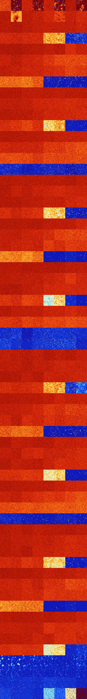

# B0237 (72192-72703)

<details>
    <summary>Initial Grid</summary>
    
</details>


<details>
    <summary>Initial Grid RLE</summary>

```
#C Exported from GoGoL (https://github.com/marrow16/gogol)
#C Wrap mode: Toroidal
#C Boundary mode: Dead
#C Step: 0
x = 100, y = 100, rule = B0237/S
9bo10bo9bo28bo12bo$8bo38bo17bo$19b2obo19bo$29bo11bo39bo4bo$15bo10bo3bo
31bo8bo7bo5bo$8bo4bo32bo10bo20bo$14bo56bo14bo7bo$5bo32bo43bo2bo$20bo52b
obo13bo$3bo27bo14bo12bo7bo30bo$12bo3bo25bo7bo$47bo32b2o17bo$2b2o7bo12bo
bo36bo30bo$16bobo32bo33bo$23bo63bo$25bo6bo6bobo19bo18bo16bo$31bo10bo41b
o$29bo9bo6bo28bo15bo$12bo9bobo8bo32bo7bo$19bo36bo16bo$21bo15bo21bo10bo
7bo10bo$18bo26bo28bo4bo$13bo8bo11bo13b2o6bo2bo24bo$29bo25b2o$5bo13b2o
36bo27bo$10bo30bo9bobo11bo24bo$15bo9bo11bo5bo11bo17bo3bo8bo11bo$3bo21bo
47bo5bo16bo$bo16bo9bo17bo22bo11bo$11bo4bo12bo30bo27bo$6bo44bo7bo21bo$5b
o52bo15bo11bo$o12bo8bo8bo43bo6bo$24bo3bo3bo15b2o10bo31bo$2o16bo33bo35bo
2bo$79bo15bo$3bo3bo6bo9bo9bo5bo41bo$4bo19b2o47bo3bob2o8bo$16bo22bo20bo
20bo3bo$2b2o5bo4bo6bo24bo33bo$21bo37bo4b2o13bo3bo$35bo3b2o13bo5bo9bo$2b
o20bo66bo$6bo5bo30bo6bo14bo9bo$33bobo24bo11bo$6bo10bobo27bo29bo$6bo3bo
18bo25bo12bo$38bobo19bo21bo14bo$12bo43bobobo18bo3bo9b2o$5bo19bo7bo26bo$
4bo22bo33bo33bo$10bo30bo4bo25bo7bo5bo10bo$2bo40bo16bo24bo11bo$32b2o28b
2o$19bo2bo13bo56bo$3bo7bo20bo17bo9bob3o$47bo11bo$6b2o45bo10bo$b2o8bo50b
2o6bo$9bo16bo10bo33bo4bo$4bo16bo4bo27bo33bo$o37bobo$15bo29bo6bo2bo17bo
12bo8bo$2bo24bo30bo$15bo12bo7bo11b2o10bo19bo3bo5bo$9b2o8bo5bo13b2o8b2o
25bo$6bo14bo31bo38bo$71bo$4bobo8bo3bo20bo2bo23bo$39bo30bo$6bo2bo$o4bo4b
o5bo13bo32bo14bo$12bo50bo8bo6bo$5bo15bo36bo3bobo33bo$23bo34bo5bo28bo$9b
o3bo19bo9bo3bo13bo8bo26bo$36bo5bo12bo8bo9bo16bo7bo$8bo44bo$3bo62bo11bo$
9b2o7bo9bo13bo20bo$7bo49b2o2bo7bo4bo4bo$50bo9bo11bo$4bo4bo11bo17bo2bo$
24bo9bobo13bo20bo4bo15bo3bo$34bo25bo19bo5bo$o6bo10bo8bo23bo6bobo18bobo$
26bo6bo39bo$19bo4bo9bo24bo35b3o$4bo2bo33bo26bo7bo15b2o$27bo3bo37bo16bo$
12bo21b2o11bo3bo4bo24bo3bo$7bo5bo41b2o5bo$4bo27bo2bo52bo$10bo46bo9bo3bo
2bo11bo$o12bo10bo5bo11bo41bo5bo5bobo$17bobo8bo6bobo8bo35bo$23bo27bo24bo
14bo$9bo14bo5bo2bo14bo8bo3bobo15bo3bo12b2obo$6bo12bo12bo$10bo4bo13bo15b
o19bo!
```
</details>
<details>
    <summary>Thumbnail</summary>

</details>
<table>
<tr>
    <td><a href="./72192%20S%20Heat%20Map%20Activity.png"></a><br>S (72192)<br>G>1000</td>    <td><a href="./72193%20S0%20Heat%20Map%20Activity.png"></a><br>S0 (72193)<br>R@80,p12</td>    <td><a href="./72194%20S1%20Heat%20Map%20Activity.png"></a><br>S1 (72194)<br>G>1000</td>    <td><a href="./72195%20S01%20Heat%20Map%20Activity.png"></a><br>S01 (72195)<br>R@118,p4</td>    <td><a href="./72196%20S2%20Heat%20Map%20Activity.png"></a><br>S2 (72196)<br>G>1000</td>    <td><a href="./72197%20S02%20Heat%20Map%20Activity.png"></a><br>S02 (72197)<br>R@146,p8</td>    <td><a href="./72198%20S12%20Heat%20Map%20Activity.png"></a><br>S12 (72198)<br>G>1000</td>    <td><a href="./72199%20S012%20Heat%20Map%20Activity.png"></a><br>S012 (72199)<br>R@320,p2</td></tr>
<tr>
    <td><a href="./72200%20S3%20Heat%20Map%20Activity.png"></a><br>S3 (72200)<br>G>1000</td>    <td><a href="./72201%20S03%20Heat%20Map%20Activity.png"></a><br>S03 (72201)<br>G>1000</td>    <td><a href="./72202%20S13%20Heat%20Map%20Activity.png"></a><br>S13 (72202)<br>G>1000</td>    <td><a href="./72203%20S013%20Heat%20Map%20Activity.png"></a><br>S013 (72203)<br>G>1000</td>    <td><a href="./72204%20S23%20Heat%20Map%20Activity.png"></a><br>S23 (72204)<br>G>1000</td>    <td><a href="./72205%20S023%20Heat%20Map%20Activity.png"></a><br>S023 (72205)<br>G>1000</td>    <td><a href="./72206%20S123%20Heat%20Map%20Activity.png"></a><br>S123 (72206)<br>G>1000</td>    <td><a href="./72207%20S0123%20Heat%20Map%20Activity.png"></a><br>S0123 (72207)<br>G>1000</td></tr>
<tr>
    <td><a href="./72208%20S4%20Heat%20Map%20Activity.png"></a><br>S4 (72208)<br>G>1000</td>    <td><a href="./72209%20S04%20Heat%20Map%20Activity.png"></a><br>S04 (72209)<br>G>1000</td>    <td><a href="./72210%20S14%20Heat%20Map%20Activity.png"></a><br>S14 (72210)<br>G>1000</td>    <td><a href="./72211%20S014%20Heat%20Map%20Activity.png"></a><br>S014 (72211)<br>G>1000</td>    <td><a href="./72212%20S24%20Heat%20Map%20Activity.png"></a><br>S24 (72212)<br>G>1000</td>    <td><a href="./72213%20S024%20Heat%20Map%20Activity.png"></a><br>S024 (72213)<br>G>1000</td>    <td><a href="./72214%20S124%20Heat%20Map%20Activity.png"></a><br>S124 (72214)<br>G>1000</td>    <td><a href="./72215%20S0124%20Heat%20Map%20Activity.png"></a><br>S0124 (72215)<br>G>1000</td></tr>
<tr>
    <td><a href="./72216%20S34%20Heat%20Map%20Activity.png"></a><br>S34 (72216)<br>G>1000</td>    <td><a href="./72217%20S034%20Heat%20Map%20Activity.png"></a><br>S034 (72217)<br>G>1000</td>    <td><a href="./72218%20S134%20Heat%20Map%20Activity.png"></a><br>S134 (72218)<br>G>1000</td>    <td><a href="./72219%20S0134%20Heat%20Map%20Activity.png"></a><br>S0134 (72219)<br>G>1000</td>    <td><a href="./72220%20S234%20Heat%20Map%20Activity.png"></a><br>S234 (72220)<br>G>1000</td>    <td><a href="./72221%20S0234%20Heat%20Map%20Activity.png"></a><br>S0234 (72221)<br>G>1000</td>    <td><a href="./72222%20S1234%20Heat%20Map%20Activity.png"></a><br>S1234 (72222)<br>G>1000</td>    <td><a href="./72223%20S01234%20Heat%20Map%20Activity.png"></a><br>S01234 (72223)<br>G>1000</td></tr>
<tr>
    <td><a href="./72224%20S5%20Heat%20Map%20Activity.png"></a><br>S5 (72224)<br>G>1000</td>    <td><a href="./72225%20S05%20Heat%20Map%20Activity.png"></a><br>S05 (72225)<br>G>1000</td>    <td><a href="./72226%20S15%20Heat%20Map%20Activity.png"></a><br>S15 (72226)<br>G>1000</td>    <td><a href="./72227%20S015%20Heat%20Map%20Activity.png"></a><br>S015 (72227)<br>G>1000</td>    <td><a href="./72228%20S25%20Heat%20Map%20Activity.png"></a><br>S25 (72228)<br>G>1000</td>    <td><a href="./72229%20S025%20Heat%20Map%20Activity.png"></a><br>S025 (72229)<br>G>1000</td>    <td><a href="./72230%20S125%20Heat%20Map%20Activity.png"></a><br>S125 (72230)<br>G>1000</td>    <td><a href="./72231%20S0125%20Heat%20Map%20Activity.png"></a><br>S0125 (72231)<br>G>1000</td></tr>
<tr>
    <td><a href="./72232%20S35%20Heat%20Map%20Activity.png"></a><br>S35 (72232)<br>G>1000</td>    <td><a href="./72233%20S035%20Heat%20Map%20Activity.png"></a><br>S035 (72233)<br>G>1000</td>    <td><a href="./72234%20S135%20Heat%20Map%20Activity.png"></a><br>S135 (72234)<br>G>1000</td>    <td><a href="./72235%20S0135%20Heat%20Map%20Activity.png"></a><br>S0135 (72235)<br>G>1000</td>    <td><a href="./72236%20S235%20Heat%20Map%20Activity.png"></a><br>S235 (72236)<br>G>1000</td>    <td><a href="./72237%20S0235%20Heat%20Map%20Activity.png"></a><br>S0235 (72237)<br>G>1000</td>    <td><a href="./72238%20S1235%20Heat%20Map%20Activity.png"></a><br>S1235 (72238)<br>G>1000</td>    <td><a href="./72239%20S01235%20Heat%20Map%20Activity.png"></a><br>S01235 (72239)<br>G>1000</td></tr>
<tr>
    <td><a href="./72240%20S45%20Heat%20Map%20Activity.png"></a><br>S45 (72240)<br>G>1000</td>    <td><a href="./72241%20S045%20Heat%20Map%20Activity.png"></a><br>S045 (72241)<br>G>1000</td>    <td><a href="./72242%20S145%20Heat%20Map%20Activity.png"></a><br>S145 (72242)<br>G>1000</td>    <td><a href="./72243%20S0145%20Heat%20Map%20Activity.png"></a><br>S0145 (72243)<br>G>1000</td>    <td><a href="./72244%20S245%20Heat%20Map%20Activity.png"></a><br>S245 (72244)<br>G>1000</td>    <td><a href="./72245%20S0245%20Heat%20Map%20Activity.png"></a><br>S0245 (72245)<br>G>1000</td>    <td><a href="./72246%20S1245%20Heat%20Map%20Activity.png"></a><br>S1245 (72246)<br>G>1000</td>    <td><a href="./72247%20S01245%20Heat%20Map%20Activity.png"></a><br>S01245 (72247)<br>G>1000</td></tr>
<tr>
    <td><a href="./72248%20S345%20Heat%20Map%20Activity.png"></a><br>S345 (72248)<br>G>1000</td>    <td><a href="./72249%20S0345%20Heat%20Map%20Activity.png"></a><br>S0345 (72249)<br>G>1000</td>    <td><a href="./72250%20S1345%20Heat%20Map%20Activity.png"></a><br>S1345 (72250)<br>G>1000</td>    <td><a href="./72251%20S01345%20Heat%20Map%20Activity.png"></a><br>S01345 (72251)<br>G>1000</td>    <td><a href="./72252%20S2345%20Heat%20Map%20Activity.png"></a><br>S2345 (72252)<br>G>1000</td>    <td><a href="./72253%20S02345%20Heat%20Map%20Activity.png"></a><br>S02345 (72253)<br>G>1000</td>    <td><a href="./72254%20S12345%20Heat%20Map%20Activity.png"></a><br>S12345 (72254)<br>G>1000</td>    <td><a href="./72255%20S012345%20Heat%20Map%20Activity.png"></a><br>S012345 (72255)<br>G>1000</td></tr>
<tr>
    <td><a href="./72256%20S6%20Heat%20Map%20Activity.png"></a><br>S6 (72256)<br>G>1000</td>    <td><a href="./72257%20S06%20Heat%20Map%20Activity.png"></a><br>S06 (72257)<br>G>1000</td>    <td><a href="./72258%20S16%20Heat%20Map%20Activity.png"></a><br>S16 (72258)<br>G>1000</td>    <td><a href="./72259%20S016%20Heat%20Map%20Activity.png"></a><br>S016 (72259)<br>G>1000</td>    <td><a href="./72260%20S26%20Heat%20Map%20Activity.png"></a><br>S26 (72260)<br>G>1000</td>    <td><a href="./72261%20S026%20Heat%20Map%20Activity.png"></a><br>S026 (72261)<br>G>1000</td>    <td><a href="./72262%20S126%20Heat%20Map%20Activity.png"></a><br>S126 (72262)<br>G>1000</td>    <td><a href="./72263%20S0126%20Heat%20Map%20Activity.png"></a><br>S0126 (72263)<br>G>1000</td></tr>
<tr>
    <td><a href="./72264%20S36%20Heat%20Map%20Activity.png"></a><br>S36 (72264)<br>G>1000</td>    <td><a href="./72265%20S036%20Heat%20Map%20Activity.png"></a><br>S036 (72265)<br>G>1000</td>    <td><a href="./72266%20S136%20Heat%20Map%20Activity.png"></a><br>S136 (72266)<br>G>1000</td>    <td><a href="./72267%20S0136%20Heat%20Map%20Activity.png"></a><br>S0136 (72267)<br>G>1000</td>    <td><a href="./72268%20S236%20Heat%20Map%20Activity.png"></a><br>S236 (72268)<br>G>1000</td>    <td><a href="./72269%20S0236%20Heat%20Map%20Activity.png"></a><br>S0236 (72269)<br>G>1000</td>    <td><a href="./72270%20S1236%20Heat%20Map%20Activity.png"></a><br>S1236 (72270)<br>G>1000</td>    <td><a href="./72271%20S01236%20Heat%20Map%20Activity.png"></a><br>S01236 (72271)<br>G>1000</td></tr>
<tr>
    <td><a href="./72272%20S46%20Heat%20Map%20Activity.png"></a><br>S46 (72272)<br>G>1000</td>    <td><a href="./72273%20S046%20Heat%20Map%20Activity.png"></a><br>S046 (72273)<br>G>1000</td>    <td><a href="./72274%20S146%20Heat%20Map%20Activity.png"></a><br>S146 (72274)<br>G>1000</td>    <td><a href="./72275%20S0146%20Heat%20Map%20Activity.png"></a><br>S0146 (72275)<br>G>1000</td>    <td><a href="./72276%20S246%20Heat%20Map%20Activity.png"></a><br>S246 (72276)<br>G>1000</td>    <td><a href="./72277%20S0246%20Heat%20Map%20Activity.png"></a><br>S0246 (72277)<br>G>1000</td>    <td><a href="./72278%20S1246%20Heat%20Map%20Activity.png"></a><br>S1246 (72278)<br>G>1000</td>    <td><a href="./72279%20S01246%20Heat%20Map%20Activity.png"></a><br>S01246 (72279)<br>G>1000</td></tr>
<tr>
    <td><a href="./72280%20S346%20Heat%20Map%20Activity.png"></a><br>S346 (72280)<br>G>1000</td>    <td><a href="./72281%20S0346%20Heat%20Map%20Activity.png"></a><br>S0346 (72281)<br>G>1000</td>    <td><a href="./72282%20S1346%20Heat%20Map%20Activity.png"></a><br>S1346 (72282)<br>G>1000</td>    <td><a href="./72283%20S01346%20Heat%20Map%20Activity.png"></a><br>S01346 (72283)<br>G>1000</td>    <td><a href="./72284%20S2346%20Heat%20Map%20Activity.png"></a><br>S2346 (72284)<br>G>1000</td>    <td><a href="./72285%20S02346%20Heat%20Map%20Activity.png"></a><br>S02346 (72285)<br>G>1000</td>    <td><a href="./72286%20S12346%20Heat%20Map%20Activity.png"></a><br>S12346 (72286)<br>R@603,p420</td>    <td><a href="./72287%20S012346%20Heat%20Map%20Activity.png"></a><br>S012346 (72287)<br>R@814,p660</td></tr>
<tr>
    <td><a href="./72288%20S56%20Heat%20Map%20Activity.png"></a><br>S56 (72288)<br>G>1000</td>    <td><a href="./72289%20S056%20Heat%20Map%20Activity.png"></a><br>S056 (72289)<br>G>1000</td>    <td><a href="./72290%20S156%20Heat%20Map%20Activity.png"></a><br>S156 (72290)<br>G>1000</td>    <td><a href="./72291%20S0156%20Heat%20Map%20Activity.png"></a><br>S0156 (72291)<br>G>1000</td>    <td><a href="./72292%20S256%20Heat%20Map%20Activity.png"></a><br>S256 (72292)<br>G>1000</td>    <td><a href="./72293%20S0256%20Heat%20Map%20Activity.png"></a><br>S0256 (72293)<br>G>1000</td>    <td><a href="./72294%20S1256%20Heat%20Map%20Activity.png"></a><br>S1256 (72294)<br>G>1000</td>    <td><a href="./72295%20S01256%20Heat%20Map%20Activity.png"></a><br>S01256 (72295)<br>G>1000</td></tr>
<tr>
    <td><a href="./72296%20S356%20Heat%20Map%20Activity.png"></a><br>S356 (72296)<br>G>1000</td>    <td><a href="./72297%20S0356%20Heat%20Map%20Activity.png"></a><br>S0356 (72297)<br>G>1000</td>    <td><a href="./72298%20S1356%20Heat%20Map%20Activity.png"></a><br>S1356 (72298)<br>G>1000</td>    <td><a href="./72299%20S01356%20Heat%20Map%20Activity.png"></a><br>S01356 (72299)<br>G>1000</td>    <td><a href="./72300%20S2356%20Heat%20Map%20Activity.png"></a><br>S2356 (72300)<br>G>1000</td>    <td><a href="./72301%20S02356%20Heat%20Map%20Activity.png"></a><br>S02356 (72301)<br>G>1000</td>    <td><a href="./72302%20S12356%20Heat%20Map%20Activity.png"></a><br>S12356 (72302)<br>G>1000</td>    <td><a href="./72303%20S012356%20Heat%20Map%20Activity.png"></a><br>S012356 (72303)<br>G>1000</td></tr>
<tr>
    <td><a href="./72304%20S456%20Heat%20Map%20Activity.png"></a><br>S456 (72304)<br>G>1000</td>    <td><a href="./72305%20S0456%20Heat%20Map%20Activity.png"></a><br>S0456 (72305)<br>G>1000</td>    <td><a href="./72306%20S1456%20Heat%20Map%20Activity.png"></a><br>S1456 (72306)<br>G>1000</td>    <td><a href="./72307%20S01456%20Heat%20Map%20Activity.png"></a><br>S01456 (72307)<br>G>1000</td>    <td><a href="./72308%20S2456%20Heat%20Map%20Activity.png"></a><br>S2456 (72308)<br>G>1000</td>    <td><a href="./72309%20S02456%20Heat%20Map%20Activity.png"></a><br>S02456 (72309)<br>G>1000</td>    <td><a href="./72310%20S12456%20Heat%20Map%20Activity.png"></a><br>S12456 (72310)<br>G>1000</td>    <td><a href="./72311%20S012456%20Heat%20Map%20Activity.png"></a><br>S012456 (72311)<br>G>1000</td></tr>
<tr>
    <td><a href="./72312%20S3456%20Heat%20Map%20Activity.png"></a><br>S3456 (72312)<br>R@222,p60</td>    <td><a href="./72313%20S03456%20Heat%20Map%20Activity.png"></a><br>S03456 (72313)<br>R@224,p60</td>    <td><a href="./72314%20S13456%20Heat%20Map%20Activity.png"></a><br>S13456 (72314)<br>G>1000</td>    <td><a href="./72315%20S013456%20Heat%20Map%20Activity.png"></a><br>S013456 (72315)<br>R@351,p120</td>    <td><a href="./72316%20S23456%20Heat%20Map%20Activity.png"></a><br>S23456 (72316)<br>R@107,p60</td>    <td><a href="./72317%20S023456%20Heat%20Map%20Activity.png"></a><br>S023456 (72317)<br>R@103,p60</td>    <td><a href="./72318%20S123456%20Heat%20Map%20Activity.png"></a><br>S123456 (72318)<br>G>1000</td>    <td><a href="./72319%20S0123456%20Heat%20Map%20Activity.png"></a><br>S0123456 (72319)<br>R@93,p60</td></tr>
<tr>
    <td><a href="./72320%20S7%20Heat%20Map%20Activity.png"></a><br>S7 (72320)<br>G>1000</td>    <td><a href="./72321%20S07%20Heat%20Map%20Activity.png"></a><br>S07 (72321)<br>G>1000</td>    <td><a href="./72322%20S17%20Heat%20Map%20Activity.png"></a><br>S17 (72322)<br>G>1000</td>    <td><a href="./72323%20S017%20Heat%20Map%20Activity.png"></a><br>S017 (72323)<br>G>1000</td>    <td><a href="./72324%20S27%20Heat%20Map%20Activity.png"></a><br>S27 (72324)<br>G>1000</td>    <td><a href="./72325%20S027%20Heat%20Map%20Activity.png"></a><br>S027 (72325)<br>G>1000</td>    <td><a href="./72326%20S127%20Heat%20Map%20Activity.png"></a><br>S127 (72326)<br>G>1000</td>    <td><a href="./72327%20S0127%20Heat%20Map%20Activity.png"></a><br>S0127 (72327)<br>G>1000</td></tr>
<tr>
    <td><a href="./72328%20S37%20Heat%20Map%20Activity.png"></a><br>S37 (72328)<br>G>1000</td>    <td><a href="./72329%20S037%20Heat%20Map%20Activity.png"></a><br>S037 (72329)<br>G>1000</td>    <td><a href="./72330%20S137%20Heat%20Map%20Activity.png"></a><br>S137 (72330)<br>G>1000</td>    <td><a href="./72331%20S0137%20Heat%20Map%20Activity.png"></a><br>S0137 (72331)<br>G>1000</td>    <td><a href="./72332%20S237%20Heat%20Map%20Activity.png"></a><br>S237 (72332)<br>G>1000</td>    <td><a href="./72333%20S0237%20Heat%20Map%20Activity.png"></a><br>S0237 (72333)<br>G>1000</td>    <td><a href="./72334%20S1237%20Heat%20Map%20Activity.png"></a><br>S1237 (72334)<br>G>1000</td>    <td><a href="./72335%20S01237%20Heat%20Map%20Activity.png"></a><br>S01237 (72335)<br>G>1000</td></tr>
<tr>
    <td><a href="./72336%20S47%20Heat%20Map%20Activity.png"></a><br>S47 (72336)<br>G>1000</td>    <td><a href="./72337%20S047%20Heat%20Map%20Activity.png"></a><br>S047 (72337)<br>G>1000</td>    <td><a href="./72338%20S147%20Heat%20Map%20Activity.png"></a><br>S147 (72338)<br>G>1000</td>    <td><a href="./72339%20S0147%20Heat%20Map%20Activity.png"></a><br>S0147 (72339)<br>G>1000</td>    <td><a href="./72340%20S247%20Heat%20Map%20Activity.png"></a><br>S247 (72340)<br>G>1000</td>    <td><a href="./72341%20S0247%20Heat%20Map%20Activity.png"></a><br>S0247 (72341)<br>G>1000</td>    <td><a href="./72342%20S1247%20Heat%20Map%20Activity.png"></a><br>S1247 (72342)<br>G>1000</td>    <td><a href="./72343%20S01247%20Heat%20Map%20Activity.png"></a><br>S01247 (72343)<br>G>1000</td></tr>
<tr>
    <td><a href="./72344%20S347%20Heat%20Map%20Activity.png"></a><br>S347 (72344)<br>G>1000</td>    <td><a href="./72345%20S0347%20Heat%20Map%20Activity.png"></a><br>S0347 (72345)<br>G>1000</td>    <td><a href="./72346%20S1347%20Heat%20Map%20Activity.png"></a><br>S1347 (72346)<br>G>1000</td>    <td><a href="./72347%20S01347%20Heat%20Map%20Activity.png"></a><br>S01347 (72347)<br>G>1000</td>    <td><a href="./72348%20S2347%20Heat%20Map%20Activity.png"></a><br>S2347 (72348)<br>G>1000</td>    <td><a href="./72349%20S02347%20Heat%20Map%20Activity.png"></a><br>S02347 (72349)<br>G>1000</td>    <td><a href="./72350%20S12347%20Heat%20Map%20Activity.png"></a><br>S12347 (72350)<br>G>1000</td>    <td><a href="./72351%20S012347%20Heat%20Map%20Activity.png"></a><br>S012347 (72351)<br>G>1000</td></tr>
<tr>
    <td><a href="./72352%20S57%20Heat%20Map%20Activity.png"></a><br>S57 (72352)<br>G>1000</td>    <td><a href="./72353%20S057%20Heat%20Map%20Activity.png"></a><br>S057 (72353)<br>G>1000</td>    <td><a href="./72354%20S157%20Heat%20Map%20Activity.png"></a><br>S157 (72354)<br>G>1000</td>    <td><a href="./72355%20S0157%20Heat%20Map%20Activity.png"></a><br>S0157 (72355)<br>G>1000</td>    <td><a href="./72356%20S257%20Heat%20Map%20Activity.png"></a><br>S257 (72356)<br>G>1000</td>    <td><a href="./72357%20S0257%20Heat%20Map%20Activity.png"></a><br>S0257 (72357)<br>G>1000</td>    <td><a href="./72358%20S1257%20Heat%20Map%20Activity.png"></a><br>S1257 (72358)<br>G>1000</td>    <td><a href="./72359%20S01257%20Heat%20Map%20Activity.png"></a><br>S01257 (72359)<br>G>1000</td></tr>
<tr>
    <td><a href="./72360%20S357%20Heat%20Map%20Activity.png"></a><br>S357 (72360)<br>G>1000</td>    <td><a href="./72361%20S0357%20Heat%20Map%20Activity.png"></a><br>S0357 (72361)<br>G>1000</td>    <td><a href="./72362%20S1357%20Heat%20Map%20Activity.png"></a><br>S1357 (72362)<br>G>1000</td>    <td><a href="./72363%20S01357%20Heat%20Map%20Activity.png"></a><br>S01357 (72363)<br>G>1000</td>    <td><a href="./72364%20S2357%20Heat%20Map%20Activity.png"></a><br>S2357 (72364)<br>G>1000</td>    <td><a href="./72365%20S02357%20Heat%20Map%20Activity.png"></a><br>S02357 (72365)<br>G>1000</td>    <td><a href="./72366%20S12357%20Heat%20Map%20Activity.png"></a><br>S12357 (72366)<br>G>1000</td>    <td><a href="./72367%20S012357%20Heat%20Map%20Activity.png"></a><br>S012357 (72367)<br>G>1000</td></tr>
<tr>
    <td><a href="./72368%20S457%20Heat%20Map%20Activity.png"></a><br>S457 (72368)<br>G>1000</td>    <td><a href="./72369%20S0457%20Heat%20Map%20Activity.png"></a><br>S0457 (72369)<br>G>1000</td>    <td><a href="./72370%20S1457%20Heat%20Map%20Activity.png"></a><br>S1457 (72370)<br>G>1000</td>    <td><a href="./72371%20S01457%20Heat%20Map%20Activity.png"></a><br>S01457 (72371)<br>G>1000</td>    <td><a href="./72372%20S2457%20Heat%20Map%20Activity.png"></a><br>S2457 (72372)<br>G>1000</td>    <td><a href="./72373%20S02457%20Heat%20Map%20Activity.png"></a><br>S02457 (72373)<br>G>1000</td>    <td><a href="./72374%20S12457%20Heat%20Map%20Activity.png"></a><br>S12457 (72374)<br>G>1000</td>    <td><a href="./72375%20S012457%20Heat%20Map%20Activity.png"></a><br>S012457 (72375)<br>G>1000</td></tr>
<tr>
    <td><a href="./72376%20S3457%20Heat%20Map%20Activity.png"></a><br>S3457 (72376)<br>G>1000</td>    <td><a href="./72377%20S03457%20Heat%20Map%20Activity.png"></a><br>S03457 (72377)<br>G>1000</td>    <td><a href="./72378%20S13457%20Heat%20Map%20Activity.png"></a><br>S13457 (72378)<br>G>1000</td>    <td><a href="./72379%20S013457%20Heat%20Map%20Activity.png"></a><br>S013457 (72379)<br>G>1000</td>    <td><a href="./72380%20S23457%20Heat%20Map%20Activity.png"></a><br>S23457 (72380)<br>R@469,p420</td>    <td><a href="./72381%20S023457%20Heat%20Map%20Activity.png"></a><br>S023457 (72381)<br>G>1000</td>    <td><a href="./72382%20S123457%20Heat%20Map%20Activity.png"></a><br>S123457 (72382)<br>R@122,p84</td>    <td><a href="./72383%20S0123457%20Heat%20Map%20Activity.png"></a><br>S0123457 (72383)<br>G>1000</td></tr>
<tr>
    <td><a href="./72384%20S67%20Heat%20Map%20Activity.png"></a><br>S67 (72384)<br>G>1000</td>    <td><a href="./72385%20S067%20Heat%20Map%20Activity.png"></a><br>S067 (72385)<br>G>1000</td>    <td><a href="./72386%20S167%20Heat%20Map%20Activity.png"></a><br>S167 (72386)<br>G>1000</td>    <td><a href="./72387%20S0167%20Heat%20Map%20Activity.png"></a><br>S0167 (72387)<br>G>1000</td>    <td><a href="./72388%20S267%20Heat%20Map%20Activity.png"></a><br>S267 (72388)<br>G>1000</td>    <td><a href="./72389%20S0267%20Heat%20Map%20Activity.png"></a><br>S0267 (72389)<br>G>1000</td>    <td><a href="./72390%20S1267%20Heat%20Map%20Activity.png"></a><br>S1267 (72390)<br>G>1000</td>    <td><a href="./72391%20S01267%20Heat%20Map%20Activity.png"></a><br>S01267 (72391)<br>G>1000</td></tr>
<tr>
    <td><a href="./72392%20S367%20Heat%20Map%20Activity.png"></a><br>S367 (72392)<br>G>1000</td>    <td><a href="./72393%20S0367%20Heat%20Map%20Activity.png"></a><br>S0367 (72393)<br>G>1000</td>    <td><a href="./72394%20S1367%20Heat%20Map%20Activity.png"></a><br>S1367 (72394)<br>G>1000</td>    <td><a href="./72395%20S01367%20Heat%20Map%20Activity.png"></a><br>S01367 (72395)<br>G>1000</td>    <td><a href="./72396%20S2367%20Heat%20Map%20Activity.png"></a><br>S2367 (72396)<br>G>1000</td>    <td><a href="./72397%20S02367%20Heat%20Map%20Activity.png"></a><br>S02367 (72397)<br>G>1000</td>    <td><a href="./72398%20S12367%20Heat%20Map%20Activity.png"></a><br>S12367 (72398)<br>G>1000</td>    <td><a href="./72399%20S012367%20Heat%20Map%20Activity.png"></a><br>S012367 (72399)<br>G>1000</td></tr>
<tr>
    <td><a href="./72400%20S467%20Heat%20Map%20Activity.png"></a><br>S467 (72400)<br>G>1000</td>    <td><a href="./72401%20S0467%20Heat%20Map%20Activity.png"></a><br>S0467 (72401)<br>G>1000</td>    <td><a href="./72402%20S1467%20Heat%20Map%20Activity.png"></a><br>S1467 (72402)<br>G>1000</td>    <td><a href="./72403%20S01467%20Heat%20Map%20Activity.png"></a><br>S01467 (72403)<br>G>1000</td>    <td><a href="./72404%20S2467%20Heat%20Map%20Activity.png"></a><br>S2467 (72404)<br>G>1000</td>    <td><a href="./72405%20S02467%20Heat%20Map%20Activity.png"></a><br>S02467 (72405)<br>G>1000</td>    <td><a href="./72406%20S12467%20Heat%20Map%20Activity.png"></a><br>S12467 (72406)<br>G>1000</td>    <td><a href="./72407%20S012467%20Heat%20Map%20Activity.png"></a><br>S012467 (72407)<br>G>1000</td></tr>
<tr>
    <td><a href="./72408%20S3467%20Heat%20Map%20Activity.png"></a><br>S3467 (72408)<br>G>1000</td>    <td><a href="./72409%20S03467%20Heat%20Map%20Activity.png"></a><br>S03467 (72409)<br>G>1000</td>    <td><a href="./72410%20S13467%20Heat%20Map%20Activity.png"></a><br>S13467 (72410)<br>G>1000</td>    <td><a href="./72411%20S013467%20Heat%20Map%20Activity.png"></a><br>S013467 (72411)<br>G>1000</td>    <td><a href="./72412%20S23467%20Heat%20Map%20Activity.png"></a><br>S23467 (72412)<br>G>1000</td>    <td><a href="./72413%20S023467%20Heat%20Map%20Activity.png"></a><br>S023467 (72413)<br>G>1000</td>    <td><a href="./72414%20S123467%20Heat%20Map%20Activity.png"></a><br>S123467 (72414)<br>R@172,p20</td>    <td><a href="./72415%20S0123467%20Heat%20Map%20Activity.png"></a><br>S0123467 (72415)<br>G>1000</td></tr>
<tr>
    <td><a href="./72416%20S567%20Heat%20Map%20Activity.png"></a><br>S567 (72416)<br>G>1000</td>    <td><a href="./72417%20S0567%20Heat%20Map%20Activity.png"></a><br>S0567 (72417)<br>G>1000</td>    <td><a href="./72418%20S1567%20Heat%20Map%20Activity.png"></a><br>S1567 (72418)<br>G>1000</td>    <td><a href="./72419%20S01567%20Heat%20Map%20Activity.png"></a><br>S01567 (72419)<br>G>1000</td>    <td><a href="./72420%20S2567%20Heat%20Map%20Activity.png"></a><br>S2567 (72420)<br>G>1000</td>    <td><a href="./72421%20S02567%20Heat%20Map%20Activity.png"></a><br>S02567 (72421)<br>G>1000</td>    <td><a href="./72422%20S12567%20Heat%20Map%20Activity.png"></a><br>S12567 (72422)<br>G>1000</td>    <td><a href="./72423%20S012567%20Heat%20Map%20Activity.png"></a><br>S012567 (72423)<br>G>1000</td></tr>
<tr>
    <td><a href="./72424%20S3567%20Heat%20Map%20Activity.png"></a><br>S3567 (72424)<br>G>1000</td>    <td><a href="./72425%20S03567%20Heat%20Map%20Activity.png"></a><br>S03567 (72425)<br>G>1000</td>    <td><a href="./72426%20S13567%20Heat%20Map%20Activity.png"></a><br>S13567 (72426)<br>G>1000</td>    <td><a href="./72427%20S013567%20Heat%20Map%20Activity.png"></a><br>S013567 (72427)<br>G>1000</td>    <td><a href="./72428%20S23567%20Heat%20Map%20Activity.png"></a><br>S23567 (72428)<br>G>1000</td>    <td><a href="./72429%20S023567%20Heat%20Map%20Activity.png"></a><br>S023567 (72429)<br>G>1000</td>    <td><a href="./72430%20S123567%20Heat%20Map%20Activity.png"></a><br>S123567 (72430)<br>G>1000</td>    <td><a href="./72431%20S0123567%20Heat%20Map%20Activity.png"></a><br>S0123567 (72431)<br>G>1000</td></tr>
<tr>
    <td><a href="./72432%20S4567%20Heat%20Map%20Activity.png"></a><br>S4567 (72432)<br>R@100,p24</td>    <td><a href="./72433%20S04567%20Heat%20Map%20Activity.png"></a><br>S04567 (72433)<br>R@81,p6</td>    <td><a href="./72434%20S14567%20Heat%20Map%20Activity.png"></a><br>S14567 (72434)<br>R@486,p420</td>    <td><a href="./72435%20S014567%20Heat%20Map%20Activity.png"></a><br>S014567 (72435)<br>R@90,p12</td>    <td><a href="./72436%20S24567%20Heat%20Map%20Activity.png"></a><br>S24567 (72436)<br>R@60,p6</td>    <td><a href="./72437%20S024567%20Heat%20Map%20Activity.png"></a><br>S024567 (72437)<br>R@70,p12</td>    <td><a href="./72438%20S124567%20Heat%20Map%20Activity.png"></a><br>S124567 (72438)<br>R@66,p12</td>    <td><a href="./72439%20S0124567%20Heat%20Map%20Activity.png"></a><br>S0124567 (72439)<br>R@87,p24</td></tr>
<tr>
    <td><a href="./72440%20S34567%20Heat%20Map%20Activity.png"></a><br>S34567 (72440)<br>R@27,p6</td>    <td><a href="./72441%20S034567%20Heat%20Map%20Activity.png"></a><br>S034567 (72441)<br>R@42,p12</td>    <td><a href="./72442%20S134567%20Heat%20Map%20Activity.png"></a><br>S134567 (72442)<br>R@79,p60</td>    <td><a href="./72443%20S0134567%20Heat%20Map%20Activity.png"></a><br>S0134567 (72443)<br>R@31,p12</td>    <td><a href="./72444%20S234567%20Heat%20Map%20Activity.png"></a><br>S234567 (72444)<br>R@27,p6</td>    <td><a href="./72445%20S0234567%20Heat%20Map%20Activity.png"></a><br>S0234567 (72445)<br>R@20,p6</td>    <td><a href="./72446%20S1234567%20Heat%20Map%20Activity.png"></a><br>S1234567 (72446)<br>R@24,p6</td>    <td><a href="./72447%20S01234567%20Heat%20Map%20Activity.png"></a><br>S01234567 (72447)<br>R@57,p42</td></tr>
<tr>
    <td><a href="./72448%20S8%20Heat%20Map%20Activity.png"></a><br>S8 (72448)<br>G>1000</td>    <td><a href="./72449%20S08%20Heat%20Map%20Activity.png"></a><br>S08 (72449)<br>G>1000</td>    <td><a href="./72450%20S18%20Heat%20Map%20Activity.png"></a><br>S18 (72450)<br>G>1000</td>    <td><a href="./72451%20S018%20Heat%20Map%20Activity.png"></a><br>S018 (72451)<br>G>1000</td>    <td><a href="./72452%20S28%20Heat%20Map%20Activity.png"></a><br>S28 (72452)<br>G>1000</td>    <td><a href="./72453%20S028%20Heat%20Map%20Activity.png"></a><br>S028 (72453)<br>G>1000</td>    <td><a href="./72454%20S128%20Heat%20Map%20Activity.png"></a><br>S128 (72454)<br>G>1000</td>    <td><a href="./72455%20S0128%20Heat%20Map%20Activity.png"></a><br>S0128 (72455)<br>G>1000</td></tr>
<tr>
    <td><a href="./72456%20S38%20Heat%20Map%20Activity.png"></a><br>S38 (72456)<br>G>1000</td>    <td><a href="./72457%20S038%20Heat%20Map%20Activity.png"></a><br>S038 (72457)<br>G>1000</td>    <td><a href="./72458%20S138%20Heat%20Map%20Activity.png"></a><br>S138 (72458)<br>G>1000</td>    <td><a href="./72459%20S0138%20Heat%20Map%20Activity.png"></a><br>S0138 (72459)<br>G>1000</td>    <td><a href="./72460%20S238%20Heat%20Map%20Activity.png"></a><br>S238 (72460)<br>G>1000</td>    <td><a href="./72461%20S0238%20Heat%20Map%20Activity.png"></a><br>S0238 (72461)<br>G>1000</td>    <td><a href="./72462%20S1238%20Heat%20Map%20Activity.png"></a><br>S1238 (72462)<br>G>1000</td>    <td><a href="./72463%20S01238%20Heat%20Map%20Activity.png"></a><br>S01238 (72463)<br>G>1000</td></tr>
<tr>
    <td><a href="./72464%20S48%20Heat%20Map%20Activity.png"></a><br>S48 (72464)<br>G>1000</td>    <td><a href="./72465%20S048%20Heat%20Map%20Activity.png"></a><br>S048 (72465)<br>G>1000</td>    <td><a href="./72466%20S148%20Heat%20Map%20Activity.png"></a><br>S148 (72466)<br>G>1000</td>    <td><a href="./72467%20S0148%20Heat%20Map%20Activity.png"></a><br>S0148 (72467)<br>G>1000</td>    <td><a href="./72468%20S248%20Heat%20Map%20Activity.png"></a><br>S248 (72468)<br>G>1000</td>    <td><a href="./72469%20S0248%20Heat%20Map%20Activity.png"></a><br>S0248 (72469)<br>G>1000</td>    <td><a href="./72470%20S1248%20Heat%20Map%20Activity.png"></a><br>S1248 (72470)<br>G>1000</td>    <td><a href="./72471%20S01248%20Heat%20Map%20Activity.png"></a><br>S01248 (72471)<br>G>1000</td></tr>
<tr>
    <td><a href="./72472%20S348%20Heat%20Map%20Activity.png"></a><br>S348 (72472)<br>G>1000</td>    <td><a href="./72473%20S0348%20Heat%20Map%20Activity.png"></a><br>S0348 (72473)<br>G>1000</td>    <td><a href="./72474%20S1348%20Heat%20Map%20Activity.png"></a><br>S1348 (72474)<br>G>1000</td>    <td><a href="./72475%20S01348%20Heat%20Map%20Activity.png"></a><br>S01348 (72475)<br>G>1000</td>    <td><a href="./72476%20S2348%20Heat%20Map%20Activity.png"></a><br>S2348 (72476)<br>G>1000</td>    <td><a href="./72477%20S02348%20Heat%20Map%20Activity.png"></a><br>S02348 (72477)<br>G>1000</td>    <td><a href="./72478%20S12348%20Heat%20Map%20Activity.png"></a><br>S12348 (72478)<br>G>1000</td>    <td><a href="./72479%20S012348%20Heat%20Map%20Activity.png"></a><br>S012348 (72479)<br>G>1000</td></tr>
<tr>
    <td><a href="./72480%20S58%20Heat%20Map%20Activity.png"></a><br>S58 (72480)<br>G>1000</td>    <td><a href="./72481%20S058%20Heat%20Map%20Activity.png"></a><br>S058 (72481)<br>G>1000</td>    <td><a href="./72482%20S158%20Heat%20Map%20Activity.png"></a><br>S158 (72482)<br>G>1000</td>    <td><a href="./72483%20S0158%20Heat%20Map%20Activity.png"></a><br>S0158 (72483)<br>G>1000</td>    <td><a href="./72484%20S258%20Heat%20Map%20Activity.png"></a><br>S258 (72484)<br>G>1000</td>    <td><a href="./72485%20S0258%20Heat%20Map%20Activity.png"></a><br>S0258 (72485)<br>G>1000</td>    <td><a href="./72486%20S1258%20Heat%20Map%20Activity.png"></a><br>S1258 (72486)<br>G>1000</td>    <td><a href="./72487%20S01258%20Heat%20Map%20Activity.png"></a><br>S01258 (72487)<br>G>1000</td></tr>
<tr>
    <td><a href="./72488%20S358%20Heat%20Map%20Activity.png"></a><br>S358 (72488)<br>G>1000</td>    <td><a href="./72489%20S0358%20Heat%20Map%20Activity.png"></a><br>S0358 (72489)<br>G>1000</td>    <td><a href="./72490%20S1358%20Heat%20Map%20Activity.png"></a><br>S1358 (72490)<br>G>1000</td>    <td><a href="./72491%20S01358%20Heat%20Map%20Activity.png"></a><br>S01358 (72491)<br>G>1000</td>    <td><a href="./72492%20S2358%20Heat%20Map%20Activity.png"></a><br>S2358 (72492)<br>G>1000</td>    <td><a href="./72493%20S02358%20Heat%20Map%20Activity.png"></a><br>S02358 (72493)<br>G>1000</td>    <td><a href="./72494%20S12358%20Heat%20Map%20Activity.png"></a><br>S12358 (72494)<br>G>1000</td>    <td><a href="./72495%20S012358%20Heat%20Map%20Activity.png"></a><br>S012358 (72495)<br>G>1000</td></tr>
<tr>
    <td><a href="./72496%20S458%20Heat%20Map%20Activity.png"></a><br>S458 (72496)<br>G>1000</td>    <td><a href="./72497%20S0458%20Heat%20Map%20Activity.png"></a><br>S0458 (72497)<br>G>1000</td>    <td><a href="./72498%20S1458%20Heat%20Map%20Activity.png"></a><br>S1458 (72498)<br>G>1000</td>    <td><a href="./72499%20S01458%20Heat%20Map%20Activity.png"></a><br>S01458 (72499)<br>G>1000</td>    <td><a href="./72500%20S2458%20Heat%20Map%20Activity.png"></a><br>S2458 (72500)<br>G>1000</td>    <td><a href="./72501%20S02458%20Heat%20Map%20Activity.png"></a><br>S02458 (72501)<br>G>1000</td>    <td><a href="./72502%20S12458%20Heat%20Map%20Activity.png"></a><br>S12458 (72502)<br>G>1000</td>    <td><a href="./72503%20S012458%20Heat%20Map%20Activity.png"></a><br>S012458 (72503)<br>G>1000</td></tr>
<tr>
    <td><a href="./72504%20S3458%20Heat%20Map%20Activity.png"></a><br>S3458 (72504)<br>G>1000</td>    <td><a href="./72505%20S03458%20Heat%20Map%20Activity.png"></a><br>S03458 (72505)<br>G>1000</td>    <td><a href="./72506%20S13458%20Heat%20Map%20Activity.png"></a><br>S13458 (72506)<br>G>1000</td>    <td><a href="./72507%20S013458%20Heat%20Map%20Activity.png"></a><br>S013458 (72507)<br>G>1000</td>    <td><a href="./72508%20S23458%20Heat%20Map%20Activity.png"></a><br>S23458 (72508)<br>G>1000</td>    <td><a href="./72509%20S023458%20Heat%20Map%20Activity.png"></a><br>S023458 (72509)<br>G>1000</td>    <td><a href="./72510%20S123458%20Heat%20Map%20Activity.png"></a><br>S123458 (72510)<br>G>1000</td>    <td><a href="./72511%20S0123458%20Heat%20Map%20Activity.png"></a><br>S0123458 (72511)<br>G>1000</td></tr>
<tr>
    <td><a href="./72512%20S68%20Heat%20Map%20Activity.png"></a><br>S68 (72512)<br>G>1000</td>    <td><a href="./72513%20S068%20Heat%20Map%20Activity.png"></a><br>S068 (72513)<br>G>1000</td>    <td><a href="./72514%20S168%20Heat%20Map%20Activity.png"></a><br>S168 (72514)<br>G>1000</td>    <td><a href="./72515%20S0168%20Heat%20Map%20Activity.png"></a><br>S0168 (72515)<br>G>1000</td>    <td><a href="./72516%20S268%20Heat%20Map%20Activity.png"></a><br>S268 (72516)<br>G>1000</td>    <td><a href="./72517%20S0268%20Heat%20Map%20Activity.png"></a><br>S0268 (72517)<br>G>1000</td>    <td><a href="./72518%20S1268%20Heat%20Map%20Activity.png"></a><br>S1268 (72518)<br>G>1000</td>    <td><a href="./72519%20S01268%20Heat%20Map%20Activity.png"></a><br>S01268 (72519)<br>G>1000</td></tr>
<tr>
    <td><a href="./72520%20S368%20Heat%20Map%20Activity.png"></a><br>S368 (72520)<br>G>1000</td>    <td><a href="./72521%20S0368%20Heat%20Map%20Activity.png"></a><br>S0368 (72521)<br>G>1000</td>    <td><a href="./72522%20S1368%20Heat%20Map%20Activity.png"></a><br>S1368 (72522)<br>G>1000</td>    <td><a href="./72523%20S01368%20Heat%20Map%20Activity.png"></a><br>S01368 (72523)<br>G>1000</td>    <td><a href="./72524%20S2368%20Heat%20Map%20Activity.png"></a><br>S2368 (72524)<br>G>1000</td>    <td><a href="./72525%20S02368%20Heat%20Map%20Activity.png"></a><br>S02368 (72525)<br>G>1000</td>    <td><a href="./72526%20S12368%20Heat%20Map%20Activity.png"></a><br>S12368 (72526)<br>G>1000</td>    <td><a href="./72527%20S012368%20Heat%20Map%20Activity.png"></a><br>S012368 (72527)<br>G>1000</td></tr>
<tr>
    <td><a href="./72528%20S468%20Heat%20Map%20Activity.png"></a><br>S468 (72528)<br>G>1000</td>    <td><a href="./72529%20S0468%20Heat%20Map%20Activity.png"></a><br>S0468 (72529)<br>G>1000</td>    <td><a href="./72530%20S1468%20Heat%20Map%20Activity.png"></a><br>S1468 (72530)<br>G>1000</td>    <td><a href="./72531%20S01468%20Heat%20Map%20Activity.png"></a><br>S01468 (72531)<br>G>1000</td>    <td><a href="./72532%20S2468%20Heat%20Map%20Activity.png"></a><br>S2468 (72532)<br>G>1000</td>    <td><a href="./72533%20S02468%20Heat%20Map%20Activity.png"></a><br>S02468 (72533)<br>G>1000</td>    <td><a href="./72534%20S12468%20Heat%20Map%20Activity.png"></a><br>S12468 (72534)<br>G>1000</td>    <td><a href="./72535%20S012468%20Heat%20Map%20Activity.png"></a><br>S012468 (72535)<br>G>1000</td></tr>
<tr>
    <td><a href="./72536%20S3468%20Heat%20Map%20Activity.png"></a><br>S3468 (72536)<br>G>1000</td>    <td><a href="./72537%20S03468%20Heat%20Map%20Activity.png"></a><br>S03468 (72537)<br>G>1000</td>    <td><a href="./72538%20S13468%20Heat%20Map%20Activity.png"></a><br>S13468 (72538)<br>G>1000</td>    <td><a href="./72539%20S013468%20Heat%20Map%20Activity.png"></a><br>S013468 (72539)<br>G>1000</td>    <td><a href="./72540%20S23468%20Heat%20Map%20Activity.png"></a><br>S23468 (72540)<br>G>1000</td>    <td><a href="./72541%20S023468%20Heat%20Map%20Activity.png"></a><br>S023468 (72541)<br>G>1000</td>    <td><a href="./72542%20S123468%20Heat%20Map%20Activity.png"></a><br>S123468 (72542)<br>R@993,p840</td>    <td><a href="./72543%20S0123468%20Heat%20Map%20Activity.png"></a><br>S0123468 (72543)<br>R@981,p840</td></tr>
<tr>
    <td><a href="./72544%20S568%20Heat%20Map%20Activity.png"></a><br>S568 (72544)<br>G>1000</td>    <td><a href="./72545%20S0568%20Heat%20Map%20Activity.png"></a><br>S0568 (72545)<br>G>1000</td>    <td><a href="./72546%20S1568%20Heat%20Map%20Activity.png"></a><br>S1568 (72546)<br>G>1000</td>    <td><a href="./72547%20S01568%20Heat%20Map%20Activity.png"></a><br>S01568 (72547)<br>G>1000</td>    <td><a href="./72548%20S2568%20Heat%20Map%20Activity.png"></a><br>S2568 (72548)<br>G>1000</td>    <td><a href="./72549%20S02568%20Heat%20Map%20Activity.png"></a><br>S02568 (72549)<br>G>1000</td>    <td><a href="./72550%20S12568%20Heat%20Map%20Activity.png"></a><br>S12568 (72550)<br>G>1000</td>    <td><a href="./72551%20S012568%20Heat%20Map%20Activity.png"></a><br>S012568 (72551)<br>G>1000</td></tr>
<tr>
    <td><a href="./72552%20S3568%20Heat%20Map%20Activity.png"></a><br>S3568 (72552)<br>G>1000</td>    <td><a href="./72553%20S03568%20Heat%20Map%20Activity.png"></a><br>S03568 (72553)<br>G>1000</td>    <td><a href="./72554%20S13568%20Heat%20Map%20Activity.png"></a><br>S13568 (72554)<br>G>1000</td>    <td><a href="./72555%20S013568%20Heat%20Map%20Activity.png"></a><br>S013568 (72555)<br>G>1000</td>    <td><a href="./72556%20S23568%20Heat%20Map%20Activity.png"></a><br>S23568 (72556)<br>G>1000</td>    <td><a href="./72557%20S023568%20Heat%20Map%20Activity.png"></a><br>S023568 (72557)<br>G>1000</td>    <td><a href="./72558%20S123568%20Heat%20Map%20Activity.png"></a><br>S123568 (72558)<br>G>1000</td>    <td><a href="./72559%20S0123568%20Heat%20Map%20Activity.png"></a><br>S0123568 (72559)<br>G>1000</td></tr>
<tr>
    <td><a href="./72560%20S4568%20Heat%20Map%20Activity.png"></a><br>S4568 (72560)<br>G>1000</td>    <td><a href="./72561%20S04568%20Heat%20Map%20Activity.png"></a><br>S04568 (72561)<br>G>1000</td>    <td><a href="./72562%20S14568%20Heat%20Map%20Activity.png"></a><br>S14568 (72562)<br>G>1000</td>    <td><a href="./72563%20S014568%20Heat%20Map%20Activity.png"></a><br>S014568 (72563)<br>G>1000</td>    <td><a href="./72564%20S24568%20Heat%20Map%20Activity.png"></a><br>S24568 (72564)<br>G>1000</td>    <td><a href="./72565%20S024568%20Heat%20Map%20Activity.png"></a><br>S024568 (72565)<br>G>1000</td>    <td><a href="./72566%20S124568%20Heat%20Map%20Activity.png"></a><br>S124568 (72566)<br>G>1000</td>    <td><a href="./72567%20S0124568%20Heat%20Map%20Activity.png"></a><br>S0124568 (72567)<br>G>1000</td></tr>
<tr>
    <td><a href="./72568%20S34568%20Heat%20Map%20Activity.png"></a><br>S34568 (72568)<br>R@168,p60</td>    <td><a href="./72569%20S034568%20Heat%20Map%20Activity.png"></a><br>S034568 (72569)<br>R@159,p60</td>    <td><a href="./72570%20S134568%20Heat%20Map%20Activity.png"></a><br>S134568 (72570)<br>R@495,p360</td>    <td><a href="./72571%20S0134568%20Heat%20Map%20Activity.png"></a><br>S0134568 (72571)<br>R@954,p840</td>    <td><a href="./72572%20S234568%20Heat%20Map%20Activity.png"></a><br>S234568 (72572)<br>R@883,p840</td>    <td><a href="./72573%20S0234568%20Heat%20Map%20Activity.png"></a><br>S0234568 (72573)<br>R@101,p60</td>    <td><a href="./72574%20S1234568%20Heat%20Map%20Activity.png"></a><br>S1234568 (72574)<br>R@108,p84</td>    <td><a href="./72575%20S01234568%20Heat%20Map%20Activity.png"></a><br>S01234568 (72575)<br>R@873,p840</td></tr>
<tr>
    <td><a href="./72576%20S78%20Heat%20Map%20Activity.png"></a><br>S78 (72576)<br>G>1000</td>    <td><a href="./72577%20S078%20Heat%20Map%20Activity.png"></a><br>S078 (72577)<br>G>1000</td>    <td><a href="./72578%20S178%20Heat%20Map%20Activity.png"></a><br>S178 (72578)<br>G>1000</td>    <td><a href="./72579%20S0178%20Heat%20Map%20Activity.png"></a><br>S0178 (72579)<br>G>1000</td>    <td><a href="./72580%20S278%20Heat%20Map%20Activity.png"></a><br>S278 (72580)<br>G>1000</td>    <td><a href="./72581%20S0278%20Heat%20Map%20Activity.png"></a><br>S0278 (72581)<br>G>1000</td>    <td><a href="./72582%20S1278%20Heat%20Map%20Activity.png"></a><br>S1278 (72582)<br>G>1000</td>    <td><a href="./72583%20S01278%20Heat%20Map%20Activity.png"></a><br>S01278 (72583)<br>G>1000</td></tr>
<tr>
    <td><a href="./72584%20S378%20Heat%20Map%20Activity.png"></a><br>S378 (72584)<br>G>1000</td>    <td><a href="./72585%20S0378%20Heat%20Map%20Activity.png"></a><br>S0378 (72585)<br>G>1000</td>    <td><a href="./72586%20S1378%20Heat%20Map%20Activity.png"></a><br>S1378 (72586)<br>G>1000</td>    <td><a href="./72587%20S01378%20Heat%20Map%20Activity.png"></a><br>S01378 (72587)<br>G>1000</td>    <td><a href="./72588%20S2378%20Heat%20Map%20Activity.png"></a><br>S2378 (72588)<br>G>1000</td>    <td><a href="./72589%20S02378%20Heat%20Map%20Activity.png"></a><br>S02378 (72589)<br>G>1000</td>    <td><a href="./72590%20S12378%20Heat%20Map%20Activity.png"></a><br>S12378 (72590)<br>G>1000</td>    <td><a href="./72591%20S012378%20Heat%20Map%20Activity.png"></a><br>S012378 (72591)<br>G>1000</td></tr>
<tr>
    <td><a href="./72592%20S478%20Heat%20Map%20Activity.png"></a><br>S478 (72592)<br>G>1000</td>    <td><a href="./72593%20S0478%20Heat%20Map%20Activity.png"></a><br>S0478 (72593)<br>G>1000</td>    <td><a href="./72594%20S1478%20Heat%20Map%20Activity.png"></a><br>S1478 (72594)<br>G>1000</td>    <td><a href="./72595%20S01478%20Heat%20Map%20Activity.png"></a><br>S01478 (72595)<br>G>1000</td>    <td><a href="./72596%20S2478%20Heat%20Map%20Activity.png"></a><br>S2478 (72596)<br>G>1000</td>    <td><a href="./72597%20S02478%20Heat%20Map%20Activity.png"></a><br>S02478 (72597)<br>G>1000</td>    <td><a href="./72598%20S12478%20Heat%20Map%20Activity.png"></a><br>S12478 (72598)<br>G>1000</td>    <td><a href="./72599%20S012478%20Heat%20Map%20Activity.png"></a><br>S012478 (72599)<br>G>1000</td></tr>
<tr>
    <td><a href="./72600%20S3478%20Heat%20Map%20Activity.png"></a><br>S3478 (72600)<br>G>1000</td>    <td><a href="./72601%20S03478%20Heat%20Map%20Activity.png"></a><br>S03478 (72601)<br>G>1000</td>    <td><a href="./72602%20S13478%20Heat%20Map%20Activity.png"></a><br>S13478 (72602)<br>G>1000</td>    <td><a href="./72603%20S013478%20Heat%20Map%20Activity.png"></a><br>S013478 (72603)<br>G>1000</td>    <td><a href="./72604%20S23478%20Heat%20Map%20Activity.png"></a><br>S23478 (72604)<br>G>1000</td>    <td><a href="./72605%20S023478%20Heat%20Map%20Activity.png"></a><br>S023478 (72605)<br>G>1000</td>    <td><a href="./72606%20S123478%20Heat%20Map%20Activity.png"></a><br>S123478 (72606)<br>G>1000</td>    <td><a href="./72607%20S0123478%20Heat%20Map%20Activity.png"></a><br>S0123478 (72607)<br>G>1000</td></tr>
<tr>
    <td><a href="./72608%20S578%20Heat%20Map%20Activity.png"></a><br>S578 (72608)<br>G>1000</td>    <td><a href="./72609%20S0578%20Heat%20Map%20Activity.png"></a><br>S0578 (72609)<br>G>1000</td>    <td><a href="./72610%20S1578%20Heat%20Map%20Activity.png"></a><br>S1578 (72610)<br>G>1000</td>    <td><a href="./72611%20S01578%20Heat%20Map%20Activity.png"></a><br>S01578 (72611)<br>G>1000</td>    <td><a href="./72612%20S2578%20Heat%20Map%20Activity.png"></a><br>S2578 (72612)<br>G>1000</td>    <td><a href="./72613%20S02578%20Heat%20Map%20Activity.png"></a><br>S02578 (72613)<br>G>1000</td>    <td><a href="./72614%20S12578%20Heat%20Map%20Activity.png"></a><br>S12578 (72614)<br>G>1000</td>    <td><a href="./72615%20S012578%20Heat%20Map%20Activity.png"></a><br>S012578 (72615)<br>G>1000</td></tr>
<tr>
    <td><a href="./72616%20S3578%20Heat%20Map%20Activity.png"></a><br>S3578 (72616)<br>G>1000</td>    <td><a href="./72617%20S03578%20Heat%20Map%20Activity.png"></a><br>S03578 (72617)<br>G>1000</td>    <td><a href="./72618%20S13578%20Heat%20Map%20Activity.png"></a><br>S13578 (72618)<br>G>1000</td>    <td><a href="./72619%20S013578%20Heat%20Map%20Activity.png"></a><br>S013578 (72619)<br>G>1000</td>    <td><a href="./72620%20S23578%20Heat%20Map%20Activity.png"></a><br>S23578 (72620)<br>G>1000</td>    <td><a href="./72621%20S023578%20Heat%20Map%20Activity.png"></a><br>S023578 (72621)<br>G>1000</td>    <td><a href="./72622%20S123578%20Heat%20Map%20Activity.png"></a><br>S123578 (72622)<br>G>1000</td>    <td><a href="./72623%20S0123578%20Heat%20Map%20Activity.png"></a><br>S0123578 (72623)<br>G>1000</td></tr>
<tr>
    <td><a href="./72624%20S4578%20Heat%20Map%20Activity.png"></a><br>S4578 (72624)<br>G>1000</td>    <td><a href="./72625%20S04578%20Heat%20Map%20Activity.png"></a><br>S04578 (72625)<br>G>1000</td>    <td><a href="./72626%20S14578%20Heat%20Map%20Activity.png"></a><br>S14578 (72626)<br>G>1000</td>    <td><a href="./72627%20S014578%20Heat%20Map%20Activity.png"></a><br>S014578 (72627)<br>G>1000</td>    <td><a href="./72628%20S24578%20Heat%20Map%20Activity.png"></a><br>S24578 (72628)<br>G>1000</td>    <td><a href="./72629%20S024578%20Heat%20Map%20Activity.png"></a><br>S024578 (72629)<br>G>1000</td>    <td><a href="./72630%20S124578%20Heat%20Map%20Activity.png"></a><br>S124578 (72630)<br>G>1000</td>    <td><a href="./72631%20S0124578%20Heat%20Map%20Activity.png"></a><br>S0124578 (72631)<br>G>1000</td></tr>
<tr>
    <td><a href="./72632%20S34578%20Heat%20Map%20Activity.png"></a><br>S34578 (72632)<br>G>1000</td>    <td><a href="./72633%20S034578%20Heat%20Map%20Activity.png"></a><br>S034578 (72633)<br>G>1000</td>    <td><a href="./72634%20S134578%20Heat%20Map%20Activity.png"></a><br>S134578 (72634)<br>G>1000</td>    <td><a href="./72635%20S0134578%20Heat%20Map%20Activity.png"></a><br>S0134578 (72635)<br>G>1000</td>    <td><a href="./72636%20S234578%20Heat%20Map%20Activity.png"></a><br>S234578 (72636)<br>R@569,p504</td>    <td><a href="./72637%20S0234578%20Heat%20Map%20Activity.png"></a><br>S0234578 (72637)<br>G>1000</td>    <td><a href="./72638%20S1234578%20Heat%20Map%20Activity.png"></a><br>S1234578 (72638)<br>R@115,p84</td>    <td><a href="./72639%20S01234578%20Heat%20Map%20Activity.png"></a><br>S01234578 (72639)<br>R@226,p168</td></tr>
<tr>
    <td><a href="./72640%20S678%20Heat%20Map%20Activity.png"></a><br>S678 (72640)<br>G>1000</td>    <td><a href="./72641%20S0678%20Heat%20Map%20Activity.png"></a><br>S0678 (72641)<br>G>1000</td>    <td><a href="./72642%20S1678%20Heat%20Map%20Activity.png"></a><br>S1678 (72642)<br>G>1000</td>    <td><a href="./72643%20S01678%20Heat%20Map%20Activity.png"></a><br>S01678 (72643)<br>G>1000</td>    <td><a href="./72644%20S2678%20Heat%20Map%20Activity.png"></a><br>S2678 (72644)<br>G>1000</td>    <td><a href="./72645%20S02678%20Heat%20Map%20Activity.png"></a><br>S02678 (72645)<br>G>1000</td>    <td><a href="./72646%20S12678%20Heat%20Map%20Activity.png"></a><br>S12678 (72646)<br>G>1000</td>    <td><a href="./72647%20S012678%20Heat%20Map%20Activity.png"></a><br>S012678 (72647)<br>G>1000</td></tr>
<tr>
    <td><a href="./72648%20S3678%20Heat%20Map%20Activity.png"></a><br>S3678 (72648)<br>G>1000</td>    <td><a href="./72649%20S03678%20Heat%20Map%20Activity.png"></a><br>S03678 (72649)<br>G>1000</td>    <td><a href="./72650%20S13678%20Heat%20Map%20Activity.png"></a><br>S13678 (72650)<br>G>1000</td>    <td><a href="./72651%20S013678%20Heat%20Map%20Activity.png"></a><br>S013678 (72651)<br>G>1000</td>    <td><a href="./72652%20S23678%20Heat%20Map%20Activity.png"></a><br>S23678 (72652)<br>G>1000</td>    <td><a href="./72653%20S023678%20Heat%20Map%20Activity.png"></a><br>S023678 (72653)<br>G>1000</td>    <td><a href="./72654%20S123678%20Heat%20Map%20Activity.png"></a><br>S123678 (72654)<br>G>1000</td>    <td><a href="./72655%20S0123678%20Heat%20Map%20Activity.png"></a><br>S0123678 (72655)<br>G>1000</td></tr>
<tr>
    <td><a href="./72656%20S4678%20Heat%20Map%20Activity.png"></a><br>S4678 (72656)<br>G>1000</td>    <td><a href="./72657%20S04678%20Heat%20Map%20Activity.png"></a><br>S04678 (72657)<br>G>1000</td>    <td><a href="./72658%20S14678%20Heat%20Map%20Activity.png"></a><br>S14678 (72658)<br>G>1000</td>    <td><a href="./72659%20S014678%20Heat%20Map%20Activity.png"></a><br>S014678 (72659)<br>G>1000</td>    <td><a href="./72660%20S24678%20Heat%20Map%20Activity.png"></a><br>S24678 (72660)<br>G>1000</td>    <td><a href="./72661%20S024678%20Heat%20Map%20Activity.png"></a><br>S024678 (72661)<br>G>1000</td>    <td><a href="./72662%20S124678%20Heat%20Map%20Activity.png"></a><br>S124678 (72662)<br>G>1000</td>    <td><a href="./72663%20S0124678%20Heat%20Map%20Activity.png"></a><br>S0124678 (72663)<br>G>1000</td></tr>
<tr>
    <td><a href="./72664%20S34678%20Heat%20Map%20Activity.png"></a><br>S34678 (72664)<br>G>1000</td>    <td><a href="./72665%20S034678%20Heat%20Map%20Activity.png"></a><br>S034678 (72665)<br>G>1000</td>    <td><a href="./72666%20S134678%20Heat%20Map%20Activity.png"></a><br>S134678 (72666)<br>G>1000</td>    <td><a href="./72667%20S0134678%20Heat%20Map%20Activity.png"></a><br>S0134678 (72667)<br>G>1000</td>    <td><a href="./72668%20S234678%20Heat%20Map%20Activity.png"></a><br>S234678 (72668)<br>G>1000</td>    <td><a href="./72669%20S0234678%20Heat%20Map%20Activity.png"></a><br>S0234678 (72669)<br>G>1000</td>    <td><a href="./72670%20S1234678%20Heat%20Map%20Activity.png"></a><br>S1234678 (72670)<br>R@235,p120</td>    <td><a href="./72671%20S01234678%20Heat%20Map%20Activity.png"></a><br>S01234678 (72671)<br>R@212,p12</td></tr>
<tr>
    <td><a href="./72672%20S5678%20Heat%20Map%20Activity.png"></a><br>S5678 (72672)<br>R@234,p12</td>    <td><a href="./72673%20S05678%20Heat%20Map%20Activity.png"></a><br>S05678 (72673)<br>R@315,p30</td>    <td><a href="./72674%20S15678%20Heat%20Map%20Activity.png"></a><br>S15678 (72674)<br>R@166,p12</td>    <td><a href="./72675%20S015678%20Heat%20Map%20Activity.png"></a><br>S015678 (72675)<br>R@193,p60</td>    <td><a href="./72676%20S25678%20Heat%20Map%20Activity.png"></a><br>S25678 (72676)<br>R@129,p12</td>    <td><a href="./72677%20S025678%20Heat%20Map%20Activity.png"></a><br>S025678 (72677)<br>R@329,p210</td>    <td><a href="./72678%20S125678%20Heat%20Map%20Activity.png"></a><br>S125678 (72678)<br>R@146,p60</td>    <td><a href="./72679%20S0125678%20Heat%20Map%20Activity.png"></a><br>S0125678 (72679)<br>R@96,p4</td></tr>
<tr>
    <td><a href="./72680%20S35678%20Heat%20Map%20Activity.png"></a><br>S35678 (72680)<br>R@80,p12</td>    <td><a href="./72681%20S035678%20Heat%20Map%20Activity.png"></a><br>S035678 (72681)<br>R@88,p12</td>    <td><a href="./72682%20S135678%20Heat%20Map%20Activity.png"></a><br>S135678 (72682)<br>R@89,p12</td>    <td><a href="./72683%20S0135678%20Heat%20Map%20Activity.png"></a><br>S0135678 (72683)<br>R@86,p24</td>    <td><a href="./72684%20S235678%20Heat%20Map%20Activity.png"></a><br>S235678 (72684)<br>R@91,p12</td>    <td><a href="./72685%20S0235678%20Heat%20Map%20Activity.png"></a><br>S0235678 (72685)<br>R@92,p12</td>    <td><a href="./72686%20S1235678%20Heat%20Map%20Activity.png"></a><br>S1235678 (72686)<br>R@74,p2</td>    <td><a href="./72687%20S01235678%20Heat%20Map%20Activity.png"></a><br>S01235678 (72687)<br>R@72,p6</td></tr>
<tr>
    <td><a href="./72688%20S45678%20Heat%20Map%20Activity.png"></a><br>S45678 (72688)<br>R@28,p12</td>    <td><a href="./72689%20S045678%20Heat%20Map%20Activity.png"></a><br>S045678 (72689)<br>R@27,p12</td>    <td><a href="./72690%20S145678%20Heat%20Map%20Activity.png"></a><br>S145678 (72690)<br>R@23,p6</td>    <td><a href="./72691%20S0145678%20Heat%20Map%20Activity.png"></a><br>S0145678 (72691)<br>R@27,p12</td>    <td><a href="./72692%20S245678%20Heat%20Map%20Activity.png"></a><br>S245678 (72692)<br>R@17,p2</td>    <td><a href="./72693%20S0245678%20Heat%20Map%20Activity.png"></a><br>S0245678 (72693)<br>R@20,p2</td>    <td><a href="./72694%20S1245678%20Heat%20Map%20Activity.png"></a><br>S1245678 (72694)<br>R@22,p6</td>    <td><a href="./72695%20S01245678%20Heat%20Map%20Activity.png"></a><br>S01245678 (72695)<br>R@43,p20</td></tr>
<tr>
    <td><a href="./72696%20S345678%20Heat%20Map%20Activity.png"></a><br>S345678 (72696)<br>R@14,p2</td>    <td><a href="./72697%20S0345678%20Heat%20Map%20Activity.png"></a><br>S0345678 (72697)<br>R@19,p2</td>    <td><a href="./72698%20S1345678%20Heat%20Map%20Activity.png"></a><br>S1345678 (72698)<br>R@19,p6</td>    <td><a href="./72699%20S01345678%20Heat%20Map%20Activity.png"></a><br>S01345678 (72699)<br>R@26,p6</td>    <td><a href="./72700%20S2345678%20Heat%20Map%20Activity.png"></a><br>S2345678 (72700)<br>S@10</td>    <td><a href="./72701%20S02345678%20Heat%20Map%20Activity.png"></a><br>S02345678 (72701)<br>S@14</td>    <td><a href="./72702%20S12345678%20Heat%20Map%20Activity.png"></a><br>S12345678 (72702)<br>S@9</td>    <td><a href="./72703%20S012345678%20Heat%20Map%20Activity.png"></a><br>S012345678 (72703)<br>S@11</td></tr>
</table>
