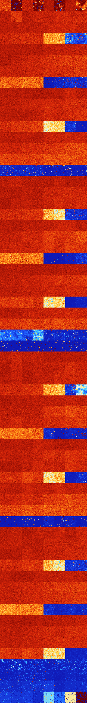

# B02378 (203264-203775)

<details>
    <summary>Initial Grid</summary>
    
</details>


<details>
    <summary>Initial Grid RLE</summary>

```
#C Exported from GoGoL (https://github.com/marrow16/gogol)
#C Wrap mode: Toroidal
#C Boundary mode: Dead
#C Step: 0
x = 100, y = 100, rule = B02378/S
27bo5bo37bo3bo18bo$7bo8bo5bo35bo15bo3b2o6bo2b2o$7bo12bo45bo$25bo34bo7bo
2bo12bo12bo$6bo9bo81bo$2bo11bo10bo$10bo4bo49bo2bo27bo$3bo8bo20bo43bo19b
o$4b2o15bo51b2o$5bo8bo7bo5b2o6bo$17bo11bo31bo36bo$23bo21bo32bo5bo$11bo
24bo20bo$19b2obo2bo49bo$8bo8bo28bo12bo5bo30bo$bo15bo7bo40bo4bo12bo4bo$
6bobo8bo6bo12bo26bo2bo5bo15bo$21bo35bo5bo20bo9bo$16bo15bo33bobo$23bo4bo
58bo$3bo13bo13bo12bo14bo18bo2bo6bo3b2o$17bo11bo16bo3bo7bo12b2o9bo$37bo
9bo$3bo24bo12bo24bobo18bo5bo$2bobo22b2o4bo46bo17bo$14bo6bo6bo5bo23bo6bo
$2bo13bo3bo11bo2bo4bo24bo15bo$2bo10bo28bo8bo2bo18bo8bo5bo8bo$79bo10b2o$
43bo36bo15bo$42bo11bo4bo6bo$7bo6bo12bo7bo8bo2bo22bo2bo13bo$3bo33bo9bo3b
o2bo23bo12bo$13bo10bo4bo15bo4bo6bo2bo$26bo5bo38bo12bo$28bo15bo2bo18bo$
10bo56bo21bo$42bo9bo11bo10bo13bo$17bo11bo16bo43bo$20bo9bo33bo3bo$27bo7b
o3bo48bo$o2bo4bo40bo30b2o17bo$9bo83bo$13bo22bo33bo9bobo$10bo23bo7bo14bo
19bo$45bo18bo10bo10bo$6bo18bo48bo5bo$o9bo4bo18bo54bo7bo$28bo11bo33bo20b
o$16bo29bo35bo3bo$31bo25bo9bo12bo11bo$7b2o65bo13bo$100b$26b2o43bo$55bo
2bo6bo12bo5bo12bo$7bo13bo13bo15bo7bo6bo12bo$40bo21bo20b2o11bo$8bo45bo
22bo$2bo8bo4bo55bo4b3o$63bo8bo6bo18bo$8bo12bo9bo7bo8bo50bo$30bo26bo10bo
7bo16bo$4b2o9bo2bo21bo38bo$6bo24bo13bo9bo6bo$13bo$o13bo6bo24bo29bo$23bo
3bo12bo25bo9bobo11bo$12bo9bo7bo32bo$26bo15bo18bo10b2o21bo$7bo33bo52bo3b
o$24bo12bo17bo$23bo15bobo11bo39bo$7bo38bo5bo$6bo6bo10bo5bo14bo13bo20bo
9bo6bo$bo5bo18bo3bo7bo31bo13bo6bo$11bo35bo11bobo$99bo$4bo22bo42bo9bo14b
o$22bo42bo3bo5bo3bo11bo$9bo11bo22bo40bo$29b2o35bo20bo$27bo2bo25bo17b2o
8bo7bo$bo8bobo22b2o15bo3bo27bobo$5bo35bo52bo$bo9bo4bo12bo18bo27bo6bo15b
o$bo30bo22bo16bo13bo$17bo12bo3bo$7bo53bo7bo$19bo51bo5bo$3bo23bo29bo28bo
$13bo2bo4bo8bo23bo5bo13bo3bo$9bo25bo21bobo11bo18bo8bo$7bo10bo15bo50bo$
8bo9bo29bo11bo20bo9bo$25bo17bo19bo21bo$27bo11bo3bo3bo21bo12bo3bo$10bo
13bo15bo6bo13bobo2bo6bo22bo$2bo10bo8bo23bo4bobo4bo15bo$bo55bo4bo8bo20bo
$10b2o77bo!
```
</details>
<details>
    <summary>Thumbnail</summary>

</details>
<table>
<tr>
    <td><a href="./203264%20S%20Heat%20Map%20Activity.png"></a><br>S (203264)<br>G>1000</td>    <td><a href="./203265%20S0%20Heat%20Map%20Activity.png"></a><br>S0 (203265)<br>R@376,p24</td>    <td><a href="./203266%20S1%20Heat%20Map%20Activity.png"></a><br>S1 (203266)<br>G>1000</td>    <td><a href="./203267%20S01%20Heat%20Map%20Activity.png"></a><br>S01 (203267)<br>R@120,p4</td>    <td><a href="./203268%20S2%20Heat%20Map%20Activity.png"></a><br>S2 (203268)<br>G>1000</td>    <td><a href="./203269%20S02%20Heat%20Map%20Activity.png"></a><br>S02 (203269)<br>R@448,p2</td>    <td><a href="./203270%20S12%20Heat%20Map%20Activity.png"></a><br>S12 (203270)<br>G>1000</td>    <td><a href="./203271%20S012%20Heat%20Map%20Activity.png"></a><br>S012 (203271)<br>G>1000</td></tr>
<tr>
    <td><a href="./203272%20S3%20Heat%20Map%20Activity.png"></a><br>S3 (203272)<br>G>1000</td>    <td><a href="./203273%20S03%20Heat%20Map%20Activity.png"></a><br>S03 (203273)<br>G>1000</td>    <td><a href="./203274%20S13%20Heat%20Map%20Activity.png"></a><br>S13 (203274)<br>G>1000</td>    <td><a href="./203275%20S013%20Heat%20Map%20Activity.png"></a><br>S013 (203275)<br>G>1000</td>    <td><a href="./203276%20S23%20Heat%20Map%20Activity.png"></a><br>S23 (203276)<br>G>1000</td>    <td><a href="./203277%20S023%20Heat%20Map%20Activity.png"></a><br>S023 (203277)<br>G>1000</td>    <td><a href="./203278%20S123%20Heat%20Map%20Activity.png"></a><br>S123 (203278)<br>G>1000</td>    <td><a href="./203279%20S0123%20Heat%20Map%20Activity.png"></a><br>S0123 (203279)<br>G>1000</td></tr>
<tr>
    <td><a href="./203280%20S4%20Heat%20Map%20Activity.png"></a><br>S4 (203280)<br>G>1000</td>    <td><a href="./203281%20S04%20Heat%20Map%20Activity.png"></a><br>S04 (203281)<br>G>1000</td>    <td><a href="./203282%20S14%20Heat%20Map%20Activity.png"></a><br>S14 (203282)<br>G>1000</td>    <td><a href="./203283%20S014%20Heat%20Map%20Activity.png"></a><br>S014 (203283)<br>G>1000</td>    <td><a href="./203284%20S24%20Heat%20Map%20Activity.png"></a><br>S24 (203284)<br>G>1000</td>    <td><a href="./203285%20S024%20Heat%20Map%20Activity.png"></a><br>S024 (203285)<br>G>1000</td>    <td><a href="./203286%20S124%20Heat%20Map%20Activity.png"></a><br>S124 (203286)<br>G>1000</td>    <td><a href="./203287%20S0124%20Heat%20Map%20Activity.png"></a><br>S0124 (203287)<br>G>1000</td></tr>
<tr>
    <td><a href="./203288%20S34%20Heat%20Map%20Activity.png"></a><br>S34 (203288)<br>G>1000</td>    <td><a href="./203289%20S034%20Heat%20Map%20Activity.png"></a><br>S034 (203289)<br>G>1000</td>    <td><a href="./203290%20S134%20Heat%20Map%20Activity.png"></a><br>S134 (203290)<br>G>1000</td>    <td><a href="./203291%20S0134%20Heat%20Map%20Activity.png"></a><br>S0134 (203291)<br>G>1000</td>    <td><a href="./203292%20S234%20Heat%20Map%20Activity.png"></a><br>S234 (203292)<br>G>1000</td>    <td><a href="./203293%20S0234%20Heat%20Map%20Activity.png"></a><br>S0234 (203293)<br>G>1000</td>    <td><a href="./203294%20S1234%20Heat%20Map%20Activity.png"></a><br>S1234 (203294)<br>R@360,p24</td>    <td><a href="./203295%20S01234%20Heat%20Map%20Activity.png"></a><br>S01234 (203295)<br>G>1000</td></tr>
<tr>
    <td><a href="./203296%20S5%20Heat%20Map%20Activity.png"></a><br>S5 (203296)<br>G>1000</td>    <td><a href="./203297%20S05%20Heat%20Map%20Activity.png"></a><br>S05 (203297)<br>G>1000</td>    <td><a href="./203298%20S15%20Heat%20Map%20Activity.png"></a><br>S15 (203298)<br>G>1000</td>    <td><a href="./203299%20S015%20Heat%20Map%20Activity.png"></a><br>S015 (203299)<br>G>1000</td>    <td><a href="./203300%20S25%20Heat%20Map%20Activity.png"></a><br>S25 (203300)<br>G>1000</td>    <td><a href="./203301%20S025%20Heat%20Map%20Activity.png"></a><br>S025 (203301)<br>G>1000</td>    <td><a href="./203302%20S125%20Heat%20Map%20Activity.png"></a><br>S125 (203302)<br>G>1000</td>    <td><a href="./203303%20S0125%20Heat%20Map%20Activity.png"></a><br>S0125 (203303)<br>G>1000</td></tr>
<tr>
    <td><a href="./203304%20S35%20Heat%20Map%20Activity.png"></a><br>S35 (203304)<br>G>1000</td>    <td><a href="./203305%20S035%20Heat%20Map%20Activity.png"></a><br>S035 (203305)<br>G>1000</td>    <td><a href="./203306%20S135%20Heat%20Map%20Activity.png"></a><br>S135 (203306)<br>G>1000</td>    <td><a href="./203307%20S0135%20Heat%20Map%20Activity.png"></a><br>S0135 (203307)<br>G>1000</td>    <td><a href="./203308%20S235%20Heat%20Map%20Activity.png"></a><br>S235 (203308)<br>G>1000</td>    <td><a href="./203309%20S0235%20Heat%20Map%20Activity.png"></a><br>S0235 (203309)<br>G>1000</td>    <td><a href="./203310%20S1235%20Heat%20Map%20Activity.png"></a><br>S1235 (203310)<br>G>1000</td>    <td><a href="./203311%20S01235%20Heat%20Map%20Activity.png"></a><br>S01235 (203311)<br>G>1000</td></tr>
<tr>
    <td><a href="./203312%20S45%20Heat%20Map%20Activity.png"></a><br>S45 (203312)<br>G>1000</td>    <td><a href="./203313%20S045%20Heat%20Map%20Activity.png"></a><br>S045 (203313)<br>G>1000</td>    <td><a href="./203314%20S145%20Heat%20Map%20Activity.png"></a><br>S145 (203314)<br>G>1000</td>    <td><a href="./203315%20S0145%20Heat%20Map%20Activity.png"></a><br>S0145 (203315)<br>G>1000</td>    <td><a href="./203316%20S245%20Heat%20Map%20Activity.png"></a><br>S245 (203316)<br>G>1000</td>    <td><a href="./203317%20S0245%20Heat%20Map%20Activity.png"></a><br>S0245 (203317)<br>G>1000</td>    <td><a href="./203318%20S1245%20Heat%20Map%20Activity.png"></a><br>S1245 (203318)<br>G>1000</td>    <td><a href="./203319%20S01245%20Heat%20Map%20Activity.png"></a><br>S01245 (203319)<br>G>1000</td></tr>
<tr>
    <td><a href="./203320%20S345%20Heat%20Map%20Activity.png"></a><br>S345 (203320)<br>G>1000</td>    <td><a href="./203321%20S0345%20Heat%20Map%20Activity.png"></a><br>S0345 (203321)<br>G>1000</td>    <td><a href="./203322%20S1345%20Heat%20Map%20Activity.png"></a><br>S1345 (203322)<br>G>1000</td>    <td><a href="./203323%20S01345%20Heat%20Map%20Activity.png"></a><br>S01345 (203323)<br>G>1000</td>    <td><a href="./203324%20S2345%20Heat%20Map%20Activity.png"></a><br>S2345 (203324)<br>R@939,p840</td>    <td><a href="./203325%20S02345%20Heat%20Map%20Activity.png"></a><br>S02345 (203325)<br>R@135,p60</td>    <td><a href="./203326%20S12345%20Heat%20Map%20Activity.png"></a><br>S12345 (203326)<br>R@76,p12</td>    <td><a href="./203327%20S012345%20Heat%20Map%20Activity.png"></a><br>S012345 (203327)<br>R@101,p12</td></tr>
<tr>
    <td><a href="./203328%20S6%20Heat%20Map%20Activity.png"></a><br>S6 (203328)<br>G>1000</td>    <td><a href="./203329%20S06%20Heat%20Map%20Activity.png"></a><br>S06 (203329)<br>G>1000</td>    <td><a href="./203330%20S16%20Heat%20Map%20Activity.png"></a><br>S16 (203330)<br>G>1000</td>    <td><a href="./203331%20S016%20Heat%20Map%20Activity.png"></a><br>S016 (203331)<br>G>1000</td>    <td><a href="./203332%20S26%20Heat%20Map%20Activity.png"></a><br>S26 (203332)<br>G>1000</td>    <td><a href="./203333%20S026%20Heat%20Map%20Activity.png"></a><br>S026 (203333)<br>G>1000</td>    <td><a href="./203334%20S126%20Heat%20Map%20Activity.png"></a><br>S126 (203334)<br>G>1000</td>    <td><a href="./203335%20S0126%20Heat%20Map%20Activity.png"></a><br>S0126 (203335)<br>G>1000</td></tr>
<tr>
    <td><a href="./203336%20S36%20Heat%20Map%20Activity.png"></a><br>S36 (203336)<br>G>1000</td>    <td><a href="./203337%20S036%20Heat%20Map%20Activity.png"></a><br>S036 (203337)<br>G>1000</td>    <td><a href="./203338%20S136%20Heat%20Map%20Activity.png"></a><br>S136 (203338)<br>G>1000</td>    <td><a href="./203339%20S0136%20Heat%20Map%20Activity.png"></a><br>S0136 (203339)<br>G>1000</td>    <td><a href="./203340%20S236%20Heat%20Map%20Activity.png"></a><br>S236 (203340)<br>G>1000</td>    <td><a href="./203341%20S0236%20Heat%20Map%20Activity.png"></a><br>S0236 (203341)<br>G>1000</td>    <td><a href="./203342%20S1236%20Heat%20Map%20Activity.png"></a><br>S1236 (203342)<br>G>1000</td>    <td><a href="./203343%20S01236%20Heat%20Map%20Activity.png"></a><br>S01236 (203343)<br>G>1000</td></tr>
<tr>
    <td><a href="./203344%20S46%20Heat%20Map%20Activity.png"></a><br>S46 (203344)<br>G>1000</td>    <td><a href="./203345%20S046%20Heat%20Map%20Activity.png"></a><br>S046 (203345)<br>G>1000</td>    <td><a href="./203346%20S146%20Heat%20Map%20Activity.png"></a><br>S146 (203346)<br>G>1000</td>    <td><a href="./203347%20S0146%20Heat%20Map%20Activity.png"></a><br>S0146 (203347)<br>G>1000</td>    <td><a href="./203348%20S246%20Heat%20Map%20Activity.png"></a><br>S246 (203348)<br>G>1000</td>    <td><a href="./203349%20S0246%20Heat%20Map%20Activity.png"></a><br>S0246 (203349)<br>G>1000</td>    <td><a href="./203350%20S1246%20Heat%20Map%20Activity.png"></a><br>S1246 (203350)<br>G>1000</td>    <td><a href="./203351%20S01246%20Heat%20Map%20Activity.png"></a><br>S01246 (203351)<br>G>1000</td></tr>
<tr>
    <td><a href="./203352%20S346%20Heat%20Map%20Activity.png"></a><br>S346 (203352)<br>G>1000</td>    <td><a href="./203353%20S0346%20Heat%20Map%20Activity.png"></a><br>S0346 (203353)<br>G>1000</td>    <td><a href="./203354%20S1346%20Heat%20Map%20Activity.png"></a><br>S1346 (203354)<br>G>1000</td>    <td><a href="./203355%20S01346%20Heat%20Map%20Activity.png"></a><br>S01346 (203355)<br>G>1000</td>    <td><a href="./203356%20S2346%20Heat%20Map%20Activity.png"></a><br>S2346 (203356)<br>G>1000</td>    <td><a href="./203357%20S02346%20Heat%20Map%20Activity.png"></a><br>S02346 (203357)<br>G>1000</td>    <td><a href="./203358%20S12346%20Heat%20Map%20Activity.png"></a><br>S12346 (203358)<br>R@173,p20</td>    <td><a href="./203359%20S012346%20Heat%20Map%20Activity.png"></a><br>S012346 (203359)<br>G>1000</td></tr>
<tr>
    <td><a href="./203360%20S56%20Heat%20Map%20Activity.png"></a><br>S56 (203360)<br>G>1000</td>    <td><a href="./203361%20S056%20Heat%20Map%20Activity.png"></a><br>S056 (203361)<br>G>1000</td>    <td><a href="./203362%20S156%20Heat%20Map%20Activity.png"></a><br>S156 (203362)<br>G>1000</td>    <td><a href="./203363%20S0156%20Heat%20Map%20Activity.png"></a><br>S0156 (203363)<br>G>1000</td>    <td><a href="./203364%20S256%20Heat%20Map%20Activity.png"></a><br>S256 (203364)<br>G>1000</td>    <td><a href="./203365%20S0256%20Heat%20Map%20Activity.png"></a><br>S0256 (203365)<br>G>1000</td>    <td><a href="./203366%20S1256%20Heat%20Map%20Activity.png"></a><br>S1256 (203366)<br>G>1000</td>    <td><a href="./203367%20S01256%20Heat%20Map%20Activity.png"></a><br>S01256 (203367)<br>G>1000</td></tr>
<tr>
    <td><a href="./203368%20S356%20Heat%20Map%20Activity.png"></a><br>S356 (203368)<br>G>1000</td>    <td><a href="./203369%20S0356%20Heat%20Map%20Activity.png"></a><br>S0356 (203369)<br>G>1000</td>    <td><a href="./203370%20S1356%20Heat%20Map%20Activity.png"></a><br>S1356 (203370)<br>G>1000</td>    <td><a href="./203371%20S01356%20Heat%20Map%20Activity.png"></a><br>S01356 (203371)<br>G>1000</td>    <td><a href="./203372%20S2356%20Heat%20Map%20Activity.png"></a><br>S2356 (203372)<br>G>1000</td>    <td><a href="./203373%20S02356%20Heat%20Map%20Activity.png"></a><br>S02356 (203373)<br>G>1000</td>    <td><a href="./203374%20S12356%20Heat%20Map%20Activity.png"></a><br>S12356 (203374)<br>G>1000</td>    <td><a href="./203375%20S012356%20Heat%20Map%20Activity.png"></a><br>S012356 (203375)<br>G>1000</td></tr>
<tr>
    <td><a href="./203376%20S456%20Heat%20Map%20Activity.png"></a><br>S456 (203376)<br>G>1000</td>    <td><a href="./203377%20S0456%20Heat%20Map%20Activity.png"></a><br>S0456 (203377)<br>G>1000</td>    <td><a href="./203378%20S1456%20Heat%20Map%20Activity.png"></a><br>S1456 (203378)<br>G>1000</td>    <td><a href="./203379%20S01456%20Heat%20Map%20Activity.png"></a><br>S01456 (203379)<br>G>1000</td>    <td><a href="./203380%20S2456%20Heat%20Map%20Activity.png"></a><br>S2456 (203380)<br>G>1000</td>    <td><a href="./203381%20S02456%20Heat%20Map%20Activity.png"></a><br>S02456 (203381)<br>G>1000</td>    <td><a href="./203382%20S12456%20Heat%20Map%20Activity.png"></a><br>S12456 (203382)<br>G>1000</td>    <td><a href="./203383%20S012456%20Heat%20Map%20Activity.png"></a><br>S012456 (203383)<br>G>1000</td></tr>
<tr>
    <td><a href="./203384%20S3456%20Heat%20Map%20Activity.png"></a><br>S3456 (203384)<br>R@249,p60</td>    <td><a href="./203385%20S03456%20Heat%20Map%20Activity.png"></a><br>S03456 (203385)<br>R@281,p120</td>    <td><a href="./203386%20S13456%20Heat%20Map%20Activity.png"></a><br>S13456 (203386)<br>R@305,p120</td>    <td><a href="./203387%20S013456%20Heat%20Map%20Activity.png"></a><br>S013456 (203387)<br>R@358,p120</td>    <td><a href="./203388%20S23456%20Heat%20Map%20Activity.png"></a><br>S23456 (203388)<br>R@483,p420</td>    <td><a href="./203389%20S023456%20Heat%20Map%20Activity.png"></a><br>S023456 (203389)<br>R@191,p84</td>    <td><a href="./203390%20S123456%20Heat%20Map%20Activity.png"></a><br>S123456 (203390)<br>R@281,p240</td>    <td><a href="./203391%20S0123456%20Heat%20Map%20Activity.png"></a><br>S0123456 (203391)<br>R@178,p120</td></tr>
<tr>
    <td><a href="./203392%20S7%20Heat%20Map%20Activity.png"></a><br>S7 (203392)<br>G>1000</td>    <td><a href="./203393%20S07%20Heat%20Map%20Activity.png"></a><br>S07 (203393)<br>G>1000</td>    <td><a href="./203394%20S17%20Heat%20Map%20Activity.png"></a><br>S17 (203394)<br>G>1000</td>    <td><a href="./203395%20S017%20Heat%20Map%20Activity.png"></a><br>S017 (203395)<br>G>1000</td>    <td><a href="./203396%20S27%20Heat%20Map%20Activity.png"></a><br>S27 (203396)<br>G>1000</td>    <td><a href="./203397%20S027%20Heat%20Map%20Activity.png"></a><br>S027 (203397)<br>G>1000</td>    <td><a href="./203398%20S127%20Heat%20Map%20Activity.png"></a><br>S127 (203398)<br>G>1000</td>    <td><a href="./203399%20S0127%20Heat%20Map%20Activity.png"></a><br>S0127 (203399)<br>G>1000</td></tr>
<tr>
    <td><a href="./203400%20S37%20Heat%20Map%20Activity.png"></a><br>S37 (203400)<br>G>1000</td>    <td><a href="./203401%20S037%20Heat%20Map%20Activity.png"></a><br>S037 (203401)<br>G>1000</td>    <td><a href="./203402%20S137%20Heat%20Map%20Activity.png"></a><br>S137 (203402)<br>G>1000</td>    <td><a href="./203403%20S0137%20Heat%20Map%20Activity.png"></a><br>S0137 (203403)<br>G>1000</td>    <td><a href="./203404%20S237%20Heat%20Map%20Activity.png"></a><br>S237 (203404)<br>G>1000</td>    <td><a href="./203405%20S0237%20Heat%20Map%20Activity.png"></a><br>S0237 (203405)<br>G>1000</td>    <td><a href="./203406%20S1237%20Heat%20Map%20Activity.png"></a><br>S1237 (203406)<br>G>1000</td>    <td><a href="./203407%20S01237%20Heat%20Map%20Activity.png"></a><br>S01237 (203407)<br>G>1000</td></tr>
<tr>
    <td><a href="./203408%20S47%20Heat%20Map%20Activity.png"></a><br>S47 (203408)<br>G>1000</td>    <td><a href="./203409%20S047%20Heat%20Map%20Activity.png"></a><br>S047 (203409)<br>G>1000</td>    <td><a href="./203410%20S147%20Heat%20Map%20Activity.png"></a><br>S147 (203410)<br>G>1000</td>    <td><a href="./203411%20S0147%20Heat%20Map%20Activity.png"></a><br>S0147 (203411)<br>G>1000</td>    <td><a href="./203412%20S247%20Heat%20Map%20Activity.png"></a><br>S247 (203412)<br>G>1000</td>    <td><a href="./203413%20S0247%20Heat%20Map%20Activity.png"></a><br>S0247 (203413)<br>G>1000</td>    <td><a href="./203414%20S1247%20Heat%20Map%20Activity.png"></a><br>S1247 (203414)<br>G>1000</td>    <td><a href="./203415%20S01247%20Heat%20Map%20Activity.png"></a><br>S01247 (203415)<br>G>1000</td></tr>
<tr>
    <td><a href="./203416%20S347%20Heat%20Map%20Activity.png"></a><br>S347 (203416)<br>G>1000</td>    <td><a href="./203417%20S0347%20Heat%20Map%20Activity.png"></a><br>S0347 (203417)<br>G>1000</td>    <td><a href="./203418%20S1347%20Heat%20Map%20Activity.png"></a><br>S1347 (203418)<br>G>1000</td>    <td><a href="./203419%20S01347%20Heat%20Map%20Activity.png"></a><br>S01347 (203419)<br>G>1000</td>    <td><a href="./203420%20S2347%20Heat%20Map%20Activity.png"></a><br>S2347 (203420)<br>G>1000</td>    <td><a href="./203421%20S02347%20Heat%20Map%20Activity.png"></a><br>S02347 (203421)<br>G>1000</td>    <td><a href="./203422%20S12347%20Heat%20Map%20Activity.png"></a><br>S12347 (203422)<br>R@215,p60</td>    <td><a href="./203423%20S012347%20Heat%20Map%20Activity.png"></a><br>S012347 (203423)<br>R@240,p120</td></tr>
<tr>
    <td><a href="./203424%20S57%20Heat%20Map%20Activity.png"></a><br>S57 (203424)<br>G>1000</td>    <td><a href="./203425%20S057%20Heat%20Map%20Activity.png"></a><br>S057 (203425)<br>G>1000</td>    <td><a href="./203426%20S157%20Heat%20Map%20Activity.png"></a><br>S157 (203426)<br>G>1000</td>    <td><a href="./203427%20S0157%20Heat%20Map%20Activity.png"></a><br>S0157 (203427)<br>G>1000</td>    <td><a href="./203428%20S257%20Heat%20Map%20Activity.png"></a><br>S257 (203428)<br>G>1000</td>    <td><a href="./203429%20S0257%20Heat%20Map%20Activity.png"></a><br>S0257 (203429)<br>G>1000</td>    <td><a href="./203430%20S1257%20Heat%20Map%20Activity.png"></a><br>S1257 (203430)<br>G>1000</td>    <td><a href="./203431%20S01257%20Heat%20Map%20Activity.png"></a><br>S01257 (203431)<br>G>1000</td></tr>
<tr>
    <td><a href="./203432%20S357%20Heat%20Map%20Activity.png"></a><br>S357 (203432)<br>G>1000</td>    <td><a href="./203433%20S0357%20Heat%20Map%20Activity.png"></a><br>S0357 (203433)<br>G>1000</td>    <td><a href="./203434%20S1357%20Heat%20Map%20Activity.png"></a><br>S1357 (203434)<br>G>1000</td>    <td><a href="./203435%20S01357%20Heat%20Map%20Activity.png"></a><br>S01357 (203435)<br>G>1000</td>    <td><a href="./203436%20S2357%20Heat%20Map%20Activity.png"></a><br>S2357 (203436)<br>G>1000</td>    <td><a href="./203437%20S02357%20Heat%20Map%20Activity.png"></a><br>S02357 (203437)<br>G>1000</td>    <td><a href="./203438%20S12357%20Heat%20Map%20Activity.png"></a><br>S12357 (203438)<br>G>1000</td>    <td><a href="./203439%20S012357%20Heat%20Map%20Activity.png"></a><br>S012357 (203439)<br>G>1000</td></tr>
<tr>
    <td><a href="./203440%20S457%20Heat%20Map%20Activity.png"></a><br>S457 (203440)<br>G>1000</td>    <td><a href="./203441%20S0457%20Heat%20Map%20Activity.png"></a><br>S0457 (203441)<br>G>1000</td>    <td><a href="./203442%20S1457%20Heat%20Map%20Activity.png"></a><br>S1457 (203442)<br>G>1000</td>    <td><a href="./203443%20S01457%20Heat%20Map%20Activity.png"></a><br>S01457 (203443)<br>G>1000</td>    <td><a href="./203444%20S2457%20Heat%20Map%20Activity.png"></a><br>S2457 (203444)<br>G>1000</td>    <td><a href="./203445%20S02457%20Heat%20Map%20Activity.png"></a><br>S02457 (203445)<br>G>1000</td>    <td><a href="./203446%20S12457%20Heat%20Map%20Activity.png"></a><br>S12457 (203446)<br>G>1000</td>    <td><a href="./203447%20S012457%20Heat%20Map%20Activity.png"></a><br>S012457 (203447)<br>G>1000</td></tr>
<tr>
    <td><a href="./203448%20S3457%20Heat%20Map%20Activity.png"></a><br>S3457 (203448)<br>G>1000</td>    <td><a href="./203449%20S03457%20Heat%20Map%20Activity.png"></a><br>S03457 (203449)<br>G>1000</td>    <td><a href="./203450%20S13457%20Heat%20Map%20Activity.png"></a><br>S13457 (203450)<br>G>1000</td>    <td><a href="./203451%20S013457%20Heat%20Map%20Activity.png"></a><br>S013457 (203451)<br>G>1000</td>    <td><a href="./203452%20S23457%20Heat%20Map%20Activity.png"></a><br>S23457 (203452)<br>R@938,p840</td>    <td><a href="./203453%20S023457%20Heat%20Map%20Activity.png"></a><br>S023457 (203453)<br>G>1000</td>    <td><a href="./203454%20S123457%20Heat%20Map%20Activity.png"></a><br>S123457 (203454)<br>R@153,p120</td>    <td><a href="./203455%20S0123457%20Heat%20Map%20Activity.png"></a><br>S0123457 (203455)<br>R@50,p20</td></tr>
<tr>
    <td><a href="./203456%20S67%20Heat%20Map%20Activity.png"></a><br>S67 (203456)<br>G>1000</td>    <td><a href="./203457%20S067%20Heat%20Map%20Activity.png"></a><br>S067 (203457)<br>G>1000</td>    <td><a href="./203458%20S167%20Heat%20Map%20Activity.png"></a><br>S167 (203458)<br>G>1000</td>    <td><a href="./203459%20S0167%20Heat%20Map%20Activity.png"></a><br>S0167 (203459)<br>G>1000</td>    <td><a href="./203460%20S267%20Heat%20Map%20Activity.png"></a><br>S267 (203460)<br>G>1000</td>    <td><a href="./203461%20S0267%20Heat%20Map%20Activity.png"></a><br>S0267 (203461)<br>G>1000</td>    <td><a href="./203462%20S1267%20Heat%20Map%20Activity.png"></a><br>S1267 (203462)<br>G>1000</td>    <td><a href="./203463%20S01267%20Heat%20Map%20Activity.png"></a><br>S01267 (203463)<br>G>1000</td></tr>
<tr>
    <td><a href="./203464%20S367%20Heat%20Map%20Activity.png"></a><br>S367 (203464)<br>G>1000</td>    <td><a href="./203465%20S0367%20Heat%20Map%20Activity.png"></a><br>S0367 (203465)<br>G>1000</td>    <td><a href="./203466%20S1367%20Heat%20Map%20Activity.png"></a><br>S1367 (203466)<br>G>1000</td>    <td><a href="./203467%20S01367%20Heat%20Map%20Activity.png"></a><br>S01367 (203467)<br>G>1000</td>    <td><a href="./203468%20S2367%20Heat%20Map%20Activity.png"></a><br>S2367 (203468)<br>G>1000</td>    <td><a href="./203469%20S02367%20Heat%20Map%20Activity.png"></a><br>S02367 (203469)<br>G>1000</td>    <td><a href="./203470%20S12367%20Heat%20Map%20Activity.png"></a><br>S12367 (203470)<br>G>1000</td>    <td><a href="./203471%20S012367%20Heat%20Map%20Activity.png"></a><br>S012367 (203471)<br>G>1000</td></tr>
<tr>
    <td><a href="./203472%20S467%20Heat%20Map%20Activity.png"></a><br>S467 (203472)<br>G>1000</td>    <td><a href="./203473%20S0467%20Heat%20Map%20Activity.png"></a><br>S0467 (203473)<br>G>1000</td>    <td><a href="./203474%20S1467%20Heat%20Map%20Activity.png"></a><br>S1467 (203474)<br>G>1000</td>    <td><a href="./203475%20S01467%20Heat%20Map%20Activity.png"></a><br>S01467 (203475)<br>G>1000</td>    <td><a href="./203476%20S2467%20Heat%20Map%20Activity.png"></a><br>S2467 (203476)<br>G>1000</td>    <td><a href="./203477%20S02467%20Heat%20Map%20Activity.png"></a><br>S02467 (203477)<br>G>1000</td>    <td><a href="./203478%20S12467%20Heat%20Map%20Activity.png"></a><br>S12467 (203478)<br>G>1000</td>    <td><a href="./203479%20S012467%20Heat%20Map%20Activity.png"></a><br>S012467 (203479)<br>G>1000</td></tr>
<tr>
    <td><a href="./203480%20S3467%20Heat%20Map%20Activity.png"></a><br>S3467 (203480)<br>G>1000</td>    <td><a href="./203481%20S03467%20Heat%20Map%20Activity.png"></a><br>S03467 (203481)<br>G>1000</td>    <td><a href="./203482%20S13467%20Heat%20Map%20Activity.png"></a><br>S13467 (203482)<br>G>1000</td>    <td><a href="./203483%20S013467%20Heat%20Map%20Activity.png"></a><br>S013467 (203483)<br>G>1000</td>    <td><a href="./203484%20S23467%20Heat%20Map%20Activity.png"></a><br>S23467 (203484)<br>G>1000</td>    <td><a href="./203485%20S023467%20Heat%20Map%20Activity.png"></a><br>S023467 (203485)<br>G>1000</td>    <td><a href="./203486%20S123467%20Heat%20Map%20Activity.png"></a><br>S123467 (203486)<br>G>1000</td>    <td><a href="./203487%20S0123467%20Heat%20Map%20Activity.png"></a><br>S0123467 (203487)<br>R@314,p180</td></tr>
<tr>
    <td><a href="./203488%20S567%20Heat%20Map%20Activity.png"></a><br>S567 (203488)<br>G>1000</td>    <td><a href="./203489%20S0567%20Heat%20Map%20Activity.png"></a><br>S0567 (203489)<br>G>1000</td>    <td><a href="./203490%20S1567%20Heat%20Map%20Activity.png"></a><br>S1567 (203490)<br>G>1000</td>    <td><a href="./203491%20S01567%20Heat%20Map%20Activity.png"></a><br>S01567 (203491)<br>G>1000</td>    <td><a href="./203492%20S2567%20Heat%20Map%20Activity.png"></a><br>S2567 (203492)<br>G>1000</td>    <td><a href="./203493%20S02567%20Heat%20Map%20Activity.png"></a><br>S02567 (203493)<br>G>1000</td>    <td><a href="./203494%20S12567%20Heat%20Map%20Activity.png"></a><br>S12567 (203494)<br>G>1000</td>    <td><a href="./203495%20S012567%20Heat%20Map%20Activity.png"></a><br>S012567 (203495)<br>G>1000</td></tr>
<tr>
    <td><a href="./203496%20S3567%20Heat%20Map%20Activity.png"></a><br>S3567 (203496)<br>G>1000</td>    <td><a href="./203497%20S03567%20Heat%20Map%20Activity.png"></a><br>S03567 (203497)<br>G>1000</td>    <td><a href="./203498%20S13567%20Heat%20Map%20Activity.png"></a><br>S13567 (203498)<br>G>1000</td>    <td><a href="./203499%20S013567%20Heat%20Map%20Activity.png"></a><br>S013567 (203499)<br>G>1000</td>    <td><a href="./203500%20S23567%20Heat%20Map%20Activity.png"></a><br>S23567 (203500)<br>G>1000</td>    <td><a href="./203501%20S023567%20Heat%20Map%20Activity.png"></a><br>S023567 (203501)<br>G>1000</td>    <td><a href="./203502%20S123567%20Heat%20Map%20Activity.png"></a><br>S123567 (203502)<br>G>1000</td>    <td><a href="./203503%20S0123567%20Heat%20Map%20Activity.png"></a><br>S0123567 (203503)<br>G>1000</td></tr>
<tr>
    <td><a href="./203504%20S4567%20Heat%20Map%20Activity.png"></a><br>S4567 (203504)<br>G>1000</td>    <td><a href="./203505%20S04567%20Heat%20Map%20Activity.png"></a><br>S04567 (203505)<br>G>1000</td>    <td><a href="./203506%20S14567%20Heat%20Map%20Activity.png"></a><br>S14567 (203506)<br>G>1000</td>    <td><a href="./203507%20S014567%20Heat%20Map%20Activity.png"></a><br>S014567 (203507)<br>G>1000</td>    <td><a href="./203508%20S24567%20Heat%20Map%20Activity.png"></a><br>S24567 (203508)<br>R@561,p24</td>    <td><a href="./203509%20S024567%20Heat%20Map%20Activity.png"></a><br>S024567 (203509)<br>R@820,p12</td>    <td><a href="./203510%20S124567%20Heat%20Map%20Activity.png"></a><br>S124567 (203510)<br>R@600,p24</td>    <td><a href="./203511%20S0124567%20Heat%20Map%20Activity.png"></a><br>S0124567 (203511)<br>R@770,p60</td></tr>
<tr>
    <td><a href="./203512%20S34567%20Heat%20Map%20Activity.png"></a><br>S34567 (203512)<br>G>1000</td>    <td><a href="./203513%20S034567%20Heat%20Map%20Activity.png"></a><br>S034567 (203513)<br>G>1000</td>    <td><a href="./203514%20S134567%20Heat%20Map%20Activity.png"></a><br>S134567 (203514)<br>G>1000</td>    <td><a href="./203515%20S0134567%20Heat%20Map%20Activity.png"></a><br>S0134567 (203515)<br>G>1000</td>    <td><a href="./203516%20S234567%20Heat%20Map%20Activity.png"></a><br>S234567 (203516)<br>G>1000</td>    <td><a href="./203517%20S0234567%20Heat%20Map%20Activity.png"></a><br>S0234567 (203517)<br>G>1000</td>    <td><a href="./203518%20S1234567%20Heat%20Map%20Activity.png"></a><br>S1234567 (203518)<br>G>1000</td>    <td><a href="./203519%20S01234567%20Heat%20Map%20Activity.png"></a><br>S01234567 (203519)<br>R@885,p840</td></tr>
<tr>
    <td><a href="./203520%20S8%20Heat%20Map%20Activity.png"></a><br>S8 (203520)<br>G>1000</td>    <td><a href="./203521%20S08%20Heat%20Map%20Activity.png"></a><br>S08 (203521)<br>G>1000</td>    <td><a href="./203522%20S18%20Heat%20Map%20Activity.png"></a><br>S18 (203522)<br>G>1000</td>    <td><a href="./203523%20S018%20Heat%20Map%20Activity.png"></a><br>S018 (203523)<br>G>1000</td>    <td><a href="./203524%20S28%20Heat%20Map%20Activity.png"></a><br>S28 (203524)<br>G>1000</td>    <td><a href="./203525%20S028%20Heat%20Map%20Activity.png"></a><br>S028 (203525)<br>G>1000</td>    <td><a href="./203526%20S128%20Heat%20Map%20Activity.png"></a><br>S128 (203526)<br>G>1000</td>    <td><a href="./203527%20S0128%20Heat%20Map%20Activity.png"></a><br>S0128 (203527)<br>G>1000</td></tr>
<tr>
    <td><a href="./203528%20S38%20Heat%20Map%20Activity.png"></a><br>S38 (203528)<br>G>1000</td>    <td><a href="./203529%20S038%20Heat%20Map%20Activity.png"></a><br>S038 (203529)<br>G>1000</td>    <td><a href="./203530%20S138%20Heat%20Map%20Activity.png"></a><br>S138 (203530)<br>G>1000</td>    <td><a href="./203531%20S0138%20Heat%20Map%20Activity.png"></a><br>S0138 (203531)<br>G>1000</td>    <td><a href="./203532%20S238%20Heat%20Map%20Activity.png"></a><br>S238 (203532)<br>G>1000</td>    <td><a href="./203533%20S0238%20Heat%20Map%20Activity.png"></a><br>S0238 (203533)<br>G>1000</td>    <td><a href="./203534%20S1238%20Heat%20Map%20Activity.png"></a><br>S1238 (203534)<br>G>1000</td>    <td><a href="./203535%20S01238%20Heat%20Map%20Activity.png"></a><br>S01238 (203535)<br>G>1000</td></tr>
<tr>
    <td><a href="./203536%20S48%20Heat%20Map%20Activity.png"></a><br>S48 (203536)<br>G>1000</td>    <td><a href="./203537%20S048%20Heat%20Map%20Activity.png"></a><br>S048 (203537)<br>G>1000</td>    <td><a href="./203538%20S148%20Heat%20Map%20Activity.png"></a><br>S148 (203538)<br>G>1000</td>    <td><a href="./203539%20S0148%20Heat%20Map%20Activity.png"></a><br>S0148 (203539)<br>G>1000</td>    <td><a href="./203540%20S248%20Heat%20Map%20Activity.png"></a><br>S248 (203540)<br>G>1000</td>    <td><a href="./203541%20S0248%20Heat%20Map%20Activity.png"></a><br>S0248 (203541)<br>G>1000</td>    <td><a href="./203542%20S1248%20Heat%20Map%20Activity.png"></a><br>S1248 (203542)<br>G>1000</td>    <td><a href="./203543%20S01248%20Heat%20Map%20Activity.png"></a><br>S01248 (203543)<br>G>1000</td></tr>
<tr>
    <td><a href="./203544%20S348%20Heat%20Map%20Activity.png"></a><br>S348 (203544)<br>G>1000</td>    <td><a href="./203545%20S0348%20Heat%20Map%20Activity.png"></a><br>S0348 (203545)<br>G>1000</td>    <td><a href="./203546%20S1348%20Heat%20Map%20Activity.png"></a><br>S1348 (203546)<br>G>1000</td>    <td><a href="./203547%20S01348%20Heat%20Map%20Activity.png"></a><br>S01348 (203547)<br>G>1000</td>    <td><a href="./203548%20S2348%20Heat%20Map%20Activity.png"></a><br>S2348 (203548)<br>G>1000</td>    <td><a href="./203549%20S02348%20Heat%20Map%20Activity.png"></a><br>S02348 (203549)<br>G>1000</td>    <td><a href="./203550%20S12348%20Heat%20Map%20Activity.png"></a><br>S12348 (203550)<br>G>1000</td>    <td><a href="./203551%20S012348%20Heat%20Map%20Activity.png"></a><br>S012348 (203551)<br>G>1000</td></tr>
<tr>
    <td><a href="./203552%20S58%20Heat%20Map%20Activity.png"></a><br>S58 (203552)<br>G>1000</td>    <td><a href="./203553%20S058%20Heat%20Map%20Activity.png"></a><br>S058 (203553)<br>G>1000</td>    <td><a href="./203554%20S158%20Heat%20Map%20Activity.png"></a><br>S158 (203554)<br>G>1000</td>    <td><a href="./203555%20S0158%20Heat%20Map%20Activity.png"></a><br>S0158 (203555)<br>G>1000</td>    <td><a href="./203556%20S258%20Heat%20Map%20Activity.png"></a><br>S258 (203556)<br>G>1000</td>    <td><a href="./203557%20S0258%20Heat%20Map%20Activity.png"></a><br>S0258 (203557)<br>G>1000</td>    <td><a href="./203558%20S1258%20Heat%20Map%20Activity.png"></a><br>S1258 (203558)<br>G>1000</td>    <td><a href="./203559%20S01258%20Heat%20Map%20Activity.png"></a><br>S01258 (203559)<br>G>1000</td></tr>
<tr>
    <td><a href="./203560%20S358%20Heat%20Map%20Activity.png"></a><br>S358 (203560)<br>G>1000</td>    <td><a href="./203561%20S0358%20Heat%20Map%20Activity.png"></a><br>S0358 (203561)<br>G>1000</td>    <td><a href="./203562%20S1358%20Heat%20Map%20Activity.png"></a><br>S1358 (203562)<br>G>1000</td>    <td><a href="./203563%20S01358%20Heat%20Map%20Activity.png"></a><br>S01358 (203563)<br>G>1000</td>    <td><a href="./203564%20S2358%20Heat%20Map%20Activity.png"></a><br>S2358 (203564)<br>G>1000</td>    <td><a href="./203565%20S02358%20Heat%20Map%20Activity.png"></a><br>S02358 (203565)<br>G>1000</td>    <td><a href="./203566%20S12358%20Heat%20Map%20Activity.png"></a><br>S12358 (203566)<br>G>1000</td>    <td><a href="./203567%20S012358%20Heat%20Map%20Activity.png"></a><br>S012358 (203567)<br>G>1000</td></tr>
<tr>
    <td><a href="./203568%20S458%20Heat%20Map%20Activity.png"></a><br>S458 (203568)<br>G>1000</td>    <td><a href="./203569%20S0458%20Heat%20Map%20Activity.png"></a><br>S0458 (203569)<br>G>1000</td>    <td><a href="./203570%20S1458%20Heat%20Map%20Activity.png"></a><br>S1458 (203570)<br>G>1000</td>    <td><a href="./203571%20S01458%20Heat%20Map%20Activity.png"></a><br>S01458 (203571)<br>G>1000</td>    <td><a href="./203572%20S2458%20Heat%20Map%20Activity.png"></a><br>S2458 (203572)<br>G>1000</td>    <td><a href="./203573%20S02458%20Heat%20Map%20Activity.png"></a><br>S02458 (203573)<br>G>1000</td>    <td><a href="./203574%20S12458%20Heat%20Map%20Activity.png"></a><br>S12458 (203574)<br>G>1000</td>    <td><a href="./203575%20S012458%20Heat%20Map%20Activity.png"></a><br>S012458 (203575)<br>G>1000</td></tr>
<tr>
    <td><a href="./203576%20S3458%20Heat%20Map%20Activity.png"></a><br>S3458 (203576)<br>G>1000</td>    <td><a href="./203577%20S03458%20Heat%20Map%20Activity.png"></a><br>S03458 (203577)<br>G>1000</td>    <td><a href="./203578%20S13458%20Heat%20Map%20Activity.png"></a><br>S13458 (203578)<br>G>1000</td>    <td><a href="./203579%20S013458%20Heat%20Map%20Activity.png"></a><br>S013458 (203579)<br>G>1000</td>    <td><a href="./203580%20S23458%20Heat%20Map%20Activity.png"></a><br>S23458 (203580)<br>R@87,p8</td>    <td><a href="./203581%20S023458%20Heat%20Map%20Activity.png"></a><br>S023458 (203581)<br>G>1000</td>    <td><a href="./203582%20S123458%20Heat%20Map%20Activity.png"></a><br>S123458 (203582)<br>R@104,p60</td>    <td><a href="./203583%20S0123458%20Heat%20Map%20Activity.png"></a><br>S0123458 (203583)<br>R@116,p60</td></tr>
<tr>
    <td><a href="./203584%20S68%20Heat%20Map%20Activity.png"></a><br>S68 (203584)<br>G>1000</td>    <td><a href="./203585%20S068%20Heat%20Map%20Activity.png"></a><br>S068 (203585)<br>G>1000</td>    <td><a href="./203586%20S168%20Heat%20Map%20Activity.png"></a><br>S168 (203586)<br>G>1000</td>    <td><a href="./203587%20S0168%20Heat%20Map%20Activity.png"></a><br>S0168 (203587)<br>G>1000</td>    <td><a href="./203588%20S268%20Heat%20Map%20Activity.png"></a><br>S268 (203588)<br>G>1000</td>    <td><a href="./203589%20S0268%20Heat%20Map%20Activity.png"></a><br>S0268 (203589)<br>G>1000</td>    <td><a href="./203590%20S1268%20Heat%20Map%20Activity.png"></a><br>S1268 (203590)<br>G>1000</td>    <td><a href="./203591%20S01268%20Heat%20Map%20Activity.png"></a><br>S01268 (203591)<br>G>1000</td></tr>
<tr>
    <td><a href="./203592%20S368%20Heat%20Map%20Activity.png"></a><br>S368 (203592)<br>G>1000</td>    <td><a href="./203593%20S0368%20Heat%20Map%20Activity.png"></a><br>S0368 (203593)<br>G>1000</td>    <td><a href="./203594%20S1368%20Heat%20Map%20Activity.png"></a><br>S1368 (203594)<br>G>1000</td>    <td><a href="./203595%20S01368%20Heat%20Map%20Activity.png"></a><br>S01368 (203595)<br>G>1000</td>    <td><a href="./203596%20S2368%20Heat%20Map%20Activity.png"></a><br>S2368 (203596)<br>G>1000</td>    <td><a href="./203597%20S02368%20Heat%20Map%20Activity.png"></a><br>S02368 (203597)<br>G>1000</td>    <td><a href="./203598%20S12368%20Heat%20Map%20Activity.png"></a><br>S12368 (203598)<br>G>1000</td>    <td><a href="./203599%20S012368%20Heat%20Map%20Activity.png"></a><br>S012368 (203599)<br>G>1000</td></tr>
<tr>
    <td><a href="./203600%20S468%20Heat%20Map%20Activity.png"></a><br>S468 (203600)<br>G>1000</td>    <td><a href="./203601%20S0468%20Heat%20Map%20Activity.png"></a><br>S0468 (203601)<br>G>1000</td>    <td><a href="./203602%20S1468%20Heat%20Map%20Activity.png"></a><br>S1468 (203602)<br>G>1000</td>    <td><a href="./203603%20S01468%20Heat%20Map%20Activity.png"></a><br>S01468 (203603)<br>G>1000</td>    <td><a href="./203604%20S2468%20Heat%20Map%20Activity.png"></a><br>S2468 (203604)<br>G>1000</td>    <td><a href="./203605%20S02468%20Heat%20Map%20Activity.png"></a><br>S02468 (203605)<br>G>1000</td>    <td><a href="./203606%20S12468%20Heat%20Map%20Activity.png"></a><br>S12468 (203606)<br>G>1000</td>    <td><a href="./203607%20S012468%20Heat%20Map%20Activity.png"></a><br>S012468 (203607)<br>G>1000</td></tr>
<tr>
    <td><a href="./203608%20S3468%20Heat%20Map%20Activity.png"></a><br>S3468 (203608)<br>G>1000</td>    <td><a href="./203609%20S03468%20Heat%20Map%20Activity.png"></a><br>S03468 (203609)<br>G>1000</td>    <td><a href="./203610%20S13468%20Heat%20Map%20Activity.png"></a><br>S13468 (203610)<br>G>1000</td>    <td><a href="./203611%20S013468%20Heat%20Map%20Activity.png"></a><br>S013468 (203611)<br>G>1000</td>    <td><a href="./203612%20S23468%20Heat%20Map%20Activity.png"></a><br>S23468 (203612)<br>G>1000</td>    <td><a href="./203613%20S023468%20Heat%20Map%20Activity.png"></a><br>S023468 (203613)<br>G>1000</td>    <td><a href="./203614%20S123468%20Heat%20Map%20Activity.png"></a><br>S123468 (203614)<br>R@637,p420</td>    <td><a href="./203615%20S0123468%20Heat%20Map%20Activity.png"></a><br>S0123468 (203615)<br>R@174,p60</td></tr>
<tr>
    <td><a href="./203616%20S568%20Heat%20Map%20Activity.png"></a><br>S568 (203616)<br>G>1000</td>    <td><a href="./203617%20S0568%20Heat%20Map%20Activity.png"></a><br>S0568 (203617)<br>G>1000</td>    <td><a href="./203618%20S1568%20Heat%20Map%20Activity.png"></a><br>S1568 (203618)<br>G>1000</td>    <td><a href="./203619%20S01568%20Heat%20Map%20Activity.png"></a><br>S01568 (203619)<br>G>1000</td>    <td><a href="./203620%20S2568%20Heat%20Map%20Activity.png"></a><br>S2568 (203620)<br>G>1000</td>    <td><a href="./203621%20S02568%20Heat%20Map%20Activity.png"></a><br>S02568 (203621)<br>G>1000</td>    <td><a href="./203622%20S12568%20Heat%20Map%20Activity.png"></a><br>S12568 (203622)<br>G>1000</td>    <td><a href="./203623%20S012568%20Heat%20Map%20Activity.png"></a><br>S012568 (203623)<br>G>1000</td></tr>
<tr>
    <td><a href="./203624%20S3568%20Heat%20Map%20Activity.png"></a><br>S3568 (203624)<br>G>1000</td>    <td><a href="./203625%20S03568%20Heat%20Map%20Activity.png"></a><br>S03568 (203625)<br>G>1000</td>    <td><a href="./203626%20S13568%20Heat%20Map%20Activity.png"></a><br>S13568 (203626)<br>G>1000</td>    <td><a href="./203627%20S013568%20Heat%20Map%20Activity.png"></a><br>S013568 (203627)<br>G>1000</td>    <td><a href="./203628%20S23568%20Heat%20Map%20Activity.png"></a><br>S23568 (203628)<br>G>1000</td>    <td><a href="./203629%20S023568%20Heat%20Map%20Activity.png"></a><br>S023568 (203629)<br>G>1000</td>    <td><a href="./203630%20S123568%20Heat%20Map%20Activity.png"></a><br>S123568 (203630)<br>G>1000</td>    <td><a href="./203631%20S0123568%20Heat%20Map%20Activity.png"></a><br>S0123568 (203631)<br>G>1000</td></tr>
<tr>
    <td><a href="./203632%20S4568%20Heat%20Map%20Activity.png"></a><br>S4568 (203632)<br>G>1000</td>    <td><a href="./203633%20S04568%20Heat%20Map%20Activity.png"></a><br>S04568 (203633)<br>G>1000</td>    <td><a href="./203634%20S14568%20Heat%20Map%20Activity.png"></a><br>S14568 (203634)<br>G>1000</td>    <td><a href="./203635%20S014568%20Heat%20Map%20Activity.png"></a><br>S014568 (203635)<br>G>1000</td>    <td><a href="./203636%20S24568%20Heat%20Map%20Activity.png"></a><br>S24568 (203636)<br>G>1000</td>    <td><a href="./203637%20S024568%20Heat%20Map%20Activity.png"></a><br>S024568 (203637)<br>G>1000</td>    <td><a href="./203638%20S124568%20Heat%20Map%20Activity.png"></a><br>S124568 (203638)<br>G>1000</td>    <td><a href="./203639%20S0124568%20Heat%20Map%20Activity.png"></a><br>S0124568 (203639)<br>G>1000</td></tr>
<tr>
    <td><a href="./203640%20S34568%20Heat%20Map%20Activity.png"></a><br>S34568 (203640)<br>G>1000</td>    <td><a href="./203641%20S034568%20Heat%20Map%20Activity.png"></a><br>S034568 (203641)<br>R@755,p660</td>    <td><a href="./203642%20S134568%20Heat%20Map%20Activity.png"></a><br>S134568 (203642)<br>R@294,p180</td>    <td><a href="./203643%20S0134568%20Heat%20Map%20Activity.png"></a><br>S0134568 (203643)<br>G>1000</td>    <td><a href="./203644%20S234568%20Heat%20Map%20Activity.png"></a><br>S234568 (203644)<br>R@93,p60</td>    <td><a href="./203645%20S0234568%20Heat%20Map%20Activity.png"></a><br>S0234568 (203645)<br>G>1000</td>    <td><a href="./203646%20S1234568%20Heat%20Map%20Activity.png"></a><br>S1234568 (203646)<br>R@107,p60</td>    <td><a href="./203647%20S01234568%20Heat%20Map%20Activity.png"></a><br>S01234568 (203647)<br>R@199,p180</td></tr>
<tr>
    <td><a href="./203648%20S78%20Heat%20Map%20Activity.png"></a><br>S78 (203648)<br>G>1000</td>    <td><a href="./203649%20S078%20Heat%20Map%20Activity.png"></a><br>S078 (203649)<br>G>1000</td>    <td><a href="./203650%20S178%20Heat%20Map%20Activity.png"></a><br>S178 (203650)<br>G>1000</td>    <td><a href="./203651%20S0178%20Heat%20Map%20Activity.png"></a><br>S0178 (203651)<br>G>1000</td>    <td><a href="./203652%20S278%20Heat%20Map%20Activity.png"></a><br>S278 (203652)<br>G>1000</td>    <td><a href="./203653%20S0278%20Heat%20Map%20Activity.png"></a><br>S0278 (203653)<br>G>1000</td>    <td><a href="./203654%20S1278%20Heat%20Map%20Activity.png"></a><br>S1278 (203654)<br>G>1000</td>    <td><a href="./203655%20S01278%20Heat%20Map%20Activity.png"></a><br>S01278 (203655)<br>G>1000</td></tr>
<tr>
    <td><a href="./203656%20S378%20Heat%20Map%20Activity.png"></a><br>S378 (203656)<br>G>1000</td>    <td><a href="./203657%20S0378%20Heat%20Map%20Activity.png"></a><br>S0378 (203657)<br>G>1000</td>    <td><a href="./203658%20S1378%20Heat%20Map%20Activity.png"></a><br>S1378 (203658)<br>G>1000</td>    <td><a href="./203659%20S01378%20Heat%20Map%20Activity.png"></a><br>S01378 (203659)<br>G>1000</td>    <td><a href="./203660%20S2378%20Heat%20Map%20Activity.png"></a><br>S2378 (203660)<br>G>1000</td>    <td><a href="./203661%20S02378%20Heat%20Map%20Activity.png"></a><br>S02378 (203661)<br>G>1000</td>    <td><a href="./203662%20S12378%20Heat%20Map%20Activity.png"></a><br>S12378 (203662)<br>G>1000</td>    <td><a href="./203663%20S012378%20Heat%20Map%20Activity.png"></a><br>S012378 (203663)<br>G>1000</td></tr>
<tr>
    <td><a href="./203664%20S478%20Heat%20Map%20Activity.png"></a><br>S478 (203664)<br>G>1000</td>    <td><a href="./203665%20S0478%20Heat%20Map%20Activity.png"></a><br>S0478 (203665)<br>G>1000</td>    <td><a href="./203666%20S1478%20Heat%20Map%20Activity.png"></a><br>S1478 (203666)<br>G>1000</td>    <td><a href="./203667%20S01478%20Heat%20Map%20Activity.png"></a><br>S01478 (203667)<br>G>1000</td>    <td><a href="./203668%20S2478%20Heat%20Map%20Activity.png"></a><br>S2478 (203668)<br>G>1000</td>    <td><a href="./203669%20S02478%20Heat%20Map%20Activity.png"></a><br>S02478 (203669)<br>G>1000</td>    <td><a href="./203670%20S12478%20Heat%20Map%20Activity.png"></a><br>S12478 (203670)<br>G>1000</td>    <td><a href="./203671%20S012478%20Heat%20Map%20Activity.png"></a><br>S012478 (203671)<br>G>1000</td></tr>
<tr>
    <td><a href="./203672%20S3478%20Heat%20Map%20Activity.png"></a><br>S3478 (203672)<br>G>1000</td>    <td><a href="./203673%20S03478%20Heat%20Map%20Activity.png"></a><br>S03478 (203673)<br>G>1000</td>    <td><a href="./203674%20S13478%20Heat%20Map%20Activity.png"></a><br>S13478 (203674)<br>G>1000</td>    <td><a href="./203675%20S013478%20Heat%20Map%20Activity.png"></a><br>S013478 (203675)<br>G>1000</td>    <td><a href="./203676%20S23478%20Heat%20Map%20Activity.png"></a><br>S23478 (203676)<br>G>1000</td>    <td><a href="./203677%20S023478%20Heat%20Map%20Activity.png"></a><br>S023478 (203677)<br>G>1000</td>    <td><a href="./203678%20S123478%20Heat%20Map%20Activity.png"></a><br>S123478 (203678)<br>R@157,p56</td>    <td><a href="./203679%20S0123478%20Heat%20Map%20Activity.png"></a><br>S0123478 (203679)<br>R@163,p24</td></tr>
<tr>
    <td><a href="./203680%20S578%20Heat%20Map%20Activity.png"></a><br>S578 (203680)<br>G>1000</td>    <td><a href="./203681%20S0578%20Heat%20Map%20Activity.png"></a><br>S0578 (203681)<br>G>1000</td>    <td><a href="./203682%20S1578%20Heat%20Map%20Activity.png"></a><br>S1578 (203682)<br>G>1000</td>    <td><a href="./203683%20S01578%20Heat%20Map%20Activity.png"></a><br>S01578 (203683)<br>G>1000</td>    <td><a href="./203684%20S2578%20Heat%20Map%20Activity.png"></a><br>S2578 (203684)<br>G>1000</td>    <td><a href="./203685%20S02578%20Heat%20Map%20Activity.png"></a><br>S02578 (203685)<br>G>1000</td>    <td><a href="./203686%20S12578%20Heat%20Map%20Activity.png"></a><br>S12578 (203686)<br>G>1000</td>    <td><a href="./203687%20S012578%20Heat%20Map%20Activity.png"></a><br>S012578 (203687)<br>G>1000</td></tr>
<tr>
    <td><a href="./203688%20S3578%20Heat%20Map%20Activity.png"></a><br>S3578 (203688)<br>G>1000</td>    <td><a href="./203689%20S03578%20Heat%20Map%20Activity.png"></a><br>S03578 (203689)<br>G>1000</td>    <td><a href="./203690%20S13578%20Heat%20Map%20Activity.png"></a><br>S13578 (203690)<br>G>1000</td>    <td><a href="./203691%20S013578%20Heat%20Map%20Activity.png"></a><br>S013578 (203691)<br>G>1000</td>    <td><a href="./203692%20S23578%20Heat%20Map%20Activity.png"></a><br>S23578 (203692)<br>G>1000</td>    <td><a href="./203693%20S023578%20Heat%20Map%20Activity.png"></a><br>S023578 (203693)<br>G>1000</td>    <td><a href="./203694%20S123578%20Heat%20Map%20Activity.png"></a><br>S123578 (203694)<br>G>1000</td>    <td><a href="./203695%20S0123578%20Heat%20Map%20Activity.png"></a><br>S0123578 (203695)<br>G>1000</td></tr>
<tr>
    <td><a href="./203696%20S4578%20Heat%20Map%20Activity.png"></a><br>S4578 (203696)<br>G>1000</td>    <td><a href="./203697%20S04578%20Heat%20Map%20Activity.png"></a><br>S04578 (203697)<br>G>1000</td>    <td><a href="./203698%20S14578%20Heat%20Map%20Activity.png"></a><br>S14578 (203698)<br>G>1000</td>    <td><a href="./203699%20S014578%20Heat%20Map%20Activity.png"></a><br>S014578 (203699)<br>G>1000</td>    <td><a href="./203700%20S24578%20Heat%20Map%20Activity.png"></a><br>S24578 (203700)<br>G>1000</td>    <td><a href="./203701%20S024578%20Heat%20Map%20Activity.png"></a><br>S024578 (203701)<br>G>1000</td>    <td><a href="./203702%20S124578%20Heat%20Map%20Activity.png"></a><br>S124578 (203702)<br>G>1000</td>    <td><a href="./203703%20S0124578%20Heat%20Map%20Activity.png"></a><br>S0124578 (203703)<br>G>1000</td></tr>
<tr>
    <td><a href="./203704%20S34578%20Heat%20Map%20Activity.png"></a><br>S34578 (203704)<br>G>1000</td>    <td><a href="./203705%20S034578%20Heat%20Map%20Activity.png"></a><br>S034578 (203705)<br>G>1000</td>    <td><a href="./203706%20S134578%20Heat%20Map%20Activity.png"></a><br>S134578 (203706)<br>G>1000</td>    <td><a href="./203707%20S0134578%20Heat%20Map%20Activity.png"></a><br>S0134578 (203707)<br>G>1000</td>    <td><a href="./203708%20S234578%20Heat%20Map%20Activity.png"></a><br>S234578 (203708)<br>R@56,p8</td>    <td><a href="./203709%20S0234578%20Heat%20Map%20Activity.png"></a><br>S0234578 (203709)<br>R@97,p56</td>    <td><a href="./203710%20S1234578%20Heat%20Map%20Activity.png"></a><br>S1234578 (203710)<br>R@52,p20</td>    <td><a href="./203711%20S01234578%20Heat%20Map%20Activity.png"></a><br>S01234578 (203711)<br>R@70,p8</td></tr>
<tr>
    <td><a href="./203712%20S678%20Heat%20Map%20Activity.png"></a><br>S678 (203712)<br>G>1000</td>    <td><a href="./203713%20S0678%20Heat%20Map%20Activity.png"></a><br>S0678 (203713)<br>G>1000</td>    <td><a href="./203714%20S1678%20Heat%20Map%20Activity.png"></a><br>S1678 (203714)<br>G>1000</td>    <td><a href="./203715%20S01678%20Heat%20Map%20Activity.png"></a><br>S01678 (203715)<br>G>1000</td>    <td><a href="./203716%20S2678%20Heat%20Map%20Activity.png"></a><br>S2678 (203716)<br>G>1000</td>    <td><a href="./203717%20S02678%20Heat%20Map%20Activity.png"></a><br>S02678 (203717)<br>G>1000</td>    <td><a href="./203718%20S12678%20Heat%20Map%20Activity.png"></a><br>S12678 (203718)<br>G>1000</td>    <td><a href="./203719%20S012678%20Heat%20Map%20Activity.png"></a><br>S012678 (203719)<br>G>1000</td></tr>
<tr>
    <td><a href="./203720%20S3678%20Heat%20Map%20Activity.png"></a><br>S3678 (203720)<br>G>1000</td>    <td><a href="./203721%20S03678%20Heat%20Map%20Activity.png"></a><br>S03678 (203721)<br>G>1000</td>    <td><a href="./203722%20S13678%20Heat%20Map%20Activity.png"></a><br>S13678 (203722)<br>G>1000</td>    <td><a href="./203723%20S013678%20Heat%20Map%20Activity.png"></a><br>S013678 (203723)<br>G>1000</td>    <td><a href="./203724%20S23678%20Heat%20Map%20Activity.png"></a><br>S23678 (203724)<br>G>1000</td>    <td><a href="./203725%20S023678%20Heat%20Map%20Activity.png"></a><br>S023678 (203725)<br>G>1000</td>    <td><a href="./203726%20S123678%20Heat%20Map%20Activity.png"></a><br>S123678 (203726)<br>G>1000</td>    <td><a href="./203727%20S0123678%20Heat%20Map%20Activity.png"></a><br>S0123678 (203727)<br>G>1000</td></tr>
<tr>
    <td><a href="./203728%20S4678%20Heat%20Map%20Activity.png"></a><br>S4678 (203728)<br>G>1000</td>    <td><a href="./203729%20S04678%20Heat%20Map%20Activity.png"></a><br>S04678 (203729)<br>G>1000</td>    <td><a href="./203730%20S14678%20Heat%20Map%20Activity.png"></a><br>S14678 (203730)<br>G>1000</td>    <td><a href="./203731%20S014678%20Heat%20Map%20Activity.png"></a><br>S014678 (203731)<br>G>1000</td>    <td><a href="./203732%20S24678%20Heat%20Map%20Activity.png"></a><br>S24678 (203732)<br>G>1000</td>    <td><a href="./203733%20S024678%20Heat%20Map%20Activity.png"></a><br>S024678 (203733)<br>G>1000</td>    <td><a href="./203734%20S124678%20Heat%20Map%20Activity.png"></a><br>S124678 (203734)<br>G>1000</td>    <td><a href="./203735%20S0124678%20Heat%20Map%20Activity.png"></a><br>S0124678 (203735)<br>G>1000</td></tr>
<tr>
    <td><a href="./203736%20S34678%20Heat%20Map%20Activity.png"></a><br>S34678 (203736)<br>G>1000</td>    <td><a href="./203737%20S034678%20Heat%20Map%20Activity.png"></a><br>S034678 (203737)<br>G>1000</td>    <td><a href="./203738%20S134678%20Heat%20Map%20Activity.png"></a><br>S134678 (203738)<br>G>1000</td>    <td><a href="./203739%20S0134678%20Heat%20Map%20Activity.png"></a><br>S0134678 (203739)<br>G>1000</td>    <td><a href="./203740%20S234678%20Heat%20Map%20Activity.png"></a><br>S234678 (203740)<br>G>1000</td>    <td><a href="./203741%20S0234678%20Heat%20Map%20Activity.png"></a><br>S0234678 (203741)<br>G>1000</td>    <td><a href="./203742%20S1234678%20Heat%20Map%20Activity.png"></a><br>S1234678 (203742)<br>R@590,p420</td>    <td><a href="./203743%20S01234678%20Heat%20Map%20Activity.png"></a><br>S01234678 (203743)<br>R@304,p60</td></tr>
<tr>
    <td><a href="./203744%20S5678%20Heat%20Map%20Activity.png"></a><br>S5678 (203744)<br>R@316,p90</td>    <td><a href="./203745%20S05678%20Heat%20Map%20Activity.png"></a><br>S05678 (203745)<br>R@156,p6</td>    <td><a href="./203746%20S15678%20Heat%20Map%20Activity.png"></a><br>S15678 (203746)<br>R@145,p12</td>    <td><a href="./203747%20S015678%20Heat%20Map%20Activity.png"></a><br>S015678 (203747)<br>R@186,p60</td>    <td><a href="./203748%20S25678%20Heat%20Map%20Activity.png"></a><br>S25678 (203748)<br>R@203,p84</td>    <td><a href="./203749%20S025678%20Heat%20Map%20Activity.png"></a><br>S025678 (203749)<br>R@133,p12</td>    <td><a href="./203750%20S125678%20Heat%20Map%20Activity.png"></a><br>S125678 (203750)<br>R@68,p2</td>    <td><a href="./203751%20S0125678%20Heat%20Map%20Activity.png"></a><br>S0125678 (203751)<br>R@94,p4</td></tr>
<tr>
    <td><a href="./203752%20S35678%20Heat%20Map%20Activity.png"></a><br>S35678 (203752)<br>R@131,p60</td>    <td><a href="./203753%20S035678%20Heat%20Map%20Activity.png"></a><br>S035678 (203753)<br>R@133,p60</td>    <td><a href="./203754%20S135678%20Heat%20Map%20Activity.png"></a><br>S135678 (203754)<br>R@66,p12</td>    <td><a href="./203755%20S0135678%20Heat%20Map%20Activity.png"></a><br>S0135678 (203755)<br>R@105,p12</td>    <td><a href="./203756%20S235678%20Heat%20Map%20Activity.png"></a><br>S235678 (203756)<br>R@86,p12</td>    <td><a href="./203757%20S0235678%20Heat%20Map%20Activity.png"></a><br>S0235678 (203757)<br>R@226,p120</td>    <td><a href="./203758%20S1235678%20Heat%20Map%20Activity.png"></a><br>S1235678 (203758)<br>R@48,p2</td>    <td><a href="./203759%20S01235678%20Heat%20Map%20Activity.png"></a><br>S01235678 (203759)<br>R@90,p4</td></tr>
<tr>
    <td><a href="./203760%20S45678%20Heat%20Map%20Activity.png"></a><br>S45678 (203760)<br>R@27,p12</td>    <td><a href="./203761%20S045678%20Heat%20Map%20Activity.png"></a><br>S045678 (203761)<br>R@33,p12</td>    <td><a href="./203762%20S145678%20Heat%20Map%20Activity.png"></a><br>S145678 (203762)<br>R@22,p6</td>    <td><a href="./203763%20S0145678%20Heat%20Map%20Activity.png"></a><br>S0145678 (203763)<br>R@22,p6</td>    <td><a href="./203764%20S245678%20Heat%20Map%20Activity.png"></a><br>S245678 (203764)<br>R@15,p2</td>    <td><a href="./203765%20S0245678%20Heat%20Map%20Activity.png"></a><br>S0245678 (203765)<br>R@49,p30</td>    <td><a href="./203766%20S1245678%20Heat%20Map%20Activity.png"></a><br>S1245678 (203766)<br>R@27,p6</td>    <td><a href="./203767%20S01245678%20Heat%20Map%20Activity.png"></a><br>S01245678 (203767)<br>R@24,p6</td></tr>
<tr>
    <td><a href="./203768%20S345678%20Heat%20Map%20Activity.png"></a><br>S345678 (203768)<br>R@14,p2</td>    <td><a href="./203769%20S0345678%20Heat%20Map%20Activity.png"></a><br>S0345678 (203769)<br>R@17,p2</td>    <td><a href="./203770%20S1345678%20Heat%20Map%20Activity.png"></a><br>S1345678 (203770)<br>R@15,p2</td>    <td><a href="./203771%20S01345678%20Heat%20Map%20Activity.png"></a><br>S01345678 (203771)<br>R@26,p6</td>    <td><a href="./203772%20S2345678%20Heat%20Map%20Activity.png"></a><br>S2345678 (203772)<br>S@11</td>    <td><a href="./203773%20S02345678%20Heat%20Map%20Activity.png"></a><br>S02345678 (203773)<br>S@12</td>    <td><a href="./203774%20S12345678%20Heat%20Map%20Activity.png"></a><br>S12345678 (203774)<br>S@11</td>    <td><a href="./203775%20S012345678%20Heat%20Map%20Activity.png"></a><br>S012345678 (203775)<br>S@10</td></tr>
</table>
