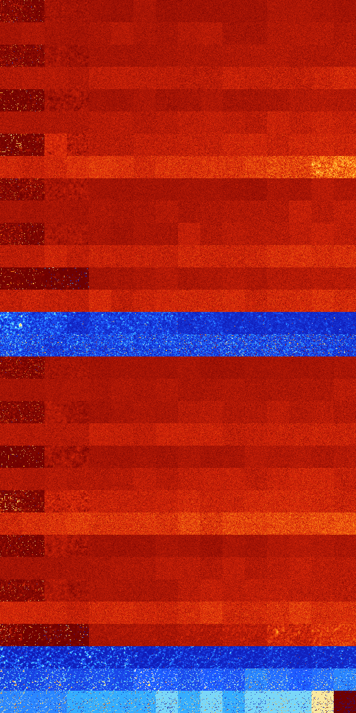

# B02456 (59904-60415)

<details>
    <summary>Initial Grid</summary>
    
</details>


<details>
    <summary>Initial Grid RLE</summary>

```
#C Exported from GoGoL (https://github.com/marrow16/gogol)
#C Wrap mode: Toroidal
#C Boundary mode: Dead
#C Step: 0
x = 100, y = 100, rule = B02456/S
2bo22bo20bobo9bo14bo2bo10bo2bo$67bo$15bo31bo10bo$9bo63bo16bo$2b2o3bo72b
o12bo$8bo11bo31bo27bo$7bo17bo14bo16bo8bo$21bo16bo23bo14b2o$o26bo2bo9bo
12bo30bo8bo$bo3bo3bo38bo18bo4b2o$3bo14bo46bo$45bo43bo$5bo27bo3bo10bo6b
2obo22bo6b2o$5bobo2bo13bo54bo12bo$2bo14bo49bo13bobo8bo5bo$41bo18bo21bo
2bo$35bo10bo$4bo5b2o10bo40bo$34b2o4bo$30bo47bo$5b2o43bo34bo$27bo16bo53b
o$18bo17bobo2bo21bo3bo15bo$68b2o14bo$64bo16bo17bo$14bo7bo37bo19bo9bo4bo
$15bo3bo$48bo3bo2bo37bo2bo$20bo66bo$15bo40bo23bo$35bo3bo34bo$10bo47bo
30bo$13bo26bo55bo$30bo2bo26bo2bo22bo8bo$10bo6bo2bo39bo$2bo16bo9bo5bo19b
o4bo24bo$39bo28bo$91bo$16bo11bo48bo16b2o$27bo7bo27bo8bo14bo$3bo8bo21bo
7bo42bo$bo6bo46bo8bo8bo9b2o3bo$o3bo51bo3bo18bo18bo$17bo17bo38bo$14bo12b
o$10bo2bo15bo43bo12bobo10bo$4bo4bo14bo24bo21bo19bobo$12bo5bo31bo2bo18bo
20bo4bo$38bo37bobo$100b$2bo26bo44bo5bo$4bo15bo7bo15bo8bo38bo2bo3bo$bo9b
o$26bo6bo10bo2bo$10bo24bo23bo11b2o$34bo20bo24bo8bo2bo$33bo13bo12bo2b2o
5bo10bo11bo$21bo44bo8bo9bo3b2o$8b2o28bo4b2o2bo13bo6bobo$bo8bo12bo22bo7b
o2bo3bo3bo17bo8bo$16bo7bo2b2o34bo4bo8bo6bo$3bo19bo17bo30bo$28bo5bo14bo$
25bo18bo18bo4bo8bo19bo$o10bo18bo14bo3bobo$100b$34bo35bo9bo4bo$17bo12bo
48bo$4bo4bo70bo$12bo4bobo4bo5bo2bo19bo6bo13bo$6b2o5bo16bo6bo2bo4bo24bo
10bo3bo$9bo7bo7bo17bo25bo$17bo34bobo3bo$6bo46bo11bo2bo4bo9bo$19bo3bo22b
o$3bo6bo20bo3bo17bo5b2o4bo$bo2bo20bo14bo12bo14bo4bo$4bo5bo7bo22bo35bo
21bo$63bo$70bo27bo$22bo24bo4bo11bo17bo5bo5b2o$12bo12bo7bo21bo24bo15bo$
21bo6b2o48bo10bo$31bo42bo5bo3bo5bo4bo$o5bo12bo18bo34b2o$5bo14bo4bo7bo
21bo4bo15bo$21bo20bo$5bo29bo40bo$16bobo4bo23bo15bo2bo9bo14bo4bo$16bo27b
o9bo37bo4bo$o50bo32bo$24bo23b2o30bo2bo6bo$14bo48bo17bo3bo5bo5bo$74bo$2b
o8bo12bo10b2o8bo15bo7b2o$13bo5bo45bo6bo13bo7bo$6bo2bo30bo12bo14bo6bo4bo
$52bo19bo$10bo55bo5bo12bo$14bo8bo23b2o!
```
</details>
<details>
    <summary>Thumbnail</summary>

</details>
<table>
<tr>
    <td><a href="./59904%20S%20Heat%20Map%20Activity.png"></a><br>S (59904)<br>R@105,p20</td>    <td><a href="./59905%20S0%20Heat%20Map%20Activity.png"></a><br>S0 (59905)<br>R@204,p40</td>    <td><a href="./59906%20S1%20Heat%20Map%20Activity.png"></a><br>S1 (59906)<br>G>1000</td>    <td><a href="./59907%20S01%20Heat%20Map%20Activity.png"></a><br>S01 (59907)<br>G>1000</td>    <td><a href="./59908%20S2%20Heat%20Map%20Activity.png"></a><br>S2 (59908)<br>G>1000</td>    <td><a href="./59909%20S02%20Heat%20Map%20Activity.png"></a><br>S02 (59909)<br>G>1000</td>    <td><a href="./59910%20S12%20Heat%20Map%20Activity.png"></a><br>S12 (59910)<br>G>1000</td>    <td><a href="./59911%20S012%20Heat%20Map%20Activity.png"></a><br>S012 (59911)<br>G>1000</td>    <td><a href="./59912%20S3%20Heat%20Map%20Activity.png"></a><br>S3 (59912)<br>G>1000</td>    <td><a href="./59913%20S03%20Heat%20Map%20Activity.png"></a><br>S03 (59913)<br>G>1000</td>    <td><a href="./59914%20S13%20Heat%20Map%20Activity.png"></a><br>S13 (59914)<br>G>1000</td>    <td><a href="./59915%20S013%20Heat%20Map%20Activity.png"></a><br>S013 (59915)<br>G>1000</td>    <td><a href="./59916%20S23%20Heat%20Map%20Activity.png"></a><br>S23 (59916)<br>G>1000</td>    <td><a href="./59917%20S023%20Heat%20Map%20Activity.png"></a><br>S023 (59917)<br>G>1000</td>    <td><a href="./59918%20S123%20Heat%20Map%20Activity.png"></a><br>S123 (59918)<br>G>1000</td>    <td><a href="./59919%20S0123%20Heat%20Map%20Activity.png"></a><br>S0123 (59919)<br>G>1000</td></tr>
<tr>
    <td><a href="./59920%20S4%20Heat%20Map%20Activity.png"></a><br>S4 (59920)<br>G>1000</td>    <td><a href="./59921%20S04%20Heat%20Map%20Activity.png"></a><br>S04 (59921)<br>G>1000</td>    <td><a href="./59922%20S14%20Heat%20Map%20Activity.png"></a><br>S14 (59922)<br>G>1000</td>    <td><a href="./59923%20S014%20Heat%20Map%20Activity.png"></a><br>S014 (59923)<br>G>1000</td>    <td><a href="./59924%20S24%20Heat%20Map%20Activity.png"></a><br>S24 (59924)<br>G>1000</td>    <td><a href="./59925%20S024%20Heat%20Map%20Activity.png"></a><br>S024 (59925)<br>G>1000</td>    <td><a href="./59926%20S124%20Heat%20Map%20Activity.png"></a><br>S124 (59926)<br>G>1000</td>    <td><a href="./59927%20S0124%20Heat%20Map%20Activity.png"></a><br>S0124 (59927)<br>G>1000</td>    <td><a href="./59928%20S34%20Heat%20Map%20Activity.png"></a><br>S34 (59928)<br>G>1000</td>    <td><a href="./59929%20S034%20Heat%20Map%20Activity.png"></a><br>S034 (59929)<br>G>1000</td>    <td><a href="./59930%20S134%20Heat%20Map%20Activity.png"></a><br>S134 (59930)<br>G>1000</td>    <td><a href="./59931%20S0134%20Heat%20Map%20Activity.png"></a><br>S0134 (59931)<br>G>1000</td>    <td><a href="./59932%20S234%20Heat%20Map%20Activity.png"></a><br>S234 (59932)<br>G>1000</td>    <td><a href="./59933%20S0234%20Heat%20Map%20Activity.png"></a><br>S0234 (59933)<br>G>1000</td>    <td><a href="./59934%20S1234%20Heat%20Map%20Activity.png"></a><br>S1234 (59934)<br>G>1000</td>    <td><a href="./59935%20S01234%20Heat%20Map%20Activity.png"></a><br>S01234 (59935)<br>G>1000</td></tr>
<tr>
    <td><a href="./59936%20S5%20Heat%20Map%20Activity.png"></a><br>S5 (59936)<br>R@90,p16</td>    <td><a href="./59937%20S05%20Heat%20Map%20Activity.png"></a><br>S05 (59937)<br>R@103,p8</td>    <td><a href="./59938%20S15%20Heat%20Map%20Activity.png"></a><br>S15 (59938)<br>G>1000</td>    <td><a href="./59939%20S015%20Heat%20Map%20Activity.png"></a><br>S015 (59939)<br>G>1000</td>    <td><a href="./59940%20S25%20Heat%20Map%20Activity.png"></a><br>S25 (59940)<br>G>1000</td>    <td><a href="./59941%20S025%20Heat%20Map%20Activity.png"></a><br>S025 (59941)<br>G>1000</td>    <td><a href="./59942%20S125%20Heat%20Map%20Activity.png"></a><br>S125 (59942)<br>G>1000</td>    <td><a href="./59943%20S0125%20Heat%20Map%20Activity.png"></a><br>S0125 (59943)<br>G>1000</td>    <td><a href="./59944%20S35%20Heat%20Map%20Activity.png"></a><br>S35 (59944)<br>G>1000</td>    <td><a href="./59945%20S035%20Heat%20Map%20Activity.png"></a><br>S035 (59945)<br>G>1000</td>    <td><a href="./59946%20S135%20Heat%20Map%20Activity.png"></a><br>S135 (59946)<br>G>1000</td>    <td><a href="./59947%20S0135%20Heat%20Map%20Activity.png"></a><br>S0135 (59947)<br>G>1000</td>    <td><a href="./59948%20S235%20Heat%20Map%20Activity.png"></a><br>S235 (59948)<br>G>1000</td>    <td><a href="./59949%20S0235%20Heat%20Map%20Activity.png"></a><br>S0235 (59949)<br>G>1000</td>    <td><a href="./59950%20S1235%20Heat%20Map%20Activity.png"></a><br>S1235 (59950)<br>G>1000</td>    <td><a href="./59951%20S01235%20Heat%20Map%20Activity.png"></a><br>S01235 (59951)<br>G>1000</td></tr>
<tr>
    <td><a href="./59952%20S45%20Heat%20Map%20Activity.png"></a><br>S45 (59952)<br>G>1000</td>    <td><a href="./59953%20S045%20Heat%20Map%20Activity.png"></a><br>S045 (59953)<br>G>1000</td>    <td><a href="./59954%20S145%20Heat%20Map%20Activity.png"></a><br>S145 (59954)<br>G>1000</td>    <td><a href="./59955%20S0145%20Heat%20Map%20Activity.png"></a><br>S0145 (59955)<br>G>1000</td>    <td><a href="./59956%20S245%20Heat%20Map%20Activity.png"></a><br>S245 (59956)<br>G>1000</td>    <td><a href="./59957%20S0245%20Heat%20Map%20Activity.png"></a><br>S0245 (59957)<br>G>1000</td>    <td><a href="./59958%20S1245%20Heat%20Map%20Activity.png"></a><br>S1245 (59958)<br>G>1000</td>    <td><a href="./59959%20S01245%20Heat%20Map%20Activity.png"></a><br>S01245 (59959)<br>G>1000</td>    <td><a href="./59960%20S345%20Heat%20Map%20Activity.png"></a><br>S345 (59960)<br>G>1000</td>    <td><a href="./59961%20S0345%20Heat%20Map%20Activity.png"></a><br>S0345 (59961)<br>G>1000</td>    <td><a href="./59962%20S1345%20Heat%20Map%20Activity.png"></a><br>S1345 (59962)<br>G>1000</td>    <td><a href="./59963%20S01345%20Heat%20Map%20Activity.png"></a><br>S01345 (59963)<br>G>1000</td>    <td><a href="./59964%20S2345%20Heat%20Map%20Activity.png"></a><br>S2345 (59964)<br>G>1000</td>    <td><a href="./59965%20S02345%20Heat%20Map%20Activity.png"></a><br>S02345 (59965)<br>G>1000</td>    <td><a href="./59966%20S12345%20Heat%20Map%20Activity.png"></a><br>S12345 (59966)<br>G>1000</td>    <td><a href="./59967%20S012345%20Heat%20Map%20Activity.png"></a><br>S012345 (59967)<br>G>1000</td></tr>
<tr>
    <td><a href="./59968%20S6%20Heat%20Map%20Activity.png"></a><br>S6 (59968)<br>R@186,p80</td>    <td><a href="./59969%20S06%20Heat%20Map%20Activity.png"></a><br>S06 (59969)<br>R@179,p72</td>    <td><a href="./59970%20S16%20Heat%20Map%20Activity.png"></a><br>S16 (59970)<br>G>1000</td>    <td><a href="./59971%20S016%20Heat%20Map%20Activity.png"></a><br>S016 (59971)<br>G>1000</td>    <td><a href="./59972%20S26%20Heat%20Map%20Activity.png"></a><br>S26 (59972)<br>G>1000</td>    <td><a href="./59973%20S026%20Heat%20Map%20Activity.png"></a><br>S026 (59973)<br>G>1000</td>    <td><a href="./59974%20S126%20Heat%20Map%20Activity.png"></a><br>S126 (59974)<br>G>1000</td>    <td><a href="./59975%20S0126%20Heat%20Map%20Activity.png"></a><br>S0126 (59975)<br>G>1000</td>    <td><a href="./59976%20S36%20Heat%20Map%20Activity.png"></a><br>S36 (59976)<br>G>1000</td>    <td><a href="./59977%20S036%20Heat%20Map%20Activity.png"></a><br>S036 (59977)<br>G>1000</td>    <td><a href="./59978%20S136%20Heat%20Map%20Activity.png"></a><br>S136 (59978)<br>G>1000</td>    <td><a href="./59979%20S0136%20Heat%20Map%20Activity.png"></a><br>S0136 (59979)<br>G>1000</td>    <td><a href="./59980%20S236%20Heat%20Map%20Activity.png"></a><br>S236 (59980)<br>G>1000</td>    <td><a href="./59981%20S0236%20Heat%20Map%20Activity.png"></a><br>S0236 (59981)<br>G>1000</td>    <td><a href="./59982%20S1236%20Heat%20Map%20Activity.png"></a><br>S1236 (59982)<br>G>1000</td>    <td><a href="./59983%20S01236%20Heat%20Map%20Activity.png"></a><br>S01236 (59983)<br>G>1000</td></tr>
<tr>
    <td><a href="./59984%20S46%20Heat%20Map%20Activity.png"></a><br>S46 (59984)<br>G>1000</td>    <td><a href="./59985%20S046%20Heat%20Map%20Activity.png"></a><br>S046 (59985)<br>G>1000</td>    <td><a href="./59986%20S146%20Heat%20Map%20Activity.png"></a><br>S146 (59986)<br>G>1000</td>    <td><a href="./59987%20S0146%20Heat%20Map%20Activity.png"></a><br>S0146 (59987)<br>G>1000</td>    <td><a href="./59988%20S246%20Heat%20Map%20Activity.png"></a><br>S246 (59988)<br>G>1000</td>    <td><a href="./59989%20S0246%20Heat%20Map%20Activity.png"></a><br>S0246 (59989)<br>G>1000</td>    <td><a href="./59990%20S1246%20Heat%20Map%20Activity.png"></a><br>S1246 (59990)<br>G>1000</td>    <td><a href="./59991%20S01246%20Heat%20Map%20Activity.png"></a><br>S01246 (59991)<br>G>1000</td>    <td><a href="./59992%20S346%20Heat%20Map%20Activity.png"></a><br>S346 (59992)<br>G>1000</td>    <td><a href="./59993%20S0346%20Heat%20Map%20Activity.png"></a><br>S0346 (59993)<br>G>1000</td>    <td><a href="./59994%20S1346%20Heat%20Map%20Activity.png"></a><br>S1346 (59994)<br>G>1000</td>    <td><a href="./59995%20S01346%20Heat%20Map%20Activity.png"></a><br>S01346 (59995)<br>G>1000</td>    <td><a href="./59996%20S2346%20Heat%20Map%20Activity.png"></a><br>S2346 (59996)<br>G>1000</td>    <td><a href="./59997%20S02346%20Heat%20Map%20Activity.png"></a><br>S02346 (59997)<br>G>1000</td>    <td><a href="./59998%20S12346%20Heat%20Map%20Activity.png"></a><br>S12346 (59998)<br>G>1000</td>    <td><a href="./59999%20S012346%20Heat%20Map%20Activity.png"></a><br>S012346 (59999)<br>G>1000</td></tr>
<tr>
    <td><a href="./60000%20S56%20Heat%20Map%20Activity.png"></a><br>S56 (60000)<br>R@308,p48</td>    <td><a href="./60001%20S056%20Heat%20Map%20Activity.png"></a><br>S056 (60001)<br>R@393,p12</td>    <td><a href="./60002%20S156%20Heat%20Map%20Activity.png"></a><br>S156 (60002)<br>G>1000</td>    <td><a href="./60003%20S0156%20Heat%20Map%20Activity.png"></a><br>S0156 (60003)<br>G>1000</td>    <td><a href="./60004%20S256%20Heat%20Map%20Activity.png"></a><br>S256 (60004)<br>G>1000</td>    <td><a href="./60005%20S0256%20Heat%20Map%20Activity.png"></a><br>S0256 (60005)<br>G>1000</td>    <td><a href="./60006%20S1256%20Heat%20Map%20Activity.png"></a><br>S1256 (60006)<br>G>1000</td>    <td><a href="./60007%20S01256%20Heat%20Map%20Activity.png"></a><br>S01256 (60007)<br>G>1000</td>    <td><a href="./60008%20S356%20Heat%20Map%20Activity.png"></a><br>S356 (60008)<br>G>1000</td>    <td><a href="./60009%20S0356%20Heat%20Map%20Activity.png"></a><br>S0356 (60009)<br>G>1000</td>    <td><a href="./60010%20S1356%20Heat%20Map%20Activity.png"></a><br>S1356 (60010)<br>G>1000</td>    <td><a href="./60011%20S01356%20Heat%20Map%20Activity.png"></a><br>S01356 (60011)<br>G>1000</td>    <td><a href="./60012%20S2356%20Heat%20Map%20Activity.png"></a><br>S2356 (60012)<br>G>1000</td>    <td><a href="./60013%20S02356%20Heat%20Map%20Activity.png"></a><br>S02356 (60013)<br>G>1000</td>    <td><a href="./60014%20S12356%20Heat%20Map%20Activity.png"></a><br>S12356 (60014)<br>G>1000</td>    <td><a href="./60015%20S012356%20Heat%20Map%20Activity.png"></a><br>S012356 (60015)<br>G>1000</td></tr>
<tr>
    <td><a href="./60016%20S456%20Heat%20Map%20Activity.png"></a><br>S456 (60016)<br>G>1000</td>    <td><a href="./60017%20S0456%20Heat%20Map%20Activity.png"></a><br>S0456 (60017)<br>G>1000</td>    <td><a href="./60018%20S1456%20Heat%20Map%20Activity.png"></a><br>S1456 (60018)<br>G>1000</td>    <td><a href="./60019%20S01456%20Heat%20Map%20Activity.png"></a><br>S01456 (60019)<br>G>1000</td>    <td><a href="./60020%20S2456%20Heat%20Map%20Activity.png"></a><br>S2456 (60020)<br>G>1000</td>    <td><a href="./60021%20S02456%20Heat%20Map%20Activity.png"></a><br>S02456 (60021)<br>G>1000</td>    <td><a href="./60022%20S12456%20Heat%20Map%20Activity.png"></a><br>S12456 (60022)<br>G>1000</td>    <td><a href="./60023%20S012456%20Heat%20Map%20Activity.png"></a><br>S012456 (60023)<br>G>1000</td>    <td><a href="./60024%20S3456%20Heat%20Map%20Activity.png"></a><br>S3456 (60024)<br>G>1000</td>    <td><a href="./60025%20S03456%20Heat%20Map%20Activity.png"></a><br>S03456 (60025)<br>G>1000</td>    <td><a href="./60026%20S13456%20Heat%20Map%20Activity.png"></a><br>S13456 (60026)<br>G>1000</td>    <td><a href="./60027%20S013456%20Heat%20Map%20Activity.png"></a><br>S013456 (60027)<br>G>1000</td>    <td><a href="./60028%20S23456%20Heat%20Map%20Activity.png"></a><br>S23456 (60028)<br>G>1000</td>    <td><a href="./60029%20S023456%20Heat%20Map%20Activity.png"></a><br>S023456 (60029)<br>G>1000</td>    <td><a href="./60030%20S123456%20Heat%20Map%20Activity.png"></a><br>S123456 (60030)<br>G>1000</td>    <td><a href="./60031%20S0123456%20Heat%20Map%20Activity.png"></a><br>S0123456 (60031)<br>G>1000</td></tr>
<tr>
    <td><a href="./60032%20S7%20Heat%20Map%20Activity.png"></a><br>S7 (60032)<br>R@132,p8</td>    <td><a href="./60033%20S07%20Heat%20Map%20Activity.png"></a><br>S07 (60033)<br>R@96,p8</td>    <td><a href="./60034%20S17%20Heat%20Map%20Activity.png"></a><br>S17 (60034)<br>G>1000</td>    <td><a href="./60035%20S017%20Heat%20Map%20Activity.png"></a><br>S017 (60035)<br>G>1000</td>    <td><a href="./60036%20S27%20Heat%20Map%20Activity.png"></a><br>S27 (60036)<br>G>1000</td>    <td><a href="./60037%20S027%20Heat%20Map%20Activity.png"></a><br>S027 (60037)<br>G>1000</td>    <td><a href="./60038%20S127%20Heat%20Map%20Activity.png"></a><br>S127 (60038)<br>G>1000</td>    <td><a href="./60039%20S0127%20Heat%20Map%20Activity.png"></a><br>S0127 (60039)<br>G>1000</td>    <td><a href="./60040%20S37%20Heat%20Map%20Activity.png"></a><br>S37 (60040)<br>G>1000</td>    <td><a href="./60041%20S037%20Heat%20Map%20Activity.png"></a><br>S037 (60041)<br>G>1000</td>    <td><a href="./60042%20S137%20Heat%20Map%20Activity.png"></a><br>S137 (60042)<br>G>1000</td>    <td><a href="./60043%20S0137%20Heat%20Map%20Activity.png"></a><br>S0137 (60043)<br>G>1000</td>    <td><a href="./60044%20S237%20Heat%20Map%20Activity.png"></a><br>S237 (60044)<br>G>1000</td>    <td><a href="./60045%20S0237%20Heat%20Map%20Activity.png"></a><br>S0237 (60045)<br>G>1000</td>    <td><a href="./60046%20S1237%20Heat%20Map%20Activity.png"></a><br>S1237 (60046)<br>G>1000</td>    <td><a href="./60047%20S01237%20Heat%20Map%20Activity.png"></a><br>S01237 (60047)<br>G>1000</td></tr>
<tr>
    <td><a href="./60048%20S47%20Heat%20Map%20Activity.png"></a><br>S47 (60048)<br>G>1000</td>    <td><a href="./60049%20S047%20Heat%20Map%20Activity.png"></a><br>S047 (60049)<br>G>1000</td>    <td><a href="./60050%20S147%20Heat%20Map%20Activity.png"></a><br>S147 (60050)<br>G>1000</td>    <td><a href="./60051%20S0147%20Heat%20Map%20Activity.png"></a><br>S0147 (60051)<br>G>1000</td>    <td><a href="./60052%20S247%20Heat%20Map%20Activity.png"></a><br>S247 (60052)<br>G>1000</td>    <td><a href="./60053%20S0247%20Heat%20Map%20Activity.png"></a><br>S0247 (60053)<br>G>1000</td>    <td><a href="./60054%20S1247%20Heat%20Map%20Activity.png"></a><br>S1247 (60054)<br>G>1000</td>    <td><a href="./60055%20S01247%20Heat%20Map%20Activity.png"></a><br>S01247 (60055)<br>G>1000</td>    <td><a href="./60056%20S347%20Heat%20Map%20Activity.png"></a><br>S347 (60056)<br>G>1000</td>    <td><a href="./60057%20S0347%20Heat%20Map%20Activity.png"></a><br>S0347 (60057)<br>G>1000</td>    <td><a href="./60058%20S1347%20Heat%20Map%20Activity.png"></a><br>S1347 (60058)<br>G>1000</td>    <td><a href="./60059%20S01347%20Heat%20Map%20Activity.png"></a><br>S01347 (60059)<br>G>1000</td>    <td><a href="./60060%20S2347%20Heat%20Map%20Activity.png"></a><br>S2347 (60060)<br>G>1000</td>    <td><a href="./60061%20S02347%20Heat%20Map%20Activity.png"></a><br>S02347 (60061)<br>G>1000</td>    <td><a href="./60062%20S12347%20Heat%20Map%20Activity.png"></a><br>S12347 (60062)<br>G>1000</td>    <td><a href="./60063%20S012347%20Heat%20Map%20Activity.png"></a><br>S012347 (60063)<br>G>1000</td></tr>
<tr>
    <td><a href="./60064%20S57%20Heat%20Map%20Activity.png"></a><br>S57 (60064)<br>R@82,p4</td>    <td><a href="./60065%20S057%20Heat%20Map%20Activity.png"></a><br>S057 (60065)<br>R@141,p8</td>    <td><a href="./60066%20S157%20Heat%20Map%20Activity.png"></a><br>S157 (60066)<br>G>1000</td>    <td><a href="./60067%20S0157%20Heat%20Map%20Activity.png"></a><br>S0157 (60067)<br>G>1000</td>    <td><a href="./60068%20S257%20Heat%20Map%20Activity.png"></a><br>S257 (60068)<br>G>1000</td>    <td><a href="./60069%20S0257%20Heat%20Map%20Activity.png"></a><br>S0257 (60069)<br>G>1000</td>    <td><a href="./60070%20S1257%20Heat%20Map%20Activity.png"></a><br>S1257 (60070)<br>G>1000</td>    <td><a href="./60071%20S01257%20Heat%20Map%20Activity.png"></a><br>S01257 (60071)<br>G>1000</td>    <td><a href="./60072%20S357%20Heat%20Map%20Activity.png"></a><br>S357 (60072)<br>G>1000</td>    <td><a href="./60073%20S0357%20Heat%20Map%20Activity.png"></a><br>S0357 (60073)<br>G>1000</td>    <td><a href="./60074%20S1357%20Heat%20Map%20Activity.png"></a><br>S1357 (60074)<br>G>1000</td>    <td><a href="./60075%20S01357%20Heat%20Map%20Activity.png"></a><br>S01357 (60075)<br>G>1000</td>    <td><a href="./60076%20S2357%20Heat%20Map%20Activity.png"></a><br>S2357 (60076)<br>G>1000</td>    <td><a href="./60077%20S02357%20Heat%20Map%20Activity.png"></a><br>S02357 (60077)<br>G>1000</td>    <td><a href="./60078%20S12357%20Heat%20Map%20Activity.png"></a><br>S12357 (60078)<br>G>1000</td>    <td><a href="./60079%20S012357%20Heat%20Map%20Activity.png"></a><br>S012357 (60079)<br>G>1000</td></tr>
<tr>
    <td><a href="./60080%20S457%20Heat%20Map%20Activity.png"></a><br>S457 (60080)<br>G>1000</td>    <td><a href="./60081%20S0457%20Heat%20Map%20Activity.png"></a><br>S0457 (60081)<br>G>1000</td>    <td><a href="./60082%20S1457%20Heat%20Map%20Activity.png"></a><br>S1457 (60082)<br>G>1000</td>    <td><a href="./60083%20S01457%20Heat%20Map%20Activity.png"></a><br>S01457 (60083)<br>G>1000</td>    <td><a href="./60084%20S2457%20Heat%20Map%20Activity.png"></a><br>S2457 (60084)<br>G>1000</td>    <td><a href="./60085%20S02457%20Heat%20Map%20Activity.png"></a><br>S02457 (60085)<br>G>1000</td>    <td><a href="./60086%20S12457%20Heat%20Map%20Activity.png"></a><br>S12457 (60086)<br>G>1000</td>    <td><a href="./60087%20S012457%20Heat%20Map%20Activity.png"></a><br>S012457 (60087)<br>G>1000</td>    <td><a href="./60088%20S3457%20Heat%20Map%20Activity.png"></a><br>S3457 (60088)<br>G>1000</td>    <td><a href="./60089%20S03457%20Heat%20Map%20Activity.png"></a><br>S03457 (60089)<br>G>1000</td>    <td><a href="./60090%20S13457%20Heat%20Map%20Activity.png"></a><br>S13457 (60090)<br>G>1000</td>    <td><a href="./60091%20S013457%20Heat%20Map%20Activity.png"></a><br>S013457 (60091)<br>G>1000</td>    <td><a href="./60092%20S23457%20Heat%20Map%20Activity.png"></a><br>S23457 (60092)<br>G>1000</td>    <td><a href="./60093%20S023457%20Heat%20Map%20Activity.png"></a><br>S023457 (60093)<br>G>1000</td>    <td><a href="./60094%20S123457%20Heat%20Map%20Activity.png"></a><br>S123457 (60094)<br>G>1000</td>    <td><a href="./60095%20S0123457%20Heat%20Map%20Activity.png"></a><br>S0123457 (60095)<br>G>1000</td></tr>
<tr>
    <td><a href="./60096%20S67%20Heat%20Map%20Activity.png"></a><br>S67 (60096)<br>R@205,p16</td>    <td><a href="./60097%20S067%20Heat%20Map%20Activity.png"></a><br>S067 (60097)<br>R@271,p120</td>    <td><a href="./60098%20S167%20Heat%20Map%20Activity.png"></a><br>S167 (60098)<br>R@776,p360</td>    <td><a href="./60099%20S0167%20Heat%20Map%20Activity.png"></a><br>S0167 (60099)<br>G>1000</td>    <td><a href="./60100%20S267%20Heat%20Map%20Activity.png"></a><br>S267 (60100)<br>G>1000</td>    <td><a href="./60101%20S0267%20Heat%20Map%20Activity.png"></a><br>S0267 (60101)<br>G>1000</td>    <td><a href="./60102%20S1267%20Heat%20Map%20Activity.png"></a><br>S1267 (60102)<br>G>1000</td>    <td><a href="./60103%20S01267%20Heat%20Map%20Activity.png"></a><br>S01267 (60103)<br>G>1000</td>    <td><a href="./60104%20S367%20Heat%20Map%20Activity.png"></a><br>S367 (60104)<br>G>1000</td>    <td><a href="./60105%20S0367%20Heat%20Map%20Activity.png"></a><br>S0367 (60105)<br>G>1000</td>    <td><a href="./60106%20S1367%20Heat%20Map%20Activity.png"></a><br>S1367 (60106)<br>G>1000</td>    <td><a href="./60107%20S01367%20Heat%20Map%20Activity.png"></a><br>S01367 (60107)<br>G>1000</td>    <td><a href="./60108%20S2367%20Heat%20Map%20Activity.png"></a><br>S2367 (60108)<br>G>1000</td>    <td><a href="./60109%20S02367%20Heat%20Map%20Activity.png"></a><br>S02367 (60109)<br>G>1000</td>    <td><a href="./60110%20S12367%20Heat%20Map%20Activity.png"></a><br>S12367 (60110)<br>G>1000</td>    <td><a href="./60111%20S012367%20Heat%20Map%20Activity.png"></a><br>S012367 (60111)<br>G>1000</td></tr>
<tr>
    <td><a href="./60112%20S467%20Heat%20Map%20Activity.png"></a><br>S467 (60112)<br>G>1000</td>    <td><a href="./60113%20S0467%20Heat%20Map%20Activity.png"></a><br>S0467 (60113)<br>G>1000</td>    <td><a href="./60114%20S1467%20Heat%20Map%20Activity.png"></a><br>S1467 (60114)<br>G>1000</td>    <td><a href="./60115%20S01467%20Heat%20Map%20Activity.png"></a><br>S01467 (60115)<br>G>1000</td>    <td><a href="./60116%20S2467%20Heat%20Map%20Activity.png"></a><br>S2467 (60116)<br>G>1000</td>    <td><a href="./60117%20S02467%20Heat%20Map%20Activity.png"></a><br>S02467 (60117)<br>G>1000</td>    <td><a href="./60118%20S12467%20Heat%20Map%20Activity.png"></a><br>S12467 (60118)<br>G>1000</td>    <td><a href="./60119%20S012467%20Heat%20Map%20Activity.png"></a><br>S012467 (60119)<br>G>1000</td>    <td><a href="./60120%20S3467%20Heat%20Map%20Activity.png"></a><br>S3467 (60120)<br>G>1000</td>    <td><a href="./60121%20S03467%20Heat%20Map%20Activity.png"></a><br>S03467 (60121)<br>G>1000</td>    <td><a href="./60122%20S13467%20Heat%20Map%20Activity.png"></a><br>S13467 (60122)<br>G>1000</td>    <td><a href="./60123%20S013467%20Heat%20Map%20Activity.png"></a><br>S013467 (60123)<br>G>1000</td>    <td><a href="./60124%20S23467%20Heat%20Map%20Activity.png"></a><br>S23467 (60124)<br>G>1000</td>    <td><a href="./60125%20S023467%20Heat%20Map%20Activity.png"></a><br>S023467 (60125)<br>G>1000</td>    <td><a href="./60126%20S123467%20Heat%20Map%20Activity.png"></a><br>S123467 (60126)<br>G>1000</td>    <td><a href="./60127%20S0123467%20Heat%20Map%20Activity.png"></a><br>S0123467 (60127)<br>G>1000</td></tr>
<tr>
    <td><a href="./60128%20S567%20Heat%20Map%20Activity.png"></a><br>S567 (60128)<br>R@88,p6</td>    <td><a href="./60129%20S0567%20Heat%20Map%20Activity.png"></a><br>S0567 (60129)<br>R@77,p6</td>    <td><a href="./60130%20S1567%20Heat%20Map%20Activity.png"></a><br>S1567 (60130)<br>R@87,p2</td>    <td><a href="./60131%20S01567%20Heat%20Map%20Activity.png"></a><br>S01567 (60131)<br>R@118,p6</td>    <td><a href="./60132%20S2567%20Heat%20Map%20Activity.png"></a><br>S2567 (60132)<br>R@73,p6</td>    <td><a href="./60133%20S02567%20Heat%20Map%20Activity.png"></a><br>S02567 (60133)<br>R@73,p6</td>    <td><a href="./60134%20S12567%20Heat%20Map%20Activity.png"></a><br>S12567 (60134)<br>R@65,p6</td>    <td><a href="./60135%20S012567%20Heat%20Map%20Activity.png"></a><br>S012567 (60135)<br>R@71,p6</td>    <td><a href="./60136%20S3567%20Heat%20Map%20Activity.png"></a><br>S3567 (60136)<br>R@96,p30</td>    <td><a href="./60137%20S03567%20Heat%20Map%20Activity.png"></a><br>S03567 (60137)<br>R@75,p4</td>    <td><a href="./60138%20S13567%20Heat%20Map%20Activity.png"></a><br>S13567 (60138)<br>R@124,p6</td>    <td><a href="./60139%20S013567%20Heat%20Map%20Activity.png"></a><br>S013567 (60139)<br>R@96,p12</td>    <td><a href="./60140%20S23567%20Heat%20Map%20Activity.png"></a><br>S23567 (60140)<br>R@95,p30</td>    <td><a href="./60141%20S023567%20Heat%20Map%20Activity.png"></a><br>S023567 (60141)<br>R@96,p10</td>    <td><a href="./60142%20S123567%20Heat%20Map%20Activity.png"></a><br>S123567 (60142)<br>R@102,p30</td>    <td><a href="./60143%20S0123567%20Heat%20Map%20Activity.png"></a><br>S0123567 (60143)<br>R@111,p30</td></tr>
<tr>
    <td><a href="./60144%20S4567%20Heat%20Map%20Activity.png"></a><br>S4567 (60144)<br>R@23,p6</td>    <td><a href="./60145%20S04567%20Heat%20Map%20Activity.png"></a><br>S04567 (60145)<br>R@27,p6</td>    <td><a href="./60146%20S14567%20Heat%20Map%20Activity.png"></a><br>S14567 (60146)<br>R@33,p6</td>    <td><a href="./60147%20S014567%20Heat%20Map%20Activity.png"></a><br>S014567 (60147)<br>R@25,p6</td>    <td><a href="./60148%20S24567%20Heat%20Map%20Activity.png"></a><br>S24567 (60148)<br>R@28,p6</td>    <td><a href="./60149%20S024567%20Heat%20Map%20Activity.png"></a><br>S024567 (60149)<br>R@25,p6</td>    <td><a href="./60150%20S124567%20Heat%20Map%20Activity.png"></a><br>S124567 (60150)<br>R@28,p6</td>    <td><a href="./60151%20S0124567%20Heat%20Map%20Activity.png"></a><br>S0124567 (60151)<br>R@25,p6</td>    <td><a href="./60152%20S34567%20Heat%20Map%20Activity.png"></a><br>S34567 (60152)<br>R@25,p6</td>    <td><a href="./60153%20S034567%20Heat%20Map%20Activity.png"></a><br>S034567 (60153)<br>R@23,p6</td>    <td><a href="./60154%20S134567%20Heat%20Map%20Activity.png"></a><br>S134567 (60154)<br>R@23,p6</td>    <td><a href="./60155%20S0134567%20Heat%20Map%20Activity.png"></a><br>S0134567 (60155)<br>R@23,p6</td>    <td><a href="./60156%20S234567%20Heat%20Map%20Activity.png"></a><br>S234567 (60156)<br>R@23,p6</td>    <td><a href="./60157%20S0234567%20Heat%20Map%20Activity.png"></a><br>S0234567 (60157)<br>R@25,p6</td>    <td><a href="./60158%20S1234567%20Heat%20Map%20Activity.png"></a><br>S1234567 (60158)<br>R@26,p6</td>    <td><a href="./60159%20S01234567%20Heat%20Map%20Activity.png"></a><br>S01234567 (60159)<br>R@30,p6</td></tr>
<tr>
    <td><a href="./60160%20S8%20Heat%20Map%20Activity.png"></a><br>S8 (60160)<br>R@102,p8</td>    <td><a href="./60161%20S08%20Heat%20Map%20Activity.png"></a><br>S08 (60161)<br>R@99,p8</td>    <td><a href="./60162%20S18%20Heat%20Map%20Activity.png"></a><br>S18 (60162)<br>G>1000</td>    <td><a href="./60163%20S018%20Heat%20Map%20Activity.png"></a><br>S018 (60163)<br>G>1000</td>    <td><a href="./60164%20S28%20Heat%20Map%20Activity.png"></a><br>S28 (60164)<br>G>1000</td>    <td><a href="./60165%20S028%20Heat%20Map%20Activity.png"></a><br>S028 (60165)<br>G>1000</td>    <td><a href="./60166%20S128%20Heat%20Map%20Activity.png"></a><br>S128 (60166)<br>G>1000</td>    <td><a href="./60167%20S0128%20Heat%20Map%20Activity.png"></a><br>S0128 (60167)<br>G>1000</td>    <td><a href="./60168%20S38%20Heat%20Map%20Activity.png"></a><br>S38 (60168)<br>G>1000</td>    <td><a href="./60169%20S038%20Heat%20Map%20Activity.png"></a><br>S038 (60169)<br>G>1000</td>    <td><a href="./60170%20S138%20Heat%20Map%20Activity.png"></a><br>S138 (60170)<br>G>1000</td>    <td><a href="./60171%20S0138%20Heat%20Map%20Activity.png"></a><br>S0138 (60171)<br>G>1000</td>    <td><a href="./60172%20S238%20Heat%20Map%20Activity.png"></a><br>S238 (60172)<br>G>1000</td>    <td><a href="./60173%20S0238%20Heat%20Map%20Activity.png"></a><br>S0238 (60173)<br>G>1000</td>    <td><a href="./60174%20S1238%20Heat%20Map%20Activity.png"></a><br>S1238 (60174)<br>G>1000</td>    <td><a href="./60175%20S01238%20Heat%20Map%20Activity.png"></a><br>S01238 (60175)<br>G>1000</td></tr>
<tr>
    <td><a href="./60176%20S48%20Heat%20Map%20Activity.png"></a><br>S48 (60176)<br>G>1000</td>    <td><a href="./60177%20S048%20Heat%20Map%20Activity.png"></a><br>S048 (60177)<br>G>1000</td>    <td><a href="./60178%20S148%20Heat%20Map%20Activity.png"></a><br>S148 (60178)<br>G>1000</td>    <td><a href="./60179%20S0148%20Heat%20Map%20Activity.png"></a><br>S0148 (60179)<br>G>1000</td>    <td><a href="./60180%20S248%20Heat%20Map%20Activity.png"></a><br>S248 (60180)<br>G>1000</td>    <td><a href="./60181%20S0248%20Heat%20Map%20Activity.png"></a><br>S0248 (60181)<br>G>1000</td>    <td><a href="./60182%20S1248%20Heat%20Map%20Activity.png"></a><br>S1248 (60182)<br>G>1000</td>    <td><a href="./60183%20S01248%20Heat%20Map%20Activity.png"></a><br>S01248 (60183)<br>G>1000</td>    <td><a href="./60184%20S348%20Heat%20Map%20Activity.png"></a><br>S348 (60184)<br>G>1000</td>    <td><a href="./60185%20S0348%20Heat%20Map%20Activity.png"></a><br>S0348 (60185)<br>G>1000</td>    <td><a href="./60186%20S1348%20Heat%20Map%20Activity.png"></a><br>S1348 (60186)<br>G>1000</td>    <td><a href="./60187%20S01348%20Heat%20Map%20Activity.png"></a><br>S01348 (60187)<br>G>1000</td>    <td><a href="./60188%20S2348%20Heat%20Map%20Activity.png"></a><br>S2348 (60188)<br>G>1000</td>    <td><a href="./60189%20S02348%20Heat%20Map%20Activity.png"></a><br>S02348 (60189)<br>G>1000</td>    <td><a href="./60190%20S12348%20Heat%20Map%20Activity.png"></a><br>S12348 (60190)<br>G>1000</td>    <td><a href="./60191%20S012348%20Heat%20Map%20Activity.png"></a><br>S012348 (60191)<br>G>1000</td></tr>
<tr>
    <td><a href="./60192%20S58%20Heat%20Map%20Activity.png"></a><br>S58 (60192)<br>R@102,p4</td>    <td><a href="./60193%20S058%20Heat%20Map%20Activity.png"></a><br>S058 (60193)<br>R@119,p12</td>    <td><a href="./60194%20S158%20Heat%20Map%20Activity.png"></a><br>S158 (60194)<br>G>1000</td>    <td><a href="./60195%20S0158%20Heat%20Map%20Activity.png"></a><br>S0158 (60195)<br>G>1000</td>    <td><a href="./60196%20S258%20Heat%20Map%20Activity.png"></a><br>S258 (60196)<br>G>1000</td>    <td><a href="./60197%20S0258%20Heat%20Map%20Activity.png"></a><br>S0258 (60197)<br>G>1000</td>    <td><a href="./60198%20S1258%20Heat%20Map%20Activity.png"></a><br>S1258 (60198)<br>G>1000</td>    <td><a href="./60199%20S01258%20Heat%20Map%20Activity.png"></a><br>S01258 (60199)<br>G>1000</td>    <td><a href="./60200%20S358%20Heat%20Map%20Activity.png"></a><br>S358 (60200)<br>G>1000</td>    <td><a href="./60201%20S0358%20Heat%20Map%20Activity.png"></a><br>S0358 (60201)<br>G>1000</td>    <td><a href="./60202%20S1358%20Heat%20Map%20Activity.png"></a><br>S1358 (60202)<br>G>1000</td>    <td><a href="./60203%20S01358%20Heat%20Map%20Activity.png"></a><br>S01358 (60203)<br>G>1000</td>    <td><a href="./60204%20S2358%20Heat%20Map%20Activity.png"></a><br>S2358 (60204)<br>G>1000</td>    <td><a href="./60205%20S02358%20Heat%20Map%20Activity.png"></a><br>S02358 (60205)<br>G>1000</td>    <td><a href="./60206%20S12358%20Heat%20Map%20Activity.png"></a><br>S12358 (60206)<br>G>1000</td>    <td><a href="./60207%20S012358%20Heat%20Map%20Activity.png"></a><br>S012358 (60207)<br>G>1000</td></tr>
<tr>
    <td><a href="./60208%20S458%20Heat%20Map%20Activity.png"></a><br>S458 (60208)<br>G>1000</td>    <td><a href="./60209%20S0458%20Heat%20Map%20Activity.png"></a><br>S0458 (60209)<br>G>1000</td>    <td><a href="./60210%20S1458%20Heat%20Map%20Activity.png"></a><br>S1458 (60210)<br>G>1000</td>    <td><a href="./60211%20S01458%20Heat%20Map%20Activity.png"></a><br>S01458 (60211)<br>G>1000</td>    <td><a href="./60212%20S2458%20Heat%20Map%20Activity.png"></a><br>S2458 (60212)<br>G>1000</td>    <td><a href="./60213%20S02458%20Heat%20Map%20Activity.png"></a><br>S02458 (60213)<br>G>1000</td>    <td><a href="./60214%20S12458%20Heat%20Map%20Activity.png"></a><br>S12458 (60214)<br>G>1000</td>    <td><a href="./60215%20S012458%20Heat%20Map%20Activity.png"></a><br>S012458 (60215)<br>G>1000</td>    <td><a href="./60216%20S3458%20Heat%20Map%20Activity.png"></a><br>S3458 (60216)<br>G>1000</td>    <td><a href="./60217%20S03458%20Heat%20Map%20Activity.png"></a><br>S03458 (60217)<br>G>1000</td>    <td><a href="./60218%20S13458%20Heat%20Map%20Activity.png"></a><br>S13458 (60218)<br>G>1000</td>    <td><a href="./60219%20S013458%20Heat%20Map%20Activity.png"></a><br>S013458 (60219)<br>G>1000</td>    <td><a href="./60220%20S23458%20Heat%20Map%20Activity.png"></a><br>S23458 (60220)<br>G>1000</td>    <td><a href="./60221%20S023458%20Heat%20Map%20Activity.png"></a><br>S023458 (60221)<br>G>1000</td>    <td><a href="./60222%20S123458%20Heat%20Map%20Activity.png"></a><br>S123458 (60222)<br>G>1000</td>    <td><a href="./60223%20S0123458%20Heat%20Map%20Activity.png"></a><br>S0123458 (60223)<br>G>1000</td></tr>
<tr>
    <td><a href="./60224%20S68%20Heat%20Map%20Activity.png"></a><br>S68 (60224)<br>R@388,p240</td>    <td><a href="./60225%20S068%20Heat%20Map%20Activity.png"></a><br>S068 (60225)<br>R@272,p168</td>    <td><a href="./60226%20S168%20Heat%20Map%20Activity.png"></a><br>S168 (60226)<br>G>1000</td>    <td><a href="./60227%20S0168%20Heat%20Map%20Activity.png"></a><br>S0168 (60227)<br>G>1000</td>    <td><a href="./60228%20S268%20Heat%20Map%20Activity.png"></a><br>S268 (60228)<br>G>1000</td>    <td><a href="./60229%20S0268%20Heat%20Map%20Activity.png"></a><br>S0268 (60229)<br>G>1000</td>    <td><a href="./60230%20S1268%20Heat%20Map%20Activity.png"></a><br>S1268 (60230)<br>G>1000</td>    <td><a href="./60231%20S01268%20Heat%20Map%20Activity.png"></a><br>S01268 (60231)<br>G>1000</td>    <td><a href="./60232%20S368%20Heat%20Map%20Activity.png"></a><br>S368 (60232)<br>G>1000</td>    <td><a href="./60233%20S0368%20Heat%20Map%20Activity.png"></a><br>S0368 (60233)<br>G>1000</td>    <td><a href="./60234%20S1368%20Heat%20Map%20Activity.png"></a><br>S1368 (60234)<br>G>1000</td>    <td><a href="./60235%20S01368%20Heat%20Map%20Activity.png"></a><br>S01368 (60235)<br>G>1000</td>    <td><a href="./60236%20S2368%20Heat%20Map%20Activity.png"></a><br>S2368 (60236)<br>G>1000</td>    <td><a href="./60237%20S02368%20Heat%20Map%20Activity.png"></a><br>S02368 (60237)<br>G>1000</td>    <td><a href="./60238%20S12368%20Heat%20Map%20Activity.png"></a><br>S12368 (60238)<br>G>1000</td>    <td><a href="./60239%20S012368%20Heat%20Map%20Activity.png"></a><br>S012368 (60239)<br>G>1000</td></tr>
<tr>
    <td><a href="./60240%20S468%20Heat%20Map%20Activity.png"></a><br>S468 (60240)<br>G>1000</td>    <td><a href="./60241%20S0468%20Heat%20Map%20Activity.png"></a><br>S0468 (60241)<br>G>1000</td>    <td><a href="./60242%20S1468%20Heat%20Map%20Activity.png"></a><br>S1468 (60242)<br>G>1000</td>    <td><a href="./60243%20S01468%20Heat%20Map%20Activity.png"></a><br>S01468 (60243)<br>G>1000</td>    <td><a href="./60244%20S2468%20Heat%20Map%20Activity.png"></a><br>S2468 (60244)<br>G>1000</td>    <td><a href="./60245%20S02468%20Heat%20Map%20Activity.png"></a><br>S02468 (60245)<br>G>1000</td>    <td><a href="./60246%20S12468%20Heat%20Map%20Activity.png"></a><br>S12468 (60246)<br>G>1000</td>    <td><a href="./60247%20S012468%20Heat%20Map%20Activity.png"></a><br>S012468 (60247)<br>G>1000</td>    <td><a href="./60248%20S3468%20Heat%20Map%20Activity.png"></a><br>S3468 (60248)<br>G>1000</td>    <td><a href="./60249%20S03468%20Heat%20Map%20Activity.png"></a><br>S03468 (60249)<br>G>1000</td>    <td><a href="./60250%20S13468%20Heat%20Map%20Activity.png"></a><br>S13468 (60250)<br>G>1000</td>    <td><a href="./60251%20S013468%20Heat%20Map%20Activity.png"></a><br>S013468 (60251)<br>G>1000</td>    <td><a href="./60252%20S23468%20Heat%20Map%20Activity.png"></a><br>S23468 (60252)<br>G>1000</td>    <td><a href="./60253%20S023468%20Heat%20Map%20Activity.png"></a><br>S023468 (60253)<br>G>1000</td>    <td><a href="./60254%20S123468%20Heat%20Map%20Activity.png"></a><br>S123468 (60254)<br>G>1000</td>    <td><a href="./60255%20S0123468%20Heat%20Map%20Activity.png"></a><br>S0123468 (60255)<br>G>1000</td></tr>
<tr>
    <td><a href="./60256%20S568%20Heat%20Map%20Activity.png"></a><br>S568 (60256)<br>R@274,p48</td>    <td><a href="./60257%20S0568%20Heat%20Map%20Activity.png"></a><br>S0568 (60257)<br>R@431,p120</td>    <td><a href="./60258%20S1568%20Heat%20Map%20Activity.png"></a><br>S1568 (60258)<br>G>1000</td>    <td><a href="./60259%20S01568%20Heat%20Map%20Activity.png"></a><br>S01568 (60259)<br>G>1000</td>    <td><a href="./60260%20S2568%20Heat%20Map%20Activity.png"></a><br>S2568 (60260)<br>G>1000</td>    <td><a href="./60261%20S02568%20Heat%20Map%20Activity.png"></a><br>S02568 (60261)<br>G>1000</td>    <td><a href="./60262%20S12568%20Heat%20Map%20Activity.png"></a><br>S12568 (60262)<br>G>1000</td>    <td><a href="./60263%20S012568%20Heat%20Map%20Activity.png"></a><br>S012568 (60263)<br>G>1000</td>    <td><a href="./60264%20S3568%20Heat%20Map%20Activity.png"></a><br>S3568 (60264)<br>G>1000</td>    <td><a href="./60265%20S03568%20Heat%20Map%20Activity.png"></a><br>S03568 (60265)<br>G>1000</td>    <td><a href="./60266%20S13568%20Heat%20Map%20Activity.png"></a><br>S13568 (60266)<br>G>1000</td>    <td><a href="./60267%20S013568%20Heat%20Map%20Activity.png"></a><br>S013568 (60267)<br>G>1000</td>    <td><a href="./60268%20S23568%20Heat%20Map%20Activity.png"></a><br>S23568 (60268)<br>G>1000</td>    <td><a href="./60269%20S023568%20Heat%20Map%20Activity.png"></a><br>S023568 (60269)<br>G>1000</td>    <td><a href="./60270%20S123568%20Heat%20Map%20Activity.png"></a><br>S123568 (60270)<br>G>1000</td>    <td><a href="./60271%20S0123568%20Heat%20Map%20Activity.png"></a><br>S0123568 (60271)<br>G>1000</td></tr>
<tr>
    <td><a href="./60272%20S4568%20Heat%20Map%20Activity.png"></a><br>S4568 (60272)<br>G>1000</td>    <td><a href="./60273%20S04568%20Heat%20Map%20Activity.png"></a><br>S04568 (60273)<br>G>1000</td>    <td><a href="./60274%20S14568%20Heat%20Map%20Activity.png"></a><br>S14568 (60274)<br>G>1000</td>    <td><a href="./60275%20S014568%20Heat%20Map%20Activity.png"></a><br>S014568 (60275)<br>G>1000</td>    <td><a href="./60276%20S24568%20Heat%20Map%20Activity.png"></a><br>S24568 (60276)<br>G>1000</td>    <td><a href="./60277%20S024568%20Heat%20Map%20Activity.png"></a><br>S024568 (60277)<br>G>1000</td>    <td><a href="./60278%20S124568%20Heat%20Map%20Activity.png"></a><br>S124568 (60278)<br>G>1000</td>    <td><a href="./60279%20S0124568%20Heat%20Map%20Activity.png"></a><br>S0124568 (60279)<br>G>1000</td>    <td><a href="./60280%20S34568%20Heat%20Map%20Activity.png"></a><br>S34568 (60280)<br>G>1000</td>    <td><a href="./60281%20S034568%20Heat%20Map%20Activity.png"></a><br>S034568 (60281)<br>G>1000</td>    <td><a href="./60282%20S134568%20Heat%20Map%20Activity.png"></a><br>S134568 (60282)<br>G>1000</td>    <td><a href="./60283%20S0134568%20Heat%20Map%20Activity.png"></a><br>S0134568 (60283)<br>G>1000</td>    <td><a href="./60284%20S234568%20Heat%20Map%20Activity.png"></a><br>S234568 (60284)<br>G>1000</td>    <td><a href="./60285%20S0234568%20Heat%20Map%20Activity.png"></a><br>S0234568 (60285)<br>G>1000</td>    <td><a href="./60286%20S1234568%20Heat%20Map%20Activity.png"></a><br>S1234568 (60286)<br>G>1000</td>    <td><a href="./60287%20S01234568%20Heat%20Map%20Activity.png"></a><br>S01234568 (60287)<br>G>1000</td></tr>
<tr>
    <td><a href="./60288%20S78%20Heat%20Map%20Activity.png"></a><br>S78 (60288)<br>R@115,p8</td>    <td><a href="./60289%20S078%20Heat%20Map%20Activity.png"></a><br>S078 (60289)<br>R@128,p36</td>    <td><a href="./60290%20S178%20Heat%20Map%20Activity.png"></a><br>S178 (60290)<br>G>1000</td>    <td><a href="./60291%20S0178%20Heat%20Map%20Activity.png"></a><br>S0178 (60291)<br>G>1000</td>    <td><a href="./60292%20S278%20Heat%20Map%20Activity.png"></a><br>S278 (60292)<br>G>1000</td>    <td><a href="./60293%20S0278%20Heat%20Map%20Activity.png"></a><br>S0278 (60293)<br>G>1000</td>    <td><a href="./60294%20S1278%20Heat%20Map%20Activity.png"></a><br>S1278 (60294)<br>G>1000</td>    <td><a href="./60295%20S01278%20Heat%20Map%20Activity.png"></a><br>S01278 (60295)<br>G>1000</td>    <td><a href="./60296%20S378%20Heat%20Map%20Activity.png"></a><br>S378 (60296)<br>G>1000</td>    <td><a href="./60297%20S0378%20Heat%20Map%20Activity.png"></a><br>S0378 (60297)<br>G>1000</td>    <td><a href="./60298%20S1378%20Heat%20Map%20Activity.png"></a><br>S1378 (60298)<br>G>1000</td>    <td><a href="./60299%20S01378%20Heat%20Map%20Activity.png"></a><br>S01378 (60299)<br>G>1000</td>    <td><a href="./60300%20S2378%20Heat%20Map%20Activity.png"></a><br>S2378 (60300)<br>G>1000</td>    <td><a href="./60301%20S02378%20Heat%20Map%20Activity.png"></a><br>S02378 (60301)<br>G>1000</td>    <td><a href="./60302%20S12378%20Heat%20Map%20Activity.png"></a><br>S12378 (60302)<br>G>1000</td>    <td><a href="./60303%20S012378%20Heat%20Map%20Activity.png"></a><br>S012378 (60303)<br>G>1000</td></tr>
<tr>
    <td><a href="./60304%20S478%20Heat%20Map%20Activity.png"></a><br>S478 (60304)<br>G>1000</td>    <td><a href="./60305%20S0478%20Heat%20Map%20Activity.png"></a><br>S0478 (60305)<br>G>1000</td>    <td><a href="./60306%20S1478%20Heat%20Map%20Activity.png"></a><br>S1478 (60306)<br>G>1000</td>    <td><a href="./60307%20S01478%20Heat%20Map%20Activity.png"></a><br>S01478 (60307)<br>G>1000</td>    <td><a href="./60308%20S2478%20Heat%20Map%20Activity.png"></a><br>S2478 (60308)<br>G>1000</td>    <td><a href="./60309%20S02478%20Heat%20Map%20Activity.png"></a><br>S02478 (60309)<br>G>1000</td>    <td><a href="./60310%20S12478%20Heat%20Map%20Activity.png"></a><br>S12478 (60310)<br>G>1000</td>    <td><a href="./60311%20S012478%20Heat%20Map%20Activity.png"></a><br>S012478 (60311)<br>G>1000</td>    <td><a href="./60312%20S3478%20Heat%20Map%20Activity.png"></a><br>S3478 (60312)<br>G>1000</td>    <td><a href="./60313%20S03478%20Heat%20Map%20Activity.png"></a><br>S03478 (60313)<br>G>1000</td>    <td><a href="./60314%20S13478%20Heat%20Map%20Activity.png"></a><br>S13478 (60314)<br>G>1000</td>    <td><a href="./60315%20S013478%20Heat%20Map%20Activity.png"></a><br>S013478 (60315)<br>G>1000</td>    <td><a href="./60316%20S23478%20Heat%20Map%20Activity.png"></a><br>S23478 (60316)<br>G>1000</td>    <td><a href="./60317%20S023478%20Heat%20Map%20Activity.png"></a><br>S023478 (60317)<br>G>1000</td>    <td><a href="./60318%20S123478%20Heat%20Map%20Activity.png"></a><br>S123478 (60318)<br>G>1000</td>    <td><a href="./60319%20S0123478%20Heat%20Map%20Activity.png"></a><br>S0123478 (60319)<br>G>1000</td></tr>
<tr>
    <td><a href="./60320%20S578%20Heat%20Map%20Activity.png"></a><br>S578 (60320)<br>R@116,p40</td>    <td><a href="./60321%20S0578%20Heat%20Map%20Activity.png"></a><br>S0578 (60321)<br>R@105,p8</td>    <td><a href="./60322%20S1578%20Heat%20Map%20Activity.png"></a><br>S1578 (60322)<br>G>1000</td>    <td><a href="./60323%20S01578%20Heat%20Map%20Activity.png"></a><br>S01578 (60323)<br>G>1000</td>    <td><a href="./60324%20S2578%20Heat%20Map%20Activity.png"></a><br>S2578 (60324)<br>G>1000</td>    <td><a href="./60325%20S02578%20Heat%20Map%20Activity.png"></a><br>S02578 (60325)<br>G>1000</td>    <td><a href="./60326%20S12578%20Heat%20Map%20Activity.png"></a><br>S12578 (60326)<br>G>1000</td>    <td><a href="./60327%20S012578%20Heat%20Map%20Activity.png"></a><br>S012578 (60327)<br>G>1000</td>    <td><a href="./60328%20S3578%20Heat%20Map%20Activity.png"></a><br>S3578 (60328)<br>G>1000</td>    <td><a href="./60329%20S03578%20Heat%20Map%20Activity.png"></a><br>S03578 (60329)<br>G>1000</td>    <td><a href="./60330%20S13578%20Heat%20Map%20Activity.png"></a><br>S13578 (60330)<br>G>1000</td>    <td><a href="./60331%20S013578%20Heat%20Map%20Activity.png"></a><br>S013578 (60331)<br>G>1000</td>    <td><a href="./60332%20S23578%20Heat%20Map%20Activity.png"></a><br>S23578 (60332)<br>G>1000</td>    <td><a href="./60333%20S023578%20Heat%20Map%20Activity.png"></a><br>S023578 (60333)<br>G>1000</td>    <td><a href="./60334%20S123578%20Heat%20Map%20Activity.png"></a><br>S123578 (60334)<br>G>1000</td>    <td><a href="./60335%20S0123578%20Heat%20Map%20Activity.png"></a><br>S0123578 (60335)<br>G>1000</td></tr>
<tr>
    <td><a href="./60336%20S4578%20Heat%20Map%20Activity.png"></a><br>S4578 (60336)<br>G>1000</td>    <td><a href="./60337%20S04578%20Heat%20Map%20Activity.png"></a><br>S04578 (60337)<br>G>1000</td>    <td><a href="./60338%20S14578%20Heat%20Map%20Activity.png"></a><br>S14578 (60338)<br>G>1000</td>    <td><a href="./60339%20S014578%20Heat%20Map%20Activity.png"></a><br>S014578 (60339)<br>G>1000</td>    <td><a href="./60340%20S24578%20Heat%20Map%20Activity.png"></a><br>S24578 (60340)<br>G>1000</td>    <td><a href="./60341%20S024578%20Heat%20Map%20Activity.png"></a><br>S024578 (60341)<br>G>1000</td>    <td><a href="./60342%20S124578%20Heat%20Map%20Activity.png"></a><br>S124578 (60342)<br>G>1000</td>    <td><a href="./60343%20S0124578%20Heat%20Map%20Activity.png"></a><br>S0124578 (60343)<br>G>1000</td>    <td><a href="./60344%20S34578%20Heat%20Map%20Activity.png"></a><br>S34578 (60344)<br>G>1000</td>    <td><a href="./60345%20S034578%20Heat%20Map%20Activity.png"></a><br>S034578 (60345)<br>G>1000</td>    <td><a href="./60346%20S134578%20Heat%20Map%20Activity.png"></a><br>S134578 (60346)<br>G>1000</td>    <td><a href="./60347%20S0134578%20Heat%20Map%20Activity.png"></a><br>S0134578 (60347)<br>G>1000</td>    <td><a href="./60348%20S234578%20Heat%20Map%20Activity.png"></a><br>S234578 (60348)<br>G>1000</td>    <td><a href="./60349%20S0234578%20Heat%20Map%20Activity.png"></a><br>S0234578 (60349)<br>G>1000</td>    <td><a href="./60350%20S1234578%20Heat%20Map%20Activity.png"></a><br>S1234578 (60350)<br>G>1000</td>    <td><a href="./60351%20S01234578%20Heat%20Map%20Activity.png"></a><br>S01234578 (60351)<br>G>1000</td></tr>
<tr>
    <td><a href="./60352%20S678%20Heat%20Map%20Activity.png"></a><br>S678 (60352)<br>R@266,p48</td>    <td><a href="./60353%20S0678%20Heat%20Map%20Activity.png"></a><br>S0678 (60353)<br>G>1000</td>    <td><a href="./60354%20S1678%20Heat%20Map%20Activity.png"></a><br>S1678 (60354)<br>R@811,p480</td>    <td><a href="./60355%20S01678%20Heat%20Map%20Activity.png"></a><br>S01678 (60355)<br>G>1000</td>    <td><a href="./60356%20S2678%20Heat%20Map%20Activity.png"></a><br>S2678 (60356)<br>G>1000</td>    <td><a href="./60357%20S02678%20Heat%20Map%20Activity.png"></a><br>S02678 (60357)<br>G>1000</td>    <td><a href="./60358%20S12678%20Heat%20Map%20Activity.png"></a><br>S12678 (60358)<br>G>1000</td>    <td><a href="./60359%20S012678%20Heat%20Map%20Activity.png"></a><br>S012678 (60359)<br>G>1000</td>    <td><a href="./60360%20S3678%20Heat%20Map%20Activity.png"></a><br>S3678 (60360)<br>G>1000</td>    <td><a href="./60361%20S03678%20Heat%20Map%20Activity.png"></a><br>S03678 (60361)<br>G>1000</td>    <td><a href="./60362%20S13678%20Heat%20Map%20Activity.png"></a><br>S13678 (60362)<br>G>1000</td>    <td><a href="./60363%20S013678%20Heat%20Map%20Activity.png"></a><br>S013678 (60363)<br>G>1000</td>    <td><a href="./60364%20S23678%20Heat%20Map%20Activity.png"></a><br>S23678 (60364)<br>G>1000</td>    <td><a href="./60365%20S023678%20Heat%20Map%20Activity.png"></a><br>S023678 (60365)<br>G>1000</td>    <td><a href="./60366%20S123678%20Heat%20Map%20Activity.png"></a><br>S123678 (60366)<br>G>1000</td>    <td><a href="./60367%20S0123678%20Heat%20Map%20Activity.png"></a><br>S0123678 (60367)<br>G>1000</td></tr>
<tr>
    <td><a href="./60368%20S4678%20Heat%20Map%20Activity.png"></a><br>S4678 (60368)<br>R@91,p4</td>    <td><a href="./60369%20S04678%20Heat%20Map%20Activity.png"></a><br>S04678 (60369)<br>R@90,p2</td>    <td><a href="./60370%20S14678%20Heat%20Map%20Activity.png"></a><br>S14678 (60370)<br>R@93,p12</td>    <td><a href="./60371%20S014678%20Heat%20Map%20Activity.png"></a><br>S014678 (60371)<br>R@77,p4</td>    <td><a href="./60372%20S24678%20Heat%20Map%20Activity.png"></a><br>S24678 (60372)<br>R@60,p4</td>    <td><a href="./60373%20S024678%20Heat%20Map%20Activity.png"></a><br>S024678 (60373)<br>R@58,p4</td>    <td><a href="./60374%20S124678%20Heat%20Map%20Activity.png"></a><br>S124678 (60374)<br>R@114,p12</td>    <td><a href="./60375%20S0124678%20Heat%20Map%20Activity.png"></a><br>S0124678 (60375)<br>R@73,p12</td>    <td><a href="./60376%20S34678%20Heat%20Map%20Activity.png"></a><br>S34678 (60376)<br>R@57,p2</td>    <td><a href="./60377%20S034678%20Heat%20Map%20Activity.png"></a><br>S034678 (60377)<br>R@55,p4</td>    <td><a href="./60378%20S134678%20Heat%20Map%20Activity.png"></a><br>S134678 (60378)<br>R@52,p4</td>    <td><a href="./60379%20S0134678%20Heat%20Map%20Activity.png"></a><br>S0134678 (60379)<br>R@61,p12</td>    <td><a href="./60380%20S234678%20Heat%20Map%20Activity.png"></a><br>S234678 (60380)<br>R@44,p6</td>    <td><a href="./60381%20S0234678%20Heat%20Map%20Activity.png"></a><br>S0234678 (60381)<br>R@56,p12</td>    <td><a href="./60382%20S1234678%20Heat%20Map%20Activity.png"></a><br>S1234678 (60382)<br>R@52,p2</td>    <td><a href="./60383%20S01234678%20Heat%20Map%20Activity.png"></a><br>S01234678 (60383)<br>R@38,p4</td></tr>
<tr>
    <td><a href="./60384%20S5678%20Heat%20Map%20Activity.png"></a><br>S5678 (60384)<br>S@12</td>    <td><a href="./60385%20S05678%20Heat%20Map%20Activity.png"></a><br>S05678 (60385)<br>S@11</td>    <td><a href="./60386%20S15678%20Heat%20Map%20Activity.png"></a><br>S15678 (60386)<br>S@12</td>    <td><a href="./60387%20S015678%20Heat%20Map%20Activity.png"></a><br>S015678 (60387)<br>S@10</td>    <td><a href="./60388%20S25678%20Heat%20Map%20Activity.png"></a><br>S25678 (60388)<br>S@12</td>    <td><a href="./60389%20S025678%20Heat%20Map%20Activity.png"></a><br>S025678 (60389)<br>R@11,p2</td>    <td><a href="./60390%20S125678%20Heat%20Map%20Activity.png"></a><br>S125678 (60390)<br>S@7</td>    <td><a href="./60391%20S0125678%20Heat%20Map%20Activity.png"></a><br>S0125678 (60391)<br>S@7</td>    <td><a href="./60392%20S35678%20Heat%20Map%20Activity.png"></a><br>S35678 (60392)<br>R@10,p2</td>    <td><a href="./60393%20S035678%20Heat%20Map%20Activity.png"></a><br>S035678 (60393)<br>R@9,p2</td>    <td><a href="./60394%20S135678%20Heat%20Map%20Activity.png"></a><br>S135678 (60394)<br>R@9,p2</td>    <td><a href="./60395%20S0135678%20Heat%20Map%20Activity.png"></a><br>S0135678 (60395)<br>S@6</td>    <td><a href="./60396%20S235678%20Heat%20Map%20Activity.png"></a><br>S235678 (60396)<br>S@7</td>    <td><a href="./60397%20S0235678%20Heat%20Map%20Activity.png"></a><br>S0235678 (60397)<br>R@9,p2</td>    <td><a href="./60398%20S1235678%20Heat%20Map%20Activity.png"></a><br>S1235678 (60398)<br>S@6</td>    <td><a href="./60399%20S01235678%20Heat%20Map%20Activity.png"></a><br>S01235678 (60399)<br>S@6</td></tr>
<tr>
    <td><a href="./60400%20S45678%20Heat%20Map%20Activity.png"></a><br>S45678 (60400)<br>S@6</td>    <td><a href="./60401%20S045678%20Heat%20Map%20Activity.png"></a><br>S045678 (60401)<br>S@5</td>    <td><a href="./60402%20S145678%20Heat%20Map%20Activity.png"></a><br>S145678 (60402)<br>S@5</td>    <td><a href="./60403%20S0145678%20Heat%20Map%20Activity.png"></a><br>S0145678 (60403)<br>S@4</td>    <td><a href="./60404%20S245678%20Heat%20Map%20Activity.png"></a><br>S245678 (60404)<br>S@5</td>    <td><a href="./60405%20S0245678%20Heat%20Map%20Activity.png"></a><br>S0245678 (60405)<br>S@4</td>    <td><a href="./60406%20S1245678%20Heat%20Map%20Activity.png"></a><br>S1245678 (60406)<br>S@4</td>    <td><a href="./60407%20S01245678%20Heat%20Map%20Activity.png"></a><br>S01245678 (60407)<br>S@4</td>    <td><a href="./60408%20S345678%20Heat%20Map%20Activity.png"></a><br>S345678 (60408)<br>S@4</td>    <td><a href="./60409%20S0345678%20Heat%20Map%20Activity.png"></a><br>S0345678 (60409)<br>S@4</td>    <td><a href="./60410%20S1345678%20Heat%20Map%20Activity.png"></a><br>S1345678 (60410)<br>S@4</td>    <td><a href="./60411%20S01345678%20Heat%20Map%20Activity.png"></a><br>S01345678 (60411)<br>S@4</td>    <td><a href="./60412%20S2345678%20Heat%20Map%20Activity.png"></a><br>S2345678 (60412)<br>S@4</td>    <td><a href="./60413%20S02345678%20Heat%20Map%20Activity.png"></a><br>S02345678 (60413)<br>S@3</td>    <td><a href="./60414%20S12345678%20Heat%20Map%20Activity.png"></a><br>S12345678 (60414)<br>S@3</td>    <td><a href="./60415%20S012345678%20Heat%20Map%20Activity.png"></a><br>S012345678 (60415)<br>S@3</td></tr>
</table>
