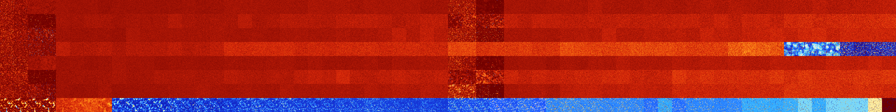

# B024567 (125440-125951)

<details>
    <summary>Initial Grid</summary>
    
</details>


<details>
    <summary>Initial Grid RLE</summary>

```
#C Exported from GoGoL (https://github.com/marrow16/gogol)
#C Wrap mode: Toroidal
#C Boundary mode: Dead
#C Step: 0
x = 100, y = 100, rule = B024567/S
23bo10bo38bo2bo3bo$5b2o4bo19bo34bo20bo$15bo37b2o4bo14bo6bo12bo$20bo21bo
3bo9bo5bo8bo4bo18bo2bo$14bo40bo4bo14bo8bo14bo$7bo10bo9bo14bo9bo9bo5bo
21bo6bo$5bo10bo6bo49bo23bo$bo5bo14bo43bo10bo$o53bo5bo6bo10bo2bo9bo4bo$
13bo67bo$6bo19bo24b2o5bo13bo20bo$81bo$7bo34b2o16bo2bo7bo5bo9bo10bo$88bo
$68bo17bo2bo$25bo35bo10bo6bo16bo$55bo17bo19bo$47bo41bo$9bo12b2o11bo13b
2o5bo$4bo22bo16bo4bo19bo11bo$21bo76bo$4bo12bo21bo2bo3bo34bobo13bo$7bo
21bo16bo$2b2o15bo18bo2bo13bo12bo$13bo3bo7bo4bo44bo$27bo11bo24bo13bo17bo
$12bobo4bo67bobo$4bo6b2o3bo16bo13bo$44bo19bo22bo$2bo38bo16bobo13bo23bo$
o18bo14bo15bo$4bo6bo9bo14bobo$4bo7bo28bo10bo9bo24bo$3bo23bo7bo4bobo29bo
13b2o9bo$3bo2bo3bobo29bo26bo18bo7bo$18bo56bo$2bo8bo26bo$12bo12bobo4bo$
45bo2bobo4bo26bo12bo$11b2o8bo10b2o58bo$13bo$17bo9bo9bo13bo$16bobo15bobo
40bo19bo$20bo17bo26bo12bo18bo$2bo21bo13bo6bo3bo28bo11bo$3bo16bo14bo12bo
27bo20bo$7bo39bo7bo26bo$2bo13bo11bo37bo11bo$6bo9bo12bo10bo8bo4bobo3b2o
24b2o$4bo38b2o28bo5bo18bo$13bo3b2o2bo$45bo24bo21bo$46bo4bo9bo$19bo56bo
22bo$20bo5bo2bo19bo4bo$32bo7bo16bo$100b$34bo26bo15bo$7bo4bo19bo18bo17bo
6bo20bo$24bo2bo14bobo15bo35bo$22bo8bo19bo4bo15bo18bo6bo$30bo17bo6bo33bo
$22bo19bo2bo6bo6bo4bo20bobo6bo$7bo2bo6bo4bo28bo6bo$3bo28bo2bo8bo6bo16bo
22bo$12bo11bo11bo3bo17bo14bo22bo$8bo26bo18b2o37bo$5bo33bo$26bobo6bo10bo
17bobo25bo4bo$18bo63bobo5bo2b2o$4bobo7b2o2bo45bo7bo4bo$18bo42bo3bo6bo
10bo5bo$3bo$72bo19bobo$4bo6bo6bo17bo17bo10b2o9bo17bo$9bo26bo5bo45bo$11b
o11bo19bo21bo2bo4bo6bo$o3bo18bo3bo29bo4bo6bo4bo9bo$14bo12bo4b3obo4bo13b
o$7bo16bo6bo11bo17bo2bo29bo$17bo34bo42bo$37bo16bo33b2o9bo$14bo23bo23bob
o17bo$25bo2bo13bo8bo23bo$18bo16bo40bo6bo$43bo9bo11bo28b2o$o5bo57bo7bo$
5bo9bo72bo$18bo5bo3bo11bo32bo$o2bo2bo57b2o5bo23bo$7bo21bo21b2o3bo32bo4b
o$57bo5bo13bo3bo$15bo8bo41bo$11bo23bo3bo27bo17bo$11bo16bo40bo$10bo5bo
14bo30bo14bo15bo$9bo24bo8bo14bo4bo13bo2bo$10bo11bo$67bo14bo11bo$5bo15bo
13bo!
```
</details>
<details>
    <summary>Thumbnail</summary>

</details>
<table>
<tr>
    <td><a href="./125440%20S%20Heat%20Map%20Activity.png"></a><br>S (125440)<br>R@33,p2</td>    <td><a href="./125441%20S0%20Heat%20Map%20Activity.png"></a><br>S0 (125441)<br>R@41,p2</td>    <td><a href="./125442%20S1%20Heat%20Map%20Activity.png"></a><br>S1 (125442)<br>G>1000</td>    <td><a href="./125443%20S01%20Heat%20Map%20Activity.png"></a><br>S01 (125443)<br>G>1000</td>    <td><a href="./125444%20S2%20Heat%20Map%20Activity.png"></a><br>S2 (125444)<br>G>1000</td>    <td><a href="./125445%20S02%20Heat%20Map%20Activity.png"></a><br>S02 (125445)<br>G>1000</td>    <td><a href="./125446%20S12%20Heat%20Map%20Activity.png"></a><br>S12 (125446)<br>G>1000</td>    <td><a href="./125447%20S012%20Heat%20Map%20Activity.png"></a><br>S012 (125447)<br>G>1000</td>    <td><a href="./125448%20S3%20Heat%20Map%20Activity.png"></a><br>S3 (125448)<br>G>1000</td>    <td><a href="./125449%20S03%20Heat%20Map%20Activity.png"></a><br>S03 (125449)<br>G>1000</td>    <td><a href="./125450%20S13%20Heat%20Map%20Activity.png"></a><br>S13 (125450)<br>G>1000</td>    <td><a href="./125451%20S013%20Heat%20Map%20Activity.png"></a><br>S013 (125451)<br>G>1000</td>    <td><a href="./125452%20S23%20Heat%20Map%20Activity.png"></a><br>S23 (125452)<br>G>1000</td>    <td><a href="./125453%20S023%20Heat%20Map%20Activity.png"></a><br>S023 (125453)<br>G>1000</td>    <td><a href="./125454%20S123%20Heat%20Map%20Activity.png"></a><br>S123 (125454)<br>G>1000</td>    <td><a href="./125455%20S0123%20Heat%20Map%20Activity.png"></a><br>S0123 (125455)<br>G>1000</td>    <td><a href="./125456%20S4%20Heat%20Map%20Activity.png"></a><br>S4 (125456)<br>G>1000</td>    <td><a href="./125457%20S04%20Heat%20Map%20Activity.png"></a><br>S04 (125457)<br>G>1000</td>    <td><a href="./125458%20S14%20Heat%20Map%20Activity.png"></a><br>S14 (125458)<br>G>1000</td>    <td><a href="./125459%20S014%20Heat%20Map%20Activity.png"></a><br>S014 (125459)<br>G>1000</td>    <td><a href="./125460%20S24%20Heat%20Map%20Activity.png"></a><br>S24 (125460)<br>G>1000</td>    <td><a href="./125461%20S024%20Heat%20Map%20Activity.png"></a><br>S024 (125461)<br>G>1000</td>    <td><a href="./125462%20S124%20Heat%20Map%20Activity.png"></a><br>S124 (125462)<br>G>1000</td>    <td><a href="./125463%20S0124%20Heat%20Map%20Activity.png"></a><br>S0124 (125463)<br>G>1000</td>    <td><a href="./125464%20S34%20Heat%20Map%20Activity.png"></a><br>S34 (125464)<br>G>1000</td>    <td><a href="./125465%20S034%20Heat%20Map%20Activity.png"></a><br>S034 (125465)<br>G>1000</td>    <td><a href="./125466%20S134%20Heat%20Map%20Activity.png"></a><br>S134 (125466)<br>G>1000</td>    <td><a href="./125467%20S0134%20Heat%20Map%20Activity.png"></a><br>S0134 (125467)<br>G>1000</td>    <td><a href="./125468%20S234%20Heat%20Map%20Activity.png"></a><br>S234 (125468)<br>G>1000</td>    <td><a href="./125469%20S0234%20Heat%20Map%20Activity.png"></a><br>S0234 (125469)<br>G>1000</td>    <td><a href="./125470%20S1234%20Heat%20Map%20Activity.png"></a><br>S1234 (125470)<br>G>1000</td>    <td><a href="./125471%20S01234%20Heat%20Map%20Activity.png"></a><br>S01234 (125471)<br>G>1000</td>    <td><a href="./125472%20S5%20Heat%20Map%20Activity.png"></a><br>S5 (125472)<br>R@24,p2</td>    <td><a href="./125473%20S05%20Heat%20Map%20Activity.png"></a><br>S05 (125473)<br>R@24,p2</td>    <td><a href="./125474%20S15%20Heat%20Map%20Activity.png"></a><br>S15 (125474)<br>R@367,p120</td>    <td><a href="./125475%20S015%20Heat%20Map%20Activity.png"></a><br>S015 (125475)<br>R@538,p120</td>    <td><a href="./125476%20S25%20Heat%20Map%20Activity.png"></a><br>S25 (125476)<br>G>1000</td>    <td><a href="./125477%20S025%20Heat%20Map%20Activity.png"></a><br>S025 (125477)<br>G>1000</td>    <td><a href="./125478%20S125%20Heat%20Map%20Activity.png"></a><br>S125 (125478)<br>G>1000</td>    <td><a href="./125479%20S0125%20Heat%20Map%20Activity.png"></a><br>S0125 (125479)<br>G>1000</td>    <td><a href="./125480%20S35%20Heat%20Map%20Activity.png"></a><br>S35 (125480)<br>G>1000</td>    <td><a href="./125481%20S035%20Heat%20Map%20Activity.png"></a><br>S035 (125481)<br>G>1000</td>    <td><a href="./125482%20S135%20Heat%20Map%20Activity.png"></a><br>S135 (125482)<br>G>1000</td>    <td><a href="./125483%20S0135%20Heat%20Map%20Activity.png"></a><br>S0135 (125483)<br>G>1000</td>    <td><a href="./125484%20S235%20Heat%20Map%20Activity.png"></a><br>S235 (125484)<br>G>1000</td>    <td><a href="./125485%20S0235%20Heat%20Map%20Activity.png"></a><br>S0235 (125485)<br>G>1000</td>    <td><a href="./125486%20S1235%20Heat%20Map%20Activity.png"></a><br>S1235 (125486)<br>G>1000</td>    <td><a href="./125487%20S01235%20Heat%20Map%20Activity.png"></a><br>S01235 (125487)<br>G>1000</td>    <td><a href="./125488%20S45%20Heat%20Map%20Activity.png"></a><br>S45 (125488)<br>G>1000</td>    <td><a href="./125489%20S045%20Heat%20Map%20Activity.png"></a><br>S045 (125489)<br>G>1000</td>    <td><a href="./125490%20S145%20Heat%20Map%20Activity.png"></a><br>S145 (125490)<br>G>1000</td>    <td><a href="./125491%20S0145%20Heat%20Map%20Activity.png"></a><br>S0145 (125491)<br>G>1000</td>    <td><a href="./125492%20S245%20Heat%20Map%20Activity.png"></a><br>S245 (125492)<br>G>1000</td>    <td><a href="./125493%20S0245%20Heat%20Map%20Activity.png"></a><br>S0245 (125493)<br>G>1000</td>    <td><a href="./125494%20S1245%20Heat%20Map%20Activity.png"></a><br>S1245 (125494)<br>G>1000</td>    <td><a href="./125495%20S01245%20Heat%20Map%20Activity.png"></a><br>S01245 (125495)<br>G>1000</td>    <td><a href="./125496%20S345%20Heat%20Map%20Activity.png"></a><br>S345 (125496)<br>G>1000</td>    <td><a href="./125497%20S0345%20Heat%20Map%20Activity.png"></a><br>S0345 (125497)<br>G>1000</td>    <td><a href="./125498%20S1345%20Heat%20Map%20Activity.png"></a><br>S1345 (125498)<br>G>1000</td>    <td><a href="./125499%20S01345%20Heat%20Map%20Activity.png"></a><br>S01345 (125499)<br>G>1000</td>    <td><a href="./125500%20S2345%20Heat%20Map%20Activity.png"></a><br>S2345 (125500)<br>G>1000</td>    <td><a href="./125501%20S02345%20Heat%20Map%20Activity.png"></a><br>S02345 (125501)<br>G>1000</td>    <td><a href="./125502%20S12345%20Heat%20Map%20Activity.png"></a><br>S12345 (125502)<br>G>1000</td>    <td><a href="./125503%20S012345%20Heat%20Map%20Activity.png"></a><br>S012345 (125503)<br>G>1000</td></tr>
<tr>
    <td><a href="./125504%20S6%20Heat%20Map%20Activity.png"></a><br>S6 (125504)<br>R@28,p4</td>    <td><a href="./125505%20S06%20Heat%20Map%20Activity.png"></a><br>S06 (125505)<br>R@37,p4</td>    <td><a href="./125506%20S16%20Heat%20Map%20Activity.png"></a><br>S16 (125506)<br>R@241,p120</td>    <td><a href="./125507%20S016%20Heat%20Map%20Activity.png"></a><br>S016 (125507)<br>R@247,p120</td>    <td><a href="./125508%20S26%20Heat%20Map%20Activity.png"></a><br>S26 (125508)<br>G>1000</td>    <td><a href="./125509%20S026%20Heat%20Map%20Activity.png"></a><br>S026 (125509)<br>G>1000</td>    <td><a href="./125510%20S126%20Heat%20Map%20Activity.png"></a><br>S126 (125510)<br>G>1000</td>    <td><a href="./125511%20S0126%20Heat%20Map%20Activity.png"></a><br>S0126 (125511)<br>G>1000</td>    <td><a href="./125512%20S36%20Heat%20Map%20Activity.png"></a><br>S36 (125512)<br>G>1000</td>    <td><a href="./125513%20S036%20Heat%20Map%20Activity.png"></a><br>S036 (125513)<br>G>1000</td>    <td><a href="./125514%20S136%20Heat%20Map%20Activity.png"></a><br>S136 (125514)<br>G>1000</td>    <td><a href="./125515%20S0136%20Heat%20Map%20Activity.png"></a><br>S0136 (125515)<br>G>1000</td>    <td><a href="./125516%20S236%20Heat%20Map%20Activity.png"></a><br>S236 (125516)<br>G>1000</td>    <td><a href="./125517%20S0236%20Heat%20Map%20Activity.png"></a><br>S0236 (125517)<br>G>1000</td>    <td><a href="./125518%20S1236%20Heat%20Map%20Activity.png"></a><br>S1236 (125518)<br>G>1000</td>    <td><a href="./125519%20S01236%20Heat%20Map%20Activity.png"></a><br>S01236 (125519)<br>G>1000</td>    <td><a href="./125520%20S46%20Heat%20Map%20Activity.png"></a><br>S46 (125520)<br>G>1000</td>    <td><a href="./125521%20S046%20Heat%20Map%20Activity.png"></a><br>S046 (125521)<br>G>1000</td>    <td><a href="./125522%20S146%20Heat%20Map%20Activity.png"></a><br>S146 (125522)<br>G>1000</td>    <td><a href="./125523%20S0146%20Heat%20Map%20Activity.png"></a><br>S0146 (125523)<br>G>1000</td>    <td><a href="./125524%20S246%20Heat%20Map%20Activity.png"></a><br>S246 (125524)<br>G>1000</td>    <td><a href="./125525%20S0246%20Heat%20Map%20Activity.png"></a><br>S0246 (125525)<br>G>1000</td>    <td><a href="./125526%20S1246%20Heat%20Map%20Activity.png"></a><br>S1246 (125526)<br>G>1000</td>    <td><a href="./125527%20S01246%20Heat%20Map%20Activity.png"></a><br>S01246 (125527)<br>G>1000</td>    <td><a href="./125528%20S346%20Heat%20Map%20Activity.png"></a><br>S346 (125528)<br>G>1000</td>    <td><a href="./125529%20S0346%20Heat%20Map%20Activity.png"></a><br>S0346 (125529)<br>G>1000</td>    <td><a href="./125530%20S1346%20Heat%20Map%20Activity.png"></a><br>S1346 (125530)<br>G>1000</td>    <td><a href="./125531%20S01346%20Heat%20Map%20Activity.png"></a><br>S01346 (125531)<br>G>1000</td>    <td><a href="./125532%20S2346%20Heat%20Map%20Activity.png"></a><br>S2346 (125532)<br>G>1000</td>    <td><a href="./125533%20S02346%20Heat%20Map%20Activity.png"></a><br>S02346 (125533)<br>G>1000</td>    <td><a href="./125534%20S12346%20Heat%20Map%20Activity.png"></a><br>S12346 (125534)<br>G>1000</td>    <td><a href="./125535%20S012346%20Heat%20Map%20Activity.png"></a><br>S012346 (125535)<br>G>1000</td>    <td><a href="./125536%20S56%20Heat%20Map%20Activity.png"></a><br>S56 (125536)<br>R@90,p28</td>    <td><a href="./125537%20S056%20Heat%20Map%20Activity.png"></a><br>S056 (125537)<br>R@57,p12</td>    <td><a href="./125538%20S156%20Heat%20Map%20Activity.png"></a><br>S156 (125538)<br>R@232,p12</td>    <td><a href="./125539%20S0156%20Heat%20Map%20Activity.png"></a><br>S0156 (125539)<br>R@163,p12</td>    <td><a href="./125540%20S256%20Heat%20Map%20Activity.png"></a><br>S256 (125540)<br>G>1000</td>    <td><a href="./125541%20S0256%20Heat%20Map%20Activity.png"></a><br>S0256 (125541)<br>G>1000</td>    <td><a href="./125542%20S1256%20Heat%20Map%20Activity.png"></a><br>S1256 (125542)<br>G>1000</td>    <td><a href="./125543%20S01256%20Heat%20Map%20Activity.png"></a><br>S01256 (125543)<br>G>1000</td>    <td><a href="./125544%20S356%20Heat%20Map%20Activity.png"></a><br>S356 (125544)<br>G>1000</td>    <td><a href="./125545%20S0356%20Heat%20Map%20Activity.png"></a><br>S0356 (125545)<br>G>1000</td>    <td><a href="./125546%20S1356%20Heat%20Map%20Activity.png"></a><br>S1356 (125546)<br>G>1000</td>    <td><a href="./125547%20S01356%20Heat%20Map%20Activity.png"></a><br>S01356 (125547)<br>G>1000</td>    <td><a href="./125548%20S2356%20Heat%20Map%20Activity.png"></a><br>S2356 (125548)<br>G>1000</td>    <td><a href="./125549%20S02356%20Heat%20Map%20Activity.png"></a><br>S02356 (125549)<br>G>1000</td>    <td><a href="./125550%20S12356%20Heat%20Map%20Activity.png"></a><br>S12356 (125550)<br>G>1000</td>    <td><a href="./125551%20S012356%20Heat%20Map%20Activity.png"></a><br>S012356 (125551)<br>G>1000</td>    <td><a href="./125552%20S456%20Heat%20Map%20Activity.png"></a><br>S456 (125552)<br>G>1000</td>    <td><a href="./125553%20S0456%20Heat%20Map%20Activity.png"></a><br>S0456 (125553)<br>G>1000</td>    <td><a href="./125554%20S1456%20Heat%20Map%20Activity.png"></a><br>S1456 (125554)<br>G>1000</td>    <td><a href="./125555%20S01456%20Heat%20Map%20Activity.png"></a><br>S01456 (125555)<br>G>1000</td>    <td><a href="./125556%20S2456%20Heat%20Map%20Activity.png"></a><br>S2456 (125556)<br>G>1000</td>    <td><a href="./125557%20S02456%20Heat%20Map%20Activity.png"></a><br>S02456 (125557)<br>G>1000</td>    <td><a href="./125558%20S12456%20Heat%20Map%20Activity.png"></a><br>S12456 (125558)<br>G>1000</td>    <td><a href="./125559%20S012456%20Heat%20Map%20Activity.png"></a><br>S012456 (125559)<br>G>1000</td>    <td><a href="./125560%20S3456%20Heat%20Map%20Activity.png"></a><br>S3456 (125560)<br>G>1000</td>    <td><a href="./125561%20S03456%20Heat%20Map%20Activity.png"></a><br>S03456 (125561)<br>G>1000</td>    <td><a href="./125562%20S13456%20Heat%20Map%20Activity.png"></a><br>S13456 (125562)<br>G>1000</td>    <td><a href="./125563%20S013456%20Heat%20Map%20Activity.png"></a><br>S013456 (125563)<br>G>1000</td>    <td><a href="./125564%20S23456%20Heat%20Map%20Activity.png"></a><br>S23456 (125564)<br>G>1000</td>    <td><a href="./125565%20S023456%20Heat%20Map%20Activity.png"></a><br>S023456 (125565)<br>G>1000</td>    <td><a href="./125566%20S123456%20Heat%20Map%20Activity.png"></a><br>S123456 (125566)<br>G>1000</td>    <td><a href="./125567%20S0123456%20Heat%20Map%20Activity.png"></a><br>S0123456 (125567)<br>G>1000</td></tr>
<tr>
    <td><a href="./125568%20S7%20Heat%20Map%20Activity.png"></a><br>S7 (125568)<br>R@30,p2</td>    <td><a href="./125569%20S07%20Heat%20Map%20Activity.png"></a><br>S07 (125569)<br>R@40,p2</td>    <td><a href="./125570%20S17%20Heat%20Map%20Activity.png"></a><br>S17 (125570)<br>R@98,p4</td>    <td><a href="./125571%20S017%20Heat%20Map%20Activity.png"></a><br>S017 (125571)<br>R@98,p4</td>    <td><a href="./125572%20S27%20Heat%20Map%20Activity.png"></a><br>S27 (125572)<br>G>1000</td>    <td><a href="./125573%20S027%20Heat%20Map%20Activity.png"></a><br>S027 (125573)<br>G>1000</td>    <td><a href="./125574%20S127%20Heat%20Map%20Activity.png"></a><br>S127 (125574)<br>G>1000</td>    <td><a href="./125575%20S0127%20Heat%20Map%20Activity.png"></a><br>S0127 (125575)<br>G>1000</td>    <td><a href="./125576%20S37%20Heat%20Map%20Activity.png"></a><br>S37 (125576)<br>G>1000</td>    <td><a href="./125577%20S037%20Heat%20Map%20Activity.png"></a><br>S037 (125577)<br>G>1000</td>    <td><a href="./125578%20S137%20Heat%20Map%20Activity.png"></a><br>S137 (125578)<br>G>1000</td>    <td><a href="./125579%20S0137%20Heat%20Map%20Activity.png"></a><br>S0137 (125579)<br>G>1000</td>    <td><a href="./125580%20S237%20Heat%20Map%20Activity.png"></a><br>S237 (125580)<br>G>1000</td>    <td><a href="./125581%20S0237%20Heat%20Map%20Activity.png"></a><br>S0237 (125581)<br>G>1000</td>    <td><a href="./125582%20S1237%20Heat%20Map%20Activity.png"></a><br>S1237 (125582)<br>G>1000</td>    <td><a href="./125583%20S01237%20Heat%20Map%20Activity.png"></a><br>S01237 (125583)<br>G>1000</td>    <td><a href="./125584%20S47%20Heat%20Map%20Activity.png"></a><br>S47 (125584)<br>G>1000</td>    <td><a href="./125585%20S047%20Heat%20Map%20Activity.png"></a><br>S047 (125585)<br>G>1000</td>    <td><a href="./125586%20S147%20Heat%20Map%20Activity.png"></a><br>S147 (125586)<br>G>1000</td>    <td><a href="./125587%20S0147%20Heat%20Map%20Activity.png"></a><br>S0147 (125587)<br>G>1000</td>    <td><a href="./125588%20S247%20Heat%20Map%20Activity.png"></a><br>S247 (125588)<br>G>1000</td>    <td><a href="./125589%20S0247%20Heat%20Map%20Activity.png"></a><br>S0247 (125589)<br>G>1000</td>    <td><a href="./125590%20S1247%20Heat%20Map%20Activity.png"></a><br>S1247 (125590)<br>G>1000</td>    <td><a href="./125591%20S01247%20Heat%20Map%20Activity.png"></a><br>S01247 (125591)<br>G>1000</td>    <td><a href="./125592%20S347%20Heat%20Map%20Activity.png"></a><br>S347 (125592)<br>G>1000</td>    <td><a href="./125593%20S0347%20Heat%20Map%20Activity.png"></a><br>S0347 (125593)<br>G>1000</td>    <td><a href="./125594%20S1347%20Heat%20Map%20Activity.png"></a><br>S1347 (125594)<br>G>1000</td>    <td><a href="./125595%20S01347%20Heat%20Map%20Activity.png"></a><br>S01347 (125595)<br>G>1000</td>    <td><a href="./125596%20S2347%20Heat%20Map%20Activity.png"></a><br>S2347 (125596)<br>G>1000</td>    <td><a href="./125597%20S02347%20Heat%20Map%20Activity.png"></a><br>S02347 (125597)<br>G>1000</td>    <td><a href="./125598%20S12347%20Heat%20Map%20Activity.png"></a><br>S12347 (125598)<br>G>1000</td>    <td><a href="./125599%20S012347%20Heat%20Map%20Activity.png"></a><br>S012347 (125599)<br>G>1000</td>    <td><a href="./125600%20S57%20Heat%20Map%20Activity.png"></a><br>S57 (125600)<br>R@20,p2</td>    <td><a href="./125601%20S057%20Heat%20Map%20Activity.png"></a><br>S057 (125601)<br>R@21,p2</td>    <td><a href="./125602%20S157%20Heat%20Map%20Activity.png"></a><br>S157 (125602)<br>R@106,p24</td>    <td><a href="./125603%20S0157%20Heat%20Map%20Activity.png"></a><br>S0157 (125603)<br>R@108,p24</td>    <td><a href="./125604%20S257%20Heat%20Map%20Activity.png"></a><br>S257 (125604)<br>G>1000</td>    <td><a href="./125605%20S0257%20Heat%20Map%20Activity.png"></a><br>S0257 (125605)<br>G>1000</td>    <td><a href="./125606%20S1257%20Heat%20Map%20Activity.png"></a><br>S1257 (125606)<br>G>1000</td>    <td><a href="./125607%20S01257%20Heat%20Map%20Activity.png"></a><br>S01257 (125607)<br>G>1000</td>    <td><a href="./125608%20S357%20Heat%20Map%20Activity.png"></a><br>S357 (125608)<br>G>1000</td>    <td><a href="./125609%20S0357%20Heat%20Map%20Activity.png"></a><br>S0357 (125609)<br>G>1000</td>    <td><a href="./125610%20S1357%20Heat%20Map%20Activity.png"></a><br>S1357 (125610)<br>G>1000</td>    <td><a href="./125611%20S01357%20Heat%20Map%20Activity.png"></a><br>S01357 (125611)<br>G>1000</td>    <td><a href="./125612%20S2357%20Heat%20Map%20Activity.png"></a><br>S2357 (125612)<br>G>1000</td>    <td><a href="./125613%20S02357%20Heat%20Map%20Activity.png"></a><br>S02357 (125613)<br>G>1000</td>    <td><a href="./125614%20S12357%20Heat%20Map%20Activity.png"></a><br>S12357 (125614)<br>G>1000</td>    <td><a href="./125615%20S012357%20Heat%20Map%20Activity.png"></a><br>S012357 (125615)<br>G>1000</td>    <td><a href="./125616%20S457%20Heat%20Map%20Activity.png"></a><br>S457 (125616)<br>G>1000</td>    <td><a href="./125617%20S0457%20Heat%20Map%20Activity.png"></a><br>S0457 (125617)<br>G>1000</td>    <td><a href="./125618%20S1457%20Heat%20Map%20Activity.png"></a><br>S1457 (125618)<br>G>1000</td>    <td><a href="./125619%20S01457%20Heat%20Map%20Activity.png"></a><br>S01457 (125619)<br>G>1000</td>    <td><a href="./125620%20S2457%20Heat%20Map%20Activity.png"></a><br>S2457 (125620)<br>G>1000</td>    <td><a href="./125621%20S02457%20Heat%20Map%20Activity.png"></a><br>S02457 (125621)<br>G>1000</td>    <td><a href="./125622%20S12457%20Heat%20Map%20Activity.png"></a><br>S12457 (125622)<br>G>1000</td>    <td><a href="./125623%20S012457%20Heat%20Map%20Activity.png"></a><br>S012457 (125623)<br>G>1000</td>    <td><a href="./125624%20S3457%20Heat%20Map%20Activity.png"></a><br>S3457 (125624)<br>G>1000</td>    <td><a href="./125625%20S03457%20Heat%20Map%20Activity.png"></a><br>S03457 (125625)<br>G>1000</td>    <td><a href="./125626%20S13457%20Heat%20Map%20Activity.png"></a><br>S13457 (125626)<br>G>1000</td>    <td><a href="./125627%20S013457%20Heat%20Map%20Activity.png"></a><br>S013457 (125627)<br>G>1000</td>    <td><a href="./125628%20S23457%20Heat%20Map%20Activity.png"></a><br>S23457 (125628)<br>G>1000</td>    <td><a href="./125629%20S023457%20Heat%20Map%20Activity.png"></a><br>S023457 (125629)<br>G>1000</td>    <td><a href="./125630%20S123457%20Heat%20Map%20Activity.png"></a><br>S123457 (125630)<br>G>1000</td>    <td><a href="./125631%20S0123457%20Heat%20Map%20Activity.png"></a><br>S0123457 (125631)<br>G>1000</td></tr>
<tr>
    <td><a href="./125632%20S67%20Heat%20Map%20Activity.png"></a><br>S67 (125632)<br>R@24,p2</td>    <td><a href="./125633%20S067%20Heat%20Map%20Activity.png"></a><br>S067 (125633)<br>R@27,p2</td>    <td><a href="./125634%20S167%20Heat%20Map%20Activity.png"></a><br>S167 (125634)<br>R@39,p12</td>    <td><a href="./125635%20S0167%20Heat%20Map%20Activity.png"></a><br>S0167 (125635)<br>R@45,p12</td>    <td><a href="./125636%20S267%20Heat%20Map%20Activity.png"></a><br>S267 (125636)<br>G>1000</td>    <td><a href="./125637%20S0267%20Heat%20Map%20Activity.png"></a><br>S0267 (125637)<br>G>1000</td>    <td><a href="./125638%20S1267%20Heat%20Map%20Activity.png"></a><br>S1267 (125638)<br>G>1000</td>    <td><a href="./125639%20S01267%20Heat%20Map%20Activity.png"></a><br>S01267 (125639)<br>G>1000</td>    <td><a href="./125640%20S367%20Heat%20Map%20Activity.png"></a><br>S367 (125640)<br>G>1000</td>    <td><a href="./125641%20S0367%20Heat%20Map%20Activity.png"></a><br>S0367 (125641)<br>G>1000</td>    <td><a href="./125642%20S1367%20Heat%20Map%20Activity.png"></a><br>S1367 (125642)<br>G>1000</td>    <td><a href="./125643%20S01367%20Heat%20Map%20Activity.png"></a><br>S01367 (125643)<br>G>1000</td>    <td><a href="./125644%20S2367%20Heat%20Map%20Activity.png"></a><br>S2367 (125644)<br>G>1000</td>    <td><a href="./125645%20S02367%20Heat%20Map%20Activity.png"></a><br>S02367 (125645)<br>G>1000</td>    <td><a href="./125646%20S12367%20Heat%20Map%20Activity.png"></a><br>S12367 (125646)<br>G>1000</td>    <td><a href="./125647%20S012367%20Heat%20Map%20Activity.png"></a><br>S012367 (125647)<br>G>1000</td>    <td><a href="./125648%20S467%20Heat%20Map%20Activity.png"></a><br>S467 (125648)<br>G>1000</td>    <td><a href="./125649%20S0467%20Heat%20Map%20Activity.png"></a><br>S0467 (125649)<br>G>1000</td>    <td><a href="./125650%20S1467%20Heat%20Map%20Activity.png"></a><br>S1467 (125650)<br>G>1000</td>    <td><a href="./125651%20S01467%20Heat%20Map%20Activity.png"></a><br>S01467 (125651)<br>G>1000</td>    <td><a href="./125652%20S2467%20Heat%20Map%20Activity.png"></a><br>S2467 (125652)<br>G>1000</td>    <td><a href="./125653%20S02467%20Heat%20Map%20Activity.png"></a><br>S02467 (125653)<br>G>1000</td>    <td><a href="./125654%20S12467%20Heat%20Map%20Activity.png"></a><br>S12467 (125654)<br>G>1000</td>    <td><a href="./125655%20S012467%20Heat%20Map%20Activity.png"></a><br>S012467 (125655)<br>G>1000</td>    <td><a href="./125656%20S3467%20Heat%20Map%20Activity.png"></a><br>S3467 (125656)<br>G>1000</td>    <td><a href="./125657%20S03467%20Heat%20Map%20Activity.png"></a><br>S03467 (125657)<br>G>1000</td>    <td><a href="./125658%20S13467%20Heat%20Map%20Activity.png"></a><br>S13467 (125658)<br>G>1000</td>    <td><a href="./125659%20S013467%20Heat%20Map%20Activity.png"></a><br>S013467 (125659)<br>G>1000</td>    <td><a href="./125660%20S23467%20Heat%20Map%20Activity.png"></a><br>S23467 (125660)<br>G>1000</td>    <td><a href="./125661%20S023467%20Heat%20Map%20Activity.png"></a><br>S023467 (125661)<br>G>1000</td>    <td><a href="./125662%20S123467%20Heat%20Map%20Activity.png"></a><br>S123467 (125662)<br>G>1000</td>    <td><a href="./125663%20S0123467%20Heat%20Map%20Activity.png"></a><br>S0123467 (125663)<br>G>1000</td>    <td><a href="./125664%20S567%20Heat%20Map%20Activity.png"></a><br>S567 (125664)<br>G>1000</td>    <td><a href="./125665%20S0567%20Heat%20Map%20Activity.png"></a><br>S0567 (125665)<br>G>1000</td>    <td><a href="./125666%20S1567%20Heat%20Map%20Activity.png"></a><br>S1567 (125666)<br>G>1000</td>    <td><a href="./125667%20S01567%20Heat%20Map%20Activity.png"></a><br>S01567 (125667)<br>G>1000</td>    <td><a href="./125668%20S2567%20Heat%20Map%20Activity.png"></a><br>S2567 (125668)<br>G>1000</td>    <td><a href="./125669%20S02567%20Heat%20Map%20Activity.png"></a><br>S02567 (125669)<br>G>1000</td>    <td><a href="./125670%20S12567%20Heat%20Map%20Activity.png"></a><br>S12567 (125670)<br>G>1000</td>    <td><a href="./125671%20S012567%20Heat%20Map%20Activity.png"></a><br>S012567 (125671)<br>G>1000</td>    <td><a href="./125672%20S3567%20Heat%20Map%20Activity.png"></a><br>S3567 (125672)<br>G>1000</td>    <td><a href="./125673%20S03567%20Heat%20Map%20Activity.png"></a><br>S03567 (125673)<br>G>1000</td>    <td><a href="./125674%20S13567%20Heat%20Map%20Activity.png"></a><br>S13567 (125674)<br>G>1000</td>    <td><a href="./125675%20S013567%20Heat%20Map%20Activity.png"></a><br>S013567 (125675)<br>G>1000</td>    <td><a href="./125676%20S23567%20Heat%20Map%20Activity.png"></a><br>S23567 (125676)<br>G>1000</td>    <td><a href="./125677%20S023567%20Heat%20Map%20Activity.png"></a><br>S023567 (125677)<br>G>1000</td>    <td><a href="./125678%20S123567%20Heat%20Map%20Activity.png"></a><br>S123567 (125678)<br>G>1000</td>    <td><a href="./125679%20S0123567%20Heat%20Map%20Activity.png"></a><br>S0123567 (125679)<br>G>1000</td>    <td><a href="./125680%20S4567%20Heat%20Map%20Activity.png"></a><br>S4567 (125680)<br>G>1000</td>    <td><a href="./125681%20S04567%20Heat%20Map%20Activity.png"></a><br>S04567 (125681)<br>G>1000</td>    <td><a href="./125682%20S14567%20Heat%20Map%20Activity.png"></a><br>S14567 (125682)<br>G>1000</td>    <td><a href="./125683%20S014567%20Heat%20Map%20Activity.png"></a><br>S014567 (125683)<br>G>1000</td>    <td><a href="./125684%20S24567%20Heat%20Map%20Activity.png"></a><br>S24567 (125684)<br>G>1000</td>    <td><a href="./125685%20S024567%20Heat%20Map%20Activity.png"></a><br>S024567 (125685)<br>G>1000</td>    <td><a href="./125686%20S124567%20Heat%20Map%20Activity.png"></a><br>S124567 (125686)<br>G>1000</td>    <td><a href="./125687%20S0124567%20Heat%20Map%20Activity.png"></a><br>S0124567 (125687)<br>G>1000</td>    <td><a href="./125688%20S34567%20Heat%20Map%20Activity.png"></a><br>S34567 (125688)<br>G>1000</td>    <td><a href="./125689%20S034567%20Heat%20Map%20Activity.png"></a><br>S034567 (125689)<br>G>1000</td>    <td><a href="./125690%20S134567%20Heat%20Map%20Activity.png"></a><br>S134567 (125690)<br>G>1000</td>    <td><a href="./125691%20S0134567%20Heat%20Map%20Activity.png"></a><br>S0134567 (125691)<br>G>1000</td>    <td><a href="./125692%20S234567%20Heat%20Map%20Activity.png"></a><br>S234567 (125692)<br>R@88,p36</td>    <td><a href="./125693%20S0234567%20Heat%20Map%20Activity.png"></a><br>S0234567 (125693)<br>R@233,p180</td>    <td><a href="./125694%20S1234567%20Heat%20Map%20Activity.png"></a><br>S1234567 (125694)<br>R@124,p72</td>    <td><a href="./125695%20S01234567%20Heat%20Map%20Activity.png"></a><br>S01234567 (125695)<br>R@83,p36</td></tr>
<tr>
    <td><a href="./125696%20S8%20Heat%20Map%20Activity.png"></a><br>S8 (125696)<br>R@28,p2</td>    <td><a href="./125697%20S08%20Heat%20Map%20Activity.png"></a><br>S08 (125697)<br>R@25,p2</td>    <td><a href="./125698%20S18%20Heat%20Map%20Activity.png"></a><br>S18 (125698)<br>G>1000</td>    <td><a href="./125699%20S018%20Heat%20Map%20Activity.png"></a><br>S018 (125699)<br>G>1000</td>    <td><a href="./125700%20S28%20Heat%20Map%20Activity.png"></a><br>S28 (125700)<br>G>1000</td>    <td><a href="./125701%20S028%20Heat%20Map%20Activity.png"></a><br>S028 (125701)<br>G>1000</td>    <td><a href="./125702%20S128%20Heat%20Map%20Activity.png"></a><br>S128 (125702)<br>G>1000</td>    <td><a href="./125703%20S0128%20Heat%20Map%20Activity.png"></a><br>S0128 (125703)<br>G>1000</td>    <td><a href="./125704%20S38%20Heat%20Map%20Activity.png"></a><br>S38 (125704)<br>G>1000</td>    <td><a href="./125705%20S038%20Heat%20Map%20Activity.png"></a><br>S038 (125705)<br>G>1000</td>    <td><a href="./125706%20S138%20Heat%20Map%20Activity.png"></a><br>S138 (125706)<br>G>1000</td>    <td><a href="./125707%20S0138%20Heat%20Map%20Activity.png"></a><br>S0138 (125707)<br>G>1000</td>    <td><a href="./125708%20S238%20Heat%20Map%20Activity.png"></a><br>S238 (125708)<br>G>1000</td>    <td><a href="./125709%20S0238%20Heat%20Map%20Activity.png"></a><br>S0238 (125709)<br>G>1000</td>    <td><a href="./125710%20S1238%20Heat%20Map%20Activity.png"></a><br>S1238 (125710)<br>G>1000</td>    <td><a href="./125711%20S01238%20Heat%20Map%20Activity.png"></a><br>S01238 (125711)<br>G>1000</td>    <td><a href="./125712%20S48%20Heat%20Map%20Activity.png"></a><br>S48 (125712)<br>G>1000</td>    <td><a href="./125713%20S048%20Heat%20Map%20Activity.png"></a><br>S048 (125713)<br>G>1000</td>    <td><a href="./125714%20S148%20Heat%20Map%20Activity.png"></a><br>S148 (125714)<br>G>1000</td>    <td><a href="./125715%20S0148%20Heat%20Map%20Activity.png"></a><br>S0148 (125715)<br>G>1000</td>    <td><a href="./125716%20S248%20Heat%20Map%20Activity.png"></a><br>S248 (125716)<br>G>1000</td>    <td><a href="./125717%20S0248%20Heat%20Map%20Activity.png"></a><br>S0248 (125717)<br>G>1000</td>    <td><a href="./125718%20S1248%20Heat%20Map%20Activity.png"></a><br>S1248 (125718)<br>G>1000</td>    <td><a href="./125719%20S01248%20Heat%20Map%20Activity.png"></a><br>S01248 (125719)<br>G>1000</td>    <td><a href="./125720%20S348%20Heat%20Map%20Activity.png"></a><br>S348 (125720)<br>G>1000</td>    <td><a href="./125721%20S0348%20Heat%20Map%20Activity.png"></a><br>S0348 (125721)<br>G>1000</td>    <td><a href="./125722%20S1348%20Heat%20Map%20Activity.png"></a><br>S1348 (125722)<br>G>1000</td>    <td><a href="./125723%20S01348%20Heat%20Map%20Activity.png"></a><br>S01348 (125723)<br>G>1000</td>    <td><a href="./125724%20S2348%20Heat%20Map%20Activity.png"></a><br>S2348 (125724)<br>G>1000</td>    <td><a href="./125725%20S02348%20Heat%20Map%20Activity.png"></a><br>S02348 (125725)<br>G>1000</td>    <td><a href="./125726%20S12348%20Heat%20Map%20Activity.png"></a><br>S12348 (125726)<br>G>1000</td>    <td><a href="./125727%20S012348%20Heat%20Map%20Activity.png"></a><br>S012348 (125727)<br>G>1000</td>    <td><a href="./125728%20S58%20Heat%20Map%20Activity.png"></a><br>S58 (125728)<br>R@20,p2</td>    <td><a href="./125729%20S058%20Heat%20Map%20Activity.png"></a><br>S058 (125729)<br>R@27,p2</td>    <td><a href="./125730%20S158%20Heat%20Map%20Activity.png"></a><br>S158 (125730)<br>R@413,p24</td>    <td><a href="./125731%20S0158%20Heat%20Map%20Activity.png"></a><br>S0158 (125731)<br>R@396,p24</td>    <td><a href="./125732%20S258%20Heat%20Map%20Activity.png"></a><br>S258 (125732)<br>G>1000</td>    <td><a href="./125733%20S0258%20Heat%20Map%20Activity.png"></a><br>S0258 (125733)<br>G>1000</td>    <td><a href="./125734%20S1258%20Heat%20Map%20Activity.png"></a><br>S1258 (125734)<br>G>1000</td>    <td><a href="./125735%20S01258%20Heat%20Map%20Activity.png"></a><br>S01258 (125735)<br>G>1000</td>    <td><a href="./125736%20S358%20Heat%20Map%20Activity.png"></a><br>S358 (125736)<br>G>1000</td>    <td><a href="./125737%20S0358%20Heat%20Map%20Activity.png"></a><br>S0358 (125737)<br>G>1000</td>    <td><a href="./125738%20S1358%20Heat%20Map%20Activity.png"></a><br>S1358 (125738)<br>G>1000</td>    <td><a href="./125739%20S01358%20Heat%20Map%20Activity.png"></a><br>S01358 (125739)<br>G>1000</td>    <td><a href="./125740%20S2358%20Heat%20Map%20Activity.png"></a><br>S2358 (125740)<br>G>1000</td>    <td><a href="./125741%20S02358%20Heat%20Map%20Activity.png"></a><br>S02358 (125741)<br>G>1000</td>    <td><a href="./125742%20S12358%20Heat%20Map%20Activity.png"></a><br>S12358 (125742)<br>G>1000</td>    <td><a href="./125743%20S012358%20Heat%20Map%20Activity.png"></a><br>S012358 (125743)<br>G>1000</td>    <td><a href="./125744%20S458%20Heat%20Map%20Activity.png"></a><br>S458 (125744)<br>G>1000</td>    <td><a href="./125745%20S0458%20Heat%20Map%20Activity.png"></a><br>S0458 (125745)<br>G>1000</td>    <td><a href="./125746%20S1458%20Heat%20Map%20Activity.png"></a><br>S1458 (125746)<br>G>1000</td>    <td><a href="./125747%20S01458%20Heat%20Map%20Activity.png"></a><br>S01458 (125747)<br>G>1000</td>    <td><a href="./125748%20S2458%20Heat%20Map%20Activity.png"></a><br>S2458 (125748)<br>G>1000</td>    <td><a href="./125749%20S02458%20Heat%20Map%20Activity.png"></a><br>S02458 (125749)<br>G>1000</td>    <td><a href="./125750%20S12458%20Heat%20Map%20Activity.png"></a><br>S12458 (125750)<br>G>1000</td>    <td><a href="./125751%20S012458%20Heat%20Map%20Activity.png"></a><br>S012458 (125751)<br>G>1000</td>    <td><a href="./125752%20S3458%20Heat%20Map%20Activity.png"></a><br>S3458 (125752)<br>G>1000</td>    <td><a href="./125753%20S03458%20Heat%20Map%20Activity.png"></a><br>S03458 (125753)<br>G>1000</td>    <td><a href="./125754%20S13458%20Heat%20Map%20Activity.png"></a><br>S13458 (125754)<br>G>1000</td>    <td><a href="./125755%20S013458%20Heat%20Map%20Activity.png"></a><br>S013458 (125755)<br>G>1000</td>    <td><a href="./125756%20S23458%20Heat%20Map%20Activity.png"></a><br>S23458 (125756)<br>G>1000</td>    <td><a href="./125757%20S023458%20Heat%20Map%20Activity.png"></a><br>S023458 (125757)<br>G>1000</td>    <td><a href="./125758%20S123458%20Heat%20Map%20Activity.png"></a><br>S123458 (125758)<br>G>1000</td>    <td><a href="./125759%20S0123458%20Heat%20Map%20Activity.png"></a><br>S0123458 (125759)<br>G>1000</td></tr>
<tr>
    <td><a href="./125760%20S68%20Heat%20Map%20Activity.png"></a><br>S68 (125760)<br>R@29,p4</td>    <td><a href="./125761%20S068%20Heat%20Map%20Activity.png"></a><br>S068 (125761)<br>R@23,p2</td>    <td><a href="./125762%20S168%20Heat%20Map%20Activity.png"></a><br>S168 (125762)<br>R@255,p120</td>    <td><a href="./125763%20S0168%20Heat%20Map%20Activity.png"></a><br>S0168 (125763)<br>R@232,p120</td>    <td><a href="./125764%20S268%20Heat%20Map%20Activity.png"></a><br>S268 (125764)<br>G>1000</td>    <td><a href="./125765%20S0268%20Heat%20Map%20Activity.png"></a><br>S0268 (125765)<br>G>1000</td>    <td><a href="./125766%20S1268%20Heat%20Map%20Activity.png"></a><br>S1268 (125766)<br>G>1000</td>    <td><a href="./125767%20S01268%20Heat%20Map%20Activity.png"></a><br>S01268 (125767)<br>G>1000</td>    <td><a href="./125768%20S368%20Heat%20Map%20Activity.png"></a><br>S368 (125768)<br>G>1000</td>    <td><a href="./125769%20S0368%20Heat%20Map%20Activity.png"></a><br>S0368 (125769)<br>G>1000</td>    <td><a href="./125770%20S1368%20Heat%20Map%20Activity.png"></a><br>S1368 (125770)<br>G>1000</td>    <td><a href="./125771%20S01368%20Heat%20Map%20Activity.png"></a><br>S01368 (125771)<br>G>1000</td>    <td><a href="./125772%20S2368%20Heat%20Map%20Activity.png"></a><br>S2368 (125772)<br>G>1000</td>    <td><a href="./125773%20S02368%20Heat%20Map%20Activity.png"></a><br>S02368 (125773)<br>G>1000</td>    <td><a href="./125774%20S12368%20Heat%20Map%20Activity.png"></a><br>S12368 (125774)<br>G>1000</td>    <td><a href="./125775%20S012368%20Heat%20Map%20Activity.png"></a><br>S012368 (125775)<br>G>1000</td>    <td><a href="./125776%20S468%20Heat%20Map%20Activity.png"></a><br>S468 (125776)<br>G>1000</td>    <td><a href="./125777%20S0468%20Heat%20Map%20Activity.png"></a><br>S0468 (125777)<br>G>1000</td>    <td><a href="./125778%20S1468%20Heat%20Map%20Activity.png"></a><br>S1468 (125778)<br>G>1000</td>    <td><a href="./125779%20S01468%20Heat%20Map%20Activity.png"></a><br>S01468 (125779)<br>G>1000</td>    <td><a href="./125780%20S2468%20Heat%20Map%20Activity.png"></a><br>S2468 (125780)<br>G>1000</td>    <td><a href="./125781%20S02468%20Heat%20Map%20Activity.png"></a><br>S02468 (125781)<br>G>1000</td>    <td><a href="./125782%20S12468%20Heat%20Map%20Activity.png"></a><br>S12468 (125782)<br>G>1000</td>    <td><a href="./125783%20S012468%20Heat%20Map%20Activity.png"></a><br>S012468 (125783)<br>G>1000</td>    <td><a href="./125784%20S3468%20Heat%20Map%20Activity.png"></a><br>S3468 (125784)<br>G>1000</td>    <td><a href="./125785%20S03468%20Heat%20Map%20Activity.png"></a><br>S03468 (125785)<br>G>1000</td>    <td><a href="./125786%20S13468%20Heat%20Map%20Activity.png"></a><br>S13468 (125786)<br>G>1000</td>    <td><a href="./125787%20S013468%20Heat%20Map%20Activity.png"></a><br>S013468 (125787)<br>G>1000</td>    <td><a href="./125788%20S23468%20Heat%20Map%20Activity.png"></a><br>S23468 (125788)<br>G>1000</td>    <td><a href="./125789%20S023468%20Heat%20Map%20Activity.png"></a><br>S023468 (125789)<br>G>1000</td>    <td><a href="./125790%20S123468%20Heat%20Map%20Activity.png"></a><br>S123468 (125790)<br>G>1000</td>    <td><a href="./125791%20S0123468%20Heat%20Map%20Activity.png"></a><br>S0123468 (125791)<br>G>1000</td>    <td><a href="./125792%20S568%20Heat%20Map%20Activity.png"></a><br>S568 (125792)<br>R@195,p84</td>    <td><a href="./125793%20S0568%20Heat%20Map%20Activity.png"></a><br>S0568 (125793)<br>R@223,p120</td>    <td><a href="./125794%20S1568%20Heat%20Map%20Activity.png"></a><br>S1568 (125794)<br>R@215,p24</td>    <td><a href="./125795%20S01568%20Heat%20Map%20Activity.png"></a><br>S01568 (125795)<br>R@322,p120</td>    <td><a href="./125796%20S2568%20Heat%20Map%20Activity.png"></a><br>S2568 (125796)<br>G>1000</td>    <td><a href="./125797%20S02568%20Heat%20Map%20Activity.png"></a><br>S02568 (125797)<br>G>1000</td>    <td><a href="./125798%20S12568%20Heat%20Map%20Activity.png"></a><br>S12568 (125798)<br>G>1000</td>    <td><a href="./125799%20S012568%20Heat%20Map%20Activity.png"></a><br>S012568 (125799)<br>G>1000</td>    <td><a href="./125800%20S3568%20Heat%20Map%20Activity.png"></a><br>S3568 (125800)<br>G>1000</td>    <td><a href="./125801%20S03568%20Heat%20Map%20Activity.png"></a><br>S03568 (125801)<br>G>1000</td>    <td><a href="./125802%20S13568%20Heat%20Map%20Activity.png"></a><br>S13568 (125802)<br>G>1000</td>    <td><a href="./125803%20S013568%20Heat%20Map%20Activity.png"></a><br>S013568 (125803)<br>G>1000</td>    <td><a href="./125804%20S23568%20Heat%20Map%20Activity.png"></a><br>S23568 (125804)<br>G>1000</td>    <td><a href="./125805%20S023568%20Heat%20Map%20Activity.png"></a><br>S023568 (125805)<br>G>1000</td>    <td><a href="./125806%20S123568%20Heat%20Map%20Activity.png"></a><br>S123568 (125806)<br>G>1000</td>    <td><a href="./125807%20S0123568%20Heat%20Map%20Activity.png"></a><br>S0123568 (125807)<br>G>1000</td>    <td><a href="./125808%20S4568%20Heat%20Map%20Activity.png"></a><br>S4568 (125808)<br>G>1000</td>    <td><a href="./125809%20S04568%20Heat%20Map%20Activity.png"></a><br>S04568 (125809)<br>G>1000</td>    <td><a href="./125810%20S14568%20Heat%20Map%20Activity.png"></a><br>S14568 (125810)<br>G>1000</td>    <td><a href="./125811%20S014568%20Heat%20Map%20Activity.png"></a><br>S014568 (125811)<br>G>1000</td>    <td><a href="./125812%20S24568%20Heat%20Map%20Activity.png"></a><br>S24568 (125812)<br>G>1000</td>    <td><a href="./125813%20S024568%20Heat%20Map%20Activity.png"></a><br>S024568 (125813)<br>G>1000</td>    <td><a href="./125814%20S124568%20Heat%20Map%20Activity.png"></a><br>S124568 (125814)<br>G>1000</td>    <td><a href="./125815%20S0124568%20Heat%20Map%20Activity.png"></a><br>S0124568 (125815)<br>G>1000</td>    <td><a href="./125816%20S34568%20Heat%20Map%20Activity.png"></a><br>S34568 (125816)<br>G>1000</td>    <td><a href="./125817%20S034568%20Heat%20Map%20Activity.png"></a><br>S034568 (125817)<br>G>1000</td>    <td><a href="./125818%20S134568%20Heat%20Map%20Activity.png"></a><br>S134568 (125818)<br>G>1000</td>    <td><a href="./125819%20S0134568%20Heat%20Map%20Activity.png"></a><br>S0134568 (125819)<br>G>1000</td>    <td><a href="./125820%20S234568%20Heat%20Map%20Activity.png"></a><br>S234568 (125820)<br>G>1000</td>    <td><a href="./125821%20S0234568%20Heat%20Map%20Activity.png"></a><br>S0234568 (125821)<br>G>1000</td>    <td><a href="./125822%20S1234568%20Heat%20Map%20Activity.png"></a><br>S1234568 (125822)<br>G>1000</td>    <td><a href="./125823%20S01234568%20Heat%20Map%20Activity.png"></a><br>S01234568 (125823)<br>G>1000</td></tr>
<tr>
    <td><a href="./125824%20S78%20Heat%20Map%20Activity.png"></a><br>S78 (125824)<br>R@30,p2</td>    <td><a href="./125825%20S078%20Heat%20Map%20Activity.png"></a><br>S078 (125825)<br>R@26,p2</td>    <td><a href="./125826%20S178%20Heat%20Map%20Activity.png"></a><br>S178 (125826)<br>R@55,p4</td>    <td><a href="./125827%20S0178%20Heat%20Map%20Activity.png"></a><br>S0178 (125827)<br>R@65,p2</td>    <td><a href="./125828%20S278%20Heat%20Map%20Activity.png"></a><br>S278 (125828)<br>G>1000</td>    <td><a href="./125829%20S0278%20Heat%20Map%20Activity.png"></a><br>S0278 (125829)<br>G>1000</td>    <td><a href="./125830%20S1278%20Heat%20Map%20Activity.png"></a><br>S1278 (125830)<br>G>1000</td>    <td><a href="./125831%20S01278%20Heat%20Map%20Activity.png"></a><br>S01278 (125831)<br>G>1000</td>    <td><a href="./125832%20S378%20Heat%20Map%20Activity.png"></a><br>S378 (125832)<br>G>1000</td>    <td><a href="./125833%20S0378%20Heat%20Map%20Activity.png"></a><br>S0378 (125833)<br>G>1000</td>    <td><a href="./125834%20S1378%20Heat%20Map%20Activity.png"></a><br>S1378 (125834)<br>G>1000</td>    <td><a href="./125835%20S01378%20Heat%20Map%20Activity.png"></a><br>S01378 (125835)<br>G>1000</td>    <td><a href="./125836%20S2378%20Heat%20Map%20Activity.png"></a><br>S2378 (125836)<br>G>1000</td>    <td><a href="./125837%20S02378%20Heat%20Map%20Activity.png"></a><br>S02378 (125837)<br>G>1000</td>    <td><a href="./125838%20S12378%20Heat%20Map%20Activity.png"></a><br>S12378 (125838)<br>G>1000</td>    <td><a href="./125839%20S012378%20Heat%20Map%20Activity.png"></a><br>S012378 (125839)<br>G>1000</td>    <td><a href="./125840%20S478%20Heat%20Map%20Activity.png"></a><br>S478 (125840)<br>G>1000</td>    <td><a href="./125841%20S0478%20Heat%20Map%20Activity.png"></a><br>S0478 (125841)<br>G>1000</td>    <td><a href="./125842%20S1478%20Heat%20Map%20Activity.png"></a><br>S1478 (125842)<br>G>1000</td>    <td><a href="./125843%20S01478%20Heat%20Map%20Activity.png"></a><br>S01478 (125843)<br>G>1000</td>    <td><a href="./125844%20S2478%20Heat%20Map%20Activity.png"></a><br>S2478 (125844)<br>G>1000</td>    <td><a href="./125845%20S02478%20Heat%20Map%20Activity.png"></a><br>S02478 (125845)<br>G>1000</td>    <td><a href="./125846%20S12478%20Heat%20Map%20Activity.png"></a><br>S12478 (125846)<br>G>1000</td>    <td><a href="./125847%20S012478%20Heat%20Map%20Activity.png"></a><br>S012478 (125847)<br>G>1000</td>    <td><a href="./125848%20S3478%20Heat%20Map%20Activity.png"></a><br>S3478 (125848)<br>G>1000</td>    <td><a href="./125849%20S03478%20Heat%20Map%20Activity.png"></a><br>S03478 (125849)<br>G>1000</td>    <td><a href="./125850%20S13478%20Heat%20Map%20Activity.png"></a><br>S13478 (125850)<br>G>1000</td>    <td><a href="./125851%20S013478%20Heat%20Map%20Activity.png"></a><br>S013478 (125851)<br>G>1000</td>    <td><a href="./125852%20S23478%20Heat%20Map%20Activity.png"></a><br>S23478 (125852)<br>G>1000</td>    <td><a href="./125853%20S023478%20Heat%20Map%20Activity.png"></a><br>S023478 (125853)<br>G>1000</td>    <td><a href="./125854%20S123478%20Heat%20Map%20Activity.png"></a><br>S123478 (125854)<br>G>1000</td>    <td><a href="./125855%20S0123478%20Heat%20Map%20Activity.png"></a><br>S0123478 (125855)<br>G>1000</td>    <td><a href="./125856%20S578%20Heat%20Map%20Activity.png"></a><br>S578 (125856)<br>R@20,p2</td>    <td><a href="./125857%20S0578%20Heat%20Map%20Activity.png"></a><br>S0578 (125857)<br>R@22,p2</td>    <td><a href="./125858%20S1578%20Heat%20Map%20Activity.png"></a><br>S1578 (125858)<br>R@233,p60</td>    <td><a href="./125859%20S01578%20Heat%20Map%20Activity.png"></a><br>S01578 (125859)<br>G>1000</td>    <td><a href="./125860%20S2578%20Heat%20Map%20Activity.png"></a><br>S2578 (125860)<br>G>1000</td>    <td><a href="./125861%20S02578%20Heat%20Map%20Activity.png"></a><br>S02578 (125861)<br>G>1000</td>    <td><a href="./125862%20S12578%20Heat%20Map%20Activity.png"></a><br>S12578 (125862)<br>G>1000</td>    <td><a href="./125863%20S012578%20Heat%20Map%20Activity.png"></a><br>S012578 (125863)<br>G>1000</td>    <td><a href="./125864%20S3578%20Heat%20Map%20Activity.png"></a><br>S3578 (125864)<br>G>1000</td>    <td><a href="./125865%20S03578%20Heat%20Map%20Activity.png"></a><br>S03578 (125865)<br>G>1000</td>    <td><a href="./125866%20S13578%20Heat%20Map%20Activity.png"></a><br>S13578 (125866)<br>G>1000</td>    <td><a href="./125867%20S013578%20Heat%20Map%20Activity.png"></a><br>S013578 (125867)<br>G>1000</td>    <td><a href="./125868%20S23578%20Heat%20Map%20Activity.png"></a><br>S23578 (125868)<br>G>1000</td>    <td><a href="./125869%20S023578%20Heat%20Map%20Activity.png"></a><br>S023578 (125869)<br>G>1000</td>    <td><a href="./125870%20S123578%20Heat%20Map%20Activity.png"></a><br>S123578 (125870)<br>G>1000</td>    <td><a href="./125871%20S0123578%20Heat%20Map%20Activity.png"></a><br>S0123578 (125871)<br>G>1000</td>    <td><a href="./125872%20S4578%20Heat%20Map%20Activity.png"></a><br>S4578 (125872)<br>G>1000</td>    <td><a href="./125873%20S04578%20Heat%20Map%20Activity.png"></a><br>S04578 (125873)<br>G>1000</td>    <td><a href="./125874%20S14578%20Heat%20Map%20Activity.png"></a><br>S14578 (125874)<br>G>1000</td>    <td><a href="./125875%20S014578%20Heat%20Map%20Activity.png"></a><br>S014578 (125875)<br>G>1000</td>    <td><a href="./125876%20S24578%20Heat%20Map%20Activity.png"></a><br>S24578 (125876)<br>G>1000</td>    <td><a href="./125877%20S024578%20Heat%20Map%20Activity.png"></a><br>S024578 (125877)<br>G>1000</td>    <td><a href="./125878%20S124578%20Heat%20Map%20Activity.png"></a><br>S124578 (125878)<br>G>1000</td>    <td><a href="./125879%20S0124578%20Heat%20Map%20Activity.png"></a><br>S0124578 (125879)<br>G>1000</td>    <td><a href="./125880%20S34578%20Heat%20Map%20Activity.png"></a><br>S34578 (125880)<br>G>1000</td>    <td><a href="./125881%20S034578%20Heat%20Map%20Activity.png"></a><br>S034578 (125881)<br>G>1000</td>    <td><a href="./125882%20S134578%20Heat%20Map%20Activity.png"></a><br>S134578 (125882)<br>G>1000</td>    <td><a href="./125883%20S0134578%20Heat%20Map%20Activity.png"></a><br>S0134578 (125883)<br>G>1000</td>    <td><a href="./125884%20S234578%20Heat%20Map%20Activity.png"></a><br>S234578 (125884)<br>G>1000</td>    <td><a href="./125885%20S0234578%20Heat%20Map%20Activity.png"></a><br>S0234578 (125885)<br>G>1000</td>    <td><a href="./125886%20S1234578%20Heat%20Map%20Activity.png"></a><br>S1234578 (125886)<br>G>1000</td>    <td><a href="./125887%20S01234578%20Heat%20Map%20Activity.png"></a><br>S01234578 (125887)<br>G>1000</td></tr>
<tr>
    <td><a href="./125888%20S678%20Heat%20Map%20Activity.png"></a><br>S678 (125888)<br>R@63,p2</td>    <td><a href="./125889%20S0678%20Heat%20Map%20Activity.png"></a><br>S0678 (125889)<br>R@70,p2</td>    <td><a href="./125890%20S1678%20Heat%20Map%20Activity.png"></a><br>S1678 (125890)<br>R@82,p12</td>    <td><a href="./125891%20S01678%20Heat%20Map%20Activity.png"></a><br>S01678 (125891)<br>R@83,p12</td>    <td><a href="./125892%20S2678%20Heat%20Map%20Activity.png"></a><br>S2678 (125892)<br>G>1000</td>    <td><a href="./125893%20S02678%20Heat%20Map%20Activity.png"></a><br>S02678 (125893)<br>G>1000</td>    <td><a href="./125894%20S12678%20Heat%20Map%20Activity.png"></a><br>S12678 (125894)<br>G>1000</td>    <td><a href="./125895%20S012678%20Heat%20Map%20Activity.png"></a><br>S012678 (125895)<br>G>1000</td>    <td><a href="./125896%20S3678%20Heat%20Map%20Activity.png"></a><br>S3678 (125896)<br>R@70,p12</td>    <td><a href="./125897%20S03678%20Heat%20Map%20Activity.png"></a><br>S03678 (125897)<br>R@60,p4</td>    <td><a href="./125898%20S13678%20Heat%20Map%20Activity.png"></a><br>S13678 (125898)<br>R@60,p4</td>    <td><a href="./125899%20S013678%20Heat%20Map%20Activity.png"></a><br>S013678 (125899)<br>R@56,p4</td>    <td><a href="./125900%20S23678%20Heat%20Map%20Activity.png"></a><br>S23678 (125900)<br>R@37,p4</td>    <td><a href="./125901%20S023678%20Heat%20Map%20Activity.png"></a><br>S023678 (125901)<br>R@44,p4</td>    <td><a href="./125902%20S123678%20Heat%20Map%20Activity.png"></a><br>S123678 (125902)<br>R@39,p4</td>    <td><a href="./125903%20S0123678%20Heat%20Map%20Activity.png"></a><br>S0123678 (125903)<br>R@39,p4</td>    <td><a href="./125904%20S4678%20Heat%20Map%20Activity.png"></a><br>S4678 (125904)<br>R@28,p4</td>    <td><a href="./125905%20S04678%20Heat%20Map%20Activity.png"></a><br>S04678 (125905)<br>R@20,p4</td>    <td><a href="./125906%20S14678%20Heat%20Map%20Activity.png"></a><br>S14678 (125906)<br>R@23,p4</td>    <td><a href="./125907%20S014678%20Heat%20Map%20Activity.png"></a><br>S014678 (125907)<br>R@20,p4</td>    <td><a href="./125908%20S24678%20Heat%20Map%20Activity.png"></a><br>S24678 (125908)<br>R@18,p4</td>    <td><a href="./125909%20S024678%20Heat%20Map%20Activity.png"></a><br>S024678 (125909)<br>R@18,p4</td>    <td><a href="./125910%20S124678%20Heat%20Map%20Activity.png"></a><br>S124678 (125910)<br>R@20,p4</td>    <td><a href="./125911%20S0124678%20Heat%20Map%20Activity.png"></a><br>S0124678 (125911)<br>R@18,p4</td>    <td><a href="./125912%20S34678%20Heat%20Map%20Activity.png"></a><br>S34678 (125912)<br>R@17,p4</td>    <td><a href="./125913%20S034678%20Heat%20Map%20Activity.png"></a><br>S034678 (125913)<br>R@15,p4</td>    <td><a href="./125914%20S134678%20Heat%20Map%20Activity.png"></a><br>S134678 (125914)<br>R@14,p4</td>    <td><a href="./125915%20S0134678%20Heat%20Map%20Activity.png"></a><br>S0134678 (125915)<br>R@15,p4</td>    <td><a href="./125916%20S234678%20Heat%20Map%20Activity.png"></a><br>S234678 (125916)<br>R@17,p4</td>    <td><a href="./125917%20S0234678%20Heat%20Map%20Activity.png"></a><br>S0234678 (125917)<br>R@16,p4</td>    <td><a href="./125918%20S1234678%20Heat%20Map%20Activity.png"></a><br>S1234678 (125918)<br>R@15,p4</td>    <td><a href="./125919%20S01234678%20Heat%20Map%20Activity.png"></a><br>S01234678 (125919)<br>R@17,p4</td>    <td><a href="./125920%20S5678%20Heat%20Map%20Activity.png"></a><br>S5678 (125920)<br>S@11</td>    <td><a href="./125921%20S05678%20Heat%20Map%20Activity.png"></a><br>S05678 (125921)<br>S@10</td>    <td><a href="./125922%20S15678%20Heat%20Map%20Activity.png"></a><br>S15678 (125922)<br>S@10</td>    <td><a href="./125923%20S015678%20Heat%20Map%20Activity.png"></a><br>S015678 (125923)<br>S@9</td>    <td><a href="./125924%20S25678%20Heat%20Map%20Activity.png"></a><br>S25678 (125924)<br>S@8</td>    <td><a href="./125925%20S025678%20Heat%20Map%20Activity.png"></a><br>S025678 (125925)<br>S@6</td>    <td><a href="./125926%20S125678%20Heat%20Map%20Activity.png"></a><br>S125678 (125926)<br>S@7</td>    <td><a href="./125927%20S0125678%20Heat%20Map%20Activity.png"></a><br>S0125678 (125927)<br>S@7</td>    <td><a href="./125928%20S35678%20Heat%20Map%20Activity.png"></a><br>S35678 (125928)<br>S@7</td>    <td><a href="./125929%20S035678%20Heat%20Map%20Activity.png"></a><br>S035678 (125929)<br>S@6</td>    <td><a href="./125930%20S135678%20Heat%20Map%20Activity.png"></a><br>S135678 (125930)<br>S@6</td>    <td><a href="./125931%20S0135678%20Heat%20Map%20Activity.png"></a><br>S0135678 (125931)<br>S@5</td>    <td><a href="./125932%20S235678%20Heat%20Map%20Activity.png"></a><br>S235678 (125932)<br>S@6</td>    <td><a href="./125933%20S0235678%20Heat%20Map%20Activity.png"></a><br>S0235678 (125933)<br>S@5</td>    <td><a href="./125934%20S1235678%20Heat%20Map%20Activity.png"></a><br>S1235678 (125934)<br>S@6</td>    <td><a href="./125935%20S01235678%20Heat%20Map%20Activity.png"></a><br>S01235678 (125935)<br>S@5</td>    <td><a href="./125936%20S45678%20Heat%20Map%20Activity.png"></a><br>S45678 (125936)<br>S@6</td>    <td><a href="./125937%20S045678%20Heat%20Map%20Activity.png"></a><br>S045678 (125937)<br>S@5</td>    <td><a href="./125938%20S145678%20Heat%20Map%20Activity.png"></a><br>S145678 (125938)<br>S@5</td>    <td><a href="./125939%20S0145678%20Heat%20Map%20Activity.png"></a><br>S0145678 (125939)<br>S@5</td>    <td><a href="./125940%20S245678%20Heat%20Map%20Activity.png"></a><br>S245678 (125940)<br>S@6</td>    <td><a href="./125941%20S0245678%20Heat%20Map%20Activity.png"></a><br>S0245678 (125941)<br>S@4</td>    <td><a href="./125942%20S1245678%20Heat%20Map%20Activity.png"></a><br>S1245678 (125942)<br>S@4</td>    <td><a href="./125943%20S01245678%20Heat%20Map%20Activity.png"></a><br>S01245678 (125943)<br>S@4</td>    <td><a href="./125944%20S345678%20Heat%20Map%20Activity.png"></a><br>S345678 (125944)<br>S@5</td>    <td><a href="./125945%20S0345678%20Heat%20Map%20Activity.png"></a><br>S0345678 (125945)<br>S@4</td>    <td><a href="./125946%20S1345678%20Heat%20Map%20Activity.png"></a><br>S1345678 (125946)<br>S@5</td>    <td><a href="./125947%20S01345678%20Heat%20Map%20Activity.png"></a><br>S01345678 (125947)<br>S@4</td>    <td><a href="./125948%20S2345678%20Heat%20Map%20Activity.png"></a><br>S2345678 (125948)<br>S@4</td>    <td><a href="./125949%20S02345678%20Heat%20Map%20Activity.png"></a><br>S02345678 (125949)<br>S@4</td>    <td><a href="./125950%20S12345678%20Heat%20Map%20Activity.png"></a><br>S12345678 (125950)<br>S@4</td>    <td><a href="./125951%20S012345678%20Heat%20Map%20Activity.png"></a><br>S012345678 (125951)<br>S@3</td></tr>
</table>
