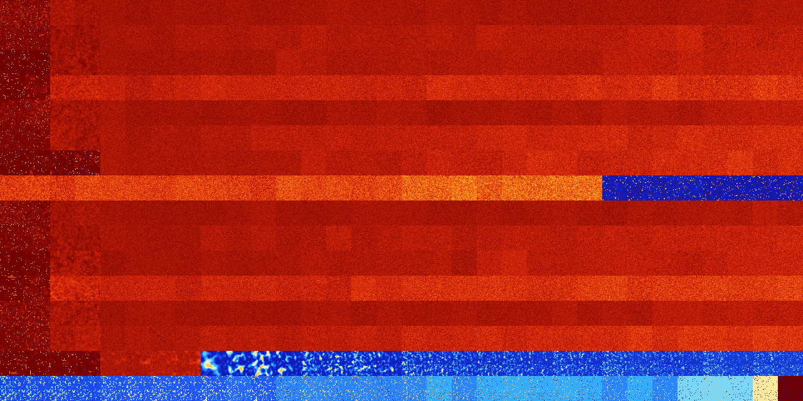

# B024568 (190976-191487)

<details>
    <summary>Initial Grid</summary>
    
</details>


<details>
    <summary>Initial Grid RLE</summary>

```
#C Exported from GoGoL (https://github.com/marrow16/gogol)
#C Wrap mode: Toroidal
#C Boundary mode: Dead
#C Step: 0
x = 100, y = 100, rule = B024568/S
22bo$4bo11bo7bo32bo29bo$9bobo41bo18bo9bo3bo$bobo14bo45bo$25bo5bo21bo8bo
8bo14bo$38b2o34bo$12bo16bo36bo$bo9bo10bo68bo$3bo7b2o12bo2bo23bo12bo$8bo
16b2o10bo55bo$5bo4bo14bo50b2o10bo$13bo21bo19bo12bo16bo$7bo21bo32bobo10b
o$6b2o12b2o12bo26bo$39bo4bo51bo$6b2o4bo50bo7b2o17bo$39bo$13bo3bo5bo24bo
40bo$o15bobo22bo8bo21bob2o4bo18bo$10bo51bo22bo$16bo17bo39bo10bo9bo$25bo
15bo19bo12b2o$20bo29bo4bo34bo$7bo12bo16bobo13bo3bo4bo11bo14bo6bo$11bo3b
o42bo$79bo14bo$10bo6bo46bo25bo4bo$9bo12bo18bo18bo14bo$4bo8bo26bo9bo9bo
21bo$22bo14bo4bo7bo11bo14bo16bo$16bo19bo34bo3bo$21bo50bo8bo$36bo13bo14b
o$41bo7bo$36bo16bo20bo$12bo14bo49b2o20bo$o23bo7bo48bo$7bo19bo13b2o15bo$
7bo26bo7bo4bo24bo$20bo8bo20bo18bo6bobo$17bo2bo23bo6bo38bo$10bo11bo33bo$
bo86bo$7bo13bo11bo15bo45bo$5bo24bo6b2o5bo14bo26bo6bo$20bo25b2o4bo$10bo
7bo43bo19bo9bo$5bo2bo12bo11bo$100b$22bo64bo$o10bo30bo$17bo30bo32bo$5bo$
21bo12bo6bobo6bo28bo2bo$o12b2o15bo6bo14bo$33bo8bo5bo11bo8bo19bo$7bo69bo
$12bo7bo65b2o7bo$7bo3bo9bo17bo9bo15bo7bo24bo$38bo11bo10bo27bo6bo$22bo
22bo12bo18bo$8bo13bo6bo18bo8bo16bo$24bo31bo19bo13bo3bo$6bo30bo29bo9bo7b
o5bo5bo$14bo8bo28bo32bo8bo3bo$56bo4bo$12bo24bo11bo14bo6bo21bo$5bo13bo
11bo21bo$17bo4bo26bo6bo35bo$15bobo7bo8bo8bo30bo11bo$18bo16bo26bo14b2o6b
o13bo$24bo14bo8bo10bo6bo$11bo6bo23bo20bo$5bo2bo5bo8bo57bo11bobo$28bo7bo
9bo23bo8bo$11bo36bo12b2o2bo$31bo8bo16bo36bo$16b2o60b2o13bo$12bo22bo15bo
6bo5bo26bo2bo$bo2bo25bo12bo$21bo22bo13bo6bo5bo11bo8bo$29bo2bo30bo32bo$
19bo$o9bo6bo7bo5bo4bo23bo$13bo7bo14bobo32bo12bo$o47bo13bo18bo$16bo13bo
24bo21bo$21bo23bo3bo32bo15bo$45bo52bo$44b2o11bo8bo$2bo18bo14bo24bo18bo$
30bobo15bo6bo$o22bo14bo4bo$17bobo25bo17bo8bo10bo7bo$33bo10bo$8bo7bo8bo
27bo8bo5bo7bo2bo$5bo2bo9bo13bo7bo35bo$45bo2bo$22bo45bo10bo$3bo6bo3bo!
```
</details>
<details>
    <summary>Thumbnail</summary>

</details>
<table>
<tr>
    <td><a href="./190976%20S%20Heat%20Map%20Activity.png"></a><br>S (190976)<br>R@100,p24</td>    <td><a href="./190977%20S0%20Heat%20Map%20Activity.png"></a><br>S0 (190977)<br>R@105,p12</td>    <td><a href="./190978%20S1%20Heat%20Map%20Activity.png"></a><br>S1 (190978)<br>G>1000</td>    <td><a href="./190979%20S01%20Heat%20Map%20Activity.png"></a><br>S01 (190979)<br>G>1000</td>    <td><a href="./190980%20S2%20Heat%20Map%20Activity.png"></a><br>S2 (190980)<br>G>1000</td>    <td><a href="./190981%20S02%20Heat%20Map%20Activity.png"></a><br>S02 (190981)<br>G>1000</td>    <td><a href="./190982%20S12%20Heat%20Map%20Activity.png"></a><br>S12 (190982)<br>G>1000</td>    <td><a href="./190983%20S012%20Heat%20Map%20Activity.png"></a><br>S012 (190983)<br>G>1000</td>    <td><a href="./190984%20S3%20Heat%20Map%20Activity.png"></a><br>S3 (190984)<br>G>1000</td>    <td><a href="./190985%20S03%20Heat%20Map%20Activity.png"></a><br>S03 (190985)<br>G>1000</td>    <td><a href="./190986%20S13%20Heat%20Map%20Activity.png"></a><br>S13 (190986)<br>G>1000</td>    <td><a href="./190987%20S013%20Heat%20Map%20Activity.png"></a><br>S013 (190987)<br>G>1000</td>    <td><a href="./190988%20S23%20Heat%20Map%20Activity.png"></a><br>S23 (190988)<br>G>1000</td>    <td><a href="./190989%20S023%20Heat%20Map%20Activity.png"></a><br>S023 (190989)<br>G>1000</td>    <td><a href="./190990%20S123%20Heat%20Map%20Activity.png"></a><br>S123 (190990)<br>G>1000</td>    <td><a href="./190991%20S0123%20Heat%20Map%20Activity.png"></a><br>S0123 (190991)<br>G>1000</td>    <td><a href="./190992%20S4%20Heat%20Map%20Activity.png"></a><br>S4 (190992)<br>G>1000</td>    <td><a href="./190993%20S04%20Heat%20Map%20Activity.png"></a><br>S04 (190993)<br>G>1000</td>    <td><a href="./190994%20S14%20Heat%20Map%20Activity.png"></a><br>S14 (190994)<br>G>1000</td>    <td><a href="./190995%20S014%20Heat%20Map%20Activity.png"></a><br>S014 (190995)<br>G>1000</td>    <td><a href="./190996%20S24%20Heat%20Map%20Activity.png"></a><br>S24 (190996)<br>G>1000</td>    <td><a href="./190997%20S024%20Heat%20Map%20Activity.png"></a><br>S024 (190997)<br>G>1000</td>    <td><a href="./190998%20S124%20Heat%20Map%20Activity.png"></a><br>S124 (190998)<br>G>1000</td>    <td><a href="./190999%20S0124%20Heat%20Map%20Activity.png"></a><br>S0124 (190999)<br>G>1000</td>    <td><a href="./191000%20S34%20Heat%20Map%20Activity.png"></a><br>S34 (191000)<br>G>1000</td>    <td><a href="./191001%20S034%20Heat%20Map%20Activity.png"></a><br>S034 (191001)<br>G>1000</td>    <td><a href="./191002%20S134%20Heat%20Map%20Activity.png"></a><br>S134 (191002)<br>G>1000</td>    <td><a href="./191003%20S0134%20Heat%20Map%20Activity.png"></a><br>S0134 (191003)<br>G>1000</td>    <td><a href="./191004%20S234%20Heat%20Map%20Activity.png"></a><br>S234 (191004)<br>G>1000</td>    <td><a href="./191005%20S0234%20Heat%20Map%20Activity.png"></a><br>S0234 (191005)<br>G>1000</td>    <td><a href="./191006%20S1234%20Heat%20Map%20Activity.png"></a><br>S1234 (191006)<br>G>1000</td>    <td><a href="./191007%20S01234%20Heat%20Map%20Activity.png"></a><br>S01234 (191007)<br>G>1000</td></tr>
<tr>
    <td><a href="./191008%20S5%20Heat%20Map%20Activity.png"></a><br>S5 (191008)<br>R@114,p16</td>    <td><a href="./191009%20S05%20Heat%20Map%20Activity.png"></a><br>S05 (191009)<br>R@125,p4</td>    <td><a href="./191010%20S15%20Heat%20Map%20Activity.png"></a><br>S15 (191010)<br>G>1000</td>    <td><a href="./191011%20S015%20Heat%20Map%20Activity.png"></a><br>S015 (191011)<br>G>1000</td>    <td><a href="./191012%20S25%20Heat%20Map%20Activity.png"></a><br>S25 (191012)<br>G>1000</td>    <td><a href="./191013%20S025%20Heat%20Map%20Activity.png"></a><br>S025 (191013)<br>G>1000</td>    <td><a href="./191014%20S125%20Heat%20Map%20Activity.png"></a><br>S125 (191014)<br>G>1000</td>    <td><a href="./191015%20S0125%20Heat%20Map%20Activity.png"></a><br>S0125 (191015)<br>G>1000</td>    <td><a href="./191016%20S35%20Heat%20Map%20Activity.png"></a><br>S35 (191016)<br>G>1000</td>    <td><a href="./191017%20S035%20Heat%20Map%20Activity.png"></a><br>S035 (191017)<br>G>1000</td>    <td><a href="./191018%20S135%20Heat%20Map%20Activity.png"></a><br>S135 (191018)<br>G>1000</td>    <td><a href="./191019%20S0135%20Heat%20Map%20Activity.png"></a><br>S0135 (191019)<br>G>1000</td>    <td><a href="./191020%20S235%20Heat%20Map%20Activity.png"></a><br>S235 (191020)<br>G>1000</td>    <td><a href="./191021%20S0235%20Heat%20Map%20Activity.png"></a><br>S0235 (191021)<br>G>1000</td>    <td><a href="./191022%20S1235%20Heat%20Map%20Activity.png"></a><br>S1235 (191022)<br>G>1000</td>    <td><a href="./191023%20S01235%20Heat%20Map%20Activity.png"></a><br>S01235 (191023)<br>G>1000</td>    <td><a href="./191024%20S45%20Heat%20Map%20Activity.png"></a><br>S45 (191024)<br>G>1000</td>    <td><a href="./191025%20S045%20Heat%20Map%20Activity.png"></a><br>S045 (191025)<br>G>1000</td>    <td><a href="./191026%20S145%20Heat%20Map%20Activity.png"></a><br>S145 (191026)<br>G>1000</td>    <td><a href="./191027%20S0145%20Heat%20Map%20Activity.png"></a><br>S0145 (191027)<br>G>1000</td>    <td><a href="./191028%20S245%20Heat%20Map%20Activity.png"></a><br>S245 (191028)<br>G>1000</td>    <td><a href="./191029%20S0245%20Heat%20Map%20Activity.png"></a><br>S0245 (191029)<br>G>1000</td>    <td><a href="./191030%20S1245%20Heat%20Map%20Activity.png"></a><br>S1245 (191030)<br>G>1000</td>    <td><a href="./191031%20S01245%20Heat%20Map%20Activity.png"></a><br>S01245 (191031)<br>G>1000</td>    <td><a href="./191032%20S345%20Heat%20Map%20Activity.png"></a><br>S345 (191032)<br>G>1000</td>    <td><a href="./191033%20S0345%20Heat%20Map%20Activity.png"></a><br>S0345 (191033)<br>G>1000</td>    <td><a href="./191034%20S1345%20Heat%20Map%20Activity.png"></a><br>S1345 (191034)<br>G>1000</td>    <td><a href="./191035%20S01345%20Heat%20Map%20Activity.png"></a><br>S01345 (191035)<br>G>1000</td>    <td><a href="./191036%20S2345%20Heat%20Map%20Activity.png"></a><br>S2345 (191036)<br>G>1000</td>    <td><a href="./191037%20S02345%20Heat%20Map%20Activity.png"></a><br>S02345 (191037)<br>G>1000</td>    <td><a href="./191038%20S12345%20Heat%20Map%20Activity.png"></a><br>S12345 (191038)<br>G>1000</td>    <td><a href="./191039%20S012345%20Heat%20Map%20Activity.png"></a><br>S012345 (191039)<br>G>1000</td></tr>
<tr>
    <td><a href="./191040%20S6%20Heat%20Map%20Activity.png"></a><br>S6 (191040)<br>G>1000</td>    <td><a href="./191041%20S06%20Heat%20Map%20Activity.png"></a><br>S06 (191041)<br>R@557,p420</td>    <td><a href="./191042%20S16%20Heat%20Map%20Activity.png"></a><br>S16 (191042)<br>G>1000</td>    <td><a href="./191043%20S016%20Heat%20Map%20Activity.png"></a><br>S016 (191043)<br>G>1000</td>    <td><a href="./191044%20S26%20Heat%20Map%20Activity.png"></a><br>S26 (191044)<br>G>1000</td>    <td><a href="./191045%20S026%20Heat%20Map%20Activity.png"></a><br>S026 (191045)<br>G>1000</td>    <td><a href="./191046%20S126%20Heat%20Map%20Activity.png"></a><br>S126 (191046)<br>G>1000</td>    <td><a href="./191047%20S0126%20Heat%20Map%20Activity.png"></a><br>S0126 (191047)<br>G>1000</td>    <td><a href="./191048%20S36%20Heat%20Map%20Activity.png"></a><br>S36 (191048)<br>G>1000</td>    <td><a href="./191049%20S036%20Heat%20Map%20Activity.png"></a><br>S036 (191049)<br>G>1000</td>    <td><a href="./191050%20S136%20Heat%20Map%20Activity.png"></a><br>S136 (191050)<br>G>1000</td>    <td><a href="./191051%20S0136%20Heat%20Map%20Activity.png"></a><br>S0136 (191051)<br>G>1000</td>    <td><a href="./191052%20S236%20Heat%20Map%20Activity.png"></a><br>S236 (191052)<br>G>1000</td>    <td><a href="./191053%20S0236%20Heat%20Map%20Activity.png"></a><br>S0236 (191053)<br>G>1000</td>    <td><a href="./191054%20S1236%20Heat%20Map%20Activity.png"></a><br>S1236 (191054)<br>G>1000</td>    <td><a href="./191055%20S01236%20Heat%20Map%20Activity.png"></a><br>S01236 (191055)<br>G>1000</td>    <td><a href="./191056%20S46%20Heat%20Map%20Activity.png"></a><br>S46 (191056)<br>G>1000</td>    <td><a href="./191057%20S046%20Heat%20Map%20Activity.png"></a><br>S046 (191057)<br>G>1000</td>    <td><a href="./191058%20S146%20Heat%20Map%20Activity.png"></a><br>S146 (191058)<br>G>1000</td>    <td><a href="./191059%20S0146%20Heat%20Map%20Activity.png"></a><br>S0146 (191059)<br>G>1000</td>    <td><a href="./191060%20S246%20Heat%20Map%20Activity.png"></a><br>S246 (191060)<br>G>1000</td>    <td><a href="./191061%20S0246%20Heat%20Map%20Activity.png"></a><br>S0246 (191061)<br>G>1000</td>    <td><a href="./191062%20S1246%20Heat%20Map%20Activity.png"></a><br>S1246 (191062)<br>G>1000</td>    <td><a href="./191063%20S01246%20Heat%20Map%20Activity.png"></a><br>S01246 (191063)<br>G>1000</td>    <td><a href="./191064%20S346%20Heat%20Map%20Activity.png"></a><br>S346 (191064)<br>G>1000</td>    <td><a href="./191065%20S0346%20Heat%20Map%20Activity.png"></a><br>S0346 (191065)<br>G>1000</td>    <td><a href="./191066%20S1346%20Heat%20Map%20Activity.png"></a><br>S1346 (191066)<br>G>1000</td>    <td><a href="./191067%20S01346%20Heat%20Map%20Activity.png"></a><br>S01346 (191067)<br>G>1000</td>    <td><a href="./191068%20S2346%20Heat%20Map%20Activity.png"></a><br>S2346 (191068)<br>G>1000</td>    <td><a href="./191069%20S02346%20Heat%20Map%20Activity.png"></a><br>S02346 (191069)<br>G>1000</td>    <td><a href="./191070%20S12346%20Heat%20Map%20Activity.png"></a><br>S12346 (191070)<br>G>1000</td>    <td><a href="./191071%20S012346%20Heat%20Map%20Activity.png"></a><br>S012346 (191071)<br>G>1000</td></tr>
<tr>
    <td><a href="./191072%20S56%20Heat%20Map%20Activity.png"></a><br>S56 (191072)<br>G>1000</td>    <td><a href="./191073%20S056%20Heat%20Map%20Activity.png"></a><br>S056 (191073)<br>R@366,p24</td>    <td><a href="./191074%20S156%20Heat%20Map%20Activity.png"></a><br>S156 (191074)<br>G>1000</td>    <td><a href="./191075%20S0156%20Heat%20Map%20Activity.png"></a><br>S0156 (191075)<br>G>1000</td>    <td><a href="./191076%20S256%20Heat%20Map%20Activity.png"></a><br>S256 (191076)<br>G>1000</td>    <td><a href="./191077%20S0256%20Heat%20Map%20Activity.png"></a><br>S0256 (191077)<br>G>1000</td>    <td><a href="./191078%20S1256%20Heat%20Map%20Activity.png"></a><br>S1256 (191078)<br>G>1000</td>    <td><a href="./191079%20S01256%20Heat%20Map%20Activity.png"></a><br>S01256 (191079)<br>G>1000</td>    <td><a href="./191080%20S356%20Heat%20Map%20Activity.png"></a><br>S356 (191080)<br>G>1000</td>    <td><a href="./191081%20S0356%20Heat%20Map%20Activity.png"></a><br>S0356 (191081)<br>G>1000</td>    <td><a href="./191082%20S1356%20Heat%20Map%20Activity.png"></a><br>S1356 (191082)<br>G>1000</td>    <td><a href="./191083%20S01356%20Heat%20Map%20Activity.png"></a><br>S01356 (191083)<br>G>1000</td>    <td><a href="./191084%20S2356%20Heat%20Map%20Activity.png"></a><br>S2356 (191084)<br>G>1000</td>    <td><a href="./191085%20S02356%20Heat%20Map%20Activity.png"></a><br>S02356 (191085)<br>G>1000</td>    <td><a href="./191086%20S12356%20Heat%20Map%20Activity.png"></a><br>S12356 (191086)<br>G>1000</td>    <td><a href="./191087%20S012356%20Heat%20Map%20Activity.png"></a><br>S012356 (191087)<br>G>1000</td>    <td><a href="./191088%20S456%20Heat%20Map%20Activity.png"></a><br>S456 (191088)<br>G>1000</td>    <td><a href="./191089%20S0456%20Heat%20Map%20Activity.png"></a><br>S0456 (191089)<br>G>1000</td>    <td><a href="./191090%20S1456%20Heat%20Map%20Activity.png"></a><br>S1456 (191090)<br>G>1000</td>    <td><a href="./191091%20S01456%20Heat%20Map%20Activity.png"></a><br>S01456 (191091)<br>G>1000</td>    <td><a href="./191092%20S2456%20Heat%20Map%20Activity.png"></a><br>S2456 (191092)<br>G>1000</td>    <td><a href="./191093%20S02456%20Heat%20Map%20Activity.png"></a><br>S02456 (191093)<br>G>1000</td>    <td><a href="./191094%20S12456%20Heat%20Map%20Activity.png"></a><br>S12456 (191094)<br>G>1000</td>    <td><a href="./191095%20S012456%20Heat%20Map%20Activity.png"></a><br>S012456 (191095)<br>G>1000</td>    <td><a href="./191096%20S3456%20Heat%20Map%20Activity.png"></a><br>S3456 (191096)<br>G>1000</td>    <td><a href="./191097%20S03456%20Heat%20Map%20Activity.png"></a><br>S03456 (191097)<br>G>1000</td>    <td><a href="./191098%20S13456%20Heat%20Map%20Activity.png"></a><br>S13456 (191098)<br>G>1000</td>    <td><a href="./191099%20S013456%20Heat%20Map%20Activity.png"></a><br>S013456 (191099)<br>G>1000</td>    <td><a href="./191100%20S23456%20Heat%20Map%20Activity.png"></a><br>S23456 (191100)<br>G>1000</td>    <td><a href="./191101%20S023456%20Heat%20Map%20Activity.png"></a><br>S023456 (191101)<br>G>1000</td>    <td><a href="./191102%20S123456%20Heat%20Map%20Activity.png"></a><br>S123456 (191102)<br>G>1000</td>    <td><a href="./191103%20S0123456%20Heat%20Map%20Activity.png"></a><br>S0123456 (191103)<br>G>1000</td></tr>
<tr>
    <td><a href="./191104%20S7%20Heat%20Map%20Activity.png"></a><br>S7 (191104)<br>R@138,p40</td>    <td><a href="./191105%20S07%20Heat%20Map%20Activity.png"></a><br>S07 (191105)<br>R@90,p4</td>    <td><a href="./191106%20S17%20Heat%20Map%20Activity.png"></a><br>S17 (191106)<br>G>1000</td>    <td><a href="./191107%20S017%20Heat%20Map%20Activity.png"></a><br>S017 (191107)<br>G>1000</td>    <td><a href="./191108%20S27%20Heat%20Map%20Activity.png"></a><br>S27 (191108)<br>G>1000</td>    <td><a href="./191109%20S027%20Heat%20Map%20Activity.png"></a><br>S027 (191109)<br>G>1000</td>    <td><a href="./191110%20S127%20Heat%20Map%20Activity.png"></a><br>S127 (191110)<br>G>1000</td>    <td><a href="./191111%20S0127%20Heat%20Map%20Activity.png"></a><br>S0127 (191111)<br>G>1000</td>    <td><a href="./191112%20S37%20Heat%20Map%20Activity.png"></a><br>S37 (191112)<br>G>1000</td>    <td><a href="./191113%20S037%20Heat%20Map%20Activity.png"></a><br>S037 (191113)<br>G>1000</td>    <td><a href="./191114%20S137%20Heat%20Map%20Activity.png"></a><br>S137 (191114)<br>G>1000</td>    <td><a href="./191115%20S0137%20Heat%20Map%20Activity.png"></a><br>S0137 (191115)<br>G>1000</td>    <td><a href="./191116%20S237%20Heat%20Map%20Activity.png"></a><br>S237 (191116)<br>G>1000</td>    <td><a href="./191117%20S0237%20Heat%20Map%20Activity.png"></a><br>S0237 (191117)<br>G>1000</td>    <td><a href="./191118%20S1237%20Heat%20Map%20Activity.png"></a><br>S1237 (191118)<br>G>1000</td>    <td><a href="./191119%20S01237%20Heat%20Map%20Activity.png"></a><br>S01237 (191119)<br>G>1000</td>    <td><a href="./191120%20S47%20Heat%20Map%20Activity.png"></a><br>S47 (191120)<br>G>1000</td>    <td><a href="./191121%20S047%20Heat%20Map%20Activity.png"></a><br>S047 (191121)<br>G>1000</td>    <td><a href="./191122%20S147%20Heat%20Map%20Activity.png"></a><br>S147 (191122)<br>G>1000</td>    <td><a href="./191123%20S0147%20Heat%20Map%20Activity.png"></a><br>S0147 (191123)<br>G>1000</td>    <td><a href="./191124%20S247%20Heat%20Map%20Activity.png"></a><br>S247 (191124)<br>G>1000</td>    <td><a href="./191125%20S0247%20Heat%20Map%20Activity.png"></a><br>S0247 (191125)<br>G>1000</td>    <td><a href="./191126%20S1247%20Heat%20Map%20Activity.png"></a><br>S1247 (191126)<br>G>1000</td>    <td><a href="./191127%20S01247%20Heat%20Map%20Activity.png"></a><br>S01247 (191127)<br>G>1000</td>    <td><a href="./191128%20S347%20Heat%20Map%20Activity.png"></a><br>S347 (191128)<br>G>1000</td>    <td><a href="./191129%20S0347%20Heat%20Map%20Activity.png"></a><br>S0347 (191129)<br>G>1000</td>    <td><a href="./191130%20S1347%20Heat%20Map%20Activity.png"></a><br>S1347 (191130)<br>G>1000</td>    <td><a href="./191131%20S01347%20Heat%20Map%20Activity.png"></a><br>S01347 (191131)<br>G>1000</td>    <td><a href="./191132%20S2347%20Heat%20Map%20Activity.png"></a><br>S2347 (191132)<br>G>1000</td>    <td><a href="./191133%20S02347%20Heat%20Map%20Activity.png"></a><br>S02347 (191133)<br>G>1000</td>    <td><a href="./191134%20S12347%20Heat%20Map%20Activity.png"></a><br>S12347 (191134)<br>G>1000</td>    <td><a href="./191135%20S012347%20Heat%20Map%20Activity.png"></a><br>S012347 (191135)<br>G>1000</td></tr>
<tr>
    <td><a href="./191136%20S57%20Heat%20Map%20Activity.png"></a><br>S57 (191136)<br>R@164,p80</td>    <td><a href="./191137%20S057%20Heat%20Map%20Activity.png"></a><br>S057 (191137)<br>R@147,p72</td>    <td><a href="./191138%20S157%20Heat%20Map%20Activity.png"></a><br>S157 (191138)<br>G>1000</td>    <td><a href="./191139%20S0157%20Heat%20Map%20Activity.png"></a><br>S0157 (191139)<br>G>1000</td>    <td><a href="./191140%20S257%20Heat%20Map%20Activity.png"></a><br>S257 (191140)<br>G>1000</td>    <td><a href="./191141%20S0257%20Heat%20Map%20Activity.png"></a><br>S0257 (191141)<br>G>1000</td>    <td><a href="./191142%20S1257%20Heat%20Map%20Activity.png"></a><br>S1257 (191142)<br>G>1000</td>    <td><a href="./191143%20S01257%20Heat%20Map%20Activity.png"></a><br>S01257 (191143)<br>G>1000</td>    <td><a href="./191144%20S357%20Heat%20Map%20Activity.png"></a><br>S357 (191144)<br>G>1000</td>    <td><a href="./191145%20S0357%20Heat%20Map%20Activity.png"></a><br>S0357 (191145)<br>G>1000</td>    <td><a href="./191146%20S1357%20Heat%20Map%20Activity.png"></a><br>S1357 (191146)<br>G>1000</td>    <td><a href="./191147%20S01357%20Heat%20Map%20Activity.png"></a><br>S01357 (191147)<br>G>1000</td>    <td><a href="./191148%20S2357%20Heat%20Map%20Activity.png"></a><br>S2357 (191148)<br>G>1000</td>    <td><a href="./191149%20S02357%20Heat%20Map%20Activity.png"></a><br>S02357 (191149)<br>G>1000</td>    <td><a href="./191150%20S12357%20Heat%20Map%20Activity.png"></a><br>S12357 (191150)<br>G>1000</td>    <td><a href="./191151%20S012357%20Heat%20Map%20Activity.png"></a><br>S012357 (191151)<br>G>1000</td>    <td><a href="./191152%20S457%20Heat%20Map%20Activity.png"></a><br>S457 (191152)<br>G>1000</td>    <td><a href="./191153%20S0457%20Heat%20Map%20Activity.png"></a><br>S0457 (191153)<br>G>1000</td>    <td><a href="./191154%20S1457%20Heat%20Map%20Activity.png"></a><br>S1457 (191154)<br>G>1000</td>    <td><a href="./191155%20S01457%20Heat%20Map%20Activity.png"></a><br>S01457 (191155)<br>G>1000</td>    <td><a href="./191156%20S2457%20Heat%20Map%20Activity.png"></a><br>S2457 (191156)<br>G>1000</td>    <td><a href="./191157%20S02457%20Heat%20Map%20Activity.png"></a><br>S02457 (191157)<br>G>1000</td>    <td><a href="./191158%20S12457%20Heat%20Map%20Activity.png"></a><br>S12457 (191158)<br>G>1000</td>    <td><a href="./191159%20S012457%20Heat%20Map%20Activity.png"></a><br>S012457 (191159)<br>G>1000</td>    <td><a href="./191160%20S3457%20Heat%20Map%20Activity.png"></a><br>S3457 (191160)<br>G>1000</td>    <td><a href="./191161%20S03457%20Heat%20Map%20Activity.png"></a><br>S03457 (191161)<br>G>1000</td>    <td><a href="./191162%20S13457%20Heat%20Map%20Activity.png"></a><br>S13457 (191162)<br>G>1000</td>    <td><a href="./191163%20S013457%20Heat%20Map%20Activity.png"></a><br>S013457 (191163)<br>G>1000</td>    <td><a href="./191164%20S23457%20Heat%20Map%20Activity.png"></a><br>S23457 (191164)<br>G>1000</td>    <td><a href="./191165%20S023457%20Heat%20Map%20Activity.png"></a><br>S023457 (191165)<br>G>1000</td>    <td><a href="./191166%20S123457%20Heat%20Map%20Activity.png"></a><br>S123457 (191166)<br>G>1000</td>    <td><a href="./191167%20S0123457%20Heat%20Map%20Activity.png"></a><br>S0123457 (191167)<br>G>1000</td></tr>
<tr>
    <td><a href="./191168%20S67%20Heat%20Map%20Activity.png"></a><br>S67 (191168)<br>R@465,p336</td>    <td><a href="./191169%20S067%20Heat%20Map%20Activity.png"></a><br>S067 (191169)<br>R@346,p48</td>    <td><a href="./191170%20S167%20Heat%20Map%20Activity.png"></a><br>S167 (191170)<br>R@776,p240</td>    <td><a href="./191171%20S0167%20Heat%20Map%20Activity.png"></a><br>S0167 (191171)<br>R@437,p12</td>    <td><a href="./191172%20S267%20Heat%20Map%20Activity.png"></a><br>S267 (191172)<br>G>1000</td>    <td><a href="./191173%20S0267%20Heat%20Map%20Activity.png"></a><br>S0267 (191173)<br>G>1000</td>    <td><a href="./191174%20S1267%20Heat%20Map%20Activity.png"></a><br>S1267 (191174)<br>G>1000</td>    <td><a href="./191175%20S01267%20Heat%20Map%20Activity.png"></a><br>S01267 (191175)<br>G>1000</td>    <td><a href="./191176%20S367%20Heat%20Map%20Activity.png"></a><br>S367 (191176)<br>G>1000</td>    <td><a href="./191177%20S0367%20Heat%20Map%20Activity.png"></a><br>S0367 (191177)<br>G>1000</td>    <td><a href="./191178%20S1367%20Heat%20Map%20Activity.png"></a><br>S1367 (191178)<br>G>1000</td>    <td><a href="./191179%20S01367%20Heat%20Map%20Activity.png"></a><br>S01367 (191179)<br>G>1000</td>    <td><a href="./191180%20S2367%20Heat%20Map%20Activity.png"></a><br>S2367 (191180)<br>G>1000</td>    <td><a href="./191181%20S02367%20Heat%20Map%20Activity.png"></a><br>S02367 (191181)<br>G>1000</td>    <td><a href="./191182%20S12367%20Heat%20Map%20Activity.png"></a><br>S12367 (191182)<br>G>1000</td>    <td><a href="./191183%20S012367%20Heat%20Map%20Activity.png"></a><br>S012367 (191183)<br>G>1000</td>    <td><a href="./191184%20S467%20Heat%20Map%20Activity.png"></a><br>S467 (191184)<br>G>1000</td>    <td><a href="./191185%20S0467%20Heat%20Map%20Activity.png"></a><br>S0467 (191185)<br>G>1000</td>    <td><a href="./191186%20S1467%20Heat%20Map%20Activity.png"></a><br>S1467 (191186)<br>G>1000</td>    <td><a href="./191187%20S01467%20Heat%20Map%20Activity.png"></a><br>S01467 (191187)<br>G>1000</td>    <td><a href="./191188%20S2467%20Heat%20Map%20Activity.png"></a><br>S2467 (191188)<br>G>1000</td>    <td><a href="./191189%20S02467%20Heat%20Map%20Activity.png"></a><br>S02467 (191189)<br>G>1000</td>    <td><a href="./191190%20S12467%20Heat%20Map%20Activity.png"></a><br>S12467 (191190)<br>G>1000</td>    <td><a href="./191191%20S012467%20Heat%20Map%20Activity.png"></a><br>S012467 (191191)<br>G>1000</td>    <td><a href="./191192%20S3467%20Heat%20Map%20Activity.png"></a><br>S3467 (191192)<br>G>1000</td>    <td><a href="./191193%20S03467%20Heat%20Map%20Activity.png"></a><br>S03467 (191193)<br>G>1000</td>    <td><a href="./191194%20S13467%20Heat%20Map%20Activity.png"></a><br>S13467 (191194)<br>G>1000</td>    <td><a href="./191195%20S013467%20Heat%20Map%20Activity.png"></a><br>S013467 (191195)<br>G>1000</td>    <td><a href="./191196%20S23467%20Heat%20Map%20Activity.png"></a><br>S23467 (191196)<br>G>1000</td>    <td><a href="./191197%20S023467%20Heat%20Map%20Activity.png"></a><br>S023467 (191197)<br>G>1000</td>    <td><a href="./191198%20S123467%20Heat%20Map%20Activity.png"></a><br>S123467 (191198)<br>G>1000</td>    <td><a href="./191199%20S0123467%20Heat%20Map%20Activity.png"></a><br>S0123467 (191199)<br>G>1000</td></tr>
<tr>
    <td><a href="./191200%20S567%20Heat%20Map%20Activity.png"></a><br>S567 (191200)<br>G>1000</td>    <td><a href="./191201%20S0567%20Heat%20Map%20Activity.png"></a><br>S0567 (191201)<br>G>1000</td>    <td><a href="./191202%20S1567%20Heat%20Map%20Activity.png"></a><br>S1567 (191202)<br>G>1000</td>    <td><a href="./191203%20S01567%20Heat%20Map%20Activity.png"></a><br>S01567 (191203)<br>G>1000</td>    <td><a href="./191204%20S2567%20Heat%20Map%20Activity.png"></a><br>S2567 (191204)<br>G>1000</td>    <td><a href="./191205%20S02567%20Heat%20Map%20Activity.png"></a><br>S02567 (191205)<br>G>1000</td>    <td><a href="./191206%20S12567%20Heat%20Map%20Activity.png"></a><br>S12567 (191206)<br>G>1000</td>    <td><a href="./191207%20S012567%20Heat%20Map%20Activity.png"></a><br>S012567 (191207)<br>G>1000</td>    <td><a href="./191208%20S3567%20Heat%20Map%20Activity.png"></a><br>S3567 (191208)<br>G>1000</td>    <td><a href="./191209%20S03567%20Heat%20Map%20Activity.png"></a><br>S03567 (191209)<br>G>1000</td>    <td><a href="./191210%20S13567%20Heat%20Map%20Activity.png"></a><br>S13567 (191210)<br>G>1000</td>    <td><a href="./191211%20S013567%20Heat%20Map%20Activity.png"></a><br>S013567 (191211)<br>G>1000</td>    <td><a href="./191212%20S23567%20Heat%20Map%20Activity.png"></a><br>S23567 (191212)<br>G>1000</td>    <td><a href="./191213%20S023567%20Heat%20Map%20Activity.png"></a><br>S023567 (191213)<br>G>1000</td>    <td><a href="./191214%20S123567%20Heat%20Map%20Activity.png"></a><br>S123567 (191214)<br>G>1000</td>    <td><a href="./191215%20S0123567%20Heat%20Map%20Activity.png"></a><br>S0123567 (191215)<br>G>1000</td>    <td><a href="./191216%20S4567%20Heat%20Map%20Activity.png"></a><br>S4567 (191216)<br>G>1000</td>    <td><a href="./191217%20S04567%20Heat%20Map%20Activity.png"></a><br>S04567 (191217)<br>G>1000</td>    <td><a href="./191218%20S14567%20Heat%20Map%20Activity.png"></a><br>S14567 (191218)<br>G>1000</td>    <td><a href="./191219%20S014567%20Heat%20Map%20Activity.png"></a><br>S014567 (191219)<br>G>1000</td>    <td><a href="./191220%20S24567%20Heat%20Map%20Activity.png"></a><br>S24567 (191220)<br>G>1000</td>    <td><a href="./191221%20S024567%20Heat%20Map%20Activity.png"></a><br>S024567 (191221)<br>G>1000</td>    <td><a href="./191222%20S124567%20Heat%20Map%20Activity.png"></a><br>S124567 (191222)<br>G>1000</td>    <td><a href="./191223%20S0124567%20Heat%20Map%20Activity.png"></a><br>S0124567 (191223)<br>G>1000</td>    <td><a href="./191224%20S34567%20Heat%20Map%20Activity.png"></a><br>S34567 (191224)<br>G>1000</td>    <td><a href="./191225%20S034567%20Heat%20Map%20Activity.png"></a><br>S034567 (191225)<br>G>1000</td>    <td><a href="./191226%20S134567%20Heat%20Map%20Activity.png"></a><br>S134567 (191226)<br>G>1000</td>    <td><a href="./191227%20S0134567%20Heat%20Map%20Activity.png"></a><br>S0134567 (191227)<br>R@670,p504</td>    <td><a href="./191228%20S234567%20Heat%20Map%20Activity.png"></a><br>S234567 (191228)<br>G>1000</td>    <td><a href="./191229%20S0234567%20Heat%20Map%20Activity.png"></a><br>S0234567 (191229)<br>G>1000</td>    <td><a href="./191230%20S1234567%20Heat%20Map%20Activity.png"></a><br>S1234567 (191230)<br>G>1000</td>    <td><a href="./191231%20S01234567%20Heat%20Map%20Activity.png"></a><br>S01234567 (191231)<br>G>1000</td></tr>
<tr>
    <td><a href="./191232%20S8%20Heat%20Map%20Activity.png"></a><br>S8 (191232)<br>R@97,p12</td>    <td><a href="./191233%20S08%20Heat%20Map%20Activity.png"></a><br>S08 (191233)<br>R@131,p36</td>    <td><a href="./191234%20S18%20Heat%20Map%20Activity.png"></a><br>S18 (191234)<br>G>1000</td>    <td><a href="./191235%20S018%20Heat%20Map%20Activity.png"></a><br>S018 (191235)<br>G>1000</td>    <td><a href="./191236%20S28%20Heat%20Map%20Activity.png"></a><br>S28 (191236)<br>G>1000</td>    <td><a href="./191237%20S028%20Heat%20Map%20Activity.png"></a><br>S028 (191237)<br>G>1000</td>    <td><a href="./191238%20S128%20Heat%20Map%20Activity.png"></a><br>S128 (191238)<br>G>1000</td>    <td><a href="./191239%20S0128%20Heat%20Map%20Activity.png"></a><br>S0128 (191239)<br>G>1000</td>    <td><a href="./191240%20S38%20Heat%20Map%20Activity.png"></a><br>S38 (191240)<br>G>1000</td>    <td><a href="./191241%20S038%20Heat%20Map%20Activity.png"></a><br>S038 (191241)<br>G>1000</td>    <td><a href="./191242%20S138%20Heat%20Map%20Activity.png"></a><br>S138 (191242)<br>G>1000</td>    <td><a href="./191243%20S0138%20Heat%20Map%20Activity.png"></a><br>S0138 (191243)<br>G>1000</td>    <td><a href="./191244%20S238%20Heat%20Map%20Activity.png"></a><br>S238 (191244)<br>G>1000</td>    <td><a href="./191245%20S0238%20Heat%20Map%20Activity.png"></a><br>S0238 (191245)<br>G>1000</td>    <td><a href="./191246%20S1238%20Heat%20Map%20Activity.png"></a><br>S1238 (191246)<br>G>1000</td>    <td><a href="./191247%20S01238%20Heat%20Map%20Activity.png"></a><br>S01238 (191247)<br>G>1000</td>    <td><a href="./191248%20S48%20Heat%20Map%20Activity.png"></a><br>S48 (191248)<br>G>1000</td>    <td><a href="./191249%20S048%20Heat%20Map%20Activity.png"></a><br>S048 (191249)<br>G>1000</td>    <td><a href="./191250%20S148%20Heat%20Map%20Activity.png"></a><br>S148 (191250)<br>G>1000</td>    <td><a href="./191251%20S0148%20Heat%20Map%20Activity.png"></a><br>S0148 (191251)<br>G>1000</td>    <td><a href="./191252%20S248%20Heat%20Map%20Activity.png"></a><br>S248 (191252)<br>G>1000</td>    <td><a href="./191253%20S0248%20Heat%20Map%20Activity.png"></a><br>S0248 (191253)<br>G>1000</td>    <td><a href="./191254%20S1248%20Heat%20Map%20Activity.png"></a><br>S1248 (191254)<br>G>1000</td>    <td><a href="./191255%20S01248%20Heat%20Map%20Activity.png"></a><br>S01248 (191255)<br>G>1000</td>    <td><a href="./191256%20S348%20Heat%20Map%20Activity.png"></a><br>S348 (191256)<br>G>1000</td>    <td><a href="./191257%20S0348%20Heat%20Map%20Activity.png"></a><br>S0348 (191257)<br>G>1000</td>    <td><a href="./191258%20S1348%20Heat%20Map%20Activity.png"></a><br>S1348 (191258)<br>G>1000</td>    <td><a href="./191259%20S01348%20Heat%20Map%20Activity.png"></a><br>S01348 (191259)<br>G>1000</td>    <td><a href="./191260%20S2348%20Heat%20Map%20Activity.png"></a><br>S2348 (191260)<br>G>1000</td>    <td><a href="./191261%20S02348%20Heat%20Map%20Activity.png"></a><br>S02348 (191261)<br>G>1000</td>    <td><a href="./191262%20S12348%20Heat%20Map%20Activity.png"></a><br>S12348 (191262)<br>G>1000</td>    <td><a href="./191263%20S012348%20Heat%20Map%20Activity.png"></a><br>S012348 (191263)<br>G>1000</td></tr>
<tr>
    <td><a href="./191264%20S58%20Heat%20Map%20Activity.png"></a><br>S58 (191264)<br>R@166,p72</td>    <td><a href="./191265%20S058%20Heat%20Map%20Activity.png"></a><br>S058 (191265)<br>R@97,p4</td>    <td><a href="./191266%20S158%20Heat%20Map%20Activity.png"></a><br>S158 (191266)<br>G>1000</td>    <td><a href="./191267%20S0158%20Heat%20Map%20Activity.png"></a><br>S0158 (191267)<br>G>1000</td>    <td><a href="./191268%20S258%20Heat%20Map%20Activity.png"></a><br>S258 (191268)<br>G>1000</td>    <td><a href="./191269%20S0258%20Heat%20Map%20Activity.png"></a><br>S0258 (191269)<br>G>1000</td>    <td><a href="./191270%20S1258%20Heat%20Map%20Activity.png"></a><br>S1258 (191270)<br>G>1000</td>    <td><a href="./191271%20S01258%20Heat%20Map%20Activity.png"></a><br>S01258 (191271)<br>G>1000</td>    <td><a href="./191272%20S358%20Heat%20Map%20Activity.png"></a><br>S358 (191272)<br>G>1000</td>    <td><a href="./191273%20S0358%20Heat%20Map%20Activity.png"></a><br>S0358 (191273)<br>G>1000</td>    <td><a href="./191274%20S1358%20Heat%20Map%20Activity.png"></a><br>S1358 (191274)<br>G>1000</td>    <td><a href="./191275%20S01358%20Heat%20Map%20Activity.png"></a><br>S01358 (191275)<br>G>1000</td>    <td><a href="./191276%20S2358%20Heat%20Map%20Activity.png"></a><br>S2358 (191276)<br>G>1000</td>    <td><a href="./191277%20S02358%20Heat%20Map%20Activity.png"></a><br>S02358 (191277)<br>G>1000</td>    <td><a href="./191278%20S12358%20Heat%20Map%20Activity.png"></a><br>S12358 (191278)<br>G>1000</td>    <td><a href="./191279%20S012358%20Heat%20Map%20Activity.png"></a><br>S012358 (191279)<br>G>1000</td>    <td><a href="./191280%20S458%20Heat%20Map%20Activity.png"></a><br>S458 (191280)<br>G>1000</td>    <td><a href="./191281%20S0458%20Heat%20Map%20Activity.png"></a><br>S0458 (191281)<br>G>1000</td>    <td><a href="./191282%20S1458%20Heat%20Map%20Activity.png"></a><br>S1458 (191282)<br>G>1000</td>    <td><a href="./191283%20S01458%20Heat%20Map%20Activity.png"></a><br>S01458 (191283)<br>G>1000</td>    <td><a href="./191284%20S2458%20Heat%20Map%20Activity.png"></a><br>S2458 (191284)<br>G>1000</td>    <td><a href="./191285%20S02458%20Heat%20Map%20Activity.png"></a><br>S02458 (191285)<br>G>1000</td>    <td><a href="./191286%20S12458%20Heat%20Map%20Activity.png"></a><br>S12458 (191286)<br>G>1000</td>    <td><a href="./191287%20S012458%20Heat%20Map%20Activity.png"></a><br>S012458 (191287)<br>G>1000</td>    <td><a href="./191288%20S3458%20Heat%20Map%20Activity.png"></a><br>S3458 (191288)<br>G>1000</td>    <td><a href="./191289%20S03458%20Heat%20Map%20Activity.png"></a><br>S03458 (191289)<br>G>1000</td>    <td><a href="./191290%20S13458%20Heat%20Map%20Activity.png"></a><br>S13458 (191290)<br>G>1000</td>    <td><a href="./191291%20S013458%20Heat%20Map%20Activity.png"></a><br>S013458 (191291)<br>G>1000</td>    <td><a href="./191292%20S23458%20Heat%20Map%20Activity.png"></a><br>S23458 (191292)<br>G>1000</td>    <td><a href="./191293%20S023458%20Heat%20Map%20Activity.png"></a><br>S023458 (191293)<br>G>1000</td>    <td><a href="./191294%20S123458%20Heat%20Map%20Activity.png"></a><br>S123458 (191294)<br>G>1000</td>    <td><a href="./191295%20S0123458%20Heat%20Map%20Activity.png"></a><br>S0123458 (191295)<br>G>1000</td></tr>
<tr>
    <td><a href="./191296%20S68%20Heat%20Map%20Activity.png"></a><br>S68 (191296)<br>R@588,p504</td>    <td><a href="./191297%20S068%20Heat%20Map%20Activity.png"></a><br>S068 (191297)<br>R@245,p168</td>    <td><a href="./191298%20S168%20Heat%20Map%20Activity.png"></a><br>S168 (191298)<br>G>1000</td>    <td><a href="./191299%20S0168%20Heat%20Map%20Activity.png"></a><br>S0168 (191299)<br>G>1000</td>    <td><a href="./191300%20S268%20Heat%20Map%20Activity.png"></a><br>S268 (191300)<br>G>1000</td>    <td><a href="./191301%20S0268%20Heat%20Map%20Activity.png"></a><br>S0268 (191301)<br>G>1000</td>    <td><a href="./191302%20S1268%20Heat%20Map%20Activity.png"></a><br>S1268 (191302)<br>G>1000</td>    <td><a href="./191303%20S01268%20Heat%20Map%20Activity.png"></a><br>S01268 (191303)<br>G>1000</td>    <td><a href="./191304%20S368%20Heat%20Map%20Activity.png"></a><br>S368 (191304)<br>G>1000</td>    <td><a href="./191305%20S0368%20Heat%20Map%20Activity.png"></a><br>S0368 (191305)<br>G>1000</td>    <td><a href="./191306%20S1368%20Heat%20Map%20Activity.png"></a><br>S1368 (191306)<br>G>1000</td>    <td><a href="./191307%20S01368%20Heat%20Map%20Activity.png"></a><br>S01368 (191307)<br>G>1000</td>    <td><a href="./191308%20S2368%20Heat%20Map%20Activity.png"></a><br>S2368 (191308)<br>G>1000</td>    <td><a href="./191309%20S02368%20Heat%20Map%20Activity.png"></a><br>S02368 (191309)<br>G>1000</td>    <td><a href="./191310%20S12368%20Heat%20Map%20Activity.png"></a><br>S12368 (191310)<br>G>1000</td>    <td><a href="./191311%20S012368%20Heat%20Map%20Activity.png"></a><br>S012368 (191311)<br>G>1000</td>    <td><a href="./191312%20S468%20Heat%20Map%20Activity.png"></a><br>S468 (191312)<br>G>1000</td>    <td><a href="./191313%20S0468%20Heat%20Map%20Activity.png"></a><br>S0468 (191313)<br>G>1000</td>    <td><a href="./191314%20S1468%20Heat%20Map%20Activity.png"></a><br>S1468 (191314)<br>G>1000</td>    <td><a href="./191315%20S01468%20Heat%20Map%20Activity.png"></a><br>S01468 (191315)<br>G>1000</td>    <td><a href="./191316%20S2468%20Heat%20Map%20Activity.png"></a><br>S2468 (191316)<br>G>1000</td>    <td><a href="./191317%20S02468%20Heat%20Map%20Activity.png"></a><br>S02468 (191317)<br>G>1000</td>    <td><a href="./191318%20S12468%20Heat%20Map%20Activity.png"></a><br>S12468 (191318)<br>G>1000</td>    <td><a href="./191319%20S012468%20Heat%20Map%20Activity.png"></a><br>S012468 (191319)<br>G>1000</td>    <td><a href="./191320%20S3468%20Heat%20Map%20Activity.png"></a><br>S3468 (191320)<br>G>1000</td>    <td><a href="./191321%20S03468%20Heat%20Map%20Activity.png"></a><br>S03468 (191321)<br>G>1000</td>    <td><a href="./191322%20S13468%20Heat%20Map%20Activity.png"></a><br>S13468 (191322)<br>G>1000</td>    <td><a href="./191323%20S013468%20Heat%20Map%20Activity.png"></a><br>S013468 (191323)<br>G>1000</td>    <td><a href="./191324%20S23468%20Heat%20Map%20Activity.png"></a><br>S23468 (191324)<br>G>1000</td>    <td><a href="./191325%20S023468%20Heat%20Map%20Activity.png"></a><br>S023468 (191325)<br>G>1000</td>    <td><a href="./191326%20S123468%20Heat%20Map%20Activity.png"></a><br>S123468 (191326)<br>G>1000</td>    <td><a href="./191327%20S0123468%20Heat%20Map%20Activity.png"></a><br>S0123468 (191327)<br>G>1000</td></tr>
<tr>
    <td><a href="./191328%20S568%20Heat%20Map%20Activity.png"></a><br>S568 (191328)<br>G>1000</td>    <td><a href="./191329%20S0568%20Heat%20Map%20Activity.png"></a><br>S0568 (191329)<br>R@429,p120</td>    <td><a href="./191330%20S1568%20Heat%20Map%20Activity.png"></a><br>S1568 (191330)<br>G>1000</td>    <td><a href="./191331%20S01568%20Heat%20Map%20Activity.png"></a><br>S01568 (191331)<br>G>1000</td>    <td><a href="./191332%20S2568%20Heat%20Map%20Activity.png"></a><br>S2568 (191332)<br>G>1000</td>    <td><a href="./191333%20S02568%20Heat%20Map%20Activity.png"></a><br>S02568 (191333)<br>G>1000</td>    <td><a href="./191334%20S12568%20Heat%20Map%20Activity.png"></a><br>S12568 (191334)<br>G>1000</td>    <td><a href="./191335%20S012568%20Heat%20Map%20Activity.png"></a><br>S012568 (191335)<br>G>1000</td>    <td><a href="./191336%20S3568%20Heat%20Map%20Activity.png"></a><br>S3568 (191336)<br>G>1000</td>    <td><a href="./191337%20S03568%20Heat%20Map%20Activity.png"></a><br>S03568 (191337)<br>G>1000</td>    <td><a href="./191338%20S13568%20Heat%20Map%20Activity.png"></a><br>S13568 (191338)<br>G>1000</td>    <td><a href="./191339%20S013568%20Heat%20Map%20Activity.png"></a><br>S013568 (191339)<br>G>1000</td>    <td><a href="./191340%20S23568%20Heat%20Map%20Activity.png"></a><br>S23568 (191340)<br>G>1000</td>    <td><a href="./191341%20S023568%20Heat%20Map%20Activity.png"></a><br>S023568 (191341)<br>G>1000</td>    <td><a href="./191342%20S123568%20Heat%20Map%20Activity.png"></a><br>S123568 (191342)<br>G>1000</td>    <td><a href="./191343%20S0123568%20Heat%20Map%20Activity.png"></a><br>S0123568 (191343)<br>G>1000</td>    <td><a href="./191344%20S4568%20Heat%20Map%20Activity.png"></a><br>S4568 (191344)<br>G>1000</td>    <td><a href="./191345%20S04568%20Heat%20Map%20Activity.png"></a><br>S04568 (191345)<br>G>1000</td>    <td><a href="./191346%20S14568%20Heat%20Map%20Activity.png"></a><br>S14568 (191346)<br>G>1000</td>    <td><a href="./191347%20S014568%20Heat%20Map%20Activity.png"></a><br>S014568 (191347)<br>G>1000</td>    <td><a href="./191348%20S24568%20Heat%20Map%20Activity.png"></a><br>S24568 (191348)<br>G>1000</td>    <td><a href="./191349%20S024568%20Heat%20Map%20Activity.png"></a><br>S024568 (191349)<br>G>1000</td>    <td><a href="./191350%20S124568%20Heat%20Map%20Activity.png"></a><br>S124568 (191350)<br>G>1000</td>    <td><a href="./191351%20S0124568%20Heat%20Map%20Activity.png"></a><br>S0124568 (191351)<br>G>1000</td>    <td><a href="./191352%20S34568%20Heat%20Map%20Activity.png"></a><br>S34568 (191352)<br>G>1000</td>    <td><a href="./191353%20S034568%20Heat%20Map%20Activity.png"></a><br>S034568 (191353)<br>G>1000</td>    <td><a href="./191354%20S134568%20Heat%20Map%20Activity.png"></a><br>S134568 (191354)<br>G>1000</td>    <td><a href="./191355%20S0134568%20Heat%20Map%20Activity.png"></a><br>S0134568 (191355)<br>G>1000</td>    <td><a href="./191356%20S234568%20Heat%20Map%20Activity.png"></a><br>S234568 (191356)<br>G>1000</td>    <td><a href="./191357%20S0234568%20Heat%20Map%20Activity.png"></a><br>S0234568 (191357)<br>G>1000</td>    <td><a href="./191358%20S1234568%20Heat%20Map%20Activity.png"></a><br>S1234568 (191358)<br>G>1000</td>    <td><a href="./191359%20S01234568%20Heat%20Map%20Activity.png"></a><br>S01234568 (191359)<br>G>1000</td></tr>
<tr>
    <td><a href="./191360%20S78%20Heat%20Map%20Activity.png"></a><br>S78 (191360)<br>R@96,p8</td>    <td><a href="./191361%20S078%20Heat%20Map%20Activity.png"></a><br>S078 (191361)<br>R@72,p8</td>    <td><a href="./191362%20S178%20Heat%20Map%20Activity.png"></a><br>S178 (191362)<br>G>1000</td>    <td><a href="./191363%20S0178%20Heat%20Map%20Activity.png"></a><br>S0178 (191363)<br>G>1000</td>    <td><a href="./191364%20S278%20Heat%20Map%20Activity.png"></a><br>S278 (191364)<br>G>1000</td>    <td><a href="./191365%20S0278%20Heat%20Map%20Activity.png"></a><br>S0278 (191365)<br>G>1000</td>    <td><a href="./191366%20S1278%20Heat%20Map%20Activity.png"></a><br>S1278 (191366)<br>G>1000</td>    <td><a href="./191367%20S01278%20Heat%20Map%20Activity.png"></a><br>S01278 (191367)<br>G>1000</td>    <td><a href="./191368%20S378%20Heat%20Map%20Activity.png"></a><br>S378 (191368)<br>G>1000</td>    <td><a href="./191369%20S0378%20Heat%20Map%20Activity.png"></a><br>S0378 (191369)<br>G>1000</td>    <td><a href="./191370%20S1378%20Heat%20Map%20Activity.png"></a><br>S1378 (191370)<br>G>1000</td>    <td><a href="./191371%20S01378%20Heat%20Map%20Activity.png"></a><br>S01378 (191371)<br>G>1000</td>    <td><a href="./191372%20S2378%20Heat%20Map%20Activity.png"></a><br>S2378 (191372)<br>G>1000</td>    <td><a href="./191373%20S02378%20Heat%20Map%20Activity.png"></a><br>S02378 (191373)<br>G>1000</td>    <td><a href="./191374%20S12378%20Heat%20Map%20Activity.png"></a><br>S12378 (191374)<br>G>1000</td>    <td><a href="./191375%20S012378%20Heat%20Map%20Activity.png"></a><br>S012378 (191375)<br>G>1000</td>    <td><a href="./191376%20S478%20Heat%20Map%20Activity.png"></a><br>S478 (191376)<br>G>1000</td>    <td><a href="./191377%20S0478%20Heat%20Map%20Activity.png"></a><br>S0478 (191377)<br>G>1000</td>    <td><a href="./191378%20S1478%20Heat%20Map%20Activity.png"></a><br>S1478 (191378)<br>G>1000</td>    <td><a href="./191379%20S01478%20Heat%20Map%20Activity.png"></a><br>S01478 (191379)<br>G>1000</td>    <td><a href="./191380%20S2478%20Heat%20Map%20Activity.png"></a><br>S2478 (191380)<br>G>1000</td>    <td><a href="./191381%20S02478%20Heat%20Map%20Activity.png"></a><br>S02478 (191381)<br>G>1000</td>    <td><a href="./191382%20S12478%20Heat%20Map%20Activity.png"></a><br>S12478 (191382)<br>G>1000</td>    <td><a href="./191383%20S012478%20Heat%20Map%20Activity.png"></a><br>S012478 (191383)<br>G>1000</td>    <td><a href="./191384%20S3478%20Heat%20Map%20Activity.png"></a><br>S3478 (191384)<br>G>1000</td>    <td><a href="./191385%20S03478%20Heat%20Map%20Activity.png"></a><br>S03478 (191385)<br>G>1000</td>    <td><a href="./191386%20S13478%20Heat%20Map%20Activity.png"></a><br>S13478 (191386)<br>G>1000</td>    <td><a href="./191387%20S013478%20Heat%20Map%20Activity.png"></a><br>S013478 (191387)<br>G>1000</td>    <td><a href="./191388%20S23478%20Heat%20Map%20Activity.png"></a><br>S23478 (191388)<br>G>1000</td>    <td><a href="./191389%20S023478%20Heat%20Map%20Activity.png"></a><br>S023478 (191389)<br>G>1000</td>    <td><a href="./191390%20S123478%20Heat%20Map%20Activity.png"></a><br>S123478 (191390)<br>G>1000</td>    <td><a href="./191391%20S0123478%20Heat%20Map%20Activity.png"></a><br>S0123478 (191391)<br>G>1000</td></tr>
<tr>
    <td><a href="./191392%20S578%20Heat%20Map%20Activity.png"></a><br>S578 (191392)<br>R@177,p120</td>    <td><a href="./191393%20S0578%20Heat%20Map%20Activity.png"></a><br>S0578 (191393)<br>R@113,p36</td>    <td><a href="./191394%20S1578%20Heat%20Map%20Activity.png"></a><br>S1578 (191394)<br>G>1000</td>    <td><a href="./191395%20S01578%20Heat%20Map%20Activity.png"></a><br>S01578 (191395)<br>G>1000</td>    <td><a href="./191396%20S2578%20Heat%20Map%20Activity.png"></a><br>S2578 (191396)<br>G>1000</td>    <td><a href="./191397%20S02578%20Heat%20Map%20Activity.png"></a><br>S02578 (191397)<br>G>1000</td>    <td><a href="./191398%20S12578%20Heat%20Map%20Activity.png"></a><br>S12578 (191398)<br>G>1000</td>    <td><a href="./191399%20S012578%20Heat%20Map%20Activity.png"></a><br>S012578 (191399)<br>G>1000</td>    <td><a href="./191400%20S3578%20Heat%20Map%20Activity.png"></a><br>S3578 (191400)<br>G>1000</td>    <td><a href="./191401%20S03578%20Heat%20Map%20Activity.png"></a><br>S03578 (191401)<br>G>1000</td>    <td><a href="./191402%20S13578%20Heat%20Map%20Activity.png"></a><br>S13578 (191402)<br>G>1000</td>    <td><a href="./191403%20S013578%20Heat%20Map%20Activity.png"></a><br>S013578 (191403)<br>G>1000</td>    <td><a href="./191404%20S23578%20Heat%20Map%20Activity.png"></a><br>S23578 (191404)<br>G>1000</td>    <td><a href="./191405%20S023578%20Heat%20Map%20Activity.png"></a><br>S023578 (191405)<br>G>1000</td>    <td><a href="./191406%20S123578%20Heat%20Map%20Activity.png"></a><br>S123578 (191406)<br>G>1000</td>    <td><a href="./191407%20S0123578%20Heat%20Map%20Activity.png"></a><br>S0123578 (191407)<br>G>1000</td>    <td><a href="./191408%20S4578%20Heat%20Map%20Activity.png"></a><br>S4578 (191408)<br>G>1000</td>    <td><a href="./191409%20S04578%20Heat%20Map%20Activity.png"></a><br>S04578 (191409)<br>G>1000</td>    <td><a href="./191410%20S14578%20Heat%20Map%20Activity.png"></a><br>S14578 (191410)<br>G>1000</td>    <td><a href="./191411%20S014578%20Heat%20Map%20Activity.png"></a><br>S014578 (191411)<br>G>1000</td>    <td><a href="./191412%20S24578%20Heat%20Map%20Activity.png"></a><br>S24578 (191412)<br>G>1000</td>    <td><a href="./191413%20S024578%20Heat%20Map%20Activity.png"></a><br>S024578 (191413)<br>G>1000</td>    <td><a href="./191414%20S124578%20Heat%20Map%20Activity.png"></a><br>S124578 (191414)<br>G>1000</td>    <td><a href="./191415%20S0124578%20Heat%20Map%20Activity.png"></a><br>S0124578 (191415)<br>G>1000</td>    <td><a href="./191416%20S34578%20Heat%20Map%20Activity.png"></a><br>S34578 (191416)<br>G>1000</td>    <td><a href="./191417%20S034578%20Heat%20Map%20Activity.png"></a><br>S034578 (191417)<br>G>1000</td>    <td><a href="./191418%20S134578%20Heat%20Map%20Activity.png"></a><br>S134578 (191418)<br>G>1000</td>    <td><a href="./191419%20S0134578%20Heat%20Map%20Activity.png"></a><br>S0134578 (191419)<br>G>1000</td>    <td><a href="./191420%20S234578%20Heat%20Map%20Activity.png"></a><br>S234578 (191420)<br>G>1000</td>    <td><a href="./191421%20S0234578%20Heat%20Map%20Activity.png"></a><br>S0234578 (191421)<br>G>1000</td>    <td><a href="./191422%20S1234578%20Heat%20Map%20Activity.png"></a><br>S1234578 (191422)<br>G>1000</td>    <td><a href="./191423%20S01234578%20Heat%20Map%20Activity.png"></a><br>S01234578 (191423)<br>G>1000</td></tr>
<tr>
    <td><a href="./191424%20S678%20Heat%20Map%20Activity.png"></a><br>S678 (191424)<br>G>1000</td>    <td><a href="./191425%20S0678%20Heat%20Map%20Activity.png"></a><br>S0678 (191425)<br>G>1000</td>    <td><a href="./191426%20S1678%20Heat%20Map%20Activity.png"></a><br>S1678 (191426)<br>G>1000</td>    <td><a href="./191427%20S01678%20Heat%20Map%20Activity.png"></a><br>S01678 (191427)<br>G>1000</td>    <td><a href="./191428%20S2678%20Heat%20Map%20Activity.png"></a><br>S2678 (191428)<br>G>1000</td>    <td><a href="./191429%20S02678%20Heat%20Map%20Activity.png"></a><br>S02678 (191429)<br>G>1000</td>    <td><a href="./191430%20S12678%20Heat%20Map%20Activity.png"></a><br>S12678 (191430)<br>G>1000</td>    <td><a href="./191431%20S012678%20Heat%20Map%20Activity.png"></a><br>S012678 (191431)<br>G>1000</td>    <td><a href="./191432%20S3678%20Heat%20Map%20Activity.png"></a><br>S3678 (191432)<br>R@654,p2</td>    <td><a href="./191433%20S03678%20Heat%20Map%20Activity.png"></a><br>S03678 (191433)<br>R@222,p2</td>    <td><a href="./191434%20S13678%20Heat%20Map%20Activity.png"></a><br>S13678 (191434)<br>R@234,p2</td>    <td><a href="./191435%20S013678%20Heat%20Map%20Activity.png"></a><br>S013678 (191435)<br>R@187,p2</td>    <td><a href="./191436%20S23678%20Heat%20Map%20Activity.png"></a><br>S23678 (191436)<br>R@84,p2</td>    <td><a href="./191437%20S023678%20Heat%20Map%20Activity.png"></a><br>S023678 (191437)<br>R@61,p2</td>    <td><a href="./191438%20S123678%20Heat%20Map%20Activity.png"></a><br>S123678 (191438)<br>R@60,p2</td>    <td><a href="./191439%20S0123678%20Heat%20Map%20Activity.png"></a><br>S0123678 (191439)<br>R@77,p2</td>    <td><a href="./191440%20S4678%20Heat%20Map%20Activity.png"></a><br>S4678 (191440)<br>R@30,p4</td>    <td><a href="./191441%20S04678%20Heat%20Map%20Activity.png"></a><br>S04678 (191441)<br>R@26,p2</td>    <td><a href="./191442%20S14678%20Heat%20Map%20Activity.png"></a><br>S14678 (191442)<br>R@33,p2</td>    <td><a href="./191443%20S014678%20Heat%20Map%20Activity.png"></a><br>S014678 (191443)<br>R@26,p2</td>    <td><a href="./191444%20S24678%20Heat%20Map%20Activity.png"></a><br>S24678 (191444)<br>R@26,p4</td>    <td><a href="./191445%20S024678%20Heat%20Map%20Activity.png"></a><br>S024678 (191445)<br>R@24,p2</td>    <td><a href="./191446%20S124678%20Heat%20Map%20Activity.png"></a><br>S124678 (191446)<br>R@24,p2</td>    <td><a href="./191447%20S0124678%20Heat%20Map%20Activity.png"></a><br>S0124678 (191447)<br>R@24,p2</td>    <td><a href="./191448%20S34678%20Heat%20Map%20Activity.png"></a><br>S34678 (191448)<br>R@19,p2</td>    <td><a href="./191449%20S034678%20Heat%20Map%20Activity.png"></a><br>S034678 (191449)<br>R@17,p2</td>    <td><a href="./191450%20S134678%20Heat%20Map%20Activity.png"></a><br>S134678 (191450)<br>R@23,p2</td>    <td><a href="./191451%20S0134678%20Heat%20Map%20Activity.png"></a><br>S0134678 (191451)<br>R@20,p4</td>    <td><a href="./191452%20S234678%20Heat%20Map%20Activity.png"></a><br>S234678 (191452)<br>R@16,p2</td>    <td><a href="./191453%20S0234678%20Heat%20Map%20Activity.png"></a><br>S0234678 (191453)<br>R@16,p2</td>    <td><a href="./191454%20S1234678%20Heat%20Map%20Activity.png"></a><br>S1234678 (191454)<br>R@18,p2</td>    <td><a href="./191455%20S01234678%20Heat%20Map%20Activity.png"></a><br>S01234678 (191455)<br>R@15,p2</td></tr>
<tr>
    <td><a href="./191456%20S5678%20Heat%20Map%20Activity.png"></a><br>S5678 (191456)<br>S@12</td>    <td><a href="./191457%20S05678%20Heat%20Map%20Activity.png"></a><br>S05678 (191457)<br>S@10</td>    <td><a href="./191458%20S15678%20Heat%20Map%20Activity.png"></a><br>S15678 (191458)<br>S@10</td>    <td><a href="./191459%20S015678%20Heat%20Map%20Activity.png"></a><br>S015678 (191459)<br>S@11</td>    <td><a href="./191460%20S25678%20Heat%20Map%20Activity.png"></a><br>S25678 (191460)<br>S@10</td>    <td><a href="./191461%20S025678%20Heat%20Map%20Activity.png"></a><br>S025678 (191461)<br>S@9</td>    <td><a href="./191462%20S125678%20Heat%20Map%20Activity.png"></a><br>S125678 (191462)<br>S@8</td>    <td><a href="./191463%20S0125678%20Heat%20Map%20Activity.png"></a><br>S0125678 (191463)<br>S@10</td>    <td><a href="./191464%20S35678%20Heat%20Map%20Activity.png"></a><br>S35678 (191464)<br>S@8</td>    <td><a href="./191465%20S035678%20Heat%20Map%20Activity.png"></a><br>S035678 (191465)<br>S@8</td>    <td><a href="./191466%20S135678%20Heat%20Map%20Activity.png"></a><br>S135678 (191466)<br>S@8</td>    <td><a href="./191467%20S0135678%20Heat%20Map%20Activity.png"></a><br>S0135678 (191467)<br>S@7</td>    <td><a href="./191468%20S235678%20Heat%20Map%20Activity.png"></a><br>S235678 (191468)<br>S@7</td>    <td><a href="./191469%20S0235678%20Heat%20Map%20Activity.png"></a><br>S0235678 (191469)<br>S@6</td>    <td><a href="./191470%20S1235678%20Heat%20Map%20Activity.png"></a><br>S1235678 (191470)<br>S@7</td>    <td><a href="./191471%20S01235678%20Heat%20Map%20Activity.png"></a><br>S01235678 (191471)<br>S@6</td>    <td><a href="./191472%20S45678%20Heat%20Map%20Activity.png"></a><br>S45678 (191472)<br>S@6</td>    <td><a href="./191473%20S045678%20Heat%20Map%20Activity.png"></a><br>S045678 (191473)<br>S@5</td>    <td><a href="./191474%20S145678%20Heat%20Map%20Activity.png"></a><br>S145678 (191474)<br>S@6</td>    <td><a href="./191475%20S0145678%20Heat%20Map%20Activity.png"></a><br>S0145678 (191475)<br>S@5</td>    <td><a href="./191476%20S245678%20Heat%20Map%20Activity.png"></a><br>S245678 (191476)<br>S@6</td>    <td><a href="./191477%20S0245678%20Heat%20Map%20Activity.png"></a><br>S0245678 (191477)<br>S@5</td>    <td><a href="./191478%20S1245678%20Heat%20Map%20Activity.png"></a><br>S1245678 (191478)<br>S@6</td>    <td><a href="./191479%20S01245678%20Heat%20Map%20Activity.png"></a><br>S01245678 (191479)<br>S@6</td>    <td><a href="./191480%20S345678%20Heat%20Map%20Activity.png"></a><br>S345678 (191480)<br>S@5</td>    <td><a href="./191481%20S0345678%20Heat%20Map%20Activity.png"></a><br>S0345678 (191481)<br>S@5</td>    <td><a href="./191482%20S1345678%20Heat%20Map%20Activity.png"></a><br>S1345678 (191482)<br>S@5</td>    <td><a href="./191483%20S01345678%20Heat%20Map%20Activity.png"></a><br>S01345678 (191483)<br>S@4</td>    <td><a href="./191484%20S2345678%20Heat%20Map%20Activity.png"></a><br>S2345678 (191484)<br>S@5</td>    <td><a href="./191485%20S02345678%20Heat%20Map%20Activity.png"></a><br>S02345678 (191485)<br>S@5</td>    <td><a href="./191486%20S12345678%20Heat%20Map%20Activity.png"></a><br>S12345678 (191486)<br>S@4</td>    <td><a href="./191487%20S012345678%20Heat%20Map%20Activity.png"></a><br>S012345678 (191487)<br>S@5</td></tr>
</table>
