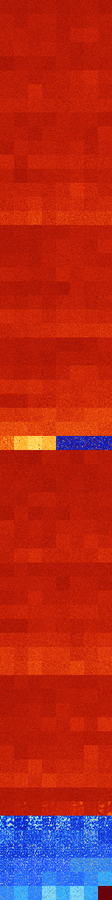

# B024678 (240128-240639)

<details>
    <summary>Initial Grid</summary>
    
</details>


<details>
    <summary>Initial Grid RLE</summary>

```
#C Exported from GoGoL (https://github.com/marrow16/gogol)
#C Wrap mode: Toroidal
#C Boundary mode: Dead
#C Step: 0
x = 100, y = 100, rule = B024678/S
40b2o6bo$bo28bo22bobobo40bo$9bo6bo48bo17bo$18bo19bo55b3o$48bo22bo3bo$
17bo20bo3b2o24bo3bo$27bo25bo$o18bo15bo13bo6bo9bo26bo2bo$5bo7bo6bo11bo
12bo4bo$4bo21bo9bo15b2o3bo7bo21bo$46bo41bo6bobo$2bobo32bo10bo46bo$2bo
35bo13bo8bo11bo19bo2bo$20bo6bo9bo2bo17bo23bo$18bo14bo6bo45bo$11bo2bo15b
o17b2o34b2o$4bo15bo8bo4bo23bo5bo$39bo13bo7bo$o19b2o12bo18bo3bo18bo13bo$
12bo3bo$9bo37bobo$bo22bo67bo2bo$bo10bo40bo3bo9bo$14bo16bo5bo5bo34bo$33b
o29bo$26bo29bo19bo13bo3bo$3bo67bo6bo$18bo45bo18b2o2bo11bo$54bo20bo19bo$
21bo12bo9bo6bo10bo21bo7bo2bo$51bo8bo29bo2bo$12bo14bo20bo3bo15bo27bo2bo$
2bo5bo18bo45bobo6bo11bo$10bo3bo4bo16bo16bo9bo24bo6bo$20bo15bo3bo9bo6bo$
o17bo7bo10bo15b2o4bo3bo6bo6bo4bo14bo$100b$3bo31bo2bo42bo10bo$21bo34bo
31bo$bo11bo29bo2bo18bo$14bo80bo$14bo2bo27bo3bo8bo17bo$5bo28bo10bo14b2o$
5bo20bobo28bo39bo$11bo24b2o9bo13bo10bo14bo$3bo29bo19bo16bo6bo5bo6bo$34b
o13bo10bo7bo4bo10bo7bo$4bo11bo51bo8bo3b2o$o12bo3bo16b2o62bo$20bo20bo4bo
4bo18bo12bo$15bo23bo6b2o6bo32bo$4bo7bo19bo6bo14bo13bo17bo8bo$8bo13b2o2b
o42bobo$35bo45b2o7b2o$49bo2bo13bo4bo9bo$18bo45bo$25bo27b2o21bo$45bo2bo
33bobo$19bo$bo6bobo24bo10bo25bo24bo$23bo29bo29bo$9bo37bo$4bo10bo2bo11b
2o31bo18bo14bo$o65bo27bo$4bo20bo7bo23bo9bo22bo$51bo4bo9bo5bo9bo$3bo16bo
bo13bo5bo7bo9bo$21bo38bo3bobo4b2obo$13bo17bo29bo14bo4bo12bo$9b2o33bo2bo
43bo$28bobo23bo5bo21bo3bobo$7bo17bo40bo$o67bo8bobo10bo$6bo34bo4bo14bo$
18bo24bo19bobo14bo14bo$6bo8bo3bo29bo12bo$2o14bo11bo23bo$36bo$23bo11bo
20bo13bo$35bo17bo4bo2bo$4bo7bo2bo4bo7bo$3bo6bobo24bo15bo9b2o7bo2bo$6bo
10bo53bo3bo10bo$8bo7bo11b2o8bo15bo30bo10bo$bo48bo42bo$19bo58bobo12bo$8b
o7bo18bo56bo$16bobo32bo2bo44bo$44bo26bo12bo$bo3bo31bo22bo11bo$11bo2bo
15bo10bo30bo7bo$11bo19bo5bo26bo20bobo$53bo25bo$55bo13bo14bo$34bo6bo19bo
29bo6bo$4bo9bo12bo8bo7bo12bobo9bo14b2o$29bo15bo10bo29bo$bo6bo16bo21bo
25bo25bo$19bo26bo40bo$o41bo5bo32bo!
```
</details>
<details>
    <summary>Thumbnail</summary>

</details>
<table>
<tr>
    <td><a href="./240128%20S%20Heat%20Map%20Activity.png"></a><br>S (240128)<br>G>1000</td>    <td><a href="./240129%20S0%20Heat%20Map%20Activity.png"></a><br>S0 (240129)<br>G>1000</td>    <td><a href="./240130%20S1%20Heat%20Map%20Activity.png"></a><br>S1 (240130)<br>G>1000</td>    <td><a href="./240131%20S01%20Heat%20Map%20Activity.png"></a><br>S01 (240131)<br>G>1000</td>    <td><a href="./240132%20S2%20Heat%20Map%20Activity.png"></a><br>S2 (240132)<br>G>1000</td>    <td><a href="./240133%20S02%20Heat%20Map%20Activity.png"></a><br>S02 (240133)<br>G>1000</td>    <td><a href="./240134%20S12%20Heat%20Map%20Activity.png"></a><br>S12 (240134)<br>G>1000</td>    <td><a href="./240135%20S012%20Heat%20Map%20Activity.png"></a><br>S012 (240135)<br>G>1000</td></tr>
<tr>
    <td><a href="./240136%20S3%20Heat%20Map%20Activity.png"></a><br>S3 (240136)<br>G>1000</td>    <td><a href="./240137%20S03%20Heat%20Map%20Activity.png"></a><br>S03 (240137)<br>G>1000</td>    <td><a href="./240138%20S13%20Heat%20Map%20Activity.png"></a><br>S13 (240138)<br>G>1000</td>    <td><a href="./240139%20S013%20Heat%20Map%20Activity.png"></a><br>S013 (240139)<br>G>1000</td>    <td><a href="./240140%20S23%20Heat%20Map%20Activity.png"></a><br>S23 (240140)<br>G>1000</td>    <td><a href="./240141%20S023%20Heat%20Map%20Activity.png"></a><br>S023 (240141)<br>G>1000</td>    <td><a href="./240142%20S123%20Heat%20Map%20Activity.png"></a><br>S123 (240142)<br>G>1000</td>    <td><a href="./240143%20S0123%20Heat%20Map%20Activity.png"></a><br>S0123 (240143)<br>G>1000</td></tr>
<tr>
    <td><a href="./240144%20S4%20Heat%20Map%20Activity.png"></a><br>S4 (240144)<br>G>1000</td>    <td><a href="./240145%20S04%20Heat%20Map%20Activity.png"></a><br>S04 (240145)<br>G>1000</td>    <td><a href="./240146%20S14%20Heat%20Map%20Activity.png"></a><br>S14 (240146)<br>G>1000</td>    <td><a href="./240147%20S014%20Heat%20Map%20Activity.png"></a><br>S014 (240147)<br>G>1000</td>    <td><a href="./240148%20S24%20Heat%20Map%20Activity.png"></a><br>S24 (240148)<br>G>1000</td>    <td><a href="./240149%20S024%20Heat%20Map%20Activity.png"></a><br>S024 (240149)<br>G>1000</td>    <td><a href="./240150%20S124%20Heat%20Map%20Activity.png"></a><br>S124 (240150)<br>G>1000</td>    <td><a href="./240151%20S0124%20Heat%20Map%20Activity.png"></a><br>S0124 (240151)<br>G>1000</td></tr>
<tr>
    <td><a href="./240152%20S34%20Heat%20Map%20Activity.png"></a><br>S34 (240152)<br>G>1000</td>    <td><a href="./240153%20S034%20Heat%20Map%20Activity.png"></a><br>S034 (240153)<br>G>1000</td>    <td><a href="./240154%20S134%20Heat%20Map%20Activity.png"></a><br>S134 (240154)<br>G>1000</td>    <td><a href="./240155%20S0134%20Heat%20Map%20Activity.png"></a><br>S0134 (240155)<br>G>1000</td>    <td><a href="./240156%20S234%20Heat%20Map%20Activity.png"></a><br>S234 (240156)<br>G>1000</td>    <td><a href="./240157%20S0234%20Heat%20Map%20Activity.png"></a><br>S0234 (240157)<br>G>1000</td>    <td><a href="./240158%20S1234%20Heat%20Map%20Activity.png"></a><br>S1234 (240158)<br>G>1000</td>    <td><a href="./240159%20S01234%20Heat%20Map%20Activity.png"></a><br>S01234 (240159)<br>G>1000</td></tr>
<tr>
    <td><a href="./240160%20S5%20Heat%20Map%20Activity.png"></a><br>S5 (240160)<br>G>1000</td>    <td><a href="./240161%20S05%20Heat%20Map%20Activity.png"></a><br>S05 (240161)<br>G>1000</td>    <td><a href="./240162%20S15%20Heat%20Map%20Activity.png"></a><br>S15 (240162)<br>G>1000</td>    <td><a href="./240163%20S015%20Heat%20Map%20Activity.png"></a><br>S015 (240163)<br>G>1000</td>    <td><a href="./240164%20S25%20Heat%20Map%20Activity.png"></a><br>S25 (240164)<br>G>1000</td>    <td><a href="./240165%20S025%20Heat%20Map%20Activity.png"></a><br>S025 (240165)<br>G>1000</td>    <td><a href="./240166%20S125%20Heat%20Map%20Activity.png"></a><br>S125 (240166)<br>G>1000</td>    <td><a href="./240167%20S0125%20Heat%20Map%20Activity.png"></a><br>S0125 (240167)<br>G>1000</td></tr>
<tr>
    <td><a href="./240168%20S35%20Heat%20Map%20Activity.png"></a><br>S35 (240168)<br>G>1000</td>    <td><a href="./240169%20S035%20Heat%20Map%20Activity.png"></a><br>S035 (240169)<br>G>1000</td>    <td><a href="./240170%20S135%20Heat%20Map%20Activity.png"></a><br>S135 (240170)<br>G>1000</td>    <td><a href="./240171%20S0135%20Heat%20Map%20Activity.png"></a><br>S0135 (240171)<br>G>1000</td>    <td><a href="./240172%20S235%20Heat%20Map%20Activity.png"></a><br>S235 (240172)<br>G>1000</td>    <td><a href="./240173%20S0235%20Heat%20Map%20Activity.png"></a><br>S0235 (240173)<br>G>1000</td>    <td><a href="./240174%20S1235%20Heat%20Map%20Activity.png"></a><br>S1235 (240174)<br>G>1000</td>    <td><a href="./240175%20S01235%20Heat%20Map%20Activity.png"></a><br>S01235 (240175)<br>G>1000</td></tr>
<tr>
    <td><a href="./240176%20S45%20Heat%20Map%20Activity.png"></a><br>S45 (240176)<br>G>1000</td>    <td><a href="./240177%20S045%20Heat%20Map%20Activity.png"></a><br>S045 (240177)<br>G>1000</td>    <td><a href="./240178%20S145%20Heat%20Map%20Activity.png"></a><br>S145 (240178)<br>G>1000</td>    <td><a href="./240179%20S0145%20Heat%20Map%20Activity.png"></a><br>S0145 (240179)<br>G>1000</td>    <td><a href="./240180%20S245%20Heat%20Map%20Activity.png"></a><br>S245 (240180)<br>G>1000</td>    <td><a href="./240181%20S0245%20Heat%20Map%20Activity.png"></a><br>S0245 (240181)<br>G>1000</td>    <td><a href="./240182%20S1245%20Heat%20Map%20Activity.png"></a><br>S1245 (240182)<br>G>1000</td>    <td><a href="./240183%20S01245%20Heat%20Map%20Activity.png"></a><br>S01245 (240183)<br>G>1000</td></tr>
<tr>
    <td><a href="./240184%20S345%20Heat%20Map%20Activity.png"></a><br>S345 (240184)<br>G>1000</td>    <td><a href="./240185%20S0345%20Heat%20Map%20Activity.png"></a><br>S0345 (240185)<br>G>1000</td>    <td><a href="./240186%20S1345%20Heat%20Map%20Activity.png"></a><br>S1345 (240186)<br>G>1000</td>    <td><a href="./240187%20S01345%20Heat%20Map%20Activity.png"></a><br>S01345 (240187)<br>G>1000</td>    <td><a href="./240188%20S2345%20Heat%20Map%20Activity.png"></a><br>S2345 (240188)<br>G>1000</td>    <td><a href="./240189%20S02345%20Heat%20Map%20Activity.png"></a><br>S02345 (240189)<br>G>1000</td>    <td><a href="./240190%20S12345%20Heat%20Map%20Activity.png"></a><br>S12345 (240190)<br>G>1000</td>    <td><a href="./240191%20S012345%20Heat%20Map%20Activity.png"></a><br>S012345 (240191)<br>G>1000</td></tr>
<tr>
    <td><a href="./240192%20S6%20Heat%20Map%20Activity.png"></a><br>S6 (240192)<br>G>1000</td>    <td><a href="./240193%20S06%20Heat%20Map%20Activity.png"></a><br>S06 (240193)<br>G>1000</td>    <td><a href="./240194%20S16%20Heat%20Map%20Activity.png"></a><br>S16 (240194)<br>G>1000</td>    <td><a href="./240195%20S016%20Heat%20Map%20Activity.png"></a><br>S016 (240195)<br>G>1000</td>    <td><a href="./240196%20S26%20Heat%20Map%20Activity.png"></a><br>S26 (240196)<br>G>1000</td>    <td><a href="./240197%20S026%20Heat%20Map%20Activity.png"></a><br>S026 (240197)<br>G>1000</td>    <td><a href="./240198%20S126%20Heat%20Map%20Activity.png"></a><br>S126 (240198)<br>G>1000</td>    <td><a href="./240199%20S0126%20Heat%20Map%20Activity.png"></a><br>S0126 (240199)<br>G>1000</td></tr>
<tr>
    <td><a href="./240200%20S36%20Heat%20Map%20Activity.png"></a><br>S36 (240200)<br>G>1000</td>    <td><a href="./240201%20S036%20Heat%20Map%20Activity.png"></a><br>S036 (240201)<br>G>1000</td>    <td><a href="./240202%20S136%20Heat%20Map%20Activity.png"></a><br>S136 (240202)<br>G>1000</td>    <td><a href="./240203%20S0136%20Heat%20Map%20Activity.png"></a><br>S0136 (240203)<br>G>1000</td>    <td><a href="./240204%20S236%20Heat%20Map%20Activity.png"></a><br>S236 (240204)<br>G>1000</td>    <td><a href="./240205%20S0236%20Heat%20Map%20Activity.png"></a><br>S0236 (240205)<br>G>1000</td>    <td><a href="./240206%20S1236%20Heat%20Map%20Activity.png"></a><br>S1236 (240206)<br>G>1000</td>    <td><a href="./240207%20S01236%20Heat%20Map%20Activity.png"></a><br>S01236 (240207)<br>G>1000</td></tr>
<tr>
    <td><a href="./240208%20S46%20Heat%20Map%20Activity.png"></a><br>S46 (240208)<br>G>1000</td>    <td><a href="./240209%20S046%20Heat%20Map%20Activity.png"></a><br>S046 (240209)<br>G>1000</td>    <td><a href="./240210%20S146%20Heat%20Map%20Activity.png"></a><br>S146 (240210)<br>G>1000</td>    <td><a href="./240211%20S0146%20Heat%20Map%20Activity.png"></a><br>S0146 (240211)<br>G>1000</td>    <td><a href="./240212%20S246%20Heat%20Map%20Activity.png"></a><br>S246 (240212)<br>G>1000</td>    <td><a href="./240213%20S0246%20Heat%20Map%20Activity.png"></a><br>S0246 (240213)<br>G>1000</td>    <td><a href="./240214%20S1246%20Heat%20Map%20Activity.png"></a><br>S1246 (240214)<br>G>1000</td>    <td><a href="./240215%20S01246%20Heat%20Map%20Activity.png"></a><br>S01246 (240215)<br>G>1000</td></tr>
<tr>
    <td><a href="./240216%20S346%20Heat%20Map%20Activity.png"></a><br>S346 (240216)<br>G>1000</td>    <td><a href="./240217%20S0346%20Heat%20Map%20Activity.png"></a><br>S0346 (240217)<br>G>1000</td>    <td><a href="./240218%20S1346%20Heat%20Map%20Activity.png"></a><br>S1346 (240218)<br>G>1000</td>    <td><a href="./240219%20S01346%20Heat%20Map%20Activity.png"></a><br>S01346 (240219)<br>G>1000</td>    <td><a href="./240220%20S2346%20Heat%20Map%20Activity.png"></a><br>S2346 (240220)<br>G>1000</td>    <td><a href="./240221%20S02346%20Heat%20Map%20Activity.png"></a><br>S02346 (240221)<br>G>1000</td>    <td><a href="./240222%20S12346%20Heat%20Map%20Activity.png"></a><br>S12346 (240222)<br>G>1000</td>    <td><a href="./240223%20S012346%20Heat%20Map%20Activity.png"></a><br>S012346 (240223)<br>G>1000</td></tr>
<tr>
    <td><a href="./240224%20S56%20Heat%20Map%20Activity.png"></a><br>S56 (240224)<br>G>1000</td>    <td><a href="./240225%20S056%20Heat%20Map%20Activity.png"></a><br>S056 (240225)<br>G>1000</td>    <td><a href="./240226%20S156%20Heat%20Map%20Activity.png"></a><br>S156 (240226)<br>G>1000</td>    <td><a href="./240227%20S0156%20Heat%20Map%20Activity.png"></a><br>S0156 (240227)<br>G>1000</td>    <td><a href="./240228%20S256%20Heat%20Map%20Activity.png"></a><br>S256 (240228)<br>G>1000</td>    <td><a href="./240229%20S0256%20Heat%20Map%20Activity.png"></a><br>S0256 (240229)<br>G>1000</td>    <td><a href="./240230%20S1256%20Heat%20Map%20Activity.png"></a><br>S1256 (240230)<br>G>1000</td>    <td><a href="./240231%20S01256%20Heat%20Map%20Activity.png"></a><br>S01256 (240231)<br>G>1000</td></tr>
<tr>
    <td><a href="./240232%20S356%20Heat%20Map%20Activity.png"></a><br>S356 (240232)<br>G>1000</td>    <td><a href="./240233%20S0356%20Heat%20Map%20Activity.png"></a><br>S0356 (240233)<br>G>1000</td>    <td><a href="./240234%20S1356%20Heat%20Map%20Activity.png"></a><br>S1356 (240234)<br>G>1000</td>    <td><a href="./240235%20S01356%20Heat%20Map%20Activity.png"></a><br>S01356 (240235)<br>G>1000</td>    <td><a href="./240236%20S2356%20Heat%20Map%20Activity.png"></a><br>S2356 (240236)<br>G>1000</td>    <td><a href="./240237%20S02356%20Heat%20Map%20Activity.png"></a><br>S02356 (240237)<br>G>1000</td>    <td><a href="./240238%20S12356%20Heat%20Map%20Activity.png"></a><br>S12356 (240238)<br>G>1000</td>    <td><a href="./240239%20S012356%20Heat%20Map%20Activity.png"></a><br>S012356 (240239)<br>G>1000</td></tr>
<tr>
    <td><a href="./240240%20S456%20Heat%20Map%20Activity.png"></a><br>S456 (240240)<br>G>1000</td>    <td><a href="./240241%20S0456%20Heat%20Map%20Activity.png"></a><br>S0456 (240241)<br>G>1000</td>    <td><a href="./240242%20S1456%20Heat%20Map%20Activity.png"></a><br>S1456 (240242)<br>G>1000</td>    <td><a href="./240243%20S01456%20Heat%20Map%20Activity.png"></a><br>S01456 (240243)<br>G>1000</td>    <td><a href="./240244%20S2456%20Heat%20Map%20Activity.png"></a><br>S2456 (240244)<br>G>1000</td>    <td><a href="./240245%20S02456%20Heat%20Map%20Activity.png"></a><br>S02456 (240245)<br>G>1000</td>    <td><a href="./240246%20S12456%20Heat%20Map%20Activity.png"></a><br>S12456 (240246)<br>G>1000</td>    <td><a href="./240247%20S012456%20Heat%20Map%20Activity.png"></a><br>S012456 (240247)<br>G>1000</td></tr>
<tr>
    <td><a href="./240248%20S3456%20Heat%20Map%20Activity.png"></a><br>S3456 (240248)<br>G>1000</td>    <td><a href="./240249%20S03456%20Heat%20Map%20Activity.png"></a><br>S03456 (240249)<br>G>1000</td>    <td><a href="./240250%20S13456%20Heat%20Map%20Activity.png"></a><br>S13456 (240250)<br>G>1000</td>    <td><a href="./240251%20S013456%20Heat%20Map%20Activity.png"></a><br>S013456 (240251)<br>G>1000</td>    <td><a href="./240252%20S23456%20Heat%20Map%20Activity.png"></a><br>S23456 (240252)<br>G>1000</td>    <td><a href="./240253%20S023456%20Heat%20Map%20Activity.png"></a><br>S023456 (240253)<br>G>1000</td>    <td><a href="./240254%20S123456%20Heat%20Map%20Activity.png"></a><br>S123456 (240254)<br>G>1000</td>    <td><a href="./240255%20S0123456%20Heat%20Map%20Activity.png"></a><br>S0123456 (240255)<br>G>1000</td></tr>
<tr>
    <td><a href="./240256%20S7%20Heat%20Map%20Activity.png"></a><br>S7 (240256)<br>G>1000</td>    <td><a href="./240257%20S07%20Heat%20Map%20Activity.png"></a><br>S07 (240257)<br>G>1000</td>    <td><a href="./240258%20S17%20Heat%20Map%20Activity.png"></a><br>S17 (240258)<br>G>1000</td>    <td><a href="./240259%20S017%20Heat%20Map%20Activity.png"></a><br>S017 (240259)<br>G>1000</td>    <td><a href="./240260%20S27%20Heat%20Map%20Activity.png"></a><br>S27 (240260)<br>G>1000</td>    <td><a href="./240261%20S027%20Heat%20Map%20Activity.png"></a><br>S027 (240261)<br>G>1000</td>    <td><a href="./240262%20S127%20Heat%20Map%20Activity.png"></a><br>S127 (240262)<br>G>1000</td>    <td><a href="./240263%20S0127%20Heat%20Map%20Activity.png"></a><br>S0127 (240263)<br>G>1000</td></tr>
<tr>
    <td><a href="./240264%20S37%20Heat%20Map%20Activity.png"></a><br>S37 (240264)<br>G>1000</td>    <td><a href="./240265%20S037%20Heat%20Map%20Activity.png"></a><br>S037 (240265)<br>G>1000</td>    <td><a href="./240266%20S137%20Heat%20Map%20Activity.png"></a><br>S137 (240266)<br>G>1000</td>    <td><a href="./240267%20S0137%20Heat%20Map%20Activity.png"></a><br>S0137 (240267)<br>G>1000</td>    <td><a href="./240268%20S237%20Heat%20Map%20Activity.png"></a><br>S237 (240268)<br>G>1000</td>    <td><a href="./240269%20S0237%20Heat%20Map%20Activity.png"></a><br>S0237 (240269)<br>G>1000</td>    <td><a href="./240270%20S1237%20Heat%20Map%20Activity.png"></a><br>S1237 (240270)<br>G>1000</td>    <td><a href="./240271%20S01237%20Heat%20Map%20Activity.png"></a><br>S01237 (240271)<br>G>1000</td></tr>
<tr>
    <td><a href="./240272%20S47%20Heat%20Map%20Activity.png"></a><br>S47 (240272)<br>G>1000</td>    <td><a href="./240273%20S047%20Heat%20Map%20Activity.png"></a><br>S047 (240273)<br>G>1000</td>    <td><a href="./240274%20S147%20Heat%20Map%20Activity.png"></a><br>S147 (240274)<br>G>1000</td>    <td><a href="./240275%20S0147%20Heat%20Map%20Activity.png"></a><br>S0147 (240275)<br>G>1000</td>    <td><a href="./240276%20S247%20Heat%20Map%20Activity.png"></a><br>S247 (240276)<br>G>1000</td>    <td><a href="./240277%20S0247%20Heat%20Map%20Activity.png"></a><br>S0247 (240277)<br>G>1000</td>    <td><a href="./240278%20S1247%20Heat%20Map%20Activity.png"></a><br>S1247 (240278)<br>G>1000</td>    <td><a href="./240279%20S01247%20Heat%20Map%20Activity.png"></a><br>S01247 (240279)<br>G>1000</td></tr>
<tr>
    <td><a href="./240280%20S347%20Heat%20Map%20Activity.png"></a><br>S347 (240280)<br>G>1000</td>    <td><a href="./240281%20S0347%20Heat%20Map%20Activity.png"></a><br>S0347 (240281)<br>G>1000</td>    <td><a href="./240282%20S1347%20Heat%20Map%20Activity.png"></a><br>S1347 (240282)<br>G>1000</td>    <td><a href="./240283%20S01347%20Heat%20Map%20Activity.png"></a><br>S01347 (240283)<br>G>1000</td>    <td><a href="./240284%20S2347%20Heat%20Map%20Activity.png"></a><br>S2347 (240284)<br>G>1000</td>    <td><a href="./240285%20S02347%20Heat%20Map%20Activity.png"></a><br>S02347 (240285)<br>G>1000</td>    <td><a href="./240286%20S12347%20Heat%20Map%20Activity.png"></a><br>S12347 (240286)<br>G>1000</td>    <td><a href="./240287%20S012347%20Heat%20Map%20Activity.png"></a><br>S012347 (240287)<br>G>1000</td></tr>
<tr>
    <td><a href="./240288%20S57%20Heat%20Map%20Activity.png"></a><br>S57 (240288)<br>G>1000</td>    <td><a href="./240289%20S057%20Heat%20Map%20Activity.png"></a><br>S057 (240289)<br>G>1000</td>    <td><a href="./240290%20S157%20Heat%20Map%20Activity.png"></a><br>S157 (240290)<br>G>1000</td>    <td><a href="./240291%20S0157%20Heat%20Map%20Activity.png"></a><br>S0157 (240291)<br>G>1000</td>    <td><a href="./240292%20S257%20Heat%20Map%20Activity.png"></a><br>S257 (240292)<br>G>1000</td>    <td><a href="./240293%20S0257%20Heat%20Map%20Activity.png"></a><br>S0257 (240293)<br>G>1000</td>    <td><a href="./240294%20S1257%20Heat%20Map%20Activity.png"></a><br>S1257 (240294)<br>G>1000</td>    <td><a href="./240295%20S01257%20Heat%20Map%20Activity.png"></a><br>S01257 (240295)<br>G>1000</td></tr>
<tr>
    <td><a href="./240296%20S357%20Heat%20Map%20Activity.png"></a><br>S357 (240296)<br>G>1000</td>    <td><a href="./240297%20S0357%20Heat%20Map%20Activity.png"></a><br>S0357 (240297)<br>G>1000</td>    <td><a href="./240298%20S1357%20Heat%20Map%20Activity.png"></a><br>S1357 (240298)<br>G>1000</td>    <td><a href="./240299%20S01357%20Heat%20Map%20Activity.png"></a><br>S01357 (240299)<br>G>1000</td>    <td><a href="./240300%20S2357%20Heat%20Map%20Activity.png"></a><br>S2357 (240300)<br>G>1000</td>    <td><a href="./240301%20S02357%20Heat%20Map%20Activity.png"></a><br>S02357 (240301)<br>G>1000</td>    <td><a href="./240302%20S12357%20Heat%20Map%20Activity.png"></a><br>S12357 (240302)<br>G>1000</td>    <td><a href="./240303%20S012357%20Heat%20Map%20Activity.png"></a><br>S012357 (240303)<br>G>1000</td></tr>
<tr>
    <td><a href="./240304%20S457%20Heat%20Map%20Activity.png"></a><br>S457 (240304)<br>G>1000</td>    <td><a href="./240305%20S0457%20Heat%20Map%20Activity.png"></a><br>S0457 (240305)<br>G>1000</td>    <td><a href="./240306%20S1457%20Heat%20Map%20Activity.png"></a><br>S1457 (240306)<br>G>1000</td>    <td><a href="./240307%20S01457%20Heat%20Map%20Activity.png"></a><br>S01457 (240307)<br>G>1000</td>    <td><a href="./240308%20S2457%20Heat%20Map%20Activity.png"></a><br>S2457 (240308)<br>G>1000</td>    <td><a href="./240309%20S02457%20Heat%20Map%20Activity.png"></a><br>S02457 (240309)<br>G>1000</td>    <td><a href="./240310%20S12457%20Heat%20Map%20Activity.png"></a><br>S12457 (240310)<br>G>1000</td>    <td><a href="./240311%20S012457%20Heat%20Map%20Activity.png"></a><br>S012457 (240311)<br>G>1000</td></tr>
<tr>
    <td><a href="./240312%20S3457%20Heat%20Map%20Activity.png"></a><br>S3457 (240312)<br>G>1000</td>    <td><a href="./240313%20S03457%20Heat%20Map%20Activity.png"></a><br>S03457 (240313)<br>G>1000</td>    <td><a href="./240314%20S13457%20Heat%20Map%20Activity.png"></a><br>S13457 (240314)<br>G>1000</td>    <td><a href="./240315%20S013457%20Heat%20Map%20Activity.png"></a><br>S013457 (240315)<br>G>1000</td>    <td><a href="./240316%20S23457%20Heat%20Map%20Activity.png"></a><br>S23457 (240316)<br>G>1000</td>    <td><a href="./240317%20S023457%20Heat%20Map%20Activity.png"></a><br>S023457 (240317)<br>G>1000</td>    <td><a href="./240318%20S123457%20Heat%20Map%20Activity.png"></a><br>S123457 (240318)<br>G>1000</td>    <td><a href="./240319%20S0123457%20Heat%20Map%20Activity.png"></a><br>S0123457 (240319)<br>G>1000</td></tr>
<tr>
    <td><a href="./240320%20S67%20Heat%20Map%20Activity.png"></a><br>S67 (240320)<br>G>1000</td>    <td><a href="./240321%20S067%20Heat%20Map%20Activity.png"></a><br>S067 (240321)<br>G>1000</td>    <td><a href="./240322%20S167%20Heat%20Map%20Activity.png"></a><br>S167 (240322)<br>G>1000</td>    <td><a href="./240323%20S0167%20Heat%20Map%20Activity.png"></a><br>S0167 (240323)<br>G>1000</td>    <td><a href="./240324%20S267%20Heat%20Map%20Activity.png"></a><br>S267 (240324)<br>G>1000</td>    <td><a href="./240325%20S0267%20Heat%20Map%20Activity.png"></a><br>S0267 (240325)<br>G>1000</td>    <td><a href="./240326%20S1267%20Heat%20Map%20Activity.png"></a><br>S1267 (240326)<br>G>1000</td>    <td><a href="./240327%20S01267%20Heat%20Map%20Activity.png"></a><br>S01267 (240327)<br>G>1000</td></tr>
<tr>
    <td><a href="./240328%20S367%20Heat%20Map%20Activity.png"></a><br>S367 (240328)<br>G>1000</td>    <td><a href="./240329%20S0367%20Heat%20Map%20Activity.png"></a><br>S0367 (240329)<br>G>1000</td>    <td><a href="./240330%20S1367%20Heat%20Map%20Activity.png"></a><br>S1367 (240330)<br>G>1000</td>    <td><a href="./240331%20S01367%20Heat%20Map%20Activity.png"></a><br>S01367 (240331)<br>G>1000</td>    <td><a href="./240332%20S2367%20Heat%20Map%20Activity.png"></a><br>S2367 (240332)<br>G>1000</td>    <td><a href="./240333%20S02367%20Heat%20Map%20Activity.png"></a><br>S02367 (240333)<br>G>1000</td>    <td><a href="./240334%20S12367%20Heat%20Map%20Activity.png"></a><br>S12367 (240334)<br>G>1000</td>    <td><a href="./240335%20S012367%20Heat%20Map%20Activity.png"></a><br>S012367 (240335)<br>G>1000</td></tr>
<tr>
    <td><a href="./240336%20S467%20Heat%20Map%20Activity.png"></a><br>S467 (240336)<br>G>1000</td>    <td><a href="./240337%20S0467%20Heat%20Map%20Activity.png"></a><br>S0467 (240337)<br>G>1000</td>    <td><a href="./240338%20S1467%20Heat%20Map%20Activity.png"></a><br>S1467 (240338)<br>G>1000</td>    <td><a href="./240339%20S01467%20Heat%20Map%20Activity.png"></a><br>S01467 (240339)<br>G>1000</td>    <td><a href="./240340%20S2467%20Heat%20Map%20Activity.png"></a><br>S2467 (240340)<br>G>1000</td>    <td><a href="./240341%20S02467%20Heat%20Map%20Activity.png"></a><br>S02467 (240341)<br>G>1000</td>    <td><a href="./240342%20S12467%20Heat%20Map%20Activity.png"></a><br>S12467 (240342)<br>G>1000</td>    <td><a href="./240343%20S012467%20Heat%20Map%20Activity.png"></a><br>S012467 (240343)<br>G>1000</td></tr>
<tr>
    <td><a href="./240344%20S3467%20Heat%20Map%20Activity.png"></a><br>S3467 (240344)<br>G>1000</td>    <td><a href="./240345%20S03467%20Heat%20Map%20Activity.png"></a><br>S03467 (240345)<br>G>1000</td>    <td><a href="./240346%20S13467%20Heat%20Map%20Activity.png"></a><br>S13467 (240346)<br>G>1000</td>    <td><a href="./240347%20S013467%20Heat%20Map%20Activity.png"></a><br>S013467 (240347)<br>G>1000</td>    <td><a href="./240348%20S23467%20Heat%20Map%20Activity.png"></a><br>S23467 (240348)<br>G>1000</td>    <td><a href="./240349%20S023467%20Heat%20Map%20Activity.png"></a><br>S023467 (240349)<br>G>1000</td>    <td><a href="./240350%20S123467%20Heat%20Map%20Activity.png"></a><br>S123467 (240350)<br>G>1000</td>    <td><a href="./240351%20S0123467%20Heat%20Map%20Activity.png"></a><br>S0123467 (240351)<br>G>1000</td></tr>
<tr>
    <td><a href="./240352%20S567%20Heat%20Map%20Activity.png"></a><br>S567 (240352)<br>G>1000</td>    <td><a href="./240353%20S0567%20Heat%20Map%20Activity.png"></a><br>S0567 (240353)<br>G>1000</td>    <td><a href="./240354%20S1567%20Heat%20Map%20Activity.png"></a><br>S1567 (240354)<br>G>1000</td>    <td><a href="./240355%20S01567%20Heat%20Map%20Activity.png"></a><br>S01567 (240355)<br>G>1000</td>    <td><a href="./240356%20S2567%20Heat%20Map%20Activity.png"></a><br>S2567 (240356)<br>G>1000</td>    <td><a href="./240357%20S02567%20Heat%20Map%20Activity.png"></a><br>S02567 (240357)<br>G>1000</td>    <td><a href="./240358%20S12567%20Heat%20Map%20Activity.png"></a><br>S12567 (240358)<br>G>1000</td>    <td><a href="./240359%20S012567%20Heat%20Map%20Activity.png"></a><br>S012567 (240359)<br>G>1000</td></tr>
<tr>
    <td><a href="./240360%20S3567%20Heat%20Map%20Activity.png"></a><br>S3567 (240360)<br>G>1000</td>    <td><a href="./240361%20S03567%20Heat%20Map%20Activity.png"></a><br>S03567 (240361)<br>G>1000</td>    <td><a href="./240362%20S13567%20Heat%20Map%20Activity.png"></a><br>S13567 (240362)<br>G>1000</td>    <td><a href="./240363%20S013567%20Heat%20Map%20Activity.png"></a><br>S013567 (240363)<br>G>1000</td>    <td><a href="./240364%20S23567%20Heat%20Map%20Activity.png"></a><br>S23567 (240364)<br>G>1000</td>    <td><a href="./240365%20S023567%20Heat%20Map%20Activity.png"></a><br>S023567 (240365)<br>G>1000</td>    <td><a href="./240366%20S123567%20Heat%20Map%20Activity.png"></a><br>S123567 (240366)<br>G>1000</td>    <td><a href="./240367%20S0123567%20Heat%20Map%20Activity.png"></a><br>S0123567 (240367)<br>G>1000</td></tr>
<tr>
    <td><a href="./240368%20S4567%20Heat%20Map%20Activity.png"></a><br>S4567 (240368)<br>G>1000</td>    <td><a href="./240369%20S04567%20Heat%20Map%20Activity.png"></a><br>S04567 (240369)<br>G>1000</td>    <td><a href="./240370%20S14567%20Heat%20Map%20Activity.png"></a><br>S14567 (240370)<br>G>1000</td>    <td><a href="./240371%20S014567%20Heat%20Map%20Activity.png"></a><br>S014567 (240371)<br>G>1000</td>    <td><a href="./240372%20S24567%20Heat%20Map%20Activity.png"></a><br>S24567 (240372)<br>G>1000</td>    <td><a href="./240373%20S024567%20Heat%20Map%20Activity.png"></a><br>S024567 (240373)<br>G>1000</td>    <td><a href="./240374%20S124567%20Heat%20Map%20Activity.png"></a><br>S124567 (240374)<br>G>1000</td>    <td><a href="./240375%20S0124567%20Heat%20Map%20Activity.png"></a><br>S0124567 (240375)<br>G>1000</td></tr>
<tr>
    <td><a href="./240376%20S34567%20Heat%20Map%20Activity.png"></a><br>S34567 (240376)<br>G>1000</td>    <td><a href="./240377%20S034567%20Heat%20Map%20Activity.png"></a><br>S034567 (240377)<br>G>1000</td>    <td><a href="./240378%20S134567%20Heat%20Map%20Activity.png"></a><br>S134567 (240378)<br>G>1000</td>    <td><a href="./240379%20S0134567%20Heat%20Map%20Activity.png"></a><br>S0134567 (240379)<br>G>1000</td>    <td><a href="./240380%20S234567%20Heat%20Map%20Activity.png"></a><br>S234567 (240380)<br>G>1000</td>    <td><a href="./240381%20S0234567%20Heat%20Map%20Activity.png"></a><br>S0234567 (240381)<br>G>1000</td>    <td><a href="./240382%20S1234567%20Heat%20Map%20Activity.png"></a><br>S1234567 (240382)<br>G>1000</td>    <td><a href="./240383%20S01234567%20Heat%20Map%20Activity.png"></a><br>S01234567 (240383)<br>G>1000</td></tr>
<tr>
    <td><a href="./240384%20S8%20Heat%20Map%20Activity.png"></a><br>S8 (240384)<br>G>1000</td>    <td><a href="./240385%20S08%20Heat%20Map%20Activity.png"></a><br>S08 (240385)<br>G>1000</td>    <td><a href="./240386%20S18%20Heat%20Map%20Activity.png"></a><br>S18 (240386)<br>G>1000</td>    <td><a href="./240387%20S018%20Heat%20Map%20Activity.png"></a><br>S018 (240387)<br>G>1000</td>    <td><a href="./240388%20S28%20Heat%20Map%20Activity.png"></a><br>S28 (240388)<br>G>1000</td>    <td><a href="./240389%20S028%20Heat%20Map%20Activity.png"></a><br>S028 (240389)<br>G>1000</td>    <td><a href="./240390%20S128%20Heat%20Map%20Activity.png"></a><br>S128 (240390)<br>G>1000</td>    <td><a href="./240391%20S0128%20Heat%20Map%20Activity.png"></a><br>S0128 (240391)<br>G>1000</td></tr>
<tr>
    <td><a href="./240392%20S38%20Heat%20Map%20Activity.png"></a><br>S38 (240392)<br>G>1000</td>    <td><a href="./240393%20S038%20Heat%20Map%20Activity.png"></a><br>S038 (240393)<br>G>1000</td>    <td><a href="./240394%20S138%20Heat%20Map%20Activity.png"></a><br>S138 (240394)<br>G>1000</td>    <td><a href="./240395%20S0138%20Heat%20Map%20Activity.png"></a><br>S0138 (240395)<br>G>1000</td>    <td><a href="./240396%20S238%20Heat%20Map%20Activity.png"></a><br>S238 (240396)<br>G>1000</td>    <td><a href="./240397%20S0238%20Heat%20Map%20Activity.png"></a><br>S0238 (240397)<br>G>1000</td>    <td><a href="./240398%20S1238%20Heat%20Map%20Activity.png"></a><br>S1238 (240398)<br>G>1000</td>    <td><a href="./240399%20S01238%20Heat%20Map%20Activity.png"></a><br>S01238 (240399)<br>G>1000</td></tr>
<tr>
    <td><a href="./240400%20S48%20Heat%20Map%20Activity.png"></a><br>S48 (240400)<br>G>1000</td>    <td><a href="./240401%20S048%20Heat%20Map%20Activity.png"></a><br>S048 (240401)<br>G>1000</td>    <td><a href="./240402%20S148%20Heat%20Map%20Activity.png"></a><br>S148 (240402)<br>G>1000</td>    <td><a href="./240403%20S0148%20Heat%20Map%20Activity.png"></a><br>S0148 (240403)<br>G>1000</td>    <td><a href="./240404%20S248%20Heat%20Map%20Activity.png"></a><br>S248 (240404)<br>G>1000</td>    <td><a href="./240405%20S0248%20Heat%20Map%20Activity.png"></a><br>S0248 (240405)<br>G>1000</td>    <td><a href="./240406%20S1248%20Heat%20Map%20Activity.png"></a><br>S1248 (240406)<br>G>1000</td>    <td><a href="./240407%20S01248%20Heat%20Map%20Activity.png"></a><br>S01248 (240407)<br>G>1000</td></tr>
<tr>
    <td><a href="./240408%20S348%20Heat%20Map%20Activity.png"></a><br>S348 (240408)<br>G>1000</td>    <td><a href="./240409%20S0348%20Heat%20Map%20Activity.png"></a><br>S0348 (240409)<br>G>1000</td>    <td><a href="./240410%20S1348%20Heat%20Map%20Activity.png"></a><br>S1348 (240410)<br>G>1000</td>    <td><a href="./240411%20S01348%20Heat%20Map%20Activity.png"></a><br>S01348 (240411)<br>G>1000</td>    <td><a href="./240412%20S2348%20Heat%20Map%20Activity.png"></a><br>S2348 (240412)<br>G>1000</td>    <td><a href="./240413%20S02348%20Heat%20Map%20Activity.png"></a><br>S02348 (240413)<br>G>1000</td>    <td><a href="./240414%20S12348%20Heat%20Map%20Activity.png"></a><br>S12348 (240414)<br>G>1000</td>    <td><a href="./240415%20S012348%20Heat%20Map%20Activity.png"></a><br>S012348 (240415)<br>G>1000</td></tr>
<tr>
    <td><a href="./240416%20S58%20Heat%20Map%20Activity.png"></a><br>S58 (240416)<br>G>1000</td>    <td><a href="./240417%20S058%20Heat%20Map%20Activity.png"></a><br>S058 (240417)<br>G>1000</td>    <td><a href="./240418%20S158%20Heat%20Map%20Activity.png"></a><br>S158 (240418)<br>G>1000</td>    <td><a href="./240419%20S0158%20Heat%20Map%20Activity.png"></a><br>S0158 (240419)<br>G>1000</td>    <td><a href="./240420%20S258%20Heat%20Map%20Activity.png"></a><br>S258 (240420)<br>G>1000</td>    <td><a href="./240421%20S0258%20Heat%20Map%20Activity.png"></a><br>S0258 (240421)<br>G>1000</td>    <td><a href="./240422%20S1258%20Heat%20Map%20Activity.png"></a><br>S1258 (240422)<br>G>1000</td>    <td><a href="./240423%20S01258%20Heat%20Map%20Activity.png"></a><br>S01258 (240423)<br>G>1000</td></tr>
<tr>
    <td><a href="./240424%20S358%20Heat%20Map%20Activity.png"></a><br>S358 (240424)<br>G>1000</td>    <td><a href="./240425%20S0358%20Heat%20Map%20Activity.png"></a><br>S0358 (240425)<br>G>1000</td>    <td><a href="./240426%20S1358%20Heat%20Map%20Activity.png"></a><br>S1358 (240426)<br>G>1000</td>    <td><a href="./240427%20S01358%20Heat%20Map%20Activity.png"></a><br>S01358 (240427)<br>G>1000</td>    <td><a href="./240428%20S2358%20Heat%20Map%20Activity.png"></a><br>S2358 (240428)<br>G>1000</td>    <td><a href="./240429%20S02358%20Heat%20Map%20Activity.png"></a><br>S02358 (240429)<br>G>1000</td>    <td><a href="./240430%20S12358%20Heat%20Map%20Activity.png"></a><br>S12358 (240430)<br>G>1000</td>    <td><a href="./240431%20S012358%20Heat%20Map%20Activity.png"></a><br>S012358 (240431)<br>G>1000</td></tr>
<tr>
    <td><a href="./240432%20S458%20Heat%20Map%20Activity.png"></a><br>S458 (240432)<br>G>1000</td>    <td><a href="./240433%20S0458%20Heat%20Map%20Activity.png"></a><br>S0458 (240433)<br>G>1000</td>    <td><a href="./240434%20S1458%20Heat%20Map%20Activity.png"></a><br>S1458 (240434)<br>G>1000</td>    <td><a href="./240435%20S01458%20Heat%20Map%20Activity.png"></a><br>S01458 (240435)<br>G>1000</td>    <td><a href="./240436%20S2458%20Heat%20Map%20Activity.png"></a><br>S2458 (240436)<br>G>1000</td>    <td><a href="./240437%20S02458%20Heat%20Map%20Activity.png"></a><br>S02458 (240437)<br>G>1000</td>    <td><a href="./240438%20S12458%20Heat%20Map%20Activity.png"></a><br>S12458 (240438)<br>G>1000</td>    <td><a href="./240439%20S012458%20Heat%20Map%20Activity.png"></a><br>S012458 (240439)<br>G>1000</td></tr>
<tr>
    <td><a href="./240440%20S3458%20Heat%20Map%20Activity.png"></a><br>S3458 (240440)<br>G>1000</td>    <td><a href="./240441%20S03458%20Heat%20Map%20Activity.png"></a><br>S03458 (240441)<br>G>1000</td>    <td><a href="./240442%20S13458%20Heat%20Map%20Activity.png"></a><br>S13458 (240442)<br>G>1000</td>    <td><a href="./240443%20S013458%20Heat%20Map%20Activity.png"></a><br>S013458 (240443)<br>G>1000</td>    <td><a href="./240444%20S23458%20Heat%20Map%20Activity.png"></a><br>S23458 (240444)<br>G>1000</td>    <td><a href="./240445%20S023458%20Heat%20Map%20Activity.png"></a><br>S023458 (240445)<br>G>1000</td>    <td><a href="./240446%20S123458%20Heat%20Map%20Activity.png"></a><br>S123458 (240446)<br>G>1000</td>    <td><a href="./240447%20S0123458%20Heat%20Map%20Activity.png"></a><br>S0123458 (240447)<br>G>1000</td></tr>
<tr>
    <td><a href="./240448%20S68%20Heat%20Map%20Activity.png"></a><br>S68 (240448)<br>G>1000</td>    <td><a href="./240449%20S068%20Heat%20Map%20Activity.png"></a><br>S068 (240449)<br>G>1000</td>    <td><a href="./240450%20S168%20Heat%20Map%20Activity.png"></a><br>S168 (240450)<br>G>1000</td>    <td><a href="./240451%20S0168%20Heat%20Map%20Activity.png"></a><br>S0168 (240451)<br>G>1000</td>    <td><a href="./240452%20S268%20Heat%20Map%20Activity.png"></a><br>S268 (240452)<br>G>1000</td>    <td><a href="./240453%20S0268%20Heat%20Map%20Activity.png"></a><br>S0268 (240453)<br>G>1000</td>    <td><a href="./240454%20S1268%20Heat%20Map%20Activity.png"></a><br>S1268 (240454)<br>G>1000</td>    <td><a href="./240455%20S01268%20Heat%20Map%20Activity.png"></a><br>S01268 (240455)<br>G>1000</td></tr>
<tr>
    <td><a href="./240456%20S368%20Heat%20Map%20Activity.png"></a><br>S368 (240456)<br>G>1000</td>    <td><a href="./240457%20S0368%20Heat%20Map%20Activity.png"></a><br>S0368 (240457)<br>G>1000</td>    <td><a href="./240458%20S1368%20Heat%20Map%20Activity.png"></a><br>S1368 (240458)<br>G>1000</td>    <td><a href="./240459%20S01368%20Heat%20Map%20Activity.png"></a><br>S01368 (240459)<br>G>1000</td>    <td><a href="./240460%20S2368%20Heat%20Map%20Activity.png"></a><br>S2368 (240460)<br>G>1000</td>    <td><a href="./240461%20S02368%20Heat%20Map%20Activity.png"></a><br>S02368 (240461)<br>G>1000</td>    <td><a href="./240462%20S12368%20Heat%20Map%20Activity.png"></a><br>S12368 (240462)<br>G>1000</td>    <td><a href="./240463%20S012368%20Heat%20Map%20Activity.png"></a><br>S012368 (240463)<br>G>1000</td></tr>
<tr>
    <td><a href="./240464%20S468%20Heat%20Map%20Activity.png"></a><br>S468 (240464)<br>G>1000</td>    <td><a href="./240465%20S0468%20Heat%20Map%20Activity.png"></a><br>S0468 (240465)<br>G>1000</td>    <td><a href="./240466%20S1468%20Heat%20Map%20Activity.png"></a><br>S1468 (240466)<br>G>1000</td>    <td><a href="./240467%20S01468%20Heat%20Map%20Activity.png"></a><br>S01468 (240467)<br>G>1000</td>    <td><a href="./240468%20S2468%20Heat%20Map%20Activity.png"></a><br>S2468 (240468)<br>G>1000</td>    <td><a href="./240469%20S02468%20Heat%20Map%20Activity.png"></a><br>S02468 (240469)<br>G>1000</td>    <td><a href="./240470%20S12468%20Heat%20Map%20Activity.png"></a><br>S12468 (240470)<br>G>1000</td>    <td><a href="./240471%20S012468%20Heat%20Map%20Activity.png"></a><br>S012468 (240471)<br>G>1000</td></tr>
<tr>
    <td><a href="./240472%20S3468%20Heat%20Map%20Activity.png"></a><br>S3468 (240472)<br>G>1000</td>    <td><a href="./240473%20S03468%20Heat%20Map%20Activity.png"></a><br>S03468 (240473)<br>G>1000</td>    <td><a href="./240474%20S13468%20Heat%20Map%20Activity.png"></a><br>S13468 (240474)<br>G>1000</td>    <td><a href="./240475%20S013468%20Heat%20Map%20Activity.png"></a><br>S013468 (240475)<br>G>1000</td>    <td><a href="./240476%20S23468%20Heat%20Map%20Activity.png"></a><br>S23468 (240476)<br>G>1000</td>    <td><a href="./240477%20S023468%20Heat%20Map%20Activity.png"></a><br>S023468 (240477)<br>G>1000</td>    <td><a href="./240478%20S123468%20Heat%20Map%20Activity.png"></a><br>S123468 (240478)<br>G>1000</td>    <td><a href="./240479%20S0123468%20Heat%20Map%20Activity.png"></a><br>S0123468 (240479)<br>G>1000</td></tr>
<tr>
    <td><a href="./240480%20S568%20Heat%20Map%20Activity.png"></a><br>S568 (240480)<br>G>1000</td>    <td><a href="./240481%20S0568%20Heat%20Map%20Activity.png"></a><br>S0568 (240481)<br>G>1000</td>    <td><a href="./240482%20S1568%20Heat%20Map%20Activity.png"></a><br>S1568 (240482)<br>G>1000</td>    <td><a href="./240483%20S01568%20Heat%20Map%20Activity.png"></a><br>S01568 (240483)<br>G>1000</td>    <td><a href="./240484%20S2568%20Heat%20Map%20Activity.png"></a><br>S2568 (240484)<br>G>1000</td>    <td><a href="./240485%20S02568%20Heat%20Map%20Activity.png"></a><br>S02568 (240485)<br>G>1000</td>    <td><a href="./240486%20S12568%20Heat%20Map%20Activity.png"></a><br>S12568 (240486)<br>G>1000</td>    <td><a href="./240487%20S012568%20Heat%20Map%20Activity.png"></a><br>S012568 (240487)<br>G>1000</td></tr>
<tr>
    <td><a href="./240488%20S3568%20Heat%20Map%20Activity.png"></a><br>S3568 (240488)<br>G>1000</td>    <td><a href="./240489%20S03568%20Heat%20Map%20Activity.png"></a><br>S03568 (240489)<br>G>1000</td>    <td><a href="./240490%20S13568%20Heat%20Map%20Activity.png"></a><br>S13568 (240490)<br>G>1000</td>    <td><a href="./240491%20S013568%20Heat%20Map%20Activity.png"></a><br>S013568 (240491)<br>G>1000</td>    <td><a href="./240492%20S23568%20Heat%20Map%20Activity.png"></a><br>S23568 (240492)<br>G>1000</td>    <td><a href="./240493%20S023568%20Heat%20Map%20Activity.png"></a><br>S023568 (240493)<br>G>1000</td>    <td><a href="./240494%20S123568%20Heat%20Map%20Activity.png"></a><br>S123568 (240494)<br>G>1000</td>    <td><a href="./240495%20S0123568%20Heat%20Map%20Activity.png"></a><br>S0123568 (240495)<br>G>1000</td></tr>
<tr>
    <td><a href="./240496%20S4568%20Heat%20Map%20Activity.png"></a><br>S4568 (240496)<br>G>1000</td>    <td><a href="./240497%20S04568%20Heat%20Map%20Activity.png"></a><br>S04568 (240497)<br>G>1000</td>    <td><a href="./240498%20S14568%20Heat%20Map%20Activity.png"></a><br>S14568 (240498)<br>G>1000</td>    <td><a href="./240499%20S014568%20Heat%20Map%20Activity.png"></a><br>S014568 (240499)<br>G>1000</td>    <td><a href="./240500%20S24568%20Heat%20Map%20Activity.png"></a><br>S24568 (240500)<br>G>1000</td>    <td><a href="./240501%20S024568%20Heat%20Map%20Activity.png"></a><br>S024568 (240501)<br>G>1000</td>    <td><a href="./240502%20S124568%20Heat%20Map%20Activity.png"></a><br>S124568 (240502)<br>G>1000</td>    <td><a href="./240503%20S0124568%20Heat%20Map%20Activity.png"></a><br>S0124568 (240503)<br>G>1000</td></tr>
<tr>
    <td><a href="./240504%20S34568%20Heat%20Map%20Activity.png"></a><br>S34568 (240504)<br>G>1000</td>    <td><a href="./240505%20S034568%20Heat%20Map%20Activity.png"></a><br>S034568 (240505)<br>G>1000</td>    <td><a href="./240506%20S134568%20Heat%20Map%20Activity.png"></a><br>S134568 (240506)<br>G>1000</td>    <td><a href="./240507%20S0134568%20Heat%20Map%20Activity.png"></a><br>S0134568 (240507)<br>G>1000</td>    <td><a href="./240508%20S234568%20Heat%20Map%20Activity.png"></a><br>S234568 (240508)<br>G>1000</td>    <td><a href="./240509%20S0234568%20Heat%20Map%20Activity.png"></a><br>S0234568 (240509)<br>G>1000</td>    <td><a href="./240510%20S1234568%20Heat%20Map%20Activity.png"></a><br>S1234568 (240510)<br>G>1000</td>    <td><a href="./240511%20S01234568%20Heat%20Map%20Activity.png"></a><br>S01234568 (240511)<br>G>1000</td></tr>
<tr>
    <td><a href="./240512%20S78%20Heat%20Map%20Activity.png"></a><br>S78 (240512)<br>G>1000</td>    <td><a href="./240513%20S078%20Heat%20Map%20Activity.png"></a><br>S078 (240513)<br>G>1000</td>    <td><a href="./240514%20S178%20Heat%20Map%20Activity.png"></a><br>S178 (240514)<br>G>1000</td>    <td><a href="./240515%20S0178%20Heat%20Map%20Activity.png"></a><br>S0178 (240515)<br>G>1000</td>    <td><a href="./240516%20S278%20Heat%20Map%20Activity.png"></a><br>S278 (240516)<br>G>1000</td>    <td><a href="./240517%20S0278%20Heat%20Map%20Activity.png"></a><br>S0278 (240517)<br>G>1000</td>    <td><a href="./240518%20S1278%20Heat%20Map%20Activity.png"></a><br>S1278 (240518)<br>G>1000</td>    <td><a href="./240519%20S01278%20Heat%20Map%20Activity.png"></a><br>S01278 (240519)<br>G>1000</td></tr>
<tr>
    <td><a href="./240520%20S378%20Heat%20Map%20Activity.png"></a><br>S378 (240520)<br>G>1000</td>    <td><a href="./240521%20S0378%20Heat%20Map%20Activity.png"></a><br>S0378 (240521)<br>G>1000</td>    <td><a href="./240522%20S1378%20Heat%20Map%20Activity.png"></a><br>S1378 (240522)<br>G>1000</td>    <td><a href="./240523%20S01378%20Heat%20Map%20Activity.png"></a><br>S01378 (240523)<br>G>1000</td>    <td><a href="./240524%20S2378%20Heat%20Map%20Activity.png"></a><br>S2378 (240524)<br>G>1000</td>    <td><a href="./240525%20S02378%20Heat%20Map%20Activity.png"></a><br>S02378 (240525)<br>G>1000</td>    <td><a href="./240526%20S12378%20Heat%20Map%20Activity.png"></a><br>S12378 (240526)<br>G>1000</td>    <td><a href="./240527%20S012378%20Heat%20Map%20Activity.png"></a><br>S012378 (240527)<br>G>1000</td></tr>
<tr>
    <td><a href="./240528%20S478%20Heat%20Map%20Activity.png"></a><br>S478 (240528)<br>G>1000</td>    <td><a href="./240529%20S0478%20Heat%20Map%20Activity.png"></a><br>S0478 (240529)<br>G>1000</td>    <td><a href="./240530%20S1478%20Heat%20Map%20Activity.png"></a><br>S1478 (240530)<br>G>1000</td>    <td><a href="./240531%20S01478%20Heat%20Map%20Activity.png"></a><br>S01478 (240531)<br>G>1000</td>    <td><a href="./240532%20S2478%20Heat%20Map%20Activity.png"></a><br>S2478 (240532)<br>G>1000</td>    <td><a href="./240533%20S02478%20Heat%20Map%20Activity.png"></a><br>S02478 (240533)<br>G>1000</td>    <td><a href="./240534%20S12478%20Heat%20Map%20Activity.png"></a><br>S12478 (240534)<br>G>1000</td>    <td><a href="./240535%20S012478%20Heat%20Map%20Activity.png"></a><br>S012478 (240535)<br>G>1000</td></tr>
<tr>
    <td><a href="./240536%20S3478%20Heat%20Map%20Activity.png"></a><br>S3478 (240536)<br>G>1000</td>    <td><a href="./240537%20S03478%20Heat%20Map%20Activity.png"></a><br>S03478 (240537)<br>G>1000</td>    <td><a href="./240538%20S13478%20Heat%20Map%20Activity.png"></a><br>S13478 (240538)<br>G>1000</td>    <td><a href="./240539%20S013478%20Heat%20Map%20Activity.png"></a><br>S013478 (240539)<br>G>1000</td>    <td><a href="./240540%20S23478%20Heat%20Map%20Activity.png"></a><br>S23478 (240540)<br>G>1000</td>    <td><a href="./240541%20S023478%20Heat%20Map%20Activity.png"></a><br>S023478 (240541)<br>G>1000</td>    <td><a href="./240542%20S123478%20Heat%20Map%20Activity.png"></a><br>S123478 (240542)<br>G>1000</td>    <td><a href="./240543%20S0123478%20Heat%20Map%20Activity.png"></a><br>S0123478 (240543)<br>G>1000</td></tr>
<tr>
    <td><a href="./240544%20S578%20Heat%20Map%20Activity.png"></a><br>S578 (240544)<br>G>1000</td>    <td><a href="./240545%20S0578%20Heat%20Map%20Activity.png"></a><br>S0578 (240545)<br>G>1000</td>    <td><a href="./240546%20S1578%20Heat%20Map%20Activity.png"></a><br>S1578 (240546)<br>G>1000</td>    <td><a href="./240547%20S01578%20Heat%20Map%20Activity.png"></a><br>S01578 (240547)<br>G>1000</td>    <td><a href="./240548%20S2578%20Heat%20Map%20Activity.png"></a><br>S2578 (240548)<br>G>1000</td>    <td><a href="./240549%20S02578%20Heat%20Map%20Activity.png"></a><br>S02578 (240549)<br>G>1000</td>    <td><a href="./240550%20S12578%20Heat%20Map%20Activity.png"></a><br>S12578 (240550)<br>G>1000</td>    <td><a href="./240551%20S012578%20Heat%20Map%20Activity.png"></a><br>S012578 (240551)<br>G>1000</td></tr>
<tr>
    <td><a href="./240552%20S3578%20Heat%20Map%20Activity.png"></a><br>S3578 (240552)<br>G>1000</td>    <td><a href="./240553%20S03578%20Heat%20Map%20Activity.png"></a><br>S03578 (240553)<br>G>1000</td>    <td><a href="./240554%20S13578%20Heat%20Map%20Activity.png"></a><br>S13578 (240554)<br>G>1000</td>    <td><a href="./240555%20S013578%20Heat%20Map%20Activity.png"></a><br>S013578 (240555)<br>G>1000</td>    <td><a href="./240556%20S23578%20Heat%20Map%20Activity.png"></a><br>S23578 (240556)<br>G>1000</td>    <td><a href="./240557%20S023578%20Heat%20Map%20Activity.png"></a><br>S023578 (240557)<br>G>1000</td>    <td><a href="./240558%20S123578%20Heat%20Map%20Activity.png"></a><br>S123578 (240558)<br>G>1000</td>    <td><a href="./240559%20S0123578%20Heat%20Map%20Activity.png"></a><br>S0123578 (240559)<br>G>1000</td></tr>
<tr>
    <td><a href="./240560%20S4578%20Heat%20Map%20Activity.png"></a><br>S4578 (240560)<br>G>1000</td>    <td><a href="./240561%20S04578%20Heat%20Map%20Activity.png"></a><br>S04578 (240561)<br>G>1000</td>    <td><a href="./240562%20S14578%20Heat%20Map%20Activity.png"></a><br>S14578 (240562)<br>G>1000</td>    <td><a href="./240563%20S014578%20Heat%20Map%20Activity.png"></a><br>S014578 (240563)<br>G>1000</td>    <td><a href="./240564%20S24578%20Heat%20Map%20Activity.png"></a><br>S24578 (240564)<br>G>1000</td>    <td><a href="./240565%20S024578%20Heat%20Map%20Activity.png"></a><br>S024578 (240565)<br>G>1000</td>    <td><a href="./240566%20S124578%20Heat%20Map%20Activity.png"></a><br>S124578 (240566)<br>G>1000</td>    <td><a href="./240567%20S0124578%20Heat%20Map%20Activity.png"></a><br>S0124578 (240567)<br>G>1000</td></tr>
<tr>
    <td><a href="./240568%20S34578%20Heat%20Map%20Activity.png"></a><br>S34578 (240568)<br>G>1000</td>    <td><a href="./240569%20S034578%20Heat%20Map%20Activity.png"></a><br>S034578 (240569)<br>G>1000</td>    <td><a href="./240570%20S134578%20Heat%20Map%20Activity.png"></a><br>S134578 (240570)<br>G>1000</td>    <td><a href="./240571%20S0134578%20Heat%20Map%20Activity.png"></a><br>S0134578 (240571)<br>G>1000</td>    <td><a href="./240572%20S234578%20Heat%20Map%20Activity.png"></a><br>S234578 (240572)<br>G>1000</td>    <td><a href="./240573%20S0234578%20Heat%20Map%20Activity.png"></a><br>S0234578 (240573)<br>G>1000</td>    <td><a href="./240574%20S1234578%20Heat%20Map%20Activity.png"></a><br>S1234578 (240574)<br>G>1000</td>    <td><a href="./240575%20S01234578%20Heat%20Map%20Activity.png"></a><br>S01234578 (240575)<br>G>1000</td></tr>
<tr>
    <td><a href="./240576%20S678%20Heat%20Map%20Activity.png"></a><br>S678 (240576)<br>G>1000</td>    <td><a href="./240577%20S0678%20Heat%20Map%20Activity.png"></a><br>S0678 (240577)<br>G>1000</td>    <td><a href="./240578%20S1678%20Heat%20Map%20Activity.png"></a><br>S1678 (240578)<br>G>1000</td>    <td><a href="./240579%20S01678%20Heat%20Map%20Activity.png"></a><br>S01678 (240579)<br>G>1000</td>    <td><a href="./240580%20S2678%20Heat%20Map%20Activity.png"></a><br>S2678 (240580)<br>G>1000</td>    <td><a href="./240581%20S02678%20Heat%20Map%20Activity.png"></a><br>S02678 (240581)<br>G>1000</td>    <td><a href="./240582%20S12678%20Heat%20Map%20Activity.png"></a><br>S12678 (240582)<br>G>1000</td>    <td><a href="./240583%20S012678%20Heat%20Map%20Activity.png"></a><br>S012678 (240583)<br>G>1000</td></tr>
<tr>
    <td><a href="./240584%20S3678%20Heat%20Map%20Activity.png"></a><br>S3678 (240584)<br>G>1000</td>    <td><a href="./240585%20S03678%20Heat%20Map%20Activity.png"></a><br>S03678 (240585)<br>G>1000</td>    <td><a href="./240586%20S13678%20Heat%20Map%20Activity.png"></a><br>S13678 (240586)<br>G>1000</td>    <td><a href="./240587%20S013678%20Heat%20Map%20Activity.png"></a><br>S013678 (240587)<br>G>1000</td>    <td><a href="./240588%20S23678%20Heat%20Map%20Activity.png"></a><br>S23678 (240588)<br>G>1000</td>    <td><a href="./240589%20S023678%20Heat%20Map%20Activity.png"></a><br>S023678 (240589)<br>G>1000</td>    <td><a href="./240590%20S123678%20Heat%20Map%20Activity.png"></a><br>S123678 (240590)<br>G>1000</td>    <td><a href="./240591%20S0123678%20Heat%20Map%20Activity.png"></a><br>S0123678 (240591)<br>G>1000</td></tr>
<tr>
    <td><a href="./240592%20S4678%20Heat%20Map%20Activity.png"></a><br>S4678 (240592)<br>R@111,p2</td>    <td><a href="./240593%20S04678%20Heat%20Map%20Activity.png"></a><br>S04678 (240593)<br>R@53,p2</td>    <td><a href="./240594%20S14678%20Heat%20Map%20Activity.png"></a><br>S14678 (240594)<br>S@85</td>    <td><a href="./240595%20S014678%20Heat%20Map%20Activity.png"></a><br>S014678 (240595)<br>R@37,p2</td>    <td><a href="./240596%20S24678%20Heat%20Map%20Activity.png"></a><br>S24678 (240596)<br>S@42</td>    <td><a href="./240597%20S024678%20Heat%20Map%20Activity.png"></a><br>S024678 (240597)<br>R@25,p2</td>    <td><a href="./240598%20S124678%20Heat%20Map%20Activity.png"></a><br>S124678 (240598)<br>S@34</td>    <td><a href="./240599%20S0124678%20Heat%20Map%20Activity.png"></a><br>S0124678 (240599)<br>S@30</td></tr>
<tr>
    <td><a href="./240600%20S34678%20Heat%20Map%20Activity.png"></a><br>S34678 (240600)<br>R@24,p2</td>    <td><a href="./240601%20S034678%20Heat%20Map%20Activity.png"></a><br>S034678 (240601)<br>S@25</td>    <td><a href="./240602%20S134678%20Heat%20Map%20Activity.png"></a><br>S134678 (240602)<br>R@29,p2</td>    <td><a href="./240603%20S0134678%20Heat%20Map%20Activity.png"></a><br>S0134678 (240603)<br>S@16</td>    <td><a href="./240604%20S234678%20Heat%20Map%20Activity.png"></a><br>S234678 (240604)<br>R@22,p2</td>    <td><a href="./240605%20S0234678%20Heat%20Map%20Activity.png"></a><br>S0234678 (240605)<br>S@17</td>    <td><a href="./240606%20S1234678%20Heat%20Map%20Activity.png"></a><br>S1234678 (240606)<br>S@21</td>    <td><a href="./240607%20S01234678%20Heat%20Map%20Activity.png"></a><br>S01234678 (240607)<br>R@18,p2</td></tr>
<tr>
    <td><a href="./240608%20S5678%20Heat%20Map%20Activity.png"></a><br>S5678 (240608)<br>S@25</td>    <td><a href="./240609%20S05678%20Heat%20Map%20Activity.png"></a><br>S05678 (240609)<br>S@21</td>    <td><a href="./240610%20S15678%20Heat%20Map%20Activity.png"></a><br>S15678 (240610)<br>S@19</td>    <td><a href="./240611%20S015678%20Heat%20Map%20Activity.png"></a><br>S015678 (240611)<br>S@15</td>    <td><a href="./240612%20S25678%20Heat%20Map%20Activity.png"></a><br>S25678 (240612)<br>S@18</td>    <td><a href="./240613%20S025678%20Heat%20Map%20Activity.png"></a><br>S025678 (240613)<br>S@15</td>    <td><a href="./240614%20S125678%20Heat%20Map%20Activity.png"></a><br>S125678 (240614)<br>S@14</td>    <td><a href="./240615%20S0125678%20Heat%20Map%20Activity.png"></a><br>S0125678 (240615)<br>S@12</td></tr>
<tr>
    <td><a href="./240616%20S35678%20Heat%20Map%20Activity.png"></a><br>S35678 (240616)<br>S@14</td>    <td><a href="./240617%20S035678%20Heat%20Map%20Activity.png"></a><br>S035678 (240617)<br>S@9</td>    <td><a href="./240618%20S135678%20Heat%20Map%20Activity.png"></a><br>S135678 (240618)<br>S@11</td>    <td><a href="./240619%20S0135678%20Heat%20Map%20Activity.png"></a><br>S0135678 (240619)<br>S@9</td>    <td><a href="./240620%20S235678%20Heat%20Map%20Activity.png"></a><br>S235678 (240620)<br>S@10</td>    <td><a href="./240621%20S0235678%20Heat%20Map%20Activity.png"></a><br>S0235678 (240621)<br>S@8</td>    <td><a href="./240622%20S1235678%20Heat%20Map%20Activity.png"></a><br>S1235678 (240622)<br>S@8</td>    <td><a href="./240623%20S01235678%20Heat%20Map%20Activity.png"></a><br>S01235678 (240623)<br>S@8</td></tr>
<tr>
    <td><a href="./240624%20S45678%20Heat%20Map%20Activity.png"></a><br>S45678 (240624)<br>S@10</td>    <td><a href="./240625%20S045678%20Heat%20Map%20Activity.png"></a><br>S045678 (240625)<br>S@8</td>    <td><a href="./240626%20S145678%20Heat%20Map%20Activity.png"></a><br>S145678 (240626)<br>S@8</td>    <td><a href="./240627%20S0145678%20Heat%20Map%20Activity.png"></a><br>S0145678 (240627)<br>S@7</td>    <td><a href="./240628%20S245678%20Heat%20Map%20Activity.png"></a><br>S245678 (240628)<br>S@7</td>    <td><a href="./240629%20S0245678%20Heat%20Map%20Activity.png"></a><br>S0245678 (240629)<br>S@7</td>    <td><a href="./240630%20S1245678%20Heat%20Map%20Activity.png"></a><br>S1245678 (240630)<br>S@8</td>    <td><a href="./240631%20S01245678%20Heat%20Map%20Activity.png"></a><br>S01245678 (240631)<br>S@6</td></tr>
<tr>
    <td><a href="./240632%20S345678%20Heat%20Map%20Activity.png"></a><br>S345678 (240632)<br>S@6</td>    <td><a href="./240633%20S0345678%20Heat%20Map%20Activity.png"></a><br>S0345678 (240633)<br>S@5</td>    <td><a href="./240634%20S1345678%20Heat%20Map%20Activity.png"></a><br>S1345678 (240634)<br>S@6</td>    <td><a href="./240635%20S01345678%20Heat%20Map%20Activity.png"></a><br>S01345678 (240635)<br>S@5</td>    <td><a href="./240636%20S2345678%20Heat%20Map%20Activity.png"></a><br>S2345678 (240636)<br>S@7</td>    <td><a href="./240637%20S02345678%20Heat%20Map%20Activity.png"></a><br>S02345678 (240637)<br>S@5</td>    <td><a href="./240638%20S12345678%20Heat%20Map%20Activity.png"></a><br>S12345678 (240638)<br>S@7</td>    <td><a href="./240639%20S012345678%20Heat%20Map%20Activity.png"></a><br>S012345678 (240639)<br>S@6</td></tr>
</table>
