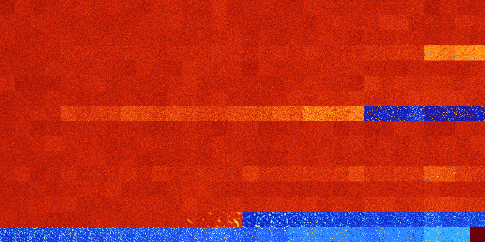

# B02567 (117248-117759)

<details>
    <summary>Initial Grid</summary>
    
</details>


<details>
    <summary>Initial Grid RLE</summary>

```
#C Exported from GoGoL (https://github.com/marrow16/gogol)
#C Wrap mode: Toroidal
#C Boundary mode: Dead
#C Step: 0
x = 100, y = 100, rule = B02567/S
bo6bo5bo24bo34b2o$11bo7bo48bobo5bo2bo10bo6bo$15bo24bo8bo10bo20bo$18bo
36bo$4bo7bo29bo2bo$bo41bo3bo6bo22bo2bob2o$34bo$2bo27bo10bo3bo14bo35bo2b
o$10bo10bo3bo34bo27bo$34bo32bo$3bo19bo4bobo7bo26bo12bo$14bo20bo8bo4bo9b
obo$5bo49bo19bo$2bo7bo12bo5bo19b2o28bo2bo13b2o$13bo13bo23bo13bo10bo7bo
12bo$18bo35bo9bo27bo$9bo35bo7bo24bo$38b2o37bo$58bo13bo8b2o3bo$7bo10b2o
44bo$22bo3bo8bo35bob2o$28bo26bo14bo8bo$2bo8bobo15bo14bo31bo$20b2o40bobo
13bo3bo2bo11bobo$7bo14bo10bo11bo18bo10bo$34bo2bo10bo4bo4bo2bo26bo3bo$
40bo$14bo37bo6bo11bo13bo9bobo$45bo27bo9bo10bo2bo$2bo3bo15bo7b2o10bobo
10bo4bo18bo$22bo31bo14bo$2o6bo26b2o3bo38bo$17bo14bo2bo2bo25bo28bo$2bo3b
o21bo15bo$100b$13bo2bo5bo22bo13bo5bobo11bo$14bo21bo50bo$6bo23bo17bo15bo
24bo8bo$6bo19bo6bobo15bo9bo13bobo4bo5bo4bo$42bo6bo17bo6bo21bo$obo2bo7bo
4bo6bo$9bo16bo5bo13bo12bo6bo16bo$o2bo16bo54bo$4bo13bo9bo35bo14bo11bob2o
$o9bo38bo10b2o2bo7bobo22bo$o14bo12bo17bo49bo$35bo2bo20bo$19bo9bo6bo8bo
4bo4bo32bo$26bo9bo19bo35b3o3bo$5bo39bo$5bo5bo14bo8bo20bo5bo33bo$17bo3bo
29bo12bo10bo$22bo3b4o28bo29bo4bo$7bo3b2o51bo7bo17bo$5bo21bo17bobo21bo
21bo2bo$15bo10bo38bo13bo$28bobo46bo12bo8bo$8bo15bo37bo35bo$o31bo32bo6bo
24bobo$13bo11bo4bo6bo44bo7bo5bo$57bo$64bo2bo16bo$2b2o12bo9bo3bo63bo$3bo
24bo$3b2o7bo33bo9bo24bo$bo44bo5bo13bo$o7bo26bo5bo37b2o12bo$29bo25bo7bo
10bo$32bo25bo10bo18bo2bo$3bo33bo9bo33bo8bo$7bo6bo3bo7bo54bo14bo$3bo11bo
9bobo3bo9bo40bo3bo5bo$17bo4bo6b2o8bo4bo6bo19bo4bo8bo$10bo30bo20bo$4bo
17bo18bo41bo11bo$3bo6bo4bo32bobo11bo29bo$7bo29bob2o40bo$45bo6bo7bo13bo
19bo$10bo69bo$5bo5bo56bo$18bo8bo5bo10bo8bo25bo11bo5bo$16bo27bo2bo13bo
17bo$12bo14bo5bobo18bo$3bo19bo3bo57bo8bo$26b2o36bo2bo6bo$34bo24bo39bo$
21bo14bo6bo13bo21bo12bo$3bobo46bo6bo10bo5bo$13bo11bo7bo36bo19bo$20bo9bo
12bo27bo10b3o3bo$5bo10bobo18bo14bo$13b2o24bobo7bo8bo19bob2o7bo$2bo3bo
31bo5bo38bo6bo$65bo18bo3bo$11bo12bo4bobo29bo25bo$47bo13bo$3bo3bo23bo54b
o2bo3bo$8bo9bo30bo23bo23bo$9bo20bo19bo43bo$bo8bobo4bo6bo34bo2bo!
```
</details>
<details>
    <summary>Thumbnail</summary>

</details>
<table>
<tr>
    <td><a href="./117248%20S%20Heat%20Map%20Activity.png"></a><br>S (117248)<br>G>1000</td>    <td><a href="./117249%20S0%20Heat%20Map%20Activity.png"></a><br>S0 (117249)<br>G>1000</td>    <td><a href="./117250%20S1%20Heat%20Map%20Activity.png"></a><br>S1 (117250)<br>G>1000</td>    <td><a href="./117251%20S01%20Heat%20Map%20Activity.png"></a><br>S01 (117251)<br>G>1000</td>    <td><a href="./117252%20S2%20Heat%20Map%20Activity.png"></a><br>S2 (117252)<br>G>1000</td>    <td><a href="./117253%20S02%20Heat%20Map%20Activity.png"></a><br>S02 (117253)<br>G>1000</td>    <td><a href="./117254%20S12%20Heat%20Map%20Activity.png"></a><br>S12 (117254)<br>G>1000</td>    <td><a href="./117255%20S012%20Heat%20Map%20Activity.png"></a><br>S012 (117255)<br>G>1000</td>    <td><a href="./117256%20S3%20Heat%20Map%20Activity.png"></a><br>S3 (117256)<br>G>1000</td>    <td><a href="./117257%20S03%20Heat%20Map%20Activity.png"></a><br>S03 (117257)<br>G>1000</td>    <td><a href="./117258%20S13%20Heat%20Map%20Activity.png"></a><br>S13 (117258)<br>G>1000</td>    <td><a href="./117259%20S013%20Heat%20Map%20Activity.png"></a><br>S013 (117259)<br>G>1000</td>    <td><a href="./117260%20S23%20Heat%20Map%20Activity.png"></a><br>S23 (117260)<br>G>1000</td>    <td><a href="./117261%20S023%20Heat%20Map%20Activity.png"></a><br>S023 (117261)<br>G>1000</td>    <td><a href="./117262%20S123%20Heat%20Map%20Activity.png"></a><br>S123 (117262)<br>G>1000</td>    <td><a href="./117263%20S0123%20Heat%20Map%20Activity.png"></a><br>S0123 (117263)<br>G>1000</td>    <td><a href="./117264%20S4%20Heat%20Map%20Activity.png"></a><br>S4 (117264)<br>G>1000</td>    <td><a href="./117265%20S04%20Heat%20Map%20Activity.png"></a><br>S04 (117265)<br>G>1000</td>    <td><a href="./117266%20S14%20Heat%20Map%20Activity.png"></a><br>S14 (117266)<br>G>1000</td>    <td><a href="./117267%20S014%20Heat%20Map%20Activity.png"></a><br>S014 (117267)<br>G>1000</td>    <td><a href="./117268%20S24%20Heat%20Map%20Activity.png"></a><br>S24 (117268)<br>G>1000</td>    <td><a href="./117269%20S024%20Heat%20Map%20Activity.png"></a><br>S024 (117269)<br>G>1000</td>    <td><a href="./117270%20S124%20Heat%20Map%20Activity.png"></a><br>S124 (117270)<br>G>1000</td>    <td><a href="./117271%20S0124%20Heat%20Map%20Activity.png"></a><br>S0124 (117271)<br>G>1000</td>    <td><a href="./117272%20S34%20Heat%20Map%20Activity.png"></a><br>S34 (117272)<br>G>1000</td>    <td><a href="./117273%20S034%20Heat%20Map%20Activity.png"></a><br>S034 (117273)<br>G>1000</td>    <td><a href="./117274%20S134%20Heat%20Map%20Activity.png"></a><br>S134 (117274)<br>G>1000</td>    <td><a href="./117275%20S0134%20Heat%20Map%20Activity.png"></a><br>S0134 (117275)<br>G>1000</td>    <td><a href="./117276%20S234%20Heat%20Map%20Activity.png"></a><br>S234 (117276)<br>G>1000</td>    <td><a href="./117277%20S0234%20Heat%20Map%20Activity.png"></a><br>S0234 (117277)<br>G>1000</td>    <td><a href="./117278%20S1234%20Heat%20Map%20Activity.png"></a><br>S1234 (117278)<br>G>1000</td>    <td><a href="./117279%20S01234%20Heat%20Map%20Activity.png"></a><br>S01234 (117279)<br>G>1000</td></tr>
<tr>
    <td><a href="./117280%20S5%20Heat%20Map%20Activity.png"></a><br>S5 (117280)<br>G>1000</td>    <td><a href="./117281%20S05%20Heat%20Map%20Activity.png"></a><br>S05 (117281)<br>G>1000</td>    <td><a href="./117282%20S15%20Heat%20Map%20Activity.png"></a><br>S15 (117282)<br>G>1000</td>    <td><a href="./117283%20S015%20Heat%20Map%20Activity.png"></a><br>S015 (117283)<br>G>1000</td>    <td><a href="./117284%20S25%20Heat%20Map%20Activity.png"></a><br>S25 (117284)<br>G>1000</td>    <td><a href="./117285%20S025%20Heat%20Map%20Activity.png"></a><br>S025 (117285)<br>G>1000</td>    <td><a href="./117286%20S125%20Heat%20Map%20Activity.png"></a><br>S125 (117286)<br>G>1000</td>    <td><a href="./117287%20S0125%20Heat%20Map%20Activity.png"></a><br>S0125 (117287)<br>G>1000</td>    <td><a href="./117288%20S35%20Heat%20Map%20Activity.png"></a><br>S35 (117288)<br>G>1000</td>    <td><a href="./117289%20S035%20Heat%20Map%20Activity.png"></a><br>S035 (117289)<br>G>1000</td>    <td><a href="./117290%20S135%20Heat%20Map%20Activity.png"></a><br>S135 (117290)<br>G>1000</td>    <td><a href="./117291%20S0135%20Heat%20Map%20Activity.png"></a><br>S0135 (117291)<br>G>1000</td>    <td><a href="./117292%20S235%20Heat%20Map%20Activity.png"></a><br>S235 (117292)<br>G>1000</td>    <td><a href="./117293%20S0235%20Heat%20Map%20Activity.png"></a><br>S0235 (117293)<br>G>1000</td>    <td><a href="./117294%20S1235%20Heat%20Map%20Activity.png"></a><br>S1235 (117294)<br>G>1000</td>    <td><a href="./117295%20S01235%20Heat%20Map%20Activity.png"></a><br>S01235 (117295)<br>G>1000</td>    <td><a href="./117296%20S45%20Heat%20Map%20Activity.png"></a><br>S45 (117296)<br>G>1000</td>    <td><a href="./117297%20S045%20Heat%20Map%20Activity.png"></a><br>S045 (117297)<br>G>1000</td>    <td><a href="./117298%20S145%20Heat%20Map%20Activity.png"></a><br>S145 (117298)<br>G>1000</td>    <td><a href="./117299%20S0145%20Heat%20Map%20Activity.png"></a><br>S0145 (117299)<br>G>1000</td>    <td><a href="./117300%20S245%20Heat%20Map%20Activity.png"></a><br>S245 (117300)<br>G>1000</td>    <td><a href="./117301%20S0245%20Heat%20Map%20Activity.png"></a><br>S0245 (117301)<br>G>1000</td>    <td><a href="./117302%20S1245%20Heat%20Map%20Activity.png"></a><br>S1245 (117302)<br>G>1000</td>    <td><a href="./117303%20S01245%20Heat%20Map%20Activity.png"></a><br>S01245 (117303)<br>G>1000</td>    <td><a href="./117304%20S345%20Heat%20Map%20Activity.png"></a><br>S345 (117304)<br>G>1000</td>    <td><a href="./117305%20S0345%20Heat%20Map%20Activity.png"></a><br>S0345 (117305)<br>G>1000</td>    <td><a href="./117306%20S1345%20Heat%20Map%20Activity.png"></a><br>S1345 (117306)<br>G>1000</td>    <td><a href="./117307%20S01345%20Heat%20Map%20Activity.png"></a><br>S01345 (117307)<br>G>1000</td>    <td><a href="./117308%20S2345%20Heat%20Map%20Activity.png"></a><br>S2345 (117308)<br>G>1000</td>    <td><a href="./117309%20S02345%20Heat%20Map%20Activity.png"></a><br>S02345 (117309)<br>G>1000</td>    <td><a href="./117310%20S12345%20Heat%20Map%20Activity.png"></a><br>S12345 (117310)<br>G>1000</td>    <td><a href="./117311%20S012345%20Heat%20Map%20Activity.png"></a><br>S012345 (117311)<br>G>1000</td></tr>
<tr>
    <td><a href="./117312%20S6%20Heat%20Map%20Activity.png"></a><br>S6 (117312)<br>G>1000</td>    <td><a href="./117313%20S06%20Heat%20Map%20Activity.png"></a><br>S06 (117313)<br>G>1000</td>    <td><a href="./117314%20S16%20Heat%20Map%20Activity.png"></a><br>S16 (117314)<br>G>1000</td>    <td><a href="./117315%20S016%20Heat%20Map%20Activity.png"></a><br>S016 (117315)<br>G>1000</td>    <td><a href="./117316%20S26%20Heat%20Map%20Activity.png"></a><br>S26 (117316)<br>G>1000</td>    <td><a href="./117317%20S026%20Heat%20Map%20Activity.png"></a><br>S026 (117317)<br>G>1000</td>    <td><a href="./117318%20S126%20Heat%20Map%20Activity.png"></a><br>S126 (117318)<br>G>1000</td>    <td><a href="./117319%20S0126%20Heat%20Map%20Activity.png"></a><br>S0126 (117319)<br>G>1000</td>    <td><a href="./117320%20S36%20Heat%20Map%20Activity.png"></a><br>S36 (117320)<br>G>1000</td>    <td><a href="./117321%20S036%20Heat%20Map%20Activity.png"></a><br>S036 (117321)<br>G>1000</td>    <td><a href="./117322%20S136%20Heat%20Map%20Activity.png"></a><br>S136 (117322)<br>G>1000</td>    <td><a href="./117323%20S0136%20Heat%20Map%20Activity.png"></a><br>S0136 (117323)<br>G>1000</td>    <td><a href="./117324%20S236%20Heat%20Map%20Activity.png"></a><br>S236 (117324)<br>G>1000</td>    <td><a href="./117325%20S0236%20Heat%20Map%20Activity.png"></a><br>S0236 (117325)<br>G>1000</td>    <td><a href="./117326%20S1236%20Heat%20Map%20Activity.png"></a><br>S1236 (117326)<br>G>1000</td>    <td><a href="./117327%20S01236%20Heat%20Map%20Activity.png"></a><br>S01236 (117327)<br>G>1000</td>    <td><a href="./117328%20S46%20Heat%20Map%20Activity.png"></a><br>S46 (117328)<br>G>1000</td>    <td><a href="./117329%20S046%20Heat%20Map%20Activity.png"></a><br>S046 (117329)<br>G>1000</td>    <td><a href="./117330%20S146%20Heat%20Map%20Activity.png"></a><br>S146 (117330)<br>G>1000</td>    <td><a href="./117331%20S0146%20Heat%20Map%20Activity.png"></a><br>S0146 (117331)<br>G>1000</td>    <td><a href="./117332%20S246%20Heat%20Map%20Activity.png"></a><br>S246 (117332)<br>G>1000</td>    <td><a href="./117333%20S0246%20Heat%20Map%20Activity.png"></a><br>S0246 (117333)<br>G>1000</td>    <td><a href="./117334%20S1246%20Heat%20Map%20Activity.png"></a><br>S1246 (117334)<br>G>1000</td>    <td><a href="./117335%20S01246%20Heat%20Map%20Activity.png"></a><br>S01246 (117335)<br>G>1000</td>    <td><a href="./117336%20S346%20Heat%20Map%20Activity.png"></a><br>S346 (117336)<br>G>1000</td>    <td><a href="./117337%20S0346%20Heat%20Map%20Activity.png"></a><br>S0346 (117337)<br>G>1000</td>    <td><a href="./117338%20S1346%20Heat%20Map%20Activity.png"></a><br>S1346 (117338)<br>G>1000</td>    <td><a href="./117339%20S01346%20Heat%20Map%20Activity.png"></a><br>S01346 (117339)<br>G>1000</td>    <td><a href="./117340%20S2346%20Heat%20Map%20Activity.png"></a><br>S2346 (117340)<br>G>1000</td>    <td><a href="./117341%20S02346%20Heat%20Map%20Activity.png"></a><br>S02346 (117341)<br>G>1000</td>    <td><a href="./117342%20S12346%20Heat%20Map%20Activity.png"></a><br>S12346 (117342)<br>G>1000</td>    <td><a href="./117343%20S012346%20Heat%20Map%20Activity.png"></a><br>S012346 (117343)<br>G>1000</td></tr>
<tr>
    <td><a href="./117344%20S56%20Heat%20Map%20Activity.png"></a><br>S56 (117344)<br>G>1000</td>    <td><a href="./117345%20S056%20Heat%20Map%20Activity.png"></a><br>S056 (117345)<br>G>1000</td>    <td><a href="./117346%20S156%20Heat%20Map%20Activity.png"></a><br>S156 (117346)<br>G>1000</td>    <td><a href="./117347%20S0156%20Heat%20Map%20Activity.png"></a><br>S0156 (117347)<br>G>1000</td>    <td><a href="./117348%20S256%20Heat%20Map%20Activity.png"></a><br>S256 (117348)<br>G>1000</td>    <td><a href="./117349%20S0256%20Heat%20Map%20Activity.png"></a><br>S0256 (117349)<br>G>1000</td>    <td><a href="./117350%20S1256%20Heat%20Map%20Activity.png"></a><br>S1256 (117350)<br>G>1000</td>    <td><a href="./117351%20S01256%20Heat%20Map%20Activity.png"></a><br>S01256 (117351)<br>G>1000</td>    <td><a href="./117352%20S356%20Heat%20Map%20Activity.png"></a><br>S356 (117352)<br>G>1000</td>    <td><a href="./117353%20S0356%20Heat%20Map%20Activity.png"></a><br>S0356 (117353)<br>G>1000</td>    <td><a href="./117354%20S1356%20Heat%20Map%20Activity.png"></a><br>S1356 (117354)<br>G>1000</td>    <td><a href="./117355%20S01356%20Heat%20Map%20Activity.png"></a><br>S01356 (117355)<br>G>1000</td>    <td><a href="./117356%20S2356%20Heat%20Map%20Activity.png"></a><br>S2356 (117356)<br>G>1000</td>    <td><a href="./117357%20S02356%20Heat%20Map%20Activity.png"></a><br>S02356 (117357)<br>G>1000</td>    <td><a href="./117358%20S12356%20Heat%20Map%20Activity.png"></a><br>S12356 (117358)<br>G>1000</td>    <td><a href="./117359%20S012356%20Heat%20Map%20Activity.png"></a><br>S012356 (117359)<br>G>1000</td>    <td><a href="./117360%20S456%20Heat%20Map%20Activity.png"></a><br>S456 (117360)<br>G>1000</td>    <td><a href="./117361%20S0456%20Heat%20Map%20Activity.png"></a><br>S0456 (117361)<br>G>1000</td>    <td><a href="./117362%20S1456%20Heat%20Map%20Activity.png"></a><br>S1456 (117362)<br>G>1000</td>    <td><a href="./117363%20S01456%20Heat%20Map%20Activity.png"></a><br>S01456 (117363)<br>G>1000</td>    <td><a href="./117364%20S2456%20Heat%20Map%20Activity.png"></a><br>S2456 (117364)<br>G>1000</td>    <td><a href="./117365%20S02456%20Heat%20Map%20Activity.png"></a><br>S02456 (117365)<br>G>1000</td>    <td><a href="./117366%20S12456%20Heat%20Map%20Activity.png"></a><br>S12456 (117366)<br>G>1000</td>    <td><a href="./117367%20S012456%20Heat%20Map%20Activity.png"></a><br>S012456 (117367)<br>G>1000</td>    <td><a href="./117368%20S3456%20Heat%20Map%20Activity.png"></a><br>S3456 (117368)<br>G>1000</td>    <td><a href="./117369%20S03456%20Heat%20Map%20Activity.png"></a><br>S03456 (117369)<br>G>1000</td>    <td><a href="./117370%20S13456%20Heat%20Map%20Activity.png"></a><br>S13456 (117370)<br>G>1000</td>    <td><a href="./117371%20S013456%20Heat%20Map%20Activity.png"></a><br>S013456 (117371)<br>G>1000</td>    <td><a href="./117372%20S23456%20Heat%20Map%20Activity.png"></a><br>S23456 (117372)<br>G>1000</td>    <td><a href="./117373%20S023456%20Heat%20Map%20Activity.png"></a><br>S023456 (117373)<br>G>1000</td>    <td><a href="./117374%20S123456%20Heat%20Map%20Activity.png"></a><br>S123456 (117374)<br>G>1000</td>    <td><a href="./117375%20S0123456%20Heat%20Map%20Activity.png"></a><br>S0123456 (117375)<br>G>1000</td></tr>
<tr>
    <td><a href="./117376%20S7%20Heat%20Map%20Activity.png"></a><br>S7 (117376)<br>G>1000</td>    <td><a href="./117377%20S07%20Heat%20Map%20Activity.png"></a><br>S07 (117377)<br>G>1000</td>    <td><a href="./117378%20S17%20Heat%20Map%20Activity.png"></a><br>S17 (117378)<br>G>1000</td>    <td><a href="./117379%20S017%20Heat%20Map%20Activity.png"></a><br>S017 (117379)<br>G>1000</td>    <td><a href="./117380%20S27%20Heat%20Map%20Activity.png"></a><br>S27 (117380)<br>G>1000</td>    <td><a href="./117381%20S027%20Heat%20Map%20Activity.png"></a><br>S027 (117381)<br>G>1000</td>    <td><a href="./117382%20S127%20Heat%20Map%20Activity.png"></a><br>S127 (117382)<br>G>1000</td>    <td><a href="./117383%20S0127%20Heat%20Map%20Activity.png"></a><br>S0127 (117383)<br>G>1000</td>    <td><a href="./117384%20S37%20Heat%20Map%20Activity.png"></a><br>S37 (117384)<br>G>1000</td>    <td><a href="./117385%20S037%20Heat%20Map%20Activity.png"></a><br>S037 (117385)<br>G>1000</td>    <td><a href="./117386%20S137%20Heat%20Map%20Activity.png"></a><br>S137 (117386)<br>G>1000</td>    <td><a href="./117387%20S0137%20Heat%20Map%20Activity.png"></a><br>S0137 (117387)<br>G>1000</td>    <td><a href="./117388%20S237%20Heat%20Map%20Activity.png"></a><br>S237 (117388)<br>G>1000</td>    <td><a href="./117389%20S0237%20Heat%20Map%20Activity.png"></a><br>S0237 (117389)<br>G>1000</td>    <td><a href="./117390%20S1237%20Heat%20Map%20Activity.png"></a><br>S1237 (117390)<br>G>1000</td>    <td><a href="./117391%20S01237%20Heat%20Map%20Activity.png"></a><br>S01237 (117391)<br>G>1000</td>    <td><a href="./117392%20S47%20Heat%20Map%20Activity.png"></a><br>S47 (117392)<br>G>1000</td>    <td><a href="./117393%20S047%20Heat%20Map%20Activity.png"></a><br>S047 (117393)<br>G>1000</td>    <td><a href="./117394%20S147%20Heat%20Map%20Activity.png"></a><br>S147 (117394)<br>G>1000</td>    <td><a href="./117395%20S0147%20Heat%20Map%20Activity.png"></a><br>S0147 (117395)<br>G>1000</td>    <td><a href="./117396%20S247%20Heat%20Map%20Activity.png"></a><br>S247 (117396)<br>G>1000</td>    <td><a href="./117397%20S0247%20Heat%20Map%20Activity.png"></a><br>S0247 (117397)<br>G>1000</td>    <td><a href="./117398%20S1247%20Heat%20Map%20Activity.png"></a><br>S1247 (117398)<br>G>1000</td>    <td><a href="./117399%20S01247%20Heat%20Map%20Activity.png"></a><br>S01247 (117399)<br>G>1000</td>    <td><a href="./117400%20S347%20Heat%20Map%20Activity.png"></a><br>S347 (117400)<br>G>1000</td>    <td><a href="./117401%20S0347%20Heat%20Map%20Activity.png"></a><br>S0347 (117401)<br>G>1000</td>    <td><a href="./117402%20S1347%20Heat%20Map%20Activity.png"></a><br>S1347 (117402)<br>G>1000</td>    <td><a href="./117403%20S01347%20Heat%20Map%20Activity.png"></a><br>S01347 (117403)<br>G>1000</td>    <td><a href="./117404%20S2347%20Heat%20Map%20Activity.png"></a><br>S2347 (117404)<br>G>1000</td>    <td><a href="./117405%20S02347%20Heat%20Map%20Activity.png"></a><br>S02347 (117405)<br>G>1000</td>    <td><a href="./117406%20S12347%20Heat%20Map%20Activity.png"></a><br>S12347 (117406)<br>G>1000</td>    <td><a href="./117407%20S012347%20Heat%20Map%20Activity.png"></a><br>S012347 (117407)<br>G>1000</td></tr>
<tr>
    <td><a href="./117408%20S57%20Heat%20Map%20Activity.png"></a><br>S57 (117408)<br>G>1000</td>    <td><a href="./117409%20S057%20Heat%20Map%20Activity.png"></a><br>S057 (117409)<br>G>1000</td>    <td><a href="./117410%20S157%20Heat%20Map%20Activity.png"></a><br>S157 (117410)<br>G>1000</td>    <td><a href="./117411%20S0157%20Heat%20Map%20Activity.png"></a><br>S0157 (117411)<br>G>1000</td>    <td><a href="./117412%20S257%20Heat%20Map%20Activity.png"></a><br>S257 (117412)<br>G>1000</td>    <td><a href="./117413%20S0257%20Heat%20Map%20Activity.png"></a><br>S0257 (117413)<br>G>1000</td>    <td><a href="./117414%20S1257%20Heat%20Map%20Activity.png"></a><br>S1257 (117414)<br>G>1000</td>    <td><a href="./117415%20S01257%20Heat%20Map%20Activity.png"></a><br>S01257 (117415)<br>G>1000</td>    <td><a href="./117416%20S357%20Heat%20Map%20Activity.png"></a><br>S357 (117416)<br>G>1000</td>    <td><a href="./117417%20S0357%20Heat%20Map%20Activity.png"></a><br>S0357 (117417)<br>G>1000</td>    <td><a href="./117418%20S1357%20Heat%20Map%20Activity.png"></a><br>S1357 (117418)<br>G>1000</td>    <td><a href="./117419%20S01357%20Heat%20Map%20Activity.png"></a><br>S01357 (117419)<br>G>1000</td>    <td><a href="./117420%20S2357%20Heat%20Map%20Activity.png"></a><br>S2357 (117420)<br>G>1000</td>    <td><a href="./117421%20S02357%20Heat%20Map%20Activity.png"></a><br>S02357 (117421)<br>G>1000</td>    <td><a href="./117422%20S12357%20Heat%20Map%20Activity.png"></a><br>S12357 (117422)<br>G>1000</td>    <td><a href="./117423%20S012357%20Heat%20Map%20Activity.png"></a><br>S012357 (117423)<br>G>1000</td>    <td><a href="./117424%20S457%20Heat%20Map%20Activity.png"></a><br>S457 (117424)<br>G>1000</td>    <td><a href="./117425%20S0457%20Heat%20Map%20Activity.png"></a><br>S0457 (117425)<br>G>1000</td>    <td><a href="./117426%20S1457%20Heat%20Map%20Activity.png"></a><br>S1457 (117426)<br>G>1000</td>    <td><a href="./117427%20S01457%20Heat%20Map%20Activity.png"></a><br>S01457 (117427)<br>G>1000</td>    <td><a href="./117428%20S2457%20Heat%20Map%20Activity.png"></a><br>S2457 (117428)<br>G>1000</td>    <td><a href="./117429%20S02457%20Heat%20Map%20Activity.png"></a><br>S02457 (117429)<br>G>1000</td>    <td><a href="./117430%20S12457%20Heat%20Map%20Activity.png"></a><br>S12457 (117430)<br>G>1000</td>    <td><a href="./117431%20S012457%20Heat%20Map%20Activity.png"></a><br>S012457 (117431)<br>G>1000</td>    <td><a href="./117432%20S3457%20Heat%20Map%20Activity.png"></a><br>S3457 (117432)<br>G>1000</td>    <td><a href="./117433%20S03457%20Heat%20Map%20Activity.png"></a><br>S03457 (117433)<br>G>1000</td>    <td><a href="./117434%20S13457%20Heat%20Map%20Activity.png"></a><br>S13457 (117434)<br>G>1000</td>    <td><a href="./117435%20S013457%20Heat%20Map%20Activity.png"></a><br>S013457 (117435)<br>G>1000</td>    <td><a href="./117436%20S23457%20Heat%20Map%20Activity.png"></a><br>S23457 (117436)<br>G>1000</td>    <td><a href="./117437%20S023457%20Heat%20Map%20Activity.png"></a><br>S023457 (117437)<br>G>1000</td>    <td><a href="./117438%20S123457%20Heat%20Map%20Activity.png"></a><br>S123457 (117438)<br>G>1000</td>    <td><a href="./117439%20S0123457%20Heat%20Map%20Activity.png"></a><br>S0123457 (117439)<br>G>1000</td></tr>
<tr>
    <td><a href="./117440%20S67%20Heat%20Map%20Activity.png"></a><br>S67 (117440)<br>G>1000</td>    <td><a href="./117441%20S067%20Heat%20Map%20Activity.png"></a><br>S067 (117441)<br>G>1000</td>    <td><a href="./117442%20S167%20Heat%20Map%20Activity.png"></a><br>S167 (117442)<br>G>1000</td>    <td><a href="./117443%20S0167%20Heat%20Map%20Activity.png"></a><br>S0167 (117443)<br>G>1000</td>    <td><a href="./117444%20S267%20Heat%20Map%20Activity.png"></a><br>S267 (117444)<br>G>1000</td>    <td><a href="./117445%20S0267%20Heat%20Map%20Activity.png"></a><br>S0267 (117445)<br>G>1000</td>    <td><a href="./117446%20S1267%20Heat%20Map%20Activity.png"></a><br>S1267 (117446)<br>G>1000</td>    <td><a href="./117447%20S01267%20Heat%20Map%20Activity.png"></a><br>S01267 (117447)<br>G>1000</td>    <td><a href="./117448%20S367%20Heat%20Map%20Activity.png"></a><br>S367 (117448)<br>G>1000</td>    <td><a href="./117449%20S0367%20Heat%20Map%20Activity.png"></a><br>S0367 (117449)<br>G>1000</td>    <td><a href="./117450%20S1367%20Heat%20Map%20Activity.png"></a><br>S1367 (117450)<br>G>1000</td>    <td><a href="./117451%20S01367%20Heat%20Map%20Activity.png"></a><br>S01367 (117451)<br>G>1000</td>    <td><a href="./117452%20S2367%20Heat%20Map%20Activity.png"></a><br>S2367 (117452)<br>G>1000</td>    <td><a href="./117453%20S02367%20Heat%20Map%20Activity.png"></a><br>S02367 (117453)<br>G>1000</td>    <td><a href="./117454%20S12367%20Heat%20Map%20Activity.png"></a><br>S12367 (117454)<br>G>1000</td>    <td><a href="./117455%20S012367%20Heat%20Map%20Activity.png"></a><br>S012367 (117455)<br>G>1000</td>    <td><a href="./117456%20S467%20Heat%20Map%20Activity.png"></a><br>S467 (117456)<br>G>1000</td>    <td><a href="./117457%20S0467%20Heat%20Map%20Activity.png"></a><br>S0467 (117457)<br>G>1000</td>    <td><a href="./117458%20S1467%20Heat%20Map%20Activity.png"></a><br>S1467 (117458)<br>G>1000</td>    <td><a href="./117459%20S01467%20Heat%20Map%20Activity.png"></a><br>S01467 (117459)<br>G>1000</td>    <td><a href="./117460%20S2467%20Heat%20Map%20Activity.png"></a><br>S2467 (117460)<br>G>1000</td>    <td><a href="./117461%20S02467%20Heat%20Map%20Activity.png"></a><br>S02467 (117461)<br>G>1000</td>    <td><a href="./117462%20S12467%20Heat%20Map%20Activity.png"></a><br>S12467 (117462)<br>G>1000</td>    <td><a href="./117463%20S012467%20Heat%20Map%20Activity.png"></a><br>S012467 (117463)<br>G>1000</td>    <td><a href="./117464%20S3467%20Heat%20Map%20Activity.png"></a><br>S3467 (117464)<br>G>1000</td>    <td><a href="./117465%20S03467%20Heat%20Map%20Activity.png"></a><br>S03467 (117465)<br>G>1000</td>    <td><a href="./117466%20S13467%20Heat%20Map%20Activity.png"></a><br>S13467 (117466)<br>G>1000</td>    <td><a href="./117467%20S013467%20Heat%20Map%20Activity.png"></a><br>S013467 (117467)<br>G>1000</td>    <td><a href="./117468%20S23467%20Heat%20Map%20Activity.png"></a><br>S23467 (117468)<br>G>1000</td>    <td><a href="./117469%20S023467%20Heat%20Map%20Activity.png"></a><br>S023467 (117469)<br>G>1000</td>    <td><a href="./117470%20S123467%20Heat%20Map%20Activity.png"></a><br>S123467 (117470)<br>G>1000</td>    <td><a href="./117471%20S0123467%20Heat%20Map%20Activity.png"></a><br>S0123467 (117471)<br>G>1000</td></tr>
<tr>
    <td><a href="./117472%20S567%20Heat%20Map%20Activity.png"></a><br>S567 (117472)<br>G>1000</td>    <td><a href="./117473%20S0567%20Heat%20Map%20Activity.png"></a><br>S0567 (117473)<br>G>1000</td>    <td><a href="./117474%20S1567%20Heat%20Map%20Activity.png"></a><br>S1567 (117474)<br>G>1000</td>    <td><a href="./117475%20S01567%20Heat%20Map%20Activity.png"></a><br>S01567 (117475)<br>G>1000</td>    <td><a href="./117476%20S2567%20Heat%20Map%20Activity.png"></a><br>S2567 (117476)<br>G>1000</td>    <td><a href="./117477%20S02567%20Heat%20Map%20Activity.png"></a><br>S02567 (117477)<br>G>1000</td>    <td><a href="./117478%20S12567%20Heat%20Map%20Activity.png"></a><br>S12567 (117478)<br>G>1000</td>    <td><a href="./117479%20S012567%20Heat%20Map%20Activity.png"></a><br>S012567 (117479)<br>G>1000</td>    <td><a href="./117480%20S3567%20Heat%20Map%20Activity.png"></a><br>S3567 (117480)<br>G>1000</td>    <td><a href="./117481%20S03567%20Heat%20Map%20Activity.png"></a><br>S03567 (117481)<br>G>1000</td>    <td><a href="./117482%20S13567%20Heat%20Map%20Activity.png"></a><br>S13567 (117482)<br>G>1000</td>    <td><a href="./117483%20S013567%20Heat%20Map%20Activity.png"></a><br>S013567 (117483)<br>G>1000</td>    <td><a href="./117484%20S23567%20Heat%20Map%20Activity.png"></a><br>S23567 (117484)<br>G>1000</td>    <td><a href="./117485%20S023567%20Heat%20Map%20Activity.png"></a><br>S023567 (117485)<br>G>1000</td>    <td><a href="./117486%20S123567%20Heat%20Map%20Activity.png"></a><br>S123567 (117486)<br>G>1000</td>    <td><a href="./117487%20S0123567%20Heat%20Map%20Activity.png"></a><br>S0123567 (117487)<br>G>1000</td>    <td><a href="./117488%20S4567%20Heat%20Map%20Activity.png"></a><br>S4567 (117488)<br>G>1000</td>    <td><a href="./117489%20S04567%20Heat%20Map%20Activity.png"></a><br>S04567 (117489)<br>G>1000</td>    <td><a href="./117490%20S14567%20Heat%20Map%20Activity.png"></a><br>S14567 (117490)<br>G>1000</td>    <td><a href="./117491%20S014567%20Heat%20Map%20Activity.png"></a><br>S014567 (117491)<br>G>1000</td>    <td><a href="./117492%20S24567%20Heat%20Map%20Activity.png"></a><br>S24567 (117492)<br>G>1000</td>    <td><a href="./117493%20S024567%20Heat%20Map%20Activity.png"></a><br>S024567 (117493)<br>G>1000</td>    <td><a href="./117494%20S124567%20Heat%20Map%20Activity.png"></a><br>S124567 (117494)<br>G>1000</td>    <td><a href="./117495%20S0124567%20Heat%20Map%20Activity.png"></a><br>S0124567 (117495)<br>G>1000</td>    <td><a href="./117496%20S34567%20Heat%20Map%20Activity.png"></a><br>S34567 (117496)<br>G>1000</td>    <td><a href="./117497%20S034567%20Heat%20Map%20Activity.png"></a><br>S034567 (117497)<br>G>1000</td>    <td><a href="./117498%20S134567%20Heat%20Map%20Activity.png"></a><br>S134567 (117498)<br>G>1000</td>    <td><a href="./117499%20S0134567%20Heat%20Map%20Activity.png"></a><br>S0134567 (117499)<br>R@331,p84</td>    <td><a href="./117500%20S234567%20Heat%20Map%20Activity.png"></a><br>S234567 (117500)<br>R@478,p420</td>    <td><a href="./117501%20S0234567%20Heat%20Map%20Activity.png"></a><br>S0234567 (117501)<br>R@294,p252</td>    <td><a href="./117502%20S1234567%20Heat%20Map%20Activity.png"></a><br>S1234567 (117502)<br>G>1000</td>    <td><a href="./117503%20S01234567%20Heat%20Map%20Activity.png"></a><br>S01234567 (117503)<br>R@408,p360</td></tr>
<tr>
    <td><a href="./117504%20S8%20Heat%20Map%20Activity.png"></a><br>S8 (117504)<br>G>1000</td>    <td><a href="./117505%20S08%20Heat%20Map%20Activity.png"></a><br>S08 (117505)<br>G>1000</td>    <td><a href="./117506%20S18%20Heat%20Map%20Activity.png"></a><br>S18 (117506)<br>G>1000</td>    <td><a href="./117507%20S018%20Heat%20Map%20Activity.png"></a><br>S018 (117507)<br>G>1000</td>    <td><a href="./117508%20S28%20Heat%20Map%20Activity.png"></a><br>S28 (117508)<br>G>1000</td>    <td><a href="./117509%20S028%20Heat%20Map%20Activity.png"></a><br>S028 (117509)<br>G>1000</td>    <td><a href="./117510%20S128%20Heat%20Map%20Activity.png"></a><br>S128 (117510)<br>G>1000</td>    <td><a href="./117511%20S0128%20Heat%20Map%20Activity.png"></a><br>S0128 (117511)<br>G>1000</td>    <td><a href="./117512%20S38%20Heat%20Map%20Activity.png"></a><br>S38 (117512)<br>G>1000</td>    <td><a href="./117513%20S038%20Heat%20Map%20Activity.png"></a><br>S038 (117513)<br>G>1000</td>    <td><a href="./117514%20S138%20Heat%20Map%20Activity.png"></a><br>S138 (117514)<br>G>1000</td>    <td><a href="./117515%20S0138%20Heat%20Map%20Activity.png"></a><br>S0138 (117515)<br>G>1000</td>    <td><a href="./117516%20S238%20Heat%20Map%20Activity.png"></a><br>S238 (117516)<br>G>1000</td>    <td><a href="./117517%20S0238%20Heat%20Map%20Activity.png"></a><br>S0238 (117517)<br>G>1000</td>    <td><a href="./117518%20S1238%20Heat%20Map%20Activity.png"></a><br>S1238 (117518)<br>G>1000</td>    <td><a href="./117519%20S01238%20Heat%20Map%20Activity.png"></a><br>S01238 (117519)<br>G>1000</td>    <td><a href="./117520%20S48%20Heat%20Map%20Activity.png"></a><br>S48 (117520)<br>G>1000</td>    <td><a href="./117521%20S048%20Heat%20Map%20Activity.png"></a><br>S048 (117521)<br>G>1000</td>    <td><a href="./117522%20S148%20Heat%20Map%20Activity.png"></a><br>S148 (117522)<br>G>1000</td>    <td><a href="./117523%20S0148%20Heat%20Map%20Activity.png"></a><br>S0148 (117523)<br>G>1000</td>    <td><a href="./117524%20S248%20Heat%20Map%20Activity.png"></a><br>S248 (117524)<br>G>1000</td>    <td><a href="./117525%20S0248%20Heat%20Map%20Activity.png"></a><br>S0248 (117525)<br>G>1000</td>    <td><a href="./117526%20S1248%20Heat%20Map%20Activity.png"></a><br>S1248 (117526)<br>G>1000</td>    <td><a href="./117527%20S01248%20Heat%20Map%20Activity.png"></a><br>S01248 (117527)<br>G>1000</td>    <td><a href="./117528%20S348%20Heat%20Map%20Activity.png"></a><br>S348 (117528)<br>G>1000</td>    <td><a href="./117529%20S0348%20Heat%20Map%20Activity.png"></a><br>S0348 (117529)<br>G>1000</td>    <td><a href="./117530%20S1348%20Heat%20Map%20Activity.png"></a><br>S1348 (117530)<br>G>1000</td>    <td><a href="./117531%20S01348%20Heat%20Map%20Activity.png"></a><br>S01348 (117531)<br>G>1000</td>    <td><a href="./117532%20S2348%20Heat%20Map%20Activity.png"></a><br>S2348 (117532)<br>G>1000</td>    <td><a href="./117533%20S02348%20Heat%20Map%20Activity.png"></a><br>S02348 (117533)<br>G>1000</td>    <td><a href="./117534%20S12348%20Heat%20Map%20Activity.png"></a><br>S12348 (117534)<br>G>1000</td>    <td><a href="./117535%20S012348%20Heat%20Map%20Activity.png"></a><br>S012348 (117535)<br>G>1000</td></tr>
<tr>
    <td><a href="./117536%20S58%20Heat%20Map%20Activity.png"></a><br>S58 (117536)<br>G>1000</td>    <td><a href="./117537%20S058%20Heat%20Map%20Activity.png"></a><br>S058 (117537)<br>G>1000</td>    <td><a href="./117538%20S158%20Heat%20Map%20Activity.png"></a><br>S158 (117538)<br>G>1000</td>    <td><a href="./117539%20S0158%20Heat%20Map%20Activity.png"></a><br>S0158 (117539)<br>G>1000</td>    <td><a href="./117540%20S258%20Heat%20Map%20Activity.png"></a><br>S258 (117540)<br>G>1000</td>    <td><a href="./117541%20S0258%20Heat%20Map%20Activity.png"></a><br>S0258 (117541)<br>G>1000</td>    <td><a href="./117542%20S1258%20Heat%20Map%20Activity.png"></a><br>S1258 (117542)<br>G>1000</td>    <td><a href="./117543%20S01258%20Heat%20Map%20Activity.png"></a><br>S01258 (117543)<br>G>1000</td>    <td><a href="./117544%20S358%20Heat%20Map%20Activity.png"></a><br>S358 (117544)<br>G>1000</td>    <td><a href="./117545%20S0358%20Heat%20Map%20Activity.png"></a><br>S0358 (117545)<br>G>1000</td>    <td><a href="./117546%20S1358%20Heat%20Map%20Activity.png"></a><br>S1358 (117546)<br>G>1000</td>    <td><a href="./117547%20S01358%20Heat%20Map%20Activity.png"></a><br>S01358 (117547)<br>G>1000</td>    <td><a href="./117548%20S2358%20Heat%20Map%20Activity.png"></a><br>S2358 (117548)<br>G>1000</td>    <td><a href="./117549%20S02358%20Heat%20Map%20Activity.png"></a><br>S02358 (117549)<br>G>1000</td>    <td><a href="./117550%20S12358%20Heat%20Map%20Activity.png"></a><br>S12358 (117550)<br>G>1000</td>    <td><a href="./117551%20S012358%20Heat%20Map%20Activity.png"></a><br>S012358 (117551)<br>G>1000</td>    <td><a href="./117552%20S458%20Heat%20Map%20Activity.png"></a><br>S458 (117552)<br>G>1000</td>    <td><a href="./117553%20S0458%20Heat%20Map%20Activity.png"></a><br>S0458 (117553)<br>G>1000</td>    <td><a href="./117554%20S1458%20Heat%20Map%20Activity.png"></a><br>S1458 (117554)<br>G>1000</td>    <td><a href="./117555%20S01458%20Heat%20Map%20Activity.png"></a><br>S01458 (117555)<br>G>1000</td>    <td><a href="./117556%20S2458%20Heat%20Map%20Activity.png"></a><br>S2458 (117556)<br>G>1000</td>    <td><a href="./117557%20S02458%20Heat%20Map%20Activity.png"></a><br>S02458 (117557)<br>G>1000</td>    <td><a href="./117558%20S12458%20Heat%20Map%20Activity.png"></a><br>S12458 (117558)<br>G>1000</td>    <td><a href="./117559%20S012458%20Heat%20Map%20Activity.png"></a><br>S012458 (117559)<br>G>1000</td>    <td><a href="./117560%20S3458%20Heat%20Map%20Activity.png"></a><br>S3458 (117560)<br>G>1000</td>    <td><a href="./117561%20S03458%20Heat%20Map%20Activity.png"></a><br>S03458 (117561)<br>G>1000</td>    <td><a href="./117562%20S13458%20Heat%20Map%20Activity.png"></a><br>S13458 (117562)<br>G>1000</td>    <td><a href="./117563%20S013458%20Heat%20Map%20Activity.png"></a><br>S013458 (117563)<br>G>1000</td>    <td><a href="./117564%20S23458%20Heat%20Map%20Activity.png"></a><br>S23458 (117564)<br>G>1000</td>    <td><a href="./117565%20S023458%20Heat%20Map%20Activity.png"></a><br>S023458 (117565)<br>G>1000</td>    <td><a href="./117566%20S123458%20Heat%20Map%20Activity.png"></a><br>S123458 (117566)<br>G>1000</td>    <td><a href="./117567%20S0123458%20Heat%20Map%20Activity.png"></a><br>S0123458 (117567)<br>G>1000</td></tr>
<tr>
    <td><a href="./117568%20S68%20Heat%20Map%20Activity.png"></a><br>S68 (117568)<br>G>1000</td>    <td><a href="./117569%20S068%20Heat%20Map%20Activity.png"></a><br>S068 (117569)<br>G>1000</td>    <td><a href="./117570%20S168%20Heat%20Map%20Activity.png"></a><br>S168 (117570)<br>G>1000</td>    <td><a href="./117571%20S0168%20Heat%20Map%20Activity.png"></a><br>S0168 (117571)<br>G>1000</td>    <td><a href="./117572%20S268%20Heat%20Map%20Activity.png"></a><br>S268 (117572)<br>G>1000</td>    <td><a href="./117573%20S0268%20Heat%20Map%20Activity.png"></a><br>S0268 (117573)<br>G>1000</td>    <td><a href="./117574%20S1268%20Heat%20Map%20Activity.png"></a><br>S1268 (117574)<br>G>1000</td>    <td><a href="./117575%20S01268%20Heat%20Map%20Activity.png"></a><br>S01268 (117575)<br>G>1000</td>    <td><a href="./117576%20S368%20Heat%20Map%20Activity.png"></a><br>S368 (117576)<br>G>1000</td>    <td><a href="./117577%20S0368%20Heat%20Map%20Activity.png"></a><br>S0368 (117577)<br>G>1000</td>    <td><a href="./117578%20S1368%20Heat%20Map%20Activity.png"></a><br>S1368 (117578)<br>G>1000</td>    <td><a href="./117579%20S01368%20Heat%20Map%20Activity.png"></a><br>S01368 (117579)<br>G>1000</td>    <td><a href="./117580%20S2368%20Heat%20Map%20Activity.png"></a><br>S2368 (117580)<br>G>1000</td>    <td><a href="./117581%20S02368%20Heat%20Map%20Activity.png"></a><br>S02368 (117581)<br>G>1000</td>    <td><a href="./117582%20S12368%20Heat%20Map%20Activity.png"></a><br>S12368 (117582)<br>G>1000</td>    <td><a href="./117583%20S012368%20Heat%20Map%20Activity.png"></a><br>S012368 (117583)<br>G>1000</td>    <td><a href="./117584%20S468%20Heat%20Map%20Activity.png"></a><br>S468 (117584)<br>G>1000</td>    <td><a href="./117585%20S0468%20Heat%20Map%20Activity.png"></a><br>S0468 (117585)<br>G>1000</td>    <td><a href="./117586%20S1468%20Heat%20Map%20Activity.png"></a><br>S1468 (117586)<br>G>1000</td>    <td><a href="./117587%20S01468%20Heat%20Map%20Activity.png"></a><br>S01468 (117587)<br>G>1000</td>    <td><a href="./117588%20S2468%20Heat%20Map%20Activity.png"></a><br>S2468 (117588)<br>G>1000</td>    <td><a href="./117589%20S02468%20Heat%20Map%20Activity.png"></a><br>S02468 (117589)<br>G>1000</td>    <td><a href="./117590%20S12468%20Heat%20Map%20Activity.png"></a><br>S12468 (117590)<br>G>1000</td>    <td><a href="./117591%20S012468%20Heat%20Map%20Activity.png"></a><br>S012468 (117591)<br>G>1000</td>    <td><a href="./117592%20S3468%20Heat%20Map%20Activity.png"></a><br>S3468 (117592)<br>G>1000</td>    <td><a href="./117593%20S03468%20Heat%20Map%20Activity.png"></a><br>S03468 (117593)<br>G>1000</td>    <td><a href="./117594%20S13468%20Heat%20Map%20Activity.png"></a><br>S13468 (117594)<br>G>1000</td>    <td><a href="./117595%20S013468%20Heat%20Map%20Activity.png"></a><br>S013468 (117595)<br>G>1000</td>    <td><a href="./117596%20S23468%20Heat%20Map%20Activity.png"></a><br>S23468 (117596)<br>G>1000</td>    <td><a href="./117597%20S023468%20Heat%20Map%20Activity.png"></a><br>S023468 (117597)<br>G>1000</td>    <td><a href="./117598%20S123468%20Heat%20Map%20Activity.png"></a><br>S123468 (117598)<br>G>1000</td>    <td><a href="./117599%20S0123468%20Heat%20Map%20Activity.png"></a><br>S0123468 (117599)<br>G>1000</td></tr>
<tr>
    <td><a href="./117600%20S568%20Heat%20Map%20Activity.png"></a><br>S568 (117600)<br>G>1000</td>    <td><a href="./117601%20S0568%20Heat%20Map%20Activity.png"></a><br>S0568 (117601)<br>G>1000</td>    <td><a href="./117602%20S1568%20Heat%20Map%20Activity.png"></a><br>S1568 (117602)<br>G>1000</td>    <td><a href="./117603%20S01568%20Heat%20Map%20Activity.png"></a><br>S01568 (117603)<br>G>1000</td>    <td><a href="./117604%20S2568%20Heat%20Map%20Activity.png"></a><br>S2568 (117604)<br>G>1000</td>    <td><a href="./117605%20S02568%20Heat%20Map%20Activity.png"></a><br>S02568 (117605)<br>G>1000</td>    <td><a href="./117606%20S12568%20Heat%20Map%20Activity.png"></a><br>S12568 (117606)<br>G>1000</td>    <td><a href="./117607%20S012568%20Heat%20Map%20Activity.png"></a><br>S012568 (117607)<br>G>1000</td>    <td><a href="./117608%20S3568%20Heat%20Map%20Activity.png"></a><br>S3568 (117608)<br>G>1000</td>    <td><a href="./117609%20S03568%20Heat%20Map%20Activity.png"></a><br>S03568 (117609)<br>G>1000</td>    <td><a href="./117610%20S13568%20Heat%20Map%20Activity.png"></a><br>S13568 (117610)<br>G>1000</td>    <td><a href="./117611%20S013568%20Heat%20Map%20Activity.png"></a><br>S013568 (117611)<br>G>1000</td>    <td><a href="./117612%20S23568%20Heat%20Map%20Activity.png"></a><br>S23568 (117612)<br>G>1000</td>    <td><a href="./117613%20S023568%20Heat%20Map%20Activity.png"></a><br>S023568 (117613)<br>G>1000</td>    <td><a href="./117614%20S123568%20Heat%20Map%20Activity.png"></a><br>S123568 (117614)<br>G>1000</td>    <td><a href="./117615%20S0123568%20Heat%20Map%20Activity.png"></a><br>S0123568 (117615)<br>G>1000</td>    <td><a href="./117616%20S4568%20Heat%20Map%20Activity.png"></a><br>S4568 (117616)<br>G>1000</td>    <td><a href="./117617%20S04568%20Heat%20Map%20Activity.png"></a><br>S04568 (117617)<br>G>1000</td>    <td><a href="./117618%20S14568%20Heat%20Map%20Activity.png"></a><br>S14568 (117618)<br>G>1000</td>    <td><a href="./117619%20S014568%20Heat%20Map%20Activity.png"></a><br>S014568 (117619)<br>G>1000</td>    <td><a href="./117620%20S24568%20Heat%20Map%20Activity.png"></a><br>S24568 (117620)<br>G>1000</td>    <td><a href="./117621%20S024568%20Heat%20Map%20Activity.png"></a><br>S024568 (117621)<br>G>1000</td>    <td><a href="./117622%20S124568%20Heat%20Map%20Activity.png"></a><br>S124568 (117622)<br>G>1000</td>    <td><a href="./117623%20S0124568%20Heat%20Map%20Activity.png"></a><br>S0124568 (117623)<br>G>1000</td>    <td><a href="./117624%20S34568%20Heat%20Map%20Activity.png"></a><br>S34568 (117624)<br>G>1000</td>    <td><a href="./117625%20S034568%20Heat%20Map%20Activity.png"></a><br>S034568 (117625)<br>G>1000</td>    <td><a href="./117626%20S134568%20Heat%20Map%20Activity.png"></a><br>S134568 (117626)<br>G>1000</td>    <td><a href="./117627%20S0134568%20Heat%20Map%20Activity.png"></a><br>S0134568 (117627)<br>G>1000</td>    <td><a href="./117628%20S234568%20Heat%20Map%20Activity.png"></a><br>S234568 (117628)<br>G>1000</td>    <td><a href="./117629%20S0234568%20Heat%20Map%20Activity.png"></a><br>S0234568 (117629)<br>G>1000</td>    <td><a href="./117630%20S1234568%20Heat%20Map%20Activity.png"></a><br>S1234568 (117630)<br>G>1000</td>    <td><a href="./117631%20S01234568%20Heat%20Map%20Activity.png"></a><br>S01234568 (117631)<br>G>1000</td></tr>
<tr>
    <td><a href="./117632%20S78%20Heat%20Map%20Activity.png"></a><br>S78 (117632)<br>G>1000</td>    <td><a href="./117633%20S078%20Heat%20Map%20Activity.png"></a><br>S078 (117633)<br>G>1000</td>    <td><a href="./117634%20S178%20Heat%20Map%20Activity.png"></a><br>S178 (117634)<br>G>1000</td>    <td><a href="./117635%20S0178%20Heat%20Map%20Activity.png"></a><br>S0178 (117635)<br>G>1000</td>    <td><a href="./117636%20S278%20Heat%20Map%20Activity.png"></a><br>S278 (117636)<br>G>1000</td>    <td><a href="./117637%20S0278%20Heat%20Map%20Activity.png"></a><br>S0278 (117637)<br>G>1000</td>    <td><a href="./117638%20S1278%20Heat%20Map%20Activity.png"></a><br>S1278 (117638)<br>G>1000</td>    <td><a href="./117639%20S01278%20Heat%20Map%20Activity.png"></a><br>S01278 (117639)<br>G>1000</td>    <td><a href="./117640%20S378%20Heat%20Map%20Activity.png"></a><br>S378 (117640)<br>G>1000</td>    <td><a href="./117641%20S0378%20Heat%20Map%20Activity.png"></a><br>S0378 (117641)<br>G>1000</td>    <td><a href="./117642%20S1378%20Heat%20Map%20Activity.png"></a><br>S1378 (117642)<br>G>1000</td>    <td><a href="./117643%20S01378%20Heat%20Map%20Activity.png"></a><br>S01378 (117643)<br>G>1000</td>    <td><a href="./117644%20S2378%20Heat%20Map%20Activity.png"></a><br>S2378 (117644)<br>G>1000</td>    <td><a href="./117645%20S02378%20Heat%20Map%20Activity.png"></a><br>S02378 (117645)<br>G>1000</td>    <td><a href="./117646%20S12378%20Heat%20Map%20Activity.png"></a><br>S12378 (117646)<br>G>1000</td>    <td><a href="./117647%20S012378%20Heat%20Map%20Activity.png"></a><br>S012378 (117647)<br>G>1000</td>    <td><a href="./117648%20S478%20Heat%20Map%20Activity.png"></a><br>S478 (117648)<br>G>1000</td>    <td><a href="./117649%20S0478%20Heat%20Map%20Activity.png"></a><br>S0478 (117649)<br>G>1000</td>    <td><a href="./117650%20S1478%20Heat%20Map%20Activity.png"></a><br>S1478 (117650)<br>G>1000</td>    <td><a href="./117651%20S01478%20Heat%20Map%20Activity.png"></a><br>S01478 (117651)<br>G>1000</td>    <td><a href="./117652%20S2478%20Heat%20Map%20Activity.png"></a><br>S2478 (117652)<br>G>1000</td>    <td><a href="./117653%20S02478%20Heat%20Map%20Activity.png"></a><br>S02478 (117653)<br>G>1000</td>    <td><a href="./117654%20S12478%20Heat%20Map%20Activity.png"></a><br>S12478 (117654)<br>G>1000</td>    <td><a href="./117655%20S012478%20Heat%20Map%20Activity.png"></a><br>S012478 (117655)<br>G>1000</td>    <td><a href="./117656%20S3478%20Heat%20Map%20Activity.png"></a><br>S3478 (117656)<br>G>1000</td>    <td><a href="./117657%20S03478%20Heat%20Map%20Activity.png"></a><br>S03478 (117657)<br>G>1000</td>    <td><a href="./117658%20S13478%20Heat%20Map%20Activity.png"></a><br>S13478 (117658)<br>G>1000</td>    <td><a href="./117659%20S013478%20Heat%20Map%20Activity.png"></a><br>S013478 (117659)<br>G>1000</td>    <td><a href="./117660%20S23478%20Heat%20Map%20Activity.png"></a><br>S23478 (117660)<br>G>1000</td>    <td><a href="./117661%20S023478%20Heat%20Map%20Activity.png"></a><br>S023478 (117661)<br>G>1000</td>    <td><a href="./117662%20S123478%20Heat%20Map%20Activity.png"></a><br>S123478 (117662)<br>G>1000</td>    <td><a href="./117663%20S0123478%20Heat%20Map%20Activity.png"></a><br>S0123478 (117663)<br>G>1000</td></tr>
<tr>
    <td><a href="./117664%20S578%20Heat%20Map%20Activity.png"></a><br>S578 (117664)<br>G>1000</td>    <td><a href="./117665%20S0578%20Heat%20Map%20Activity.png"></a><br>S0578 (117665)<br>G>1000</td>    <td><a href="./117666%20S1578%20Heat%20Map%20Activity.png"></a><br>S1578 (117666)<br>G>1000</td>    <td><a href="./117667%20S01578%20Heat%20Map%20Activity.png"></a><br>S01578 (117667)<br>G>1000</td>    <td><a href="./117668%20S2578%20Heat%20Map%20Activity.png"></a><br>S2578 (117668)<br>G>1000</td>    <td><a href="./117669%20S02578%20Heat%20Map%20Activity.png"></a><br>S02578 (117669)<br>G>1000</td>    <td><a href="./117670%20S12578%20Heat%20Map%20Activity.png"></a><br>S12578 (117670)<br>G>1000</td>    <td><a href="./117671%20S012578%20Heat%20Map%20Activity.png"></a><br>S012578 (117671)<br>G>1000</td>    <td><a href="./117672%20S3578%20Heat%20Map%20Activity.png"></a><br>S3578 (117672)<br>G>1000</td>    <td><a href="./117673%20S03578%20Heat%20Map%20Activity.png"></a><br>S03578 (117673)<br>G>1000</td>    <td><a href="./117674%20S13578%20Heat%20Map%20Activity.png"></a><br>S13578 (117674)<br>G>1000</td>    <td><a href="./117675%20S013578%20Heat%20Map%20Activity.png"></a><br>S013578 (117675)<br>G>1000</td>    <td><a href="./117676%20S23578%20Heat%20Map%20Activity.png"></a><br>S23578 (117676)<br>G>1000</td>    <td><a href="./117677%20S023578%20Heat%20Map%20Activity.png"></a><br>S023578 (117677)<br>G>1000</td>    <td><a href="./117678%20S123578%20Heat%20Map%20Activity.png"></a><br>S123578 (117678)<br>G>1000</td>    <td><a href="./117679%20S0123578%20Heat%20Map%20Activity.png"></a><br>S0123578 (117679)<br>G>1000</td>    <td><a href="./117680%20S4578%20Heat%20Map%20Activity.png"></a><br>S4578 (117680)<br>G>1000</td>    <td><a href="./117681%20S04578%20Heat%20Map%20Activity.png"></a><br>S04578 (117681)<br>G>1000</td>    <td><a href="./117682%20S14578%20Heat%20Map%20Activity.png"></a><br>S14578 (117682)<br>G>1000</td>    <td><a href="./117683%20S014578%20Heat%20Map%20Activity.png"></a><br>S014578 (117683)<br>G>1000</td>    <td><a href="./117684%20S24578%20Heat%20Map%20Activity.png"></a><br>S24578 (117684)<br>G>1000</td>    <td><a href="./117685%20S024578%20Heat%20Map%20Activity.png"></a><br>S024578 (117685)<br>G>1000</td>    <td><a href="./117686%20S124578%20Heat%20Map%20Activity.png"></a><br>S124578 (117686)<br>G>1000</td>    <td><a href="./117687%20S0124578%20Heat%20Map%20Activity.png"></a><br>S0124578 (117687)<br>G>1000</td>    <td><a href="./117688%20S34578%20Heat%20Map%20Activity.png"></a><br>S34578 (117688)<br>G>1000</td>    <td><a href="./117689%20S034578%20Heat%20Map%20Activity.png"></a><br>S034578 (117689)<br>G>1000</td>    <td><a href="./117690%20S134578%20Heat%20Map%20Activity.png"></a><br>S134578 (117690)<br>G>1000</td>    <td><a href="./117691%20S0134578%20Heat%20Map%20Activity.png"></a><br>S0134578 (117691)<br>G>1000</td>    <td><a href="./117692%20S234578%20Heat%20Map%20Activity.png"></a><br>S234578 (117692)<br>G>1000</td>    <td><a href="./117693%20S0234578%20Heat%20Map%20Activity.png"></a><br>S0234578 (117693)<br>G>1000</td>    <td><a href="./117694%20S1234578%20Heat%20Map%20Activity.png"></a><br>S1234578 (117694)<br>G>1000</td>    <td><a href="./117695%20S01234578%20Heat%20Map%20Activity.png"></a><br>S01234578 (117695)<br>G>1000</td></tr>
<tr>
    <td><a href="./117696%20S678%20Heat%20Map%20Activity.png"></a><br>S678 (117696)<br>G>1000</td>    <td><a href="./117697%20S0678%20Heat%20Map%20Activity.png"></a><br>S0678 (117697)<br>G>1000</td>    <td><a href="./117698%20S1678%20Heat%20Map%20Activity.png"></a><br>S1678 (117698)<br>G>1000</td>    <td><a href="./117699%20S01678%20Heat%20Map%20Activity.png"></a><br>S01678 (117699)<br>G>1000</td>    <td><a href="./117700%20S2678%20Heat%20Map%20Activity.png"></a><br>S2678 (117700)<br>G>1000</td>    <td><a href="./117701%20S02678%20Heat%20Map%20Activity.png"></a><br>S02678 (117701)<br>G>1000</td>    <td><a href="./117702%20S12678%20Heat%20Map%20Activity.png"></a><br>S12678 (117702)<br>G>1000</td>    <td><a href="./117703%20S012678%20Heat%20Map%20Activity.png"></a><br>S012678 (117703)<br>G>1000</td>    <td><a href="./117704%20S3678%20Heat%20Map%20Activity.png"></a><br>S3678 (117704)<br>G>1000</td>    <td><a href="./117705%20S03678%20Heat%20Map%20Activity.png"></a><br>S03678 (117705)<br>G>1000</td>    <td><a href="./117706%20S13678%20Heat%20Map%20Activity.png"></a><br>S13678 (117706)<br>G>1000</td>    <td><a href="./117707%20S013678%20Heat%20Map%20Activity.png"></a><br>S013678 (117707)<br>G>1000</td>    <td><a href="./117708%20S23678%20Heat%20Map%20Activity.png"></a><br>S23678 (117708)<br>G>1000</td>    <td><a href="./117709%20S023678%20Heat%20Map%20Activity.png"></a><br>S023678 (117709)<br>G>1000</td>    <td><a href="./117710%20S123678%20Heat%20Map%20Activity.png"></a><br>S123678 (117710)<br>G>1000</td>    <td><a href="./117711%20S0123678%20Heat%20Map%20Activity.png"></a><br>S0123678 (117711)<br>G>1000</td>    <td><a href="./117712%20S4678%20Heat%20Map%20Activity.png"></a><br>S4678 (117712)<br>R@123,p4</td>    <td><a href="./117713%20S04678%20Heat%20Map%20Activity.png"></a><br>S04678 (117713)<br>R@67,p4</td>    <td><a href="./117714%20S14678%20Heat%20Map%20Activity.png"></a><br>S14678 (117714)<br>R@55,p4</td>    <td><a href="./117715%20S014678%20Heat%20Map%20Activity.png"></a><br>S014678 (117715)<br>R@48,p4</td>    <td><a href="./117716%20S24678%20Heat%20Map%20Activity.png"></a><br>S24678 (117716)<br>R@34,p4</td>    <td><a href="./117717%20S024678%20Heat%20Map%20Activity.png"></a><br>S024678 (117717)<br>R@30,p4</td>    <td><a href="./117718%20S124678%20Heat%20Map%20Activity.png"></a><br>S124678 (117718)<br>R@32,p4</td>    <td><a href="./117719%20S0124678%20Heat%20Map%20Activity.png"></a><br>S0124678 (117719)<br>R@31,p4</td>    <td><a href="./117720%20S34678%20Heat%20Map%20Activity.png"></a><br>S34678 (117720)<br>R@24,p4</td>    <td><a href="./117721%20S034678%20Heat%20Map%20Activity.png"></a><br>S034678 (117721)<br>R@27,p4</td>    <td><a href="./117722%20S134678%20Heat%20Map%20Activity.png"></a><br>S134678 (117722)<br>R@22,p4</td>    <td><a href="./117723%20S0134678%20Heat%20Map%20Activity.png"></a><br>S0134678 (117723)<br>R@23,p4</td>    <td><a href="./117724%20S234678%20Heat%20Map%20Activity.png"></a><br>S234678 (117724)<br>R@16,p4</td>    <td><a href="./117725%20S0234678%20Heat%20Map%20Activity.png"></a><br>S0234678 (117725)<br>R@18,p4</td>    <td><a href="./117726%20S1234678%20Heat%20Map%20Activity.png"></a><br>S1234678 (117726)<br>R@17,p4</td>    <td><a href="./117727%20S01234678%20Heat%20Map%20Activity.png"></a><br>S01234678 (117727)<br>R@17,p4</td></tr>
<tr>
    <td><a href="./117728%20S5678%20Heat%20Map%20Activity.png"></a><br>S5678 (117728)<br>S@25</td>    <td><a href="./117729%20S05678%20Heat%20Map%20Activity.png"></a><br>S05678 (117729)<br>S@22</td>    <td><a href="./117730%20S15678%20Heat%20Map%20Activity.png"></a><br>S15678 (117730)<br>S@22</td>    <td><a href="./117731%20S015678%20Heat%20Map%20Activity.png"></a><br>S015678 (117731)<br>S@18</td>    <td><a href="./117732%20S25678%20Heat%20Map%20Activity.png"></a><br>S25678 (117732)<br>S@18</td>    <td><a href="./117733%20S025678%20Heat%20Map%20Activity.png"></a><br>S025678 (117733)<br>S@15</td>    <td><a href="./117734%20S125678%20Heat%20Map%20Activity.png"></a><br>S125678 (117734)<br>S@14</td>    <td><a href="./117735%20S0125678%20Heat%20Map%20Activity.png"></a><br>S0125678 (117735)<br>S@12</td>    <td><a href="./117736%20S35678%20Heat%20Map%20Activity.png"></a><br>S35678 (117736)<br>S@13</td>    <td><a href="./117737%20S035678%20Heat%20Map%20Activity.png"></a><br>S035678 (117737)<br>S@14</td>    <td><a href="./117738%20S135678%20Heat%20Map%20Activity.png"></a><br>S135678 (117738)<br>S@11</td>    <td><a href="./117739%20S0135678%20Heat%20Map%20Activity.png"></a><br>S0135678 (117739)<br>S@12</td>    <td><a href="./117740%20S235678%20Heat%20Map%20Activity.png"></a><br>S235678 (117740)<br>S@9</td>    <td><a href="./117741%20S0235678%20Heat%20Map%20Activity.png"></a><br>S0235678 (117741)<br>S@8</td>    <td><a href="./117742%20S1235678%20Heat%20Map%20Activity.png"></a><br>S1235678 (117742)<br>S@10</td>    <td><a href="./117743%20S01235678%20Heat%20Map%20Activity.png"></a><br>S01235678 (117743)<br>S@8</td>    <td><a href="./117744%20S45678%20Heat%20Map%20Activity.png"></a><br>S45678 (117744)<br>S@11</td>    <td><a href="./117745%20S045678%20Heat%20Map%20Activity.png"></a><br>S045678 (117745)<br>S@9</td>    <td><a href="./117746%20S145678%20Heat%20Map%20Activity.png"></a><br>S145678 (117746)<br>S@10</td>    <td><a href="./117747%20S0145678%20Heat%20Map%20Activity.png"></a><br>S0145678 (117747)<br>S@8</td>    <td><a href="./117748%20S245678%20Heat%20Map%20Activity.png"></a><br>S245678 (117748)<br>S@8</td>    <td><a href="./117749%20S0245678%20Heat%20Map%20Activity.png"></a><br>S0245678 (117749)<br>S@7</td>    <td><a href="./117750%20S1245678%20Heat%20Map%20Activity.png"></a><br>S1245678 (117750)<br>S@6</td>    <td><a href="./117751%20S01245678%20Heat%20Map%20Activity.png"></a><br>S01245678 (117751)<br>S@6</td>    <td><a href="./117752%20S345678%20Heat%20Map%20Activity.png"></a><br>S345678 (117752)<br>S@8</td>    <td><a href="./117753%20S0345678%20Heat%20Map%20Activity.png"></a><br>S0345678 (117753)<br>S@8</td>    <td><a href="./117754%20S1345678%20Heat%20Map%20Activity.png"></a><br>S1345678 (117754)<br>S@7</td>    <td><a href="./117755%20S01345678%20Heat%20Map%20Activity.png"></a><br>S01345678 (117755)<br>S@6</td>    <td><a href="./117756%20S2345678%20Heat%20Map%20Activity.png"></a><br>S2345678 (117756)<br>S@6</td>    <td><a href="./117757%20S02345678%20Heat%20Map%20Activity.png"></a><br>S02345678 (117757)<br>S@6</td>    <td><a href="./117758%20S12345678%20Heat%20Map%20Activity.png"></a><br>S12345678 (117758)<br>S@5</td>    <td><a href="./117759%20S012345678%20Heat%20Map%20Activity.png"></a><br>S012345678 (117759)<br>S@5</td></tr>
</table>
