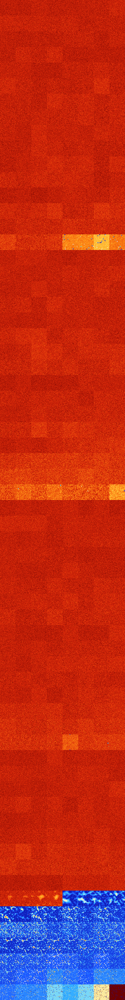

# B025678 (248320-248831)

<details>
    <summary>Initial Grid</summary>
    
</details>


<details>
    <summary>Initial Grid RLE</summary>

```
#C Exported from GoGoL (https://github.com/marrow16/gogol)
#C Wrap mode: Toroidal
#C Boundary mode: Dead
#C Step: 0
x = 100, y = 100, rule = B025678/S
43bo15bo$5bo15bo11bo11bo9bo3bo9bo$19bo13bo31b2o14bo8bo4bo$28bo7bo6bo35b
o$87bo3bo2bo$16bo3bo17bo26bo$o15bo5bo37bo10b2obobo7bo5bo2bo$10b2o23bobo
24bobo7bo8bo3bo$22b2o$bo39bo29bo6bo17bo2bo$21bo12bobobo30bo4bo23bo$4bo
6bo24bo61bo$10bo8bo5bo3bo3bo$6bo6bobo12bo13bo21bo18bo$3bo24bo41bo2bo13b
2o$3bo22bo13bo5bo9bo11bo23bo$8bo36bo4bo21bo3bo$4bo32bo2bo11bo4bo6bo3bo
5bo6bo$29bo6bo7bo16bo9bo5bo$37bo18bo$o9bobo5bo22bo5bo2bo47bo$11bo2bo9bo
21bo9b2o16bo2b2o$o15bo14bo3bo25bo24bo2bo$2bo7bo10bo18bo9bo7bo$3bo39bo3b
o3bo31bo$3bo9bo67bo$12bo12bo4bo14bo31bobo$8bo10bo11bo4bo35bo17bo$49bo
21bo15bo8b2o$3bo15bo11bo14bobo35bo$17b2o47bo3bo18bo$7bo39bo13bo$22bo16b
o2bo$3bo12bo15bo8bobo19bo17bo9bo$4bo34bo12bo$14bo12bobo8bo7bo47b2o2bo$
6bo19bo7bo24bo17bo13bo$30bo36bo13b2o$24bo3bo49bo$27bo39bo$22bo12bo51bo$
18bo8bo5bo9bo10bo38bo$o11bo4bo4bobo35bo$bo34bo6bo9bo13bo$6bo17bo48bo$7b
o2bo54bo12bo8bo5bo$o41bo45bo7bo$32bobo24bobo15bo$3b2o5bo12bo6bo15bo7bo
9bo24bo$obobo20bo31b2o25bo9bo$8bo9bo23bo16bo19bo4bobo9bo$13bo4bo17bo3bo
$14bo9bo22bo24bo$34bo13bo24bo9bo$bo14bo32bo16bo9bo15bo$13bo19bo8bo33bo$
14bo34bo28bo18bo$o10bo11bo6bo33bo21b2o6bo$bo16bo35bo$16bo5bo13bo40bo14b
o$5bo28bo6bobo43bo$8bobo6bo3bo50bo$14bo12bo4bo17bo3bo9bo4bo14bo14bo$4bo
2bo11bo18bo$39bo17bo$6bo5b2o9bo9bo6bo8b2o16bo11bo7bo3bo$26bo19bo32bo4bo
14bo$14bo8bo14bo20bo7bo4bo$48bo30bo3bo$10bo16bob2o5bo6bo$bo2bo5b3o26bo
7bo22bo$bo15bo25bo21bo9bo$14bo14bo2bo31bo11bo$12b2o24b2o5bo7bo$3bo32bo
13bo23bobo14bo$15bo10bo29bo16bo$15bo10bo18bo14bo10bobo7bo5bo$9bo6bo17bo
8bobo16bo11bobo3bo3bo11bo$3bo51bo22bo2bo15bo$24bo13bo29bo2bo14bo3bo$61b
o22bo$16b2obo4bo21bo8bo7bo32bo$7bo6bo3bobo10bo12bo13bo21bo$bo15bo60bo$
35bo24bobo16bo$6bo13bo10bo2bo54bo$38bo13bo7bo3bo16bo9bo$8bo39bo$64bo26b
o$70bo21bo3bo2bo$15bobo16bo11bo12bo6bo$38bo11bo28bo12bo3bo$3bo11b2o4bo
24bo6bo9bo$40bo11bo9bo$11bo14bo70bo$53bo13bo$16bo5bo9b2o31bo$31bo34bo2b
o14bo3bobo$2bo35bo44bobo6bo3b2o$9bo!
```
</details>
<details>
    <summary>Thumbnail</summary>

</details>
<table>
<tr>
    <td><a href="./248320%20S%20Heat%20Map%20Activity.png"></a><br>S (248320)<br>G>1000</td>    <td><a href="./248321%20S0%20Heat%20Map%20Activity.png"></a><br>S0 (248321)<br>G>1000</td>    <td><a href="./248322%20S1%20Heat%20Map%20Activity.png"></a><br>S1 (248322)<br>G>1000</td>    <td><a href="./248323%20S01%20Heat%20Map%20Activity.png"></a><br>S01 (248323)<br>G>1000</td>    <td><a href="./248324%20S2%20Heat%20Map%20Activity.png"></a><br>S2 (248324)<br>G>1000</td>    <td><a href="./248325%20S02%20Heat%20Map%20Activity.png"></a><br>S02 (248325)<br>G>1000</td>    <td><a href="./248326%20S12%20Heat%20Map%20Activity.png"></a><br>S12 (248326)<br>G>1000</td>    <td><a href="./248327%20S012%20Heat%20Map%20Activity.png"></a><br>S012 (248327)<br>G>1000</td></tr>
<tr>
    <td><a href="./248328%20S3%20Heat%20Map%20Activity.png"></a><br>S3 (248328)<br>G>1000</td>    <td><a href="./248329%20S03%20Heat%20Map%20Activity.png"></a><br>S03 (248329)<br>G>1000</td>    <td><a href="./248330%20S13%20Heat%20Map%20Activity.png"></a><br>S13 (248330)<br>G>1000</td>    <td><a href="./248331%20S013%20Heat%20Map%20Activity.png"></a><br>S013 (248331)<br>G>1000</td>    <td><a href="./248332%20S23%20Heat%20Map%20Activity.png"></a><br>S23 (248332)<br>G>1000</td>    <td><a href="./248333%20S023%20Heat%20Map%20Activity.png"></a><br>S023 (248333)<br>G>1000</td>    <td><a href="./248334%20S123%20Heat%20Map%20Activity.png"></a><br>S123 (248334)<br>G>1000</td>    <td><a href="./248335%20S0123%20Heat%20Map%20Activity.png"></a><br>S0123 (248335)<br>G>1000</td></tr>
<tr>
    <td><a href="./248336%20S4%20Heat%20Map%20Activity.png"></a><br>S4 (248336)<br>G>1000</td>    <td><a href="./248337%20S04%20Heat%20Map%20Activity.png"></a><br>S04 (248337)<br>G>1000</td>    <td><a href="./248338%20S14%20Heat%20Map%20Activity.png"></a><br>S14 (248338)<br>G>1000</td>    <td><a href="./248339%20S014%20Heat%20Map%20Activity.png"></a><br>S014 (248339)<br>G>1000</td>    <td><a href="./248340%20S24%20Heat%20Map%20Activity.png"></a><br>S24 (248340)<br>G>1000</td>    <td><a href="./248341%20S024%20Heat%20Map%20Activity.png"></a><br>S024 (248341)<br>G>1000</td>    <td><a href="./248342%20S124%20Heat%20Map%20Activity.png"></a><br>S124 (248342)<br>G>1000</td>    <td><a href="./248343%20S0124%20Heat%20Map%20Activity.png"></a><br>S0124 (248343)<br>G>1000</td></tr>
<tr>
    <td><a href="./248344%20S34%20Heat%20Map%20Activity.png"></a><br>S34 (248344)<br>G>1000</td>    <td><a href="./248345%20S034%20Heat%20Map%20Activity.png"></a><br>S034 (248345)<br>G>1000</td>    <td><a href="./248346%20S134%20Heat%20Map%20Activity.png"></a><br>S134 (248346)<br>G>1000</td>    <td><a href="./248347%20S0134%20Heat%20Map%20Activity.png"></a><br>S0134 (248347)<br>G>1000</td>    <td><a href="./248348%20S234%20Heat%20Map%20Activity.png"></a><br>S234 (248348)<br>G>1000</td>    <td><a href="./248349%20S0234%20Heat%20Map%20Activity.png"></a><br>S0234 (248349)<br>G>1000</td>    <td><a href="./248350%20S1234%20Heat%20Map%20Activity.png"></a><br>S1234 (248350)<br>G>1000</td>    <td><a href="./248351%20S01234%20Heat%20Map%20Activity.png"></a><br>S01234 (248351)<br>G>1000</td></tr>
<tr>
    <td><a href="./248352%20S5%20Heat%20Map%20Activity.png"></a><br>S5 (248352)<br>G>1000</td>    <td><a href="./248353%20S05%20Heat%20Map%20Activity.png"></a><br>S05 (248353)<br>G>1000</td>    <td><a href="./248354%20S15%20Heat%20Map%20Activity.png"></a><br>S15 (248354)<br>G>1000</td>    <td><a href="./248355%20S015%20Heat%20Map%20Activity.png"></a><br>S015 (248355)<br>G>1000</td>    <td><a href="./248356%20S25%20Heat%20Map%20Activity.png"></a><br>S25 (248356)<br>G>1000</td>    <td><a href="./248357%20S025%20Heat%20Map%20Activity.png"></a><br>S025 (248357)<br>G>1000</td>    <td><a href="./248358%20S125%20Heat%20Map%20Activity.png"></a><br>S125 (248358)<br>G>1000</td>    <td><a href="./248359%20S0125%20Heat%20Map%20Activity.png"></a><br>S0125 (248359)<br>G>1000</td></tr>
<tr>
    <td><a href="./248360%20S35%20Heat%20Map%20Activity.png"></a><br>S35 (248360)<br>G>1000</td>    <td><a href="./248361%20S035%20Heat%20Map%20Activity.png"></a><br>S035 (248361)<br>G>1000</td>    <td><a href="./248362%20S135%20Heat%20Map%20Activity.png"></a><br>S135 (248362)<br>G>1000</td>    <td><a href="./248363%20S0135%20Heat%20Map%20Activity.png"></a><br>S0135 (248363)<br>G>1000</td>    <td><a href="./248364%20S235%20Heat%20Map%20Activity.png"></a><br>S235 (248364)<br>G>1000</td>    <td><a href="./248365%20S0235%20Heat%20Map%20Activity.png"></a><br>S0235 (248365)<br>G>1000</td>    <td><a href="./248366%20S1235%20Heat%20Map%20Activity.png"></a><br>S1235 (248366)<br>G>1000</td>    <td><a href="./248367%20S01235%20Heat%20Map%20Activity.png"></a><br>S01235 (248367)<br>G>1000</td></tr>
<tr>
    <td><a href="./248368%20S45%20Heat%20Map%20Activity.png"></a><br>S45 (248368)<br>G>1000</td>    <td><a href="./248369%20S045%20Heat%20Map%20Activity.png"></a><br>S045 (248369)<br>G>1000</td>    <td><a href="./248370%20S145%20Heat%20Map%20Activity.png"></a><br>S145 (248370)<br>G>1000</td>    <td><a href="./248371%20S0145%20Heat%20Map%20Activity.png"></a><br>S0145 (248371)<br>G>1000</td>    <td><a href="./248372%20S245%20Heat%20Map%20Activity.png"></a><br>S245 (248372)<br>G>1000</td>    <td><a href="./248373%20S0245%20Heat%20Map%20Activity.png"></a><br>S0245 (248373)<br>G>1000</td>    <td><a href="./248374%20S1245%20Heat%20Map%20Activity.png"></a><br>S1245 (248374)<br>G>1000</td>    <td><a href="./248375%20S01245%20Heat%20Map%20Activity.png"></a><br>S01245 (248375)<br>G>1000</td></tr>
<tr>
    <td><a href="./248376%20S345%20Heat%20Map%20Activity.png"></a><br>S345 (248376)<br>G>1000</td>    <td><a href="./248377%20S0345%20Heat%20Map%20Activity.png"></a><br>S0345 (248377)<br>G>1000</td>    <td><a href="./248378%20S1345%20Heat%20Map%20Activity.png"></a><br>S1345 (248378)<br>G>1000</td>    <td><a href="./248379%20S01345%20Heat%20Map%20Activity.png"></a><br>S01345 (248379)<br>G>1000</td>    <td><a href="./248380%20S2345%20Heat%20Map%20Activity.png"></a><br>S2345 (248380)<br>G>1000</td>    <td><a href="./248381%20S02345%20Heat%20Map%20Activity.png"></a><br>S02345 (248381)<br>G>1000</td>    <td><a href="./248382%20S12345%20Heat%20Map%20Activity.png"></a><br>S12345 (248382)<br>G>1000</td>    <td><a href="./248383%20S012345%20Heat%20Map%20Activity.png"></a><br>S012345 (248383)<br>G>1000</td></tr>
<tr>
    <td><a href="./248384%20S6%20Heat%20Map%20Activity.png"></a><br>S6 (248384)<br>G>1000</td>    <td><a href="./248385%20S06%20Heat%20Map%20Activity.png"></a><br>S06 (248385)<br>G>1000</td>    <td><a href="./248386%20S16%20Heat%20Map%20Activity.png"></a><br>S16 (248386)<br>G>1000</td>    <td><a href="./248387%20S016%20Heat%20Map%20Activity.png"></a><br>S016 (248387)<br>G>1000</td>    <td><a href="./248388%20S26%20Heat%20Map%20Activity.png"></a><br>S26 (248388)<br>G>1000</td>    <td><a href="./248389%20S026%20Heat%20Map%20Activity.png"></a><br>S026 (248389)<br>G>1000</td>    <td><a href="./248390%20S126%20Heat%20Map%20Activity.png"></a><br>S126 (248390)<br>G>1000</td>    <td><a href="./248391%20S0126%20Heat%20Map%20Activity.png"></a><br>S0126 (248391)<br>G>1000</td></tr>
<tr>
    <td><a href="./248392%20S36%20Heat%20Map%20Activity.png"></a><br>S36 (248392)<br>G>1000</td>    <td><a href="./248393%20S036%20Heat%20Map%20Activity.png"></a><br>S036 (248393)<br>G>1000</td>    <td><a href="./248394%20S136%20Heat%20Map%20Activity.png"></a><br>S136 (248394)<br>G>1000</td>    <td><a href="./248395%20S0136%20Heat%20Map%20Activity.png"></a><br>S0136 (248395)<br>G>1000</td>    <td><a href="./248396%20S236%20Heat%20Map%20Activity.png"></a><br>S236 (248396)<br>G>1000</td>    <td><a href="./248397%20S0236%20Heat%20Map%20Activity.png"></a><br>S0236 (248397)<br>G>1000</td>    <td><a href="./248398%20S1236%20Heat%20Map%20Activity.png"></a><br>S1236 (248398)<br>G>1000</td>    <td><a href="./248399%20S01236%20Heat%20Map%20Activity.png"></a><br>S01236 (248399)<br>G>1000</td></tr>
<tr>
    <td><a href="./248400%20S46%20Heat%20Map%20Activity.png"></a><br>S46 (248400)<br>G>1000</td>    <td><a href="./248401%20S046%20Heat%20Map%20Activity.png"></a><br>S046 (248401)<br>G>1000</td>    <td><a href="./248402%20S146%20Heat%20Map%20Activity.png"></a><br>S146 (248402)<br>G>1000</td>    <td><a href="./248403%20S0146%20Heat%20Map%20Activity.png"></a><br>S0146 (248403)<br>G>1000</td>    <td><a href="./248404%20S246%20Heat%20Map%20Activity.png"></a><br>S246 (248404)<br>G>1000</td>    <td><a href="./248405%20S0246%20Heat%20Map%20Activity.png"></a><br>S0246 (248405)<br>G>1000</td>    <td><a href="./248406%20S1246%20Heat%20Map%20Activity.png"></a><br>S1246 (248406)<br>G>1000</td>    <td><a href="./248407%20S01246%20Heat%20Map%20Activity.png"></a><br>S01246 (248407)<br>G>1000</td></tr>
<tr>
    <td><a href="./248408%20S346%20Heat%20Map%20Activity.png"></a><br>S346 (248408)<br>G>1000</td>    <td><a href="./248409%20S0346%20Heat%20Map%20Activity.png"></a><br>S0346 (248409)<br>G>1000</td>    <td><a href="./248410%20S1346%20Heat%20Map%20Activity.png"></a><br>S1346 (248410)<br>G>1000</td>    <td><a href="./248411%20S01346%20Heat%20Map%20Activity.png"></a><br>S01346 (248411)<br>G>1000</td>    <td><a href="./248412%20S2346%20Heat%20Map%20Activity.png"></a><br>S2346 (248412)<br>G>1000</td>    <td><a href="./248413%20S02346%20Heat%20Map%20Activity.png"></a><br>S02346 (248413)<br>G>1000</td>    <td><a href="./248414%20S12346%20Heat%20Map%20Activity.png"></a><br>S12346 (248414)<br>G>1000</td>    <td><a href="./248415%20S012346%20Heat%20Map%20Activity.png"></a><br>S012346 (248415)<br>G>1000</td></tr>
<tr>
    <td><a href="./248416%20S56%20Heat%20Map%20Activity.png"></a><br>S56 (248416)<br>G>1000</td>    <td><a href="./248417%20S056%20Heat%20Map%20Activity.png"></a><br>S056 (248417)<br>G>1000</td>    <td><a href="./248418%20S156%20Heat%20Map%20Activity.png"></a><br>S156 (248418)<br>G>1000</td>    <td><a href="./248419%20S0156%20Heat%20Map%20Activity.png"></a><br>S0156 (248419)<br>G>1000</td>    <td><a href="./248420%20S256%20Heat%20Map%20Activity.png"></a><br>S256 (248420)<br>G>1000</td>    <td><a href="./248421%20S0256%20Heat%20Map%20Activity.png"></a><br>S0256 (248421)<br>G>1000</td>    <td><a href="./248422%20S1256%20Heat%20Map%20Activity.png"></a><br>S1256 (248422)<br>G>1000</td>    <td><a href="./248423%20S01256%20Heat%20Map%20Activity.png"></a><br>S01256 (248423)<br>G>1000</td></tr>
<tr>
    <td><a href="./248424%20S356%20Heat%20Map%20Activity.png"></a><br>S356 (248424)<br>G>1000</td>    <td><a href="./248425%20S0356%20Heat%20Map%20Activity.png"></a><br>S0356 (248425)<br>G>1000</td>    <td><a href="./248426%20S1356%20Heat%20Map%20Activity.png"></a><br>S1356 (248426)<br>G>1000</td>    <td><a href="./248427%20S01356%20Heat%20Map%20Activity.png"></a><br>S01356 (248427)<br>G>1000</td>    <td><a href="./248428%20S2356%20Heat%20Map%20Activity.png"></a><br>S2356 (248428)<br>G>1000</td>    <td><a href="./248429%20S02356%20Heat%20Map%20Activity.png"></a><br>S02356 (248429)<br>G>1000</td>    <td><a href="./248430%20S12356%20Heat%20Map%20Activity.png"></a><br>S12356 (248430)<br>G>1000</td>    <td><a href="./248431%20S012356%20Heat%20Map%20Activity.png"></a><br>S012356 (248431)<br>G>1000</td></tr>
<tr>
    <td><a href="./248432%20S456%20Heat%20Map%20Activity.png"></a><br>S456 (248432)<br>G>1000</td>    <td><a href="./248433%20S0456%20Heat%20Map%20Activity.png"></a><br>S0456 (248433)<br>G>1000</td>    <td><a href="./248434%20S1456%20Heat%20Map%20Activity.png"></a><br>S1456 (248434)<br>G>1000</td>    <td><a href="./248435%20S01456%20Heat%20Map%20Activity.png"></a><br>S01456 (248435)<br>G>1000</td>    <td><a href="./248436%20S2456%20Heat%20Map%20Activity.png"></a><br>S2456 (248436)<br>G>1000</td>    <td><a href="./248437%20S02456%20Heat%20Map%20Activity.png"></a><br>S02456 (248437)<br>G>1000</td>    <td><a href="./248438%20S12456%20Heat%20Map%20Activity.png"></a><br>S12456 (248438)<br>G>1000</td>    <td><a href="./248439%20S012456%20Heat%20Map%20Activity.png"></a><br>S012456 (248439)<br>G>1000</td></tr>
<tr>
    <td><a href="./248440%20S3456%20Heat%20Map%20Activity.png"></a><br>S3456 (248440)<br>G>1000</td>    <td><a href="./248441%20S03456%20Heat%20Map%20Activity.png"></a><br>S03456 (248441)<br>G>1000</td>    <td><a href="./248442%20S13456%20Heat%20Map%20Activity.png"></a><br>S13456 (248442)<br>G>1000</td>    <td><a href="./248443%20S013456%20Heat%20Map%20Activity.png"></a><br>S013456 (248443)<br>G>1000</td>    <td><a href="./248444%20S23456%20Heat%20Map%20Activity.png"></a><br>S23456 (248444)<br>G>1000</td>    <td><a href="./248445%20S023456%20Heat%20Map%20Activity.png"></a><br>S023456 (248445)<br>G>1000</td>    <td><a href="./248446%20S123456%20Heat%20Map%20Activity.png"></a><br>S123456 (248446)<br>G>1000</td>    <td><a href="./248447%20S0123456%20Heat%20Map%20Activity.png"></a><br>S0123456 (248447)<br>G>1000</td></tr>
<tr>
    <td><a href="./248448%20S7%20Heat%20Map%20Activity.png"></a><br>S7 (248448)<br>G>1000</td>    <td><a href="./248449%20S07%20Heat%20Map%20Activity.png"></a><br>S07 (248449)<br>G>1000</td>    <td><a href="./248450%20S17%20Heat%20Map%20Activity.png"></a><br>S17 (248450)<br>G>1000</td>    <td><a href="./248451%20S017%20Heat%20Map%20Activity.png"></a><br>S017 (248451)<br>G>1000</td>    <td><a href="./248452%20S27%20Heat%20Map%20Activity.png"></a><br>S27 (248452)<br>G>1000</td>    <td><a href="./248453%20S027%20Heat%20Map%20Activity.png"></a><br>S027 (248453)<br>G>1000</td>    <td><a href="./248454%20S127%20Heat%20Map%20Activity.png"></a><br>S127 (248454)<br>G>1000</td>    <td><a href="./248455%20S0127%20Heat%20Map%20Activity.png"></a><br>S0127 (248455)<br>G>1000</td></tr>
<tr>
    <td><a href="./248456%20S37%20Heat%20Map%20Activity.png"></a><br>S37 (248456)<br>G>1000</td>    <td><a href="./248457%20S037%20Heat%20Map%20Activity.png"></a><br>S037 (248457)<br>G>1000</td>    <td><a href="./248458%20S137%20Heat%20Map%20Activity.png"></a><br>S137 (248458)<br>G>1000</td>    <td><a href="./248459%20S0137%20Heat%20Map%20Activity.png"></a><br>S0137 (248459)<br>G>1000</td>    <td><a href="./248460%20S237%20Heat%20Map%20Activity.png"></a><br>S237 (248460)<br>G>1000</td>    <td><a href="./248461%20S0237%20Heat%20Map%20Activity.png"></a><br>S0237 (248461)<br>G>1000</td>    <td><a href="./248462%20S1237%20Heat%20Map%20Activity.png"></a><br>S1237 (248462)<br>G>1000</td>    <td><a href="./248463%20S01237%20Heat%20Map%20Activity.png"></a><br>S01237 (248463)<br>G>1000</td></tr>
<tr>
    <td><a href="./248464%20S47%20Heat%20Map%20Activity.png"></a><br>S47 (248464)<br>G>1000</td>    <td><a href="./248465%20S047%20Heat%20Map%20Activity.png"></a><br>S047 (248465)<br>G>1000</td>    <td><a href="./248466%20S147%20Heat%20Map%20Activity.png"></a><br>S147 (248466)<br>G>1000</td>    <td><a href="./248467%20S0147%20Heat%20Map%20Activity.png"></a><br>S0147 (248467)<br>G>1000</td>    <td><a href="./248468%20S247%20Heat%20Map%20Activity.png"></a><br>S247 (248468)<br>G>1000</td>    <td><a href="./248469%20S0247%20Heat%20Map%20Activity.png"></a><br>S0247 (248469)<br>G>1000</td>    <td><a href="./248470%20S1247%20Heat%20Map%20Activity.png"></a><br>S1247 (248470)<br>G>1000</td>    <td><a href="./248471%20S01247%20Heat%20Map%20Activity.png"></a><br>S01247 (248471)<br>G>1000</td></tr>
<tr>
    <td><a href="./248472%20S347%20Heat%20Map%20Activity.png"></a><br>S347 (248472)<br>G>1000</td>    <td><a href="./248473%20S0347%20Heat%20Map%20Activity.png"></a><br>S0347 (248473)<br>G>1000</td>    <td><a href="./248474%20S1347%20Heat%20Map%20Activity.png"></a><br>S1347 (248474)<br>G>1000</td>    <td><a href="./248475%20S01347%20Heat%20Map%20Activity.png"></a><br>S01347 (248475)<br>G>1000</td>    <td><a href="./248476%20S2347%20Heat%20Map%20Activity.png"></a><br>S2347 (248476)<br>G>1000</td>    <td><a href="./248477%20S02347%20Heat%20Map%20Activity.png"></a><br>S02347 (248477)<br>G>1000</td>    <td><a href="./248478%20S12347%20Heat%20Map%20Activity.png"></a><br>S12347 (248478)<br>G>1000</td>    <td><a href="./248479%20S012347%20Heat%20Map%20Activity.png"></a><br>S012347 (248479)<br>G>1000</td></tr>
<tr>
    <td><a href="./248480%20S57%20Heat%20Map%20Activity.png"></a><br>S57 (248480)<br>G>1000</td>    <td><a href="./248481%20S057%20Heat%20Map%20Activity.png"></a><br>S057 (248481)<br>G>1000</td>    <td><a href="./248482%20S157%20Heat%20Map%20Activity.png"></a><br>S157 (248482)<br>G>1000</td>    <td><a href="./248483%20S0157%20Heat%20Map%20Activity.png"></a><br>S0157 (248483)<br>G>1000</td>    <td><a href="./248484%20S257%20Heat%20Map%20Activity.png"></a><br>S257 (248484)<br>G>1000</td>    <td><a href="./248485%20S0257%20Heat%20Map%20Activity.png"></a><br>S0257 (248485)<br>G>1000</td>    <td><a href="./248486%20S1257%20Heat%20Map%20Activity.png"></a><br>S1257 (248486)<br>G>1000</td>    <td><a href="./248487%20S01257%20Heat%20Map%20Activity.png"></a><br>S01257 (248487)<br>G>1000</td></tr>
<tr>
    <td><a href="./248488%20S357%20Heat%20Map%20Activity.png"></a><br>S357 (248488)<br>G>1000</td>    <td><a href="./248489%20S0357%20Heat%20Map%20Activity.png"></a><br>S0357 (248489)<br>G>1000</td>    <td><a href="./248490%20S1357%20Heat%20Map%20Activity.png"></a><br>S1357 (248490)<br>G>1000</td>    <td><a href="./248491%20S01357%20Heat%20Map%20Activity.png"></a><br>S01357 (248491)<br>G>1000</td>    <td><a href="./248492%20S2357%20Heat%20Map%20Activity.png"></a><br>S2357 (248492)<br>G>1000</td>    <td><a href="./248493%20S02357%20Heat%20Map%20Activity.png"></a><br>S02357 (248493)<br>G>1000</td>    <td><a href="./248494%20S12357%20Heat%20Map%20Activity.png"></a><br>S12357 (248494)<br>G>1000</td>    <td><a href="./248495%20S012357%20Heat%20Map%20Activity.png"></a><br>S012357 (248495)<br>G>1000</td></tr>
<tr>
    <td><a href="./248496%20S457%20Heat%20Map%20Activity.png"></a><br>S457 (248496)<br>G>1000</td>    <td><a href="./248497%20S0457%20Heat%20Map%20Activity.png"></a><br>S0457 (248497)<br>G>1000</td>    <td><a href="./248498%20S1457%20Heat%20Map%20Activity.png"></a><br>S1457 (248498)<br>G>1000</td>    <td><a href="./248499%20S01457%20Heat%20Map%20Activity.png"></a><br>S01457 (248499)<br>G>1000</td>    <td><a href="./248500%20S2457%20Heat%20Map%20Activity.png"></a><br>S2457 (248500)<br>G>1000</td>    <td><a href="./248501%20S02457%20Heat%20Map%20Activity.png"></a><br>S02457 (248501)<br>G>1000</td>    <td><a href="./248502%20S12457%20Heat%20Map%20Activity.png"></a><br>S12457 (248502)<br>G>1000</td>    <td><a href="./248503%20S012457%20Heat%20Map%20Activity.png"></a><br>S012457 (248503)<br>G>1000</td></tr>
<tr>
    <td><a href="./248504%20S3457%20Heat%20Map%20Activity.png"></a><br>S3457 (248504)<br>G>1000</td>    <td><a href="./248505%20S03457%20Heat%20Map%20Activity.png"></a><br>S03457 (248505)<br>G>1000</td>    <td><a href="./248506%20S13457%20Heat%20Map%20Activity.png"></a><br>S13457 (248506)<br>G>1000</td>    <td><a href="./248507%20S013457%20Heat%20Map%20Activity.png"></a><br>S013457 (248507)<br>G>1000</td>    <td><a href="./248508%20S23457%20Heat%20Map%20Activity.png"></a><br>S23457 (248508)<br>G>1000</td>    <td><a href="./248509%20S023457%20Heat%20Map%20Activity.png"></a><br>S023457 (248509)<br>G>1000</td>    <td><a href="./248510%20S123457%20Heat%20Map%20Activity.png"></a><br>S123457 (248510)<br>G>1000</td>    <td><a href="./248511%20S0123457%20Heat%20Map%20Activity.png"></a><br>S0123457 (248511)<br>G>1000</td></tr>
<tr>
    <td><a href="./248512%20S67%20Heat%20Map%20Activity.png"></a><br>S67 (248512)<br>G>1000</td>    <td><a href="./248513%20S067%20Heat%20Map%20Activity.png"></a><br>S067 (248513)<br>G>1000</td>    <td><a href="./248514%20S167%20Heat%20Map%20Activity.png"></a><br>S167 (248514)<br>G>1000</td>    <td><a href="./248515%20S0167%20Heat%20Map%20Activity.png"></a><br>S0167 (248515)<br>G>1000</td>    <td><a href="./248516%20S267%20Heat%20Map%20Activity.png"></a><br>S267 (248516)<br>G>1000</td>    <td><a href="./248517%20S0267%20Heat%20Map%20Activity.png"></a><br>S0267 (248517)<br>G>1000</td>    <td><a href="./248518%20S1267%20Heat%20Map%20Activity.png"></a><br>S1267 (248518)<br>G>1000</td>    <td><a href="./248519%20S01267%20Heat%20Map%20Activity.png"></a><br>S01267 (248519)<br>G>1000</td></tr>
<tr>
    <td><a href="./248520%20S367%20Heat%20Map%20Activity.png"></a><br>S367 (248520)<br>G>1000</td>    <td><a href="./248521%20S0367%20Heat%20Map%20Activity.png"></a><br>S0367 (248521)<br>G>1000</td>    <td><a href="./248522%20S1367%20Heat%20Map%20Activity.png"></a><br>S1367 (248522)<br>G>1000</td>    <td><a href="./248523%20S01367%20Heat%20Map%20Activity.png"></a><br>S01367 (248523)<br>G>1000</td>    <td><a href="./248524%20S2367%20Heat%20Map%20Activity.png"></a><br>S2367 (248524)<br>G>1000</td>    <td><a href="./248525%20S02367%20Heat%20Map%20Activity.png"></a><br>S02367 (248525)<br>G>1000</td>    <td><a href="./248526%20S12367%20Heat%20Map%20Activity.png"></a><br>S12367 (248526)<br>G>1000</td>    <td><a href="./248527%20S012367%20Heat%20Map%20Activity.png"></a><br>S012367 (248527)<br>G>1000</td></tr>
<tr>
    <td><a href="./248528%20S467%20Heat%20Map%20Activity.png"></a><br>S467 (248528)<br>G>1000</td>    <td><a href="./248529%20S0467%20Heat%20Map%20Activity.png"></a><br>S0467 (248529)<br>G>1000</td>    <td><a href="./248530%20S1467%20Heat%20Map%20Activity.png"></a><br>S1467 (248530)<br>G>1000</td>    <td><a href="./248531%20S01467%20Heat%20Map%20Activity.png"></a><br>S01467 (248531)<br>G>1000</td>    <td><a href="./248532%20S2467%20Heat%20Map%20Activity.png"></a><br>S2467 (248532)<br>G>1000</td>    <td><a href="./248533%20S02467%20Heat%20Map%20Activity.png"></a><br>S02467 (248533)<br>G>1000</td>    <td><a href="./248534%20S12467%20Heat%20Map%20Activity.png"></a><br>S12467 (248534)<br>G>1000</td>    <td><a href="./248535%20S012467%20Heat%20Map%20Activity.png"></a><br>S012467 (248535)<br>G>1000</td></tr>
<tr>
    <td><a href="./248536%20S3467%20Heat%20Map%20Activity.png"></a><br>S3467 (248536)<br>G>1000</td>    <td><a href="./248537%20S03467%20Heat%20Map%20Activity.png"></a><br>S03467 (248537)<br>G>1000</td>    <td><a href="./248538%20S13467%20Heat%20Map%20Activity.png"></a><br>S13467 (248538)<br>G>1000</td>    <td><a href="./248539%20S013467%20Heat%20Map%20Activity.png"></a><br>S013467 (248539)<br>G>1000</td>    <td><a href="./248540%20S23467%20Heat%20Map%20Activity.png"></a><br>S23467 (248540)<br>G>1000</td>    <td><a href="./248541%20S023467%20Heat%20Map%20Activity.png"></a><br>S023467 (248541)<br>G>1000</td>    <td><a href="./248542%20S123467%20Heat%20Map%20Activity.png"></a><br>S123467 (248542)<br>G>1000</td>    <td><a href="./248543%20S0123467%20Heat%20Map%20Activity.png"></a><br>S0123467 (248543)<br>G>1000</td></tr>
<tr>
    <td><a href="./248544%20S567%20Heat%20Map%20Activity.png"></a><br>S567 (248544)<br>G>1000</td>    <td><a href="./248545%20S0567%20Heat%20Map%20Activity.png"></a><br>S0567 (248545)<br>G>1000</td>    <td><a href="./248546%20S1567%20Heat%20Map%20Activity.png"></a><br>S1567 (248546)<br>G>1000</td>    <td><a href="./248547%20S01567%20Heat%20Map%20Activity.png"></a><br>S01567 (248547)<br>G>1000</td>    <td><a href="./248548%20S2567%20Heat%20Map%20Activity.png"></a><br>S2567 (248548)<br>G>1000</td>    <td><a href="./248549%20S02567%20Heat%20Map%20Activity.png"></a><br>S02567 (248549)<br>G>1000</td>    <td><a href="./248550%20S12567%20Heat%20Map%20Activity.png"></a><br>S12567 (248550)<br>G>1000</td>    <td><a href="./248551%20S012567%20Heat%20Map%20Activity.png"></a><br>S012567 (248551)<br>G>1000</td></tr>
<tr>
    <td><a href="./248552%20S3567%20Heat%20Map%20Activity.png"></a><br>S3567 (248552)<br>G>1000</td>    <td><a href="./248553%20S03567%20Heat%20Map%20Activity.png"></a><br>S03567 (248553)<br>G>1000</td>    <td><a href="./248554%20S13567%20Heat%20Map%20Activity.png"></a><br>S13567 (248554)<br>G>1000</td>    <td><a href="./248555%20S013567%20Heat%20Map%20Activity.png"></a><br>S013567 (248555)<br>G>1000</td>    <td><a href="./248556%20S23567%20Heat%20Map%20Activity.png"></a><br>S23567 (248556)<br>G>1000</td>    <td><a href="./248557%20S023567%20Heat%20Map%20Activity.png"></a><br>S023567 (248557)<br>G>1000</td>    <td><a href="./248558%20S123567%20Heat%20Map%20Activity.png"></a><br>S123567 (248558)<br>G>1000</td>    <td><a href="./248559%20S0123567%20Heat%20Map%20Activity.png"></a><br>S0123567 (248559)<br>G>1000</td></tr>
<tr>
    <td><a href="./248560%20S4567%20Heat%20Map%20Activity.png"></a><br>S4567 (248560)<br>G>1000</td>    <td><a href="./248561%20S04567%20Heat%20Map%20Activity.png"></a><br>S04567 (248561)<br>G>1000</td>    <td><a href="./248562%20S14567%20Heat%20Map%20Activity.png"></a><br>S14567 (248562)<br>G>1000</td>    <td><a href="./248563%20S014567%20Heat%20Map%20Activity.png"></a><br>S014567 (248563)<br>G>1000</td>    <td><a href="./248564%20S24567%20Heat%20Map%20Activity.png"></a><br>S24567 (248564)<br>G>1000</td>    <td><a href="./248565%20S024567%20Heat%20Map%20Activity.png"></a><br>S024567 (248565)<br>G>1000</td>    <td><a href="./248566%20S124567%20Heat%20Map%20Activity.png"></a><br>S124567 (248566)<br>G>1000</td>    <td><a href="./248567%20S0124567%20Heat%20Map%20Activity.png"></a><br>S0124567 (248567)<br>G>1000</td></tr>
<tr>
    <td><a href="./248568%20S34567%20Heat%20Map%20Activity.png"></a><br>S34567 (248568)<br>G>1000</td>    <td><a href="./248569%20S034567%20Heat%20Map%20Activity.png"></a><br>S034567 (248569)<br>G>1000</td>    <td><a href="./248570%20S134567%20Heat%20Map%20Activity.png"></a><br>S134567 (248570)<br>G>1000</td>    <td><a href="./248571%20S0134567%20Heat%20Map%20Activity.png"></a><br>S0134567 (248571)<br>G>1000</td>    <td><a href="./248572%20S234567%20Heat%20Map%20Activity.png"></a><br>S234567 (248572)<br>G>1000</td>    <td><a href="./248573%20S0234567%20Heat%20Map%20Activity.png"></a><br>S0234567 (248573)<br>G>1000</td>    <td><a href="./248574%20S1234567%20Heat%20Map%20Activity.png"></a><br>S1234567 (248574)<br>G>1000</td>    <td><a href="./248575%20S01234567%20Heat%20Map%20Activity.png"></a><br>S01234567 (248575)<br>G>1000</td></tr>
<tr>
    <td><a href="./248576%20S8%20Heat%20Map%20Activity.png"></a><br>S8 (248576)<br>G>1000</td>    <td><a href="./248577%20S08%20Heat%20Map%20Activity.png"></a><br>S08 (248577)<br>G>1000</td>    <td><a href="./248578%20S18%20Heat%20Map%20Activity.png"></a><br>S18 (248578)<br>G>1000</td>    <td><a href="./248579%20S018%20Heat%20Map%20Activity.png"></a><br>S018 (248579)<br>G>1000</td>    <td><a href="./248580%20S28%20Heat%20Map%20Activity.png"></a><br>S28 (248580)<br>G>1000</td>    <td><a href="./248581%20S028%20Heat%20Map%20Activity.png"></a><br>S028 (248581)<br>G>1000</td>    <td><a href="./248582%20S128%20Heat%20Map%20Activity.png"></a><br>S128 (248582)<br>G>1000</td>    <td><a href="./248583%20S0128%20Heat%20Map%20Activity.png"></a><br>S0128 (248583)<br>G>1000</td></tr>
<tr>
    <td><a href="./248584%20S38%20Heat%20Map%20Activity.png"></a><br>S38 (248584)<br>G>1000</td>    <td><a href="./248585%20S038%20Heat%20Map%20Activity.png"></a><br>S038 (248585)<br>G>1000</td>    <td><a href="./248586%20S138%20Heat%20Map%20Activity.png"></a><br>S138 (248586)<br>G>1000</td>    <td><a href="./248587%20S0138%20Heat%20Map%20Activity.png"></a><br>S0138 (248587)<br>G>1000</td>    <td><a href="./248588%20S238%20Heat%20Map%20Activity.png"></a><br>S238 (248588)<br>G>1000</td>    <td><a href="./248589%20S0238%20Heat%20Map%20Activity.png"></a><br>S0238 (248589)<br>G>1000</td>    <td><a href="./248590%20S1238%20Heat%20Map%20Activity.png"></a><br>S1238 (248590)<br>G>1000</td>    <td><a href="./248591%20S01238%20Heat%20Map%20Activity.png"></a><br>S01238 (248591)<br>G>1000</td></tr>
<tr>
    <td><a href="./248592%20S48%20Heat%20Map%20Activity.png"></a><br>S48 (248592)<br>G>1000</td>    <td><a href="./248593%20S048%20Heat%20Map%20Activity.png"></a><br>S048 (248593)<br>G>1000</td>    <td><a href="./248594%20S148%20Heat%20Map%20Activity.png"></a><br>S148 (248594)<br>G>1000</td>    <td><a href="./248595%20S0148%20Heat%20Map%20Activity.png"></a><br>S0148 (248595)<br>G>1000</td>    <td><a href="./248596%20S248%20Heat%20Map%20Activity.png"></a><br>S248 (248596)<br>G>1000</td>    <td><a href="./248597%20S0248%20Heat%20Map%20Activity.png"></a><br>S0248 (248597)<br>G>1000</td>    <td><a href="./248598%20S1248%20Heat%20Map%20Activity.png"></a><br>S1248 (248598)<br>G>1000</td>    <td><a href="./248599%20S01248%20Heat%20Map%20Activity.png"></a><br>S01248 (248599)<br>G>1000</td></tr>
<tr>
    <td><a href="./248600%20S348%20Heat%20Map%20Activity.png"></a><br>S348 (248600)<br>G>1000</td>    <td><a href="./248601%20S0348%20Heat%20Map%20Activity.png"></a><br>S0348 (248601)<br>G>1000</td>    <td><a href="./248602%20S1348%20Heat%20Map%20Activity.png"></a><br>S1348 (248602)<br>G>1000</td>    <td><a href="./248603%20S01348%20Heat%20Map%20Activity.png"></a><br>S01348 (248603)<br>G>1000</td>    <td><a href="./248604%20S2348%20Heat%20Map%20Activity.png"></a><br>S2348 (248604)<br>G>1000</td>    <td><a href="./248605%20S02348%20Heat%20Map%20Activity.png"></a><br>S02348 (248605)<br>G>1000</td>    <td><a href="./248606%20S12348%20Heat%20Map%20Activity.png"></a><br>S12348 (248606)<br>G>1000</td>    <td><a href="./248607%20S012348%20Heat%20Map%20Activity.png"></a><br>S012348 (248607)<br>G>1000</td></tr>
<tr>
    <td><a href="./248608%20S58%20Heat%20Map%20Activity.png"></a><br>S58 (248608)<br>G>1000</td>    <td><a href="./248609%20S058%20Heat%20Map%20Activity.png"></a><br>S058 (248609)<br>G>1000</td>    <td><a href="./248610%20S158%20Heat%20Map%20Activity.png"></a><br>S158 (248610)<br>G>1000</td>    <td><a href="./248611%20S0158%20Heat%20Map%20Activity.png"></a><br>S0158 (248611)<br>G>1000</td>    <td><a href="./248612%20S258%20Heat%20Map%20Activity.png"></a><br>S258 (248612)<br>G>1000</td>    <td><a href="./248613%20S0258%20Heat%20Map%20Activity.png"></a><br>S0258 (248613)<br>G>1000</td>    <td><a href="./248614%20S1258%20Heat%20Map%20Activity.png"></a><br>S1258 (248614)<br>G>1000</td>    <td><a href="./248615%20S01258%20Heat%20Map%20Activity.png"></a><br>S01258 (248615)<br>G>1000</td></tr>
<tr>
    <td><a href="./248616%20S358%20Heat%20Map%20Activity.png"></a><br>S358 (248616)<br>G>1000</td>    <td><a href="./248617%20S0358%20Heat%20Map%20Activity.png"></a><br>S0358 (248617)<br>G>1000</td>    <td><a href="./248618%20S1358%20Heat%20Map%20Activity.png"></a><br>S1358 (248618)<br>G>1000</td>    <td><a href="./248619%20S01358%20Heat%20Map%20Activity.png"></a><br>S01358 (248619)<br>G>1000</td>    <td><a href="./248620%20S2358%20Heat%20Map%20Activity.png"></a><br>S2358 (248620)<br>G>1000</td>    <td><a href="./248621%20S02358%20Heat%20Map%20Activity.png"></a><br>S02358 (248621)<br>G>1000</td>    <td><a href="./248622%20S12358%20Heat%20Map%20Activity.png"></a><br>S12358 (248622)<br>G>1000</td>    <td><a href="./248623%20S012358%20Heat%20Map%20Activity.png"></a><br>S012358 (248623)<br>G>1000</td></tr>
<tr>
    <td><a href="./248624%20S458%20Heat%20Map%20Activity.png"></a><br>S458 (248624)<br>G>1000</td>    <td><a href="./248625%20S0458%20Heat%20Map%20Activity.png"></a><br>S0458 (248625)<br>G>1000</td>    <td><a href="./248626%20S1458%20Heat%20Map%20Activity.png"></a><br>S1458 (248626)<br>G>1000</td>    <td><a href="./248627%20S01458%20Heat%20Map%20Activity.png"></a><br>S01458 (248627)<br>G>1000</td>    <td><a href="./248628%20S2458%20Heat%20Map%20Activity.png"></a><br>S2458 (248628)<br>G>1000</td>    <td><a href="./248629%20S02458%20Heat%20Map%20Activity.png"></a><br>S02458 (248629)<br>G>1000</td>    <td><a href="./248630%20S12458%20Heat%20Map%20Activity.png"></a><br>S12458 (248630)<br>G>1000</td>    <td><a href="./248631%20S012458%20Heat%20Map%20Activity.png"></a><br>S012458 (248631)<br>G>1000</td></tr>
<tr>
    <td><a href="./248632%20S3458%20Heat%20Map%20Activity.png"></a><br>S3458 (248632)<br>G>1000</td>    <td><a href="./248633%20S03458%20Heat%20Map%20Activity.png"></a><br>S03458 (248633)<br>G>1000</td>    <td><a href="./248634%20S13458%20Heat%20Map%20Activity.png"></a><br>S13458 (248634)<br>G>1000</td>    <td><a href="./248635%20S013458%20Heat%20Map%20Activity.png"></a><br>S013458 (248635)<br>G>1000</td>    <td><a href="./248636%20S23458%20Heat%20Map%20Activity.png"></a><br>S23458 (248636)<br>G>1000</td>    <td><a href="./248637%20S023458%20Heat%20Map%20Activity.png"></a><br>S023458 (248637)<br>G>1000</td>    <td><a href="./248638%20S123458%20Heat%20Map%20Activity.png"></a><br>S123458 (248638)<br>G>1000</td>    <td><a href="./248639%20S0123458%20Heat%20Map%20Activity.png"></a><br>S0123458 (248639)<br>G>1000</td></tr>
<tr>
    <td><a href="./248640%20S68%20Heat%20Map%20Activity.png"></a><br>S68 (248640)<br>G>1000</td>    <td><a href="./248641%20S068%20Heat%20Map%20Activity.png"></a><br>S068 (248641)<br>G>1000</td>    <td><a href="./248642%20S168%20Heat%20Map%20Activity.png"></a><br>S168 (248642)<br>G>1000</td>    <td><a href="./248643%20S0168%20Heat%20Map%20Activity.png"></a><br>S0168 (248643)<br>G>1000</td>    <td><a href="./248644%20S268%20Heat%20Map%20Activity.png"></a><br>S268 (248644)<br>G>1000</td>    <td><a href="./248645%20S0268%20Heat%20Map%20Activity.png"></a><br>S0268 (248645)<br>G>1000</td>    <td><a href="./248646%20S1268%20Heat%20Map%20Activity.png"></a><br>S1268 (248646)<br>G>1000</td>    <td><a href="./248647%20S01268%20Heat%20Map%20Activity.png"></a><br>S01268 (248647)<br>G>1000</td></tr>
<tr>
    <td><a href="./248648%20S368%20Heat%20Map%20Activity.png"></a><br>S368 (248648)<br>G>1000</td>    <td><a href="./248649%20S0368%20Heat%20Map%20Activity.png"></a><br>S0368 (248649)<br>G>1000</td>    <td><a href="./248650%20S1368%20Heat%20Map%20Activity.png"></a><br>S1368 (248650)<br>G>1000</td>    <td><a href="./248651%20S01368%20Heat%20Map%20Activity.png"></a><br>S01368 (248651)<br>G>1000</td>    <td><a href="./248652%20S2368%20Heat%20Map%20Activity.png"></a><br>S2368 (248652)<br>G>1000</td>    <td><a href="./248653%20S02368%20Heat%20Map%20Activity.png"></a><br>S02368 (248653)<br>G>1000</td>    <td><a href="./248654%20S12368%20Heat%20Map%20Activity.png"></a><br>S12368 (248654)<br>G>1000</td>    <td><a href="./248655%20S012368%20Heat%20Map%20Activity.png"></a><br>S012368 (248655)<br>G>1000</td></tr>
<tr>
    <td><a href="./248656%20S468%20Heat%20Map%20Activity.png"></a><br>S468 (248656)<br>G>1000</td>    <td><a href="./248657%20S0468%20Heat%20Map%20Activity.png"></a><br>S0468 (248657)<br>G>1000</td>    <td><a href="./248658%20S1468%20Heat%20Map%20Activity.png"></a><br>S1468 (248658)<br>G>1000</td>    <td><a href="./248659%20S01468%20Heat%20Map%20Activity.png"></a><br>S01468 (248659)<br>G>1000</td>    <td><a href="./248660%20S2468%20Heat%20Map%20Activity.png"></a><br>S2468 (248660)<br>G>1000</td>    <td><a href="./248661%20S02468%20Heat%20Map%20Activity.png"></a><br>S02468 (248661)<br>G>1000</td>    <td><a href="./248662%20S12468%20Heat%20Map%20Activity.png"></a><br>S12468 (248662)<br>G>1000</td>    <td><a href="./248663%20S012468%20Heat%20Map%20Activity.png"></a><br>S012468 (248663)<br>G>1000</td></tr>
<tr>
    <td><a href="./248664%20S3468%20Heat%20Map%20Activity.png"></a><br>S3468 (248664)<br>G>1000</td>    <td><a href="./248665%20S03468%20Heat%20Map%20Activity.png"></a><br>S03468 (248665)<br>G>1000</td>    <td><a href="./248666%20S13468%20Heat%20Map%20Activity.png"></a><br>S13468 (248666)<br>G>1000</td>    <td><a href="./248667%20S013468%20Heat%20Map%20Activity.png"></a><br>S013468 (248667)<br>G>1000</td>    <td><a href="./248668%20S23468%20Heat%20Map%20Activity.png"></a><br>S23468 (248668)<br>G>1000</td>    <td><a href="./248669%20S023468%20Heat%20Map%20Activity.png"></a><br>S023468 (248669)<br>G>1000</td>    <td><a href="./248670%20S123468%20Heat%20Map%20Activity.png"></a><br>S123468 (248670)<br>G>1000</td>    <td><a href="./248671%20S0123468%20Heat%20Map%20Activity.png"></a><br>S0123468 (248671)<br>G>1000</td></tr>
<tr>
    <td><a href="./248672%20S568%20Heat%20Map%20Activity.png"></a><br>S568 (248672)<br>G>1000</td>    <td><a href="./248673%20S0568%20Heat%20Map%20Activity.png"></a><br>S0568 (248673)<br>G>1000</td>    <td><a href="./248674%20S1568%20Heat%20Map%20Activity.png"></a><br>S1568 (248674)<br>G>1000</td>    <td><a href="./248675%20S01568%20Heat%20Map%20Activity.png"></a><br>S01568 (248675)<br>G>1000</td>    <td><a href="./248676%20S2568%20Heat%20Map%20Activity.png"></a><br>S2568 (248676)<br>G>1000</td>    <td><a href="./248677%20S02568%20Heat%20Map%20Activity.png"></a><br>S02568 (248677)<br>G>1000</td>    <td><a href="./248678%20S12568%20Heat%20Map%20Activity.png"></a><br>S12568 (248678)<br>G>1000</td>    <td><a href="./248679%20S012568%20Heat%20Map%20Activity.png"></a><br>S012568 (248679)<br>G>1000</td></tr>
<tr>
    <td><a href="./248680%20S3568%20Heat%20Map%20Activity.png"></a><br>S3568 (248680)<br>G>1000</td>    <td><a href="./248681%20S03568%20Heat%20Map%20Activity.png"></a><br>S03568 (248681)<br>G>1000</td>    <td><a href="./248682%20S13568%20Heat%20Map%20Activity.png"></a><br>S13568 (248682)<br>G>1000</td>    <td><a href="./248683%20S013568%20Heat%20Map%20Activity.png"></a><br>S013568 (248683)<br>G>1000</td>    <td><a href="./248684%20S23568%20Heat%20Map%20Activity.png"></a><br>S23568 (248684)<br>G>1000</td>    <td><a href="./248685%20S023568%20Heat%20Map%20Activity.png"></a><br>S023568 (248685)<br>G>1000</td>    <td><a href="./248686%20S123568%20Heat%20Map%20Activity.png"></a><br>S123568 (248686)<br>G>1000</td>    <td><a href="./248687%20S0123568%20Heat%20Map%20Activity.png"></a><br>S0123568 (248687)<br>G>1000</td></tr>
<tr>
    <td><a href="./248688%20S4568%20Heat%20Map%20Activity.png"></a><br>S4568 (248688)<br>G>1000</td>    <td><a href="./248689%20S04568%20Heat%20Map%20Activity.png"></a><br>S04568 (248689)<br>G>1000</td>    <td><a href="./248690%20S14568%20Heat%20Map%20Activity.png"></a><br>S14568 (248690)<br>G>1000</td>    <td><a href="./248691%20S014568%20Heat%20Map%20Activity.png"></a><br>S014568 (248691)<br>G>1000</td>    <td><a href="./248692%20S24568%20Heat%20Map%20Activity.png"></a><br>S24568 (248692)<br>G>1000</td>    <td><a href="./248693%20S024568%20Heat%20Map%20Activity.png"></a><br>S024568 (248693)<br>G>1000</td>    <td><a href="./248694%20S124568%20Heat%20Map%20Activity.png"></a><br>S124568 (248694)<br>G>1000</td>    <td><a href="./248695%20S0124568%20Heat%20Map%20Activity.png"></a><br>S0124568 (248695)<br>G>1000</td></tr>
<tr>
    <td><a href="./248696%20S34568%20Heat%20Map%20Activity.png"></a><br>S34568 (248696)<br>G>1000</td>    <td><a href="./248697%20S034568%20Heat%20Map%20Activity.png"></a><br>S034568 (248697)<br>G>1000</td>    <td><a href="./248698%20S134568%20Heat%20Map%20Activity.png"></a><br>S134568 (248698)<br>G>1000</td>    <td><a href="./248699%20S0134568%20Heat%20Map%20Activity.png"></a><br>S0134568 (248699)<br>G>1000</td>    <td><a href="./248700%20S234568%20Heat%20Map%20Activity.png"></a><br>S234568 (248700)<br>G>1000</td>    <td><a href="./248701%20S0234568%20Heat%20Map%20Activity.png"></a><br>S0234568 (248701)<br>G>1000</td>    <td><a href="./248702%20S1234568%20Heat%20Map%20Activity.png"></a><br>S1234568 (248702)<br>G>1000</td>    <td><a href="./248703%20S01234568%20Heat%20Map%20Activity.png"></a><br>S01234568 (248703)<br>G>1000</td></tr>
<tr>
    <td><a href="./248704%20S78%20Heat%20Map%20Activity.png"></a><br>S78 (248704)<br>G>1000</td>    <td><a href="./248705%20S078%20Heat%20Map%20Activity.png"></a><br>S078 (248705)<br>G>1000</td>    <td><a href="./248706%20S178%20Heat%20Map%20Activity.png"></a><br>S178 (248706)<br>G>1000</td>    <td><a href="./248707%20S0178%20Heat%20Map%20Activity.png"></a><br>S0178 (248707)<br>G>1000</td>    <td><a href="./248708%20S278%20Heat%20Map%20Activity.png"></a><br>S278 (248708)<br>G>1000</td>    <td><a href="./248709%20S0278%20Heat%20Map%20Activity.png"></a><br>S0278 (248709)<br>G>1000</td>    <td><a href="./248710%20S1278%20Heat%20Map%20Activity.png"></a><br>S1278 (248710)<br>G>1000</td>    <td><a href="./248711%20S01278%20Heat%20Map%20Activity.png"></a><br>S01278 (248711)<br>G>1000</td></tr>
<tr>
    <td><a href="./248712%20S378%20Heat%20Map%20Activity.png"></a><br>S378 (248712)<br>G>1000</td>    <td><a href="./248713%20S0378%20Heat%20Map%20Activity.png"></a><br>S0378 (248713)<br>G>1000</td>    <td><a href="./248714%20S1378%20Heat%20Map%20Activity.png"></a><br>S1378 (248714)<br>G>1000</td>    <td><a href="./248715%20S01378%20Heat%20Map%20Activity.png"></a><br>S01378 (248715)<br>G>1000</td>    <td><a href="./248716%20S2378%20Heat%20Map%20Activity.png"></a><br>S2378 (248716)<br>G>1000</td>    <td><a href="./248717%20S02378%20Heat%20Map%20Activity.png"></a><br>S02378 (248717)<br>G>1000</td>    <td><a href="./248718%20S12378%20Heat%20Map%20Activity.png"></a><br>S12378 (248718)<br>G>1000</td>    <td><a href="./248719%20S012378%20Heat%20Map%20Activity.png"></a><br>S012378 (248719)<br>G>1000</td></tr>
<tr>
    <td><a href="./248720%20S478%20Heat%20Map%20Activity.png"></a><br>S478 (248720)<br>G>1000</td>    <td><a href="./248721%20S0478%20Heat%20Map%20Activity.png"></a><br>S0478 (248721)<br>G>1000</td>    <td><a href="./248722%20S1478%20Heat%20Map%20Activity.png"></a><br>S1478 (248722)<br>G>1000</td>    <td><a href="./248723%20S01478%20Heat%20Map%20Activity.png"></a><br>S01478 (248723)<br>G>1000</td>    <td><a href="./248724%20S2478%20Heat%20Map%20Activity.png"></a><br>S2478 (248724)<br>G>1000</td>    <td><a href="./248725%20S02478%20Heat%20Map%20Activity.png"></a><br>S02478 (248725)<br>G>1000</td>    <td><a href="./248726%20S12478%20Heat%20Map%20Activity.png"></a><br>S12478 (248726)<br>G>1000</td>    <td><a href="./248727%20S012478%20Heat%20Map%20Activity.png"></a><br>S012478 (248727)<br>G>1000</td></tr>
<tr>
    <td><a href="./248728%20S3478%20Heat%20Map%20Activity.png"></a><br>S3478 (248728)<br>G>1000</td>    <td><a href="./248729%20S03478%20Heat%20Map%20Activity.png"></a><br>S03478 (248729)<br>G>1000</td>    <td><a href="./248730%20S13478%20Heat%20Map%20Activity.png"></a><br>S13478 (248730)<br>G>1000</td>    <td><a href="./248731%20S013478%20Heat%20Map%20Activity.png"></a><br>S013478 (248731)<br>G>1000</td>    <td><a href="./248732%20S23478%20Heat%20Map%20Activity.png"></a><br>S23478 (248732)<br>G>1000</td>    <td><a href="./248733%20S023478%20Heat%20Map%20Activity.png"></a><br>S023478 (248733)<br>G>1000</td>    <td><a href="./248734%20S123478%20Heat%20Map%20Activity.png"></a><br>S123478 (248734)<br>G>1000</td>    <td><a href="./248735%20S0123478%20Heat%20Map%20Activity.png"></a><br>S0123478 (248735)<br>G>1000</td></tr>
<tr>
    <td><a href="./248736%20S578%20Heat%20Map%20Activity.png"></a><br>S578 (248736)<br>G>1000</td>    <td><a href="./248737%20S0578%20Heat%20Map%20Activity.png"></a><br>S0578 (248737)<br>G>1000</td>    <td><a href="./248738%20S1578%20Heat%20Map%20Activity.png"></a><br>S1578 (248738)<br>G>1000</td>    <td><a href="./248739%20S01578%20Heat%20Map%20Activity.png"></a><br>S01578 (248739)<br>G>1000</td>    <td><a href="./248740%20S2578%20Heat%20Map%20Activity.png"></a><br>S2578 (248740)<br>G>1000</td>    <td><a href="./248741%20S02578%20Heat%20Map%20Activity.png"></a><br>S02578 (248741)<br>G>1000</td>    <td><a href="./248742%20S12578%20Heat%20Map%20Activity.png"></a><br>S12578 (248742)<br>G>1000</td>    <td><a href="./248743%20S012578%20Heat%20Map%20Activity.png"></a><br>S012578 (248743)<br>G>1000</td></tr>
<tr>
    <td><a href="./248744%20S3578%20Heat%20Map%20Activity.png"></a><br>S3578 (248744)<br>G>1000</td>    <td><a href="./248745%20S03578%20Heat%20Map%20Activity.png"></a><br>S03578 (248745)<br>G>1000</td>    <td><a href="./248746%20S13578%20Heat%20Map%20Activity.png"></a><br>S13578 (248746)<br>G>1000</td>    <td><a href="./248747%20S013578%20Heat%20Map%20Activity.png"></a><br>S013578 (248747)<br>G>1000</td>    <td><a href="./248748%20S23578%20Heat%20Map%20Activity.png"></a><br>S23578 (248748)<br>G>1000</td>    <td><a href="./248749%20S023578%20Heat%20Map%20Activity.png"></a><br>S023578 (248749)<br>G>1000</td>    <td><a href="./248750%20S123578%20Heat%20Map%20Activity.png"></a><br>S123578 (248750)<br>G>1000</td>    <td><a href="./248751%20S0123578%20Heat%20Map%20Activity.png"></a><br>S0123578 (248751)<br>G>1000</td></tr>
<tr>
    <td><a href="./248752%20S4578%20Heat%20Map%20Activity.png"></a><br>S4578 (248752)<br>G>1000</td>    <td><a href="./248753%20S04578%20Heat%20Map%20Activity.png"></a><br>S04578 (248753)<br>G>1000</td>    <td><a href="./248754%20S14578%20Heat%20Map%20Activity.png"></a><br>S14578 (248754)<br>G>1000</td>    <td><a href="./248755%20S014578%20Heat%20Map%20Activity.png"></a><br>S014578 (248755)<br>G>1000</td>    <td><a href="./248756%20S24578%20Heat%20Map%20Activity.png"></a><br>S24578 (248756)<br>G>1000</td>    <td><a href="./248757%20S024578%20Heat%20Map%20Activity.png"></a><br>S024578 (248757)<br>G>1000</td>    <td><a href="./248758%20S124578%20Heat%20Map%20Activity.png"></a><br>S124578 (248758)<br>G>1000</td>    <td><a href="./248759%20S0124578%20Heat%20Map%20Activity.png"></a><br>S0124578 (248759)<br>G>1000</td></tr>
<tr>
    <td><a href="./248760%20S34578%20Heat%20Map%20Activity.png"></a><br>S34578 (248760)<br>G>1000</td>    <td><a href="./248761%20S034578%20Heat%20Map%20Activity.png"></a><br>S034578 (248761)<br>G>1000</td>    <td><a href="./248762%20S134578%20Heat%20Map%20Activity.png"></a><br>S134578 (248762)<br>G>1000</td>    <td><a href="./248763%20S0134578%20Heat%20Map%20Activity.png"></a><br>S0134578 (248763)<br>G>1000</td>    <td><a href="./248764%20S234578%20Heat%20Map%20Activity.png"></a><br>S234578 (248764)<br>G>1000</td>    <td><a href="./248765%20S0234578%20Heat%20Map%20Activity.png"></a><br>S0234578 (248765)<br>G>1000</td>    <td><a href="./248766%20S1234578%20Heat%20Map%20Activity.png"></a><br>S1234578 (248766)<br>G>1000</td>    <td><a href="./248767%20S01234578%20Heat%20Map%20Activity.png"></a><br>S01234578 (248767)<br>G>1000</td></tr>
<tr>
    <td><a href="./248768%20S678%20Heat%20Map%20Activity.png"></a><br>S678 (248768)<br>G>1000</td>    <td><a href="./248769%20S0678%20Heat%20Map%20Activity.png"></a><br>S0678 (248769)<br>G>1000</td>    <td><a href="./248770%20S1678%20Heat%20Map%20Activity.png"></a><br>S1678 (248770)<br>G>1000</td>    <td><a href="./248771%20S01678%20Heat%20Map%20Activity.png"></a><br>S01678 (248771)<br>G>1000</td>    <td><a href="./248772%20S2678%20Heat%20Map%20Activity.png"></a><br>S2678 (248772)<br>G>1000</td>    <td><a href="./248773%20S02678%20Heat%20Map%20Activity.png"></a><br>S02678 (248773)<br>G>1000</td>    <td><a href="./248774%20S12678%20Heat%20Map%20Activity.png"></a><br>S12678 (248774)<br>G>1000</td>    <td><a href="./248775%20S012678%20Heat%20Map%20Activity.png"></a><br>S012678 (248775)<br>G>1000</td></tr>
<tr>
    <td><a href="./248776%20S3678%20Heat%20Map%20Activity.png"></a><br>S3678 (248776)<br>G>1000</td>    <td><a href="./248777%20S03678%20Heat%20Map%20Activity.png"></a><br>S03678 (248777)<br>G>1000</td>    <td><a href="./248778%20S13678%20Heat%20Map%20Activity.png"></a><br>S13678 (248778)<br>G>1000</td>    <td><a href="./248779%20S013678%20Heat%20Map%20Activity.png"></a><br>S013678 (248779)<br>G>1000</td>    <td><a href="./248780%20S23678%20Heat%20Map%20Activity.png"></a><br>S23678 (248780)<br>R@259,p2</td>    <td><a href="./248781%20S023678%20Heat%20Map%20Activity.png"></a><br>S023678 (248781)<br>R@162,p2</td>    <td><a href="./248782%20S123678%20Heat%20Map%20Activity.png"></a><br>S123678 (248782)<br>R@115,p2</td>    <td><a href="./248783%20S0123678%20Heat%20Map%20Activity.png"></a><br>S0123678 (248783)<br>R@111,p2</td></tr>
<tr>
    <td><a href="./248784%20S4678%20Heat%20Map%20Activity.png"></a><br>S4678 (248784)<br>S@84</td>    <td><a href="./248785%20S04678%20Heat%20Map%20Activity.png"></a><br>S04678 (248785)<br>R@82,p2</td>    <td><a href="./248786%20S14678%20Heat%20Map%20Activity.png"></a><br>S14678 (248786)<br>S@37</td>    <td><a href="./248787%20S014678%20Heat%20Map%20Activity.png"></a><br>S014678 (248787)<br>R@35,p2</td>    <td><a href="./248788%20S24678%20Heat%20Map%20Activity.png"></a><br>S24678 (248788)<br>S@25</td>    <td><a href="./248789%20S024678%20Heat%20Map%20Activity.png"></a><br>S024678 (248789)<br>R@29,p2</td>    <td><a href="./248790%20S124678%20Heat%20Map%20Activity.png"></a><br>S124678 (248790)<br>S@25</td>    <td><a href="./248791%20S0124678%20Heat%20Map%20Activity.png"></a><br>S0124678 (248791)<br>R@24,p2</td></tr>
<tr>
    <td><a href="./248792%20S34678%20Heat%20Map%20Activity.png"></a><br>S34678 (248792)<br>S@15</td>    <td><a href="./248793%20S034678%20Heat%20Map%20Activity.png"></a><br>S034678 (248793)<br>S@17</td>    <td><a href="./248794%20S134678%20Heat%20Map%20Activity.png"></a><br>S134678 (248794)<br>S@14</td>    <td><a href="./248795%20S0134678%20Heat%20Map%20Activity.png"></a><br>S0134678 (248795)<br>R@16,p2</td>    <td><a href="./248796%20S234678%20Heat%20Map%20Activity.png"></a><br>S234678 (248796)<br>S@13</td>    <td><a href="./248797%20S0234678%20Heat%20Map%20Activity.png"></a><br>S0234678 (248797)<br>R@15,p2</td>    <td><a href="./248798%20S1234678%20Heat%20Map%20Activity.png"></a><br>S1234678 (248798)<br>S@13</td>    <td><a href="./248799%20S01234678%20Heat%20Map%20Activity.png"></a><br>S01234678 (248799)<br>S@11</td></tr>
<tr>
    <td><a href="./248800%20S5678%20Heat%20Map%20Activity.png"></a><br>S5678 (248800)<br>S@37</td>    <td><a href="./248801%20S05678%20Heat%20Map%20Activity.png"></a><br>S05678 (248801)<br>S@27</td>    <td><a href="./248802%20S15678%20Heat%20Map%20Activity.png"></a><br>S15678 (248802)<br>S@27</td>    <td><a href="./248803%20S015678%20Heat%20Map%20Activity.png"></a><br>S015678 (248803)<br>S@19</td>    <td><a href="./248804%20S25678%20Heat%20Map%20Activity.png"></a><br>S25678 (248804)<br>S@20</td>    <td><a href="./248805%20S025678%20Heat%20Map%20Activity.png"></a><br>S025678 (248805)<br>S@17</td>    <td><a href="./248806%20S125678%20Heat%20Map%20Activity.png"></a><br>S125678 (248806)<br>S@15</td>    <td><a href="./248807%20S0125678%20Heat%20Map%20Activity.png"></a><br>S0125678 (248807)<br>S@13</td></tr>
<tr>
    <td><a href="./248808%20S35678%20Heat%20Map%20Activity.png"></a><br>S35678 (248808)<br>S@13</td>    <td><a href="./248809%20S035678%20Heat%20Map%20Activity.png"></a><br>S035678 (248809)<br>S@11</td>    <td><a href="./248810%20S135678%20Heat%20Map%20Activity.png"></a><br>S135678 (248810)<br>S@11</td>    <td><a href="./248811%20S0135678%20Heat%20Map%20Activity.png"></a><br>S0135678 (248811)<br>S@9</td>    <td><a href="./248812%20S235678%20Heat%20Map%20Activity.png"></a><br>S235678 (248812)<br>S@11</td>    <td><a href="./248813%20S0235678%20Heat%20Map%20Activity.png"></a><br>S0235678 (248813)<br>R@12,p2</td>    <td><a href="./248814%20S1235678%20Heat%20Map%20Activity.png"></a><br>S1235678 (248814)<br>S@9</td>    <td><a href="./248815%20S01235678%20Heat%20Map%20Activity.png"></a><br>S01235678 (248815)<br>R@11,p2</td></tr>
<tr>
    <td><a href="./248816%20S45678%20Heat%20Map%20Activity.png"></a><br>S45678 (248816)<br>S@12</td>    <td><a href="./248817%20S045678%20Heat%20Map%20Activity.png"></a><br>S045678 (248817)<br>S@9</td>    <td><a href="./248818%20S145678%20Heat%20Map%20Activity.png"></a><br>S145678 (248818)<br>S@10</td>    <td><a href="./248819%20S0145678%20Heat%20Map%20Activity.png"></a><br>S0145678 (248819)<br>S@10</td>    <td><a href="./248820%20S245678%20Heat%20Map%20Activity.png"></a><br>S245678 (248820)<br>S@9</td>    <td><a href="./248821%20S0245678%20Heat%20Map%20Activity.png"></a><br>S0245678 (248821)<br>S@10</td>    <td><a href="./248822%20S1245678%20Heat%20Map%20Activity.png"></a><br>S1245678 (248822)<br>S@7</td>    <td><a href="./248823%20S01245678%20Heat%20Map%20Activity.png"></a><br>S01245678 (248823)<br>S@7</td></tr>
<tr>
    <td><a href="./248824%20S345678%20Heat%20Map%20Activity.png"></a><br>S345678 (248824)<br>S@7</td>    <td><a href="./248825%20S0345678%20Heat%20Map%20Activity.png"></a><br>S0345678 (248825)<br>S@7</td>    <td><a href="./248826%20S1345678%20Heat%20Map%20Activity.png"></a><br>S1345678 (248826)<br>S@6</td>    <td><a href="./248827%20S01345678%20Heat%20Map%20Activity.png"></a><br>S01345678 (248827)<br>S@7</td>    <td><a href="./248828%20S2345678%20Heat%20Map%20Activity.png"></a><br>S2345678 (248828)<br>S@6</td>    <td><a href="./248829%20S02345678%20Heat%20Map%20Activity.png"></a><br>S02345678 (248829)<br>S@8</td>    <td><a href="./248830%20S12345678%20Heat%20Map%20Activity.png"></a><br>S12345678 (248830)<br>S@5</td>    <td><a href="./248831%20S012345678%20Heat%20Map%20Activity.png"></a><br>S012345678 (248831)<br>S@5</td></tr>
</table>
