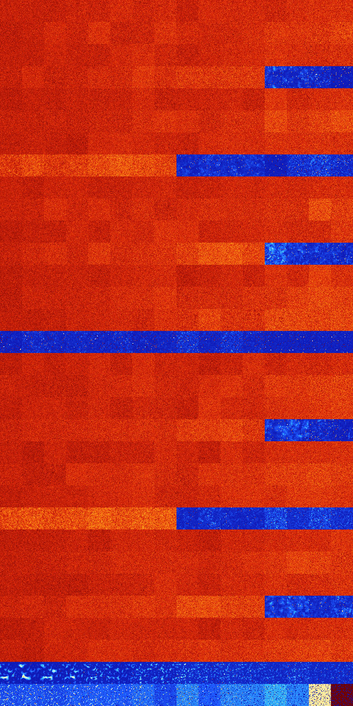

# B0258 (150016-150527)

<details>
    <summary>Initial Grid</summary>
    
</details>


<details>
    <summary>Initial Grid RLE</summary>

```
#C Exported from GoGoL (https://github.com/marrow16/gogol)
#C Wrap mode: Toroidal
#C Boundary mode: Dead
#C Step: 0
x = 100, y = 100, rule = B0258/S
53bo12bo21bo$5b2o17bo15bo12bo11bo$9bo5bo15bo62bo2b2o$15bo29bo18bo10bo$
100b$94bo$39b3o46bo$10bo9bo$41bobo12bo$76bo10bo$3bo7bo3bo21bo27bo2bo13b
o16bo$13bo4b3o11bo7bo48bo5bo$18bo49bo16bo12bo$5bo3bobo8bo14bo43bo$48bo
33bo$17bo20bo15b2o14b2o17bo5bo$bo35bo10bo40b2o4bo$39bo24bo4bo$10bo7bo
22bo29bo12bo2b2o$6bo19bo4bo18bo22bo17bobo$61bo13bo$o34bo11bo$51bo43bo2b
o$2bobo2bo4bo18bo28bo7bobo12bo$o6bo$55bo19bo$74b2o23bo$4bo25bo44bo19bo$
30bo6bo34bo$22bo6bo3bo8bo13bo22bo3bo6bo4bo$33bo22bo$4bo14bo9bo11bo25b2o
8bo$20bo49bo15bo3bo$38bobo4bo14bo17bo$18bo4bo22bo11bo23bo$o18bo7bobo36b
o$22bo34bo9bo4bo$5bo10bo11bo9bo7bo$11bo14bo8bo18bo19bo12bo$34bo16bo44bo
$12bo36b2o5bo19b2o9bo$2bo7bo8bo7bo23bo25bo10bo9bo$3bo29bo3bo17bo14bo$o
26bo18bo5bobo17bo11bo$12bo19bo3bo$40bo16bo12bo$19bo2bo4bo39bo26bo$20bo
25bo6bo23bo2bo12bo3b2o$39bo16bo27bo2bo$7b2o8bo25bo20bo$2bo9bo12bo$43bo
10bo7bo25bo10bo$bo15bo24bo19bo35bo$4bo13bo55bo17b2o$16bo29bo15bo$60bo
10bobo10bo$8b2o16bo2bo7bo19bo4bo3bo$3bob2o10bo7b2o44bo5bo$bo31bo60b2o$
3bo16bobo13bo21bo$16bo$40bo9bo16bo5bo$53bo2bo30bo$41bo30bobo10bo13bo$3b
o16bo42b2o16bo2bo$9bo19bo3bo23bo25bo$4bo14bo10bo5bo49bo3bo$12bo7bo18bo
13bo4bo2bo11bo22bo$20bo14bo3bo22bo4bo24bo$6bo5bo11bo6bo18bo18bo$8bo8bo
4b2o2bo2bo18bo21bo9bo$2bo23bo9bo61bo$2bo6bo10bo$16bo81b2o$26bo26bo13bo
8bo5bobo4bo3bo3bo$12bo25b2o19bo24bo9bo$13bo19bo19bo5bo33bo$o6bo34bo26bo
24bo$15b3o26bo18bo29bo$7bo26bo3bo47bo4bo$21bo7bo54bo$3bo16bo6bo4bo7bo7b
o23bo7bo$100b$22b2o54bo13bo$11b2o22bo13bo2bo32bo13bo$44bo$11bo29bo8bo8b
o33bo$40bo17bo7bo27b2o$16b2o2bo35bo2bo5bo$7bo5bo26bo21bobo5bo19bo$32bo
4bo38bo4bo15bo$24bo31bo6bobo$41bo15bo38bo$8bo22bo28bo$3bo2b2o32bo38bo$
10b2obo5bo17bo$50bo$17bo9bo5bo7bobo8bo10bo4bo25bo$5bo15bo63bo4bo$63bo
32bo!
```
</details>
<details>
    <summary>Thumbnail</summary>

</details>
<table>
<tr>
    <td><a href="./150016%20S%20Heat%20Map%20Activity.png"></a><br>S (150016)<br>G>1000</td>    <td><a href="./150017%20S0%20Heat%20Map%20Activity.png"></a><br>S0 (150017)<br>G>1000</td>    <td><a href="./150018%20S1%20Heat%20Map%20Activity.png"></a><br>S1 (150018)<br>G>1000</td>    <td><a href="./150019%20S01%20Heat%20Map%20Activity.png"></a><br>S01 (150019)<br>G>1000</td>    <td><a href="./150020%20S2%20Heat%20Map%20Activity.png"></a><br>S2 (150020)<br>G>1000</td>    <td><a href="./150021%20S02%20Heat%20Map%20Activity.png"></a><br>S02 (150021)<br>G>1000</td>    <td><a href="./150022%20S12%20Heat%20Map%20Activity.png"></a><br>S12 (150022)<br>G>1000</td>    <td><a href="./150023%20S012%20Heat%20Map%20Activity.png"></a><br>S012 (150023)<br>G>1000</td>    <td><a href="./150024%20S3%20Heat%20Map%20Activity.png"></a><br>S3 (150024)<br>G>1000</td>    <td><a href="./150025%20S03%20Heat%20Map%20Activity.png"></a><br>S03 (150025)<br>G>1000</td>    <td><a href="./150026%20S13%20Heat%20Map%20Activity.png"></a><br>S13 (150026)<br>G>1000</td>    <td><a href="./150027%20S013%20Heat%20Map%20Activity.png"></a><br>S013 (150027)<br>G>1000</td>    <td><a href="./150028%20S23%20Heat%20Map%20Activity.png"></a><br>S23 (150028)<br>G>1000</td>    <td><a href="./150029%20S023%20Heat%20Map%20Activity.png"></a><br>S023 (150029)<br>G>1000</td>    <td><a href="./150030%20S123%20Heat%20Map%20Activity.png"></a><br>S123 (150030)<br>G>1000</td>    <td><a href="./150031%20S0123%20Heat%20Map%20Activity.png"></a><br>S0123 (150031)<br>G>1000</td></tr>
<tr>
    <td><a href="./150032%20S4%20Heat%20Map%20Activity.png"></a><br>S4 (150032)<br>G>1000</td>    <td><a href="./150033%20S04%20Heat%20Map%20Activity.png"></a><br>S04 (150033)<br>G>1000</td>    <td><a href="./150034%20S14%20Heat%20Map%20Activity.png"></a><br>S14 (150034)<br>G>1000</td>    <td><a href="./150035%20S014%20Heat%20Map%20Activity.png"></a><br>S014 (150035)<br>G>1000</td>    <td><a href="./150036%20S24%20Heat%20Map%20Activity.png"></a><br>S24 (150036)<br>G>1000</td>    <td><a href="./150037%20S024%20Heat%20Map%20Activity.png"></a><br>S024 (150037)<br>G>1000</td>    <td><a href="./150038%20S124%20Heat%20Map%20Activity.png"></a><br>S124 (150038)<br>G>1000</td>    <td><a href="./150039%20S0124%20Heat%20Map%20Activity.png"></a><br>S0124 (150039)<br>G>1000</td>    <td><a href="./150040%20S34%20Heat%20Map%20Activity.png"></a><br>S34 (150040)<br>G>1000</td>    <td><a href="./150041%20S034%20Heat%20Map%20Activity.png"></a><br>S034 (150041)<br>G>1000</td>    <td><a href="./150042%20S134%20Heat%20Map%20Activity.png"></a><br>S134 (150042)<br>G>1000</td>    <td><a href="./150043%20S0134%20Heat%20Map%20Activity.png"></a><br>S0134 (150043)<br>G>1000</td>    <td><a href="./150044%20S234%20Heat%20Map%20Activity.png"></a><br>S234 (150044)<br>G>1000</td>    <td><a href="./150045%20S0234%20Heat%20Map%20Activity.png"></a><br>S0234 (150045)<br>G>1000</td>    <td><a href="./150046%20S1234%20Heat%20Map%20Activity.png"></a><br>S1234 (150046)<br>G>1000</td>    <td><a href="./150047%20S01234%20Heat%20Map%20Activity.png"></a><br>S01234 (150047)<br>G>1000</td></tr>
<tr>
    <td><a href="./150048%20S5%20Heat%20Map%20Activity.png"></a><br>S5 (150048)<br>G>1000</td>    <td><a href="./150049%20S05%20Heat%20Map%20Activity.png"></a><br>S05 (150049)<br>G>1000</td>    <td><a href="./150050%20S15%20Heat%20Map%20Activity.png"></a><br>S15 (150050)<br>G>1000</td>    <td><a href="./150051%20S015%20Heat%20Map%20Activity.png"></a><br>S015 (150051)<br>G>1000</td>    <td><a href="./150052%20S25%20Heat%20Map%20Activity.png"></a><br>S25 (150052)<br>G>1000</td>    <td><a href="./150053%20S025%20Heat%20Map%20Activity.png"></a><br>S025 (150053)<br>G>1000</td>    <td><a href="./150054%20S125%20Heat%20Map%20Activity.png"></a><br>S125 (150054)<br>G>1000</td>    <td><a href="./150055%20S0125%20Heat%20Map%20Activity.png"></a><br>S0125 (150055)<br>G>1000</td>    <td><a href="./150056%20S35%20Heat%20Map%20Activity.png"></a><br>S35 (150056)<br>G>1000</td>    <td><a href="./150057%20S035%20Heat%20Map%20Activity.png"></a><br>S035 (150057)<br>G>1000</td>    <td><a href="./150058%20S135%20Heat%20Map%20Activity.png"></a><br>S135 (150058)<br>G>1000</td>    <td><a href="./150059%20S0135%20Heat%20Map%20Activity.png"></a><br>S0135 (150059)<br>G>1000</td>    <td><a href="./150060%20S235%20Heat%20Map%20Activity.png"></a><br>S235 (150060)<br>G>1000</td>    <td><a href="./150061%20S0235%20Heat%20Map%20Activity.png"></a><br>S0235 (150061)<br>G>1000</td>    <td><a href="./150062%20S1235%20Heat%20Map%20Activity.png"></a><br>S1235 (150062)<br>G>1000</td>    <td><a href="./150063%20S01235%20Heat%20Map%20Activity.png"></a><br>S01235 (150063)<br>G>1000</td></tr>
<tr>
    <td><a href="./150064%20S45%20Heat%20Map%20Activity.png"></a><br>S45 (150064)<br>G>1000</td>    <td><a href="./150065%20S045%20Heat%20Map%20Activity.png"></a><br>S045 (150065)<br>G>1000</td>    <td><a href="./150066%20S145%20Heat%20Map%20Activity.png"></a><br>S145 (150066)<br>G>1000</td>    <td><a href="./150067%20S0145%20Heat%20Map%20Activity.png"></a><br>S0145 (150067)<br>G>1000</td>    <td><a href="./150068%20S245%20Heat%20Map%20Activity.png"></a><br>S245 (150068)<br>G>1000</td>    <td><a href="./150069%20S0245%20Heat%20Map%20Activity.png"></a><br>S0245 (150069)<br>G>1000</td>    <td><a href="./150070%20S1245%20Heat%20Map%20Activity.png"></a><br>S1245 (150070)<br>G>1000</td>    <td><a href="./150071%20S01245%20Heat%20Map%20Activity.png"></a><br>S01245 (150071)<br>G>1000</td>    <td><a href="./150072%20S345%20Heat%20Map%20Activity.png"></a><br>S345 (150072)<br>G>1000</td>    <td><a href="./150073%20S0345%20Heat%20Map%20Activity.png"></a><br>S0345 (150073)<br>G>1000</td>    <td><a href="./150074%20S1345%20Heat%20Map%20Activity.png"></a><br>S1345 (150074)<br>G>1000</td>    <td><a href="./150075%20S01345%20Heat%20Map%20Activity.png"></a><br>S01345 (150075)<br>G>1000</td>    <td><a href="./150076%20S2345%20Heat%20Map%20Activity.png"></a><br>S2345 (150076)<br>G>1000</td>    <td><a href="./150077%20S02345%20Heat%20Map%20Activity.png"></a><br>S02345 (150077)<br>G>1000</td>    <td><a href="./150078%20S12345%20Heat%20Map%20Activity.png"></a><br>S12345 (150078)<br>R@405,p60</td>    <td><a href="./150079%20S012345%20Heat%20Map%20Activity.png"></a><br>S012345 (150079)<br>G>1000</td></tr>
<tr>
    <td><a href="./150080%20S6%20Heat%20Map%20Activity.png"></a><br>S6 (150080)<br>G>1000</td>    <td><a href="./150081%20S06%20Heat%20Map%20Activity.png"></a><br>S06 (150081)<br>G>1000</td>    <td><a href="./150082%20S16%20Heat%20Map%20Activity.png"></a><br>S16 (150082)<br>G>1000</td>    <td><a href="./150083%20S016%20Heat%20Map%20Activity.png"></a><br>S016 (150083)<br>G>1000</td>    <td><a href="./150084%20S26%20Heat%20Map%20Activity.png"></a><br>S26 (150084)<br>G>1000</td>    <td><a href="./150085%20S026%20Heat%20Map%20Activity.png"></a><br>S026 (150085)<br>G>1000</td>    <td><a href="./150086%20S126%20Heat%20Map%20Activity.png"></a><br>S126 (150086)<br>G>1000</td>    <td><a href="./150087%20S0126%20Heat%20Map%20Activity.png"></a><br>S0126 (150087)<br>G>1000</td>    <td><a href="./150088%20S36%20Heat%20Map%20Activity.png"></a><br>S36 (150088)<br>G>1000</td>    <td><a href="./150089%20S036%20Heat%20Map%20Activity.png"></a><br>S036 (150089)<br>G>1000</td>    <td><a href="./150090%20S136%20Heat%20Map%20Activity.png"></a><br>S136 (150090)<br>G>1000</td>    <td><a href="./150091%20S0136%20Heat%20Map%20Activity.png"></a><br>S0136 (150091)<br>G>1000</td>    <td><a href="./150092%20S236%20Heat%20Map%20Activity.png"></a><br>S236 (150092)<br>G>1000</td>    <td><a href="./150093%20S0236%20Heat%20Map%20Activity.png"></a><br>S0236 (150093)<br>G>1000</td>    <td><a href="./150094%20S1236%20Heat%20Map%20Activity.png"></a><br>S1236 (150094)<br>G>1000</td>    <td><a href="./150095%20S01236%20Heat%20Map%20Activity.png"></a><br>S01236 (150095)<br>G>1000</td></tr>
<tr>
    <td><a href="./150096%20S46%20Heat%20Map%20Activity.png"></a><br>S46 (150096)<br>G>1000</td>    <td><a href="./150097%20S046%20Heat%20Map%20Activity.png"></a><br>S046 (150097)<br>G>1000</td>    <td><a href="./150098%20S146%20Heat%20Map%20Activity.png"></a><br>S146 (150098)<br>G>1000</td>    <td><a href="./150099%20S0146%20Heat%20Map%20Activity.png"></a><br>S0146 (150099)<br>G>1000</td>    <td><a href="./150100%20S246%20Heat%20Map%20Activity.png"></a><br>S246 (150100)<br>G>1000</td>    <td><a href="./150101%20S0246%20Heat%20Map%20Activity.png"></a><br>S0246 (150101)<br>G>1000</td>    <td><a href="./150102%20S1246%20Heat%20Map%20Activity.png"></a><br>S1246 (150102)<br>G>1000</td>    <td><a href="./150103%20S01246%20Heat%20Map%20Activity.png"></a><br>S01246 (150103)<br>G>1000</td>    <td><a href="./150104%20S346%20Heat%20Map%20Activity.png"></a><br>S346 (150104)<br>G>1000</td>    <td><a href="./150105%20S0346%20Heat%20Map%20Activity.png"></a><br>S0346 (150105)<br>G>1000</td>    <td><a href="./150106%20S1346%20Heat%20Map%20Activity.png"></a><br>S1346 (150106)<br>G>1000</td>    <td><a href="./150107%20S01346%20Heat%20Map%20Activity.png"></a><br>S01346 (150107)<br>G>1000</td>    <td><a href="./150108%20S2346%20Heat%20Map%20Activity.png"></a><br>S2346 (150108)<br>G>1000</td>    <td><a href="./150109%20S02346%20Heat%20Map%20Activity.png"></a><br>S02346 (150109)<br>G>1000</td>    <td><a href="./150110%20S12346%20Heat%20Map%20Activity.png"></a><br>S12346 (150110)<br>G>1000</td>    <td><a href="./150111%20S012346%20Heat%20Map%20Activity.png"></a><br>S012346 (150111)<br>G>1000</td></tr>
<tr>
    <td><a href="./150112%20S56%20Heat%20Map%20Activity.png"></a><br>S56 (150112)<br>G>1000</td>    <td><a href="./150113%20S056%20Heat%20Map%20Activity.png"></a><br>S056 (150113)<br>G>1000</td>    <td><a href="./150114%20S156%20Heat%20Map%20Activity.png"></a><br>S156 (150114)<br>G>1000</td>    <td><a href="./150115%20S0156%20Heat%20Map%20Activity.png"></a><br>S0156 (150115)<br>G>1000</td>    <td><a href="./150116%20S256%20Heat%20Map%20Activity.png"></a><br>S256 (150116)<br>G>1000</td>    <td><a href="./150117%20S0256%20Heat%20Map%20Activity.png"></a><br>S0256 (150117)<br>G>1000</td>    <td><a href="./150118%20S1256%20Heat%20Map%20Activity.png"></a><br>S1256 (150118)<br>G>1000</td>    <td><a href="./150119%20S01256%20Heat%20Map%20Activity.png"></a><br>S01256 (150119)<br>G>1000</td>    <td><a href="./150120%20S356%20Heat%20Map%20Activity.png"></a><br>S356 (150120)<br>G>1000</td>    <td><a href="./150121%20S0356%20Heat%20Map%20Activity.png"></a><br>S0356 (150121)<br>G>1000</td>    <td><a href="./150122%20S1356%20Heat%20Map%20Activity.png"></a><br>S1356 (150122)<br>G>1000</td>    <td><a href="./150123%20S01356%20Heat%20Map%20Activity.png"></a><br>S01356 (150123)<br>G>1000</td>    <td><a href="./150124%20S2356%20Heat%20Map%20Activity.png"></a><br>S2356 (150124)<br>G>1000</td>    <td><a href="./150125%20S02356%20Heat%20Map%20Activity.png"></a><br>S02356 (150125)<br>G>1000</td>    <td><a href="./150126%20S12356%20Heat%20Map%20Activity.png"></a><br>S12356 (150126)<br>G>1000</td>    <td><a href="./150127%20S012356%20Heat%20Map%20Activity.png"></a><br>S012356 (150127)<br>G>1000</td></tr>
<tr>
    <td><a href="./150128%20S456%20Heat%20Map%20Activity.png"></a><br>S456 (150128)<br>G>1000</td>    <td><a href="./150129%20S0456%20Heat%20Map%20Activity.png"></a><br>S0456 (150129)<br>G>1000</td>    <td><a href="./150130%20S1456%20Heat%20Map%20Activity.png"></a><br>S1456 (150130)<br>G>1000</td>    <td><a href="./150131%20S01456%20Heat%20Map%20Activity.png"></a><br>S01456 (150131)<br>G>1000</td>    <td><a href="./150132%20S2456%20Heat%20Map%20Activity.png"></a><br>S2456 (150132)<br>G>1000</td>    <td><a href="./150133%20S02456%20Heat%20Map%20Activity.png"></a><br>S02456 (150133)<br>G>1000</td>    <td><a href="./150134%20S12456%20Heat%20Map%20Activity.png"></a><br>S12456 (150134)<br>G>1000</td>    <td><a href="./150135%20S012456%20Heat%20Map%20Activity.png"></a><br>S012456 (150135)<br>G>1000</td>    <td><a href="./150136%20S3456%20Heat%20Map%20Activity.png"></a><br>S3456 (150136)<br>R@328,p12</td>    <td><a href="./150137%20S03456%20Heat%20Map%20Activity.png"></a><br>S03456 (150137)<br>R@217,p12</td>    <td><a href="./150138%20S13456%20Heat%20Map%20Activity.png"></a><br>S13456 (150138)<br>R@222,p12</td>    <td><a href="./150139%20S013456%20Heat%20Map%20Activity.png"></a><br>S013456 (150139)<br>R@205,p6</td>    <td><a href="./150140%20S23456%20Heat%20Map%20Activity.png"></a><br>S23456 (150140)<br>R@217,p180</td>    <td><a href="./150141%20S023456%20Heat%20Map%20Activity.png"></a><br>S023456 (150141)<br>R@58,p24</td>    <td><a href="./150142%20S123456%20Heat%20Map%20Activity.png"></a><br>S123456 (150142)<br>R@39,p12</td>    <td><a href="./150143%20S0123456%20Heat%20Map%20Activity.png"></a><br>S0123456 (150143)<br>R@64,p24</td></tr>
<tr>
    <td><a href="./150144%20S7%20Heat%20Map%20Activity.png"></a><br>S7 (150144)<br>G>1000</td>    <td><a href="./150145%20S07%20Heat%20Map%20Activity.png"></a><br>S07 (150145)<br>G>1000</td>    <td><a href="./150146%20S17%20Heat%20Map%20Activity.png"></a><br>S17 (150146)<br>G>1000</td>    <td><a href="./150147%20S017%20Heat%20Map%20Activity.png"></a><br>S017 (150147)<br>G>1000</td>    <td><a href="./150148%20S27%20Heat%20Map%20Activity.png"></a><br>S27 (150148)<br>G>1000</td>    <td><a href="./150149%20S027%20Heat%20Map%20Activity.png"></a><br>S027 (150149)<br>G>1000</td>    <td><a href="./150150%20S127%20Heat%20Map%20Activity.png"></a><br>S127 (150150)<br>G>1000</td>    <td><a href="./150151%20S0127%20Heat%20Map%20Activity.png"></a><br>S0127 (150151)<br>G>1000</td>    <td><a href="./150152%20S37%20Heat%20Map%20Activity.png"></a><br>S37 (150152)<br>G>1000</td>    <td><a href="./150153%20S037%20Heat%20Map%20Activity.png"></a><br>S037 (150153)<br>G>1000</td>    <td><a href="./150154%20S137%20Heat%20Map%20Activity.png"></a><br>S137 (150154)<br>G>1000</td>    <td><a href="./150155%20S0137%20Heat%20Map%20Activity.png"></a><br>S0137 (150155)<br>G>1000</td>    <td><a href="./150156%20S237%20Heat%20Map%20Activity.png"></a><br>S237 (150156)<br>G>1000</td>    <td><a href="./150157%20S0237%20Heat%20Map%20Activity.png"></a><br>S0237 (150157)<br>G>1000</td>    <td><a href="./150158%20S1237%20Heat%20Map%20Activity.png"></a><br>S1237 (150158)<br>G>1000</td>    <td><a href="./150159%20S01237%20Heat%20Map%20Activity.png"></a><br>S01237 (150159)<br>G>1000</td></tr>
<tr>
    <td><a href="./150160%20S47%20Heat%20Map%20Activity.png"></a><br>S47 (150160)<br>G>1000</td>    <td><a href="./150161%20S047%20Heat%20Map%20Activity.png"></a><br>S047 (150161)<br>G>1000</td>    <td><a href="./150162%20S147%20Heat%20Map%20Activity.png"></a><br>S147 (150162)<br>G>1000</td>    <td><a href="./150163%20S0147%20Heat%20Map%20Activity.png"></a><br>S0147 (150163)<br>G>1000</td>    <td><a href="./150164%20S247%20Heat%20Map%20Activity.png"></a><br>S247 (150164)<br>G>1000</td>    <td><a href="./150165%20S0247%20Heat%20Map%20Activity.png"></a><br>S0247 (150165)<br>G>1000</td>    <td><a href="./150166%20S1247%20Heat%20Map%20Activity.png"></a><br>S1247 (150166)<br>G>1000</td>    <td><a href="./150167%20S01247%20Heat%20Map%20Activity.png"></a><br>S01247 (150167)<br>G>1000</td>    <td><a href="./150168%20S347%20Heat%20Map%20Activity.png"></a><br>S347 (150168)<br>G>1000</td>    <td><a href="./150169%20S0347%20Heat%20Map%20Activity.png"></a><br>S0347 (150169)<br>G>1000</td>    <td><a href="./150170%20S1347%20Heat%20Map%20Activity.png"></a><br>S1347 (150170)<br>G>1000</td>    <td><a href="./150171%20S01347%20Heat%20Map%20Activity.png"></a><br>S01347 (150171)<br>G>1000</td>    <td><a href="./150172%20S2347%20Heat%20Map%20Activity.png"></a><br>S2347 (150172)<br>G>1000</td>    <td><a href="./150173%20S02347%20Heat%20Map%20Activity.png"></a><br>S02347 (150173)<br>G>1000</td>    <td><a href="./150174%20S12347%20Heat%20Map%20Activity.png"></a><br>S12347 (150174)<br>G>1000</td>    <td><a href="./150175%20S012347%20Heat%20Map%20Activity.png"></a><br>S012347 (150175)<br>G>1000</td></tr>
<tr>
    <td><a href="./150176%20S57%20Heat%20Map%20Activity.png"></a><br>S57 (150176)<br>G>1000</td>    <td><a href="./150177%20S057%20Heat%20Map%20Activity.png"></a><br>S057 (150177)<br>G>1000</td>    <td><a href="./150178%20S157%20Heat%20Map%20Activity.png"></a><br>S157 (150178)<br>G>1000</td>    <td><a href="./150179%20S0157%20Heat%20Map%20Activity.png"></a><br>S0157 (150179)<br>G>1000</td>    <td><a href="./150180%20S257%20Heat%20Map%20Activity.png"></a><br>S257 (150180)<br>G>1000</td>    <td><a href="./150181%20S0257%20Heat%20Map%20Activity.png"></a><br>S0257 (150181)<br>G>1000</td>    <td><a href="./150182%20S1257%20Heat%20Map%20Activity.png"></a><br>S1257 (150182)<br>G>1000</td>    <td><a href="./150183%20S01257%20Heat%20Map%20Activity.png"></a><br>S01257 (150183)<br>G>1000</td>    <td><a href="./150184%20S357%20Heat%20Map%20Activity.png"></a><br>S357 (150184)<br>G>1000</td>    <td><a href="./150185%20S0357%20Heat%20Map%20Activity.png"></a><br>S0357 (150185)<br>G>1000</td>    <td><a href="./150186%20S1357%20Heat%20Map%20Activity.png"></a><br>S1357 (150186)<br>G>1000</td>    <td><a href="./150187%20S01357%20Heat%20Map%20Activity.png"></a><br>S01357 (150187)<br>G>1000</td>    <td><a href="./150188%20S2357%20Heat%20Map%20Activity.png"></a><br>S2357 (150188)<br>G>1000</td>    <td><a href="./150189%20S02357%20Heat%20Map%20Activity.png"></a><br>S02357 (150189)<br>G>1000</td>    <td><a href="./150190%20S12357%20Heat%20Map%20Activity.png"></a><br>S12357 (150190)<br>G>1000</td>    <td><a href="./150191%20S012357%20Heat%20Map%20Activity.png"></a><br>S012357 (150191)<br>G>1000</td></tr>
<tr>
    <td><a href="./150192%20S457%20Heat%20Map%20Activity.png"></a><br>S457 (150192)<br>G>1000</td>    <td><a href="./150193%20S0457%20Heat%20Map%20Activity.png"></a><br>S0457 (150193)<br>G>1000</td>    <td><a href="./150194%20S1457%20Heat%20Map%20Activity.png"></a><br>S1457 (150194)<br>G>1000</td>    <td><a href="./150195%20S01457%20Heat%20Map%20Activity.png"></a><br>S01457 (150195)<br>G>1000</td>    <td><a href="./150196%20S2457%20Heat%20Map%20Activity.png"></a><br>S2457 (150196)<br>G>1000</td>    <td><a href="./150197%20S02457%20Heat%20Map%20Activity.png"></a><br>S02457 (150197)<br>G>1000</td>    <td><a href="./150198%20S12457%20Heat%20Map%20Activity.png"></a><br>S12457 (150198)<br>G>1000</td>    <td><a href="./150199%20S012457%20Heat%20Map%20Activity.png"></a><br>S012457 (150199)<br>G>1000</td>    <td><a href="./150200%20S3457%20Heat%20Map%20Activity.png"></a><br>S3457 (150200)<br>G>1000</td>    <td><a href="./150201%20S03457%20Heat%20Map%20Activity.png"></a><br>S03457 (150201)<br>G>1000</td>    <td><a href="./150202%20S13457%20Heat%20Map%20Activity.png"></a><br>S13457 (150202)<br>G>1000</td>    <td><a href="./150203%20S013457%20Heat%20Map%20Activity.png"></a><br>S013457 (150203)<br>G>1000</td>    <td><a href="./150204%20S23457%20Heat%20Map%20Activity.png"></a><br>S23457 (150204)<br>R@321,p12</td>    <td><a href="./150205%20S023457%20Heat%20Map%20Activity.png"></a><br>S023457 (150205)<br>R@482,p24</td>    <td><a href="./150206%20S123457%20Heat%20Map%20Activity.png"></a><br>S123457 (150206)<br>R@404,p12</td>    <td><a href="./150207%20S0123457%20Heat%20Map%20Activity.png"></a><br>S0123457 (150207)<br>R@433,p72</td></tr>
<tr>
    <td><a href="./150208%20S67%20Heat%20Map%20Activity.png"></a><br>S67 (150208)<br>G>1000</td>    <td><a href="./150209%20S067%20Heat%20Map%20Activity.png"></a><br>S067 (150209)<br>G>1000</td>    <td><a href="./150210%20S167%20Heat%20Map%20Activity.png"></a><br>S167 (150210)<br>G>1000</td>    <td><a href="./150211%20S0167%20Heat%20Map%20Activity.png"></a><br>S0167 (150211)<br>G>1000</td>    <td><a href="./150212%20S267%20Heat%20Map%20Activity.png"></a><br>S267 (150212)<br>G>1000</td>    <td><a href="./150213%20S0267%20Heat%20Map%20Activity.png"></a><br>S0267 (150213)<br>G>1000</td>    <td><a href="./150214%20S1267%20Heat%20Map%20Activity.png"></a><br>S1267 (150214)<br>G>1000</td>    <td><a href="./150215%20S01267%20Heat%20Map%20Activity.png"></a><br>S01267 (150215)<br>G>1000</td>    <td><a href="./150216%20S367%20Heat%20Map%20Activity.png"></a><br>S367 (150216)<br>G>1000</td>    <td><a href="./150217%20S0367%20Heat%20Map%20Activity.png"></a><br>S0367 (150217)<br>G>1000</td>    <td><a href="./150218%20S1367%20Heat%20Map%20Activity.png"></a><br>S1367 (150218)<br>G>1000</td>    <td><a href="./150219%20S01367%20Heat%20Map%20Activity.png"></a><br>S01367 (150219)<br>G>1000</td>    <td><a href="./150220%20S2367%20Heat%20Map%20Activity.png"></a><br>S2367 (150220)<br>G>1000</td>    <td><a href="./150221%20S02367%20Heat%20Map%20Activity.png"></a><br>S02367 (150221)<br>G>1000</td>    <td><a href="./150222%20S12367%20Heat%20Map%20Activity.png"></a><br>S12367 (150222)<br>G>1000</td>    <td><a href="./150223%20S012367%20Heat%20Map%20Activity.png"></a><br>S012367 (150223)<br>G>1000</td></tr>
<tr>
    <td><a href="./150224%20S467%20Heat%20Map%20Activity.png"></a><br>S467 (150224)<br>G>1000</td>    <td><a href="./150225%20S0467%20Heat%20Map%20Activity.png"></a><br>S0467 (150225)<br>G>1000</td>    <td><a href="./150226%20S1467%20Heat%20Map%20Activity.png"></a><br>S1467 (150226)<br>G>1000</td>    <td><a href="./150227%20S01467%20Heat%20Map%20Activity.png"></a><br>S01467 (150227)<br>G>1000</td>    <td><a href="./150228%20S2467%20Heat%20Map%20Activity.png"></a><br>S2467 (150228)<br>G>1000</td>    <td><a href="./150229%20S02467%20Heat%20Map%20Activity.png"></a><br>S02467 (150229)<br>G>1000</td>    <td><a href="./150230%20S12467%20Heat%20Map%20Activity.png"></a><br>S12467 (150230)<br>G>1000</td>    <td><a href="./150231%20S012467%20Heat%20Map%20Activity.png"></a><br>S012467 (150231)<br>G>1000</td>    <td><a href="./150232%20S3467%20Heat%20Map%20Activity.png"></a><br>S3467 (150232)<br>G>1000</td>    <td><a href="./150233%20S03467%20Heat%20Map%20Activity.png"></a><br>S03467 (150233)<br>G>1000</td>    <td><a href="./150234%20S13467%20Heat%20Map%20Activity.png"></a><br>S13467 (150234)<br>G>1000</td>    <td><a href="./150235%20S013467%20Heat%20Map%20Activity.png"></a><br>S013467 (150235)<br>G>1000</td>    <td><a href="./150236%20S23467%20Heat%20Map%20Activity.png"></a><br>S23467 (150236)<br>G>1000</td>    <td><a href="./150237%20S023467%20Heat%20Map%20Activity.png"></a><br>S023467 (150237)<br>G>1000</td>    <td><a href="./150238%20S123467%20Heat%20Map%20Activity.png"></a><br>S123467 (150238)<br>G>1000</td>    <td><a href="./150239%20S0123467%20Heat%20Map%20Activity.png"></a><br>S0123467 (150239)<br>G>1000</td></tr>
<tr>
    <td><a href="./150240%20S567%20Heat%20Map%20Activity.png"></a><br>S567 (150240)<br>G>1000</td>    <td><a href="./150241%20S0567%20Heat%20Map%20Activity.png"></a><br>S0567 (150241)<br>G>1000</td>    <td><a href="./150242%20S1567%20Heat%20Map%20Activity.png"></a><br>S1567 (150242)<br>G>1000</td>    <td><a href="./150243%20S01567%20Heat%20Map%20Activity.png"></a><br>S01567 (150243)<br>G>1000</td>    <td><a href="./150244%20S2567%20Heat%20Map%20Activity.png"></a><br>S2567 (150244)<br>G>1000</td>    <td><a href="./150245%20S02567%20Heat%20Map%20Activity.png"></a><br>S02567 (150245)<br>G>1000</td>    <td><a href="./150246%20S12567%20Heat%20Map%20Activity.png"></a><br>S12567 (150246)<br>G>1000</td>    <td><a href="./150247%20S012567%20Heat%20Map%20Activity.png"></a><br>S012567 (150247)<br>G>1000</td>    <td><a href="./150248%20S3567%20Heat%20Map%20Activity.png"></a><br>S3567 (150248)<br>G>1000</td>    <td><a href="./150249%20S03567%20Heat%20Map%20Activity.png"></a><br>S03567 (150249)<br>G>1000</td>    <td><a href="./150250%20S13567%20Heat%20Map%20Activity.png"></a><br>S13567 (150250)<br>G>1000</td>    <td><a href="./150251%20S013567%20Heat%20Map%20Activity.png"></a><br>S013567 (150251)<br>G>1000</td>    <td><a href="./150252%20S23567%20Heat%20Map%20Activity.png"></a><br>S23567 (150252)<br>G>1000</td>    <td><a href="./150253%20S023567%20Heat%20Map%20Activity.png"></a><br>S023567 (150253)<br>G>1000</td>    <td><a href="./150254%20S123567%20Heat%20Map%20Activity.png"></a><br>S123567 (150254)<br>G>1000</td>    <td><a href="./150255%20S0123567%20Heat%20Map%20Activity.png"></a><br>S0123567 (150255)<br>G>1000</td></tr>
<tr>
    <td><a href="./150256%20S4567%20Heat%20Map%20Activity.png"></a><br>S4567 (150256)<br>R@220,p60</td>    <td><a href="./150257%20S04567%20Heat%20Map%20Activity.png"></a><br>S04567 (150257)<br>R@147,p60</td>    <td><a href="./150258%20S14567%20Heat%20Map%20Activity.png"></a><br>S14567 (150258)<br>R@142,p60</td>    <td><a href="./150259%20S014567%20Heat%20Map%20Activity.png"></a><br>S014567 (150259)<br>R@144,p60</td>    <td><a href="./150260%20S24567%20Heat%20Map%20Activity.png"></a><br>S24567 (150260)<br>R@124,p60</td>    <td><a href="./150261%20S024567%20Heat%20Map%20Activity.png"></a><br>S024567 (150261)<br>R@109,p30</td>    <td><a href="./150262%20S124567%20Heat%20Map%20Activity.png"></a><br>S124567 (150262)<br>R@151,p60</td>    <td><a href="./150263%20S0124567%20Heat%20Map%20Activity.png"></a><br>S0124567 (150263)<br>R@140,p84</td>    <td><a href="./150264%20S34567%20Heat%20Map%20Activity.png"></a><br>S34567 (150264)<br>R@34,p12</td>    <td><a href="./150265%20S034567%20Heat%20Map%20Activity.png"></a><br>S034567 (150265)<br>R@80,p60</td>    <td><a href="./150266%20S134567%20Heat%20Map%20Activity.png"></a><br>S134567 (150266)<br>R@34,p12</td>    <td><a href="./150267%20S0134567%20Heat%20Map%20Activity.png"></a><br>S0134567 (150267)<br>R@69,p48</td>    <td><a href="./150268%20S234567%20Heat%20Map%20Activity.png"></a><br>S234567 (150268)<br>R@79,p60</td>    <td><a href="./150269%20S0234567%20Heat%20Map%20Activity.png"></a><br>S0234567 (150269)<br>R@76,p60</td>    <td><a href="./150270%20S1234567%20Heat%20Map%20Activity.png"></a><br>S1234567 (150270)<br>R@74,p60</td>    <td><a href="./150271%20S01234567%20Heat%20Map%20Activity.png"></a><br>S01234567 (150271)<br>R@76,p60</td></tr>
<tr>
    <td><a href="./150272%20S8%20Heat%20Map%20Activity.png"></a><br>S8 (150272)<br>G>1000</td>    <td><a href="./150273%20S08%20Heat%20Map%20Activity.png"></a><br>S08 (150273)<br>G>1000</td>    <td><a href="./150274%20S18%20Heat%20Map%20Activity.png"></a><br>S18 (150274)<br>G>1000</td>    <td><a href="./150275%20S018%20Heat%20Map%20Activity.png"></a><br>S018 (150275)<br>G>1000</td>    <td><a href="./150276%20S28%20Heat%20Map%20Activity.png"></a><br>S28 (150276)<br>G>1000</td>    <td><a href="./150277%20S028%20Heat%20Map%20Activity.png"></a><br>S028 (150277)<br>G>1000</td>    <td><a href="./150278%20S128%20Heat%20Map%20Activity.png"></a><br>S128 (150278)<br>G>1000</td>    <td><a href="./150279%20S0128%20Heat%20Map%20Activity.png"></a><br>S0128 (150279)<br>G>1000</td>    <td><a href="./150280%20S38%20Heat%20Map%20Activity.png"></a><br>S38 (150280)<br>G>1000</td>    <td><a href="./150281%20S038%20Heat%20Map%20Activity.png"></a><br>S038 (150281)<br>G>1000</td>    <td><a href="./150282%20S138%20Heat%20Map%20Activity.png"></a><br>S138 (150282)<br>G>1000</td>    <td><a href="./150283%20S0138%20Heat%20Map%20Activity.png"></a><br>S0138 (150283)<br>G>1000</td>    <td><a href="./150284%20S238%20Heat%20Map%20Activity.png"></a><br>S238 (150284)<br>G>1000</td>    <td><a href="./150285%20S0238%20Heat%20Map%20Activity.png"></a><br>S0238 (150285)<br>G>1000</td>    <td><a href="./150286%20S1238%20Heat%20Map%20Activity.png"></a><br>S1238 (150286)<br>G>1000</td>    <td><a href="./150287%20S01238%20Heat%20Map%20Activity.png"></a><br>S01238 (150287)<br>G>1000</td></tr>
<tr>
    <td><a href="./150288%20S48%20Heat%20Map%20Activity.png"></a><br>S48 (150288)<br>G>1000</td>    <td><a href="./150289%20S048%20Heat%20Map%20Activity.png"></a><br>S048 (150289)<br>G>1000</td>    <td><a href="./150290%20S148%20Heat%20Map%20Activity.png"></a><br>S148 (150290)<br>G>1000</td>    <td><a href="./150291%20S0148%20Heat%20Map%20Activity.png"></a><br>S0148 (150291)<br>G>1000</td>    <td><a href="./150292%20S248%20Heat%20Map%20Activity.png"></a><br>S248 (150292)<br>G>1000</td>    <td><a href="./150293%20S0248%20Heat%20Map%20Activity.png"></a><br>S0248 (150293)<br>G>1000</td>    <td><a href="./150294%20S1248%20Heat%20Map%20Activity.png"></a><br>S1248 (150294)<br>G>1000</td>    <td><a href="./150295%20S01248%20Heat%20Map%20Activity.png"></a><br>S01248 (150295)<br>G>1000</td>    <td><a href="./150296%20S348%20Heat%20Map%20Activity.png"></a><br>S348 (150296)<br>G>1000</td>    <td><a href="./150297%20S0348%20Heat%20Map%20Activity.png"></a><br>S0348 (150297)<br>G>1000</td>    <td><a href="./150298%20S1348%20Heat%20Map%20Activity.png"></a><br>S1348 (150298)<br>G>1000</td>    <td><a href="./150299%20S01348%20Heat%20Map%20Activity.png"></a><br>S01348 (150299)<br>G>1000</td>    <td><a href="./150300%20S2348%20Heat%20Map%20Activity.png"></a><br>S2348 (150300)<br>G>1000</td>    <td><a href="./150301%20S02348%20Heat%20Map%20Activity.png"></a><br>S02348 (150301)<br>G>1000</td>    <td><a href="./150302%20S12348%20Heat%20Map%20Activity.png"></a><br>S12348 (150302)<br>G>1000</td>    <td><a href="./150303%20S012348%20Heat%20Map%20Activity.png"></a><br>S012348 (150303)<br>G>1000</td></tr>
<tr>
    <td><a href="./150304%20S58%20Heat%20Map%20Activity.png"></a><br>S58 (150304)<br>G>1000</td>    <td><a href="./150305%20S058%20Heat%20Map%20Activity.png"></a><br>S058 (150305)<br>G>1000</td>    <td><a href="./150306%20S158%20Heat%20Map%20Activity.png"></a><br>S158 (150306)<br>G>1000</td>    <td><a href="./150307%20S0158%20Heat%20Map%20Activity.png"></a><br>S0158 (150307)<br>G>1000</td>    <td><a href="./150308%20S258%20Heat%20Map%20Activity.png"></a><br>S258 (150308)<br>G>1000</td>    <td><a href="./150309%20S0258%20Heat%20Map%20Activity.png"></a><br>S0258 (150309)<br>G>1000</td>    <td><a href="./150310%20S1258%20Heat%20Map%20Activity.png"></a><br>S1258 (150310)<br>G>1000</td>    <td><a href="./150311%20S01258%20Heat%20Map%20Activity.png"></a><br>S01258 (150311)<br>G>1000</td>    <td><a href="./150312%20S358%20Heat%20Map%20Activity.png"></a><br>S358 (150312)<br>G>1000</td>    <td><a href="./150313%20S0358%20Heat%20Map%20Activity.png"></a><br>S0358 (150313)<br>G>1000</td>    <td><a href="./150314%20S1358%20Heat%20Map%20Activity.png"></a><br>S1358 (150314)<br>G>1000</td>    <td><a href="./150315%20S01358%20Heat%20Map%20Activity.png"></a><br>S01358 (150315)<br>G>1000</td>    <td><a href="./150316%20S2358%20Heat%20Map%20Activity.png"></a><br>S2358 (150316)<br>G>1000</td>    <td><a href="./150317%20S02358%20Heat%20Map%20Activity.png"></a><br>S02358 (150317)<br>G>1000</td>    <td><a href="./150318%20S12358%20Heat%20Map%20Activity.png"></a><br>S12358 (150318)<br>G>1000</td>    <td><a href="./150319%20S012358%20Heat%20Map%20Activity.png"></a><br>S012358 (150319)<br>G>1000</td></tr>
<tr>
    <td><a href="./150320%20S458%20Heat%20Map%20Activity.png"></a><br>S458 (150320)<br>G>1000</td>    <td><a href="./150321%20S0458%20Heat%20Map%20Activity.png"></a><br>S0458 (150321)<br>G>1000</td>    <td><a href="./150322%20S1458%20Heat%20Map%20Activity.png"></a><br>S1458 (150322)<br>G>1000</td>    <td><a href="./150323%20S01458%20Heat%20Map%20Activity.png"></a><br>S01458 (150323)<br>G>1000</td>    <td><a href="./150324%20S2458%20Heat%20Map%20Activity.png"></a><br>S2458 (150324)<br>G>1000</td>    <td><a href="./150325%20S02458%20Heat%20Map%20Activity.png"></a><br>S02458 (150325)<br>G>1000</td>    <td><a href="./150326%20S12458%20Heat%20Map%20Activity.png"></a><br>S12458 (150326)<br>G>1000</td>    <td><a href="./150327%20S012458%20Heat%20Map%20Activity.png"></a><br>S012458 (150327)<br>G>1000</td>    <td><a href="./150328%20S3458%20Heat%20Map%20Activity.png"></a><br>S3458 (150328)<br>G>1000</td>    <td><a href="./150329%20S03458%20Heat%20Map%20Activity.png"></a><br>S03458 (150329)<br>G>1000</td>    <td><a href="./150330%20S13458%20Heat%20Map%20Activity.png"></a><br>S13458 (150330)<br>G>1000</td>    <td><a href="./150331%20S013458%20Heat%20Map%20Activity.png"></a><br>S013458 (150331)<br>G>1000</td>    <td><a href="./150332%20S23458%20Heat%20Map%20Activity.png"></a><br>S23458 (150332)<br>R@899,p6</td>    <td><a href="./150333%20S023458%20Heat%20Map%20Activity.png"></a><br>S023458 (150333)<br>G>1000</td>    <td><a href="./150334%20S123458%20Heat%20Map%20Activity.png"></a><br>S123458 (150334)<br>R@349,p6</td>    <td><a href="./150335%20S0123458%20Heat%20Map%20Activity.png"></a><br>S0123458 (150335)<br>R@627,p42</td></tr>
<tr>
    <td><a href="./150336%20S68%20Heat%20Map%20Activity.png"></a><br>S68 (150336)<br>G>1000</td>    <td><a href="./150337%20S068%20Heat%20Map%20Activity.png"></a><br>S068 (150337)<br>G>1000</td>    <td><a href="./150338%20S168%20Heat%20Map%20Activity.png"></a><br>S168 (150338)<br>G>1000</td>    <td><a href="./150339%20S0168%20Heat%20Map%20Activity.png"></a><br>S0168 (150339)<br>G>1000</td>    <td><a href="./150340%20S268%20Heat%20Map%20Activity.png"></a><br>S268 (150340)<br>G>1000</td>    <td><a href="./150341%20S0268%20Heat%20Map%20Activity.png"></a><br>S0268 (150341)<br>G>1000</td>    <td><a href="./150342%20S1268%20Heat%20Map%20Activity.png"></a><br>S1268 (150342)<br>G>1000</td>    <td><a href="./150343%20S01268%20Heat%20Map%20Activity.png"></a><br>S01268 (150343)<br>G>1000</td>    <td><a href="./150344%20S368%20Heat%20Map%20Activity.png"></a><br>S368 (150344)<br>G>1000</td>    <td><a href="./150345%20S0368%20Heat%20Map%20Activity.png"></a><br>S0368 (150345)<br>G>1000</td>    <td><a href="./150346%20S1368%20Heat%20Map%20Activity.png"></a><br>S1368 (150346)<br>G>1000</td>    <td><a href="./150347%20S01368%20Heat%20Map%20Activity.png"></a><br>S01368 (150347)<br>G>1000</td>    <td><a href="./150348%20S2368%20Heat%20Map%20Activity.png"></a><br>S2368 (150348)<br>G>1000</td>    <td><a href="./150349%20S02368%20Heat%20Map%20Activity.png"></a><br>S02368 (150349)<br>G>1000</td>    <td><a href="./150350%20S12368%20Heat%20Map%20Activity.png"></a><br>S12368 (150350)<br>G>1000</td>    <td><a href="./150351%20S012368%20Heat%20Map%20Activity.png"></a><br>S012368 (150351)<br>G>1000</td></tr>
<tr>
    <td><a href="./150352%20S468%20Heat%20Map%20Activity.png"></a><br>S468 (150352)<br>G>1000</td>    <td><a href="./150353%20S0468%20Heat%20Map%20Activity.png"></a><br>S0468 (150353)<br>G>1000</td>    <td><a href="./150354%20S1468%20Heat%20Map%20Activity.png"></a><br>S1468 (150354)<br>G>1000</td>    <td><a href="./150355%20S01468%20Heat%20Map%20Activity.png"></a><br>S01468 (150355)<br>G>1000</td>    <td><a href="./150356%20S2468%20Heat%20Map%20Activity.png"></a><br>S2468 (150356)<br>G>1000</td>    <td><a href="./150357%20S02468%20Heat%20Map%20Activity.png"></a><br>S02468 (150357)<br>G>1000</td>    <td><a href="./150358%20S12468%20Heat%20Map%20Activity.png"></a><br>S12468 (150358)<br>G>1000</td>    <td><a href="./150359%20S012468%20Heat%20Map%20Activity.png"></a><br>S012468 (150359)<br>G>1000</td>    <td><a href="./150360%20S3468%20Heat%20Map%20Activity.png"></a><br>S3468 (150360)<br>G>1000</td>    <td><a href="./150361%20S03468%20Heat%20Map%20Activity.png"></a><br>S03468 (150361)<br>G>1000</td>    <td><a href="./150362%20S13468%20Heat%20Map%20Activity.png"></a><br>S13468 (150362)<br>G>1000</td>    <td><a href="./150363%20S013468%20Heat%20Map%20Activity.png"></a><br>S013468 (150363)<br>G>1000</td>    <td><a href="./150364%20S23468%20Heat%20Map%20Activity.png"></a><br>S23468 (150364)<br>G>1000</td>    <td><a href="./150365%20S023468%20Heat%20Map%20Activity.png"></a><br>S023468 (150365)<br>G>1000</td>    <td><a href="./150366%20S123468%20Heat%20Map%20Activity.png"></a><br>S123468 (150366)<br>G>1000</td>    <td><a href="./150367%20S0123468%20Heat%20Map%20Activity.png"></a><br>S0123468 (150367)<br>G>1000</td></tr>
<tr>
    <td><a href="./150368%20S568%20Heat%20Map%20Activity.png"></a><br>S568 (150368)<br>G>1000</td>    <td><a href="./150369%20S0568%20Heat%20Map%20Activity.png"></a><br>S0568 (150369)<br>G>1000</td>    <td><a href="./150370%20S1568%20Heat%20Map%20Activity.png"></a><br>S1568 (150370)<br>G>1000</td>    <td><a href="./150371%20S01568%20Heat%20Map%20Activity.png"></a><br>S01568 (150371)<br>G>1000</td>    <td><a href="./150372%20S2568%20Heat%20Map%20Activity.png"></a><br>S2568 (150372)<br>G>1000</td>    <td><a href="./150373%20S02568%20Heat%20Map%20Activity.png"></a><br>S02568 (150373)<br>G>1000</td>    <td><a href="./150374%20S12568%20Heat%20Map%20Activity.png"></a><br>S12568 (150374)<br>G>1000</td>    <td><a href="./150375%20S012568%20Heat%20Map%20Activity.png"></a><br>S012568 (150375)<br>G>1000</td>    <td><a href="./150376%20S3568%20Heat%20Map%20Activity.png"></a><br>S3568 (150376)<br>G>1000</td>    <td><a href="./150377%20S03568%20Heat%20Map%20Activity.png"></a><br>S03568 (150377)<br>G>1000</td>    <td><a href="./150378%20S13568%20Heat%20Map%20Activity.png"></a><br>S13568 (150378)<br>G>1000</td>    <td><a href="./150379%20S013568%20Heat%20Map%20Activity.png"></a><br>S013568 (150379)<br>G>1000</td>    <td><a href="./150380%20S23568%20Heat%20Map%20Activity.png"></a><br>S23568 (150380)<br>G>1000</td>    <td><a href="./150381%20S023568%20Heat%20Map%20Activity.png"></a><br>S023568 (150381)<br>G>1000</td>    <td><a href="./150382%20S123568%20Heat%20Map%20Activity.png"></a><br>S123568 (150382)<br>G>1000</td>    <td><a href="./150383%20S0123568%20Heat%20Map%20Activity.png"></a><br>S0123568 (150383)<br>G>1000</td></tr>
<tr>
    <td><a href="./150384%20S4568%20Heat%20Map%20Activity.png"></a><br>S4568 (150384)<br>G>1000</td>    <td><a href="./150385%20S04568%20Heat%20Map%20Activity.png"></a><br>S04568 (150385)<br>G>1000</td>    <td><a href="./150386%20S14568%20Heat%20Map%20Activity.png"></a><br>S14568 (150386)<br>G>1000</td>    <td><a href="./150387%20S014568%20Heat%20Map%20Activity.png"></a><br>S014568 (150387)<br>G>1000</td>    <td><a href="./150388%20S24568%20Heat%20Map%20Activity.png"></a><br>S24568 (150388)<br>G>1000</td>    <td><a href="./150389%20S024568%20Heat%20Map%20Activity.png"></a><br>S024568 (150389)<br>G>1000</td>    <td><a href="./150390%20S124568%20Heat%20Map%20Activity.png"></a><br>S124568 (150390)<br>G>1000</td>    <td><a href="./150391%20S0124568%20Heat%20Map%20Activity.png"></a><br>S0124568 (150391)<br>G>1000</td>    <td><a href="./150392%20S34568%20Heat%20Map%20Activity.png"></a><br>S34568 (150392)<br>R@147,p10</td>    <td><a href="./150393%20S034568%20Heat%20Map%20Activity.png"></a><br>S034568 (150393)<br>R@86,p6</td>    <td><a href="./150394%20S134568%20Heat%20Map%20Activity.png"></a><br>S134568 (150394)<br>R@141,p30</td>    <td><a href="./150395%20S0134568%20Heat%20Map%20Activity.png"></a><br>S0134568 (150395)<br>R@120,p30</td>    <td><a href="./150396%20S234568%20Heat%20Map%20Activity.png"></a><br>S234568 (150396)<br>R@32,p4</td>    <td><a href="./150397%20S0234568%20Heat%20Map%20Activity.png"></a><br>S0234568 (150397)<br>R@51,p12</td>    <td><a href="./150398%20S1234568%20Heat%20Map%20Activity.png"></a><br>S1234568 (150398)<br>R@32,p4</td>    <td><a href="./150399%20S01234568%20Heat%20Map%20Activity.png"></a><br>S01234568 (150399)<br>R@42,p12</td></tr>
<tr>
    <td><a href="./150400%20S78%20Heat%20Map%20Activity.png"></a><br>S78 (150400)<br>G>1000</td>    <td><a href="./150401%20S078%20Heat%20Map%20Activity.png"></a><br>S078 (150401)<br>G>1000</td>    <td><a href="./150402%20S178%20Heat%20Map%20Activity.png"></a><br>S178 (150402)<br>G>1000</td>    <td><a href="./150403%20S0178%20Heat%20Map%20Activity.png"></a><br>S0178 (150403)<br>G>1000</td>    <td><a href="./150404%20S278%20Heat%20Map%20Activity.png"></a><br>S278 (150404)<br>G>1000</td>    <td><a href="./150405%20S0278%20Heat%20Map%20Activity.png"></a><br>S0278 (150405)<br>G>1000</td>    <td><a href="./150406%20S1278%20Heat%20Map%20Activity.png"></a><br>S1278 (150406)<br>G>1000</td>    <td><a href="./150407%20S01278%20Heat%20Map%20Activity.png"></a><br>S01278 (150407)<br>G>1000</td>    <td><a href="./150408%20S378%20Heat%20Map%20Activity.png"></a><br>S378 (150408)<br>G>1000</td>    <td><a href="./150409%20S0378%20Heat%20Map%20Activity.png"></a><br>S0378 (150409)<br>G>1000</td>    <td><a href="./150410%20S1378%20Heat%20Map%20Activity.png"></a><br>S1378 (150410)<br>G>1000</td>    <td><a href="./150411%20S01378%20Heat%20Map%20Activity.png"></a><br>S01378 (150411)<br>G>1000</td>    <td><a href="./150412%20S2378%20Heat%20Map%20Activity.png"></a><br>S2378 (150412)<br>G>1000</td>    <td><a href="./150413%20S02378%20Heat%20Map%20Activity.png"></a><br>S02378 (150413)<br>G>1000</td>    <td><a href="./150414%20S12378%20Heat%20Map%20Activity.png"></a><br>S12378 (150414)<br>G>1000</td>    <td><a href="./150415%20S012378%20Heat%20Map%20Activity.png"></a><br>S012378 (150415)<br>G>1000</td></tr>
<tr>
    <td><a href="./150416%20S478%20Heat%20Map%20Activity.png"></a><br>S478 (150416)<br>G>1000</td>    <td><a href="./150417%20S0478%20Heat%20Map%20Activity.png"></a><br>S0478 (150417)<br>G>1000</td>    <td><a href="./150418%20S1478%20Heat%20Map%20Activity.png"></a><br>S1478 (150418)<br>G>1000</td>    <td><a href="./150419%20S01478%20Heat%20Map%20Activity.png"></a><br>S01478 (150419)<br>G>1000</td>    <td><a href="./150420%20S2478%20Heat%20Map%20Activity.png"></a><br>S2478 (150420)<br>G>1000</td>    <td><a href="./150421%20S02478%20Heat%20Map%20Activity.png"></a><br>S02478 (150421)<br>G>1000</td>    <td><a href="./150422%20S12478%20Heat%20Map%20Activity.png"></a><br>S12478 (150422)<br>G>1000</td>    <td><a href="./150423%20S012478%20Heat%20Map%20Activity.png"></a><br>S012478 (150423)<br>G>1000</td>    <td><a href="./150424%20S3478%20Heat%20Map%20Activity.png"></a><br>S3478 (150424)<br>G>1000</td>    <td><a href="./150425%20S03478%20Heat%20Map%20Activity.png"></a><br>S03478 (150425)<br>G>1000</td>    <td><a href="./150426%20S13478%20Heat%20Map%20Activity.png"></a><br>S13478 (150426)<br>G>1000</td>    <td><a href="./150427%20S013478%20Heat%20Map%20Activity.png"></a><br>S013478 (150427)<br>G>1000</td>    <td><a href="./150428%20S23478%20Heat%20Map%20Activity.png"></a><br>S23478 (150428)<br>G>1000</td>    <td><a href="./150429%20S023478%20Heat%20Map%20Activity.png"></a><br>S023478 (150429)<br>G>1000</td>    <td><a href="./150430%20S123478%20Heat%20Map%20Activity.png"></a><br>S123478 (150430)<br>G>1000</td>    <td><a href="./150431%20S0123478%20Heat%20Map%20Activity.png"></a><br>S0123478 (150431)<br>G>1000</td></tr>
<tr>
    <td><a href="./150432%20S578%20Heat%20Map%20Activity.png"></a><br>S578 (150432)<br>G>1000</td>    <td><a href="./150433%20S0578%20Heat%20Map%20Activity.png"></a><br>S0578 (150433)<br>G>1000</td>    <td><a href="./150434%20S1578%20Heat%20Map%20Activity.png"></a><br>S1578 (150434)<br>G>1000</td>    <td><a href="./150435%20S01578%20Heat%20Map%20Activity.png"></a><br>S01578 (150435)<br>G>1000</td>    <td><a href="./150436%20S2578%20Heat%20Map%20Activity.png"></a><br>S2578 (150436)<br>G>1000</td>    <td><a href="./150437%20S02578%20Heat%20Map%20Activity.png"></a><br>S02578 (150437)<br>G>1000</td>    <td><a href="./150438%20S12578%20Heat%20Map%20Activity.png"></a><br>S12578 (150438)<br>G>1000</td>    <td><a href="./150439%20S012578%20Heat%20Map%20Activity.png"></a><br>S012578 (150439)<br>G>1000</td>    <td><a href="./150440%20S3578%20Heat%20Map%20Activity.png"></a><br>S3578 (150440)<br>G>1000</td>    <td><a href="./150441%20S03578%20Heat%20Map%20Activity.png"></a><br>S03578 (150441)<br>G>1000</td>    <td><a href="./150442%20S13578%20Heat%20Map%20Activity.png"></a><br>S13578 (150442)<br>G>1000</td>    <td><a href="./150443%20S013578%20Heat%20Map%20Activity.png"></a><br>S013578 (150443)<br>G>1000</td>    <td><a href="./150444%20S23578%20Heat%20Map%20Activity.png"></a><br>S23578 (150444)<br>G>1000</td>    <td><a href="./150445%20S023578%20Heat%20Map%20Activity.png"></a><br>S023578 (150445)<br>G>1000</td>    <td><a href="./150446%20S123578%20Heat%20Map%20Activity.png"></a><br>S123578 (150446)<br>G>1000</td>    <td><a href="./150447%20S0123578%20Heat%20Map%20Activity.png"></a><br>S0123578 (150447)<br>G>1000</td></tr>
<tr>
    <td><a href="./150448%20S4578%20Heat%20Map%20Activity.png"></a><br>S4578 (150448)<br>G>1000</td>    <td><a href="./150449%20S04578%20Heat%20Map%20Activity.png"></a><br>S04578 (150449)<br>G>1000</td>    <td><a href="./150450%20S14578%20Heat%20Map%20Activity.png"></a><br>S14578 (150450)<br>G>1000</td>    <td><a href="./150451%20S014578%20Heat%20Map%20Activity.png"></a><br>S014578 (150451)<br>G>1000</td>    <td><a href="./150452%20S24578%20Heat%20Map%20Activity.png"></a><br>S24578 (150452)<br>G>1000</td>    <td><a href="./150453%20S024578%20Heat%20Map%20Activity.png"></a><br>S024578 (150453)<br>G>1000</td>    <td><a href="./150454%20S124578%20Heat%20Map%20Activity.png"></a><br>S124578 (150454)<br>G>1000</td>    <td><a href="./150455%20S0124578%20Heat%20Map%20Activity.png"></a><br>S0124578 (150455)<br>G>1000</td>    <td><a href="./150456%20S34578%20Heat%20Map%20Activity.png"></a><br>S34578 (150456)<br>G>1000</td>    <td><a href="./150457%20S034578%20Heat%20Map%20Activity.png"></a><br>S034578 (150457)<br>G>1000</td>    <td><a href="./150458%20S134578%20Heat%20Map%20Activity.png"></a><br>S134578 (150458)<br>G>1000</td>    <td><a href="./150459%20S0134578%20Heat%20Map%20Activity.png"></a><br>S0134578 (150459)<br>G>1000</td>    <td><a href="./150460%20S234578%20Heat%20Map%20Activity.png"></a><br>S234578 (150460)<br>R@782,p12</td>    <td><a href="./150461%20S0234578%20Heat%20Map%20Activity.png"></a><br>S0234578 (150461)<br>R@726,p12</td>    <td><a href="./150462%20S1234578%20Heat%20Map%20Activity.png"></a><br>S1234578 (150462)<br>R@505,p84</td>    <td><a href="./150463%20S01234578%20Heat%20Map%20Activity.png"></a><br>S01234578 (150463)<br>R@389,p12</td></tr>
<tr>
    <td><a href="./150464%20S678%20Heat%20Map%20Activity.png"></a><br>S678 (150464)<br>G>1000</td>    <td><a href="./150465%20S0678%20Heat%20Map%20Activity.png"></a><br>S0678 (150465)<br>G>1000</td>    <td><a href="./150466%20S1678%20Heat%20Map%20Activity.png"></a><br>S1678 (150466)<br>G>1000</td>    <td><a href="./150467%20S01678%20Heat%20Map%20Activity.png"></a><br>S01678 (150467)<br>G>1000</td>    <td><a href="./150468%20S2678%20Heat%20Map%20Activity.png"></a><br>S2678 (150468)<br>G>1000</td>    <td><a href="./150469%20S02678%20Heat%20Map%20Activity.png"></a><br>S02678 (150469)<br>G>1000</td>    <td><a href="./150470%20S12678%20Heat%20Map%20Activity.png"></a><br>S12678 (150470)<br>G>1000</td>    <td><a href="./150471%20S012678%20Heat%20Map%20Activity.png"></a><br>S012678 (150471)<br>G>1000</td>    <td><a href="./150472%20S3678%20Heat%20Map%20Activity.png"></a><br>S3678 (150472)<br>G>1000</td>    <td><a href="./150473%20S03678%20Heat%20Map%20Activity.png"></a><br>S03678 (150473)<br>G>1000</td>    <td><a href="./150474%20S13678%20Heat%20Map%20Activity.png"></a><br>S13678 (150474)<br>G>1000</td>    <td><a href="./150475%20S013678%20Heat%20Map%20Activity.png"></a><br>S013678 (150475)<br>G>1000</td>    <td><a href="./150476%20S23678%20Heat%20Map%20Activity.png"></a><br>S23678 (150476)<br>G>1000</td>    <td><a href="./150477%20S023678%20Heat%20Map%20Activity.png"></a><br>S023678 (150477)<br>G>1000</td>    <td><a href="./150478%20S123678%20Heat%20Map%20Activity.png"></a><br>S123678 (150478)<br>G>1000</td>    <td><a href="./150479%20S0123678%20Heat%20Map%20Activity.png"></a><br>S0123678 (150479)<br>G>1000</td></tr>
<tr>
    <td><a href="./150480%20S4678%20Heat%20Map%20Activity.png"></a><br>S4678 (150480)<br>G>1000</td>    <td><a href="./150481%20S04678%20Heat%20Map%20Activity.png"></a><br>S04678 (150481)<br>G>1000</td>    <td><a href="./150482%20S14678%20Heat%20Map%20Activity.png"></a><br>S14678 (150482)<br>G>1000</td>    <td><a href="./150483%20S014678%20Heat%20Map%20Activity.png"></a><br>S014678 (150483)<br>G>1000</td>    <td><a href="./150484%20S24678%20Heat%20Map%20Activity.png"></a><br>S24678 (150484)<br>G>1000</td>    <td><a href="./150485%20S024678%20Heat%20Map%20Activity.png"></a><br>S024678 (150485)<br>G>1000</td>    <td><a href="./150486%20S124678%20Heat%20Map%20Activity.png"></a><br>S124678 (150486)<br>G>1000</td>    <td><a href="./150487%20S0124678%20Heat%20Map%20Activity.png"></a><br>S0124678 (150487)<br>G>1000</td>    <td><a href="./150488%20S34678%20Heat%20Map%20Activity.png"></a><br>S34678 (150488)<br>G>1000</td>    <td><a href="./150489%20S034678%20Heat%20Map%20Activity.png"></a><br>S034678 (150489)<br>G>1000</td>    <td><a href="./150490%20S134678%20Heat%20Map%20Activity.png"></a><br>S134678 (150490)<br>G>1000</td>    <td><a href="./150491%20S0134678%20Heat%20Map%20Activity.png"></a><br>S0134678 (150491)<br>G>1000</td>    <td><a href="./150492%20S234678%20Heat%20Map%20Activity.png"></a><br>S234678 (150492)<br>G>1000</td>    <td><a href="./150493%20S0234678%20Heat%20Map%20Activity.png"></a><br>S0234678 (150493)<br>G>1000</td>    <td><a href="./150494%20S1234678%20Heat%20Map%20Activity.png"></a><br>S1234678 (150494)<br>G>1000</td>    <td><a href="./150495%20S01234678%20Heat%20Map%20Activity.png"></a><br>S01234678 (150495)<br>G>1000</td></tr>
<tr>
    <td><a href="./150496%20S5678%20Heat%20Map%20Activity.png"></a><br>S5678 (150496)<br>R@180,p2</td>    <td><a href="./150497%20S05678%20Heat%20Map%20Activity.png"></a><br>S05678 (150497)<br>R@291,p2</td>    <td><a href="./150498%20S15678%20Heat%20Map%20Activity.png"></a><br>S15678 (150498)<br>R@132,p2</td>    <td><a href="./150499%20S015678%20Heat%20Map%20Activity.png"></a><br>S015678 (150499)<br>R@137,p4</td>    <td><a href="./150500%20S25678%20Heat%20Map%20Activity.png"></a><br>S25678 (150500)<br>R@70,p4</td>    <td><a href="./150501%20S025678%20Heat%20Map%20Activity.png"></a><br>S025678 (150501)<br>R@112,p2</td>    <td><a href="./150502%20S125678%20Heat%20Map%20Activity.png"></a><br>S125678 (150502)<br>R@55,p4</td>    <td><a href="./150503%20S0125678%20Heat%20Map%20Activity.png"></a><br>S0125678 (150503)<br>R@65,p2</td>    <td><a href="./150504%20S35678%20Heat%20Map%20Activity.png"></a><br>S35678 (150504)<br>R@31,p2</td>    <td><a href="./150505%20S035678%20Heat%20Map%20Activity.png"></a><br>S035678 (150505)<br>R@38,p2</td>    <td><a href="./150506%20S135678%20Heat%20Map%20Activity.png"></a><br>S135678 (150506)<br>R@28,p2</td>    <td><a href="./150507%20S0135678%20Heat%20Map%20Activity.png"></a><br>S0135678 (150507)<br>R@36,p4</td>    <td><a href="./150508%20S235678%20Heat%20Map%20Activity.png"></a><br>S235678 (150508)<br>R@35,p4</td>    <td><a href="./150509%20S0235678%20Heat%20Map%20Activity.png"></a><br>S0235678 (150509)<br>R@31,p4</td>    <td><a href="./150510%20S1235678%20Heat%20Map%20Activity.png"></a><br>S1235678 (150510)<br>R@35,p12</td>    <td><a href="./150511%20S01235678%20Heat%20Map%20Activity.png"></a><br>S01235678 (150511)<br>R@35,p12</td></tr>
<tr>
    <td><a href="./150512%20S45678%20Heat%20Map%20Activity.png"></a><br>S45678 (150512)<br>S@14</td>    <td><a href="./150513%20S045678%20Heat%20Map%20Activity.png"></a><br>S045678 (150513)<br>S@13</td>    <td><a href="./150514%20S145678%20Heat%20Map%20Activity.png"></a><br>S145678 (150514)<br>S@15</td>    <td><a href="./150515%20S0145678%20Heat%20Map%20Activity.png"></a><br>S0145678 (150515)<br>S@12</td>    <td><a href="./150516%20S245678%20Heat%20Map%20Activity.png"></a><br>S245678 (150516)<br>S@11</td>    <td><a href="./150517%20S0245678%20Heat%20Map%20Activity.png"></a><br>S0245678 (150517)<br>S@12</td>    <td><a href="./150518%20S1245678%20Heat%20Map%20Activity.png"></a><br>S1245678 (150518)<br>S@12</td>    <td><a href="./150519%20S01245678%20Heat%20Map%20Activity.png"></a><br>S01245678 (150519)<br>R@13,p2</td>    <td><a href="./150520%20S345678%20Heat%20Map%20Activity.png"></a><br>S345678 (150520)<br>S@11</td>    <td><a href="./150521%20S0345678%20Heat%20Map%20Activity.png"></a><br>S0345678 (150521)<br>S@14</td>    <td><a href="./150522%20S1345678%20Heat%20Map%20Activity.png"></a><br>S1345678 (150522)<br>S@9</td>    <td><a href="./150523%20S01345678%20Heat%20Map%20Activity.png"></a><br>S01345678 (150523)<br>S@13</td>    <td><a href="./150524%20S2345678%20Heat%20Map%20Activity.png"></a><br>S2345678 (150524)<br>S@8</td>    <td><a href="./150525%20S02345678%20Heat%20Map%20Activity.png"></a><br>S02345678 (150525)<br>S@8</td>    <td><a href="./150526%20S12345678%20Heat%20Map%20Activity.png"></a><br>S12345678 (150526)<br>S@6</td>    <td><a href="./150527%20S012345678%20Heat%20Map%20Activity.png"></a><br>S012345678 (150527)<br>S@8</td></tr>
</table>
