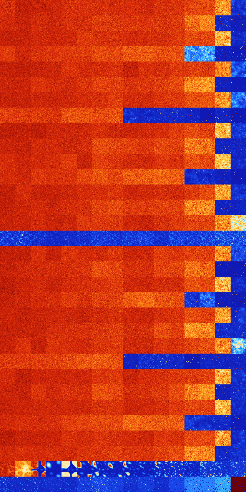

# B026 (35328-35839)

<details>
    <summary>Initial Grid</summary>
    
</details>


<details>
    <summary>Initial Grid RLE</summary>

```
#C Exported from GoGoL (https://github.com/marrow16/gogol)
#C Wrap mode: Toroidal
#C Boundary mode: Dead
#C Step: 0
x = 100, y = 100, rule = B026/S
55bo2bobo13bo3bobo2bo$51bo20bo13bo7bo$8bo5bo65bobo15bo$24bo10bo53bo8bo$
8bo2bo51bo23bo$7bo3bo19bobo5bo$15bo13bo$6bo2bo7bo5bo19bo2bo21bo19bo$22b
o17bo7bo11bo16bo3bo$13bob2o4bo6bo31bo14bo5bo10bo3bo$6bo27bo57bo$8bo11bo
46bo5bo8bo$4bo3bo19bobo9b2o3b2o33bo$19bo10bo3bo8bo10bo2bo8bo15bo4bo10bo
$10bo42bobo18bo$bo17bo2bo7bobo6bo$48bo41bo$16bo21bo12bo6bo12bo12bo$35bo
36bo14bo$2o31bo$17bo19bo29bo6bo$3b2o5bo4bo2bo37bo30bo$13bo68bo4bo$15b2o
6bo26bo21bo5b2o9bo$o16bo33bo6bo$3bo12bo13bo7bo11bo8bo5bo5bo6bo13bo$20bo
14bo25bo35bo$13b2o5bo25bo42bo9bo$5bo3bo31bo5bo33bo4bo11bo$9bo26bo18bo$
8b2obo26bo40bo$27bobo56bo$19bo5bo34bo3bo$12bo2bobo4bo39bo$23bo23bo10bo
10b2obo17bo$18b2o8bo32bo19bo12bo3bo$15bo17bo7bo6bo32bo16bo$19bo40bo4bo
20bo$20bo2bo5bo13bo12bo24bo13bo$32bo44bo$43bo24bobo$5bo22bo5bo23bo9bo
12bo$5bo18bo5bo6bo6bo6bo$33bo16bo$30bo7bo29bo20bo$29bo7bo58bo$2o2bo41bo
15bo16bo2bo8bo$5bo7bo39bo39b2o$31bo21bo17bo13bo$88b2o$obo9b2o20bobo5bo
2bo3bo16bo22bo6bo$43bo34bo$8bo36b2o20bo18bo8bo$3bo23bo7bo25bobo11bo$4bo
7bo31bo20bo13bo13bo$59bo4bo5bo9bo$3bo50bo24bo$48bo4bo21bo7bo$25bo15bo
27bo$17bo11bo21bo36bo$bo38bo30bo$bo25bo$21bo3bo17bo29b2o$9bo2bo36bo13b
2o11bo12bo9bo$36bo6bo12bo$2bo27b2o7bo16bo8bo$100b$2bobo18bo19bo18bo30bo
5bo$12bo11bo13bo52bo$13bo2bo9bo28bo16bo11bo$8bo9bo12bo17bo30bo$29bo54bo
$29bo6bo53bobo$2bo16bo22bo8bo22bo$43bo34bo11bo$10bo8bo7bo38bo7bo14bo$4b
o5bo4bo4bo3bo6bo14bo7bo18bo$2b2o3b2o28bo6bo19bo26bo2bo2bo$45bo$34bo6bo
6bo4bo33bo$19bo3bo4bo14bo44bo2bo$28bo36b2o6bo21bo$bo24bobo44bo3b2o$5bo
6bo43bo2bo37bo$23bo16bo2bo13bo2bo4bo$27bo8bo33bo$bo37bo26bo3bo2bo$43bo
15bo15bo$44bo$6bo2bo7bo15bo6bo26bo17bo$14b2o13bo36bobo4bo16b2o$4bo75bo$
18bo11bo5bo15bo12bo19b2o$bo3bo8bobo28bo30bo11bo3bo$26bo7bo5bo17bo$5bo4b
o4bobo7bo29bo5bo9bo18bo$9bo17bo8bo18bo13bo9bo4bobobo$15bobo26bo49b2o2bo
$14bo15bo33bo20bo6bo$38bo13bo16bo4bo!
```
</details>
<details>
    <summary>Thumbnail</summary>

</details>
<table>
<tr>
    <td><a href="./35328%20S%20Heat%20Map%20Activity.png"></a><br>S (35328)<br>G>1000</td>    <td><a href="./35329%20S0%20Heat%20Map%20Activity.png"></a><br>S0 (35329)<br>G>1000</td>    <td><a href="./35330%20S1%20Heat%20Map%20Activity.png"></a><br>S1 (35330)<br>G>1000</td>    <td><a href="./35331%20S01%20Heat%20Map%20Activity.png"></a><br>S01 (35331)<br>G>1000</td>    <td><a href="./35332%20S2%20Heat%20Map%20Activity.png"></a><br>S2 (35332)<br>G>1000</td>    <td><a href="./35333%20S02%20Heat%20Map%20Activity.png"></a><br>S02 (35333)<br>G>1000</td>    <td><a href="./35334%20S12%20Heat%20Map%20Activity.png"></a><br>S12 (35334)<br>G>1000</td>    <td><a href="./35335%20S012%20Heat%20Map%20Activity.png"></a><br>S012 (35335)<br>G>1000</td>    <td><a href="./35336%20S3%20Heat%20Map%20Activity.png"></a><br>S3 (35336)<br>G>1000</td>    <td><a href="./35337%20S03%20Heat%20Map%20Activity.png"></a><br>S03 (35337)<br>G>1000</td>    <td><a href="./35338%20S13%20Heat%20Map%20Activity.png"></a><br>S13 (35338)<br>G>1000</td>    <td><a href="./35339%20S013%20Heat%20Map%20Activity.png"></a><br>S013 (35339)<br>G>1000</td>    <td><a href="./35340%20S23%20Heat%20Map%20Activity.png"></a><br>S23 (35340)<br>G>1000</td>    <td><a href="./35341%20S023%20Heat%20Map%20Activity.png"></a><br>S023 (35341)<br>G>1000</td>    <td><a href="./35342%20S123%20Heat%20Map%20Activity.png"></a><br>S123 (35342)<br>G>1000</td>    <td><a href="./35343%20S0123%20Heat%20Map%20Activity.png"></a><br>S0123 (35343)<br>G>1000</td></tr>
<tr>
    <td><a href="./35344%20S4%20Heat%20Map%20Activity.png"></a><br>S4 (35344)<br>G>1000</td>    <td><a href="./35345%20S04%20Heat%20Map%20Activity.png"></a><br>S04 (35345)<br>G>1000</td>    <td><a href="./35346%20S14%20Heat%20Map%20Activity.png"></a><br>S14 (35346)<br>G>1000</td>    <td><a href="./35347%20S014%20Heat%20Map%20Activity.png"></a><br>S014 (35347)<br>G>1000</td>    <td><a href="./35348%20S24%20Heat%20Map%20Activity.png"></a><br>S24 (35348)<br>G>1000</td>    <td><a href="./35349%20S024%20Heat%20Map%20Activity.png"></a><br>S024 (35349)<br>G>1000</td>    <td><a href="./35350%20S124%20Heat%20Map%20Activity.png"></a><br>S124 (35350)<br>G>1000</td>    <td><a href="./35351%20S0124%20Heat%20Map%20Activity.png"></a><br>S0124 (35351)<br>G>1000</td>    <td><a href="./35352%20S34%20Heat%20Map%20Activity.png"></a><br>S34 (35352)<br>G>1000</td>    <td><a href="./35353%20S034%20Heat%20Map%20Activity.png"></a><br>S034 (35353)<br>G>1000</td>    <td><a href="./35354%20S134%20Heat%20Map%20Activity.png"></a><br>S134 (35354)<br>G>1000</td>    <td><a href="./35355%20S0134%20Heat%20Map%20Activity.png"></a><br>S0134 (35355)<br>G>1000</td>    <td><a href="./35356%20S234%20Heat%20Map%20Activity.png"></a><br>S234 (35356)<br>G>1000</td>    <td><a href="./35357%20S0234%20Heat%20Map%20Activity.png"></a><br>S0234 (35357)<br>G>1000</td>    <td><a href="./35358%20S1234%20Heat%20Map%20Activity.png"></a><br>S1234 (35358)<br>R@310,p120</td>    <td><a href="./35359%20S01234%20Heat%20Map%20Activity.png"></a><br>S01234 (35359)<br>R@468,p360</td></tr>
<tr>
    <td><a href="./35360%20S5%20Heat%20Map%20Activity.png"></a><br>S5 (35360)<br>G>1000</td>    <td><a href="./35361%20S05%20Heat%20Map%20Activity.png"></a><br>S05 (35361)<br>G>1000</td>    <td><a href="./35362%20S15%20Heat%20Map%20Activity.png"></a><br>S15 (35362)<br>G>1000</td>    <td><a href="./35363%20S015%20Heat%20Map%20Activity.png"></a><br>S015 (35363)<br>G>1000</td>    <td><a href="./35364%20S25%20Heat%20Map%20Activity.png"></a><br>S25 (35364)<br>G>1000</td>    <td><a href="./35365%20S025%20Heat%20Map%20Activity.png"></a><br>S025 (35365)<br>G>1000</td>    <td><a href="./35366%20S125%20Heat%20Map%20Activity.png"></a><br>S125 (35366)<br>G>1000</td>    <td><a href="./35367%20S0125%20Heat%20Map%20Activity.png"></a><br>S0125 (35367)<br>G>1000</td>    <td><a href="./35368%20S35%20Heat%20Map%20Activity.png"></a><br>S35 (35368)<br>G>1000</td>    <td><a href="./35369%20S035%20Heat%20Map%20Activity.png"></a><br>S035 (35369)<br>G>1000</td>    <td><a href="./35370%20S135%20Heat%20Map%20Activity.png"></a><br>S135 (35370)<br>G>1000</td>    <td><a href="./35371%20S0135%20Heat%20Map%20Activity.png"></a><br>S0135 (35371)<br>G>1000</td>    <td><a href="./35372%20S235%20Heat%20Map%20Activity.png"></a><br>S235 (35372)<br>G>1000</td>    <td><a href="./35373%20S0235%20Heat%20Map%20Activity.png"></a><br>S0235 (35373)<br>G>1000</td>    <td><a href="./35374%20S1235%20Heat%20Map%20Activity.png"></a><br>S1235 (35374)<br>G>1000</td>    <td><a href="./35375%20S01235%20Heat%20Map%20Activity.png"></a><br>S01235 (35375)<br>R@399,p156</td></tr>
<tr>
    <td><a href="./35376%20S45%20Heat%20Map%20Activity.png"></a><br>S45 (35376)<br>G>1000</td>    <td><a href="./35377%20S045%20Heat%20Map%20Activity.png"></a><br>S045 (35377)<br>G>1000</td>    <td><a href="./35378%20S145%20Heat%20Map%20Activity.png"></a><br>S145 (35378)<br>G>1000</td>    <td><a href="./35379%20S0145%20Heat%20Map%20Activity.png"></a><br>S0145 (35379)<br>G>1000</td>    <td><a href="./35380%20S245%20Heat%20Map%20Activity.png"></a><br>S245 (35380)<br>G>1000</td>    <td><a href="./35381%20S0245%20Heat%20Map%20Activity.png"></a><br>S0245 (35381)<br>G>1000</td>    <td><a href="./35382%20S1245%20Heat%20Map%20Activity.png"></a><br>S1245 (35382)<br>G>1000</td>    <td><a href="./35383%20S01245%20Heat%20Map%20Activity.png"></a><br>S01245 (35383)<br>G>1000</td>    <td><a href="./35384%20S345%20Heat%20Map%20Activity.png"></a><br>S345 (35384)<br>G>1000</td>    <td><a href="./35385%20S0345%20Heat%20Map%20Activity.png"></a><br>S0345 (35385)<br>G>1000</td>    <td><a href="./35386%20S1345%20Heat%20Map%20Activity.png"></a><br>S1345 (35386)<br>G>1000</td>    <td><a href="./35387%20S01345%20Heat%20Map%20Activity.png"></a><br>S01345 (35387)<br>G>1000</td>    <td><a href="./35388%20S2345%20Heat%20Map%20Activity.png"></a><br>S2345 (35388)<br>G>1000</td>    <td><a href="./35389%20S02345%20Heat%20Map%20Activity.png"></a><br>S02345 (35389)<br>G>1000</td>    <td><a href="./35390%20S12345%20Heat%20Map%20Activity.png"></a><br>S12345 (35390)<br>R@539,p360</td>    <td><a href="./35391%20S012345%20Heat%20Map%20Activity.png"></a><br>S012345 (35391)<br>G>1000</td></tr>
<tr>
    <td><a href="./35392%20S6%20Heat%20Map%20Activity.png"></a><br>S6 (35392)<br>G>1000</td>    <td><a href="./35393%20S06%20Heat%20Map%20Activity.png"></a><br>S06 (35393)<br>G>1000</td>    <td><a href="./35394%20S16%20Heat%20Map%20Activity.png"></a><br>S16 (35394)<br>G>1000</td>    <td><a href="./35395%20S016%20Heat%20Map%20Activity.png"></a><br>S016 (35395)<br>G>1000</td>    <td><a href="./35396%20S26%20Heat%20Map%20Activity.png"></a><br>S26 (35396)<br>G>1000</td>    <td><a href="./35397%20S026%20Heat%20Map%20Activity.png"></a><br>S026 (35397)<br>G>1000</td>    <td><a href="./35398%20S126%20Heat%20Map%20Activity.png"></a><br>S126 (35398)<br>G>1000</td>    <td><a href="./35399%20S0126%20Heat%20Map%20Activity.png"></a><br>S0126 (35399)<br>G>1000</td>    <td><a href="./35400%20S36%20Heat%20Map%20Activity.png"></a><br>S36 (35400)<br>G>1000</td>    <td><a href="./35401%20S036%20Heat%20Map%20Activity.png"></a><br>S036 (35401)<br>G>1000</td>    <td><a href="./35402%20S136%20Heat%20Map%20Activity.png"></a><br>S136 (35402)<br>G>1000</td>    <td><a href="./35403%20S0136%20Heat%20Map%20Activity.png"></a><br>S0136 (35403)<br>G>1000</td>    <td><a href="./35404%20S236%20Heat%20Map%20Activity.png"></a><br>S236 (35404)<br>G>1000</td>    <td><a href="./35405%20S0236%20Heat%20Map%20Activity.png"></a><br>S0236 (35405)<br>G>1000</td>    <td><a href="./35406%20S1236%20Heat%20Map%20Activity.png"></a><br>S1236 (35406)<br>G>1000</td>    <td><a href="./35407%20S01236%20Heat%20Map%20Activity.png"></a><br>S01236 (35407)<br>G>1000</td></tr>
<tr>
    <td><a href="./35408%20S46%20Heat%20Map%20Activity.png"></a><br>S46 (35408)<br>G>1000</td>    <td><a href="./35409%20S046%20Heat%20Map%20Activity.png"></a><br>S046 (35409)<br>G>1000</td>    <td><a href="./35410%20S146%20Heat%20Map%20Activity.png"></a><br>S146 (35410)<br>G>1000</td>    <td><a href="./35411%20S0146%20Heat%20Map%20Activity.png"></a><br>S0146 (35411)<br>G>1000</td>    <td><a href="./35412%20S246%20Heat%20Map%20Activity.png"></a><br>S246 (35412)<br>G>1000</td>    <td><a href="./35413%20S0246%20Heat%20Map%20Activity.png"></a><br>S0246 (35413)<br>G>1000</td>    <td><a href="./35414%20S1246%20Heat%20Map%20Activity.png"></a><br>S1246 (35414)<br>G>1000</td>    <td><a href="./35415%20S01246%20Heat%20Map%20Activity.png"></a><br>S01246 (35415)<br>G>1000</td>    <td><a href="./35416%20S346%20Heat%20Map%20Activity.png"></a><br>S346 (35416)<br>G>1000</td>    <td><a href="./35417%20S0346%20Heat%20Map%20Activity.png"></a><br>S0346 (35417)<br>G>1000</td>    <td><a href="./35418%20S1346%20Heat%20Map%20Activity.png"></a><br>S1346 (35418)<br>G>1000</td>    <td><a href="./35419%20S01346%20Heat%20Map%20Activity.png"></a><br>S01346 (35419)<br>G>1000</td>    <td><a href="./35420%20S2346%20Heat%20Map%20Activity.png"></a><br>S2346 (35420)<br>G>1000</td>    <td><a href="./35421%20S02346%20Heat%20Map%20Activity.png"></a><br>S02346 (35421)<br>G>1000</td>    <td><a href="./35422%20S12346%20Heat%20Map%20Activity.png"></a><br>S12346 (35422)<br>R@203,p120</td>    <td><a href="./35423%20S012346%20Heat%20Map%20Activity.png"></a><br>S012346 (35423)<br>R@441,p360</td></tr>
<tr>
    <td><a href="./35424%20S56%20Heat%20Map%20Activity.png"></a><br>S56 (35424)<br>G>1000</td>    <td><a href="./35425%20S056%20Heat%20Map%20Activity.png"></a><br>S056 (35425)<br>G>1000</td>    <td><a href="./35426%20S156%20Heat%20Map%20Activity.png"></a><br>S156 (35426)<br>G>1000</td>    <td><a href="./35427%20S0156%20Heat%20Map%20Activity.png"></a><br>S0156 (35427)<br>G>1000</td>    <td><a href="./35428%20S256%20Heat%20Map%20Activity.png"></a><br>S256 (35428)<br>G>1000</td>    <td><a href="./35429%20S0256%20Heat%20Map%20Activity.png"></a><br>S0256 (35429)<br>G>1000</td>    <td><a href="./35430%20S1256%20Heat%20Map%20Activity.png"></a><br>S1256 (35430)<br>G>1000</td>    <td><a href="./35431%20S01256%20Heat%20Map%20Activity.png"></a><br>S01256 (35431)<br>G>1000</td>    <td><a href="./35432%20S356%20Heat%20Map%20Activity.png"></a><br>S356 (35432)<br>G>1000</td>    <td><a href="./35433%20S0356%20Heat%20Map%20Activity.png"></a><br>S0356 (35433)<br>G>1000</td>    <td><a href="./35434%20S1356%20Heat%20Map%20Activity.png"></a><br>S1356 (35434)<br>G>1000</td>    <td><a href="./35435%20S01356%20Heat%20Map%20Activity.png"></a><br>S01356 (35435)<br>G>1000</td>    <td><a href="./35436%20S2356%20Heat%20Map%20Activity.png"></a><br>S2356 (35436)<br>G>1000</td>    <td><a href="./35437%20S02356%20Heat%20Map%20Activity.png"></a><br>S02356 (35437)<br>G>1000</td>    <td><a href="./35438%20S12356%20Heat%20Map%20Activity.png"></a><br>S12356 (35438)<br>G>1000</td>    <td><a href="./35439%20S012356%20Heat%20Map%20Activity.png"></a><br>S012356 (35439)<br>G>1000</td></tr>
<tr>
    <td><a href="./35440%20S456%20Heat%20Map%20Activity.png"></a><br>S456 (35440)<br>G>1000</td>    <td><a href="./35441%20S0456%20Heat%20Map%20Activity.png"></a><br>S0456 (35441)<br>G>1000</td>    <td><a href="./35442%20S1456%20Heat%20Map%20Activity.png"></a><br>S1456 (35442)<br>G>1000</td>    <td><a href="./35443%20S01456%20Heat%20Map%20Activity.png"></a><br>S01456 (35443)<br>G>1000</td>    <td><a href="./35444%20S2456%20Heat%20Map%20Activity.png"></a><br>S2456 (35444)<br>G>1000</td>    <td><a href="./35445%20S02456%20Heat%20Map%20Activity.png"></a><br>S02456 (35445)<br>G>1000</td>    <td><a href="./35446%20S12456%20Heat%20Map%20Activity.png"></a><br>S12456 (35446)<br>G>1000</td>    <td><a href="./35447%20S012456%20Heat%20Map%20Activity.png"></a><br>S012456 (35447)<br>G>1000</td>    <td><a href="./35448%20S3456%20Heat%20Map%20Activity.png"></a><br>S3456 (35448)<br>R@174,p12</td>    <td><a href="./35449%20S03456%20Heat%20Map%20Activity.png"></a><br>S03456 (35449)<br>R@240,p84</td>    <td><a href="./35450%20S13456%20Heat%20Map%20Activity.png"></a><br>S13456 (35450)<br>R@197,p12</td>    <td><a href="./35451%20S013456%20Heat%20Map%20Activity.png"></a><br>S013456 (35451)<br>R@189,p60</td>    <td><a href="./35452%20S23456%20Heat%20Map%20Activity.png"></a><br>S23456 (35452)<br>R@109,p60</td>    <td><a href="./35453%20S023456%20Heat%20Map%20Activity.png"></a><br>S023456 (35453)<br>G>1000</td>    <td><a href="./35454%20S123456%20Heat%20Map%20Activity.png"></a><br>S123456 (35454)<br>R@119,p60</td>    <td><a href="./35455%20S0123456%20Heat%20Map%20Activity.png"></a><br>S0123456 (35455)<br>G>1000</td></tr>
<tr>
    <td><a href="./35456%20S7%20Heat%20Map%20Activity.png"></a><br>S7 (35456)<br>G>1000</td>    <td><a href="./35457%20S07%20Heat%20Map%20Activity.png"></a><br>S07 (35457)<br>G>1000</td>    <td><a href="./35458%20S17%20Heat%20Map%20Activity.png"></a><br>S17 (35458)<br>G>1000</td>    <td><a href="./35459%20S017%20Heat%20Map%20Activity.png"></a><br>S017 (35459)<br>G>1000</td>    <td><a href="./35460%20S27%20Heat%20Map%20Activity.png"></a><br>S27 (35460)<br>G>1000</td>    <td><a href="./35461%20S027%20Heat%20Map%20Activity.png"></a><br>S027 (35461)<br>G>1000</td>    <td><a href="./35462%20S127%20Heat%20Map%20Activity.png"></a><br>S127 (35462)<br>G>1000</td>    <td><a href="./35463%20S0127%20Heat%20Map%20Activity.png"></a><br>S0127 (35463)<br>G>1000</td>    <td><a href="./35464%20S37%20Heat%20Map%20Activity.png"></a><br>S37 (35464)<br>G>1000</td>    <td><a href="./35465%20S037%20Heat%20Map%20Activity.png"></a><br>S037 (35465)<br>G>1000</td>    <td><a href="./35466%20S137%20Heat%20Map%20Activity.png"></a><br>S137 (35466)<br>G>1000</td>    <td><a href="./35467%20S0137%20Heat%20Map%20Activity.png"></a><br>S0137 (35467)<br>G>1000</td>    <td><a href="./35468%20S237%20Heat%20Map%20Activity.png"></a><br>S237 (35468)<br>G>1000</td>    <td><a href="./35469%20S0237%20Heat%20Map%20Activity.png"></a><br>S0237 (35469)<br>G>1000</td>    <td><a href="./35470%20S1237%20Heat%20Map%20Activity.png"></a><br>S1237 (35470)<br>G>1000</td>    <td><a href="./35471%20S01237%20Heat%20Map%20Activity.png"></a><br>S01237 (35471)<br>R@293,p24</td></tr>
<tr>
    <td><a href="./35472%20S47%20Heat%20Map%20Activity.png"></a><br>S47 (35472)<br>G>1000</td>    <td><a href="./35473%20S047%20Heat%20Map%20Activity.png"></a><br>S047 (35473)<br>G>1000</td>    <td><a href="./35474%20S147%20Heat%20Map%20Activity.png"></a><br>S147 (35474)<br>G>1000</td>    <td><a href="./35475%20S0147%20Heat%20Map%20Activity.png"></a><br>S0147 (35475)<br>G>1000</td>    <td><a href="./35476%20S247%20Heat%20Map%20Activity.png"></a><br>S247 (35476)<br>G>1000</td>    <td><a href="./35477%20S0247%20Heat%20Map%20Activity.png"></a><br>S0247 (35477)<br>G>1000</td>    <td><a href="./35478%20S1247%20Heat%20Map%20Activity.png"></a><br>S1247 (35478)<br>G>1000</td>    <td><a href="./35479%20S01247%20Heat%20Map%20Activity.png"></a><br>S01247 (35479)<br>G>1000</td>    <td><a href="./35480%20S347%20Heat%20Map%20Activity.png"></a><br>S347 (35480)<br>G>1000</td>    <td><a href="./35481%20S0347%20Heat%20Map%20Activity.png"></a><br>S0347 (35481)<br>G>1000</td>    <td><a href="./35482%20S1347%20Heat%20Map%20Activity.png"></a><br>S1347 (35482)<br>G>1000</td>    <td><a href="./35483%20S01347%20Heat%20Map%20Activity.png"></a><br>S01347 (35483)<br>G>1000</td>    <td><a href="./35484%20S2347%20Heat%20Map%20Activity.png"></a><br>S2347 (35484)<br>G>1000</td>    <td><a href="./35485%20S02347%20Heat%20Map%20Activity.png"></a><br>S02347 (35485)<br>G>1000</td>    <td><a href="./35486%20S12347%20Heat%20Map%20Activity.png"></a><br>S12347 (35486)<br>R@197,p120</td>    <td><a href="./35487%20S012347%20Heat%20Map%20Activity.png"></a><br>S012347 (35487)<br>R@142,p60</td></tr>
<tr>
    <td><a href="./35488%20S57%20Heat%20Map%20Activity.png"></a><br>S57 (35488)<br>G>1000</td>    <td><a href="./35489%20S057%20Heat%20Map%20Activity.png"></a><br>S057 (35489)<br>G>1000</td>    <td><a href="./35490%20S157%20Heat%20Map%20Activity.png"></a><br>S157 (35490)<br>G>1000</td>    <td><a href="./35491%20S0157%20Heat%20Map%20Activity.png"></a><br>S0157 (35491)<br>G>1000</td>    <td><a href="./35492%20S257%20Heat%20Map%20Activity.png"></a><br>S257 (35492)<br>G>1000</td>    <td><a href="./35493%20S0257%20Heat%20Map%20Activity.png"></a><br>S0257 (35493)<br>G>1000</td>    <td><a href="./35494%20S1257%20Heat%20Map%20Activity.png"></a><br>S1257 (35494)<br>G>1000</td>    <td><a href="./35495%20S01257%20Heat%20Map%20Activity.png"></a><br>S01257 (35495)<br>G>1000</td>    <td><a href="./35496%20S357%20Heat%20Map%20Activity.png"></a><br>S357 (35496)<br>G>1000</td>    <td><a href="./35497%20S0357%20Heat%20Map%20Activity.png"></a><br>S0357 (35497)<br>G>1000</td>    <td><a href="./35498%20S1357%20Heat%20Map%20Activity.png"></a><br>S1357 (35498)<br>G>1000</td>    <td><a href="./35499%20S01357%20Heat%20Map%20Activity.png"></a><br>S01357 (35499)<br>G>1000</td>    <td><a href="./35500%20S2357%20Heat%20Map%20Activity.png"></a><br>S2357 (35500)<br>G>1000</td>    <td><a href="./35501%20S02357%20Heat%20Map%20Activity.png"></a><br>S02357 (35501)<br>G>1000</td>    <td><a href="./35502%20S12357%20Heat%20Map%20Activity.png"></a><br>S12357 (35502)<br>G>1000</td>    <td><a href="./35503%20S012357%20Heat%20Map%20Activity.png"></a><br>S012357 (35503)<br>R@346,p30</td></tr>
<tr>
    <td><a href="./35504%20S457%20Heat%20Map%20Activity.png"></a><br>S457 (35504)<br>G>1000</td>    <td><a href="./35505%20S0457%20Heat%20Map%20Activity.png"></a><br>S0457 (35505)<br>G>1000</td>    <td><a href="./35506%20S1457%20Heat%20Map%20Activity.png"></a><br>S1457 (35506)<br>G>1000</td>    <td><a href="./35507%20S01457%20Heat%20Map%20Activity.png"></a><br>S01457 (35507)<br>G>1000</td>    <td><a href="./35508%20S2457%20Heat%20Map%20Activity.png"></a><br>S2457 (35508)<br>G>1000</td>    <td><a href="./35509%20S02457%20Heat%20Map%20Activity.png"></a><br>S02457 (35509)<br>G>1000</td>    <td><a href="./35510%20S12457%20Heat%20Map%20Activity.png"></a><br>S12457 (35510)<br>G>1000</td>    <td><a href="./35511%20S012457%20Heat%20Map%20Activity.png"></a><br>S012457 (35511)<br>G>1000</td>    <td><a href="./35512%20S3457%20Heat%20Map%20Activity.png"></a><br>S3457 (35512)<br>G>1000</td>    <td><a href="./35513%20S03457%20Heat%20Map%20Activity.png"></a><br>S03457 (35513)<br>G>1000</td>    <td><a href="./35514%20S13457%20Heat%20Map%20Activity.png"></a><br>S13457 (35514)<br>G>1000</td>    <td><a href="./35515%20S013457%20Heat%20Map%20Activity.png"></a><br>S013457 (35515)<br>G>1000</td>    <td><a href="./35516%20S23457%20Heat%20Map%20Activity.png"></a><br>S23457 (35516)<br>G>1000</td>    <td><a href="./35517%20S023457%20Heat%20Map%20Activity.png"></a><br>S023457 (35517)<br>G>1000</td>    <td><a href="./35518%20S123457%20Heat%20Map%20Activity.png"></a><br>S123457 (35518)<br>R@252,p168</td>    <td><a href="./35519%20S0123457%20Heat%20Map%20Activity.png"></a><br>S0123457 (35519)<br>R@947,p840</td></tr>
<tr>
    <td><a href="./35520%20S67%20Heat%20Map%20Activity.png"></a><br>S67 (35520)<br>G>1000</td>    <td><a href="./35521%20S067%20Heat%20Map%20Activity.png"></a><br>S067 (35521)<br>G>1000</td>    <td><a href="./35522%20S167%20Heat%20Map%20Activity.png"></a><br>S167 (35522)<br>G>1000</td>    <td><a href="./35523%20S0167%20Heat%20Map%20Activity.png"></a><br>S0167 (35523)<br>G>1000</td>    <td><a href="./35524%20S267%20Heat%20Map%20Activity.png"></a><br>S267 (35524)<br>G>1000</td>    <td><a href="./35525%20S0267%20Heat%20Map%20Activity.png"></a><br>S0267 (35525)<br>G>1000</td>    <td><a href="./35526%20S1267%20Heat%20Map%20Activity.png"></a><br>S1267 (35526)<br>G>1000</td>    <td><a href="./35527%20S01267%20Heat%20Map%20Activity.png"></a><br>S01267 (35527)<br>G>1000</td>    <td><a href="./35528%20S367%20Heat%20Map%20Activity.png"></a><br>S367 (35528)<br>G>1000</td>    <td><a href="./35529%20S0367%20Heat%20Map%20Activity.png"></a><br>S0367 (35529)<br>G>1000</td>    <td><a href="./35530%20S1367%20Heat%20Map%20Activity.png"></a><br>S1367 (35530)<br>G>1000</td>    <td><a href="./35531%20S01367%20Heat%20Map%20Activity.png"></a><br>S01367 (35531)<br>G>1000</td>    <td><a href="./35532%20S2367%20Heat%20Map%20Activity.png"></a><br>S2367 (35532)<br>G>1000</td>    <td><a href="./35533%20S02367%20Heat%20Map%20Activity.png"></a><br>S02367 (35533)<br>G>1000</td>    <td><a href="./35534%20S12367%20Heat%20Map%20Activity.png"></a><br>S12367 (35534)<br>G>1000</td>    <td><a href="./35535%20S012367%20Heat%20Map%20Activity.png"></a><br>S012367 (35535)<br>R@475,p36</td></tr>
<tr>
    <td><a href="./35536%20S467%20Heat%20Map%20Activity.png"></a><br>S467 (35536)<br>G>1000</td>    <td><a href="./35537%20S0467%20Heat%20Map%20Activity.png"></a><br>S0467 (35537)<br>G>1000</td>    <td><a href="./35538%20S1467%20Heat%20Map%20Activity.png"></a><br>S1467 (35538)<br>G>1000</td>    <td><a href="./35539%20S01467%20Heat%20Map%20Activity.png"></a><br>S01467 (35539)<br>G>1000</td>    <td><a href="./35540%20S2467%20Heat%20Map%20Activity.png"></a><br>S2467 (35540)<br>G>1000</td>    <td><a href="./35541%20S02467%20Heat%20Map%20Activity.png"></a><br>S02467 (35541)<br>G>1000</td>    <td><a href="./35542%20S12467%20Heat%20Map%20Activity.png"></a><br>S12467 (35542)<br>G>1000</td>    <td><a href="./35543%20S012467%20Heat%20Map%20Activity.png"></a><br>S012467 (35543)<br>G>1000</td>    <td><a href="./35544%20S3467%20Heat%20Map%20Activity.png"></a><br>S3467 (35544)<br>G>1000</td>    <td><a href="./35545%20S03467%20Heat%20Map%20Activity.png"></a><br>S03467 (35545)<br>G>1000</td>    <td><a href="./35546%20S13467%20Heat%20Map%20Activity.png"></a><br>S13467 (35546)<br>G>1000</td>    <td><a href="./35547%20S013467%20Heat%20Map%20Activity.png"></a><br>S013467 (35547)<br>G>1000</td>    <td><a href="./35548%20S23467%20Heat%20Map%20Activity.png"></a><br>S23467 (35548)<br>G>1000</td>    <td><a href="./35549%20S023467%20Heat%20Map%20Activity.png"></a><br>S023467 (35549)<br>G>1000</td>    <td><a href="./35550%20S123467%20Heat%20Map%20Activity.png"></a><br>S123467 (35550)<br>R@170,p60</td>    <td><a href="./35551%20S0123467%20Heat%20Map%20Activity.png"></a><br>S0123467 (35551)<br>R@139,p84</td></tr>
<tr>
    <td><a href="./35552%20S567%20Heat%20Map%20Activity.png"></a><br>S567 (35552)<br>G>1000</td>    <td><a href="./35553%20S0567%20Heat%20Map%20Activity.png"></a><br>S0567 (35553)<br>G>1000</td>    <td><a href="./35554%20S1567%20Heat%20Map%20Activity.png"></a><br>S1567 (35554)<br>G>1000</td>    <td><a href="./35555%20S01567%20Heat%20Map%20Activity.png"></a><br>S01567 (35555)<br>G>1000</td>    <td><a href="./35556%20S2567%20Heat%20Map%20Activity.png"></a><br>S2567 (35556)<br>G>1000</td>    <td><a href="./35557%20S02567%20Heat%20Map%20Activity.png"></a><br>S02567 (35557)<br>G>1000</td>    <td><a href="./35558%20S12567%20Heat%20Map%20Activity.png"></a><br>S12567 (35558)<br>G>1000</td>    <td><a href="./35559%20S012567%20Heat%20Map%20Activity.png"></a><br>S012567 (35559)<br>G>1000</td>    <td><a href="./35560%20S3567%20Heat%20Map%20Activity.png"></a><br>S3567 (35560)<br>G>1000</td>    <td><a href="./35561%20S03567%20Heat%20Map%20Activity.png"></a><br>S03567 (35561)<br>G>1000</td>    <td><a href="./35562%20S13567%20Heat%20Map%20Activity.png"></a><br>S13567 (35562)<br>G>1000</td>    <td><a href="./35563%20S013567%20Heat%20Map%20Activity.png"></a><br>S013567 (35563)<br>G>1000</td>    <td><a href="./35564%20S23567%20Heat%20Map%20Activity.png"></a><br>S23567 (35564)<br>G>1000</td>    <td><a href="./35565%20S023567%20Heat%20Map%20Activity.png"></a><br>S023567 (35565)<br>G>1000</td>    <td><a href="./35566%20S123567%20Heat%20Map%20Activity.png"></a><br>S123567 (35566)<br>G>1000</td>    <td><a href="./35567%20S0123567%20Heat%20Map%20Activity.png"></a><br>S0123567 (35567)<br>G>1000</td></tr>
<tr>
    <td><a href="./35568%20S4567%20Heat%20Map%20Activity.png"></a><br>S4567 (35568)<br>R@109,p12</td>    <td><a href="./35569%20S04567%20Heat%20Map%20Activity.png"></a><br>S04567 (35569)<br>R@78,p6</td>    <td><a href="./35570%20S14567%20Heat%20Map%20Activity.png"></a><br>S14567 (35570)<br>R@129,p60</td>    <td><a href="./35571%20S014567%20Heat%20Map%20Activity.png"></a><br>S014567 (35571)<br>R@124,p60</td>    <td><a href="./35572%20S24567%20Heat%20Map%20Activity.png"></a><br>S24567 (35572)<br>R@118,p60</td>    <td><a href="./35573%20S024567%20Heat%20Map%20Activity.png"></a><br>S024567 (35573)<br>R@64,p4</td>    <td><a href="./35574%20S124567%20Heat%20Map%20Activity.png"></a><br>S124567 (35574)<br>R@58,p12</td>    <td><a href="./35575%20S0124567%20Heat%20Map%20Activity.png"></a><br>S0124567 (35575)<br>R@49,p4</td>    <td><a href="./35576%20S34567%20Heat%20Map%20Activity.png"></a><br>S34567 (35576)<br>R@29,p6</td>    <td><a href="./35577%20S034567%20Heat%20Map%20Activity.png"></a><br>S034567 (35577)<br>R@23,p2</td>    <td><a href="./35578%20S134567%20Heat%20Map%20Activity.png"></a><br>S134567 (35578)<br>R@41,p20</td>    <td><a href="./35579%20S0134567%20Heat%20Map%20Activity.png"></a><br>S0134567 (35579)<br>R@22,p4</td>    <td><a href="./35580%20S234567%20Heat%20Map%20Activity.png"></a><br>S234567 (35580)<br>R@23,p6</td>    <td><a href="./35581%20S0234567%20Heat%20Map%20Activity.png"></a><br>S0234567 (35581)<br>R@21,p4</td>    <td><a href="./35582%20S1234567%20Heat%20Map%20Activity.png"></a><br>S1234567 (35582)<br>R@15,p2</td>    <td><a href="./35583%20S01234567%20Heat%20Map%20Activity.png"></a><br>S01234567 (35583)<br>R@17,p4</td></tr>
<tr>
    <td><a href="./35584%20S8%20Heat%20Map%20Activity.png"></a><br>S8 (35584)<br>G>1000</td>    <td><a href="./35585%20S08%20Heat%20Map%20Activity.png"></a><br>S08 (35585)<br>G>1000</td>    <td><a href="./35586%20S18%20Heat%20Map%20Activity.png"></a><br>S18 (35586)<br>G>1000</td>    <td><a href="./35587%20S018%20Heat%20Map%20Activity.png"></a><br>S018 (35587)<br>G>1000</td>    <td><a href="./35588%20S28%20Heat%20Map%20Activity.png"></a><br>S28 (35588)<br>G>1000</td>    <td><a href="./35589%20S028%20Heat%20Map%20Activity.png"></a><br>S028 (35589)<br>G>1000</td>    <td><a href="./35590%20S128%20Heat%20Map%20Activity.png"></a><br>S128 (35590)<br>G>1000</td>    <td><a href="./35591%20S0128%20Heat%20Map%20Activity.png"></a><br>S0128 (35591)<br>G>1000</td>    <td><a href="./35592%20S38%20Heat%20Map%20Activity.png"></a><br>S38 (35592)<br>G>1000</td>    <td><a href="./35593%20S038%20Heat%20Map%20Activity.png"></a><br>S038 (35593)<br>G>1000</td>    <td><a href="./35594%20S138%20Heat%20Map%20Activity.png"></a><br>S138 (35594)<br>G>1000</td>    <td><a href="./35595%20S0138%20Heat%20Map%20Activity.png"></a><br>S0138 (35595)<br>G>1000</td>    <td><a href="./35596%20S238%20Heat%20Map%20Activity.png"></a><br>S238 (35596)<br>G>1000</td>    <td><a href="./35597%20S0238%20Heat%20Map%20Activity.png"></a><br>S0238 (35597)<br>G>1000</td>    <td><a href="./35598%20S1238%20Heat%20Map%20Activity.png"></a><br>S1238 (35598)<br>G>1000</td>    <td><a href="./35599%20S01238%20Heat%20Map%20Activity.png"></a><br>S01238 (35599)<br>G>1000</td></tr>
<tr>
    <td><a href="./35600%20S48%20Heat%20Map%20Activity.png"></a><br>S48 (35600)<br>G>1000</td>    <td><a href="./35601%20S048%20Heat%20Map%20Activity.png"></a><br>S048 (35601)<br>G>1000</td>    <td><a href="./35602%20S148%20Heat%20Map%20Activity.png"></a><br>S148 (35602)<br>G>1000</td>    <td><a href="./35603%20S0148%20Heat%20Map%20Activity.png"></a><br>S0148 (35603)<br>G>1000</td>    <td><a href="./35604%20S248%20Heat%20Map%20Activity.png"></a><br>S248 (35604)<br>G>1000</td>    <td><a href="./35605%20S0248%20Heat%20Map%20Activity.png"></a><br>S0248 (35605)<br>G>1000</td>    <td><a href="./35606%20S1248%20Heat%20Map%20Activity.png"></a><br>S1248 (35606)<br>G>1000</td>    <td><a href="./35607%20S01248%20Heat%20Map%20Activity.png"></a><br>S01248 (35607)<br>G>1000</td>    <td><a href="./35608%20S348%20Heat%20Map%20Activity.png"></a><br>S348 (35608)<br>G>1000</td>    <td><a href="./35609%20S0348%20Heat%20Map%20Activity.png"></a><br>S0348 (35609)<br>G>1000</td>    <td><a href="./35610%20S1348%20Heat%20Map%20Activity.png"></a><br>S1348 (35610)<br>G>1000</td>    <td><a href="./35611%20S01348%20Heat%20Map%20Activity.png"></a><br>S01348 (35611)<br>G>1000</td>    <td><a href="./35612%20S2348%20Heat%20Map%20Activity.png"></a><br>S2348 (35612)<br>G>1000</td>    <td><a href="./35613%20S02348%20Heat%20Map%20Activity.png"></a><br>S02348 (35613)<br>G>1000</td>    <td><a href="./35614%20S12348%20Heat%20Map%20Activity.png"></a><br>S12348 (35614)<br>G>1000</td>    <td><a href="./35615%20S012348%20Heat%20Map%20Activity.png"></a><br>S012348 (35615)<br>G>1000</td></tr>
<tr>
    <td><a href="./35616%20S58%20Heat%20Map%20Activity.png"></a><br>S58 (35616)<br>G>1000</td>    <td><a href="./35617%20S058%20Heat%20Map%20Activity.png"></a><br>S058 (35617)<br>G>1000</td>    <td><a href="./35618%20S158%20Heat%20Map%20Activity.png"></a><br>S158 (35618)<br>G>1000</td>    <td><a href="./35619%20S0158%20Heat%20Map%20Activity.png"></a><br>S0158 (35619)<br>G>1000</td>    <td><a href="./35620%20S258%20Heat%20Map%20Activity.png"></a><br>S258 (35620)<br>G>1000</td>    <td><a href="./35621%20S0258%20Heat%20Map%20Activity.png"></a><br>S0258 (35621)<br>G>1000</td>    <td><a href="./35622%20S1258%20Heat%20Map%20Activity.png"></a><br>S1258 (35622)<br>G>1000</td>    <td><a href="./35623%20S01258%20Heat%20Map%20Activity.png"></a><br>S01258 (35623)<br>G>1000</td>    <td><a href="./35624%20S358%20Heat%20Map%20Activity.png"></a><br>S358 (35624)<br>G>1000</td>    <td><a href="./35625%20S0358%20Heat%20Map%20Activity.png"></a><br>S0358 (35625)<br>G>1000</td>    <td><a href="./35626%20S1358%20Heat%20Map%20Activity.png"></a><br>S1358 (35626)<br>G>1000</td>    <td><a href="./35627%20S01358%20Heat%20Map%20Activity.png"></a><br>S01358 (35627)<br>G>1000</td>    <td><a href="./35628%20S2358%20Heat%20Map%20Activity.png"></a><br>S2358 (35628)<br>G>1000</td>    <td><a href="./35629%20S02358%20Heat%20Map%20Activity.png"></a><br>S02358 (35629)<br>G>1000</td>    <td><a href="./35630%20S12358%20Heat%20Map%20Activity.png"></a><br>S12358 (35630)<br>G>1000</td>    <td><a href="./35631%20S012358%20Heat%20Map%20Activity.png"></a><br>S012358 (35631)<br>R@310,p42</td></tr>
<tr>
    <td><a href="./35632%20S458%20Heat%20Map%20Activity.png"></a><br>S458 (35632)<br>G>1000</td>    <td><a href="./35633%20S0458%20Heat%20Map%20Activity.png"></a><br>S0458 (35633)<br>G>1000</td>    <td><a href="./35634%20S1458%20Heat%20Map%20Activity.png"></a><br>S1458 (35634)<br>G>1000</td>    <td><a href="./35635%20S01458%20Heat%20Map%20Activity.png"></a><br>S01458 (35635)<br>G>1000</td>    <td><a href="./35636%20S2458%20Heat%20Map%20Activity.png"></a><br>S2458 (35636)<br>G>1000</td>    <td><a href="./35637%20S02458%20Heat%20Map%20Activity.png"></a><br>S02458 (35637)<br>G>1000</td>    <td><a href="./35638%20S12458%20Heat%20Map%20Activity.png"></a><br>S12458 (35638)<br>G>1000</td>    <td><a href="./35639%20S012458%20Heat%20Map%20Activity.png"></a><br>S012458 (35639)<br>G>1000</td>    <td><a href="./35640%20S3458%20Heat%20Map%20Activity.png"></a><br>S3458 (35640)<br>G>1000</td>    <td><a href="./35641%20S03458%20Heat%20Map%20Activity.png"></a><br>S03458 (35641)<br>G>1000</td>    <td><a href="./35642%20S13458%20Heat%20Map%20Activity.png"></a><br>S13458 (35642)<br>G>1000</td>    <td><a href="./35643%20S013458%20Heat%20Map%20Activity.png"></a><br>S013458 (35643)<br>G>1000</td>    <td><a href="./35644%20S23458%20Heat%20Map%20Activity.png"></a><br>S23458 (35644)<br>G>1000</td>    <td><a href="./35645%20S023458%20Heat%20Map%20Activity.png"></a><br>S023458 (35645)<br>G>1000</td>    <td><a href="./35646%20S123458%20Heat%20Map%20Activity.png"></a><br>S123458 (35646)<br>R@441,p360</td>    <td><a href="./35647%20S0123458%20Heat%20Map%20Activity.png"></a><br>S0123458 (35647)<br>R@502,p420</td></tr>
<tr>
    <td><a href="./35648%20S68%20Heat%20Map%20Activity.png"></a><br>S68 (35648)<br>G>1000</td>    <td><a href="./35649%20S068%20Heat%20Map%20Activity.png"></a><br>S068 (35649)<br>G>1000</td>    <td><a href="./35650%20S168%20Heat%20Map%20Activity.png"></a><br>S168 (35650)<br>G>1000</td>    <td><a href="./35651%20S0168%20Heat%20Map%20Activity.png"></a><br>S0168 (35651)<br>G>1000</td>    <td><a href="./35652%20S268%20Heat%20Map%20Activity.png"></a><br>S268 (35652)<br>G>1000</td>    <td><a href="./35653%20S0268%20Heat%20Map%20Activity.png"></a><br>S0268 (35653)<br>G>1000</td>    <td><a href="./35654%20S1268%20Heat%20Map%20Activity.png"></a><br>S1268 (35654)<br>G>1000</td>    <td><a href="./35655%20S01268%20Heat%20Map%20Activity.png"></a><br>S01268 (35655)<br>G>1000</td>    <td><a href="./35656%20S368%20Heat%20Map%20Activity.png"></a><br>S368 (35656)<br>G>1000</td>    <td><a href="./35657%20S0368%20Heat%20Map%20Activity.png"></a><br>S0368 (35657)<br>G>1000</td>    <td><a href="./35658%20S1368%20Heat%20Map%20Activity.png"></a><br>S1368 (35658)<br>G>1000</td>    <td><a href="./35659%20S01368%20Heat%20Map%20Activity.png"></a><br>S01368 (35659)<br>G>1000</td>    <td><a href="./35660%20S2368%20Heat%20Map%20Activity.png"></a><br>S2368 (35660)<br>G>1000</td>    <td><a href="./35661%20S02368%20Heat%20Map%20Activity.png"></a><br>S02368 (35661)<br>G>1000</td>    <td><a href="./35662%20S12368%20Heat%20Map%20Activity.png"></a><br>S12368 (35662)<br>G>1000</td>    <td><a href="./35663%20S012368%20Heat%20Map%20Activity.png"></a><br>S012368 (35663)<br>G>1000</td></tr>
<tr>
    <td><a href="./35664%20S468%20Heat%20Map%20Activity.png"></a><br>S468 (35664)<br>G>1000</td>    <td><a href="./35665%20S0468%20Heat%20Map%20Activity.png"></a><br>S0468 (35665)<br>G>1000</td>    <td><a href="./35666%20S1468%20Heat%20Map%20Activity.png"></a><br>S1468 (35666)<br>G>1000</td>    <td><a href="./35667%20S01468%20Heat%20Map%20Activity.png"></a><br>S01468 (35667)<br>G>1000</td>    <td><a href="./35668%20S2468%20Heat%20Map%20Activity.png"></a><br>S2468 (35668)<br>G>1000</td>    <td><a href="./35669%20S02468%20Heat%20Map%20Activity.png"></a><br>S02468 (35669)<br>G>1000</td>    <td><a href="./35670%20S12468%20Heat%20Map%20Activity.png"></a><br>S12468 (35670)<br>G>1000</td>    <td><a href="./35671%20S012468%20Heat%20Map%20Activity.png"></a><br>S012468 (35671)<br>G>1000</td>    <td><a href="./35672%20S3468%20Heat%20Map%20Activity.png"></a><br>S3468 (35672)<br>G>1000</td>    <td><a href="./35673%20S03468%20Heat%20Map%20Activity.png"></a><br>S03468 (35673)<br>G>1000</td>    <td><a href="./35674%20S13468%20Heat%20Map%20Activity.png"></a><br>S13468 (35674)<br>G>1000</td>    <td><a href="./35675%20S013468%20Heat%20Map%20Activity.png"></a><br>S013468 (35675)<br>G>1000</td>    <td><a href="./35676%20S23468%20Heat%20Map%20Activity.png"></a><br>S23468 (35676)<br>G>1000</td>    <td><a href="./35677%20S023468%20Heat%20Map%20Activity.png"></a><br>S023468 (35677)<br>G>1000</td>    <td><a href="./35678%20S123468%20Heat%20Map%20Activity.png"></a><br>S123468 (35678)<br>R@90,p12</td>    <td><a href="./35679%20S0123468%20Heat%20Map%20Activity.png"></a><br>S0123468 (35679)<br>R@77,p12</td></tr>
<tr>
    <td><a href="./35680%20S568%20Heat%20Map%20Activity.png"></a><br>S568 (35680)<br>G>1000</td>    <td><a href="./35681%20S0568%20Heat%20Map%20Activity.png"></a><br>S0568 (35681)<br>G>1000</td>    <td><a href="./35682%20S1568%20Heat%20Map%20Activity.png"></a><br>S1568 (35682)<br>G>1000</td>    <td><a href="./35683%20S01568%20Heat%20Map%20Activity.png"></a><br>S01568 (35683)<br>G>1000</td>    <td><a href="./35684%20S2568%20Heat%20Map%20Activity.png"></a><br>S2568 (35684)<br>G>1000</td>    <td><a href="./35685%20S02568%20Heat%20Map%20Activity.png"></a><br>S02568 (35685)<br>G>1000</td>    <td><a href="./35686%20S12568%20Heat%20Map%20Activity.png"></a><br>S12568 (35686)<br>G>1000</td>    <td><a href="./35687%20S012568%20Heat%20Map%20Activity.png"></a><br>S012568 (35687)<br>G>1000</td>    <td><a href="./35688%20S3568%20Heat%20Map%20Activity.png"></a><br>S3568 (35688)<br>G>1000</td>    <td><a href="./35689%20S03568%20Heat%20Map%20Activity.png"></a><br>S03568 (35689)<br>G>1000</td>    <td><a href="./35690%20S13568%20Heat%20Map%20Activity.png"></a><br>S13568 (35690)<br>G>1000</td>    <td><a href="./35691%20S013568%20Heat%20Map%20Activity.png"></a><br>S013568 (35691)<br>G>1000</td>    <td><a href="./35692%20S23568%20Heat%20Map%20Activity.png"></a><br>S23568 (35692)<br>G>1000</td>    <td><a href="./35693%20S023568%20Heat%20Map%20Activity.png"></a><br>S023568 (35693)<br>G>1000</td>    <td><a href="./35694%20S123568%20Heat%20Map%20Activity.png"></a><br>S123568 (35694)<br>G>1000</td>    <td><a href="./35695%20S0123568%20Heat%20Map%20Activity.png"></a><br>S0123568 (35695)<br>G>1000</td></tr>
<tr>
    <td><a href="./35696%20S4568%20Heat%20Map%20Activity.png"></a><br>S4568 (35696)<br>G>1000</td>    <td><a href="./35697%20S04568%20Heat%20Map%20Activity.png"></a><br>S04568 (35697)<br>G>1000</td>    <td><a href="./35698%20S14568%20Heat%20Map%20Activity.png"></a><br>S14568 (35698)<br>G>1000</td>    <td><a href="./35699%20S014568%20Heat%20Map%20Activity.png"></a><br>S014568 (35699)<br>G>1000</td>    <td><a href="./35700%20S24568%20Heat%20Map%20Activity.png"></a><br>S24568 (35700)<br>G>1000</td>    <td><a href="./35701%20S024568%20Heat%20Map%20Activity.png"></a><br>S024568 (35701)<br>G>1000</td>    <td><a href="./35702%20S124568%20Heat%20Map%20Activity.png"></a><br>S124568 (35702)<br>G>1000</td>    <td><a href="./35703%20S0124568%20Heat%20Map%20Activity.png"></a><br>S0124568 (35703)<br>G>1000</td>    <td><a href="./35704%20S34568%20Heat%20Map%20Activity.png"></a><br>S34568 (35704)<br>R@198,p60</td>    <td><a href="./35705%20S034568%20Heat%20Map%20Activity.png"></a><br>S034568 (35705)<br>R@104,p12</td>    <td><a href="./35706%20S134568%20Heat%20Map%20Activity.png"></a><br>S134568 (35706)<br>R@106,p12</td>    <td><a href="./35707%20S0134568%20Heat%20Map%20Activity.png"></a><br>S0134568 (35707)<br>R@134,p60</td>    <td><a href="./35708%20S234568%20Heat%20Map%20Activity.png"></a><br>S234568 (35708)<br>R@829,p780</td>    <td><a href="./35709%20S0234568%20Heat%20Map%20Activity.png"></a><br>S0234568 (35709)<br>R@113,p60</td>    <td><a href="./35710%20S1234568%20Heat%20Map%20Activity.png"></a><br>S1234568 (35710)<br>R@110,p60</td>    <td><a href="./35711%20S01234568%20Heat%20Map%20Activity.png"></a><br>S01234568 (35711)<br>R@124,p60</td></tr>
<tr>
    <td><a href="./35712%20S78%20Heat%20Map%20Activity.png"></a><br>S78 (35712)<br>G>1000</td>    <td><a href="./35713%20S078%20Heat%20Map%20Activity.png"></a><br>S078 (35713)<br>G>1000</td>    <td><a href="./35714%20S178%20Heat%20Map%20Activity.png"></a><br>S178 (35714)<br>G>1000</td>    <td><a href="./35715%20S0178%20Heat%20Map%20Activity.png"></a><br>S0178 (35715)<br>G>1000</td>    <td><a href="./35716%20S278%20Heat%20Map%20Activity.png"></a><br>S278 (35716)<br>G>1000</td>    <td><a href="./35717%20S0278%20Heat%20Map%20Activity.png"></a><br>S0278 (35717)<br>G>1000</td>    <td><a href="./35718%20S1278%20Heat%20Map%20Activity.png"></a><br>S1278 (35718)<br>G>1000</td>    <td><a href="./35719%20S01278%20Heat%20Map%20Activity.png"></a><br>S01278 (35719)<br>G>1000</td>    <td><a href="./35720%20S378%20Heat%20Map%20Activity.png"></a><br>S378 (35720)<br>G>1000</td>    <td><a href="./35721%20S0378%20Heat%20Map%20Activity.png"></a><br>S0378 (35721)<br>G>1000</td>    <td><a href="./35722%20S1378%20Heat%20Map%20Activity.png"></a><br>S1378 (35722)<br>G>1000</td>    <td><a href="./35723%20S01378%20Heat%20Map%20Activity.png"></a><br>S01378 (35723)<br>G>1000</td>    <td><a href="./35724%20S2378%20Heat%20Map%20Activity.png"></a><br>S2378 (35724)<br>G>1000</td>    <td><a href="./35725%20S02378%20Heat%20Map%20Activity.png"></a><br>S02378 (35725)<br>G>1000</td>    <td><a href="./35726%20S12378%20Heat%20Map%20Activity.png"></a><br>S12378 (35726)<br>G>1000</td>    <td><a href="./35727%20S012378%20Heat%20Map%20Activity.png"></a><br>S012378 (35727)<br>R@362,p24</td></tr>
<tr>
    <td><a href="./35728%20S478%20Heat%20Map%20Activity.png"></a><br>S478 (35728)<br>G>1000</td>    <td><a href="./35729%20S0478%20Heat%20Map%20Activity.png"></a><br>S0478 (35729)<br>G>1000</td>    <td><a href="./35730%20S1478%20Heat%20Map%20Activity.png"></a><br>S1478 (35730)<br>G>1000</td>    <td><a href="./35731%20S01478%20Heat%20Map%20Activity.png"></a><br>S01478 (35731)<br>G>1000</td>    <td><a href="./35732%20S2478%20Heat%20Map%20Activity.png"></a><br>S2478 (35732)<br>G>1000</td>    <td><a href="./35733%20S02478%20Heat%20Map%20Activity.png"></a><br>S02478 (35733)<br>G>1000</td>    <td><a href="./35734%20S12478%20Heat%20Map%20Activity.png"></a><br>S12478 (35734)<br>G>1000</td>    <td><a href="./35735%20S012478%20Heat%20Map%20Activity.png"></a><br>S012478 (35735)<br>G>1000</td>    <td><a href="./35736%20S3478%20Heat%20Map%20Activity.png"></a><br>S3478 (35736)<br>G>1000</td>    <td><a href="./35737%20S03478%20Heat%20Map%20Activity.png"></a><br>S03478 (35737)<br>G>1000</td>    <td><a href="./35738%20S13478%20Heat%20Map%20Activity.png"></a><br>S13478 (35738)<br>G>1000</td>    <td><a href="./35739%20S013478%20Heat%20Map%20Activity.png"></a><br>S013478 (35739)<br>G>1000</td>    <td><a href="./35740%20S23478%20Heat%20Map%20Activity.png"></a><br>S23478 (35740)<br>G>1000</td>    <td><a href="./35741%20S023478%20Heat%20Map%20Activity.png"></a><br>S023478 (35741)<br>G>1000</td>    <td><a href="./35742%20S123478%20Heat%20Map%20Activity.png"></a><br>S123478 (35742)<br>R@247,p120</td>    <td><a href="./35743%20S0123478%20Heat%20Map%20Activity.png"></a><br>S0123478 (35743)<br>R@83,p30</td></tr>
<tr>
    <td><a href="./35744%20S578%20Heat%20Map%20Activity.png"></a><br>S578 (35744)<br>G>1000</td>    <td><a href="./35745%20S0578%20Heat%20Map%20Activity.png"></a><br>S0578 (35745)<br>G>1000</td>    <td><a href="./35746%20S1578%20Heat%20Map%20Activity.png"></a><br>S1578 (35746)<br>G>1000</td>    <td><a href="./35747%20S01578%20Heat%20Map%20Activity.png"></a><br>S01578 (35747)<br>G>1000</td>    <td><a href="./35748%20S2578%20Heat%20Map%20Activity.png"></a><br>S2578 (35748)<br>G>1000</td>    <td><a href="./35749%20S02578%20Heat%20Map%20Activity.png"></a><br>S02578 (35749)<br>G>1000</td>    <td><a href="./35750%20S12578%20Heat%20Map%20Activity.png"></a><br>S12578 (35750)<br>G>1000</td>    <td><a href="./35751%20S012578%20Heat%20Map%20Activity.png"></a><br>S012578 (35751)<br>G>1000</td>    <td><a href="./35752%20S3578%20Heat%20Map%20Activity.png"></a><br>S3578 (35752)<br>G>1000</td>    <td><a href="./35753%20S03578%20Heat%20Map%20Activity.png"></a><br>S03578 (35753)<br>G>1000</td>    <td><a href="./35754%20S13578%20Heat%20Map%20Activity.png"></a><br>S13578 (35754)<br>G>1000</td>    <td><a href="./35755%20S013578%20Heat%20Map%20Activity.png"></a><br>S013578 (35755)<br>G>1000</td>    <td><a href="./35756%20S23578%20Heat%20Map%20Activity.png"></a><br>S23578 (35756)<br>G>1000</td>    <td><a href="./35757%20S023578%20Heat%20Map%20Activity.png"></a><br>S023578 (35757)<br>G>1000</td>    <td><a href="./35758%20S123578%20Heat%20Map%20Activity.png"></a><br>S123578 (35758)<br>G>1000</td>    <td><a href="./35759%20S0123578%20Heat%20Map%20Activity.png"></a><br>S0123578 (35759)<br>R@427,p6</td></tr>
<tr>
    <td><a href="./35760%20S4578%20Heat%20Map%20Activity.png"></a><br>S4578 (35760)<br>G>1000</td>    <td><a href="./35761%20S04578%20Heat%20Map%20Activity.png"></a><br>S04578 (35761)<br>G>1000</td>    <td><a href="./35762%20S14578%20Heat%20Map%20Activity.png"></a><br>S14578 (35762)<br>G>1000</td>    <td><a href="./35763%20S014578%20Heat%20Map%20Activity.png"></a><br>S014578 (35763)<br>G>1000</td>    <td><a href="./35764%20S24578%20Heat%20Map%20Activity.png"></a><br>S24578 (35764)<br>G>1000</td>    <td><a href="./35765%20S024578%20Heat%20Map%20Activity.png"></a><br>S024578 (35765)<br>G>1000</td>    <td><a href="./35766%20S124578%20Heat%20Map%20Activity.png"></a><br>S124578 (35766)<br>G>1000</td>    <td><a href="./35767%20S0124578%20Heat%20Map%20Activity.png"></a><br>S0124578 (35767)<br>G>1000</td>    <td><a href="./35768%20S34578%20Heat%20Map%20Activity.png"></a><br>S34578 (35768)<br>G>1000</td>    <td><a href="./35769%20S034578%20Heat%20Map%20Activity.png"></a><br>S034578 (35769)<br>G>1000</td>    <td><a href="./35770%20S134578%20Heat%20Map%20Activity.png"></a><br>S134578 (35770)<br>G>1000</td>    <td><a href="./35771%20S0134578%20Heat%20Map%20Activity.png"></a><br>S0134578 (35771)<br>G>1000</td>    <td><a href="./35772%20S234578%20Heat%20Map%20Activity.png"></a><br>S234578 (35772)<br>G>1000</td>    <td><a href="./35773%20S0234578%20Heat%20Map%20Activity.png"></a><br>S0234578 (35773)<br>G>1000</td>    <td><a href="./35774%20S1234578%20Heat%20Map%20Activity.png"></a><br>S1234578 (35774)<br>R@129,p36</td>    <td><a href="./35775%20S01234578%20Heat%20Map%20Activity.png"></a><br>S01234578 (35775)<br>R@453,p360</td></tr>
<tr>
    <td><a href="./35776%20S678%20Heat%20Map%20Activity.png"></a><br>S678 (35776)<br>G>1000</td>    <td><a href="./35777%20S0678%20Heat%20Map%20Activity.png"></a><br>S0678 (35777)<br>G>1000</td>    <td><a href="./35778%20S1678%20Heat%20Map%20Activity.png"></a><br>S1678 (35778)<br>G>1000</td>    <td><a href="./35779%20S01678%20Heat%20Map%20Activity.png"></a><br>S01678 (35779)<br>G>1000</td>    <td><a href="./35780%20S2678%20Heat%20Map%20Activity.png"></a><br>S2678 (35780)<br>G>1000</td>    <td><a href="./35781%20S02678%20Heat%20Map%20Activity.png"></a><br>S02678 (35781)<br>G>1000</td>    <td><a href="./35782%20S12678%20Heat%20Map%20Activity.png"></a><br>S12678 (35782)<br>G>1000</td>    <td><a href="./35783%20S012678%20Heat%20Map%20Activity.png"></a><br>S012678 (35783)<br>G>1000</td>    <td><a href="./35784%20S3678%20Heat%20Map%20Activity.png"></a><br>S3678 (35784)<br>G>1000</td>    <td><a href="./35785%20S03678%20Heat%20Map%20Activity.png"></a><br>S03678 (35785)<br>G>1000</td>    <td><a href="./35786%20S13678%20Heat%20Map%20Activity.png"></a><br>S13678 (35786)<br>G>1000</td>    <td><a href="./35787%20S013678%20Heat%20Map%20Activity.png"></a><br>S013678 (35787)<br>G>1000</td>    <td><a href="./35788%20S23678%20Heat%20Map%20Activity.png"></a><br>S23678 (35788)<br>G>1000</td>    <td><a href="./35789%20S023678%20Heat%20Map%20Activity.png"></a><br>S023678 (35789)<br>G>1000</td>    <td><a href="./35790%20S123678%20Heat%20Map%20Activity.png"></a><br>S123678 (35790)<br>G>1000</td>    <td><a href="./35791%20S0123678%20Heat%20Map%20Activity.png"></a><br>S0123678 (35791)<br>R@678,p12</td></tr>
<tr>
    <td><a href="./35792%20S4678%20Heat%20Map%20Activity.png"></a><br>S4678 (35792)<br>G>1000</td>    <td><a href="./35793%20S04678%20Heat%20Map%20Activity.png"></a><br>S04678 (35793)<br>G>1000</td>    <td><a href="./35794%20S14678%20Heat%20Map%20Activity.png"></a><br>S14678 (35794)<br>G>1000</td>    <td><a href="./35795%20S014678%20Heat%20Map%20Activity.png"></a><br>S014678 (35795)<br>G>1000</td>    <td><a href="./35796%20S24678%20Heat%20Map%20Activity.png"></a><br>S24678 (35796)<br>G>1000</td>    <td><a href="./35797%20S024678%20Heat%20Map%20Activity.png"></a><br>S024678 (35797)<br>G>1000</td>    <td><a href="./35798%20S124678%20Heat%20Map%20Activity.png"></a><br>S124678 (35798)<br>G>1000</td>    <td><a href="./35799%20S0124678%20Heat%20Map%20Activity.png"></a><br>S0124678 (35799)<br>G>1000</td>    <td><a href="./35800%20S34678%20Heat%20Map%20Activity.png"></a><br>S34678 (35800)<br>G>1000</td>    <td><a href="./35801%20S034678%20Heat%20Map%20Activity.png"></a><br>S034678 (35801)<br>G>1000</td>    <td><a href="./35802%20S134678%20Heat%20Map%20Activity.png"></a><br>S134678 (35802)<br>G>1000</td>    <td><a href="./35803%20S0134678%20Heat%20Map%20Activity.png"></a><br>S0134678 (35803)<br>G>1000</td>    <td><a href="./35804%20S234678%20Heat%20Map%20Activity.png"></a><br>S234678 (35804)<br>G>1000</td>    <td><a href="./35805%20S0234678%20Heat%20Map%20Activity.png"></a><br>S0234678 (35805)<br>G>1000</td>    <td><a href="./35806%20S1234678%20Heat%20Map%20Activity.png"></a><br>S1234678 (35806)<br>R@145,p72</td>    <td><a href="./35807%20S01234678%20Heat%20Map%20Activity.png"></a><br>S01234678 (35807)<br>R@83,p24</td></tr>
<tr>
    <td><a href="./35808%20S5678%20Heat%20Map%20Activity.png"></a><br>S5678 (35808)<br>G>1000</td>    <td><a href="./35809%20S05678%20Heat%20Map%20Activity.png"></a><br>S05678 (35809)<br>G>1000</td>    <td><a href="./35810%20S15678%20Heat%20Map%20Activity.png"></a><br>S15678 (35810)<br>G>1000</td>    <td><a href="./35811%20S015678%20Heat%20Map%20Activity.png"></a><br>S015678 (35811)<br>R@959,p2</td>    <td><a href="./35812%20S25678%20Heat%20Map%20Activity.png"></a><br>S25678 (35812)<br>G>1000</td>    <td><a href="./35813%20S025678%20Heat%20Map%20Activity.png"></a><br>S025678 (35813)<br>G>1000</td>    <td><a href="./35814%20S125678%20Heat%20Map%20Activity.png"></a><br>S125678 (35814)<br>S@423</td>    <td><a href="./35815%20S0125678%20Heat%20Map%20Activity.png"></a><br>S0125678 (35815)<br>S@403</td>    <td><a href="./35816%20S35678%20Heat%20Map%20Activity.png"></a><br>S35678 (35816)<br>S@576</td>    <td><a href="./35817%20S035678%20Heat%20Map%20Activity.png"></a><br>S035678 (35817)<br>R@204,p2</td>    <td><a href="./35818%20S135678%20Heat%20Map%20Activity.png"></a><br>S135678 (35818)<br>S@175</td>    <td><a href="./35819%20S0135678%20Heat%20Map%20Activity.png"></a><br>S0135678 (35819)<br>S@69</td>    <td><a href="./35820%20S235678%20Heat%20Map%20Activity.png"></a><br>S235678 (35820)<br>R@84,p2</td>    <td><a href="./35821%20S0235678%20Heat%20Map%20Activity.png"></a><br>S0235678 (35821)<br>S@59</td>    <td><a href="./35822%20S1235678%20Heat%20Map%20Activity.png"></a><br>S1235678 (35822)<br>S@112</td>    <td><a href="./35823%20S01235678%20Heat%20Map%20Activity.png"></a><br>S01235678 (35823)<br>S@104</td></tr>
<tr>
    <td><a href="./35824%20S45678%20Heat%20Map%20Activity.png"></a><br>S45678 (35824)<br>R@31,p2</td>    <td><a href="./35825%20S045678%20Heat%20Map%20Activity.png"></a><br>S045678 (35825)<br>R@33,p4</td>    <td><a href="./35826%20S145678%20Heat%20Map%20Activity.png"></a><br>S145678 (35826)<br>R@30,p6</td>    <td><a href="./35827%20S0145678%20Heat%20Map%20Activity.png"></a><br>S0145678 (35827)<br>R@26,p2</td>    <td><a href="./35828%20S245678%20Heat%20Map%20Activity.png"></a><br>S245678 (35828)<br>R@33,p2</td>    <td><a href="./35829%20S0245678%20Heat%20Map%20Activity.png"></a><br>S0245678 (35829)<br>R@26,p4</td>    <td><a href="./35830%20S1245678%20Heat%20Map%20Activity.png"></a><br>S1245678 (35830)<br>S@26</td>    <td><a href="./35831%20S01245678%20Heat%20Map%20Activity.png"></a><br>S01245678 (35831)<br>R@19,p2</td>    <td><a href="./35832%20S345678%20Heat%20Map%20Activity.png"></a><br>S345678 (35832)<br>R@20,p2</td>    <td><a href="./35833%20S0345678%20Heat%20Map%20Activity.png"></a><br>S0345678 (35833)<br>R@15,p2</td>    <td><a href="./35834%20S1345678%20Heat%20Map%20Activity.png"></a><br>S1345678 (35834)<br>R@22,p2</td>    <td><a href="./35835%20S01345678%20Heat%20Map%20Activity.png"></a><br>S01345678 (35835)<br>R@13,p2</td>    <td><a href="./35836%20S2345678%20Heat%20Map%20Activity.png"></a><br>S2345678 (35836)<br>S@15</td>    <td><a href="./35837%20S02345678%20Heat%20Map%20Activity.png"></a><br>S02345678 (35837)<br>S@13</td>    <td><a href="./35838%20S12345678%20Heat%20Map%20Activity.png"></a><br>S12345678 (35838)<br>S@11</td>    <td><a href="./35839%20S012345678%20Heat%20Map%20Activity.png"></a><br>S012345678 (35839)<br>S@12</td></tr>
</table>
