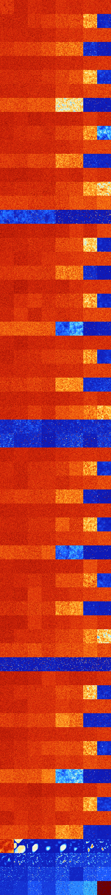

# B0267 (100864-101375)

<details>
    <summary>Initial Grid</summary>
    
</details>


<details>
    <summary>Initial Grid RLE</summary>

```
#C Exported from GoGoL (https://github.com/marrow16/gogol)
#C Wrap mode: Toroidal
#C Boundary mode: Dead
#C Step: 0
x = 100, y = 100, rule = B0267/S
14bo20bo$4bo16bo3bo19bo$17bo12bo26bo15bo$15bo6bo15bo3bo11bo4bobo19bobo$
bo17bo24bo12bo30bo$67bo6bo19bo$5bo2bo28bo25b2o10bo8bo$24bo4bo6bo3bo54bo
$o23bo36bo8bo8bo$14bo32bo20bo8bo4bo$7bo21bo20bo21bo7bo$50bo6bo$18bo30bo
$2bo44bo24bo$13bo30bo28bo$4bo13bo17bo36bo24bo$47bo18bo13bo$4bo10bo7bo
23bo4bo10bo22bo$12bo7bo6bo10bo3bo41bo$17bo65bo$o88bo$43bo39b2o$27bo6bo
24bo12b2o15bo$5bo25b2o22bo6bo21bo13bo$6bo11bo4bo14bo12bo$9bo21bo9bo26bo
7bo10bo$20bo5b2o68bo$3bo4bo22bo7bo31bo9bo5bo$3bo20bo22bo18bo24bo$11bo
57bo$10bo44bo2bo$17bo2bo28bo$10bo59bo$2bo29bo5bo32bo20b2ob2o$23bo24bo
19b2o16bo$9bo9bo38bo14bo$10bo9bo44bo$33bo26bo5bo20bo$33bo7bo2bo12bobob
2o2bo$bo2bo8bobo33bo15bo3bo20bobo2bo$92bo$39bo30bo$13bo53bo14bo14bo$13b
o45bo9bo17bo$31bo20bo45bo$15bo31bo21bo$40bo23bo15bo$11b2o35bo$ob3o10bo
2bo31bo6bo27bo8bo$2bo4bo24bo26bo8bo9bo$16bo52bo17bo$13bo4bo7bo10bo22bo
3bo10bo8b2o$o20bo9bo62bo$4bo29bo$58bo17bo$34bo21bo5b2o$13bo17bo35bo6bo
14bo$10bo7bo25bo5bo8bo25bo$7bo16bo9bo9bo25bo22bo$5bo7bo5bo19bo8bo24bo6b
o$39bo16bo12bo21b2o$2bo4bo90b2o$18bo17bo37bo$30bo15bo2bo4bo3bo11bo4bo$
8bo21bo8bobo4bo3bo3bo5bo19bo$3bo30bo46bo15bo$o10bo19bo19bo7bo3bo34bo$
11bo8bo19bo8bo4bo24bo3bo5bo$18bo33bo24bo17bo$51bo27bo5bo$24bo6bo31bo$
40bobo52bo$7bo24bo37bo12bo4bo$66bo$29bo11bo9bo26bo9bo$6bo9bo3bo13bo3bo
47bo$6bo45bo$27bo20bo25bo$3bo3bo2bo10bo17bo4bo$45bo8bo$15bo26bo3bo34bo$
5bo8bo28bo47bo$o42bo14bo19bo18bo$18bo39bo9bo$23bo13bo34bo6bo2bo$bo21bo
17bo41bo$2bo95bo$15bo71bo$7bo30bo16bo20bo21bo$10bo23bo24bo10bo$14bo$34b
o57bobo$35bo9bo8bo18bo5bo$49bo27bo3bo$17bo$21bo12bo$11bo66bo6bo$6bo2bo
25bo47bo$13bo9bo$2bo10bobo20bo15bo11bo!
```
</details>
<details>
    <summary>Thumbnail</summary>

</details>
<table>
<tr>
    <td><a href="./100864%20S%20Heat%20Map%20Activity.png"></a><br>S (100864)<br>G>1000</td>    <td><a href="./100865%20S0%20Heat%20Map%20Activity.png"></a><br>S0 (100865)<br>G>1000</td>    <td><a href="./100866%20S1%20Heat%20Map%20Activity.png"></a><br>S1 (100866)<br>G>1000</td>    <td><a href="./100867%20S01%20Heat%20Map%20Activity.png"></a><br>S01 (100867)<br>G>1000</td>    <td><a href="./100868%20S2%20Heat%20Map%20Activity.png"></a><br>S2 (100868)<br>G>1000</td>    <td><a href="./100869%20S02%20Heat%20Map%20Activity.png"></a><br>S02 (100869)<br>G>1000</td>    <td><a href="./100870%20S12%20Heat%20Map%20Activity.png"></a><br>S12 (100870)<br>G>1000</td>    <td><a href="./100871%20S012%20Heat%20Map%20Activity.png"></a><br>S012 (100871)<br>G>1000</td></tr>
<tr>
    <td><a href="./100872%20S3%20Heat%20Map%20Activity.png"></a><br>S3 (100872)<br>G>1000</td>    <td><a href="./100873%20S03%20Heat%20Map%20Activity.png"></a><br>S03 (100873)<br>G>1000</td>    <td><a href="./100874%20S13%20Heat%20Map%20Activity.png"></a><br>S13 (100874)<br>G>1000</td>    <td><a href="./100875%20S013%20Heat%20Map%20Activity.png"></a><br>S013 (100875)<br>G>1000</td>    <td><a href="./100876%20S23%20Heat%20Map%20Activity.png"></a><br>S23 (100876)<br>G>1000</td>    <td><a href="./100877%20S023%20Heat%20Map%20Activity.png"></a><br>S023 (100877)<br>G>1000</td>    <td><a href="./100878%20S123%20Heat%20Map%20Activity.png"></a><br>S123 (100878)<br>G>1000</td>    <td><a href="./100879%20S0123%20Heat%20Map%20Activity.png"></a><br>S0123 (100879)<br>G>1000</td></tr>
<tr>
    <td><a href="./100880%20S4%20Heat%20Map%20Activity.png"></a><br>S4 (100880)<br>G>1000</td>    <td><a href="./100881%20S04%20Heat%20Map%20Activity.png"></a><br>S04 (100881)<br>G>1000</td>    <td><a href="./100882%20S14%20Heat%20Map%20Activity.png"></a><br>S14 (100882)<br>G>1000</td>    <td><a href="./100883%20S014%20Heat%20Map%20Activity.png"></a><br>S014 (100883)<br>G>1000</td>    <td><a href="./100884%20S24%20Heat%20Map%20Activity.png"></a><br>S24 (100884)<br>G>1000</td>    <td><a href="./100885%20S024%20Heat%20Map%20Activity.png"></a><br>S024 (100885)<br>G>1000</td>    <td><a href="./100886%20S124%20Heat%20Map%20Activity.png"></a><br>S124 (100886)<br>G>1000</td>    <td><a href="./100887%20S0124%20Heat%20Map%20Activity.png"></a><br>S0124 (100887)<br>G>1000</td></tr>
<tr>
    <td><a href="./100888%20S34%20Heat%20Map%20Activity.png"></a><br>S34 (100888)<br>G>1000</td>    <td><a href="./100889%20S034%20Heat%20Map%20Activity.png"></a><br>S034 (100889)<br>G>1000</td>    <td><a href="./100890%20S134%20Heat%20Map%20Activity.png"></a><br>S134 (100890)<br>G>1000</td>    <td><a href="./100891%20S0134%20Heat%20Map%20Activity.png"></a><br>S0134 (100891)<br>G>1000</td>    <td><a href="./100892%20S234%20Heat%20Map%20Activity.png"></a><br>S234 (100892)<br>G>1000</td>    <td><a href="./100893%20S0234%20Heat%20Map%20Activity.png"></a><br>S0234 (100893)<br>G>1000</td>    <td><a href="./100894%20S1234%20Heat%20Map%20Activity.png"></a><br>S1234 (100894)<br>R@209,p60</td>    <td><a href="./100895%20S01234%20Heat%20Map%20Activity.png"></a><br>S01234 (100895)<br>R@449,p360</td></tr>
<tr>
    <td><a href="./100896%20S5%20Heat%20Map%20Activity.png"></a><br>S5 (100896)<br>G>1000</td>    <td><a href="./100897%20S05%20Heat%20Map%20Activity.png"></a><br>S05 (100897)<br>G>1000</td>    <td><a href="./100898%20S15%20Heat%20Map%20Activity.png"></a><br>S15 (100898)<br>G>1000</td>    <td><a href="./100899%20S015%20Heat%20Map%20Activity.png"></a><br>S015 (100899)<br>G>1000</td>    <td><a href="./100900%20S25%20Heat%20Map%20Activity.png"></a><br>S25 (100900)<br>G>1000</td>    <td><a href="./100901%20S025%20Heat%20Map%20Activity.png"></a><br>S025 (100901)<br>G>1000</td>    <td><a href="./100902%20S125%20Heat%20Map%20Activity.png"></a><br>S125 (100902)<br>G>1000</td>    <td><a href="./100903%20S0125%20Heat%20Map%20Activity.png"></a><br>S0125 (100903)<br>G>1000</td></tr>
<tr>
    <td><a href="./100904%20S35%20Heat%20Map%20Activity.png"></a><br>S35 (100904)<br>G>1000</td>    <td><a href="./100905%20S035%20Heat%20Map%20Activity.png"></a><br>S035 (100905)<br>G>1000</td>    <td><a href="./100906%20S135%20Heat%20Map%20Activity.png"></a><br>S135 (100906)<br>G>1000</td>    <td><a href="./100907%20S0135%20Heat%20Map%20Activity.png"></a><br>S0135 (100907)<br>G>1000</td>    <td><a href="./100908%20S235%20Heat%20Map%20Activity.png"></a><br>S235 (100908)<br>G>1000</td>    <td><a href="./100909%20S0235%20Heat%20Map%20Activity.png"></a><br>S0235 (100909)<br>G>1000</td>    <td><a href="./100910%20S1235%20Heat%20Map%20Activity.png"></a><br>S1235 (100910)<br>G>1000</td>    <td><a href="./100911%20S01235%20Heat%20Map%20Activity.png"></a><br>S01235 (100911)<br>R@355,p12</td></tr>
<tr>
    <td><a href="./100912%20S45%20Heat%20Map%20Activity.png"></a><br>S45 (100912)<br>G>1000</td>    <td><a href="./100913%20S045%20Heat%20Map%20Activity.png"></a><br>S045 (100913)<br>G>1000</td>    <td><a href="./100914%20S145%20Heat%20Map%20Activity.png"></a><br>S145 (100914)<br>G>1000</td>    <td><a href="./100915%20S0145%20Heat%20Map%20Activity.png"></a><br>S0145 (100915)<br>G>1000</td>    <td><a href="./100916%20S245%20Heat%20Map%20Activity.png"></a><br>S245 (100916)<br>G>1000</td>    <td><a href="./100917%20S0245%20Heat%20Map%20Activity.png"></a><br>S0245 (100917)<br>G>1000</td>    <td><a href="./100918%20S1245%20Heat%20Map%20Activity.png"></a><br>S1245 (100918)<br>G>1000</td>    <td><a href="./100919%20S01245%20Heat%20Map%20Activity.png"></a><br>S01245 (100919)<br>G>1000</td></tr>
<tr>
    <td><a href="./100920%20S345%20Heat%20Map%20Activity.png"></a><br>S345 (100920)<br>G>1000</td>    <td><a href="./100921%20S0345%20Heat%20Map%20Activity.png"></a><br>S0345 (100921)<br>G>1000</td>    <td><a href="./100922%20S1345%20Heat%20Map%20Activity.png"></a><br>S1345 (100922)<br>G>1000</td>    <td><a href="./100923%20S01345%20Heat%20Map%20Activity.png"></a><br>S01345 (100923)<br>G>1000</td>    <td><a href="./100924%20S2345%20Heat%20Map%20Activity.png"></a><br>S2345 (100924)<br>G>1000</td>    <td><a href="./100925%20S02345%20Heat%20Map%20Activity.png"></a><br>S02345 (100925)<br>G>1000</td>    <td><a href="./100926%20S12345%20Heat%20Map%20Activity.png"></a><br>S12345 (100926)<br>G>1000</td>    <td><a href="./100927%20S012345%20Heat%20Map%20Activity.png"></a><br>S012345 (100927)<br>G>1000</td></tr>
<tr>
    <td><a href="./100928%20S6%20Heat%20Map%20Activity.png"></a><br>S6 (100928)<br>G>1000</td>    <td><a href="./100929%20S06%20Heat%20Map%20Activity.png"></a><br>S06 (100929)<br>G>1000</td>    <td><a href="./100930%20S16%20Heat%20Map%20Activity.png"></a><br>S16 (100930)<br>G>1000</td>    <td><a href="./100931%20S016%20Heat%20Map%20Activity.png"></a><br>S016 (100931)<br>G>1000</td>    <td><a href="./100932%20S26%20Heat%20Map%20Activity.png"></a><br>S26 (100932)<br>G>1000</td>    <td><a href="./100933%20S026%20Heat%20Map%20Activity.png"></a><br>S026 (100933)<br>G>1000</td>    <td><a href="./100934%20S126%20Heat%20Map%20Activity.png"></a><br>S126 (100934)<br>G>1000</td>    <td><a href="./100935%20S0126%20Heat%20Map%20Activity.png"></a><br>S0126 (100935)<br>G>1000</td></tr>
<tr>
    <td><a href="./100936%20S36%20Heat%20Map%20Activity.png"></a><br>S36 (100936)<br>G>1000</td>    <td><a href="./100937%20S036%20Heat%20Map%20Activity.png"></a><br>S036 (100937)<br>G>1000</td>    <td><a href="./100938%20S136%20Heat%20Map%20Activity.png"></a><br>S136 (100938)<br>G>1000</td>    <td><a href="./100939%20S0136%20Heat%20Map%20Activity.png"></a><br>S0136 (100939)<br>G>1000</td>    <td><a href="./100940%20S236%20Heat%20Map%20Activity.png"></a><br>S236 (100940)<br>G>1000</td>    <td><a href="./100941%20S0236%20Heat%20Map%20Activity.png"></a><br>S0236 (100941)<br>G>1000</td>    <td><a href="./100942%20S1236%20Heat%20Map%20Activity.png"></a><br>S1236 (100942)<br>G>1000</td>    <td><a href="./100943%20S01236%20Heat%20Map%20Activity.png"></a><br>S01236 (100943)<br>G>1000</td></tr>
<tr>
    <td><a href="./100944%20S46%20Heat%20Map%20Activity.png"></a><br>S46 (100944)<br>G>1000</td>    <td><a href="./100945%20S046%20Heat%20Map%20Activity.png"></a><br>S046 (100945)<br>G>1000</td>    <td><a href="./100946%20S146%20Heat%20Map%20Activity.png"></a><br>S146 (100946)<br>G>1000</td>    <td><a href="./100947%20S0146%20Heat%20Map%20Activity.png"></a><br>S0146 (100947)<br>G>1000</td>    <td><a href="./100948%20S246%20Heat%20Map%20Activity.png"></a><br>S246 (100948)<br>G>1000</td>    <td><a href="./100949%20S0246%20Heat%20Map%20Activity.png"></a><br>S0246 (100949)<br>G>1000</td>    <td><a href="./100950%20S1246%20Heat%20Map%20Activity.png"></a><br>S1246 (100950)<br>G>1000</td>    <td><a href="./100951%20S01246%20Heat%20Map%20Activity.png"></a><br>S01246 (100951)<br>G>1000</td></tr>
<tr>
    <td><a href="./100952%20S346%20Heat%20Map%20Activity.png"></a><br>S346 (100952)<br>G>1000</td>    <td><a href="./100953%20S0346%20Heat%20Map%20Activity.png"></a><br>S0346 (100953)<br>G>1000</td>    <td><a href="./100954%20S1346%20Heat%20Map%20Activity.png"></a><br>S1346 (100954)<br>G>1000</td>    <td><a href="./100955%20S01346%20Heat%20Map%20Activity.png"></a><br>S01346 (100955)<br>G>1000</td>    <td><a href="./100956%20S2346%20Heat%20Map%20Activity.png"></a><br>S2346 (100956)<br>G>1000</td>    <td><a href="./100957%20S02346%20Heat%20Map%20Activity.png"></a><br>S02346 (100957)<br>G>1000</td>    <td><a href="./100958%20S12346%20Heat%20Map%20Activity.png"></a><br>S12346 (100958)<br>R@140,p36</td>    <td><a href="./100959%20S012346%20Heat%20Map%20Activity.png"></a><br>S012346 (100959)<br>R@143,p84</td></tr>
<tr>
    <td><a href="./100960%20S56%20Heat%20Map%20Activity.png"></a><br>S56 (100960)<br>G>1000</td>    <td><a href="./100961%20S056%20Heat%20Map%20Activity.png"></a><br>S056 (100961)<br>G>1000</td>    <td><a href="./100962%20S156%20Heat%20Map%20Activity.png"></a><br>S156 (100962)<br>G>1000</td>    <td><a href="./100963%20S0156%20Heat%20Map%20Activity.png"></a><br>S0156 (100963)<br>G>1000</td>    <td><a href="./100964%20S256%20Heat%20Map%20Activity.png"></a><br>S256 (100964)<br>G>1000</td>    <td><a href="./100965%20S0256%20Heat%20Map%20Activity.png"></a><br>S0256 (100965)<br>G>1000</td>    <td><a href="./100966%20S1256%20Heat%20Map%20Activity.png"></a><br>S1256 (100966)<br>G>1000</td>    <td><a href="./100967%20S01256%20Heat%20Map%20Activity.png"></a><br>S01256 (100967)<br>G>1000</td></tr>
<tr>
    <td><a href="./100968%20S356%20Heat%20Map%20Activity.png"></a><br>S356 (100968)<br>G>1000</td>    <td><a href="./100969%20S0356%20Heat%20Map%20Activity.png"></a><br>S0356 (100969)<br>G>1000</td>    <td><a href="./100970%20S1356%20Heat%20Map%20Activity.png"></a><br>S1356 (100970)<br>G>1000</td>    <td><a href="./100971%20S01356%20Heat%20Map%20Activity.png"></a><br>S01356 (100971)<br>G>1000</td>    <td><a href="./100972%20S2356%20Heat%20Map%20Activity.png"></a><br>S2356 (100972)<br>G>1000</td>    <td><a href="./100973%20S02356%20Heat%20Map%20Activity.png"></a><br>S02356 (100973)<br>G>1000</td>    <td><a href="./100974%20S12356%20Heat%20Map%20Activity.png"></a><br>S12356 (100974)<br>G>1000</td>    <td><a href="./100975%20S012356%20Heat%20Map%20Activity.png"></a><br>S012356 (100975)<br>G>1000</td></tr>
<tr>
    <td><a href="./100976%20S456%20Heat%20Map%20Activity.png"></a><br>S456 (100976)<br>G>1000</td>    <td><a href="./100977%20S0456%20Heat%20Map%20Activity.png"></a><br>S0456 (100977)<br>G>1000</td>    <td><a href="./100978%20S1456%20Heat%20Map%20Activity.png"></a><br>S1456 (100978)<br>G>1000</td>    <td><a href="./100979%20S01456%20Heat%20Map%20Activity.png"></a><br>S01456 (100979)<br>G>1000</td>    <td><a href="./100980%20S2456%20Heat%20Map%20Activity.png"></a><br>S2456 (100980)<br>G>1000</td>    <td><a href="./100981%20S02456%20Heat%20Map%20Activity.png"></a><br>S02456 (100981)<br>G>1000</td>    <td><a href="./100982%20S12456%20Heat%20Map%20Activity.png"></a><br>S12456 (100982)<br>G>1000</td>    <td><a href="./100983%20S012456%20Heat%20Map%20Activity.png"></a><br>S012456 (100983)<br>G>1000</td></tr>
<tr>
    <td><a href="./100984%20S3456%20Heat%20Map%20Activity.png"></a><br>S3456 (100984)<br>G>1000</td>    <td><a href="./100985%20S03456%20Heat%20Map%20Activity.png"></a><br>S03456 (100985)<br>G>1000</td>    <td><a href="./100986%20S13456%20Heat%20Map%20Activity.png"></a><br>S13456 (100986)<br>G>1000</td>    <td><a href="./100987%20S013456%20Heat%20Map%20Activity.png"></a><br>S013456 (100987)<br>G>1000</td>    <td><a href="./100988%20S23456%20Heat%20Map%20Activity.png"></a><br>S23456 (100988)<br>G>1000</td>    <td><a href="./100989%20S023456%20Heat%20Map%20Activity.png"></a><br>S023456 (100989)<br>G>1000</td>    <td><a href="./100990%20S123456%20Heat%20Map%20Activity.png"></a><br>S123456 (100990)<br>G>1000</td>    <td><a href="./100991%20S0123456%20Heat%20Map%20Activity.png"></a><br>S0123456 (100991)<br>G>1000</td></tr>
<tr>
    <td><a href="./100992%20S7%20Heat%20Map%20Activity.png"></a><br>S7 (100992)<br>G>1000</td>    <td><a href="./100993%20S07%20Heat%20Map%20Activity.png"></a><br>S07 (100993)<br>G>1000</td>    <td><a href="./100994%20S17%20Heat%20Map%20Activity.png"></a><br>S17 (100994)<br>G>1000</td>    <td><a href="./100995%20S017%20Heat%20Map%20Activity.png"></a><br>S017 (100995)<br>G>1000</td>    <td><a href="./100996%20S27%20Heat%20Map%20Activity.png"></a><br>S27 (100996)<br>G>1000</td>    <td><a href="./100997%20S027%20Heat%20Map%20Activity.png"></a><br>S027 (100997)<br>G>1000</td>    <td><a href="./100998%20S127%20Heat%20Map%20Activity.png"></a><br>S127 (100998)<br>G>1000</td>    <td><a href="./100999%20S0127%20Heat%20Map%20Activity.png"></a><br>S0127 (100999)<br>G>1000</td></tr>
<tr>
    <td><a href="./101000%20S37%20Heat%20Map%20Activity.png"></a><br>S37 (101000)<br>G>1000</td>    <td><a href="./101001%20S037%20Heat%20Map%20Activity.png"></a><br>S037 (101001)<br>G>1000</td>    <td><a href="./101002%20S137%20Heat%20Map%20Activity.png"></a><br>S137 (101002)<br>G>1000</td>    <td><a href="./101003%20S0137%20Heat%20Map%20Activity.png"></a><br>S0137 (101003)<br>G>1000</td>    <td><a href="./101004%20S237%20Heat%20Map%20Activity.png"></a><br>S237 (101004)<br>G>1000</td>    <td><a href="./101005%20S0237%20Heat%20Map%20Activity.png"></a><br>S0237 (101005)<br>G>1000</td>    <td><a href="./101006%20S1237%20Heat%20Map%20Activity.png"></a><br>S1237 (101006)<br>G>1000</td>    <td><a href="./101007%20S01237%20Heat%20Map%20Activity.png"></a><br>S01237 (101007)<br>R@598,p420</td></tr>
<tr>
    <td><a href="./101008%20S47%20Heat%20Map%20Activity.png"></a><br>S47 (101008)<br>G>1000</td>    <td><a href="./101009%20S047%20Heat%20Map%20Activity.png"></a><br>S047 (101009)<br>G>1000</td>    <td><a href="./101010%20S147%20Heat%20Map%20Activity.png"></a><br>S147 (101010)<br>G>1000</td>    <td><a href="./101011%20S0147%20Heat%20Map%20Activity.png"></a><br>S0147 (101011)<br>G>1000</td>    <td><a href="./101012%20S247%20Heat%20Map%20Activity.png"></a><br>S247 (101012)<br>G>1000</td>    <td><a href="./101013%20S0247%20Heat%20Map%20Activity.png"></a><br>S0247 (101013)<br>G>1000</td>    <td><a href="./101014%20S1247%20Heat%20Map%20Activity.png"></a><br>S1247 (101014)<br>G>1000</td>    <td><a href="./101015%20S01247%20Heat%20Map%20Activity.png"></a><br>S01247 (101015)<br>G>1000</td></tr>
<tr>
    <td><a href="./101016%20S347%20Heat%20Map%20Activity.png"></a><br>S347 (101016)<br>G>1000</td>    <td><a href="./101017%20S0347%20Heat%20Map%20Activity.png"></a><br>S0347 (101017)<br>G>1000</td>    <td><a href="./101018%20S1347%20Heat%20Map%20Activity.png"></a><br>S1347 (101018)<br>G>1000</td>    <td><a href="./101019%20S01347%20Heat%20Map%20Activity.png"></a><br>S01347 (101019)<br>G>1000</td>    <td><a href="./101020%20S2347%20Heat%20Map%20Activity.png"></a><br>S2347 (101020)<br>G>1000</td>    <td><a href="./101021%20S02347%20Heat%20Map%20Activity.png"></a><br>S02347 (101021)<br>G>1000</td>    <td><a href="./101022%20S12347%20Heat%20Map%20Activity.png"></a><br>S12347 (101022)<br>R@120,p12</td>    <td><a href="./101023%20S012347%20Heat%20Map%20Activity.png"></a><br>S012347 (101023)<br>G>1000</td></tr>
<tr>
    <td><a href="./101024%20S57%20Heat%20Map%20Activity.png"></a><br>S57 (101024)<br>G>1000</td>    <td><a href="./101025%20S057%20Heat%20Map%20Activity.png"></a><br>S057 (101025)<br>G>1000</td>    <td><a href="./101026%20S157%20Heat%20Map%20Activity.png"></a><br>S157 (101026)<br>G>1000</td>    <td><a href="./101027%20S0157%20Heat%20Map%20Activity.png"></a><br>S0157 (101027)<br>G>1000</td>    <td><a href="./101028%20S257%20Heat%20Map%20Activity.png"></a><br>S257 (101028)<br>G>1000</td>    <td><a href="./101029%20S0257%20Heat%20Map%20Activity.png"></a><br>S0257 (101029)<br>G>1000</td>    <td><a href="./101030%20S1257%20Heat%20Map%20Activity.png"></a><br>S1257 (101030)<br>G>1000</td>    <td><a href="./101031%20S01257%20Heat%20Map%20Activity.png"></a><br>S01257 (101031)<br>G>1000</td></tr>
<tr>
    <td><a href="./101032%20S357%20Heat%20Map%20Activity.png"></a><br>S357 (101032)<br>G>1000</td>    <td><a href="./101033%20S0357%20Heat%20Map%20Activity.png"></a><br>S0357 (101033)<br>G>1000</td>    <td><a href="./101034%20S1357%20Heat%20Map%20Activity.png"></a><br>S1357 (101034)<br>G>1000</td>    <td><a href="./101035%20S01357%20Heat%20Map%20Activity.png"></a><br>S01357 (101035)<br>G>1000</td>    <td><a href="./101036%20S2357%20Heat%20Map%20Activity.png"></a><br>S2357 (101036)<br>G>1000</td>    <td><a href="./101037%20S02357%20Heat%20Map%20Activity.png"></a><br>S02357 (101037)<br>G>1000</td>    <td><a href="./101038%20S12357%20Heat%20Map%20Activity.png"></a><br>S12357 (101038)<br>G>1000</td>    <td><a href="./101039%20S012357%20Heat%20Map%20Activity.png"></a><br>S012357 (101039)<br>R@525,p24</td></tr>
<tr>
    <td><a href="./101040%20S457%20Heat%20Map%20Activity.png"></a><br>S457 (101040)<br>G>1000</td>    <td><a href="./101041%20S0457%20Heat%20Map%20Activity.png"></a><br>S0457 (101041)<br>G>1000</td>    <td><a href="./101042%20S1457%20Heat%20Map%20Activity.png"></a><br>S1457 (101042)<br>G>1000</td>    <td><a href="./101043%20S01457%20Heat%20Map%20Activity.png"></a><br>S01457 (101043)<br>G>1000</td>    <td><a href="./101044%20S2457%20Heat%20Map%20Activity.png"></a><br>S2457 (101044)<br>G>1000</td>    <td><a href="./101045%20S02457%20Heat%20Map%20Activity.png"></a><br>S02457 (101045)<br>G>1000</td>    <td><a href="./101046%20S12457%20Heat%20Map%20Activity.png"></a><br>S12457 (101046)<br>G>1000</td>    <td><a href="./101047%20S012457%20Heat%20Map%20Activity.png"></a><br>S012457 (101047)<br>G>1000</td></tr>
<tr>
    <td><a href="./101048%20S3457%20Heat%20Map%20Activity.png"></a><br>S3457 (101048)<br>G>1000</td>    <td><a href="./101049%20S03457%20Heat%20Map%20Activity.png"></a><br>S03457 (101049)<br>G>1000</td>    <td><a href="./101050%20S13457%20Heat%20Map%20Activity.png"></a><br>S13457 (101050)<br>G>1000</td>    <td><a href="./101051%20S013457%20Heat%20Map%20Activity.png"></a><br>S013457 (101051)<br>G>1000</td>    <td><a href="./101052%20S23457%20Heat%20Map%20Activity.png"></a><br>S23457 (101052)<br>G>1000</td>    <td><a href="./101053%20S023457%20Heat%20Map%20Activity.png"></a><br>S023457 (101053)<br>G>1000</td>    <td><a href="./101054%20S123457%20Heat%20Map%20Activity.png"></a><br>S123457 (101054)<br>G>1000</td>    <td><a href="./101055%20S0123457%20Heat%20Map%20Activity.png"></a><br>S0123457 (101055)<br>R@188,p120</td></tr>
<tr>
    <td><a href="./101056%20S67%20Heat%20Map%20Activity.png"></a><br>S67 (101056)<br>G>1000</td>    <td><a href="./101057%20S067%20Heat%20Map%20Activity.png"></a><br>S067 (101057)<br>G>1000</td>    <td><a href="./101058%20S167%20Heat%20Map%20Activity.png"></a><br>S167 (101058)<br>G>1000</td>    <td><a href="./101059%20S0167%20Heat%20Map%20Activity.png"></a><br>S0167 (101059)<br>G>1000</td>    <td><a href="./101060%20S267%20Heat%20Map%20Activity.png"></a><br>S267 (101060)<br>G>1000</td>    <td><a href="./101061%20S0267%20Heat%20Map%20Activity.png"></a><br>S0267 (101061)<br>G>1000</td>    <td><a href="./101062%20S1267%20Heat%20Map%20Activity.png"></a><br>S1267 (101062)<br>G>1000</td>    <td><a href="./101063%20S01267%20Heat%20Map%20Activity.png"></a><br>S01267 (101063)<br>G>1000</td></tr>
<tr>
    <td><a href="./101064%20S367%20Heat%20Map%20Activity.png"></a><br>S367 (101064)<br>G>1000</td>    <td><a href="./101065%20S0367%20Heat%20Map%20Activity.png"></a><br>S0367 (101065)<br>G>1000</td>    <td><a href="./101066%20S1367%20Heat%20Map%20Activity.png"></a><br>S1367 (101066)<br>G>1000</td>    <td><a href="./101067%20S01367%20Heat%20Map%20Activity.png"></a><br>S01367 (101067)<br>G>1000</td>    <td><a href="./101068%20S2367%20Heat%20Map%20Activity.png"></a><br>S2367 (101068)<br>G>1000</td>    <td><a href="./101069%20S02367%20Heat%20Map%20Activity.png"></a><br>S02367 (101069)<br>G>1000</td>    <td><a href="./101070%20S12367%20Heat%20Map%20Activity.png"></a><br>S12367 (101070)<br>G>1000</td>    <td><a href="./101071%20S012367%20Heat%20Map%20Activity.png"></a><br>S012367 (101071)<br>G>1000</td></tr>
<tr>
    <td><a href="./101072%20S467%20Heat%20Map%20Activity.png"></a><br>S467 (101072)<br>G>1000</td>    <td><a href="./101073%20S0467%20Heat%20Map%20Activity.png"></a><br>S0467 (101073)<br>G>1000</td>    <td><a href="./101074%20S1467%20Heat%20Map%20Activity.png"></a><br>S1467 (101074)<br>G>1000</td>    <td><a href="./101075%20S01467%20Heat%20Map%20Activity.png"></a><br>S01467 (101075)<br>G>1000</td>    <td><a href="./101076%20S2467%20Heat%20Map%20Activity.png"></a><br>S2467 (101076)<br>G>1000</td>    <td><a href="./101077%20S02467%20Heat%20Map%20Activity.png"></a><br>S02467 (101077)<br>G>1000</td>    <td><a href="./101078%20S12467%20Heat%20Map%20Activity.png"></a><br>S12467 (101078)<br>G>1000</td>    <td><a href="./101079%20S012467%20Heat%20Map%20Activity.png"></a><br>S012467 (101079)<br>G>1000</td></tr>
<tr>
    <td><a href="./101080%20S3467%20Heat%20Map%20Activity.png"></a><br>S3467 (101080)<br>G>1000</td>    <td><a href="./101081%20S03467%20Heat%20Map%20Activity.png"></a><br>S03467 (101081)<br>G>1000</td>    <td><a href="./101082%20S13467%20Heat%20Map%20Activity.png"></a><br>S13467 (101082)<br>G>1000</td>    <td><a href="./101083%20S013467%20Heat%20Map%20Activity.png"></a><br>S013467 (101083)<br>G>1000</td>    <td><a href="./101084%20S23467%20Heat%20Map%20Activity.png"></a><br>S23467 (101084)<br>G>1000</td>    <td><a href="./101085%20S023467%20Heat%20Map%20Activity.png"></a><br>S023467 (101085)<br>G>1000</td>    <td><a href="./101086%20S123467%20Heat%20Map%20Activity.png"></a><br>S123467 (101086)<br>R@121,p30</td>    <td><a href="./101087%20S0123467%20Heat%20Map%20Activity.png"></a><br>S0123467 (101087)<br>R@70,p8</td></tr>
<tr>
    <td><a href="./101088%20S567%20Heat%20Map%20Activity.png"></a><br>S567 (101088)<br>G>1000</td>    <td><a href="./101089%20S0567%20Heat%20Map%20Activity.png"></a><br>S0567 (101089)<br>G>1000</td>    <td><a href="./101090%20S1567%20Heat%20Map%20Activity.png"></a><br>S1567 (101090)<br>G>1000</td>    <td><a href="./101091%20S01567%20Heat%20Map%20Activity.png"></a><br>S01567 (101091)<br>G>1000</td>    <td><a href="./101092%20S2567%20Heat%20Map%20Activity.png"></a><br>S2567 (101092)<br>G>1000</td>    <td><a href="./101093%20S02567%20Heat%20Map%20Activity.png"></a><br>S02567 (101093)<br>G>1000</td>    <td><a href="./101094%20S12567%20Heat%20Map%20Activity.png"></a><br>S12567 (101094)<br>G>1000</td>    <td><a href="./101095%20S012567%20Heat%20Map%20Activity.png"></a><br>S012567 (101095)<br>G>1000</td></tr>
<tr>
    <td><a href="./101096%20S3567%20Heat%20Map%20Activity.png"></a><br>S3567 (101096)<br>G>1000</td>    <td><a href="./101097%20S03567%20Heat%20Map%20Activity.png"></a><br>S03567 (101097)<br>G>1000</td>    <td><a href="./101098%20S13567%20Heat%20Map%20Activity.png"></a><br>S13567 (101098)<br>G>1000</td>    <td><a href="./101099%20S013567%20Heat%20Map%20Activity.png"></a><br>S013567 (101099)<br>G>1000</td>    <td><a href="./101100%20S23567%20Heat%20Map%20Activity.png"></a><br>S23567 (101100)<br>G>1000</td>    <td><a href="./101101%20S023567%20Heat%20Map%20Activity.png"></a><br>S023567 (101101)<br>G>1000</td>    <td><a href="./101102%20S123567%20Heat%20Map%20Activity.png"></a><br>S123567 (101102)<br>G>1000</td>    <td><a href="./101103%20S0123567%20Heat%20Map%20Activity.png"></a><br>S0123567 (101103)<br>G>1000</td></tr>
<tr>
    <td><a href="./101104%20S4567%20Heat%20Map%20Activity.png"></a><br>S4567 (101104)<br>R@525,p252</td>    <td><a href="./101105%20S04567%20Heat%20Map%20Activity.png"></a><br>S04567 (101105)<br>R@285,p72</td>    <td><a href="./101106%20S14567%20Heat%20Map%20Activity.png"></a><br>S14567 (101106)<br>R@265,p24</td>    <td><a href="./101107%20S014567%20Heat%20Map%20Activity.png"></a><br>S014567 (101107)<br>G>1000</td>    <td><a href="./101108%20S24567%20Heat%20Map%20Activity.png"></a><br>S24567 (101108)<br>R@866,p420</td>    <td><a href="./101109%20S024567%20Heat%20Map%20Activity.png"></a><br>S024567 (101109)<br>R@467,p12</td>    <td><a href="./101110%20S124567%20Heat%20Map%20Activity.png"></a><br>S124567 (101110)<br>R@322,p6</td>    <td><a href="./101111%20S0124567%20Heat%20Map%20Activity.png"></a><br>S0124567 (101111)<br>R@346,p72</td></tr>
<tr>
    <td><a href="./101112%20S34567%20Heat%20Map%20Activity.png"></a><br>S34567 (101112)<br>R@40,p12</td>    <td><a href="./101113%20S034567%20Heat%20Map%20Activity.png"></a><br>S034567 (101113)<br>R@111,p60</td>    <td><a href="./101114%20S134567%20Heat%20Map%20Activity.png"></a><br>S134567 (101114)<br>R@78,p36</td>    <td><a href="./101115%20S0134567%20Heat%20Map%20Activity.png"></a><br>S0134567 (101115)<br>R@452,p420</td>    <td><a href="./101116%20S234567%20Heat%20Map%20Activity.png"></a><br>S234567 (101116)<br>R@48,p12</td>    <td><a href="./101117%20S0234567%20Heat%20Map%20Activity.png"></a><br>S0234567 (101117)<br>R@41,p12</td>    <td><a href="./101118%20S1234567%20Heat%20Map%20Activity.png"></a><br>S1234567 (101118)<br>R@198,p168</td>    <td><a href="./101119%20S01234567%20Heat%20Map%20Activity.png"></a><br>S01234567 (101119)<br>R@50,p12</td></tr>
<tr>
    <td><a href="./101120%20S8%20Heat%20Map%20Activity.png"></a><br>S8 (101120)<br>G>1000</td>    <td><a href="./101121%20S08%20Heat%20Map%20Activity.png"></a><br>S08 (101121)<br>G>1000</td>    <td><a href="./101122%20S18%20Heat%20Map%20Activity.png"></a><br>S18 (101122)<br>G>1000</td>    <td><a href="./101123%20S018%20Heat%20Map%20Activity.png"></a><br>S018 (101123)<br>G>1000</td>    <td><a href="./101124%20S28%20Heat%20Map%20Activity.png"></a><br>S28 (101124)<br>G>1000</td>    <td><a href="./101125%20S028%20Heat%20Map%20Activity.png"></a><br>S028 (101125)<br>G>1000</td>    <td><a href="./101126%20S128%20Heat%20Map%20Activity.png"></a><br>S128 (101126)<br>G>1000</td>    <td><a href="./101127%20S0128%20Heat%20Map%20Activity.png"></a><br>S0128 (101127)<br>G>1000</td></tr>
<tr>
    <td><a href="./101128%20S38%20Heat%20Map%20Activity.png"></a><br>S38 (101128)<br>G>1000</td>    <td><a href="./101129%20S038%20Heat%20Map%20Activity.png"></a><br>S038 (101129)<br>G>1000</td>    <td><a href="./101130%20S138%20Heat%20Map%20Activity.png"></a><br>S138 (101130)<br>G>1000</td>    <td><a href="./101131%20S0138%20Heat%20Map%20Activity.png"></a><br>S0138 (101131)<br>G>1000</td>    <td><a href="./101132%20S238%20Heat%20Map%20Activity.png"></a><br>S238 (101132)<br>G>1000</td>    <td><a href="./101133%20S0238%20Heat%20Map%20Activity.png"></a><br>S0238 (101133)<br>G>1000</td>    <td><a href="./101134%20S1238%20Heat%20Map%20Activity.png"></a><br>S1238 (101134)<br>G>1000</td>    <td><a href="./101135%20S01238%20Heat%20Map%20Activity.png"></a><br>S01238 (101135)<br>R@756,p84</td></tr>
<tr>
    <td><a href="./101136%20S48%20Heat%20Map%20Activity.png"></a><br>S48 (101136)<br>G>1000</td>    <td><a href="./101137%20S048%20Heat%20Map%20Activity.png"></a><br>S048 (101137)<br>G>1000</td>    <td><a href="./101138%20S148%20Heat%20Map%20Activity.png"></a><br>S148 (101138)<br>G>1000</td>    <td><a href="./101139%20S0148%20Heat%20Map%20Activity.png"></a><br>S0148 (101139)<br>G>1000</td>    <td><a href="./101140%20S248%20Heat%20Map%20Activity.png"></a><br>S248 (101140)<br>G>1000</td>    <td><a href="./101141%20S0248%20Heat%20Map%20Activity.png"></a><br>S0248 (101141)<br>G>1000</td>    <td><a href="./101142%20S1248%20Heat%20Map%20Activity.png"></a><br>S1248 (101142)<br>G>1000</td>    <td><a href="./101143%20S01248%20Heat%20Map%20Activity.png"></a><br>S01248 (101143)<br>G>1000</td></tr>
<tr>
    <td><a href="./101144%20S348%20Heat%20Map%20Activity.png"></a><br>S348 (101144)<br>G>1000</td>    <td><a href="./101145%20S0348%20Heat%20Map%20Activity.png"></a><br>S0348 (101145)<br>G>1000</td>    <td><a href="./101146%20S1348%20Heat%20Map%20Activity.png"></a><br>S1348 (101146)<br>G>1000</td>    <td><a href="./101147%20S01348%20Heat%20Map%20Activity.png"></a><br>S01348 (101147)<br>G>1000</td>    <td><a href="./101148%20S2348%20Heat%20Map%20Activity.png"></a><br>S2348 (101148)<br>G>1000</td>    <td><a href="./101149%20S02348%20Heat%20Map%20Activity.png"></a><br>S02348 (101149)<br>G>1000</td>    <td><a href="./101150%20S12348%20Heat%20Map%20Activity.png"></a><br>S12348 (101150)<br>R@269,p60</td>    <td><a href="./101151%20S012348%20Heat%20Map%20Activity.png"></a><br>S012348 (101151)<br>R@841,p780</td></tr>
<tr>
    <td><a href="./101152%20S58%20Heat%20Map%20Activity.png"></a><br>S58 (101152)<br>G>1000</td>    <td><a href="./101153%20S058%20Heat%20Map%20Activity.png"></a><br>S058 (101153)<br>G>1000</td>    <td><a href="./101154%20S158%20Heat%20Map%20Activity.png"></a><br>S158 (101154)<br>G>1000</td>    <td><a href="./101155%20S0158%20Heat%20Map%20Activity.png"></a><br>S0158 (101155)<br>G>1000</td>    <td><a href="./101156%20S258%20Heat%20Map%20Activity.png"></a><br>S258 (101156)<br>G>1000</td>    <td><a href="./101157%20S0258%20Heat%20Map%20Activity.png"></a><br>S0258 (101157)<br>G>1000</td>    <td><a href="./101158%20S1258%20Heat%20Map%20Activity.png"></a><br>S1258 (101158)<br>G>1000</td>    <td><a href="./101159%20S01258%20Heat%20Map%20Activity.png"></a><br>S01258 (101159)<br>G>1000</td></tr>
<tr>
    <td><a href="./101160%20S358%20Heat%20Map%20Activity.png"></a><br>S358 (101160)<br>G>1000</td>    <td><a href="./101161%20S0358%20Heat%20Map%20Activity.png"></a><br>S0358 (101161)<br>G>1000</td>    <td><a href="./101162%20S1358%20Heat%20Map%20Activity.png"></a><br>S1358 (101162)<br>G>1000</td>    <td><a href="./101163%20S01358%20Heat%20Map%20Activity.png"></a><br>S01358 (101163)<br>G>1000</td>    <td><a href="./101164%20S2358%20Heat%20Map%20Activity.png"></a><br>S2358 (101164)<br>G>1000</td>    <td><a href="./101165%20S02358%20Heat%20Map%20Activity.png"></a><br>S02358 (101165)<br>G>1000</td>    <td><a href="./101166%20S12358%20Heat%20Map%20Activity.png"></a><br>S12358 (101166)<br>G>1000</td>    <td><a href="./101167%20S012358%20Heat%20Map%20Activity.png"></a><br>S012358 (101167)<br>R@706,p6</td></tr>
<tr>
    <td><a href="./101168%20S458%20Heat%20Map%20Activity.png"></a><br>S458 (101168)<br>G>1000</td>    <td><a href="./101169%20S0458%20Heat%20Map%20Activity.png"></a><br>S0458 (101169)<br>G>1000</td>    <td><a href="./101170%20S1458%20Heat%20Map%20Activity.png"></a><br>S1458 (101170)<br>G>1000</td>    <td><a href="./101171%20S01458%20Heat%20Map%20Activity.png"></a><br>S01458 (101171)<br>G>1000</td>    <td><a href="./101172%20S2458%20Heat%20Map%20Activity.png"></a><br>S2458 (101172)<br>G>1000</td>    <td><a href="./101173%20S02458%20Heat%20Map%20Activity.png"></a><br>S02458 (101173)<br>G>1000</td>    <td><a href="./101174%20S12458%20Heat%20Map%20Activity.png"></a><br>S12458 (101174)<br>G>1000</td>    <td><a href="./101175%20S012458%20Heat%20Map%20Activity.png"></a><br>S012458 (101175)<br>G>1000</td></tr>
<tr>
    <td><a href="./101176%20S3458%20Heat%20Map%20Activity.png"></a><br>S3458 (101176)<br>G>1000</td>    <td><a href="./101177%20S03458%20Heat%20Map%20Activity.png"></a><br>S03458 (101177)<br>G>1000</td>    <td><a href="./101178%20S13458%20Heat%20Map%20Activity.png"></a><br>S13458 (101178)<br>G>1000</td>    <td><a href="./101179%20S013458%20Heat%20Map%20Activity.png"></a><br>S013458 (101179)<br>G>1000</td>    <td><a href="./101180%20S23458%20Heat%20Map%20Activity.png"></a><br>S23458 (101180)<br>G>1000</td>    <td><a href="./101181%20S023458%20Heat%20Map%20Activity.png"></a><br>S023458 (101181)<br>G>1000</td>    <td><a href="./101182%20S123458%20Heat%20Map%20Activity.png"></a><br>S123458 (101182)<br>R@928,p840</td>    <td><a href="./101183%20S0123458%20Heat%20Map%20Activity.png"></a><br>S0123458 (101183)<br>R@928,p840</td></tr>
<tr>
    <td><a href="./101184%20S68%20Heat%20Map%20Activity.png"></a><br>S68 (101184)<br>G>1000</td>    <td><a href="./101185%20S068%20Heat%20Map%20Activity.png"></a><br>S068 (101185)<br>G>1000</td>    <td><a href="./101186%20S168%20Heat%20Map%20Activity.png"></a><br>S168 (101186)<br>G>1000</td>    <td><a href="./101187%20S0168%20Heat%20Map%20Activity.png"></a><br>S0168 (101187)<br>G>1000</td>    <td><a href="./101188%20S268%20Heat%20Map%20Activity.png"></a><br>S268 (101188)<br>G>1000</td>    <td><a href="./101189%20S0268%20Heat%20Map%20Activity.png"></a><br>S0268 (101189)<br>G>1000</td>    <td><a href="./101190%20S1268%20Heat%20Map%20Activity.png"></a><br>S1268 (101190)<br>G>1000</td>    <td><a href="./101191%20S01268%20Heat%20Map%20Activity.png"></a><br>S01268 (101191)<br>G>1000</td></tr>
<tr>
    <td><a href="./101192%20S368%20Heat%20Map%20Activity.png"></a><br>S368 (101192)<br>G>1000</td>    <td><a href="./101193%20S0368%20Heat%20Map%20Activity.png"></a><br>S0368 (101193)<br>G>1000</td>    <td><a href="./101194%20S1368%20Heat%20Map%20Activity.png"></a><br>S1368 (101194)<br>G>1000</td>    <td><a href="./101195%20S01368%20Heat%20Map%20Activity.png"></a><br>S01368 (101195)<br>G>1000</td>    <td><a href="./101196%20S2368%20Heat%20Map%20Activity.png"></a><br>S2368 (101196)<br>G>1000</td>    <td><a href="./101197%20S02368%20Heat%20Map%20Activity.png"></a><br>S02368 (101197)<br>G>1000</td>    <td><a href="./101198%20S12368%20Heat%20Map%20Activity.png"></a><br>S12368 (101198)<br>G>1000</td>    <td><a href="./101199%20S012368%20Heat%20Map%20Activity.png"></a><br>S012368 (101199)<br>G>1000</td></tr>
<tr>
    <td><a href="./101200%20S468%20Heat%20Map%20Activity.png"></a><br>S468 (101200)<br>G>1000</td>    <td><a href="./101201%20S0468%20Heat%20Map%20Activity.png"></a><br>S0468 (101201)<br>G>1000</td>    <td><a href="./101202%20S1468%20Heat%20Map%20Activity.png"></a><br>S1468 (101202)<br>G>1000</td>    <td><a href="./101203%20S01468%20Heat%20Map%20Activity.png"></a><br>S01468 (101203)<br>G>1000</td>    <td><a href="./101204%20S2468%20Heat%20Map%20Activity.png"></a><br>S2468 (101204)<br>G>1000</td>    <td><a href="./101205%20S02468%20Heat%20Map%20Activity.png"></a><br>S02468 (101205)<br>G>1000</td>    <td><a href="./101206%20S12468%20Heat%20Map%20Activity.png"></a><br>S12468 (101206)<br>G>1000</td>    <td><a href="./101207%20S012468%20Heat%20Map%20Activity.png"></a><br>S012468 (101207)<br>G>1000</td></tr>
<tr>
    <td><a href="./101208%20S3468%20Heat%20Map%20Activity.png"></a><br>S3468 (101208)<br>G>1000</td>    <td><a href="./101209%20S03468%20Heat%20Map%20Activity.png"></a><br>S03468 (101209)<br>G>1000</td>    <td><a href="./101210%20S13468%20Heat%20Map%20Activity.png"></a><br>S13468 (101210)<br>G>1000</td>    <td><a href="./101211%20S013468%20Heat%20Map%20Activity.png"></a><br>S013468 (101211)<br>G>1000</td>    <td><a href="./101212%20S23468%20Heat%20Map%20Activity.png"></a><br>S23468 (101212)<br>G>1000</td>    <td><a href="./101213%20S023468%20Heat%20Map%20Activity.png"></a><br>S023468 (101213)<br>G>1000</td>    <td><a href="./101214%20S123468%20Heat%20Map%20Activity.png"></a><br>S123468 (101214)<br>R@153,p60</td>    <td><a href="./101215%20S0123468%20Heat%20Map%20Activity.png"></a><br>S0123468 (101215)<br>R@193,p120</td></tr>
<tr>
    <td><a href="./101216%20S568%20Heat%20Map%20Activity.png"></a><br>S568 (101216)<br>G>1000</td>    <td><a href="./101217%20S0568%20Heat%20Map%20Activity.png"></a><br>S0568 (101217)<br>G>1000</td>    <td><a href="./101218%20S1568%20Heat%20Map%20Activity.png"></a><br>S1568 (101218)<br>G>1000</td>    <td><a href="./101219%20S01568%20Heat%20Map%20Activity.png"></a><br>S01568 (101219)<br>G>1000</td>    <td><a href="./101220%20S2568%20Heat%20Map%20Activity.png"></a><br>S2568 (101220)<br>G>1000</td>    <td><a href="./101221%20S02568%20Heat%20Map%20Activity.png"></a><br>S02568 (101221)<br>G>1000</td>    <td><a href="./101222%20S12568%20Heat%20Map%20Activity.png"></a><br>S12568 (101222)<br>G>1000</td>    <td><a href="./101223%20S012568%20Heat%20Map%20Activity.png"></a><br>S012568 (101223)<br>G>1000</td></tr>
<tr>
    <td><a href="./101224%20S3568%20Heat%20Map%20Activity.png"></a><br>S3568 (101224)<br>G>1000</td>    <td><a href="./101225%20S03568%20Heat%20Map%20Activity.png"></a><br>S03568 (101225)<br>G>1000</td>    <td><a href="./101226%20S13568%20Heat%20Map%20Activity.png"></a><br>S13568 (101226)<br>G>1000</td>    <td><a href="./101227%20S013568%20Heat%20Map%20Activity.png"></a><br>S013568 (101227)<br>G>1000</td>    <td><a href="./101228%20S23568%20Heat%20Map%20Activity.png"></a><br>S23568 (101228)<br>G>1000</td>    <td><a href="./101229%20S023568%20Heat%20Map%20Activity.png"></a><br>S023568 (101229)<br>G>1000</td>    <td><a href="./101230%20S123568%20Heat%20Map%20Activity.png"></a><br>S123568 (101230)<br>G>1000</td>    <td><a href="./101231%20S0123568%20Heat%20Map%20Activity.png"></a><br>S0123568 (101231)<br>G>1000</td></tr>
<tr>
    <td><a href="./101232%20S4568%20Heat%20Map%20Activity.png"></a><br>S4568 (101232)<br>G>1000</td>    <td><a href="./101233%20S04568%20Heat%20Map%20Activity.png"></a><br>S04568 (101233)<br>G>1000</td>    <td><a href="./101234%20S14568%20Heat%20Map%20Activity.png"></a><br>S14568 (101234)<br>G>1000</td>    <td><a href="./101235%20S014568%20Heat%20Map%20Activity.png"></a><br>S014568 (101235)<br>G>1000</td>    <td><a href="./101236%20S24568%20Heat%20Map%20Activity.png"></a><br>S24568 (101236)<br>G>1000</td>    <td><a href="./101237%20S024568%20Heat%20Map%20Activity.png"></a><br>S024568 (101237)<br>G>1000</td>    <td><a href="./101238%20S124568%20Heat%20Map%20Activity.png"></a><br>S124568 (101238)<br>G>1000</td>    <td><a href="./101239%20S0124568%20Heat%20Map%20Activity.png"></a><br>S0124568 (101239)<br>G>1000</td></tr>
<tr>
    <td><a href="./101240%20S34568%20Heat%20Map%20Activity.png"></a><br>S34568 (101240)<br>G>1000</td>    <td><a href="./101241%20S034568%20Heat%20Map%20Activity.png"></a><br>S034568 (101241)<br>G>1000</td>    <td><a href="./101242%20S134568%20Heat%20Map%20Activity.png"></a><br>S134568 (101242)<br>G>1000</td>    <td><a href="./101243%20S0134568%20Heat%20Map%20Activity.png"></a><br>S0134568 (101243)<br>R@519,p360</td>    <td><a href="./101244%20S234568%20Heat%20Map%20Activity.png"></a><br>S234568 (101244)<br>G>1000</td>    <td><a href="./101245%20S0234568%20Heat%20Map%20Activity.png"></a><br>S0234568 (101245)<br>G>1000</td>    <td><a href="./101246%20S1234568%20Heat%20Map%20Activity.png"></a><br>S1234568 (101246)<br>G>1000</td>    <td><a href="./101247%20S01234568%20Heat%20Map%20Activity.png"></a><br>S01234568 (101247)<br>G>1000</td></tr>
<tr>
    <td><a href="./101248%20S78%20Heat%20Map%20Activity.png"></a><br>S78 (101248)<br>G>1000</td>    <td><a href="./101249%20S078%20Heat%20Map%20Activity.png"></a><br>S078 (101249)<br>G>1000</td>    <td><a href="./101250%20S178%20Heat%20Map%20Activity.png"></a><br>S178 (101250)<br>G>1000</td>    <td><a href="./101251%20S0178%20Heat%20Map%20Activity.png"></a><br>S0178 (101251)<br>G>1000</td>    <td><a href="./101252%20S278%20Heat%20Map%20Activity.png"></a><br>S278 (101252)<br>G>1000</td>    <td><a href="./101253%20S0278%20Heat%20Map%20Activity.png"></a><br>S0278 (101253)<br>G>1000</td>    <td><a href="./101254%20S1278%20Heat%20Map%20Activity.png"></a><br>S1278 (101254)<br>G>1000</td>    <td><a href="./101255%20S01278%20Heat%20Map%20Activity.png"></a><br>S01278 (101255)<br>G>1000</td></tr>
<tr>
    <td><a href="./101256%20S378%20Heat%20Map%20Activity.png"></a><br>S378 (101256)<br>G>1000</td>    <td><a href="./101257%20S0378%20Heat%20Map%20Activity.png"></a><br>S0378 (101257)<br>G>1000</td>    <td><a href="./101258%20S1378%20Heat%20Map%20Activity.png"></a><br>S1378 (101258)<br>G>1000</td>    <td><a href="./101259%20S01378%20Heat%20Map%20Activity.png"></a><br>S01378 (101259)<br>G>1000</td>    <td><a href="./101260%20S2378%20Heat%20Map%20Activity.png"></a><br>S2378 (101260)<br>G>1000</td>    <td><a href="./101261%20S02378%20Heat%20Map%20Activity.png"></a><br>S02378 (101261)<br>G>1000</td>    <td><a href="./101262%20S12378%20Heat%20Map%20Activity.png"></a><br>S12378 (101262)<br>G>1000</td>    <td><a href="./101263%20S012378%20Heat%20Map%20Activity.png"></a><br>S012378 (101263)<br>R@345,p84</td></tr>
<tr>
    <td><a href="./101264%20S478%20Heat%20Map%20Activity.png"></a><br>S478 (101264)<br>G>1000</td>    <td><a href="./101265%20S0478%20Heat%20Map%20Activity.png"></a><br>S0478 (101265)<br>G>1000</td>    <td><a href="./101266%20S1478%20Heat%20Map%20Activity.png"></a><br>S1478 (101266)<br>G>1000</td>    <td><a href="./101267%20S01478%20Heat%20Map%20Activity.png"></a><br>S01478 (101267)<br>G>1000</td>    <td><a href="./101268%20S2478%20Heat%20Map%20Activity.png"></a><br>S2478 (101268)<br>G>1000</td>    <td><a href="./101269%20S02478%20Heat%20Map%20Activity.png"></a><br>S02478 (101269)<br>G>1000</td>    <td><a href="./101270%20S12478%20Heat%20Map%20Activity.png"></a><br>S12478 (101270)<br>G>1000</td>    <td><a href="./101271%20S012478%20Heat%20Map%20Activity.png"></a><br>S012478 (101271)<br>G>1000</td></tr>
<tr>
    <td><a href="./101272%20S3478%20Heat%20Map%20Activity.png"></a><br>S3478 (101272)<br>G>1000</td>    <td><a href="./101273%20S03478%20Heat%20Map%20Activity.png"></a><br>S03478 (101273)<br>G>1000</td>    <td><a href="./101274%20S13478%20Heat%20Map%20Activity.png"></a><br>S13478 (101274)<br>G>1000</td>    <td><a href="./101275%20S013478%20Heat%20Map%20Activity.png"></a><br>S013478 (101275)<br>G>1000</td>    <td><a href="./101276%20S23478%20Heat%20Map%20Activity.png"></a><br>S23478 (101276)<br>G>1000</td>    <td><a href="./101277%20S023478%20Heat%20Map%20Activity.png"></a><br>S023478 (101277)<br>G>1000</td>    <td><a href="./101278%20S123478%20Heat%20Map%20Activity.png"></a><br>S123478 (101278)<br>R@168,p84</td>    <td><a href="./101279%20S0123478%20Heat%20Map%20Activity.png"></a><br>S0123478 (101279)<br>R@115,p60</td></tr>
<tr>
    <td><a href="./101280%20S578%20Heat%20Map%20Activity.png"></a><br>S578 (101280)<br>G>1000</td>    <td><a href="./101281%20S0578%20Heat%20Map%20Activity.png"></a><br>S0578 (101281)<br>G>1000</td>    <td><a href="./101282%20S1578%20Heat%20Map%20Activity.png"></a><br>S1578 (101282)<br>G>1000</td>    <td><a href="./101283%20S01578%20Heat%20Map%20Activity.png"></a><br>S01578 (101283)<br>G>1000</td>    <td><a href="./101284%20S2578%20Heat%20Map%20Activity.png"></a><br>S2578 (101284)<br>G>1000</td>    <td><a href="./101285%20S02578%20Heat%20Map%20Activity.png"></a><br>S02578 (101285)<br>G>1000</td>    <td><a href="./101286%20S12578%20Heat%20Map%20Activity.png"></a><br>S12578 (101286)<br>G>1000</td>    <td><a href="./101287%20S012578%20Heat%20Map%20Activity.png"></a><br>S012578 (101287)<br>G>1000</td></tr>
<tr>
    <td><a href="./101288%20S3578%20Heat%20Map%20Activity.png"></a><br>S3578 (101288)<br>G>1000</td>    <td><a href="./101289%20S03578%20Heat%20Map%20Activity.png"></a><br>S03578 (101289)<br>G>1000</td>    <td><a href="./101290%20S13578%20Heat%20Map%20Activity.png"></a><br>S13578 (101290)<br>G>1000</td>    <td><a href="./101291%20S013578%20Heat%20Map%20Activity.png"></a><br>S013578 (101291)<br>G>1000</td>    <td><a href="./101292%20S23578%20Heat%20Map%20Activity.png"></a><br>S23578 (101292)<br>G>1000</td>    <td><a href="./101293%20S023578%20Heat%20Map%20Activity.png"></a><br>S023578 (101293)<br>G>1000</td>    <td><a href="./101294%20S123578%20Heat%20Map%20Activity.png"></a><br>S123578 (101294)<br>G>1000</td>    <td><a href="./101295%20S0123578%20Heat%20Map%20Activity.png"></a><br>S0123578 (101295)<br>R@511,p12</td></tr>
<tr>
    <td><a href="./101296%20S4578%20Heat%20Map%20Activity.png"></a><br>S4578 (101296)<br>G>1000</td>    <td><a href="./101297%20S04578%20Heat%20Map%20Activity.png"></a><br>S04578 (101297)<br>G>1000</td>    <td><a href="./101298%20S14578%20Heat%20Map%20Activity.png"></a><br>S14578 (101298)<br>G>1000</td>    <td><a href="./101299%20S014578%20Heat%20Map%20Activity.png"></a><br>S014578 (101299)<br>G>1000</td>    <td><a href="./101300%20S24578%20Heat%20Map%20Activity.png"></a><br>S24578 (101300)<br>G>1000</td>    <td><a href="./101301%20S024578%20Heat%20Map%20Activity.png"></a><br>S024578 (101301)<br>G>1000</td>    <td><a href="./101302%20S124578%20Heat%20Map%20Activity.png"></a><br>S124578 (101302)<br>G>1000</td>    <td><a href="./101303%20S0124578%20Heat%20Map%20Activity.png"></a><br>S0124578 (101303)<br>G>1000</td></tr>
<tr>
    <td><a href="./101304%20S34578%20Heat%20Map%20Activity.png"></a><br>S34578 (101304)<br>G>1000</td>    <td><a href="./101305%20S034578%20Heat%20Map%20Activity.png"></a><br>S034578 (101305)<br>G>1000</td>    <td><a href="./101306%20S134578%20Heat%20Map%20Activity.png"></a><br>S134578 (101306)<br>G>1000</td>    <td><a href="./101307%20S0134578%20Heat%20Map%20Activity.png"></a><br>S0134578 (101307)<br>G>1000</td>    <td><a href="./101308%20S234578%20Heat%20Map%20Activity.png"></a><br>S234578 (101308)<br>G>1000</td>    <td><a href="./101309%20S0234578%20Heat%20Map%20Activity.png"></a><br>S0234578 (101309)<br>G>1000</td>    <td><a href="./101310%20S1234578%20Heat%20Map%20Activity.png"></a><br>S1234578 (101310)<br>R@447,p360</td>    <td><a href="./101311%20S01234578%20Heat%20Map%20Activity.png"></a><br>S01234578 (101311)<br>G>1000</td></tr>
<tr>
    <td><a href="./101312%20S678%20Heat%20Map%20Activity.png"></a><br>S678 (101312)<br>G>1000</td>    <td><a href="./101313%20S0678%20Heat%20Map%20Activity.png"></a><br>S0678 (101313)<br>G>1000</td>    <td><a href="./101314%20S1678%20Heat%20Map%20Activity.png"></a><br>S1678 (101314)<br>G>1000</td>    <td><a href="./101315%20S01678%20Heat%20Map%20Activity.png"></a><br>S01678 (101315)<br>G>1000</td>    <td><a href="./101316%20S2678%20Heat%20Map%20Activity.png"></a><br>S2678 (101316)<br>G>1000</td>    <td><a href="./101317%20S02678%20Heat%20Map%20Activity.png"></a><br>S02678 (101317)<br>G>1000</td>    <td><a href="./101318%20S12678%20Heat%20Map%20Activity.png"></a><br>S12678 (101318)<br>G>1000</td>    <td><a href="./101319%20S012678%20Heat%20Map%20Activity.png"></a><br>S012678 (101319)<br>G>1000</td></tr>
<tr>
    <td><a href="./101320%20S3678%20Heat%20Map%20Activity.png"></a><br>S3678 (101320)<br>G>1000</td>    <td><a href="./101321%20S03678%20Heat%20Map%20Activity.png"></a><br>S03678 (101321)<br>G>1000</td>    <td><a href="./101322%20S13678%20Heat%20Map%20Activity.png"></a><br>S13678 (101322)<br>G>1000</td>    <td><a href="./101323%20S013678%20Heat%20Map%20Activity.png"></a><br>S013678 (101323)<br>G>1000</td>    <td><a href="./101324%20S23678%20Heat%20Map%20Activity.png"></a><br>S23678 (101324)<br>G>1000</td>    <td><a href="./101325%20S023678%20Heat%20Map%20Activity.png"></a><br>S023678 (101325)<br>G>1000</td>    <td><a href="./101326%20S123678%20Heat%20Map%20Activity.png"></a><br>S123678 (101326)<br>G>1000</td>    <td><a href="./101327%20S0123678%20Heat%20Map%20Activity.png"></a><br>S0123678 (101327)<br>R@802,p4</td></tr>
<tr>
    <td><a href="./101328%20S4678%20Heat%20Map%20Activity.png"></a><br>S4678 (101328)<br>G>1000</td>    <td><a href="./101329%20S04678%20Heat%20Map%20Activity.png"></a><br>S04678 (101329)<br>G>1000</td>    <td><a href="./101330%20S14678%20Heat%20Map%20Activity.png"></a><br>S14678 (101330)<br>G>1000</td>    <td><a href="./101331%20S014678%20Heat%20Map%20Activity.png"></a><br>S014678 (101331)<br>G>1000</td>    <td><a href="./101332%20S24678%20Heat%20Map%20Activity.png"></a><br>S24678 (101332)<br>G>1000</td>    <td><a href="./101333%20S024678%20Heat%20Map%20Activity.png"></a><br>S024678 (101333)<br>G>1000</td>    <td><a href="./101334%20S124678%20Heat%20Map%20Activity.png"></a><br>S124678 (101334)<br>G>1000</td>    <td><a href="./101335%20S0124678%20Heat%20Map%20Activity.png"></a><br>S0124678 (101335)<br>G>1000</td></tr>
<tr>
    <td><a href="./101336%20S34678%20Heat%20Map%20Activity.png"></a><br>S34678 (101336)<br>G>1000</td>    <td><a href="./101337%20S034678%20Heat%20Map%20Activity.png"></a><br>S034678 (101337)<br>G>1000</td>    <td><a href="./101338%20S134678%20Heat%20Map%20Activity.png"></a><br>S134678 (101338)<br>G>1000</td>    <td><a href="./101339%20S0134678%20Heat%20Map%20Activity.png"></a><br>S0134678 (101339)<br>G>1000</td>    <td><a href="./101340%20S234678%20Heat%20Map%20Activity.png"></a><br>S234678 (101340)<br>G>1000</td>    <td><a href="./101341%20S0234678%20Heat%20Map%20Activity.png"></a><br>S0234678 (101341)<br>G>1000</td>    <td><a href="./101342%20S1234678%20Heat%20Map%20Activity.png"></a><br>S1234678 (101342)<br>R@167,p10</td>    <td><a href="./101343%20S01234678%20Heat%20Map%20Activity.png"></a><br>S01234678 (101343)<br>R@364,p264</td></tr>
<tr>
    <td><a href="./101344%20S5678%20Heat%20Map%20Activity.png"></a><br>S5678 (101344)<br>G>1000</td>    <td><a href="./101345%20S05678%20Heat%20Map%20Activity.png"></a><br>S05678 (101345)<br>G>1000</td>    <td><a href="./101346%20S15678%20Heat%20Map%20Activity.png"></a><br>S15678 (101346)<br>G>1000</td>    <td><a href="./101347%20S015678%20Heat%20Map%20Activity.png"></a><br>S015678 (101347)<br>R@884,p2</td>    <td><a href="./101348%20S25678%20Heat%20Map%20Activity.png"></a><br>S25678 (101348)<br>G>1000</td>    <td><a href="./101349%20S025678%20Heat%20Map%20Activity.png"></a><br>S025678 (101349)<br>R@329,p2</td>    <td><a href="./101350%20S125678%20Heat%20Map%20Activity.png"></a><br>S125678 (101350)<br>S@212</td>    <td><a href="./101351%20S0125678%20Heat%20Map%20Activity.png"></a><br>S0125678 (101351)<br>S@126</td></tr>
<tr>
    <td><a href="./101352%20S35678%20Heat%20Map%20Activity.png"></a><br>S35678 (101352)<br>R@249,p2</td>    <td><a href="./101353%20S035678%20Heat%20Map%20Activity.png"></a><br>S035678 (101353)<br>S@76</td>    <td><a href="./101354%20S135678%20Heat%20Map%20Activity.png"></a><br>S135678 (101354)<br>R@59,p3</td>    <td><a href="./101355%20S0135678%20Heat%20Map%20Activity.png"></a><br>S0135678 (101355)<br>R@52,p2</td>    <td><a href="./101356%20S235678%20Heat%20Map%20Activity.png"></a><br>S235678 (101356)<br>S@49</td>    <td><a href="./101357%20S0235678%20Heat%20Map%20Activity.png"></a><br>S0235678 (101357)<br>S@39</td>    <td><a href="./101358%20S1235678%20Heat%20Map%20Activity.png"></a><br>S1235678 (101358)<br>S@66</td>    <td><a href="./101359%20S01235678%20Heat%20Map%20Activity.png"></a><br>S01235678 (101359)<br>S@52</td></tr>
<tr>
    <td><a href="./101360%20S45678%20Heat%20Map%20Activity.png"></a><br>S45678 (101360)<br>R@29,p2</td>    <td><a href="./101361%20S045678%20Heat%20Map%20Activity.png"></a><br>S045678 (101361)<br>R@31,p2</td>    <td><a href="./101362%20S145678%20Heat%20Map%20Activity.png"></a><br>S145678 (101362)<br>S@23</td>    <td><a href="./101363%20S0145678%20Heat%20Map%20Activity.png"></a><br>S0145678 (101363)<br>R@22,p2</td>    <td><a href="./101364%20S245678%20Heat%20Map%20Activity.png"></a><br>S245678 (101364)<br>S@22</td>    <td><a href="./101365%20S0245678%20Heat%20Map%20Activity.png"></a><br>S0245678 (101365)<br>R@38,p2</td>    <td><a href="./101366%20S1245678%20Heat%20Map%20Activity.png"></a><br>S1245678 (101366)<br>S@20</td>    <td><a href="./101367%20S01245678%20Heat%20Map%20Activity.png"></a><br>S01245678 (101367)<br>S@17</td></tr>
<tr>
    <td><a href="./101368%20S345678%20Heat%20Map%20Activity.png"></a><br>S345678 (101368)<br>R@23,p6</td>    <td><a href="./101369%20S0345678%20Heat%20Map%20Activity.png"></a><br>S0345678 (101369)<br>R@19,p2</td>    <td><a href="./101370%20S1345678%20Heat%20Map%20Activity.png"></a><br>S1345678 (101370)<br>S@13</td>    <td><a href="./101371%20S01345678%20Heat%20Map%20Activity.png"></a><br>S01345678 (101371)<br>R@15,p2</td>    <td><a href="./101372%20S2345678%20Heat%20Map%20Activity.png"></a><br>S2345678 (101372)<br>S@11</td>    <td><a href="./101373%20S02345678%20Heat%20Map%20Activity.png"></a><br>S02345678 (101373)<br>S@16</td>    <td><a href="./101374%20S12345678%20Heat%20Map%20Activity.png"></a><br>S12345678 (101374)<br>S@11</td>    <td><a href="./101375%20S012345678%20Heat%20Map%20Activity.png"></a><br>S012345678 (101375)<br>S@12</td></tr>
</table>
