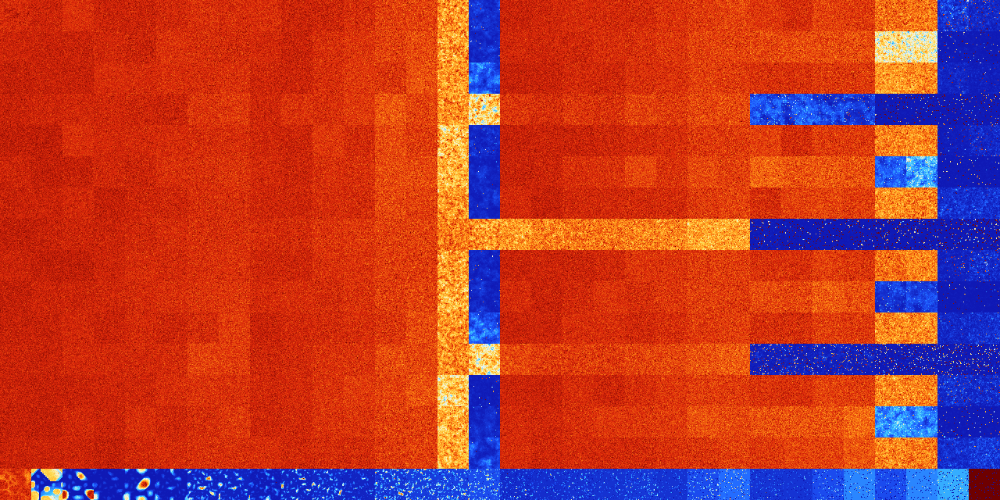

# B02678 (231936-232447)

<details>
    <summary>Initial Grid</summary>
    
</details>


<details>
    <summary>Initial Grid RLE</summary>

```
#C Exported from GoGoL (https://github.com/marrow16/gogol)
#C Wrap mode: Toroidal
#C Boundary mode: Dead
#C Step: 0
x = 100, y = 100, rule = B02678/S
10bo2bo4bo26bo12bobo$48bo7bo3bo5bo$30bo17bo10bo6bo9bo$27bo42bo13bo2bo5b
o3bo$40bo22bo13bo$6bo3bo4bo37b2o18b2o14bo$5bobo14bo15bo9bo$8bo16bo$11bo
22bo40bo$4bo29bo9bo5bo18bo5bo$bo16bo8bo10bo10bo32b2o$5bo26bo10bo37bo3bo
$2bo43bo8bo41bo$3bo45bo10bo20bo6bo6bo$38bo24bo8bo12bo11bo$24bo46bo18bo$
17bo13bo20bo21bobo$2bo56bo$7bo14bo37bo3bo10bo$bo12bo5bo32bo$20bo14bo52b
o2bo$28bo33bo27bo$27bo20bo14bo4bobo22bobo$21bo33bo2bo13bo$7bo65bo10bo$
31bo39bo10bo$bo19bo$2bo6bo29bo$17bobo3bobo29bo4bo13bo$52bo18bo$28bo6bo
5bo16bo10bo21bo$76bo$39b2o25bo6bo22bo$4bo7bo8bo41bo$5bo24bo27bo2bo14bo
3bo$5bo17bobo17bobo10bo18bo7bo6bobo$bobo40bo43bo$13bo20bo8bo6bo4bo15bo$
62bo16bo18bo$18bo24bo4bo24bo24bo$11bo19bo11bo5bo$11bo20bo12bo3bo$7b2o7b
o48bo$3bo3bo41bo28bo4bobo$72bobo8bo15bo$31bo2bo5bo30bo$4bo2bo28bo6bo31b
o$4bobo16bo6bo65bo$4bo15bo44bo$o14bo4bo3bo39bo4bo6bo19bobo$12bo16bo37bo
12bo$71bo4bobobo10bo6bo$8bo11bo31bo35bobo$o4bo46bo27bo$20bo20bo8bo9bo8b
o9bo15bo$6bo46bo4bo$23bo10bo26bo$5bo16bo28bo$6bo11bo6bo8bo5bo22bo4bo$bo
17bo49bo4bo$5b2o10bo13bo24bo2bo$2bo16bo20bo12bo4bo14bo$6bo35bo56bo$6bo
28bo14bo6bo15bo4bo$17bo11bo7bo7bo44b2o$9bo42bo20bo7bo9bobo$19bo13bo31bo
18bo14bo$79bo$41b2o4bo13bobo7bo5bo3bo11bo$100b$49bo2bo4bo27bo3bo$2bo4bo
2bo61bo19bo4bo$9bo4bo13bo42b3o10bo$4bo12bo2bo46bobo$45bo$4bo5bo12bo3bo
6bo9bo5bo23bo$21bo25bo3bo26b2o7bo$12bo37bo$12bo22bo49bo5bo$3bo55bo14bob
o7bo3bo$54bo36bo$5b2o53bo17bobo$72bo$24bo2bo53bo2bo$o2bo7bo6bo44bo25bo
7bo$34bo$15bo6bo27bo4bo21bo18bo$6bo37bo21bo$o3bo24bo32bo24bo$o28b2o3bo
10bobo9bo17bo$11bo13bo6bo5bo34bo25bo$28bo27bo9bo15bo$16bo17bobo6bo8bo5b
o12bo$7b2o11bo21bo10bo17bo7bo19bo$4bo9bo37bo10bo$bo5bo5bobo20bo49bo$34b
o17bo39bo4bo$29bo13bo23bo23bo$15bo7bo10bo2bo7bo9bo24bo$10bo17bo15bo4bo
5bo6bo3bo32bo!
```
</details>
<details>
    <summary>Thumbnail</summary>

</details>
<table>
<tr>
    <td><a href="./231936%20S%20Heat%20Map%20Activity.png"></a><br>S (231936)<br>G>1000</td>    <td><a href="./231937%20S0%20Heat%20Map%20Activity.png"></a><br>S0 (231937)<br>G>1000</td>    <td><a href="./231938%20S1%20Heat%20Map%20Activity.png"></a><br>S1 (231938)<br>G>1000</td>    <td><a href="./231939%20S01%20Heat%20Map%20Activity.png"></a><br>S01 (231939)<br>G>1000</td>    <td><a href="./231940%20S2%20Heat%20Map%20Activity.png"></a><br>S2 (231940)<br>G>1000</td>    <td><a href="./231941%20S02%20Heat%20Map%20Activity.png"></a><br>S02 (231941)<br>G>1000</td>    <td><a href="./231942%20S12%20Heat%20Map%20Activity.png"></a><br>S12 (231942)<br>G>1000</td>    <td><a href="./231943%20S012%20Heat%20Map%20Activity.png"></a><br>S012 (231943)<br>G>1000</td>    <td><a href="./231944%20S3%20Heat%20Map%20Activity.png"></a><br>S3 (231944)<br>G>1000</td>    <td><a href="./231945%20S03%20Heat%20Map%20Activity.png"></a><br>S03 (231945)<br>G>1000</td>    <td><a href="./231946%20S13%20Heat%20Map%20Activity.png"></a><br>S13 (231946)<br>G>1000</td>    <td><a href="./231947%20S013%20Heat%20Map%20Activity.png"></a><br>S013 (231947)<br>G>1000</td>    <td><a href="./231948%20S23%20Heat%20Map%20Activity.png"></a><br>S23 (231948)<br>G>1000</td>    <td><a href="./231949%20S023%20Heat%20Map%20Activity.png"></a><br>S023 (231949)<br>G>1000</td>    <td><a href="./231950%20S123%20Heat%20Map%20Activity.png"></a><br>S123 (231950)<br>G>1000</td>    <td><a href="./231951%20S0123%20Heat%20Map%20Activity.png"></a><br>S0123 (231951)<br>R@652,p210</td>    <td><a href="./231952%20S4%20Heat%20Map%20Activity.png"></a><br>S4 (231952)<br>G>1000</td>    <td><a href="./231953%20S04%20Heat%20Map%20Activity.png"></a><br>S04 (231953)<br>G>1000</td>    <td><a href="./231954%20S14%20Heat%20Map%20Activity.png"></a><br>S14 (231954)<br>G>1000</td>    <td><a href="./231955%20S014%20Heat%20Map%20Activity.png"></a><br>S014 (231955)<br>G>1000</td>    <td><a href="./231956%20S24%20Heat%20Map%20Activity.png"></a><br>S24 (231956)<br>G>1000</td>    <td><a href="./231957%20S024%20Heat%20Map%20Activity.png"></a><br>S024 (231957)<br>G>1000</td>    <td><a href="./231958%20S124%20Heat%20Map%20Activity.png"></a><br>S124 (231958)<br>G>1000</td>    <td><a href="./231959%20S0124%20Heat%20Map%20Activity.png"></a><br>S0124 (231959)<br>G>1000</td>    <td><a href="./231960%20S34%20Heat%20Map%20Activity.png"></a><br>S34 (231960)<br>G>1000</td>    <td><a href="./231961%20S034%20Heat%20Map%20Activity.png"></a><br>S034 (231961)<br>G>1000</td>    <td><a href="./231962%20S134%20Heat%20Map%20Activity.png"></a><br>S134 (231962)<br>G>1000</td>    <td><a href="./231963%20S0134%20Heat%20Map%20Activity.png"></a><br>S0134 (231963)<br>G>1000</td>    <td><a href="./231964%20S234%20Heat%20Map%20Activity.png"></a><br>S234 (231964)<br>G>1000</td>    <td><a href="./231965%20S0234%20Heat%20Map%20Activity.png"></a><br>S0234 (231965)<br>G>1000</td>    <td><a href="./231966%20S1234%20Heat%20Map%20Activity.png"></a><br>S1234 (231966)<br>R@137,p12</td>    <td><a href="./231967%20S01234%20Heat%20Map%20Activity.png"></a><br>S01234 (231967)<br>R@154,p84</td></tr>
<tr>
    <td><a href="./231968%20S5%20Heat%20Map%20Activity.png"></a><br>S5 (231968)<br>G>1000</td>    <td><a href="./231969%20S05%20Heat%20Map%20Activity.png"></a><br>S05 (231969)<br>G>1000</td>    <td><a href="./231970%20S15%20Heat%20Map%20Activity.png"></a><br>S15 (231970)<br>G>1000</td>    <td><a href="./231971%20S015%20Heat%20Map%20Activity.png"></a><br>S015 (231971)<br>G>1000</td>    <td><a href="./231972%20S25%20Heat%20Map%20Activity.png"></a><br>S25 (231972)<br>G>1000</td>    <td><a href="./231973%20S025%20Heat%20Map%20Activity.png"></a><br>S025 (231973)<br>G>1000</td>    <td><a href="./231974%20S125%20Heat%20Map%20Activity.png"></a><br>S125 (231974)<br>G>1000</td>    <td><a href="./231975%20S0125%20Heat%20Map%20Activity.png"></a><br>S0125 (231975)<br>G>1000</td>    <td><a href="./231976%20S35%20Heat%20Map%20Activity.png"></a><br>S35 (231976)<br>G>1000</td>    <td><a href="./231977%20S035%20Heat%20Map%20Activity.png"></a><br>S035 (231977)<br>G>1000</td>    <td><a href="./231978%20S135%20Heat%20Map%20Activity.png"></a><br>S135 (231978)<br>G>1000</td>    <td><a href="./231979%20S0135%20Heat%20Map%20Activity.png"></a><br>S0135 (231979)<br>G>1000</td>    <td><a href="./231980%20S235%20Heat%20Map%20Activity.png"></a><br>S235 (231980)<br>G>1000</td>    <td><a href="./231981%20S0235%20Heat%20Map%20Activity.png"></a><br>S0235 (231981)<br>G>1000</td>    <td><a href="./231982%20S1235%20Heat%20Map%20Activity.png"></a><br>S1235 (231982)<br>G>1000</td>    <td><a href="./231983%20S01235%20Heat%20Map%20Activity.png"></a><br>S01235 (231983)<br>G>1000</td>    <td><a href="./231984%20S45%20Heat%20Map%20Activity.png"></a><br>S45 (231984)<br>G>1000</td>    <td><a href="./231985%20S045%20Heat%20Map%20Activity.png"></a><br>S045 (231985)<br>G>1000</td>    <td><a href="./231986%20S145%20Heat%20Map%20Activity.png"></a><br>S145 (231986)<br>G>1000</td>    <td><a href="./231987%20S0145%20Heat%20Map%20Activity.png"></a><br>S0145 (231987)<br>G>1000</td>    <td><a href="./231988%20S245%20Heat%20Map%20Activity.png"></a><br>S245 (231988)<br>G>1000</td>    <td><a href="./231989%20S0245%20Heat%20Map%20Activity.png"></a><br>S0245 (231989)<br>G>1000</td>    <td><a href="./231990%20S1245%20Heat%20Map%20Activity.png"></a><br>S1245 (231990)<br>G>1000</td>    <td><a href="./231991%20S01245%20Heat%20Map%20Activity.png"></a><br>S01245 (231991)<br>G>1000</td>    <td><a href="./231992%20S345%20Heat%20Map%20Activity.png"></a><br>S345 (231992)<br>G>1000</td>    <td><a href="./231993%20S0345%20Heat%20Map%20Activity.png"></a><br>S0345 (231993)<br>G>1000</td>    <td><a href="./231994%20S1345%20Heat%20Map%20Activity.png"></a><br>S1345 (231994)<br>G>1000</td>    <td><a href="./231995%20S01345%20Heat%20Map%20Activity.png"></a><br>S01345 (231995)<br>G>1000</td>    <td><a href="./231996%20S2345%20Heat%20Map%20Activity.png"></a><br>S2345 (231996)<br>G>1000</td>    <td><a href="./231997%20S02345%20Heat%20Map%20Activity.png"></a><br>S02345 (231997)<br>G>1000</td>    <td><a href="./231998%20S12345%20Heat%20Map%20Activity.png"></a><br>S12345 (231998)<br>R@980,p840</td>    <td><a href="./231999%20S012345%20Heat%20Map%20Activity.png"></a><br>S012345 (231999)<br>G>1000</td></tr>
<tr>
    <td><a href="./232000%20S6%20Heat%20Map%20Activity.png"></a><br>S6 (232000)<br>G>1000</td>    <td><a href="./232001%20S06%20Heat%20Map%20Activity.png"></a><br>S06 (232001)<br>G>1000</td>    <td><a href="./232002%20S16%20Heat%20Map%20Activity.png"></a><br>S16 (232002)<br>G>1000</td>    <td><a href="./232003%20S016%20Heat%20Map%20Activity.png"></a><br>S016 (232003)<br>G>1000</td>    <td><a href="./232004%20S26%20Heat%20Map%20Activity.png"></a><br>S26 (232004)<br>G>1000</td>    <td><a href="./232005%20S026%20Heat%20Map%20Activity.png"></a><br>S026 (232005)<br>G>1000</td>    <td><a href="./232006%20S126%20Heat%20Map%20Activity.png"></a><br>S126 (232006)<br>G>1000</td>    <td><a href="./232007%20S0126%20Heat%20Map%20Activity.png"></a><br>S0126 (232007)<br>G>1000</td>    <td><a href="./232008%20S36%20Heat%20Map%20Activity.png"></a><br>S36 (232008)<br>G>1000</td>    <td><a href="./232009%20S036%20Heat%20Map%20Activity.png"></a><br>S036 (232009)<br>G>1000</td>    <td><a href="./232010%20S136%20Heat%20Map%20Activity.png"></a><br>S136 (232010)<br>G>1000</td>    <td><a href="./232011%20S0136%20Heat%20Map%20Activity.png"></a><br>S0136 (232011)<br>G>1000</td>    <td><a href="./232012%20S236%20Heat%20Map%20Activity.png"></a><br>S236 (232012)<br>G>1000</td>    <td><a href="./232013%20S0236%20Heat%20Map%20Activity.png"></a><br>S0236 (232013)<br>G>1000</td>    <td><a href="./232014%20S1236%20Heat%20Map%20Activity.png"></a><br>S1236 (232014)<br>G>1000</td>    <td><a href="./232015%20S01236%20Heat%20Map%20Activity.png"></a><br>S01236 (232015)<br>G>1000</td>    <td><a href="./232016%20S46%20Heat%20Map%20Activity.png"></a><br>S46 (232016)<br>G>1000</td>    <td><a href="./232017%20S046%20Heat%20Map%20Activity.png"></a><br>S046 (232017)<br>G>1000</td>    <td><a href="./232018%20S146%20Heat%20Map%20Activity.png"></a><br>S146 (232018)<br>G>1000</td>    <td><a href="./232019%20S0146%20Heat%20Map%20Activity.png"></a><br>S0146 (232019)<br>G>1000</td>    <td><a href="./232020%20S246%20Heat%20Map%20Activity.png"></a><br>S246 (232020)<br>G>1000</td>    <td><a href="./232021%20S0246%20Heat%20Map%20Activity.png"></a><br>S0246 (232021)<br>G>1000</td>    <td><a href="./232022%20S1246%20Heat%20Map%20Activity.png"></a><br>S1246 (232022)<br>G>1000</td>    <td><a href="./232023%20S01246%20Heat%20Map%20Activity.png"></a><br>S01246 (232023)<br>G>1000</td>    <td><a href="./232024%20S346%20Heat%20Map%20Activity.png"></a><br>S346 (232024)<br>G>1000</td>    <td><a href="./232025%20S0346%20Heat%20Map%20Activity.png"></a><br>S0346 (232025)<br>G>1000</td>    <td><a href="./232026%20S1346%20Heat%20Map%20Activity.png"></a><br>S1346 (232026)<br>G>1000</td>    <td><a href="./232027%20S01346%20Heat%20Map%20Activity.png"></a><br>S01346 (232027)<br>G>1000</td>    <td><a href="./232028%20S2346%20Heat%20Map%20Activity.png"></a><br>S2346 (232028)<br>G>1000</td>    <td><a href="./232029%20S02346%20Heat%20Map%20Activity.png"></a><br>S02346 (232029)<br>G>1000</td>    <td><a href="./232030%20S12346%20Heat%20Map%20Activity.png"></a><br>S12346 (232030)<br>R@164,p12</td>    <td><a href="./232031%20S012346%20Heat%20Map%20Activity.png"></a><br>S012346 (232031)<br>R@232,p168</td></tr>
<tr>
    <td><a href="./232032%20S56%20Heat%20Map%20Activity.png"></a><br>S56 (232032)<br>G>1000</td>    <td><a href="./232033%20S056%20Heat%20Map%20Activity.png"></a><br>S056 (232033)<br>G>1000</td>    <td><a href="./232034%20S156%20Heat%20Map%20Activity.png"></a><br>S156 (232034)<br>G>1000</td>    <td><a href="./232035%20S0156%20Heat%20Map%20Activity.png"></a><br>S0156 (232035)<br>G>1000</td>    <td><a href="./232036%20S256%20Heat%20Map%20Activity.png"></a><br>S256 (232036)<br>G>1000</td>    <td><a href="./232037%20S0256%20Heat%20Map%20Activity.png"></a><br>S0256 (232037)<br>G>1000</td>    <td><a href="./232038%20S1256%20Heat%20Map%20Activity.png"></a><br>S1256 (232038)<br>G>1000</td>    <td><a href="./232039%20S01256%20Heat%20Map%20Activity.png"></a><br>S01256 (232039)<br>G>1000</td>    <td><a href="./232040%20S356%20Heat%20Map%20Activity.png"></a><br>S356 (232040)<br>G>1000</td>    <td><a href="./232041%20S0356%20Heat%20Map%20Activity.png"></a><br>S0356 (232041)<br>G>1000</td>    <td><a href="./232042%20S1356%20Heat%20Map%20Activity.png"></a><br>S1356 (232042)<br>G>1000</td>    <td><a href="./232043%20S01356%20Heat%20Map%20Activity.png"></a><br>S01356 (232043)<br>G>1000</td>    <td><a href="./232044%20S2356%20Heat%20Map%20Activity.png"></a><br>S2356 (232044)<br>G>1000</td>    <td><a href="./232045%20S02356%20Heat%20Map%20Activity.png"></a><br>S02356 (232045)<br>G>1000</td>    <td><a href="./232046%20S12356%20Heat%20Map%20Activity.png"></a><br>S12356 (232046)<br>G>1000</td>    <td><a href="./232047%20S012356%20Heat%20Map%20Activity.png"></a><br>S012356 (232047)<br>G>1000</td>    <td><a href="./232048%20S456%20Heat%20Map%20Activity.png"></a><br>S456 (232048)<br>G>1000</td>    <td><a href="./232049%20S0456%20Heat%20Map%20Activity.png"></a><br>S0456 (232049)<br>G>1000</td>    <td><a href="./232050%20S1456%20Heat%20Map%20Activity.png"></a><br>S1456 (232050)<br>G>1000</td>    <td><a href="./232051%20S01456%20Heat%20Map%20Activity.png"></a><br>S01456 (232051)<br>G>1000</td>    <td><a href="./232052%20S2456%20Heat%20Map%20Activity.png"></a><br>S2456 (232052)<br>G>1000</td>    <td><a href="./232053%20S02456%20Heat%20Map%20Activity.png"></a><br>S02456 (232053)<br>G>1000</td>    <td><a href="./232054%20S12456%20Heat%20Map%20Activity.png"></a><br>S12456 (232054)<br>G>1000</td>    <td><a href="./232055%20S012456%20Heat%20Map%20Activity.png"></a><br>S012456 (232055)<br>G>1000</td>    <td><a href="./232056%20S3456%20Heat%20Map%20Activity.png"></a><br>S3456 (232056)<br>G>1000</td>    <td><a href="./232057%20S03456%20Heat%20Map%20Activity.png"></a><br>S03456 (232057)<br>G>1000</td>    <td><a href="./232058%20S13456%20Heat%20Map%20Activity.png"></a><br>S13456 (232058)<br>G>1000</td>    <td><a href="./232059%20S013456%20Heat%20Map%20Activity.png"></a><br>S013456 (232059)<br>G>1000</td>    <td><a href="./232060%20S23456%20Heat%20Map%20Activity.png"></a><br>S23456 (232060)<br>R@909,p840</td>    <td><a href="./232061%20S023456%20Heat%20Map%20Activity.png"></a><br>S023456 (232061)<br>G>1000</td>    <td><a href="./232062%20S123456%20Heat%20Map%20Activity.png"></a><br>S123456 (232062)<br>G>1000</td>    <td><a href="./232063%20S0123456%20Heat%20Map%20Activity.png"></a><br>S0123456 (232063)<br>G>1000</td></tr>
<tr>
    <td><a href="./232064%20S7%20Heat%20Map%20Activity.png"></a><br>S7 (232064)<br>G>1000</td>    <td><a href="./232065%20S07%20Heat%20Map%20Activity.png"></a><br>S07 (232065)<br>G>1000</td>    <td><a href="./232066%20S17%20Heat%20Map%20Activity.png"></a><br>S17 (232066)<br>G>1000</td>    <td><a href="./232067%20S017%20Heat%20Map%20Activity.png"></a><br>S017 (232067)<br>G>1000</td>    <td><a href="./232068%20S27%20Heat%20Map%20Activity.png"></a><br>S27 (232068)<br>G>1000</td>    <td><a href="./232069%20S027%20Heat%20Map%20Activity.png"></a><br>S027 (232069)<br>G>1000</td>    <td><a href="./232070%20S127%20Heat%20Map%20Activity.png"></a><br>S127 (232070)<br>G>1000</td>    <td><a href="./232071%20S0127%20Heat%20Map%20Activity.png"></a><br>S0127 (232071)<br>G>1000</td>    <td><a href="./232072%20S37%20Heat%20Map%20Activity.png"></a><br>S37 (232072)<br>G>1000</td>    <td><a href="./232073%20S037%20Heat%20Map%20Activity.png"></a><br>S037 (232073)<br>G>1000</td>    <td><a href="./232074%20S137%20Heat%20Map%20Activity.png"></a><br>S137 (232074)<br>G>1000</td>    <td><a href="./232075%20S0137%20Heat%20Map%20Activity.png"></a><br>S0137 (232075)<br>G>1000</td>    <td><a href="./232076%20S237%20Heat%20Map%20Activity.png"></a><br>S237 (232076)<br>G>1000</td>    <td><a href="./232077%20S0237%20Heat%20Map%20Activity.png"></a><br>S0237 (232077)<br>G>1000</td>    <td><a href="./232078%20S1237%20Heat%20Map%20Activity.png"></a><br>S1237 (232078)<br>G>1000</td>    <td><a href="./232079%20S01237%20Heat%20Map%20Activity.png"></a><br>S01237 (232079)<br>R@411,p210</td>    <td><a href="./232080%20S47%20Heat%20Map%20Activity.png"></a><br>S47 (232080)<br>G>1000</td>    <td><a href="./232081%20S047%20Heat%20Map%20Activity.png"></a><br>S047 (232081)<br>G>1000</td>    <td><a href="./232082%20S147%20Heat%20Map%20Activity.png"></a><br>S147 (232082)<br>G>1000</td>    <td><a href="./232083%20S0147%20Heat%20Map%20Activity.png"></a><br>S0147 (232083)<br>G>1000</td>    <td><a href="./232084%20S247%20Heat%20Map%20Activity.png"></a><br>S247 (232084)<br>G>1000</td>    <td><a href="./232085%20S0247%20Heat%20Map%20Activity.png"></a><br>S0247 (232085)<br>G>1000</td>    <td><a href="./232086%20S1247%20Heat%20Map%20Activity.png"></a><br>S1247 (232086)<br>G>1000</td>    <td><a href="./232087%20S01247%20Heat%20Map%20Activity.png"></a><br>S01247 (232087)<br>G>1000</td>    <td><a href="./232088%20S347%20Heat%20Map%20Activity.png"></a><br>S347 (232088)<br>G>1000</td>    <td><a href="./232089%20S0347%20Heat%20Map%20Activity.png"></a><br>S0347 (232089)<br>G>1000</td>    <td><a href="./232090%20S1347%20Heat%20Map%20Activity.png"></a><br>S1347 (232090)<br>G>1000</td>    <td><a href="./232091%20S01347%20Heat%20Map%20Activity.png"></a><br>S01347 (232091)<br>G>1000</td>    <td><a href="./232092%20S2347%20Heat%20Map%20Activity.png"></a><br>S2347 (232092)<br>G>1000</td>    <td><a href="./232093%20S02347%20Heat%20Map%20Activity.png"></a><br>S02347 (232093)<br>G>1000</td>    <td><a href="./232094%20S12347%20Heat%20Map%20Activity.png"></a><br>S12347 (232094)<br>R@420,p336</td>    <td><a href="./232095%20S012347%20Heat%20Map%20Activity.png"></a><br>S012347 (232095)<br>R@111,p60</td></tr>
<tr>
    <td><a href="./232096%20S57%20Heat%20Map%20Activity.png"></a><br>S57 (232096)<br>G>1000</td>    <td><a href="./232097%20S057%20Heat%20Map%20Activity.png"></a><br>S057 (232097)<br>G>1000</td>    <td><a href="./232098%20S157%20Heat%20Map%20Activity.png"></a><br>S157 (232098)<br>G>1000</td>    <td><a href="./232099%20S0157%20Heat%20Map%20Activity.png"></a><br>S0157 (232099)<br>G>1000</td>    <td><a href="./232100%20S257%20Heat%20Map%20Activity.png"></a><br>S257 (232100)<br>G>1000</td>    <td><a href="./232101%20S0257%20Heat%20Map%20Activity.png"></a><br>S0257 (232101)<br>G>1000</td>    <td><a href="./232102%20S1257%20Heat%20Map%20Activity.png"></a><br>S1257 (232102)<br>G>1000</td>    <td><a href="./232103%20S01257%20Heat%20Map%20Activity.png"></a><br>S01257 (232103)<br>G>1000</td>    <td><a href="./232104%20S357%20Heat%20Map%20Activity.png"></a><br>S357 (232104)<br>G>1000</td>    <td><a href="./232105%20S0357%20Heat%20Map%20Activity.png"></a><br>S0357 (232105)<br>G>1000</td>    <td><a href="./232106%20S1357%20Heat%20Map%20Activity.png"></a><br>S1357 (232106)<br>G>1000</td>    <td><a href="./232107%20S01357%20Heat%20Map%20Activity.png"></a><br>S01357 (232107)<br>G>1000</td>    <td><a href="./232108%20S2357%20Heat%20Map%20Activity.png"></a><br>S2357 (232108)<br>G>1000</td>    <td><a href="./232109%20S02357%20Heat%20Map%20Activity.png"></a><br>S02357 (232109)<br>G>1000</td>    <td><a href="./232110%20S12357%20Heat%20Map%20Activity.png"></a><br>S12357 (232110)<br>G>1000</td>    <td><a href="./232111%20S012357%20Heat%20Map%20Activity.png"></a><br>S012357 (232111)<br>G>1000</td>    <td><a href="./232112%20S457%20Heat%20Map%20Activity.png"></a><br>S457 (232112)<br>G>1000</td>    <td><a href="./232113%20S0457%20Heat%20Map%20Activity.png"></a><br>S0457 (232113)<br>G>1000</td>    <td><a href="./232114%20S1457%20Heat%20Map%20Activity.png"></a><br>S1457 (232114)<br>G>1000</td>    <td><a href="./232115%20S01457%20Heat%20Map%20Activity.png"></a><br>S01457 (232115)<br>G>1000</td>    <td><a href="./232116%20S2457%20Heat%20Map%20Activity.png"></a><br>S2457 (232116)<br>G>1000</td>    <td><a href="./232117%20S02457%20Heat%20Map%20Activity.png"></a><br>S02457 (232117)<br>G>1000</td>    <td><a href="./232118%20S12457%20Heat%20Map%20Activity.png"></a><br>S12457 (232118)<br>G>1000</td>    <td><a href="./232119%20S012457%20Heat%20Map%20Activity.png"></a><br>S012457 (232119)<br>G>1000</td>    <td><a href="./232120%20S3457%20Heat%20Map%20Activity.png"></a><br>S3457 (232120)<br>G>1000</td>    <td><a href="./232121%20S03457%20Heat%20Map%20Activity.png"></a><br>S03457 (232121)<br>G>1000</td>    <td><a href="./232122%20S13457%20Heat%20Map%20Activity.png"></a><br>S13457 (232122)<br>G>1000</td>    <td><a href="./232123%20S013457%20Heat%20Map%20Activity.png"></a><br>S013457 (232123)<br>G>1000</td>    <td><a href="./232124%20S23457%20Heat%20Map%20Activity.png"></a><br>S23457 (232124)<br>G>1000</td>    <td><a href="./232125%20S023457%20Heat%20Map%20Activity.png"></a><br>S023457 (232125)<br>G>1000</td>    <td><a href="./232126%20S123457%20Heat%20Map%20Activity.png"></a><br>S123457 (232126)<br>G>1000</td>    <td><a href="./232127%20S0123457%20Heat%20Map%20Activity.png"></a><br>S0123457 (232127)<br>R@909,p840</td></tr>
<tr>
    <td><a href="./232128%20S67%20Heat%20Map%20Activity.png"></a><br>S67 (232128)<br>G>1000</td>    <td><a href="./232129%20S067%20Heat%20Map%20Activity.png"></a><br>S067 (232129)<br>G>1000</td>    <td><a href="./232130%20S167%20Heat%20Map%20Activity.png"></a><br>S167 (232130)<br>G>1000</td>    <td><a href="./232131%20S0167%20Heat%20Map%20Activity.png"></a><br>S0167 (232131)<br>G>1000</td>    <td><a href="./232132%20S267%20Heat%20Map%20Activity.png"></a><br>S267 (232132)<br>G>1000</td>    <td><a href="./232133%20S0267%20Heat%20Map%20Activity.png"></a><br>S0267 (232133)<br>G>1000</td>    <td><a href="./232134%20S1267%20Heat%20Map%20Activity.png"></a><br>S1267 (232134)<br>G>1000</td>    <td><a href="./232135%20S01267%20Heat%20Map%20Activity.png"></a><br>S01267 (232135)<br>G>1000</td>    <td><a href="./232136%20S367%20Heat%20Map%20Activity.png"></a><br>S367 (232136)<br>G>1000</td>    <td><a href="./232137%20S0367%20Heat%20Map%20Activity.png"></a><br>S0367 (232137)<br>G>1000</td>    <td><a href="./232138%20S1367%20Heat%20Map%20Activity.png"></a><br>S1367 (232138)<br>G>1000</td>    <td><a href="./232139%20S01367%20Heat%20Map%20Activity.png"></a><br>S01367 (232139)<br>G>1000</td>    <td><a href="./232140%20S2367%20Heat%20Map%20Activity.png"></a><br>S2367 (232140)<br>G>1000</td>    <td><a href="./232141%20S02367%20Heat%20Map%20Activity.png"></a><br>S02367 (232141)<br>G>1000</td>    <td><a href="./232142%20S12367%20Heat%20Map%20Activity.png"></a><br>S12367 (232142)<br>G>1000</td>    <td><a href="./232143%20S012367%20Heat%20Map%20Activity.png"></a><br>S012367 (232143)<br>G>1000</td>    <td><a href="./232144%20S467%20Heat%20Map%20Activity.png"></a><br>S467 (232144)<br>G>1000</td>    <td><a href="./232145%20S0467%20Heat%20Map%20Activity.png"></a><br>S0467 (232145)<br>G>1000</td>    <td><a href="./232146%20S1467%20Heat%20Map%20Activity.png"></a><br>S1467 (232146)<br>G>1000</td>    <td><a href="./232147%20S01467%20Heat%20Map%20Activity.png"></a><br>S01467 (232147)<br>G>1000</td>    <td><a href="./232148%20S2467%20Heat%20Map%20Activity.png"></a><br>S2467 (232148)<br>G>1000</td>    <td><a href="./232149%20S02467%20Heat%20Map%20Activity.png"></a><br>S02467 (232149)<br>G>1000</td>    <td><a href="./232150%20S12467%20Heat%20Map%20Activity.png"></a><br>S12467 (232150)<br>G>1000</td>    <td><a href="./232151%20S012467%20Heat%20Map%20Activity.png"></a><br>S012467 (232151)<br>G>1000</td>    <td><a href="./232152%20S3467%20Heat%20Map%20Activity.png"></a><br>S3467 (232152)<br>G>1000</td>    <td><a href="./232153%20S03467%20Heat%20Map%20Activity.png"></a><br>S03467 (232153)<br>G>1000</td>    <td><a href="./232154%20S13467%20Heat%20Map%20Activity.png"></a><br>S13467 (232154)<br>G>1000</td>    <td><a href="./232155%20S013467%20Heat%20Map%20Activity.png"></a><br>S013467 (232155)<br>G>1000</td>    <td><a href="./232156%20S23467%20Heat%20Map%20Activity.png"></a><br>S23467 (232156)<br>G>1000</td>    <td><a href="./232157%20S023467%20Heat%20Map%20Activity.png"></a><br>S023467 (232157)<br>G>1000</td>    <td><a href="./232158%20S123467%20Heat%20Map%20Activity.png"></a><br>S123467 (232158)<br>R@94,p12</td>    <td><a href="./232159%20S0123467%20Heat%20Map%20Activity.png"></a><br>S0123467 (232159)<br>R@80,p20</td></tr>
<tr>
    <td><a href="./232160%20S567%20Heat%20Map%20Activity.png"></a><br>S567 (232160)<br>G>1000</td>    <td><a href="./232161%20S0567%20Heat%20Map%20Activity.png"></a><br>S0567 (232161)<br>G>1000</td>    <td><a href="./232162%20S1567%20Heat%20Map%20Activity.png"></a><br>S1567 (232162)<br>G>1000</td>    <td><a href="./232163%20S01567%20Heat%20Map%20Activity.png"></a><br>S01567 (232163)<br>G>1000</td>    <td><a href="./232164%20S2567%20Heat%20Map%20Activity.png"></a><br>S2567 (232164)<br>G>1000</td>    <td><a href="./232165%20S02567%20Heat%20Map%20Activity.png"></a><br>S02567 (232165)<br>G>1000</td>    <td><a href="./232166%20S12567%20Heat%20Map%20Activity.png"></a><br>S12567 (232166)<br>G>1000</td>    <td><a href="./232167%20S012567%20Heat%20Map%20Activity.png"></a><br>S012567 (232167)<br>G>1000</td>    <td><a href="./232168%20S3567%20Heat%20Map%20Activity.png"></a><br>S3567 (232168)<br>G>1000</td>    <td><a href="./232169%20S03567%20Heat%20Map%20Activity.png"></a><br>S03567 (232169)<br>G>1000</td>    <td><a href="./232170%20S13567%20Heat%20Map%20Activity.png"></a><br>S13567 (232170)<br>G>1000</td>    <td><a href="./232171%20S013567%20Heat%20Map%20Activity.png"></a><br>S013567 (232171)<br>G>1000</td>    <td><a href="./232172%20S23567%20Heat%20Map%20Activity.png"></a><br>S23567 (232172)<br>G>1000</td>    <td><a href="./232173%20S023567%20Heat%20Map%20Activity.png"></a><br>S023567 (232173)<br>G>1000</td>    <td><a href="./232174%20S123567%20Heat%20Map%20Activity.png"></a><br>S123567 (232174)<br>G>1000</td>    <td><a href="./232175%20S0123567%20Heat%20Map%20Activity.png"></a><br>S0123567 (232175)<br>G>1000</td>    <td><a href="./232176%20S4567%20Heat%20Map%20Activity.png"></a><br>S4567 (232176)<br>G>1000</td>    <td><a href="./232177%20S04567%20Heat%20Map%20Activity.png"></a><br>S04567 (232177)<br>G>1000</td>    <td><a href="./232178%20S14567%20Heat%20Map%20Activity.png"></a><br>S14567 (232178)<br>G>1000</td>    <td><a href="./232179%20S014567%20Heat%20Map%20Activity.png"></a><br>S014567 (232179)<br>G>1000</td>    <td><a href="./232180%20S24567%20Heat%20Map%20Activity.png"></a><br>S24567 (232180)<br>G>1000</td>    <td><a href="./232181%20S024567%20Heat%20Map%20Activity.png"></a><br>S024567 (232181)<br>G>1000</td>    <td><a href="./232182%20S124567%20Heat%20Map%20Activity.png"></a><br>S124567 (232182)<br>G>1000</td>    <td><a href="./232183%20S0124567%20Heat%20Map%20Activity.png"></a><br>S0124567 (232183)<br>G>1000</td>    <td><a href="./232184%20S34567%20Heat%20Map%20Activity.png"></a><br>S34567 (232184)<br>R@477,p420</td>    <td><a href="./232185%20S034567%20Heat%20Map%20Activity.png"></a><br>S034567 (232185)<br>G>1000</td>    <td><a href="./232186%20S134567%20Heat%20Map%20Activity.png"></a><br>S134567 (232186)<br>G>1000</td>    <td><a href="./232187%20S0134567%20Heat%20Map%20Activity.png"></a><br>S0134567 (232187)<br>G>1000</td>    <td><a href="./232188%20S234567%20Heat%20Map%20Activity.png"></a><br>S234567 (232188)<br>G>1000</td>    <td><a href="./232189%20S0234567%20Heat%20Map%20Activity.png"></a><br>S0234567 (232189)<br>G>1000</td>    <td><a href="./232190%20S1234567%20Heat%20Map%20Activity.png"></a><br>S1234567 (232190)<br>G>1000</td>    <td><a href="./232191%20S01234567%20Heat%20Map%20Activity.png"></a><br>S01234567 (232191)<br>G>1000</td></tr>
<tr>
    <td><a href="./232192%20S8%20Heat%20Map%20Activity.png"></a><br>S8 (232192)<br>G>1000</td>    <td><a href="./232193%20S08%20Heat%20Map%20Activity.png"></a><br>S08 (232193)<br>G>1000</td>    <td><a href="./232194%20S18%20Heat%20Map%20Activity.png"></a><br>S18 (232194)<br>G>1000</td>    <td><a href="./232195%20S018%20Heat%20Map%20Activity.png"></a><br>S018 (232195)<br>G>1000</td>    <td><a href="./232196%20S28%20Heat%20Map%20Activity.png"></a><br>S28 (232196)<br>G>1000</td>    <td><a href="./232197%20S028%20Heat%20Map%20Activity.png"></a><br>S028 (232197)<br>G>1000</td>    <td><a href="./232198%20S128%20Heat%20Map%20Activity.png"></a><br>S128 (232198)<br>G>1000</td>    <td><a href="./232199%20S0128%20Heat%20Map%20Activity.png"></a><br>S0128 (232199)<br>G>1000</td>    <td><a href="./232200%20S38%20Heat%20Map%20Activity.png"></a><br>S38 (232200)<br>G>1000</td>    <td><a href="./232201%20S038%20Heat%20Map%20Activity.png"></a><br>S038 (232201)<br>G>1000</td>    <td><a href="./232202%20S138%20Heat%20Map%20Activity.png"></a><br>S138 (232202)<br>G>1000</td>    <td><a href="./232203%20S0138%20Heat%20Map%20Activity.png"></a><br>S0138 (232203)<br>G>1000</td>    <td><a href="./232204%20S238%20Heat%20Map%20Activity.png"></a><br>S238 (232204)<br>G>1000</td>    <td><a href="./232205%20S0238%20Heat%20Map%20Activity.png"></a><br>S0238 (232205)<br>G>1000</td>    <td><a href="./232206%20S1238%20Heat%20Map%20Activity.png"></a><br>S1238 (232206)<br>G>1000</td>    <td><a href="./232207%20S01238%20Heat%20Map%20Activity.png"></a><br>S01238 (232207)<br>R@792,p420</td>    <td><a href="./232208%20S48%20Heat%20Map%20Activity.png"></a><br>S48 (232208)<br>G>1000</td>    <td><a href="./232209%20S048%20Heat%20Map%20Activity.png"></a><br>S048 (232209)<br>G>1000</td>    <td><a href="./232210%20S148%20Heat%20Map%20Activity.png"></a><br>S148 (232210)<br>G>1000</td>    <td><a href="./232211%20S0148%20Heat%20Map%20Activity.png"></a><br>S0148 (232211)<br>G>1000</td>    <td><a href="./232212%20S248%20Heat%20Map%20Activity.png"></a><br>S248 (232212)<br>G>1000</td>    <td><a href="./232213%20S0248%20Heat%20Map%20Activity.png"></a><br>S0248 (232213)<br>G>1000</td>    <td><a href="./232214%20S1248%20Heat%20Map%20Activity.png"></a><br>S1248 (232214)<br>G>1000</td>    <td><a href="./232215%20S01248%20Heat%20Map%20Activity.png"></a><br>S01248 (232215)<br>G>1000</td>    <td><a href="./232216%20S348%20Heat%20Map%20Activity.png"></a><br>S348 (232216)<br>G>1000</td>    <td><a href="./232217%20S0348%20Heat%20Map%20Activity.png"></a><br>S0348 (232217)<br>G>1000</td>    <td><a href="./232218%20S1348%20Heat%20Map%20Activity.png"></a><br>S1348 (232218)<br>G>1000</td>    <td><a href="./232219%20S01348%20Heat%20Map%20Activity.png"></a><br>S01348 (232219)<br>G>1000</td>    <td><a href="./232220%20S2348%20Heat%20Map%20Activity.png"></a><br>S2348 (232220)<br>G>1000</td>    <td><a href="./232221%20S02348%20Heat%20Map%20Activity.png"></a><br>S02348 (232221)<br>G>1000</td>    <td><a href="./232222%20S12348%20Heat%20Map%20Activity.png"></a><br>S12348 (232222)<br>R@264,p140</td>    <td><a href="./232223%20S012348%20Heat%20Map%20Activity.png"></a><br>S012348 (232223)<br>R@86,p20</td></tr>
<tr>
    <td><a href="./232224%20S58%20Heat%20Map%20Activity.png"></a><br>S58 (232224)<br>G>1000</td>    <td><a href="./232225%20S058%20Heat%20Map%20Activity.png"></a><br>S058 (232225)<br>G>1000</td>    <td><a href="./232226%20S158%20Heat%20Map%20Activity.png"></a><br>S158 (232226)<br>G>1000</td>    <td><a href="./232227%20S0158%20Heat%20Map%20Activity.png"></a><br>S0158 (232227)<br>G>1000</td>    <td><a href="./232228%20S258%20Heat%20Map%20Activity.png"></a><br>S258 (232228)<br>G>1000</td>    <td><a href="./232229%20S0258%20Heat%20Map%20Activity.png"></a><br>S0258 (232229)<br>G>1000</td>    <td><a href="./232230%20S1258%20Heat%20Map%20Activity.png"></a><br>S1258 (232230)<br>G>1000</td>    <td><a href="./232231%20S01258%20Heat%20Map%20Activity.png"></a><br>S01258 (232231)<br>G>1000</td>    <td><a href="./232232%20S358%20Heat%20Map%20Activity.png"></a><br>S358 (232232)<br>G>1000</td>    <td><a href="./232233%20S0358%20Heat%20Map%20Activity.png"></a><br>S0358 (232233)<br>G>1000</td>    <td><a href="./232234%20S1358%20Heat%20Map%20Activity.png"></a><br>S1358 (232234)<br>G>1000</td>    <td><a href="./232235%20S01358%20Heat%20Map%20Activity.png"></a><br>S01358 (232235)<br>G>1000</td>    <td><a href="./232236%20S2358%20Heat%20Map%20Activity.png"></a><br>S2358 (232236)<br>G>1000</td>    <td><a href="./232237%20S02358%20Heat%20Map%20Activity.png"></a><br>S02358 (232237)<br>G>1000</td>    <td><a href="./232238%20S12358%20Heat%20Map%20Activity.png"></a><br>S12358 (232238)<br>G>1000</td>    <td><a href="./232239%20S012358%20Heat%20Map%20Activity.png"></a><br>S012358 (232239)<br>R@709,p60</td>    <td><a href="./232240%20S458%20Heat%20Map%20Activity.png"></a><br>S458 (232240)<br>G>1000</td>    <td><a href="./232241%20S0458%20Heat%20Map%20Activity.png"></a><br>S0458 (232241)<br>G>1000</td>    <td><a href="./232242%20S1458%20Heat%20Map%20Activity.png"></a><br>S1458 (232242)<br>G>1000</td>    <td><a href="./232243%20S01458%20Heat%20Map%20Activity.png"></a><br>S01458 (232243)<br>G>1000</td>    <td><a href="./232244%20S2458%20Heat%20Map%20Activity.png"></a><br>S2458 (232244)<br>G>1000</td>    <td><a href="./232245%20S02458%20Heat%20Map%20Activity.png"></a><br>S02458 (232245)<br>G>1000</td>    <td><a href="./232246%20S12458%20Heat%20Map%20Activity.png"></a><br>S12458 (232246)<br>G>1000</td>    <td><a href="./232247%20S012458%20Heat%20Map%20Activity.png"></a><br>S012458 (232247)<br>G>1000</td>    <td><a href="./232248%20S3458%20Heat%20Map%20Activity.png"></a><br>S3458 (232248)<br>G>1000</td>    <td><a href="./232249%20S03458%20Heat%20Map%20Activity.png"></a><br>S03458 (232249)<br>G>1000</td>    <td><a href="./232250%20S13458%20Heat%20Map%20Activity.png"></a><br>S13458 (232250)<br>G>1000</td>    <td><a href="./232251%20S013458%20Heat%20Map%20Activity.png"></a><br>S013458 (232251)<br>G>1000</td>    <td><a href="./232252%20S23458%20Heat%20Map%20Activity.png"></a><br>S23458 (232252)<br>G>1000</td>    <td><a href="./232253%20S023458%20Heat%20Map%20Activity.png"></a><br>S023458 (232253)<br>G>1000</td>    <td><a href="./232254%20S123458%20Heat%20Map%20Activity.png"></a><br>S123458 (232254)<br>R@913,p840</td>    <td><a href="./232255%20S0123458%20Heat%20Map%20Activity.png"></a><br>S0123458 (232255)<br>R@954,p840</td></tr>
<tr>
    <td><a href="./232256%20S68%20Heat%20Map%20Activity.png"></a><br>S68 (232256)<br>G>1000</td>    <td><a href="./232257%20S068%20Heat%20Map%20Activity.png"></a><br>S068 (232257)<br>G>1000</td>    <td><a href="./232258%20S168%20Heat%20Map%20Activity.png"></a><br>S168 (232258)<br>G>1000</td>    <td><a href="./232259%20S0168%20Heat%20Map%20Activity.png"></a><br>S0168 (232259)<br>G>1000</td>    <td><a href="./232260%20S268%20Heat%20Map%20Activity.png"></a><br>S268 (232260)<br>G>1000</td>    <td><a href="./232261%20S0268%20Heat%20Map%20Activity.png"></a><br>S0268 (232261)<br>G>1000</td>    <td><a href="./232262%20S1268%20Heat%20Map%20Activity.png"></a><br>S1268 (232262)<br>G>1000</td>    <td><a href="./232263%20S01268%20Heat%20Map%20Activity.png"></a><br>S01268 (232263)<br>G>1000</td>    <td><a href="./232264%20S368%20Heat%20Map%20Activity.png"></a><br>S368 (232264)<br>G>1000</td>    <td><a href="./232265%20S0368%20Heat%20Map%20Activity.png"></a><br>S0368 (232265)<br>G>1000</td>    <td><a href="./232266%20S1368%20Heat%20Map%20Activity.png"></a><br>S1368 (232266)<br>G>1000</td>    <td><a href="./232267%20S01368%20Heat%20Map%20Activity.png"></a><br>S01368 (232267)<br>G>1000</td>    <td><a href="./232268%20S2368%20Heat%20Map%20Activity.png"></a><br>S2368 (232268)<br>G>1000</td>    <td><a href="./232269%20S02368%20Heat%20Map%20Activity.png"></a><br>S02368 (232269)<br>G>1000</td>    <td><a href="./232270%20S12368%20Heat%20Map%20Activity.png"></a><br>S12368 (232270)<br>G>1000</td>    <td><a href="./232271%20S012368%20Heat%20Map%20Activity.png"></a><br>S012368 (232271)<br>G>1000</td>    <td><a href="./232272%20S468%20Heat%20Map%20Activity.png"></a><br>S468 (232272)<br>G>1000</td>    <td><a href="./232273%20S0468%20Heat%20Map%20Activity.png"></a><br>S0468 (232273)<br>G>1000</td>    <td><a href="./232274%20S1468%20Heat%20Map%20Activity.png"></a><br>S1468 (232274)<br>G>1000</td>    <td><a href="./232275%20S01468%20Heat%20Map%20Activity.png"></a><br>S01468 (232275)<br>G>1000</td>    <td><a href="./232276%20S2468%20Heat%20Map%20Activity.png"></a><br>S2468 (232276)<br>G>1000</td>    <td><a href="./232277%20S02468%20Heat%20Map%20Activity.png"></a><br>S02468 (232277)<br>G>1000</td>    <td><a href="./232278%20S12468%20Heat%20Map%20Activity.png"></a><br>S12468 (232278)<br>G>1000</td>    <td><a href="./232279%20S012468%20Heat%20Map%20Activity.png"></a><br>S012468 (232279)<br>G>1000</td>    <td><a href="./232280%20S3468%20Heat%20Map%20Activity.png"></a><br>S3468 (232280)<br>G>1000</td>    <td><a href="./232281%20S03468%20Heat%20Map%20Activity.png"></a><br>S03468 (232281)<br>G>1000</td>    <td><a href="./232282%20S13468%20Heat%20Map%20Activity.png"></a><br>S13468 (232282)<br>G>1000</td>    <td><a href="./232283%20S013468%20Heat%20Map%20Activity.png"></a><br>S013468 (232283)<br>G>1000</td>    <td><a href="./232284%20S23468%20Heat%20Map%20Activity.png"></a><br>S23468 (232284)<br>G>1000</td>    <td><a href="./232285%20S023468%20Heat%20Map%20Activity.png"></a><br>S023468 (232285)<br>G>1000</td>    <td><a href="./232286%20S123468%20Heat%20Map%20Activity.png"></a><br>S123468 (232286)<br>R@118,p24</td>    <td><a href="./232287%20S0123468%20Heat%20Map%20Activity.png"></a><br>S0123468 (232287)<br>R@78,p12</td></tr>
<tr>
    <td><a href="./232288%20S568%20Heat%20Map%20Activity.png"></a><br>S568 (232288)<br>G>1000</td>    <td><a href="./232289%20S0568%20Heat%20Map%20Activity.png"></a><br>S0568 (232289)<br>G>1000</td>    <td><a href="./232290%20S1568%20Heat%20Map%20Activity.png"></a><br>S1568 (232290)<br>G>1000</td>    <td><a href="./232291%20S01568%20Heat%20Map%20Activity.png"></a><br>S01568 (232291)<br>G>1000</td>    <td><a href="./232292%20S2568%20Heat%20Map%20Activity.png"></a><br>S2568 (232292)<br>G>1000</td>    <td><a href="./232293%20S02568%20Heat%20Map%20Activity.png"></a><br>S02568 (232293)<br>G>1000</td>    <td><a href="./232294%20S12568%20Heat%20Map%20Activity.png"></a><br>S12568 (232294)<br>G>1000</td>    <td><a href="./232295%20S012568%20Heat%20Map%20Activity.png"></a><br>S012568 (232295)<br>G>1000</td>    <td><a href="./232296%20S3568%20Heat%20Map%20Activity.png"></a><br>S3568 (232296)<br>G>1000</td>    <td><a href="./232297%20S03568%20Heat%20Map%20Activity.png"></a><br>S03568 (232297)<br>G>1000</td>    <td><a href="./232298%20S13568%20Heat%20Map%20Activity.png"></a><br>S13568 (232298)<br>G>1000</td>    <td><a href="./232299%20S013568%20Heat%20Map%20Activity.png"></a><br>S013568 (232299)<br>G>1000</td>    <td><a href="./232300%20S23568%20Heat%20Map%20Activity.png"></a><br>S23568 (232300)<br>G>1000</td>    <td><a href="./232301%20S023568%20Heat%20Map%20Activity.png"></a><br>S023568 (232301)<br>G>1000</td>    <td><a href="./232302%20S123568%20Heat%20Map%20Activity.png"></a><br>S123568 (232302)<br>G>1000</td>    <td><a href="./232303%20S0123568%20Heat%20Map%20Activity.png"></a><br>S0123568 (232303)<br>G>1000</td>    <td><a href="./232304%20S4568%20Heat%20Map%20Activity.png"></a><br>S4568 (232304)<br>G>1000</td>    <td><a href="./232305%20S04568%20Heat%20Map%20Activity.png"></a><br>S04568 (232305)<br>G>1000</td>    <td><a href="./232306%20S14568%20Heat%20Map%20Activity.png"></a><br>S14568 (232306)<br>G>1000</td>    <td><a href="./232307%20S014568%20Heat%20Map%20Activity.png"></a><br>S014568 (232307)<br>G>1000</td>    <td><a href="./232308%20S24568%20Heat%20Map%20Activity.png"></a><br>S24568 (232308)<br>G>1000</td>    <td><a href="./232309%20S024568%20Heat%20Map%20Activity.png"></a><br>S024568 (232309)<br>G>1000</td>    <td><a href="./232310%20S124568%20Heat%20Map%20Activity.png"></a><br>S124568 (232310)<br>G>1000</td>    <td><a href="./232311%20S0124568%20Heat%20Map%20Activity.png"></a><br>S0124568 (232311)<br>G>1000</td>    <td><a href="./232312%20S34568%20Heat%20Map%20Activity.png"></a><br>S34568 (232312)<br>G>1000</td>    <td><a href="./232313%20S034568%20Heat%20Map%20Activity.png"></a><br>S034568 (232313)<br>G>1000</td>    <td><a href="./232314%20S134568%20Heat%20Map%20Activity.png"></a><br>S134568 (232314)<br>G>1000</td>    <td><a href="./232315%20S0134568%20Heat%20Map%20Activity.png"></a><br>S0134568 (232315)<br>G>1000</td>    <td><a href="./232316%20S234568%20Heat%20Map%20Activity.png"></a><br>S234568 (232316)<br>G>1000</td>    <td><a href="./232317%20S0234568%20Heat%20Map%20Activity.png"></a><br>S0234568 (232317)<br>G>1000</td>    <td><a href="./232318%20S1234568%20Heat%20Map%20Activity.png"></a><br>S1234568 (232318)<br>G>1000</td>    <td><a href="./232319%20S01234568%20Heat%20Map%20Activity.png"></a><br>S01234568 (232319)<br>G>1000</td></tr>
<tr>
    <td><a href="./232320%20S78%20Heat%20Map%20Activity.png"></a><br>S78 (232320)<br>G>1000</td>    <td><a href="./232321%20S078%20Heat%20Map%20Activity.png"></a><br>S078 (232321)<br>G>1000</td>    <td><a href="./232322%20S178%20Heat%20Map%20Activity.png"></a><br>S178 (232322)<br>G>1000</td>    <td><a href="./232323%20S0178%20Heat%20Map%20Activity.png"></a><br>S0178 (232323)<br>G>1000</td>    <td><a href="./232324%20S278%20Heat%20Map%20Activity.png"></a><br>S278 (232324)<br>G>1000</td>    <td><a href="./232325%20S0278%20Heat%20Map%20Activity.png"></a><br>S0278 (232325)<br>G>1000</td>    <td><a href="./232326%20S1278%20Heat%20Map%20Activity.png"></a><br>S1278 (232326)<br>G>1000</td>    <td><a href="./232327%20S01278%20Heat%20Map%20Activity.png"></a><br>S01278 (232327)<br>G>1000</td>    <td><a href="./232328%20S378%20Heat%20Map%20Activity.png"></a><br>S378 (232328)<br>G>1000</td>    <td><a href="./232329%20S0378%20Heat%20Map%20Activity.png"></a><br>S0378 (232329)<br>G>1000</td>    <td><a href="./232330%20S1378%20Heat%20Map%20Activity.png"></a><br>S1378 (232330)<br>G>1000</td>    <td><a href="./232331%20S01378%20Heat%20Map%20Activity.png"></a><br>S01378 (232331)<br>G>1000</td>    <td><a href="./232332%20S2378%20Heat%20Map%20Activity.png"></a><br>S2378 (232332)<br>G>1000</td>    <td><a href="./232333%20S02378%20Heat%20Map%20Activity.png"></a><br>S02378 (232333)<br>G>1000</td>    <td><a href="./232334%20S12378%20Heat%20Map%20Activity.png"></a><br>S12378 (232334)<br>G>1000</td>    <td><a href="./232335%20S012378%20Heat%20Map%20Activity.png"></a><br>S012378 (232335)<br>R@804,p630</td>    <td><a href="./232336%20S478%20Heat%20Map%20Activity.png"></a><br>S478 (232336)<br>G>1000</td>    <td><a href="./232337%20S0478%20Heat%20Map%20Activity.png"></a><br>S0478 (232337)<br>G>1000</td>    <td><a href="./232338%20S1478%20Heat%20Map%20Activity.png"></a><br>S1478 (232338)<br>G>1000</td>    <td><a href="./232339%20S01478%20Heat%20Map%20Activity.png"></a><br>S01478 (232339)<br>G>1000</td>    <td><a href="./232340%20S2478%20Heat%20Map%20Activity.png"></a><br>S2478 (232340)<br>G>1000</td>    <td><a href="./232341%20S02478%20Heat%20Map%20Activity.png"></a><br>S02478 (232341)<br>G>1000</td>    <td><a href="./232342%20S12478%20Heat%20Map%20Activity.png"></a><br>S12478 (232342)<br>G>1000</td>    <td><a href="./232343%20S012478%20Heat%20Map%20Activity.png"></a><br>S012478 (232343)<br>G>1000</td>    <td><a href="./232344%20S3478%20Heat%20Map%20Activity.png"></a><br>S3478 (232344)<br>G>1000</td>    <td><a href="./232345%20S03478%20Heat%20Map%20Activity.png"></a><br>S03478 (232345)<br>G>1000</td>    <td><a href="./232346%20S13478%20Heat%20Map%20Activity.png"></a><br>S13478 (232346)<br>G>1000</td>    <td><a href="./232347%20S013478%20Heat%20Map%20Activity.png"></a><br>S013478 (232347)<br>G>1000</td>    <td><a href="./232348%20S23478%20Heat%20Map%20Activity.png"></a><br>S23478 (232348)<br>G>1000</td>    <td><a href="./232349%20S023478%20Heat%20Map%20Activity.png"></a><br>S023478 (232349)<br>G>1000</td>    <td><a href="./232350%20S123478%20Heat%20Map%20Activity.png"></a><br>S123478 (232350)<br>R@98,p12</td>    <td><a href="./232351%20S0123478%20Heat%20Map%20Activity.png"></a><br>S0123478 (232351)<br>R@79,p28</td></tr>
<tr>
    <td><a href="./232352%20S578%20Heat%20Map%20Activity.png"></a><br>S578 (232352)<br>G>1000</td>    <td><a href="./232353%20S0578%20Heat%20Map%20Activity.png"></a><br>S0578 (232353)<br>G>1000</td>    <td><a href="./232354%20S1578%20Heat%20Map%20Activity.png"></a><br>S1578 (232354)<br>G>1000</td>    <td><a href="./232355%20S01578%20Heat%20Map%20Activity.png"></a><br>S01578 (232355)<br>G>1000</td>    <td><a href="./232356%20S2578%20Heat%20Map%20Activity.png"></a><br>S2578 (232356)<br>G>1000</td>    <td><a href="./232357%20S02578%20Heat%20Map%20Activity.png"></a><br>S02578 (232357)<br>G>1000</td>    <td><a href="./232358%20S12578%20Heat%20Map%20Activity.png"></a><br>S12578 (232358)<br>G>1000</td>    <td><a href="./232359%20S012578%20Heat%20Map%20Activity.png"></a><br>S012578 (232359)<br>G>1000</td>    <td><a href="./232360%20S3578%20Heat%20Map%20Activity.png"></a><br>S3578 (232360)<br>G>1000</td>    <td><a href="./232361%20S03578%20Heat%20Map%20Activity.png"></a><br>S03578 (232361)<br>G>1000</td>    <td><a href="./232362%20S13578%20Heat%20Map%20Activity.png"></a><br>S13578 (232362)<br>G>1000</td>    <td><a href="./232363%20S013578%20Heat%20Map%20Activity.png"></a><br>S013578 (232363)<br>G>1000</td>    <td><a href="./232364%20S23578%20Heat%20Map%20Activity.png"></a><br>S23578 (232364)<br>G>1000</td>    <td><a href="./232365%20S023578%20Heat%20Map%20Activity.png"></a><br>S023578 (232365)<br>G>1000</td>    <td><a href="./232366%20S123578%20Heat%20Map%20Activity.png"></a><br>S123578 (232366)<br>G>1000</td>    <td><a href="./232367%20S0123578%20Heat%20Map%20Activity.png"></a><br>S0123578 (232367)<br>G>1000</td>    <td><a href="./232368%20S4578%20Heat%20Map%20Activity.png"></a><br>S4578 (232368)<br>G>1000</td>    <td><a href="./232369%20S04578%20Heat%20Map%20Activity.png"></a><br>S04578 (232369)<br>G>1000</td>    <td><a href="./232370%20S14578%20Heat%20Map%20Activity.png"></a><br>S14578 (232370)<br>G>1000</td>    <td><a href="./232371%20S014578%20Heat%20Map%20Activity.png"></a><br>S014578 (232371)<br>G>1000</td>    <td><a href="./232372%20S24578%20Heat%20Map%20Activity.png"></a><br>S24578 (232372)<br>G>1000</td>    <td><a href="./232373%20S024578%20Heat%20Map%20Activity.png"></a><br>S024578 (232373)<br>G>1000</td>    <td><a href="./232374%20S124578%20Heat%20Map%20Activity.png"></a><br>S124578 (232374)<br>G>1000</td>    <td><a href="./232375%20S0124578%20Heat%20Map%20Activity.png"></a><br>S0124578 (232375)<br>G>1000</td>    <td><a href="./232376%20S34578%20Heat%20Map%20Activity.png"></a><br>S34578 (232376)<br>G>1000</td>    <td><a href="./232377%20S034578%20Heat%20Map%20Activity.png"></a><br>S034578 (232377)<br>G>1000</td>    <td><a href="./232378%20S134578%20Heat%20Map%20Activity.png"></a><br>S134578 (232378)<br>G>1000</td>    <td><a href="./232379%20S0134578%20Heat%20Map%20Activity.png"></a><br>S0134578 (232379)<br>G>1000</td>    <td><a href="./232380%20S234578%20Heat%20Map%20Activity.png"></a><br>S234578 (232380)<br>G>1000</td>    <td><a href="./232381%20S0234578%20Heat%20Map%20Activity.png"></a><br>S0234578 (232381)<br>G>1000</td>    <td><a href="./232382%20S1234578%20Heat%20Map%20Activity.png"></a><br>S1234578 (232382)<br>G>1000</td>    <td><a href="./232383%20S01234578%20Heat%20Map%20Activity.png"></a><br>S01234578 (232383)<br>G>1000</td></tr>
<tr>
    <td><a href="./232384%20S678%20Heat%20Map%20Activity.png"></a><br>S678 (232384)<br>G>1000</td>    <td><a href="./232385%20S0678%20Heat%20Map%20Activity.png"></a><br>S0678 (232385)<br>G>1000</td>    <td><a href="./232386%20S1678%20Heat%20Map%20Activity.png"></a><br>S1678 (232386)<br>G>1000</td>    <td><a href="./232387%20S01678%20Heat%20Map%20Activity.png"></a><br>S01678 (232387)<br>G>1000</td>    <td><a href="./232388%20S2678%20Heat%20Map%20Activity.png"></a><br>S2678 (232388)<br>G>1000</td>    <td><a href="./232389%20S02678%20Heat%20Map%20Activity.png"></a><br>S02678 (232389)<br>G>1000</td>    <td><a href="./232390%20S12678%20Heat%20Map%20Activity.png"></a><br>S12678 (232390)<br>G>1000</td>    <td><a href="./232391%20S012678%20Heat%20Map%20Activity.png"></a><br>S012678 (232391)<br>G>1000</td>    <td><a href="./232392%20S3678%20Heat%20Map%20Activity.png"></a><br>S3678 (232392)<br>G>1000</td>    <td><a href="./232393%20S03678%20Heat%20Map%20Activity.png"></a><br>S03678 (232393)<br>G>1000</td>    <td><a href="./232394%20S13678%20Heat%20Map%20Activity.png"></a><br>S13678 (232394)<br>G>1000</td>    <td><a href="./232395%20S013678%20Heat%20Map%20Activity.png"></a><br>S013678 (232395)<br>G>1000</td>    <td><a href="./232396%20S23678%20Heat%20Map%20Activity.png"></a><br>S23678 (232396)<br>G>1000</td>    <td><a href="./232397%20S023678%20Heat%20Map%20Activity.png"></a><br>S023678 (232397)<br>G>1000</td>    <td><a href="./232398%20S123678%20Heat%20Map%20Activity.png"></a><br>S123678 (232398)<br>G>1000</td>    <td><a href="./232399%20S0123678%20Heat%20Map%20Activity.png"></a><br>S0123678 (232399)<br>G>1000</td>    <td><a href="./232400%20S4678%20Heat%20Map%20Activity.png"></a><br>S4678 (232400)<br>G>1000</td>    <td><a href="./232401%20S04678%20Heat%20Map%20Activity.png"></a><br>S04678 (232401)<br>G>1000</td>    <td><a href="./232402%20S14678%20Heat%20Map%20Activity.png"></a><br>S14678 (232402)<br>G>1000</td>    <td><a href="./232403%20S014678%20Heat%20Map%20Activity.png"></a><br>S014678 (232403)<br>G>1000</td>    <td><a href="./232404%20S24678%20Heat%20Map%20Activity.png"></a><br>S24678 (232404)<br>G>1000</td>    <td><a href="./232405%20S024678%20Heat%20Map%20Activity.png"></a><br>S024678 (232405)<br>G>1000</td>    <td><a href="./232406%20S124678%20Heat%20Map%20Activity.png"></a><br>S124678 (232406)<br>G>1000</td>    <td><a href="./232407%20S0124678%20Heat%20Map%20Activity.png"></a><br>S0124678 (232407)<br>G>1000</td>    <td><a href="./232408%20S34678%20Heat%20Map%20Activity.png"></a><br>S34678 (232408)<br>G>1000</td>    <td><a href="./232409%20S034678%20Heat%20Map%20Activity.png"></a><br>S034678 (232409)<br>G>1000</td>    <td><a href="./232410%20S134678%20Heat%20Map%20Activity.png"></a><br>S134678 (232410)<br>G>1000</td>    <td><a href="./232411%20S0134678%20Heat%20Map%20Activity.png"></a><br>S0134678 (232411)<br>G>1000</td>    <td><a href="./232412%20S234678%20Heat%20Map%20Activity.png"></a><br>S234678 (232412)<br>G>1000</td>    <td><a href="./232413%20S0234678%20Heat%20Map%20Activity.png"></a><br>S0234678 (232413)<br>G>1000</td>    <td><a href="./232414%20S1234678%20Heat%20Map%20Activity.png"></a><br>S1234678 (232414)<br>R@126,p8</td>    <td><a href="./232415%20S01234678%20Heat%20Map%20Activity.png"></a><br>S01234678 (232415)<br>R@96,p8</td></tr>
<tr>
    <td><a href="./232416%20S5678%20Heat%20Map%20Activity.png"></a><br>S5678 (232416)<br>G>1000</td>    <td><a href="./232417%20S05678%20Heat%20Map%20Activity.png"></a><br>S05678 (232417)<br>G>1000</td>    <td><a href="./232418%20S15678%20Heat%20Map%20Activity.png"></a><br>S15678 (232418)<br>G>1000</td>    <td><a href="./232419%20S015678%20Heat%20Map%20Activity.png"></a><br>S015678 (232419)<br>R@554,p2</td>    <td><a href="./232420%20S25678%20Heat%20Map%20Activity.png"></a><br>S25678 (232420)<br>G>1000</td>    <td><a href="./232421%20S025678%20Heat%20Map%20Activity.png"></a><br>S025678 (232421)<br>R@256,p2</td>    <td><a href="./232422%20S125678%20Heat%20Map%20Activity.png"></a><br>S125678 (232422)<br>S@121</td>    <td><a href="./232423%20S0125678%20Heat%20Map%20Activity.png"></a><br>S0125678 (232423)<br>S@92</td>    <td><a href="./232424%20S35678%20Heat%20Map%20Activity.png"></a><br>S35678 (232424)<br>R@162,p2</td>    <td><a href="./232425%20S035678%20Heat%20Map%20Activity.png"></a><br>S035678 (232425)<br>S@96</td>    <td><a href="./232426%20S135678%20Heat%20Map%20Activity.png"></a><br>S135678 (232426)<br>S@80</td>    <td><a href="./232427%20S0135678%20Heat%20Map%20Activity.png"></a><br>S0135678 (232427)<br>R@43,p2</td>    <td><a href="./232428%20S235678%20Heat%20Map%20Activity.png"></a><br>S235678 (232428)<br>S@49</td>    <td><a href="./232429%20S0235678%20Heat%20Map%20Activity.png"></a><br>S0235678 (232429)<br>S@37</td>    <td><a href="./232430%20S1235678%20Heat%20Map%20Activity.png"></a><br>S1235678 (232430)<br>S@49</td>    <td><a href="./232431%20S01235678%20Heat%20Map%20Activity.png"></a><br>S01235678 (232431)<br>S@31</td>    <td><a href="./232432%20S45678%20Heat%20Map%20Activity.png"></a><br>S45678 (232432)<br>R@29,p2</td>    <td><a href="./232433%20S045678%20Heat%20Map%20Activity.png"></a><br>S045678 (232433)<br>R@24,p2</td>    <td><a href="./232434%20S145678%20Heat%20Map%20Activity.png"></a><br>S145678 (232434)<br>R@23,p2</td>    <td><a href="./232435%20S0145678%20Heat%20Map%20Activity.png"></a><br>S0145678 (232435)<br>R@22,p2</td>    <td><a href="./232436%20S245678%20Heat%20Map%20Activity.png"></a><br>S245678 (232436)<br>S@23</td>    <td><a href="./232437%20S0245678%20Heat%20Map%20Activity.png"></a><br>S0245678 (232437)<br>R@24,p2</td>    <td><a href="./232438%20S1245678%20Heat%20Map%20Activity.png"></a><br>S1245678 (232438)<br>S@23</td>    <td><a href="./232439%20S01245678%20Heat%20Map%20Activity.png"></a><br>S01245678 (232439)<br>S@21</td>    <td><a href="./232440%20S345678%20Heat%20Map%20Activity.png"></a><br>S345678 (232440)<br>R@18,p2</td>    <td><a href="./232441%20S0345678%20Heat%20Map%20Activity.png"></a><br>S0345678 (232441)<br>R@19,p2</td>    <td><a href="./232442%20S1345678%20Heat%20Map%20Activity.png"></a><br>S1345678 (232442)<br>S@11</td>    <td><a href="./232443%20S01345678%20Heat%20Map%20Activity.png"></a><br>S01345678 (232443)<br>S@12</td>    <td><a href="./232444%20S2345678%20Heat%20Map%20Activity.png"></a><br>S2345678 (232444)<br>S@12</td>    <td><a href="./232445%20S02345678%20Heat%20Map%20Activity.png"></a><br>S02345678 (232445)<br>S@12</td>    <td><a href="./232446%20S12345678%20Heat%20Map%20Activity.png"></a><br>S12345678 (232446)<br>S@9</td>    <td><a href="./232447%20S012345678%20Heat%20Map%20Activity.png"></a><br>S012345678 (232447)<br>S@11</td></tr>
</table>
