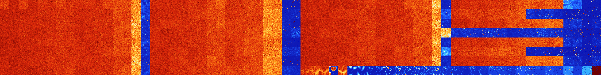

# B0268 (166400-166911)

<details>
    <summary>Initial Grid</summary>
    
</details>


<details>
    <summary>Initial Grid RLE</summary>

```
#C Exported from GoGoL (https://github.com/marrow16/gogol)
#C Wrap mode: Toroidal
#C Boundary mode: Dead
#C Step: 0
x = 100, y = 100, rule = B0268/S
7bo88bo$16bo31b2o4bo$69bo6bo4bo17bo$8bo8bo41bo$20bo24bo$3bo14bo45bo28bo
$11bo21bo7bo4bo11bo17bo$3bo31bo7bo30bo5bo$21bo19bo27bo5bo6bo$44bo22bo
29bo$14b2o7bo72bo$22bo6bo42bo$6bo3bo8bo24bo10bo3bo5bo18bobobobo4bo$31bo
2bo8bo26bo14bobo6bo$5bo17b2o33bo40bo$o25bo34bo$4bobo5bo19bo5bo17bo3bo7b
2o$15bo10bo11b2o2bo2bo12bo28bo11bo$4bo30b2o19bo6bo22bo5bo$11bo11bo2bo5b
o7bo38bobo$7bobo13bobo5bo4bo5bo41bo6bo5bo$4bo6bo16bo21bo23b2o20bo$30bo
22bo13bo13bo$18bo4bo9bobo25bob2o8bo$2bo51bo14b2o16bo$27bo8bo18bo$3bo18b
o9bo3b2o22bo8bo7bo15bo$18bo32bo4bo2bo10bo10bo2b2o12bo$4bo4bo9bo5bo12bo
5bo53bo$21bo2bo12bo4bob2o35bo$4bo7bo77bo$46bo7bo3bo9bo22bo$10bo24bobobo
16bo41bo$18bo18bo5bo7bo4bo30bo$15bo9bo3bo30bo2bo2bo12bo10bo$2bo55bo25bo
$4bo8bo45bo8bo18bo$13bo7bo20bo2bo21bo14bo2bo$15bo55bo2bo6bo12bo$4bo8bo
7bo14bobo30bo29bo$6bo11bo3bo6bo6bo3bo45bo$10bo3bob2o43bo2bo23bo$14bo2bo
30bo6bo11bo10bo12bo$60bo10bo$36bo33bo6bo$4bo4bo11b2o7bo9bo7bobo14bo4bo$
bo48bo9bo37bo$48bo29bo19b2o$13b2o45b2o14bo$11bo50bo19bobo$5bo25bo2bo17b
o22bo$26bo11bobo53bo$19bo3bo27bo3bo3bo30bo$5bo42bo48bo$6bo2bo41bo$33bo
9bo2bo30bo$14bo55bo12bo$5bo9bo20bo6bo9bo12bo3bo11bo$4bo28bo16bo7b2o39bo
$62bo17bo17bo$44bo$21bo$5bo20bo13bo51bo$8bo48bo27bo$11bo9bo2bo32bo13bo
24bo$2bo9bo$3bo4bo18bo12bo2bo30bo17bo$18bo70bo7bo$13bo7bo15bo11bo33bo$
23bo5bo6bo2bobo36bo13bo$6bo23bo23bo2bo$37bo24bo25bo$15bo20bo21bo8bo28bo
$6bo68bo$9bo12bo23bo35bo$11bo59bo4bo13bo8bo$43bo27bo$7bo34bo11bo44bo$
10b2o30bo$2bo8bo16bo16bo10bo24bo$6bo2b2o38b2o2bo$11bo9bo9b2o61bo2b2o$
14bo15bo24bo29bo$17bo62bo$2bo16bo16bo6bobo8bo17bo5bo16bo$14bo10bo17bo
23bo10bo5bo$3bo4bo39bo5bo17bo10bo12b2o$34bo40bo$82bo$bo12bo11bo14bo7bo
11bo6bo6bo20bo$44bo7bo2bo$3bo14bo12bo$15bo8bo3bo11bo4bo24bo10bo8b2o$71b
o16bo$o12bo15bo12bobo16bo19bo11bo$12bo4bo7b2o21bobo48bo$16bo4bo11bo33bo
15bobo8bo$18bo49bo20bo$11bo2b2o4bo52bo9bo$24bo21bo14bo!
```
</details>
<details>
    <summary>Thumbnail</summary>

</details>
<table>
<tr>
    <td><a href="./166400%20S%20Heat%20Map%20Activity.png"></a><br>S (166400)<br>G>1000</td>    <td><a href="./166401%20S0%20Heat%20Map%20Activity.png"></a><br>S0 (166401)<br>G>1000</td>    <td><a href="./166402%20S1%20Heat%20Map%20Activity.png"></a><br>S1 (166402)<br>G>1000</td>    <td><a href="./166403%20S01%20Heat%20Map%20Activity.png"></a><br>S01 (166403)<br>G>1000</td>    <td><a href="./166404%20S2%20Heat%20Map%20Activity.png"></a><br>S2 (166404)<br>G>1000</td>    <td><a href="./166405%20S02%20Heat%20Map%20Activity.png"></a><br>S02 (166405)<br>G>1000</td>    <td><a href="./166406%20S12%20Heat%20Map%20Activity.png"></a><br>S12 (166406)<br>G>1000</td>    <td><a href="./166407%20S012%20Heat%20Map%20Activity.png"></a><br>S012 (166407)<br>G>1000</td>    <td><a href="./166408%20S3%20Heat%20Map%20Activity.png"></a><br>S3 (166408)<br>G>1000</td>    <td><a href="./166409%20S03%20Heat%20Map%20Activity.png"></a><br>S03 (166409)<br>G>1000</td>    <td><a href="./166410%20S13%20Heat%20Map%20Activity.png"></a><br>S13 (166410)<br>G>1000</td>    <td><a href="./166411%20S013%20Heat%20Map%20Activity.png"></a><br>S013 (166411)<br>G>1000</td>    <td><a href="./166412%20S23%20Heat%20Map%20Activity.png"></a><br>S23 (166412)<br>G>1000</td>    <td><a href="./166413%20S023%20Heat%20Map%20Activity.png"></a><br>S023 (166413)<br>G>1000</td>    <td><a href="./166414%20S123%20Heat%20Map%20Activity.png"></a><br>S123 (166414)<br>G>1000</td>    <td><a href="./166415%20S0123%20Heat%20Map%20Activity.png"></a><br>S0123 (166415)<br>G>1000</td>    <td><a href="./166416%20S4%20Heat%20Map%20Activity.png"></a><br>S4 (166416)<br>G>1000</td>    <td><a href="./166417%20S04%20Heat%20Map%20Activity.png"></a><br>S04 (166417)<br>G>1000</td>    <td><a href="./166418%20S14%20Heat%20Map%20Activity.png"></a><br>S14 (166418)<br>G>1000</td>    <td><a href="./166419%20S014%20Heat%20Map%20Activity.png"></a><br>S014 (166419)<br>G>1000</td>    <td><a href="./166420%20S24%20Heat%20Map%20Activity.png"></a><br>S24 (166420)<br>G>1000</td>    <td><a href="./166421%20S024%20Heat%20Map%20Activity.png"></a><br>S024 (166421)<br>G>1000</td>    <td><a href="./166422%20S124%20Heat%20Map%20Activity.png"></a><br>S124 (166422)<br>G>1000</td>    <td><a href="./166423%20S0124%20Heat%20Map%20Activity.png"></a><br>S0124 (166423)<br>G>1000</td>    <td><a href="./166424%20S34%20Heat%20Map%20Activity.png"></a><br>S34 (166424)<br>G>1000</td>    <td><a href="./166425%20S034%20Heat%20Map%20Activity.png"></a><br>S034 (166425)<br>G>1000</td>    <td><a href="./166426%20S134%20Heat%20Map%20Activity.png"></a><br>S134 (166426)<br>G>1000</td>    <td><a href="./166427%20S0134%20Heat%20Map%20Activity.png"></a><br>S0134 (166427)<br>G>1000</td>    <td><a href="./166428%20S234%20Heat%20Map%20Activity.png"></a><br>S234 (166428)<br>G>1000</td>    <td><a href="./166429%20S0234%20Heat%20Map%20Activity.png"></a><br>S0234 (166429)<br>G>1000</td>    <td><a href="./166430%20S1234%20Heat%20Map%20Activity.png"></a><br>S1234 (166430)<br>G>1000</td>    <td><a href="./166431%20S01234%20Heat%20Map%20Activity.png"></a><br>S01234 (166431)<br>R@931,p840</td>    <td><a href="./166432%20S5%20Heat%20Map%20Activity.png"></a><br>S5 (166432)<br>G>1000</td>    <td><a href="./166433%20S05%20Heat%20Map%20Activity.png"></a><br>S05 (166433)<br>G>1000</td>    <td><a href="./166434%20S15%20Heat%20Map%20Activity.png"></a><br>S15 (166434)<br>G>1000</td>    <td><a href="./166435%20S015%20Heat%20Map%20Activity.png"></a><br>S015 (166435)<br>G>1000</td>    <td><a href="./166436%20S25%20Heat%20Map%20Activity.png"></a><br>S25 (166436)<br>G>1000</td>    <td><a href="./166437%20S025%20Heat%20Map%20Activity.png"></a><br>S025 (166437)<br>G>1000</td>    <td><a href="./166438%20S125%20Heat%20Map%20Activity.png"></a><br>S125 (166438)<br>G>1000</td>    <td><a href="./166439%20S0125%20Heat%20Map%20Activity.png"></a><br>S0125 (166439)<br>G>1000</td>    <td><a href="./166440%20S35%20Heat%20Map%20Activity.png"></a><br>S35 (166440)<br>G>1000</td>    <td><a href="./166441%20S035%20Heat%20Map%20Activity.png"></a><br>S035 (166441)<br>G>1000</td>    <td><a href="./166442%20S135%20Heat%20Map%20Activity.png"></a><br>S135 (166442)<br>G>1000</td>    <td><a href="./166443%20S0135%20Heat%20Map%20Activity.png"></a><br>S0135 (166443)<br>G>1000</td>    <td><a href="./166444%20S235%20Heat%20Map%20Activity.png"></a><br>S235 (166444)<br>G>1000</td>    <td><a href="./166445%20S0235%20Heat%20Map%20Activity.png"></a><br>S0235 (166445)<br>G>1000</td>    <td><a href="./166446%20S1235%20Heat%20Map%20Activity.png"></a><br>S1235 (166446)<br>G>1000</td>    <td><a href="./166447%20S01235%20Heat%20Map%20Activity.png"></a><br>S01235 (166447)<br>R@562,p252</td>    <td><a href="./166448%20S45%20Heat%20Map%20Activity.png"></a><br>S45 (166448)<br>G>1000</td>    <td><a href="./166449%20S045%20Heat%20Map%20Activity.png"></a><br>S045 (166449)<br>G>1000</td>    <td><a href="./166450%20S145%20Heat%20Map%20Activity.png"></a><br>S145 (166450)<br>G>1000</td>    <td><a href="./166451%20S0145%20Heat%20Map%20Activity.png"></a><br>S0145 (166451)<br>G>1000</td>    <td><a href="./166452%20S245%20Heat%20Map%20Activity.png"></a><br>S245 (166452)<br>G>1000</td>    <td><a href="./166453%20S0245%20Heat%20Map%20Activity.png"></a><br>S0245 (166453)<br>G>1000</td>    <td><a href="./166454%20S1245%20Heat%20Map%20Activity.png"></a><br>S1245 (166454)<br>G>1000</td>    <td><a href="./166455%20S01245%20Heat%20Map%20Activity.png"></a><br>S01245 (166455)<br>G>1000</td>    <td><a href="./166456%20S345%20Heat%20Map%20Activity.png"></a><br>S345 (166456)<br>G>1000</td>    <td><a href="./166457%20S0345%20Heat%20Map%20Activity.png"></a><br>S0345 (166457)<br>G>1000</td>    <td><a href="./166458%20S1345%20Heat%20Map%20Activity.png"></a><br>S1345 (166458)<br>G>1000</td>    <td><a href="./166459%20S01345%20Heat%20Map%20Activity.png"></a><br>S01345 (166459)<br>G>1000</td>    <td><a href="./166460%20S2345%20Heat%20Map%20Activity.png"></a><br>S2345 (166460)<br>G>1000</td>    <td><a href="./166461%20S02345%20Heat%20Map%20Activity.png"></a><br>S02345 (166461)<br>G>1000</td>    <td><a href="./166462%20S12345%20Heat%20Map%20Activity.png"></a><br>S12345 (166462)<br>G>1000</td>    <td><a href="./166463%20S012345%20Heat%20Map%20Activity.png"></a><br>S012345 (166463)<br>G>1000</td></tr>
<tr>
    <td><a href="./166464%20S6%20Heat%20Map%20Activity.png"></a><br>S6 (166464)<br>G>1000</td>    <td><a href="./166465%20S06%20Heat%20Map%20Activity.png"></a><br>S06 (166465)<br>G>1000</td>    <td><a href="./166466%20S16%20Heat%20Map%20Activity.png"></a><br>S16 (166466)<br>G>1000</td>    <td><a href="./166467%20S016%20Heat%20Map%20Activity.png"></a><br>S016 (166467)<br>G>1000</td>    <td><a href="./166468%20S26%20Heat%20Map%20Activity.png"></a><br>S26 (166468)<br>G>1000</td>    <td><a href="./166469%20S026%20Heat%20Map%20Activity.png"></a><br>S026 (166469)<br>G>1000</td>    <td><a href="./166470%20S126%20Heat%20Map%20Activity.png"></a><br>S126 (166470)<br>G>1000</td>    <td><a href="./166471%20S0126%20Heat%20Map%20Activity.png"></a><br>S0126 (166471)<br>G>1000</td>    <td><a href="./166472%20S36%20Heat%20Map%20Activity.png"></a><br>S36 (166472)<br>G>1000</td>    <td><a href="./166473%20S036%20Heat%20Map%20Activity.png"></a><br>S036 (166473)<br>G>1000</td>    <td><a href="./166474%20S136%20Heat%20Map%20Activity.png"></a><br>S136 (166474)<br>G>1000</td>    <td><a href="./166475%20S0136%20Heat%20Map%20Activity.png"></a><br>S0136 (166475)<br>G>1000</td>    <td><a href="./166476%20S236%20Heat%20Map%20Activity.png"></a><br>S236 (166476)<br>G>1000</td>    <td><a href="./166477%20S0236%20Heat%20Map%20Activity.png"></a><br>S0236 (166477)<br>G>1000</td>    <td><a href="./166478%20S1236%20Heat%20Map%20Activity.png"></a><br>S1236 (166478)<br>G>1000</td>    <td><a href="./166479%20S01236%20Heat%20Map%20Activity.png"></a><br>S01236 (166479)<br>G>1000</td>    <td><a href="./166480%20S46%20Heat%20Map%20Activity.png"></a><br>S46 (166480)<br>G>1000</td>    <td><a href="./166481%20S046%20Heat%20Map%20Activity.png"></a><br>S046 (166481)<br>G>1000</td>    <td><a href="./166482%20S146%20Heat%20Map%20Activity.png"></a><br>S146 (166482)<br>G>1000</td>    <td><a href="./166483%20S0146%20Heat%20Map%20Activity.png"></a><br>S0146 (166483)<br>G>1000</td>    <td><a href="./166484%20S246%20Heat%20Map%20Activity.png"></a><br>S246 (166484)<br>G>1000</td>    <td><a href="./166485%20S0246%20Heat%20Map%20Activity.png"></a><br>S0246 (166485)<br>G>1000</td>    <td><a href="./166486%20S1246%20Heat%20Map%20Activity.png"></a><br>S1246 (166486)<br>G>1000</td>    <td><a href="./166487%20S01246%20Heat%20Map%20Activity.png"></a><br>S01246 (166487)<br>G>1000</td>    <td><a href="./166488%20S346%20Heat%20Map%20Activity.png"></a><br>S346 (166488)<br>G>1000</td>    <td><a href="./166489%20S0346%20Heat%20Map%20Activity.png"></a><br>S0346 (166489)<br>G>1000</td>    <td><a href="./166490%20S1346%20Heat%20Map%20Activity.png"></a><br>S1346 (166490)<br>G>1000</td>    <td><a href="./166491%20S01346%20Heat%20Map%20Activity.png"></a><br>S01346 (166491)<br>G>1000</td>    <td><a href="./166492%20S2346%20Heat%20Map%20Activity.png"></a><br>S2346 (166492)<br>G>1000</td>    <td><a href="./166493%20S02346%20Heat%20Map%20Activity.png"></a><br>S02346 (166493)<br>G>1000</td>    <td><a href="./166494%20S12346%20Heat%20Map%20Activity.png"></a><br>S12346 (166494)<br>R@249,p156</td>    <td><a href="./166495%20S012346%20Heat%20Map%20Activity.png"></a><br>S012346 (166495)<br>R@106,p60</td>    <td><a href="./166496%20S56%20Heat%20Map%20Activity.png"></a><br>S56 (166496)<br>G>1000</td>    <td><a href="./166497%20S056%20Heat%20Map%20Activity.png"></a><br>S056 (166497)<br>G>1000</td>    <td><a href="./166498%20S156%20Heat%20Map%20Activity.png"></a><br>S156 (166498)<br>G>1000</td>    <td><a href="./166499%20S0156%20Heat%20Map%20Activity.png"></a><br>S0156 (166499)<br>G>1000</td>    <td><a href="./166500%20S256%20Heat%20Map%20Activity.png"></a><br>S256 (166500)<br>G>1000</td>    <td><a href="./166501%20S0256%20Heat%20Map%20Activity.png"></a><br>S0256 (166501)<br>G>1000</td>    <td><a href="./166502%20S1256%20Heat%20Map%20Activity.png"></a><br>S1256 (166502)<br>G>1000</td>    <td><a href="./166503%20S01256%20Heat%20Map%20Activity.png"></a><br>S01256 (166503)<br>G>1000</td>    <td><a href="./166504%20S356%20Heat%20Map%20Activity.png"></a><br>S356 (166504)<br>G>1000</td>    <td><a href="./166505%20S0356%20Heat%20Map%20Activity.png"></a><br>S0356 (166505)<br>G>1000</td>    <td><a href="./166506%20S1356%20Heat%20Map%20Activity.png"></a><br>S1356 (166506)<br>G>1000</td>    <td><a href="./166507%20S01356%20Heat%20Map%20Activity.png"></a><br>S01356 (166507)<br>G>1000</td>    <td><a href="./166508%20S2356%20Heat%20Map%20Activity.png"></a><br>S2356 (166508)<br>G>1000</td>    <td><a href="./166509%20S02356%20Heat%20Map%20Activity.png"></a><br>S02356 (166509)<br>G>1000</td>    <td><a href="./166510%20S12356%20Heat%20Map%20Activity.png"></a><br>S12356 (166510)<br>G>1000</td>    <td><a href="./166511%20S012356%20Heat%20Map%20Activity.png"></a><br>S012356 (166511)<br>G>1000</td>    <td><a href="./166512%20S456%20Heat%20Map%20Activity.png"></a><br>S456 (166512)<br>G>1000</td>    <td><a href="./166513%20S0456%20Heat%20Map%20Activity.png"></a><br>S0456 (166513)<br>G>1000</td>    <td><a href="./166514%20S1456%20Heat%20Map%20Activity.png"></a><br>S1456 (166514)<br>G>1000</td>    <td><a href="./166515%20S01456%20Heat%20Map%20Activity.png"></a><br>S01456 (166515)<br>G>1000</td>    <td><a href="./166516%20S2456%20Heat%20Map%20Activity.png"></a><br>S2456 (166516)<br>G>1000</td>    <td><a href="./166517%20S02456%20Heat%20Map%20Activity.png"></a><br>S02456 (166517)<br>G>1000</td>    <td><a href="./166518%20S12456%20Heat%20Map%20Activity.png"></a><br>S12456 (166518)<br>G>1000</td>    <td><a href="./166519%20S012456%20Heat%20Map%20Activity.png"></a><br>S012456 (166519)<br>G>1000</td>    <td><a href="./166520%20S3456%20Heat%20Map%20Activity.png"></a><br>S3456 (166520)<br>R@587,p24</td>    <td><a href="./166521%20S03456%20Heat%20Map%20Activity.png"></a><br>S03456 (166521)<br>R@983,p120</td>    <td><a href="./166522%20S13456%20Heat%20Map%20Activity.png"></a><br>S13456 (166522)<br>R@486,p60</td>    <td><a href="./166523%20S013456%20Heat%20Map%20Activity.png"></a><br>S013456 (166523)<br>G>1000</td>    <td><a href="./166524%20S23456%20Heat%20Map%20Activity.png"></a><br>S23456 (166524)<br>G>1000</td>    <td><a href="./166525%20S023456%20Heat%20Map%20Activity.png"></a><br>S023456 (166525)<br>G>1000</td>    <td><a href="./166526%20S123456%20Heat%20Map%20Activity.png"></a><br>S123456 (166526)<br>G>1000</td>    <td><a href="./166527%20S0123456%20Heat%20Map%20Activity.png"></a><br>S0123456 (166527)<br>G>1000</td></tr>
<tr>
    <td><a href="./166528%20S7%20Heat%20Map%20Activity.png"></a><br>S7 (166528)<br>G>1000</td>    <td><a href="./166529%20S07%20Heat%20Map%20Activity.png"></a><br>S07 (166529)<br>G>1000</td>    <td><a href="./166530%20S17%20Heat%20Map%20Activity.png"></a><br>S17 (166530)<br>G>1000</td>    <td><a href="./166531%20S017%20Heat%20Map%20Activity.png"></a><br>S017 (166531)<br>G>1000</td>    <td><a href="./166532%20S27%20Heat%20Map%20Activity.png"></a><br>S27 (166532)<br>G>1000</td>    <td><a href="./166533%20S027%20Heat%20Map%20Activity.png"></a><br>S027 (166533)<br>G>1000</td>    <td><a href="./166534%20S127%20Heat%20Map%20Activity.png"></a><br>S127 (166534)<br>G>1000</td>    <td><a href="./166535%20S0127%20Heat%20Map%20Activity.png"></a><br>S0127 (166535)<br>G>1000</td>    <td><a href="./166536%20S37%20Heat%20Map%20Activity.png"></a><br>S37 (166536)<br>G>1000</td>    <td><a href="./166537%20S037%20Heat%20Map%20Activity.png"></a><br>S037 (166537)<br>G>1000</td>    <td><a href="./166538%20S137%20Heat%20Map%20Activity.png"></a><br>S137 (166538)<br>G>1000</td>    <td><a href="./166539%20S0137%20Heat%20Map%20Activity.png"></a><br>S0137 (166539)<br>G>1000</td>    <td><a href="./166540%20S237%20Heat%20Map%20Activity.png"></a><br>S237 (166540)<br>G>1000</td>    <td><a href="./166541%20S0237%20Heat%20Map%20Activity.png"></a><br>S0237 (166541)<br>G>1000</td>    <td><a href="./166542%20S1237%20Heat%20Map%20Activity.png"></a><br>S1237 (166542)<br>G>1000</td>    <td><a href="./166543%20S01237%20Heat%20Map%20Activity.png"></a><br>S01237 (166543)<br>R@489,p120</td>    <td><a href="./166544%20S47%20Heat%20Map%20Activity.png"></a><br>S47 (166544)<br>G>1000</td>    <td><a href="./166545%20S047%20Heat%20Map%20Activity.png"></a><br>S047 (166545)<br>G>1000</td>    <td><a href="./166546%20S147%20Heat%20Map%20Activity.png"></a><br>S147 (166546)<br>G>1000</td>    <td><a href="./166547%20S0147%20Heat%20Map%20Activity.png"></a><br>S0147 (166547)<br>G>1000</td>    <td><a href="./166548%20S247%20Heat%20Map%20Activity.png"></a><br>S247 (166548)<br>G>1000</td>    <td><a href="./166549%20S0247%20Heat%20Map%20Activity.png"></a><br>S0247 (166549)<br>G>1000</td>    <td><a href="./166550%20S1247%20Heat%20Map%20Activity.png"></a><br>S1247 (166550)<br>G>1000</td>    <td><a href="./166551%20S01247%20Heat%20Map%20Activity.png"></a><br>S01247 (166551)<br>G>1000</td>    <td><a href="./166552%20S347%20Heat%20Map%20Activity.png"></a><br>S347 (166552)<br>G>1000</td>    <td><a href="./166553%20S0347%20Heat%20Map%20Activity.png"></a><br>S0347 (166553)<br>G>1000</td>    <td><a href="./166554%20S1347%20Heat%20Map%20Activity.png"></a><br>S1347 (166554)<br>G>1000</td>    <td><a href="./166555%20S01347%20Heat%20Map%20Activity.png"></a><br>S01347 (166555)<br>G>1000</td>    <td><a href="./166556%20S2347%20Heat%20Map%20Activity.png"></a><br>S2347 (166556)<br>G>1000</td>    <td><a href="./166557%20S02347%20Heat%20Map%20Activity.png"></a><br>S02347 (166557)<br>G>1000</td>    <td><a href="./166558%20S12347%20Heat%20Map%20Activity.png"></a><br>S12347 (166558)<br>R@174,p60</td>    <td><a href="./166559%20S012347%20Heat%20Map%20Activity.png"></a><br>S012347 (166559)<br>R@475,p420</td>    <td><a href="./166560%20S57%20Heat%20Map%20Activity.png"></a><br>S57 (166560)<br>G>1000</td>    <td><a href="./166561%20S057%20Heat%20Map%20Activity.png"></a><br>S057 (166561)<br>G>1000</td>    <td><a href="./166562%20S157%20Heat%20Map%20Activity.png"></a><br>S157 (166562)<br>G>1000</td>    <td><a href="./166563%20S0157%20Heat%20Map%20Activity.png"></a><br>S0157 (166563)<br>G>1000</td>    <td><a href="./166564%20S257%20Heat%20Map%20Activity.png"></a><br>S257 (166564)<br>G>1000</td>    <td><a href="./166565%20S0257%20Heat%20Map%20Activity.png"></a><br>S0257 (166565)<br>G>1000</td>    <td><a href="./166566%20S1257%20Heat%20Map%20Activity.png"></a><br>S1257 (166566)<br>G>1000</td>    <td><a href="./166567%20S01257%20Heat%20Map%20Activity.png"></a><br>S01257 (166567)<br>G>1000</td>    <td><a href="./166568%20S357%20Heat%20Map%20Activity.png"></a><br>S357 (166568)<br>G>1000</td>    <td><a href="./166569%20S0357%20Heat%20Map%20Activity.png"></a><br>S0357 (166569)<br>G>1000</td>    <td><a href="./166570%20S1357%20Heat%20Map%20Activity.png"></a><br>S1357 (166570)<br>G>1000</td>    <td><a href="./166571%20S01357%20Heat%20Map%20Activity.png"></a><br>S01357 (166571)<br>G>1000</td>    <td><a href="./166572%20S2357%20Heat%20Map%20Activity.png"></a><br>S2357 (166572)<br>G>1000</td>    <td><a href="./166573%20S02357%20Heat%20Map%20Activity.png"></a><br>S02357 (166573)<br>G>1000</td>    <td><a href="./166574%20S12357%20Heat%20Map%20Activity.png"></a><br>S12357 (166574)<br>G>1000</td>    <td><a href="./166575%20S012357%20Heat%20Map%20Activity.png"></a><br>S012357 (166575)<br>R@532,p30</td>    <td><a href="./166576%20S457%20Heat%20Map%20Activity.png"></a><br>S457 (166576)<br>G>1000</td>    <td><a href="./166577%20S0457%20Heat%20Map%20Activity.png"></a><br>S0457 (166577)<br>G>1000</td>    <td><a href="./166578%20S1457%20Heat%20Map%20Activity.png"></a><br>S1457 (166578)<br>G>1000</td>    <td><a href="./166579%20S01457%20Heat%20Map%20Activity.png"></a><br>S01457 (166579)<br>G>1000</td>    <td><a href="./166580%20S2457%20Heat%20Map%20Activity.png"></a><br>S2457 (166580)<br>G>1000</td>    <td><a href="./166581%20S02457%20Heat%20Map%20Activity.png"></a><br>S02457 (166581)<br>G>1000</td>    <td><a href="./166582%20S12457%20Heat%20Map%20Activity.png"></a><br>S12457 (166582)<br>G>1000</td>    <td><a href="./166583%20S012457%20Heat%20Map%20Activity.png"></a><br>S012457 (166583)<br>G>1000</td>    <td><a href="./166584%20S3457%20Heat%20Map%20Activity.png"></a><br>S3457 (166584)<br>G>1000</td>    <td><a href="./166585%20S03457%20Heat%20Map%20Activity.png"></a><br>S03457 (166585)<br>G>1000</td>    <td><a href="./166586%20S13457%20Heat%20Map%20Activity.png"></a><br>S13457 (166586)<br>G>1000</td>    <td><a href="./166587%20S013457%20Heat%20Map%20Activity.png"></a><br>S013457 (166587)<br>G>1000</td>    <td><a href="./166588%20S23457%20Heat%20Map%20Activity.png"></a><br>S23457 (166588)<br>G>1000</td>    <td><a href="./166589%20S023457%20Heat%20Map%20Activity.png"></a><br>S023457 (166589)<br>G>1000</td>    <td><a href="./166590%20S123457%20Heat%20Map%20Activity.png"></a><br>S123457 (166590)<br>R@585,p504</td>    <td><a href="./166591%20S0123457%20Heat%20Map%20Activity.png"></a><br>S0123457 (166591)<br>R@130,p60</td></tr>
<tr>
    <td><a href="./166592%20S67%20Heat%20Map%20Activity.png"></a><br>S67 (166592)<br>G>1000</td>    <td><a href="./166593%20S067%20Heat%20Map%20Activity.png"></a><br>S067 (166593)<br>G>1000</td>    <td><a href="./166594%20S167%20Heat%20Map%20Activity.png"></a><br>S167 (166594)<br>G>1000</td>    <td><a href="./166595%20S0167%20Heat%20Map%20Activity.png"></a><br>S0167 (166595)<br>G>1000</td>    <td><a href="./166596%20S267%20Heat%20Map%20Activity.png"></a><br>S267 (166596)<br>G>1000</td>    <td><a href="./166597%20S0267%20Heat%20Map%20Activity.png"></a><br>S0267 (166597)<br>G>1000</td>    <td><a href="./166598%20S1267%20Heat%20Map%20Activity.png"></a><br>S1267 (166598)<br>G>1000</td>    <td><a href="./166599%20S01267%20Heat%20Map%20Activity.png"></a><br>S01267 (166599)<br>G>1000</td>    <td><a href="./166600%20S367%20Heat%20Map%20Activity.png"></a><br>S367 (166600)<br>G>1000</td>    <td><a href="./166601%20S0367%20Heat%20Map%20Activity.png"></a><br>S0367 (166601)<br>G>1000</td>    <td><a href="./166602%20S1367%20Heat%20Map%20Activity.png"></a><br>S1367 (166602)<br>G>1000</td>    <td><a href="./166603%20S01367%20Heat%20Map%20Activity.png"></a><br>S01367 (166603)<br>G>1000</td>    <td><a href="./166604%20S2367%20Heat%20Map%20Activity.png"></a><br>S2367 (166604)<br>G>1000</td>    <td><a href="./166605%20S02367%20Heat%20Map%20Activity.png"></a><br>S02367 (166605)<br>G>1000</td>    <td><a href="./166606%20S12367%20Heat%20Map%20Activity.png"></a><br>S12367 (166606)<br>G>1000</td>    <td><a href="./166607%20S012367%20Heat%20Map%20Activity.png"></a><br>S012367 (166607)<br>R@644,p60</td>    <td><a href="./166608%20S467%20Heat%20Map%20Activity.png"></a><br>S467 (166608)<br>G>1000</td>    <td><a href="./166609%20S0467%20Heat%20Map%20Activity.png"></a><br>S0467 (166609)<br>G>1000</td>    <td><a href="./166610%20S1467%20Heat%20Map%20Activity.png"></a><br>S1467 (166610)<br>G>1000</td>    <td><a href="./166611%20S01467%20Heat%20Map%20Activity.png"></a><br>S01467 (166611)<br>G>1000</td>    <td><a href="./166612%20S2467%20Heat%20Map%20Activity.png"></a><br>S2467 (166612)<br>G>1000</td>    <td><a href="./166613%20S02467%20Heat%20Map%20Activity.png"></a><br>S02467 (166613)<br>G>1000</td>    <td><a href="./166614%20S12467%20Heat%20Map%20Activity.png"></a><br>S12467 (166614)<br>G>1000</td>    <td><a href="./166615%20S012467%20Heat%20Map%20Activity.png"></a><br>S012467 (166615)<br>G>1000</td>    <td><a href="./166616%20S3467%20Heat%20Map%20Activity.png"></a><br>S3467 (166616)<br>G>1000</td>    <td><a href="./166617%20S03467%20Heat%20Map%20Activity.png"></a><br>S03467 (166617)<br>G>1000</td>    <td><a href="./166618%20S13467%20Heat%20Map%20Activity.png"></a><br>S13467 (166618)<br>G>1000</td>    <td><a href="./166619%20S013467%20Heat%20Map%20Activity.png"></a><br>S013467 (166619)<br>G>1000</td>    <td><a href="./166620%20S23467%20Heat%20Map%20Activity.png"></a><br>S23467 (166620)<br>G>1000</td>    <td><a href="./166621%20S023467%20Heat%20Map%20Activity.png"></a><br>S023467 (166621)<br>G>1000</td>    <td><a href="./166622%20S123467%20Heat%20Map%20Activity.png"></a><br>S123467 (166622)<br>R@194,p72</td>    <td><a href="./166623%20S0123467%20Heat%20Map%20Activity.png"></a><br>S0123467 (166623)<br>R@52,p10</td>    <td><a href="./166624%20S567%20Heat%20Map%20Activity.png"></a><br>S567 (166624)<br>G>1000</td>    <td><a href="./166625%20S0567%20Heat%20Map%20Activity.png"></a><br>S0567 (166625)<br>G>1000</td>    <td><a href="./166626%20S1567%20Heat%20Map%20Activity.png"></a><br>S1567 (166626)<br>G>1000</td>    <td><a href="./166627%20S01567%20Heat%20Map%20Activity.png"></a><br>S01567 (166627)<br>G>1000</td>    <td><a href="./166628%20S2567%20Heat%20Map%20Activity.png"></a><br>S2567 (166628)<br>G>1000</td>    <td><a href="./166629%20S02567%20Heat%20Map%20Activity.png"></a><br>S02567 (166629)<br>G>1000</td>    <td><a href="./166630%20S12567%20Heat%20Map%20Activity.png"></a><br>S12567 (166630)<br>G>1000</td>    <td><a href="./166631%20S012567%20Heat%20Map%20Activity.png"></a><br>S012567 (166631)<br>G>1000</td>    <td><a href="./166632%20S3567%20Heat%20Map%20Activity.png"></a><br>S3567 (166632)<br>G>1000</td>    <td><a href="./166633%20S03567%20Heat%20Map%20Activity.png"></a><br>S03567 (166633)<br>G>1000</td>    <td><a href="./166634%20S13567%20Heat%20Map%20Activity.png"></a><br>S13567 (166634)<br>G>1000</td>    <td><a href="./166635%20S013567%20Heat%20Map%20Activity.png"></a><br>S013567 (166635)<br>G>1000</td>    <td><a href="./166636%20S23567%20Heat%20Map%20Activity.png"></a><br>S23567 (166636)<br>G>1000</td>    <td><a href="./166637%20S023567%20Heat%20Map%20Activity.png"></a><br>S023567 (166637)<br>G>1000</td>    <td><a href="./166638%20S123567%20Heat%20Map%20Activity.png"></a><br>S123567 (166638)<br>G>1000</td>    <td><a href="./166639%20S0123567%20Heat%20Map%20Activity.png"></a><br>S0123567 (166639)<br>G>1000</td>    <td><a href="./166640%20S4567%20Heat%20Map%20Activity.png"></a><br>S4567 (166640)<br>R@621,p84</td>    <td><a href="./166641%20S04567%20Heat%20Map%20Activity.png"></a><br>S04567 (166641)<br>R@534,p60</td>    <td><a href="./166642%20S14567%20Heat%20Map%20Activity.png"></a><br>S14567 (166642)<br>R@662,p120</td>    <td><a href="./166643%20S014567%20Heat%20Map%20Activity.png"></a><br>S014567 (166643)<br>R@884,p60</td>    <td><a href="./166644%20S24567%20Heat%20Map%20Activity.png"></a><br>S24567 (166644)<br>R@428,p60</td>    <td><a href="./166645%20S024567%20Heat%20Map%20Activity.png"></a><br>S024567 (166645)<br>R@473,p60</td>    <td><a href="./166646%20S124567%20Heat%20Map%20Activity.png"></a><br>S124567 (166646)<br>R@685,p12</td>    <td><a href="./166647%20S0124567%20Heat%20Map%20Activity.png"></a><br>S0124567 (166647)<br>R@401,p60</td>    <td><a href="./166648%20S34567%20Heat%20Map%20Activity.png"></a><br>S34567 (166648)<br>R@60,p12</td>    <td><a href="./166649%20S034567%20Heat%20Map%20Activity.png"></a><br>S034567 (166649)<br>R@37,p12</td>    <td><a href="./166650%20S134567%20Heat%20Map%20Activity.png"></a><br>S134567 (166650)<br>R@45,p6</td>    <td><a href="./166651%20S0134567%20Heat%20Map%20Activity.png"></a><br>S0134567 (166651)<br>R@58,p12</td>    <td><a href="./166652%20S234567%20Heat%20Map%20Activity.png"></a><br>S234567 (166652)<br>R@103,p72</td>    <td><a href="./166653%20S0234567%20Heat%20Map%20Activity.png"></a><br>S0234567 (166653)<br>R@153,p120</td>    <td><a href="./166654%20S1234567%20Heat%20Map%20Activity.png"></a><br>S1234567 (166654)<br>G>1000</td>    <td><a href="./166655%20S01234567%20Heat%20Map%20Activity.png"></a><br>S01234567 (166655)<br>R@392,p360</td></tr>
<tr>
    <td><a href="./166656%20S8%20Heat%20Map%20Activity.png"></a><br>S8 (166656)<br>G>1000</td>    <td><a href="./166657%20S08%20Heat%20Map%20Activity.png"></a><br>S08 (166657)<br>G>1000</td>    <td><a href="./166658%20S18%20Heat%20Map%20Activity.png"></a><br>S18 (166658)<br>G>1000</td>    <td><a href="./166659%20S018%20Heat%20Map%20Activity.png"></a><br>S018 (166659)<br>G>1000</td>    <td><a href="./166660%20S28%20Heat%20Map%20Activity.png"></a><br>S28 (166660)<br>G>1000</td>    <td><a href="./166661%20S028%20Heat%20Map%20Activity.png"></a><br>S028 (166661)<br>G>1000</td>    <td><a href="./166662%20S128%20Heat%20Map%20Activity.png"></a><br>S128 (166662)<br>G>1000</td>    <td><a href="./166663%20S0128%20Heat%20Map%20Activity.png"></a><br>S0128 (166663)<br>G>1000</td>    <td><a href="./166664%20S38%20Heat%20Map%20Activity.png"></a><br>S38 (166664)<br>G>1000</td>    <td><a href="./166665%20S038%20Heat%20Map%20Activity.png"></a><br>S038 (166665)<br>G>1000</td>    <td><a href="./166666%20S138%20Heat%20Map%20Activity.png"></a><br>S138 (166666)<br>G>1000</td>    <td><a href="./166667%20S0138%20Heat%20Map%20Activity.png"></a><br>S0138 (166667)<br>G>1000</td>    <td><a href="./166668%20S238%20Heat%20Map%20Activity.png"></a><br>S238 (166668)<br>G>1000</td>    <td><a href="./166669%20S0238%20Heat%20Map%20Activity.png"></a><br>S0238 (166669)<br>G>1000</td>    <td><a href="./166670%20S1238%20Heat%20Map%20Activity.png"></a><br>S1238 (166670)<br>G>1000</td>    <td><a href="./166671%20S01238%20Heat%20Map%20Activity.png"></a><br>S01238 (166671)<br>G>1000</td>    <td><a href="./166672%20S48%20Heat%20Map%20Activity.png"></a><br>S48 (166672)<br>G>1000</td>    <td><a href="./166673%20S048%20Heat%20Map%20Activity.png"></a><br>S048 (166673)<br>G>1000</td>    <td><a href="./166674%20S148%20Heat%20Map%20Activity.png"></a><br>S148 (166674)<br>G>1000</td>    <td><a href="./166675%20S0148%20Heat%20Map%20Activity.png"></a><br>S0148 (166675)<br>G>1000</td>    <td><a href="./166676%20S248%20Heat%20Map%20Activity.png"></a><br>S248 (166676)<br>G>1000</td>    <td><a href="./166677%20S0248%20Heat%20Map%20Activity.png"></a><br>S0248 (166677)<br>G>1000</td>    <td><a href="./166678%20S1248%20Heat%20Map%20Activity.png"></a><br>S1248 (166678)<br>G>1000</td>    <td><a href="./166679%20S01248%20Heat%20Map%20Activity.png"></a><br>S01248 (166679)<br>G>1000</td>    <td><a href="./166680%20S348%20Heat%20Map%20Activity.png"></a><br>S348 (166680)<br>G>1000</td>    <td><a href="./166681%20S0348%20Heat%20Map%20Activity.png"></a><br>S0348 (166681)<br>G>1000</td>    <td><a href="./166682%20S1348%20Heat%20Map%20Activity.png"></a><br>S1348 (166682)<br>G>1000</td>    <td><a href="./166683%20S01348%20Heat%20Map%20Activity.png"></a><br>S01348 (166683)<br>G>1000</td>    <td><a href="./166684%20S2348%20Heat%20Map%20Activity.png"></a><br>S2348 (166684)<br>G>1000</td>    <td><a href="./166685%20S02348%20Heat%20Map%20Activity.png"></a><br>S02348 (166685)<br>G>1000</td>    <td><a href="./166686%20S12348%20Heat%20Map%20Activity.png"></a><br>S12348 (166686)<br>R@970,p840</td>    <td><a href="./166687%20S012348%20Heat%20Map%20Activity.png"></a><br>S012348 (166687)<br>G>1000</td>    <td><a href="./166688%20S58%20Heat%20Map%20Activity.png"></a><br>S58 (166688)<br>G>1000</td>    <td><a href="./166689%20S058%20Heat%20Map%20Activity.png"></a><br>S058 (166689)<br>G>1000</td>    <td><a href="./166690%20S158%20Heat%20Map%20Activity.png"></a><br>S158 (166690)<br>G>1000</td>    <td><a href="./166691%20S0158%20Heat%20Map%20Activity.png"></a><br>S0158 (166691)<br>G>1000</td>    <td><a href="./166692%20S258%20Heat%20Map%20Activity.png"></a><br>S258 (166692)<br>G>1000</td>    <td><a href="./166693%20S0258%20Heat%20Map%20Activity.png"></a><br>S0258 (166693)<br>G>1000</td>    <td><a href="./166694%20S1258%20Heat%20Map%20Activity.png"></a><br>S1258 (166694)<br>G>1000</td>    <td><a href="./166695%20S01258%20Heat%20Map%20Activity.png"></a><br>S01258 (166695)<br>G>1000</td>    <td><a href="./166696%20S358%20Heat%20Map%20Activity.png"></a><br>S358 (166696)<br>G>1000</td>    <td><a href="./166697%20S0358%20Heat%20Map%20Activity.png"></a><br>S0358 (166697)<br>G>1000</td>    <td><a href="./166698%20S1358%20Heat%20Map%20Activity.png"></a><br>S1358 (166698)<br>G>1000</td>    <td><a href="./166699%20S01358%20Heat%20Map%20Activity.png"></a><br>S01358 (166699)<br>G>1000</td>    <td><a href="./166700%20S2358%20Heat%20Map%20Activity.png"></a><br>S2358 (166700)<br>G>1000</td>    <td><a href="./166701%20S02358%20Heat%20Map%20Activity.png"></a><br>S02358 (166701)<br>G>1000</td>    <td><a href="./166702%20S12358%20Heat%20Map%20Activity.png"></a><br>S12358 (166702)<br>G>1000</td>    <td><a href="./166703%20S012358%20Heat%20Map%20Activity.png"></a><br>S012358 (166703)<br>R@394,p90</td>    <td><a href="./166704%20S458%20Heat%20Map%20Activity.png"></a><br>S458 (166704)<br>G>1000</td>    <td><a href="./166705%20S0458%20Heat%20Map%20Activity.png"></a><br>S0458 (166705)<br>G>1000</td>    <td><a href="./166706%20S1458%20Heat%20Map%20Activity.png"></a><br>S1458 (166706)<br>G>1000</td>    <td><a href="./166707%20S01458%20Heat%20Map%20Activity.png"></a><br>S01458 (166707)<br>G>1000</td>    <td><a href="./166708%20S2458%20Heat%20Map%20Activity.png"></a><br>S2458 (166708)<br>G>1000</td>    <td><a href="./166709%20S02458%20Heat%20Map%20Activity.png"></a><br>S02458 (166709)<br>G>1000</td>    <td><a href="./166710%20S12458%20Heat%20Map%20Activity.png"></a><br>S12458 (166710)<br>G>1000</td>    <td><a href="./166711%20S012458%20Heat%20Map%20Activity.png"></a><br>S012458 (166711)<br>G>1000</td>    <td><a href="./166712%20S3458%20Heat%20Map%20Activity.png"></a><br>S3458 (166712)<br>G>1000</td>    <td><a href="./166713%20S03458%20Heat%20Map%20Activity.png"></a><br>S03458 (166713)<br>G>1000</td>    <td><a href="./166714%20S13458%20Heat%20Map%20Activity.png"></a><br>S13458 (166714)<br>G>1000</td>    <td><a href="./166715%20S013458%20Heat%20Map%20Activity.png"></a><br>S013458 (166715)<br>G>1000</td>    <td><a href="./166716%20S23458%20Heat%20Map%20Activity.png"></a><br>S23458 (166716)<br>G>1000</td>    <td><a href="./166717%20S023458%20Heat%20Map%20Activity.png"></a><br>S023458 (166717)<br>G>1000</td>    <td><a href="./166718%20S123458%20Heat%20Map%20Activity.png"></a><br>S123458 (166718)<br>G>1000</td>    <td><a href="./166719%20S0123458%20Heat%20Map%20Activity.png"></a><br>S0123458 (166719)<br>R@126,p60</td></tr>
<tr>
    <td><a href="./166720%20S68%20Heat%20Map%20Activity.png"></a><br>S68 (166720)<br>G>1000</td>    <td><a href="./166721%20S068%20Heat%20Map%20Activity.png"></a><br>S068 (166721)<br>G>1000</td>    <td><a href="./166722%20S168%20Heat%20Map%20Activity.png"></a><br>S168 (166722)<br>G>1000</td>    <td><a href="./166723%20S0168%20Heat%20Map%20Activity.png"></a><br>S0168 (166723)<br>G>1000</td>    <td><a href="./166724%20S268%20Heat%20Map%20Activity.png"></a><br>S268 (166724)<br>G>1000</td>    <td><a href="./166725%20S0268%20Heat%20Map%20Activity.png"></a><br>S0268 (166725)<br>G>1000</td>    <td><a href="./166726%20S1268%20Heat%20Map%20Activity.png"></a><br>S1268 (166726)<br>G>1000</td>    <td><a href="./166727%20S01268%20Heat%20Map%20Activity.png"></a><br>S01268 (166727)<br>G>1000</td>    <td><a href="./166728%20S368%20Heat%20Map%20Activity.png"></a><br>S368 (166728)<br>G>1000</td>    <td><a href="./166729%20S0368%20Heat%20Map%20Activity.png"></a><br>S0368 (166729)<br>G>1000</td>    <td><a href="./166730%20S1368%20Heat%20Map%20Activity.png"></a><br>S1368 (166730)<br>G>1000</td>    <td><a href="./166731%20S01368%20Heat%20Map%20Activity.png"></a><br>S01368 (166731)<br>G>1000</td>    <td><a href="./166732%20S2368%20Heat%20Map%20Activity.png"></a><br>S2368 (166732)<br>G>1000</td>    <td><a href="./166733%20S02368%20Heat%20Map%20Activity.png"></a><br>S02368 (166733)<br>G>1000</td>    <td><a href="./166734%20S12368%20Heat%20Map%20Activity.png"></a><br>S12368 (166734)<br>G>1000</td>    <td><a href="./166735%20S012368%20Heat%20Map%20Activity.png"></a><br>S012368 (166735)<br>G>1000</td>    <td><a href="./166736%20S468%20Heat%20Map%20Activity.png"></a><br>S468 (166736)<br>G>1000</td>    <td><a href="./166737%20S0468%20Heat%20Map%20Activity.png"></a><br>S0468 (166737)<br>G>1000</td>    <td><a href="./166738%20S1468%20Heat%20Map%20Activity.png"></a><br>S1468 (166738)<br>G>1000</td>    <td><a href="./166739%20S01468%20Heat%20Map%20Activity.png"></a><br>S01468 (166739)<br>G>1000</td>    <td><a href="./166740%20S2468%20Heat%20Map%20Activity.png"></a><br>S2468 (166740)<br>G>1000</td>    <td><a href="./166741%20S02468%20Heat%20Map%20Activity.png"></a><br>S02468 (166741)<br>G>1000</td>    <td><a href="./166742%20S12468%20Heat%20Map%20Activity.png"></a><br>S12468 (166742)<br>G>1000</td>    <td><a href="./166743%20S012468%20Heat%20Map%20Activity.png"></a><br>S012468 (166743)<br>G>1000</td>    <td><a href="./166744%20S3468%20Heat%20Map%20Activity.png"></a><br>S3468 (166744)<br>G>1000</td>    <td><a href="./166745%20S03468%20Heat%20Map%20Activity.png"></a><br>S03468 (166745)<br>G>1000</td>    <td><a href="./166746%20S13468%20Heat%20Map%20Activity.png"></a><br>S13468 (166746)<br>G>1000</td>    <td><a href="./166747%20S013468%20Heat%20Map%20Activity.png"></a><br>S013468 (166747)<br>G>1000</td>    <td><a href="./166748%20S23468%20Heat%20Map%20Activity.png"></a><br>S23468 (166748)<br>G>1000</td>    <td><a href="./166749%20S023468%20Heat%20Map%20Activity.png"></a><br>S023468 (166749)<br>G>1000</td>    <td><a href="./166750%20S123468%20Heat%20Map%20Activity.png"></a><br>S123468 (166750)<br>R@102,p12</td>    <td><a href="./166751%20S0123468%20Heat%20Map%20Activity.png"></a><br>S0123468 (166751)<br>R@73,p12</td>    <td><a href="./166752%20S568%20Heat%20Map%20Activity.png"></a><br>S568 (166752)<br>G>1000</td>    <td><a href="./166753%20S0568%20Heat%20Map%20Activity.png"></a><br>S0568 (166753)<br>G>1000</td>    <td><a href="./166754%20S1568%20Heat%20Map%20Activity.png"></a><br>S1568 (166754)<br>G>1000</td>    <td><a href="./166755%20S01568%20Heat%20Map%20Activity.png"></a><br>S01568 (166755)<br>G>1000</td>    <td><a href="./166756%20S2568%20Heat%20Map%20Activity.png"></a><br>S2568 (166756)<br>G>1000</td>    <td><a href="./166757%20S02568%20Heat%20Map%20Activity.png"></a><br>S02568 (166757)<br>G>1000</td>    <td><a href="./166758%20S12568%20Heat%20Map%20Activity.png"></a><br>S12568 (166758)<br>G>1000</td>    <td><a href="./166759%20S012568%20Heat%20Map%20Activity.png"></a><br>S012568 (166759)<br>G>1000</td>    <td><a href="./166760%20S3568%20Heat%20Map%20Activity.png"></a><br>S3568 (166760)<br>G>1000</td>    <td><a href="./166761%20S03568%20Heat%20Map%20Activity.png"></a><br>S03568 (166761)<br>G>1000</td>    <td><a href="./166762%20S13568%20Heat%20Map%20Activity.png"></a><br>S13568 (166762)<br>G>1000</td>    <td><a href="./166763%20S013568%20Heat%20Map%20Activity.png"></a><br>S013568 (166763)<br>G>1000</td>    <td><a href="./166764%20S23568%20Heat%20Map%20Activity.png"></a><br>S23568 (166764)<br>G>1000</td>    <td><a href="./166765%20S023568%20Heat%20Map%20Activity.png"></a><br>S023568 (166765)<br>G>1000</td>    <td><a href="./166766%20S123568%20Heat%20Map%20Activity.png"></a><br>S123568 (166766)<br>G>1000</td>    <td><a href="./166767%20S0123568%20Heat%20Map%20Activity.png"></a><br>S0123568 (166767)<br>G>1000</td>    <td><a href="./166768%20S4568%20Heat%20Map%20Activity.png"></a><br>S4568 (166768)<br>G>1000</td>    <td><a href="./166769%20S04568%20Heat%20Map%20Activity.png"></a><br>S04568 (166769)<br>G>1000</td>    <td><a href="./166770%20S14568%20Heat%20Map%20Activity.png"></a><br>S14568 (166770)<br>G>1000</td>    <td><a href="./166771%20S014568%20Heat%20Map%20Activity.png"></a><br>S014568 (166771)<br>G>1000</td>    <td><a href="./166772%20S24568%20Heat%20Map%20Activity.png"></a><br>S24568 (166772)<br>G>1000</td>    <td><a href="./166773%20S024568%20Heat%20Map%20Activity.png"></a><br>S024568 (166773)<br>G>1000</td>    <td><a href="./166774%20S124568%20Heat%20Map%20Activity.png"></a><br>S124568 (166774)<br>G>1000</td>    <td><a href="./166775%20S0124568%20Heat%20Map%20Activity.png"></a><br>S0124568 (166775)<br>G>1000</td>    <td><a href="./166776%20S34568%20Heat%20Map%20Activity.png"></a><br>S34568 (166776)<br>G>1000</td>    <td><a href="./166777%20S034568%20Heat%20Map%20Activity.png"></a><br>S034568 (166777)<br>R@730,p420</td>    <td><a href="./166778%20S134568%20Heat%20Map%20Activity.png"></a><br>S134568 (166778)<br>G>1000</td>    <td><a href="./166779%20S0134568%20Heat%20Map%20Activity.png"></a><br>S0134568 (166779)<br>G>1000</td>    <td><a href="./166780%20S234568%20Heat%20Map%20Activity.png"></a><br>S234568 (166780)<br>G>1000</td>    <td><a href="./166781%20S0234568%20Heat%20Map%20Activity.png"></a><br>S0234568 (166781)<br>G>1000</td>    <td><a href="./166782%20S1234568%20Heat%20Map%20Activity.png"></a><br>S1234568 (166782)<br>G>1000</td>    <td><a href="./166783%20S01234568%20Heat%20Map%20Activity.png"></a><br>S01234568 (166783)<br>G>1000</td></tr>
<tr>
    <td><a href="./166784%20S78%20Heat%20Map%20Activity.png"></a><br>S78 (166784)<br>G>1000</td>    <td><a href="./166785%20S078%20Heat%20Map%20Activity.png"></a><br>S078 (166785)<br>G>1000</td>    <td><a href="./166786%20S178%20Heat%20Map%20Activity.png"></a><br>S178 (166786)<br>G>1000</td>    <td><a href="./166787%20S0178%20Heat%20Map%20Activity.png"></a><br>S0178 (166787)<br>G>1000</td>    <td><a href="./166788%20S278%20Heat%20Map%20Activity.png"></a><br>S278 (166788)<br>G>1000</td>    <td><a href="./166789%20S0278%20Heat%20Map%20Activity.png"></a><br>S0278 (166789)<br>G>1000</td>    <td><a href="./166790%20S1278%20Heat%20Map%20Activity.png"></a><br>S1278 (166790)<br>G>1000</td>    <td><a href="./166791%20S01278%20Heat%20Map%20Activity.png"></a><br>S01278 (166791)<br>G>1000</td>    <td><a href="./166792%20S378%20Heat%20Map%20Activity.png"></a><br>S378 (166792)<br>G>1000</td>    <td><a href="./166793%20S0378%20Heat%20Map%20Activity.png"></a><br>S0378 (166793)<br>G>1000</td>    <td><a href="./166794%20S1378%20Heat%20Map%20Activity.png"></a><br>S1378 (166794)<br>G>1000</td>    <td><a href="./166795%20S01378%20Heat%20Map%20Activity.png"></a><br>S01378 (166795)<br>G>1000</td>    <td><a href="./166796%20S2378%20Heat%20Map%20Activity.png"></a><br>S2378 (166796)<br>G>1000</td>    <td><a href="./166797%20S02378%20Heat%20Map%20Activity.png"></a><br>S02378 (166797)<br>G>1000</td>    <td><a href="./166798%20S12378%20Heat%20Map%20Activity.png"></a><br>S12378 (166798)<br>G>1000</td>    <td><a href="./166799%20S012378%20Heat%20Map%20Activity.png"></a><br>S012378 (166799)<br>R@416,p120</td>    <td><a href="./166800%20S478%20Heat%20Map%20Activity.png"></a><br>S478 (166800)<br>G>1000</td>    <td><a href="./166801%20S0478%20Heat%20Map%20Activity.png"></a><br>S0478 (166801)<br>G>1000</td>    <td><a href="./166802%20S1478%20Heat%20Map%20Activity.png"></a><br>S1478 (166802)<br>G>1000</td>    <td><a href="./166803%20S01478%20Heat%20Map%20Activity.png"></a><br>S01478 (166803)<br>G>1000</td>    <td><a href="./166804%20S2478%20Heat%20Map%20Activity.png"></a><br>S2478 (166804)<br>G>1000</td>    <td><a href="./166805%20S02478%20Heat%20Map%20Activity.png"></a><br>S02478 (166805)<br>G>1000</td>    <td><a href="./166806%20S12478%20Heat%20Map%20Activity.png"></a><br>S12478 (166806)<br>G>1000</td>    <td><a href="./166807%20S012478%20Heat%20Map%20Activity.png"></a><br>S012478 (166807)<br>G>1000</td>    <td><a href="./166808%20S3478%20Heat%20Map%20Activity.png"></a><br>S3478 (166808)<br>G>1000</td>    <td><a href="./166809%20S03478%20Heat%20Map%20Activity.png"></a><br>S03478 (166809)<br>G>1000</td>    <td><a href="./166810%20S13478%20Heat%20Map%20Activity.png"></a><br>S13478 (166810)<br>G>1000</td>    <td><a href="./166811%20S013478%20Heat%20Map%20Activity.png"></a><br>S013478 (166811)<br>G>1000</td>    <td><a href="./166812%20S23478%20Heat%20Map%20Activity.png"></a><br>S23478 (166812)<br>G>1000</td>    <td><a href="./166813%20S023478%20Heat%20Map%20Activity.png"></a><br>S023478 (166813)<br>G>1000</td>    <td><a href="./166814%20S123478%20Heat%20Map%20Activity.png"></a><br>S123478 (166814)<br>R@971,p840</td>    <td><a href="./166815%20S0123478%20Heat%20Map%20Activity.png"></a><br>S0123478 (166815)<br>R@894,p840</td>    <td><a href="./166816%20S578%20Heat%20Map%20Activity.png"></a><br>S578 (166816)<br>G>1000</td>    <td><a href="./166817%20S0578%20Heat%20Map%20Activity.png"></a><br>S0578 (166817)<br>G>1000</td>    <td><a href="./166818%20S1578%20Heat%20Map%20Activity.png"></a><br>S1578 (166818)<br>G>1000</td>    <td><a href="./166819%20S01578%20Heat%20Map%20Activity.png"></a><br>S01578 (166819)<br>G>1000</td>    <td><a href="./166820%20S2578%20Heat%20Map%20Activity.png"></a><br>S2578 (166820)<br>G>1000</td>    <td><a href="./166821%20S02578%20Heat%20Map%20Activity.png"></a><br>S02578 (166821)<br>G>1000</td>    <td><a href="./166822%20S12578%20Heat%20Map%20Activity.png"></a><br>S12578 (166822)<br>G>1000</td>    <td><a href="./166823%20S012578%20Heat%20Map%20Activity.png"></a><br>S012578 (166823)<br>G>1000</td>    <td><a href="./166824%20S3578%20Heat%20Map%20Activity.png"></a><br>S3578 (166824)<br>G>1000</td>    <td><a href="./166825%20S03578%20Heat%20Map%20Activity.png"></a><br>S03578 (166825)<br>G>1000</td>    <td><a href="./166826%20S13578%20Heat%20Map%20Activity.png"></a><br>S13578 (166826)<br>G>1000</td>    <td><a href="./166827%20S013578%20Heat%20Map%20Activity.png"></a><br>S013578 (166827)<br>G>1000</td>    <td><a href="./166828%20S23578%20Heat%20Map%20Activity.png"></a><br>S23578 (166828)<br>G>1000</td>    <td><a href="./166829%20S023578%20Heat%20Map%20Activity.png"></a><br>S023578 (166829)<br>G>1000</td>    <td><a href="./166830%20S123578%20Heat%20Map%20Activity.png"></a><br>S123578 (166830)<br>G>1000</td>    <td><a href="./166831%20S0123578%20Heat%20Map%20Activity.png"></a><br>S0123578 (166831)<br>R@452,p60</td>    <td><a href="./166832%20S4578%20Heat%20Map%20Activity.png"></a><br>S4578 (166832)<br>G>1000</td>    <td><a href="./166833%20S04578%20Heat%20Map%20Activity.png"></a><br>S04578 (166833)<br>G>1000</td>    <td><a href="./166834%20S14578%20Heat%20Map%20Activity.png"></a><br>S14578 (166834)<br>G>1000</td>    <td><a href="./166835%20S014578%20Heat%20Map%20Activity.png"></a><br>S014578 (166835)<br>G>1000</td>    <td><a href="./166836%20S24578%20Heat%20Map%20Activity.png"></a><br>S24578 (166836)<br>G>1000</td>    <td><a href="./166837%20S024578%20Heat%20Map%20Activity.png"></a><br>S024578 (166837)<br>G>1000</td>    <td><a href="./166838%20S124578%20Heat%20Map%20Activity.png"></a><br>S124578 (166838)<br>G>1000</td>    <td><a href="./166839%20S0124578%20Heat%20Map%20Activity.png"></a><br>S0124578 (166839)<br>G>1000</td>    <td><a href="./166840%20S34578%20Heat%20Map%20Activity.png"></a><br>S34578 (166840)<br>G>1000</td>    <td><a href="./166841%20S034578%20Heat%20Map%20Activity.png"></a><br>S034578 (166841)<br>G>1000</td>    <td><a href="./166842%20S134578%20Heat%20Map%20Activity.png"></a><br>S134578 (166842)<br>G>1000</td>    <td><a href="./166843%20S0134578%20Heat%20Map%20Activity.png"></a><br>S0134578 (166843)<br>G>1000</td>    <td><a href="./166844%20S234578%20Heat%20Map%20Activity.png"></a><br>S234578 (166844)<br>R@878,p84</td>    <td><a href="./166845%20S0234578%20Heat%20Map%20Activity.png"></a><br>S0234578 (166845)<br>G>1000</td>    <td><a href="./166846%20S1234578%20Heat%20Map%20Activity.png"></a><br>S1234578 (166846)<br>R@513,p408</td>    <td><a href="./166847%20S01234578%20Heat%20Map%20Activity.png"></a><br>S01234578 (166847)<br>R@94,p24</td></tr>
<tr>
    <td><a href="./166848%20S678%20Heat%20Map%20Activity.png"></a><br>S678 (166848)<br>G>1000</td>    <td><a href="./166849%20S0678%20Heat%20Map%20Activity.png"></a><br>S0678 (166849)<br>G>1000</td>    <td><a href="./166850%20S1678%20Heat%20Map%20Activity.png"></a><br>S1678 (166850)<br>G>1000</td>    <td><a href="./166851%20S01678%20Heat%20Map%20Activity.png"></a><br>S01678 (166851)<br>G>1000</td>    <td><a href="./166852%20S2678%20Heat%20Map%20Activity.png"></a><br>S2678 (166852)<br>G>1000</td>    <td><a href="./166853%20S02678%20Heat%20Map%20Activity.png"></a><br>S02678 (166853)<br>G>1000</td>    <td><a href="./166854%20S12678%20Heat%20Map%20Activity.png"></a><br>S12678 (166854)<br>G>1000</td>    <td><a href="./166855%20S012678%20Heat%20Map%20Activity.png"></a><br>S012678 (166855)<br>G>1000</td>    <td><a href="./166856%20S3678%20Heat%20Map%20Activity.png"></a><br>S3678 (166856)<br>G>1000</td>    <td><a href="./166857%20S03678%20Heat%20Map%20Activity.png"></a><br>S03678 (166857)<br>G>1000</td>    <td><a href="./166858%20S13678%20Heat%20Map%20Activity.png"></a><br>S13678 (166858)<br>G>1000</td>    <td><a href="./166859%20S013678%20Heat%20Map%20Activity.png"></a><br>S013678 (166859)<br>G>1000</td>    <td><a href="./166860%20S23678%20Heat%20Map%20Activity.png"></a><br>S23678 (166860)<br>G>1000</td>    <td><a href="./166861%20S023678%20Heat%20Map%20Activity.png"></a><br>S023678 (166861)<br>G>1000</td>    <td><a href="./166862%20S123678%20Heat%20Map%20Activity.png"></a><br>S123678 (166862)<br>G>1000</td>    <td><a href="./166863%20S0123678%20Heat%20Map%20Activity.png"></a><br>S0123678 (166863)<br>R@475,p4</td>    <td><a href="./166864%20S4678%20Heat%20Map%20Activity.png"></a><br>S4678 (166864)<br>G>1000</td>    <td><a href="./166865%20S04678%20Heat%20Map%20Activity.png"></a><br>S04678 (166865)<br>G>1000</td>    <td><a href="./166866%20S14678%20Heat%20Map%20Activity.png"></a><br>S14678 (166866)<br>G>1000</td>    <td><a href="./166867%20S014678%20Heat%20Map%20Activity.png"></a><br>S014678 (166867)<br>G>1000</td>    <td><a href="./166868%20S24678%20Heat%20Map%20Activity.png"></a><br>S24678 (166868)<br>G>1000</td>    <td><a href="./166869%20S024678%20Heat%20Map%20Activity.png"></a><br>S024678 (166869)<br>G>1000</td>    <td><a href="./166870%20S124678%20Heat%20Map%20Activity.png"></a><br>S124678 (166870)<br>G>1000</td>    <td><a href="./166871%20S0124678%20Heat%20Map%20Activity.png"></a><br>S0124678 (166871)<br>G>1000</td>    <td><a href="./166872%20S34678%20Heat%20Map%20Activity.png"></a><br>S34678 (166872)<br>G>1000</td>    <td><a href="./166873%20S034678%20Heat%20Map%20Activity.png"></a><br>S034678 (166873)<br>G>1000</td>    <td><a href="./166874%20S134678%20Heat%20Map%20Activity.png"></a><br>S134678 (166874)<br>G>1000</td>    <td><a href="./166875%20S0134678%20Heat%20Map%20Activity.png"></a><br>S0134678 (166875)<br>G>1000</td>    <td><a href="./166876%20S234678%20Heat%20Map%20Activity.png"></a><br>S234678 (166876)<br>G>1000</td>    <td><a href="./166877%20S0234678%20Heat%20Map%20Activity.png"></a><br>S0234678 (166877)<br>G>1000</td>    <td><a href="./166878%20S1234678%20Heat%20Map%20Activity.png"></a><br>S1234678 (166878)<br>R@96,p12</td>    <td><a href="./166879%20S01234678%20Heat%20Map%20Activity.png"></a><br>S01234678 (166879)<br>R@130,p60</td>    <td><a href="./166880%20S5678%20Heat%20Map%20Activity.png"></a><br>S5678 (166880)<br>G>1000</td>    <td><a href="./166881%20S05678%20Heat%20Map%20Activity.png"></a><br>S05678 (166881)<br>G>1000</td>    <td><a href="./166882%20S15678%20Heat%20Map%20Activity.png"></a><br>S15678 (166882)<br>G>1000</td>    <td><a href="./166883%20S015678%20Heat%20Map%20Activity.png"></a><br>S015678 (166883)<br>G>1000</td>    <td><a href="./166884%20S25678%20Heat%20Map%20Activity.png"></a><br>S25678 (166884)<br>G>1000</td>    <td><a href="./166885%20S025678%20Heat%20Map%20Activity.png"></a><br>S025678 (166885)<br>G>1000</td>    <td><a href="./166886%20S125678%20Heat%20Map%20Activity.png"></a><br>S125678 (166886)<br>R@688,p2</td>    <td><a href="./166887%20S0125678%20Heat%20Map%20Activity.png"></a><br>S0125678 (166887)<br>R@290,p2</td>    <td><a href="./166888%20S35678%20Heat%20Map%20Activity.png"></a><br>S35678 (166888)<br>R@464,p6</td>    <td><a href="./166889%20S035678%20Heat%20Map%20Activity.png"></a><br>S035678 (166889)<br>S@203</td>    <td><a href="./166890%20S135678%20Heat%20Map%20Activity.png"></a><br>S135678 (166890)<br>S@130</td>    <td><a href="./166891%20S0135678%20Heat%20Map%20Activity.png"></a><br>S0135678 (166891)<br>S@97</td>    <td><a href="./166892%20S235678%20Heat%20Map%20Activity.png"></a><br>S235678 (166892)<br>S@74</td>    <td><a href="./166893%20S0235678%20Heat%20Map%20Activity.png"></a><br>S0235678 (166893)<br>S@78</td>    <td><a href="./166894%20S1235678%20Heat%20Map%20Activity.png"></a><br>S1235678 (166894)<br>S@81</td>    <td><a href="./166895%20S01235678%20Heat%20Map%20Activity.png"></a><br>S01235678 (166895)<br>S@87</td>    <td><a href="./166896%20S45678%20Heat%20Map%20Activity.png"></a><br>S45678 (166896)<br>R@38,p2</td>    <td><a href="./166897%20S045678%20Heat%20Map%20Activity.png"></a><br>S045678 (166897)<br>R@53,p30</td>    <td><a href="./166898%20S145678%20Heat%20Map%20Activity.png"></a><br>S145678 (166898)<br>R@27,p2</td>    <td><a href="./166899%20S0145678%20Heat%20Map%20Activity.png"></a><br>S0145678 (166899)<br>R@28,p2</td>    <td><a href="./166900%20S245678%20Heat%20Map%20Activity.png"></a><br>S245678 (166900)<br>S@25</td>    <td><a href="./166901%20S0245678%20Heat%20Map%20Activity.png"></a><br>S0245678 (166901)<br>S@23</td>    <td><a href="./166902%20S1245678%20Heat%20Map%20Activity.png"></a><br>S1245678 (166902)<br>R@33,p3</td>    <td><a href="./166903%20S01245678%20Heat%20Map%20Activity.png"></a><br>S01245678 (166903)<br>S@24</td>    <td><a href="./166904%20S345678%20Heat%20Map%20Activity.png"></a><br>S345678 (166904)<br>S@24</td>    <td><a href="./166905%20S0345678%20Heat%20Map%20Activity.png"></a><br>S0345678 (166905)<br>R@16,p2</td>    <td><a href="./166906%20S1345678%20Heat%20Map%20Activity.png"></a><br>S1345678 (166906)<br>S@13</td>    <td><a href="./166907%20S01345678%20Heat%20Map%20Activity.png"></a><br>S01345678 (166907)<br>R@15,p2</td>    <td><a href="./166908%20S2345678%20Heat%20Map%20Activity.png"></a><br>S2345678 (166908)<br>S@13</td>    <td><a href="./166909%20S02345678%20Heat%20Map%20Activity.png"></a><br>S02345678 (166909)<br>R@15,p2</td>    <td><a href="./166910%20S12345678%20Heat%20Map%20Activity.png"></a><br>S12345678 (166910)<br>S@12</td>    <td><a href="./166911%20S012345678%20Heat%20Map%20Activity.png"></a><br>S012345678 (166911)<br>S@16</td></tr>
</table>
