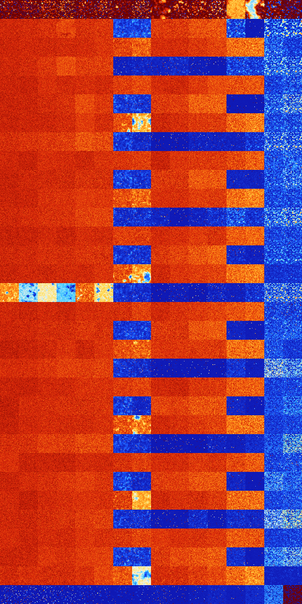

# B028 (133632-134143)

<details>
    <summary>Initial Grid</summary>
    
</details>


<details>
    <summary>Initial Grid RLE</summary>

```
#C Exported from GoGoL (https://github.com/marrow16/gogol)
#C Wrap mode: Toroidal
#C Boundary mode: Dead
#C Step: 0
x = 100, y = 100, rule = B028/S
4bo33bo3bo12bo5bobo$6bo49bo17bo16bo$25bo34b2o$36bobobo4bo38bo$61bo$19b
2o11bo2bo28b2o10bo16bo$23bo9bo3bo13bo12bo30bo$34bo12bo11bobo5bo7bo9bo3b
o$5bobo6bo7bo23bo34bo$13bo3bo13bo4bo37bo8bo2bo$32bo2bo36bo6bo10bo$29bo
18bo5bo5bo2bo13bo11bo$28bo12bo9bo3bo10bo$30bo7bo9bo35bo$22bo2bobo45bo4b
o13bo$o5bo17bo26b2o12bo2bo$o24bo8bo11bo3bobo13bobo$88bob2o$15bo6bo62bo
2bo2bo$15bo46b2o4bo25bo$14bo10bo2bobo6bo36bo$9bo11bo16bo15bo3bo23bo$41b
o4bo15bo22bo$35bo2bo38bo$2bo3bo53bo$o33bo3bo39bo6bo$14bo13bo12bo15bo12b
o8bo$bo7bo20bo3bobo6bobo40bo$8bo22bo3bo7bo34bo2bo$28bo3bo49bo$7bo11bo
59bo6bo10bo$11bo18bo35bo2bo28bo$10bo33bo5bo16bo$21bo16bo26bo7bo23bo$bo
14bo2bo7bo32bo18bo$bo2bo20bobo4bo9bob2o10bo25bo10bo$26bo6bo5bo12b2o10bo
17bo$12bo5bo3bo19bo4bo$18bo6bo18bo9bo7bo$18bo4bo8bo8bo16bo2bo4bo$4bo15b
o10bo10bo35bo$7bo8bo28bo17bob2o$25bo15b2obo19bo3bo16b2o$o16bo10bo47bo$
41bo33b2o11bo$obo30bo50bobo3bo2bo$24bo42bo4bo$32bo12bo5bo11b2o8bo14b2o
2b2o4b2o$16b2o18bo15bo42bo$26bo11bo15bo5bo18bo2bo$6bo26bo5bo24bo20bo4bo
$o23bo47bo4bo12bo$26bo2bobo43bo$7bo12bo26bo33bo10bo$5bo3bo36bo4bo4bo39b
o$17bo16bo2bo49bo$17b2obo3b2o3bo15b2o23bo$37bo5bo4bo5bo3bobo3bo4bo28bo$
27bo12bo2bo19bo3b2o3bo19bo$2bo33bo11bo17bo5bo5bo$15b2o10bo35bo30bo$32bo
10bo54bo$11bo31bo23bobo$2bo8b2o15bo2bo16bo17bo13bo$o5bo21bo6bo27bo32bob
o$52bobo2bo27bo3bo$38bo16bo19bo16bo$49b2o40bo$19bo5bo2bo22bo15bo10bo$
45bo3bo$o12bo30b2o24bo14bo13bo$36bo2bo5bo16bo15bobo3bo$45bo2bo28bo$7b2o
10bo57bo5bo14bo$6bo4bo2bo62bo$43bobo$5bo6bo8bo$8bo31bo6bo10bo$7bo36bobo
10bo18bo$6bo9bo6bo11bo5bo14bo20bo$39bo20bo$16bo15bo22bo27bo10bo$12bo24b
o12bo38b2obo$12bo35bo38bo$25bo48bo14bo$22b2o16bo22bo7bo18b2o$8bo2bo19bo
bo4bo35bo6bo13bo$bo7bo35bo20bo13bo$bo38bo5bo32bo17bo$46bo10bo$o27bo22bo
2bo$10bo19bo44bo10bo$32bo5bo34bo6bo2bo$29bo6bo26bo7bo24bo$5bo19bo51bo9b
o$10bo42bo3bo6bo5bo$18bo8bo11bo9bo16bo13bobo$26b2o10bo14bo6bo$16bo31bo
11bo4bobo25bo$11bo7bo67bo7bo2bo!
```
</details>
<details>
    <summary>Thumbnail</summary>

</details>
<table>
<tr>
    <td><a href="./133632%20S%20Heat%20Map%20Activity.png"></a><br>S (133632)<br>R@46,p8</td>    <td><a href="./133633%20S0%20Heat%20Map%20Activity.png"></a><br>S0 (133633)<br>R@20,p6</td>    <td><a href="./133634%20S1%20Heat%20Map%20Activity.png"></a><br>S1 (133634)<br>R@16,p2</td>    <td><a href="./133635%20S01%20Heat%20Map%20Activity.png"></a><br>S01 (133635)<br>R@10,p2</td>    <td><a href="./133636%20S2%20Heat%20Map%20Activity.png"></a><br>S2 (133636)<br>R@60,p8</td>    <td><a href="./133637%20S02%20Heat%20Map%20Activity.png"></a><br>S02 (133637)<br>R@20,p4</td>    <td><a href="./133638%20S12%20Heat%20Map%20Activity.png"></a><br>S12 (133638)<br>R@64,p4</td>    <td><a href="./133639%20S012%20Heat%20Map%20Activity.png"></a><br>S012 (133639)<br>R@12,p2</td>    <td><a href="./133640%20S3%20Heat%20Map%20Activity.png"></a><br>S3 (133640)<br>R@508,p4</td>    <td><a href="./133641%20S03%20Heat%20Map%20Activity.png"></a><br>S03 (133641)<br>R@82,p4</td>    <td><a href="./133642%20S13%20Heat%20Map%20Activity.png"></a><br>S13 (133642)<br>R@58,p8</td>    <td><a href="./133643%20S013%20Heat%20Map%20Activity.png"></a><br>S013 (133643)<br>R@28,p4</td>    <td><a href="./133644%20S23%20Heat%20Map%20Activity.png"></a><br>S23 (133644)<br>G>1000</td>    <td><a href="./133645%20S023%20Heat%20Map%20Activity.png"></a><br>S023 (133645)<br>G>1000</td>    <td><a href="./133646%20S123%20Heat%20Map%20Activity.png"></a><br>S123 (133646)<br>R@185,p24</td>    <td><a href="./133647%20S0123%20Heat%20Map%20Activity.png"></a><br>S0123 (133647)<br>R@230,p168</td></tr>
<tr>
    <td><a href="./133648%20S4%20Heat%20Map%20Activity.png"></a><br>S4 (133648)<br>G>1000</td>    <td><a href="./133649%20S04%20Heat%20Map%20Activity.png"></a><br>S04 (133649)<br>G>1000</td>    <td><a href="./133650%20S14%20Heat%20Map%20Activity.png"></a><br>S14 (133650)<br>G>1000</td>    <td><a href="./133651%20S014%20Heat%20Map%20Activity.png"></a><br>S014 (133651)<br>G>1000</td>    <td><a href="./133652%20S24%20Heat%20Map%20Activity.png"></a><br>S24 (133652)<br>G>1000</td>    <td><a href="./133653%20S024%20Heat%20Map%20Activity.png"></a><br>S024 (133653)<br>G>1000</td>    <td><a href="./133654%20S124%20Heat%20Map%20Activity.png"></a><br>S124 (133654)<br>R@308,p12</td>    <td><a href="./133655%20S0124%20Heat%20Map%20Activity.png"></a><br>S0124 (133655)<br>R@209,p12</td>    <td><a href="./133656%20S34%20Heat%20Map%20Activity.png"></a><br>S34 (133656)<br>G>1000</td>    <td><a href="./133657%20S034%20Heat%20Map%20Activity.png"></a><br>S034 (133657)<br>G>1000</td>    <td><a href="./133658%20S134%20Heat%20Map%20Activity.png"></a><br>S134 (133658)<br>G>1000</td>    <td><a href="./133659%20S0134%20Heat%20Map%20Activity.png"></a><br>S0134 (133659)<br>G>1000</td>    <td><a href="./133660%20S234%20Heat%20Map%20Activity.png"></a><br>S234 (133660)<br>R@50,p12</td>    <td><a href="./133661%20S0234%20Heat%20Map%20Activity.png"></a><br>S0234 (133661)<br>G>1000</td>    <td><a href="./133662%20S1234%20Heat%20Map%20Activity.png"></a><br>S1234 (133662)<br>S@36</td>    <td><a href="./133663%20S01234%20Heat%20Map%20Activity.png"></a><br>S01234 (133663)<br>S@33</td></tr>
<tr>
    <td><a href="./133664%20S5%20Heat%20Map%20Activity.png"></a><br>S5 (133664)<br>G>1000</td>    <td><a href="./133665%20S05%20Heat%20Map%20Activity.png"></a><br>S05 (133665)<br>G>1000</td>    <td><a href="./133666%20S15%20Heat%20Map%20Activity.png"></a><br>S15 (133666)<br>G>1000</td>    <td><a href="./133667%20S015%20Heat%20Map%20Activity.png"></a><br>S015 (133667)<br>G>1000</td>    <td><a href="./133668%20S25%20Heat%20Map%20Activity.png"></a><br>S25 (133668)<br>G>1000</td>    <td><a href="./133669%20S025%20Heat%20Map%20Activity.png"></a><br>S025 (133669)<br>G>1000</td>    <td><a href="./133670%20S125%20Heat%20Map%20Activity.png"></a><br>S125 (133670)<br>G>1000</td>    <td><a href="./133671%20S0125%20Heat%20Map%20Activity.png"></a><br>S0125 (133671)<br>G>1000</td>    <td><a href="./133672%20S35%20Heat%20Map%20Activity.png"></a><br>S35 (133672)<br>G>1000</td>    <td><a href="./133673%20S035%20Heat%20Map%20Activity.png"></a><br>S035 (133673)<br>G>1000</td>    <td><a href="./133674%20S135%20Heat%20Map%20Activity.png"></a><br>S135 (133674)<br>G>1000</td>    <td><a href="./133675%20S0135%20Heat%20Map%20Activity.png"></a><br>S0135 (133675)<br>G>1000</td>    <td><a href="./133676%20S235%20Heat%20Map%20Activity.png"></a><br>S235 (133676)<br>G>1000</td>    <td><a href="./133677%20S0235%20Heat%20Map%20Activity.png"></a><br>S0235 (133677)<br>G>1000</td>    <td><a href="./133678%20S1235%20Heat%20Map%20Activity.png"></a><br>S1235 (133678)<br>R@22,p2</td>    <td><a href="./133679%20S01235%20Heat%20Map%20Activity.png"></a><br>S01235 (133679)<br>R@34,p12</td></tr>
<tr>
    <td><a href="./133680%20S45%20Heat%20Map%20Activity.png"></a><br>S45 (133680)<br>G>1000</td>    <td><a href="./133681%20S045%20Heat%20Map%20Activity.png"></a><br>S045 (133681)<br>G>1000</td>    <td><a href="./133682%20S145%20Heat%20Map%20Activity.png"></a><br>S145 (133682)<br>G>1000</td>    <td><a href="./133683%20S0145%20Heat%20Map%20Activity.png"></a><br>S0145 (133683)<br>G>1000</td>    <td><a href="./133684%20S245%20Heat%20Map%20Activity.png"></a><br>S245 (133684)<br>G>1000</td>    <td><a href="./133685%20S0245%20Heat%20Map%20Activity.png"></a><br>S0245 (133685)<br>G>1000</td>    <td><a href="./133686%20S1245%20Heat%20Map%20Activity.png"></a><br>S1245 (133686)<br>R@848,p504</td>    <td><a href="./133687%20S01245%20Heat%20Map%20Activity.png"></a><br>S01245 (133687)<br>R@241,p24</td>    <td><a href="./133688%20S345%20Heat%20Map%20Activity.png"></a><br>S345 (133688)<br>R@280,p180</td>    <td><a href="./133689%20S0345%20Heat%20Map%20Activity.png"></a><br>S0345 (133689)<br>R@168,p60</td>    <td><a href="./133690%20S1345%20Heat%20Map%20Activity.png"></a><br>S1345 (133690)<br>R@513,p420</td>    <td><a href="./133691%20S01345%20Heat%20Map%20Activity.png"></a><br>S01345 (133691)<br>G>1000</td>    <td><a href="./133692%20S2345%20Heat%20Map%20Activity.png"></a><br>S2345 (133692)<br>R@25,p12</td>    <td><a href="./133693%20S02345%20Heat%20Map%20Activity.png"></a><br>S02345 (133693)<br>R@26,p6</td>    <td><a href="./133694%20S12345%20Heat%20Map%20Activity.png"></a><br>S12345 (133694)<br>R@12,p2</td>    <td><a href="./133695%20S012345%20Heat%20Map%20Activity.png"></a><br>S012345 (133695)<br>R@13,p2</td></tr>
<tr>
    <td><a href="./133696%20S6%20Heat%20Map%20Activity.png"></a><br>S6 (133696)<br>G>1000</td>    <td><a href="./133697%20S06%20Heat%20Map%20Activity.png"></a><br>S06 (133697)<br>G>1000</td>    <td><a href="./133698%20S16%20Heat%20Map%20Activity.png"></a><br>S16 (133698)<br>G>1000</td>    <td><a href="./133699%20S016%20Heat%20Map%20Activity.png"></a><br>S016 (133699)<br>G>1000</td>    <td><a href="./133700%20S26%20Heat%20Map%20Activity.png"></a><br>S26 (133700)<br>G>1000</td>    <td><a href="./133701%20S026%20Heat%20Map%20Activity.png"></a><br>S026 (133701)<br>G>1000</td>    <td><a href="./133702%20S126%20Heat%20Map%20Activity.png"></a><br>S126 (133702)<br>G>1000</td>    <td><a href="./133703%20S0126%20Heat%20Map%20Activity.png"></a><br>S0126 (133703)<br>G>1000</td>    <td><a href="./133704%20S36%20Heat%20Map%20Activity.png"></a><br>S36 (133704)<br>G>1000</td>    <td><a href="./133705%20S036%20Heat%20Map%20Activity.png"></a><br>S036 (133705)<br>G>1000</td>    <td><a href="./133706%20S136%20Heat%20Map%20Activity.png"></a><br>S136 (133706)<br>G>1000</td>    <td><a href="./133707%20S0136%20Heat%20Map%20Activity.png"></a><br>S0136 (133707)<br>G>1000</td>    <td><a href="./133708%20S236%20Heat%20Map%20Activity.png"></a><br>S236 (133708)<br>G>1000</td>    <td><a href="./133709%20S0236%20Heat%20Map%20Activity.png"></a><br>S0236 (133709)<br>G>1000</td>    <td><a href="./133710%20S1236%20Heat%20Map%20Activity.png"></a><br>S1236 (133710)<br>R@41,p10</td>    <td><a href="./133711%20S01236%20Heat%20Map%20Activity.png"></a><br>S01236 (133711)<br>R@32,p6</td></tr>
<tr>
    <td><a href="./133712%20S46%20Heat%20Map%20Activity.png"></a><br>S46 (133712)<br>G>1000</td>    <td><a href="./133713%20S046%20Heat%20Map%20Activity.png"></a><br>S046 (133713)<br>G>1000</td>    <td><a href="./133714%20S146%20Heat%20Map%20Activity.png"></a><br>S146 (133714)<br>G>1000</td>    <td><a href="./133715%20S0146%20Heat%20Map%20Activity.png"></a><br>S0146 (133715)<br>G>1000</td>    <td><a href="./133716%20S246%20Heat%20Map%20Activity.png"></a><br>S246 (133716)<br>G>1000</td>    <td><a href="./133717%20S0246%20Heat%20Map%20Activity.png"></a><br>S0246 (133717)<br>G>1000</td>    <td><a href="./133718%20S1246%20Heat%20Map%20Activity.png"></a><br>S1246 (133718)<br>R@292,p24</td>    <td><a href="./133719%20S01246%20Heat%20Map%20Activity.png"></a><br>S01246 (133719)<br>R@146,p12</td>    <td><a href="./133720%20S346%20Heat%20Map%20Activity.png"></a><br>S346 (133720)<br>G>1000</td>    <td><a href="./133721%20S0346%20Heat%20Map%20Activity.png"></a><br>S0346 (133721)<br>G>1000</td>    <td><a href="./133722%20S1346%20Heat%20Map%20Activity.png"></a><br>S1346 (133722)<br>G>1000</td>    <td><a href="./133723%20S01346%20Heat%20Map%20Activity.png"></a><br>S01346 (133723)<br>G>1000</td>    <td><a href="./133724%20S2346%20Heat%20Map%20Activity.png"></a><br>S2346 (133724)<br>R@877,p840</td>    <td><a href="./133725%20S02346%20Heat%20Map%20Activity.png"></a><br>S02346 (133725)<br>G>1000</td>    <td><a href="./133726%20S12346%20Heat%20Map%20Activity.png"></a><br>S12346 (133726)<br>R@13,p2</td>    <td><a href="./133727%20S012346%20Heat%20Map%20Activity.png"></a><br>S012346 (133727)<br>S@13</td></tr>
<tr>
    <td><a href="./133728%20S56%20Heat%20Map%20Activity.png"></a><br>S56 (133728)<br>G>1000</td>    <td><a href="./133729%20S056%20Heat%20Map%20Activity.png"></a><br>S056 (133729)<br>G>1000</td>    <td><a href="./133730%20S156%20Heat%20Map%20Activity.png"></a><br>S156 (133730)<br>G>1000</td>    <td><a href="./133731%20S0156%20Heat%20Map%20Activity.png"></a><br>S0156 (133731)<br>G>1000</td>    <td><a href="./133732%20S256%20Heat%20Map%20Activity.png"></a><br>S256 (133732)<br>G>1000</td>    <td><a href="./133733%20S0256%20Heat%20Map%20Activity.png"></a><br>S0256 (133733)<br>G>1000</td>    <td><a href="./133734%20S1256%20Heat%20Map%20Activity.png"></a><br>S1256 (133734)<br>G>1000</td>    <td><a href="./133735%20S01256%20Heat%20Map%20Activity.png"></a><br>S01256 (133735)<br>G>1000</td>    <td><a href="./133736%20S356%20Heat%20Map%20Activity.png"></a><br>S356 (133736)<br>G>1000</td>    <td><a href="./133737%20S0356%20Heat%20Map%20Activity.png"></a><br>S0356 (133737)<br>G>1000</td>    <td><a href="./133738%20S1356%20Heat%20Map%20Activity.png"></a><br>S1356 (133738)<br>G>1000</td>    <td><a href="./133739%20S01356%20Heat%20Map%20Activity.png"></a><br>S01356 (133739)<br>G>1000</td>    <td><a href="./133740%20S2356%20Heat%20Map%20Activity.png"></a><br>S2356 (133740)<br>G>1000</td>    <td><a href="./133741%20S02356%20Heat%20Map%20Activity.png"></a><br>S02356 (133741)<br>G>1000</td>    <td><a href="./133742%20S12356%20Heat%20Map%20Activity.png"></a><br>S12356 (133742)<br>R@23,p2</td>    <td><a href="./133743%20S012356%20Heat%20Map%20Activity.png"></a><br>S012356 (133743)<br>R@19,p2</td></tr>
<tr>
    <td><a href="./133744%20S456%20Heat%20Map%20Activity.png"></a><br>S456 (133744)<br>G>1000</td>    <td><a href="./133745%20S0456%20Heat%20Map%20Activity.png"></a><br>S0456 (133745)<br>G>1000</td>    <td><a href="./133746%20S1456%20Heat%20Map%20Activity.png"></a><br>S1456 (133746)<br>G>1000</td>    <td><a href="./133747%20S01456%20Heat%20Map%20Activity.png"></a><br>S01456 (133747)<br>G>1000</td>    <td><a href="./133748%20S2456%20Heat%20Map%20Activity.png"></a><br>S2456 (133748)<br>G>1000</td>    <td><a href="./133749%20S02456%20Heat%20Map%20Activity.png"></a><br>S02456 (133749)<br>G>1000</td>    <td><a href="./133750%20S12456%20Heat%20Map%20Activity.png"></a><br>S12456 (133750)<br>R@442,p36</td>    <td><a href="./133751%20S012456%20Heat%20Map%20Activity.png"></a><br>S012456 (133751)<br>R@299,p60</td>    <td><a href="./133752%20S3456%20Heat%20Map%20Activity.png"></a><br>S3456 (133752)<br>R@879,p840</td>    <td><a href="./133753%20S03456%20Heat%20Map%20Activity.png"></a><br>S03456 (133753)<br>G>1000</td>    <td><a href="./133754%20S13456%20Heat%20Map%20Activity.png"></a><br>S13456 (133754)<br>R@105,p60</td>    <td><a href="./133755%20S013456%20Heat%20Map%20Activity.png"></a><br>S013456 (133755)<br>R@104,p60</td>    <td><a href="./133756%20S23456%20Heat%20Map%20Activity.png"></a><br>S23456 (133756)<br>R@70,p60</td>    <td><a href="./133757%20S023456%20Heat%20Map%20Activity.png"></a><br>S023456 (133757)<br>R@23,p12</td>    <td><a href="./133758%20S123456%20Heat%20Map%20Activity.png"></a><br>S123456 (133758)<br>R@9,p2</td>    <td><a href="./133759%20S0123456%20Heat%20Map%20Activity.png"></a><br>S0123456 (133759)<br>R@9,p2</td></tr>
<tr>
    <td><a href="./133760%20S7%20Heat%20Map%20Activity.png"></a><br>S7 (133760)<br>G>1000</td>    <td><a href="./133761%20S07%20Heat%20Map%20Activity.png"></a><br>S07 (133761)<br>G>1000</td>    <td><a href="./133762%20S17%20Heat%20Map%20Activity.png"></a><br>S17 (133762)<br>G>1000</td>    <td><a href="./133763%20S017%20Heat%20Map%20Activity.png"></a><br>S017 (133763)<br>G>1000</td>    <td><a href="./133764%20S27%20Heat%20Map%20Activity.png"></a><br>S27 (133764)<br>G>1000</td>    <td><a href="./133765%20S027%20Heat%20Map%20Activity.png"></a><br>S027 (133765)<br>G>1000</td>    <td><a href="./133766%20S127%20Heat%20Map%20Activity.png"></a><br>S127 (133766)<br>G>1000</td>    <td><a href="./133767%20S0127%20Heat%20Map%20Activity.png"></a><br>S0127 (133767)<br>G>1000</td>    <td><a href="./133768%20S37%20Heat%20Map%20Activity.png"></a><br>S37 (133768)<br>G>1000</td>    <td><a href="./133769%20S037%20Heat%20Map%20Activity.png"></a><br>S037 (133769)<br>G>1000</td>    <td><a href="./133770%20S137%20Heat%20Map%20Activity.png"></a><br>S137 (133770)<br>G>1000</td>    <td><a href="./133771%20S0137%20Heat%20Map%20Activity.png"></a><br>S0137 (133771)<br>G>1000</td>    <td><a href="./133772%20S237%20Heat%20Map%20Activity.png"></a><br>S237 (133772)<br>G>1000</td>    <td><a href="./133773%20S0237%20Heat%20Map%20Activity.png"></a><br>S0237 (133773)<br>G>1000</td>    <td><a href="./133774%20S1237%20Heat%20Map%20Activity.png"></a><br>S1237 (133774)<br>R@47,p12</td>    <td><a href="./133775%20S01237%20Heat%20Map%20Activity.png"></a><br>S01237 (133775)<br>R@41,p4</td></tr>
<tr>
    <td><a href="./133776%20S47%20Heat%20Map%20Activity.png"></a><br>S47 (133776)<br>G>1000</td>    <td><a href="./133777%20S047%20Heat%20Map%20Activity.png"></a><br>S047 (133777)<br>G>1000</td>    <td><a href="./133778%20S147%20Heat%20Map%20Activity.png"></a><br>S147 (133778)<br>G>1000</td>    <td><a href="./133779%20S0147%20Heat%20Map%20Activity.png"></a><br>S0147 (133779)<br>G>1000</td>    <td><a href="./133780%20S247%20Heat%20Map%20Activity.png"></a><br>S247 (133780)<br>G>1000</td>    <td><a href="./133781%20S0247%20Heat%20Map%20Activity.png"></a><br>S0247 (133781)<br>G>1000</td>    <td><a href="./133782%20S1247%20Heat%20Map%20Activity.png"></a><br>S1247 (133782)<br>R@280,p12</td>    <td><a href="./133783%20S01247%20Heat%20Map%20Activity.png"></a><br>S01247 (133783)<br>R@187,p24</td>    <td><a href="./133784%20S347%20Heat%20Map%20Activity.png"></a><br>S347 (133784)<br>G>1000</td>    <td><a href="./133785%20S0347%20Heat%20Map%20Activity.png"></a><br>S0347 (133785)<br>G>1000</td>    <td><a href="./133786%20S1347%20Heat%20Map%20Activity.png"></a><br>S1347 (133786)<br>G>1000</td>    <td><a href="./133787%20S01347%20Heat%20Map%20Activity.png"></a><br>S01347 (133787)<br>G>1000</td>    <td><a href="./133788%20S2347%20Heat%20Map%20Activity.png"></a><br>S2347 (133788)<br>R@98,p60</td>    <td><a href="./133789%20S02347%20Heat%20Map%20Activity.png"></a><br>S02347 (133789)<br>R@113,p84</td>    <td><a href="./133790%20S12347%20Heat%20Map%20Activity.png"></a><br>S12347 (133790)<br>R@19,p6</td>    <td><a href="./133791%20S012347%20Heat%20Map%20Activity.png"></a><br>S012347 (133791)<br>R@13,p2</td></tr>
<tr>
    <td><a href="./133792%20S57%20Heat%20Map%20Activity.png"></a><br>S57 (133792)<br>G>1000</td>    <td><a href="./133793%20S057%20Heat%20Map%20Activity.png"></a><br>S057 (133793)<br>G>1000</td>    <td><a href="./133794%20S157%20Heat%20Map%20Activity.png"></a><br>S157 (133794)<br>G>1000</td>    <td><a href="./133795%20S0157%20Heat%20Map%20Activity.png"></a><br>S0157 (133795)<br>G>1000</td>    <td><a href="./133796%20S257%20Heat%20Map%20Activity.png"></a><br>S257 (133796)<br>G>1000</td>    <td><a href="./133797%20S0257%20Heat%20Map%20Activity.png"></a><br>S0257 (133797)<br>G>1000</td>    <td><a href="./133798%20S1257%20Heat%20Map%20Activity.png"></a><br>S1257 (133798)<br>G>1000</td>    <td><a href="./133799%20S01257%20Heat%20Map%20Activity.png"></a><br>S01257 (133799)<br>G>1000</td>    <td><a href="./133800%20S357%20Heat%20Map%20Activity.png"></a><br>S357 (133800)<br>G>1000</td>    <td><a href="./133801%20S0357%20Heat%20Map%20Activity.png"></a><br>S0357 (133801)<br>G>1000</td>    <td><a href="./133802%20S1357%20Heat%20Map%20Activity.png"></a><br>S1357 (133802)<br>G>1000</td>    <td><a href="./133803%20S01357%20Heat%20Map%20Activity.png"></a><br>S01357 (133803)<br>G>1000</td>    <td><a href="./133804%20S2357%20Heat%20Map%20Activity.png"></a><br>S2357 (133804)<br>G>1000</td>    <td><a href="./133805%20S02357%20Heat%20Map%20Activity.png"></a><br>S02357 (133805)<br>G>1000</td>    <td><a href="./133806%20S12357%20Heat%20Map%20Activity.png"></a><br>S12357 (133806)<br>R@26,p6</td>    <td><a href="./133807%20S012357%20Heat%20Map%20Activity.png"></a><br>S012357 (133807)<br>R@23,p6</td></tr>
<tr>
    <td><a href="./133808%20S457%20Heat%20Map%20Activity.png"></a><br>S457 (133808)<br>G>1000</td>    <td><a href="./133809%20S0457%20Heat%20Map%20Activity.png"></a><br>S0457 (133809)<br>G>1000</td>    <td><a href="./133810%20S1457%20Heat%20Map%20Activity.png"></a><br>S1457 (133810)<br>G>1000</td>    <td><a href="./133811%20S01457%20Heat%20Map%20Activity.png"></a><br>S01457 (133811)<br>G>1000</td>    <td><a href="./133812%20S2457%20Heat%20Map%20Activity.png"></a><br>S2457 (133812)<br>G>1000</td>    <td><a href="./133813%20S02457%20Heat%20Map%20Activity.png"></a><br>S02457 (133813)<br>G>1000</td>    <td><a href="./133814%20S12457%20Heat%20Map%20Activity.png"></a><br>S12457 (133814)<br>R@313,p12</td>    <td><a href="./133815%20S012457%20Heat%20Map%20Activity.png"></a><br>S012457 (133815)<br>R@148,p4</td>    <td><a href="./133816%20S3457%20Heat%20Map%20Activity.png"></a><br>S3457 (133816)<br>R@215,p120</td>    <td><a href="./133817%20S03457%20Heat%20Map%20Activity.png"></a><br>S03457 (133817)<br>G>1000</td>    <td><a href="./133818%20S13457%20Heat%20Map%20Activity.png"></a><br>S13457 (133818)<br>R@214,p120</td>    <td><a href="./133819%20S013457%20Heat%20Map%20Activity.png"></a><br>S013457 (133819)<br>R@99,p12</td>    <td><a href="./133820%20S23457%20Heat%20Map%20Activity.png"></a><br>S23457 (133820)<br>R@16,p2</td>    <td><a href="./133821%20S023457%20Heat%20Map%20Activity.png"></a><br>S023457 (133821)<br>R@30,p12</td>    <td><a href="./133822%20S123457%20Heat%20Map%20Activity.png"></a><br>S123457 (133822)<br>R@10,p2</td>    <td><a href="./133823%20S0123457%20Heat%20Map%20Activity.png"></a><br>S0123457 (133823)<br>S@10</td></tr>
<tr>
    <td><a href="./133824%20S67%20Heat%20Map%20Activity.png"></a><br>S67 (133824)<br>G>1000</td>    <td><a href="./133825%20S067%20Heat%20Map%20Activity.png"></a><br>S067 (133825)<br>G>1000</td>    <td><a href="./133826%20S167%20Heat%20Map%20Activity.png"></a><br>S167 (133826)<br>G>1000</td>    <td><a href="./133827%20S0167%20Heat%20Map%20Activity.png"></a><br>S0167 (133827)<br>G>1000</td>    <td><a href="./133828%20S267%20Heat%20Map%20Activity.png"></a><br>S267 (133828)<br>G>1000</td>    <td><a href="./133829%20S0267%20Heat%20Map%20Activity.png"></a><br>S0267 (133829)<br>G>1000</td>    <td><a href="./133830%20S1267%20Heat%20Map%20Activity.png"></a><br>S1267 (133830)<br>G>1000</td>    <td><a href="./133831%20S01267%20Heat%20Map%20Activity.png"></a><br>S01267 (133831)<br>G>1000</td>    <td><a href="./133832%20S367%20Heat%20Map%20Activity.png"></a><br>S367 (133832)<br>G>1000</td>    <td><a href="./133833%20S0367%20Heat%20Map%20Activity.png"></a><br>S0367 (133833)<br>G>1000</td>    <td><a href="./133834%20S1367%20Heat%20Map%20Activity.png"></a><br>S1367 (133834)<br>G>1000</td>    <td><a href="./133835%20S01367%20Heat%20Map%20Activity.png"></a><br>S01367 (133835)<br>G>1000</td>    <td><a href="./133836%20S2367%20Heat%20Map%20Activity.png"></a><br>S2367 (133836)<br>G>1000</td>    <td><a href="./133837%20S02367%20Heat%20Map%20Activity.png"></a><br>S02367 (133837)<br>G>1000</td>    <td><a href="./133838%20S12367%20Heat%20Map%20Activity.png"></a><br>S12367 (133838)<br>R@34,p6</td>    <td><a href="./133839%20S012367%20Heat%20Map%20Activity.png"></a><br>S012367 (133839)<br>R@32,p6</td></tr>
<tr>
    <td><a href="./133840%20S467%20Heat%20Map%20Activity.png"></a><br>S467 (133840)<br>G>1000</td>    <td><a href="./133841%20S0467%20Heat%20Map%20Activity.png"></a><br>S0467 (133841)<br>G>1000</td>    <td><a href="./133842%20S1467%20Heat%20Map%20Activity.png"></a><br>S1467 (133842)<br>G>1000</td>    <td><a href="./133843%20S01467%20Heat%20Map%20Activity.png"></a><br>S01467 (133843)<br>G>1000</td>    <td><a href="./133844%20S2467%20Heat%20Map%20Activity.png"></a><br>S2467 (133844)<br>G>1000</td>    <td><a href="./133845%20S02467%20Heat%20Map%20Activity.png"></a><br>S02467 (133845)<br>G>1000</td>    <td><a href="./133846%20S12467%20Heat%20Map%20Activity.png"></a><br>S12467 (133846)<br>R@348,p6</td>    <td><a href="./133847%20S012467%20Heat%20Map%20Activity.png"></a><br>S012467 (133847)<br>R@166,p24</td>    <td><a href="./133848%20S3467%20Heat%20Map%20Activity.png"></a><br>S3467 (133848)<br>G>1000</td>    <td><a href="./133849%20S03467%20Heat%20Map%20Activity.png"></a><br>S03467 (133849)<br>G>1000</td>    <td><a href="./133850%20S13467%20Heat%20Map%20Activity.png"></a><br>S13467 (133850)<br>G>1000</td>    <td><a href="./133851%20S013467%20Heat%20Map%20Activity.png"></a><br>S013467 (133851)<br>G>1000</td>    <td><a href="./133852%20S23467%20Heat%20Map%20Activity.png"></a><br>S23467 (133852)<br>R@57,p12</td>    <td><a href="./133853%20S023467%20Heat%20Map%20Activity.png"></a><br>S023467 (133853)<br>R@110,p84</td>    <td><a href="./133854%20S123467%20Heat%20Map%20Activity.png"></a><br>S123467 (133854)<br>R@15,p2</td>    <td><a href="./133855%20S0123467%20Heat%20Map%20Activity.png"></a><br>S0123467 (133855)<br>R@15,p2</td></tr>
<tr>
    <td><a href="./133856%20S567%20Heat%20Map%20Activity.png"></a><br>S567 (133856)<br>G>1000</td>    <td><a href="./133857%20S0567%20Heat%20Map%20Activity.png"></a><br>S0567 (133857)<br>G>1000</td>    <td><a href="./133858%20S1567%20Heat%20Map%20Activity.png"></a><br>S1567 (133858)<br>G>1000</td>    <td><a href="./133859%20S01567%20Heat%20Map%20Activity.png"></a><br>S01567 (133859)<br>G>1000</td>    <td><a href="./133860%20S2567%20Heat%20Map%20Activity.png"></a><br>S2567 (133860)<br>G>1000</td>    <td><a href="./133861%20S02567%20Heat%20Map%20Activity.png"></a><br>S02567 (133861)<br>G>1000</td>    <td><a href="./133862%20S12567%20Heat%20Map%20Activity.png"></a><br>S12567 (133862)<br>G>1000</td>    <td><a href="./133863%20S012567%20Heat%20Map%20Activity.png"></a><br>S012567 (133863)<br>G>1000</td>    <td><a href="./133864%20S3567%20Heat%20Map%20Activity.png"></a><br>S3567 (133864)<br>G>1000</td>    <td><a href="./133865%20S03567%20Heat%20Map%20Activity.png"></a><br>S03567 (133865)<br>G>1000</td>    <td><a href="./133866%20S13567%20Heat%20Map%20Activity.png"></a><br>S13567 (133866)<br>G>1000</td>    <td><a href="./133867%20S013567%20Heat%20Map%20Activity.png"></a><br>S013567 (133867)<br>G>1000</td>    <td><a href="./133868%20S23567%20Heat%20Map%20Activity.png"></a><br>S23567 (133868)<br>G>1000</td>    <td><a href="./133869%20S023567%20Heat%20Map%20Activity.png"></a><br>S023567 (133869)<br>G>1000</td>    <td><a href="./133870%20S123567%20Heat%20Map%20Activity.png"></a><br>S123567 (133870)<br>R@41,p12</td>    <td><a href="./133871%20S0123567%20Heat%20Map%20Activity.png"></a><br>S0123567 (133871)<br>R@31,p2</td></tr>
<tr>
    <td><a href="./133872%20S4567%20Heat%20Map%20Activity.png"></a><br>S4567 (133872)<br>G>1000</td>    <td><a href="./133873%20S04567%20Heat%20Map%20Activity.png"></a><br>S04567 (133873)<br>G>1000</td>    <td><a href="./133874%20S14567%20Heat%20Map%20Activity.png"></a><br>S14567 (133874)<br>G>1000</td>    <td><a href="./133875%20S014567%20Heat%20Map%20Activity.png"></a><br>S014567 (133875)<br>G>1000</td>    <td><a href="./133876%20S24567%20Heat%20Map%20Activity.png"></a><br>S24567 (133876)<br>G>1000</td>    <td><a href="./133877%20S024567%20Heat%20Map%20Activity.png"></a><br>S024567 (133877)<br>G>1000</td>    <td><a href="./133878%20S124567%20Heat%20Map%20Activity.png"></a><br>S124567 (133878)<br>R@447,p60</td>    <td><a href="./133879%20S0124567%20Heat%20Map%20Activity.png"></a><br>S0124567 (133879)<br>R@244,p12</td>    <td><a href="./133880%20S34567%20Heat%20Map%20Activity.png"></a><br>S34567 (133880)<br>G>1000</td>    <td><a href="./133881%20S034567%20Heat%20Map%20Activity.png"></a><br>S034567 (133881)<br>R@152,p120</td>    <td><a href="./133882%20S134567%20Heat%20Map%20Activity.png"></a><br>S134567 (133882)<br>R@886,p840</td>    <td><a href="./133883%20S0134567%20Heat%20Map%20Activity.png"></a><br>S0134567 (133883)<br>R@67,p24</td>    <td><a href="./133884%20S234567%20Heat%20Map%20Activity.png"></a><br>S234567 (133884)<br>R@66,p60</td>    <td><a href="./133885%20S0234567%20Heat%20Map%20Activity.png"></a><br>S0234567 (133885)<br>R@21,p12</td>    <td><a href="./133886%20S1234567%20Heat%20Map%20Activity.png"></a><br>S1234567 (133886)<br>R@7,p2</td>    <td><a href="./133887%20S01234567%20Heat%20Map%20Activity.png"></a><br>S01234567 (133887)<br>R@7,p2</td></tr>
<tr>
    <td><a href="./133888%20S8%20Heat%20Map%20Activity.png"></a><br>S8 (133888)<br>G>1000</td>    <td><a href="./133889%20S08%20Heat%20Map%20Activity.png"></a><br>S08 (133889)<br>G>1000</td>    <td><a href="./133890%20S18%20Heat%20Map%20Activity.png"></a><br>S18 (133890)<br>G>1000</td>    <td><a href="./133891%20S018%20Heat%20Map%20Activity.png"></a><br>S018 (133891)<br>G>1000</td>    <td><a href="./133892%20S28%20Heat%20Map%20Activity.png"></a><br>S28 (133892)<br>G>1000</td>    <td><a href="./133893%20S028%20Heat%20Map%20Activity.png"></a><br>S028 (133893)<br>G>1000</td>    <td><a href="./133894%20S128%20Heat%20Map%20Activity.png"></a><br>S128 (133894)<br>G>1000</td>    <td><a href="./133895%20S0128%20Heat%20Map%20Activity.png"></a><br>S0128 (133895)<br>G>1000</td>    <td><a href="./133896%20S38%20Heat%20Map%20Activity.png"></a><br>S38 (133896)<br>G>1000</td>    <td><a href="./133897%20S038%20Heat%20Map%20Activity.png"></a><br>S038 (133897)<br>G>1000</td>    <td><a href="./133898%20S138%20Heat%20Map%20Activity.png"></a><br>S138 (133898)<br>G>1000</td>    <td><a href="./133899%20S0138%20Heat%20Map%20Activity.png"></a><br>S0138 (133899)<br>G>1000</td>    <td><a href="./133900%20S238%20Heat%20Map%20Activity.png"></a><br>S238 (133900)<br>G>1000</td>    <td><a href="./133901%20S0238%20Heat%20Map%20Activity.png"></a><br>S0238 (133901)<br>G>1000</td>    <td><a href="./133902%20S1238%20Heat%20Map%20Activity.png"></a><br>S1238 (133902)<br>R@53,p12</td>    <td><a href="./133903%20S01238%20Heat%20Map%20Activity.png"></a><br>S01238 (133903)<br>R@53,p12</td></tr>
<tr>
    <td><a href="./133904%20S48%20Heat%20Map%20Activity.png"></a><br>S48 (133904)<br>G>1000</td>    <td><a href="./133905%20S048%20Heat%20Map%20Activity.png"></a><br>S048 (133905)<br>G>1000</td>    <td><a href="./133906%20S148%20Heat%20Map%20Activity.png"></a><br>S148 (133906)<br>G>1000</td>    <td><a href="./133907%20S0148%20Heat%20Map%20Activity.png"></a><br>S0148 (133907)<br>G>1000</td>    <td><a href="./133908%20S248%20Heat%20Map%20Activity.png"></a><br>S248 (133908)<br>G>1000</td>    <td><a href="./133909%20S0248%20Heat%20Map%20Activity.png"></a><br>S0248 (133909)<br>G>1000</td>    <td><a href="./133910%20S1248%20Heat%20Map%20Activity.png"></a><br>S1248 (133910)<br>R@297,p42</td>    <td><a href="./133911%20S01248%20Heat%20Map%20Activity.png"></a><br>S01248 (133911)<br>R@163,p4</td>    <td><a href="./133912%20S348%20Heat%20Map%20Activity.png"></a><br>S348 (133912)<br>G>1000</td>    <td><a href="./133913%20S0348%20Heat%20Map%20Activity.png"></a><br>S0348 (133913)<br>G>1000</td>    <td><a href="./133914%20S1348%20Heat%20Map%20Activity.png"></a><br>S1348 (133914)<br>G>1000</td>    <td><a href="./133915%20S01348%20Heat%20Map%20Activity.png"></a><br>S01348 (133915)<br>G>1000</td>    <td><a href="./133916%20S2348%20Heat%20Map%20Activity.png"></a><br>S2348 (133916)<br>R@95,p60</td>    <td><a href="./133917%20S02348%20Heat%20Map%20Activity.png"></a><br>S02348 (133917)<br>R@289,p252</td>    <td><a href="./133918%20S12348%20Heat%20Map%20Activity.png"></a><br>S12348 (133918)<br>R@19,p6</td>    <td><a href="./133919%20S012348%20Heat%20Map%20Activity.png"></a><br>S012348 (133919)<br>R@15,p2</td></tr>
<tr>
    <td><a href="./133920%20S58%20Heat%20Map%20Activity.png"></a><br>S58 (133920)<br>G>1000</td>    <td><a href="./133921%20S058%20Heat%20Map%20Activity.png"></a><br>S058 (133921)<br>G>1000</td>    <td><a href="./133922%20S158%20Heat%20Map%20Activity.png"></a><br>S158 (133922)<br>G>1000</td>    <td><a href="./133923%20S0158%20Heat%20Map%20Activity.png"></a><br>S0158 (133923)<br>G>1000</td>    <td><a href="./133924%20S258%20Heat%20Map%20Activity.png"></a><br>S258 (133924)<br>G>1000</td>    <td><a href="./133925%20S0258%20Heat%20Map%20Activity.png"></a><br>S0258 (133925)<br>G>1000</td>    <td><a href="./133926%20S1258%20Heat%20Map%20Activity.png"></a><br>S1258 (133926)<br>G>1000</td>    <td><a href="./133927%20S01258%20Heat%20Map%20Activity.png"></a><br>S01258 (133927)<br>G>1000</td>    <td><a href="./133928%20S358%20Heat%20Map%20Activity.png"></a><br>S358 (133928)<br>G>1000</td>    <td><a href="./133929%20S0358%20Heat%20Map%20Activity.png"></a><br>S0358 (133929)<br>G>1000</td>    <td><a href="./133930%20S1358%20Heat%20Map%20Activity.png"></a><br>S1358 (133930)<br>G>1000</td>    <td><a href="./133931%20S01358%20Heat%20Map%20Activity.png"></a><br>S01358 (133931)<br>G>1000</td>    <td><a href="./133932%20S2358%20Heat%20Map%20Activity.png"></a><br>S2358 (133932)<br>G>1000</td>    <td><a href="./133933%20S02358%20Heat%20Map%20Activity.png"></a><br>S02358 (133933)<br>G>1000</td>    <td><a href="./133934%20S12358%20Heat%20Map%20Activity.png"></a><br>S12358 (133934)<br>R@22,p6</td>    <td><a href="./133935%20S012358%20Heat%20Map%20Activity.png"></a><br>S012358 (133935)<br>R@32,p12</td></tr>
<tr>
    <td><a href="./133936%20S458%20Heat%20Map%20Activity.png"></a><br>S458 (133936)<br>G>1000</td>    <td><a href="./133937%20S0458%20Heat%20Map%20Activity.png"></a><br>S0458 (133937)<br>G>1000</td>    <td><a href="./133938%20S1458%20Heat%20Map%20Activity.png"></a><br>S1458 (133938)<br>G>1000</td>    <td><a href="./133939%20S01458%20Heat%20Map%20Activity.png"></a><br>S01458 (133939)<br>G>1000</td>    <td><a href="./133940%20S2458%20Heat%20Map%20Activity.png"></a><br>S2458 (133940)<br>G>1000</td>    <td><a href="./133941%20S02458%20Heat%20Map%20Activity.png"></a><br>S02458 (133941)<br>G>1000</td>    <td><a href="./133942%20S12458%20Heat%20Map%20Activity.png"></a><br>S12458 (133942)<br>R@295,p60</td>    <td><a href="./133943%20S012458%20Heat%20Map%20Activity.png"></a><br>S012458 (133943)<br>R@171,p20</td>    <td><a href="./133944%20S3458%20Heat%20Map%20Activity.png"></a><br>S3458 (133944)<br>R@939,p840</td>    <td><a href="./133945%20S03458%20Heat%20Map%20Activity.png"></a><br>S03458 (133945)<br>G>1000</td>    <td><a href="./133946%20S13458%20Heat%20Map%20Activity.png"></a><br>S13458 (133946)<br>R@922,p840</td>    <td><a href="./133947%20S013458%20Heat%20Map%20Activity.png"></a><br>S013458 (133947)<br>G>1000</td>    <td><a href="./133948%20S23458%20Heat%20Map%20Activity.png"></a><br>S23458 (133948)<br>R@27,p12</td>    <td><a href="./133949%20S023458%20Heat%20Map%20Activity.png"></a><br>S023458 (133949)<br>R@99,p84</td>    <td><a href="./133950%20S123458%20Heat%20Map%20Activity.png"></a><br>S123458 (133950)<br>S@8</td>    <td><a href="./133951%20S0123458%20Heat%20Map%20Activity.png"></a><br>S0123458 (133951)<br>R@10,p2</td></tr>
<tr>
    <td><a href="./133952%20S68%20Heat%20Map%20Activity.png"></a><br>S68 (133952)<br>G>1000</td>    <td><a href="./133953%20S068%20Heat%20Map%20Activity.png"></a><br>S068 (133953)<br>G>1000</td>    <td><a href="./133954%20S168%20Heat%20Map%20Activity.png"></a><br>S168 (133954)<br>G>1000</td>    <td><a href="./133955%20S0168%20Heat%20Map%20Activity.png"></a><br>S0168 (133955)<br>G>1000</td>    <td><a href="./133956%20S268%20Heat%20Map%20Activity.png"></a><br>S268 (133956)<br>G>1000</td>    <td><a href="./133957%20S0268%20Heat%20Map%20Activity.png"></a><br>S0268 (133957)<br>G>1000</td>    <td><a href="./133958%20S1268%20Heat%20Map%20Activity.png"></a><br>S1268 (133958)<br>G>1000</td>    <td><a href="./133959%20S01268%20Heat%20Map%20Activity.png"></a><br>S01268 (133959)<br>G>1000</td>    <td><a href="./133960%20S368%20Heat%20Map%20Activity.png"></a><br>S368 (133960)<br>G>1000</td>    <td><a href="./133961%20S0368%20Heat%20Map%20Activity.png"></a><br>S0368 (133961)<br>G>1000</td>    <td><a href="./133962%20S1368%20Heat%20Map%20Activity.png"></a><br>S1368 (133962)<br>G>1000</td>    <td><a href="./133963%20S01368%20Heat%20Map%20Activity.png"></a><br>S01368 (133963)<br>G>1000</td>    <td><a href="./133964%20S2368%20Heat%20Map%20Activity.png"></a><br>S2368 (133964)<br>G>1000</td>    <td><a href="./133965%20S02368%20Heat%20Map%20Activity.png"></a><br>S02368 (133965)<br>G>1000</td>    <td><a href="./133966%20S12368%20Heat%20Map%20Activity.png"></a><br>S12368 (133966)<br>R@40,p12</td>    <td><a href="./133967%20S012368%20Heat%20Map%20Activity.png"></a><br>S012368 (133967)<br>R@29,p2</td></tr>
<tr>
    <td><a href="./133968%20S468%20Heat%20Map%20Activity.png"></a><br>S468 (133968)<br>G>1000</td>    <td><a href="./133969%20S0468%20Heat%20Map%20Activity.png"></a><br>S0468 (133969)<br>G>1000</td>    <td><a href="./133970%20S1468%20Heat%20Map%20Activity.png"></a><br>S1468 (133970)<br>G>1000</td>    <td><a href="./133971%20S01468%20Heat%20Map%20Activity.png"></a><br>S01468 (133971)<br>G>1000</td>    <td><a href="./133972%20S2468%20Heat%20Map%20Activity.png"></a><br>S2468 (133972)<br>G>1000</td>    <td><a href="./133973%20S02468%20Heat%20Map%20Activity.png"></a><br>S02468 (133973)<br>G>1000</td>    <td><a href="./133974%20S12468%20Heat%20Map%20Activity.png"></a><br>S12468 (133974)<br>R@272,p6</td>    <td><a href="./133975%20S012468%20Heat%20Map%20Activity.png"></a><br>S012468 (133975)<br>R@257,p72</td>    <td><a href="./133976%20S3468%20Heat%20Map%20Activity.png"></a><br>S3468 (133976)<br>G>1000</td>    <td><a href="./133977%20S03468%20Heat%20Map%20Activity.png"></a><br>S03468 (133977)<br>G>1000</td>    <td><a href="./133978%20S13468%20Heat%20Map%20Activity.png"></a><br>S13468 (133978)<br>G>1000</td>    <td><a href="./133979%20S013468%20Heat%20Map%20Activity.png"></a><br>S013468 (133979)<br>G>1000</td>    <td><a href="./133980%20S23468%20Heat%20Map%20Activity.png"></a><br>S23468 (133980)<br>R@56,p12</td>    <td><a href="./133981%20S023468%20Heat%20Map%20Activity.png"></a><br>S023468 (133981)<br>R@194,p168</td>    <td><a href="./133982%20S123468%20Heat%20Map%20Activity.png"></a><br>S123468 (133982)<br>R@15,p6</td>    <td><a href="./133983%20S0123468%20Heat%20Map%20Activity.png"></a><br>S0123468 (133983)<br>R@11,p2</td></tr>
<tr>
    <td><a href="./133984%20S568%20Heat%20Map%20Activity.png"></a><br>S568 (133984)<br>G>1000</td>    <td><a href="./133985%20S0568%20Heat%20Map%20Activity.png"></a><br>S0568 (133985)<br>G>1000</td>    <td><a href="./133986%20S1568%20Heat%20Map%20Activity.png"></a><br>S1568 (133986)<br>G>1000</td>    <td><a href="./133987%20S01568%20Heat%20Map%20Activity.png"></a><br>S01568 (133987)<br>G>1000</td>    <td><a href="./133988%20S2568%20Heat%20Map%20Activity.png"></a><br>S2568 (133988)<br>G>1000</td>    <td><a href="./133989%20S02568%20Heat%20Map%20Activity.png"></a><br>S02568 (133989)<br>G>1000</td>    <td><a href="./133990%20S12568%20Heat%20Map%20Activity.png"></a><br>S12568 (133990)<br>G>1000</td>    <td><a href="./133991%20S012568%20Heat%20Map%20Activity.png"></a><br>S012568 (133991)<br>G>1000</td>    <td><a href="./133992%20S3568%20Heat%20Map%20Activity.png"></a><br>S3568 (133992)<br>G>1000</td>    <td><a href="./133993%20S03568%20Heat%20Map%20Activity.png"></a><br>S03568 (133993)<br>G>1000</td>    <td><a href="./133994%20S13568%20Heat%20Map%20Activity.png"></a><br>S13568 (133994)<br>G>1000</td>    <td><a href="./133995%20S013568%20Heat%20Map%20Activity.png"></a><br>S013568 (133995)<br>G>1000</td>    <td><a href="./133996%20S23568%20Heat%20Map%20Activity.png"></a><br>S23568 (133996)<br>G>1000</td>    <td><a href="./133997%20S023568%20Heat%20Map%20Activity.png"></a><br>S023568 (133997)<br>G>1000</td>    <td><a href="./133998%20S123568%20Heat%20Map%20Activity.png"></a><br>S123568 (133998)<br>R@29,p6</td>    <td><a href="./133999%20S0123568%20Heat%20Map%20Activity.png"></a><br>S0123568 (133999)<br>R@21,p2</td></tr>
<tr>
    <td><a href="./134000%20S4568%20Heat%20Map%20Activity.png"></a><br>S4568 (134000)<br>G>1000</td>    <td><a href="./134001%20S04568%20Heat%20Map%20Activity.png"></a><br>S04568 (134001)<br>G>1000</td>    <td><a href="./134002%20S14568%20Heat%20Map%20Activity.png"></a><br>S14568 (134002)<br>G>1000</td>    <td><a href="./134003%20S014568%20Heat%20Map%20Activity.png"></a><br>S014568 (134003)<br>G>1000</td>    <td><a href="./134004%20S24568%20Heat%20Map%20Activity.png"></a><br>S24568 (134004)<br>G>1000</td>    <td><a href="./134005%20S024568%20Heat%20Map%20Activity.png"></a><br>S024568 (134005)<br>G>1000</td>    <td><a href="./134006%20S124568%20Heat%20Map%20Activity.png"></a><br>S124568 (134006)<br>R@389,p12</td>    <td><a href="./134007%20S0124568%20Heat%20Map%20Activity.png"></a><br>S0124568 (134007)<br>R@216,p20</td>    <td><a href="./134008%20S34568%20Heat%20Map%20Activity.png"></a><br>S34568 (134008)<br>G>1000</td>    <td><a href="./134009%20S034568%20Heat%20Map%20Activity.png"></a><br>S034568 (134009)<br>R@403,p360</td>    <td><a href="./134010%20S134568%20Heat%20Map%20Activity.png"></a><br>S134568 (134010)<br>G>1000</td>    <td><a href="./134011%20S0134568%20Heat%20Map%20Activity.png"></a><br>S0134568 (134011)<br>R@68,p24</td>    <td><a href="./134012%20S234568%20Heat%20Map%20Activity.png"></a><br>S234568 (134012)<br>R@77,p60</td>    <td><a href="./134013%20S0234568%20Heat%20Map%20Activity.png"></a><br>S0234568 (134013)<br>R@29,p12</td>    <td><a href="./134014%20S1234568%20Heat%20Map%20Activity.png"></a><br>S1234568 (134014)<br>R@10,p2</td>    <td><a href="./134015%20S01234568%20Heat%20Map%20Activity.png"></a><br>S01234568 (134015)<br>S@8</td></tr>
<tr>
    <td><a href="./134016%20S78%20Heat%20Map%20Activity.png"></a><br>S78 (134016)<br>G>1000</td>    <td><a href="./134017%20S078%20Heat%20Map%20Activity.png"></a><br>S078 (134017)<br>G>1000</td>    <td><a href="./134018%20S178%20Heat%20Map%20Activity.png"></a><br>S178 (134018)<br>G>1000</td>    <td><a href="./134019%20S0178%20Heat%20Map%20Activity.png"></a><br>S0178 (134019)<br>G>1000</td>    <td><a href="./134020%20S278%20Heat%20Map%20Activity.png"></a><br>S278 (134020)<br>G>1000</td>    <td><a href="./134021%20S0278%20Heat%20Map%20Activity.png"></a><br>S0278 (134021)<br>G>1000</td>    <td><a href="./134022%20S1278%20Heat%20Map%20Activity.png"></a><br>S1278 (134022)<br>G>1000</td>    <td><a href="./134023%20S01278%20Heat%20Map%20Activity.png"></a><br>S01278 (134023)<br>G>1000</td>    <td><a href="./134024%20S378%20Heat%20Map%20Activity.png"></a><br>S378 (134024)<br>G>1000</td>    <td><a href="./134025%20S0378%20Heat%20Map%20Activity.png"></a><br>S0378 (134025)<br>G>1000</td>    <td><a href="./134026%20S1378%20Heat%20Map%20Activity.png"></a><br>S1378 (134026)<br>G>1000</td>    <td><a href="./134027%20S01378%20Heat%20Map%20Activity.png"></a><br>S01378 (134027)<br>G>1000</td>    <td><a href="./134028%20S2378%20Heat%20Map%20Activity.png"></a><br>S2378 (134028)<br>G>1000</td>    <td><a href="./134029%20S02378%20Heat%20Map%20Activity.png"></a><br>S02378 (134029)<br>G>1000</td>    <td><a href="./134030%20S12378%20Heat%20Map%20Activity.png"></a><br>S12378 (134030)<br>R@45,p12</td>    <td><a href="./134031%20S012378%20Heat%20Map%20Activity.png"></a><br>S012378 (134031)<br>R@37,p4</td></tr>
<tr>
    <td><a href="./134032%20S478%20Heat%20Map%20Activity.png"></a><br>S478 (134032)<br>G>1000</td>    <td><a href="./134033%20S0478%20Heat%20Map%20Activity.png"></a><br>S0478 (134033)<br>G>1000</td>    <td><a href="./134034%20S1478%20Heat%20Map%20Activity.png"></a><br>S1478 (134034)<br>G>1000</td>    <td><a href="./134035%20S01478%20Heat%20Map%20Activity.png"></a><br>S01478 (134035)<br>G>1000</td>    <td><a href="./134036%20S2478%20Heat%20Map%20Activity.png"></a><br>S2478 (134036)<br>G>1000</td>    <td><a href="./134037%20S02478%20Heat%20Map%20Activity.png"></a><br>S02478 (134037)<br>G>1000</td>    <td><a href="./134038%20S12478%20Heat%20Map%20Activity.png"></a><br>S12478 (134038)<br>R@255,p6</td>    <td><a href="./134039%20S012478%20Heat%20Map%20Activity.png"></a><br>S012478 (134039)<br>R@266,p12</td>    <td><a href="./134040%20S3478%20Heat%20Map%20Activity.png"></a><br>S3478 (134040)<br>G>1000</td>    <td><a href="./134041%20S03478%20Heat%20Map%20Activity.png"></a><br>S03478 (134041)<br>G>1000</td>    <td><a href="./134042%20S13478%20Heat%20Map%20Activity.png"></a><br>S13478 (134042)<br>G>1000</td>    <td><a href="./134043%20S013478%20Heat%20Map%20Activity.png"></a><br>S013478 (134043)<br>G>1000</td>    <td><a href="./134044%20S23478%20Heat%20Map%20Activity.png"></a><br>S23478 (134044)<br>R@82,p36</td>    <td><a href="./134045%20S023478%20Heat%20Map%20Activity.png"></a><br>S023478 (134045)<br>R@449,p420</td>    <td><a href="./134046%20S123478%20Heat%20Map%20Activity.png"></a><br>S123478 (134046)<br>R@15,p3</td>    <td><a href="./134047%20S0123478%20Heat%20Map%20Activity.png"></a><br>S0123478 (134047)<br>R@13,p2</td></tr>
<tr>
    <td><a href="./134048%20S578%20Heat%20Map%20Activity.png"></a><br>S578 (134048)<br>G>1000</td>    <td><a href="./134049%20S0578%20Heat%20Map%20Activity.png"></a><br>S0578 (134049)<br>G>1000</td>    <td><a href="./134050%20S1578%20Heat%20Map%20Activity.png"></a><br>S1578 (134050)<br>G>1000</td>    <td><a href="./134051%20S01578%20Heat%20Map%20Activity.png"></a><br>S01578 (134051)<br>G>1000</td>    <td><a href="./134052%20S2578%20Heat%20Map%20Activity.png"></a><br>S2578 (134052)<br>G>1000</td>    <td><a href="./134053%20S02578%20Heat%20Map%20Activity.png"></a><br>S02578 (134053)<br>G>1000</td>    <td><a href="./134054%20S12578%20Heat%20Map%20Activity.png"></a><br>S12578 (134054)<br>G>1000</td>    <td><a href="./134055%20S012578%20Heat%20Map%20Activity.png"></a><br>S012578 (134055)<br>G>1000</td>    <td><a href="./134056%20S3578%20Heat%20Map%20Activity.png"></a><br>S3578 (134056)<br>G>1000</td>    <td><a href="./134057%20S03578%20Heat%20Map%20Activity.png"></a><br>S03578 (134057)<br>G>1000</td>    <td><a href="./134058%20S13578%20Heat%20Map%20Activity.png"></a><br>S13578 (134058)<br>G>1000</td>    <td><a href="./134059%20S013578%20Heat%20Map%20Activity.png"></a><br>S013578 (134059)<br>G>1000</td>    <td><a href="./134060%20S23578%20Heat%20Map%20Activity.png"></a><br>S23578 (134060)<br>G>1000</td>    <td><a href="./134061%20S023578%20Heat%20Map%20Activity.png"></a><br>S023578 (134061)<br>G>1000</td>    <td><a href="./134062%20S123578%20Heat%20Map%20Activity.png"></a><br>S123578 (134062)<br>R@25,p2</td>    <td><a href="./134063%20S0123578%20Heat%20Map%20Activity.png"></a><br>S0123578 (134063)<br>R@18,p2</td></tr>
<tr>
    <td><a href="./134064%20S4578%20Heat%20Map%20Activity.png"></a><br>S4578 (134064)<br>G>1000</td>    <td><a href="./134065%20S04578%20Heat%20Map%20Activity.png"></a><br>S04578 (134065)<br>G>1000</td>    <td><a href="./134066%20S14578%20Heat%20Map%20Activity.png"></a><br>S14578 (134066)<br>G>1000</td>    <td><a href="./134067%20S014578%20Heat%20Map%20Activity.png"></a><br>S014578 (134067)<br>G>1000</td>    <td><a href="./134068%20S24578%20Heat%20Map%20Activity.png"></a><br>S24578 (134068)<br>G>1000</td>    <td><a href="./134069%20S024578%20Heat%20Map%20Activity.png"></a><br>S024578 (134069)<br>G>1000</td>    <td><a href="./134070%20S124578%20Heat%20Map%20Activity.png"></a><br>S124578 (134070)<br>R@265,p30</td>    <td><a href="./134071%20S0124578%20Heat%20Map%20Activity.png"></a><br>S0124578 (134071)<br>R@150,p12</td>    <td><a href="./134072%20S34578%20Heat%20Map%20Activity.png"></a><br>S34578 (134072)<br>G>1000</td>    <td><a href="./134073%20S034578%20Heat%20Map%20Activity.png"></a><br>S034578 (134073)<br>R@813,p720</td>    <td><a href="./134074%20S134578%20Heat%20Map%20Activity.png"></a><br>S134578 (134074)<br>R@107,p12</td>    <td><a href="./134075%20S0134578%20Heat%20Map%20Activity.png"></a><br>S0134578 (134075)<br>R@529,p420</td>    <td><a href="./134076%20S234578%20Heat%20Map%20Activity.png"></a><br>S234578 (134076)<br>R@32,p12</td>    <td><a href="./134077%20S0234578%20Heat%20Map%20Activity.png"></a><br>S0234578 (134077)<br>R@43,p24</td>    <td><a href="./134078%20S1234578%20Heat%20Map%20Activity.png"></a><br>S1234578 (134078)<br>S@12</td>    <td><a href="./134079%20S01234578%20Heat%20Map%20Activity.png"></a><br>S01234578 (134079)<br>S@12</td></tr>
<tr>
    <td><a href="./134080%20S678%20Heat%20Map%20Activity.png"></a><br>S678 (134080)<br>G>1000</td>    <td><a href="./134081%20S0678%20Heat%20Map%20Activity.png"></a><br>S0678 (134081)<br>G>1000</td>    <td><a href="./134082%20S1678%20Heat%20Map%20Activity.png"></a><br>S1678 (134082)<br>G>1000</td>    <td><a href="./134083%20S01678%20Heat%20Map%20Activity.png"></a><br>S01678 (134083)<br>G>1000</td>    <td><a href="./134084%20S2678%20Heat%20Map%20Activity.png"></a><br>S2678 (134084)<br>G>1000</td>    <td><a href="./134085%20S02678%20Heat%20Map%20Activity.png"></a><br>S02678 (134085)<br>G>1000</td>    <td><a href="./134086%20S12678%20Heat%20Map%20Activity.png"></a><br>S12678 (134086)<br>G>1000</td>    <td><a href="./134087%20S012678%20Heat%20Map%20Activity.png"></a><br>S012678 (134087)<br>G>1000</td>    <td><a href="./134088%20S3678%20Heat%20Map%20Activity.png"></a><br>S3678 (134088)<br>G>1000</td>    <td><a href="./134089%20S03678%20Heat%20Map%20Activity.png"></a><br>S03678 (134089)<br>G>1000</td>    <td><a href="./134090%20S13678%20Heat%20Map%20Activity.png"></a><br>S13678 (134090)<br>G>1000</td>    <td><a href="./134091%20S013678%20Heat%20Map%20Activity.png"></a><br>S013678 (134091)<br>G>1000</td>    <td><a href="./134092%20S23678%20Heat%20Map%20Activity.png"></a><br>S23678 (134092)<br>G>1000</td>    <td><a href="./134093%20S023678%20Heat%20Map%20Activity.png"></a><br>S023678 (134093)<br>G>1000</td>    <td><a href="./134094%20S123678%20Heat%20Map%20Activity.png"></a><br>S123678 (134094)<br>R@47,p6</td>    <td><a href="./134095%20S0123678%20Heat%20Map%20Activity.png"></a><br>S0123678 (134095)<br>R@36,p6</td></tr>
<tr>
    <td><a href="./134096%20S4678%20Heat%20Map%20Activity.png"></a><br>S4678 (134096)<br>G>1000</td>    <td><a href="./134097%20S04678%20Heat%20Map%20Activity.png"></a><br>S04678 (134097)<br>G>1000</td>    <td><a href="./134098%20S14678%20Heat%20Map%20Activity.png"></a><br>S14678 (134098)<br>G>1000</td>    <td><a href="./134099%20S014678%20Heat%20Map%20Activity.png"></a><br>S014678 (134099)<br>G>1000</td>    <td><a href="./134100%20S24678%20Heat%20Map%20Activity.png"></a><br>S24678 (134100)<br>G>1000</td>    <td><a href="./134101%20S024678%20Heat%20Map%20Activity.png"></a><br>S024678 (134101)<br>G>1000</td>    <td><a href="./134102%20S124678%20Heat%20Map%20Activity.png"></a><br>S124678 (134102)<br>R@287,p6</td>    <td><a href="./134103%20S0124678%20Heat%20Map%20Activity.png"></a><br>S0124678 (134103)<br>R@159,p12</td>    <td><a href="./134104%20S34678%20Heat%20Map%20Activity.png"></a><br>S34678 (134104)<br>G>1000</td>    <td><a href="./134105%20S034678%20Heat%20Map%20Activity.png"></a><br>S034678 (134105)<br>G>1000</td>    <td><a href="./134106%20S134678%20Heat%20Map%20Activity.png"></a><br>S134678 (134106)<br>G>1000</td>    <td><a href="./134107%20S0134678%20Heat%20Map%20Activity.png"></a><br>S0134678 (134107)<br>G>1000</td>    <td><a href="./134108%20S234678%20Heat%20Map%20Activity.png"></a><br>S234678 (134108)<br>R@44,p12</td>    <td><a href="./134109%20S0234678%20Heat%20Map%20Activity.png"></a><br>S0234678 (134109)<br>R@288,p252</td>    <td><a href="./134110%20S1234678%20Heat%20Map%20Activity.png"></a><br>S1234678 (134110)<br>S@21</td>    <td><a href="./134111%20S01234678%20Heat%20Map%20Activity.png"></a><br>S01234678 (134111)<br>S@18</td></tr>
<tr>
    <td><a href="./134112%20S5678%20Heat%20Map%20Activity.png"></a><br>S5678 (134112)<br>G>1000</td>    <td><a href="./134113%20S05678%20Heat%20Map%20Activity.png"></a><br>S05678 (134113)<br>G>1000</td>    <td><a href="./134114%20S15678%20Heat%20Map%20Activity.png"></a><br>S15678 (134114)<br>G>1000</td>    <td><a href="./134115%20S015678%20Heat%20Map%20Activity.png"></a><br>S015678 (134115)<br>G>1000</td>    <td><a href="./134116%20S25678%20Heat%20Map%20Activity.png"></a><br>S25678 (134116)<br>G>1000</td>    <td><a href="./134117%20S025678%20Heat%20Map%20Activity.png"></a><br>S025678 (134117)<br>G>1000</td>    <td><a href="./134118%20S125678%20Heat%20Map%20Activity.png"></a><br>S125678 (134118)<br>G>1000</td>    <td><a href="./134119%20S0125678%20Heat%20Map%20Activity.png"></a><br>S0125678 (134119)<br>G>1000</td>    <td><a href="./134120%20S35678%20Heat%20Map%20Activity.png"></a><br>S35678 (134120)<br>G>1000</td>    <td><a href="./134121%20S035678%20Heat%20Map%20Activity.png"></a><br>S035678 (134121)<br>G>1000</td>    <td><a href="./134122%20S135678%20Heat%20Map%20Activity.png"></a><br>S135678 (134122)<br>G>1000</td>    <td><a href="./134123%20S0135678%20Heat%20Map%20Activity.png"></a><br>S0135678 (134123)<br>G>1000</td>    <td><a href="./134124%20S235678%20Heat%20Map%20Activity.png"></a><br>S235678 (134124)<br>G>1000</td>    <td><a href="./134125%20S0235678%20Heat%20Map%20Activity.png"></a><br>S0235678 (134125)<br>G>1000</td>    <td><a href="./134126%20S1235678%20Heat%20Map%20Activity.png"></a><br>S1235678 (134126)<br>R@66,p2</td>    <td><a href="./134127%20S01235678%20Heat%20Map%20Activity.png"></a><br>S01235678 (134127)<br>R@59,p6</td></tr>
<tr>
    <td><a href="./134128%20S45678%20Heat%20Map%20Activity.png"></a><br>S45678 (134128)<br>G>1000</td>    <td><a href="./134129%20S045678%20Heat%20Map%20Activity.png"></a><br>S045678 (134129)<br>G>1000</td>    <td><a href="./134130%20S145678%20Heat%20Map%20Activity.png"></a><br>S145678 (134130)<br>G>1000</td>    <td><a href="./134131%20S0145678%20Heat%20Map%20Activity.png"></a><br>S0145678 (134131)<br>G>1000</td>    <td><a href="./134132%20S245678%20Heat%20Map%20Activity.png"></a><br>S245678 (134132)<br>G>1000</td>    <td><a href="./134133%20S0245678%20Heat%20Map%20Activity.png"></a><br>S0245678 (134133)<br>G>1000</td>    <td><a href="./134134%20S1245678%20Heat%20Map%20Activity.png"></a><br>S1245678 (134134)<br>R@350,p210</td>    <td><a href="./134135%20S01245678%20Heat%20Map%20Activity.png"></a><br>S01245678 (134135)<br>R@211,p120</td>    <td><a href="./134136%20S345678%20Heat%20Map%20Activity.png"></a><br>S345678 (134136)<br>R@111,p84</td>    <td><a href="./134137%20S0345678%20Heat%20Map%20Activity.png"></a><br>S0345678 (134137)<br>R@388,p360</td>    <td><a href="./134138%20S1345678%20Heat%20Map%20Activity.png"></a><br>S1345678 (134138)<br>R@83,p60</td>    <td><a href="./134139%20S01345678%20Heat%20Map%20Activity.png"></a><br>S01345678 (134139)<br>R@31,p12</td>    <td><a href="./134140%20S2345678%20Heat%20Map%20Activity.png"></a><br>S2345678 (134140)<br>R@66,p60</td>    <td><a href="./134141%20S02345678%20Heat%20Map%20Activity.png"></a><br>S02345678 (134141)<br>R@21,p12</td>    <td><a href="./134142%20S12345678%20Heat%20Map%20Activity.png"></a><br>S12345678 (134142)<br>R@6,p2</td>    <td><a href="./134143%20S012345678%20Heat%20Map%20Activity.png"></a><br>S012345678 (134143)<br>S@4</td></tr>
</table>
