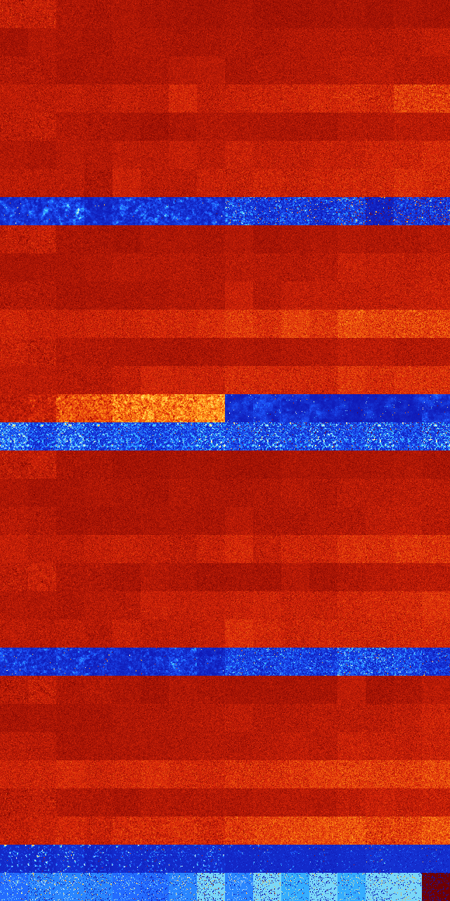

# B0345 (29184-29695)

<details>
    <summary>Initial Grid</summary>
    
</details>


<details>
    <summary>Initial Grid RLE</summary>

```
#C Exported from GoGoL (https://github.com/marrow16/gogol)
#C Wrap mode: Toroidal
#C Boundary mode: Dead
#C Step: 0
x = 100, y = 100, rule = B0345/S
15bo3bo2bo27bo42bo$10bo34bo2bo20bo26bo$26bo3bo2bo13bo22bo2bo8bo12bo2bo$
15bo4b2o28bo4bo16bo18bo$13bo5bo7bo27bo3bo30bo$o10bo58bo8bo7bo3bo$20bo
19bo16bo5bo24bo$10bo3bobo9bo11bo26bo23bo$65bo4bo$4bo53bo11bo15bo$5bo12b
o44bo$5bo7bo24bo18bo8bo10bo$19bo58bo13bo$o22bo11bo2bo43bo9bo$7bo19bo43b
o19bo$28bo10bo18bo11bo$13bo19bo32bobo4bo$44bobo17bo13bo19bo$16bo17bo11b
o4bo7bo13bo8bo2bo$bo9bo20bo6bo51bo2bo$21bobo40bo$24bo53bo$9bo12bobo24bo
15bo30bo$23bo22bo37bo$16bo21bobo10bobo11bo5bo27bo$28bo26bo23bo9b2o$7bo
10bo14bo18bo33bo$9bo26bo3bo3bo16bo23bo$15bo10bo4bo15bo4bo3b3o5bo3bo22bo
$47bo$35bo41bo$44bo16bo3bo$4bo5bo25b2o24bo2bo8bo5bo$10bo11bo15bo9bo12bo
9bo24b2o$38bo10bobo$3bo2bo18bo7bo23bo7bo12bo2bo5bo$11bo21bo19bo4bo12bo
13b2o$4bo41bo15bo7bo2bo20b2o$4bo4bo8bo13bo7bo48b2o2bo2bo$62bo24bo5bobo$
25bo2bo3bo2bobo11b3o3bo$28bo13bo3bo9bo$bo15bo16bo3bo21bo$3bo13bo76bobo$
78bo9bo6bo$19b2o9bo2b2o24bo14bo18bo$10bo5bo15b2o7bo14bo8bo8bo22bo$16bo
24bo22bo10bo$37bo10b2o26bo$2bo45b2o9bo15bo$61bo$2bo36bo12bo32bo$3bo3bo
8bo8bo18bo$5bo10bo24bo15bo11bo8bo$15bo5bo2bobo36bo15bo12bo$5bo4bo65bo5b
o$15bo49bo$o14bo19bo7bo39bo5bo$18bo5bo3bo10bo3b2o6bo14bo4bo4bo$40bo29bo
$15bo25bo$2bo17bo40bo3bo6bo21bo$44bo13bo$19bo47bo$34bo8bo34bo6bo$3bo53b
o7bo15bo6bo$46bo25bo26bo$10bo14bo4bo37bo2bo4bo$3bo41bo30bo$57bobo6bo29b
o$24bo72bo$5bo7bo5bo2bo3bo35bo13bo$38b2o19bo3bo9b2o5bo18bo$2bo21bo17bo
35b2o$16bo16bo12bo18bo27bo4bo$30bo3bo59bo4bo$8bo17bo10bo$9bobo11bo8bo5b
o3bo5bo15bo20bo7bo$10bo33bo14bo30bo$19bo21bo20bo14bo$50bo28bo7bo$26bo2b
o34bo$100b$17bo16bo2bobo13bo$88bo$39bo$14b2o21bo8bo27bo$5bo19bo5bo55bo$
14bo18bo9bo28bo17bo$32bo5bo18bo16bo16bo$26bo39bo2b2o28bo$o23bo5bo7bo3bo
19bo3bo$72bo3bo5bo3bo6bo$7bo3bo4bo8bo25bo6bo18bo$9bo6bo7b2o44bo8bo$27bo
30bo$8b2o21bo9bo13bo14bo$4bo19bo14bo20bo4bo10bo$17bo4bo65bo2bo$17bo72bo!
```
</details>
<details>
    <summary>Thumbnail</summary>

</details>
<table>
<tr>
    <td><a href="./29184%20S%20Heat%20Map%20Activity.png"></a><br>S (29184)<br>G>1000</td>    <td><a href="./29185%20S0%20Heat%20Map%20Activity.png"></a><br>S0 (29185)<br>G>1000</td>    <td><a href="./29186%20S1%20Heat%20Map%20Activity.png"></a><br>S1 (29186)<br>G>1000</td>    <td><a href="./29187%20S01%20Heat%20Map%20Activity.png"></a><br>S01 (29187)<br>G>1000</td>    <td><a href="./29188%20S2%20Heat%20Map%20Activity.png"></a><br>S2 (29188)<br>G>1000</td>    <td><a href="./29189%20S02%20Heat%20Map%20Activity.png"></a><br>S02 (29189)<br>G>1000</td>    <td><a href="./29190%20S12%20Heat%20Map%20Activity.png"></a><br>S12 (29190)<br>G>1000</td>    <td><a href="./29191%20S012%20Heat%20Map%20Activity.png"></a><br>S012 (29191)<br>G>1000</td>    <td><a href="./29192%20S3%20Heat%20Map%20Activity.png"></a><br>S3 (29192)<br>G>1000</td>    <td><a href="./29193%20S03%20Heat%20Map%20Activity.png"></a><br>S03 (29193)<br>G>1000</td>    <td><a href="./29194%20S13%20Heat%20Map%20Activity.png"></a><br>S13 (29194)<br>G>1000</td>    <td><a href="./29195%20S013%20Heat%20Map%20Activity.png"></a><br>S013 (29195)<br>G>1000</td>    <td><a href="./29196%20S23%20Heat%20Map%20Activity.png"></a><br>S23 (29196)<br>G>1000</td>    <td><a href="./29197%20S023%20Heat%20Map%20Activity.png"></a><br>S023 (29197)<br>G>1000</td>    <td><a href="./29198%20S123%20Heat%20Map%20Activity.png"></a><br>S123 (29198)<br>G>1000</td>    <td><a href="./29199%20S0123%20Heat%20Map%20Activity.png"></a><br>S0123 (29199)<br>G>1000</td></tr>
<tr>
    <td><a href="./29200%20S4%20Heat%20Map%20Activity.png"></a><br>S4 (29200)<br>G>1000</td>    <td><a href="./29201%20S04%20Heat%20Map%20Activity.png"></a><br>S04 (29201)<br>G>1000</td>    <td><a href="./29202%20S14%20Heat%20Map%20Activity.png"></a><br>S14 (29202)<br>G>1000</td>    <td><a href="./29203%20S014%20Heat%20Map%20Activity.png"></a><br>S014 (29203)<br>G>1000</td>    <td><a href="./29204%20S24%20Heat%20Map%20Activity.png"></a><br>S24 (29204)<br>G>1000</td>    <td><a href="./29205%20S024%20Heat%20Map%20Activity.png"></a><br>S024 (29205)<br>G>1000</td>    <td><a href="./29206%20S124%20Heat%20Map%20Activity.png"></a><br>S124 (29206)<br>G>1000</td>    <td><a href="./29207%20S0124%20Heat%20Map%20Activity.png"></a><br>S0124 (29207)<br>G>1000</td>    <td><a href="./29208%20S34%20Heat%20Map%20Activity.png"></a><br>S34 (29208)<br>G>1000</td>    <td><a href="./29209%20S034%20Heat%20Map%20Activity.png"></a><br>S034 (29209)<br>G>1000</td>    <td><a href="./29210%20S134%20Heat%20Map%20Activity.png"></a><br>S134 (29210)<br>G>1000</td>    <td><a href="./29211%20S0134%20Heat%20Map%20Activity.png"></a><br>S0134 (29211)<br>G>1000</td>    <td><a href="./29212%20S234%20Heat%20Map%20Activity.png"></a><br>S234 (29212)<br>G>1000</td>    <td><a href="./29213%20S0234%20Heat%20Map%20Activity.png"></a><br>S0234 (29213)<br>G>1000</td>    <td><a href="./29214%20S1234%20Heat%20Map%20Activity.png"></a><br>S1234 (29214)<br>G>1000</td>    <td><a href="./29215%20S01234%20Heat%20Map%20Activity.png"></a><br>S01234 (29215)<br>G>1000</td></tr>
<tr>
    <td><a href="./29216%20S5%20Heat%20Map%20Activity.png"></a><br>S5 (29216)<br>G>1000</td>    <td><a href="./29217%20S05%20Heat%20Map%20Activity.png"></a><br>S05 (29217)<br>G>1000</td>    <td><a href="./29218%20S15%20Heat%20Map%20Activity.png"></a><br>S15 (29218)<br>G>1000</td>    <td><a href="./29219%20S015%20Heat%20Map%20Activity.png"></a><br>S015 (29219)<br>G>1000</td>    <td><a href="./29220%20S25%20Heat%20Map%20Activity.png"></a><br>S25 (29220)<br>G>1000</td>    <td><a href="./29221%20S025%20Heat%20Map%20Activity.png"></a><br>S025 (29221)<br>G>1000</td>    <td><a href="./29222%20S125%20Heat%20Map%20Activity.png"></a><br>S125 (29222)<br>G>1000</td>    <td><a href="./29223%20S0125%20Heat%20Map%20Activity.png"></a><br>S0125 (29223)<br>G>1000</td>    <td><a href="./29224%20S35%20Heat%20Map%20Activity.png"></a><br>S35 (29224)<br>G>1000</td>    <td><a href="./29225%20S035%20Heat%20Map%20Activity.png"></a><br>S035 (29225)<br>G>1000</td>    <td><a href="./29226%20S135%20Heat%20Map%20Activity.png"></a><br>S135 (29226)<br>G>1000</td>    <td><a href="./29227%20S0135%20Heat%20Map%20Activity.png"></a><br>S0135 (29227)<br>G>1000</td>    <td><a href="./29228%20S235%20Heat%20Map%20Activity.png"></a><br>S235 (29228)<br>G>1000</td>    <td><a href="./29229%20S0235%20Heat%20Map%20Activity.png"></a><br>S0235 (29229)<br>G>1000</td>    <td><a href="./29230%20S1235%20Heat%20Map%20Activity.png"></a><br>S1235 (29230)<br>G>1000</td>    <td><a href="./29231%20S01235%20Heat%20Map%20Activity.png"></a><br>S01235 (29231)<br>G>1000</td></tr>
<tr>
    <td><a href="./29232%20S45%20Heat%20Map%20Activity.png"></a><br>S45 (29232)<br>G>1000</td>    <td><a href="./29233%20S045%20Heat%20Map%20Activity.png"></a><br>S045 (29233)<br>G>1000</td>    <td><a href="./29234%20S145%20Heat%20Map%20Activity.png"></a><br>S145 (29234)<br>G>1000</td>    <td><a href="./29235%20S0145%20Heat%20Map%20Activity.png"></a><br>S0145 (29235)<br>G>1000</td>    <td><a href="./29236%20S245%20Heat%20Map%20Activity.png"></a><br>S245 (29236)<br>G>1000</td>    <td><a href="./29237%20S0245%20Heat%20Map%20Activity.png"></a><br>S0245 (29237)<br>G>1000</td>    <td><a href="./29238%20S1245%20Heat%20Map%20Activity.png"></a><br>S1245 (29238)<br>G>1000</td>    <td><a href="./29239%20S01245%20Heat%20Map%20Activity.png"></a><br>S01245 (29239)<br>G>1000</td>    <td><a href="./29240%20S345%20Heat%20Map%20Activity.png"></a><br>S345 (29240)<br>G>1000</td>    <td><a href="./29241%20S0345%20Heat%20Map%20Activity.png"></a><br>S0345 (29241)<br>G>1000</td>    <td><a href="./29242%20S1345%20Heat%20Map%20Activity.png"></a><br>S1345 (29242)<br>G>1000</td>    <td><a href="./29243%20S01345%20Heat%20Map%20Activity.png"></a><br>S01345 (29243)<br>G>1000</td>    <td><a href="./29244%20S2345%20Heat%20Map%20Activity.png"></a><br>S2345 (29244)<br>G>1000</td>    <td><a href="./29245%20S02345%20Heat%20Map%20Activity.png"></a><br>S02345 (29245)<br>G>1000</td>    <td><a href="./29246%20S12345%20Heat%20Map%20Activity.png"></a><br>S12345 (29246)<br>G>1000</td>    <td><a href="./29247%20S012345%20Heat%20Map%20Activity.png"></a><br>S012345 (29247)<br>G>1000</td></tr>
<tr>
    <td><a href="./29248%20S6%20Heat%20Map%20Activity.png"></a><br>S6 (29248)<br>G>1000</td>    <td><a href="./29249%20S06%20Heat%20Map%20Activity.png"></a><br>S06 (29249)<br>G>1000</td>    <td><a href="./29250%20S16%20Heat%20Map%20Activity.png"></a><br>S16 (29250)<br>G>1000</td>    <td><a href="./29251%20S016%20Heat%20Map%20Activity.png"></a><br>S016 (29251)<br>G>1000</td>    <td><a href="./29252%20S26%20Heat%20Map%20Activity.png"></a><br>S26 (29252)<br>G>1000</td>    <td><a href="./29253%20S026%20Heat%20Map%20Activity.png"></a><br>S026 (29253)<br>G>1000</td>    <td><a href="./29254%20S126%20Heat%20Map%20Activity.png"></a><br>S126 (29254)<br>G>1000</td>    <td><a href="./29255%20S0126%20Heat%20Map%20Activity.png"></a><br>S0126 (29255)<br>G>1000</td>    <td><a href="./29256%20S36%20Heat%20Map%20Activity.png"></a><br>S36 (29256)<br>G>1000</td>    <td><a href="./29257%20S036%20Heat%20Map%20Activity.png"></a><br>S036 (29257)<br>G>1000</td>    <td><a href="./29258%20S136%20Heat%20Map%20Activity.png"></a><br>S136 (29258)<br>G>1000</td>    <td><a href="./29259%20S0136%20Heat%20Map%20Activity.png"></a><br>S0136 (29259)<br>G>1000</td>    <td><a href="./29260%20S236%20Heat%20Map%20Activity.png"></a><br>S236 (29260)<br>G>1000</td>    <td><a href="./29261%20S0236%20Heat%20Map%20Activity.png"></a><br>S0236 (29261)<br>G>1000</td>    <td><a href="./29262%20S1236%20Heat%20Map%20Activity.png"></a><br>S1236 (29262)<br>G>1000</td>    <td><a href="./29263%20S01236%20Heat%20Map%20Activity.png"></a><br>S01236 (29263)<br>G>1000</td></tr>
<tr>
    <td><a href="./29264%20S46%20Heat%20Map%20Activity.png"></a><br>S46 (29264)<br>G>1000</td>    <td><a href="./29265%20S046%20Heat%20Map%20Activity.png"></a><br>S046 (29265)<br>G>1000</td>    <td><a href="./29266%20S146%20Heat%20Map%20Activity.png"></a><br>S146 (29266)<br>G>1000</td>    <td><a href="./29267%20S0146%20Heat%20Map%20Activity.png"></a><br>S0146 (29267)<br>G>1000</td>    <td><a href="./29268%20S246%20Heat%20Map%20Activity.png"></a><br>S246 (29268)<br>G>1000</td>    <td><a href="./29269%20S0246%20Heat%20Map%20Activity.png"></a><br>S0246 (29269)<br>G>1000</td>    <td><a href="./29270%20S1246%20Heat%20Map%20Activity.png"></a><br>S1246 (29270)<br>G>1000</td>    <td><a href="./29271%20S01246%20Heat%20Map%20Activity.png"></a><br>S01246 (29271)<br>G>1000</td>    <td><a href="./29272%20S346%20Heat%20Map%20Activity.png"></a><br>S346 (29272)<br>G>1000</td>    <td><a href="./29273%20S0346%20Heat%20Map%20Activity.png"></a><br>S0346 (29273)<br>G>1000</td>    <td><a href="./29274%20S1346%20Heat%20Map%20Activity.png"></a><br>S1346 (29274)<br>G>1000</td>    <td><a href="./29275%20S01346%20Heat%20Map%20Activity.png"></a><br>S01346 (29275)<br>G>1000</td>    <td><a href="./29276%20S2346%20Heat%20Map%20Activity.png"></a><br>S2346 (29276)<br>G>1000</td>    <td><a href="./29277%20S02346%20Heat%20Map%20Activity.png"></a><br>S02346 (29277)<br>G>1000</td>    <td><a href="./29278%20S12346%20Heat%20Map%20Activity.png"></a><br>S12346 (29278)<br>G>1000</td>    <td><a href="./29279%20S012346%20Heat%20Map%20Activity.png"></a><br>S012346 (29279)<br>G>1000</td></tr>
<tr>
    <td><a href="./29280%20S56%20Heat%20Map%20Activity.png"></a><br>S56 (29280)<br>G>1000</td>    <td><a href="./29281%20S056%20Heat%20Map%20Activity.png"></a><br>S056 (29281)<br>G>1000</td>    <td><a href="./29282%20S156%20Heat%20Map%20Activity.png"></a><br>S156 (29282)<br>G>1000</td>    <td><a href="./29283%20S0156%20Heat%20Map%20Activity.png"></a><br>S0156 (29283)<br>G>1000</td>    <td><a href="./29284%20S256%20Heat%20Map%20Activity.png"></a><br>S256 (29284)<br>G>1000</td>    <td><a href="./29285%20S0256%20Heat%20Map%20Activity.png"></a><br>S0256 (29285)<br>G>1000</td>    <td><a href="./29286%20S1256%20Heat%20Map%20Activity.png"></a><br>S1256 (29286)<br>G>1000</td>    <td><a href="./29287%20S01256%20Heat%20Map%20Activity.png"></a><br>S01256 (29287)<br>G>1000</td>    <td><a href="./29288%20S356%20Heat%20Map%20Activity.png"></a><br>S356 (29288)<br>G>1000</td>    <td><a href="./29289%20S0356%20Heat%20Map%20Activity.png"></a><br>S0356 (29289)<br>G>1000</td>    <td><a href="./29290%20S1356%20Heat%20Map%20Activity.png"></a><br>S1356 (29290)<br>G>1000</td>    <td><a href="./29291%20S01356%20Heat%20Map%20Activity.png"></a><br>S01356 (29291)<br>G>1000</td>    <td><a href="./29292%20S2356%20Heat%20Map%20Activity.png"></a><br>S2356 (29292)<br>G>1000</td>    <td><a href="./29293%20S02356%20Heat%20Map%20Activity.png"></a><br>S02356 (29293)<br>G>1000</td>    <td><a href="./29294%20S12356%20Heat%20Map%20Activity.png"></a><br>S12356 (29294)<br>G>1000</td>    <td><a href="./29295%20S012356%20Heat%20Map%20Activity.png"></a><br>S012356 (29295)<br>G>1000</td></tr>
<tr>
    <td><a href="./29296%20S456%20Heat%20Map%20Activity.png"></a><br>S456 (29296)<br>R@304,p6</td>    <td><a href="./29297%20S0456%20Heat%20Map%20Activity.png"></a><br>S0456 (29297)<br>R@482,p6</td>    <td><a href="./29298%20S1456%20Heat%20Map%20Activity.png"></a><br>S1456 (29298)<br>R@279,p3</td>    <td><a href="./29299%20S01456%20Heat%20Map%20Activity.png"></a><br>S01456 (29299)<br>R@458,p6</td>    <td><a href="./29300%20S2456%20Heat%20Map%20Activity.png"></a><br>S2456 (29300)<br>R@208,p4</td>    <td><a href="./29301%20S02456%20Heat%20Map%20Activity.png"></a><br>S02456 (29301)<br>R@191,p10</td>    <td><a href="./29302%20S12456%20Heat%20Map%20Activity.png"></a><br>S12456 (29302)<br>R@202,p30</td>    <td><a href="./29303%20S012456%20Heat%20Map%20Activity.png"></a><br>S012456 (29303)<br>R@182,p6</td>    <td><a href="./29304%20S3456%20Heat%20Map%20Activity.png"></a><br>S3456 (29304)<br>R@53,p12</td>    <td><a href="./29305%20S03456%20Heat%20Map%20Activity.png"></a><br>S03456 (29305)<br>R@66,p24</td>    <td><a href="./29306%20S13456%20Heat%20Map%20Activity.png"></a><br>S13456 (29306)<br>R@61,p12</td>    <td><a href="./29307%20S013456%20Heat%20Map%20Activity.png"></a><br>S013456 (29307)<br>R@74,p24</td>    <td><a href="./29308%20S23456%20Heat%20Map%20Activity.png"></a><br>S23456 (29308)<br>R@44,p12</td>    <td><a href="./29309%20S023456%20Heat%20Map%20Activity.png"></a><br>S023456 (29309)<br>R@152,p120</td>    <td><a href="./29310%20S123456%20Heat%20Map%20Activity.png"></a><br>S123456 (29310)<br>R@56,p24</td>    <td><a href="./29311%20S0123456%20Heat%20Map%20Activity.png"></a><br>S0123456 (29311)<br>R@47,p12</td></tr>
<tr>
    <td><a href="./29312%20S7%20Heat%20Map%20Activity.png"></a><br>S7 (29312)<br>G>1000</td>    <td><a href="./29313%20S07%20Heat%20Map%20Activity.png"></a><br>S07 (29313)<br>G>1000</td>    <td><a href="./29314%20S17%20Heat%20Map%20Activity.png"></a><br>S17 (29314)<br>G>1000</td>    <td><a href="./29315%20S017%20Heat%20Map%20Activity.png"></a><br>S017 (29315)<br>G>1000</td>    <td><a href="./29316%20S27%20Heat%20Map%20Activity.png"></a><br>S27 (29316)<br>G>1000</td>    <td><a href="./29317%20S027%20Heat%20Map%20Activity.png"></a><br>S027 (29317)<br>G>1000</td>    <td><a href="./29318%20S127%20Heat%20Map%20Activity.png"></a><br>S127 (29318)<br>G>1000</td>    <td><a href="./29319%20S0127%20Heat%20Map%20Activity.png"></a><br>S0127 (29319)<br>G>1000</td>    <td><a href="./29320%20S37%20Heat%20Map%20Activity.png"></a><br>S37 (29320)<br>G>1000</td>    <td><a href="./29321%20S037%20Heat%20Map%20Activity.png"></a><br>S037 (29321)<br>G>1000</td>    <td><a href="./29322%20S137%20Heat%20Map%20Activity.png"></a><br>S137 (29322)<br>G>1000</td>    <td><a href="./29323%20S0137%20Heat%20Map%20Activity.png"></a><br>S0137 (29323)<br>G>1000</td>    <td><a href="./29324%20S237%20Heat%20Map%20Activity.png"></a><br>S237 (29324)<br>G>1000</td>    <td><a href="./29325%20S0237%20Heat%20Map%20Activity.png"></a><br>S0237 (29325)<br>G>1000</td>    <td><a href="./29326%20S1237%20Heat%20Map%20Activity.png"></a><br>S1237 (29326)<br>G>1000</td>    <td><a href="./29327%20S01237%20Heat%20Map%20Activity.png"></a><br>S01237 (29327)<br>G>1000</td></tr>
<tr>
    <td><a href="./29328%20S47%20Heat%20Map%20Activity.png"></a><br>S47 (29328)<br>G>1000</td>    <td><a href="./29329%20S047%20Heat%20Map%20Activity.png"></a><br>S047 (29329)<br>G>1000</td>    <td><a href="./29330%20S147%20Heat%20Map%20Activity.png"></a><br>S147 (29330)<br>G>1000</td>    <td><a href="./29331%20S0147%20Heat%20Map%20Activity.png"></a><br>S0147 (29331)<br>G>1000</td>    <td><a href="./29332%20S247%20Heat%20Map%20Activity.png"></a><br>S247 (29332)<br>G>1000</td>    <td><a href="./29333%20S0247%20Heat%20Map%20Activity.png"></a><br>S0247 (29333)<br>G>1000</td>    <td><a href="./29334%20S1247%20Heat%20Map%20Activity.png"></a><br>S1247 (29334)<br>G>1000</td>    <td><a href="./29335%20S01247%20Heat%20Map%20Activity.png"></a><br>S01247 (29335)<br>G>1000</td>    <td><a href="./29336%20S347%20Heat%20Map%20Activity.png"></a><br>S347 (29336)<br>G>1000</td>    <td><a href="./29337%20S0347%20Heat%20Map%20Activity.png"></a><br>S0347 (29337)<br>G>1000</td>    <td><a href="./29338%20S1347%20Heat%20Map%20Activity.png"></a><br>S1347 (29338)<br>G>1000</td>    <td><a href="./29339%20S01347%20Heat%20Map%20Activity.png"></a><br>S01347 (29339)<br>G>1000</td>    <td><a href="./29340%20S2347%20Heat%20Map%20Activity.png"></a><br>S2347 (29340)<br>G>1000</td>    <td><a href="./29341%20S02347%20Heat%20Map%20Activity.png"></a><br>S02347 (29341)<br>G>1000</td>    <td><a href="./29342%20S12347%20Heat%20Map%20Activity.png"></a><br>S12347 (29342)<br>G>1000</td>    <td><a href="./29343%20S012347%20Heat%20Map%20Activity.png"></a><br>S012347 (29343)<br>G>1000</td></tr>
<tr>
    <td><a href="./29344%20S57%20Heat%20Map%20Activity.png"></a><br>S57 (29344)<br>G>1000</td>    <td><a href="./29345%20S057%20Heat%20Map%20Activity.png"></a><br>S057 (29345)<br>G>1000</td>    <td><a href="./29346%20S157%20Heat%20Map%20Activity.png"></a><br>S157 (29346)<br>G>1000</td>    <td><a href="./29347%20S0157%20Heat%20Map%20Activity.png"></a><br>S0157 (29347)<br>G>1000</td>    <td><a href="./29348%20S257%20Heat%20Map%20Activity.png"></a><br>S257 (29348)<br>G>1000</td>    <td><a href="./29349%20S0257%20Heat%20Map%20Activity.png"></a><br>S0257 (29349)<br>G>1000</td>    <td><a href="./29350%20S1257%20Heat%20Map%20Activity.png"></a><br>S1257 (29350)<br>G>1000</td>    <td><a href="./29351%20S01257%20Heat%20Map%20Activity.png"></a><br>S01257 (29351)<br>G>1000</td>    <td><a href="./29352%20S357%20Heat%20Map%20Activity.png"></a><br>S357 (29352)<br>G>1000</td>    <td><a href="./29353%20S0357%20Heat%20Map%20Activity.png"></a><br>S0357 (29353)<br>G>1000</td>    <td><a href="./29354%20S1357%20Heat%20Map%20Activity.png"></a><br>S1357 (29354)<br>G>1000</td>    <td><a href="./29355%20S01357%20Heat%20Map%20Activity.png"></a><br>S01357 (29355)<br>G>1000</td>    <td><a href="./29356%20S2357%20Heat%20Map%20Activity.png"></a><br>S2357 (29356)<br>G>1000</td>    <td><a href="./29357%20S02357%20Heat%20Map%20Activity.png"></a><br>S02357 (29357)<br>G>1000</td>    <td><a href="./29358%20S12357%20Heat%20Map%20Activity.png"></a><br>S12357 (29358)<br>G>1000</td>    <td><a href="./29359%20S012357%20Heat%20Map%20Activity.png"></a><br>S012357 (29359)<br>G>1000</td></tr>
<tr>
    <td><a href="./29360%20S457%20Heat%20Map%20Activity.png"></a><br>S457 (29360)<br>G>1000</td>    <td><a href="./29361%20S0457%20Heat%20Map%20Activity.png"></a><br>S0457 (29361)<br>G>1000</td>    <td><a href="./29362%20S1457%20Heat%20Map%20Activity.png"></a><br>S1457 (29362)<br>G>1000</td>    <td><a href="./29363%20S01457%20Heat%20Map%20Activity.png"></a><br>S01457 (29363)<br>G>1000</td>    <td><a href="./29364%20S2457%20Heat%20Map%20Activity.png"></a><br>S2457 (29364)<br>G>1000</td>    <td><a href="./29365%20S02457%20Heat%20Map%20Activity.png"></a><br>S02457 (29365)<br>G>1000</td>    <td><a href="./29366%20S12457%20Heat%20Map%20Activity.png"></a><br>S12457 (29366)<br>G>1000</td>    <td><a href="./29367%20S012457%20Heat%20Map%20Activity.png"></a><br>S012457 (29367)<br>G>1000</td>    <td><a href="./29368%20S3457%20Heat%20Map%20Activity.png"></a><br>S3457 (29368)<br>G>1000</td>    <td><a href="./29369%20S03457%20Heat%20Map%20Activity.png"></a><br>S03457 (29369)<br>G>1000</td>    <td><a href="./29370%20S13457%20Heat%20Map%20Activity.png"></a><br>S13457 (29370)<br>G>1000</td>    <td><a href="./29371%20S013457%20Heat%20Map%20Activity.png"></a><br>S013457 (29371)<br>G>1000</td>    <td><a href="./29372%20S23457%20Heat%20Map%20Activity.png"></a><br>S23457 (29372)<br>G>1000</td>    <td><a href="./29373%20S023457%20Heat%20Map%20Activity.png"></a><br>S023457 (29373)<br>G>1000</td>    <td><a href="./29374%20S123457%20Heat%20Map%20Activity.png"></a><br>S123457 (29374)<br>G>1000</td>    <td><a href="./29375%20S0123457%20Heat%20Map%20Activity.png"></a><br>S0123457 (29375)<br>G>1000</td></tr>
<tr>
    <td><a href="./29376%20S67%20Heat%20Map%20Activity.png"></a><br>S67 (29376)<br>G>1000</td>    <td><a href="./29377%20S067%20Heat%20Map%20Activity.png"></a><br>S067 (29377)<br>G>1000</td>    <td><a href="./29378%20S167%20Heat%20Map%20Activity.png"></a><br>S167 (29378)<br>G>1000</td>    <td><a href="./29379%20S0167%20Heat%20Map%20Activity.png"></a><br>S0167 (29379)<br>G>1000</td>    <td><a href="./29380%20S267%20Heat%20Map%20Activity.png"></a><br>S267 (29380)<br>G>1000</td>    <td><a href="./29381%20S0267%20Heat%20Map%20Activity.png"></a><br>S0267 (29381)<br>G>1000</td>    <td><a href="./29382%20S1267%20Heat%20Map%20Activity.png"></a><br>S1267 (29382)<br>G>1000</td>    <td><a href="./29383%20S01267%20Heat%20Map%20Activity.png"></a><br>S01267 (29383)<br>G>1000</td>    <td><a href="./29384%20S367%20Heat%20Map%20Activity.png"></a><br>S367 (29384)<br>G>1000</td>    <td><a href="./29385%20S0367%20Heat%20Map%20Activity.png"></a><br>S0367 (29385)<br>G>1000</td>    <td><a href="./29386%20S1367%20Heat%20Map%20Activity.png"></a><br>S1367 (29386)<br>G>1000</td>    <td><a href="./29387%20S01367%20Heat%20Map%20Activity.png"></a><br>S01367 (29387)<br>G>1000</td>    <td><a href="./29388%20S2367%20Heat%20Map%20Activity.png"></a><br>S2367 (29388)<br>G>1000</td>    <td><a href="./29389%20S02367%20Heat%20Map%20Activity.png"></a><br>S02367 (29389)<br>G>1000</td>    <td><a href="./29390%20S12367%20Heat%20Map%20Activity.png"></a><br>S12367 (29390)<br>G>1000</td>    <td><a href="./29391%20S012367%20Heat%20Map%20Activity.png"></a><br>S012367 (29391)<br>G>1000</td></tr>
<tr>
    <td><a href="./29392%20S467%20Heat%20Map%20Activity.png"></a><br>S467 (29392)<br>G>1000</td>    <td><a href="./29393%20S0467%20Heat%20Map%20Activity.png"></a><br>S0467 (29393)<br>G>1000</td>    <td><a href="./29394%20S1467%20Heat%20Map%20Activity.png"></a><br>S1467 (29394)<br>G>1000</td>    <td><a href="./29395%20S01467%20Heat%20Map%20Activity.png"></a><br>S01467 (29395)<br>G>1000</td>    <td><a href="./29396%20S2467%20Heat%20Map%20Activity.png"></a><br>S2467 (29396)<br>G>1000</td>    <td><a href="./29397%20S02467%20Heat%20Map%20Activity.png"></a><br>S02467 (29397)<br>G>1000</td>    <td><a href="./29398%20S12467%20Heat%20Map%20Activity.png"></a><br>S12467 (29398)<br>G>1000</td>    <td><a href="./29399%20S012467%20Heat%20Map%20Activity.png"></a><br>S012467 (29399)<br>G>1000</td>    <td><a href="./29400%20S3467%20Heat%20Map%20Activity.png"></a><br>S3467 (29400)<br>G>1000</td>    <td><a href="./29401%20S03467%20Heat%20Map%20Activity.png"></a><br>S03467 (29401)<br>G>1000</td>    <td><a href="./29402%20S13467%20Heat%20Map%20Activity.png"></a><br>S13467 (29402)<br>G>1000</td>    <td><a href="./29403%20S013467%20Heat%20Map%20Activity.png"></a><br>S013467 (29403)<br>G>1000</td>    <td><a href="./29404%20S23467%20Heat%20Map%20Activity.png"></a><br>S23467 (29404)<br>G>1000</td>    <td><a href="./29405%20S023467%20Heat%20Map%20Activity.png"></a><br>S023467 (29405)<br>G>1000</td>    <td><a href="./29406%20S123467%20Heat%20Map%20Activity.png"></a><br>S123467 (29406)<br>G>1000</td>    <td><a href="./29407%20S0123467%20Heat%20Map%20Activity.png"></a><br>S0123467 (29407)<br>G>1000</td></tr>
<tr>
    <td><a href="./29408%20S567%20Heat%20Map%20Activity.png"></a><br>S567 (29408)<br>G>1000</td>    <td><a href="./29409%20S0567%20Heat%20Map%20Activity.png"></a><br>S0567 (29409)<br>G>1000</td>    <td><a href="./29410%20S1567%20Heat%20Map%20Activity.png"></a><br>S1567 (29410)<br>G>1000</td>    <td><a href="./29411%20S01567%20Heat%20Map%20Activity.png"></a><br>S01567 (29411)<br>G>1000</td>    <td><a href="./29412%20S2567%20Heat%20Map%20Activity.png"></a><br>S2567 (29412)<br>G>1000</td>    <td><a href="./29413%20S02567%20Heat%20Map%20Activity.png"></a><br>S02567 (29413)<br>G>1000</td>    <td><a href="./29414%20S12567%20Heat%20Map%20Activity.png"></a><br>S12567 (29414)<br>G>1000</td>    <td><a href="./29415%20S012567%20Heat%20Map%20Activity.png"></a><br>S012567 (29415)<br>G>1000</td>    <td><a href="./29416%20S3567%20Heat%20Map%20Activity.png"></a><br>S3567 (29416)<br>G>1000</td>    <td><a href="./29417%20S03567%20Heat%20Map%20Activity.png"></a><br>S03567 (29417)<br>G>1000</td>    <td><a href="./29418%20S13567%20Heat%20Map%20Activity.png"></a><br>S13567 (29418)<br>G>1000</td>    <td><a href="./29419%20S013567%20Heat%20Map%20Activity.png"></a><br>S013567 (29419)<br>G>1000</td>    <td><a href="./29420%20S23567%20Heat%20Map%20Activity.png"></a><br>S23567 (29420)<br>G>1000</td>    <td><a href="./29421%20S023567%20Heat%20Map%20Activity.png"></a><br>S023567 (29421)<br>G>1000</td>    <td><a href="./29422%20S123567%20Heat%20Map%20Activity.png"></a><br>S123567 (29422)<br>G>1000</td>    <td><a href="./29423%20S0123567%20Heat%20Map%20Activity.png"></a><br>S0123567 (29423)<br>R@745,p12</td></tr>
<tr>
    <td><a href="./29424%20S4567%20Heat%20Map%20Activity.png"></a><br>S4567 (29424)<br>R@16,p2</td>    <td><a href="./29425%20S04567%20Heat%20Map%20Activity.png"></a><br>S04567 (29425)<br>R@20,p6</td>    <td><a href="./29426%20S14567%20Heat%20Map%20Activity.png"></a><br>S14567 (29426)<br>R@16,p2</td>    <td><a href="./29427%20S014567%20Heat%20Map%20Activity.png"></a><br>S014567 (29427)<br>R@17,p2</td>    <td><a href="./29428%20S24567%20Heat%20Map%20Activity.png"></a><br>S24567 (29428)<br>R@20,p2</td>    <td><a href="./29429%20S024567%20Heat%20Map%20Activity.png"></a><br>S024567 (29429)<br>R@18,p6</td>    <td><a href="./29430%20S124567%20Heat%20Map%20Activity.png"></a><br>S124567 (29430)<br>R@20,p6</td>    <td><a href="./29431%20S0124567%20Heat%20Map%20Activity.png"></a><br>S0124567 (29431)<br>R@12,p2</td>    <td><a href="./29432%20S34567%20Heat%20Map%20Activity.png"></a><br>S34567 (29432)<br>R@19,p6</td>    <td><a href="./29433%20S034567%20Heat%20Map%20Activity.png"></a><br>S034567 (29433)<br>R@14,p2</td>    <td><a href="./29434%20S134567%20Heat%20Map%20Activity.png"></a><br>S134567 (29434)<br>R@19,p6</td>    <td><a href="./29435%20S0134567%20Heat%20Map%20Activity.png"></a><br>S0134567 (29435)<br>R@14,p2</td>    <td><a href="./29436%20S234567%20Heat%20Map%20Activity.png"></a><br>S234567 (29436)<br>R@20,p6</td>    <td><a href="./29437%20S0234567%20Heat%20Map%20Activity.png"></a><br>S0234567 (29437)<br>R@12,p2</td>    <td><a href="./29438%20S1234567%20Heat%20Map%20Activity.png"></a><br>S1234567 (29438)<br>R@20,p6</td>    <td><a href="./29439%20S01234567%20Heat%20Map%20Activity.png"></a><br>S01234567 (29439)<br>R@12,p2</td></tr>
<tr>
    <td><a href="./29440%20S8%20Heat%20Map%20Activity.png"></a><br>S8 (29440)<br>G>1000</td>    <td><a href="./29441%20S08%20Heat%20Map%20Activity.png"></a><br>S08 (29441)<br>G>1000</td>    <td><a href="./29442%20S18%20Heat%20Map%20Activity.png"></a><br>S18 (29442)<br>G>1000</td>    <td><a href="./29443%20S018%20Heat%20Map%20Activity.png"></a><br>S018 (29443)<br>G>1000</td>    <td><a href="./29444%20S28%20Heat%20Map%20Activity.png"></a><br>S28 (29444)<br>G>1000</td>    <td><a href="./29445%20S028%20Heat%20Map%20Activity.png"></a><br>S028 (29445)<br>G>1000</td>    <td><a href="./29446%20S128%20Heat%20Map%20Activity.png"></a><br>S128 (29446)<br>G>1000</td>    <td><a href="./29447%20S0128%20Heat%20Map%20Activity.png"></a><br>S0128 (29447)<br>G>1000</td>    <td><a href="./29448%20S38%20Heat%20Map%20Activity.png"></a><br>S38 (29448)<br>G>1000</td>    <td><a href="./29449%20S038%20Heat%20Map%20Activity.png"></a><br>S038 (29449)<br>G>1000</td>    <td><a href="./29450%20S138%20Heat%20Map%20Activity.png"></a><br>S138 (29450)<br>G>1000</td>    <td><a href="./29451%20S0138%20Heat%20Map%20Activity.png"></a><br>S0138 (29451)<br>G>1000</td>    <td><a href="./29452%20S238%20Heat%20Map%20Activity.png"></a><br>S238 (29452)<br>G>1000</td>    <td><a href="./29453%20S0238%20Heat%20Map%20Activity.png"></a><br>S0238 (29453)<br>G>1000</td>    <td><a href="./29454%20S1238%20Heat%20Map%20Activity.png"></a><br>S1238 (29454)<br>G>1000</td>    <td><a href="./29455%20S01238%20Heat%20Map%20Activity.png"></a><br>S01238 (29455)<br>G>1000</td></tr>
<tr>
    <td><a href="./29456%20S48%20Heat%20Map%20Activity.png"></a><br>S48 (29456)<br>G>1000</td>    <td><a href="./29457%20S048%20Heat%20Map%20Activity.png"></a><br>S048 (29457)<br>G>1000</td>    <td><a href="./29458%20S148%20Heat%20Map%20Activity.png"></a><br>S148 (29458)<br>G>1000</td>    <td><a href="./29459%20S0148%20Heat%20Map%20Activity.png"></a><br>S0148 (29459)<br>G>1000</td>    <td><a href="./29460%20S248%20Heat%20Map%20Activity.png"></a><br>S248 (29460)<br>G>1000</td>    <td><a href="./29461%20S0248%20Heat%20Map%20Activity.png"></a><br>S0248 (29461)<br>G>1000</td>    <td><a href="./29462%20S1248%20Heat%20Map%20Activity.png"></a><br>S1248 (29462)<br>G>1000</td>    <td><a href="./29463%20S01248%20Heat%20Map%20Activity.png"></a><br>S01248 (29463)<br>G>1000</td>    <td><a href="./29464%20S348%20Heat%20Map%20Activity.png"></a><br>S348 (29464)<br>G>1000</td>    <td><a href="./29465%20S0348%20Heat%20Map%20Activity.png"></a><br>S0348 (29465)<br>G>1000</td>    <td><a href="./29466%20S1348%20Heat%20Map%20Activity.png"></a><br>S1348 (29466)<br>G>1000</td>    <td><a href="./29467%20S01348%20Heat%20Map%20Activity.png"></a><br>S01348 (29467)<br>G>1000</td>    <td><a href="./29468%20S2348%20Heat%20Map%20Activity.png"></a><br>S2348 (29468)<br>G>1000</td>    <td><a href="./29469%20S02348%20Heat%20Map%20Activity.png"></a><br>S02348 (29469)<br>G>1000</td>    <td><a href="./29470%20S12348%20Heat%20Map%20Activity.png"></a><br>S12348 (29470)<br>G>1000</td>    <td><a href="./29471%20S012348%20Heat%20Map%20Activity.png"></a><br>S012348 (29471)<br>G>1000</td></tr>
<tr>
    <td><a href="./29472%20S58%20Heat%20Map%20Activity.png"></a><br>S58 (29472)<br>G>1000</td>    <td><a href="./29473%20S058%20Heat%20Map%20Activity.png"></a><br>S058 (29473)<br>G>1000</td>    <td><a href="./29474%20S158%20Heat%20Map%20Activity.png"></a><br>S158 (29474)<br>G>1000</td>    <td><a href="./29475%20S0158%20Heat%20Map%20Activity.png"></a><br>S0158 (29475)<br>G>1000</td>    <td><a href="./29476%20S258%20Heat%20Map%20Activity.png"></a><br>S258 (29476)<br>G>1000</td>    <td><a href="./29477%20S0258%20Heat%20Map%20Activity.png"></a><br>S0258 (29477)<br>G>1000</td>    <td><a href="./29478%20S1258%20Heat%20Map%20Activity.png"></a><br>S1258 (29478)<br>G>1000</td>    <td><a href="./29479%20S01258%20Heat%20Map%20Activity.png"></a><br>S01258 (29479)<br>G>1000</td>    <td><a href="./29480%20S358%20Heat%20Map%20Activity.png"></a><br>S358 (29480)<br>G>1000</td>    <td><a href="./29481%20S0358%20Heat%20Map%20Activity.png"></a><br>S0358 (29481)<br>G>1000</td>    <td><a href="./29482%20S1358%20Heat%20Map%20Activity.png"></a><br>S1358 (29482)<br>G>1000</td>    <td><a href="./29483%20S01358%20Heat%20Map%20Activity.png"></a><br>S01358 (29483)<br>G>1000</td>    <td><a href="./29484%20S2358%20Heat%20Map%20Activity.png"></a><br>S2358 (29484)<br>G>1000</td>    <td><a href="./29485%20S02358%20Heat%20Map%20Activity.png"></a><br>S02358 (29485)<br>G>1000</td>    <td><a href="./29486%20S12358%20Heat%20Map%20Activity.png"></a><br>S12358 (29486)<br>G>1000</td>    <td><a href="./29487%20S012358%20Heat%20Map%20Activity.png"></a><br>S012358 (29487)<br>G>1000</td></tr>
<tr>
    <td><a href="./29488%20S458%20Heat%20Map%20Activity.png"></a><br>S458 (29488)<br>G>1000</td>    <td><a href="./29489%20S0458%20Heat%20Map%20Activity.png"></a><br>S0458 (29489)<br>G>1000</td>    <td><a href="./29490%20S1458%20Heat%20Map%20Activity.png"></a><br>S1458 (29490)<br>G>1000</td>    <td><a href="./29491%20S01458%20Heat%20Map%20Activity.png"></a><br>S01458 (29491)<br>G>1000</td>    <td><a href="./29492%20S2458%20Heat%20Map%20Activity.png"></a><br>S2458 (29492)<br>G>1000</td>    <td><a href="./29493%20S02458%20Heat%20Map%20Activity.png"></a><br>S02458 (29493)<br>G>1000</td>    <td><a href="./29494%20S12458%20Heat%20Map%20Activity.png"></a><br>S12458 (29494)<br>G>1000</td>    <td><a href="./29495%20S012458%20Heat%20Map%20Activity.png"></a><br>S012458 (29495)<br>G>1000</td>    <td><a href="./29496%20S3458%20Heat%20Map%20Activity.png"></a><br>S3458 (29496)<br>G>1000</td>    <td><a href="./29497%20S03458%20Heat%20Map%20Activity.png"></a><br>S03458 (29497)<br>G>1000</td>    <td><a href="./29498%20S13458%20Heat%20Map%20Activity.png"></a><br>S13458 (29498)<br>G>1000</td>    <td><a href="./29499%20S013458%20Heat%20Map%20Activity.png"></a><br>S013458 (29499)<br>G>1000</td>    <td><a href="./29500%20S23458%20Heat%20Map%20Activity.png"></a><br>S23458 (29500)<br>G>1000</td>    <td><a href="./29501%20S023458%20Heat%20Map%20Activity.png"></a><br>S023458 (29501)<br>G>1000</td>    <td><a href="./29502%20S123458%20Heat%20Map%20Activity.png"></a><br>S123458 (29502)<br>G>1000</td>    <td><a href="./29503%20S0123458%20Heat%20Map%20Activity.png"></a><br>S0123458 (29503)<br>G>1000</td></tr>
<tr>
    <td><a href="./29504%20S68%20Heat%20Map%20Activity.png"></a><br>S68 (29504)<br>G>1000</td>    <td><a href="./29505%20S068%20Heat%20Map%20Activity.png"></a><br>S068 (29505)<br>G>1000</td>    <td><a href="./29506%20S168%20Heat%20Map%20Activity.png"></a><br>S168 (29506)<br>G>1000</td>    <td><a href="./29507%20S0168%20Heat%20Map%20Activity.png"></a><br>S0168 (29507)<br>G>1000</td>    <td><a href="./29508%20S268%20Heat%20Map%20Activity.png"></a><br>S268 (29508)<br>G>1000</td>    <td><a href="./29509%20S0268%20Heat%20Map%20Activity.png"></a><br>S0268 (29509)<br>G>1000</td>    <td><a href="./29510%20S1268%20Heat%20Map%20Activity.png"></a><br>S1268 (29510)<br>G>1000</td>    <td><a href="./29511%20S01268%20Heat%20Map%20Activity.png"></a><br>S01268 (29511)<br>G>1000</td>    <td><a href="./29512%20S368%20Heat%20Map%20Activity.png"></a><br>S368 (29512)<br>G>1000</td>    <td><a href="./29513%20S0368%20Heat%20Map%20Activity.png"></a><br>S0368 (29513)<br>G>1000</td>    <td><a href="./29514%20S1368%20Heat%20Map%20Activity.png"></a><br>S1368 (29514)<br>G>1000</td>    <td><a href="./29515%20S01368%20Heat%20Map%20Activity.png"></a><br>S01368 (29515)<br>G>1000</td>    <td><a href="./29516%20S2368%20Heat%20Map%20Activity.png"></a><br>S2368 (29516)<br>G>1000</td>    <td><a href="./29517%20S02368%20Heat%20Map%20Activity.png"></a><br>S02368 (29517)<br>G>1000</td>    <td><a href="./29518%20S12368%20Heat%20Map%20Activity.png"></a><br>S12368 (29518)<br>G>1000</td>    <td><a href="./29519%20S012368%20Heat%20Map%20Activity.png"></a><br>S012368 (29519)<br>G>1000</td></tr>
<tr>
    <td><a href="./29520%20S468%20Heat%20Map%20Activity.png"></a><br>S468 (29520)<br>G>1000</td>    <td><a href="./29521%20S0468%20Heat%20Map%20Activity.png"></a><br>S0468 (29521)<br>G>1000</td>    <td><a href="./29522%20S1468%20Heat%20Map%20Activity.png"></a><br>S1468 (29522)<br>G>1000</td>    <td><a href="./29523%20S01468%20Heat%20Map%20Activity.png"></a><br>S01468 (29523)<br>G>1000</td>    <td><a href="./29524%20S2468%20Heat%20Map%20Activity.png"></a><br>S2468 (29524)<br>G>1000</td>    <td><a href="./29525%20S02468%20Heat%20Map%20Activity.png"></a><br>S02468 (29525)<br>G>1000</td>    <td><a href="./29526%20S12468%20Heat%20Map%20Activity.png"></a><br>S12468 (29526)<br>G>1000</td>    <td><a href="./29527%20S012468%20Heat%20Map%20Activity.png"></a><br>S012468 (29527)<br>G>1000</td>    <td><a href="./29528%20S3468%20Heat%20Map%20Activity.png"></a><br>S3468 (29528)<br>G>1000</td>    <td><a href="./29529%20S03468%20Heat%20Map%20Activity.png"></a><br>S03468 (29529)<br>G>1000</td>    <td><a href="./29530%20S13468%20Heat%20Map%20Activity.png"></a><br>S13468 (29530)<br>G>1000</td>    <td><a href="./29531%20S013468%20Heat%20Map%20Activity.png"></a><br>S013468 (29531)<br>G>1000</td>    <td><a href="./29532%20S23468%20Heat%20Map%20Activity.png"></a><br>S23468 (29532)<br>G>1000</td>    <td><a href="./29533%20S023468%20Heat%20Map%20Activity.png"></a><br>S023468 (29533)<br>G>1000</td>    <td><a href="./29534%20S123468%20Heat%20Map%20Activity.png"></a><br>S123468 (29534)<br>G>1000</td>    <td><a href="./29535%20S0123468%20Heat%20Map%20Activity.png"></a><br>S0123468 (29535)<br>G>1000</td></tr>
<tr>
    <td><a href="./29536%20S568%20Heat%20Map%20Activity.png"></a><br>S568 (29536)<br>G>1000</td>    <td><a href="./29537%20S0568%20Heat%20Map%20Activity.png"></a><br>S0568 (29537)<br>G>1000</td>    <td><a href="./29538%20S1568%20Heat%20Map%20Activity.png"></a><br>S1568 (29538)<br>G>1000</td>    <td><a href="./29539%20S01568%20Heat%20Map%20Activity.png"></a><br>S01568 (29539)<br>G>1000</td>    <td><a href="./29540%20S2568%20Heat%20Map%20Activity.png"></a><br>S2568 (29540)<br>G>1000</td>    <td><a href="./29541%20S02568%20Heat%20Map%20Activity.png"></a><br>S02568 (29541)<br>G>1000</td>    <td><a href="./29542%20S12568%20Heat%20Map%20Activity.png"></a><br>S12568 (29542)<br>G>1000</td>    <td><a href="./29543%20S012568%20Heat%20Map%20Activity.png"></a><br>S012568 (29543)<br>G>1000</td>    <td><a href="./29544%20S3568%20Heat%20Map%20Activity.png"></a><br>S3568 (29544)<br>G>1000</td>    <td><a href="./29545%20S03568%20Heat%20Map%20Activity.png"></a><br>S03568 (29545)<br>G>1000</td>    <td><a href="./29546%20S13568%20Heat%20Map%20Activity.png"></a><br>S13568 (29546)<br>G>1000</td>    <td><a href="./29547%20S013568%20Heat%20Map%20Activity.png"></a><br>S013568 (29547)<br>G>1000</td>    <td><a href="./29548%20S23568%20Heat%20Map%20Activity.png"></a><br>S23568 (29548)<br>G>1000</td>    <td><a href="./29549%20S023568%20Heat%20Map%20Activity.png"></a><br>S023568 (29549)<br>G>1000</td>    <td><a href="./29550%20S123568%20Heat%20Map%20Activity.png"></a><br>S123568 (29550)<br>G>1000</td>    <td><a href="./29551%20S0123568%20Heat%20Map%20Activity.png"></a><br>S0123568 (29551)<br>G>1000</td></tr>
<tr>
    <td><a href="./29552%20S4568%20Heat%20Map%20Activity.png"></a><br>S4568 (29552)<br>R@141,p6</td>    <td><a href="./29553%20S04568%20Heat%20Map%20Activity.png"></a><br>S04568 (29553)<br>R@146,p6</td>    <td><a href="./29554%20S14568%20Heat%20Map%20Activity.png"></a><br>S14568 (29554)<br>R@138,p6</td>    <td><a href="./29555%20S014568%20Heat%20Map%20Activity.png"></a><br>S014568 (29555)<br>R@194,p6</td>    <td><a href="./29556%20S24568%20Heat%20Map%20Activity.png"></a><br>S24568 (29556)<br>R@192,p12</td>    <td><a href="./29557%20S024568%20Heat%20Map%20Activity.png"></a><br>S024568 (29557)<br>R@137,p6</td>    <td><a href="./29558%20S124568%20Heat%20Map%20Activity.png"></a><br>S124568 (29558)<br>R@124,p6</td>    <td><a href="./29559%20S0124568%20Heat%20Map%20Activity.png"></a><br>S0124568 (29559)<br>R@192,p30</td>    <td><a href="./29560%20S34568%20Heat%20Map%20Activity.png"></a><br>S34568 (29560)<br>R@44,p12</td>    <td><a href="./29561%20S034568%20Heat%20Map%20Activity.png"></a><br>S034568 (29561)<br>R@42,p12</td>    <td><a href="./29562%20S134568%20Heat%20Map%20Activity.png"></a><br>S134568 (29562)<br>R@45,p12</td>    <td><a href="./29563%20S0134568%20Heat%20Map%20Activity.png"></a><br>S0134568 (29563)<br>R@48,p12</td>    <td><a href="./29564%20S234568%20Heat%20Map%20Activity.png"></a><br>S234568 (29564)<br>R@36,p6</td>    <td><a href="./29565%20S0234568%20Heat%20Map%20Activity.png"></a><br>S0234568 (29565)<br>R@35,p6</td>    <td><a href="./29566%20S1234568%20Heat%20Map%20Activity.png"></a><br>S1234568 (29566)<br>R@43,p12</td>    <td><a href="./29567%20S01234568%20Heat%20Map%20Activity.png"></a><br>S01234568 (29567)<br>R@56,p12</td></tr>
<tr>
    <td><a href="./29568%20S78%20Heat%20Map%20Activity.png"></a><br>S78 (29568)<br>G>1000</td>    <td><a href="./29569%20S078%20Heat%20Map%20Activity.png"></a><br>S078 (29569)<br>G>1000</td>    <td><a href="./29570%20S178%20Heat%20Map%20Activity.png"></a><br>S178 (29570)<br>G>1000</td>    <td><a href="./29571%20S0178%20Heat%20Map%20Activity.png"></a><br>S0178 (29571)<br>G>1000</td>    <td><a href="./29572%20S278%20Heat%20Map%20Activity.png"></a><br>S278 (29572)<br>G>1000</td>    <td><a href="./29573%20S0278%20Heat%20Map%20Activity.png"></a><br>S0278 (29573)<br>G>1000</td>    <td><a href="./29574%20S1278%20Heat%20Map%20Activity.png"></a><br>S1278 (29574)<br>G>1000</td>    <td><a href="./29575%20S01278%20Heat%20Map%20Activity.png"></a><br>S01278 (29575)<br>G>1000</td>    <td><a href="./29576%20S378%20Heat%20Map%20Activity.png"></a><br>S378 (29576)<br>G>1000</td>    <td><a href="./29577%20S0378%20Heat%20Map%20Activity.png"></a><br>S0378 (29577)<br>G>1000</td>    <td><a href="./29578%20S1378%20Heat%20Map%20Activity.png"></a><br>S1378 (29578)<br>G>1000</td>    <td><a href="./29579%20S01378%20Heat%20Map%20Activity.png"></a><br>S01378 (29579)<br>G>1000</td>    <td><a href="./29580%20S2378%20Heat%20Map%20Activity.png"></a><br>S2378 (29580)<br>G>1000</td>    <td><a href="./29581%20S02378%20Heat%20Map%20Activity.png"></a><br>S02378 (29581)<br>G>1000</td>    <td><a href="./29582%20S12378%20Heat%20Map%20Activity.png"></a><br>S12378 (29582)<br>G>1000</td>    <td><a href="./29583%20S012378%20Heat%20Map%20Activity.png"></a><br>S012378 (29583)<br>G>1000</td></tr>
<tr>
    <td><a href="./29584%20S478%20Heat%20Map%20Activity.png"></a><br>S478 (29584)<br>G>1000</td>    <td><a href="./29585%20S0478%20Heat%20Map%20Activity.png"></a><br>S0478 (29585)<br>G>1000</td>    <td><a href="./29586%20S1478%20Heat%20Map%20Activity.png"></a><br>S1478 (29586)<br>G>1000</td>    <td><a href="./29587%20S01478%20Heat%20Map%20Activity.png"></a><br>S01478 (29587)<br>G>1000</td>    <td><a href="./29588%20S2478%20Heat%20Map%20Activity.png"></a><br>S2478 (29588)<br>G>1000</td>    <td><a href="./29589%20S02478%20Heat%20Map%20Activity.png"></a><br>S02478 (29589)<br>G>1000</td>    <td><a href="./29590%20S12478%20Heat%20Map%20Activity.png"></a><br>S12478 (29590)<br>G>1000</td>    <td><a href="./29591%20S012478%20Heat%20Map%20Activity.png"></a><br>S012478 (29591)<br>G>1000</td>    <td><a href="./29592%20S3478%20Heat%20Map%20Activity.png"></a><br>S3478 (29592)<br>G>1000</td>    <td><a href="./29593%20S03478%20Heat%20Map%20Activity.png"></a><br>S03478 (29593)<br>G>1000</td>    <td><a href="./29594%20S13478%20Heat%20Map%20Activity.png"></a><br>S13478 (29594)<br>G>1000</td>    <td><a href="./29595%20S013478%20Heat%20Map%20Activity.png"></a><br>S013478 (29595)<br>G>1000</td>    <td><a href="./29596%20S23478%20Heat%20Map%20Activity.png"></a><br>S23478 (29596)<br>G>1000</td>    <td><a href="./29597%20S023478%20Heat%20Map%20Activity.png"></a><br>S023478 (29597)<br>G>1000</td>    <td><a href="./29598%20S123478%20Heat%20Map%20Activity.png"></a><br>S123478 (29598)<br>G>1000</td>    <td><a href="./29599%20S0123478%20Heat%20Map%20Activity.png"></a><br>S0123478 (29599)<br>G>1000</td></tr>
<tr>
    <td><a href="./29600%20S578%20Heat%20Map%20Activity.png"></a><br>S578 (29600)<br>G>1000</td>    <td><a href="./29601%20S0578%20Heat%20Map%20Activity.png"></a><br>S0578 (29601)<br>G>1000</td>    <td><a href="./29602%20S1578%20Heat%20Map%20Activity.png"></a><br>S1578 (29602)<br>G>1000</td>    <td><a href="./29603%20S01578%20Heat%20Map%20Activity.png"></a><br>S01578 (29603)<br>G>1000</td>    <td><a href="./29604%20S2578%20Heat%20Map%20Activity.png"></a><br>S2578 (29604)<br>G>1000</td>    <td><a href="./29605%20S02578%20Heat%20Map%20Activity.png"></a><br>S02578 (29605)<br>G>1000</td>    <td><a href="./29606%20S12578%20Heat%20Map%20Activity.png"></a><br>S12578 (29606)<br>G>1000</td>    <td><a href="./29607%20S012578%20Heat%20Map%20Activity.png"></a><br>S012578 (29607)<br>G>1000</td>    <td><a href="./29608%20S3578%20Heat%20Map%20Activity.png"></a><br>S3578 (29608)<br>G>1000</td>    <td><a href="./29609%20S03578%20Heat%20Map%20Activity.png"></a><br>S03578 (29609)<br>G>1000</td>    <td><a href="./29610%20S13578%20Heat%20Map%20Activity.png"></a><br>S13578 (29610)<br>G>1000</td>    <td><a href="./29611%20S013578%20Heat%20Map%20Activity.png"></a><br>S013578 (29611)<br>G>1000</td>    <td><a href="./29612%20S23578%20Heat%20Map%20Activity.png"></a><br>S23578 (29612)<br>G>1000</td>    <td><a href="./29613%20S023578%20Heat%20Map%20Activity.png"></a><br>S023578 (29613)<br>G>1000</td>    <td><a href="./29614%20S123578%20Heat%20Map%20Activity.png"></a><br>S123578 (29614)<br>G>1000</td>    <td><a href="./29615%20S0123578%20Heat%20Map%20Activity.png"></a><br>S0123578 (29615)<br>G>1000</td></tr>
<tr>
    <td><a href="./29616%20S4578%20Heat%20Map%20Activity.png"></a><br>S4578 (29616)<br>G>1000</td>    <td><a href="./29617%20S04578%20Heat%20Map%20Activity.png"></a><br>S04578 (29617)<br>G>1000</td>    <td><a href="./29618%20S14578%20Heat%20Map%20Activity.png"></a><br>S14578 (29618)<br>G>1000</td>    <td><a href="./29619%20S014578%20Heat%20Map%20Activity.png"></a><br>S014578 (29619)<br>G>1000</td>    <td><a href="./29620%20S24578%20Heat%20Map%20Activity.png"></a><br>S24578 (29620)<br>G>1000</td>    <td><a href="./29621%20S024578%20Heat%20Map%20Activity.png"></a><br>S024578 (29621)<br>G>1000</td>    <td><a href="./29622%20S124578%20Heat%20Map%20Activity.png"></a><br>S124578 (29622)<br>G>1000</td>    <td><a href="./29623%20S0124578%20Heat%20Map%20Activity.png"></a><br>S0124578 (29623)<br>G>1000</td>    <td><a href="./29624%20S34578%20Heat%20Map%20Activity.png"></a><br>S34578 (29624)<br>G>1000</td>    <td><a href="./29625%20S034578%20Heat%20Map%20Activity.png"></a><br>S034578 (29625)<br>G>1000</td>    <td><a href="./29626%20S134578%20Heat%20Map%20Activity.png"></a><br>S134578 (29626)<br>G>1000</td>    <td><a href="./29627%20S0134578%20Heat%20Map%20Activity.png"></a><br>S0134578 (29627)<br>G>1000</td>    <td><a href="./29628%20S234578%20Heat%20Map%20Activity.png"></a><br>S234578 (29628)<br>G>1000</td>    <td><a href="./29629%20S0234578%20Heat%20Map%20Activity.png"></a><br>S0234578 (29629)<br>G>1000</td>    <td><a href="./29630%20S1234578%20Heat%20Map%20Activity.png"></a><br>S1234578 (29630)<br>G>1000</td>    <td><a href="./29631%20S01234578%20Heat%20Map%20Activity.png"></a><br>S01234578 (29631)<br>G>1000</td></tr>
<tr>
    <td><a href="./29632%20S678%20Heat%20Map%20Activity.png"></a><br>S678 (29632)<br>G>1000</td>    <td><a href="./29633%20S0678%20Heat%20Map%20Activity.png"></a><br>S0678 (29633)<br>G>1000</td>    <td><a href="./29634%20S1678%20Heat%20Map%20Activity.png"></a><br>S1678 (29634)<br>G>1000</td>    <td><a href="./29635%20S01678%20Heat%20Map%20Activity.png"></a><br>S01678 (29635)<br>G>1000</td>    <td><a href="./29636%20S2678%20Heat%20Map%20Activity.png"></a><br>S2678 (29636)<br>G>1000</td>    <td><a href="./29637%20S02678%20Heat%20Map%20Activity.png"></a><br>S02678 (29637)<br>G>1000</td>    <td><a href="./29638%20S12678%20Heat%20Map%20Activity.png"></a><br>S12678 (29638)<br>G>1000</td>    <td><a href="./29639%20S012678%20Heat%20Map%20Activity.png"></a><br>S012678 (29639)<br>G>1000</td>    <td><a href="./29640%20S3678%20Heat%20Map%20Activity.png"></a><br>S3678 (29640)<br>G>1000</td>    <td><a href="./29641%20S03678%20Heat%20Map%20Activity.png"></a><br>S03678 (29641)<br>G>1000</td>    <td><a href="./29642%20S13678%20Heat%20Map%20Activity.png"></a><br>S13678 (29642)<br>G>1000</td>    <td><a href="./29643%20S013678%20Heat%20Map%20Activity.png"></a><br>S013678 (29643)<br>G>1000</td>    <td><a href="./29644%20S23678%20Heat%20Map%20Activity.png"></a><br>S23678 (29644)<br>G>1000</td>    <td><a href="./29645%20S023678%20Heat%20Map%20Activity.png"></a><br>S023678 (29645)<br>G>1000</td>    <td><a href="./29646%20S123678%20Heat%20Map%20Activity.png"></a><br>S123678 (29646)<br>G>1000</td>    <td><a href="./29647%20S0123678%20Heat%20Map%20Activity.png"></a><br>S0123678 (29647)<br>G>1000</td></tr>
<tr>
    <td><a href="./29648%20S4678%20Heat%20Map%20Activity.png"></a><br>S4678 (29648)<br>G>1000</td>    <td><a href="./29649%20S04678%20Heat%20Map%20Activity.png"></a><br>S04678 (29649)<br>G>1000</td>    <td><a href="./29650%20S14678%20Heat%20Map%20Activity.png"></a><br>S14678 (29650)<br>G>1000</td>    <td><a href="./29651%20S014678%20Heat%20Map%20Activity.png"></a><br>S014678 (29651)<br>G>1000</td>    <td><a href="./29652%20S24678%20Heat%20Map%20Activity.png"></a><br>S24678 (29652)<br>G>1000</td>    <td><a href="./29653%20S024678%20Heat%20Map%20Activity.png"></a><br>S024678 (29653)<br>G>1000</td>    <td><a href="./29654%20S124678%20Heat%20Map%20Activity.png"></a><br>S124678 (29654)<br>G>1000</td>    <td><a href="./29655%20S0124678%20Heat%20Map%20Activity.png"></a><br>S0124678 (29655)<br>G>1000</td>    <td><a href="./29656%20S34678%20Heat%20Map%20Activity.png"></a><br>S34678 (29656)<br>G>1000</td>    <td><a href="./29657%20S034678%20Heat%20Map%20Activity.png"></a><br>S034678 (29657)<br>G>1000</td>    <td><a href="./29658%20S134678%20Heat%20Map%20Activity.png"></a><br>S134678 (29658)<br>G>1000</td>    <td><a href="./29659%20S0134678%20Heat%20Map%20Activity.png"></a><br>S0134678 (29659)<br>G>1000</td>    <td><a href="./29660%20S234678%20Heat%20Map%20Activity.png"></a><br>S234678 (29660)<br>G>1000</td>    <td><a href="./29661%20S0234678%20Heat%20Map%20Activity.png"></a><br>S0234678 (29661)<br>G>1000</td>    <td><a href="./29662%20S1234678%20Heat%20Map%20Activity.png"></a><br>S1234678 (29662)<br>G>1000</td>    <td><a href="./29663%20S01234678%20Heat%20Map%20Activity.png"></a><br>S01234678 (29663)<br>G>1000</td></tr>
<tr>
    <td><a href="./29664%20S5678%20Heat%20Map%20Activity.png"></a><br>S5678 (29664)<br>R@29,p4</td>    <td><a href="./29665%20S05678%20Heat%20Map%20Activity.png"></a><br>S05678 (29665)<br>R@30,p4</td>    <td><a href="./29666%20S15678%20Heat%20Map%20Activity.png"></a><br>S15678 (29666)<br>R@21,p4</td>    <td><a href="./29667%20S015678%20Heat%20Map%20Activity.png"></a><br>S015678 (29667)<br>R@34,p4</td>    <td><a href="./29668%20S25678%20Heat%20Map%20Activity.png"></a><br>S25678 (29668)<br>R@26,p4</td>    <td><a href="./29669%20S025678%20Heat%20Map%20Activity.png"></a><br>S025678 (29669)<br>R@27,p4</td>    <td><a href="./29670%20S125678%20Heat%20Map%20Activity.png"></a><br>S125678 (29670)<br>R@27,p4</td>    <td><a href="./29671%20S0125678%20Heat%20Map%20Activity.png"></a><br>S0125678 (29671)<br>R@23,p4</td>    <td><a href="./29672%20S35678%20Heat%20Map%20Activity.png"></a><br>S35678 (29672)<br>R@31,p12</td>    <td><a href="./29673%20S035678%20Heat%20Map%20Activity.png"></a><br>S035678 (29673)<br>R@27,p6</td>    <td><a href="./29674%20S135678%20Heat%20Map%20Activity.png"></a><br>S135678 (29674)<br>R@28,p6</td>    <td><a href="./29675%20S0135678%20Heat%20Map%20Activity.png"></a><br>S0135678 (29675)<br>R@28,p12</td>    <td><a href="./29676%20S235678%20Heat%20Map%20Activity.png"></a><br>S235678 (29676)<br>R@25,p12</td>    <td><a href="./29677%20S0235678%20Heat%20Map%20Activity.png"></a><br>S0235678 (29677)<br>R@19,p6</td>    <td><a href="./29678%20S1235678%20Heat%20Map%20Activity.png"></a><br>S1235678 (29678)<br>R@22,p6</td>    <td><a href="./29679%20S01235678%20Heat%20Map%20Activity.png"></a><br>S01235678 (29679)<br>R@22,p6</td></tr>
<tr>
    <td><a href="./29680%20S45678%20Heat%20Map%20Activity.png"></a><br>S45678 (29680)<br>R@8,p2</td>    <td><a href="./29681%20S045678%20Heat%20Map%20Activity.png"></a><br>S045678 (29681)<br>R@8,p2</td>    <td><a href="./29682%20S145678%20Heat%20Map%20Activity.png"></a><br>S145678 (29682)<br>R@7,p2</td>    <td><a href="./29683%20S0145678%20Heat%20Map%20Activity.png"></a><br>S0145678 (29683)<br>S@5</td>    <td><a href="./29684%20S245678%20Heat%20Map%20Activity.png"></a><br>S245678 (29684)<br>R@8,p2</td>    <td><a href="./29685%20S0245678%20Heat%20Map%20Activity.png"></a><br>S0245678 (29685)<br>R@8,p2</td>    <td><a href="./29686%20S1245678%20Heat%20Map%20Activity.png"></a><br>S1245678 (29686)<br>R@7,p2</td>    <td><a href="./29687%20S01245678%20Heat%20Map%20Activity.png"></a><br>S01245678 (29687)<br>S@5</td>    <td><a href="./29688%20S345678%20Heat%20Map%20Activity.png"></a><br>S345678 (29688)<br>S@5</td>    <td><a href="./29689%20S0345678%20Heat%20Map%20Activity.png"></a><br>S0345678 (29689)<br>S@4</td>    <td><a href="./29690%20S1345678%20Heat%20Map%20Activity.png"></a><br>S1345678 (29690)<br>S@4</td>    <td><a href="./29691%20S01345678%20Heat%20Map%20Activity.png"></a><br>S01345678 (29691)<br>S@4</td>    <td><a href="./29692%20S2345678%20Heat%20Map%20Activity.png"></a><br>S2345678 (29692)<br>S@4</td>    <td><a href="./29693%20S02345678%20Heat%20Map%20Activity.png"></a><br>S02345678 (29693)<br>S@4</td>    <td><a href="./29694%20S12345678%20Heat%20Map%20Activity.png"></a><br>S12345678 (29694)<br>S@4</td>    <td><a href="./29695%20S012345678%20Heat%20Map%20Activity.png"></a><br>S012345678 (29695)<br>S@3</td></tr>
</table>
