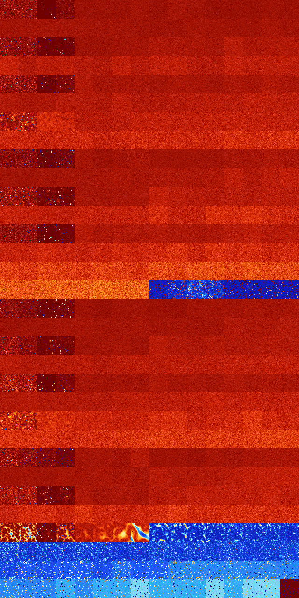

# B034568 (193024-193535)

<details>
    <summary>Initial Grid</summary>
    
</details>


<details>
    <summary>Initial Grid RLE</summary>

```
#C Exported from GoGoL (https://github.com/marrow16/gogol)
#C Wrap mode: Toroidal
#C Boundary mode: Dead
#C Step: 0
x = 100, y = 100, rule = B034568/S
35bo19bo7bo$20bo4bo10bo7bo4bo11bo6bo7bo3bo$10bo18bo$bo27bo6bo34bo$9bo
37bo20bo$8bo6bo14bo6bo9bo35bo10bo$10bo10bo54bo9b2obo2bo$11bo14bo28bo8bo
11bo$bo22bobo10bo4bo24bo$28bo7bobo7bobo$8bo31bo18bo35bo$16bo14bo5bo4bo
2bo3bo22bo14bo$17bo7bo3bo22bo12bo16bo15bo$17bo16b2o24bob2obo10bo11bo5bo
4bo$30b2o8bo31bo22bo$o2bo29bo25bo26bo$15bo28bo15bo12bo$9bo8bo32bo19bo
18bo4bo$21bo18bo12bo16bo24bo$8b2o5bo30bobo6bo$22bo40bo31bobo$5bo14bo7bo
4bo43bo$66bo12bo2bo$11bo21bo29b2o13bo14bo3bo$69bo$2bo8bo4bo38b2o28bo10b
o$2bo42bo14bo24bo12bo$22bo30bo11bo$3bo24bo33bo6bo20bo$o10bo3bo4bo19bo4b
o23b2o16bo8bo$bo17bo7bo19bo15bo12bo$2o31bo29bo$31bo10b2o30bo16b2o$6b2o
18bo21bo39bo$31bo61bo$5bo12bo13bo54bo$17bo20bo13bo19bo6bo4bo$18bo10bo
45bo$4bo18bo2bo6bo10bobo22bo28bo$24bo4bo20bo42bo$o9bo57bo5bo8bo3bo$66bo
$36bo5bo26bo14bo4bo$98bo$11bo11bo37bo24bo$17bo10bo4bo15b2o2bo5b2o$13bo
5bo2bo76bo$10bo2bo3bo28bo26bo16bo$41bo10bo20bobo20bo$27bo4bobo6bo$2bo
11bo9bo63bo$65bo4bo5bo7bobo7bo$5bo90bo$27bo$42bo30bo$o8bo7b3o20bo19bo
15bo3bo$15b2o8bo7bo2bo6bo12bo$19b2o11bo8b2o42bo9bo3bo$o20bo3bo12bo41bo$
11bo4bo5bo20bo$4bo5bo6bo32bo9bo26bo$21bo19bo7bo36bo$2bo16bo51bo10b2o11b
o$25bo15bo3bo15bo19bo3bo4bo3bo$49bo34bo3bo4bo$25bo22b2o33bo6bo$15bo4b2o
47bo2bo17bo4bo$16bo59bo12bo$18bo39bo6bo2bo4bo$bo15bo10bo5b2o$14bo23bo
25bo$15bo17bobobobo11bo2bo35bo3bo$93bo$4bo6bobo6bo27bo5bo32bo5bo3bo$43b
o50bo$27bo7bo54bo6bo$bo43bo25bo2bo23bo$o82bo$9bo87bo$18bo2bo7bo$o16bo7b
o5bo10bo5bo11bobo17bo$16bo10bo39bo27bo$51bo24bo3bo$31bo6bo37bo4bo13b2ob
o$24bobo33bo$10bo2bo63bo4bo14bo$12bo45bo$bo30bo18bo7bo21bo$24bo6bo4b2o
15bo9bo8bo$13bo7bo31bo13bo5bo2bo$bo78bo$26bo20bo3bo12bo4bo$11bo5bo36bo
3bo2bo14bo$6bo16bo9bo6bo7bo32bo$25bo41bo15bo6bo$5bobo45bo2bo3bo15bo$o6b
o2bo17bo9bo23bo$23bo15bo17bo8bo$14bo5bo29bo18bo13bo3bo8bo2bo$5bo45bo!
```
</details>
<details>
    <summary>Thumbnail</summary>

</details>
<table>
<tr>
    <td><a href="./193024%20S%20Heat%20Map%20Activity.png"></a><br>S (193024)<br>R@25,p2</td>    <td><a href="./193025%20S0%20Heat%20Map%20Activity.png"></a><br>S0 (193025)<br>R@27,p4</td>    <td><a href="./193026%20S1%20Heat%20Map%20Activity.png"></a><br>S1 (193026)<br>R@462,p420</td>    <td><a href="./193027%20S01%20Heat%20Map%20Activity.png"></a><br>S01 (193027)<br>R@72,p12</td>    <td><a href="./193028%20S2%20Heat%20Map%20Activity.png"></a><br>S2 (193028)<br>G>1000</td>    <td><a href="./193029%20S02%20Heat%20Map%20Activity.png"></a><br>S02 (193029)<br>G>1000</td>    <td><a href="./193030%20S12%20Heat%20Map%20Activity.png"></a><br>S12 (193030)<br>G>1000</td>    <td><a href="./193031%20S012%20Heat%20Map%20Activity.png"></a><br>S012 (193031)<br>G>1000</td>    <td><a href="./193032%20S3%20Heat%20Map%20Activity.png"></a><br>S3 (193032)<br>G>1000</td>    <td><a href="./193033%20S03%20Heat%20Map%20Activity.png"></a><br>S03 (193033)<br>G>1000</td>    <td><a href="./193034%20S13%20Heat%20Map%20Activity.png"></a><br>S13 (193034)<br>G>1000</td>    <td><a href="./193035%20S013%20Heat%20Map%20Activity.png"></a><br>S013 (193035)<br>G>1000</td>    <td><a href="./193036%20S23%20Heat%20Map%20Activity.png"></a><br>S23 (193036)<br>G>1000</td>    <td><a href="./193037%20S023%20Heat%20Map%20Activity.png"></a><br>S023 (193037)<br>G>1000</td>    <td><a href="./193038%20S123%20Heat%20Map%20Activity.png"></a><br>S123 (193038)<br>G>1000</td>    <td><a href="./193039%20S0123%20Heat%20Map%20Activity.png"></a><br>S0123 (193039)<br>G>1000</td></tr>
<tr>
    <td><a href="./193040%20S4%20Heat%20Map%20Activity.png"></a><br>S4 (193040)<br>G>1000</td>    <td><a href="./193041%20S04%20Heat%20Map%20Activity.png"></a><br>S04 (193041)<br>G>1000</td>    <td><a href="./193042%20S14%20Heat%20Map%20Activity.png"></a><br>S14 (193042)<br>G>1000</td>    <td><a href="./193043%20S014%20Heat%20Map%20Activity.png"></a><br>S014 (193043)<br>G>1000</td>    <td><a href="./193044%20S24%20Heat%20Map%20Activity.png"></a><br>S24 (193044)<br>G>1000</td>    <td><a href="./193045%20S024%20Heat%20Map%20Activity.png"></a><br>S024 (193045)<br>G>1000</td>    <td><a href="./193046%20S124%20Heat%20Map%20Activity.png"></a><br>S124 (193046)<br>G>1000</td>    <td><a href="./193047%20S0124%20Heat%20Map%20Activity.png"></a><br>S0124 (193047)<br>G>1000</td>    <td><a href="./193048%20S34%20Heat%20Map%20Activity.png"></a><br>S34 (193048)<br>G>1000</td>    <td><a href="./193049%20S034%20Heat%20Map%20Activity.png"></a><br>S034 (193049)<br>G>1000</td>    <td><a href="./193050%20S134%20Heat%20Map%20Activity.png"></a><br>S134 (193050)<br>G>1000</td>    <td><a href="./193051%20S0134%20Heat%20Map%20Activity.png"></a><br>S0134 (193051)<br>G>1000</td>    <td><a href="./193052%20S234%20Heat%20Map%20Activity.png"></a><br>S234 (193052)<br>G>1000</td>    <td><a href="./193053%20S0234%20Heat%20Map%20Activity.png"></a><br>S0234 (193053)<br>G>1000</td>    <td><a href="./193054%20S1234%20Heat%20Map%20Activity.png"></a><br>S1234 (193054)<br>G>1000</td>    <td><a href="./193055%20S01234%20Heat%20Map%20Activity.png"></a><br>S01234 (193055)<br>G>1000</td></tr>
<tr>
    <td><a href="./193056%20S5%20Heat%20Map%20Activity.png"></a><br>S5 (193056)<br>R@41,p12</td>    <td><a href="./193057%20S05%20Heat%20Map%20Activity.png"></a><br>S05 (193057)<br>R@41,p12</td>    <td><a href="./193058%20S15%20Heat%20Map%20Activity.png"></a><br>S15 (193058)<br>G>1000</td>    <td><a href="./193059%20S015%20Heat%20Map%20Activity.png"></a><br>S015 (193059)<br>G>1000</td>    <td><a href="./193060%20S25%20Heat%20Map%20Activity.png"></a><br>S25 (193060)<br>G>1000</td>    <td><a href="./193061%20S025%20Heat%20Map%20Activity.png"></a><br>S025 (193061)<br>G>1000</td>    <td><a href="./193062%20S125%20Heat%20Map%20Activity.png"></a><br>S125 (193062)<br>G>1000</td>    <td><a href="./193063%20S0125%20Heat%20Map%20Activity.png"></a><br>S0125 (193063)<br>G>1000</td>    <td><a href="./193064%20S35%20Heat%20Map%20Activity.png"></a><br>S35 (193064)<br>G>1000</td>    <td><a href="./193065%20S035%20Heat%20Map%20Activity.png"></a><br>S035 (193065)<br>G>1000</td>    <td><a href="./193066%20S135%20Heat%20Map%20Activity.png"></a><br>S135 (193066)<br>G>1000</td>    <td><a href="./193067%20S0135%20Heat%20Map%20Activity.png"></a><br>S0135 (193067)<br>G>1000</td>    <td><a href="./193068%20S235%20Heat%20Map%20Activity.png"></a><br>S235 (193068)<br>G>1000</td>    <td><a href="./193069%20S0235%20Heat%20Map%20Activity.png"></a><br>S0235 (193069)<br>G>1000</td>    <td><a href="./193070%20S1235%20Heat%20Map%20Activity.png"></a><br>S1235 (193070)<br>G>1000</td>    <td><a href="./193071%20S01235%20Heat%20Map%20Activity.png"></a><br>S01235 (193071)<br>G>1000</td></tr>
<tr>
    <td><a href="./193072%20S45%20Heat%20Map%20Activity.png"></a><br>S45 (193072)<br>G>1000</td>    <td><a href="./193073%20S045%20Heat%20Map%20Activity.png"></a><br>S045 (193073)<br>G>1000</td>    <td><a href="./193074%20S145%20Heat%20Map%20Activity.png"></a><br>S145 (193074)<br>G>1000</td>    <td><a href="./193075%20S0145%20Heat%20Map%20Activity.png"></a><br>S0145 (193075)<br>G>1000</td>    <td><a href="./193076%20S245%20Heat%20Map%20Activity.png"></a><br>S245 (193076)<br>G>1000</td>    <td><a href="./193077%20S0245%20Heat%20Map%20Activity.png"></a><br>S0245 (193077)<br>G>1000</td>    <td><a href="./193078%20S1245%20Heat%20Map%20Activity.png"></a><br>S1245 (193078)<br>G>1000</td>    <td><a href="./193079%20S01245%20Heat%20Map%20Activity.png"></a><br>S01245 (193079)<br>G>1000</td>    <td><a href="./193080%20S345%20Heat%20Map%20Activity.png"></a><br>S345 (193080)<br>G>1000</td>    <td><a href="./193081%20S0345%20Heat%20Map%20Activity.png"></a><br>S0345 (193081)<br>G>1000</td>    <td><a href="./193082%20S1345%20Heat%20Map%20Activity.png"></a><br>S1345 (193082)<br>G>1000</td>    <td><a href="./193083%20S01345%20Heat%20Map%20Activity.png"></a><br>S01345 (193083)<br>G>1000</td>    <td><a href="./193084%20S2345%20Heat%20Map%20Activity.png"></a><br>S2345 (193084)<br>G>1000</td>    <td><a href="./193085%20S02345%20Heat%20Map%20Activity.png"></a><br>S02345 (193085)<br>G>1000</td>    <td><a href="./193086%20S12345%20Heat%20Map%20Activity.png"></a><br>S12345 (193086)<br>G>1000</td>    <td><a href="./193087%20S012345%20Heat%20Map%20Activity.png"></a><br>S012345 (193087)<br>G>1000</td></tr>
<tr>
    <td><a href="./193088%20S6%20Heat%20Map%20Activity.png"></a><br>S6 (193088)<br>R@20,p2</td>    <td><a href="./193089%20S06%20Heat%20Map%20Activity.png"></a><br>S06 (193089)<br>R@24,p6</td>    <td><a href="./193090%20S16%20Heat%20Map%20Activity.png"></a><br>S16 (193090)<br>R@272,p168</td>    <td><a href="./193091%20S016%20Heat%20Map%20Activity.png"></a><br>S016 (193091)<br>R@76,p24</td>    <td><a href="./193092%20S26%20Heat%20Map%20Activity.png"></a><br>S26 (193092)<br>G>1000</td>    <td><a href="./193093%20S026%20Heat%20Map%20Activity.png"></a><br>S026 (193093)<br>G>1000</td>    <td><a href="./193094%20S126%20Heat%20Map%20Activity.png"></a><br>S126 (193094)<br>G>1000</td>    <td><a href="./193095%20S0126%20Heat%20Map%20Activity.png"></a><br>S0126 (193095)<br>G>1000</td>    <td><a href="./193096%20S36%20Heat%20Map%20Activity.png"></a><br>S36 (193096)<br>G>1000</td>    <td><a href="./193097%20S036%20Heat%20Map%20Activity.png"></a><br>S036 (193097)<br>G>1000</td>    <td><a href="./193098%20S136%20Heat%20Map%20Activity.png"></a><br>S136 (193098)<br>G>1000</td>    <td><a href="./193099%20S0136%20Heat%20Map%20Activity.png"></a><br>S0136 (193099)<br>G>1000</td>    <td><a href="./193100%20S236%20Heat%20Map%20Activity.png"></a><br>S236 (193100)<br>G>1000</td>    <td><a href="./193101%20S0236%20Heat%20Map%20Activity.png"></a><br>S0236 (193101)<br>G>1000</td>    <td><a href="./193102%20S1236%20Heat%20Map%20Activity.png"></a><br>S1236 (193102)<br>G>1000</td>    <td><a href="./193103%20S01236%20Heat%20Map%20Activity.png"></a><br>S01236 (193103)<br>G>1000</td></tr>
<tr>
    <td><a href="./193104%20S46%20Heat%20Map%20Activity.png"></a><br>S46 (193104)<br>G>1000</td>    <td><a href="./193105%20S046%20Heat%20Map%20Activity.png"></a><br>S046 (193105)<br>G>1000</td>    <td><a href="./193106%20S146%20Heat%20Map%20Activity.png"></a><br>S146 (193106)<br>G>1000</td>    <td><a href="./193107%20S0146%20Heat%20Map%20Activity.png"></a><br>S0146 (193107)<br>G>1000</td>    <td><a href="./193108%20S246%20Heat%20Map%20Activity.png"></a><br>S246 (193108)<br>G>1000</td>    <td><a href="./193109%20S0246%20Heat%20Map%20Activity.png"></a><br>S0246 (193109)<br>G>1000</td>    <td><a href="./193110%20S1246%20Heat%20Map%20Activity.png"></a><br>S1246 (193110)<br>G>1000</td>    <td><a href="./193111%20S01246%20Heat%20Map%20Activity.png"></a><br>S01246 (193111)<br>G>1000</td>    <td><a href="./193112%20S346%20Heat%20Map%20Activity.png"></a><br>S346 (193112)<br>G>1000</td>    <td><a href="./193113%20S0346%20Heat%20Map%20Activity.png"></a><br>S0346 (193113)<br>G>1000</td>    <td><a href="./193114%20S1346%20Heat%20Map%20Activity.png"></a><br>S1346 (193114)<br>G>1000</td>    <td><a href="./193115%20S01346%20Heat%20Map%20Activity.png"></a><br>S01346 (193115)<br>G>1000</td>    <td><a href="./193116%20S2346%20Heat%20Map%20Activity.png"></a><br>S2346 (193116)<br>G>1000</td>    <td><a href="./193117%20S02346%20Heat%20Map%20Activity.png"></a><br>S02346 (193117)<br>G>1000</td>    <td><a href="./193118%20S12346%20Heat%20Map%20Activity.png"></a><br>S12346 (193118)<br>G>1000</td>    <td><a href="./193119%20S012346%20Heat%20Map%20Activity.png"></a><br>S012346 (193119)<br>G>1000</td></tr>
<tr>
    <td><a href="./193120%20S56%20Heat%20Map%20Activity.png"></a><br>S56 (193120)<br>R@113,p2</td>    <td><a href="./193121%20S056%20Heat%20Map%20Activity.png"></a><br>S056 (193121)<br>R@99,p12</td>    <td><a href="./193122%20S156%20Heat%20Map%20Activity.png"></a><br>S156 (193122)<br>G>1000</td>    <td><a href="./193123%20S0156%20Heat%20Map%20Activity.png"></a><br>S0156 (193123)<br>G>1000</td>    <td><a href="./193124%20S256%20Heat%20Map%20Activity.png"></a><br>S256 (193124)<br>G>1000</td>    <td><a href="./193125%20S0256%20Heat%20Map%20Activity.png"></a><br>S0256 (193125)<br>G>1000</td>    <td><a href="./193126%20S1256%20Heat%20Map%20Activity.png"></a><br>S1256 (193126)<br>G>1000</td>    <td><a href="./193127%20S01256%20Heat%20Map%20Activity.png"></a><br>S01256 (193127)<br>G>1000</td>    <td><a href="./193128%20S356%20Heat%20Map%20Activity.png"></a><br>S356 (193128)<br>G>1000</td>    <td><a href="./193129%20S0356%20Heat%20Map%20Activity.png"></a><br>S0356 (193129)<br>G>1000</td>    <td><a href="./193130%20S1356%20Heat%20Map%20Activity.png"></a><br>S1356 (193130)<br>G>1000</td>    <td><a href="./193131%20S01356%20Heat%20Map%20Activity.png"></a><br>S01356 (193131)<br>G>1000</td>    <td><a href="./193132%20S2356%20Heat%20Map%20Activity.png"></a><br>S2356 (193132)<br>G>1000</td>    <td><a href="./193133%20S02356%20Heat%20Map%20Activity.png"></a><br>S02356 (193133)<br>G>1000</td>    <td><a href="./193134%20S12356%20Heat%20Map%20Activity.png"></a><br>S12356 (193134)<br>G>1000</td>    <td><a href="./193135%20S012356%20Heat%20Map%20Activity.png"></a><br>S012356 (193135)<br>G>1000</td></tr>
<tr>
    <td><a href="./193136%20S456%20Heat%20Map%20Activity.png"></a><br>S456 (193136)<br>G>1000</td>    <td><a href="./193137%20S0456%20Heat%20Map%20Activity.png"></a><br>S0456 (193137)<br>G>1000</td>    <td><a href="./193138%20S1456%20Heat%20Map%20Activity.png"></a><br>S1456 (193138)<br>G>1000</td>    <td><a href="./193139%20S01456%20Heat%20Map%20Activity.png"></a><br>S01456 (193139)<br>G>1000</td>    <td><a href="./193140%20S2456%20Heat%20Map%20Activity.png"></a><br>S2456 (193140)<br>G>1000</td>    <td><a href="./193141%20S02456%20Heat%20Map%20Activity.png"></a><br>S02456 (193141)<br>G>1000</td>    <td><a href="./193142%20S12456%20Heat%20Map%20Activity.png"></a><br>S12456 (193142)<br>G>1000</td>    <td><a href="./193143%20S012456%20Heat%20Map%20Activity.png"></a><br>S012456 (193143)<br>G>1000</td>    <td><a href="./193144%20S3456%20Heat%20Map%20Activity.png"></a><br>S3456 (193144)<br>G>1000</td>    <td><a href="./193145%20S03456%20Heat%20Map%20Activity.png"></a><br>S03456 (193145)<br>G>1000</td>    <td><a href="./193146%20S13456%20Heat%20Map%20Activity.png"></a><br>S13456 (193146)<br>G>1000</td>    <td><a href="./193147%20S013456%20Heat%20Map%20Activity.png"></a><br>S013456 (193147)<br>G>1000</td>    <td><a href="./193148%20S23456%20Heat%20Map%20Activity.png"></a><br>S23456 (193148)<br>G>1000</td>    <td><a href="./193149%20S023456%20Heat%20Map%20Activity.png"></a><br>S023456 (193149)<br>G>1000</td>    <td><a href="./193150%20S123456%20Heat%20Map%20Activity.png"></a><br>S123456 (193150)<br>G>1000</td>    <td><a href="./193151%20S0123456%20Heat%20Map%20Activity.png"></a><br>S0123456 (193151)<br>G>1000</td></tr>
<tr>
    <td><a href="./193152%20S7%20Heat%20Map%20Activity.png"></a><br>S7 (193152)<br>R@28,p6</td>    <td><a href="./193153%20S07%20Heat%20Map%20Activity.png"></a><br>S07 (193153)<br>R@28,p6</td>    <td><a href="./193154%20S17%20Heat%20Map%20Activity.png"></a><br>S17 (193154)<br>R@878,p840</td>    <td><a href="./193155%20S017%20Heat%20Map%20Activity.png"></a><br>S017 (193155)<br>R@76,p24</td>    <td><a href="./193156%20S27%20Heat%20Map%20Activity.png"></a><br>S27 (193156)<br>G>1000</td>    <td><a href="./193157%20S027%20Heat%20Map%20Activity.png"></a><br>S027 (193157)<br>G>1000</td>    <td><a href="./193158%20S127%20Heat%20Map%20Activity.png"></a><br>S127 (193158)<br>G>1000</td>    <td><a href="./193159%20S0127%20Heat%20Map%20Activity.png"></a><br>S0127 (193159)<br>G>1000</td>    <td><a href="./193160%20S37%20Heat%20Map%20Activity.png"></a><br>S37 (193160)<br>G>1000</td>    <td><a href="./193161%20S037%20Heat%20Map%20Activity.png"></a><br>S037 (193161)<br>G>1000</td>    <td><a href="./193162%20S137%20Heat%20Map%20Activity.png"></a><br>S137 (193162)<br>G>1000</td>    <td><a href="./193163%20S0137%20Heat%20Map%20Activity.png"></a><br>S0137 (193163)<br>G>1000</td>    <td><a href="./193164%20S237%20Heat%20Map%20Activity.png"></a><br>S237 (193164)<br>G>1000</td>    <td><a href="./193165%20S0237%20Heat%20Map%20Activity.png"></a><br>S0237 (193165)<br>G>1000</td>    <td><a href="./193166%20S1237%20Heat%20Map%20Activity.png"></a><br>S1237 (193166)<br>G>1000</td>    <td><a href="./193167%20S01237%20Heat%20Map%20Activity.png"></a><br>S01237 (193167)<br>G>1000</td></tr>
<tr>
    <td><a href="./193168%20S47%20Heat%20Map%20Activity.png"></a><br>S47 (193168)<br>G>1000</td>    <td><a href="./193169%20S047%20Heat%20Map%20Activity.png"></a><br>S047 (193169)<br>G>1000</td>    <td><a href="./193170%20S147%20Heat%20Map%20Activity.png"></a><br>S147 (193170)<br>G>1000</td>    <td><a href="./193171%20S0147%20Heat%20Map%20Activity.png"></a><br>S0147 (193171)<br>G>1000</td>    <td><a href="./193172%20S247%20Heat%20Map%20Activity.png"></a><br>S247 (193172)<br>G>1000</td>    <td><a href="./193173%20S0247%20Heat%20Map%20Activity.png"></a><br>S0247 (193173)<br>G>1000</td>    <td><a href="./193174%20S1247%20Heat%20Map%20Activity.png"></a><br>S1247 (193174)<br>G>1000</td>    <td><a href="./193175%20S01247%20Heat%20Map%20Activity.png"></a><br>S01247 (193175)<br>G>1000</td>    <td><a href="./193176%20S347%20Heat%20Map%20Activity.png"></a><br>S347 (193176)<br>G>1000</td>    <td><a href="./193177%20S0347%20Heat%20Map%20Activity.png"></a><br>S0347 (193177)<br>G>1000</td>    <td><a href="./193178%20S1347%20Heat%20Map%20Activity.png"></a><br>S1347 (193178)<br>G>1000</td>    <td><a href="./193179%20S01347%20Heat%20Map%20Activity.png"></a><br>S01347 (193179)<br>G>1000</td>    <td><a href="./193180%20S2347%20Heat%20Map%20Activity.png"></a><br>S2347 (193180)<br>G>1000</td>    <td><a href="./193181%20S02347%20Heat%20Map%20Activity.png"></a><br>S02347 (193181)<br>G>1000</td>    <td><a href="./193182%20S12347%20Heat%20Map%20Activity.png"></a><br>S12347 (193182)<br>G>1000</td>    <td><a href="./193183%20S012347%20Heat%20Map%20Activity.png"></a><br>S012347 (193183)<br>G>1000</td></tr>
<tr>
    <td><a href="./193184%20S57%20Heat%20Map%20Activity.png"></a><br>S57 (193184)<br>R@34,p8</td>    <td><a href="./193185%20S057%20Heat%20Map%20Activity.png"></a><br>S057 (193185)<br>R@41,p12</td>    <td><a href="./193186%20S157%20Heat%20Map%20Activity.png"></a><br>S157 (193186)<br>R@506,p24</td>    <td><a href="./193187%20S0157%20Heat%20Map%20Activity.png"></a><br>S0157 (193187)<br>G>1000</td>    <td><a href="./193188%20S257%20Heat%20Map%20Activity.png"></a><br>S257 (193188)<br>G>1000</td>    <td><a href="./193189%20S0257%20Heat%20Map%20Activity.png"></a><br>S0257 (193189)<br>G>1000</td>    <td><a href="./193190%20S1257%20Heat%20Map%20Activity.png"></a><br>S1257 (193190)<br>G>1000</td>    <td><a href="./193191%20S01257%20Heat%20Map%20Activity.png"></a><br>S01257 (193191)<br>G>1000</td>    <td><a href="./193192%20S357%20Heat%20Map%20Activity.png"></a><br>S357 (193192)<br>G>1000</td>    <td><a href="./193193%20S0357%20Heat%20Map%20Activity.png"></a><br>S0357 (193193)<br>G>1000</td>    <td><a href="./193194%20S1357%20Heat%20Map%20Activity.png"></a><br>S1357 (193194)<br>G>1000</td>    <td><a href="./193195%20S01357%20Heat%20Map%20Activity.png"></a><br>S01357 (193195)<br>G>1000</td>    <td><a href="./193196%20S2357%20Heat%20Map%20Activity.png"></a><br>S2357 (193196)<br>G>1000</td>    <td><a href="./193197%20S02357%20Heat%20Map%20Activity.png"></a><br>S02357 (193197)<br>G>1000</td>    <td><a href="./193198%20S12357%20Heat%20Map%20Activity.png"></a><br>S12357 (193198)<br>G>1000</td>    <td><a href="./193199%20S012357%20Heat%20Map%20Activity.png"></a><br>S012357 (193199)<br>G>1000</td></tr>
<tr>
    <td><a href="./193200%20S457%20Heat%20Map%20Activity.png"></a><br>S457 (193200)<br>G>1000</td>    <td><a href="./193201%20S0457%20Heat%20Map%20Activity.png"></a><br>S0457 (193201)<br>G>1000</td>    <td><a href="./193202%20S1457%20Heat%20Map%20Activity.png"></a><br>S1457 (193202)<br>G>1000</td>    <td><a href="./193203%20S01457%20Heat%20Map%20Activity.png"></a><br>S01457 (193203)<br>G>1000</td>    <td><a href="./193204%20S2457%20Heat%20Map%20Activity.png"></a><br>S2457 (193204)<br>G>1000</td>    <td><a href="./193205%20S02457%20Heat%20Map%20Activity.png"></a><br>S02457 (193205)<br>G>1000</td>    <td><a href="./193206%20S12457%20Heat%20Map%20Activity.png"></a><br>S12457 (193206)<br>G>1000</td>    <td><a href="./193207%20S012457%20Heat%20Map%20Activity.png"></a><br>S012457 (193207)<br>G>1000</td>    <td><a href="./193208%20S3457%20Heat%20Map%20Activity.png"></a><br>S3457 (193208)<br>G>1000</td>    <td><a href="./193209%20S03457%20Heat%20Map%20Activity.png"></a><br>S03457 (193209)<br>G>1000</td>    <td><a href="./193210%20S13457%20Heat%20Map%20Activity.png"></a><br>S13457 (193210)<br>G>1000</td>    <td><a href="./193211%20S013457%20Heat%20Map%20Activity.png"></a><br>S013457 (193211)<br>G>1000</td>    <td><a href="./193212%20S23457%20Heat%20Map%20Activity.png"></a><br>S23457 (193212)<br>G>1000</td>    <td><a href="./193213%20S023457%20Heat%20Map%20Activity.png"></a><br>S023457 (193213)<br>G>1000</td>    <td><a href="./193214%20S123457%20Heat%20Map%20Activity.png"></a><br>S123457 (193214)<br>G>1000</td>    <td><a href="./193215%20S0123457%20Heat%20Map%20Activity.png"></a><br>S0123457 (193215)<br>G>1000</td></tr>
<tr>
    <td><a href="./193216%20S67%20Heat%20Map%20Activity.png"></a><br>S67 (193216)<br>R@25,p6</td>    <td><a href="./193217%20S067%20Heat%20Map%20Activity.png"></a><br>S067 (193217)<br>R@28,p4</td>    <td><a href="./193218%20S167%20Heat%20Map%20Activity.png"></a><br>S167 (193218)<br>G>1000</td>    <td><a href="./193219%20S0167%20Heat%20Map%20Activity.png"></a><br>S0167 (193219)<br>R@200,p168</td>    <td><a href="./193220%20S267%20Heat%20Map%20Activity.png"></a><br>S267 (193220)<br>G>1000</td>    <td><a href="./193221%20S0267%20Heat%20Map%20Activity.png"></a><br>S0267 (193221)<br>G>1000</td>    <td><a href="./193222%20S1267%20Heat%20Map%20Activity.png"></a><br>S1267 (193222)<br>G>1000</td>    <td><a href="./193223%20S01267%20Heat%20Map%20Activity.png"></a><br>S01267 (193223)<br>G>1000</td>    <td><a href="./193224%20S367%20Heat%20Map%20Activity.png"></a><br>S367 (193224)<br>G>1000</td>    <td><a href="./193225%20S0367%20Heat%20Map%20Activity.png"></a><br>S0367 (193225)<br>G>1000</td>    <td><a href="./193226%20S1367%20Heat%20Map%20Activity.png"></a><br>S1367 (193226)<br>G>1000</td>    <td><a href="./193227%20S01367%20Heat%20Map%20Activity.png"></a><br>S01367 (193227)<br>G>1000</td>    <td><a href="./193228%20S2367%20Heat%20Map%20Activity.png"></a><br>S2367 (193228)<br>G>1000</td>    <td><a href="./193229%20S02367%20Heat%20Map%20Activity.png"></a><br>S02367 (193229)<br>G>1000</td>    <td><a href="./193230%20S12367%20Heat%20Map%20Activity.png"></a><br>S12367 (193230)<br>G>1000</td>    <td><a href="./193231%20S012367%20Heat%20Map%20Activity.png"></a><br>S012367 (193231)<br>G>1000</td></tr>
<tr>
    <td><a href="./193232%20S467%20Heat%20Map%20Activity.png"></a><br>S467 (193232)<br>G>1000</td>    <td><a href="./193233%20S0467%20Heat%20Map%20Activity.png"></a><br>S0467 (193233)<br>G>1000</td>    <td><a href="./193234%20S1467%20Heat%20Map%20Activity.png"></a><br>S1467 (193234)<br>G>1000</td>    <td><a href="./193235%20S01467%20Heat%20Map%20Activity.png"></a><br>S01467 (193235)<br>G>1000</td>    <td><a href="./193236%20S2467%20Heat%20Map%20Activity.png"></a><br>S2467 (193236)<br>G>1000</td>    <td><a href="./193237%20S02467%20Heat%20Map%20Activity.png"></a><br>S02467 (193237)<br>G>1000</td>    <td><a href="./193238%20S12467%20Heat%20Map%20Activity.png"></a><br>S12467 (193238)<br>G>1000</td>    <td><a href="./193239%20S012467%20Heat%20Map%20Activity.png"></a><br>S012467 (193239)<br>G>1000</td>    <td><a href="./193240%20S3467%20Heat%20Map%20Activity.png"></a><br>S3467 (193240)<br>G>1000</td>    <td><a href="./193241%20S03467%20Heat%20Map%20Activity.png"></a><br>S03467 (193241)<br>G>1000</td>    <td><a href="./193242%20S13467%20Heat%20Map%20Activity.png"></a><br>S13467 (193242)<br>G>1000</td>    <td><a href="./193243%20S013467%20Heat%20Map%20Activity.png"></a><br>S013467 (193243)<br>G>1000</td>    <td><a href="./193244%20S23467%20Heat%20Map%20Activity.png"></a><br>S23467 (193244)<br>G>1000</td>    <td><a href="./193245%20S023467%20Heat%20Map%20Activity.png"></a><br>S023467 (193245)<br>G>1000</td>    <td><a href="./193246%20S123467%20Heat%20Map%20Activity.png"></a><br>S123467 (193246)<br>G>1000</td>    <td><a href="./193247%20S0123467%20Heat%20Map%20Activity.png"></a><br>S0123467 (193247)<br>G>1000</td></tr>
<tr>
    <td><a href="./193248%20S567%20Heat%20Map%20Activity.png"></a><br>S567 (193248)<br>G>1000</td>    <td><a href="./193249%20S0567%20Heat%20Map%20Activity.png"></a><br>S0567 (193249)<br>G>1000</td>    <td><a href="./193250%20S1567%20Heat%20Map%20Activity.png"></a><br>S1567 (193250)<br>G>1000</td>    <td><a href="./193251%20S01567%20Heat%20Map%20Activity.png"></a><br>S01567 (193251)<br>G>1000</td>    <td><a href="./193252%20S2567%20Heat%20Map%20Activity.png"></a><br>S2567 (193252)<br>G>1000</td>    <td><a href="./193253%20S02567%20Heat%20Map%20Activity.png"></a><br>S02567 (193253)<br>G>1000</td>    <td><a href="./193254%20S12567%20Heat%20Map%20Activity.png"></a><br>S12567 (193254)<br>G>1000</td>    <td><a href="./193255%20S012567%20Heat%20Map%20Activity.png"></a><br>S012567 (193255)<br>G>1000</td>    <td><a href="./193256%20S3567%20Heat%20Map%20Activity.png"></a><br>S3567 (193256)<br>G>1000</td>    <td><a href="./193257%20S03567%20Heat%20Map%20Activity.png"></a><br>S03567 (193257)<br>G>1000</td>    <td><a href="./193258%20S13567%20Heat%20Map%20Activity.png"></a><br>S13567 (193258)<br>G>1000</td>    <td><a href="./193259%20S013567%20Heat%20Map%20Activity.png"></a><br>S013567 (193259)<br>G>1000</td>    <td><a href="./193260%20S23567%20Heat%20Map%20Activity.png"></a><br>S23567 (193260)<br>G>1000</td>    <td><a href="./193261%20S023567%20Heat%20Map%20Activity.png"></a><br>S023567 (193261)<br>G>1000</td>    <td><a href="./193262%20S123567%20Heat%20Map%20Activity.png"></a><br>S123567 (193262)<br>G>1000</td>    <td><a href="./193263%20S0123567%20Heat%20Map%20Activity.png"></a><br>S0123567 (193263)<br>G>1000</td></tr>
<tr>
    <td><a href="./193264%20S4567%20Heat%20Map%20Activity.png"></a><br>S4567 (193264)<br>G>1000</td>    <td><a href="./193265%20S04567%20Heat%20Map%20Activity.png"></a><br>S04567 (193265)<br>G>1000</td>    <td><a href="./193266%20S14567%20Heat%20Map%20Activity.png"></a><br>S14567 (193266)<br>G>1000</td>    <td><a href="./193267%20S014567%20Heat%20Map%20Activity.png"></a><br>S014567 (193267)<br>G>1000</td>    <td><a href="./193268%20S24567%20Heat%20Map%20Activity.png"></a><br>S24567 (193268)<br>G>1000</td>    <td><a href="./193269%20S024567%20Heat%20Map%20Activity.png"></a><br>S024567 (193269)<br>G>1000</td>    <td><a href="./193270%20S124567%20Heat%20Map%20Activity.png"></a><br>S124567 (193270)<br>G>1000</td>    <td><a href="./193271%20S0124567%20Heat%20Map%20Activity.png"></a><br>S0124567 (193271)<br>G>1000</td>    <td><a href="./193272%20S34567%20Heat%20Map%20Activity.png"></a><br>S34567 (193272)<br>G>1000</td>    <td><a href="./193273%20S034567%20Heat%20Map%20Activity.png"></a><br>S034567 (193273)<br>R@328,p168</td>    <td><a href="./193274%20S134567%20Heat%20Map%20Activity.png"></a><br>S134567 (193274)<br>R@183,p24</td>    <td><a href="./193275%20S0134567%20Heat%20Map%20Activity.png"></a><br>S0134567 (193275)<br>R@279,p120</td>    <td><a href="./193276%20S234567%20Heat%20Map%20Activity.png"></a><br>S234567 (193276)<br>G>1000</td>    <td><a href="./193277%20S0234567%20Heat%20Map%20Activity.png"></a><br>S0234567 (193277)<br>G>1000</td>    <td><a href="./193278%20S1234567%20Heat%20Map%20Activity.png"></a><br>S1234567 (193278)<br>R@912,p840</td>    <td><a href="./193279%20S01234567%20Heat%20Map%20Activity.png"></a><br>S01234567 (193279)<br>G>1000</td></tr>
<tr>
    <td><a href="./193280%20S8%20Heat%20Map%20Activity.png"></a><br>S8 (193280)<br>R@27,p12</td>    <td><a href="./193281%20S08%20Heat%20Map%20Activity.png"></a><br>S08 (193281)<br>R@36,p12</td>    <td><a href="./193282%20S18%20Heat%20Map%20Activity.png"></a><br>S18 (193282)<br>R@181,p120</td>    <td><a href="./193283%20S018%20Heat%20Map%20Activity.png"></a><br>S018 (193283)<br>R@78,p24</td>    <td><a href="./193284%20S28%20Heat%20Map%20Activity.png"></a><br>S28 (193284)<br>G>1000</td>    <td><a href="./193285%20S028%20Heat%20Map%20Activity.png"></a><br>S028 (193285)<br>G>1000</td>    <td><a href="./193286%20S128%20Heat%20Map%20Activity.png"></a><br>S128 (193286)<br>G>1000</td>    <td><a href="./193287%20S0128%20Heat%20Map%20Activity.png"></a><br>S0128 (193287)<br>G>1000</td>    <td><a href="./193288%20S38%20Heat%20Map%20Activity.png"></a><br>S38 (193288)<br>G>1000</td>    <td><a href="./193289%20S038%20Heat%20Map%20Activity.png"></a><br>S038 (193289)<br>G>1000</td>    <td><a href="./193290%20S138%20Heat%20Map%20Activity.png"></a><br>S138 (193290)<br>G>1000</td>    <td><a href="./193291%20S0138%20Heat%20Map%20Activity.png"></a><br>S0138 (193291)<br>G>1000</td>    <td><a href="./193292%20S238%20Heat%20Map%20Activity.png"></a><br>S238 (193292)<br>G>1000</td>    <td><a href="./193293%20S0238%20Heat%20Map%20Activity.png"></a><br>S0238 (193293)<br>G>1000</td>    <td><a href="./193294%20S1238%20Heat%20Map%20Activity.png"></a><br>S1238 (193294)<br>G>1000</td>    <td><a href="./193295%20S01238%20Heat%20Map%20Activity.png"></a><br>S01238 (193295)<br>G>1000</td></tr>
<tr>
    <td><a href="./193296%20S48%20Heat%20Map%20Activity.png"></a><br>S48 (193296)<br>G>1000</td>    <td><a href="./193297%20S048%20Heat%20Map%20Activity.png"></a><br>S048 (193297)<br>G>1000</td>    <td><a href="./193298%20S148%20Heat%20Map%20Activity.png"></a><br>S148 (193298)<br>G>1000</td>    <td><a href="./193299%20S0148%20Heat%20Map%20Activity.png"></a><br>S0148 (193299)<br>G>1000</td>    <td><a href="./193300%20S248%20Heat%20Map%20Activity.png"></a><br>S248 (193300)<br>G>1000</td>    <td><a href="./193301%20S0248%20Heat%20Map%20Activity.png"></a><br>S0248 (193301)<br>G>1000</td>    <td><a href="./193302%20S1248%20Heat%20Map%20Activity.png"></a><br>S1248 (193302)<br>G>1000</td>    <td><a href="./193303%20S01248%20Heat%20Map%20Activity.png"></a><br>S01248 (193303)<br>G>1000</td>    <td><a href="./193304%20S348%20Heat%20Map%20Activity.png"></a><br>S348 (193304)<br>G>1000</td>    <td><a href="./193305%20S0348%20Heat%20Map%20Activity.png"></a><br>S0348 (193305)<br>G>1000</td>    <td><a href="./193306%20S1348%20Heat%20Map%20Activity.png"></a><br>S1348 (193306)<br>G>1000</td>    <td><a href="./193307%20S01348%20Heat%20Map%20Activity.png"></a><br>S01348 (193307)<br>G>1000</td>    <td><a href="./193308%20S2348%20Heat%20Map%20Activity.png"></a><br>S2348 (193308)<br>G>1000</td>    <td><a href="./193309%20S02348%20Heat%20Map%20Activity.png"></a><br>S02348 (193309)<br>G>1000</td>    <td><a href="./193310%20S12348%20Heat%20Map%20Activity.png"></a><br>S12348 (193310)<br>G>1000</td>    <td><a href="./193311%20S012348%20Heat%20Map%20Activity.png"></a><br>S012348 (193311)<br>G>1000</td></tr>
<tr>
    <td><a href="./193312%20S58%20Heat%20Map%20Activity.png"></a><br>S58 (193312)<br>R@36,p12</td>    <td><a href="./193313%20S058%20Heat%20Map%20Activity.png"></a><br>S058 (193313)<br>R@55,p12</td>    <td><a href="./193314%20S158%20Heat%20Map%20Activity.png"></a><br>S158 (193314)<br>R@530,p120</td>    <td><a href="./193315%20S0158%20Heat%20Map%20Activity.png"></a><br>S0158 (193315)<br>R@494,p120</td>    <td><a href="./193316%20S258%20Heat%20Map%20Activity.png"></a><br>S258 (193316)<br>G>1000</td>    <td><a href="./193317%20S0258%20Heat%20Map%20Activity.png"></a><br>S0258 (193317)<br>G>1000</td>    <td><a href="./193318%20S1258%20Heat%20Map%20Activity.png"></a><br>S1258 (193318)<br>G>1000</td>    <td><a href="./193319%20S01258%20Heat%20Map%20Activity.png"></a><br>S01258 (193319)<br>G>1000</td>    <td><a href="./193320%20S358%20Heat%20Map%20Activity.png"></a><br>S358 (193320)<br>G>1000</td>    <td><a href="./193321%20S0358%20Heat%20Map%20Activity.png"></a><br>S0358 (193321)<br>G>1000</td>    <td><a href="./193322%20S1358%20Heat%20Map%20Activity.png"></a><br>S1358 (193322)<br>G>1000</td>    <td><a href="./193323%20S01358%20Heat%20Map%20Activity.png"></a><br>S01358 (193323)<br>G>1000</td>    <td><a href="./193324%20S2358%20Heat%20Map%20Activity.png"></a><br>S2358 (193324)<br>G>1000</td>    <td><a href="./193325%20S02358%20Heat%20Map%20Activity.png"></a><br>S02358 (193325)<br>G>1000</td>    <td><a href="./193326%20S12358%20Heat%20Map%20Activity.png"></a><br>S12358 (193326)<br>G>1000</td>    <td><a href="./193327%20S012358%20Heat%20Map%20Activity.png"></a><br>S012358 (193327)<br>G>1000</td></tr>
<tr>
    <td><a href="./193328%20S458%20Heat%20Map%20Activity.png"></a><br>S458 (193328)<br>G>1000</td>    <td><a href="./193329%20S0458%20Heat%20Map%20Activity.png"></a><br>S0458 (193329)<br>G>1000</td>    <td><a href="./193330%20S1458%20Heat%20Map%20Activity.png"></a><br>S1458 (193330)<br>G>1000</td>    <td><a href="./193331%20S01458%20Heat%20Map%20Activity.png"></a><br>S01458 (193331)<br>G>1000</td>    <td><a href="./193332%20S2458%20Heat%20Map%20Activity.png"></a><br>S2458 (193332)<br>G>1000</td>    <td><a href="./193333%20S02458%20Heat%20Map%20Activity.png"></a><br>S02458 (193333)<br>G>1000</td>    <td><a href="./193334%20S12458%20Heat%20Map%20Activity.png"></a><br>S12458 (193334)<br>G>1000</td>    <td><a href="./193335%20S012458%20Heat%20Map%20Activity.png"></a><br>S012458 (193335)<br>G>1000</td>    <td><a href="./193336%20S3458%20Heat%20Map%20Activity.png"></a><br>S3458 (193336)<br>G>1000</td>    <td><a href="./193337%20S03458%20Heat%20Map%20Activity.png"></a><br>S03458 (193337)<br>G>1000</td>    <td><a href="./193338%20S13458%20Heat%20Map%20Activity.png"></a><br>S13458 (193338)<br>G>1000</td>    <td><a href="./193339%20S013458%20Heat%20Map%20Activity.png"></a><br>S013458 (193339)<br>G>1000</td>    <td><a href="./193340%20S23458%20Heat%20Map%20Activity.png"></a><br>S23458 (193340)<br>G>1000</td>    <td><a href="./193341%20S023458%20Heat%20Map%20Activity.png"></a><br>S023458 (193341)<br>G>1000</td>    <td><a href="./193342%20S123458%20Heat%20Map%20Activity.png"></a><br>S123458 (193342)<br>G>1000</td>    <td><a href="./193343%20S0123458%20Heat%20Map%20Activity.png"></a><br>S0123458 (193343)<br>G>1000</td></tr>
<tr>
    <td><a href="./193344%20S68%20Heat%20Map%20Activity.png"></a><br>S68 (193344)<br>R@18,p2</td>    <td><a href="./193345%20S068%20Heat%20Map%20Activity.png"></a><br>S068 (193345)<br>R@21,p4</td>    <td><a href="./193346%20S168%20Heat%20Map%20Activity.png"></a><br>S168 (193346)<br>G>1000</td>    <td><a href="./193347%20S0168%20Heat%20Map%20Activity.png"></a><br>S0168 (193347)<br>R@79,p48</td>    <td><a href="./193348%20S268%20Heat%20Map%20Activity.png"></a><br>S268 (193348)<br>G>1000</td>    <td><a href="./193349%20S0268%20Heat%20Map%20Activity.png"></a><br>S0268 (193349)<br>G>1000</td>    <td><a href="./193350%20S1268%20Heat%20Map%20Activity.png"></a><br>S1268 (193350)<br>G>1000</td>    <td><a href="./193351%20S01268%20Heat%20Map%20Activity.png"></a><br>S01268 (193351)<br>G>1000</td>    <td><a href="./193352%20S368%20Heat%20Map%20Activity.png"></a><br>S368 (193352)<br>G>1000</td>    <td><a href="./193353%20S0368%20Heat%20Map%20Activity.png"></a><br>S0368 (193353)<br>G>1000</td>    <td><a href="./193354%20S1368%20Heat%20Map%20Activity.png"></a><br>S1368 (193354)<br>G>1000</td>    <td><a href="./193355%20S01368%20Heat%20Map%20Activity.png"></a><br>S01368 (193355)<br>G>1000</td>    <td><a href="./193356%20S2368%20Heat%20Map%20Activity.png"></a><br>S2368 (193356)<br>G>1000</td>    <td><a href="./193357%20S02368%20Heat%20Map%20Activity.png"></a><br>S02368 (193357)<br>G>1000</td>    <td><a href="./193358%20S12368%20Heat%20Map%20Activity.png"></a><br>S12368 (193358)<br>G>1000</td>    <td><a href="./193359%20S012368%20Heat%20Map%20Activity.png"></a><br>S012368 (193359)<br>G>1000</td></tr>
<tr>
    <td><a href="./193360%20S468%20Heat%20Map%20Activity.png"></a><br>S468 (193360)<br>G>1000</td>    <td><a href="./193361%20S0468%20Heat%20Map%20Activity.png"></a><br>S0468 (193361)<br>G>1000</td>    <td><a href="./193362%20S1468%20Heat%20Map%20Activity.png"></a><br>S1468 (193362)<br>G>1000</td>    <td><a href="./193363%20S01468%20Heat%20Map%20Activity.png"></a><br>S01468 (193363)<br>G>1000</td>    <td><a href="./193364%20S2468%20Heat%20Map%20Activity.png"></a><br>S2468 (193364)<br>G>1000</td>    <td><a href="./193365%20S02468%20Heat%20Map%20Activity.png"></a><br>S02468 (193365)<br>G>1000</td>    <td><a href="./193366%20S12468%20Heat%20Map%20Activity.png"></a><br>S12468 (193366)<br>G>1000</td>    <td><a href="./193367%20S012468%20Heat%20Map%20Activity.png"></a><br>S012468 (193367)<br>G>1000</td>    <td><a href="./193368%20S3468%20Heat%20Map%20Activity.png"></a><br>S3468 (193368)<br>G>1000</td>    <td><a href="./193369%20S03468%20Heat%20Map%20Activity.png"></a><br>S03468 (193369)<br>G>1000</td>    <td><a href="./193370%20S13468%20Heat%20Map%20Activity.png"></a><br>S13468 (193370)<br>G>1000</td>    <td><a href="./193371%20S013468%20Heat%20Map%20Activity.png"></a><br>S013468 (193371)<br>G>1000</td>    <td><a href="./193372%20S23468%20Heat%20Map%20Activity.png"></a><br>S23468 (193372)<br>G>1000</td>    <td><a href="./193373%20S023468%20Heat%20Map%20Activity.png"></a><br>S023468 (193373)<br>G>1000</td>    <td><a href="./193374%20S123468%20Heat%20Map%20Activity.png"></a><br>S123468 (193374)<br>G>1000</td>    <td><a href="./193375%20S0123468%20Heat%20Map%20Activity.png"></a><br>S0123468 (193375)<br>G>1000</td></tr>
<tr>
    <td><a href="./193376%20S568%20Heat%20Map%20Activity.png"></a><br>S568 (193376)<br>R@121,p4</td>    <td><a href="./193377%20S0568%20Heat%20Map%20Activity.png"></a><br>S0568 (193377)<br>R@152,p12</td>    <td><a href="./193378%20S1568%20Heat%20Map%20Activity.png"></a><br>S1568 (193378)<br>G>1000</td>    <td><a href="./193379%20S01568%20Heat%20Map%20Activity.png"></a><br>S01568 (193379)<br>G>1000</td>    <td><a href="./193380%20S2568%20Heat%20Map%20Activity.png"></a><br>S2568 (193380)<br>G>1000</td>    <td><a href="./193381%20S02568%20Heat%20Map%20Activity.png"></a><br>S02568 (193381)<br>G>1000</td>    <td><a href="./193382%20S12568%20Heat%20Map%20Activity.png"></a><br>S12568 (193382)<br>G>1000</td>    <td><a href="./193383%20S012568%20Heat%20Map%20Activity.png"></a><br>S012568 (193383)<br>G>1000</td>    <td><a href="./193384%20S3568%20Heat%20Map%20Activity.png"></a><br>S3568 (193384)<br>G>1000</td>    <td><a href="./193385%20S03568%20Heat%20Map%20Activity.png"></a><br>S03568 (193385)<br>G>1000</td>    <td><a href="./193386%20S13568%20Heat%20Map%20Activity.png"></a><br>S13568 (193386)<br>G>1000</td>    <td><a href="./193387%20S013568%20Heat%20Map%20Activity.png"></a><br>S013568 (193387)<br>G>1000</td>    <td><a href="./193388%20S23568%20Heat%20Map%20Activity.png"></a><br>S23568 (193388)<br>G>1000</td>    <td><a href="./193389%20S023568%20Heat%20Map%20Activity.png"></a><br>S023568 (193389)<br>G>1000</td>    <td><a href="./193390%20S123568%20Heat%20Map%20Activity.png"></a><br>S123568 (193390)<br>G>1000</td>    <td><a href="./193391%20S0123568%20Heat%20Map%20Activity.png"></a><br>S0123568 (193391)<br>G>1000</td></tr>
<tr>
    <td><a href="./193392%20S4568%20Heat%20Map%20Activity.png"></a><br>S4568 (193392)<br>G>1000</td>    <td><a href="./193393%20S04568%20Heat%20Map%20Activity.png"></a><br>S04568 (193393)<br>G>1000</td>    <td><a href="./193394%20S14568%20Heat%20Map%20Activity.png"></a><br>S14568 (193394)<br>G>1000</td>    <td><a href="./193395%20S014568%20Heat%20Map%20Activity.png"></a><br>S014568 (193395)<br>G>1000</td>    <td><a href="./193396%20S24568%20Heat%20Map%20Activity.png"></a><br>S24568 (193396)<br>G>1000</td>    <td><a href="./193397%20S024568%20Heat%20Map%20Activity.png"></a><br>S024568 (193397)<br>G>1000</td>    <td><a href="./193398%20S124568%20Heat%20Map%20Activity.png"></a><br>S124568 (193398)<br>G>1000</td>    <td><a href="./193399%20S0124568%20Heat%20Map%20Activity.png"></a><br>S0124568 (193399)<br>G>1000</td>    <td><a href="./193400%20S34568%20Heat%20Map%20Activity.png"></a><br>S34568 (193400)<br>G>1000</td>    <td><a href="./193401%20S034568%20Heat%20Map%20Activity.png"></a><br>S034568 (193401)<br>G>1000</td>    <td><a href="./193402%20S134568%20Heat%20Map%20Activity.png"></a><br>S134568 (193402)<br>G>1000</td>    <td><a href="./193403%20S0134568%20Heat%20Map%20Activity.png"></a><br>S0134568 (193403)<br>G>1000</td>    <td><a href="./193404%20S234568%20Heat%20Map%20Activity.png"></a><br>S234568 (193404)<br>G>1000</td>    <td><a href="./193405%20S0234568%20Heat%20Map%20Activity.png"></a><br>S0234568 (193405)<br>G>1000</td>    <td><a href="./193406%20S1234568%20Heat%20Map%20Activity.png"></a><br>S1234568 (193406)<br>G>1000</td>    <td><a href="./193407%20S01234568%20Heat%20Map%20Activity.png"></a><br>S01234568 (193407)<br>G>1000</td></tr>
<tr>
    <td><a href="./193408%20S78%20Heat%20Map%20Activity.png"></a><br>S78 (193408)<br>R@18,p4</td>    <td><a href="./193409%20S078%20Heat%20Map%20Activity.png"></a><br>S078 (193409)<br>R@26,p12</td>    <td><a href="./193410%20S178%20Heat%20Map%20Activity.png"></a><br>S178 (193410)<br>R@46,p12</td>    <td><a href="./193411%20S0178%20Heat%20Map%20Activity.png"></a><br>S0178 (193411)<br>R@89,p60</td>    <td><a href="./193412%20S278%20Heat%20Map%20Activity.png"></a><br>S278 (193412)<br>G>1000</td>    <td><a href="./193413%20S0278%20Heat%20Map%20Activity.png"></a><br>S0278 (193413)<br>G>1000</td>    <td><a href="./193414%20S1278%20Heat%20Map%20Activity.png"></a><br>S1278 (193414)<br>G>1000</td>    <td><a href="./193415%20S01278%20Heat%20Map%20Activity.png"></a><br>S01278 (193415)<br>G>1000</td>    <td><a href="./193416%20S378%20Heat%20Map%20Activity.png"></a><br>S378 (193416)<br>G>1000</td>    <td><a href="./193417%20S0378%20Heat%20Map%20Activity.png"></a><br>S0378 (193417)<br>G>1000</td>    <td><a href="./193418%20S1378%20Heat%20Map%20Activity.png"></a><br>S1378 (193418)<br>G>1000</td>    <td><a href="./193419%20S01378%20Heat%20Map%20Activity.png"></a><br>S01378 (193419)<br>G>1000</td>    <td><a href="./193420%20S2378%20Heat%20Map%20Activity.png"></a><br>S2378 (193420)<br>G>1000</td>    <td><a href="./193421%20S02378%20Heat%20Map%20Activity.png"></a><br>S02378 (193421)<br>G>1000</td>    <td><a href="./193422%20S12378%20Heat%20Map%20Activity.png"></a><br>S12378 (193422)<br>G>1000</td>    <td><a href="./193423%20S012378%20Heat%20Map%20Activity.png"></a><br>S012378 (193423)<br>G>1000</td></tr>
<tr>
    <td><a href="./193424%20S478%20Heat%20Map%20Activity.png"></a><br>S478 (193424)<br>G>1000</td>    <td><a href="./193425%20S0478%20Heat%20Map%20Activity.png"></a><br>S0478 (193425)<br>G>1000</td>    <td><a href="./193426%20S1478%20Heat%20Map%20Activity.png"></a><br>S1478 (193426)<br>G>1000</td>    <td><a href="./193427%20S01478%20Heat%20Map%20Activity.png"></a><br>S01478 (193427)<br>G>1000</td>    <td><a href="./193428%20S2478%20Heat%20Map%20Activity.png"></a><br>S2478 (193428)<br>G>1000</td>    <td><a href="./193429%20S02478%20Heat%20Map%20Activity.png"></a><br>S02478 (193429)<br>G>1000</td>    <td><a href="./193430%20S12478%20Heat%20Map%20Activity.png"></a><br>S12478 (193430)<br>G>1000</td>    <td><a href="./193431%20S012478%20Heat%20Map%20Activity.png"></a><br>S012478 (193431)<br>G>1000</td>    <td><a href="./193432%20S3478%20Heat%20Map%20Activity.png"></a><br>S3478 (193432)<br>G>1000</td>    <td><a href="./193433%20S03478%20Heat%20Map%20Activity.png"></a><br>S03478 (193433)<br>G>1000</td>    <td><a href="./193434%20S13478%20Heat%20Map%20Activity.png"></a><br>S13478 (193434)<br>G>1000</td>    <td><a href="./193435%20S013478%20Heat%20Map%20Activity.png"></a><br>S013478 (193435)<br>G>1000</td>    <td><a href="./193436%20S23478%20Heat%20Map%20Activity.png"></a><br>S23478 (193436)<br>G>1000</td>    <td><a href="./193437%20S023478%20Heat%20Map%20Activity.png"></a><br>S023478 (193437)<br>G>1000</td>    <td><a href="./193438%20S123478%20Heat%20Map%20Activity.png"></a><br>S123478 (193438)<br>G>1000</td>    <td><a href="./193439%20S0123478%20Heat%20Map%20Activity.png"></a><br>S0123478 (193439)<br>G>1000</td></tr>
<tr>
    <td><a href="./193440%20S578%20Heat%20Map%20Activity.png"></a><br>S578 (193440)<br>R@38,p12</td>    <td><a href="./193441%20S0578%20Heat%20Map%20Activity.png"></a><br>S0578 (193441)<br>R@41,p12</td>    <td><a href="./193442%20S1578%20Heat%20Map%20Activity.png"></a><br>S1578 (193442)<br>G>1000</td>    <td><a href="./193443%20S01578%20Heat%20Map%20Activity.png"></a><br>S01578 (193443)<br>G>1000</td>    <td><a href="./193444%20S2578%20Heat%20Map%20Activity.png"></a><br>S2578 (193444)<br>G>1000</td>    <td><a href="./193445%20S02578%20Heat%20Map%20Activity.png"></a><br>S02578 (193445)<br>G>1000</td>    <td><a href="./193446%20S12578%20Heat%20Map%20Activity.png"></a><br>S12578 (193446)<br>G>1000</td>    <td><a href="./193447%20S012578%20Heat%20Map%20Activity.png"></a><br>S012578 (193447)<br>G>1000</td>    <td><a href="./193448%20S3578%20Heat%20Map%20Activity.png"></a><br>S3578 (193448)<br>G>1000</td>    <td><a href="./193449%20S03578%20Heat%20Map%20Activity.png"></a><br>S03578 (193449)<br>G>1000</td>    <td><a href="./193450%20S13578%20Heat%20Map%20Activity.png"></a><br>S13578 (193450)<br>G>1000</td>    <td><a href="./193451%20S013578%20Heat%20Map%20Activity.png"></a><br>S013578 (193451)<br>G>1000</td>    <td><a href="./193452%20S23578%20Heat%20Map%20Activity.png"></a><br>S23578 (193452)<br>G>1000</td>    <td><a href="./193453%20S023578%20Heat%20Map%20Activity.png"></a><br>S023578 (193453)<br>G>1000</td>    <td><a href="./193454%20S123578%20Heat%20Map%20Activity.png"></a><br>S123578 (193454)<br>G>1000</td>    <td><a href="./193455%20S0123578%20Heat%20Map%20Activity.png"></a><br>S0123578 (193455)<br>G>1000</td></tr>
<tr>
    <td><a href="./193456%20S4578%20Heat%20Map%20Activity.png"></a><br>S4578 (193456)<br>G>1000</td>    <td><a href="./193457%20S04578%20Heat%20Map%20Activity.png"></a><br>S04578 (193457)<br>G>1000</td>    <td><a href="./193458%20S14578%20Heat%20Map%20Activity.png"></a><br>S14578 (193458)<br>G>1000</td>    <td><a href="./193459%20S014578%20Heat%20Map%20Activity.png"></a><br>S014578 (193459)<br>G>1000</td>    <td><a href="./193460%20S24578%20Heat%20Map%20Activity.png"></a><br>S24578 (193460)<br>G>1000</td>    <td><a href="./193461%20S024578%20Heat%20Map%20Activity.png"></a><br>S024578 (193461)<br>G>1000</td>    <td><a href="./193462%20S124578%20Heat%20Map%20Activity.png"></a><br>S124578 (193462)<br>G>1000</td>    <td><a href="./193463%20S0124578%20Heat%20Map%20Activity.png"></a><br>S0124578 (193463)<br>G>1000</td>    <td><a href="./193464%20S34578%20Heat%20Map%20Activity.png"></a><br>S34578 (193464)<br>G>1000</td>    <td><a href="./193465%20S034578%20Heat%20Map%20Activity.png"></a><br>S034578 (193465)<br>G>1000</td>    <td><a href="./193466%20S134578%20Heat%20Map%20Activity.png"></a><br>S134578 (193466)<br>G>1000</td>    <td><a href="./193467%20S0134578%20Heat%20Map%20Activity.png"></a><br>S0134578 (193467)<br>G>1000</td>    <td><a href="./193468%20S234578%20Heat%20Map%20Activity.png"></a><br>S234578 (193468)<br>G>1000</td>    <td><a href="./193469%20S0234578%20Heat%20Map%20Activity.png"></a><br>S0234578 (193469)<br>G>1000</td>    <td><a href="./193470%20S1234578%20Heat%20Map%20Activity.png"></a><br>S1234578 (193470)<br>G>1000</td>    <td><a href="./193471%20S01234578%20Heat%20Map%20Activity.png"></a><br>S01234578 (193471)<br>G>1000</td></tr>
<tr>
    <td><a href="./193472%20S678%20Heat%20Map%20Activity.png"></a><br>S678 (193472)<br>R@60,p4</td>    <td><a href="./193473%20S0678%20Heat%20Map%20Activity.png"></a><br>S0678 (193473)<br>R@50,p4</td>    <td><a href="./193474%20S1678%20Heat%20Map%20Activity.png"></a><br>S1678 (193474)<br>G>1000</td>    <td><a href="./193475%20S01678%20Heat%20Map%20Activity.png"></a><br>S01678 (193475)<br>R@141,p60</td>    <td><a href="./193476%20S2678%20Heat%20Map%20Activity.png"></a><br>S2678 (193476)<br>G>1000</td>    <td><a href="./193477%20S02678%20Heat%20Map%20Activity.png"></a><br>S02678 (193477)<br>G>1000</td>    <td><a href="./193478%20S12678%20Heat%20Map%20Activity.png"></a><br>S12678 (193478)<br>G>1000</td>    <td><a href="./193479%20S012678%20Heat%20Map%20Activity.png"></a><br>S012678 (193479)<br>G>1000</td>    <td><a href="./193480%20S3678%20Heat%20Map%20Activity.png"></a><br>S3678 (193480)<br>R@93,p2</td>    <td><a href="./193481%20S03678%20Heat%20Map%20Activity.png"></a><br>S03678 (193481)<br>R@81,p2</td>    <td><a href="./193482%20S13678%20Heat%20Map%20Activity.png"></a><br>S13678 (193482)<br>R@78,p2</td>    <td><a href="./193483%20S013678%20Heat%20Map%20Activity.png"></a><br>S013678 (193483)<br>R@58,p2</td>    <td><a href="./193484%20S23678%20Heat%20Map%20Activity.png"></a><br>S23678 (193484)<br>R@45,p2</td>    <td><a href="./193485%20S023678%20Heat%20Map%20Activity.png"></a><br>S023678 (193485)<br>R@43,p2</td>    <td><a href="./193486%20S123678%20Heat%20Map%20Activity.png"></a><br>S123678 (193486)<br>R@33,p2</td>    <td><a href="./193487%20S0123678%20Heat%20Map%20Activity.png"></a><br>S0123678 (193487)<br>R@37,p2</td></tr>
<tr>
    <td><a href="./193488%20S4678%20Heat%20Map%20Activity.png"></a><br>S4678 (193488)<br>R@25,p2</td>    <td><a href="./193489%20S04678%20Heat%20Map%20Activity.png"></a><br>S04678 (193489)<br>R@28,p4</td>    <td><a href="./193490%20S14678%20Heat%20Map%20Activity.png"></a><br>S14678 (193490)<br>R@24,p2</td>    <td><a href="./193491%20S014678%20Heat%20Map%20Activity.png"></a><br>S014678 (193491)<br>R@23,p2</td>    <td><a href="./193492%20S24678%20Heat%20Map%20Activity.png"></a><br>S24678 (193492)<br>R@22,p4</td>    <td><a href="./193493%20S024678%20Heat%20Map%20Activity.png"></a><br>S024678 (193493)<br>R@21,p2</td>    <td><a href="./193494%20S124678%20Heat%20Map%20Activity.png"></a><br>S124678 (193494)<br>R@30,p4</td>    <td><a href="./193495%20S0124678%20Heat%20Map%20Activity.png"></a><br>S0124678 (193495)<br>R@21,p2</td>    <td><a href="./193496%20S34678%20Heat%20Map%20Activity.png"></a><br>S34678 (193496)<br>R@18,p2</td>    <td><a href="./193497%20S034678%20Heat%20Map%20Activity.png"></a><br>S034678 (193497)<br>R@18,p2</td>    <td><a href="./193498%20S134678%20Heat%20Map%20Activity.png"></a><br>S134678 (193498)<br>R@18,p2</td>    <td><a href="./193499%20S0134678%20Heat%20Map%20Activity.png"></a><br>S0134678 (193499)<br>R@16,p2</td>    <td><a href="./193500%20S234678%20Heat%20Map%20Activity.png"></a><br>S234678 (193500)<br>R@17,p2</td>    <td><a href="./193501%20S0234678%20Heat%20Map%20Activity.png"></a><br>S0234678 (193501)<br>R@20,p2</td>    <td><a href="./193502%20S1234678%20Heat%20Map%20Activity.png"></a><br>S1234678 (193502)<br>R@18,p2</td>    <td><a href="./193503%20S01234678%20Heat%20Map%20Activity.png"></a><br>S01234678 (193503)<br>R@13,p2</td></tr>
<tr>
    <td><a href="./193504%20S5678%20Heat%20Map%20Activity.png"></a><br>S5678 (193504)<br>S@12</td>    <td><a href="./193505%20S05678%20Heat%20Map%20Activity.png"></a><br>S05678 (193505)<br>S@10</td>    <td><a href="./193506%20S15678%20Heat%20Map%20Activity.png"></a><br>S15678 (193506)<br>S@9</td>    <td><a href="./193507%20S015678%20Heat%20Map%20Activity.png"></a><br>S015678 (193507)<br>S@9</td>    <td><a href="./193508%20S25678%20Heat%20Map%20Activity.png"></a><br>S25678 (193508)<br>S@9</td>    <td><a href="./193509%20S025678%20Heat%20Map%20Activity.png"></a><br>S025678 (193509)<br>S@10</td>    <td><a href="./193510%20S125678%20Heat%20Map%20Activity.png"></a><br>S125678 (193510)<br>S@8</td>    <td><a href="./193511%20S0125678%20Heat%20Map%20Activity.png"></a><br>S0125678 (193511)<br>S@9</td>    <td><a href="./193512%20S35678%20Heat%20Map%20Activity.png"></a><br>S35678 (193512)<br>S@8</td>    <td><a href="./193513%20S035678%20Heat%20Map%20Activity.png"></a><br>S035678 (193513)<br>S@7</td>    <td><a href="./193514%20S135678%20Heat%20Map%20Activity.png"></a><br>S135678 (193514)<br>S@8</td>    <td><a href="./193515%20S0135678%20Heat%20Map%20Activity.png"></a><br>S0135678 (193515)<br>S@7</td>    <td><a href="./193516%20S235678%20Heat%20Map%20Activity.png"></a><br>S235678 (193516)<br>S@7</td>    <td><a href="./193517%20S0235678%20Heat%20Map%20Activity.png"></a><br>S0235678 (193517)<br>S@7</td>    <td><a href="./193518%20S1235678%20Heat%20Map%20Activity.png"></a><br>S1235678 (193518)<br>S@7</td>    <td><a href="./193519%20S01235678%20Heat%20Map%20Activity.png"></a><br>S01235678 (193519)<br>S@6</td></tr>
<tr>
    <td><a href="./193520%20S45678%20Heat%20Map%20Activity.png"></a><br>S45678 (193520)<br>S@6</td>    <td><a href="./193521%20S045678%20Heat%20Map%20Activity.png"></a><br>S045678 (193521)<br>S@6</td>    <td><a href="./193522%20S145678%20Heat%20Map%20Activity.png"></a><br>S145678 (193522)<br>S@6</td>    <td><a href="./193523%20S0145678%20Heat%20Map%20Activity.png"></a><br>S0145678 (193523)<br>S@5</td>    <td><a href="./193524%20S245678%20Heat%20Map%20Activity.png"></a><br>S245678 (193524)<br>S@6</td>    <td><a href="./193525%20S0245678%20Heat%20Map%20Activity.png"></a><br>S0245678 (193525)<br>S@5</td>    <td><a href="./193526%20S1245678%20Heat%20Map%20Activity.png"></a><br>S1245678 (193526)<br>S@5</td>    <td><a href="./193527%20S01245678%20Heat%20Map%20Activity.png"></a><br>S01245678 (193527)<br>S@5</td>    <td><a href="./193528%20S345678%20Heat%20Map%20Activity.png"></a><br>S345678 (193528)<br>S@6</td>    <td><a href="./193529%20S0345678%20Heat%20Map%20Activity.png"></a><br>S0345678 (193529)<br>S@5</td>    <td><a href="./193530%20S1345678%20Heat%20Map%20Activity.png"></a><br>S1345678 (193530)<br>S@5</td>    <td><a href="./193531%20S01345678%20Heat%20Map%20Activity.png"></a><br>S01345678 (193531)<br>S@4</td>    <td><a href="./193532%20S2345678%20Heat%20Map%20Activity.png"></a><br>S2345678 (193532)<br>S@5</td>    <td><a href="./193533%20S02345678%20Heat%20Map%20Activity.png"></a><br>S02345678 (193533)<br>S@5</td>    <td><a href="./193534%20S12345678%20Heat%20Map%20Activity.png"></a><br>S12345678 (193534)<br>S@4</td>    <td><a href="./193535%20S012345678%20Heat%20Map%20Activity.png"></a><br>S012345678 (193535)<br>S@4</td></tr>
</table>
