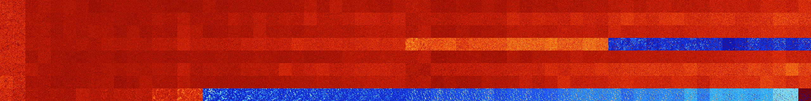

# B03457 (94720-95231)

<details>
    <summary>Initial Grid</summary>
    
</details>


<details>
    <summary>Initial Grid RLE</summary>

```
#C Exported from GoGoL (https://github.com/marrow16/gogol)
#C Wrap mode: Toroidal
#C Boundary mode: Dead
#C Step: 0
x = 100, y = 100, rule = B03457/S
9bo62bo8bo6bo$9bo20bo22bo8bo7bo8bo$3bo21bo8bo8bo11bo10bo5bo9bo5b2o4bo$
32bo15bo7bo$3bo19b2o17bo$14bo3bo15bo23bo2bo6bo$3bo11bo22bo11bo$3bo2bo
43bo5bo11bo27bo$67bo7bobo11bo$49bo$bo19bo2bo9bo39bo3bo$27bo21bo6bo$20bo
$6bo60bo4bo7bo7b2o$8bo53bo2bo4bo9bo9bo$11bo9bo51bo11bo$76bo6bo$27bo35bo
2bo6bo$13bo2bo41bo26bo6bo$11bo16bo14bo9bobo10bobo3bo$19bo3bo15bo19bo16b
o13bo5bo$26bobo$49b3o21bo18bo$7bo17bobo9b2o13bo7bo25b2o$3bo2bo32bo7bo6b
obo6bo13bo12bo2bo$35bo7bo3bo8bo9bo$11bo45bo22bo8bo4bo$66bobo14bo4bo6b2o
$18b2o29bo7bo31bo$55b2o13bo3bo21bo$33bo41bo17b2o$15bo7bo19bo9bo4bo8bo4b
o$19bo5bo18bo5bo23bo$27bo66bo$42bo56bo$4bo19bo2bo28bo3bo10bo19bo$19bo8b
2o34bo4bo$5bobo15bo16bo25b2o$8bo17bo23bo19bo6bo18bo$bo13bo26bo22bo13bo
3bo9bo4bo$4bo19bo16bo13bo$25bo2bo44bo6bo3bo$3bo43bo22b2o2bo3bo12bo$40b
2o2bo19bo12bo$7bo27bo4bo2bo10bo2bo7bo7bo19bo$12bo9bo19bo40bo9bo$32bo13b
3o18bo7b2o$18bo6bo17bo10bo31bobo$24bo27bo5bo20bo9bo$9bo14bo$2bo10bo8bo
5bo28bo27bo$15bo36bo23bo3bo$37bo9bo46bo2bo$4bo17bo5bo17bo18bo8bo21bo$5b
ob2o24bo14bo10bo28bo$3bo17bo30bo27bo$30bo20bo2bo$8bo63bo12bo$9bo36bo2bo
12bobo$39bo9bo6bo24bo$5bo4bo8bo12bo14bo40bo$31bo24bo7bo15bo3bo3bo4bo$
31bo36bo$8bo42bo4bo15bo$8bo9bo7bo4bo$14bo14bobobo11bo11bo32bo$31bo21bo
3bo32bo$6bo6bo17bo14bo4bo10bo14bo4bo4bo8b2obo$45bo14bo22b2o3bobo3bo$40b
o5bo5bo16bo7bo14b2o$21b2o24bo6bo10bo4bo11bo$31bo22bo20bo$2bo31bo18bo5bo
25bobo2bo$38b2o16bo14bo9b2o$2bobo25bo17bo4bo14bo$100b$10bo22bo3bo27bo
21bo$4bo9bo30bo12bobo9bo$23bo7bo8bo13bo20bo$b3o38bo49bo$36bo24b2o11b2o$
51bo2bo3bo10bo10bo15bobo$3bo3bo36bo14bo26bobobo$6bo9bo13bo19bo2b2o6bo
13bo12bo3bo$58b2o5bo10bo$25bo26bo7bo7bo13bo12bo$9bo32bo38bo$8b2o60bo12b
o14bo$56bo21bo$o6bo7bo3b2o14bo2bo36bo$14bo4bo5bo5bo22bobo36bo$21bo13b2o
9bo3bo13bo$9bo11bo14bo14bo$12bo6bo11bo10bo5b2o9bo3bo23bo$42bo16bo$14bo
79bo$21bo2bobobo3bo36bo$36bo13bo38bo5bobo$3bo9bo6b2o53bo16bobo2bo$17bo
11bo12bo7bobo29bo3bo!
```
</details>
<details>
    <summary>Thumbnail</summary>

</details>
<table>
<tr>
    <td><a href="./94720%20S%20Heat%20Map%20Activity.png"></a><br>S (94720)<br>G>1000</td>    <td><a href="./94721%20S0%20Heat%20Map%20Activity.png"></a><br>S0 (94721)<br>G>1000</td>    <td><a href="./94722%20S1%20Heat%20Map%20Activity.png"></a><br>S1 (94722)<br>G>1000</td>    <td><a href="./94723%20S01%20Heat%20Map%20Activity.png"></a><br>S01 (94723)<br>G>1000</td>    <td><a href="./94724%20S2%20Heat%20Map%20Activity.png"></a><br>S2 (94724)<br>G>1000</td>    <td><a href="./94725%20S02%20Heat%20Map%20Activity.png"></a><br>S02 (94725)<br>G>1000</td>    <td><a href="./94726%20S12%20Heat%20Map%20Activity.png"></a><br>S12 (94726)<br>G>1000</td>    <td><a href="./94727%20S012%20Heat%20Map%20Activity.png"></a><br>S012 (94727)<br>G>1000</td>    <td><a href="./94728%20S3%20Heat%20Map%20Activity.png"></a><br>S3 (94728)<br>G>1000</td>    <td><a href="./94729%20S03%20Heat%20Map%20Activity.png"></a><br>S03 (94729)<br>G>1000</td>    <td><a href="./94730%20S13%20Heat%20Map%20Activity.png"></a><br>S13 (94730)<br>G>1000</td>    <td><a href="./94731%20S013%20Heat%20Map%20Activity.png"></a><br>S013 (94731)<br>G>1000</td>    <td><a href="./94732%20S23%20Heat%20Map%20Activity.png"></a><br>S23 (94732)<br>G>1000</td>    <td><a href="./94733%20S023%20Heat%20Map%20Activity.png"></a><br>S023 (94733)<br>G>1000</td>    <td><a href="./94734%20S123%20Heat%20Map%20Activity.png"></a><br>S123 (94734)<br>G>1000</td>    <td><a href="./94735%20S0123%20Heat%20Map%20Activity.png"></a><br>S0123 (94735)<br>G>1000</td>    <td><a href="./94736%20S4%20Heat%20Map%20Activity.png"></a><br>S4 (94736)<br>G>1000</td>    <td><a href="./94737%20S04%20Heat%20Map%20Activity.png"></a><br>S04 (94737)<br>G>1000</td>    <td><a href="./94738%20S14%20Heat%20Map%20Activity.png"></a><br>S14 (94738)<br>G>1000</td>    <td><a href="./94739%20S014%20Heat%20Map%20Activity.png"></a><br>S014 (94739)<br>G>1000</td>    <td><a href="./94740%20S24%20Heat%20Map%20Activity.png"></a><br>S24 (94740)<br>G>1000</td>    <td><a href="./94741%20S024%20Heat%20Map%20Activity.png"></a><br>S024 (94741)<br>G>1000</td>    <td><a href="./94742%20S124%20Heat%20Map%20Activity.png"></a><br>S124 (94742)<br>G>1000</td>    <td><a href="./94743%20S0124%20Heat%20Map%20Activity.png"></a><br>S0124 (94743)<br>G>1000</td>    <td><a href="./94744%20S34%20Heat%20Map%20Activity.png"></a><br>S34 (94744)<br>G>1000</td>    <td><a href="./94745%20S034%20Heat%20Map%20Activity.png"></a><br>S034 (94745)<br>G>1000</td>    <td><a href="./94746%20S134%20Heat%20Map%20Activity.png"></a><br>S134 (94746)<br>G>1000</td>    <td><a href="./94747%20S0134%20Heat%20Map%20Activity.png"></a><br>S0134 (94747)<br>G>1000</td>    <td><a href="./94748%20S234%20Heat%20Map%20Activity.png"></a><br>S234 (94748)<br>G>1000</td>    <td><a href="./94749%20S0234%20Heat%20Map%20Activity.png"></a><br>S0234 (94749)<br>G>1000</td>    <td><a href="./94750%20S1234%20Heat%20Map%20Activity.png"></a><br>S1234 (94750)<br>G>1000</td>    <td><a href="./94751%20S01234%20Heat%20Map%20Activity.png"></a><br>S01234 (94751)<br>G>1000</td>    <td><a href="./94752%20S5%20Heat%20Map%20Activity.png"></a><br>S5 (94752)<br>G>1000</td>    <td><a href="./94753%20S05%20Heat%20Map%20Activity.png"></a><br>S05 (94753)<br>G>1000</td>    <td><a href="./94754%20S15%20Heat%20Map%20Activity.png"></a><br>S15 (94754)<br>G>1000</td>    <td><a href="./94755%20S015%20Heat%20Map%20Activity.png"></a><br>S015 (94755)<br>G>1000</td>    <td><a href="./94756%20S25%20Heat%20Map%20Activity.png"></a><br>S25 (94756)<br>G>1000</td>    <td><a href="./94757%20S025%20Heat%20Map%20Activity.png"></a><br>S025 (94757)<br>G>1000</td>    <td><a href="./94758%20S125%20Heat%20Map%20Activity.png"></a><br>S125 (94758)<br>G>1000</td>    <td><a href="./94759%20S0125%20Heat%20Map%20Activity.png"></a><br>S0125 (94759)<br>G>1000</td>    <td><a href="./94760%20S35%20Heat%20Map%20Activity.png"></a><br>S35 (94760)<br>G>1000</td>    <td><a href="./94761%20S035%20Heat%20Map%20Activity.png"></a><br>S035 (94761)<br>G>1000</td>    <td><a href="./94762%20S135%20Heat%20Map%20Activity.png"></a><br>S135 (94762)<br>G>1000</td>    <td><a href="./94763%20S0135%20Heat%20Map%20Activity.png"></a><br>S0135 (94763)<br>G>1000</td>    <td><a href="./94764%20S235%20Heat%20Map%20Activity.png"></a><br>S235 (94764)<br>G>1000</td>    <td><a href="./94765%20S0235%20Heat%20Map%20Activity.png"></a><br>S0235 (94765)<br>G>1000</td>    <td><a href="./94766%20S1235%20Heat%20Map%20Activity.png"></a><br>S1235 (94766)<br>G>1000</td>    <td><a href="./94767%20S01235%20Heat%20Map%20Activity.png"></a><br>S01235 (94767)<br>G>1000</td>    <td><a href="./94768%20S45%20Heat%20Map%20Activity.png"></a><br>S45 (94768)<br>G>1000</td>    <td><a href="./94769%20S045%20Heat%20Map%20Activity.png"></a><br>S045 (94769)<br>G>1000</td>    <td><a href="./94770%20S145%20Heat%20Map%20Activity.png"></a><br>S145 (94770)<br>G>1000</td>    <td><a href="./94771%20S0145%20Heat%20Map%20Activity.png"></a><br>S0145 (94771)<br>G>1000</td>    <td><a href="./94772%20S245%20Heat%20Map%20Activity.png"></a><br>S245 (94772)<br>G>1000</td>    <td><a href="./94773%20S0245%20Heat%20Map%20Activity.png"></a><br>S0245 (94773)<br>G>1000</td>    <td><a href="./94774%20S1245%20Heat%20Map%20Activity.png"></a><br>S1245 (94774)<br>G>1000</td>    <td><a href="./94775%20S01245%20Heat%20Map%20Activity.png"></a><br>S01245 (94775)<br>G>1000</td>    <td><a href="./94776%20S345%20Heat%20Map%20Activity.png"></a><br>S345 (94776)<br>G>1000</td>    <td><a href="./94777%20S0345%20Heat%20Map%20Activity.png"></a><br>S0345 (94777)<br>G>1000</td>    <td><a href="./94778%20S1345%20Heat%20Map%20Activity.png"></a><br>S1345 (94778)<br>G>1000</td>    <td><a href="./94779%20S01345%20Heat%20Map%20Activity.png"></a><br>S01345 (94779)<br>G>1000</td>    <td><a href="./94780%20S2345%20Heat%20Map%20Activity.png"></a><br>S2345 (94780)<br>G>1000</td>    <td><a href="./94781%20S02345%20Heat%20Map%20Activity.png"></a><br>S02345 (94781)<br>G>1000</td>    <td><a href="./94782%20S12345%20Heat%20Map%20Activity.png"></a><br>S12345 (94782)<br>G>1000</td>    <td><a href="./94783%20S012345%20Heat%20Map%20Activity.png"></a><br>S012345 (94783)<br>G>1000</td></tr>
<tr>
    <td><a href="./94784%20S6%20Heat%20Map%20Activity.png"></a><br>S6 (94784)<br>G>1000</td>    <td><a href="./94785%20S06%20Heat%20Map%20Activity.png"></a><br>S06 (94785)<br>G>1000</td>    <td><a href="./94786%20S16%20Heat%20Map%20Activity.png"></a><br>S16 (94786)<br>G>1000</td>    <td><a href="./94787%20S016%20Heat%20Map%20Activity.png"></a><br>S016 (94787)<br>G>1000</td>    <td><a href="./94788%20S26%20Heat%20Map%20Activity.png"></a><br>S26 (94788)<br>G>1000</td>    <td><a href="./94789%20S026%20Heat%20Map%20Activity.png"></a><br>S026 (94789)<br>G>1000</td>    <td><a href="./94790%20S126%20Heat%20Map%20Activity.png"></a><br>S126 (94790)<br>G>1000</td>    <td><a href="./94791%20S0126%20Heat%20Map%20Activity.png"></a><br>S0126 (94791)<br>G>1000</td>    <td><a href="./94792%20S36%20Heat%20Map%20Activity.png"></a><br>S36 (94792)<br>G>1000</td>    <td><a href="./94793%20S036%20Heat%20Map%20Activity.png"></a><br>S036 (94793)<br>G>1000</td>    <td><a href="./94794%20S136%20Heat%20Map%20Activity.png"></a><br>S136 (94794)<br>G>1000</td>    <td><a href="./94795%20S0136%20Heat%20Map%20Activity.png"></a><br>S0136 (94795)<br>G>1000</td>    <td><a href="./94796%20S236%20Heat%20Map%20Activity.png"></a><br>S236 (94796)<br>G>1000</td>    <td><a href="./94797%20S0236%20Heat%20Map%20Activity.png"></a><br>S0236 (94797)<br>G>1000</td>    <td><a href="./94798%20S1236%20Heat%20Map%20Activity.png"></a><br>S1236 (94798)<br>G>1000</td>    <td><a href="./94799%20S01236%20Heat%20Map%20Activity.png"></a><br>S01236 (94799)<br>G>1000</td>    <td><a href="./94800%20S46%20Heat%20Map%20Activity.png"></a><br>S46 (94800)<br>G>1000</td>    <td><a href="./94801%20S046%20Heat%20Map%20Activity.png"></a><br>S046 (94801)<br>G>1000</td>    <td><a href="./94802%20S146%20Heat%20Map%20Activity.png"></a><br>S146 (94802)<br>G>1000</td>    <td><a href="./94803%20S0146%20Heat%20Map%20Activity.png"></a><br>S0146 (94803)<br>G>1000</td>    <td><a href="./94804%20S246%20Heat%20Map%20Activity.png"></a><br>S246 (94804)<br>G>1000</td>    <td><a href="./94805%20S0246%20Heat%20Map%20Activity.png"></a><br>S0246 (94805)<br>G>1000</td>    <td><a href="./94806%20S1246%20Heat%20Map%20Activity.png"></a><br>S1246 (94806)<br>G>1000</td>    <td><a href="./94807%20S01246%20Heat%20Map%20Activity.png"></a><br>S01246 (94807)<br>G>1000</td>    <td><a href="./94808%20S346%20Heat%20Map%20Activity.png"></a><br>S346 (94808)<br>G>1000</td>    <td><a href="./94809%20S0346%20Heat%20Map%20Activity.png"></a><br>S0346 (94809)<br>G>1000</td>    <td><a href="./94810%20S1346%20Heat%20Map%20Activity.png"></a><br>S1346 (94810)<br>G>1000</td>    <td><a href="./94811%20S01346%20Heat%20Map%20Activity.png"></a><br>S01346 (94811)<br>G>1000</td>    <td><a href="./94812%20S2346%20Heat%20Map%20Activity.png"></a><br>S2346 (94812)<br>G>1000</td>    <td><a href="./94813%20S02346%20Heat%20Map%20Activity.png"></a><br>S02346 (94813)<br>G>1000</td>    <td><a href="./94814%20S12346%20Heat%20Map%20Activity.png"></a><br>S12346 (94814)<br>G>1000</td>    <td><a href="./94815%20S012346%20Heat%20Map%20Activity.png"></a><br>S012346 (94815)<br>G>1000</td>    <td><a href="./94816%20S56%20Heat%20Map%20Activity.png"></a><br>S56 (94816)<br>G>1000</td>    <td><a href="./94817%20S056%20Heat%20Map%20Activity.png"></a><br>S056 (94817)<br>G>1000</td>    <td><a href="./94818%20S156%20Heat%20Map%20Activity.png"></a><br>S156 (94818)<br>G>1000</td>    <td><a href="./94819%20S0156%20Heat%20Map%20Activity.png"></a><br>S0156 (94819)<br>G>1000</td>    <td><a href="./94820%20S256%20Heat%20Map%20Activity.png"></a><br>S256 (94820)<br>G>1000</td>    <td><a href="./94821%20S0256%20Heat%20Map%20Activity.png"></a><br>S0256 (94821)<br>G>1000</td>    <td><a href="./94822%20S1256%20Heat%20Map%20Activity.png"></a><br>S1256 (94822)<br>G>1000</td>    <td><a href="./94823%20S01256%20Heat%20Map%20Activity.png"></a><br>S01256 (94823)<br>G>1000</td>    <td><a href="./94824%20S356%20Heat%20Map%20Activity.png"></a><br>S356 (94824)<br>G>1000</td>    <td><a href="./94825%20S0356%20Heat%20Map%20Activity.png"></a><br>S0356 (94825)<br>G>1000</td>    <td><a href="./94826%20S1356%20Heat%20Map%20Activity.png"></a><br>S1356 (94826)<br>G>1000</td>    <td><a href="./94827%20S01356%20Heat%20Map%20Activity.png"></a><br>S01356 (94827)<br>G>1000</td>    <td><a href="./94828%20S2356%20Heat%20Map%20Activity.png"></a><br>S2356 (94828)<br>G>1000</td>    <td><a href="./94829%20S02356%20Heat%20Map%20Activity.png"></a><br>S02356 (94829)<br>G>1000</td>    <td><a href="./94830%20S12356%20Heat%20Map%20Activity.png"></a><br>S12356 (94830)<br>G>1000</td>    <td><a href="./94831%20S012356%20Heat%20Map%20Activity.png"></a><br>S012356 (94831)<br>G>1000</td>    <td><a href="./94832%20S456%20Heat%20Map%20Activity.png"></a><br>S456 (94832)<br>G>1000</td>    <td><a href="./94833%20S0456%20Heat%20Map%20Activity.png"></a><br>S0456 (94833)<br>G>1000</td>    <td><a href="./94834%20S1456%20Heat%20Map%20Activity.png"></a><br>S1456 (94834)<br>G>1000</td>    <td><a href="./94835%20S01456%20Heat%20Map%20Activity.png"></a><br>S01456 (94835)<br>G>1000</td>    <td><a href="./94836%20S2456%20Heat%20Map%20Activity.png"></a><br>S2456 (94836)<br>G>1000</td>    <td><a href="./94837%20S02456%20Heat%20Map%20Activity.png"></a><br>S02456 (94837)<br>G>1000</td>    <td><a href="./94838%20S12456%20Heat%20Map%20Activity.png"></a><br>S12456 (94838)<br>G>1000</td>    <td><a href="./94839%20S012456%20Heat%20Map%20Activity.png"></a><br>S012456 (94839)<br>G>1000</td>    <td><a href="./94840%20S3456%20Heat%20Map%20Activity.png"></a><br>S3456 (94840)<br>G>1000</td>    <td><a href="./94841%20S03456%20Heat%20Map%20Activity.png"></a><br>S03456 (94841)<br>G>1000</td>    <td><a href="./94842%20S13456%20Heat%20Map%20Activity.png"></a><br>S13456 (94842)<br>G>1000</td>    <td><a href="./94843%20S013456%20Heat%20Map%20Activity.png"></a><br>S013456 (94843)<br>G>1000</td>    <td><a href="./94844%20S23456%20Heat%20Map%20Activity.png"></a><br>S23456 (94844)<br>G>1000</td>    <td><a href="./94845%20S023456%20Heat%20Map%20Activity.png"></a><br>S023456 (94845)<br>G>1000</td>    <td><a href="./94846%20S123456%20Heat%20Map%20Activity.png"></a><br>S123456 (94846)<br>G>1000</td>    <td><a href="./94847%20S0123456%20Heat%20Map%20Activity.png"></a><br>S0123456 (94847)<br>G>1000</td></tr>
<tr>
    <td><a href="./94848%20S7%20Heat%20Map%20Activity.png"></a><br>S7 (94848)<br>G>1000</td>    <td><a href="./94849%20S07%20Heat%20Map%20Activity.png"></a><br>S07 (94849)<br>G>1000</td>    <td><a href="./94850%20S17%20Heat%20Map%20Activity.png"></a><br>S17 (94850)<br>G>1000</td>    <td><a href="./94851%20S017%20Heat%20Map%20Activity.png"></a><br>S017 (94851)<br>G>1000</td>    <td><a href="./94852%20S27%20Heat%20Map%20Activity.png"></a><br>S27 (94852)<br>G>1000</td>    <td><a href="./94853%20S027%20Heat%20Map%20Activity.png"></a><br>S027 (94853)<br>G>1000</td>    <td><a href="./94854%20S127%20Heat%20Map%20Activity.png"></a><br>S127 (94854)<br>G>1000</td>    <td><a href="./94855%20S0127%20Heat%20Map%20Activity.png"></a><br>S0127 (94855)<br>G>1000</td>    <td><a href="./94856%20S37%20Heat%20Map%20Activity.png"></a><br>S37 (94856)<br>G>1000</td>    <td><a href="./94857%20S037%20Heat%20Map%20Activity.png"></a><br>S037 (94857)<br>G>1000</td>    <td><a href="./94858%20S137%20Heat%20Map%20Activity.png"></a><br>S137 (94858)<br>G>1000</td>    <td><a href="./94859%20S0137%20Heat%20Map%20Activity.png"></a><br>S0137 (94859)<br>G>1000</td>    <td><a href="./94860%20S237%20Heat%20Map%20Activity.png"></a><br>S237 (94860)<br>G>1000</td>    <td><a href="./94861%20S0237%20Heat%20Map%20Activity.png"></a><br>S0237 (94861)<br>G>1000</td>    <td><a href="./94862%20S1237%20Heat%20Map%20Activity.png"></a><br>S1237 (94862)<br>G>1000</td>    <td><a href="./94863%20S01237%20Heat%20Map%20Activity.png"></a><br>S01237 (94863)<br>G>1000</td>    <td><a href="./94864%20S47%20Heat%20Map%20Activity.png"></a><br>S47 (94864)<br>G>1000</td>    <td><a href="./94865%20S047%20Heat%20Map%20Activity.png"></a><br>S047 (94865)<br>G>1000</td>    <td><a href="./94866%20S147%20Heat%20Map%20Activity.png"></a><br>S147 (94866)<br>G>1000</td>    <td><a href="./94867%20S0147%20Heat%20Map%20Activity.png"></a><br>S0147 (94867)<br>G>1000</td>    <td><a href="./94868%20S247%20Heat%20Map%20Activity.png"></a><br>S247 (94868)<br>G>1000</td>    <td><a href="./94869%20S0247%20Heat%20Map%20Activity.png"></a><br>S0247 (94869)<br>G>1000</td>    <td><a href="./94870%20S1247%20Heat%20Map%20Activity.png"></a><br>S1247 (94870)<br>G>1000</td>    <td><a href="./94871%20S01247%20Heat%20Map%20Activity.png"></a><br>S01247 (94871)<br>G>1000</td>    <td><a href="./94872%20S347%20Heat%20Map%20Activity.png"></a><br>S347 (94872)<br>G>1000</td>    <td><a href="./94873%20S0347%20Heat%20Map%20Activity.png"></a><br>S0347 (94873)<br>G>1000</td>    <td><a href="./94874%20S1347%20Heat%20Map%20Activity.png"></a><br>S1347 (94874)<br>G>1000</td>    <td><a href="./94875%20S01347%20Heat%20Map%20Activity.png"></a><br>S01347 (94875)<br>G>1000</td>    <td><a href="./94876%20S2347%20Heat%20Map%20Activity.png"></a><br>S2347 (94876)<br>G>1000</td>    <td><a href="./94877%20S02347%20Heat%20Map%20Activity.png"></a><br>S02347 (94877)<br>G>1000</td>    <td><a href="./94878%20S12347%20Heat%20Map%20Activity.png"></a><br>S12347 (94878)<br>G>1000</td>    <td><a href="./94879%20S012347%20Heat%20Map%20Activity.png"></a><br>S012347 (94879)<br>G>1000</td>    <td><a href="./94880%20S57%20Heat%20Map%20Activity.png"></a><br>S57 (94880)<br>G>1000</td>    <td><a href="./94881%20S057%20Heat%20Map%20Activity.png"></a><br>S057 (94881)<br>G>1000</td>    <td><a href="./94882%20S157%20Heat%20Map%20Activity.png"></a><br>S157 (94882)<br>G>1000</td>    <td><a href="./94883%20S0157%20Heat%20Map%20Activity.png"></a><br>S0157 (94883)<br>G>1000</td>    <td><a href="./94884%20S257%20Heat%20Map%20Activity.png"></a><br>S257 (94884)<br>G>1000</td>    <td><a href="./94885%20S0257%20Heat%20Map%20Activity.png"></a><br>S0257 (94885)<br>G>1000</td>    <td><a href="./94886%20S1257%20Heat%20Map%20Activity.png"></a><br>S1257 (94886)<br>G>1000</td>    <td><a href="./94887%20S01257%20Heat%20Map%20Activity.png"></a><br>S01257 (94887)<br>G>1000</td>    <td><a href="./94888%20S357%20Heat%20Map%20Activity.png"></a><br>S357 (94888)<br>G>1000</td>    <td><a href="./94889%20S0357%20Heat%20Map%20Activity.png"></a><br>S0357 (94889)<br>G>1000</td>    <td><a href="./94890%20S1357%20Heat%20Map%20Activity.png"></a><br>S1357 (94890)<br>G>1000</td>    <td><a href="./94891%20S01357%20Heat%20Map%20Activity.png"></a><br>S01357 (94891)<br>G>1000</td>    <td><a href="./94892%20S2357%20Heat%20Map%20Activity.png"></a><br>S2357 (94892)<br>G>1000</td>    <td><a href="./94893%20S02357%20Heat%20Map%20Activity.png"></a><br>S02357 (94893)<br>G>1000</td>    <td><a href="./94894%20S12357%20Heat%20Map%20Activity.png"></a><br>S12357 (94894)<br>G>1000</td>    <td><a href="./94895%20S012357%20Heat%20Map%20Activity.png"></a><br>S012357 (94895)<br>G>1000</td>    <td><a href="./94896%20S457%20Heat%20Map%20Activity.png"></a><br>S457 (94896)<br>G>1000</td>    <td><a href="./94897%20S0457%20Heat%20Map%20Activity.png"></a><br>S0457 (94897)<br>G>1000</td>    <td><a href="./94898%20S1457%20Heat%20Map%20Activity.png"></a><br>S1457 (94898)<br>G>1000</td>    <td><a href="./94899%20S01457%20Heat%20Map%20Activity.png"></a><br>S01457 (94899)<br>G>1000</td>    <td><a href="./94900%20S2457%20Heat%20Map%20Activity.png"></a><br>S2457 (94900)<br>G>1000</td>    <td><a href="./94901%20S02457%20Heat%20Map%20Activity.png"></a><br>S02457 (94901)<br>G>1000</td>    <td><a href="./94902%20S12457%20Heat%20Map%20Activity.png"></a><br>S12457 (94902)<br>G>1000</td>    <td><a href="./94903%20S012457%20Heat%20Map%20Activity.png"></a><br>S012457 (94903)<br>G>1000</td>    <td><a href="./94904%20S3457%20Heat%20Map%20Activity.png"></a><br>S3457 (94904)<br>G>1000</td>    <td><a href="./94905%20S03457%20Heat%20Map%20Activity.png"></a><br>S03457 (94905)<br>G>1000</td>    <td><a href="./94906%20S13457%20Heat%20Map%20Activity.png"></a><br>S13457 (94906)<br>G>1000</td>    <td><a href="./94907%20S013457%20Heat%20Map%20Activity.png"></a><br>S013457 (94907)<br>G>1000</td>    <td><a href="./94908%20S23457%20Heat%20Map%20Activity.png"></a><br>S23457 (94908)<br>G>1000</td>    <td><a href="./94909%20S023457%20Heat%20Map%20Activity.png"></a><br>S023457 (94909)<br>G>1000</td>    <td><a href="./94910%20S123457%20Heat%20Map%20Activity.png"></a><br>S123457 (94910)<br>G>1000</td>    <td><a href="./94911%20S0123457%20Heat%20Map%20Activity.png"></a><br>S0123457 (94911)<br>G>1000</td></tr>
<tr>
    <td><a href="./94912%20S67%20Heat%20Map%20Activity.png"></a><br>S67 (94912)<br>G>1000</td>    <td><a href="./94913%20S067%20Heat%20Map%20Activity.png"></a><br>S067 (94913)<br>G>1000</td>    <td><a href="./94914%20S167%20Heat%20Map%20Activity.png"></a><br>S167 (94914)<br>G>1000</td>    <td><a href="./94915%20S0167%20Heat%20Map%20Activity.png"></a><br>S0167 (94915)<br>G>1000</td>    <td><a href="./94916%20S267%20Heat%20Map%20Activity.png"></a><br>S267 (94916)<br>G>1000</td>    <td><a href="./94917%20S0267%20Heat%20Map%20Activity.png"></a><br>S0267 (94917)<br>G>1000</td>    <td><a href="./94918%20S1267%20Heat%20Map%20Activity.png"></a><br>S1267 (94918)<br>G>1000</td>    <td><a href="./94919%20S01267%20Heat%20Map%20Activity.png"></a><br>S01267 (94919)<br>G>1000</td>    <td><a href="./94920%20S367%20Heat%20Map%20Activity.png"></a><br>S367 (94920)<br>G>1000</td>    <td><a href="./94921%20S0367%20Heat%20Map%20Activity.png"></a><br>S0367 (94921)<br>G>1000</td>    <td><a href="./94922%20S1367%20Heat%20Map%20Activity.png"></a><br>S1367 (94922)<br>G>1000</td>    <td><a href="./94923%20S01367%20Heat%20Map%20Activity.png"></a><br>S01367 (94923)<br>G>1000</td>    <td><a href="./94924%20S2367%20Heat%20Map%20Activity.png"></a><br>S2367 (94924)<br>G>1000</td>    <td><a href="./94925%20S02367%20Heat%20Map%20Activity.png"></a><br>S02367 (94925)<br>G>1000</td>    <td><a href="./94926%20S12367%20Heat%20Map%20Activity.png"></a><br>S12367 (94926)<br>G>1000</td>    <td><a href="./94927%20S012367%20Heat%20Map%20Activity.png"></a><br>S012367 (94927)<br>G>1000</td>    <td><a href="./94928%20S467%20Heat%20Map%20Activity.png"></a><br>S467 (94928)<br>G>1000</td>    <td><a href="./94929%20S0467%20Heat%20Map%20Activity.png"></a><br>S0467 (94929)<br>G>1000</td>    <td><a href="./94930%20S1467%20Heat%20Map%20Activity.png"></a><br>S1467 (94930)<br>G>1000</td>    <td><a href="./94931%20S01467%20Heat%20Map%20Activity.png"></a><br>S01467 (94931)<br>G>1000</td>    <td><a href="./94932%20S2467%20Heat%20Map%20Activity.png"></a><br>S2467 (94932)<br>G>1000</td>    <td><a href="./94933%20S02467%20Heat%20Map%20Activity.png"></a><br>S02467 (94933)<br>G>1000</td>    <td><a href="./94934%20S12467%20Heat%20Map%20Activity.png"></a><br>S12467 (94934)<br>G>1000</td>    <td><a href="./94935%20S012467%20Heat%20Map%20Activity.png"></a><br>S012467 (94935)<br>G>1000</td>    <td><a href="./94936%20S3467%20Heat%20Map%20Activity.png"></a><br>S3467 (94936)<br>G>1000</td>    <td><a href="./94937%20S03467%20Heat%20Map%20Activity.png"></a><br>S03467 (94937)<br>G>1000</td>    <td><a href="./94938%20S13467%20Heat%20Map%20Activity.png"></a><br>S13467 (94938)<br>G>1000</td>    <td><a href="./94939%20S013467%20Heat%20Map%20Activity.png"></a><br>S013467 (94939)<br>G>1000</td>    <td><a href="./94940%20S23467%20Heat%20Map%20Activity.png"></a><br>S23467 (94940)<br>G>1000</td>    <td><a href="./94941%20S023467%20Heat%20Map%20Activity.png"></a><br>S023467 (94941)<br>G>1000</td>    <td><a href="./94942%20S123467%20Heat%20Map%20Activity.png"></a><br>S123467 (94942)<br>G>1000</td>    <td><a href="./94943%20S0123467%20Heat%20Map%20Activity.png"></a><br>S0123467 (94943)<br>G>1000</td>    <td><a href="./94944%20S567%20Heat%20Map%20Activity.png"></a><br>S567 (94944)<br>G>1000</td>    <td><a href="./94945%20S0567%20Heat%20Map%20Activity.png"></a><br>S0567 (94945)<br>G>1000</td>    <td><a href="./94946%20S1567%20Heat%20Map%20Activity.png"></a><br>S1567 (94946)<br>G>1000</td>    <td><a href="./94947%20S01567%20Heat%20Map%20Activity.png"></a><br>S01567 (94947)<br>G>1000</td>    <td><a href="./94948%20S2567%20Heat%20Map%20Activity.png"></a><br>S2567 (94948)<br>G>1000</td>    <td><a href="./94949%20S02567%20Heat%20Map%20Activity.png"></a><br>S02567 (94949)<br>G>1000</td>    <td><a href="./94950%20S12567%20Heat%20Map%20Activity.png"></a><br>S12567 (94950)<br>G>1000</td>    <td><a href="./94951%20S012567%20Heat%20Map%20Activity.png"></a><br>S012567 (94951)<br>G>1000</td>    <td><a href="./94952%20S3567%20Heat%20Map%20Activity.png"></a><br>S3567 (94952)<br>G>1000</td>    <td><a href="./94953%20S03567%20Heat%20Map%20Activity.png"></a><br>S03567 (94953)<br>G>1000</td>    <td><a href="./94954%20S13567%20Heat%20Map%20Activity.png"></a><br>S13567 (94954)<br>G>1000</td>    <td><a href="./94955%20S013567%20Heat%20Map%20Activity.png"></a><br>S013567 (94955)<br>G>1000</td>    <td><a href="./94956%20S23567%20Heat%20Map%20Activity.png"></a><br>S23567 (94956)<br>G>1000</td>    <td><a href="./94957%20S023567%20Heat%20Map%20Activity.png"></a><br>S023567 (94957)<br>G>1000</td>    <td><a href="./94958%20S123567%20Heat%20Map%20Activity.png"></a><br>S123567 (94958)<br>G>1000</td>    <td><a href="./94959%20S0123567%20Heat%20Map%20Activity.png"></a><br>S0123567 (94959)<br>G>1000</td>    <td><a href="./94960%20S4567%20Heat%20Map%20Activity.png"></a><br>S4567 (94960)<br>R@220,p12</td>    <td><a href="./94961%20S04567%20Heat%20Map%20Activity.png"></a><br>S04567 (94961)<br>R@185,p24</td>    <td><a href="./94962%20S14567%20Heat%20Map%20Activity.png"></a><br>S14567 (94962)<br>R@183,p12</td>    <td><a href="./94963%20S014567%20Heat%20Map%20Activity.png"></a><br>S014567 (94963)<br>R@362,p12</td>    <td><a href="./94964%20S24567%20Heat%20Map%20Activity.png"></a><br>S24567 (94964)<br>R@125,p12</td>    <td><a href="./94965%20S024567%20Heat%20Map%20Activity.png"></a><br>S024567 (94965)<br>R@115,p12</td>    <td><a href="./94966%20S124567%20Heat%20Map%20Activity.png"></a><br>S124567 (94966)<br>R@106,p12</td>    <td><a href="./94967%20S0124567%20Heat%20Map%20Activity.png"></a><br>S0124567 (94967)<br>R@122,p12</td>    <td><a href="./94968%20S34567%20Heat%20Map%20Activity.png"></a><br>S34567 (94968)<br>R@75,p42</td>    <td><a href="./94969%20S034567%20Heat%20Map%20Activity.png"></a><br>S034567 (94969)<br>G>1000</td>    <td><a href="./94970%20S134567%20Heat%20Map%20Activity.png"></a><br>S134567 (94970)<br>R@160,p126</td>    <td><a href="./94971%20S0134567%20Heat%20Map%20Activity.png"></a><br>S0134567 (94971)<br>R@44,p12</td>    <td><a href="./94972%20S234567%20Heat%20Map%20Activity.png"></a><br>S234567 (94972)<br>R@64,p42</td>    <td><a href="./94973%20S0234567%20Heat%20Map%20Activity.png"></a><br>S0234567 (94973)<br>R@28,p6</td>    <td><a href="./94974%20S1234567%20Heat%20Map%20Activity.png"></a><br>S1234567 (94974)<br>R@78,p60</td>    <td><a href="./94975%20S01234567%20Heat%20Map%20Activity.png"></a><br>S01234567 (94975)<br>R@31,p12</td></tr>
<tr>
    <td><a href="./94976%20S8%20Heat%20Map%20Activity.png"></a><br>S8 (94976)<br>G>1000</td>    <td><a href="./94977%20S08%20Heat%20Map%20Activity.png"></a><br>S08 (94977)<br>G>1000</td>    <td><a href="./94978%20S18%20Heat%20Map%20Activity.png"></a><br>S18 (94978)<br>G>1000</td>    <td><a href="./94979%20S018%20Heat%20Map%20Activity.png"></a><br>S018 (94979)<br>G>1000</td>    <td><a href="./94980%20S28%20Heat%20Map%20Activity.png"></a><br>S28 (94980)<br>G>1000</td>    <td><a href="./94981%20S028%20Heat%20Map%20Activity.png"></a><br>S028 (94981)<br>G>1000</td>    <td><a href="./94982%20S128%20Heat%20Map%20Activity.png"></a><br>S128 (94982)<br>G>1000</td>    <td><a href="./94983%20S0128%20Heat%20Map%20Activity.png"></a><br>S0128 (94983)<br>G>1000</td>    <td><a href="./94984%20S38%20Heat%20Map%20Activity.png"></a><br>S38 (94984)<br>G>1000</td>    <td><a href="./94985%20S038%20Heat%20Map%20Activity.png"></a><br>S038 (94985)<br>G>1000</td>    <td><a href="./94986%20S138%20Heat%20Map%20Activity.png"></a><br>S138 (94986)<br>G>1000</td>    <td><a href="./94987%20S0138%20Heat%20Map%20Activity.png"></a><br>S0138 (94987)<br>G>1000</td>    <td><a href="./94988%20S238%20Heat%20Map%20Activity.png"></a><br>S238 (94988)<br>G>1000</td>    <td><a href="./94989%20S0238%20Heat%20Map%20Activity.png"></a><br>S0238 (94989)<br>G>1000</td>    <td><a href="./94990%20S1238%20Heat%20Map%20Activity.png"></a><br>S1238 (94990)<br>G>1000</td>    <td><a href="./94991%20S01238%20Heat%20Map%20Activity.png"></a><br>S01238 (94991)<br>G>1000</td>    <td><a href="./94992%20S48%20Heat%20Map%20Activity.png"></a><br>S48 (94992)<br>G>1000</td>    <td><a href="./94993%20S048%20Heat%20Map%20Activity.png"></a><br>S048 (94993)<br>G>1000</td>    <td><a href="./94994%20S148%20Heat%20Map%20Activity.png"></a><br>S148 (94994)<br>G>1000</td>    <td><a href="./94995%20S0148%20Heat%20Map%20Activity.png"></a><br>S0148 (94995)<br>G>1000</td>    <td><a href="./94996%20S248%20Heat%20Map%20Activity.png"></a><br>S248 (94996)<br>G>1000</td>    <td><a href="./94997%20S0248%20Heat%20Map%20Activity.png"></a><br>S0248 (94997)<br>G>1000</td>    <td><a href="./94998%20S1248%20Heat%20Map%20Activity.png"></a><br>S1248 (94998)<br>G>1000</td>    <td><a href="./94999%20S01248%20Heat%20Map%20Activity.png"></a><br>S01248 (94999)<br>G>1000</td>    <td><a href="./95000%20S348%20Heat%20Map%20Activity.png"></a><br>S348 (95000)<br>G>1000</td>    <td><a href="./95001%20S0348%20Heat%20Map%20Activity.png"></a><br>S0348 (95001)<br>G>1000</td>    <td><a href="./95002%20S1348%20Heat%20Map%20Activity.png"></a><br>S1348 (95002)<br>G>1000</td>    <td><a href="./95003%20S01348%20Heat%20Map%20Activity.png"></a><br>S01348 (95003)<br>G>1000</td>    <td><a href="./95004%20S2348%20Heat%20Map%20Activity.png"></a><br>S2348 (95004)<br>G>1000</td>    <td><a href="./95005%20S02348%20Heat%20Map%20Activity.png"></a><br>S02348 (95005)<br>G>1000</td>    <td><a href="./95006%20S12348%20Heat%20Map%20Activity.png"></a><br>S12348 (95006)<br>G>1000</td>    <td><a href="./95007%20S012348%20Heat%20Map%20Activity.png"></a><br>S012348 (95007)<br>G>1000</td>    <td><a href="./95008%20S58%20Heat%20Map%20Activity.png"></a><br>S58 (95008)<br>G>1000</td>    <td><a href="./95009%20S058%20Heat%20Map%20Activity.png"></a><br>S058 (95009)<br>G>1000</td>    <td><a href="./95010%20S158%20Heat%20Map%20Activity.png"></a><br>S158 (95010)<br>G>1000</td>    <td><a href="./95011%20S0158%20Heat%20Map%20Activity.png"></a><br>S0158 (95011)<br>G>1000</td>    <td><a href="./95012%20S258%20Heat%20Map%20Activity.png"></a><br>S258 (95012)<br>G>1000</td>    <td><a href="./95013%20S0258%20Heat%20Map%20Activity.png"></a><br>S0258 (95013)<br>G>1000</td>    <td><a href="./95014%20S1258%20Heat%20Map%20Activity.png"></a><br>S1258 (95014)<br>G>1000</td>    <td><a href="./95015%20S01258%20Heat%20Map%20Activity.png"></a><br>S01258 (95015)<br>G>1000</td>    <td><a href="./95016%20S358%20Heat%20Map%20Activity.png"></a><br>S358 (95016)<br>G>1000</td>    <td><a href="./95017%20S0358%20Heat%20Map%20Activity.png"></a><br>S0358 (95017)<br>G>1000</td>    <td><a href="./95018%20S1358%20Heat%20Map%20Activity.png"></a><br>S1358 (95018)<br>G>1000</td>    <td><a href="./95019%20S01358%20Heat%20Map%20Activity.png"></a><br>S01358 (95019)<br>G>1000</td>    <td><a href="./95020%20S2358%20Heat%20Map%20Activity.png"></a><br>S2358 (95020)<br>G>1000</td>    <td><a href="./95021%20S02358%20Heat%20Map%20Activity.png"></a><br>S02358 (95021)<br>G>1000</td>    <td><a href="./95022%20S12358%20Heat%20Map%20Activity.png"></a><br>S12358 (95022)<br>G>1000</td>    <td><a href="./95023%20S012358%20Heat%20Map%20Activity.png"></a><br>S012358 (95023)<br>G>1000</td>    <td><a href="./95024%20S458%20Heat%20Map%20Activity.png"></a><br>S458 (95024)<br>G>1000</td>    <td><a href="./95025%20S0458%20Heat%20Map%20Activity.png"></a><br>S0458 (95025)<br>G>1000</td>    <td><a href="./95026%20S1458%20Heat%20Map%20Activity.png"></a><br>S1458 (95026)<br>G>1000</td>    <td><a href="./95027%20S01458%20Heat%20Map%20Activity.png"></a><br>S01458 (95027)<br>G>1000</td>    <td><a href="./95028%20S2458%20Heat%20Map%20Activity.png"></a><br>S2458 (95028)<br>G>1000</td>    <td><a href="./95029%20S02458%20Heat%20Map%20Activity.png"></a><br>S02458 (95029)<br>G>1000</td>    <td><a href="./95030%20S12458%20Heat%20Map%20Activity.png"></a><br>S12458 (95030)<br>G>1000</td>    <td><a href="./95031%20S012458%20Heat%20Map%20Activity.png"></a><br>S012458 (95031)<br>G>1000</td>    <td><a href="./95032%20S3458%20Heat%20Map%20Activity.png"></a><br>S3458 (95032)<br>G>1000</td>    <td><a href="./95033%20S03458%20Heat%20Map%20Activity.png"></a><br>S03458 (95033)<br>G>1000</td>    <td><a href="./95034%20S13458%20Heat%20Map%20Activity.png"></a><br>S13458 (95034)<br>G>1000</td>    <td><a href="./95035%20S013458%20Heat%20Map%20Activity.png"></a><br>S013458 (95035)<br>G>1000</td>    <td><a href="./95036%20S23458%20Heat%20Map%20Activity.png"></a><br>S23458 (95036)<br>G>1000</td>    <td><a href="./95037%20S023458%20Heat%20Map%20Activity.png"></a><br>S023458 (95037)<br>G>1000</td>    <td><a href="./95038%20S123458%20Heat%20Map%20Activity.png"></a><br>S123458 (95038)<br>G>1000</td>    <td><a href="./95039%20S0123458%20Heat%20Map%20Activity.png"></a><br>S0123458 (95039)<br>G>1000</td></tr>
<tr>
    <td><a href="./95040%20S68%20Heat%20Map%20Activity.png"></a><br>S68 (95040)<br>G>1000</td>    <td><a href="./95041%20S068%20Heat%20Map%20Activity.png"></a><br>S068 (95041)<br>G>1000</td>    <td><a href="./95042%20S168%20Heat%20Map%20Activity.png"></a><br>S168 (95042)<br>G>1000</td>    <td><a href="./95043%20S0168%20Heat%20Map%20Activity.png"></a><br>S0168 (95043)<br>G>1000</td>    <td><a href="./95044%20S268%20Heat%20Map%20Activity.png"></a><br>S268 (95044)<br>G>1000</td>    <td><a href="./95045%20S0268%20Heat%20Map%20Activity.png"></a><br>S0268 (95045)<br>G>1000</td>    <td><a href="./95046%20S1268%20Heat%20Map%20Activity.png"></a><br>S1268 (95046)<br>G>1000</td>    <td><a href="./95047%20S01268%20Heat%20Map%20Activity.png"></a><br>S01268 (95047)<br>G>1000</td>    <td><a href="./95048%20S368%20Heat%20Map%20Activity.png"></a><br>S368 (95048)<br>G>1000</td>    <td><a href="./95049%20S0368%20Heat%20Map%20Activity.png"></a><br>S0368 (95049)<br>G>1000</td>    <td><a href="./95050%20S1368%20Heat%20Map%20Activity.png"></a><br>S1368 (95050)<br>G>1000</td>    <td><a href="./95051%20S01368%20Heat%20Map%20Activity.png"></a><br>S01368 (95051)<br>G>1000</td>    <td><a href="./95052%20S2368%20Heat%20Map%20Activity.png"></a><br>S2368 (95052)<br>G>1000</td>    <td><a href="./95053%20S02368%20Heat%20Map%20Activity.png"></a><br>S02368 (95053)<br>G>1000</td>    <td><a href="./95054%20S12368%20Heat%20Map%20Activity.png"></a><br>S12368 (95054)<br>G>1000</td>    <td><a href="./95055%20S012368%20Heat%20Map%20Activity.png"></a><br>S012368 (95055)<br>G>1000</td>    <td><a href="./95056%20S468%20Heat%20Map%20Activity.png"></a><br>S468 (95056)<br>G>1000</td>    <td><a href="./95057%20S0468%20Heat%20Map%20Activity.png"></a><br>S0468 (95057)<br>G>1000</td>    <td><a href="./95058%20S1468%20Heat%20Map%20Activity.png"></a><br>S1468 (95058)<br>G>1000</td>    <td><a href="./95059%20S01468%20Heat%20Map%20Activity.png"></a><br>S01468 (95059)<br>G>1000</td>    <td><a href="./95060%20S2468%20Heat%20Map%20Activity.png"></a><br>S2468 (95060)<br>G>1000</td>    <td><a href="./95061%20S02468%20Heat%20Map%20Activity.png"></a><br>S02468 (95061)<br>G>1000</td>    <td><a href="./95062%20S12468%20Heat%20Map%20Activity.png"></a><br>S12468 (95062)<br>G>1000</td>    <td><a href="./95063%20S012468%20Heat%20Map%20Activity.png"></a><br>S012468 (95063)<br>G>1000</td>    <td><a href="./95064%20S3468%20Heat%20Map%20Activity.png"></a><br>S3468 (95064)<br>G>1000</td>    <td><a href="./95065%20S03468%20Heat%20Map%20Activity.png"></a><br>S03468 (95065)<br>G>1000</td>    <td><a href="./95066%20S13468%20Heat%20Map%20Activity.png"></a><br>S13468 (95066)<br>G>1000</td>    <td><a href="./95067%20S013468%20Heat%20Map%20Activity.png"></a><br>S013468 (95067)<br>G>1000</td>    <td><a href="./95068%20S23468%20Heat%20Map%20Activity.png"></a><br>S23468 (95068)<br>G>1000</td>    <td><a href="./95069%20S023468%20Heat%20Map%20Activity.png"></a><br>S023468 (95069)<br>G>1000</td>    <td><a href="./95070%20S123468%20Heat%20Map%20Activity.png"></a><br>S123468 (95070)<br>G>1000</td>    <td><a href="./95071%20S0123468%20Heat%20Map%20Activity.png"></a><br>S0123468 (95071)<br>G>1000</td>    <td><a href="./95072%20S568%20Heat%20Map%20Activity.png"></a><br>S568 (95072)<br>G>1000</td>    <td><a href="./95073%20S0568%20Heat%20Map%20Activity.png"></a><br>S0568 (95073)<br>G>1000</td>    <td><a href="./95074%20S1568%20Heat%20Map%20Activity.png"></a><br>S1568 (95074)<br>G>1000</td>    <td><a href="./95075%20S01568%20Heat%20Map%20Activity.png"></a><br>S01568 (95075)<br>G>1000</td>    <td><a href="./95076%20S2568%20Heat%20Map%20Activity.png"></a><br>S2568 (95076)<br>G>1000</td>    <td><a href="./95077%20S02568%20Heat%20Map%20Activity.png"></a><br>S02568 (95077)<br>G>1000</td>    <td><a href="./95078%20S12568%20Heat%20Map%20Activity.png"></a><br>S12568 (95078)<br>G>1000</td>    <td><a href="./95079%20S012568%20Heat%20Map%20Activity.png"></a><br>S012568 (95079)<br>G>1000</td>    <td><a href="./95080%20S3568%20Heat%20Map%20Activity.png"></a><br>S3568 (95080)<br>G>1000</td>    <td><a href="./95081%20S03568%20Heat%20Map%20Activity.png"></a><br>S03568 (95081)<br>G>1000</td>    <td><a href="./95082%20S13568%20Heat%20Map%20Activity.png"></a><br>S13568 (95082)<br>G>1000</td>    <td><a href="./95083%20S013568%20Heat%20Map%20Activity.png"></a><br>S013568 (95083)<br>G>1000</td>    <td><a href="./95084%20S23568%20Heat%20Map%20Activity.png"></a><br>S23568 (95084)<br>G>1000</td>    <td><a href="./95085%20S023568%20Heat%20Map%20Activity.png"></a><br>S023568 (95085)<br>G>1000</td>    <td><a href="./95086%20S123568%20Heat%20Map%20Activity.png"></a><br>S123568 (95086)<br>G>1000</td>    <td><a href="./95087%20S0123568%20Heat%20Map%20Activity.png"></a><br>S0123568 (95087)<br>G>1000</td>    <td><a href="./95088%20S4568%20Heat%20Map%20Activity.png"></a><br>S4568 (95088)<br>G>1000</td>    <td><a href="./95089%20S04568%20Heat%20Map%20Activity.png"></a><br>S04568 (95089)<br>G>1000</td>    <td><a href="./95090%20S14568%20Heat%20Map%20Activity.png"></a><br>S14568 (95090)<br>G>1000</td>    <td><a href="./95091%20S014568%20Heat%20Map%20Activity.png"></a><br>S014568 (95091)<br>G>1000</td>    <td><a href="./95092%20S24568%20Heat%20Map%20Activity.png"></a><br>S24568 (95092)<br>G>1000</td>    <td><a href="./95093%20S024568%20Heat%20Map%20Activity.png"></a><br>S024568 (95093)<br>G>1000</td>    <td><a href="./95094%20S124568%20Heat%20Map%20Activity.png"></a><br>S124568 (95094)<br>G>1000</td>    <td><a href="./95095%20S0124568%20Heat%20Map%20Activity.png"></a><br>S0124568 (95095)<br>G>1000</td>    <td><a href="./95096%20S34568%20Heat%20Map%20Activity.png"></a><br>S34568 (95096)<br>G>1000</td>    <td><a href="./95097%20S034568%20Heat%20Map%20Activity.png"></a><br>S034568 (95097)<br>G>1000</td>    <td><a href="./95098%20S134568%20Heat%20Map%20Activity.png"></a><br>S134568 (95098)<br>G>1000</td>    <td><a href="./95099%20S0134568%20Heat%20Map%20Activity.png"></a><br>S0134568 (95099)<br>G>1000</td>    <td><a href="./95100%20S234568%20Heat%20Map%20Activity.png"></a><br>S234568 (95100)<br>G>1000</td>    <td><a href="./95101%20S0234568%20Heat%20Map%20Activity.png"></a><br>S0234568 (95101)<br>G>1000</td>    <td><a href="./95102%20S1234568%20Heat%20Map%20Activity.png"></a><br>S1234568 (95102)<br>G>1000</td>    <td><a href="./95103%20S01234568%20Heat%20Map%20Activity.png"></a><br>S01234568 (95103)<br>G>1000</td></tr>
<tr>
    <td><a href="./95104%20S78%20Heat%20Map%20Activity.png"></a><br>S78 (95104)<br>G>1000</td>    <td><a href="./95105%20S078%20Heat%20Map%20Activity.png"></a><br>S078 (95105)<br>G>1000</td>    <td><a href="./95106%20S178%20Heat%20Map%20Activity.png"></a><br>S178 (95106)<br>G>1000</td>    <td><a href="./95107%20S0178%20Heat%20Map%20Activity.png"></a><br>S0178 (95107)<br>G>1000</td>    <td><a href="./95108%20S278%20Heat%20Map%20Activity.png"></a><br>S278 (95108)<br>G>1000</td>    <td><a href="./95109%20S0278%20Heat%20Map%20Activity.png"></a><br>S0278 (95109)<br>G>1000</td>    <td><a href="./95110%20S1278%20Heat%20Map%20Activity.png"></a><br>S1278 (95110)<br>G>1000</td>    <td><a href="./95111%20S01278%20Heat%20Map%20Activity.png"></a><br>S01278 (95111)<br>G>1000</td>    <td><a href="./95112%20S378%20Heat%20Map%20Activity.png"></a><br>S378 (95112)<br>G>1000</td>    <td><a href="./95113%20S0378%20Heat%20Map%20Activity.png"></a><br>S0378 (95113)<br>G>1000</td>    <td><a href="./95114%20S1378%20Heat%20Map%20Activity.png"></a><br>S1378 (95114)<br>G>1000</td>    <td><a href="./95115%20S01378%20Heat%20Map%20Activity.png"></a><br>S01378 (95115)<br>G>1000</td>    <td><a href="./95116%20S2378%20Heat%20Map%20Activity.png"></a><br>S2378 (95116)<br>G>1000</td>    <td><a href="./95117%20S02378%20Heat%20Map%20Activity.png"></a><br>S02378 (95117)<br>G>1000</td>    <td><a href="./95118%20S12378%20Heat%20Map%20Activity.png"></a><br>S12378 (95118)<br>G>1000</td>    <td><a href="./95119%20S012378%20Heat%20Map%20Activity.png"></a><br>S012378 (95119)<br>G>1000</td>    <td><a href="./95120%20S478%20Heat%20Map%20Activity.png"></a><br>S478 (95120)<br>G>1000</td>    <td><a href="./95121%20S0478%20Heat%20Map%20Activity.png"></a><br>S0478 (95121)<br>G>1000</td>    <td><a href="./95122%20S1478%20Heat%20Map%20Activity.png"></a><br>S1478 (95122)<br>G>1000</td>    <td><a href="./95123%20S01478%20Heat%20Map%20Activity.png"></a><br>S01478 (95123)<br>G>1000</td>    <td><a href="./95124%20S2478%20Heat%20Map%20Activity.png"></a><br>S2478 (95124)<br>G>1000</td>    <td><a href="./95125%20S02478%20Heat%20Map%20Activity.png"></a><br>S02478 (95125)<br>G>1000</td>    <td><a href="./95126%20S12478%20Heat%20Map%20Activity.png"></a><br>S12478 (95126)<br>G>1000</td>    <td><a href="./95127%20S012478%20Heat%20Map%20Activity.png"></a><br>S012478 (95127)<br>G>1000</td>    <td><a href="./95128%20S3478%20Heat%20Map%20Activity.png"></a><br>S3478 (95128)<br>G>1000</td>    <td><a href="./95129%20S03478%20Heat%20Map%20Activity.png"></a><br>S03478 (95129)<br>G>1000</td>    <td><a href="./95130%20S13478%20Heat%20Map%20Activity.png"></a><br>S13478 (95130)<br>G>1000</td>    <td><a href="./95131%20S013478%20Heat%20Map%20Activity.png"></a><br>S013478 (95131)<br>G>1000</td>    <td><a href="./95132%20S23478%20Heat%20Map%20Activity.png"></a><br>S23478 (95132)<br>G>1000</td>    <td><a href="./95133%20S023478%20Heat%20Map%20Activity.png"></a><br>S023478 (95133)<br>G>1000</td>    <td><a href="./95134%20S123478%20Heat%20Map%20Activity.png"></a><br>S123478 (95134)<br>G>1000</td>    <td><a href="./95135%20S0123478%20Heat%20Map%20Activity.png"></a><br>S0123478 (95135)<br>G>1000</td>    <td><a href="./95136%20S578%20Heat%20Map%20Activity.png"></a><br>S578 (95136)<br>G>1000</td>    <td><a href="./95137%20S0578%20Heat%20Map%20Activity.png"></a><br>S0578 (95137)<br>G>1000</td>    <td><a href="./95138%20S1578%20Heat%20Map%20Activity.png"></a><br>S1578 (95138)<br>G>1000</td>    <td><a href="./95139%20S01578%20Heat%20Map%20Activity.png"></a><br>S01578 (95139)<br>G>1000</td>    <td><a href="./95140%20S2578%20Heat%20Map%20Activity.png"></a><br>S2578 (95140)<br>G>1000</td>    <td><a href="./95141%20S02578%20Heat%20Map%20Activity.png"></a><br>S02578 (95141)<br>G>1000</td>    <td><a href="./95142%20S12578%20Heat%20Map%20Activity.png"></a><br>S12578 (95142)<br>G>1000</td>    <td><a href="./95143%20S012578%20Heat%20Map%20Activity.png"></a><br>S012578 (95143)<br>G>1000</td>    <td><a href="./95144%20S3578%20Heat%20Map%20Activity.png"></a><br>S3578 (95144)<br>G>1000</td>    <td><a href="./95145%20S03578%20Heat%20Map%20Activity.png"></a><br>S03578 (95145)<br>G>1000</td>    <td><a href="./95146%20S13578%20Heat%20Map%20Activity.png"></a><br>S13578 (95146)<br>G>1000</td>    <td><a href="./95147%20S013578%20Heat%20Map%20Activity.png"></a><br>S013578 (95147)<br>G>1000</td>    <td><a href="./95148%20S23578%20Heat%20Map%20Activity.png"></a><br>S23578 (95148)<br>G>1000</td>    <td><a href="./95149%20S023578%20Heat%20Map%20Activity.png"></a><br>S023578 (95149)<br>G>1000</td>    <td><a href="./95150%20S123578%20Heat%20Map%20Activity.png"></a><br>S123578 (95150)<br>G>1000</td>    <td><a href="./95151%20S0123578%20Heat%20Map%20Activity.png"></a><br>S0123578 (95151)<br>G>1000</td>    <td><a href="./95152%20S4578%20Heat%20Map%20Activity.png"></a><br>S4578 (95152)<br>G>1000</td>    <td><a href="./95153%20S04578%20Heat%20Map%20Activity.png"></a><br>S04578 (95153)<br>G>1000</td>    <td><a href="./95154%20S14578%20Heat%20Map%20Activity.png"></a><br>S14578 (95154)<br>G>1000</td>    <td><a href="./95155%20S014578%20Heat%20Map%20Activity.png"></a><br>S014578 (95155)<br>G>1000</td>    <td><a href="./95156%20S24578%20Heat%20Map%20Activity.png"></a><br>S24578 (95156)<br>G>1000</td>    <td><a href="./95157%20S024578%20Heat%20Map%20Activity.png"></a><br>S024578 (95157)<br>G>1000</td>    <td><a href="./95158%20S124578%20Heat%20Map%20Activity.png"></a><br>S124578 (95158)<br>G>1000</td>    <td><a href="./95159%20S0124578%20Heat%20Map%20Activity.png"></a><br>S0124578 (95159)<br>G>1000</td>    <td><a href="./95160%20S34578%20Heat%20Map%20Activity.png"></a><br>S34578 (95160)<br>G>1000</td>    <td><a href="./95161%20S034578%20Heat%20Map%20Activity.png"></a><br>S034578 (95161)<br>G>1000</td>    <td><a href="./95162%20S134578%20Heat%20Map%20Activity.png"></a><br>S134578 (95162)<br>G>1000</td>    <td><a href="./95163%20S0134578%20Heat%20Map%20Activity.png"></a><br>S0134578 (95163)<br>G>1000</td>    <td><a href="./95164%20S234578%20Heat%20Map%20Activity.png"></a><br>S234578 (95164)<br>G>1000</td>    <td><a href="./95165%20S0234578%20Heat%20Map%20Activity.png"></a><br>S0234578 (95165)<br>G>1000</td>    <td><a href="./95166%20S1234578%20Heat%20Map%20Activity.png"></a><br>S1234578 (95166)<br>G>1000</td>    <td><a href="./95167%20S01234578%20Heat%20Map%20Activity.png"></a><br>S01234578 (95167)<br>G>1000</td></tr>
<tr>
    <td><a href="./95168%20S678%20Heat%20Map%20Activity.png"></a><br>S678 (95168)<br>G>1000</td>    <td><a href="./95169%20S0678%20Heat%20Map%20Activity.png"></a><br>S0678 (95169)<br>G>1000</td>    <td><a href="./95170%20S1678%20Heat%20Map%20Activity.png"></a><br>S1678 (95170)<br>G>1000</td>    <td><a href="./95171%20S01678%20Heat%20Map%20Activity.png"></a><br>S01678 (95171)<br>G>1000</td>    <td><a href="./95172%20S2678%20Heat%20Map%20Activity.png"></a><br>S2678 (95172)<br>G>1000</td>    <td><a href="./95173%20S02678%20Heat%20Map%20Activity.png"></a><br>S02678 (95173)<br>G>1000</td>    <td><a href="./95174%20S12678%20Heat%20Map%20Activity.png"></a><br>S12678 (95174)<br>G>1000</td>    <td><a href="./95175%20S012678%20Heat%20Map%20Activity.png"></a><br>S012678 (95175)<br>G>1000</td>    <td><a href="./95176%20S3678%20Heat%20Map%20Activity.png"></a><br>S3678 (95176)<br>G>1000</td>    <td><a href="./95177%20S03678%20Heat%20Map%20Activity.png"></a><br>S03678 (95177)<br>G>1000</td>    <td><a href="./95178%20S13678%20Heat%20Map%20Activity.png"></a><br>S13678 (95178)<br>G>1000</td>    <td><a href="./95179%20S013678%20Heat%20Map%20Activity.png"></a><br>S013678 (95179)<br>G>1000</td>    <td><a href="./95180%20S23678%20Heat%20Map%20Activity.png"></a><br>S23678 (95180)<br>G>1000</td>    <td><a href="./95181%20S023678%20Heat%20Map%20Activity.png"></a><br>S023678 (95181)<br>G>1000</td>    <td><a href="./95182%20S123678%20Heat%20Map%20Activity.png"></a><br>S123678 (95182)<br>G>1000</td>    <td><a href="./95183%20S0123678%20Heat%20Map%20Activity.png"></a><br>S0123678 (95183)<br>G>1000</td>    <td><a href="./95184%20S4678%20Heat%20Map%20Activity.png"></a><br>S4678 (95184)<br>R@51,p4</td>    <td><a href="./95185%20S04678%20Heat%20Map%20Activity.png"></a><br>S04678 (95185)<br>R@64,p4</td>    <td><a href="./95186%20S14678%20Heat%20Map%20Activity.png"></a><br>S14678 (95186)<br>R@71,p12</td>    <td><a href="./95187%20S014678%20Heat%20Map%20Activity.png"></a><br>S014678 (95187)<br>R@63,p4</td>    <td><a href="./95188%20S24678%20Heat%20Map%20Activity.png"></a><br>S24678 (95188)<br>R@43,p4</td>    <td><a href="./95189%20S024678%20Heat%20Map%20Activity.png"></a><br>S024678 (95189)<br>R@43,p4</td>    <td><a href="./95190%20S124678%20Heat%20Map%20Activity.png"></a><br>S124678 (95190)<br>R@41,p4</td>    <td><a href="./95191%20S0124678%20Heat%20Map%20Activity.png"></a><br>S0124678 (95191)<br>R@41,p4</td>    <td><a href="./95192%20S34678%20Heat%20Map%20Activity.png"></a><br>S34678 (95192)<br>R@28,p2</td>    <td><a href="./95193%20S034678%20Heat%20Map%20Activity.png"></a><br>S034678 (95193)<br>R@30,p2</td>    <td><a href="./95194%20S134678%20Heat%20Map%20Activity.png"></a><br>S134678 (95194)<br>R@26,p2</td>    <td><a href="./95195%20S0134678%20Heat%20Map%20Activity.png"></a><br>S0134678 (95195)<br>R@31,p2</td>    <td><a href="./95196%20S234678%20Heat%20Map%20Activity.png"></a><br>S234678 (95196)<br>R@25,p2</td>    <td><a href="./95197%20S0234678%20Heat%20Map%20Activity.png"></a><br>S0234678 (95197)<br>R@25,p2</td>    <td><a href="./95198%20S1234678%20Heat%20Map%20Activity.png"></a><br>S1234678 (95198)<br>R@27,p2</td>    <td><a href="./95199%20S01234678%20Heat%20Map%20Activity.png"></a><br>S01234678 (95199)<br>R@32,p2</td>    <td><a href="./95200%20S5678%20Heat%20Map%20Activity.png"></a><br>S5678 (95200)<br>R@15,p2</td>    <td><a href="./95201%20S05678%20Heat%20Map%20Activity.png"></a><br>S05678 (95201)<br>S@16</td>    <td><a href="./95202%20S15678%20Heat%20Map%20Activity.png"></a><br>S15678 (95202)<br>S@11</td>    <td><a href="./95203%20S015678%20Heat%20Map%20Activity.png"></a><br>S015678 (95203)<br>S@12</td>    <td><a href="./95204%20S25678%20Heat%20Map%20Activity.png"></a><br>S25678 (95204)<br>R@12,p2</td>    <td><a href="./95205%20S025678%20Heat%20Map%20Activity.png"></a><br>S025678 (95205)<br>S@10</td>    <td><a href="./95206%20S125678%20Heat%20Map%20Activity.png"></a><br>S125678 (95206)<br>S@10</td>    <td><a href="./95207%20S0125678%20Heat%20Map%20Activity.png"></a><br>S0125678 (95207)<br>R@12,p2</td>    <td><a href="./95208%20S35678%20Heat%20Map%20Activity.png"></a><br>S35678 (95208)<br>S@9</td>    <td><a href="./95209%20S035678%20Heat%20Map%20Activity.png"></a><br>S035678 (95209)<br>S@8</td>    <td><a href="./95210%20S135678%20Heat%20Map%20Activity.png"></a><br>S135678 (95210)<br>S@9</td>    <td><a href="./95211%20S0135678%20Heat%20Map%20Activity.png"></a><br>S0135678 (95211)<br>S@8</td>    <td><a href="./95212%20S235678%20Heat%20Map%20Activity.png"></a><br>S235678 (95212)<br>S@8</td>    <td><a href="./95213%20S0235678%20Heat%20Map%20Activity.png"></a><br>S0235678 (95213)<br>S@7</td>    <td><a href="./95214%20S1235678%20Heat%20Map%20Activity.png"></a><br>S1235678 (95214)<br>S@7</td>    <td><a href="./95215%20S01235678%20Heat%20Map%20Activity.png"></a><br>S01235678 (95215)<br>S@7</td>    <td><a href="./95216%20S45678%20Heat%20Map%20Activity.png"></a><br>S45678 (95216)<br>S@6</td>    <td><a href="./95217%20S045678%20Heat%20Map%20Activity.png"></a><br>S045678 (95217)<br>S@7</td>    <td><a href="./95218%20S145678%20Heat%20Map%20Activity.png"></a><br>S145678 (95218)<br>S@7</td>    <td><a href="./95219%20S0145678%20Heat%20Map%20Activity.png"></a><br>S0145678 (95219)<br>S@7</td>    <td><a href="./95220%20S245678%20Heat%20Map%20Activity.png"></a><br>S245678 (95220)<br>S@6</td>    <td><a href="./95221%20S0245678%20Heat%20Map%20Activity.png"></a><br>S0245678 (95221)<br>S@6</td>    <td><a href="./95222%20S1245678%20Heat%20Map%20Activity.png"></a><br>S1245678 (95222)<br>S@6</td>    <td><a href="./95223%20S01245678%20Heat%20Map%20Activity.png"></a><br>S01245678 (95223)<br>S@6</td>    <td><a href="./95224%20S345678%20Heat%20Map%20Activity.png"></a><br>S345678 (95224)<br>S@5</td>    <td><a href="./95225%20S0345678%20Heat%20Map%20Activity.png"></a><br>S0345678 (95225)<br>S@6</td>    <td><a href="./95226%20S1345678%20Heat%20Map%20Activity.png"></a><br>S1345678 (95226)<br>S@5</td>    <td><a href="./95227%20S01345678%20Heat%20Map%20Activity.png"></a><br>S01345678 (95227)<br>S@6</td>    <td><a href="./95228%20S2345678%20Heat%20Map%20Activity.png"></a><br>S2345678 (95228)<br>S@5</td>    <td><a href="./95229%20S02345678%20Heat%20Map%20Activity.png"></a><br>S02345678 (95229)<br>S@5</td>    <td><a href="./95230%20S12345678%20Heat%20Map%20Activity.png"></a><br>S12345678 (95230)<br>S@6</td>    <td><a href="./95231%20S012345678%20Heat%20Map%20Activity.png"></a><br>S012345678 (95231)<br>S@4</td></tr>
</table>
