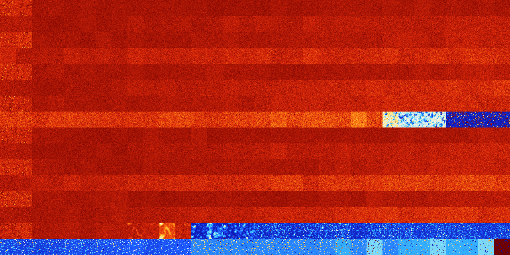

# B034578 (225792-226303)

<details>
    <summary>Initial Grid</summary>
    
</details>


<details>
    <summary>Initial Grid RLE</summary>

```
#C Exported from GoGoL (https://github.com/marrow16/gogol)
#C Wrap mode: Toroidal
#C Boundary mode: Dead
#C Step: 0
x = 100, y = 100, rule = B034578/S
28bo14bo4bo4bo26bo$25bo12bo48bo3bobo5bo$3bo28bo16bo22bo19b2o2bo$21bobo
62bobobo7bo$35bo4bo14bo$6bo22bo59bo4bo$34bo9bo11bo9bobo17b2o$14bo6bo23b
o6bo22bo2bo$4bo13bobo33bo8bo7bobo4bo20bo$7bo71bo$3b2o15bo47bo$35bo40bo
8bo$20bo27b2o27bo$27bo19bo3bo15bo15bo$o34bo10bo21bo$9bo14bo2bo10bo$66bo
16bo$bo10bo3bo5bo25bo4bo5bo18bo$18bo7bobo24bo6bo38bo$5bobo2bo12bobo32bo
16bo5bo$19bo13bo39bo$5bo5bo12b2o22bo5bo18b3o$o11bo9bo17bo51bo$2bo6bob2o
10bo2bo23bo19bo12bo5bo$11bo34bo7bo5bo34bo$10bo51bo32bo$19bo14bo18bo39bo
$26bo3bo36bo$o10bo13bo6b2o5b2o33bo6bo10bo4bo$o6bo7bo61bobo10bo8bo$21bo
23bo30bo$12bo14bo30b2o8bo$29bo21bo18bo15bo6bo$2bo10bo6bo41bo10bo15bo$2o
11bo9bo12bo23bo20bo3bo11bo$11bo3bo4bo16bo19bo26bo$26bo70bo$8bo4bo47bo4b
obo8b2o20bo$o11bo62bo6bo$49bo2bo$21bo11bo34bo4bo16bo$13bo15bo8bo4bo3bo
2bo3bo$22bo32bo30b2o7bo$20bo27bo12bo20bobo$11bo25bo15bo22bo$33bo5bo31bo
8bo16bo$2bo6bo4bo7bo22bo33bo8bo2bo$7bo10bo47bo15bo$2bo35bo11bo8bobo5bo
29bo$21bo15bo4bo4bo37bobo9bo$9b3o25bo46bo3bo$68bo9bo5bo$5bo67bo6bo$12bo
33bo20bobo5bo$45bo4bo19bo$o11bo3bo10bobo41bo4bo17bo$4bo10bo7bo3bo16bo
37bo$11bobo6bo2bo22bo38bo7bo4bo$89bo$10bo14bo37bo5bobo2bo$3bo20bo7bo10b
o9bo2bo19bo$13bo20bo48bo14bo$16bo62bo$47bo21bo6bo$50bo2bo33b2o$13bo74bo
$11bo5bo10bo16bo8bo3bo39bo$7bob2o8bo3bo14bo12b2o$48bo28bo$14bo22bo4bo8b
o32bo8bo$75bo$42bobobo30bo7bo$20bo2b2obobo5bo5bo4bobo44bobo3bo$8bo30bo
3bo11bo18bo6b2o10bo$28bo5bo$2bo43bo34bo15bo$37bo9bo8bo2bo35bo$10bo$4bo
6b2o7bo13bo11bo40bo$15bo5bo25bo11bo5bo10bo22bo$6bo25bo6b2o2bo21bo$2bo6b
obobo34bo14bo2b3o6bo6bo8bo$54bo22bo16bo$53bo6bo7bo5bo8bo$42bo23bo2bo10b
o11bo4bobo$41bo31bo5bo16bo$o8bo5bo21b2o$8bobo3bo33bo11bo34bo$34bo60bo$
21bo33bo9b2o2bo8bo18bo$11bo23bo17bo6bo5bo10bo18bo$18bo17b2o42bo4bo9bo$
2bo43bo$9bo3bo71b2o$8bo19bobo9bo10bo6bo19bo$36bo37bo5bo$3bo18bo46bo12bo
$17b2o14bobo2bo17bo15bo$8bo5bo32bo2bo2bo28bo$30bo19bo2bo26bo!
```
</details>
<details>
    <summary>Thumbnail</summary>

</details>
<table>
<tr>
    <td><a href="./225792%20S%20Heat%20Map%20Activity.png"></a><br>S (225792)<br>G>1000</td>    <td><a href="./225793%20S0%20Heat%20Map%20Activity.png"></a><br>S0 (225793)<br>G>1000</td>    <td><a href="./225794%20S1%20Heat%20Map%20Activity.png"></a><br>S1 (225794)<br>G>1000</td>    <td><a href="./225795%20S01%20Heat%20Map%20Activity.png"></a><br>S01 (225795)<br>G>1000</td>    <td><a href="./225796%20S2%20Heat%20Map%20Activity.png"></a><br>S2 (225796)<br>G>1000</td>    <td><a href="./225797%20S02%20Heat%20Map%20Activity.png"></a><br>S02 (225797)<br>G>1000</td>    <td><a href="./225798%20S12%20Heat%20Map%20Activity.png"></a><br>S12 (225798)<br>G>1000</td>    <td><a href="./225799%20S012%20Heat%20Map%20Activity.png"></a><br>S012 (225799)<br>G>1000</td>    <td><a href="./225800%20S3%20Heat%20Map%20Activity.png"></a><br>S3 (225800)<br>G>1000</td>    <td><a href="./225801%20S03%20Heat%20Map%20Activity.png"></a><br>S03 (225801)<br>G>1000</td>    <td><a href="./225802%20S13%20Heat%20Map%20Activity.png"></a><br>S13 (225802)<br>G>1000</td>    <td><a href="./225803%20S013%20Heat%20Map%20Activity.png"></a><br>S013 (225803)<br>G>1000</td>    <td><a href="./225804%20S23%20Heat%20Map%20Activity.png"></a><br>S23 (225804)<br>G>1000</td>    <td><a href="./225805%20S023%20Heat%20Map%20Activity.png"></a><br>S023 (225805)<br>G>1000</td>    <td><a href="./225806%20S123%20Heat%20Map%20Activity.png"></a><br>S123 (225806)<br>G>1000</td>    <td><a href="./225807%20S0123%20Heat%20Map%20Activity.png"></a><br>S0123 (225807)<br>G>1000</td>    <td><a href="./225808%20S4%20Heat%20Map%20Activity.png"></a><br>S4 (225808)<br>G>1000</td>    <td><a href="./225809%20S04%20Heat%20Map%20Activity.png"></a><br>S04 (225809)<br>G>1000</td>    <td><a href="./225810%20S14%20Heat%20Map%20Activity.png"></a><br>S14 (225810)<br>G>1000</td>    <td><a href="./225811%20S014%20Heat%20Map%20Activity.png"></a><br>S014 (225811)<br>G>1000</td>    <td><a href="./225812%20S24%20Heat%20Map%20Activity.png"></a><br>S24 (225812)<br>G>1000</td>    <td><a href="./225813%20S024%20Heat%20Map%20Activity.png"></a><br>S024 (225813)<br>G>1000</td>    <td><a href="./225814%20S124%20Heat%20Map%20Activity.png"></a><br>S124 (225814)<br>G>1000</td>    <td><a href="./225815%20S0124%20Heat%20Map%20Activity.png"></a><br>S0124 (225815)<br>G>1000</td>    <td><a href="./225816%20S34%20Heat%20Map%20Activity.png"></a><br>S34 (225816)<br>G>1000</td>    <td><a href="./225817%20S034%20Heat%20Map%20Activity.png"></a><br>S034 (225817)<br>G>1000</td>    <td><a href="./225818%20S134%20Heat%20Map%20Activity.png"></a><br>S134 (225818)<br>G>1000</td>    <td><a href="./225819%20S0134%20Heat%20Map%20Activity.png"></a><br>S0134 (225819)<br>G>1000</td>    <td><a href="./225820%20S234%20Heat%20Map%20Activity.png"></a><br>S234 (225820)<br>G>1000</td>    <td><a href="./225821%20S0234%20Heat%20Map%20Activity.png"></a><br>S0234 (225821)<br>G>1000</td>    <td><a href="./225822%20S1234%20Heat%20Map%20Activity.png"></a><br>S1234 (225822)<br>G>1000</td>    <td><a href="./225823%20S01234%20Heat%20Map%20Activity.png"></a><br>S01234 (225823)<br>G>1000</td></tr>
<tr>
    <td><a href="./225824%20S5%20Heat%20Map%20Activity.png"></a><br>S5 (225824)<br>G>1000</td>    <td><a href="./225825%20S05%20Heat%20Map%20Activity.png"></a><br>S05 (225825)<br>G>1000</td>    <td><a href="./225826%20S15%20Heat%20Map%20Activity.png"></a><br>S15 (225826)<br>G>1000</td>    <td><a href="./225827%20S015%20Heat%20Map%20Activity.png"></a><br>S015 (225827)<br>G>1000</td>    <td><a href="./225828%20S25%20Heat%20Map%20Activity.png"></a><br>S25 (225828)<br>G>1000</td>    <td><a href="./225829%20S025%20Heat%20Map%20Activity.png"></a><br>S025 (225829)<br>G>1000</td>    <td><a href="./225830%20S125%20Heat%20Map%20Activity.png"></a><br>S125 (225830)<br>G>1000</td>    <td><a href="./225831%20S0125%20Heat%20Map%20Activity.png"></a><br>S0125 (225831)<br>G>1000</td>    <td><a href="./225832%20S35%20Heat%20Map%20Activity.png"></a><br>S35 (225832)<br>G>1000</td>    <td><a href="./225833%20S035%20Heat%20Map%20Activity.png"></a><br>S035 (225833)<br>G>1000</td>    <td><a href="./225834%20S135%20Heat%20Map%20Activity.png"></a><br>S135 (225834)<br>G>1000</td>    <td><a href="./225835%20S0135%20Heat%20Map%20Activity.png"></a><br>S0135 (225835)<br>G>1000</td>    <td><a href="./225836%20S235%20Heat%20Map%20Activity.png"></a><br>S235 (225836)<br>G>1000</td>    <td><a href="./225837%20S0235%20Heat%20Map%20Activity.png"></a><br>S0235 (225837)<br>G>1000</td>    <td><a href="./225838%20S1235%20Heat%20Map%20Activity.png"></a><br>S1235 (225838)<br>G>1000</td>    <td><a href="./225839%20S01235%20Heat%20Map%20Activity.png"></a><br>S01235 (225839)<br>G>1000</td>    <td><a href="./225840%20S45%20Heat%20Map%20Activity.png"></a><br>S45 (225840)<br>G>1000</td>    <td><a href="./225841%20S045%20Heat%20Map%20Activity.png"></a><br>S045 (225841)<br>G>1000</td>    <td><a href="./225842%20S145%20Heat%20Map%20Activity.png"></a><br>S145 (225842)<br>G>1000</td>    <td><a href="./225843%20S0145%20Heat%20Map%20Activity.png"></a><br>S0145 (225843)<br>G>1000</td>    <td><a href="./225844%20S245%20Heat%20Map%20Activity.png"></a><br>S245 (225844)<br>G>1000</td>    <td><a href="./225845%20S0245%20Heat%20Map%20Activity.png"></a><br>S0245 (225845)<br>G>1000</td>    <td><a href="./225846%20S1245%20Heat%20Map%20Activity.png"></a><br>S1245 (225846)<br>G>1000</td>    <td><a href="./225847%20S01245%20Heat%20Map%20Activity.png"></a><br>S01245 (225847)<br>G>1000</td>    <td><a href="./225848%20S345%20Heat%20Map%20Activity.png"></a><br>S345 (225848)<br>G>1000</td>    <td><a href="./225849%20S0345%20Heat%20Map%20Activity.png"></a><br>S0345 (225849)<br>G>1000</td>    <td><a href="./225850%20S1345%20Heat%20Map%20Activity.png"></a><br>S1345 (225850)<br>G>1000</td>    <td><a href="./225851%20S01345%20Heat%20Map%20Activity.png"></a><br>S01345 (225851)<br>G>1000</td>    <td><a href="./225852%20S2345%20Heat%20Map%20Activity.png"></a><br>S2345 (225852)<br>G>1000</td>    <td><a href="./225853%20S02345%20Heat%20Map%20Activity.png"></a><br>S02345 (225853)<br>G>1000</td>    <td><a href="./225854%20S12345%20Heat%20Map%20Activity.png"></a><br>S12345 (225854)<br>G>1000</td>    <td><a href="./225855%20S012345%20Heat%20Map%20Activity.png"></a><br>S012345 (225855)<br>G>1000</td></tr>
<tr>
    <td><a href="./225856%20S6%20Heat%20Map%20Activity.png"></a><br>S6 (225856)<br>G>1000</td>    <td><a href="./225857%20S06%20Heat%20Map%20Activity.png"></a><br>S06 (225857)<br>G>1000</td>    <td><a href="./225858%20S16%20Heat%20Map%20Activity.png"></a><br>S16 (225858)<br>G>1000</td>    <td><a href="./225859%20S016%20Heat%20Map%20Activity.png"></a><br>S016 (225859)<br>G>1000</td>    <td><a href="./225860%20S26%20Heat%20Map%20Activity.png"></a><br>S26 (225860)<br>G>1000</td>    <td><a href="./225861%20S026%20Heat%20Map%20Activity.png"></a><br>S026 (225861)<br>G>1000</td>    <td><a href="./225862%20S126%20Heat%20Map%20Activity.png"></a><br>S126 (225862)<br>G>1000</td>    <td><a href="./225863%20S0126%20Heat%20Map%20Activity.png"></a><br>S0126 (225863)<br>G>1000</td>    <td><a href="./225864%20S36%20Heat%20Map%20Activity.png"></a><br>S36 (225864)<br>G>1000</td>    <td><a href="./225865%20S036%20Heat%20Map%20Activity.png"></a><br>S036 (225865)<br>G>1000</td>    <td><a href="./225866%20S136%20Heat%20Map%20Activity.png"></a><br>S136 (225866)<br>G>1000</td>    <td><a href="./225867%20S0136%20Heat%20Map%20Activity.png"></a><br>S0136 (225867)<br>G>1000</td>    <td><a href="./225868%20S236%20Heat%20Map%20Activity.png"></a><br>S236 (225868)<br>G>1000</td>    <td><a href="./225869%20S0236%20Heat%20Map%20Activity.png"></a><br>S0236 (225869)<br>G>1000</td>    <td><a href="./225870%20S1236%20Heat%20Map%20Activity.png"></a><br>S1236 (225870)<br>G>1000</td>    <td><a href="./225871%20S01236%20Heat%20Map%20Activity.png"></a><br>S01236 (225871)<br>G>1000</td>    <td><a href="./225872%20S46%20Heat%20Map%20Activity.png"></a><br>S46 (225872)<br>G>1000</td>    <td><a href="./225873%20S046%20Heat%20Map%20Activity.png"></a><br>S046 (225873)<br>G>1000</td>    <td><a href="./225874%20S146%20Heat%20Map%20Activity.png"></a><br>S146 (225874)<br>G>1000</td>    <td><a href="./225875%20S0146%20Heat%20Map%20Activity.png"></a><br>S0146 (225875)<br>G>1000</td>    <td><a href="./225876%20S246%20Heat%20Map%20Activity.png"></a><br>S246 (225876)<br>G>1000</td>    <td><a href="./225877%20S0246%20Heat%20Map%20Activity.png"></a><br>S0246 (225877)<br>G>1000</td>    <td><a href="./225878%20S1246%20Heat%20Map%20Activity.png"></a><br>S1246 (225878)<br>G>1000</td>    <td><a href="./225879%20S01246%20Heat%20Map%20Activity.png"></a><br>S01246 (225879)<br>G>1000</td>    <td><a href="./225880%20S346%20Heat%20Map%20Activity.png"></a><br>S346 (225880)<br>G>1000</td>    <td><a href="./225881%20S0346%20Heat%20Map%20Activity.png"></a><br>S0346 (225881)<br>G>1000</td>    <td><a href="./225882%20S1346%20Heat%20Map%20Activity.png"></a><br>S1346 (225882)<br>G>1000</td>    <td><a href="./225883%20S01346%20Heat%20Map%20Activity.png"></a><br>S01346 (225883)<br>G>1000</td>    <td><a href="./225884%20S2346%20Heat%20Map%20Activity.png"></a><br>S2346 (225884)<br>G>1000</td>    <td><a href="./225885%20S02346%20Heat%20Map%20Activity.png"></a><br>S02346 (225885)<br>G>1000</td>    <td><a href="./225886%20S12346%20Heat%20Map%20Activity.png"></a><br>S12346 (225886)<br>G>1000</td>    <td><a href="./225887%20S012346%20Heat%20Map%20Activity.png"></a><br>S012346 (225887)<br>G>1000</td></tr>
<tr>
    <td><a href="./225888%20S56%20Heat%20Map%20Activity.png"></a><br>S56 (225888)<br>G>1000</td>    <td><a href="./225889%20S056%20Heat%20Map%20Activity.png"></a><br>S056 (225889)<br>G>1000</td>    <td><a href="./225890%20S156%20Heat%20Map%20Activity.png"></a><br>S156 (225890)<br>G>1000</td>    <td><a href="./225891%20S0156%20Heat%20Map%20Activity.png"></a><br>S0156 (225891)<br>G>1000</td>    <td><a href="./225892%20S256%20Heat%20Map%20Activity.png"></a><br>S256 (225892)<br>G>1000</td>    <td><a href="./225893%20S0256%20Heat%20Map%20Activity.png"></a><br>S0256 (225893)<br>G>1000</td>    <td><a href="./225894%20S1256%20Heat%20Map%20Activity.png"></a><br>S1256 (225894)<br>G>1000</td>    <td><a href="./225895%20S01256%20Heat%20Map%20Activity.png"></a><br>S01256 (225895)<br>G>1000</td>    <td><a href="./225896%20S356%20Heat%20Map%20Activity.png"></a><br>S356 (225896)<br>G>1000</td>    <td><a href="./225897%20S0356%20Heat%20Map%20Activity.png"></a><br>S0356 (225897)<br>G>1000</td>    <td><a href="./225898%20S1356%20Heat%20Map%20Activity.png"></a><br>S1356 (225898)<br>G>1000</td>    <td><a href="./225899%20S01356%20Heat%20Map%20Activity.png"></a><br>S01356 (225899)<br>G>1000</td>    <td><a href="./225900%20S2356%20Heat%20Map%20Activity.png"></a><br>S2356 (225900)<br>G>1000</td>    <td><a href="./225901%20S02356%20Heat%20Map%20Activity.png"></a><br>S02356 (225901)<br>G>1000</td>    <td><a href="./225902%20S12356%20Heat%20Map%20Activity.png"></a><br>S12356 (225902)<br>G>1000</td>    <td><a href="./225903%20S012356%20Heat%20Map%20Activity.png"></a><br>S012356 (225903)<br>G>1000</td>    <td><a href="./225904%20S456%20Heat%20Map%20Activity.png"></a><br>S456 (225904)<br>G>1000</td>    <td><a href="./225905%20S0456%20Heat%20Map%20Activity.png"></a><br>S0456 (225905)<br>G>1000</td>    <td><a href="./225906%20S1456%20Heat%20Map%20Activity.png"></a><br>S1456 (225906)<br>G>1000</td>    <td><a href="./225907%20S01456%20Heat%20Map%20Activity.png"></a><br>S01456 (225907)<br>G>1000</td>    <td><a href="./225908%20S2456%20Heat%20Map%20Activity.png"></a><br>S2456 (225908)<br>G>1000</td>    <td><a href="./225909%20S02456%20Heat%20Map%20Activity.png"></a><br>S02456 (225909)<br>G>1000</td>    <td><a href="./225910%20S12456%20Heat%20Map%20Activity.png"></a><br>S12456 (225910)<br>G>1000</td>    <td><a href="./225911%20S012456%20Heat%20Map%20Activity.png"></a><br>S012456 (225911)<br>G>1000</td>    <td><a href="./225912%20S3456%20Heat%20Map%20Activity.png"></a><br>S3456 (225912)<br>G>1000</td>    <td><a href="./225913%20S03456%20Heat%20Map%20Activity.png"></a><br>S03456 (225913)<br>G>1000</td>    <td><a href="./225914%20S13456%20Heat%20Map%20Activity.png"></a><br>S13456 (225914)<br>G>1000</td>    <td><a href="./225915%20S013456%20Heat%20Map%20Activity.png"></a><br>S013456 (225915)<br>G>1000</td>    <td><a href="./225916%20S23456%20Heat%20Map%20Activity.png"></a><br>S23456 (225916)<br>G>1000</td>    <td><a href="./225917%20S023456%20Heat%20Map%20Activity.png"></a><br>S023456 (225917)<br>G>1000</td>    <td><a href="./225918%20S123456%20Heat%20Map%20Activity.png"></a><br>S123456 (225918)<br>G>1000</td>    <td><a href="./225919%20S0123456%20Heat%20Map%20Activity.png"></a><br>S0123456 (225919)<br>G>1000</td></tr>
<tr>
    <td><a href="./225920%20S7%20Heat%20Map%20Activity.png"></a><br>S7 (225920)<br>G>1000</td>    <td><a href="./225921%20S07%20Heat%20Map%20Activity.png"></a><br>S07 (225921)<br>G>1000</td>    <td><a href="./225922%20S17%20Heat%20Map%20Activity.png"></a><br>S17 (225922)<br>G>1000</td>    <td><a href="./225923%20S017%20Heat%20Map%20Activity.png"></a><br>S017 (225923)<br>G>1000</td>    <td><a href="./225924%20S27%20Heat%20Map%20Activity.png"></a><br>S27 (225924)<br>G>1000</td>    <td><a href="./225925%20S027%20Heat%20Map%20Activity.png"></a><br>S027 (225925)<br>G>1000</td>    <td><a href="./225926%20S127%20Heat%20Map%20Activity.png"></a><br>S127 (225926)<br>G>1000</td>    <td><a href="./225927%20S0127%20Heat%20Map%20Activity.png"></a><br>S0127 (225927)<br>G>1000</td>    <td><a href="./225928%20S37%20Heat%20Map%20Activity.png"></a><br>S37 (225928)<br>G>1000</td>    <td><a href="./225929%20S037%20Heat%20Map%20Activity.png"></a><br>S037 (225929)<br>G>1000</td>    <td><a href="./225930%20S137%20Heat%20Map%20Activity.png"></a><br>S137 (225930)<br>G>1000</td>    <td><a href="./225931%20S0137%20Heat%20Map%20Activity.png"></a><br>S0137 (225931)<br>G>1000</td>    <td><a href="./225932%20S237%20Heat%20Map%20Activity.png"></a><br>S237 (225932)<br>G>1000</td>    <td><a href="./225933%20S0237%20Heat%20Map%20Activity.png"></a><br>S0237 (225933)<br>G>1000</td>    <td><a href="./225934%20S1237%20Heat%20Map%20Activity.png"></a><br>S1237 (225934)<br>G>1000</td>    <td><a href="./225935%20S01237%20Heat%20Map%20Activity.png"></a><br>S01237 (225935)<br>G>1000</td>    <td><a href="./225936%20S47%20Heat%20Map%20Activity.png"></a><br>S47 (225936)<br>G>1000</td>    <td><a href="./225937%20S047%20Heat%20Map%20Activity.png"></a><br>S047 (225937)<br>G>1000</td>    <td><a href="./225938%20S147%20Heat%20Map%20Activity.png"></a><br>S147 (225938)<br>G>1000</td>    <td><a href="./225939%20S0147%20Heat%20Map%20Activity.png"></a><br>S0147 (225939)<br>G>1000</td>    <td><a href="./225940%20S247%20Heat%20Map%20Activity.png"></a><br>S247 (225940)<br>G>1000</td>    <td><a href="./225941%20S0247%20Heat%20Map%20Activity.png"></a><br>S0247 (225941)<br>G>1000</td>    <td><a href="./225942%20S1247%20Heat%20Map%20Activity.png"></a><br>S1247 (225942)<br>G>1000</td>    <td><a href="./225943%20S01247%20Heat%20Map%20Activity.png"></a><br>S01247 (225943)<br>G>1000</td>    <td><a href="./225944%20S347%20Heat%20Map%20Activity.png"></a><br>S347 (225944)<br>G>1000</td>    <td><a href="./225945%20S0347%20Heat%20Map%20Activity.png"></a><br>S0347 (225945)<br>G>1000</td>    <td><a href="./225946%20S1347%20Heat%20Map%20Activity.png"></a><br>S1347 (225946)<br>G>1000</td>    <td><a href="./225947%20S01347%20Heat%20Map%20Activity.png"></a><br>S01347 (225947)<br>G>1000</td>    <td><a href="./225948%20S2347%20Heat%20Map%20Activity.png"></a><br>S2347 (225948)<br>G>1000</td>    <td><a href="./225949%20S02347%20Heat%20Map%20Activity.png"></a><br>S02347 (225949)<br>G>1000</td>    <td><a href="./225950%20S12347%20Heat%20Map%20Activity.png"></a><br>S12347 (225950)<br>G>1000</td>    <td><a href="./225951%20S012347%20Heat%20Map%20Activity.png"></a><br>S012347 (225951)<br>G>1000</td></tr>
<tr>
    <td><a href="./225952%20S57%20Heat%20Map%20Activity.png"></a><br>S57 (225952)<br>G>1000</td>    <td><a href="./225953%20S057%20Heat%20Map%20Activity.png"></a><br>S057 (225953)<br>G>1000</td>    <td><a href="./225954%20S157%20Heat%20Map%20Activity.png"></a><br>S157 (225954)<br>G>1000</td>    <td><a href="./225955%20S0157%20Heat%20Map%20Activity.png"></a><br>S0157 (225955)<br>G>1000</td>    <td><a href="./225956%20S257%20Heat%20Map%20Activity.png"></a><br>S257 (225956)<br>G>1000</td>    <td><a href="./225957%20S0257%20Heat%20Map%20Activity.png"></a><br>S0257 (225957)<br>G>1000</td>    <td><a href="./225958%20S1257%20Heat%20Map%20Activity.png"></a><br>S1257 (225958)<br>G>1000</td>    <td><a href="./225959%20S01257%20Heat%20Map%20Activity.png"></a><br>S01257 (225959)<br>G>1000</td>    <td><a href="./225960%20S357%20Heat%20Map%20Activity.png"></a><br>S357 (225960)<br>G>1000</td>    <td><a href="./225961%20S0357%20Heat%20Map%20Activity.png"></a><br>S0357 (225961)<br>G>1000</td>    <td><a href="./225962%20S1357%20Heat%20Map%20Activity.png"></a><br>S1357 (225962)<br>G>1000</td>    <td><a href="./225963%20S01357%20Heat%20Map%20Activity.png"></a><br>S01357 (225963)<br>G>1000</td>    <td><a href="./225964%20S2357%20Heat%20Map%20Activity.png"></a><br>S2357 (225964)<br>G>1000</td>    <td><a href="./225965%20S02357%20Heat%20Map%20Activity.png"></a><br>S02357 (225965)<br>G>1000</td>    <td><a href="./225966%20S12357%20Heat%20Map%20Activity.png"></a><br>S12357 (225966)<br>G>1000</td>    <td><a href="./225967%20S012357%20Heat%20Map%20Activity.png"></a><br>S012357 (225967)<br>G>1000</td>    <td><a href="./225968%20S457%20Heat%20Map%20Activity.png"></a><br>S457 (225968)<br>G>1000</td>    <td><a href="./225969%20S0457%20Heat%20Map%20Activity.png"></a><br>S0457 (225969)<br>G>1000</td>    <td><a href="./225970%20S1457%20Heat%20Map%20Activity.png"></a><br>S1457 (225970)<br>G>1000</td>    <td><a href="./225971%20S01457%20Heat%20Map%20Activity.png"></a><br>S01457 (225971)<br>G>1000</td>    <td><a href="./225972%20S2457%20Heat%20Map%20Activity.png"></a><br>S2457 (225972)<br>G>1000</td>    <td><a href="./225973%20S02457%20Heat%20Map%20Activity.png"></a><br>S02457 (225973)<br>G>1000</td>    <td><a href="./225974%20S12457%20Heat%20Map%20Activity.png"></a><br>S12457 (225974)<br>G>1000</td>    <td><a href="./225975%20S012457%20Heat%20Map%20Activity.png"></a><br>S012457 (225975)<br>G>1000</td>    <td><a href="./225976%20S3457%20Heat%20Map%20Activity.png"></a><br>S3457 (225976)<br>G>1000</td>    <td><a href="./225977%20S03457%20Heat%20Map%20Activity.png"></a><br>S03457 (225977)<br>G>1000</td>    <td><a href="./225978%20S13457%20Heat%20Map%20Activity.png"></a><br>S13457 (225978)<br>G>1000</td>    <td><a href="./225979%20S013457%20Heat%20Map%20Activity.png"></a><br>S013457 (225979)<br>G>1000</td>    <td><a href="./225980%20S23457%20Heat%20Map%20Activity.png"></a><br>S23457 (225980)<br>G>1000</td>    <td><a href="./225981%20S023457%20Heat%20Map%20Activity.png"></a><br>S023457 (225981)<br>G>1000</td>    <td><a href="./225982%20S123457%20Heat%20Map%20Activity.png"></a><br>S123457 (225982)<br>G>1000</td>    <td><a href="./225983%20S0123457%20Heat%20Map%20Activity.png"></a><br>S0123457 (225983)<br>G>1000</td></tr>
<tr>
    <td><a href="./225984%20S67%20Heat%20Map%20Activity.png"></a><br>S67 (225984)<br>G>1000</td>    <td><a href="./225985%20S067%20Heat%20Map%20Activity.png"></a><br>S067 (225985)<br>G>1000</td>    <td><a href="./225986%20S167%20Heat%20Map%20Activity.png"></a><br>S167 (225986)<br>G>1000</td>    <td><a href="./225987%20S0167%20Heat%20Map%20Activity.png"></a><br>S0167 (225987)<br>G>1000</td>    <td><a href="./225988%20S267%20Heat%20Map%20Activity.png"></a><br>S267 (225988)<br>G>1000</td>    <td><a href="./225989%20S0267%20Heat%20Map%20Activity.png"></a><br>S0267 (225989)<br>G>1000</td>    <td><a href="./225990%20S1267%20Heat%20Map%20Activity.png"></a><br>S1267 (225990)<br>G>1000</td>    <td><a href="./225991%20S01267%20Heat%20Map%20Activity.png"></a><br>S01267 (225991)<br>G>1000</td>    <td><a href="./225992%20S367%20Heat%20Map%20Activity.png"></a><br>S367 (225992)<br>G>1000</td>    <td><a href="./225993%20S0367%20Heat%20Map%20Activity.png"></a><br>S0367 (225993)<br>G>1000</td>    <td><a href="./225994%20S1367%20Heat%20Map%20Activity.png"></a><br>S1367 (225994)<br>G>1000</td>    <td><a href="./225995%20S01367%20Heat%20Map%20Activity.png"></a><br>S01367 (225995)<br>G>1000</td>    <td><a href="./225996%20S2367%20Heat%20Map%20Activity.png"></a><br>S2367 (225996)<br>G>1000</td>    <td><a href="./225997%20S02367%20Heat%20Map%20Activity.png"></a><br>S02367 (225997)<br>G>1000</td>    <td><a href="./225998%20S12367%20Heat%20Map%20Activity.png"></a><br>S12367 (225998)<br>G>1000</td>    <td><a href="./225999%20S012367%20Heat%20Map%20Activity.png"></a><br>S012367 (225999)<br>G>1000</td>    <td><a href="./226000%20S467%20Heat%20Map%20Activity.png"></a><br>S467 (226000)<br>G>1000</td>    <td><a href="./226001%20S0467%20Heat%20Map%20Activity.png"></a><br>S0467 (226001)<br>G>1000</td>    <td><a href="./226002%20S1467%20Heat%20Map%20Activity.png"></a><br>S1467 (226002)<br>G>1000</td>    <td><a href="./226003%20S01467%20Heat%20Map%20Activity.png"></a><br>S01467 (226003)<br>G>1000</td>    <td><a href="./226004%20S2467%20Heat%20Map%20Activity.png"></a><br>S2467 (226004)<br>G>1000</td>    <td><a href="./226005%20S02467%20Heat%20Map%20Activity.png"></a><br>S02467 (226005)<br>G>1000</td>    <td><a href="./226006%20S12467%20Heat%20Map%20Activity.png"></a><br>S12467 (226006)<br>G>1000</td>    <td><a href="./226007%20S012467%20Heat%20Map%20Activity.png"></a><br>S012467 (226007)<br>G>1000</td>    <td><a href="./226008%20S3467%20Heat%20Map%20Activity.png"></a><br>S3467 (226008)<br>G>1000</td>    <td><a href="./226009%20S03467%20Heat%20Map%20Activity.png"></a><br>S03467 (226009)<br>G>1000</td>    <td><a href="./226010%20S13467%20Heat%20Map%20Activity.png"></a><br>S13467 (226010)<br>G>1000</td>    <td><a href="./226011%20S013467%20Heat%20Map%20Activity.png"></a><br>S013467 (226011)<br>G>1000</td>    <td><a href="./226012%20S23467%20Heat%20Map%20Activity.png"></a><br>S23467 (226012)<br>G>1000</td>    <td><a href="./226013%20S023467%20Heat%20Map%20Activity.png"></a><br>S023467 (226013)<br>G>1000</td>    <td><a href="./226014%20S123467%20Heat%20Map%20Activity.png"></a><br>S123467 (226014)<br>G>1000</td>    <td><a href="./226015%20S0123467%20Heat%20Map%20Activity.png"></a><br>S0123467 (226015)<br>G>1000</td></tr>
<tr>
    <td><a href="./226016%20S567%20Heat%20Map%20Activity.png"></a><br>S567 (226016)<br>G>1000</td>    <td><a href="./226017%20S0567%20Heat%20Map%20Activity.png"></a><br>S0567 (226017)<br>G>1000</td>    <td><a href="./226018%20S1567%20Heat%20Map%20Activity.png"></a><br>S1567 (226018)<br>G>1000</td>    <td><a href="./226019%20S01567%20Heat%20Map%20Activity.png"></a><br>S01567 (226019)<br>G>1000</td>    <td><a href="./226020%20S2567%20Heat%20Map%20Activity.png"></a><br>S2567 (226020)<br>G>1000</td>    <td><a href="./226021%20S02567%20Heat%20Map%20Activity.png"></a><br>S02567 (226021)<br>G>1000</td>    <td><a href="./226022%20S12567%20Heat%20Map%20Activity.png"></a><br>S12567 (226022)<br>G>1000</td>    <td><a href="./226023%20S012567%20Heat%20Map%20Activity.png"></a><br>S012567 (226023)<br>G>1000</td>    <td><a href="./226024%20S3567%20Heat%20Map%20Activity.png"></a><br>S3567 (226024)<br>G>1000</td>    <td><a href="./226025%20S03567%20Heat%20Map%20Activity.png"></a><br>S03567 (226025)<br>G>1000</td>    <td><a href="./226026%20S13567%20Heat%20Map%20Activity.png"></a><br>S13567 (226026)<br>G>1000</td>    <td><a href="./226027%20S013567%20Heat%20Map%20Activity.png"></a><br>S013567 (226027)<br>G>1000</td>    <td><a href="./226028%20S23567%20Heat%20Map%20Activity.png"></a><br>S23567 (226028)<br>G>1000</td>    <td><a href="./226029%20S023567%20Heat%20Map%20Activity.png"></a><br>S023567 (226029)<br>G>1000</td>    <td><a href="./226030%20S123567%20Heat%20Map%20Activity.png"></a><br>S123567 (226030)<br>G>1000</td>    <td><a href="./226031%20S0123567%20Heat%20Map%20Activity.png"></a><br>S0123567 (226031)<br>G>1000</td>    <td><a href="./226032%20S4567%20Heat%20Map%20Activity.png"></a><br>S4567 (226032)<br>G>1000</td>    <td><a href="./226033%20S04567%20Heat%20Map%20Activity.png"></a><br>S04567 (226033)<br>G>1000</td>    <td><a href="./226034%20S14567%20Heat%20Map%20Activity.png"></a><br>S14567 (226034)<br>G>1000</td>    <td><a href="./226035%20S014567%20Heat%20Map%20Activity.png"></a><br>S014567 (226035)<br>G>1000</td>    <td><a href="./226036%20S24567%20Heat%20Map%20Activity.png"></a><br>S24567 (226036)<br>G>1000</td>    <td><a href="./226037%20S024567%20Heat%20Map%20Activity.png"></a><br>S024567 (226037)<br>G>1000</td>    <td><a href="./226038%20S124567%20Heat%20Map%20Activity.png"></a><br>S124567 (226038)<br>G>1000</td>    <td><a href="./226039%20S0124567%20Heat%20Map%20Activity.png"></a><br>S0124567 (226039)<br>G>1000</td>    <td><a href="./226040%20S34567%20Heat%20Map%20Activity.png"></a><br>S34567 (226040)<br>G>1000</td>    <td><a href="./226041%20S034567%20Heat%20Map%20Activity.png"></a><br>S034567 (226041)<br>G>1000</td>    <td><a href="./226042%20S134567%20Heat%20Map%20Activity.png"></a><br>S134567 (226042)<br>G>1000</td>    <td><a href="./226043%20S0134567%20Heat%20Map%20Activity.png"></a><br>S0134567 (226043)<br>G>1000</td>    <td><a href="./226044%20S234567%20Heat%20Map%20Activity.png"></a><br>S234567 (226044)<br>G>1000</td>    <td><a href="./226045%20S0234567%20Heat%20Map%20Activity.png"></a><br>S0234567 (226045)<br>G>1000</td>    <td><a href="./226046%20S1234567%20Heat%20Map%20Activity.png"></a><br>S1234567 (226046)<br>G>1000</td>    <td><a href="./226047%20S01234567%20Heat%20Map%20Activity.png"></a><br>S01234567 (226047)<br>G>1000</td></tr>
<tr>
    <td><a href="./226048%20S8%20Heat%20Map%20Activity.png"></a><br>S8 (226048)<br>G>1000</td>    <td><a href="./226049%20S08%20Heat%20Map%20Activity.png"></a><br>S08 (226049)<br>G>1000</td>    <td><a href="./226050%20S18%20Heat%20Map%20Activity.png"></a><br>S18 (226050)<br>G>1000</td>    <td><a href="./226051%20S018%20Heat%20Map%20Activity.png"></a><br>S018 (226051)<br>G>1000</td>    <td><a href="./226052%20S28%20Heat%20Map%20Activity.png"></a><br>S28 (226052)<br>G>1000</td>    <td><a href="./226053%20S028%20Heat%20Map%20Activity.png"></a><br>S028 (226053)<br>G>1000</td>    <td><a href="./226054%20S128%20Heat%20Map%20Activity.png"></a><br>S128 (226054)<br>G>1000</td>    <td><a href="./226055%20S0128%20Heat%20Map%20Activity.png"></a><br>S0128 (226055)<br>G>1000</td>    <td><a href="./226056%20S38%20Heat%20Map%20Activity.png"></a><br>S38 (226056)<br>G>1000</td>    <td><a href="./226057%20S038%20Heat%20Map%20Activity.png"></a><br>S038 (226057)<br>G>1000</td>    <td><a href="./226058%20S138%20Heat%20Map%20Activity.png"></a><br>S138 (226058)<br>G>1000</td>    <td><a href="./226059%20S0138%20Heat%20Map%20Activity.png"></a><br>S0138 (226059)<br>G>1000</td>    <td><a href="./226060%20S238%20Heat%20Map%20Activity.png"></a><br>S238 (226060)<br>G>1000</td>    <td><a href="./226061%20S0238%20Heat%20Map%20Activity.png"></a><br>S0238 (226061)<br>G>1000</td>    <td><a href="./226062%20S1238%20Heat%20Map%20Activity.png"></a><br>S1238 (226062)<br>G>1000</td>    <td><a href="./226063%20S01238%20Heat%20Map%20Activity.png"></a><br>S01238 (226063)<br>G>1000</td>    <td><a href="./226064%20S48%20Heat%20Map%20Activity.png"></a><br>S48 (226064)<br>G>1000</td>    <td><a href="./226065%20S048%20Heat%20Map%20Activity.png"></a><br>S048 (226065)<br>G>1000</td>    <td><a href="./226066%20S148%20Heat%20Map%20Activity.png"></a><br>S148 (226066)<br>G>1000</td>    <td><a href="./226067%20S0148%20Heat%20Map%20Activity.png"></a><br>S0148 (226067)<br>G>1000</td>    <td><a href="./226068%20S248%20Heat%20Map%20Activity.png"></a><br>S248 (226068)<br>G>1000</td>    <td><a href="./226069%20S0248%20Heat%20Map%20Activity.png"></a><br>S0248 (226069)<br>G>1000</td>    <td><a href="./226070%20S1248%20Heat%20Map%20Activity.png"></a><br>S1248 (226070)<br>G>1000</td>    <td><a href="./226071%20S01248%20Heat%20Map%20Activity.png"></a><br>S01248 (226071)<br>G>1000</td>    <td><a href="./226072%20S348%20Heat%20Map%20Activity.png"></a><br>S348 (226072)<br>G>1000</td>    <td><a href="./226073%20S0348%20Heat%20Map%20Activity.png"></a><br>S0348 (226073)<br>G>1000</td>    <td><a href="./226074%20S1348%20Heat%20Map%20Activity.png"></a><br>S1348 (226074)<br>G>1000</td>    <td><a href="./226075%20S01348%20Heat%20Map%20Activity.png"></a><br>S01348 (226075)<br>G>1000</td>    <td><a href="./226076%20S2348%20Heat%20Map%20Activity.png"></a><br>S2348 (226076)<br>G>1000</td>    <td><a href="./226077%20S02348%20Heat%20Map%20Activity.png"></a><br>S02348 (226077)<br>G>1000</td>    <td><a href="./226078%20S12348%20Heat%20Map%20Activity.png"></a><br>S12348 (226078)<br>G>1000</td>    <td><a href="./226079%20S012348%20Heat%20Map%20Activity.png"></a><br>S012348 (226079)<br>G>1000</td></tr>
<tr>
    <td><a href="./226080%20S58%20Heat%20Map%20Activity.png"></a><br>S58 (226080)<br>G>1000</td>    <td><a href="./226081%20S058%20Heat%20Map%20Activity.png"></a><br>S058 (226081)<br>G>1000</td>    <td><a href="./226082%20S158%20Heat%20Map%20Activity.png"></a><br>S158 (226082)<br>G>1000</td>    <td><a href="./226083%20S0158%20Heat%20Map%20Activity.png"></a><br>S0158 (226083)<br>G>1000</td>    <td><a href="./226084%20S258%20Heat%20Map%20Activity.png"></a><br>S258 (226084)<br>G>1000</td>    <td><a href="./226085%20S0258%20Heat%20Map%20Activity.png"></a><br>S0258 (226085)<br>G>1000</td>    <td><a href="./226086%20S1258%20Heat%20Map%20Activity.png"></a><br>S1258 (226086)<br>G>1000</td>    <td><a href="./226087%20S01258%20Heat%20Map%20Activity.png"></a><br>S01258 (226087)<br>G>1000</td>    <td><a href="./226088%20S358%20Heat%20Map%20Activity.png"></a><br>S358 (226088)<br>G>1000</td>    <td><a href="./226089%20S0358%20Heat%20Map%20Activity.png"></a><br>S0358 (226089)<br>G>1000</td>    <td><a href="./226090%20S1358%20Heat%20Map%20Activity.png"></a><br>S1358 (226090)<br>G>1000</td>    <td><a href="./226091%20S01358%20Heat%20Map%20Activity.png"></a><br>S01358 (226091)<br>G>1000</td>    <td><a href="./226092%20S2358%20Heat%20Map%20Activity.png"></a><br>S2358 (226092)<br>G>1000</td>    <td><a href="./226093%20S02358%20Heat%20Map%20Activity.png"></a><br>S02358 (226093)<br>G>1000</td>    <td><a href="./226094%20S12358%20Heat%20Map%20Activity.png"></a><br>S12358 (226094)<br>G>1000</td>    <td><a href="./226095%20S012358%20Heat%20Map%20Activity.png"></a><br>S012358 (226095)<br>G>1000</td>    <td><a href="./226096%20S458%20Heat%20Map%20Activity.png"></a><br>S458 (226096)<br>G>1000</td>    <td><a href="./226097%20S0458%20Heat%20Map%20Activity.png"></a><br>S0458 (226097)<br>G>1000</td>    <td><a href="./226098%20S1458%20Heat%20Map%20Activity.png"></a><br>S1458 (226098)<br>G>1000</td>    <td><a href="./226099%20S01458%20Heat%20Map%20Activity.png"></a><br>S01458 (226099)<br>G>1000</td>    <td><a href="./226100%20S2458%20Heat%20Map%20Activity.png"></a><br>S2458 (226100)<br>G>1000</td>    <td><a href="./226101%20S02458%20Heat%20Map%20Activity.png"></a><br>S02458 (226101)<br>G>1000</td>    <td><a href="./226102%20S12458%20Heat%20Map%20Activity.png"></a><br>S12458 (226102)<br>G>1000</td>    <td><a href="./226103%20S012458%20Heat%20Map%20Activity.png"></a><br>S012458 (226103)<br>G>1000</td>    <td><a href="./226104%20S3458%20Heat%20Map%20Activity.png"></a><br>S3458 (226104)<br>G>1000</td>    <td><a href="./226105%20S03458%20Heat%20Map%20Activity.png"></a><br>S03458 (226105)<br>G>1000</td>    <td><a href="./226106%20S13458%20Heat%20Map%20Activity.png"></a><br>S13458 (226106)<br>G>1000</td>    <td><a href="./226107%20S013458%20Heat%20Map%20Activity.png"></a><br>S013458 (226107)<br>G>1000</td>    <td><a href="./226108%20S23458%20Heat%20Map%20Activity.png"></a><br>S23458 (226108)<br>G>1000</td>    <td><a href="./226109%20S023458%20Heat%20Map%20Activity.png"></a><br>S023458 (226109)<br>G>1000</td>    <td><a href="./226110%20S123458%20Heat%20Map%20Activity.png"></a><br>S123458 (226110)<br>G>1000</td>    <td><a href="./226111%20S0123458%20Heat%20Map%20Activity.png"></a><br>S0123458 (226111)<br>G>1000</td></tr>
<tr>
    <td><a href="./226112%20S68%20Heat%20Map%20Activity.png"></a><br>S68 (226112)<br>G>1000</td>    <td><a href="./226113%20S068%20Heat%20Map%20Activity.png"></a><br>S068 (226113)<br>G>1000</td>    <td><a href="./226114%20S168%20Heat%20Map%20Activity.png"></a><br>S168 (226114)<br>G>1000</td>    <td><a href="./226115%20S0168%20Heat%20Map%20Activity.png"></a><br>S0168 (226115)<br>G>1000</td>    <td><a href="./226116%20S268%20Heat%20Map%20Activity.png"></a><br>S268 (226116)<br>G>1000</td>    <td><a href="./226117%20S0268%20Heat%20Map%20Activity.png"></a><br>S0268 (226117)<br>G>1000</td>    <td><a href="./226118%20S1268%20Heat%20Map%20Activity.png"></a><br>S1268 (226118)<br>G>1000</td>    <td><a href="./226119%20S01268%20Heat%20Map%20Activity.png"></a><br>S01268 (226119)<br>G>1000</td>    <td><a href="./226120%20S368%20Heat%20Map%20Activity.png"></a><br>S368 (226120)<br>G>1000</td>    <td><a href="./226121%20S0368%20Heat%20Map%20Activity.png"></a><br>S0368 (226121)<br>G>1000</td>    <td><a href="./226122%20S1368%20Heat%20Map%20Activity.png"></a><br>S1368 (226122)<br>G>1000</td>    <td><a href="./226123%20S01368%20Heat%20Map%20Activity.png"></a><br>S01368 (226123)<br>G>1000</td>    <td><a href="./226124%20S2368%20Heat%20Map%20Activity.png"></a><br>S2368 (226124)<br>G>1000</td>    <td><a href="./226125%20S02368%20Heat%20Map%20Activity.png"></a><br>S02368 (226125)<br>G>1000</td>    <td><a href="./226126%20S12368%20Heat%20Map%20Activity.png"></a><br>S12368 (226126)<br>G>1000</td>    <td><a href="./226127%20S012368%20Heat%20Map%20Activity.png"></a><br>S012368 (226127)<br>G>1000</td>    <td><a href="./226128%20S468%20Heat%20Map%20Activity.png"></a><br>S468 (226128)<br>G>1000</td>    <td><a href="./226129%20S0468%20Heat%20Map%20Activity.png"></a><br>S0468 (226129)<br>G>1000</td>    <td><a href="./226130%20S1468%20Heat%20Map%20Activity.png"></a><br>S1468 (226130)<br>G>1000</td>    <td><a href="./226131%20S01468%20Heat%20Map%20Activity.png"></a><br>S01468 (226131)<br>G>1000</td>    <td><a href="./226132%20S2468%20Heat%20Map%20Activity.png"></a><br>S2468 (226132)<br>G>1000</td>    <td><a href="./226133%20S02468%20Heat%20Map%20Activity.png"></a><br>S02468 (226133)<br>G>1000</td>    <td><a href="./226134%20S12468%20Heat%20Map%20Activity.png"></a><br>S12468 (226134)<br>G>1000</td>    <td><a href="./226135%20S012468%20Heat%20Map%20Activity.png"></a><br>S012468 (226135)<br>G>1000</td>    <td><a href="./226136%20S3468%20Heat%20Map%20Activity.png"></a><br>S3468 (226136)<br>G>1000</td>    <td><a href="./226137%20S03468%20Heat%20Map%20Activity.png"></a><br>S03468 (226137)<br>G>1000</td>    <td><a href="./226138%20S13468%20Heat%20Map%20Activity.png"></a><br>S13468 (226138)<br>G>1000</td>    <td><a href="./226139%20S013468%20Heat%20Map%20Activity.png"></a><br>S013468 (226139)<br>G>1000</td>    <td><a href="./226140%20S23468%20Heat%20Map%20Activity.png"></a><br>S23468 (226140)<br>G>1000</td>    <td><a href="./226141%20S023468%20Heat%20Map%20Activity.png"></a><br>S023468 (226141)<br>G>1000</td>    <td><a href="./226142%20S123468%20Heat%20Map%20Activity.png"></a><br>S123468 (226142)<br>G>1000</td>    <td><a href="./226143%20S0123468%20Heat%20Map%20Activity.png"></a><br>S0123468 (226143)<br>G>1000</td></tr>
<tr>
    <td><a href="./226144%20S568%20Heat%20Map%20Activity.png"></a><br>S568 (226144)<br>G>1000</td>    <td><a href="./226145%20S0568%20Heat%20Map%20Activity.png"></a><br>S0568 (226145)<br>G>1000</td>    <td><a href="./226146%20S1568%20Heat%20Map%20Activity.png"></a><br>S1568 (226146)<br>G>1000</td>    <td><a href="./226147%20S01568%20Heat%20Map%20Activity.png"></a><br>S01568 (226147)<br>G>1000</td>    <td><a href="./226148%20S2568%20Heat%20Map%20Activity.png"></a><br>S2568 (226148)<br>G>1000</td>    <td><a href="./226149%20S02568%20Heat%20Map%20Activity.png"></a><br>S02568 (226149)<br>G>1000</td>    <td><a href="./226150%20S12568%20Heat%20Map%20Activity.png"></a><br>S12568 (226150)<br>G>1000</td>    <td><a href="./226151%20S012568%20Heat%20Map%20Activity.png"></a><br>S012568 (226151)<br>G>1000</td>    <td><a href="./226152%20S3568%20Heat%20Map%20Activity.png"></a><br>S3568 (226152)<br>G>1000</td>    <td><a href="./226153%20S03568%20Heat%20Map%20Activity.png"></a><br>S03568 (226153)<br>G>1000</td>    <td><a href="./226154%20S13568%20Heat%20Map%20Activity.png"></a><br>S13568 (226154)<br>G>1000</td>    <td><a href="./226155%20S013568%20Heat%20Map%20Activity.png"></a><br>S013568 (226155)<br>G>1000</td>    <td><a href="./226156%20S23568%20Heat%20Map%20Activity.png"></a><br>S23568 (226156)<br>G>1000</td>    <td><a href="./226157%20S023568%20Heat%20Map%20Activity.png"></a><br>S023568 (226157)<br>G>1000</td>    <td><a href="./226158%20S123568%20Heat%20Map%20Activity.png"></a><br>S123568 (226158)<br>G>1000</td>    <td><a href="./226159%20S0123568%20Heat%20Map%20Activity.png"></a><br>S0123568 (226159)<br>G>1000</td>    <td><a href="./226160%20S4568%20Heat%20Map%20Activity.png"></a><br>S4568 (226160)<br>G>1000</td>    <td><a href="./226161%20S04568%20Heat%20Map%20Activity.png"></a><br>S04568 (226161)<br>G>1000</td>    <td><a href="./226162%20S14568%20Heat%20Map%20Activity.png"></a><br>S14568 (226162)<br>G>1000</td>    <td><a href="./226163%20S014568%20Heat%20Map%20Activity.png"></a><br>S014568 (226163)<br>G>1000</td>    <td><a href="./226164%20S24568%20Heat%20Map%20Activity.png"></a><br>S24568 (226164)<br>G>1000</td>    <td><a href="./226165%20S024568%20Heat%20Map%20Activity.png"></a><br>S024568 (226165)<br>G>1000</td>    <td><a href="./226166%20S124568%20Heat%20Map%20Activity.png"></a><br>S124568 (226166)<br>G>1000</td>    <td><a href="./226167%20S0124568%20Heat%20Map%20Activity.png"></a><br>S0124568 (226167)<br>G>1000</td>    <td><a href="./226168%20S34568%20Heat%20Map%20Activity.png"></a><br>S34568 (226168)<br>G>1000</td>    <td><a href="./226169%20S034568%20Heat%20Map%20Activity.png"></a><br>S034568 (226169)<br>G>1000</td>    <td><a href="./226170%20S134568%20Heat%20Map%20Activity.png"></a><br>S134568 (226170)<br>G>1000</td>    <td><a href="./226171%20S0134568%20Heat%20Map%20Activity.png"></a><br>S0134568 (226171)<br>G>1000</td>    <td><a href="./226172%20S234568%20Heat%20Map%20Activity.png"></a><br>S234568 (226172)<br>G>1000</td>    <td><a href="./226173%20S0234568%20Heat%20Map%20Activity.png"></a><br>S0234568 (226173)<br>G>1000</td>    <td><a href="./226174%20S1234568%20Heat%20Map%20Activity.png"></a><br>S1234568 (226174)<br>G>1000</td>    <td><a href="./226175%20S01234568%20Heat%20Map%20Activity.png"></a><br>S01234568 (226175)<br>G>1000</td></tr>
<tr>
    <td><a href="./226176%20S78%20Heat%20Map%20Activity.png"></a><br>S78 (226176)<br>G>1000</td>    <td><a href="./226177%20S078%20Heat%20Map%20Activity.png"></a><br>S078 (226177)<br>G>1000</td>    <td><a href="./226178%20S178%20Heat%20Map%20Activity.png"></a><br>S178 (226178)<br>G>1000</td>    <td><a href="./226179%20S0178%20Heat%20Map%20Activity.png"></a><br>S0178 (226179)<br>G>1000</td>    <td><a href="./226180%20S278%20Heat%20Map%20Activity.png"></a><br>S278 (226180)<br>G>1000</td>    <td><a href="./226181%20S0278%20Heat%20Map%20Activity.png"></a><br>S0278 (226181)<br>G>1000</td>    <td><a href="./226182%20S1278%20Heat%20Map%20Activity.png"></a><br>S1278 (226182)<br>G>1000</td>    <td><a href="./226183%20S01278%20Heat%20Map%20Activity.png"></a><br>S01278 (226183)<br>G>1000</td>    <td><a href="./226184%20S378%20Heat%20Map%20Activity.png"></a><br>S378 (226184)<br>G>1000</td>    <td><a href="./226185%20S0378%20Heat%20Map%20Activity.png"></a><br>S0378 (226185)<br>G>1000</td>    <td><a href="./226186%20S1378%20Heat%20Map%20Activity.png"></a><br>S1378 (226186)<br>G>1000</td>    <td><a href="./226187%20S01378%20Heat%20Map%20Activity.png"></a><br>S01378 (226187)<br>G>1000</td>    <td><a href="./226188%20S2378%20Heat%20Map%20Activity.png"></a><br>S2378 (226188)<br>G>1000</td>    <td><a href="./226189%20S02378%20Heat%20Map%20Activity.png"></a><br>S02378 (226189)<br>G>1000</td>    <td><a href="./226190%20S12378%20Heat%20Map%20Activity.png"></a><br>S12378 (226190)<br>G>1000</td>    <td><a href="./226191%20S012378%20Heat%20Map%20Activity.png"></a><br>S012378 (226191)<br>G>1000</td>    <td><a href="./226192%20S478%20Heat%20Map%20Activity.png"></a><br>S478 (226192)<br>G>1000</td>    <td><a href="./226193%20S0478%20Heat%20Map%20Activity.png"></a><br>S0478 (226193)<br>G>1000</td>    <td><a href="./226194%20S1478%20Heat%20Map%20Activity.png"></a><br>S1478 (226194)<br>G>1000</td>    <td><a href="./226195%20S01478%20Heat%20Map%20Activity.png"></a><br>S01478 (226195)<br>G>1000</td>    <td><a href="./226196%20S2478%20Heat%20Map%20Activity.png"></a><br>S2478 (226196)<br>G>1000</td>    <td><a href="./226197%20S02478%20Heat%20Map%20Activity.png"></a><br>S02478 (226197)<br>G>1000</td>    <td><a href="./226198%20S12478%20Heat%20Map%20Activity.png"></a><br>S12478 (226198)<br>G>1000</td>    <td><a href="./226199%20S012478%20Heat%20Map%20Activity.png"></a><br>S012478 (226199)<br>G>1000</td>    <td><a href="./226200%20S3478%20Heat%20Map%20Activity.png"></a><br>S3478 (226200)<br>G>1000</td>    <td><a href="./226201%20S03478%20Heat%20Map%20Activity.png"></a><br>S03478 (226201)<br>G>1000</td>    <td><a href="./226202%20S13478%20Heat%20Map%20Activity.png"></a><br>S13478 (226202)<br>G>1000</td>    <td><a href="./226203%20S013478%20Heat%20Map%20Activity.png"></a><br>S013478 (226203)<br>G>1000</td>    <td><a href="./226204%20S23478%20Heat%20Map%20Activity.png"></a><br>S23478 (226204)<br>G>1000</td>    <td><a href="./226205%20S023478%20Heat%20Map%20Activity.png"></a><br>S023478 (226205)<br>G>1000</td>    <td><a href="./226206%20S123478%20Heat%20Map%20Activity.png"></a><br>S123478 (226206)<br>G>1000</td>    <td><a href="./226207%20S0123478%20Heat%20Map%20Activity.png"></a><br>S0123478 (226207)<br>G>1000</td></tr>
<tr>
    <td><a href="./226208%20S578%20Heat%20Map%20Activity.png"></a><br>S578 (226208)<br>G>1000</td>    <td><a href="./226209%20S0578%20Heat%20Map%20Activity.png"></a><br>S0578 (226209)<br>G>1000</td>    <td><a href="./226210%20S1578%20Heat%20Map%20Activity.png"></a><br>S1578 (226210)<br>G>1000</td>    <td><a href="./226211%20S01578%20Heat%20Map%20Activity.png"></a><br>S01578 (226211)<br>G>1000</td>    <td><a href="./226212%20S2578%20Heat%20Map%20Activity.png"></a><br>S2578 (226212)<br>G>1000</td>    <td><a href="./226213%20S02578%20Heat%20Map%20Activity.png"></a><br>S02578 (226213)<br>G>1000</td>    <td><a href="./226214%20S12578%20Heat%20Map%20Activity.png"></a><br>S12578 (226214)<br>G>1000</td>    <td><a href="./226215%20S012578%20Heat%20Map%20Activity.png"></a><br>S012578 (226215)<br>G>1000</td>    <td><a href="./226216%20S3578%20Heat%20Map%20Activity.png"></a><br>S3578 (226216)<br>G>1000</td>    <td><a href="./226217%20S03578%20Heat%20Map%20Activity.png"></a><br>S03578 (226217)<br>G>1000</td>    <td><a href="./226218%20S13578%20Heat%20Map%20Activity.png"></a><br>S13578 (226218)<br>G>1000</td>    <td><a href="./226219%20S013578%20Heat%20Map%20Activity.png"></a><br>S013578 (226219)<br>G>1000</td>    <td><a href="./226220%20S23578%20Heat%20Map%20Activity.png"></a><br>S23578 (226220)<br>G>1000</td>    <td><a href="./226221%20S023578%20Heat%20Map%20Activity.png"></a><br>S023578 (226221)<br>G>1000</td>    <td><a href="./226222%20S123578%20Heat%20Map%20Activity.png"></a><br>S123578 (226222)<br>G>1000</td>    <td><a href="./226223%20S0123578%20Heat%20Map%20Activity.png"></a><br>S0123578 (226223)<br>G>1000</td>    <td><a href="./226224%20S4578%20Heat%20Map%20Activity.png"></a><br>S4578 (226224)<br>G>1000</td>    <td><a href="./226225%20S04578%20Heat%20Map%20Activity.png"></a><br>S04578 (226225)<br>G>1000</td>    <td><a href="./226226%20S14578%20Heat%20Map%20Activity.png"></a><br>S14578 (226226)<br>G>1000</td>    <td><a href="./226227%20S014578%20Heat%20Map%20Activity.png"></a><br>S014578 (226227)<br>G>1000</td>    <td><a href="./226228%20S24578%20Heat%20Map%20Activity.png"></a><br>S24578 (226228)<br>G>1000</td>    <td><a href="./226229%20S024578%20Heat%20Map%20Activity.png"></a><br>S024578 (226229)<br>G>1000</td>    <td><a href="./226230%20S124578%20Heat%20Map%20Activity.png"></a><br>S124578 (226230)<br>G>1000</td>    <td><a href="./226231%20S0124578%20Heat%20Map%20Activity.png"></a><br>S0124578 (226231)<br>G>1000</td>    <td><a href="./226232%20S34578%20Heat%20Map%20Activity.png"></a><br>S34578 (226232)<br>G>1000</td>    <td><a href="./226233%20S034578%20Heat%20Map%20Activity.png"></a><br>S034578 (226233)<br>G>1000</td>    <td><a href="./226234%20S134578%20Heat%20Map%20Activity.png"></a><br>S134578 (226234)<br>G>1000</td>    <td><a href="./226235%20S0134578%20Heat%20Map%20Activity.png"></a><br>S0134578 (226235)<br>G>1000</td>    <td><a href="./226236%20S234578%20Heat%20Map%20Activity.png"></a><br>S234578 (226236)<br>G>1000</td>    <td><a href="./226237%20S0234578%20Heat%20Map%20Activity.png"></a><br>S0234578 (226237)<br>G>1000</td>    <td><a href="./226238%20S1234578%20Heat%20Map%20Activity.png"></a><br>S1234578 (226238)<br>G>1000</td>    <td><a href="./226239%20S01234578%20Heat%20Map%20Activity.png"></a><br>S01234578 (226239)<br>G>1000</td></tr>
<tr>
    <td><a href="./226240%20S678%20Heat%20Map%20Activity.png"></a><br>S678 (226240)<br>G>1000</td>    <td><a href="./226241%20S0678%20Heat%20Map%20Activity.png"></a><br>S0678 (226241)<br>G>1000</td>    <td><a href="./226242%20S1678%20Heat%20Map%20Activity.png"></a><br>S1678 (226242)<br>G>1000</td>    <td><a href="./226243%20S01678%20Heat%20Map%20Activity.png"></a><br>S01678 (226243)<br>G>1000</td>    <td><a href="./226244%20S2678%20Heat%20Map%20Activity.png"></a><br>S2678 (226244)<br>G>1000</td>    <td><a href="./226245%20S02678%20Heat%20Map%20Activity.png"></a><br>S02678 (226245)<br>G>1000</td>    <td><a href="./226246%20S12678%20Heat%20Map%20Activity.png"></a><br>S12678 (226246)<br>G>1000</td>    <td><a href="./226247%20S012678%20Heat%20Map%20Activity.png"></a><br>S012678 (226247)<br>G>1000</td>    <td><a href="./226248%20S3678%20Heat%20Map%20Activity.png"></a><br>S3678 (226248)<br>G>1000</td>    <td><a href="./226249%20S03678%20Heat%20Map%20Activity.png"></a><br>S03678 (226249)<br>G>1000</td>    <td><a href="./226250%20S13678%20Heat%20Map%20Activity.png"></a><br>S13678 (226250)<br>G>1000</td>    <td><a href="./226251%20S013678%20Heat%20Map%20Activity.png"></a><br>S013678 (226251)<br>G>1000</td>    <td><a href="./226252%20S23678%20Heat%20Map%20Activity.png"></a><br>S23678 (226252)<br>R@229,p12</td>    <td><a href="./226253%20S023678%20Heat%20Map%20Activity.png"></a><br>S023678 (226253)<br>R@279,p2</td>    <td><a href="./226254%20S123678%20Heat%20Map%20Activity.png"></a><br>S123678 (226254)<br>R@165,p2</td>    <td><a href="./226255%20S0123678%20Heat%20Map%20Activity.png"></a><br>S0123678 (226255)<br>R@194,p12</td>    <td><a href="./226256%20S4678%20Heat%20Map%20Activity.png"></a><br>S4678 (226256)<br>R@41,p12</td>    <td><a href="./226257%20S04678%20Heat%20Map%20Activity.png"></a><br>S04678 (226257)<br>R@42,p4</td>    <td><a href="./226258%20S14678%20Heat%20Map%20Activity.png"></a><br>S14678 (226258)<br>R@44,p12</td>    <td><a href="./226259%20S014678%20Heat%20Map%20Activity.png"></a><br>S014678 (226259)<br>R@39,p4</td>    <td><a href="./226260%20S24678%20Heat%20Map%20Activity.png"></a><br>S24678 (226260)<br>R@28,p6</td>    <td><a href="./226261%20S024678%20Heat%20Map%20Activity.png"></a><br>S024678 (226261)<br>R@26,p4</td>    <td><a href="./226262%20S124678%20Heat%20Map%20Activity.png"></a><br>S124678 (226262)<br>R@39,p12</td>    <td><a href="./226263%20S0124678%20Heat%20Map%20Activity.png"></a><br>S0124678 (226263)<br>R@28,p4</td>    <td><a href="./226264%20S34678%20Heat%20Map%20Activity.png"></a><br>S34678 (226264)<br>R@19,p2</td>    <td><a href="./226265%20S034678%20Heat%20Map%20Activity.png"></a><br>S034678 (226265)<br>R@20,p2</td>    <td><a href="./226266%20S134678%20Heat%20Map%20Activity.png"></a><br>S134678 (226266)<br>R@22,p2</td>    <td><a href="./226267%20S0134678%20Heat%20Map%20Activity.png"></a><br>S0134678 (226267)<br>R@19,p2</td>    <td><a href="./226268%20S234678%20Heat%20Map%20Activity.png"></a><br>S234678 (226268)<br>R@19,p2</td>    <td><a href="./226269%20S0234678%20Heat%20Map%20Activity.png"></a><br>S0234678 (226269)<br>R@20,p2</td>    <td><a href="./226270%20S1234678%20Heat%20Map%20Activity.png"></a><br>S1234678 (226270)<br>R@21,p2</td>    <td><a href="./226271%20S01234678%20Heat%20Map%20Activity.png"></a><br>S01234678 (226271)<br>R@19,p2</td></tr>
<tr>
    <td><a href="./226272%20S5678%20Heat%20Map%20Activity.png"></a><br>S5678 (226272)<br>R@14,p2</td>    <td><a href="./226273%20S05678%20Heat%20Map%20Activity.png"></a><br>S05678 (226273)<br>R@13,p2</td>    <td><a href="./226274%20S15678%20Heat%20Map%20Activity.png"></a><br>S15678 (226274)<br>S@15</td>    <td><a href="./226275%20S015678%20Heat%20Map%20Activity.png"></a><br>S015678 (226275)<br>R@14,p2</td>    <td><a href="./226276%20S25678%20Heat%20Map%20Activity.png"></a><br>S25678 (226276)<br>R@12,p2</td>    <td><a href="./226277%20S025678%20Heat%20Map%20Activity.png"></a><br>S025678 (226277)<br>R@13,p2</td>    <td><a href="./226278%20S125678%20Heat%20Map%20Activity.png"></a><br>S125678 (226278)<br>S@10</td>    <td><a href="./226279%20S0125678%20Heat%20Map%20Activity.png"></a><br>S0125678 (226279)<br>R@11,p2</td>    <td><a href="./226280%20S35678%20Heat%20Map%20Activity.png"></a><br>S35678 (226280)<br>S@8</td>    <td><a href="./226281%20S035678%20Heat%20Map%20Activity.png"></a><br>S035678 (226281)<br>R@11,p2</td>    <td><a href="./226282%20S135678%20Heat%20Map%20Activity.png"></a><br>S135678 (226282)<br>S@10</td>    <td><a href="./226283%20S0135678%20Heat%20Map%20Activity.png"></a><br>S0135678 (226283)<br>S@7</td>    <td><a href="./226284%20S235678%20Heat%20Map%20Activity.png"></a><br>S235678 (226284)<br>S@8</td>    <td><a href="./226285%20S0235678%20Heat%20Map%20Activity.png"></a><br>S0235678 (226285)<br>S@7</td>    <td><a href="./226286%20S1235678%20Heat%20Map%20Activity.png"></a><br>S1235678 (226286)<br>S@8</td>    <td><a href="./226287%20S01235678%20Heat%20Map%20Activity.png"></a><br>S01235678 (226287)<br>S@8</td>    <td><a href="./226288%20S45678%20Heat%20Map%20Activity.png"></a><br>S45678 (226288)<br>S@7</td>    <td><a href="./226289%20S045678%20Heat%20Map%20Activity.png"></a><br>S045678 (226289)<br>S@7</td>    <td><a href="./226290%20S145678%20Heat%20Map%20Activity.png"></a><br>S145678 (226290)<br>S@6</td>    <td><a href="./226291%20S0145678%20Heat%20Map%20Activity.png"></a><br>S0145678 (226291)<br>S@6</td>    <td><a href="./226292%20S245678%20Heat%20Map%20Activity.png"></a><br>S245678 (226292)<br>S@8</td>    <td><a href="./226293%20S0245678%20Heat%20Map%20Activity.png"></a><br>S0245678 (226293)<br>S@6</td>    <td><a href="./226294%20S1245678%20Heat%20Map%20Activity.png"></a><br>S1245678 (226294)<br>S@6</td>    <td><a href="./226295%20S01245678%20Heat%20Map%20Activity.png"></a><br>S01245678 (226295)<br>S@5</td>    <td><a href="./226296%20S345678%20Heat%20Map%20Activity.png"></a><br>S345678 (226296)<br>S@6</td>    <td><a href="./226297%20S0345678%20Heat%20Map%20Activity.png"></a><br>S0345678 (226297)<br>S@6</td>    <td><a href="./226298%20S1345678%20Heat%20Map%20Activity.png"></a><br>S1345678 (226298)<br>S@6</td>    <td><a href="./226299%20S01345678%20Heat%20Map%20Activity.png"></a><br>S01345678 (226299)<br>S@5</td>    <td><a href="./226300%20S2345678%20Heat%20Map%20Activity.png"></a><br>S2345678 (226300)<br>S@6</td>    <td><a href="./226301%20S02345678%20Heat%20Map%20Activity.png"></a><br>S02345678 (226301)<br>S@5</td>    <td><a href="./226302%20S12345678%20Heat%20Map%20Activity.png"></a><br>S12345678 (226302)<br>S@5</td>    <td><a href="./226303%20S012345678%20Heat%20Map%20Activity.png"></a><br>S012345678 (226303)<br>S@5</td></tr>
</table>
