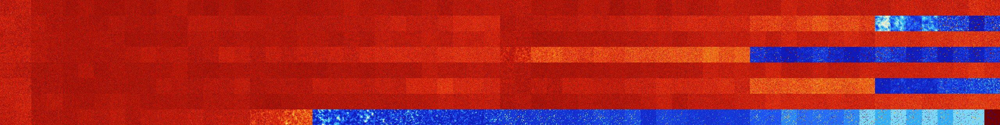

# B03458 (160256-160767)

<details>
    <summary>Initial Grid</summary>
    
</details>


<details>
    <summary>Initial Grid RLE</summary>

```
#C Exported from GoGoL (https://github.com/marrow16/gogol)
#C Wrap mode: Toroidal
#C Boundary mode: Dead
#C Step: 0
x = 100, y = 100, rule = B03458/S
2bo8bo31b2o7bo24bo16bo$37bo7bo16bo7bo$7bo10bo4bo6bo20bo9bobo17bo$bo4bo
10bo3bo2bo29bo8bo$28bo47bo3bo$15bo3bo26bo6bo7bo32bo$o7bo32b3o25bo3bo$
21bo18bo51b2o$12bobo30bo23bo$6bo17bo16bo14bo19bo5bo6bo$24bo25bo18bo21bo
3bo$12bobo26bo20b2o3bo17bo$7bo14bo$o27bo2bo27bo4bo$20bo14bo14bo16bo17bo
$10b2o50b2obo$29bo19bo14bo14bo18bo$o6bo10bo34bo23bobo$bobo14bo17bo5bo
18bo37bo$35bo7bo7bo$9bo23bo16bo11bo2bo6bo$5bobo13b2o3bo13bo52bo$12bo14b
o15bo9bo39bo$41bo8bo$30bo53bo2bo$7bobo7bobo16bo22b2o18bobo$19bo10bo17bo
38b3o$59bo4b2o28bo$3b2o7bo21bo30bo$o34bo59bo$2bo11bo5bo30bo3bo4bo33bo2b
o$o12bo19bo14bo12bo9bo$15bobo2bo10bo6bo12bo2bo33bo$10bo20bo6bo7bo5bo2bo
11bo11b2o$27bo4bo29bo22bo$bo26bo30bo$47bo$3bo32bo34bobo17bo$3bobo15bo
45bo11bo10bo2bo3bo$o25bo32bo30bo$42bo5bo21bo$29bo8bo6bo29bo$7bo32bobo5b
o$17bo5bo19bo14b2o27bo$13bo16bo21bo21bo7bo$2bo33bo4bo3bo11bo41bo$17bo3b
obo9bo34bo$33bo26bo$28bo3bo12bo5bo10bo20bo$4bo6bo6bo29bo9bo8bo$19bo64bo
10bo$4bo21bobo7bo7bo22bo$34bo3bo26bo9bo$bo8bo32bo2b2o22bobo7bo6bo$3bo
15bo2bo33bo8bo17bo$16bo27bo12bo12bo$41bo24bo$11bo7bo23bo8bobo2bo6bo24bo
$18b2o65bo$bo36bo17b2obo3bo8bo$41bo53bo$9bo15bo19bo$16bo7bo10bo31bo$bo
3bo18bobo11bo2bo10bo22bo13bo$3bo15bo20bo8bo4bo24bo9bo$35bobo61bo$9bo2bo
43bo5bo32bo$10b2o28bo3bo7bo14bo4bo$24bo7bo4bo7bo2bo30bo16bo$bo21bobo7bo
18bo7bo3bo12b2o$11bo11bo17bo24bo8bo15bo$3bo$o5bo35bo5bo21bo22bo$bo6bo
42bobo24bo$6bo12bo17bo53bo$o12bo42bo14bo7bo13bo2bo$43bo10bo21bo8bo$16bo
14bo25bo6bo31bo$o37bo6bo13bo21bo15bo$65b2o21bo$16bo23bobo46bo3bo$5bo20b
o6bo11bo26bo20bo$78bo$30bo2bo13bo6bo18bo7bo16bo$o56bo5bobo23bo$52bo34bo
8bo$69bo$25bo22bo10bo4bobo8bobo$2bo56bo12bobo16bo$11bo11bo41bo$22bo26bo
2bo10bo8bo19bo$63bo32bo$5bo5bo28bo21bo$15bo37bo5bo9bo4bo4bo2bo$60bo2bo
8bo4bo5bo7bo2bo$12bo24bobo4bo13bo27bo6bo$14bo5bo12bo17bo38bo$22bo23bo5b
o22bo$38bo25bo13bo9bo$8b2o7bo13bo6bo19bo29bo4bo!
```
</details>
<details>
    <summary>Thumbnail</summary>

</details>
<table>
<tr>
    <td><a href="./160256%20S%20Heat%20Map%20Activity.png"></a><br>S (160256)<br>G>1000</td>    <td><a href="./160257%20S0%20Heat%20Map%20Activity.png"></a><br>S0 (160257)<br>G>1000</td>    <td><a href="./160258%20S1%20Heat%20Map%20Activity.png"></a><br>S1 (160258)<br>G>1000</td>    <td><a href="./160259%20S01%20Heat%20Map%20Activity.png"></a><br>S01 (160259)<br>G>1000</td>    <td><a href="./160260%20S2%20Heat%20Map%20Activity.png"></a><br>S2 (160260)<br>G>1000</td>    <td><a href="./160261%20S02%20Heat%20Map%20Activity.png"></a><br>S02 (160261)<br>G>1000</td>    <td><a href="./160262%20S12%20Heat%20Map%20Activity.png"></a><br>S12 (160262)<br>G>1000</td>    <td><a href="./160263%20S012%20Heat%20Map%20Activity.png"></a><br>S012 (160263)<br>G>1000</td>    <td><a href="./160264%20S3%20Heat%20Map%20Activity.png"></a><br>S3 (160264)<br>G>1000</td>    <td><a href="./160265%20S03%20Heat%20Map%20Activity.png"></a><br>S03 (160265)<br>G>1000</td>    <td><a href="./160266%20S13%20Heat%20Map%20Activity.png"></a><br>S13 (160266)<br>G>1000</td>    <td><a href="./160267%20S013%20Heat%20Map%20Activity.png"></a><br>S013 (160267)<br>G>1000</td>    <td><a href="./160268%20S23%20Heat%20Map%20Activity.png"></a><br>S23 (160268)<br>G>1000</td>    <td><a href="./160269%20S023%20Heat%20Map%20Activity.png"></a><br>S023 (160269)<br>G>1000</td>    <td><a href="./160270%20S123%20Heat%20Map%20Activity.png"></a><br>S123 (160270)<br>G>1000</td>    <td><a href="./160271%20S0123%20Heat%20Map%20Activity.png"></a><br>S0123 (160271)<br>G>1000</td>    <td><a href="./160272%20S4%20Heat%20Map%20Activity.png"></a><br>S4 (160272)<br>G>1000</td>    <td><a href="./160273%20S04%20Heat%20Map%20Activity.png"></a><br>S04 (160273)<br>G>1000</td>    <td><a href="./160274%20S14%20Heat%20Map%20Activity.png"></a><br>S14 (160274)<br>G>1000</td>    <td><a href="./160275%20S014%20Heat%20Map%20Activity.png"></a><br>S014 (160275)<br>G>1000</td>    <td><a href="./160276%20S24%20Heat%20Map%20Activity.png"></a><br>S24 (160276)<br>G>1000</td>    <td><a href="./160277%20S024%20Heat%20Map%20Activity.png"></a><br>S024 (160277)<br>G>1000</td>    <td><a href="./160278%20S124%20Heat%20Map%20Activity.png"></a><br>S124 (160278)<br>G>1000</td>    <td><a href="./160279%20S0124%20Heat%20Map%20Activity.png"></a><br>S0124 (160279)<br>G>1000</td>    <td><a href="./160280%20S34%20Heat%20Map%20Activity.png"></a><br>S34 (160280)<br>G>1000</td>    <td><a href="./160281%20S034%20Heat%20Map%20Activity.png"></a><br>S034 (160281)<br>G>1000</td>    <td><a href="./160282%20S134%20Heat%20Map%20Activity.png"></a><br>S134 (160282)<br>G>1000</td>    <td><a href="./160283%20S0134%20Heat%20Map%20Activity.png"></a><br>S0134 (160283)<br>G>1000</td>    <td><a href="./160284%20S234%20Heat%20Map%20Activity.png"></a><br>S234 (160284)<br>G>1000</td>    <td><a href="./160285%20S0234%20Heat%20Map%20Activity.png"></a><br>S0234 (160285)<br>G>1000</td>    <td><a href="./160286%20S1234%20Heat%20Map%20Activity.png"></a><br>S1234 (160286)<br>G>1000</td>    <td><a href="./160287%20S01234%20Heat%20Map%20Activity.png"></a><br>S01234 (160287)<br>G>1000</td>    <td><a href="./160288%20S5%20Heat%20Map%20Activity.png"></a><br>S5 (160288)<br>G>1000</td>    <td><a href="./160289%20S05%20Heat%20Map%20Activity.png"></a><br>S05 (160289)<br>G>1000</td>    <td><a href="./160290%20S15%20Heat%20Map%20Activity.png"></a><br>S15 (160290)<br>G>1000</td>    <td><a href="./160291%20S015%20Heat%20Map%20Activity.png"></a><br>S015 (160291)<br>G>1000</td>    <td><a href="./160292%20S25%20Heat%20Map%20Activity.png"></a><br>S25 (160292)<br>G>1000</td>    <td><a href="./160293%20S025%20Heat%20Map%20Activity.png"></a><br>S025 (160293)<br>G>1000</td>    <td><a href="./160294%20S125%20Heat%20Map%20Activity.png"></a><br>S125 (160294)<br>G>1000</td>    <td><a href="./160295%20S0125%20Heat%20Map%20Activity.png"></a><br>S0125 (160295)<br>G>1000</td>    <td><a href="./160296%20S35%20Heat%20Map%20Activity.png"></a><br>S35 (160296)<br>G>1000</td>    <td><a href="./160297%20S035%20Heat%20Map%20Activity.png"></a><br>S035 (160297)<br>G>1000</td>    <td><a href="./160298%20S135%20Heat%20Map%20Activity.png"></a><br>S135 (160298)<br>G>1000</td>    <td><a href="./160299%20S0135%20Heat%20Map%20Activity.png"></a><br>S0135 (160299)<br>G>1000</td>    <td><a href="./160300%20S235%20Heat%20Map%20Activity.png"></a><br>S235 (160300)<br>G>1000</td>    <td><a href="./160301%20S0235%20Heat%20Map%20Activity.png"></a><br>S0235 (160301)<br>G>1000</td>    <td><a href="./160302%20S1235%20Heat%20Map%20Activity.png"></a><br>S1235 (160302)<br>G>1000</td>    <td><a href="./160303%20S01235%20Heat%20Map%20Activity.png"></a><br>S01235 (160303)<br>G>1000</td>    <td><a href="./160304%20S45%20Heat%20Map%20Activity.png"></a><br>S45 (160304)<br>G>1000</td>    <td><a href="./160305%20S045%20Heat%20Map%20Activity.png"></a><br>S045 (160305)<br>G>1000</td>    <td><a href="./160306%20S145%20Heat%20Map%20Activity.png"></a><br>S145 (160306)<br>G>1000</td>    <td><a href="./160307%20S0145%20Heat%20Map%20Activity.png"></a><br>S0145 (160307)<br>G>1000</td>    <td><a href="./160308%20S245%20Heat%20Map%20Activity.png"></a><br>S245 (160308)<br>G>1000</td>    <td><a href="./160309%20S0245%20Heat%20Map%20Activity.png"></a><br>S0245 (160309)<br>G>1000</td>    <td><a href="./160310%20S1245%20Heat%20Map%20Activity.png"></a><br>S1245 (160310)<br>G>1000</td>    <td><a href="./160311%20S01245%20Heat%20Map%20Activity.png"></a><br>S01245 (160311)<br>G>1000</td>    <td><a href="./160312%20S345%20Heat%20Map%20Activity.png"></a><br>S345 (160312)<br>G>1000</td>    <td><a href="./160313%20S0345%20Heat%20Map%20Activity.png"></a><br>S0345 (160313)<br>G>1000</td>    <td><a href="./160314%20S1345%20Heat%20Map%20Activity.png"></a><br>S1345 (160314)<br>G>1000</td>    <td><a href="./160315%20S01345%20Heat%20Map%20Activity.png"></a><br>S01345 (160315)<br>G>1000</td>    <td><a href="./160316%20S2345%20Heat%20Map%20Activity.png"></a><br>S2345 (160316)<br>G>1000</td>    <td><a href="./160317%20S02345%20Heat%20Map%20Activity.png"></a><br>S02345 (160317)<br>G>1000</td>    <td><a href="./160318%20S12345%20Heat%20Map%20Activity.png"></a><br>S12345 (160318)<br>G>1000</td>    <td><a href="./160319%20S012345%20Heat%20Map%20Activity.png"></a><br>S012345 (160319)<br>G>1000</td></tr>
<tr>
    <td><a href="./160320%20S6%20Heat%20Map%20Activity.png"></a><br>S6 (160320)<br>G>1000</td>    <td><a href="./160321%20S06%20Heat%20Map%20Activity.png"></a><br>S06 (160321)<br>G>1000</td>    <td><a href="./160322%20S16%20Heat%20Map%20Activity.png"></a><br>S16 (160322)<br>G>1000</td>    <td><a href="./160323%20S016%20Heat%20Map%20Activity.png"></a><br>S016 (160323)<br>G>1000</td>    <td><a href="./160324%20S26%20Heat%20Map%20Activity.png"></a><br>S26 (160324)<br>G>1000</td>    <td><a href="./160325%20S026%20Heat%20Map%20Activity.png"></a><br>S026 (160325)<br>G>1000</td>    <td><a href="./160326%20S126%20Heat%20Map%20Activity.png"></a><br>S126 (160326)<br>G>1000</td>    <td><a href="./160327%20S0126%20Heat%20Map%20Activity.png"></a><br>S0126 (160327)<br>G>1000</td>    <td><a href="./160328%20S36%20Heat%20Map%20Activity.png"></a><br>S36 (160328)<br>G>1000</td>    <td><a href="./160329%20S036%20Heat%20Map%20Activity.png"></a><br>S036 (160329)<br>G>1000</td>    <td><a href="./160330%20S136%20Heat%20Map%20Activity.png"></a><br>S136 (160330)<br>G>1000</td>    <td><a href="./160331%20S0136%20Heat%20Map%20Activity.png"></a><br>S0136 (160331)<br>G>1000</td>    <td><a href="./160332%20S236%20Heat%20Map%20Activity.png"></a><br>S236 (160332)<br>G>1000</td>    <td><a href="./160333%20S0236%20Heat%20Map%20Activity.png"></a><br>S0236 (160333)<br>G>1000</td>    <td><a href="./160334%20S1236%20Heat%20Map%20Activity.png"></a><br>S1236 (160334)<br>G>1000</td>    <td><a href="./160335%20S01236%20Heat%20Map%20Activity.png"></a><br>S01236 (160335)<br>G>1000</td>    <td><a href="./160336%20S46%20Heat%20Map%20Activity.png"></a><br>S46 (160336)<br>G>1000</td>    <td><a href="./160337%20S046%20Heat%20Map%20Activity.png"></a><br>S046 (160337)<br>G>1000</td>    <td><a href="./160338%20S146%20Heat%20Map%20Activity.png"></a><br>S146 (160338)<br>G>1000</td>    <td><a href="./160339%20S0146%20Heat%20Map%20Activity.png"></a><br>S0146 (160339)<br>G>1000</td>    <td><a href="./160340%20S246%20Heat%20Map%20Activity.png"></a><br>S246 (160340)<br>G>1000</td>    <td><a href="./160341%20S0246%20Heat%20Map%20Activity.png"></a><br>S0246 (160341)<br>G>1000</td>    <td><a href="./160342%20S1246%20Heat%20Map%20Activity.png"></a><br>S1246 (160342)<br>G>1000</td>    <td><a href="./160343%20S01246%20Heat%20Map%20Activity.png"></a><br>S01246 (160343)<br>G>1000</td>    <td><a href="./160344%20S346%20Heat%20Map%20Activity.png"></a><br>S346 (160344)<br>G>1000</td>    <td><a href="./160345%20S0346%20Heat%20Map%20Activity.png"></a><br>S0346 (160345)<br>G>1000</td>    <td><a href="./160346%20S1346%20Heat%20Map%20Activity.png"></a><br>S1346 (160346)<br>G>1000</td>    <td><a href="./160347%20S01346%20Heat%20Map%20Activity.png"></a><br>S01346 (160347)<br>G>1000</td>    <td><a href="./160348%20S2346%20Heat%20Map%20Activity.png"></a><br>S2346 (160348)<br>G>1000</td>    <td><a href="./160349%20S02346%20Heat%20Map%20Activity.png"></a><br>S02346 (160349)<br>G>1000</td>    <td><a href="./160350%20S12346%20Heat%20Map%20Activity.png"></a><br>S12346 (160350)<br>G>1000</td>    <td><a href="./160351%20S012346%20Heat%20Map%20Activity.png"></a><br>S012346 (160351)<br>G>1000</td>    <td><a href="./160352%20S56%20Heat%20Map%20Activity.png"></a><br>S56 (160352)<br>G>1000</td>    <td><a href="./160353%20S056%20Heat%20Map%20Activity.png"></a><br>S056 (160353)<br>G>1000</td>    <td><a href="./160354%20S156%20Heat%20Map%20Activity.png"></a><br>S156 (160354)<br>G>1000</td>    <td><a href="./160355%20S0156%20Heat%20Map%20Activity.png"></a><br>S0156 (160355)<br>G>1000</td>    <td><a href="./160356%20S256%20Heat%20Map%20Activity.png"></a><br>S256 (160356)<br>G>1000</td>    <td><a href="./160357%20S0256%20Heat%20Map%20Activity.png"></a><br>S0256 (160357)<br>G>1000</td>    <td><a href="./160358%20S1256%20Heat%20Map%20Activity.png"></a><br>S1256 (160358)<br>G>1000</td>    <td><a href="./160359%20S01256%20Heat%20Map%20Activity.png"></a><br>S01256 (160359)<br>G>1000</td>    <td><a href="./160360%20S356%20Heat%20Map%20Activity.png"></a><br>S356 (160360)<br>G>1000</td>    <td><a href="./160361%20S0356%20Heat%20Map%20Activity.png"></a><br>S0356 (160361)<br>G>1000</td>    <td><a href="./160362%20S1356%20Heat%20Map%20Activity.png"></a><br>S1356 (160362)<br>G>1000</td>    <td><a href="./160363%20S01356%20Heat%20Map%20Activity.png"></a><br>S01356 (160363)<br>G>1000</td>    <td><a href="./160364%20S2356%20Heat%20Map%20Activity.png"></a><br>S2356 (160364)<br>G>1000</td>    <td><a href="./160365%20S02356%20Heat%20Map%20Activity.png"></a><br>S02356 (160365)<br>G>1000</td>    <td><a href="./160366%20S12356%20Heat%20Map%20Activity.png"></a><br>S12356 (160366)<br>G>1000</td>    <td><a href="./160367%20S012356%20Heat%20Map%20Activity.png"></a><br>S012356 (160367)<br>G>1000</td>    <td><a href="./160368%20S456%20Heat%20Map%20Activity.png"></a><br>S456 (160368)<br>G>1000</td>    <td><a href="./160369%20S0456%20Heat%20Map%20Activity.png"></a><br>S0456 (160369)<br>G>1000</td>    <td><a href="./160370%20S1456%20Heat%20Map%20Activity.png"></a><br>S1456 (160370)<br>G>1000</td>    <td><a href="./160371%20S01456%20Heat%20Map%20Activity.png"></a><br>S01456 (160371)<br>G>1000</td>    <td><a href="./160372%20S2456%20Heat%20Map%20Activity.png"></a><br>S2456 (160372)<br>G>1000</td>    <td><a href="./160373%20S02456%20Heat%20Map%20Activity.png"></a><br>S02456 (160373)<br>G>1000</td>    <td><a href="./160374%20S12456%20Heat%20Map%20Activity.png"></a><br>S12456 (160374)<br>G>1000</td>    <td><a href="./160375%20S012456%20Heat%20Map%20Activity.png"></a><br>S012456 (160375)<br>G>1000</td>    <td><a href="./160376%20S3456%20Heat%20Map%20Activity.png"></a><br>S3456 (160376)<br>G>1000</td>    <td><a href="./160377%20S03456%20Heat%20Map%20Activity.png"></a><br>S03456 (160377)<br>G>1000</td>    <td><a href="./160378%20S13456%20Heat%20Map%20Activity.png"></a><br>S13456 (160378)<br>G>1000</td>    <td><a href="./160379%20S013456%20Heat%20Map%20Activity.png"></a><br>S013456 (160379)<br>G>1000</td>    <td><a href="./160380%20S23456%20Heat%20Map%20Activity.png"></a><br>S23456 (160380)<br>R@82,p12</td>    <td><a href="./160381%20S023456%20Heat%20Map%20Activity.png"></a><br>S023456 (160381)<br>R@76,p12</td>    <td><a href="./160382%20S123456%20Heat%20Map%20Activity.png"></a><br>S123456 (160382)<br>G>1000</td>    <td><a href="./160383%20S0123456%20Heat%20Map%20Activity.png"></a><br>S0123456 (160383)<br>R@102,p12</td></tr>
<tr>
    <td><a href="./160384%20S7%20Heat%20Map%20Activity.png"></a><br>S7 (160384)<br>G>1000</td>    <td><a href="./160385%20S07%20Heat%20Map%20Activity.png"></a><br>S07 (160385)<br>G>1000</td>    <td><a href="./160386%20S17%20Heat%20Map%20Activity.png"></a><br>S17 (160386)<br>G>1000</td>    <td><a href="./160387%20S017%20Heat%20Map%20Activity.png"></a><br>S017 (160387)<br>G>1000</td>    <td><a href="./160388%20S27%20Heat%20Map%20Activity.png"></a><br>S27 (160388)<br>G>1000</td>    <td><a href="./160389%20S027%20Heat%20Map%20Activity.png"></a><br>S027 (160389)<br>G>1000</td>    <td><a href="./160390%20S127%20Heat%20Map%20Activity.png"></a><br>S127 (160390)<br>G>1000</td>    <td><a href="./160391%20S0127%20Heat%20Map%20Activity.png"></a><br>S0127 (160391)<br>G>1000</td>    <td><a href="./160392%20S37%20Heat%20Map%20Activity.png"></a><br>S37 (160392)<br>G>1000</td>    <td><a href="./160393%20S037%20Heat%20Map%20Activity.png"></a><br>S037 (160393)<br>G>1000</td>    <td><a href="./160394%20S137%20Heat%20Map%20Activity.png"></a><br>S137 (160394)<br>G>1000</td>    <td><a href="./160395%20S0137%20Heat%20Map%20Activity.png"></a><br>S0137 (160395)<br>G>1000</td>    <td><a href="./160396%20S237%20Heat%20Map%20Activity.png"></a><br>S237 (160396)<br>G>1000</td>    <td><a href="./160397%20S0237%20Heat%20Map%20Activity.png"></a><br>S0237 (160397)<br>G>1000</td>    <td><a href="./160398%20S1237%20Heat%20Map%20Activity.png"></a><br>S1237 (160398)<br>G>1000</td>    <td><a href="./160399%20S01237%20Heat%20Map%20Activity.png"></a><br>S01237 (160399)<br>G>1000</td>    <td><a href="./160400%20S47%20Heat%20Map%20Activity.png"></a><br>S47 (160400)<br>G>1000</td>    <td><a href="./160401%20S047%20Heat%20Map%20Activity.png"></a><br>S047 (160401)<br>G>1000</td>    <td><a href="./160402%20S147%20Heat%20Map%20Activity.png"></a><br>S147 (160402)<br>G>1000</td>    <td><a href="./160403%20S0147%20Heat%20Map%20Activity.png"></a><br>S0147 (160403)<br>G>1000</td>    <td><a href="./160404%20S247%20Heat%20Map%20Activity.png"></a><br>S247 (160404)<br>G>1000</td>    <td><a href="./160405%20S0247%20Heat%20Map%20Activity.png"></a><br>S0247 (160405)<br>G>1000</td>    <td><a href="./160406%20S1247%20Heat%20Map%20Activity.png"></a><br>S1247 (160406)<br>G>1000</td>    <td><a href="./160407%20S01247%20Heat%20Map%20Activity.png"></a><br>S01247 (160407)<br>G>1000</td>    <td><a href="./160408%20S347%20Heat%20Map%20Activity.png"></a><br>S347 (160408)<br>G>1000</td>    <td><a href="./160409%20S0347%20Heat%20Map%20Activity.png"></a><br>S0347 (160409)<br>G>1000</td>    <td><a href="./160410%20S1347%20Heat%20Map%20Activity.png"></a><br>S1347 (160410)<br>G>1000</td>    <td><a href="./160411%20S01347%20Heat%20Map%20Activity.png"></a><br>S01347 (160411)<br>G>1000</td>    <td><a href="./160412%20S2347%20Heat%20Map%20Activity.png"></a><br>S2347 (160412)<br>G>1000</td>    <td><a href="./160413%20S02347%20Heat%20Map%20Activity.png"></a><br>S02347 (160413)<br>G>1000</td>    <td><a href="./160414%20S12347%20Heat%20Map%20Activity.png"></a><br>S12347 (160414)<br>G>1000</td>    <td><a href="./160415%20S012347%20Heat%20Map%20Activity.png"></a><br>S012347 (160415)<br>G>1000</td>    <td><a href="./160416%20S57%20Heat%20Map%20Activity.png"></a><br>S57 (160416)<br>G>1000</td>    <td><a href="./160417%20S057%20Heat%20Map%20Activity.png"></a><br>S057 (160417)<br>G>1000</td>    <td><a href="./160418%20S157%20Heat%20Map%20Activity.png"></a><br>S157 (160418)<br>G>1000</td>    <td><a href="./160419%20S0157%20Heat%20Map%20Activity.png"></a><br>S0157 (160419)<br>G>1000</td>    <td><a href="./160420%20S257%20Heat%20Map%20Activity.png"></a><br>S257 (160420)<br>G>1000</td>    <td><a href="./160421%20S0257%20Heat%20Map%20Activity.png"></a><br>S0257 (160421)<br>G>1000</td>    <td><a href="./160422%20S1257%20Heat%20Map%20Activity.png"></a><br>S1257 (160422)<br>G>1000</td>    <td><a href="./160423%20S01257%20Heat%20Map%20Activity.png"></a><br>S01257 (160423)<br>G>1000</td>    <td><a href="./160424%20S357%20Heat%20Map%20Activity.png"></a><br>S357 (160424)<br>G>1000</td>    <td><a href="./160425%20S0357%20Heat%20Map%20Activity.png"></a><br>S0357 (160425)<br>G>1000</td>    <td><a href="./160426%20S1357%20Heat%20Map%20Activity.png"></a><br>S1357 (160426)<br>G>1000</td>    <td><a href="./160427%20S01357%20Heat%20Map%20Activity.png"></a><br>S01357 (160427)<br>G>1000</td>    <td><a href="./160428%20S2357%20Heat%20Map%20Activity.png"></a><br>S2357 (160428)<br>G>1000</td>    <td><a href="./160429%20S02357%20Heat%20Map%20Activity.png"></a><br>S02357 (160429)<br>G>1000</td>    <td><a href="./160430%20S12357%20Heat%20Map%20Activity.png"></a><br>S12357 (160430)<br>G>1000</td>    <td><a href="./160431%20S012357%20Heat%20Map%20Activity.png"></a><br>S012357 (160431)<br>G>1000</td>    <td><a href="./160432%20S457%20Heat%20Map%20Activity.png"></a><br>S457 (160432)<br>G>1000</td>    <td><a href="./160433%20S0457%20Heat%20Map%20Activity.png"></a><br>S0457 (160433)<br>G>1000</td>    <td><a href="./160434%20S1457%20Heat%20Map%20Activity.png"></a><br>S1457 (160434)<br>G>1000</td>    <td><a href="./160435%20S01457%20Heat%20Map%20Activity.png"></a><br>S01457 (160435)<br>G>1000</td>    <td><a href="./160436%20S2457%20Heat%20Map%20Activity.png"></a><br>S2457 (160436)<br>G>1000</td>    <td><a href="./160437%20S02457%20Heat%20Map%20Activity.png"></a><br>S02457 (160437)<br>G>1000</td>    <td><a href="./160438%20S12457%20Heat%20Map%20Activity.png"></a><br>S12457 (160438)<br>G>1000</td>    <td><a href="./160439%20S012457%20Heat%20Map%20Activity.png"></a><br>S012457 (160439)<br>G>1000</td>    <td><a href="./160440%20S3457%20Heat%20Map%20Activity.png"></a><br>S3457 (160440)<br>G>1000</td>    <td><a href="./160441%20S03457%20Heat%20Map%20Activity.png"></a><br>S03457 (160441)<br>G>1000</td>    <td><a href="./160442%20S13457%20Heat%20Map%20Activity.png"></a><br>S13457 (160442)<br>G>1000</td>    <td><a href="./160443%20S013457%20Heat%20Map%20Activity.png"></a><br>S013457 (160443)<br>G>1000</td>    <td><a href="./160444%20S23457%20Heat%20Map%20Activity.png"></a><br>S23457 (160444)<br>G>1000</td>    <td><a href="./160445%20S023457%20Heat%20Map%20Activity.png"></a><br>S023457 (160445)<br>G>1000</td>    <td><a href="./160446%20S123457%20Heat%20Map%20Activity.png"></a><br>S123457 (160446)<br>G>1000</td>    <td><a href="./160447%20S0123457%20Heat%20Map%20Activity.png"></a><br>S0123457 (160447)<br>G>1000</td></tr>
<tr>
    <td><a href="./160448%20S67%20Heat%20Map%20Activity.png"></a><br>S67 (160448)<br>G>1000</td>    <td><a href="./160449%20S067%20Heat%20Map%20Activity.png"></a><br>S067 (160449)<br>G>1000</td>    <td><a href="./160450%20S167%20Heat%20Map%20Activity.png"></a><br>S167 (160450)<br>G>1000</td>    <td><a href="./160451%20S0167%20Heat%20Map%20Activity.png"></a><br>S0167 (160451)<br>G>1000</td>    <td><a href="./160452%20S267%20Heat%20Map%20Activity.png"></a><br>S267 (160452)<br>G>1000</td>    <td><a href="./160453%20S0267%20Heat%20Map%20Activity.png"></a><br>S0267 (160453)<br>G>1000</td>    <td><a href="./160454%20S1267%20Heat%20Map%20Activity.png"></a><br>S1267 (160454)<br>G>1000</td>    <td><a href="./160455%20S01267%20Heat%20Map%20Activity.png"></a><br>S01267 (160455)<br>G>1000</td>    <td><a href="./160456%20S367%20Heat%20Map%20Activity.png"></a><br>S367 (160456)<br>G>1000</td>    <td><a href="./160457%20S0367%20Heat%20Map%20Activity.png"></a><br>S0367 (160457)<br>G>1000</td>    <td><a href="./160458%20S1367%20Heat%20Map%20Activity.png"></a><br>S1367 (160458)<br>G>1000</td>    <td><a href="./160459%20S01367%20Heat%20Map%20Activity.png"></a><br>S01367 (160459)<br>G>1000</td>    <td><a href="./160460%20S2367%20Heat%20Map%20Activity.png"></a><br>S2367 (160460)<br>G>1000</td>    <td><a href="./160461%20S02367%20Heat%20Map%20Activity.png"></a><br>S02367 (160461)<br>G>1000</td>    <td><a href="./160462%20S12367%20Heat%20Map%20Activity.png"></a><br>S12367 (160462)<br>G>1000</td>    <td><a href="./160463%20S012367%20Heat%20Map%20Activity.png"></a><br>S012367 (160463)<br>G>1000</td>    <td><a href="./160464%20S467%20Heat%20Map%20Activity.png"></a><br>S467 (160464)<br>G>1000</td>    <td><a href="./160465%20S0467%20Heat%20Map%20Activity.png"></a><br>S0467 (160465)<br>G>1000</td>    <td><a href="./160466%20S1467%20Heat%20Map%20Activity.png"></a><br>S1467 (160466)<br>G>1000</td>    <td><a href="./160467%20S01467%20Heat%20Map%20Activity.png"></a><br>S01467 (160467)<br>G>1000</td>    <td><a href="./160468%20S2467%20Heat%20Map%20Activity.png"></a><br>S2467 (160468)<br>G>1000</td>    <td><a href="./160469%20S02467%20Heat%20Map%20Activity.png"></a><br>S02467 (160469)<br>G>1000</td>    <td><a href="./160470%20S12467%20Heat%20Map%20Activity.png"></a><br>S12467 (160470)<br>G>1000</td>    <td><a href="./160471%20S012467%20Heat%20Map%20Activity.png"></a><br>S012467 (160471)<br>G>1000</td>    <td><a href="./160472%20S3467%20Heat%20Map%20Activity.png"></a><br>S3467 (160472)<br>G>1000</td>    <td><a href="./160473%20S03467%20Heat%20Map%20Activity.png"></a><br>S03467 (160473)<br>G>1000</td>    <td><a href="./160474%20S13467%20Heat%20Map%20Activity.png"></a><br>S13467 (160474)<br>G>1000</td>    <td><a href="./160475%20S013467%20Heat%20Map%20Activity.png"></a><br>S013467 (160475)<br>G>1000</td>    <td><a href="./160476%20S23467%20Heat%20Map%20Activity.png"></a><br>S23467 (160476)<br>G>1000</td>    <td><a href="./160477%20S023467%20Heat%20Map%20Activity.png"></a><br>S023467 (160477)<br>G>1000</td>    <td><a href="./160478%20S123467%20Heat%20Map%20Activity.png"></a><br>S123467 (160478)<br>G>1000</td>    <td><a href="./160479%20S0123467%20Heat%20Map%20Activity.png"></a><br>S0123467 (160479)<br>G>1000</td>    <td><a href="./160480%20S567%20Heat%20Map%20Activity.png"></a><br>S567 (160480)<br>G>1000</td>    <td><a href="./160481%20S0567%20Heat%20Map%20Activity.png"></a><br>S0567 (160481)<br>G>1000</td>    <td><a href="./160482%20S1567%20Heat%20Map%20Activity.png"></a><br>S1567 (160482)<br>G>1000</td>    <td><a href="./160483%20S01567%20Heat%20Map%20Activity.png"></a><br>S01567 (160483)<br>G>1000</td>    <td><a href="./160484%20S2567%20Heat%20Map%20Activity.png"></a><br>S2567 (160484)<br>G>1000</td>    <td><a href="./160485%20S02567%20Heat%20Map%20Activity.png"></a><br>S02567 (160485)<br>G>1000</td>    <td><a href="./160486%20S12567%20Heat%20Map%20Activity.png"></a><br>S12567 (160486)<br>G>1000</td>    <td><a href="./160487%20S012567%20Heat%20Map%20Activity.png"></a><br>S012567 (160487)<br>G>1000</td>    <td><a href="./160488%20S3567%20Heat%20Map%20Activity.png"></a><br>S3567 (160488)<br>G>1000</td>    <td><a href="./160489%20S03567%20Heat%20Map%20Activity.png"></a><br>S03567 (160489)<br>G>1000</td>    <td><a href="./160490%20S13567%20Heat%20Map%20Activity.png"></a><br>S13567 (160490)<br>G>1000</td>    <td><a href="./160491%20S013567%20Heat%20Map%20Activity.png"></a><br>S013567 (160491)<br>G>1000</td>    <td><a href="./160492%20S23567%20Heat%20Map%20Activity.png"></a><br>S23567 (160492)<br>G>1000</td>    <td><a href="./160493%20S023567%20Heat%20Map%20Activity.png"></a><br>S023567 (160493)<br>G>1000</td>    <td><a href="./160494%20S123567%20Heat%20Map%20Activity.png"></a><br>S123567 (160494)<br>G>1000</td>    <td><a href="./160495%20S0123567%20Heat%20Map%20Activity.png"></a><br>S0123567 (160495)<br>G>1000</td>    <td><a href="./160496%20S4567%20Heat%20Map%20Activity.png"></a><br>S4567 (160496)<br>R@71,p20</td>    <td><a href="./160497%20S04567%20Heat%20Map%20Activity.png"></a><br>S04567 (160497)<br>R@119,p60</td>    <td><a href="./160498%20S14567%20Heat%20Map%20Activity.png"></a><br>S14567 (160498)<br>R@461,p420</td>    <td><a href="./160499%20S014567%20Heat%20Map%20Activity.png"></a><br>S014567 (160499)<br>R@103,p60</td>    <td><a href="./160500%20S24567%20Heat%20Map%20Activity.png"></a><br>S24567 (160500)<br>R@57,p12</td>    <td><a href="./160501%20S024567%20Heat%20Map%20Activity.png"></a><br>S024567 (160501)<br>R@106,p60</td>    <td><a href="./160502%20S124567%20Heat%20Map%20Activity.png"></a><br>S124567 (160502)<br>R@467,p420</td>    <td><a href="./160503%20S0124567%20Heat%20Map%20Activity.png"></a><br>S0124567 (160503)<br>R@113,p60</td>    <td><a href="./160504%20S34567%20Heat%20Map%20Activity.png"></a><br>S34567 (160504)<br>R@34,p12</td>    <td><a href="./160505%20S034567%20Heat%20Map%20Activity.png"></a><br>S034567 (160505)<br>R@48,p24</td>    <td><a href="./160506%20S134567%20Heat%20Map%20Activity.png"></a><br>S134567 (160506)<br>R@193,p168</td>    <td><a href="./160507%20S0134567%20Heat%20Map%20Activity.png"></a><br>S0134567 (160507)<br>R@47,p24</td>    <td><a href="./160508%20S234567%20Heat%20Map%20Activity.png"></a><br>S234567 (160508)<br>R@339,p312</td>    <td><a href="./160509%20S0234567%20Heat%20Map%20Activity.png"></a><br>S0234567 (160509)<br>R@53,p30</td>    <td><a href="./160510%20S1234567%20Heat%20Map%20Activity.png"></a><br>S1234567 (160510)<br>R@144,p120</td>    <td><a href="./160511%20S01234567%20Heat%20Map%20Activity.png"></a><br>S01234567 (160511)<br>R@39,p18</td></tr>
<tr>
    <td><a href="./160512%20S8%20Heat%20Map%20Activity.png"></a><br>S8 (160512)<br>G>1000</td>    <td><a href="./160513%20S08%20Heat%20Map%20Activity.png"></a><br>S08 (160513)<br>G>1000</td>    <td><a href="./160514%20S18%20Heat%20Map%20Activity.png"></a><br>S18 (160514)<br>G>1000</td>    <td><a href="./160515%20S018%20Heat%20Map%20Activity.png"></a><br>S018 (160515)<br>G>1000</td>    <td><a href="./160516%20S28%20Heat%20Map%20Activity.png"></a><br>S28 (160516)<br>G>1000</td>    <td><a href="./160517%20S028%20Heat%20Map%20Activity.png"></a><br>S028 (160517)<br>G>1000</td>    <td><a href="./160518%20S128%20Heat%20Map%20Activity.png"></a><br>S128 (160518)<br>G>1000</td>    <td><a href="./160519%20S0128%20Heat%20Map%20Activity.png"></a><br>S0128 (160519)<br>G>1000</td>    <td><a href="./160520%20S38%20Heat%20Map%20Activity.png"></a><br>S38 (160520)<br>G>1000</td>    <td><a href="./160521%20S038%20Heat%20Map%20Activity.png"></a><br>S038 (160521)<br>G>1000</td>    <td><a href="./160522%20S138%20Heat%20Map%20Activity.png"></a><br>S138 (160522)<br>G>1000</td>    <td><a href="./160523%20S0138%20Heat%20Map%20Activity.png"></a><br>S0138 (160523)<br>G>1000</td>    <td><a href="./160524%20S238%20Heat%20Map%20Activity.png"></a><br>S238 (160524)<br>G>1000</td>    <td><a href="./160525%20S0238%20Heat%20Map%20Activity.png"></a><br>S0238 (160525)<br>G>1000</td>    <td><a href="./160526%20S1238%20Heat%20Map%20Activity.png"></a><br>S1238 (160526)<br>G>1000</td>    <td><a href="./160527%20S01238%20Heat%20Map%20Activity.png"></a><br>S01238 (160527)<br>G>1000</td>    <td><a href="./160528%20S48%20Heat%20Map%20Activity.png"></a><br>S48 (160528)<br>G>1000</td>    <td><a href="./160529%20S048%20Heat%20Map%20Activity.png"></a><br>S048 (160529)<br>G>1000</td>    <td><a href="./160530%20S148%20Heat%20Map%20Activity.png"></a><br>S148 (160530)<br>G>1000</td>    <td><a href="./160531%20S0148%20Heat%20Map%20Activity.png"></a><br>S0148 (160531)<br>G>1000</td>    <td><a href="./160532%20S248%20Heat%20Map%20Activity.png"></a><br>S248 (160532)<br>G>1000</td>    <td><a href="./160533%20S0248%20Heat%20Map%20Activity.png"></a><br>S0248 (160533)<br>G>1000</td>    <td><a href="./160534%20S1248%20Heat%20Map%20Activity.png"></a><br>S1248 (160534)<br>G>1000</td>    <td><a href="./160535%20S01248%20Heat%20Map%20Activity.png"></a><br>S01248 (160535)<br>G>1000</td>    <td><a href="./160536%20S348%20Heat%20Map%20Activity.png"></a><br>S348 (160536)<br>G>1000</td>    <td><a href="./160537%20S0348%20Heat%20Map%20Activity.png"></a><br>S0348 (160537)<br>G>1000</td>    <td><a href="./160538%20S1348%20Heat%20Map%20Activity.png"></a><br>S1348 (160538)<br>G>1000</td>    <td><a href="./160539%20S01348%20Heat%20Map%20Activity.png"></a><br>S01348 (160539)<br>G>1000</td>    <td><a href="./160540%20S2348%20Heat%20Map%20Activity.png"></a><br>S2348 (160540)<br>G>1000</td>    <td><a href="./160541%20S02348%20Heat%20Map%20Activity.png"></a><br>S02348 (160541)<br>G>1000</td>    <td><a href="./160542%20S12348%20Heat%20Map%20Activity.png"></a><br>S12348 (160542)<br>G>1000</td>    <td><a href="./160543%20S012348%20Heat%20Map%20Activity.png"></a><br>S012348 (160543)<br>G>1000</td>    <td><a href="./160544%20S58%20Heat%20Map%20Activity.png"></a><br>S58 (160544)<br>G>1000</td>    <td><a href="./160545%20S058%20Heat%20Map%20Activity.png"></a><br>S058 (160545)<br>G>1000</td>    <td><a href="./160546%20S158%20Heat%20Map%20Activity.png"></a><br>S158 (160546)<br>G>1000</td>    <td><a href="./160547%20S0158%20Heat%20Map%20Activity.png"></a><br>S0158 (160547)<br>G>1000</td>    <td><a href="./160548%20S258%20Heat%20Map%20Activity.png"></a><br>S258 (160548)<br>G>1000</td>    <td><a href="./160549%20S0258%20Heat%20Map%20Activity.png"></a><br>S0258 (160549)<br>G>1000</td>    <td><a href="./160550%20S1258%20Heat%20Map%20Activity.png"></a><br>S1258 (160550)<br>G>1000</td>    <td><a href="./160551%20S01258%20Heat%20Map%20Activity.png"></a><br>S01258 (160551)<br>G>1000</td>    <td><a href="./160552%20S358%20Heat%20Map%20Activity.png"></a><br>S358 (160552)<br>G>1000</td>    <td><a href="./160553%20S0358%20Heat%20Map%20Activity.png"></a><br>S0358 (160553)<br>G>1000</td>    <td><a href="./160554%20S1358%20Heat%20Map%20Activity.png"></a><br>S1358 (160554)<br>G>1000</td>    <td><a href="./160555%20S01358%20Heat%20Map%20Activity.png"></a><br>S01358 (160555)<br>G>1000</td>    <td><a href="./160556%20S2358%20Heat%20Map%20Activity.png"></a><br>S2358 (160556)<br>G>1000</td>    <td><a href="./160557%20S02358%20Heat%20Map%20Activity.png"></a><br>S02358 (160557)<br>G>1000</td>    <td><a href="./160558%20S12358%20Heat%20Map%20Activity.png"></a><br>S12358 (160558)<br>G>1000</td>    <td><a href="./160559%20S012358%20Heat%20Map%20Activity.png"></a><br>S012358 (160559)<br>G>1000</td>    <td><a href="./160560%20S458%20Heat%20Map%20Activity.png"></a><br>S458 (160560)<br>G>1000</td>    <td><a href="./160561%20S0458%20Heat%20Map%20Activity.png"></a><br>S0458 (160561)<br>G>1000</td>    <td><a href="./160562%20S1458%20Heat%20Map%20Activity.png"></a><br>S1458 (160562)<br>G>1000</td>    <td><a href="./160563%20S01458%20Heat%20Map%20Activity.png"></a><br>S01458 (160563)<br>G>1000</td>    <td><a href="./160564%20S2458%20Heat%20Map%20Activity.png"></a><br>S2458 (160564)<br>G>1000</td>    <td><a href="./160565%20S02458%20Heat%20Map%20Activity.png"></a><br>S02458 (160565)<br>G>1000</td>    <td><a href="./160566%20S12458%20Heat%20Map%20Activity.png"></a><br>S12458 (160566)<br>G>1000</td>    <td><a href="./160567%20S012458%20Heat%20Map%20Activity.png"></a><br>S012458 (160567)<br>G>1000</td>    <td><a href="./160568%20S3458%20Heat%20Map%20Activity.png"></a><br>S3458 (160568)<br>G>1000</td>    <td><a href="./160569%20S03458%20Heat%20Map%20Activity.png"></a><br>S03458 (160569)<br>G>1000</td>    <td><a href="./160570%20S13458%20Heat%20Map%20Activity.png"></a><br>S13458 (160570)<br>G>1000</td>    <td><a href="./160571%20S013458%20Heat%20Map%20Activity.png"></a><br>S013458 (160571)<br>G>1000</td>    <td><a href="./160572%20S23458%20Heat%20Map%20Activity.png"></a><br>S23458 (160572)<br>G>1000</td>    <td><a href="./160573%20S023458%20Heat%20Map%20Activity.png"></a><br>S023458 (160573)<br>G>1000</td>    <td><a href="./160574%20S123458%20Heat%20Map%20Activity.png"></a><br>S123458 (160574)<br>G>1000</td>    <td><a href="./160575%20S0123458%20Heat%20Map%20Activity.png"></a><br>S0123458 (160575)<br>G>1000</td></tr>
<tr>
    <td><a href="./160576%20S68%20Heat%20Map%20Activity.png"></a><br>S68 (160576)<br>G>1000</td>    <td><a href="./160577%20S068%20Heat%20Map%20Activity.png"></a><br>S068 (160577)<br>G>1000</td>    <td><a href="./160578%20S168%20Heat%20Map%20Activity.png"></a><br>S168 (160578)<br>G>1000</td>    <td><a href="./160579%20S0168%20Heat%20Map%20Activity.png"></a><br>S0168 (160579)<br>G>1000</td>    <td><a href="./160580%20S268%20Heat%20Map%20Activity.png"></a><br>S268 (160580)<br>G>1000</td>    <td><a href="./160581%20S0268%20Heat%20Map%20Activity.png"></a><br>S0268 (160581)<br>G>1000</td>    <td><a href="./160582%20S1268%20Heat%20Map%20Activity.png"></a><br>S1268 (160582)<br>G>1000</td>    <td><a href="./160583%20S01268%20Heat%20Map%20Activity.png"></a><br>S01268 (160583)<br>G>1000</td>    <td><a href="./160584%20S368%20Heat%20Map%20Activity.png"></a><br>S368 (160584)<br>G>1000</td>    <td><a href="./160585%20S0368%20Heat%20Map%20Activity.png"></a><br>S0368 (160585)<br>G>1000</td>    <td><a href="./160586%20S1368%20Heat%20Map%20Activity.png"></a><br>S1368 (160586)<br>G>1000</td>    <td><a href="./160587%20S01368%20Heat%20Map%20Activity.png"></a><br>S01368 (160587)<br>G>1000</td>    <td><a href="./160588%20S2368%20Heat%20Map%20Activity.png"></a><br>S2368 (160588)<br>G>1000</td>    <td><a href="./160589%20S02368%20Heat%20Map%20Activity.png"></a><br>S02368 (160589)<br>G>1000</td>    <td><a href="./160590%20S12368%20Heat%20Map%20Activity.png"></a><br>S12368 (160590)<br>G>1000</td>    <td><a href="./160591%20S012368%20Heat%20Map%20Activity.png"></a><br>S012368 (160591)<br>G>1000</td>    <td><a href="./160592%20S468%20Heat%20Map%20Activity.png"></a><br>S468 (160592)<br>G>1000</td>    <td><a href="./160593%20S0468%20Heat%20Map%20Activity.png"></a><br>S0468 (160593)<br>G>1000</td>    <td><a href="./160594%20S1468%20Heat%20Map%20Activity.png"></a><br>S1468 (160594)<br>G>1000</td>    <td><a href="./160595%20S01468%20Heat%20Map%20Activity.png"></a><br>S01468 (160595)<br>G>1000</td>    <td><a href="./160596%20S2468%20Heat%20Map%20Activity.png"></a><br>S2468 (160596)<br>G>1000</td>    <td><a href="./160597%20S02468%20Heat%20Map%20Activity.png"></a><br>S02468 (160597)<br>G>1000</td>    <td><a href="./160598%20S12468%20Heat%20Map%20Activity.png"></a><br>S12468 (160598)<br>G>1000</td>    <td><a href="./160599%20S012468%20Heat%20Map%20Activity.png"></a><br>S012468 (160599)<br>G>1000</td>    <td><a href="./160600%20S3468%20Heat%20Map%20Activity.png"></a><br>S3468 (160600)<br>G>1000</td>    <td><a href="./160601%20S03468%20Heat%20Map%20Activity.png"></a><br>S03468 (160601)<br>G>1000</td>    <td><a href="./160602%20S13468%20Heat%20Map%20Activity.png"></a><br>S13468 (160602)<br>G>1000</td>    <td><a href="./160603%20S013468%20Heat%20Map%20Activity.png"></a><br>S013468 (160603)<br>G>1000</td>    <td><a href="./160604%20S23468%20Heat%20Map%20Activity.png"></a><br>S23468 (160604)<br>G>1000</td>    <td><a href="./160605%20S023468%20Heat%20Map%20Activity.png"></a><br>S023468 (160605)<br>G>1000</td>    <td><a href="./160606%20S123468%20Heat%20Map%20Activity.png"></a><br>S123468 (160606)<br>G>1000</td>    <td><a href="./160607%20S0123468%20Heat%20Map%20Activity.png"></a><br>S0123468 (160607)<br>G>1000</td>    <td><a href="./160608%20S568%20Heat%20Map%20Activity.png"></a><br>S568 (160608)<br>G>1000</td>    <td><a href="./160609%20S0568%20Heat%20Map%20Activity.png"></a><br>S0568 (160609)<br>G>1000</td>    <td><a href="./160610%20S1568%20Heat%20Map%20Activity.png"></a><br>S1568 (160610)<br>G>1000</td>    <td><a href="./160611%20S01568%20Heat%20Map%20Activity.png"></a><br>S01568 (160611)<br>G>1000</td>    <td><a href="./160612%20S2568%20Heat%20Map%20Activity.png"></a><br>S2568 (160612)<br>G>1000</td>    <td><a href="./160613%20S02568%20Heat%20Map%20Activity.png"></a><br>S02568 (160613)<br>G>1000</td>    <td><a href="./160614%20S12568%20Heat%20Map%20Activity.png"></a><br>S12568 (160614)<br>G>1000</td>    <td><a href="./160615%20S012568%20Heat%20Map%20Activity.png"></a><br>S012568 (160615)<br>G>1000</td>    <td><a href="./160616%20S3568%20Heat%20Map%20Activity.png"></a><br>S3568 (160616)<br>G>1000</td>    <td><a href="./160617%20S03568%20Heat%20Map%20Activity.png"></a><br>S03568 (160617)<br>G>1000</td>    <td><a href="./160618%20S13568%20Heat%20Map%20Activity.png"></a><br>S13568 (160618)<br>G>1000</td>    <td><a href="./160619%20S013568%20Heat%20Map%20Activity.png"></a><br>S013568 (160619)<br>G>1000</td>    <td><a href="./160620%20S23568%20Heat%20Map%20Activity.png"></a><br>S23568 (160620)<br>G>1000</td>    <td><a href="./160621%20S023568%20Heat%20Map%20Activity.png"></a><br>S023568 (160621)<br>G>1000</td>    <td><a href="./160622%20S123568%20Heat%20Map%20Activity.png"></a><br>S123568 (160622)<br>G>1000</td>    <td><a href="./160623%20S0123568%20Heat%20Map%20Activity.png"></a><br>S0123568 (160623)<br>G>1000</td>    <td><a href="./160624%20S4568%20Heat%20Map%20Activity.png"></a><br>S4568 (160624)<br>G>1000</td>    <td><a href="./160625%20S04568%20Heat%20Map%20Activity.png"></a><br>S04568 (160625)<br>G>1000</td>    <td><a href="./160626%20S14568%20Heat%20Map%20Activity.png"></a><br>S14568 (160626)<br>G>1000</td>    <td><a href="./160627%20S014568%20Heat%20Map%20Activity.png"></a><br>S014568 (160627)<br>G>1000</td>    <td><a href="./160628%20S24568%20Heat%20Map%20Activity.png"></a><br>S24568 (160628)<br>G>1000</td>    <td><a href="./160629%20S024568%20Heat%20Map%20Activity.png"></a><br>S024568 (160629)<br>G>1000</td>    <td><a href="./160630%20S124568%20Heat%20Map%20Activity.png"></a><br>S124568 (160630)<br>G>1000</td>    <td><a href="./160631%20S0124568%20Heat%20Map%20Activity.png"></a><br>S0124568 (160631)<br>G>1000</td>    <td><a href="./160632%20S34568%20Heat%20Map%20Activity.png"></a><br>S34568 (160632)<br>R@582,p420</td>    <td><a href="./160633%20S034568%20Heat%20Map%20Activity.png"></a><br>S034568 (160633)<br>R@217,p20</td>    <td><a href="./160634%20S134568%20Heat%20Map%20Activity.png"></a><br>S134568 (160634)<br>R@263,p60</td>    <td><a href="./160635%20S0134568%20Heat%20Map%20Activity.png"></a><br>S0134568 (160635)<br>R@270,p60</td>    <td><a href="./160636%20S234568%20Heat%20Map%20Activity.png"></a><br>S234568 (160636)<br>R@53,p12</td>    <td><a href="./160637%20S0234568%20Heat%20Map%20Activity.png"></a><br>S0234568 (160637)<br>R@57,p12</td>    <td><a href="./160638%20S1234568%20Heat%20Map%20Activity.png"></a><br>S1234568 (160638)<br>R@49,p6</td>    <td><a href="./160639%20S01234568%20Heat%20Map%20Activity.png"></a><br>S01234568 (160639)<br>R@45,p4</td></tr>
<tr>
    <td><a href="./160640%20S78%20Heat%20Map%20Activity.png"></a><br>S78 (160640)<br>G>1000</td>    <td><a href="./160641%20S078%20Heat%20Map%20Activity.png"></a><br>S078 (160641)<br>G>1000</td>    <td><a href="./160642%20S178%20Heat%20Map%20Activity.png"></a><br>S178 (160642)<br>G>1000</td>    <td><a href="./160643%20S0178%20Heat%20Map%20Activity.png"></a><br>S0178 (160643)<br>G>1000</td>    <td><a href="./160644%20S278%20Heat%20Map%20Activity.png"></a><br>S278 (160644)<br>G>1000</td>    <td><a href="./160645%20S0278%20Heat%20Map%20Activity.png"></a><br>S0278 (160645)<br>G>1000</td>    <td><a href="./160646%20S1278%20Heat%20Map%20Activity.png"></a><br>S1278 (160646)<br>G>1000</td>    <td><a href="./160647%20S01278%20Heat%20Map%20Activity.png"></a><br>S01278 (160647)<br>G>1000</td>    <td><a href="./160648%20S378%20Heat%20Map%20Activity.png"></a><br>S378 (160648)<br>G>1000</td>    <td><a href="./160649%20S0378%20Heat%20Map%20Activity.png"></a><br>S0378 (160649)<br>G>1000</td>    <td><a href="./160650%20S1378%20Heat%20Map%20Activity.png"></a><br>S1378 (160650)<br>G>1000</td>    <td><a href="./160651%20S01378%20Heat%20Map%20Activity.png"></a><br>S01378 (160651)<br>G>1000</td>    <td><a href="./160652%20S2378%20Heat%20Map%20Activity.png"></a><br>S2378 (160652)<br>G>1000</td>    <td><a href="./160653%20S02378%20Heat%20Map%20Activity.png"></a><br>S02378 (160653)<br>G>1000</td>    <td><a href="./160654%20S12378%20Heat%20Map%20Activity.png"></a><br>S12378 (160654)<br>G>1000</td>    <td><a href="./160655%20S012378%20Heat%20Map%20Activity.png"></a><br>S012378 (160655)<br>G>1000</td>    <td><a href="./160656%20S478%20Heat%20Map%20Activity.png"></a><br>S478 (160656)<br>G>1000</td>    <td><a href="./160657%20S0478%20Heat%20Map%20Activity.png"></a><br>S0478 (160657)<br>G>1000</td>    <td><a href="./160658%20S1478%20Heat%20Map%20Activity.png"></a><br>S1478 (160658)<br>G>1000</td>    <td><a href="./160659%20S01478%20Heat%20Map%20Activity.png"></a><br>S01478 (160659)<br>G>1000</td>    <td><a href="./160660%20S2478%20Heat%20Map%20Activity.png"></a><br>S2478 (160660)<br>G>1000</td>    <td><a href="./160661%20S02478%20Heat%20Map%20Activity.png"></a><br>S02478 (160661)<br>G>1000</td>    <td><a href="./160662%20S12478%20Heat%20Map%20Activity.png"></a><br>S12478 (160662)<br>G>1000</td>    <td><a href="./160663%20S012478%20Heat%20Map%20Activity.png"></a><br>S012478 (160663)<br>G>1000</td>    <td><a href="./160664%20S3478%20Heat%20Map%20Activity.png"></a><br>S3478 (160664)<br>G>1000</td>    <td><a href="./160665%20S03478%20Heat%20Map%20Activity.png"></a><br>S03478 (160665)<br>G>1000</td>    <td><a href="./160666%20S13478%20Heat%20Map%20Activity.png"></a><br>S13478 (160666)<br>G>1000</td>    <td><a href="./160667%20S013478%20Heat%20Map%20Activity.png"></a><br>S013478 (160667)<br>G>1000</td>    <td><a href="./160668%20S23478%20Heat%20Map%20Activity.png"></a><br>S23478 (160668)<br>G>1000</td>    <td><a href="./160669%20S023478%20Heat%20Map%20Activity.png"></a><br>S023478 (160669)<br>G>1000</td>    <td><a href="./160670%20S123478%20Heat%20Map%20Activity.png"></a><br>S123478 (160670)<br>G>1000</td>    <td><a href="./160671%20S0123478%20Heat%20Map%20Activity.png"></a><br>S0123478 (160671)<br>G>1000</td>    <td><a href="./160672%20S578%20Heat%20Map%20Activity.png"></a><br>S578 (160672)<br>G>1000</td>    <td><a href="./160673%20S0578%20Heat%20Map%20Activity.png"></a><br>S0578 (160673)<br>G>1000</td>    <td><a href="./160674%20S1578%20Heat%20Map%20Activity.png"></a><br>S1578 (160674)<br>G>1000</td>    <td><a href="./160675%20S01578%20Heat%20Map%20Activity.png"></a><br>S01578 (160675)<br>G>1000</td>    <td><a href="./160676%20S2578%20Heat%20Map%20Activity.png"></a><br>S2578 (160676)<br>G>1000</td>    <td><a href="./160677%20S02578%20Heat%20Map%20Activity.png"></a><br>S02578 (160677)<br>G>1000</td>    <td><a href="./160678%20S12578%20Heat%20Map%20Activity.png"></a><br>S12578 (160678)<br>G>1000</td>    <td><a href="./160679%20S012578%20Heat%20Map%20Activity.png"></a><br>S012578 (160679)<br>G>1000</td>    <td><a href="./160680%20S3578%20Heat%20Map%20Activity.png"></a><br>S3578 (160680)<br>G>1000</td>    <td><a href="./160681%20S03578%20Heat%20Map%20Activity.png"></a><br>S03578 (160681)<br>G>1000</td>    <td><a href="./160682%20S13578%20Heat%20Map%20Activity.png"></a><br>S13578 (160682)<br>G>1000</td>    <td><a href="./160683%20S013578%20Heat%20Map%20Activity.png"></a><br>S013578 (160683)<br>G>1000</td>    <td><a href="./160684%20S23578%20Heat%20Map%20Activity.png"></a><br>S23578 (160684)<br>G>1000</td>    <td><a href="./160685%20S023578%20Heat%20Map%20Activity.png"></a><br>S023578 (160685)<br>G>1000</td>    <td><a href="./160686%20S123578%20Heat%20Map%20Activity.png"></a><br>S123578 (160686)<br>G>1000</td>    <td><a href="./160687%20S0123578%20Heat%20Map%20Activity.png"></a><br>S0123578 (160687)<br>G>1000</td>    <td><a href="./160688%20S4578%20Heat%20Map%20Activity.png"></a><br>S4578 (160688)<br>G>1000</td>    <td><a href="./160689%20S04578%20Heat%20Map%20Activity.png"></a><br>S04578 (160689)<br>G>1000</td>    <td><a href="./160690%20S14578%20Heat%20Map%20Activity.png"></a><br>S14578 (160690)<br>G>1000</td>    <td><a href="./160691%20S014578%20Heat%20Map%20Activity.png"></a><br>S014578 (160691)<br>G>1000</td>    <td><a href="./160692%20S24578%20Heat%20Map%20Activity.png"></a><br>S24578 (160692)<br>G>1000</td>    <td><a href="./160693%20S024578%20Heat%20Map%20Activity.png"></a><br>S024578 (160693)<br>G>1000</td>    <td><a href="./160694%20S124578%20Heat%20Map%20Activity.png"></a><br>S124578 (160694)<br>G>1000</td>    <td><a href="./160695%20S0124578%20Heat%20Map%20Activity.png"></a><br>S0124578 (160695)<br>G>1000</td>    <td><a href="./160696%20S34578%20Heat%20Map%20Activity.png"></a><br>S34578 (160696)<br>G>1000</td>    <td><a href="./160697%20S034578%20Heat%20Map%20Activity.png"></a><br>S034578 (160697)<br>G>1000</td>    <td><a href="./160698%20S134578%20Heat%20Map%20Activity.png"></a><br>S134578 (160698)<br>G>1000</td>    <td><a href="./160699%20S0134578%20Heat%20Map%20Activity.png"></a><br>S0134578 (160699)<br>G>1000</td>    <td><a href="./160700%20S234578%20Heat%20Map%20Activity.png"></a><br>S234578 (160700)<br>G>1000</td>    <td><a href="./160701%20S0234578%20Heat%20Map%20Activity.png"></a><br>S0234578 (160701)<br>G>1000</td>    <td><a href="./160702%20S1234578%20Heat%20Map%20Activity.png"></a><br>S1234578 (160702)<br>G>1000</td>    <td><a href="./160703%20S01234578%20Heat%20Map%20Activity.png"></a><br>S01234578 (160703)<br>G>1000</td></tr>
<tr>
    <td><a href="./160704%20S678%20Heat%20Map%20Activity.png"></a><br>S678 (160704)<br>G>1000</td>    <td><a href="./160705%20S0678%20Heat%20Map%20Activity.png"></a><br>S0678 (160705)<br>G>1000</td>    <td><a href="./160706%20S1678%20Heat%20Map%20Activity.png"></a><br>S1678 (160706)<br>G>1000</td>    <td><a href="./160707%20S01678%20Heat%20Map%20Activity.png"></a><br>S01678 (160707)<br>G>1000</td>    <td><a href="./160708%20S2678%20Heat%20Map%20Activity.png"></a><br>S2678 (160708)<br>G>1000</td>    <td><a href="./160709%20S02678%20Heat%20Map%20Activity.png"></a><br>S02678 (160709)<br>G>1000</td>    <td><a href="./160710%20S12678%20Heat%20Map%20Activity.png"></a><br>S12678 (160710)<br>G>1000</td>    <td><a href="./160711%20S012678%20Heat%20Map%20Activity.png"></a><br>S012678 (160711)<br>G>1000</td>    <td><a href="./160712%20S3678%20Heat%20Map%20Activity.png"></a><br>S3678 (160712)<br>G>1000</td>    <td><a href="./160713%20S03678%20Heat%20Map%20Activity.png"></a><br>S03678 (160713)<br>G>1000</td>    <td><a href="./160714%20S13678%20Heat%20Map%20Activity.png"></a><br>S13678 (160714)<br>G>1000</td>    <td><a href="./160715%20S013678%20Heat%20Map%20Activity.png"></a><br>S013678 (160715)<br>G>1000</td>    <td><a href="./160716%20S23678%20Heat%20Map%20Activity.png"></a><br>S23678 (160716)<br>G>1000</td>    <td><a href="./160717%20S023678%20Heat%20Map%20Activity.png"></a><br>S023678 (160717)<br>G>1000</td>    <td><a href="./160718%20S123678%20Heat%20Map%20Activity.png"></a><br>S123678 (160718)<br>G>1000</td>    <td><a href="./160719%20S0123678%20Heat%20Map%20Activity.png"></a><br>S0123678 (160719)<br>G>1000</td>    <td><a href="./160720%20S4678%20Heat%20Map%20Activity.png"></a><br>S4678 (160720)<br>G>1000</td>    <td><a href="./160721%20S04678%20Heat%20Map%20Activity.png"></a><br>S04678 (160721)<br>G>1000</td>    <td><a href="./160722%20S14678%20Heat%20Map%20Activity.png"></a><br>S14678 (160722)<br>G>1000</td>    <td><a href="./160723%20S014678%20Heat%20Map%20Activity.png"></a><br>S014678 (160723)<br>G>1000</td>    <td><a href="./160724%20S24678%20Heat%20Map%20Activity.png"></a><br>S24678 (160724)<br>R@331,p12</td>    <td><a href="./160725%20S024678%20Heat%20Map%20Activity.png"></a><br>S024678 (160725)<br>R@480,p12</td>    <td><a href="./160726%20S124678%20Heat%20Map%20Activity.png"></a><br>S124678 (160726)<br>R@367,p12</td>    <td><a href="./160727%20S0124678%20Heat%20Map%20Activity.png"></a><br>S0124678 (160727)<br>R@264,p12</td>    <td><a href="./160728%20S34678%20Heat%20Map%20Activity.png"></a><br>S34678 (160728)<br>R@170,p4</td>    <td><a href="./160729%20S034678%20Heat%20Map%20Activity.png"></a><br>S034678 (160729)<br>R@128,p4</td>    <td><a href="./160730%20S134678%20Heat%20Map%20Activity.png"></a><br>S134678 (160730)<br>R@86,p2</td>    <td><a href="./160731%20S0134678%20Heat%20Map%20Activity.png"></a><br>S0134678 (160731)<br>R@137,p2</td>    <td><a href="./160732%20S234678%20Heat%20Map%20Activity.png"></a><br>S234678 (160732)<br>R@71,p2</td>    <td><a href="./160733%20S0234678%20Heat%20Map%20Activity.png"></a><br>S0234678 (160733)<br>R@106,p2</td>    <td><a href="./160734%20S1234678%20Heat%20Map%20Activity.png"></a><br>S1234678 (160734)<br>R@93,p2</td>    <td><a href="./160735%20S01234678%20Heat%20Map%20Activity.png"></a><br>S01234678 (160735)<br>R@71,p2</td>    <td><a href="./160736%20S5678%20Heat%20Map%20Activity.png"></a><br>S5678 (160736)<br>R@17,p2</td>    <td><a href="./160737%20S05678%20Heat%20Map%20Activity.png"></a><br>S05678 (160737)<br>R@22,p4</td>    <td><a href="./160738%20S15678%20Heat%20Map%20Activity.png"></a><br>S15678 (160738)<br>R@19,p2</td>    <td><a href="./160739%20S015678%20Heat%20Map%20Activity.png"></a><br>S015678 (160739)<br>R@19,p4</td>    <td><a href="./160740%20S25678%20Heat%20Map%20Activity.png"></a><br>S25678 (160740)<br>R@22,p2</td>    <td><a href="./160741%20S025678%20Heat%20Map%20Activity.png"></a><br>S025678 (160741)<br>R@18,p4</td>    <td><a href="./160742%20S125678%20Heat%20Map%20Activity.png"></a><br>S125678 (160742)<br>R@13,p2</td>    <td><a href="./160743%20S0125678%20Heat%20Map%20Activity.png"></a><br>S0125678 (160743)<br>R@16,p4</td>    <td><a href="./160744%20S35678%20Heat%20Map%20Activity.png"></a><br>S35678 (160744)<br>R@14,p2</td>    <td><a href="./160745%20S035678%20Heat%20Map%20Activity.png"></a><br>S035678 (160745)<br>R@26,p12</td>    <td><a href="./160746%20S135678%20Heat%20Map%20Activity.png"></a><br>S135678 (160746)<br>R@13,p2</td>    <td><a href="./160747%20S0135678%20Heat%20Map%20Activity.png"></a><br>S0135678 (160747)<br>R@15,p4</td>    <td><a href="./160748%20S235678%20Heat%20Map%20Activity.png"></a><br>S235678 (160748)<br>R@18,p4</td>    <td><a href="./160749%20S0235678%20Heat%20Map%20Activity.png"></a><br>S0235678 (160749)<br>R@20,p4</td>    <td><a href="./160750%20S1235678%20Heat%20Map%20Activity.png"></a><br>S1235678 (160750)<br>R@16,p2</td>    <td><a href="./160751%20S01235678%20Heat%20Map%20Activity.png"></a><br>S01235678 (160751)<br>R@17,p2</td>    <td><a href="./160752%20S45678%20Heat%20Map%20Activity.png"></a><br>S45678 (160752)<br>R@11,p2</td>    <td><a href="./160753%20S045678%20Heat%20Map%20Activity.png"></a><br>S045678 (160753)<br>R@10,p2</td>    <td><a href="./160754%20S145678%20Heat%20Map%20Activity.png"></a><br>S145678 (160754)<br>R@9,p2</td>    <td><a href="./160755%20S0145678%20Heat%20Map%20Activity.png"></a><br>S0145678 (160755)<br>S@7</td>    <td><a href="./160756%20S245678%20Heat%20Map%20Activity.png"></a><br>S245678 (160756)<br>R@9,p2</td>    <td><a href="./160757%20S0245678%20Heat%20Map%20Activity.png"></a><br>S0245678 (160757)<br>R@8,p2</td>    <td><a href="./160758%20S1245678%20Heat%20Map%20Activity.png"></a><br>S1245678 (160758)<br>R@8,p2</td>    <td><a href="./160759%20S01245678%20Heat%20Map%20Activity.png"></a><br>S01245678 (160759)<br>S@7</td>    <td><a href="./160760%20S345678%20Heat%20Map%20Activity.png"></a><br>S345678 (160760)<br>S@5</td>    <td><a href="./160761%20S0345678%20Heat%20Map%20Activity.png"></a><br>S0345678 (160761)<br>S@5</td>    <td><a href="./160762%20S1345678%20Heat%20Map%20Activity.png"></a><br>S1345678 (160762)<br>S@5</td>    <td><a href="./160763%20S01345678%20Heat%20Map%20Activity.png"></a><br>S01345678 (160763)<br>S@5</td>    <td><a href="./160764%20S2345678%20Heat%20Map%20Activity.png"></a><br>S2345678 (160764)<br>S@5</td>    <td><a href="./160765%20S02345678%20Heat%20Map%20Activity.png"></a><br>S02345678 (160765)<br>S@5</td>    <td><a href="./160766%20S12345678%20Heat%20Map%20Activity.png"></a><br>S12345678 (160766)<br>S@5</td>    <td><a href="./160767%20S012345678%20Heat%20Map%20Activity.png"></a><br>S012345678 (160767)<br>S@5</td></tr>
</table>
