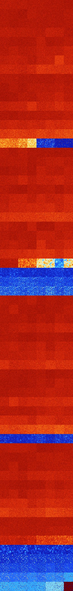

# B0346 (45568-46079)

<details>
    <summary>Initial Grid</summary>
    
</details>


<details>
    <summary>Initial Grid RLE</summary>

```
#C Exported from GoGoL (https://github.com/marrow16/gogol)
#C Wrap mode: Toroidal
#C Boundary mode: Dead
#C Step: 0
x = 100, y = 100, rule = B0346/S
5bo48bo21bo2bo4bo10bo$17bo3bo19bo14bobo3bo$50bo6bo17bo14bo6bo$40bo13bo
15bo11bo$28bo14b2o$23bo13bo11bo15bo20bo$30bo7bo41bobo$7bobo23bo4bo24bo
33bo$69bobo7bo$9bo57bo$bo15bo16bo3b2o25bo19bo$16bo26bo$12bo16bo5bo2bo9b
o$10bo12bo36bo5bo$bo34bo9bo8bo7b2o18bo$o29bobo3bo29bo$10bo7bo11bo52bo$
7bo4bo48bo20bo11bo$13bo14bo11bo48bo$19bo30bo12bo12bo5bo11bo$25bo23bo$
22bo33b2o37bo$31bo48bo8bobo$9bo18bo22bo27bo8bo10bo$2bo5bo32bo26b3o12bo$
3bo19bo17bo29bo6bo6bo$7bo28bo8bo35bo9bo$28bo16bo52bo$2b2o9bobo32bo4bo5b
o7bo2bo13bo$4bo16bo9bo13bo38bo$36bo12bo23bobo10bo$100b$23bo7bo24bobo20b
o$18bo25bo28bo$27bo33bo27bo5bo2bo$19bo52bo24bo$2bo7bo17bo6bo6bo15bo10bo
$11bo15bo2bo8bo11bo18b2o6bo12bo$70bo7bo$7bo8bo17bo3bo14bo6bo13bo12bo$
19bo7bo33bo30bo4bo$9bo7bo24bo28bo4bo19bo$o18bo3b2o27bo14bo3bo21bo$18bo
17bo24bobo17bo4bo$4bo7bo25bo31bo14bo10bo$40bo10bo16bo$24bo12bo12bo23bo
10bo5bo$o28bo2bo23bo21bobo8bo$51bo43bo$bo19bo5bo6bo7bobo7bo27bo5b2o4bo$
24bobo28bo4bo6bo20bo4bo$4bo$33bo2bo32bo$2bo10bo4bo9bo18bo27bo$12bo29bob
o4bo2bo4bo22bo8bo$30bo21b2o6bo4bo6bo$4bo45bo2bob2o16bo11bo6bo5bo$25bo5b
o6bo9bo10bo$36bo10bo12bo30bo3bo$37bo12bo16b2o21b2o$6bo18bo27bo14bo28bo$
7bo11bo15bo41bo$20bo6bo30bo10bo10bo13bo$6bo36bo4bob2o$6bo66bo23bo$80bo
4bo11bo$5b3o4bo2bo72b2o4b2o$13bo18bo5bo33bo$obo39bo24bo4bobo8bo$28bobo
3bo4bo15bo19bo5bo$4bo2bobo12bo35bo13bo$18bo40bo27bo$17bo5bo4bo27bo19b2o
4bo16bo$2bo10bo31bo28bo$16bo20bo19bobo33bo$26bo14b2obo5b3o27b2obobo$bo
72bo$33bo64bo$6bo12b2o16bo$17bo49bo10bo$2o5bo40bo12bo33bo$14b2o6bo26bo
21bo5bo10bo2bo$5bo37bo52bo$23bo4bo12bo23bo8bo19bo$12bo31bo$72bo9bobo$
23bo8bo23bo13b2o9bo$bo10bo3bo21bo4bo31bo16bo$32bo39bo4bo$10bo34bo8bo11b
o12bo$11bo12bo47bo2bo19bo$8bo37bo11bo11b2o13bo4b2o$10bo38bo5bo5bo17bo
17bo$26bo19bo32bo7bo$8bo33bo$19b2o37bo20bo10bo$36bo38bo$24bo44bobo12bo
7bo$2bo29bo2bo55bobo$80bo17bo!
```
</details>
<details>
    <summary>Thumbnail</summary>

</details>
<table>
<tr>
    <td><a href="./45568%20S%20Heat%20Map%20Activity.png"></a><br>S (45568)<br>G>1000</td>    <td><a href="./45569%20S0%20Heat%20Map%20Activity.png"></a><br>S0 (45569)<br>G>1000</td>    <td><a href="./45570%20S1%20Heat%20Map%20Activity.png"></a><br>S1 (45570)<br>G>1000</td>    <td><a href="./45571%20S01%20Heat%20Map%20Activity.png"></a><br>S01 (45571)<br>G>1000</td>    <td><a href="./45572%20S2%20Heat%20Map%20Activity.png"></a><br>S2 (45572)<br>G>1000</td>    <td><a href="./45573%20S02%20Heat%20Map%20Activity.png"></a><br>S02 (45573)<br>G>1000</td>    <td><a href="./45574%20S12%20Heat%20Map%20Activity.png"></a><br>S12 (45574)<br>G>1000</td>    <td><a href="./45575%20S012%20Heat%20Map%20Activity.png"></a><br>S012 (45575)<br>G>1000</td></tr>
<tr>
    <td><a href="./45576%20S3%20Heat%20Map%20Activity.png"></a><br>S3 (45576)<br>G>1000</td>    <td><a href="./45577%20S03%20Heat%20Map%20Activity.png"></a><br>S03 (45577)<br>G>1000</td>    <td><a href="./45578%20S13%20Heat%20Map%20Activity.png"></a><br>S13 (45578)<br>G>1000</td>    <td><a href="./45579%20S013%20Heat%20Map%20Activity.png"></a><br>S013 (45579)<br>G>1000</td>    <td><a href="./45580%20S23%20Heat%20Map%20Activity.png"></a><br>S23 (45580)<br>G>1000</td>    <td><a href="./45581%20S023%20Heat%20Map%20Activity.png"></a><br>S023 (45581)<br>G>1000</td>    <td><a href="./45582%20S123%20Heat%20Map%20Activity.png"></a><br>S123 (45582)<br>G>1000</td>    <td><a href="./45583%20S0123%20Heat%20Map%20Activity.png"></a><br>S0123 (45583)<br>G>1000</td></tr>
<tr>
    <td><a href="./45584%20S4%20Heat%20Map%20Activity.png"></a><br>S4 (45584)<br>G>1000</td>    <td><a href="./45585%20S04%20Heat%20Map%20Activity.png"></a><br>S04 (45585)<br>G>1000</td>    <td><a href="./45586%20S14%20Heat%20Map%20Activity.png"></a><br>S14 (45586)<br>G>1000</td>    <td><a href="./45587%20S014%20Heat%20Map%20Activity.png"></a><br>S014 (45587)<br>G>1000</td>    <td><a href="./45588%20S24%20Heat%20Map%20Activity.png"></a><br>S24 (45588)<br>G>1000</td>    <td><a href="./45589%20S024%20Heat%20Map%20Activity.png"></a><br>S024 (45589)<br>G>1000</td>    <td><a href="./45590%20S124%20Heat%20Map%20Activity.png"></a><br>S124 (45590)<br>G>1000</td>    <td><a href="./45591%20S0124%20Heat%20Map%20Activity.png"></a><br>S0124 (45591)<br>G>1000</td></tr>
<tr>
    <td><a href="./45592%20S34%20Heat%20Map%20Activity.png"></a><br>S34 (45592)<br>G>1000</td>    <td><a href="./45593%20S034%20Heat%20Map%20Activity.png"></a><br>S034 (45593)<br>G>1000</td>    <td><a href="./45594%20S134%20Heat%20Map%20Activity.png"></a><br>S134 (45594)<br>G>1000</td>    <td><a href="./45595%20S0134%20Heat%20Map%20Activity.png"></a><br>S0134 (45595)<br>G>1000</td>    <td><a href="./45596%20S234%20Heat%20Map%20Activity.png"></a><br>S234 (45596)<br>G>1000</td>    <td><a href="./45597%20S0234%20Heat%20Map%20Activity.png"></a><br>S0234 (45597)<br>G>1000</td>    <td><a href="./45598%20S1234%20Heat%20Map%20Activity.png"></a><br>S1234 (45598)<br>G>1000</td>    <td><a href="./45599%20S01234%20Heat%20Map%20Activity.png"></a><br>S01234 (45599)<br>G>1000</td></tr>
<tr>
    <td><a href="./45600%20S5%20Heat%20Map%20Activity.png"></a><br>S5 (45600)<br>G>1000</td>    <td><a href="./45601%20S05%20Heat%20Map%20Activity.png"></a><br>S05 (45601)<br>G>1000</td>    <td><a href="./45602%20S15%20Heat%20Map%20Activity.png"></a><br>S15 (45602)<br>G>1000</td>    <td><a href="./45603%20S015%20Heat%20Map%20Activity.png"></a><br>S015 (45603)<br>G>1000</td>    <td><a href="./45604%20S25%20Heat%20Map%20Activity.png"></a><br>S25 (45604)<br>G>1000</td>    <td><a href="./45605%20S025%20Heat%20Map%20Activity.png"></a><br>S025 (45605)<br>G>1000</td>    <td><a href="./45606%20S125%20Heat%20Map%20Activity.png"></a><br>S125 (45606)<br>G>1000</td>    <td><a href="./45607%20S0125%20Heat%20Map%20Activity.png"></a><br>S0125 (45607)<br>G>1000</td></tr>
<tr>
    <td><a href="./45608%20S35%20Heat%20Map%20Activity.png"></a><br>S35 (45608)<br>G>1000</td>    <td><a href="./45609%20S035%20Heat%20Map%20Activity.png"></a><br>S035 (45609)<br>G>1000</td>    <td><a href="./45610%20S135%20Heat%20Map%20Activity.png"></a><br>S135 (45610)<br>G>1000</td>    <td><a href="./45611%20S0135%20Heat%20Map%20Activity.png"></a><br>S0135 (45611)<br>G>1000</td>    <td><a href="./45612%20S235%20Heat%20Map%20Activity.png"></a><br>S235 (45612)<br>G>1000</td>    <td><a href="./45613%20S0235%20Heat%20Map%20Activity.png"></a><br>S0235 (45613)<br>G>1000</td>    <td><a href="./45614%20S1235%20Heat%20Map%20Activity.png"></a><br>S1235 (45614)<br>G>1000</td>    <td><a href="./45615%20S01235%20Heat%20Map%20Activity.png"></a><br>S01235 (45615)<br>G>1000</td></tr>
<tr>
    <td><a href="./45616%20S45%20Heat%20Map%20Activity.png"></a><br>S45 (45616)<br>G>1000</td>    <td><a href="./45617%20S045%20Heat%20Map%20Activity.png"></a><br>S045 (45617)<br>G>1000</td>    <td><a href="./45618%20S145%20Heat%20Map%20Activity.png"></a><br>S145 (45618)<br>G>1000</td>    <td><a href="./45619%20S0145%20Heat%20Map%20Activity.png"></a><br>S0145 (45619)<br>G>1000</td>    <td><a href="./45620%20S245%20Heat%20Map%20Activity.png"></a><br>S245 (45620)<br>G>1000</td>    <td><a href="./45621%20S0245%20Heat%20Map%20Activity.png"></a><br>S0245 (45621)<br>G>1000</td>    <td><a href="./45622%20S1245%20Heat%20Map%20Activity.png"></a><br>S1245 (45622)<br>G>1000</td>    <td><a href="./45623%20S01245%20Heat%20Map%20Activity.png"></a><br>S01245 (45623)<br>G>1000</td></tr>
<tr>
    <td><a href="./45624%20S345%20Heat%20Map%20Activity.png"></a><br>S345 (45624)<br>G>1000</td>    <td><a href="./45625%20S0345%20Heat%20Map%20Activity.png"></a><br>S0345 (45625)<br>G>1000</td>    <td><a href="./45626%20S1345%20Heat%20Map%20Activity.png"></a><br>S1345 (45626)<br>G>1000</td>    <td><a href="./45627%20S01345%20Heat%20Map%20Activity.png"></a><br>S01345 (45627)<br>G>1000</td>    <td><a href="./45628%20S2345%20Heat%20Map%20Activity.png"></a><br>S2345 (45628)<br>G>1000</td>    <td><a href="./45629%20S02345%20Heat%20Map%20Activity.png"></a><br>S02345 (45629)<br>G>1000</td>    <td><a href="./45630%20S12345%20Heat%20Map%20Activity.png"></a><br>S12345 (45630)<br>G>1000</td>    <td><a href="./45631%20S012345%20Heat%20Map%20Activity.png"></a><br>S012345 (45631)<br>G>1000</td></tr>
<tr>
    <td><a href="./45632%20S6%20Heat%20Map%20Activity.png"></a><br>S6 (45632)<br>G>1000</td>    <td><a href="./45633%20S06%20Heat%20Map%20Activity.png"></a><br>S06 (45633)<br>G>1000</td>    <td><a href="./45634%20S16%20Heat%20Map%20Activity.png"></a><br>S16 (45634)<br>G>1000</td>    <td><a href="./45635%20S016%20Heat%20Map%20Activity.png"></a><br>S016 (45635)<br>G>1000</td>    <td><a href="./45636%20S26%20Heat%20Map%20Activity.png"></a><br>S26 (45636)<br>G>1000</td>    <td><a href="./45637%20S026%20Heat%20Map%20Activity.png"></a><br>S026 (45637)<br>G>1000</td>    <td><a href="./45638%20S126%20Heat%20Map%20Activity.png"></a><br>S126 (45638)<br>G>1000</td>    <td><a href="./45639%20S0126%20Heat%20Map%20Activity.png"></a><br>S0126 (45639)<br>G>1000</td></tr>
<tr>
    <td><a href="./45640%20S36%20Heat%20Map%20Activity.png"></a><br>S36 (45640)<br>G>1000</td>    <td><a href="./45641%20S036%20Heat%20Map%20Activity.png"></a><br>S036 (45641)<br>G>1000</td>    <td><a href="./45642%20S136%20Heat%20Map%20Activity.png"></a><br>S136 (45642)<br>G>1000</td>    <td><a href="./45643%20S0136%20Heat%20Map%20Activity.png"></a><br>S0136 (45643)<br>G>1000</td>    <td><a href="./45644%20S236%20Heat%20Map%20Activity.png"></a><br>S236 (45644)<br>G>1000</td>    <td><a href="./45645%20S0236%20Heat%20Map%20Activity.png"></a><br>S0236 (45645)<br>G>1000</td>    <td><a href="./45646%20S1236%20Heat%20Map%20Activity.png"></a><br>S1236 (45646)<br>G>1000</td>    <td><a href="./45647%20S01236%20Heat%20Map%20Activity.png"></a><br>S01236 (45647)<br>G>1000</td></tr>
<tr>
    <td><a href="./45648%20S46%20Heat%20Map%20Activity.png"></a><br>S46 (45648)<br>G>1000</td>    <td><a href="./45649%20S046%20Heat%20Map%20Activity.png"></a><br>S046 (45649)<br>G>1000</td>    <td><a href="./45650%20S146%20Heat%20Map%20Activity.png"></a><br>S146 (45650)<br>G>1000</td>    <td><a href="./45651%20S0146%20Heat%20Map%20Activity.png"></a><br>S0146 (45651)<br>G>1000</td>    <td><a href="./45652%20S246%20Heat%20Map%20Activity.png"></a><br>S246 (45652)<br>G>1000</td>    <td><a href="./45653%20S0246%20Heat%20Map%20Activity.png"></a><br>S0246 (45653)<br>G>1000</td>    <td><a href="./45654%20S1246%20Heat%20Map%20Activity.png"></a><br>S1246 (45654)<br>G>1000</td>    <td><a href="./45655%20S01246%20Heat%20Map%20Activity.png"></a><br>S01246 (45655)<br>G>1000</td></tr>
<tr>
    <td><a href="./45656%20S346%20Heat%20Map%20Activity.png"></a><br>S346 (45656)<br>G>1000</td>    <td><a href="./45657%20S0346%20Heat%20Map%20Activity.png"></a><br>S0346 (45657)<br>G>1000</td>    <td><a href="./45658%20S1346%20Heat%20Map%20Activity.png"></a><br>S1346 (45658)<br>G>1000</td>    <td><a href="./45659%20S01346%20Heat%20Map%20Activity.png"></a><br>S01346 (45659)<br>G>1000</td>    <td><a href="./45660%20S2346%20Heat%20Map%20Activity.png"></a><br>S2346 (45660)<br>G>1000</td>    <td><a href="./45661%20S02346%20Heat%20Map%20Activity.png"></a><br>S02346 (45661)<br>G>1000</td>    <td><a href="./45662%20S12346%20Heat%20Map%20Activity.png"></a><br>S12346 (45662)<br>G>1000</td>    <td><a href="./45663%20S012346%20Heat%20Map%20Activity.png"></a><br>S012346 (45663)<br>G>1000</td></tr>
<tr>
    <td><a href="./45664%20S56%20Heat%20Map%20Activity.png"></a><br>S56 (45664)<br>G>1000</td>    <td><a href="./45665%20S056%20Heat%20Map%20Activity.png"></a><br>S056 (45665)<br>G>1000</td>    <td><a href="./45666%20S156%20Heat%20Map%20Activity.png"></a><br>S156 (45666)<br>G>1000</td>    <td><a href="./45667%20S0156%20Heat%20Map%20Activity.png"></a><br>S0156 (45667)<br>G>1000</td>    <td><a href="./45668%20S256%20Heat%20Map%20Activity.png"></a><br>S256 (45668)<br>G>1000</td>    <td><a href="./45669%20S0256%20Heat%20Map%20Activity.png"></a><br>S0256 (45669)<br>G>1000</td>    <td><a href="./45670%20S1256%20Heat%20Map%20Activity.png"></a><br>S1256 (45670)<br>G>1000</td>    <td><a href="./45671%20S01256%20Heat%20Map%20Activity.png"></a><br>S01256 (45671)<br>G>1000</td></tr>
<tr>
    <td><a href="./45672%20S356%20Heat%20Map%20Activity.png"></a><br>S356 (45672)<br>G>1000</td>    <td><a href="./45673%20S0356%20Heat%20Map%20Activity.png"></a><br>S0356 (45673)<br>G>1000</td>    <td><a href="./45674%20S1356%20Heat%20Map%20Activity.png"></a><br>S1356 (45674)<br>G>1000</td>    <td><a href="./45675%20S01356%20Heat%20Map%20Activity.png"></a><br>S01356 (45675)<br>G>1000</td>    <td><a href="./45676%20S2356%20Heat%20Map%20Activity.png"></a><br>S2356 (45676)<br>G>1000</td>    <td><a href="./45677%20S02356%20Heat%20Map%20Activity.png"></a><br>S02356 (45677)<br>G>1000</td>    <td><a href="./45678%20S12356%20Heat%20Map%20Activity.png"></a><br>S12356 (45678)<br>G>1000</td>    <td><a href="./45679%20S012356%20Heat%20Map%20Activity.png"></a><br>S012356 (45679)<br>G>1000</td></tr>
<tr>
    <td><a href="./45680%20S456%20Heat%20Map%20Activity.png"></a><br>S456 (45680)<br>G>1000</td>    <td><a href="./45681%20S0456%20Heat%20Map%20Activity.png"></a><br>S0456 (45681)<br>G>1000</td>    <td><a href="./45682%20S1456%20Heat%20Map%20Activity.png"></a><br>S1456 (45682)<br>G>1000</td>    <td><a href="./45683%20S01456%20Heat%20Map%20Activity.png"></a><br>S01456 (45683)<br>G>1000</td>    <td><a href="./45684%20S2456%20Heat%20Map%20Activity.png"></a><br>S2456 (45684)<br>G>1000</td>    <td><a href="./45685%20S02456%20Heat%20Map%20Activity.png"></a><br>S02456 (45685)<br>G>1000</td>    <td><a href="./45686%20S12456%20Heat%20Map%20Activity.png"></a><br>S12456 (45686)<br>G>1000</td>    <td><a href="./45687%20S012456%20Heat%20Map%20Activity.png"></a><br>S012456 (45687)<br>G>1000</td></tr>
<tr>
    <td><a href="./45688%20S3456%20Heat%20Map%20Activity.png"></a><br>S3456 (45688)<br>G>1000</td>    <td><a href="./45689%20S03456%20Heat%20Map%20Activity.png"></a><br>S03456 (45689)<br>G>1000</td>    <td><a href="./45690%20S13456%20Heat%20Map%20Activity.png"></a><br>S13456 (45690)<br>G>1000</td>    <td><a href="./45691%20S013456%20Heat%20Map%20Activity.png"></a><br>S013456 (45691)<br>G>1000</td>    <td><a href="./45692%20S23456%20Heat%20Map%20Activity.png"></a><br>S23456 (45692)<br>R@150,p24</td>    <td><a href="./45693%20S023456%20Heat%20Map%20Activity.png"></a><br>S023456 (45693)<br>R@115,p12</td>    <td><a href="./45694%20S123456%20Heat%20Map%20Activity.png"></a><br>S123456 (45694)<br>R@508,p420</td>    <td><a href="./45695%20S0123456%20Heat%20Map%20Activity.png"></a><br>S0123456 (45695)<br>R@493,p420</td></tr>
<tr>
    <td><a href="./45696%20S7%20Heat%20Map%20Activity.png"></a><br>S7 (45696)<br>G>1000</td>    <td><a href="./45697%20S07%20Heat%20Map%20Activity.png"></a><br>S07 (45697)<br>G>1000</td>    <td><a href="./45698%20S17%20Heat%20Map%20Activity.png"></a><br>S17 (45698)<br>G>1000</td>    <td><a href="./45699%20S017%20Heat%20Map%20Activity.png"></a><br>S017 (45699)<br>G>1000</td>    <td><a href="./45700%20S27%20Heat%20Map%20Activity.png"></a><br>S27 (45700)<br>G>1000</td>    <td><a href="./45701%20S027%20Heat%20Map%20Activity.png"></a><br>S027 (45701)<br>G>1000</td>    <td><a href="./45702%20S127%20Heat%20Map%20Activity.png"></a><br>S127 (45702)<br>G>1000</td>    <td><a href="./45703%20S0127%20Heat%20Map%20Activity.png"></a><br>S0127 (45703)<br>G>1000</td></tr>
<tr>
    <td><a href="./45704%20S37%20Heat%20Map%20Activity.png"></a><br>S37 (45704)<br>G>1000</td>    <td><a href="./45705%20S037%20Heat%20Map%20Activity.png"></a><br>S037 (45705)<br>G>1000</td>    <td><a href="./45706%20S137%20Heat%20Map%20Activity.png"></a><br>S137 (45706)<br>G>1000</td>    <td><a href="./45707%20S0137%20Heat%20Map%20Activity.png"></a><br>S0137 (45707)<br>G>1000</td>    <td><a href="./45708%20S237%20Heat%20Map%20Activity.png"></a><br>S237 (45708)<br>G>1000</td>    <td><a href="./45709%20S0237%20Heat%20Map%20Activity.png"></a><br>S0237 (45709)<br>G>1000</td>    <td><a href="./45710%20S1237%20Heat%20Map%20Activity.png"></a><br>S1237 (45710)<br>G>1000</td>    <td><a href="./45711%20S01237%20Heat%20Map%20Activity.png"></a><br>S01237 (45711)<br>G>1000</td></tr>
<tr>
    <td><a href="./45712%20S47%20Heat%20Map%20Activity.png"></a><br>S47 (45712)<br>G>1000</td>    <td><a href="./45713%20S047%20Heat%20Map%20Activity.png"></a><br>S047 (45713)<br>G>1000</td>    <td><a href="./45714%20S147%20Heat%20Map%20Activity.png"></a><br>S147 (45714)<br>G>1000</td>    <td><a href="./45715%20S0147%20Heat%20Map%20Activity.png"></a><br>S0147 (45715)<br>G>1000</td>    <td><a href="./45716%20S247%20Heat%20Map%20Activity.png"></a><br>S247 (45716)<br>G>1000</td>    <td><a href="./45717%20S0247%20Heat%20Map%20Activity.png"></a><br>S0247 (45717)<br>G>1000</td>    <td><a href="./45718%20S1247%20Heat%20Map%20Activity.png"></a><br>S1247 (45718)<br>G>1000</td>    <td><a href="./45719%20S01247%20Heat%20Map%20Activity.png"></a><br>S01247 (45719)<br>G>1000</td></tr>
<tr>
    <td><a href="./45720%20S347%20Heat%20Map%20Activity.png"></a><br>S347 (45720)<br>G>1000</td>    <td><a href="./45721%20S0347%20Heat%20Map%20Activity.png"></a><br>S0347 (45721)<br>G>1000</td>    <td><a href="./45722%20S1347%20Heat%20Map%20Activity.png"></a><br>S1347 (45722)<br>G>1000</td>    <td><a href="./45723%20S01347%20Heat%20Map%20Activity.png"></a><br>S01347 (45723)<br>G>1000</td>    <td><a href="./45724%20S2347%20Heat%20Map%20Activity.png"></a><br>S2347 (45724)<br>G>1000</td>    <td><a href="./45725%20S02347%20Heat%20Map%20Activity.png"></a><br>S02347 (45725)<br>G>1000</td>    <td><a href="./45726%20S12347%20Heat%20Map%20Activity.png"></a><br>S12347 (45726)<br>G>1000</td>    <td><a href="./45727%20S012347%20Heat%20Map%20Activity.png"></a><br>S012347 (45727)<br>G>1000</td></tr>
<tr>
    <td><a href="./45728%20S57%20Heat%20Map%20Activity.png"></a><br>S57 (45728)<br>G>1000</td>    <td><a href="./45729%20S057%20Heat%20Map%20Activity.png"></a><br>S057 (45729)<br>G>1000</td>    <td><a href="./45730%20S157%20Heat%20Map%20Activity.png"></a><br>S157 (45730)<br>G>1000</td>    <td><a href="./45731%20S0157%20Heat%20Map%20Activity.png"></a><br>S0157 (45731)<br>G>1000</td>    <td><a href="./45732%20S257%20Heat%20Map%20Activity.png"></a><br>S257 (45732)<br>G>1000</td>    <td><a href="./45733%20S0257%20Heat%20Map%20Activity.png"></a><br>S0257 (45733)<br>G>1000</td>    <td><a href="./45734%20S1257%20Heat%20Map%20Activity.png"></a><br>S1257 (45734)<br>G>1000</td>    <td><a href="./45735%20S01257%20Heat%20Map%20Activity.png"></a><br>S01257 (45735)<br>G>1000</td></tr>
<tr>
    <td><a href="./45736%20S357%20Heat%20Map%20Activity.png"></a><br>S357 (45736)<br>G>1000</td>    <td><a href="./45737%20S0357%20Heat%20Map%20Activity.png"></a><br>S0357 (45737)<br>G>1000</td>    <td><a href="./45738%20S1357%20Heat%20Map%20Activity.png"></a><br>S1357 (45738)<br>G>1000</td>    <td><a href="./45739%20S01357%20Heat%20Map%20Activity.png"></a><br>S01357 (45739)<br>G>1000</td>    <td><a href="./45740%20S2357%20Heat%20Map%20Activity.png"></a><br>S2357 (45740)<br>G>1000</td>    <td><a href="./45741%20S02357%20Heat%20Map%20Activity.png"></a><br>S02357 (45741)<br>G>1000</td>    <td><a href="./45742%20S12357%20Heat%20Map%20Activity.png"></a><br>S12357 (45742)<br>G>1000</td>    <td><a href="./45743%20S012357%20Heat%20Map%20Activity.png"></a><br>S012357 (45743)<br>G>1000</td></tr>
<tr>
    <td><a href="./45744%20S457%20Heat%20Map%20Activity.png"></a><br>S457 (45744)<br>G>1000</td>    <td><a href="./45745%20S0457%20Heat%20Map%20Activity.png"></a><br>S0457 (45745)<br>G>1000</td>    <td><a href="./45746%20S1457%20Heat%20Map%20Activity.png"></a><br>S1457 (45746)<br>G>1000</td>    <td><a href="./45747%20S01457%20Heat%20Map%20Activity.png"></a><br>S01457 (45747)<br>G>1000</td>    <td><a href="./45748%20S2457%20Heat%20Map%20Activity.png"></a><br>S2457 (45748)<br>G>1000</td>    <td><a href="./45749%20S02457%20Heat%20Map%20Activity.png"></a><br>S02457 (45749)<br>G>1000</td>    <td><a href="./45750%20S12457%20Heat%20Map%20Activity.png"></a><br>S12457 (45750)<br>G>1000</td>    <td><a href="./45751%20S012457%20Heat%20Map%20Activity.png"></a><br>S012457 (45751)<br>G>1000</td></tr>
<tr>
    <td><a href="./45752%20S3457%20Heat%20Map%20Activity.png"></a><br>S3457 (45752)<br>G>1000</td>    <td><a href="./45753%20S03457%20Heat%20Map%20Activity.png"></a><br>S03457 (45753)<br>G>1000</td>    <td><a href="./45754%20S13457%20Heat%20Map%20Activity.png"></a><br>S13457 (45754)<br>G>1000</td>    <td><a href="./45755%20S013457%20Heat%20Map%20Activity.png"></a><br>S013457 (45755)<br>G>1000</td>    <td><a href="./45756%20S23457%20Heat%20Map%20Activity.png"></a><br>S23457 (45756)<br>G>1000</td>    <td><a href="./45757%20S023457%20Heat%20Map%20Activity.png"></a><br>S023457 (45757)<br>G>1000</td>    <td><a href="./45758%20S123457%20Heat%20Map%20Activity.png"></a><br>S123457 (45758)<br>G>1000</td>    <td><a href="./45759%20S0123457%20Heat%20Map%20Activity.png"></a><br>S0123457 (45759)<br>G>1000</td></tr>
<tr>
    <td><a href="./45760%20S67%20Heat%20Map%20Activity.png"></a><br>S67 (45760)<br>G>1000</td>    <td><a href="./45761%20S067%20Heat%20Map%20Activity.png"></a><br>S067 (45761)<br>G>1000</td>    <td><a href="./45762%20S167%20Heat%20Map%20Activity.png"></a><br>S167 (45762)<br>G>1000</td>    <td><a href="./45763%20S0167%20Heat%20Map%20Activity.png"></a><br>S0167 (45763)<br>G>1000</td>    <td><a href="./45764%20S267%20Heat%20Map%20Activity.png"></a><br>S267 (45764)<br>G>1000</td>    <td><a href="./45765%20S0267%20Heat%20Map%20Activity.png"></a><br>S0267 (45765)<br>G>1000</td>    <td><a href="./45766%20S1267%20Heat%20Map%20Activity.png"></a><br>S1267 (45766)<br>G>1000</td>    <td><a href="./45767%20S01267%20Heat%20Map%20Activity.png"></a><br>S01267 (45767)<br>G>1000</td></tr>
<tr>
    <td><a href="./45768%20S367%20Heat%20Map%20Activity.png"></a><br>S367 (45768)<br>G>1000</td>    <td><a href="./45769%20S0367%20Heat%20Map%20Activity.png"></a><br>S0367 (45769)<br>G>1000</td>    <td><a href="./45770%20S1367%20Heat%20Map%20Activity.png"></a><br>S1367 (45770)<br>G>1000</td>    <td><a href="./45771%20S01367%20Heat%20Map%20Activity.png"></a><br>S01367 (45771)<br>G>1000</td>    <td><a href="./45772%20S2367%20Heat%20Map%20Activity.png"></a><br>S2367 (45772)<br>G>1000</td>    <td><a href="./45773%20S02367%20Heat%20Map%20Activity.png"></a><br>S02367 (45773)<br>G>1000</td>    <td><a href="./45774%20S12367%20Heat%20Map%20Activity.png"></a><br>S12367 (45774)<br>G>1000</td>    <td><a href="./45775%20S012367%20Heat%20Map%20Activity.png"></a><br>S012367 (45775)<br>G>1000</td></tr>
<tr>
    <td><a href="./45776%20S467%20Heat%20Map%20Activity.png"></a><br>S467 (45776)<br>G>1000</td>    <td><a href="./45777%20S0467%20Heat%20Map%20Activity.png"></a><br>S0467 (45777)<br>G>1000</td>    <td><a href="./45778%20S1467%20Heat%20Map%20Activity.png"></a><br>S1467 (45778)<br>G>1000</td>    <td><a href="./45779%20S01467%20Heat%20Map%20Activity.png"></a><br>S01467 (45779)<br>G>1000</td>    <td><a href="./45780%20S2467%20Heat%20Map%20Activity.png"></a><br>S2467 (45780)<br>G>1000</td>    <td><a href="./45781%20S02467%20Heat%20Map%20Activity.png"></a><br>S02467 (45781)<br>G>1000</td>    <td><a href="./45782%20S12467%20Heat%20Map%20Activity.png"></a><br>S12467 (45782)<br>G>1000</td>    <td><a href="./45783%20S012467%20Heat%20Map%20Activity.png"></a><br>S012467 (45783)<br>G>1000</td></tr>
<tr>
    <td><a href="./45784%20S3467%20Heat%20Map%20Activity.png"></a><br>S3467 (45784)<br>G>1000</td>    <td><a href="./45785%20S03467%20Heat%20Map%20Activity.png"></a><br>S03467 (45785)<br>G>1000</td>    <td><a href="./45786%20S13467%20Heat%20Map%20Activity.png"></a><br>S13467 (45786)<br>G>1000</td>    <td><a href="./45787%20S013467%20Heat%20Map%20Activity.png"></a><br>S013467 (45787)<br>G>1000</td>    <td><a href="./45788%20S23467%20Heat%20Map%20Activity.png"></a><br>S23467 (45788)<br>G>1000</td>    <td><a href="./45789%20S023467%20Heat%20Map%20Activity.png"></a><br>S023467 (45789)<br>G>1000</td>    <td><a href="./45790%20S123467%20Heat%20Map%20Activity.png"></a><br>S123467 (45790)<br>G>1000</td>    <td><a href="./45791%20S0123467%20Heat%20Map%20Activity.png"></a><br>S0123467 (45791)<br>G>1000</td></tr>
<tr>
    <td><a href="./45792%20S567%20Heat%20Map%20Activity.png"></a><br>S567 (45792)<br>G>1000</td>    <td><a href="./45793%20S0567%20Heat%20Map%20Activity.png"></a><br>S0567 (45793)<br>G>1000</td>    <td><a href="./45794%20S1567%20Heat%20Map%20Activity.png"></a><br>S1567 (45794)<br>G>1000</td>    <td><a href="./45795%20S01567%20Heat%20Map%20Activity.png"></a><br>S01567 (45795)<br>G>1000</td>    <td><a href="./45796%20S2567%20Heat%20Map%20Activity.png"></a><br>S2567 (45796)<br>G>1000</td>    <td><a href="./45797%20S02567%20Heat%20Map%20Activity.png"></a><br>S02567 (45797)<br>G>1000</td>    <td><a href="./45798%20S12567%20Heat%20Map%20Activity.png"></a><br>S12567 (45798)<br>G>1000</td>    <td><a href="./45799%20S012567%20Heat%20Map%20Activity.png"></a><br>S012567 (45799)<br>G>1000</td></tr>
<tr>
    <td><a href="./45800%20S3567%20Heat%20Map%20Activity.png"></a><br>S3567 (45800)<br>R@196,p4</td>    <td><a href="./45801%20S03567%20Heat%20Map%20Activity.png"></a><br>S03567 (45801)<br>R@138,p2</td>    <td><a href="./45802%20S13567%20Heat%20Map%20Activity.png"></a><br>S13567 (45802)<br>R@203,p2</td>    <td><a href="./45803%20S013567%20Heat%20Map%20Activity.png"></a><br>S013567 (45803)<br>R@165,p4</td>    <td><a href="./45804%20S23567%20Heat%20Map%20Activity.png"></a><br>S23567 (45804)<br>R@181,p4</td>    <td><a href="./45805%20S023567%20Heat%20Map%20Activity.png"></a><br>S023567 (45805)<br>R@143,p2</td>    <td><a href="./45806%20S123567%20Heat%20Map%20Activity.png"></a><br>S123567 (45806)<br>R@104,p4</td>    <td><a href="./45807%20S0123567%20Heat%20Map%20Activity.png"></a><br>S0123567 (45807)<br>R@171,p2</td></tr>
<tr>
    <td><a href="./45808%20S4567%20Heat%20Map%20Activity.png"></a><br>S4567 (45808)<br>R@25,p6</td>    <td><a href="./45809%20S04567%20Heat%20Map%20Activity.png"></a><br>S04567 (45809)<br>R@20,p2</td>    <td><a href="./45810%20S14567%20Heat%20Map%20Activity.png"></a><br>S14567 (45810)<br>R@18,p2</td>    <td><a href="./45811%20S014567%20Heat%20Map%20Activity.png"></a><br>S014567 (45811)<br>R@19,p4</td>    <td><a href="./45812%20S24567%20Heat%20Map%20Activity.png"></a><br>S24567 (45812)<br>R@20,p2</td>    <td><a href="./45813%20S024567%20Heat%20Map%20Activity.png"></a><br>S024567 (45813)<br>R@23,p6</td>    <td><a href="./45814%20S124567%20Heat%20Map%20Activity.png"></a><br>S124567 (45814)<br>R@17,p2</td>    <td><a href="./45815%20S0124567%20Heat%20Map%20Activity.png"></a><br>S0124567 (45815)<br>R@23,p6</td></tr>
<tr>
    <td><a href="./45816%20S34567%20Heat%20Map%20Activity.png"></a><br>S34567 (45816)<br>R@13,p2</td>    <td><a href="./45817%20S034567%20Heat%20Map%20Activity.png"></a><br>S034567 (45817)<br>R@14,p2</td>    <td><a href="./45818%20S134567%20Heat%20Map%20Activity.png"></a><br>S134567 (45818)<br>R@14,p2</td>    <td><a href="./45819%20S0134567%20Heat%20Map%20Activity.png"></a><br>S0134567 (45819)<br>R@14,p2</td>    <td><a href="./45820%20S234567%20Heat%20Map%20Activity.png"></a><br>S234567 (45820)<br>R@14,p2</td>    <td><a href="./45821%20S0234567%20Heat%20Map%20Activity.png"></a><br>S0234567 (45821)<br>R@12,p2</td>    <td><a href="./45822%20S1234567%20Heat%20Map%20Activity.png"></a><br>S1234567 (45822)<br>R@14,p2</td>    <td><a href="./45823%20S01234567%20Heat%20Map%20Activity.png"></a><br>S01234567 (45823)<br>R@13,p2</td></tr>
<tr>
    <td><a href="./45824%20S8%20Heat%20Map%20Activity.png"></a><br>S8 (45824)<br>G>1000</td>    <td><a href="./45825%20S08%20Heat%20Map%20Activity.png"></a><br>S08 (45825)<br>G>1000</td>    <td><a href="./45826%20S18%20Heat%20Map%20Activity.png"></a><br>S18 (45826)<br>G>1000</td>    <td><a href="./45827%20S018%20Heat%20Map%20Activity.png"></a><br>S018 (45827)<br>G>1000</td>    <td><a href="./45828%20S28%20Heat%20Map%20Activity.png"></a><br>S28 (45828)<br>G>1000</td>    <td><a href="./45829%20S028%20Heat%20Map%20Activity.png"></a><br>S028 (45829)<br>G>1000</td>    <td><a href="./45830%20S128%20Heat%20Map%20Activity.png"></a><br>S128 (45830)<br>G>1000</td>    <td><a href="./45831%20S0128%20Heat%20Map%20Activity.png"></a><br>S0128 (45831)<br>G>1000</td></tr>
<tr>
    <td><a href="./45832%20S38%20Heat%20Map%20Activity.png"></a><br>S38 (45832)<br>G>1000</td>    <td><a href="./45833%20S038%20Heat%20Map%20Activity.png"></a><br>S038 (45833)<br>G>1000</td>    <td><a href="./45834%20S138%20Heat%20Map%20Activity.png"></a><br>S138 (45834)<br>G>1000</td>    <td><a href="./45835%20S0138%20Heat%20Map%20Activity.png"></a><br>S0138 (45835)<br>G>1000</td>    <td><a href="./45836%20S238%20Heat%20Map%20Activity.png"></a><br>S238 (45836)<br>G>1000</td>    <td><a href="./45837%20S0238%20Heat%20Map%20Activity.png"></a><br>S0238 (45837)<br>G>1000</td>    <td><a href="./45838%20S1238%20Heat%20Map%20Activity.png"></a><br>S1238 (45838)<br>G>1000</td>    <td><a href="./45839%20S01238%20Heat%20Map%20Activity.png"></a><br>S01238 (45839)<br>G>1000</td></tr>
<tr>
    <td><a href="./45840%20S48%20Heat%20Map%20Activity.png"></a><br>S48 (45840)<br>G>1000</td>    <td><a href="./45841%20S048%20Heat%20Map%20Activity.png"></a><br>S048 (45841)<br>G>1000</td>    <td><a href="./45842%20S148%20Heat%20Map%20Activity.png"></a><br>S148 (45842)<br>G>1000</td>    <td><a href="./45843%20S0148%20Heat%20Map%20Activity.png"></a><br>S0148 (45843)<br>G>1000</td>    <td><a href="./45844%20S248%20Heat%20Map%20Activity.png"></a><br>S248 (45844)<br>G>1000</td>    <td><a href="./45845%20S0248%20Heat%20Map%20Activity.png"></a><br>S0248 (45845)<br>G>1000</td>    <td><a href="./45846%20S1248%20Heat%20Map%20Activity.png"></a><br>S1248 (45846)<br>G>1000</td>    <td><a href="./45847%20S01248%20Heat%20Map%20Activity.png"></a><br>S01248 (45847)<br>G>1000</td></tr>
<tr>
    <td><a href="./45848%20S348%20Heat%20Map%20Activity.png"></a><br>S348 (45848)<br>G>1000</td>    <td><a href="./45849%20S0348%20Heat%20Map%20Activity.png"></a><br>S0348 (45849)<br>G>1000</td>    <td><a href="./45850%20S1348%20Heat%20Map%20Activity.png"></a><br>S1348 (45850)<br>G>1000</td>    <td><a href="./45851%20S01348%20Heat%20Map%20Activity.png"></a><br>S01348 (45851)<br>G>1000</td>    <td><a href="./45852%20S2348%20Heat%20Map%20Activity.png"></a><br>S2348 (45852)<br>G>1000</td>    <td><a href="./45853%20S02348%20Heat%20Map%20Activity.png"></a><br>S02348 (45853)<br>G>1000</td>    <td><a href="./45854%20S12348%20Heat%20Map%20Activity.png"></a><br>S12348 (45854)<br>G>1000</td>    <td><a href="./45855%20S012348%20Heat%20Map%20Activity.png"></a><br>S012348 (45855)<br>G>1000</td></tr>
<tr>
    <td><a href="./45856%20S58%20Heat%20Map%20Activity.png"></a><br>S58 (45856)<br>G>1000</td>    <td><a href="./45857%20S058%20Heat%20Map%20Activity.png"></a><br>S058 (45857)<br>G>1000</td>    <td><a href="./45858%20S158%20Heat%20Map%20Activity.png"></a><br>S158 (45858)<br>G>1000</td>    <td><a href="./45859%20S0158%20Heat%20Map%20Activity.png"></a><br>S0158 (45859)<br>G>1000</td>    <td><a href="./45860%20S258%20Heat%20Map%20Activity.png"></a><br>S258 (45860)<br>G>1000</td>    <td><a href="./45861%20S0258%20Heat%20Map%20Activity.png"></a><br>S0258 (45861)<br>G>1000</td>    <td><a href="./45862%20S1258%20Heat%20Map%20Activity.png"></a><br>S1258 (45862)<br>G>1000</td>    <td><a href="./45863%20S01258%20Heat%20Map%20Activity.png"></a><br>S01258 (45863)<br>G>1000</td></tr>
<tr>
    <td><a href="./45864%20S358%20Heat%20Map%20Activity.png"></a><br>S358 (45864)<br>G>1000</td>    <td><a href="./45865%20S0358%20Heat%20Map%20Activity.png"></a><br>S0358 (45865)<br>G>1000</td>    <td><a href="./45866%20S1358%20Heat%20Map%20Activity.png"></a><br>S1358 (45866)<br>G>1000</td>    <td><a href="./45867%20S01358%20Heat%20Map%20Activity.png"></a><br>S01358 (45867)<br>G>1000</td>    <td><a href="./45868%20S2358%20Heat%20Map%20Activity.png"></a><br>S2358 (45868)<br>G>1000</td>    <td><a href="./45869%20S02358%20Heat%20Map%20Activity.png"></a><br>S02358 (45869)<br>G>1000</td>    <td><a href="./45870%20S12358%20Heat%20Map%20Activity.png"></a><br>S12358 (45870)<br>G>1000</td>    <td><a href="./45871%20S012358%20Heat%20Map%20Activity.png"></a><br>S012358 (45871)<br>G>1000</td></tr>
<tr>
    <td><a href="./45872%20S458%20Heat%20Map%20Activity.png"></a><br>S458 (45872)<br>G>1000</td>    <td><a href="./45873%20S0458%20Heat%20Map%20Activity.png"></a><br>S0458 (45873)<br>G>1000</td>    <td><a href="./45874%20S1458%20Heat%20Map%20Activity.png"></a><br>S1458 (45874)<br>G>1000</td>    <td><a href="./45875%20S01458%20Heat%20Map%20Activity.png"></a><br>S01458 (45875)<br>G>1000</td>    <td><a href="./45876%20S2458%20Heat%20Map%20Activity.png"></a><br>S2458 (45876)<br>G>1000</td>    <td><a href="./45877%20S02458%20Heat%20Map%20Activity.png"></a><br>S02458 (45877)<br>G>1000</td>    <td><a href="./45878%20S12458%20Heat%20Map%20Activity.png"></a><br>S12458 (45878)<br>G>1000</td>    <td><a href="./45879%20S012458%20Heat%20Map%20Activity.png"></a><br>S012458 (45879)<br>G>1000</td></tr>
<tr>
    <td><a href="./45880%20S3458%20Heat%20Map%20Activity.png"></a><br>S3458 (45880)<br>G>1000</td>    <td><a href="./45881%20S03458%20Heat%20Map%20Activity.png"></a><br>S03458 (45881)<br>G>1000</td>    <td><a href="./45882%20S13458%20Heat%20Map%20Activity.png"></a><br>S13458 (45882)<br>G>1000</td>    <td><a href="./45883%20S013458%20Heat%20Map%20Activity.png"></a><br>S013458 (45883)<br>G>1000</td>    <td><a href="./45884%20S23458%20Heat%20Map%20Activity.png"></a><br>S23458 (45884)<br>G>1000</td>    <td><a href="./45885%20S023458%20Heat%20Map%20Activity.png"></a><br>S023458 (45885)<br>G>1000</td>    <td><a href="./45886%20S123458%20Heat%20Map%20Activity.png"></a><br>S123458 (45886)<br>G>1000</td>    <td><a href="./45887%20S0123458%20Heat%20Map%20Activity.png"></a><br>S0123458 (45887)<br>G>1000</td></tr>
<tr>
    <td><a href="./45888%20S68%20Heat%20Map%20Activity.png"></a><br>S68 (45888)<br>G>1000</td>    <td><a href="./45889%20S068%20Heat%20Map%20Activity.png"></a><br>S068 (45889)<br>G>1000</td>    <td><a href="./45890%20S168%20Heat%20Map%20Activity.png"></a><br>S168 (45890)<br>G>1000</td>    <td><a href="./45891%20S0168%20Heat%20Map%20Activity.png"></a><br>S0168 (45891)<br>G>1000</td>    <td><a href="./45892%20S268%20Heat%20Map%20Activity.png"></a><br>S268 (45892)<br>G>1000</td>    <td><a href="./45893%20S0268%20Heat%20Map%20Activity.png"></a><br>S0268 (45893)<br>G>1000</td>    <td><a href="./45894%20S1268%20Heat%20Map%20Activity.png"></a><br>S1268 (45894)<br>G>1000</td>    <td><a href="./45895%20S01268%20Heat%20Map%20Activity.png"></a><br>S01268 (45895)<br>G>1000</td></tr>
<tr>
    <td><a href="./45896%20S368%20Heat%20Map%20Activity.png"></a><br>S368 (45896)<br>G>1000</td>    <td><a href="./45897%20S0368%20Heat%20Map%20Activity.png"></a><br>S0368 (45897)<br>G>1000</td>    <td><a href="./45898%20S1368%20Heat%20Map%20Activity.png"></a><br>S1368 (45898)<br>G>1000</td>    <td><a href="./45899%20S01368%20Heat%20Map%20Activity.png"></a><br>S01368 (45899)<br>G>1000</td>    <td><a href="./45900%20S2368%20Heat%20Map%20Activity.png"></a><br>S2368 (45900)<br>G>1000</td>    <td><a href="./45901%20S02368%20Heat%20Map%20Activity.png"></a><br>S02368 (45901)<br>G>1000</td>    <td><a href="./45902%20S12368%20Heat%20Map%20Activity.png"></a><br>S12368 (45902)<br>G>1000</td>    <td><a href="./45903%20S012368%20Heat%20Map%20Activity.png"></a><br>S012368 (45903)<br>G>1000</td></tr>
<tr>
    <td><a href="./45904%20S468%20Heat%20Map%20Activity.png"></a><br>S468 (45904)<br>G>1000</td>    <td><a href="./45905%20S0468%20Heat%20Map%20Activity.png"></a><br>S0468 (45905)<br>G>1000</td>    <td><a href="./45906%20S1468%20Heat%20Map%20Activity.png"></a><br>S1468 (45906)<br>G>1000</td>    <td><a href="./45907%20S01468%20Heat%20Map%20Activity.png"></a><br>S01468 (45907)<br>G>1000</td>    <td><a href="./45908%20S2468%20Heat%20Map%20Activity.png"></a><br>S2468 (45908)<br>G>1000</td>    <td><a href="./45909%20S02468%20Heat%20Map%20Activity.png"></a><br>S02468 (45909)<br>G>1000</td>    <td><a href="./45910%20S12468%20Heat%20Map%20Activity.png"></a><br>S12468 (45910)<br>G>1000</td>    <td><a href="./45911%20S012468%20Heat%20Map%20Activity.png"></a><br>S012468 (45911)<br>G>1000</td></tr>
<tr>
    <td><a href="./45912%20S3468%20Heat%20Map%20Activity.png"></a><br>S3468 (45912)<br>G>1000</td>    <td><a href="./45913%20S03468%20Heat%20Map%20Activity.png"></a><br>S03468 (45913)<br>G>1000</td>    <td><a href="./45914%20S13468%20Heat%20Map%20Activity.png"></a><br>S13468 (45914)<br>G>1000</td>    <td><a href="./45915%20S013468%20Heat%20Map%20Activity.png"></a><br>S013468 (45915)<br>G>1000</td>    <td><a href="./45916%20S23468%20Heat%20Map%20Activity.png"></a><br>S23468 (45916)<br>G>1000</td>    <td><a href="./45917%20S023468%20Heat%20Map%20Activity.png"></a><br>S023468 (45917)<br>G>1000</td>    <td><a href="./45918%20S123468%20Heat%20Map%20Activity.png"></a><br>S123468 (45918)<br>G>1000</td>    <td><a href="./45919%20S0123468%20Heat%20Map%20Activity.png"></a><br>S0123468 (45919)<br>G>1000</td></tr>
<tr>
    <td><a href="./45920%20S568%20Heat%20Map%20Activity.png"></a><br>S568 (45920)<br>G>1000</td>    <td><a href="./45921%20S0568%20Heat%20Map%20Activity.png"></a><br>S0568 (45921)<br>G>1000</td>    <td><a href="./45922%20S1568%20Heat%20Map%20Activity.png"></a><br>S1568 (45922)<br>G>1000</td>    <td><a href="./45923%20S01568%20Heat%20Map%20Activity.png"></a><br>S01568 (45923)<br>G>1000</td>    <td><a href="./45924%20S2568%20Heat%20Map%20Activity.png"></a><br>S2568 (45924)<br>G>1000</td>    <td><a href="./45925%20S02568%20Heat%20Map%20Activity.png"></a><br>S02568 (45925)<br>G>1000</td>    <td><a href="./45926%20S12568%20Heat%20Map%20Activity.png"></a><br>S12568 (45926)<br>G>1000</td>    <td><a href="./45927%20S012568%20Heat%20Map%20Activity.png"></a><br>S012568 (45927)<br>G>1000</td></tr>
<tr>
    <td><a href="./45928%20S3568%20Heat%20Map%20Activity.png"></a><br>S3568 (45928)<br>G>1000</td>    <td><a href="./45929%20S03568%20Heat%20Map%20Activity.png"></a><br>S03568 (45929)<br>G>1000</td>    <td><a href="./45930%20S13568%20Heat%20Map%20Activity.png"></a><br>S13568 (45930)<br>G>1000</td>    <td><a href="./45931%20S013568%20Heat%20Map%20Activity.png"></a><br>S013568 (45931)<br>G>1000</td>    <td><a href="./45932%20S23568%20Heat%20Map%20Activity.png"></a><br>S23568 (45932)<br>G>1000</td>    <td><a href="./45933%20S023568%20Heat%20Map%20Activity.png"></a><br>S023568 (45933)<br>G>1000</td>    <td><a href="./45934%20S123568%20Heat%20Map%20Activity.png"></a><br>S123568 (45934)<br>G>1000</td>    <td><a href="./45935%20S0123568%20Heat%20Map%20Activity.png"></a><br>S0123568 (45935)<br>G>1000</td></tr>
<tr>
    <td><a href="./45936%20S4568%20Heat%20Map%20Activity.png"></a><br>S4568 (45936)<br>G>1000</td>    <td><a href="./45937%20S04568%20Heat%20Map%20Activity.png"></a><br>S04568 (45937)<br>G>1000</td>    <td><a href="./45938%20S14568%20Heat%20Map%20Activity.png"></a><br>S14568 (45938)<br>G>1000</td>    <td><a href="./45939%20S014568%20Heat%20Map%20Activity.png"></a><br>S014568 (45939)<br>G>1000</td>    <td><a href="./45940%20S24568%20Heat%20Map%20Activity.png"></a><br>S24568 (45940)<br>G>1000</td>    <td><a href="./45941%20S024568%20Heat%20Map%20Activity.png"></a><br>S024568 (45941)<br>G>1000</td>    <td><a href="./45942%20S124568%20Heat%20Map%20Activity.png"></a><br>S124568 (45942)<br>G>1000</td>    <td><a href="./45943%20S0124568%20Heat%20Map%20Activity.png"></a><br>S0124568 (45943)<br>G>1000</td></tr>
<tr>
    <td><a href="./45944%20S34568%20Heat%20Map%20Activity.png"></a><br>S34568 (45944)<br>R@541,p24</td>    <td><a href="./45945%20S034568%20Heat%20Map%20Activity.png"></a><br>S034568 (45945)<br>R@515,p12</td>    <td><a href="./45946%20S134568%20Heat%20Map%20Activity.png"></a><br>S134568 (45946)<br>R@406,p84</td>    <td><a href="./45947%20S0134568%20Heat%20Map%20Activity.png"></a><br>S0134568 (45947)<br>R@354,p12</td>    <td><a href="./45948%20S234568%20Heat%20Map%20Activity.png"></a><br>S234568 (45948)<br>R@78,p12</td>    <td><a href="./45949%20S0234568%20Heat%20Map%20Activity.png"></a><br>S0234568 (45949)<br>R@175,p84</td>    <td><a href="./45950%20S1234568%20Heat%20Map%20Activity.png"></a><br>S1234568 (45950)<br>R@77,p12</td>    <td><a href="./45951%20S01234568%20Heat%20Map%20Activity.png"></a><br>S01234568 (45951)<br>R@79,p12</td></tr>
<tr>
    <td><a href="./45952%20S78%20Heat%20Map%20Activity.png"></a><br>S78 (45952)<br>G>1000</td>    <td><a href="./45953%20S078%20Heat%20Map%20Activity.png"></a><br>S078 (45953)<br>G>1000</td>    <td><a href="./45954%20S178%20Heat%20Map%20Activity.png"></a><br>S178 (45954)<br>G>1000</td>    <td><a href="./45955%20S0178%20Heat%20Map%20Activity.png"></a><br>S0178 (45955)<br>G>1000</td>    <td><a href="./45956%20S278%20Heat%20Map%20Activity.png"></a><br>S278 (45956)<br>G>1000</td>    <td><a href="./45957%20S0278%20Heat%20Map%20Activity.png"></a><br>S0278 (45957)<br>G>1000</td>    <td><a href="./45958%20S1278%20Heat%20Map%20Activity.png"></a><br>S1278 (45958)<br>G>1000</td>    <td><a href="./45959%20S01278%20Heat%20Map%20Activity.png"></a><br>S01278 (45959)<br>G>1000</td></tr>
<tr>
    <td><a href="./45960%20S378%20Heat%20Map%20Activity.png"></a><br>S378 (45960)<br>G>1000</td>    <td><a href="./45961%20S0378%20Heat%20Map%20Activity.png"></a><br>S0378 (45961)<br>G>1000</td>    <td><a href="./45962%20S1378%20Heat%20Map%20Activity.png"></a><br>S1378 (45962)<br>G>1000</td>    <td><a href="./45963%20S01378%20Heat%20Map%20Activity.png"></a><br>S01378 (45963)<br>G>1000</td>    <td><a href="./45964%20S2378%20Heat%20Map%20Activity.png"></a><br>S2378 (45964)<br>G>1000</td>    <td><a href="./45965%20S02378%20Heat%20Map%20Activity.png"></a><br>S02378 (45965)<br>G>1000</td>    <td><a href="./45966%20S12378%20Heat%20Map%20Activity.png"></a><br>S12378 (45966)<br>G>1000</td>    <td><a href="./45967%20S012378%20Heat%20Map%20Activity.png"></a><br>S012378 (45967)<br>G>1000</td></tr>
<tr>
    <td><a href="./45968%20S478%20Heat%20Map%20Activity.png"></a><br>S478 (45968)<br>G>1000</td>    <td><a href="./45969%20S0478%20Heat%20Map%20Activity.png"></a><br>S0478 (45969)<br>G>1000</td>    <td><a href="./45970%20S1478%20Heat%20Map%20Activity.png"></a><br>S1478 (45970)<br>G>1000</td>    <td><a href="./45971%20S01478%20Heat%20Map%20Activity.png"></a><br>S01478 (45971)<br>G>1000</td>    <td><a href="./45972%20S2478%20Heat%20Map%20Activity.png"></a><br>S2478 (45972)<br>G>1000</td>    <td><a href="./45973%20S02478%20Heat%20Map%20Activity.png"></a><br>S02478 (45973)<br>G>1000</td>    <td><a href="./45974%20S12478%20Heat%20Map%20Activity.png"></a><br>S12478 (45974)<br>G>1000</td>    <td><a href="./45975%20S012478%20Heat%20Map%20Activity.png"></a><br>S012478 (45975)<br>G>1000</td></tr>
<tr>
    <td><a href="./45976%20S3478%20Heat%20Map%20Activity.png"></a><br>S3478 (45976)<br>G>1000</td>    <td><a href="./45977%20S03478%20Heat%20Map%20Activity.png"></a><br>S03478 (45977)<br>G>1000</td>    <td><a href="./45978%20S13478%20Heat%20Map%20Activity.png"></a><br>S13478 (45978)<br>G>1000</td>    <td><a href="./45979%20S013478%20Heat%20Map%20Activity.png"></a><br>S013478 (45979)<br>G>1000</td>    <td><a href="./45980%20S23478%20Heat%20Map%20Activity.png"></a><br>S23478 (45980)<br>G>1000</td>    <td><a href="./45981%20S023478%20Heat%20Map%20Activity.png"></a><br>S023478 (45981)<br>G>1000</td>    <td><a href="./45982%20S123478%20Heat%20Map%20Activity.png"></a><br>S123478 (45982)<br>G>1000</td>    <td><a href="./45983%20S0123478%20Heat%20Map%20Activity.png"></a><br>S0123478 (45983)<br>G>1000</td></tr>
<tr>
    <td><a href="./45984%20S578%20Heat%20Map%20Activity.png"></a><br>S578 (45984)<br>G>1000</td>    <td><a href="./45985%20S0578%20Heat%20Map%20Activity.png"></a><br>S0578 (45985)<br>G>1000</td>    <td><a href="./45986%20S1578%20Heat%20Map%20Activity.png"></a><br>S1578 (45986)<br>G>1000</td>    <td><a href="./45987%20S01578%20Heat%20Map%20Activity.png"></a><br>S01578 (45987)<br>G>1000</td>    <td><a href="./45988%20S2578%20Heat%20Map%20Activity.png"></a><br>S2578 (45988)<br>G>1000</td>    <td><a href="./45989%20S02578%20Heat%20Map%20Activity.png"></a><br>S02578 (45989)<br>G>1000</td>    <td><a href="./45990%20S12578%20Heat%20Map%20Activity.png"></a><br>S12578 (45990)<br>G>1000</td>    <td><a href="./45991%20S012578%20Heat%20Map%20Activity.png"></a><br>S012578 (45991)<br>G>1000</td></tr>
<tr>
    <td><a href="./45992%20S3578%20Heat%20Map%20Activity.png"></a><br>S3578 (45992)<br>G>1000</td>    <td><a href="./45993%20S03578%20Heat%20Map%20Activity.png"></a><br>S03578 (45993)<br>G>1000</td>    <td><a href="./45994%20S13578%20Heat%20Map%20Activity.png"></a><br>S13578 (45994)<br>G>1000</td>    <td><a href="./45995%20S013578%20Heat%20Map%20Activity.png"></a><br>S013578 (45995)<br>G>1000</td>    <td><a href="./45996%20S23578%20Heat%20Map%20Activity.png"></a><br>S23578 (45996)<br>G>1000</td>    <td><a href="./45997%20S023578%20Heat%20Map%20Activity.png"></a><br>S023578 (45997)<br>G>1000</td>    <td><a href="./45998%20S123578%20Heat%20Map%20Activity.png"></a><br>S123578 (45998)<br>G>1000</td>    <td><a href="./45999%20S0123578%20Heat%20Map%20Activity.png"></a><br>S0123578 (45999)<br>G>1000</td></tr>
<tr>
    <td><a href="./46000%20S4578%20Heat%20Map%20Activity.png"></a><br>S4578 (46000)<br>G>1000</td>    <td><a href="./46001%20S04578%20Heat%20Map%20Activity.png"></a><br>S04578 (46001)<br>G>1000</td>    <td><a href="./46002%20S14578%20Heat%20Map%20Activity.png"></a><br>S14578 (46002)<br>G>1000</td>    <td><a href="./46003%20S014578%20Heat%20Map%20Activity.png"></a><br>S014578 (46003)<br>G>1000</td>    <td><a href="./46004%20S24578%20Heat%20Map%20Activity.png"></a><br>S24578 (46004)<br>G>1000</td>    <td><a href="./46005%20S024578%20Heat%20Map%20Activity.png"></a><br>S024578 (46005)<br>G>1000</td>    <td><a href="./46006%20S124578%20Heat%20Map%20Activity.png"></a><br>S124578 (46006)<br>G>1000</td>    <td><a href="./46007%20S0124578%20Heat%20Map%20Activity.png"></a><br>S0124578 (46007)<br>G>1000</td></tr>
<tr>
    <td><a href="./46008%20S34578%20Heat%20Map%20Activity.png"></a><br>S34578 (46008)<br>G>1000</td>    <td><a href="./46009%20S034578%20Heat%20Map%20Activity.png"></a><br>S034578 (46009)<br>G>1000</td>    <td><a href="./46010%20S134578%20Heat%20Map%20Activity.png"></a><br>S134578 (46010)<br>G>1000</td>    <td><a href="./46011%20S0134578%20Heat%20Map%20Activity.png"></a><br>S0134578 (46011)<br>G>1000</td>    <td><a href="./46012%20S234578%20Heat%20Map%20Activity.png"></a><br>S234578 (46012)<br>G>1000</td>    <td><a href="./46013%20S0234578%20Heat%20Map%20Activity.png"></a><br>S0234578 (46013)<br>G>1000</td>    <td><a href="./46014%20S1234578%20Heat%20Map%20Activity.png"></a><br>S1234578 (46014)<br>G>1000</td>    <td><a href="./46015%20S01234578%20Heat%20Map%20Activity.png"></a><br>S01234578 (46015)<br>G>1000</td></tr>
<tr>
    <td><a href="./46016%20S678%20Heat%20Map%20Activity.png"></a><br>S678 (46016)<br>G>1000</td>    <td><a href="./46017%20S0678%20Heat%20Map%20Activity.png"></a><br>S0678 (46017)<br>G>1000</td>    <td><a href="./46018%20S1678%20Heat%20Map%20Activity.png"></a><br>S1678 (46018)<br>G>1000</td>    <td><a href="./46019%20S01678%20Heat%20Map%20Activity.png"></a><br>S01678 (46019)<br>G>1000</td>    <td><a href="./46020%20S2678%20Heat%20Map%20Activity.png"></a><br>S2678 (46020)<br>G>1000</td>    <td><a href="./46021%20S02678%20Heat%20Map%20Activity.png"></a><br>S02678 (46021)<br>G>1000</td>    <td><a href="./46022%20S12678%20Heat%20Map%20Activity.png"></a><br>S12678 (46022)<br>G>1000</td>    <td><a href="./46023%20S012678%20Heat%20Map%20Activity.png"></a><br>S012678 (46023)<br>G>1000</td></tr>
<tr>
    <td><a href="./46024%20S3678%20Heat%20Map%20Activity.png"></a><br>S3678 (46024)<br>G>1000</td>    <td><a href="./46025%20S03678%20Heat%20Map%20Activity.png"></a><br>S03678 (46025)<br>G>1000</td>    <td><a href="./46026%20S13678%20Heat%20Map%20Activity.png"></a><br>S13678 (46026)<br>G>1000</td>    <td><a href="./46027%20S013678%20Heat%20Map%20Activity.png"></a><br>S013678 (46027)<br>G>1000</td>    <td><a href="./46028%20S23678%20Heat%20Map%20Activity.png"></a><br>S23678 (46028)<br>G>1000</td>    <td><a href="./46029%20S023678%20Heat%20Map%20Activity.png"></a><br>S023678 (46029)<br>G>1000</td>    <td><a href="./46030%20S123678%20Heat%20Map%20Activity.png"></a><br>S123678 (46030)<br>G>1000</td>    <td><a href="./46031%20S0123678%20Heat%20Map%20Activity.png"></a><br>S0123678 (46031)<br>G>1000</td></tr>
<tr>
    <td><a href="./46032%20S4678%20Heat%20Map%20Activity.png"></a><br>S4678 (46032)<br>G>1000</td>    <td><a href="./46033%20S04678%20Heat%20Map%20Activity.png"></a><br>S04678 (46033)<br>G>1000</td>    <td><a href="./46034%20S14678%20Heat%20Map%20Activity.png"></a><br>S14678 (46034)<br>G>1000</td>    <td><a href="./46035%20S014678%20Heat%20Map%20Activity.png"></a><br>S014678 (46035)<br>G>1000</td>    <td><a href="./46036%20S24678%20Heat%20Map%20Activity.png"></a><br>S24678 (46036)<br>G>1000</td>    <td><a href="./46037%20S024678%20Heat%20Map%20Activity.png"></a><br>S024678 (46037)<br>G>1000</td>    <td><a href="./46038%20S124678%20Heat%20Map%20Activity.png"></a><br>S124678 (46038)<br>G>1000</td>    <td><a href="./46039%20S0124678%20Heat%20Map%20Activity.png"></a><br>S0124678 (46039)<br>G>1000</td></tr>
<tr>
    <td><a href="./46040%20S34678%20Heat%20Map%20Activity.png"></a><br>S34678 (46040)<br>R@288,p4</td>    <td><a href="./46041%20S034678%20Heat%20Map%20Activity.png"></a><br>S034678 (46041)<br>R@375,p12</td>    <td><a href="./46042%20S134678%20Heat%20Map%20Activity.png"></a><br>S134678 (46042)<br>R@254,p12</td>    <td><a href="./46043%20S0134678%20Heat%20Map%20Activity.png"></a><br>S0134678 (46043)<br>R@366,p12</td>    <td><a href="./46044%20S234678%20Heat%20Map%20Activity.png"></a><br>S234678 (46044)<br>R@238,p12</td>    <td><a href="./46045%20S0234678%20Heat%20Map%20Activity.png"></a><br>S0234678 (46045)<br>R@194,p12</td>    <td><a href="./46046%20S1234678%20Heat%20Map%20Activity.png"></a><br>S1234678 (46046)<br>R@192,p4</td>    <td><a href="./46047%20S01234678%20Heat%20Map%20Activity.png"></a><br>S01234678 (46047)<br>R@181,p4</td></tr>
<tr>
    <td><a href="./46048%20S5678%20Heat%20Map%20Activity.png"></a><br>S5678 (46048)<br>R@30,p2</td>    <td><a href="./46049%20S05678%20Heat%20Map%20Activity.png"></a><br>S05678 (46049)<br>R@25,p2</td>    <td><a href="./46050%20S15678%20Heat%20Map%20Activity.png"></a><br>S15678 (46050)<br>R@22,p2</td>    <td><a href="./46051%20S015678%20Heat%20Map%20Activity.png"></a><br>S015678 (46051)<br>R@19,p2</td>    <td><a href="./46052%20S25678%20Heat%20Map%20Activity.png"></a><br>S25678 (46052)<br>R@20,p2</td>    <td><a href="./46053%20S025678%20Heat%20Map%20Activity.png"></a><br>S025678 (46053)<br>R@18,p2</td>    <td><a href="./46054%20S125678%20Heat%20Map%20Activity.png"></a><br>S125678 (46054)<br>R@19,p2</td>    <td><a href="./46055%20S0125678%20Heat%20Map%20Activity.png"></a><br>S0125678 (46055)<br>R@17,p2</td></tr>
<tr>
    <td><a href="./46056%20S35678%20Heat%20Map%20Activity.png"></a><br>S35678 (46056)<br>R@13,p2</td>    <td><a href="./46057%20S035678%20Heat%20Map%20Activity.png"></a><br>S035678 (46057)<br>R@14,p2</td>    <td><a href="./46058%20S135678%20Heat%20Map%20Activity.png"></a><br>S135678 (46058)<br>R@13,p2</td>    <td><a href="./46059%20S0135678%20Heat%20Map%20Activity.png"></a><br>S0135678 (46059)<br>R@13,p2</td>    <td><a href="./46060%20S235678%20Heat%20Map%20Activity.png"></a><br>S235678 (46060)<br>R@14,p2</td>    <td><a href="./46061%20S0235678%20Heat%20Map%20Activity.png"></a><br>S0235678 (46061)<br>R@12,p2</td>    <td><a href="./46062%20S1235678%20Heat%20Map%20Activity.png"></a><br>S1235678 (46062)<br>R@13,p2</td>    <td><a href="./46063%20S01235678%20Heat%20Map%20Activity.png"></a><br>S01235678 (46063)<br>R@12,p2</td></tr>
<tr>
    <td><a href="./46064%20S45678%20Heat%20Map%20Activity.png"></a><br>S45678 (46064)<br>S@7</td>    <td><a href="./46065%20S045678%20Heat%20Map%20Activity.png"></a><br>S045678 (46065)<br>S@8</td>    <td><a href="./46066%20S145678%20Heat%20Map%20Activity.png"></a><br>S145678 (46066)<br>S@8</td>    <td><a href="./46067%20S0145678%20Heat%20Map%20Activity.png"></a><br>S0145678 (46067)<br>S@7</td>    <td><a href="./46068%20S245678%20Heat%20Map%20Activity.png"></a><br>S245678 (46068)<br>S@7</td>    <td><a href="./46069%20S0245678%20Heat%20Map%20Activity.png"></a><br>S0245678 (46069)<br>S@7</td>    <td><a href="./46070%20S1245678%20Heat%20Map%20Activity.png"></a><br>S1245678 (46070)<br>S@7</td>    <td><a href="./46071%20S01245678%20Heat%20Map%20Activity.png"></a><br>S01245678 (46071)<br>S@7</td></tr>
<tr>
    <td><a href="./46072%20S345678%20Heat%20Map%20Activity.png"></a><br>S345678 (46072)<br>S@6</td>    <td><a href="./46073%20S0345678%20Heat%20Map%20Activity.png"></a><br>S0345678 (46073)<br>S@6</td>    <td><a href="./46074%20S1345678%20Heat%20Map%20Activity.png"></a><br>S1345678 (46074)<br>S@6</td>    <td><a href="./46075%20S01345678%20Heat%20Map%20Activity.png"></a><br>S01345678 (46075)<br>S@5</td>    <td><a href="./46076%20S2345678%20Heat%20Map%20Activity.png"></a><br>S2345678 (46076)<br>S@6</td>    <td><a href="./46077%20S02345678%20Heat%20Map%20Activity.png"></a><br>S02345678 (46077)<br>S@5</td>    <td><a href="./46078%20S12345678%20Heat%20Map%20Activity.png"></a><br>S12345678 (46078)<br>S@6</td>    <td><a href="./46079%20S012345678%20Heat%20Map%20Activity.png"></a><br>S012345678 (46079)<br>S@5</td></tr>
</table>
