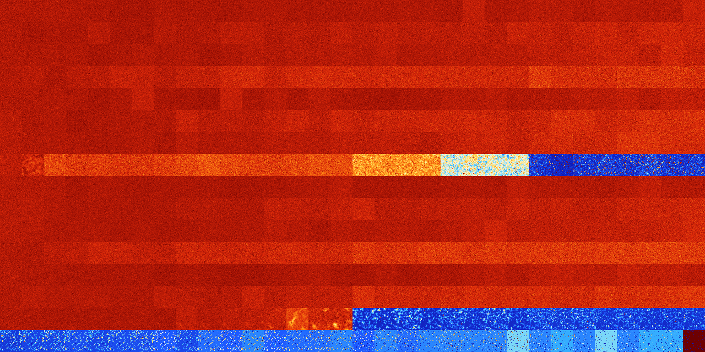

# B03467 (111104-111615)

<details>
    <summary>Initial Grid</summary>
    
</details>


<details>
    <summary>Initial Grid RLE</summary>

```
#C Exported from GoGoL (https://github.com/marrow16/gogol)
#C Wrap mode: Toroidal
#C Boundary mode: Dead
#C Step: 0
x = 100, y = 100, rule = B03467/S
5bo12bo42bo$7bo15bo14bo7bo2bo44bo$2o12bo6bo7bo4bo10bo6bo10bo$32bo29bo2b
obo31bo$3bo2bo15bo58bo$5bo51bo12bo16bo$18bo24bo2bo21bo$o12bo20bo51bo4bo
$10bo2bo7bo6bo29bo36bo$35bo3bo2bo3bo3bo20bo13bo8bo$4bo3bob2o28bo39bo13b
2o$o17bo7bo22bo37bo2bo$19bo4bobo8bo4bo4bo$bo46bo8bo12bo20bo$2o8bo11bo5b
o58bo$15bo2bo$17bo17bo27bo18bo$30bo35bo18bo$31bo60bo4bo$29bo25bo3bo2bo
13bo5bo5bo3bo$19bo8bo14bo29bobo19bo$8bo39bo6bobo7bo$14bo28bo14bo25bo5bo
$5b2o3bo6bo11bo39bo$3bo5bo15bo12bo20bo29bo6bo$13bo10bo31bo34bo6bo$6bo
12bo15bo45bo15bobo$10bo8bo7bo5bo33bo11bo$14bo13bo8bo6bo$43bo19bo2bo20bo
$6bo2bo11bo58bo$46bo$12bo11bo19bo5bo7bo3bo36bo$7bo8bo23bobo21bo14bo16bo
$82bo10bo$32bo32bo12bo10bo2bo4bo$13bo3bo28b2o10bo4bo26bo$bo12b2o31bo3bo
16bo$23bo13bo4bo7bobo7bo35bo2bo$17bo12bo5b2o19bo15bo19bo4bo$45bo11bo2bo
8bo25bo$22bo2b2o$2bo5bo2bo8bo8bo27bo14bo13bo$3bo14bo53bo$10bo5bo46bo23b
o7bo$3bo28bo14bo19bo2b2o10bo10bo$o2bo49bo15bo11bo9bo$8bo4bo41bo26bo16bo
$10bo4bo8bo6bo33bo13bo15bo3bo$45bo41bo$42b2obo9bo6bo11bo2bo9bo3bo$5bo8b
o20bo24bo4bo29bo$10bo6bo10bo11bo11bo16bo3bo4bo20bo$10bobo49bo32bo$46bo
8bo29bo6bo2bo$9bo12bo12bo10bo$21bo23bo$2bo6bo54bo25bo4bo$22bo27bo10bo
11bobo$40bo20bo20bo$bo28b2o3bo19bo11bo12bo$8bo32bobo4bo5bo$13bo11bo29bo
6bo$56bo20b2o$8bo37bo27bo$4bo44bo$obo22bo4bo50bo13bo$23bo17b2o10bo22bo
16bo$12bo13bo28bo10bo$7bo6bo45bo21bo$9bo17bo21bo$48bo21bobo22bo$34bo6bo
10bo11bo9bo$46bo26bo4bo8bo4bo$33bo$88bo2bo$6bo7bo19bo50bo$17bo22bo11bo
22bo6bo$6bo23bo6bo7bo17bo16bo4bo4bo$o84bo8bo$10bo42bo6bo2bo18bo12bo$3bo
50bo17bo16bo$30bobo3bo18bo4bo17bo20bo$29bo3bo11bo25bo11bo12bo2bo$32bo
23bo10bo$9bo31bo22bo17bo7bo$bobo11bo38bo26bo$20bo26bo15bo13bo18bo$11bo
9bo25bo34bo5bo$51bo14bo28bo$3bo58bo6bo3bo$ob2o5bo6bo9bo26bo20bo23bo$12b
3obo8bo31bo14bo12bo$54bo4bo4bo26bo$88bo$29bo45bo$22bobo$10bo21bo9bo6bo
22bo$38bo8bo12bo$bo39bo8bo35bo!
```
</details>
<details>
    <summary>Thumbnail</summary>

</details>
<table>
<tr>
    <td><a href="./111104%20S%20Heat%20Map%20Activity.png"></a><br>S (111104)<br>G>1000</td>    <td><a href="./111105%20S0%20Heat%20Map%20Activity.png"></a><br>S0 (111105)<br>G>1000</td>    <td><a href="./111106%20S1%20Heat%20Map%20Activity.png"></a><br>S1 (111106)<br>G>1000</td>    <td><a href="./111107%20S01%20Heat%20Map%20Activity.png"></a><br>S01 (111107)<br>G>1000</td>    <td><a href="./111108%20S2%20Heat%20Map%20Activity.png"></a><br>S2 (111108)<br>G>1000</td>    <td><a href="./111109%20S02%20Heat%20Map%20Activity.png"></a><br>S02 (111109)<br>G>1000</td>    <td><a href="./111110%20S12%20Heat%20Map%20Activity.png"></a><br>S12 (111110)<br>G>1000</td>    <td><a href="./111111%20S012%20Heat%20Map%20Activity.png"></a><br>S012 (111111)<br>G>1000</td>    <td><a href="./111112%20S3%20Heat%20Map%20Activity.png"></a><br>S3 (111112)<br>G>1000</td>    <td><a href="./111113%20S03%20Heat%20Map%20Activity.png"></a><br>S03 (111113)<br>G>1000</td>    <td><a href="./111114%20S13%20Heat%20Map%20Activity.png"></a><br>S13 (111114)<br>G>1000</td>    <td><a href="./111115%20S013%20Heat%20Map%20Activity.png"></a><br>S013 (111115)<br>G>1000</td>    <td><a href="./111116%20S23%20Heat%20Map%20Activity.png"></a><br>S23 (111116)<br>G>1000</td>    <td><a href="./111117%20S023%20Heat%20Map%20Activity.png"></a><br>S023 (111117)<br>G>1000</td>    <td><a href="./111118%20S123%20Heat%20Map%20Activity.png"></a><br>S123 (111118)<br>G>1000</td>    <td><a href="./111119%20S0123%20Heat%20Map%20Activity.png"></a><br>S0123 (111119)<br>G>1000</td>    <td><a href="./111120%20S4%20Heat%20Map%20Activity.png"></a><br>S4 (111120)<br>G>1000</td>    <td><a href="./111121%20S04%20Heat%20Map%20Activity.png"></a><br>S04 (111121)<br>G>1000</td>    <td><a href="./111122%20S14%20Heat%20Map%20Activity.png"></a><br>S14 (111122)<br>G>1000</td>    <td><a href="./111123%20S014%20Heat%20Map%20Activity.png"></a><br>S014 (111123)<br>G>1000</td>    <td><a href="./111124%20S24%20Heat%20Map%20Activity.png"></a><br>S24 (111124)<br>G>1000</td>    <td><a href="./111125%20S024%20Heat%20Map%20Activity.png"></a><br>S024 (111125)<br>G>1000</td>    <td><a href="./111126%20S124%20Heat%20Map%20Activity.png"></a><br>S124 (111126)<br>G>1000</td>    <td><a href="./111127%20S0124%20Heat%20Map%20Activity.png"></a><br>S0124 (111127)<br>G>1000</td>    <td><a href="./111128%20S34%20Heat%20Map%20Activity.png"></a><br>S34 (111128)<br>G>1000</td>    <td><a href="./111129%20S034%20Heat%20Map%20Activity.png"></a><br>S034 (111129)<br>G>1000</td>    <td><a href="./111130%20S134%20Heat%20Map%20Activity.png"></a><br>S134 (111130)<br>G>1000</td>    <td><a href="./111131%20S0134%20Heat%20Map%20Activity.png"></a><br>S0134 (111131)<br>G>1000</td>    <td><a href="./111132%20S234%20Heat%20Map%20Activity.png"></a><br>S234 (111132)<br>G>1000</td>    <td><a href="./111133%20S0234%20Heat%20Map%20Activity.png"></a><br>S0234 (111133)<br>G>1000</td>    <td><a href="./111134%20S1234%20Heat%20Map%20Activity.png"></a><br>S1234 (111134)<br>G>1000</td>    <td><a href="./111135%20S01234%20Heat%20Map%20Activity.png"></a><br>S01234 (111135)<br>G>1000</td></tr>
<tr>
    <td><a href="./111136%20S5%20Heat%20Map%20Activity.png"></a><br>S5 (111136)<br>G>1000</td>    <td><a href="./111137%20S05%20Heat%20Map%20Activity.png"></a><br>S05 (111137)<br>G>1000</td>    <td><a href="./111138%20S15%20Heat%20Map%20Activity.png"></a><br>S15 (111138)<br>G>1000</td>    <td><a href="./111139%20S015%20Heat%20Map%20Activity.png"></a><br>S015 (111139)<br>G>1000</td>    <td><a href="./111140%20S25%20Heat%20Map%20Activity.png"></a><br>S25 (111140)<br>G>1000</td>    <td><a href="./111141%20S025%20Heat%20Map%20Activity.png"></a><br>S025 (111141)<br>G>1000</td>    <td><a href="./111142%20S125%20Heat%20Map%20Activity.png"></a><br>S125 (111142)<br>G>1000</td>    <td><a href="./111143%20S0125%20Heat%20Map%20Activity.png"></a><br>S0125 (111143)<br>G>1000</td>    <td><a href="./111144%20S35%20Heat%20Map%20Activity.png"></a><br>S35 (111144)<br>G>1000</td>    <td><a href="./111145%20S035%20Heat%20Map%20Activity.png"></a><br>S035 (111145)<br>G>1000</td>    <td><a href="./111146%20S135%20Heat%20Map%20Activity.png"></a><br>S135 (111146)<br>G>1000</td>    <td><a href="./111147%20S0135%20Heat%20Map%20Activity.png"></a><br>S0135 (111147)<br>G>1000</td>    <td><a href="./111148%20S235%20Heat%20Map%20Activity.png"></a><br>S235 (111148)<br>G>1000</td>    <td><a href="./111149%20S0235%20Heat%20Map%20Activity.png"></a><br>S0235 (111149)<br>G>1000</td>    <td><a href="./111150%20S1235%20Heat%20Map%20Activity.png"></a><br>S1235 (111150)<br>G>1000</td>    <td><a href="./111151%20S01235%20Heat%20Map%20Activity.png"></a><br>S01235 (111151)<br>G>1000</td>    <td><a href="./111152%20S45%20Heat%20Map%20Activity.png"></a><br>S45 (111152)<br>G>1000</td>    <td><a href="./111153%20S045%20Heat%20Map%20Activity.png"></a><br>S045 (111153)<br>G>1000</td>    <td><a href="./111154%20S145%20Heat%20Map%20Activity.png"></a><br>S145 (111154)<br>G>1000</td>    <td><a href="./111155%20S0145%20Heat%20Map%20Activity.png"></a><br>S0145 (111155)<br>G>1000</td>    <td><a href="./111156%20S245%20Heat%20Map%20Activity.png"></a><br>S245 (111156)<br>G>1000</td>    <td><a href="./111157%20S0245%20Heat%20Map%20Activity.png"></a><br>S0245 (111157)<br>G>1000</td>    <td><a href="./111158%20S1245%20Heat%20Map%20Activity.png"></a><br>S1245 (111158)<br>G>1000</td>    <td><a href="./111159%20S01245%20Heat%20Map%20Activity.png"></a><br>S01245 (111159)<br>G>1000</td>    <td><a href="./111160%20S345%20Heat%20Map%20Activity.png"></a><br>S345 (111160)<br>G>1000</td>    <td><a href="./111161%20S0345%20Heat%20Map%20Activity.png"></a><br>S0345 (111161)<br>G>1000</td>    <td><a href="./111162%20S1345%20Heat%20Map%20Activity.png"></a><br>S1345 (111162)<br>G>1000</td>    <td><a href="./111163%20S01345%20Heat%20Map%20Activity.png"></a><br>S01345 (111163)<br>G>1000</td>    <td><a href="./111164%20S2345%20Heat%20Map%20Activity.png"></a><br>S2345 (111164)<br>G>1000</td>    <td><a href="./111165%20S02345%20Heat%20Map%20Activity.png"></a><br>S02345 (111165)<br>G>1000</td>    <td><a href="./111166%20S12345%20Heat%20Map%20Activity.png"></a><br>S12345 (111166)<br>G>1000</td>    <td><a href="./111167%20S012345%20Heat%20Map%20Activity.png"></a><br>S012345 (111167)<br>G>1000</td></tr>
<tr>
    <td><a href="./111168%20S6%20Heat%20Map%20Activity.png"></a><br>S6 (111168)<br>G>1000</td>    <td><a href="./111169%20S06%20Heat%20Map%20Activity.png"></a><br>S06 (111169)<br>G>1000</td>    <td><a href="./111170%20S16%20Heat%20Map%20Activity.png"></a><br>S16 (111170)<br>G>1000</td>    <td><a href="./111171%20S016%20Heat%20Map%20Activity.png"></a><br>S016 (111171)<br>G>1000</td>    <td><a href="./111172%20S26%20Heat%20Map%20Activity.png"></a><br>S26 (111172)<br>G>1000</td>    <td><a href="./111173%20S026%20Heat%20Map%20Activity.png"></a><br>S026 (111173)<br>G>1000</td>    <td><a href="./111174%20S126%20Heat%20Map%20Activity.png"></a><br>S126 (111174)<br>G>1000</td>    <td><a href="./111175%20S0126%20Heat%20Map%20Activity.png"></a><br>S0126 (111175)<br>G>1000</td>    <td><a href="./111176%20S36%20Heat%20Map%20Activity.png"></a><br>S36 (111176)<br>G>1000</td>    <td><a href="./111177%20S036%20Heat%20Map%20Activity.png"></a><br>S036 (111177)<br>G>1000</td>    <td><a href="./111178%20S136%20Heat%20Map%20Activity.png"></a><br>S136 (111178)<br>G>1000</td>    <td><a href="./111179%20S0136%20Heat%20Map%20Activity.png"></a><br>S0136 (111179)<br>G>1000</td>    <td><a href="./111180%20S236%20Heat%20Map%20Activity.png"></a><br>S236 (111180)<br>G>1000</td>    <td><a href="./111181%20S0236%20Heat%20Map%20Activity.png"></a><br>S0236 (111181)<br>G>1000</td>    <td><a href="./111182%20S1236%20Heat%20Map%20Activity.png"></a><br>S1236 (111182)<br>G>1000</td>    <td><a href="./111183%20S01236%20Heat%20Map%20Activity.png"></a><br>S01236 (111183)<br>G>1000</td>    <td><a href="./111184%20S46%20Heat%20Map%20Activity.png"></a><br>S46 (111184)<br>G>1000</td>    <td><a href="./111185%20S046%20Heat%20Map%20Activity.png"></a><br>S046 (111185)<br>G>1000</td>    <td><a href="./111186%20S146%20Heat%20Map%20Activity.png"></a><br>S146 (111186)<br>G>1000</td>    <td><a href="./111187%20S0146%20Heat%20Map%20Activity.png"></a><br>S0146 (111187)<br>G>1000</td>    <td><a href="./111188%20S246%20Heat%20Map%20Activity.png"></a><br>S246 (111188)<br>G>1000</td>    <td><a href="./111189%20S0246%20Heat%20Map%20Activity.png"></a><br>S0246 (111189)<br>G>1000</td>    <td><a href="./111190%20S1246%20Heat%20Map%20Activity.png"></a><br>S1246 (111190)<br>G>1000</td>    <td><a href="./111191%20S01246%20Heat%20Map%20Activity.png"></a><br>S01246 (111191)<br>G>1000</td>    <td><a href="./111192%20S346%20Heat%20Map%20Activity.png"></a><br>S346 (111192)<br>G>1000</td>    <td><a href="./111193%20S0346%20Heat%20Map%20Activity.png"></a><br>S0346 (111193)<br>G>1000</td>    <td><a href="./111194%20S1346%20Heat%20Map%20Activity.png"></a><br>S1346 (111194)<br>G>1000</td>    <td><a href="./111195%20S01346%20Heat%20Map%20Activity.png"></a><br>S01346 (111195)<br>G>1000</td>    <td><a href="./111196%20S2346%20Heat%20Map%20Activity.png"></a><br>S2346 (111196)<br>G>1000</td>    <td><a href="./111197%20S02346%20Heat%20Map%20Activity.png"></a><br>S02346 (111197)<br>G>1000</td>    <td><a href="./111198%20S12346%20Heat%20Map%20Activity.png"></a><br>S12346 (111198)<br>G>1000</td>    <td><a href="./111199%20S012346%20Heat%20Map%20Activity.png"></a><br>S012346 (111199)<br>G>1000</td></tr>
<tr>
    <td><a href="./111200%20S56%20Heat%20Map%20Activity.png"></a><br>S56 (111200)<br>G>1000</td>    <td><a href="./111201%20S056%20Heat%20Map%20Activity.png"></a><br>S056 (111201)<br>G>1000</td>    <td><a href="./111202%20S156%20Heat%20Map%20Activity.png"></a><br>S156 (111202)<br>G>1000</td>    <td><a href="./111203%20S0156%20Heat%20Map%20Activity.png"></a><br>S0156 (111203)<br>G>1000</td>    <td><a href="./111204%20S256%20Heat%20Map%20Activity.png"></a><br>S256 (111204)<br>G>1000</td>    <td><a href="./111205%20S0256%20Heat%20Map%20Activity.png"></a><br>S0256 (111205)<br>G>1000</td>    <td><a href="./111206%20S1256%20Heat%20Map%20Activity.png"></a><br>S1256 (111206)<br>G>1000</td>    <td><a href="./111207%20S01256%20Heat%20Map%20Activity.png"></a><br>S01256 (111207)<br>G>1000</td>    <td><a href="./111208%20S356%20Heat%20Map%20Activity.png"></a><br>S356 (111208)<br>G>1000</td>    <td><a href="./111209%20S0356%20Heat%20Map%20Activity.png"></a><br>S0356 (111209)<br>G>1000</td>    <td><a href="./111210%20S1356%20Heat%20Map%20Activity.png"></a><br>S1356 (111210)<br>G>1000</td>    <td><a href="./111211%20S01356%20Heat%20Map%20Activity.png"></a><br>S01356 (111211)<br>G>1000</td>    <td><a href="./111212%20S2356%20Heat%20Map%20Activity.png"></a><br>S2356 (111212)<br>G>1000</td>    <td><a href="./111213%20S02356%20Heat%20Map%20Activity.png"></a><br>S02356 (111213)<br>G>1000</td>    <td><a href="./111214%20S12356%20Heat%20Map%20Activity.png"></a><br>S12356 (111214)<br>G>1000</td>    <td><a href="./111215%20S012356%20Heat%20Map%20Activity.png"></a><br>S012356 (111215)<br>G>1000</td>    <td><a href="./111216%20S456%20Heat%20Map%20Activity.png"></a><br>S456 (111216)<br>G>1000</td>    <td><a href="./111217%20S0456%20Heat%20Map%20Activity.png"></a><br>S0456 (111217)<br>G>1000</td>    <td><a href="./111218%20S1456%20Heat%20Map%20Activity.png"></a><br>S1456 (111218)<br>G>1000</td>    <td><a href="./111219%20S01456%20Heat%20Map%20Activity.png"></a><br>S01456 (111219)<br>G>1000</td>    <td><a href="./111220%20S2456%20Heat%20Map%20Activity.png"></a><br>S2456 (111220)<br>G>1000</td>    <td><a href="./111221%20S02456%20Heat%20Map%20Activity.png"></a><br>S02456 (111221)<br>G>1000</td>    <td><a href="./111222%20S12456%20Heat%20Map%20Activity.png"></a><br>S12456 (111222)<br>G>1000</td>    <td><a href="./111223%20S012456%20Heat%20Map%20Activity.png"></a><br>S012456 (111223)<br>G>1000</td>    <td><a href="./111224%20S3456%20Heat%20Map%20Activity.png"></a><br>S3456 (111224)<br>G>1000</td>    <td><a href="./111225%20S03456%20Heat%20Map%20Activity.png"></a><br>S03456 (111225)<br>G>1000</td>    <td><a href="./111226%20S13456%20Heat%20Map%20Activity.png"></a><br>S13456 (111226)<br>G>1000</td>    <td><a href="./111227%20S013456%20Heat%20Map%20Activity.png"></a><br>S013456 (111227)<br>G>1000</td>    <td><a href="./111228%20S23456%20Heat%20Map%20Activity.png"></a><br>S23456 (111228)<br>G>1000</td>    <td><a href="./111229%20S023456%20Heat%20Map%20Activity.png"></a><br>S023456 (111229)<br>G>1000</td>    <td><a href="./111230%20S123456%20Heat%20Map%20Activity.png"></a><br>S123456 (111230)<br>G>1000</td>    <td><a href="./111231%20S0123456%20Heat%20Map%20Activity.png"></a><br>S0123456 (111231)<br>G>1000</td></tr>
<tr>
    <td><a href="./111232%20S7%20Heat%20Map%20Activity.png"></a><br>S7 (111232)<br>G>1000</td>    <td><a href="./111233%20S07%20Heat%20Map%20Activity.png"></a><br>S07 (111233)<br>G>1000</td>    <td><a href="./111234%20S17%20Heat%20Map%20Activity.png"></a><br>S17 (111234)<br>G>1000</td>    <td><a href="./111235%20S017%20Heat%20Map%20Activity.png"></a><br>S017 (111235)<br>G>1000</td>    <td><a href="./111236%20S27%20Heat%20Map%20Activity.png"></a><br>S27 (111236)<br>G>1000</td>    <td><a href="./111237%20S027%20Heat%20Map%20Activity.png"></a><br>S027 (111237)<br>G>1000</td>    <td><a href="./111238%20S127%20Heat%20Map%20Activity.png"></a><br>S127 (111238)<br>G>1000</td>    <td><a href="./111239%20S0127%20Heat%20Map%20Activity.png"></a><br>S0127 (111239)<br>G>1000</td>    <td><a href="./111240%20S37%20Heat%20Map%20Activity.png"></a><br>S37 (111240)<br>G>1000</td>    <td><a href="./111241%20S037%20Heat%20Map%20Activity.png"></a><br>S037 (111241)<br>G>1000</td>    <td><a href="./111242%20S137%20Heat%20Map%20Activity.png"></a><br>S137 (111242)<br>G>1000</td>    <td><a href="./111243%20S0137%20Heat%20Map%20Activity.png"></a><br>S0137 (111243)<br>G>1000</td>    <td><a href="./111244%20S237%20Heat%20Map%20Activity.png"></a><br>S237 (111244)<br>G>1000</td>    <td><a href="./111245%20S0237%20Heat%20Map%20Activity.png"></a><br>S0237 (111245)<br>G>1000</td>    <td><a href="./111246%20S1237%20Heat%20Map%20Activity.png"></a><br>S1237 (111246)<br>G>1000</td>    <td><a href="./111247%20S01237%20Heat%20Map%20Activity.png"></a><br>S01237 (111247)<br>G>1000</td>    <td><a href="./111248%20S47%20Heat%20Map%20Activity.png"></a><br>S47 (111248)<br>G>1000</td>    <td><a href="./111249%20S047%20Heat%20Map%20Activity.png"></a><br>S047 (111249)<br>G>1000</td>    <td><a href="./111250%20S147%20Heat%20Map%20Activity.png"></a><br>S147 (111250)<br>G>1000</td>    <td><a href="./111251%20S0147%20Heat%20Map%20Activity.png"></a><br>S0147 (111251)<br>G>1000</td>    <td><a href="./111252%20S247%20Heat%20Map%20Activity.png"></a><br>S247 (111252)<br>G>1000</td>    <td><a href="./111253%20S0247%20Heat%20Map%20Activity.png"></a><br>S0247 (111253)<br>G>1000</td>    <td><a href="./111254%20S1247%20Heat%20Map%20Activity.png"></a><br>S1247 (111254)<br>G>1000</td>    <td><a href="./111255%20S01247%20Heat%20Map%20Activity.png"></a><br>S01247 (111255)<br>G>1000</td>    <td><a href="./111256%20S347%20Heat%20Map%20Activity.png"></a><br>S347 (111256)<br>G>1000</td>    <td><a href="./111257%20S0347%20Heat%20Map%20Activity.png"></a><br>S0347 (111257)<br>G>1000</td>    <td><a href="./111258%20S1347%20Heat%20Map%20Activity.png"></a><br>S1347 (111258)<br>G>1000</td>    <td><a href="./111259%20S01347%20Heat%20Map%20Activity.png"></a><br>S01347 (111259)<br>G>1000</td>    <td><a href="./111260%20S2347%20Heat%20Map%20Activity.png"></a><br>S2347 (111260)<br>G>1000</td>    <td><a href="./111261%20S02347%20Heat%20Map%20Activity.png"></a><br>S02347 (111261)<br>G>1000</td>    <td><a href="./111262%20S12347%20Heat%20Map%20Activity.png"></a><br>S12347 (111262)<br>G>1000</td>    <td><a href="./111263%20S012347%20Heat%20Map%20Activity.png"></a><br>S012347 (111263)<br>G>1000</td></tr>
<tr>
    <td><a href="./111264%20S57%20Heat%20Map%20Activity.png"></a><br>S57 (111264)<br>G>1000</td>    <td><a href="./111265%20S057%20Heat%20Map%20Activity.png"></a><br>S057 (111265)<br>G>1000</td>    <td><a href="./111266%20S157%20Heat%20Map%20Activity.png"></a><br>S157 (111266)<br>G>1000</td>    <td><a href="./111267%20S0157%20Heat%20Map%20Activity.png"></a><br>S0157 (111267)<br>G>1000</td>    <td><a href="./111268%20S257%20Heat%20Map%20Activity.png"></a><br>S257 (111268)<br>G>1000</td>    <td><a href="./111269%20S0257%20Heat%20Map%20Activity.png"></a><br>S0257 (111269)<br>G>1000</td>    <td><a href="./111270%20S1257%20Heat%20Map%20Activity.png"></a><br>S1257 (111270)<br>G>1000</td>    <td><a href="./111271%20S01257%20Heat%20Map%20Activity.png"></a><br>S01257 (111271)<br>G>1000</td>    <td><a href="./111272%20S357%20Heat%20Map%20Activity.png"></a><br>S357 (111272)<br>G>1000</td>    <td><a href="./111273%20S0357%20Heat%20Map%20Activity.png"></a><br>S0357 (111273)<br>G>1000</td>    <td><a href="./111274%20S1357%20Heat%20Map%20Activity.png"></a><br>S1357 (111274)<br>G>1000</td>    <td><a href="./111275%20S01357%20Heat%20Map%20Activity.png"></a><br>S01357 (111275)<br>G>1000</td>    <td><a href="./111276%20S2357%20Heat%20Map%20Activity.png"></a><br>S2357 (111276)<br>G>1000</td>    <td><a href="./111277%20S02357%20Heat%20Map%20Activity.png"></a><br>S02357 (111277)<br>G>1000</td>    <td><a href="./111278%20S12357%20Heat%20Map%20Activity.png"></a><br>S12357 (111278)<br>G>1000</td>    <td><a href="./111279%20S012357%20Heat%20Map%20Activity.png"></a><br>S012357 (111279)<br>G>1000</td>    <td><a href="./111280%20S457%20Heat%20Map%20Activity.png"></a><br>S457 (111280)<br>G>1000</td>    <td><a href="./111281%20S0457%20Heat%20Map%20Activity.png"></a><br>S0457 (111281)<br>G>1000</td>    <td><a href="./111282%20S1457%20Heat%20Map%20Activity.png"></a><br>S1457 (111282)<br>G>1000</td>    <td><a href="./111283%20S01457%20Heat%20Map%20Activity.png"></a><br>S01457 (111283)<br>G>1000</td>    <td><a href="./111284%20S2457%20Heat%20Map%20Activity.png"></a><br>S2457 (111284)<br>G>1000</td>    <td><a href="./111285%20S02457%20Heat%20Map%20Activity.png"></a><br>S02457 (111285)<br>G>1000</td>    <td><a href="./111286%20S12457%20Heat%20Map%20Activity.png"></a><br>S12457 (111286)<br>G>1000</td>    <td><a href="./111287%20S012457%20Heat%20Map%20Activity.png"></a><br>S012457 (111287)<br>G>1000</td>    <td><a href="./111288%20S3457%20Heat%20Map%20Activity.png"></a><br>S3457 (111288)<br>G>1000</td>    <td><a href="./111289%20S03457%20Heat%20Map%20Activity.png"></a><br>S03457 (111289)<br>G>1000</td>    <td><a href="./111290%20S13457%20Heat%20Map%20Activity.png"></a><br>S13457 (111290)<br>G>1000</td>    <td><a href="./111291%20S013457%20Heat%20Map%20Activity.png"></a><br>S013457 (111291)<br>G>1000</td>    <td><a href="./111292%20S23457%20Heat%20Map%20Activity.png"></a><br>S23457 (111292)<br>G>1000</td>    <td><a href="./111293%20S023457%20Heat%20Map%20Activity.png"></a><br>S023457 (111293)<br>G>1000</td>    <td><a href="./111294%20S123457%20Heat%20Map%20Activity.png"></a><br>S123457 (111294)<br>G>1000</td>    <td><a href="./111295%20S0123457%20Heat%20Map%20Activity.png"></a><br>S0123457 (111295)<br>G>1000</td></tr>
<tr>
    <td><a href="./111296%20S67%20Heat%20Map%20Activity.png"></a><br>S67 (111296)<br>G>1000</td>    <td><a href="./111297%20S067%20Heat%20Map%20Activity.png"></a><br>S067 (111297)<br>G>1000</td>    <td><a href="./111298%20S167%20Heat%20Map%20Activity.png"></a><br>S167 (111298)<br>G>1000</td>    <td><a href="./111299%20S0167%20Heat%20Map%20Activity.png"></a><br>S0167 (111299)<br>G>1000</td>    <td><a href="./111300%20S267%20Heat%20Map%20Activity.png"></a><br>S267 (111300)<br>G>1000</td>    <td><a href="./111301%20S0267%20Heat%20Map%20Activity.png"></a><br>S0267 (111301)<br>G>1000</td>    <td><a href="./111302%20S1267%20Heat%20Map%20Activity.png"></a><br>S1267 (111302)<br>G>1000</td>    <td><a href="./111303%20S01267%20Heat%20Map%20Activity.png"></a><br>S01267 (111303)<br>G>1000</td>    <td><a href="./111304%20S367%20Heat%20Map%20Activity.png"></a><br>S367 (111304)<br>G>1000</td>    <td><a href="./111305%20S0367%20Heat%20Map%20Activity.png"></a><br>S0367 (111305)<br>G>1000</td>    <td><a href="./111306%20S1367%20Heat%20Map%20Activity.png"></a><br>S1367 (111306)<br>G>1000</td>    <td><a href="./111307%20S01367%20Heat%20Map%20Activity.png"></a><br>S01367 (111307)<br>G>1000</td>    <td><a href="./111308%20S2367%20Heat%20Map%20Activity.png"></a><br>S2367 (111308)<br>G>1000</td>    <td><a href="./111309%20S02367%20Heat%20Map%20Activity.png"></a><br>S02367 (111309)<br>G>1000</td>    <td><a href="./111310%20S12367%20Heat%20Map%20Activity.png"></a><br>S12367 (111310)<br>G>1000</td>    <td><a href="./111311%20S012367%20Heat%20Map%20Activity.png"></a><br>S012367 (111311)<br>G>1000</td>    <td><a href="./111312%20S467%20Heat%20Map%20Activity.png"></a><br>S467 (111312)<br>G>1000</td>    <td><a href="./111313%20S0467%20Heat%20Map%20Activity.png"></a><br>S0467 (111313)<br>G>1000</td>    <td><a href="./111314%20S1467%20Heat%20Map%20Activity.png"></a><br>S1467 (111314)<br>G>1000</td>    <td><a href="./111315%20S01467%20Heat%20Map%20Activity.png"></a><br>S01467 (111315)<br>G>1000</td>    <td><a href="./111316%20S2467%20Heat%20Map%20Activity.png"></a><br>S2467 (111316)<br>G>1000</td>    <td><a href="./111317%20S02467%20Heat%20Map%20Activity.png"></a><br>S02467 (111317)<br>G>1000</td>    <td><a href="./111318%20S12467%20Heat%20Map%20Activity.png"></a><br>S12467 (111318)<br>G>1000</td>    <td><a href="./111319%20S012467%20Heat%20Map%20Activity.png"></a><br>S012467 (111319)<br>G>1000</td>    <td><a href="./111320%20S3467%20Heat%20Map%20Activity.png"></a><br>S3467 (111320)<br>G>1000</td>    <td><a href="./111321%20S03467%20Heat%20Map%20Activity.png"></a><br>S03467 (111321)<br>G>1000</td>    <td><a href="./111322%20S13467%20Heat%20Map%20Activity.png"></a><br>S13467 (111322)<br>G>1000</td>    <td><a href="./111323%20S013467%20Heat%20Map%20Activity.png"></a><br>S013467 (111323)<br>G>1000</td>    <td><a href="./111324%20S23467%20Heat%20Map%20Activity.png"></a><br>S23467 (111324)<br>G>1000</td>    <td><a href="./111325%20S023467%20Heat%20Map%20Activity.png"></a><br>S023467 (111325)<br>G>1000</td>    <td><a href="./111326%20S123467%20Heat%20Map%20Activity.png"></a><br>S123467 (111326)<br>G>1000</td>    <td><a href="./111327%20S0123467%20Heat%20Map%20Activity.png"></a><br>S0123467 (111327)<br>G>1000</td></tr>
<tr>
    <td><a href="./111328%20S567%20Heat%20Map%20Activity.png"></a><br>S567 (111328)<br>G>1000</td>    <td><a href="./111329%20S0567%20Heat%20Map%20Activity.png"></a><br>S0567 (111329)<br>G>1000</td>    <td><a href="./111330%20S1567%20Heat%20Map%20Activity.png"></a><br>S1567 (111330)<br>G>1000</td>    <td><a href="./111331%20S01567%20Heat%20Map%20Activity.png"></a><br>S01567 (111331)<br>G>1000</td>    <td><a href="./111332%20S2567%20Heat%20Map%20Activity.png"></a><br>S2567 (111332)<br>G>1000</td>    <td><a href="./111333%20S02567%20Heat%20Map%20Activity.png"></a><br>S02567 (111333)<br>G>1000</td>    <td><a href="./111334%20S12567%20Heat%20Map%20Activity.png"></a><br>S12567 (111334)<br>G>1000</td>    <td><a href="./111335%20S012567%20Heat%20Map%20Activity.png"></a><br>S012567 (111335)<br>G>1000</td>    <td><a href="./111336%20S3567%20Heat%20Map%20Activity.png"></a><br>S3567 (111336)<br>G>1000</td>    <td><a href="./111337%20S03567%20Heat%20Map%20Activity.png"></a><br>S03567 (111337)<br>G>1000</td>    <td><a href="./111338%20S13567%20Heat%20Map%20Activity.png"></a><br>S13567 (111338)<br>G>1000</td>    <td><a href="./111339%20S013567%20Heat%20Map%20Activity.png"></a><br>S013567 (111339)<br>G>1000</td>    <td><a href="./111340%20S23567%20Heat%20Map%20Activity.png"></a><br>S23567 (111340)<br>G>1000</td>    <td><a href="./111341%20S023567%20Heat%20Map%20Activity.png"></a><br>S023567 (111341)<br>G>1000</td>    <td><a href="./111342%20S123567%20Heat%20Map%20Activity.png"></a><br>S123567 (111342)<br>G>1000</td>    <td><a href="./111343%20S0123567%20Heat%20Map%20Activity.png"></a><br>S0123567 (111343)<br>G>1000</td>    <td><a href="./111344%20S4567%20Heat%20Map%20Activity.png"></a><br>S4567 (111344)<br>G>1000</td>    <td><a href="./111345%20S04567%20Heat%20Map%20Activity.png"></a><br>S04567 (111345)<br>G>1000</td>    <td><a href="./111346%20S14567%20Heat%20Map%20Activity.png"></a><br>S14567 (111346)<br>G>1000</td>    <td><a href="./111347%20S014567%20Heat%20Map%20Activity.png"></a><br>S014567 (111347)<br>G>1000</td>    <td><a href="./111348%20S24567%20Heat%20Map%20Activity.png"></a><br>S24567 (111348)<br>G>1000</td>    <td><a href="./111349%20S024567%20Heat%20Map%20Activity.png"></a><br>S024567 (111349)<br>G>1000</td>    <td><a href="./111350%20S124567%20Heat%20Map%20Activity.png"></a><br>S124567 (111350)<br>G>1000</td>    <td><a href="./111351%20S0124567%20Heat%20Map%20Activity.png"></a><br>S0124567 (111351)<br>G>1000</td>    <td><a href="./111352%20S34567%20Heat%20Map%20Activity.png"></a><br>S34567 (111352)<br>R@50,p12</td>    <td><a href="./111353%20S034567%20Heat%20Map%20Activity.png"></a><br>S034567 (111353)<br>R@128,p84</td>    <td><a href="./111354%20S134567%20Heat%20Map%20Activity.png"></a><br>S134567 (111354)<br>R@55,p12</td>    <td><a href="./111355%20S0134567%20Heat%20Map%20Activity.png"></a><br>S0134567 (111355)<br>R@51,p12</td>    <td><a href="./111356%20S234567%20Heat%20Map%20Activity.png"></a><br>S234567 (111356)<br>R@39,p12</td>    <td><a href="./111357%20S0234567%20Heat%20Map%20Activity.png"></a><br>S0234567 (111357)<br>R@33,p6</td>    <td><a href="./111358%20S1234567%20Heat%20Map%20Activity.png"></a><br>S1234567 (111358)<br>R@39,p12</td>    <td><a href="./111359%20S01234567%20Heat%20Map%20Activity.png"></a><br>S01234567 (111359)<br>R@44,p12</td></tr>
<tr>
    <td><a href="./111360%20S8%20Heat%20Map%20Activity.png"></a><br>S8 (111360)<br>G>1000</td>    <td><a href="./111361%20S08%20Heat%20Map%20Activity.png"></a><br>S08 (111361)<br>G>1000</td>    <td><a href="./111362%20S18%20Heat%20Map%20Activity.png"></a><br>S18 (111362)<br>G>1000</td>    <td><a href="./111363%20S018%20Heat%20Map%20Activity.png"></a><br>S018 (111363)<br>G>1000</td>    <td><a href="./111364%20S28%20Heat%20Map%20Activity.png"></a><br>S28 (111364)<br>G>1000</td>    <td><a href="./111365%20S028%20Heat%20Map%20Activity.png"></a><br>S028 (111365)<br>G>1000</td>    <td><a href="./111366%20S128%20Heat%20Map%20Activity.png"></a><br>S128 (111366)<br>G>1000</td>    <td><a href="./111367%20S0128%20Heat%20Map%20Activity.png"></a><br>S0128 (111367)<br>G>1000</td>    <td><a href="./111368%20S38%20Heat%20Map%20Activity.png"></a><br>S38 (111368)<br>G>1000</td>    <td><a href="./111369%20S038%20Heat%20Map%20Activity.png"></a><br>S038 (111369)<br>G>1000</td>    <td><a href="./111370%20S138%20Heat%20Map%20Activity.png"></a><br>S138 (111370)<br>G>1000</td>    <td><a href="./111371%20S0138%20Heat%20Map%20Activity.png"></a><br>S0138 (111371)<br>G>1000</td>    <td><a href="./111372%20S238%20Heat%20Map%20Activity.png"></a><br>S238 (111372)<br>G>1000</td>    <td><a href="./111373%20S0238%20Heat%20Map%20Activity.png"></a><br>S0238 (111373)<br>G>1000</td>    <td><a href="./111374%20S1238%20Heat%20Map%20Activity.png"></a><br>S1238 (111374)<br>G>1000</td>    <td><a href="./111375%20S01238%20Heat%20Map%20Activity.png"></a><br>S01238 (111375)<br>G>1000</td>    <td><a href="./111376%20S48%20Heat%20Map%20Activity.png"></a><br>S48 (111376)<br>G>1000</td>    <td><a href="./111377%20S048%20Heat%20Map%20Activity.png"></a><br>S048 (111377)<br>G>1000</td>    <td><a href="./111378%20S148%20Heat%20Map%20Activity.png"></a><br>S148 (111378)<br>G>1000</td>    <td><a href="./111379%20S0148%20Heat%20Map%20Activity.png"></a><br>S0148 (111379)<br>G>1000</td>    <td><a href="./111380%20S248%20Heat%20Map%20Activity.png"></a><br>S248 (111380)<br>G>1000</td>    <td><a href="./111381%20S0248%20Heat%20Map%20Activity.png"></a><br>S0248 (111381)<br>G>1000</td>    <td><a href="./111382%20S1248%20Heat%20Map%20Activity.png"></a><br>S1248 (111382)<br>G>1000</td>    <td><a href="./111383%20S01248%20Heat%20Map%20Activity.png"></a><br>S01248 (111383)<br>G>1000</td>    <td><a href="./111384%20S348%20Heat%20Map%20Activity.png"></a><br>S348 (111384)<br>G>1000</td>    <td><a href="./111385%20S0348%20Heat%20Map%20Activity.png"></a><br>S0348 (111385)<br>G>1000</td>    <td><a href="./111386%20S1348%20Heat%20Map%20Activity.png"></a><br>S1348 (111386)<br>G>1000</td>    <td><a href="./111387%20S01348%20Heat%20Map%20Activity.png"></a><br>S01348 (111387)<br>G>1000</td>    <td><a href="./111388%20S2348%20Heat%20Map%20Activity.png"></a><br>S2348 (111388)<br>G>1000</td>    <td><a href="./111389%20S02348%20Heat%20Map%20Activity.png"></a><br>S02348 (111389)<br>G>1000</td>    <td><a href="./111390%20S12348%20Heat%20Map%20Activity.png"></a><br>S12348 (111390)<br>G>1000</td>    <td><a href="./111391%20S012348%20Heat%20Map%20Activity.png"></a><br>S012348 (111391)<br>G>1000</td></tr>
<tr>
    <td><a href="./111392%20S58%20Heat%20Map%20Activity.png"></a><br>S58 (111392)<br>G>1000</td>    <td><a href="./111393%20S058%20Heat%20Map%20Activity.png"></a><br>S058 (111393)<br>G>1000</td>    <td><a href="./111394%20S158%20Heat%20Map%20Activity.png"></a><br>S158 (111394)<br>G>1000</td>    <td><a href="./111395%20S0158%20Heat%20Map%20Activity.png"></a><br>S0158 (111395)<br>G>1000</td>    <td><a href="./111396%20S258%20Heat%20Map%20Activity.png"></a><br>S258 (111396)<br>G>1000</td>    <td><a href="./111397%20S0258%20Heat%20Map%20Activity.png"></a><br>S0258 (111397)<br>G>1000</td>    <td><a href="./111398%20S1258%20Heat%20Map%20Activity.png"></a><br>S1258 (111398)<br>G>1000</td>    <td><a href="./111399%20S01258%20Heat%20Map%20Activity.png"></a><br>S01258 (111399)<br>G>1000</td>    <td><a href="./111400%20S358%20Heat%20Map%20Activity.png"></a><br>S358 (111400)<br>G>1000</td>    <td><a href="./111401%20S0358%20Heat%20Map%20Activity.png"></a><br>S0358 (111401)<br>G>1000</td>    <td><a href="./111402%20S1358%20Heat%20Map%20Activity.png"></a><br>S1358 (111402)<br>G>1000</td>    <td><a href="./111403%20S01358%20Heat%20Map%20Activity.png"></a><br>S01358 (111403)<br>G>1000</td>    <td><a href="./111404%20S2358%20Heat%20Map%20Activity.png"></a><br>S2358 (111404)<br>G>1000</td>    <td><a href="./111405%20S02358%20Heat%20Map%20Activity.png"></a><br>S02358 (111405)<br>G>1000</td>    <td><a href="./111406%20S12358%20Heat%20Map%20Activity.png"></a><br>S12358 (111406)<br>G>1000</td>    <td><a href="./111407%20S012358%20Heat%20Map%20Activity.png"></a><br>S012358 (111407)<br>G>1000</td>    <td><a href="./111408%20S458%20Heat%20Map%20Activity.png"></a><br>S458 (111408)<br>G>1000</td>    <td><a href="./111409%20S0458%20Heat%20Map%20Activity.png"></a><br>S0458 (111409)<br>G>1000</td>    <td><a href="./111410%20S1458%20Heat%20Map%20Activity.png"></a><br>S1458 (111410)<br>G>1000</td>    <td><a href="./111411%20S01458%20Heat%20Map%20Activity.png"></a><br>S01458 (111411)<br>G>1000</td>    <td><a href="./111412%20S2458%20Heat%20Map%20Activity.png"></a><br>S2458 (111412)<br>G>1000</td>    <td><a href="./111413%20S02458%20Heat%20Map%20Activity.png"></a><br>S02458 (111413)<br>G>1000</td>    <td><a href="./111414%20S12458%20Heat%20Map%20Activity.png"></a><br>S12458 (111414)<br>G>1000</td>    <td><a href="./111415%20S012458%20Heat%20Map%20Activity.png"></a><br>S012458 (111415)<br>G>1000</td>    <td><a href="./111416%20S3458%20Heat%20Map%20Activity.png"></a><br>S3458 (111416)<br>G>1000</td>    <td><a href="./111417%20S03458%20Heat%20Map%20Activity.png"></a><br>S03458 (111417)<br>G>1000</td>    <td><a href="./111418%20S13458%20Heat%20Map%20Activity.png"></a><br>S13458 (111418)<br>G>1000</td>    <td><a href="./111419%20S013458%20Heat%20Map%20Activity.png"></a><br>S013458 (111419)<br>G>1000</td>    <td><a href="./111420%20S23458%20Heat%20Map%20Activity.png"></a><br>S23458 (111420)<br>G>1000</td>    <td><a href="./111421%20S023458%20Heat%20Map%20Activity.png"></a><br>S023458 (111421)<br>G>1000</td>    <td><a href="./111422%20S123458%20Heat%20Map%20Activity.png"></a><br>S123458 (111422)<br>G>1000</td>    <td><a href="./111423%20S0123458%20Heat%20Map%20Activity.png"></a><br>S0123458 (111423)<br>G>1000</td></tr>
<tr>
    <td><a href="./111424%20S68%20Heat%20Map%20Activity.png"></a><br>S68 (111424)<br>G>1000</td>    <td><a href="./111425%20S068%20Heat%20Map%20Activity.png"></a><br>S068 (111425)<br>G>1000</td>    <td><a href="./111426%20S168%20Heat%20Map%20Activity.png"></a><br>S168 (111426)<br>G>1000</td>    <td><a href="./111427%20S0168%20Heat%20Map%20Activity.png"></a><br>S0168 (111427)<br>G>1000</td>    <td><a href="./111428%20S268%20Heat%20Map%20Activity.png"></a><br>S268 (111428)<br>G>1000</td>    <td><a href="./111429%20S0268%20Heat%20Map%20Activity.png"></a><br>S0268 (111429)<br>G>1000</td>    <td><a href="./111430%20S1268%20Heat%20Map%20Activity.png"></a><br>S1268 (111430)<br>G>1000</td>    <td><a href="./111431%20S01268%20Heat%20Map%20Activity.png"></a><br>S01268 (111431)<br>G>1000</td>    <td><a href="./111432%20S368%20Heat%20Map%20Activity.png"></a><br>S368 (111432)<br>G>1000</td>    <td><a href="./111433%20S0368%20Heat%20Map%20Activity.png"></a><br>S0368 (111433)<br>G>1000</td>    <td><a href="./111434%20S1368%20Heat%20Map%20Activity.png"></a><br>S1368 (111434)<br>G>1000</td>    <td><a href="./111435%20S01368%20Heat%20Map%20Activity.png"></a><br>S01368 (111435)<br>G>1000</td>    <td><a href="./111436%20S2368%20Heat%20Map%20Activity.png"></a><br>S2368 (111436)<br>G>1000</td>    <td><a href="./111437%20S02368%20Heat%20Map%20Activity.png"></a><br>S02368 (111437)<br>G>1000</td>    <td><a href="./111438%20S12368%20Heat%20Map%20Activity.png"></a><br>S12368 (111438)<br>G>1000</td>    <td><a href="./111439%20S012368%20Heat%20Map%20Activity.png"></a><br>S012368 (111439)<br>G>1000</td>    <td><a href="./111440%20S468%20Heat%20Map%20Activity.png"></a><br>S468 (111440)<br>G>1000</td>    <td><a href="./111441%20S0468%20Heat%20Map%20Activity.png"></a><br>S0468 (111441)<br>G>1000</td>    <td><a href="./111442%20S1468%20Heat%20Map%20Activity.png"></a><br>S1468 (111442)<br>G>1000</td>    <td><a href="./111443%20S01468%20Heat%20Map%20Activity.png"></a><br>S01468 (111443)<br>G>1000</td>    <td><a href="./111444%20S2468%20Heat%20Map%20Activity.png"></a><br>S2468 (111444)<br>G>1000</td>    <td><a href="./111445%20S02468%20Heat%20Map%20Activity.png"></a><br>S02468 (111445)<br>G>1000</td>    <td><a href="./111446%20S12468%20Heat%20Map%20Activity.png"></a><br>S12468 (111446)<br>G>1000</td>    <td><a href="./111447%20S012468%20Heat%20Map%20Activity.png"></a><br>S012468 (111447)<br>G>1000</td>    <td><a href="./111448%20S3468%20Heat%20Map%20Activity.png"></a><br>S3468 (111448)<br>G>1000</td>    <td><a href="./111449%20S03468%20Heat%20Map%20Activity.png"></a><br>S03468 (111449)<br>G>1000</td>    <td><a href="./111450%20S13468%20Heat%20Map%20Activity.png"></a><br>S13468 (111450)<br>G>1000</td>    <td><a href="./111451%20S013468%20Heat%20Map%20Activity.png"></a><br>S013468 (111451)<br>G>1000</td>    <td><a href="./111452%20S23468%20Heat%20Map%20Activity.png"></a><br>S23468 (111452)<br>G>1000</td>    <td><a href="./111453%20S023468%20Heat%20Map%20Activity.png"></a><br>S023468 (111453)<br>G>1000</td>    <td><a href="./111454%20S123468%20Heat%20Map%20Activity.png"></a><br>S123468 (111454)<br>G>1000</td>    <td><a href="./111455%20S0123468%20Heat%20Map%20Activity.png"></a><br>S0123468 (111455)<br>G>1000</td></tr>
<tr>
    <td><a href="./111456%20S568%20Heat%20Map%20Activity.png"></a><br>S568 (111456)<br>G>1000</td>    <td><a href="./111457%20S0568%20Heat%20Map%20Activity.png"></a><br>S0568 (111457)<br>G>1000</td>    <td><a href="./111458%20S1568%20Heat%20Map%20Activity.png"></a><br>S1568 (111458)<br>G>1000</td>    <td><a href="./111459%20S01568%20Heat%20Map%20Activity.png"></a><br>S01568 (111459)<br>G>1000</td>    <td><a href="./111460%20S2568%20Heat%20Map%20Activity.png"></a><br>S2568 (111460)<br>G>1000</td>    <td><a href="./111461%20S02568%20Heat%20Map%20Activity.png"></a><br>S02568 (111461)<br>G>1000</td>    <td><a href="./111462%20S12568%20Heat%20Map%20Activity.png"></a><br>S12568 (111462)<br>G>1000</td>    <td><a href="./111463%20S012568%20Heat%20Map%20Activity.png"></a><br>S012568 (111463)<br>G>1000</td>    <td><a href="./111464%20S3568%20Heat%20Map%20Activity.png"></a><br>S3568 (111464)<br>G>1000</td>    <td><a href="./111465%20S03568%20Heat%20Map%20Activity.png"></a><br>S03568 (111465)<br>G>1000</td>    <td><a href="./111466%20S13568%20Heat%20Map%20Activity.png"></a><br>S13568 (111466)<br>G>1000</td>    <td><a href="./111467%20S013568%20Heat%20Map%20Activity.png"></a><br>S013568 (111467)<br>G>1000</td>    <td><a href="./111468%20S23568%20Heat%20Map%20Activity.png"></a><br>S23568 (111468)<br>G>1000</td>    <td><a href="./111469%20S023568%20Heat%20Map%20Activity.png"></a><br>S023568 (111469)<br>G>1000</td>    <td><a href="./111470%20S123568%20Heat%20Map%20Activity.png"></a><br>S123568 (111470)<br>G>1000</td>    <td><a href="./111471%20S0123568%20Heat%20Map%20Activity.png"></a><br>S0123568 (111471)<br>G>1000</td>    <td><a href="./111472%20S4568%20Heat%20Map%20Activity.png"></a><br>S4568 (111472)<br>G>1000</td>    <td><a href="./111473%20S04568%20Heat%20Map%20Activity.png"></a><br>S04568 (111473)<br>G>1000</td>    <td><a href="./111474%20S14568%20Heat%20Map%20Activity.png"></a><br>S14568 (111474)<br>G>1000</td>    <td><a href="./111475%20S014568%20Heat%20Map%20Activity.png"></a><br>S014568 (111475)<br>G>1000</td>    <td><a href="./111476%20S24568%20Heat%20Map%20Activity.png"></a><br>S24568 (111476)<br>G>1000</td>    <td><a href="./111477%20S024568%20Heat%20Map%20Activity.png"></a><br>S024568 (111477)<br>G>1000</td>    <td><a href="./111478%20S124568%20Heat%20Map%20Activity.png"></a><br>S124568 (111478)<br>G>1000</td>    <td><a href="./111479%20S0124568%20Heat%20Map%20Activity.png"></a><br>S0124568 (111479)<br>G>1000</td>    <td><a href="./111480%20S34568%20Heat%20Map%20Activity.png"></a><br>S34568 (111480)<br>G>1000</td>    <td><a href="./111481%20S034568%20Heat%20Map%20Activity.png"></a><br>S034568 (111481)<br>G>1000</td>    <td><a href="./111482%20S134568%20Heat%20Map%20Activity.png"></a><br>S134568 (111482)<br>G>1000</td>    <td><a href="./111483%20S0134568%20Heat%20Map%20Activity.png"></a><br>S0134568 (111483)<br>G>1000</td>    <td><a href="./111484%20S234568%20Heat%20Map%20Activity.png"></a><br>S234568 (111484)<br>G>1000</td>    <td><a href="./111485%20S0234568%20Heat%20Map%20Activity.png"></a><br>S0234568 (111485)<br>G>1000</td>    <td><a href="./111486%20S1234568%20Heat%20Map%20Activity.png"></a><br>S1234568 (111486)<br>G>1000</td>    <td><a href="./111487%20S01234568%20Heat%20Map%20Activity.png"></a><br>S01234568 (111487)<br>G>1000</td></tr>
<tr>
    <td><a href="./111488%20S78%20Heat%20Map%20Activity.png"></a><br>S78 (111488)<br>G>1000</td>    <td><a href="./111489%20S078%20Heat%20Map%20Activity.png"></a><br>S078 (111489)<br>G>1000</td>    <td><a href="./111490%20S178%20Heat%20Map%20Activity.png"></a><br>S178 (111490)<br>G>1000</td>    <td><a href="./111491%20S0178%20Heat%20Map%20Activity.png"></a><br>S0178 (111491)<br>G>1000</td>    <td><a href="./111492%20S278%20Heat%20Map%20Activity.png"></a><br>S278 (111492)<br>G>1000</td>    <td><a href="./111493%20S0278%20Heat%20Map%20Activity.png"></a><br>S0278 (111493)<br>G>1000</td>    <td><a href="./111494%20S1278%20Heat%20Map%20Activity.png"></a><br>S1278 (111494)<br>G>1000</td>    <td><a href="./111495%20S01278%20Heat%20Map%20Activity.png"></a><br>S01278 (111495)<br>G>1000</td>    <td><a href="./111496%20S378%20Heat%20Map%20Activity.png"></a><br>S378 (111496)<br>G>1000</td>    <td><a href="./111497%20S0378%20Heat%20Map%20Activity.png"></a><br>S0378 (111497)<br>G>1000</td>    <td><a href="./111498%20S1378%20Heat%20Map%20Activity.png"></a><br>S1378 (111498)<br>G>1000</td>    <td><a href="./111499%20S01378%20Heat%20Map%20Activity.png"></a><br>S01378 (111499)<br>G>1000</td>    <td><a href="./111500%20S2378%20Heat%20Map%20Activity.png"></a><br>S2378 (111500)<br>G>1000</td>    <td><a href="./111501%20S02378%20Heat%20Map%20Activity.png"></a><br>S02378 (111501)<br>G>1000</td>    <td><a href="./111502%20S12378%20Heat%20Map%20Activity.png"></a><br>S12378 (111502)<br>G>1000</td>    <td><a href="./111503%20S012378%20Heat%20Map%20Activity.png"></a><br>S012378 (111503)<br>G>1000</td>    <td><a href="./111504%20S478%20Heat%20Map%20Activity.png"></a><br>S478 (111504)<br>G>1000</td>    <td><a href="./111505%20S0478%20Heat%20Map%20Activity.png"></a><br>S0478 (111505)<br>G>1000</td>    <td><a href="./111506%20S1478%20Heat%20Map%20Activity.png"></a><br>S1478 (111506)<br>G>1000</td>    <td><a href="./111507%20S01478%20Heat%20Map%20Activity.png"></a><br>S01478 (111507)<br>G>1000</td>    <td><a href="./111508%20S2478%20Heat%20Map%20Activity.png"></a><br>S2478 (111508)<br>G>1000</td>    <td><a href="./111509%20S02478%20Heat%20Map%20Activity.png"></a><br>S02478 (111509)<br>G>1000</td>    <td><a href="./111510%20S12478%20Heat%20Map%20Activity.png"></a><br>S12478 (111510)<br>G>1000</td>    <td><a href="./111511%20S012478%20Heat%20Map%20Activity.png"></a><br>S012478 (111511)<br>G>1000</td>    <td><a href="./111512%20S3478%20Heat%20Map%20Activity.png"></a><br>S3478 (111512)<br>G>1000</td>    <td><a href="./111513%20S03478%20Heat%20Map%20Activity.png"></a><br>S03478 (111513)<br>G>1000</td>    <td><a href="./111514%20S13478%20Heat%20Map%20Activity.png"></a><br>S13478 (111514)<br>G>1000</td>    <td><a href="./111515%20S013478%20Heat%20Map%20Activity.png"></a><br>S013478 (111515)<br>G>1000</td>    <td><a href="./111516%20S23478%20Heat%20Map%20Activity.png"></a><br>S23478 (111516)<br>G>1000</td>    <td><a href="./111517%20S023478%20Heat%20Map%20Activity.png"></a><br>S023478 (111517)<br>G>1000</td>    <td><a href="./111518%20S123478%20Heat%20Map%20Activity.png"></a><br>S123478 (111518)<br>G>1000</td>    <td><a href="./111519%20S0123478%20Heat%20Map%20Activity.png"></a><br>S0123478 (111519)<br>G>1000</td></tr>
<tr>
    <td><a href="./111520%20S578%20Heat%20Map%20Activity.png"></a><br>S578 (111520)<br>G>1000</td>    <td><a href="./111521%20S0578%20Heat%20Map%20Activity.png"></a><br>S0578 (111521)<br>G>1000</td>    <td><a href="./111522%20S1578%20Heat%20Map%20Activity.png"></a><br>S1578 (111522)<br>G>1000</td>    <td><a href="./111523%20S01578%20Heat%20Map%20Activity.png"></a><br>S01578 (111523)<br>G>1000</td>    <td><a href="./111524%20S2578%20Heat%20Map%20Activity.png"></a><br>S2578 (111524)<br>G>1000</td>    <td><a href="./111525%20S02578%20Heat%20Map%20Activity.png"></a><br>S02578 (111525)<br>G>1000</td>    <td><a href="./111526%20S12578%20Heat%20Map%20Activity.png"></a><br>S12578 (111526)<br>G>1000</td>    <td><a href="./111527%20S012578%20Heat%20Map%20Activity.png"></a><br>S012578 (111527)<br>G>1000</td>    <td><a href="./111528%20S3578%20Heat%20Map%20Activity.png"></a><br>S3578 (111528)<br>G>1000</td>    <td><a href="./111529%20S03578%20Heat%20Map%20Activity.png"></a><br>S03578 (111529)<br>G>1000</td>    <td><a href="./111530%20S13578%20Heat%20Map%20Activity.png"></a><br>S13578 (111530)<br>G>1000</td>    <td><a href="./111531%20S013578%20Heat%20Map%20Activity.png"></a><br>S013578 (111531)<br>G>1000</td>    <td><a href="./111532%20S23578%20Heat%20Map%20Activity.png"></a><br>S23578 (111532)<br>G>1000</td>    <td><a href="./111533%20S023578%20Heat%20Map%20Activity.png"></a><br>S023578 (111533)<br>G>1000</td>    <td><a href="./111534%20S123578%20Heat%20Map%20Activity.png"></a><br>S123578 (111534)<br>G>1000</td>    <td><a href="./111535%20S0123578%20Heat%20Map%20Activity.png"></a><br>S0123578 (111535)<br>G>1000</td>    <td><a href="./111536%20S4578%20Heat%20Map%20Activity.png"></a><br>S4578 (111536)<br>G>1000</td>    <td><a href="./111537%20S04578%20Heat%20Map%20Activity.png"></a><br>S04578 (111537)<br>G>1000</td>    <td><a href="./111538%20S14578%20Heat%20Map%20Activity.png"></a><br>S14578 (111538)<br>G>1000</td>    <td><a href="./111539%20S014578%20Heat%20Map%20Activity.png"></a><br>S014578 (111539)<br>G>1000</td>    <td><a href="./111540%20S24578%20Heat%20Map%20Activity.png"></a><br>S24578 (111540)<br>G>1000</td>    <td><a href="./111541%20S024578%20Heat%20Map%20Activity.png"></a><br>S024578 (111541)<br>G>1000</td>    <td><a href="./111542%20S124578%20Heat%20Map%20Activity.png"></a><br>S124578 (111542)<br>G>1000</td>    <td><a href="./111543%20S0124578%20Heat%20Map%20Activity.png"></a><br>S0124578 (111543)<br>G>1000</td>    <td><a href="./111544%20S34578%20Heat%20Map%20Activity.png"></a><br>S34578 (111544)<br>G>1000</td>    <td><a href="./111545%20S034578%20Heat%20Map%20Activity.png"></a><br>S034578 (111545)<br>G>1000</td>    <td><a href="./111546%20S134578%20Heat%20Map%20Activity.png"></a><br>S134578 (111546)<br>G>1000</td>    <td><a href="./111547%20S0134578%20Heat%20Map%20Activity.png"></a><br>S0134578 (111547)<br>G>1000</td>    <td><a href="./111548%20S234578%20Heat%20Map%20Activity.png"></a><br>S234578 (111548)<br>G>1000</td>    <td><a href="./111549%20S0234578%20Heat%20Map%20Activity.png"></a><br>S0234578 (111549)<br>G>1000</td>    <td><a href="./111550%20S1234578%20Heat%20Map%20Activity.png"></a><br>S1234578 (111550)<br>G>1000</td>    <td><a href="./111551%20S01234578%20Heat%20Map%20Activity.png"></a><br>S01234578 (111551)<br>G>1000</td></tr>
<tr>
    <td><a href="./111552%20S678%20Heat%20Map%20Activity.png"></a><br>S678 (111552)<br>G>1000</td>    <td><a href="./111553%20S0678%20Heat%20Map%20Activity.png"></a><br>S0678 (111553)<br>G>1000</td>    <td><a href="./111554%20S1678%20Heat%20Map%20Activity.png"></a><br>S1678 (111554)<br>G>1000</td>    <td><a href="./111555%20S01678%20Heat%20Map%20Activity.png"></a><br>S01678 (111555)<br>G>1000</td>    <td><a href="./111556%20S2678%20Heat%20Map%20Activity.png"></a><br>S2678 (111556)<br>G>1000</td>    <td><a href="./111557%20S02678%20Heat%20Map%20Activity.png"></a><br>S02678 (111557)<br>G>1000</td>    <td><a href="./111558%20S12678%20Heat%20Map%20Activity.png"></a><br>S12678 (111558)<br>G>1000</td>    <td><a href="./111559%20S012678%20Heat%20Map%20Activity.png"></a><br>S012678 (111559)<br>G>1000</td>    <td><a href="./111560%20S3678%20Heat%20Map%20Activity.png"></a><br>S3678 (111560)<br>G>1000</td>    <td><a href="./111561%20S03678%20Heat%20Map%20Activity.png"></a><br>S03678 (111561)<br>G>1000</td>    <td><a href="./111562%20S13678%20Heat%20Map%20Activity.png"></a><br>S13678 (111562)<br>G>1000</td>    <td><a href="./111563%20S013678%20Heat%20Map%20Activity.png"></a><br>S013678 (111563)<br>G>1000</td>    <td><a href="./111564%20S23678%20Heat%20Map%20Activity.png"></a><br>S23678 (111564)<br>G>1000</td>    <td><a href="./111565%20S023678%20Heat%20Map%20Activity.png"></a><br>S023678 (111565)<br>G>1000</td>    <td><a href="./111566%20S123678%20Heat%20Map%20Activity.png"></a><br>S123678 (111566)<br>G>1000</td>    <td><a href="./111567%20S0123678%20Heat%20Map%20Activity.png"></a><br>S0123678 (111567)<br>G>1000</td>    <td><a href="./111568%20S4678%20Heat%20Map%20Activity.png"></a><br>S4678 (111568)<br>R@54,p4</td>    <td><a href="./111569%20S04678%20Heat%20Map%20Activity.png"></a><br>S04678 (111569)<br>R@40,p4</td>    <td><a href="./111570%20S14678%20Heat%20Map%20Activity.png"></a><br>S14678 (111570)<br>R@38,p2</td>    <td><a href="./111571%20S014678%20Heat%20Map%20Activity.png"></a><br>S014678 (111571)<br>R@42,p4</td>    <td><a href="./111572%20S24678%20Heat%20Map%20Activity.png"></a><br>S24678 (111572)<br>R@35,p4</td>    <td><a href="./111573%20S024678%20Heat%20Map%20Activity.png"></a><br>S024678 (111573)<br>R@31,p4</td>    <td><a href="./111574%20S124678%20Heat%20Map%20Activity.png"></a><br>S124678 (111574)<br>R@31,p4</td>    <td><a href="./111575%20S0124678%20Heat%20Map%20Activity.png"></a><br>S0124678 (111575)<br>R@32,p4</td>    <td><a href="./111576%20S34678%20Heat%20Map%20Activity.png"></a><br>S34678 (111576)<br>R@24,p4</td>    <td><a href="./111577%20S034678%20Heat%20Map%20Activity.png"></a><br>S034678 (111577)<br>R@20,p4</td>    <td><a href="./111578%20S134678%20Heat%20Map%20Activity.png"></a><br>S134678 (111578)<br>R@22,p4</td>    <td><a href="./111579%20S0134678%20Heat%20Map%20Activity.png"></a><br>S0134678 (111579)<br>R@22,p4</td>    <td><a href="./111580%20S234678%20Heat%20Map%20Activity.png"></a><br>S234678 (111580)<br>R@23,p4</td>    <td><a href="./111581%20S0234678%20Heat%20Map%20Activity.png"></a><br>S0234678 (111581)<br>R@23,p4</td>    <td><a href="./111582%20S1234678%20Heat%20Map%20Activity.png"></a><br>S1234678 (111582)<br>R@26,p4</td>    <td><a href="./111583%20S01234678%20Heat%20Map%20Activity.png"></a><br>S01234678 (111583)<br>R@21,p4</td></tr>
<tr>
    <td><a href="./111584%20S5678%20Heat%20Map%20Activity.png"></a><br>S5678 (111584)<br>S@20</td>    <td><a href="./111585%20S05678%20Heat%20Map%20Activity.png"></a><br>S05678 (111585)<br>S@15</td>    <td><a href="./111586%20S15678%20Heat%20Map%20Activity.png"></a><br>S15678 (111586)<br>S@13</td>    <td><a href="./111587%20S015678%20Heat%20Map%20Activity.png"></a><br>S015678 (111587)<br>S@12</td>    <td><a href="./111588%20S25678%20Heat%20Map%20Activity.png"></a><br>S25678 (111588)<br>S@13</td>    <td><a href="./111589%20S025678%20Heat%20Map%20Activity.png"></a><br>S025678 (111589)<br>S@10</td>    <td><a href="./111590%20S125678%20Heat%20Map%20Activity.png"></a><br>S125678 (111590)<br>S@11</td>    <td><a href="./111591%20S0125678%20Heat%20Map%20Activity.png"></a><br>S0125678 (111591)<br>S@8</td>    <td><a href="./111592%20S35678%20Heat%20Map%20Activity.png"></a><br>S35678 (111592)<br>S@11</td>    <td><a href="./111593%20S035678%20Heat%20Map%20Activity.png"></a><br>S035678 (111593)<br>S@8</td>    <td><a href="./111594%20S135678%20Heat%20Map%20Activity.png"></a><br>S135678 (111594)<br>S@9</td>    <td><a href="./111595%20S0135678%20Heat%20Map%20Activity.png"></a><br>S0135678 (111595)<br>S@8</td>    <td><a href="./111596%20S235678%20Heat%20Map%20Activity.png"></a><br>S235678 (111596)<br>S@9</td>    <td><a href="./111597%20S0235678%20Heat%20Map%20Activity.png"></a><br>S0235678 (111597)<br>S@7</td>    <td><a href="./111598%20S1235678%20Heat%20Map%20Activity.png"></a><br>S1235678 (111598)<br>S@7</td>    <td><a href="./111599%20S01235678%20Heat%20Map%20Activity.png"></a><br>S01235678 (111599)<br>S@7</td>    <td><a href="./111600%20S45678%20Heat%20Map%20Activity.png"></a><br>S45678 (111600)<br>S@9</td>    <td><a href="./111601%20S045678%20Heat%20Map%20Activity.png"></a><br>S045678 (111601)<br>S@7</td>    <td><a href="./111602%20S145678%20Heat%20Map%20Activity.png"></a><br>S145678 (111602)<br>S@7</td>    <td><a href="./111603%20S0145678%20Heat%20Map%20Activity.png"></a><br>S0145678 (111603)<br>S@6</td>    <td><a href="./111604%20S245678%20Heat%20Map%20Activity.png"></a><br>S245678 (111604)<br>S@6</td>    <td><a href="./111605%20S0245678%20Heat%20Map%20Activity.png"></a><br>S0245678 (111605)<br>S@6</td>    <td><a href="./111606%20S1245678%20Heat%20Map%20Activity.png"></a><br>S1245678 (111606)<br>S@6</td>    <td><a href="./111607%20S01245678%20Heat%20Map%20Activity.png"></a><br>S01245678 (111607)<br>S@6</td>    <td><a href="./111608%20S345678%20Heat%20Map%20Activity.png"></a><br>S345678 (111608)<br>S@5</td>    <td><a href="./111609%20S0345678%20Heat%20Map%20Activity.png"></a><br>S0345678 (111609)<br>S@5</td>    <td><a href="./111610%20S1345678%20Heat%20Map%20Activity.png"></a><br>S1345678 (111610)<br>S@6</td>    <td><a href="./111611%20S01345678%20Heat%20Map%20Activity.png"></a><br>S01345678 (111611)<br>S@5</td>    <td><a href="./111612%20S2345678%20Heat%20Map%20Activity.png"></a><br>S2345678 (111612)<br>S@7</td>    <td><a href="./111613%20S02345678%20Heat%20Map%20Activity.png"></a><br>S02345678 (111613)<br>S@5</td>    <td><a href="./111614%20S12345678%20Heat%20Map%20Activity.png"></a><br>S12345678 (111614)<br>S@5</td>    <td><a href="./111615%20S012345678%20Heat%20Map%20Activity.png"></a><br>S012345678 (111615)<br>S@4</td></tr>
</table>
