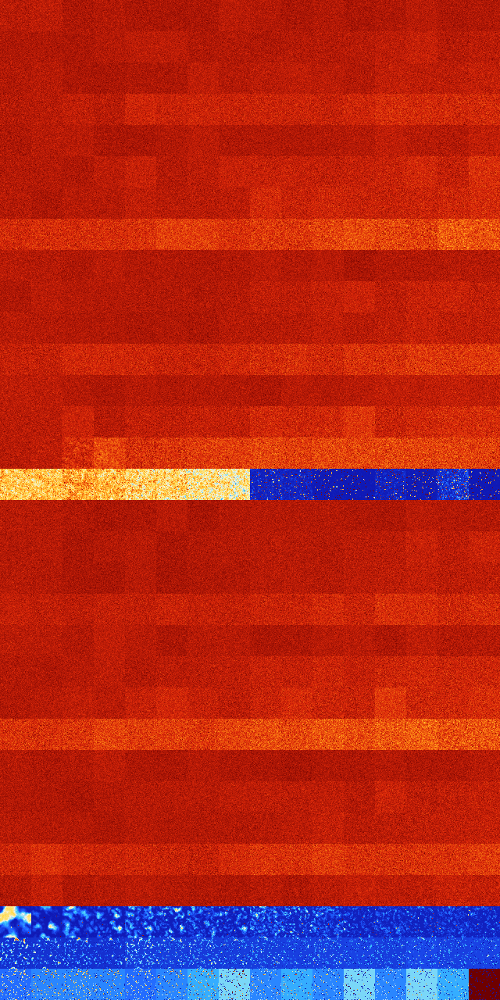

# B03468 (176640-177151)

<details>
    <summary>Initial Grid</summary>
    
</details>


<details>
    <summary>Initial Grid RLE</summary>

```
#C Exported from GoGoL (https://github.com/marrow16/gogol)
#C Wrap mode: Toroidal
#C Boundary mode: Dead
#C Step: 0
x = 100, y = 100, rule = B03468/S
14bo5bo16bo10bo6bo9bo11bo$31bo30bo$9bo28bo12bo27bo9bo$52bo3bo24bo$o2bo
20bo8bo16bo23b2o18bo$14bo26bo2bo31bo$14bo10bo25bo5bo18bo17bo$36bo8bo7bo
26bo6bo$20bo15bo9bo9bo4bo8bo$18bo8bo29bo10bo2bo19bo$11bo12b2o4bobo16bo
12bo8bo5bo$25bo18bo20bo6bo26bo$19bo32bo6bo15bo$42bo16bo8bo11bobo$3bo11b
o60bo8bo$3bo21bo11bo$2bo5bo36bo2bo17bo12bo$64bo$43bo18b2o13bo3bo$6bo11b
o2bo42bo$12b2o3bo11bo8bo3bo3bo2bo22bo17bo$6bo2bo15bobo41bo10bo5bo$31bo
5bo25bo5bo16bo$3bo2bo15bo27bo$18bo9bo2bo8bo$15bo2bo9bo42bo15bo3bo$7bo
22bo14bo8bo6bo15bo6bo$4bo20bo29bo3bo9bo25bo$8bo2bo14bo17bo28bo3bo21bo$
8bo13bo64bo6bo$41bo42bobo$50bo9bo4bo19bobo4bo$13bo6bo2bo41bo2bo13bo$24b
obo50bo$15bo31bo33bo16bo$8bo5bo50bo18bo$35bobo4bo15bo3bo6bo14bo$21bo16b
obo21bo4bo$28bo5bo10bo29bo$8bo25bo27bo13bo$o20bo8bo30bo23bo6bo6bo$10bo
25bo40bo$bo4bo22bo45bo$43bo55bo$23bo5bo4bo3bo$10bo5bo8bo10bo3bo19bo$10b
o49bo4bo16bo$13bo2bo33bo29bo$4bobo6bo23bo24b2o15bo5bo12bo$9bo45bo$55bo
8bo33bo$8bo$18bo18bo11bo24bo13bo$22bo43bo23bo7bo$24bo5bo39bo$bo6bo33bo
8bo10bobo16bo12bo$14bo3bo37bo2bo5bobo21bo$14bo7bo3bo9bo6bo$34bo7bo15bo
21bo9bo$31bo5bo3bo18bo6bo$58bo2b2o12bo19bo3bo$5bo15bo47bo9bo17bo$18bo
40b3o$10bo65bobo15bo$4bo45bo5bo$b2o16bobo7bo45bo12bo$6bo38bo33b2o$7bo5b
o3bo12bo4bo5bo18b2o2bo18bo$3bo4bo15bo6bo12bo23bo18bo$20bo7bo52bo10bo$
32bo19bo19bo26bo$37bo33b2o16bo9bo$3b2o40bo$2bo8bo11bo31bo$3bo5bo56bobo$
12bo30bo8bo16bo4b2o2bo2bo13bo$8bo33bo27bo13bo3bo$7bo8bo19bo7bo3bo30bo$
29bo3bo20bo21bo$18bo7bo61bo3bo$13bo15bo10bo21bo13bo8bo$o5bo43bo37bo6bo$
6bo30bo8bo6bo17bo$10bo9b2o8b2o4bo11bo5bo37bo$16bo31bo18bo3bo6bo$58bo6bo
12bo5bo5bo3bo$7bo66bo11bo$37bo47bo$5bo8bo53bo$19bo34bo25bo$33bo$3bo13bo
11bo6bo23bo$12bo2bo25bo12bobo23bo$45b2o36bo8bo$44bo$21bo4bo$39bo36bo$
24bo$4bo4bo2bo13bo6bo4bo3bo2bo3bo3bo28bo5b2o4bo$15bo21bo7bo49bo!
```
</details>
<details>
    <summary>Thumbnail</summary>

</details>
<table>
<tr>
    <td><a href="./176640%20S%20Heat%20Map%20Activity.png"></a><br>S (176640)<br>G>1000</td>    <td><a href="./176641%20S0%20Heat%20Map%20Activity.png"></a><br>S0 (176641)<br>G>1000</td>    <td><a href="./176642%20S1%20Heat%20Map%20Activity.png"></a><br>S1 (176642)<br>G>1000</td>    <td><a href="./176643%20S01%20Heat%20Map%20Activity.png"></a><br>S01 (176643)<br>G>1000</td>    <td><a href="./176644%20S2%20Heat%20Map%20Activity.png"></a><br>S2 (176644)<br>G>1000</td>    <td><a href="./176645%20S02%20Heat%20Map%20Activity.png"></a><br>S02 (176645)<br>G>1000</td>    <td><a href="./176646%20S12%20Heat%20Map%20Activity.png"></a><br>S12 (176646)<br>G>1000</td>    <td><a href="./176647%20S012%20Heat%20Map%20Activity.png"></a><br>S012 (176647)<br>G>1000</td>    <td><a href="./176648%20S3%20Heat%20Map%20Activity.png"></a><br>S3 (176648)<br>G>1000</td>    <td><a href="./176649%20S03%20Heat%20Map%20Activity.png"></a><br>S03 (176649)<br>G>1000</td>    <td><a href="./176650%20S13%20Heat%20Map%20Activity.png"></a><br>S13 (176650)<br>G>1000</td>    <td><a href="./176651%20S013%20Heat%20Map%20Activity.png"></a><br>S013 (176651)<br>G>1000</td>    <td><a href="./176652%20S23%20Heat%20Map%20Activity.png"></a><br>S23 (176652)<br>G>1000</td>    <td><a href="./176653%20S023%20Heat%20Map%20Activity.png"></a><br>S023 (176653)<br>G>1000</td>    <td><a href="./176654%20S123%20Heat%20Map%20Activity.png"></a><br>S123 (176654)<br>G>1000</td>    <td><a href="./176655%20S0123%20Heat%20Map%20Activity.png"></a><br>S0123 (176655)<br>G>1000</td></tr>
<tr>
    <td><a href="./176656%20S4%20Heat%20Map%20Activity.png"></a><br>S4 (176656)<br>G>1000</td>    <td><a href="./176657%20S04%20Heat%20Map%20Activity.png"></a><br>S04 (176657)<br>G>1000</td>    <td><a href="./176658%20S14%20Heat%20Map%20Activity.png"></a><br>S14 (176658)<br>G>1000</td>    <td><a href="./176659%20S014%20Heat%20Map%20Activity.png"></a><br>S014 (176659)<br>G>1000</td>    <td><a href="./176660%20S24%20Heat%20Map%20Activity.png"></a><br>S24 (176660)<br>G>1000</td>    <td><a href="./176661%20S024%20Heat%20Map%20Activity.png"></a><br>S024 (176661)<br>G>1000</td>    <td><a href="./176662%20S124%20Heat%20Map%20Activity.png"></a><br>S124 (176662)<br>G>1000</td>    <td><a href="./176663%20S0124%20Heat%20Map%20Activity.png"></a><br>S0124 (176663)<br>G>1000</td>    <td><a href="./176664%20S34%20Heat%20Map%20Activity.png"></a><br>S34 (176664)<br>G>1000</td>    <td><a href="./176665%20S034%20Heat%20Map%20Activity.png"></a><br>S034 (176665)<br>G>1000</td>    <td><a href="./176666%20S134%20Heat%20Map%20Activity.png"></a><br>S134 (176666)<br>G>1000</td>    <td><a href="./176667%20S0134%20Heat%20Map%20Activity.png"></a><br>S0134 (176667)<br>G>1000</td>    <td><a href="./176668%20S234%20Heat%20Map%20Activity.png"></a><br>S234 (176668)<br>G>1000</td>    <td><a href="./176669%20S0234%20Heat%20Map%20Activity.png"></a><br>S0234 (176669)<br>G>1000</td>    <td><a href="./176670%20S1234%20Heat%20Map%20Activity.png"></a><br>S1234 (176670)<br>G>1000</td>    <td><a href="./176671%20S01234%20Heat%20Map%20Activity.png"></a><br>S01234 (176671)<br>G>1000</td></tr>
<tr>
    <td><a href="./176672%20S5%20Heat%20Map%20Activity.png"></a><br>S5 (176672)<br>G>1000</td>    <td><a href="./176673%20S05%20Heat%20Map%20Activity.png"></a><br>S05 (176673)<br>G>1000</td>    <td><a href="./176674%20S15%20Heat%20Map%20Activity.png"></a><br>S15 (176674)<br>G>1000</td>    <td><a href="./176675%20S015%20Heat%20Map%20Activity.png"></a><br>S015 (176675)<br>G>1000</td>    <td><a href="./176676%20S25%20Heat%20Map%20Activity.png"></a><br>S25 (176676)<br>G>1000</td>    <td><a href="./176677%20S025%20Heat%20Map%20Activity.png"></a><br>S025 (176677)<br>G>1000</td>    <td><a href="./176678%20S125%20Heat%20Map%20Activity.png"></a><br>S125 (176678)<br>G>1000</td>    <td><a href="./176679%20S0125%20Heat%20Map%20Activity.png"></a><br>S0125 (176679)<br>G>1000</td>    <td><a href="./176680%20S35%20Heat%20Map%20Activity.png"></a><br>S35 (176680)<br>G>1000</td>    <td><a href="./176681%20S035%20Heat%20Map%20Activity.png"></a><br>S035 (176681)<br>G>1000</td>    <td><a href="./176682%20S135%20Heat%20Map%20Activity.png"></a><br>S135 (176682)<br>G>1000</td>    <td><a href="./176683%20S0135%20Heat%20Map%20Activity.png"></a><br>S0135 (176683)<br>G>1000</td>    <td><a href="./176684%20S235%20Heat%20Map%20Activity.png"></a><br>S235 (176684)<br>G>1000</td>    <td><a href="./176685%20S0235%20Heat%20Map%20Activity.png"></a><br>S0235 (176685)<br>G>1000</td>    <td><a href="./176686%20S1235%20Heat%20Map%20Activity.png"></a><br>S1235 (176686)<br>G>1000</td>    <td><a href="./176687%20S01235%20Heat%20Map%20Activity.png"></a><br>S01235 (176687)<br>G>1000</td></tr>
<tr>
    <td><a href="./176688%20S45%20Heat%20Map%20Activity.png"></a><br>S45 (176688)<br>G>1000</td>    <td><a href="./176689%20S045%20Heat%20Map%20Activity.png"></a><br>S045 (176689)<br>G>1000</td>    <td><a href="./176690%20S145%20Heat%20Map%20Activity.png"></a><br>S145 (176690)<br>G>1000</td>    <td><a href="./176691%20S0145%20Heat%20Map%20Activity.png"></a><br>S0145 (176691)<br>G>1000</td>    <td><a href="./176692%20S245%20Heat%20Map%20Activity.png"></a><br>S245 (176692)<br>G>1000</td>    <td><a href="./176693%20S0245%20Heat%20Map%20Activity.png"></a><br>S0245 (176693)<br>G>1000</td>    <td><a href="./176694%20S1245%20Heat%20Map%20Activity.png"></a><br>S1245 (176694)<br>G>1000</td>    <td><a href="./176695%20S01245%20Heat%20Map%20Activity.png"></a><br>S01245 (176695)<br>G>1000</td>    <td><a href="./176696%20S345%20Heat%20Map%20Activity.png"></a><br>S345 (176696)<br>G>1000</td>    <td><a href="./176697%20S0345%20Heat%20Map%20Activity.png"></a><br>S0345 (176697)<br>G>1000</td>    <td><a href="./176698%20S1345%20Heat%20Map%20Activity.png"></a><br>S1345 (176698)<br>G>1000</td>    <td><a href="./176699%20S01345%20Heat%20Map%20Activity.png"></a><br>S01345 (176699)<br>G>1000</td>    <td><a href="./176700%20S2345%20Heat%20Map%20Activity.png"></a><br>S2345 (176700)<br>G>1000</td>    <td><a href="./176701%20S02345%20Heat%20Map%20Activity.png"></a><br>S02345 (176701)<br>G>1000</td>    <td><a href="./176702%20S12345%20Heat%20Map%20Activity.png"></a><br>S12345 (176702)<br>G>1000</td>    <td><a href="./176703%20S012345%20Heat%20Map%20Activity.png"></a><br>S012345 (176703)<br>G>1000</td></tr>
<tr>
    <td><a href="./176704%20S6%20Heat%20Map%20Activity.png"></a><br>S6 (176704)<br>G>1000</td>    <td><a href="./176705%20S06%20Heat%20Map%20Activity.png"></a><br>S06 (176705)<br>G>1000</td>    <td><a href="./176706%20S16%20Heat%20Map%20Activity.png"></a><br>S16 (176706)<br>G>1000</td>    <td><a href="./176707%20S016%20Heat%20Map%20Activity.png"></a><br>S016 (176707)<br>G>1000</td>    <td><a href="./176708%20S26%20Heat%20Map%20Activity.png"></a><br>S26 (176708)<br>G>1000</td>    <td><a href="./176709%20S026%20Heat%20Map%20Activity.png"></a><br>S026 (176709)<br>G>1000</td>    <td><a href="./176710%20S126%20Heat%20Map%20Activity.png"></a><br>S126 (176710)<br>G>1000</td>    <td><a href="./176711%20S0126%20Heat%20Map%20Activity.png"></a><br>S0126 (176711)<br>G>1000</td>    <td><a href="./176712%20S36%20Heat%20Map%20Activity.png"></a><br>S36 (176712)<br>G>1000</td>    <td><a href="./176713%20S036%20Heat%20Map%20Activity.png"></a><br>S036 (176713)<br>G>1000</td>    <td><a href="./176714%20S136%20Heat%20Map%20Activity.png"></a><br>S136 (176714)<br>G>1000</td>    <td><a href="./176715%20S0136%20Heat%20Map%20Activity.png"></a><br>S0136 (176715)<br>G>1000</td>    <td><a href="./176716%20S236%20Heat%20Map%20Activity.png"></a><br>S236 (176716)<br>G>1000</td>    <td><a href="./176717%20S0236%20Heat%20Map%20Activity.png"></a><br>S0236 (176717)<br>G>1000</td>    <td><a href="./176718%20S1236%20Heat%20Map%20Activity.png"></a><br>S1236 (176718)<br>G>1000</td>    <td><a href="./176719%20S01236%20Heat%20Map%20Activity.png"></a><br>S01236 (176719)<br>G>1000</td></tr>
<tr>
    <td><a href="./176720%20S46%20Heat%20Map%20Activity.png"></a><br>S46 (176720)<br>G>1000</td>    <td><a href="./176721%20S046%20Heat%20Map%20Activity.png"></a><br>S046 (176721)<br>G>1000</td>    <td><a href="./176722%20S146%20Heat%20Map%20Activity.png"></a><br>S146 (176722)<br>G>1000</td>    <td><a href="./176723%20S0146%20Heat%20Map%20Activity.png"></a><br>S0146 (176723)<br>G>1000</td>    <td><a href="./176724%20S246%20Heat%20Map%20Activity.png"></a><br>S246 (176724)<br>G>1000</td>    <td><a href="./176725%20S0246%20Heat%20Map%20Activity.png"></a><br>S0246 (176725)<br>G>1000</td>    <td><a href="./176726%20S1246%20Heat%20Map%20Activity.png"></a><br>S1246 (176726)<br>G>1000</td>    <td><a href="./176727%20S01246%20Heat%20Map%20Activity.png"></a><br>S01246 (176727)<br>G>1000</td>    <td><a href="./176728%20S346%20Heat%20Map%20Activity.png"></a><br>S346 (176728)<br>G>1000</td>    <td><a href="./176729%20S0346%20Heat%20Map%20Activity.png"></a><br>S0346 (176729)<br>G>1000</td>    <td><a href="./176730%20S1346%20Heat%20Map%20Activity.png"></a><br>S1346 (176730)<br>G>1000</td>    <td><a href="./176731%20S01346%20Heat%20Map%20Activity.png"></a><br>S01346 (176731)<br>G>1000</td>    <td><a href="./176732%20S2346%20Heat%20Map%20Activity.png"></a><br>S2346 (176732)<br>G>1000</td>    <td><a href="./176733%20S02346%20Heat%20Map%20Activity.png"></a><br>S02346 (176733)<br>G>1000</td>    <td><a href="./176734%20S12346%20Heat%20Map%20Activity.png"></a><br>S12346 (176734)<br>G>1000</td>    <td><a href="./176735%20S012346%20Heat%20Map%20Activity.png"></a><br>S012346 (176735)<br>G>1000</td></tr>
<tr>
    <td><a href="./176736%20S56%20Heat%20Map%20Activity.png"></a><br>S56 (176736)<br>G>1000</td>    <td><a href="./176737%20S056%20Heat%20Map%20Activity.png"></a><br>S056 (176737)<br>G>1000</td>    <td><a href="./176738%20S156%20Heat%20Map%20Activity.png"></a><br>S156 (176738)<br>G>1000</td>    <td><a href="./176739%20S0156%20Heat%20Map%20Activity.png"></a><br>S0156 (176739)<br>G>1000</td>    <td><a href="./176740%20S256%20Heat%20Map%20Activity.png"></a><br>S256 (176740)<br>G>1000</td>    <td><a href="./176741%20S0256%20Heat%20Map%20Activity.png"></a><br>S0256 (176741)<br>G>1000</td>    <td><a href="./176742%20S1256%20Heat%20Map%20Activity.png"></a><br>S1256 (176742)<br>G>1000</td>    <td><a href="./176743%20S01256%20Heat%20Map%20Activity.png"></a><br>S01256 (176743)<br>G>1000</td>    <td><a href="./176744%20S356%20Heat%20Map%20Activity.png"></a><br>S356 (176744)<br>G>1000</td>    <td><a href="./176745%20S0356%20Heat%20Map%20Activity.png"></a><br>S0356 (176745)<br>G>1000</td>    <td><a href="./176746%20S1356%20Heat%20Map%20Activity.png"></a><br>S1356 (176746)<br>G>1000</td>    <td><a href="./176747%20S01356%20Heat%20Map%20Activity.png"></a><br>S01356 (176747)<br>G>1000</td>    <td><a href="./176748%20S2356%20Heat%20Map%20Activity.png"></a><br>S2356 (176748)<br>G>1000</td>    <td><a href="./176749%20S02356%20Heat%20Map%20Activity.png"></a><br>S02356 (176749)<br>G>1000</td>    <td><a href="./176750%20S12356%20Heat%20Map%20Activity.png"></a><br>S12356 (176750)<br>G>1000</td>    <td><a href="./176751%20S012356%20Heat%20Map%20Activity.png"></a><br>S012356 (176751)<br>G>1000</td></tr>
<tr>
    <td><a href="./176752%20S456%20Heat%20Map%20Activity.png"></a><br>S456 (176752)<br>G>1000</td>    <td><a href="./176753%20S0456%20Heat%20Map%20Activity.png"></a><br>S0456 (176753)<br>G>1000</td>    <td><a href="./176754%20S1456%20Heat%20Map%20Activity.png"></a><br>S1456 (176754)<br>G>1000</td>    <td><a href="./176755%20S01456%20Heat%20Map%20Activity.png"></a><br>S01456 (176755)<br>G>1000</td>    <td><a href="./176756%20S2456%20Heat%20Map%20Activity.png"></a><br>S2456 (176756)<br>G>1000</td>    <td><a href="./176757%20S02456%20Heat%20Map%20Activity.png"></a><br>S02456 (176757)<br>G>1000</td>    <td><a href="./176758%20S12456%20Heat%20Map%20Activity.png"></a><br>S12456 (176758)<br>G>1000</td>    <td><a href="./176759%20S012456%20Heat%20Map%20Activity.png"></a><br>S012456 (176759)<br>G>1000</td>    <td><a href="./176760%20S3456%20Heat%20Map%20Activity.png"></a><br>S3456 (176760)<br>G>1000</td>    <td><a href="./176761%20S03456%20Heat%20Map%20Activity.png"></a><br>S03456 (176761)<br>G>1000</td>    <td><a href="./176762%20S13456%20Heat%20Map%20Activity.png"></a><br>S13456 (176762)<br>G>1000</td>    <td><a href="./176763%20S013456%20Heat%20Map%20Activity.png"></a><br>S013456 (176763)<br>G>1000</td>    <td><a href="./176764%20S23456%20Heat%20Map%20Activity.png"></a><br>S23456 (176764)<br>G>1000</td>    <td><a href="./176765%20S023456%20Heat%20Map%20Activity.png"></a><br>S023456 (176765)<br>G>1000</td>    <td><a href="./176766%20S123456%20Heat%20Map%20Activity.png"></a><br>S123456 (176766)<br>G>1000</td>    <td><a href="./176767%20S0123456%20Heat%20Map%20Activity.png"></a><br>S0123456 (176767)<br>G>1000</td></tr>
<tr>
    <td><a href="./176768%20S7%20Heat%20Map%20Activity.png"></a><br>S7 (176768)<br>G>1000</td>    <td><a href="./176769%20S07%20Heat%20Map%20Activity.png"></a><br>S07 (176769)<br>G>1000</td>    <td><a href="./176770%20S17%20Heat%20Map%20Activity.png"></a><br>S17 (176770)<br>G>1000</td>    <td><a href="./176771%20S017%20Heat%20Map%20Activity.png"></a><br>S017 (176771)<br>G>1000</td>    <td><a href="./176772%20S27%20Heat%20Map%20Activity.png"></a><br>S27 (176772)<br>G>1000</td>    <td><a href="./176773%20S027%20Heat%20Map%20Activity.png"></a><br>S027 (176773)<br>G>1000</td>    <td><a href="./176774%20S127%20Heat%20Map%20Activity.png"></a><br>S127 (176774)<br>G>1000</td>    <td><a href="./176775%20S0127%20Heat%20Map%20Activity.png"></a><br>S0127 (176775)<br>G>1000</td>    <td><a href="./176776%20S37%20Heat%20Map%20Activity.png"></a><br>S37 (176776)<br>G>1000</td>    <td><a href="./176777%20S037%20Heat%20Map%20Activity.png"></a><br>S037 (176777)<br>G>1000</td>    <td><a href="./176778%20S137%20Heat%20Map%20Activity.png"></a><br>S137 (176778)<br>G>1000</td>    <td><a href="./176779%20S0137%20Heat%20Map%20Activity.png"></a><br>S0137 (176779)<br>G>1000</td>    <td><a href="./176780%20S237%20Heat%20Map%20Activity.png"></a><br>S237 (176780)<br>G>1000</td>    <td><a href="./176781%20S0237%20Heat%20Map%20Activity.png"></a><br>S0237 (176781)<br>G>1000</td>    <td><a href="./176782%20S1237%20Heat%20Map%20Activity.png"></a><br>S1237 (176782)<br>G>1000</td>    <td><a href="./176783%20S01237%20Heat%20Map%20Activity.png"></a><br>S01237 (176783)<br>G>1000</td></tr>
<tr>
    <td><a href="./176784%20S47%20Heat%20Map%20Activity.png"></a><br>S47 (176784)<br>G>1000</td>    <td><a href="./176785%20S047%20Heat%20Map%20Activity.png"></a><br>S047 (176785)<br>G>1000</td>    <td><a href="./176786%20S147%20Heat%20Map%20Activity.png"></a><br>S147 (176786)<br>G>1000</td>    <td><a href="./176787%20S0147%20Heat%20Map%20Activity.png"></a><br>S0147 (176787)<br>G>1000</td>    <td><a href="./176788%20S247%20Heat%20Map%20Activity.png"></a><br>S247 (176788)<br>G>1000</td>    <td><a href="./176789%20S0247%20Heat%20Map%20Activity.png"></a><br>S0247 (176789)<br>G>1000</td>    <td><a href="./176790%20S1247%20Heat%20Map%20Activity.png"></a><br>S1247 (176790)<br>G>1000</td>    <td><a href="./176791%20S01247%20Heat%20Map%20Activity.png"></a><br>S01247 (176791)<br>G>1000</td>    <td><a href="./176792%20S347%20Heat%20Map%20Activity.png"></a><br>S347 (176792)<br>G>1000</td>    <td><a href="./176793%20S0347%20Heat%20Map%20Activity.png"></a><br>S0347 (176793)<br>G>1000</td>    <td><a href="./176794%20S1347%20Heat%20Map%20Activity.png"></a><br>S1347 (176794)<br>G>1000</td>    <td><a href="./176795%20S01347%20Heat%20Map%20Activity.png"></a><br>S01347 (176795)<br>G>1000</td>    <td><a href="./176796%20S2347%20Heat%20Map%20Activity.png"></a><br>S2347 (176796)<br>G>1000</td>    <td><a href="./176797%20S02347%20Heat%20Map%20Activity.png"></a><br>S02347 (176797)<br>G>1000</td>    <td><a href="./176798%20S12347%20Heat%20Map%20Activity.png"></a><br>S12347 (176798)<br>G>1000</td>    <td><a href="./176799%20S012347%20Heat%20Map%20Activity.png"></a><br>S012347 (176799)<br>G>1000</td></tr>
<tr>
    <td><a href="./176800%20S57%20Heat%20Map%20Activity.png"></a><br>S57 (176800)<br>G>1000</td>    <td><a href="./176801%20S057%20Heat%20Map%20Activity.png"></a><br>S057 (176801)<br>G>1000</td>    <td><a href="./176802%20S157%20Heat%20Map%20Activity.png"></a><br>S157 (176802)<br>G>1000</td>    <td><a href="./176803%20S0157%20Heat%20Map%20Activity.png"></a><br>S0157 (176803)<br>G>1000</td>    <td><a href="./176804%20S257%20Heat%20Map%20Activity.png"></a><br>S257 (176804)<br>G>1000</td>    <td><a href="./176805%20S0257%20Heat%20Map%20Activity.png"></a><br>S0257 (176805)<br>G>1000</td>    <td><a href="./176806%20S1257%20Heat%20Map%20Activity.png"></a><br>S1257 (176806)<br>G>1000</td>    <td><a href="./176807%20S01257%20Heat%20Map%20Activity.png"></a><br>S01257 (176807)<br>G>1000</td>    <td><a href="./176808%20S357%20Heat%20Map%20Activity.png"></a><br>S357 (176808)<br>G>1000</td>    <td><a href="./176809%20S0357%20Heat%20Map%20Activity.png"></a><br>S0357 (176809)<br>G>1000</td>    <td><a href="./176810%20S1357%20Heat%20Map%20Activity.png"></a><br>S1357 (176810)<br>G>1000</td>    <td><a href="./176811%20S01357%20Heat%20Map%20Activity.png"></a><br>S01357 (176811)<br>G>1000</td>    <td><a href="./176812%20S2357%20Heat%20Map%20Activity.png"></a><br>S2357 (176812)<br>G>1000</td>    <td><a href="./176813%20S02357%20Heat%20Map%20Activity.png"></a><br>S02357 (176813)<br>G>1000</td>    <td><a href="./176814%20S12357%20Heat%20Map%20Activity.png"></a><br>S12357 (176814)<br>G>1000</td>    <td><a href="./176815%20S012357%20Heat%20Map%20Activity.png"></a><br>S012357 (176815)<br>G>1000</td></tr>
<tr>
    <td><a href="./176816%20S457%20Heat%20Map%20Activity.png"></a><br>S457 (176816)<br>G>1000</td>    <td><a href="./176817%20S0457%20Heat%20Map%20Activity.png"></a><br>S0457 (176817)<br>G>1000</td>    <td><a href="./176818%20S1457%20Heat%20Map%20Activity.png"></a><br>S1457 (176818)<br>G>1000</td>    <td><a href="./176819%20S01457%20Heat%20Map%20Activity.png"></a><br>S01457 (176819)<br>G>1000</td>    <td><a href="./176820%20S2457%20Heat%20Map%20Activity.png"></a><br>S2457 (176820)<br>G>1000</td>    <td><a href="./176821%20S02457%20Heat%20Map%20Activity.png"></a><br>S02457 (176821)<br>G>1000</td>    <td><a href="./176822%20S12457%20Heat%20Map%20Activity.png"></a><br>S12457 (176822)<br>G>1000</td>    <td><a href="./176823%20S012457%20Heat%20Map%20Activity.png"></a><br>S012457 (176823)<br>G>1000</td>    <td><a href="./176824%20S3457%20Heat%20Map%20Activity.png"></a><br>S3457 (176824)<br>G>1000</td>    <td><a href="./176825%20S03457%20Heat%20Map%20Activity.png"></a><br>S03457 (176825)<br>G>1000</td>    <td><a href="./176826%20S13457%20Heat%20Map%20Activity.png"></a><br>S13457 (176826)<br>G>1000</td>    <td><a href="./176827%20S013457%20Heat%20Map%20Activity.png"></a><br>S013457 (176827)<br>G>1000</td>    <td><a href="./176828%20S23457%20Heat%20Map%20Activity.png"></a><br>S23457 (176828)<br>G>1000</td>    <td><a href="./176829%20S023457%20Heat%20Map%20Activity.png"></a><br>S023457 (176829)<br>G>1000</td>    <td><a href="./176830%20S123457%20Heat%20Map%20Activity.png"></a><br>S123457 (176830)<br>G>1000</td>    <td><a href="./176831%20S0123457%20Heat%20Map%20Activity.png"></a><br>S0123457 (176831)<br>G>1000</td></tr>
<tr>
    <td><a href="./176832%20S67%20Heat%20Map%20Activity.png"></a><br>S67 (176832)<br>G>1000</td>    <td><a href="./176833%20S067%20Heat%20Map%20Activity.png"></a><br>S067 (176833)<br>G>1000</td>    <td><a href="./176834%20S167%20Heat%20Map%20Activity.png"></a><br>S167 (176834)<br>G>1000</td>    <td><a href="./176835%20S0167%20Heat%20Map%20Activity.png"></a><br>S0167 (176835)<br>G>1000</td>    <td><a href="./176836%20S267%20Heat%20Map%20Activity.png"></a><br>S267 (176836)<br>G>1000</td>    <td><a href="./176837%20S0267%20Heat%20Map%20Activity.png"></a><br>S0267 (176837)<br>G>1000</td>    <td><a href="./176838%20S1267%20Heat%20Map%20Activity.png"></a><br>S1267 (176838)<br>G>1000</td>    <td><a href="./176839%20S01267%20Heat%20Map%20Activity.png"></a><br>S01267 (176839)<br>G>1000</td>    <td><a href="./176840%20S367%20Heat%20Map%20Activity.png"></a><br>S367 (176840)<br>G>1000</td>    <td><a href="./176841%20S0367%20Heat%20Map%20Activity.png"></a><br>S0367 (176841)<br>G>1000</td>    <td><a href="./176842%20S1367%20Heat%20Map%20Activity.png"></a><br>S1367 (176842)<br>G>1000</td>    <td><a href="./176843%20S01367%20Heat%20Map%20Activity.png"></a><br>S01367 (176843)<br>G>1000</td>    <td><a href="./176844%20S2367%20Heat%20Map%20Activity.png"></a><br>S2367 (176844)<br>G>1000</td>    <td><a href="./176845%20S02367%20Heat%20Map%20Activity.png"></a><br>S02367 (176845)<br>G>1000</td>    <td><a href="./176846%20S12367%20Heat%20Map%20Activity.png"></a><br>S12367 (176846)<br>G>1000</td>    <td><a href="./176847%20S012367%20Heat%20Map%20Activity.png"></a><br>S012367 (176847)<br>G>1000</td></tr>
<tr>
    <td><a href="./176848%20S467%20Heat%20Map%20Activity.png"></a><br>S467 (176848)<br>G>1000</td>    <td><a href="./176849%20S0467%20Heat%20Map%20Activity.png"></a><br>S0467 (176849)<br>G>1000</td>    <td><a href="./176850%20S1467%20Heat%20Map%20Activity.png"></a><br>S1467 (176850)<br>G>1000</td>    <td><a href="./176851%20S01467%20Heat%20Map%20Activity.png"></a><br>S01467 (176851)<br>G>1000</td>    <td><a href="./176852%20S2467%20Heat%20Map%20Activity.png"></a><br>S2467 (176852)<br>G>1000</td>    <td><a href="./176853%20S02467%20Heat%20Map%20Activity.png"></a><br>S02467 (176853)<br>G>1000</td>    <td><a href="./176854%20S12467%20Heat%20Map%20Activity.png"></a><br>S12467 (176854)<br>G>1000</td>    <td><a href="./176855%20S012467%20Heat%20Map%20Activity.png"></a><br>S012467 (176855)<br>G>1000</td>    <td><a href="./176856%20S3467%20Heat%20Map%20Activity.png"></a><br>S3467 (176856)<br>G>1000</td>    <td><a href="./176857%20S03467%20Heat%20Map%20Activity.png"></a><br>S03467 (176857)<br>G>1000</td>    <td><a href="./176858%20S13467%20Heat%20Map%20Activity.png"></a><br>S13467 (176858)<br>G>1000</td>    <td><a href="./176859%20S013467%20Heat%20Map%20Activity.png"></a><br>S013467 (176859)<br>G>1000</td>    <td><a href="./176860%20S23467%20Heat%20Map%20Activity.png"></a><br>S23467 (176860)<br>G>1000</td>    <td><a href="./176861%20S023467%20Heat%20Map%20Activity.png"></a><br>S023467 (176861)<br>G>1000</td>    <td><a href="./176862%20S123467%20Heat%20Map%20Activity.png"></a><br>S123467 (176862)<br>G>1000</td>    <td><a href="./176863%20S0123467%20Heat%20Map%20Activity.png"></a><br>S0123467 (176863)<br>G>1000</td></tr>
<tr>
    <td><a href="./176864%20S567%20Heat%20Map%20Activity.png"></a><br>S567 (176864)<br>G>1000</td>    <td><a href="./176865%20S0567%20Heat%20Map%20Activity.png"></a><br>S0567 (176865)<br>G>1000</td>    <td><a href="./176866%20S1567%20Heat%20Map%20Activity.png"></a><br>S1567 (176866)<br>G>1000</td>    <td><a href="./176867%20S01567%20Heat%20Map%20Activity.png"></a><br>S01567 (176867)<br>G>1000</td>    <td><a href="./176868%20S2567%20Heat%20Map%20Activity.png"></a><br>S2567 (176868)<br>G>1000</td>    <td><a href="./176869%20S02567%20Heat%20Map%20Activity.png"></a><br>S02567 (176869)<br>G>1000</td>    <td><a href="./176870%20S12567%20Heat%20Map%20Activity.png"></a><br>S12567 (176870)<br>G>1000</td>    <td><a href="./176871%20S012567%20Heat%20Map%20Activity.png"></a><br>S012567 (176871)<br>G>1000</td>    <td><a href="./176872%20S3567%20Heat%20Map%20Activity.png"></a><br>S3567 (176872)<br>G>1000</td>    <td><a href="./176873%20S03567%20Heat%20Map%20Activity.png"></a><br>S03567 (176873)<br>G>1000</td>    <td><a href="./176874%20S13567%20Heat%20Map%20Activity.png"></a><br>S13567 (176874)<br>G>1000</td>    <td><a href="./176875%20S013567%20Heat%20Map%20Activity.png"></a><br>S013567 (176875)<br>G>1000</td>    <td><a href="./176876%20S23567%20Heat%20Map%20Activity.png"></a><br>S23567 (176876)<br>G>1000</td>    <td><a href="./176877%20S023567%20Heat%20Map%20Activity.png"></a><br>S023567 (176877)<br>G>1000</td>    <td><a href="./176878%20S123567%20Heat%20Map%20Activity.png"></a><br>S123567 (176878)<br>G>1000</td>    <td><a href="./176879%20S0123567%20Heat%20Map%20Activity.png"></a><br>S0123567 (176879)<br>G>1000</td></tr>
<tr>
    <td><a href="./176880%20S4567%20Heat%20Map%20Activity.png"></a><br>S4567 (176880)<br>G>1000</td>    <td><a href="./176881%20S04567%20Heat%20Map%20Activity.png"></a><br>S04567 (176881)<br>G>1000</td>    <td><a href="./176882%20S14567%20Heat%20Map%20Activity.png"></a><br>S14567 (176882)<br>G>1000</td>    <td><a href="./176883%20S014567%20Heat%20Map%20Activity.png"></a><br>S014567 (176883)<br>G>1000</td>    <td><a href="./176884%20S24567%20Heat%20Map%20Activity.png"></a><br>S24567 (176884)<br>G>1000</td>    <td><a href="./176885%20S024567%20Heat%20Map%20Activity.png"></a><br>S024567 (176885)<br>G>1000</td>    <td><a href="./176886%20S124567%20Heat%20Map%20Activity.png"></a><br>S124567 (176886)<br>G>1000</td>    <td><a href="./176887%20S0124567%20Heat%20Map%20Activity.png"></a><br>S0124567 (176887)<br>G>1000</td>    <td><a href="./176888%20S34567%20Heat%20Map%20Activity.png"></a><br>S34567 (176888)<br>R@140,p84</td>    <td><a href="./176889%20S034567%20Heat%20Map%20Activity.png"></a><br>S034567 (176889)<br>R@145,p84</td>    <td><a href="./176890%20S134567%20Heat%20Map%20Activity.png"></a><br>S134567 (176890)<br>R@572,p504</td>    <td><a href="./176891%20S0134567%20Heat%20Map%20Activity.png"></a><br>S0134567 (176891)<br>G>1000</td>    <td><a href="./176892%20S234567%20Heat%20Map%20Activity.png"></a><br>S234567 (176892)<br>R@134,p84</td>    <td><a href="./176893%20S0234567%20Heat%20Map%20Activity.png"></a><br>S0234567 (176893)<br>R@455,p420</td>    <td><a href="./176894%20S1234567%20Heat%20Map%20Activity.png"></a><br>S1234567 (176894)<br>R@48,p12</td>    <td><a href="./176895%20S01234567%20Heat%20Map%20Activity.png"></a><br>S01234567 (176895)<br>G>1000</td></tr>
<tr>
    <td><a href="./176896%20S8%20Heat%20Map%20Activity.png"></a><br>S8 (176896)<br>G>1000</td>    <td><a href="./176897%20S08%20Heat%20Map%20Activity.png"></a><br>S08 (176897)<br>G>1000</td>    <td><a href="./176898%20S18%20Heat%20Map%20Activity.png"></a><br>S18 (176898)<br>G>1000</td>    <td><a href="./176899%20S018%20Heat%20Map%20Activity.png"></a><br>S018 (176899)<br>G>1000</td>    <td><a href="./176900%20S28%20Heat%20Map%20Activity.png"></a><br>S28 (176900)<br>G>1000</td>    <td><a href="./176901%20S028%20Heat%20Map%20Activity.png"></a><br>S028 (176901)<br>G>1000</td>    <td><a href="./176902%20S128%20Heat%20Map%20Activity.png"></a><br>S128 (176902)<br>G>1000</td>    <td><a href="./176903%20S0128%20Heat%20Map%20Activity.png"></a><br>S0128 (176903)<br>G>1000</td>    <td><a href="./176904%20S38%20Heat%20Map%20Activity.png"></a><br>S38 (176904)<br>G>1000</td>    <td><a href="./176905%20S038%20Heat%20Map%20Activity.png"></a><br>S038 (176905)<br>G>1000</td>    <td><a href="./176906%20S138%20Heat%20Map%20Activity.png"></a><br>S138 (176906)<br>G>1000</td>    <td><a href="./176907%20S0138%20Heat%20Map%20Activity.png"></a><br>S0138 (176907)<br>G>1000</td>    <td><a href="./176908%20S238%20Heat%20Map%20Activity.png"></a><br>S238 (176908)<br>G>1000</td>    <td><a href="./176909%20S0238%20Heat%20Map%20Activity.png"></a><br>S0238 (176909)<br>G>1000</td>    <td><a href="./176910%20S1238%20Heat%20Map%20Activity.png"></a><br>S1238 (176910)<br>G>1000</td>    <td><a href="./176911%20S01238%20Heat%20Map%20Activity.png"></a><br>S01238 (176911)<br>G>1000</td></tr>
<tr>
    <td><a href="./176912%20S48%20Heat%20Map%20Activity.png"></a><br>S48 (176912)<br>G>1000</td>    <td><a href="./176913%20S048%20Heat%20Map%20Activity.png"></a><br>S048 (176913)<br>G>1000</td>    <td><a href="./176914%20S148%20Heat%20Map%20Activity.png"></a><br>S148 (176914)<br>G>1000</td>    <td><a href="./176915%20S0148%20Heat%20Map%20Activity.png"></a><br>S0148 (176915)<br>G>1000</td>    <td><a href="./176916%20S248%20Heat%20Map%20Activity.png"></a><br>S248 (176916)<br>G>1000</td>    <td><a href="./176917%20S0248%20Heat%20Map%20Activity.png"></a><br>S0248 (176917)<br>G>1000</td>    <td><a href="./176918%20S1248%20Heat%20Map%20Activity.png"></a><br>S1248 (176918)<br>G>1000</td>    <td><a href="./176919%20S01248%20Heat%20Map%20Activity.png"></a><br>S01248 (176919)<br>G>1000</td>    <td><a href="./176920%20S348%20Heat%20Map%20Activity.png"></a><br>S348 (176920)<br>G>1000</td>    <td><a href="./176921%20S0348%20Heat%20Map%20Activity.png"></a><br>S0348 (176921)<br>G>1000</td>    <td><a href="./176922%20S1348%20Heat%20Map%20Activity.png"></a><br>S1348 (176922)<br>G>1000</td>    <td><a href="./176923%20S01348%20Heat%20Map%20Activity.png"></a><br>S01348 (176923)<br>G>1000</td>    <td><a href="./176924%20S2348%20Heat%20Map%20Activity.png"></a><br>S2348 (176924)<br>G>1000</td>    <td><a href="./176925%20S02348%20Heat%20Map%20Activity.png"></a><br>S02348 (176925)<br>G>1000</td>    <td><a href="./176926%20S12348%20Heat%20Map%20Activity.png"></a><br>S12348 (176926)<br>G>1000</td>    <td><a href="./176927%20S012348%20Heat%20Map%20Activity.png"></a><br>S012348 (176927)<br>G>1000</td></tr>
<tr>
    <td><a href="./176928%20S58%20Heat%20Map%20Activity.png"></a><br>S58 (176928)<br>G>1000</td>    <td><a href="./176929%20S058%20Heat%20Map%20Activity.png"></a><br>S058 (176929)<br>G>1000</td>    <td><a href="./176930%20S158%20Heat%20Map%20Activity.png"></a><br>S158 (176930)<br>G>1000</td>    <td><a href="./176931%20S0158%20Heat%20Map%20Activity.png"></a><br>S0158 (176931)<br>G>1000</td>    <td><a href="./176932%20S258%20Heat%20Map%20Activity.png"></a><br>S258 (176932)<br>G>1000</td>    <td><a href="./176933%20S0258%20Heat%20Map%20Activity.png"></a><br>S0258 (176933)<br>G>1000</td>    <td><a href="./176934%20S1258%20Heat%20Map%20Activity.png"></a><br>S1258 (176934)<br>G>1000</td>    <td><a href="./176935%20S01258%20Heat%20Map%20Activity.png"></a><br>S01258 (176935)<br>G>1000</td>    <td><a href="./176936%20S358%20Heat%20Map%20Activity.png"></a><br>S358 (176936)<br>G>1000</td>    <td><a href="./176937%20S0358%20Heat%20Map%20Activity.png"></a><br>S0358 (176937)<br>G>1000</td>    <td><a href="./176938%20S1358%20Heat%20Map%20Activity.png"></a><br>S1358 (176938)<br>G>1000</td>    <td><a href="./176939%20S01358%20Heat%20Map%20Activity.png"></a><br>S01358 (176939)<br>G>1000</td>    <td><a href="./176940%20S2358%20Heat%20Map%20Activity.png"></a><br>S2358 (176940)<br>G>1000</td>    <td><a href="./176941%20S02358%20Heat%20Map%20Activity.png"></a><br>S02358 (176941)<br>G>1000</td>    <td><a href="./176942%20S12358%20Heat%20Map%20Activity.png"></a><br>S12358 (176942)<br>G>1000</td>    <td><a href="./176943%20S012358%20Heat%20Map%20Activity.png"></a><br>S012358 (176943)<br>G>1000</td></tr>
<tr>
    <td><a href="./176944%20S458%20Heat%20Map%20Activity.png"></a><br>S458 (176944)<br>G>1000</td>    <td><a href="./176945%20S0458%20Heat%20Map%20Activity.png"></a><br>S0458 (176945)<br>G>1000</td>    <td><a href="./176946%20S1458%20Heat%20Map%20Activity.png"></a><br>S1458 (176946)<br>G>1000</td>    <td><a href="./176947%20S01458%20Heat%20Map%20Activity.png"></a><br>S01458 (176947)<br>G>1000</td>    <td><a href="./176948%20S2458%20Heat%20Map%20Activity.png"></a><br>S2458 (176948)<br>G>1000</td>    <td><a href="./176949%20S02458%20Heat%20Map%20Activity.png"></a><br>S02458 (176949)<br>G>1000</td>    <td><a href="./176950%20S12458%20Heat%20Map%20Activity.png"></a><br>S12458 (176950)<br>G>1000</td>    <td><a href="./176951%20S012458%20Heat%20Map%20Activity.png"></a><br>S012458 (176951)<br>G>1000</td>    <td><a href="./176952%20S3458%20Heat%20Map%20Activity.png"></a><br>S3458 (176952)<br>G>1000</td>    <td><a href="./176953%20S03458%20Heat%20Map%20Activity.png"></a><br>S03458 (176953)<br>G>1000</td>    <td><a href="./176954%20S13458%20Heat%20Map%20Activity.png"></a><br>S13458 (176954)<br>G>1000</td>    <td><a href="./176955%20S013458%20Heat%20Map%20Activity.png"></a><br>S013458 (176955)<br>G>1000</td>    <td><a href="./176956%20S23458%20Heat%20Map%20Activity.png"></a><br>S23458 (176956)<br>G>1000</td>    <td><a href="./176957%20S023458%20Heat%20Map%20Activity.png"></a><br>S023458 (176957)<br>G>1000</td>    <td><a href="./176958%20S123458%20Heat%20Map%20Activity.png"></a><br>S123458 (176958)<br>G>1000</td>    <td><a href="./176959%20S0123458%20Heat%20Map%20Activity.png"></a><br>S0123458 (176959)<br>G>1000</td></tr>
<tr>
    <td><a href="./176960%20S68%20Heat%20Map%20Activity.png"></a><br>S68 (176960)<br>G>1000</td>    <td><a href="./176961%20S068%20Heat%20Map%20Activity.png"></a><br>S068 (176961)<br>G>1000</td>    <td><a href="./176962%20S168%20Heat%20Map%20Activity.png"></a><br>S168 (176962)<br>G>1000</td>    <td><a href="./176963%20S0168%20Heat%20Map%20Activity.png"></a><br>S0168 (176963)<br>G>1000</td>    <td><a href="./176964%20S268%20Heat%20Map%20Activity.png"></a><br>S268 (176964)<br>G>1000</td>    <td><a href="./176965%20S0268%20Heat%20Map%20Activity.png"></a><br>S0268 (176965)<br>G>1000</td>    <td><a href="./176966%20S1268%20Heat%20Map%20Activity.png"></a><br>S1268 (176966)<br>G>1000</td>    <td><a href="./176967%20S01268%20Heat%20Map%20Activity.png"></a><br>S01268 (176967)<br>G>1000</td>    <td><a href="./176968%20S368%20Heat%20Map%20Activity.png"></a><br>S368 (176968)<br>G>1000</td>    <td><a href="./176969%20S0368%20Heat%20Map%20Activity.png"></a><br>S0368 (176969)<br>G>1000</td>    <td><a href="./176970%20S1368%20Heat%20Map%20Activity.png"></a><br>S1368 (176970)<br>G>1000</td>    <td><a href="./176971%20S01368%20Heat%20Map%20Activity.png"></a><br>S01368 (176971)<br>G>1000</td>    <td><a href="./176972%20S2368%20Heat%20Map%20Activity.png"></a><br>S2368 (176972)<br>G>1000</td>    <td><a href="./176973%20S02368%20Heat%20Map%20Activity.png"></a><br>S02368 (176973)<br>G>1000</td>    <td><a href="./176974%20S12368%20Heat%20Map%20Activity.png"></a><br>S12368 (176974)<br>G>1000</td>    <td><a href="./176975%20S012368%20Heat%20Map%20Activity.png"></a><br>S012368 (176975)<br>G>1000</td></tr>
<tr>
    <td><a href="./176976%20S468%20Heat%20Map%20Activity.png"></a><br>S468 (176976)<br>G>1000</td>    <td><a href="./176977%20S0468%20Heat%20Map%20Activity.png"></a><br>S0468 (176977)<br>G>1000</td>    <td><a href="./176978%20S1468%20Heat%20Map%20Activity.png"></a><br>S1468 (176978)<br>G>1000</td>    <td><a href="./176979%20S01468%20Heat%20Map%20Activity.png"></a><br>S01468 (176979)<br>G>1000</td>    <td><a href="./176980%20S2468%20Heat%20Map%20Activity.png"></a><br>S2468 (176980)<br>G>1000</td>    <td><a href="./176981%20S02468%20Heat%20Map%20Activity.png"></a><br>S02468 (176981)<br>G>1000</td>    <td><a href="./176982%20S12468%20Heat%20Map%20Activity.png"></a><br>S12468 (176982)<br>G>1000</td>    <td><a href="./176983%20S012468%20Heat%20Map%20Activity.png"></a><br>S012468 (176983)<br>G>1000</td>    <td><a href="./176984%20S3468%20Heat%20Map%20Activity.png"></a><br>S3468 (176984)<br>G>1000</td>    <td><a href="./176985%20S03468%20Heat%20Map%20Activity.png"></a><br>S03468 (176985)<br>G>1000</td>    <td><a href="./176986%20S13468%20Heat%20Map%20Activity.png"></a><br>S13468 (176986)<br>G>1000</td>    <td><a href="./176987%20S013468%20Heat%20Map%20Activity.png"></a><br>S013468 (176987)<br>G>1000</td>    <td><a href="./176988%20S23468%20Heat%20Map%20Activity.png"></a><br>S23468 (176988)<br>G>1000</td>    <td><a href="./176989%20S023468%20Heat%20Map%20Activity.png"></a><br>S023468 (176989)<br>G>1000</td>    <td><a href="./176990%20S123468%20Heat%20Map%20Activity.png"></a><br>S123468 (176990)<br>G>1000</td>    <td><a href="./176991%20S0123468%20Heat%20Map%20Activity.png"></a><br>S0123468 (176991)<br>G>1000</td></tr>
<tr>
    <td><a href="./176992%20S568%20Heat%20Map%20Activity.png"></a><br>S568 (176992)<br>G>1000</td>    <td><a href="./176993%20S0568%20Heat%20Map%20Activity.png"></a><br>S0568 (176993)<br>G>1000</td>    <td><a href="./176994%20S1568%20Heat%20Map%20Activity.png"></a><br>S1568 (176994)<br>G>1000</td>    <td><a href="./176995%20S01568%20Heat%20Map%20Activity.png"></a><br>S01568 (176995)<br>G>1000</td>    <td><a href="./176996%20S2568%20Heat%20Map%20Activity.png"></a><br>S2568 (176996)<br>G>1000</td>    <td><a href="./176997%20S02568%20Heat%20Map%20Activity.png"></a><br>S02568 (176997)<br>G>1000</td>    <td><a href="./176998%20S12568%20Heat%20Map%20Activity.png"></a><br>S12568 (176998)<br>G>1000</td>    <td><a href="./176999%20S012568%20Heat%20Map%20Activity.png"></a><br>S012568 (176999)<br>G>1000</td>    <td><a href="./177000%20S3568%20Heat%20Map%20Activity.png"></a><br>S3568 (177000)<br>G>1000</td>    <td><a href="./177001%20S03568%20Heat%20Map%20Activity.png"></a><br>S03568 (177001)<br>G>1000</td>    <td><a href="./177002%20S13568%20Heat%20Map%20Activity.png"></a><br>S13568 (177002)<br>G>1000</td>    <td><a href="./177003%20S013568%20Heat%20Map%20Activity.png"></a><br>S013568 (177003)<br>G>1000</td>    <td><a href="./177004%20S23568%20Heat%20Map%20Activity.png"></a><br>S23568 (177004)<br>G>1000</td>    <td><a href="./177005%20S023568%20Heat%20Map%20Activity.png"></a><br>S023568 (177005)<br>G>1000</td>    <td><a href="./177006%20S123568%20Heat%20Map%20Activity.png"></a><br>S123568 (177006)<br>G>1000</td>    <td><a href="./177007%20S0123568%20Heat%20Map%20Activity.png"></a><br>S0123568 (177007)<br>G>1000</td></tr>
<tr>
    <td><a href="./177008%20S4568%20Heat%20Map%20Activity.png"></a><br>S4568 (177008)<br>G>1000</td>    <td><a href="./177009%20S04568%20Heat%20Map%20Activity.png"></a><br>S04568 (177009)<br>G>1000</td>    <td><a href="./177010%20S14568%20Heat%20Map%20Activity.png"></a><br>S14568 (177010)<br>G>1000</td>    <td><a href="./177011%20S014568%20Heat%20Map%20Activity.png"></a><br>S014568 (177011)<br>G>1000</td>    <td><a href="./177012%20S24568%20Heat%20Map%20Activity.png"></a><br>S24568 (177012)<br>G>1000</td>    <td><a href="./177013%20S024568%20Heat%20Map%20Activity.png"></a><br>S024568 (177013)<br>G>1000</td>    <td><a href="./177014%20S124568%20Heat%20Map%20Activity.png"></a><br>S124568 (177014)<br>G>1000</td>    <td><a href="./177015%20S0124568%20Heat%20Map%20Activity.png"></a><br>S0124568 (177015)<br>G>1000</td>    <td><a href="./177016%20S34568%20Heat%20Map%20Activity.png"></a><br>S34568 (177016)<br>G>1000</td>    <td><a href="./177017%20S034568%20Heat%20Map%20Activity.png"></a><br>S034568 (177017)<br>G>1000</td>    <td><a href="./177018%20S134568%20Heat%20Map%20Activity.png"></a><br>S134568 (177018)<br>G>1000</td>    <td><a href="./177019%20S0134568%20Heat%20Map%20Activity.png"></a><br>S0134568 (177019)<br>G>1000</td>    <td><a href="./177020%20S234568%20Heat%20Map%20Activity.png"></a><br>S234568 (177020)<br>G>1000</td>    <td><a href="./177021%20S0234568%20Heat%20Map%20Activity.png"></a><br>S0234568 (177021)<br>G>1000</td>    <td><a href="./177022%20S1234568%20Heat%20Map%20Activity.png"></a><br>S1234568 (177022)<br>G>1000</td>    <td><a href="./177023%20S01234568%20Heat%20Map%20Activity.png"></a><br>S01234568 (177023)<br>G>1000</td></tr>
<tr>
    <td><a href="./177024%20S78%20Heat%20Map%20Activity.png"></a><br>S78 (177024)<br>G>1000</td>    <td><a href="./177025%20S078%20Heat%20Map%20Activity.png"></a><br>S078 (177025)<br>G>1000</td>    <td><a href="./177026%20S178%20Heat%20Map%20Activity.png"></a><br>S178 (177026)<br>G>1000</td>    <td><a href="./177027%20S0178%20Heat%20Map%20Activity.png"></a><br>S0178 (177027)<br>G>1000</td>    <td><a href="./177028%20S278%20Heat%20Map%20Activity.png"></a><br>S278 (177028)<br>G>1000</td>    <td><a href="./177029%20S0278%20Heat%20Map%20Activity.png"></a><br>S0278 (177029)<br>G>1000</td>    <td><a href="./177030%20S1278%20Heat%20Map%20Activity.png"></a><br>S1278 (177030)<br>G>1000</td>    <td><a href="./177031%20S01278%20Heat%20Map%20Activity.png"></a><br>S01278 (177031)<br>G>1000</td>    <td><a href="./177032%20S378%20Heat%20Map%20Activity.png"></a><br>S378 (177032)<br>G>1000</td>    <td><a href="./177033%20S0378%20Heat%20Map%20Activity.png"></a><br>S0378 (177033)<br>G>1000</td>    <td><a href="./177034%20S1378%20Heat%20Map%20Activity.png"></a><br>S1378 (177034)<br>G>1000</td>    <td><a href="./177035%20S01378%20Heat%20Map%20Activity.png"></a><br>S01378 (177035)<br>G>1000</td>    <td><a href="./177036%20S2378%20Heat%20Map%20Activity.png"></a><br>S2378 (177036)<br>G>1000</td>    <td><a href="./177037%20S02378%20Heat%20Map%20Activity.png"></a><br>S02378 (177037)<br>G>1000</td>    <td><a href="./177038%20S12378%20Heat%20Map%20Activity.png"></a><br>S12378 (177038)<br>G>1000</td>    <td><a href="./177039%20S012378%20Heat%20Map%20Activity.png"></a><br>S012378 (177039)<br>G>1000</td></tr>
<tr>
    <td><a href="./177040%20S478%20Heat%20Map%20Activity.png"></a><br>S478 (177040)<br>G>1000</td>    <td><a href="./177041%20S0478%20Heat%20Map%20Activity.png"></a><br>S0478 (177041)<br>G>1000</td>    <td><a href="./177042%20S1478%20Heat%20Map%20Activity.png"></a><br>S1478 (177042)<br>G>1000</td>    <td><a href="./177043%20S01478%20Heat%20Map%20Activity.png"></a><br>S01478 (177043)<br>G>1000</td>    <td><a href="./177044%20S2478%20Heat%20Map%20Activity.png"></a><br>S2478 (177044)<br>G>1000</td>    <td><a href="./177045%20S02478%20Heat%20Map%20Activity.png"></a><br>S02478 (177045)<br>G>1000</td>    <td><a href="./177046%20S12478%20Heat%20Map%20Activity.png"></a><br>S12478 (177046)<br>G>1000</td>    <td><a href="./177047%20S012478%20Heat%20Map%20Activity.png"></a><br>S012478 (177047)<br>G>1000</td>    <td><a href="./177048%20S3478%20Heat%20Map%20Activity.png"></a><br>S3478 (177048)<br>G>1000</td>    <td><a href="./177049%20S03478%20Heat%20Map%20Activity.png"></a><br>S03478 (177049)<br>G>1000</td>    <td><a href="./177050%20S13478%20Heat%20Map%20Activity.png"></a><br>S13478 (177050)<br>G>1000</td>    <td><a href="./177051%20S013478%20Heat%20Map%20Activity.png"></a><br>S013478 (177051)<br>G>1000</td>    <td><a href="./177052%20S23478%20Heat%20Map%20Activity.png"></a><br>S23478 (177052)<br>G>1000</td>    <td><a href="./177053%20S023478%20Heat%20Map%20Activity.png"></a><br>S023478 (177053)<br>G>1000</td>    <td><a href="./177054%20S123478%20Heat%20Map%20Activity.png"></a><br>S123478 (177054)<br>G>1000</td>    <td><a href="./177055%20S0123478%20Heat%20Map%20Activity.png"></a><br>S0123478 (177055)<br>G>1000</td></tr>
<tr>
    <td><a href="./177056%20S578%20Heat%20Map%20Activity.png"></a><br>S578 (177056)<br>G>1000</td>    <td><a href="./177057%20S0578%20Heat%20Map%20Activity.png"></a><br>S0578 (177057)<br>G>1000</td>    <td><a href="./177058%20S1578%20Heat%20Map%20Activity.png"></a><br>S1578 (177058)<br>G>1000</td>    <td><a href="./177059%20S01578%20Heat%20Map%20Activity.png"></a><br>S01578 (177059)<br>G>1000</td>    <td><a href="./177060%20S2578%20Heat%20Map%20Activity.png"></a><br>S2578 (177060)<br>G>1000</td>    <td><a href="./177061%20S02578%20Heat%20Map%20Activity.png"></a><br>S02578 (177061)<br>G>1000</td>    <td><a href="./177062%20S12578%20Heat%20Map%20Activity.png"></a><br>S12578 (177062)<br>G>1000</td>    <td><a href="./177063%20S012578%20Heat%20Map%20Activity.png"></a><br>S012578 (177063)<br>G>1000</td>    <td><a href="./177064%20S3578%20Heat%20Map%20Activity.png"></a><br>S3578 (177064)<br>G>1000</td>    <td><a href="./177065%20S03578%20Heat%20Map%20Activity.png"></a><br>S03578 (177065)<br>G>1000</td>    <td><a href="./177066%20S13578%20Heat%20Map%20Activity.png"></a><br>S13578 (177066)<br>G>1000</td>    <td><a href="./177067%20S013578%20Heat%20Map%20Activity.png"></a><br>S013578 (177067)<br>G>1000</td>    <td><a href="./177068%20S23578%20Heat%20Map%20Activity.png"></a><br>S23578 (177068)<br>G>1000</td>    <td><a href="./177069%20S023578%20Heat%20Map%20Activity.png"></a><br>S023578 (177069)<br>G>1000</td>    <td><a href="./177070%20S123578%20Heat%20Map%20Activity.png"></a><br>S123578 (177070)<br>G>1000</td>    <td><a href="./177071%20S0123578%20Heat%20Map%20Activity.png"></a><br>S0123578 (177071)<br>G>1000</td></tr>
<tr>
    <td><a href="./177072%20S4578%20Heat%20Map%20Activity.png"></a><br>S4578 (177072)<br>G>1000</td>    <td><a href="./177073%20S04578%20Heat%20Map%20Activity.png"></a><br>S04578 (177073)<br>G>1000</td>    <td><a href="./177074%20S14578%20Heat%20Map%20Activity.png"></a><br>S14578 (177074)<br>G>1000</td>    <td><a href="./177075%20S014578%20Heat%20Map%20Activity.png"></a><br>S014578 (177075)<br>G>1000</td>    <td><a href="./177076%20S24578%20Heat%20Map%20Activity.png"></a><br>S24578 (177076)<br>G>1000</td>    <td><a href="./177077%20S024578%20Heat%20Map%20Activity.png"></a><br>S024578 (177077)<br>G>1000</td>    <td><a href="./177078%20S124578%20Heat%20Map%20Activity.png"></a><br>S124578 (177078)<br>G>1000</td>    <td><a href="./177079%20S0124578%20Heat%20Map%20Activity.png"></a><br>S0124578 (177079)<br>G>1000</td>    <td><a href="./177080%20S34578%20Heat%20Map%20Activity.png"></a><br>S34578 (177080)<br>G>1000</td>    <td><a href="./177081%20S034578%20Heat%20Map%20Activity.png"></a><br>S034578 (177081)<br>G>1000</td>    <td><a href="./177082%20S134578%20Heat%20Map%20Activity.png"></a><br>S134578 (177082)<br>G>1000</td>    <td><a href="./177083%20S0134578%20Heat%20Map%20Activity.png"></a><br>S0134578 (177083)<br>G>1000</td>    <td><a href="./177084%20S234578%20Heat%20Map%20Activity.png"></a><br>S234578 (177084)<br>G>1000</td>    <td><a href="./177085%20S0234578%20Heat%20Map%20Activity.png"></a><br>S0234578 (177085)<br>G>1000</td>    <td><a href="./177086%20S1234578%20Heat%20Map%20Activity.png"></a><br>S1234578 (177086)<br>G>1000</td>    <td><a href="./177087%20S01234578%20Heat%20Map%20Activity.png"></a><br>S01234578 (177087)<br>G>1000</td></tr>
<tr>
    <td><a href="./177088%20S678%20Heat%20Map%20Activity.png"></a><br>S678 (177088)<br>G>1000</td>    <td><a href="./177089%20S0678%20Heat%20Map%20Activity.png"></a><br>S0678 (177089)<br>G>1000</td>    <td><a href="./177090%20S1678%20Heat%20Map%20Activity.png"></a><br>S1678 (177090)<br>G>1000</td>    <td><a href="./177091%20S01678%20Heat%20Map%20Activity.png"></a><br>S01678 (177091)<br>G>1000</td>    <td><a href="./177092%20S2678%20Heat%20Map%20Activity.png"></a><br>S2678 (177092)<br>G>1000</td>    <td><a href="./177093%20S02678%20Heat%20Map%20Activity.png"></a><br>S02678 (177093)<br>G>1000</td>    <td><a href="./177094%20S12678%20Heat%20Map%20Activity.png"></a><br>S12678 (177094)<br>G>1000</td>    <td><a href="./177095%20S012678%20Heat%20Map%20Activity.png"></a><br>S012678 (177095)<br>G>1000</td>    <td><a href="./177096%20S3678%20Heat%20Map%20Activity.png"></a><br>S3678 (177096)<br>G>1000</td>    <td><a href="./177097%20S03678%20Heat%20Map%20Activity.png"></a><br>S03678 (177097)<br>G>1000</td>    <td><a href="./177098%20S13678%20Heat%20Map%20Activity.png"></a><br>S13678 (177098)<br>G>1000</td>    <td><a href="./177099%20S013678%20Heat%20Map%20Activity.png"></a><br>S013678 (177099)<br>G>1000</td>    <td><a href="./177100%20S23678%20Heat%20Map%20Activity.png"></a><br>S23678 (177100)<br>G>1000</td>    <td><a href="./177101%20S023678%20Heat%20Map%20Activity.png"></a><br>S023678 (177101)<br>G>1000</td>    <td><a href="./177102%20S123678%20Heat%20Map%20Activity.png"></a><br>S123678 (177102)<br>G>1000</td>    <td><a href="./177103%20S0123678%20Heat%20Map%20Activity.png"></a><br>S0123678 (177103)<br>G>1000</td></tr>
<tr>
    <td><a href="./177104%20S4678%20Heat%20Map%20Activity.png"></a><br>S4678 (177104)<br>G>1000</td>    <td><a href="./177105%20S04678%20Heat%20Map%20Activity.png"></a><br>S04678 (177105)<br>R@537,p2</td>    <td><a href="./177106%20S14678%20Heat%20Map%20Activity.png"></a><br>S14678 (177106)<br>R@346,p2</td>    <td><a href="./177107%20S014678%20Heat%20Map%20Activity.png"></a><br>S014678 (177107)<br>R@197,p2</td>    <td><a href="./177108%20S24678%20Heat%20Map%20Activity.png"></a><br>S24678 (177108)<br>R@124,p4</td>    <td><a href="./177109%20S024678%20Heat%20Map%20Activity.png"></a><br>S024678 (177109)<br>R@137,p4</td>    <td><a href="./177110%20S124678%20Heat%20Map%20Activity.png"></a><br>S124678 (177110)<br>R@112,p4</td>    <td><a href="./177111%20S0124678%20Heat%20Map%20Activity.png"></a><br>S0124678 (177111)<br>R@92,p4</td>    <td><a href="./177112%20S34678%20Heat%20Map%20Activity.png"></a><br>S34678 (177112)<br>R@51,p4</td>    <td><a href="./177113%20S034678%20Heat%20Map%20Activity.png"></a><br>S034678 (177113)<br>R@46,p2</td>    <td><a href="./177114%20S134678%20Heat%20Map%20Activity.png"></a><br>S134678 (177114)<br>R@58,p2</td>    <td><a href="./177115%20S0134678%20Heat%20Map%20Activity.png"></a><br>S0134678 (177115)<br>R@61,p2</td>    <td><a href="./177116%20S234678%20Heat%20Map%20Activity.png"></a><br>S234678 (177116)<br>R@68,p20</td>    <td><a href="./177117%20S0234678%20Heat%20Map%20Activity.png"></a><br>S0234678 (177117)<br>R@53,p20</td>    <td><a href="./177118%20S1234678%20Heat%20Map%20Activity.png"></a><br>S1234678 (177118)<br>R@68,p20</td>    <td><a href="./177119%20S01234678%20Heat%20Map%20Activity.png"></a><br>S01234678 (177119)<br>R@50,p12</td></tr>
<tr>
    <td><a href="./177120%20S5678%20Heat%20Map%20Activity.png"></a><br>S5678 (177120)<br>R@26,p2</td>    <td><a href="./177121%20S05678%20Heat%20Map%20Activity.png"></a><br>S05678 (177121)<br>R@20,p2</td>    <td><a href="./177122%20S15678%20Heat%20Map%20Activity.png"></a><br>S15678 (177122)<br>R@24,p2</td>    <td><a href="./177123%20S015678%20Heat%20Map%20Activity.png"></a><br>S015678 (177123)<br>R@21,p2</td>    <td><a href="./177124%20S25678%20Heat%20Map%20Activity.png"></a><br>S25678 (177124)<br>R@17,p2</td>    <td><a href="./177125%20S025678%20Heat%20Map%20Activity.png"></a><br>S025678 (177125)<br>R@15,p2</td>    <td><a href="./177126%20S125678%20Heat%20Map%20Activity.png"></a><br>S125678 (177126)<br>R@15,p2</td>    <td><a href="./177127%20S0125678%20Heat%20Map%20Activity.png"></a><br>S0125678 (177127)<br>R@15,p2</td>    <td><a href="./177128%20S35678%20Heat%20Map%20Activity.png"></a><br>S35678 (177128)<br>R@14,p2</td>    <td><a href="./177129%20S035678%20Heat%20Map%20Activity.png"></a><br>S035678 (177129)<br>R@13,p2</td>    <td><a href="./177130%20S135678%20Heat%20Map%20Activity.png"></a><br>S135678 (177130)<br>R@13,p2</td>    <td><a href="./177131%20S0135678%20Heat%20Map%20Activity.png"></a><br>S0135678 (177131)<br>R@12,p2</td>    <td><a href="./177132%20S235678%20Heat%20Map%20Activity.png"></a><br>S235678 (177132)<br>R@14,p2</td>    <td><a href="./177133%20S0235678%20Heat%20Map%20Activity.png"></a><br>S0235678 (177133)<br>R@11,p2</td>    <td><a href="./177134%20S1235678%20Heat%20Map%20Activity.png"></a><br>S1235678 (177134)<br>R@13,p2</td>    <td><a href="./177135%20S01235678%20Heat%20Map%20Activity.png"></a><br>S01235678 (177135)<br>R@12,p2</td></tr>
<tr>
    <td><a href="./177136%20S45678%20Heat%20Map%20Activity.png"></a><br>S45678 (177136)<br>S@8</td>    <td><a href="./177137%20S045678%20Heat%20Map%20Activity.png"></a><br>S045678 (177137)<br>S@8</td>    <td><a href="./177138%20S145678%20Heat%20Map%20Activity.png"></a><br>S145678 (177138)<br>S@7</td>    <td><a href="./177139%20S0145678%20Heat%20Map%20Activity.png"></a><br>S0145678 (177139)<br>S@8</td>    <td><a href="./177140%20S245678%20Heat%20Map%20Activity.png"></a><br>S245678 (177140)<br>S@7</td>    <td><a href="./177141%20S0245678%20Heat%20Map%20Activity.png"></a><br>S0245678 (177141)<br>S@7</td>    <td><a href="./177142%20S1245678%20Heat%20Map%20Activity.png"></a><br>S1245678 (177142)<br>S@7</td>    <td><a href="./177143%20S01245678%20Heat%20Map%20Activity.png"></a><br>S01245678 (177143)<br>S@7</td>    <td><a href="./177144%20S345678%20Heat%20Map%20Activity.png"></a><br>S345678 (177144)<br>S@7</td>    <td><a href="./177145%20S0345678%20Heat%20Map%20Activity.png"></a><br>S0345678 (177145)<br>S@6</td>    <td><a href="./177146%20S1345678%20Heat%20Map%20Activity.png"></a><br>S1345678 (177146)<br>S@7</td>    <td><a href="./177147%20S01345678%20Heat%20Map%20Activity.png"></a><br>S01345678 (177147)<br>S@6</td>    <td><a href="./177148%20S2345678%20Heat%20Map%20Activity.png"></a><br>S2345678 (177148)<br>S@7</td>    <td><a href="./177149%20S02345678%20Heat%20Map%20Activity.png"></a><br>S02345678 (177149)<br>S@7</td>    <td><a href="./177150%20S12345678%20Heat%20Map%20Activity.png"></a><br>S12345678 (177150)<br>S@6</td>    <td><a href="./177151%20S012345678%20Heat%20Map%20Activity.png"></a><br>S012345678 (177151)<br>S@5</td></tr>
</table>
