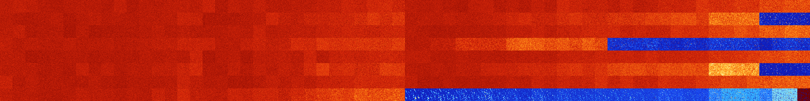

# B0347 (78336-78847)

<details>
    <summary>Initial Grid</summary>
    
</details>


<details>
    <summary>Initial Grid RLE</summary>

```
#C Exported from GoGoL (https://github.com/marrow16/gogol)
#C Wrap mode: Toroidal
#C Boundary mode: Dead
#C Step: 0
x = 100, y = 100, rule = B0347/S
23bo24bobo21bo3bo$68bo10bo$26bo43bo22bo$17bo34bo17bo$13bo45bo$29bo6b2o
15bobo14bo2bo17bo$9bo26bo19bo14bo$28bo18bo3bo7bo15bo2bo$5bo34bo30bo4bo$
2bo59bo2bo7bo17bo$20bo6bo34bo24bo$23bo33bo20bo6bo$18bo14bo13b2o26bo$43b
o10bo18bo23bo$4bo13bo22bo$33bo7bo6bo6bo21b2o3bo10b2o$bo6bo21bo8bo40bo$b
o3bo4bo33bo26bo15bo$8bo35bo3bo6bo31bo7bo$9bo36bo9bo21bo18bo$21b3o58bo$
26bo2bo2bo52bo$11bo32bo3bo$39bo2bo6bo4bo33bo$8bo11bo7bo5bo34bo13bo$27bo
$5bo56bo4bob2o11bobo$11bo14bo43bo8bo5bo7bo$22bo17bo2bo4bo11bo14bo$9bo4b
o13bobo20bo33bo$63bo35bo$31bobo6bo46bo2bo$8bo55bo3b2o24bo$6bo9bo24bo6bo
bo2bo$15bo15bo5bo7bo32bo15bo$29bo4bo2bo6bo46bo$28bo12bo32bo$9bo4bo3bo
18bo9bo16bo27bo$20bo7bo6bo8bo6bo4bo38bo$5bo9bo7bo17bo19bo5bo10bo$3bo40b
o9bo2bo2bo5bo25bo$16bobo43bo10bo5bo$50bo11bo9b2o$47bo20bo30bo$23bo$11bo
20bobo13bo2bo13bo$9bo81bo$29bo23bo31bo10bo$26bo6bo2bo21bo14bo8bo8bo2bo$
7bo2bo14b2o19bo9bo4bo6bo24bo2bo$4bo12bo2bo7bo8bo4bo24bo10bo6bo$18bo36bo
10bobo4bo11bo$63bo7bo7bo16bo$42bo26bo24bo$2bo3bo13bo4bobo15bo23bo11bo7b
o$19b2o12bo3bo6bo6bo$33b2o2bo19bo24bo$3bo29bo17bo11bo14bo2bo$8bobo27bo
26bo3bo14bo$27bobo17bo43b2o$12bo48bo5bo3bobo11bo$25bo19bo27bo8bo$4bo21b
o5bo3bo6bo15bo13bo13bo$57b2o26bo$3bo55bo$b2o2bo17bo19bo37bo16bo$6bo28bo
26bo4bo12bo$63bo19bo2b2o$18bobo10bo7bo17bo10bo$3bo4b2o10bo6bo43bo6bo19b
o$2bo26bo46bo$13bob2o23bo9bo12bo2bo4bobo7bo$bo4bo30bo12bo27b2o$10bobo
62bo3bo5bo$29bo16bo9bo26bo5bo3bo$10bo4bo19bobo24bo6bo10bo4bo5bo4bo$6bo
77bo9bo$4bo6bo40bo10bobo4bo5bo11bo$8bo29bo6bo38bo$27bo29bo17bo$31bo26bo
2bo19bo$11bo7bo25bo8bo11bo13bo7bo$bo11bo9bo6bo4bo3bo16bo10bo22bo7bo$20b
o29bo31bobo4bo$3bo28bo2bo16b2o3bo18bo9bo$45bo28bo3bo16bo$9bobo14bo4bo7b
o10bo2bo14bo7bo6bo$11bo12bo16bo3bo$12bo$13bo65bo15bo$75bo16bo$44bo22bo
11bobo$5bo46bo35bo$8bo2b3o47b2o2b2o10bo6bo6bo$2bo6bo8bo5bo18bo38bo3bo$o
14bo3bo18bo21bo15bo$66bo3bo$bo4bo7bo5bo39bo27bo$49bo3bo2bo27bo$26bo5bo
3bo13bo6bo29bobo4bo!
```
</details>
<details>
    <summary>Thumbnail</summary>

</details>
<table>
<tr>
    <td><a href="./78336%20S%20Heat%20Map%20Activity.png"></a><br>S (78336)<br>G>1000</td>    <td><a href="./78337%20S0%20Heat%20Map%20Activity.png"></a><br>S0 (78337)<br>G>1000</td>    <td><a href="./78338%20S1%20Heat%20Map%20Activity.png"></a><br>S1 (78338)<br>G>1000</td>    <td><a href="./78339%20S01%20Heat%20Map%20Activity.png"></a><br>S01 (78339)<br>G>1000</td>    <td><a href="./78340%20S2%20Heat%20Map%20Activity.png"></a><br>S2 (78340)<br>G>1000</td>    <td><a href="./78341%20S02%20Heat%20Map%20Activity.png"></a><br>S02 (78341)<br>G>1000</td>    <td><a href="./78342%20S12%20Heat%20Map%20Activity.png"></a><br>S12 (78342)<br>G>1000</td>    <td><a href="./78343%20S012%20Heat%20Map%20Activity.png"></a><br>S012 (78343)<br>G>1000</td>    <td><a href="./78344%20S3%20Heat%20Map%20Activity.png"></a><br>S3 (78344)<br>G>1000</td>    <td><a href="./78345%20S03%20Heat%20Map%20Activity.png"></a><br>S03 (78345)<br>G>1000</td>    <td><a href="./78346%20S13%20Heat%20Map%20Activity.png"></a><br>S13 (78346)<br>G>1000</td>    <td><a href="./78347%20S013%20Heat%20Map%20Activity.png"></a><br>S013 (78347)<br>G>1000</td>    <td><a href="./78348%20S23%20Heat%20Map%20Activity.png"></a><br>S23 (78348)<br>G>1000</td>    <td><a href="./78349%20S023%20Heat%20Map%20Activity.png"></a><br>S023 (78349)<br>G>1000</td>    <td><a href="./78350%20S123%20Heat%20Map%20Activity.png"></a><br>S123 (78350)<br>G>1000</td>    <td><a href="./78351%20S0123%20Heat%20Map%20Activity.png"></a><br>S0123 (78351)<br>G>1000</td>    <td><a href="./78352%20S4%20Heat%20Map%20Activity.png"></a><br>S4 (78352)<br>G>1000</td>    <td><a href="./78353%20S04%20Heat%20Map%20Activity.png"></a><br>S04 (78353)<br>G>1000</td>    <td><a href="./78354%20S14%20Heat%20Map%20Activity.png"></a><br>S14 (78354)<br>G>1000</td>    <td><a href="./78355%20S014%20Heat%20Map%20Activity.png"></a><br>S014 (78355)<br>G>1000</td>    <td><a href="./78356%20S24%20Heat%20Map%20Activity.png"></a><br>S24 (78356)<br>G>1000</td>    <td><a href="./78357%20S024%20Heat%20Map%20Activity.png"></a><br>S024 (78357)<br>G>1000</td>    <td><a href="./78358%20S124%20Heat%20Map%20Activity.png"></a><br>S124 (78358)<br>G>1000</td>    <td><a href="./78359%20S0124%20Heat%20Map%20Activity.png"></a><br>S0124 (78359)<br>G>1000</td>    <td><a href="./78360%20S34%20Heat%20Map%20Activity.png"></a><br>S34 (78360)<br>G>1000</td>    <td><a href="./78361%20S034%20Heat%20Map%20Activity.png"></a><br>S034 (78361)<br>G>1000</td>    <td><a href="./78362%20S134%20Heat%20Map%20Activity.png"></a><br>S134 (78362)<br>G>1000</td>    <td><a href="./78363%20S0134%20Heat%20Map%20Activity.png"></a><br>S0134 (78363)<br>G>1000</td>    <td><a href="./78364%20S234%20Heat%20Map%20Activity.png"></a><br>S234 (78364)<br>G>1000</td>    <td><a href="./78365%20S0234%20Heat%20Map%20Activity.png"></a><br>S0234 (78365)<br>G>1000</td>    <td><a href="./78366%20S1234%20Heat%20Map%20Activity.png"></a><br>S1234 (78366)<br>G>1000</td>    <td><a href="./78367%20S01234%20Heat%20Map%20Activity.png"></a><br>S01234 (78367)<br>G>1000</td>    <td><a href="./78368%20S5%20Heat%20Map%20Activity.png"></a><br>S5 (78368)<br>G>1000</td>    <td><a href="./78369%20S05%20Heat%20Map%20Activity.png"></a><br>S05 (78369)<br>G>1000</td>    <td><a href="./78370%20S15%20Heat%20Map%20Activity.png"></a><br>S15 (78370)<br>G>1000</td>    <td><a href="./78371%20S015%20Heat%20Map%20Activity.png"></a><br>S015 (78371)<br>G>1000</td>    <td><a href="./78372%20S25%20Heat%20Map%20Activity.png"></a><br>S25 (78372)<br>G>1000</td>    <td><a href="./78373%20S025%20Heat%20Map%20Activity.png"></a><br>S025 (78373)<br>G>1000</td>    <td><a href="./78374%20S125%20Heat%20Map%20Activity.png"></a><br>S125 (78374)<br>G>1000</td>    <td><a href="./78375%20S0125%20Heat%20Map%20Activity.png"></a><br>S0125 (78375)<br>G>1000</td>    <td><a href="./78376%20S35%20Heat%20Map%20Activity.png"></a><br>S35 (78376)<br>G>1000</td>    <td><a href="./78377%20S035%20Heat%20Map%20Activity.png"></a><br>S035 (78377)<br>G>1000</td>    <td><a href="./78378%20S135%20Heat%20Map%20Activity.png"></a><br>S135 (78378)<br>G>1000</td>    <td><a href="./78379%20S0135%20Heat%20Map%20Activity.png"></a><br>S0135 (78379)<br>G>1000</td>    <td><a href="./78380%20S235%20Heat%20Map%20Activity.png"></a><br>S235 (78380)<br>G>1000</td>    <td><a href="./78381%20S0235%20Heat%20Map%20Activity.png"></a><br>S0235 (78381)<br>G>1000</td>    <td><a href="./78382%20S1235%20Heat%20Map%20Activity.png"></a><br>S1235 (78382)<br>G>1000</td>    <td><a href="./78383%20S01235%20Heat%20Map%20Activity.png"></a><br>S01235 (78383)<br>G>1000</td>    <td><a href="./78384%20S45%20Heat%20Map%20Activity.png"></a><br>S45 (78384)<br>G>1000</td>    <td><a href="./78385%20S045%20Heat%20Map%20Activity.png"></a><br>S045 (78385)<br>G>1000</td>    <td><a href="./78386%20S145%20Heat%20Map%20Activity.png"></a><br>S145 (78386)<br>G>1000</td>    <td><a href="./78387%20S0145%20Heat%20Map%20Activity.png"></a><br>S0145 (78387)<br>G>1000</td>    <td><a href="./78388%20S245%20Heat%20Map%20Activity.png"></a><br>S245 (78388)<br>G>1000</td>    <td><a href="./78389%20S0245%20Heat%20Map%20Activity.png"></a><br>S0245 (78389)<br>G>1000</td>    <td><a href="./78390%20S1245%20Heat%20Map%20Activity.png"></a><br>S1245 (78390)<br>G>1000</td>    <td><a href="./78391%20S01245%20Heat%20Map%20Activity.png"></a><br>S01245 (78391)<br>G>1000</td>    <td><a href="./78392%20S345%20Heat%20Map%20Activity.png"></a><br>S345 (78392)<br>G>1000</td>    <td><a href="./78393%20S0345%20Heat%20Map%20Activity.png"></a><br>S0345 (78393)<br>G>1000</td>    <td><a href="./78394%20S1345%20Heat%20Map%20Activity.png"></a><br>S1345 (78394)<br>G>1000</td>    <td><a href="./78395%20S01345%20Heat%20Map%20Activity.png"></a><br>S01345 (78395)<br>G>1000</td>    <td><a href="./78396%20S2345%20Heat%20Map%20Activity.png"></a><br>S2345 (78396)<br>G>1000</td>    <td><a href="./78397%20S02345%20Heat%20Map%20Activity.png"></a><br>S02345 (78397)<br>G>1000</td>    <td><a href="./78398%20S12345%20Heat%20Map%20Activity.png"></a><br>S12345 (78398)<br>G>1000</td>    <td><a href="./78399%20S012345%20Heat%20Map%20Activity.png"></a><br>S012345 (78399)<br>G>1000</td></tr>
<tr>
    <td><a href="./78400%20S6%20Heat%20Map%20Activity.png"></a><br>S6 (78400)<br>G>1000</td>    <td><a href="./78401%20S06%20Heat%20Map%20Activity.png"></a><br>S06 (78401)<br>G>1000</td>    <td><a href="./78402%20S16%20Heat%20Map%20Activity.png"></a><br>S16 (78402)<br>G>1000</td>    <td><a href="./78403%20S016%20Heat%20Map%20Activity.png"></a><br>S016 (78403)<br>G>1000</td>    <td><a href="./78404%20S26%20Heat%20Map%20Activity.png"></a><br>S26 (78404)<br>G>1000</td>    <td><a href="./78405%20S026%20Heat%20Map%20Activity.png"></a><br>S026 (78405)<br>G>1000</td>    <td><a href="./78406%20S126%20Heat%20Map%20Activity.png"></a><br>S126 (78406)<br>G>1000</td>    <td><a href="./78407%20S0126%20Heat%20Map%20Activity.png"></a><br>S0126 (78407)<br>G>1000</td>    <td><a href="./78408%20S36%20Heat%20Map%20Activity.png"></a><br>S36 (78408)<br>G>1000</td>    <td><a href="./78409%20S036%20Heat%20Map%20Activity.png"></a><br>S036 (78409)<br>G>1000</td>    <td><a href="./78410%20S136%20Heat%20Map%20Activity.png"></a><br>S136 (78410)<br>G>1000</td>    <td><a href="./78411%20S0136%20Heat%20Map%20Activity.png"></a><br>S0136 (78411)<br>G>1000</td>    <td><a href="./78412%20S236%20Heat%20Map%20Activity.png"></a><br>S236 (78412)<br>G>1000</td>    <td><a href="./78413%20S0236%20Heat%20Map%20Activity.png"></a><br>S0236 (78413)<br>G>1000</td>    <td><a href="./78414%20S1236%20Heat%20Map%20Activity.png"></a><br>S1236 (78414)<br>G>1000</td>    <td><a href="./78415%20S01236%20Heat%20Map%20Activity.png"></a><br>S01236 (78415)<br>G>1000</td>    <td><a href="./78416%20S46%20Heat%20Map%20Activity.png"></a><br>S46 (78416)<br>G>1000</td>    <td><a href="./78417%20S046%20Heat%20Map%20Activity.png"></a><br>S046 (78417)<br>G>1000</td>    <td><a href="./78418%20S146%20Heat%20Map%20Activity.png"></a><br>S146 (78418)<br>G>1000</td>    <td><a href="./78419%20S0146%20Heat%20Map%20Activity.png"></a><br>S0146 (78419)<br>G>1000</td>    <td><a href="./78420%20S246%20Heat%20Map%20Activity.png"></a><br>S246 (78420)<br>G>1000</td>    <td><a href="./78421%20S0246%20Heat%20Map%20Activity.png"></a><br>S0246 (78421)<br>G>1000</td>    <td><a href="./78422%20S1246%20Heat%20Map%20Activity.png"></a><br>S1246 (78422)<br>G>1000</td>    <td><a href="./78423%20S01246%20Heat%20Map%20Activity.png"></a><br>S01246 (78423)<br>G>1000</td>    <td><a href="./78424%20S346%20Heat%20Map%20Activity.png"></a><br>S346 (78424)<br>G>1000</td>    <td><a href="./78425%20S0346%20Heat%20Map%20Activity.png"></a><br>S0346 (78425)<br>G>1000</td>    <td><a href="./78426%20S1346%20Heat%20Map%20Activity.png"></a><br>S1346 (78426)<br>G>1000</td>    <td><a href="./78427%20S01346%20Heat%20Map%20Activity.png"></a><br>S01346 (78427)<br>G>1000</td>    <td><a href="./78428%20S2346%20Heat%20Map%20Activity.png"></a><br>S2346 (78428)<br>G>1000</td>    <td><a href="./78429%20S02346%20Heat%20Map%20Activity.png"></a><br>S02346 (78429)<br>G>1000</td>    <td><a href="./78430%20S12346%20Heat%20Map%20Activity.png"></a><br>S12346 (78430)<br>G>1000</td>    <td><a href="./78431%20S012346%20Heat%20Map%20Activity.png"></a><br>S012346 (78431)<br>G>1000</td>    <td><a href="./78432%20S56%20Heat%20Map%20Activity.png"></a><br>S56 (78432)<br>G>1000</td>    <td><a href="./78433%20S056%20Heat%20Map%20Activity.png"></a><br>S056 (78433)<br>G>1000</td>    <td><a href="./78434%20S156%20Heat%20Map%20Activity.png"></a><br>S156 (78434)<br>G>1000</td>    <td><a href="./78435%20S0156%20Heat%20Map%20Activity.png"></a><br>S0156 (78435)<br>G>1000</td>    <td><a href="./78436%20S256%20Heat%20Map%20Activity.png"></a><br>S256 (78436)<br>G>1000</td>    <td><a href="./78437%20S0256%20Heat%20Map%20Activity.png"></a><br>S0256 (78437)<br>G>1000</td>    <td><a href="./78438%20S1256%20Heat%20Map%20Activity.png"></a><br>S1256 (78438)<br>G>1000</td>    <td><a href="./78439%20S01256%20Heat%20Map%20Activity.png"></a><br>S01256 (78439)<br>G>1000</td>    <td><a href="./78440%20S356%20Heat%20Map%20Activity.png"></a><br>S356 (78440)<br>G>1000</td>    <td><a href="./78441%20S0356%20Heat%20Map%20Activity.png"></a><br>S0356 (78441)<br>G>1000</td>    <td><a href="./78442%20S1356%20Heat%20Map%20Activity.png"></a><br>S1356 (78442)<br>G>1000</td>    <td><a href="./78443%20S01356%20Heat%20Map%20Activity.png"></a><br>S01356 (78443)<br>G>1000</td>    <td><a href="./78444%20S2356%20Heat%20Map%20Activity.png"></a><br>S2356 (78444)<br>G>1000</td>    <td><a href="./78445%20S02356%20Heat%20Map%20Activity.png"></a><br>S02356 (78445)<br>G>1000</td>    <td><a href="./78446%20S12356%20Heat%20Map%20Activity.png"></a><br>S12356 (78446)<br>G>1000</td>    <td><a href="./78447%20S012356%20Heat%20Map%20Activity.png"></a><br>S012356 (78447)<br>G>1000</td>    <td><a href="./78448%20S456%20Heat%20Map%20Activity.png"></a><br>S456 (78448)<br>G>1000</td>    <td><a href="./78449%20S0456%20Heat%20Map%20Activity.png"></a><br>S0456 (78449)<br>G>1000</td>    <td><a href="./78450%20S1456%20Heat%20Map%20Activity.png"></a><br>S1456 (78450)<br>G>1000</td>    <td><a href="./78451%20S01456%20Heat%20Map%20Activity.png"></a><br>S01456 (78451)<br>G>1000</td>    <td><a href="./78452%20S2456%20Heat%20Map%20Activity.png"></a><br>S2456 (78452)<br>G>1000</td>    <td><a href="./78453%20S02456%20Heat%20Map%20Activity.png"></a><br>S02456 (78453)<br>G>1000</td>    <td><a href="./78454%20S12456%20Heat%20Map%20Activity.png"></a><br>S12456 (78454)<br>G>1000</td>    <td><a href="./78455%20S012456%20Heat%20Map%20Activity.png"></a><br>S012456 (78455)<br>G>1000</td>    <td><a href="./78456%20S3456%20Heat%20Map%20Activity.png"></a><br>S3456 (78456)<br>G>1000</td>    <td><a href="./78457%20S03456%20Heat%20Map%20Activity.png"></a><br>S03456 (78457)<br>G>1000</td>    <td><a href="./78458%20S13456%20Heat%20Map%20Activity.png"></a><br>S13456 (78458)<br>G>1000</td>    <td><a href="./78459%20S013456%20Heat%20Map%20Activity.png"></a><br>S013456 (78459)<br>G>1000</td>    <td><a href="./78460%20S23456%20Heat%20Map%20Activity.png"></a><br>S23456 (78460)<br>G>1000</td>    <td><a href="./78461%20S023456%20Heat%20Map%20Activity.png"></a><br>S023456 (78461)<br>G>1000</td>    <td><a href="./78462%20S123456%20Heat%20Map%20Activity.png"></a><br>S123456 (78462)<br>G>1000</td>    <td><a href="./78463%20S0123456%20Heat%20Map%20Activity.png"></a><br>S0123456 (78463)<br>G>1000</td></tr>
<tr>
    <td><a href="./78464%20S7%20Heat%20Map%20Activity.png"></a><br>S7 (78464)<br>G>1000</td>    <td><a href="./78465%20S07%20Heat%20Map%20Activity.png"></a><br>S07 (78465)<br>G>1000</td>    <td><a href="./78466%20S17%20Heat%20Map%20Activity.png"></a><br>S17 (78466)<br>G>1000</td>    <td><a href="./78467%20S017%20Heat%20Map%20Activity.png"></a><br>S017 (78467)<br>G>1000</td>    <td><a href="./78468%20S27%20Heat%20Map%20Activity.png"></a><br>S27 (78468)<br>G>1000</td>    <td><a href="./78469%20S027%20Heat%20Map%20Activity.png"></a><br>S027 (78469)<br>G>1000</td>    <td><a href="./78470%20S127%20Heat%20Map%20Activity.png"></a><br>S127 (78470)<br>G>1000</td>    <td><a href="./78471%20S0127%20Heat%20Map%20Activity.png"></a><br>S0127 (78471)<br>G>1000</td>    <td><a href="./78472%20S37%20Heat%20Map%20Activity.png"></a><br>S37 (78472)<br>G>1000</td>    <td><a href="./78473%20S037%20Heat%20Map%20Activity.png"></a><br>S037 (78473)<br>G>1000</td>    <td><a href="./78474%20S137%20Heat%20Map%20Activity.png"></a><br>S137 (78474)<br>G>1000</td>    <td><a href="./78475%20S0137%20Heat%20Map%20Activity.png"></a><br>S0137 (78475)<br>G>1000</td>    <td><a href="./78476%20S237%20Heat%20Map%20Activity.png"></a><br>S237 (78476)<br>G>1000</td>    <td><a href="./78477%20S0237%20Heat%20Map%20Activity.png"></a><br>S0237 (78477)<br>G>1000</td>    <td><a href="./78478%20S1237%20Heat%20Map%20Activity.png"></a><br>S1237 (78478)<br>G>1000</td>    <td><a href="./78479%20S01237%20Heat%20Map%20Activity.png"></a><br>S01237 (78479)<br>G>1000</td>    <td><a href="./78480%20S47%20Heat%20Map%20Activity.png"></a><br>S47 (78480)<br>G>1000</td>    <td><a href="./78481%20S047%20Heat%20Map%20Activity.png"></a><br>S047 (78481)<br>G>1000</td>    <td><a href="./78482%20S147%20Heat%20Map%20Activity.png"></a><br>S147 (78482)<br>G>1000</td>    <td><a href="./78483%20S0147%20Heat%20Map%20Activity.png"></a><br>S0147 (78483)<br>G>1000</td>    <td><a href="./78484%20S247%20Heat%20Map%20Activity.png"></a><br>S247 (78484)<br>G>1000</td>    <td><a href="./78485%20S0247%20Heat%20Map%20Activity.png"></a><br>S0247 (78485)<br>G>1000</td>    <td><a href="./78486%20S1247%20Heat%20Map%20Activity.png"></a><br>S1247 (78486)<br>G>1000</td>    <td><a href="./78487%20S01247%20Heat%20Map%20Activity.png"></a><br>S01247 (78487)<br>G>1000</td>    <td><a href="./78488%20S347%20Heat%20Map%20Activity.png"></a><br>S347 (78488)<br>G>1000</td>    <td><a href="./78489%20S0347%20Heat%20Map%20Activity.png"></a><br>S0347 (78489)<br>G>1000</td>    <td><a href="./78490%20S1347%20Heat%20Map%20Activity.png"></a><br>S1347 (78490)<br>G>1000</td>    <td><a href="./78491%20S01347%20Heat%20Map%20Activity.png"></a><br>S01347 (78491)<br>G>1000</td>    <td><a href="./78492%20S2347%20Heat%20Map%20Activity.png"></a><br>S2347 (78492)<br>G>1000</td>    <td><a href="./78493%20S02347%20Heat%20Map%20Activity.png"></a><br>S02347 (78493)<br>G>1000</td>    <td><a href="./78494%20S12347%20Heat%20Map%20Activity.png"></a><br>S12347 (78494)<br>G>1000</td>    <td><a href="./78495%20S012347%20Heat%20Map%20Activity.png"></a><br>S012347 (78495)<br>G>1000</td>    <td><a href="./78496%20S57%20Heat%20Map%20Activity.png"></a><br>S57 (78496)<br>G>1000</td>    <td><a href="./78497%20S057%20Heat%20Map%20Activity.png"></a><br>S057 (78497)<br>G>1000</td>    <td><a href="./78498%20S157%20Heat%20Map%20Activity.png"></a><br>S157 (78498)<br>G>1000</td>    <td><a href="./78499%20S0157%20Heat%20Map%20Activity.png"></a><br>S0157 (78499)<br>G>1000</td>    <td><a href="./78500%20S257%20Heat%20Map%20Activity.png"></a><br>S257 (78500)<br>G>1000</td>    <td><a href="./78501%20S0257%20Heat%20Map%20Activity.png"></a><br>S0257 (78501)<br>G>1000</td>    <td><a href="./78502%20S1257%20Heat%20Map%20Activity.png"></a><br>S1257 (78502)<br>G>1000</td>    <td><a href="./78503%20S01257%20Heat%20Map%20Activity.png"></a><br>S01257 (78503)<br>G>1000</td>    <td><a href="./78504%20S357%20Heat%20Map%20Activity.png"></a><br>S357 (78504)<br>G>1000</td>    <td><a href="./78505%20S0357%20Heat%20Map%20Activity.png"></a><br>S0357 (78505)<br>G>1000</td>    <td><a href="./78506%20S1357%20Heat%20Map%20Activity.png"></a><br>S1357 (78506)<br>G>1000</td>    <td><a href="./78507%20S01357%20Heat%20Map%20Activity.png"></a><br>S01357 (78507)<br>G>1000</td>    <td><a href="./78508%20S2357%20Heat%20Map%20Activity.png"></a><br>S2357 (78508)<br>G>1000</td>    <td><a href="./78509%20S02357%20Heat%20Map%20Activity.png"></a><br>S02357 (78509)<br>G>1000</td>    <td><a href="./78510%20S12357%20Heat%20Map%20Activity.png"></a><br>S12357 (78510)<br>G>1000</td>    <td><a href="./78511%20S012357%20Heat%20Map%20Activity.png"></a><br>S012357 (78511)<br>G>1000</td>    <td><a href="./78512%20S457%20Heat%20Map%20Activity.png"></a><br>S457 (78512)<br>G>1000</td>    <td><a href="./78513%20S0457%20Heat%20Map%20Activity.png"></a><br>S0457 (78513)<br>G>1000</td>    <td><a href="./78514%20S1457%20Heat%20Map%20Activity.png"></a><br>S1457 (78514)<br>G>1000</td>    <td><a href="./78515%20S01457%20Heat%20Map%20Activity.png"></a><br>S01457 (78515)<br>G>1000</td>    <td><a href="./78516%20S2457%20Heat%20Map%20Activity.png"></a><br>S2457 (78516)<br>G>1000</td>    <td><a href="./78517%20S02457%20Heat%20Map%20Activity.png"></a><br>S02457 (78517)<br>G>1000</td>    <td><a href="./78518%20S12457%20Heat%20Map%20Activity.png"></a><br>S12457 (78518)<br>G>1000</td>    <td><a href="./78519%20S012457%20Heat%20Map%20Activity.png"></a><br>S012457 (78519)<br>G>1000</td>    <td><a href="./78520%20S3457%20Heat%20Map%20Activity.png"></a><br>S3457 (78520)<br>G>1000</td>    <td><a href="./78521%20S03457%20Heat%20Map%20Activity.png"></a><br>S03457 (78521)<br>G>1000</td>    <td><a href="./78522%20S13457%20Heat%20Map%20Activity.png"></a><br>S13457 (78522)<br>G>1000</td>    <td><a href="./78523%20S013457%20Heat%20Map%20Activity.png"></a><br>S013457 (78523)<br>G>1000</td>    <td><a href="./78524%20S23457%20Heat%20Map%20Activity.png"></a><br>S23457 (78524)<br>G>1000</td>    <td><a href="./78525%20S023457%20Heat%20Map%20Activity.png"></a><br>S023457 (78525)<br>G>1000</td>    <td><a href="./78526%20S123457%20Heat%20Map%20Activity.png"></a><br>S123457 (78526)<br>G>1000</td>    <td><a href="./78527%20S0123457%20Heat%20Map%20Activity.png"></a><br>S0123457 (78527)<br>G>1000</td></tr>
<tr>
    <td><a href="./78528%20S67%20Heat%20Map%20Activity.png"></a><br>S67 (78528)<br>G>1000</td>    <td><a href="./78529%20S067%20Heat%20Map%20Activity.png"></a><br>S067 (78529)<br>G>1000</td>    <td><a href="./78530%20S167%20Heat%20Map%20Activity.png"></a><br>S167 (78530)<br>G>1000</td>    <td><a href="./78531%20S0167%20Heat%20Map%20Activity.png"></a><br>S0167 (78531)<br>G>1000</td>    <td><a href="./78532%20S267%20Heat%20Map%20Activity.png"></a><br>S267 (78532)<br>G>1000</td>    <td><a href="./78533%20S0267%20Heat%20Map%20Activity.png"></a><br>S0267 (78533)<br>G>1000</td>    <td><a href="./78534%20S1267%20Heat%20Map%20Activity.png"></a><br>S1267 (78534)<br>G>1000</td>    <td><a href="./78535%20S01267%20Heat%20Map%20Activity.png"></a><br>S01267 (78535)<br>G>1000</td>    <td><a href="./78536%20S367%20Heat%20Map%20Activity.png"></a><br>S367 (78536)<br>G>1000</td>    <td><a href="./78537%20S0367%20Heat%20Map%20Activity.png"></a><br>S0367 (78537)<br>G>1000</td>    <td><a href="./78538%20S1367%20Heat%20Map%20Activity.png"></a><br>S1367 (78538)<br>G>1000</td>    <td><a href="./78539%20S01367%20Heat%20Map%20Activity.png"></a><br>S01367 (78539)<br>G>1000</td>    <td><a href="./78540%20S2367%20Heat%20Map%20Activity.png"></a><br>S2367 (78540)<br>G>1000</td>    <td><a href="./78541%20S02367%20Heat%20Map%20Activity.png"></a><br>S02367 (78541)<br>G>1000</td>    <td><a href="./78542%20S12367%20Heat%20Map%20Activity.png"></a><br>S12367 (78542)<br>G>1000</td>    <td><a href="./78543%20S012367%20Heat%20Map%20Activity.png"></a><br>S012367 (78543)<br>G>1000</td>    <td><a href="./78544%20S467%20Heat%20Map%20Activity.png"></a><br>S467 (78544)<br>G>1000</td>    <td><a href="./78545%20S0467%20Heat%20Map%20Activity.png"></a><br>S0467 (78545)<br>G>1000</td>    <td><a href="./78546%20S1467%20Heat%20Map%20Activity.png"></a><br>S1467 (78546)<br>G>1000</td>    <td><a href="./78547%20S01467%20Heat%20Map%20Activity.png"></a><br>S01467 (78547)<br>G>1000</td>    <td><a href="./78548%20S2467%20Heat%20Map%20Activity.png"></a><br>S2467 (78548)<br>G>1000</td>    <td><a href="./78549%20S02467%20Heat%20Map%20Activity.png"></a><br>S02467 (78549)<br>G>1000</td>    <td><a href="./78550%20S12467%20Heat%20Map%20Activity.png"></a><br>S12467 (78550)<br>G>1000</td>    <td><a href="./78551%20S012467%20Heat%20Map%20Activity.png"></a><br>S012467 (78551)<br>G>1000</td>    <td><a href="./78552%20S3467%20Heat%20Map%20Activity.png"></a><br>S3467 (78552)<br>G>1000</td>    <td><a href="./78553%20S03467%20Heat%20Map%20Activity.png"></a><br>S03467 (78553)<br>G>1000</td>    <td><a href="./78554%20S13467%20Heat%20Map%20Activity.png"></a><br>S13467 (78554)<br>G>1000</td>    <td><a href="./78555%20S013467%20Heat%20Map%20Activity.png"></a><br>S013467 (78555)<br>G>1000</td>    <td><a href="./78556%20S23467%20Heat%20Map%20Activity.png"></a><br>S23467 (78556)<br>G>1000</td>    <td><a href="./78557%20S023467%20Heat%20Map%20Activity.png"></a><br>S023467 (78557)<br>G>1000</td>    <td><a href="./78558%20S123467%20Heat%20Map%20Activity.png"></a><br>S123467 (78558)<br>G>1000</td>    <td><a href="./78559%20S0123467%20Heat%20Map%20Activity.png"></a><br>S0123467 (78559)<br>G>1000</td>    <td><a href="./78560%20S567%20Heat%20Map%20Activity.png"></a><br>S567 (78560)<br>G>1000</td>    <td><a href="./78561%20S0567%20Heat%20Map%20Activity.png"></a><br>S0567 (78561)<br>G>1000</td>    <td><a href="./78562%20S1567%20Heat%20Map%20Activity.png"></a><br>S1567 (78562)<br>G>1000</td>    <td><a href="./78563%20S01567%20Heat%20Map%20Activity.png"></a><br>S01567 (78563)<br>G>1000</td>    <td><a href="./78564%20S2567%20Heat%20Map%20Activity.png"></a><br>S2567 (78564)<br>G>1000</td>    <td><a href="./78565%20S02567%20Heat%20Map%20Activity.png"></a><br>S02567 (78565)<br>G>1000</td>    <td><a href="./78566%20S12567%20Heat%20Map%20Activity.png"></a><br>S12567 (78566)<br>G>1000</td>    <td><a href="./78567%20S012567%20Heat%20Map%20Activity.png"></a><br>S012567 (78567)<br>G>1000</td>    <td><a href="./78568%20S3567%20Heat%20Map%20Activity.png"></a><br>S3567 (78568)<br>G>1000</td>    <td><a href="./78569%20S03567%20Heat%20Map%20Activity.png"></a><br>S03567 (78569)<br>G>1000</td>    <td><a href="./78570%20S13567%20Heat%20Map%20Activity.png"></a><br>S13567 (78570)<br>G>1000</td>    <td><a href="./78571%20S013567%20Heat%20Map%20Activity.png"></a><br>S013567 (78571)<br>G>1000</td>    <td><a href="./78572%20S23567%20Heat%20Map%20Activity.png"></a><br>S23567 (78572)<br>G>1000</td>    <td><a href="./78573%20S023567%20Heat%20Map%20Activity.png"></a><br>S023567 (78573)<br>G>1000</td>    <td><a href="./78574%20S123567%20Heat%20Map%20Activity.png"></a><br>S123567 (78574)<br>G>1000</td>    <td><a href="./78575%20S0123567%20Heat%20Map%20Activity.png"></a><br>S0123567 (78575)<br>G>1000</td>    <td><a href="./78576%20S4567%20Heat%20Map%20Activity.png"></a><br>S4567 (78576)<br>R@72,p6</td>    <td><a href="./78577%20S04567%20Heat%20Map%20Activity.png"></a><br>S04567 (78577)<br>R@63,p12</td>    <td><a href="./78578%20S14567%20Heat%20Map%20Activity.png"></a><br>S14567 (78578)<br>R@69,p12</td>    <td><a href="./78579%20S014567%20Heat%20Map%20Activity.png"></a><br>S014567 (78579)<br>R@52,p6</td>    <td><a href="./78580%20S24567%20Heat%20Map%20Activity.png"></a><br>S24567 (78580)<br>R@76,p12</td>    <td><a href="./78581%20S024567%20Heat%20Map%20Activity.png"></a><br>S024567 (78581)<br>R@96,p12</td>    <td><a href="./78582%20S124567%20Heat%20Map%20Activity.png"></a><br>S124567 (78582)<br>R@71,p12</td>    <td><a href="./78583%20S0124567%20Heat%20Map%20Activity.png"></a><br>S0124567 (78583)<br>R@86,p6</td>    <td><a href="./78584%20S34567%20Heat%20Map%20Activity.png"></a><br>S34567 (78584)<br>R@31,p12</td>    <td><a href="./78585%20S034567%20Heat%20Map%20Activity.png"></a><br>S034567 (78585)<br>R@33,p6</td>    <td><a href="./78586%20S134567%20Heat%20Map%20Activity.png"></a><br>S134567 (78586)<br>R@34,p12</td>    <td><a href="./78587%20S0134567%20Heat%20Map%20Activity.png"></a><br>S0134567 (78587)<br>R@39,p12</td>    <td><a href="./78588%20S234567%20Heat%20Map%20Activity.png"></a><br>S234567 (78588)<br>R@102,p84</td>    <td><a href="./78589%20S0234567%20Heat%20Map%20Activity.png"></a><br>S0234567 (78589)<br>R@34,p12</td>    <td><a href="./78590%20S1234567%20Heat%20Map%20Activity.png"></a><br>S1234567 (78590)<br>R@28,p12</td>    <td><a href="./78591%20S01234567%20Heat%20Map%20Activity.png"></a><br>S01234567 (78591)<br>R@33,p12</td></tr>
<tr>
    <td><a href="./78592%20S8%20Heat%20Map%20Activity.png"></a><br>S8 (78592)<br>G>1000</td>    <td><a href="./78593%20S08%20Heat%20Map%20Activity.png"></a><br>S08 (78593)<br>G>1000</td>    <td><a href="./78594%20S18%20Heat%20Map%20Activity.png"></a><br>S18 (78594)<br>G>1000</td>    <td><a href="./78595%20S018%20Heat%20Map%20Activity.png"></a><br>S018 (78595)<br>G>1000</td>    <td><a href="./78596%20S28%20Heat%20Map%20Activity.png"></a><br>S28 (78596)<br>G>1000</td>    <td><a href="./78597%20S028%20Heat%20Map%20Activity.png"></a><br>S028 (78597)<br>G>1000</td>    <td><a href="./78598%20S128%20Heat%20Map%20Activity.png"></a><br>S128 (78598)<br>G>1000</td>    <td><a href="./78599%20S0128%20Heat%20Map%20Activity.png"></a><br>S0128 (78599)<br>G>1000</td>    <td><a href="./78600%20S38%20Heat%20Map%20Activity.png"></a><br>S38 (78600)<br>G>1000</td>    <td><a href="./78601%20S038%20Heat%20Map%20Activity.png"></a><br>S038 (78601)<br>G>1000</td>    <td><a href="./78602%20S138%20Heat%20Map%20Activity.png"></a><br>S138 (78602)<br>G>1000</td>    <td><a href="./78603%20S0138%20Heat%20Map%20Activity.png"></a><br>S0138 (78603)<br>G>1000</td>    <td><a href="./78604%20S238%20Heat%20Map%20Activity.png"></a><br>S238 (78604)<br>G>1000</td>    <td><a href="./78605%20S0238%20Heat%20Map%20Activity.png"></a><br>S0238 (78605)<br>G>1000</td>    <td><a href="./78606%20S1238%20Heat%20Map%20Activity.png"></a><br>S1238 (78606)<br>G>1000</td>    <td><a href="./78607%20S01238%20Heat%20Map%20Activity.png"></a><br>S01238 (78607)<br>G>1000</td>    <td><a href="./78608%20S48%20Heat%20Map%20Activity.png"></a><br>S48 (78608)<br>G>1000</td>    <td><a href="./78609%20S048%20Heat%20Map%20Activity.png"></a><br>S048 (78609)<br>G>1000</td>    <td><a href="./78610%20S148%20Heat%20Map%20Activity.png"></a><br>S148 (78610)<br>G>1000</td>    <td><a href="./78611%20S0148%20Heat%20Map%20Activity.png"></a><br>S0148 (78611)<br>G>1000</td>    <td><a href="./78612%20S248%20Heat%20Map%20Activity.png"></a><br>S248 (78612)<br>G>1000</td>    <td><a href="./78613%20S0248%20Heat%20Map%20Activity.png"></a><br>S0248 (78613)<br>G>1000</td>    <td><a href="./78614%20S1248%20Heat%20Map%20Activity.png"></a><br>S1248 (78614)<br>G>1000</td>    <td><a href="./78615%20S01248%20Heat%20Map%20Activity.png"></a><br>S01248 (78615)<br>G>1000</td>    <td><a href="./78616%20S348%20Heat%20Map%20Activity.png"></a><br>S348 (78616)<br>G>1000</td>    <td><a href="./78617%20S0348%20Heat%20Map%20Activity.png"></a><br>S0348 (78617)<br>G>1000</td>    <td><a href="./78618%20S1348%20Heat%20Map%20Activity.png"></a><br>S1348 (78618)<br>G>1000</td>    <td><a href="./78619%20S01348%20Heat%20Map%20Activity.png"></a><br>S01348 (78619)<br>G>1000</td>    <td><a href="./78620%20S2348%20Heat%20Map%20Activity.png"></a><br>S2348 (78620)<br>G>1000</td>    <td><a href="./78621%20S02348%20Heat%20Map%20Activity.png"></a><br>S02348 (78621)<br>G>1000</td>    <td><a href="./78622%20S12348%20Heat%20Map%20Activity.png"></a><br>S12348 (78622)<br>G>1000</td>    <td><a href="./78623%20S012348%20Heat%20Map%20Activity.png"></a><br>S012348 (78623)<br>G>1000</td>    <td><a href="./78624%20S58%20Heat%20Map%20Activity.png"></a><br>S58 (78624)<br>G>1000</td>    <td><a href="./78625%20S058%20Heat%20Map%20Activity.png"></a><br>S058 (78625)<br>G>1000</td>    <td><a href="./78626%20S158%20Heat%20Map%20Activity.png"></a><br>S158 (78626)<br>G>1000</td>    <td><a href="./78627%20S0158%20Heat%20Map%20Activity.png"></a><br>S0158 (78627)<br>G>1000</td>    <td><a href="./78628%20S258%20Heat%20Map%20Activity.png"></a><br>S258 (78628)<br>G>1000</td>    <td><a href="./78629%20S0258%20Heat%20Map%20Activity.png"></a><br>S0258 (78629)<br>G>1000</td>    <td><a href="./78630%20S1258%20Heat%20Map%20Activity.png"></a><br>S1258 (78630)<br>G>1000</td>    <td><a href="./78631%20S01258%20Heat%20Map%20Activity.png"></a><br>S01258 (78631)<br>G>1000</td>    <td><a href="./78632%20S358%20Heat%20Map%20Activity.png"></a><br>S358 (78632)<br>G>1000</td>    <td><a href="./78633%20S0358%20Heat%20Map%20Activity.png"></a><br>S0358 (78633)<br>G>1000</td>    <td><a href="./78634%20S1358%20Heat%20Map%20Activity.png"></a><br>S1358 (78634)<br>G>1000</td>    <td><a href="./78635%20S01358%20Heat%20Map%20Activity.png"></a><br>S01358 (78635)<br>G>1000</td>    <td><a href="./78636%20S2358%20Heat%20Map%20Activity.png"></a><br>S2358 (78636)<br>G>1000</td>    <td><a href="./78637%20S02358%20Heat%20Map%20Activity.png"></a><br>S02358 (78637)<br>G>1000</td>    <td><a href="./78638%20S12358%20Heat%20Map%20Activity.png"></a><br>S12358 (78638)<br>G>1000</td>    <td><a href="./78639%20S012358%20Heat%20Map%20Activity.png"></a><br>S012358 (78639)<br>G>1000</td>    <td><a href="./78640%20S458%20Heat%20Map%20Activity.png"></a><br>S458 (78640)<br>G>1000</td>    <td><a href="./78641%20S0458%20Heat%20Map%20Activity.png"></a><br>S0458 (78641)<br>G>1000</td>    <td><a href="./78642%20S1458%20Heat%20Map%20Activity.png"></a><br>S1458 (78642)<br>G>1000</td>    <td><a href="./78643%20S01458%20Heat%20Map%20Activity.png"></a><br>S01458 (78643)<br>G>1000</td>    <td><a href="./78644%20S2458%20Heat%20Map%20Activity.png"></a><br>S2458 (78644)<br>G>1000</td>    <td><a href="./78645%20S02458%20Heat%20Map%20Activity.png"></a><br>S02458 (78645)<br>G>1000</td>    <td><a href="./78646%20S12458%20Heat%20Map%20Activity.png"></a><br>S12458 (78646)<br>G>1000</td>    <td><a href="./78647%20S012458%20Heat%20Map%20Activity.png"></a><br>S012458 (78647)<br>G>1000</td>    <td><a href="./78648%20S3458%20Heat%20Map%20Activity.png"></a><br>S3458 (78648)<br>G>1000</td>    <td><a href="./78649%20S03458%20Heat%20Map%20Activity.png"></a><br>S03458 (78649)<br>G>1000</td>    <td><a href="./78650%20S13458%20Heat%20Map%20Activity.png"></a><br>S13458 (78650)<br>G>1000</td>    <td><a href="./78651%20S013458%20Heat%20Map%20Activity.png"></a><br>S013458 (78651)<br>G>1000</td>    <td><a href="./78652%20S23458%20Heat%20Map%20Activity.png"></a><br>S23458 (78652)<br>G>1000</td>    <td><a href="./78653%20S023458%20Heat%20Map%20Activity.png"></a><br>S023458 (78653)<br>G>1000</td>    <td><a href="./78654%20S123458%20Heat%20Map%20Activity.png"></a><br>S123458 (78654)<br>G>1000</td>    <td><a href="./78655%20S0123458%20Heat%20Map%20Activity.png"></a><br>S0123458 (78655)<br>G>1000</td></tr>
<tr>
    <td><a href="./78656%20S68%20Heat%20Map%20Activity.png"></a><br>S68 (78656)<br>G>1000</td>    <td><a href="./78657%20S068%20Heat%20Map%20Activity.png"></a><br>S068 (78657)<br>G>1000</td>    <td><a href="./78658%20S168%20Heat%20Map%20Activity.png"></a><br>S168 (78658)<br>G>1000</td>    <td><a href="./78659%20S0168%20Heat%20Map%20Activity.png"></a><br>S0168 (78659)<br>G>1000</td>    <td><a href="./78660%20S268%20Heat%20Map%20Activity.png"></a><br>S268 (78660)<br>G>1000</td>    <td><a href="./78661%20S0268%20Heat%20Map%20Activity.png"></a><br>S0268 (78661)<br>G>1000</td>    <td><a href="./78662%20S1268%20Heat%20Map%20Activity.png"></a><br>S1268 (78662)<br>G>1000</td>    <td><a href="./78663%20S01268%20Heat%20Map%20Activity.png"></a><br>S01268 (78663)<br>G>1000</td>    <td><a href="./78664%20S368%20Heat%20Map%20Activity.png"></a><br>S368 (78664)<br>G>1000</td>    <td><a href="./78665%20S0368%20Heat%20Map%20Activity.png"></a><br>S0368 (78665)<br>G>1000</td>    <td><a href="./78666%20S1368%20Heat%20Map%20Activity.png"></a><br>S1368 (78666)<br>G>1000</td>    <td><a href="./78667%20S01368%20Heat%20Map%20Activity.png"></a><br>S01368 (78667)<br>G>1000</td>    <td><a href="./78668%20S2368%20Heat%20Map%20Activity.png"></a><br>S2368 (78668)<br>G>1000</td>    <td><a href="./78669%20S02368%20Heat%20Map%20Activity.png"></a><br>S02368 (78669)<br>G>1000</td>    <td><a href="./78670%20S12368%20Heat%20Map%20Activity.png"></a><br>S12368 (78670)<br>G>1000</td>    <td><a href="./78671%20S012368%20Heat%20Map%20Activity.png"></a><br>S012368 (78671)<br>G>1000</td>    <td><a href="./78672%20S468%20Heat%20Map%20Activity.png"></a><br>S468 (78672)<br>G>1000</td>    <td><a href="./78673%20S0468%20Heat%20Map%20Activity.png"></a><br>S0468 (78673)<br>G>1000</td>    <td><a href="./78674%20S1468%20Heat%20Map%20Activity.png"></a><br>S1468 (78674)<br>G>1000</td>    <td><a href="./78675%20S01468%20Heat%20Map%20Activity.png"></a><br>S01468 (78675)<br>G>1000</td>    <td><a href="./78676%20S2468%20Heat%20Map%20Activity.png"></a><br>S2468 (78676)<br>G>1000</td>    <td><a href="./78677%20S02468%20Heat%20Map%20Activity.png"></a><br>S02468 (78677)<br>G>1000</td>    <td><a href="./78678%20S12468%20Heat%20Map%20Activity.png"></a><br>S12468 (78678)<br>G>1000</td>    <td><a href="./78679%20S012468%20Heat%20Map%20Activity.png"></a><br>S012468 (78679)<br>G>1000</td>    <td><a href="./78680%20S3468%20Heat%20Map%20Activity.png"></a><br>S3468 (78680)<br>G>1000</td>    <td><a href="./78681%20S03468%20Heat%20Map%20Activity.png"></a><br>S03468 (78681)<br>G>1000</td>    <td><a href="./78682%20S13468%20Heat%20Map%20Activity.png"></a><br>S13468 (78682)<br>G>1000</td>    <td><a href="./78683%20S013468%20Heat%20Map%20Activity.png"></a><br>S013468 (78683)<br>G>1000</td>    <td><a href="./78684%20S23468%20Heat%20Map%20Activity.png"></a><br>S23468 (78684)<br>G>1000</td>    <td><a href="./78685%20S023468%20Heat%20Map%20Activity.png"></a><br>S023468 (78685)<br>G>1000</td>    <td><a href="./78686%20S123468%20Heat%20Map%20Activity.png"></a><br>S123468 (78686)<br>G>1000</td>    <td><a href="./78687%20S0123468%20Heat%20Map%20Activity.png"></a><br>S0123468 (78687)<br>G>1000</td>    <td><a href="./78688%20S568%20Heat%20Map%20Activity.png"></a><br>S568 (78688)<br>G>1000</td>    <td><a href="./78689%20S0568%20Heat%20Map%20Activity.png"></a><br>S0568 (78689)<br>G>1000</td>    <td><a href="./78690%20S1568%20Heat%20Map%20Activity.png"></a><br>S1568 (78690)<br>G>1000</td>    <td><a href="./78691%20S01568%20Heat%20Map%20Activity.png"></a><br>S01568 (78691)<br>G>1000</td>    <td><a href="./78692%20S2568%20Heat%20Map%20Activity.png"></a><br>S2568 (78692)<br>G>1000</td>    <td><a href="./78693%20S02568%20Heat%20Map%20Activity.png"></a><br>S02568 (78693)<br>G>1000</td>    <td><a href="./78694%20S12568%20Heat%20Map%20Activity.png"></a><br>S12568 (78694)<br>G>1000</td>    <td><a href="./78695%20S012568%20Heat%20Map%20Activity.png"></a><br>S012568 (78695)<br>G>1000</td>    <td><a href="./78696%20S3568%20Heat%20Map%20Activity.png"></a><br>S3568 (78696)<br>G>1000</td>    <td><a href="./78697%20S03568%20Heat%20Map%20Activity.png"></a><br>S03568 (78697)<br>G>1000</td>    <td><a href="./78698%20S13568%20Heat%20Map%20Activity.png"></a><br>S13568 (78698)<br>G>1000</td>    <td><a href="./78699%20S013568%20Heat%20Map%20Activity.png"></a><br>S013568 (78699)<br>G>1000</td>    <td><a href="./78700%20S23568%20Heat%20Map%20Activity.png"></a><br>S23568 (78700)<br>G>1000</td>    <td><a href="./78701%20S023568%20Heat%20Map%20Activity.png"></a><br>S023568 (78701)<br>G>1000</td>    <td><a href="./78702%20S123568%20Heat%20Map%20Activity.png"></a><br>S123568 (78702)<br>G>1000</td>    <td><a href="./78703%20S0123568%20Heat%20Map%20Activity.png"></a><br>S0123568 (78703)<br>G>1000</td>    <td><a href="./78704%20S4568%20Heat%20Map%20Activity.png"></a><br>S4568 (78704)<br>G>1000</td>    <td><a href="./78705%20S04568%20Heat%20Map%20Activity.png"></a><br>S04568 (78705)<br>G>1000</td>    <td><a href="./78706%20S14568%20Heat%20Map%20Activity.png"></a><br>S14568 (78706)<br>G>1000</td>    <td><a href="./78707%20S014568%20Heat%20Map%20Activity.png"></a><br>S014568 (78707)<br>G>1000</td>    <td><a href="./78708%20S24568%20Heat%20Map%20Activity.png"></a><br>S24568 (78708)<br>G>1000</td>    <td><a href="./78709%20S024568%20Heat%20Map%20Activity.png"></a><br>S024568 (78709)<br>G>1000</td>    <td><a href="./78710%20S124568%20Heat%20Map%20Activity.png"></a><br>S124568 (78710)<br>G>1000</td>    <td><a href="./78711%20S0124568%20Heat%20Map%20Activity.png"></a><br>S0124568 (78711)<br>G>1000</td>    <td><a href="./78712%20S34568%20Heat%20Map%20Activity.png"></a><br>S34568 (78712)<br>G>1000</td>    <td><a href="./78713%20S034568%20Heat%20Map%20Activity.png"></a><br>S034568 (78713)<br>G>1000</td>    <td><a href="./78714%20S134568%20Heat%20Map%20Activity.png"></a><br>S134568 (78714)<br>G>1000</td>    <td><a href="./78715%20S0134568%20Heat%20Map%20Activity.png"></a><br>S0134568 (78715)<br>G>1000</td>    <td><a href="./78716%20S234568%20Heat%20Map%20Activity.png"></a><br>S234568 (78716)<br>G>1000</td>    <td><a href="./78717%20S0234568%20Heat%20Map%20Activity.png"></a><br>S0234568 (78717)<br>G>1000</td>    <td><a href="./78718%20S1234568%20Heat%20Map%20Activity.png"></a><br>S1234568 (78718)<br>G>1000</td>    <td><a href="./78719%20S01234568%20Heat%20Map%20Activity.png"></a><br>S01234568 (78719)<br>R@534,p360</td></tr>
<tr>
    <td><a href="./78720%20S78%20Heat%20Map%20Activity.png"></a><br>S78 (78720)<br>G>1000</td>    <td><a href="./78721%20S078%20Heat%20Map%20Activity.png"></a><br>S078 (78721)<br>G>1000</td>    <td><a href="./78722%20S178%20Heat%20Map%20Activity.png"></a><br>S178 (78722)<br>G>1000</td>    <td><a href="./78723%20S0178%20Heat%20Map%20Activity.png"></a><br>S0178 (78723)<br>G>1000</td>    <td><a href="./78724%20S278%20Heat%20Map%20Activity.png"></a><br>S278 (78724)<br>G>1000</td>    <td><a href="./78725%20S0278%20Heat%20Map%20Activity.png"></a><br>S0278 (78725)<br>G>1000</td>    <td><a href="./78726%20S1278%20Heat%20Map%20Activity.png"></a><br>S1278 (78726)<br>G>1000</td>    <td><a href="./78727%20S01278%20Heat%20Map%20Activity.png"></a><br>S01278 (78727)<br>G>1000</td>    <td><a href="./78728%20S378%20Heat%20Map%20Activity.png"></a><br>S378 (78728)<br>G>1000</td>    <td><a href="./78729%20S0378%20Heat%20Map%20Activity.png"></a><br>S0378 (78729)<br>G>1000</td>    <td><a href="./78730%20S1378%20Heat%20Map%20Activity.png"></a><br>S1378 (78730)<br>G>1000</td>    <td><a href="./78731%20S01378%20Heat%20Map%20Activity.png"></a><br>S01378 (78731)<br>G>1000</td>    <td><a href="./78732%20S2378%20Heat%20Map%20Activity.png"></a><br>S2378 (78732)<br>G>1000</td>    <td><a href="./78733%20S02378%20Heat%20Map%20Activity.png"></a><br>S02378 (78733)<br>G>1000</td>    <td><a href="./78734%20S12378%20Heat%20Map%20Activity.png"></a><br>S12378 (78734)<br>G>1000</td>    <td><a href="./78735%20S012378%20Heat%20Map%20Activity.png"></a><br>S012378 (78735)<br>G>1000</td>    <td><a href="./78736%20S478%20Heat%20Map%20Activity.png"></a><br>S478 (78736)<br>G>1000</td>    <td><a href="./78737%20S0478%20Heat%20Map%20Activity.png"></a><br>S0478 (78737)<br>G>1000</td>    <td><a href="./78738%20S1478%20Heat%20Map%20Activity.png"></a><br>S1478 (78738)<br>G>1000</td>    <td><a href="./78739%20S01478%20Heat%20Map%20Activity.png"></a><br>S01478 (78739)<br>G>1000</td>    <td><a href="./78740%20S2478%20Heat%20Map%20Activity.png"></a><br>S2478 (78740)<br>G>1000</td>    <td><a href="./78741%20S02478%20Heat%20Map%20Activity.png"></a><br>S02478 (78741)<br>G>1000</td>    <td><a href="./78742%20S12478%20Heat%20Map%20Activity.png"></a><br>S12478 (78742)<br>G>1000</td>    <td><a href="./78743%20S012478%20Heat%20Map%20Activity.png"></a><br>S012478 (78743)<br>G>1000</td>    <td><a href="./78744%20S3478%20Heat%20Map%20Activity.png"></a><br>S3478 (78744)<br>G>1000</td>    <td><a href="./78745%20S03478%20Heat%20Map%20Activity.png"></a><br>S03478 (78745)<br>G>1000</td>    <td><a href="./78746%20S13478%20Heat%20Map%20Activity.png"></a><br>S13478 (78746)<br>G>1000</td>    <td><a href="./78747%20S013478%20Heat%20Map%20Activity.png"></a><br>S013478 (78747)<br>G>1000</td>    <td><a href="./78748%20S23478%20Heat%20Map%20Activity.png"></a><br>S23478 (78748)<br>G>1000</td>    <td><a href="./78749%20S023478%20Heat%20Map%20Activity.png"></a><br>S023478 (78749)<br>G>1000</td>    <td><a href="./78750%20S123478%20Heat%20Map%20Activity.png"></a><br>S123478 (78750)<br>G>1000</td>    <td><a href="./78751%20S0123478%20Heat%20Map%20Activity.png"></a><br>S0123478 (78751)<br>G>1000</td>    <td><a href="./78752%20S578%20Heat%20Map%20Activity.png"></a><br>S578 (78752)<br>G>1000</td>    <td><a href="./78753%20S0578%20Heat%20Map%20Activity.png"></a><br>S0578 (78753)<br>G>1000</td>    <td><a href="./78754%20S1578%20Heat%20Map%20Activity.png"></a><br>S1578 (78754)<br>G>1000</td>    <td><a href="./78755%20S01578%20Heat%20Map%20Activity.png"></a><br>S01578 (78755)<br>G>1000</td>    <td><a href="./78756%20S2578%20Heat%20Map%20Activity.png"></a><br>S2578 (78756)<br>G>1000</td>    <td><a href="./78757%20S02578%20Heat%20Map%20Activity.png"></a><br>S02578 (78757)<br>G>1000</td>    <td><a href="./78758%20S12578%20Heat%20Map%20Activity.png"></a><br>S12578 (78758)<br>G>1000</td>    <td><a href="./78759%20S012578%20Heat%20Map%20Activity.png"></a><br>S012578 (78759)<br>G>1000</td>    <td><a href="./78760%20S3578%20Heat%20Map%20Activity.png"></a><br>S3578 (78760)<br>G>1000</td>    <td><a href="./78761%20S03578%20Heat%20Map%20Activity.png"></a><br>S03578 (78761)<br>G>1000</td>    <td><a href="./78762%20S13578%20Heat%20Map%20Activity.png"></a><br>S13578 (78762)<br>G>1000</td>    <td><a href="./78763%20S013578%20Heat%20Map%20Activity.png"></a><br>S013578 (78763)<br>G>1000</td>    <td><a href="./78764%20S23578%20Heat%20Map%20Activity.png"></a><br>S23578 (78764)<br>G>1000</td>    <td><a href="./78765%20S023578%20Heat%20Map%20Activity.png"></a><br>S023578 (78765)<br>G>1000</td>    <td><a href="./78766%20S123578%20Heat%20Map%20Activity.png"></a><br>S123578 (78766)<br>G>1000</td>    <td><a href="./78767%20S0123578%20Heat%20Map%20Activity.png"></a><br>S0123578 (78767)<br>G>1000</td>    <td><a href="./78768%20S4578%20Heat%20Map%20Activity.png"></a><br>S4578 (78768)<br>G>1000</td>    <td><a href="./78769%20S04578%20Heat%20Map%20Activity.png"></a><br>S04578 (78769)<br>G>1000</td>    <td><a href="./78770%20S14578%20Heat%20Map%20Activity.png"></a><br>S14578 (78770)<br>G>1000</td>    <td><a href="./78771%20S014578%20Heat%20Map%20Activity.png"></a><br>S014578 (78771)<br>G>1000</td>    <td><a href="./78772%20S24578%20Heat%20Map%20Activity.png"></a><br>S24578 (78772)<br>G>1000</td>    <td><a href="./78773%20S024578%20Heat%20Map%20Activity.png"></a><br>S024578 (78773)<br>G>1000</td>    <td><a href="./78774%20S124578%20Heat%20Map%20Activity.png"></a><br>S124578 (78774)<br>G>1000</td>    <td><a href="./78775%20S0124578%20Heat%20Map%20Activity.png"></a><br>S0124578 (78775)<br>G>1000</td>    <td><a href="./78776%20S34578%20Heat%20Map%20Activity.png"></a><br>S34578 (78776)<br>G>1000</td>    <td><a href="./78777%20S034578%20Heat%20Map%20Activity.png"></a><br>S034578 (78777)<br>G>1000</td>    <td><a href="./78778%20S134578%20Heat%20Map%20Activity.png"></a><br>S134578 (78778)<br>G>1000</td>    <td><a href="./78779%20S0134578%20Heat%20Map%20Activity.png"></a><br>S0134578 (78779)<br>G>1000</td>    <td><a href="./78780%20S234578%20Heat%20Map%20Activity.png"></a><br>S234578 (78780)<br>G>1000</td>    <td><a href="./78781%20S0234578%20Heat%20Map%20Activity.png"></a><br>S0234578 (78781)<br>G>1000</td>    <td><a href="./78782%20S1234578%20Heat%20Map%20Activity.png"></a><br>S1234578 (78782)<br>G>1000</td>    <td><a href="./78783%20S01234578%20Heat%20Map%20Activity.png"></a><br>S01234578 (78783)<br>G>1000</td></tr>
<tr>
    <td><a href="./78784%20S678%20Heat%20Map%20Activity.png"></a><br>S678 (78784)<br>G>1000</td>    <td><a href="./78785%20S0678%20Heat%20Map%20Activity.png"></a><br>S0678 (78785)<br>G>1000</td>    <td><a href="./78786%20S1678%20Heat%20Map%20Activity.png"></a><br>S1678 (78786)<br>G>1000</td>    <td><a href="./78787%20S01678%20Heat%20Map%20Activity.png"></a><br>S01678 (78787)<br>G>1000</td>    <td><a href="./78788%20S2678%20Heat%20Map%20Activity.png"></a><br>S2678 (78788)<br>G>1000</td>    <td><a href="./78789%20S02678%20Heat%20Map%20Activity.png"></a><br>S02678 (78789)<br>G>1000</td>    <td><a href="./78790%20S12678%20Heat%20Map%20Activity.png"></a><br>S12678 (78790)<br>G>1000</td>    <td><a href="./78791%20S012678%20Heat%20Map%20Activity.png"></a><br>S012678 (78791)<br>G>1000</td>    <td><a href="./78792%20S3678%20Heat%20Map%20Activity.png"></a><br>S3678 (78792)<br>G>1000</td>    <td><a href="./78793%20S03678%20Heat%20Map%20Activity.png"></a><br>S03678 (78793)<br>G>1000</td>    <td><a href="./78794%20S13678%20Heat%20Map%20Activity.png"></a><br>S13678 (78794)<br>G>1000</td>    <td><a href="./78795%20S013678%20Heat%20Map%20Activity.png"></a><br>S013678 (78795)<br>G>1000</td>    <td><a href="./78796%20S23678%20Heat%20Map%20Activity.png"></a><br>S23678 (78796)<br>G>1000</td>    <td><a href="./78797%20S023678%20Heat%20Map%20Activity.png"></a><br>S023678 (78797)<br>G>1000</td>    <td><a href="./78798%20S123678%20Heat%20Map%20Activity.png"></a><br>S123678 (78798)<br>G>1000</td>    <td><a href="./78799%20S0123678%20Heat%20Map%20Activity.png"></a><br>S0123678 (78799)<br>G>1000</td>    <td><a href="./78800%20S4678%20Heat%20Map%20Activity.png"></a><br>S4678 (78800)<br>G>1000</td>    <td><a href="./78801%20S04678%20Heat%20Map%20Activity.png"></a><br>S04678 (78801)<br>G>1000</td>    <td><a href="./78802%20S14678%20Heat%20Map%20Activity.png"></a><br>S14678 (78802)<br>G>1000</td>    <td><a href="./78803%20S014678%20Heat%20Map%20Activity.png"></a><br>S014678 (78803)<br>G>1000</td>    <td><a href="./78804%20S24678%20Heat%20Map%20Activity.png"></a><br>S24678 (78804)<br>G>1000</td>    <td><a href="./78805%20S024678%20Heat%20Map%20Activity.png"></a><br>S024678 (78805)<br>G>1000</td>    <td><a href="./78806%20S124678%20Heat%20Map%20Activity.png"></a><br>S124678 (78806)<br>G>1000</td>    <td><a href="./78807%20S0124678%20Heat%20Map%20Activity.png"></a><br>S0124678 (78807)<br>G>1000</td>    <td><a href="./78808%20S34678%20Heat%20Map%20Activity.png"></a><br>S34678 (78808)<br>G>1000</td>    <td><a href="./78809%20S034678%20Heat%20Map%20Activity.png"></a><br>S034678 (78809)<br>G>1000</td>    <td><a href="./78810%20S134678%20Heat%20Map%20Activity.png"></a><br>S134678 (78810)<br>G>1000</td>    <td><a href="./78811%20S0134678%20Heat%20Map%20Activity.png"></a><br>S0134678 (78811)<br>G>1000</td>    <td><a href="./78812%20S234678%20Heat%20Map%20Activity.png"></a><br>S234678 (78812)<br>G>1000</td>    <td><a href="./78813%20S0234678%20Heat%20Map%20Activity.png"></a><br>S0234678 (78813)<br>G>1000</td>    <td><a href="./78814%20S1234678%20Heat%20Map%20Activity.png"></a><br>S1234678 (78814)<br>G>1000</td>    <td><a href="./78815%20S01234678%20Heat%20Map%20Activity.png"></a><br>S01234678 (78815)<br>G>1000</td>    <td><a href="./78816%20S5678%20Heat%20Map%20Activity.png"></a><br>S5678 (78816)<br>R@62,p2</td>    <td><a href="./78817%20S05678%20Heat%20Map%20Activity.png"></a><br>S05678 (78817)<br>R@55,p2</td>    <td><a href="./78818%20S15678%20Heat%20Map%20Activity.png"></a><br>S15678 (78818)<br>R@39,p2</td>    <td><a href="./78819%20S015678%20Heat%20Map%20Activity.png"></a><br>S015678 (78819)<br>R@32,p2</td>    <td><a href="./78820%20S25678%20Heat%20Map%20Activity.png"></a><br>S25678 (78820)<br>R@29,p2</td>    <td><a href="./78821%20S025678%20Heat%20Map%20Activity.png"></a><br>S025678 (78821)<br>R@29,p2</td>    <td><a href="./78822%20S125678%20Heat%20Map%20Activity.png"></a><br>S125678 (78822)<br>R@26,p2</td>    <td><a href="./78823%20S0125678%20Heat%20Map%20Activity.png"></a><br>S0125678 (78823)<br>R@26,p2</td>    <td><a href="./78824%20S35678%20Heat%20Map%20Activity.png"></a><br>S35678 (78824)<br>R@21,p2</td>    <td><a href="./78825%20S035678%20Heat%20Map%20Activity.png"></a><br>S035678 (78825)<br>R@25,p2</td>    <td><a href="./78826%20S135678%20Heat%20Map%20Activity.png"></a><br>S135678 (78826)<br>R@20,p2</td>    <td><a href="./78827%20S0135678%20Heat%20Map%20Activity.png"></a><br>S0135678 (78827)<br>R@21,p2</td>    <td><a href="./78828%20S235678%20Heat%20Map%20Activity.png"></a><br>S235678 (78828)<br>R@18,p2</td>    <td><a href="./78829%20S0235678%20Heat%20Map%20Activity.png"></a><br>S0235678 (78829)<br>R@20,p2</td>    <td><a href="./78830%20S1235678%20Heat%20Map%20Activity.png"></a><br>S1235678 (78830)<br>R@20,p2</td>    <td><a href="./78831%20S01235678%20Heat%20Map%20Activity.png"></a><br>S01235678 (78831)<br>R@17,p2</td>    <td><a href="./78832%20S45678%20Heat%20Map%20Activity.png"></a><br>S45678 (78832)<br>R@16,p2</td>    <td><a href="./78833%20S045678%20Heat%20Map%20Activity.png"></a><br>S045678 (78833)<br>R@14,p2</td>    <td><a href="./78834%20S145678%20Heat%20Map%20Activity.png"></a><br>S145678 (78834)<br>R@13,p2</td>    <td><a href="./78835%20S0145678%20Heat%20Map%20Activity.png"></a><br>S0145678 (78835)<br>R@12,p2</td>    <td><a href="./78836%20S245678%20Heat%20Map%20Activity.png"></a><br>S245678 (78836)<br>R@12,p2</td>    <td><a href="./78837%20S0245678%20Heat%20Map%20Activity.png"></a><br>S0245678 (78837)<br>R@11,p2</td>    <td><a href="./78838%20S1245678%20Heat%20Map%20Activity.png"></a><br>S1245678 (78838)<br>R@13,p2</td>    <td><a href="./78839%20S01245678%20Heat%20Map%20Activity.png"></a><br>S01245678 (78839)<br>R@11,p2</td>    <td><a href="./78840%20S345678%20Heat%20Map%20Activity.png"></a><br>S345678 (78840)<br>S@8</td>    <td><a href="./78841%20S0345678%20Heat%20Map%20Activity.png"></a><br>S0345678 (78841)<br>S@7</td>    <td><a href="./78842%20S1345678%20Heat%20Map%20Activity.png"></a><br>S1345678 (78842)<br>S@9</td>    <td><a href="./78843%20S01345678%20Heat%20Map%20Activity.png"></a><br>S01345678 (78843)<br>S@6</td>    <td><a href="./78844%20S2345678%20Heat%20Map%20Activity.png"></a><br>S2345678 (78844)<br>S@8</td>    <td><a href="./78845%20S02345678%20Heat%20Map%20Activity.png"></a><br>S02345678 (78845)<br>S@9</td>    <td><a href="./78846%20S12345678%20Heat%20Map%20Activity.png"></a><br>S12345678 (78846)<br>S@7</td>    <td><a href="./78847%20S012345678%20Heat%20Map%20Activity.png"></a><br>S012345678 (78847)<br>S@6</td></tr>
</table>
