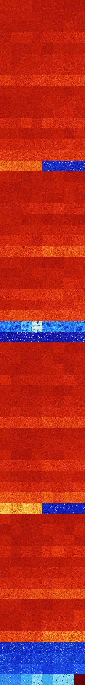

# B03478 (209408-209919)

<details>
    <summary>Initial Grid</summary>
    
</details>


<details>
    <summary>Initial Grid RLE</summary>

```
#C Exported from GoGoL (https://github.com/marrow16/gogol)
#C Wrap mode: Toroidal
#C Boundary mode: Dead
#C Step: 0
x = 100, y = 100, rule = B03478/S
bo23bo$7bo16b2o10bo40bo17bo$2bo41bo41bo$6bo8bo3bo28b2o5bo14bo28bo$8bo
10bo51bo9bo$7bo2bo58b2o27bo$57b2o3bo13bobo$7bo22bo24bo5bo18bo4bobo11bo$
9bo71bo9bo$7bo30bo38bo$30bo22bo39bo$53bo4bo14bo$8bo16bo10bo16bo39bobo$
52bo7bo15bo4bo$23bobo21bo14bo21bo$4bo46bo19bo8bo$o22bo37bo6bobo6bo6bo$
15b2obo19bo32bo$9bo2bo3bo8bo10bo18bo21bo16b2o$25bo11bo30bo10bo5bo$bo7bo
5bo31bob2o2bo2bo37bo$2bo20bo53bo20bo$3bo10bo6bo5bo14bo7bo6bo21bo$bo19bo
4bo3bo13bo4bo38bo$4bo82bo$bobo23bo14bo14b2o$4bo13bo27bobo9bo21bo$4bo8bo
62bo13bobo3bo2bo$29bo33bo3bobo13bo5bo$bo39bo9bo9bo34bo$26bo6bo8bo21bo9b
o7bo$25bo18bo5bo36bo$71bo$10bo29bo16bo23bo15bo$33bo47bo16bo$bo11bo28bob
o3bo$bo43bo30bo3bo4bo2bo5bo$o2bo2bo10bo48bo$55bobo15bo$6bo51bo$4bo25bob
o20bo11bobo$23bo10bo3bo20bo10bo$6bo22bo3bo7bo35bo6bo$o5bo7bo7bo14bo13bo
42bo$57bo16bo8bo$bo18bo11bo39bo26bo$7bo14bo13bo19bo$5b2o20bo18bo7bo9bo
25bobo4bo$51bo45bo$25bobo32bo30bo$7bo12bo24b2o2b2o8bo14b2o7bo15bo$13bo
15bo7bo$25bo7bo12bobo27bo$5bo9bo2bo8b2o41bo$10bo14bo2bobo10bo11bo32bo$
15b2o$19bo4bo13bo4bo5bo8bo$bo4bo42bo15bobo8bo$o20bo9bo36bo19bo2bo$22b2o
54bo4bo$9bo2b2o44bo27bo$b2o29bo8bo3bo20bo$o18bo5b2o3bobo3bo$27bo8bo31bo
9bo9bo$6bobo43bo2bo15bo24bobo$66bo22bo8bo$4bo5bo88bo$o10bo11bo29bo7bo
14bo$o40bo15bobo8bo24bo2bo$35bo29bo5bo$20bo20b2o5bo30bobo12bo$15bo4bo
21bo38bo6bo5bo$3bobo47bo41bo$2bo27bo8bo35bo3bo14bo$16bo32bo29bo$16bo18b
o15bo26bo$20bo2bo6bo$100b$19bo12bo3bo28bo15bo$3bo9bo20bo8b2o12bo6bo4b2o
2bobobo2bo$30bo6b2o3bo36bo12bo$11bo11bo33bo8bo$21bo32bo13bobo12bo$bo23b
o24bo38bo3b2o$8bo30bo8bo9bo2bo34bo2bo$18bo19bo2bo18bo19bo$22bo38bo$53bo
16bo$15bo66bo12bobo$7bo11bo79bo$32bo4bo49bo$32bo12bo19bo3bo16bo$30bo11b
o30b2o$23bo60bo13bo$17bo8bo7bo44bo10bo$10bobo10bo40bo11bo8bo$50bo11bo8b
o$24bo35bo9bo$19bo31bo30bo5bo$6bo22bo!
```
</details>
<details>
    <summary>Thumbnail</summary>

</details>
<table>
<tr>
    <td><a href="./209408%20S%20Heat%20Map%20Activity.png"></a><br>S (209408)<br>G>1000</td>    <td><a href="./209409%20S0%20Heat%20Map%20Activity.png"></a><br>S0 (209409)<br>G>1000</td>    <td><a href="./209410%20S1%20Heat%20Map%20Activity.png"></a><br>S1 (209410)<br>G>1000</td>    <td><a href="./209411%20S01%20Heat%20Map%20Activity.png"></a><br>S01 (209411)<br>G>1000</td>    <td><a href="./209412%20S2%20Heat%20Map%20Activity.png"></a><br>S2 (209412)<br>G>1000</td>    <td><a href="./209413%20S02%20Heat%20Map%20Activity.png"></a><br>S02 (209413)<br>G>1000</td>    <td><a href="./209414%20S12%20Heat%20Map%20Activity.png"></a><br>S12 (209414)<br>G>1000</td>    <td><a href="./209415%20S012%20Heat%20Map%20Activity.png"></a><br>S012 (209415)<br>G>1000</td></tr>
<tr>
    <td><a href="./209416%20S3%20Heat%20Map%20Activity.png"></a><br>S3 (209416)<br>G>1000</td>    <td><a href="./209417%20S03%20Heat%20Map%20Activity.png"></a><br>S03 (209417)<br>G>1000</td>    <td><a href="./209418%20S13%20Heat%20Map%20Activity.png"></a><br>S13 (209418)<br>G>1000</td>    <td><a href="./209419%20S013%20Heat%20Map%20Activity.png"></a><br>S013 (209419)<br>G>1000</td>    <td><a href="./209420%20S23%20Heat%20Map%20Activity.png"></a><br>S23 (209420)<br>G>1000</td>    <td><a href="./209421%20S023%20Heat%20Map%20Activity.png"></a><br>S023 (209421)<br>G>1000</td>    <td><a href="./209422%20S123%20Heat%20Map%20Activity.png"></a><br>S123 (209422)<br>G>1000</td>    <td><a href="./209423%20S0123%20Heat%20Map%20Activity.png"></a><br>S0123 (209423)<br>G>1000</td></tr>
<tr>
    <td><a href="./209424%20S4%20Heat%20Map%20Activity.png"></a><br>S4 (209424)<br>G>1000</td>    <td><a href="./209425%20S04%20Heat%20Map%20Activity.png"></a><br>S04 (209425)<br>G>1000</td>    <td><a href="./209426%20S14%20Heat%20Map%20Activity.png"></a><br>S14 (209426)<br>G>1000</td>    <td><a href="./209427%20S014%20Heat%20Map%20Activity.png"></a><br>S014 (209427)<br>G>1000</td>    <td><a href="./209428%20S24%20Heat%20Map%20Activity.png"></a><br>S24 (209428)<br>G>1000</td>    <td><a href="./209429%20S024%20Heat%20Map%20Activity.png"></a><br>S024 (209429)<br>G>1000</td>    <td><a href="./209430%20S124%20Heat%20Map%20Activity.png"></a><br>S124 (209430)<br>G>1000</td>    <td><a href="./209431%20S0124%20Heat%20Map%20Activity.png"></a><br>S0124 (209431)<br>G>1000</td></tr>
<tr>
    <td><a href="./209432%20S34%20Heat%20Map%20Activity.png"></a><br>S34 (209432)<br>G>1000</td>    <td><a href="./209433%20S034%20Heat%20Map%20Activity.png"></a><br>S034 (209433)<br>G>1000</td>    <td><a href="./209434%20S134%20Heat%20Map%20Activity.png"></a><br>S134 (209434)<br>G>1000</td>    <td><a href="./209435%20S0134%20Heat%20Map%20Activity.png"></a><br>S0134 (209435)<br>G>1000</td>    <td><a href="./209436%20S234%20Heat%20Map%20Activity.png"></a><br>S234 (209436)<br>G>1000</td>    <td><a href="./209437%20S0234%20Heat%20Map%20Activity.png"></a><br>S0234 (209437)<br>G>1000</td>    <td><a href="./209438%20S1234%20Heat%20Map%20Activity.png"></a><br>S1234 (209438)<br>G>1000</td>    <td><a href="./209439%20S01234%20Heat%20Map%20Activity.png"></a><br>S01234 (209439)<br>G>1000</td></tr>
<tr>
    <td><a href="./209440%20S5%20Heat%20Map%20Activity.png"></a><br>S5 (209440)<br>G>1000</td>    <td><a href="./209441%20S05%20Heat%20Map%20Activity.png"></a><br>S05 (209441)<br>G>1000</td>    <td><a href="./209442%20S15%20Heat%20Map%20Activity.png"></a><br>S15 (209442)<br>G>1000</td>    <td><a href="./209443%20S015%20Heat%20Map%20Activity.png"></a><br>S015 (209443)<br>G>1000</td>    <td><a href="./209444%20S25%20Heat%20Map%20Activity.png"></a><br>S25 (209444)<br>G>1000</td>    <td><a href="./209445%20S025%20Heat%20Map%20Activity.png"></a><br>S025 (209445)<br>G>1000</td>    <td><a href="./209446%20S125%20Heat%20Map%20Activity.png"></a><br>S125 (209446)<br>G>1000</td>    <td><a href="./209447%20S0125%20Heat%20Map%20Activity.png"></a><br>S0125 (209447)<br>G>1000</td></tr>
<tr>
    <td><a href="./209448%20S35%20Heat%20Map%20Activity.png"></a><br>S35 (209448)<br>G>1000</td>    <td><a href="./209449%20S035%20Heat%20Map%20Activity.png"></a><br>S035 (209449)<br>G>1000</td>    <td><a href="./209450%20S135%20Heat%20Map%20Activity.png"></a><br>S135 (209450)<br>G>1000</td>    <td><a href="./209451%20S0135%20Heat%20Map%20Activity.png"></a><br>S0135 (209451)<br>G>1000</td>    <td><a href="./209452%20S235%20Heat%20Map%20Activity.png"></a><br>S235 (209452)<br>G>1000</td>    <td><a href="./209453%20S0235%20Heat%20Map%20Activity.png"></a><br>S0235 (209453)<br>G>1000</td>    <td><a href="./209454%20S1235%20Heat%20Map%20Activity.png"></a><br>S1235 (209454)<br>G>1000</td>    <td><a href="./209455%20S01235%20Heat%20Map%20Activity.png"></a><br>S01235 (209455)<br>G>1000</td></tr>
<tr>
    <td><a href="./209456%20S45%20Heat%20Map%20Activity.png"></a><br>S45 (209456)<br>G>1000</td>    <td><a href="./209457%20S045%20Heat%20Map%20Activity.png"></a><br>S045 (209457)<br>G>1000</td>    <td><a href="./209458%20S145%20Heat%20Map%20Activity.png"></a><br>S145 (209458)<br>G>1000</td>    <td><a href="./209459%20S0145%20Heat%20Map%20Activity.png"></a><br>S0145 (209459)<br>G>1000</td>    <td><a href="./209460%20S245%20Heat%20Map%20Activity.png"></a><br>S245 (209460)<br>G>1000</td>    <td><a href="./209461%20S0245%20Heat%20Map%20Activity.png"></a><br>S0245 (209461)<br>G>1000</td>    <td><a href="./209462%20S1245%20Heat%20Map%20Activity.png"></a><br>S1245 (209462)<br>G>1000</td>    <td><a href="./209463%20S01245%20Heat%20Map%20Activity.png"></a><br>S01245 (209463)<br>G>1000</td></tr>
<tr>
    <td><a href="./209464%20S345%20Heat%20Map%20Activity.png"></a><br>S345 (209464)<br>G>1000</td>    <td><a href="./209465%20S0345%20Heat%20Map%20Activity.png"></a><br>S0345 (209465)<br>G>1000</td>    <td><a href="./209466%20S1345%20Heat%20Map%20Activity.png"></a><br>S1345 (209466)<br>G>1000</td>    <td><a href="./209467%20S01345%20Heat%20Map%20Activity.png"></a><br>S01345 (209467)<br>G>1000</td>    <td><a href="./209468%20S2345%20Heat%20Map%20Activity.png"></a><br>S2345 (209468)<br>G>1000</td>    <td><a href="./209469%20S02345%20Heat%20Map%20Activity.png"></a><br>S02345 (209469)<br>G>1000</td>    <td><a href="./209470%20S12345%20Heat%20Map%20Activity.png"></a><br>S12345 (209470)<br>G>1000</td>    <td><a href="./209471%20S012345%20Heat%20Map%20Activity.png"></a><br>S012345 (209471)<br>G>1000</td></tr>
<tr>
    <td><a href="./209472%20S6%20Heat%20Map%20Activity.png"></a><br>S6 (209472)<br>G>1000</td>    <td><a href="./209473%20S06%20Heat%20Map%20Activity.png"></a><br>S06 (209473)<br>G>1000</td>    <td><a href="./209474%20S16%20Heat%20Map%20Activity.png"></a><br>S16 (209474)<br>G>1000</td>    <td><a href="./209475%20S016%20Heat%20Map%20Activity.png"></a><br>S016 (209475)<br>G>1000</td>    <td><a href="./209476%20S26%20Heat%20Map%20Activity.png"></a><br>S26 (209476)<br>G>1000</td>    <td><a href="./209477%20S026%20Heat%20Map%20Activity.png"></a><br>S026 (209477)<br>G>1000</td>    <td><a href="./209478%20S126%20Heat%20Map%20Activity.png"></a><br>S126 (209478)<br>G>1000</td>    <td><a href="./209479%20S0126%20Heat%20Map%20Activity.png"></a><br>S0126 (209479)<br>G>1000</td></tr>
<tr>
    <td><a href="./209480%20S36%20Heat%20Map%20Activity.png"></a><br>S36 (209480)<br>G>1000</td>    <td><a href="./209481%20S036%20Heat%20Map%20Activity.png"></a><br>S036 (209481)<br>G>1000</td>    <td><a href="./209482%20S136%20Heat%20Map%20Activity.png"></a><br>S136 (209482)<br>G>1000</td>    <td><a href="./209483%20S0136%20Heat%20Map%20Activity.png"></a><br>S0136 (209483)<br>G>1000</td>    <td><a href="./209484%20S236%20Heat%20Map%20Activity.png"></a><br>S236 (209484)<br>G>1000</td>    <td><a href="./209485%20S0236%20Heat%20Map%20Activity.png"></a><br>S0236 (209485)<br>G>1000</td>    <td><a href="./209486%20S1236%20Heat%20Map%20Activity.png"></a><br>S1236 (209486)<br>G>1000</td>    <td><a href="./209487%20S01236%20Heat%20Map%20Activity.png"></a><br>S01236 (209487)<br>G>1000</td></tr>
<tr>
    <td><a href="./209488%20S46%20Heat%20Map%20Activity.png"></a><br>S46 (209488)<br>G>1000</td>    <td><a href="./209489%20S046%20Heat%20Map%20Activity.png"></a><br>S046 (209489)<br>G>1000</td>    <td><a href="./209490%20S146%20Heat%20Map%20Activity.png"></a><br>S146 (209490)<br>G>1000</td>    <td><a href="./209491%20S0146%20Heat%20Map%20Activity.png"></a><br>S0146 (209491)<br>G>1000</td>    <td><a href="./209492%20S246%20Heat%20Map%20Activity.png"></a><br>S246 (209492)<br>G>1000</td>    <td><a href="./209493%20S0246%20Heat%20Map%20Activity.png"></a><br>S0246 (209493)<br>G>1000</td>    <td><a href="./209494%20S1246%20Heat%20Map%20Activity.png"></a><br>S1246 (209494)<br>G>1000</td>    <td><a href="./209495%20S01246%20Heat%20Map%20Activity.png"></a><br>S01246 (209495)<br>G>1000</td></tr>
<tr>
    <td><a href="./209496%20S346%20Heat%20Map%20Activity.png"></a><br>S346 (209496)<br>G>1000</td>    <td><a href="./209497%20S0346%20Heat%20Map%20Activity.png"></a><br>S0346 (209497)<br>G>1000</td>    <td><a href="./209498%20S1346%20Heat%20Map%20Activity.png"></a><br>S1346 (209498)<br>G>1000</td>    <td><a href="./209499%20S01346%20Heat%20Map%20Activity.png"></a><br>S01346 (209499)<br>G>1000</td>    <td><a href="./209500%20S2346%20Heat%20Map%20Activity.png"></a><br>S2346 (209500)<br>G>1000</td>    <td><a href="./209501%20S02346%20Heat%20Map%20Activity.png"></a><br>S02346 (209501)<br>G>1000</td>    <td><a href="./209502%20S12346%20Heat%20Map%20Activity.png"></a><br>S12346 (209502)<br>G>1000</td>    <td><a href="./209503%20S012346%20Heat%20Map%20Activity.png"></a><br>S012346 (209503)<br>G>1000</td></tr>
<tr>
    <td><a href="./209504%20S56%20Heat%20Map%20Activity.png"></a><br>S56 (209504)<br>G>1000</td>    <td><a href="./209505%20S056%20Heat%20Map%20Activity.png"></a><br>S056 (209505)<br>G>1000</td>    <td><a href="./209506%20S156%20Heat%20Map%20Activity.png"></a><br>S156 (209506)<br>G>1000</td>    <td><a href="./209507%20S0156%20Heat%20Map%20Activity.png"></a><br>S0156 (209507)<br>G>1000</td>    <td><a href="./209508%20S256%20Heat%20Map%20Activity.png"></a><br>S256 (209508)<br>G>1000</td>    <td><a href="./209509%20S0256%20Heat%20Map%20Activity.png"></a><br>S0256 (209509)<br>G>1000</td>    <td><a href="./209510%20S1256%20Heat%20Map%20Activity.png"></a><br>S1256 (209510)<br>G>1000</td>    <td><a href="./209511%20S01256%20Heat%20Map%20Activity.png"></a><br>S01256 (209511)<br>G>1000</td></tr>
<tr>
    <td><a href="./209512%20S356%20Heat%20Map%20Activity.png"></a><br>S356 (209512)<br>G>1000</td>    <td><a href="./209513%20S0356%20Heat%20Map%20Activity.png"></a><br>S0356 (209513)<br>G>1000</td>    <td><a href="./209514%20S1356%20Heat%20Map%20Activity.png"></a><br>S1356 (209514)<br>G>1000</td>    <td><a href="./209515%20S01356%20Heat%20Map%20Activity.png"></a><br>S01356 (209515)<br>G>1000</td>    <td><a href="./209516%20S2356%20Heat%20Map%20Activity.png"></a><br>S2356 (209516)<br>G>1000</td>    <td><a href="./209517%20S02356%20Heat%20Map%20Activity.png"></a><br>S02356 (209517)<br>G>1000</td>    <td><a href="./209518%20S12356%20Heat%20Map%20Activity.png"></a><br>S12356 (209518)<br>G>1000</td>    <td><a href="./209519%20S012356%20Heat%20Map%20Activity.png"></a><br>S012356 (209519)<br>G>1000</td></tr>
<tr>
    <td><a href="./209520%20S456%20Heat%20Map%20Activity.png"></a><br>S456 (209520)<br>G>1000</td>    <td><a href="./209521%20S0456%20Heat%20Map%20Activity.png"></a><br>S0456 (209521)<br>G>1000</td>    <td><a href="./209522%20S1456%20Heat%20Map%20Activity.png"></a><br>S1456 (209522)<br>G>1000</td>    <td><a href="./209523%20S01456%20Heat%20Map%20Activity.png"></a><br>S01456 (209523)<br>G>1000</td>    <td><a href="./209524%20S2456%20Heat%20Map%20Activity.png"></a><br>S2456 (209524)<br>G>1000</td>    <td><a href="./209525%20S02456%20Heat%20Map%20Activity.png"></a><br>S02456 (209525)<br>G>1000</td>    <td><a href="./209526%20S12456%20Heat%20Map%20Activity.png"></a><br>S12456 (209526)<br>G>1000</td>    <td><a href="./209527%20S012456%20Heat%20Map%20Activity.png"></a><br>S012456 (209527)<br>G>1000</td></tr>
<tr>
    <td><a href="./209528%20S3456%20Heat%20Map%20Activity.png"></a><br>S3456 (209528)<br>G>1000</td>    <td><a href="./209529%20S03456%20Heat%20Map%20Activity.png"></a><br>S03456 (209529)<br>G>1000</td>    <td><a href="./209530%20S13456%20Heat%20Map%20Activity.png"></a><br>S13456 (209530)<br>G>1000</td>    <td><a href="./209531%20S013456%20Heat%20Map%20Activity.png"></a><br>S013456 (209531)<br>G>1000</td>    <td><a href="./209532%20S23456%20Heat%20Map%20Activity.png"></a><br>S23456 (209532)<br>G>1000</td>    <td><a href="./209533%20S023456%20Heat%20Map%20Activity.png"></a><br>S023456 (209533)<br>G>1000</td>    <td><a href="./209534%20S123456%20Heat%20Map%20Activity.png"></a><br>S123456 (209534)<br>R@908,p540</td>    <td><a href="./209535%20S0123456%20Heat%20Map%20Activity.png"></a><br>S0123456 (209535)<br>G>1000</td></tr>
<tr>
    <td><a href="./209536%20S7%20Heat%20Map%20Activity.png"></a><br>S7 (209536)<br>G>1000</td>    <td><a href="./209537%20S07%20Heat%20Map%20Activity.png"></a><br>S07 (209537)<br>G>1000</td>    <td><a href="./209538%20S17%20Heat%20Map%20Activity.png"></a><br>S17 (209538)<br>G>1000</td>    <td><a href="./209539%20S017%20Heat%20Map%20Activity.png"></a><br>S017 (209539)<br>G>1000</td>    <td><a href="./209540%20S27%20Heat%20Map%20Activity.png"></a><br>S27 (209540)<br>G>1000</td>    <td><a href="./209541%20S027%20Heat%20Map%20Activity.png"></a><br>S027 (209541)<br>G>1000</td>    <td><a href="./209542%20S127%20Heat%20Map%20Activity.png"></a><br>S127 (209542)<br>G>1000</td>    <td><a href="./209543%20S0127%20Heat%20Map%20Activity.png"></a><br>S0127 (209543)<br>G>1000</td></tr>
<tr>
    <td><a href="./209544%20S37%20Heat%20Map%20Activity.png"></a><br>S37 (209544)<br>G>1000</td>    <td><a href="./209545%20S037%20Heat%20Map%20Activity.png"></a><br>S037 (209545)<br>G>1000</td>    <td><a href="./209546%20S137%20Heat%20Map%20Activity.png"></a><br>S137 (209546)<br>G>1000</td>    <td><a href="./209547%20S0137%20Heat%20Map%20Activity.png"></a><br>S0137 (209547)<br>G>1000</td>    <td><a href="./209548%20S237%20Heat%20Map%20Activity.png"></a><br>S237 (209548)<br>G>1000</td>    <td><a href="./209549%20S0237%20Heat%20Map%20Activity.png"></a><br>S0237 (209549)<br>G>1000</td>    <td><a href="./209550%20S1237%20Heat%20Map%20Activity.png"></a><br>S1237 (209550)<br>G>1000</td>    <td><a href="./209551%20S01237%20Heat%20Map%20Activity.png"></a><br>S01237 (209551)<br>G>1000</td></tr>
<tr>
    <td><a href="./209552%20S47%20Heat%20Map%20Activity.png"></a><br>S47 (209552)<br>G>1000</td>    <td><a href="./209553%20S047%20Heat%20Map%20Activity.png"></a><br>S047 (209553)<br>G>1000</td>    <td><a href="./209554%20S147%20Heat%20Map%20Activity.png"></a><br>S147 (209554)<br>G>1000</td>    <td><a href="./209555%20S0147%20Heat%20Map%20Activity.png"></a><br>S0147 (209555)<br>G>1000</td>    <td><a href="./209556%20S247%20Heat%20Map%20Activity.png"></a><br>S247 (209556)<br>G>1000</td>    <td><a href="./209557%20S0247%20Heat%20Map%20Activity.png"></a><br>S0247 (209557)<br>G>1000</td>    <td><a href="./209558%20S1247%20Heat%20Map%20Activity.png"></a><br>S1247 (209558)<br>G>1000</td>    <td><a href="./209559%20S01247%20Heat%20Map%20Activity.png"></a><br>S01247 (209559)<br>G>1000</td></tr>
<tr>
    <td><a href="./209560%20S347%20Heat%20Map%20Activity.png"></a><br>S347 (209560)<br>G>1000</td>    <td><a href="./209561%20S0347%20Heat%20Map%20Activity.png"></a><br>S0347 (209561)<br>G>1000</td>    <td><a href="./209562%20S1347%20Heat%20Map%20Activity.png"></a><br>S1347 (209562)<br>G>1000</td>    <td><a href="./209563%20S01347%20Heat%20Map%20Activity.png"></a><br>S01347 (209563)<br>G>1000</td>    <td><a href="./209564%20S2347%20Heat%20Map%20Activity.png"></a><br>S2347 (209564)<br>G>1000</td>    <td><a href="./209565%20S02347%20Heat%20Map%20Activity.png"></a><br>S02347 (209565)<br>G>1000</td>    <td><a href="./209566%20S12347%20Heat%20Map%20Activity.png"></a><br>S12347 (209566)<br>G>1000</td>    <td><a href="./209567%20S012347%20Heat%20Map%20Activity.png"></a><br>S012347 (209567)<br>G>1000</td></tr>
<tr>
    <td><a href="./209568%20S57%20Heat%20Map%20Activity.png"></a><br>S57 (209568)<br>G>1000</td>    <td><a href="./209569%20S057%20Heat%20Map%20Activity.png"></a><br>S057 (209569)<br>G>1000</td>    <td><a href="./209570%20S157%20Heat%20Map%20Activity.png"></a><br>S157 (209570)<br>G>1000</td>    <td><a href="./209571%20S0157%20Heat%20Map%20Activity.png"></a><br>S0157 (209571)<br>G>1000</td>    <td><a href="./209572%20S257%20Heat%20Map%20Activity.png"></a><br>S257 (209572)<br>G>1000</td>    <td><a href="./209573%20S0257%20Heat%20Map%20Activity.png"></a><br>S0257 (209573)<br>G>1000</td>    <td><a href="./209574%20S1257%20Heat%20Map%20Activity.png"></a><br>S1257 (209574)<br>G>1000</td>    <td><a href="./209575%20S01257%20Heat%20Map%20Activity.png"></a><br>S01257 (209575)<br>G>1000</td></tr>
<tr>
    <td><a href="./209576%20S357%20Heat%20Map%20Activity.png"></a><br>S357 (209576)<br>G>1000</td>    <td><a href="./209577%20S0357%20Heat%20Map%20Activity.png"></a><br>S0357 (209577)<br>G>1000</td>    <td><a href="./209578%20S1357%20Heat%20Map%20Activity.png"></a><br>S1357 (209578)<br>G>1000</td>    <td><a href="./209579%20S01357%20Heat%20Map%20Activity.png"></a><br>S01357 (209579)<br>G>1000</td>    <td><a href="./209580%20S2357%20Heat%20Map%20Activity.png"></a><br>S2357 (209580)<br>G>1000</td>    <td><a href="./209581%20S02357%20Heat%20Map%20Activity.png"></a><br>S02357 (209581)<br>G>1000</td>    <td><a href="./209582%20S12357%20Heat%20Map%20Activity.png"></a><br>S12357 (209582)<br>G>1000</td>    <td><a href="./209583%20S012357%20Heat%20Map%20Activity.png"></a><br>S012357 (209583)<br>G>1000</td></tr>
<tr>
    <td><a href="./209584%20S457%20Heat%20Map%20Activity.png"></a><br>S457 (209584)<br>G>1000</td>    <td><a href="./209585%20S0457%20Heat%20Map%20Activity.png"></a><br>S0457 (209585)<br>G>1000</td>    <td><a href="./209586%20S1457%20Heat%20Map%20Activity.png"></a><br>S1457 (209586)<br>G>1000</td>    <td><a href="./209587%20S01457%20Heat%20Map%20Activity.png"></a><br>S01457 (209587)<br>G>1000</td>    <td><a href="./209588%20S2457%20Heat%20Map%20Activity.png"></a><br>S2457 (209588)<br>G>1000</td>    <td><a href="./209589%20S02457%20Heat%20Map%20Activity.png"></a><br>S02457 (209589)<br>G>1000</td>    <td><a href="./209590%20S12457%20Heat%20Map%20Activity.png"></a><br>S12457 (209590)<br>G>1000</td>    <td><a href="./209591%20S012457%20Heat%20Map%20Activity.png"></a><br>S012457 (209591)<br>G>1000</td></tr>
<tr>
    <td><a href="./209592%20S3457%20Heat%20Map%20Activity.png"></a><br>S3457 (209592)<br>G>1000</td>    <td><a href="./209593%20S03457%20Heat%20Map%20Activity.png"></a><br>S03457 (209593)<br>G>1000</td>    <td><a href="./209594%20S13457%20Heat%20Map%20Activity.png"></a><br>S13457 (209594)<br>G>1000</td>    <td><a href="./209595%20S013457%20Heat%20Map%20Activity.png"></a><br>S013457 (209595)<br>G>1000</td>    <td><a href="./209596%20S23457%20Heat%20Map%20Activity.png"></a><br>S23457 (209596)<br>G>1000</td>    <td><a href="./209597%20S023457%20Heat%20Map%20Activity.png"></a><br>S023457 (209597)<br>G>1000</td>    <td><a href="./209598%20S123457%20Heat%20Map%20Activity.png"></a><br>S123457 (209598)<br>G>1000</td>    <td><a href="./209599%20S0123457%20Heat%20Map%20Activity.png"></a><br>S0123457 (209599)<br>G>1000</td></tr>
<tr>
    <td><a href="./209600%20S67%20Heat%20Map%20Activity.png"></a><br>S67 (209600)<br>G>1000</td>    <td><a href="./209601%20S067%20Heat%20Map%20Activity.png"></a><br>S067 (209601)<br>G>1000</td>    <td><a href="./209602%20S167%20Heat%20Map%20Activity.png"></a><br>S167 (209602)<br>G>1000</td>    <td><a href="./209603%20S0167%20Heat%20Map%20Activity.png"></a><br>S0167 (209603)<br>G>1000</td>    <td><a href="./209604%20S267%20Heat%20Map%20Activity.png"></a><br>S267 (209604)<br>G>1000</td>    <td><a href="./209605%20S0267%20Heat%20Map%20Activity.png"></a><br>S0267 (209605)<br>G>1000</td>    <td><a href="./209606%20S1267%20Heat%20Map%20Activity.png"></a><br>S1267 (209606)<br>G>1000</td>    <td><a href="./209607%20S01267%20Heat%20Map%20Activity.png"></a><br>S01267 (209607)<br>G>1000</td></tr>
<tr>
    <td><a href="./209608%20S367%20Heat%20Map%20Activity.png"></a><br>S367 (209608)<br>G>1000</td>    <td><a href="./209609%20S0367%20Heat%20Map%20Activity.png"></a><br>S0367 (209609)<br>G>1000</td>    <td><a href="./209610%20S1367%20Heat%20Map%20Activity.png"></a><br>S1367 (209610)<br>G>1000</td>    <td><a href="./209611%20S01367%20Heat%20Map%20Activity.png"></a><br>S01367 (209611)<br>G>1000</td>    <td><a href="./209612%20S2367%20Heat%20Map%20Activity.png"></a><br>S2367 (209612)<br>G>1000</td>    <td><a href="./209613%20S02367%20Heat%20Map%20Activity.png"></a><br>S02367 (209613)<br>G>1000</td>    <td><a href="./209614%20S12367%20Heat%20Map%20Activity.png"></a><br>S12367 (209614)<br>G>1000</td>    <td><a href="./209615%20S012367%20Heat%20Map%20Activity.png"></a><br>S012367 (209615)<br>G>1000</td></tr>
<tr>
    <td><a href="./209616%20S467%20Heat%20Map%20Activity.png"></a><br>S467 (209616)<br>G>1000</td>    <td><a href="./209617%20S0467%20Heat%20Map%20Activity.png"></a><br>S0467 (209617)<br>G>1000</td>    <td><a href="./209618%20S1467%20Heat%20Map%20Activity.png"></a><br>S1467 (209618)<br>G>1000</td>    <td><a href="./209619%20S01467%20Heat%20Map%20Activity.png"></a><br>S01467 (209619)<br>G>1000</td>    <td><a href="./209620%20S2467%20Heat%20Map%20Activity.png"></a><br>S2467 (209620)<br>G>1000</td>    <td><a href="./209621%20S02467%20Heat%20Map%20Activity.png"></a><br>S02467 (209621)<br>G>1000</td>    <td><a href="./209622%20S12467%20Heat%20Map%20Activity.png"></a><br>S12467 (209622)<br>G>1000</td>    <td><a href="./209623%20S012467%20Heat%20Map%20Activity.png"></a><br>S012467 (209623)<br>G>1000</td></tr>
<tr>
    <td><a href="./209624%20S3467%20Heat%20Map%20Activity.png"></a><br>S3467 (209624)<br>G>1000</td>    <td><a href="./209625%20S03467%20Heat%20Map%20Activity.png"></a><br>S03467 (209625)<br>G>1000</td>    <td><a href="./209626%20S13467%20Heat%20Map%20Activity.png"></a><br>S13467 (209626)<br>G>1000</td>    <td><a href="./209627%20S013467%20Heat%20Map%20Activity.png"></a><br>S013467 (209627)<br>G>1000</td>    <td><a href="./209628%20S23467%20Heat%20Map%20Activity.png"></a><br>S23467 (209628)<br>G>1000</td>    <td><a href="./209629%20S023467%20Heat%20Map%20Activity.png"></a><br>S023467 (209629)<br>G>1000</td>    <td><a href="./209630%20S123467%20Heat%20Map%20Activity.png"></a><br>S123467 (209630)<br>G>1000</td>    <td><a href="./209631%20S0123467%20Heat%20Map%20Activity.png"></a><br>S0123467 (209631)<br>G>1000</td></tr>
<tr>
    <td><a href="./209632%20S567%20Heat%20Map%20Activity.png"></a><br>S567 (209632)<br>G>1000</td>    <td><a href="./209633%20S0567%20Heat%20Map%20Activity.png"></a><br>S0567 (209633)<br>G>1000</td>    <td><a href="./209634%20S1567%20Heat%20Map%20Activity.png"></a><br>S1567 (209634)<br>G>1000</td>    <td><a href="./209635%20S01567%20Heat%20Map%20Activity.png"></a><br>S01567 (209635)<br>G>1000</td>    <td><a href="./209636%20S2567%20Heat%20Map%20Activity.png"></a><br>S2567 (209636)<br>G>1000</td>    <td><a href="./209637%20S02567%20Heat%20Map%20Activity.png"></a><br>S02567 (209637)<br>G>1000</td>    <td><a href="./209638%20S12567%20Heat%20Map%20Activity.png"></a><br>S12567 (209638)<br>G>1000</td>    <td><a href="./209639%20S012567%20Heat%20Map%20Activity.png"></a><br>S012567 (209639)<br>G>1000</td></tr>
<tr>
    <td><a href="./209640%20S3567%20Heat%20Map%20Activity.png"></a><br>S3567 (209640)<br>G>1000</td>    <td><a href="./209641%20S03567%20Heat%20Map%20Activity.png"></a><br>S03567 (209641)<br>G>1000</td>    <td><a href="./209642%20S13567%20Heat%20Map%20Activity.png"></a><br>S13567 (209642)<br>G>1000</td>    <td><a href="./209643%20S013567%20Heat%20Map%20Activity.png"></a><br>S013567 (209643)<br>G>1000</td>    <td><a href="./209644%20S23567%20Heat%20Map%20Activity.png"></a><br>S23567 (209644)<br>G>1000</td>    <td><a href="./209645%20S023567%20Heat%20Map%20Activity.png"></a><br>S023567 (209645)<br>G>1000</td>    <td><a href="./209646%20S123567%20Heat%20Map%20Activity.png"></a><br>S123567 (209646)<br>G>1000</td>    <td><a href="./209647%20S0123567%20Heat%20Map%20Activity.png"></a><br>S0123567 (209647)<br>G>1000</td></tr>
<tr>
    <td><a href="./209648%20S4567%20Heat%20Map%20Activity.png"></a><br>S4567 (209648)<br>G>1000</td>    <td><a href="./209649%20S04567%20Heat%20Map%20Activity.png"></a><br>S04567 (209649)<br>G>1000</td>    <td><a href="./209650%20S14567%20Heat%20Map%20Activity.png"></a><br>S14567 (209650)<br>G>1000</td>    <td><a href="./209651%20S014567%20Heat%20Map%20Activity.png"></a><br>S014567 (209651)<br>G>1000</td>    <td><a href="./209652%20S24567%20Heat%20Map%20Activity.png"></a><br>S24567 (209652)<br>G>1000</td>    <td><a href="./209653%20S024567%20Heat%20Map%20Activity.png"></a><br>S024567 (209653)<br>G>1000</td>    <td><a href="./209654%20S124567%20Heat%20Map%20Activity.png"></a><br>S124567 (209654)<br>G>1000</td>    <td><a href="./209655%20S0124567%20Heat%20Map%20Activity.png"></a><br>S0124567 (209655)<br>G>1000</td></tr>
<tr>
    <td><a href="./209656%20S34567%20Heat%20Map%20Activity.png"></a><br>S34567 (209656)<br>G>1000</td>    <td><a href="./209657%20S034567%20Heat%20Map%20Activity.png"></a><br>S034567 (209657)<br>G>1000</td>    <td><a href="./209658%20S134567%20Heat%20Map%20Activity.png"></a><br>S134567 (209658)<br>G>1000</td>    <td><a href="./209659%20S0134567%20Heat%20Map%20Activity.png"></a><br>S0134567 (209659)<br>G>1000</td>    <td><a href="./209660%20S234567%20Heat%20Map%20Activity.png"></a><br>S234567 (209660)<br>G>1000</td>    <td><a href="./209661%20S0234567%20Heat%20Map%20Activity.png"></a><br>S0234567 (209661)<br>G>1000</td>    <td><a href="./209662%20S1234567%20Heat%20Map%20Activity.png"></a><br>S1234567 (209662)<br>G>1000</td>    <td><a href="./209663%20S01234567%20Heat%20Map%20Activity.png"></a><br>S01234567 (209663)<br>R@123,p72</td></tr>
<tr>
    <td><a href="./209664%20S8%20Heat%20Map%20Activity.png"></a><br>S8 (209664)<br>G>1000</td>    <td><a href="./209665%20S08%20Heat%20Map%20Activity.png"></a><br>S08 (209665)<br>G>1000</td>    <td><a href="./209666%20S18%20Heat%20Map%20Activity.png"></a><br>S18 (209666)<br>G>1000</td>    <td><a href="./209667%20S018%20Heat%20Map%20Activity.png"></a><br>S018 (209667)<br>G>1000</td>    <td><a href="./209668%20S28%20Heat%20Map%20Activity.png"></a><br>S28 (209668)<br>G>1000</td>    <td><a href="./209669%20S028%20Heat%20Map%20Activity.png"></a><br>S028 (209669)<br>G>1000</td>    <td><a href="./209670%20S128%20Heat%20Map%20Activity.png"></a><br>S128 (209670)<br>G>1000</td>    <td><a href="./209671%20S0128%20Heat%20Map%20Activity.png"></a><br>S0128 (209671)<br>G>1000</td></tr>
<tr>
    <td><a href="./209672%20S38%20Heat%20Map%20Activity.png"></a><br>S38 (209672)<br>G>1000</td>    <td><a href="./209673%20S038%20Heat%20Map%20Activity.png"></a><br>S038 (209673)<br>G>1000</td>    <td><a href="./209674%20S138%20Heat%20Map%20Activity.png"></a><br>S138 (209674)<br>G>1000</td>    <td><a href="./209675%20S0138%20Heat%20Map%20Activity.png"></a><br>S0138 (209675)<br>G>1000</td>    <td><a href="./209676%20S238%20Heat%20Map%20Activity.png"></a><br>S238 (209676)<br>G>1000</td>    <td><a href="./209677%20S0238%20Heat%20Map%20Activity.png"></a><br>S0238 (209677)<br>G>1000</td>    <td><a href="./209678%20S1238%20Heat%20Map%20Activity.png"></a><br>S1238 (209678)<br>G>1000</td>    <td><a href="./209679%20S01238%20Heat%20Map%20Activity.png"></a><br>S01238 (209679)<br>G>1000</td></tr>
<tr>
    <td><a href="./209680%20S48%20Heat%20Map%20Activity.png"></a><br>S48 (209680)<br>G>1000</td>    <td><a href="./209681%20S048%20Heat%20Map%20Activity.png"></a><br>S048 (209681)<br>G>1000</td>    <td><a href="./209682%20S148%20Heat%20Map%20Activity.png"></a><br>S148 (209682)<br>G>1000</td>    <td><a href="./209683%20S0148%20Heat%20Map%20Activity.png"></a><br>S0148 (209683)<br>G>1000</td>    <td><a href="./209684%20S248%20Heat%20Map%20Activity.png"></a><br>S248 (209684)<br>G>1000</td>    <td><a href="./209685%20S0248%20Heat%20Map%20Activity.png"></a><br>S0248 (209685)<br>G>1000</td>    <td><a href="./209686%20S1248%20Heat%20Map%20Activity.png"></a><br>S1248 (209686)<br>G>1000</td>    <td><a href="./209687%20S01248%20Heat%20Map%20Activity.png"></a><br>S01248 (209687)<br>G>1000</td></tr>
<tr>
    <td><a href="./209688%20S348%20Heat%20Map%20Activity.png"></a><br>S348 (209688)<br>G>1000</td>    <td><a href="./209689%20S0348%20Heat%20Map%20Activity.png"></a><br>S0348 (209689)<br>G>1000</td>    <td><a href="./209690%20S1348%20Heat%20Map%20Activity.png"></a><br>S1348 (209690)<br>G>1000</td>    <td><a href="./209691%20S01348%20Heat%20Map%20Activity.png"></a><br>S01348 (209691)<br>G>1000</td>    <td><a href="./209692%20S2348%20Heat%20Map%20Activity.png"></a><br>S2348 (209692)<br>G>1000</td>    <td><a href="./209693%20S02348%20Heat%20Map%20Activity.png"></a><br>S02348 (209693)<br>G>1000</td>    <td><a href="./209694%20S12348%20Heat%20Map%20Activity.png"></a><br>S12348 (209694)<br>G>1000</td>    <td><a href="./209695%20S012348%20Heat%20Map%20Activity.png"></a><br>S012348 (209695)<br>G>1000</td></tr>
<tr>
    <td><a href="./209696%20S58%20Heat%20Map%20Activity.png"></a><br>S58 (209696)<br>G>1000</td>    <td><a href="./209697%20S058%20Heat%20Map%20Activity.png"></a><br>S058 (209697)<br>G>1000</td>    <td><a href="./209698%20S158%20Heat%20Map%20Activity.png"></a><br>S158 (209698)<br>G>1000</td>    <td><a href="./209699%20S0158%20Heat%20Map%20Activity.png"></a><br>S0158 (209699)<br>G>1000</td>    <td><a href="./209700%20S258%20Heat%20Map%20Activity.png"></a><br>S258 (209700)<br>G>1000</td>    <td><a href="./209701%20S0258%20Heat%20Map%20Activity.png"></a><br>S0258 (209701)<br>G>1000</td>    <td><a href="./209702%20S1258%20Heat%20Map%20Activity.png"></a><br>S1258 (209702)<br>G>1000</td>    <td><a href="./209703%20S01258%20Heat%20Map%20Activity.png"></a><br>S01258 (209703)<br>G>1000</td></tr>
<tr>
    <td><a href="./209704%20S358%20Heat%20Map%20Activity.png"></a><br>S358 (209704)<br>G>1000</td>    <td><a href="./209705%20S0358%20Heat%20Map%20Activity.png"></a><br>S0358 (209705)<br>G>1000</td>    <td><a href="./209706%20S1358%20Heat%20Map%20Activity.png"></a><br>S1358 (209706)<br>G>1000</td>    <td><a href="./209707%20S01358%20Heat%20Map%20Activity.png"></a><br>S01358 (209707)<br>G>1000</td>    <td><a href="./209708%20S2358%20Heat%20Map%20Activity.png"></a><br>S2358 (209708)<br>G>1000</td>    <td><a href="./209709%20S02358%20Heat%20Map%20Activity.png"></a><br>S02358 (209709)<br>G>1000</td>    <td><a href="./209710%20S12358%20Heat%20Map%20Activity.png"></a><br>S12358 (209710)<br>G>1000</td>    <td><a href="./209711%20S012358%20Heat%20Map%20Activity.png"></a><br>S012358 (209711)<br>G>1000</td></tr>
<tr>
    <td><a href="./209712%20S458%20Heat%20Map%20Activity.png"></a><br>S458 (209712)<br>G>1000</td>    <td><a href="./209713%20S0458%20Heat%20Map%20Activity.png"></a><br>S0458 (209713)<br>G>1000</td>    <td><a href="./209714%20S1458%20Heat%20Map%20Activity.png"></a><br>S1458 (209714)<br>G>1000</td>    <td><a href="./209715%20S01458%20Heat%20Map%20Activity.png"></a><br>S01458 (209715)<br>G>1000</td>    <td><a href="./209716%20S2458%20Heat%20Map%20Activity.png"></a><br>S2458 (209716)<br>G>1000</td>    <td><a href="./209717%20S02458%20Heat%20Map%20Activity.png"></a><br>S02458 (209717)<br>G>1000</td>    <td><a href="./209718%20S12458%20Heat%20Map%20Activity.png"></a><br>S12458 (209718)<br>G>1000</td>    <td><a href="./209719%20S012458%20Heat%20Map%20Activity.png"></a><br>S012458 (209719)<br>G>1000</td></tr>
<tr>
    <td><a href="./209720%20S3458%20Heat%20Map%20Activity.png"></a><br>S3458 (209720)<br>G>1000</td>    <td><a href="./209721%20S03458%20Heat%20Map%20Activity.png"></a><br>S03458 (209721)<br>G>1000</td>    <td><a href="./209722%20S13458%20Heat%20Map%20Activity.png"></a><br>S13458 (209722)<br>G>1000</td>    <td><a href="./209723%20S013458%20Heat%20Map%20Activity.png"></a><br>S013458 (209723)<br>G>1000</td>    <td><a href="./209724%20S23458%20Heat%20Map%20Activity.png"></a><br>S23458 (209724)<br>G>1000</td>    <td><a href="./209725%20S023458%20Heat%20Map%20Activity.png"></a><br>S023458 (209725)<br>G>1000</td>    <td><a href="./209726%20S123458%20Heat%20Map%20Activity.png"></a><br>S123458 (209726)<br>G>1000</td>    <td><a href="./209727%20S0123458%20Heat%20Map%20Activity.png"></a><br>S0123458 (209727)<br>G>1000</td></tr>
<tr>
    <td><a href="./209728%20S68%20Heat%20Map%20Activity.png"></a><br>S68 (209728)<br>G>1000</td>    <td><a href="./209729%20S068%20Heat%20Map%20Activity.png"></a><br>S068 (209729)<br>G>1000</td>    <td><a href="./209730%20S168%20Heat%20Map%20Activity.png"></a><br>S168 (209730)<br>G>1000</td>    <td><a href="./209731%20S0168%20Heat%20Map%20Activity.png"></a><br>S0168 (209731)<br>G>1000</td>    <td><a href="./209732%20S268%20Heat%20Map%20Activity.png"></a><br>S268 (209732)<br>G>1000</td>    <td><a href="./209733%20S0268%20Heat%20Map%20Activity.png"></a><br>S0268 (209733)<br>G>1000</td>    <td><a href="./209734%20S1268%20Heat%20Map%20Activity.png"></a><br>S1268 (209734)<br>G>1000</td>    <td><a href="./209735%20S01268%20Heat%20Map%20Activity.png"></a><br>S01268 (209735)<br>G>1000</td></tr>
<tr>
    <td><a href="./209736%20S368%20Heat%20Map%20Activity.png"></a><br>S368 (209736)<br>G>1000</td>    <td><a href="./209737%20S0368%20Heat%20Map%20Activity.png"></a><br>S0368 (209737)<br>G>1000</td>    <td><a href="./209738%20S1368%20Heat%20Map%20Activity.png"></a><br>S1368 (209738)<br>G>1000</td>    <td><a href="./209739%20S01368%20Heat%20Map%20Activity.png"></a><br>S01368 (209739)<br>G>1000</td>    <td><a href="./209740%20S2368%20Heat%20Map%20Activity.png"></a><br>S2368 (209740)<br>G>1000</td>    <td><a href="./209741%20S02368%20Heat%20Map%20Activity.png"></a><br>S02368 (209741)<br>G>1000</td>    <td><a href="./209742%20S12368%20Heat%20Map%20Activity.png"></a><br>S12368 (209742)<br>G>1000</td>    <td><a href="./209743%20S012368%20Heat%20Map%20Activity.png"></a><br>S012368 (209743)<br>G>1000</td></tr>
<tr>
    <td><a href="./209744%20S468%20Heat%20Map%20Activity.png"></a><br>S468 (209744)<br>G>1000</td>    <td><a href="./209745%20S0468%20Heat%20Map%20Activity.png"></a><br>S0468 (209745)<br>G>1000</td>    <td><a href="./209746%20S1468%20Heat%20Map%20Activity.png"></a><br>S1468 (209746)<br>G>1000</td>    <td><a href="./209747%20S01468%20Heat%20Map%20Activity.png"></a><br>S01468 (209747)<br>G>1000</td>    <td><a href="./209748%20S2468%20Heat%20Map%20Activity.png"></a><br>S2468 (209748)<br>G>1000</td>    <td><a href="./209749%20S02468%20Heat%20Map%20Activity.png"></a><br>S02468 (209749)<br>G>1000</td>    <td><a href="./209750%20S12468%20Heat%20Map%20Activity.png"></a><br>S12468 (209750)<br>G>1000</td>    <td><a href="./209751%20S012468%20Heat%20Map%20Activity.png"></a><br>S012468 (209751)<br>G>1000</td></tr>
<tr>
    <td><a href="./209752%20S3468%20Heat%20Map%20Activity.png"></a><br>S3468 (209752)<br>G>1000</td>    <td><a href="./209753%20S03468%20Heat%20Map%20Activity.png"></a><br>S03468 (209753)<br>G>1000</td>    <td><a href="./209754%20S13468%20Heat%20Map%20Activity.png"></a><br>S13468 (209754)<br>G>1000</td>    <td><a href="./209755%20S013468%20Heat%20Map%20Activity.png"></a><br>S013468 (209755)<br>G>1000</td>    <td><a href="./209756%20S23468%20Heat%20Map%20Activity.png"></a><br>S23468 (209756)<br>G>1000</td>    <td><a href="./209757%20S023468%20Heat%20Map%20Activity.png"></a><br>S023468 (209757)<br>G>1000</td>    <td><a href="./209758%20S123468%20Heat%20Map%20Activity.png"></a><br>S123468 (209758)<br>G>1000</td>    <td><a href="./209759%20S0123468%20Heat%20Map%20Activity.png"></a><br>S0123468 (209759)<br>G>1000</td></tr>
<tr>
    <td><a href="./209760%20S568%20Heat%20Map%20Activity.png"></a><br>S568 (209760)<br>G>1000</td>    <td><a href="./209761%20S0568%20Heat%20Map%20Activity.png"></a><br>S0568 (209761)<br>G>1000</td>    <td><a href="./209762%20S1568%20Heat%20Map%20Activity.png"></a><br>S1568 (209762)<br>G>1000</td>    <td><a href="./209763%20S01568%20Heat%20Map%20Activity.png"></a><br>S01568 (209763)<br>G>1000</td>    <td><a href="./209764%20S2568%20Heat%20Map%20Activity.png"></a><br>S2568 (209764)<br>G>1000</td>    <td><a href="./209765%20S02568%20Heat%20Map%20Activity.png"></a><br>S02568 (209765)<br>G>1000</td>    <td><a href="./209766%20S12568%20Heat%20Map%20Activity.png"></a><br>S12568 (209766)<br>G>1000</td>    <td><a href="./209767%20S012568%20Heat%20Map%20Activity.png"></a><br>S012568 (209767)<br>G>1000</td></tr>
<tr>
    <td><a href="./209768%20S3568%20Heat%20Map%20Activity.png"></a><br>S3568 (209768)<br>G>1000</td>    <td><a href="./209769%20S03568%20Heat%20Map%20Activity.png"></a><br>S03568 (209769)<br>G>1000</td>    <td><a href="./209770%20S13568%20Heat%20Map%20Activity.png"></a><br>S13568 (209770)<br>G>1000</td>    <td><a href="./209771%20S013568%20Heat%20Map%20Activity.png"></a><br>S013568 (209771)<br>G>1000</td>    <td><a href="./209772%20S23568%20Heat%20Map%20Activity.png"></a><br>S23568 (209772)<br>G>1000</td>    <td><a href="./209773%20S023568%20Heat%20Map%20Activity.png"></a><br>S023568 (209773)<br>G>1000</td>    <td><a href="./209774%20S123568%20Heat%20Map%20Activity.png"></a><br>S123568 (209774)<br>G>1000</td>    <td><a href="./209775%20S0123568%20Heat%20Map%20Activity.png"></a><br>S0123568 (209775)<br>G>1000</td></tr>
<tr>
    <td><a href="./209776%20S4568%20Heat%20Map%20Activity.png"></a><br>S4568 (209776)<br>G>1000</td>    <td><a href="./209777%20S04568%20Heat%20Map%20Activity.png"></a><br>S04568 (209777)<br>G>1000</td>    <td><a href="./209778%20S14568%20Heat%20Map%20Activity.png"></a><br>S14568 (209778)<br>G>1000</td>    <td><a href="./209779%20S014568%20Heat%20Map%20Activity.png"></a><br>S014568 (209779)<br>G>1000</td>    <td><a href="./209780%20S24568%20Heat%20Map%20Activity.png"></a><br>S24568 (209780)<br>G>1000</td>    <td><a href="./209781%20S024568%20Heat%20Map%20Activity.png"></a><br>S024568 (209781)<br>G>1000</td>    <td><a href="./209782%20S124568%20Heat%20Map%20Activity.png"></a><br>S124568 (209782)<br>G>1000</td>    <td><a href="./209783%20S0124568%20Heat%20Map%20Activity.png"></a><br>S0124568 (209783)<br>G>1000</td></tr>
<tr>
    <td><a href="./209784%20S34568%20Heat%20Map%20Activity.png"></a><br>S34568 (209784)<br>G>1000</td>    <td><a href="./209785%20S034568%20Heat%20Map%20Activity.png"></a><br>S034568 (209785)<br>G>1000</td>    <td><a href="./209786%20S134568%20Heat%20Map%20Activity.png"></a><br>S134568 (209786)<br>G>1000</td>    <td><a href="./209787%20S0134568%20Heat%20Map%20Activity.png"></a><br>S0134568 (209787)<br>G>1000</td>    <td><a href="./209788%20S234568%20Heat%20Map%20Activity.png"></a><br>S234568 (209788)<br>R@619,p360</td>    <td><a href="./209789%20S0234568%20Heat%20Map%20Activity.png"></a><br>S0234568 (209789)<br>G>1000</td>    <td><a href="./209790%20S1234568%20Heat%20Map%20Activity.png"></a><br>S1234568 (209790)<br>G>1000</td>    <td><a href="./209791%20S01234568%20Heat%20Map%20Activity.png"></a><br>S01234568 (209791)<br>G>1000</td></tr>
<tr>
    <td><a href="./209792%20S78%20Heat%20Map%20Activity.png"></a><br>S78 (209792)<br>G>1000</td>    <td><a href="./209793%20S078%20Heat%20Map%20Activity.png"></a><br>S078 (209793)<br>G>1000</td>    <td><a href="./209794%20S178%20Heat%20Map%20Activity.png"></a><br>S178 (209794)<br>G>1000</td>    <td><a href="./209795%20S0178%20Heat%20Map%20Activity.png"></a><br>S0178 (209795)<br>G>1000</td>    <td><a href="./209796%20S278%20Heat%20Map%20Activity.png"></a><br>S278 (209796)<br>G>1000</td>    <td><a href="./209797%20S0278%20Heat%20Map%20Activity.png"></a><br>S0278 (209797)<br>G>1000</td>    <td><a href="./209798%20S1278%20Heat%20Map%20Activity.png"></a><br>S1278 (209798)<br>G>1000</td>    <td><a href="./209799%20S01278%20Heat%20Map%20Activity.png"></a><br>S01278 (209799)<br>G>1000</td></tr>
<tr>
    <td><a href="./209800%20S378%20Heat%20Map%20Activity.png"></a><br>S378 (209800)<br>G>1000</td>    <td><a href="./209801%20S0378%20Heat%20Map%20Activity.png"></a><br>S0378 (209801)<br>G>1000</td>    <td><a href="./209802%20S1378%20Heat%20Map%20Activity.png"></a><br>S1378 (209802)<br>G>1000</td>    <td><a href="./209803%20S01378%20Heat%20Map%20Activity.png"></a><br>S01378 (209803)<br>G>1000</td>    <td><a href="./209804%20S2378%20Heat%20Map%20Activity.png"></a><br>S2378 (209804)<br>G>1000</td>    <td><a href="./209805%20S02378%20Heat%20Map%20Activity.png"></a><br>S02378 (209805)<br>G>1000</td>    <td><a href="./209806%20S12378%20Heat%20Map%20Activity.png"></a><br>S12378 (209806)<br>G>1000</td>    <td><a href="./209807%20S012378%20Heat%20Map%20Activity.png"></a><br>S012378 (209807)<br>G>1000</td></tr>
<tr>
    <td><a href="./209808%20S478%20Heat%20Map%20Activity.png"></a><br>S478 (209808)<br>G>1000</td>    <td><a href="./209809%20S0478%20Heat%20Map%20Activity.png"></a><br>S0478 (209809)<br>G>1000</td>    <td><a href="./209810%20S1478%20Heat%20Map%20Activity.png"></a><br>S1478 (209810)<br>G>1000</td>    <td><a href="./209811%20S01478%20Heat%20Map%20Activity.png"></a><br>S01478 (209811)<br>G>1000</td>    <td><a href="./209812%20S2478%20Heat%20Map%20Activity.png"></a><br>S2478 (209812)<br>G>1000</td>    <td><a href="./209813%20S02478%20Heat%20Map%20Activity.png"></a><br>S02478 (209813)<br>G>1000</td>    <td><a href="./209814%20S12478%20Heat%20Map%20Activity.png"></a><br>S12478 (209814)<br>G>1000</td>    <td><a href="./209815%20S012478%20Heat%20Map%20Activity.png"></a><br>S012478 (209815)<br>G>1000</td></tr>
<tr>
    <td><a href="./209816%20S3478%20Heat%20Map%20Activity.png"></a><br>S3478 (209816)<br>G>1000</td>    <td><a href="./209817%20S03478%20Heat%20Map%20Activity.png"></a><br>S03478 (209817)<br>G>1000</td>    <td><a href="./209818%20S13478%20Heat%20Map%20Activity.png"></a><br>S13478 (209818)<br>G>1000</td>    <td><a href="./209819%20S013478%20Heat%20Map%20Activity.png"></a><br>S013478 (209819)<br>G>1000</td>    <td><a href="./209820%20S23478%20Heat%20Map%20Activity.png"></a><br>S23478 (209820)<br>G>1000</td>    <td><a href="./209821%20S023478%20Heat%20Map%20Activity.png"></a><br>S023478 (209821)<br>G>1000</td>    <td><a href="./209822%20S123478%20Heat%20Map%20Activity.png"></a><br>S123478 (209822)<br>G>1000</td>    <td><a href="./209823%20S0123478%20Heat%20Map%20Activity.png"></a><br>S0123478 (209823)<br>G>1000</td></tr>
<tr>
    <td><a href="./209824%20S578%20Heat%20Map%20Activity.png"></a><br>S578 (209824)<br>G>1000</td>    <td><a href="./209825%20S0578%20Heat%20Map%20Activity.png"></a><br>S0578 (209825)<br>G>1000</td>    <td><a href="./209826%20S1578%20Heat%20Map%20Activity.png"></a><br>S1578 (209826)<br>G>1000</td>    <td><a href="./209827%20S01578%20Heat%20Map%20Activity.png"></a><br>S01578 (209827)<br>G>1000</td>    <td><a href="./209828%20S2578%20Heat%20Map%20Activity.png"></a><br>S2578 (209828)<br>G>1000</td>    <td><a href="./209829%20S02578%20Heat%20Map%20Activity.png"></a><br>S02578 (209829)<br>G>1000</td>    <td><a href="./209830%20S12578%20Heat%20Map%20Activity.png"></a><br>S12578 (209830)<br>G>1000</td>    <td><a href="./209831%20S012578%20Heat%20Map%20Activity.png"></a><br>S012578 (209831)<br>G>1000</td></tr>
<tr>
    <td><a href="./209832%20S3578%20Heat%20Map%20Activity.png"></a><br>S3578 (209832)<br>G>1000</td>    <td><a href="./209833%20S03578%20Heat%20Map%20Activity.png"></a><br>S03578 (209833)<br>G>1000</td>    <td><a href="./209834%20S13578%20Heat%20Map%20Activity.png"></a><br>S13578 (209834)<br>G>1000</td>    <td><a href="./209835%20S013578%20Heat%20Map%20Activity.png"></a><br>S013578 (209835)<br>G>1000</td>    <td><a href="./209836%20S23578%20Heat%20Map%20Activity.png"></a><br>S23578 (209836)<br>G>1000</td>    <td><a href="./209837%20S023578%20Heat%20Map%20Activity.png"></a><br>S023578 (209837)<br>G>1000</td>    <td><a href="./209838%20S123578%20Heat%20Map%20Activity.png"></a><br>S123578 (209838)<br>G>1000</td>    <td><a href="./209839%20S0123578%20Heat%20Map%20Activity.png"></a><br>S0123578 (209839)<br>G>1000</td></tr>
<tr>
    <td><a href="./209840%20S4578%20Heat%20Map%20Activity.png"></a><br>S4578 (209840)<br>G>1000</td>    <td><a href="./209841%20S04578%20Heat%20Map%20Activity.png"></a><br>S04578 (209841)<br>G>1000</td>    <td><a href="./209842%20S14578%20Heat%20Map%20Activity.png"></a><br>S14578 (209842)<br>G>1000</td>    <td><a href="./209843%20S014578%20Heat%20Map%20Activity.png"></a><br>S014578 (209843)<br>G>1000</td>    <td><a href="./209844%20S24578%20Heat%20Map%20Activity.png"></a><br>S24578 (209844)<br>G>1000</td>    <td><a href="./209845%20S024578%20Heat%20Map%20Activity.png"></a><br>S024578 (209845)<br>G>1000</td>    <td><a href="./209846%20S124578%20Heat%20Map%20Activity.png"></a><br>S124578 (209846)<br>G>1000</td>    <td><a href="./209847%20S0124578%20Heat%20Map%20Activity.png"></a><br>S0124578 (209847)<br>G>1000</td></tr>
<tr>
    <td><a href="./209848%20S34578%20Heat%20Map%20Activity.png"></a><br>S34578 (209848)<br>G>1000</td>    <td><a href="./209849%20S034578%20Heat%20Map%20Activity.png"></a><br>S034578 (209849)<br>G>1000</td>    <td><a href="./209850%20S134578%20Heat%20Map%20Activity.png"></a><br>S134578 (209850)<br>G>1000</td>    <td><a href="./209851%20S0134578%20Heat%20Map%20Activity.png"></a><br>S0134578 (209851)<br>G>1000</td>    <td><a href="./209852%20S234578%20Heat%20Map%20Activity.png"></a><br>S234578 (209852)<br>G>1000</td>    <td><a href="./209853%20S0234578%20Heat%20Map%20Activity.png"></a><br>S0234578 (209853)<br>G>1000</td>    <td><a href="./209854%20S1234578%20Heat%20Map%20Activity.png"></a><br>S1234578 (209854)<br>G>1000</td>    <td><a href="./209855%20S01234578%20Heat%20Map%20Activity.png"></a><br>S01234578 (209855)<br>G>1000</td></tr>
<tr>
    <td><a href="./209856%20S678%20Heat%20Map%20Activity.png"></a><br>S678 (209856)<br>G>1000</td>    <td><a href="./209857%20S0678%20Heat%20Map%20Activity.png"></a><br>S0678 (209857)<br>G>1000</td>    <td><a href="./209858%20S1678%20Heat%20Map%20Activity.png"></a><br>S1678 (209858)<br>G>1000</td>    <td><a href="./209859%20S01678%20Heat%20Map%20Activity.png"></a><br>S01678 (209859)<br>G>1000</td>    <td><a href="./209860%20S2678%20Heat%20Map%20Activity.png"></a><br>S2678 (209860)<br>G>1000</td>    <td><a href="./209861%20S02678%20Heat%20Map%20Activity.png"></a><br>S02678 (209861)<br>G>1000</td>    <td><a href="./209862%20S12678%20Heat%20Map%20Activity.png"></a><br>S12678 (209862)<br>G>1000</td>    <td><a href="./209863%20S012678%20Heat%20Map%20Activity.png"></a><br>S012678 (209863)<br>G>1000</td></tr>
<tr>
    <td><a href="./209864%20S3678%20Heat%20Map%20Activity.png"></a><br>S3678 (209864)<br>G>1000</td>    <td><a href="./209865%20S03678%20Heat%20Map%20Activity.png"></a><br>S03678 (209865)<br>G>1000</td>    <td><a href="./209866%20S13678%20Heat%20Map%20Activity.png"></a><br>S13678 (209866)<br>G>1000</td>    <td><a href="./209867%20S013678%20Heat%20Map%20Activity.png"></a><br>S013678 (209867)<br>G>1000</td>    <td><a href="./209868%20S23678%20Heat%20Map%20Activity.png"></a><br>S23678 (209868)<br>G>1000</td>    <td><a href="./209869%20S023678%20Heat%20Map%20Activity.png"></a><br>S023678 (209869)<br>G>1000</td>    <td><a href="./209870%20S123678%20Heat%20Map%20Activity.png"></a><br>S123678 (209870)<br>G>1000</td>    <td><a href="./209871%20S0123678%20Heat%20Map%20Activity.png"></a><br>S0123678 (209871)<br>G>1000</td></tr>
<tr>
    <td><a href="./209872%20S4678%20Heat%20Map%20Activity.png"></a><br>S4678 (209872)<br>G>1000</td>    <td><a href="./209873%20S04678%20Heat%20Map%20Activity.png"></a><br>S04678 (209873)<br>G>1000</td>    <td><a href="./209874%20S14678%20Heat%20Map%20Activity.png"></a><br>S14678 (209874)<br>G>1000</td>    <td><a href="./209875%20S014678%20Heat%20Map%20Activity.png"></a><br>S014678 (209875)<br>G>1000</td>    <td><a href="./209876%20S24678%20Heat%20Map%20Activity.png"></a><br>S24678 (209876)<br>G>1000</td>    <td><a href="./209877%20S024678%20Heat%20Map%20Activity.png"></a><br>S024678 (209877)<br>G>1000</td>    <td><a href="./209878%20S124678%20Heat%20Map%20Activity.png"></a><br>S124678 (209878)<br>G>1000</td>    <td><a href="./209879%20S0124678%20Heat%20Map%20Activity.png"></a><br>S0124678 (209879)<br>G>1000</td></tr>
<tr>
    <td><a href="./209880%20S34678%20Heat%20Map%20Activity.png"></a><br>S34678 (209880)<br>G>1000</td>    <td><a href="./209881%20S034678%20Heat%20Map%20Activity.png"></a><br>S034678 (209881)<br>G>1000</td>    <td><a href="./209882%20S134678%20Heat%20Map%20Activity.png"></a><br>S134678 (209882)<br>G>1000</td>    <td><a href="./209883%20S0134678%20Heat%20Map%20Activity.png"></a><br>S0134678 (209883)<br>G>1000</td>    <td><a href="./209884%20S234678%20Heat%20Map%20Activity.png"></a><br>S234678 (209884)<br>G>1000</td>    <td><a href="./209885%20S0234678%20Heat%20Map%20Activity.png"></a><br>S0234678 (209885)<br>G>1000</td>    <td><a href="./209886%20S1234678%20Heat%20Map%20Activity.png"></a><br>S1234678 (209886)<br>G>1000</td>    <td><a href="./209887%20S01234678%20Heat%20Map%20Activity.png"></a><br>S01234678 (209887)<br>G>1000</td></tr>
<tr>
    <td><a href="./209888%20S5678%20Heat%20Map%20Activity.png"></a><br>S5678 (209888)<br>R@54,p6</td>    <td><a href="./209889%20S05678%20Heat%20Map%20Activity.png"></a><br>S05678 (209889)<br>R@31,p2</td>    <td><a href="./209890%20S15678%20Heat%20Map%20Activity.png"></a><br>S15678 (209890)<br>R@37,p2</td>    <td><a href="./209891%20S015678%20Heat%20Map%20Activity.png"></a><br>S015678 (209891)<br>R@27,p2</td>    <td><a href="./209892%20S25678%20Heat%20Map%20Activity.png"></a><br>S25678 (209892)<br>R@28,p2</td>    <td><a href="./209893%20S025678%20Heat%20Map%20Activity.png"></a><br>S025678 (209893)<br>R@22,p2</td>    <td><a href="./209894%20S125678%20Heat%20Map%20Activity.png"></a><br>S125678 (209894)<br>R@22,p2</td>    <td><a href="./209895%20S0125678%20Heat%20Map%20Activity.png"></a><br>S0125678 (209895)<br>R@26,p2</td></tr>
<tr>
    <td><a href="./209896%20S35678%20Heat%20Map%20Activity.png"></a><br>S35678 (209896)<br>R@17,p2</td>    <td><a href="./209897%20S035678%20Heat%20Map%20Activity.png"></a><br>S035678 (209897)<br>R@25,p2</td>    <td><a href="./209898%20S135678%20Heat%20Map%20Activity.png"></a><br>S135678 (209898)<br>R@23,p2</td>    <td><a href="./209899%20S0135678%20Heat%20Map%20Activity.png"></a><br>S0135678 (209899)<br>R@16,p2</td>    <td><a href="./209900%20S235678%20Heat%20Map%20Activity.png"></a><br>S235678 (209900)<br>R@17,p2</td>    <td><a href="./209901%20S0235678%20Heat%20Map%20Activity.png"></a><br>S0235678 (209901)<br>R@13,p2</td>    <td><a href="./209902%20S1235678%20Heat%20Map%20Activity.png"></a><br>S1235678 (209902)<br>R@16,p2</td>    <td><a href="./209903%20S01235678%20Heat%20Map%20Activity.png"></a><br>S01235678 (209903)<br>R@15,p2</td></tr>
<tr>
    <td><a href="./209904%20S45678%20Heat%20Map%20Activity.png"></a><br>S45678 (209904)<br>R@14,p2</td>    <td><a href="./209905%20S045678%20Heat%20Map%20Activity.png"></a><br>S045678 (209905)<br>R@13,p2</td>    <td><a href="./209906%20S145678%20Heat%20Map%20Activity.png"></a><br>S145678 (209906)<br>R@12,p2</td>    <td><a href="./209907%20S0145678%20Heat%20Map%20Activity.png"></a><br>S0145678 (209907)<br>R@10,p2</td>    <td><a href="./209908%20S245678%20Heat%20Map%20Activity.png"></a><br>S245678 (209908)<br>R@17,p2</td>    <td><a href="./209909%20S0245678%20Heat%20Map%20Activity.png"></a><br>S0245678 (209909)<br>R@13,p2</td>    <td><a href="./209910%20S1245678%20Heat%20Map%20Activity.png"></a><br>S1245678 (209910)<br>R@14,p2</td>    <td><a href="./209911%20S01245678%20Heat%20Map%20Activity.png"></a><br>S01245678 (209911)<br>S@9</td></tr>
<tr>
    <td><a href="./209912%20S345678%20Heat%20Map%20Activity.png"></a><br>S345678 (209912)<br>S@8</td>    <td><a href="./209913%20S0345678%20Heat%20Map%20Activity.png"></a><br>S0345678 (209913)<br>S@8</td>    <td><a href="./209914%20S1345678%20Heat%20Map%20Activity.png"></a><br>S1345678 (209914)<br>S@8</td>    <td><a href="./209915%20S01345678%20Heat%20Map%20Activity.png"></a><br>S01345678 (209915)<br>S@11</td>    <td><a href="./209916%20S2345678%20Heat%20Map%20Activity.png"></a><br>S2345678 (209916)<br>S@8</td>    <td><a href="./209917%20S02345678%20Heat%20Map%20Activity.png"></a><br>S02345678 (209917)<br>S@8</td>    <td><a href="./209918%20S12345678%20Heat%20Map%20Activity.png"></a><br>S12345678 (209918)<br>S@8</td>    <td><a href="./209919%20S012345678%20Heat%20Map%20Activity.png"></a><br>S012345678 (209919)<br>S@7</td></tr>
</table>
