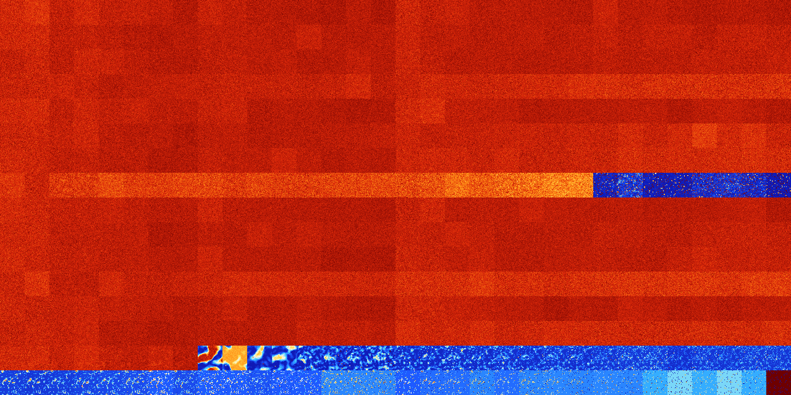

# B03567 (119296-119807)

<details>
    <summary>Initial Grid</summary>
    
</details>


<details>
    <summary>Initial Grid RLE</summary>

```
#C Exported from GoGoL (https://github.com/marrow16/gogol)
#C Wrap mode: Toroidal
#C Boundary mode: Dead
#C Step: 0
x = 100, y = 100, rule = B03567/S
15bo9bo$3b2o4bo3bo8bo9bobo5bo14bo4bo2bo$8bo28b2o16bo22bobo16bo$16bo57bo
16bo$3bo5bo38b2o33bo15bo$3bo33bo57bo$6bo6bo29bobo36bo$6bo4bo6bo33bo6bo
27bo2bo$12bo8bo6bo28bo$9bo10bo11bo49bo$31bo60bo$37bo11bo7bo17bo9bo$2b2o
42bo4bo16bo3bo10bo7bo6bo$23bo17bo25bo4bo5bo11bo6bo$3b2o52bo3bo2bo14bo
17bo$2bo4bo27bo9bo23bo$62bo20bo$15bo47bo2bo4bo$16bo45bo7b2obo$13bo12b2o
2bo28b2o6bo$12bo15bob2o12bobo38bo13bo$7bo16bo27bo16bo25bo2bo$55bo23bo$
44bo19bo$100b$9bo52bo6bo$3bo7bo25bo5bo17bo$67bo$7bo30bo22bo31bobo$2bo
29bo8bobo5bo8bo11bo17bo$25bobo2bo10bo28bo5bo$23bo19bo10bo18bo$25bo25bo
16bo8bo18bo$19bo9bo22bo$46bo14bo5bobo11bo17bo$7bo20bo20bo27bo13bo$2bo9b
o12bo17bo4bo45bo$21bo6bo26bo13bo$18bo12bo$7bo9bo36bo5bo26bo7bo$13bo10bo
16bo$35bo6bo13bo24bo$19bo3b2o2bo4b2o2bo42bo19bo$16bo39bo21bo$11bo20bo3b
o3bo2b2o6bo18bo5bo7bo$bo13bobo4bo11bo$39bo16bo2bo36bo$51bo10bo25bo8bo$
8bo3bo8bo20bo10bo7bo3bo10bo2bo$11bo14bo3bo9bo5bo6bo28bo$52bo4bo$bo7bo
27bo11bo5bo$50b2o2bo23bo7bo$7b2o10bo14bo$12bo11bobo14bo15bo$2bo16bo18bo
bo7bo$14bo9bo10bo20bo13bo26bo$7bo5bo16b2o36bo18bobo3bo$14bo4bo32bo33bo
7bo$18bo61bo11bo4bo$19bo23bo17bo29bo$bo31bo13bo22bo16bo$100b$29bo32bo
30bo$4bo24bo4bo21bo$54bobo15bo9bo14bo$15bo3bo54bo$3bo3bo24bo5bo19bo17bo
14bo2bo$2bo13bo44bo6bo28bo$4bo2bo27bo4bo18bo21bo2bobo$3bo28bo13bo$31bo
52bo$6bo14bo25bo12bo5bo8bo3bo11bobo3bo$3bo30bobo12bo8bo19bo$36bo18b2o
35bo$34bo7bo$10bo9bo38bo23bo$100b$45bo18bo11bo6b2o$77bo$31bo31bobo19bo
6bo$10bo26bo17bo27bo$46bo15bo12bo$10bo4bo37bo4bo$2bo12bo10bo7bo$42bo4bo
19bo$4bo9bo12bo4bo15bo5bo9bo34bo$3b3o36bo25bo11bo$7bo8bo18bo2bo3bo12b2o
5bo10bo21bo$19bo16bo28bo$19bo26bo2bo14bo10bo20bo$31bo13bo10bo7bo24bobo
7bo$37bo22bo14bo2bo5bo2bo$31bo42bo24bo$14bo42bo4bo7bo$66bo10bo2bo14bo$
10bo29bo44bo$26bo3bo4b2o12bo18bo2bo5bo$8bo18bo3b2o18bo$11bo8bo55bo7bo!
```
</details>
<details>
    <summary>Thumbnail</summary>

</details>
<table>
<tr>
    <td><a href="./119296%20S%20Heat%20Map%20Activity.png"></a><br>S (119296)<br>G>1000</td>    <td><a href="./119297%20S0%20Heat%20Map%20Activity.png"></a><br>S0 (119297)<br>G>1000</td>    <td><a href="./119298%20S1%20Heat%20Map%20Activity.png"></a><br>S1 (119298)<br>G>1000</td>    <td><a href="./119299%20S01%20Heat%20Map%20Activity.png"></a><br>S01 (119299)<br>G>1000</td>    <td><a href="./119300%20S2%20Heat%20Map%20Activity.png"></a><br>S2 (119300)<br>G>1000</td>    <td><a href="./119301%20S02%20Heat%20Map%20Activity.png"></a><br>S02 (119301)<br>G>1000</td>    <td><a href="./119302%20S12%20Heat%20Map%20Activity.png"></a><br>S12 (119302)<br>G>1000</td>    <td><a href="./119303%20S012%20Heat%20Map%20Activity.png"></a><br>S012 (119303)<br>G>1000</td>    <td><a href="./119304%20S3%20Heat%20Map%20Activity.png"></a><br>S3 (119304)<br>G>1000</td>    <td><a href="./119305%20S03%20Heat%20Map%20Activity.png"></a><br>S03 (119305)<br>G>1000</td>    <td><a href="./119306%20S13%20Heat%20Map%20Activity.png"></a><br>S13 (119306)<br>G>1000</td>    <td><a href="./119307%20S013%20Heat%20Map%20Activity.png"></a><br>S013 (119307)<br>G>1000</td>    <td><a href="./119308%20S23%20Heat%20Map%20Activity.png"></a><br>S23 (119308)<br>G>1000</td>    <td><a href="./119309%20S023%20Heat%20Map%20Activity.png"></a><br>S023 (119309)<br>G>1000</td>    <td><a href="./119310%20S123%20Heat%20Map%20Activity.png"></a><br>S123 (119310)<br>G>1000</td>    <td><a href="./119311%20S0123%20Heat%20Map%20Activity.png"></a><br>S0123 (119311)<br>G>1000</td>    <td><a href="./119312%20S4%20Heat%20Map%20Activity.png"></a><br>S4 (119312)<br>G>1000</td>    <td><a href="./119313%20S04%20Heat%20Map%20Activity.png"></a><br>S04 (119313)<br>G>1000</td>    <td><a href="./119314%20S14%20Heat%20Map%20Activity.png"></a><br>S14 (119314)<br>G>1000</td>    <td><a href="./119315%20S014%20Heat%20Map%20Activity.png"></a><br>S014 (119315)<br>G>1000</td>    <td><a href="./119316%20S24%20Heat%20Map%20Activity.png"></a><br>S24 (119316)<br>G>1000</td>    <td><a href="./119317%20S024%20Heat%20Map%20Activity.png"></a><br>S024 (119317)<br>G>1000</td>    <td><a href="./119318%20S124%20Heat%20Map%20Activity.png"></a><br>S124 (119318)<br>G>1000</td>    <td><a href="./119319%20S0124%20Heat%20Map%20Activity.png"></a><br>S0124 (119319)<br>G>1000</td>    <td><a href="./119320%20S34%20Heat%20Map%20Activity.png"></a><br>S34 (119320)<br>G>1000</td>    <td><a href="./119321%20S034%20Heat%20Map%20Activity.png"></a><br>S034 (119321)<br>G>1000</td>    <td><a href="./119322%20S134%20Heat%20Map%20Activity.png"></a><br>S134 (119322)<br>G>1000</td>    <td><a href="./119323%20S0134%20Heat%20Map%20Activity.png"></a><br>S0134 (119323)<br>G>1000</td>    <td><a href="./119324%20S234%20Heat%20Map%20Activity.png"></a><br>S234 (119324)<br>G>1000</td>    <td><a href="./119325%20S0234%20Heat%20Map%20Activity.png"></a><br>S0234 (119325)<br>G>1000</td>    <td><a href="./119326%20S1234%20Heat%20Map%20Activity.png"></a><br>S1234 (119326)<br>G>1000</td>    <td><a href="./119327%20S01234%20Heat%20Map%20Activity.png"></a><br>S01234 (119327)<br>G>1000</td></tr>
<tr>
    <td><a href="./119328%20S5%20Heat%20Map%20Activity.png"></a><br>S5 (119328)<br>G>1000</td>    <td><a href="./119329%20S05%20Heat%20Map%20Activity.png"></a><br>S05 (119329)<br>G>1000</td>    <td><a href="./119330%20S15%20Heat%20Map%20Activity.png"></a><br>S15 (119330)<br>G>1000</td>    <td><a href="./119331%20S015%20Heat%20Map%20Activity.png"></a><br>S015 (119331)<br>G>1000</td>    <td><a href="./119332%20S25%20Heat%20Map%20Activity.png"></a><br>S25 (119332)<br>G>1000</td>    <td><a href="./119333%20S025%20Heat%20Map%20Activity.png"></a><br>S025 (119333)<br>G>1000</td>    <td><a href="./119334%20S125%20Heat%20Map%20Activity.png"></a><br>S125 (119334)<br>G>1000</td>    <td><a href="./119335%20S0125%20Heat%20Map%20Activity.png"></a><br>S0125 (119335)<br>G>1000</td>    <td><a href="./119336%20S35%20Heat%20Map%20Activity.png"></a><br>S35 (119336)<br>G>1000</td>    <td><a href="./119337%20S035%20Heat%20Map%20Activity.png"></a><br>S035 (119337)<br>G>1000</td>    <td><a href="./119338%20S135%20Heat%20Map%20Activity.png"></a><br>S135 (119338)<br>G>1000</td>    <td><a href="./119339%20S0135%20Heat%20Map%20Activity.png"></a><br>S0135 (119339)<br>G>1000</td>    <td><a href="./119340%20S235%20Heat%20Map%20Activity.png"></a><br>S235 (119340)<br>G>1000</td>    <td><a href="./119341%20S0235%20Heat%20Map%20Activity.png"></a><br>S0235 (119341)<br>G>1000</td>    <td><a href="./119342%20S1235%20Heat%20Map%20Activity.png"></a><br>S1235 (119342)<br>G>1000</td>    <td><a href="./119343%20S01235%20Heat%20Map%20Activity.png"></a><br>S01235 (119343)<br>G>1000</td>    <td><a href="./119344%20S45%20Heat%20Map%20Activity.png"></a><br>S45 (119344)<br>G>1000</td>    <td><a href="./119345%20S045%20Heat%20Map%20Activity.png"></a><br>S045 (119345)<br>G>1000</td>    <td><a href="./119346%20S145%20Heat%20Map%20Activity.png"></a><br>S145 (119346)<br>G>1000</td>    <td><a href="./119347%20S0145%20Heat%20Map%20Activity.png"></a><br>S0145 (119347)<br>G>1000</td>    <td><a href="./119348%20S245%20Heat%20Map%20Activity.png"></a><br>S245 (119348)<br>G>1000</td>    <td><a href="./119349%20S0245%20Heat%20Map%20Activity.png"></a><br>S0245 (119349)<br>G>1000</td>    <td><a href="./119350%20S1245%20Heat%20Map%20Activity.png"></a><br>S1245 (119350)<br>G>1000</td>    <td><a href="./119351%20S01245%20Heat%20Map%20Activity.png"></a><br>S01245 (119351)<br>G>1000</td>    <td><a href="./119352%20S345%20Heat%20Map%20Activity.png"></a><br>S345 (119352)<br>G>1000</td>    <td><a href="./119353%20S0345%20Heat%20Map%20Activity.png"></a><br>S0345 (119353)<br>G>1000</td>    <td><a href="./119354%20S1345%20Heat%20Map%20Activity.png"></a><br>S1345 (119354)<br>G>1000</td>    <td><a href="./119355%20S01345%20Heat%20Map%20Activity.png"></a><br>S01345 (119355)<br>G>1000</td>    <td><a href="./119356%20S2345%20Heat%20Map%20Activity.png"></a><br>S2345 (119356)<br>G>1000</td>    <td><a href="./119357%20S02345%20Heat%20Map%20Activity.png"></a><br>S02345 (119357)<br>G>1000</td>    <td><a href="./119358%20S12345%20Heat%20Map%20Activity.png"></a><br>S12345 (119358)<br>G>1000</td>    <td><a href="./119359%20S012345%20Heat%20Map%20Activity.png"></a><br>S012345 (119359)<br>G>1000</td></tr>
<tr>
    <td><a href="./119360%20S6%20Heat%20Map%20Activity.png"></a><br>S6 (119360)<br>G>1000</td>    <td><a href="./119361%20S06%20Heat%20Map%20Activity.png"></a><br>S06 (119361)<br>G>1000</td>    <td><a href="./119362%20S16%20Heat%20Map%20Activity.png"></a><br>S16 (119362)<br>G>1000</td>    <td><a href="./119363%20S016%20Heat%20Map%20Activity.png"></a><br>S016 (119363)<br>G>1000</td>    <td><a href="./119364%20S26%20Heat%20Map%20Activity.png"></a><br>S26 (119364)<br>G>1000</td>    <td><a href="./119365%20S026%20Heat%20Map%20Activity.png"></a><br>S026 (119365)<br>G>1000</td>    <td><a href="./119366%20S126%20Heat%20Map%20Activity.png"></a><br>S126 (119366)<br>G>1000</td>    <td><a href="./119367%20S0126%20Heat%20Map%20Activity.png"></a><br>S0126 (119367)<br>G>1000</td>    <td><a href="./119368%20S36%20Heat%20Map%20Activity.png"></a><br>S36 (119368)<br>G>1000</td>    <td><a href="./119369%20S036%20Heat%20Map%20Activity.png"></a><br>S036 (119369)<br>G>1000</td>    <td><a href="./119370%20S136%20Heat%20Map%20Activity.png"></a><br>S136 (119370)<br>G>1000</td>    <td><a href="./119371%20S0136%20Heat%20Map%20Activity.png"></a><br>S0136 (119371)<br>G>1000</td>    <td><a href="./119372%20S236%20Heat%20Map%20Activity.png"></a><br>S236 (119372)<br>G>1000</td>    <td><a href="./119373%20S0236%20Heat%20Map%20Activity.png"></a><br>S0236 (119373)<br>G>1000</td>    <td><a href="./119374%20S1236%20Heat%20Map%20Activity.png"></a><br>S1236 (119374)<br>G>1000</td>    <td><a href="./119375%20S01236%20Heat%20Map%20Activity.png"></a><br>S01236 (119375)<br>G>1000</td>    <td><a href="./119376%20S46%20Heat%20Map%20Activity.png"></a><br>S46 (119376)<br>G>1000</td>    <td><a href="./119377%20S046%20Heat%20Map%20Activity.png"></a><br>S046 (119377)<br>G>1000</td>    <td><a href="./119378%20S146%20Heat%20Map%20Activity.png"></a><br>S146 (119378)<br>G>1000</td>    <td><a href="./119379%20S0146%20Heat%20Map%20Activity.png"></a><br>S0146 (119379)<br>G>1000</td>    <td><a href="./119380%20S246%20Heat%20Map%20Activity.png"></a><br>S246 (119380)<br>G>1000</td>    <td><a href="./119381%20S0246%20Heat%20Map%20Activity.png"></a><br>S0246 (119381)<br>G>1000</td>    <td><a href="./119382%20S1246%20Heat%20Map%20Activity.png"></a><br>S1246 (119382)<br>G>1000</td>    <td><a href="./119383%20S01246%20Heat%20Map%20Activity.png"></a><br>S01246 (119383)<br>G>1000</td>    <td><a href="./119384%20S346%20Heat%20Map%20Activity.png"></a><br>S346 (119384)<br>G>1000</td>    <td><a href="./119385%20S0346%20Heat%20Map%20Activity.png"></a><br>S0346 (119385)<br>G>1000</td>    <td><a href="./119386%20S1346%20Heat%20Map%20Activity.png"></a><br>S1346 (119386)<br>G>1000</td>    <td><a href="./119387%20S01346%20Heat%20Map%20Activity.png"></a><br>S01346 (119387)<br>G>1000</td>    <td><a href="./119388%20S2346%20Heat%20Map%20Activity.png"></a><br>S2346 (119388)<br>G>1000</td>    <td><a href="./119389%20S02346%20Heat%20Map%20Activity.png"></a><br>S02346 (119389)<br>G>1000</td>    <td><a href="./119390%20S12346%20Heat%20Map%20Activity.png"></a><br>S12346 (119390)<br>G>1000</td>    <td><a href="./119391%20S012346%20Heat%20Map%20Activity.png"></a><br>S012346 (119391)<br>G>1000</td></tr>
<tr>
    <td><a href="./119392%20S56%20Heat%20Map%20Activity.png"></a><br>S56 (119392)<br>G>1000</td>    <td><a href="./119393%20S056%20Heat%20Map%20Activity.png"></a><br>S056 (119393)<br>G>1000</td>    <td><a href="./119394%20S156%20Heat%20Map%20Activity.png"></a><br>S156 (119394)<br>G>1000</td>    <td><a href="./119395%20S0156%20Heat%20Map%20Activity.png"></a><br>S0156 (119395)<br>G>1000</td>    <td><a href="./119396%20S256%20Heat%20Map%20Activity.png"></a><br>S256 (119396)<br>G>1000</td>    <td><a href="./119397%20S0256%20Heat%20Map%20Activity.png"></a><br>S0256 (119397)<br>G>1000</td>    <td><a href="./119398%20S1256%20Heat%20Map%20Activity.png"></a><br>S1256 (119398)<br>G>1000</td>    <td><a href="./119399%20S01256%20Heat%20Map%20Activity.png"></a><br>S01256 (119399)<br>G>1000</td>    <td><a href="./119400%20S356%20Heat%20Map%20Activity.png"></a><br>S356 (119400)<br>G>1000</td>    <td><a href="./119401%20S0356%20Heat%20Map%20Activity.png"></a><br>S0356 (119401)<br>G>1000</td>    <td><a href="./119402%20S1356%20Heat%20Map%20Activity.png"></a><br>S1356 (119402)<br>G>1000</td>    <td><a href="./119403%20S01356%20Heat%20Map%20Activity.png"></a><br>S01356 (119403)<br>G>1000</td>    <td><a href="./119404%20S2356%20Heat%20Map%20Activity.png"></a><br>S2356 (119404)<br>G>1000</td>    <td><a href="./119405%20S02356%20Heat%20Map%20Activity.png"></a><br>S02356 (119405)<br>G>1000</td>    <td><a href="./119406%20S12356%20Heat%20Map%20Activity.png"></a><br>S12356 (119406)<br>G>1000</td>    <td><a href="./119407%20S012356%20Heat%20Map%20Activity.png"></a><br>S012356 (119407)<br>G>1000</td>    <td><a href="./119408%20S456%20Heat%20Map%20Activity.png"></a><br>S456 (119408)<br>G>1000</td>    <td><a href="./119409%20S0456%20Heat%20Map%20Activity.png"></a><br>S0456 (119409)<br>G>1000</td>    <td><a href="./119410%20S1456%20Heat%20Map%20Activity.png"></a><br>S1456 (119410)<br>G>1000</td>    <td><a href="./119411%20S01456%20Heat%20Map%20Activity.png"></a><br>S01456 (119411)<br>G>1000</td>    <td><a href="./119412%20S2456%20Heat%20Map%20Activity.png"></a><br>S2456 (119412)<br>G>1000</td>    <td><a href="./119413%20S02456%20Heat%20Map%20Activity.png"></a><br>S02456 (119413)<br>G>1000</td>    <td><a href="./119414%20S12456%20Heat%20Map%20Activity.png"></a><br>S12456 (119414)<br>G>1000</td>    <td><a href="./119415%20S012456%20Heat%20Map%20Activity.png"></a><br>S012456 (119415)<br>G>1000</td>    <td><a href="./119416%20S3456%20Heat%20Map%20Activity.png"></a><br>S3456 (119416)<br>G>1000</td>    <td><a href="./119417%20S03456%20Heat%20Map%20Activity.png"></a><br>S03456 (119417)<br>G>1000</td>    <td><a href="./119418%20S13456%20Heat%20Map%20Activity.png"></a><br>S13456 (119418)<br>G>1000</td>    <td><a href="./119419%20S013456%20Heat%20Map%20Activity.png"></a><br>S013456 (119419)<br>G>1000</td>    <td><a href="./119420%20S23456%20Heat%20Map%20Activity.png"></a><br>S23456 (119420)<br>G>1000</td>    <td><a href="./119421%20S023456%20Heat%20Map%20Activity.png"></a><br>S023456 (119421)<br>G>1000</td>    <td><a href="./119422%20S123456%20Heat%20Map%20Activity.png"></a><br>S123456 (119422)<br>G>1000</td>    <td><a href="./119423%20S0123456%20Heat%20Map%20Activity.png"></a><br>S0123456 (119423)<br>G>1000</td></tr>
<tr>
    <td><a href="./119424%20S7%20Heat%20Map%20Activity.png"></a><br>S7 (119424)<br>G>1000</td>    <td><a href="./119425%20S07%20Heat%20Map%20Activity.png"></a><br>S07 (119425)<br>G>1000</td>    <td><a href="./119426%20S17%20Heat%20Map%20Activity.png"></a><br>S17 (119426)<br>G>1000</td>    <td><a href="./119427%20S017%20Heat%20Map%20Activity.png"></a><br>S017 (119427)<br>G>1000</td>    <td><a href="./119428%20S27%20Heat%20Map%20Activity.png"></a><br>S27 (119428)<br>G>1000</td>    <td><a href="./119429%20S027%20Heat%20Map%20Activity.png"></a><br>S027 (119429)<br>G>1000</td>    <td><a href="./119430%20S127%20Heat%20Map%20Activity.png"></a><br>S127 (119430)<br>G>1000</td>    <td><a href="./119431%20S0127%20Heat%20Map%20Activity.png"></a><br>S0127 (119431)<br>G>1000</td>    <td><a href="./119432%20S37%20Heat%20Map%20Activity.png"></a><br>S37 (119432)<br>G>1000</td>    <td><a href="./119433%20S037%20Heat%20Map%20Activity.png"></a><br>S037 (119433)<br>G>1000</td>    <td><a href="./119434%20S137%20Heat%20Map%20Activity.png"></a><br>S137 (119434)<br>G>1000</td>    <td><a href="./119435%20S0137%20Heat%20Map%20Activity.png"></a><br>S0137 (119435)<br>G>1000</td>    <td><a href="./119436%20S237%20Heat%20Map%20Activity.png"></a><br>S237 (119436)<br>G>1000</td>    <td><a href="./119437%20S0237%20Heat%20Map%20Activity.png"></a><br>S0237 (119437)<br>G>1000</td>    <td><a href="./119438%20S1237%20Heat%20Map%20Activity.png"></a><br>S1237 (119438)<br>G>1000</td>    <td><a href="./119439%20S01237%20Heat%20Map%20Activity.png"></a><br>S01237 (119439)<br>G>1000</td>    <td><a href="./119440%20S47%20Heat%20Map%20Activity.png"></a><br>S47 (119440)<br>G>1000</td>    <td><a href="./119441%20S047%20Heat%20Map%20Activity.png"></a><br>S047 (119441)<br>G>1000</td>    <td><a href="./119442%20S147%20Heat%20Map%20Activity.png"></a><br>S147 (119442)<br>G>1000</td>    <td><a href="./119443%20S0147%20Heat%20Map%20Activity.png"></a><br>S0147 (119443)<br>G>1000</td>    <td><a href="./119444%20S247%20Heat%20Map%20Activity.png"></a><br>S247 (119444)<br>G>1000</td>    <td><a href="./119445%20S0247%20Heat%20Map%20Activity.png"></a><br>S0247 (119445)<br>G>1000</td>    <td><a href="./119446%20S1247%20Heat%20Map%20Activity.png"></a><br>S1247 (119446)<br>G>1000</td>    <td><a href="./119447%20S01247%20Heat%20Map%20Activity.png"></a><br>S01247 (119447)<br>G>1000</td>    <td><a href="./119448%20S347%20Heat%20Map%20Activity.png"></a><br>S347 (119448)<br>G>1000</td>    <td><a href="./119449%20S0347%20Heat%20Map%20Activity.png"></a><br>S0347 (119449)<br>G>1000</td>    <td><a href="./119450%20S1347%20Heat%20Map%20Activity.png"></a><br>S1347 (119450)<br>G>1000</td>    <td><a href="./119451%20S01347%20Heat%20Map%20Activity.png"></a><br>S01347 (119451)<br>G>1000</td>    <td><a href="./119452%20S2347%20Heat%20Map%20Activity.png"></a><br>S2347 (119452)<br>G>1000</td>    <td><a href="./119453%20S02347%20Heat%20Map%20Activity.png"></a><br>S02347 (119453)<br>G>1000</td>    <td><a href="./119454%20S12347%20Heat%20Map%20Activity.png"></a><br>S12347 (119454)<br>G>1000</td>    <td><a href="./119455%20S012347%20Heat%20Map%20Activity.png"></a><br>S012347 (119455)<br>G>1000</td></tr>
<tr>
    <td><a href="./119456%20S57%20Heat%20Map%20Activity.png"></a><br>S57 (119456)<br>G>1000</td>    <td><a href="./119457%20S057%20Heat%20Map%20Activity.png"></a><br>S057 (119457)<br>G>1000</td>    <td><a href="./119458%20S157%20Heat%20Map%20Activity.png"></a><br>S157 (119458)<br>G>1000</td>    <td><a href="./119459%20S0157%20Heat%20Map%20Activity.png"></a><br>S0157 (119459)<br>G>1000</td>    <td><a href="./119460%20S257%20Heat%20Map%20Activity.png"></a><br>S257 (119460)<br>G>1000</td>    <td><a href="./119461%20S0257%20Heat%20Map%20Activity.png"></a><br>S0257 (119461)<br>G>1000</td>    <td><a href="./119462%20S1257%20Heat%20Map%20Activity.png"></a><br>S1257 (119462)<br>G>1000</td>    <td><a href="./119463%20S01257%20Heat%20Map%20Activity.png"></a><br>S01257 (119463)<br>G>1000</td>    <td><a href="./119464%20S357%20Heat%20Map%20Activity.png"></a><br>S357 (119464)<br>G>1000</td>    <td><a href="./119465%20S0357%20Heat%20Map%20Activity.png"></a><br>S0357 (119465)<br>G>1000</td>    <td><a href="./119466%20S1357%20Heat%20Map%20Activity.png"></a><br>S1357 (119466)<br>G>1000</td>    <td><a href="./119467%20S01357%20Heat%20Map%20Activity.png"></a><br>S01357 (119467)<br>G>1000</td>    <td><a href="./119468%20S2357%20Heat%20Map%20Activity.png"></a><br>S2357 (119468)<br>G>1000</td>    <td><a href="./119469%20S02357%20Heat%20Map%20Activity.png"></a><br>S02357 (119469)<br>G>1000</td>    <td><a href="./119470%20S12357%20Heat%20Map%20Activity.png"></a><br>S12357 (119470)<br>G>1000</td>    <td><a href="./119471%20S012357%20Heat%20Map%20Activity.png"></a><br>S012357 (119471)<br>G>1000</td>    <td><a href="./119472%20S457%20Heat%20Map%20Activity.png"></a><br>S457 (119472)<br>G>1000</td>    <td><a href="./119473%20S0457%20Heat%20Map%20Activity.png"></a><br>S0457 (119473)<br>G>1000</td>    <td><a href="./119474%20S1457%20Heat%20Map%20Activity.png"></a><br>S1457 (119474)<br>G>1000</td>    <td><a href="./119475%20S01457%20Heat%20Map%20Activity.png"></a><br>S01457 (119475)<br>G>1000</td>    <td><a href="./119476%20S2457%20Heat%20Map%20Activity.png"></a><br>S2457 (119476)<br>G>1000</td>    <td><a href="./119477%20S02457%20Heat%20Map%20Activity.png"></a><br>S02457 (119477)<br>G>1000</td>    <td><a href="./119478%20S12457%20Heat%20Map%20Activity.png"></a><br>S12457 (119478)<br>G>1000</td>    <td><a href="./119479%20S012457%20Heat%20Map%20Activity.png"></a><br>S012457 (119479)<br>G>1000</td>    <td><a href="./119480%20S3457%20Heat%20Map%20Activity.png"></a><br>S3457 (119480)<br>G>1000</td>    <td><a href="./119481%20S03457%20Heat%20Map%20Activity.png"></a><br>S03457 (119481)<br>G>1000</td>    <td><a href="./119482%20S13457%20Heat%20Map%20Activity.png"></a><br>S13457 (119482)<br>G>1000</td>    <td><a href="./119483%20S013457%20Heat%20Map%20Activity.png"></a><br>S013457 (119483)<br>G>1000</td>    <td><a href="./119484%20S23457%20Heat%20Map%20Activity.png"></a><br>S23457 (119484)<br>G>1000</td>    <td><a href="./119485%20S023457%20Heat%20Map%20Activity.png"></a><br>S023457 (119485)<br>G>1000</td>    <td><a href="./119486%20S123457%20Heat%20Map%20Activity.png"></a><br>S123457 (119486)<br>G>1000</td>    <td><a href="./119487%20S0123457%20Heat%20Map%20Activity.png"></a><br>S0123457 (119487)<br>G>1000</td></tr>
<tr>
    <td><a href="./119488%20S67%20Heat%20Map%20Activity.png"></a><br>S67 (119488)<br>G>1000</td>    <td><a href="./119489%20S067%20Heat%20Map%20Activity.png"></a><br>S067 (119489)<br>G>1000</td>    <td><a href="./119490%20S167%20Heat%20Map%20Activity.png"></a><br>S167 (119490)<br>G>1000</td>    <td><a href="./119491%20S0167%20Heat%20Map%20Activity.png"></a><br>S0167 (119491)<br>G>1000</td>    <td><a href="./119492%20S267%20Heat%20Map%20Activity.png"></a><br>S267 (119492)<br>G>1000</td>    <td><a href="./119493%20S0267%20Heat%20Map%20Activity.png"></a><br>S0267 (119493)<br>G>1000</td>    <td><a href="./119494%20S1267%20Heat%20Map%20Activity.png"></a><br>S1267 (119494)<br>G>1000</td>    <td><a href="./119495%20S01267%20Heat%20Map%20Activity.png"></a><br>S01267 (119495)<br>G>1000</td>    <td><a href="./119496%20S367%20Heat%20Map%20Activity.png"></a><br>S367 (119496)<br>G>1000</td>    <td><a href="./119497%20S0367%20Heat%20Map%20Activity.png"></a><br>S0367 (119497)<br>G>1000</td>    <td><a href="./119498%20S1367%20Heat%20Map%20Activity.png"></a><br>S1367 (119498)<br>G>1000</td>    <td><a href="./119499%20S01367%20Heat%20Map%20Activity.png"></a><br>S01367 (119499)<br>G>1000</td>    <td><a href="./119500%20S2367%20Heat%20Map%20Activity.png"></a><br>S2367 (119500)<br>G>1000</td>    <td><a href="./119501%20S02367%20Heat%20Map%20Activity.png"></a><br>S02367 (119501)<br>G>1000</td>    <td><a href="./119502%20S12367%20Heat%20Map%20Activity.png"></a><br>S12367 (119502)<br>G>1000</td>    <td><a href="./119503%20S012367%20Heat%20Map%20Activity.png"></a><br>S012367 (119503)<br>G>1000</td>    <td><a href="./119504%20S467%20Heat%20Map%20Activity.png"></a><br>S467 (119504)<br>G>1000</td>    <td><a href="./119505%20S0467%20Heat%20Map%20Activity.png"></a><br>S0467 (119505)<br>G>1000</td>    <td><a href="./119506%20S1467%20Heat%20Map%20Activity.png"></a><br>S1467 (119506)<br>G>1000</td>    <td><a href="./119507%20S01467%20Heat%20Map%20Activity.png"></a><br>S01467 (119507)<br>G>1000</td>    <td><a href="./119508%20S2467%20Heat%20Map%20Activity.png"></a><br>S2467 (119508)<br>G>1000</td>    <td><a href="./119509%20S02467%20Heat%20Map%20Activity.png"></a><br>S02467 (119509)<br>G>1000</td>    <td><a href="./119510%20S12467%20Heat%20Map%20Activity.png"></a><br>S12467 (119510)<br>G>1000</td>    <td><a href="./119511%20S012467%20Heat%20Map%20Activity.png"></a><br>S012467 (119511)<br>G>1000</td>    <td><a href="./119512%20S3467%20Heat%20Map%20Activity.png"></a><br>S3467 (119512)<br>G>1000</td>    <td><a href="./119513%20S03467%20Heat%20Map%20Activity.png"></a><br>S03467 (119513)<br>G>1000</td>    <td><a href="./119514%20S13467%20Heat%20Map%20Activity.png"></a><br>S13467 (119514)<br>G>1000</td>    <td><a href="./119515%20S013467%20Heat%20Map%20Activity.png"></a><br>S013467 (119515)<br>G>1000</td>    <td><a href="./119516%20S23467%20Heat%20Map%20Activity.png"></a><br>S23467 (119516)<br>G>1000</td>    <td><a href="./119517%20S023467%20Heat%20Map%20Activity.png"></a><br>S023467 (119517)<br>G>1000</td>    <td><a href="./119518%20S123467%20Heat%20Map%20Activity.png"></a><br>S123467 (119518)<br>G>1000</td>    <td><a href="./119519%20S0123467%20Heat%20Map%20Activity.png"></a><br>S0123467 (119519)<br>G>1000</td></tr>
<tr>
    <td><a href="./119520%20S567%20Heat%20Map%20Activity.png"></a><br>S567 (119520)<br>G>1000</td>    <td><a href="./119521%20S0567%20Heat%20Map%20Activity.png"></a><br>S0567 (119521)<br>G>1000</td>    <td><a href="./119522%20S1567%20Heat%20Map%20Activity.png"></a><br>S1567 (119522)<br>G>1000</td>    <td><a href="./119523%20S01567%20Heat%20Map%20Activity.png"></a><br>S01567 (119523)<br>G>1000</td>    <td><a href="./119524%20S2567%20Heat%20Map%20Activity.png"></a><br>S2567 (119524)<br>G>1000</td>    <td><a href="./119525%20S02567%20Heat%20Map%20Activity.png"></a><br>S02567 (119525)<br>G>1000</td>    <td><a href="./119526%20S12567%20Heat%20Map%20Activity.png"></a><br>S12567 (119526)<br>G>1000</td>    <td><a href="./119527%20S012567%20Heat%20Map%20Activity.png"></a><br>S012567 (119527)<br>G>1000</td>    <td><a href="./119528%20S3567%20Heat%20Map%20Activity.png"></a><br>S3567 (119528)<br>G>1000</td>    <td><a href="./119529%20S03567%20Heat%20Map%20Activity.png"></a><br>S03567 (119529)<br>G>1000</td>    <td><a href="./119530%20S13567%20Heat%20Map%20Activity.png"></a><br>S13567 (119530)<br>G>1000</td>    <td><a href="./119531%20S013567%20Heat%20Map%20Activity.png"></a><br>S013567 (119531)<br>G>1000</td>    <td><a href="./119532%20S23567%20Heat%20Map%20Activity.png"></a><br>S23567 (119532)<br>G>1000</td>    <td><a href="./119533%20S023567%20Heat%20Map%20Activity.png"></a><br>S023567 (119533)<br>G>1000</td>    <td><a href="./119534%20S123567%20Heat%20Map%20Activity.png"></a><br>S123567 (119534)<br>G>1000</td>    <td><a href="./119535%20S0123567%20Heat%20Map%20Activity.png"></a><br>S0123567 (119535)<br>G>1000</td>    <td><a href="./119536%20S4567%20Heat%20Map%20Activity.png"></a><br>S4567 (119536)<br>G>1000</td>    <td><a href="./119537%20S04567%20Heat%20Map%20Activity.png"></a><br>S04567 (119537)<br>G>1000</td>    <td><a href="./119538%20S14567%20Heat%20Map%20Activity.png"></a><br>S14567 (119538)<br>G>1000</td>    <td><a href="./119539%20S014567%20Heat%20Map%20Activity.png"></a><br>S014567 (119539)<br>G>1000</td>    <td><a href="./119540%20S24567%20Heat%20Map%20Activity.png"></a><br>S24567 (119540)<br>G>1000</td>    <td><a href="./119541%20S024567%20Heat%20Map%20Activity.png"></a><br>S024567 (119541)<br>G>1000</td>    <td><a href="./119542%20S124567%20Heat%20Map%20Activity.png"></a><br>S124567 (119542)<br>G>1000</td>    <td><a href="./119543%20S0124567%20Heat%20Map%20Activity.png"></a><br>S0124567 (119543)<br>G>1000</td>    <td><a href="./119544%20S34567%20Heat%20Map%20Activity.png"></a><br>S34567 (119544)<br>R@488,p336</td>    <td><a href="./119545%20S034567%20Heat%20Map%20Activity.png"></a><br>S034567 (119545)<br>R@176,p12</td>    <td><a href="./119546%20S134567%20Heat%20Map%20Activity.png"></a><br>S134567 (119546)<br>G>1000</td>    <td><a href="./119547%20S0134567%20Heat%20Map%20Activity.png"></a><br>S0134567 (119547)<br>G>1000</td>    <td><a href="./119548%20S234567%20Heat%20Map%20Activity.png"></a><br>S234567 (119548)<br>R@105,p60</td>    <td><a href="./119549%20S0234567%20Heat%20Map%20Activity.png"></a><br>S0234567 (119549)<br>R@85,p42</td>    <td><a href="./119550%20S1234567%20Heat%20Map%20Activity.png"></a><br>S1234567 (119550)<br>R@128,p84</td>    <td><a href="./119551%20S01234567%20Heat%20Map%20Activity.png"></a><br>S01234567 (119551)<br>G>1000</td></tr>
<tr>
    <td><a href="./119552%20S8%20Heat%20Map%20Activity.png"></a><br>S8 (119552)<br>G>1000</td>    <td><a href="./119553%20S08%20Heat%20Map%20Activity.png"></a><br>S08 (119553)<br>G>1000</td>    <td><a href="./119554%20S18%20Heat%20Map%20Activity.png"></a><br>S18 (119554)<br>G>1000</td>    <td><a href="./119555%20S018%20Heat%20Map%20Activity.png"></a><br>S018 (119555)<br>G>1000</td>    <td><a href="./119556%20S28%20Heat%20Map%20Activity.png"></a><br>S28 (119556)<br>G>1000</td>    <td><a href="./119557%20S028%20Heat%20Map%20Activity.png"></a><br>S028 (119557)<br>G>1000</td>    <td><a href="./119558%20S128%20Heat%20Map%20Activity.png"></a><br>S128 (119558)<br>G>1000</td>    <td><a href="./119559%20S0128%20Heat%20Map%20Activity.png"></a><br>S0128 (119559)<br>G>1000</td>    <td><a href="./119560%20S38%20Heat%20Map%20Activity.png"></a><br>S38 (119560)<br>G>1000</td>    <td><a href="./119561%20S038%20Heat%20Map%20Activity.png"></a><br>S038 (119561)<br>G>1000</td>    <td><a href="./119562%20S138%20Heat%20Map%20Activity.png"></a><br>S138 (119562)<br>G>1000</td>    <td><a href="./119563%20S0138%20Heat%20Map%20Activity.png"></a><br>S0138 (119563)<br>G>1000</td>    <td><a href="./119564%20S238%20Heat%20Map%20Activity.png"></a><br>S238 (119564)<br>G>1000</td>    <td><a href="./119565%20S0238%20Heat%20Map%20Activity.png"></a><br>S0238 (119565)<br>G>1000</td>    <td><a href="./119566%20S1238%20Heat%20Map%20Activity.png"></a><br>S1238 (119566)<br>G>1000</td>    <td><a href="./119567%20S01238%20Heat%20Map%20Activity.png"></a><br>S01238 (119567)<br>G>1000</td>    <td><a href="./119568%20S48%20Heat%20Map%20Activity.png"></a><br>S48 (119568)<br>G>1000</td>    <td><a href="./119569%20S048%20Heat%20Map%20Activity.png"></a><br>S048 (119569)<br>G>1000</td>    <td><a href="./119570%20S148%20Heat%20Map%20Activity.png"></a><br>S148 (119570)<br>G>1000</td>    <td><a href="./119571%20S0148%20Heat%20Map%20Activity.png"></a><br>S0148 (119571)<br>G>1000</td>    <td><a href="./119572%20S248%20Heat%20Map%20Activity.png"></a><br>S248 (119572)<br>G>1000</td>    <td><a href="./119573%20S0248%20Heat%20Map%20Activity.png"></a><br>S0248 (119573)<br>G>1000</td>    <td><a href="./119574%20S1248%20Heat%20Map%20Activity.png"></a><br>S1248 (119574)<br>G>1000</td>    <td><a href="./119575%20S01248%20Heat%20Map%20Activity.png"></a><br>S01248 (119575)<br>G>1000</td>    <td><a href="./119576%20S348%20Heat%20Map%20Activity.png"></a><br>S348 (119576)<br>G>1000</td>    <td><a href="./119577%20S0348%20Heat%20Map%20Activity.png"></a><br>S0348 (119577)<br>G>1000</td>    <td><a href="./119578%20S1348%20Heat%20Map%20Activity.png"></a><br>S1348 (119578)<br>G>1000</td>    <td><a href="./119579%20S01348%20Heat%20Map%20Activity.png"></a><br>S01348 (119579)<br>G>1000</td>    <td><a href="./119580%20S2348%20Heat%20Map%20Activity.png"></a><br>S2348 (119580)<br>G>1000</td>    <td><a href="./119581%20S02348%20Heat%20Map%20Activity.png"></a><br>S02348 (119581)<br>G>1000</td>    <td><a href="./119582%20S12348%20Heat%20Map%20Activity.png"></a><br>S12348 (119582)<br>G>1000</td>    <td><a href="./119583%20S012348%20Heat%20Map%20Activity.png"></a><br>S012348 (119583)<br>G>1000</td></tr>
<tr>
    <td><a href="./119584%20S58%20Heat%20Map%20Activity.png"></a><br>S58 (119584)<br>G>1000</td>    <td><a href="./119585%20S058%20Heat%20Map%20Activity.png"></a><br>S058 (119585)<br>G>1000</td>    <td><a href="./119586%20S158%20Heat%20Map%20Activity.png"></a><br>S158 (119586)<br>G>1000</td>    <td><a href="./119587%20S0158%20Heat%20Map%20Activity.png"></a><br>S0158 (119587)<br>G>1000</td>    <td><a href="./119588%20S258%20Heat%20Map%20Activity.png"></a><br>S258 (119588)<br>G>1000</td>    <td><a href="./119589%20S0258%20Heat%20Map%20Activity.png"></a><br>S0258 (119589)<br>G>1000</td>    <td><a href="./119590%20S1258%20Heat%20Map%20Activity.png"></a><br>S1258 (119590)<br>G>1000</td>    <td><a href="./119591%20S01258%20Heat%20Map%20Activity.png"></a><br>S01258 (119591)<br>G>1000</td>    <td><a href="./119592%20S358%20Heat%20Map%20Activity.png"></a><br>S358 (119592)<br>G>1000</td>    <td><a href="./119593%20S0358%20Heat%20Map%20Activity.png"></a><br>S0358 (119593)<br>G>1000</td>    <td><a href="./119594%20S1358%20Heat%20Map%20Activity.png"></a><br>S1358 (119594)<br>G>1000</td>    <td><a href="./119595%20S01358%20Heat%20Map%20Activity.png"></a><br>S01358 (119595)<br>G>1000</td>    <td><a href="./119596%20S2358%20Heat%20Map%20Activity.png"></a><br>S2358 (119596)<br>G>1000</td>    <td><a href="./119597%20S02358%20Heat%20Map%20Activity.png"></a><br>S02358 (119597)<br>G>1000</td>    <td><a href="./119598%20S12358%20Heat%20Map%20Activity.png"></a><br>S12358 (119598)<br>G>1000</td>    <td><a href="./119599%20S012358%20Heat%20Map%20Activity.png"></a><br>S012358 (119599)<br>G>1000</td>    <td><a href="./119600%20S458%20Heat%20Map%20Activity.png"></a><br>S458 (119600)<br>G>1000</td>    <td><a href="./119601%20S0458%20Heat%20Map%20Activity.png"></a><br>S0458 (119601)<br>G>1000</td>    <td><a href="./119602%20S1458%20Heat%20Map%20Activity.png"></a><br>S1458 (119602)<br>G>1000</td>    <td><a href="./119603%20S01458%20Heat%20Map%20Activity.png"></a><br>S01458 (119603)<br>G>1000</td>    <td><a href="./119604%20S2458%20Heat%20Map%20Activity.png"></a><br>S2458 (119604)<br>G>1000</td>    <td><a href="./119605%20S02458%20Heat%20Map%20Activity.png"></a><br>S02458 (119605)<br>G>1000</td>    <td><a href="./119606%20S12458%20Heat%20Map%20Activity.png"></a><br>S12458 (119606)<br>G>1000</td>    <td><a href="./119607%20S012458%20Heat%20Map%20Activity.png"></a><br>S012458 (119607)<br>G>1000</td>    <td><a href="./119608%20S3458%20Heat%20Map%20Activity.png"></a><br>S3458 (119608)<br>G>1000</td>    <td><a href="./119609%20S03458%20Heat%20Map%20Activity.png"></a><br>S03458 (119609)<br>G>1000</td>    <td><a href="./119610%20S13458%20Heat%20Map%20Activity.png"></a><br>S13458 (119610)<br>G>1000</td>    <td><a href="./119611%20S013458%20Heat%20Map%20Activity.png"></a><br>S013458 (119611)<br>G>1000</td>    <td><a href="./119612%20S23458%20Heat%20Map%20Activity.png"></a><br>S23458 (119612)<br>G>1000</td>    <td><a href="./119613%20S023458%20Heat%20Map%20Activity.png"></a><br>S023458 (119613)<br>G>1000</td>    <td><a href="./119614%20S123458%20Heat%20Map%20Activity.png"></a><br>S123458 (119614)<br>G>1000</td>    <td><a href="./119615%20S0123458%20Heat%20Map%20Activity.png"></a><br>S0123458 (119615)<br>G>1000</td></tr>
<tr>
    <td><a href="./119616%20S68%20Heat%20Map%20Activity.png"></a><br>S68 (119616)<br>G>1000</td>    <td><a href="./119617%20S068%20Heat%20Map%20Activity.png"></a><br>S068 (119617)<br>G>1000</td>    <td><a href="./119618%20S168%20Heat%20Map%20Activity.png"></a><br>S168 (119618)<br>G>1000</td>    <td><a href="./119619%20S0168%20Heat%20Map%20Activity.png"></a><br>S0168 (119619)<br>G>1000</td>    <td><a href="./119620%20S268%20Heat%20Map%20Activity.png"></a><br>S268 (119620)<br>G>1000</td>    <td><a href="./119621%20S0268%20Heat%20Map%20Activity.png"></a><br>S0268 (119621)<br>G>1000</td>    <td><a href="./119622%20S1268%20Heat%20Map%20Activity.png"></a><br>S1268 (119622)<br>G>1000</td>    <td><a href="./119623%20S01268%20Heat%20Map%20Activity.png"></a><br>S01268 (119623)<br>G>1000</td>    <td><a href="./119624%20S368%20Heat%20Map%20Activity.png"></a><br>S368 (119624)<br>G>1000</td>    <td><a href="./119625%20S0368%20Heat%20Map%20Activity.png"></a><br>S0368 (119625)<br>G>1000</td>    <td><a href="./119626%20S1368%20Heat%20Map%20Activity.png"></a><br>S1368 (119626)<br>G>1000</td>    <td><a href="./119627%20S01368%20Heat%20Map%20Activity.png"></a><br>S01368 (119627)<br>G>1000</td>    <td><a href="./119628%20S2368%20Heat%20Map%20Activity.png"></a><br>S2368 (119628)<br>G>1000</td>    <td><a href="./119629%20S02368%20Heat%20Map%20Activity.png"></a><br>S02368 (119629)<br>G>1000</td>    <td><a href="./119630%20S12368%20Heat%20Map%20Activity.png"></a><br>S12368 (119630)<br>G>1000</td>    <td><a href="./119631%20S012368%20Heat%20Map%20Activity.png"></a><br>S012368 (119631)<br>G>1000</td>    <td><a href="./119632%20S468%20Heat%20Map%20Activity.png"></a><br>S468 (119632)<br>G>1000</td>    <td><a href="./119633%20S0468%20Heat%20Map%20Activity.png"></a><br>S0468 (119633)<br>G>1000</td>    <td><a href="./119634%20S1468%20Heat%20Map%20Activity.png"></a><br>S1468 (119634)<br>G>1000</td>    <td><a href="./119635%20S01468%20Heat%20Map%20Activity.png"></a><br>S01468 (119635)<br>G>1000</td>    <td><a href="./119636%20S2468%20Heat%20Map%20Activity.png"></a><br>S2468 (119636)<br>G>1000</td>    <td><a href="./119637%20S02468%20Heat%20Map%20Activity.png"></a><br>S02468 (119637)<br>G>1000</td>    <td><a href="./119638%20S12468%20Heat%20Map%20Activity.png"></a><br>S12468 (119638)<br>G>1000</td>    <td><a href="./119639%20S012468%20Heat%20Map%20Activity.png"></a><br>S012468 (119639)<br>G>1000</td>    <td><a href="./119640%20S3468%20Heat%20Map%20Activity.png"></a><br>S3468 (119640)<br>G>1000</td>    <td><a href="./119641%20S03468%20Heat%20Map%20Activity.png"></a><br>S03468 (119641)<br>G>1000</td>    <td><a href="./119642%20S13468%20Heat%20Map%20Activity.png"></a><br>S13468 (119642)<br>G>1000</td>    <td><a href="./119643%20S013468%20Heat%20Map%20Activity.png"></a><br>S013468 (119643)<br>G>1000</td>    <td><a href="./119644%20S23468%20Heat%20Map%20Activity.png"></a><br>S23468 (119644)<br>G>1000</td>    <td><a href="./119645%20S023468%20Heat%20Map%20Activity.png"></a><br>S023468 (119645)<br>G>1000</td>    <td><a href="./119646%20S123468%20Heat%20Map%20Activity.png"></a><br>S123468 (119646)<br>G>1000</td>    <td><a href="./119647%20S0123468%20Heat%20Map%20Activity.png"></a><br>S0123468 (119647)<br>G>1000</td></tr>
<tr>
    <td><a href="./119648%20S568%20Heat%20Map%20Activity.png"></a><br>S568 (119648)<br>G>1000</td>    <td><a href="./119649%20S0568%20Heat%20Map%20Activity.png"></a><br>S0568 (119649)<br>G>1000</td>    <td><a href="./119650%20S1568%20Heat%20Map%20Activity.png"></a><br>S1568 (119650)<br>G>1000</td>    <td><a href="./119651%20S01568%20Heat%20Map%20Activity.png"></a><br>S01568 (119651)<br>G>1000</td>    <td><a href="./119652%20S2568%20Heat%20Map%20Activity.png"></a><br>S2568 (119652)<br>G>1000</td>    <td><a href="./119653%20S02568%20Heat%20Map%20Activity.png"></a><br>S02568 (119653)<br>G>1000</td>    <td><a href="./119654%20S12568%20Heat%20Map%20Activity.png"></a><br>S12568 (119654)<br>G>1000</td>    <td><a href="./119655%20S012568%20Heat%20Map%20Activity.png"></a><br>S012568 (119655)<br>G>1000</td>    <td><a href="./119656%20S3568%20Heat%20Map%20Activity.png"></a><br>S3568 (119656)<br>G>1000</td>    <td><a href="./119657%20S03568%20Heat%20Map%20Activity.png"></a><br>S03568 (119657)<br>G>1000</td>    <td><a href="./119658%20S13568%20Heat%20Map%20Activity.png"></a><br>S13568 (119658)<br>G>1000</td>    <td><a href="./119659%20S013568%20Heat%20Map%20Activity.png"></a><br>S013568 (119659)<br>G>1000</td>    <td><a href="./119660%20S23568%20Heat%20Map%20Activity.png"></a><br>S23568 (119660)<br>G>1000</td>    <td><a href="./119661%20S023568%20Heat%20Map%20Activity.png"></a><br>S023568 (119661)<br>G>1000</td>    <td><a href="./119662%20S123568%20Heat%20Map%20Activity.png"></a><br>S123568 (119662)<br>G>1000</td>    <td><a href="./119663%20S0123568%20Heat%20Map%20Activity.png"></a><br>S0123568 (119663)<br>G>1000</td>    <td><a href="./119664%20S4568%20Heat%20Map%20Activity.png"></a><br>S4568 (119664)<br>G>1000</td>    <td><a href="./119665%20S04568%20Heat%20Map%20Activity.png"></a><br>S04568 (119665)<br>G>1000</td>    <td><a href="./119666%20S14568%20Heat%20Map%20Activity.png"></a><br>S14568 (119666)<br>G>1000</td>    <td><a href="./119667%20S014568%20Heat%20Map%20Activity.png"></a><br>S014568 (119667)<br>G>1000</td>    <td><a href="./119668%20S24568%20Heat%20Map%20Activity.png"></a><br>S24568 (119668)<br>G>1000</td>    <td><a href="./119669%20S024568%20Heat%20Map%20Activity.png"></a><br>S024568 (119669)<br>G>1000</td>    <td><a href="./119670%20S124568%20Heat%20Map%20Activity.png"></a><br>S124568 (119670)<br>G>1000</td>    <td><a href="./119671%20S0124568%20Heat%20Map%20Activity.png"></a><br>S0124568 (119671)<br>G>1000</td>    <td><a href="./119672%20S34568%20Heat%20Map%20Activity.png"></a><br>S34568 (119672)<br>G>1000</td>    <td><a href="./119673%20S034568%20Heat%20Map%20Activity.png"></a><br>S034568 (119673)<br>G>1000</td>    <td><a href="./119674%20S134568%20Heat%20Map%20Activity.png"></a><br>S134568 (119674)<br>G>1000</td>    <td><a href="./119675%20S0134568%20Heat%20Map%20Activity.png"></a><br>S0134568 (119675)<br>G>1000</td>    <td><a href="./119676%20S234568%20Heat%20Map%20Activity.png"></a><br>S234568 (119676)<br>G>1000</td>    <td><a href="./119677%20S0234568%20Heat%20Map%20Activity.png"></a><br>S0234568 (119677)<br>G>1000</td>    <td><a href="./119678%20S1234568%20Heat%20Map%20Activity.png"></a><br>S1234568 (119678)<br>G>1000</td>    <td><a href="./119679%20S01234568%20Heat%20Map%20Activity.png"></a><br>S01234568 (119679)<br>G>1000</td></tr>
<tr>
    <td><a href="./119680%20S78%20Heat%20Map%20Activity.png"></a><br>S78 (119680)<br>G>1000</td>    <td><a href="./119681%20S078%20Heat%20Map%20Activity.png"></a><br>S078 (119681)<br>G>1000</td>    <td><a href="./119682%20S178%20Heat%20Map%20Activity.png"></a><br>S178 (119682)<br>G>1000</td>    <td><a href="./119683%20S0178%20Heat%20Map%20Activity.png"></a><br>S0178 (119683)<br>G>1000</td>    <td><a href="./119684%20S278%20Heat%20Map%20Activity.png"></a><br>S278 (119684)<br>G>1000</td>    <td><a href="./119685%20S0278%20Heat%20Map%20Activity.png"></a><br>S0278 (119685)<br>G>1000</td>    <td><a href="./119686%20S1278%20Heat%20Map%20Activity.png"></a><br>S1278 (119686)<br>G>1000</td>    <td><a href="./119687%20S01278%20Heat%20Map%20Activity.png"></a><br>S01278 (119687)<br>G>1000</td>    <td><a href="./119688%20S378%20Heat%20Map%20Activity.png"></a><br>S378 (119688)<br>G>1000</td>    <td><a href="./119689%20S0378%20Heat%20Map%20Activity.png"></a><br>S0378 (119689)<br>G>1000</td>    <td><a href="./119690%20S1378%20Heat%20Map%20Activity.png"></a><br>S1378 (119690)<br>G>1000</td>    <td><a href="./119691%20S01378%20Heat%20Map%20Activity.png"></a><br>S01378 (119691)<br>G>1000</td>    <td><a href="./119692%20S2378%20Heat%20Map%20Activity.png"></a><br>S2378 (119692)<br>G>1000</td>    <td><a href="./119693%20S02378%20Heat%20Map%20Activity.png"></a><br>S02378 (119693)<br>G>1000</td>    <td><a href="./119694%20S12378%20Heat%20Map%20Activity.png"></a><br>S12378 (119694)<br>G>1000</td>    <td><a href="./119695%20S012378%20Heat%20Map%20Activity.png"></a><br>S012378 (119695)<br>G>1000</td>    <td><a href="./119696%20S478%20Heat%20Map%20Activity.png"></a><br>S478 (119696)<br>G>1000</td>    <td><a href="./119697%20S0478%20Heat%20Map%20Activity.png"></a><br>S0478 (119697)<br>G>1000</td>    <td><a href="./119698%20S1478%20Heat%20Map%20Activity.png"></a><br>S1478 (119698)<br>G>1000</td>    <td><a href="./119699%20S01478%20Heat%20Map%20Activity.png"></a><br>S01478 (119699)<br>G>1000</td>    <td><a href="./119700%20S2478%20Heat%20Map%20Activity.png"></a><br>S2478 (119700)<br>G>1000</td>    <td><a href="./119701%20S02478%20Heat%20Map%20Activity.png"></a><br>S02478 (119701)<br>G>1000</td>    <td><a href="./119702%20S12478%20Heat%20Map%20Activity.png"></a><br>S12478 (119702)<br>G>1000</td>    <td><a href="./119703%20S012478%20Heat%20Map%20Activity.png"></a><br>S012478 (119703)<br>G>1000</td>    <td><a href="./119704%20S3478%20Heat%20Map%20Activity.png"></a><br>S3478 (119704)<br>G>1000</td>    <td><a href="./119705%20S03478%20Heat%20Map%20Activity.png"></a><br>S03478 (119705)<br>G>1000</td>    <td><a href="./119706%20S13478%20Heat%20Map%20Activity.png"></a><br>S13478 (119706)<br>G>1000</td>    <td><a href="./119707%20S013478%20Heat%20Map%20Activity.png"></a><br>S013478 (119707)<br>G>1000</td>    <td><a href="./119708%20S23478%20Heat%20Map%20Activity.png"></a><br>S23478 (119708)<br>G>1000</td>    <td><a href="./119709%20S023478%20Heat%20Map%20Activity.png"></a><br>S023478 (119709)<br>G>1000</td>    <td><a href="./119710%20S123478%20Heat%20Map%20Activity.png"></a><br>S123478 (119710)<br>G>1000</td>    <td><a href="./119711%20S0123478%20Heat%20Map%20Activity.png"></a><br>S0123478 (119711)<br>G>1000</td></tr>
<tr>
    <td><a href="./119712%20S578%20Heat%20Map%20Activity.png"></a><br>S578 (119712)<br>G>1000</td>    <td><a href="./119713%20S0578%20Heat%20Map%20Activity.png"></a><br>S0578 (119713)<br>G>1000</td>    <td><a href="./119714%20S1578%20Heat%20Map%20Activity.png"></a><br>S1578 (119714)<br>G>1000</td>    <td><a href="./119715%20S01578%20Heat%20Map%20Activity.png"></a><br>S01578 (119715)<br>G>1000</td>    <td><a href="./119716%20S2578%20Heat%20Map%20Activity.png"></a><br>S2578 (119716)<br>G>1000</td>    <td><a href="./119717%20S02578%20Heat%20Map%20Activity.png"></a><br>S02578 (119717)<br>G>1000</td>    <td><a href="./119718%20S12578%20Heat%20Map%20Activity.png"></a><br>S12578 (119718)<br>G>1000</td>    <td><a href="./119719%20S012578%20Heat%20Map%20Activity.png"></a><br>S012578 (119719)<br>G>1000</td>    <td><a href="./119720%20S3578%20Heat%20Map%20Activity.png"></a><br>S3578 (119720)<br>G>1000</td>    <td><a href="./119721%20S03578%20Heat%20Map%20Activity.png"></a><br>S03578 (119721)<br>G>1000</td>    <td><a href="./119722%20S13578%20Heat%20Map%20Activity.png"></a><br>S13578 (119722)<br>G>1000</td>    <td><a href="./119723%20S013578%20Heat%20Map%20Activity.png"></a><br>S013578 (119723)<br>G>1000</td>    <td><a href="./119724%20S23578%20Heat%20Map%20Activity.png"></a><br>S23578 (119724)<br>G>1000</td>    <td><a href="./119725%20S023578%20Heat%20Map%20Activity.png"></a><br>S023578 (119725)<br>G>1000</td>    <td><a href="./119726%20S123578%20Heat%20Map%20Activity.png"></a><br>S123578 (119726)<br>G>1000</td>    <td><a href="./119727%20S0123578%20Heat%20Map%20Activity.png"></a><br>S0123578 (119727)<br>G>1000</td>    <td><a href="./119728%20S4578%20Heat%20Map%20Activity.png"></a><br>S4578 (119728)<br>G>1000</td>    <td><a href="./119729%20S04578%20Heat%20Map%20Activity.png"></a><br>S04578 (119729)<br>G>1000</td>    <td><a href="./119730%20S14578%20Heat%20Map%20Activity.png"></a><br>S14578 (119730)<br>G>1000</td>    <td><a href="./119731%20S014578%20Heat%20Map%20Activity.png"></a><br>S014578 (119731)<br>G>1000</td>    <td><a href="./119732%20S24578%20Heat%20Map%20Activity.png"></a><br>S24578 (119732)<br>G>1000</td>    <td><a href="./119733%20S024578%20Heat%20Map%20Activity.png"></a><br>S024578 (119733)<br>G>1000</td>    <td><a href="./119734%20S124578%20Heat%20Map%20Activity.png"></a><br>S124578 (119734)<br>G>1000</td>    <td><a href="./119735%20S0124578%20Heat%20Map%20Activity.png"></a><br>S0124578 (119735)<br>G>1000</td>    <td><a href="./119736%20S34578%20Heat%20Map%20Activity.png"></a><br>S34578 (119736)<br>G>1000</td>    <td><a href="./119737%20S034578%20Heat%20Map%20Activity.png"></a><br>S034578 (119737)<br>G>1000</td>    <td><a href="./119738%20S134578%20Heat%20Map%20Activity.png"></a><br>S134578 (119738)<br>G>1000</td>    <td><a href="./119739%20S0134578%20Heat%20Map%20Activity.png"></a><br>S0134578 (119739)<br>G>1000</td>    <td><a href="./119740%20S234578%20Heat%20Map%20Activity.png"></a><br>S234578 (119740)<br>G>1000</td>    <td><a href="./119741%20S0234578%20Heat%20Map%20Activity.png"></a><br>S0234578 (119741)<br>G>1000</td>    <td><a href="./119742%20S1234578%20Heat%20Map%20Activity.png"></a><br>S1234578 (119742)<br>G>1000</td>    <td><a href="./119743%20S01234578%20Heat%20Map%20Activity.png"></a><br>S01234578 (119743)<br>G>1000</td></tr>
<tr>
    <td><a href="./119744%20S678%20Heat%20Map%20Activity.png"></a><br>S678 (119744)<br>G>1000</td>    <td><a href="./119745%20S0678%20Heat%20Map%20Activity.png"></a><br>S0678 (119745)<br>G>1000</td>    <td><a href="./119746%20S1678%20Heat%20Map%20Activity.png"></a><br>S1678 (119746)<br>G>1000</td>    <td><a href="./119747%20S01678%20Heat%20Map%20Activity.png"></a><br>S01678 (119747)<br>G>1000</td>    <td><a href="./119748%20S2678%20Heat%20Map%20Activity.png"></a><br>S2678 (119748)<br>G>1000</td>    <td><a href="./119749%20S02678%20Heat%20Map%20Activity.png"></a><br>S02678 (119749)<br>G>1000</td>    <td><a href="./119750%20S12678%20Heat%20Map%20Activity.png"></a><br>S12678 (119750)<br>G>1000</td>    <td><a href="./119751%20S012678%20Heat%20Map%20Activity.png"></a><br>S012678 (119751)<br>G>1000</td>    <td><a href="./119752%20S3678%20Heat%20Map%20Activity.png"></a><br>S3678 (119752)<br>G>1000</td>    <td><a href="./119753%20S03678%20Heat%20Map%20Activity.png"></a><br>S03678 (119753)<br>G>1000</td>    <td><a href="./119754%20S13678%20Heat%20Map%20Activity.png"></a><br>S13678 (119754)<br>R@540,p4</td>    <td><a href="./119755%20S013678%20Heat%20Map%20Activity.png"></a><br>S013678 (119755)<br>R@509,p4</td>    <td><a href="./119756%20S23678%20Heat%20Map%20Activity.png"></a><br>S23678 (119756)<br>R@111,p4</td>    <td><a href="./119757%20S023678%20Heat%20Map%20Activity.png"></a><br>S023678 (119757)<br>R@122,p4</td>    <td><a href="./119758%20S123678%20Heat%20Map%20Activity.png"></a><br>S123678 (119758)<br>R@90,p4</td>    <td><a href="./119759%20S0123678%20Heat%20Map%20Activity.png"></a><br>S0123678 (119759)<br>R@85,p4</td>    <td><a href="./119760%20S4678%20Heat%20Map%20Activity.png"></a><br>S4678 (119760)<br>R@34,p4</td>    <td><a href="./119761%20S04678%20Heat%20Map%20Activity.png"></a><br>S04678 (119761)<br>R@34,p4</td>    <td><a href="./119762%20S14678%20Heat%20Map%20Activity.png"></a><br>S14678 (119762)<br>R@26,p4</td>    <td><a href="./119763%20S014678%20Heat%20Map%20Activity.png"></a><br>S014678 (119763)<br>R@30,p4</td>    <td><a href="./119764%20S24678%20Heat%20Map%20Activity.png"></a><br>S24678 (119764)<br>R@22,p4</td>    <td><a href="./119765%20S024678%20Heat%20Map%20Activity.png"></a><br>S024678 (119765)<br>R@26,p4</td>    <td><a href="./119766%20S124678%20Heat%20Map%20Activity.png"></a><br>S124678 (119766)<br>R@21,p4</td>    <td><a href="./119767%20S0124678%20Heat%20Map%20Activity.png"></a><br>S0124678 (119767)<br>R@25,p4</td>    <td><a href="./119768%20S34678%20Heat%20Map%20Activity.png"></a><br>S34678 (119768)<br>R@19,p4</td>    <td><a href="./119769%20S034678%20Heat%20Map%20Activity.png"></a><br>S034678 (119769)<br>R@18,p4</td>    <td><a href="./119770%20S134678%20Heat%20Map%20Activity.png"></a><br>S134678 (119770)<br>R@16,p4</td>    <td><a href="./119771%20S0134678%20Heat%20Map%20Activity.png"></a><br>S0134678 (119771)<br>R@22,p4</td>    <td><a href="./119772%20S234678%20Heat%20Map%20Activity.png"></a><br>S234678 (119772)<br>R@17,p4</td>    <td><a href="./119773%20S0234678%20Heat%20Map%20Activity.png"></a><br>S0234678 (119773)<br>R@18,p4</td>    <td><a href="./119774%20S1234678%20Heat%20Map%20Activity.png"></a><br>S1234678 (119774)<br>R@16,p4</td>    <td><a href="./119775%20S01234678%20Heat%20Map%20Activity.png"></a><br>S01234678 (119775)<br>R@18,p4</td></tr>
<tr>
    <td><a href="./119776%20S5678%20Heat%20Map%20Activity.png"></a><br>S5678 (119776)<br>S@18</td>    <td><a href="./119777%20S05678%20Heat%20Map%20Activity.png"></a><br>S05678 (119777)<br>S@19</td>    <td><a href="./119778%20S15678%20Heat%20Map%20Activity.png"></a><br>S15678 (119778)<br>S@14</td>    <td><a href="./119779%20S015678%20Heat%20Map%20Activity.png"></a><br>S015678 (119779)<br>S@14</td>    <td><a href="./119780%20S25678%20Heat%20Map%20Activity.png"></a><br>S25678 (119780)<br>S@11</td>    <td><a href="./119781%20S025678%20Heat%20Map%20Activity.png"></a><br>S025678 (119781)<br>S@10</td>    <td><a href="./119782%20S125678%20Heat%20Map%20Activity.png"></a><br>S125678 (119782)<br>S@10</td>    <td><a href="./119783%20S0125678%20Heat%20Map%20Activity.png"></a><br>S0125678 (119783)<br>S@11</td>    <td><a href="./119784%20S35678%20Heat%20Map%20Activity.png"></a><br>S35678 (119784)<br>S@8</td>    <td><a href="./119785%20S035678%20Heat%20Map%20Activity.png"></a><br>S035678 (119785)<br>S@9</td>    <td><a href="./119786%20S135678%20Heat%20Map%20Activity.png"></a><br>S135678 (119786)<br>S@9</td>    <td><a href="./119787%20S0135678%20Heat%20Map%20Activity.png"></a><br>S0135678 (119787)<br>S@9</td>    <td><a href="./119788%20S235678%20Heat%20Map%20Activity.png"></a><br>S235678 (119788)<br>S@7</td>    <td><a href="./119789%20S0235678%20Heat%20Map%20Activity.png"></a><br>S0235678 (119789)<br>S@7</td>    <td><a href="./119790%20S1235678%20Heat%20Map%20Activity.png"></a><br>S1235678 (119790)<br>S@8</td>    <td><a href="./119791%20S01235678%20Heat%20Map%20Activity.png"></a><br>S01235678 (119791)<br>S@7</td>    <td><a href="./119792%20S45678%20Heat%20Map%20Activity.png"></a><br>S45678 (119792)<br>S@10</td>    <td><a href="./119793%20S045678%20Heat%20Map%20Activity.png"></a><br>S045678 (119793)<br>S@8</td>    <td><a href="./119794%20S145678%20Heat%20Map%20Activity.png"></a><br>S145678 (119794)<br>S@8</td>    <td><a href="./119795%20S0145678%20Heat%20Map%20Activity.png"></a><br>S0145678 (119795)<br>S@8</td>    <td><a href="./119796%20S245678%20Heat%20Map%20Activity.png"></a><br>S245678 (119796)<br>S@6</td>    <td><a href="./119797%20S0245678%20Heat%20Map%20Activity.png"></a><br>S0245678 (119797)<br>S@7</td>    <td><a href="./119798%20S1245678%20Heat%20Map%20Activity.png"></a><br>S1245678 (119798)<br>S@6</td>    <td><a href="./119799%20S01245678%20Heat%20Map%20Activity.png"></a><br>S01245678 (119799)<br>S@7</td>    <td><a href="./119800%20S345678%20Heat%20Map%20Activity.png"></a><br>S345678 (119800)<br>S@7</td>    <td><a href="./119801%20S0345678%20Heat%20Map%20Activity.png"></a><br>S0345678 (119801)<br>S@7</td>    <td><a href="./119802%20S1345678%20Heat%20Map%20Activity.png"></a><br>S1345678 (119802)<br>S@6</td>    <td><a href="./119803%20S01345678%20Heat%20Map%20Activity.png"></a><br>S01345678 (119803)<br>S@6</td>    <td><a href="./119804%20S2345678%20Heat%20Map%20Activity.png"></a><br>S2345678 (119804)<br>S@5</td>    <td><a href="./119805%20S02345678%20Heat%20Map%20Activity.png"></a><br>S02345678 (119805)<br>S@6</td>    <td><a href="./119806%20S12345678%20Heat%20Map%20Activity.png"></a><br>S12345678 (119806)<br>S@5</td>    <td><a href="./119807%20S012345678%20Heat%20Map%20Activity.png"></a><br>S012345678 (119807)<br>S@6</td></tr>
</table>
