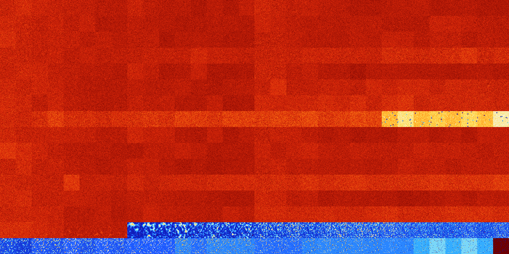

# B035678 (250368-250879)

<details>
    <summary>Initial Grid</summary>
    
</details>


<details>
    <summary>Initial Grid RLE</summary>

```
#C Exported from GoGoL (https://github.com/marrow16/gogol)
#C Wrap mode: Toroidal
#C Boundary mode: Dead
#C Step: 0
x = 100, y = 100, rule = B035678/S
28bo6bo41bo16bo$13bo6bo4bo30bo5bo21bo$7bo2bo7bo21bo28bo4bo$23bobo33bo$
25bo7bo6bo$18bo52bo3bo4b2o$16b2o22bo35bo$12bo3bo19bo6bo27bo3bo14bo$11bo
19bo25bo38bo$29bo7bo47bo12bo$10bo14bo2bo24bobo3bobo17b2o$bo3bo33bo28bo
7bo$54bo8bo4bo18bo$7bo14bo8bo3bo5bo24bo2bo25b2o$12bo4bobo32bo27bo9bo$5b
o8bo15bo7bo14bo9bo2bo23bo$34bo12bobo4bobo19b3o$43bo37bo14bo2bo$8bo21bo
29bo7bo9bo13bo5bo$o27bo25bobo12bo21bo5bo$22bo2bo18bo2bo10bo3bo9bo18bo$o
3bo21bo14bo3b2ob2o$25bo23bo18bo15bo$5bo28bo44bo$18bobo10bobo25bo16bo7bo
9bo$23bo71bo$9bo25bo17bo10bo8bobo$4bo5bo32bobo16bo7b2o26bo$6bo18bo16bo
33bo22bo$4bo13bo19bo18bo$6bo34bo29bo$24bo50bo$bo23bo36bobo24b2o$13bo18b
o36bo$13bo2bo25bo17bo25bo10bo$18bo14bo43bo$o49b2o6bo16bo11bo$22bo41bo3b
o$10bo11bo2bo13bo6bo26bo16b2o$12b2o26bobo28bo$8bo41bo24bo$5bo8bo47bo27b
obo4bo$31bo10bo5bo24bo18bo$50bo2bo30bo9bo$28bo3bo10bo20bo2bo5bo15bo$9bo
17bo17bo16bo31bo$3bo9b2o8bo21bo20bo24bo$14bo36bo3bo2b2o5bo$5bo11bo27bo
4bo2bo23bo7bo$8bo36bo5bo17bo21bo$37bo7bo24bo8bobo$22bo17bo42bo$2b2o10bo
7bo40bo13bo$48bo15bo31bo$28bo20bo21b2o13bo$16bo5bo12bo$b2o22bo31bo4bo
26bo$15bo3bo10bo16bo12bo2bo4bo5bobo$3bo17bo24b2o24bo5bo$bo7bo2b2o8bo33b
o17bo6bo$15bo49bo$2bo52bo$31bo14bo35bo5bo$35bo37bobo$34bo13bo9bo28bo2bo
3bo$3bo16bo13bo32bo$6bo12bo4bo5bo24bo37bo4bo$89bo$17bo40bo$4b2o7bo4bo
56bobo18bo$26bo24bo7bo$22bo12bo27bo9bo6bobo$o61bo$7bo27bo14bo17bo$61bo
17bo$39bo6bo20bo$bo21bobo11bo19b2o24bo$31bo3bo10bo10bo23bo$17bo12bo18b
2o8b3o9bo6bo10bo$29bo10bo$8bo7bo17bo32bo8bo$38bo19bo8bo$17bo24bo19bo15b
o6bo9bo$27bo$3bo$6bo14bo30bo8bo17bo18bo$o3bo4bo33bo2bo14bo16bo$6bo5bo
10bo10bo12bo19bo$7bo4bo15bo13bo16bo7bo6bo$12bo25bo10bo36bo6bo$27bo5bo3b
o13bo36b2o$16bo4bo5bo8bobo7bo25bobo$5bo5bo15bo66bo$50bo9bo8bo10bo14bo$
2bo33bo17bo$24bobo59bo8bo$62bo$12bo38bo9bo21bobobo$27bo29bo25bo10bo$4bo
33bo6bo18bo30b2o!
```
</details>
<details>
    <summary>Thumbnail</summary>

</details>
<table>
<tr>
    <td><a href="./250368%20S%20Heat%20Map%20Activity.png"></a><br>S (250368)<br>G>1000</td>    <td><a href="./250369%20S0%20Heat%20Map%20Activity.png"></a><br>S0 (250369)<br>G>1000</td>    <td><a href="./250370%20S1%20Heat%20Map%20Activity.png"></a><br>S1 (250370)<br>G>1000</td>    <td><a href="./250371%20S01%20Heat%20Map%20Activity.png"></a><br>S01 (250371)<br>G>1000</td>    <td><a href="./250372%20S2%20Heat%20Map%20Activity.png"></a><br>S2 (250372)<br>G>1000</td>    <td><a href="./250373%20S02%20Heat%20Map%20Activity.png"></a><br>S02 (250373)<br>G>1000</td>    <td><a href="./250374%20S12%20Heat%20Map%20Activity.png"></a><br>S12 (250374)<br>G>1000</td>    <td><a href="./250375%20S012%20Heat%20Map%20Activity.png"></a><br>S012 (250375)<br>G>1000</td>    <td><a href="./250376%20S3%20Heat%20Map%20Activity.png"></a><br>S3 (250376)<br>G>1000</td>    <td><a href="./250377%20S03%20Heat%20Map%20Activity.png"></a><br>S03 (250377)<br>G>1000</td>    <td><a href="./250378%20S13%20Heat%20Map%20Activity.png"></a><br>S13 (250378)<br>G>1000</td>    <td><a href="./250379%20S013%20Heat%20Map%20Activity.png"></a><br>S013 (250379)<br>G>1000</td>    <td><a href="./250380%20S23%20Heat%20Map%20Activity.png"></a><br>S23 (250380)<br>G>1000</td>    <td><a href="./250381%20S023%20Heat%20Map%20Activity.png"></a><br>S023 (250381)<br>G>1000</td>    <td><a href="./250382%20S123%20Heat%20Map%20Activity.png"></a><br>S123 (250382)<br>G>1000</td>    <td><a href="./250383%20S0123%20Heat%20Map%20Activity.png"></a><br>S0123 (250383)<br>G>1000</td>    <td><a href="./250384%20S4%20Heat%20Map%20Activity.png"></a><br>S4 (250384)<br>G>1000</td>    <td><a href="./250385%20S04%20Heat%20Map%20Activity.png"></a><br>S04 (250385)<br>G>1000</td>    <td><a href="./250386%20S14%20Heat%20Map%20Activity.png"></a><br>S14 (250386)<br>G>1000</td>    <td><a href="./250387%20S014%20Heat%20Map%20Activity.png"></a><br>S014 (250387)<br>G>1000</td>    <td><a href="./250388%20S24%20Heat%20Map%20Activity.png"></a><br>S24 (250388)<br>G>1000</td>    <td><a href="./250389%20S024%20Heat%20Map%20Activity.png"></a><br>S024 (250389)<br>G>1000</td>    <td><a href="./250390%20S124%20Heat%20Map%20Activity.png"></a><br>S124 (250390)<br>G>1000</td>    <td><a href="./250391%20S0124%20Heat%20Map%20Activity.png"></a><br>S0124 (250391)<br>G>1000</td>    <td><a href="./250392%20S34%20Heat%20Map%20Activity.png"></a><br>S34 (250392)<br>G>1000</td>    <td><a href="./250393%20S034%20Heat%20Map%20Activity.png"></a><br>S034 (250393)<br>G>1000</td>    <td><a href="./250394%20S134%20Heat%20Map%20Activity.png"></a><br>S134 (250394)<br>G>1000</td>    <td><a href="./250395%20S0134%20Heat%20Map%20Activity.png"></a><br>S0134 (250395)<br>G>1000</td>    <td><a href="./250396%20S234%20Heat%20Map%20Activity.png"></a><br>S234 (250396)<br>G>1000</td>    <td><a href="./250397%20S0234%20Heat%20Map%20Activity.png"></a><br>S0234 (250397)<br>G>1000</td>    <td><a href="./250398%20S1234%20Heat%20Map%20Activity.png"></a><br>S1234 (250398)<br>G>1000</td>    <td><a href="./250399%20S01234%20Heat%20Map%20Activity.png"></a><br>S01234 (250399)<br>G>1000</td></tr>
<tr>
    <td><a href="./250400%20S5%20Heat%20Map%20Activity.png"></a><br>S5 (250400)<br>G>1000</td>    <td><a href="./250401%20S05%20Heat%20Map%20Activity.png"></a><br>S05 (250401)<br>G>1000</td>    <td><a href="./250402%20S15%20Heat%20Map%20Activity.png"></a><br>S15 (250402)<br>G>1000</td>    <td><a href="./250403%20S015%20Heat%20Map%20Activity.png"></a><br>S015 (250403)<br>G>1000</td>    <td><a href="./250404%20S25%20Heat%20Map%20Activity.png"></a><br>S25 (250404)<br>G>1000</td>    <td><a href="./250405%20S025%20Heat%20Map%20Activity.png"></a><br>S025 (250405)<br>G>1000</td>    <td><a href="./250406%20S125%20Heat%20Map%20Activity.png"></a><br>S125 (250406)<br>G>1000</td>    <td><a href="./250407%20S0125%20Heat%20Map%20Activity.png"></a><br>S0125 (250407)<br>G>1000</td>    <td><a href="./250408%20S35%20Heat%20Map%20Activity.png"></a><br>S35 (250408)<br>G>1000</td>    <td><a href="./250409%20S035%20Heat%20Map%20Activity.png"></a><br>S035 (250409)<br>G>1000</td>    <td><a href="./250410%20S135%20Heat%20Map%20Activity.png"></a><br>S135 (250410)<br>G>1000</td>    <td><a href="./250411%20S0135%20Heat%20Map%20Activity.png"></a><br>S0135 (250411)<br>G>1000</td>    <td><a href="./250412%20S235%20Heat%20Map%20Activity.png"></a><br>S235 (250412)<br>G>1000</td>    <td><a href="./250413%20S0235%20Heat%20Map%20Activity.png"></a><br>S0235 (250413)<br>G>1000</td>    <td><a href="./250414%20S1235%20Heat%20Map%20Activity.png"></a><br>S1235 (250414)<br>G>1000</td>    <td><a href="./250415%20S01235%20Heat%20Map%20Activity.png"></a><br>S01235 (250415)<br>G>1000</td>    <td><a href="./250416%20S45%20Heat%20Map%20Activity.png"></a><br>S45 (250416)<br>G>1000</td>    <td><a href="./250417%20S045%20Heat%20Map%20Activity.png"></a><br>S045 (250417)<br>G>1000</td>    <td><a href="./250418%20S145%20Heat%20Map%20Activity.png"></a><br>S145 (250418)<br>G>1000</td>    <td><a href="./250419%20S0145%20Heat%20Map%20Activity.png"></a><br>S0145 (250419)<br>G>1000</td>    <td><a href="./250420%20S245%20Heat%20Map%20Activity.png"></a><br>S245 (250420)<br>G>1000</td>    <td><a href="./250421%20S0245%20Heat%20Map%20Activity.png"></a><br>S0245 (250421)<br>G>1000</td>    <td><a href="./250422%20S1245%20Heat%20Map%20Activity.png"></a><br>S1245 (250422)<br>G>1000</td>    <td><a href="./250423%20S01245%20Heat%20Map%20Activity.png"></a><br>S01245 (250423)<br>G>1000</td>    <td><a href="./250424%20S345%20Heat%20Map%20Activity.png"></a><br>S345 (250424)<br>G>1000</td>    <td><a href="./250425%20S0345%20Heat%20Map%20Activity.png"></a><br>S0345 (250425)<br>G>1000</td>    <td><a href="./250426%20S1345%20Heat%20Map%20Activity.png"></a><br>S1345 (250426)<br>G>1000</td>    <td><a href="./250427%20S01345%20Heat%20Map%20Activity.png"></a><br>S01345 (250427)<br>G>1000</td>    <td><a href="./250428%20S2345%20Heat%20Map%20Activity.png"></a><br>S2345 (250428)<br>G>1000</td>    <td><a href="./250429%20S02345%20Heat%20Map%20Activity.png"></a><br>S02345 (250429)<br>G>1000</td>    <td><a href="./250430%20S12345%20Heat%20Map%20Activity.png"></a><br>S12345 (250430)<br>G>1000</td>    <td><a href="./250431%20S012345%20Heat%20Map%20Activity.png"></a><br>S012345 (250431)<br>G>1000</td></tr>
<tr>
    <td><a href="./250432%20S6%20Heat%20Map%20Activity.png"></a><br>S6 (250432)<br>G>1000</td>    <td><a href="./250433%20S06%20Heat%20Map%20Activity.png"></a><br>S06 (250433)<br>G>1000</td>    <td><a href="./250434%20S16%20Heat%20Map%20Activity.png"></a><br>S16 (250434)<br>G>1000</td>    <td><a href="./250435%20S016%20Heat%20Map%20Activity.png"></a><br>S016 (250435)<br>G>1000</td>    <td><a href="./250436%20S26%20Heat%20Map%20Activity.png"></a><br>S26 (250436)<br>G>1000</td>    <td><a href="./250437%20S026%20Heat%20Map%20Activity.png"></a><br>S026 (250437)<br>G>1000</td>    <td><a href="./250438%20S126%20Heat%20Map%20Activity.png"></a><br>S126 (250438)<br>G>1000</td>    <td><a href="./250439%20S0126%20Heat%20Map%20Activity.png"></a><br>S0126 (250439)<br>G>1000</td>    <td><a href="./250440%20S36%20Heat%20Map%20Activity.png"></a><br>S36 (250440)<br>G>1000</td>    <td><a href="./250441%20S036%20Heat%20Map%20Activity.png"></a><br>S036 (250441)<br>G>1000</td>    <td><a href="./250442%20S136%20Heat%20Map%20Activity.png"></a><br>S136 (250442)<br>G>1000</td>    <td><a href="./250443%20S0136%20Heat%20Map%20Activity.png"></a><br>S0136 (250443)<br>G>1000</td>    <td><a href="./250444%20S236%20Heat%20Map%20Activity.png"></a><br>S236 (250444)<br>G>1000</td>    <td><a href="./250445%20S0236%20Heat%20Map%20Activity.png"></a><br>S0236 (250445)<br>G>1000</td>    <td><a href="./250446%20S1236%20Heat%20Map%20Activity.png"></a><br>S1236 (250446)<br>G>1000</td>    <td><a href="./250447%20S01236%20Heat%20Map%20Activity.png"></a><br>S01236 (250447)<br>G>1000</td>    <td><a href="./250448%20S46%20Heat%20Map%20Activity.png"></a><br>S46 (250448)<br>G>1000</td>    <td><a href="./250449%20S046%20Heat%20Map%20Activity.png"></a><br>S046 (250449)<br>G>1000</td>    <td><a href="./250450%20S146%20Heat%20Map%20Activity.png"></a><br>S146 (250450)<br>G>1000</td>    <td><a href="./250451%20S0146%20Heat%20Map%20Activity.png"></a><br>S0146 (250451)<br>G>1000</td>    <td><a href="./250452%20S246%20Heat%20Map%20Activity.png"></a><br>S246 (250452)<br>G>1000</td>    <td><a href="./250453%20S0246%20Heat%20Map%20Activity.png"></a><br>S0246 (250453)<br>G>1000</td>    <td><a href="./250454%20S1246%20Heat%20Map%20Activity.png"></a><br>S1246 (250454)<br>G>1000</td>    <td><a href="./250455%20S01246%20Heat%20Map%20Activity.png"></a><br>S01246 (250455)<br>G>1000</td>    <td><a href="./250456%20S346%20Heat%20Map%20Activity.png"></a><br>S346 (250456)<br>G>1000</td>    <td><a href="./250457%20S0346%20Heat%20Map%20Activity.png"></a><br>S0346 (250457)<br>G>1000</td>    <td><a href="./250458%20S1346%20Heat%20Map%20Activity.png"></a><br>S1346 (250458)<br>G>1000</td>    <td><a href="./250459%20S01346%20Heat%20Map%20Activity.png"></a><br>S01346 (250459)<br>G>1000</td>    <td><a href="./250460%20S2346%20Heat%20Map%20Activity.png"></a><br>S2346 (250460)<br>G>1000</td>    <td><a href="./250461%20S02346%20Heat%20Map%20Activity.png"></a><br>S02346 (250461)<br>G>1000</td>    <td><a href="./250462%20S12346%20Heat%20Map%20Activity.png"></a><br>S12346 (250462)<br>G>1000</td>    <td><a href="./250463%20S012346%20Heat%20Map%20Activity.png"></a><br>S012346 (250463)<br>G>1000</td></tr>
<tr>
    <td><a href="./250464%20S56%20Heat%20Map%20Activity.png"></a><br>S56 (250464)<br>G>1000</td>    <td><a href="./250465%20S056%20Heat%20Map%20Activity.png"></a><br>S056 (250465)<br>G>1000</td>    <td><a href="./250466%20S156%20Heat%20Map%20Activity.png"></a><br>S156 (250466)<br>G>1000</td>    <td><a href="./250467%20S0156%20Heat%20Map%20Activity.png"></a><br>S0156 (250467)<br>G>1000</td>    <td><a href="./250468%20S256%20Heat%20Map%20Activity.png"></a><br>S256 (250468)<br>G>1000</td>    <td><a href="./250469%20S0256%20Heat%20Map%20Activity.png"></a><br>S0256 (250469)<br>G>1000</td>    <td><a href="./250470%20S1256%20Heat%20Map%20Activity.png"></a><br>S1256 (250470)<br>G>1000</td>    <td><a href="./250471%20S01256%20Heat%20Map%20Activity.png"></a><br>S01256 (250471)<br>G>1000</td>    <td><a href="./250472%20S356%20Heat%20Map%20Activity.png"></a><br>S356 (250472)<br>G>1000</td>    <td><a href="./250473%20S0356%20Heat%20Map%20Activity.png"></a><br>S0356 (250473)<br>G>1000</td>    <td><a href="./250474%20S1356%20Heat%20Map%20Activity.png"></a><br>S1356 (250474)<br>G>1000</td>    <td><a href="./250475%20S01356%20Heat%20Map%20Activity.png"></a><br>S01356 (250475)<br>G>1000</td>    <td><a href="./250476%20S2356%20Heat%20Map%20Activity.png"></a><br>S2356 (250476)<br>G>1000</td>    <td><a href="./250477%20S02356%20Heat%20Map%20Activity.png"></a><br>S02356 (250477)<br>G>1000</td>    <td><a href="./250478%20S12356%20Heat%20Map%20Activity.png"></a><br>S12356 (250478)<br>G>1000</td>    <td><a href="./250479%20S012356%20Heat%20Map%20Activity.png"></a><br>S012356 (250479)<br>G>1000</td>    <td><a href="./250480%20S456%20Heat%20Map%20Activity.png"></a><br>S456 (250480)<br>G>1000</td>    <td><a href="./250481%20S0456%20Heat%20Map%20Activity.png"></a><br>S0456 (250481)<br>G>1000</td>    <td><a href="./250482%20S1456%20Heat%20Map%20Activity.png"></a><br>S1456 (250482)<br>G>1000</td>    <td><a href="./250483%20S01456%20Heat%20Map%20Activity.png"></a><br>S01456 (250483)<br>G>1000</td>    <td><a href="./250484%20S2456%20Heat%20Map%20Activity.png"></a><br>S2456 (250484)<br>G>1000</td>    <td><a href="./250485%20S02456%20Heat%20Map%20Activity.png"></a><br>S02456 (250485)<br>G>1000</td>    <td><a href="./250486%20S12456%20Heat%20Map%20Activity.png"></a><br>S12456 (250486)<br>G>1000</td>    <td><a href="./250487%20S012456%20Heat%20Map%20Activity.png"></a><br>S012456 (250487)<br>G>1000</td>    <td><a href="./250488%20S3456%20Heat%20Map%20Activity.png"></a><br>S3456 (250488)<br>G>1000</td>    <td><a href="./250489%20S03456%20Heat%20Map%20Activity.png"></a><br>S03456 (250489)<br>G>1000</td>    <td><a href="./250490%20S13456%20Heat%20Map%20Activity.png"></a><br>S13456 (250490)<br>G>1000</td>    <td><a href="./250491%20S013456%20Heat%20Map%20Activity.png"></a><br>S013456 (250491)<br>G>1000</td>    <td><a href="./250492%20S23456%20Heat%20Map%20Activity.png"></a><br>S23456 (250492)<br>G>1000</td>    <td><a href="./250493%20S023456%20Heat%20Map%20Activity.png"></a><br>S023456 (250493)<br>G>1000</td>    <td><a href="./250494%20S123456%20Heat%20Map%20Activity.png"></a><br>S123456 (250494)<br>G>1000</td>    <td><a href="./250495%20S0123456%20Heat%20Map%20Activity.png"></a><br>S0123456 (250495)<br>G>1000</td></tr>
<tr>
    <td><a href="./250496%20S7%20Heat%20Map%20Activity.png"></a><br>S7 (250496)<br>G>1000</td>    <td><a href="./250497%20S07%20Heat%20Map%20Activity.png"></a><br>S07 (250497)<br>G>1000</td>    <td><a href="./250498%20S17%20Heat%20Map%20Activity.png"></a><br>S17 (250498)<br>G>1000</td>    <td><a href="./250499%20S017%20Heat%20Map%20Activity.png"></a><br>S017 (250499)<br>G>1000</td>    <td><a href="./250500%20S27%20Heat%20Map%20Activity.png"></a><br>S27 (250500)<br>G>1000</td>    <td><a href="./250501%20S027%20Heat%20Map%20Activity.png"></a><br>S027 (250501)<br>G>1000</td>    <td><a href="./250502%20S127%20Heat%20Map%20Activity.png"></a><br>S127 (250502)<br>G>1000</td>    <td><a href="./250503%20S0127%20Heat%20Map%20Activity.png"></a><br>S0127 (250503)<br>G>1000</td>    <td><a href="./250504%20S37%20Heat%20Map%20Activity.png"></a><br>S37 (250504)<br>G>1000</td>    <td><a href="./250505%20S037%20Heat%20Map%20Activity.png"></a><br>S037 (250505)<br>G>1000</td>    <td><a href="./250506%20S137%20Heat%20Map%20Activity.png"></a><br>S137 (250506)<br>G>1000</td>    <td><a href="./250507%20S0137%20Heat%20Map%20Activity.png"></a><br>S0137 (250507)<br>G>1000</td>    <td><a href="./250508%20S237%20Heat%20Map%20Activity.png"></a><br>S237 (250508)<br>G>1000</td>    <td><a href="./250509%20S0237%20Heat%20Map%20Activity.png"></a><br>S0237 (250509)<br>G>1000</td>    <td><a href="./250510%20S1237%20Heat%20Map%20Activity.png"></a><br>S1237 (250510)<br>G>1000</td>    <td><a href="./250511%20S01237%20Heat%20Map%20Activity.png"></a><br>S01237 (250511)<br>G>1000</td>    <td><a href="./250512%20S47%20Heat%20Map%20Activity.png"></a><br>S47 (250512)<br>G>1000</td>    <td><a href="./250513%20S047%20Heat%20Map%20Activity.png"></a><br>S047 (250513)<br>G>1000</td>    <td><a href="./250514%20S147%20Heat%20Map%20Activity.png"></a><br>S147 (250514)<br>G>1000</td>    <td><a href="./250515%20S0147%20Heat%20Map%20Activity.png"></a><br>S0147 (250515)<br>G>1000</td>    <td><a href="./250516%20S247%20Heat%20Map%20Activity.png"></a><br>S247 (250516)<br>G>1000</td>    <td><a href="./250517%20S0247%20Heat%20Map%20Activity.png"></a><br>S0247 (250517)<br>G>1000</td>    <td><a href="./250518%20S1247%20Heat%20Map%20Activity.png"></a><br>S1247 (250518)<br>G>1000</td>    <td><a href="./250519%20S01247%20Heat%20Map%20Activity.png"></a><br>S01247 (250519)<br>G>1000</td>    <td><a href="./250520%20S347%20Heat%20Map%20Activity.png"></a><br>S347 (250520)<br>G>1000</td>    <td><a href="./250521%20S0347%20Heat%20Map%20Activity.png"></a><br>S0347 (250521)<br>G>1000</td>    <td><a href="./250522%20S1347%20Heat%20Map%20Activity.png"></a><br>S1347 (250522)<br>G>1000</td>    <td><a href="./250523%20S01347%20Heat%20Map%20Activity.png"></a><br>S01347 (250523)<br>G>1000</td>    <td><a href="./250524%20S2347%20Heat%20Map%20Activity.png"></a><br>S2347 (250524)<br>G>1000</td>    <td><a href="./250525%20S02347%20Heat%20Map%20Activity.png"></a><br>S02347 (250525)<br>G>1000</td>    <td><a href="./250526%20S12347%20Heat%20Map%20Activity.png"></a><br>S12347 (250526)<br>G>1000</td>    <td><a href="./250527%20S012347%20Heat%20Map%20Activity.png"></a><br>S012347 (250527)<br>G>1000</td></tr>
<tr>
    <td><a href="./250528%20S57%20Heat%20Map%20Activity.png"></a><br>S57 (250528)<br>G>1000</td>    <td><a href="./250529%20S057%20Heat%20Map%20Activity.png"></a><br>S057 (250529)<br>G>1000</td>    <td><a href="./250530%20S157%20Heat%20Map%20Activity.png"></a><br>S157 (250530)<br>G>1000</td>    <td><a href="./250531%20S0157%20Heat%20Map%20Activity.png"></a><br>S0157 (250531)<br>G>1000</td>    <td><a href="./250532%20S257%20Heat%20Map%20Activity.png"></a><br>S257 (250532)<br>G>1000</td>    <td><a href="./250533%20S0257%20Heat%20Map%20Activity.png"></a><br>S0257 (250533)<br>G>1000</td>    <td><a href="./250534%20S1257%20Heat%20Map%20Activity.png"></a><br>S1257 (250534)<br>G>1000</td>    <td><a href="./250535%20S01257%20Heat%20Map%20Activity.png"></a><br>S01257 (250535)<br>G>1000</td>    <td><a href="./250536%20S357%20Heat%20Map%20Activity.png"></a><br>S357 (250536)<br>G>1000</td>    <td><a href="./250537%20S0357%20Heat%20Map%20Activity.png"></a><br>S0357 (250537)<br>G>1000</td>    <td><a href="./250538%20S1357%20Heat%20Map%20Activity.png"></a><br>S1357 (250538)<br>G>1000</td>    <td><a href="./250539%20S01357%20Heat%20Map%20Activity.png"></a><br>S01357 (250539)<br>G>1000</td>    <td><a href="./250540%20S2357%20Heat%20Map%20Activity.png"></a><br>S2357 (250540)<br>G>1000</td>    <td><a href="./250541%20S02357%20Heat%20Map%20Activity.png"></a><br>S02357 (250541)<br>G>1000</td>    <td><a href="./250542%20S12357%20Heat%20Map%20Activity.png"></a><br>S12357 (250542)<br>G>1000</td>    <td><a href="./250543%20S012357%20Heat%20Map%20Activity.png"></a><br>S012357 (250543)<br>G>1000</td>    <td><a href="./250544%20S457%20Heat%20Map%20Activity.png"></a><br>S457 (250544)<br>G>1000</td>    <td><a href="./250545%20S0457%20Heat%20Map%20Activity.png"></a><br>S0457 (250545)<br>G>1000</td>    <td><a href="./250546%20S1457%20Heat%20Map%20Activity.png"></a><br>S1457 (250546)<br>G>1000</td>    <td><a href="./250547%20S01457%20Heat%20Map%20Activity.png"></a><br>S01457 (250547)<br>G>1000</td>    <td><a href="./250548%20S2457%20Heat%20Map%20Activity.png"></a><br>S2457 (250548)<br>G>1000</td>    <td><a href="./250549%20S02457%20Heat%20Map%20Activity.png"></a><br>S02457 (250549)<br>G>1000</td>    <td><a href="./250550%20S12457%20Heat%20Map%20Activity.png"></a><br>S12457 (250550)<br>G>1000</td>    <td><a href="./250551%20S012457%20Heat%20Map%20Activity.png"></a><br>S012457 (250551)<br>G>1000</td>    <td><a href="./250552%20S3457%20Heat%20Map%20Activity.png"></a><br>S3457 (250552)<br>G>1000</td>    <td><a href="./250553%20S03457%20Heat%20Map%20Activity.png"></a><br>S03457 (250553)<br>G>1000</td>    <td><a href="./250554%20S13457%20Heat%20Map%20Activity.png"></a><br>S13457 (250554)<br>G>1000</td>    <td><a href="./250555%20S013457%20Heat%20Map%20Activity.png"></a><br>S013457 (250555)<br>G>1000</td>    <td><a href="./250556%20S23457%20Heat%20Map%20Activity.png"></a><br>S23457 (250556)<br>G>1000</td>    <td><a href="./250557%20S023457%20Heat%20Map%20Activity.png"></a><br>S023457 (250557)<br>G>1000</td>    <td><a href="./250558%20S123457%20Heat%20Map%20Activity.png"></a><br>S123457 (250558)<br>G>1000</td>    <td><a href="./250559%20S0123457%20Heat%20Map%20Activity.png"></a><br>S0123457 (250559)<br>G>1000</td></tr>
<tr>
    <td><a href="./250560%20S67%20Heat%20Map%20Activity.png"></a><br>S67 (250560)<br>G>1000</td>    <td><a href="./250561%20S067%20Heat%20Map%20Activity.png"></a><br>S067 (250561)<br>G>1000</td>    <td><a href="./250562%20S167%20Heat%20Map%20Activity.png"></a><br>S167 (250562)<br>G>1000</td>    <td><a href="./250563%20S0167%20Heat%20Map%20Activity.png"></a><br>S0167 (250563)<br>G>1000</td>    <td><a href="./250564%20S267%20Heat%20Map%20Activity.png"></a><br>S267 (250564)<br>G>1000</td>    <td><a href="./250565%20S0267%20Heat%20Map%20Activity.png"></a><br>S0267 (250565)<br>G>1000</td>    <td><a href="./250566%20S1267%20Heat%20Map%20Activity.png"></a><br>S1267 (250566)<br>G>1000</td>    <td><a href="./250567%20S01267%20Heat%20Map%20Activity.png"></a><br>S01267 (250567)<br>G>1000</td>    <td><a href="./250568%20S367%20Heat%20Map%20Activity.png"></a><br>S367 (250568)<br>G>1000</td>    <td><a href="./250569%20S0367%20Heat%20Map%20Activity.png"></a><br>S0367 (250569)<br>G>1000</td>    <td><a href="./250570%20S1367%20Heat%20Map%20Activity.png"></a><br>S1367 (250570)<br>G>1000</td>    <td><a href="./250571%20S01367%20Heat%20Map%20Activity.png"></a><br>S01367 (250571)<br>G>1000</td>    <td><a href="./250572%20S2367%20Heat%20Map%20Activity.png"></a><br>S2367 (250572)<br>G>1000</td>    <td><a href="./250573%20S02367%20Heat%20Map%20Activity.png"></a><br>S02367 (250573)<br>G>1000</td>    <td><a href="./250574%20S12367%20Heat%20Map%20Activity.png"></a><br>S12367 (250574)<br>G>1000</td>    <td><a href="./250575%20S012367%20Heat%20Map%20Activity.png"></a><br>S012367 (250575)<br>G>1000</td>    <td><a href="./250576%20S467%20Heat%20Map%20Activity.png"></a><br>S467 (250576)<br>G>1000</td>    <td><a href="./250577%20S0467%20Heat%20Map%20Activity.png"></a><br>S0467 (250577)<br>G>1000</td>    <td><a href="./250578%20S1467%20Heat%20Map%20Activity.png"></a><br>S1467 (250578)<br>G>1000</td>    <td><a href="./250579%20S01467%20Heat%20Map%20Activity.png"></a><br>S01467 (250579)<br>G>1000</td>    <td><a href="./250580%20S2467%20Heat%20Map%20Activity.png"></a><br>S2467 (250580)<br>G>1000</td>    <td><a href="./250581%20S02467%20Heat%20Map%20Activity.png"></a><br>S02467 (250581)<br>G>1000</td>    <td><a href="./250582%20S12467%20Heat%20Map%20Activity.png"></a><br>S12467 (250582)<br>G>1000</td>    <td><a href="./250583%20S012467%20Heat%20Map%20Activity.png"></a><br>S012467 (250583)<br>G>1000</td>    <td><a href="./250584%20S3467%20Heat%20Map%20Activity.png"></a><br>S3467 (250584)<br>G>1000</td>    <td><a href="./250585%20S03467%20Heat%20Map%20Activity.png"></a><br>S03467 (250585)<br>G>1000</td>    <td><a href="./250586%20S13467%20Heat%20Map%20Activity.png"></a><br>S13467 (250586)<br>G>1000</td>    <td><a href="./250587%20S013467%20Heat%20Map%20Activity.png"></a><br>S013467 (250587)<br>G>1000</td>    <td><a href="./250588%20S23467%20Heat%20Map%20Activity.png"></a><br>S23467 (250588)<br>G>1000</td>    <td><a href="./250589%20S023467%20Heat%20Map%20Activity.png"></a><br>S023467 (250589)<br>G>1000</td>    <td><a href="./250590%20S123467%20Heat%20Map%20Activity.png"></a><br>S123467 (250590)<br>G>1000</td>    <td><a href="./250591%20S0123467%20Heat%20Map%20Activity.png"></a><br>S0123467 (250591)<br>G>1000</td></tr>
<tr>
    <td><a href="./250592%20S567%20Heat%20Map%20Activity.png"></a><br>S567 (250592)<br>G>1000</td>    <td><a href="./250593%20S0567%20Heat%20Map%20Activity.png"></a><br>S0567 (250593)<br>G>1000</td>    <td><a href="./250594%20S1567%20Heat%20Map%20Activity.png"></a><br>S1567 (250594)<br>G>1000</td>    <td><a href="./250595%20S01567%20Heat%20Map%20Activity.png"></a><br>S01567 (250595)<br>G>1000</td>    <td><a href="./250596%20S2567%20Heat%20Map%20Activity.png"></a><br>S2567 (250596)<br>G>1000</td>    <td><a href="./250597%20S02567%20Heat%20Map%20Activity.png"></a><br>S02567 (250597)<br>G>1000</td>    <td><a href="./250598%20S12567%20Heat%20Map%20Activity.png"></a><br>S12567 (250598)<br>G>1000</td>    <td><a href="./250599%20S012567%20Heat%20Map%20Activity.png"></a><br>S012567 (250599)<br>G>1000</td>    <td><a href="./250600%20S3567%20Heat%20Map%20Activity.png"></a><br>S3567 (250600)<br>G>1000</td>    <td><a href="./250601%20S03567%20Heat%20Map%20Activity.png"></a><br>S03567 (250601)<br>G>1000</td>    <td><a href="./250602%20S13567%20Heat%20Map%20Activity.png"></a><br>S13567 (250602)<br>G>1000</td>    <td><a href="./250603%20S013567%20Heat%20Map%20Activity.png"></a><br>S013567 (250603)<br>G>1000</td>    <td><a href="./250604%20S23567%20Heat%20Map%20Activity.png"></a><br>S23567 (250604)<br>G>1000</td>    <td><a href="./250605%20S023567%20Heat%20Map%20Activity.png"></a><br>S023567 (250605)<br>G>1000</td>    <td><a href="./250606%20S123567%20Heat%20Map%20Activity.png"></a><br>S123567 (250606)<br>G>1000</td>    <td><a href="./250607%20S0123567%20Heat%20Map%20Activity.png"></a><br>S0123567 (250607)<br>G>1000</td>    <td><a href="./250608%20S4567%20Heat%20Map%20Activity.png"></a><br>S4567 (250608)<br>G>1000</td>    <td><a href="./250609%20S04567%20Heat%20Map%20Activity.png"></a><br>S04567 (250609)<br>G>1000</td>    <td><a href="./250610%20S14567%20Heat%20Map%20Activity.png"></a><br>S14567 (250610)<br>G>1000</td>    <td><a href="./250611%20S014567%20Heat%20Map%20Activity.png"></a><br>S014567 (250611)<br>G>1000</td>    <td><a href="./250612%20S24567%20Heat%20Map%20Activity.png"></a><br>S24567 (250612)<br>G>1000</td>    <td><a href="./250613%20S024567%20Heat%20Map%20Activity.png"></a><br>S024567 (250613)<br>G>1000</td>    <td><a href="./250614%20S124567%20Heat%20Map%20Activity.png"></a><br>S124567 (250614)<br>G>1000</td>    <td><a href="./250615%20S0124567%20Heat%20Map%20Activity.png"></a><br>S0124567 (250615)<br>G>1000</td>    <td><a href="./250616%20S34567%20Heat%20Map%20Activity.png"></a><br>S34567 (250616)<br>G>1000</td>    <td><a href="./250617%20S034567%20Heat%20Map%20Activity.png"></a><br>S034567 (250617)<br>G>1000</td>    <td><a href="./250618%20S134567%20Heat%20Map%20Activity.png"></a><br>S134567 (250618)<br>G>1000</td>    <td><a href="./250619%20S0134567%20Heat%20Map%20Activity.png"></a><br>S0134567 (250619)<br>G>1000</td>    <td><a href="./250620%20S234567%20Heat%20Map%20Activity.png"></a><br>S234567 (250620)<br>G>1000</td>    <td><a href="./250621%20S0234567%20Heat%20Map%20Activity.png"></a><br>S0234567 (250621)<br>G>1000</td>    <td><a href="./250622%20S1234567%20Heat%20Map%20Activity.png"></a><br>S1234567 (250622)<br>G>1000</td>    <td><a href="./250623%20S01234567%20Heat%20Map%20Activity.png"></a><br>S01234567 (250623)<br>G>1000</td></tr>
<tr>
    <td><a href="./250624%20S8%20Heat%20Map%20Activity.png"></a><br>S8 (250624)<br>G>1000</td>    <td><a href="./250625%20S08%20Heat%20Map%20Activity.png"></a><br>S08 (250625)<br>G>1000</td>    <td><a href="./250626%20S18%20Heat%20Map%20Activity.png"></a><br>S18 (250626)<br>G>1000</td>    <td><a href="./250627%20S018%20Heat%20Map%20Activity.png"></a><br>S018 (250627)<br>G>1000</td>    <td><a href="./250628%20S28%20Heat%20Map%20Activity.png"></a><br>S28 (250628)<br>G>1000</td>    <td><a href="./250629%20S028%20Heat%20Map%20Activity.png"></a><br>S028 (250629)<br>G>1000</td>    <td><a href="./250630%20S128%20Heat%20Map%20Activity.png"></a><br>S128 (250630)<br>G>1000</td>    <td><a href="./250631%20S0128%20Heat%20Map%20Activity.png"></a><br>S0128 (250631)<br>G>1000</td>    <td><a href="./250632%20S38%20Heat%20Map%20Activity.png"></a><br>S38 (250632)<br>G>1000</td>    <td><a href="./250633%20S038%20Heat%20Map%20Activity.png"></a><br>S038 (250633)<br>G>1000</td>    <td><a href="./250634%20S138%20Heat%20Map%20Activity.png"></a><br>S138 (250634)<br>G>1000</td>    <td><a href="./250635%20S0138%20Heat%20Map%20Activity.png"></a><br>S0138 (250635)<br>G>1000</td>    <td><a href="./250636%20S238%20Heat%20Map%20Activity.png"></a><br>S238 (250636)<br>G>1000</td>    <td><a href="./250637%20S0238%20Heat%20Map%20Activity.png"></a><br>S0238 (250637)<br>G>1000</td>    <td><a href="./250638%20S1238%20Heat%20Map%20Activity.png"></a><br>S1238 (250638)<br>G>1000</td>    <td><a href="./250639%20S01238%20Heat%20Map%20Activity.png"></a><br>S01238 (250639)<br>G>1000</td>    <td><a href="./250640%20S48%20Heat%20Map%20Activity.png"></a><br>S48 (250640)<br>G>1000</td>    <td><a href="./250641%20S048%20Heat%20Map%20Activity.png"></a><br>S048 (250641)<br>G>1000</td>    <td><a href="./250642%20S148%20Heat%20Map%20Activity.png"></a><br>S148 (250642)<br>G>1000</td>    <td><a href="./250643%20S0148%20Heat%20Map%20Activity.png"></a><br>S0148 (250643)<br>G>1000</td>    <td><a href="./250644%20S248%20Heat%20Map%20Activity.png"></a><br>S248 (250644)<br>G>1000</td>    <td><a href="./250645%20S0248%20Heat%20Map%20Activity.png"></a><br>S0248 (250645)<br>G>1000</td>    <td><a href="./250646%20S1248%20Heat%20Map%20Activity.png"></a><br>S1248 (250646)<br>G>1000</td>    <td><a href="./250647%20S01248%20Heat%20Map%20Activity.png"></a><br>S01248 (250647)<br>G>1000</td>    <td><a href="./250648%20S348%20Heat%20Map%20Activity.png"></a><br>S348 (250648)<br>G>1000</td>    <td><a href="./250649%20S0348%20Heat%20Map%20Activity.png"></a><br>S0348 (250649)<br>G>1000</td>    <td><a href="./250650%20S1348%20Heat%20Map%20Activity.png"></a><br>S1348 (250650)<br>G>1000</td>    <td><a href="./250651%20S01348%20Heat%20Map%20Activity.png"></a><br>S01348 (250651)<br>G>1000</td>    <td><a href="./250652%20S2348%20Heat%20Map%20Activity.png"></a><br>S2348 (250652)<br>G>1000</td>    <td><a href="./250653%20S02348%20Heat%20Map%20Activity.png"></a><br>S02348 (250653)<br>G>1000</td>    <td><a href="./250654%20S12348%20Heat%20Map%20Activity.png"></a><br>S12348 (250654)<br>G>1000</td>    <td><a href="./250655%20S012348%20Heat%20Map%20Activity.png"></a><br>S012348 (250655)<br>G>1000</td></tr>
<tr>
    <td><a href="./250656%20S58%20Heat%20Map%20Activity.png"></a><br>S58 (250656)<br>G>1000</td>    <td><a href="./250657%20S058%20Heat%20Map%20Activity.png"></a><br>S058 (250657)<br>G>1000</td>    <td><a href="./250658%20S158%20Heat%20Map%20Activity.png"></a><br>S158 (250658)<br>G>1000</td>    <td><a href="./250659%20S0158%20Heat%20Map%20Activity.png"></a><br>S0158 (250659)<br>G>1000</td>    <td><a href="./250660%20S258%20Heat%20Map%20Activity.png"></a><br>S258 (250660)<br>G>1000</td>    <td><a href="./250661%20S0258%20Heat%20Map%20Activity.png"></a><br>S0258 (250661)<br>G>1000</td>    <td><a href="./250662%20S1258%20Heat%20Map%20Activity.png"></a><br>S1258 (250662)<br>G>1000</td>    <td><a href="./250663%20S01258%20Heat%20Map%20Activity.png"></a><br>S01258 (250663)<br>G>1000</td>    <td><a href="./250664%20S358%20Heat%20Map%20Activity.png"></a><br>S358 (250664)<br>G>1000</td>    <td><a href="./250665%20S0358%20Heat%20Map%20Activity.png"></a><br>S0358 (250665)<br>G>1000</td>    <td><a href="./250666%20S1358%20Heat%20Map%20Activity.png"></a><br>S1358 (250666)<br>G>1000</td>    <td><a href="./250667%20S01358%20Heat%20Map%20Activity.png"></a><br>S01358 (250667)<br>G>1000</td>    <td><a href="./250668%20S2358%20Heat%20Map%20Activity.png"></a><br>S2358 (250668)<br>G>1000</td>    <td><a href="./250669%20S02358%20Heat%20Map%20Activity.png"></a><br>S02358 (250669)<br>G>1000</td>    <td><a href="./250670%20S12358%20Heat%20Map%20Activity.png"></a><br>S12358 (250670)<br>G>1000</td>    <td><a href="./250671%20S012358%20Heat%20Map%20Activity.png"></a><br>S012358 (250671)<br>G>1000</td>    <td><a href="./250672%20S458%20Heat%20Map%20Activity.png"></a><br>S458 (250672)<br>G>1000</td>    <td><a href="./250673%20S0458%20Heat%20Map%20Activity.png"></a><br>S0458 (250673)<br>G>1000</td>    <td><a href="./250674%20S1458%20Heat%20Map%20Activity.png"></a><br>S1458 (250674)<br>G>1000</td>    <td><a href="./250675%20S01458%20Heat%20Map%20Activity.png"></a><br>S01458 (250675)<br>G>1000</td>    <td><a href="./250676%20S2458%20Heat%20Map%20Activity.png"></a><br>S2458 (250676)<br>G>1000</td>    <td><a href="./250677%20S02458%20Heat%20Map%20Activity.png"></a><br>S02458 (250677)<br>G>1000</td>    <td><a href="./250678%20S12458%20Heat%20Map%20Activity.png"></a><br>S12458 (250678)<br>G>1000</td>    <td><a href="./250679%20S012458%20Heat%20Map%20Activity.png"></a><br>S012458 (250679)<br>G>1000</td>    <td><a href="./250680%20S3458%20Heat%20Map%20Activity.png"></a><br>S3458 (250680)<br>G>1000</td>    <td><a href="./250681%20S03458%20Heat%20Map%20Activity.png"></a><br>S03458 (250681)<br>G>1000</td>    <td><a href="./250682%20S13458%20Heat%20Map%20Activity.png"></a><br>S13458 (250682)<br>G>1000</td>    <td><a href="./250683%20S013458%20Heat%20Map%20Activity.png"></a><br>S013458 (250683)<br>G>1000</td>    <td><a href="./250684%20S23458%20Heat%20Map%20Activity.png"></a><br>S23458 (250684)<br>G>1000</td>    <td><a href="./250685%20S023458%20Heat%20Map%20Activity.png"></a><br>S023458 (250685)<br>G>1000</td>    <td><a href="./250686%20S123458%20Heat%20Map%20Activity.png"></a><br>S123458 (250686)<br>G>1000</td>    <td><a href="./250687%20S0123458%20Heat%20Map%20Activity.png"></a><br>S0123458 (250687)<br>G>1000</td></tr>
<tr>
    <td><a href="./250688%20S68%20Heat%20Map%20Activity.png"></a><br>S68 (250688)<br>G>1000</td>    <td><a href="./250689%20S068%20Heat%20Map%20Activity.png"></a><br>S068 (250689)<br>G>1000</td>    <td><a href="./250690%20S168%20Heat%20Map%20Activity.png"></a><br>S168 (250690)<br>G>1000</td>    <td><a href="./250691%20S0168%20Heat%20Map%20Activity.png"></a><br>S0168 (250691)<br>G>1000</td>    <td><a href="./250692%20S268%20Heat%20Map%20Activity.png"></a><br>S268 (250692)<br>G>1000</td>    <td><a href="./250693%20S0268%20Heat%20Map%20Activity.png"></a><br>S0268 (250693)<br>G>1000</td>    <td><a href="./250694%20S1268%20Heat%20Map%20Activity.png"></a><br>S1268 (250694)<br>G>1000</td>    <td><a href="./250695%20S01268%20Heat%20Map%20Activity.png"></a><br>S01268 (250695)<br>G>1000</td>    <td><a href="./250696%20S368%20Heat%20Map%20Activity.png"></a><br>S368 (250696)<br>G>1000</td>    <td><a href="./250697%20S0368%20Heat%20Map%20Activity.png"></a><br>S0368 (250697)<br>G>1000</td>    <td><a href="./250698%20S1368%20Heat%20Map%20Activity.png"></a><br>S1368 (250698)<br>G>1000</td>    <td><a href="./250699%20S01368%20Heat%20Map%20Activity.png"></a><br>S01368 (250699)<br>G>1000</td>    <td><a href="./250700%20S2368%20Heat%20Map%20Activity.png"></a><br>S2368 (250700)<br>G>1000</td>    <td><a href="./250701%20S02368%20Heat%20Map%20Activity.png"></a><br>S02368 (250701)<br>G>1000</td>    <td><a href="./250702%20S12368%20Heat%20Map%20Activity.png"></a><br>S12368 (250702)<br>G>1000</td>    <td><a href="./250703%20S012368%20Heat%20Map%20Activity.png"></a><br>S012368 (250703)<br>G>1000</td>    <td><a href="./250704%20S468%20Heat%20Map%20Activity.png"></a><br>S468 (250704)<br>G>1000</td>    <td><a href="./250705%20S0468%20Heat%20Map%20Activity.png"></a><br>S0468 (250705)<br>G>1000</td>    <td><a href="./250706%20S1468%20Heat%20Map%20Activity.png"></a><br>S1468 (250706)<br>G>1000</td>    <td><a href="./250707%20S01468%20Heat%20Map%20Activity.png"></a><br>S01468 (250707)<br>G>1000</td>    <td><a href="./250708%20S2468%20Heat%20Map%20Activity.png"></a><br>S2468 (250708)<br>G>1000</td>    <td><a href="./250709%20S02468%20Heat%20Map%20Activity.png"></a><br>S02468 (250709)<br>G>1000</td>    <td><a href="./250710%20S12468%20Heat%20Map%20Activity.png"></a><br>S12468 (250710)<br>G>1000</td>    <td><a href="./250711%20S012468%20Heat%20Map%20Activity.png"></a><br>S012468 (250711)<br>G>1000</td>    <td><a href="./250712%20S3468%20Heat%20Map%20Activity.png"></a><br>S3468 (250712)<br>G>1000</td>    <td><a href="./250713%20S03468%20Heat%20Map%20Activity.png"></a><br>S03468 (250713)<br>G>1000</td>    <td><a href="./250714%20S13468%20Heat%20Map%20Activity.png"></a><br>S13468 (250714)<br>G>1000</td>    <td><a href="./250715%20S013468%20Heat%20Map%20Activity.png"></a><br>S013468 (250715)<br>G>1000</td>    <td><a href="./250716%20S23468%20Heat%20Map%20Activity.png"></a><br>S23468 (250716)<br>G>1000</td>    <td><a href="./250717%20S023468%20Heat%20Map%20Activity.png"></a><br>S023468 (250717)<br>G>1000</td>    <td><a href="./250718%20S123468%20Heat%20Map%20Activity.png"></a><br>S123468 (250718)<br>G>1000</td>    <td><a href="./250719%20S0123468%20Heat%20Map%20Activity.png"></a><br>S0123468 (250719)<br>G>1000</td></tr>
<tr>
    <td><a href="./250720%20S568%20Heat%20Map%20Activity.png"></a><br>S568 (250720)<br>G>1000</td>    <td><a href="./250721%20S0568%20Heat%20Map%20Activity.png"></a><br>S0568 (250721)<br>G>1000</td>    <td><a href="./250722%20S1568%20Heat%20Map%20Activity.png"></a><br>S1568 (250722)<br>G>1000</td>    <td><a href="./250723%20S01568%20Heat%20Map%20Activity.png"></a><br>S01568 (250723)<br>G>1000</td>    <td><a href="./250724%20S2568%20Heat%20Map%20Activity.png"></a><br>S2568 (250724)<br>G>1000</td>    <td><a href="./250725%20S02568%20Heat%20Map%20Activity.png"></a><br>S02568 (250725)<br>G>1000</td>    <td><a href="./250726%20S12568%20Heat%20Map%20Activity.png"></a><br>S12568 (250726)<br>G>1000</td>    <td><a href="./250727%20S012568%20Heat%20Map%20Activity.png"></a><br>S012568 (250727)<br>G>1000</td>    <td><a href="./250728%20S3568%20Heat%20Map%20Activity.png"></a><br>S3568 (250728)<br>G>1000</td>    <td><a href="./250729%20S03568%20Heat%20Map%20Activity.png"></a><br>S03568 (250729)<br>G>1000</td>    <td><a href="./250730%20S13568%20Heat%20Map%20Activity.png"></a><br>S13568 (250730)<br>G>1000</td>    <td><a href="./250731%20S013568%20Heat%20Map%20Activity.png"></a><br>S013568 (250731)<br>G>1000</td>    <td><a href="./250732%20S23568%20Heat%20Map%20Activity.png"></a><br>S23568 (250732)<br>G>1000</td>    <td><a href="./250733%20S023568%20Heat%20Map%20Activity.png"></a><br>S023568 (250733)<br>G>1000</td>    <td><a href="./250734%20S123568%20Heat%20Map%20Activity.png"></a><br>S123568 (250734)<br>G>1000</td>    <td><a href="./250735%20S0123568%20Heat%20Map%20Activity.png"></a><br>S0123568 (250735)<br>G>1000</td>    <td><a href="./250736%20S4568%20Heat%20Map%20Activity.png"></a><br>S4568 (250736)<br>G>1000</td>    <td><a href="./250737%20S04568%20Heat%20Map%20Activity.png"></a><br>S04568 (250737)<br>G>1000</td>    <td><a href="./250738%20S14568%20Heat%20Map%20Activity.png"></a><br>S14568 (250738)<br>G>1000</td>    <td><a href="./250739%20S014568%20Heat%20Map%20Activity.png"></a><br>S014568 (250739)<br>G>1000</td>    <td><a href="./250740%20S24568%20Heat%20Map%20Activity.png"></a><br>S24568 (250740)<br>G>1000</td>    <td><a href="./250741%20S024568%20Heat%20Map%20Activity.png"></a><br>S024568 (250741)<br>G>1000</td>    <td><a href="./250742%20S124568%20Heat%20Map%20Activity.png"></a><br>S124568 (250742)<br>G>1000</td>    <td><a href="./250743%20S0124568%20Heat%20Map%20Activity.png"></a><br>S0124568 (250743)<br>G>1000</td>    <td><a href="./250744%20S34568%20Heat%20Map%20Activity.png"></a><br>S34568 (250744)<br>G>1000</td>    <td><a href="./250745%20S034568%20Heat%20Map%20Activity.png"></a><br>S034568 (250745)<br>G>1000</td>    <td><a href="./250746%20S134568%20Heat%20Map%20Activity.png"></a><br>S134568 (250746)<br>G>1000</td>    <td><a href="./250747%20S0134568%20Heat%20Map%20Activity.png"></a><br>S0134568 (250747)<br>G>1000</td>    <td><a href="./250748%20S234568%20Heat%20Map%20Activity.png"></a><br>S234568 (250748)<br>G>1000</td>    <td><a href="./250749%20S0234568%20Heat%20Map%20Activity.png"></a><br>S0234568 (250749)<br>G>1000</td>    <td><a href="./250750%20S1234568%20Heat%20Map%20Activity.png"></a><br>S1234568 (250750)<br>G>1000</td>    <td><a href="./250751%20S01234568%20Heat%20Map%20Activity.png"></a><br>S01234568 (250751)<br>G>1000</td></tr>
<tr>
    <td><a href="./250752%20S78%20Heat%20Map%20Activity.png"></a><br>S78 (250752)<br>G>1000</td>    <td><a href="./250753%20S078%20Heat%20Map%20Activity.png"></a><br>S078 (250753)<br>G>1000</td>    <td><a href="./250754%20S178%20Heat%20Map%20Activity.png"></a><br>S178 (250754)<br>G>1000</td>    <td><a href="./250755%20S0178%20Heat%20Map%20Activity.png"></a><br>S0178 (250755)<br>G>1000</td>    <td><a href="./250756%20S278%20Heat%20Map%20Activity.png"></a><br>S278 (250756)<br>G>1000</td>    <td><a href="./250757%20S0278%20Heat%20Map%20Activity.png"></a><br>S0278 (250757)<br>G>1000</td>    <td><a href="./250758%20S1278%20Heat%20Map%20Activity.png"></a><br>S1278 (250758)<br>G>1000</td>    <td><a href="./250759%20S01278%20Heat%20Map%20Activity.png"></a><br>S01278 (250759)<br>G>1000</td>    <td><a href="./250760%20S378%20Heat%20Map%20Activity.png"></a><br>S378 (250760)<br>G>1000</td>    <td><a href="./250761%20S0378%20Heat%20Map%20Activity.png"></a><br>S0378 (250761)<br>G>1000</td>    <td><a href="./250762%20S1378%20Heat%20Map%20Activity.png"></a><br>S1378 (250762)<br>G>1000</td>    <td><a href="./250763%20S01378%20Heat%20Map%20Activity.png"></a><br>S01378 (250763)<br>G>1000</td>    <td><a href="./250764%20S2378%20Heat%20Map%20Activity.png"></a><br>S2378 (250764)<br>G>1000</td>    <td><a href="./250765%20S02378%20Heat%20Map%20Activity.png"></a><br>S02378 (250765)<br>G>1000</td>    <td><a href="./250766%20S12378%20Heat%20Map%20Activity.png"></a><br>S12378 (250766)<br>G>1000</td>    <td><a href="./250767%20S012378%20Heat%20Map%20Activity.png"></a><br>S012378 (250767)<br>G>1000</td>    <td><a href="./250768%20S478%20Heat%20Map%20Activity.png"></a><br>S478 (250768)<br>G>1000</td>    <td><a href="./250769%20S0478%20Heat%20Map%20Activity.png"></a><br>S0478 (250769)<br>G>1000</td>    <td><a href="./250770%20S1478%20Heat%20Map%20Activity.png"></a><br>S1478 (250770)<br>G>1000</td>    <td><a href="./250771%20S01478%20Heat%20Map%20Activity.png"></a><br>S01478 (250771)<br>G>1000</td>    <td><a href="./250772%20S2478%20Heat%20Map%20Activity.png"></a><br>S2478 (250772)<br>G>1000</td>    <td><a href="./250773%20S02478%20Heat%20Map%20Activity.png"></a><br>S02478 (250773)<br>G>1000</td>    <td><a href="./250774%20S12478%20Heat%20Map%20Activity.png"></a><br>S12478 (250774)<br>G>1000</td>    <td><a href="./250775%20S012478%20Heat%20Map%20Activity.png"></a><br>S012478 (250775)<br>G>1000</td>    <td><a href="./250776%20S3478%20Heat%20Map%20Activity.png"></a><br>S3478 (250776)<br>G>1000</td>    <td><a href="./250777%20S03478%20Heat%20Map%20Activity.png"></a><br>S03478 (250777)<br>G>1000</td>    <td><a href="./250778%20S13478%20Heat%20Map%20Activity.png"></a><br>S13478 (250778)<br>G>1000</td>    <td><a href="./250779%20S013478%20Heat%20Map%20Activity.png"></a><br>S013478 (250779)<br>G>1000</td>    <td><a href="./250780%20S23478%20Heat%20Map%20Activity.png"></a><br>S23478 (250780)<br>G>1000</td>    <td><a href="./250781%20S023478%20Heat%20Map%20Activity.png"></a><br>S023478 (250781)<br>G>1000</td>    <td><a href="./250782%20S123478%20Heat%20Map%20Activity.png"></a><br>S123478 (250782)<br>G>1000</td>    <td><a href="./250783%20S0123478%20Heat%20Map%20Activity.png"></a><br>S0123478 (250783)<br>G>1000</td></tr>
<tr>
    <td><a href="./250784%20S578%20Heat%20Map%20Activity.png"></a><br>S578 (250784)<br>G>1000</td>    <td><a href="./250785%20S0578%20Heat%20Map%20Activity.png"></a><br>S0578 (250785)<br>G>1000</td>    <td><a href="./250786%20S1578%20Heat%20Map%20Activity.png"></a><br>S1578 (250786)<br>G>1000</td>    <td><a href="./250787%20S01578%20Heat%20Map%20Activity.png"></a><br>S01578 (250787)<br>G>1000</td>    <td><a href="./250788%20S2578%20Heat%20Map%20Activity.png"></a><br>S2578 (250788)<br>G>1000</td>    <td><a href="./250789%20S02578%20Heat%20Map%20Activity.png"></a><br>S02578 (250789)<br>G>1000</td>    <td><a href="./250790%20S12578%20Heat%20Map%20Activity.png"></a><br>S12578 (250790)<br>G>1000</td>    <td><a href="./250791%20S012578%20Heat%20Map%20Activity.png"></a><br>S012578 (250791)<br>G>1000</td>    <td><a href="./250792%20S3578%20Heat%20Map%20Activity.png"></a><br>S3578 (250792)<br>G>1000</td>    <td><a href="./250793%20S03578%20Heat%20Map%20Activity.png"></a><br>S03578 (250793)<br>G>1000</td>    <td><a href="./250794%20S13578%20Heat%20Map%20Activity.png"></a><br>S13578 (250794)<br>G>1000</td>    <td><a href="./250795%20S013578%20Heat%20Map%20Activity.png"></a><br>S013578 (250795)<br>G>1000</td>    <td><a href="./250796%20S23578%20Heat%20Map%20Activity.png"></a><br>S23578 (250796)<br>G>1000</td>    <td><a href="./250797%20S023578%20Heat%20Map%20Activity.png"></a><br>S023578 (250797)<br>G>1000</td>    <td><a href="./250798%20S123578%20Heat%20Map%20Activity.png"></a><br>S123578 (250798)<br>G>1000</td>    <td><a href="./250799%20S0123578%20Heat%20Map%20Activity.png"></a><br>S0123578 (250799)<br>G>1000</td>    <td><a href="./250800%20S4578%20Heat%20Map%20Activity.png"></a><br>S4578 (250800)<br>G>1000</td>    <td><a href="./250801%20S04578%20Heat%20Map%20Activity.png"></a><br>S04578 (250801)<br>G>1000</td>    <td><a href="./250802%20S14578%20Heat%20Map%20Activity.png"></a><br>S14578 (250802)<br>G>1000</td>    <td><a href="./250803%20S014578%20Heat%20Map%20Activity.png"></a><br>S014578 (250803)<br>G>1000</td>    <td><a href="./250804%20S24578%20Heat%20Map%20Activity.png"></a><br>S24578 (250804)<br>G>1000</td>    <td><a href="./250805%20S024578%20Heat%20Map%20Activity.png"></a><br>S024578 (250805)<br>G>1000</td>    <td><a href="./250806%20S124578%20Heat%20Map%20Activity.png"></a><br>S124578 (250806)<br>G>1000</td>    <td><a href="./250807%20S0124578%20Heat%20Map%20Activity.png"></a><br>S0124578 (250807)<br>G>1000</td>    <td><a href="./250808%20S34578%20Heat%20Map%20Activity.png"></a><br>S34578 (250808)<br>G>1000</td>    <td><a href="./250809%20S034578%20Heat%20Map%20Activity.png"></a><br>S034578 (250809)<br>G>1000</td>    <td><a href="./250810%20S134578%20Heat%20Map%20Activity.png"></a><br>S134578 (250810)<br>G>1000</td>    <td><a href="./250811%20S0134578%20Heat%20Map%20Activity.png"></a><br>S0134578 (250811)<br>G>1000</td>    <td><a href="./250812%20S234578%20Heat%20Map%20Activity.png"></a><br>S234578 (250812)<br>G>1000</td>    <td><a href="./250813%20S0234578%20Heat%20Map%20Activity.png"></a><br>S0234578 (250813)<br>G>1000</td>    <td><a href="./250814%20S1234578%20Heat%20Map%20Activity.png"></a><br>S1234578 (250814)<br>G>1000</td>    <td><a href="./250815%20S01234578%20Heat%20Map%20Activity.png"></a><br>S01234578 (250815)<br>G>1000</td></tr>
<tr>
    <td><a href="./250816%20S678%20Heat%20Map%20Activity.png"></a><br>S678 (250816)<br>G>1000</td>    <td><a href="./250817%20S0678%20Heat%20Map%20Activity.png"></a><br>S0678 (250817)<br>G>1000</td>    <td><a href="./250818%20S1678%20Heat%20Map%20Activity.png"></a><br>S1678 (250818)<br>G>1000</td>    <td><a href="./250819%20S01678%20Heat%20Map%20Activity.png"></a><br>S01678 (250819)<br>G>1000</td>    <td><a href="./250820%20S2678%20Heat%20Map%20Activity.png"></a><br>S2678 (250820)<br>G>1000</td>    <td><a href="./250821%20S02678%20Heat%20Map%20Activity.png"></a><br>S02678 (250821)<br>G>1000</td>    <td><a href="./250822%20S12678%20Heat%20Map%20Activity.png"></a><br>S12678 (250822)<br>G>1000</td>    <td><a href="./250823%20S012678%20Heat%20Map%20Activity.png"></a><br>S012678 (250823)<br>G>1000</td>    <td><a href="./250824%20S3678%20Heat%20Map%20Activity.png"></a><br>S3678 (250824)<br>R@144,p2</td>    <td><a href="./250825%20S03678%20Heat%20Map%20Activity.png"></a><br>S03678 (250825)<br>R@99,p2</td>    <td><a href="./250826%20S13678%20Heat%20Map%20Activity.png"></a><br>S13678 (250826)<br>R@78,p2</td>    <td><a href="./250827%20S013678%20Heat%20Map%20Activity.png"></a><br>S013678 (250827)<br>R@76,p2</td>    <td><a href="./250828%20S23678%20Heat%20Map%20Activity.png"></a><br>S23678 (250828)<br>R@40,p2</td>    <td><a href="./250829%20S023678%20Heat%20Map%20Activity.png"></a><br>S023678 (250829)<br>R@40,p2</td>    <td><a href="./250830%20S123678%20Heat%20Map%20Activity.png"></a><br>S123678 (250830)<br>R@41,p2</td>    <td><a href="./250831%20S0123678%20Heat%20Map%20Activity.png"></a><br>S0123678 (250831)<br>R@40,p2</td>    <td><a href="./250832%20S4678%20Heat%20Map%20Activity.png"></a><br>S4678 (250832)<br>S@22</td>    <td><a href="./250833%20S04678%20Heat%20Map%20Activity.png"></a><br>S04678 (250833)<br>S@23</td>    <td><a href="./250834%20S14678%20Heat%20Map%20Activity.png"></a><br>S14678 (250834)<br>S@17</td>    <td><a href="./250835%20S014678%20Heat%20Map%20Activity.png"></a><br>S014678 (250835)<br>S@22</td>    <td><a href="./250836%20S24678%20Heat%20Map%20Activity.png"></a><br>S24678 (250836)<br>S@15</td>    <td><a href="./250837%20S024678%20Heat%20Map%20Activity.png"></a><br>S024678 (250837)<br>S@14</td>    <td><a href="./250838%20S124678%20Heat%20Map%20Activity.png"></a><br>S124678 (250838)<br>S@13</td>    <td><a href="./250839%20S0124678%20Heat%20Map%20Activity.png"></a><br>S0124678 (250839)<br>S@14</td>    <td><a href="./250840%20S34678%20Heat%20Map%20Activity.png"></a><br>S34678 (250840)<br>S@11</td>    <td><a href="./250841%20S034678%20Heat%20Map%20Activity.png"></a><br>S034678 (250841)<br>S@11</td>    <td><a href="./250842%20S134678%20Heat%20Map%20Activity.png"></a><br>S134678 (250842)<br>R@12,p2</td>    <td><a href="./250843%20S0134678%20Heat%20Map%20Activity.png"></a><br>S0134678 (250843)<br>S@12</td>    <td><a href="./250844%20S234678%20Heat%20Map%20Activity.png"></a><br>S234678 (250844)<br>R@12,p2</td>    <td><a href="./250845%20S0234678%20Heat%20Map%20Activity.png"></a><br>S0234678 (250845)<br>S@10</td>    <td><a href="./250846%20S1234678%20Heat%20Map%20Activity.png"></a><br>S1234678 (250846)<br>R@13,p2</td>    <td><a href="./250847%20S01234678%20Heat%20Map%20Activity.png"></a><br>S01234678 (250847)<br>S@12</td></tr>
<tr>
    <td><a href="./250848%20S5678%20Heat%20Map%20Activity.png"></a><br>S5678 (250848)<br>R@13,p2</td>    <td><a href="./250849%20S05678%20Heat%20Map%20Activity.png"></a><br>S05678 (250849)<br>S@15</td>    <td><a href="./250850%20S15678%20Heat%20Map%20Activity.png"></a><br>S15678 (250850)<br>S@11</td>    <td><a href="./250851%20S015678%20Heat%20Map%20Activity.png"></a><br>S015678 (250851)<br>S@11</td>    <td><a href="./250852%20S25678%20Heat%20Map%20Activity.png"></a><br>S25678 (250852)<br>S@10</td>    <td><a href="./250853%20S025678%20Heat%20Map%20Activity.png"></a><br>S025678 (250853)<br>S@11</td>    <td><a href="./250854%20S125678%20Heat%20Map%20Activity.png"></a><br>S125678 (250854)<br>S@9</td>    <td><a href="./250855%20S0125678%20Heat%20Map%20Activity.png"></a><br>S0125678 (250855)<br>S@10</td>    <td><a href="./250856%20S35678%20Heat%20Map%20Activity.png"></a><br>S35678 (250856)<br>S@9</td>    <td><a href="./250857%20S035678%20Heat%20Map%20Activity.png"></a><br>S035678 (250857)<br>S@9</td>    <td><a href="./250858%20S135678%20Heat%20Map%20Activity.png"></a><br>S135678 (250858)<br>S@9</td>    <td><a href="./250859%20S0135678%20Heat%20Map%20Activity.png"></a><br>S0135678 (250859)<br>S@8</td>    <td><a href="./250860%20S235678%20Heat%20Map%20Activity.png"></a><br>S235678 (250860)<br>S@8</td>    <td><a href="./250861%20S0235678%20Heat%20Map%20Activity.png"></a><br>S0235678 (250861)<br>S@7</td>    <td><a href="./250862%20S1235678%20Heat%20Map%20Activity.png"></a><br>S1235678 (250862)<br>S@7</td>    <td><a href="./250863%20S01235678%20Heat%20Map%20Activity.png"></a><br>S01235678 (250863)<br>S@7</td>    <td><a href="./250864%20S45678%20Heat%20Map%20Activity.png"></a><br>S45678 (250864)<br>S@7</td>    <td><a href="./250865%20S045678%20Heat%20Map%20Activity.png"></a><br>S045678 (250865)<br>S@8</td>    <td><a href="./250866%20S145678%20Heat%20Map%20Activity.png"></a><br>S145678 (250866)<br>S@7</td>    <td><a href="./250867%20S0145678%20Heat%20Map%20Activity.png"></a><br>S0145678 (250867)<br>S@8</td>    <td><a href="./250868%20S245678%20Heat%20Map%20Activity.png"></a><br>S245678 (250868)<br>S@7</td>    <td><a href="./250869%20S0245678%20Heat%20Map%20Activity.png"></a><br>S0245678 (250869)<br>S@7</td>    <td><a href="./250870%20S1245678%20Heat%20Map%20Activity.png"></a><br>S1245678 (250870)<br>S@6</td>    <td><a href="./250871%20S01245678%20Heat%20Map%20Activity.png"></a><br>S01245678 (250871)<br>S@7</td>    <td><a href="./250872%20S345678%20Heat%20Map%20Activity.png"></a><br>S345678 (250872)<br>S@6</td>    <td><a href="./250873%20S0345678%20Heat%20Map%20Activity.png"></a><br>S0345678 (250873)<br>S@6</td>    <td><a href="./250874%20S1345678%20Heat%20Map%20Activity.png"></a><br>S1345678 (250874)<br>S@7</td>    <td><a href="./250875%20S01345678%20Heat%20Map%20Activity.png"></a><br>S01345678 (250875)<br>S@6</td>    <td><a href="./250876%20S2345678%20Heat%20Map%20Activity.png"></a><br>S2345678 (250876)<br>S@7</td>    <td><a href="./250877%20S02345678%20Heat%20Map%20Activity.png"></a><br>S02345678 (250877)<br>S@5</td>    <td><a href="./250878%20S12345678%20Heat%20Map%20Activity.png"></a><br>S12345678 (250878)<br>S@6</td>    <td><a href="./250879%20S012345678%20Heat%20Map%20Activity.png"></a><br>S012345678 (250879)<br>S@5</td></tr>
</table>
